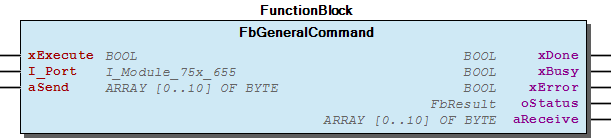
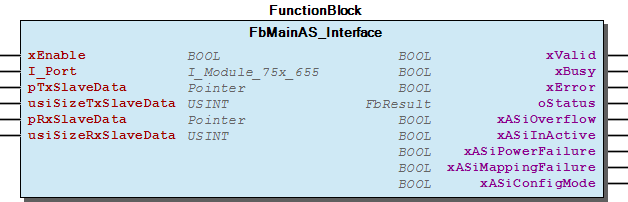
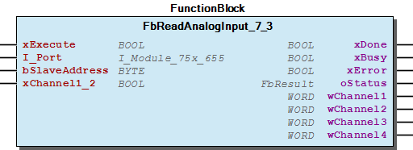
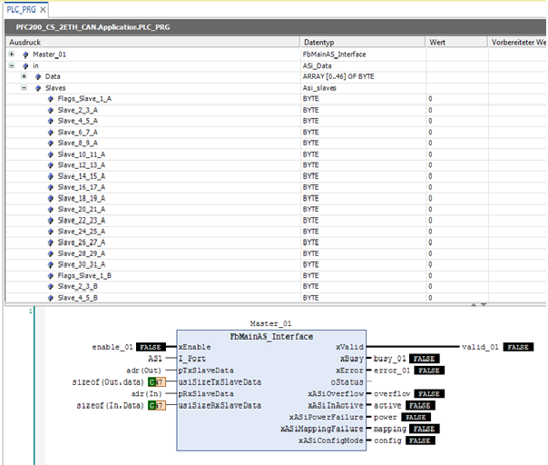

# WagoAppASi v1.7.1.0 (WAGO) - Complete Documentation

## 📋 Library Information

- **Company:** WAGO
- **Title:** WagoAppASi
- **Version:** 1.7.1.0
- **Categories:** WAGO FunctionalView|Device|IO; WAGO LayerView|App; Application
- **Author:** WAGO/u010663
- **Placeholder:** WagoAppASi

### Description ¶

This document is automatically generated. Because of this, the chapter 30 Visualization is not shown in this document. If you are interested in getting to know more about visualization, we refer to the library manager of e!Cockpit.

Handling AS-Interface Module 750-655 and 753-655

The function blocks of this library are NOT thread safe and must be called from one CODESYS task only! Concurrent calls from different tasks may cause loss or corruption of data. [1]

This document is automatically generated. Because of this, the chapter 30 Visualization is not shown in this document. If you are interested in getting to know more about visualization, we refer to the library manager of e!Cockpit. Handling AS-Interface Module 750-655 and 753-655 The function blocks of this library are NOT thread safe and must be called from one CODESYS task only! Concurrent calls from different tasks may cause loss or corruption of data. [1]

### Contents: ¶

Contents: - Documentation Index 10 Documentation - WagoAppASi Library Documentation Project Information Library Information Function Blocks - FbGeneralCommand (FB) - FbMainAS_Interface (FB) - FbReadAnalogInput_7_3 (FB) - doc10_SystemProperties (FB) Program Organization Modular Components Global Variable Lists - Status (GVL) - VersionHistory (GVL) Other Components - 80 Status - ASi_Data (UNION) - ASi_Slaves (STRUCT) - DataTypes - ParameterList (PARAMS) - eStatus (ENUM)

### Indices and tables ¶

| [1] | Based on WagoAppASi.library, last modified 14.01.2019, 18:46:11. The content of this file was automatically generated with None on 14.01.2019, 18:46:13 |

© WAGO Kontakttechnik GmbH & Co. KG, Germany 2018 – All rights reserved. For the avoidance of doubt, this copyright notice does not only apply to the information above but also and primarily to the described library itself. Please note that third-party products are always mentioned without reference to intellectual property rights, including patents, utility models, designs and trademarks, accordingly the existence of such rights cannot be excluded. WAGO is a registered trademark of WAGO Verwaltungsgesellschaft mbH.

- File and Project Information - Library Reference © WAGO Kontakttechnik GmbH & Co. KG, Germany 2018 – All rights reserved. For the avoidance of doubt, this copyright notice does not only apply to the information above but also and primarily to the described library itself. Please note that third-party products are always mentioned without reference to intellectual property rights, including patents, utility models, designs and trademarks, accordingly the existence of such rights cannot be excluded. WAGO is a registered trademark of WAGO Verwaltungsgesellschaft mbH.

### Documentation Index

## 10 Documentation ¶

- doc10_SystemProperties (FB)

## WagoAppASi Library Documentation

| Company: | WAGO |
| Title: | WagoAppASi |
| Version: | 1.7.1.0 |
| Categories: | WAGO FunctionalView\|Device\|IO; WAGO LayerView\|App; Application |
| Author: | WAGO/u010663 |
| Placeholder: | WagoAppASi |

### Description

This document is automatically generated. Because of this, the chapter 30 Visualization is not shown in this document. If you are interested in getting to know more about visualization, we refer to the library manager of e!Cockpit.

Handling AS-Interface Module 750-655 and 753-655

The function blocks of this library are NOT thread safe and must be called from one CODESYS task only! Concurrent calls from different tasks may cause loss or corruption of data. [1]

This document is automatically generated. Because of this, the chapter 30 Visualization is not shown in this document. If you are interested in getting to know more about visualization, we refer to the library manager of e!Cockpit. Handling AS-Interface Module 750-655 and 753-655 The function blocks of this library are NOT thread safe and must be called from one CODESYS task only! Concurrent calls from different tasks may cause loss or corruption of data. [1]

### Contents:

- 10 Documentation doc10_SystemProperties (FB) 20 Program Organization Units - DataTypes - FbMainAS_Interface (FB) - Modular 80 Status - Status (GVL) - eStatus (ENUM) ParameterList (PARAMS) VersionHistory (GVL)

### Indices and tables

| [1] | Based on WagoAppASi.library, last modified 14.01.2019, 18:46:11. The content of this file was automatically generated with None on 14.01.2019, 18:46:13 |

© WAGO Kontakttechnik GmbH & Co. KG, Germany 2018 – All rights reserved. For the avoidance of doubt, this copyright notice does not only apply to the information above but also and primarily to the described library itself. Please note that third-party products are always mentioned without reference to intellectual property rights, including patents, utility models, designs and trademarks, accordingly the existence of such rights cannot be excluded. WAGO is a registered trademark of WAGO Verwaltungsgesellschaft mbH.

- File and Project Information - Library Reference © WAGO Kontakttechnik GmbH & Co. KG, Germany 2018 – All rights reserved. For the avoidance of doubt, this copyright notice does not only apply to the information above but also and primarily to the described library itself. Please note that third-party products are always mentioned without reference to intellectual property rights, including patents, utility models, designs and trademarks, accordingly the existence of such rights cannot be excluded. WAGO is a registered trademark of WAGO Verwaltungsgesellschaft mbH.

### Project Information

## File and Project Information

| Scope | Name | Type | Content |
| --- | --- | --- | --- |
| FileHeader | libraryFile | string | WagoAppASi.library |
| contentFile | WagoAppASi_clr.json |
| productName | e!COCKPIT |
| creationDateTime | date | 14.01.2019, 18:46:13 |
| companyName | string | WAGO |
| ProjectInformation | LastModificationDateTime | date | 14.01.2019, 18:46:11 |
| Description | string | See: Description |
| DocFormat | reStructuredText |
| Author | WAGO/u010663 |
| AutoResolveUnbound | bool | True |
| Placeholder | string | WagoAppASi |
| Company | WAGO |
| Title | WagoAppASi |
| Project | WagoAppASi |
| Copyright | © WAGO Kontakttechnik GmbH & Co. KG, Germany 2018 – All rights reserved. |
| Version | version | 1.7.1.0 |
| Version string | string |  |
| LibraryCategories | library-category-list | WAGO FunctionalView\|Device\|IO; WAGO LayerView\|App; Application |
| ThreadSafe | string | False |

### Library Information

## Library Reference

| LinkAllContent: False QualifiedOnly: False | SystemLibrary: False | Optional: False |

| LinkAllContent: False QualifiedOnly: False | SystemLibrary: False | Optional: False |

| LinkAllContent: False QualifiedOnly: True | SystemLibrary: False | Optional: False |

| LinkAllContent: False QualifiedOnly: True | SystemLibrary: False | Optional: False |

| LinkAllContent: False QualifiedOnly: True | SystemLibrary: False | Optional: False |

This is a dictionary of all referenced libraries and their name spaces.

This is a dictionary of all referenced libraries and their name spaces. WagoSysErrorBase Library Identification : Placeholder: WagoSysErrorBase Default Resolution: WagoSysErrorBase, * (WAGO) Namespace: WagoSysErrorBase Library Properties : WagoSysVersion Library Identification : Name: WagoSysVersion Version: 1.0.0.0 Company: WAGO Namespace: WagoSysVersion Library Properties : WagoTypesErrorBase Library Identification : Placeholder: WagoTypesErrorBase Default Resolution: WagoTypesErrorBase, * (WAGO) Namespace: WagoTypesErrorBase Library Properties : WagoTypesModuleBase Library Identification : Placeholder: WagoTypesModuleBase Default Resolution: WagoTypesModuleBase, * (WAGO) Namespace: WagoTypesModuleBase Library Properties : Library Parameter : Parameter: MAX_MBX_SIZE = 18 WagoTypesModule_75x_655 Library Identification : Placeholder: WagoTypesModule_75x_655 Default Resolution: WagoTypesModule_75x_655, * (WAGO) Namespace: WagoTypesModule_75x_655 Library Properties :

### Function Blocks

## FbGeneralCommand (FB)

| Scope | Name | Type | Comment |
| --- | --- | --- | --- |
| Input | xExecute | BOOL | Execute command |
| I_Port | WagoTypesModule_75x_655.I_Module_75x_655 | Access to the module |
| aSend | ARRAY [0..10] OF BYTE | Command data |
| Output | xDone | BOOL | Comand succesful executed |
| xBusy | BOOL | Command executing in progress |
| xError | BOOL | Command executed with error |
| oStatus | WagoSysErrorBase.FbResult | Detailed status information |
| aReceive | ARRAY [0..10] OF BYTE | Received data in case of a read command |

Perform an ASi command

Graphical Illustration

Function Description

This block allows to perform any ASi command supported by the ASi master module.

The command is to be inserted in the input aSend according to the following definition:

aSend[0]: Opcode

aSend[1]: Address

aSend[2]: data according to Opcode

aSend[3]: data according to Opcode

aSend[..] ...

aSend[9] data according to Opcode

The response will be received in the variable aReceive ,starting at Byte 0

aReceive[0]: data according to Opcode, Byte 3 of mailbox data

aReceive[1]: data according to Opcode, Byte 4 of mailbox data

aReceive[2]: data according to Opcode, Byte 5 of mailbox data

aReceive[3]: data according to Opcode, Byte 6 of mailbox data

aReceive[4]: data according to Opcode, Byte 3 or 7 of mailbox data

aReceive[5]: data according to Opcode, Byte 4 or 8 of mailbox data

aReceive[6]: data according to Opcode, Byte 5 or 9 of mailbox data

aReceive[7]: data according to Opcode, Byte 6 or 10 of mailbox data

This function block must be used to perform any mailbox command mentioned in the manual for the terminal 750-655.

Read analog input from 7.3 analog slave( ID 8) with 6 Byte mailbox length

aSend[0]: 16#50

aSend[1]: 8

aSend[2]: 0

aSend[..] ...

aReceive[0]: high Byte channel 1

aReceive[1]: low Byte channel 1

aReceive[2]: high Byte channel 2

aReceive[3]: low Byte channel 2

aReceive[4]: high Byte channel 3

aReceive[5]: low Byte channel 3

aReceive[6]: high Byte channel 4

aReceive[7]: low Byte channel 4

Interface variables Function Perform an ASi command Graphical Illustration  Function Description This block allows to perform any ASi command supported by the ASi master module. The command is to be inserted in the input aSend according to the following definition: aSend[0]: Opcode aSend[1]: Address aSend[2]: data according to Opcode aSend[3]: data according to Opcode aSend[..] ... aSend[9] data according to Opcode The response will be received in the variable aReceive ,starting at Byte 0 aReceive[0]: data according to Opcode, Byte 3 of mailbox data aReceive[1]: data according to Opcode, Byte 4 of mailbox data aReceive[2]: data according to Opcode, Byte 5 of mailbox data aReceive[3]: data according to Opcode, Byte 6 of mailbox data aReceive[4]: data according to Opcode, Byte 3 or 7 of mailbox data aReceive[5]: data according to Opcode, Byte 4 or 8 of mailbox data aReceive[6]: data according to Opcode, Byte 5 or 9 of mailbox data aReceive[7]: data according to Opcode, Byte 6 or 10 of mailbox data Note This function block must be used to perform any mailbox command mentioned in the manual for the terminal 750-655. Example Read analog input from 7.3 analog slave( ID 8) with 6 Byte mailbox length aSend[0]: 16#50 aSend[1]: 8 aSend[2]: 0 aSend[..] ... aSend[9] 0 aReceive[0]: high Byte channel 1 aReceive[1]: low Byte channel 1 aReceive[2]: high Byte channel 2 aReceive[3]: low Byte channel 2 aReceive[4]: high Byte channel 3 aReceive[5]: low Byte channel 3 aReceive[6]: high Byte channel 4 aReceive[7]: low Byte channel 4

## FbMainAS_Interface (FB)

| Scope | Name | Type | Comment |
| --- | --- | --- | --- |
| Input | xEnable | BOOL | Enable function block |
| I_Port | WagoTypesModule_75x_655.I_Module_75x_655 | Access to the module |
| pTxSlaveData | POINTER TO ARRAY [1..48] OF BYTE | Pointer to the variable, where the transmit data is stored; e.g. ADR(TxData) |
| usiSizeTxSlaveData | USINT | Size of transmit data, sizeof operator recommended; e.g. sizeof(TxData) |
| pRxSlaveData | POINTER TO ARRAY [1..48] OF BYTE | Pointer to the variable, where the received data should be stored; e.g. ADR(RxData) |
| usiSizeRxSlaveData | USINT | Size of receive variable, sizeof operator recommended; e.g. sizeof(RxData) |
| Output | xValid | BOOL | ASi status information valid |
| xBusy | BOOL | Reading configuration is active |
| xError | BOOL | Error occured |
| oStatus | WagoSysErrorBase.FbResult | Detailed Status information |
| xASiOverflow | BOOL | ASi overflow detected |
| xASiInActive | BOOL | ASi inactive |
| xASiPowerFailure | BOOL | ASi power failure detected |
| xASiMappingFailure | BOOL | ASi mapping error detected |
| xASiConfigMode | BOOL | ASi configuration mode active |

Basic access to the data of the AS Interface master module

Graphical Illustration

Function Description

This block provides access to the data of the different AS Interface slaves. If mailbox commands are necessary, function block FbGeneralCommand must be used.

A variable RxData is defined, to show the ASi-slave input data. A variable TxData is defined, to show the ASi-slave output data.

RxData : ASi_Data :

TxData : ASi_Data :

Access to an A-slave with address 4 is done by RxData.slaves.Slave_4_5_A . The high byte nibble provides slave 4 data while the low byte nibble provides slave 5 data.

Interface variables Function Basic access to the data of the AS Interface master module Graphical Illustration  Function Description This block provides access to the data of the different AS Interface slaves. If mailbox commands are necessary, function block FbGeneralCommand must be used. Example A variable RxData is defined, to show the ASi-slave input data. A variable TxData is defined, to show the ASi-slave output data. Var RxData : ASi_Data : TxData : ASi_Data : End_Var Access to an A-slave with address 4 is done by RxData.slaves.Slave_4_5_A . The high byte nibble provides slave 4 data while the low byte nibble provides slave 5 data.

## FbReadAnalogInput_7_3 (FB)

| Scope | Name | Type | Comment |
| --- | --- | --- | --- |
| Input | xExecute | BOOL | Execute reading |
| I_Port | WagoTypesModule_75x_655.I_Module_75x_655 | access to the module |
| bSlaveAddress | BYTE | Slave address |
| xChannel1_2 | BOOL | True->get data from channel 1 and channel 2, False-> get data from channel 3 and channel 4 |
| Output | xDone | BOOL | Data received |
| xBusy | BOOL | Reading in progress |
| xError | BOOL | Error occured |
| oStatus | WagoSysErrorBase.FbResult | Status |
| wChannel1 | WORD | Data channel 1 |
| wChannel2 | WORD | Data channel 2 |
| wChannel3 | WORD | Data channel 3 |
| wChannel4 | WORD | Data channel 4 |

Read input data from a 7.3 ASi Slave

Graphical Illustration

Interface variables Function Read input data from a 7.3 ASi Slave Graphical Illustration 

## doc10_SystemProperties (FB)

Access to ASi slave data is only allowed by FbMainAS_Interface

Use one of the data types ASi_Data or ASi_Slaves to access IO data.

Note Access to ASi slave data is only allowed by FbMainAS_Interface Use one of the data types ASi_Data or ASi_Slaves to access IO data. 

### Program Organization

## 20 Program Organization Units

- DataTypes ASi_Data (UNION) - ASi_Slaves (STRUCT) FbMainAS_Interface (FB) Modular - FbGeneralCommand (FB) - FbReadAnalogInput_7_3 (FB)

### Modular Components

## Modular

- FbGeneralCommand (FB) - FbReadAnalogInput_7_3 (FB)

### Global Variable Lists

## Status (GVL)

| Scope | Name | Type |
| --- | --- | --- |
| Constant | StatusAS_Interface_655 | ARRAY [0..22] OF WagoTypesErrorBase.typResultItem |

| Value | Level | Description |
| --- | --- | --- |
| eStatus.OK | WagoTypesErrorBase.eSeverity.info | ‘OK’ |
| eStatus.FunctionBlockNotEnabled | WagoTypesErrorBase.eSeverity.info | ‘FunctionBlockNotEnabled’ |
| eStatus.InProgress | WagoTypesErrorBase.eSeverity.info | ‘InProgress’ |
| eStatus.Timeout | WagoTypesErrorBase.eSeverity.error | ‘Timeout’ |
| eStatus.ReadingSettings | WagoTypesErrorBase.eSeverity.info | ‘ReadingSettings’ |
| eStatus.WritingSettings | WagoTypesErrorBase.eSeverity.info | ‘WritingSettings’ |
| eStatus.Occupied | WagoTypesErrorBase.eSeverity.info | ‘Occupied’ |
| eStatus.CommandAborted | WagoTypesErrorBase.eSeverity.info | ‘CommandAborted’ |
| eStatus.UndefinedInterface | WagoTypesErrorBase.WagoTypes.eSeverity.error | ‘No interface connected’ |
| eStatus.UndefinedPointerInput | WagoTypesErrorBase.WagoTypes.eSeverity.error | ‘Input not assigned’ |
| eStatus.MBX_HI_NG | WagoTypesErrorBase.eSeverity.error | ‘Host interface not good’ |
| eStatus.MBX_OPCODE | WagoTypesErrorBase.eSeverity.error | ‘Opcode invalid’ |
| eStatus.MBX_LENGTH | WagoTypesErrorBase.eSeverity.error | ‘request to small’ |
| eStatus.MBX_ACCESS | WagoTypesErrorBase.eSeverity.error | ‘no access’ |
| eStatus.MBX_EC_NG | WagoTypesErrorBase.eSeverity.error | ‘general error’ |
| eStatus.MBX_EC_SND | WagoTypesErrorBase.eSeverity.error | ‘slave source address not detected’ |
| eStatus.MBX_EC_SD0 | WagoTypesErrorBase.eSeverity.error | ‘slave 0 detected’ |
| eStatus.MBX_EC_SD2 | WagoTypesErrorBase.eSeverity.error | ‘slave target addr not detected’ |
| eStatus.MBX_EC_DE | WagoTypesErrorBase.eSeverity.error | ‘delete error’ |
| eStatus.MBX_EC_SE | WagoTypesErrorBase.eSeverity.error | ‘set error’ |
| eStatus.MBX_EC_AT | WagoTypesErrorBase.eSeverity.error | ‘address temporary’ |
| eStatus.MBX_EC_ET | WagoTypesErrorBase.eSeverity.error | ‘extended ID temporary’ |
| eStatus.MBX_EC_RE | WagoTypesErrorBase.eSeverity.error | ‘read error’ |

## VersionHistory (GVL)

| Name | Type |
| --- | --- |
| Info | ProjectInfo |

| date | version | author | change |
| 08.01.2019 | 1.7.1.0 | u015842 | Properties: free placeholder added |
| 03.05.2017 | 1.7.0.0 | u010663 | Update to new WagoSysKBusService |
| 21.12.2016 | 1.6.0.4 | u010663 | New Folder 10 Documentation |
| 10.08.2015 | 1.5.0.0 | u010663 | First release |

WagoAppASi.library

Release Notes:

WagoAppASi.library Release Notes:

### Other Components

## 80 Status ¶

- Status (GVL) - eStatus (ENUM)

## ASi_Data (UNION)

| Name | Type |
| --- | --- |
| Data | ARRAY [0..46] OF BYTE |
| Slaves | Asi_slaves |

## ASi_Slaves (STRUCT)

| Name | Type |
| --- | --- |
| Flags_Slave_1_A | BYTE |
| Slave_2_3_A | BYTE |
| Slave_4_5_A | BYTE |
| Slave_6_7_A | BYTE |
| Slave_8_9_A | BYTE |
| Slave_10_11_A | BYTE |
| Slave_12_13_A | BYTE |
| Slave_14_15_A | BYTE |
| Slave_16_17_A | BYTE |
| Slave_18_19_A | BYTE |
| Slave_20_21_A | BYTE |
| Slave_22_23_A | BYTE |
| Slave_24_25_A | BYTE |
| Slave_26_27_A | BYTE |
| Slave_28_29_A | BYTE |
| Slave_30_31_A | BYTE |
| Flags_Slave_1_B | BYTE |
| Slave_2_3_B | BYTE |
| Slave_4_5_B | BYTE |
| Slave_6_7_B | BYTE |
| Slave_8_9_B | BYTE |
| Slave_10_11_B | BYTE |
| Slave_12_13_B | BYTE |
| Slave_14_15_B | BYTE |
| Slave_16_17_B | BYTE |
| Slave_18_19_B | BYTE |
| Slave_20_21_B | BYTE |
| Slave_22_23_B | BYTE |
| Slave_24_25_B | BYTE |
| Slave_26_27_B | BYTE |
| Slave_28_29_B | BYTE |
| Slave_30_31_B | BYTE |

## DataTypes ¶

- ASi_Data (UNION) - ASi_Slaves (STRUCT)

## ParameterList (PARAMS)

| Scope | Name | Type | Initial |
| --- | --- | --- | --- |
| Constant | ASI_MBX_TIMEOUT | TIME | TIME#2s0ms |
| LOGMASK | WORD | 16#3 |

## eStatus (ENUM)

| Name | Initial | Comment |
| --- | --- | --- |
| OK | 0 |  |
| FunctionBlockNotEnabled | 1 |  |
| Timeout | 2 |  |
| InProgress | 3 |  |
| ReadingSettings | 4 |  |
| WritingSettings | 5 |  |
| Occupied | 8 | Module is occupied by another function block, this function block is waiting to get access to the module |
| CommandAborted | 10 | xExecute reset by user before command regular finished |
| UndefinedInterface | 11 | Input I_Port not assigned |
| UndefinedPointerInput | 12 | Input not assigned |
| MBX_HI_NG | 17 | Host interface not good |
| MBX_OPCODE | 18 | Opcode invalid |
| MBX_LENGTH | 19 | request to small |
| MBX_ACCESS | 20 | no access |
| MBX_EC_NG | 33 | general error |
| MBX_EC_SND | 34 | slave source address not detected |
| MBX_EC_SD0 | 35 | slave 0 detected |
| MBX_EC_SD2 | 36 | slave target addr not detected |
| MBX_EC_DE | 37 | delete error |
| MBX_EC_SE | 38 | set error |
| MBX_EC_AT | 39 | address temporary |
| MBX_EC_ET | 40 | extended ID temporary |
| MBX_EC_RE | 41 | read error |

Description: status codes

InOut: Description: status codes