# WagoAppAppLED v1.7.2.2 (WAGO) - Complete Documentation


## 📋 Library Information

- **Company:** WAGO
- **Title:** WagoAppAppLED
- **Version:** 1.7.2.2
- **Categories:** WAGO LayerView|App; Application; WAGO FunctionalView|Device|Controller; WAGO Internal|Feature|Common|AppLED
- **Author:** WAGO / u013972
- **Placeholder:** WagoAppAppLED

### Description ¶


This document is automatically generated.

This library provides an interface for the LEDs which are located on several WAGO PLCs and which may be controlled by the user.

This document is automatically generated. This library provides an interface for the LEDs which are located on several WAGO PLCs and which may be controlled by the user.

### Contents: ¶


Contents: - Documentation Index - Project Information - Library Information - Function Blocks FbAppLED (FB) - FbAppLED_SetBlink (FB) - FbAppLED_SetFlash (FB) - FbAppLED_SetOn (FB) - FbAppLED_SetSequence (FB) - FbAppLED_SetStatic (FB) Methods - FbAppLED.SetBlink (METH) - FbAppLED.SetFlash (METH) - FbAppLED.SetOff (METH) - FbAppLED.SetOn (METH) - FbAppLED.SetSequence (METH) - FbAppLED.SetStatic (METH) - FbAppLED.UpdateSequence (METH) Program Organization Function Groups Base Components Global Variable Lists - ResultItems (GVL) - VersionHistory (GVL) Other Components - 10 Compact - 20 Sequence - 29 Types - 80 Status - eLedMode (ENUM) - typLedSequenceStep (STRUCT)

### Indices and tables ¶


Based on WagoAppAppLED.library, last modified 29.05.2024, 19:53:46. LibDoc 3.5.16.10

© WAGO GmbH & Co. KG, Germany 2018 – All rights reserved. For the avoidance of doubt, this copyright notice does not only apply to the information above but also and primarily to the described library itself. Please note that third-party products are always mentioned without reference to intellectual property rights, including patents, utility models, designs and trademarks, accordingly the existence of such rights cannot be excluded. WAGO is a registered trademark of WAGO Verwaltungsgesellschaft mbH.

- File and Project Information - Library Reference Based on WagoAppAppLED.library, last modified 29.05.2024, 19:53:46. LibDoc 3.5.16.10 © WAGO GmbH & Co. KG, Germany 2018 – All rights reserved. For the avoidance of doubt, this copyright notice does not only apply to the information above but also and primarily to the described library itself. Please note that third-party products are always mentioned without reference to intellectual property rights, including patents, utility models, designs and trademarks, accordingly the existence of such rights cannot be excluded. WAGO is a registered trademark of WAGO Verwaltungsgesellschaft mbH.

### Documentation Index


## WagoAppAppLED Library Documentation


| Company: | WAGO |
| Title: | WagoAppAppLED |
| Version: | 1.7.2.2 |
| Categories: | WAGO LayerView\|App; Application; WAGO FunctionalView\|Device\|Controller; WAGO Internal\|Feature\|Common\|AppLED |
| Author: | WAGO / u013972 |
| Placeholder: | WagoAppAppLED |

### Description


This document is automatically generated.

This library provides an interface for the LEDs which are located on several WAGO PLCs and which may be controlled by the user.

This document is automatically generated. This library provides an interface for the LEDs which are located on several WAGO PLCs and which may be controlled by the user.

### Contents:


- 20 Program Organization Units 10 Compact - 30 Base 29 Types - eLedMode (ENUM) - typLedSequenceStep (STRUCT) 80 Status - ResultItems (GVL) VersionHistory (GVL)

### Indices and tables


Based on WagoAppAppLED.library, last modified 29.05.2024, 19:53:46. LibDoc 3.5.16.10

© WAGO GmbH & Co. KG, Germany 2018 – All rights reserved. For the avoidance of doubt, this copyright notice does not only apply to the information above but also and primarily to the described library itself. Please note that third-party products are always mentioned without reference to intellectual property rights, including patents, utility models, designs and trademarks, accordingly the existence of such rights cannot be excluded. WAGO is a registered trademark of WAGO Verwaltungsgesellschaft mbH.

- File and Project Information - Library Reference Based on WagoAppAppLED.library, last modified 29.05.2024, 19:53:46. LibDoc 3.5.16.10 © WAGO GmbH & Co. KG, Germany 2018 – All rights reserved. For the avoidance of doubt, this copyright notice does not only apply to the information above but also and primarily to the described library itself. Please note that third-party products are always mentioned without reference to intellectual property rights, including patents, utility models, designs and trademarks, accordingly the existence of such rights cannot be excluded. WAGO is a registered trademark of WAGO Verwaltungsgesellschaft mbH.

### Project Information


## File and Project Information


| Scope | Name | Type | Content |
| --- | --- | --- | --- |
| FileHeader | libraryFile | string | WagoAppAppLED.library |
| contentFile | doc.clean.json |
| productName | e!COCKPIT |
| creationDateTime | date | 29.05.2024, 19:53:46 |
| companyName | string | WAGO |
| ProjectInformation | LastModificationDateTime | date | 29.05.2024, 19:53:46 |
| Description | string | See: Description |
| Copyright | © WAGO Kontakttechnik GmbH & Co. KG, Germany 2018 – All rights reserved. |
| Author | WAGO / u013972 |
| AutoResolveUnbound | bool | True |
| Placeholder | string | WagoAppAppLED |
| Company | WAGO |
| DocFormat | reStructuredText |
| Project | WagoAppAppLED |
| DefaultNamespace |  |
| Version | version | 1.7.2.2 |
| Title | string | WagoAppAppLED |
| LibraryCategories | library-category-list | WAGO LayerView\|App; Application; WAGO FunctionalView\|Device\|Controller; WAGO Internal\|Feature\|Common\|AppLED |
| CompiledLibraryCompatibilityVersion | string | CODESYS V3.5 SP16 Patch 3 |

### Library Information


## Library Reference


| LinkAllContent: False Optional: False | QualifiedOnly: False SystemLibrary: False | PublishSymbolsInContainer: True |

| LinkAllContent: False QualifiedOnly: False | SystemLibrary: False | Optional: False |

| LinkAllContent: False QualifiedOnly: False | SystemLibrary: False | Optional: False |

| LinkAllContent: False Optional: False | QualifiedOnly: False SystemLibrary: False | PublishSymbolsInContainer: True |

| LinkAllContent: False QualifiedOnly: False | SystemLibrary: False | Optional: False |

| LinkAllContent: False Optional: False | QualifiedOnly: False SystemLibrary: False | PublishSymbolsInContainer: True |

| LinkAllContent: False QualifiedOnly: False | SystemLibrary: False | Optional: False |

This is a dictionary of all referenced libraries and their name spaces.

This is a dictionary of all referenced libraries and their name spaces. WagoSysAppLED_Internal_PFC Library Identification : Placeholder: WagoSysAppLedInternal Default Resolution: WagoSysAppLED_Internal_PFC, * (WAGO) Namespace: WagoSysAppLedInternal Library Properties : WagoSysBehaviourModels Library Identification : Placeholder: WagoSysBehaviourModels Default Resolution: WagoSysBehaviourModels, * (WAGO) Namespace: WagoSysBehaviourModels Library Properties : WagoSysErrorBase Library Identification : Placeholder: WagoSysErrorBase Default Resolution: WagoSysErrorBase, * (WAGO) Namespace: WagoSysErrorBase Library Properties : WagoSysStandard Library Identification : Placeholder: WagoSysStandard Default Resolution: WagoSysStandard, * (WAGO) Namespace: WagoSysStandard Library Properties : WagoSysVersion Library Identification : Name: WagoSysVersion Version: 1.0.0.0 Company: WAGO Namespace: WagoSysVersion Library Properties : WagoTypesAppLED Library Identification : Placeholder: WagoTypesAppLED Default Resolution: WagoTypesAppLED, * (WAGO) Namespace: WagoTypesAppLED Library Properties : WagoTypesCommon Library Identification : Placeholder: WagoTypesCommon Default Resolution: WagoTypesCommon, * (WAGO) Namespace: WagoTypes Library Properties : Library Parameter : Parameter: MAX_STRING_LENGTH = 255 Parameter: MAX_WSTRING_LENGTH = 255

### Function Blocks


## FbAppLED (FB)


| Scope | Name | Type | Comment | Inherited from |
| --- | --- | --- | --- | --- |
| Output | oStatus | FbResult | Status object (see WagoSysErrorBase). | FbBehaviourModel_oStatus_Base |
| Input | xOpen | BOOL | Desired channel state (open=TRUE, closed=FALSE) | FbBehaviourModel_WagoAppChannel |
| Output | xError | BOOL | Feedback: an Error has occurred. | FbBehaviourModel_WagoAppChannel |
| xIsOpen | BOOL | Feedback: channel is operative. | FbBehaviourModel_WagoAppChannel |
| xIsIdle | BOOL | Feedback: channel is clear for new opening. | FbBehaviourModel_WagoAppChannel |
| Input | eID | WagoTypesAppLED.eLedID | The LED which is handled here |  |
| Output | eMode | eLedMode | Current operation mode of this LED |  |
| xBusy | BOOL | Active state of Flash or other transient states. |  |

| eStatus |
| 0 | Success |
| ENOENT | The desired LED-ID does not exist on this PLC |

```
VAR
    MyLED : FbAppLED;              // the instance for controlling an LED
    MyOtherLED : FbAppLED;         // another LED
END_VAR

MyLED(eID:=eLedID.AppLED_5, xOpen:=TRUE );    // cyclic operation, handling App LED #5

MyLED.SetStatic(eLedColor.Red);     // switch it on
MyLED.SetStatic(eLedColor.Off);     // switch it off

MyLED.SetFlash(T#1s,eLedColor.Red, eLedColor.Green);  // initiate a 1s-pulse

IF NOT MyLED.xBusy THEN ...         // wait for the flash pulse to terminate
```

The Function Blocks FbAppLED provides access to one of the App-LEDs of the controller in various operating modes.

Graphical Illustration

Function Description

This Fb implements the behaviour model WagoChannel in order to coordinate access to the LEDs from different places within the application program. A TRUE state at the input xOpen opens the access to the LED and a FALSE state closes it again. (For a general description of this model, please refer to FbBehaviourModel_WagoChannel ).

Before using a App-LED, the ID of the App LED has to be passed to the input FbAppLED.eID . While using a App-LED, the xOpen -Input has to be kept TRUE . If eID denotes an LED which does not exist on the given hardware, the result code ENOENT and xError=TRUE appears at the status output.

The FB signals its operational state with its output xIsOpen .

The operation mode of an LED can be altered anytime the FB is open. If this change of operation mode is likely to give misleading LED signals to the user (e.g. because a sequence or a flash is in progress) this situation is indicated with the output xBusy . Nevertheless, this is a just warning, which may be overridden by the application.

If xOpen returns to FALSE again, the access to the LED is cut. Please note that the state of the LED itself ( on or off ) remains unchanged.

If it is desired to switch the LED to any default states at opening or closing, the user is advised to derive his own FB from this base and place this specialized functionality into his overloaded methods protOpen and protClose which are inherited from the base model WagoAppChannel .

Interface variables Function The Function Blocks FbAppLED provides access to one of the App-LEDs of the controller in various operating modes. Graphical Illustration 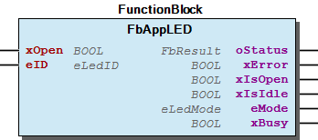 Function Description This Fb implements the behaviour model WagoChannel in order to coordinate access to the LEDs from different places within the application program. A TRUE state at the input xOpen opens the access to the LED and a FALSE state closes it again. (For a general description of this model, please refer to FbBehaviourModel_WagoChannel ). Before using a App-LED, the ID of the App LED has to be passed to the input FbAppLED.eID . While using a App-LED, the xOpen -Input has to be kept TRUE . If eID denotes an LED which does not exist on the given hardware, the result code ENOENT and xError=TRUE appears at the status output. The FB signals its operational state with its output xIsOpen . The operation mode of an LED can be altered anytime the FB is open. If this change of operation mode is likely to give misleading LED signals to the user (e.g. because a sequence or a flash is in progress) this situation is indicated with the output xBusy . Nevertheless, this is a just warning, which may be overridden by the application. If xOpen returns to FALSE again, the access to the LED is cut. Please note that the state of the LED itself ( on or off ) remains unchanged. Note If it is desired to switch the LED to any default states at opening or closing, the user is advised to derive his own FB from this base and place this specialized functionality into his overloaded methods protOpen and protClose which are inherited from the base model WagoAppChannel . Example - 10 Main Functions FbAppLED.SetBlink (METH) - FbAppLED.SetFlash (METH) - FbAppLED.SetOff (METH) - FbAppLED.SetOn (METH) - FbAppLED.SetStatic (METH) 20 Sequence - FbAppLED.SetSequence (METH) - FbAppLED.UpdateSequence (METH)

## FbAppLED_SetBlink (FB)


| Scope | Name | Type | Comment | Inherited from |
| --- | --- | --- | --- | --- |
| Output | oStatus | FbResult | Status object (see WagoSysErrorBase). | FbBehaviourModel_oStatus_Base |
| Input | xEnable | BOOL | Enables the operation. | FbBehaviourModel_WagoAppEnable |
| Output | xError | BOOL | Indicates that an Error has occurred. | FbBehaviourModel_WagoAppEnable |
| xValid | BOOL | Indicates that Data is valid. | FbBehaviourModel_WagoAppEnable |
| xBusy | BOOL | Indicates that the FB is working. | FbBehaviourModel_WagoAppEnable |
| Input | eLedID | WagoTypesAppLED.eLedID | The LED which is handled here |  |
| tTime1 | TIME | On-time for first state |  |
| tTime2 | TIME | On-time for second state |  |
| eLedColor1 | WagoTypesAppLED.eLedColor | Color in first state |  |
| eLedColor2 | WagoTypesAppLED.eLedColor | Color in second state |  |

| result codes |
| 0 | Success |
| ENOENT | The desired LED-ID does not exist on this PLC |
| EBADR | Requested Color is not supported |
| EINVAL | invalid parameters |

The functionblock FbAppLED_SetBlink_cpt() makes the LED toggle periodically between two colors.

Graphical Illustration

Function description

If xEnable true, then eColor1 is displayed for the duration tTime1 . After that on-time has elapsed, the second color ( eColor2 ) appears for a duration of tTime2 . After that second time, this process repeats with eColor1 . A falling edge at xEnable stop the execution and switch off th LED, for a new execution or a parameter change a rising edge at xEnable is necessary.

The stauts output xBusy is set, while xEnable is set and the functionblock is still in progress. The status output xValid indicate a successful operation, it will be rest with a falling edge at xEnable . The status output xError indicate a problem in the execution of the functionblock, it will be reset one cycle after xBusy was reset.

On error, no change of the LED state takes place.

For the PFCX00-System are only the Colors Green, Red and Yello supported.

Interface variables Function The functionblock FbAppLED_SetBlink_cpt() makes the LED toggle periodically between two colors. Graphical Illustration 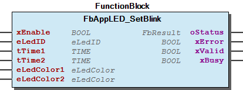 Function description If xEnable true, then eColor1 is displayed for the duration tTime1 . After that on-time has elapsed, the second color ( eColor2 ) appears for a duration of tTime2 . After that second time, this process repeats with eColor1 . A falling edge at xEnable stop the execution and switch off th LED, for a new execution or a parameter change a rising edge at xEnable is necessary. The stauts output xBusy is set, while xEnable is set and the functionblock is still in progress. The status output xValid indicate a successful operation, it will be rest with a falling edge at xEnable . The status output xError indicate a problem in the execution of the functionblock, it will be reset one cycle after xBusy was reset. 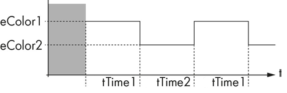 On error, no change of the LED state takes place. Note For the PFCX00-System are only the Colors Green, Red and Yello supported.

## FbAppLED_SetFlash (FB)


| Scope | Name | Type | Comment | Inherited from |
| --- | --- | --- | --- | --- |
| Output | oStatus | FbResult | Status object (see WagoSysErrorBase). | FbBehaviourModel_oStatus_Base |
| Input | xEnable | BOOL | Enables the operation. | FbBehaviourModel_WagoAppEnable |
| Output | xError | BOOL | Indicates that an Error has occurred. | FbBehaviourModel_WagoAppEnable |
| xValid | BOOL | Indicates that Data is valid. | FbBehaviourModel_WagoAppEnable |
| xBusy | BOOL | Indicates that the FB is working. | FbBehaviourModel_WagoAppEnable |
| Input | eLedID | WagoTypesAppLED.eLedID | The LED which is handled here |  |
| tFlashTime | TIME | On-time for first state |  |
| eLedColor1 | WagoTypesAppLED.eLedColor | Color in first state |  |
| eLedColor2 | WagoTypesAppLED.eLedColor | Color in succeeding state |  |

| result codes |
| 0 | Success |
| EBADF | The Fb is not in the Open (=Enabled) state |
| EBADR | Requested Color is not suported |
| EINVAL | Invalid parameters |

The functionblock FbAppLED_SetFlash_cpt() displays a color for a short time and displays a second color statically afterwards.

Graphical Illustration

Function description

If xEnable true, then the color of this ‘flash’ is given by eColor1 and its duration is given by tFlashTime . After tFlashTime has elapsed, the LED displays the other color eColor2 (which may be a visible color as well as simply off ). A falling edge at xEnable stop the execution and switch off th LED, for a new execution or a parameter change a rising edge at xEnable is necessary.

The stauts output xBusy is set, while xEnable is set and the functionblock is still in progress. The status output xValid indicate a successful operation, it will be rest with a falling edge at xEnable . The status output xError indicate a problem in the execution of the functionblock, it will be reset one cycle after xBusy was reset.

While the first phase of the flash is in progress, the xBusy -Output of the FB is TRUE .

When applying this function while the LED is still ‘flash’ing, the flash time will be retriggered.

When the flash time is expired, the LED transits into the static mode.

Some legacy libraries require the LED to be driven into in certain other operating modes (namely ‘static’) before the LED could be driven to flash mode. This FB, however, has no such restriction.

On error, no change of the LED state takes place.

For the PFCX00-System are only the Colors Green, Red and Yello supported.

Interface variables Function The functionblock FbAppLED_SetFlash_cpt() displays a color for a short time and displays a second color statically afterwards. Graphical Illustration 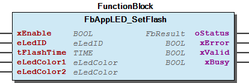 Function description If xEnable true, then the color of this ‘flash’ is given by eColor1 and its duration is given by tFlashTime . After tFlashTime has elapsed, the LED displays the other color eColor2 (which may be a visible color as well as simply off ). A falling edge at xEnable stop the execution and switch off th LED, for a new execution or a parameter change a rising edge at xEnable is necessary. The stauts output xBusy is set, while xEnable is set and the functionblock is still in progress. The status output xValid indicate a successful operation, it will be rest with a falling edge at xEnable . The status output xError indicate a problem in the execution of the functionblock, it will be reset one cycle after xBusy was reset. 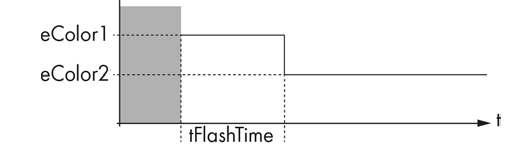 While the first phase of the flash is in progress, the xBusy -Output of the FB is TRUE . When applying this function while the LED is still ‘flash’ing, the flash time will be retriggered. When the flash time is expired, the LED transits into the static mode. Note Some legacy libraries require the LED to be driven into in certain other operating modes (namely ‘static’) before the LED could be driven to flash mode. This FB, however, has no such restriction. On error, no change of the LED state takes place. Note For the PFCX00-System are only the Colors Green, Red and Yello supported.

## FbAppLED_SetOn (FB)


| Scope | Name | Type | Comment | Inherited from |
| --- | --- | --- | --- | --- |
| Output | oStatus | FbResult | Status object (see WagoSysErrorBase). | FbBehaviourModel_oStatus_Base |
| Input | xEnable | BOOL | Enables the operation. | FbBehaviourModel_WagoAppEnable |
| Output | xError | BOOL | Indicates that an Error has occurred. | FbBehaviourModel_WagoAppEnable |
| xValid | BOOL | Indicates that Data is valid. | FbBehaviourModel_WagoAppEnable |
| xBusy | BOOL | Indicates that the FB is working. | FbBehaviourModel_WagoAppEnable |
| Input | eLedID | WagoTypesAppLED.eLedID | The LED which is handled here |  |

| result codes |
| 0 | Success |
| EBADF | The FB is not in the Open (=Enabled) state |

The functionblock FbAppLED_SetOn_cpt() switches the LED to a device specific color which is guaranteed to be visible.

Graphical Illustration

Function Description

This functionblock is similar to FbAppLED_SetStatic_cpt() , but it guarantees that the LED will turn on in some default color. When using FbAppLED_SetStatic_cpt() in contrast, the user may select the color, but the LED will not turn on if he selects a color which cannot be displayed (e.g. blue on a red-green-LED). A falling edge at xEnable stop the execution and switch off th LED, for a new execution or a parameter change a rising edge at xEnable is necessary.

The stauts output xBusy is set, while xEnable is set and the functionblock is still in progress. The status output xValid indicate a successful operation, it will be rest with a falling edge at xEnable . The status output xError indicate a problem in the execution of the functionblock, it will be reset one cycle after xBusy was reset.

Which color is used as default color depends on the target hardware and on the type of the LED. It is hardcoded in the target depending internal libraries and cannot be changed by the user. It is ensured that the default color is visible for the addressed target hardware.

On error, no change of the LED state takes place.

For the PFCX00-System are only the Colors Green, Red and Yello supported.

Interface variables Function The functionblock FbAppLED_SetOn_cpt() switches the LED to a device specific color which is guaranteed to be visible. Graphical Illustration 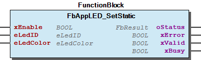 Function Description This functionblock is similar to FbAppLED_SetStatic_cpt() , but it guarantees that the LED will turn on in some default color. When using FbAppLED_SetStatic_cpt() in contrast, the user may select the color, but the LED will not turn on if he selects a color which cannot be displayed (e.g. blue on a red-green-LED). A falling edge at xEnable stop the execution and switch off th LED, for a new execution or a parameter change a rising edge at xEnable is necessary. The stauts output xBusy is set, while xEnable is set and the functionblock is still in progress. The status output xValid indicate a successful operation, it will be rest with a falling edge at xEnable . The status output xError indicate a problem in the execution of the functionblock, it will be reset one cycle after xBusy was reset. Note Which color is used as default color depends on the target hardware and on the type of the LED. It is hardcoded in the target depending internal libraries and cannot be changed by the user. It is ensured that the default color is visible for the addressed target hardware. On error, no change of the LED state takes place. Note For the PFCX00-System are only the Colors Green, Red and Yello supported.

## FbAppLED_SetSequence (FB)


| Scope | Name | Type | Comment | Inherited from |
| --- | --- | --- | --- | --- |
| Output | oStatus | FbResult | Status object (see WagoSysErrorBase). | FbBehaviourModel_oStatus_Base |
| Input | xEnable | BOOL | Enables the operation. | FbBehaviourModel_WagoAppEnable |
| Output | xError | BOOL | Indicates that an Error has occurred. | FbBehaviourModel_WagoAppEnable |
| xValid | BOOL | Indicates that Data is valid. | FbBehaviourModel_WagoAppEnable |
| xBusy | BOOL | Indicates that the FB is working. | FbBehaviourModel_WagoAppEnable |
| Input | eLedID | WagoTypesAppLED.eLedID | The LED which is handled here |  |
| pSequence | POINTER TO ARRAY [0..0] OF typLedSequenceStep | List of steps of the sequence |  |
| udiSequenceSize | UDINT | Number of steps |  |

| result codes |
| 0 | Success |
| EBADF | The Fb is not in the Open (=Enabled) state |
| EBADR | Requested Color is not suported |
| EINVAL | Illegal sequence description or no sequence given |

The functionblock FbAppLED_SetSequence_cpt() starts the display of a blink code for indicating a specific status or error condition.

Graphical Illustration

Function description

Each pulse of the sequence has an individually settable duration and color. If off-phases are required between the pulses, these off-phases have to be represented by an individual sequence step with color off .

The input pSequence points to an array of sequence steps ( typLedSequenceStep (STRUCT) ). This array has a variable length which is denoted by udiSequenceSize . When a sequence step carries a duration of 0, this also denotes the end of the sequence, even if udiSequenceSize indicates more steps.

Once initiated, the sequence cannot be altered - but it can be stopped or restarted instead. While the sequence is in progress, the xBusy -Output of the FB is TRUE .

After the sequence has terminated, the LED transits to the static mode and displays the color of the last sequence step (i.e. the one with T#0s , when the sequence contains such a step).

A falling edge at xEnable stop the execution and switch off th LED, for a new execution or a parameter change a rising edge at xEnable is necessary.

The stauts output xBusy is set, while xEnable is set and the functionblock is still in progress. The status output xValid indicate a successful operation, it will be rest with a falling edge at xEnable . The status output xError indicate a problem in the execution of the functionblock, it will be reset one cycle after xBusy was reset.

For the PFCX00-System are only the Colors Green, Red and Yello supported.

Interface variables Function The functionblock FbAppLED_SetSequence_cpt() starts the display of a blink code for indicating a specific status or error condition. Graphical Illustration 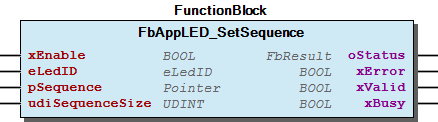 Function description Each pulse of the sequence has an individually settable duration and color. If off-phases are required between the pulses, these off-phases have to be represented by an individual sequence step with color off . The input pSequence points to an array of sequence steps ( typLedSequenceStep (STRUCT) ). This array has a variable length which is denoted by udiSequenceSize . When a sequence step carries a duration of 0, this also denotes the end of the sequence, even if udiSequenceSize indicates more steps. Once initiated, the sequence cannot be altered - but it can be stopped or restarted instead. While the sequence is in progress, the xBusy -Output of the FB is TRUE . After the sequence has terminated, the LED transits to the static mode and displays the color of the last sequence step (i.e. the one with T#0s , when the sequence contains such a step). A falling edge at xEnable stop the execution and switch off th LED, for a new execution or a parameter change a rising edge at xEnable is necessary. The stauts output xBusy is set, while xEnable is set and the functionblock is still in progress. The status output xValid indicate a successful operation, it will be rest with a falling edge at xEnable . The status output xError indicate a problem in the execution of the functionblock, it will be reset one cycle after xBusy was reset. Note For the PFCX00-System are only the Colors Green, Red and Yello supported.

## FbAppLED_SetStatic (FB)


| Scope | Name | Type | Comment | Inherited from |
| --- | --- | --- | --- | --- |
| Output | oStatus | FbResult | Status object (see WagoSysErrorBase). | FbBehaviourModel_oStatus_Base |
| Input | xEnable | BOOL | Enables the operation. | FbBehaviourModel_WagoAppEnable |
| Output | xError | BOOL | Indicates that an Error has occurred. | FbBehaviourModel_WagoAppEnable |
| xValid | BOOL | Indicates that Data is valid. | FbBehaviourModel_WagoAppEnable |
| xBusy | BOOL | Indicates that the FB is working. | FbBehaviourModel_WagoAppEnable |
| Input | eLedID | WagoTypesAppLED.eLedID | The LED which is handled here |  |
| eLedColor | WagoTypesAppLED.eLedColor | Desired color of the LED (or ‘off’). |  |

| result codes |
| 0 | Success |
| EBADF | The Fb is not in the Open (=Enabled) state |
| EBADR | Requested Color is not suported |
| EINVAL | invalid arguments |

The functionblock FbAppLED_SetStatic_cpt() makes the LED continuosly display a given color or switches the LED off.

Graphical Illustration

Function Description

If the requested color is not supported by the hardware, this method fails with EBADR (‘Bad Request’); A falling edge at xEnable stop the execution and switch off th LED, for a new execution or a parameter change a rising edge at xEnable is necessary.

The stauts output xBusy is set, while xEnable is set and the functionblock is still in progress. The status output xValid indicate a successful operation, it will be rest with a falling edge at xEnable . The status output xError indicate a problem in the execution of the functionblock, it will be reset one cycle after xBusy was reset.

For the PFCX00-System are only the Colors Green, Red and Yello supported.

Interface variables Function The functionblock FbAppLED_SetStatic_cpt() makes the LED continuosly display a given color or switches the LED off. Graphical Illustration  Function Description If the requested color is not supported by the hardware, this method fails with EBADR (‘Bad Request’); A falling edge at xEnable stop the execution and switch off th LED, for a new execution or a parameter change a rising edge at xEnable is necessary. The stauts output xBusy is set, while xEnable is set and the functionblock is still in progress. The status output xValid indicate a successful operation, it will be rest with a falling edge at xEnable . The status output xError indicate a problem in the execution of the functionblock, it will be reset one cycle after xBusy was reset. Note For the PFCX00-System are only the Colors Green, Red and Yello supported.

### Methods


## FbAppLED.SetBlink (METH)


| Scope | Name | Type | Comment |
| --- | --- | --- | --- |
| Return | SetBlink | WagoTypes.eResultCode |  |
| Input | tTime1 | TIME | On-time for first state |
| tTime2 | TIME | On-time for second state |
| eColor1 | WagoTypesAppLED.eLedColor | Color in first state |
| eColor2 | WagoTypesAppLED.eLedColor | Color in second state |

| result codes |
| 0 | Success |
| EBADF | The Fb is not in the Open (=Enabled) state |
| EBADR | Requested Color is not supported |
| EINVAL | invalid parameters |

The method SetBlink() makes the LED toggle periodically between two colors.

Graphical Illustration

Function description

In the beginning, eColor1 is displayed for the duration tTime1 . After that on-time has elapsed, the second color ( eColor2 ) appears for a duration of tTime2 . After that second time, this process repeats with eColor1 .

On error, no change of the LED state takes place.

For the PFCX00-System are only the Colors Green, Red and Yello supported.

Interface variables Function The method SetBlink() makes the LED toggle periodically between two colors. Graphical Illustration 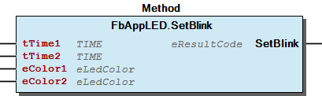 Function description In the beginning, eColor1 is displayed for the duration tTime1 . After that on-time has elapsed, the second color ( eColor2 ) appears for a duration of tTime2 . After that second time, this process repeats with eColor1 .  On error, no change of the LED state takes place. Note For the PFCX00-System are only the Colors Green, Red and Yello supported.

## FbAppLED.SetFlash (METH)


| Scope | Name | Type | Comment |
| --- | --- | --- | --- |
| Return | SetFlash | WagoTypes.eResultCode |  |
| Input | tFlashTime | TIME | On-time for first state |
| eColor1 | WagoTypesAppLED.eLedColor | Color in first state |
| eColor2 | WagoTypesAppLED.eLedColor | Color in succeeding state |

| result codes |
| 0 | Success |
| EBADF | The Fb is not in the Open (=Enabled) state |
| EBADR | Requested Color is not suported |
| EINVAL | Invalid parameters |

The method SetFlash() displays a color for a short time and displays a second color statically afterwards.

Graphical Illustration

Function description

The color of this ‘flash’ is given by eColor1 and its duration is given by tFlashTime . After tFlashTime has elapsed, the LED displays the other color eColor2 (which may be a visible color as well as simply off ).

While the first phase of the flash is in progress, the xBusy -Output of the FB is TRUE .

When applying this function while the LED is still ‘flash’ing, the flash time will be retriggered.

When the flash time is expired, the LED transits into the static mode.

Some legacy libraries require the LED to be driven into in certain other operating modes (namely ‘static’) before the LED could be driven to flash mode. This FB, however, has no such restriction.

On error, no change of the LED state takes place.

For the PFCX00-System are only the Colors Green, Red and Yello supported.

Interface variables Function The method SetFlash() displays a color for a short time and displays a second color statically afterwards. Graphical Illustration 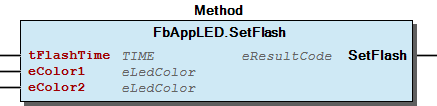 Function description The color of this ‘flash’ is given by eColor1 and its duration is given by tFlashTime . After tFlashTime has elapsed, the LED displays the other color eColor2 (which may be a visible color as well as simply off ).  While the first phase of the flash is in progress, the xBusy -Output of the FB is TRUE . When applying this function while the LED is still ‘flash’ing, the flash time will be retriggered. When the flash time is expired, the LED transits into the static mode. Note Some legacy libraries require the LED to be driven into in certain other operating modes (namely ‘static’) before the LED could be driven to flash mode. This FB, however, has no such restriction. On error, no change of the LED state takes place. Note For the PFCX00-System are only the Colors Green, Red and Yello supported.

## FbAppLED.SetOff (METH)


| Scope | Name | Type |
| --- | --- | --- |
| Return | SetOff | WagoTypes.eResultCode |

| result codes |
| 0 | Success |
| EBADF | The Fb is not in the Open (=Enabled) state |

The method SetOff() sets the LED to a static off operating state. In case of any errors, no change of the LED state takes place.

Graphical Illustration

Function Description

For the PFCX00-System are only the Colors Green, Red and Yello supported.

Interface variables Function The method SetOff() sets the LED to a static off operating state. In case of any errors, no change of the LED state takes place. Graphical Illustration 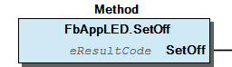 Function Description Note For the PFCX00-System are only the Colors Green, Red and Yello supported.

## FbAppLED.SetOn (METH)


| Scope | Name | Type |
| --- | --- | --- |
| Return | SetOn | WagoTypes.eResultCode |

| result codes |
| 0 | Success |
| EBADF | The FB is not in the Open (=Enabled) state |

The method SetOn() switches the LED to a device specific color which is guaranteed to be visible.

Graphical Illustration

Function Description

This method is similar to setStatic() , but it guarantees that the LED will turn on in some default color. When using setStatic() in contrast, the user may select the color, but the LED will not turn on if he selects a color which cannot be displayed (e.g. blue on a red-green-LED).

Which color is used as default color depends on the target hardware and on the type of the LED. It is hardcoded in the target depending internal libraries and cannot be changed by the user. It is ensured that the default color is visible for the addressed target hardware.

On error, no change of the LED state takes place.

For the PFCX00-System are only the Colors Green, Red and Yello supported.

Interface variables Function The method SetOn() switches the LED to a device specific color which is guaranteed to be visible. Graphical Illustration 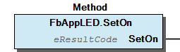 Function Description This method is similar to setStatic() , but it guarantees that the LED will turn on in some default color. When using setStatic() in contrast, the user may select the color, but the LED will not turn on if he selects a color which cannot be displayed (e.g. blue on a red-green-LED). Note Which color is used as default color depends on the target hardware and on the type of the LED. It is hardcoded in the target depending internal libraries and cannot be changed by the user. It is ensured that the default color is visible for the addressed target hardware. On error, no change of the LED state takes place. Note For the PFCX00-System are only the Colors Green, Red and Yello supported.

## FbAppLED.SetSequence (METH)


| Scope | Name | Type | Comment |
| --- | --- | --- | --- |
| Return | SetSequence | WagoTypes.eResultCode |  |
| Input | pSequence | POINTER TO ARRAY [0..0] OF typLedSequenceStep | List of steps of the sequence |
| udiSequenceSize | UDINT | Number of steps |

| result codes |
| 0 | Success |
| EBADF | The Fb is not in the Open (=Enabled) state |
| EBADR | Requested Color is not suported |
| EINVAL | Illegal sequence description or no sequence given |

The method SetSequence() starts the display of a blink code for indicating a specific status or error condition.

Graphical Illustration

Function description

Each pulse of the sequence has an individually settable duration and color. If off-phases are required between the pulses, these off-phases have to be represented by an individual sequence step with color off .

The input pSequence points to an array of sequence steps ( typLedSequenceStep (STRUCT) ). This array has a variable length which is denoted by udiSequenceSize . When a sequence step carries a duration of 0, this also denotes the end of the sequence, even if udiSequenceSize indicates more steps.

Once initiated, the sequence cannot be altered - but it can be stopped or restarted instead. While the sequence is in progress, the xBusy -Output of the FB is TRUE .

After the sequence has terminated, the LED transits to the static mode and displays the color of the last sequence step (i.e. the one with T#0s , when the sequence contains such a step).

For the PFCX00-System are only the Colors Green, Red and Yello supported.

Interface variables Function The method SetSequence() starts the display of a blink code for indicating a specific status or error condition. Graphical Illustration 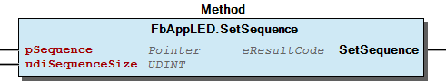 Function description Each pulse of the sequence has an individually settable duration and color. If off-phases are required between the pulses, these off-phases have to be represented by an individual sequence step with color off . The input pSequence points to an array of sequence steps ( typLedSequenceStep (STRUCT) ). This array has a variable length which is denoted by udiSequenceSize . When a sequence step carries a duration of 0, this also denotes the end of the sequence, even if udiSequenceSize indicates more steps. Once initiated, the sequence cannot be altered - but it can be stopped or restarted instead. While the sequence is in progress, the xBusy -Output of the FB is TRUE . After the sequence has terminated, the LED transits to the static mode and displays the color of the last sequence step (i.e. the one with T#0s , when the sequence contains such a step). Note For the PFCX00-System are only the Colors Green, Red and Yello supported.

## FbAppLED.SetStatic (METH)


| Scope | Name | Type | Comment |
| --- | --- | --- | --- |
| Return | SetStatic | WagoTypes.eResultCode |  |
| Input | eColor | WagoTypesAppLED.eLedColor | Desired color of the LED (or ‘off’). |

| result codes |
| 0 | Success |
| EBADF | The Fb is not in the Open (=Enabled) state |
| EBADR | Requested Color is not suported |
| EINVAL | invalid arguments |

The method SetStatic() makes the LED continuosly display a given color or switches the LED off.

Graphical Illustration

Function Description

If the requested color is not supported by the hardware, this method fails with EBADR (‘Bad Request’);

On error, no change of the LED state takes place.

For the PFCX00-System are only the Colors Green, Red and Yello supported.

Interface variables Function The method SetStatic() makes the LED continuosly display a given color or switches the LED off. Graphical Illustration 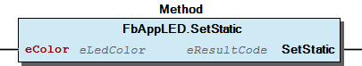 Function Description If the requested color is not supported by the hardware, this method fails with EBADR (‘Bad Request’); On error, no change of the LED state takes place. Note For the PFCX00-System are only the Colors Green, Red and Yello supported.

## FbAppLED.UpdateSequence (METH)


| Scope | Name | Type | Comment |
| --- | --- | --- | --- |
| Input | pSequence | POINTER TO ARRAY [0..0] OF typLedSequenceStep | List of steps of the sequence |
| xAbort | BOOL | TRUE aborts the sequence |

The method UpdateSequence() assigns a new typLedSequenceStep -pointer to the FbAppLED while the blink sequence is still in progress.

Graphical Illustration

Function description

If a null pointer is given for the new sequence address, the sequence will be aborted.

This method does not fail and thus does not return any result code. It may also be called while no sequence is in progress, but it has no immediate effect then until the new sequence starts.

This method must be called at Online-Change by the embedding FB it it uses blink sequences, because at Online-Change absolute locations may change and pointers have to be updated afterwards.

This Method may be called even if the FB is not open, because it does not initiate any action.

For the PFCX00-System are only the Colors Green, Red and Yello supported.

Interface variables Function The method UpdateSequence() assigns a new typLedSequenceStep -pointer to the FbAppLED while the blink sequence is still in progress. Graphical Illustration 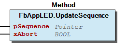 Function description If a null pointer is given for the new sequence address, the sequence will be aborted. This method does not fail and thus does not return any result code. It may also be called while no sequence is in progress, but it has no immediate effect then until the new sequence starts. Note This method must be called at Online-Change by the embedding FB it it uses blink sequences, because at Online-Change absolute locations may change and pointers have to be updated afterwards. Note This Method may be called even if the FB is not open, because it does not initiate any action. Note For the PFCX00-System are only the Colors Green, Red and Yello supported.

### Program Organization


## 20 Program Organization Units


- 10 Compact FbAppLED_SetBlink (FB) - FbAppLED_SetFlash (FB) - FbAppLED_SetOn (FB) - FbAppLED_SetSequence (FB) - FbAppLED_SetStatic (FB) 30 Base - FbAppLED (FB) 10 Main Functions FbAppLED.SetBlink (METH) - FbAppLED.SetFlash (METH) - FbAppLED.SetOff (METH) - FbAppLED.SetOn (METH) - FbAppLED.SetStatic (METH) 20 Sequence - FbAppLED.SetSequence (METH) - FbAppLED.UpdateSequence (METH)

### Function Groups


## 10 Main Functions


Most prominent methods of this FB

Most prominent methods of this FB - FbAppLED.SetBlink (METH) - FbAppLED.SetFlash (METH) - FbAppLED.SetOff (METH) - FbAppLED.SetOn (METH) - FbAppLED.SetStatic (METH)

### Base Components


## 30 Base


- FbAppLED (FB) 10 Main Functions FbAppLED.SetBlink (METH) - FbAppLED.SetFlash (METH) - FbAppLED.SetOff (METH) - FbAppLED.SetOn (METH) - FbAppLED.SetStatic (METH) 20 Sequence - FbAppLED.SetSequence (METH) - FbAppLED.UpdateSequence (METH)

### Global Variable Lists


## ResultItems (GVL)


| Scope | Name | Type | Initial |
| --- | --- | --- | --- |
| Constant | ERROR | ARRAY [0..10] OF WagoSysErrorBase.WagoTypesErrorBase.typResultItem | [STRUCT(ID := WagoTypes.eResultCode.OK, Severity := WagoTypes.eSeverity.none, Text := ‘OK.’), STRUCT(ID := WagoTypes.eResultCode.EALREADY, Severity := WagoTypes.eSeverity.info, Text := ‘LED is already in this state.’), STRUCT(ID := WagoTypes.eResultCode.EINPROGRESS, Severity := WagoTypes.eSeverity.info, Text := ‘The requested action is in progress but not yet completed.’), STRUCT(ID := WagoTypes.eResultCode.ENOENT, Severity := WagoTypes.eSeverity.error, Text := ‘The LED does not exist.’), STRUCT(ID := WagoTypes.eResultCode.EBADR, Severity := WagoTypes.eSeverity.error, Text := ‘Requested Color is not suported.’), STRUCT(ID := WagoTypes.eResultCode.EACCES, Severity := WagoTypes.eSeverity.error, Text := ‘Access on Tsc-Level has faulted.’), STRUCT(ID := WagoTypes.eResultCode.ENOSYS, Severity := WagoTypes.eSeverity.error, Text := ‘This functionality is not supported by the target hardware.’), STRUCT(ID := WagoTypes.eResultCode.ETIME, Severity := WagoTypes.eSeverity.error, Text := ‘Bad timing parameters.’), STRUCT(ID := WagoTypes.eResultCode.EINVAL, Severity := WagoTypes.eSeverity.error, Text := ‘Otherwise illegal parameter or sequence description.’), STRUCT(ID := WagoTypes.eResultCode.EAGAIN, Severity := WagoTypes.eSeverity.error, Text := ‘Opening or Rleasig is still in progress.’), STRUCT(ID := WagoTypes.eResultCode.EBADF, Severity := WagoTypes.eSeverity.error, Text := ‘The Fb is not in the Open (=Enabled) state.’)] |

This is the summary of all standard result items specific for this library

This is a general mapping of result codes to short standard texts which are appropriate to the usage of these codes in this library.

Typially, each unit (function, method, or function block) in this library uses only a subset of these codes. Please, refer to the documentation of the specific unit for the set of codes which is actualy used and for a detailed explanation of the meaning of a result code in the specifc context.

Function This is the summary of all standard result items specific for this library This is a general mapping of result codes to short standard texts which are appropriate to the usage of these codes in this library. Typially, each unit (function, method, or function block) in this library uses only a subset of these codes. Please, refer to the documentation of the specific unit for the set of codes which is actualy used and for a detailed explanation of the meaning of a result code in the specifc context.

## VersionHistory (GVL)


| Name | Type |
| --- | --- |
| Info | WagoSysVersion.ProjectInfo |

| date | version | author | change |
| 26.02.2024 | 1.7.2.2 | WAGO / u010663 | Compiled SP16.3 |
| 16.11.2021 | 1.7.2.1 | WAGO / u0103719 | Bugfix tDuration to short in the last step of sequence |
| 08.01.2019 | 1.7.2.0 | WAGO / u015842 | Properties: free placeholder added |
| 06.02.2018 | 1.7.1.1 | WAGO / u013972 | Change in the Documentation |
| 28.04.2016 | 1.7.1.0 | WAGO / u013972 | WAT19585 - Behaviour of the status-outputs |
| 03.03.2016 | 1.7.0.0 | WAGO / u013972 | Replace WagoAppErrorBase with WagoSysErrorBase |
| 02.02.2016 | 1.6.0.0 | WAGO / u013972 | Add compact function blocks |
| 29.09.2015 | 1.5.2.0 | WAGO / u013972 | Resolve libraries with placeholders |
| 23.09.2015 | 1.5.1.0 | WAGO / u013972 | Workaround for C0351-Bug |
| 23.06.2015 | 1.5.0.0 | WAGO / u013972 | Release Version |

### Other Components


## 10 Compact


- FbAppLED_SetBlink (FB) - FbAppLED_SetFlash (FB) - FbAppLED_SetOn (FB) - FbAppLED_SetSequence (FB) - FbAppLED_SetStatic (FB)

## 20 Sequence


Methods related to generating sequences

Methods related to generating sequences - FbAppLED.SetSequence (METH) - FbAppLED.UpdateSequence (METH)

## 29 Types


- eLedMode (ENUM) - typLedSequenceStep (STRUCT)

## 80 Status ¶


## eLedMode (ENUM)


| Name | Initial | Comment |
| --- | --- | --- |
| Fail | 0 | Unknown state or failure |
| Off | 1 | Static Off |
| Static | 2 | Static any non-off-color |
| Blink | 3 | Blink mode |
| Sequence | 4 | Display of an error sequence |
| Flash | 5 | A single shot |

This enumeration reflects the operating mode, which an LED is in according to the SetXxxx() -method.

InOut: Function This enumeration reflects the operating mode, which an LED is in according to the SetXxxx() -method.

## typLedSequenceStep (STRUCT)


| Name | Type | Comment |
| --- | --- | --- |
| eColor1 | WagoTypesAppLED.eLedColor | Color of the step |
| tDuration | TIME | Duration of the step. 0 = end of sequence. |

One step of a sequence of blink codes.

An array of variables of this type will be passed to the FB when a sequence of flashes is started ( SetSequence ).

The length of the sequence will be passed in an extra UDINT . As an additional feature, a duration time of T#0s in a typLedSequenceStep will also denote the end of the sequence.

InOut: Function One step of a sequence of blink codes. Context: An array of variables of this type will be passed to the FB when a sequence of flashes is started ( SetSequence ). The length of the sequence will be passed in an extra UDINT . As an additional feature, a duration time of T#0s in a typLedSequenceStep will also denote the end of the sequence.