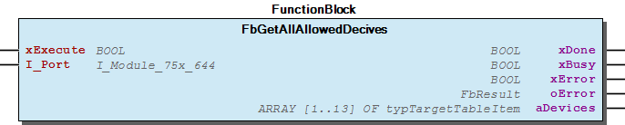
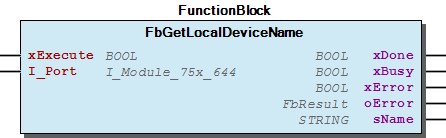
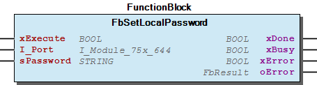

# WagoAppBluetooth v1.6.1.0 (WAGO) - Complete Documentation

## 📋 Library Information

- **Company:** WAGO
- **Title:** WagoAppBluetooth
- **Version:** 1.6.1.0
- **Categories:** WAGO LayerView|App; Application; WAGO FunctionalView|Connectivity|Wireless; WAGO FunctionalView|Device|IO
- **Author:** WAGO / u010545
- **Placeholder:** WagoAppBluetooth

### Description ¶

This document is automatically generated. Because of this, the chapter 30 Visualization is not shown in this document. If you are interested in getting to know more about visualization, we refer to the library manager of e!Cockpit.

Bluetooth Services for module 75x-644 [1]

This document is automatically generated. Because of this, the chapter 30 Visualization is not shown in this document. If you are interested in getting to know more about visualization, we refer to the library manager of e!Cockpit. Bluetooth Services for module 75x-644 [1]

### Contents: ¶

Contents: - Documentation Index - Project Information - Library Information - Function Blocks FBGetAllowedRemoteDevice (FB) - FbBindRemoteDevice (FB) - FbEraseLocalAuthentication (FB) - FbGetAllAllowedDecives (FB) - FbGetAllowDeviceEntry (FB) - FbGetAvailableChannelMap (FB) - FbGetBoundRemoteDevices (FB) - FbGetConnectionQualityOfService (FB) - FbGetHostFwVersion (FB) - FbGetLinkQuality (FB) - ... and 44 more Functions - GetSlotColor (FUN) - RGB (FUN) Methods - e_QoServiceSettings (ENUM) - typTargetTableItem (STRUCT) Program Organization Function Groups Global Variable Lists - ErrorMbxService (GVL) - VersionHistory (GVL) Other Components - 20 Device Configuration - 21 Diagnosis - 22 Maintenance - 23 Network Configuration - 24 Process Image Configuration - 29 Basic Functionality - 80 Data Types - 80 Status - 81 Enumerations - Allowed Remote Devices - ... and 36 more

### Indices and tables ¶

| [1] | Based on WagoAppBluetooth.library, last modified 14.01.2019, 18:16:38. The content of this file was automatically generated with None on 14.01.2019, 18:16:50 |

© WAGO Kontakttechnik GmbH & Co. KG, Germany 2018 – All rights reserved. For the avoidance of doubt, this copyright notice does not only apply to the information above but also and primarily to the described library itself. Please note that third-party products are always mentioned without reference to intellectual property rights, including patents, utility models, designs and trademarks, accordingly the existence of such rights cannot be excluded. WAGO is a registered trademark of WAGO Verwaltungsgesellschaft mbH.

- File and Project Information - Library Reference © WAGO Kontakttechnik GmbH & Co. KG, Germany 2018 – All rights reserved. For the avoidance of doubt, this copyright notice does not only apply to the information above but also and primarily to the described library itself. Please note that third-party products are always mentioned without reference to intellectual property rights, including patents, utility models, designs and trademarks, accordingly the existence of such rights cannot be excluded. WAGO is a registered trademark of WAGO Verwaltungsgesellschaft mbH.

### Documentation Index

## WagoAppBluetooth Library Documentation

| Company: | WAGO |
| Title: | WagoAppBluetooth |
| Version: | 1.6.1.0 |
| Categories: | WAGO LayerView\|App; Application; WAGO FunctionalView\|Connectivity\|Wireless; WAGO FunctionalView\|Device\|IO |
| Author: | WAGO / u010545 |
| Placeholder: | WagoAppBluetooth |

### Description

This document is automatically generated. Because of this, the chapter 30 Visualization is not shown in this document. If you are interested in getting to know more about visualization, we refer to the library manager of e!Cockpit.

Bluetooth Services for module 75x-644 [1]

This document is automatically generated. Because of this, the chapter 30 Visualization is not shown in this document. If you are interested in getting to know more about visualization, we refer to the library manager of e!Cockpit. Bluetooth Services for module 75x-644 [1]

### Contents:

- 20 Program Organization Units 20 Comfort Functions - 29 Basic Functionality - 80 Data Types - 81 Enumerations 80 Status - ErrorMbxService (GVL) - eErrorMbxService (ENUM) VersionHistory (GVL)

### Indices and tables

| [1] | Based on WagoAppBluetooth.library, last modified 14.01.2019, 18:16:38. The content of this file was automatically generated with None on 14.01.2019, 18:16:50 |

© WAGO Kontakttechnik GmbH & Co. KG, Germany 2018 – All rights reserved. For the avoidance of doubt, this copyright notice does not only apply to the information above but also and primarily to the described library itself. Please note that third-party products are always mentioned without reference to intellectual property rights, including patents, utility models, designs and trademarks, accordingly the existence of such rights cannot be excluded. WAGO is a registered trademark of WAGO Verwaltungsgesellschaft mbH.

- File and Project Information - Library Reference © WAGO Kontakttechnik GmbH & Co. KG, Germany 2018 – All rights reserved. For the avoidance of doubt, this copyright notice does not only apply to the information above but also and primarily to the described library itself. Please note that third-party products are always mentioned without reference to intellectual property rights, including patents, utility models, designs and trademarks, accordingly the existence of such rights cannot be excluded. WAGO is a registered trademark of WAGO Verwaltungsgesellschaft mbH.

### Project Information

## File and Project Information

| Scope | Name | Type | Content |
| --- | --- | --- | --- |
| FileHeader | libraryFile | string | WagoAppBluetooth.library |
| contentFile | WagoAppBluetooth_clr.json |
| productName | e!COCKPIT |
| creationDateTime | date | 14.01.2019, 18:16:50 |
| companyName | string | WAGO |
| ProjectInformation | LastModificationDateTime | date | 14.01.2019, 18:16:38 |
| Description | string | See: Description |
| Copyright | © WAGO Kontakttechnik GmbH & Co. KG, Germany 2018 – All rights reserved. |
| Author | WAGO / u010545 |
| AutoResolveUnbound | bool | True |
| Placeholder | string | WagoAppBluetooth |
| Company | WAGO |
| DocFormat | reStructuredText |
| Project | WagoAppBluetooth |
| DefaultNamespace |  |
| Version | version | 1.6.1.0 |
| Title | string | WagoAppBluetooth |
| LibraryCategories | library-category-list | WAGO LayerView\|App; Application; WAGO FunctionalView\|Connectivity\|Wireless; WAGO FunctionalView\|Device\|IO |

### Library Information

## Library Reference

| LinkAllContent: False QualifiedOnly: False | SystemLibrary: False | Optional: False |

| LinkAllContent: False QualifiedOnly: False | SystemLibrary: False | Optional: False |

| LinkAllContent: False QualifiedOnly: False | SystemLibrary: True | Optional: False |

| LinkAllContent: False QualifiedOnly: False | SystemLibrary: True | Optional: False |

| LinkAllContent: False QualifiedOnly: False | SystemLibrary: True | Optional: False |

| LinkAllContent: False QualifiedOnly: False | SystemLibrary: True | Optional: False |

| LinkAllContent: False QualifiedOnly: False | SystemLibrary: True | Optional: False |

| LinkAllContent: False QualifiedOnly: False | SystemLibrary: True | Optional: False |

| LinkAllContent: False QualifiedOnly: False | SystemLibrary: True | Optional: False |

| LinkAllContent: False QualifiedOnly: False | SystemLibrary: True | Optional: False |

| LinkAllContent: False QualifiedOnly: False | SystemLibrary: True | Optional: False |

| LinkAllContent: False QualifiedOnly: False | SystemLibrary: True | Optional: False |

| LinkAllContent: False QualifiedOnly: False | SystemLibrary: True | Optional: False |

| LinkAllContent: False Optional: False | QualifiedOnly: False SystemLibrary: True | PublishSymbolsInContainer: True |

| LinkAllContent: False QualifiedOnly: False | SystemLibrary: True | Optional: False |

| LinkAllContent: False QualifiedOnly: False | SystemLibrary: False | Optional: False |

| LinkAllContent: False QualifiedOnly: False | SystemLibrary: False | Optional: False |

| LinkAllContent: False QualifiedOnly: True | SystemLibrary: False | Optional: False |

| LinkAllContent: False QualifiedOnly: False | SystemLibrary: False | Optional: False |

This is a dictionary of all referenced libraries and their name spaces.

This is a dictionary of all referenced libraries and their name spaces. IoStandard Library Identification : Placeholder: IoStandard Default Resolution: IoStandard, 3.5.4.0 (System) Namespace: IoStandard Library Properties : Standard Library Identification : Placeholder: Standard Default Resolution: Standard, * (System) Namespace: Standard Library Properties : VisuElem3DPath Library Identification : Placeholder: System_VisuElem3DPath Default Resolution: VisuElem3DPath, 3.5.13.0 (System) Namespace: VisuElem3DPath Library Properties : Library Parameter : Parameter: GC_POINTS_PER_POLYGON = 100 VisuElemCamDisplayer Library Identification : Placeholder: System_VisuElemCamDisplayer Default Resolution: VisuElemCamDisplayer, 3.5.12.0 (System) Namespace: VisuElemCamDisplayer Library Properties : Library Parameter : Parameter: GC_POINTS_PER_CAM = 100 VisuElemMeter Library Identification : Placeholder: System_VisuElemMeter Default Resolution: VisuElemMeter, 3.5.13.0 (System) Namespace: VisuElemMeter Library Properties : VisuElemTextEditor Library Identification : Placeholder: System_VisuElemTextEditor Default Resolution: VisuElemTextEditor, 3.5.13.0 (System) Namespace: VisuElemTextEditor Library Properties : VisuElemTrace Library Identification : Placeholder: System_VisuElemTrace Default Resolution: VisuElemTrace, 3.5.13.0 (System) Namespace: VisuElemTrace Library Properties : VisuElemXYChart Library Identification : Placeholder: System_VisuElemXYChart Default Resolution: VisuElemXYChart, 3.5.13.0 (System) Namespace: VisuElemXYChart Library Properties : VisuElems Library Identification : Placeholder: System_VisuElems Default Resolution: VisuElems, 3.5.13.20 (System) Namespace: VisuElems Library Properties : VisuElemsAlarm Library Identification : Placeholder: System_VisuElemsAlarm Default Resolution: VisuElemsAlarm, 3.5.13.0 (System) Namespace: VisuElemsAlarm Library Properties : VisuElemsDateTime Library Identification : Placeholder: System_VisuElemsDateTime Default Resolution: VisuElemsDateTime, 3.5.13.0 (System) Namespace: VisuElemsDateTime Library Properties : VisuElemsSpecialControls Library Identification : Placeholder: System_VisuElemsSpecialControls Default Resolution: VisuElemsSpecialControls, 3.5.13.0 (System) Namespace: VisuElemsSpecialControls Library Properties : VisuElemsWinControls Library Identification : Placeholder: System_VisuElemsWinControls Default Resolution: VisuElemsWinControls, 3.5.13.20 (System) Namespace: VisuElemsWinControls Library Properties : VisuInputs Library Identification : Placeholder: system_visuinputs Default Resolution: VisuInputs, 3.5.13.0 (System) Namespace: visuinputs Library Properties : VisuNativeControl Library Identification : Placeholder: System_VisuNativeControl Default Resolution: VisuNativeControl, 3.5.13.0 (System) Namespace: VisuNativeControl Library Properties : WagoSysErrorBase Library Identification : Placeholder: WagoSysErrorBase Default Resolution: WagoSysErrorBase, * (WAGO) Namespace: WagoSysErrorBase Library Properties : WagoSysVersion Library Identification : Name: WagoSysVersion Version: 1.0.0.0 Company: WAGO Namespace: WagoSysVersion Library Properties : WagoTypesErrorBase Library Identification : Placeholder: WagoTypesErrorBase Default Resolution: WagoTypesErrorBase, * (WAGO) Namespace: WagoTypesErrorBase Library Properties : WagoTypesModule_75x_644 Library Identification : Placeholder: WagoTypesModule_75x_644 Default Resolution: WagoTypesModule_75x_644, * (WAGO) Namespace: WagoTypesModule_75x_644 Library Properties :

### Function Blocks

## FBGetAllowedRemoteDevice (FB)

| Scope | Name | Type | Initial | Comment | Inherited from |
| --- | --- | --- | --- | --- | --- |
| Input | xExecute | BOOL |  |  | FbBehaviorModelExecute |
| Output | xDone | BOOL |  |  | FbBehaviorModelExecute |
| xBusy | BOOL |  |  | FbBehaviorModelExecute |
| xError | BOOL |  |  | FbBehaviorModelExecute |
| oError | WagoSysErrorBase.FbResult |  |  | FbBehaviorModelExecute |
| Input | I_Port | WagoTypesModule_75x_644.I_Module_75x_644 | 0 |  | FbBluetoothMbxServiceBase |
| bMbxTargetTableIndex | BYTE | 16#20 | Range 0x20 .. 0x26 -> WAGO-Device // Range 0x10 .. 0x15 -> External Device |  |
| Output | abyMacId | ARRAY [0..5] OF BYTE |  |  |  |

Description: Reading a Remote Device from the Table of Allowed Devices

Interface variables Description: Reading a Remote Device from the Table of Allowed Devices GetAllowedRemoteDevices, 0x84 This command is used to read and return the MAC ID of a remote device from the table of allowed devices of the Bluetooth subsystem. There are two types of external devices that are entered in different tables: • 750-644 I/O modules for “Real-Time Communication” mode: WAGO_DEVICE (0x20 ... 0x26) • Bluetooth SPP devices for “Ad-hoc Communication” mode: EXTERNAL_DEVICE (0x10...0x15) Bluetooth specification: Device supports the “Serial Port Profile” (SPP) Enable access permission Before an entered device is actually authorized access, it must be enabled using the command “BindRemoteDevice”. Access permission can be revoked again using the command “UnbindRemoteDevice” without making it necessary to delete the device from the table. Conditions: - Mailbox size: 12, 18 - Mode: Config - Device role: Master, Slave - Save config: - - Reboot: - 

## FbBindRemoteDevice (FB)

| Scope | Name | Type | Initial | Comment | Inherited from |
| --- | --- | --- | --- | --- | --- |
| Input | xExecute | BOOL |  |  | FbBehaviorModelExecute |
| Output | xDone | BOOL |  |  | FbBehaviorModelExecute |
| xBusy | BOOL |  |  | FbBehaviorModelExecute |
| xError | BOOL |  |  | FbBehaviorModelExecute |
| oError | WagoSysErrorBase.FbResult |  |  | FbBehaviorModelExecute |
| Input | I_Port | WagoTypesModule_75x_644.I_Module_75x_644 | 0 |  | FbBluetoothMbxServiceBase |
| bMbxTargetTableIndex | BYTE | 16#20 | Range 0x20 .. 0x26 -> WAGO-Device // Range 0x10 .. 0x15 -> External Device |  |

Description: Granting Access Permission to a Device

Interface variables Description: Granting Access Permission to a Device BindRemoteDevice, 0x85 A remote device from the table of allowed devices of the Bluetooth subsystems is enabled for establishing a connection. The MAC ID of the remote device must have been entered in the table of allowed devices beforehand (see appendix “Entering a Device in the Table of Allowed Devices”). Conditions: - Mailbox size: 6, 12, 18 - Mode: Config - Device role: Master, Slave - Save config: X - Reboot: - 

## FbEraseLocalAuthentication (FB)

| Scope | Name | Type | Initial | Inherited from |
| --- | --- | --- | --- | --- |
| Input | xExecute | BOOL |  | FbBehaviorModelExecute |
| Output | xDone | BOOL |  | FbBehaviorModelExecute |
| xBusy | BOOL |  | FbBehaviorModelExecute |
| xError | BOOL |  | FbBehaviorModelExecute |
| oError | WagoSysErrorBase.FbResult |  | FbBehaviorModelExecute |
| Input | I_Port | WagoTypesModule_75x_644.I_Module_75x_644 | 0 | FbBluetoothMbxServiceBase |

Description: Erasing Local Authorization

Interface variables Description: Erasing Local Authorization EraseLocalAuthentication, 0x53 When called, the local password for authorization is erased. Then a warm boot is carried out. Conditions: - Mailbox size: 6, 12, 18 - Mode: Config - Device role: Master, Slave - Save config: - - Reboot: - 

## FbGetAllAllowedDecives (FB)

| Scope | Name | Type | Inherited from |
| --- | --- | --- | --- |
| Input | xExecute | BOOL | FbBehaviorModelExecute |
| Output | xDone | BOOL | FbBehaviorModelExecute |
| xBusy | BOOL | FbBehaviorModelExecute |
| xError | BOOL | FbBehaviorModelExecute |
| oError | WagoSysErrorBase.FbResult | FbBehaviorModelExecute |
| Input | I_Port | WagoTypesModule_75x_644.I_Module_75x_644 |  |
| Output | aDevices | ARRAY [1..13] OF typTargetTableItem |  |

Graphical Illustration

Graphical Interface of FbGetAllAllowedDecives

Interface variables Function Graphical Illustration  Graphical Interface of FbGetAllAllowedDecives

## FbGetAllowDeviceEntry (FB)

| Scope | Name | Type | Initial | Comment | Inherited from |
| --- | --- | --- | --- | --- | --- |
| Input | xExecute | BOOL |  |  | FbBehaviorModelExecute |
| Output | xDone | BOOL |  |  | FbBehaviorModelExecute |
| xBusy | BOOL |  |  | FbBehaviorModelExecute |
| xError | BOOL |  |  | FbBehaviorModelExecute |
| oError | WagoSysErrorBase.FbResult |  |  | FbBehaviorModelExecute |
| Input | I_Port | WagoTypesModule_75x_644.I_Module_75x_644 |  |  |  |
| usiSlot | USINT (1..13) | 1 |  |  |
| Output | abyMacId | ARRAY [0..5] OF BYTE |  |  |  |
| bMbxBoundRT_Devices | BYTE |  | Realtime-Devices -> WAGO-Devices |  |
| bMbxBoundAdHoc_Devices | BYTE |  | Ad-Hoc-Devices -> external Devices |  |
| sName | STRING |  |  |  |

Description:

Interface variables Description: 

## FbGetAvailableChannelMap (FB)

| Scope | Name | Type | Initial | Comment | Inherited from |
| --- | --- | --- | --- | --- | --- |
| Input | xExecute | BOOL |  |  | FbBehaviorModelExecute |
| Output | xDone | BOOL |  |  | FbBehaviorModelExecute |
| xBusy | BOOL |  |  | FbBehaviorModelExecute |
| xError | BOOL |  |  | FbBehaviorModelExecute |
| oError | WagoSysErrorBase.FbResult |  |  | FbBehaviorModelExecute |
| Input | I_Port | WagoTypesModule_75x_644.I_Module_75x_644 | 0 |  | FbBluetoothMbxServiceBase |
| bMbxTargetTableIndex | BYTE | 16#20 | Range 0x20 .. 0x26 -> WAGO-Device // Range 0x10 .. 0x15 -> External Device |  |
| Output | typChannelMap | typChannelMap |  |  |  |

Description: Reading Available Hopping Channels

Interface variables Description: Reading Available Hopping Channels GetAvailableChannelMap, 0xD8 The call returns information on the status of the environment (i.e. the status of the wireless medium) for a connection channel. For Bluetooth the channels available for hopping are indicated. There are 79 channels with 1 MHz available. The channels are numbered serially from 0 through 78. The frequency of each channel is based on the channel number: Frequency of the channel = 2402 + channel number MHz The 750-644 I/O module supports AFH (adaptive frequency hopping). If individual frequency ranges are recognized as defective (for example, if other wireless technologies with higher signal strength in this range are sending), the corresponding channels of its own transmission are excluded. This reduces interference and improves the connection quality for the Bluetooth network as well as for the third-party system. A positive side effect is the possibility of making connections through third-party activity in the 2.4 GHz ISM band using the list of the channels masked in this manner. The rule of thumb is: The greater the number of channels available for hopping, the better the status of the wireless medium. Conditions: - Mailbox size: 12, 18 - Mode: Real-time, Ad-hoc - Device role: Master, Slave - Save config: - - Reboot: - 

## FbGetBoundRemoteDevices (FB)

| Scope | Name | Type | Initial | Comment | Inherited from |
| --- | --- | --- | --- | --- | --- |
| Input | xExecute | BOOL |  |  | FbBehaviorModelExecute |
| Output | xDone | BOOL |  |  | FbBehaviorModelExecute |
| xBusy | BOOL |  |  | FbBehaviorModelExecute |
| xError | BOOL |  |  | FbBehaviorModelExecute |
| oError | WagoSysErrorBase.FbResult |  |  | FbBehaviorModelExecute |
| Input | I_Port | WagoTypesModule_75x_644.I_Module_75x_644 | 0 |  | FbBluetoothMbxServiceBase |
| Output | bMbxBoundRT_Devices | BYTE |  | Realtime-Devices -> WAGO-Devices |  |
| bMbxBoundAdHoc_Devices | BYTE |  | Ad-Hoc-Devices -> external Devices |  |

Description: Reading Access Permission for Remote Devices

Interface variables Description: Reading Access Permission for Remote Devices GetBoundRemoteDevices, 0x87 This command is used to read back which of the remote devices entered in the table enabled access permission. Permission can be enabled using the command “BindRemoteDevice” and disabled using “UnbindRemoteDevice”. Conditions: - Mailbox size: 6, 12, 18 - Mode: Config, Real-time, Ad-hoc - Device role: Master, Slave - Save config: - - Reboot: - 

## FbGetConnectionQualityOfService (FB)

| Scope | Name | Type | Initial | Comment | Inherited from |
| --- | --- | --- | --- | --- | --- |
| Input | xExecute | BOOL |  |  | FbBehaviorModelExecute |
| Output | xDone | BOOL |  |  | FbBehaviorModelExecute |
| xBusy | BOOL |  |  | FbBehaviorModelExecute |
| xError | BOOL |  |  | FbBehaviorModelExecute |
| oError | WagoSysErrorBase.FbResult |  |  | FbBehaviorModelExecute |
| Input | I_Port | WagoTypesModule_75x_644.I_Module_75x_644 | 0 |  | FbBluetoothMbxServiceBase |
| bMbxTargetTableIndex | BYTE | 16#20 | Range 0x20 .. 0x26 -> WAGO-Device // Range 0x10 .. 0x15 -> External Device |  |
| Output | eMbxQualityOfService | e_QoServiceSettings | BQM_UNKNOWN |  |  |

Description: Reading QoS Settings

Interface variables Description: Reading QoS Settings GetConnectionQoS, 0x88 This command is used to read the settings of the “Quality-of-Service” (QoS) of a connection. Conditions: - Mailbox size: 6, 12, 18 - Mode: Config - Device role: Master, Slave - Save config: - - Reboot: - 

## FbGetHostFwVersion (FB)

| Scope | Name | Type | Initial | Inherited from |
| --- | --- | --- | --- | --- |
| Input | xExecute | BOOL |  | FbBehaviorModelExecute |
| Output | xDone | BOOL |  | FbBehaviorModelExecute |
| xBusy | BOOL |  | FbBehaviorModelExecute |
| xError | BOOL |  | FbBehaviorModelExecute |
| oError | WagoSysErrorBase.FbResult |  | FbBehaviorModelExecute |
| Input | I_Port | WagoTypesModule_75x_644.I_Module_75x_644 | 0 | FbBluetoothMbxServiceBase |
| eMbxFwID | e_MbxFwId | MBX_CM_GETHOSTFWVERSION_FIRMWARE |  |
| Output | eMbx_FwID | e_MbxFwId |  |  |
| bMbx_VN_Major | BYTE |  |  |
| bMbx_VN_Minor | BYTE |  |  |
| bMbx_VN_Built | BYTE |  |  |

Description: Reading the Host Firmware Version

Interface variables Description: Reading the Host Firmware Version GetHostFwVersion, 0x12 When called, version information of the firmware components of the Bluetooth subsystem are read. Conditions: - Mailbox size: 6, 12, 18 - Mode: Config - Device role: Master, Slave - Save config: - - Reboot: - 

## FbGetLinkQuality (FB)

| Scope | Name | Type | Initial | Comment | Inherited from |
| --- | --- | --- | --- | --- | --- |
| Input | xExecute | BOOL |  |  | FbBehaviorModelExecute |
| Output | xDone | BOOL |  |  | FbBehaviorModelExecute |
| xBusy | BOOL |  |  | FbBehaviorModelExecute |
| xError | BOOL |  |  | FbBehaviorModelExecute |
| oError | WagoSysErrorBase.FbResult |  |  | FbBehaviorModelExecute |
| Input | I_Port | WagoTypesModule_75x_644.I_Module_75x_644 | 0 |  | FbBluetoothMbxServiceBase |
| bMbxTargetTableIndex | BYTE | 16#20 | Range 0x20 .. 0x26 -> WAGO-Device // Range 0x10 .. 0x15 -> External Device |  |
| Output | bMbxLQ_Value | BYTE |  |  |  |

Description: Reading the Connection Quality

Interface variables Description: Reading the Connection Quality GetLinkQuality, 0xD5 The connection quality (“Link Quality” LQ) is indicated by the bit error rate of the radio connection. The LQ value is converted into the current bit error rate (based on the characteristic in the manual). Conditions: - Mailbox size: 6, 12, 18 - Mode: Real-time, Ad-hoc - Device role: Master, Slave - Save config: - - Reboot: - 

## FbGetLinkSignalStrength (FB)

| Scope | Name | Type | Initial | Comment | Inherited from |
| --- | --- | --- | --- | --- | --- |
| Input | xExecute | BOOL |  |  | FbBehaviorModelExecute |
| Output | xDone | BOOL |  |  | FbBehaviorModelExecute |
| xBusy | BOOL |  |  | FbBehaviorModelExecute |
| xError | BOOL |  |  | FbBehaviorModelExecute |
| oError | WagoSysErrorBase.FbResult |  |  | FbBehaviorModelExecute |
| Input | I_Port | WagoTypesModule_75x_644.I_Module_75x_644 | 0 |  | FbBluetoothMbxServiceBase |
| bMbxTargetTableIndex | BYTE | 16#20 | Range 0x20 .. 0x26 -> WAGO-Device // Range 0x10 .. 0x15 -> External Device |  |
| Output | bMbxRSSI_Value | BYTE |  |  |  |

Description: Reading the Signal Strength for a Connection

Interface variables Description: Reading the Signal Strength for a Connection GetLinkSignalStrength, 0xD7 The RSSI value displays possible overrides of the Bluetooth receiver. It returns “0” if the strength of the received signal lies within the tolerance range. If the received signal is stronger than the upper limiting value of the tolerance range, a value > “0” is returned. If the received signal is weaker than the lower limiting value, a value < “0” is returned. Conditions: - Mailbox size: 6, 12, 18 - Mode: Real-time, Ad-hoc - Device role: Master, Slave - Save config: - - Reboot: - 

## FbGetLocalAuthenticationMode (FB)

| Scope | Name | Type | Initial | Inherited from |
| --- | --- | --- | --- | --- |
| Input | xExecute | BOOL |  | FbBehaviorModelExecute |
| Output | xDone | BOOL |  | FbBehaviorModelExecute |
| xBusy | BOOL |  | FbBehaviorModelExecute |
| xError | BOOL |  | FbBehaviorModelExecute |
| oError | WagoSysErrorBase.FbResult |  | FbBehaviorModelExecute |
| Input | I_Port | WagoTypesModule_75x_644.I_Module_75x_644 | 0 | FbBluetoothMbxServiceBase |
| Output | eAuthenticationMode | e_AuthenticationMode |  |  |

Description: Reading the Local Authentication Mode

Interface variables Description: Reading the Local Authentication Mode GetLocalAuthenticationMode, 0x4F Will call up, the locally set authentication mode of the Bluetooth subsystems is read. Conditions: - Mailbox size: 6, 12, 18 - Mode: Config - Device role: Master, Slave - Save config: - - Reboot: - 

## FbGetLocalDeviceClass (FB)

| Scope | Name | Type | Initial | Inherited from |
| --- | --- | --- | --- | --- |
| Input | xExecute | BOOL |  | FbBehaviorModelExecute |
| Output | xDone | BOOL |  | FbBehaviorModelExecute |
| xBusy | BOOL |  | FbBehaviorModelExecute |
| xError | BOOL |  | FbBehaviorModelExecute |
| oError | WagoSysErrorBase.FbResult |  | FbBehaviorModelExecute |
| Input | I_Port | WagoTypesModule_75x_644.I_Module_75x_644 | 0 | FbBluetoothMbxServiceBase |
| Output | bDevice_Class | BYTE |  |  |
| bDevice_Subclass | BYTE |  |  |

Description: Reading a Local WAGO Device Class

Interface variables Description: Reading a Local WAGO Device Class GetLocalDeviceClass, 0x47 With this instruction, the WAGO device class of the local 750-644 I/O module is read. The device class can be used to differentiate I/O module types. Grouping of I/O modules by their tasks is also possible. When searching for I/O modules with a certain device class, an inquiry using the Bluetooth Class-of-Device can help. The WAGO device classes have only an indirect relation to the Bluetooth Class-of-Device. Conditions: - Mailbox size: 6, 12, 18 - Mode: Config - Device role: Master, Slave - Save config: - - Reboot: - 

## FbGetLocalDeviceConfigLen (FB)

| Scope | Name | Type | Initial | Inherited from |
| --- | --- | --- | --- | --- |
| Input | xExecute | BOOL |  | FbBehaviorModelExecute |
| Output | xDone | BOOL |  | FbBehaviorModelExecute |
| xBusy | BOOL |  | FbBehaviorModelExecute |
| xError | BOOL |  | FbBehaviorModelExecute |
| oError | WagoSysErrorBase.FbResult |  | FbBehaviorModelExecute |
| Input | I_Port | WagoTypesModule_75x_644.I_Module_75x_644 | 0 | FbBluetoothMbxServiceBase |
| Output | uiDeviceConfigLen | UINT |  |  |

Description: Reading the Length of the Flash Configuration

Interface variables Description: Reading the Length of the Flash Configuration GetLocalDeviceConfigLen, 0x54 When called, the length (in bytes) of the local configuration in the flash of the Bluetooth subsystem is returned. This information is used by the PLC to interpret the data from the block commands. Conditions: - Mailbox size: 6, 12, 18 - Mode: Config - Device role: Master, Slave - Save config: - - Reboot: - 

## FbGetLocalDeviceName (FB)

| Scope | Name | Type | Initial | Inherited from |
| --- | --- | --- | --- | --- |
| Input | xExecute | BOOL |  | FbBehaviorModelExecute |
| Output | xDone | BOOL |  | FbBehaviorModelExecute |
| xBusy | BOOL |  | FbBehaviorModelExecute |
| xError | BOOL |  | FbBehaviorModelExecute |
| oError | WagoSysErrorBase.FbResult |  | FbBehaviorModelExecute |
| Input | I_Port | WagoTypesModule_75x_644.I_Module_75x_644 | 0 | FbBluetoothMbxServiceBase |
| Output | sName | STRING |  |  |

Description: Reading Local Device Names

Interface variables Description: Reading Local Device Names GetLocalDeviceName, 0x40 The characters of the Bluetooth name of the local 750-644 I/O module are read by this query. The number of characters returned depends on the configured name, but has a maximum of [Mailbox size-3]. Device name The complete device name can be a maximum of 15 characters. The complete device name can be queried with DLD commands regardless of the Mailbox size. Conditions: - Mailbox size: (6), (12), 18 - Mode: Config - Device role: Master, Slave - Save config: - - Reboot: - 

## FbGetLocalDeviceRole (FB)

| Scope | Name | Type | Initial | Comment | Inherited from |
| --- | --- | --- | --- | --- | --- |
| Input | xExecute | BOOL |  |  | FbBehaviorModelExecute |
| Output | xDone | BOOL |  |  | FbBehaviorModelExecute |
| xBusy | BOOL |  |  | FbBehaviorModelExecute |
| xError | BOOL |  |  | FbBehaviorModelExecute |
| oError | WagoSysErrorBase.FbResult |  |  | FbBehaviorModelExecute |
| Input | I_Port | WagoTypesModule_75x_644.I_Module_75x_644 | 0 |  | FbBluetoothMbxServiceBase |
| Output | eDeviceRole | e_DeviceRole |  | local device role |  |

Description: Reading the Roll of the Local Device

Interface variables Description: Reading the Roll of the Local Device GetLocalDeviceRole, 0x55 This command queries the role that the local 750-644 I/O module takes in the piconet (master or slave). Conditions: - Mailbox size: 6, 12, 18 - Mode: Config, Real-time, Ad-hoc - Device role: Master, Slave - Save config: - - Reboot: - 

## FbGetLocalDeviceStatus (FB)

| Scope | Name | Type | Initial | Comment | Inherited from |
| --- | --- | --- | --- | --- | --- |
| Input | xExecute | BOOL |  |  | FbBehaviorModelExecute |
| Output | xDone | BOOL |  |  | FbBehaviorModelExecute |
| xBusy | BOOL |  |  | FbBehaviorModelExecute |
| xError | BOOL |  |  | FbBehaviorModelExecute |
| oError | WagoSysErrorBase.FbResult |  |  | FbBehaviorModelExecute |
| Input | I_Port | WagoTypesModule_75x_644.I_Module_75x_644 | 0 |  | FbBluetoothMbxServiceBase |
| Output | eDeviceRole | e_DeviceRole |  | local device role |  |
| eOperationMode | e_OperationMode |  |  |  |
| eComProfile | e_ComProfile |  |  |  |
| eDiagnosisState | e_DiagnosisState |  |  |  |

Description: Reading the Status of the Local I/O Module

Interface variables Description: Reading the Status of the Local I/O Module GetLocalDeviceStatus, 0xD0 This call returns the type of 750-644 I/OI module, the operating mode and a general diagnostic status. Type and operating mode The type of I/O module is set by using the command “SetLocalDeviceRole” (see appendix “Setting the Role of a Local Device”) or read back by using the command “GetLocalDeviceRole” (see appendix “Reading the Role of a Local Device”). The operating mode is set using “SetLocalOperationMode” (see appendix “Setting the Local Operating Mode”) or read using “GetLocalOperationMode” (see appendix “Read the Local Operating Mode”). Conditions: - Mailbox size: 6, 12, 18 - Mode: Config, Real-time, Ad-hoc - Device role: Master, Slave - Save config: - - Reboot: - 

## FbGetLocalEncryptionMode (FB)

| Scope | Name | Type | Initial | Inherited from |
| --- | --- | --- | --- | --- |
| Input | xExecute | BOOL |  | FbBehaviorModelExecute |
| Output | xDone | BOOL |  | FbBehaviorModelExecute |
| xBusy | BOOL |  | FbBehaviorModelExecute |
| xError | BOOL |  | FbBehaviorModelExecute |
| oError | WagoSysErrorBase.FbResult |  | FbBehaviorModelExecute |
| Input | I_Port | WagoTypesModule_75x_644.I_Module_75x_644 | 0 | FbBluetoothMbxServiceBase |
| Output | xEncryption | BOOL |  |  |

Description: Reading the Local Encryption Mode

Interface variables Description: Reading the Local Encryption Mode GetLocalEncryptionMode, 0x4D When called, the encryption mode for the radio transmission is read. Conditions: - Mailbox size: 6, 12, 18 - Mode: Config - Device role: Master, Slave - Save config: - - Reboot: - 

## FbGetLocalIPAddress (FB)

| Scope | Name | Type | Initial | Inherited from |
| --- | --- | --- | --- | --- |
| Input | xExecute | BOOL |  | FbBehaviorModelExecute |
| Output | xDone | BOOL |  | FbBehaviorModelExecute |
| xBusy | BOOL |  | FbBehaviorModelExecute |
| xError | BOOL |  | FbBehaviorModelExecute |
| oError | WagoSysErrorBase.FbResult |  | FbBehaviorModelExecute |
| Input | I_Port | WagoTypesModule_75x_644.I_Module_75x_644 | 0 | FbBluetoothMbxServiceBase |
| Output | abyLocalIP | ARRAY [0..3] OF BYTE |  |  |

Description: Reading Local IP address

Interface variables Description: Reading Local IP address GetLocalIPAddress, 0x43 With this instruction, the IP address of the local 750-644 I/O module is read. Conditions: - Mailbox size: 6, 12, 18 - Mode: Config - Device role: Master, Slave - Save config: - - Reboot: - 

## FbGetLocalMacID (FB)

| Scope | Name | Type | Initial | Inherited from |
| --- | --- | --- | --- | --- |
| Input | xExecute | BOOL |  | FbBehaviorModelExecute |
| Output | xDone | BOOL |  | FbBehaviorModelExecute |
| xBusy | BOOL |  | FbBehaviorModelExecute |
| xError | BOOL |  | FbBehaviorModelExecute |
| oError | WagoSysErrorBase.FbResult |  | FbBehaviorModelExecute |
| Input | I_Port | WagoTypesModule_75x_644.I_Module_75x_644 | 0 | FbBluetoothMbxServiceBase |
| Output | abyLocalMacID | ARRAY [0..5] OF BYTE |  |  |

Description: Reading Local MAC IDs

Interface variables Description: Reading Local MAC IDs GetLocalMacID, 0x42 With this instruction, the Bluetooth MAC ID (48-bit address) of the local 750-644 I/O module is read. Conditions: - Mailbox size: 12, 18 - Mode: Config - Device role: Master, Slave - Save config: - - Reboot: - 

## FbGetLocalOperationMode (FB)

| Scope | Name | Type | Initial | Inherited from |
| --- | --- | --- | --- | --- |
| Input | xExecute | BOOL |  | FbBehaviorModelExecute |
| Output | xDone | BOOL |  | FbBehaviorModelExecute |
| xBusy | BOOL |  | FbBehaviorModelExecute |
| xError | BOOL |  | FbBehaviorModelExecute |
| oError | WagoSysErrorBase.FbResult |  | FbBehaviorModelExecute |
| Input | I_Port | WagoTypesModule_75x_644.I_Module_75x_644 | 0 | FbBluetoothMbxServiceBase |
| Output | eOperationMode | e_OperationMode |  |  |
| eComProfile | e_ComProfile |  |  |

Description: Reading a Local Operating Mode

Interface variables Description: Reading a Local Operating Mode GetLocalOperationMode, 0x49 With this command, the operating mode of the local 750-644 I/O module is read. Conditions: - Mailbox size: 6, 12, 18 - Mode: Config, Real-time, Ad-hoc - Device role: Master, Slave - Save config: - - Reboot: - 

## FbGetLocalPassword (FB)

| Scope | Name | Type | Initial | Inherited from |
| --- | --- | --- | --- | --- |
| Input | xExecute | BOOL |  | FbBehaviorModelExecute |
| Output | xDone | BOOL |  | FbBehaviorModelExecute |
| xBusy | BOOL |  | FbBehaviorModelExecute |
| xError | BOOL |  | FbBehaviorModelExecute |
| oError | WagoSysErrorBase.FbResult |  | FbBehaviorModelExecute |
| Input | I_Port | WagoTypesModule_75x_644.I_Module_75x_644 | 0 | FbBluetoothMbxServiceBase |
| Output | sPassword | STRING |  |  |

Description: Reading the Local Bluetooth Password

Interface variables Description: Reading the Local Bluetooth Password GetLocalPassphrase, 0x51 When called, the local password for radio transmission is read. The password is transmitted as a byte value representation of ASCII characters and is at least 4 characters long. The password is not completely displayed if too long! If the password is longer than the available Mailbox, the excess bytes are cut off. MBX_PASSPHRASE _Length returns the actual length of the password. Therefore, the real password may deviate from the password displayed. Conditions: - Mailbox size: (12), (18) - Mode: Config - Device role: Master, Slave - Save config: - - Reboot: - 

## FbGetLocalSubnetMask (FB)

| Scope | Name | Type | Initial | Inherited from |
| --- | --- | --- | --- | --- |
| Input | xExecute | BOOL |  | FbBehaviorModelExecute |
| Output | xDone | BOOL |  | FbBehaviorModelExecute |
| xBusy | BOOL |  | FbBehaviorModelExecute |
| xError | BOOL |  | FbBehaviorModelExecute |
| oError | WagoSysErrorBase.FbResult |  | FbBehaviorModelExecute |
| Input | I_Port | WagoTypesModule_75x_644.I_Module_75x_644 | 0 | FbBluetoothMbxServiceBase |
| Output | abySubnetMask | ARRAY [0..3] OF BYTE |  |  |

Description: Reading Local Subnetmask

Interface variables Description: Reading Local Subnetmask GetLocalSubnetMask, 0x45 With this instruction, the Subnetmask of the local 750-644 I/O module is read. Conditions: - Mailbox size: 6, 12, 18 - Mode: Config - Device role: Master, Slave - Save config: - - Reboot: - 

## FbGetNetworkStatus (FB)

| Scope | Name | Type | Initial | Comment | Inherited from |
| --- | --- | --- | --- | --- | --- |
| Input | xExecute | BOOL |  |  | FbBehaviorModelExecute |
| Output | xDone | BOOL |  |  | FbBehaviorModelExecute |
| xBusy | BOOL |  |  | FbBehaviorModelExecute |
| xError | BOOL |  |  | FbBehaviorModelExecute |
| oError | WagoSysErrorBase.FbResult |  |  | FbBehaviorModelExecute |
| Input | I_Port | WagoTypesModule_75x_644.I_Module_75x_644 | 0 |  | FbBluetoothMbxServiceBase |
| Output | eNetworkState | e_NetworkState |  | Network State |  |
| bConnectedRealTimeDevices | BYTE |  | Bitwise coding -> If bit = 1 -> device is bounded and connected |  |
| bConnectedAdHocDevices | BYTE |  | Bitwise coding -> If bit = 1 -> device is bounded and connected |  |

Description: Reading the Status of the Wireless Network

Interface variables Description: Reading the Status of the Wireless Network GetNetworkStatus, 0xD1 Call returns information on the status of the wireless network. Information about 750-644 I/O modules and Bluetooth SPP devices is recorded. In “Configuration” mode, no connections are established! Since no radio connections are established when in “Configuration” mode, MBX_NETWORK_FAILED (0x01) is always returned. Since no connections are established in “Configuration” mode, the other arguments of this command in this mode always return “0”. Conditions: - Mailbox size: 6, 12, 18 - Mode: Config, Real-time, Ad-hoc - Device role: Master, Slave - Save config: - - Reboot: - 

## FbGetReconnectionTimePeriod (FB)

| Scope | Name | Type | Initial | Inherited from |
| --- | --- | --- | --- | --- |
| Input | xExecute | BOOL |  | FbBehaviorModelExecute |
| Output | xDone | BOOL |  | FbBehaviorModelExecute |
| xBusy | BOOL |  | FbBehaviorModelExecute |
| xError | BOOL |  | FbBehaviorModelExecute |
| oError | WagoSysErrorBase.FbResult |  | FbBehaviorModelExecute |
| Input | I_Port | WagoTypesModule_75x_644.I_Module_75x_644 | 0 | FbBluetoothMbxServiceBase |
| Output | wReconnectionTime_sec | WORD |  |  |

Description: Reading Back the Time Setting – Between Two Attempts to Establish a Connection

Interface variables Description: Reading Back the Time Setting – Between Two Attempts to Establish a Connection GetReconnectionTimePeriod, 0x8A This command is used to read back the time interval between two attempts to reestablish the connection to a 750-644 I/O module. Conditions: - Mailbox size: 6, 12, 18 - Mode: Config - Device role: Master, Slave - Save config: - - Reboot: - 

## FbGetRemoteDeviceMacID (FB)

| Scope | Name | Type | Initial | Inherited from |
| --- | --- | --- | --- | --- |
| Input | xExecute | BOOL |  | FbBehaviorModelExecute |
| Output | xDone | BOOL |  | FbBehaviorModelExecute |
| xBusy | BOOL |  | FbBehaviorModelExecute |
| xError | BOOL |  | FbBehaviorModelExecute |
| oError | WagoSysErrorBase.FbResult |  | FbBehaviorModelExecute |
| Input | I_Port | WagoTypesModule_75x_644.I_Module_75x_644 | 0 | FbBluetoothMbxServiceBase |
| bMbxDeviceIndex | BYTE |  |  |
| Output | bFoundDevices | BYTE |  |  |
| abyRemoteMacID | ARRAY [0..5] OF BYTE |  |  |

Description: Reading the MAC ID of a Remote Device

Interface variables Description: Reading the MAC ID of a Remote Device GetRemoteDeviceMacID, 0x81 This command is used to access a list of 750-644 I/O modules or Bluetooth SPP devices visible in the area and to query the Bluetooth MAC ID of a remote 750-644 I/O module or Bluetooth SPP device. This command requires prior execution of a scan process with the command “ScanRemoteDevices”, which initiates creation of this list. If an attempt is made to access the list before the scan process is complete, the command responds with MBX_CMD_DENIED_BUSY. In this case, the query should be repeated after a few seconds. If this command is used with a Mailbox size of 6 bytes, the command only returns the number of devices found. To query the MAC IDs of the devices, however, the block transfer can be used (see DLD_Start, DLD_Cont, DLD_End commands). Execute the “ScanRemoteDevices” beforehand! Before calling up “GetRemoteDeviceMacID” , the “ScanRemoteDevices” command must be executed (see appendix “Scanning for a Remote Device in the Wireless Network”). Conditions: - Mailbox size: (6), 12, 18 - Mode: Config - Device role: Master, Slave - Save config: - - Reboot: - 

## FbGetRemoteDeviceName (FB)

| Scope | Name | Type | Initial | Inherited from |
| --- | --- | --- | --- | --- |
| Input | xExecute | BOOL |  | FbBehaviorModelExecute |
| Output | xDone | BOOL |  | FbBehaviorModelExecute |
| xBusy | BOOL |  | FbBehaviorModelExecute |
| xError | BOOL |  | FbBehaviorModelExecute |
| oError | WagoSysErrorBase.FbResult |  | FbBehaviorModelExecute |
| Input | I_Port | WagoTypesModule_75x_644.I_Module_75x_644 | 0 | FbBluetoothMbxServiceBase |
| bMbxDeviceIndex | BYTE |  |  |
| Output | sName | STRING |  |  |

Description: Reading the Device Names of a Remote Device

Interface variables Description: Reading the Device Names of a Remote Device GetRemoteDeviceName, 0x82 When called, the name of a remote 750-644 I/O module or Bluetooth SPP device in the wireless network is queried (see appendix “Reading the MAC ID of a Remote Device”). Since this information must be requested via remote device and no quick response can be guaranteed, the first request starts with the name resolution, but it responds with MBX_CMD_DENIED_BUSY without returning the name. Repeating the query delivers MBX_CMD_OK and the character chain of the queried device name as soon as the name has been determined. The call returns an error if “ScanRemoteDevices” has not been called beforehand and the scan (initial call) ended successfully. As long as the name query is running, the wireless module is not available for any other functions. Functions that do not use the wireless module are carried out normally. When the name query ends, a new call of “GetRemoteDeviceName” returns the Bluetooth name of the remote device (see appendix “Reading a Local Device Name”). A maximum of [Mailbox size - 3] characters are displayed. The Bluetooth name of remote devices may also exceed the length (15 characters) that can be displayed in the largest Mailbox setting (18 bytes). In this case, the complete name can be read by block transfer (DLD_Start, DLD_Cont, DLD_End commands). Conditions: - Mailbox size: (6), (12), (18) - Mode: Config - Device role: Master, Slave - Save config: - - Reboot: - 

## FbGetRemotePiMapping (FB)

| Scope | Name | Type | Initial | Comment | Inherited from |
| --- | --- | --- | --- | --- | --- |
| Input | xExecute | BOOL |  |  | FbBehaviorModelExecute |
| Output | xDone | BOOL |  |  | FbBehaviorModelExecute |
| xBusy | BOOL |  |  | FbBehaviorModelExecute |
| xError | BOOL |  |  | FbBehaviorModelExecute |
| oError | WagoSysErrorBase.FbResult |  |  | FbBehaviorModelExecute |
| Input | I_Port | WagoTypesModule_75x_644.I_Module_75x_644 | 0 |  | FbBluetoothMbxServiceBase |
| bMbxTargetTableIndex | BYTE | 16#20 | Range 0x20 .. 0x26 -> WAGO-Device // Range 0x10 .. 0x15 -> External Device |  |
| Output | typRemotePiMapping | typRemotePiMapping |  |  |  |

Description: Querying Remote Process Image Parameters within the Master PI

Interface variables Description: Querying Remote Process Image Parameters within the Master PI GetRemotePiMapping, 0x33 With this command, the settings for a slot in the local PI are queried. 13 slots are available. Slots 1 to 7 are occupied by the fields of the table “WAGO devices” and slots 8 to 13 by the fields of the table “External Devices”. Conditions: - Mailbox size: 6, 12, 18 - Mode: Config, Real-time, Ad-hoc - Device role: Master, Slave - Save config: - - Reboot: - 

## FbGetStatusMessage (FB)

| Scope | Name | Type | Initial | Comment | Inherited from |
| --- | --- | --- | --- | --- | --- |
| Input | xExecute | BOOL |  |  | FbBehaviorModelExecute |
| Output | xDone | BOOL |  |  | FbBehaviorModelExecute |
| xBusy | BOOL |  |  | FbBehaviorModelExecute |
| xError | BOOL |  |  | FbBehaviorModelExecute |
| oError | WagoSysErrorBase.FbResult |  |  | FbBehaviorModelExecute |
| Input | I_Port | WagoTypesModule_75x_644.I_Module_75x_644 | 0 |  | FbBluetoothMbxServiceBase |
| eMbxObjectGroup | e_StateGroup |  | MBX_OBJECTID_GROUP_MASK = 16#F000 |  |
| wMbxObjectTarget_ID | WORD |  | MBX_OBJECTID_TARGET_MASK = 16#0FFF |  |
| Output | eStateObjectGroup | e_StateGroup |  | MBX_OBJECTID_GROUP_MASK = 16#F000 |  |
| wStateObjectID | WORD |  | MBX_OBJECTID_MASK = 16#0FFF |  |
| eMbxStateMessage | e_StateMessage |  |  |  |

Description: Reading Diagnostic Information

Interface variables Description: Reading Diagnostic Information GetStatusMessage, 0xD2 The command returns diagnostic information on occurring errors and warnings from the local 750-644 I/O module. When querying, a concrete object identification MBX_OBJECT_ID must be indicated. The response then always contains the same MBX_OBJECT_ID plus a defined status report MBX_STATE_MESSAGE. If the object identification remains unknown, the system returns the information byte for executing the command MBX_CMD_RESULT and the value MBX_CMD_INVALID_ARG. Each defined MBX_OBJECT_ID is always uniquely assigned a current status report (usually “OK”). If an event occurs, the status report is changed in such a way that it mirrors the most recently occurring event (error/warning). The status report of an individual MBX_OBJECT_ID is always overwritten with the next more recent event as long as it is not “OK”. The prioritization of error message before warning message must always be observed. Errors/warnings In the cyclical status report (C/S byte, LED activation), errors/warnings are only displayed as long as the interrupted status lasts. The status report, on the other hand, remains until it is overwritten (new message for the same Object ID occurs). Errors always have a higher priority than warnings in the display. Only the status of 750-644 I/O modules is recorded. Conditions: - Mailbox size: 6, 12, 18 - Mode: Config, Real-time, Ad-hoc - Device role: Master, Slave - Save config: X - Reboot: - 

## FbGetUserfriendlyName (FB)

| Scope | Name | Type | Initial | Comment | Inherited from |
| --- | --- | --- | --- | --- | --- |
| Input | xExecute | BOOL |  |  | FbBehaviorModelExecute |
| Output | xDone | BOOL |  |  | FbBehaviorModelExecute |
| xBusy | BOOL |  |  | FbBehaviorModelExecute |
| xError | BOOL |  |  | FbBehaviorModelExecute |
| oError | WagoSysErrorBase.FbResult |  |  | FbBehaviorModelExecute |
| Input | I_Port | WagoTypesModule_75x_644.I_Module_75x_644 | 0 |  | FbBluetoothMbxServiceBase |
| bMbxTargetTableIndex | BYTE | 16#20 | Range 0x20 .. 0x26 -> WAGO-Device // Range 0x10 .. 0x15 -> External Device |  |
| Output | sName | STRING |  |  |  |

Description: Reading the User-Friendly Name of an Allowed Device

Interface variables Description: Reading the User-Friendly Name of an Allowed Device GetUserfriendlyName, 0x8C This query can be used to read the user-friendly name to an entry in the list of allowed devices. If the name is too long for the actual size of the Mailbox, then the first [Mailbox size -3] characters are output. The value from MBX_NAME_LENGTH returns the actual length of the name. Conditions: - Mailbox size: (6), (12), 18 - Mode: Config, Real-time, Ad-hoc - Device role: Master, Slave - Save config: - - Reboot: - 

## FbScanRemoteDevices (FB)

| Scope | Name | Type | Initial | Comment | Inherited from |
| --- | --- | --- | --- | --- | --- |
| Input | xExecute | BOOL |  |  | FbBehaviorModelExecute |
| Output | xDone | BOOL |  |  | FbBehaviorModelExecute |
| xBusy | BOOL |  |  | FbBehaviorModelExecute |
| xError | BOOL |  |  | FbBehaviorModelExecute |
| oError | WagoSysErrorBase.FbResult |  |  | FbBehaviorModelExecute |
| Input | I_Port | WagoTypesModule_75x_644.I_Module_75x_644 | 0 |  | FbBluetoothMbxServiceBase |
| dwClassOfDevice | DWORD | 16#0 | 16#00_0020F8 -> WAGO-Device |  |

Description: Scanning for a Remote Device in the Wireless Network

Interface variables Description: Scanning for a Remote Device in the Wireless Network ScanRemoteDevices, 0x80 When called, the system scans for remote 750-644 I/O modules or Bluetooth SPP devices. The scanning process is asynchronous, i.e. the results are not immediately available. As long as the scan runs, the wireless module is not available for any other function. Functions that do not use the wireless module are carried out normally. When the scan concludes, devices found are entered in a list from which they can be individually queried with the command “GetRemoteDeviceMacID”. The complete CoD for the 750-644 I/O module is 0x0020f8 (hexadecimal). To limit the scan to certain devices, a Class-of-Device (CoD) can be indicated. If a CoD not equal to 0 is used, only those devices are found that have this exact CoD. If CoD = 0 is used, all 750-644 I/O modules and Bluetooth SPP devices in the environment are scanned. Inquiry results The DLD commands can be used to read complete result of the inquiry. Conditions: - Mailbox size: 6, 12, 18 - Mode: Config - Device role: Master, Slave - Save config: - - Reboot: - 

## FbSetAllAllowedDecives (FB)

| Scope | Name | Type | Inherited from |
| --- | --- | --- | --- |
| Input | xExecute | BOOL | FbBehaviorModelExecute |
| Output | xDone | BOOL | FbBehaviorModelExecute |
| xBusy | BOOL | FbBehaviorModelExecute |
| xError | BOOL | FbBehaviorModelExecute |
| oError | WagoSysErrorBase.FbResult | FbBehaviorModelExecute |
| Input | I_Port | WagoTypesModule_75x_644.I_Module_75x_644 |  |
| aDevices | ARRAY [1..13] OF typTargetTableItem |  |

Description:

Interface variables Description: 

## FbSetAllRemotePiMapping (FB)

| Scope | Name | Type | Inherited from |
| --- | --- | --- | --- |
| Input | xExecute | BOOL | FbBehaviorModelExecute |
| Output | xDone | BOOL | FbBehaviorModelExecute |
| xBusy | BOOL | FbBehaviorModelExecute |
| xError | BOOL | FbBehaviorModelExecute |
| oError | WagoSysErrorBase.FbResult | FbBehaviorModelExecute |
| Input | I_Port | WagoTypesModule_75x_644.I_Module_75x_644 |  |
| aRemotePiMapping | ARRAY [1..13] OF typRemotePiMapping |  |

Description:

Interface variables Description: 

## FbSetAllowDeviceEntry (FB)

| Scope | Name | Type | Initial | Inherited from |
| --- | --- | --- | --- | --- |
| Input | xExecute | BOOL |  | FbBehaviorModelExecute |
| Output | xDone | BOOL |  | FbBehaviorModelExecute |
| xBusy | BOOL |  | FbBehaviorModelExecute |
| xError | BOOL |  | FbBehaviorModelExecute |
| oError | WagoSysErrorBase.FbResult |  | FbBehaviorModelExecute |
| Input | I_Port | WagoTypesModule_75x_644.I_Module_75x_644 |  |  |
| usiSlot | USINT (1..13) | 1 |  |
| typTargetTableItem | typTargetTableItem |  |  |

Description:

Interface variables Description: 

## FbSetAllowRemoteDevice (FB)

| Scope | Name | Type | Initial | Comment | Inherited from |
| --- | --- | --- | --- | --- | --- |
| Input | xExecute | BOOL |  |  | FbBehaviorModelExecute |
| Output | xDone | BOOL |  |  | FbBehaviorModelExecute |
| xBusy | BOOL |  |  | FbBehaviorModelExecute |
| xError | BOOL |  |  | FbBehaviorModelExecute |
| oError | WagoSysErrorBase.FbResult |  |  | FbBehaviorModelExecute |
| Input | I_Port | WagoTypesModule_75x_644.I_Module_75x_644 | 0 |  | FbBluetoothMbxServiceBase |
| bMbxTargetTableIndex | BYTE | 16#20 | Range 0x20 .. 0x26 -> WAGO-Device // Range 0x10 .. 0x15 -> External Device |  |
| abyMacId | ARRAY [0..5] OF BYTE |  |  |  |

Description: Entering a Device in the Table of Allowed Devices

Interface variables Description: Entering a Device in the Table of Allowed Devices AllowRemoteDevice, 0x83 This command is used to allow a remote 750-644 I/O module or Bluetooth SPP device access to the local 750-644 I/O module. The MAC ID of the remote device is also entered in a table of the Bluetooth subsystem. Two types of devices are differentiated. Both types are entered in different tables: • 750-644 I/O modules for “Real-Time Communication” mode: WAGO_DEVICE (0x20...0x26) • Bluetooth SPP devices for “Ad-hoc Communication” mode: EXTERNAL_DEVICE (0x10...0x15) Bluetooth specification: Device supports the “Serial Port Profile” (SPP) Access permission Before an entered 750-644 I/O module is actually authorized access, it must be enabled using the command “BindRemoteDevice”. Access permission can be revoked using the command “UnbindRemoteDevice” without requiring deletion of the device from the table. • Entries can be deleted from the table by overwriting with the MAC ID 00:00:00:00:00:00. The respective slot is populated with 0. No data is transmitted to it. • Changes to the device blocks do not change anything in the process image mapping. • A MAC ID (exception: MAC ID 00:00:00:00:00:00) may never occur more than once in a table. Conditions: - Mailbox size: 12, 18 - Mode: Config - Device role: Master, Slave - Save config: X - Reboot: - 

## FbSetConnectionQualityOfService (FB)

| Scope | Name | Type | Initial | Comment | Inherited from |
| --- | --- | --- | --- | --- | --- |
| Input | xExecute | BOOL |  |  | FbBehaviorModelExecute |
| Output | xDone | BOOL |  |  | FbBehaviorModelExecute |
| xBusy | BOOL |  |  | FbBehaviorModelExecute |
| xError | BOOL |  |  | FbBehaviorModelExecute |
| oError | WagoSysErrorBase.FbResult |  |  | FbBehaviorModelExecute |
| Input | I_Port | WagoTypesModule_75x_644.I_Module_75x_644 | 0 |  | FbBluetoothMbxServiceBase |
| bMbxTargetTableIndex | BYTE | 16#20 | Range 0x20 .. 0x26 -> WAGO-Device // Range 0x10 .. 0x15 -> External Device |  |
| eMbxQualityOfService | e_QoServiceSettings | BQM_NONE |  |  |

Description: Setting QoS Settings

Interface variables Description: Setting QoS Settings SetConnectionQoS, 0x89 This command is used to set the settings of the “Quality-of-Service” (QoS) of a connection. The settings only take effect when the 750-644 I/O module is switched to the role of master. Keep factory settings! The master can connect to a maximum of 3 slaves QoS is enabled. QoS can only be set for 750-644 I/O modules. It improves latency by reducing deviations (outliers). Because the Bluetooth subsystem of the 750-644 I/O module has already been optimized for maximum performance, any effect on the timing in “Real-Time Communication” mode is marginal. Therefore, it is recommended that you keep the factory setting MBX_BQM_NONE. Conditions: - Mailbox size: 6, 12, 18 - Mode: Config - Device role: Master, Slave - Save config: X - Reboot: - 

## FbSetFactorySettings (FB)

| Scope | Name | Type | Initial | Inherited from |
| --- | --- | --- | --- | --- |
| Input | xExecute | BOOL |  | FbBehaviorModelExecute |
| Output | xDone | BOOL |  | FbBehaviorModelExecute |
| xBusy | BOOL |  | FbBehaviorModelExecute |
| xError | BOOL |  | FbBehaviorModelExecute |
| oError | WagoSysErrorBase.FbResult |  | FbBehaviorModelExecute |
| Input | I_Port | WagoTypesModule_75x_644.I_Module_75x_644 | 0 | FbBluetoothMbxServiceBase |

Description: Restoring Factory Settings

Interface variables Description: Restoring Factory Settings SetFactorySettings, 0x57 This command is used to overwrite the local configuration saved in the flash with the factory settings. The Bluetooth subsystem is then rebooted. Conditions: - Mailbox size: 6, 12, 18 - Mode: Config, Real-time, Ad-hoc - Device role: Master, Slave - Save config: X - Reboot: X 

## FbSetLocalAuthenticationMode (FB)

| Scope | Name | Type | Initial | Inherited from |
| --- | --- | --- | --- | --- |
| Input | xExecute | BOOL |  | FbBehaviorModelExecute |
| Output | xDone | BOOL |  | FbBehaviorModelExecute |
| xBusy | BOOL |  | FbBehaviorModelExecute |
| xError | BOOL |  | FbBehaviorModelExecute |
| oError | WagoSysErrorBase.FbResult |  | FbBehaviorModelExecute |
| Input | I_Port | WagoTypesModule_75x_644.I_Module_75x_644 | 0 | FbBluetoothMbxServiceBase |
| eAuthenticationMode | e_AuthenticationMode |  |  |

Description: Setting Local Authentication Mode

Interface variables Description: Setting Local Authentication Mode SetLocalAuthenticationMode, 0x50 When calling up “SetLocalAuthenticationMode”, the local authentication mode of the Bluetooth subsystems is set. If authentication is disabled (MBX_AUTHENTICATION_NONE), the identity of the communication partner is not verified. If authentication is enabled , the 750-644 I/O modules authenticate each other each time a connection is established. This process occurs with cryptographic protection based on the Bluetooth standard. If MBX_AUTHENTICATION_LINKKEY is set as the authentication mode, an individual “Link Key” is calculated from the configured PIN during the firstconnection. The PIN is generated from the password. If this key has been generated once, the 750-644 I/O modules are considered to be “paired” (connected) and do not need to conduct a mutual authentication again with a new connection. If the “Link Key” is deleted, for example when restarting the device or by means of “EraseLocalAuthentication”, then the password is requested again in order to calculate the “Link Key”. Accordingly, for Bluetooth SPP devices, you are prompted to enter the password at initial or subsequent authentication. For 750-644 I/O modules, the password is archived in the Bluetooth subsystem and does not have to be reentered once it has been created correctly. In authentication mode MBX_AUTHENTICATION_PIN, authentication is performed with the PIN instead of using the “Link Key”. For 750-644 I/O modules, this is automatic based on the saved password. For Bluetooth SPP devices, the password usually has to be manually reentered each time a connection is established. Authentication Authentication only ensures that communication partners verify each other’sidentity. Authentication does not prevent data interception. Authentication is required for encryption when transmitting data. 750-644 I/O modules can only connect with each other when they have the same settings for encryption, authentication and password. Conditions: - Mailbox size: 6, 12, 18 - Mode: Config - Device role: Master, Slave - Save config: X - Reboot: - 

## FbSetLocalDeviceClass (FB)

| Scope | Name | Type | Initial | Inherited from |
| --- | --- | --- | --- | --- |
| Input | xExecute | BOOL |  | FbBehaviorModelExecute |
| Output | xDone | BOOL |  | FbBehaviorModelExecute |
| xBusy | BOOL |  | FbBehaviorModelExecute |
| xError | BOOL |  | FbBehaviorModelExecute |
| oError | WagoSysErrorBase.FbResult |  | FbBehaviorModelExecute |
| Input | I_Port | WagoTypesModule_75x_644.I_Module_75x_644 | 0 | FbBluetoothMbxServiceBase |
| bDevice_Class | BYTE |  |  |
| bDevice_Subclass | BYTE |  |  |

Description: Writing a Local Device Class

Interface variables Description: Writing a Local Device Class SetLocalDeviceClass, 0x48 With this instruction, the WAGO device class of the local 750-644 I/O module is written. The device class can be used to differentiate I/O module types. Grouping of I/O modules by their tasks is also possible. When searching for I/O modules with a certain device class, an inquiry using the Bluetooth Class-of-Device can help. The device classes have only an indirect relation to the Bluetooth Class-of-Device. Conditions: - Mailbox size: 6, 12, 18 - Mode: Config - Device role: Master, Slave - Save config: X - Reboot: - 

## FbSetLocalDeviceName (FB)

| Scope | Name | Type | Initial | Inherited from |
| --- | --- | --- | --- | --- |
| Input | xExecute | BOOL |  | FbBehaviorModelExecute |
| Output | xDone | BOOL |  | FbBehaviorModelExecute |
| xBusy | BOOL |  | FbBehaviorModelExecute |
| xError | BOOL |  | FbBehaviorModelExecute |
| oError | WagoSysErrorBase.FbResult |  | FbBehaviorModelExecute |
| Input | I_Port | WagoTypesModule_75x_644.I_Module_75x_644 | 0 | FbBluetoothMbxServiceBase |
| sName | STRING |  |  |

Description: Wiriting Local Device Names

Interface variables Description: Wiriting Local Device Names SetLocalDeviceName, 0x41 With this instruction, the Bluetooth name of the local 750-644 I/O module is set. The normal set of ASCII characters is available. Device name The use of special characters (e.g. line breaks) is possible, but should be avoided. The complete device name can be a maximum of 15 characters. The complete device name can be read and written with DLD commands regardless of the Mailbox size. Conditions: - Mailbox size: (6), (12), 18 - Mode: Config - Device role: Master, Slave - Save config: X - Reboot: - 

## FbSetLocalDeviceRole (FB)

| Scope | Name | Type | Initial | Comment | Inherited from |
| --- | --- | --- | --- | --- | --- |
| Input | xExecute | BOOL |  |  | FbBehaviorModelExecute |
| Output | xDone | BOOL |  |  | FbBehaviorModelExecute |
| xBusy | BOOL |  |  | FbBehaviorModelExecute |
| xError | BOOL |  |  | FbBehaviorModelExecute |
| oError | WagoSysErrorBase.FbResult |  |  | FbBehaviorModelExecute |
| Input | I_Port | WagoTypesModule_75x_644.I_Module_75x_644 | 0 |  | FbBluetoothMbxServiceBase |
| eDeviceRole | e_DeviceRole |  | local device role |  |

Description: Setting the Role of the Local Device

Interface variables Description: Setting the Role of the Local Device SetLocalDeviceRole, 0x56 This command sets the role that the local 750-644 I/O module should take in the piconet (master or slave). Conditions: - Mailbox size: 6, 12, 18 - Mode: Config - Device role: Master, Slave - Save config: X - Reboot: - 

## FbSetLocalEncryptionMode (FB)

| Scope | Name | Type | Initial | Inherited from |
| --- | --- | --- | --- | --- |
| Input | xExecute | BOOL |  | FbBehaviorModelExecute |
| Output | xDone | BOOL |  | FbBehaviorModelExecute |
| xBusy | BOOL |  | FbBehaviorModelExecute |
| xError | BOOL |  | FbBehaviorModelExecute |
| oError | WagoSysErrorBase.FbResult |  | FbBehaviorModelExecute |
| Input | I_Port | WagoTypesModule_75x_644.I_Module_75x_644 | 0 | FbBluetoothMbxServiceBase |
| xEncryption | BOOL |  |  |

Description: Setting the Local Encryption Mode

Interface variables Description: Setting the Local Encryption Mode SetLocalEncryptionMode, 0x4E With this command, the encryption of the Bluetooth data transmission is enabled or disabled. This setting can be done independently of the device role, but only affects the master. If encryption is enabled, the 750-644 I/O modules or Bluetooth SPP devices that do not use encryption cannot connect. Make sure the settings of the devices match! Encryption can be enabled without enabling an authentication. The actual encryption of the data takes place after an authentication. The security of the encryption is linked to the quality of the password. Connections between devices can only be established if the settings for encryption, authentication and password are synchronized. This can be achieved by having identical settings for the devices to be connected. Conditions: - Mailbox size: 6, 12, 18 - Mode: Config - Device role: Master, Slave - Save config: X - Reboot: - 

## FbSetLocalOperationMode (FB)

| Scope | Name | Type | Initial | Inherited from |
| --- | --- | --- | --- | --- |
| Input | xExecute | BOOL |  | FbBehaviorModelExecute |
| Output | xDone | BOOL |  | FbBehaviorModelExecute |
| xBusy | BOOL |  | FbBehaviorModelExecute |
| xError | BOOL |  | FbBehaviorModelExecute |
| oError | WagoSysErrorBase.FbResult |  | FbBehaviorModelExecute |
| Input | I_Port | WagoTypesModule_75x_644.I_Module_75x_644 | 0 | FbBluetoothMbxServiceBase |
| eOperationMode | e_OperationMode |  |  |
| eComProfile | e_ComProfile |  |  |

Description: Setting the Local Operating Mode

Interface variables Description: Setting the Local Operating Mode SetLocalOperationMode, 0x4A When called, the operating mode of the Bluetooth subsystems is set. The call is followed by a warm boot of the 750-644 I/O module in the selected operating mode, saving any changes made to the configuration. Conditions: - Mailbox size: 6, 12, 18 - Mode: Config, Real-time, Ad-hoc - Device role: Master, Slave - Save config: X - Reboot: X 

## FbSetLocalPassword (FB)

| Scope | Name | Type | Initial | Inherited from |
| --- | --- | --- | --- | --- |
| Input | xExecute | BOOL |  | FbBehaviorModelExecute |
| Output | xDone | BOOL |  | FbBehaviorModelExecute |
| xBusy | BOOL |  | FbBehaviorModelExecute |
| xError | BOOL |  | FbBehaviorModelExecute |
| oError | WagoSysErrorBase.FbResult |  | FbBehaviorModelExecute |
| Input | I_Port | WagoTypesModule_75x_644.I_Module_75x_644 | 0 | FbBluetoothMbxServiceBase |
| sPassword | STRING |  |  |

Description: Writing the Local Bluetooth Password

Interface variables Description: Writing the Local Bluetooth Password SetLocalPassphrase, 0x52 This command is used to configure the local password. The 750-644 I/O module calculates the “Link Key” from the local password, which is necessary during active authentication to establish the connection and to encrypt data. The Bluetooth password must be identical for all devices that want to communicate with each other. Choosing a password Security depends on the password you choose. The password should be as long and random as possible. 750-644 I/O modules can only connect with each other when they have the same settings for encryption, authentication and password. Conditions: - Mailbox size: (12), (18) - Mode: Config - Device role: Master, Slave - Save config: X - Reboot: - 

## FbSetLocalSubnetMask (FB)

| Scope | Name | Type | Initial | Inherited from |
| --- | --- | --- | --- | --- |
| Input | xExecute | BOOL |  | FbBehaviorModelExecute |
| Output | xDone | BOOL |  | FbBehaviorModelExecute |
| xBusy | BOOL |  | FbBehaviorModelExecute |
| xError | BOOL |  | FbBehaviorModelExecute |
| oError | WagoSysErrorBase.FbResult |  | FbBehaviorModelExecute |
| Input | I_Port | WagoTypesModule_75x_644.I_Module_75x_644 | 0 | FbBluetoothMbxServiceBase |
| abySubnetMask | ARRAY [0..3] OF BYTE |  |  |

Description: Setting Local Subnetmask

Interface variables Description: Setting Local Subnetmask SetLocalSubnetMask, 0x46 With this instruction, the Subnetmask of the local 750-644 I/O module is set. Conditions: - Mailbox size: 6, 12, 18 - Mode: Config - Device role: Master, Slave - Save config: X - Reboot: - 

## FbSetReconnectionTimePeriod (FB)

| Scope | Name | Type | Initial | Inherited from |
| --- | --- | --- | --- | --- |
| Input | xExecute | BOOL |  | FbBehaviorModelExecute |
| Output | xDone | BOOL |  | FbBehaviorModelExecute |
| xBusy | BOOL |  | FbBehaviorModelExecute |
| xError | BOOL |  | FbBehaviorModelExecute |
| oError | WagoSysErrorBase.FbResult |  | FbBehaviorModelExecute |
| Input | I_Port | WagoTypesModule_75x_644.I_Module_75x_644 | 0 | FbBluetoothMbxServiceBase |
| wReconnectionTime_sec | WORD |  |  |

Description: Setting the Time Setting – Between Two Attempts to Establish a Connection

Interface variables Description: Setting the Time Setting – Between Two Attempts to Establish a Connection SetReconnectionTimePeriod, 0x8B This command is used to set the waiting time for the master between two attempts before a new attempt to establish a connection with a slave is undertaken. The settings only take effect when the 750-644 I/O module is switched to the role of master. When establishing a network in “Communication” mode, the master first attempts to connect all allowed slaves. If unsuccessful, it begins the data exchange, first with the devices that could be connected. It then scans again for the devices originally not found at a configured time interval. A similar scenario applies for the failure of slaves; in this case, the master first attempts to reconnect immediately and repeats these attempts periodically if it does not succeed. 750-644 I/O modules configured as slaves continuously attempt to connect in “Communication” mode. Communication drops When connecting to slaves, the master is not available for data exchange. If allowed slaves have failed continuously, the remaining network members experience communication interruption times within the time interval of the “ReconnectionTimePeriod” until the failed device is ready again. In “Real-Time Communication” mode, 750-644 I/O modules provide information on such interruption times through the cyclical and acyclical diagnostic function. For time-critical applications, it is possible to temporarily “eject” failed slaves by applying the function “UnbindRemoteDevice” to them in “Communication” mode. Conditions: - Mailbox size: 6, 12, 18 - Mode: Config - Device role: Master, Slave - Save config: X - Reboot: - 

## FbSetRemotePiSize (FB)

| Scope | Name | Type | Initial | Comment | Inherited from |
| --- | --- | --- | --- | --- | --- |
| Input | xExecute | BOOL |  |  | FbBehaviorModelExecute |
| Output | xDone | BOOL |  |  | FbBehaviorModelExecute |
| xBusy | BOOL |  |  | FbBehaviorModelExecute |
| xError | BOOL |  |  | FbBehaviorModelExecute |
| oError | WagoSysErrorBase.FbResult |  |  | FbBehaviorModelExecute |
| Input | I_Port | WagoTypesModule_75x_644.I_Module_75x_644 | 0 |  | FbBluetoothMbxServiceBase |
| bMbxTargetTableIndex | BYTE | 16#21 | Range 0x21 .. 0x27 -> WAGO-Device // Range 0x10 .. 0x16 -> External Device |  |
| bCutOff | BYTE |  | Size of this PA range 0..46 |  |

Description: Determining the Size of a Slot for Data Transfer in the Master PI

Interface variables Description: Determining the Size of a Slot for Data Transfer in the Master PI SetRemotePiSize, 0x32 This command is used to limit the process image (PI) of a remote 750-644 I/O module within the master PI to n bytes. All slave process images in the master together must not be larger than the set master PI-2. Two bytes of the total size are necessary for the control/stat us byte and an internal byte (null byte). The size of the master process image can be queried and configured over the parameter channel. It is contained in the LSB by parameter 0. By downsizing the available PI, the sum of the configured cut-offs may exceed the size of the master PI. In this case, the output configuration is already invalid. In such a case, the configuration is executed, but the error value MBX_CMD_INVALID_CONFIGURATION is displayed. If the output configuration is correct, a command that leads to an invalid configuration is acknowledged and rejected with an error. For ad-hoc slots 8 ... 12, the cut-off must be at least 2 and may not exceed 16. Only effective when changed to the master role The process image mapping can also be configured in the slave role, but only takes effect when changed to the master role. Conditions: - Mailbox size: 6, 12, 18 - Mode: Config - Device role: Master, Slave - Save config: X - Reboot: - 

## FbSetUserfriendlyName (FB)

| Scope | Name | Type | Initial | Comment | Inherited from |
| --- | --- | --- | --- | --- | --- |
| Input | xExecute | BOOL |  |  | FbBehaviorModelExecute |
| Output | xDone | BOOL |  |  | FbBehaviorModelExecute |
| xBusy | BOOL |  |  | FbBehaviorModelExecute |
| xError | BOOL |  |  | FbBehaviorModelExecute |
| oError | WagoSysErrorBase.FbResult |  |  | FbBehaviorModelExecute |
| Input | I_Port | WagoTypesModule_75x_644.I_Module_75x_644 | 0 |  | FbBluetoothMbxServiceBase |
| bMbxTargetTableIndex | BYTE | 16#20 | Range 0x20 .. 0x26 -> WAGO-Device // Range 0x10 .. 0x15 -> External Device |  |
| sName | STRING |  |  |  |

Description: Writing the User-Friendly Name of an Allowed Device

Interface variables Description: Writing the User-Friendly Name of an Allowed Device SetUserfriendlyName, 0x8D This command can be used to add any alias to an entry to the list of allowed devices. The user can specify an intuitive name for the respective remote device, e.g. “Pump_001”, “Gate4” or “Busnode_002”. The name does not affect the Bluetooth device name of the remote device because the alias is saved in the local 750-644 I/O module. By converting to ASCII characters, the name is simple to read and facilitates administration of the Bluetooth SPP device. The name can be a maximum of [Mailbox size -3] characters long. If the name does not completely fill up the Mailbox, it ends with the first null byte. Alias has no direct relationship to the Bluetooth device name! The name entry is independent of the entered device (MAC ID). The user-friendly name has no direct relation to the Bluetooth name of the remote device that can be read with “GetRemoteDeviceName”. Characters following a null byte are ignored. Conditions: - Mailbox size: (6), (12), 18 - Mode: Config - Device role: Master, Slave - Save config: X - Reboot: - 

## FbUnBindRemoteDevice (FB)

| Scope | Name | Type | Initial | Comment | Inherited from |
| --- | --- | --- | --- | --- | --- |
| Input | xExecute | BOOL |  |  | FbBehaviorModelExecute |
| Output | xDone | BOOL |  |  | FbBehaviorModelExecute |
| xBusy | BOOL |  |  | FbBehaviorModelExecute |
| xError | BOOL |  |  | FbBehaviorModelExecute |
| oError | WagoSysErrorBase.FbResult |  |  | FbBehaviorModelExecute |
| Input | I_Port | WagoTypesModule_75x_644.I_Module_75x_644 | 0 |  | FbBluetoothMbxServiceBase |
| bMbxTargetTableIndex | BYTE | 16#20 | Range 0x20 .. 0x26 -> WAGO-Device // Range 0x10 .. 0x15 -> External Device |  |

Description: Deleting Access Permission for a Device

Interface variables Description: Deleting Access Permission for a Device UnbindRemoteDevice, 0x86 The access permission of a remote device is disabled. When this happens, the MAC ID entered in the table space and associated data such as the “UserFriendlyName” are retained, but no connection to the device is established and any already existing connection is interrupted. If the command is executed in “Communication” mode, this setting is temporary, i.e. at the next reboot, the connection is once again established. This offers the possibility of temporarily excluding fault remote devices from the network without changing the configuration. If no attempt is made to connect the device after reboot, the command must be called up in the “Configuration” mode. Conditions: - Mailbox size: 6, 12, 18 - Mode: Config, Real-time, Ad-hoc - Device role: Master, Slave - Save config: X* - Reboot: - * = (Setting is nonpermanent in “Communication” mode. In “Configuration” mode, the setting is saved during a warm boot similar to other settings.) 

## FbVisuDeviceConfiguration (FB)

| Scope | Name | Type |
| --- | --- | --- |
| Input | I_Port | WagoTypesModule_75x_644.I_Module_75x_644 |
| Output | oError | WagoSysErrorBase.FbResult |

Description:

Interface variables Description: 

## FbVisuDiagnosis (FB)

| Scope | Name | Type | Initial | Comment | Inherited from |
| --- | --- | --- | --- | --- | --- |
| Input | xExecute | BOOL |  |  | FbBehaviorModelExecute |
| Output | xDone | BOOL |  |  | FbBehaviorModelExecute |
| xBusy | BOOL |  |  | FbBehaviorModelExecute |
| xError | BOOL |  |  | FbBehaviorModelExecute |
| oError | WagoSysErrorBase.FbResult |  |  | FbBehaviorModelExecute |
| Input | I_Port | WagoTypesModule_75x_644.I_Module_75x_644 |  |  |  |
| usiSlot | USINT (1..13) | 1 |  |  |
| Output | typChannelMap | typChannelMap |  |  |  |
| bMbxRSSI_Value | BYTE |  |  |  |
| bMbxLQ_Value | BYTE |  |  |  |
| eDeviceRole | e_DeviceRole |  | local device role |  |
| eOperationMode | e_OperationMode |  |  |  |
| eComProfile | e_ComProfile |  |  |  |
| eDiagnosisState | e_DiagnosisState |  |  |  |
| eNetworkState | e_NetworkState |  | Network State |  |
| bConnectedRealTimeDevices | BYTE |  | Bitwise coding -> If bit = 1 -> device is bounded and connected |  |
| bConnectedAdHocDevices | BYTE |  | Bitwise coding -> If bit = 1 -> device is bounded and connected |  |

Description:

Interface variables Description: 

## FbVisuNetworkConfiguration (FB)

| Scope | Name | Type |
| --- | --- | --- |
| Input | I_Port | WagoTypesModule_75x_644.I_Module_75x_644 |
| Output | oError | WagoSysErrorBase.FbResult |

Description:

Interface variables Description: 

## FbVisuPiMapping (FB)

| Scope | Name | Type | Inherited from |
| --- | --- | --- | --- |
| Input | xExecute | BOOL | FbBehaviorModelExecute |
| Output | xDone | BOOL | FbBehaviorModelExecute |
| xBusy | BOOL | FbBehaviorModelExecute |
| xError | BOOL | FbBehaviorModelExecute |
| oError | WagoSysErrorBase.FbResult | FbBehaviorModelExecute |
| Input | I_Port | WagoTypesModule_75x_644.I_Module_75x_644 |  |
| Output | aAllowedDevices | ARRAY [1..13] OF typTargetTableItem |  |
| aRemotePiMapping | ARRAY [1..13] OF typRemotePiMapping |  |

Description:

Interface variables Description: 

## FbVisuScanForDevices (FB)

| Scope | Name | Type | Initial | Comment | Inherited from |
| --- | --- | --- | --- | --- | --- |
| Input | xExecute | BOOL |  |  | FbBehaviorModelExecute |
| Output | xDone | BOOL |  |  | FbBehaviorModelExecute |
| xBusy | BOOL |  |  | FbBehaviorModelExecute |
| xError | BOOL |  |  | FbBehaviorModelExecute |
| oError | WagoSysErrorBase.FbResult |  |  | FbBehaviorModelExecute |
| Input | I_Port | WagoTypesModule_75x_644.I_Module_75x_644 |  |  |  |
| dwClassOfDevice | DWORD | 16#0 | 16#00_0020F8 -> WAGO-Device |  |
| Output | typRemoteDeviceList | typDeviceList |  |  |  |

Description:

Interface variables Description: 

### Functions

## GetSlotColor (FUN)

| Scope | Name | Type |
| --- | --- | --- |
| Return | GetSlotColor | DWORD |
| Input | usiSlot | USINT |

## RGB (FUN)

| Scope | Name | Type |
| --- | --- | --- |
| Return | RGB | DWORD |
| Input | red | BYTE |
| green | BYTE |
| blue | BYTE |

### Methods

## e_QoServiceSettings (ENUM)

| Name | Initial | Comment |
| --- | --- | --- |
| BQM_UNKNOWN | 16#0 | Quality of Service unknown mode |
| BQM_NONE | 16#1 | No Quality of Service active |
| BQM_BEST_EFFORT | 16#2 | Best Effort Mode active |
| BQM_GUARANTEED | 16#3 | Guaranteed Mode active |

## typTargetTableItem (STRUCT)

| Name | Type |
| --- | --- |
| MacID | ARRAY [0..5] OF BYTE |
| UserfriendlyName | STRING |
| IsBind | BOOL |

### Program Organization

## 20 Program Organization Units

- 20 Comfort Functions FbVisuDeviceConfiguration (FB) - FbVisuDiagnosis (FB) - FbVisuNetworkConfiguration (FB) - FbVisuPiMapping (FB) - FbVisuScanForDevices (FB) - Helper Colors GetSlotColor (FUN) - RGB (FUN) FbGetAllAllowedDecives (FB) FbGetAllowDeviceEntry (FB) FbSetAllAllowedDecives (FB) FbSetAllRemotePiMapping (FB) FbSetAllowDeviceEntry (FB) 29 Basic Functionality - 20 Device Configuration Local Address FbGetLocalIPAddress (FB) - FbGetLocalMacID (FB) - FbGetLocalSubnetMask (FB) - FbSetLocalSubnetMask (FB) Local Authentication - FbEraseLocalAuthentication (FB) - FbGetLocalAuthenticationMode (FB) - FbSetLocalAuthenticationMode (FB) Local Class of Device - FbGetLocalDeviceClass (FB) - FbSetLocalDeviceClass (FB) Local Device Mode / Role - FbGetLocalDeviceRole (FB) - FbGetLocalOperationMode (FB) - FbSetLocalDeviceRole (FB) - FbSetLocalOperationMode (FB) Local Device Name - FbGetLocalDeviceName (FB) - FbSetLocalDeviceName (FB) Local Encryption Mode - FbGetLocalEncryptionMode (FB) - FbSetLocalEncryptionMode (FB) Local Password - FbGetLocalPassword (FB) - FbSetLocalPassword (FB) Miscellaneous - FbGetLocalDeviceConfigLen (FB) - FbSetFactorySettings (FB) 21 Diagnosis - FbGetAvailableChannelMap (FB) - FbGetLinkQuality (FB) - FbGetLinkSignalStrength (FB) - FbGetLocalDeviceStatus (FB) - FbGetNetworkStatus (FB) - FbGetStatusMessage (FB) 22 Maintenance - FbGetHostFwVersion (FB) 23 Network Configuration - Allowed Remote Devices FBGetAllowedRemoteDevice (FB) - FbSetAllowRemoteDevice (FB) Bind Remote Devices - FbBindRemoteDevice (FB) - FbGetBoundRemoteDevices (FB) - FbUnBindRemoteDevice (FB) Connection Quality of Service - FbGetConnectionQualityOfService (FB) - FbSetConnectionQualityOfService (FB) Network Scan - FbGetRemoteDeviceMacID (FB) - FbGetRemoteDeviceName (FB) - FbScanRemoteDevices (FB) Reconnection Time Period - FbGetReconnectionTimePeriod (FB) - FbSetReconnectionTimePeriod (FB) Userfriendly Name - FbGetUserfriendlyName (FB) - FbSetUserfriendlyName (FB) 24 Process Image Configuration - FbGetRemotePiMapping (FB) - FbSetRemotePiSize (FB) 80 Data Types - typChannelMap (STRUCT) - typClassOfDevice (STRUCT) - typDevice (STRUCT) - typDeviceList (STRUCT) - typRemotePiMapping (STRUCT) - typTargetTableItem (STRUCT) 81 Enumerations - Diagnosis Status Message e_StateGroup (ENUM) - e_StateMessage (ENUM) e_DiagnosisState (ENUM) e_NetworkState (ENUM) Maintenance - e_MbxFwId (ENUM) Mode_Role - e_AuthenticationMode (ENUM) - e_ComProfile (ENUM) - e_DeviceRole (ENUM) - e_OperationMode (ENUM) Quality of Service - e_QoServiceSettings (ENUM) e_MbxServiceCommand (ENUM)

### Function Groups

## 20 Comfort Functions

- FbVisuDeviceConfiguration (FB) - FbVisuDiagnosis (FB) - FbVisuNetworkConfiguration (FB) - FbVisuPiMapping (FB) - FbVisuScanForDevices (FB) - Helper Colors GetSlotColor (FUN) - RGB (FUN) FbGetAllAllowedDecives (FB) FbGetAllowDeviceEntry (FB) FbSetAllAllowedDecives (FB) FbSetAllRemotePiMapping (FB) FbSetAllowDeviceEntry (FB)

### Global Variable Lists

## ErrorMbxService (GVL)

| Scope | Name | Type |
| --- | --- | --- |
| Constant | ERROR_MBX_SERVICE | ARRAY [0..12] OF WagoTypesErrorBase.typResultItem |

| Value | Level | Description |
| --- | --- | --- |
| eErrorMbxService.MBX_CMD_OK | WagoTypesErrorBase.WagoTypes.eSeverity.none | ‘OK’ |
| eErrorMbxService.MBX_CMD_GENERAL_ERROR | WagoTypesErrorBase.WagoTypes.eSeverity.error | ‘MBX Result General Error’ |
| eErrorMbxService.MBX_CMD_DENIED_UNKNOWN | WagoTypesErrorBase.WagoTypes.eSeverity.error | ‘MBX Result Unknown Command’ |
| eErrorMbxService.MBX_CMD_OUT_OF_RANGE | WagoTypesErrorBase.WagoTypes.eSeverity.error | ‘MBX Result Values Out of Range’ |
| eErrorMbxService.MBX_CMD_INVALID_ARG | WagoTypesErrorBase.WagoTypes.eSeverity.error | ‘MBX Result Invalid Argument’ |
| eErrorMbxService.MBX_CMD_INTERNAL_ERROR | WagoTypesErrorBase.WagoTypes.eSeverity.error | ‘MBX Result Internal Error’ |
| eErrorMbxService.MBX_CMD_TIMEOUT | WagoTypesErrorBase.WagoTypes.eSeverity.error | ‘MBX Result MBX Time Out’ |
| eErrorMbxService.MBX_CMD_DENIED_NOT_APPLICABLE | WagoTypesErrorBase.WagoTypes.eSeverity.error | ‘MBX Result Command denied’ |
| eErrorMbxService.MBX_CMD_DENIED_NOT_IMPLEMENTED | WagoTypesErrorBase.WagoTypes.eSeverity.error | ‘MBX Result Command not implemented’ |
| eErrorMbxService.MBX_CMD_DENIED_MBX_TO_SMALL | WagoTypesErrorBase.WagoTypes.eSeverity.error | ‘MBX Result MBX to small’ |
| eErrorMbxService.MBX_CMD_DENIED_BUSY | WagoTypesErrorBase.WagoTypes.eSeverity.info | ‘MBX Result Busy’ |
| eErrorMbxService.MBX_CMD_INVALID_CONFIGURATION | WagoTypesErrorBase.WagoTypes.eSeverity.error | ‘MBX Result Invalid Configuration’ |
| eErrorMbxService.INTERNAL_INVALID_PARAMETER | WagoTypesErrorBase.WagoTypes.eSeverity.error | ‘Call FB with an invalid parameter value’ |

## VersionHistory (GVL)

| Name | Type |
| --- | --- |
| Info | ProjectInfo |

| date | version | author | change |
| 08.01.2019 | 1.6.1.0 | u015842 | Properties: free placeholder added |
| 03.01.2019 | 1.6.0.3 | u010663 | Bugfix visu _Error |
| 23.04.2018 | 1.6.0.2 | u010545 | update documentation |
| 05.07.2016 | 1.6.0.1 | u010545 | createtable error table |
| 26.02.2016 | 1.6.0.0 | u010545 | Change WagoAppErrorBase to WagoSysErrorBase / WagoTypesErrorBase |
| 28.01.2016 | 1.5.0.3 | u010545 | FbBluetoothMbxServiceBase set to public |
| 19.01.2016 | 1.5.0.2 | u010545 | VersionHistory -> always bind |
| 30.09.2015 | 1.5.0.1 | u010545 | placeholder at librarymanger included |
| 03.06.2015 | 1.5.0.0 | u010545 | released |
| 26.05.2015 | 1.0.1.6 | u010545 | path for png-images modified |
| 28.04.2015 | 1.0.1.5 | u010545 | IModule_75x_644 changed to I_Port |
| 07.04.2015 | 1.0.1.4 | u010545 | Error List modified |
| 16.02.2015 | 1.0.1.3 | u010545 | Visu modified |
| 26.01.2015 | 1.0.1.2 | u010545 | Categories modified |
| 16.01.2015 | 1.0.1.1 | u010545 | Documentation modified |
| 10.12.2014 | 1.0.1.0 | u010545 | WagoAppErrorBase V 1.0.0.0 supported |
| 23.09.2014 | 1.0.0.1 | u010545 | library reference modified |
| 18.09.2014 | 1.0.0.0 | u010545 | released |
| 12.05.2014 | 0.0.0.1 | u010545 | First version |

WagoAppBluetooth.library

Release Notes:

WagoAppBluetooth.library Release Notes:

### Other Components

## 20 Device Configuration

- Local Address FbGetLocalIPAddress (FB) - FbGetLocalMacID (FB) - FbGetLocalSubnetMask (FB) - FbSetLocalSubnetMask (FB) Local Authentication - FbEraseLocalAuthentication (FB) - FbGetLocalAuthenticationMode (FB) - FbSetLocalAuthenticationMode (FB) Local Class of Device - FbGetLocalDeviceClass (FB) - FbSetLocalDeviceClass (FB) Local Device Mode / Role - FbGetLocalDeviceRole (FB) - FbGetLocalOperationMode (FB) - FbSetLocalDeviceRole (FB) - FbSetLocalOperationMode (FB) Local Device Name - FbGetLocalDeviceName (FB) - FbSetLocalDeviceName (FB) Local Encryption Mode - FbGetLocalEncryptionMode (FB) - FbSetLocalEncryptionMode (FB) Local Password - FbGetLocalPassword (FB) - FbSetLocalPassword (FB) Miscellaneous - FbGetLocalDeviceConfigLen (FB) - FbSetFactorySettings (FB)

## 21 Diagnosis

- FbGetAvailableChannelMap (FB) - FbGetLinkQuality (FB) - FbGetLinkSignalStrength (FB) - FbGetLocalDeviceStatus (FB) - FbGetNetworkStatus (FB) - FbGetStatusMessage (FB)

## 22 Maintenance ¶

- FbGetHostFwVersion (FB)

## 23 Network Configuration

- Allowed Remote Devices FBGetAllowedRemoteDevice (FB) - FbSetAllowRemoteDevice (FB) Bind Remote Devices - FbBindRemoteDevice (FB) - FbGetBoundRemoteDevices (FB) - FbUnBindRemoteDevice (FB) Connection Quality of Service - FbGetConnectionQualityOfService (FB) - FbSetConnectionQualityOfService (FB) Network Scan - FbGetRemoteDeviceMacID (FB) - FbGetRemoteDeviceName (FB) - FbScanRemoteDevices (FB) Reconnection Time Period - FbGetReconnectionTimePeriod (FB) - FbSetReconnectionTimePeriod (FB) Userfriendly Name - FbGetUserfriendlyName (FB) - FbSetUserfriendlyName (FB)

## 24 Process Image Configuration

- FbGetRemotePiMapping (FB) - FbSetRemotePiSize (FB)

## 29 Basic Functionality

- 20 Device Configuration Local Address FbGetLocalIPAddress (FB) - FbGetLocalMacID (FB) - FbGetLocalSubnetMask (FB) - FbSetLocalSubnetMask (FB) Local Authentication - FbEraseLocalAuthentication (FB) - FbGetLocalAuthenticationMode (FB) - FbSetLocalAuthenticationMode (FB) Local Class of Device - FbGetLocalDeviceClass (FB) - FbSetLocalDeviceClass (FB) Local Device Mode / Role - FbGetLocalDeviceRole (FB) - FbGetLocalOperationMode (FB) - FbSetLocalDeviceRole (FB) - FbSetLocalOperationMode (FB) Local Device Name - FbGetLocalDeviceName (FB) - FbSetLocalDeviceName (FB) Local Encryption Mode - FbGetLocalEncryptionMode (FB) - FbSetLocalEncryptionMode (FB) Local Password - FbGetLocalPassword (FB) - FbSetLocalPassword (FB) Miscellaneous - FbGetLocalDeviceConfigLen (FB) - FbSetFactorySettings (FB) 21 Diagnosis - FbGetAvailableChannelMap (FB) - FbGetLinkQuality (FB) - FbGetLinkSignalStrength (FB) - FbGetLocalDeviceStatus (FB) - FbGetNetworkStatus (FB) - FbGetStatusMessage (FB) 22 Maintenance - FbGetHostFwVersion (FB) 23 Network Configuration - Allowed Remote Devices FBGetAllowedRemoteDevice (FB) - FbSetAllowRemoteDevice (FB) Bind Remote Devices - FbBindRemoteDevice (FB) - FbGetBoundRemoteDevices (FB) - FbUnBindRemoteDevice (FB) Connection Quality of Service - FbGetConnectionQualityOfService (FB) - FbSetConnectionQualityOfService (FB) Network Scan - FbGetRemoteDeviceMacID (FB) - FbGetRemoteDeviceName (FB) - FbScanRemoteDevices (FB) Reconnection Time Period - FbGetReconnectionTimePeriod (FB) - FbSetReconnectionTimePeriod (FB) Userfriendly Name - FbGetUserfriendlyName (FB) - FbSetUserfriendlyName (FB) 24 Process Image Configuration - FbGetRemotePiMapping (FB) - FbSetRemotePiSize (FB)

## 80 Data Types

- typChannelMap (STRUCT) - typClassOfDevice (STRUCT) - typDevice (STRUCT) - typDeviceList (STRUCT) - typRemotePiMapping (STRUCT) - typTargetTableItem (STRUCT)

## 80 Status

- ErrorMbxService (GVL) - eErrorMbxService (ENUM)

## 81 Enumerations

- Diagnosis Status Message e_StateGroup (ENUM) - e_StateMessage (ENUM) e_DiagnosisState (ENUM) e_NetworkState (ENUM) Maintenance - e_MbxFwId (ENUM) Mode_Role - e_AuthenticationMode (ENUM) - e_ComProfile (ENUM) - e_DeviceRole (ENUM) - e_OperationMode (ENUM) Quality of Service - e_QoServiceSettings (ENUM) e_MbxServiceCommand (ENUM)

## Allowed Remote Devices

- FBGetAllowedRemoteDevice (FB) - FbSetAllowRemoteDevice (FB)

## Bind Remote Devices

- FbBindRemoteDevice (FB) - FbGetBoundRemoteDevices (FB) - FbUnBindRemoteDevice (FB)

## Colors ¶

- GetSlotColor (FUN) - RGB (FUN)

## Connection Quality of Service

- FbGetConnectionQualityOfService (FB) - FbSetConnectionQualityOfService (FB)

## Diagnosis

- Status Message e_StateGroup (ENUM) - e_StateMessage (ENUM) e_DiagnosisState (ENUM) e_NetworkState (ENUM)

## Helper

- Colors GetSlotColor (FUN) - RGB (FUN) FbGetAllAllowedDecives (FB) FbGetAllowDeviceEntry (FB) FbSetAllAllowedDecives (FB) FbSetAllRemotePiMapping (FB) FbSetAllowDeviceEntry (FB)

## Local Address

- FbGetLocalIPAddress (FB) - FbGetLocalMacID (FB) - FbGetLocalSubnetMask (FB) - FbSetLocalSubnetMask (FB)

## Local Authentication

- FbEraseLocalAuthentication (FB) - FbGetLocalAuthenticationMode (FB) - FbSetLocalAuthenticationMode (FB)

## Local Class of Device

- FbGetLocalDeviceClass (FB) - FbSetLocalDeviceClass (FB)

## Local Device Mode / Role

- FbGetLocalDeviceRole (FB) - FbGetLocalOperationMode (FB) - FbSetLocalDeviceRole (FB) - FbSetLocalOperationMode (FB)

## Local Device Name

- FbGetLocalDeviceName (FB) - FbSetLocalDeviceName (FB)

## Local Encryption Mode

- FbGetLocalEncryptionMode (FB) - FbSetLocalEncryptionMode (FB)

## Local Password

- FbGetLocalPassword (FB) - FbSetLocalPassword (FB)

## Maintenance ¶

## Miscellaneous

- FbGetLocalDeviceConfigLen (FB) - FbSetFactorySettings (FB)

## Mode_Role

- e_AuthenticationMode (ENUM) - e_ComProfile (ENUM) - e_DeviceRole (ENUM) - e_OperationMode (ENUM)

## Network Scan

- FbGetRemoteDeviceMacID (FB) - FbGetRemoteDeviceName (FB) - FbScanRemoteDevices (FB)

## Quality of Service ¶

- e_QoServiceSettings (ENUM)

## Reconnection Time Period

- FbGetReconnectionTimePeriod (FB) - FbSetReconnectionTimePeriod (FB)

## Status Message

- e_StateGroup (ENUM) - e_StateMessage (ENUM)

## Userfriendly Name

- FbGetUserfriendlyName (FB) - FbSetUserfriendlyName (FB)

## eErrorMbxService (ENUM)

| Name | Initial | Comment |
| --- | --- | --- |
| MBX_CMD_OK | 16#0 | MBX_RESULT — Mailbox Result-Codes ——————– |
| MBX_CMD_GENERAL_ERROR | 16#1 |  |
| MBX_CMD_DENIED_UNKNOWN | 16#2 |  |
| MBX_CMD_OUT_OF_RANGE | 16#3 |  |
| MBX_CMD_INVALID_ARG | 16#4 |  |
| MBX_CMD_INTERNAL_ERROR | 16#5 |  |
| MBX_CMD_TIMEOUT | 16#6 |  |
| MBX_CMD_DENIED_NOT_APPLICABLE | 16#7 |  |
| MBX_CMD_DENIED_NOT_IMPLEMENTED | 16#8 |  |
| MBX_CMD_DENIED_MBX_TO_SMALL | 16#9 |  |
| MBX_CMD_DENIED_BUSY | 16#A |  |
| MBX_CMD_INVALID_CONFIGURATION | 16#B |  |
| INTERNAL_INVALID_PARAMETER | 16#100 |  |

## e_AuthenticationMode (ENUM)

| Name | Initial | Comment |
| --- | --- | --- |
| UNKNOWN | 16#0 | Unknown Authentication Mode |
| NONE | 16#1 | No Authentication |
| PIN | 16#2 | Pin Authentication |
| LINKKEY | 16#3 | Linkkey Authentication |

## e_ComProfile (ENUM)

| Name | Initial | Comment |
| --- | --- | --- |
| PROFILE_UNKNOWN | 16#0 | Unknown Profile |
| PROFILE_REALTIME | 16#1 | Realtime-Profile |
| PROFILE_CONFIG | 16#2 | Configuration-Profile |
| PROFILE_ADHOC | 16#3 | Ad hoc Profile |

## e_DeviceRole (ENUM)

| Name | Initial | Comment |
| --- | --- | --- |
| ROLE_UNKNOWN | 16#0 | Unknown role |
| ROLE_COORDINATOR | 16#1 | Coordinator (Master) |
| ROLE_ROUTER | 16#2 | Router |
| ROLE_ENDDEVICE | 16#3 | End Device (Slave) |

## e_DiagnosisState (ENUM)

| Name | Initial | Comment |
| --- | --- | --- |
| DIAG_OK | 16#0 | No Error / No Warning |
| DIAG_WARNING | 16#1 | Warning -> ask for details |
| DIAG_ERROR | 16#2 | General Error -> ask for details |
| DIAG_CRITICAL_ERROR | 16#3 | Critical Error -> ask for details |

## e_MbxFwId (ENUM)

| Name | Initial |
| --- | --- |
| MBX_CM_UNKNOWN | 0 |
| MBX_CM_GETHOSTFWVERSION_BOOTLOADER | 1 |
| MBX_CM_GETHOSTFWVERSION_FIRMWARE | 2 |
| MBX_CM_GETHOSTFWVERSION_CONFIGURATION | 3 |

## e_MbxServiceCommand (ENUM)

| Name | Initial | Comment |
| --- | --- | --- |
| IDLE | 16#0 | Mailbox Idle command |
| DLD_START | 16#1 | activate up/download table |
| DLD_CONT | 16#2 | up/download table continue |
| DLD_END | 16#3 | finish up/download table |
| DLD_ERA | 16#4 | not implemented |
| DLD_CPY | 16#5 | not implemented |
| REBOOT_HOST | 16#10 | Software command from the PLC to reset AT91 without influence of the K-Bus uC |
| FLASH_REBOOT_HOST | 16#11 | Software command from the PLC. Save the current configuration and warmstart the AT91 without influence of the K-Bus uC |
| GET_HOST_FW_VERSION | 16#12 |  |
| GET_BB_FW_VERSION | 16#13 | Get baseband firmware-version |
| INITIATE_HOST_UPDATE | 16#14 | Start Host firmware-update |
| END_HOST_UPDATE | 16#15 | Exit Host firmware-update |
| DLD_FWUPD_START | 16#16 | Starts Firmware-Transfer |
| DLD_FWUPD_VERS | 16#17 | Set Firmware-Version |
| DLD_FWUPD_END | 16#18 | End Firmware-Transfer |
| SET_REMOTE_PI_SIZE | 16#32 | Set the size of a Slave in the local process-image |
| GET_REMOTE_PI_MAPPING | 16#33 | Get the size of a Slave in the local process-image |
| GET_LOCAL_NAME | 16#40 | Read local Bluetooth name |
| SET_LOCAL_NAME | 16#41 | Set local Bluetooth name |
| GET_LOCAL_MAC_ID | 16#42 | get local MAC-ID |
| GET_LOCAL_IP_ADDRESS | 16#43 | read local TCP/IP address*) |
| SET_LOCAL_IP_ADDRESS | 16#44 | set local TCP/IP address*) |
| GET_LOCAL_SUBNET_MASK | 16#45 | read local subnet mask |
| SET_LOCAL_SUBNET_MASK | 16#46 | write local subnet mask |
| GET_LOCAL_DEVICE_CLASS | 16#47 | read local CoD |
| SET_LOCAL_DEVICE_CLASS | 16#48 | write local Class-of-Device |
| GET_LOCAL_OPERATING_MODE | 16#49 | Read local operating mode |
| SET_LOCAL_OPERATING_MODE | 16#4A | Set local operating mode |
| GET_LOCAL_COMM_PROFILE | 16#4B | read local communication mode |
| SET_LOCAL_COMM_PROFILE | 16#4C | write local communication mode |
| GET_LOCAL_ENCRYPTION | 16#4D | get local encryption mode*) |
| SET_LOCAL_ENCRYPTION | 16#4E | set local encryption mode |
| GET_LOCAL_AUTHENTICATION | 16#4F | read authentication-mode |
| SET_LOCAL_AUTHENTICATION | 16#50 | write authentication-mode |
| GET_LOCAL_PASSPHRASE | 16#51 | Read local password |
| SET_LOCAL_PASSPHRASE | 16#52 | Set local password |
| ERASE_LOCAL_AUTHENTICATION | 16#53 | Erase local authentication-information and have a warm restart |
| GET_LOCAL_DEVICE_CFG_LEN | 16#54 | read the length of local configurartion |
| GET_LOCAL_DEVICE_ROLE | 16#55 | read local radio-mode |
| SET_LOCAL_DEVICE_ROLE | 16#56 | write local radio-mode |
| SET_LOCAL_FACTORY_SETTINGS | 16#57 | set local factory settings |
| GET_LOCAL_INTERFACE_CFG | 16#58 | read local interface-settings |
| SET_LOCAL_INTERFACE_CFG | 16#59 | write local interface-settings |
| SCAN_REMOTE_DEVICES | 16#80 | search remote devices |
| GET_REMOTE_DEVICE_MAC_ID | 16#81 | read the Mac ID from the Inquiry-table*) |
| GET_REMOTE_DEVICE_NAME | 16#82 | read remote device-name |
| ALLOW_REMOTE_DEVICE | 16#83 | register remote-device |
| GET_ALLOWED_RMT_DEVICES | 16#84 | read allowed remote-devices |
| BIND_REMOTE_DEVICE | 16#85 | add to the WAGO pico-net |
| UNBIND_REMOTE_DEVICE | 16#86 | remove from the WAGO pico-net |
| GET_BOUND_REMOTE_DEVICES | 16#87 | read bounded remote-devices from pico-net |
| GET_CONNECTION_QoS | 16#88 | read quality of service |
| SET_CONNECTION_QoS | 16#89 | write quality of service settings |
| GET_RECONNECTION_TIME | 16#8A | read the time between connection-trys |
| SET_RECONNECTION_TIME | 16#8B | write the time between connection-trys |
| GET_USERFRIENDLY_NAME | 16#8C | read the userfriendly name of a allowed device |
| SET_USERFRIENDLY_NAME | 16#8D | write the userfriendly name of a allowed device |
| GET_LOCAL_DEVICE_STATUS | 16#D0 | Read status of local Bluetooth node |
| GET_NETWORK_STATUS | 16#D1 | Read status of Bluetooth-Network |
| GET_STATUS_MESSAGE | 16#D2 |  |
| GET_LINK_QUALITY | 16#D5 |  |
| GET_LINK_BIT_ERROR_RATE | 16#D6 |  |
| GET_LINK_SIGNAL_STRENGTH | 16#D7 |  |
| GET_AVAILABLE_CH_MAP | 16#D8 |  |
| SET_LED | 16#D9 |  |
| MIRROR_MBX_CMD | 16#DA |  |

## e_NetworkState (ENUM)

| Name | Initial | Comment |
| --- | --- | --- |
| NET_STATE_UNKNOWN | 16#0 | Unknown Network-State |
| NET_NETWORK_FAILED | 16#1 | Network not established |
| NET_NETWORK_OK | 16#2 | Network established -> connection OK |
| NET_NETWORK_INCONSISTENT | 16#3 | Network inconsistent established |

## e_OperationMode (ENUM)

| Name | Initial | Comment |
| --- | --- | --- |
| MODE_UNKNOWN | 16#0 | Unknown Mode |
| MODE_CONFIGURATION | 16#1 | Configuration-Mode |
| MODE_COMMUNICATION | 16#2 | Communication-Mode |

## e_StateGroup (ENUM)

| Name | Initial | Comment |
| --- | --- | --- |
| GROUP_SYSTEM | 16#0 | state of the whole system |
| GROUP_WIRELESS | 16#1000 | state of radio-connections |
| GROUP_TIMING | 16#2000 | state of time-control |
| GROUP_PA | 16#3000 | state of process-image |
| GROUP_ISC | 16#4000 | state of Inter-System-Communication |
| GROUP_CONFIG | 16#5000 | state of configuration |

## e_StateMessage (ENUM)

| Name | Initial | Comment |
| --- | --- | --- |
| MBX_STATE_OK | 16#0 | No Error / no Warning |
| MBX_STATE_OK_CONFIG_CHANGED | 16#1 | Config. changed but not saved |
| MBX_STATE_ERROR_UNSPECIFIED | 16#1000 | not specified |
| MBX_STATE_ERROR_WATCHDOG | 16#1001 | Watchdog |
| MBX_STATE_ERROR_CREATE_LINK | 16#1002 | Connection-Error |
| MBX_STATE_ERROR_LOST_LINK | 16#1003 | Break at connection |
| MBX_STATE_ERROR_PASIZE_WRONG | 16#1004 | Error at process-image |
| MBX_STATE_ERROR_SYSTEMBUS_JAM | 16#1005 | FRam overrun |
| MBX_STATE_ERROR_SYSTEMBUS_INTERRUPTED | 16#1006 | Break at FRam-Communication |
| MBX_STATE_ERROR_MBX_COMMAND | 16#1007 | Error at Mailbox-Communication |
| MBX_STATE_ERROR_NETWORK_CONFIG | 16#1008 | Error at Network-Configuration |
| MBX_STATE_WARNING_UNSPECIFIED | 16#2000 | not specified |
| MBX_STATE_WARNING_WATCHDOG | 16#2001 | Watchdog |
| MBX_STATE_WARNING_LESSTHEN_54_CHANNELS | 16#2002 | Less then 54 Channels available |
| MBX_STATE_WARNING_LESSTHEN_39_CHANNELS | 16#2003 | Less then 39 Channels available |
| MBX_STATE_WARNING_BER_MEDIUM | 16#2004 |  |
| MBX_STATE_WARNING_BER_HIGH | 16#2005 |  |

## typChannelMap (STRUCT)

| Name | Type |
| --- | --- |
| QuantityOfChannels | INT |
| AvailableChannels | ARRAY [0..78] OF BOOL |

## typClassOfDevice (STRUCT)

| Name | Type |
| --- | --- |
| Class | BYTE |
| Subclass | BYTE |

## typDevice (STRUCT)

| Name | Type |
| --- | --- |
| MacID | ARRAY [0..5] OF BYTE |
| Name | STRING |

## typDeviceList (STRUCT)

| Name | Type | Comment |
| --- | --- | --- |
| Count | INT | Number of found devices |
| Devices | ARRAY [1..16] OF typDevice |  |

## typRemotePiMapping (STRUCT)

| Name | Type |
| --- | --- |
| ID | BYTE |
| Offset | BYTE |
| CutOff_N_Bytes | BYTE |