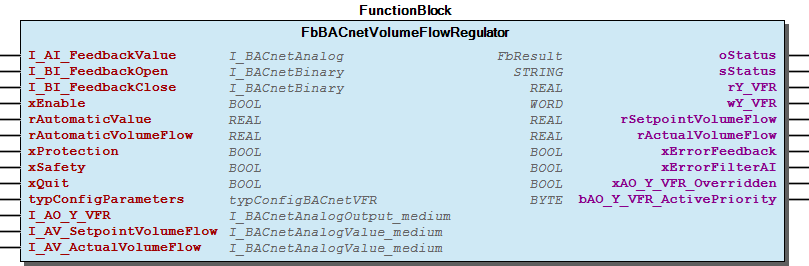

# WagoAppBuildingHVAC_BACnet v1.0.0.29 (WAGO) - Complete Documentation


## 📋 Library Information

- **Company:** WAGO
- **Title:** WagoAppBuildingHVAC_BACnet
- **Version:** 1.0.0.29
- **Categories:** WAGO BusinessView|Building Automation; WAGO LayerView|App; Application
- **Namespace:** WagoAppBuildingHVAC_BACnet
- **Author:** WAGO / U018900
- **Placeholder:** WagoAppBuildingHVAC_BACnet

### Description ¶


This document is automatically generated.

Library for HVAC BACnet applications

The function blocks of this library are NOT thread safe and must be called from one CODESYS task only! Concurrent calls from different tasks may cause loss or corruption of data.

This document is automatically generated. Library for HVAC BACnet applications The function blocks of this library are NOT thread safe and must be called from one CODESYS task only! Concurrent calls from different tasks may cause loss or corruption of data.

### Contents: ¶


Contents: - Documentation Index 10 Documentation - WagoAppBuildingHVAC_BACnet Library Documentation Project Information Library Information Function Blocks - FbBACnet2BoilerStrategy (FB) - FbBACnet2LevelBoiler (FB) - FbBACnet2PointDamper (FB) - FbBACnet2PointDriver (FB) - FbBACnet2PointSingleRoomController (FB) - FbBACnetAnalog3Point (FB) - FbBACnetAntiFreezeAir (FB) - FbBACnetAntiFreezeWater (FB) - FbBACnetAntiLegionella (FB) - FbBACnetAveragedOutsideTemperature (FB) - ... and 79 more Functions Methods - 11 Set point adjustment / Sollwertanpassung - 11 Set point adjustment / Sollwertanpassung - 11 Set point adjustment / Sollwertanpassung - FbBACnet2BoilerStrategy.FB_Reinit (METH) - FbBACnet2BoilerStrategy.toggleOutOfService (METH) - FbBACnet2LevelBoiler.FB_Reinit (METH) - FbBACnet2LevelBoiler.toggleOutOfService (METH) - FbBACnet2LevelBoiler.xValveOpen (PROP) - FbBACnet2PointDamper.FB_Reinit (METH) - FbBACnet2PointDamper.xLimitSwitchClose (PROP) - ... and 192 more Interfaces Program Organization Internal Components - 90 Internal - 90 Internal Global Variable Lists - Status (GVL) - VersionHistory (GVL) Other Components - 01 System control / Anlagenüberwachung - 01 System control / Anlagenüberwachung - 01 System control/ Anlagenüberwachung - 02 Antifreeze / Frostschutz - 02 Antifreeze / Frostschutz - 02 Antifreeze / Frostschutz - 03 Damper control / Klappensteuerung - 03 Damper control / Klappensteuerung - 03 Damper control / Klappensteuerung - 04 Fan control / Ventilatorsteuerung - ... and 465 more

### Indices and tables ¶


Based on WagoAppBuildingHVAC_BACnet.library, last modified 20.09.2024, 21:20:03. LibDoc 3.5.16.10

© WAGO GmbH & Co. KG, Germany 2018 – All rights reserved. For the avoidance of doubt, this copyright notice does not only apply to the information above but also and primarily to the described library itself. Please note that third-party products are always mentioned without reference to intellectual property rights, including patents, utility models, designs and trademarks, accordingly the existence of such rights cannot be excluded. WAGO is a registered trademark of WAGO Verwaltungsgesellschaft mbH.

- File and Project Information - Library Reference Based on WagoAppBuildingHVAC_BACnet.library, last modified 20.09.2024, 21:20:03. LibDoc 3.5.16.10 © WAGO GmbH & Co. KG, Germany 2018 – All rights reserved. For the avoidance of doubt, this copyright notice does not only apply to the information above but also and primarily to the described library itself. Please note that third-party products are always mentioned without reference to intellectual property rights, including patents, utility models, designs and trademarks, accordingly the existence of such rights cannot be excluded. WAGO is a registered trademark of WAGO Verwaltungsgesellschaft mbH.

### Documentation Index


## 10 Documentation


To ensure fast installation and start-up of the units, we strongly recommend that the following information and explanations are carefully read and adhered to.

To ensure fast installation and start-up of the units, we strongly recommend that the following information and explanations are carefully read and adhered to. - doc01_Foreword (FB)

## WagoAppBuildingHVAC_BACnet Library Documentation


| Company: | WAGO |
| Title: | WagoAppBuildingHVAC_BACnet |
| Version: | 1.0.0.29 |
| Categories: | WAGO BusinessView\|Building Automation; WAGO LayerView\|App; Application |
| Namespace: | WagoAppBuildingHVAC_BACnet |
| Author: | WAGO / U018900 |
| Placeholder: | WagoAppBuildingHVAC_BACnet |

### Description


This document is automatically generated.

Library for HVAC BACnet applications

The function blocks of this library are NOT thread safe and must be called from one CODESYS task only! Concurrent calls from different tasks may cause loss or corruption of data.

This document is automatically generated. Library for HVAC BACnet applications The function blocks of this library are NOT thread safe and must be called from one CODESYS task only! Concurrent calls from different tasks may cause loss or corruption of data.

### Contents:


- 10 Documentation doc01_Foreword (FB) 20 Program Organization Units - 01 System control/ Anlagenüberwachung - 02 Antifreeze / Frostschutz - 03 Damper control / Klappensteuerung - 04 Fan control / Ventilatorsteuerung - 05 Controller / Regler - 06 Sequences / Sequenzen - 07 Heat exchanger / Wärmeübertrager - 08 Pumps and Valves / Pumpen und Ventile - 09 Analog signals / Analoge Signale - 10 Temperature elevation / Temperaturauswertung - 11 Set point adjustment / Sollwertanpassung - 12 Boiler control / Kesselsteuerung - 13 Single Room Controller / Einzelraumregelung - 14 General drivers / Allgemeine Antriebe - 15 Volume Flow / Volumenstrom - 16 Additional options / Zusatzfunktionen - 80 Data Types - 81 Interfaces 30 Visualizations - 01 System control / Anlagenüberwachung - 02 Antifreeze / Frostschutz - 03 Damper control / Klappensteuerung - 04 Fan control / Ventilatorsteuerung - 05 Controller / Regler - 06 Sequences / Sequenzen - 07 Heat exchanger / Wärmeübertrager - 08 Pumps and Valves / Pumpen und Ventile - 09 Analog signals / Analoge Signale - 10 Temperature elevation / Temperaturauswertung - 11 Set point adjustment / Sollwertanpassung - 12 Boiler control / Kesselsteuerung - 13 Single Room Controller / Einzelraumregelung - 14 General drivers / Allgemeine Antriebe - 15 Volume Flow / Volumenstrom - 16 Additional options / Zusatzfunktionen - 90 Internal - 99 Common graphics / Allgemeine Grafiken 80 Status - Status (GVL) - eStatusHVAC_BACnet (ENUM) 90 Internal - Help GlobalTextList (Text List) Parameterlist_HVAC_BACnet (PARAMS) VersionHistory (GVL)

### Indices and tables


Based on WagoAppBuildingHVAC_BACnet.library, last modified 20.09.2024, 21:20:03. LibDoc 3.5.16.10

© WAGO GmbH & Co. KG, Germany 2018 – All rights reserved. For the avoidance of doubt, this copyright notice does not only apply to the information above but also and primarily to the described library itself. Please note that third-party products are always mentioned without reference to intellectual property rights, including patents, utility models, designs and trademarks, accordingly the existence of such rights cannot be excluded. WAGO is a registered trademark of WAGO Verwaltungsgesellschaft mbH.

- File and Project Information - Library Reference Based on WagoAppBuildingHVAC_BACnet.library, last modified 20.09.2024, 21:20:03. LibDoc 3.5.16.10 © WAGO GmbH & Co. KG, Germany 2018 – All rights reserved. For the avoidance of doubt, this copyright notice does not only apply to the information above but also and primarily to the described library itself. Please note that third-party products are always mentioned without reference to intellectual property rights, including patents, utility models, designs and trademarks, accordingly the existence of such rights cannot be excluded. WAGO is a registered trademark of WAGO Verwaltungsgesellschaft mbH.

### Project Information


## File and Project Information


| Scope | Name | Type | Content |
| --- | --- | --- | --- |
| FileHeader | libraryFile | string | WagoAppBuildingHVAC_BACnet.library |
| contentFile | doc.clean.json |
| productName | e!COCKPIT |
| creationDateTime | date | 20.09.2024, 21:20:55 |
| companyName | string | WAGO |
| ProjectInformation | LastModificationDateTime | date | 20.09.2024, 21:20:03 |
| Description | string | See: Description |
| Copyright | © WAGO Kontakttechnik GmbH & Co. KG, Germany 2021 – All rights reserved. |
| Author | WAGO / U018900 |
| AutoResolveUnbound | bool | True |
| Placeholder | string | WagoAppBuildingHVAC_BACnet |
| Company | WAGO |
| DocFormat | reStructuredText |
| Namespace | WagoAppBuildingHVAC_BACnet |
| Project | WagoAppBuildingHVAC_BACnet |
| DefaultNamespace | WagoAppBuildingHVAC_BACnet |
| Version | version | 1.0.0.29 |
| Title | string | WagoAppBuildingHVAC_BACnet |
| LibraryCategories | library-category-list | WAGO BusinessView\|Building Automation; WAGO LayerView\|App; Application |
| CompiledLibraryCompatibilityVersion | string | CODESYS V3.5 SP16 Patch 3 |
| ThreadSafe | bool | False |

### Library Information


## Library Reference


| LinkAllContent: False QualifiedOnly: False | SystemLibrary: False | Optional: False |

| LinkAllContent: False QualifiedOnly: False | SystemLibrary: False | Optional: False |

| LinkAllContent: False QualifiedOnly: False | SystemLibrary: False | Optional: False |

| LinkAllContent: False QualifiedOnly: False | SystemLibrary: True | Optional: False |

| LinkAllContent: False QualifiedOnly: False | SystemLibrary: True | Optional: False |

| LinkAllContent: False QualifiedOnly: False | SystemLibrary: True | Optional: False |

| LinkAllContent: False QualifiedOnly: False | SystemLibrary: True | Optional: False |

| LinkAllContent: False QualifiedOnly: False | SystemLibrary: True | Optional: False |

| LinkAllContent: False QualifiedOnly: False | SystemLibrary: True | Optional: False |

| LinkAllContent: False QualifiedOnly: False | SystemLibrary: False | Optional: False |

| LinkAllContent: False QualifiedOnly: False | SystemLibrary: True | Optional: False |

| LinkAllContent: False QualifiedOnly: False | SystemLibrary: True | Optional: False |

| LinkAllContent: False QualifiedOnly: False | SystemLibrary: True | Optional: False |

| LinkAllContent: False QualifiedOnly: False | SystemLibrary: True | Optional: False |

| LinkAllContent: False Optional: False | QualifiedOnly: False SystemLibrary: True | PublishSymbolsInContainer: True |

| LinkAllContent: False QualifiedOnly: False | SystemLibrary: True | Optional: False |

| LinkAllContent: False QualifiedOnly: True | SystemLibrary: False | Optional: False |

| LinkAllContent: False QualifiedOnly: False | SystemLibrary: False | Optional: False |

| LinkAllContent: False QualifiedOnly: False | SystemLibrary: False | Optional: False |

| LinkAllContent: False QualifiedOnly: False | SystemLibrary: False | Optional: False |

| LinkAllContent: False QualifiedOnly: False | SystemLibrary: False | Optional: False |

| LinkAllContent: False QualifiedOnly: False | SystemLibrary: False | Optional: False |

| LinkAllContent: False QualifiedOnly: False | SystemLibrary: False | Optional: False |

| LinkAllContent: False Optional: False | QualifiedOnly: False SystemLibrary: False | PublishSymbolsInContainer: True |

| LinkAllContent: False QualifiedOnly: False | SystemLibrary: False | Optional: False |

| LinkAllContent: False QualifiedOnly: False | SystemLibrary: False | Optional: False |

| LinkAllContent: False QualifiedOnly: False | SystemLibrary: False | Optional: False |

This is a dictionary of all referenced libraries and their name spaces.

This is a dictionary of all referenced libraries and their name spaces. Standard Library Identification : Placeholder: Standard Default Resolution: Standard, * (System) Namespace: Standard Library Properties : SysMem Library Identification : Placeholder: SysMem Default Resolution: SysMem, * (System) Namespace: SysMem Library Properties : VisuDialogs Library Identification : Placeholder: VisuDialogs Default Resolution: VisuDialogs, * (System) Namespace: VisuDialogs Library Properties : VisuElem3DPath Library Identification : Placeholder: System_VisuElem3DPath Default Resolution: VisuElem3DPath, 3.5.10.0 (System) Namespace: VisuElem3DPath Library Properties : Library Parameter : Parameter: GC_POINTS_PER_POLYGON = 100 VisuElemCamDisplayer Library Identification : Placeholder: System_VisuElemCamDisplayer Default Resolution: VisuElemCamDisplayer, 3.5.10.0 (System) Namespace: VisuElemCamDisplayer Library Properties : Library Parameter : Parameter: GC_POINTS_PER_CAM = 100 VisuElemMeter Library Identification : Placeholder: System_VisuElemMeter Default Resolution: VisuElemMeter, 3.5.10.0 (System) Namespace: VisuElemMeter Library Properties : VisuElemTextEditor Library Identification : Placeholder: System_VisuElemTextEditor Default Resolution: VisuElemTextEditor, 3.5.10.0 (System) Namespace: VisuElemTextEditor Library Properties : VisuElemTrace Library Identification : Placeholder: System_VisuElemTrace Default Resolution: VisuElemTrace, 3.5.10.0 (System) Namespace: VisuElemTrace Library Properties : VisuElemXYChart Library Identification : Placeholder: System_VisuElemXYChart Default Resolution: VisuElemXYChart, 3.5.16.30 (System) Namespace: VisuElemXYChart Library Properties : VisuElems Library Identification : Placeholder: System_VisuElems Default Resolution: VisuElems, * (System) Namespace: VisuElems Library Properties : VisuElemsAlarm Library Identification : Placeholder: System_VisuElemsAlarm Default Resolution: VisuElemsAlarm, 3.5.10.0 (System) Namespace: VisuElemsAlarm Library Properties : VisuElemsDateTime Library Identification : Placeholder: System_VisuElemsDateTime Default Resolution: VisuElemsDateTime, 3.5.10.0 (System) Namespace: VisuElemsDateTime Library Properties : VisuElemsSpecialControls Library Identification : Placeholder: System_VisuElemsSpecialControls Default Resolution: VisuElemsSpecialControls, 3.5.10.0 (System) Namespace: VisuElemsSpecialControls Library Properties : VisuElemsWinControls Library Identification : Placeholder: System_VisuElemsWinControls Default Resolution: VisuElemsWinControls, 3.5.10.0 (System) Namespace: VisuElemsWinControls Library Properties : VisuInputs Library Identification : Placeholder: system_visuinputs Default Resolution: VisuInputs, 3.5.16.30 (System) Namespace: visuinputs Library Properties : VisuNativeControl Library Identification : Placeholder: System_VisuNativeControl Default Resolution: VisuNativeControl, 3.5.10.0 (System) Namespace: VisuNativeControl Library Properties : VisuSymbols Library Identification : Name: VisuSymbols Version: newest Company: System Namespace: VisuSymbols Library Properties : WagoAppBuildingHVAC Library Identification : Placeholder: WagoAppBuildingHVAC Default Resolution: WagoAppBuildingHVAC, * (WAGO) Namespace: WagoAppBuildingHVAC Library Properties : WagoAppString Library Identification : Placeholder: WagoAppString Default Resolution: WagoAppString, * (WAGO) Namespace: WagoAppString Library Properties : WagoSysBACnet Library Identification : Placeholder: WagoSysBACnet Default Resolution: WagoSysBACnet, * (WAGO) Namespace: WagoSysBACnet Library Properties : WagoSysErrorBase Library Identification : Placeholder: WagoSysErrorBase Default Resolution: WagoSysErrorBase, * (WAGO) Namespace: WagoSysErrorBase Library Properties : WagoSysVersion Library Identification : Name: WagoSysVersion Version: 1.0.0.0 Company: WAGO Namespace: WagoSysVersion Library Properties : WagoTypesBACnet Library Identification : Placeholder: WagoTypesBACnet Default Resolution: WagoTypesBACnet, * (WAGO) Namespace: WagoTypesBACnet Library Properties : WagoTypesErrorBase Library Identification : Placeholder: WagoTypesErrorBase Default Resolution: WagoTypesErrorBase, * (WAGO) Namespace: WagoTypesErrorBase Library Properties : WagoVisuIcons Library Identification : Placeholder: WagoVisuIcons Default Resolution: WagoVisuIcons, * (WAGO) Namespace: WagoVisuIcons Library Properties : WagoVisuIcons Library Identification : Name: WagoVisuIcons Version: newest Company: WAGO Namespace: WagoVisuIcons Library Properties : WagoVisuIconsMaterialDesign Library Identification : Name: WagoVisuIconsMaterialDesign Version: newest Company: WAGO Namespace: WagoVisuIconsMaterialDesign Library Properties :

### Function Blocks


## FbBACnet2BoilerStrategy (FB)


| Scope | Name | Type | Initial | Comment |
| --- | --- | --- | --- | --- |
| Input | I_AI_ActualSystemSupplyTemperature | WagoTypesBACnet.I_BACnetAnalog |  | Actual system supply temperature. [°C] |
| I_AV_ReferenceSystemSupplyTemperature | WagoTypesBACnet.I_BACnetAnalog |  | Reference system supply temperature. [°C] |
| bLeadBoiler | BYTE | 1 | Select leading boiler. (0 = both boilers in parallel) |
| typStatusBoiler1 | typStatusBoiler |  | Status feedback from boiler 1. |
| typStatusBoiler2 | typStatusBoiler |  | Status feedback from boiler 2. |
| typConfigParameters | typConfigBACnet2BoilerStrategy |  | Configuration parameters. |
| I_BO_SwitchOnBoiler1 | WagoTypesBACnet.I_BACnetBinaryOutput_medium |  | Enable boiler 1. |
| I_BO_SwitchOnBoiler2 | WagoTypesBACnet.I_BACnetBinaryOutput_medium |  | Enable boiler 2. |
| I_AV_ReferenceTemperatureBoiler | WagoTypesBACnet.I_BACnetAnalogValue_medium |  | Display of specified system supply temperature [°C] |
| Output | oStatus | WagoSysErrorBase.FbResult |  | status object. (Listed in Status ) The content of the error object could be displayed via the FbShowResult from the WagoSysErrorBase library. |
| sStatus | STRING |  | status description as string (Listed in Status ) |
| bLeadingBoiler | BYTE |  | Indication of leading boiler. |
| xSwitchOnBoiler1 | BOOL |  | Enable boiler 1. |
| xFullLoadBoiler1 | BOOL |  | Boiler 1 should run at full load. |
| xSwitchOnBoiler2 | BOOL |  | Enable boiler 2. |
| xFullLoadBoiler2 | BOOL |  | Boiler 2 should run at full load. |
| xOverheatingProtection | BOOL |  | Displays overheating protection activity. |
| rReferenceTemperatureBoiler | REAL | 60 | Display of specified system supply temperature [°C] |
| xBO_SwitchOnBoiler_1_Overridden | BOOL |  | BO Boiler 1 overridden by higher priority than automatic |
| bBO_SwitchOnBoiler_1_ActivePriority | BYTE |  | BO Boiler 1 active priority |
| xBO_SwitchOnBoiler_2_Overridden | BOOL |  | BO Boiler 2 overridden by higher priority than automatic |
| bBO_SwitchOnBoiler_2_ActivePriority | BYTE |  | BO Boiler 2 active priority |
| xAV_ReferenceTemperatureBoiler_Overridden | BOOL |  | BO Boiler overridden by higher priority than automatic |
| bAV_ReferenceTemperatureBoiler_ActivePriority | BYTE |  | BO Boiler active priority |

Function block enables a boiler sequence control be enabling the two boilers in line with current demand.

Graphical Illustration

Graphical Interface of FbBACnet2BoilerStrategy

BACnet interfaces

Input and output interfaces are optical separated by the FB configuration structure typConfigParameters .

Input interfaces are used to connect this FB to external referenced BACnet object (Function Block) instances. The interface type is shown in the prefix like BI for BinaryInput or AV for AnalogValue and so on. It doesn’t matter if the objects have a characteristic of small, medium or large.

If there is no BACnet object to connect, the same named function block properties could be used. But note that a parallel useage of BACnet object connection AND property connection insn’t possible.

A multiple usage of referenced BACnet objects (Function Blocks) is possible.

Output interfaces are fixed to a specific defined BACnet object type which is shown in the naming like BO for BinaryOutput , AO for AnalogOutput and so on. Furthermore only BACnet objects with medium characteristics could be connected.

A multiple usage of referenced BACnet objects isn’t possible.

Function description

The lead boiler can be defined for boiler sequence control via the bLeadBoiler input. Both boilers are controlled simultaneously if a zero is present at the bLeadBoiler input.

In the event of a boiler malfunction, the lead boiler is changed.The current lead boiler is indicated at the bLeadingBoiler output.

The reference system supply temperature is specified at the rReferenceSystemSupplyTemperature / I_AV_ReferenceSystemSupplyTemperature input. This can be determined, for example, via a MAX logic circuit for the requisite supply temperatures for the HVAC circuits linked to the system.

The specified boiler temperature is indicated at the rReferenceTemperatureBoiler / I_AV_ReferenceTemperatureBoiler and is yielded from the specified system supply temperature, plus the defined offset.

If the system supply temperature rActualSystemSupplyTemperature / I_AI_ActualSystemSupplyTemperature falls below the specified boiler temperature rReferenceTemperatureBoiler / I_AV_ReferenceTemperatureBoiler , the lead boiler is enabled via the xSwitchOnBoilerX / I_BO_SwitchOnBoilerX output.

When the lead boiler reaches it maximum output and the specified system supply temperature is still not achieved, the lag boiler is then enabled xSwitchOnBoilerX with a defined delay time. At the same time, the lead boiler is put into full load via the xFullLoadBoilerX / I_BO_SwitchOnBoilerX output.

When operating at full load, the lead boiler is limited by the maximum boiler temperature. The enable function for the lag boiler remains active until the system supply temperature is achieved and the lag boiler is switched off.

As soon as the enable function for the lag boiler xSwitchOnBoilerX / I_BO_SwitchOnBoilerX is canceled, the full load signal xFullLoadBoilerX from the lead boiler is also canceled.

The enable signal for the lead boiler is canceled when the system supply temperature is reached and the lead boiler is switched off.

The boiler sequence control is deactivated when one of the two boilers is in the Manual mode.

If the system supply temperature rActualSystemSupplyTemperature / I_AI_ActualSystemSupplyTemperature exceeds the defined maximum system supply temperature, the enable signal for both boilers is canceled and the xOverheatingProtection output activated. Overheating protection is deactivated when the system supply temperature falls below the maximum system supply temperature, minus the hysteresis.

The status check-back signal from the boiler modules is given by typStatusBoilerX .

Interface variables Function Function block enables a boiler sequence control be enabling the two boilers in line with current demand. Graphical Illustration  Graphical Interface of FbBACnet2BoilerStrategy BACnet interfaces Input and output interfaces are optical separated by the FB configuration structure typConfigParameters . Input interfaces are used to connect this FB to external referenced BACnet object (Function Block) instances. The interface type is shown in the prefix like BI for BinaryInput or AV for AnalogValue and so on. It doesn’t matter if the objects have a characteristic of small, medium or large. If there is no BACnet object to connect, the same named function block properties could be used. But note that a parallel useage of BACnet object connection AND property connection insn’t possible. Note A multiple usage of referenced BACnet objects (Function Blocks) is possible. Output interfaces are fixed to a specific defined BACnet object type which is shown in the naming like BO for BinaryOutput , AO for AnalogOutput and so on. Furthermore only BACnet objects with medium characteristics could be connected. Note A multiple usage of referenced BACnet objects isn’t possible. Function description The lead boiler can be defined for boiler sequence control via the bLeadBoiler input. Both boilers are controlled simultaneously if a zero is present at the bLeadBoiler input. In the event of a boiler malfunction, the lead boiler is changed.The current lead boiler is indicated at the bLeadingBoiler output. The reference system supply temperature is specified at the rReferenceSystemSupplyTemperature / I_AV_ReferenceSystemSupplyTemperature input. This can be determined, for example, via a MAX logic circuit for the requisite supply temperatures for the HVAC circuits linked to the system. The specified boiler temperature is indicated at the rReferenceTemperatureBoiler / I_AV_ReferenceTemperatureBoiler and is yielded from the specified system supply temperature, plus the defined offset. If the system supply temperature rActualSystemSupplyTemperature / I_AI_ActualSystemSupplyTemperature falls below the specified boiler temperature rReferenceTemperatureBoiler / I_AV_ReferenceTemperatureBoiler , the lead boiler is enabled via the xSwitchOnBoilerX / I_BO_SwitchOnBoilerX output. When the lead boiler reaches it maximum output and the specified system supply temperature is still not achieved, the lag boiler is then enabled xSwitchOnBoilerX with a defined delay time. At the same time, the lead boiler is put into full load via the xFullLoadBoilerX / I_BO_SwitchOnBoilerX output. When operating at full load, the lead boiler is limited by the maximum boiler temperature. The enable function for the lag boiler remains active until the system supply temperature is achieved and the lag boiler is switched off. As soon as the enable function for the lag boiler xSwitchOnBoilerX / I_BO_SwitchOnBoilerX is canceled, the full load signal xFullLoadBoilerX from the lead boiler is also canceled. The enable signal for the lead boiler is canceled when the system supply temperature is reached and the lead boiler is switched off. The boiler sequence control is deactivated when one of the two boilers is in the Manual mode. If the system supply temperature rActualSystemSupplyTemperature / I_AI_ActualSystemSupplyTemperature exceeds the defined maximum system supply temperature, the enable signal for both boilers is canceled and the xOverheatingProtection output activated. Overheating protection is deactivated when the system supply temperature falls below the maximum system supply temperature, minus the hysteresis. The status check-back signal from the boiler modules is given by typStatusBoilerX . - FbBACnet2BoilerStrategy.FB_Reinit (METH) - FbBACnet2BoilerStrategy.bManualLevel (PROP) - FbBACnet2BoilerStrategy.rActualSystemSupplyTemperature (PROP) - FbBACnet2BoilerStrategy.rReferenceSystemSupplyTemperature (PROP) - FbBACnet2BoilerStrategy.toggleOutOfService (METH) - FbBACnet2BoilerStrategy.xManualOperation (PROP)

## FbBACnet2LevelBoiler (FB)


| Scope | Name | Type | Initial | Comment |
| --- | --- | --- | --- | --- |
| Input | I_AI_ActualBoilerTemperature | WagoTypesBACnet.I_BACnetAnalog |  | Actual boiler temperature. [°C] |
| I_AI_ActualReturnTemperature | WagoTypesBACnet.I_BACnetAnalog |  | Actual return temperature. [°C] |
| I_BI_SafetyChain | WagoTypesBACnet.I_BACnetBinary |  | Feedback safety chain from boiler (Fault: PresentValue=Active or StatusFlags.xInAlarm=TRUE) |
| I_BI_RepairSwitchPump | WagoTypesBACnet.I_BACnetBinary |  | Repair switch boiler pump (Fault: PresentValue=Active or StatusFlags.xInAlarm=TRUE) |
| I_BI_MotorProtectionPump | WagoTypesBACnet.I_BACnetBinary |  | Motor protection boiler pump (Fault: PresentValue=Active or StatusFlags.xInAlarm=TRUE) |
| I_BI_RepairSwitchAdmixingPump | WagoTypesBACnet.I_BACnetBinary |  | Repair switch admixing pump (Fault: PresentValue=Active or StatusFlags.xInAlarm=TRUE) |
| I_BI_MotorProtectionAdmixingPump | WagoTypesBACnet.I_BACnetBinary |  | Motor protection admixing pump (Fault: PresentValue=Active or StatusFlags.xInAlarm=TRUE) |
| I_BI_ChimneySweepFunction | WagoTypesBACnet.I_BACnetBinary |  | Chimney sweep function, TRUE=activated |
| I_BI_ValveOpen | WagoTypesBACnet.I_BACnetBinary |  | Feedback limit switch valve open. |
| I_BI_ManualOperationExternal | WagoTypesBACnet.I_BACnetBinary |  | Feedback signal from external manual operation. |
| I_BI_SwitchOnBoiler | WagoTypesBACnet.I_BACnetBinary |  | Switch in automatic mode. (e.g. from boiler strategy) |
| I_AV_ReferenceBoilerTemperature | WagoTypesBACnet.I_BACnetAnalog |  | Reference boiler temperature. [°C] |
| xFullLoad | BOOL |  | Boiler is to run at full load. |
| bLeadBoiler | BYTE |  | Defining of lead boiler. |
| bBoilerNumber | BYTE | 1 | Boiler number. (1 or 2) |
| xQuit | BOOL |  | Error message acknowledgement |
| typConfigParameters | typConfigBACnet2LevelBoiler |  | Configuration parameters. |
| I_BO_Level1 | WagoTypesBACnet.I_BACnetBinaryOutput_medium |  | Burner level 1 signal. |
| I_BO_Level2 | WagoTypesBACnet.I_BACnetBinaryOutput_medium |  | Burner level 2 signal. |
| I_BO_BoilerPump | WagoTypesBACnet.I_BACnetBinaryOutput_medium |  | Boiler circuit pump signal. |
| I_BO_AdmixingPump | WagoTypesBACnet.I_BACnetBinaryOutput_medium |  | Admixing pump signal. |
| I_BO_Valve | WagoTypesBACnet.I_BACnetBinaryOutput_medium |  | Switching signal for full-way valves. |
| I_AO_Y_Valve | WagoTypesBACnet.I_BACnetAnalogOutput_medium |  | Valve position for three-way. [%] |
| Output | oStatus | WagoSysErrorBase.FbResult |  | status object. (Listed in Status ) The content of the error object could be displayed via the FbShowResult from the WagoSysErrorBase library. |
| sStatus | STRING |  | status description as string (Listed in Status ) |
| xLevel1 | BOOL |  | Burner level 1 signal. |
| xLevel2 | BOOL |  | Burner level 2 signal. |
| xBoilerPump | BOOL |  | switching signal for the circuit pump |
| xAdmixingPump | BOOL |  | switching signal for the admixing pump |
| xValve | BOOL |  | switching signal for 2 point driver |
| rY_Valve | REAL |  | position for the continuous driver [%] |
| wY_Valve | WORD |  | position for the continuous driver [0..32767] |
| xChimneySweep | BOOL |  | displays the chimney sweep function |
| xCondensationProtection | BOOL |  | Displays condenstation protection. |
| rMinBoilerTemperature | REAL |  | Minimum boiler supply temperature. |
| xErrorBoilerPump | BOOL |  | Displays error boiler pump. |
| xErrorAdmixingPump | BOOL |  | Displays error admixing pump. |
| xErrorStartUp | BOOL |  | Displays minimum temperature not reached in defined time while startup. |
| typStatusBoiler | typStatusBoiler |  | Status boiler for strategy function block. |
| xBO_Level1_Overridden | BOOL |  | BO level 1 overridden by higher priority than automatic |
| bBO_Level1_ActivePriority | BYTE |  | BO level 1 active priority |
| xBO_Level2_Overridden | BOOL |  | BO level 2 overridden by higher priority than automatic |
| bBO_Level2_ActivePriority | BYTE |  | BO level 2 active priority |
| xBO_BoilerPump_Overridden | BOOL |  | BO BoilerPump overridden by higher priority than automatic |
| bBO_BoilerPump_ActivePriority | BYTE |  | BO BoilerPump active priority |
| xBO_AdmixingPump_Overridden | BOOL |  | BO BoilerPump overridden by higher priority than automatic |
| bBO_AdmixingPump_ActivePriority | BYTE |  | BO BoilerPump active priority |
| xBO_Valve_Overridden | BOOL |  | BO valve overridden by higher priority than automatic |
| bBO_Valve_ActivePriority | BYTE |  | BO valve active priority |
| xAO_Y_Valve_Overridden | BOOL |  | AO valve overridden by higher priority than automatic |
| bAO_Y_Valve_ActivePriority | BYTE |  | AO valve active priority |

Function block contains various startup processes based on the valves and pumps used in the specific configuration and also regulates a 2-level boiler.

Graphical Illustration

Graphical Interface of FbBACnet2LevelBoiler

BACnet interfaces

Input and output interfaces are optical separated by the FB configuration structure typConfigParameters .

Input interfaces are used to connect this FB to external referenced BACnet object (Function Block) instances. The interface type is shown in the prefix like BI for BinaryInput or AV for AnalogValue and so on. It doesn’t matter if the objects have a characteristic of small, medium or large.

If there is no BACnet object to connect, the same named function block properties could be used. But note that a parallel useage of BACnet object connection AND property connection insn’t possible.

A multiple usage of referenced BACnet objects (Function Blocks) is possible.

Output interfaces are fixed to a specific defined BACnet object type which is shown in the naming like BO for BinaryOutput , AO for AnalogOutput and so on. Furthermore only BACnet objects with medium characteristics could be connected.

A multiple usage of referenced BACnet objects isn’t possible.

Function description

The boiler is activated via the input xSwitchOnBoiler / I_BI_SwitchOnBoiler .

When activated, the minimum boiler supply temperature is output for evaluation of the system supply temperature at the rMinBoilerTemperature output.

The specific boiler number bBoilerNumber and the number of the lead boiler bLeadBoiler determine whether the boiler is the lead or lag boiler. If both of these numbers are the same, the parameters for the lead boiler will be used.

Different startup procedures can apply, depending on the valve being used and the water volume:

2-way valve with large volume of water:

2-Way Valve with low water volume:

3-way valve:

After the startup procedure the boiler remains at the first level for at least the minimum switch-on time.

If the boiler fails to reach its specified boiler temperature within the defined time, the boiler is switched to Level 2 xLevel2 / I_BO_Level2 . When the boiler then reaches its specified boiler temperature, it is switched back from Level 2 to Level 1.

The boiler is switched to Level 2 again when the temperature falls below the specified boiler temperature, minus hysteresis. The boiler switches from Level 1 to Level 0 when the specified boiler temperature is maintained for the minimum switch-on time for the Level 1 time. The boiler is switched back to Level 1 if its temperature falls below the specified boiler temperature at Level 0.

If there is a 3-way valve in the boiler return line, the minimum return temperature is permanently maintained during ongoing operation. A PI controller is used for the minimum return temperature.

The admixing pump xAdmixingPump / I_BO_AdmixingPump is switched on during ongoing operation when the temperature falls below the minimum boiler temperature or the minimum return temperature when a 2-way valve is available. If the temperature drops below the minimum boiler temperature, the xCondensationProtection output is also set.

The boiler circuit pump continues to run when the boiler is switched off until the Switch-off delay time elapses and the difference between rActualBoilerTemperature / I_AI_ActualBoilerTemperature and rActualReturnTemperature / I_AI_ActualReturnTemperature is less than the defined difference. The valve in the return line is not closed until the boiler circuit pump is switched off.

If the xFullLoad input is set using the strategy module, the boiler module no longer regulates the temperature in line with its specified boiler temperature, but is controlled only by maximum limiting.

The necessary information about the boiler is supplied to the strategy module through the typStatusBoiler structure.

The xSafetyChain / I_BI_SafetyChain input monitors the safety chain for the boiler. As soon as this input is switched to TRUE, the boiler is switched off and a corresponding error message indicated at the sStatus output.

In the event of a malfunction with the boiler circuit pump caused by the motor protection switch xMotorProtectionPump / I_BI_MotorProtectionPump or the repair switch xRepairSwitchPump / I_BI_RepairSwitchPump , the boiler is switched off and the error indicated at the sStatus and xErrorBoilerPump output.

In the event of a malfunction of the admixing pump caused by the motor protection switch xMotorProtectionAdmixingPump / I_BI_MotorProtectionAdmixingPump or the repair switch xRepairSwitchAdmixingPump / I_BI_RepairSwitchAdmixingPump , the admixing pump is switched off and the error indicated at the xErrorAdmixingPump output.

The error messages can be acknowledged via a flank at the xQuit input.

When the chimney sweep function xChimneySweepFunction / I_BI_ChimneySweepFunction is activated, the boiler switches on with an elevated reference value (maximum boiler temperature Level 2). The xChimneySweep output is set as a check-back signal that the chimney sweep function has been activated. The chimney sweep function is canceled when the xChimneySweepFunction / I_BI_ChimneySweepFunction input is deactivated, or when the maximum runtime has elapsed.

If the boiler is switched to the Manual mode via an external circuit, a check-back signal should be transmitted to the boiler module via the xFeedbackManualOperation / I_BI_FeedbackManualOperation so that automatic control can be deactivated.

The pump or valve can be put through a maintenance run to prevent them from blocking during extended outage periods. Blocking protection must be activated for this.

The blocking protection function ensures that the pump and the valve do not remain switched off/closed longer than the specified monitoring period. On expiration of this time period, the pump and the valve are activated one after the other for the maintenance run for the defined time.

The output value wY_Valve has the same meaning as the rY_Valve / I_AO_Y_Valve output, except that the output has standardized values between 0 – 32767.

Interface variables Function Function block contains various startup processes based on the valves and pumps used in the specific configuration and also regulates a 2-level boiler. Graphical Illustration  Graphical Interface of FbBACnet2LevelBoiler BACnet interfaces Input and output interfaces are optical separated by the FB configuration structure typConfigParameters . Input interfaces are used to connect this FB to external referenced BACnet object (Function Block) instances. The interface type is shown in the prefix like BI for BinaryInput or AV for AnalogValue and so on. It doesn’t matter if the objects have a characteristic of small, medium or large. If there is no BACnet object to connect, the same named function block properties could be used. But note that a parallel useage of BACnet object connection AND property connection insn’t possible. Note A multiple usage of referenced BACnet objects (Function Blocks) is possible. Output interfaces are fixed to a specific defined BACnet object type which is shown in the naming like BO for BinaryOutput , AO for AnalogOutput and so on. Furthermore only BACnet objects with medium characteristics could be connected. Note A multiple usage of referenced BACnet objects isn’t possible. Function description The boiler is activated via the input xSwitchOnBoiler / I_BI_SwitchOnBoiler . When activated, the minimum boiler supply temperature is output for evaluation of the system supply temperature at the rMinBoilerTemperature output. The specific boiler number bBoilerNumber and the number of the lead boiler bLeadBoiler determine whether the boiler is the lead or lag boiler. If both of these numbers are the same, the parameters for the lead boiler will be used. Different startup procedures can apply, depending on the valve being used and the water volume: 2-way valve with large volume of water: 1. Switch on the admixing pump xAdmixingPump / I_BO_AdmixingPump . 2. Level 1 xLevel1 / I_BO_Level1 is activated when the boiler temperature rActualBoilerTemperature / I_AI_ActualBoilerTemperature is less than the specified boiler temperature rReferenceBoilerTemperature / I_AV_ReferenceBoilerTemperature , plus the defined offset. 3. The 2-way valve xValve / I_BO_Valve is opened when the minimum boiler temperature is exceeded. 4. If the boiler temperature fails to reach the minimum boiler temperature within a defined time, condensation protection xCondensationProtection is activated and this indicated at the sStatus output. 5. The boiler circuit pump xBoilerPump / I_BO_BoilerPump is switched on when the defined delay period has elapsed, or when a positive edge at the xLimitSwitchValve input reports the open status of the valve. 6. If the 2-way valve fails to reach its final position within the defined runtime, the boiler is switched off and an error message output at the sStatus output. 7. The startup procedure is terminated once the boiler circuit pump has been switched on. If the startup procedure exceeds the maximum defined time, the xErrorStartUp output is set and a warning issued at the sStatus output. 2-Way Valve with low water volume: 1. Switch on the admixing pump xAdmixingPump / I_BO_AdmixingPump . 2. Open the 2-way valve xValve / I_BO_Valve 3. The boiler circuit pump xBoilerPump / I_BO_BoilerPump is switched on when the On-delay for the pump has elapsed, or when a positive edge at the xLimitSwitchValve input reports the open status of the valve. 4. The burner xLevelX / I_BO_LevelX is activated when the boiler temperature ``rActualBoilerTemperature / I_AI_ActualBoilerTemperature is less than the specified boiler temperature rReferenceBoilerTemperature / I_AV_ReferenceBoilerTemperature . 5. The startup procedure is terminated when the minimum runtime for Level 1 elapses. 6. If the 2-way valve fails to reach its final position within the defined runtime, the boiler is switched off and an error message output at the sStatus output. 7. The admixing pump is switched off as soon as the minimum return temperature and the minimum supply temperature are exceeded. 3-way valve: 1. Switch on the admixing pump xAdmixingPump / I_BO_AdmixingPump . 2. Switch on the boiler circuit pump xBoilerPump` / I_BO_BoilerPump 3. Level 1 xLevel1 / I_BO_Level1 is activated when the boiler temperature rActualBoilerTemperature / I_AI_ActualBoilerTemperature is less than the specified boiler temperature rReferenceBoilerTemperature / I_AV_ReferenceBoilerTemperature . 4. 3-way valve rY_Valve / I_AO_Y_Valve is closed (boiler circuit) 5. The startup procedure is terminated as soos as the return temperature rises above the minimum return temperature. 6. If the minimum return temperature is not reached with the defined time, the xErrorStartUp output is activated and a warning issued via the oStatus output. After the startup procedure the boiler remains at the first level for at least the minimum switch-on time. If the boiler fails to reach its specified boiler temperature within the defined time, the boiler is switched to Level 2 xLevel2 / I_BO_Level2 . When the boiler then reaches its specified boiler temperature, it is switched back from Level 2 to Level 1. The boiler is switched to Level 2 again when the temperature falls below the specified boiler temperature, minus hysteresis. The boiler switches from Level 1 to Level 0 when the specified boiler temperature is maintained for the minimum switch-on time for the Level 1 time. The boiler is switched back to Level 1 if its temperature falls below the specified boiler temperature at Level 0. If there is a 3-way valve in the boiler return line, the minimum return temperature is permanently maintained during ongoing operation. A PI controller is used for the minimum return temperature. The admixing pump xAdmixingPump / I_BO_AdmixingPump is switched on during ongoing operation when the temperature falls below the minimum boiler temperature or the minimum return temperature when a 2-way valve is available. If the temperature drops below the minimum boiler temperature, the xCondensationProtection output is also set. The boiler circuit pump continues to run when the boiler is switched off until the Switch-off delay time elapses and the difference between rActualBoilerTemperature / I_AI_ActualBoilerTemperature and rActualReturnTemperature / I_AI_ActualReturnTemperature is less than the defined difference. The valve in the return line is not closed until the boiler circuit pump is switched off. If the xFullLoad input is set using the strategy module, the boiler module no longer regulates the temperature in line with its specified boiler temperature, but is controlled only by maximum limiting. The necessary information about the boiler is supplied to the strategy module through the typStatusBoiler structure. The xSafetyChain / I_BI_SafetyChain input monitors the safety chain for the boiler. As soon as this input is switched to TRUE, the boiler is switched off and a corresponding error message indicated at the sStatus output. In the event of a malfunction with the boiler circuit pump caused by the motor protection switch xMotorProtectionPump / I_BI_MotorProtectionPump or the repair switch xRepairSwitchPump / I_BI_RepairSwitchPump , the boiler is switched off and the error indicated at the sStatus and xErrorBoilerPump output. In the event of a malfunction of the admixing pump caused by the motor protection switch xMotorProtectionAdmixingPump / I_BI_MotorProtectionAdmixingPump or the repair switch xRepairSwitchAdmixingPump / I_BI_RepairSwitchAdmixingPump , the admixing pump is switched off and the error indicated at the xErrorAdmixingPump output. The error messages can be acknowledged via a flank at the xQuit input. When the chimney sweep function xChimneySweepFunction / I_BI_ChimneySweepFunction is activated, the boiler switches on with an elevated reference value (maximum boiler temperature Level 2). The xChimneySweep output is set as a check-back signal that the chimney sweep function has been activated. The chimney sweep function is canceled when the xChimneySweepFunction / I_BI_ChimneySweepFunction input is deactivated, or when the maximum runtime has elapsed. If the boiler is switched to the Manual mode via an external circuit, a check-back signal should be transmitted to the boiler module via the xFeedbackManualOperation / I_BI_FeedbackManualOperation so that automatic control can be deactivated. The pump or valve can be put through a maintenance run to prevent them from blocking during extended outage periods. Blocking protection must be activated for this. The blocking protection function ensures that the pump and the valve do not remain switched off/closed longer than the specified monitoring period. On expiration of this time period, the pump and the valve are activated one after the other for the maintenance run for the defined time. The output value wY_Valve has the same meaning as the rY_Valve / I_AO_Y_Valve output, except that the output has standardized values between 0 – 32767. Note 1. The input xLimitSwitchValve must be set to TRUE when a 2-way valve without a limit switch is used. - FbBACnet2LevelBoiler.FB_Reinit (METH) - FbBACnet2LevelBoiler.bManualLevelBoiler (PROP) - FbBACnet2LevelBoiler.rActualBoilerTemperature (PROP) - FbBACnet2LevelBoiler.rActualReturnTemperature (PROP) - FbBACnet2LevelBoiler.rManualValueValve (PROP) - FbBACnet2LevelBoiler.rReferenceBoilerTemperature (PROP) - FbBACnet2LevelBoiler.toggleOutOfService (METH) - FbBACnet2LevelBoiler.xChimneySweepFunction (PROP) - FbBACnet2LevelBoiler.xManualOnAdmixingPump (PROP) - FbBACnet2LevelBoiler.xManualOnBoilerPump (PROP) - FbBACnet2LevelBoiler.xManualOperation (PROP) - FbBACnet2LevelBoiler.xManualOperationExternal (PROP) - FbBACnet2LevelBoiler.xMotorProtectionAdmixingPump (PROP) - FbBACnet2LevelBoiler.xMotorProtectionPump (PROP) - FbBACnet2LevelBoiler.xRepairSwitchAdmixingPump (PROP) - FbBACnet2LevelBoiler.xRepairSwitchPump (PROP) - FbBACnet2LevelBoiler.xSafetyChain (PROP) - FbBACnet2LevelBoiler.xSwitchOnBoiler (PROP) - FbBACnet2LevelBoiler.xValveOpen (PROP)

## FbBACnet2PointDamper (FB)


| Scope | Name | Type | Initial | Comment |
| --- | --- | --- | --- | --- |
| Input | I_BI_LimitSwitchOpen | WagoTypesBACnet.I_BACnetBinary |  | Limit switch damper open |
| I_BI_LimitSwitchClose | WagoTypesBACnet.I_BACnetBinary |  | Limit switch damper close |
| I_BV_NightVentilation | WagoTypesBACnet.I_BACnetBinary |  | Flag night ventilation |
| xEnableSystem | BOOL | TRUE | Enable damper (e.g. StartStop) |
| xOpenDamper | BOOL |  | Automatic position of damper |
| xProtection | BOOL |  | Set damper into protection mode |
| xSafety | BOOL |  | Set damper into safety mode |
| xQuit | BOOL |  | Error message acknowledgement. |
| typConfigParameters | typConfigBACnet2PointDamper |  | Configuration parameters |
| I_BO_Damper | WagoTypesBACnet.I_BACnetBinaryOutput_medium |  | Output control object |
| Output | oStatus | WagoSysErrorBase.FbResult |  | Status object. (Listed in Status ) The content of the error object could be displayed via the FbShowResult from the WagoSysErrorBase library. |
| sStatus | STRING |  | Status description as string (Listed in Status ) |
| xDamper | BOOL |  | Control damper adjusting motor |
| xOpen | BOOL |  | Dislpays damper is open |
| xClose | BOOL |  | Dislpays damper is close |
| xError | BOOL |  | Dislpays damper error when the maximum runtime is exceeded. |
| xBO_Damper_Overridden | BOOL |  | BO overridden by higher priority than automatic |
| bBO_Damper_ActivePriority | BYTE |  | bO active priority |

Function block is used to control 2-point dampers with optional limit switches.

Graphical Illustration

Graphical Interface of FbBACnet2PointDamper

BACnet interfaces

Input and output interfaces are optical separated by the FB configuration structure typConfigParameters .

Input interfaces are used to connect this FB to external referenced BACnet object (Function Block) instances. The interface type is shown in the prefix like BI for BinaryInput or AV for AnalogValue and so on. It doesn’t matter if the objects have a characteristic of small, medium or large.

If there is no BACnet object to connect, the same named function block properties could be used. But note that a parallel useage of BACnet object connection AND property connection insn’t possible.

A multiple usage of referenced BACnet objects (Function Blocks) is possible.

Output interfaces are fixed to a specific defined BACnet object type which is shown in the naming like BO for BinaryOutput , AO for AnalogOutput and so on. Furthermore only BACnet objects with medium characteristics could be connected.

A multiple usage of referenced BACnet objects isn’t possible.

Function description

The damper is opened in automatic mode when the system has been enabled via xEnableSystem and the xOpenDamper input has been activated. During night ventilation, the damper can also be opened independently of this enable via the xNightVentilation / I_BV_NightVentilation input.

The damper adjusting motor is controlled via the xDamper / I_BO_Damper output.

The runtime of the damper is monitored when limit switches are provided for each direction of movement. When the maximum runtime is exceeded, the damper is closed and the xError output activated. The error message can be acknowledged by the xQuit input. The function block is enabled again. The xOpen and xClose outputs indicate the status of the damper (opened/closed).

If no limit switch is provided, the damper position is determined over time.

Additional functionality

By using the input xProtection the drive could be overridden with a higher priority than in automatic or manual mode, e.g if frost protection occurs. The control and the priority (5=default) has to be defined in the configuration structure.

The same functionality as stated above will be activated if the input xSafety is set to TRUE. The difference is another control and priority (2=default) which has to be defined in the configuration structure.

Interface variables Function Function block is used to control 2-point dampers with optional limit switches. Graphical Illustration  Graphical Interface of FbBACnet2PointDamper BACnet interfaces Input and output interfaces are optical separated by the FB configuration structure typConfigParameters . Input interfaces are used to connect this FB to external referenced BACnet object (Function Block) instances. The interface type is shown in the prefix like BI for BinaryInput or AV for AnalogValue and so on. It doesn’t matter if the objects have a characteristic of small, medium or large. If there is no BACnet object to connect, the same named function block properties could be used. But note that a parallel useage of BACnet object connection AND property connection insn’t possible. Note A multiple usage of referenced BACnet objects (Function Blocks) is possible. Output interfaces are fixed to a specific defined BACnet object type which is shown in the naming like BO for BinaryOutput , AO for AnalogOutput and so on. Furthermore only BACnet objects with medium characteristics could be connected. Note A multiple usage of referenced BACnet objects isn’t possible. Function description The damper is opened in automatic mode when the system has been enabled via xEnableSystem and the xOpenDamper input has been activated. During night ventilation, the damper can also be opened independently of this enable via the xNightVentilation / I_BV_NightVentilation input. The damper adjusting motor is controlled via the xDamper / I_BO_Damper output. The runtime of the damper is monitored when limit switches are provided for each direction of movement. When the maximum runtime is exceeded, the damper is closed and the xError output activated. The error message can be acknowledged by the xQuit input. The function block is enabled again. The xOpen and xClose outputs indicate the status of the damper (opened/closed). Note If no limit switch is provided, the damper position is determined over time. Additional functionality By using the input xProtection the drive could be overridden with a higher priority than in automatic or manual mode, e.g if frost protection occurs. The control and the priority (5=default) has to be defined in the configuration structure. The same functionality as stated above will be activated if the input xSafety is set to TRUE. The difference is another control and priority (2=default) which has to be defined in the configuration structure. - FbBACnet2PointDamper.FB_Reinit (METH) - FbBACnet2PointDamper.xLimitSwitchClose (PROP) - FbBACnet2PointDamper.xLimitSwitchOpen (PROP) - FbBACnet2PointDamper.xManualOpen (PROP) - FbBACnet2PointDamper.xManualOperation (PROP) - FbBACnet2PointDamper.xNightVentilation (PROP)

## FbBACnet2PointDriver (FB)


| Scope | Name | Type | Initial | Comment |
| --- | --- | --- | --- | --- |
| Input | I_BI_LimitSwitchOpen | WagoTypesBACnet.I_BACnetBinary |  | Feedback signal from limit switch (open). |
| I_BI_LimitSwitchClose | WagoTypesBACnet.I_BACnetBinary |  | Feedback signal from limit switch (close). |
| xEnable | BOOL | TRUE | Enable fb (e.g. StartStop) |
| xOpenDriver | BOOL |  | Automatic control open |
| xProtection | BOOL |  | Set drive into protection mode |
| xSafety | BOOL |  | Set drive into safety mode |
| xQuit | BOOL |  | Error message acknowledgement |
| typConfigParameters | typConfigBACnet2PointDriver |  | Configuration parameter |
| I_BO_Driver | WagoTypesBACnet.I_BACnetBinaryOutput_medium |  | Output control driver |
| Output | oStatus | WagoSysErrorBase.FbResult |  | Status object. (Listed in Status ) The content of the error object could be displayed via the FbShowResult from the WagoSysErrorBase library. |
| sStatus | STRING |  | Status description as string (Listed in Status ) |
| xDriver | BOOL |  | control siganl for the driver |
| xOpen | BOOL |  | Displays that driver is open. |
| xClose | BOOL |  | Displays that driver is closed. |
| xError | BOOL |  | Displays error |
| xBO_Driver_Overridden | BOOL |  | BO overridden by higher priority than automatic |
| bBO_Driver_ActivePriority | BYTE |  | BO active priority |

The FbBACnet2PointDriver function block is used to control 2-point drivers with optional limit switches.

Graphical Illustration

Graphical Interface of FbBACnet2PointDriver

BACnet interfaces

Input and output interfaces are optical separated by the FB configuration structure typConfigParameters .

Input interfaces are used to connect this FB to external referenced BACnet object (Function Block) instances. The interface type is shown in the prefix like BI for BinaryInput or AV for AnalogValue and so on. It doesn’t matter if the objects have a characteristic of small, medium or large.

If there is no BACnet object to connect, the same named function block properties could be used. But note that a parallel useage of BACnet object connection AND property connection insn’t possible.

A multiple usage of referenced BACnet objects (Function Blocks) is possible.

Output interfaces are fixed to a specific defined BACnet object type which is shown in the naming like BO for BinaryOutput , AO for AnalogOutput and so on. Furthermore only BACnet objects with medium characteristics could be connected.

A multiple usage of referenced BACnet objects isn’t possible.

Function description

The driver is opened when the system has been enabled via xEnable and the xOpenDriver input has been activated.

The driver is controlled via the xDriver / I_BO_Driver output.

The runtime of the driver is monitored when limit switches are provided for each direction of movement. When the maximum runtime is exceeded, the driver is closed and the xError output activated.

The error message can be acknowledged via a flank at the xQuit input and the function block is enabled again.

In order to avoid blocking of the driver after extended outage periods, the driver can be put into operation at least once within a certain period of time. The blocking protection function must be activated for this.

The xOpen and xClose outputs indicate the status of the driver (opened/closed) by using the inputs xLimitSwitchOpen / I_BI_LimitSwitchOpen and xLimitSwitchClose / I_BI_LimitSwitchClose .

The current status for the driver is output via the sStatus output.

Additional functionality

By using the input xProtection the drive could be overridden with a higher priority than in automatic or manual mode, e.g if frost protection occurs. The control and the priority (5=default) has to be defined in the configuration structure.

The same functionality as stated above will be activated if the input xSafety is set to TRUE. The difference is another control and priority (2=default) which has to be defined in the configuration structure.

Interface variables Function The FbBACnet2PointDriver function block is used to control 2-point drivers with optional limit switches. Graphical Illustration  Graphical Interface of FbBACnet2PointDriver BACnet interfaces Input and output interfaces are optical separated by the FB configuration structure typConfigParameters . Input interfaces are used to connect this FB to external referenced BACnet object (Function Block) instances. The interface type is shown in the prefix like BI for BinaryInput or AV for AnalogValue and so on. It doesn’t matter if the objects have a characteristic of small, medium or large. If there is no BACnet object to connect, the same named function block properties could be used. But note that a parallel useage of BACnet object connection AND property connection insn’t possible. Note A multiple usage of referenced BACnet objects (Function Blocks) is possible. Output interfaces are fixed to a specific defined BACnet object type which is shown in the naming like BO for BinaryOutput , AO for AnalogOutput and so on. Furthermore only BACnet objects with medium characteristics could be connected. Note A multiple usage of referenced BACnet objects isn’t possible. Function description The driver is opened when the system has been enabled via xEnable and the xOpenDriver input has been activated. The driver is controlled via the xDriver / I_BO_Driver output. The runtime of the driver is monitored when limit switches are provided for each direction of movement. When the maximum runtime is exceeded, the driver is closed and the xError output activated. The error message can be acknowledged via a flank at the xQuit input and the function block is enabled again. In order to avoid blocking of the driver after extended outage periods, the driver can be put into operation at least once within a certain period of time. The blocking protection function must be activated for this. The xOpen and xClose outputs indicate the status of the driver (opened/closed) by using the inputs xLimitSwitchOpen / I_BI_LimitSwitchOpen and xLimitSwitchClose / I_BI_LimitSwitchClose . The current status for the driver is output via the sStatus output. Note 1. If no limit switch is provided, the driver position is determined over time. 2. Blocking protection can also be activated by a timer program, so that a potential driver error message is issued only during a defined time period. Additional functionality By using the input xProtection the drive could be overridden with a higher priority than in automatic or manual mode, e.g if frost protection occurs. The control and the priority (5=default) has to be defined in the configuration structure. The same functionality as stated above will be activated if the input xSafety is set to TRUE. The difference is another control and priority (2=default) which has to be defined in the configuration structure. - FbBACnet2PointDriver.FB_Reinit (METH) - FbBACnet2PointDriver.xLimitSwitchClose (PROP) - FbBACnet2PointDriver.xLimitSwitchOpen (PROP) - FbBACnet2PointDriver.xManualOpen (PROP) - FbBACnet2PointDriver.xManualOperation (PROP)

## FbBACnet2PointSingleRoomController (FB)


| Scope | Name | Type | Comment |
| --- | --- | --- | --- |
| Input | I_AI_RoomTemperature | WagoTypesBACnet.I_BACnetAnalog | Actual value room temperature [°C] |
| I_AI_SetpointCorrection | WagoTypesBACnet.I_BACnetAnalog | Setpoint value correction room temperature [K] |
| I_BI_ComfortStandby | WagoTypesBACnet.I_BACnetBinary | Operating mode comfort / standby. (1 / 0) |
| I_BI_NightMode | WagoTypesBACnet.I_BACnetBinary | Operating mode night . |
| I_BI_WindowContact | WagoTypesBACnet.I_BACnetBinary | Operating mode frost / heat protection . |
| I_BI_Dewpoint | WagoTypesBACnet.I_BACnetBinary | Operating mode dew point alarm (Fault: PresentValue=Active or StatusFlags.xInAlarm=TRUE) |
| I_AV_ReferenceComfort | WagoTypesBACnet.I_BACnetAnalog | Basic reference value for comfort mode. [°C] |
| I_MV_Switch | WagoTypesBACnet.I_BACnetMultiStateValue_medium | 1=Auto,2=Standby,3=Comfort,3=Night |
| typConfigParameters | typConfigBACnet2PointSingleRoomController | Configuration parameters. |
| I_BO_Heating | WagoTypesBACnet.I_BACnetBinaryOutput_medium | Displays mode heating activity. |
| I_BO_Cooling | WagoTypesBACnet.I_BACnetBinaryOutput_medium | Displays mode cooling activity. |
| I_AV_ActualTemperature | WagoTypesBACnet.I_BACnetAnalogValue_medium | Actual value of room temperature. [°C] |
| I_AV_SetpointHeating | WagoTypesBACnet.I_BACnetAnalogValue_medium | Current set value for heating. [°C] |
| I_AV_SetpointCooling | WagoTypesBACnet.I_BACnetAnalogValue_medium | Current set value for cooling. [°C] |
| I_AV_ComfortHeating | WagoTypesBACnet.I_BACnetAnalogValue_medium | Current set value for comfort heating . [°C] |
| I_AV_ComfortCooling | WagoTypesBACnet.I_BACnetAnalogValue_medium | Current set value for comfort cooling . [°C] |
| I_AV_StandbyHeating | WagoTypesBACnet.I_BACnetAnalogValue_medium | Current set value for standby heating . [°C] |
| I_AV_StandbyCooling | WagoTypesBACnet.I_BACnetAnalogValue_medium | Current set value for standby cooling . [°C] |
| I_AV_NightHeating | WagoTypesBACnet.I_BACnetAnalogValue_medium | Current set value for night heating . [°C] |
| I_AV_NightCooling | WagoTypesBACnet.I_BACnetAnalogValue_medium | Current set value for night cooling . [°C] |
| I_AV_SetpointFrost | WagoTypesBACnet.I_BACnetAnalogValue_medium | Set value for frost protection. [°C] |
| I_AV_SetpointHeat | WagoTypesBACnet.I_BACnetAnalogValue_medium | Set value for heat protection. [°C] |
| I_BV_Comfort | WagoTypesBACnet.I_BACnetBinaryValue_medium | Displays operating mode comfort activity. |
| I_BV_Standby | WagoTypesBACnet.I_BACnetBinaryValue_medium | Displays operating mode standby activity. |
| I_BV_Night | WagoTypesBACnet.I_BACnetBinaryValue_medium | Displays operating mode night activity. |
| I_BV_Frost_Heat | WagoTypesBACnet.I_BACnetBinaryValue_medium | Displays operating mode frost activity. |
| Output | oStatus | WagoSysErrorBase.FbResult | status object. (Listed in Status ) The content of the error object could be displayed via the FbShowResult from the WagoSysErrorBase library. |
| sStatus | STRING | status description as string (Listed in Status ) |
| rActualTemperature | REAL | Actual value of room temperature. [°C] |
| rSetpointHeating | REAL | Current set value for heating. [°C] |
| rSetpointCooling | REAL | Current set value for cooling. [°C] |
| rComfortHeating | REAL | Current set value for comfort heating . [°C] |
| rComfortCooling | REAL | Current set value for comfort cooling . [°C] |
| rStandbyHeating | REAL | Current set value for standby heating . [°C] |
| rStandbyCooling | REAL | Current set value for standby cooling . [°C] |
| rNightHeating | REAL | Current set value for night heating . [°C] |
| rNightCooling | REAL | Current set value for night cooling . [°C] |
| rSetpointFrost | REAL | Set value for frost protection. [°C] |
| rSetpointHeat | REAL | Set value for heat protection. [°C] |
| xHeating | BOOL | Displays mode heating activity. |
| xCooling | BOOL | Displays mode cooling activity. |
| xComfort | BOOL | Displays operating mode comfort activity. |
| xStandby | BOOL | Displays operating mode standby activity. |
| xNight | BOOL | Displays operating mode night activity. |
| xFrost_Heat | BOOL | Display of operating mode frost activity. |
| xMV_Switch_OutOfService | BOOL | MV Switch out of service |
| bMV_Switch_ActivePriority | BYTE | MV Switch active priority |
| xBO_Heating_OutOfService | BOOL |  |
| bBO_Heating_ActivePriority | BYTE |  |
| xBO_Cooling_OutOfService | BOOL |  |
| bBO_Cooling_ActivePriority | BYTE |  |

| Operating status | Set value heating | Set value cooling |
| --- | --- | --- |
| Comfort mode | Basic set value 21 °C | Basic set value + Dead zone 2 K |
| Standby mode | Basic set value; temperature decrease Standby mode | Basic set value Dead zone + temperature increase Standby mode |
| Night mode | Basic set value; Temperature decrease Night mode | Basic set value Dead zone + Temperature increase Night mode |
| Frost/heat protection | Setpoint value frost protection 7 °C | Setpoint value heat protection 35 °C |
| Dew point alarm | Error Safety chain | Setting value 0 (cooling off) |

Function block allows individual room reference temperature control while taking local influences into account.

Graphical Illustration

Graphical Interface of FbBACnet2PointSingleRoomController

BACnet interfaces

Input and output interfaces are optical separated by the FB configuration structure typConfigParameters .

Input interfaces are used to connect this FB to external referenced BACnet object (Function Block) instances. The interface type is shown in the prefix like BI for BinaryInput or AV for AnalogValue and so on. It doesn’t matter if the objects have a characteristic of small, medium or large.

If there is no BACnet object to connect, the same named function block properties could be used. But note that a parallel useage of BACnet object connection AND property connection insn’t possible.

A multiple usage of referenced BACnet objects (Function Blocks) is possible.

The MultistateValue object works like a plant switch. It has got 4 states (1=Automatic, 2=Off, 3=Comfort, 4=Night) and must be of type medium characteristic.

Output interfaces are fixed to a specific defined BACnet object type which is shown in the naming like BO for BinaryOutput , AO for AnalogOutput and so on. Furthermore only BACnet objects with medium characteristics could be connected.

A multiple usage of referenced BACnet objects isn’t possible.

Function description

The room temperature rActualTemperature / I_AV_ActualTemperature is yielded from the measured room temperature rRoomTemperature / I_AI_RoomTemperature and the variable measured value compensation.

The 2-point controller compares the room temperature rActualTemperature / I_AV_ActualTemperature (actual value) with the desired heating and cooling reference values and sends the corresponding switching telegrams for heating xHeating / I_BO_Heating and cooling xCooling / I_BO_Cooling .

The controller detects four operating modes to each of which is assigned its own set value. The rReferenceComfort / I_AV_ReferenceComfort set value is used as a basic set value. All other set values refer to the basic set value and provoke each a set value increase or set value decrease by a parameterized value.

The reference value for the Comfort mode can be infinitely shifted via the rSetpointCorrection / I_AI_SetpointCorrection input. The active operating mode (Comfort, Stand-by, Night, Antifreeze protection) is determined via the xComfortStandby / I_BI_ComfortStandby , xNightMode / I_BI_NightMode and xWindowContact / I_BI_WindowContact inputs.

The currently selected operating mode is viasualized via xComfort / I_BV_Comfort , xStandby / I_BV_Standby , xNight / I_BV_Night and xFrost_Heat / I_BV_Frost_Heat .

If the function module is used for cooling purposes, another xDewpoint / I_BI_Dewpoint input is required.`If a dew point alarm is signaled at this input, the cooling/heating valves close accordingly.

The function module has eight monitor outputs rComfortHeating / I_AV_ComfortHeating , rComfortCooling / I_AV_ComfortCooling , rStandbyHeating / I_AV_StandbyHeating , rStandbyCooling / I_AV_StandbyCooling , rNightHeating / I_AV_NightHeating , rNightCooling / I_AV_NightCooling , rSetpointFrost and rSetpointHeat . The current set values of the individual operating modes are put out via these outputs.

Interface variables Function Function block allows individual room reference temperature control while taking local influences into account. Graphical Illustration  Graphical Interface of FbBACnet2PointSingleRoomController BACnet interfaces Input and output interfaces are optical separated by the FB configuration structure typConfigParameters . Input interfaces are used to connect this FB to external referenced BACnet object (Function Block) instances. The interface type is shown in the prefix like BI for BinaryInput or AV for AnalogValue and so on. It doesn’t matter if the objects have a characteristic of small, medium or large. If there is no BACnet object to connect, the same named function block properties could be used. But note that a parallel useage of BACnet object connection AND property connection insn’t possible. Note A multiple usage of referenced BACnet objects (Function Blocks) is possible. The MultistateValue object works like a plant switch. It has got 4 states (1=Automatic, 2=Off, 3=Comfort, 4=Night) and must be of type medium characteristic. Output interfaces are fixed to a specific defined BACnet object type which is shown in the naming like BO for BinaryOutput , AO for AnalogOutput and so on. Furthermore only BACnet objects with medium characteristics could be connected. Note A multiple usage of referenced BACnet objects isn’t possible. Function description The room temperature rActualTemperature / I_AV_ActualTemperature is yielded from the measured room temperature rRoomTemperature / I_AI_RoomTemperature and the variable measured value compensation. The 2-point controller compares the room temperature rActualTemperature / I_AV_ActualTemperature (actual value) with the desired heating and cooling reference values and sends the corresponding switching telegrams for heating xHeating / I_BO_Heating and cooling xCooling / I_BO_Cooling . The controller detects four operating modes to each of which is assigned its own set value. The rReferenceComfort / I_AV_ReferenceComfort set value is used as a basic set value. All other set values refer to the basic set value and provoke each a set value increase or set value decrease by a parameterized value. The reference value for the Comfort mode can be infinitely shifted via the rSetpointCorrection / I_AI_SetpointCorrection input. The active operating mode (Comfort, Stand-by, Night, Antifreeze protection) is determined via the xComfortStandby / I_BI_ComfortStandby , xNightMode / I_BI_NightMode and xWindowContact / I_BI_WindowContact inputs. The currently selected operating mode is viasualized via xComfort / I_BV_Comfort , xStandby / I_BV_Standby , xNight / I_BV_Night and xFrost_Heat / I_BV_Frost_Heat . If the function module is used for cooling purposes, another xDewpoint / I_BI_Dewpoint input is required.`If a dew point alarm is signaled at this input, the cooling/heating valves close accordingly. The function module has eight monitor outputs rComfortHeating / I_AV_ComfortHeating , rComfortCooling / I_AV_ComfortCooling , rStandbyHeating / I_AV_StandbyHeating , rStandbyCooling / I_AV_StandbyCooling , rNightHeating / I_AV_NightHeating , rNightCooling / I_AV_NightCooling , rSetpointFrost and rSetpointHeat . The current set values of the individual operating modes are put out via these outputs. - FbBACnet2PointSingleRoomController.FB_Reinit (METH) - FbBACnet2PointSingleRoomController.bManualMode (PROP) - FbBACnet2PointSingleRoomController.init (METH) - FbBACnet2PointSingleRoomController.rRoomTemperature (PROP) - FbBACnet2PointSingleRoomController.rSetpointCorrection (PROP) - FbBACnet2PointSingleRoomController.toggleOutOfService (METH) - FbBACnet2PointSingleRoomController.xComfortStandby (PROP) - FbBACnet2PointSingleRoomController.xDewpoint (PROP) - FbBACnet2PointSingleRoomController.xManualOperation (PROP) - FbBACnet2PointSingleRoomController.xManualValueCooling (PROP) - FbBACnet2PointSingleRoomController.xManualValueHeating (PROP) - FbBACnet2PointSingleRoomController.xNightMode (PROP) - FbBACnet2PointSingleRoomController.xWindowContact (PROP)

## FbBACnetAnalog3Point (FB)


| Scope | Name | Type | Comment |
| --- | --- | --- | --- |
| Input | I_BI_LimitSwitch | WagoTypesBACnet.I_BACnetBinary | Feedback signal from limit switch (open or close). |
| rInput | REAL | Input value. [%] |
| xInit | BOOL | Start reference run |
| xProtection | BOOL | Set drive into protection mode |
| xSafety | BOOL | Set drive into safety mode |
| typConfigParameters | typConfigBACnetAnalog3Point | Configuration parameter |
| I_BO_Open | WagoTypesBACnet.I_BACnetBinaryOutput_medium | Output control driver open |
| I_BO_Close | WagoTypesBACnet.I_BACnetBinaryOutput_medium | Output control driver close |
| I_AV_Y | WagoTypesBACnet.I_BACnetAnalogValue_medium | Calculated manipulated variable |
| Output | oStatus | WagoSysErrorBase.FbResult | Status object. (Listed in Status ) The content of the error object could be displayed via the FbShowResult from the WagoSysErrorBase library. |
| sStatus | STRING | Status description as string (Listed in Status ) |
| xOpen | BOOL | Engine coil OPEN |
| xClose | BOOL | Engine coil CLOSE |
| rY | REAL | Calculated manipulated variable. |
| xBO_Open_Overridden | BOOL | BO open overridden by higher priority than automatic |
| bBO_Open_ActivePriority | BYTE | BO open active priority |
| xBO_Close_Overridden | BOOL | BO close overridden by higher priority than automatic |
| bBO_Close_ActivePriority | BYTE | BO close active priority |

The FbBACnetAnalog3Point function block converts an analog set value into a 3-point signal. The actuating drive has the status OFF, ON and CLOSED. The setting values are calculated dynamically for this.

Graphical Illustration

Graphical Interface of FbBACnetAnalog3Point

BACnet interfaces

Input and output interfaces are optical separated by the FB configuration structure typConfigParameters .

Input interfaces are used to connect this FB to external referenced BACnet object (Function Block) instances. The interface type is shown in the prefix like BI for BinaryInput or AV for AnalogValue and so on. It doesn’t matter if the objects have a characteristic of small, medium or large.

If there is no BACnet object to connect, the same named function block properties could be used. But note that a parallel useage of BACnet object connection AND property connection insn’t possible.

A multiple usage of referenced BACnet objects (Function Blocks) is possible.

Output interfaces are fixed to a specific defined BACnet object type which is shown in the naming like BO for BinaryOutput , AO for AnalogOutput and so on. Furthermore only BACnet objects with medium characteristics could be connected.

A multiple usage of referenced BACnet objects isn’t possible.

Function description

The input value rInput is converted into a running time for the control valve.

The engine position is stored within the module and is displayed at the output rY / I_AV_Y .

If the value at the rInput input differs from the output value rY / I_AV_Y by the set hysteresis, the driver is actuated via the xOpen / I_BO_Open and xClose / I_BO_Close in accordance with the given sign for the difference.

The check-back signal from the limit switches can be linked via an OR element to the xLimitSwitch / I_BI_LimitSwitch input.

A limit switch error is issued at the sStatus output under the following conditions when the monitoring function is activated:

The error message is reset only by a synchronization run. A synchronization run is performed either by starting the program, or by a positive edge at the xInit input. During the synchronizatin run, the actuator is closed for the set maximum runtime, plus the override period and the setting value re-referenced. The synchronization run is indicated at the sStatus output.

The position of the motor is determined using a timing element. Therefore, a synchronization is performed each time an end position is reached.

Actuation can be continued even after the driver linked to the system has reached its end position by overriding the driver. It should be clarified beforehand with the valve manufacturer, whether this status has no negative effect on the valve. We recommend control valves with built-in limit switches.

Additional functionality

By using the input xProtection the drive could be overridden with a higher priority than in automatic or manual mode, e.g if frost protection occurs. The control and the priority (5=default) has to be defined in the configuration structure.

The same functionality as stated above will be activated if the input xSafety is set to TRUE. The difference is another control and priority (2=default) which has to be defined in the configuration structure.

Interface variables Function The FbBACnetAnalog3Point function block converts an analog set value into a 3-point signal. The actuating drive has the status OFF, ON and CLOSED. The setting values are calculated dynamically for this. Graphical Illustration  Graphical Interface of FbBACnetAnalog3Point BACnet interfaces Input and output interfaces are optical separated by the FB configuration structure typConfigParameters . Input interfaces are used to connect this FB to external referenced BACnet object (Function Block) instances. The interface type is shown in the prefix like BI for BinaryInput or AV for AnalogValue and so on. It doesn’t matter if the objects have a characteristic of small, medium or large. If there is no BACnet object to connect, the same named function block properties could be used. But note that a parallel useage of BACnet object connection AND property connection insn’t possible. Note A multiple usage of referenced BACnet objects (Function Blocks) is possible. Output interfaces are fixed to a specific defined BACnet object type which is shown in the naming like BO for BinaryOutput , AO for AnalogOutput and so on. Furthermore only BACnet objects with medium characteristics could be connected. Note A multiple usage of referenced BACnet objects isn’t possible. Function description The input value rInput is converted into a running time for the control valve. The engine position is stored within the module and is displayed at the output rY / I_AV_Y . If the value at the rInput input differs from the output value rY / I_AV_Y by the set hysteresis, the driver is actuated via the xOpen / I_BO_Open and xClose / I_BO_Close in accordance with the given sign for the difference. The check-back signal from the limit switches can be linked via an OR element to the xLimitSwitch / I_BI_LimitSwitch input. A limit switch error is issued at the sStatus output under the following conditions when the monitoring function is activated: 1. When rY / I_AV_Y is situated between 10% and 90% and the xLimitSwitch / I_BI_LimitSwitch input is TRUE 2. When the override time elapses at rY / I_AV_Y 0% or 100% and the xLimitSwitch / I_BI_LimitSwitch input is FALSE The error message is reset only by a synchronization run. A synchronization run is performed either by starting the program, or by a positive edge at the xInit input. During the synchronizatin run, the actuator is closed for the set maximum runtime, plus the override period and the setting value re-referenced. The synchronization run is indicated at the sStatus output. The position of the motor is determined using a timing element. Therefore, a synchronization is performed each time an end position is reached. Note Actuation can be continued even after the driver linked to the system has reached its end position by overriding the driver. It should be clarified beforehand with the valve manufacturer, whether this status has no negative effect on the valve. We recommend control valves with built-in limit switches. Additional functionality By using the input xProtection the drive could be overridden with a higher priority than in automatic or manual mode, e.g if frost protection occurs. The control and the priority (5=default) has to be defined in the configuration structure. The same functionality as stated above will be activated if the input xSafety is set to TRUE. The difference is another control and priority (2=default) which has to be defined in the configuration structure. - FbBACnetAnalog3Point.FB_Reinit (METH) - FbBACnetAnalog3Point.rManualPosition (PROP) - FbBACnetAnalog3Point.xLimitSwitch (PROP) - FbBACnetAnalog3Point.xManualOperation (PROP)

## FbBACnetAntiFreezeAir (FB)


| Scope | Name | Type | Comment |
| --- | --- | --- | --- |
| Input | I_BI_FrostMonitor | WagoTypesBACnet.I_BACnetBinary | frost sensor fault: PresentValue=Active or StatusFlags.xInAlarm=TRUE |
| rY_Heating | REAL | Set value from controller [%] |
| rY_Frost | REAL | set value antifreeze controller [%] |
| rY_Flush | REAL | set value for antifreeze water controller (preflushing) [%] |
| xQuit | BOOL | frost alarm acknowledgement |
| typConfigParameters | typConfigBACnetAntiFreezeAir | Configuration parameters |
| I_AV_Y | WagoTypesBACnet.I_BACnetAnalogValue_medium | value object |
| Output | oStatus | WagoSysErrorBase.FbResult | Status object. (Listed in Status ) The content of the error object could be displayed via the FbShowResult from the WagoSysErrorBase library. |
| sStatus | STRING | Status description as string (Listed in Status ) |
| rY | REAL | set value [%] |
| wY_Analog | WORD | set value [0..32767] |
| xFrostAlarmAir | BOOL | displays frost alarm (the same as referenced BI object/xFrost property) |
| xAV_Y_Overridden | BOOL | AV overridden by higher priority than automatic |
| bAV_Y_ActivePriority | BYTE | AV active priority |

Function block controls the temperature in the air intake by means of a freeze protection device and determines the maximum setting value for the heating register.

Graphical Illustration

Graphical Interface of FbBACnetAntiFreezeAir

BACnet interfaces

Input and output interfaces are optical separated by the FB configuration structure typConfigParameters .

Input interfaces are used to connect this FB to external referenced BACnet object (Function Block) instances. The interface type is shown in the prefix like BI for BinaryInput or AV for AnalogValue and so on. It doesn’t matter if the objects have a characteristic of small, medium or large.

If there is no BACnet object to connect, the same named function block properties could be used. But note that a parallel useage of BACnet object connection AND property connection insn’t possible.

A multiple usage of referenced BACnet objects (Function Blocks) is possible.

Output interfaces are fixed to a specific defined BACnet object type which is shown in the naming like BO for BinaryOutput , AO for AnalogOutput and so on. Furthermore only BACnet objects with medium characteristics could be connected.

A multiple usage of referenced BACnet objects isn’t possible.

Function description

If the air-side antifreeze xFrostMonitor / I_BI_FrostMonitor is activated, the valve for the heating register is opened 100%.

In a non-faulted state, the maximum value for inputs rY_Heating , rY_Flush and rY_Frost arrive at the rY / I_AV_Y output.

The output value wY_Analog has the same meaning as the rY / I_AV_Y output, only the output has standardized values between 0 – 32767.

The xFrostAlarmAir output ensures that the HVAC system is switched off via the FbBACnetCollectiveMalfunction function block and that the pump for the heating register is switched on as a frost protection measure.

If the antifreeze protection device no longer reports an error, the warning message can be acknowledged via a flank at the xQuit input.

Interface variables Function Function block controls the temperature in the air intake by means of a freeze protection device and determines the maximum setting value for the heating register. Graphical Illustration  Graphical Interface of FbBACnetAntiFreezeAir BACnet interfaces Input and output interfaces are optical separated by the FB configuration structure typConfigParameters . Input interfaces are used to connect this FB to external referenced BACnet object (Function Block) instances. The interface type is shown in the prefix like BI for BinaryInput or AV for AnalogValue and so on. It doesn’t matter if the objects have a characteristic of small, medium or large. If there is no BACnet object to connect, the same named function block properties could be used. But note that a parallel useage of BACnet object connection AND property connection insn’t possible. Note A multiple usage of referenced BACnet objects (Function Blocks) is possible. Output interfaces are fixed to a specific defined BACnet object type which is shown in the naming like BO for BinaryOutput , AO for AnalogOutput and so on. Furthermore only BACnet objects with medium characteristics could be connected. Note A multiple usage of referenced BACnet objects isn’t possible. Function description If the air-side antifreeze xFrostMonitor / I_BI_FrostMonitor is activated, the valve for the heating register is opened 100%. In a non-faulted state, the maximum value for inputs rY_Heating , rY_Flush and rY_Frost arrive at the rY / I_AV_Y output. The output value wY_Analog has the same meaning as the rY / I_AV_Y output, only the output has standardized values between 0 – 32767. The xFrostAlarmAir output ensures that the HVAC system is switched off via the FbBACnetCollectiveMalfunction function block and that the pump for the heating register is switched on as a frost protection measure. If the antifreeze protection device no longer reports an error, the warning message can be acknowledged via a flank at the xQuit input. - FbBACnetAntiFreezeAir.FB_Reinit (METH) - FbBACnetAntiFreezeAir.xFrostMonitor (PROP)

## FbBACnetAntiFreezeWater (FB)


| Scope | Name | Type | Comment |
| --- | --- | --- | --- |
| Input | I_AI_OutsideTemperature | WagoTypesBACnet.I_BACnetAnalog | current outside temperature [°C] |
| I_AI_ReturnTemperature | WagoTypesBACnet.I_BACnetAnalog | current return temperature [°C] |
| xEnableSystem | BOOL | Enable function (e.g. StartStop) |
| xQuit | BOOL | Error message acknowledgement |
| typConfigParameters | typConfigBACnetAntiFreezeWater | Configuration parameter |
| I_AV_Y_Flush | WagoTypesBACnet.I_BACnetAnalogValue_medium | setpoint flushing heating register |
| I_BV_FrostAlarmWater | WagoTypesBACnet.I_BACnetBinaryValue_medium | frost alarm water |
| I_BV_StartUpError | WagoTypesBACnet.I_BACnetBinaryValue_medium | start-up error |
| Output | oStatus | WagoSysErrorBase.FbResult | Status object. (Listed in Status ) The content of the error object could be displayed via the FbShowResult from the WagoSysErrorBase library. |
| sStatus | STRING | Status description as string (Listed in Status ) |
| rY_Flush | REAL | set value [%] |
| wY_Flush | WORD | set value [0..32767] |
| xFlushOk | BOOL | Displays flushing process completed and outside temperture above the limit temperature. |
| xFrostAlarmWater | BOOL | displays frost alarm |
| xStartUpError | BOOL | displays startup error |
| xAV_Y_Overridden | BOOL | AV overridden by higher priority than automatic |
| bAV_Y_ActivePriority | BYTE | AV active priority |

Function block serves as a preventive frost protection by flushing the preheater and sends an error message in case of freeze danger (only with return sensor).

Graphical Illustration

Graphical Interface of FbBACnetAntiFreezeWater

BACnet interfaces

Input and output interfaces are optical separated by the FB configuration structure typConfigParameters .

Input interfaces are used to connect this FB to external referenced BACnet object (Function Block) instances. The interface type is shown in the prefix like BI for BinaryInput or AV for AnalogValue and so on. It doesn’t matter if the objects have a characteristic of small, medium or large.

If there is no BACnet object to connect, the same named function block properties could be used. But note that a parallel useage of BACnet object connection AND property connection insn’t possible.

A multiple usage of referenced BACnet objects (Function Blocks) is possible.

Output interfaces are fixed to a specific defined BACnet object type which is shown in the naming like BO for BinaryOutput , AO for AnalogOutput and so on. Furthermore only BACnet objects with medium characteristics could be connected.

A multiple usage of referenced BACnet objects isn’t possible.

Function description

Flushing of the heating register is carried out only when the outside temperature rOutsideTemperature / I_AI_OutsideTemperature falls below the set limit for flushing.

During flushing of the heating register, the rY_Flush / I_AV_Y_Flush output is set to 100% until the adjustable limit temperature limit in the return line is exceeded.

If the return temperature fails to reach the limit temperature within the set delay period (no hot water), an error message is issued at the xStartupError / I_BV_StartUpError output and the valve opened 100%.

After flushing, the rY_Flush / I_AV_Y_Flush output is set to a defined value and reduced to 0% via a definable ramp.

Even when it is switched off the antifreeze controller regulates the return temperature to a minimum reference value. The antifreeze controller is active as long as the return temperature remains below the limit for terminating the flushing process.

If the return temperature falls below the limit for the frost alarm, there is a risk of freezing and the alarm xFrostAlarmWater / I_BV_FrostAlarmWater is issued. Additionally, the set value for the heating register rY_Flush / I_AV_Y_Flush is set to 100%.

The output value wY_Flush has the same meaning as the rY_Flush / I_AV_Y_Flush output, except that the output has standardized values between 0 – 32767.

If no return temperature sensor is present, flushing is performed in a time-controlled manner.

Interface variables Function Function block serves as a preventive frost protection by flushing the preheater and sends an error message in case of freeze danger (only with return sensor). Graphical Illustration  Graphical Interface of FbBACnetAntiFreezeWater BACnet interfaces Input and output interfaces are optical separated by the FB configuration structure typConfigParameters . Input interfaces are used to connect this FB to external referenced BACnet object (Function Block) instances. The interface type is shown in the prefix like BI for BinaryInput or AV for AnalogValue and so on. It doesn’t matter if the objects have a characteristic of small, medium or large. If there is no BACnet object to connect, the same named function block properties could be used. But note that a parallel useage of BACnet object connection AND property connection insn’t possible. Note A multiple usage of referenced BACnet objects (Function Blocks) is possible. Output interfaces are fixed to a specific defined BACnet object type which is shown in the naming like BO for BinaryOutput , AO for AnalogOutput and so on. Furthermore only BACnet objects with medium characteristics could be connected. Note A multiple usage of referenced BACnet objects isn’t possible. Function description Flushing of the heating register is carried out only when the outside temperature rOutsideTemperature / I_AI_OutsideTemperature falls below the set limit for flushing. During flushing of the heating register, the rY_Flush / I_AV_Y_Flush output is set to 100% until the adjustable limit temperature limit in the return line is exceeded. If the return temperature fails to reach the limit temperature within the set delay period (no hot water), an error message is issued at the xStartupError / I_BV_StartUpError output and the valve opened 100%. After flushing, the rY_Flush / I_AV_Y_Flush output is set to a defined value and reduced to 0% via a definable ramp. Even when it is switched off the antifreeze controller regulates the return temperature to a minimum reference value. The antifreeze controller is active as long as the return temperature remains below the limit for terminating the flushing process. If the return temperature falls below the limit for the frost alarm, there is a risk of freezing and the alarm xFrostAlarmWater / I_BV_FrostAlarmWater is issued. Additionally, the set value for the heating register rY_Flush / I_AV_Y_Flush is set to 100%. The output value wY_Flush has the same meaning as the rY_Flush / I_AV_Y_Flush output, except that the output has standardized values between 0 – 32767. Note If no return temperature sensor is present, flushing is performed in a time-controlled manner. - FbBACnetAntiFreezeWater.FB_Reinit (METH) - FbBACnetAntiFreezeWater.rOutsideTemperature (PROP) - FbBACnetAntiFreezeWater.rReturnTemperature (PROP)

## FbBACnetAntiLegionella (FB)


| Scope | Name | Type | Comment |
| --- | --- | --- | --- |
| Input | I_AI_UpperStorageTankTemperature | WagoTypesBACnet.I_BACnetAnalog | Temperature sensor value from upper storage tank. [°C] |
| I_AI_LowerStorageTankTemperature | WagoTypesBACnet.I_BACnetAnalog | Temperature sensor value from lower storage tank. [°C] |
| I_BV_SwitchOnDHWPreparation | WagoTypesBACnet.I_BACnetBinary | Switch DHW conditioning by timer program in automatic mode. |
| I_BV_SwitchOnAntiLegionella | WagoTypesBACnet.I_BACnetBinary | Activation of anti-Legionnaires’ disease function by timer program in automatic mode. |
| xQuit | BOOL | Acknowledgement of the anti-Legionnaires’ disease alarm. |
| typConfigParameters | typConfigBACnetAntiLegionella | Configuration parameters. |
| I_MV_Switch | WagoTypesBACnet.I_BACnetMultistateValue_medium | 1=Auto,2=Off,3=Manual On DHW,4=Manual On Anti Legionella |
| I_AV_ReferenceDHWTemperature | WagoTypesBACnet.I_BACnetAnalogValue_medium | DHW reference value for the DHW controller. [°C] |
| I_BV_DHWPreparation | WagoTypesBACnet.I_BACnetBinaryValue_medium | Enable signal for the DHW controller. |
| I_BV_AntiLegionella | WagoTypesBACnet.I_BACnetBinaryValue_medium | Displays anti-Legionnaires’ disease function activity. |
| I_BV_LegionellaAlarm | WagoTypesBACnet.I_BACnetBinaryValue_medium | Displays anti-Legionnaires’ disease alarm. |
| Output | oStatus | WagoSysErrorBase.FbResult | Status object. (Listed in Status ) The content of the error object could be displayed via the FbShowResult from the WagoSysErrorBase library. |
| sStatus | STRING | Status description as string (Listed in Status ) |
| rReferenceDHWTemperature | REAL | DHW reference value for the DHW controller. [°C] |
| xDHWPreparation | BOOL | Enable signal for the DHW controller. |
| xAntiLegionella | BOOL | Displays anti-Legionnaires’ disease function activity. |
| xLegionellaAlarm | BOOL | Displays anti-Legionnaires’ disease alarm. |
| xMV_Switch_Overridden | BOOL | overridden by higher priority than automatic virtual switch |
| bMV_Switch_ActivePriority | BYTE | active priority virtual switch |

The FbBACnetAntiLegionella function block safeguards hot water conditioning against Legionnaire’s Disease bacteria by regularly increasing the temperature of the hot water. The hot water is heated further for a set time period to a defined anti-Legionnaires’s disease reference value to achieve this.

Graphical Illustration

Graphical Interface of FbBACnetAntiLegionella

BACnet interfaces

Input and output interfaces are optical separated by the FB configuration structure typConfigParameters .

Input interfaces are used to connect this FB to external referenced BACnet object (Function Block) instances. The interface type is shown in the prefix like BI for BinaryInput or AV for AnalogValue and so on. It doesn’t matter if the objects have a characteristic of small, medium or large.

If there is no BACnet object to connect, the same named function block properties could be used. But note that a parallel useage of BACnet object connection AND property connection insn’t possible.

A multiple usage of referenced BACnet objects (Function Blocks) is possible.

The MultistateValue object works like a plant switch. It has got 4 states (1=Automatic, 2=Off, 3=DHW Preparation, 4=Anti Legionella) and must be of type medium characteristic.

Output interfaces are fixed to a specific defined BACnet object type which is shown in the naming like BO for BinaryOutput , AO for AnalogOutput and so on. Furthermore only BACnet objects with medium characteristics could be connected.

A multiple usage of referenced BACnet objects isn’t possible.

Function description

In position Auto (1) the functional block uses the xSwichtOn input signal depending on the xSystemError / I_BI_SystemError to switch the output xEnableSystem .

Otherwise the output is set directly by the software plant switch.

During normal operation (switch in position 1=Auto), hot water conditioning is activated via xSwitchOnDHWPreparation / I_BI_SwitchOnDHWPreparation input (switching signal from the time program).

Domestic hot water (DHW) preparation is enabled via the xDHWPreparation / I_BV_DHWPreparation output and the reference value defined for DHW preparation output at the rReferenceDHWPreparation / I_AV_ReferenceDHWPreparation output.

Anti legionella is activated during normal operation via input xSwitchOnAntiLegionella / I_BV_SwitchOnAntiLegionella if its enabled in the configuration structure. If the defined storage temperature couldn’t be reached during this program state, the alarm xLegionellaAlarm / I_BV_LegionellaAlarm is set and must be quit via the xQuit input.

The Anti legionella output is enabled via the xAntiLegionella / I_BV_AntiLegionella output. The reference value of DHW preparation would be increased during this mode.

Interface variables Function The FbBACnetAntiLegionella function block safeguards hot water conditioning against Legionnaire’s Disease bacteria by regularly increasing the temperature of the hot water. The hot water is heated further for a set time period to a defined anti-Legionnaires’s disease reference value to achieve this. Graphical Illustration  Graphical Interface of FbBACnetAntiLegionella BACnet interfaces Input and output interfaces are optical separated by the FB configuration structure typConfigParameters . Input interfaces are used to connect this FB to external referenced BACnet object (Function Block) instances. The interface type is shown in the prefix like BI for BinaryInput or AV for AnalogValue and so on. It doesn’t matter if the objects have a characteristic of small, medium or large. If there is no BACnet object to connect, the same named function block properties could be used. But note that a parallel useage of BACnet object connection AND property connection insn’t possible. Note A multiple usage of referenced BACnet objects (Function Blocks) is possible. The MultistateValue object works like a plant switch. It has got 4 states (1=Automatic, 2=Off, 3=DHW Preparation, 4=Anti Legionella) and must be of type medium characteristic. Output interfaces are fixed to a specific defined BACnet object type which is shown in the naming like BO for BinaryOutput , AO for AnalogOutput and so on. Furthermore only BACnet objects with medium characteristics could be connected. Note A multiple usage of referenced BACnet objects isn’t possible. Function description In position Auto (1) the functional block uses the xSwichtOn input signal depending on the xSystemError / I_BI_SystemError to switch the output xEnableSystem . Otherwise the output is set directly by the software plant switch. During normal operation (switch in position 1=Auto), hot water conditioning is activated via xSwitchOnDHWPreparation / I_BI_SwitchOnDHWPreparation input (switching signal from the time program). Domestic hot water (DHW) preparation is enabled via the xDHWPreparation / I_BV_DHWPreparation output and the reference value defined for DHW preparation output at the rReferenceDHWPreparation / I_AV_ReferenceDHWPreparation output. Anti legionella is activated during normal operation via input xSwitchOnAntiLegionella / I_BV_SwitchOnAntiLegionella if its enabled in the configuration structure. If the defined storage temperature couldn’t be reached during this program state, the alarm xLegionellaAlarm / I_BV_LegionellaAlarm is set and must be quit via the xQuit input. The Anti legionella output is enabled via the xAntiLegionella / I_BV_AntiLegionella output. The reference value of DHW preparation would be increased during this mode. - FbBACnetAntiLegionella.FB_Reinit (METH) - FbBACnetAntiLegionella.rLowerStorageTankTemperature (PROP) - FbBACnetAntiLegionella.rUpperStorageTankTemperature (PROP) - FbBACnetAntiLegionella.xManualOnAntiLegionella (PROP) - FbBACnetAntiLegionella.xManualOnDHWPreparation (PROP) - FbBACnetAntiLegionella.xManualOperation (PROP) - FbBACnetAntiLegionella.xSwitchOnAntiLegionella (PROP) - FbBACnetAntiLegionella.xSwitchOnDHWPreparation (PROP)

## FbBACnetAveragedOutsideTemperature (FB)


| Scope | Name | Type | Initial | Comment |
| --- | --- | --- | --- | --- |
| Input | I_AI_OutsideTemperature | WagoTypesBACnet.I_BACnetAnalog |  | Actual value outside temperature [°C] |
| I_BI_Reset | WagoTypesBACnet.I_BACnetBinary |  | Delete all measured values |
| dtActualTime | DT |  | Actual date and time |
| bNumberOfDays | BYTE | 3 | Number of days for calculation of average |
| typConfigParameters | typConfigBACnetAveragedOutsideTemperature |  | Configuration parameters |
| I_AV_DailyAveragedOutsideTemperature | WagoTypesBACnet.I_BACnetAnalogValue_medium |  | Avaraged outside tempeature of the last day |
| Inout | rAveragedOutsideTemperature | REAL |  | Memory value |
| Output | oStatus | WagoSysErrorBase.FbResult |  | Status object. (Listed in Status ) The content of the error object could be displayed via the FbShowResult from the WagoSysErrorBase library. |
| sStatus | STRING |  | Status description as string (Listed in Status ) |
| rDailyAveragedOutsideTemperature | REAL |  | filtered value |
| xValid | BOOL |  | Displays that averaged outside temperature is valid |

Function block measures the outside temperature at 7:00 a.m., at 2:00 p.m. and at 7:00 p.m. The average outside temperature is calculated applying different weighting to the measured temperatures.

Graphical Illustration

Graphical Interface of FbBACnetAveragedOutsideTemperature

BACnet interfaces

Input and output interfaces are optical separated by the FB configuration structure typConfigParameters .

Input interfaces are used to connect this FB to external referenced BACnet object (Function Block) instances. The interface type is shown in the prefix like BI for BinaryInput or AV for AnalogValue and so on. It doesn’t matter if the objects have a characteristic of small, medium or large.

If there is no BACnet object to connect, the same named function block properties could be used. But note that a parallel useage of BACnet object connection AND property connection insn’t possible.

A multiple usage of referenced BACnet objects (Function Blocks) is possible.

Output interfaces are fixed to a specific defined BACnet object type which is shown in the naming like BO for BinaryOutput , AO for AnalogOutput and so on. Furthermore only BACnet objects with medium characteristics could be connected.

A multiple usage of referenced BACnet objects isn’t possible.

Function description

The current time is detected via the dtActualTime input. The measured outside temperature is accepted by the rOutsideTemperature / I_AI_OutsideTemperature input for calculation of the average outside temperature when the defined time of day is reached. The number of days over which the outside temperature is to be averaged can be defined at the bNumberOfDays input. The input/output variable rAveragedOutsideTemperature indicates the outside temperature averaged over the set number of days. The rDailyAveragedOutsideTemperature / I_AV_DailyAveragedOutsideTemperature output indicates the average outside temperature for the previous day only. The xValid output is TRUE when measured values for at least one day are available. The measured values can be deleted via the xReset / I_BI_Reset input.

The rAveragedOutsideTemperature variable should be declared as RETAIN PERSISTENT.

Interface variables Function Function block measures the outside temperature at 7:00 a.m., at 2:00 p.m. and at 7:00 p.m. The average outside temperature is calculated applying different weighting to the measured temperatures. Graphical Illustration  Graphical Interface of FbBACnetAveragedOutsideTemperature BACnet interfaces Input and output interfaces are optical separated by the FB configuration structure typConfigParameters . Input interfaces are used to connect this FB to external referenced BACnet object (Function Block) instances. The interface type is shown in the prefix like BI for BinaryInput or AV for AnalogValue and so on. It doesn’t matter if the objects have a characteristic of small, medium or large. If there is no BACnet object to connect, the same named function block properties could be used. But note that a parallel useage of BACnet object connection AND property connection insn’t possible. Note A multiple usage of referenced BACnet objects (Function Blocks) is possible. Output interfaces are fixed to a specific defined BACnet object type which is shown in the naming like BO for BinaryOutput , AO for AnalogOutput and so on. Furthermore only BACnet objects with medium characteristics could be connected. Note A multiple usage of referenced BACnet objects isn’t possible. Function description The current time is detected via the dtActualTime input. The measured outside temperature is accepted by the rOutsideTemperature / I_AI_OutsideTemperature input for calculation of the average outside temperature when the defined time of day is reached. The number of days over which the outside temperature is to be averaged can be defined at the bNumberOfDays input. The input/output variable rAveragedOutsideTemperature indicates the outside temperature averaged over the set number of days. The rDailyAveragedOutsideTemperature / I_AV_DailyAveragedOutsideTemperature output indicates the average outside temperature for the previous day only. The xValid output is TRUE when measured values for at least one day are available. The measured values can be deleted via the xReset / I_BI_Reset input. Note The rAveragedOutsideTemperature variable should be declared as RETAIN PERSISTENT. - FbBACnetAveragedOutsideTemperature.FB_Reinit (METH) - FbBACnetAveragedOutsideTemperature.rOutsideTemperature (PROP) - FbBACnetAveragedOutsideTemperature.toggleOutOfService (METH) - FbBACnetAveragedOutsideTemperature.xReset (PROP)

## FbBACnetBinaryFault (FB)


| Scope | Name | Type | Initial | Comment |
| --- | --- | --- | --- | --- |
| Input | I_BI_Fault | WagoTypesBACnet.I_BACnetBinary |  | Referenced fault object (Fault: PresentValue=Active or StatusFlags.xInAlarm=TRUE or StatusFlags.xFault=TRUE) |
| xQuit | BOOL |  | Quit flag or AutoQuit if TRUE |
| tFaultDelayOn | TIME | TIME#0ms | Timedelay to evaluate xSignal |
| tFaultDelayOff | TIME | TIME#0ms | Timedelay to reset xAlarm after xSignal is normal |
| Output | xError | BOOL |  | Collective error |
| xErrorNew | BOOL |  | Collective error new |

The function block FbBACnetBinaryFault is used to evaluate the state of a binary BACnet object type.

Graphical Illustration

Graphical Interface of FbBACnetBinaryFault

BACnet interfaces

Input and output interfaces are optical separated by the FB configuration structure typConfigParameters .

Input interfaces are used to connect this FB to external referenced BACnet object (Function Block) instances. The interface type is shown in the prefix like BI for BinaryInput or AV for AnalogValue and so on. It doesn’t matter if the objects have a characteristic of small, medium or large.

If there is no BACnet object to connect, the same named function block properties could be used. But note that a parallel useage of BACnet object connection AND property connection insn’t possible.

A multiple usage of referenced BACnet objects (Function Blocks) is possible.

Output interfaces are fixed to a specific defined BACnet object type which is shown in the naming like BO for BinaryOutput , AO for AnalogOutput and so on. Furthermore only BACnet objects with medium characteristics could be connected.

A multiple usage of referenced BACnet objects isn’t possible.

Function description

The function block monitores an alarm contact depending on an on/off delay. If the alarm xFault / xInAlarm / I_BI_Fault occurs, the output xError and xErrorNew will be set to TRUE. After quit the alarm by using the xQuit input, the xErrorNew will be set to FALSE. If the alarm input xFault / xInAlarm / I_BI_Fault is ok (FALSE), the output xError will be reset.

If you want an AutoQuit-Function, the input xQuit should be set permanent to TRUE.

Interface variables Function The function block FbBACnetBinaryFault is used to evaluate the state of a binary BACnet object type. Graphical Illustration  Graphical Interface of FbBACnetBinaryFault BACnet interfaces Input and output interfaces are optical separated by the FB configuration structure typConfigParameters . Input interfaces are used to connect this FB to external referenced BACnet object (Function Block) instances. The interface type is shown in the prefix like BI for BinaryInput or AV for AnalogValue and so on. It doesn’t matter if the objects have a characteristic of small, medium or large. If there is no BACnet object to connect, the same named function block properties could be used. But note that a parallel useage of BACnet object connection AND property connection insn’t possible. Note A multiple usage of referenced BACnet objects (Function Blocks) is possible. Output interfaces are fixed to a specific defined BACnet object type which is shown in the naming like BO for BinaryOutput , AO for AnalogOutput and so on. Furthermore only BACnet objects with medium characteristics could be connected. Note A multiple usage of referenced BACnet objects isn’t possible. Function description The function block monitores an alarm contact depending on an on/off delay. If the alarm xFault / xInAlarm / I_BI_Fault occurs, the output xError and xErrorNew will be set to TRUE. After quit the alarm by using the xQuit input, the xErrorNew will be set to FALSE. If the alarm input xFault / xInAlarm / I_BI_Fault is ok (FALSE), the output xError will be reset. Note If you want an AutoQuit-Function, the input xQuit should be set permanent to TRUE. - FbBACnetBinaryFault.xFault (PROP) - FbBACnetBinaryFault.xInAlarm (PROP)

## FbBACnetBlockingProtectionAnalog (FB)


| Scope | Name | Type | Initial | Comment |
| --- | --- | --- | --- | --- |
| Input | xEnable | BOOL | TRUE | Enable functional block |
| typConfigParameters | typConfigBACnetBlockingProtectionAnalog |  | Configuration parameters. |
| I_AO_Y | WagoTypesBACnet.I_BACnetAnalogValue_medium |  | Blocking protected drive [%] |
| Output | oStatus | WagoSysErrorBase.FbResult |  | Status object. (Listed in Status ) The content of the error object could be displayed via the FbShowResult from the WagoSysErrorBase library. |
| sStatus | STRING |  | Status description as string (Listed in Status ) |
| rY | REAL |  | Manipulated value for the driver. [%] |
| xActive | BOOL |  | Flag if function is active |

The FbBACnetBlockingProtectionAnalog function block provides a blocking protection function for analog actuating drives. In order to avoid blocking of the driver after extended outage periods, the driver can be put into operation at least once within a certain period of time.

Graphical Illustration

Graphical Interface of FbBACnetBlockingProtectionAnalog

BACnet interfaces

Input and output interfaces are optical separated by the FB configuration structure typConfigParameters .

Input interfaces are used to connect this FB to external referenced BACnet object (Function Block) instances. The interface type is shown in the prefix like BI for BinaryInput or AV for AnalogValue and so on. It doesn’t matter if the objects have a characteristic of small, medium or large.

If there is no BACnet object to connect, the same named function block properties could be used. But note that a parallel useage of BACnet object connection AND property connection insn’t possible.

A multiple usage of referenced BACnet objects (Function Blocks) is possible.

Output interfaces are fixed to a specific defined BACnet object type which is shown in the naming like BO for BinaryOutput , AO for AnalogOutput and so on. Furthermore only BACnet objects with medium characteristics could be connected.

A multiple usage of referenced BACnet objects isn’t possible.

Function description

The blocking protection is only checked in position 0 - „.rY_Min`` and activated after „.tMaxOff`` by using the referenced object at I_AO_Y .

The function block is enabled via the xEnable input.

The set value is written with a higher priority (e.g. 10) to the referenced/protected object.

Blocking protection can also be activated by a timer program, so that a potential driver error message is issued only during a defined time period.

Interface variables Function The FbBACnetBlockingProtectionAnalog function block provides a blocking protection function for analog actuating drives. In order to avoid blocking of the driver after extended outage periods, the driver can be put into operation at least once within a certain period of time. Graphical Illustration  Graphical Interface of FbBACnetBlockingProtectionAnalog BACnet interfaces Input and output interfaces are optical separated by the FB configuration structure typConfigParameters . Input interfaces are used to connect this FB to external referenced BACnet object (Function Block) instances. The interface type is shown in the prefix like BI for BinaryInput or AV for AnalogValue and so on. It doesn’t matter if the objects have a characteristic of small, medium or large. If there is no BACnet object to connect, the same named function block properties could be used. But note that a parallel useage of BACnet object connection AND property connection insn’t possible. Note A multiple usage of referenced BACnet objects (Function Blocks) is possible. Output interfaces are fixed to a specific defined BACnet object type which is shown in the naming like BO for BinaryOutput , AO for AnalogOutput and so on. Furthermore only BACnet objects with medium characteristics could be connected. Note A multiple usage of referenced BACnet objects isn’t possible. Function description The blocking protection is only checked in position 0 - „.rY_Min`` and activated after „.tMaxOff`` by using the referenced object at I_AO_Y . The function block is enabled via the xEnable input. The set value is written with a higher priority (e.g. 10) to the referenced/protected object. Note Blocking protection can also be activated by a timer program, so that a potential driver error message is issued only during a defined time period.

## FbBACnetCalculatedSupplyTemperature (FB)


| Scope | Name | Type | Initial | Comment |
| --- | --- | --- | --- | --- |
| Input | I_AI_OutsideTemperature | WagoTypesBACnet.I_BACnetAnalog |  | Actual sensor value of outside temperature. [°C] |
| I_AI_SupplyTemperature | WagoTypesBACnet.I_BACnetAnalog |  | Actual value of supply temperature. [°C] |
| I_AV_RoomComfortTemperature | WagoTypesBACnet.I_BACnetAnalog |  | Room setpoint temperature for comfort mode. [°C] |
| I_BV_ComfortMode | WagoTypesBACnet.I_BACnetBinary |  | Switch heating curve for comfort temperature. |
| xEnable | BOOL |  | Enable function block |
| typConfigParameters | typConfigBACnetCalculatedSupplyTemperature |  | Configuration parameters. |
| I_AV_ReferenceSupplyTemperature | WagoTypesBACnet.I_BACnetAnalogValue_medium |  | Setpoint for supply temperature. [°C] |
| I_AV_ReferenceValueRoom | WagoTypesBACnet.I_BACnetAnalogValue_medium |  | Reference value room temperature. [°C] |
| I_BV_RampActive | WagoTypesBACnet.I_BACnetBinaryValue_medium |  | Ramp is active |
| Output | oStatus | WagoSysErrorBase.FbResult |  | Status object. (Listed in Status ) The content of the error object could be displayed via the FbShowResult from the WagoSysErrorBase library. |
| sStatus | STRING |  | Status description as string (Listed in Status ) |
| rReferenceSupplyTemperature | REAL |  | Setpoint for supply temperature. [°C] |
| rReferenceValueRoom | REAL | 20 | Current room setpoint for heating curve. |
| xRampActive | BOOL |  | Displays ramp is active. |

|  | Gradient | Curve |
| --- | --- | --- |
| Radiators | 1.6 | 1.33 |
| In-floor heating | 0.8 | 1.1 |

Function block calculates the reference value for the supply temperature as a function of the outside temperature. An additional ramp function is integrated to prevent overly rapid heating of the piping and the noises associated with this.

Graphical Illustration

Graphical Interface of FbBACnetCalculatedSupplyTemperature

BACnet interfaces

Input and output interfaces are optical separated by the FB configuration structure typConfigParameters .

Input interfaces are used to connect this FB to external referenced BACnet object (Function Block) instances. The interface type is shown in the prefix like BI for BinaryInput or AV for AnalogValue and so on. It doesn’t matter if the objects have a characteristic of small, medium or large.

If there is no BACnet object to connect, the same named function block properties could be used. But note that a parallel useage of BACnet object connection AND property connection insn’t possible.

A multiple usage of referenced BACnet objects (Function Blocks) is possible.

Output interfaces are fixed to a specific defined BACnet object type which is shown in the naming like BO for BinaryOutput , AO for AnalogOutput and so on. Furthermore only BACnet objects with medium characteristics could be connected.

A multiple usage of referenced BACnet objects isn’t possible.

Function description

Calculation of the supply temperature is enabled via the xEnable input. When first enabled, the current supply temperature rSupplyTemperature / I_AI_SupplyTemperature is set as the starting value for the ramp function. The specified supply temperature rReferenceSupplyTemperature / I_AV_ReferenceSupplyTemperature is calculated using the heating characteristic as a function of the outside temperature rOutsideTemperature / I_AI_OutsideTemperature .

The output for the reference supply temperature keeps pace with this as long as the calculated reference temperature, and the change rate, is less than the maximum change rate that has been defined.

If the calculated reference supply temperature changes more rapidly than the defined change rate, the reference output will lag behind the calculated reference supply temperature. During this time, the ramp output is set TRUE.

The reference room temperature is used for parallel shifting of the heating characteristic.

When the xComfortMode / I_BV_ComfortMode input is activated (Comfort mode), the value for the rRoomComfortTemperature / I_AV_RoomComfortTemperature input is used as the reference room temperature.

When the xComfortMode / I_BV_ComfortMode input is deactivated (night-time economy mode), the temperature defined for the night-time economy mode is used as the reference room temperature.

Typical values for the heating curve are:

Interface variables Function Function block calculates the reference value for the supply temperature as a function of the outside temperature. An additional ramp function is integrated to prevent overly rapid heating of the piping and the noises associated with this. Graphical Illustration  Graphical Interface of FbBACnetCalculatedSupplyTemperature BACnet interfaces Input and output interfaces are optical separated by the FB configuration structure typConfigParameters . Input interfaces are used to connect this FB to external referenced BACnet object (Function Block) instances. The interface type is shown in the prefix like BI for BinaryInput or AV for AnalogValue and so on. It doesn’t matter if the objects have a characteristic of small, medium or large. If there is no BACnet object to connect, the same named function block properties could be used. But note that a parallel useage of BACnet object connection AND property connection insn’t possible. Note A multiple usage of referenced BACnet objects (Function Blocks) is possible. Output interfaces are fixed to a specific defined BACnet object type which is shown in the naming like BO for BinaryOutput , AO for AnalogOutput and so on. Furthermore only BACnet objects with medium characteristics could be connected. Note A multiple usage of referenced BACnet objects isn’t possible. Function description Calculation of the supply temperature is enabled via the xEnable input. When first enabled, the current supply temperature rSupplyTemperature / I_AI_SupplyTemperature is set as the starting value for the ramp function. The specified supply temperature rReferenceSupplyTemperature / I_AV_ReferenceSupplyTemperature is calculated using the heating characteristic as a function of the outside temperature rOutsideTemperature / I_AI_OutsideTemperature . The output for the reference supply temperature keeps pace with this as long as the calculated reference temperature, and the change rate, is less than the maximum change rate that has been defined. If the calculated reference supply temperature changes more rapidly than the defined change rate, the reference output will lag behind the calculated reference supply temperature. During this time, the ramp output is set TRUE. The reference room temperature is used for parallel shifting of the heating characteristic. When the xComfortMode / I_BV_ComfortMode input is activated (Comfort mode), the value for the rRoomComfortTemperature / I_AV_RoomComfortTemperature input is used as the reference room temperature. When the xComfortMode / I_BV_ComfortMode input is deactivated (night-time economy mode), the temperature defined for the night-time economy mode is used as the reference room temperature. Typical values for the heating curve are: - FbBACnetCalculatedSupplyTemperature.FB_Reinit (METH) - FbBACnetCalculatedSupplyTemperature.rOutsideTemperature (PROP) - FbBACnetCalculatedSupplyTemperature.rSupplyTemperature (PROP) - FbBACnetCalculatedSupplyTemperature.xComfortMode (PROP)

## FbBACnetCalculatedTemperatureCooling (FB)


| Scope | Name | Type | Initial | Comment |
| --- | --- | --- | --- | --- |
| Input | I_AI_OutsideTemperature | WagoTypesBACnet.I_BACnetAnalog |  | Actual sensor value of outside temperature. [°C] |
| I_AI_SupplyTemperature | WagoTypesBACnet.I_BACnetAnalog |  | Actual value of supply temperature. [°C] |
| I_AV_RoomComfortTemperature | WagoTypesBACnet.I_BACnetAnalog |  | Room setpoint temperature for comfort mode. [°C] |
| I_BV_CoolingMode | WagoTypesBACnet.I_BACnetBinary |  | Switch heating curve for comfort temperature. |
| xEnable | BOOL |  | Enable function block |
| typConfigParameters | typConfigBACnetCalculatedTemperatureCooling |  | Configuration parameters. |
| I_AV_ReferenceSupplyTemperature | WagoTypesBACnet.I_BACnetAnalogValue_medium |  | Setpoint for supply temperature. [°C] |
| I_AV_ReferenceValueRoom | WagoTypesBACnet.I_BACnetAnalogValue_medium |  | Reference value room temperature. [°C] |
| I_BV_RampActive | WagoTypesBACnet.I_BACnetBinaryValue_medium |  | Ramp is active |
| Output | oStatus | WagoSysErrorBase.FbResult |  | Status object. (Listed in Status ) The content of the error object could be displayed via the FbShowResult from the WagoSysErrorBase library. |
| sStatus | STRING |  | Status description as string (Listed in Status ) |
| rReferenceSupplyTemperature | REAL |  | Setpoint for supply temperature. [°C] |
| rReferenceValueRoom | REAL | 20 | Current room setpoint for heating curve. |
| xRampActive | BOOL |  | Displays ramp is active. |

|  | Gradient | Curve |
| --- | --- | --- |
| Radiators | 1.6 | 1.33 |
| In-floor heating | 0.8 | 1.1 |

Function block calculates the reference value for the supply temperature as a function of the outside temperature. An additional ramp function is integrated to prevent overly rapid heating of the piping and the noises associated with this.

Graphical Illustration

Graphical Interface of FbBACnetCalculatedTemperatureCooling

BACnet interfaces

Input and output interfaces are optical separated by the FB configuration structure typConfigParameters .

Input interfaces are used to connect this FB to external referenced BACnet object (Function Block) instances. The interface type is shown in the prefix like BI for BinaryInput or AV for AnalogValue and so on. It doesn’t matter if the objects have a characteristic of small, medium or large.

If there is no BACnet object to connect, the same named function block properties could be used. But note that a parallel useage of BACnet object connection AND property connection insn’t possible.

A multiple usage of referenced BACnet objects (Function Blocks) is possible.

Output interfaces are fixed to a specific defined BACnet object type which is shown in the naming like BO for BinaryOutput , AO for AnalogOutput and so on. Furthermore only BACnet objects with medium characteristics could be connected.

A multiple usage of referenced BACnet objects isn’t possible.

Function description

Calculation of the supply temperature is enabled via the xEnable input. When first enabled, the current supply temperature rSupplyTemperature / I_AI_SupplyTemperature is set as the starting value for the ramp function. The specified supply temperature rReferenceSupplyTemperature / I_AV_ReferenceSupplyTemperature is calculated using the heating characteristic as a function of the outside temperature rOutsideTemperature / I_AI_OutsideTemperature .

The output for the reference supply temperature keeps pace with this as long as the calculated reference temperature, and the change rate, is less than the maximum change rate that has been defined.

If the calculated reference supply temperature changes more rapidly than the defined change rate, the reference output will lag behind the calculated reference supply temperature. During this time, the ramp output is set TRUE.

The reference room temperature is used for parallel shifting of the heating characteristic.

When the xComfortMode / I_BV_CoolingMode input is activated (Comfort mode), the value for the rRoomComfortTemperature / I_AV_RoomComfortTemperature input is used as the reference room temperature.

When the xComfortMode / I_BV_CoolingMode input is deactivated (night-time economy mode), the temperature defined for the night-time economy mode is used as the reference room temperature.

Typical values for the heating curve are:

Interface variables Function Function block calculates the reference value for the supply temperature as a function of the outside temperature. An additional ramp function is integrated to prevent overly rapid heating of the piping and the noises associated with this. Graphical Illustration  Graphical Interface of FbBACnetCalculatedTemperatureCooling BACnet interfaces Input and output interfaces are optical separated by the FB configuration structure typConfigParameters . Input interfaces are used to connect this FB to external referenced BACnet object (Function Block) instances. The interface type is shown in the prefix like BI for BinaryInput or AV for AnalogValue and so on. It doesn’t matter if the objects have a characteristic of small, medium or large. If there is no BACnet object to connect, the same named function block properties could be used. But note that a parallel useage of BACnet object connection AND property connection insn’t possible. Note A multiple usage of referenced BACnet objects (Function Blocks) is possible. Output interfaces are fixed to a specific defined BACnet object type which is shown in the naming like BO for BinaryOutput , AO for AnalogOutput and so on. Furthermore only BACnet objects with medium characteristics could be connected. Note A multiple usage of referenced BACnet objects isn’t possible. Function description Calculation of the supply temperature is enabled via the xEnable input. When first enabled, the current supply temperature rSupplyTemperature / I_AI_SupplyTemperature is set as the starting value for the ramp function. The specified supply temperature rReferenceSupplyTemperature / I_AV_ReferenceSupplyTemperature is calculated using the heating characteristic as a function of the outside temperature rOutsideTemperature / I_AI_OutsideTemperature . The output for the reference supply temperature keeps pace with this as long as the calculated reference temperature, and the change rate, is less than the maximum change rate that has been defined. If the calculated reference supply temperature changes more rapidly than the defined change rate, the reference output will lag behind the calculated reference supply temperature. During this time, the ramp output is set TRUE. The reference room temperature is used for parallel shifting of the heating characteristic. When the xComfortMode / I_BV_CoolingMode input is activated (Comfort mode), the value for the rRoomComfortTemperature / I_AV_RoomComfortTemperature input is used as the reference room temperature. When the xComfortMode / I_BV_CoolingMode input is deactivated (night-time economy mode), the temperature defined for the night-time economy mode is used as the reference room temperature. Typical values for the heating curve are: - FbBACnetCalculatedTemperatureCooling.FB_Reinit (METH) - FbBACnetCalculatedTemperatureCooling.rOutsideTemperature (PROP) - FbBACnetCalculatedTemperatureCooling.rSupplyTemperature (PROP) - FbBACnetCalculatedTemperatureCooling.xCoolingMode (PROP)

## FbBACnetCascadeController (FB)


| Scope | Name | Type | Initial | Comment |
| --- | --- | --- | --- | --- |
| Input | I_AI_ActualValue | WagoTypesBACnet.I_BACnetAnalog |  | Actual value |
| I_AV_ReferenceValue | WagoTypesBACnet.I_BACnetAnalog |  | Reference value |
| xEnable | BOOL | TRUE | Enables the controller |
| typConfigParameters | typConfigBACnetCascadeController |  | Configuration parameters |
| I_AV_Y_SlaveController | WagoTypesBACnet.I_BACnetAnalogValue_medium |  | Calculated Y with cascade settings |
| Output | oStatus | WagoSysErrorBase.FbResult |  | Status object. (Listed in Status ) The content of the error object could be displayed via the FbShowResult from the WagoSysErrorBase library. |
| sStatus | STRING |  | Status description as string (Listed in Status ) |
| rReferenceValueSlaveController | REAL |  | Reference value for slave controller calculated by reference and actual value. [°C] |
| rMinReferenceValue | REAL |  | Minimum reference value for slave controller in automatic and manual operation mode.[°C] |
| rMaxReferenceValue | REAL |  | Maximum reference value for slave controller in automatic and manual operation mode.[°C] |
| xSpeedLevel1 | BOOL | TRUE | Determining the fan level 1 speed is enabled. |
| xSpeedLevel2 | BOOL |  | Determining the fan level 2 speed is enabled. |
| xAV_Y_SlaveController_Overridden | BOOL |  | AV_Y_SlaveController overridden by higher priority than automatic |
| bAV_Y_SlaveController_ActivePriority | BYTE |  | AV_Y_SlaveController active priority |

Function block is a standard PID controller with freely configurable Start and Stop values. Additionally, the function block offers the possibility to change the operating direction of the controller.

Graphical Illustration

Graphical Interface of FbBACnetCascadeController

BACnet interfaces

Input and output interfaces are optical separated by the FB configuration structure typConfigParameters .

Input interfaces are used to connect this FB to external referenced BACnet object (Function Block) instances. The interface type is shown in the prefix like BI for BinaryInput or AV for AnalogValue and so on. It doesn’t matter if the objects have a characteristic of small, medium or large.

If there is no BACnet object to connect, the same named function block properties could be used. But note that a parallel useage of BACnet object connection AND property connection insn’t possible.

A multiple usage of referenced BACnet objects (Function Blocks) is possible.

Output interfaces are fixed to a specific defined BACnet object type which is shown in the naming like BO for BinaryOutput , AO for AnalogOutput and so on. Furthermore only BACnet objects with medium characteristics could be connected.

A multiple usage of referenced BACnet objects isn’t possible.

Function description

The cascade controller (master controller) FbBACnetCascadeController function block determines the reference value for the slave controller. The function block also evaluates the required fan level as an option.

If the controller is enabled via the xEnable input, the reference value for the slave controller rReferenceValueSlaveController / I_AV_Y_SlaveController is calculated from the input values rActualValue / I_AI_ActualValue and rReferenceValue / I_AV_ReferenceValue .

The outputs rMinReferenceValue and rMaxReferenceValue indicate the minimum and maximum reference value for the slave controller.

If the function for determining the required fan level is enabled, the required fan level is specified at the xSpeedLevel1 and xSpeedLevel2 outputs.

At first, the fans run at level 1 as long until the set value for the slave controller has reached its maximum value when heating or its minimum value when cooling. After a defined delay time, the fan is switched to level 2. To prevent the actual value from rising due to the double volume flow rate, the reference value for the slave controller is reduced (heating) or increased (cooling) at the particular switching point.

If the reference value for the slave controller falls below its limit (for heating), or rises above its limit (for cooling) again (Offset/2) plus the hysteresis (0.5 K), the fans are switched back to level 1 with a time delay. When switching back to level 1, the reference value for the slave controller is raised or lowered again as required.

Interface variables Function Function block is a standard PID controller with freely configurable Start and Stop values. Additionally, the function block offers the possibility to change the operating direction of the controller. Graphical Illustration  Graphical Interface of FbBACnetCascadeController BACnet interfaces Input and output interfaces are optical separated by the FB configuration structure typConfigParameters . Input interfaces are used to connect this FB to external referenced BACnet object (Function Block) instances. The interface type is shown in the prefix like BI for BinaryInput or AV for AnalogValue and so on. It doesn’t matter if the objects have a characteristic of small, medium or large. If there is no BACnet object to connect, the same named function block properties could be used. But note that a parallel useage of BACnet object connection AND property connection insn’t possible. Note A multiple usage of referenced BACnet objects (Function Blocks) is possible. Output interfaces are fixed to a specific defined BACnet object type which is shown in the naming like BO for BinaryOutput , AO for AnalogOutput and so on. Furthermore only BACnet objects with medium characteristics could be connected. Note A multiple usage of referenced BACnet objects isn’t possible. Function description The cascade controller (master controller) FbBACnetCascadeController function block determines the reference value for the slave controller. The function block also evaluates the required fan level as an option. If the controller is enabled via the xEnable input, the reference value for the slave controller rReferenceValueSlaveController / I_AV_Y_SlaveController is calculated from the input values rActualValue / I_AI_ActualValue and rReferenceValue / I_AV_ReferenceValue . The outputs rMinReferenceValue and rMaxReferenceValue indicate the minimum and maximum reference value for the slave controller. If the function for determining the required fan level is enabled, the required fan level is specified at the xSpeedLevel1 and xSpeedLevel2 outputs. At first, the fans run at level 1 as long until the set value for the slave controller has reached its maximum value when heating or its minimum value when cooling. After a defined delay time, the fan is switched to level 2. To prevent the actual value from rising due to the double volume flow rate, the reference value for the slave controller is reduced (heating) or increased (cooling) at the particular switching point. If the reference value for the slave controller falls below its limit (for heating), or rises above its limit (for cooling) again (Offset/2) plus the hysteresis (0.5 K), the fans are switched back to level 1 with a time delay. When switching back to level 1, the reference value for the slave controller is raised or lowered again as required. - FbBACnetCascadeController.FB_Reinit (METH) - FbBACnetCascadeController.rActualValue (PROP) - FbBACnetCascadeController.rManualValue (PROP) - FbBACnetCascadeController.rReferenceValue (PROP) - FbBACnetCascadeController.xManualOperation (PROP)

## FbBACnetCascadeControllerLoop (FB)


| Scope | Name | Type | Initial | Comment |
| --- | --- | --- | --- | --- |
| Input | I_AV_ReferenceValue | WagoTypesBACnet.I_BACnetAnalog |  | Reference value |
| xEnable | BOOL | TRUE | Enables the controller |
| typConfigParameters | REFERENCE TO typConfigBACnetCascadeController |  | Configuration parameters |
| I_Loop | WagoTypesBACnet.I_BACnetLoop_medium |  | External loop |
| I_AV_Y_SlaveController | WagoTypesBACnet.I_BACnetAnalogValue_medium |  | Calculated Y with cascade settings |
| Output | oStatus | WagoSysErrorBase.FbResult |  | Status object. (Listed in Status ) The content of the error object could be displayed via the FbShowResult from the WagoSysErrorBase library. |
| sStatus | STRING |  | Status description as string (Listed in Status ) |
| rReferenceValueSlaveController | REAL |  | Reference value for slave controller calculated by reference and actual value. [°C] |
| rMinReferenceValue | REAL |  | Minimum reference value for slave controller in automatic and manual operation mode.[°C] |
| rMaxReferenceValue | REAL |  | Maximum reference value for slave controller in automatic and manual operation mode.[°C] |
| xSpeedLevel1 | BOOL | TRUE | Determining the fan level 1 speed is enabled. |
| xSpeedLevel2 | BOOL |  | Determining the fan level 2 speed is enabled. |
| xAV_Y_SlaveController_Overridden | BOOL |  | AV_Y_SlaveController overridden by higher priority than automatic |
| bAV_Y_SlaveController_ActivePriority | BYTE |  | AV_Y_SlaveController active priority |

Function block uses an external BACnet Loop object for calculating the output control signal.

Graphical Illustration

Graphical Interface of FbBACnetCascadeControllerLoop

BACnet interfaces

Input and output interfaces are optical separated by the FB configuration structure typConfigParameters .

Input interfaces are used to connect this FB to external referenced BACnet object (Function Block) instances. The interface type is shown in the prefix like BI for BinaryInput or AV for AnalogValue and so on. It doesn’t matter if the objects have a characteristic of small, medium or large.

If there is no BACnet object to connect, the same named function block properties could be used. But note that a parallel useage of BACnet object connection AND property connection insn’t possible.

A multiple usage of referenced BACnet objects (Function Blocks) is possible.

Output interfaces are fixed to a specific defined BACnet object type which is shown in the naming like BO for BinaryOutput , AO for AnalogOutput and so on. Furthermore only BACnet objects with medium characteristics could be connected.

A multiple usage of referenced BACnet objects isn’t possible.

Function description

The cascade controller (master controller) FbBACnetCascadeControllerLoop function block determines the reference value for the slave controller by using an external BACnet Loop object. The function block also evaluates the required fan level as an option.

If the controller is enabled via the xEnable input, the reference value for the slave controller rReferenceValueSlaveController / I_AV_Y_SlaveController is calculated from the input value rReferenceValue and the external referenced (BACnet Loop) ControlledVariableReference .

The outputs rMinReferenceValue and rMaxReferenceValue indicate the minimum and maximum reference value for the slave controller.

The following listet configuration parameter are read/written to the referenced BACnet Loop: - ProportionalConstant - IntegralConstant - MinOutput - MaxOutput - Deadband - Action (initial DIRECT)

If the function for determining the required fan level is enabled, the required fan level is specified at the xSpeedLevel1 and xSpeedLevel2 outputs.

At first, the fans run at level 1 as long until the set value for the slave controller has reached its maximum value when heating or its minimum value when cooling. After a defined delay time, the fan is switched to level 2. To prevent the actual value from rising due to the double volume flow rate, the reference value for the slave controller is reduced (heating) or increased (cooling) at the particular switching point.

If the reference value for the slave controller falls below its limit (for heating), or rises above its limit (for cooling) again (Offset/2) plus the hysteresis (0.5 K), the fans are switched back to level 1 with a time delay. When switching back to level 1, the reference value for the slave controller is raised or lowered again as required.

Interface variables Function Function block uses an external BACnet Loop object for calculating the output control signal. Graphical Illustration  Graphical Interface of FbBACnetCascadeControllerLoop BACnet interfaces Input and output interfaces are optical separated by the FB configuration structure typConfigParameters . Input interfaces are used to connect this FB to external referenced BACnet object (Function Block) instances. The interface type is shown in the prefix like BI for BinaryInput or AV for AnalogValue and so on. It doesn’t matter if the objects have a characteristic of small, medium or large. If there is no BACnet object to connect, the same named function block properties could be used. But note that a parallel useage of BACnet object connection AND property connection insn’t possible. Note A multiple usage of referenced BACnet objects (Function Blocks) is possible. Output interfaces are fixed to a specific defined BACnet object type which is shown in the naming like BO for BinaryOutput , AO for AnalogOutput and so on. Furthermore only BACnet objects with medium characteristics could be connected. Note A multiple usage of referenced BACnet objects isn’t possible. Function description The cascade controller (master controller) FbBACnetCascadeControllerLoop function block determines the reference value for the slave controller by using an external BACnet Loop object. The function block also evaluates the required fan level as an option. If the controller is enabled via the xEnable input, the reference value for the slave controller rReferenceValueSlaveController / I_AV_Y_SlaveController is calculated from the input value rReferenceValue and the external referenced (BACnet Loop) ControlledVariableReference . The outputs rMinReferenceValue and rMaxReferenceValue indicate the minimum and maximum reference value for the slave controller. Note The following listet configuration parameter are read/written to the referenced BACnet Loop: - ProportionalConstant - IntegralConstant - MinOutput - MaxOutput - Deadband - Action (initial DIRECT) If the function for determining the required fan level is enabled, the required fan level is specified at the xSpeedLevel1 and xSpeedLevel2 outputs. At first, the fans run at level 1 as long until the set value for the slave controller has reached its maximum value when heating or its minimum value when cooling. After a defined delay time, the fan is switched to level 2. To prevent the actual value from rising due to the double volume flow rate, the reference value for the slave controller is reduced (heating) or increased (cooling) at the particular switching point. If the reference value for the slave controller falls below its limit (for heating), or rises above its limit (for cooling) again (Offset/2) plus the hysteresis (0.5 K), the fans are switched back to level 1 with a time delay. When switching back to level 1, the reference value for the slave controller is raised or lowered again as required. - FbBACnetCascadeControllerLoop.FB_Reinit (METH) - FbBACnetCascadeControllerLoop.rActualValue (PROP) - FbBACnetCascadeControllerLoop.rManualValue (PROP) - FbBACnetCascadeControllerLoop.rReferenceValue (PROP) - FbBACnetCascadeControllerLoop.xManualOperation (PROP)

## FbBACnetCheckPIDconfig (FB)


| Scope | Name | Type |
| --- | --- | --- |
| Input | ptBACnet_Loop | POINTER TO WagoSysBACnet.FbLoop_medium |
| ptConfig_PID | POINTER TO WagoAppBuildingHVAC.typConfigPIDController |
| ptConfig_PID_mem | POINTER TO WagoAppBuildingHVAC.typConfigPIDController |
| Output | xBACnetToIEC | BOOL |
| xIECToBACnet | BOOL |

## FbBACnetCollectiveMalfunction (FB)


| Scope | Name | Type | Initial | Comment |
| --- | --- | --- | --- | --- |
| Input | I_BI_FireAlarm | WagoTypesBACnet.I_BACnetBinary |  | fire alarm fault: PresentValue=Active or StatusFlags.xInAlarm=TRUE |
| I_BI_Mains | WagoTypesBACnet.I_BACnetBinary |  | mains fault: PresentValue=Active or StatusFlags.xInAlarm=TRUE |
| I_BI_Quit | WagoTypesBACnet.I_BACnetBinary |  | quit signal |
| I_BV_NightVentilation | WagoTypesBACnet.I_BACnetBinary |  | night ventilation |
| xEnableSystem | BOOL | TRUE | Enables the error evaluation. |
| xEmergencyOff | BOOL |  | State error: Emergency Off |
| xStartupError | BOOL |  | State error: Start-up error |
| xErrorFanSupplyAir | BOOL |  | State error: Error fan supply air |
| xErrorFanExhaustAir | BOOL |  | State error: Error fan exhaust air |
| xFrostAlarmAir | BOOL |  | State error: Antifreeze air |
| xFrostAlarmWater | BOOL |  | State error: Antifreeze water |
| xErrorPump | BOOL |  | State error: pump heating element |
| xErrorDamperSupplyAir | BOOL |  | State error: damper supply air |
| xErrorDamperExhaustAir | BOOL |  | State error: Error damper exhaust air |
| xMalfunction1 | BOOL |  | State Error: Error signal 1 |
| xMalfunction2 | BOOL |  | State Error: Error signal 2 |
| typConfigParameters | typConfigBACnetCollectiveMalfunction |  | Configuration parameters |
| I_BO_Horn | WagoTypesBACnet.I_BACnetBinaryOutput_medium |  | Horn as an audible error message. |
| I_BO_SignalLamp | WagoTypesBACnet.I_BACnetBinaryOutput_medium |  | cabinet signal lamp control |
| I_BO_SystemError | WagoTypesBACnet.I_BACnetBinaryOutput_medium |  | cabinet system error message |
| Output | oStatus | WagoSysErrorBase.FbResult |  | Status object. (Listed in Status ) The content of the error object could be displayed via the FbShowResult from the WagoSysErrorBase library. |
| sStatus | STRING |  | Status description as string (Listed in Status ) |
| xQuit | BOOL |  | Quit signal for all fb |
| xHorn | BOOL |  | Horn as an audible error message. |
| xSignalLamp | BOOL |  | Signal lamp as an visual error message. |
| xSystemError | BOOL |  | Issues a collective malfunction alarm (non-blinking) that shuts down the system via the FbBACnetStartStop function block. |

Function block only collects serious errors that would cause a system shutdown.

Graphical Illustration

Graphical Interface of FbBACnetCollectiveMalfunction

BACnet interfaces

Input and output interfaces are optical separated by the FB configuration structure typConfigParameters .

Input interfaces are used to connect this FB to external referenced BACnet object (Function Block) instances. The interface type is shown in the prefix like BI for BinaryInput or AV for AnalogValue and so on. It doesn’t matter if the objects have a characteristic of small, medium or large.

If there is no BACnet object to connect, the same named function block properties could be used. But note that a parallel useage of BACnet object connection AND property connection insn’t possible.

A multiple usage of referenced BACnet objects (Function Blocks) is possible.

Output interfaces are fixed to a specific defined BACnet object type which is shown in the naming like BO for BinaryOutput , AO for AnalogOutput and so on. Furthermore only BACnet objects with medium characteristics could be connected.

A multiple usage of referenced BACnet objects isn’t possible.

Function description

This function block has been designed to only collect serious errors that would cause a system shutdown.

If the xEnableSystem or xNightVentilation / Ì_BV_NightVentilation input is activated and one of the inputs xMains / I_BI_Mains , xEmergencyOff , xStartupError , xErrorFanSupplyAir , xErrorFanExhaustAir , xFrostAlarmAir , xFrostAlarmWater , xErrorPump , xFireAlarm / I_BI_FireAlarm , xErrorDamperSupplyAir , xErrorDamperSupplyAir , xMalfunction1 or xMalfunction2 is set to TRUE, an alarm is issued.

The error messages can be either visual or audible messages. An audible error message can be triggered via the xHorn / I_BO_Horn output until the error is acknowledged via the xQuit / I_BI_Quit input. The visual error message can be triggered via the xSignalLamp / I_BO_SignalLamp output. With every error message that appears, the error indicator lamp starts to blink with a frequency of 1 Hz and the horn is activated.

If the error is acknowledged via the xQuit / I_BI_Quit input, the error indicator lamp will be lit continuously. Only if there is no longer an error at the inputs is it possible to delete the the error message via the xQuit / I_BI_Quit input.

At the same time, the xSystemError / I_BO_SystemError output issues a collective malfunction alarm (non-blinking) that shuts down the system via the FbBACnetStartStop function block.

If you also want to receive error messages when the system is turned off, EnableSystem should be permanently set to TRUE.

Interface variables Function Function block only collects serious errors that would cause a system shutdown. Graphical Illustration  Graphical Interface of FbBACnetCollectiveMalfunction BACnet interfaces Input and output interfaces are optical separated by the FB configuration structure typConfigParameters . Input interfaces are used to connect this FB to external referenced BACnet object (Function Block) instances. The interface type is shown in the prefix like BI for BinaryInput or AV for AnalogValue and so on. It doesn’t matter if the objects have a characteristic of small, medium or large. If there is no BACnet object to connect, the same named function block properties could be used. But note that a parallel useage of BACnet object connection AND property connection insn’t possible. Note A multiple usage of referenced BACnet objects (Function Blocks) is possible. Output interfaces are fixed to a specific defined BACnet object type which is shown in the naming like BO for BinaryOutput , AO for AnalogOutput and so on. Furthermore only BACnet objects with medium characteristics could be connected. Note A multiple usage of referenced BACnet objects isn’t possible. Function description This function block has been designed to only collect serious errors that would cause a system shutdown. If the xEnableSystem or xNightVentilation / Ì_BV_NightVentilation input is activated and one of the inputs xMains / I_BI_Mains , xEmergencyOff , xStartupError , xErrorFanSupplyAir , xErrorFanExhaustAir , xFrostAlarmAir , xFrostAlarmWater , xErrorPump , xFireAlarm / I_BI_FireAlarm , xErrorDamperSupplyAir , xErrorDamperSupplyAir , xMalfunction1 or xMalfunction2 is set to TRUE, an alarm is issued. The error messages can be either visual or audible messages. An audible error message can be triggered via the xHorn / I_BO_Horn output until the error is acknowledged via the xQuit / I_BI_Quit input. The visual error message can be triggered via the xSignalLamp / I_BO_SignalLamp output. With every error message that appears, the error indicator lamp starts to blink with a frequency of 1 Hz and the horn is activated. If the error is acknowledged via the xQuit / I_BI_Quit input, the error indicator lamp will be lit continuously. Only if there is no longer an error at the inputs is it possible to delete the the error message via the xQuit / I_BI_Quit input. At the same time, the xSystemError / I_BO_SystemError output issues a collective malfunction alarm (non-blinking) that shuts down the system via the FbBACnetStartStop function block. Note If you also want to receive error messages when the system is turned off, EnableSystem should be permanently set to TRUE. - FbBACnetCollectiveMalfunction.FB_Reinit (METH) - FbBACnetCollectiveMalfunction.xFireAlarm (PROP) - FbBACnetCollectiveMalfunction.xMains (PROP) - FbBACnetCollectiveMalfunction.xQuitSystem (PROP)

## FbBACnetContinuousDamper (FB)


| Scope | Name | Type | Initial | Comment |
| --- | --- | --- | --- | --- |
| Input | I_AI_ActualPosition | WagoTypesBACnet.I_BACnetAnalog |  | Feedback position [%] |
| I_BV_NightVentilation | WagoTypesBACnet.I_BACnetBinary |  | Flag night ventilation |
| xEnableSystem | BOOL | TRUE | Enable damper (e.g. StartStop) |
| rReferencePosition | REAL |  | Automatic position of damper [%] |
| xProtection | BOOL |  | Set damper into protection mode |
| xSafety | BOOL |  | Set damper into safety mode |
| xQuit | BOOL |  | Error message acknowledgement. |
| typConfigParameters | typConfigBACnetContinuousDamper |  | Configuration parameters |
| I_AO_Y | WagoTypesBACnet.I_BACnetAnalogOutput_medium |  | Output control object [%] |
| Output | oStatus | WagoSysErrorBase.FbResult |  | Status object. (Listed in Status ) The content of the error object could be displayed via the FbShowResult from the WagoSysErrorBase library. |
| sStatus | STRING |  | Status description as string (Listed in Status ) |
| rY | REAL |  | position for the continuous driver [%] |
| wY_Analog | WORD |  | position for the continuous driver [0..32767] |
| xError | BOOL |  | displays error |
| xAO_Y_Overridden | BOOL |  | AO overridden by higher priority than automatic |
| bAO_Y_ActivePriority | BYTE |  | AO active priority |

Function block is used for controlling continuous dampers. As an option, the damper position can also be monitored by the function block.

Graphical Illustration

Graphical Interface of FbBACnetContinuousDamper

BACnet interfaces

Input and output interfaces are optical separated by the FB configuration structure typConfigParameters .

Input interfaces are used to connect this FB to external referenced BACnet object (Function Block) instances. The interface type is shown in the prefix like BI for BinaryInput or AV for AnalogValue and so on. It doesn’t matter if the objects have a characteristic of small, medium or large.

If there is no BACnet object to connect, the same named function block properties could be used. But note that a parallel useage of BACnet object connection AND property connection insn’t possible.

A multiple usage of referenced BACnet objects (Function Blocks) is possible.

Output interfaces are fixed to a specific defined BACnet object type which is shown in the naming like BO for BinaryOutput , AO for AnalogOutput and so on. Furthermore only BACnet objects with medium characteristics could be connected.

A multiple usage of referenced BACnet objects isn’t possible.

Function description

Damper control is enabled via the xEnableSystem input.

During night ventilation, the damper can also be opened independently of this enable via the xNightVentilation / I_BV_NightVentilation input.

The damper adjusting motor is controlled via the rY / I_AO_Y output.

The output value wY_Analog has the same meaning as the rY output, the output just has the standardized values between 0 – 32767.

When the position check-back signal is present with a permanent position deviation ( rActualPosition / I_AI_ActualPosition , the damper is closed and the xError is activated when the delay period is exceeded.

The error message can be acknowledged via a flank at the xQuit input and the function block is enabled again.

The current status for the damper is indicated via the sStatus output.

Additional functionality

By using the input xProtection the drive could be overridden with a higher priority than in automatic or manual mode, e.g if frost protection occurs. The control and the priority (5=default) has to be defined in the configuration structure.

The same functionality as stated above will be activated if the input xSafety is set to TRUE. The difference is another control and priority (2=default) which has to be defined in the configuration structure.

Interface variables Function Function block is used for controlling continuous dampers. As an option, the damper position can also be monitored by the function block. Graphical Illustration  Graphical Interface of FbBACnetContinuousDamper BACnet interfaces Input and output interfaces are optical separated by the FB configuration structure typConfigParameters . Input interfaces are used to connect this FB to external referenced BACnet object (Function Block) instances. The interface type is shown in the prefix like BI for BinaryInput or AV for AnalogValue and so on. It doesn’t matter if the objects have a characteristic of small, medium or large. If there is no BACnet object to connect, the same named function block properties could be used. But note that a parallel useage of BACnet object connection AND property connection insn’t possible. Note A multiple usage of referenced BACnet objects (Function Blocks) is possible. Output interfaces are fixed to a specific defined BACnet object type which is shown in the naming like BO for BinaryOutput , AO for AnalogOutput and so on. Furthermore only BACnet objects with medium characteristics could be connected. Note A multiple usage of referenced BACnet objects isn’t possible. Function description Damper control is enabled via the xEnableSystem input. During night ventilation, the damper can also be opened independently of this enable via the xNightVentilation / I_BV_NightVentilation input. The damper adjusting motor is controlled via the rY / I_AO_Y output. The output value wY_Analog has the same meaning as the rY output, the output just has the standardized values between 0 – 32767. When the position check-back signal is present with a permanent position deviation ( rActualPosition / I_AI_ActualPosition , the damper is closed and the xError is activated when the delay period is exceeded. The error message can be acknowledged via a flank at the xQuit input and the function block is enabled again. The current status for the damper is indicated via the sStatus output. Additional functionality By using the input xProtection the drive could be overridden with a higher priority than in automatic or manual mode, e.g if frost protection occurs. The control and the priority (5=default) has to be defined in the configuration structure. The same functionality as stated above will be activated if the input xSafety is set to TRUE. The difference is another control and priority (2=default) which has to be defined in the configuration structure. - FbBACnetContinuousDamper.FB_Reinit (METH) - FbBACnetContinuousDamper.rActualPosition (PROP) - FbBACnetContinuousDamper.rManualPosition (PROP) - FbBACnetContinuousDamper.xManualOperation (PROP) - FbBACnetContinuousDamper.xNightVentilation (PROP)

## FbBACnetContinuousDriver (FB)


| Scope | Name | Type | Initial | Comment |
| --- | --- | --- | --- | --- |
| Input | I_AI_ActualPosition | WagoTypesBACnet.I_BACnetAnalog |  | Feedback drive |
| xEnable | BOOL | TRUE | Enables function block |
| rReferencePosition | REAL |  | Reference value of the driver [%] |
| xProtection | BOOL |  | Set fan into protection mode |
| xSafety | BOOL |  | Set fan into safety mode |
| xQuit | BOOL |  | Error message acknowledgement |
| typConfigParameters | typConfigBACnetContinuousDriver |  | Configuration parameters |
| I_AO_Y | WagoTypesBACnet.I_BACnetAnalogOutput_medium |  | Output control object [%] |
| Output | oStatus | WagoSysErrorBase.FbResult |  | Status object. (Listed in Status ) The content of the error object could be displayed via the FbShowResult from the WagoSysErrorBase library. |
| sStatus | STRING |  | Status description as string (Listed in Status ) |
| rY | REAL |  | Position for the continuous driver [%] |
| wY | WORD |  | Position for the continuous driver [0..32767] |
| xError | BOOL |  | Displays error |
| xAO_Y_Overridden | BOOL |  | AO overridden by higher priority than automatic |
| bAO_Y_ActivePriority | BYTE |  | AO active priority |

The FbBACnetContinuousDriver function block is used for controlling continuous drivers. A driver position can also be monitored as an option.

Graphical Illustration

Graphical Interface of FbBACnetContinuousDriver

BACnet interfaces

Input and output interfaces are optical separated by the FB configuration structure typConfigParameters .

Input interfaces are used to connect this FB to external referenced BACnet object (Function Block) instances. The interface type is shown in the prefix like BI for BinaryInput or AV for AnalogValue and so on. It doesn’t matter if the objects have a characteristic of small, medium or large.

If there is no BACnet object to connect, the same named function block properties could be used. But note that a parallel useage of BACnet object connection AND property connection insn’t possible.

A multiple usage of referenced BACnet objects (Function Blocks) is possible.

Output interfaces are fixed to a specific defined BACnet object type which is shown in the naming like BO for BinaryOutput , AO for AnalogOutput and so on. Furthermore only BACnet objects with medium characteristics could be connected.

A multiple usage of referenced BACnet objects isn’t possible.

Function description

The driver control is enabled via the xEnable input.

The driver is controlled via the rY / I_AO_Y output.

The output value wY has the same meaning as the rY / I_AO_Y output, the output just has the standardized values between 0 – 32767.

When the position check-back signal is present with a permanent position deviation, the driver is closed and the xError is activated when the delay period is exceeded.

The error message can be acknowledged via a flank at the xQuit input and the function block is enabled again.

In order to avoid blocking of the driver after extended outage periods, the driver can be put into operation at least once within a certain period of time. The blocking protection function must be activated for this. The driver is moved to a settable position during the blocking protection function period.

The current status for the driver is output via the sStatus output.

Additional functionality

By using the input xProtection the drive could be overridden with a higher priority than in automatic or manual mode, e.g if frost protection occurs. The control and the priority (5=default) has to be defined in the configuration structure.

The same functionality as stated above will be activated if the input xSafety is set to TRUE. The difference is another control and priority (2=default) which has to be defined in the configuration structure.

Interface variables Function The FbBACnetContinuousDriver function block is used for controlling continuous drivers. A driver position can also be monitored as an option. Graphical Illustration  Graphical Interface of FbBACnetContinuousDriver BACnet interfaces Input and output interfaces are optical separated by the FB configuration structure typConfigParameters . Input interfaces are used to connect this FB to external referenced BACnet object (Function Block) instances. The interface type is shown in the prefix like BI for BinaryInput or AV for AnalogValue and so on. It doesn’t matter if the objects have a characteristic of small, medium or large. If there is no BACnet object to connect, the same named function block properties could be used. But note that a parallel useage of BACnet object connection AND property connection insn’t possible. Note A multiple usage of referenced BACnet objects (Function Blocks) is possible. Output interfaces are fixed to a specific defined BACnet object type which is shown in the naming like BO for BinaryOutput , AO for AnalogOutput and so on. Furthermore only BACnet objects with medium characteristics could be connected. Note A multiple usage of referenced BACnet objects isn’t possible. Function description The driver control is enabled via the xEnable input. The driver is controlled via the rY / I_AO_Y output. The output value wY has the same meaning as the rY / I_AO_Y output, the output just has the standardized values between 0 – 32767. When the position check-back signal is present with a permanent position deviation, the driver is closed and the xError is activated when the delay period is exceeded. The error message can be acknowledged via a flank at the xQuit input and the function block is enabled again. In order to avoid blocking of the driver after extended outage periods, the driver can be put into operation at least once within a certain period of time. The blocking protection function must be activated for this. The driver is moved to a settable position during the blocking protection function period. The current status for the driver is output via the sStatus output. Note 1. Blocking protection can also be activated by a timer program, so that a potential error is issued only during a defined time period. Additional functionality By using the input xProtection the drive could be overridden with a higher priority than in automatic or manual mode, e.g if frost protection occurs. The control and the priority (5=default) has to be defined in the configuration structure. The same functionality as stated above will be activated if the input xSafety is set to TRUE. The difference is another control and priority (2=default) which has to be defined in the configuration structure. - FbBACnetContinuousDriver.FB_Reinit (METH) - FbBACnetContinuousDriver.rActualPosition (PROP) - FbBACnetContinuousDriver.rManualPosition (PROP) - FbBACnetContinuousDriver.xManualOperation (PROP)

## FbBACnetCoolingCharacteristics (FB)


| Scope | Name | Type | Comment |
| --- | --- | --- | --- |
| Input | I_AI_OutsideTemperature | WagoTypesBACnet.I_BACnetAnalog | Actual sensor value of outside temperature. [°C] |
| I_AV_ReferenceValueRoom | WagoTypesBACnet.I_BACnetAnalog | Room setpoint temperature [°C] |
| xEnable | BOOL | Enable function block |
| typConfigParameters | typConfigBACnetCoolingCharacteristics | Configuration parameters. |
| I_AV_ReferenceSupplyTemperature | WagoTypesBACnet.I_BACnetAnalogValue_medium | Setpoint for supply temperature. [°C] |
| Output | oStatus | WagoSysErrorBase.FbResult | Status object. (Listed in Status ) The content of the error object could be displayed via the FbShowResult from the WagoSysErrorBase library. |
| sStatus | STRING | Status description as string (Listed in Status ) |
| rReferenceSupplyTemperature | REAL | Setpoint for supply temperature. [°C] |

Function block calculates the reference value for the supply temperature as a function of the outside temperature. An additional ramp function is integrated to prevent overly rapid heating of the piping and the noises associated with this.

Graphical Illustration

Graphical Interface of FbBACnetCoolingCharacteristics

BACnet interfaces

Input and output interfaces are optical separated by the FB configuration structure typConfigParameters .

Input interfaces are used to connect this FB to external referenced BACnet object (Function Block) instances. The interface type is shown in the prefix like BI for BinaryInput or AV for AnalogValue and so on. It doesn’t matter if the objects have a characteristic of small, medium or large.

If there is no BACnet object to connect, the same named function block properties could be used. But note that a parallel useage of BACnet object connection AND property connection insn’t possible.

A multiple usage of referenced BACnet objects (Function Blocks) is possible.

Output interfaces are fixed to a specific defined BACnet object type which is shown in the naming like BO for BinaryOutput , AO for AnalogOutput and so on. Furthermore only BACnet objects with medium characteristics could be connected.

A multiple usage of referenced BACnet objects isn’t possible.

Function description

Calculation of the temperature is enabled via the xEnable input.

The specified supply temperature rReferenceSupplyTemperature is calculated using the Cooling characteristic as a function of the outside temperature rOutsideTemperature.

Interface variables Function Function block calculates the reference value for the supply temperature as a function of the outside temperature. An additional ramp function is integrated to prevent overly rapid heating of the piping and the noises associated with this. Graphical Illustration  Graphical Interface of FbBACnetCoolingCharacteristics BACnet interfaces Input and output interfaces are optical separated by the FB configuration structure typConfigParameters . Input interfaces are used to connect this FB to external referenced BACnet object (Function Block) instances. The interface type is shown in the prefix like BI for BinaryInput or AV for AnalogValue and so on. It doesn’t matter if the objects have a characteristic of small, medium or large. If there is no BACnet object to connect, the same named function block properties could be used. But note that a parallel useage of BACnet object connection AND property connection insn’t possible. Note A multiple usage of referenced BACnet objects (Function Blocks) is possible. Output interfaces are fixed to a specific defined BACnet object type which is shown in the naming like BO for BinaryOutput , AO for AnalogOutput and so on. Furthermore only BACnet objects with medium characteristics could be connected. Note A multiple usage of referenced BACnet objects isn’t possible. Function description Calculation of the temperature is enabled via the xEnable input. The specified supply temperature rReferenceSupplyTemperature is calculated using the Cooling characteristic as a function of the outside temperature rOutsideTemperature. - FbBACnetCoolingCharacteristics.FB_Reinit (METH) - FbBACnetCoolingCharacteristics.rOutsideTemperature (PROP) - FbBACnetCoolingCharacteristics.rReferenceValueRoom (PROP)

## FbBACnetDHWController (FB)


| Scope | Name | Type | Comment |
| --- | --- | --- | --- |
| Input | I_AI_UpperStorageTankTemperature | WagoTypesBACnet.I_BACnetAnalog | Sensor value upper storage tank temperature sensor. [°C] |
| I_AI_LowerStorageTankTemperature | WagoTypesBACnet.I_BACnetAnalog | Sensor value lower storage tank temperature sensor. [°C] |
| I_AI_SupplyTemperature | WagoTypesBACnet.I_BACnetAnalog | Sensor value supply temperature for hot water conditioning. [°C] |
| I_AV_ReferenceDHWTemperature | WagoTypesBACnet.I_BACnetAnalog | Setpoint value for duty hot water (DHW) [°C] |
| I_AV_OverrideTemperature | WagoTypesBACnet.I_BACnetAnalog | Reference supply temperature when override is active. [°C] |
| I_BV_Override | WagoTypesBACnet.I_BACnetBinary | Overheating protection for heating unit. Override hot water conditioning. |
| xEnable | BOOL | Enable duty hot water conditioning |
| xQuit | BOOL | Acknowledge the supply temperature alarm. |
| typConfigParameters | typConfigBACnetDHWController | Configuration parameter |
| I_BO_ChargingPump | WagoTypesBACnet.I_BACnetBinaryOutput_medium | Switching signal for charging pump. |
| I_AO_ValvePosition | WagoTypesBACnet.I_BACnetAnalogOutput_medium | Valve position. [%] |
| I_AV_ReferenceSupplyTemperature | WagoTypesBACnet.I_BACnetAnalogValue_medium | Reference value for supply temperature. [°C] |
| Output | oStatus | WagoSysErrorBase.FbResult | Status object. (Listed in Status ) The content of the error object could be displayed via the FbShowResult from the WagoSysErrorBase library. |
| sStatus | STRING | Status description as string (Listed in Status ) |
| xChargingPump | BOOL | Switching signal for charging pump. |
| rValvePosition | REAL | position for the continuous driver [%] |
| rReferenceSupplyTemperature | REAL | Reference value for supply temperature. [°C] |
| xSupplyTemperatureAlarm | BOOL | Displays supply temperature alarm for hot water conditioning. |
| xPriorityDHWPreparation | BOOL | Displays hot water priority request active. |
| xCoolDownProtection | BOOL | Displays cool-down protection active. |
| xFrostProtection | BOOL | Displays frost protection function active. |
| xBO_ChargingPump_Overridden | BOOL | BO pump overridden by higher priority than automatic |
| bBO_ChargingPump_ActivePriority | BYTE | BO pump active priority |
| xAO_ValvePosition_Overridden | BOOL | AO overridden by higher priority than automatic |
| bAO_ValvePosition_ActivePriority | BYTE | AO active priority |

2-point controller regulates the domestic hot water (DHW) temperature for the storage tank using an upper and lower storage tank temperature sensor.

When a supply temperature sensor is provided, the hot water storage tank is additionally protected against forced cooling.

Graphical Illustration

Graphical Interface of FbBACnetDHWController

BACnet interfaces

Input and output interfaces are optical separated by the FB configuration structure typConfigParameters .

Input interfaces are used to connect this FB to external referenced BACnet object (Function Block) instances. The interface type is shown in the prefix like BI for BinaryInput or AV for AnalogValue and so on. It doesn’t matter if the objects have a characteristic of small, medium or large.

If there is no BACnet object to connect, the same named function block properties could be used. But note that a parallel useage of BACnet object connection AND property connection insn’t possible.

A multiple usage of referenced BACnet objects (Function Blocks) is possible.

Output interfaces are fixed to a specific defined BACnet object type which is shown in the naming like BO for BinaryOutput , AO for AnalogOutput and so on. Furthermore only BACnet objects with medium characteristics could be connected.

A multiple usage of referenced BACnet objects isn’t possible.

Function description

Domestic hot water preparation (DHW preparation) is enabled via the input xEnable .

The hot water storage tank is charged when the upper storage tank temperature rUpperStorageTankTemperature / I_AI_UpperStorageTankTemperature , minus the hysteresis, is situated below the rReferenceDHWTemperature / /``I_AV_ReferenceDHWTemperature . For charging, the valve rY_0_100 / I_AO_ValvePosition is opened and the pump xPump / I_BO_ChargingPump enabled.

The output xPriorityDHWPreparation for domestic hot water priority will be activated, when following requirements are fulfilled:

The valve is closed and pump enable canceled when the upper storage tank temperature and the lower storage tank temperature is greater than the reference temperature.

Forced charging of the storage tank takes place when the storage tank temperature rUpperStorageTankTemperature / I_AI_UpperStorageTankTemperature or rLowerStorageTankTemperature / I_AI_LowerStorageTankTemperature falls below the defined limit. This also happens, when the storage tank hasn’t reached the reference temperature and the supply temperature rSupplyTemperature / I_AI_SupplyTemperature falls below the defined limit. Forced charging of the storage tank is indicated via the xFrostProtection output.

The specified supply temperature rReferenceSupplyTemperature / I_AV_ReferenceSupplyTemperature is calculated using an offset to the DHW reference value rReferenceDHWTemperature / I_AV_ReferenceDHWTemperature and ensures sufficient heat transfer.

For cooling protection, domestic hot water preparation is not enabled until the supply temperature rSupplyTemperature / I_AI_SupplyTemperature is greater than the upper storage tank temperature rUpperStorageTankTemperature / I_AI_UpperStorageTankTemperature .

If the supply temperature rSupplyTemperature / I_AI_SupplyTemperature does not achieve the required temperature within the defined time period, an alarm is issued via the output xSupplyTemperatureAlarm .

When automatic acknowledgement is activated, the malfunction is canceled automatically when the specified supply temperature is reached. The alarm can also be reset via the xQuit input.

If there is a risk of overheating of heating units, the 2-point controller can be enabled via the xOverride / I_BV_Override input, independently of the xEnable input. In this case, the rOverrideTemperature / I_AV_OverrideTemperature is used as the specified storage tank temperature.

Interface variables Function 2-point controller regulates the domestic hot water (DHW) temperature for the storage tank using an upper and lower storage tank temperature sensor. When a supply temperature sensor is provided, the hot water storage tank is additionally protected against forced cooling. Graphical Illustration  Graphical Interface of FbBACnetDHWController BACnet interfaces Input and output interfaces are optical separated by the FB configuration structure typConfigParameters . Input interfaces are used to connect this FB to external referenced BACnet object (Function Block) instances. The interface type is shown in the prefix like BI for BinaryInput or AV for AnalogValue and so on. It doesn’t matter if the objects have a characteristic of small, medium or large. If there is no BACnet object to connect, the same named function block properties could be used. But note that a parallel useage of BACnet object connection AND property connection insn’t possible. Note A multiple usage of referenced BACnet objects (Function Blocks) is possible. Output interfaces are fixed to a specific defined BACnet object type which is shown in the naming like BO for BinaryOutput , AO for AnalogOutput and so on. Furthermore only BACnet objects with medium characteristics could be connected. Note A multiple usage of referenced BACnet objects isn’t possible. Function description Domestic hot water preparation (DHW preparation) is enabled via the input xEnable . The hot water storage tank is charged when the upper storage tank temperature rUpperStorageTankTemperature / I_AI_UpperStorageTankTemperature , minus the hysteresis, is situated below the rReferenceDHWTemperature / /``I_AV_ReferenceDHWTemperature . For charging, the valve rY_0_100 / I_AO_ValvePosition is opened and the pump xPump / I_BO_ChargingPump enabled. The output xPriorityDHWPreparation for domestic hot water priority will be activated, when following requirements are fulfilled: 1. The upper storage temperature rUpperStorageTankTemperature / I_AI_UpperStorageTankTemperature is below the limit for the domestic hot water priority function. 2. The supply temperature rSupplyTemperature / I_AI_SupplyTemperature falls within the upper storage temperature rUpperStorageTankTemperature / I_AI_UpperStorageTankTemperature plus the adjusted offset to the DHW reference value. The valve is closed and pump enable canceled when the upper storage tank temperature and the lower storage tank temperature is greater than the reference temperature. Forced charging of the storage tank takes place when the storage tank temperature rUpperStorageTankTemperature / I_AI_UpperStorageTankTemperature or rLowerStorageTankTemperature / I_AI_LowerStorageTankTemperature falls below the defined limit. This also happens, when the storage tank hasn’t reached the reference temperature and the supply temperature rSupplyTemperature / I_AI_SupplyTemperature falls below the defined limit. Forced charging of the storage tank is indicated via the xFrostProtection output. The specified supply temperature rReferenceSupplyTemperature / I_AV_ReferenceSupplyTemperature is calculated using an offset to the DHW reference value rReferenceDHWTemperature / I_AV_ReferenceDHWTemperature and ensures sufficient heat transfer. For cooling protection, domestic hot water preparation is not enabled until the supply temperature rSupplyTemperature / I_AI_SupplyTemperature is greater than the upper storage tank temperature rUpperStorageTankTemperature / I_AI_UpperStorageTankTemperature . If the supply temperature rSupplyTemperature / I_AI_SupplyTemperature does not achieve the required temperature within the defined time period, an alarm is issued via the output xSupplyTemperatureAlarm . When automatic acknowledgement is activated, the malfunction is canceled automatically when the specified supply temperature is reached. The alarm can also be reset via the xQuit input. If there is a risk of overheating of heating units, the 2-point controller can be enabled via the xOverride / I_BV_Override input, independently of the xEnable input. In this case, the rOverrideTemperature / I_AV_OverrideTemperature is used as the specified storage tank temperature. Note - Supply to the sensor can be blocked off when the valve is closed and the pump is shut down, depending on where the supply temperature sensor is installed. In this case the cool-down protection function must be deactivated. - If a 2-way valve is used in place of a 3-way valve, the charging pump will not be switched on as long as the full-way valve is closed. - When a 3-way valve is installed, a shorter overtravel time should be selected for the charging pump, as the hot water is routed directly into the return line and this could, under some circumstances, result in the return temperature being increased excessively. - If only the upper storage tank temperature sensor is present the measured value must be linked both to the input for the upper and for the lower storage tank temperature sensor. - FbBACnetDHWController.FB_Reinit (METH) - FbBACnetDHWController.rLowerStorageTankTemperature (PROP) - FbBACnetDHWController.rManualPosition (PROP) - FbBACnetDHWController.rOverrideTemperature (PROP) - FbBACnetDHWController.rReferenceDHWTemperature (PROP) - FbBACnetDHWController.rSupplyTemperature (PROP) - FbBACnetDHWController.rUpperStorageTankTemperature (PROP) - FbBACnetDHWController.toggleOutOfService (METH) - FbBACnetDHWController.xManualOn (PROP) - FbBACnetDHWController.xManualOperation (PROP) - FbBACnetDHWController.xOverride (PROP)

## FbBACnetDampedTemperature (FB)


| Scope | Name | Type | Initial | Comment |
| --- | --- | --- | --- | --- |
| Input | I_AI_Temperature | WagoTypesBACnet.I_BACnetAnalog |  | Actual value temperature [°C] |
| xEnable | BOOL | TRUE | Enable averaging |
| typConfigParameters | typConfigBACnetDampedTemperature |  | Configuration parameters |
| I_AV_DampedTemperature | WagoTypesBACnet.I_BACnetAnalogValue_medium |  | Damped temperature value |
| Output | oStatus | WagoSysErrorBase.FbResult |  | Status object. (Listed in Status ) The content of the error object could be displayed via the FbShowResult from the WagoSysErrorBase library. |
| sStatus | STRING |  | Status description as string (Listed in Status ) |
| rDampedTemperature | REAL |  | damped value |

Function block calculates the damped temperature by averaging the temperature values measured up to a defined point (e.g. outside temperature).

Graphical Illustration

Graphical Interface of FbBACnetDampedTemperature

BACnet interfaces

Input and output interfaces are optical separated by the FB configuration structure typConfigParameters .

Input interfaces are used to connect this FB to external referenced BACnet object (Function Block) instances. The interface type is shown in the prefix like BI for BinaryInput or AV for AnalogValue and so on. It doesn’t matter if the objects have a characteristic of small, medium or large.

If there is no BACnet object to connect, the same named function block properties could be used. But note that a parallel useage of BACnet object connection AND property connection insn’t possible.

A multiple usage of referenced BACnet objects (Function Blocks) is possible.

Output interfaces are fixed to a specific defined BACnet object type which is shown in the naming like BO for BinaryOutput , AO for AnalogOutput and so on. Furthermore only BACnet objects with medium characteristics could be connected.

A multiple usage of referenced BACnet objects isn’t possible.

Function description

Averaging of the temperature values is enabled via the xEnable input.

When this function block is enabled, the measured values from the rTemperature / I_AI_Temperature input are saved to the buffer and an average calculated from the values contained in the buffer. This average value is output at the rDampedTemperature / I_AV_DampedTemperature output.

The scanning interval for the damped outside temperature is calculated as follows:

Interface variables Function Function block calculates the damped temperature by averaging the temperature values measured up to a defined point (e.g. outside temperature). Graphical Illustration  Graphical Interface of FbBACnetDampedTemperature BACnet interfaces Input and output interfaces are optical separated by the FB configuration structure typConfigParameters . Input interfaces are used to connect this FB to external referenced BACnet object (Function Block) instances. The interface type is shown in the prefix like BI for BinaryInput or AV for AnalogValue and so on. It doesn’t matter if the objects have a characteristic of small, medium or large. If there is no BACnet object to connect, the same named function block properties could be used. But note that a parallel useage of BACnet object connection AND property connection insn’t possible. Note A multiple usage of referenced BACnet objects (Function Blocks) is possible. Output interfaces are fixed to a specific defined BACnet object type which is shown in the naming like BO for BinaryOutput , AO for AnalogOutput and so on. Furthermore only BACnet objects with medium characteristics could be connected. Note A multiple usage of referenced BACnet objects isn’t possible. Function description Averaging of the temperature values is enabled via the xEnable input. When this function block is enabled, the measured values from the rTemperature / I_AI_Temperature input are saved to the buffer and an average calculated from the values contained in the buffer. This average value is output at the rDampedTemperature / I_AV_DampedTemperature output. The scanning interval for the damped outside temperature is calculated as follows: Scanning interval = .tTimeSlot / .bBuffersize = 60 min / 60 = 1min - FbBACnetDampedTemperature.FB_Reinit (METH) - FbBACnetDampedTemperature.rTemperature (PROP) - FbBACnetDampedTemperature.toggleOutOfService (METH)

## FbBACnetDampedTemperature_sml (FB)


| Scope | Name | Type | Initial | Comment |
| --- | --- | --- | --- | --- |
| Input | I_AI_Temperature | WagoTypesBACnet.I_BACnetAnalogInput_small |  | Actual value temperature [°C] |
| xEnable | BOOL | TRUE | Enable averaging |
| typConfigParameters | WagoAppBuildingHVAC.typConfigDampedTemperature |  | Configuration parameters |
| Output | oStatus | WagoSysErrorBase.FbResult |  | Status object. (Listed in Status ) The content of the error object could be displayed via the FbShowResult from the WagoSysErrorBase library. |
| sStatus | STRING |  | Status description as string (Listed in Status ) |
| rDampedTemperature | REAL |  | Damped value |

Function block calculates the damped temperature by averaging the temperature values measured up to a defined point (e.g. outside temperature).

The difference between this FB and the “normal” FB (without _sml ) is the rewriting of the damped value to the BACnet PresentValue. With this functionality it’s possible to smooth the PresentValue directly.

Graphical Illustration

Graphical Interface of FbBACnetDampedTemperature_sml

BACnet interfaces

Input and output interfaces are optical separated by the FB configuration structure typConfigParameters .

Input interfaces are used to connect this FB to external referenced BACnet object (Function Block) instances. The interface type is shown in the prefix like BI for BinaryInput or AV for AnalogValue and so on. It doesn’t matter if the objects have a characteristic of small, medium or large.

If there is no BACnet object to connect, the same named function block properties could be used. But note that a parallel useage of BACnet object connection AND property connection insn’t possible.

A multiple usage of referenced BACnet objects (Function Blocks) is possible.

Output interfaces are fixed to a specific defined BACnet object type which is shown in the naming like BO for BinaryOutput , AO for AnalogOutput and so on. Furthermore only BACnet objects with medium characteristics could be connected.

A multiple usage of referenced BACnet objects isn’t possible.

Function description

Averaging of the temperature values is enabled via the xEnable input.

When this function block is enabled, the measured values from the rTemperature / I_AI_Temperature input are saved to the buffer and an average calculated from the values contained in the buffer. This average value is written back to the BACnet object (PresentValue) and displayed at the output rDampedTemperature .

The scanning interval for the damped outside temperature is calculated as follows:

Interface variables Function Function block calculates the damped temperature by averaging the temperature values measured up to a defined point (e.g. outside temperature). The difference between this FB and the “normal†FB (without _sml ) is the rewriting of the damped value to the BACnet PresentValue. With this functionality it’s possible to smooth the PresentValue directly. Graphical Illustration  Graphical Interface of FbBACnetDampedTemperature_sml BACnet interfaces Input and output interfaces are optical separated by the FB configuration structure typConfigParameters . Input interfaces are used to connect this FB to external referenced BACnet object (Function Block) instances. The interface type is shown in the prefix like BI for BinaryInput or AV for AnalogValue and so on. It doesn’t matter if the objects have a characteristic of small, medium or large. If there is no BACnet object to connect, the same named function block properties could be used. But note that a parallel useage of BACnet object connection AND property connection insn’t possible. Note A multiple usage of referenced BACnet objects (Function Blocks) is possible. Output interfaces are fixed to a specific defined BACnet object type which is shown in the naming like BO for BinaryOutput , AO for AnalogOutput and so on. Furthermore only BACnet objects with medium characteristics could be connected. Note A multiple usage of referenced BACnet objects isn’t possible. Function description Averaging of the temperature values is enabled via the xEnable input. When this function block is enabled, the measured values from the rTemperature / I_AI_Temperature input are saved to the buffer and an average calculated from the values contained in the buffer. This average value is written back to the BACnet object (PresentValue) and displayed at the output rDampedTemperature . The scanning interval for the damped outside temperature is calculated as follows: Scanning interval = .tTimeSlot / .bBuffersize = 60 min / 60 = 1min - FbBACnetDampedTemperature_sml.FB_Reinit (METH) - FbBACnetDampedTemperature_sml.rTemperature (PROP) - FbBACnetDampedTemperature_sml.toggleOutOfService (METH)

## FbBACnetEasyAnalogDriver (FB)


| Scope | Name | Type | Initial | Comment |
| --- | --- | --- | --- | --- |
| Input | xEnable | BOOL | TRUE | Enable fb (e.g. StartStop) |
| rAutoPosition | REAL |  | Automatic position [%] |
| xProtection | BOOL |  | Set drive into protection mode |
| xSafety | BOOL |  | Set drive into safety mode |
| typConfigParameters | typConfigBACnetEasyAnalogDriver |  | priorities |
| I_AO_Y | WagoTypesBACnet.I_BACnetAnalogOutput_medium |  | Output control object [%] |
| Output | oStatus | WagoSysErrorBase.FbResult |  | Status object. (Listed in Status ) The content of the error object could be displayed via the FbShowResult from the WagoSysErrorBase library. |
| sStatus | STRING |  | Status description as string (Listed in Status ) |
| rY | REAL |  | position for the continuous driver [%] |
| wY | WORD |  | position for the continuous driver [0..32767] |
| xError | BOOL |  | displays error |
| xAO_Y_Overridden | BOOL |  | AO overridden by higher priority than automatic |
| bAO_Y_ActivePriority | BYTE |  | AO active priority |

Function block controls a simple analog output.

Graphical Illustration

Graphical Interface of FbBACnetEasyAnalogDriver

BACnet interfaces

Input and output interfaces are optical separated by the FB configuration structure typConfigParameters .

Input interfaces are used to connect this FB to external referenced BACnet object (Function Block) instances. The interface type is shown in the prefix like BI for BinaryInput or AV for AnalogValue and so on. It doesn’t matter if the objects have a characteristic of small, medium or large.

If there is no BACnet object to connect, the same named function block properties could be used. But note that a parallel useage of BACnet object connection AND property connection insn’t possible.

A multiple usage of referenced BACnet objects (Function Blocks) is possible.

Output interfaces are fixed to a specific defined BACnet object type which is shown in the naming like BO for BinaryOutput , AO for AnalogOutput and so on. Furthermore only BACnet objects with medium characteristics could be connected.

A multiple usage of referenced BACnet objects isn’t possible.

Function description

The driver control is enabled via the xEnable input and set with the rAutoPosition input.

The driver is controlled via the rY / I_AO_Y output.

The output value wY has the same meaning as the rY / I_AO_Y output, the output just has the standardized values between 0 – 32767.

Additional functionality

By using the input xProtection the drive could be overridden with a higher priority than in automatic or manual mode, e.g if frost protection occurs. The control and the priority (5=default) has to be defined in the configuration structure.

The same functionality as stated above will be activated if the input xSafety is set to TRUE. The difference is another control and priority (2=default) which has to be defined in the configuration structure.

Interface variables Function Function block controls a simple analog output. Graphical Illustration  Graphical Interface of FbBACnetEasyAnalogDriver BACnet interfaces Input and output interfaces are optical separated by the FB configuration structure typConfigParameters . Input interfaces are used to connect this FB to external referenced BACnet object (Function Block) instances. The interface type is shown in the prefix like BI for BinaryInput or AV for AnalogValue and so on. It doesn’t matter if the objects have a characteristic of small, medium or large. If there is no BACnet object to connect, the same named function block properties could be used. But note that a parallel useage of BACnet object connection AND property connection insn’t possible. Note A multiple usage of referenced BACnet objects (Function Blocks) is possible. Output interfaces are fixed to a specific defined BACnet object type which is shown in the naming like BO for BinaryOutput , AO for AnalogOutput and so on. Furthermore only BACnet objects with medium characteristics could be connected. Note A multiple usage of referenced BACnet objects isn’t possible. Function description The driver control is enabled via the xEnable input and set with the rAutoPosition input. The driver is controlled via the rY / I_AO_Y output. The output value wY has the same meaning as the rY / I_AO_Y output, the output just has the standardized values between 0 – 32767. Additional functionality By using the input xProtection the drive could be overridden with a higher priority than in automatic or manual mode, e.g if frost protection occurs. The control and the priority (5=default) has to be defined in the configuration structure. The same functionality as stated above will be activated if the input xSafety is set to TRUE. The difference is another control and priority (2=default) which has to be defined in the configuration structure. - FbBACnetEasyAnalogDriver.FB_Reinit (METH) - FbBACnetEasyAnalogDriver.rManualPosition (PROP) - FbBACnetEasyAnalogDriver.xManualOperation (PROP)

## FbBACnetEasyAnalogDriver_ext (FB)


| Scope | Name | Type | Initial | Comment |
| --- | --- | --- | --- | --- |
| Input | xEnable | BOOL | TRUE | Enable fb (e.g. StartStop) |
| rAutoPosition | REAL |  | Automatic position [%] |
| xProtection | BOOL |  | Set drive into protection mode |
| xSafety | BOOL |  | Set drive into safety mode |
| typConfigParameters | typConfigBACnetEasyAnalogDriver |  | priorities |
| I_Ax_Y | WagoTypesBACnet.I_BACnetAnalog |  | Output control object AV/AO[%] |
| Output | oStatus | WagoSysErrorBase.FbResult |  | Status object. (Listed in Status ) The content of the error object could be displayed via the FbShowResult from the WagoSysErrorBase library. |
| sStatus | STRING |  | Status description as string (Listed in Status ) |
| rY | REAL |  | position for the continuous driver [%] |
| wY | WORD |  | position for the continuous driver [0..32767] |
| xError | BOOL |  | displays error |
| xAx_Y_Overridden | BOOL |  | AO/AV overridden by higher priority than automatic |
| bAx_Y_ActivePriority | BYTE |  | AO/AV active priority |

Function block controls an analog value/output object of type small, medium or large.

Graphical Illustration

Graphical Interface of FbBACnetEasyAnalogDriver_ext

BACnet interfaces

Input and output interfaces are optical separated by the FB configuration structure typConfigParameters .

Input interfaces are used to connect this FB to external referenced BACnet object (Function Block) instances. The interface type is shown in the prefix like BI for BinaryInput or AV for AnalogValue and so on. It doesn’t matter if the objects have a characteristic of small, medium or large.

If there is no BACnet object to connect, the same named function block properties could be used. But note that a parallel useage of BACnet object connection AND property connection insn’t possible.

A multiple usage of referenced BACnet objects (Function Blocks) is possible.

Output interfaces are fixed to a specific defined BACnet object type which is shown in the naming like BO for BinaryOutput , AO for AnalogOutput and so on. Furthermore only BACnet objects with medium characteristics could be connected.

A multiple usage of referenced BACnet objects isn’t possible.

Function description

The driver control is enabled via the xEnable input and set with the rAutoPosition input.

The driver is controlled via the rY / I_Ax_Y output.

The output value wY has the same meaning as the rY / I_Ax_Y output, the output just has the standardized values between 0 – 32767.

Additional functionality

By using the input xProtection the drive could be overridden with a higher priority than in automatic or manual mode, e.g if frost protection occurs. The control and the priority (5=default) has to be defined in the configuration structure.

The same functionality as stated above will be activated if the input xSafety is set to TRUE. The difference is another control and priority (2=default) which has to be defined in the configuration structure.

Interface variables Function Function block controls an analog value/output object of type small, medium or large. Graphical Illustration  Graphical Interface of FbBACnetEasyAnalogDriver_ext BACnet interfaces Input and output interfaces are optical separated by the FB configuration structure typConfigParameters . Input interfaces are used to connect this FB to external referenced BACnet object (Function Block) instances. The interface type is shown in the prefix like BI for BinaryInput or AV for AnalogValue and so on. It doesn’t matter if the objects have a characteristic of small, medium or large. If there is no BACnet object to connect, the same named function block properties could be used. But note that a parallel useage of BACnet object connection AND property connection insn’t possible. Note A multiple usage of referenced BACnet objects (Function Blocks) is possible. Output interfaces are fixed to a specific defined BACnet object type which is shown in the naming like BO for BinaryOutput , AO for AnalogOutput and so on. Furthermore only BACnet objects with medium characteristics could be connected. Note A multiple usage of referenced BACnet objects isn’t possible. Function description The driver control is enabled via the xEnable input and set with the rAutoPosition input. The driver is controlled via the rY / I_Ax_Y output. The output value wY has the same meaning as the rY / I_Ax_Y output, the output just has the standardized values between 0 – 32767. Additional functionality By using the input xProtection the drive could be overridden with a higher priority than in automatic or manual mode, e.g if frost protection occurs. The control and the priority (5=default) has to be defined in the configuration structure. The same functionality as stated above will be activated if the input xSafety is set to TRUE. The difference is another control and priority (2=default) which has to be defined in the configuration structure. - FbBACnetEasyAnalogDriver_ext.FB_Reinit (METH) - FbBACnetEasyAnalogDriver_ext.rManualPosition (PROP) - FbBACnetEasyAnalogDriver_ext.xManualOperation (PROP)

## FbBACnetEasyBinaryDriver (FB)


| Scope | Name | Type | Initial | Comment |
| --- | --- | --- | --- | --- |
| Input | xEnable | BOOL | TRUE | Enable fb (e.g. StartStop) |
| xAutoOn | BOOL |  | Automatic control on |
| xProtection | BOOL |  | Set drive into protection mode |
| xSafety | BOOL |  | Set drive into safety mode |
| typConfigParameters | typConfigBACnetEasyBinaryDriver |  | configuration |
| I_BO_On | WagoTypesBACnet.I_BACnetBinaryOutput_medium |  | Output control object |
| Output | oStatus | WagoSysErrorBase.FbResult |  | Status object. (Listed in Status ) The content of the error object could be displayed via the FbShowResult from the WagoSysErrorBase library. |
| sStatus | STRING |  | Status description as string (Listed in Status ) |
| xOn | BOOL |  | Control on siganl for the driver |
| xOff | BOOL |  | Control off siganl for the driver |
| xError | BOOL |  | Ddisplays error |
| xBO_On_Overridden | BOOL |  | BO overridden by higher priority than automatic |
| bBO_On_ActivePriority | BYTE |  | BO active priority |

Function block controls a simple binary output.

Graphical Illustration

Graphical Interface of FbBACnetEasyBinaryDriver

BACnet interfaces

Input and output interfaces are optical separated by the FB configuration structure typConfigParameters .

Input interfaces are used to connect this FB to external referenced BACnet object (Function Block) instances. The interface type is shown in the prefix like BI for BinaryInput or AV for AnalogValue and so on. It doesn’t matter if the objects have a characteristic of small, medium or large.

If there is no BACnet object to connect, the same named function block properties could be used. But note that a parallel useage of BACnet object connection AND property connection insn’t possible.

A multiple usage of referenced BACnet objects (Function Blocks) is possible.

Output interfaces are fixed to a specific defined BACnet object type which is shown in the naming like BO for BinaryOutput , AO for AnalogOutput and so on. Furthermore only BACnet objects with medium characteristics could be connected.

A multiple usage of referenced BACnet objects isn’t possible.

Function description

The driver control is enabled via the xEnable input and set with the xAutoOn input.

The driver is controlled via the xOn / I_BO_On and the the xOff / I_BO_Off output.

Additional functionality

By using the input xProtection the drive could be overridden with a higher priority than in automatic or manual mode, e.g if frost protection occurs. The control and the priority (5=default) has to be defined in the configuration structure.

The same functionality as stated above will be activated if the input xSafety is set to TRUE. The difference is another control and priority (2=default) which has to be defined in the configuration structure.

Interface variables Function Function block controls a simple binary output. Graphical Illustration  Graphical Interface of FbBACnetEasyBinaryDriver BACnet interfaces Input and output interfaces are optical separated by the FB configuration structure typConfigParameters . Input interfaces are used to connect this FB to external referenced BACnet object (Function Block) instances. The interface type is shown in the prefix like BI for BinaryInput or AV for AnalogValue and so on. It doesn’t matter if the objects have a characteristic of small, medium or large. If there is no BACnet object to connect, the same named function block properties could be used. But note that a parallel useage of BACnet object connection AND property connection insn’t possible. Note A multiple usage of referenced BACnet objects (Function Blocks) is possible. Output interfaces are fixed to a specific defined BACnet object type which is shown in the naming like BO for BinaryOutput , AO for AnalogOutput and so on. Furthermore only BACnet objects with medium characteristics could be connected. Note A multiple usage of referenced BACnet objects isn’t possible. Function description The driver control is enabled via the xEnable input and set with the xAutoOn input. The driver is controlled via the xOn / I_BO_On and the the xOff / I_BO_Off output. Additional functionality By using the input xProtection the drive could be overridden with a higher priority than in automatic or manual mode, e.g if frost protection occurs. The control and the priority (5=default) has to be defined in the configuration structure. The same functionality as stated above will be activated if the input xSafety is set to TRUE. The difference is another control and priority (2=default) which has to be defined in the configuration structure. - FbBACnetEasyBinaryDriver.FB_Reinit (METH) - FbBACnetEasyBinaryDriver.xManualOn (PROP) - FbBACnetEasyBinaryDriver.xManualOperation (PROP)

## FbBACnetEasyBinaryDriver_ext (FB)


| Scope | Name | Type | Initial | Comment |
| --- | --- | --- | --- | --- |
| Input | xEnable | BOOL | TRUE | Enable fb (e.g. StartStop) |
| xAutoOn | BOOL |  | Automatic control on |
| xProtection | BOOL |  | Set drive into protection mode |
| xSafety | BOOL |  | Set drive into safety mode |
| typConfigParameters | typConfigBACnetEasyBinaryDriver |  | configuration |
| I_Bx_On | WagoTypesBACnet.I_BACnetBinary |  | Output/Value control object |
| Output | oStatus | WagoSysErrorBase.FbResult |  | Status object. (Listed in Status ) The content of the error object could be displayed via the FbShowResult from the WagoSysErrorBase library. |
| sStatus | STRING |  | Status description as string (Listed in Status ) |
| xOn | BOOL |  | Control on siganl for the driver |
| xOff | BOOL |  | Control off siganl for the driver |
| xError | BOOL |  | Ddisplays error |
| xBx_On_Overridden | BOOL |  | BO overridden by higher priority than automatic |
| bBx_On_ActivePriority | BYTE |  | BO active priority |

Function block controls a binary value/output object of type small, medium or large.

Graphical Illustration

Graphical Interface of FbBACnetEasyBinaryDriver_ext

BACnet interfaces

Input and output interfaces are optical separated by the FB configuration structure typConfigParameters .

Input interfaces are used to connect this FB to external referenced BACnet object (Function Block) instances. The interface type is shown in the prefix like BI for BinaryInput or AV for AnalogValue and so on. It doesn’t matter if the objects have a characteristic of small, medium or large.

If there is no BACnet object to connect, the same named function block properties could be used. But note that a parallel useage of BACnet object connection AND property connection insn’t possible.

A multiple usage of referenced BACnet objects (Function Blocks) is possible.

Output interfaces are fixed to a specific defined BACnet object type which is shown in the naming like BO for BinaryOutput , AO for AnalogOutput and so on. Furthermore only BACnet objects with medium characteristics could be connected.

A multiple usage of referenced BACnet objects isn’t possible.

Function description

The driver control is enabled via the xEnable input and set with the xAutoOn input.

The driver is controlled via the xOn / I_Bx_On and the the xOff / I_Bx_Off output.

Additional functionality

By using the input xProtection the drive could be overridden with a higher priority than in automatic or manual mode, e.g if frost protection occurs. The control and the priority (5=default) has to be defined in the configuration structure.

The same functionality as stated above will be activated if the input xSafety is set to TRUE. The difference is another control and priority (2=default) which has to be defined in the configuration structure.

Interface variables Function Function block controls a binary value/output object of type small, medium or large. Graphical Illustration  Graphical Interface of FbBACnetEasyBinaryDriver_ext BACnet interfaces Input and output interfaces are optical separated by the FB configuration structure typConfigParameters . Input interfaces are used to connect this FB to external referenced BACnet object (Function Block) instances. The interface type is shown in the prefix like BI for BinaryInput or AV for AnalogValue and so on. It doesn’t matter if the objects have a characteristic of small, medium or large. If there is no BACnet object to connect, the same named function block properties could be used. But note that a parallel useage of BACnet object connection AND property connection insn’t possible. Note A multiple usage of referenced BACnet objects (Function Blocks) is possible. Output interfaces are fixed to a specific defined BACnet object type which is shown in the naming like BO for BinaryOutput , AO for AnalogOutput and so on. Furthermore only BACnet objects with medium characteristics could be connected. Note A multiple usage of referenced BACnet objects isn’t possible. Function description The driver control is enabled via the xEnable input and set with the xAutoOn input. The driver is controlled via the xOn / I_Bx_On and the the xOff / I_Bx_Off output. Additional functionality By using the input xProtection the drive could be overridden with a higher priority than in automatic or manual mode, e.g if frost protection occurs. The control and the priority (5=default) has to be defined in the configuration structure. The same functionality as stated above will be activated if the input xSafety is set to TRUE. The difference is another control and priority (2=default) which has to be defined in the configuration structure. - FbBACnetEasyBinaryDriver_ext.FB_Reinit (METH) - FbBACnetEasyBinaryDriver_ext.xManualOn (PROP) - FbBACnetEasyBinaryDriver_ext.xManualOperation (PROP)

## FbBACnetEnthalpy (FB)


| Scope | Name | Type | Initial | Comment |
| --- | --- | --- | --- | --- |
| Input | I_AI_Temperature | WagoTypesBACnet.I_BACnetAnalog |  | Actual value temperature [°C] |
| I_AI_RelativeHumidity | WagoTypesBACnet.I_BACnetAnalog |  | Actual value relive humidity [%] |
| wAthmosphericPressure | WORD | 1013 | Atmospheric pressure. [hPa] |
| typConfigParameters | typConfigBACnetEnthalpy |  | configuration |
| I_AV_WaterContent | WagoTypesBACnet.I_BACnetAnalogValue_medium |  | Water content [g/kg] |
| I_AV_SaturationWater | WagoTypesBACnet.I_BACnetAnalogValue_medium |  | Saturated water content. [g/kg] |
| I_AV_DewpointTemperature | WagoTypesBACnet.I_BACnetAnalogValue_medium |  | Dew point temperature. [°C] |
| I_AV_Enthalpy | WagoTypesBACnet.I_BACnetAnalogValue_medium |  | Enthalpy. [kJ/kg] |
| Output | oStatus | WagoSysErrorBase.FbResult |  | Status object. (Listed in Status ) The content of the error object could be displayed via the FbShowResult from the WagoSysErrorBase library. |
| sStatus | STRING |  | Status description as string (Listed in Status ) |
| rWaterContent | REAL |  | Water content. [g/kg] |
| rSaturationWater | REAL |  | Saturated water content. [g/kg] |
| rDewpointTemperature | REAL |  | Dew point temperature. [°C] |
| rEnthalpy | REAL |  | Enthalpy. [kJ/kg] |

| Altitude (above sea level) | Pressure |
| --- | --- |
| 0 m | 1013 hPa |
| 300 m | 980 hPa |
| 400 m | 966 hPa |
| 600 m | 943 hPa |
| 800 m | 921 hPa |
| 1000 m | 899 hPa |
| 1500 m | 842 hPa |
| 2000m | 795 hPa |

The function block calculates the water content rWaterContent / I_AV_WaterContent , the saturated water content rSaturationWater / I_AV_SaturationWater , the dew point temperature rDewpointTemperature / I_AV_DewpointTemperature and the enthalpy rEnthalpy / I_AV_Enthalpy of air.

Graphical Illustration

Graphical Interface of FbBACnetEnthalpy

BACnet interfaces

Input and output interfaces are optical separated by the FB configuration structure typConfigParameters .

Input interfaces are used to connect this FB to external referenced BACnet object (Function Block) instances. The interface type is shown in the prefix like BI for BinaryInput or AV for AnalogValue and so on. It doesn’t matter if the objects have a characteristic of small, medium or large.

If there is no BACnet object to connect, the same named function block properties could be used. But note that a parallel useage of BACnet object connection AND property connection insn’t possible.

A multiple usage of referenced BACnet objects (Function Blocks) is possible.

Output interfaces are fixed to a specific defined BACnet object type which is shown in the naming like BO for BinaryOutput , AO for AnalogOutput and so on. Furthermore only BACnet objects with medium characteristics could be connected.

A multiple usage of referenced BACnet objects isn’t possible.

Function description

In order to calculate these values it is necessary to know the temperature rTemperature / I_AI_Temperature and the relative humidity rRelativeHumidity / I_AI_RelativeHumidity .

Another input value is the relative pressure wAthmosphericPressure . If the atmospheric pressure is not measured, a constant value can be chosen from the table below.

With temperatures below -15 °C the saturated water content is set to 1g/kg, with temperatures above 45 °C, the value is set to 65.4 g/kg.

With a water content of less than 1 g/kg the dew point temperature is set to -15 °C, with a water content of more than 55.6 g/kg, the value is set to 42 °C.

Interface variables Function The function block calculates the water content rWaterContent / I_AV_WaterContent , the saturated water content rSaturationWater / I_AV_SaturationWater , the dew point temperature rDewpointTemperature / I_AV_DewpointTemperature and the enthalpy rEnthalpy / I_AV_Enthalpy of air. Graphical Illustration  Graphical Interface of FbBACnetEnthalpy BACnet interfaces Input and output interfaces are optical separated by the FB configuration structure typConfigParameters . Input interfaces are used to connect this FB to external referenced BACnet object (Function Block) instances. The interface type is shown in the prefix like BI for BinaryInput or AV for AnalogValue and so on. It doesn’t matter if the objects have a characteristic of small, medium or large. If there is no BACnet object to connect, the same named function block properties could be used. But note that a parallel useage of BACnet object connection AND property connection insn’t possible. Note A multiple usage of referenced BACnet objects (Function Blocks) is possible. Output interfaces are fixed to a specific defined BACnet object type which is shown in the naming like BO for BinaryOutput , AO for AnalogOutput and so on. Furthermore only BACnet objects with medium characteristics could be connected. Note A multiple usage of referenced BACnet objects isn’t possible. Function description In order to calculate these values it is necessary to know the temperature rTemperature / I_AI_Temperature and the relative humidity rRelativeHumidity / I_AI_RelativeHumidity . Another input value is the relative pressure wAthmosphericPressure . If the atmospheric pressure is not measured, a constant value can be chosen from the table below. With temperatures below -15 °C the saturated water content is set to 1g/kg, with temperatures above 45 °C, the value is set to 65.4 g/kg. With a water content of less than 1 g/kg the dew point temperature is set to -15 °C, with a water content of more than 55.6 g/kg, the value is set to 42 °C. - FbBACnetEnthalpy.FB_Reinit (METH) - FbBACnetEnthalpy.rRelativeHumidity (PROP) - FbBACnetEnthalpy.rTemperature (PROP)

## FbBACnetFan1Level (FB)


| Scope | Name | Type | Initial | Comment |
| --- | --- | --- | --- | --- |
| Input | I_BI_RepairSwitch | WagoTypesBACnet.I_BACnetBinary |  | Repair switch (Fault: PresentValue=Active or StatusFlags.xInAlarm=TRUE) |
| I_BI_MotorProtection | WagoTypesBACnet.I_BACnetBinary |  | Motor protection switch (Fault: PresentValue=Active or StatusFlags.xInAlarm=TRUE) |
| I_BI_V_Belt | WagoTypesBACnet.I_BACnetBinary |  | Pressure switch signal |
| I_BI_Contactor | WagoTypesBACnet.I_BACnetBinary |  | Contactor monitoring via auxiliary contact |
| I_BV_NightVentilation | WagoTypesBACnet.I_BACnetBinary |  | Night ventilation |
| xEnableSystem | BOOL | TRUE | Enable fan (e.g. StartStop) |
| xEnableFan | BOOL |  | Automatic on |
| xProtection | BOOL |  | Set fan into protection mode |
| xSafety | BOOL |  | Set fan into safety mode |
| xQuit | BOOL |  | Error message acknowledgement. |
| typConfigParameters | typConfigBACnetFan1Level |  | Configuration parameters |
| I_BO_Level1 | WagoTypesBACnet.I_BACnetBinaryOutput_medium |  | Output control object fan |
| Output | oStatus | WagoSysErrorBase.FbResult |  | Status object. (Listed in Status ) The content of the error object could be displayed via the FbShowResult from the WagoSysErrorBase library. |
| sStatus | STRING |  | Status description as string (Listed in Status ) |
| xLevel1 | BOOL |  | Switching signal for the fan |
| xErrorFan | BOOL |  | Displays error message |
| xBO_Level1_Overridden | BOOL |  | BO overridden by higher priority than automatic level 1 |
| bBO_Level1_ActivePriority | BYTE |  | BO active priority level 1 |

Function block controls and monitors a 1-level fan.

Graphical Illustration

Graphical Interface of FbBACnetFan1Level

BACnet interfaces

Input and output interfaces are optical separated by the FB configuration structure typConfigParameters .

Input interfaces are used to connect this FB to external referenced BACnet object (Function Block) instances. The interface type is shown in the prefix like BI for BinaryInput or AV for AnalogValue and so on. It doesn’t matter if the objects have a characteristic of small, medium or large.

If there is no BACnet object to connect, the same named function block properties could be used. But note that a parallel useage of BACnet object connection AND property connection insn’t possible.

A multiple usage of referenced BACnet objects (Function Blocks) is possible.

Output interfaces are fixed to a specific defined BACnet object type which is shown in the naming like BO for BinaryOutput , AO for AnalogOutput and so on. Furthermore only BACnet objects with medium characteristics could be connected.

A multiple usage of referenced BACnet objects isn’t possible.

Function description

The fan is switched on the Automatic mode when the system has been enabled via xEnableSystem and the xEnableFan input has been activated.

During night ventilation, the fan can also be switched on independently of this enable via the xNightVentilation / I_BV_NightVentilation input.

The fan is controlled via the xLevel1 / I_BO_Level1 output.

The safety chain of the fan must operate error-free for proper control of the fan.

The safety chain consists of the inputs: - xRepairSwitch / I_BI_RepairSwitch (Fault: PresentValue=Active or StatusFlags.xInAlarm=TRUE) - xMotorProtection / I_BI_MotorProtection (Fault: PresentValue=Active or StatusFlags.xInAlarm=TRUE) - xV_Belt / I_BI_V_Belt (runtime monitoring, V-belt monitoring) - xContactor / I_BI_Contactor (contactor monitoring)

If there is a malfunction in the safety chain, the fan is switched off and the xErrorFan output is activated.

Runtime monitoring is only activated after an adjustable startup time, which is required by the motor to achieve the rated speed. In order to avoid a false alarm in the case of pressure fluctuations in the duct while the system is running, an additional response delay can be defined.

The xContactor / I_BI_Contactor input monitors for correct functioning of the power contactor. For this purpose the xLevel_1 / I_BO_Level_1 output is compared with the feedback signal of the contactor. If the switch status of the contactor differs from the xLevel_1 / I_BO_Level_1 output for more than one second, there is a contactor malfunction.

The error message can be acknowledged via a flank at the xQuit input and the function block is enabled again.

The idle time is not required with a single-level fan!

Additional functionality

By using the input xProtection the drive could be overridden with a higher priority than in automatic or manual mode, e.g if frost protection occurs. The control and the priority (5=default) has to be defined in the configuration structure.

The same functionality as stated above will be activated if the input xSafety is set to TRUE. The difference is another control and priority (2=default) which has to be defined in the configuration structure.

Interface variables Function Function block controls and monitors a 1-level fan. Graphical Illustration  Graphical Interface of FbBACnetFan1Level BACnet interfaces Input and output interfaces are optical separated by the FB configuration structure typConfigParameters . Input interfaces are used to connect this FB to external referenced BACnet object (Function Block) instances. The interface type is shown in the prefix like BI for BinaryInput or AV for AnalogValue and so on. It doesn’t matter if the objects have a characteristic of small, medium or large. If there is no BACnet object to connect, the same named function block properties could be used. But note that a parallel useage of BACnet object connection AND property connection insn’t possible. Note A multiple usage of referenced BACnet objects (Function Blocks) is possible. Output interfaces are fixed to a specific defined BACnet object type which is shown in the naming like BO for BinaryOutput , AO for AnalogOutput and so on. Furthermore only BACnet objects with medium characteristics could be connected. Note A multiple usage of referenced BACnet objects isn’t possible. Function description The fan is switched on the Automatic mode when the system has been enabled via xEnableSystem and the xEnableFan input has been activated. During night ventilation, the fan can also be switched on independently of this enable via the xNightVentilation / I_BV_NightVentilation input. The fan is controlled via the xLevel1 / I_BO_Level1 output. The safety chain of the fan must operate error-free for proper control of the fan. The safety chain consists of the inputs: - xRepairSwitch / I_BI_RepairSwitch (Fault: PresentValue=Active or StatusFlags.xInAlarm=TRUE) - xMotorProtection / I_BI_MotorProtection (Fault: PresentValue=Active or StatusFlags.xInAlarm=TRUE) - xV_Belt / I_BI_V_Belt (runtime monitoring, V-belt monitoring) - xContactor / I_BI_Contactor (contactor monitoring) If there is a malfunction in the safety chain, the fan is switched off and the xErrorFan output is activated. Runtime monitoring is only activated after an adjustable startup time, which is required by the motor to achieve the rated speed. In order to avoid a false alarm in the case of pressure fluctuations in the duct while the system is running, an additional response delay can be defined. The xContactor / I_BI_Contactor input monitors for correct functioning of the power contactor. For this purpose the xLevel_1 / I_BO_Level_1 output is compared with the feedback signal of the contactor. If the switch status of the contactor differs from the xLevel_1 / I_BO_Level_1 output for more than one second, there is a contactor malfunction. The error message can be acknowledged via a flank at the xQuit input and the function block is enabled again. Note The idle time is not required with a single-level fan! Additional functionality By using the input xProtection the drive could be overridden with a higher priority than in automatic or manual mode, e.g if frost protection occurs. The control and the priority (5=default) has to be defined in the configuration structure. The same functionality as stated above will be activated if the input xSafety is set to TRUE. The difference is another control and priority (2=default) which has to be defined in the configuration structure. - FbBACnetFan1Level.FB_Reinit (METH) - FbBACnetFan1Level.getActivePriority (METH) - FbBACnetFan1Level.getLevel (METH) - FbBACnetFan1Level.getStatusFlags (METH) - FbBACnetFan1Level.isControlledOn (METH) - FbBACnetFan1Level.isOK (METH) - FbBACnetFan1Level.isOverridden (METH) - FbBACnetFan1Level.isRunning (METH) - FbBACnetFan1Level.toggleDialogue (METH) - FbBACnetFan1Level.xContactor (PROP) - FbBACnetFan1Level.xManualOperation (PROP) - FbBACnetFan1Level.xManual_Level1 (PROP) - FbBACnetFan1Level.xMotorProtection (PROP) - FbBACnetFan1Level.xRepairSwitch (PROP) - FbBACnetFan1Level.xV_Belt (PROP)

## FbBACnetFan2Level (FB)


| Scope | Name | Type | Initial | Comment |
| --- | --- | --- | --- | --- |
| Input | I_BI_RepairSwitch | WagoTypesBACnet.I_BACnetBinary |  | Repair switch (Fault: PresentValue=Active or StatusFlags.xInAlarm=TRUE) |
| I_BI_MotorProtection | WagoTypesBACnet.I_BACnetBinary |  | Motor protection switch (Fault: PresentValue=Active or StatusFlags.xInAlarm=TRUE) |
| I_BI_V_Belt | WagoTypesBACnet.I_BACnetBinary |  | Pressure switch signal |
| I_BI_ContactorLevel1 | WagoTypesBACnet.I_BACnetBinary |  | Contactor monitoring via auxiliary contact |
| I_BI_ContactorLevel2 | WagoTypesBACnet.I_BACnetBinary |  | Contactor monitoring via auxiliary contact |
| I_BV_NightVentilation | WagoTypesBACnet.I_BACnetBinary |  | Night ventilation |
| xEnableSystem | BOOL | TRUE | Enable fan (e.g. StartStop) |
| xEnableFan | BOOL |  | Automatic on |
| xSpeedLevel1 | BOOL |  | Speed level 1 in automatic mode |
| xSpeedLevel2 | BOOL |  | Speed level 2 in automatic mode |
| xProtection | BOOL |  | Set fan into protection mode |
| xSafety | BOOL |  | Set fan into safety mode |
| xQuit | BOOL |  | Error message acknowledgement. |
| typConfigParameters | typConfigBACnetFan2Level |  | Configuration parameters |
| I_BO_Level1 | WagoTypesBACnet.I_BACnetBinaryOutput_medium |  | Output control object fan level 1 |
| I_BO_Level2 | WagoTypesBACnet.I_BACnetBinaryOutput_medium |  | Output control object fan level 2 |
| Output | oStatus | WagoSysErrorBase.FbResult |  | Status object. (Listed in Status ) The content of the error object could be displayed via the FbShowResult from the WagoSysErrorBase library. |
| sStatus | STRING |  | Status description as string (Listed in Status ) |
| xLevel1 | BOOL |  | Switching signal for the fan |
| xLevel2 | BOOL |  | Switching signal for the fan |
| xErrorFan | BOOL |  | Displays error message |
| xBO_Level1_Overridden | BOOL |  | BO overridden by higher priority than automatic level 1 |
| bBO_Level1_ActivePriority | BYTE |  | BO active priority level 1 |
| xBO_Level2_Overridden | BOOL |  | BO overridden by higher priority than automatic level 2 |
| bBO_Level2_ActivePriority | BYTE |  | BO active priority level 2 |

Function block controls and monitors a 2-level fan.

Graphical Illustration

Graphical Interface of FbBACnetFan2Level

BACnet interfaces

Input and output interfaces are optical separated by the FB configuration structure typConfigParameters .

Input interfaces are used to connect this FB to external referenced BACnet object (Function Block) instances. The interface type is shown in the prefix like BI for BinaryInput or AV for AnalogValue and so on. It doesn’t matter if the objects have a characteristic of small, medium or large.

If there is no BACnet object to connect, the same named function block properties could be used. But note that a parallel useage of BACnet object connection AND property connection insn’t possible.

A multiple usage of referenced BACnet objects (Function Blocks) is possible.

Output interfaces are fixed to a specific defined BACnet object type which is shown in the naming like BO for BinaryOutput , AO for AnalogOutput and so on. Furthermore only BACnet objects with medium characteristics could be connected.

A multiple usage of referenced BACnet objects isn’t possible.

Function description

The fan is switched on the Automatic mode when the system has been enabled via xEnableSystem and the xEnableFan input has been activated.

In the automatic mode you can specify the desired fan level via the xSpeedLevel1 and xSpeedLevel2 inputs. If you select both fan levels, the fan remains in its last valid level.

If level 2 is specified immediately during fan startup, the fan starts with level 1 and changes to level 2 after the startup time has expired. At the same time, the runtime monitoring is activated. If level 2 is specified immediately during fan startup, the fan starts with level 1 and changes to level 2 after the startup time has expired. At the same time, the runtime monitoring is activated.

When night ventilation is enabled via the xNightVentilation / Ì_BV_NightVentilation input, the fan is controlled independently of xEnableSystem via the xEnableFan and xSpeedLevel_1 or xSpeedLevel_2 inputs.

The fan is controlled via the xLevel1 / I_BO_Level1 and xLevel2 / I_BO_Level2 outputs.

The safety chain of the fan must operate error-free for proper control of the fan.

The safety chain consists of the inputs:

The following inputs are added to the safety chain when the .xAuxiliaryContact parameter is activated:

These inputs monitor for correct functioning of the power contactor. The switching outputs are compared with the check-back signal from the contator for this. If the switch status of the contactor differs from the respective output for more than one second, there is a contactor malfunction.

If there is a malfunction in the safety chain, the fan is switched off and the xErrorFan output is activated.

Runtime monitoring is only activated after an adjustable startup time, which is required by the motor to achieve the rated speed. In order to avoid a false alarm in the case of pressure fluctuations in the duct while the system is running, an additional response delay can be defined.

The error message can be acknowledged via a flank at the xQuit input and the function block is enabled again.

Additional functionality

By using the input xProtection the drive could be overridden with a higher priority than in automatic or manual mode, e.g if frost protection occurs. The control and the priority (5=default) has to be defined in the configuration structure.

The same functionality as stated above will be activated if the input xSafety is set to TRUE. The difference is another control and priority (2=default) which has to be defined in the configuration structure.

Interface variables Function Function block controls and monitors a 2-level fan. Graphical Illustration  Graphical Interface of FbBACnetFan2Level BACnet interfaces Input and output interfaces are optical separated by the FB configuration structure typConfigParameters . Input interfaces are used to connect this FB to external referenced BACnet object (Function Block) instances. The interface type is shown in the prefix like BI for BinaryInput or AV for AnalogValue and so on. It doesn’t matter if the objects have a characteristic of small, medium or large. If there is no BACnet object to connect, the same named function block properties could be used. But note that a parallel useage of BACnet object connection AND property connection insn’t possible. Note A multiple usage of referenced BACnet objects (Function Blocks) is possible. Output interfaces are fixed to a specific defined BACnet object type which is shown in the naming like BO for BinaryOutput , AO for AnalogOutput and so on. Furthermore only BACnet objects with medium characteristics could be connected. Note A multiple usage of referenced BACnet objects isn’t possible. Function description The fan is switched on the Automatic mode when the system has been enabled via xEnableSystem and the xEnableFan input has been activated. In the automatic mode you can specify the desired fan level via the xSpeedLevel1 and xSpeedLevel2 inputs. If you select both fan levels, the fan remains in its last valid level. If level 2 is specified immediately during fan startup, the fan starts with level 1 and changes to level 2 after the startup time has expired. At the same time, the runtime monitoring is activated. If level 2 is specified immediately during fan startup, the fan starts with level 1 and changes to level 2 after the startup time has expired. At the same time, the runtime monitoring is activated. When night ventilation is enabled via the xNightVentilation / Ì_BV_NightVentilation input, the fan is controlled independently of xEnableSystem via the xEnableFan and xSpeedLevel_1 or xSpeedLevel_2 inputs. The fan is controlled via the xLevel1 / I_BO_Level1 and xLevel2 / I_BO_Level2 outputs. The safety chain of the fan must operate error-free for proper control of the fan. The safety chain consists of the inputs: - xRepairSwitch / I_BI_RepairSwitch (Fault: PresentValue=Active or StatusFlags.xInAlarm=TRUE) - xMotorProtection / I_BI_MotorProtection (Fault: PresentValue=Active or StatusFlags.xInAlarm=TRUE) - xV_Belt / I_BI_V_Belt (runtime monitoring, V-belt monitoring) The following inputs are added to the safety chain when the .xAuxiliaryContact parameter is activated: - xContactorLevel1 / I_BI_ContactorLevel1 (monitoring of power contactor, Level 1) - xContactorLevel2 / I_BI_ContactorLevel2 (monitoring of power contactor, Level 2) These inputs monitor for correct functioning of the power contactor. The switching outputs are compared with the check-back signal from the contator for this. If the switch status of the contactor differs from the respective output for more than one second, there is a contactor malfunction. If there is a malfunction in the safety chain, the fan is switched off and the xErrorFan output is activated. Runtime monitoring is only activated after an adjustable startup time, which is required by the motor to achieve the rated speed. In order to avoid a false alarm in the case of pressure fluctuations in the duct while the system is running, an additional response delay can be defined. The error message can be acknowledged via a flank at the xQuit input and the function block is enabled again. Additional functionality By using the input xProtection the drive could be overridden with a higher priority than in automatic or manual mode, e.g if frost protection occurs. The control and the priority (5=default) has to be defined in the configuration structure. The same functionality as stated above will be activated if the input xSafety is set to TRUE. The difference is another control and priority (2=default) which has to be defined in the configuration structure. - FbBACnetFan2Level.FB_Reinit (METH) - FbBACnetFan2Level.getActivePriority (METH) - FbBACnetFan2Level.getLevel (METH) - FbBACnetFan2Level.getStatusFlags (METH) - FbBACnetFan2Level.isControlledOn (METH) - FbBACnetFan2Level.isOK (METH) - FbBACnetFan2Level.isOverridden (METH) - FbBACnetFan2Level.isRunning (METH) - FbBACnetFan2Level.toggleDialogue (METH) - FbBACnetFan2Level.uiManualLevel (PROP) - FbBACnetFan2Level.xContactorLevel1 (PROP) - FbBACnetFan2Level.xContactorLevel2 (PROP) - FbBACnetFan2Level.xManualOperation (PROP) - FbBACnetFan2Level.xMotorProtection (PROP) - FbBACnetFan2Level.xRepairSwitch (PROP) - FbBACnetFan2Level.xV_Belt (PROP)

## FbBACnetFan3Level (FB)


| Scope | Name | Type | Initial | Comment |
| --- | --- | --- | --- | --- |
| Input | I_BI_RepairSwitch | WagoTypesBACnet.I_BACnetBinary |  | Repair switch (Fault: PresentValue=Active or StatusFlags.xInAlarm=TRUE) |
| I_BI_MotorProtection | WagoTypesBACnet.I_BACnetBinary |  | Motor protection switch (Fault: PresentValue=Active or StatusFlags.xInAlarm=TRUE) |
| I_BI_V_Belt | WagoTypesBACnet.I_BACnetBinary |  | Pressure switch signal |
| I_BI_ContactorLevel1 | WagoTypesBACnet.I_BACnetBinary |  | Contactor monitoring via auxiliary contact |
| I_BI_ContactorLevel2 | WagoTypesBACnet.I_BACnetBinary |  | Contactor monitoring via auxiliary contact |
| I_BI_ContactorLevel3 | WagoTypesBACnet.I_BACnetBinary |  | Contactor monitoring via auxiliary contact |
| I_BV_NightVentilation | WagoTypesBACnet.I_BACnetBinary |  | Night ventilation |
| xEnableSystem | BOOL | TRUE | Enable fan (e.g. StartStop) |
| xEnableFan | BOOL |  | Automatic on |
| xSpeedLevel1 | BOOL |  | Speed level 1 in automatic mode |
| xSpeedLevel2 | BOOL |  | Speed level 2 in automatic mode |
| xSpeedLevel3 | BOOL |  | Speed level 3 in automatic mode |
| xProtection | BOOL |  | Set fan into protection mode |
| xSafety | BOOL |  | Set fan into safety mode |
| xQuit | BOOL |  | Error message acknowledgement. |
| typConfigParameters | typConfigBACnetFan3Level |  | Configuration parameters |
| I_BO_Level1 | WagoTypesBACnet.I_BACnetBinaryOutput_medium |  | Output control object fan level 1 |
| I_BO_Level2 | WagoTypesBACnet.I_BACnetBinaryOutput_medium |  | Output control object fan level 2 |
| I_BO_Level3 | WagoTypesBACnet.I_BACnetBinaryOutput_medium |  | Output control object fan level 3 |
| Output | oStatus | WagoSysErrorBase.FbResult |  | Status object. (Listed in Status ) The content of the error object could be displayed via the FbShowResult from the WagoSysErrorBase library. |
| sStatus | STRING |  | Status description as string (Listed in Status ) |
| xLevel1 | BOOL |  | Switching signal for the fan level 1 |
| xLevel2 | BOOL |  | Switching signal for the fan level 2 |
| xLevel3 | BOOL |  | Switching signal for the fan level 3 |
| xErrorFan | BOOL |  | Displays error message |
| xBO_Level1_Overridden | BOOL |  | BO overridden by higher priority than automatic level 1 |
| bBO_Level1_ActivePriority | BYTE |  | BO active priority level 1 |
| xBO_Level2_Overridden | BOOL |  | BO overridden by higher priority than automatic level 2 |
| bBO_Level2_ActivePriority | BYTE |  | BO active priority level 2 |
| xBO_Level3_Overridden | BOOL |  | BO overridden by higher priority than automatic level 3 |
| bBO_Level3_ActivePriority | BYTE |  | BO active priority level 3 |

Function block controls and monitors a 3-level fan.

Graphical Illustration

Graphical Interface of FbBACnetFan3Level

BACnet interfaces

Input and output interfaces are optical separated by the FB configuration structure typConfigParameters .

Input interfaces are used to connect this FB to external referenced BACnet object (Function Block) instances. The interface type is shown in the prefix like BI for BinaryInput or AV for AnalogValue and so on. It doesn’t matter if the objects have a characteristic of small, medium or large.

If there is no BACnet object to connect, the same named function block properties could be used. But note that a parallel useage of BACnet object connection AND property connection insn’t possible.

A multiple usage of referenced BACnet objects (Function Blocks) is possible.

Output interfaces are fixed to a specific defined BACnet object type which is shown in the naming like BO for BinaryOutput , AO for AnalogOutput and so on. Furthermore only BACnet objects with medium characteristics could be connected.

A multiple usage of referenced BACnet objects isn’t possible.

Function description

Refer to function description for FbBACnetFan2Level .

Additional functionality

By using the input xProtection the drive could be overridden with a higher priority than in automatic or manual mode, e.g if frost protection occurs. The control and the priority (5=default) has to be defined in the configuration structure.

The same functionality as stated above will be activated if the input xSafety is set to TRUE. The difference is another control and priority (2=default) which has to be defined in the configuration structure.

Interface variables Function Function block controls and monitors a 3-level fan. Graphical Illustration  Graphical Interface of FbBACnetFan3Level BACnet interfaces Input and output interfaces are optical separated by the FB configuration structure typConfigParameters . Input interfaces are used to connect this FB to external referenced BACnet object (Function Block) instances. The interface type is shown in the prefix like BI for BinaryInput or AV for AnalogValue and so on. It doesn’t matter if the objects have a characteristic of small, medium or large. If there is no BACnet object to connect, the same named function block properties could be used. But note that a parallel useage of BACnet object connection AND property connection insn’t possible. Note A multiple usage of referenced BACnet objects (Function Blocks) is possible. Output interfaces are fixed to a specific defined BACnet object type which is shown in the naming like BO for BinaryOutput , AO for AnalogOutput and so on. Furthermore only BACnet objects with medium characteristics could be connected. Note A multiple usage of referenced BACnet objects isn’t possible. Function description Refer to function description for FbBACnetFan2Level . Additional functionality By using the input xProtection the drive could be overridden with a higher priority than in automatic or manual mode, e.g if frost protection occurs. The control and the priority (5=default) has to be defined in the configuration structure. The same functionality as stated above will be activated if the input xSafety is set to TRUE. The difference is another control and priority (2=default) which has to be defined in the configuration structure. - FbBACnetFan3Level.FB_Reinit (METH) - FbBACnetFan3Level.getActivePriority (METH) - FbBACnetFan3Level.getLevel (METH) - FbBACnetFan3Level.getStatusFlags (METH) - FbBACnetFan3Level.isControlledOn (METH) - FbBACnetFan3Level.isOK (METH) - FbBACnetFan3Level.isOverridden (METH) - FbBACnetFan3Level.isRunning (METH) - FbBACnetFan3Level.toggleDialogue (METH) - FbBACnetFan3Level.uiManualLevel (PROP) - FbBACnetFan3Level.xContactorLevel1 (PROP) - FbBACnetFan3Level.xContactorLevel2 (PROP) - FbBACnetFan3Level.xContactorLevel3 (PROP) - FbBACnetFan3Level.xManualOperation (PROP) - FbBACnetFan3Level.xMotorProtection (PROP) - FbBACnetFan3Level.xRepairSwitch (PROP) - FbBACnetFan3Level.xV_Belt (PROP)

## FbBACnetFanFC (FB)


| Scope | Name | Type | Initial | Comment |
| --- | --- | --- | --- | --- |
| Input | I_BI_ErrorFC | WagoTypesBACnet.I_BACnetBinary |  | Error frequency converter (Fault: PresentValue=Active or StatusFlags.xInAlarm=TRUE) |
| I_BI_RepairSwitch | WagoTypesBACnet.I_BACnetBinary |  | Repair switch (Fault: PresentValue=Active or StatusFlags.xInAlarm=TRUE) |
| I_BI_MotorProtection | WagoTypesBACnet.I_BACnetBinary |  | Motor protection switch (Fault: PresentValue=Active or StatusFlags.xInAlarm=TRUE) |
| I_BI_V_Belt | WagoTypesBACnet.I_BACnetBinary |  | Ventilation Belt (runtime monitoring, V-belt monitoring: PresentValue=Active) |
| I_BI_Contactor | WagoTypesBACnet.I_BACnetBinary |  | Contactor monitoring via auxiliary contact |
| I_BV_NightVentilation | WagoTypesBACnet.I_BACnetBinary |  | Night ventilation |
| xEnableSystem | BOOL | TRUE | Enable fan (e.g. StartStop) |
| xEnableFan | BOOL |  | Automatic on |
| rSpeedFan | REAL |  | Automatic fan speed [%] |
| xProtection | BOOL |  | Set fan into protection mode |
| xSafety | BOOL |  | Set fan into safety mode |
| xQuit | BOOL |  | Error message acknowledgement. |
| typConfigParameters | typConfigBACnetFanFC |  | Configuration parameters |
| I_BO_FC | WagoTypesBACnet.I_BACnetBinaryOutput_medium |  | Output control object frequency converter |
| I_AO_Y_Fan | WagoTypesBACnet.I_BACnetAnalogOutput_medium |  | Output control object frequency converter [%] |
| I_BO_Bypass | WagoTypesBACnet.I_BACnetBinaryOutput_medium |  | Output control object bypass |
| Output | oStatus | WagoSysErrorBase.FbResult |  | Status object. (Listed in Status ) The content of the error object could be displayed via the FbShowResult from the WagoSysErrorBase library. |
| sStatus | STRING |  | Status description as string (Listed in Status ) |
| xFC | BOOL |  | Switching signal for the frequency converter |
| rY_Fan | REAL |  | Speed for the frequency converter [%] |
| wY_Fan_Analog | WORD |  | Speed for the frequency converter [0..32767] |
| xBypass | BOOL |  | Switching signal bypass contactor |
| xErrorFan | BOOL |  | Displays error message |
| xBO_FC_Overridden | BOOL |  | BO overridden by higher priority than automatic frequency converter |
| bBO_FC_ActivePriority | BYTE |  | BO active priority frequency converter |
| xAO_Y_Fan_Overridden | BOOL |  | AO overridden by higher priority than automatic frequency converter |
| bAO_Y_Fan_ActivePriority | BYTE |  | AO active priority frequency converter |
| xBO_Bypass_Overridden | BOOL |  | BO overridden by higher priority than automatic bypass |
| bBO_Bypass_ActivePriority | BYTE |  | BO active priority bypass |

Function block controls and monitors a fan with actuation using frequency converters.

Graphical Illustration

Graphical Interface of FbBACnetFanFC

BACnet interfaces

Input and output interfaces are optical separated by the FB configuration structure typConfigParameters .

Input interfaces are used to connect this FB to external referenced BACnet object (Function Block) instances. The interface type is shown in the prefix like BI for BinaryInput or AV for AnalogValue and so on. It doesn’t matter if the objects have a characteristic of small, medium or large.

If there is no BACnet object to connect, the same named function block properties could be used. But note that a parallel useage of BACnet object connection AND property connection insn’t possible.

A multiple usage of referenced BACnet objects (Function Blocks) is possible.

Output interfaces are fixed to a specific defined BACnet object type which is shown in the naming like BO for BinaryOutput , AO for AnalogOutput and so on. Furthermore only BACnet objects with medium characteristics could be connected.

A multiple usage of referenced BACnet objects isn’t possible.

Function description

The fan is switched on the automatic mode when the system has been enabled via xEnableSystem and the xEnableFan input has been activated.

The frequency converter (FC) is controlled via the xFC / I_BO_FC output.

In the automatic mode, the required speed from the rSpeedFan input is output directly at the rY_Fan / I_AO_Y_Fan output.

The output value wY_Fan_Analog has the same meaning as the rY_Fan / I_AO_Y_Fan output, the output just has standardized values between 0 – 32767.

When night ventilation is enabled via the xNightVentilation / I_BV_NightVentilation input, the fan is switched on independently of xEnableSystem via the xEnableFan input. In this case, the set value .rSpeedFanNightVentilation is output at the rY_Fan / I_AO_Y_Fan output.

The safety chain of the fan must operate error-free for proper control of the fan.

The safety chain consists of the inputs: - xRepairSwitch / I_BI_RepairSwitch (Fault: PresentValue=Active or StatusFlags.xInAlarm=TRUE) - xMotorProtection / I_BI_MotorProtection (Fault: PresentValue=Active or StatusFlags.xInAlarm=TRUE) - xV_Belt / I_BI_V_Belt (runtime monitoring, V-belt monitoring)

The following input is added to the safety chain when the .xAuxiliaryContact parameter is activated: - xContactor / I_BI_Contactor (contactor monitoring)

This input monitors for correct functioning of the power contactor. The switch output is compared with the check-back signal from the contactor for this. If the switch status of the contactor differs from the respective output for more than one second, there is a contactor malfunction.

If there is a malfunction in the safety chain, the fan is switched off and the xErrorFanFan output is activated.

Runtime monitoring is only activated after an adjustable startup time, which is required by the motor to achieve the rated speed. In order to avoid a false alarm in the case of pressure fluctuations in the duct while the system is running, an additional response delay can be defined.

A bypass contactor can be used in the event of a frequency converter malfunction.

If the frequency converter reports a malfunction via the xErrorFC / I_BI_ErrorFC input, the frequency converter is disconnected from the fan via a contactor. When contactor monitoring reports the open (disconnected) status, the bypass contactor is activated with a time delay via the xBypass / I_BO_Bypass output.

When the frequency converter malfunction is rectified, the bypass contactor is first opened and the contactor for the frequency converter re-activated with a time delay.

The error message can be acknowledged via a flank at the xQuit input and the function block is enabled again.

Additional functionality

By using the input xProtection the drive could be overridden with a higher priority than in automatic or manual mode, e.g if frost protection occurs. The control and the priority (5=default) has to be defined in the configuration structure.

The same functionality as stated above will be activated if the input xSafety is set to TRUE. The difference is another control and priority (2=default) which has to be defined in the configuration structure.

Interface variables Function Function block controls and monitors a fan with actuation using frequency converters. Graphical Illustration  Graphical Interface of FbBACnetFanFC BACnet interfaces Input and output interfaces are optical separated by the FB configuration structure typConfigParameters . Input interfaces are used to connect this FB to external referenced BACnet object (Function Block) instances. The interface type is shown in the prefix like BI for BinaryInput or AV for AnalogValue and so on. It doesn’t matter if the objects have a characteristic of small, medium or large. If there is no BACnet object to connect, the same named function block properties could be used. But note that a parallel useage of BACnet object connection AND property connection insn’t possible. Note A multiple usage of referenced BACnet objects (Function Blocks) is possible. Output interfaces are fixed to a specific defined BACnet object type which is shown in the naming like BO for BinaryOutput , AO for AnalogOutput and so on. Furthermore only BACnet objects with medium characteristics could be connected. Note A multiple usage of referenced BACnet objects isn’t possible. Function description The fan is switched on the automatic mode when the system has been enabled via xEnableSystem and the xEnableFan input has been activated. The frequency converter (FC) is controlled via the xFC / I_BO_FC output. In the automatic mode, the required speed from the rSpeedFan input is output directly at the rY_Fan / I_AO_Y_Fan output. The output value wY_Fan_Analog has the same meaning as the rY_Fan / I_AO_Y_Fan output, the output just has standardized values between 0 – 32767. When night ventilation is enabled via the xNightVentilation / I_BV_NightVentilation input, the fan is switched on independently of xEnableSystem via the xEnableFan input. In this case, the set value .rSpeedFanNightVentilation is output at the rY_Fan / I_AO_Y_Fan output. The safety chain of the fan must operate error-free for proper control of the fan. The safety chain consists of the inputs: - xRepairSwitch / I_BI_RepairSwitch (Fault: PresentValue=Active or StatusFlags.xInAlarm=TRUE) - xMotorProtection / I_BI_MotorProtection (Fault: PresentValue=Active or StatusFlags.xInAlarm=TRUE) - xV_Belt / I_BI_V_Belt (runtime monitoring, V-belt monitoring) The following input is added to the safety chain when the .xAuxiliaryContact parameter is activated: - xContactor / I_BI_Contactor (contactor monitoring) This input monitors for correct functioning of the power contactor. The switch output is compared with the check-back signal from the contactor for this. If the switch status of the contactor differs from the respective output for more than one second, there is a contactor malfunction. If there is a malfunction in the safety chain, the fan is switched off and the xErrorFanFan output is activated. Runtime monitoring is only activated after an adjustable startup time, which is required by the motor to achieve the rated speed. In order to avoid a false alarm in the case of pressure fluctuations in the duct while the system is running, an additional response delay can be defined. A bypass contactor can be used in the event of a frequency converter malfunction. If the frequency converter reports a malfunction via the xErrorFC / I_BI_ErrorFC input, the frequency converter is disconnected from the fan via a contactor. When contactor monitoring reports the open (disconnected) status, the bypass contactor is activated with a time delay via the xBypass / I_BO_Bypass output. When the frequency converter malfunction is rectified, the bypass contactor is first opened and the contactor for the frequency converter re-activated with a time delay. The error message can be acknowledged via a flank at the xQuit input and the function block is enabled again. Additional functionality By using the input xProtection the drive could be overridden with a higher priority than in automatic or manual mode, e.g if frost protection occurs. The control and the priority (5=default) has to be defined in the configuration structure. The same functionality as stated above will be activated if the input xSafety is set to TRUE. The difference is another control and priority (2=default) which has to be defined in the configuration structure. - FbBACnetFanFC.FB_Reinit (METH) - FbBACnetFanFC.rManualSpeed (PROP) - FbBACnetFanFC.xContactor (PROP) - FbBACnetFanFC.xErrorFC (PROP) - FbBACnetFanFC.xManualOn (PROP) - FbBACnetFanFC.xManualOperation (PROP) - FbBACnetFanFC.xMotorProtection (PROP) - FbBACnetFanFC.xNightVentilation (PROP) - FbBACnetFanFC.xRepairSwitch (PROP) - FbBACnetFanFC.xV_Belt (PROP)

## FbBACnetFilterMonitoring (FB)


| Scope | Name | Type | Comment |
| --- | --- | --- | --- |
| Input | I_BI_Filter | WagoTypesBACnet.I_BACnetBinary | Differential pressure monitors report fouling of the filter system. (Fault: PresentValue=Active or StatusFlags.xInAlarm=TRUE) |
| xQuit | BOOL | Acknowledgment that the differential pressure no longer report fouling of the filter. |
| typConfigParameters | typConfigBACnetFilterMonitoring | Configuration parameters |
| I_BV_Maintenance | WagoTypesBACnet.I_BACnetBinaryValue_medium | Fouling of the filter is indicated. The filter needs to be maintenanced |
| Output | oStatus | WagoSysErrorBase.FbResult | Status object. (Listed in Status ) The content of the error object could be displayed via the FbShowResult from the WagoSysErrorBase library. |
| sStatus | STRING | Status description as string (Listed in Status ) |
| xMaintenance | BOOL | Fouling of the filter is indicated. The filter needs to be maintenanced. |

The function block indicates the fouling of an air filter using differential pressure monitors to get maintenance.

Graphical Illustration

Graphical Interface of FbBACnetFilterMonitoring

BACnet interfaces

Input and output interfaces are optical separated by the FB configuration structure typConfigParameters .

Input interfaces are used to connect this FB to external referenced BACnet object (Function Block) instances. The interface type is shown in the prefix like BI for BinaryInput or AV for AnalogValue and so on. It doesn’t matter if the objects have a characteristic of small, medium or large.

If there is no BACnet object to connect, the same named function block properties could be used. But note that a parallel useage of BACnet object connection AND property connection insn’t possible.

A multiple usage of referenced BACnet objects (Function Blocks) is possible.

Output interfaces are fixed to a specific defined BACnet object type which is shown in the naming like BO for BinaryOutput , AO for AnalogOutput and so on. Furthermore only BACnet objects with medium characteristics could be connected.

A multiple usage of referenced BACnet objects isn’t possible.

Function description

All filters are normally monitored using differential pressure monitors. The differential pressure monitors report fouling of the filter system via the inputs xFilter / I_BI_Filter .

An On-delay tOnDelay can be defined for the xFilter / I_BI_Filter input to prevent fouling from being signaled in the duct when pressure fluctuations occur.

Fouling of the filter is indicated via the xMaintenance / I_BV_Maintenance output.

If the differential pressure no longer report fouling of the filter, the message can be acknowledged via a flank at the xQuit input.

You can select for visualization of the filter whether the filter is to be located in the supply (incoming) air or in the exhaust air.

Interface variables Function The function block indicates the fouling of an air filter using differential pressure monitors to get maintenance. Graphical Illustration  Graphical Interface of FbBACnetFilterMonitoring BACnet interfaces Input and output interfaces are optical separated by the FB configuration structure typConfigParameters . Input interfaces are used to connect this FB to external referenced BACnet object (Function Block) instances. The interface type is shown in the prefix like BI for BinaryInput or AV for AnalogValue and so on. It doesn’t matter if the objects have a characteristic of small, medium or large. If there is no BACnet object to connect, the same named function block properties could be used. But note that a parallel useage of BACnet object connection AND property connection insn’t possible. Note A multiple usage of referenced BACnet objects (Function Blocks) is possible. Output interfaces are fixed to a specific defined BACnet object type which is shown in the naming like BO for BinaryOutput , AO for AnalogOutput and so on. Furthermore only BACnet objects with medium characteristics could be connected. Note A multiple usage of referenced BACnet objects isn’t possible. Function description All filters are normally monitored using differential pressure monitors. The differential pressure monitors report fouling of the filter system via the inputs xFilter / I_BI_Filter . An On-delay tOnDelay can be defined for the xFilter / I_BI_Filter input to prevent fouling from being signaled in the duct when pressure fluctuations occur. Fouling of the filter is indicated via the xMaintenance / I_BV_Maintenance output. If the differential pressure no longer report fouling of the filter, the message can be acknowledged via a flank at the xQuit input. Note You can select for visualization of the filter whether the filter is to be located in the supply (incoming) air or in the exhaust air. - FbBACnetFilterMonitoring.FB_Reinit (METH) - FbBACnetFilterMonitoring.xFilter (PROP)

## FbBACnetGlobalMalfunction (FB)


| Scope | Name | Type | Comment |
| --- | --- | --- | --- |
| Input | I_BI_SignalLamp1 | WagoTypesBACnet.I_BACnetBinary | error indicator from FbBACnetCollectiveMalfunction |
| I_BI_SignalLamp2 | WagoTypesBACnet.I_BACnetBinary | error indicator from FbBACnetCollectiveMalfunction |
| I_BI_SignalLamp3 | WagoTypesBACnet.I_BACnetBinary | error indicator from FbBACnetCollectiveMalfunction |
| I_BI_SignalLamp4 | WagoTypesBACnet.I_BACnetBinary | error indicator from FbBACnetCollectiveMalfunction |
| I_BI_SignalLamp5 | WagoTypesBACnet.I_BACnetBinary | error indicator from FbBACnetCollectiveMalfunction |
| I_BI_SignalLamp6 | WagoTypesBACnet.I_BACnetBinary | error indicator from FbBACnetCollectiveMalfunction |
| I_BI_SignalLamp7 | WagoTypesBACnet.I_BACnetBinary | error indicator from FbBACnetCollectiveMalfunction |
| I_BI_SignalLamp8 | WagoTypesBACnet.I_BACnetBinary | error indicator from FbBACnetCollectiveMalfunction |
| typConfigParameters | typConfigBACnetGlobalMalfunction | Configuration parameters |
| I_BO_SignalLamp | WagoTypesBACnet.I_BACnetBinaryOutput_medium | Signal lamp as an visual error message |
| Output | oStatus | WagoSysErrorBase.FbResult | Status object. (Listed in Status ) The content of the error object could be displayed via the FbShowResult from the WagoSysErrorBase library. |
| sStatus | STRING | Status description as string (Listed in Status ) |
| xSignalLamp | BOOL | Signal lamp as an visual error message |

Function block evaluates the error messages from up to eight collective malfunction modules and generates a global collective malfunction message from these.

Graphical Illustration

Graphical Interface of FbBACnetGlobalMalfunction

BACnet interfaces

Input and output interfaces are optical separated by the FB configuration structure typConfigParameters .

Input interfaces are used to connect this FB to external referenced BACnet object (Function Block) instances. The interface type is shown in the prefix like BI for BinaryInput or AV for AnalogValue and so on. It doesn’t matter if the objects have a characteristic of small, medium or large.

If there is no BACnet object to connect, the same named function block properties could be used. But note that a parallel useage of BACnet object connection AND property connection insn’t possible.

A multiple usage of referenced BACnet objects (Function Blocks) is possible.

Output interfaces are fixed to a specific defined BACnet object type which is shown in the naming like BO for BinaryOutput , AO for AnalogOutput and so on. Furthermore only BACnet objects with medium characteristics could be connected.

A multiple usage of referenced BACnet objects isn’t possible.

Function description

The FbBACnetGlobalMalfunction function block evaluates the error messages from up to eight collective malfunction modules and generates a global collective malfunction message from these.

The output signal xSignalLamp / I_BO_SignalLamp for the FbBACnetCollectiveMalfunction function block is linked to the xSignalLamp1..xSignalLamp8 / I_BI_SignalLamp1..I_BI_SignalLamp8 input for evaluation of the error message.

If one of the collective malfunction modules signals an error, this is indicated at the xSignalLamp / I_BO_SignalLamp output.

Interface variables Function Function block evaluates the error messages from up to eight collective malfunction modules and generates a global collective malfunction message from these. Graphical Illustration  Graphical Interface of FbBACnetGlobalMalfunction BACnet interfaces Input and output interfaces are optical separated by the FB configuration structure typConfigParameters . Input interfaces are used to connect this FB to external referenced BACnet object (Function Block) instances. The interface type is shown in the prefix like BI for BinaryInput or AV for AnalogValue and so on. It doesn’t matter if the objects have a characteristic of small, medium or large. If there is no BACnet object to connect, the same named function block properties could be used. But note that a parallel useage of BACnet object connection AND property connection insn’t possible. Note A multiple usage of referenced BACnet objects (Function Blocks) is possible. Output interfaces are fixed to a specific defined BACnet object type which is shown in the naming like BO for BinaryOutput , AO for AnalogOutput and so on. Furthermore only BACnet objects with medium characteristics could be connected. Note A multiple usage of referenced BACnet objects isn’t possible. Function description The FbBACnetGlobalMalfunction function block evaluates the error messages from up to eight collective malfunction modules and generates a global collective malfunction message from these. The output signal xSignalLamp / I_BO_SignalLamp for the FbBACnetCollectiveMalfunction function block is linked to the xSignalLamp1..xSignalLamp8 / I_BI_SignalLamp1..I_BI_SignalLamp8 input for evaluation of the error message. If one of the collective malfunction modules signals an error, this is indicated at the xSignalLamp / I_BO_SignalLamp output. - FbBACnetGlobalMalfunction.FB_Reinit (METH) - FbBACnetGlobalMalfunction.xSignalLamp1 (PROP) - FbBACnetGlobalMalfunction.xSignalLamp2 (PROP) - FbBACnetGlobalMalfunction.xSignalLamp3 (PROP) - FbBACnetGlobalMalfunction.xSignalLamp4 (PROP) - FbBACnetGlobalMalfunction.xSignalLamp5 (PROP) - FbBACnetGlobalMalfunction.xSignalLamp6 (PROP) - FbBACnetGlobalMalfunction.xSignalLamp7 (PROP) - FbBACnetGlobalMalfunction.xSignalLamp8 (PROP)

## FbBACnetHeatingCharacteristics (FB)


| Scope | Name | Type | Comment |
| --- | --- | --- | --- |
| Input | I_AI_OutsideTemperature | WagoTypesBACnet.I_BACnetAnalog | Actual sensor value of outside temperature. [°C] |
| I_AV_ReferenceValueRoom | WagoTypesBACnet.I_BACnetAnalog | Room setpoint temperature [°C] |
| xEnable | BOOL | Enable function block |
| typConfigParameters | typConfigBACnetHeatingCharacteristics | Configuration parameters. |
| I_AV_ReferenceSupplyTemperature | WagoTypesBACnet.I_BACnetAnalogValue_medium | Setpoint for supply temperature. [°C] |
| Output | oStatus | WagoSysErrorBase.FbResult | Status object. (Listed in Status ) The content of the error object could be displayed via the FbShowResult from the WagoSysErrorBase library. |
| sStatus | STRING | Status description as string (Listed in Status ) |
| rReferenceSupplyTemperature | REAL | Setpoint for supply temperature. [°C] |

|  | Gradient | Curve |
| --- | --- | --- |
| Radiators | 1.6 | 1.33 |
| In-floor heating | 0.8 | 1.1 |

The FbBACnetHeatingCharacteristics heating characteristic function block calculates the reference value for the supply temperature as a function of the outside temperature. The heating characteristic is defined by slope and curvature.

Graphical Illustration

Graphical Interface of FbBACnetHeatingCharacteristics

BACnet interfaces

Input and output interfaces are optical separated by the FB configuration structure typConfigParameters .

Input interfaces are used to connect this FB to external referenced BACnet object (Function Block) instances. The interface type is shown in the prefix like BI for BinaryInput or AV for AnalogValue and so on. It doesn’t matter if the objects have a characteristic of small, medium or large.

If there is no BACnet object to connect, the same named function block properties could be used. But note that a parallel useage of BACnet object connection AND property connection insn’t possible.

A multiple usage of referenced BACnet objects (Function Blocks) is possible.

Output interfaces are fixed to a specific defined BACnet object type which is shown in the naming like BO for BinaryOutput , AO for AnalogOutput and so on. Furthermore only BACnet objects with medium characteristics could be connected.

A multiple usage of referenced BACnet objects isn’t possible.

Function description

Calculation of the supply temperature is enabled via the xEnable input. The rReferenceValueRoom / I_AV_ReferenceValueRoom can also be used for parallel shifting of the heating characteristic.

The specified supply temperature rReferenceSupplyTemperature / I_AV_rReferenceSupplyTemperature is calculated using the heating characteristic as a function of the outside temperature rOutsideTemperature / I_AI_OutsideTemperature .

Typical values for the heating curve are:

Interface variables Function The FbBACnetHeatingCharacteristics heating characteristic function block calculates the reference value for the supply temperature as a function of the outside temperature. The heating characteristic is defined by slope and curvature. Graphical Illustration  Graphical Interface of FbBACnetHeatingCharacteristics BACnet interfaces Input and output interfaces are optical separated by the FB configuration structure typConfigParameters . Input interfaces are used to connect this FB to external referenced BACnet object (Function Block) instances. The interface type is shown in the prefix like BI for BinaryInput or AV for AnalogValue and so on. It doesn’t matter if the objects have a characteristic of small, medium or large. If there is no BACnet object to connect, the same named function block properties could be used. But note that a parallel useage of BACnet object connection AND property connection insn’t possible. Note A multiple usage of referenced BACnet objects (Function Blocks) is possible. Output interfaces are fixed to a specific defined BACnet object type which is shown in the naming like BO for BinaryOutput , AO for AnalogOutput and so on. Furthermore only BACnet objects with medium characteristics could be connected. Note A multiple usage of referenced BACnet objects isn’t possible. Function description Calculation of the supply temperature is enabled via the xEnable input. The rReferenceValueRoom / I_AV_ReferenceValueRoom can also be used for parallel shifting of the heating characteristic. The specified supply temperature rReferenceSupplyTemperature / I_AV_rReferenceSupplyTemperature is calculated using the heating characteristic as a function of the outside temperature rOutsideTemperature / I_AI_OutsideTemperature . Typical values for the heating curve are: - FbBACnetHeatingCharacteristics.FB_Reinit (METH) - FbBACnetHeatingCharacteristics.rOutsideTemperature (PROP) - FbBACnetHeatingCharacteristics.rReferenceValueRoom (PROP)

## FbBACnetHumidifier (FB)


| Scope | Name | Type | Comment |
| --- | --- | --- | --- |
| Input | I_BI_Humidistat | WagoTypesBACnet.I_BACnetBinary | Signal humidistat (Fault: PresentValue=Active or StatusFlags.xInAlarm=TRUE) |
| I_BI_ExtErrorHumidifier | WagoTypesBACnet.I_BACnetBinary | External error (Fault: PresentValue=Active or StatusFlags.xInAlarm=TRUE) |
| I_AV_Y | WagoTypesBACnet.I_BACnetAnalog | Set value humidifying. [%] |
| xEnable | BOOL | Enable Humidifying to be switched on (automatic on) |
| xQuit | BOOL | Error message acknowledgement |
| typConfigParameters | typConfigBACnetHumidifier | Configuration structure |
| I_BO_Humidifying | WagoTypesBACnet.I_BACnetBinaryOutput_medium | Output control object manipulated variable humidifying. [%] |
| I_AO_Y_Humidifying | WagoTypesBACnet.I_BACnetAnalogOutput_medium | Output control object manipulated variable humidifying. [0-32767] |
| Output | oStatus | WagoSysErrorBase.FbResult | Status object. (Listed in Status ) The content of the error object could be displayed via the FbShowResult from the WagoSysErrorBase library. |
| sStatus | STRING | Status description as string (Listed in Status ) |
| xHumidifying | BOOL | Switching signal for the Humidifying. |
| rY_Humidifying | REAL | Manipulated variable humidifying. [%] |
| wY_Humidifying | WORD | Manipulated variable humidifying. [0-32767] |
| xError | BOOL | Displays error |
| xBO_Humidifying_Overridden | BOOL | BO overridden by higher priority than automatic |
| bBO_Humidifying_ActivePriority | BYTE | BO active priority |
| xAO_Y_Humidifying_Overridden | BOOL | AO overridden by higher priority than automatic |
| bAO_Y_Humidifying_ActivePriority | BYTE | AO active priority |

Function block controls a Humidifying.

Graphical Illustration

Graphical Interface of FbBACnetHumidifier

BACnet interfaces

Input and output interfaces are optical separated by the FB configuration structure typConfigParameters .

Input interfaces are used to connect this FB to external referenced BACnet object (Function Block) instances. The interface type is shown in the prefix like BI for BinaryInput or AV for AnalogValue and so on. It doesn’t matter if the objects have a characteristic of small, medium or large.

If there is no BACnet object to connect, the same named function block properties could be used. But note that a parallel useage of BACnet object connection AND property connection insn’t possible.

A multiple usage of referenced BACnet objects (Function Blocks) is possible.

Output interfaces are fixed to a specific defined BACnet object type which is shown in the naming like BO for BinaryOutput , AO for AnalogOutput and so on. Furthermore only BACnet objects with medium characteristics could be connected.

A multiple usage of referenced BACnet objects isn’t possible.

Function description

Control of the Humidifying is enabled via the xEnable input. When enabled, the set value for the humidifying sequence rY / I_AV_Y is passed on to the rY_Humidifying / I_AO_Y_Humidifying output. At the same time, the xHumidifying / I_BO_Humidifying output is activated.

The output value wY_Humidifying has the same meaning as the rY_Humidifying / I_AO_Y_Humidifying output, except that the output has standardized values between 0 – 32767.

In the event of an error message at the xHumidistat` / I_BI_Humidistat and xExtErrorHumidifying / I_BI_ExtErrorHumidifying inputs, the Humidifying is switched off and the xError output activated. A more detailed description of the malfunction is provided by the sStatus output.

The malfunction can be acknowledged via a positive flank at the xQuit input.

Interface variables Function Function block controls a Humidifying. Graphical Illustration  Graphical Interface of FbBACnetHumidifier BACnet interfaces Input and output interfaces are optical separated by the FB configuration structure typConfigParameters . Input interfaces are used to connect this FB to external referenced BACnet object (Function Block) instances. The interface type is shown in the prefix like BI for BinaryInput or AV for AnalogValue and so on. It doesn’t matter if the objects have a characteristic of small, medium or large. If there is no BACnet object to connect, the same named function block properties could be used. But note that a parallel useage of BACnet object connection AND property connection insn’t possible. Note A multiple usage of referenced BACnet objects (Function Blocks) is possible. Output interfaces are fixed to a specific defined BACnet object type which is shown in the naming like BO for BinaryOutput , AO for AnalogOutput and so on. Furthermore only BACnet objects with medium characteristics could be connected. Note A multiple usage of referenced BACnet objects isn’t possible. Function description Control of the Humidifying is enabled via the xEnable input. When enabled, the set value for the humidifying sequence rY / I_AV_Y is passed on to the rY_Humidifying / I_AO_Y_Humidifying output. At the same time, the xHumidifying / I_BO_Humidifying output is activated. The output value wY_Humidifying has the same meaning as the rY_Humidifying / I_AO_Y_Humidifying output, except that the output has standardized values between 0 – 32767. In the event of an error message at the xHumidistat` / I_BI_Humidistat and xExtErrorHumidifying / I_BI_ExtErrorHumidifying inputs, the Humidifying is switched off and the xError output activated. A more detailed description of the malfunction is provided by the sStatus output. The malfunction can be acknowledged via a positive flank at the xQuit input. - FbBACnetHumidifier.FB_Reinit (METH) - FbBACnetHumidifier.rManualValue (PROP) - FbBACnetHumidifier.rY (PROP) - FbBACnetHumidifier.xExtErrorHumidifier (PROP) - FbBACnetHumidifier.xHumidistat (PROP) - FbBACnetHumidifier.xManualOn (PROP) - FbBACnetHumidifier.xManualOperation (PROP)

## FbBACnetHxControl (FB)


| Scope | Name | Type | Initial | Comment |
| --- | --- | --- | --- | --- |
| Input | I_AI_OutsideTemperature | WagoTypesBACnet.I_BACnetAnalog |  | Outside temperature [°C] |
| I_AI_OutsideRelativeHumidity | WagoTypesBACnet.I_BACnetAnalog |  | Outside relative humidity [%] |
| I_AI_SupplyTemperature | WagoTypesBACnet.I_BACnetAnalog |  | Supply temperature [°C] |
| I_AI_SupplyRelativeHumidity | WagoTypesBACnet.I_BACnetAnalog |  | Supply relative humidity [%] |
| I_AI_ExhaustTemperature | WagoTypesBACnet.I_BACnetAnalog |  | Exhaust temperature [°C] |
| I_AI_ExhaustRelativeHumidity | WagoTypesBACnet.I_BACnetAnalog |  | Exhaust relative humidity [%] |
| xEnable | BOOL |  | Enable h–x control function. |
| xAdiabat | BOOL |  | Adiabatic humidification system. |
| wAthmosphericPressure | WORD | 1013 | Atmospheric pressure. |
| tTimeHysteresis | TIME | TIME#15s0ms | Hysteresis time for sector change. |
| rMinPowerHumidify | REAL |  | Hysteresis minimal power during adiabat humification |
| typConfigParameters | typConfigBACnetHxControl |  | Configuration structure |
| I_AV_ReferenceTemperature | WagoTypesBACnet.I_BACnetAnalogValue_medium |  | Reference temperature [°C] |
| I_AV_ReferenceRelativeHumidity | WagoTypesBACnet.I_BACnetAnalogValue_medium |  | Reference relative humidity [%] |
| I_AV_ReferenceWaterContent | WagoTypesBACnet.I_BACnetAnalogValue_medium |  | Reference water content [g/kg] |
| I_BV_EnableHumidifyControl | WagoTypesBACnet.I_BACnetBinaryValue_medium |  | Enable humidity control |
| I_BV_EnableDehumidifyControl | WagoTypesBACnet.I_BACnetBinaryValue_medium |  | Enable dehumidity control |
| I_BV_EnableHeatingControl | WagoTypesBACnet.I_BACnetBinaryValue_medium |  | Enable heating control |
| I_BV_EnableCoolingControl | WagoTypesBACnet.I_BACnetBinaryValue_medium |  | Enable cooling control |
| I_BV_EnergyRecuperation | WagoTypesBACnet.I_BACnetBinaryValue_medium |  | Energy recuperation |
| Inout | typConfigHxField | WagoAppBuildingHVAC.typConfigHxField |  |  |
| Output | oStatus | WagoSysErrorBase.FbResult |  | Status object. (Listed in Status ) The content of the error object could be displayed via the FbShowResult from the WagoSysErrorBase library. |
| sStatus | STRING |  | Status description as string (Listed in Status ) |
| rReferenceTemperature | REAL |  | Reference temperature [°C] |
| rReferenceRelativeHumidity | REAL |  | Reference relative humidity [%] |
| rReferenceWaterContent | REAL |  | Reference water content [g/kg] |
| xEnableHumidifyControl | BOOL |  | Enable humidify control |
| xEnableDehumidifyControl | BOOL |  | Enable dehumidify control |
| xEnableHeatingControl | BOOL |  | Enable heating control |
| xEnableCoolingControl | BOOL |  | Enable cooling control |
| xEnergyRecuperation | BOOL |  | Energy recuperation |
| tWaitingTime | TIME |  | Waiting time |

Function block governs the required control sequences of the secondary controller in order to ensure control that makes sense in terms of energy without having a negative effect on human comfort.

Graphical Illustration

Graphical Interface of FbBACnetHxControl

BACnet interfaces

Input and output interfaces are optical separated by the FB configuration structure typConfigParameters .

Input interfaces are used to connect this FB to external referenced BACnet object (Function Block) instances. The interface type is shown in the prefix like BI for BinaryInput or AV for AnalogValue and so on. It doesn’t matter if the objects have a characteristic of small, medium or large.

If there is no BACnet object to connect, the same named function block properties could be used. But note that a parallel useage of BACnet object connection AND property connection insn’t possible.

A multiple usage of referenced BACnet objects (Function Blocks) is possible.

Output interfaces are fixed to a specific defined BACnet object type which is shown in the naming like BO for BinaryOutput , AO for AnalogOutput and so on. Furthermore only BACnet objects with medium characteristics could be connected.

A multiple usage of referenced BACnet objects isn’t possible.

Function description

The so-called comfort zone specifies a range in the h–x diagram in which humans find the climate comfortable. In this zone, humans do not find the air too dry or too humid for the respective temperatures, for example. If the state of the air moves out of this range, humans can find the air too warm and too dry, for example.

For the comfort zone, there is no specific point in the h–x diagram provided as a setpoint for the system to move towards (for example, 25 °C and 50 % relative humidity); rather there is a specified zone. In particular, the controller moves towards the points and boundaries of the specified zone that make the most sense in terms of energy. Depending on the starting point, the physical properties of the air may make it necessary to execute a wide variety of control sequences in order to reach the targeted points and boundaries of the zone. This allows the h–x diagram around the comfort zone to be divided into six sectors with different activation points (see Figure 1: Comfort Zone). This type of control is very effective from the point of view of energy, since only as much energy is used as is necessary to reach the zone and not to remain in it.

The configuration parameters from |typConfigHxField| are illustrated below.

The tTimeHysteresis input serves to prevent flitting back and forth between the ranges. If the state of the air moves from one range into the other, the controller will use the latter range for control for the amount of time set in the tTimeHysteresis input.

The xAdiabat input specifies what kind of humidification system is used. The rMinPowerHumidify input is directly related to the humidification. This is illustrated in Figure 3: rMinPowerHumidify . The behavior of the air during humidification would be different depending on the humidification system. In isothermal humidification, besides being added, water is also heated so the air is not cooled by the humidification. In this case, the comfort zone would be approached parallel to the comfort zone. In adiabatic humidification in contrast, no energy is expended to heat the water, so the air is cooled simultaneously. To avoid wasting too much energy or drifting out of the comfort zone, a delta can be set with the rMinPowerHumidify input starting at which the humidification activates. If the state of the air is within this delta, it is not humidified.

Interface variables Function Function block governs the required control sequences of the secondary controller in order to ensure control that makes sense in terms of energy without having a negative effect on human comfort. Graphical Illustration  Graphical Interface of FbBACnetHxControl BACnet interfaces Input and output interfaces are optical separated by the FB configuration structure typConfigParameters . Input interfaces are used to connect this FB to external referenced BACnet object (Function Block) instances. The interface type is shown in the prefix like BI for BinaryInput or AV for AnalogValue and so on. It doesn’t matter if the objects have a characteristic of small, medium or large. If there is no BACnet object to connect, the same named function block properties could be used. But note that a parallel useage of BACnet object connection AND property connection insn’t possible. Note A multiple usage of referenced BACnet objects (Function Blocks) is possible. Output interfaces are fixed to a specific defined BACnet object type which is shown in the naming like BO for BinaryOutput , AO for AnalogOutput and so on. Furthermore only BACnet objects with medium characteristics could be connected. Note A multiple usage of referenced BACnet objects isn’t possible. Function description The so-called comfort zone specifies a range in the h–x diagram in which humans find the climate comfortable. In this zone, humans do not find the air too dry or too humid for the respective temperatures, for example. If the state of the air moves out of this range, humans can find the air too warm and too dry, for example. For the comfort zone, there is no specific point in the h–x diagram provided as a setpoint for the system to move towards (for example, 25 °C and 50 % relative humidity); rather there is a specified zone. In particular, the controller moves towards the points and boundaries of the specified zone that make the most sense in terms of energy. Depending on the starting point, the physical properties of the air may make it necessary to execute a wide variety of control sequences in order to reach the targeted points and boundaries of the zone. This allows the h–x diagram around the comfort zone to be divided into six sectors with different activation points (see Figure 1: Comfort Zone). This type of control is very effective from the point of view of energy, since only as much energy is used as is necessary to reach the zone and not to remain in it. 1. Cooling and humidification 2. Cooling 3. Dehumidification and subsequent heating if necessary 4. Humidification 5. Heating and humidification 6. Heating The configuration parameters from |typConfigHxField| are illustrated below. - “rA†Lower boundary of the temperature - “iB†Left boundary of the relative humidity - “rC†Upper boundary of the temperature - “rD†Right boundary of the absolute relative humidity - “iE†Right boundary of the relative humidity The tTimeHysteresis input serves to prevent flitting back and forth between the ranges. If the state of the air moves from one range into the other, the controller will use the latter range for control for the amount of time set in the tTimeHysteresis input. The xAdiabat input specifies what kind of humidification system is used. The rMinPowerHumidify input is directly related to the humidification. This is illustrated in Figure 3: rMinPowerHumidify . The behavior of the air during humidification would be different depending on the humidification system. In isothermal humidification, besides being added, water is also heated so the air is not cooled by the humidification. In this case, the comfort zone would be approached parallel to the comfort zone. In adiabatic humidification in contrast, no energy is expended to heat the water, so the air is cooled simultaneously. To avoid wasting too much energy or drifting out of the comfort zone, a delta can be set with the rMinPowerHumidify input starting at which the humidification activates. If the state of the air is within this delta, it is not humidified. - FbBACnetHxControl.FB_Reinit (METH) - FbBACnetHxControl.init (METH) - FbBACnetHxControl.rExhaustRelativeHumidity (PROP) - FbBACnetHxControl.rExhaustTemperature (PROP) - FbBACnetHxControl.rOutsideRelativeHumidity (PROP) - FbBACnetHxControl.rOutsideTemperature (PROP) - FbBACnetHxControl.rSupplyRelativeHumidity (PROP) - FbBACnetHxControl.rSupplyTemperature (PROP)

## FbBACnetHxControlVisu (FB)


| Scope | Name | Type | Comment |
| --- | --- | --- | --- |
| Inout | typConfigHxField | WagoAppBuildingHVAC.typConfigHxField | Hx-Field parameter |

```
VAR
    myHxControl     : FbBACnetHxControl;            // instance of FbHxControl
    myHxField       : typConfigHxField;     // Hx-Field parameters
    myHxControlVisu : FbBACnetHxControlVisu(ADR(myHxControl));  // instance of FbBACnetHxControlVisu with reference to myHxControl
END_VAR

//--- Call myHxControl ----------------------
// myHxControl(
// ...
// typConfigParameters:=myHxField,
// ...
// );

//--- Call myHxControlVisu ------------------
myHxControlVisu(typConfigHxField:=myHxField);
```

Graphical Illustration

Graphical Interface of FbBACnetHxControlVisu

Function description

Interface variables Function The FbBACnetHxControlVisu function block is the interface between the visualization tplFbBACnetHxControlVisu and the referenced functional block FbBACnetHxControl . Graphical Illustration  Graphical Interface of FbBACnetHxControlVisu Function description The FbBACnetHxControl must be referenced via the instance pointer address as shown in the code block below. All Hx-Field datas are transferred via the In-/Out-Variable typConfigHxField . The visualization template tplBACnetHxControlVisu must be inserted as frame and referenced to this instance. - FbBACnetHxControlVisu.Fb_Init (METH) - FbBACnetHxControlVisu.Refresh_Hx (METH) - FbBACnetHxControlVisu.Refresh_Values (METH) - FbBACnetHxControlVisu.get_Hx_T (METH) - FbBACnetHxControlVisu.get_Hx_x (METH)

## FbBACnetHysteresis (FB)


| Scope | Name | Type | Comment |
| --- | --- | --- | --- |
| Input | I_AI_Input | WagoTypesBACnet.I_BACnetAnalog | Input value |
| I_AV_Activate | WagoTypesBACnet.I_BACnetAnalog | Threshold value at which the output signal is set to TRUE |
| I_AV_Deactivate | WagoTypesBACnet.I_BACnetAnalog | Threshold value at which the output signal is set to FALSE |
| typConfigParameters | typConfigBACnetHystersis | Configuration structure |
| I_BV_Output | WagoTypesBACnet.I_BACnetBinaryValue_medium | Output signal binary value |
| I_BO_Output | WagoTypesBACnet.I_BACnetBinaryOutput_medium | Output signal binary output |
| Output | oStatus | WagoSysErrorBase.FbResult | Status object. (Listed in Status ) The content of the error object could be displayed via the FbShowResult from the WagoSysErrorBase library. |
| sStatus | STRING | Status description as string (Listed in Status ) |
| xOutput | BOOL | output signal |
| xBO_Output_Overridden | BOOL | BO overridden by higher priority than automatic |
| bBO_Output_ActivePriority | BYTE | BO active priority |
| xBV_Output_Overridden | BOOL | BV overridden by higher priority than automatic |
| bBV_Output_ActivePriority | BYTE | BV active priority |

Function block permits a switching function with adjustable hysteresis.

Graphical Illustration

Graphical Interface of FbBACnetHysteresis

BACnet interfaces

Input and output interfaces are optical separated by the FB configuration structure typConfigParameters .

Input interfaces are used to connect this FB to external referenced BACnet object (Function Block) instances. The interface type is shown in the prefix like BI for BinaryInput or AV for AnalogValue and so on. It doesn’t matter if the objects have a characteristic of small, medium or large.

If there is no BACnet object to connect, the same named function block properties could be used. But note that a parallel useage of BACnet object connection AND property connection insn’t possible.

A multiple usage of referenced BACnet objects (Function Blocks) is possible.

Output interfaces are fixed to a specific defined BACnet object type which is shown in the naming like BO for BinaryOutput , AO for AnalogOutput and so on. Furthermore only BACnet objects with medium characteristics could be connected.

A multiple usage of referenced BACnet objects isn’t possible.

Function description

Two variations are to be considered during the analysis of the input values:

The output signal xOutput / I_BV_Outpt / I_BO_Outpt is set to TRUE, if the condition rInput / I_AI_Input >= rActivate / I_AV_Activate is fulfilled. The output signal xOutput / I_BV_Outpt / I_BO_Outpt is set to FALSE, if the condition rInput / I_AI_Input =< rDeactivate / I_AV_Deactivate is fulfilled. The output signal does not change as long as the input value moves between the values rActivate / I_AV_Activate and rDeactivate / I_AV_Deactivate .

The output signal xOutput / I_BV_Outpt / I_BO_Outpt is set to TRUE, if the condition rInput / I_AI_Input <= rActivate / I_AV_Activate is fulfilled. The output signal xOutput / I_BV_Outpt / I_BO_Outpt is set to FALSE, if the condition rInput / I_AI_Input >= rDeactivate / I_AV_Deactivate is fulfilled. The output signal does not change as long as the input value moves between the values rActivate / I_AV_Activate and rDeactivate / I_AV_Deactivate .

Interface variables Function Function block permits a switching function with adjustable hysteresis. Graphical Illustration  Graphical Interface of FbBACnetHysteresis BACnet interfaces Input and output interfaces are optical separated by the FB configuration structure typConfigParameters . Input interfaces are used to connect this FB to external referenced BACnet object (Function Block) instances. The interface type is shown in the prefix like BI for BinaryInput or AV for AnalogValue and so on. It doesn’t matter if the objects have a characteristic of small, medium or large. If there is no BACnet object to connect, the same named function block properties could be used. But note that a parallel useage of BACnet object connection AND property connection insn’t possible. Note A multiple usage of referenced BACnet objects (Function Blocks) is possible. Output interfaces are fixed to a specific defined BACnet object type which is shown in the naming like BO for BinaryOutput , AO for AnalogOutput and so on. Furthermore only BACnet objects with medium characteristics could be connected. Note A multiple usage of referenced BACnet objects isn’t possible. Function description Two variations are to be considered during the analysis of the input values: 1. rActivate > rDeactivate The output signal xOutput / I_BV_Outpt / I_BO_Outpt is set to TRUE, if the condition rInput / I_AI_Input >= rActivate / I_AV_Activate is fulfilled. The output signal xOutput / I_BV_Outpt / I_BO_Outpt is set to FALSE, if the condition rInput / I_AI_Input =< rDeactivate / I_AV_Deactivate is fulfilled. The output signal does not change as long as the input value moves between the values rActivate / I_AV_Activate and rDeactivate / I_AV_Deactivate . 1. rActivate The output signal xOutput / I_BV_Outpt / I_BO_Outpt is set to TRUE, if the condition rInput / I_AI_Input <= rActivate / I_AV_Activate is fulfilled. The output signal xOutput / I_BV_Outpt / I_BO_Outpt is set to FALSE, if the condition rInput / I_AI_Input >= rDeactivate / I_AV_Deactivate is fulfilled. The output signal does not change as long as the input value moves between the values rActivate / I_AV_Activate and rDeactivate / I_AV_Deactivate . - FbBACnetHysteresis.FB_Reinit (METH) - FbBACnetHysteresis.init (METH) - FbBACnetHysteresis.rActivate (PROP) - FbBACnetHysteresis.rDeactivate (PROP) - FbBACnetHysteresis.rInput (PROP)

## FbBACnetImpulseCounter (FB)


| Scope | Name | Type | Comment |
| --- | --- | --- | --- |
| Input | I_BI_Pulse | WagoTypesBACnet.I_BACnetBinary | Pulse input |
| I_BV_Reset | WagoTypesBACnet.I_BACnetBinary | Initialization of the counter (positive edge). |
| typConfigParameters | typConfigBACnetImpulseCounter | Configuration parameters. |
| I_AV_CounterValue | WagoTypesBACnet.I_BACnetAnalogValue_medium | Calculated consumption -> PresentValue should be persistent |
| I_AV_TimedRate | WagoTypesBACnet.I_BACnetAnalogValue_medium | Current needed power. |
| Output | oStatus | WagoSysErrorBase.FbResult | Status object. (Listed in Status ) The content of the error object could be displayed via the FbShowResult from the WagoSysErrorBase library. |
| sStatus | STRING | Status description as string (Listed in Status ) |
| rCounterValue | REAL | Calculated consumption. |
| rTimedRate | REAL | Current needed power. |
| xAV_CounterValue_Overridden | BOOL | AV counter value overridden by higher priority than automatic |
| bAV_CounterValue_ActivePriority | BYTE | AV counter value active priority |
| xAV_TimedRate_Overridden | BOOL | AV timed rate overridden by higher priority than automatic |
| bAV_TimedRate_ActivePriority | BYTE | AV timed rate active priority |

Function block is used for integrating meters with an impulse interface (e.g. electricity, heat or water meters).

Graphical Illustration

Graphical Interface of FbBACnetImpulseCounter

BACnet interfaces

Input and output interfaces are optical separated by the FB configuration structure typConfigParameters .

Input interfaces are used to connect this FB to external referenced BACnet object (Function Block) instances. The interface type is shown in the prefix like BI for BinaryInput or AV for AnalogValue and so on. It doesn’t matter if the objects have a characteristic of small, medium or large.

If there is no BACnet object to connect, the same named function block properties could be used. But note that a parallel useage of BACnet object connection AND property connection insn’t possible.

A multiple usage of referenced BACnet objects (Function Blocks) is possible.

Output interfaces are fixed to a specific defined BACnet object type which is shown in the naming like BO for BinaryOutput , AO for AnalogOutput and so on. Furthermore only BACnet objects with medium characteristics could be connected.

A multiple usage of referenced BACnet objects isn’t possible.

Function description

This function block counts the impulses at the xPulse / I_BI_Pulse and calculates the consumption values from this (energy). The counter values are deleted by a positive edge at the xReset / I_BV_Reset input. If the counter is to be initialized with the CounterValue from the references I_AV_CounterValue .

Power measurement:

The pulses are extrapolated with their valence for the defined time base in order to determine the current output rTimedRate .

Interface variables Function Function block is used for integrating meters with an impulse interface (e.g. electricity, heat or water meters). Graphical Illustration  Graphical Interface of FbBACnetImpulseCounter BACnet interfaces Input and output interfaces are optical separated by the FB configuration structure typConfigParameters . Input interfaces are used to connect this FB to external referenced BACnet object (Function Block) instances. The interface type is shown in the prefix like BI for BinaryInput or AV for AnalogValue and so on. It doesn’t matter if the objects have a characteristic of small, medium or large. If there is no BACnet object to connect, the same named function block properties could be used. But note that a parallel useage of BACnet object connection AND property connection insn’t possible. Note A multiple usage of referenced BACnet objects (Function Blocks) is possible. Output interfaces are fixed to a specific defined BACnet object type which is shown in the naming like BO for BinaryOutput , AO for AnalogOutput and so on. Furthermore only BACnet objects with medium characteristics could be connected. Note A multiple usage of referenced BACnet objects isn’t possible. Function description This function block counts the impulses at the xPulse / I_BI_Pulse and calculates the consumption values from this (energy). The counter values are deleted by a positive edge at the xReset / I_BV_Reset input. If the counter is to be initialized with the CounterValue from the references I_AV_CounterValue . Power measurement: The pulses are extrapolated with their valence for the defined time base in order to determine the current output rTimedRate . Note 1. The calculation of the performance is not exact and regular. The output value for the performance therefore only gives an approximate overview of the currently needed performance. 2. The program cycle time must be less than the time between two pulses. 3. The PresentValue of the referenced I_AV_CounterValue object should be defined as PERSISTENT (BACnet Configurator) so that the set value is retained in the event of a loss of power or after a project upload. 4. If more than 2 decimal places of the typConfigParameters.rUnitPerPulse are used, the global variable „g_bDecimalPlaces†(WagoAppBuildingHVAC) must be changed. - FbBACnetImpulseCounter.FB_Reinit (METH) - FbBACnetImpulseCounter.init (METH) - FbBACnetImpulseCounter.xPulse (PROP) - FbBACnetImpulseCounter.xReset (PROP)

## FbBACnetLimitController (FB)


| Scope | Name | Type | Initial | Comment |
| --- | --- | --- | --- | --- |
| Input | I_AI_ActualValue | WagoTypesBACnet.I_BACnetAnalog |  | Actual value |
| I_AV_ReferenceValue | WagoTypesBACnet.I_BACnetAnalog |  | Reference value |
| xEnable | BOOL | TRUE | enables the controller |
| typConfigParameters | typConfigBACnetLimitController |  | Configuration parameters |
| I_AV_Y | WagoTypesBACnet.I_BACnetAnalogValue_medium |  | Analog value calculated Y |
| I_AO_Y | WagoTypesBACnet.I_BACnetAnalogOutput_medium |  | Analog output calculated Y |
| Output | oStatus | WagoSysErrorBase.FbResult |  | Status object. (Listed in Status ) The content of the error object could be displayed via the FbShowResult from the WagoSysErrorBase library. |
| sStatus | STRING |  | Status description as string (Listed in Status ) |
| rY | REAL |  | Manipulated value of the controller calculated by reference and actual value. [%] |
| wY_Analog | WORD |  | Manipulated value of the controller. [0-32767] |
| rDifference | REAL |  | Deviation reference value to actual value. |
| xMaxLimitReached | BOOL |  | Displays maximum manipulated variable reached. |
| xMinLimitReached | BOOL |  | Displays minimum manipulated variable reached. |
| xAV_Y_Overridden | BOOL |  | AV_Y overridden by higher priority than automatic |
| bAV_Y_ActivePriority | BYTE |  | AV_Y active priority |
| xAO_Y_Overridden | BOOL |  | AO_Y overridden by higher priority than automatic |
| bAO_Y_ActivePriority | BYTE |  | AO_Y active priority |

Function block serves as a limit controller to prevent a reference lower value (e.g. antifreeze controller) or a reference upper value (e.g. return temperature temperature limit controller) from being violated.

Graphical Illustration

Graphical Interface of FbBACnetLimitController

BACnet interfaces

Input and output interfaces are optical separated by the FB configuration structure typConfigParameters .

Input interfaces are used to connect this FB to external referenced BACnet object (Function Block) instances. The interface type is shown in the prefix like BI for BinaryInput or AV for AnalogValue and so on. It doesn’t matter if the objects have a characteristic of small, medium or large.

If there is no BACnet object to connect, the same named function block properties could be used. But note that a parallel useage of BACnet object connection AND property connection insn’t possible.

A multiple usage of referenced BACnet objects (Function Blocks) is possible.

Output interfaces are fixed to a specific defined BACnet object type which is shown in the naming like BO for BinaryOutput , AO for AnalogOutput and so on. Furthermore only BACnet objects with medium characteristics could be connected.

A multiple usage of referenced BACnet objects isn’t possible.

Function description

If the xEnable input is activated, the input values rActualValue / I_AI_ActualValue and rReferenceValue / I_AV_ReferenceValue are used to calculate the set value rY / I_AV_Y / I_AO_Y .

The output value wY_Analog has the same meaning as the rY / I_AV_Y / I_AO_Y output, except that the output has standardized values between 0 – 32767.

Interface variables Function Function block serves as a limit controller to prevent a reference lower value (e.g. antifreeze controller) or a reference upper value (e.g. return temperature temperature limit controller) from being violated. Graphical Illustration  Graphical Interface of FbBACnetLimitController BACnet interfaces Input and output interfaces are optical separated by the FB configuration structure typConfigParameters . Input interfaces are used to connect this FB to external referenced BACnet object (Function Block) instances. The interface type is shown in the prefix like BI for BinaryInput or AV for AnalogValue and so on. It doesn’t matter if the objects have a characteristic of small, medium or large. If there is no BACnet object to connect, the same named function block properties could be used. But note that a parallel useage of BACnet object connection AND property connection insn’t possible. Note A multiple usage of referenced BACnet objects (Function Blocks) is possible. Output interfaces are fixed to a specific defined BACnet object type which is shown in the naming like BO for BinaryOutput , AO for AnalogOutput and so on. Furthermore only BACnet objects with medium characteristics could be connected. Note A multiple usage of referenced BACnet objects isn’t possible. Function description If the xEnable input is activated, the input values rActualValue / I_AI_ActualValue and rReferenceValue / I_AV_ReferenceValue are used to calculate the set value rY / I_AV_Y / I_AO_Y . The output value wY_Analog has the same meaning as the rY / I_AV_Y / I_AO_Y output, except that the output has standardized values between 0 – 32767. - FbBACnetLimitController.FB_Reinit (METH) - FbBACnetLimitController.rActualValue (PROP) - FbBACnetLimitController.rManualValue (PROP) - FbBACnetLimitController.rReferenceValue (PROP) - FbBACnetLimitController.xManualOperation (PROP)

## FbBACnetLimitControllerLoop (FB)


| Scope | Name | Type | Initial | Comment |
| --- | --- | --- | --- | --- |
| Input | I_AV_ReferenceValue | WagoTypesBACnet.I_BACnetAnalog |  | Reference value |
| xEnable | BOOL | TRUE | Enables the controller |
| typConfigParameters | REFERENCE TO typConfigBACnetLimitController |  | Configuration parameters |
| I_Loop | WagoTypesBACnet.I_BACnetLoop_medium |  | External loop |
| I_AV_Y | WagoTypesBACnet.I_BACnetAnalogValue_medium |  | Analog value calculated Y |
| I_AO_Y | WagoTypesBACnet.I_BACnetAnalogOutput_medium |  | analog output calculated Y |
| Output | oStatus | WagoSysErrorBase.FbResult |  | Status object. (Listed in Status ) The content of the error object could be displayed via the FbShowResult from the WagoSysErrorBase library. |
| sStatus | STRING |  | Status description as string (Listed in Status ) |
| rY | REAL |  | Manipulated value of the controller calculated by reference and actual value. [%] |
| wY_Analog | WORD |  | Manipulated value of the controller. [0-32767] |
| rDifference | REAL |  | Deviation reference value to actual value. |
| xMaxLimitReached | BOOL |  | Displays maximum manipulated variable reached. |
| xMinLimitReached | BOOL |  | Displays minimum manipulated variable reached. |
| xAV_Y_Overridden | BOOL |  | AV_Y overridden by higher priority than automatic |
| bAV_Y_ActivePriority | BYTE |  | AV_Y active priority |
| xAO_Y_Overridden | BOOL |  | AO_Y overridden by higher priority than automatic |
| bAO_Y_ActivePriority | BYTE |  | AO_Y active priority |

Function block serves as a limit controller to prevent a reference lower value (e.g. antifreeze controller) or a reference upper value (e.g. return temperature temperature limit controller) from being violated. It uses an external BACnet Loop object for calculating the output control signal.

Graphical Illustration

Graphical Interface of FbBACnetLimitControllerLoop

BACnet interfaces

Input and output interfaces are optical separated by the FB configuration structure typConfigParameters .

Input interfaces are used to connect this FB to external referenced BACnet object (Function Block) instances. The interface type is shown in the prefix like BI for BinaryInput or AV for AnalogValue and so on. It doesn’t matter if the objects have a characteristic of small, medium or large.

If there is no BACnet object to connect, the same named function block properties could be used. But note that a parallel useage of BACnet object connection AND property connection insn’t possible.

A multiple usage of referenced BACnet objects (Function Blocks) is possible.

Output interfaces are fixed to a specific defined BACnet object type which is shown in the naming like BO for BinaryOutput , AO for AnalogOutput and so on. Furthermore only BACnet objects with medium characteristics could be connected.

A multiple usage of referenced BACnet objects isn’t possible.

Function description

If the xEnable input is activated, the input value rReferenceValue / I_AV_ReferenceValue and the external referenced (BACnet Loop) ControlledVariableReference value are used to calculate the set value rY / I_AV_Y / I_AO_Y .

The output value wY_Analog has the same meaning as the rY / I_AV_Y / I_AO_Y output, except that the output has standardized values between 0 – 32767.

The following listet configuration parameter are read/written to the referenced BACnet Loop: - Setpoint - ProportionalConstant - IntegralConstant - MaxOutput (initial 100.0) - Deadband - Action

Interface variables Function Function block serves as a limit controller to prevent a reference lower value (e.g. antifreeze controller) or a reference upper value (e.g. return temperature temperature limit controller) from being violated. It uses an external BACnet Loop object for calculating the output control signal. Graphical Illustration  Graphical Interface of FbBACnetLimitControllerLoop BACnet interfaces Input and output interfaces are optical separated by the FB configuration structure typConfigParameters . Input interfaces are used to connect this FB to external referenced BACnet object (Function Block) instances. The interface type is shown in the prefix like BI for BinaryInput or AV for AnalogValue and so on. It doesn’t matter if the objects have a characteristic of small, medium or large. If there is no BACnet object to connect, the same named function block properties could be used. But note that a parallel useage of BACnet object connection AND property connection insn’t possible. Note A multiple usage of referenced BACnet objects (Function Blocks) is possible. Output interfaces are fixed to a specific defined BACnet object type which is shown in the naming like BO for BinaryOutput , AO for AnalogOutput and so on. Furthermore only BACnet objects with medium characteristics could be connected. Note A multiple usage of referenced BACnet objects isn’t possible. Function description If the xEnable input is activated, the input value rReferenceValue / I_AV_ReferenceValue and the external referenced (BACnet Loop) ControlledVariableReference value are used to calculate the set value rY / I_AV_Y / I_AO_Y . The output value wY_Analog has the same meaning as the rY / I_AV_Y / I_AO_Y output, except that the output has standardized values between 0 – 32767. Note The following listet configuration parameter are read/written to the referenced BACnet Loop: - Setpoint - ProportionalConstant - IntegralConstant - MaxOutput (initial 100.0) - Deadband - Action - FbBACnetLimitControllerLoop.FB_Reinit (METH) - FbBACnetLimitControllerLoop.rActualValue (PROP) - FbBACnetLimitControllerLoop.rManualValue (PROP) - FbBACnetLimitControllerLoop.rReferenceValue (PROP) - FbBACnetLimitControllerLoop.xManualOperation (PROP)

## FbBACnetLowPassFilter (FB)


| Scope | Name | Type | Comment |
| --- | --- | --- | --- |
| Input | I_AI_Input | WagoTypesBACnet.I_BACnetAnalog | Measurement value |
| xQuit | BOOL | Quit Limit Error |
| typConfigParameters | typConfigBACnetLowPassFilter | Configuration parameters |
| I_AV_Output | WagoTypesBACnet.I_BACnetAnalogValue_medium | Filtered value |
| Output | oStatus | WagoSysErrorBase.FbResult | Status object. (Listed in Status ) The content of the error object could be displayed via the FbShowResult from the WagoSysErrorBase library. |
| sStatus | STRING | Status description as string (Listed in Status ) |
| rOutput | REAL | Filtered value |
| xAlarm | BOOL | Limit Error |
| xAV_Output_Overridden | BOOL | AO overridden by higher priority than automatic |
| bAV_Output_ActivePriority | BYTE | AO active priority |

Function block is used to smooth noisy input signals. It can also be used to define the upper and lower alarm limits.

Graphical Illustration

Graphical Interface of FbBACnetLowPassFilter

BACnet interfaces

Input and output interfaces are optical separated by the FB configuration structure typConfigParameters .

Input interfaces are used to connect this FB to external referenced BACnet object (Function Block) instances. The interface type is shown in the prefix like BI for BinaryInput or AV for AnalogValue and so on. It doesn’t matter if the objects have a characteristic of small, medium or large.

If there is no BACnet object to connect, the same named function block properties could be used. But note that a parallel useage of BACnet object connection AND property connection insn’t possible.

A multiple usage of referenced BACnet objects (Function Blocks) is possible.

Output interfaces are fixed to a specific defined BACnet object type which is shown in the naming like BO for BinaryOutput , AO for AnalogOutput and so on. Furthermore only BACnet objects with medium characteristics could be connected.

A multiple usage of referenced BACnet objects isn’t possible.

Function description

The rInput / I_AI_Input input signal is smoothed via a PT1 circuit and output at the rOutput / I_AV_Output output.

If the input signal violates the defined limits for a defined time, an alarm message is output at the xAlarm output.

In this case, the rOutput / I_AV_Output output assumes the defined default setting.

The alarm can be acknowledged after elimination of the error via a positive edge at the xQuit input, or by automatic acknowledgement.

Interface variables Function Function block is used to smooth noisy input signals. It can also be used to define the upper and lower alarm limits. Graphical Illustration  Graphical Interface of FbBACnetLowPassFilter BACnet interfaces Input and output interfaces are optical separated by the FB configuration structure typConfigParameters . Input interfaces are used to connect this FB to external referenced BACnet object (Function Block) instances. The interface type is shown in the prefix like BI for BinaryInput or AV for AnalogValue and so on. It doesn’t matter if the objects have a characteristic of small, medium or large. If there is no BACnet object to connect, the same named function block properties could be used. But note that a parallel useage of BACnet object connection AND property connection insn’t possible. Note A multiple usage of referenced BACnet objects (Function Blocks) is possible. Output interfaces are fixed to a specific defined BACnet object type which is shown in the naming like BO for BinaryOutput , AO for AnalogOutput and so on. Furthermore only BACnet objects with medium characteristics could be connected. Note A multiple usage of referenced BACnet objects isn’t possible. Function description The rInput / I_AI_Input input signal is smoothed via a PT1 circuit and output at the rOutput / I_AV_Output output. If the input signal violates the defined limits for a defined time, an alarm message is output at the xAlarm output. In this case, the rOutput / I_AV_Output output assumes the defined default setting. The alarm can be acknowledged after elimination of the error via a positive edge at the xQuit input, or by automatic acknowledgement. Note - The parameter typConfigParameters.tCycleTime needs to be smaller than typConfigParameters.tT1 . - FbBACnetLowPassFilter.FB_Reinit (METH) - FbBACnetLowPassFilter.rInput (PROP) - FbBACnetLowPassFilter.toggleOutOfService (METH)

## FbBACnetLowPassFilter_ext (FB)


| Scope | Name | Type | Comment |
| --- | --- | --- | --- |
| Input | I_AI_Input | WagoTypesBACnet.I_BACnetAnalog | Measurement value -> filtered value |
| typConfigParameters | REFERENCE TO typConfigBACnetLowPassFilter_ext | Configuration parameters |
| Output | oStatus | WagoSysErrorBase.FbResult | Status object. (Listed in Status ) The content of the error object could be displayed via the FbShowResult from the WagoSysErrorBase library. |
| sStatus | STRING | Status description as string (Listed in Status ) |
| rPresentValue | REAL | Filtered measurement value |
| xInAlarm | BOOL | Measurement value InAlarm |
| xFault | BOOL | Measurement value Fault |
| xOutOfService | BOOL | measurement value OutOfService |

Function block is used to smooth noisy input signals. The universal objectinterface allows to reference to a small, medium or large characteristic analog input object.

The FB is rewriting the filtered value to the BACnet PresentValue. With this functionality it’s possible to smooth the PresentValue directly.

Graphical Illustration

Graphical Interface of FbBACnetLowPassFilter_ext

BACnet interfaces

Input and output interfaces are optical separated by the FB configuration structure typConfigParameters .

Input interfaces are used to connect this FB to external referenced BACnet object (Function Block) instances. The interface type is shown in the prefix like BI for BinaryInput or AV for AnalogValue and so on. It doesn’t matter if the objects have a characteristic of small, medium or large.

If there is no BACnet object to connect, the same named function block properties could be used. But note that a parallel useage of BACnet object connection AND property connection insn’t possible.

A multiple usage of referenced BACnet objects (Function Blocks) is possible.

Output interfaces are fixed to a specific defined BACnet object type which is shown in the naming like BO for BinaryOutput , AO for AnalogOutput and so on. Furthermore only BACnet objects with medium characteristics could be connected.

A multiple usage of referenced BACnet objects isn’t possible.

Function description

The rInput / I_AI_Input input signal is smoothed via a PT1 circuit, rewrited back to the BACnet object (PresentValue) and displayed at the rPresentValue output.

If an object of characteristic large is referenced, the BACnet functionality EventDetection could be used. The result would be displayed at the xInAlarm output.

All neccessary properties would be automatically synchronized with the typConfigParameter structure. If a measurement fault is detected, the output xFault is set to true.

If the input signal violates the defined limits for a defined time, an alarm message is output at the xAlarm output.

The parameter typConfigParameters.tCycleTime needs to be smaller than typConfigParameters.tT1 .

Interface variables Function Function block is used to smooth noisy input signals. The universal objectinterface allows to reference to a small, medium or large characteristic analog input object. The FB is rewriting the filtered value to the BACnet PresentValue. With this functionality it’s possible to smooth the PresentValue directly. Graphical Illustration  Graphical Interface of FbBACnetLowPassFilter_ext BACnet interfaces Input and output interfaces are optical separated by the FB configuration structure typConfigParameters . Input interfaces are used to connect this FB to external referenced BACnet object (Function Block) instances. The interface type is shown in the prefix like BI for BinaryInput or AV for AnalogValue and so on. It doesn’t matter if the objects have a characteristic of small, medium or large. If there is no BACnet object to connect, the same named function block properties could be used. But note that a parallel useage of BACnet object connection AND property connection insn’t possible. Note A multiple usage of referenced BACnet objects (Function Blocks) is possible. Output interfaces are fixed to a specific defined BACnet object type which is shown in the naming like BO for BinaryOutput , AO for AnalogOutput and so on. Furthermore only BACnet objects with medium characteristics could be connected. Note A multiple usage of referenced BACnet objects isn’t possible. Function description The rInput / I_AI_Input input signal is smoothed via a PT1 circuit, rewrited back to the BACnet object (PresentValue) and displayed at the rPresentValue output. If an object of characteristic large is referenced, the BACnet functionality EventDetection could be used. The result would be displayed at the xInAlarm output. All neccessary properties would be automatically synchronized with the typConfigParameter structure. If a measurement fault is detected, the output xFault is set to true. If the input signal violates the defined limits for a defined time, an alarm message is output at the xAlarm output. Note The parameter typConfigParameters.tCycleTime needs to be smaller than typConfigParameters.tT1 . - FbBACnetLowPassFilter_ext.FB_Reinit (METH) - FbBACnetLowPassFilter_ext.rInput (PROP) - FbBACnetLowPassFilter_ext.toggleOutOfService (METH)

## FbBACnetLowPassFilter_sml (FB)


| Scope | Name | Type | Comment |
| --- | --- | --- | --- |
| Input | I_AI_Input | WagoTypesBACnet.I_BACnetAnalogInput_small | Measurement value -> filtered value |
| xQuit | BOOL | Quit Limit Error |
| typConfigParameters | WagoAppBuildingHVAC.typConfigLowPassFilter | Configuration parameters |
| Output | oStatus | WagoSysErrorBase.FbResult | Status object. (Listed in Status ) The content of the error object could be displayed via the FbShowResult from the WagoSysErrorBase library. |
| sStatus | STRING | Status description as string (Listed in Status ) |
| rOutput | REAL | Filtered value |
| xAlarm | BOOL | Limit Error |

Function block is used to smooth noisy input signals. It can also be used to define the upper and lower alarm limits.

The difference between this FB and the “normal” FB (without _sml ) is the rewriting of the filtered value to the BACnet PresentValue. With this functionality it’s possible to smooth the PresentValue directly.

Graphical Illustration

Graphical Interface of FbBACnetLowPassFilter_sml

BACnet interfaces

Input and output interfaces are optical separated by the FB configuration structure typConfigParameters .

Input interfaces are used to connect this FB to external referenced BACnet object (Function Block) instances. The interface type is shown in the prefix like BI for BinaryInput or AV for AnalogValue and so on. It doesn’t matter if the objects have a characteristic of small, medium or large.

If there is no BACnet object to connect, the same named function block properties could be used. But note that a parallel useage of BACnet object connection AND property connection insn’t possible.

A multiple usage of referenced BACnet objects (Function Blocks) is possible.

Output interfaces are fixed to a specific defined BACnet object type which is shown in the naming like BO for BinaryOutput , AO for AnalogOutput and so on. Furthermore only BACnet objects with medium characteristics could be connected.

A multiple usage of referenced BACnet objects isn’t possible.

Function description

The rInput / I_AI_Input input signal is smoothed via a PT1 circuit, rewrited back to the BACnet object (PresentValue) and displayed at the rOutput output.

If the input signal violates the defined limits for a defined time, an alarm message is output at the xAlarm output.

In this case, the rOutput output assumes the defined default setting.

The alarm can be acknowledged after elimination of the error via a positive edge at the xQuit input, or by automatic acknowledgement.

The parameter typConfigParameters.tCycleTime needs to be smaller than typConfigParameters.tT1 .

Interface variables Function Function block is used to smooth noisy input signals. It can also be used to define the upper and lower alarm limits. The difference between this FB and the “normal†FB (without _sml ) is the rewriting of the filtered value to the BACnet PresentValue. With this functionality it’s possible to smooth the PresentValue directly. Graphical Illustration  Graphical Interface of FbBACnetLowPassFilter_sml BACnet interfaces Input and output interfaces are optical separated by the FB configuration structure typConfigParameters . Input interfaces are used to connect this FB to external referenced BACnet object (Function Block) instances. The interface type is shown in the prefix like BI for BinaryInput or AV for AnalogValue and so on. It doesn’t matter if the objects have a characteristic of small, medium or large. If there is no BACnet object to connect, the same named function block properties could be used. But note that a parallel useage of BACnet object connection AND property connection insn’t possible. Note A multiple usage of referenced BACnet objects (Function Blocks) is possible. Output interfaces are fixed to a specific defined BACnet object type which is shown in the naming like BO for BinaryOutput , AO for AnalogOutput and so on. Furthermore only BACnet objects with medium characteristics could be connected. Note A multiple usage of referenced BACnet objects isn’t possible. Function description The rInput / I_AI_Input input signal is smoothed via a PT1 circuit, rewrited back to the BACnet object (PresentValue) and displayed at the rOutput output. If the input signal violates the defined limits for a defined time, an alarm message is output at the xAlarm output. In this case, the rOutput output assumes the defined default setting. The alarm can be acknowledged after elimination of the error via a positive edge at the xQuit input, or by automatic acknowledgement. Note The parameter typConfigParameters.tCycleTime needs to be smaller than typConfigParameters.tT1 . - FbBACnetLowPassFilter_sml.FB_Reinit (METH) - FbBACnetLowPassFilter_sml.rInput (PROP) - FbBACnetLowPassFilter_sml.toggleOutOfService (METH)

## FbBACnetMinFreshAir (FB)


| Scope | Name | Type | Comment |
| --- | --- | --- | --- |
| Input | I_AI_OutsideTemperature | WagoTypesBACnet.I_BACnetAnalog | Actual sensor value of outside temperature. [°C] |
| typConfigParameters | typConfigBACnetMinFreshAir | Configuration parameters. |
| I_AV_Y_MinFreshAir | WagoTypesBACnet.I_BACnetAnalogValue_medium | Set minimum fresh air rate. [%] |
| Output | oStatus | WagoSysErrorBase.FbResult | Status object. (Listed in Status ) The content of the error object could be displayed via the FbShowResult from the WagoSysErrorBase library. |
| sStatus | STRING | Status description as string (Listed in Status ) |
| rY_MinFreshAir | REAL | Set minimum fresh air rate. [%] |

Using the FbBACnetMinFreshAir function block, the minimum fresh air rate can be reduced to 50% at temperatures below 0°C or above 26°C in accordance with DIN 1946 Part 2.

Graphical Illustration

Graphical Interface of FbBACnetMinFreshAir

BACnet interfaces

Input and output interfaces are optical separated by the FB configuration structure typConfigParameters .

Input interfaces are used to connect this FB to external referenced BACnet object (Function Block) instances. The interface type is shown in the prefix like BI for BinaryInput or AV for AnalogValue and so on. It doesn’t matter if the objects have a characteristic of small, medium or large.

If there is no BACnet object to connect, the same named function block properties could be used. But note that a parallel useage of BACnet object connection AND property connection insn’t possible.

A multiple usage of referenced BACnet objects (Function Blocks) is possible.

Output interfaces are fixed to a specific defined BACnet object type which is shown in the naming like BO for BinaryOutput , AO for AnalogOutput and so on. Furthermore only BACnet objects with medium characteristics could be connected.

A multiple usage of referenced BACnet objects isn’t possible.

Function description

When the outside temperature rOutsideTemperature / I_AI_OutsideTemperature is within the defined limits, the set minimum fresh air rate is output at the rY_MinFreshAir / I_AV_Y_MinFreshAir output.

Of the outside temperature rOutsideTemperature / I_AI_OutsideTemperature above/below the defined limits, the reduced minimum fresh air rate is output at the rY_MinFreshAir / I_AV_Y_MinFreshAir output.

Interface variables Function Using the FbBACnetMinFreshAir function block, the minimum fresh air rate can be reduced to 50% at temperatures below 0°C or above 26°C in accordance with DIN 1946 Part 2. Graphical Illustration  Graphical Interface of FbBACnetMinFreshAir BACnet interfaces Input and output interfaces are optical separated by the FB configuration structure typConfigParameters . Input interfaces are used to connect this FB to external referenced BACnet object (Function Block) instances. The interface type is shown in the prefix like BI for BinaryInput or AV for AnalogValue and so on. It doesn’t matter if the objects have a characteristic of small, medium or large. If there is no BACnet object to connect, the same named function block properties could be used. But note that a parallel useage of BACnet object connection AND property connection insn’t possible. Note A multiple usage of referenced BACnet objects (Function Blocks) is possible. Output interfaces are fixed to a specific defined BACnet object type which is shown in the naming like BO for BinaryOutput , AO for AnalogOutput and so on. Furthermore only BACnet objects with medium characteristics could be connected. Note A multiple usage of referenced BACnet objects isn’t possible. Function description When the outside temperature rOutsideTemperature / I_AI_OutsideTemperature is within the defined limits, the set minimum fresh air rate is output at the rY_MinFreshAir / I_AV_Y_MinFreshAir output. Of the outside temperature rOutsideTemperature / I_AI_OutsideTemperature above/below the defined limits, the reduced minimum fresh air rate is output at the rY_MinFreshAir / I_AV_Y_MinFreshAir output. - FbBACnetMinFreshAir.FB_Reinit (METH) - FbBACnetMinFreshAir.rOutsideTemperature (PROP)

## FbBACnetMinMidMax (FB)


| Scope | Name | Type | Initial | Comment |
| --- | --- | --- | --- | --- |
| Input | I_AV_Value_1 | WagoTypesBACnet.I_BACnetAnalog |  | Input value 1. |
| I_AV_Value_2 | WagoTypesBACnet.I_BACnetAnalog |  | Input value 2. |
| I_AV_Value_3 | WagoTypesBACnet.I_BACnetAnalog |  | Input value 3. |
| I_AV_Value_4 | WagoTypesBACnet.I_BACnetAnalog |  | Input value 4. |
| I_AV_Value_5 | WagoTypesBACnet.I_BACnetAnalog |  | Input value 5. |
| I_AV_Value_6 | WagoTypesBACnet.I_BACnetAnalog |  | Input value 6. |
| bNumber | BYTE | 6 | Number of inputs for calculating the minimum, average and maximum values. |
| typConfigParameters | typConfigBACnetMinMidMax |  | Configuration parameters. |
| I_AV_Min | WagoTypesBACnet.I_BACnetAnalogValue_medium |  | Smallest value. |
| I_AV_Mid | WagoTypesBACnet.I_BACnetAnalogValue_medium |  | Average value. |
| I_AV_Max | WagoTypesBACnet.I_BACnetAnalogValue_medium |  | Highest value. |
| Output | oStatus | WagoSysErrorBase.FbResult |  | Status object. (Listed in Status ) The content of the error object could be displayed via the FbShowResult from the WagoSysErrorBase library. |
| sStatus | STRING |  | Status description as string (Listed in Status ) |
| rMin | REAL |  | Smallest value. |
| rMid | REAL |  | Average value. |
| rMax | REAL |  | Highest value. |
| xAV_Min_Overridden | BOOL |  | AV min overridden by higher priority than automatic |
| bAV_Min_ActivePriority | BYTE |  | AV min active priority |
| xAV_Mid_Overridden | BOOL |  | AV mid overridden by higher priority than automatic |
| bAV_Mid_ActivePriority | BYTE |  | AV mid active priority |
| xAV_Max_Overridden | BOOL |  | AV max overridden by higher priority than automatic |
| bAV_Max_ActivePriority | BYTE |  | AV max active priority |

Function block calculates a minimum value, an average value and a maximum value from up six values.

Graphical Illustration

Graphical Interface of FbBACnetMinMidMax

BACnet interfaces

Input and output interfaces are optical separated by the FB configuration structure typConfigParameters .

Input interfaces are used to connect this FB to external referenced BACnet object (Function Block) instances. The interface type is shown in the prefix like BI for BinaryInput or AV for AnalogValue and so on. It doesn’t matter if the objects have a characteristic of small, medium or large.

If there is no BACnet object to connect, the same named function block properties could be used. But note that a parallel useage of BACnet object connection AND property connection insn’t possible.

A multiple usage of referenced BACnet objects (Function Blocks) is possible.

Output interfaces are fixed to a specific defined BACnet object type which is shown in the naming like BO for BinaryOutput , AO for AnalogOutput and so on. Furthermore only BACnet objects with medium characteristics could be connected.

A multiple usage of referenced BACnet objects isn’t possible.

Function description

The value bNumber indicates how many inputs are analyzed for the calculation of these values. The minimum value rMin / I_AV_Min , the average value rMid / I_AV_Mid and the maximum value rMax / I_AV_Max are calculated from the input values rValue_1 / I_AV_Value_1 – rValue_6 / I_AV_Value_6 .

Interface variables Function Function block calculates a minimum value, an average value and a maximum value from up six values. Graphical Illustration  Graphical Interface of FbBACnetMinMidMax BACnet interfaces Input and output interfaces are optical separated by the FB configuration structure typConfigParameters . Input interfaces are used to connect this FB to external referenced BACnet object (Function Block) instances. The interface type is shown in the prefix like BI for BinaryInput or AV for AnalogValue and so on. It doesn’t matter if the objects have a characteristic of small, medium or large. If there is no BACnet object to connect, the same named function block properties could be used. But note that a parallel useage of BACnet object connection AND property connection insn’t possible. Note A multiple usage of referenced BACnet objects (Function Blocks) is possible. Output interfaces are fixed to a specific defined BACnet object type which is shown in the naming like BO for BinaryOutput , AO for AnalogOutput and so on. Furthermore only BACnet objects with medium characteristics could be connected. Note A multiple usage of referenced BACnet objects isn’t possible. Function description The value bNumber indicates how many inputs are analyzed for the calculation of these values. The minimum value rMin / I_AV_Min , the average value rMid / I_AV_Mid and the maximum value rMax / I_AV_Max are calculated from the input values rValue_1 / I_AV_Value_1 – rValue_6 / I_AV_Value_6 . - FbBACnetMinMidMax.FB_Reinit (METH) - FbBACnetMinMidMax.init (METH) - FbBACnetMinMidMax.rValue_1 (PROP) - FbBACnetMinMidMax.rValue_2 (PROP) - FbBACnetMinMidMax.rValue_3 (PROP) - FbBACnetMinMidMax.rValue_4 (PROP) - FbBACnetMinMidMax.rValue_5 (PROP) - FbBACnetMinMidMax.rValue_6 (PROP)

## FbBACnetModulatingBoiler (FB)


| Scope | Name | Type | Initial | Comment |
| --- | --- | --- | --- | --- |
| Input | I_AI_ActualBoilerTemperature | WagoTypesBACnet.I_BACnetAnalog |  | Actual boiler temperature. [°C] |
| I_AI_ActualReturnTemperature | WagoTypesBACnet.I_BACnetAnalog |  | Actual return temperature. [°C] |
| I_BI_SafetyChain | WagoTypesBACnet.I_BACnetBinary |  | Feedback safety chain from boiler (Fault: PresentValue=Active or StatusFlags.xInAlarm=TRUE) |
| I_BI_RepairSwitchPump | WagoTypesBACnet.I_BACnetBinary |  | repair switch boiler pump (Fault: PresentValue=Active or StatusFlags.xInAlarm=TRUE) |
| I_BI_MotorProtectionPump | WagoTypesBACnet.I_BACnetBinary |  | motor protection boiler pump (Fault: PresentValue=Active or StatusFlags.xInAlarm=TRUE) |
| I_BI_RepairSwitchAdmixingPump | WagoTypesBACnet.I_BACnetBinary |  | repair switch admixing pump (Fault: PresentValue=Active or StatusFlags.xInAlarm=TRUE) |
| I_BI_MotorProtectionAdmixingPump | WagoTypesBACnet.I_BACnetBinary |  | motor protection admixing pump (Fault: PresentValue=Active or StatusFlags.xInAlarm=TRUE) |
| I_BI_ChimneySweepFunction | WagoTypesBACnet.I_BACnetBinary |  | chimney sweep function, TRUE=activated |
| I_BI_ValveOpen | WagoTypesBACnet.I_BACnetBinary |  | Feedback limit switch valve open. |
| I_BI_ManualOperationExternal | WagoTypesBACnet.I_BACnetBinary |  | Feedback signal from external manual operation. |
| I_BI_SwitchOnBoiler | WagoTypesBACnet.I_BACnetBinary |  |  |
| I_AV_ReferenceBoilerTemperature | WagoTypesBACnet.I_BACnetAnalog |  | Reference boiler temperature. [°C] |
| xFullLoad | BOOL |  | Boiler is to run at full load. |
| bLeadBoiler | BYTE |  | Defining of lead boiler. |
| bBoilerNumber | BYTE | 1 | Boiler number. (1 or 2) |
| xQuit | BOOL |  | error message acknowledgement |
| typConfigParameters | typConfigBACnetModulatingBoiler |  | Configuration parameters |
| I_BO_EnableBurner | WagoTypesBACnet.I_BACnetBinaryOutput_medium |  | Burner switching signal. |
| I_AO_Y_Burner | WagoTypesBACnet.I_BACnetAnalogOutput_medium |  | Burner signal [%]. |
| I_BO_BoilerPump | WagoTypesBACnet.I_BACnetBinaryOutput_medium |  | Boiler circuit pump signal. |
| I_BO_AdmixingPump | WagoTypesBACnet.I_BACnetBinaryOutput_medium |  | Admixing pump signal. |
| I_BO_Valve | WagoTypesBACnet.I_BACnetBinaryOutput_medium |  | Switching signal for full-way valves. |
| I_AO_Y_Valve | WagoTypesBACnet.I_BACnetAnalogOutput_medium |  | Valve Value for three-way. [%] |
| Output | oStatus | WagoSysErrorBase.FbResult |  | status object. (Listed in Status ) The content of the error object could be displayed via the FbShowResult from the WagoSysErrorBase library. |
| sStatus | STRING |  | status description as string (Listed in Status ) |
| xEnableBurner | BOOL |  | burner switching signal |
| rY_Burner | REAL |  | Value for the burner driver [%] |
| wY_Burner | WORD |  | Value for the burner driver [0..32767] |
| xBoilerPump | BOOL |  | switching signal for the circuit pump |
| xAdmixingPump | BOOL |  | switching signal for the admixing pump |
| xValve | BOOL |  | switching signal for 2 point driver |
| rY_Valve | REAL |  | Value for the continuous driver [%] |
| wY_Valve | WORD |  | Value for the continuous driver [0..32767] |
| xChimneySweep | BOOL |  | displays the chimney sweep function |
| xCondensationProtection | BOOL |  | Displays condenstation protection. |
| rMinBoilerTemperature | REAL |  | Minimum boiler supply temperature. |
| xErrorBoilerPump | BOOL |  | Displays error boiler pump. |
| xErrorAdmixingPump | BOOL |  | Displays error admixing pump. |
| xErrorStartUp | BOOL |  | Displays minimum temperature not reached in defined time while startup. |
| typStatusBoiler | typStatusBoiler |  | Status boiler for strategy function block. |
| xBO_EnableBurner_Overridden | BOOL |  | BO level 1 overridden by higher priority than automatic |
| bBO_EnableBurner_ActivePriority | BYTE |  | BO level 1 active priority |
| xAO_Y_Burner_Overridden | BOOL |  | AO burner overridden by higher priority than automatic |
| bAO_Y_Burner_ActivePriority | BYTE |  | AO burner active priority |
| xBO_BoilerPump_Overridden | BOOL |  | BO BoilerPump overridden by higher priority than automatic |
| bBO_BoilerPump_ActivePriority | BYTE |  | BO BoilerPump active priority |
| xBO_AdmixingPump_Overridden | BOOL |  | BO BoilerPump overridden by higher priority than automatic |
| bBO_AdmixingPump_ActivePriority | BYTE |  | BO BoilerPump active priority |
| xBO_Valve_Overridden | BOOL |  | BO valve overridden by higher priority than automatic |
| bBO_Valve_ActivePriority | BYTE |  | BO valve active priority |
| xAO_Y_Valve_Overridden | BOOL |  | AO valve overridden by higher priority than automatic |
| bAO_Y_Valve_ActivePriority | BYTE |  | AO valve active priority |

The FbBACnetModulatingBoiler function contains various startup processes based on the pumps and valves used in the specific configuration and also regulates a modulating boiler.

Graphical Illustration

Graphical Interface of FbBACnetModulatingBoiler

BACnet interfaces

Input and output interfaces are optical separated by the FB configuration structure typConfigParameters .

Input interfaces are used to connect this FB to external referenced BACnet object (Function Block) instances. The interface type is shown in the prefix like BI for BinaryInput or AV for AnalogValue and so on. It doesn’t matter if the objects have a characteristic of small, medium or large.

If there is no BACnet object to connect, the same named function block properties could be used. But note that a parallel useage of BACnet object connection AND property connection insn’t possible.

A multiple usage of referenced BACnet objects (Function Blocks) is possible.

Output interfaces are fixed to a specific defined BACnet object type which is shown in the naming like BO for BinaryOutput , AO for AnalogOutput and so on. Furthermore only BACnet objects with medium characteristics could be connected.

A multiple usage of referenced BACnet objects isn’t possible.

Function description

The boiler is activated via the input xSwitchOnBoiler / I_BI_SwitchOnBoiler .

When activated, the minimum boiler supply temperature is output for evaluation of the system supply temperature at the rMinBoilerTemperature output.

The specific boiler number bBoilerNumber and the number of the lead boiler bLeadBoiler determine whether the boiler is the lead or lag boiler. If both of these numbers are the same, the parameters for the lead boiler will be used.

Different startup procedures can apply, depending on the valve being used and the water volume.

The following three procedures are possible.

2-way valve with large volume of water:

2-Way Valve with low water volume:

3-way valve:

After the startup procedure, the burner is controlled via a PI controller. In this process, the reset time is switched as a function of the specified/actual value.

If the actual value is less than the specified value, the reset time for reducing burner output is applied. If the actual value is greater than the specified value, the reset time for increasing burner output is applied.

When the controller reaches its minimum set value, the boiler is switched off after a defined delay period. Modulation is started as soon as the boiler temperature falls below the specified value.

During modulation, boiler output is regulated to within the set minimum and maximum output levels via output rY_Burner / I_AO_Y_Burner , with the minimum output corresponding to the set value of 0%.

If there is a 3-way valve in the boiler return line, the minimum return temperature is permanently maintained during ongoing operation. A PI controller is used for the minimum return temperature.

The admixing pump xAdmixingPump is switched on during ongoing operation when the temperature falls below the minimum boiler temperature or the minimum return temperature when a 2-way valve is available. If the temperature drops below the minimum boiler temperature, the xCondensationProtection output is also set.

The boiler circuit pump continues to run when the boiler is switched off until the Switch-off delay time elapses and the difference between rActualBoilerTemperature / I_AI_ActualBoilerTemperature and rActualReturnTemperature / I_AI_ActualReturnTemperature is less than the defined difference. The valve in the return line is not closed until the boiler circuit pump is switched off.

If the xFullLoad input is set using the strategy module, the boiler module no longer regulates the temperature in line with its specified boiler temperature, but is regulated only by maximum limiting. When the strategy module resets the xFullLoad input, the boiler remains in full-load operation for a defined time.

The necessary information about the boiler is supplied to the strategy module through the typStatusBoiler structure.

In addition to maximum limiting, the boiler module also provides continuous limiting of the boiler temperature.

The xSafetyChain / I_BI_SafetyChain input monitors the safety chain for the boiler. As soon as this input is switched to TRUE, the boiler is switched off and a corresponding error message indicated at the wStatus output.

In the event of a malfunction with the boiler circuit pump caused by the motor protection switch xMotorProtectionPump / I_BI_MotorProtectionPump or the repair switch xRepairSwitchPump / I_BI_RepairSwitchPump , the boiler is switched off and the error indicated at the wStatus and xErrorBoilerPump output.

In the event of a malfunction of the admixing pump caused by the motor protection switch xMotorProtectionAdmixingPump / I_BI_MotorProtectionAdmixingPump or the repair switch xRepairSwitchAdmixingPump / I_BI_RepairSwitchAdmixingPump , the admixing pump is switched off and the error indicated at the xErrorAdmixingPump output.

The error messages can be acknowledged via a flank at the xQuit input.

When the chimney sweep function xChimneySweepFunction / I_BI_ChimneySweepFunction is activated, the boiler switches on with an elevated reference value (maximum boiler temperature Modulation). The xChimneySweep output is set as a check-back signal that the chimney sweep function has been activated. The chimney sweep function is canceled when the xChimneySweepFunction input is deactivated, or when the maximum runtime has elapsed.

If the boiler is switched to the Manual mode via an external circuit, a check-back signal should be transmitted to the boiler module via the xFeedbackManualOperation so that automatic control can be deactivated.

In the Manual mode xManualOperation the burner is switched on via xManualOnBurner and boiler output controlled via rManualValueBoiler .

The boiler circuit pump is switched on via xManualOnBoilerPump and the admixing pump via xManualOnAdmixingPump . The valve is actuated via rManualValueValve .

The pump or valve can be put through a maintenance run to prevent them from blocking during extended outage periods. Blocking protection must be activated for this.

The blocking protection function ensures that the pump and the valve do not remain switched off/closed longer than the specified monitoring period. On expiration of this time period, the pump and the valve are activated one after the other for the maintenance run for the defined time.

The output value wY_Burner has the same meaning as the rY_Burner output, except that the output has standardized values between 0 – 32767.

The output value wY_Valve has the same meaning as the rY_Valve output, except that the output has standardized values between 0 – 32767.

Interface variables Function The FbBACnetModulatingBoiler function contains various startup processes based on the pumps and valves used in the specific configuration and also regulates a modulating boiler. Graphical Illustration  Graphical Interface of FbBACnetModulatingBoiler BACnet interfaces Input and output interfaces are optical separated by the FB configuration structure typConfigParameters . Input interfaces are used to connect this FB to external referenced BACnet object (Function Block) instances. The interface type is shown in the prefix like BI for BinaryInput or AV for AnalogValue and so on. It doesn’t matter if the objects have a characteristic of small, medium or large. If there is no BACnet object to connect, the same named function block properties could be used. But note that a parallel useage of BACnet object connection AND property connection insn’t possible. Note A multiple usage of referenced BACnet objects (Function Blocks) is possible. Output interfaces are fixed to a specific defined BACnet object type which is shown in the naming like BO for BinaryOutput , AO for AnalogOutput and so on. Furthermore only BACnet objects with medium characteristics could be connected. Note A multiple usage of referenced BACnet objects isn’t possible. Function description The boiler is activated via the input xSwitchOnBoiler / I_BI_SwitchOnBoiler . When activated, the minimum boiler supply temperature is output for evaluation of the system supply temperature at the rMinBoilerTemperature output. The specific boiler number bBoilerNumber and the number of the lead boiler bLeadBoiler determine whether the boiler is the lead or lag boiler. If both of these numbers are the same, the parameters for the lead boiler will be used. Different startup procedures can apply, depending on the valve being used and the water volume. The following three procedures are possible. 2-way valve with large volume of water: 1. Switch on the admixing pump xAdmixingPump / I_BO_AdmixingPump . 2. Switch on the burner xEnableBurner / I_BO_EnableBurner ( rY_Burner / I_AO_Y_Burner = 0) 3. The 2-way valve xValve / I_BO_Valve is opened when the minimum boiler temperature is exceeded. 4. If the boiler temperature fails to reach the minimum boiler temperature within a defined time, condensation protection xCondensationProtection is activated and this indicated at the sStatus output. 5. The boiler circuit pump xBoilerPump / I_BO_BoilerPump is switched on when the open status of the valve is signaled via a positive edge at the xLimitSwitchValve input, or when the On-delay for the boiler circuit pump has elapsed. 6. The minimum runtime at Level 1 begins when the boiler circuit pump is switched on. The startup procedure is terminated when the minimum runtime for Level 1 elapses. 7. If the 2-way valve fails to reach its final Value within the defined runtime, the boiler is switched off and an error message output at the sStatus output. 8. If the startup procedure is not terminated within the configured time, the xErrorStartUp output is set and a warning issued via the sStatus output. 9. The admixing pump is switched off as soon as the minimum return temperature and the minimum supply temperature are exceeded. 2-Way Valve with low water volume: 1. Switch on the admixing pump xAdmixingPump / I_BO_AdmixingPump . 2. Open the 2-way valve xValve / I_BO_Valve . 3. The boiler circuit pump xBoilerPump / I_BO_BoilerPump is switched on when the On-delay for the pump has elapsed, or when a positive edge at the xLimitSwitchValve input reports the open status of the valve. The startup process is also terminated at the same time. 4. If the 2-way valve fails to reach its final Value within the defined runtime, the boiler is switched off and an error message output at the sStatus output. 3-way valve: 1. Switch on the admixing pump xAdmixingPump / I_BO_AdmixingPump . 2. Switch on the boiler circuit pump xBoilerPump / I_BO_BoilerPump 3. Switch on the burner xEnableBurner / I_BO_EnableBurner ( rY_Burner / I_AO_Y_Burner = 0) 4. 3-way valve rY_Valve is closed (boiler circuit) 5. The minimum runtime for Level 1 is started and the admixing pump switched off as soon as the return temperature exceeds the minimum return temperature. 6. If the minimum return temperature is not reached with the defined time, the xErrorStartUp output is set and a warning issued via the wStatus output. After the startup procedure, the burner is controlled via a PI controller. In this process, the reset time is switched as a function of the specified/actual value. If the actual value is less than the specified value, the reset time for reducing burner output is applied. If the actual value is greater than the specified value, the reset time for increasing burner output is applied. When the controller reaches its minimum set value, the boiler is switched off after a defined delay period. Modulation is started as soon as the boiler temperature falls below the specified value. During modulation, boiler output is regulated to within the set minimum and maximum output levels via output rY_Burner / I_AO_Y_Burner , with the minimum output corresponding to the set value of 0%. If there is a 3-way valve in the boiler return line, the minimum return temperature is permanently maintained during ongoing operation. A PI controller is used for the minimum return temperature. The admixing pump xAdmixingPump is switched on during ongoing operation when the temperature falls below the minimum boiler temperature or the minimum return temperature when a 2-way valve is available. If the temperature drops below the minimum boiler temperature, the xCondensationProtection output is also set. The boiler circuit pump continues to run when the boiler is switched off until the Switch-off delay time elapses and the difference between rActualBoilerTemperature / I_AI_ActualBoilerTemperature and rActualReturnTemperature / I_AI_ActualReturnTemperature is less than the defined difference. The valve in the return line is not closed until the boiler circuit pump is switched off. If the xFullLoad input is set using the strategy module, the boiler module no longer regulates the temperature in line with its specified boiler temperature, but is regulated only by maximum limiting. When the strategy module resets the xFullLoad input, the boiler remains in full-load operation for a defined time. The necessary information about the boiler is supplied to the strategy module through the typStatusBoiler structure. In addition to maximum limiting, the boiler module also provides continuous limiting of the boiler temperature. The xSafetyChain / I_BI_SafetyChain input monitors the safety chain for the boiler. As soon as this input is switched to TRUE, the boiler is switched off and a corresponding error message indicated at the wStatus output. In the event of a malfunction with the boiler circuit pump caused by the motor protection switch xMotorProtectionPump / I_BI_MotorProtectionPump or the repair switch xRepairSwitchPump / I_BI_RepairSwitchPump , the boiler is switched off and the error indicated at the wStatus and xErrorBoilerPump output. In the event of a malfunction of the admixing pump caused by the motor protection switch xMotorProtectionAdmixingPump / I_BI_MotorProtectionAdmixingPump or the repair switch xRepairSwitchAdmixingPump / I_BI_RepairSwitchAdmixingPump , the admixing pump is switched off and the error indicated at the xErrorAdmixingPump output. The error messages can be acknowledged via a flank at the xQuit input. When the chimney sweep function xChimneySweepFunction / I_BI_ChimneySweepFunction is activated, the boiler switches on with an elevated reference value (maximum boiler temperature Modulation). The xChimneySweep output is set as a check-back signal that the chimney sweep function has been activated. The chimney sweep function is canceled when the xChimneySweepFunction input is deactivated, or when the maximum runtime has elapsed. If the boiler is switched to the Manual mode via an external circuit, a check-back signal should be transmitted to the boiler module via the xFeedbackManualOperation so that automatic control can be deactivated. In the Manual mode xManualOperation the burner is switched on via xManualOnBurner and boiler output controlled via rManualValueBoiler . The boiler circuit pump is switched on via xManualOnBoilerPump and the admixing pump via xManualOnAdmixingPump . The valve is actuated via rManualValueValve . The pump or valve can be put through a maintenance run to prevent them from blocking during extended outage periods. Blocking protection must be activated for this. The blocking protection function ensures that the pump and the valve do not remain switched off/closed longer than the specified monitoring period. On expiration of this time period, the pump and the valve are activated one after the other for the maintenance run for the defined time. The output value wY_Burner has the same meaning as the rY_Burner output, except that the output has standardized values between 0 – 32767. The output value wY_Valve has the same meaning as the rY_Valve output, except that the output has standardized values between 0 – 32767. Note 1. The operating minutes function dwOperatingMinutes should be defined as RETAIN PERSISTENT so that the set values are retained in the event of a loss of power or after a project upload. 2. The input xLimitSwitchValve must be set to TRUE when a 2-way valve without a limit switch is used. - FbBACnetModulatingBoiler.FB_Reinit (METH) - FbBACnetModulatingBoiler.rActualBoilerTemperature (PROP) - FbBACnetModulatingBoiler.rActualReturnTemperature (PROP) - FbBACnetModulatingBoiler.rManualValueBurner (PROP) - FbBACnetModulatingBoiler.rManualValueValve (PROP) - FbBACnetModulatingBoiler.rReferenceBoilerTemperature (PROP) - FbBACnetModulatingBoiler.toggleOutOfService (METH) - FbBACnetModulatingBoiler.xChimneySweepFunction (PROP) - FbBACnetModulatingBoiler.xManualOnAdmixingPump (PROP) - FbBACnetModulatingBoiler.xManualOnBoilerPump (PROP) - FbBACnetModulatingBoiler.xManualOnBurner (PROP) - FbBACnetModulatingBoiler.xManualOperation (PROP) - FbBACnetModulatingBoiler.xManualOperationExternal (PROP) - FbBACnetModulatingBoiler.xMotorProtectionAdmixingPump (PROP) - FbBACnetModulatingBoiler.xMotorProtectionPump (PROP) - FbBACnetModulatingBoiler.xRepairSwitchAdmixingPump (PROP) - FbBACnetModulatingBoiler.xRepairSwitchPump (PROP) - FbBACnetModulatingBoiler.xSafetyChain (PROP) - FbBACnetModulatingBoiler.xSwitchOnBoiler (PROP) - FbBACnetModulatingBoiler.xValveOpen (PROP)

## FbBACnetOperatingHours (FB)


| Scope | Name | Type | Comment |
| --- | --- | --- | --- |
| Input | I_BV_Enable | WagoTypesBACnet.I_BACnetBinary | Enable calculation. |
| typConfigParameters | typConfigBACnetOperatingHours | Configuration parameters. |
| I_AV_OperatingHours | WagoTypesBACnet.I_BACnetAnalogValue_medium | display operating hours |
| Inout | dwOperatingMinutes | DWORD | Display operation hours in minutes. |
| Output | oStatus | WagoSysErrorBase.FbResult | Status object. (Listed in Status ) The content of the error object could be displayed via the FbShowResult from the WagoSysErrorBase library. |
| sStatus | STRING | Status description as string (Listed in Status ) |
| rOperatingHours | REAL | operating hours |
| xAV_OperatingHours_Overridden | BOOL | AV operating hours overridden by higher priority than automatic |
| bAV_OperatingHours_ActivePriority | BYTE | AV operating hours active priority |

The FbBACnetOperatingHours function block determines the operating hours, expressed in minutes.

Graphical Illustration

Graphical Interface of FbBACnetOperatingHours

BACnet interfaces

Input and output interfaces are optical separated by the FB configuration structure typConfigParameters .

Input interfaces are used to connect this FB to external referenced BACnet object (Function Block) instances. The interface type is shown in the prefix like BI for BinaryInput or AV for AnalogValue and so on. It doesn’t matter if the objects have a characteristic of small, medium or large.

If there is no BACnet object to connect, the same named function block properties could be used. But note that a parallel useage of BACnet object connection AND property connection insn’t possible.

A multiple usage of referenced BACnet objects (Function Blocks) is possible.

Output interfaces are fixed to a specific defined BACnet object type which is shown in the naming like BO for BinaryOutput , AO for AnalogOutput and so on. Furthermore only BACnet objects with medium characteristics could be connected.

A multiple usage of referenced BACnet objects isn’t possible.

Function description

When the xEnable / I_BV_Enable input is activated, the minutes of operation dwOperatingMinutes are counted upwards minute by minute. If the counter is to be initialized with values, the variable dwOperatingMinutes can be directly overwritten. The operating hours calculated from the minutes of operation are indicated at the rOperatingHours / I_AV_OperatingHours output.

There are 2 possibilities to keep the calculated operating time after a reboot or a project upload: - define the in-/out variable dwOperatingMinutes as RETAIN PERSISTENT - activate persistancy flag of PriorityArray in the WAGO BACnet Configurator (set disk symbol to green)

Interface variables Function The FbBACnetOperatingHours function block determines the operating hours, expressed in minutes. Graphical Illustration  Graphical Interface of FbBACnetOperatingHours BACnet interfaces Input and output interfaces are optical separated by the FB configuration structure typConfigParameters . Input interfaces are used to connect this FB to external referenced BACnet object (Function Block) instances. The interface type is shown in the prefix like BI for BinaryInput or AV for AnalogValue and so on. It doesn’t matter if the objects have a characteristic of small, medium or large. If there is no BACnet object to connect, the same named function block properties could be used. But note that a parallel useage of BACnet object connection AND property connection insn’t possible. Note A multiple usage of referenced BACnet objects (Function Blocks) is possible. Output interfaces are fixed to a specific defined BACnet object type which is shown in the naming like BO for BinaryOutput , AO for AnalogOutput and so on. Furthermore only BACnet objects with medium characteristics could be connected. Note A multiple usage of referenced BACnet objects isn’t possible. Function description When the xEnable / I_BV_Enable input is activated, the minutes of operation dwOperatingMinutes are counted upwards minute by minute. If the counter is to be initialized with values, the variable dwOperatingMinutes can be directly overwritten. The operating hours calculated from the minutes of operation are indicated at the rOperatingHours / I_AV_OperatingHours output. Note There are 2 possibilities to keep the calculated operating time after a reboot or a project upload: - define the in-/out variable dwOperatingMinutes as RETAIN PERSISTENT - activate persistancy flag of PriorityArray in the WAGO BACnet Configurator (set disk symbol to green) - FbBACnetOperatingHours.FB_Reinit (METH) - FbBACnetOperatingHours.init (METH) - FbBACnetOperatingHours.xEnable (PROP)

## FbBACnetOptimizedSupplyTemperature (FB)


| Scope | Name | Type | Comment |
| --- | --- | --- | --- |
| Input | I_AI_ActualValueValve | WagoTypesBACnet.I_BACnetAnalog | Feedback valve position [%] |
| I_AV_ReferenceSupplyTemperature | WagoTypesBACnet.I_BACnetAnalog | Setpoint for supply temperature. [°C] |
| I_BV_LockSupplyTemperature | WagoTypesBACnet.I_BACnetBinary | Lock last reference supply temperature that was output. |
| xEnable | BOOL | Enable function block |
| typConfigParameters | typConfigBACnetOptimizedSupplyTemperature | Configuration parameters. |
| I_AV_OptimizedReferenceSupplyTemperature | WagoTypesBACnet.I_BACnetAnalogValue_medium | Optimized setpoint for supply temperature. [°C] |
| Output | oStatus | WagoSysErrorBase.FbResult | Status object. (Listed in Status ) The content of the error object could be displayed via the FbShowResult from the WagoSysErrorBase library. |
| sStatus | STRING | Status description as string (Listed in Status ) |
| rOptimizedReferenceSupplyTemperature | REAL | Optimized setpoint for supply temperature. [°C] |

Function block ensures that the specified supply temperature for a heating register is optimized as a function of the valve position.

Graphical Illustration

Graphical Interface of FbBACnetOptimizedSupplyTemperature

BACnet interfaces

Input and output interfaces are optical separated by the FB configuration structure typConfigParameters .

Input interfaces are used to connect this FB to external referenced BACnet object (Function Block) instances. The interface type is shown in the prefix like BI for BinaryInput or AV for AnalogValue and so on. It doesn’t matter if the objects have a characteristic of small, medium or large.

If there is no BACnet object to connect, the same named function block properties could be used. But note that a parallel useage of BACnet object connection AND property connection insn’t possible.

A multiple usage of referenced BACnet objects (Function Blocks) is possible.

Output interfaces are fixed to a specific defined BACnet object type which is shown in the naming like BO for BinaryOutput , AO for AnalogOutput and so on. Furthermore only BACnet objects with medium characteristics could be connected.

A multiple usage of referenced BACnet objects isn’t possible.

Function description

Supply temperature optimization is enabled via the xEnable input. After being enabled, the optimization module ensures that the reference supply temperature rOptReferenceSupplyTemperature / I_AV_OptReferenceSupplyTemperature is optimized between the rReferenceSupplyTemperature / I_AV_ReferenceSupplyTemperature and the minimum reference supply temperature as a function of the valve position.

A PI controller, which determines the necessary reference supply temperature as a function of the current valve position rActualValueValve / I_AI_ActualValueValve and the specified valve position, is used for optimization.

The last reference supply temperature that has been established rOptReferenceSupplyTemperature / I_AV_OptReferenceSupplyTemperature is frozen when the xLockSupplyTemperature / I_BV_LockSupplyTemperature input is activated.

If xEnable is not activated, rReferenceSupplyTemperature / I_AV_ReferenceSupplyTemperature is output directly at the rOptReferenceSupplyTemperature / I_AV_OptReferenceSupplyTemperature output.

Interface variables Function Function block ensures that the specified supply temperature for a heating register is optimized as a function of the valve position. Graphical Illustration  Graphical Interface of FbBACnetOptimizedSupplyTemperature BACnet interfaces Input and output interfaces are optical separated by the FB configuration structure typConfigParameters . Input interfaces are used to connect this FB to external referenced BACnet object (Function Block) instances. The interface type is shown in the prefix like BI for BinaryInput or AV for AnalogValue and so on. It doesn’t matter if the objects have a characteristic of small, medium or large. If there is no BACnet object to connect, the same named function block properties could be used. But note that a parallel useage of BACnet object connection AND property connection insn’t possible. Note A multiple usage of referenced BACnet objects (Function Blocks) is possible. Output interfaces are fixed to a specific defined BACnet object type which is shown in the naming like BO for BinaryOutput , AO for AnalogOutput and so on. Furthermore only BACnet objects with medium characteristics could be connected. Note A multiple usage of referenced BACnet objects isn’t possible. Function description Supply temperature optimization is enabled via the xEnable input. After being enabled, the optimization module ensures that the reference supply temperature rOptReferenceSupplyTemperature / I_AV_OptReferenceSupplyTemperature is optimized between the rReferenceSupplyTemperature / I_AV_ReferenceSupplyTemperature and the minimum reference supply temperature as a function of the valve position. A PI controller, which determines the necessary reference supply temperature as a function of the current valve position rActualValueValve / I_AI_ActualValueValve and the specified valve position, is used for optimization. The last reference supply temperature that has been established rOptReferenceSupplyTemperature / I_AV_OptReferenceSupplyTemperature is frozen when the xLockSupplyTemperature / I_BV_LockSupplyTemperature input is activated. If xEnable is not activated, rReferenceSupplyTemperature / I_AV_ReferenceSupplyTemperature is output directly at the rOptReferenceSupplyTemperature / I_AV_OptReferenceSupplyTemperature output. - FbBACnetOptimizedSupplyTemperature.FB_Reinit (METH) - FbBACnetOptimizedSupplyTemperature.rActualValueValve (PROP) - FbBACnetOptimizedSupplyTemperature.rReferenceSupplyTemperature (PROP) - FbBACnetOptimizedSupplyTemperature.xLockSupplyTemperature (PROP)

## FbBACnetPIDController (FB)


| Scope | Name | Type | Initial | Comment |
| --- | --- | --- | --- | --- |
| Input | I_AI_ActualValue | WagoTypesBACnet.I_BACnetAnalog |  | actual value |
| I_AV_ReferenceValue | WagoTypesBACnet.I_BACnetAnalog |  | reference value |
| xEnable | BOOL | TRUE | enables the controller |
| typConfigParameters | typConfigBACnetPIDController |  | Configuration parameters |
| I_AV_Y | WagoTypesBACnet.I_BACnetAnalogValue_medium |  | analog value calculated Y |
| I_AO_Y | WagoTypesBACnet.I_BACnetAnalogOutput_medium |  | analog output calculated Y |
| Output | oStatus | WagoSysErrorBase.FbResult |  | Status object. (Listed in Status ) The content of the error object could be displayed via the FbShowResult from the WagoSysErrorBase library. |
| sStatus | STRING |  | Status description as string (Listed in Status ) |
| rY | REAL |  | Manipulated value of the controller calculated by reference and actual value. [%] |
| wY_Analog | WORD |  | Manipulated value of the controller. [0-32767] |
| rDifference | REAL |  | Deviation reference value to actual value. |
| xMaxLimitReached | BOOL |  | Displays maximum manipulated variable reached. |
| xMinLimitReached | BOOL |  | Displays minimum manipulated variable reached. |
| xAV_Y_Overridden | BOOL |  | AV_Y overridden by higher priority than automatic |
| bAV_Y_ActivePriority | BYTE |  | AV_Y active priority |
| xAO_Y_Overridden | BOOL |  | AO_Y overridden by higher priority than automatic |
| bAO_Y_ActivePriority | BYTE |  | AO_Y active priority |

Function block is a standard PID controller with freely configurable Start and Stop values.

Additionally, the function block offers the possibility to change the operating direction of the controller.

Graphical Illustration

Graphical Interface of FbBACnetPIDController

BACnet interfaces

Input and output interfaces are optical separated by the FB configuration structure typConfigParameters .

Input interfaces are used to connect this FB to external referenced BACnet object (Function Block) instances. The interface type is shown in the prefix like BI for BinaryInput or AV for AnalogValue and so on. It doesn’t matter if the objects have a characteristic of small, medium or large.

If there is no BACnet object to connect, the same named function block properties could be used. But note that a parallel useage of BACnet object connection AND property connection insn’t possible.

A multiple usage of referenced BACnet objects (Function Blocks) is possible.

Output interfaces are fixed to a specific defined BACnet object type which is shown in the naming like BO for BinaryOutput , AO for AnalogOutput and so on. Furthermore only BACnet objects with medium characteristics could be connected.

A multiple usage of referenced BACnet objects isn’t possible.

Function description

If the xEnable input is activated, the input values rActualValue / I_AI_ActualValue and rReferenceValue / I_AV_ReferenceValue are used to calculate the set value rY / I_AV_Y / I_AO_Y .

The output value wY_Analog has the same meaning as the rY / I_AV_Y / I_AO_Y output, except that the output has standardized values between 0 – 32767.

The output value wY_Analog has the same meaning as the output rY / I_AV_Y / I_AO_Y and depends on .rOutputMin and .rOutputMax . The values of wY_Analog are scaled from 0-32767 instead of 0-100 as in rY / I_AV_Y / I_AO_Y . wY_Analog is usable as long as .rOutputMax <= 100.

When the controller reaches its maximum set value ( xMaxLimitReached = TRUE) or its minimum set value ( xMinLimitReached = TRUE), the I portion of the controller is inhibited to prevent the set value from being integrated further (anti-wind-up).

The rDifference output indicates the difference between the specified and actual values.

Interface variables Function Function block is a standard PID controller with freely configurable Start and Stop values. Additionally, the function block offers the possibility to change the operating direction of the controller. Graphical Illustration  Graphical Interface of FbBACnetPIDController BACnet interfaces Input and output interfaces are optical separated by the FB configuration structure typConfigParameters . Input interfaces are used to connect this FB to external referenced BACnet object (Function Block) instances. The interface type is shown in the prefix like BI for BinaryInput or AV for AnalogValue and so on. It doesn’t matter if the objects have a characteristic of small, medium or large. If there is no BACnet object to connect, the same named function block properties could be used. But note that a parallel useage of BACnet object connection AND property connection insn’t possible. Note A multiple usage of referenced BACnet objects (Function Blocks) is possible. Output interfaces are fixed to a specific defined BACnet object type which is shown in the naming like BO for BinaryOutput , AO for AnalogOutput and so on. Furthermore only BACnet objects with medium characteristics could be connected. Note A multiple usage of referenced BACnet objects isn’t possible. Function description If the xEnable input is activated, the input values rActualValue / I_AI_ActualValue and rReferenceValue / I_AV_ReferenceValue are used to calculate the set value rY / I_AV_Y / I_AO_Y . The output value wY_Analog has the same meaning as the rY / I_AV_Y / I_AO_Y output, except that the output has standardized values between 0 – 32767. The output value wY_Analog has the same meaning as the output rY / I_AV_Y / I_AO_Y and depends on .rOutputMin and .rOutputMax . The values of wY_Analog are scaled from 0-32767 instead of 0-100 as in rY / I_AV_Y / I_AO_Y . wY_Analog is usable as long as .rOutputMax <= 100. When the controller reaches its maximum set value ( xMaxLimitReached = TRUE) or its minimum set value ( xMinLimitReached = TRUE), the I portion of the controller is inhibited to prevent the set value from being integrated further (anti-wind-up). The rDifference output indicates the difference between the specified and actual values. - FbBACnetPIDController.FB_Reinit (METH) - FbBACnetPIDController.rActualValue (PROP) - FbBACnetPIDController.rManualValue (PROP) - FbBACnetPIDController.rReferenceValue (PROP) - FbBACnetPIDController.xManualOperation (PROP)

## FbBACnetPIDController2PIDSets (FB)


| Scope | Name | Type | Initial | Comment |
| --- | --- | --- | --- | --- |
| Input | I_AI_ActualValue | WagoTypesBACnet.I_BACnetAnalog |  | Actual value |
| I_AV_ReferenceValue | WagoTypesBACnet.I_BACnetAnalog |  | Reference value |
| xEnable | BOOL | TRUE | Enables the controller |
| typConfigParameters | typConfigBACnetPIDController2PIDSets |  | Configuration parameters |
| I_AV_Y | WagoTypesBACnet.I_BACnetAnalogValue_medium |  | Analog value calculated Y |
| I_AO_Y | WagoTypesBACnet.I_BACnetAnalogOutput_medium |  | Analog output calculated Y |
| Output | oStatus | WagoSysErrorBase.FbResult |  | Status object. (Listed in Status ) The content of the error object could be displayed via the FbShowResult from the WagoSysErrorBase library. |
| sStatus | STRING |  | Status description as string (Listed in Status ) |
| rY | REAL |  | Manipulated value of the controller calculated by reference and actual value. [%] |
| wY_Analog | WORD |  | Manipulated value of the controller. [0-32767] |
| rDifference | REAL |  | Deviation reference value to actual value. |
| xMaxLimitReached | BOOL |  | Displays maximum manipulated variable reached. |
| xMinLimitReached | BOOL |  | Displays minimum manipulated variable reached. |
| xAV_Y_Overridden | BOOL |  | AV_Y overridden by higher priority than automatic |
| bAV_Y_ActivePriority | BYTE |  | AV_Y active priority |
| xAO_Y_Overridden | BOOL |  | AO_Y overridden by higher priority than automatic |
| bAO_Y_ActivePriority | BYTE |  | AO_Y active priority |

Function block provides the function for switching back and forth between two sets of PID controller parameters.

Graphical Illustration

Graphical Interface of FbBACnetPIDController2PIDSets

BACnet interfaces

Input and output interfaces are optical separated by the FB configuration structure typConfigParameters .

Input interfaces are used to connect this FB to external referenced BACnet object (Function Block) instances. The interface type is shown in the prefix like BI for BinaryInput or AV for AnalogValue and so on. It doesn’t matter if the objects have a characteristic of small, medium or large.

If there is no BACnet object to connect, the same named function block properties could be used. But note that a parallel useage of BACnet object connection AND property connection insn’t possible.

A multiple usage of referenced BACnet objects (Function Blocks) is possible.

Output interfaces are fixed to a specific defined BACnet object type which is shown in the naming like BO for BinaryOutput , AO for AnalogOutput and so on. Furthermore only BACnet objects with medium characteristics could be connected.

A multiple usage of referenced BACnet objects isn’t possible.

Function description

If the xEnable input is activated, the input values rActualValue / I_AI_ActualValue and rReferenceValue / I_AV_ReferenceValue are used to calculate the set value rY / I_AV_Y / I_AO_Y .

The output value wY_Analog has the same meaning as the rY / I_AV_Y / I_AO_Y . output, except that the output has standardized values between 0 – 32767.

When the controller reaches its maximum set value ( xMaxLimitReached = TRUE) or its minimum set value ( xMinLimitReached = TRUE), the I portion of the controller is inhibited to prevent the set value from being integrated further (anti-wind-up).

The rDifference output indicates the difference between the specified and actual values.

Interface variables Function Function block provides the function for switching back and forth between two sets of PID controller parameters. Graphical Illustration  Graphical Interface of FbBACnetPIDController2PIDSets BACnet interfaces Input and output interfaces are optical separated by the FB configuration structure typConfigParameters . Input interfaces are used to connect this FB to external referenced BACnet object (Function Block) instances. The interface type is shown in the prefix like BI for BinaryInput or AV for AnalogValue and so on. It doesn’t matter if the objects have a characteristic of small, medium or large. If there is no BACnet object to connect, the same named function block properties could be used. But note that a parallel useage of BACnet object connection AND property connection insn’t possible. Note A multiple usage of referenced BACnet objects (Function Blocks) is possible. Output interfaces are fixed to a specific defined BACnet object type which is shown in the naming like BO for BinaryOutput , AO for AnalogOutput and so on. Furthermore only BACnet objects with medium characteristics could be connected. Note A multiple usage of referenced BACnet objects isn’t possible. Function description If the xEnable input is activated, the input values rActualValue / I_AI_ActualValue and rReferenceValue / I_AV_ReferenceValue are used to calculate the set value rY / I_AV_Y / I_AO_Y . The output value wY_Analog has the same meaning as the rY / I_AV_Y / I_AO_Y . output, except that the output has standardized values between 0 – 32767. When the controller reaches its maximum set value ( xMaxLimitReached = TRUE) or its minimum set value ( xMinLimitReached = TRUE), the I portion of the controller is inhibited to prevent the set value from being integrated further (anti-wind-up). The rDifference output indicates the difference between the specified and actual values. - FbBACnetPIDController2PIDSets.FB_Reinit (METH) - FbBACnetPIDController2PIDSets.rActualValue (PROP) - FbBACnetPIDController2PIDSets.rManualValue (PROP) - FbBACnetPIDController2PIDSets.rReferenceValue (PROP) - FbBACnetPIDController2PIDSets.xManualOperation (PROP)

## FbBACnetPIDController2PIDSetsLoop (FB)


| Scope | Name | Type | Initial | Comment |
| --- | --- | --- | --- | --- |
| Input | I_AV_ReferenceValue | WagoTypesBACnet.I_BACnetAnalog |  | Reference value |
| xEnable | BOOL | TRUE | Enables the controller |
| typConfigParameters | REFERENCE TO typConfigBACnetPIDController2PIDSets |  | Configuration parameters |
| I_Loop | WagoTypesBACnet.I_BACnetLoop_medium |  | External loop |
| I_AV_Y | WagoTypesBACnet.I_BACnetAnalogValue_medium |  | Analog value calculated Y |
| I_AO_Y | WagoTypesBACnet.I_BACnetAnalogOutput_medium |  | Analog output calculated Y |
| Output | oStatus | WagoSysErrorBase.FbResult |  | Status object. (Listed in Status ) The content of the error object could be displayed via the FbShowResult from the WagoSysErrorBase library. |
| sStatus | STRING |  | Status description as string (Listed in Status ) |
| rY | REAL |  | Manipulated value of the controller calculated by reference and actual value. [%] |
| wY_Analog | WORD |  | Manipulated value of the controller. [0-32767] |
| rDifference | REAL |  | Deviation reference value to actual value. |
| xMaxLimitReached | BOOL |  | Displays maximum manipulated variable reached. |
| xMinLimitReached | BOOL |  | Displays minimum manipulated variable reached. |
| xAV_Y_Overridden | BOOL |  | AV_Y overridden by higher priority than automatic |
| bAV_Y_ActivePriority | BYTE |  | AV_Y active priority |
| xAO_Y_Overridden | BOOL |  | AO_Y overridden by higher priority than automatic |
| bAO_Y_ActivePriority | BYTE |  | AO_Y active priority |

Function block provides the function for switching back and forth between two sets of PID controller parameters. It uses an external BACnet Loop object for calculating the output control signal.

Graphical Illustration

Graphical Interface of FbBACnetPIDController2PIDSetsLoop

BACnet interfaces

Input and output interfaces are optical separated by the FB configuration structure typConfigParameters .

Input interfaces are used to connect this FB to external referenced BACnet object (Function Block) instances. The interface type is shown in the prefix like BI for BinaryInput or AV for AnalogValue and so on. It doesn’t matter if the objects have a characteristic of small, medium or large.

If there is no BACnet object to connect, the same named function block properties could be used. But note that a parallel useage of BACnet object connection AND property connection insn’t possible.

A multiple usage of referenced BACnet objects (Function Blocks) is possible.

Output interfaces are fixed to a specific defined BACnet object type which is shown in the naming like BO for BinaryOutput , AO for AnalogOutput and so on. Furthermore only BACnet objects with medium characteristics could be connected.

A multiple usage of referenced BACnet objects isn’t possible.

Function description

If the xEnable input is activated, the input value rReferenceValue / I_AV_ReferenceValue and the external referenced (BACnet Loop) ControlledVariableReference value are used to calculate the set value rY / I_AV_Y / I_AO_Y .

The output value wY_Analog has the same meaning as the rY / I_AV_Y / I_AO_Y . output, except that the output has standardized values between 0 – 32767.

When the controller reaches its maximum set value ( xMaxLimitReached = TRUE) or its minimum set value ( xMinLimitReached = TRUE), the I portion of the controller is inhibited to prevent the set value from being integrated further (anti-wind-up).

The rDifference output indicates the difference between the specified and actual values.

The following listet configuration parameter are read/written to the referenced BACnet Loop: - ProportionalConstant (rKp1) - IntegralConstant (rTn1) - DerivativeConstant (rTd1) - MinOutput - MaxOutput - Deadband - Action

Interface variables Function Function block provides the function for switching back and forth between two sets of PID controller parameters. It uses an external BACnet Loop object for calculating the output control signal. Graphical Illustration  Graphical Interface of FbBACnetPIDController2PIDSetsLoop BACnet interfaces Input and output interfaces are optical separated by the FB configuration structure typConfigParameters . Input interfaces are used to connect this FB to external referenced BACnet object (Function Block) instances. The interface type is shown in the prefix like BI for BinaryInput or AV for AnalogValue and so on. It doesn’t matter if the objects have a characteristic of small, medium or large. If there is no BACnet object to connect, the same named function block properties could be used. But note that a parallel useage of BACnet object connection AND property connection insn’t possible. Note A multiple usage of referenced BACnet objects (Function Blocks) is possible. Output interfaces are fixed to a specific defined BACnet object type which is shown in the naming like BO for BinaryOutput , AO for AnalogOutput and so on. Furthermore only BACnet objects with medium characteristics could be connected. Note A multiple usage of referenced BACnet objects isn’t possible. Function description If the xEnable input is activated, the input value rReferenceValue / I_AV_ReferenceValue and the external referenced (BACnet Loop) ControlledVariableReference value are used to calculate the set value rY / I_AV_Y / I_AO_Y . The output value wY_Analog has the same meaning as the rY / I_AV_Y / I_AO_Y . output, except that the output has standardized values between 0 – 32767. When the controller reaches its maximum set value ( xMaxLimitReached = TRUE) or its minimum set value ( xMinLimitReached = TRUE), the I portion of the controller is inhibited to prevent the set value from being integrated further (anti-wind-up). The rDifference output indicates the difference between the specified and actual values. Note The following listet configuration parameter are read/written to the referenced BACnet Loop: - ProportionalConstant (rKp1) - IntegralConstant (rTn1) - DerivativeConstant (rTd1) - MinOutput - MaxOutput - Deadband - Action - FbBACnetPIDController2PIDSetsLoop.FB_Reinit (METH) - FbBACnetPIDController2PIDSetsLoop.rActualValue (PROP) - FbBACnetPIDController2PIDSetsLoop.rManualValue (PROP) - FbBACnetPIDController2PIDSetsLoop.rReferenceValue (PROP) - FbBACnetPIDController2PIDSetsLoop.xManualOperation (PROP)

## FbBACnetPIDControllerLoop (FB)


| Scope | Name | Type | Initial | Comment |
| --- | --- | --- | --- | --- |
| Input | I_AV_ReferenceValue | WagoTypesBACnet.I_BACnetAnalog |  | Reference value |
| xEnable | BOOL | TRUE | Enables the controller |
| typConfigParameters | REFERENCE TO typConfigBACnetPIDController |  | Configuration parameters |
| I_Loop | WagoTypesBACnet.I_BACnetLoop_medium |  | External loop |
| I_AV_Y | WagoTypesBACnet.I_BACnetAnalogValue_medium |  | Analog value calculated Y |
| I_AO_Y | WagoTypesBACnet.I_BACnetAnalogOutput_medium |  | Analog output calculated Y |
| Output | oStatus | WagoSysErrorBase.FbResult |  | Status object. (Listed in Status ) The content of the error object could be displayed via the FbShowResult from the WagoSysErrorBase library. |
| sStatus | STRING |  | Status description as string (Listed in Status ) |
| rY | REAL |  | Manipulated value of the controller calculated by reference and actual value. [%] |
| wY_Analog | WORD |  | Manipulated value of the controller. [0-32767] |
| rDifference | REAL |  | Deviation reference value to actual value. |
| xMaxLimitReached | BOOL |  | Displays maximum manipulated variable reached. |
| xMinLimitReached | BOOL |  | Displays minimum manipulated variable reached. |
| xAV_Y_Overridden | BOOL |  | AV_Y overridden by higher priority than automatic |
| bAV_Y_ActivePriority | BYTE |  | AV_Y active priority |
| xAO_Y_Overridden | BOOL |  | AO_Y overridden by higher priority than automatic |
| bAO_Y_ActivePriority | BYTE |  | AO_Y active priority |

Function block is a standard PID controller with freely configurable Start and Stop values. Additionally, the function block offers the possibility to change the operating direction of the controller. It uses an external BACnet Loop object for calculating the output control signal.

Graphical Illustration

Graphical Interface of FbBACnetPIDControllerLoop

BACnet interfaces

Input and output interfaces are optical separated by the FB configuration structure typConfigParameters .

Input interfaces are used to connect this FB to external referenced BACnet object (Function Block) instances. The interface type is shown in the prefix like BI for BinaryInput or AV for AnalogValue and so on. It doesn’t matter if the objects have a characteristic of small, medium or large.

If there is no BACnet object to connect, the same named function block properties could be used. But note that a parallel useage of BACnet object connection AND property connection insn’t possible.

A multiple usage of referenced BACnet objects (Function Blocks) is possible.

Output interfaces are fixed to a specific defined BACnet object type which is shown in the naming like BO for BinaryOutput , AO for AnalogOutput and so on. Furthermore only BACnet objects with medium characteristics could be connected.

A multiple usage of referenced BACnet objects isn’t possible.

Function description

If the xEnable input is activated, the input value rReferenceValue / I_AV_ReferenceValue and the external referenced (BACnet Loop) ControlledVariableReference value are used to calculate the set value rY / I_AV_Y / I_AO_Y .

The output value wY_Analog has the same meaning as the rY / I_AV_Y / I_AO_Y output, except that the output has standardized values between 0 – 32767.

The output value wY_Analog has the same meaning as the output rY / I_AV_Y / I_AO_Y and depends on .rOutputMin and .rOutputMax . The values of wY_Analog are scaled from 0-32767 instead of 0-100 as in rY / I_AV_Y / I_AO_Y . wY_Analog is usable as long as .rOutputMax <= 100.

When the controller reaches its maximum set value ( xMaxLimitReached = TRUE) or its minimum set value ( xMinLimitReached = TRUE), the I portion of the controller is inhibited to prevent the set value from being integrated further (anti-wind-up).

The rDifference output indicates the difference between the specified and actual values.

The following listet configuration parameter are read/written to the referenced BACnet Loop: - ProportionalConstant - IntegralConstant - DerivativeConstant - MinOutput - MaxOutput - Deadband - Action

Interface variables Function Function block is a standard PID controller with freely configurable Start and Stop values. Additionally, the function block offers the possibility to change the operating direction of the controller. It uses an external BACnet Loop object for calculating the output control signal. Graphical Illustration  Graphical Interface of FbBACnetPIDControllerLoop BACnet interfaces Input and output interfaces are optical separated by the FB configuration structure typConfigParameters . Input interfaces are used to connect this FB to external referenced BACnet object (Function Block) instances. The interface type is shown in the prefix like BI for BinaryInput or AV for AnalogValue and so on. It doesn’t matter if the objects have a characteristic of small, medium or large. If there is no BACnet object to connect, the same named function block properties could be used. But note that a parallel useage of BACnet object connection AND property connection insn’t possible. Note A multiple usage of referenced BACnet objects (Function Blocks) is possible. Output interfaces are fixed to a specific defined BACnet object type which is shown in the naming like BO for BinaryOutput , AO for AnalogOutput and so on. Furthermore only BACnet objects with medium characteristics could be connected. Note A multiple usage of referenced BACnet objects isn’t possible. Function description If the xEnable input is activated, the input value rReferenceValue / I_AV_ReferenceValue and the external referenced (BACnet Loop) ControlledVariableReference value are used to calculate the set value rY / I_AV_Y / I_AO_Y . The output value wY_Analog has the same meaning as the rY / I_AV_Y / I_AO_Y output, except that the output has standardized values between 0 – 32767. The output value wY_Analog has the same meaning as the output rY / I_AV_Y / I_AO_Y and depends on .rOutputMin and .rOutputMax . The values of wY_Analog are scaled from 0-32767 instead of 0-100 as in rY / I_AV_Y / I_AO_Y . wY_Analog is usable as long as .rOutputMax <= 100. When the controller reaches its maximum set value ( xMaxLimitReached = TRUE) or its minimum set value ( xMinLimitReached = TRUE), the I portion of the controller is inhibited to prevent the set value from being integrated further (anti-wind-up). The rDifference output indicates the difference between the specified and actual values. Note The following listet configuration parameter are read/written to the referenced BACnet Loop: - ProportionalConstant - IntegralConstant - DerivativeConstant - MinOutput - MaxOutput - Deadband - Action - FbBACnetPIDControllerLoop.FB_Reinit (METH) - FbBACnetPIDControllerLoop.rActualValue (PROP) - FbBACnetPIDControllerLoop.rManualValue (PROP) - FbBACnetPIDControllerLoop.rReferenceValue (PROP) - FbBACnetPIDControllerLoop.xManualOperation (PROP)

## FbBACnetPIDSingleRoomController (FB)


| Scope | Name | Type | Comment |
| --- | --- | --- | --- |
| Input | I_AI_RoomTemperature | WagoTypesBACnet.I_BACnetAnalog | Actual value room temperature [°C] |
| I_AI_SetpointCorrection | WagoTypesBACnet.I_BACnetAnalog | Setpoint value correction room temperature [K] |
| I_BI_ComfortStandby | WagoTypesBACnet.I_BACnetBinary | Operating mode comfort / standby. (1 / 0) |
| I_BI_NightMode | WagoTypesBACnet.I_BACnetBinary | Operating mode night . |
| I_BI_WindowContact | WagoTypesBACnet.I_BACnetBinary | Operating mode frost / heat protection . |
| I_BI_Dewpoint | WagoTypesBACnet.I_BACnetBinary | operating mode dew point alarm (Fault: PresentValue=Active or StatusFlags.xInAlarm=TRUE) |
| I_AV_ReferenceComfort | WagoTypesBACnet.I_BACnetAnalog | Basic reference value for comfort mode. [°C] |
| I_MV_Switch | WagoTypesBACnet.I_BACnetMultiStateValue_medium | 1=Auto,2=Standby,3=Comfort,3=Night |
| typConfigParameters | typConfigBACnetPIDSingleRoomController | Configuration parameters. |
| I_AO_Y_Heating | WagoTypesBACnet.I_BACnetAnalogOutput_medium | Manipulated variable heating valve. [0-100%] |
| I_AO_Y_Cooling | WagoTypesBACnet.I_BACnetAnalogOutput_medium | Manipulated variable cooling valve. [0-100%] |
| I_AV_ActualTemperature | WagoTypesBACnet.I_BACnetAnalogValue_medium | Actual value of room temperature. [°C] |
| I_AV_SetpointHeating | WagoTypesBACnet.I_BACnetAnalogValue_medium | Current set value for heating. [°C] |
| I_AV_SetpointCooling | WagoTypesBACnet.I_BACnetAnalogValue_medium | Current set value for cooling. [°C] |
| I_AV_ComfortHeating | WagoTypesBACnet.I_BACnetAnalogValue_medium | Current set value for comfort heating . [°C] |
| I_AV_ComfortCooling | WagoTypesBACnet.I_BACnetAnalogValue_medium | Current set value for comfort cooling . [°C] |
| I_AV_StandbyHeating | WagoTypesBACnet.I_BACnetAnalogValue_medium | Current set value for standby heating . [°C] |
| I_AV_StandbyCooling | WagoTypesBACnet.I_BACnetAnalogValue_medium | Current set value for standby cooling . [°C] |
| I_AV_NightHeating | WagoTypesBACnet.I_BACnetAnalogValue_medium | Current set value for night heating . [°C] |
| I_AV_NightCooling | WagoTypesBACnet.I_BACnetAnalogValue_medium | Current set value for night cooling . [°C] |
| I_AV_SetpointFrost | WagoTypesBACnet.I_BACnetAnalogValue_medium | Set value for frost protection. [°C] |
| I_AV_SetpointHeat | WagoTypesBACnet.I_BACnetAnalogValue_medium | Set value for heat protection. [°C] |
| I_BV_Heating | WagoTypesBACnet.I_BACnetBinaryValue_medium | Displays mode heating activity. |
| I_BV_Cooling | WagoTypesBACnet.I_BACnetBinaryValue_medium | Displays mode cooling activity. |
| I_BV_Comfort | WagoTypesBACnet.I_BACnetBinaryValue_medium | Displays operating mode comfort activity. |
| I_BV_Standby | WagoTypesBACnet.I_BACnetBinaryValue_medium | Displays operating mode standby activity. |
| I_BV_Night | WagoTypesBACnet.I_BACnetBinaryValue_medium | Displays operating mode night activity. |
| I_BV_Frost_Heat | WagoTypesBACnet.I_BACnetBinaryValue_medium | Displays operating mode frost activity. |
| Output | oStatus | WagoSysErrorBase.FbResult | status object. (Listed in Status ) The content of the error object could be displayed via the FbShowResult from the WagoSysErrorBase library. |
| sStatus | STRING | status description as string (Listed in Status ) |
| rY_Heating | REAL | Manipulated variable heating valve. [0-100%] |
| rY_Cooling | REAL | Manipulated variable cooling valve. [0-100%] |
| wY_Heating | WORD | Manipulated variable heating valve. [0-32767] |
| wY_Cooling | WORD | Manipulated variable cooling valve. [0-32767] |
| rActualTemperature | REAL | Actual value of room temperature. [°C] |
| rSetpointHeating | REAL | Current set value for heating. [°C] |
| rSetpointCooling | REAL | Current set value for cooling. [°C] |
| rComfortHeating | REAL | Current set value for comfort heating . [°C] |
| rComfortCooling | REAL | Current set value for comfort cooling . [°C] |
| rStandbyHeating | REAL | Current set value for standby heating . [°C] |
| rStandbyCooling | REAL | Current set value for standby cooling . [°C] |
| rNightHeating | REAL | Current set value for night heating . [°C] |
| rNightCooling | REAL | Current set value for night cooling . [°C] |
| rSetpointFrost | REAL | Set value for frost protection. [°C] |
| rSetpointHeat | REAL | Set value for heat protection. [°C] |
| xHeating | BOOL | Displays mode heating activity. |
| xCooling | BOOL | Displays mode cooling activity. |
| xComfort | BOOL | Displays operating mode comfort activity. |
| xStandby | BOOL | Displays operating mode standby activity. |
| xNight | BOOL | Displays operating mode night activity. |
| xFrost_Heat | BOOL | Display of operating mode frost activity. |
| xMV_Switch_OutOfService | BOOL | MV Switch out of service |
| bMV_Switch_ActivePriority | BYTE | MV Switch active priority |
| xAO_Y_Heating_OutOfService | BOOL | AO Y heating out of service |
| bAO_Y_Heating_ActivePriority | BYTE | AO Y heating active priority |
| xAO_Y_Cooling_OutOfService | BOOL | AO Y cooling out of service |
| bAO_Y_Cooling_ActivePriority | BYTE | AO Y cooling active priority |

| Operating status | Set value heating | Set value cooling |
| --- | --- | --- |
| Comfort mode | Basic set value 21 °C | Basic set value + Dead zone 2 K |
| Standby mode | Basic set value; temperature decrease Standby mode | Basic set value Dead zone + temperature increase Standby mode |
| Night mode | Basic set value; Temperature decrease Night mode | Basic set value Dead zone + Temperature increase Night mode |
| Frost/heat protection | Setpoint value frost protection 7 °C | Setpoint value heat protection 35 °C |
| Dew point alarm | Error Safety chain | Setting value 0 (cooling off) |

Function block allows individual room reference temperature control while taking local influences into account.

Graphical Illustration

Graphical Interface of FbBACnetPIDSingleRoomController

BACnet interfaces

Input and output interfaces are optical separated by the FB configuration structure typConfigParameters .

Input interfaces are used to connect this FB to external referenced BACnet object (Function Block) instances. The interface type is shown in the prefix like BI for BinaryInput or AV for AnalogValue and so on. It doesn’t matter if the objects have a characteristic of small, medium or large.

If there is no BACnet object to connect, the same named function block properties could be used. But note that a parallel useage of BACnet object connection AND property connection insn’t possible.

A multiple usage of referenced BACnet objects (Function Blocks) is possible.

The MultistateValue object works like a plant switch. It has got 4 states (1=Automatic, 2=Off, 3=Comfort, 4=Night) and must be of type medium characteristic.

Output interfaces are fixed to a specific defined BACnet object type which is shown in the naming like BO for BinaryOutput , AO for AnalogOutput and so on. Furthermore only BACnet objects with medium characteristics could be connected.

A multiple usage of referenced BACnet objects isn’t possible.

Function description

The room temperature rActualTemperature / I_AV_ActualTemperature is yielded from the measured room temperature rRoomTemperature / I_AI_RoomTemperature and the variable measured value compensation.

The PID controller regulates the room temperature rActualTemperature / I_AV_ActualTemperature to the defined reference value. Depending on the operating mode, the set value is given either at the rY_Heating / I_AO_Y_Heating or rY_Cooling / I_AO_Y_Cooling output.

The output value wY_Heating has the same meaning as the rY_Heating / I_AO_Y_Heating output, except that the output has standardized values between 0 – 32767.

The output value wY_Cooling has the same meaning as the rY_Cooling / I_AO_Y_Cooling output, except that the output has standardized values between 0 – 32767.

The controller detects four operating modes to each of which is assigned its own set value. The rReferenceComfort / I_AV_ReferenceComfort set value is used as a basic set value. All other set values refer to the basic set value and provoke each a set value increase or set value decrease by a parameterized value.

The reference value in the Comfort mode can be infinitely shifted via the rSetpointCorrection / I_AI_SetpointCorrection input.

The active operating mode (Comfort, Stand-by, Night, Antifreeze protection) is determined via the xComfortStandby / I_BI_ComfortStandby , xNightMode / I_BI_NightMode and xWindowContact / I_BI_WindowContact inputs.

The currently selected operating mode is viasualized via xComfort / I_BV_Comfort , xStandby / I_BV_Standby , xNight / I_BV_Night and xFrost_Heat / I_BV_Frost_Heat .

If the function module is used for cooling purposes, another xDewpoint / I_BI_Dewpoint input is required. If a dew point alarm is signalled on this input, the cooling / heating system switches off immediately.

The function block has ten monitor outputs for displaying the specified temperatures: rSetpointHeating / I_AV_SetpointHeating , rSetpointCooling / I_AV_SetpointCooling , rComfortHeating / I_AV_ComfortHeating , rComfortCooling / I_AV_ComfortCooling , rStandbyHeating / I_AV_StandbyHeating , rStandbyCooling / I_AV_StandbyCooling , rNightHeating / I_AV_NightHeating , rNightCooling / I_AV_NightCooling , rSetpointFrost / I_AV_SetpointFrost and rSetpointHeat / I_AV_SetpointHeat . The current set values of the individual operating modes are put out via these outputs.

The outputs xHeating / I_BV_Heating and xCooling / I_BV_Cooling show which mode (heating or cooling) is active. If the set value for heating and cooling is 0%, then the two outputs xHeating / I_BV_Heating and xCooling / I_BV_Cooling have the signal FALSE .

Switching between heating and cooling takes place automatically (see diagram below). The controller is either in the heating mode or in the cooling mode. The mode that is currently not active is switched to 0%.

The D part is set to zero with most of the room heating controllers because a PI controller has sufficient precision and is easier to set.

Interface variables Function Function block allows individual room reference temperature control while taking local influences into account. Graphical Illustration  Graphical Interface of FbBACnetPIDSingleRoomController BACnet interfaces Input and output interfaces are optical separated by the FB configuration structure typConfigParameters . Input interfaces are used to connect this FB to external referenced BACnet object (Function Block) instances. The interface type is shown in the prefix like BI for BinaryInput or AV for AnalogValue and so on. It doesn’t matter if the objects have a characteristic of small, medium or large. If there is no BACnet object to connect, the same named function block properties could be used. But note that a parallel useage of BACnet object connection AND property connection insn’t possible. Note A multiple usage of referenced BACnet objects (Function Blocks) is possible. The MultistateValue object works like a plant switch. It has got 4 states (1=Automatic, 2=Off, 3=Comfort, 4=Night) and must be of type medium characteristic. Output interfaces are fixed to a specific defined BACnet object type which is shown in the naming like BO for BinaryOutput , AO for AnalogOutput and so on. Furthermore only BACnet objects with medium characteristics could be connected. Note A multiple usage of referenced BACnet objects isn’t possible. Function description The room temperature rActualTemperature / I_AV_ActualTemperature is yielded from the measured room temperature rRoomTemperature / I_AI_RoomTemperature and the variable measured value compensation. The PID controller regulates the room temperature rActualTemperature / I_AV_ActualTemperature to the defined reference value. Depending on the operating mode, the set value is given either at the rY_Heating / I_AO_Y_Heating or rY_Cooling / I_AO_Y_Cooling output. The output value wY_Heating has the same meaning as the rY_Heating / I_AO_Y_Heating output, except that the output has standardized values between 0 – 32767. The output value wY_Cooling has the same meaning as the rY_Cooling / I_AO_Y_Cooling output, except that the output has standardized values between 0 – 32767. The controller detects four operating modes to each of which is assigned its own set value. The rReferenceComfort / I_AV_ReferenceComfort set value is used as a basic set value. All other set values refer to the basic set value and provoke each a set value increase or set value decrease by a parameterized value. The reference value in the Comfort mode can be infinitely shifted via the rSetpointCorrection / I_AI_SetpointCorrection input. The active operating mode (Comfort, Stand-by, Night, Antifreeze protection) is determined via the xComfortStandby / I_BI_ComfortStandby , xNightMode / I_BI_NightMode and xWindowContact / I_BI_WindowContact inputs. The currently selected operating mode is viasualized via xComfort / I_BV_Comfort , xStandby / I_BV_Standby , xNight / I_BV_Night and xFrost_Heat / I_BV_Frost_Heat . If the function module is used for cooling purposes, another xDewpoint / I_BI_Dewpoint input is required. If a dew point alarm is signalled on this input, the cooling / heating system switches off immediately. The function block has ten monitor outputs for displaying the specified temperatures: rSetpointHeating / I_AV_SetpointHeating , rSetpointCooling / I_AV_SetpointCooling , rComfortHeating / I_AV_ComfortHeating , rComfortCooling / I_AV_ComfortCooling , rStandbyHeating / I_AV_StandbyHeating , rStandbyCooling / I_AV_StandbyCooling , rNightHeating / I_AV_NightHeating , rNightCooling / I_AV_NightCooling , rSetpointFrost / I_AV_SetpointFrost and rSetpointHeat / I_AV_SetpointHeat . The current set values of the individual operating modes are put out via these outputs. The outputs xHeating / I_BV_Heating and xCooling / I_BV_Cooling show which mode (heating or cooling) is active. If the set value for heating and cooling is 0%, then the two outputs xHeating / I_BV_Heating and xCooling / I_BV_Cooling have the signal FALSE . Switching between heating and cooling takes place automatically (see diagram below). The controller is either in the heating mode or in the cooling mode. The mode that is currently not active is switched to 0%. Note The D part is set to zero with most of the room heating controllers because a PI controller has sufficient precision and is easier to set. - FbBACnetPIDSingleRoomController.FB_Reinit (METH) - FbBACnetPIDSingleRoomController.bManualMode (PROP) - FbBACnetPIDSingleRoomController.init (METH) - FbBACnetPIDSingleRoomController.rManualValueCooling (PROP) - FbBACnetPIDSingleRoomController.rManualValueHeating (PROP) - FbBACnetPIDSingleRoomController.rRoomTemperature (PROP) - FbBACnetPIDSingleRoomController.rSetpointCorrection (PROP) - FbBACnetPIDSingleRoomController.toggleOutOfService (METH) - FbBACnetPIDSingleRoomController.xComfortStandby (PROP) - FbBACnetPIDSingleRoomController.xDewpoint (PROP) - FbBACnetPIDSingleRoomController.xManualOperation (PROP) - FbBACnetPIDSingleRoomController.xNightMode (PROP) - FbBACnetPIDSingleRoomController.xWindowContact (PROP)

## FbBACnetPWM (FB)


| Scope | Name | Type | Comment |
| --- | --- | --- | --- |
| Input | xEnable | BOOL | Enable functional block |
| xProtection | BOOL | Set drive into protection mode |
| xSafety | BOOL | Set drive into safety mode |
| rY | REAL | Manipulated variable from the controller. [%] |
| typConfigParameters | typConfigBACnetPWM | Configuration parameter |
| I_BO_PWM | WagoTypesBACnet.I_BACnetBinaryOutput_medium | Output control driver open |
| I_AV_Y_PWM | WagoTypesBACnet.I_BACnetAnalogValue_medium | Calculated manipulated variable |
| Output | oStatus | WagoSysErrorBase.FbResult | Status object. (Listed in Status ) The content of the error object could be displayed via the FbShowResult from the WagoSysErrorBase library. |
| sStatus | STRING | Status description as string (Listed in Status ) |
| xPWM | BOOL | Pulse width modulated output signal |
| rY_PWM | REAL | Displays set value |
| xBO_PWM_Overridden | BOOL | BO PWM overridden by higher priority than automatic |
| bBO_PWM_ActivePriority | BYTE | BO PWM active priority |

Function block generates a pulse-width modulated output signal from a percentage set value.

Graphical Illustration

Graphical Interface of FbBACnetPWM

BACnet interfaces

Input and output interfaces are optical separated by the FB configuration structure typConfigParameters .

Input interfaces are used to connect this FB to external referenced BACnet object (Function Block) instances. The interface type is shown in the prefix like BI for BinaryInput or AV for AnalogValue and so on. It doesn’t matter if the objects have a characteristic of small, medium or large.

If there is no BACnet object to connect, the same named function block properties could be used. But note that a parallel useage of BACnet object connection AND property connection insn’t possible.

A multiple usage of referenced BACnet objects (Function Blocks) is possible.

Output interfaces are fixed to a specific defined BACnet object type which is shown in the naming like BO for BinaryOutput , AO for AnalogOutput and so on. Furthermore only BACnet objects with medium characteristics could be connected.

A multiple usage of referenced BACnet objects isn’t possible.

Function description

When the xEnable input is activated, the PWM signal is calculated from the rY input variable and the signal output at the xPWM / I_BO_PWM output.

The xPWM / I_BO_PWM output is deactivated as soon as the xEnable input is deactivated. A new cycle duration begins when the PW signal is enabled again.

The FbBACnetPWM function block works dynamically to achieve quicker response times. The activation period for the digital output signal is calculated continuously. Thus, the switching times are also adjusted during the active periods.

Additional functionality

By using the input xProtection the drive could be overridden with a higher priority than in automatic or manual mode, e.g if frost protection occurs. The control and the priority (5=default) has to be defined in the configuration structure.

The same functionality as stated above will be activated if the input xSafety is set to TRUE. The difference is another control and priority (2=default) which has to be defined in the configuration structure.

Interface variables Function Function block generates a pulse-width modulated output signal from a percentage set value. Graphical Illustration  Graphical Interface of FbBACnetPWM BACnet interfaces Input and output interfaces are optical separated by the FB configuration structure typConfigParameters . Input interfaces are used to connect this FB to external referenced BACnet object (Function Block) instances. The interface type is shown in the prefix like BI for BinaryInput or AV for AnalogValue and so on. It doesn’t matter if the objects have a characteristic of small, medium or large. If there is no BACnet object to connect, the same named function block properties could be used. But note that a parallel useage of BACnet object connection AND property connection insn’t possible. Note A multiple usage of referenced BACnet objects (Function Blocks) is possible. Output interfaces are fixed to a specific defined BACnet object type which is shown in the naming like BO for BinaryOutput , AO for AnalogOutput and so on. Furthermore only BACnet objects with medium characteristics could be connected. Note A multiple usage of referenced BACnet objects isn’t possible. Function description When the xEnable input is activated, the PWM signal is calculated from the rY input variable and the signal output at the xPWM / I_BO_PWM output. The xPWM / I_BO_PWM output is deactivated as soon as the xEnable input is deactivated. A new cycle duration begins when the PW signal is enabled again. The FbBACnetPWM function block works dynamically to achieve quicker response times. The activation period for the digital output signal is calculated continuously. Thus, the switching times are also adjusted during the active periods. Additional functionality By using the input xProtection the drive could be overridden with a higher priority than in automatic or manual mode, e.g if frost protection occurs. The control and the priority (5=default) has to be defined in the configuration structure. The same functionality as stated above will be activated if the input xSafety is set to TRUE. The difference is another control and priority (2=default) which has to be defined in the configuration structure. - FbBACnetPWM.FB_Reinit (METH) - FbBACnetPWM.rManualPosition (PROP) - FbBACnetPWM.xLimitSwitch (PROP) - FbBACnetPWM.xManualOperation (PROP)

## FbBACnetPlateHeatExchanger (FB)


| Scope | Name | Type | Initial | Comment |
| --- | --- | --- | --- | --- |
| Input | I_AI_ExitAirTemperature | WagoTypesBACnet.I_BACnetAnalog |  | Actual value exit air temperature. [°C] |
| I_BI_DifferentialPressureMonitor | WagoTypesBACnet.I_BACnetBinary |  | Differential pressure sensor plate-type heat exchanger detects fouling even if the system is switched off. |
| I_AV_MinExitAir | WagoTypesBACnet.I_BACnetAnalog |  | Minimum set value exit air for the heat exchanger manipulated variable in the supply air duct. [°C] |
| I_AV_Y_EnergyRecovery | WagoTypesBACnet.I_BACnetAnalog |  | Manipulated variable of the PHE in the exhaust air duct. |
| xEnable | BOOL | TRUE | Enable plate heat exchanger. |
| xQuit | BOOL |  | Error message acknowledgement. |
| typConfigParameters | typConfigBACnetPlateHeatExchanger |  | Configuration parameters |
| I_AO_Y_DamperSupplyAir | WagoTypesBACnet.I_BACnetAnalogOutput_medium |  | Manipulated variable heat exchanger in the supply air duct. [%] |
| I_AO_Y_DamperExhaustAir | WagoTypesBACnet.I_BACnetAnalogOutput_medium |  | Manipulated variable heat exchanger in the exhaust air duct. [%] |
| Output | oStatus | WagoSysErrorBase.FbResult |  | Status object. (Listed in Status ) The content of the error object could be displayed via the FbShowResult from the WagoSysErrorBase library. |
| sStatus | STRING |  | Status description as string (Listed in Status ) |
| rY_DamperSupplyAir | REAL |  | Position for the damper supply air [%] |
| wY_DamperSupplyAir | WORD |  | Position for the damper supply air [0..32767] |
| rY_DamperExhaustAir | REAL |  | Position for the damper supply air [%] |
| wY_DamperExhaustAir | WORD |  | Position for the damper supply air [0..32767] |
| xError | BOOL |  | Displays error |
| xAO_Y_DamperSupplyAir_Overridden | BOOL |  | AO DamperSupplyAir overridden by higher priority than automatic |
| bAO_Y_DamperSupplyAir_ActivePriority | BYTE |  | AO DamperSupplyAir active priority |
| xAO_Y_DamperExhaustAir_Overridden | BOOL |  | AO DamperExhaustAir overridden by higher priority than automatic |
| bAO_Y_DamperExhaustAir_ActivePriority | BYTE |  | AO DamperExhaustAir active priority |

The FbBACnetPlateHeatExchanger function block controls the plate-type heat exchanger.

The two dampers for the exhaust air and the two dampers for the supply air of the heat exchanger are controlled separately, since it is important to prevent frost during the winter.

This is accomplished by routing only a part of the supply air to the plate-type heat exchanger, while the other part is routed past the heat exchanger (bypass).

Graphical Illustration

Graphical Interface of FbBACnetPlateHeatExchanger

BACnet interfaces

Input and output interfaces are optical separated by the FB configuration structure typConfigParameters .

Input interfaces are used to connect this FB to external referenced BACnet object (Function Block) instances. The interface type is shown in the prefix like BI for BinaryInput or AV for AnalogValue and so on. It doesn’t matter if the objects have a characteristic of small, medium or large.

If there is no BACnet object to connect, the same named function block properties could be used. But note that a parallel useage of BACnet object connection AND property connection insn’t possible.

A multiple usage of referenced BACnet objects (Function Blocks) is possible.

Output interfaces are fixed to a specific defined BACnet object type which is shown in the naming like BO for BinaryOutput , AO for AnalogOutput and so on. Furthermore only BACnet objects with medium characteristics could be connected.

A multiple usage of referenced BACnet objects isn’t possible.

Function description

Control of the plate-type heat exchanger is enabled via the xEnable input. When enabled, the set value for energy recovery rY_EnergyRecovery / I_AV_Y_EnergyRecovery is passed on to the rY_DamperExhaustAir / I_AO_DamperExhaustAir output.

During normal operation, the entire outside air is routed to the plate-type heat exchanger. There is a risk of freezing if the exhaust air temperature rExitAirTemperature / I_AI_ExitAirTemperature falls below the minimum exhaust air temperature rMinExitAir / I_AV_MinExitAir . In this case, an internal controller ensures that the supply air dampers rY_DamperSupplyAir / I_AO_Y_damperSupplyAir route a portion of the outside air around the plate-type heat exchanger via the bypass.

The bypass dampers are always open when the unit is switched off.

Fouling of the plate-type heat exchanger is detected by a differential pressure monitor xDifferentialPressureMonitor / I_BI_DifferentialPressureMonitor . In order that the fouling warning message is indicated even if the system is switched off, it is saved and indicated at the xError output.

The warning message can be acknowledged via a flank at the xQuit input.

The output values wY_DamperSupplyAir / I_AO_Y_DamperSupplyAir and wY_DamperExhaustAir / I_AO_Y_DamperExhaustAir have the same meaning as the rY_DamperSupplyAir and rY_DamperExhaustAir outputs, except that the outputs have standardized values between 0 – 32767.

The bypass dampers are always open when the unit is switched off.

Interface variables Function The FbBACnetPlateHeatExchanger function block controls the plate-type heat exchanger. The two dampers for the exhaust air and the two dampers for the supply air of the heat exchanger are controlled separately, since it is important to prevent frost during the winter. This is accomplished by routing only a part of the supply air to the plate-type heat exchanger, while the other part is routed past the heat exchanger (bypass). Graphical Illustration  Graphical Interface of FbBACnetPlateHeatExchanger BACnet interfaces Input and output interfaces are optical separated by the FB configuration structure typConfigParameters . Input interfaces are used to connect this FB to external referenced BACnet object (Function Block) instances. The interface type is shown in the prefix like BI for BinaryInput or AV for AnalogValue and so on. It doesn’t matter if the objects have a characteristic of small, medium or large. If there is no BACnet object to connect, the same named function block properties could be used. But note that a parallel useage of BACnet object connection AND property connection insn’t possible. Note A multiple usage of referenced BACnet objects (Function Blocks) is possible. Output interfaces are fixed to a specific defined BACnet object type which is shown in the naming like BO for BinaryOutput , AO for AnalogOutput and so on. Furthermore only BACnet objects with medium characteristics could be connected. Note A multiple usage of referenced BACnet objects isn’t possible. Function description Control of the plate-type heat exchanger is enabled via the xEnable input. When enabled, the set value for energy recovery rY_EnergyRecovery / I_AV_Y_EnergyRecovery is passed on to the rY_DamperExhaustAir / I_AO_DamperExhaustAir output. During normal operation, the entire outside air is routed to the plate-type heat exchanger. There is a risk of freezing if the exhaust air temperature rExitAirTemperature / I_AI_ExitAirTemperature falls below the minimum exhaust air temperature rMinExitAir / I_AV_MinExitAir . In this case, an internal controller ensures that the supply air dampers rY_DamperSupplyAir / I_AO_Y_damperSupplyAir route a portion of the outside air around the plate-type heat exchanger via the bypass. The bypass dampers are always open when the unit is switched off. Fouling of the plate-type heat exchanger is detected by a differential pressure monitor xDifferentialPressureMonitor / I_BI_DifferentialPressureMonitor . In order that the fouling warning message is indicated even if the system is switched off, it is saved and indicated at the xError output. The warning message can be acknowledged via a flank at the xQuit input. The output values wY_DamperSupplyAir / I_AO_Y_DamperSupplyAir and wY_DamperExhaustAir / I_AO_Y_DamperExhaustAir have the same meaning as the rY_DamperSupplyAir and rY_DamperExhaustAir outputs, except that the outputs have standardized values between 0 – 32767. The bypass dampers are always open when the unit is switched off. - FbBACnetPlateHeatExchanger.FB_Reinit (METH) - FbBACnetPlateHeatExchanger.rExitAirTemperature (PROP) - FbBACnetPlateHeatExchanger.rManualPosition_DamperExhaustAir (PROP) - FbBACnetPlateHeatExchanger.rManualPosition_DamperSupplyAir (PROP) - FbBACnetPlateHeatExchanger.rMinExitAir (PROP) - FbBACnetPlateHeatExchanger.rY_EnergyRecovery (PROP) - FbBACnetPlateHeatExchanger.xDifferentialPressureMonitor (PROP) - FbBACnetPlateHeatExchanger.xManualOperation (PROP)

## FbBACnetPump (FB)


| Scope | Name | Type | Comment |
| --- | --- | --- | --- |
| Input | I_AI_OutsideTemperature | WagoTypesBACnet.I_BACnetAnalog | Current outside temperature [°C] |
| I_BI_FrostAlarmAir | WagoTypesBACnet.I_BACnetBinary | Frost air signal (Fault: PresentValue=Active or StatusFlags.xInAlarm=TRUE) |
| I_BI_FrostAlarmWater | WagoTypesBACnet.I_BACnetBinary | Frost water siganl (Fault: PresentValue=Active or StatusFlags.xInAlarm=TRUE) |
| I_BI_RepairSwitch | WagoTypesBACnet.I_BACnetBinary | Repair switch (Fault: PresentValue=Active or StatusFlags.xInAlarm=TRUE) |
| I_BI_MotorProtection | WagoTypesBACnet.I_BACnetBinary | Motor protection switch (Fault: PresentValue=Active or StatusFlags.xInAlarm=TRUE) |
| xEnablePump | BOOL | Enable pump to be switched on (automatic on) |
| xProtection | BOOL | Set pump into protection mode |
| xSafety | BOOL | Set fan into safety mode |
| xQuit | BOOL | Error message acknowledgement |
| typConfigParameters | typConfigBACnetPump | Configuration parameter |
| I_BO_Pump | WagoTypesBACnet.I_BACnetBinaryOutput_medium | Output control object |
| Output | oStatus | WagoSysErrorBase.FbResult | Status object. (Listed in Status ) The content of the error object could be displayed via the FbShowResult from the WagoSysErrorBase library. |
| sStatus | STRING | Status description as string (Listed in Status ) |
| xPump | BOOL | Switching signal for the pump |
| xErrorPump | BOOL | Displays error message pump. |
| xFollowUpTime | BOOL | Displays follow-up time activity |
| xBO_Pump_Overridden | BOOL | BO overridden by higher priority than automatic |
| bBO_Pump_ActivePriority | BYTE | BO active priority |

Function block serves to switch on pumps depending on the demand.

Graphical Illustration

Graphical Interface of FbBACnetPump

BACnet interfaces

Input and output interfaces are optical separated by the FB configuration structure typConfigParameters .

Input interfaces are used to connect this FB to external referenced BACnet object (Function Block) instances. The interface type is shown in the prefix like BI for BinaryInput or AV for AnalogValue and so on. It doesn’t matter if the objects have a characteristic of small, medium or large.

If there is no BACnet object to connect, the same named function block properties could be used. But note that a parallel useage of BACnet object connection AND property connection insn’t possible.

A multiple usage of referenced BACnet objects (Function Blocks) is possible.

Output interfaces are fixed to a specific defined BACnet object type which is shown in the naming like BO for BinaryOutput , AO for AnalogOutput and so on. Furthermore only BACnet objects with medium characteristics could be connected.

A multiple usage of referenced BACnet objects isn’t possible.

Function description

Control of the pump is enabled via the xEnablePump input. When enabled, the pump is switched on via the xPump / I_BO_Pump output.

When the pump enable is canceled, the pump follow-up for a defined time before it switches off. During this follow-up time, the xFollowUpTime output is activated.

In the Winter mode, the pump can also be switched on while deactivated when the outside temperature rOutsideTemperature / I_AI_OutsideTemperature falls below a defined limit.

The pump is also switched on even if the system is switched off for xFrostAlarmAir / I_BI_FrostAlarmAir or xFrostAlarmWater / I_BI_FrostAlarmWater .

In order to avoid pump blocking during extended downtimes, the pump can be put into operation at least once within a defined time period. The blocking protection function must be activated for this.

If there is a pump error message at the input xMotorProtection / I_BI_MotorProtection or xRepairSwitch / I_BI_RepairSwitch , the pump is switched off and the xErrorPump output activated.

The error can be acknowledged via a positive edge at the xQuit input, or by automatic acknowledgement.

Blocking protection can also be activated by a timer program, so that a potential pump error message is issued only during a defined time period.

Additional functionality

By using the input xProtection the drive could be overridden with a higher priority than in automatic or manual mode, e.g if frost protection occurs. The control and the priority (5=default) has to be defined in the configuration structure.

The same functionality as stated above will be activated if the input xSafety is set to TRUE. The difference is another control and priority (2=default) which has to be defined in the configuration structure.

Interface variables Function Function block serves to switch on pumps depending on the demand. Graphical Illustration  Graphical Interface of FbBACnetPump BACnet interfaces Input and output interfaces are optical separated by the FB configuration structure typConfigParameters . Input interfaces are used to connect this FB to external referenced BACnet object (Function Block) instances. The interface type is shown in the prefix like BI for BinaryInput or AV for AnalogValue and so on. It doesn’t matter if the objects have a characteristic of small, medium or large. If there is no BACnet object to connect, the same named function block properties could be used. But note that a parallel useage of BACnet object connection AND property connection insn’t possible. Note A multiple usage of referenced BACnet objects (Function Blocks) is possible. Output interfaces are fixed to a specific defined BACnet object type which is shown in the naming like BO for BinaryOutput , AO for AnalogOutput and so on. Furthermore only BACnet objects with medium characteristics could be connected. Note A multiple usage of referenced BACnet objects isn’t possible. Function description Control of the pump is enabled via the xEnablePump input. When enabled, the pump is switched on via the xPump / I_BO_Pump output. When the pump enable is canceled, the pump follow-up for a defined time before it switches off. During this follow-up time, the xFollowUpTime output is activated. In the Winter mode, the pump can also be switched on while deactivated when the outside temperature rOutsideTemperature / I_AI_OutsideTemperature falls below a defined limit. The pump is also switched on even if the system is switched off for xFrostAlarmAir / I_BI_FrostAlarmAir or xFrostAlarmWater / I_BI_FrostAlarmWater . In order to avoid pump blocking during extended downtimes, the pump can be put into operation at least once within a defined time period. The blocking protection function must be activated for this. If there is a pump error message at the input xMotorProtection / I_BI_MotorProtection or xRepairSwitch / I_BI_RepairSwitch , the pump is switched off and the xErrorPump output activated. The error can be acknowledged via a positive edge at the xQuit input, or by automatic acknowledgement. Note Blocking protection can also be activated by a timer program, so that a potential pump error message is issued only during a defined time period. Additional functionality By using the input xProtection the drive could be overridden with a higher priority than in automatic or manual mode, e.g if frost protection occurs. The control and the priority (5=default) has to be defined in the configuration structure. The same functionality as stated above will be activated if the input xSafety is set to TRUE. The difference is another control and priority (2=default) which has to be defined in the configuration structure. - FbBACnetPump.FB_Reinit (METH) - FbBACnetPump.rOutsideTemperature (PROP) - FbBACnetPump.xFrostAlarmAir (PROP) - FbBACnetPump.xFrostAlarmWater (PROP) - FbBACnetPump.xManualOn (PROP) - FbBACnetPump.xManualOperation (PROP) - FbBACnetPump.xMotorProtection (PROP) - FbBACnetPump.xRepairSwitch (PROP)

## FbBACnetPumpFC (FB)


| Scope | Name | Type | Comment |
| --- | --- | --- | --- |
| Input | I_BI_Contactor | WagoTypesBACnet.I_BACnetBinary | Contactor monitoring via auxiliary contact |
| I_BI_RepairSwitch | WagoTypesBACnet.I_BACnetBinary | Repair switch (Fault: PresentValue=Active or StatusFlags.xInAlarm=TRUE) |
| I_BI_MotorProtection | WagoTypesBACnet.I_BACnetBinary | Motor protection switch (Fault: PresentValue=Active or StatusFlags.xInAlarm=TRUE) |
| I_BI_ErrorFC | WagoTypesBACnet.I_BACnetBinary | Error frequency converter (Fault: PresentValue=Active or StatusFlags.xInAlarm=TRUE) |
| xEnablePump | BOOL | Enable pump to be switched on (automatic on) |
| rSpeedPump | REAL | Automatic speed of pump [%] |
| xProtection | BOOL | Set pump into protection mode |
| xSafety | BOOL | Set pump into safety mode |
| xQuit | BOOL | Error message acknowledgement |
| typConfigParameters | typConfigBACnetPumpFC | Configuration parameters |
| I_BO_FC | WagoTypesBACnet.I_BACnetBinaryOutput_medium | Output control object frequency converter |
| I_AO_Y_Pump | WagoTypesBACnet.I_BACnetAnalogOutput_medium | Ooutput control object frequency converter [%] |
| I_BO_Bypass | WagoTypesBACnet.I_BACnetBinaryOutput_medium | Output control object bypass |
| Output | oStatus | WagoSysErrorBase.FbResult | Status object. (Listed in Status ) The content of the error object could be displayed via the FbShowResult from the WagoSysErrorBase library. |
| sStatus | STRING | Status description as string (Listed in Status ) |
| xFC | BOOL | Switching signal for the frequency converter |
| rY_Pump | REAL | Speed for the frequency converter. [%] |
| wY_Pump | WORD | Speed for the frequency converter. [0-32767] |
| xBypass | BOOL | Switching signal bypass contactor |
| xErrorPump | BOOL | Displays error message pump. |
| xFollowUpTime | BOOL | Displays follow-up time activity |
| xBO_FC_Overridden | BOOL | BO overridden by higher priority than automatic frequency converter |
| bBO_FC_ActivePriority | BYTE | BO active priority frequency converter |
| xAO_Y_Pump_Overridden | BOOL | AO overridden by higher priority than automatic frequency converter |
| bAO_Y_Pump_ActivePriority | BYTE | AO active priority frequency converter |
| xBO_Bypass_Overridden | BOOL | BO overridden by higher priority than automatic bypass |
| bBO_Bypass_ActivePriority | BYTE | BO active priority bypass |

Function block is used for controlling and monitoring a pump, with actuation via a frequency converter.

Graphical Illustration

Graphical Interface of FbBACnetPumpFC

BACnet interfaces

Input and output interfaces are optical separated by the FB configuration structure typConfigParameters .

Input interfaces are used to connect this FB to external referenced BACnet object (Function Block) instances. The interface type is shown in the prefix like BI for BinaryInput or AV for AnalogValue and so on. It doesn’t matter if the objects have a characteristic of small, medium or large.

If there is no BACnet object to connect, the same named function block properties could be used. But note that a parallel useage of BACnet object connection AND property connection insn’t possible.

A multiple usage of referenced BACnet objects (Function Blocks) is possible.

Output interfaces are fixed to a specific defined BACnet object type which is shown in the naming like BO for BinaryOutput , AO for AnalogOutput and so on. Furthermore only BACnet objects with medium characteristics could be connected.

A multiple usage of referenced BACnet objects isn’t possible.

Function description

Control of the pump is enabled via the xEnablePump input. When enabled, the frequency converter is activated via the xFC / I_BO_FC output.

In the Automatic mode, the required speed from the rSpeedPump input is output directly at the rY_Pump / I_AO_Y_Pump output.

The output value wY_Pump has the same meaning as the rY_Pump / I_AO_Y_Pump output, except that the output has standardized values between 0 – 32767.

When the pump enable is canceled, the pump follow-up for a defined time before it switches off. During this follow-up time, the xFollowUpTime output is activated.

A bypass contactor can be used in the event of a frequency converter malfunction.

If the frequency converter reports a malfunction via the xErrorFC / I_BI_ErrorFC input, the frequency converter contactor is disconnected from the pump. When contactor monitoring reports the open (disconnected) status, the bypass contactor is activated with a time delay via the xBypass / I_BO_Bypass output.

When the frequency converter malfunction is rectified, the bypass contactor is first opened and the contactor for the frequency converter re-activated with a time delay.

When contactor monitoring is activated, the input xContactor / I_BI_Contactor monitors for proper functioning of the power contactor. The switch output is compared with the check-back signal from the contactor for this. If the switch status of the contactor differs from the respective output for more than one second, there is a contactor malfunction.

In the event of a defective contactor, or an error message at the xMotorProtection / I_BI_MotorProtection and xRepairSwitch / I_BI_RepairSwitch inputs, the pump is switched off and the xError output activated. A more detailed description of the malfunction is provided by the sStatus output.

The malfunction can be acknowledged via a positive flank at the xQuit input.

In order to avoid pump blocking during extended downtimes, the pump can be put into operation at least once within a defined time period. The blocking protection function must be activated for this. During blocking protection, the pump is controlled with a defined speed.

Blocking protection can also be activated by a timer program, so that a potential pump error message is issued only during a defined time period.

Additional functionality

By using the input xProtection the drive could be overridden with a higher priority than in automatic or manual mode, e.g if frost protection occurs. The control and the priority (5=default) has to be defined in the configuration structure.

The same functionality as stated above will be activated if the input xSafety is set to TRUE. The difference is another control and priority (2=default) which has to be defined in the configuration structure.

Interface variables Function Function block is used for controlling and monitoring a pump, with actuation via a frequency converter. Graphical Illustration  Graphical Interface of FbBACnetPumpFC BACnet interfaces Input and output interfaces are optical separated by the FB configuration structure typConfigParameters . Input interfaces are used to connect this FB to external referenced BACnet object (Function Block) instances. The interface type is shown in the prefix like BI for BinaryInput or AV for AnalogValue and so on. It doesn’t matter if the objects have a characteristic of small, medium or large. If there is no BACnet object to connect, the same named function block properties could be used. But note that a parallel useage of BACnet object connection AND property connection insn’t possible. Note A multiple usage of referenced BACnet objects (Function Blocks) is possible. Output interfaces are fixed to a specific defined BACnet object type which is shown in the naming like BO for BinaryOutput , AO for AnalogOutput and so on. Furthermore only BACnet objects with medium characteristics could be connected. Note A multiple usage of referenced BACnet objects isn’t possible. Function description Control of the pump is enabled via the xEnablePump input. When enabled, the frequency converter is activated via the xFC / I_BO_FC output. In the Automatic mode, the required speed from the rSpeedPump input is output directly at the rY_Pump / I_AO_Y_Pump output. The output value wY_Pump has the same meaning as the rY_Pump / I_AO_Y_Pump output, except that the output has standardized values between 0 – 32767. When the pump enable is canceled, the pump follow-up for a defined time before it switches off. During this follow-up time, the xFollowUpTime output is activated. A bypass contactor can be used in the event of a frequency converter malfunction. If the frequency converter reports a malfunction via the xErrorFC / I_BI_ErrorFC input, the frequency converter contactor is disconnected from the pump. When contactor monitoring reports the open (disconnected) status, the bypass contactor is activated with a time delay via the xBypass / I_BO_Bypass output. When the frequency converter malfunction is rectified, the bypass contactor is first opened and the contactor for the frequency converter re-activated with a time delay. When contactor monitoring is activated, the input xContactor / I_BI_Contactor monitors for proper functioning of the power contactor. The switch output is compared with the check-back signal from the contactor for this. If the switch status of the contactor differs from the respective output for more than one second, there is a contactor malfunction. In the event of a defective contactor, or an error message at the xMotorProtection / I_BI_MotorProtection and xRepairSwitch / I_BI_RepairSwitch inputs, the pump is switched off and the xError output activated. A more detailed description of the malfunction is provided by the sStatus output. The malfunction can be acknowledged via a positive flank at the xQuit input. In order to avoid pump blocking during extended downtimes, the pump can be put into operation at least once within a defined time period. The blocking protection function must be activated for this. During blocking protection, the pump is controlled with a defined speed. Note Blocking protection can also be activated by a timer program, so that a potential pump error message is issued only during a defined time period. Additional functionality By using the input xProtection the drive could be overridden with a higher priority than in automatic or manual mode, e.g if frost protection occurs. The control and the priority (5=default) has to be defined in the configuration structure. The same functionality as stated above will be activated if the input xSafety is set to TRUE. The difference is another control and priority (2=default) which has to be defined in the configuration structure. - FbBACnetPumpFC.FB_Reinit (METH) - FbBACnetPumpFC.rManualSpeed (PROP) - FbBACnetPumpFC.xContactor (PROP) - FbBACnetPumpFC.xErrorFC (PROP) - FbBACnetPumpFC.xManualOn (PROP) - FbBACnetPumpFC.xManualOperation (PROP) - FbBACnetPumpFC.xMotorProtection (PROP) - FbBACnetPumpFC.xRepairSwitch (PROP)

## FbBACnetRamp (FB)


| Scope | Name | Type | Comment |
| --- | --- | --- | --- |
| Input | I_AV_Input | WagoTypesBACnet.I_BACnetAnalog | input value for the ramp |
| xEnable | BOOL | enable functional block |
| typConfigParameters | typConfigBACnetRamp | Configuration parameters. |
| I_AV_Output | WagoTypesBACnet.I_BACnetAnalogValue_medium | output value |
| Output | oStatus | WagoSysErrorBase.FbResult | Status object. (Listed in Status ) The content of the error object could be displayed via the FbShowResult from the WagoSysErrorBase library. |
| sStatus | STRING | Status description as string (Listed in Status ) |
| rOutput | REAL | Output value |
| xActive | BOOL | Active flag |
| xAV_Output_Overridden | BOOL | AV ramp overridden by higher priority than automatic |
| bAV_Output_ActivePriority | BYTE | AV ramp active priority |

Function block ensures a defined rising or falling rate for a particular setting.

Graphical Illustration

Graphical Interface of FbBACnetRamp

BACnet interfaces

Input and output interfaces are optical separated by the FB configuration structure typConfigParameters .

Input interfaces are used to connect this FB to external referenced BACnet object (Function Block) instances. The interface type is shown in the prefix like BI for BinaryInput or AV for AnalogValue and so on. It doesn’t matter if the objects have a characteristic of small, medium or large.

If there is no BACnet object to connect, the same named function block properties could be used. But note that a parallel useage of BACnet object connection AND property connection insn’t possible.

A multiple usage of referenced BACnet objects (Function Blocks) is possible.

Output interfaces are fixed to a specific defined BACnet object type which is shown in the naming like BO for BinaryOutput , AO for AnalogOutput and so on. Furthermore only BACnet objects with medium characteristics could be connected.

A multiple usage of referenced BACnet objects isn’t possible.

Function description

When the function block is activated via the xEnable input, the output signal rOutput / I_AV_Output follows the input signal rInput / I_AV_Input only as long as the rising or falling rate of the input signal is less than the maximum rising or falling rate. If the input signal changes more rapidly, the output follows the input signal at the defined maximum rising or falling rate. When the function block is deactivated, the output signal rOutput / I_AV_Output follows the rInput / I_AV_Input input signal directly. The xActive output indicates whether the ramp is active.

Interface variables Function Function block ensures a defined rising or falling rate for a particular setting. Graphical Illustration  Graphical Interface of FbBACnetRamp BACnet interfaces Input and output interfaces are optical separated by the FB configuration structure typConfigParameters . Input interfaces are used to connect this FB to external referenced BACnet object (Function Block) instances. The interface type is shown in the prefix like BI for BinaryInput or AV for AnalogValue and so on. It doesn’t matter if the objects have a characteristic of small, medium or large. If there is no BACnet object to connect, the same named function block properties could be used. But note that a parallel useage of BACnet object connection AND property connection insn’t possible. Note A multiple usage of referenced BACnet objects (Function Blocks) is possible. Output interfaces are fixed to a specific defined BACnet object type which is shown in the naming like BO for BinaryOutput , AO for AnalogOutput and so on. Furthermore only BACnet objects with medium characteristics could be connected. Note A multiple usage of referenced BACnet objects isn’t possible. Function description When the function block is activated via the xEnable input, the output signal rOutput / I_AV_Output follows the input signal rInput / I_AV_Input only as long as the rising or falling rate of the input signal is less than the maximum rising or falling rate. If the input signal changes more rapidly, the output follows the input signal at the defined maximum rising or falling rate. When the function block is deactivated, the output signal rOutput / I_AV_Output follows the rInput / I_AV_Input input signal directly. The xActive output indicates whether the ramp is active. - FbBACnetRamp.FB_Reinit (METH) - FbBACnetRamp.init (METH) - FbBACnetRamp.rInput (PROP)

## FbBACnetRotaryHeatExchanger (FB)


| Scope | Name | Type | Initial | Comment |
| --- | --- | --- | --- | --- |
| Input | I_BI_DifferentialPressureMonitor | WagoTypesBACnet.I_BACnetBinary |  | Differential pressure sensor rotary heat exchanger detects fouling even if the system is switched off (Fault: PresentValue=Active or StatusFlags.xInAlarm=TRUE) |
| I_BI_ExtErrorRotaryHeatExchanger | WagoTypesBACnet.I_BACnetBinary |  | Error signal from the rotary heat exchanger to switch off (Fault: PresentValue=Active or StatusFlags.xInAlarm=TRUE) |
| I_AV_Y_EnergyRecovery | WagoTypesBACnet.I_BACnetAnalog |  | Manipulated variable of the PHE in the exhaust air duct. |
| xEnable | BOOL | TRUE | Enable rotary heat exchanger. |
| xQuit | BOOL |  | Error message acknowledgement. |
| typConfigParameters | typConfigBACnetRotaryHeatExchanger |  | Configuration parameters. |
| I_BO_RotaryHeatExchanger | WagoTypesBACnet.I_BACnetBinaryOutput_medium |  | Switch on rotary heat exchanger. |
| I_AO_Y_RotaryHeatExchanger | WagoTypesBACnet.I_BACnetAnalogOutput_medium |  | Manipulated variable heat exchanger. [%] |
| Output | oStatus | WagoSysErrorBase.FbResult |  | Status object. (Listed in Status ) The content of the error object could be displayed via the FbShowResult from the WagoSysErrorBase library. |
| sStatus | STRING |  | Status description as string (Listed in Status ) |
| xRotaryHeatExchanger | BOOL |  | Switch on rotary heat exchanger. |
| rY_RotaryHeatExchanger | REAL |  | Manipulated variable heat exchanger. [%] |
| wY_RotaryHeatExchanger | WORD |  | Manipulated variable heat exchanger. [0-32767] |
| xError | BOOL |  | Displays error of the rotary heat exchanger. |
| xWarning | BOOL |  | Displays the tripped differential pressure monitor. |
| xBO_RotaryHeatExchanger_Overridden | BOOL |  | BO HeatExchanger overridden by higher priority than automatic |
| bBO_RotaryHeatExchanger_ActivePriority | BYTE |  | BO HeatExchanger active priority |
| xAO_Y_RotaryHeatExchanger_Overridden | BOOL |  | AO HeatExchanger overridden by higher priority than automatic |
| bAO_Y_RotaryHeatExchanger_ActivePriority | BYTE |  | AO HeatExchanger active priority |

Function block controls a rotary heat exchanger. It also provides for a self-cleaning function and control of the bypass dampers.

Graphical Illustration

Graphical Interface of FbBACnetRotaryHeatExchanger

BACnet interfaces

Input and output interfaces are optical separated by the FB configuration structure typConfigParameters .

Input interfaces are used to connect this FB to external referenced BACnet object (Function Block) instances. The interface type is shown in the prefix like BI for BinaryInput or AV for AnalogValue and so on. It doesn’t matter if the objects have a characteristic of small, medium or large.

If there is no BACnet object to connect, the same named function block properties could be used. But note that a parallel useage of BACnet object connection AND property connection insn’t possible.

A multiple usage of referenced BACnet objects (Function Blocks) is possible.

Output interfaces are fixed to a specific defined BACnet object type which is shown in the naming like BO for BinaryOutput , AO for AnalogOutput and so on. Furthermore only BACnet objects with medium characteristics could be connected.

A multiple usage of referenced BACnet objects isn’t possible.

Function description

Control of the rotary heat exchanger is enabled via the xEnable input. When enabled, the set value for energy recovery rY_EnergyRecovery / I_AV_Y_EnergyRecovery is passed on to the rY_RotaryHeatExchanger / I_AO_Y_RotaryHeatExchanger output. At the same time, the rotary heat exchanger is switched on via the xRotaryHeatExchanger / I_BO_RotaryHeatExchanger output and the bypass dampers closed.

The output value wY_RotaryHeatExchanger has the same meaning as the rY_RotaryHeatExchanger / I_AO_Y_RotaryHeatExchanger output, except that the output has standardized values between 0 – 32767.

The rotary heat exchanger can be started up at least one time within a defined time period in order to avoid fouling of the heat exchanger over extended outage periods. Self-cleaning must be activated for this.

Fouling of the rotary heat exchanger is detected by a differential pressure monitor xDifferentialPressureMonitor / I_BI_DifferentialPressureMonitor . In order that the fouling warning message is indicated even if the system is switched off, it is saved and indicated at the xWarning output.

Using the ExtErrorRotaryHeatExchanger / I_BI_ExtErrorRotaryHeatExchanger input, it is possible to monitor for an external error message from the rotary heat exchanger. If an external error occurs, the xError output is set. At the same time, the rotary heat exchanger is switched off and the bypass dampers opened.

The error and warning messages can be acknowledged via a flank at the xQuit input.

The bypass dampers should be opened when they are de-energized.

Interface variables Function Function block controls a rotary heat exchanger. It also provides for a self-cleaning function and control of the bypass dampers. Graphical Illustration  Graphical Interface of FbBACnetRotaryHeatExchanger BACnet interfaces Input and output interfaces are optical separated by the FB configuration structure typConfigParameters . Input interfaces are used to connect this FB to external referenced BACnet object (Function Block) instances. The interface type is shown in the prefix like BI for BinaryInput or AV for AnalogValue and so on. It doesn’t matter if the objects have a characteristic of small, medium or large. If there is no BACnet object to connect, the same named function block properties could be used. But note that a parallel useage of BACnet object connection AND property connection insn’t possible. Note A multiple usage of referenced BACnet objects (Function Blocks) is possible. Output interfaces are fixed to a specific defined BACnet object type which is shown in the naming like BO for BinaryOutput , AO for AnalogOutput and so on. Furthermore only BACnet objects with medium characteristics could be connected. Note A multiple usage of referenced BACnet objects isn’t possible. Function description Control of the rotary heat exchanger is enabled via the xEnable input. When enabled, the set value for energy recovery rY_EnergyRecovery / I_AV_Y_EnergyRecovery is passed on to the rY_RotaryHeatExchanger / I_AO_Y_RotaryHeatExchanger output. At the same time, the rotary heat exchanger is switched on via the xRotaryHeatExchanger / I_BO_RotaryHeatExchanger output and the bypass dampers closed. The output value wY_RotaryHeatExchanger has the same meaning as the rY_RotaryHeatExchanger / I_AO_Y_RotaryHeatExchanger output, except that the output has standardized values between 0 – 32767. The rotary heat exchanger can be started up at least one time within a defined time period in order to avoid fouling of the heat exchanger over extended outage periods. Self-cleaning must be activated for this. Fouling of the rotary heat exchanger is detected by a differential pressure monitor xDifferentialPressureMonitor / I_BI_DifferentialPressureMonitor . In order that the fouling warning message is indicated even if the system is switched off, it is saved and indicated at the xWarning output. Using the ExtErrorRotaryHeatExchanger / I_BI_ExtErrorRotaryHeatExchanger input, it is possible to monitor for an external error message from the rotary heat exchanger. If an external error occurs, the xError output is set. At the same time, the rotary heat exchanger is switched off and the bypass dampers opened. The error and warning messages can be acknowledged via a flank at the xQuit input. Note The bypass dampers should be opened when they are de-energized. - FbBACnetRotaryHeatExchanger.FB_Reinit (METH) - FbBACnetRotaryHeatExchanger.rManualValue (PROP) - FbBACnetRotaryHeatExchanger.rY_EnergyRecovery (PROP) - FbBACnetRotaryHeatExchanger.xDifferentialPressureMonitor (PROP) - FbBACnetRotaryHeatExchanger.xExtErrorRotaryHeatExchanger (PROP) - FbBACnetRotaryHeatExchanger.xManualOn (PROP) - FbBACnetRotaryHeatExchanger.xManualOperation (PROP)

## FbBACnetRunAroundCoil (FB)


| Scope | Name | Type | Initial | Comment |
| --- | --- | --- | --- | --- |
| Input | I_AI_OutsideTemperature | WagoTypesBACnet.I_BACnetAnalog |  | Actual outside temperature [°C] |
| I_AI_ReturnTemperature | WagoTypesBACnet.I_BACnetAnalog |  | Actual return temperature [°C] |
| I_BI_DifferentialPressureMonitor | WagoTypesBACnet.I_BACnetBinary |  | Differential pressure sensor rotary heat exchanger detects fouling even if the system is switched off. (Fault: PresentValue=Active or StatusFlags.xInAlarm=TRUE) |
| I_AV_Y_EnergyRecovery | WagoTypesBACnet.I_BACnetAnalog |  | Manipulated variable for the energy recovery. |
| xEnable | BOOL | TRUE | Enable rotary heat exchanger. |
| xQuit | BOOL |  | Error message acknowledgement. |
| typConfigParameters | typConfigBACnetRunAroundCoil |  | Configuration parameters. |
| I_BO_Pump | WagoTypesBACnet.I_BACnetBinaryOutput_medium |  | Switching signal for the pump. |
| I_AO_Y_Valve | WagoTypesBACnet.I_BACnetAnalogOutput_medium |  | Setting for the three-way valve. [%] |
| Output | oStatus | WagoSysErrorBase.FbResult |  | Status object. (Listed in Status ) The content of the error object could be displayed via the FbShowResult from the WagoSysErrorBase library. |
| sStatus | STRING |  | Status description as string (Listed in Status ) |
| xPump | BOOL |  | Switching signal for the pump. |
| rY_Valve | REAL |  | Setting for the three-way valve. [%] |
| wY_Valve | WORD |  | Setting for the three-way valve. [0-32767] |
| xError | BOOL |  | Displays error run-around coil. |
| xBO_Pump_Overridden | BOOL |  | BO pump overridden by higher priority than automatic |
| bBO_Pump_ActivePriority | BYTE |  | BO pump active priority |
| xAO_Y_Valve_Overridden | BOOL |  | AO valve overridden by higher priority than automatic |
| bAO_Y_Valve_ActivePriority | BYTE |  | AO valve active priority |

Function block controls a run-around coil system filled with glycol (air – glycol – air).

Graphical Illustration

Graphical Interface of FbBACnetRunAroundCoil

BACnet interfaces

Input and output interfaces are optical separated by the FB configuration structure typConfigParameters .

Input interfaces are used to connect this FB to external referenced BACnet object (Function Block) instances. The interface type is shown in the prefix like BI for BinaryInput or AV for AnalogValue and so on. It doesn’t matter if the objects have a characteristic of small, medium or large.

If there is no BACnet object to connect, the same named function block properties could be used. But note that a parallel useage of BACnet object connection AND property connection insn’t possible.

A multiple usage of referenced BACnet objects (Function Blocks) is possible.

Output interfaces are fixed to a specific defined BACnet object type which is shown in the naming like BO for BinaryOutput , AO for AnalogOutput and so on. Furthermore only BACnet objects with medium characteristics could be connected.

A multiple usage of referenced BACnet objects isn’t possible.

Function description

Control of the run-around coil system is enabled via the xEnable input. When enabled, the set value for energy recovery rY_EnergyRecovery / I_AV_EnergyRecovery is passed on to the rY_Valve / I_AO_Y_Valve output.

The return temperature rReturnTemperature / I_AI_ReturnTemperature is monitored for a minimum value to prevent any damage due to frost. The reference value for the return temperature is shifted as a function of the outside temperature rOutsideTemperature / I_AI_OutsideTemperature over a 4-point characteristic curve.

The return temperature controller is configured via a proportional band, with the set value for the valve rY_Valve / I_AO_Y_Valve determined via a MIN logic between the set value for energy recovery and the set value for the return temperature controller.

The output value wY_Valve has the same meaning as the rY_Valve / I_AO_Y_Valve output, except that the output has standardized values between 0 – 32767.

Icing (freezing) of the run-around coil system is detected by a differential pressure monitor xDifferentialPressureMonitor / I_BI_DifferentialPressureMonitor . In order that the icing (freezing) message is indicated even if the system is switched off, the warning message is saved and indicated at the xError output.

The warning message can be acknowledged via a flank at the xQuit input.

Interface variables Function Function block controls a run-around coil system filled with glycol (air – glycol – air). Graphical Illustration  Graphical Interface of FbBACnetRunAroundCoil BACnet interfaces Input and output interfaces are optical separated by the FB configuration structure typConfigParameters . Input interfaces are used to connect this FB to external referenced BACnet object (Function Block) instances. The interface type is shown in the prefix like BI for BinaryInput or AV for AnalogValue and so on. It doesn’t matter if the objects have a characteristic of small, medium or large. If there is no BACnet object to connect, the same named function block properties could be used. But note that a parallel useage of BACnet object connection AND property connection insn’t possible. Note A multiple usage of referenced BACnet objects (Function Blocks) is possible. Output interfaces are fixed to a specific defined BACnet object type which is shown in the naming like BO for BinaryOutput , AO for AnalogOutput and so on. Furthermore only BACnet objects with medium characteristics could be connected. Note A multiple usage of referenced BACnet objects isn’t possible. Function description Control of the run-around coil system is enabled via the xEnable input. When enabled, the set value for energy recovery rY_EnergyRecovery / I_AV_EnergyRecovery is passed on to the rY_Valve / I_AO_Y_Valve output. The return temperature rReturnTemperature / I_AI_ReturnTemperature is monitored for a minimum value to prevent any damage due to frost. The reference value for the return temperature is shifted as a function of the outside temperature rOutsideTemperature / I_AI_OutsideTemperature over a 4-point characteristic curve. The return temperature controller is configured via a proportional band, with the set value for the valve rY_Valve / I_AO_Y_Valve determined via a MIN logic between the set value for energy recovery and the set value for the return temperature controller. The output value wY_Valve has the same meaning as the rY_Valve / I_AO_Y_Valve output, except that the output has standardized values between 0 – 32767. Icing (freezing) of the run-around coil system is detected by a differential pressure monitor xDifferentialPressureMonitor / I_BI_DifferentialPressureMonitor . In order that the icing (freezing) message is indicated even if the system is switched off, the warning message is saved and indicated at the xError output. The warning message can be acknowledged via a flank at the xQuit input. - FbBACnetRunAroundCoil.FB_Reinit (METH) - FbBACnetRunAroundCoil.rManualValue (PROP) - FbBACnetRunAroundCoil.rOutsideTemperature (PROP) - FbBACnetRunAroundCoil.rReturnTemperature (PROP) - FbBACnetRunAroundCoil.rY_EnergyRecovery (PROP) - FbBACnetRunAroundCoil.toggleOutOfService (METH) - FbBACnetRunAroundCoil.xDifferentialPressureMonitor (PROP) - FbBACnetRunAroundCoil.xManualOn (PROP) - FbBACnetRunAroundCoil.xManualOperation (PROP)

## FbBACnetSequenceController (FB)


| Scope | Name | Type | Initial | Comment |
| --- | --- | --- | --- | --- |
| Input | I_AI_ActualValue | WagoTypesBACnet.I_BACnetAnalog |  | Actual value |
| I_AV_ReferenceValue | WagoTypesBACnet.I_BACnetAnalog |  | Reference value |
| xEnable | BOOL | TRUE | Enables the controller |
| typConfigParameters | typConfigBACnetSequenceController |  | Configuration parameters |
| I_AV_Y | WagoTypesBACnet.I_BACnetAnalogValue_medium |  | Analog value calculated Y |
| Inout | typSequenceController | typSequenceController |  | Data exchange between the individual sequences and the sequence controller. |
| Output | oStatus | WagoSysErrorBase.FbResult |  | Status object. (Listed in Status ) The content of the error object could be displayed via the FbShowResult from the WagoSysErrorBase library. |
| sStatus | STRING |  | Status description as string (Listed in Status ) |
| rY | REAL |  | Manipulated value of the controller calculated by reference and actual value. [%] |
| rDifference | REAL |  | Deviation reference value to actual value. |
| xMaxLimitReached | BOOL |  | Displays maximum manipulated variable reached. |
| xMinLimitReached | BOOL |  | Displays minimum manipulated variable reached. |
| xAV_Y_Overridden | BOOL |  | AV_Y overridden by higher priority than automatic |
| bAV_Y_ActivePriority | BYTE |  | AV_Y active priority |

The Sequence controller can support up to four (4) sequences. If a malfunction occurs in one of these sequences, the sequence concerned is automatically disabled for the control system.

Graphical Illustration

Graphical Interface of FbBACnetSequenceController

BACnet interfaces

Input and output interfaces are optical separated by the FB configuration structure typConfigParameters .

Input interfaces are used to connect this FB to external referenced BACnet object (Function Block) instances. The interface type is shown in the prefix like BI for BinaryInput or AV for AnalogValue and so on. It doesn’t matter if the objects have a characteristic of small, medium or large.

If there is no BACnet object to connect, the same named function block properties could be used. But note that a parallel useage of BACnet object connection AND property connection insn’t possible.

A multiple usage of referenced BACnet objects (Function Blocks) is possible.

Output interfaces are fixed to a specific defined BACnet object type which is shown in the naming like BO for BinaryOutput , AO for AnalogOutput and so on. Furthermore only BACnet objects with medium characteristics could be connected.

A multiple usage of referenced BACnet objects isn’t possible.

Function description

If the controller is enabled via the xEnable input, the set value for rY / I_AV_Y for the sequences is calculated from the input values rActualValue / I_AI_ActualValue and rReferenceValue / I_AV_ReferenceValue .

Interface variables Function The Sequence controller can support up to four (4) sequences. If a malfunction occurs in one of these sequences, the sequence concerned is automatically disabled for the control system. Graphical Illustration  Graphical Interface of FbBACnetSequenceController BACnet interfaces Input and output interfaces are optical separated by the FB configuration structure typConfigParameters . Input interfaces are used to connect this FB to external referenced BACnet object (Function Block) instances. The interface type is shown in the prefix like BI for BinaryInput or AV for AnalogValue and so on. It doesn’t matter if the objects have a characteristic of small, medium or large. If there is no BACnet object to connect, the same named function block properties could be used. But note that a parallel useage of BACnet object connection AND property connection insn’t possible. Note A multiple usage of referenced BACnet objects (Function Blocks) is possible. Output interfaces are fixed to a specific defined BACnet object type which is shown in the naming like BO for BinaryOutput , AO for AnalogOutput and so on. Furthermore only BACnet objects with medium characteristics could be connected. Note A multiple usage of referenced BACnet objects isn’t possible. Function description If the controller is enabled via the xEnable input, the set value for rY / I_AV_Y for the sequences is calculated from the input values rActualValue / I_AI_ActualValue and rReferenceValue / I_AV_ReferenceValue . - FbBACnetSequenceController.FB_Reinit (METH) - FbBACnetSequenceController.rActualValue (PROP) - FbBACnetSequenceController.rManualValue (PROP) - FbBACnetSequenceController.rReferenceValue (PROP) - FbBACnetSequenceController.xManualOperation (PROP)

## FbBACnetSequenceControllerLoop (FB)


| Scope | Name | Type | Initial | Comment |
| --- | --- | --- | --- | --- |
| Input | I_AV_ReferenceValue | WagoTypesBACnet.I_BACnetAnalog |  | Reference value |
| xEnable | BOOL | TRUE | Enables the controller |
| typConfigParameters | REFERENCE TO typConfigBACnetSequenceController |  | Configuration parameters |
| I_Loop | WagoTypesBACnet.I_BACnetLoop_medium |  | External loop |
| I_AV_Y | WagoTypesBACnet.I_BACnetAnalogValue_medium |  | Analog value calculated Y |
| Inout | typSequenceController | typSequenceController |  | Data exchange between the individual sequences and the sequence controller. |
| Output | oStatus | WagoSysErrorBase.FbResult |  | Status object. (Listed in Status ) The content of the error object could be displayed via the FbShowResult from the WagoSysErrorBase library. |
| sStatus | STRING |  | Status description as string (Listed in Status ) |
| rY | REAL |  | Manipulated value of the controller calculated by reference and actual value. [%] |
| rDifference | REAL |  | Deviation reference value to actual value. |
| xMaxLimitReached | BOOL |  | Displays maximum manipulated variable reached. |
| xMinLimitReached | BOOL |  | Displays minimum manipulated variable reached. |
| xAV_Y_Overridden | BOOL |  | AV_Y overridden by higher priority than automatic |
| bAV_Y_ActivePriority | BYTE |  | AV_Y active priority |

The Sequence controller can support up to four (4) sequences. If a malfunction occurs in one of these sequences, the sequence concerned is automatically disabled for the control system. It uses an external BACnet Loop object for calculating the output control signal.

Graphical Illustration

Graphical Interface of FbBACnetSequenceControllerLoop

BACnet interfaces

Input and output interfaces are optical separated by the FB configuration structure typConfigParameters .

Input interfaces are used to connect this FB to external referenced BACnet object (Function Block) instances. The interface type is shown in the prefix like BI for BinaryInput or AV for AnalogValue and so on. It doesn’t matter if the objects have a characteristic of small, medium or large.

If there is no BACnet object to connect, the same named function block properties could be used. But note that a parallel useage of BACnet object connection AND property connection insn’t possible.

A multiple usage of referenced BACnet objects (Function Blocks) is possible.

Output interfaces are fixed to a specific defined BACnet object type which is shown in the naming like BO for BinaryOutput , AO for AnalogOutput and so on. Furthermore only BACnet objects with medium characteristics could be connected.

A multiple usage of referenced BACnet objects isn’t possible.

Function description

If the xEnable input is activated, the input value rReferenceValue / I_AV_ReferenceValue and the external referenced (BACnet Loop) ControlledVariableReference value are used to calculate the set value rY / I_AV_Y .

The following listet configuration parameter are read/written to the referenced BACnet Loop: - ProportionalConstant (rKp1) - IntegralConstant (rTn1) - DerivativeConstant (rTd1) - MaxOutput (initial 100.0) - Deadband - Action (initial DIRECT)

Interface variables Function The Sequence controller can support up to four (4) sequences. If a malfunction occurs in one of these sequences, the sequence concerned is automatically disabled for the control system. It uses an external BACnet Loop object for calculating the output control signal. Graphical Illustration  Graphical Interface of FbBACnetSequenceControllerLoop BACnet interfaces Input and output interfaces are optical separated by the FB configuration structure typConfigParameters . Input interfaces are used to connect this FB to external referenced BACnet object (Function Block) instances. The interface type is shown in the prefix like BI for BinaryInput or AV for AnalogValue and so on. It doesn’t matter if the objects have a characteristic of small, medium or large. If there is no BACnet object to connect, the same named function block properties could be used. But note that a parallel useage of BACnet object connection AND property connection insn’t possible. Note A multiple usage of referenced BACnet objects (Function Blocks) is possible. Output interfaces are fixed to a specific defined BACnet object type which is shown in the naming like BO for BinaryOutput , AO for AnalogOutput and so on. Furthermore only BACnet objects with medium characteristics could be connected. Note A multiple usage of referenced BACnet objects isn’t possible. Function description If the xEnable input is activated, the input value rReferenceValue / I_AV_ReferenceValue and the external referenced (BACnet Loop) ControlledVariableReference value are used to calculate the set value rY / I_AV_Y . Note The following listet configuration parameter are read/written to the referenced BACnet Loop: - ProportionalConstant (rKp1) - IntegralConstant (rTn1) - DerivativeConstant (rTd1) - MaxOutput (initial 100.0) - Deadband - Action (initial DIRECT) - FbBACnetSequenceControllerLoop.FB_Reinit (METH) - FbBACnetSequenceControllerLoop.rActualValue (PROP) - FbBACnetSequenceControllerLoop.rManualValue (PROP) - FbBACnetSequenceControllerLoop.rReferenceValue (PROP) - FbBACnetSequenceControllerLoop.xManualOperation (PROP)

## FbBACnetSequenceCooling (FB)


| Scope | Name | Type | Initial | Comment |
| --- | --- | --- | --- | --- |
| Input | I_AV_Y | WagoTypesBACnet.I_BACnetAnalog |  | Manipulated variable from the sequence controller. [%] |
| xEnable | BOOL | TRUE | Enable sequence. |
| xErrorSequence | BOOL |  | Feedback error disables sequence. |
| typConfigParameters | typConfigBACnetSequence |  | Configuration parameters. |
| I_AO_Y_Cooling | WagoTypesBACnet.I_BACnetAnalogOutput_medium |  | Calculated Y with sequence settings |
| Inout | typSequenceController | WagoAppBuildingHVAC.typSequenceController |  | Data exchange between the individual sequences and the sequence controller. |
| Output | oStatus | WagoSysErrorBase.FbResult |  | Status object. (Listed in Status ) The content of the error object could be displayed via the FbShowResult from the WagoSysErrorBase library. |
| sStatus | STRING |  | Status description as string (Listed in Status ) |
| rY_Cooling | REAL |  | Manipulated variable for cooling element. [%] |
| wY_Cooling | WORD |  | Manipulated variable for cooling element. [0-32767] |
| xActive | BOOL |  | Displays cooling sequence is active. |
| xAO_Y_Cooling_Overridden | BOOL |  | AO_Y_Cooling overridden by higher priority than automatic |
| bAO_Y_Cooling_ActivePriority | BYTE |  | AO_Y_Cooling active priority |

Function block converts the set value for the sequence controller into a setting value for the cooling elements.

Graphical Illustration

Graphical Interface of FbBACnetSequenceCooling

BACnet interfaces

Input and output interfaces are optical separated by the FB configuration structure typConfigParameters .

Input interfaces are used to connect this FB to external referenced BACnet object (Function Block) instances. The interface type is shown in the prefix like BI for BinaryInput or AV for AnalogValue and so on. It doesn’t matter if the objects have a characteristic of small, medium or large.

If there is no BACnet object to connect, the same named function block properties could be used. But note that a parallel useage of BACnet object connection AND property connection insn’t possible.

A multiple usage of referenced BACnet objects (Function Blocks) is possible.

Output interfaces are fixed to a specific defined BACnet object type which is shown in the naming like BO for BinaryOutput , AO for AnalogOutput and so on. Furthermore only BACnet objects with medium characteristics could be connected.

A multiple usage of referenced BACnet objects isn’t possible.

Function description

The sequence is enabled via the xEnable input. The output set value rY_Cooling / I_AO_Y_Cooling is then calculated from the set value from the sequence controller rY / I_AV_Y .

The output value wY_Cooling has the same meaning as the rY_Cooling / I_AO_Y_Cooling output, except that the output has standardized values between 0 – 32767.

The xActive output indicates whether the set value for the cooling register is greater than zero.

When the xEnable input is not activated, or when a malfunction is signaled at the xErrorSequence input, the variable typSequenceController notifies the sequence controller that this sequence must be skipped.

Interface variables Function Function block converts the set value for the sequence controller into a setting value for the cooling elements. Graphical Illustration  Graphical Interface of FbBACnetSequenceCooling BACnet interfaces Input and output interfaces are optical separated by the FB configuration structure typConfigParameters . Input interfaces are used to connect this FB to external referenced BACnet object (Function Block) instances. The interface type is shown in the prefix like BI for BinaryInput or AV for AnalogValue and so on. It doesn’t matter if the objects have a characteristic of small, medium or large. If there is no BACnet object to connect, the same named function block properties could be used. But note that a parallel useage of BACnet object connection AND property connection insn’t possible. Note A multiple usage of referenced BACnet objects (Function Blocks) is possible. Output interfaces are fixed to a specific defined BACnet object type which is shown in the naming like BO for BinaryOutput , AO for AnalogOutput and so on. Furthermore only BACnet objects with medium characteristics could be connected. Note A multiple usage of referenced BACnet objects isn’t possible. Function description The sequence is enabled via the xEnable input. The output set value rY_Cooling / I_AO_Y_Cooling is then calculated from the set value from the sequence controller rY / I_AV_Y . The output value wY_Cooling has the same meaning as the rY_Cooling / I_AO_Y_Cooling output, except that the output has standardized values between 0 – 32767. The xActive output indicates whether the set value for the cooling register is greater than zero. When the xEnable input is not activated, or when a malfunction is signaled at the xErrorSequence input, the variable typSequenceController notifies the sequence controller that this sequence must be skipped. - FbBACnetSequenceCooling.FB_Reinit (METH) - FbBACnetSequenceCooling.rManualValue (PROP) - FbBACnetSequenceCooling.rY (PROP) - FbBACnetSequenceCooling.xManualOperation (PROP)

## FbBACnetSequenceDehumidifying (FB)


| Scope | Name | Type | Initial | Comment |
| --- | --- | --- | --- | --- |
| Input | I_AV_Y | WagoTypesBACnet.I_BACnetAnalog |  | Manipulated variable from the sequence controller. [%] |
| xEnable | BOOL | TRUE | Enable sequence. |
| xErrorSequence | BOOL |  | Feedback error disables sequence. |
| typConfigParameters | typConfigBACnetSequence |  | Configuration parameters. |
| I_AO_Y_Dehumidifying | WagoTypesBACnet.I_BACnetAnalogOutput_medium |  | Calculated Y with sequence settings |
| Inout | typSequenceController | WagoAppBuildingHVAC.typSequenceController |  | Data exchange between the individual sequences and the sequence controller. |
| Output | oStatus | WagoSysErrorBase.FbResult |  | Status object. (Listed in Status ) The content of the error object could be displayed via the FbShowResult from the WagoSysErrorBase library. |
| sStatus | STRING |  | Status description as string (Listed in Status ) |
| rY_Dehumidifying | REAL |  | Manipulated variable for Dehumidifying element. [%] |
| wY_Dehumidifying | WORD |  | Manipulated variable for Dehumidifying element. [0-32767] |
| xActive | BOOL |  | Displays Dehumidifying sequence is active. |
| xAO_Y_Dehumidifying_Overridden | BOOL |  | AO_Y_Dehumidifying overridden by higher priority than automatic |
| bAO_Y_Dehumidifying_ActivePriority | BYTE |  | AO_Y_Dehumidifying active priority |

Function block converts the set value for the sequence controller into a setting value for the cooling register. The cooling register is actuated via a MAX logic between the set value from the cooling sequence and the set value from the dehumidifying sequence.

Graphical Illustration

Graphical Interface of FbBACnetSequenceDehumidifying

BACnet interfaces

Input and output interfaces are optical separated by the FB configuration structure typConfigParameters .

Input interfaces are used to connect this FB to external referenced BACnet object (Function Block) instances. The interface type is shown in the prefix like BI for BinaryInput or AV for AnalogValue and so on. It doesn’t matter if the objects have a characteristic of small, medium or large.

If there is no BACnet object to connect, the same named function block properties could be used. But note that a parallel useage of BACnet object connection AND property connection insn’t possible.

A multiple usage of referenced BACnet objects (Function Blocks) is possible.

Output interfaces are fixed to a specific defined BACnet object type which is shown in the naming like BO for BinaryOutput , AO for AnalogOutput and so on. Furthermore only BACnet objects with medium characteristics could be connected.

A multiple usage of referenced BACnet objects isn’t possible.

Function description

The sequence is enabled via the xEnable input. The output set value rY_Dehumidifying / I_AO_Y_Dehumidifying is then calculated from the set value from the sequence controller rY / I_AV_Y .

The output value wY_Dehumidifying has the same meaning as the rY_Dehumidifying / I_AO_Y_Dehumidifying output, except that the output has standardized values between 0 – 32767.

The xActive output indicates whether the set value for dehumidifying is greater than zero.

When the xEnable input is not activated, or when a malfunction is signaled at the xErrorSequence input, the variable typSequenceController notifies the sequence controller that this sequence must be skipped.

Interface variables Function Function block converts the set value for the sequence controller into a setting value for the cooling register. The cooling register is actuated via a MAX logic between the set value from the cooling sequence and the set value from the dehumidifying sequence. Graphical Illustration  Graphical Interface of FbBACnetSequenceDehumidifying BACnet interfaces Input and output interfaces are optical separated by the FB configuration structure typConfigParameters . Input interfaces are used to connect this FB to external referenced BACnet object (Function Block) instances. The interface type is shown in the prefix like BI for BinaryInput or AV for AnalogValue and so on. It doesn’t matter if the objects have a characteristic of small, medium or large. If there is no BACnet object to connect, the same named function block properties could be used. But note that a parallel useage of BACnet object connection AND property connection insn’t possible. Note A multiple usage of referenced BACnet objects (Function Blocks) is possible. Output interfaces are fixed to a specific defined BACnet object type which is shown in the naming like BO for BinaryOutput , AO for AnalogOutput and so on. Furthermore only BACnet objects with medium characteristics could be connected. Note A multiple usage of referenced BACnet objects isn’t possible. Function description The sequence is enabled via the xEnable input. The output set value rY_Dehumidifying / I_AO_Y_Dehumidifying is then calculated from the set value from the sequence controller rY / I_AV_Y . The output value wY_Dehumidifying has the same meaning as the rY_Dehumidifying / I_AO_Y_Dehumidifying output, except that the output has standardized values between 0 – 32767. The xActive output indicates whether the set value for dehumidifying is greater than zero. When the xEnable input is not activated, or when a malfunction is signaled at the xErrorSequence input, the variable typSequenceController notifies the sequence controller that this sequence must be skipped. - FbBACnetSequenceDehumidifying.FB_Reinit (METH) - FbBACnetSequenceDehumidifying.rManualValue (PROP) - FbBACnetSequenceDehumidifying.rY (PROP) - FbBACnetSequenceDehumidifying.xManualOperation (PROP)

## FbBACnetSequenceEnergyRecovery (FB)


| Scope | Name | Type | Initial | Comment |
| --- | --- | --- | --- | --- |
| Input | I_AI_ExhaustAirTemperature | WagoTypesBACnet.I_BACnetAnalog |  | Actual exhaust air temperature. [°C] |
| I_AI_OutsideTemperature | WagoTypesBACnet.I_BACnetAnalog |  | Actual value of outside temperature. [°C] |
| I_AV_Y | WagoTypesBACnet.I_BACnetAnalog |  | Manipulated variable from the sequence controller. [%] |
| xEnable | BOOL | TRUE | Enable sequence. |
| xErrorSequence | BOOL |  | Feedback error disables sequence. |
| typConfigParameters | typConfigBACnetSequence |  | Configuration parameters. |
| I_AO_Y_EnergyRecovery | WagoTypesBACnet.I_BACnetAnalogOutput_medium |  | Calculated Y with sequence settings |
| Inout | typSequenceController | WagoAppBuildingHVAC.typSequenceController |  | Data exchange between the individual sequences and the sequence controller. |
| Output | oStatus | WagoSysErrorBase.FbResult |  | Status object. (Listed in Status ) The content of the error object could be displayed via the FbShowResult from the WagoSysErrorBase library. |
| sStatus | STRING |  | Status description as string (Listed in Status ) |
| rY_EnergyRecovery | REAL |  | Manipulated variable for EnergyRecovery element. [%] |
| wY_EnergyRecovery | WORD |  | Manipulated variable for EnergyRecovery element. [0-32767] |
| xActive | BOOL |  | Displays EnergyRecovery sequence is active. |
| xAO_Y_EnergyRecovery_Overridden | BOOL |  | AO_Y_EnergyRecovery overridden by higher priority than automatic |
| bAO_Y_EnergyRecovery_ActivePriority | BYTE |  | AO_Y_EnergyRecovery active priority |

Function block converts the set value of the sequence controller into a setting value for energy recovery (rotary heat exchangers, plate-type heat exchangers or run-around coil system).

Graphical Illustration

Graphical Interface of FbBACnetSequenceEnergyRecovery

BACnet interfaces

Input and output interfaces are optical separated by the FB configuration structure typConfigParameters .

Input interfaces are used to connect this FB to external referenced BACnet object (Function Block) instances. The interface type is shown in the prefix like BI for BinaryInput or AV for AnalogValue and so on. It doesn’t matter if the objects have a characteristic of small, medium or large.

If there is no BACnet object to connect, the same named function block properties could be used. But note that a parallel useage of BACnet object connection AND property connection insn’t possible.

A multiple usage of referenced BACnet objects (Function Blocks) is possible.

Output interfaces are fixed to a specific defined BACnet object type which is shown in the naming like BO for BinaryOutput , AO for AnalogOutput and so on. Furthermore only BACnet objects with medium characteristics could be connected.

A multiple usage of referenced BACnet objects isn’t possible.

Function description

The sequence is enabled via the xEnable input. The output set value rY_EnergyRecovery / I_AO_Y_EnergyRecovery is then calculated from the set value from the sequence controller rY / I_AV_Y .

The output value wY_EnergyRecovery has the same meaning as the rY_EnergyRecovery / I_AO_Y_EnergyRecovery output, except that the output has standardized values between 0 – 32767.

When the outside temperature rOutsideTemperature` / I_AI_OutsideTemperature is higher than the exhaust air temperature rExhaustAirTemperature / I_AI_ExhaustAirTemperature , the set value for energy recovery is switched to maximum output (summer function).

A hysteresis of 1K is taken into account for the summer function.

The xActive output indicates whether the set value for energy recovery is greater than zero.

When the xEnable input is not activated, or when a malfunction is signaled at the xErrorSequence input, the variable typSequenceController notifies the sequence controller that this sequence must be skipped.

Interface variables Function Function block converts the set value of the sequence controller into a setting value for energy recovery (rotary heat exchangers, plate-type heat exchangers or run-around coil system). Graphical Illustration  Graphical Interface of FbBACnetSequenceEnergyRecovery BACnet interfaces Input and output interfaces are optical separated by the FB configuration structure typConfigParameters . Input interfaces are used to connect this FB to external referenced BACnet object (Function Block) instances. The interface type is shown in the prefix like BI for BinaryInput or AV for AnalogValue and so on. It doesn’t matter if the objects have a characteristic of small, medium or large. If there is no BACnet object to connect, the same named function block properties could be used. But note that a parallel useage of BACnet object connection AND property connection insn’t possible. Note A multiple usage of referenced BACnet objects (Function Blocks) is possible. Output interfaces are fixed to a specific defined BACnet object type which is shown in the naming like BO for BinaryOutput , AO for AnalogOutput and so on. Furthermore only BACnet objects with medium characteristics could be connected. Note A multiple usage of referenced BACnet objects isn’t possible. Function description The sequence is enabled via the xEnable input. The output set value rY_EnergyRecovery / I_AO_Y_EnergyRecovery is then calculated from the set value from the sequence controller rY / I_AV_Y . The output value wY_EnergyRecovery has the same meaning as the rY_EnergyRecovery / I_AO_Y_EnergyRecovery output, except that the output has standardized values between 0 – 32767. When the outside temperature rOutsideTemperature` / I_AI_OutsideTemperature is higher than the exhaust air temperature rExhaustAirTemperature / I_AI_ExhaustAirTemperature , the set value for energy recovery is switched to maximum output (summer function). A hysteresis of 1K is taken into account for the summer function. The xActive output indicates whether the set value for energy recovery is greater than zero. When the xEnable input is not activated, or when a malfunction is signaled at the xErrorSequence input, the variable typSequenceController notifies the sequence controller that this sequence must be skipped. - FbBACnetSequenceEnergyRecovery.FB_Reinit (METH) - FbBACnetSequenceEnergyRecovery.rExhaustAirTemperature (PROP) - FbBACnetSequenceEnergyRecovery.rManualValue (PROP) - FbBACnetSequenceEnergyRecovery.rOutsideTemperature (PROP) - FbBACnetSequenceEnergyRecovery.rY (PROP) - FbBACnetSequenceEnergyRecovery.xManualOperation (PROP)

## FbBACnetSequenceHeating (FB)


| Scope | Name | Type | Initial | Comment |
| --- | --- | --- | --- | --- |
| Input | I_AV_Y | WagoTypesBACnet.I_BACnetAnalog |  | Manipulated variable from the sequence controller. [%] |
| I_AV_Y_Dehumidifying | WagoTypesBACnet.I_BACnetAnalog |  | Manipulated variable from sequence dehumidifying. [%] |
| xEnable | BOOL | TRUE | Enable sequence. |
| xErrorSequence | BOOL |  | Feedback error disables sequence. |
| typConfigParameters | typConfigBACnetSequence |  | Configuration parameters. |
| I_AO_Y_Heating | WagoTypesBACnet.I_BACnetAnalogOutput_medium |  | Calculated Y with sequence settings |
| Inout | typSequenceController | WagoAppBuildingHVAC.typSequenceController |  | Data exchange between the individual sequences and the sequence controller. |
| Output | oStatus | WagoSysErrorBase.FbResult |  | Status object. (Listed in Status ) The content of the error object could be displayed via the FbShowResult from the WagoSysErrorBase library. |
| sStatus | STRING |  | Status description as string (Listed in Status ) |
| rY_Heating | REAL |  | Manipulated variable for Heating element. [%] |
| wY_Heating | WORD |  | Manipulated variable for Heating element. [0-32767] |
| xActive | BOOL |  | Displays Heating sequence is active. |
| xAO_Y_Heating_Overridden | BOOL |  | AO_Y_Heating overridden by higher priority than automatic |
| bAO_Y_Heating_ActivePriority | BYTE |  | AO_Y_Heating active priority |

Function block converts the set value from the sequence controller into a setting value for the heating element.

Graphical Illustration

Graphical Interface of FbBACnetSequenceHeating

BACnet interfaces

Input and output interfaces are optical separated by the FB configuration structure typConfigParameters .

Input interfaces are used to connect this FB to external referenced BACnet object (Function Block) instances. The interface type is shown in the prefix like BI for BinaryInput or AV for AnalogValue and so on. It doesn’t matter if the objects have a characteristic of small, medium or large.

If there is no BACnet object to connect, the same named function block properties could be used. But note that a parallel useage of BACnet object connection AND property connection insn’t possible.

A multiple usage of referenced BACnet objects (Function Blocks) is possible.

Output interfaces are fixed to a specific defined BACnet object type which is shown in the naming like BO for BinaryOutput , AO for AnalogOutput and so on. Furthermore only BACnet objects with medium characteristics could be connected.

A multiple usage of referenced BACnet objects isn’t possible.

Function description

The sequence is enabled via the xEnable input. The output set value rY_Heating / I_AO_Y_Heating is then calculated from the set value from the sequence controller rY / I_AV_Y .

The output value wY_Heating has the same meaning as the rY_Heating / I_AO_Y_Heating output, except that the output has standardized values between 0 – 32767.

When the set value rY_Dehumidifying / I_AV_Y_Dehumidifying for dehumidifying is greater than zero, this sequence is inhibited for the heating register (preheater).

The xActive output indicates whether the set value for the heating register is greater than zero.

When the xEnable input is not activated, or when a malfunction is signaled at the xErrorSequence input, the variable typSequenceController notifies the sequence controller that this sequence must be skipped.

Interface variables Function Function block converts the set value from the sequence controller into a setting value for the heating element. Graphical Illustration  Graphical Interface of FbBACnetSequenceHeating BACnet interfaces Input and output interfaces are optical separated by the FB configuration structure typConfigParameters . Input interfaces are used to connect this FB to external referenced BACnet object (Function Block) instances. The interface type is shown in the prefix like BI for BinaryInput or AV for AnalogValue and so on. It doesn’t matter if the objects have a characteristic of small, medium or large. If there is no BACnet object to connect, the same named function block properties could be used. But note that a parallel useage of BACnet object connection AND property connection insn’t possible. Note A multiple usage of referenced BACnet objects (Function Blocks) is possible. Output interfaces are fixed to a specific defined BACnet object type which is shown in the naming like BO for BinaryOutput , AO for AnalogOutput and so on. Furthermore only BACnet objects with medium characteristics could be connected. Note A multiple usage of referenced BACnet objects isn’t possible. Function description The sequence is enabled via the xEnable input. The output set value rY_Heating / I_AO_Y_Heating is then calculated from the set value from the sequence controller rY / I_AV_Y . The output value wY_Heating has the same meaning as the rY_Heating / I_AO_Y_Heating output, except that the output has standardized values between 0 – 32767. When the set value rY_Dehumidifying / I_AV_Y_Dehumidifying for dehumidifying is greater than zero, this sequence is inhibited for the heating register (preheater). The xActive output indicates whether the set value for the heating register is greater than zero. When the xEnable input is not activated, or when a malfunction is signaled at the xErrorSequence input, the variable typSequenceController notifies the sequence controller that this sequence must be skipped. - FbBACnetSequenceHeating.FB_Reinit (METH) - FbBACnetSequenceHeating.rManualValue (PROP) - FbBACnetSequenceHeating.rY (PROP) - FbBACnetSequenceHeating.rY_Dehumidifying (PROP) - FbBACnetSequenceHeating.xManualOperation (PROP)

## FbBACnetSequenceHumidifying (FB)


| Scope | Name | Type | Initial | Comment |
| --- | --- | --- | --- | --- |
| Input | I_AV_Y | WagoTypesBACnet.I_BACnetAnalog |  | Manipulated variable from the sequence controller. [%] |
| xEnable | BOOL | TRUE | Enable sequence. |
| xErrorSequence | BOOL |  | Feedback error disables sequence. |
| typConfigParameters | typConfigBACnetSequence |  | Configuration parameters. |
| I_AO_Y_Humidifying | WagoTypesBACnet.I_BACnetAnalogOutput_medium |  | Calculated Y with sequence settings |
| Inout | typSequenceController | WagoAppBuildingHVAC.typSequenceController |  | Data exchange between the individual sequences and the sequence controller. |
| Output | oStatus | WagoSysErrorBase.FbResult |  | Status object. (Listed in Status ) The content of the error object could be displayed via the FbShowResult from the WagoSysErrorBase library. |
| sStatus | STRING |  | Status description as string (Listed in Status ) |
| rY_Humidifying | REAL |  | Manipulated variable for Humidifying element. [%] |
| wY_Humidifying | WORD |  | Manipulated variable for Humidifying element. [0-32767] |
| xActive | BOOL |  | Displays Humidifying sequence is active. |
| xAO_Y_Humidifying_Overridden | BOOL |  | AO_Y_Humidifying overridden by higher priority than automatic |
| bAO_Y_Humidifying_ActivePriority | BYTE |  | AO_Y_Humidifying active priority |

The FbBACnetSequenceHumidifying function block converts the set value from the sequence controller into a setting value for the humidifier.

Graphical Illustration

Graphical Interface of FbBACnetSequenceHumidifying

BACnet interfaces

Input and output interfaces are optical separated by the FB configuration structure typConfigParameters .

Input interfaces are used to connect this FB to external referenced BACnet object (Function Block) instances. The interface type is shown in the prefix like BI for BinaryInput or AV for AnalogValue and so on. It doesn’t matter if the objects have a characteristic of small, medium or large.

If there is no BACnet object to connect, the same named function block properties could be used. But note that a parallel useage of BACnet object connection AND property connection insn’t possible.

A multiple usage of referenced BACnet objects (Function Blocks) is possible.

Output interfaces are fixed to a specific defined BACnet object type which is shown in the naming like BO for BinaryOutput , AO for AnalogOutput and so on. Furthermore only BACnet objects with medium characteristics could be connected.

A multiple usage of referenced BACnet objects isn’t possible.

Function description

The sequence is enabled via the xEnable input. The output set value rY_Humidifying / I_AO_Y_Humidifying is then calculated from the set value from the sequence controller rY / I_AV_Y .

The output value wY_Humidifying has the same meaning as the rY_Humidifying / I_AO_Y_Humidifying output, except that the output has standardized values between 0 – 32767.

The xActive output indicates whether the set value for the humidifier is greater than zero.

When the xEnable input is not activated, or when a malfunction is signaled at the xErrorSequence input, the variable typSequenceController notifies the sequence controller that this sequence must be skipped.

Interface variables Function The FbBACnetSequenceHumidifying function block converts the set value from the sequence controller into a setting value for the humidifier. Graphical Illustration  Graphical Interface of FbBACnetSequenceHumidifying BACnet interfaces Input and output interfaces are optical separated by the FB configuration structure typConfigParameters . Input interfaces are used to connect this FB to external referenced BACnet object (Function Block) instances. The interface type is shown in the prefix like BI for BinaryInput or AV for AnalogValue and so on. It doesn’t matter if the objects have a characteristic of small, medium or large. If there is no BACnet object to connect, the same named function block properties could be used. But note that a parallel useage of BACnet object connection AND property connection insn’t possible. Note A multiple usage of referenced BACnet objects (Function Blocks) is possible. Output interfaces are fixed to a specific defined BACnet object type which is shown in the naming like BO for BinaryOutput , AO for AnalogOutput and so on. Furthermore only BACnet objects with medium characteristics could be connected. Note A multiple usage of referenced BACnet objects isn’t possible. Function description The sequence is enabled via the xEnable input. The output set value rY_Humidifying / I_AO_Y_Humidifying is then calculated from the set value from the sequence controller rY / I_AV_Y . The output value wY_Humidifying has the same meaning as the rY_Humidifying / I_AO_Y_Humidifying output, except that the output has standardized values between 0 – 32767. The xActive output indicates whether the set value for the humidifier is greater than zero. When the xEnable input is not activated, or when a malfunction is signaled at the xErrorSequence input, the variable typSequenceController notifies the sequence controller that this sequence must be skipped. - FbBACnetSequenceHumidifying.FB_Reinit (METH) - FbBACnetSequenceHumidifying.rManualValue (PROP) - FbBACnetSequenceHumidifying.rY (PROP) - FbBACnetSequenceHumidifying.xManualOperation (PROP)

## FbBACnetSequenceMixedAir (FB)


| Scope | Name | Type | Initial | Comment |
| --- | --- | --- | --- | --- |
| Input | I_AI_ExhaustAirTemperature | WagoTypesBACnet.I_BACnetAnalog |  | Actual exhaust air temperature. [°C] |
| I_AI_OutsideTemperature | WagoTypesBACnet.I_BACnetAnalog |  | Actual value of outside temperature. [°C] |
| I_AV_Y | WagoTypesBACnet.I_BACnetAnalog |  | Manipulated variable from the sequence controller. [%] |
| I_AV_Y_MinFreshAir | WagoTypesBACnet.I_BACnetAnalog |  | Minimum manipulated variable for the mixed air damper. |
| I_BV_MinFreshAir | WagoTypesBACnet.I_BACnetBinary |  | Set the mixed air damper to minimum fresh air. |
| xEnable | BOOL | TRUE | Enable sequence. |
| xErrorSequence | BOOL |  | Feedback error disables sequence. |
| typConfigParameters | typConfigBACnetSequence |  | Configuration parameters. |
| I_AO_Y_FreshAir | WagoTypesBACnet.I_BACnetAnalogOutput_medium |  | Calculated Y with sequence settings |
| Inout | typSequenceController | WagoAppBuildingHVAC.typSequenceController |  | Data exchange between the individual sequences and the sequence controller. |
| Output | oStatus | WagoSysErrorBase.FbResult |  | Status object. (Listed in Status ) The content of the error object could be displayed via the FbShowResult from the WagoSysErrorBase library. |
| sStatus | STRING |  | Status description as string (Listed in Status ) |
| rY_FreshAir | REAL |  | Manipulated variable for FreshAir element. [%] |
| wY_FreshAir | WORD |  | Manipulated variable for FreshAir element. [0-32767] |
| xActive | BOOL |  | Displays FreshAir sequence is active. |
| xAO_Y_FreshAir_Overridden | BOOL |  | AO_Y_FreshAir overridden by higher priority than automatic |
| bAO_Y_FreshAir_ActivePriority | BYTE |  | AO_Y_FreshAir active priority |

Function block converts the set value for the sequence controller into a setting value for the mixed air damper.

Graphical Illustration

Graphical Interface of FbBACnetSequenceMixedAir

BACnet interfaces

Input and output interfaces are optical separated by the FB configuration structure typConfigParameters .

Input interfaces are used to connect this FB to external referenced BACnet object (Function Block) instances. The interface type is shown in the prefix like BI for BinaryInput or AV for AnalogValue and so on. It doesn’t matter if the objects have a characteristic of small, medium or large.

If there is no BACnet object to connect, the same named function block properties could be used. But note that a parallel useage of BACnet object connection AND property connection insn’t possible.

A multiple usage of referenced BACnet objects (Function Blocks) is possible.

Output interfaces are fixed to a specific defined BACnet object type which is shown in the naming like BO for BinaryOutput , AO for AnalogOutput and so on. Furthermore only BACnet objects with medium characteristics could be connected.

A multiple usage of referenced BACnet objects isn’t possible.

Function description

The sequence is enabled via the xEnable input. The output set value rY_FreshAir / I_AO_Y_FreshAir is then calculated from the set value from the sequence controller rY / I_AV_Y . When enabled, the minimum fresh air rate rY_MinFreshAir / I_AV_Y_MinFreshAir is always maintained.

The output value wY_FreshAir has the same meaning as the rY_FreshAir / I_AO_Y_FreshAir output, except that the output has standardized values between 0 – 32767.

When the outside temperature rOutsideTemperature / I_AI_OutsideTemperature is higher than the exhaust air temperature rExhaustAirTemperature / I_AI_ExhaustAirTemperature , the fresh air percentage of the minimum fresh air rate is reduced (summer function).

A hysteresis of 1K is taken into account for the summer function.

When the system is enabled, it is possible to force the fresh air percentage down to the minimum fresh air rate via the xMinFreshAir / I_BV_MinFreshAir input.

The xActive output indicates whether the set value for the mixed air damper is greater than zero.

When the xEnable input is not activated, or when a malfunction is signaled at the xErrorSequence input, the variable typSequenceController notifies the sequence controller that this sequence must be skipped.

Interface variables Function Function block converts the set value for the sequence controller into a setting value for the mixed air damper. Graphical Illustration  Graphical Interface of FbBACnetSequenceMixedAir BACnet interfaces Input and output interfaces are optical separated by the FB configuration structure typConfigParameters . Input interfaces are used to connect this FB to external referenced BACnet object (Function Block) instances. The interface type is shown in the prefix like BI for BinaryInput or AV for AnalogValue and so on. It doesn’t matter if the objects have a characteristic of small, medium or large. If there is no BACnet object to connect, the same named function block properties could be used. But note that a parallel useage of BACnet object connection AND property connection insn’t possible. Note A multiple usage of referenced BACnet objects (Function Blocks) is possible. Output interfaces are fixed to a specific defined BACnet object type which is shown in the naming like BO for BinaryOutput , AO for AnalogOutput and so on. Furthermore only BACnet objects with medium characteristics could be connected. Note A multiple usage of referenced BACnet objects isn’t possible. Function description The sequence is enabled via the xEnable input. The output set value rY_FreshAir / I_AO_Y_FreshAir is then calculated from the set value from the sequence controller rY / I_AV_Y . When enabled, the minimum fresh air rate rY_MinFreshAir / I_AV_Y_MinFreshAir is always maintained. The output value wY_FreshAir has the same meaning as the rY_FreshAir / I_AO_Y_FreshAir output, except that the output has standardized values between 0 – 32767. When the outside temperature rOutsideTemperature / I_AI_OutsideTemperature is higher than the exhaust air temperature rExhaustAirTemperature / I_AI_ExhaustAirTemperature , the fresh air percentage of the minimum fresh air rate is reduced (summer function). A hysteresis of 1K is taken into account for the summer function. When the system is enabled, it is possible to force the fresh air percentage down to the minimum fresh air rate via the xMinFreshAir / I_BV_MinFreshAir input. The xActive output indicates whether the set value for the mixed air damper is greater than zero. When the xEnable input is not activated, or when a malfunction is signaled at the xErrorSequence input, the variable typSequenceController notifies the sequence controller that this sequence must be skipped. - FbBACnetSequenceMixedAir.FB_Reinit (METH) - FbBACnetSequenceMixedAir.rExhaustAirTemperature (PROP) - FbBACnetSequenceMixedAir.rManualValue (PROP) - FbBACnetSequenceMixedAir.rOutsideTemperature (PROP) - FbBACnetSequenceMixedAir.rY (PROP) - FbBACnetSequenceMixedAir.rY_MinFreshAir (PROP) - FbBACnetSequenceMixedAir.xManualOperation (PROP) - FbBACnetSequenceMixedAir.xMinFreshAir (PROP)

## FbBACnetSetpointAnalog (FB)


| Scope | Name | Type | Comment |
| --- | --- | --- | --- |
| Input | xNoBACnetDataKeeping | BOOL | flag for no BACnet data keeping, e.g. recipe, database etc. |
| bPrio | BYTE | priority for writing (0 or >16 -> relinquish default) |
| I_AV_Setpoint | WagoTypesBACnet.I_BACnetAnalog | referenced AnalogValue medium/large |
| Output | oStatus | WagoSysErrorBase.FbResult | Status object. (Listed in Status ) The content of the error object could be displayed via the FbShowResult from the WagoSysErrorBase library. |
| sStatus | STRING | Status description as string (Listed in Status ) |
| rAV_Setpoint_PresentValue | REAL | AV present value |
| xAV_Setpoint_OutOfService | BOOL | AV out of service |
| xAV_Setpoint_Overridden | BOOL | AV overridden by higher priority than automatic |
| bAV_Setpoint_ActivePriority | BYTE | AV active priority |

This function block allows to read/write BACnet AnalogValue objects which are used as setpoint.

Graphical Illustration

Graphical Interface of FbBACnetSetpointAnalog

BACnet interfaces

Output interfaces are fixed to a specific defined BACnet object type which is shown in the naming like BO for BinaryOutput , AO for AnalogOutput and so on. Furthermore only BACnet objects with medium characteristics could be connected.

A multiple usage of referenced BACnet objects isn’t possible.

Function description

The FB provides 2 kind of object characteristic refeenced at input interface.

If external databases should be used, the input xNoBACnetDataKeeping must be activated.

The BACnet setpoint is referenced to the interface I_AV_Setpoint ( FbAnalogValue_medium or FbAnalogValue_large ).

It’s not possible to use the FbAnalogValue_small as retain value because this object characteristic isn’t provided.

The input bPrio allows to store the setpoint with a specific priority (1..16). If the defined priority higher or lower than the allowed BACnet priority, the setpoint will be written to the RelinquishDefault .

The BACnet value is stored persistantly in the file system. This mechanism could be activated with the WAGO BACnet Configurator (configure mode > activate disk symbol in column Pers ).

Interface variables Function This function block allows to read/write BACnet AnalogValue objects which are used as setpoint. Graphical Illustration  Graphical Interface of FbBACnetSetpointAnalog BACnet interfaces Output interfaces are fixed to a specific defined BACnet object type which is shown in the naming like BO for BinaryOutput , AO for AnalogOutput and so on. Furthermore only BACnet objects with medium characteristics could be connected. Note A multiple usage of referenced BACnet objects isn’t possible. Function description The FB provides 2 kind of object characteristic refeenced at input interface. There are 2 storage sources provided: - BACnet persistent var (activate persistancy flag of PriorityArray in the WAGO BACnet Configurator (set disk symbol to green)) - other external database, e.g. recipe manager, file storage If external databases should be used, the input xNoBACnetDataKeeping must be activated. The setpoint could be written in 3 ways parallel: - BACnet.rPresentValue - FB.rSetpoint - Visu.rSetpointVisu The BACnet setpoint is referenced to the interface I_AV_Setpoint ( FbAnalogValue_medium or FbAnalogValue_large ). Note It’s not possible to use the FbAnalogValue_small as retain value because this object characteristic isn’t provided. The input bPrio allows to store the setpoint with a specific priority (1..16). If the defined priority higher or lower than the allowed BACnet priority, the setpoint will be written to the RelinquishDefault . Note The BACnet value is stored persistantly in the file system. This mechanism could be activated with the WAGO BACnet Configurator (configure mode > activate disk symbol in column Pers ). - FbBACnetSetpointAnalog.FB_Reinit (METH) - FbBACnetSetpointAnalog.rSetpoint (PROP) - FbBACnetSetpointAnalog.toggleDialog (METH)

## FbBACnetSetpointBinary (FB)


| Scope | Name | Type | Comment |
| --- | --- | --- | --- |
| Input | xNoBACnetDataKeeping | BOOL | flag for no BACnet data keeping, e.g. recipe, database etc. |
| bPrio | BYTE | priority for writing (0 or >16 -> relinquish default) |
| I_BV_Setpoint | WagoTypesBACnet.I_BACnetBinary | referenced BinaryValue medium/large |
| Output | oStatus | WagoSysErrorBase.FbResult | Status object. (Listed in Status ) The content of the error object could be displayed via the FbShowResult from the WagoSysErrorBase library. |
| sStatus | STRING | Status description as string (Listed in Status ) |
| xBV_Setpoint_PresentValue | BOOL | BV present value |
| xBV_Setpoint_OutOfService | BOOL | BV out of service |
| xBV_Setpoint_Overridden | BOOL | BV overridden by higher priority than automatic |
| bBV_Setpoint_ActivePriority | BYTE | BV active priority |

This function block allows to read/write BACnet BinaryValue objects which are used as setpoint.

Graphical Illustration

Graphical Interface of FbBACnetSetpointBinary

BACnet interfaces

Output interfaces are fixed to a specific defined BACnet object type which is shown in the naming like BO for BinaryOutput , AO for AnalogOutput and so on. Furthermore only BACnet objects with medium characteristics could be connected.

A multiple usage of referenced BACnet objects isn’t possible.

Function description

The FB provides 2 kind of object characteristic refeenced at input interface.

The BACnet setpoint is referenced to the interface I_BV_Setpoint ( FbBinaryValue_medium or FbBinaryValue_large ).

It’s not possible to use the FbBinaryValue_small as retain value because this object characteristic isn’t provided.

The input bPrio allows to store the setpoint with a specific priority (1..16). If the defined priority higher or lower than the allowed BACnet priority, the setpoint will be written to the RelinquishDefault .

The BACnet value is stored persistantly in the file system. This mechanism could be activated with the WAGO BACnet Configurator (configure mode > activate disk symbol in column Pers ).

Interface variables Function This function block allows to read/write BACnet BinaryValue objects which are used as setpoint. Graphical Illustration  Graphical Interface of FbBACnetSetpointBinary BACnet interfaces Output interfaces are fixed to a specific defined BACnet object type which is shown in the naming like BO for BinaryOutput , AO for AnalogOutput and so on. Furthermore only BACnet objects with medium characteristics could be connected. Note A multiple usage of referenced BACnet objects isn’t possible. Function description The FB provides 2 kind of object characteristic refeenced at input interface. There are 2 storage sources provided: - BACnet persistent var (activate persistancy flag of PriorityArray in the WAGO BACnet Configurator (set disk symbol to green)) - other external database, e.g. recipe manager, file storage If external databases should be used, the input xNoBACnetDataKeeping must be activated. The setpoint could be written in 3 ways parallel: - BACnet.xPresentValue - FB.xSetpoint - Visu.xSetpointVisu The BACnet setpoint is referenced to the interface I_BV_Setpoint ( FbBinaryValue_medium or FbBinaryValue_large ). Note It’s not possible to use the FbBinaryValue_small as retain value because this object characteristic isn’t provided. The input bPrio allows to store the setpoint with a specific priority (1..16). If the defined priority higher or lower than the allowed BACnet priority, the setpoint will be written to the RelinquishDefault . Note The BACnet value is stored persistantly in the file system. This mechanism could be activated with the WAGO BACnet Configurator (configure mode > activate disk symbol in column Pers ). - FbBACnetSetpointBinary.FB_Reinit (METH) - FbBACnetSetpointBinary.toggleDialog (METH) - FbBACnetSetpointBinary.xSetpoint (PROP)

## FbBACnetSetpointMultistate (FB)


| Scope | Name | Type | Comment |
| --- | --- | --- | --- |
| Input | xNoBACnetDataKeeping | BOOL | flag for no BACnet data keeping, e.g. recipe, database etc. |
| bPrio | BYTE | priority for writing (0 or >16 -> relinquish default) |
| I_MV_Setpoint | WagoTypesBACnet.I_BACnetMultistate | referenced MultistateValue medium/large |
| Output | oStatus | WagoSysErrorBase.FbResult | Status object. (Listed in Status ) The content of the error object could be displayed via the FbShowResult from the WagoSysErrorBase library. |
| sStatus | STRING | Status description as string (Listed in Status ) |
| udiMV_Setpoint_PresentValue | UDINT | MV present value |
| sActualStateText | STRING | MV actual state text (only with large object definition available) |
| xMV_Setpoint_OutOfService | BOOL | MV out of service |
| xMV_Setpoint_Overridden | BOOL | MV overridden by higher priority than automatic |
| bMV_Setpoint_ActivePriority | BYTE | MV active priority |

This function block allows to read/write BACnet MultistateValue objects which are used as setpoint.

Graphical Illustration

Graphical Interface of FbBACnetSetpointMultistate

BACnet interfaces

Output interfaces are fixed to a specific defined BACnet object type which is shown in the naming like BO for BinaryOutput , AO for AnalogOutput and so on. Furthermore only BACnet objects with medium characteristics could be connected.

A multiple usage of referenced BACnet objects isn’t possible.

Function description

The FB provides 2 kind of object characteristic refeenced at input interface.

The BACnet setpoint is referenced to the matched interface I_MV_Setpoint ( FbMultistateValue_medium or FbMultistateValue_large ).

It’s not possible to use the FbMultistateValue_small as retain value because this object characteristic isn’t provided.

The input bPrio allows to store the setpoint with a specific priority (1..16). If the defined priority higher or lower than the allowed BACnet priority, the setpoint will be written to the RelinquishDefault .

The BACnet value is stored persistantly in the file system. This mechanism could be activated with the WAGO BACnet Configurator (configure mode > activate disk symbol in column Pers ).

Interface variables Function This function block allows to read/write BACnet MultistateValue objects which are used as setpoint. Graphical Illustration  Graphical Interface of FbBACnetSetpointMultistate BACnet interfaces Output interfaces are fixed to a specific defined BACnet object type which is shown in the naming like BO for BinaryOutput , AO for AnalogOutput and so on. Furthermore only BACnet objects with medium characteristics could be connected. Note A multiple usage of referenced BACnet objects isn’t possible. Function description The FB provides 2 kind of object characteristic refeenced at input interface. There are 2 storage sources provided: - BACnet persistent var (activate persistancy flag of PriorityArray in the WAGO BACnet Configurator (set disk symbol to green)) - other external database, e.g. recipe manager, file storage If external databases should be used, the input xNoBACnetDataKeeping must be activated. The setpoint could be written in 3 ways parallel: - BACnet.udiPresentValue - FB.udiSetpoint - Visu.udiSetpointVisu The BACnet setpoint is referenced to the matched interface I_MV_Setpoint ( FbMultistateValue_medium or FbMultistateValue_large ). Note It’s not possible to use the FbMultistateValue_small as retain value because this object characteristic isn’t provided. The input bPrio allows to store the setpoint with a specific priority (1..16). If the defined priority higher or lower than the allowed BACnet priority, the setpoint will be written to the RelinquishDefault . Note The BACnet value is stored persistantly in the file system. This mechanism could be activated with the WAGO BACnet Configurator (configure mode > activate disk symbol in column Pers ). - FbBACnetSetpointMultistate.FB_Reinit (METH) - FbBACnetSetpointMultistate.toggleDialog (METH) - FbBACnetSetpointMultistate.udiSetpoint (PROP)

## FbBACnetStartStop (FB)


| Scope | Name | Type | Comment |
| --- | --- | --- | --- |
| Input | I_BI_SystemError | WagoTypesBACnet.I_BACnetBinary | system error (Fault: PresentValue=Active or StatusFlags.xInAlarm=TRUE) |
| I_MV_Switch | WagoTypesBACnet.I_BACnetMultiStateValue_medium | Software switch: 1=Auto,2=Off,3=On |
| xSwitchOn | BOOL | input variables |
| typConfigParameters | typConfigBACnetStartStop | Configuration parameters |
| Output | oStatus | WagoSysErrorBase.FbResult | Status object. (Listed in Status ) The content of the error object could be displayed via the FbShowResult from the WagoSysErrorBase library. |
| sStatus | STRING | Status description as string (Listed in Status ) |
| xEnableSystem | BOOL | Enable system by switched on automatic mode or by manual operation mode. |
| xSystemOk | BOOL | Displays that the system is OK and no system error is detected. |
| xMV_Switch_Overridden | BOOL | overridden by higher priority than automatic virtual switch |
| bMV_Switch_ActivePriority | BYTE | active priority virtual switch |

Function block serves for switching a HVAC system on and/or off.

Graphical Illustration

Graphical Interface of FbBACnetStartStop

BACnet interfaces

Input and output interfaces are optical separated by the FB configuration structure typConfigParameters .

Input interfaces are used to connect this FB to external referenced BACnet object (Function Block) instances. The interface type is shown in the prefix like BI for BinaryInput or AV for AnalogValue and so on. It doesn’t matter if the objects have a characteristic of small, medium or large.

If there is no BACnet object to connect, the same named function block properties could be used. But note that a parallel useage of BACnet object connection AND property connection insn’t possible.

A multiple usage of referenced BACnet objects (Function Blocks) is possible.

The MultistateValue object is working like a plant switch. It has got 3 states (1=Automatic, 2=Off, 3=On) and must be of type medium characteristic.

Output interfaces are fixed to a specific defined BACnet object type which is shown in the naming like BO for BinaryOutput , AO for AnalogOutput and so on. Furthermore only BACnet objects with medium characteristics could be connected.

A multiple usage of referenced BACnet objects isn’t possible.

Function description

This functional block is a software plant switch with positions Auto - Off - On. It’s represented by a 3 state MultiStateValue object with values 1=Auto, 2=Off, 3=On.

In position Auto (1) the functional block uses the xSwichtOn input signal depending on the xSystemError / I_BI_SystemError to switch the output xEnableSystem .

Otherwise the output is set directly by the software plant switch.

If a system malfunction is reported via the xSystemError / input, the xEnableSystem and xSystemOk outputs are set to FALSE. If the malfunction has been corrected and the xSystemError input is FALSE, the xSystemOk output is automatically set to TRUE.

Interface variables Function Function block serves for switching a HVAC system on and/or off. Graphical Illustration  Graphical Interface of FbBACnetStartStop BACnet interfaces Input and output interfaces are optical separated by the FB configuration structure typConfigParameters . Input interfaces are used to connect this FB to external referenced BACnet object (Function Block) instances. The interface type is shown in the prefix like BI for BinaryInput or AV for AnalogValue and so on. It doesn’t matter if the objects have a characteristic of small, medium or large. If there is no BACnet object to connect, the same named function block properties could be used. But note that a parallel useage of BACnet object connection AND property connection insn’t possible. Note A multiple usage of referenced BACnet objects (Function Blocks) is possible. The MultistateValue object is working like a plant switch. It has got 3 states (1=Automatic, 2=Off, 3=On) and must be of type medium characteristic. Output interfaces are fixed to a specific defined BACnet object type which is shown in the naming like BO for BinaryOutput , AO for AnalogOutput and so on. Furthermore only BACnet objects with medium characteristics could be connected. Note A multiple usage of referenced BACnet objects isn’t possible. Function description This functional block is a software plant switch with positions Auto - Off - On. It’s represented by a 3 state MultiStateValue object with values 1=Auto, 2=Off, 3=On. In position Auto (1) the functional block uses the xSwichtOn input signal depending on the xSystemError / I_BI_SystemError to switch the output xEnableSystem . Otherwise the output is set directly by the software plant switch. If a system malfunction is reported via the xSystemError / input, the xEnableSystem and xSystemOk outputs are set to FALSE. If the malfunction has been corrected and the xSystemError input is FALSE, the xSystemOk output is automatically set to TRUE. - FbBACnetStartStop.FB_Reinit (METH) - FbBACnetStartStop.xManualOn (PROP) - FbBACnetStartStop.xManualOperation (PROP) - FbBACnetStartStop.xSystemError (PROP)

## FbBACnetStartStopCoolingCircuit (FB)


| Scope | Name | Type | Comment |
| --- | --- | --- | --- |
| Input | I_AI_RoomTemperature | WagoTypesBACnet.I_BACnetAnalog | Actual sensor value room temperature. [°C] |
| I_AV_RoomComfortTemperature | WagoTypesBACnet.I_BACnetAnalog | Set Comfort mode temperature. [°C] |
| I_MV_Switch | WagoTypesBACnet.I_BACnetMultiStateValue_medium | Software switch: 1=Automatic,2=Off,3=On |
| xSwitchOn | BOOL | Switch on in automatic mode. |
| rDampedOutsideTemperature | REAL | Sensor value damped outside temperature. [°C] |
| rAveragedOutsideTemperature | REAL | Sensor value averaged outside temperature. [°C] |
| iTimeBeforeOperation | INT | (+): The time remaining until the beginning of use; (-): the remaining duration of use |
| typConfigParameters | typConfigBACnetStartStopCoolingCircuit | Configuration parameters |
| Output | oStatus | WagoSysErrorBase.FbResult | Status object. (Listed in Status ) The content of the error object could be displayed via the FbShowResult from the WagoSysErrorBase library. |
| sStatus | STRING | Status description as string (Listed in Status ) |
| xEnableSystem | BOOL | Enable signal for cooling circuit control system. |
| xCoolingMode | BOOL | Displays that cooling circuit in comfort mode. |
| xCoolingPeriod | BOOL | Displays cooling limit not attained (cooling period). |
| xMV_Switch_Overridden | BOOL | overridden by higher priority than automatic virtual switch |
| bMV_Switch_ActivePriority | BYTE | active priority virtual switch |

Function block is used for switching the cooling circuit on/off.

Graphical Illustration

Graphical Interface of FbBACnetStartStopCoolingCircuit

BACnet interfaces

Input and output interfaces are optical separated by the FB configuration structure typConfigParameters .

Input interfaces are used to connect this FB to external referenced BACnet object (Function Block) instances. The interface type is shown in the prefix like BI for BinaryInput or AV for AnalogValue and so on. It doesn’t matter if the objects have a characteristic of small, medium or large.

If there is no BACnet object to connect, the same named function block properties could be used. But note that a parallel useage of BACnet object connection AND property connection insn’t possible.

A multiple usage of referenced BACnet objects (Function Blocks) is possible.

The MultistateValue object is working like a plant switch. It has got 3 states (1=Automatic, 2=Off, 3=On) and must be of type medium characteristic.

Output interfaces are fixed to a specific defined BACnet object type which is shown in the naming like BO for BinaryOutput , AO for AnalogOutput and so on. Furthermore only BACnet objects with medium characteristics could be connected.

A multiple usage of referenced BACnet objects isn’t possible.

Function description

The function block is used for switching the cooling circuit on/off. Start optimization, a cooling limit based on the outside temperature and a Support mode have been implemented to determine the optimal on/off times.

Inside, a software plant switch with positions Auto - Off - On is used. It’s represented by a 3 state MultiStateValue object with values 1=Auto, 2=Off, 3=On.

In position Auto (1) the cooling circuit is enabled via the xEnableSystem output when one of the following conditions is met:

When the cooling circuit has been enabled, the Comfort mode is activated via the xCoolingMode output when the following condition is met:

The set Comfort mode temperature is specified via the rRoomComfortTemperature / I_AV_RoomComfortTemperature input.

A room temperature sensor is required to determine an optimal starting time. The characteristic curve for start optimization is adjusted automatically at the beginning of use as a function of the difference between the current room temperature rRoomTemperature and the reference room temperature rRoomComfortTemperature . Automatic adjustment of the characteristic curve cannot take place for start optimization without a room temperature sensor. Premature activation of the cooling circuit by start optimization is indicated at the xOptimization output.

The time remaining until the beginning of use is communicated to the block via the iTimeBeforeOperation input. A more detailed description of Start optimization is given in the documentation for the FbStartStopOptimization function block. The cooling circuit is switched on in the Support mode if the room temperature rRoomTemperature / I_AI_RoomTemperature drops below the minimum room temperature rMinRoomTemperature . The Support mode is indicated at the xSupportMode output.

Two different values are taken into account for detecting a cooling period. If the averaged outside temperature rAveragedOutsideTemperature and the damped outside temperature rDampedOutsideTemperature fall below the defined limit, the cooling period is enabled via the xCoolingPeriod output. The cooling period is terminated if one of these two values rise above the defined limit again.

Interface variables Function Function block is used for switching the cooling circuit on/off. Graphical Illustration  Graphical Interface of FbBACnetStartStopCoolingCircuit BACnet interfaces Input and output interfaces are optical separated by the FB configuration structure typConfigParameters . Input interfaces are used to connect this FB to external referenced BACnet object (Function Block) instances. The interface type is shown in the prefix like BI for BinaryInput or AV for AnalogValue and so on. It doesn’t matter if the objects have a characteristic of small, medium or large. If there is no BACnet object to connect, the same named function block properties could be used. But note that a parallel useage of BACnet object connection AND property connection insn’t possible. Note A multiple usage of referenced BACnet objects (Function Blocks) is possible. The MultistateValue object is working like a plant switch. It has got 3 states (1=Automatic, 2=Off, 3=On) and must be of type medium characteristic. Output interfaces are fixed to a specific defined BACnet object type which is shown in the naming like BO for BinaryOutput , AO for AnalogOutput and so on. Furthermore only BACnet objects with medium characteristics could be connected. Note A multiple usage of referenced BACnet objects isn’t possible. Function description The function block is used for switching the cooling circuit on/off. Start optimization, a cooling limit based on the outside temperature and a Support mode have been implemented to determine the optimal on/off times. Inside, a software plant switch with positions Auto - Off - On is used. It’s represented by a 3 state MultiStateValue object with values 1=Auto, 2=Off, 3=On. In position Auto (1) the cooling circuit is enabled via the xEnableSystem output when one of the following conditions is met: - xCoolingPeriod and xSwitchOn - xCoolingPeriod and .xEconomyMode (Night-time economy mode) When the cooling circuit has been enabled, the Comfort mode is activated via the xCoolingMode output when the following condition is met: - xSwitchOn (e.g., enabled from a timer program) The set Comfort mode temperature is specified via the rRoomComfortTemperature / I_AV_RoomComfortTemperature input. A room temperature sensor is required to determine an optimal starting time. The characteristic curve for start optimization is adjusted automatically at the beginning of use as a function of the difference between the current room temperature rRoomTemperature and the reference room temperature rRoomComfortTemperature . Automatic adjustment of the characteristic curve cannot take place for start optimization without a room temperature sensor. Premature activation of the cooling circuit by start optimization is indicated at the xOptimization output. The time remaining until the beginning of use is communicated to the block via the iTimeBeforeOperation input. A more detailed description of Start optimization is given in the documentation for the FbStartStopOptimization function block. The cooling circuit is switched on in the Support mode if the room temperature rRoomTemperature / I_AI_RoomTemperature drops below the minimum room temperature rMinRoomTemperature . The Support mode is indicated at the xSupportMode output. Two different values are taken into account for detecting a cooling period. If the averaged outside temperature rAveragedOutsideTemperature and the damped outside temperature rDampedOutsideTemperature fall below the defined limit, the cooling period is enabled via the xCoolingPeriod output. The cooling period is terminated if one of these two values rise above the defined limit again. - FbBACnetStartStopCoolingCircuit.FB_Reinit (METH) - FbBACnetStartStopCoolingCircuit.rRoomComfortTemperature (PROP) - FbBACnetStartStopCoolingCircuit.rRoomTemperature (PROP) - FbBACnetStartStopCoolingCircuit.xManualOn (PROP) - FbBACnetStartStopCoolingCircuit.xManualOperation (PROP)

## FbBACnetStartStopHeatingCircuit (FB)


| Scope | Name | Type | Comment |
| --- | --- | --- | --- |
| Input | I_AI_RoomTemperature | WagoTypesBACnet.I_BACnetAnalog | Actual sensor value room temperature. [°C] |
| I_AV_RoomComfortTemperature | WagoTypesBACnet.I_BACnetAnalog | Set Comfort mode temperature. [°C] |
| I_MV_Switch | WagoTypesBACnet.I_BACnetMultiStateValue_medium | Software switch: 1=Automatic,2=Off,3=On |
| xSwitchOnComfortMode | BOOL | Switch on in automatic mode. |
| rDampedOutsideTemperature | REAL | Sensor value damped outside temperature. [°C] |
| rAveragedOutsideTemperature | REAL | Sensor value averaged outside temperature. [°C] |
| iTimeBeforeOperation | INT | (+): The time remaining until the beginning of use; (-): the remaining duration of use |
| typConfigParameters | typConfigBACnetStartStopHeatingCircuit | Configuration parameters |
| Inout | typConfigStartStopOptimization | typConfigStartStopOptimization | Configuration parameters for optimization |
| Output | oStatus | WagoSysErrorBase.FbResult | Status object. (Listed in Status ) The content of the error object could be displayed via the FbShowResult from the WagoSysErrorBase library. |
| sStatus | STRING | Status description as string (Listed in Status ) |
| xEnableSystem | BOOL | Enable signal for heating circuit control system. |
| xComfortMode | BOOL | Displays that heating circuit in comfort mode. |
| xHeatingPeriod | BOOL | Displays heating limit not attained (heating period). |
| xSupportMode | BOOL | Displays heating circuit in the support mode. |
| xOptimization | BOOL | Indicates premature activation of the heating circuit by start optimization. |
| xMV_Switch_Overridden | BOOL | overridden by higher priority than automatic virtual switch |
| bMV_Switch_ActivePriority | BYTE | active priority virtual switch |

Function block is used for switching the heating circuit on/off.

Graphical Illustration

Graphical Interface of FbBACnetStartStopHeatingCircuit

BACnet interfaces

Input and output interfaces are optical separated by the FB configuration structure typConfigParameters .

Input interfaces are used to connect this FB to external referenced BACnet object (Function Block) instances. The interface type is shown in the prefix like BI for BinaryInput or AV for AnalogValue and so on. It doesn’t matter if the objects have a characteristic of small, medium or large.

If there is no BACnet object to connect, the same named function block properties could be used. But note that a parallel useage of BACnet object connection AND property connection insn’t possible.

A multiple usage of referenced BACnet objects (Function Blocks) is possible.

The MultistateValue object is working like a plant switch. It has got 3 states (1=Automatic, 2=Off, 3=On) and must be of type medium characteristic.

Output interfaces are fixed to a specific defined BACnet object type which is shown in the naming like BO for BinaryOutput , AO for AnalogOutput and so on. Furthermore only BACnet objects with medium characteristics could be connected.

A multiple usage of referenced BACnet objects isn’t possible.

Function description

The function block is used for switching the heating circuit on/off. Start optimization, a heating limit based on the outside temperature and a Support mode have been implemented to determine the optimal on/off times.

Inside, a software plant switch with positions Auto - Off - On is used. It’s represented by a 3 state MultiStateValue object with values 1=Auto, 2=Off, 3=On.

In position Auto (1) the heating circuit is enabled via the xEnableSystem output when one of the following conditions is met:

When the heating circuit has been enabled, the Comfort mode is activated via the xComfortMode output when the following condition is met:

The set Comfort mode temperature is specified via the rRoomComfortTemperature / I_AV_RoomComfortTemperature input.

A room temperature sensor is required to determine an optimal starting time. The characteristic curve for start optimization is adjusted automatically at the beginning of use as a function of the difference between the current room temperature rRoomTemperature and the reference room temperature rRoomComfortTemperature . Automatic adjustment of the characteristic curve cannot take place for start optimization without a room temperature sensor. Premature activation of the heating circuit by start optimization is indicated at the xOptimization output.

The time remaining until the beginning of use is communicated to the block via the iTimeBeforeOperation input. A more detailed description of Start optimization is given in the documentation for the FbStartStopOptimization function block. The heating circuit is switched on in the Support mode if the room temperature rRoomTemperature / I_AI_RoomTemperature drops below the minimum room temperature rMinRoomTemperature . The Support mode is indicated at the xSupportMode output.

Two different values are taken into account for detecting a heating period. If the averaged outside temperature rAveragedOutsideTemperature and the damped outside temperature rDampedOutsideTemperature fall below the defined limit, the heating period is enabled via the xHeatingPeriod output. The heating period is terminated if one of these two values rise above the defined limit again.

Interface variables Function Function block is used for switching the heating circuit on/off. Graphical Illustration  Graphical Interface of FbBACnetStartStopHeatingCircuit BACnet interfaces Input and output interfaces are optical separated by the FB configuration structure typConfigParameters . Input interfaces are used to connect this FB to external referenced BACnet object (Function Block) instances. The interface type is shown in the prefix like BI for BinaryInput or AV for AnalogValue and so on. It doesn’t matter if the objects have a characteristic of small, medium or large. If there is no BACnet object to connect, the same named function block properties could be used. But note that a parallel useage of BACnet object connection AND property connection insn’t possible. Note A multiple usage of referenced BACnet objects (Function Blocks) is possible. The MultistateValue object is working like a plant switch. It has got 3 states (1=Automatic, 2=Off, 3=On) and must be of type medium characteristic. Output interfaces are fixed to a specific defined BACnet object type which is shown in the naming like BO for BinaryOutput , AO for AnalogOutput and so on. Furthermore only BACnet objects with medium characteristics could be connected. Note A multiple usage of referenced BACnet objects isn’t possible. Function description The function block is used for switching the heating circuit on/off. Start optimization, a heating limit based on the outside temperature and a Support mode have been implemented to determine the optimal on/off times. Inside, a software plant switch with positions Auto - Off - On is used. It’s represented by a 3 state MultiStateValue object with values 1=Auto, 2=Off, 3=On. In position Auto (1) the heating circuit is enabled via the xEnableSystem output when one of the following conditions is met: - xHeatingPeriod and xSwitchOnComfortMode - xHeatingPeriod and .xEconomyMode (Night-time economy mode) When the heating circuit has been enabled, the Comfort mode is activated via the xComfortMode output when the following condition is met: - xSwitchOnComfortMode (e.g., enabled from a timer program) The set Comfort mode temperature is specified via the rRoomComfortTemperature / I_AV_RoomComfortTemperature input. A room temperature sensor is required to determine an optimal starting time. The characteristic curve for start optimization is adjusted automatically at the beginning of use as a function of the difference between the current room temperature rRoomTemperature and the reference room temperature rRoomComfortTemperature . Automatic adjustment of the characteristic curve cannot take place for start optimization without a room temperature sensor. Premature activation of the heating circuit by start optimization is indicated at the xOptimization output. The time remaining until the beginning of use is communicated to the block via the iTimeBeforeOperation input. A more detailed description of Start optimization is given in the documentation for the FbStartStopOptimization function block. The heating circuit is switched on in the Support mode if the room temperature rRoomTemperature / I_AI_RoomTemperature drops below the minimum room temperature rMinRoomTemperature . The Support mode is indicated at the xSupportMode output. Two different values are taken into account for detecting a heating period. If the averaged outside temperature rAveragedOutsideTemperature and the damped outside temperature rDampedOutsideTemperature fall below the defined limit, the heating period is enabled via the xHeatingPeriod output. The heating period is terminated if one of these two values rise above the defined limit again. - FbBACnetStartStopHeatingCircuit.FB_Reinit (METH) - FbBACnetStartStopHeatingCircuit.rRoomComfortTemperature (PROP) - FbBACnetStartStopHeatingCircuit.rRoomTemperature (PROP) - FbBACnetStartStopHeatingCircuit.xManualOn (PROP) - FbBACnetStartStopHeatingCircuit.xManualOperation (PROP)

## FbBACnetStartStopOptimization (FB)


| Scope | Name | Type | Comment |
| --- | --- | --- | --- |
| Input | I_BV_Enable | WagoTypesBACnet.I_BACnetBinary | enables start stop optimization |
| I_AI_RoomTemperature | WagoTypesBACnet.I_BACnetAnalog | Sensor value room temperature. [°C] |
| I_AI_OutsideTemperature | WagoTypesBACnet.I_BACnetAnalog | Sensor value outside temperature. [°C] |
| I_AV_ReferenceValueRoom | WagoTypesBACnet.I_BACnetAnalog | Reference value room temperature. [°C] |
| xSwitchOn | BOOL | Switch on signal from the timer programm e.g. Scheduler. |
| iTimeBeforeOperation | INT | (+): The time remaining until the beginning of use; (-): the remaining duration of use |
| typConfigParameters | typConfigBACnetStartStopOptimization | Configuration parameters |
| I_BV_Heating | WagoTypesBACnet.I_BACnetBinaryValue_medium | Switch on heating system. |
| I_BV_Optimization | WagoTypesBACnet.I_BACnetBinaryValue_medium | Optimized operating mode active. |
| Inout | typConfigStartStopOptimization | typConfigStartStopOptimization | Configuration parameters |
| Output | oStatus | WagoSysErrorBase.FbResult | Status object. (Listed in Status ) The content of the error object could be displayed via the FbShowResult from the WagoSysErrorBase library. |
| sStatus | STRING | Status description as string (Listed in Status ) |
| xHeating | BOOL | Switch on heating system. |
| xOptimization | BOOL | Optimized operating mode active. |

Function block calculates the optimal start and stop times of a heating installation.

Graphical Illustration

Graphical Interface of FbBACnetStartStopOptimization

BACnet interfaces

Input and output interfaces are optical separated by the FB configuration structure typConfigParameters .

Input interfaces are used to connect this FB to external referenced BACnet object (Function Block) instances. The interface type is shown in the prefix like BI for BinaryInput or AV for AnalogValue and so on. It doesn’t matter if the objects have a characteristic of small, medium or large.

If there is no BACnet object to connect, the same named function block properties could be used. But note that a parallel useage of BACnet object connection AND property connection insn’t possible.

A multiple usage of referenced BACnet objects (Function Blocks) is possible.

Output interfaces are fixed to a specific defined BACnet object type which is shown in the naming like BO for BinaryOutput , AO for AnalogOutput and so on. Furthermore only BACnet objects with medium characteristics could be connected.

A multiple usage of referenced BACnet objects isn’t possible.

Function description

The function block calculates the optimal start and stop times of a heating installation.

The start time optimization aims to reach the required temperature at the beginning of the service period by starting up the heating on time. The stop time optimization switches the heating off before the end of service. In this process, the temperature may not be/fall below the defined specified temperature.

The optimization function can be deactivated by setting the xEnable / I_BV_Enable input to FALSE signal. In this case, the xSwitchOn is linked directly to the xHeating / I_BV_Heating output.

The time remaining until the service period iTimeBeforeOperation begins, or the remaining time up to the end of the service period, is determined by a FbScheduler function block.

Start Time Optimization:

If the beginning of the normal start time has not been reached yet, the function block calculates the optimum start time according to the characteristic curve shown below. The characteristic curve gives the starting time per degrees Kelvin of deviation between the rReferenceValue reference and the actual value rActualValue . The dependency on the current outside temperature rOutsideTemperature / I_AI_OutsideTemperature is also taken into account.

For example, a start time of 30 min. is yielded from the characteristic curve at an outside temperature of 0°C.

By starting up the heating installation on time, the required reference temperature can be reached at the beginning of the service period. If the remaining time until the service period starts is smaller than the calculated start time, the xHeating and xOptimization outputs are switched to TRUE.

The xOptimization / I_BV_Optimization output signal is reset to FALSE when the required reference temperature, minus the .rVariation tolerance, is reached, or when the normal service period begins. This shows that the start time optimization is finished.

Ideally, the reference temperature is reached when the service period begins. If the room temperature is reached too early or too late, the characteristic curve can be adjusted automatically by shifting the grid points. This ensures that the thermal characteristics of the building are identified by the function block.

Automatic correction of the grid points will not be performed if the installation is switched off for more than 20 hours (see Holiday Effect).

Public Holiday Offset:

If the installation is switched off for more than 20 hours (e.g. on weekends or public holidays), a percentage offset is added to the calculated start time as a longer heat-up phase is required.

The percentage offset is calculated from a characteristic curve. The maximum value for the offset is reached after the heating installation has been switched off for 48 hours.

Stop Time Optimization:

The stop time optimization aims to save energy by switching off the heating installation before the service period is finished. In this case, the room temperature must not fall beyond a defined value during the period of use. The limit for the room temperature at the end of the service period is yielded from the reference value, minus the tolerance value ( rReferenceValueRoom / I_AV_ReferenceValueRoom - .rVariation ).

The stop time is calculated from the characteristic curve shown below, which describes the relation between the outside temperature and the stop time. The characteristic curve indicates the stop time per Kelvin of deviation between the current room temperature and the room temperature limit at the end of the service period.

Interface variables Function Function block calculates the optimal start and stop times of a heating installation. Graphical Illustration  Graphical Interface of FbBACnetStartStopOptimization BACnet interfaces Input and output interfaces are optical separated by the FB configuration structure typConfigParameters . Input interfaces are used to connect this FB to external referenced BACnet object (Function Block) instances. The interface type is shown in the prefix like BI for BinaryInput or AV for AnalogValue and so on. It doesn’t matter if the objects have a characteristic of small, medium or large. If there is no BACnet object to connect, the same named function block properties could be used. But note that a parallel useage of BACnet object connection AND property connection insn’t possible. Note A multiple usage of referenced BACnet objects (Function Blocks) is possible. Output interfaces are fixed to a specific defined BACnet object type which is shown in the naming like BO for BinaryOutput , AO for AnalogOutput and so on. Furthermore only BACnet objects with medium characteristics could be connected. Note A multiple usage of referenced BACnet objects isn’t possible. Function description The function block calculates the optimal start and stop times of a heating installation. The start time optimization aims to reach the required temperature at the beginning of the service period by starting up the heating on time. The stop time optimization switches the heating off before the end of service. In this process, the temperature may not be/fall below the defined specified temperature. The optimization function can be deactivated by setting the xEnable / I_BV_Enable input to FALSE signal. In this case, the xSwitchOn is linked directly to the xHeating / I_BV_Heating output. The time remaining until the service period iTimeBeforeOperation begins, or the remaining time up to the end of the service period, is determined by a FbScheduler function block. Example Start Time Optimization: If the beginning of the normal start time has not been reached yet, the function block calculates the optimum start time according to the characteristic curve shown below. The characteristic curve gives the starting time per degrees Kelvin of deviation between the rReferenceValue reference and the actual value rActualValue . The dependency on the current outside temperature rOutsideTemperature / I_AI_OutsideTemperature is also taken into account. - Example: navigation of level 3. tStartLowTemperature = t#50m min/K tStartHighTemperature = t#10m min/K rOutsideTemperature = 0°C rActualValue = 18°C rReferenceValue = 20°C For example, a start time of 30 min. is yielded from the characteristic curve at an outside temperature of 0°C. By starting up the heating installation on time, the required reference temperature can be reached at the beginning of the service period. If the remaining time until the service period starts is smaller than the calculated start time, the xHeating and xOptimization outputs are switched to TRUE. The xOptimization / I_BV_Optimization output signal is reset to FALSE when the required reference temperature, minus the .rVariation tolerance, is reached, or when the normal service period begins. This shows that the start time optimization is finished. Ideally, the reference temperature is reached when the service period begins. If the room temperature is reached too early or too late, the characteristic curve can be adjusted automatically by shifting the grid points. This ensures that the thermal characteristics of the building are identified by the function block. Automatic correction of the grid points will not be performed if the installation is switched off for more than 20 hours (see Holiday Effect). Public Holiday Offset: If the installation is switched off for more than 20 hours (e.g. on weekends or public holidays), a percentage offset is added to the calculated start time as a longer heat-up phase is required. The percentage offset is calculated from a characteristic curve. The maximum value for the offset is reached after the heating installation has been switched off for 48 hours. Stop Time Optimization: The stop time optimization aims to save energy by switching off the heating installation before the service period is finished. In this case, the room temperature must not fall beyond a defined value during the period of use. The limit for the room temperature at the end of the service period is yielded from the reference value, minus the tolerance value ( rReferenceValueRoom / I_AV_ReferenceValueRoom - .rVariation ). The stop time is calculated from the characteristic curve shown below, which describes the relation between the outside temperature and the stop time. The characteristic curve indicates the stop time per Kelvin of deviation between the current room temperature and the room temperature limit at the end of the service period. - FbBACnetStartStopOptimization.FB_Reinit (METH) - FbBACnetStartStopOptimization.rOutsideTemperature (PROP) - FbBACnetStartStopOptimization.rReferenceValueRoom (PROP) - FbBACnetStartStopOptimization.rRoomTemperature (PROP) - FbBACnetStartStopOptimization.xEnable (PROP)

## FbBACnetSummerCompensation (FB)


| Scope | Name | Type | Comment |
| --- | --- | --- | --- |
| Input | I_AI_OutsideTemperature | WagoTypesBACnet.I_BACnetAnalog | Actual sensor value of outside temperature. [°C] |
| typConfigParameters | typConfigBACnetSummerCompensation | Configuration parameters. |
| I_AV_SummerCompensation | WagoTypesBACnet.I_BACnetAnalogValue_medium | Calculated summer compensation [°C] |
| Output | oStatus | WagoSysErrorBase.FbResult | Status object. (Listed in Status ) The content of the error object could be displayed via the FbShowResult from the WagoSysErrorBase library. |
| sStatus | STRING | Status description as string (Listed in Status ) |
| rSummerCompensation | REAL | Calculated summer compensation [°C] |

The FbBACnetSummerCompensation function block enables the specified room temperature to be adjusted dynamically as a function of the outside temperature.

This function is implemented using a linear equation with an upper and lower limit.

Graphical Illustration

Graphical Interface of FbBACnetSummerCompensation

BACnet interfaces

Input and output interfaces are optical separated by the FB configuration structure typConfigParameters .

Input interfaces are used to connect this FB to external referenced BACnet object (Function Block) instances. The interface type is shown in the prefix like BI for BinaryInput or AV for AnalogValue and so on. It doesn’t matter if the objects have a characteristic of small, medium or large.

If there is no BACnet object to connect, the same named function block properties could be used. But note that a parallel useage of BACnet object connection AND property connection insn’t possible.

A multiple usage of referenced BACnet objects (Function Blocks) is possible.

Output interfaces are fixed to a specific defined BACnet object type which is shown in the naming like BO for BinaryOutput , AO for AnalogOutput and so on. Furthermore only BACnet objects with medium characteristics could be connected.

A multiple usage of referenced BACnet objects isn’t possible.

Function description

The reference value for the room temperature rSummerCompensation / I_AV_SummerCompensation is changed as a function of the outside temperature rOutsideTemperature / I_AI_OutsideTemperature .

The room temperature reference value changes according to a linear equation between the minimum and maximum outside temperature.

The default values of the temperature comply with summer compensation in accordance with VDI 1946.

Interface variables Function The FbBACnetSummerCompensation function block enables the specified room temperature to be adjusted dynamically as a function of the outside temperature. This function is implemented using a linear equation with an upper and lower limit. Graphical Illustration  Graphical Interface of FbBACnetSummerCompensation BACnet interfaces Input and output interfaces are optical separated by the FB configuration structure typConfigParameters . Input interfaces are used to connect this FB to external referenced BACnet object (Function Block) instances. The interface type is shown in the prefix like BI for BinaryInput or AV for AnalogValue and so on. It doesn’t matter if the objects have a characteristic of small, medium or large. If there is no BACnet object to connect, the same named function block properties could be used. But note that a parallel useage of BACnet object connection AND property connection insn’t possible. Note A multiple usage of referenced BACnet objects (Function Blocks) is possible. Output interfaces are fixed to a specific defined BACnet object type which is shown in the naming like BO for BinaryOutput , AO for AnalogOutput and so on. Furthermore only BACnet objects with medium characteristics could be connected. Note A multiple usage of referenced BACnet objects isn’t possible. Function description The reference value for the room temperature rSummerCompensation / I_AV_SummerCompensation is changed as a function of the outside temperature rOutsideTemperature / I_AI_OutsideTemperature . The room temperature reference value changes according to a linear equation between the minimum and maximum outside temperature. Note The default values of the temperature comply with summer compensation in accordance with VDI 1946. - FbBACnetSummerCompensation.FB_Reinit (METH) - FbBACnetSummerCompensation.rOutsideTemperature (PROP)

## FbBACnetSummerNightVentilation (FB)


| Scope | Name | Type | Comment |
| --- | --- | --- | --- |
| Input | I_AI_RoomTemperature | WagoTypesBACnet.I_BACnetAnalog | Actual sensor value of room temperature. [°C] |
| I_AI_OutsideTemperature | WagoTypesBACnet.I_BACnetAnalog | Actual sensor value of outside temperature. [°C] |
| I_AV_ReferenceValueRoom | WagoTypesBACnet.I_BACnetAnalog | Set room temperature setpoint value. [°C] |
| I_BV_Enable | WagoTypesBACnet.I_BACnetBinary | Enable summer night ventilation. |
| xEnableSystem | BOOL | Enable signal from \|FbStartStop\| . |
| xSystemOk | BOOL | Error message from \|FbStartStop\| |
| typConfigParameters | typConfigBACnetSummerNightVentilation | Configuration parameters |
| I_BV_NightVentilation | WagoTypesBACnet.I_BACnetBinaryValue_medium | Summer night ventilation activity |
| Output | oStatus | WagoSysErrorBase.FbResult | Status object. (Listed in Status ) The content of the error object could be displayed via the FbShowResult from the WagoSysErrorBase library. |
| sStatus | STRING | Status description as string (Listed in Status ) |
| xNightVentilation | BOOL | Summer night ventilation activity |

Summer often offers the possibility of cooling down the room temperature with the cool night air. This function block is used to utilize the possibility of effective night cooling to control the unit components necessary for cooling.

Graphical Illustration

Graphical Interface of FbBACnetSummerNightVentilation

BACnet interfaces

Input and output interfaces are optical separated by the FB configuration structure typConfigParameters .

Input interfaces are used to connect this FB to external referenced BACnet object (Function Block) instances. The interface type is shown in the prefix like BI for BinaryInput or AV for AnalogValue and so on. It doesn’t matter if the objects have a characteristic of small, medium or large.

If there is no BACnet object to connect, the same named function block properties could be used. But note that a parallel useage of BACnet object connection AND property connection insn’t possible.

A multiple usage of referenced BACnet objects (Function Blocks) is possible.

Output interfaces are fixed to a specific defined BACnet object type which is shown in the naming like BO for BinaryOutput , AO for AnalogOutput and so on. Furthermore only BACnet objects with medium characteristics could be connected.

A multiple usage of referenced BACnet objects isn’t possible.

Function description

Starting conditions for night ventilation:

The following points must all be fulfilled before night cooling (ventilation) is enabled via xNightVentilation / I_BV_NightVentilation :

Stop conditions for night ventilation:

Night ventilation is terminated when one of the following conditions is fulfilled:

Interface variables Function Summer often offers the possibility of cooling down the room temperature with the cool night air. This function block is used to utilize the possibility of effective night cooling to control the unit components necessary for cooling. Graphical Illustration  Graphical Interface of FbBACnetSummerNightVentilation BACnet interfaces Input and output interfaces are optical separated by the FB configuration structure typConfigParameters . Input interfaces are used to connect this FB to external referenced BACnet object (Function Block) instances. The interface type is shown in the prefix like BI for BinaryInput or AV for AnalogValue and so on. It doesn’t matter if the objects have a characteristic of small, medium or large. If there is no BACnet object to connect, the same named function block properties could be used. But note that a parallel useage of BACnet object connection AND property connection insn’t possible. Note A multiple usage of referenced BACnet objects (Function Blocks) is possible. Output interfaces are fixed to a specific defined BACnet object type which is shown in the naming like BO for BinaryOutput , AO for AnalogOutput and so on. Furthermore only BACnet objects with medium characteristics could be connected. Note A multiple usage of referenced BACnet objects isn’t possible. Function description Starting conditions for night ventilation: The following points must all be fulfilled before night cooling (ventilation) is enabled via xNightVentilation / I_BV_NightVentilation : - xEnable = TRUE - xEnableSystem = FALSE - xSystemOK = TRUE - The difference between the specified temperature rReferenceValueRoom / I_AV_ReferenceValueRoom and the actual temperature rRoomTemperature / I_AI_RoomTemperature must be greater than the limit .rMinDiffRoom . - The difference between the room temperature rRoomTemperature / I_AI_RoomTemperature and the outside temperature rOutsideTemperature / I_AI_OutsideTemperature must be greater than the limit value rMinDiffRoomOutside - The outside temperature rOutsideTemperature / I_AI_OutsideTemperature must be greater than “rMinOutsideTemperature”. Stop conditions for night ventilation: Night ventilation is terminated when one of the following conditions is fulfilled: - xEnable = FALSE - xEnableSystem = TRUE - xSystemOK = FALSE - The difference between the room temperature rRoomTemperature / I_AI_RoomTemperature and the outside temperature rOutsideTemperature / I_AI_OutsideTemperature is less than .rMinDiffRoomOutside , minus .rHysteresis . - The difference between the specified temperature .rReferenceValueRoom / I_AV_ReferenceValueRoom and the actual temperature rRoomTemperature / I_AI_RoomTemperature is less than .rMinDiffRoom . - The outside temperature rOutsideTemperature / I_AI_OutsideTemperature is less than rMinOutsideTemperature , minus .rHysteresis . - The .rHysteresis must be smaller than the minimum difference .rMinDiffRoomOutside . - FbBACnetSummerNightVentilation.FB_Reinit (METH) - FbBACnetSummerNightVentilation.rOutsideTemperature (PROP) - FbBACnetSummerNightVentilation.rReferenceValueRoom (PROP) - FbBACnetSummerNightVentilation.rRoomTemperature (PROP) - FbBACnetSummerNightVentilation.xEnable (PROP)

## FbBACnetTCAController (FB)


| Scope | Name | Type | Comment |
| --- | --- | --- | --- |
| Input | I_AI_SupplyTemperature | WagoTypesBACnet.I_BACnetAnalog | Actual value supply temperature [°C] \|\| Istwert Vorlauftemperatur [°C] |
| I_AI_ReturnTemperature | WagoTypesBACnet.I_BACnetAnalog | Actual value return temperature [°C] \|\| Istwert Rücklauftemperatur [°C] |
| I_AI_RoomTemperature | WagoTypesBACnet.I_BACnetAnalog | Actual value room temperature [°C] \|\| Istwert Raumtemperatur [°C] |
| I_AI_RoomHumidityRelative | WagoTypesBACnet.I_BACnetAnalog | Actual value room humidity relative [%] \|\| Istwert Raumluftfeuchte [%] |
| I_AI_AirPressure | WagoTypesBACnet.I_BACnetAnalog | Actual value air pressure [hPa] \|\| Istwert Luftdruck [hPa] |
| I_AV_AveragedOutsideTemperature | WagoTypesBACnet.I_BACnetAnalog | Averaged outside temperature \|\| gemittelte Außentemperatur |
| xEnable | BOOL | Enable functional block \|\| Freigabe Funktionsbaustein |
| bEnergyMode | BYTE | 0=Heating/Cooling Automatic; 1=Heating; 2= Cooling \|\| 0= Automatik; 1=Zwangsführung Heizen; 2=Zwangsführung Kühlen |
| bLoadingMode | BYTE | 0=always/clock, 1=at day (xSwitchChannel/clock), 2=at night (NOT xSwitchChannel/clock) \|\| 0=immer/Takt; 1=am Tag (xSwitchChannel/Takt); 2=in der Nacht (NOT xSwitchChannel/Takt) |
| xSwitchChannel | BOOL | SwitchCannel on when building in use \|\| Liefert ein True wenn Gebäude in der Nutzung |
| typConfigParameters | typConfigBACnetTCAController | Configuration parameters \|\| Konfigurationsdaten |
| I_BO_Pump | WagoTypesBAcnet.I_BACnetBinaryOutput_medium | Pump control on \|\| Ansteuerung Pumpe |
| I_AO_Y_Valve | WagoTypesBAcnet.I_BACnetAnalogOutput_medium | Set value valve [%] \|\| Stellwert Ventil [%] |
| I_AV_CalculatedSupplyTemperature | WagoTypesBACnet.I_BACnetAnalogValue_medium | Actual Value of SupplyTemperature \|\| Aktueller Sollwert der Vorlauftemperatur |
| I_AV_CalculatedRoomTemperature | WagoTypesBACnet.I_BACnetAnalogValue_medium | Actual Value of RoomTemperature \|\| Aktueller Sollwert der Raumtemperatur |
| I_AV_StateOfCharge | WagoTypesBACnet.I_BACnetAnalogValue_medium | Current state of charge thermal component activation [%] \|\| Aktueller Ladezustand thermische Bauteilaktvierung [%] |
| I_BV_CoolingActive | WagoTypesBACnet.I_BACnetBinaryValue_medium | Cooling mode active \|\| Kühlmodus aktiv |
| I_BV_HeatingActive | WagoTypesBACnet.I_BACnetBinaryValue_medium | Heating mode active \|\| Heizmodus ist aktiv |
| Output | oStatus | WagoSysErrorBase.FbResult | status object. (Listed in Status ) The content of the error object could be displayed via the FbShowResult from the WagoSysErrorBase library. |
| sStatus | STRING | status description as string (Listed in Status ) |
| xPump | BOOL | Pump control on \|\| Ansteuerung Pumpe |
| rY_Valve | REAL | Set value valve [%] \|\| Stellwert Ventil [%] |
| wY_Valve | WORD | Set value valve [0-32767] \|\| Stellwert Ventil [0-32767] |
| rCalculatedSupplyTemperature | REAL | Actual Value of SupplyTemperature \|\| Aktueller Sollwert der Vorlauftemperatur |
| rCalculatedRoomTemperature | REAL | Actual Value of RoomTemperature \|\| Aktueller Sollwert der Raumtemperatur |
| rStateOfCharge | REAL | Current state of charge thermal component activation [%] \|\| Aktueller Ladezustand thermische Bauteilaktvierung [%] |
| xCoolingActive | BOOL | Cooling mode active \|\| Kühlmodus aktiv |
| xHeatingActive | BOOL | Heating mode active \|\| Heizmodus ist aktiv |
| xBO_Pump_Overridden | BOOL | BO pump overridden by higher priority than automatic |
| bBO_Pump_ActivePriority | BYTE | BO pump active priority |
| xAO_Y_Valve_Overridden | BOOL | AO overridden by higher priority than automatic |
| bAO_Y_Valve_ActivePriority | BYTE | AO active priority |

The FbBACnetTCAController (Thermal Component Activation) function block controls a thermal activated component, e.g. a underfloor heating, surface cooling or a concrete core activation.

Graphical Illustration

Graphical Interface of FbBACnetTCAController

BACnet interfaces

Input and output interfaces are optical separated by the FB configuration structure typConfigParameters .

Input interfaces are used to connect this FB to external referenced BACnet object (Function Block) instances. The interface type is shown in the prefix like BI for BinaryInput or AV for AnalogValue and so on. It doesn’t matter if the objects have a characteristic of small, medium or large.

If there is no BACnet object to connect, the same named function block properties could be used. But note that a parallel useage of BACnet object connection AND property connection insn’t possible.

A multiple usage of referenced BACnet objects (Function Blocks) is possible.

Output interfaces are fixed to a specific defined BACnet object type which is shown in the naming like BO for BinaryOutput , AO for AnalogOutput and so on. Furthermore only BACnet objects with medium characteristics could be connected.

A multiple usage of referenced BACnet objects isn’t possible.

Function description

The functional block must be enabled by using the input xEnable . The FB distinguishes between 3 kind of working modes by unsing the input variable bEnergyMode :

The supply temperature will be calculated in consideration of the energy mode and the I_AV_AveragedOutsideTemperature / rAveragedOutsideTemperature . Therefore a linear 4-point characteristic is used. In case of heating, the upper limitation typParameters.rMaxSupplyTemperature corresponds to the typConfigParameters.rMinOutsideTemperature and the lower limitation typConfigParameters.rSetpointHeating to the parameter typConfigParameters.rHeatingLimit . In case of cooling, the supply temperature is calculated between the lower limitation typConfigParameters.rSetpointCooling at the parameter typConfigParameters.rCoolingLimit and the upper limitation typConfigParameters.rMinSupplyTemperature at typConfigParameters.rMaxOutsideTemperature . There is a special feature in case of cooling. To avoid dew point undershoot, the mimimal supply temperature is calculated by using the current values of I_AI_RoomTemperature / rRoomTemperature and I_AI_RoomHumidityRelative / rRoomHumidityRelative and a limitation of typConfigParameters.rMaxLimitRoomHumidityRelative . If the regulation is in neutral mode, the I_AV_CalculatedSupplyTemperature / rCalculatedSupplyTemperature and the I_AV_CalculatedRoomTemperature / rCalculatedRoomTemperature is set to typConfigParameters.rNeutralZoneSupplyTemperature value.

The current state of charge I_AV_StateOfCharge / rStateOfCharge is calculated in percent. It depends on the temperature difference of setpoint and return temperature:

If the option typConfigParameters.xEnableIntermittentPumpControl is set to TRUE, the regulation and the pump I_BO_Pump / xPump will be controlled on for time typConfigParameters.tPumpOnTime if I_AV_StateOfCharge / rStateOfCharge is greater than typConfigParameters.rStateOfChargePumpOnOff .

Last, the loading mode bLoadingMode has to be selected. There could be 3 modes preset:

The controlled value of the valve is calculated in consideration of the difference between I_AI_SupplyTemperature / rSupplyTemperature and I_AV_CalculatedSupplyTemperature / rCalculatedSupplyTemperature by using an internal PID controller. If the room setpoint I_AV_rCalculatedRoomTemperature / rCalculatedRoomTemperature is reached, a 2nd PID controller (choke controller) reduces the signal. Therfore it’s possibe to safe more energy. The minimum result of these two PID controllers is written to the output variables I_AO_Y_Valve / rY_Valve and wY_Valve .

Interface variables Function The FbBACnetTCAController (Thermal Component Activation) function block controls a thermal activated component, e.g. a underfloor heating, surface cooling or a concrete core activation. Graphical Illustration  Graphical Interface of FbBACnetTCAController BACnet interfaces Input and output interfaces are optical separated by the FB configuration structure typConfigParameters . Input interfaces are used to connect this FB to external referenced BACnet object (Function Block) instances. The interface type is shown in the prefix like BI for BinaryInput or AV for AnalogValue and so on. It doesn’t matter if the objects have a characteristic of small, medium or large. If there is no BACnet object to connect, the same named function block properties could be used. But note that a parallel useage of BACnet object connection AND property connection insn’t possible. Note A multiple usage of referenced BACnet objects (Function Blocks) is possible. Output interfaces are fixed to a specific defined BACnet object type which is shown in the naming like BO for BinaryOutput , AO for AnalogOutput and so on. Furthermore only BACnet objects with medium characteristics could be connected. Note A multiple usage of referenced BACnet objects isn’t possible. Function description The functional block must be enabled by using the input xEnable . The FB distinguishes between 3 kind of working modes by unsing the input variable bEnergyMode : - 0 = Automatic mode: Heating/neutral/cooling is automatically enabled/disabled in consideration of the I_AV_AveragedOutsideTemperature / rAveragedOutsideTemperature and the configuration parameters rHeatingLimit and rCoolingLimit . The FB is set into neutral mode if the rAveragedOutsideTemperature is between these two limits. - 1 = Heating mode: The mode is manually/permanently set to heating. - 2 = Cooling mode: The mode is manually/permanently set to cooling. The supply temperature will be calculated in consideration of the energy mode and the I_AV_AveragedOutsideTemperature / rAveragedOutsideTemperature . Therefore a linear 4-point characteristic is used. In case of heating, the upper limitation typParameters.rMaxSupplyTemperature corresponds to the typConfigParameters.rMinOutsideTemperature and the lower limitation typConfigParameters.rSetpointHeating to the parameter typConfigParameters.rHeatingLimit . In case of cooling, the supply temperature is calculated between the lower limitation typConfigParameters.rSetpointCooling at the parameter typConfigParameters.rCoolingLimit and the upper limitation typConfigParameters.rMinSupplyTemperature at typConfigParameters.rMaxOutsideTemperature . There is a special feature in case of cooling. To avoid dew point undershoot, the mimimal supply temperature is calculated by using the current values of I_AI_RoomTemperature / rRoomTemperature and I_AI_RoomHumidityRelative / rRoomHumidityRelative and a limitation of typConfigParameters.rMaxLimitRoomHumidityRelative . If the regulation is in neutral mode, the I_AV_CalculatedSupplyTemperature / rCalculatedSupplyTemperature and the I_AV_CalculatedRoomTemperature / rCalculatedRoomTemperature is set to typConfigParameters.rNeutralZoneSupplyTemperature value. The current state of charge I_AV_StateOfCharge / rStateOfCharge is calculated in percent. It depends on the temperature difference of setpoint and return temperature: - Heating: I_AV_StateOfCharge / rStateOfCharge = 100-(( typConfigParameters.rSetpointHeating - I_AI_ReturnTemperature / rReturnTemperature )/ `` typConfigParameters.rSetpointHeating``*100) - Cooling: I_AV_StateOfCharge / rStateOfCharge = 100-(( I_AI_ReturnTemperature / rReturnTemperature - typConfigParameters.rSetpointCooling )/ `` typConfigParameters.rSetpointCooling``*100) - Neutral: I_AV_StateOfCharge / rStateOfCharge = 100-(( typConfigParameters.rNeutralZoneSupplyTemperature - I_AI_RoomTemperature / rRoomTemperature )/ `` typConfigParameters.rNeutralZoneSupplyTemperature``*100) If the option typConfigParameters.xEnableIntermittentPumpControl is set to TRUE, the regulation and the pump I_BO_Pump / xPump will be controlled on for time typConfigParameters.tPumpOnTime if I_AV_StateOfCharge / rStateOfCharge is greater than typConfigParameters.rStateOfChargePumpOnOff . Last, the loading mode bLoadingMode has to be selected. There could be 3 modes preset: - 0 = Always: The thermal activated component could be loaded during the whole day (24h) - 1 = At day: The thermal activated component could be loaded only at day (xSwitchChannel=TRUE) - 2 = At night: The thermal activated component could be loaded only at night (xSwitchChannel=FALSE) The controlled value of the valve is calculated in consideration of the difference between I_AI_SupplyTemperature / rSupplyTemperature and I_AV_CalculatedSupplyTemperature / rCalculatedSupplyTemperature by using an internal PID controller. If the room setpoint I_AV_rCalculatedRoomTemperature / rCalculatedRoomTemperature is reached, a 2nd PID controller (choke controller) reduces the signal. Therfore it’s possibe to safe more energy. The minimum result of these two PID controllers is written to the output variables I_AO_Y_Valve / rY_Valve and wY_Valve . - FbBACnetTCAController.rAirPressure (PROP) - FbBACnetTCAController.rAveragedOutsideTemperature (PROP) - FbBACnetTCAController.rManualValueValve (PROP) - FbBACnetTCAController.rReturnTemperature (PROP) - FbBACnetTCAController.rRoomHumidityRelative (PROP) - FbBACnetTCAController.rRoomTemperature (PROP) - FbBACnetTCAController.rSupplyTemperature (PROP) - FbBACnetTCAController.xManualOperation (PROP) - FbBACnetTCAController.xManualSwitchPump (PROP)

## FbBACnetTemperatureOverride (FB)


| Scope | Name | Type | Comment |
| --- | --- | --- | --- |
| Input | I_AV_ReferenceTemperature | WagoTypesBACnet.I_BACnetAnalog | Reference temperature [°C] |
| I_BV_OverheatingProtection | WagoTypesBACnet.I_BACnetBinary | Enable overheating protection. |
| I_BV_PriorityDHWPreparation | WagoTypesBACnet.I_BACnetBinary | Priority duty hot water. (DHW) |
| typConfigParameters | typConfigBACnetTemperatureOverride | Configuration parameters. |
| I_AV_OverrideTemperature | WagoTypesBACnet.I_BACnetAnalogValue_medium | Overriden reference temperature. [°C] |
| I_BV_Override | WagoTypesBACnet.I_BACnetBinaryValue_medium | Displays override status. |
| I_BV_Ramp | WagoTypesBACnet.I_BACnetBinaryValue_medium | Displays Override ramp is active. |
| Output | oStatus | WagoSysErrorBase.FbResult | Status object. (Listed in Status ) The content of the error object could be displayed via the FbShowResult from the WagoSysErrorBase library. |
| sStatus | STRING | Status description as string (Listed in Status ) |
| rOverrideTemperature | REAL | Overriden reference temperature. [°C] |
| xOverride | BOOL | Displays override status. |
| xRamp | BOOL | Displays Override ramp is active. |

Function block is used for overriding the specified temperature.

If the heating unit temperature is too high, this function block can be used for forced dissipation of the heat to the downstream heating circuit. If, on the other hand, insufficient thermal output is available for domestic hot water preparation, forced reduction of the specified temperature for the heating circuit can be induced.

Graphical Illustration

Graphical Interface of FbBACnetTemperatureOverride

BACnet interfaces

Input and output interfaces are optical separated by the FB configuration structure typConfigParameters .

Input interfaces are used to connect this FB to external referenced BACnet object (Function Block) instances. The interface type is shown in the prefix like BI for BinaryInput or AV for AnalogValue and so on. It doesn’t matter if the objects have a characteristic of small, medium or large.

If there is no BACnet object to connect, the same named function block properties could be used. But note that a parallel useage of BACnet object connection AND property connection insn’t possible.

A multiple usage of referenced BACnet objects (Function Blocks) is possible.

Output interfaces are fixed to a specific defined BACnet object type which is shown in the naming like BO for BinaryOutput , AO for AnalogOutput and so on. Furthermore only BACnet objects with medium characteristics could be connected.

A multiple usage of referenced BACnet objects isn’t possible.

Function description

The reference supply temperature from the rReferenceTemperature / I_AV_ReferenceTemperature input is output directly at the rOverrideTemperature / I_AV_OverrideTemperature output as long as no override function is active. Overheating protection is activated via the xOverheatingProtection / I_BV_OverheatingProtection input. The reference temperature for overheating protection is signaled at the output rOverrideTemperature / I_AV_OverrideTemperature when the overheating protection function is activated.

The DHW priority function is activated via the xPriorityDHWPreparation / I_BV_PriorityDHWPreparation input. The reference temperature for condensation protection is signaled at the rOverrideTemperature / I_AV_OverrideTemperature output when the DHW priority function is activated. The xOverride / I_BV_Override output is activated as long as overheating protection of the DHW priority function is activated.

At the conclusion of the overheating protection or DHW priority function the reference supply temperature rOverrideTemperature / I_AV_OverrideTemperature is re-adjusted to the normal value via a ramp function. As long as it active, the ramp function is indicated at the xRamp / I_BV_Ramp output.

Interface variables Function Function block is used for overriding the specified temperature. If the heating unit temperature is too high, this function block can be used for forced dissipation of the heat to the downstream heating circuit. If, on the other hand, insufficient thermal output is available for domestic hot water preparation, forced reduction of the specified temperature for the heating circuit can be induced. Graphical Illustration  Graphical Interface of FbBACnetTemperatureOverride BACnet interfaces Input and output interfaces are optical separated by the FB configuration structure typConfigParameters . Input interfaces are used to connect this FB to external referenced BACnet object (Function Block) instances. The interface type is shown in the prefix like BI for BinaryInput or AV for AnalogValue and so on. It doesn’t matter if the objects have a characteristic of small, medium or large. If there is no BACnet object to connect, the same named function block properties could be used. But note that a parallel useage of BACnet object connection AND property connection insn’t possible. Note A multiple usage of referenced BACnet objects (Function Blocks) is possible. Output interfaces are fixed to a specific defined BACnet object type which is shown in the naming like BO for BinaryOutput , AO for AnalogOutput and so on. Furthermore only BACnet objects with medium characteristics could be connected. Note A multiple usage of referenced BACnet objects isn’t possible. Function description The reference supply temperature from the rReferenceTemperature / I_AV_ReferenceTemperature input is output directly at the rOverrideTemperature / I_AV_OverrideTemperature output as long as no override function is active. Overheating protection is activated via the xOverheatingProtection / I_BV_OverheatingProtection input. The reference temperature for overheating protection is signaled at the output rOverrideTemperature / I_AV_OverrideTemperature when the overheating protection function is activated. The DHW priority function is activated via the xPriorityDHWPreparation / I_BV_PriorityDHWPreparation input. The reference temperature for condensation protection is signaled at the rOverrideTemperature / I_AV_OverrideTemperature output when the DHW priority function is activated. The xOverride / I_BV_Override output is activated as long as overheating protection of the DHW priority function is activated. At the conclusion of the overheating protection or DHW priority function the reference supply temperature rOverrideTemperature / I_AV_OverrideTemperature is re-adjusted to the normal value via a ramp function. As long as it active, the ramp function is indicated at the xRamp / I_BV_Ramp output. - FbBACnetTemperatureOverride.FB_Reinit (METH) - FbBACnetTemperatureOverride.rReferenceTemperature (PROP) - FbBACnetTemperatureOverride.xOverheatingProtection (PROP) - FbBACnetTemperatureOverride.xPriorityDHWPreparation (PROP)

## FbBACnetValveAndPump (FB)


| Scope | Name | Type | Comment |
| --- | --- | --- | --- |
| Input | I_AI_OutsideTemperature | WagoTypesBACnet.I_BACnetAnalog | Current outside temperature [°C] |
| I_BI_FrostAlarmAir | WagoTypesBACnet.I_BACnetBinary | Frost air signal (Fault: PresentValue=Active or StatusFlags.xInAlarm=TRUE) |
| I_BI_FrostAlarmWater | WagoTypesBACnet.I_BACnetBinary | Frost water siganl (Fault: PresentValue=Active or StatusFlags.xInAlarm=TRUE) |
| I_BI_ChimneySweepFunction | WagoTypesBACnet.I_BACnetBinary | Chimney sweep function (PresentValue=Active or StatusFlags.xInAlarm=TRUE) |
| I_BI_MaximalThermostat | WagoTypesBACnet.I_BACnetBinary | Monitoring of thermostat (Fault: PresentValue=Active or StatusFlags.xInAlarm=TRUE) |
| I_BI_RepairSwitch | WagoTypesBACnet.I_BACnetBinary | Repair switch (Fault: PresentValue=Active or StatusFlags.xInAlarm=TRUE) |
| I_BI_MotorProtection | WagoTypesBACnet.I_BACnetBinary | Motor protection switch (Fault: PresentValue=Active or StatusFlags.xInAlarm=TRUE) |
| xEnablePump | BOOL | pump enable to be switched on |
| rValvePosition | REAL | specified set position of valve [%] |
| xQuit | BOOL | error message acknowledgement |
| typConfigParameters | typConfigBACnetValveAndPump | configuration |
| I_BO_Pump | WagoTypesBACnet.I_BACnetBinaryOutput_medium | output control object pump |
| I_BO_Valve | WagoTypesBACnet.I_BACnetBinaryOutput_medium | output control object 2 point drive |
| I_AO_Y_Valve | WagoTypesBACnet.I_BACnetAnalogOutput_medium | output control object continuous valve [%] |
| Output | oStatus | WagoSysErrorBase.FbResult | status object. (Listed in Status ) The content of the error object could be displayed via the FbShowResult from the WagoSysErrorBase library. |
| sStatus | STRING | status description as string (Listed in Status ) |
| xPump | BOOL | switching signal for the pump |
| xValve | BOOL | switching signal for 2 point driver |
| rY_Valve | REAL | position for the continuous driver [%] |
| wY_Valve | WORD | position for the continuous driver [0..32767] |
| xMaximumThermostat | BOOL | displays the maximum thermostat |
| xChimneySweep | BOOL | displays the chimney sweep function |
| xErrorPump | BOOL | displays error message pump |
| xFollowUpTime | BOOL | displays follow-up time activity |
| xBO_Pump_Overridden | BOOL | BO pump overridden by higher priority than automatic |
| bBO_Pump_ActivePriority | BYTE | BO pump active priority |
| xBO_Valve_Overridden | BOOL | BO valve overridden by higher priority than automatic |
| bBO_Valve_ActivePriority | BYTE | BO valve active priority |
| xAO_Y_Valve_Overridden | BOOL | AO overridden by higher priority than automatic |
| bAO_Y_Valve_ActivePriority | BYTE | AO active priority |

Function block serves to switch on pumps and valves depending on the demand.

Graphical Illustration

Graphical Interface of FbBACnetValveAndPump

BACnet interfaces

Input and output interfaces are optical separated by the FB configuration structure typConfigParameters .

Input interfaces are used to connect this FB to external referenced BACnet object (Function Block) instances. The interface type is shown in the prefix like BI for BinaryInput or AV for AnalogValue and so on. It doesn’t matter if the objects have a characteristic of small, medium or large.

If there is no BACnet object to connect, the same named function block properties could be used. But note that a parallel useage of BACnet object connection AND property connection insn’t possible.

A multiple usage of referenced BACnet objects (Function Blocks) is possible.

Output interfaces are fixed to a specific defined BACnet object type which is shown in the naming like BO for BinaryOutput , AO for AnalogOutput and so on. Furthermore only BACnet objects with medium characteristics could be connected.

A multiple usage of referenced BACnet objects isn’t possible.

Function description

The pump is switched via the xPump / I_BO_Pump output when it is either enabled via the xEnablePump input, or when rValvePosition is greater than the minimum set value.

When the switch-on conditions for the pump are no longer fulfilled and the a 3-way value has been selected in the configuration, the pump does not shut down until the defined follow-up time has elapsed. During this follow-up time, the xFollowUpTime output is activated.

When rValvePosition is greater than the minimum set value, the valve is opened via the xValve / I_BO_Valve output, or the valve position is specified from the input rValvePosition to the rY_Valve / I_AO_Y_Valve output.

The output value wY_Valve has the same meaning as the rY_Valve / I_AO__Valve output, except that the output has standardized values between 0 – 32767.

In the Winter mode, the pump can also be switched on while deactivated when the outside temperature rOutsideTemperature / I_AI_OutsideTemperature falls below a defined limit.

The pump is also switched on even if the system is switched off for xFrostAlarmAir / I_BI_FrostAlarmAir or xFrostAlarmWater / I_BI_FrostAlarmWater . The valve position is unchanged and will be changed e.g. by the FbBACnetAntifreezeAir function block.

On initiation of the xMaximalThermostat / I_BI_MaximalThermostat maximum thermostat function = TRUE, the pump is switched off immediately and the valve closed.

If there is a pump error message at the input xMotorProtection / I_BI_MotorProtection or xRepairSwitch / I_BI_RepairSwitch , the pump is switched off and the xErrorPump output activated.

The error can be acknowledged via a positive edge at the xQuit input, or by automatic acknowledgement.

In order to avoid pump blocking during extended downtimes, the pump can be put into operation at least once within a defined time period. The blocking protection function must be activated for this.

When the chimney sweep function xChimneySweepFunction / I_BI_ChimneySweepFunction is activated, xPump / I_BO_Pump switches the pump on and the valve rY_Valve / I_AO_Y_Valve is set to a configurable value. At the same time, the xChimneySweep indicates that the chimney sweep function is activated.

The chimney sweep function is canceled when either the xChimneySweepFunction / I_BI_ChimneySweepFunction input is reset, or when the maximum runtime for the function has elapsed.

Blocking protection can also be activated by a timer program, so that a potential pump error message is issued only during a defined time period.

Interface variables Function Function block serves to switch on pumps and valves depending on the demand. Graphical Illustration  Graphical Interface of FbBACnetValveAndPump BACnet interfaces Input and output interfaces are optical separated by the FB configuration structure typConfigParameters . Input interfaces are used to connect this FB to external referenced BACnet object (Function Block) instances. The interface type is shown in the prefix like BI for BinaryInput or AV for AnalogValue and so on. It doesn’t matter if the objects have a characteristic of small, medium or large. If there is no BACnet object to connect, the same named function block properties could be used. But note that a parallel useage of BACnet object connection AND property connection insn’t possible. Note A multiple usage of referenced BACnet objects (Function Blocks) is possible. Output interfaces are fixed to a specific defined BACnet object type which is shown in the naming like BO for BinaryOutput , AO for AnalogOutput and so on. Furthermore only BACnet objects with medium characteristics could be connected. Note A multiple usage of referenced BACnet objects isn’t possible. Function description The pump is switched via the xPump / I_BO_Pump output when it is either enabled via the xEnablePump input, or when rValvePosition is greater than the minimum set value. When the switch-on conditions for the pump are no longer fulfilled and the a 3-way value has been selected in the configuration, the pump does not shut down until the defined follow-up time has elapsed. During this follow-up time, the xFollowUpTime output is activated. When rValvePosition is greater than the minimum set value, the valve is opened via the xValve / I_BO_Valve output, or the valve position is specified from the input rValvePosition to the rY_Valve / I_AO_Y_Valve output. The output value wY_Valve has the same meaning as the rY_Valve / I_AO__Valve output, except that the output has standardized values between 0 – 32767. In the Winter mode, the pump can also be switched on while deactivated when the outside temperature rOutsideTemperature / I_AI_OutsideTemperature falls below a defined limit. The pump is also switched on even if the system is switched off for xFrostAlarmAir / I_BI_FrostAlarmAir or xFrostAlarmWater / I_BI_FrostAlarmWater . The valve position is unchanged and will be changed e.g. by the FbBACnetAntifreezeAir function block. On initiation of the xMaximalThermostat / I_BI_MaximalThermostat maximum thermostat function = TRUE, the pump is switched off immediately and the valve closed. If there is a pump error message at the input xMotorProtection / I_BI_MotorProtection or xRepairSwitch / I_BI_RepairSwitch , the pump is switched off and the xErrorPump output activated. The error can be acknowledged via a positive edge at the xQuit input, or by automatic acknowledgement. In order to avoid pump blocking during extended downtimes, the pump can be put into operation at least once within a defined time period. The blocking protection function must be activated for this. When the chimney sweep function xChimneySweepFunction / I_BI_ChimneySweepFunction is activated, xPump / I_BO_Pump switches the pump on and the valve rY_Valve / I_AO_Y_Valve is set to a configurable value. At the same time, the xChimneySweep indicates that the chimney sweep function is activated. The chimney sweep function is canceled when either the xChimneySweepFunction / I_BI_ChimneySweepFunction input is reset, or when the maximum runtime for the function has elapsed. Note Blocking protection can also be activated by a timer program, so that a potential pump error message is issued only during a defined time period. - FbBACnetValveAndPump.FB_Reinit (METH) - FbBACnetValveAndPump.rManualValueValve (PROP) - FbBACnetValveAndPump.rOutsideTemperature (PROP) - FbBACnetValveAndPump.xChimneySweepFunction (PROP) - FbBACnetValveAndPump.xFrostAlarmAir (PROP) - FbBACnetValveAndPump.xFrostAlarmWater (PROP) - FbBACnetValveAndPump.xManualOperation (PROP) - FbBACnetValveAndPump.xManualSwitchPump (PROP) - FbBACnetValveAndPump.xMaximalThermostat (PROP) - FbBACnetValveAndPump.xMotorProtection (PROP) - FbBACnetValveAndPump.xRepairSwitch (PROP)

## FbBACnetVolumeFlowRegulator (FB)


| Scope | Name | Type | Initial | Comment |
| --- | --- | --- | --- | --- |
| Input | I_AI_FeedbackValue | WagoTypesBACnet.I_BACnetAnalog |  | Feedback value from input module [0-32767] |
| I_BI_FeedbackOpen | WagoTypesBACnet.I_BACnetBinary |  | Feedback drive open |
| I_BI_FeedbackClose | WagoTypesBACnet.I_BACnetBinary |  | Feedback drive close |
| xEnable | BOOL | TRUE | Enable fb (e.g. StartStop) |
| rAutomaticValue | REAL |  | Automatic position [%] |
| rAutomaticVolumeFlow | REAL |  | Manipulated variable automatic operation [m³/h] |
| xProtection | BOOL |  | Set drive into protection mode |
| xSafety | BOOL |  | Set drive into safety mode |
| xQuit | BOOL |  | Quit Limit Error |
| typConfigParameters | typConfigBACnetVFR |  | Configuration parameters |
| I_AO_Y_VFR | WagoTypesBACnet.I_BACnetAnalogOutput_medium |  | Output control object [%] |
| I_AV_SetpointVolumeFlow | WagoTypesBACnet.I_BACnetAnalogValue_medium |  | Calculated setpoint volume flow [m³/h] |
| I_AV_ActualVolumeFlow | WagoTypesBACnet.I_BACnetAnalogValue_medium |  | Calculated actual volume flow [m³/h] |
| Output | oStatus | WagoSysErrorBase.FbResult |  | Status object. (Listed in Status ) The content of the error object could be displayed via the FbShowResult from the WagoSysErrorBase library. |
| sStatus | STRING |  | Status description as string (Listed in Status ) |
| rY_VFR | REAL |  | Position for the continuous driver [%] |
| wY_VFR | WORD |  | Position for the continuous driver [0..32767] |
| rSetpointVolumeFlow | REAL |  | Calculated setpoint volume flow [m³/h] |
| rActualVolumeFlow | REAL |  | Calculated actual volume flow [m³/h] |
| xErrorFeedback | BOOL |  | Error feedback |
| xErrorFilterAI | BOOL |  | Filter limit error |
| xAO_Y_VFR_Overridden | BOOL |  | AO overridden by higher priority than automatic |
| bAO_Y_VFR_ActivePriority | BYTE |  | AO active priority |

The function block FbBACnetVolumeFlowRegulator is used to actuate motorized volume flow controllers with optional position feedback and optional end position switch messages.

Graphical Illustration

Graphical Interface of FbBACnetVolumeFlowRegulator

BACnet interfaces

Input and output interfaces are optical separated by the FB configuration structure typConfigParameters .

Input interfaces are used to connect this FB to external referenced BACnet object (Function Block) instances. The interface type is shown in the prefix like BI for BinaryInput or AV for AnalogValue and so on. It doesn’t matter if the objects have a characteristic of small, medium or large.

If there is no BACnet object to connect, the same named function block properties could be used. But note that a parallel useage of BACnet object connection AND property connection insn’t possible.

A multiple usage of referenced BACnet objects (Function Blocks) is possible.

Output interfaces are fixed to a specific defined BACnet object type which is shown in the naming like BO for BinaryOutput , AO for AnalogOutput and so on. Furthermore only BACnet objects with medium characteristics could be connected.

A multiple usage of referenced BACnet objects isn’t possible.

Function description

If the block is activated at input xEnable , the setpoint [0 … 100 %] is specified via the input variable rAutomaticValue . As an alternative, the setpoint can be directly specified as the volume flow [m³/h] within the parameterized limits, via the variable rAutomaticVolumeFlow . This requires setting BIT0 in the variable wConfig (in the configuration structure).

The function block can be set into manual mode independently of input xEnable .

If the volume flow controller to be controlled has end positions OPEN and CLOSED; these messages are connected with the inputs xFeedbackOpen / I_BI_FeedbackOpen or xFeedbackClosed / I_BI_FeedbackClosed . The physical feedback must also be activated, by setting BIT2 in the variable wConfig (in the configuration structure). If there are no end positions, the function block emulates them internally as follows:

The signal feedback of the current volume flow is sent to the function block via the input wFeedbackValue / I_AI_FeedbackValue . This allows the I/O module analog value to be immediately linked. The signal is internally sent via a function block for internal smoothing and scaling; the block’s parameters are stored in the configuration structure. Typically, a volume flow controller delivers a feedback signal of 0 … 10 V, which is scaled in the range 0 … Vnominal. Then the signal is scaled back again within the function block within the limits typConfigVFR. typConfigFilterAI.rMin and typConfigVFR. typConfigFilterAI.rMax and read out at the output rActualVolumeFlow / I_AV_ActualVolumeFlow . The analog feedback is activated by setting BIT3 in the variable wConfig (in the configuration structure). If the parameterized filter limit values (typConfigVFR .typConfigLowPassFilterAI.rLowLimitAlarm/typConfigVFR .typConfigLowPassFilterAI.rHighLimitAlarm) are infringed, an alarm is issued at the output xErrorFilterAI . If no feedback signal is present, the variable rActualVolumeFlow / I_AV_ActualVolumeFlow is described by the volume flow setpoint ( rSetpointVolumeFlow / I_AV_SetpointVolumeFlow ).

The volume flow controller is actuated via the output variables rY_VFR / I_AO_Y_VFR (0 … 100) and wY_VFR (0 … 32767). The currently calculated volume flow setpoint is read out at the output variable rSetpointVolumeFlow / I_AV_SetpointVolumeFlow .

Additional functionality

By using the input xProtection the drive could be overridden with a higher priority than in automatic or manual mode, e.g if frost protection occurs. The control and the priority (5=default) has to be defined in the configuration structure.

The same functionality as stated above will be activated if the input xSafety is set to TRUE. The difference is another control and priority (2=default) which has to be defined in the configuration structure.

Interface variables Function The function block FbBACnetVolumeFlowRegulator is used to actuate motorized volume flow controllers with optional position feedback and optional end position switch messages. Graphical Illustration  Graphical Interface of FbBACnetVolumeFlowRegulator BACnet interfaces Input and output interfaces are optical separated by the FB configuration structure typConfigParameters . Input interfaces are used to connect this FB to external referenced BACnet object (Function Block) instances. The interface type is shown in the prefix like BI for BinaryInput or AV for AnalogValue and so on. It doesn’t matter if the objects have a characteristic of small, medium or large. If there is no BACnet object to connect, the same named function block properties could be used. But note that a parallel useage of BACnet object connection AND property connection insn’t possible. Note A multiple usage of referenced BACnet objects (Function Blocks) is possible. Output interfaces are fixed to a specific defined BACnet object type which is shown in the naming like BO for BinaryOutput , AO for AnalogOutput and so on. Furthermore only BACnet objects with medium characteristics could be connected. Note A multiple usage of referenced BACnet objects isn’t possible. Function description If the block is activated at input xEnable , the setpoint [0 … 100 %] is specified via the input variable rAutomaticValue . As an alternative, the setpoint can be directly specified as the volume flow [m³/h] within the parameterized limits, via the variable rAutomaticVolumeFlow . This requires setting BIT0 in the variable wConfig (in the configuration structure). The function block can be set into manual mode independently of input xEnable . If the volume flow controller to be controlled has end positions OPEN and CLOSED; these messages are connected with the inputs xFeedbackOpen / I_BI_FeedbackOpen or xFeedbackClosed / I_BI_FeedbackClosed . The physical feedback must also be activated, by setting BIT2 in the variable wConfig (in the configuration structure). If there are no end positions, the function block emulates them internally as follows: - OPEN = rActualVolumeFlow >= (typConfigVFR.rVolumeFlow_Nominal – typConfigVFR.rFeedbackTolerance) - CLOSED = rActualVolumeFlow The signal feedback of the current volume flow is sent to the function block via the input wFeedbackValue / I_AI_FeedbackValue . This allows the I/O module analog value to be immediately linked. The signal is internally sent via a function block for internal smoothing and scaling; the block’s parameters are stored in the configuration structure. Typically, a volume flow controller delivers a feedback signal of 0 … 10 V, which is scaled in the range 0 … Vnominal. Then the signal is scaled back again within the function block within the limits typConfigVFR. typConfigFilterAI.rMin and typConfigVFR. typConfigFilterAI.rMax and read out at the output rActualVolumeFlow / I_AV_ActualVolumeFlow . The analog feedback is activated by setting BIT3 in the variable wConfig (in the configuration structure). If the parameterized filter limit values (typConfigVFR .typConfigLowPassFilterAI.rLowLimitAlarm/typConfigVFR .typConfigLowPassFilterAI.rHighLimitAlarm) are infringed, an alarm is issued at the output xErrorFilterAI . If no feedback signal is present, the variable rActualVolumeFlow / I_AV_ActualVolumeFlow is described by the volume flow setpoint ( rSetpointVolumeFlow / I_AV_SetpointVolumeFlow ). The volume flow controller is actuated via the output variables rY_VFR / I_AO_Y_VFR (0 … 100) and wY_VFR (0 … 32767). The currently calculated volume flow setpoint is read out at the output variable rSetpointVolumeFlow / I_AV_SetpointVolumeFlow . Additional functionality By using the input xProtection the drive could be overridden with a higher priority than in automatic or manual mode, e.g if frost protection occurs. The control and the priority (5=default) has to be defined in the configuration structure. The same functionality as stated above will be activated if the input xSafety is set to TRUE. The difference is another control and priority (2=default) which has to be defined in the configuration structure. - FbBACnetVolumeFlowRegulator.FB_Reinit (METH) - FbBACnetVolumeFlowRegulator.rFeedbackValue (PROP) - FbBACnetVolumeFlowRegulator.rManualValue (PROP) - FbBACnetVolumeFlowRegulator.xFeedbackClose (PROP) - FbBACnetVolumeFlowRegulator.xFeedbackOpen (PROP) - FbBACnetVolumeFlowRegulator.xManualOperation (PROP)

## FbPickerTime (FB)


function block managed the Visu time input

The Function block must to be connected to the TimeSelection-Dialog.

Graphical Illustration

{attribute ‘conditionalshow’:=’wagoapplication’}

Function function block managed the Visu time input Note The Function block must to be connected to the TimeSelection-Dialog. Graphical Illustration  {attribute ‘conditionalshow’:=’wagoapplication’} - FbPickerTime.ReadTime (METH) - FbPickerTime.SetHourDown (METH) - FbPickerTime.SetHourUp (METH) - FbPickerTime.SetMSecondDown (METH) - FbPickerTime.SetMSecondUp (METH) - FbPickerTime.SetMinuteDown (METH) - FbPickerTime.SetMinuteUp (METH) - FbPickerTime.SetSecondDown (METH) - FbPickerTime.SetSecondUp (METH) - FbPickerTime.WriteTime (METH)

## FbPlateHeatExchanger (FB)


| Scope | Name | Type | Initial | Comment |
| --- | --- | --- | --- | --- |
| Input | xEnable | BOOL | TRUE | Enable plate heat exchanger. |
| rY_EnergyRecovery | REAL |  | Manipulated variable of the PHE in the exhaust air duct. |
| rExitAirTemperature | REAL | 10 | Actual value exit air temperature. [°C] |
| xDifferentialPressureMonitor | BOOL | TRUE | Differential pressure sensor plate-type heat exchanger detects fouling even if the system is switched off. |
| rMinExitAir | REAL | 6 | Minimum set value exit air for the heat exchanger manipulated variable in the supply air duct. [°C] |
| xQuit | BOOL |  | Error message acknowledgement. |
| xNoExhaustDamper | BOOL | FALSE | If there is only one damper in the supply air, this input must be switched to true. |
| Output | rY_DamperSupplyAir | REAL |  | Manipulated variable heat exchanger in the supply air duct. [%] |
| wY_DamperSupplyAir | WORD |  | Manipulated variable heat exchanger in the supply air duct. [0-32767] |
| rY_DamperExhaustAir | REAL |  | Manipulated variable heat exchanger in the exhaust air duct. [%] |
| wY_DamperExhaustAir | WORD |  | Manipulated variable heat exchanger in the exhaust air duct. [0-32767] |
| xError | BOOL |  | Displays fouling of the heat exchanger. |

The FbPlateHeatExchanger function block controls the plate-type heat exchanger.

The two dampers for the exhaust air and the two dampers for the supply air of the heat exchanger are controlled separately, since it is important to prevent frost during the winter.

This is accomplished by routing only a part of the supply air to the plate-type heat exchanger, while the other part is routed past the heat exchanger (bypass).

Graphical Illustration

Function description

Control of the plate-type heat exchanger is enabled via the xEnable input. When enabled, the set value for energy recovery rY_EnergyRecovery is passed on to the rY_DamperExhaustAir output.

During normal operation, the entire outside air is routed to the plate-type heat exchanger. There is a risk of freezing if the exhaust air temperature rExitAirTemperature falls below the minimum exhaust air temperature rMinExitAir . In this case, an internal controller ensures that the supply air dampers rY_DamperSupplyAir route a portion of the outside air around the plate-type heat exchanger via the bypass.

The bypass dampers are always open when the unit is switched off.

Fouling of the plate-type heat exchanger is detected by a differential pressure monitor xDifferentialPressureMonitor . In order that the fouling warning message is indicated even if the system is switched off, it is saved and indicated at the xError output.

The warning message can be acknowledged via a flank at the xQuit input.

The output values wY_DamperSupplyAir and wY_DamperExhaustAir have the same meaning as the rY_DamperSupplyAir and rY_DamperExhaustAir outputs, except that the outputs have standardized values between 0 – 32767.

The bypass dampers are always open when the unit is switched off.

Interface variables Function The FbPlateHeatExchanger function block controls the plate-type heat exchanger. The two dampers for the exhaust air and the two dampers for the supply air of the heat exchanger are controlled separately, since it is important to prevent frost during the winter. This is accomplished by routing only a part of the supply air to the plate-type heat exchanger, while the other part is routed past the heat exchanger (bypass). Graphical Illustration  Function description Control of the plate-type heat exchanger is enabled via the xEnable input. When enabled, the set value for energy recovery rY_EnergyRecovery is passed on to the rY_DamperExhaustAir output. During normal operation, the entire outside air is routed to the plate-type heat exchanger. There is a risk of freezing if the exhaust air temperature rExitAirTemperature falls below the minimum exhaust air temperature rMinExitAir . In this case, an internal controller ensures that the supply air dampers rY_DamperSupplyAir route a portion of the outside air around the plate-type heat exchanger via the bypass. The bypass dampers are always open when the unit is switched off. Fouling of the plate-type heat exchanger is detected by a differential pressure monitor xDifferentialPressureMonitor . In order that the fouling warning message is indicated even if the system is switched off, it is saved and indicated at the xError output. The warning message can be acknowledged via a flank at the xQuit input. The output values wY_DamperSupplyAir and wY_DamperExhaustAir have the same meaning as the rY_DamperSupplyAir and rY_DamperExhaustAir outputs, except that the outputs have standardized values between 0 – 32767. The bypass dampers are always open when the unit is switched off.

## FbResultDescriptionVisualizer (FB)


| Scope | Name | Type | Initial | Comment |
| --- | --- | --- | --- | --- |
| Input | I_Result_1 | WagoTypesErrorBase.I_Result |  | Result object |
| I_Result_2 | WagoTypesErrorBase.I_Result |  | Result object |
| I_Result_3 | WagoTypesErrorBase.I_Result |  | Result object |
| I_Result_4 | WagoTypesErrorBase.I_Result |  | Result object |
| I_Result_5 | WagoTypesErrorBase.I_Result |  | Result object |
| I_Result_6 | WagoTypesErrorBase.I_Result |  | Result object |
| I_Result_7 | WagoTypesErrorBase.I_Result |  | Result object |
| I_Result_8 | WagoTypesErrorBase.I_Result |  | Result object |
| I_Result_9 | WagoTypesErrorBase.I_Result |  | Result object |
| I_Result_10 | WagoTypesErrorBase.I_Result |  | Result object |
| I_Result_11 | WagoTypesErrorBase.I_Result |  | Result object |
| I_Result_12 | WagoTypesErrorBase.I_Result |  | Result object |
| I_Result_13 | WagoTypesErrorBase.I_Result |  | Result object |
| I_Result_14 | WagoTypesErrorBase.I_Result |  | Result object |
| I_Result_15 | WagoTypesErrorBase.I_Result |  | Result object |
| I_Result_16 | WagoTypesErrorBase.I_Result |  | Result object |
| I_Result_17 | WagoTypesErrorBase.I_Result |  | Result object |
| I_Result_18 | WagoTypesErrorBase.I_Result |  | Result object |
| I_Result_19 | WagoTypesErrorBase.I_Result |  | Result object |
| I_Result_20 | WagoTypesErrorBase.I_Result |  | Result object |
| xEnable | BOOL |  | enable FB |
| xAutoScroll | BOOL | TRUE | activate scroll text |
| xAddSourceToText | BOOL | TRUE | source FB is added behind the message text, e.g. “Error @ myFunctionalBlock” |
| tScrollTime | TIME | TIME#2s0ms | scroll time (refresh time) |
| uiSeverity | UINT | 1 | severity bitcoded: Bit0=error, Bit1=warning, Bit2=exception, Bit3=volatile, Bit4=debug, Bit5=unknown, Bit6=info |
| sDefaultText | STRING | ‘-‘ | text if all results are ‘OK’ |
| Output | sScrollText | STRING(255) |  | scroll text result of aTextlist |
| aTextlist | ARRAY [0..20] OF STRING(255) |  | list of all referenced I_Result objects |
| xBanner | BOOL |  | output for alarmbanner control (visible/invisible) |
| xError | BOOL |  | error result detected |
| xWarning | BOOL |  | warning result detected |
| xException | BOOL |  | exception result detected |
| xVolatile | BOOL |  | voliatile result detected |
| xDebug | BOOL |  | debug result detected |
| xUnknown | BOOL |  | unknown result detected |
| xInfo | BOOL |  | info result detected |

+===============================+ | Functional Extension | +===============================+

This FB gets in dependence of uiSeverity result descriptions of all referenced I_Result_x objects and displays them on the outputs.

Graphical Illustration

Graphical Interface of FbResultDescriptionVisualizer

I_Result_x interfaces has to be assigned to the oStatus outputs of functional blocks. Not used interfaces could be empty.

Function description

The FB displays dependence of the bitcoded uiSeverity input all oStatus descriptions at aTextlist and creates a summary message at the corresponding output (e.g. xError , xWarning , ...).

If the function xAutoScroll is activated, all description texts were cyclically ( tScrollTime ) at the output sScrollText updated.

The same namend properties sResult_x could be used to inject userdefined strings. Please note that in this case no result object could be referenced to the correponding interface.

Interface variables +===============================+ | Functional Extension | +===============================+ Function This FB gets in dependence of uiSeverity result descriptions of all referenced I_Result_x objects and displays them on the outputs. Graphical Illustration  Graphical Interface of FbResultDescriptionVisualizer Interfaces I_Result_x interfaces has to be assigned to the oStatus outputs of functional blocks. Not used interfaces could be empty. Function description The FB displays dependence of the bitcoded uiSeverity input all oStatus descriptions at aTextlist and creates a summary message at the corresponding output (e.g. xError , xWarning , ...). If the function xAutoScroll is activated, all description texts were cyclically ( tScrollTime ) at the output sScrollText updated. The same namend properties sResult_x could be used to inject userdefined strings. Please note that in this case no result object could be referenced to the correponding interface. - FbResultDescriptionVisualizer.sResult_1 (PROP) - FbResultDescriptionVisualizer.sResult_10 (PROP) - FbResultDescriptionVisualizer.sResult_11 (PROP) - FbResultDescriptionVisualizer.sResult_12 (PROP) - FbResultDescriptionVisualizer.sResult_13 (PROP) - FbResultDescriptionVisualizer.sResult_14 (PROP) - FbResultDescriptionVisualizer.sResult_15 (PROP) - FbResultDescriptionVisualizer.sResult_16 (PROP) - FbResultDescriptionVisualizer.sResult_17 (PROP) - FbResultDescriptionVisualizer.sResult_18 (PROP) - FbResultDescriptionVisualizer.sResult_19 (PROP) - FbResultDescriptionVisualizer.sResult_2 (PROP) - FbResultDescriptionVisualizer.sResult_20 (PROP) - FbResultDescriptionVisualizer.sResult_3 (PROP) - FbResultDescriptionVisualizer.sResult_4 (PROP) - FbResultDescriptionVisualizer.sResult_5 (PROP) - FbResultDescriptionVisualizer.sResult_6 (PROP) - FbResultDescriptionVisualizer.sResult_7 (PROP) - FbResultDescriptionVisualizer.sResult_8 (PROP) - FbResultDescriptionVisualizer.sResult_9 (PROP)

## FbSmoothing (FB)


| Scope | Name | Type | Initial |
| --- | --- | --- | --- |
| Input | rInput | REAL |  |
| uiCycleTime | UINT | 1000 |
| Output | rValue | REAL |  |

## doc01_Foreword (FB)


This document, including all figures and illustrations contained therein, is subject to copyright. Any use of this document that infringes upon the copyright provisions stipulated herein is prohibited. Reproduction, translation, electronic and phototechnical filing/archiving (e.g., photocopying), as well as any amendments require the written consent of WAGO Kontakttechnik GmbH & Co. KG, Minden, Germany. Non-observance will entail the right of claims for damages.

WAGO Kontakttechnik GmbH & Co. KG reserves the right to make any alterations or modifications that serve to increase the efficiency of technical progress. WAGO Kontakttechnik GmbH & Co. KG owns all rights arising from granting patents or from the legal protection of utility patents. Third-party products are always mentioned without any reference to patent rights. Thus, the existence of such rights cannot be excluded.

Personnel Qualification

The use of the product described in this document is exclusively geared to specialists having qualifications in PLC programming, electrical specialists or persons instructed by electrical specialists who are also familiar with the appropriate current standards. WAGO Kontakttechnik GmbH & Co. KG assumes no liability resulting from improper action and damage to WAGO products and third-party products due to non-observance of the information contained in this document.

Intended Use

For each individual application, the components are supplied from the factory with a dedicated hardware and software configuration. Modifications are only admitted within the framework of the possibilities documented in this document. All other changes to the hardware and/or software and the non-conforming use of the components entail the exclusion of liability on part of WAGO Kontakttechnik GmbH & Co. KG.

Please direct any requirements pertaining to a modified and/or new hardware or software configuration directly to WAGO Kontakttechnik GmbH & Co. KG.

Scope of Applicability

This application note is based on the _stated hardware and software from the specific manufacturer, as well as the associated documentation. This application note is therefore only valid for the described installation. New hardware and software versions may need to be handled differently.

Please note the detailed description in the specific manuals.

Copyright This document, including all figures and illustrations contained therein, is subject to copyright. Any use of this document that infringes upon the copyright provisions stipulated herein is prohibited. Reproduction, translation, electronic and phototechnical filing/archiving (e.g., photocopying), as well as any amendments require the written consent of WAGO Kontakttechnik GmbH & Co. KG, Minden, Germany. Non-observance will entail the right of claims for damages. WAGO Kontakttechnik GmbH & Co. KG reserves the right to make any alterations or modifications that serve to increase the efficiency of technical progress. WAGO Kontakttechnik GmbH & Co. KG owns all rights arising from granting patents or from the legal protection of utility patents. Third-party products are always mentioned without any reference to patent rights. Thus, the existence of such rights cannot be excluded. Personnel Qualification The use of the product described in this document is exclusively geared to specialists having qualifications in PLC programming, electrical specialists or persons instructed by electrical specialists who are also familiar with the appropriate current standards. WAGO Kontakttechnik GmbH & Co. KG assumes no liability resulting from improper action and damage to WAGO products and third-party products due to non-observance of the information contained in this document. Intended Use For each individual application, the components are supplied from the factory with a dedicated hardware and software configuration. Modifications are only admitted within the framework of the possibilities documented in this document. All other changes to the hardware and/or software and the non-conforming use of the components entail the exclusion of liability on part of WAGO Kontakttechnik GmbH & Co. KG. Please direct any requirements pertaining to a modified and/or new hardware or software configuration directly to WAGO Kontakttechnik GmbH & Co. KG. Scope of Applicability This application note is based on the _stated hardware and software from the specific manufacturer, as well as the associated documentation. This application note is therefore only valid for the described installation. New hardware and software versions may need to be handled differently. Please note the detailed description in the specific manuals.

### Functions


## FuBACnetPriority (FUN)


| Scope | Name | Type |
| --- | --- | --- |
| Return | FuBACnetPriority | WagoTypesBACnet.eBACnetPriorityLevel |
| Input | bPrio | BYTE |

### Methods


## 11 Set point adjustment / Sollwertanpassung


## 11 Set point adjustment / Sollwertanpassung


- FbBACnetAntiLegionella (FB) FbBACnetAntiLegionella.FB_Reinit (METH) - FbBACnetAntiLegionella.rLowerStorageTankTemperature (PROP) - FbBACnetAntiLegionella.rUpperStorageTankTemperature (PROP) - FbBACnetAntiLegionella.xManualOnAntiLegionella (PROP) - FbBACnetAntiLegionella.xManualOnDHWPreparation (PROP) - FbBACnetAntiLegionella.xManualOperation (PROP) - FbBACnetAntiLegionella.xSwitchOnAntiLegionella (PROP) - FbBACnetAntiLegionella.xSwitchOnDHWPreparation (PROP) FbBACnetCalculatedSupplyTemperature (FB) - FbBACnetCalculatedSupplyTemperature.FB_Reinit (METH) - FbBACnetCalculatedSupplyTemperature.rOutsideTemperature (PROP) - FbBACnetCalculatedSupplyTemperature.rSupplyTemperature (PROP) - FbBACnetCalculatedSupplyTemperature.xComfortMode (PROP) FbBACnetCalculatedTemperatureCooling (FB) - FbBACnetCalculatedTemperatureCooling.FB_Reinit (METH) - FbBACnetCalculatedTemperatureCooling.rOutsideTemperature (PROP) - FbBACnetCalculatedTemperatureCooling.rSupplyTemperature (PROP) - FbBACnetCalculatedTemperatureCooling.xCoolingMode (PROP) FbBACnetCoolingCharacteristics (FB) - FbBACnetCoolingCharacteristics.FB_Reinit (METH) - FbBACnetCoolingCharacteristics.rOutsideTemperature (PROP) - FbBACnetCoolingCharacteristics.rReferenceValueRoom (PROP) FbBACnetHeatingCharacteristics (FB) - FbBACnetHeatingCharacteristics.FB_Reinit (METH) - FbBACnetHeatingCharacteristics.rOutsideTemperature (PROP) - FbBACnetHeatingCharacteristics.rReferenceValueRoom (PROP) FbBACnetMinFreshAir (FB) - FbBACnetMinFreshAir.FB_Reinit (METH) - FbBACnetMinFreshAir.rOutsideTemperature (PROP) FbBACnetOptimizedSupplyTemperature (FB) - FbBACnetOptimizedSupplyTemperature.FB_Reinit (METH) - FbBACnetOptimizedSupplyTemperature.rActualValueValve (PROP) - FbBACnetOptimizedSupplyTemperature.rReferenceSupplyTemperature (PROP) - FbBACnetOptimizedSupplyTemperature.xLockSupplyTemperature (PROP) FbBACnetSummerCompensation (FB) - FbBACnetSummerCompensation.FB_Reinit (METH) - FbBACnetSummerCompensation.rOutsideTemperature (PROP) FbBACnetTemperatureOverride (FB) - FbBACnetTemperatureOverride.FB_Reinit (METH) - FbBACnetTemperatureOverride.rReferenceTemperature (PROP) - FbBACnetTemperatureOverride.xOverheatingProtection (PROP) - FbBACnetTemperatureOverride.xPriorityDHWPreparation (PROP)

## 11 Set point adjustment / Sollwertanpassung


- typConfigBACnetAntiLegionella (STRUCT) - typConfigBACnetCalculatedSupplyTemperature (STRUCT) - typConfigBACnetCalculatedTemperatureCooling (STRUCT) - typConfigBACnetCoolingCharacteristics (STRUCT) - typConfigBACnetHeatingCharacteristics (STRUCT) - typConfigBACnetMinFreshAir (STRUCT) - typConfigBACnetOptimizedSupplyTemperature (STRUCT) - typConfigBACnetSummerCompensation (STRUCT) - typConfigBACnetTemperatureOverride (STRUCT)

## FbBACnet2BoilerStrategy.FB_Reinit (METH)


| Scope | Name | Type |
| --- | --- | --- |
| Return | FB_Reinit | BOOL |

## FbBACnet2BoilerStrategy.toggleOutOfService (METH)


| Scope | Name | Type |
| --- | --- | --- |
| Return | toggleOutOfService | BOOL |

## FbBACnet2LevelBoiler.FB_Reinit (METH)


| Scope | Name | Type |
| --- | --- | --- |
| Return | FB_Reinit | BOOL |

## FbBACnet2LevelBoiler.toggleOutOfService (METH)


| Scope | Name | Type | Comment |
| --- | --- | --- | --- |
| Return | toggleOutOfService | BOOL |  |
| Input | uiObject | UINT | 0=_AI_ActualBoilerTemperature,1=_AI_ActualReturnTemperature,21=_AO_Valve |

## FbBACnet2LevelBoiler.xValveOpen (PROP) ¶


## FbBACnet2PointDamper.FB_Reinit (METH)


| Scope | Name | Type |
| --- | --- | --- |
| Return | FB_Reinit | BOOL |

## FbBACnet2PointDamper.xLimitSwitchClose (PROP) ¶


## FbBACnet2PointDamper.xLimitSwitchOpen (PROP) ¶


## FbBACnet2PointDamper.xManualOpen (PROP) ¶


## FbBACnet2PointDriver.FB_Reinit (METH)


| Scope | Name | Type |
| --- | --- | --- |
| Return | FB_Reinit | BOOL |

## FbBACnet2PointDriver.xLimitSwitchClose (PROP) ¶


## FbBACnet2PointDriver.xLimitSwitchOpen (PROP) ¶


## FbBACnet2PointDriver.xManualOpen (PROP) ¶


## FbBACnet2PointSingleRoomController.FB_Reinit (METH)


| Scope | Name | Type |
| --- | --- | --- |
| Return | FB_Reinit | BOOL |

## FbBACnet2PointSingleRoomController.init (METH)


| Scope | Name | Type |
| --- | --- | --- |
| Return | init | BOOL |

## FbBACnet2PointSingleRoomController.rSetpointCorrection (PROP)


## FbBACnet2PointSingleRoomController.toggleOutOfService (METH)


| Scope | Name | Type | Comment |
| --- | --- | --- | --- |
| Return | toggleOutOfService | BOOL |  |
| Input | uiObject | UINT | 0=_AI_RoomTemperature,1=_AI_SetpointCorrection |

## FbBACnetAnalog3Point.FB_Reinit (METH)


| Scope | Name | Type |
| --- | --- | --- |
| Return | FB_Reinit | BOOL |

## FbBACnetAntiFreezeAir.FB_Reinit (METH)


| Scope | Name | Type |
| --- | --- | --- |
| Return | FB_Reinit | BOOL |

## FbBACnetAntiFreezeWater.FB_Reinit (METH)


| Scope | Name | Type |
| --- | --- | --- |
| Return | FB_Reinit | BOOL |

## FbBACnetAntiLegionella.FB_Reinit (METH)


| Scope | Name | Type |
| --- | --- | --- |
| Return | FB_Reinit | BOOL |

## FbBACnetAntiLegionella.rLowerStorageTankTemperature (PROP)


## FbBACnetAntiLegionella.rUpperStorageTankTemperature (PROP)


## FbBACnetAveragedOutsideTemperature.FB_Reinit (METH)


| Scope | Name | Type |
| --- | --- | --- |
| Return | FB_Reinit | BOOL |

## FbBACnetAveragedOutsideTemperature.toggleOutOfService (METH)


| Scope | Name | Type |
| --- | --- | --- |
| Return | toggleOutOfService | BOOL |

## FbBACnetAveragedOutsideTemperature.xReset (PROP) ¶


## FbBACnetCalculatedSupplyTemperature.FB_Reinit (METH)


| Scope | Name | Type |
| --- | --- | --- |
| Return | FB_Reinit | BOOL |

## FbBACnetCalculatedTemperatureCooling.FB_Reinit (METH)


| Scope | Name | Type |
| --- | --- | --- |
| Return | FB_Reinit | BOOL |

## FbBACnetCascadeController.FB_Reinit (METH)


| Scope | Name | Type |
| --- | --- | --- |
| Return | FB_Reinit | BOOL |

## FbBACnetCascadeControllerLoop.FB_Reinit (METH)


| Scope | Name | Type |
| --- | --- | --- |
| Return | FB_Reinit | BOOL |

## FbBACnetCollectiveMalfunction.FB_Reinit (METH)


| Scope | Name | Type |
| --- | --- | --- |
| Return | FB_Reinit | BOOL |

## FbBACnetContinuousDamper.FB_Reinit (METH)


| Scope | Name | Type |
| --- | --- | --- |
| Return | FB_Reinit | BOOL |

## FbBACnetContinuousDriver.FB_Reinit (METH)


| Scope | Name | Type |
| --- | --- | --- |
| Return | FB_Reinit | BOOL |

## FbBACnetCoolingCharacteristics.FB_Reinit (METH)


| Scope | Name | Type |
| --- | --- | --- |
| Return | FB_Reinit | BOOL |

## FbBACnetDHWController.FB_Reinit (METH)


| Scope | Name | Type |
| --- | --- | --- |
| Return | FB_Reinit | BOOL |

## FbBACnetDHWController.rLowerStorageTankTemperature (PROP)


## FbBACnetDHWController.rUpperStorageTankTemperature (PROP)


## FbBACnetDHWController.toggleOutOfService (METH)


| Scope | Name | Type | Comment |
| --- | --- | --- | --- |
| Return | toggleOutOfService | BOOL |  |
| Input | uiObject | UINT | 0=_AI_UpperStorageTankTemperature,1=_AI_LowerStorageTankTemperature,2=_AI_SupplyTemperature,9=_AO_Valve |

## FbBACnetDampedTemperature.FB_Reinit (METH)


| Scope | Name | Type |
| --- | --- | --- |
| Return | FB_Reinit | BOOL |

## FbBACnetDampedTemperature.toggleOutOfService (METH)


| Scope | Name | Type |
| --- | --- | --- |
| Return | toggleOutOfService | BOOL |

## FbBACnetDampedTemperature_sml.FB_Reinit (METH)


| Scope | Name | Type |
| --- | --- | --- |
| Return | FB_Reinit | BOOL |

## FbBACnetDampedTemperature_sml.toggleOutOfService (METH)


| Scope | Name | Type |
| --- | --- | --- |
| Return | toggleOutOfService | BOOL |

## FbBACnetEasyAnalogDriver.FB_Reinit (METH)


| Scope | Name | Type |
| --- | --- | --- |
| Return | FB_Reinit | BOOL |

## FbBACnetEasyAnalogDriver_ext.FB_Reinit (METH)


| Scope | Name | Type |
| --- | --- | --- |
| Return | FB_Reinit | BOOL |

## FbBACnetEasyBinaryDriver.FB_Reinit (METH)


| Scope | Name | Type |
| --- | --- | --- |
| Return | FB_Reinit | BOOL |

## FbBACnetEasyBinaryDriver_ext.FB_Reinit (METH)


| Scope | Name | Type |
| --- | --- | --- |
| Return | FB_Reinit | BOOL |

## FbBACnetEnthalpy.FB_Reinit (METH)


| Scope | Name | Type |
| --- | --- | --- |
| Return | FB_Reinit | BOOL |

## FbBACnetFan1Level.FB_Reinit (METH)


| Scope | Name | Type |
| --- | --- | --- |
| Return | FB_Reinit | BOOL |

## FbBACnetFan1Level.getActivePriority (METH)


| Scope | Name | Type | Comment |
| --- | --- | --- | --- |
| Return | getActivePriority | BYTE |  |
| Input | iObject | INT | -1=all,0=I_BO_Level_1, 1=I_BO_Level_2 |

## FbBACnetFan1Level.getLevel (METH)


| Scope | Name | Type |
| --- | --- | --- |
| Return | getLevel | BYTE |

## FbBACnetFan1Level.getStatusFlags (METH)


| Scope | Name | Type | Comment |
| --- | --- | --- | --- |
| Return | getStatusFlags | UINT |  |
| Input | iObject | INT | -1=all,0=I_BO_Level_1,1=I_BO_Level_2,2=I_BO_Level_3 |

## FbBACnetFan1Level.isControlledOn (METH)


| Scope | Name | Type |
| --- | --- | --- |
| Return | isControlledOn | BOOL |

## FbBACnetFan1Level.isOK (METH)


| Scope | Name | Type |
| --- | --- | --- |
| Return | isOK | BOOL |

## FbBACnetFan1Level.isOverridden (METH)


| Scope | Name | Type |
| --- | --- | --- |
| Return | isOverridden | BOOL |

## FbBACnetFan1Level.isRunning (METH)


| Scope | Name | Type |
| --- | --- | --- |
| Return | isRunning | BOOL |

## FbBACnetFan1Level.toggleDialogue (METH)


| Scope | Name | Type |
| --- | --- | --- |
| Return | toggleDialogue | BOOL |

## FbBACnetFan2Level.FB_Reinit (METH)


| Scope | Name | Type |
| --- | --- | --- |
| Return | FB_Reinit | BOOL |

## FbBACnetFan2Level.getActivePriority (METH)


| Scope | Name | Type | Comment |
| --- | --- | --- | --- |
| Return | getActivePriority | BYTE |  |
| Input | iObject | INT | -1=all,0=I_BO_Level_1, 1=I_BO_Level_2 |

## FbBACnetFan2Level.getLevel (METH)


| Scope | Name | Type |
| --- | --- | --- |
| Return | getLevel | BYTE |

## FbBACnetFan2Level.getStatusFlags (METH)


| Scope | Name | Type | Comment |
| --- | --- | --- | --- |
| Return | getStatusFlags | UINT |  |
| Input | iObject | INT | -1=all,0=I_BO_Level_1,1=I_BO_Level_2,2=I_BO_Level_3 |

## FbBACnetFan2Level.isControlledOn (METH)


| Scope | Name | Type |
| --- | --- | --- |
| Return | isControlledOn | BOOL |

## FbBACnetFan2Level.isOK (METH)


| Scope | Name | Type |
| --- | --- | --- |
| Return | isOK | BOOL |

## FbBACnetFan2Level.isOverridden (METH)


| Scope | Name | Type |
| --- | --- | --- |
| Return | isOverridden | BOOL |

## FbBACnetFan2Level.isRunning (METH)


| Scope | Name | Type |
| --- | --- | --- |
| Return | isRunning | BOOL |

## FbBACnetFan2Level.toggleDialogue (METH)


| Scope | Name | Type |
| --- | --- | --- |
| Return | toggleDialogue | BOOL |

## FbBACnetFan3Level.FB_Reinit (METH)


| Scope | Name | Type |
| --- | --- | --- |
| Return | FB_Reinit | BOOL |

## FbBACnetFan3Level.getActivePriority (METH)


| Scope | Name | Type | Comment |
| --- | --- | --- | --- |
| Return | getActivePriority | BYTE |  |
| Input | iObject | INT | -1=all,0=I_BO_Level_1,1=I_BO_Level_2,2=I_BO_Level_3 |

## FbBACnetFan3Level.getLevel (METH)


| Scope | Name | Type |
| --- | --- | --- |
| Return | getLevel | BYTE |

## FbBACnetFan3Level.getStatusFlags (METH)


| Scope | Name | Type | Comment |
| --- | --- | --- | --- |
| Return | getStatusFlags | UINT |  |
| Input | iObject | INT | -1=all,0=I_BO_Level_1,1=I_BO_Level_2,2=I_BO_Level_3 |

## FbBACnetFan3Level.isControlledOn (METH)


| Scope | Name | Type |
| --- | --- | --- |
| Return | isControlledOn | BOOL |

## FbBACnetFan3Level.isOK (METH)


| Scope | Name | Type |
| --- | --- | --- |
| Return | isOK | BOOL |

## FbBACnetFan3Level.isOverridden (METH)


| Scope | Name | Type |
| --- | --- | --- |
| Return | isOverridden | BOOL |

## FbBACnetFan3Level.isRunning (METH)


| Scope | Name | Type |
| --- | --- | --- |
| Return | isRunning | BOOL |

## FbBACnetFan3Level.toggleDialogue (METH)


| Scope | Name | Type |
| --- | --- | --- |
| Return | toggleDialogue | BOOL |

## FbBACnetFanFC.FB_Reinit (METH)


| Scope | Name | Type |
| --- | --- | --- |
| Return | FB_Reinit | BOOL |

## FbBACnetFilterMonitoring.FB_Reinit (METH)


| Scope | Name | Type |
| --- | --- | --- |
| Return | FB_Reinit | BOOL |

## FbBACnetGlobalMalfunction.FB_Reinit (METH)


| Scope | Name | Type |
| --- | --- | --- |
| Return | FB_Reinit | BOOL |

## FbBACnetHeatingCharacteristics.FB_Reinit (METH)


| Scope | Name | Type |
| --- | --- | --- |
| Return | FB_Reinit | BOOL |

## FbBACnetHumidifier.FB_Reinit (METH)


| Scope | Name | Type |
| --- | --- | --- |
| Return | FB_Reinit | BOOL |

## FbBACnetHxControl.FB_Reinit (METH)


| Scope | Name | Type |
| --- | --- | --- |
| Return | FB_Reinit | BOOL |

## FbBACnetHxControl.init (METH)


| Scope | Name | Type |
| --- | --- | --- |
| Return | init | BOOL |

## FbBACnetHxControlVisu.Fb_Init (METH)


| Scope | Name | Type | Comment |
| --- | --- | --- | --- |
| Return | FB_Init | BOOL |  |
| Input | bInitRetains | BOOL | TRUE: Die Retain-Variablen werden initialisiert (Reset warm / Reset kalt) |
| bInCopyCode | BOOL | TRUE: Die Instanz wird danach in den Kopiercode kopiert (Online-Change) |
| ptFbHxControl | POINTER TO FbBACnetHxControl |  |

FB_Init ist immer implizit verfügbar und wird primär für die Initialisierung verwendet. Der Rückgabewert wird nicht ausgewertet. Für gezielte Einflussnahme können Sie die Methoden explizit deklarieren und darin mit dem Standard-Initialisierungscode zusätzlichen Code bereitstellen. Sie können den Rückgabewert auswerten.

Interface variables FB_Init ist immer implizit verfügbar und wird primär für die Initialisierung verwendet. Der Rückgabewert wird nicht ausgewertet. Für gezielte Einflussnahme können Sie die Methoden explizit deklarieren und darin mit dem Standard-Initialisierungscode zusätzlichen Code bereitstellen. Sie können den Rückgabewert auswerten.

## FbBACnetHxControlVisu.Refresh_Hx (METH)


| Scope | Name | Type |
| --- | --- | --- |
| Return | Refresh_Hx | BOOL |

## FbBACnetHxControlVisu.Refresh_Values (METH)


| Scope | Name | Type |
| --- | --- | --- |
| Return | Refresh_Values | BOOL |

## FbBACnetHxControlVisu.get_Hx_T (METH)


| Scope | Name | Type | Initial | Comment |
| --- | --- | --- | --- | --- |
| Return | get_Hx_T | REAL |  |  |
| Input | rX | REAL |  | absolute Feuchte |
| rRH | REAL |  | relative Feuchte |
| rP | REAL | 1013 | Luftdruck [kPa] |

## FbBACnetHxControlVisu.get_Hx_x (METH)


| Scope | Name | Type | Initial | Comment |
| --- | --- | --- | --- | --- |
| Return | get_Hx_x | REAL |  |  |
| Input | rT | REAL |  | Temperatur |
| rRH | REAL |  | relative Feuchte |
| rP | REAL | 1013 | Luftdruck [hPa] |

## FbBACnetHysteresis.FB_Reinit (METH)


| Scope | Name | Type |
| --- | --- | --- |
| Return | FB_Reinit | BOOL |

## FbBACnetHysteresis.init (METH)


| Scope | Name | Type |
| --- | --- | --- |
| Return | init | BOOL |

## FbBACnetImpulseCounter.FB_Reinit (METH)


| Scope | Name | Type |
| --- | --- | --- |
| Return | FB_Reinit | BOOL |

## FbBACnetImpulseCounter.init (METH)


| Scope | Name | Type |
| --- | --- | --- |
| Return | init | BOOL |

## FbBACnetImpulseCounter.xReset (PROP) ¶


## FbBACnetLimitController.FB_Reinit (METH)


| Scope | Name | Type |
| --- | --- | --- |
| Return | FB_Reinit | BOOL |

## FbBACnetLimitControllerLoop.FB_Reinit (METH)


| Scope | Name | Type |
| --- | --- | --- |
| Return | FB_Reinit | BOOL |

## FbBACnetLowPassFilter.FB_Reinit (METH)


| Scope | Name | Type |
| --- | --- | --- |
| Return | FB_Reinit | BOOL |

## FbBACnetLowPassFilter.toggleOutOfService (METH)


| Scope | Name | Type |
| --- | --- | --- |
| Return | toggleOutOfService | BOOL |

## FbBACnetLowPassFilter_ext.FB_Reinit (METH)


| Scope | Name | Type |
| --- | --- | --- |
| Return | FB_Reinit | BOOL |

## FbBACnetLowPassFilter_ext.toggleOutOfService (METH)


| Scope | Name | Type |
| --- | --- | --- |
| Return | toggleOutOfService | BOOL |

## FbBACnetLowPassFilter_sml.FB_Reinit (METH)


| Scope | Name | Type |
| --- | --- | --- |
| Return | FB_Reinit | BOOL |

## FbBACnetLowPassFilter_sml.toggleOutOfService (METH)


| Scope | Name | Type |
| --- | --- | --- |
| Return | toggleOutOfService | BOOL |

## FbBACnetMinFreshAir.FB_Reinit (METH)


| Scope | Name | Type |
| --- | --- | --- |
| Return | FB_Reinit | BOOL |

## FbBACnetMinMidMax.FB_Reinit (METH)


| Scope | Name | Type |
| --- | --- | --- |
| Return | FB_Reinit | BOOL |

## FbBACnetMinMidMax.init (METH)


| Scope | Name | Type |
| --- | --- | --- |
| Return | init | BOOL |

## FbBACnetModulatingBoiler.FB_Reinit (METH)


| Scope | Name | Type |
| --- | --- | --- |
| Return | FB_Reinit | BOOL |

## FbBACnetModulatingBoiler.toggleOutOfService (METH)


| Scope | Name | Type | Comment |
| --- | --- | --- | --- |
| Return | toggleOutOfService | BOOL |  |
| Input | uiObject | UINT | 0=_AI_ActualBoilerTemperature,1=_AI_ActualReturnTemperature,21=_AO_Valve,22=_AO_Burner |

## FbBACnetModulatingBoiler.xValveOpen (PROP) ¶


## FbBACnetOperatingHours.FB_Reinit (METH)


| Scope | Name | Type |
| --- | --- | --- |
| Return | FB_Reinit | BOOL |

## FbBACnetOperatingHours.init (METH)


| Scope | Name | Type |
| --- | --- | --- |
| Return | init | BOOL |

## FbBACnetOptimizedSupplyTemperature.FB_Reinit (METH)


| Scope | Name | Type |
| --- | --- | --- |
| Return | FB_Reinit | BOOL |

## FbBACnetPIDController.FB_Reinit (METH)


| Scope | Name | Type |
| --- | --- | --- |
| Return | FB_Reinit | BOOL |

## FbBACnetPIDController2PIDSets.FB_Reinit (METH)


| Scope | Name | Type |
| --- | --- | --- |
| Return | FB_Reinit | BOOL |

## FbBACnetPIDController2PIDSets.rActualValue (PROP) ¶


## FbBACnetPIDController2PIDSets.rManualValue (PROP) ¶


## FbBACnetPIDController2PIDSets.rReferenceValue (PROP)


## FbBACnetPIDController2PIDSets.xManualOperation (PROP)


## FbBACnetPIDController2PIDSetsLoop.FB_Reinit (METH)


| Scope | Name | Type |
| --- | --- | --- |
| Return | FB_Reinit | BOOL |

## FbBACnetPIDController2PIDSetsLoop.rActualValue (PROP)


## FbBACnetPIDController2PIDSetsLoop.rManualValue (PROP)


## FbBACnetPIDController2PIDSetsLoop.rReferenceValue (PROP)


## FbBACnetPIDController2PIDSetsLoop.xManualOperation (PROP)


## FbBACnetPIDControllerLoop.FB_Reinit (METH)


| Scope | Name | Type |
| --- | --- | --- |
| Return | FB_Reinit | BOOL |

## FbBACnetPIDSingleRoomController.FB_Reinit (METH)


| Scope | Name | Type |
| --- | --- | --- |
| Return | FB_Reinit | BOOL |

## FbBACnetPIDSingleRoomController.init (METH)


| Scope | Name | Type |
| --- | --- | --- |
| Return | init | BOOL |

## FbBACnetPIDSingleRoomController.rSetpointCorrection (PROP)


## FbBACnetPIDSingleRoomController.toggleOutOfService (METH)


| Scope | Name | Type | Comment |
| --- | --- | --- | --- |
| Return | toggleOutOfService | BOOL |  |
| Input | uiObject | UINT | 0=_AI_RoomTemperature,1=_AI_SetpointCorrection |

## FbBACnetPWM.FB_Reinit (METH)


| Scope | Name | Type |
| --- | --- | --- |
| Return | FB_Reinit | BOOL |

## FbBACnetPlateHeatExchanger.FB_Reinit (METH)


| Scope | Name | Type |
| --- | --- | --- |
| Return | FB_Reinit | BOOL |

## FbBACnetPump.FB_Reinit (METH)


| Scope | Name | Type |
| --- | --- | --- |
| Return | FB_Reinit | BOOL |

## FbBACnetPumpFC.FB_Reinit (METH)


| Scope | Name | Type |
| --- | --- | --- |
| Return | FB_Reinit | BOOL |

## FbBACnetRamp.FB_Reinit (METH)


| Scope | Name | Type |
| --- | --- | --- |
| Return | FB_Reinit | BOOL |

## FbBACnetRamp.init (METH)


| Scope | Name | Type |
| --- | --- | --- |
| Return | init | BOOL |

## FbBACnetRotaryHeatExchanger.FB_Reinit (METH)


| Scope | Name | Type |
| --- | --- | --- |
| Return | FB_Reinit | BOOL |

## FbBACnetRunAroundCoil.FB_Reinit (METH)


| Scope | Name | Type |
| --- | --- | --- |
| Return | FB_Reinit | BOOL |

## FbBACnetRunAroundCoil.toggleOutOfService (METH)


| Scope | Name | Type | Comment |
| --- | --- | --- | --- |
| Return | toggleOutOfService | BOOL |  |
| Input | uiObject | UINT | 0=_AI_OutsideTemperature,1=_AI_ReturnTemperature,9=_AO_Y_Valve |

## FbBACnetSequenceController.FB_Reinit (METH)


| Scope | Name | Type |
| --- | --- | --- |
| Return | FB_Reinit | BOOL |

## FbBACnetSequenceControllerLoop.FB_Reinit (METH)


| Scope | Name | Type |
| --- | --- | --- |
| Return | FB_Reinit | BOOL |

## FbBACnetSequenceCooling.FB_Reinit (METH)


| Scope | Name | Type |
| --- | --- | --- |
| Return | FB_Reinit | BOOL |

## FbBACnetSequenceDehumidifying.FB_Reinit (METH)


| Scope | Name | Type |
| --- | --- | --- |
| Return | FB_Reinit | BOOL |

## FbBACnetSequenceEnergyRecovery.FB_Reinit (METH)


| Scope | Name | Type |
| --- | --- | --- |
| Return | FB_Reinit | BOOL |

## FbBACnetSequenceHeating.FB_Reinit (METH)


| Scope | Name | Type |
| --- | --- | --- |
| Return | FB_Reinit | BOOL |

## FbBACnetSequenceHumidifying.FB_Reinit (METH)


| Scope | Name | Type |
| --- | --- | --- |
| Return | FB_Reinit | BOOL |

## FbBACnetSequenceMixedAir.FB_Reinit (METH)


| Scope | Name | Type |
| --- | --- | --- |
| Return | FB_Reinit | BOOL |

## FbBACnetSetpointAnalog.FB_Reinit (METH)


| Scope | Name | Type |
| --- | --- | --- |
| Return | FB_Reinit | BOOL |

## FbBACnetSetpointAnalog.rSetpoint (PROP) ¶


## FbBACnetSetpointAnalog.toggleDialog (METH) ¶


## FbBACnetSetpointBinary.FB_Reinit (METH)


| Scope | Name | Type |
| --- | --- | --- |
| Return | FB_Reinit | BOOL |

## FbBACnetSetpointBinary.toggleDialog (METH) ¶


## FbBACnetSetpointBinary.xSetpoint (PROP) ¶


## FbBACnetSetpointMultistate.FB_Reinit (METH)


| Scope | Name | Type |
| --- | --- | --- |
| Return | FB_Reinit | BOOL |

## FbBACnetSetpointMultistate.toggleDialog (METH) ¶


## FbBACnetSetpointMultistate.udiSetpoint (PROP) ¶


## FbBACnetStartStop.FB_Reinit (METH)


| Scope | Name | Type |
| --- | --- | --- |
| Return | FB_Reinit | BOOL |

## FbBACnetStartStop.xManualOn (PROP) ¶


## FbBACnetStartStop.xManualOperation (PROP) ¶


## FbBACnetStartStop.xSystemError (PROP) ¶


## FbBACnetStartStopCoolingCircuit.FB_Reinit (METH)


| Scope | Name | Type |
| --- | --- | --- |
| Return | FB_Reinit | BOOL |

## FbBACnetStartStopCoolingCircuit.rRoomComfortTemperature (PROP)


## FbBACnetStartStopCoolingCircuit.rRoomTemperature (PROP)


## FbBACnetStartStopCoolingCircuit.xManualOn (PROP) ¶


## FbBACnetStartStopCoolingCircuit.xManualOperation (PROP)


## FbBACnetStartStopHeatingCircuit.FB_Reinit (METH)


| Scope | Name | Type |
| --- | --- | --- |
| Return | FB_Reinit | BOOL |

## FbBACnetStartStopHeatingCircuit.rRoomComfortTemperature (PROP)


## FbBACnetStartStopHeatingCircuit.rRoomTemperature (PROP)


## FbBACnetStartStopHeatingCircuit.xManualOn (PROP) ¶


## FbBACnetStartStopHeatingCircuit.xManualOperation (PROP)


## FbBACnetStartStopOptimization.FB_Reinit (METH)


| Scope | Name | Type |
| --- | --- | --- |
| Return | FB_Reinit | BOOL |

## FbBACnetStartStopOptimization.rOutsideTemperature (PROP)


## FbBACnetStartStopOptimization.rReferenceValueRoom (PROP)


## FbBACnetStartStopOptimization.rRoomTemperature (PROP)


## FbBACnetStartStopOptimization.xEnable (PROP) ¶


## FbBACnetSummerCompensation.FB_Reinit (METH)


| Scope | Name | Type |
| --- | --- | --- |
| Return | FB_Reinit | BOOL |

## FbBACnetSummerNightVentilation.FB_Reinit (METH)


| Scope | Name | Type |
| --- | --- | --- |
| Return | FB_Reinit | BOOL |

## FbBACnetTemperatureOverride.FB_Reinit (METH)


| Scope | Name | Type |
| --- | --- | --- |
| Return | FB_Reinit | BOOL |

## FbBACnetValveAndPump.FB_Reinit (METH)


| Scope | Name | Type |
| --- | --- | --- |
| Return | FB_Reinit | BOOL |

## FbBACnetVolumeFlowRegulator.FB_Reinit (METH)


| Scope | Name | Type |
| --- | --- | --- |
| Return | FB_Reinit | BOOL |

## FbBACnetVolumeFlowRegulator.xFeedbackClose (PROP) ¶


## FbBACnetVolumeFlowRegulator.xFeedbackOpen (PROP) ¶


## FbPickerTime.ReadTime (METH)


| Scope | Name | Type |
| --- | --- | --- |
| Return | ReadTime | BOOL |
| Input | tInput | TIME |

## FbPickerTime.SetHourDown (METH)


| Scope | Name | Type |
| --- | --- | --- |
| Return | SetHourDown | DWORD |

## FbPickerTime.SetHourUp (METH)


| Scope | Name | Type |
| --- | --- | --- |
| Return | SetHourUp | DWORD |

## FbPickerTime.SetMSecondDown (METH)


| Scope | Name | Type |
| --- | --- | --- |
| Return | SetMSecondDown | INT |

## FbPickerTime.SetMSecondUp (METH)


| Scope | Name | Type |
| --- | --- | --- |
| Return | SetMSecondUp | INT |

## FbPickerTime.SetMinuteDown (METH)


| Scope | Name | Type |
| --- | --- | --- |
| Return | SetMinuteDown | BYTE |

## FbPickerTime.SetMinuteUp (METH)


| Scope | Name | Type |
| --- | --- | --- |
| Return | SetMinuteUp | BYTE |

## FbPickerTime.SetSecondDown (METH)


| Scope | Name | Type |
| --- | --- | --- |
| Return | SetSecondDown | INT |

## FbPickerTime.SetSecondUp (METH)


| Scope | Name | Type |
| --- | --- | --- |
| Return | SetSecondUp | INT |

## FbPickerTime.WriteTime (METH)


| Scope | Name | Type |
| --- | --- | --- |
| Return | WriteTime | TIME |

## I_BACnetFanLevelX.getActivePriority (METH)


| Scope | Name | Type | Comment |
| --- | --- | --- | --- |
| Return | getActivePriority | BYTE |  |
| Input | iObject | INT | -1=all,0=I_BO_Level_1, 1=I_BO_Level_2, 2=I_BO_Level_3 |

## I_BACnetFanLevelX.getLevel (METH)


| Scope | Name | Type |
| --- | --- | --- |
| Return | getLevel | BYTE |

## I_BACnetFanLevelX.getStatusFlags (METH)


| Scope | Name | Type | Comment |
| --- | --- | --- | --- |
| Return | getStatusFlags | UINT |  |
| Input | iObject | INT | -1=all,0=I_BO_Level_1,1=I_BO_Level_2,2=I_BO_Level_3 |

## I_BACnetFanLevelX.isControlledOn (METH)


| Scope | Name | Type |
| --- | --- | --- |
| Return | isControlledOn | BOOL |

## I_BACnetFanLevelX.isOK (METH)


| Scope | Name | Type |
| --- | --- | --- |
| Return | isOK | BOOL |

## I_BACnetFanLevelX.isOverridden (METH)


| Scope | Name | Type |
| --- | --- | --- |
| Return | isOverridden | BOOL |

## I_BACnetFanLevelX.isRunning (METH)


| Scope | Name | Type |
| --- | --- | --- |
| Return | isRunning | BOOL |

## I_BACnetFanLevelX.toggleDialogue (METH)


| Scope | Name | Type |
| --- | --- | --- |
| Return | toggleDialogue | BOOL |

## typConfigBACnetPIDController2PIDSets (STRUCT)


| Name | Type | Initial | Comment | Inherited from |
| --- | --- | --- | --- | --- |
| xChangeInDirection | BOOL |  | Allows the operating direction of the controller to be changed. | typConfigPIDController2PIDSets |
| xPresetOn | BOOL |  | Ensures that the controller starts with the preset value on. | typConfigPIDController2PIDSets |
| xPresetOff | BOOL |  | Ensures that the controller outputs the preset value off when it is switched off. If it is not activated, the controller outputs the set value to minimim value when it is switched off. | typConfigPIDController2PIDSets |
| rPresetValueOn | REAL |  | Preset value of the controller when switched on. | typConfigPIDController2PIDSets |
| rPresetValueOff | REAL |  | Preset value of the controller when switched off. | typConfigPIDController2PIDSets |
| tCycleTime | TIME | TIME#100ms | Defines the cycle time for the controller. | typConfigPIDController2PIDSets |
| rOutputMin | REAL |  | Defines the minimum setting value for the controller. | typConfigPIDController2PIDSets |
| rOutputMax | REAL | 100 | Defines the maximum setting value for the controller. | typConfigPIDController2PIDSets |
| rDeadZone | REAL |  | Defines the range around the reference value in which the set value may not be changed (dead zone). [K] | typConfigPIDController2PIDSets |
| rKp1 | REAL | 2.5 | Defines the proportional gain of the controller set 1. (P part) | typConfigPIDController2PIDSets |
| rTn1 | REAL | 80 | Defines the reset time of the controller set 1. (I part) [s] | typConfigPIDController2PIDSets |
| rTd1 | REAL |  | Defines the derivative time of the controller set 1. (D part) [s] | typConfigPIDController2PIDSets |
| rKp2 | REAL | 2.5 | Defines the proportional gain of the controller set 2. (P part) | typConfigPIDController2PIDSets |
| rTn2 | REAL | 300 | Defines the reset time of the controller set 2. (I part) [s] | typConfigPIDController2PIDSets |
| rTd2 | REAL |  | Defines the derivative time of the controller set 2. (D part) [s] | typConfigPIDController2PIDSets |
| rDeviation | REAL | 5 | Defines the maximum deviation between the specified/actual values for the second set of parameters. [%] | typConfigPIDController2PIDSets |
| xDummy | BOOL |  | Placeholder | typConfigPIDController2PIDSets |
| bPrioAuto | BYTE | 16 | priority for automatic control |  |
| bPrioManual | BYTE | 8 | priority for HMI control |  |

## typConfigBACnetStartStop (STRUCT)


| Name | Type | Initial | Comment |
| --- | --- | --- | --- |
| bPrioAuto | BYTE | 16 | priority for automatic control |
| bPrioManual | BYTE | 8 | priority for HMI control |

## typConfigBACnetStartStopCoolingCircuit (STRUCT)


| Name | Type | Initial | Comment | Inherited from |
| --- | --- | --- | --- | --- |
| rLimitDampedOutsideTemperature | REAL | 21 | Defines the limit for the damped outside temperature for determining the heating period. [°C] | typConfigStartStopCoolingCircuit |
| rLimitAveragedOutsideTemperature | REAL | 18 | Defines the limit for the averaged outside temperature for determining the heating period. [°C] | typConfigStartStopCoolingCircuit |
| xRoomTemperatureSensor | BOOL | TRUE | Indicates whether a room temperature sensor is present for minimum room temperature monitoring (Support mode) or for Start optimization. | typConfigStartStopCoolingCircuit |
| dummy | ARRAY [0..1] OF BYTE |  | Placeholder | typConfigStartStopCoolingCircuit |
| bPrioAuto | BYTE | 16 | priority for automatic control |  |
| bPrioManual | BYTE | 8 | priority for HMI control |  |

## typConfigBACnetStartStopHeatingCircuit (STRUCT)


| Name | Type | Initial | Comment | Inherited from |
| --- | --- | --- | --- | --- |
| rLimitDampedOutsideTemperatureComfort | REAL | 18 | Defines the limit for the damped outside temperature for determining the heating period (Comfort mode). [°C] | typConfigStartStopHeatingCircuit |
| rLimitDampedOutsideTemperatureEconomy | REAL | 18 | Defines the limit for the damped outside temperature for determining the heating period (Standby mode). [°C] | typConfigStartStopHeatingCircuit |
| rLimitAveragedOutsideTemperatureComfort | REAL | 16 | Defines the limit for the averaged outside temperature for determining the heating period (Comfort mode). [°C] | typConfigStartStopHeatingCircuit |
| rLimitAveragedOutsideTemperatureEconomy | REAL | 16 | Defines the limit for the averaged outside temperature for determining the heating period (Standby mode). [°C] | typConfigStartStopHeatingCircuit |
| rMinRoomTemperature | REAL | 13 | Defines the maximum limit temperature for the Support mode. [°C] | typConfigStartStopHeatingCircuit |
| rHysteresisMinRoomTemperature | REAL | 2 | Defines the hysteresis for the lower limit temperature. [K] | typConfigStartStopHeatingCircuit |
| xEconomyMode | BOOL | TRUE | Indicates which economy mode is to be used. TRUE = Night- time economy mode, FALSE = Overnight shutdown. | typConfigStartStopHeatingCircuit |
| xRoomTemperatureSensor | BOOL | TRUE | Indicates whether a room temperature sensor is present for minimum room temperature monitoring (Support mode) or for Start optimization. | typConfigStartStopHeatingCircuit |
| dummy | ARRAY [0..1] OF BYTE |  | Placeholder | typConfigStartStopHeatingCircuit |
| bPrioAuto | BYTE | 16 | priority for automatic control |  |
| bPrioManual | BYTE | 8 | priority for HMI control |  |

## typConfigBACnetStartStopOptimization (STRUCT)


| Name | Type | Initial | Comment |
| --- | --- | --- | --- |
| bPriority | BYTE | 16 | priority for writing |

### Interfaces


## I_BACnetFanLevelX (ITF)


Interface used to connect fan control function blocks with different levels with same visualizations ConfigFan_xLevel and Fan_xLevel.

Interface used to connect fan control function blocks with different levels with same visualizations ConfigFan_xLevel and Fan_xLevel. - I_BACnetFanLevelX.getActivePriority (METH) - I_BACnetFanLevelX.getLevel (METH) - I_BACnetFanLevelX.getStatusFlags (METH) - I_BACnetFanLevelX.isControlledOn (METH) - I_BACnetFanLevelX.isOK (METH) - I_BACnetFanLevelX.isOverridden (METH) - I_BACnetFanLevelX.isRunning (METH) - I_BACnetFanLevelX.toggleDialogue (METH)

### Program Organization


## 20 Program Organization Units


- 01 System control/ Anlagenüberwachung FbBACnetCollectiveMalfunction (FB) FbBACnetCollectiveMalfunction.FB_Reinit (METH) - FbBACnetCollectiveMalfunction.xFireAlarm (PROP) - FbBACnetCollectiveMalfunction.xMains (PROP) - FbBACnetCollectiveMalfunction.xQuitSystem (PROP) FbBACnetFilterMonitoring (FB) - FbBACnetFilterMonitoring.FB_Reinit (METH) - FbBACnetFilterMonitoring.xFilter (PROP) FbBACnetGlobalMalfunction (FB) - FbBACnetGlobalMalfunction.FB_Reinit (METH) - FbBACnetGlobalMalfunction.xSignalLamp1 (PROP) - FbBACnetGlobalMalfunction.xSignalLamp2 (PROP) - FbBACnetGlobalMalfunction.xSignalLamp3 (PROP) - FbBACnetGlobalMalfunction.xSignalLamp4 (PROP) - FbBACnetGlobalMalfunction.xSignalLamp5 (PROP) - FbBACnetGlobalMalfunction.xSignalLamp6 (PROP) - FbBACnetGlobalMalfunction.xSignalLamp7 (PROP) - FbBACnetGlobalMalfunction.xSignalLamp8 (PROP) FbBACnetStartStop (FB) - FbBACnetStartStop.FB_Reinit (METH) - FbBACnetStartStop.xManualOn (PROP) - FbBACnetStartStop.xManualOperation (PROP) - FbBACnetStartStop.xSystemError (PROP) FbBACnetStartStopCoolingCircuit (FB) - FbBACnetStartStopCoolingCircuit.FB_Reinit (METH) - FbBACnetStartStopCoolingCircuit.rRoomComfortTemperature (PROP) - FbBACnetStartStopCoolingCircuit.rRoomTemperature (PROP) - FbBACnetStartStopCoolingCircuit.xManualOn (PROP) - FbBACnetStartStopCoolingCircuit.xManualOperation (PROP) FbBACnetStartStopHeatingCircuit (FB) - FbBACnetStartStopHeatingCircuit.FB_Reinit (METH) - FbBACnetStartStopHeatingCircuit.rRoomComfortTemperature (PROP) - FbBACnetStartStopHeatingCircuit.rRoomTemperature (PROP) - FbBACnetStartStopHeatingCircuit.xManualOn (PROP) - FbBACnetStartStopHeatingCircuit.xManualOperation (PROP) FbBACnetStartStopOptimization (FB) - FbBACnetStartStopOptimization.FB_Reinit (METH) - FbBACnetStartStopOptimization.rOutsideTemperature (PROP) - FbBACnetStartStopOptimization.rReferenceValueRoom (PROP) - FbBACnetStartStopOptimization.rRoomTemperature (PROP) - FbBACnetStartStopOptimization.xEnable (PROP) FbBACnetSummerNightVentilation (FB) - FbBACnetSummerNightVentilation.FB_Reinit (METH) - FbBACnetSummerNightVentilation.rOutsideTemperature (PROP) - FbBACnetSummerNightVentilation.rReferenceValueRoom (PROP) - FbBACnetSummerNightVentilation.rRoomTemperature (PROP) - FbBACnetSummerNightVentilation.xEnable (PROP) 02 Antifreeze / Frostschutz - FbBACnetAntiFreezeAir (FB) FbBACnetAntiFreezeAir.FB_Reinit (METH) - FbBACnetAntiFreezeAir.xFrostMonitor (PROP) FbBACnetAntiFreezeWater (FB) - FbBACnetAntiFreezeWater.FB_Reinit (METH) - FbBACnetAntiFreezeWater.rOutsideTemperature (PROP) - FbBACnetAntiFreezeWater.rReturnTemperature (PROP) 03 Damper control / Klappensteuerung - FbBACnet2PointDamper (FB) FbBACnet2PointDamper.FB_Reinit (METH) - FbBACnet2PointDamper.xLimitSwitchClose (PROP) - FbBACnet2PointDamper.xLimitSwitchOpen (PROP) - FbBACnet2PointDamper.xManualOpen (PROP) - FbBACnet2PointDamper.xManualOperation (PROP) - FbBACnet2PointDamper.xNightVentilation (PROP) FbBACnetContinuousDamper (FB) - FbBACnetContinuousDamper.FB_Reinit (METH) - FbBACnetContinuousDamper.rActualPosition (PROP) - FbBACnetContinuousDamper.rManualPosition (PROP) - FbBACnetContinuousDamper.xManualOperation (PROP) - FbBACnetContinuousDamper.xNightVentilation (PROP) 04 Fan control / Ventilatorsteuerung - FbBACnetFan1Level (FB) FbBACnetFan1Level.FB_Reinit (METH) - FbBACnetFan1Level.getActivePriority (METH) - FbBACnetFan1Level.getLevel (METH) - FbBACnetFan1Level.getStatusFlags (METH) - FbBACnetFan1Level.isControlledOn (METH) - FbBACnetFan1Level.isOK (METH) - FbBACnetFan1Level.isOverridden (METH) - FbBACnetFan1Level.isRunning (METH) - FbBACnetFan1Level.toggleDialogue (METH) - FbBACnetFan1Level.xContactor (PROP) - FbBACnetFan1Level.xManualOperation (PROP) - FbBACnetFan1Level.xManual_Level1 (PROP) - FbBACnetFan1Level.xMotorProtection (PROP) - FbBACnetFan1Level.xRepairSwitch (PROP) - FbBACnetFan1Level.xV_Belt (PROP) FbBACnetFan2Level (FB) - FbBACnetFan2Level.FB_Reinit (METH) - FbBACnetFan2Level.getActivePriority (METH) - FbBACnetFan2Level.getLevel (METH) - FbBACnetFan2Level.getStatusFlags (METH) - FbBACnetFan2Level.isControlledOn (METH) - FbBACnetFan2Level.isOK (METH) - FbBACnetFan2Level.isOverridden (METH) - FbBACnetFan2Level.isRunning (METH) - FbBACnetFan2Level.toggleDialogue (METH) - FbBACnetFan2Level.uiManualLevel (PROP) - FbBACnetFan2Level.xContactorLevel1 (PROP) - FbBACnetFan2Level.xContactorLevel2 (PROP) - FbBACnetFan2Level.xManualOperation (PROP) - FbBACnetFan2Level.xMotorProtection (PROP) - FbBACnetFan2Level.xRepairSwitch (PROP) - FbBACnetFan2Level.xV_Belt (PROP) FbBACnetFan3Level (FB) - FbBACnetFan3Level.FB_Reinit (METH) - FbBACnetFan3Level.getActivePriority (METH) - FbBACnetFan3Level.getLevel (METH) - FbBACnetFan3Level.getStatusFlags (METH) - FbBACnetFan3Level.isControlledOn (METH) - FbBACnetFan3Level.isOK (METH) - FbBACnetFan3Level.isOverridden (METH) - FbBACnetFan3Level.isRunning (METH) - FbBACnetFan3Level.toggleDialogue (METH) - FbBACnetFan3Level.uiManualLevel (PROP) - FbBACnetFan3Level.xContactorLevel1 (PROP) - FbBACnetFan3Level.xContactorLevel2 (PROP) - FbBACnetFan3Level.xContactorLevel3 (PROP) - FbBACnetFan3Level.xManualOperation (PROP) - FbBACnetFan3Level.xMotorProtection (PROP) - FbBACnetFan3Level.xRepairSwitch (PROP) - FbBACnetFan3Level.xV_Belt (PROP) FbBACnetFanFC (FB) - FbBACnetFanFC.FB_Reinit (METH) - FbBACnetFanFC.rManualSpeed (PROP) - FbBACnetFanFC.xContactor (PROP) - FbBACnetFanFC.xErrorFC (PROP) - FbBACnetFanFC.xManualOn (PROP) - FbBACnetFanFC.xManualOperation (PROP) - FbBACnetFanFC.xMotorProtection (PROP) - FbBACnetFanFC.xNightVentilation (PROP) - FbBACnetFanFC.xRepairSwitch (PROP) - FbBACnetFanFC.xV_Belt (PROP) 05 Controller / Regler - FbBACnetCascadeController (FB) FbBACnetCascadeController.FB_Reinit (METH) - FbBACnetCascadeController.rActualValue (PROP) - FbBACnetCascadeController.rManualValue (PROP) - FbBACnetCascadeController.rReferenceValue (PROP) - FbBACnetCascadeController.xManualOperation (PROP) FbBACnetCascadeControllerLoop (FB) - FbBACnetCascadeControllerLoop.FB_Reinit (METH) - FbBACnetCascadeControllerLoop.rActualValue (PROP) - FbBACnetCascadeControllerLoop.rManualValue (PROP) - FbBACnetCascadeControllerLoop.rReferenceValue (PROP) - FbBACnetCascadeControllerLoop.xManualOperation (PROP) FbBACnetDHWController (FB) - FbBACnetDHWController.FB_Reinit (METH) - FbBACnetDHWController.rLowerStorageTankTemperature (PROP) - FbBACnetDHWController.rManualPosition (PROP) - FbBACnetDHWController.rOverrideTemperature (PROP) - FbBACnetDHWController.rReferenceDHWTemperature (PROP) - FbBACnetDHWController.rSupplyTemperature (PROP) - FbBACnetDHWController.rUpperStorageTankTemperature (PROP) - FbBACnetDHWController.toggleOutOfService (METH) - FbBACnetDHWController.xManualOn (PROP) - FbBACnetDHWController.xManualOperation (PROP) - FbBACnetDHWController.xOverride (PROP) FbBACnetLimitController (FB) - FbBACnetLimitController.FB_Reinit (METH) - FbBACnetLimitController.rActualValue (PROP) - FbBACnetLimitController.rManualValue (PROP) - FbBACnetLimitController.rReferenceValue (PROP) - FbBACnetLimitController.xManualOperation (PROP) FbBACnetLimitControllerLoop (FB) - FbBACnetLimitControllerLoop.FB_Reinit (METH) - FbBACnetLimitControllerLoop.rActualValue (PROP) - FbBACnetLimitControllerLoop.rManualValue (PROP) - FbBACnetLimitControllerLoop.rReferenceValue (PROP) - FbBACnetLimitControllerLoop.xManualOperation (PROP) FbBACnetPIDController (FB) - FbBACnetPIDController.FB_Reinit (METH) - FbBACnetPIDController.rActualValue (PROP) - FbBACnetPIDController.rManualValue (PROP) - FbBACnetPIDController.rReferenceValue (PROP) - FbBACnetPIDController.xManualOperation (PROP) FbBACnetPIDController2PIDSets (FB) - FbBACnetPIDController2PIDSets.FB_Reinit (METH) - FbBACnetPIDController2PIDSets.rActualValue (PROP) - FbBACnetPIDController2PIDSets.rManualValue (PROP) - FbBACnetPIDController2PIDSets.rReferenceValue (PROP) - FbBACnetPIDController2PIDSets.xManualOperation (PROP) FbBACnetPIDController2PIDSetsLoop (FB) - FbBACnetPIDController2PIDSetsLoop.FB_Reinit (METH) - FbBACnetPIDController2PIDSetsLoop.rActualValue (PROP) - FbBACnetPIDController2PIDSetsLoop.rManualValue (PROP) - FbBACnetPIDController2PIDSetsLoop.rReferenceValue (PROP) - FbBACnetPIDController2PIDSetsLoop.xManualOperation (PROP) FbBACnetPIDControllerLoop (FB) - FbBACnetPIDControllerLoop.FB_Reinit (METH) - FbBACnetPIDControllerLoop.rActualValue (PROP) - FbBACnetPIDControllerLoop.rManualValue (PROP) - FbBACnetPIDControllerLoop.rReferenceValue (PROP) - FbBACnetPIDControllerLoop.xManualOperation (PROP) FbBACnetSequenceController (FB) - FbBACnetSequenceController.FB_Reinit (METH) - FbBACnetSequenceController.rActualValue (PROP) - FbBACnetSequenceController.rManualValue (PROP) - FbBACnetSequenceController.rReferenceValue (PROP) - FbBACnetSequenceController.xManualOperation (PROP) FbBACnetSequenceControllerLoop (FB) - FbBACnetSequenceControllerLoop.FB_Reinit (METH) - FbBACnetSequenceControllerLoop.rActualValue (PROP) - FbBACnetSequenceControllerLoop.rManualValue (PROP) - FbBACnetSequenceControllerLoop.rReferenceValue (PROP) - FbBACnetSequenceControllerLoop.xManualOperation (PROP) FbBACnetTCAController (FB) - FbBACnetTCAController.rAirPressure (PROP) - FbBACnetTCAController.rAveragedOutsideTemperature (PROP) - FbBACnetTCAController.rManualValueValve (PROP) - FbBACnetTCAController.rReturnTemperature (PROP) - FbBACnetTCAController.rRoomHumidityRelative (PROP) - FbBACnetTCAController.rRoomTemperature (PROP) - FbBACnetTCAController.rSupplyTemperature (PROP) - FbBACnetTCAController.xManualOperation (PROP) - FbBACnetTCAController.xManualSwitchPump (PROP) 06 Sequences / Sequenzen - FbBACnetSequenceCooling (FB) FbBACnetSequenceCooling.FB_Reinit (METH) - FbBACnetSequenceCooling.rManualValue (PROP) - FbBACnetSequenceCooling.rY (PROP) - FbBACnetSequenceCooling.xManualOperation (PROP) FbBACnetSequenceDehumidifying (FB) - FbBACnetSequenceDehumidifying.FB_Reinit (METH) - FbBACnetSequenceDehumidifying.rManualValue (PROP) - FbBACnetSequenceDehumidifying.rY (PROP) - FbBACnetSequenceDehumidifying.xManualOperation (PROP) FbBACnetSequenceEnergyRecovery (FB) - FbBACnetSequenceEnergyRecovery.FB_Reinit (METH) - FbBACnetSequenceEnergyRecovery.rExhaustAirTemperature (PROP) - FbBACnetSequenceEnergyRecovery.rManualValue (PROP) - FbBACnetSequenceEnergyRecovery.rOutsideTemperature (PROP) - FbBACnetSequenceEnergyRecovery.rY (PROP) - FbBACnetSequenceEnergyRecovery.xManualOperation (PROP) FbBACnetSequenceHeating (FB) - FbBACnetSequenceHeating.FB_Reinit (METH) - FbBACnetSequenceHeating.rManualValue (PROP) - FbBACnetSequenceHeating.rY (PROP) - FbBACnetSequenceHeating.rY_Dehumidifying (PROP) - FbBACnetSequenceHeating.xManualOperation (PROP) FbBACnetSequenceHumidifying (FB) - FbBACnetSequenceHumidifying.FB_Reinit (METH) - FbBACnetSequenceHumidifying.rManualValue (PROP) - FbBACnetSequenceHumidifying.rY (PROP) - FbBACnetSequenceHumidifying.xManualOperation (PROP) FbBACnetSequenceMixedAir (FB) - FbBACnetSequenceMixedAir.FB_Reinit (METH) - FbBACnetSequenceMixedAir.rExhaustAirTemperature (PROP) - FbBACnetSequenceMixedAir.rManualValue (PROP) - FbBACnetSequenceMixedAir.rOutsideTemperature (PROP) - FbBACnetSequenceMixedAir.rY (PROP) - FbBACnetSequenceMixedAir.rY_MinFreshAir (PROP) - FbBACnetSequenceMixedAir.xManualOperation (PROP) - FbBACnetSequenceMixedAir.xMinFreshAir (PROP) 07 Heat exchanger / Wärmeübertrager - FbBACnetPlateHeatExchanger (FB) FbBACnetPlateHeatExchanger.FB_Reinit (METH) - FbBACnetPlateHeatExchanger.rExitAirTemperature (PROP) - FbBACnetPlateHeatExchanger.rManualPosition_DamperExhaustAir (PROP) - FbBACnetPlateHeatExchanger.rManualPosition_DamperSupplyAir (PROP) - FbBACnetPlateHeatExchanger.rMinExitAir (PROP) - FbBACnetPlateHeatExchanger.rY_EnergyRecovery (PROP) - FbBACnetPlateHeatExchanger.xDifferentialPressureMonitor (PROP) - FbBACnetPlateHeatExchanger.xManualOperation (PROP) FbBACnetRotaryHeatExchanger (FB) - FbBACnetRotaryHeatExchanger.FB_Reinit (METH) - FbBACnetRotaryHeatExchanger.rManualValue (PROP) - FbBACnetRotaryHeatExchanger.rY_EnergyRecovery (PROP) - FbBACnetRotaryHeatExchanger.xDifferentialPressureMonitor (PROP) - FbBACnetRotaryHeatExchanger.xExtErrorRotaryHeatExchanger (PROP) - FbBACnetRotaryHeatExchanger.xManualOn (PROP) - FbBACnetRotaryHeatExchanger.xManualOperation (PROP) FbBACnetRunAroundCoil (FB) - FbBACnetRunAroundCoil.FB_Reinit (METH) - FbBACnetRunAroundCoil.rManualValue (PROP) - FbBACnetRunAroundCoil.rOutsideTemperature (PROP) - FbBACnetRunAroundCoil.rReturnTemperature (PROP) - FbBACnetRunAroundCoil.rY_EnergyRecovery (PROP) - FbBACnetRunAroundCoil.toggleOutOfService (METH) - FbBACnetRunAroundCoil.xDifferentialPressureMonitor (PROP) - FbBACnetRunAroundCoil.xManualOn (PROP) - FbBACnetRunAroundCoil.xManualOperation (PROP) 08 Pumps and Valves / Pumpen und Ventile - FbBACnetHumidifier (FB) FbBACnetHumidifier.FB_Reinit (METH) - FbBACnetHumidifier.rManualValue (PROP) - FbBACnetHumidifier.rY (PROP) - FbBACnetHumidifier.xExtErrorHumidifier (PROP) - FbBACnetHumidifier.xHumidistat (PROP) - FbBACnetHumidifier.xManualOn (PROP) - FbBACnetHumidifier.xManualOperation (PROP) FbBACnetPump (FB) - FbBACnetPump.FB_Reinit (METH) - FbBACnetPump.rOutsideTemperature (PROP) - FbBACnetPump.xFrostAlarmAir (PROP) - FbBACnetPump.xFrostAlarmWater (PROP) - FbBACnetPump.xManualOn (PROP) - FbBACnetPump.xManualOperation (PROP) - FbBACnetPump.xMotorProtection (PROP) - FbBACnetPump.xRepairSwitch (PROP) FbBACnetPumpFC (FB) - FbBACnetPumpFC.FB_Reinit (METH) - FbBACnetPumpFC.rManualSpeed (PROP) - FbBACnetPumpFC.xContactor (PROP) - FbBACnetPumpFC.xErrorFC (PROP) - FbBACnetPumpFC.xManualOn (PROP) - FbBACnetPumpFC.xManualOperation (PROP) - FbBACnetPumpFC.xMotorProtection (PROP) - FbBACnetPumpFC.xRepairSwitch (PROP) FbBACnetValveAndPump (FB) - FbBACnetValveAndPump.FB_Reinit (METH) - FbBACnetValveAndPump.rManualValueValve (PROP) - FbBACnetValveAndPump.rOutsideTemperature (PROP) - FbBACnetValveAndPump.xChimneySweepFunction (PROP) - FbBACnetValveAndPump.xFrostAlarmAir (PROP) - FbBACnetValveAndPump.xFrostAlarmWater (PROP) - FbBACnetValveAndPump.xManualOperation (PROP) - FbBACnetValveAndPump.xManualSwitchPump (PROP) - FbBACnetValveAndPump.xMaximalThermostat (PROP) - FbBACnetValveAndPump.xMotorProtection (PROP) - FbBACnetValveAndPump.xRepairSwitch (PROP) 09 Analog signals / Analoge Signale - FbBACnetLowPassFilter (FB) FbBACnetLowPassFilter.FB_Reinit (METH) - FbBACnetLowPassFilter.rInput (PROP) - FbBACnetLowPassFilter.toggleOutOfService (METH) FbBACnetLowPassFilter_ext (FB) - FbBACnetLowPassFilter_ext.FB_Reinit (METH) - FbBACnetLowPassFilter_ext.rInput (PROP) - FbBACnetLowPassFilter_ext.toggleOutOfService (METH) FbBACnetLowPassFilter_sml (FB) - FbBACnetLowPassFilter_sml.FB_Reinit (METH) - FbBACnetLowPassFilter_sml.rInput (PROP) - FbBACnetLowPassFilter_sml.toggleOutOfService (METH) 10 Temperature elevation / Temperaturauswertung - FbBACnetAveragedOutsideTemperature (FB) FbBACnetAveragedOutsideTemperature.FB_Reinit (METH) - FbBACnetAveragedOutsideTemperature.rOutsideTemperature (PROP) - FbBACnetAveragedOutsideTemperature.toggleOutOfService (METH) - FbBACnetAveragedOutsideTemperature.xReset (PROP) FbBACnetDampedTemperature (FB) - FbBACnetDampedTemperature.FB_Reinit (METH) - FbBACnetDampedTemperature.rTemperature (PROP) - FbBACnetDampedTemperature.toggleOutOfService (METH) FbBACnetDampedTemperature_sml (FB) - FbBACnetDampedTemperature_sml.FB_Reinit (METH) - FbBACnetDampedTemperature_sml.rTemperature (PROP) - FbBACnetDampedTemperature_sml.toggleOutOfService (METH) FbBACnetEnthalpy (FB) - FbBACnetEnthalpy.FB_Reinit (METH) - FbBACnetEnthalpy.rRelativeHumidity (PROP) - FbBACnetEnthalpy.rTemperature (PROP) 11 Set point adjustment / Sollwertanpassung - FbBACnetAntiLegionella (FB) FbBACnetAntiLegionella.FB_Reinit (METH) - FbBACnetAntiLegionella.rLowerStorageTankTemperature (PROP) - FbBACnetAntiLegionella.rUpperStorageTankTemperature (PROP) - FbBACnetAntiLegionella.xManualOnAntiLegionella (PROP) - FbBACnetAntiLegionella.xManualOnDHWPreparation (PROP) - FbBACnetAntiLegionella.xManualOperation (PROP) - FbBACnetAntiLegionella.xSwitchOnAntiLegionella (PROP) - FbBACnetAntiLegionella.xSwitchOnDHWPreparation (PROP) FbBACnetCalculatedSupplyTemperature (FB) - FbBACnetCalculatedSupplyTemperature.FB_Reinit (METH) - FbBACnetCalculatedSupplyTemperature.rOutsideTemperature (PROP) - FbBACnetCalculatedSupplyTemperature.rSupplyTemperature (PROP) - FbBACnetCalculatedSupplyTemperature.xComfortMode (PROP) FbBACnetCalculatedTemperatureCooling (FB) - FbBACnetCalculatedTemperatureCooling.FB_Reinit (METH) - FbBACnetCalculatedTemperatureCooling.rOutsideTemperature (PROP) - FbBACnetCalculatedTemperatureCooling.rSupplyTemperature (PROP) - FbBACnetCalculatedTemperatureCooling.xCoolingMode (PROP) FbBACnetCoolingCharacteristics (FB) - FbBACnetCoolingCharacteristics.FB_Reinit (METH) - FbBACnetCoolingCharacteristics.rOutsideTemperature (PROP) - FbBACnetCoolingCharacteristics.rReferenceValueRoom (PROP) FbBACnetHeatingCharacteristics (FB) - FbBACnetHeatingCharacteristics.FB_Reinit (METH) - FbBACnetHeatingCharacteristics.rOutsideTemperature (PROP) - FbBACnetHeatingCharacteristics.rReferenceValueRoom (PROP) FbBACnetMinFreshAir (FB) - FbBACnetMinFreshAir.FB_Reinit (METH) - FbBACnetMinFreshAir.rOutsideTemperature (PROP) FbBACnetOptimizedSupplyTemperature (FB) - FbBACnetOptimizedSupplyTemperature.FB_Reinit (METH) - FbBACnetOptimizedSupplyTemperature.rActualValueValve (PROP) - FbBACnetOptimizedSupplyTemperature.rReferenceSupplyTemperature (PROP) - FbBACnetOptimizedSupplyTemperature.xLockSupplyTemperature (PROP) FbBACnetSummerCompensation (FB) - FbBACnetSummerCompensation.FB_Reinit (METH) - FbBACnetSummerCompensation.rOutsideTemperature (PROP) FbBACnetTemperatureOverride (FB) - FbBACnetTemperatureOverride.FB_Reinit (METH) - FbBACnetTemperatureOverride.rReferenceTemperature (PROP) - FbBACnetTemperatureOverride.xOverheatingProtection (PROP) - FbBACnetTemperatureOverride.xPriorityDHWPreparation (PROP) 12 Boiler control / Kesselsteuerung - FbBACnet2BoilerStrategy (FB) FbBACnet2BoilerStrategy.FB_Reinit (METH) - FbBACnet2BoilerStrategy.bManualLevel (PROP) - FbBACnet2BoilerStrategy.rActualSystemSupplyTemperature (PROP) - FbBACnet2BoilerStrategy.rReferenceSystemSupplyTemperature (PROP) - FbBACnet2BoilerStrategy.toggleOutOfService (METH) - FbBACnet2BoilerStrategy.xManualOperation (PROP) FbBACnet2LevelBoiler (FB) - FbBACnet2LevelBoiler.FB_Reinit (METH) - FbBACnet2LevelBoiler.bManualLevelBoiler (PROP) - FbBACnet2LevelBoiler.rActualBoilerTemperature (PROP) - FbBACnet2LevelBoiler.rActualReturnTemperature (PROP) - FbBACnet2LevelBoiler.rManualValueValve (PROP) - FbBACnet2LevelBoiler.rReferenceBoilerTemperature (PROP) - FbBACnet2LevelBoiler.toggleOutOfService (METH) - FbBACnet2LevelBoiler.xChimneySweepFunction (PROP) - FbBACnet2LevelBoiler.xManualOnAdmixingPump (PROP) - FbBACnet2LevelBoiler.xManualOnBoilerPump (PROP) - FbBACnet2LevelBoiler.xManualOperation (PROP) - FbBACnet2LevelBoiler.xManualOperationExternal (PROP) - FbBACnet2LevelBoiler.xMotorProtectionAdmixingPump (PROP) - FbBACnet2LevelBoiler.xMotorProtectionPump (PROP) - FbBACnet2LevelBoiler.xRepairSwitchAdmixingPump (PROP) - FbBACnet2LevelBoiler.xRepairSwitchPump (PROP) - FbBACnet2LevelBoiler.xSafetyChain (PROP) - FbBACnet2LevelBoiler.xSwitchOnBoiler (PROP) - FbBACnet2LevelBoiler.xValveOpen (PROP) FbBACnetModulatingBoiler (FB) - FbBACnetModulatingBoiler.FB_Reinit (METH) - FbBACnetModulatingBoiler.rActualBoilerTemperature (PROP) - FbBACnetModulatingBoiler.rActualReturnTemperature (PROP) - FbBACnetModulatingBoiler.rManualValueBurner (PROP) - FbBACnetModulatingBoiler.rManualValueValve (PROP) - FbBACnetModulatingBoiler.rReferenceBoilerTemperature (PROP) - FbBACnetModulatingBoiler.toggleOutOfService (METH) - FbBACnetModulatingBoiler.xChimneySweepFunction (PROP) - FbBACnetModulatingBoiler.xManualOnAdmixingPump (PROP) - FbBACnetModulatingBoiler.xManualOnBoilerPump (PROP) - FbBACnetModulatingBoiler.xManualOnBurner (PROP) - FbBACnetModulatingBoiler.xManualOperation (PROP) - FbBACnetModulatingBoiler.xManualOperationExternal (PROP) - FbBACnetModulatingBoiler.xMotorProtectionAdmixingPump (PROP) - FbBACnetModulatingBoiler.xMotorProtectionPump (PROP) - FbBACnetModulatingBoiler.xRepairSwitchAdmixingPump (PROP) - FbBACnetModulatingBoiler.xRepairSwitchPump (PROP) - FbBACnetModulatingBoiler.xSafetyChain (PROP) - FbBACnetModulatingBoiler.xSwitchOnBoiler (PROP) - FbBACnetModulatingBoiler.xValveOpen (PROP) 13 Single Room Controller / Einzelraumregelung - FbBACnet2PointSingleRoomController (FB) FbBACnet2PointSingleRoomController.FB_Reinit (METH) - FbBACnet2PointSingleRoomController.bManualMode (PROP) - FbBACnet2PointSingleRoomController.init (METH) - FbBACnet2PointSingleRoomController.rRoomTemperature (PROP) - FbBACnet2PointSingleRoomController.rSetpointCorrection (PROP) - FbBACnet2PointSingleRoomController.toggleOutOfService (METH) - FbBACnet2PointSingleRoomController.xComfortStandby (PROP) - FbBACnet2PointSingleRoomController.xDewpoint (PROP) - FbBACnet2PointSingleRoomController.xManualOperation (PROP) - FbBACnet2PointSingleRoomController.xManualValueCooling (PROP) - FbBACnet2PointSingleRoomController.xManualValueHeating (PROP) - FbBACnet2PointSingleRoomController.xNightMode (PROP) - FbBACnet2PointSingleRoomController.xWindowContact (PROP) FbBACnetPIDSingleRoomController (FB) - FbBACnetPIDSingleRoomController.FB_Reinit (METH) - FbBACnetPIDSingleRoomController.bManualMode (PROP) - FbBACnetPIDSingleRoomController.init (METH) - FbBACnetPIDSingleRoomController.rManualValueCooling (PROP) - FbBACnetPIDSingleRoomController.rManualValueHeating (PROP) - FbBACnetPIDSingleRoomController.rRoomTemperature (PROP) - FbBACnetPIDSingleRoomController.rSetpointCorrection (PROP) - FbBACnetPIDSingleRoomController.toggleOutOfService (METH) - FbBACnetPIDSingleRoomController.xComfortStandby (PROP) - FbBACnetPIDSingleRoomController.xDewpoint (PROP) - FbBACnetPIDSingleRoomController.xManualOperation (PROP) - FbBACnetPIDSingleRoomController.xNightMode (PROP) - FbBACnetPIDSingleRoomController.xWindowContact (PROP) 14 General drivers / Allgemeine Antriebe - FbBACnet2PointDriver (FB) FbBACnet2PointDriver.FB_Reinit (METH) - FbBACnet2PointDriver.xLimitSwitchClose (PROP) - FbBACnet2PointDriver.xLimitSwitchOpen (PROP) - FbBACnet2PointDriver.xManualOpen (PROP) - FbBACnet2PointDriver.xManualOperation (PROP) FbBACnetAnalog3Point (FB) - FbBACnetAnalog3Point.FB_Reinit (METH) - FbBACnetAnalog3Point.rManualPosition (PROP) - FbBACnetAnalog3Point.xLimitSwitch (PROP) - FbBACnetAnalog3Point.xManualOperation (PROP) FbBACnetContinuousDriver (FB) - FbBACnetContinuousDriver.FB_Reinit (METH) - FbBACnetContinuousDriver.rActualPosition (PROP) - FbBACnetContinuousDriver.rManualPosition (PROP) - FbBACnetContinuousDriver.xManualOperation (PROP) FbBACnetEasyAnalogDriver (FB) - FbBACnetEasyAnalogDriver.FB_Reinit (METH) - FbBACnetEasyAnalogDriver.rManualPosition (PROP) - FbBACnetEasyAnalogDriver.xManualOperation (PROP) FbBACnetEasyAnalogDriver_ext (FB) - FbBACnetEasyAnalogDriver_ext.FB_Reinit (METH) - FbBACnetEasyAnalogDriver_ext.rManualPosition (PROP) - FbBACnetEasyAnalogDriver_ext.xManualOperation (PROP) FbBACnetEasyBinaryDriver (FB) - FbBACnetEasyBinaryDriver.FB_Reinit (METH) - FbBACnetEasyBinaryDriver.xManualOn (PROP) - FbBACnetEasyBinaryDriver.xManualOperation (PROP) FbBACnetEasyBinaryDriver_ext (FB) - FbBACnetEasyBinaryDriver_ext.FB_Reinit (METH) - FbBACnetEasyBinaryDriver_ext.xManualOn (PROP) - FbBACnetEasyBinaryDriver_ext.xManualOperation (PROP) FbBACnetPWM (FB) - FbBACnetPWM.FB_Reinit (METH) - FbBACnetPWM.rManualPosition (PROP) - FbBACnetPWM.xLimitSwitch (PROP) - FbBACnetPWM.xManualOperation (PROP) 15 Volume Flow / Volumenstrom - FbBACnetVolumeFlowRegulator (FB) FbBACnetVolumeFlowRegulator.FB_Reinit (METH) - FbBACnetVolumeFlowRegulator.rFeedbackValue (PROP) - FbBACnetVolumeFlowRegulator.rManualValue (PROP) - FbBACnetVolumeFlowRegulator.xFeedbackClose (PROP) - FbBACnetVolumeFlowRegulator.xFeedbackOpen (PROP) - FbBACnetVolumeFlowRegulator.xManualOperation (PROP) 16 Additional options / Zusatzfunktionen - FbBACnetBinaryFault (FB) FbBACnetBinaryFault.xFault (PROP) - FbBACnetBinaryFault.xInAlarm (PROP) FbBACnetBlockingProtectionAnalog (FB) FbBACnetHxControl (FB) - FbBACnetHxControl.FB_Reinit (METH) - FbBACnetHxControl.init (METH) - FbBACnetHxControl.rExhaustRelativeHumidity (PROP) - FbBACnetHxControl.rExhaustTemperature (PROP) - FbBACnetHxControl.rOutsideRelativeHumidity (PROP) - FbBACnetHxControl.rOutsideTemperature (PROP) - FbBACnetHxControl.rSupplyRelativeHumidity (PROP) - FbBACnetHxControl.rSupplyTemperature (PROP) FbBACnetHxControlVisu (FB) - FbBACnetHxControlVisu.Fb_Init (METH) - FbBACnetHxControlVisu.Refresh_Hx (METH) - FbBACnetHxControlVisu.Refresh_Values (METH) - FbBACnetHxControlVisu.get_Hx_T (METH) - FbBACnetHxControlVisu.get_Hx_x (METH) FbBACnetHysteresis (FB) - FbBACnetHysteresis.FB_Reinit (METH) - FbBACnetHysteresis.init (METH) - FbBACnetHysteresis.rActivate (PROP) - FbBACnetHysteresis.rDeactivate (PROP) - FbBACnetHysteresis.rInput (PROP) FbBACnetImpulseCounter (FB) - FbBACnetImpulseCounter.FB_Reinit (METH) - FbBACnetImpulseCounter.init (METH) - FbBACnetImpulseCounter.xPulse (PROP) - FbBACnetImpulseCounter.xReset (PROP) FbBACnetMinMidMax (FB) - FbBACnetMinMidMax.FB_Reinit (METH) - FbBACnetMinMidMax.init (METH) - FbBACnetMinMidMax.rValue_1 (PROP) - FbBACnetMinMidMax.rValue_2 (PROP) - FbBACnetMinMidMax.rValue_3 (PROP) - FbBACnetMinMidMax.rValue_4 (PROP) - FbBACnetMinMidMax.rValue_5 (PROP) - FbBACnetMinMidMax.rValue_6 (PROP) FbBACnetOperatingHours (FB) - FbBACnetOperatingHours.FB_Reinit (METH) - FbBACnetOperatingHours.init (METH) - FbBACnetOperatingHours.xEnable (PROP) FbBACnetRamp (FB) - FbBACnetRamp.FB_Reinit (METH) - FbBACnetRamp.init (METH) - FbBACnetRamp.rInput (PROP) FbBACnetSetpointAnalog (FB) - FbBACnetSetpointAnalog.FB_Reinit (METH) - FbBACnetSetpointAnalog.rSetpoint (PROP) - FbBACnetSetpointAnalog.toggleDialog (METH) FbBACnetSetpointBinary (FB) - FbBACnetSetpointBinary.FB_Reinit (METH) - FbBACnetSetpointBinary.toggleDialog (METH) - FbBACnetSetpointBinary.xSetpoint (PROP) FbBACnetSetpointMultistate (FB) - FbBACnetSetpointMultistate.FB_Reinit (METH) - FbBACnetSetpointMultistate.toggleDialog (METH) - FbBACnetSetpointMultistate.udiSetpoint (PROP) 80 Data Types - 01 System control / Anlagenüberwachung typConfigBACnetCollectiveMalfunction (STRUCT) - typConfigBACnetFilterMonitoring (STRUCT) - typConfigBACnetGlobalMalfunction (STRUCT) - typConfigBACnetStartStop (STRUCT) - typConfigBACnetStartStopCoolingCircuit (STRUCT) - typConfigBACnetStartStopHeatingCircuit (STRUCT) - typConfigBACnetStartStopOptimization (STRUCT) - typConfigBACnetSummerNightVentilation (STRUCT) 02 Antifreeze / Frostschutz - typConfigBACnetAntiFreezeAir (STRUCT) - typConfigBACnetAntiFreezeWater (STRUCT) 03 Damper control / Klappensteuerung - typConfigBACnet2PointDamper (STRUCT) - typConfigBACnetContinuousDamper (STRUCT) 04 Fan control / Ventilatorsteuerung - typConfigBACnetFan1Level (STRUCT) - typConfigBACnetFan2Level (STRUCT) - typConfigBACnetFan3Level (STRUCT) - typConfigBACnetFanFC (STRUCT) 05 Controller / Regler - typConfigBACnetCascadeController (STRUCT) - typConfigBACnetDHWController (STRUCT) - typConfigBACnetLimitController (STRUCT) - typConfigBACnetPIDController (STRUCT) - typConfigBACnetPIDController2PIDSets (STRUCT) - typConfigBACnetSequenceController (STRUCT) - typConfigBACnetTCAController (STRUCT) 06 Sequences / Sequenzen - typConfigBACnetSequence (STRUCT) 07 Heat exchanger / Wärmeübertrager - typConfigBACnetPlateHeatExchanger (STRUCT) - typConfigBACnetRotaryHeatExchanger (STRUCT) - typConfigBACnetRunAroundCoil (STRUCT) 08 Pumps and Valves / Pumpen und Ventile - typConfigBACnetHumidifier (STRUCT) - typConfigBACnetPump (STRUCT) - typConfigBACnetPumpFC (STRUCT) - typConfigBACnetValveAndPump (STRUCT) 09 Analog Signals / Analoge Signale - typConfigBACnetLowPassFilter (STRUCT) - typConfigBACnetLowPassFilter_ext (STRUCT) 10 Temperature elevation / Temperaturauswertung - typConfigBACnetAveragedOutsideTemperature (STRUCT) - typConfigBACnetDampedTemperature (STRUCT) - typConfigBACnetEnthalpy (STRUCT) 11 Set point adjustment / Sollwertanpassung - typConfigBACnetAntiLegionella (STRUCT) - typConfigBACnetCalculatedSupplyTemperature (STRUCT) - typConfigBACnetCalculatedTemperatureCooling (STRUCT) - typConfigBACnetCoolingCharacteristics (STRUCT) - typConfigBACnetHeatingCharacteristics (STRUCT) - typConfigBACnetMinFreshAir (STRUCT) - typConfigBACnetOptimizedSupplyTemperature (STRUCT) - typConfigBACnetSummerCompensation (STRUCT) - typConfigBACnetTemperatureOverride (STRUCT) 12 Boiler control / Kesselsteuerung - typConfigBACnet2BoilerStrategy (STRUCT) - typConfigBACnet2LevelBoiler (STRUCT) - typConfigBACnetModulatingBoiler (STRUCT) 13 Single Room Controller / Einzelraumregelung - typConfigBACnet2PointSingleRoomController (STRUCT) - typConfigBACnetPIDSingleRoomController (STRUCT) 14 General drivers / Allgemeine Antriebe - typConfigBACnet2PointDriver (STRUCT) - typConfigBACnetAnalog3Point (STRUCT) - typConfigBACnetContinuousDriver (STRUCT) - typConfigBACnetEasyAnalogDriver (STRUCT) - typConfigBACnetEasyBinaryDriver (STRUCT) - typConfigBACnetPWM (STRUCT) 15 Volume Flow / Volumenstrom - typConfigBACnetVFR (STRUCT) 16 Additional options / Zusatzfunktionen - typConfigBACnetBlockingProtectionAnalog (STRUCT) - typConfigBACnetHxControl (STRUCT) - typConfigBACnetHystersis (STRUCT) - typConfigBACnetImpulseCounter (STRUCT) - typConfigBACnetMinMidMax (STRUCT) - typConfigBACnetOperatingHours (STRUCT) - typConfigBACnetRamp (STRUCT) 81 Interfaces - 04 Fan control / Ventilatorsteuerung I_BACnetFanLevelX (ITF) I_BACnetFanLevelX.getActivePriority (METH) - I_BACnetFanLevelX.getLevel (METH) - I_BACnetFanLevelX.getStatusFlags (METH) - I_BACnetFanLevelX.isControlledOn (METH) - I_BACnetFanLevelX.isOK (METH) - I_BACnetFanLevelX.isOverridden (METH) - I_BACnetFanLevelX.isRunning (METH) - I_BACnetFanLevelX.toggleDialogue (METH)

### Internal Components


## 90 Internal


- Help FbBACnetCheckPIDconfig (FB) - FbPickerTime (FB) FbPickerTime.ReadTime (METH) - FbPickerTime.SetHourDown (METH) - FbPickerTime.SetHourUp (METH) - FbPickerTime.SetMSecondDown (METH) - FbPickerTime.SetMSecondUp (METH) - FbPickerTime.SetMinuteDown (METH) - FbPickerTime.SetMinuteUp (METH) - FbPickerTime.SetSecondDown (METH) - FbPickerTime.SetSecondUp (METH) - FbPickerTime.WriteTime (METH) FbPlateHeatExchanger (FB) FbResultDescriptionVisualizer (FB) - FbResultDescriptionVisualizer.sResult_1 (PROP) - FbResultDescriptionVisualizer.sResult_10 (PROP) - FbResultDescriptionVisualizer.sResult_11 (PROP) - FbResultDescriptionVisualizer.sResult_12 (PROP) - FbResultDescriptionVisualizer.sResult_13 (PROP) - FbResultDescriptionVisualizer.sResult_14 (PROP) - FbResultDescriptionVisualizer.sResult_15 (PROP) - FbResultDescriptionVisualizer.sResult_16 (PROP) - FbResultDescriptionVisualizer.sResult_17 (PROP) - FbResultDescriptionVisualizer.sResult_18 (PROP) - FbResultDescriptionVisualizer.sResult_19 (PROP) - FbResultDescriptionVisualizer.sResult_2 (PROP) - FbResultDescriptionVisualizer.sResult_20 (PROP) - FbResultDescriptionVisualizer.sResult_3 (PROP) - FbResultDescriptionVisualizer.sResult_4 (PROP) - FbResultDescriptionVisualizer.sResult_5 (PROP) - FbResultDescriptionVisualizer.sResult_6 (PROP) - FbResultDescriptionVisualizer.sResult_7 (PROP) - FbResultDescriptionVisualizer.sResult_8 (PROP) - FbResultDescriptionVisualizer.sResult_9 (PROP) FbSmoothing (FB) FuBACnetPriority (FUN)

## 90 Internal


- Grafics - Textlists TL_BACnet_0_1_2_3 (Text List)

### Global Variable Lists


## Status (GVL)


| Scope | Name | Type |
| --- | --- | --- |
| Constant | gc_StatusHVAC_BACnet | ARRAY [0..74] OF WagoTypesErrorBase.typResultItem |

| Value | Level | Description |
| --- | --- | --- |
| eStatusHVAC_BACnet.Ok | WagoTypesErrorBase.WagoTypes.eSeverity.none | ‘OK’ |
| eStatusHVAC_BACnet.On | WagoTypesErrorBase.WagoTypes.eSeverity.info | ‘On’ |
| eStatusHVAC_BACnet.Off | WagoTypesErrorBase.WagoTypes.eSeverity.info | ‘Off’ |
| eStatusHVAC_BACnet.Open | WagoTypesErrorBase.WagoTypes.eSeverity.info | ‘Open’ |
| eStatusHVAC_BACnet.Closed | WagoTypesErrorBase.WagoTypes.eSeverity.info | ‘Closed’ |
| eStatusHVAC_BACnet.Stop | WagoTypesErrorBase.WagoTypes.eSeverity.info | ‘Stop’ |
| eStatusHVAC_BACnet.Heating | WagoTypesErrorBase.WagoTypes.eSeverity.info | ‘Heating’ |
| eStatusHVAC_BACnet.Cooling | WagoTypesErrorBase.WagoTypes.eSeverity.info | ‘Cooling’ |
| eStatusHVAC_BACnet.MinimumFreshAir | WagoTypesErrorBase.WagoTypes.eSeverity.info | ‘Min. fresh air’ |
| eStatusHVAC_BACnet.Malfunction | WagoTypesErrorBase.WagoTypes.eSeverity.error | ‘Malfunction’ |
| eStatusHVAC_BACnet.ErrorPump | WagoTypesErrorBase.WagoTypes.eSeverity.error | ‘Error pump’ |
| eStatusHVAC_BACnet.MainVoltageOff | WagoTypesErrorBase.WagoTypes.eSeverity.error | ‘Main voltage off’ |
| eStatusHVAC_BACnet.EmergencyOff | WagoTypesErrorBase.WagoTypes.eSeverity.error | ‘Emergency off’ |
| eStatusHVAC_BACnet.FireAlarm | WagoTypesErrorBase.WagoTypes.eSeverity.error | ‘Fire alarm’ |
| eStatusHVAC_BACnet.FrostMonitor | WagoTypesErrorBase.WagoTypes.eSeverity.error | ‘Frost monitor’ |
| eStatusHVAC_BACnet.FrostAlarm | WagoTypesErrorBase.WagoTypes.eSeverity.error | ‘Frost alarm’ |
| eStatusHVAC_BACnet.RepairSwitch | WagoTypesErrorBase.WagoTypes.eSeverity.warning | ‘Repair switch’ |
| eStatusHVAC_BACnet.MotorProtectionSwitch | WagoTypesErrorBase.WagoTypes.eSeverity.error | ‘Motor protection switch’ |
| eStatusHVAC_BACnet.NoHotWater | WagoTypesErrorBase.WagoTypes.eSeverity.error | ‘No hot water’ |
| eStatusHVAC_BACnet.V_Belt | WagoTypesErrorBase.WagoTypes.eSeverity.error | ‘V- belt’ |
| eStatusHVAC_BACnet.ErrorFanSupplyAir | WagoTypesErrorBase.WagoTypes.eSeverity.error | ‘Error fan supply air’ |
| eStatusHVAC_BACnet.ErrorFanExhaustAir | WagoTypesErrorBase.WagoTypes.eSeverity.error | ‘Error fan exhaust air’ |
| eStatusHVAC_BACnet.Malfunction1 | WagoTypesErrorBase.WagoTypes.eSeverity.error | ‘Malfunction 1’ |
| eStatusHVAC_BACnet.Malfunction2 | WagoTypesErrorBase.WagoTypes.eSeverity.error | ‘Malfunction 2’ |
| eStatusHVAC_BACnet.PreflushingCompleted | WagoTypesErrorBase.WagoTypes.eSeverity.info | ‘Preflushing completed’ |
| eStatusHVAC_BACnet.PreflushingOfHeatingElement | WagoTypesErrorBase.WagoTypes.eSeverity.info | ‘Preflushing of heating element’ |
| eStatusHVAC_BACnet.ErrorContactorContact | WagoTypesErrorBase.WagoTypes.eSeverity.error | ‘Error Contactor contact’ |
| eStatusHVAC_BACnet.ErrorSupplyAirDamper | WagoTypesErrorBase.WagoTypes.eSeverity.error | ‘Error supply air damper’ |
| eStatusHVAC_BACnet.ErrorPreflush | WagoTypesErrorBase.WagoTypes.eSeverity.error | ‘Error preflush’ |
| eStatusHVAC_BACnet.ErrorSafetyChain | WagoTypesErrorBase.WagoTypes.eSeverity.error | ‘Error safety chain’ |
| eStatusHVAC_BACnet.CondensationProtection | WagoTypesErrorBase.WagoTypes.eSeverity.info | ‘Condensation protection’ |
| eStatusHVAC_BACnet.ChimneySweepFunction | WagoTypesErrorBase.WagoTypes.eSeverity.info | ‘Chimney sweep function’ |
| eStatusHVAC_BACnet.OverheatingProtection | WagoTypesErrorBase.WagoTypes.eSeverity.warning | ‘Overheating protection’ |
| eStatusHVAC_BACnet.ErrorValve | WagoTypesErrorBase.WagoTypes.eSeverity.error | ‘Error valve’ |
| eStatusHVAC_BACnet.FollowUpTime | WagoTypesErrorBase.WagoTypes.eSeverity.info | ‘Follow up time’ |
| eStatusHVAC_BACnet.ManualOperation | WagoTypesErrorBase.WagoTypes.eSeverity.info | ‘Manual operation’ |
| eStatusHVAC_BACnet.InMotion | WagoTypesErrorBase.WagoTypes.eSeverity.info | ‘In motion’ |
| eStatusHVAC_BACnet.Error | WagoTypesErrorBase.WagoTypes.eSeverity.error | ‘Error’ |
| eStatusHVAC_BACnet.ErrorFC | WagoTypesErrorBase.WagoTypes.eSeverity.error | ‘Error FC’ |
| eStatusHVAC_BACnet.ReerenceValueExceeded | WagoTypesErrorBase.WagoTypes.eSeverity.warning | ‘Reference value exceeded’ |
| eStatusHVAC_BACnet.StartupBehaviour | WagoTypesErrorBase.WagoTypes.eSeverity.info | ‘Startup behaviour’ |
| eStatusHVAC_BACnet.ErrorExhaustAirDamper | WagoTypesErrorBase.WagoTypes.eSeverity.error | ‘Error exhaust air damper’ |
| eStatusHVAC_BACnet.ErrorDamperPosition | WagoTypesErrorBase.WagoTypes.eSeverity.error | ‘Error Damper position’ |
| eStatusHVAC_BACnet.ErrorRHE | WagoTypesErrorBase.WagoTypes.eSeverity.error | ‘Error RHE’ |
| eStatusHVAC_BACnet.DifferencialPressureMonitor | WagoTypesErrorBase.WagoTypes.eSeverity.error | ‘Differencial pressure monitor’ |
| eStatusHVAC_BACnet.ErrorHumidifier | WagoTypesErrorBase.WagoTypes.eSeverity.error | ‘Error Humidifier’ |
| eStatusHVAC_BACnet.ErrorLimitSwitch | WagoTypesErrorBase.WagoTypes.eSeverity.error | ‘Error Limit Switch’ |
| eStatusHVAC_BACnet.Synchronisation | WagoTypesErrorBase.WagoTypes.eSeverity.warning | ‘Synchroisation’ |
| eStatusHVAC_BACnet.FireDamper | WagoTypesErrorBase.WagoTypes.eSeverity.error | ‘Fire Damper’ |
| eStatusHVAC_BACnet.hxControlDisable | WagoTypesErrorBase.WagoTypes.eSeverity.info | ‘Hx control disabled’ |
| eStatusHVAC_BACnet.hxCooling | WagoTypesErrorBase.WagoTypes.eSeverity.info | ‘Hx cooling control’ |
| eStatusHVAC_BACnet.hxHeating | WagoTypesErrorBase.WagoTypes.eSeverity.info | ‘Hx heating control’ |
| eStatusHVAC_BACnet.hxHumidify | WagoTypesErrorBase.WagoTypes.eSeverity.info | ‘Hx humidify’ |
| eStatusHVAC_BACnet.hxDehumidify | WagoTypesErrorBase.WagoTypes.eSeverity.info | ‘Hx dehumidify’ |
| eStatusHVAC_BACnet.hxHeating_and_Humidify | WagoTypesErrorBase.WagoTypes.eSeverity.info | ‘Hx heating and humidify’ |
| eStatusHVAC_BACnet.hxCooling_and_Humidify | WagoTypesErrorBase.WagoTypes.eSeverity.info | ‘Hx cooling and dehumidify’ |
| eStatusHVAC_BACnet.hxEnergy_Recuperation | WagoTypesErrorBase.WagoTypes.eSeverity.info | ‘Hx energy recuperation’ |
| eStatusHVAC_BACnet.NotEnoughUnits | WagoTypesErrorBase.WagoTypes.eSeverity.error | ‘More requested than available Units’ |
| eStatusHVAC_BACnet.ManualActuatorOperation | WagoTypesErrorBase.WagoTypes.eSeverity.error | ‘Manual actuator operation active’ |
| eStatusHVAC_BACnet.ManualSensorOperation | WagoTypesErrorBase.WagoTypes.eSeverity.error | ‘Manual sensor operation is active’ |
| eStatusHVAC_BACnet.ChimneySweepMode | WagoTypesErrorBase.WagoTypes.eSeverity.error | ‘Chimney sweep mode active’ |
| eStatusHVAC_BACnet.OutOfService | WagoTypesErrorBase.WagoTypes.eSeverity.warning | ‘Out of service’ |
| eStatusHVAC_BACnet.PriorityOverridden | WagoTypesErrorBase.WagoTypes.eSeverity.warning | ‘Priority Overridden’ |
| eStatusHVAC_BACnet.SystemError | WagoTypesErrorBase.WagoTypes.eSeverity.error | ‘System error’ |
| eStatusHVAC_BACnet.ManualOn | WagoTypesErrorBase.WagoTypes.eSeverity.info | ‘Manual On’ |
| eStatusHVAC_BACnet.ManualOff | WagoTypesErrorBase.WagoTypes.eSeverity.info | ‘Manual Off’ |
| eStatusHVAC_BACnet.AutomaticOn | WagoTypesErrorBase.WagoTypes.eSeverity.info | ‘Automatic On’ |
| eStatusHVAC_BACnet.AutomaticOff | WagoTypesErrorBase.WagoTypes.eSeverity.info | ‘Automatic Off’ |
| eStatusHVAC_BACnet.NightVentilation | WagoTypesErrorBase.WagoTypes.eSeverity.info | ‘Night ventilation’ |
| eStatusHVAC_BACnet.MaxOffTimeReached | WagoTypesErrorBase.WagoTypes.eSeverity.info | ‘Max. off time reached’ |
| eStatusHVAC_BACnet.SafetyFunction | WagoTypesErrorBase.WagoTypes.eSeverity.warning | ‘Safety function active’ |
| eStatusHVAC_BACnet.ProtectionFunction | WagoTypesErrorBase.WagoTypes.eSeverity.warning | ‘Protection function active’ |
| eStatusHVAC_BACnet.InAlarm | WagoTypesErrorBase.WagoTypes.eSeverity.warning | ‘In Alarm’ |
| eStatusHVAC_BACnet.InvalidState | WagoTypesErrorBase.WagoTypes.eSeverity.warning | ‘Invalid state’ |
| eStatusHVAC_BACnet.ConfigurationError | WagoTypesErrorBase.WagoTypes.eSeverity.exception | ‘Configuration error’ |

## VersionHistory (GVL)


| Name | Type |
| --- | --- |
| Info | WagoSysVersion.ProjectInfo |

WagoAppBuildingHVAC_BACnet.library*

Description: Library for HVAC system with WAGO BACnet I/O- System

WagoAppBuildingHVAC_BACnet.library* Description: Library for HVAC system with WAGO BACnet I/O- System

### Other Components


## 01 System control / Anlagenüberwachung


- typConfigBACnetCollectiveMalfunction (STRUCT) - typConfigBACnetFilterMonitoring (STRUCT) - typConfigBACnetGlobalMalfunction (STRUCT) - typConfigBACnetStartStop (STRUCT) - typConfigBACnetStartStopCoolingCircuit (STRUCT) - typConfigBACnetStartStopHeatingCircuit (STRUCT) - typConfigBACnetStartStopOptimization (STRUCT) - typConfigBACnetSummerNightVentilation (STRUCT)

## 01 System control / Anlagenüberwachung


- Grafics - Manual Control

## 01 System control/ Anlagenüberwachung


- FbBACnetCollectiveMalfunction (FB) FbBACnetCollectiveMalfunction.FB_Reinit (METH) - FbBACnetCollectiveMalfunction.xFireAlarm (PROP) - FbBACnetCollectiveMalfunction.xMains (PROP) - FbBACnetCollectiveMalfunction.xQuitSystem (PROP) FbBACnetFilterMonitoring (FB) - FbBACnetFilterMonitoring.FB_Reinit (METH) - FbBACnetFilterMonitoring.xFilter (PROP) FbBACnetGlobalMalfunction (FB) - FbBACnetGlobalMalfunction.FB_Reinit (METH) - FbBACnetGlobalMalfunction.xSignalLamp1 (PROP) - FbBACnetGlobalMalfunction.xSignalLamp2 (PROP) - FbBACnetGlobalMalfunction.xSignalLamp3 (PROP) - FbBACnetGlobalMalfunction.xSignalLamp4 (PROP) - FbBACnetGlobalMalfunction.xSignalLamp5 (PROP) - FbBACnetGlobalMalfunction.xSignalLamp6 (PROP) - FbBACnetGlobalMalfunction.xSignalLamp7 (PROP) - FbBACnetGlobalMalfunction.xSignalLamp8 (PROP) FbBACnetStartStop (FB) - FbBACnetStartStop.FB_Reinit (METH) - FbBACnetStartStop.xManualOn (PROP) - FbBACnetStartStop.xManualOperation (PROP) - FbBACnetStartStop.xSystemError (PROP) FbBACnetStartStopCoolingCircuit (FB) - FbBACnetStartStopCoolingCircuit.FB_Reinit (METH) - FbBACnetStartStopCoolingCircuit.rRoomComfortTemperature (PROP) - FbBACnetStartStopCoolingCircuit.rRoomTemperature (PROP) - FbBACnetStartStopCoolingCircuit.xManualOn (PROP) - FbBACnetStartStopCoolingCircuit.xManualOperation (PROP) FbBACnetStartStopHeatingCircuit (FB) - FbBACnetStartStopHeatingCircuit.FB_Reinit (METH) - FbBACnetStartStopHeatingCircuit.rRoomComfortTemperature (PROP) - FbBACnetStartStopHeatingCircuit.rRoomTemperature (PROP) - FbBACnetStartStopHeatingCircuit.xManualOn (PROP) - FbBACnetStartStopHeatingCircuit.xManualOperation (PROP) FbBACnetStartStopOptimization (FB) - FbBACnetStartStopOptimization.FB_Reinit (METH) - FbBACnetStartStopOptimization.rOutsideTemperature (PROP) - FbBACnetStartStopOptimization.rReferenceValueRoom (PROP) - FbBACnetStartStopOptimization.rRoomTemperature (PROP) - FbBACnetStartStopOptimization.xEnable (PROP) FbBACnetSummerNightVentilation (FB) - FbBACnetSummerNightVentilation.FB_Reinit (METH) - FbBACnetSummerNightVentilation.rOutsideTemperature (PROP) - FbBACnetSummerNightVentilation.rReferenceValueRoom (PROP) - FbBACnetSummerNightVentilation.rRoomTemperature (PROP) - FbBACnetSummerNightVentilation.xEnable (PROP)

## 02 Antifreeze / Frostschutz ¶


## 02 Antifreeze / Frostschutz


- FbBACnetAntiFreezeAir (FB) FbBACnetAntiFreezeAir.FB_Reinit (METH) - FbBACnetAntiFreezeAir.xFrostMonitor (PROP) FbBACnetAntiFreezeWater (FB) - FbBACnetAntiFreezeWater.FB_Reinit (METH) - FbBACnetAntiFreezeWater.rOutsideTemperature (PROP) - FbBACnetAntiFreezeWater.rReturnTemperature (PROP)

## 02 Antifreeze / Frostschutz


- typConfigBACnetAntiFreezeAir (STRUCT) - typConfigBACnetAntiFreezeWater (STRUCT)

## 03 Damper control / Klappensteuerung


- FbBACnet2PointDamper (FB) FbBACnet2PointDamper.FB_Reinit (METH) - FbBACnet2PointDamper.xLimitSwitchClose (PROP) - FbBACnet2PointDamper.xLimitSwitchOpen (PROP) - FbBACnet2PointDamper.xManualOpen (PROP) - FbBACnet2PointDamper.xManualOperation (PROP) - FbBACnet2PointDamper.xNightVentilation (PROP) FbBACnetContinuousDamper (FB) - FbBACnetContinuousDamper.FB_Reinit (METH) - FbBACnetContinuousDamper.rActualPosition (PROP) - FbBACnetContinuousDamper.rManualPosition (PROP) - FbBACnetContinuousDamper.xManualOperation (PROP) - FbBACnetContinuousDamper.xNightVentilation (PROP)

## 03 Damper control / Klappensteuerung


- typConfigBACnet2PointDamper (STRUCT) - typConfigBACnetContinuousDamper (STRUCT)

## 03 Damper control / Klappensteuerung


- Grafics - Manual Control

## 04 Fan control / Ventilatorsteuerung


- Grafics - Manual Control

## 04 Fan control / Ventilatorsteuerung


- I_BACnetFanLevelX (ITF) I_BACnetFanLevelX.getActivePriority (METH) - I_BACnetFanLevelX.getLevel (METH) - I_BACnetFanLevelX.getStatusFlags (METH) - I_BACnetFanLevelX.isControlledOn (METH) - I_BACnetFanLevelX.isOK (METH) - I_BACnetFanLevelX.isOverridden (METH) - I_BACnetFanLevelX.isRunning (METH) - I_BACnetFanLevelX.toggleDialogue (METH)

## 04 Fan control / Ventilatorsteuerung


- FbBACnetFan1Level (FB) FbBACnetFan1Level.FB_Reinit (METH) - FbBACnetFan1Level.getActivePriority (METH) - FbBACnetFan1Level.getLevel (METH) - FbBACnetFan1Level.getStatusFlags (METH) - FbBACnetFan1Level.isControlledOn (METH) - FbBACnetFan1Level.isOK (METH) - FbBACnetFan1Level.isOverridden (METH) - FbBACnetFan1Level.isRunning (METH) - FbBACnetFan1Level.toggleDialogue (METH) - FbBACnetFan1Level.xContactor (PROP) - FbBACnetFan1Level.xManualOperation (PROP) - FbBACnetFan1Level.xManual_Level1 (PROP) - FbBACnetFan1Level.xMotorProtection (PROP) - FbBACnetFan1Level.xRepairSwitch (PROP) - FbBACnetFan1Level.xV_Belt (PROP) FbBACnetFan2Level (FB) - FbBACnetFan2Level.FB_Reinit (METH) - FbBACnetFan2Level.getActivePriority (METH) - FbBACnetFan2Level.getLevel (METH) - FbBACnetFan2Level.getStatusFlags (METH) - FbBACnetFan2Level.isControlledOn (METH) - FbBACnetFan2Level.isOK (METH) - FbBACnetFan2Level.isOverridden (METH) - FbBACnetFan2Level.isRunning (METH) - FbBACnetFan2Level.toggleDialogue (METH) - FbBACnetFan2Level.uiManualLevel (PROP) - FbBACnetFan2Level.xContactorLevel1 (PROP) - FbBACnetFan2Level.xContactorLevel2 (PROP) - FbBACnetFan2Level.xManualOperation (PROP) - FbBACnetFan2Level.xMotorProtection (PROP) - FbBACnetFan2Level.xRepairSwitch (PROP) - FbBACnetFan2Level.xV_Belt (PROP) FbBACnetFan3Level (FB) - FbBACnetFan3Level.FB_Reinit (METH) - FbBACnetFan3Level.getActivePriority (METH) - FbBACnetFan3Level.getLevel (METH) - FbBACnetFan3Level.getStatusFlags (METH) - FbBACnetFan3Level.isControlledOn (METH) - FbBACnetFan3Level.isOK (METH) - FbBACnetFan3Level.isOverridden (METH) - FbBACnetFan3Level.isRunning (METH) - FbBACnetFan3Level.toggleDialogue (METH) - FbBACnetFan3Level.uiManualLevel (PROP) - FbBACnetFan3Level.xContactorLevel1 (PROP) - FbBACnetFan3Level.xContactorLevel2 (PROP) - FbBACnetFan3Level.xContactorLevel3 (PROP) - FbBACnetFan3Level.xManualOperation (PROP) - FbBACnetFan3Level.xMotorProtection (PROP) - FbBACnetFan3Level.xRepairSwitch (PROP) - FbBACnetFan3Level.xV_Belt (PROP) FbBACnetFanFC (FB) - FbBACnetFanFC.FB_Reinit (METH) - FbBACnetFanFC.rManualSpeed (PROP) - FbBACnetFanFC.xContactor (PROP) - FbBACnetFanFC.xErrorFC (PROP) - FbBACnetFanFC.xManualOn (PROP) - FbBACnetFanFC.xManualOperation (PROP) - FbBACnetFanFC.xMotorProtection (PROP) - FbBACnetFanFC.xNightVentilation (PROP) - FbBACnetFanFC.xRepairSwitch (PROP) - FbBACnetFanFC.xV_Belt (PROP)

## 04 Fan control / Ventilatorsteuerung


- typConfigBACnetFan1Level (STRUCT) - typConfigBACnetFan2Level (STRUCT) - typConfigBACnetFan3Level (STRUCT) - typConfigBACnetFanFC (STRUCT)

## 05 Controller / Regler


- FbBACnetCascadeController (FB) FbBACnetCascadeController.FB_Reinit (METH) - FbBACnetCascadeController.rActualValue (PROP) - FbBACnetCascadeController.rManualValue (PROP) - FbBACnetCascadeController.rReferenceValue (PROP) - FbBACnetCascadeController.xManualOperation (PROP) FbBACnetCascadeControllerLoop (FB) - FbBACnetCascadeControllerLoop.FB_Reinit (METH) - FbBACnetCascadeControllerLoop.rActualValue (PROP) - FbBACnetCascadeControllerLoop.rManualValue (PROP) - FbBACnetCascadeControllerLoop.rReferenceValue (PROP) - FbBACnetCascadeControllerLoop.xManualOperation (PROP) FbBACnetDHWController (FB) - FbBACnetDHWController.FB_Reinit (METH) - FbBACnetDHWController.rLowerStorageTankTemperature (PROP) - FbBACnetDHWController.rManualPosition (PROP) - FbBACnetDHWController.rOverrideTemperature (PROP) - FbBACnetDHWController.rReferenceDHWTemperature (PROP) - FbBACnetDHWController.rSupplyTemperature (PROP) - FbBACnetDHWController.rUpperStorageTankTemperature (PROP) - FbBACnetDHWController.toggleOutOfService (METH) - FbBACnetDHWController.xManualOn (PROP) - FbBACnetDHWController.xManualOperation (PROP) - FbBACnetDHWController.xOverride (PROP) FbBACnetLimitController (FB) - FbBACnetLimitController.FB_Reinit (METH) - FbBACnetLimitController.rActualValue (PROP) - FbBACnetLimitController.rManualValue (PROP) - FbBACnetLimitController.rReferenceValue (PROP) - FbBACnetLimitController.xManualOperation (PROP) FbBACnetLimitControllerLoop (FB) - FbBACnetLimitControllerLoop.FB_Reinit (METH) - FbBACnetLimitControllerLoop.rActualValue (PROP) - FbBACnetLimitControllerLoop.rManualValue (PROP) - FbBACnetLimitControllerLoop.rReferenceValue (PROP) - FbBACnetLimitControllerLoop.xManualOperation (PROP) FbBACnetPIDController (FB) - FbBACnetPIDController.FB_Reinit (METH) - FbBACnetPIDController.rActualValue (PROP) - FbBACnetPIDController.rManualValue (PROP) - FbBACnetPIDController.rReferenceValue (PROP) - FbBACnetPIDController.xManualOperation (PROP) FbBACnetPIDController2PIDSets (FB) - FbBACnetPIDController2PIDSets.FB_Reinit (METH) - FbBACnetPIDController2PIDSets.rActualValue (PROP) - FbBACnetPIDController2PIDSets.rManualValue (PROP) - FbBACnetPIDController2PIDSets.rReferenceValue (PROP) - FbBACnetPIDController2PIDSets.xManualOperation (PROP) FbBACnetPIDController2PIDSetsLoop (FB) - FbBACnetPIDController2PIDSetsLoop.FB_Reinit (METH) - FbBACnetPIDController2PIDSetsLoop.rActualValue (PROP) - FbBACnetPIDController2PIDSetsLoop.rManualValue (PROP) - FbBACnetPIDController2PIDSetsLoop.rReferenceValue (PROP) - FbBACnetPIDController2PIDSetsLoop.xManualOperation (PROP) FbBACnetPIDControllerLoop (FB) - FbBACnetPIDControllerLoop.FB_Reinit (METH) - FbBACnetPIDControllerLoop.rActualValue (PROP) - FbBACnetPIDControllerLoop.rManualValue (PROP) - FbBACnetPIDControllerLoop.rReferenceValue (PROP) - FbBACnetPIDControllerLoop.xManualOperation (PROP) FbBACnetSequenceController (FB) - FbBACnetSequenceController.FB_Reinit (METH) - FbBACnetSequenceController.rActualValue (PROP) - FbBACnetSequenceController.rManualValue (PROP) - FbBACnetSequenceController.rReferenceValue (PROP) - FbBACnetSequenceController.xManualOperation (PROP) FbBACnetSequenceControllerLoop (FB) - FbBACnetSequenceControllerLoop.FB_Reinit (METH) - FbBACnetSequenceControllerLoop.rActualValue (PROP) - FbBACnetSequenceControllerLoop.rManualValue (PROP) - FbBACnetSequenceControllerLoop.rReferenceValue (PROP) - FbBACnetSequenceControllerLoop.xManualOperation (PROP) FbBACnetTCAController (FB) - FbBACnetTCAController.rAirPressure (PROP) - FbBACnetTCAController.rAveragedOutsideTemperature (PROP) - FbBACnetTCAController.rManualValueValve (PROP) - FbBACnetTCAController.rReturnTemperature (PROP) - FbBACnetTCAController.rRoomHumidityRelative (PROP) - FbBACnetTCAController.rRoomTemperature (PROP) - FbBACnetTCAController.rSupplyTemperature (PROP) - FbBACnetTCAController.xManualOperation (PROP) - FbBACnetTCAController.xManualSwitchPump (PROP)

## 05 Controller / Regler ¶


- Grafics - Manual Control

## 05 Controller / Regler


- typConfigBACnetCascadeController (STRUCT) - typConfigBACnetDHWController (STRUCT) - typConfigBACnetLimitController (STRUCT) - typConfigBACnetPIDController (STRUCT) - typConfigBACnetPIDController2PIDSets (STRUCT) - typConfigBACnetSequenceController (STRUCT) - typConfigBACnetTCAController (STRUCT)

## 06 Sequences / Sequenzen


- FbBACnetSequenceCooling (FB) FbBACnetSequenceCooling.FB_Reinit (METH) - FbBACnetSequenceCooling.rManualValue (PROP) - FbBACnetSequenceCooling.rY (PROP) - FbBACnetSequenceCooling.xManualOperation (PROP) FbBACnetSequenceDehumidifying (FB) - FbBACnetSequenceDehumidifying.FB_Reinit (METH) - FbBACnetSequenceDehumidifying.rManualValue (PROP) - FbBACnetSequenceDehumidifying.rY (PROP) - FbBACnetSequenceDehumidifying.xManualOperation (PROP) FbBACnetSequenceEnergyRecovery (FB) - FbBACnetSequenceEnergyRecovery.FB_Reinit (METH) - FbBACnetSequenceEnergyRecovery.rExhaustAirTemperature (PROP) - FbBACnetSequenceEnergyRecovery.rManualValue (PROP) - FbBACnetSequenceEnergyRecovery.rOutsideTemperature (PROP) - FbBACnetSequenceEnergyRecovery.rY (PROP) - FbBACnetSequenceEnergyRecovery.xManualOperation (PROP) FbBACnetSequenceHeating (FB) - FbBACnetSequenceHeating.FB_Reinit (METH) - FbBACnetSequenceHeating.rManualValue (PROP) - FbBACnetSequenceHeating.rY (PROP) - FbBACnetSequenceHeating.rY_Dehumidifying (PROP) - FbBACnetSequenceHeating.xManualOperation (PROP) FbBACnetSequenceHumidifying (FB) - FbBACnetSequenceHumidifying.FB_Reinit (METH) - FbBACnetSequenceHumidifying.rManualValue (PROP) - FbBACnetSequenceHumidifying.rY (PROP) - FbBACnetSequenceHumidifying.xManualOperation (PROP) FbBACnetSequenceMixedAir (FB) - FbBACnetSequenceMixedAir.FB_Reinit (METH) - FbBACnetSequenceMixedAir.rExhaustAirTemperature (PROP) - FbBACnetSequenceMixedAir.rManualValue (PROP) - FbBACnetSequenceMixedAir.rOutsideTemperature (PROP) - FbBACnetSequenceMixedAir.rY (PROP) - FbBACnetSequenceMixedAir.rY_MinFreshAir (PROP) - FbBACnetSequenceMixedAir.xManualOperation (PROP) - FbBACnetSequenceMixedAir.xMinFreshAir (PROP)

## 06 Sequences / Sequenzen


- typConfigBACnetSequence (STRUCT)

## 06 Sequences / Sequenzen ¶


- Grafics - Manual Control

## 07 Heat exchanger / Wärmeübertrager


- Grafics - Manual Control

## 07 Heat exchanger / Wärmeübertrager


- typConfigBACnetPlateHeatExchanger (STRUCT) - typConfigBACnetRotaryHeatExchanger (STRUCT) - typConfigBACnetRunAroundCoil (STRUCT)

## 07 Heat exchanger / Wärmeübertrager


- FbBACnetPlateHeatExchanger (FB) FbBACnetPlateHeatExchanger.FB_Reinit (METH) - FbBACnetPlateHeatExchanger.rExitAirTemperature (PROP) - FbBACnetPlateHeatExchanger.rManualPosition_DamperExhaustAir (PROP) - FbBACnetPlateHeatExchanger.rManualPosition_DamperSupplyAir (PROP) - FbBACnetPlateHeatExchanger.rMinExitAir (PROP) - FbBACnetPlateHeatExchanger.rY_EnergyRecovery (PROP) - FbBACnetPlateHeatExchanger.xDifferentialPressureMonitor (PROP) - FbBACnetPlateHeatExchanger.xManualOperation (PROP) FbBACnetRotaryHeatExchanger (FB) - FbBACnetRotaryHeatExchanger.FB_Reinit (METH) - FbBACnetRotaryHeatExchanger.rManualValue (PROP) - FbBACnetRotaryHeatExchanger.rY_EnergyRecovery (PROP) - FbBACnetRotaryHeatExchanger.xDifferentialPressureMonitor (PROP) - FbBACnetRotaryHeatExchanger.xExtErrorRotaryHeatExchanger (PROP) - FbBACnetRotaryHeatExchanger.xManualOn (PROP) - FbBACnetRotaryHeatExchanger.xManualOperation (PROP) FbBACnetRunAroundCoil (FB) - FbBACnetRunAroundCoil.FB_Reinit (METH) - FbBACnetRunAroundCoil.rManualValue (PROP) - FbBACnetRunAroundCoil.rOutsideTemperature (PROP) - FbBACnetRunAroundCoil.rReturnTemperature (PROP) - FbBACnetRunAroundCoil.rY_EnergyRecovery (PROP) - FbBACnetRunAroundCoil.toggleOutOfService (METH) - FbBACnetRunAroundCoil.xDifferentialPressureMonitor (PROP) - FbBACnetRunAroundCoil.xManualOn (PROP) - FbBACnetRunAroundCoil.xManualOperation (PROP)

## 08 Pumps and Valves / Pumpen und Ventile


- FbBACnetHumidifier (FB) FbBACnetHumidifier.FB_Reinit (METH) - FbBACnetHumidifier.rManualValue (PROP) - FbBACnetHumidifier.rY (PROP) - FbBACnetHumidifier.xExtErrorHumidifier (PROP) - FbBACnetHumidifier.xHumidistat (PROP) - FbBACnetHumidifier.xManualOn (PROP) - FbBACnetHumidifier.xManualOperation (PROP) FbBACnetPump (FB) - FbBACnetPump.FB_Reinit (METH) - FbBACnetPump.rOutsideTemperature (PROP) - FbBACnetPump.xFrostAlarmAir (PROP) - FbBACnetPump.xFrostAlarmWater (PROP) - FbBACnetPump.xManualOn (PROP) - FbBACnetPump.xManualOperation (PROP) - FbBACnetPump.xMotorProtection (PROP) - FbBACnetPump.xRepairSwitch (PROP) FbBACnetPumpFC (FB) - FbBACnetPumpFC.FB_Reinit (METH) - FbBACnetPumpFC.rManualSpeed (PROP) - FbBACnetPumpFC.xContactor (PROP) - FbBACnetPumpFC.xErrorFC (PROP) - FbBACnetPumpFC.xManualOn (PROP) - FbBACnetPumpFC.xManualOperation (PROP) - FbBACnetPumpFC.xMotorProtection (PROP) - FbBACnetPumpFC.xRepairSwitch (PROP) FbBACnetValveAndPump (FB) - FbBACnetValveAndPump.FB_Reinit (METH) - FbBACnetValveAndPump.rManualValueValve (PROP) - FbBACnetValveAndPump.rOutsideTemperature (PROP) - FbBACnetValveAndPump.xChimneySweepFunction (PROP) - FbBACnetValveAndPump.xFrostAlarmAir (PROP) - FbBACnetValveAndPump.xFrostAlarmWater (PROP) - FbBACnetValveAndPump.xManualOperation (PROP) - FbBACnetValveAndPump.xManualSwitchPump (PROP) - FbBACnetValveAndPump.xMaximalThermostat (PROP) - FbBACnetValveAndPump.xMotorProtection (PROP) - FbBACnetValveAndPump.xRepairSwitch (PROP)

## 08 Pumps and Valves / Pumpen und Ventile


- typConfigBACnetHumidifier (STRUCT) - typConfigBACnetPump (STRUCT) - typConfigBACnetPumpFC (STRUCT) - typConfigBACnetValveAndPump (STRUCT)

## 08 Pumps and Valves / Pumpen und Ventile


- Grafics - Manual Control

## 09 Analog Signals / Analoge Signale


- typConfigBACnetLowPassFilter (STRUCT) - typConfigBACnetLowPassFilter_ext (STRUCT)

## 09 Analog signals / Analoge Signale


- Config - Grafics - Manual Control

## 09 Analog signals / Analoge Signale


- FbBACnetLowPassFilter (FB) FbBACnetLowPassFilter.FB_Reinit (METH) - FbBACnetLowPassFilter.rInput (PROP) - FbBACnetLowPassFilter.toggleOutOfService (METH) FbBACnetLowPassFilter_ext (FB) - FbBACnetLowPassFilter_ext.FB_Reinit (METH) - FbBACnetLowPassFilter_ext.rInput (PROP) - FbBACnetLowPassFilter_ext.toggleOutOfService (METH) FbBACnetLowPassFilter_sml (FB) - FbBACnetLowPassFilter_sml.FB_Reinit (METH) - FbBACnetLowPassFilter_sml.rInput (PROP) - FbBACnetLowPassFilter_sml.toggleOutOfService (METH)

## 10 Temperature elevation / Temperaturauswertung


- Grafics - Manual Control

## 10 Temperature elevation / Temperaturauswertung


- typConfigBACnetAveragedOutsideTemperature (STRUCT) - typConfigBACnetDampedTemperature (STRUCT) - typConfigBACnetEnthalpy (STRUCT)

## 10 Temperature elevation / Temperaturauswertung


- FbBACnetAveragedOutsideTemperature (FB) FbBACnetAveragedOutsideTemperature.FB_Reinit (METH) - FbBACnetAveragedOutsideTemperature.rOutsideTemperature (PROP) - FbBACnetAveragedOutsideTemperature.toggleOutOfService (METH) - FbBACnetAveragedOutsideTemperature.xReset (PROP) FbBACnetDampedTemperature (FB) - FbBACnetDampedTemperature.FB_Reinit (METH) - FbBACnetDampedTemperature.rTemperature (PROP) - FbBACnetDampedTemperature.toggleOutOfService (METH) FbBACnetDampedTemperature_sml (FB) - FbBACnetDampedTemperature_sml.FB_Reinit (METH) - FbBACnetDampedTemperature_sml.rTemperature (PROP) - FbBACnetDampedTemperature_sml.toggleOutOfService (METH) FbBACnetEnthalpy (FB) - FbBACnetEnthalpy.FB_Reinit (METH) - FbBACnetEnthalpy.rRelativeHumidity (PROP) - FbBACnetEnthalpy.rTemperature (PROP)

## 12 Boiler control / Kesselsteuerung


- Grafics - Manual Control

## 12 Boiler control / Kesselsteuerung


- FbBACnet2BoilerStrategy (FB) FbBACnet2BoilerStrategy.FB_Reinit (METH) - FbBACnet2BoilerStrategy.bManualLevel (PROP) - FbBACnet2BoilerStrategy.rActualSystemSupplyTemperature (PROP) - FbBACnet2BoilerStrategy.rReferenceSystemSupplyTemperature (PROP) - FbBACnet2BoilerStrategy.toggleOutOfService (METH) - FbBACnet2BoilerStrategy.xManualOperation (PROP) FbBACnet2LevelBoiler (FB) - FbBACnet2LevelBoiler.FB_Reinit (METH) - FbBACnet2LevelBoiler.bManualLevelBoiler (PROP) - FbBACnet2LevelBoiler.rActualBoilerTemperature (PROP) - FbBACnet2LevelBoiler.rActualReturnTemperature (PROP) - FbBACnet2LevelBoiler.rManualValueValve (PROP) - FbBACnet2LevelBoiler.rReferenceBoilerTemperature (PROP) - FbBACnet2LevelBoiler.toggleOutOfService (METH) - FbBACnet2LevelBoiler.xChimneySweepFunction (PROP) - FbBACnet2LevelBoiler.xManualOnAdmixingPump (PROP) - FbBACnet2LevelBoiler.xManualOnBoilerPump (PROP) - FbBACnet2LevelBoiler.xManualOperation (PROP) - FbBACnet2LevelBoiler.xManualOperationExternal (PROP) - FbBACnet2LevelBoiler.xMotorProtectionAdmixingPump (PROP) - FbBACnet2LevelBoiler.xMotorProtectionPump (PROP) - FbBACnet2LevelBoiler.xRepairSwitchAdmixingPump (PROP) - FbBACnet2LevelBoiler.xRepairSwitchPump (PROP) - FbBACnet2LevelBoiler.xSafetyChain (PROP) - FbBACnet2LevelBoiler.xSwitchOnBoiler (PROP) - FbBACnet2LevelBoiler.xValveOpen (PROP) FbBACnetModulatingBoiler (FB) - FbBACnetModulatingBoiler.FB_Reinit (METH) - FbBACnetModulatingBoiler.rActualBoilerTemperature (PROP) - FbBACnetModulatingBoiler.rActualReturnTemperature (PROP) - FbBACnetModulatingBoiler.rManualValueBurner (PROP) - FbBACnetModulatingBoiler.rManualValueValve (PROP) - FbBACnetModulatingBoiler.rReferenceBoilerTemperature (PROP) - FbBACnetModulatingBoiler.toggleOutOfService (METH) - FbBACnetModulatingBoiler.xChimneySweepFunction (PROP) - FbBACnetModulatingBoiler.xManualOnAdmixingPump (PROP) - FbBACnetModulatingBoiler.xManualOnBoilerPump (PROP) - FbBACnetModulatingBoiler.xManualOnBurner (PROP) - FbBACnetModulatingBoiler.xManualOperation (PROP) - FbBACnetModulatingBoiler.xManualOperationExternal (PROP) - FbBACnetModulatingBoiler.xMotorProtectionAdmixingPump (PROP) - FbBACnetModulatingBoiler.xMotorProtectionPump (PROP) - FbBACnetModulatingBoiler.xRepairSwitchAdmixingPump (PROP) - FbBACnetModulatingBoiler.xRepairSwitchPump (PROP) - FbBACnetModulatingBoiler.xSafetyChain (PROP) - FbBACnetModulatingBoiler.xSwitchOnBoiler (PROP) - FbBACnetModulatingBoiler.xValveOpen (PROP)

## 12 Boiler control / Kesselsteuerung


- typConfigBACnet2BoilerStrategy (STRUCT) - typConfigBACnet2LevelBoiler (STRUCT) - typConfigBACnetModulatingBoiler (STRUCT)

## 13 Single Room Controller / Einzelraumregelung


- typConfigBACnet2PointSingleRoomController (STRUCT) - typConfigBACnetPIDSingleRoomController (STRUCT)

## 13 Single Room Controller / Einzelraumregelung


- Grafics - Manual Control

## 13 Single Room Controller / Einzelraumregelung


- FbBACnet2PointSingleRoomController (FB) FbBACnet2PointSingleRoomController.FB_Reinit (METH) - FbBACnet2PointSingleRoomController.bManualMode (PROP) - FbBACnet2PointSingleRoomController.init (METH) - FbBACnet2PointSingleRoomController.rRoomTemperature (PROP) - FbBACnet2PointSingleRoomController.rSetpointCorrection (PROP) - FbBACnet2PointSingleRoomController.toggleOutOfService (METH) - FbBACnet2PointSingleRoomController.xComfortStandby (PROP) - FbBACnet2PointSingleRoomController.xDewpoint (PROP) - FbBACnet2PointSingleRoomController.xManualOperation (PROP) - FbBACnet2PointSingleRoomController.xManualValueCooling (PROP) - FbBACnet2PointSingleRoomController.xManualValueHeating (PROP) - FbBACnet2PointSingleRoomController.xNightMode (PROP) - FbBACnet2PointSingleRoomController.xWindowContact (PROP) FbBACnetPIDSingleRoomController (FB) - FbBACnetPIDSingleRoomController.FB_Reinit (METH) - FbBACnetPIDSingleRoomController.bManualMode (PROP) - FbBACnetPIDSingleRoomController.init (METH) - FbBACnetPIDSingleRoomController.rManualValueCooling (PROP) - FbBACnetPIDSingleRoomController.rManualValueHeating (PROP) - FbBACnetPIDSingleRoomController.rRoomTemperature (PROP) - FbBACnetPIDSingleRoomController.rSetpointCorrection (PROP) - FbBACnetPIDSingleRoomController.toggleOutOfService (METH) - FbBACnetPIDSingleRoomController.xComfortStandby (PROP) - FbBACnetPIDSingleRoomController.xDewpoint (PROP) - FbBACnetPIDSingleRoomController.xManualOperation (PROP) - FbBACnetPIDSingleRoomController.xNightMode (PROP) - FbBACnetPIDSingleRoomController.xWindowContact (PROP)

## 14 General drivers / Allgemeine Antriebe


- Grafics - Manual Control

## 14 General drivers / Allgemeine Antriebe


- typConfigBACnet2PointDriver (STRUCT) - typConfigBACnetAnalog3Point (STRUCT) - typConfigBACnetContinuousDriver (STRUCT) - typConfigBACnetEasyAnalogDriver (STRUCT) - typConfigBACnetEasyBinaryDriver (STRUCT) - typConfigBACnetPWM (STRUCT)

## 14 General drivers / Allgemeine Antriebe


- FbBACnet2PointDriver (FB) FbBACnet2PointDriver.FB_Reinit (METH) - FbBACnet2PointDriver.xLimitSwitchClose (PROP) - FbBACnet2PointDriver.xLimitSwitchOpen (PROP) - FbBACnet2PointDriver.xManualOpen (PROP) - FbBACnet2PointDriver.xManualOperation (PROP) FbBACnetAnalog3Point (FB) - FbBACnetAnalog3Point.FB_Reinit (METH) - FbBACnetAnalog3Point.rManualPosition (PROP) - FbBACnetAnalog3Point.xLimitSwitch (PROP) - FbBACnetAnalog3Point.xManualOperation (PROP) FbBACnetContinuousDriver (FB) - FbBACnetContinuousDriver.FB_Reinit (METH) - FbBACnetContinuousDriver.rActualPosition (PROP) - FbBACnetContinuousDriver.rManualPosition (PROP) - FbBACnetContinuousDriver.xManualOperation (PROP) FbBACnetEasyAnalogDriver (FB) - FbBACnetEasyAnalogDriver.FB_Reinit (METH) - FbBACnetEasyAnalogDriver.rManualPosition (PROP) - FbBACnetEasyAnalogDriver.xManualOperation (PROP) FbBACnetEasyAnalogDriver_ext (FB) - FbBACnetEasyAnalogDriver_ext.FB_Reinit (METH) - FbBACnetEasyAnalogDriver_ext.rManualPosition (PROP) - FbBACnetEasyAnalogDriver_ext.xManualOperation (PROP) FbBACnetEasyBinaryDriver (FB) - FbBACnetEasyBinaryDriver.FB_Reinit (METH) - FbBACnetEasyBinaryDriver.xManualOn (PROP) - FbBACnetEasyBinaryDriver.xManualOperation (PROP) FbBACnetEasyBinaryDriver_ext (FB) - FbBACnetEasyBinaryDriver_ext.FB_Reinit (METH) - FbBACnetEasyBinaryDriver_ext.xManualOn (PROP) - FbBACnetEasyBinaryDriver_ext.xManualOperation (PROP) FbBACnetPWM (FB) - FbBACnetPWM.FB_Reinit (METH) - FbBACnetPWM.rManualPosition (PROP) - FbBACnetPWM.xLimitSwitch (PROP) - FbBACnetPWM.xManualOperation (PROP)

## 15 Volume Flow / Volumenstrom


- FbBACnetVolumeFlowRegulator (FB) FbBACnetVolumeFlowRegulator.FB_Reinit (METH) - FbBACnetVolumeFlowRegulator.rFeedbackValue (PROP) - FbBACnetVolumeFlowRegulator.rManualValue (PROP) - FbBACnetVolumeFlowRegulator.xFeedbackClose (PROP) - FbBACnetVolumeFlowRegulator.xFeedbackOpen (PROP) - FbBACnetVolumeFlowRegulator.xManualOperation (PROP)

## 15 Volume Flow / Volumenstrom


- Grafics - Manual Control

## 15 Volume Flow / Volumenstrom


- typConfigBACnetVFR (STRUCT)

## 16 Additional options / Zusatzfunktionen


- FbBACnetBinaryFault (FB) FbBACnetBinaryFault.xFault (PROP) - FbBACnetBinaryFault.xInAlarm (PROP) FbBACnetBlockingProtectionAnalog (FB) FbBACnetHxControl (FB) - FbBACnetHxControl.FB_Reinit (METH) - FbBACnetHxControl.init (METH) - FbBACnetHxControl.rExhaustRelativeHumidity (PROP) - FbBACnetHxControl.rExhaustTemperature (PROP) - FbBACnetHxControl.rOutsideRelativeHumidity (PROP) - FbBACnetHxControl.rOutsideTemperature (PROP) - FbBACnetHxControl.rSupplyRelativeHumidity (PROP) - FbBACnetHxControl.rSupplyTemperature (PROP) FbBACnetHxControlVisu (FB) - FbBACnetHxControlVisu.Fb_Init (METH) - FbBACnetHxControlVisu.Refresh_Hx (METH) - FbBACnetHxControlVisu.Refresh_Values (METH) - FbBACnetHxControlVisu.get_Hx_T (METH) - FbBACnetHxControlVisu.get_Hx_x (METH) FbBACnetHysteresis (FB) - FbBACnetHysteresis.FB_Reinit (METH) - FbBACnetHysteresis.init (METH) - FbBACnetHysteresis.rActivate (PROP) - FbBACnetHysteresis.rDeactivate (PROP) - FbBACnetHysteresis.rInput (PROP) FbBACnetImpulseCounter (FB) - FbBACnetImpulseCounter.FB_Reinit (METH) - FbBACnetImpulseCounter.init (METH) - FbBACnetImpulseCounter.xPulse (PROP) - FbBACnetImpulseCounter.xReset (PROP) FbBACnetMinMidMax (FB) - FbBACnetMinMidMax.FB_Reinit (METH) - FbBACnetMinMidMax.init (METH) - FbBACnetMinMidMax.rValue_1 (PROP) - FbBACnetMinMidMax.rValue_2 (PROP) - FbBACnetMinMidMax.rValue_3 (PROP) - FbBACnetMinMidMax.rValue_4 (PROP) - FbBACnetMinMidMax.rValue_5 (PROP) - FbBACnetMinMidMax.rValue_6 (PROP) FbBACnetOperatingHours (FB) - FbBACnetOperatingHours.FB_Reinit (METH) - FbBACnetOperatingHours.init (METH) - FbBACnetOperatingHours.xEnable (PROP) FbBACnetRamp (FB) - FbBACnetRamp.FB_Reinit (METH) - FbBACnetRamp.init (METH) - FbBACnetRamp.rInput (PROP) FbBACnetSetpointAnalog (FB) - FbBACnetSetpointAnalog.FB_Reinit (METH) - FbBACnetSetpointAnalog.rSetpoint (PROP) - FbBACnetSetpointAnalog.toggleDialog (METH) FbBACnetSetpointBinary (FB) - FbBACnetSetpointBinary.FB_Reinit (METH) - FbBACnetSetpointBinary.toggleDialog (METH) - FbBACnetSetpointBinary.xSetpoint (PROP) FbBACnetSetpointMultistate (FB) - FbBACnetSetpointMultistate.FB_Reinit (METH) - FbBACnetSetpointMultistate.toggleDialog (METH) - FbBACnetSetpointMultistate.udiSetpoint (PROP)

## 16 Additional options / Zusatzfunktionen


- Grafics - Manual Control

## 16 Additional options / Zusatzfunktionen


- typConfigBACnetBlockingProtectionAnalog (STRUCT) - typConfigBACnetHxControl (STRUCT) - typConfigBACnetHystersis (STRUCT) - typConfigBACnetImpulseCounter (STRUCT) - typConfigBACnetMinMidMax (STRUCT) - typConfigBACnetOperatingHours (STRUCT) - typConfigBACnetRamp (STRUCT)

## 30 Visualizations


- 01 System control / Anlagenüberwachung Grafics - Manual Control 02 Antifreeze / Frostschutz - Grafics 03 Damper control / Klappensteuerung - Grafics - Manual Control 04 Fan control / Ventilatorsteuerung - Grafics - Manual Control 05 Controller / Regler - Grafics - Manual Control 06 Sequences / Sequenzen - Grafics - Manual Control 07 Heat exchanger / Wärmeübertrager - Grafics - Manual Control 08 Pumps and Valves / Pumpen und Ventile - Grafics - Manual Control 09 Analog signals / Analoge Signale - Config - Grafics - Manual Control 10 Temperature elevation / Temperaturauswertung - Grafics - Manual Control 11 Set point adjustment / Sollwertanpassung - Grafics 12 Boiler control / Kesselsteuerung - Grafics - Manual Control 13 Single Room Controller / Einzelraumregelung - Grafics - Manual Control 14 General drivers / Allgemeine Antriebe - Grafics - Manual Control 15 Volume Flow / Volumenstrom - Grafics - Manual Control 16 Additional options / Zusatzfunktionen - Grafics - Manual Control 90 Internal - Grafics - Textlists TL_BACnet_0_1_2_3 (Text List) 99 Common graphics / Allgemeine Grafiken - Other - Pressure

## 80 Data Types


- 01 System control / Anlagenüberwachung typConfigBACnetCollectiveMalfunction (STRUCT) - typConfigBACnetFilterMonitoring (STRUCT) - typConfigBACnetGlobalMalfunction (STRUCT) - typConfigBACnetStartStop (STRUCT) - typConfigBACnetStartStopCoolingCircuit (STRUCT) - typConfigBACnetStartStopHeatingCircuit (STRUCT) - typConfigBACnetStartStopOptimization (STRUCT) - typConfigBACnetSummerNightVentilation (STRUCT) 02 Antifreeze / Frostschutz - typConfigBACnetAntiFreezeAir (STRUCT) - typConfigBACnetAntiFreezeWater (STRUCT) 03 Damper control / Klappensteuerung - typConfigBACnet2PointDamper (STRUCT) - typConfigBACnetContinuousDamper (STRUCT) 04 Fan control / Ventilatorsteuerung - typConfigBACnetFan1Level (STRUCT) - typConfigBACnetFan2Level (STRUCT) - typConfigBACnetFan3Level (STRUCT) - typConfigBACnetFanFC (STRUCT) 05 Controller / Regler - typConfigBACnetCascadeController (STRUCT) - typConfigBACnetDHWController (STRUCT) - typConfigBACnetLimitController (STRUCT) - typConfigBACnetPIDController (STRUCT) - typConfigBACnetPIDController2PIDSets (STRUCT) - typConfigBACnetSequenceController (STRUCT) - typConfigBACnetTCAController (STRUCT) 06 Sequences / Sequenzen - typConfigBACnetSequence (STRUCT) 07 Heat exchanger / Wärmeübertrager - typConfigBACnetPlateHeatExchanger (STRUCT) - typConfigBACnetRotaryHeatExchanger (STRUCT) - typConfigBACnetRunAroundCoil (STRUCT) 08 Pumps and Valves / Pumpen und Ventile - typConfigBACnetHumidifier (STRUCT) - typConfigBACnetPump (STRUCT) - typConfigBACnetPumpFC (STRUCT) - typConfigBACnetValveAndPump (STRUCT) 09 Analog Signals / Analoge Signale - typConfigBACnetLowPassFilter (STRUCT) - typConfigBACnetLowPassFilter_ext (STRUCT) 10 Temperature elevation / Temperaturauswertung - typConfigBACnetAveragedOutsideTemperature (STRUCT) - typConfigBACnetDampedTemperature (STRUCT) - typConfigBACnetEnthalpy (STRUCT) 11 Set point adjustment / Sollwertanpassung - typConfigBACnetAntiLegionella (STRUCT) - typConfigBACnetCalculatedSupplyTemperature (STRUCT) - typConfigBACnetCalculatedTemperatureCooling (STRUCT) - typConfigBACnetCoolingCharacteristics (STRUCT) - typConfigBACnetHeatingCharacteristics (STRUCT) - typConfigBACnetMinFreshAir (STRUCT) - typConfigBACnetOptimizedSupplyTemperature (STRUCT) - typConfigBACnetSummerCompensation (STRUCT) - typConfigBACnetTemperatureOverride (STRUCT) 12 Boiler control / Kesselsteuerung - typConfigBACnet2BoilerStrategy (STRUCT) - typConfigBACnet2LevelBoiler (STRUCT) - typConfigBACnetModulatingBoiler (STRUCT) 13 Single Room Controller / Einzelraumregelung - typConfigBACnet2PointSingleRoomController (STRUCT) - typConfigBACnetPIDSingleRoomController (STRUCT) 14 General drivers / Allgemeine Antriebe - typConfigBACnet2PointDriver (STRUCT) - typConfigBACnetAnalog3Point (STRUCT) - typConfigBACnetContinuousDriver (STRUCT) - typConfigBACnetEasyAnalogDriver (STRUCT) - typConfigBACnetEasyBinaryDriver (STRUCT) - typConfigBACnetPWM (STRUCT) 15 Volume Flow / Volumenstrom - typConfigBACnetVFR (STRUCT) 16 Additional options / Zusatzfunktionen - typConfigBACnetBlockingProtectionAnalog (STRUCT) - typConfigBACnetHxControl (STRUCT) - typConfigBACnetHystersis (STRUCT) - typConfigBACnetImpulseCounter (STRUCT) - typConfigBACnetMinMidMax (STRUCT) - typConfigBACnetOperatingHours (STRUCT) - typConfigBACnetRamp (STRUCT)

## 80 Status ¶


- Status (GVL) - eStatusHVAC_BACnet (ENUM)

## 81 Interfaces


- 04 Fan control / Ventilatorsteuerung I_BACnetFanLevelX (ITF) I_BACnetFanLevelX.getActivePriority (METH) - I_BACnetFanLevelX.getLevel (METH) - I_BACnetFanLevelX.getStatusFlags (METH) - I_BACnetFanLevelX.isControlledOn (METH) - I_BACnetFanLevelX.isOK (METH) - I_BACnetFanLevelX.isOverridden (METH) - I_BACnetFanLevelX.isRunning (METH) - I_BACnetFanLevelX.toggleDialogue (METH)

## 99 Common graphics / Allgemeine Grafiken


## Config ¶


## FbBACnet2BoilerStrategy.bManualLevel (PROP) ¶


## FbBACnet2BoilerStrategy.rActualSystemSupplyTemperature (PROP)


## FbBACnet2BoilerStrategy.rReferenceSystemSupplyTemperature (PROP)


## FbBACnet2BoilerStrategy.xManualOperation (PROP) ¶


## FbBACnet2LevelBoiler.bManualLevelBoiler (PROP) ¶


## FbBACnet2LevelBoiler.rActualBoilerTemperature (PROP)


## FbBACnet2LevelBoiler.rActualReturnTemperature (PROP)


## FbBACnet2LevelBoiler.rManualValueValve (PROP) ¶


## FbBACnet2LevelBoiler.rReferenceBoilerTemperature (PROP)


## FbBACnet2LevelBoiler.xChimneySweepFunction (PROP) ¶


## FbBACnet2LevelBoiler.xManualOnAdmixingPump (PROP) ¶


## FbBACnet2LevelBoiler.xManualOnBoilerPump (PROP) ¶


## FbBACnet2LevelBoiler.xManualOperation (PROP) ¶


## FbBACnet2LevelBoiler.xManualOperationExternal (PROP)


## FbBACnet2LevelBoiler.xMotorProtectionAdmixingPump (PROP)


## FbBACnet2LevelBoiler.xMotorProtectionPump (PROP) ¶


## FbBACnet2LevelBoiler.xRepairSwitchAdmixingPump (PROP)


## FbBACnet2LevelBoiler.xRepairSwitchPump (PROP) ¶


## FbBACnet2LevelBoiler.xSafetyChain (PROP) ¶


## FbBACnet2LevelBoiler.xSwitchOnBoiler (PROP) ¶


## FbBACnet2PointDamper.xManualOperation (PROP) ¶


## FbBACnet2PointDamper.xNightVentilation (PROP) ¶


## FbBACnet2PointDriver.xManualOperation (PROP) ¶


## FbBACnet2PointSingleRoomController.bManualMode (PROP)


## FbBACnet2PointSingleRoomController.rRoomTemperature (PROP)


## FbBACnet2PointSingleRoomController.xComfortStandby (PROP)


## FbBACnet2PointSingleRoomController.xDewpoint (PROP)


## FbBACnet2PointSingleRoomController.xManualOperation (PROP)


## FbBACnet2PointSingleRoomController.xManualValueCooling (PROP)


## FbBACnet2PointSingleRoomController.xManualValueHeating (PROP)


## FbBACnet2PointSingleRoomController.xNightMode (PROP)


## FbBACnet2PointSingleRoomController.xWindowContact (PROP)


## FbBACnetAnalog3Point.rManualPosition (PROP) ¶


## FbBACnetAnalog3Point.xLimitSwitch (PROP) ¶


## FbBACnetAnalog3Point.xManualOperation (PROP) ¶


## FbBACnetAntiFreezeAir.xFrostMonitor (PROP) ¶


## FbBACnetAntiFreezeWater.rOutsideTemperature (PROP) ¶


## FbBACnetAntiFreezeWater.rReturnTemperature (PROP) ¶


## FbBACnetAntiLegionella.xManualOnAntiLegionella (PROP)


## FbBACnetAntiLegionella.xManualOnDHWPreparation (PROP)


## FbBACnetAntiLegionella.xManualOperation (PROP) ¶


## FbBACnetAntiLegionella.xSwitchOnAntiLegionella (PROP)


## FbBACnetAntiLegionella.xSwitchOnDHWPreparation (PROP)


## FbBACnetAveragedOutsideTemperature.rOutsideTemperature (PROP)


## FbBACnetBinaryFault.xFault (PROP) ¶


## FbBACnetBinaryFault.xInAlarm (PROP) ¶


## FbBACnetCalculatedSupplyTemperature.rOutsideTemperature (PROP)


## FbBACnetCalculatedSupplyTemperature.rSupplyTemperature (PROP)


## FbBACnetCalculatedSupplyTemperature.xComfortMode (PROP)


## FbBACnetCalculatedTemperatureCooling.rOutsideTemperature (PROP)


## FbBACnetCalculatedTemperatureCooling.rSupplyTemperature (PROP)


## FbBACnetCalculatedTemperatureCooling.xCoolingMode (PROP)


## FbBACnetCascadeController.rActualValue (PROP) ¶


## FbBACnetCascadeController.rManualValue (PROP) ¶


## FbBACnetCascadeController.rReferenceValue (PROP) ¶


## FbBACnetCascadeController.xManualOperation (PROP) ¶


## FbBACnetCascadeControllerLoop.rActualValue (PROP) ¶


## FbBACnetCascadeControllerLoop.rManualValue (PROP) ¶


## FbBACnetCascadeControllerLoop.rReferenceValue (PROP)


## FbBACnetCascadeControllerLoop.xManualOperation (PROP)


## FbBACnetCollectiveMalfunction.xFireAlarm (PROP) ¶


## FbBACnetCollectiveMalfunction.xMains (PROP) ¶


## FbBACnetCollectiveMalfunction.xQuitSystem (PROP) ¶


## FbBACnetContinuousDamper.rActualPosition (PROP) ¶


## FbBACnetContinuousDamper.rManualPosition (PROP) ¶


## FbBACnetContinuousDamper.xManualOperation (PROP) ¶


## FbBACnetContinuousDamper.xNightVentilation (PROP) ¶


## FbBACnetContinuousDriver.rActualPosition (PROP) ¶


## FbBACnetContinuousDriver.rManualPosition (PROP) ¶


## FbBACnetContinuousDriver.xManualOperation (PROP) ¶


## FbBACnetCoolingCharacteristics.rOutsideTemperature (PROP)


## FbBACnetCoolingCharacteristics.rReferenceValueRoom (PROP)


## FbBACnetDHWController.rManualPosition (PROP) ¶


## FbBACnetDHWController.rOverrideTemperature (PROP) ¶


## FbBACnetDHWController.rReferenceDHWTemperature (PROP)


## FbBACnetDHWController.rSupplyTemperature (PROP) ¶


## FbBACnetDHWController.xManualOn (PROP) ¶


## FbBACnetDHWController.xManualOperation (PROP) ¶


## FbBACnetDHWController.xOverride (PROP) ¶


## FbBACnetDampedTemperature.rTemperature (PROP) ¶


## FbBACnetDampedTemperature_sml.rTemperature (PROP) ¶


## FbBACnetEasyAnalogDriver.rManualPosition (PROP) ¶


## FbBACnetEasyAnalogDriver.xManualOperation (PROP) ¶


## FbBACnetEasyAnalogDriver_ext.rManualPosition (PROP)


## FbBACnetEasyAnalogDriver_ext.xManualOperation (PROP)


## FbBACnetEasyBinaryDriver.xManualOn (PROP) ¶


## FbBACnetEasyBinaryDriver.xManualOperation (PROP) ¶


## FbBACnetEasyBinaryDriver_ext.xManualOn (PROP) ¶


## FbBACnetEasyBinaryDriver_ext.xManualOperation (PROP)


## FbBACnetEnthalpy.rRelativeHumidity (PROP) ¶


## FbBACnetEnthalpy.rTemperature (PROP) ¶


## FbBACnetFan1Level.xContactor (PROP) ¶


## FbBACnetFan1Level.xManualOperation (PROP) ¶


## FbBACnetFan1Level.xManual_Level1 (PROP) ¶


## FbBACnetFan1Level.xMotorProtection (PROP) ¶


## FbBACnetFan1Level.xRepairSwitch (PROP) ¶


## FbBACnetFan1Level.xV_Belt (PROP) ¶


## FbBACnetFan2Level.uiManualLevel (PROP) ¶


## FbBACnetFan2Level.xContactorLevel1 (PROP) ¶


## FbBACnetFan2Level.xContactorLevel2 (PROP) ¶


## FbBACnetFan2Level.xManualOperation (PROP) ¶


## FbBACnetFan2Level.xMotorProtection (PROP) ¶


## FbBACnetFan2Level.xRepairSwitch (PROP) ¶


## FbBACnetFan2Level.xV_Belt (PROP) ¶


## FbBACnetFan3Level.uiManualLevel (PROP) ¶


## FbBACnetFan3Level.xContactorLevel1 (PROP) ¶


## FbBACnetFan3Level.xContactorLevel2 (PROP) ¶


## FbBACnetFan3Level.xContactorLevel3 (PROP) ¶


## FbBACnetFan3Level.xManualOperation (PROP) ¶


## FbBACnetFan3Level.xMotorProtection (PROP) ¶


## FbBACnetFan3Level.xRepairSwitch (PROP) ¶


## FbBACnetFan3Level.xV_Belt (PROP) ¶


## FbBACnetFanFC.rManualSpeed (PROP) ¶


## FbBACnetFanFC.xContactor (PROP) ¶


## FbBACnetFanFC.xErrorFC (PROP) ¶


## FbBACnetFanFC.xManualOn (PROP) ¶


## FbBACnetFanFC.xManualOperation (PROP) ¶


## FbBACnetFanFC.xMotorProtection (PROP) ¶


## FbBACnetFanFC.xNightVentilation (PROP) ¶


## FbBACnetFanFC.xRepairSwitch (PROP) ¶


## FbBACnetFanFC.xV_Belt (PROP) ¶


## FbBACnetFilterMonitoring.xFilter (PROP) ¶


## FbBACnetGlobalMalfunction.xSignalLamp1 (PROP) ¶


## FbBACnetGlobalMalfunction.xSignalLamp2 (PROP) ¶


## FbBACnetGlobalMalfunction.xSignalLamp3 (PROP) ¶


## FbBACnetGlobalMalfunction.xSignalLamp4 (PROP) ¶


## FbBACnetGlobalMalfunction.xSignalLamp5 (PROP) ¶


## FbBACnetGlobalMalfunction.xSignalLamp6 (PROP) ¶


## FbBACnetGlobalMalfunction.xSignalLamp7 (PROP) ¶


## FbBACnetGlobalMalfunction.xSignalLamp8 (PROP) ¶


## FbBACnetHeatingCharacteristics.rOutsideTemperature (PROP)


## FbBACnetHeatingCharacteristics.rReferenceValueRoom (PROP)


## FbBACnetHumidifier.rManualValue (PROP) ¶


## FbBACnetHumidifier.rY (PROP) ¶


## FbBACnetHumidifier.xExtErrorHumidifier (PROP) ¶


## FbBACnetHumidifier.xHumidistat (PROP) ¶


## FbBACnetHumidifier.xManualOn (PROP) ¶


## FbBACnetHumidifier.xManualOperation (PROP) ¶


## FbBACnetHxControl.rExhaustRelativeHumidity (PROP) ¶


## FbBACnetHxControl.rExhaustTemperature (PROP) ¶


## FbBACnetHxControl.rOutsideRelativeHumidity (PROP) ¶


## FbBACnetHxControl.rOutsideTemperature (PROP) ¶


## FbBACnetHxControl.rSupplyRelativeHumidity (PROP) ¶


## FbBACnetHxControl.rSupplyTemperature (PROP) ¶


## FbBACnetHysteresis.rActivate (PROP) ¶


## FbBACnetHysteresis.rDeactivate (PROP) ¶


## FbBACnetHysteresis.rInput (PROP) ¶


## FbBACnetImpulseCounter.xPulse (PROP) ¶


## FbBACnetLimitController.rActualValue (PROP) ¶


## FbBACnetLimitController.rManualValue (PROP) ¶


## FbBACnetLimitController.rReferenceValue (PROP) ¶


## FbBACnetLimitController.xManualOperation (PROP) ¶


## FbBACnetLimitControllerLoop.rActualValue (PROP) ¶


## FbBACnetLimitControllerLoop.rManualValue (PROP) ¶


## FbBACnetLimitControllerLoop.rReferenceValue (PROP) ¶


## FbBACnetLimitControllerLoop.xManualOperation (PROP)


## FbBACnetLowPassFilter.rInput (PROP) ¶


## FbBACnetLowPassFilter_ext.rInput (PROP) ¶


## FbBACnetLowPassFilter_sml.rInput (PROP) ¶


## FbBACnetMinFreshAir.rOutsideTemperature (PROP) ¶


## FbBACnetMinMidMax.rValue_1 (PROP) ¶


## FbBACnetMinMidMax.rValue_2 (PROP) ¶


## FbBACnetMinMidMax.rValue_3 (PROP) ¶


## FbBACnetMinMidMax.rValue_4 (PROP) ¶


## FbBACnetMinMidMax.rValue_5 (PROP) ¶


## FbBACnetMinMidMax.rValue_6 (PROP) ¶


## FbBACnetModulatingBoiler.rActualBoilerTemperature (PROP)


## FbBACnetModulatingBoiler.rActualReturnTemperature (PROP)


## FbBACnetModulatingBoiler.rManualValueBurner (PROP) ¶


## FbBACnetModulatingBoiler.rManualValueValve (PROP) ¶


## FbBACnetModulatingBoiler.rReferenceBoilerTemperature (PROP)


## FbBACnetModulatingBoiler.xChimneySweepFunction (PROP)


## FbBACnetModulatingBoiler.xManualOnAdmixingPump (PROP)


## FbBACnetModulatingBoiler.xManualOnBoilerPump (PROP)


## FbBACnetModulatingBoiler.xManualOnBurner (PROP) ¶


## FbBACnetModulatingBoiler.xManualOperation (PROP) ¶


## FbBACnetModulatingBoiler.xManualOperationExternal (PROP)


## FbBACnetModulatingBoiler.xMotorProtectionAdmixingPump (PROP)


## FbBACnetModulatingBoiler.xMotorProtectionPump (PROP)


## FbBACnetModulatingBoiler.xRepairSwitchAdmixingPump (PROP)


## FbBACnetModulatingBoiler.xRepairSwitchPump (PROP) ¶


## FbBACnetModulatingBoiler.xSafetyChain (PROP) ¶


## FbBACnetModulatingBoiler.xSwitchOnBoiler (PROP) ¶


## FbBACnetOperatingHours.xEnable (PROP) ¶


## FbBACnetOptimizedSupplyTemperature.rActualValueValve (PROP)


## FbBACnetOptimizedSupplyTemperature.rReferenceSupplyTemperature (PROP)


## FbBACnetOptimizedSupplyTemperature.xLockSupplyTemperature (PROP)


## FbBACnetPIDController.rActualValue (PROP) ¶


## FbBACnetPIDController.rManualValue (PROP) ¶


## FbBACnetPIDController.rReferenceValue (PROP) ¶


## FbBACnetPIDController.xManualOperation (PROP) ¶


## FbBACnetPIDControllerLoop.rActualValue (PROP) ¶


## FbBACnetPIDControllerLoop.rManualValue (PROP) ¶


## FbBACnetPIDControllerLoop.rReferenceValue (PROP) ¶


## FbBACnetPIDControllerLoop.xManualOperation (PROP) ¶


## FbBACnetPIDSingleRoomController.bManualMode (PROP) ¶


## FbBACnetPIDSingleRoomController.rManualValueCooling (PROP)


## FbBACnetPIDSingleRoomController.rManualValueHeating (PROP)


## FbBACnetPIDSingleRoomController.rRoomTemperature (PROP)


## FbBACnetPIDSingleRoomController.xComfortStandby (PROP)


## FbBACnetPIDSingleRoomController.xDewpoint (PROP) ¶


## FbBACnetPIDSingleRoomController.xManualOperation (PROP)


## FbBACnetPIDSingleRoomController.xNightMode (PROP) ¶


## FbBACnetPIDSingleRoomController.xWindowContact (PROP)


## FbBACnetPWM.rManualPosition (PROP) ¶


## FbBACnetPWM.xLimitSwitch (PROP) ¶


## FbBACnetPWM.xManualOperation (PROP) ¶


## FbBACnetPlateHeatExchanger.rExitAirTemperature (PROP)


## FbBACnetPlateHeatExchanger.rManualPosition_DamperExhaustAir (PROP)


## FbBACnetPlateHeatExchanger.rManualPosition_DamperSupplyAir (PROP)


## FbBACnetPlateHeatExchanger.rMinExitAir (PROP) ¶


## FbBACnetPlateHeatExchanger.rY_EnergyRecovery (PROP)


## FbBACnetPlateHeatExchanger.xDifferentialPressureMonitor (PROP)


## FbBACnetPlateHeatExchanger.xManualOperation (PROP) ¶


## FbBACnetPump.rOutsideTemperature (PROP) ¶


## FbBACnetPump.xFrostAlarmAir (PROP) ¶


## FbBACnetPump.xFrostAlarmWater (PROP) ¶


## FbBACnetPump.xManualOn (PROP) ¶


## FbBACnetPump.xManualOperation (PROP) ¶


## FbBACnetPump.xMotorProtection (PROP) ¶


## FbBACnetPump.xRepairSwitch (PROP) ¶


## FbBACnetPumpFC.rManualSpeed (PROP) ¶


## FbBACnetPumpFC.xContactor (PROP) ¶


## FbBACnetPumpFC.xErrorFC (PROP) ¶


## FbBACnetPumpFC.xManualOn (PROP) ¶


## FbBACnetPumpFC.xManualOperation (PROP) ¶


## FbBACnetPumpFC.xMotorProtection (PROP) ¶


## FbBACnetPumpFC.xRepairSwitch (PROP) ¶


## FbBACnetRamp.rInput (PROP) ¶


## FbBACnetRotaryHeatExchanger.rManualValue (PROP) ¶


## FbBACnetRotaryHeatExchanger.rY_EnergyRecovery (PROP)


## FbBACnetRotaryHeatExchanger.xDifferentialPressureMonitor (PROP)


## FbBACnetRotaryHeatExchanger.xExtErrorRotaryHeatExchanger (PROP)


## FbBACnetRotaryHeatExchanger.xManualOn (PROP) ¶


## FbBACnetRotaryHeatExchanger.xManualOperation (PROP)


## FbBACnetRunAroundCoil.rManualValue (PROP) ¶


## FbBACnetRunAroundCoil.rOutsideTemperature (PROP) ¶


## FbBACnetRunAroundCoil.rReturnTemperature (PROP) ¶


## FbBACnetRunAroundCoil.rY_EnergyRecovery (PROP) ¶


## FbBACnetRunAroundCoil.xDifferentialPressureMonitor (PROP)


## FbBACnetRunAroundCoil.xManualOn (PROP) ¶


## FbBACnetRunAroundCoil.xManualOperation (PROP) ¶


## FbBACnetSequenceController.rActualValue (PROP) ¶


## FbBACnetSequenceController.rManualValue (PROP) ¶


## FbBACnetSequenceController.rReferenceValue (PROP) ¶


## FbBACnetSequenceController.xManualOperation (PROP) ¶


## FbBACnetSequenceControllerLoop.rActualValue (PROP) ¶


## FbBACnetSequenceControllerLoop.rManualValue (PROP) ¶


## FbBACnetSequenceControllerLoop.rReferenceValue (PROP)


## FbBACnetSequenceControllerLoop.xManualOperation (PROP)


## FbBACnetSequenceCooling.rManualValue (PROP) ¶


## FbBACnetSequenceCooling.rY (PROP) ¶


## FbBACnetSequenceCooling.xManualOperation (PROP) ¶


## FbBACnetSequenceDehumidifying.rManualValue (PROP) ¶


## FbBACnetSequenceDehumidifying.rY (PROP) ¶


## FbBACnetSequenceDehumidifying.xManualOperation (PROP)


## FbBACnetSequenceEnergyRecovery.rExhaustAirTemperature (PROP)


## FbBACnetSequenceEnergyRecovery.rManualValue (PROP) ¶


## FbBACnetSequenceEnergyRecovery.rOutsideTemperature (PROP)


## FbBACnetSequenceEnergyRecovery.rY (PROP) ¶


## FbBACnetSequenceEnergyRecovery.xManualOperation (PROP)


## FbBACnetSequenceHeating.rManualValue (PROP) ¶


## FbBACnetSequenceHeating.rY (PROP) ¶


## FbBACnetSequenceHeating.rY_Dehumidifying (PROP) ¶


## FbBACnetSequenceHeating.xManualOperation (PROP) ¶


## FbBACnetSequenceHumidifying.rManualValue (PROP) ¶


## FbBACnetSequenceHumidifying.rY (PROP) ¶


## FbBACnetSequenceHumidifying.xManualOperation (PROP)


## FbBACnetSequenceMixedAir.rExhaustAirTemperature (PROP)


## FbBACnetSequenceMixedAir.rManualValue (PROP) ¶


## FbBACnetSequenceMixedAir.rOutsideTemperature (PROP)


## FbBACnetSequenceMixedAir.rY (PROP) ¶


## FbBACnetSequenceMixedAir.rY_MinFreshAir (PROP) ¶


## FbBACnetSequenceMixedAir.xManualOperation (PROP) ¶


## FbBACnetSequenceMixedAir.xMinFreshAir (PROP) ¶


## FbBACnetSummerCompensation.rOutsideTemperature (PROP)


## FbBACnetSummerNightVentilation.rOutsideTemperature (PROP)


## FbBACnetSummerNightVentilation.rReferenceValueRoom (PROP)


## FbBACnetSummerNightVentilation.rRoomTemperature (PROP)


## FbBACnetSummerNightVentilation.xEnable (PROP) ¶


## FbBACnetTCAController.rAirPressure (PROP) ¶


## FbBACnetTCAController.rAveragedOutsideTemperature (PROP)


## FbBACnetTCAController.rManualValueValve (PROP) ¶


## FbBACnetTCAController.rReturnTemperature (PROP) ¶


## FbBACnetTCAController.rRoomHumidityRelative (PROP) ¶


## FbBACnetTCAController.rRoomTemperature (PROP) ¶


## FbBACnetTCAController.rSupplyTemperature (PROP) ¶


## FbBACnetTCAController.xManualOperation (PROP) ¶


## FbBACnetTCAController.xManualSwitchPump (PROP) ¶


## FbBACnetTemperatureOverride.rReferenceTemperature (PROP)


## FbBACnetTemperatureOverride.xOverheatingProtection (PROP)


## FbBACnetTemperatureOverride.xPriorityDHWPreparation (PROP)


## FbBACnetValveAndPump.rManualValueValve (PROP) ¶


## FbBACnetValveAndPump.rOutsideTemperature (PROP) ¶


## FbBACnetValveAndPump.xChimneySweepFunction (PROP) ¶


## FbBACnetValveAndPump.xFrostAlarmAir (PROP) ¶


## FbBACnetValveAndPump.xFrostAlarmWater (PROP) ¶


## FbBACnetValveAndPump.xManualOperation (PROP) ¶


## FbBACnetValveAndPump.xManualSwitchPump (PROP) ¶


## FbBACnetValveAndPump.xMaximalThermostat (PROP) ¶


## FbBACnetValveAndPump.xMotorProtection (PROP) ¶


## FbBACnetValveAndPump.xRepairSwitch (PROP) ¶


## FbBACnetVolumeFlowRegulator.rFeedbackValue (PROP) ¶


## FbBACnetVolumeFlowRegulator.rManualValue (PROP) ¶


## FbBACnetVolumeFlowRegulator.xManualOperation (PROP)


## FbResultDescriptionVisualizer.sResult_1 (PROP) ¶


## FbResultDescriptionVisualizer.sResult_10 (PROP) ¶


## FbResultDescriptionVisualizer.sResult_11 (PROP) ¶


## FbResultDescriptionVisualizer.sResult_12 (PROP) ¶


## FbResultDescriptionVisualizer.sResult_13 (PROP) ¶


## FbResultDescriptionVisualizer.sResult_14 (PROP) ¶


## FbResultDescriptionVisualizer.sResult_15 (PROP) ¶


## FbResultDescriptionVisualizer.sResult_16 (PROP) ¶


## FbResultDescriptionVisualizer.sResult_17 (PROP) ¶


## FbResultDescriptionVisualizer.sResult_18 (PROP) ¶


## FbResultDescriptionVisualizer.sResult_19 (PROP) ¶


## FbResultDescriptionVisualizer.sResult_2 (PROP) ¶


## FbResultDescriptionVisualizer.sResult_20 (PROP) ¶


## FbResultDescriptionVisualizer.sResult_3 (PROP) ¶


## FbResultDescriptionVisualizer.sResult_4 (PROP) ¶


## FbResultDescriptionVisualizer.sResult_5 (PROP) ¶


## FbResultDescriptionVisualizer.sResult_6 (PROP) ¶


## FbResultDescriptionVisualizer.sResult_7 (PROP) ¶


## FbResultDescriptionVisualizer.sResult_8 (PROP) ¶


## FbResultDescriptionVisualizer.sResult_9 (PROP) ¶


## GlobalTextList (Text List)


| ID | Default | de | en |
| --- | --- | --- | --- |
| 4558 | `` `` |  |  |
| 841 | ! |  |  |
| 4208 | %0.2d |  |  |
| 4252 | %0.3d |  |  |
| 306 | %1.2f°C |  |  |
| 311 | %2.0f %% |  |  |
| 1200 | %2.0f%% |  |  |
| 1354 | %2.0f.. |  |  |
| 454 | %2.1f |  |  |
| 724 | %2.1f %% |  |  |
| 1191 | %2.1f K |  |  |
| 1487 | %2.1f%% |  |  |
| 75 | %2.1f°C |  |  |
| 529 | %d |  |  |
| 652 | %i |  |  |
| 1 | %s |  |  |
| 190 | + |  |  |
| 1443 | - |  |  |
| 545 | -10 |  |  |
| 11 | -20 |  |  |
| 3474 | . |  |  |
| 968 | 0 |  |  |
| 827 | 0..100% |  |  |
| 953 | 1 |  |  |
| 761 | 10 |  |  |
| 646 | 100 |  |  |
| 25 | 11 |  |  |
| 385 | 13 |  |  |
| 563 | 15 |  |  |
| 362 | 20 |  |  |
| 508 | 3 |  |  |
| 606 | 30 |  |  |
| 60 | 40 |  |  |
| 124 | 5 |  |  |
| 54 | 50 |  |  |
| 834 | 60 |  |  |
| 537 | 7 |  |  |
| 487 | 70 |  |  |
| 804 | 80 |  |  |
| 551 | 9 |  |  |
| 651 | 90 |  |  |
| 4217 | : |  |  |
| 1494 | Actual State |  |  |
| 916 | Alarm deadband | Alarm Totband |  |
| 631 | Alarm delay | Alarmverzögerung |  |
| 567 | Alarm delay normal | Alarmverzögerung Normal |  |
| 632 | Anti Legionella |  |  |
| 391 | Anti Legionella |  |  |
| 887 | Anti Legionella | Anti Legionellen |  |
| 73 | AO |  |  |
| 166 | AO Frequency Converter | AO Frequenzumrichter |  |
| 492 | AO Valve | AO Ventil |  |
| 2497 | AO Y Burner | AO Y Brenner |  |
| 35 | AO Y Pump | AO Y Pumpe |  |
| 1053 | AUTO |  |  |
| 571 | BO Burner | BO Brenner |  |
| 467 | BO Bypass |  |  |
| 213 | BO FC |  |  |
| 554 | BO Frequency Converter | BO Frequenzumrichter |  |
| 1862 | BO Level 1 | BO Stufe 1 |  |
| 1110 | BO Level 2 | BO Stufe 2 |  |
| 177 | BO Valve | BO Ventil |  |
| 849 | BY |  |  |
| 4191 | Cancel | Abbruch |  |
| 1406 | Closed | Geschlossen |  |
| 1046 | Collective Malfunction | Sammelstörung |  |
| 1337 | COMFORT | KOMFORT |  |
| 354 | D %2.1f |  |  |
| 993 | Deadband | Totzone |  |
| 540 | Dehumidifying | Entfeuchtung |  |
| 1540 | Dewpoint | Taupunkt |  |
| 417 | DHW | WWB |  |
| 595 | DHW Preparation |  |  |
| 538 | DHW Preparation | WWB Vorbereitung |  |
| 1785 | Enable Burner | Freigabe Brenner |  |
| 262 | ERROR | FEHLER |  |
| 6 | Event detection enable | Freigabe Ereigniserkennung |  |
| 36 | EX | AB |  |
| 188 | Fault |  |  |
| 397 | FC |  |  |
| 657 | g/kg |  |  |
| 127 | Horn | Hupe |  |
| 4226 | Hour | Stunde |  |
| 466 | InAlarm |  |  |
| 702 | Invert | Invertieren |  |
| 526 | Kp |  |  |
| 533 | Kp 1 |  |  |
| 667 | Kp 2 |  |  |
| 1247 | Level | Stufe |  |
| 267 | Level %d | Stufe %d |  |
| 357 | Level 1 | Stufe 1 |  |
| 1394 | Level 2 | Stufe 2 |  |
| 721 | Level: %d | Stufe: %d |  |
| 789 | Limit Switch | Endschalter |  |
| 341 | Low-pass filter | Tiefpassfilter |  |
| 151 | Lower alarm limit | Unterer Grenzwert |  |
| 620 | Lower alarm limit enable | Freigabe unterer Grenzwert |  |
| 51 | M |  |  |
| 148 | `` Manual `` | Hand |  |
| 747 | MAX |  |  |
| 265 | max |  |  |
| 2198 | Measurement | Messung |  |
| 1427 | Milli- |  |  |
| 402 | MIN |  |  |
| 266 | min |  |  |
| 1159 | MIN=MAX |  |  |
| 4243 | Minute |  |  |
| 1435 | NIGHT | NACHT |  |
| 1049 | OFF | AUS |  |
| 610 | Offset |  |  |
| 4182 | OK |  |  |
| 327 | On | Ein |  |
| 1076 | ON | EIN |  |
| 317 | Open | Offen |  |
| 737 | Opened | Geöffnet |  |
| 991 | OU | AU |  |
| 1038 | OutOfService |  |  |
| 257 | Outside Temperature [°C] | Außentemperatur [°C] |  |
| 1073 | Overridden |  |  |
| 587 | P |  |  |
| 1651 | P=%2.0f%% |  |  |
| 118 | Plate Heat Exchanger | Plattenwärmeübertrager |  |
| 308 | Prio: %d |  |  |
| 3923 | Quit | Quitt |  |
| 181 | Relative Humidity φ [%] | Relative Feuchtigkeit φ [%] |  |
| 146 | Scan rate | Abtastrate |  |
| 4234 | Seconds | Sekunden |  |
| 1806 | seconds | Sekunden |  |
| 1244 | Setpoint |  |  |
| 679 | Setpoint Supply Temperature [°C] | Sollwert Zulufttemperatur [°C] |  |
| 785 | Signal Lamp | Meldeleuchte |  |
| 637 | SP | SW |  |
| 1125 | Specific Enthalpy h [kJ/kg] | Spezifische Enthalpie h [kJ/kg] |  |
| 930 | STANDBY |  |  |
| 427 | Status: %s |  |  |
| 1402 | SU | ZU |  |
| 435 | supply | Versorgung |  |
| 600 | System Error | Systemfehler |  |
| 261 | T |  |  |
| 94 | Td |  |  |
| 293 | Td 1 |  |  |
| 700 | Td 2 |  |  |
| 1475 | Temperature T [°C] | Temperatur T [°C] |  |
| 273 | Time constant | Zeitkonstante |  |
| 4199 | Time settings | Zeiteinstellungen |  |
| 2356 | Tn |  |  |
| 627 | Tn 1 |  |  |
| 139 | Tn 2 |  |  |
| 152 | Upper alarm limit | Oberer Grenzwert |  |
| 840 | Upper alarm limit enable | Freigabe oberer Grenzwert |  |
| 3052 | W |  |  |
| 349 | W %1.0f m³/h |  |  |
| 45 | W %2.1f |  |  |
| 106 | Water Content x [g/kg] | Wassergehalt x [g/kg] |  |
| 1314 | Window | Fenster |  |
| 320 | X |  |  |
| 532 | x |  |  |
| 645 | X %1.0f m³/h |  |  |
| 212 | X %2.1f |  |  |
| 686 | Y |  |  |
| 160 | Y %2.1f %% |  |  |
| 2293 | Y Burner | Y Brenner |  |
| 150 | Y max |  |  |
| 475 | Y min |  |  |
| 671 | °C |  |  |

## Grafics ¶


## Grafics ¶


## Grafics ¶


## Grafics ¶


## Grafics ¶


## Grafics ¶


## Grafics ¶


## Grafics ¶


## Grafics ¶


## Grafics ¶


## Grafics ¶


## Grafics ¶


## Grafics ¶


## Grafics ¶


## Grafics ¶


## Grafics ¶


## Grafics ¶


## Help


- FbBACnetCheckPIDconfig (FB) - FbPickerTime (FB) FbPickerTime.ReadTime (METH) - FbPickerTime.SetHourDown (METH) - FbPickerTime.SetHourUp (METH) - FbPickerTime.SetMSecondDown (METH) - FbPickerTime.SetMSecondUp (METH) - FbPickerTime.SetMinuteDown (METH) - FbPickerTime.SetMinuteUp (METH) - FbPickerTime.SetSecondDown (METH) - FbPickerTime.SetSecondUp (METH) - FbPickerTime.WriteTime (METH) FbPlateHeatExchanger (FB) FbResultDescriptionVisualizer (FB) - FbResultDescriptionVisualizer.sResult_1 (PROP) - FbResultDescriptionVisualizer.sResult_10 (PROP) - FbResultDescriptionVisualizer.sResult_11 (PROP) - FbResultDescriptionVisualizer.sResult_12 (PROP) - FbResultDescriptionVisualizer.sResult_13 (PROP) - FbResultDescriptionVisualizer.sResult_14 (PROP) - FbResultDescriptionVisualizer.sResult_15 (PROP) - FbResultDescriptionVisualizer.sResult_16 (PROP) - FbResultDescriptionVisualizer.sResult_17 (PROP) - FbResultDescriptionVisualizer.sResult_18 (PROP) - FbResultDescriptionVisualizer.sResult_19 (PROP) - FbResultDescriptionVisualizer.sResult_2 (PROP) - FbResultDescriptionVisualizer.sResult_20 (PROP) - FbResultDescriptionVisualizer.sResult_3 (PROP) - FbResultDescriptionVisualizer.sResult_4 (PROP) - FbResultDescriptionVisualizer.sResult_5 (PROP) - FbResultDescriptionVisualizer.sResult_6 (PROP) - FbResultDescriptionVisualizer.sResult_7 (PROP) - FbResultDescriptionVisualizer.sResult_8 (PROP) - FbResultDescriptionVisualizer.sResult_9 (PROP) FbSmoothing (FB) FuBACnetPriority (FUN)

## Manual Control ¶


## Manual Control ¶


## Manual Control ¶


## Manual Control ¶


## Manual Control ¶


## Manual Control ¶


## Manual Control ¶


## Manual Control ¶


## Manual Control ¶


## Manual Control ¶


## Manual Control ¶


## Manual Control ¶


## Manual Control ¶


## Manual Control ¶


## Other ¶


## Parameterlist_HVAC_BACnet (PARAMS)


| Scope | Name | Type | Initial | Comment |
| --- | --- | --- | --- | --- |
| Constant | uiPriorityArray_UpdateRateCycles | UINT | 100 | Minimum update rate of PriorityArray to get highest active priority [PLC cycles] |
| uiVisuMaxSignsDescription | UINT | 30 | Maximum number of signs in decription for pop-ups countet from the right |

Attributes: qualified_only InOut:

## Pressure ¶


## TL_BACnet_0_1_2_3 (Text List) ¶


## Textlists ¶


- TL_BACnet_0_1_2_3 (Text List)

## eStatusHVAC_BACnet (ENUM)


| Name | Initial | Comment |
| --- | --- | --- |
| Ok | 0 |  |
| On | 1 |  |
| Off | 2 |  |
| Open | 3 |  |
| Closed | 4 |  |
| Stop | 5 |  |
| Heating | 6 |  |
| Cooling | 7 |  |
| MinimumFreshAir | 8 |  |
| Malfunction | 9 |  |
| ErrorPump | 10 |  |
| MainVoltageOff | 11 |  |
| EmergencyOff | 12 |  |
| FireAlarm | 13 |  |
| FrostMonitor | 14 |  |
| FrostAlarm | 15 |  |
| RepairSwitch | 16 |  |
| MotorProtectionSwitch | 17 |  |
| NoHotWater | 18 |  |
| V_Belt | 19 |  |
| ErrorFanSupplyAir | 20 |  |
| ErrorFanExhaustAir | 21 |  |
| Malfunction1 | 22 |  |
| Malfunction2 | 23 |  |
| PreflushingCompleted | 24 |  |
| PreflushingOfHeatingElement | 25 |  |
| ErrorContactorContact | 26 |  |
| ErrorSupplyAirDamper | 27 |  |
| ErrorPreflush | 28 |  |
| ErrorSafetyChain | 29 |  |
| CondensationProtection | 30 |  |
| ChimneySweepFunction | 31 |  |
| OverheatingProtection | 32 |  |
| ErrorValve | 33 |  |
| FollowUpTime | 34 |  |
| ManualOperation | 35 |  |
| InMotion | 36 |  |
| Error | 37 |  |
| ErrorFC | 38 |  |
| ReerenceValueExceeded | 39 |  |
| StartupBehaviour | 40 |  |
| ErrorExhaustAirDamper | 41 |  |
| ErrorDamperPosition | 42 |  |
| ErrorRHE | 43 |  |
| DifferencialPressureMonitor | 44 |  |
| ErrorHumidifier | 45 |  |
| ErrorLimitSwitch | 46 |  |
| Synchronisation | 47 |  |
| FireDamper | 48 |  |
| hxControlDisable | 49 |  |
| hxCooling | 50 |  |
| hxHeating | 51 |  |
| hxHumidify | 52 |  |
| hxDehumidify | 53 |  |
| hxHeating_and_Humidify | 54 |  |
| hxCooling_and_Humidify | 55 |  |
| hxEnergy_Recuperation | 56 |  |
| NotEnoughUnits | 57 |  |
| ManualActuatorOperation | 58 |  |
| ManualSensorOperation | 59 |  |
| ChimneySweepMode | 60 |  |
| OutOfService | 80 | reserve 61-79 |
| PriorityOverridden | 81 |  |
| SystemError | 82 |  |
| ManualOn | 83 |  |
| ManualOff | 84 |  |
| AutomaticOn | 85 |  |
| AutomaticOff | 86 |  |
| NightVentilation | 87 |  |
| MaxOffTimeReached | 88 |  |
| SafetyFunction | 89 |  |
| ProtectionFunction | 90 |  |
| InAlarm | 91 |  |
| InvalidState | 92 |  |
| ConfigurationError | 93 |  |

Attributes: qualified_only InOut:

## typConfigBACnet2BoilerStrategy (STRUCT)


| Name | Type | Initial | Comment | Inherited from |
| --- | --- | --- | --- | --- |
| tSwitchOnDelayNextBoiler | TIME | TIME#20m0s0ms | Defines the On-delay for the second boiler when the first boiler is running at full load. | typConfig2BoilerStrategy |
| rOffsetReferenceTemperature | REAL | 3 | Defines the offset to the reference system supply temperature for the specified boiler temperature. [K] | typConfig2BoilerStrategy |
| rMaxSystemSupplyTemperature | REAL | 85 | Defines the maximum system supply temperature for overheating protection. | typConfig2BoilerStrategy |
| rHysteresisOverheatingProtection | REAL | 5 | Defines the hysteresis for overheating protection. | typConfig2BoilerStrategy |
| bPrioAuto | BYTE | 16 | priority for automatic control |  |
| bPrioManual | BYTE | 8 | priority for HMI control |  |

## typConfigBACnet2LevelBoiler (STRUCT)


| Name | Type | Initial | Comment | Inherited from |
| --- | --- | --- | --- | --- |
| rOffsetReferenceTemperature | REAL | 3 | Defines the offset to the specified boiler temperature. [K] | typConfig2LevelBoiler |
| rMinBoilerTemperature | REAL | 50 | Defines the minimum boiler temperature at which the boiler may be operated. [°C] | typConfig2LevelBoiler |
| rMaxBoilerTemperatureLevel1 | REAL | 90 | Defines the maximum boiler temperature that results in the boiler being shut down. [°C] | typConfig2LevelBoiler |
| rMaxBoilerTemperatureLevel2 | REAL | 85 | Defines the maximum boiler temperature that results in switching back to Level 1. [°C] | typConfig2LevelBoiler |
| rMinReturnTemperature | REAL | 50 | Defines the maximum return temperature that results in the boiler being shut down. [°C] | typConfig2LevelBoiler |
| rMaxReturnTemperature | REAL | 75 | Defines the minimum return temperature at which the boiler should be operated. [°C] | typConfig2LevelBoiler |
| rKpMinReturnTemperature | REAL | 12 | Defines the proportional gain for minimum return temperature control. | typConfig2LevelBoiler |
| rTnMinReturnTemperature | REAL | 0 | Defines the reset time for minimum return temperature control. [s] | typConfig2LevelBoiler |
| tMaxChimneySweepFunction | TIME | TIME#15m0s0ms | Defines the maximum time period for the chimney sweep function. | typConfig2LevelBoiler |
| tMaxStartUpMinBoilerTemperature | TIME | TIME#10m0s0ms | Defines the maximum startup time for reaching the minimum boiler temperature. | typConfig2LevelBoiler |
| tMaxFlushPeriod | TIME | TIME#15m0s0ms | Defines the maximum startup time for reaching the minimum return temperature. | typConfig2LevelBoiler |
| tMinRunTimeLevel1 | TIME | TIME#3m0s0ms | Defines the minimum runtime for the boiler at level 1. | typConfig2LevelBoiler |
| tSwitchOnDelayLevel2 | TIME | TIME#20m0s0ms | Defines the On-delay for the second boiler level. | typConfig2LevelBoiler |
| tOffDelayFullLoad | TIME | TIME#30s0ms | Defines the follow-up time for the full-load mode. | typConfig2LevelBoiler |
| tOnDelayPump | TIME | TIME#2m0s0ms | Defines the On-delay for the pump with a series-connected boiler valve.mp | typConfig2LevelBoiler |
| tOffDelayPump | TIME | TIME#10m0s0ms | Defines the minimum follow-up time for the boiler circuit pump. | typConfig2LevelBoiler |
| tOffDelayAdmixingPump | TIME | TIME#1m0s0ms | Defines the follow-up time for the admixing pump. | typConfig2LevelBoiler |
| rDiffBoilerAndReturnTemperature | REAL | 5 | Defines the maximum temperature difference between the boiler temperature and the return temperature for shutting down the boiler pump. [K] | typConfig2LevelBoiler |
| rHysteresis | REAL | 5 | Defines the hysteresis for the respective limits. | typConfig2LevelBoiler |
| xThreeWayValve | BOOL | TRUE | Indicates for the startup circuit whether a 3-way valve is available for the admixing function. | typConfig2LevelBoiler |
| xTwoWayValve | BOOL |  | Indicates whether a boiler valve is available. | typConfig2LevelBoiler |
| xSmallWaterVolume | BOOL |  | Indicates for the startup circuit whether only a small volume of water is being routed through the boiler. | typConfig2LevelBoiler |
| xBlockingProtection | BOOL | TRUE | Enables the blocking protection function. | typConfig2LevelBoiler |
| xAdmixingPump | BOOL |  | Indicates for the startup circuit whether an admixing pump is available for increasing the return temperature. | typConfig2LevelBoiler |
| xTwoWayValvePermanentOpen | BOOL |  | Enables the boiler valve to be kept permanently open. Closing only during error. | typConfig2LevelBoiler |
| abDummy | ARRAY [0..1] OF BYTE |  | Pladeholder. | typConfig2LevelBoiler |
| tMaxRuntimeValve | TIME | TIME#30s0ms | Defines the maximum runtime for the boiler valve. | typConfig2LevelBoiler |
| tPumpValveMaxOff | TIME | TIME#1440m0s0ms | Defines the maximum turn-off time for the blocking protection function. | typConfig2LevelBoiler |
| tPumpValveOn | TIME | TIME#30s0ms | Defines the runtime for the blocking protection function. | typConfig2LevelBoiler |
| tLeadMinRuntimeLevel1 | TIME | TIME#5m0s0ms | Defines the minimum runtime for the lead boiler at level 1. | typConfig2LevelBoiler |
| tLeadSwitchOnDelayLevel2 | TIME | TIME#15m0s0ms | Defines the On-delay for the second lead boiler level. | typConfig2LevelBoiler |
| rLeadHysteresis | REAL | 5 | Defines the hysteresis for the respective limits of the lead boiler. | typConfig2LevelBoiler |
| rLeadOffsetReferenceTemperature | REAL | 5 | Defines the offset to the specified lead boiler temperature. [K] | typConfig2LevelBoiler |
| bPrioAuto | BYTE | 16 | priority for automatic control |  |
| bPrioManual | BYTE | 8 | priority for HMI control |  |
| bPrioProtection | BYTE | 5 | priority for equipment protection |  |
| bPrioSafety | BYTE | 2 | priority for equipment safety functions |  |
| bPrioChimneySweep | BYTE | 12 | priority for chimney sweep function |  |

## typConfigBACnet2PointDamper (STRUCT)


| Name | Type | Initial | Comment | Inherited from |
| --- | --- | --- | --- | --- |
| tMaxRuntime | TIME | TIME#30s0ms | Monitors the maximum runtime for the damper when limit switches are provided. If no limit switches are present, this parameter is used for the runtime of the damper. | typConfig2PointDamper |
| xLimitSwitchOpen | BOOL | TRUE | Indicates whether a limit switch is available for “Damper open”. | typConfig2PointDamper |
| xLimitSwitchClose | BOOL |  | Indicates whether a limit switch is available for “Damper closed”. | typConfig2PointDamper |
| xDummy | ARRAY [0..1] OF BOOL |  | Placeholder. | typConfig2PointDamper |
| xProtectionOpen | BOOL |  | position if protection occurs |  |
| xSafetyOpen | BOOL |  | position if safety occurs |  |
| bPrioAuto | BYTE | 16 | priority for automatic control |  |
| bPrioManual | BYTE | 8 | priority for HMI control |  |
| bPrioProtection | BYTE | 5 | priority for equipment protection |  |
| bPrioSafety | BYTE | 2 | priority for equipment safety functions |  |

## typConfigBACnet2PointDriver (STRUCT)


| Name | Type | Initial | Comment | Inherited from |
| --- | --- | --- | --- | --- |
| tMaxRuntime | TIME | TIME#30s0ms | Monitors the maximum runtime for the driver when limit switches are provided. If no limit switches are present, this parameter is used for the runtime of the driver. | typConfig2PointDriver |
| tMaxOff | TIME | TIME#1440m0s0ms | Defines the maximum turn-off time until the blocking protection function is started. | typConfig2PointDriver |
| tSwitchOn | TIME | TIME#1m0s0ms | Defines the runtime for blocking protection. | typConfig2PointDriver |
| xLimitSwitchOpen | BOOL |  | Indicates whether a limit switch is available for “Driver open”. | typConfig2PointDriver |
| xLimitSwitchClose | BOOL |  | Indicates whether a limit switch is available for “Driver closed”. | typConfig2PointDriver |
| xBlockingProtection | BOOL | TRUE | Enables the blocking protection function. | typConfig2PointDriver |
| xDummy | BOOL |  | Placeholder. | typConfig2PointDriver |
| xProtectionOpen | BOOL |  | control if protection occurs |  |
| xSafetyOpen | BOOL |  | control if safety occurs |  |
| bPrioAuto | BYTE | 16 | priority for automatic control |  |
| bPrioManual | BYTE | 8 | priority for HMI control |  |
| bPrioProtection | BYTE | 5 | priority for equipment protection |  |
| bPrioSafety | BYTE | 2 | priority for equipment safety functions |  |

## typConfigBACnet2PointSingleRoomController (STRUCT)


| Name | Type | Initial | Comment | Inherited from |
| --- | --- | --- | --- | --- |
| rOffsetStandbyHeating | REAL | 2.0 | Defines the offset to the base reference value (heating) in the Stand-by mode. [K] | typConfig2PointSingleRoomController |
| rOffsetStandbyCooling | REAL | 2.0 | Defines the offset to the base reference value (cooling) in the Stand-by mode. [K] | typConfig2PointSingleRoomController |
| rOffsetNightHeating | REAL | 4.0 | Defines the offset to the reference value (heating) in the Stand-by mode during night-time temperature reduction. [K] | typConfig2PointSingleRoomController |
| rOffsetNightCooling | REAL | 4.0 | Defines the offset to the reference value (cooling) in the Stand-by mode during night-time temperature reduction. [K] | typConfig2PointSingleRoomController |
| rDeadZone | REAL | 2.0 | Defines the dead zone between heating and cooling. The selected size of this dead zone must not be too small in order to avoid a permanent changing back and forth between heating and cooling. [K] | typConfig2PointSingleRoomController |
| rHysteresis | REAL | 0.3 | Defines the switching hysteresis for the 2-point controller. A small hysteresis provokes a frequent switching of the valve voltage, but small set value differences. A large hysteresis causes large deviations from the set value, but only leads to occasional switching. [K] | typConfig2PointSingleRoomController |
| rOffset | REAL |  | Defines measured value compensation for the room temperature sensor. | typConfig2PointSingleRoomController |
| bPrioAuto | BYTE | 16 | priority for automatic control |  |
| bPrioManual | BYTE | 8 | priority for HMI control |  |

## typConfigBACnetAnalog3Point (STRUCT)


| Name | Type | Initial | Comment | Inherited from |
| --- | --- | --- | --- | --- |
| rHysteresis | REAL | 1 | Defines the switching hysteresis for the 3-point signal. The hysteresis ensures that the motor does not execute a full cycle on small changes in the input variable. [%] | typConfigAnalog3Point_01 |
| tMaxRuntime | TIME | TIME#2m0s0ms | Defines the maximum runtime for the actuating drive. | typConfigAnalog3Point_01 |
| xOverride_UpperPosition | BOOL | TRUE | Enable overdriving in upper end position | typConfigAnalog3Point_01 |
| xOverride_LowerPosition | BOOL | TRUE | Enable overdriving in lower end position | typConfigAnalog3Point_01 |
| tOverride | TIME | TIME#5s0ms | Defines the time that the output is overriden when the calculated end position is reached. (Override used for position synchronization) | typConfigAnalog3Point_01 |
| xLimitSwitch | BOOL |  | Indicates whether the limit switches for “opened” and “closed” are to be monitored. | typConfigAnalog3Point_01 |
| abDummy | ARRAY [0..2] OF BYTE |  | Placeholder. | typConfigAnalog3Point_01 |
| rProtectionPosition | REAL |  | control if protection occurs |  |
| rSafetyPosition | REAL |  | control if safety occurs |  |
| bPrioAuto | BYTE | 16 | priority for automatic control |  |
| bPrioManual | BYTE | 8 | priority for HMI control |  |
| bPrioProtection | BYTE | 5 | priority for equipment protection |  |
| bPrioSafety | BYTE | 2 | priority for equipment safety functions |  |

## typConfigBACnetAntiFreezeAir (STRUCT)


| Name | Type | Initial | Comment |
| --- | --- | --- | --- |
| bPrioAuto | BYTE | 16 | priority for automatic control |
| bPrioProtection | BYTE | 5 | priority for equipment protection |

## typConfigBACnetAntiFreezeWater (STRUCT)


| Name | Type | Initial | Comment | Inherited from |
| --- | --- | --- | --- | --- |
| rLimitOutsideTemperatureFlush | REAL | 10.0 | Specifies the upper limit, starting from which the heating register is to be flushed. [°C] | typConfigAntifreezeWater |
| rY_Standby | REAL | 5 | Indicates the valve position for the heating register when the system is shut down and the outside temperature falls below the standby limit. [%] | typConfigAntifreezeWater |
| rLimitFrostAlarm | REAL | 5.0 | Indicates the minimum return temperature for the frost alarm. [°C] | typConfigAntifreezeWater |
| tMaxFlushPeriod | TIME | TIME#15m0s0ms | Defines the maximum time for flushing when a return temperature is present. If no return temperature is present this time will be used for the duration of the flushing process. | typConfigAntifreezeWater |
| rLimitValueWaterStartUp | REAL | 30.0 | Specifies the limit after which flushing is terminated. At the same time, this limit is also used for enabling the antifreeze controller. [°C] | typConfigAntifreezeWater |
| rReferenceValueReturn | REAL | 15 | Indicates the reference value for the antifreeze controller. [°C] | typConfigAntifreezeWater |
| tFollowUpTime | TIME | TIME#10m0s0ms | Defines the time after flushing in which the set value is reduced from .rPercentAfterStartUp to zero (ramp). | typConfigAntifreezeWater |
| rPercentAfterStartUp | REAL | 50 | Defines the start value for rY_Flush after flushing. This start value is reduced to 0% via a ramp. [%] | typConfigAntifreezeWater |
| rLimitOutsideTemperatureStandby | REAL | 2 | Specifies the limit after which the valve is moved to the standby position. [°C] | typConfigAntifreezeWater |
| xReturnSensor | BOOL |  | Indicates whether a return temperature sensor is present. Flushing is performed time-controlled if no return temperature sensor is present. | typConfigAntifreezeWater |
| dummy | ARRAY [0..2] OF BYTE |  | Placeholder | typConfigAntifreezeWater |
| bPriority | BYTE | 16 | priority for writing |  |

## typConfigBACnetAntiLegionella (STRUCT)


| Name | Type | Initial | Comment | Inherited from |
| --- | --- | --- | --- | --- |
| rReferenceTemperatureDHW | REAL | 50 | Defines the specified hot water temperature for normal operation. [°C] | typConfigAntiLegionella |
| rReferenceTemperatureAntiLegionella | REAL | 70 | Defines the specified hot water temperature for the anti- Legionnaire’s Disease function. [°C] | typConfigAntiLegionella |
| tDurationAntiLegionella | TIME | TIME#10m0s0ms | Defines time period of anti-Legionnaires’ Disease function. | typConfigAntiLegionella |
| rHysteresis | REAL | 2.5 | Defines the hysteresis for the lower and upper storage tank temperature. | typConfigAntiLegionella |
| xEnableAntiLegionella | BOOL |  | Enable for anti-Legionnaires’ disease function. | typConfigAntiLegionella |
| abDummy | ARRAY [0..2] OF BYTE |  | Placeholder. | typConfigAntiLegionella |
| bPrioAuto | BYTE | 16 | priority for automatic control |  |
| bPrioManual | BYTE | 8 | priority for HMI control |  |

## typConfigBACnetAveragedOutsideTemperature (STRUCT)


| Name | Type | Initial | Comment |
| --- | --- | --- | --- |
| bPriority | BYTE | 16 | priority for writing |

## typConfigBACnetBlockingProtectionAnalog (STRUCT)


| Name | Type | Initial | Comment | Inherited from |
| --- | --- | --- | --- | --- |
| rY_Min | REAL | 3 | Defines the set value that must at least be reached to change the driver position. | typConfigBlockingProtectionAnalog |
| rY_BlockingProtection | REAL | 100 | Defines the specified position during the blocking protection function. | typConfigBlockingProtectionAnalog |
| tMaxOff | TIME | TIME#1440m0s0ms | Defines the maximum turn-off time until the blocking protection function is started. | typConfigBlockingProtectionAnalog |
| tSwitchOn | TIME | TIME#1m0s0ms | Defines the runtime for blocking protection. | typConfigBlockingProtectionAnalog |
| xBlockingProtection | BOOL | TRUE | Enables the blocking protection function. | typConfigBlockingProtectionAnalog |
| abDummy | ARRAY [0..2] OF BYTE |  | Placeholder. | typConfigBlockingProtectionAnalog |
| bPriority | BYTE | 10 | priority for writing (must be higher than bPrioAuto of output object) |  |

## typConfigBACnetCalculatedSupplyTemperature (STRUCT)


| Name | Type | Initial | Comment | Inherited from |
| --- | --- | --- | --- | --- |
| rRoomEconomyTemperature | REAL | 14 | Defines room setpoint temperature for night-economy mode. [°C] | typConfigCalculatedSupplyTemperature |
| rCurve | REAL | 1.33 | Defines the curvature of the characteristic so as to also account for non-linear thermal output of heating surfaces. | typConfigCalculatedSupplyTemperature |
| rGradient | REAL | 1.6 | Defines the slope of the curve for the relationship between the outside and supply temperature. | typConfigCalculatedSupplyTemperature |
| rMinSupplyTemperature | REAL | 30 | Defines the lower reference supply temperature. [°C] | typConfigCalculatedSupplyTemperature |
| rMaxSupplyTemperature | REAL | 90 | Defines the higher reference supply temperature. [°C] | typConfigCalculatedSupplyTemperature |
| rStepRangeRamp | REAL | 1 | Defines the maximum rate change for the specified supply temperature. [K] | typConfigCalculatedSupplyTemperature |
| bPriority | BYTE | 16 | priority for writing |  |

## typConfigBACnetCalculatedTemperatureCooling (STRUCT)


| Name | Type | Initial | Comment | Inherited from |
| --- | --- | --- | --- | --- |
| rMaxOutsideTemperature | REAL | 40 | Defines the curvature of the characteristic so as to also account for non-linear thermal output of heating surfaces. | typConfigCalculatedTemperatureCooling |
| rMinOutsideTemperature | REAL | 20 | Defines the slope of the curve for the relationship between the outside and supply temperature. | typConfigCalculatedTemperatureCooling |
| rMinReferenceTemperature | REAL | 9 | Defines the lower reference supply temperature. [°C] | typConfigCalculatedTemperatureCooling |
| rMaxReferenceTemperature | REAL | 19 | Defines the higher reference supply temperature. [°C] | typConfigCalculatedTemperatureCooling |
| rStepRangeRamp | REAL | 1 | Defines the maximum rate change for the specified supply temperature. [K] | typConfigCalculatedTemperatureCooling |
| rDefaultReferenceValueRoom | REAL | 40 | Defines the reference Room temperature when the plant is off. [°C] | typConfigCalculatedTemperatureCooling |
| xEnableRamp | BOOL | TRUE | Enables the Ramp function. | typConfigCalculatedTemperatureCooling |
| rReferenceSupplyTemperatureIfOff | REAL | 40 | Defines the reference supply temperature when the plant is off. [°C] | typConfigCalculatedTemperatureCooling |
| bPriority | BYTE | 16 | priority for writing |  |

## typConfigBACnetCascadeController (STRUCT)


| Name | Type | Initial | Comment | Inherited from |
| --- | --- | --- | --- | --- |
| rKp | REAL | 2.5 | Defines the proportional gain for the controller. (P part) | typConfigCascadeController |
| rTn | REAL | 300 | Defines the reset time of the controller. | typConfigCascadeController |
| rDeadZone | REAL |  | Defines the derivative time of the controller. (PI part) | typConfigCascadeController |
| rOffsetMaxReferenceValue | REAL | 6 | Defines the maximum setting value for the controller as a function of the reference value. | typConfigCascadeController |
| rOffsetMinReferenceValue | REAL | 4 | Defines the minimum setting value for the controller as a function of the reference value. | typConfigCascadeController |
| tDelaySwitchOver | TIME | TIME#5m0s0ms | Defines the delay time for switching between fan levels. | typConfigCascadeController |
| xControlSpeedLevel | BOOL |  | Enables the function for determining the required fan level. | typConfigCascadeController |
| abDummy | ARRAY [0..2] OF BYTE |  | Placeholder | typConfigCascadeController |
| bPrioAuto | BYTE | 16 | priority for automatic control |  |
| bPrioManual | BYTE | 8 | priority for HMI control |  |

## typConfigBACnetCollectiveMalfunction (STRUCT)


| Name | Type | Initial | Comment |
| --- | --- | --- | --- |
| bPriority | BYTE | 16 | priority for writing |

## typConfigBACnetContinuousDamper (STRUCT)


| Name | Type | Initial | Comment | Inherited from |
| --- | --- | --- | --- | --- |
| tOnDelayAlarm | TIME | TIME#5m0s0ms | Defines the time period that can elapse until an alarm is issued for a permanent deviation of the driver position. | typConfigContinuousDamper |
| rMinDeviationMovement | REAL | 5 | Defines the minimum deviation between the specified reference position and the actual position for movement detection. [%] | typConfigContinuousDamper |
| rTolerance | REAL | 3 | Defines the permissible deviation between specified reference and actual position for position monitoring. [%] | typConfigContinuousDamper |
| rY_Min | REAL | 3 | Defines the minimum set value that must at least be reached to change the damper position. [%] | typConfigContinuousDamper |
| xFeedbackDamper | BOOL |  | Indicates whether a continuous damper check-back signal is provided. | typConfigContinuousDamper |
| abDummy | ARRAY [0..2] OF BYTE |  | Placeholder | typConfigContinuousDamper |
| rProtectionPosition | REAL |  | position if protection occurs [%] |  |
| rSafetyPosition | REAL |  | position if safety occurs [%] |  |
| bPrioAuto | BYTE | 16 | priority for automatic control |  |
| bPrioManual | BYTE | 8 | priority for HMI control |  |
| bPrioProtection | BYTE | 5 | priority for equipment protection |  |
| bPrioSafety | BYTE | 2 | priority for equipment safety functions |  |

## typConfigBACnetContinuousDriver (STRUCT)


| Name | Type | Initial | Comment | Inherited from |
| --- | --- | --- | --- | --- |
| tOnDelayAlarm | TIME | TIME#5m0s0ms | Defines the time period that can elapse until an alarm is issued for a permanent deviation of the driver position. | typConfigContinuousDriver |
| rMinDeviationMovement | REAL | 3 | Defines the minimum deviation between the specified position and the actual position for movement detection. [%] | typConfigContinuousDriver |
| rTolerance | REAL | 1 | Defines the permissible deviation between specified/actual position for position monitoring. [%] | typConfigContinuousDriver |
| rY_Min | REAL | 3 | Defines the set value that must at least be reached to change the driver position. [%] | typConfigContinuousDriver |
| tMaxOff | TIME | TIME#1440m0s0ms | Defines the maximum turn-off time until the blocking protection function is started. | typConfigContinuousDriver |
| tSwitchOn | TIME | TIME#1m0s0ms | Defines the runtime for blocking protection. | typConfigContinuousDriver |
| rY_BlockingProtection | REAL | 100 | Defines the specified position during the blocking protection function. [%] | typConfigContinuousDriver |
| xBlockingProtection | BOOL | TRUE | Enables the blocking protection function. | typConfigContinuousDriver |
| xFeedbackDevice | BOOL |  | Specifies whether a continuous check-back signal is present from the driver. | typConfigContinuousDriver |
| abDummy | ARRAY [0..1] OF BYTE |  | Placeholder. | typConfigContinuousDriver |
| rProtectionPosition | REAL |  | position if protection occurs [%] |  |
| rSafetyPosition | REAL |  | position if safety occurs [%] |  |
| bPrioAuto | BYTE | 16 | priority for automatic control |  |
| bPrioManual | BYTE | 8 | priority for HMI control |  |
| bPrioProtection | BYTE | 5 | priority for equipment protection functions |  |
| bPrioSafety | BYTE | 2 | priority for equipment safety functions |  |

## typConfigBACnetCoolingCharacteristics (STRUCT)


| Name | Type | Initial | Comment | Inherited from |
| --- | --- | --- | --- | --- |
| rMinOutsideTemperature | REAL | 20 | Minimum reference value for outside temperature [°C] II Minimale Außentemperatur für Sollwert Vorlauftemperatur [°C] | typConfigCoolingCharacteristics |
| rMaxOutsideTemperature | REAL | 40 | Maximum reference value for outside temperature [°C] II Maximaler Außentemperatur für Sollwert Vorlauftemperatur | typConfigCoolingCharacteristics |
| rMinReferenceTemperature | REAL | 9 | Minimum reference value for supply temperature [°C] II Minimaler Sollwert Vorlauftemperatur [°C] | typConfigCoolingCharacteristics |
| rMaxReferenceTemperature | REAL | 19 | Maximum reference value for supply temperature [°C] II Maximaler Sollwert Vorlauftemperatur [°C] | typConfigCoolingCharacteristics |
| bPriority | BYTE | 16 | priority for writing |  |

## typConfigBACnetDHWController (STRUCT)


| Name | Type | Initial | Comment | Inherited from |
| --- | --- | --- | --- | --- |
| rHysteresis | REAL | 5 | Defines the hysteresis for the 2-point controller. [K] | typConfigDHWController |
| rMinTemperatureFrostProtection | REAL | 5 | Defines the minimum supply temperature and the minimum upper storage tank temperature for forced charging. [°C] | typConfigDHWController |
| rTempDropPriorityDHWPreparation | REAL | 20 | Defines the minimum temperature drop for the domestic hot water priority function. [K] | typConfigDHWController |
| rTempDiffPrimarySecondarySystem | REAL | 10 | Defines the offset to the DHW reference value for the specified supply temperature. [K] | typConfigDHWController |
| tMaxStartUpSupplyTemperature | TIME | TIME#30m0s0ms | Defines the maximum time that may elapse until the required supply temperature is reached. | typConfigDHWController |
| xThreeWayValve | BOOL | TRUE | Defines whether a 3-way valve is used. | typConfigDHWController |
| xAutoQuit | BOOL |  | Acknowledges the supply temperature alarm automatically when the required supply temperature is reached. | typConfigDHWController |
| xEnableCoolDownProtection | BOOL |  | Enables the cooling protection function. The cooling protection function protects the hot water storage tank against forced cooling and must always have a supply temperature sensor for this. | typConfigDHWController |
| xSupplyTemperatureSensor | BOOL | TRUE | Defines whether a supply temperature sensor is provided. | typConfigDHWController |
| bPrioAuto | BYTE | 16 | priority for automatic control |  |
| bPrioManual | BYTE | 8 | priority for HMI control |  |
| bPrioProtection | BYTE | 5 | priority for equipment protection |  |

## typConfigBACnetDampedTemperature (STRUCT)


| Name | Type | Initial | Comment | Inherited from |
| --- | --- | --- | --- | --- |
| tTimeSlot | TIME | TIME#60m0s0ms | Defines the time period over which averaging is to be performed. | typConfigDampedTemperature |
| bBuffersize | BYTE | 60 | Defines the number of measured values to be saved within the defined time period. | typConfigDampedTemperature |
| dummy | ARRAY [0..2] OF BYTE |  | Placeholder. | typConfigDampedTemperature |
| bPriority | BYTE | 16 | priority for writing |  |

## typConfigBACnetEasyAnalogDriver (STRUCT)


| Name | Type | Initial | Comment |
| --- | --- | --- | --- |
| rProtectionPosition | REAL |  | position if protection occurs [%] |
| rSafetyPosition | REAL |  | position if safety occurs [%] |
| bPrioAuto | BYTE | 16 | priority for automatic control |
| bPrioManual | BYTE | 8 | priority for HMI control |
| bPrioProtection | BYTE | 5 | priority for equipment protection |
| bPrioSafety | BYTE | 2 | priority for equipment safety functions |

## typConfigBACnetEasyBinaryDriver (STRUCT)


| Name | Type | Initial | Comment |
| --- | --- | --- | --- |
| xProtectionOn | BOOL |  | control if protection occurs |
| xSafetyOn | BOOL |  | control if safety occurs |
| bPrioAuto | BYTE | 16 | priority for automatic control |
| bPrioManual | BYTE | 8 | priority for HMI control |
| bPrioProtection | BYTE | 5 | priority for equipment protection |
| bPrioSafety | BYTE | 2 | priority for equipment safety functions |

## typConfigBACnetEnthalpy (STRUCT)


| Name | Type | Initial | Comment |
| --- | --- | --- | --- |
| bPriority | BYTE | 16 | priority for writing |

## typConfigBACnetFan1Level (STRUCT)


| Name | Type | Initial | Comment | Inherited from |
| --- | --- | --- | --- | --- |
| tOnDelay | TIME |  | Defines the On-delay for the fan. | typConfigFan |
| tStartUpPeriod | TIME | TIME#5s0ms | Defines the runup time for the fan. During this time period V-belt monitoring is not performed. | typConfigFan |
| tPressureVariation | TIME | TIME#5s0ms | Defines error message delay time during pressure fluctuations. | typConfigFan |
| tSwitchOverTime | TIME | TIME#2s0ms | Indicates the time the fan needs to switch over from speed level 2 to speed level 1. Both levels are deactivated in this state. | typConfigFan |
| xAuxiliaryContact | BOOL |  | Indicates whether a check-back signal from the power contactor auxiliary contact is present. | typConfigFan |
| abDummy | ARRAY [0..2] OF BYTE |  | Placeholder | typConfigFan |
| xProtectionOn | BOOL |  | on/off if protection occurs |  |
| xSafetyOn | BOOL |  | on/(off if safety occurs |  |
| bPrioAuto | BYTE | 16 | priority for automatic control |  |
| bPrioManual | BYTE | 8 | priority for HMI control |  |
| bPrioProtection | BYTE | 5 | priority for equipment protection |  |
| bPrioSafety | BYTE | 2 | priority for equipment safety functions |  |

## typConfigBACnetFan2Level (STRUCT)


| Name | Type | Initial | Comment | Inherited from |
| --- | --- | --- | --- | --- |
| tOnDelay | TIME |  | Defines the On-delay for the fan. | typConfigFan |
| tStartUpPeriod | TIME | TIME#5s0ms | Defines the runup time for the fan. During this time period V-belt monitoring is not performed. | typConfigFan |
| tPressureVariation | TIME | TIME#5s0ms | Defines error message delay time during pressure fluctuations. | typConfigFan |
| tSwitchOverTime | TIME | TIME#2s0ms | Indicates the time the fan needs to switch over from speed level 2 to speed level 1. Both levels are deactivated in this state. | typConfigFan |
| xAuxiliaryContact | BOOL |  | Indicates whether a check-back signal from the power contactor auxiliary contact is present. | typConfigFan |
| abDummy | ARRAY [0..2] OF BYTE |  | Placeholder | typConfigFan |
| uiProtectionLevel | UINT |  | level if protection occurs |  |
| uiSafetyLevel | UINT |  | level if safety occurs |  |
| bPrioAuto | BYTE | 16 | priority for automatic control |  |
| bPrioManual | BYTE | 8 | priority for HMI control |  |
| bPrioProtection | BYTE | 5 | priority for equipment protection |  |
| bPrioSafety | BYTE | 2 | priority for equipment safety functions |  |

## typConfigBACnetFan3Level (STRUCT)


| Name | Type | Initial | Comment | Inherited from |
| --- | --- | --- | --- | --- |
| tOnDelay | TIME |  | Defines the On-delay for the fan. | typConfigFan |
| tStartUpPeriod | TIME | TIME#5s0ms | Defines the runup time for the fan. During this time period V-belt monitoring is not performed. | typConfigFan |
| tPressureVariation | TIME | TIME#5s0ms | Defines error message delay time during pressure fluctuations. | typConfigFan |
| tSwitchOverTime | TIME | TIME#2s0ms | Indicates the time the fan needs to switch over from speed level 2 to speed level 1. Both levels are deactivated in this state. | typConfigFan |
| xAuxiliaryContact | BOOL |  | Indicates whether a check-back signal from the power contactor auxiliary contact is present. | typConfigFan |
| abDummy | ARRAY [0..2] OF BYTE |  | Placeholder | typConfigFan |
| uiProtectionLevel | UINT |  | level if protection occurs |  |
| uiSafetyLevel | UINT |  | level if safety occurs |  |
| bPrioAuto | BYTE | 16 | priority for automatic control |  |
| bPrioManual | BYTE | 8 | priority for HMI control |  |
| bPrioProtection | BYTE | 5 | priority for equipment protection |  |
| bPrioSafety | BYTE | 2 | priority for equipment safety functions |  |

## typConfigBACnetFanFC (STRUCT)


| Name | Type | Initial | Comment | Inherited from |
| --- | --- | --- | --- | --- |
| tOnDelay | TIME |  | Defines the On-delay for the fan. | typConfigFanFC |
| tStartUpPeriod | TIME | TIME#5s0ms | Defines the runup time for the fan. During this time period V-belt monitoring is not performed. | typConfigFanFC |
| tPressureVariation | TIME | TIME#5s0ms | Defines error message delay time during pressure fluctuations. | typConfigFanFC |
| tBypassDelay | TIME | TIME#5s0ms | Defines the delay period for bypass switchover. | typConfigFanFC |
| rSpeedFanNightVentilation | REAL | 25 | Defines the fan speed during night ventilation. | typConfigFanFC |
| xAuxiliaryContact | BOOL |  | Indicates whether a check-back signal from the power contactor auxiliary contact is present. | typConfigFanFC |
| abDummy | ARRAY [0..2] OF BYTE |  | Placeholder | typConfigFanFC |
| rProtectionSpeed | REAL |  | speed if protection occurs |  |
| rSafetySpeed | REAL |  | speed if safety occurs |  |
| bPrioAuto | BYTE | 16 | priority for automatic control |  |
| bPrioManual | BYTE | 8 | priority for HMI control |  |
| bPrioProtection | BYTE | 5 | priority for equipment protection |  |
| bPrioSafety | BYTE | 2 | priority for equipment safety functions |  |

## typConfigBACnetFilterMonitoring (STRUCT)


| Name | Type | Initial | Comment |
| --- | --- | --- | --- |
| tOnDelay | TIME | TIME#10s0ms | On-delay prevent fouling from being signaled in the duct when pressure fluctuations occur. |
| bPriority | BYTE | 16 | priority for writing |

## typConfigBACnetGlobalMalfunction (STRUCT)


| Name | Type | Initial | Comment |
| --- | --- | --- | --- |
| bPriority | BYTE | 16 | priority for writing |

## typConfigBACnetHeatingCharacteristics (STRUCT)


| Name | Type | Initial | Comment | Inherited from |
| --- | --- | --- | --- | --- |
| rCurve | REAL | 1.33 | Heat curve gradient curvature II Krümmung | typConfigHeatingCharacteristics |
| rGradient | REAL | 1.6 | Heating curve gradient II Steilheit | typConfigHeatingCharacteristics |
| rMinSupplyTemperature | REAL | 30 | Minimum reference value for supply temperature [°C] II Minimaler Sollwert Vorlauftemperatur [°C] | typConfigHeatingCharacteristics |
| rMaxSupplyTemperature | REAL | 90 | Maximum reference value for supply temperature [°C] II Maximaler Sollwert Vorlauftemperatur [°C] | typConfigHeatingCharacteristics |
| bPriority | BYTE | 16 | priority for writing |  |

## typConfigBACnetHumidifier (STRUCT)


| Name | Type | Initial | Comment |
| --- | --- | --- | --- |
| bPrioAuto | BYTE | 16 | priority for automatic control |
| bPrioManual | BYTE | 8 | priority for HMI control |

## typConfigBACnetHxControl (STRUCT)


| Name | Type | Initial | Comment |
| --- | --- | --- | --- |
| bPriority | BYTE | 16 | priority for writing |

## typConfigBACnetHystersis (STRUCT)


| Name | Type | Initial | Comment |
| --- | --- | --- | --- |
| bPriority | BYTE | 16 | priority for writing |

## typConfigBACnetImpulseCounter (STRUCT)


| Name | Type | Initial | Comment | Inherited from |
| --- | --- | --- | --- | --- |
| rUnitPerPulse | REAL | 1 | Defines the unit per impulse. (e.g. 1 impulse = 0.01kWh) | typConfigImpulseCounter |
| wBaseTimePeriod | WORD | 1 | Defines the time base for output calculation. (e.g. “per second”, “per hour” defined as seconds) | typConfigImpulseCounter |
| bPriority | BYTE | 16 | priority for writing |  |

## typConfigBACnetLimitController (STRUCT)


| Name | Type | Initial | Comment | Inherited from |
| --- | --- | --- | --- | --- |
| rKp | REAL | 2.5 | Defines the proportional gain of the controller. (P part) | typConfigLimitController |
| rTn | REAL | 80 | Defines the reset time of the controller. (I part) [s] | typConfigLimitController |
| rDeadZone | REAL |  | Defines the range around the reference value in which the set value may not be changed (dead zone). [K] | typConfigLimitController |
| rHysteresis | REAL | 2 | Defines the hysteresis for deactivating the controller. | typConfigLimitController |
| xLimitMaxValue | BOOL |  | prevents the reference value from being exceeded. When it is deactivated, the limit controller ensures that no values fall below the reference value. | typConfigLimitController |
| abDummy | ARRAY [0..2] OF BYTE |  | Placeholder | typConfigLimitController |
| xChangeInDirection | BOOL |  | change in direction |  |
| bPrioAuto | BYTE | 16 | priority for automatic control |  |
| bPrioManual | BYTE | 8 | priority for HMI control |  |

## typConfigBACnetLowPassFilter (STRUCT)


| Name | Type | Initial | Comment | Inherited from |
| --- | --- | --- | --- | --- |
| tCycleTime | TIME | TIME#100ms | Defines the cycle time for the PT1 circuit (low pass). | typConfigLowPassFilter |
| tT1 | TIME | TIME#2s0ms | Defines the time constant for the PT1 circuit. | typConfigLowPassFilter |
| rOffset | REAL |  | Enables measured value compensation for the input signal. | typConfigLowPassFilter |
| rLowLimitAlarm | REAL | -32767 | Defines the lower limit for issuing an alarm. | typConfigLowPassFilter |
| rHighLimitAlarm | REAL | 32768 | Defines the upper limit for issuing an alarm. | typConfigLowPassFilter |
| tAlarm | TIME | TIME#10s0ms | Defines the time period for which the input value must have violated the lower or upper limit before an alarm is issued. | typConfigLowPassFilter |
| rDefaultValue | REAL |  | Defines the output value active while the alarm is being issued. | typConfigLowPassFilter |
| xAutoQuit | BOOL | TRUE | Acknowledges the error message as soon as the output value is again situated within the defined alarm limits. | typConfigLowPassFilter |
| dummy | ARRAY [0..2] OF BYTE |  | Placeholder | typConfigLowPassFilter |
| bPriority | BYTE | 16 | priority for writing |  |

## typConfigBACnetLowPassFilter_ext (STRUCT)


| Name | Type | Initial | Comment |
| --- | --- | --- | --- |
| tCycleTime | TIME | TIME#100ms | cycle time for PT1 circuit |
| tT1 | TIME | TIME#2s0ms | time constant for PT1 circuit |
| rOffset | REAL |  | measurement offset |
| rLowLimit | REAL |  | sync. with BACnet property |
| rHighLimit | REAL |  | sync. with BACnet property |
| rDeadband | REAL |  | sync. with BACnet property |
| tTimeDelay | TIME | TIME#5s0ms | sync. with BACnet property |
| tTimeDelayNormal | TIME | TIME#0ms | sync. with BACnet property |
| xLowLimitEnable | BOOL | TRUE | sync. with BACnet property |
| xHighLimitEnable | BOOL | TRUE | sync. with BACnet property |
| xEventDetectionEnable | BOOL | TRUE | sync. with BACnet property |

## typConfigBACnetMinFreshAir (STRUCT)


| Name | Type | Initial | Comment | Inherited from |
| --- | --- | --- | --- | --- |
| rMinOutsideTemperature | REAL | 0.0 | Defines the minimum outside temperature for adjusting the minimum fresh air rate. [°C] | typConfigMinFreshAir |
| rMaxOutsideTemperature | REAL | 26.0 | Defines the maximum outside temperature for adjusting the minimum fresh air rate. [°C] | typConfigMinFreshAir |
| rMinFreshAir | REAL | 30.0 | Defines the minimum fresh air rate. [%] | typConfigMinFreshAir |
| rReducedMinFreshAir | REAL | 15.0 | Defines the reduced minimum fresh air rate. [%] | typConfigMinFreshAir |
| bPriority | BYTE | 16 | priority for writing |  |

## typConfigBACnetMinMidMax (STRUCT)


| Name | Type | Initial | Comment |
| --- | --- | --- | --- |
| bPriority | BYTE | 16 | priority for writing |

## typConfigBACnetModulatingBoiler (STRUCT)


| Name | Type | Initial | Comment | Inherited from |
| --- | --- | --- | --- | --- |
| rOffsetReferenceTemperature | REAL | 3 | Defines the offset to the specified boiler temperature. [K] | typConfigModulatingBoiler |
| rMinBoilerTemperature | REAL | 50 | Defines the minimum boiler temperature at which the boiler may be operated. [°C] | typConfigModulatingBoiler |
| rMaxBoilerTemperatureLevel1 | REAL | 90 | Defines the maximum boiler temperature that results in the boiler being shut down. [°C] | typConfigModulatingBoiler |
| rMaxBoilerTemperatureModulating | REAL | 85 | Defines the maximum boiler temperature that results in switching back to Level 1. [°C] | typConfigModulatingBoiler |
| rMinReturnTemperature | REAL | 50 | Defines the maximum return temperature that results in the boiler being shut down. [°C] | typConfigModulatingBoiler |
| rMaxReturnTemperature | REAL | 75 | Defines the minimum return temperature at which the boiler should be operated. [°C] | typConfigModulatingBoiler |
| rKpMinReturnTemperature | REAL | 12 | Defines the proportional gain for minimum return temperature control. | typConfigModulatingBoiler |
| rTnMinReturnTemperature | REAL | 0 | Defines the reset time for minimum return temperature control. [s] | typConfigModulatingBoiler |
| tMaxChimneySweepFunction | TIME | TIME#15m0s0ms | Defines the maximum time period for the chimney sweep function. | typConfigModulatingBoiler |
| tMaxStartUpMinBoilerTemperature | TIME | TIME#10m0s0ms | Defines the maximum startup time for reaching the minimum boiler temperature. | typConfigModulatingBoiler |
| tMaxFlushPeriod | TIME | TIME#15m0s0ms | Defines the maximum startup time for reaching the minimum return temperature. | typConfigModulatingBoiler |
| tMinRunTimeLevel1 | TIME | TIME#3m0s0ms | Defines the minimum runtime for the boiler at level 1. | typConfigModulatingBoiler |
| tOffDelayFullLoad | TIME | TIME#30s0ms | Defines the follow-up time for the full-load mode. | typConfigModulatingBoiler |
| tOnDelayPump | TIME | TIME#2m0s0ms | Defines the On-delay for the pump with a series-connected boiler valve.mp | typConfigModulatingBoiler |
| tOffDelayPump | TIME | TIME#10m0s0ms | Defines the minimum follow-up time for the boiler circuit pump. | typConfigModulatingBoiler |
| tOffDelayAdmixingPump | TIME | TIME#1m0s0ms | Defines the follow-up time for the admixing pump. | typConfigModulatingBoiler |
| rDiffBoilerAndReturnTemperature | REAL | 5 | Defines the maximum temperature difference between the boiler temperature and the return temperature for shutting down the boiler pump. [K] | typConfigModulatingBoiler |
| rHysteresis | REAL | 5 | Defines the hysteresis for the respective limits. | typConfigModulatingBoiler |
| xThreeWayValve | BOOL | TRUE | Indicates for the startup circuit whether a 3-way valve is available for the admixing function. | typConfigModulatingBoiler |
| xTwoWayValve | BOOL |  | Indicates whether a boiler valve is available. | typConfigModulatingBoiler |
| xSmallWaterVolume | BOOL |  | Indicates for the startup circuit whether only a small volume of water is being routed through the boiler. | typConfigModulatingBoiler |
| xBlockingProtection | BOOL | TRUE | Enables the blocking protection function. | typConfigModulatingBoiler |
| xAdmixingPump | BOOL |  | Indicates for the startup circuit whether an admixing pump is available for increasing the return temperature. | typConfigModulatingBoiler |
| xTwoWayValvePermanentOpen | BOOL |  | Enables the boiler valve to be kept permanently open. Closing only during error. | typConfigModulatingBoiler |
| abDummy | ARRAY [0..1] OF BYTE |  | Pladeholder. | typConfigModulatingBoiler |
| tMaxRuntimeValve | TIME | TIME#30s0ms | Defines the maximum runtime for the boiler valve. | typConfigModulatingBoiler |
| tPumpValveMaxOff | TIME | TIME#1440m0s0ms | Defines the maximum turn-off time for the blocking protection function. | typConfigModulatingBoiler |
| tPumpValveOn | TIME | TIME#30s0ms | Defines the runtime for the blocking protection function. | typConfigModulatingBoiler |
| rKpBurner | REAL | 3 | Defines the proportional gain for burner control. | typConfigModulatingBoiler |
| rTnBurnerUp | REAL | 220 | Defines the reset time for heating up of burner output. | typConfigModulatingBoiler |
| rTnBurnerDown | REAL | 20 | Defines the reset time for cooling down of burner output. | typConfigModulatingBoiler |
| rDeadZoneBurner | REAL | 1 | Defines the dead zone for burner control. If the actual value is located within the dead zone, the set value is not modified. | typConfigModulatingBoiler |
| rMinPowerBurner | REAL | 0 | Defines the minimum burner output. | typConfigModulatingBoiler |
| rMaxPowerBurner | REAL | 100 | Defines the maximum burner output. | typConfigModulatingBoiler |
| rXpMaxBoilerTemperature | REAL | 10 | Defines the proportional band for continuous limiting of the maximum boiler temperature. (P-band) | typConfigModulatingBoiler |
| tOffDelayModulation | TIME | TIME#30s0ms | Defines the turn-off delay for the modulation stage. | typConfigModulatingBoiler |
| rLeadKpBurner | REAL | 3 | Defines the proportional gain for lead burner control. | typConfigModulatingBoiler |
| rLeadTnBurnerUp | REAL | 120 | Defines the reset time for heating up of lead burner output. | typConfigModulatingBoiler |
| rLeadTnBurnerDown | REAL | 20 | Defines the reset time for cooling down of lead burner output. | typConfigModulatingBoiler |
| tLeadMinRuntimeLevel1 | TIME | TIME#5m0s0ms | Defines the minimum runtime for the lead boiler at level 1. | typConfigModulatingBoiler |
| rLeadHysteresis | REAL | 5 | Defines the hysteresis for the respective limits of the lead boiler. | typConfigModulatingBoiler |
| rLeadOffsetReferenceTemperature | REAL | 5 | Defines the offset to the specified lead boiler temperature. [K] | typConfigModulatingBoiler |
| bPrioAuto | BYTE | 16 | priority for automatic control |  |
| bPrioManual | BYTE | 8 | priority for HMI control |  |
| bPrioProtection | BYTE | 5 | priority for equipment protection |  |
| bPrioSafety | BYTE | 2 | priority for equipment safety functions |  |
| bPrioChimneySweep | BYTE | 12 | priority for chimney sweep function |  |

## typConfigBACnetOperatingHours (STRUCT)


| Name | Type | Initial | Comment |
| --- | --- | --- | --- |
| bPriority | BYTE | 16 | priority for writing |

## typConfigBACnetOptimizedSupplyTemperature (STRUCT)


| Name | Type | Initial | Comment | Inherited from |
| --- | --- | --- | --- | --- |
| rMinSupplyTemperature | REAL | 60 | Defines the minimum specified supply temperature at the reference output. | typConfigOptimizedSupplyTemperature |
| rReferenceValueValve | REAL | 90 | Defines the specified valve position for optimization. | typConfigOptimizedSupplyTemperature |
| rKp | REAL | 1 | Defines the proportional gain for the controller. (P part) | typConfigOptimizedSupplyTemperature |
| rTn | REAL | 0 | Defines the reset time of the controller. (I part) [s] | typConfigOptimizedSupplyTemperature |
| rDeadZone | REAL |  | Defines the range around the reference value in which the set value may not be changed (dead zone). [K] | typConfigOptimizedSupplyTemperature |
| bPriority | BYTE | 16 | priority for writing |  |

## typConfigBACnetPIDController (STRUCT)


| Name | Type | Initial | Comment | Inherited from |
| --- | --- | --- | --- | --- |
| xChangeInDirection | BOOL |  | Allows the operating direction of the controller to be changed. | typConfigPIDController |
| xPresetOn | BOOL |  | Ensures that the controller starts with the preset value on. | typConfigPIDController |
| xPresetOff | BOOL |  | Ensures that the controller outputs the preset value off when it is switched off. If it is not activated, the controller outputs the set value to minimim value when it is switched off. | typConfigPIDController |
| rPresetValueOn | REAL |  | Preset value of the controller when switched on. | typConfigPIDController |
| rPresetValueOff | REAL |  | Preset value of the controller when switched off. | typConfigPIDController |
| tCycleTime | TIME | TIME#100ms | Defines the cycle time for the controller. | typConfigPIDController |
| rOutputMin | REAL |  | Defines the minimum setting value for the controller. | typConfigPIDController |
| rOutputMax | REAL | 100 | Defines the maximum setting value for the controller. | typConfigPIDController |
| rDeadZone | REAL |  | Defines the range around the reference value in which the set value may not be changed (dead zone). [K] | typConfigPIDController |
| rKp | REAL | 10 | Defines the proportional gain of the controller. (P part) | typConfigPIDController |
| rTn | REAL | 60 | Defines the reset time of the controller. (I part) [s] | typConfigPIDController |
| rTd | REAL |  | Defines the derivative time of the controller. (D part) [s] | typConfigPIDController |
| xDummy | BOOL |  | Placeholder | typConfigPIDController |
| bPrioAuto | BYTE | 16 | priority for automatic control |  |
| bPrioManual | BYTE | 8 | priority for HMI control |  |

## typConfigBACnetPIDSingleRoomController (STRUCT)


| Name | Type | Initial | Comment | Inherited from |
| --- | --- | --- | --- | --- |
| rOffsetStandbyHeating | REAL | 2.0 | Defines the offset to the base reference value (heating) in the Stand-by mode. [K] | typConfigPIDSingleRoomController |
| rOffsetStandbyCooling | REAL | 2.0 | Defines the offset to the base reference value (cooling) in the Stand-by mode. [K] | typConfigPIDSingleRoomController |
| rOffsetNightHeating | REAL | 4.0 | Defines the offset to the reference value (heating) in the Stand-by mode during night-time temperature reduction. [K] | typConfigPIDSingleRoomController |
| rOffsetNightCooling | REAL | 4.0 | Defines the offset to the reference value (cooling) in the Stand-by mode during night-time temperature reduction. [K] | typConfigPIDSingleRoomController |
| rDeadZone | REAL | 2.0 | Defines the dead zone between heating and cooling. The selected size of this dead zone must not be too small in order to avoid a permanent changing back and forth between heating and cooling. [K] | typConfigPIDSingleRoomController |
| rOffset | REAL |  | Defines measured value compensation for the room temperature sensor. | typConfigPIDSingleRoomController |
| rKpHeating | REAL | 10 | Defines the proportional gain of the controller for heating. | typConfigPIDSingleRoomController |
| rTnHeating | REAL | 120 | Defines the reset time of the controller for heating. [s] | typConfigPIDSingleRoomController |
| rTdHeating | REAL |  | Defines the derivative time of the controller for heating. [s] | typConfigPIDSingleRoomController |
| rKpCooling | REAL | 10 | Defines the proportional gain of the controller for cooling. | typConfigPIDSingleRoomController |
| rTnCooling | REAL | 120 | Defines the reset time of the controller for cooling. [s] | typConfigPIDSingleRoomController |
| rTdCooling | REAL |  | Defines the derivative time of the controller for cooling. [s] | typConfigPIDSingleRoomController |
| bPrioAuto | BYTE | 16 | priority for automatic control |  |
| bPrioManual | BYTE | 8 | priority for HMI control |  |

## typConfigBACnetPWM (STRUCT)


| Name | Type | Initial | Comment | Inherited from |
| --- | --- | --- | --- | --- |
| tCycleDuration | TIME | TIME#10m0s0ms | defines the time period over which the PWM signal is calculated. | typConfigPWM |
| tMinTurnOnTime | TIME | TIME#1m0s0ms | defines the smallest activation time for the PWM signal. The shortest time should be between 1 % and 50 % of the period duration. If the calculated activation period is less than the minimum activation time, then the “xPWM” output remains deactivated. | typConfigPWM |
| rProtectionPosition | REAL |  | control if protection occurs |  |
| rSafetyPosition | REAL |  | control if safety occurs |  |
| bPrioAuto | BYTE | 16 | priority for automatic control |  |
| bPrioManual | BYTE | 8 | priority for HMI control |  |
| bPrioProtection | BYTE | 5 | priority for equipment protection |  |
| bPrioSafety | BYTE | 2 | priority for equipment safety functions |  |

## typConfigBACnetPlateHeatExchanger (STRUCT)


| Name | Type | Initial | Comment |
| --- | --- | --- | --- |
| bPrioAuto | BYTE | 16 | priority for automatic control |
| bPrioManual | BYTE | 8 | priority for HMI control |
| xNoExhaustDamper | BOOL | FALSE | If there is only one damper in the supply air, this input must be switched to true. |

## typConfigBACnetPump (STRUCT)


| Name | Type | Initial | Comment | Inherited from |
| --- | --- | --- | --- | --- |
| rMinOutsideTemperature | REAL | 2 | Minimum outside temperature to enable freeze protection and switch the pump ON. [°C] | typConfigPump |
| tOffDelay | TIME | TIME#15m0s0ms | Turn off delay of the pump. | typConfigPump |
| tMaxOff | TIME | TIME#2880m0s0ms | Defines the maximum turn-off time until the blocking protection function is started. | typConfigPump |
| tSwitchOn | TIME | TIME#1m0s0ms | Defines the runtime of the pump during blocking protection. | typConfigPump |
| xPumpWinter | BOOL |  | Enable freeze protection. Ensures that the pump is switched on when it is deactivated and the temperature falls below the minimum limit. | typConfigPump |
| xBlockingProtection | BOOL | TRUE | Enable blocking protection. | typConfigPump |
| xAutoQuit | BOOL |  | Acknowledges the error message as soon as the malfunction has been rectified. | typConfigPump |
| dummy | BYTE |  | Placeholder. | typConfigPump |
| xProtectionOn | BOOL |  | on/off if protection occurs |  |
| xSafetyOn | BOOL |  | on/off if safety occurs |  |
| bPrioAuto | BYTE | 16 | priority for automatic control |  |
| bPrioManual | BYTE | 8 | priority for HMI control |  |
| bPrioProtection | BYTE | 5 | priority for equipment protection |  |
| bPrioSafety | BYTE | 2 | priority for equipment safety functions |  |

## typConfigBACnetPumpFC (STRUCT)


| Name | Type | Initial | Comment | Inherited from |
| --- | --- | --- | --- | --- |
| tOnDelay | TIME |  | Defines the On-delay for the pump. | typConfigPumpFC |
| tOffDelay | TIME | TIME#15m0s0ms | Defines the follow-up time for the pump. | typConfigPumpFC |
| tBypassDelay | TIME | TIME#5s0ms | Defines the delay period for bypass switchover. | typConfigPumpFC |
| rY_BlockingProtection | REAL | 100 | Defines the pump speed during the blocking protection function. [%] | typConfigPumpFC |
| tMaxOff | TIME | TIME#2880m0s0ms | Defines the maximum turn-off time until the blocking protection function is started. | typConfigPumpFC |
| tSwitchOn | TIME | TIME#1m0s0ms | Defines the runtime of the pump during blocking protection. | typConfigPumpFC |
| xBlockingProtection | BOOL | TRUE | Enable blocking protection. | typConfigPumpFC |
| xAuxiliaryContact | BOOL |  | Indicates whether a check-back signal from the power contactor auxiliary contact is present. | typConfigPumpFC |
| tAuxiliaryContactDelayTime | TIME | TIME#1s0ms | Defines the delay period for the power contactor auxiliary contact. | typConfigPumpFC |
| dummy | ARRAY [0..1] OF BYTE |  | Placeholder. | typConfigPumpFC |
| rProtectionSpeed | REAL |  | speed if protection occurs [%] |  |
| rSafetySpeed | REAL |  | speed if safety occurs [%] |  |
| bPrioAuto | BYTE | 16 | priority for automatic control |  |
| bPrioManual | BYTE | 8 | priority for HMI control |  |
| bPrioProtection | BYTE | 5 | priority for equipment protection |  |
| bPrioSafety | BYTE | 2 | priority for equipment safety functions |  |

## typConfigBACnetRamp (STRUCT)


| Name | Type | Initial | Comment | Inherited from |
| --- | --- | --- | --- | --- |
| rStepRangeUp | REAL | 1 | Defines the maximum upward value change per time base. (rising rate) | typConfigRamp |
| rStepRangeDown | REAL | 1 | Defines the maximum downward value change per time base. (falling rate) | typConfigRamp |
| tTimeBase | TIME | TIME#1m0s0ms | Defines the time base for rising and falling rate. | typConfigRamp |
| bPriority | BYTE | 16 | priority for writing |  |

## typConfigBACnetRotaryHeatExchanger (STRUCT)


| Name | Type | Initial | Comment | Inherited from |
| --- | --- | --- | --- | --- |
| rY_Min | REAL | 3 | Defines minimum value to activate the energy recovery. | typConfigRotaryHeatExchanger |
| rY_SelfCleaning | REAL |  | Specifies speed of the device. [%] | typConfigRotaryHeatExchanger |
| tMaxOff | TIME | TIME#1440m0s0ms | Defines maximum turn-off time of the device. | typConfigRotaryHeatExchanger |
| tSwitchOn | TIME | TIME#10m0s0ms | Turn-on time of the device. | typConfigRotaryHeatExchanger |
| xSelfCleaning | BOOL |  | Enable self cleaning function. (blocking protection) | typConfigRotaryHeatExchanger |
| abDummy | ARRAY [0..2] OF BYTE |  | Placeholder. | typConfigRotaryHeatExchanger |
| bPrioAuto | BYTE | 16 | priority for automatic control |  |
| bPrioManual | BYTE | 8 | priority for HMI control |  |

## typConfigBACnetRunAroundCoil (STRUCT)


| Name | Type | Initial | Comment | Inherited from |
| --- | --- | --- | --- | --- |
| rY_Min | REAL | 3 | Min. value to activate the energy recovery II Min. Stellwert für die Aktivierung der Energierückgewinnung | typConfigRunAroundCoil |
| rMinTempFrostProtection | REAL | 10 | Min. reference temperature antifreece control II Min. Sollwert Frostschutzregler | typConfigRunAroundCoil |
| rMaxTempFrostProtection | REAL | 15 | Max. reference temperature antifreece control II Max. Sollwert Frostschutzregler | typConfigRunAroundCoil |
| rXpFrostProtection | REAL | 10 | P-factor frost protection II P- Band Frostschutzregler Wasser | typConfigRunAroundCoil |
| bPrioAuto | BYTE | 16 | priority for automatic control |  |
| bPrioManual | BYTE | 8 | priority for HMI control |  |

## typConfigBACnetSequence (STRUCT)


| Name | Type | Initial | Comment | Inherited from |
| --- | --- | --- | --- | --- |
| rX1 | REAL |  | Defines minimum value for the sequence. | typConfigSequence |
| rX2 | REAL |  | Defines maximum value for the sequence. | typConfigSequence |
| bSequenceNumber | BYTE |  | Sets sequence number from cooling toward heating. Value range = 1 – MAX_SEQUENCES | typConfigSequence |
| abDummy | ARRAY [0..2] OF BYTE |  | Placeholder. | typConfigSequence |
| bPrioAuto | BYTE | 16 | priority for automatic control |  |
| bPrioManual | BYTE | 8 | priority for HMI control |  |

## typConfigBACnetSequenceController (STRUCT)


| Name | Type | Initial | Comment | Inherited from |
| --- | --- | --- | --- | --- |
| rDeadZone | REAL |  | Defines the range around the reference value in which the set value may not be changed (dead zone). [K] | typConfigSequenceController |
| rKp1 | REAL | 2.5 | Defines the proportional gain of the controller set 1. (P part) | typConfigSequenceController |
| rTn1 | REAL | 300 | Defines the reset time of the controller set 1. (I part) [s] | typConfigSequenceController |
| rTd1 | REAL |  | Defines the derivative time of the controller set 1. (D part) [s] | typConfigSequenceController |
| rKp2 | REAL | 2.5 | Defines the proportional gain of the controller set 2. (P part) | typConfigSequenceController |
| rTn2 | REAL | 80 | Defines the reset time of the controller set 2. (I part) [s] | typConfigSequenceController |
| rTd2 | REAL |  | Defines the derivative time of the controller set 2. (D part) [s] | typConfigSequenceController |
| rDeviation | REAL |  | Defines the maximum deviation between the specified/actual values for the second set of parameters. [%] | typConfigSequenceController |
| bMaxSequenceNumber | BYTE | 2 | Defines the number of sequences used. | typConfigSequenceController |
| abDummy | ARRAY [0..2] OF BYTE |  | Placeholder | typConfigSequenceController |
| bPrioAuto | BYTE | 16 | priority for automatic control |  |
| bPrioManual | BYTE | 8 | priority for HMI control |  |

## typConfigBACnetSummerCompensation (STRUCT)


| Name | Type | Initial | Comment | Inherited from |
| --- | --- | --- | --- | --- |
| rMinOutsideTemperature | REAL | 22.0 | Defines lower limiting temperature. [°C] | typConfigSummerCompensation |
| rMaxOutsideTemperature | REAL | 32.0 | Defines upper limiting temperature. [°C] | typConfigSummerCompensation |
| rMinReferenceValue | REAL | 22.0 | Defines minimum reference value for the room temperature. [°C] | typConfigSummerCompensation |
| rMaxReferenceValue | REAL | 26.0 | Defines maximum reference value for the room temperature. [°C] | typConfigSummerCompensation |
| bPriority | BYTE | 16 | priority for writing |  |

## typConfigBACnetSummerNightVentilation (STRUCT)


| Name | Type | Initial | Comment | Inherited from |
| --- | --- | --- | --- | --- |
| rMinDiffRoom | REAL | 2.0 | is the minimum difference between the reference and actual room temperature. [K] | typConfigSummerNightVentilation |
| rMinDiffRoomOutside | REAL | 5.0 | is the minimum difference between the room temperature and the outside temperature. [K] | typConfigSummerNightVentilation |
| rMinOutsideTemperature | REAL | 12 | is the minimum outside temperature for using summer night air for cooling. [K] | typConfigSummerNightVentilation |
| rHysteresis | REAL | 1.0 | is the hysteresis for these three limits. [K] | typConfigSummerNightVentilation |
| bPriority | BYTE | 16 | priority for writing |  |

## typConfigBACnetTCAController (STRUCT)


| Name | Type | Initial | Comment | Inherited from |
| --- | --- | --- | --- | --- |
| typConfigSupplyTemperatureRegulation | typConfigPIDController | STRUCT(rKp := 5.0, rTn := 500.0, rTd := 0.0, rOutputMin := 0.0, rOutputMax := 100.0, tCycleTime := TIME#1s0ms) |  | typConfigTCAController |
| typConfigChokeRegulation | typConfigPIDController | STRUCT(rKp := 2.5, rTn := 700.0, rTd := 0.0, rOutputMin := 0.0, rOutputMax := 100.0, tCycleTime := TIME#1s0ms, rPresetValueOff := 100.0, rPresetValueOn := 100.0, xPresetOff := TRUE, xPresetOn := TRUE) |  | typConfigTCAController |
| rSetpointHeating | REAL | 20.0 | Setpoint room temperature heating mode [°C] | typConfigTCAController |
| rSetpointCooling | REAL | 24.0 | Setpoint room temperatute cooling mode [°C] | typConfigTCAController |
| rNeutralZoneSupplyTemperature | REAL | 21.0 | Neutral zone supply temperature if not heating and not cooling is active | typConfigTCAController |
| rHeatingLimit | REAL | 18.0 | Heating limit outside temperaturte [°C] | typConfigTCAController |
| rCoolingLimit | REAL | 20.0 | Cooling limit outside temperature [°C] | typConfigTCAController |
| rMaxSupplyTemperature | REAL | 36.0 | Max. supply temperature [°C] | typConfigTCAController |
| rMinSupplyTemperature | REAL | 18.0 | Min. supply temperature [°C] -> Attention because of dew point! | typConfigTCAController |
| rOffsetSupplyTemperature | REAL | 0.0 | Offset of calculated supply temperature to compense conduction losses | typConfigTCAController |
| rMaxOutsideTemperature | REAL | 28.0 | Max. outside temperature [°C] -> min. supply temperature | typConfigTCAController |
| rMinOutsideTemperature | REAL | -10.0 | Min. outside temperature [°C] -> max. supply temperture | typConfigTCAController |
| rMaxLimitRoomHumidityRelative | REAL | 90 | Max. limit of room humidity to avoid dew point undershoot | typConfigTCAController |
| rStateOfChargePumpOnOff | REAL | 95 | State of charge thermal component activation to activate intermittent pump control [%] | typConfigTCAController |
| tPumpOnTime | TIME | TIME#240m0s0ms | Pump on time in case of intermittent control | typConfigTCAController |
| tPumpOffTime | TIME | TIME#30m0s0ms | Pump off time in case of intermittent control | typConfigTCAController |
| xEnableCooling | BOOL | TRUE | Thermal component activation is enabled for cooling | typConfigTCAController |
| xEnableIntermittentPumpControl | BOOL |  | if state of charge is OK, pump would be enabled intermittent | typConfigTCAController |
| bPrioAuto | BYTE | 16 | priority for automatic control |  |
| bPrioManual | BYTE | 8 | priority for HMI control |  |

## typConfigBACnetTemperatureOverride (STRUCT)


| Name | Type | Initial | Comment | Inherited from |
| --- | --- | --- | --- | --- |
| rTemperatureOverheating | REAL | 70 | Defines the reference supply temperature for overheating protection. [°C] | typConfigTemperatureOverride |
| rMinSupplyTemperature | REAL | 30 | Defines the minimum specified supply temperature at the reference output. [°C] | typConfigTemperatureOverride |
| tMaxDHWPreparation | TIME | TIME#60m0s0ms | Defines the maximum time period for the DHW priority function so that the room conditions are not permanently affected by this function. | typConfigTemperatureOverride |
| rStepRangeRamp | REAL | 3 | Defines the maximum rate change for the specified supply temperature. [K / min] | typConfigTemperatureOverride |
| xEnableOverride | BOOL |  | Enable for the heating override function. | typConfigTemperatureOverride |
| xRampPriorityDHW | BOOL |  | Specifies that switchover to the reference value for the DHW priority function is to take place via a ramp. Otherwise, the reference value will be switched directly, without a ramp. | typConfigTemperatureOverride |
| dummy | ARRAY [0..1] OF BYTE |  | Placeholder. | typConfigTemperatureOverride |
| bPriority | BYTE | 16 | priority for writing |  |

## typConfigBACnetVFR (STRUCT)


| Name | Type | Initial | Comment | Inherited from |
| --- | --- | --- | --- | --- |
| typConfigFilterAI | typConfigLowPassFilterAI | STRUCT(rMin := 0.0, rMax := 100.0) | Configuration for filter reference value, see FbLowPassFilterAI \|\| Filterkonfiguration für Rückmeldung, siehe FbLowPassFilterAI | typConfigVFR |
| rVolumeFlow_Min | REAL | 0.0 | Characteristic line: minimal volume flow [m³/h] \|\| Kennlinie: Minimalvolumenstrom [m³/h] | typConfigVFR |
| rVolumeFlow_Max | REAL | 1000.0 | Characteristic line: maximal volume flow [m³/h] \|\| Kennlinie: Maximalvolumenstrom [m³/h] | typConfigVFR |
| rVolumeFlow_Nominal | REAL | 1100.0 | Characteristic line: nominal volume flow [m³/h] \|\| Kennlinie: Nominalvolumenstrom [m³/h] | typConfigVFR |
| rMinimalSignalForOpening | REAL | 0.1 | Minimal command signal for opening flow regulator [%] \|\| Minimales Stellsignal für Öffnung des Volumenstromreglers [%] | typConfigVFR |
| rFeedbackTolerance | REAL | 100.0 | Feedback tolerance (absolute) for alarm signal [m³/h] \|\| Abweichung der Rückmeldung (absolut) zur Alarmgenerierung [m³/h] | typConfigVFR |
| tFeedbackMonitoring | TIME | TIME#4m0s0ms | Feedback monitoring \|\| Überwachungszeit der Rückmeldung | typConfigVFR |
| xConfig0 | BOOL |  | Bit00 = Enable Input “rAutomatic_VolumeFlow”, otherwise input rAutomatic_0_100 is enabled \|\| Eingang “rAutomatic_VolumeFlow” benutzen, sonst ist Eingang rAutomatic_0_100 aktiv | typConfigVFR |
| xConfig1 | BOOL |  | Bit01 = Enable feedback monitoring \|\| Rückmeldungsüberwachung aktivieren | typConfigVFR |
| xConfig2 | BOOL |  | Bit02 = Enable binary feedback value \|\| Binäre Rückmeldung aktivieren | typConfigVFR |
| xConfig3 | BOOL |  | Bit03 = Enable analogeous feedback value \|\| Analoge Rückmeldung aktivieren | typConfigVFR |
| xConfig4 | BOOL |  | Bit04 = Enable 2-10V control \|\| 2-10V Ansteuerung aktivieren | typConfigVFR |
| xConfig5 | BOOL | TRUE | Bit05 = Auto Reset Feedback Error \|\| Auto Reset Rückmeldungsfehler | typConfigVFR |
| xConfig6 | BOOL |  | Bit06 = No limits set on the VFR hardware \|\| Keine Grenzen an der VVS Hardware eingestellt | typConfigVFR |
| xConfig7 | BOOL |  | Bit07 = Enable 2-10V feedback \|\| 2-10V Feedbacksignal aktivieren | typConfigVFR |
| abDummy | ARRAY [0..1] OF BYTE |  | Placeholder II Platzhalter | typConfigVFR |
| rProtectionValue | REAL |  | position if protection occurs [%] |  |
| rSafetyValue | REAL |  | position if safety occurs [%] |  |
| bPrioAuto | BYTE | 16 | priority for automatic control |  |
| bPrioManual | BYTE | 8 | priority for HMI control |  |
| bPrioProtection | BYTE | 5 | priority for equipment protection |  |
| bPrioSafety | BYTE | 2 | priority for equipment safety functions |  |

## typConfigBACnetValveAndPump (STRUCT)


| Name | Type | Initial | Comment | Inherited from |
| --- | --- | --- | --- | --- |
| rY_Min | REAL | 3 | Defines the value that must at least be reached to switch on the valve[%]. Below this value rY_Valve will be 0 and xValve=FALSE. | typConfigValveAndPump |
| rMinOutsideTemperature | REAL | 5 | Defines the limit for automatic switching on of the pump for freeze protection. [°C] | typConfigValveAndPump |
| tOffDelay | TIME | TIME#15m0s0ms | Defines the follow-up time (off-delay) for the pump. | typConfigValveAndPump |
| rValveChimneySweep | REAL | 25 | Specifies the valve position during the chimney sweep function. [%] | typConfigValveAndPump |
| tMaxChimneySweepFunction | TIME | TIME#30m0s0ms | Specifies the maximum runtime for the chimney sweep function. The module returns to normal operation when this time period expires. | typConfigValveAndPump |
| tMaxOff | TIME | TIME#2880m0s0ms | Defines the maximum turn-off time until the blocking protection function is started. | typConfigValveAndPump |
| tSwitchOn | TIME | TIME#1m0s0ms | Defines the runtime of the pump and valve during blocking protection. | typConfigValveAndPump |
| xPumpWinter | BOOL |  | Enable freeze protection. | typConfigValveAndPump |
| xThreeWayValve | BOOL | TRUE | Defines whether a 3-way valve is used. | typConfigValveAndPump |
| xAutoQuit | BOOL |  | Acknowledges the error message as soon as the malfunction has been rectified. | typConfigValveAndPump |
| xBlockingProtection | BOOL | TRUE | Enable blocking protection for pump and valve. | typConfigValveAndPump |
| xEnablePumpViaEnableAndValve | BOOL | FALSE | If True, the pump is enabled by the xEnablePump input AND by the minimum valve position. If False, this is an OR link. | typConfigValveAndPump |
| bPrioAuto | BYTE | 16 | priority for automatic control |  |
| bPrioManual | BYTE | 8 | priority for HMI control |  |