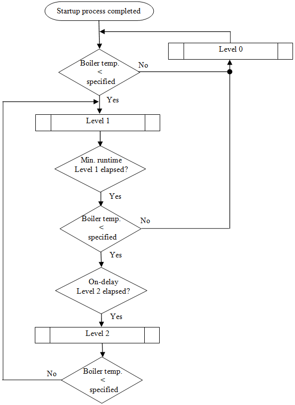
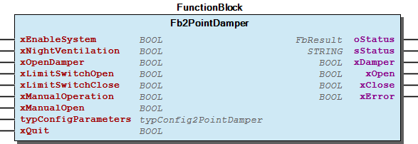
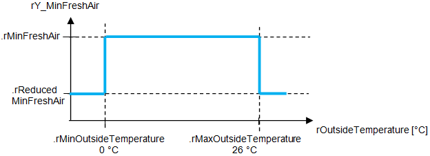
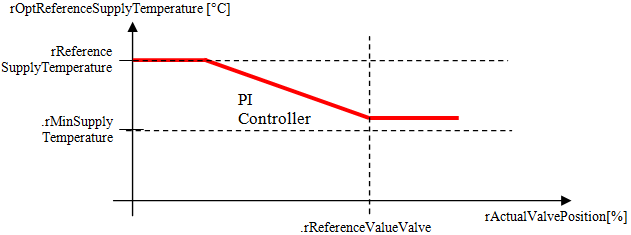
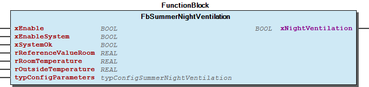

# WagoAppBuildingHVAC v1.0.5.12 (WAGO) - Complete Documentation


## 📋 Library Information

- **Company:** WAGO
- **Title:** WagoAppBuildingHVAC
- **Version:** 1.0.5.12
- **Categories:** WAGO BusinessView|Building Automation; WAGO LayerView|App; Application
- **Namespace:** WagoAppBuildingHVAC
- **Author:** WAGO / u0105598
- **Placeholder:** WagoAppBuildingHVAC

### Description ¶


This document is automatically generated.

Library for HVAC with WAGO I/O System

The function blocks of this library are thread safe and can be called simultaneously from different CODESYS tasks.

This document is automatically generated. Library for HVAC with WAGO I/O System The function blocks of this library are thread safe and can be called simultaneously from different CODESYS tasks.

### Contents: ¶


Contents: - Documentation Index 10 Documentation - WagoAppBuildingHVAC Library Documentation Project Information Library Information Function Blocks - Fb2BoilerStrategy (FB) - Fb2LevelBoiler (FB) - Fb2PointDamper (FB) - Fb2PointDriver (FB) - Fb2PointSingleRoomController (FB) - FbAnalog3Point (FB) - FbAntiLegionella (FB) - FbAntifreezeAir (FB) - FbAntifreezeWater (FB) - FbAveragedOutsideTemperature (FB) - ... and 63 more Functions - Fu2Point (FUN) - Fu4Point (FUN) - FuAI (FUN) - FuAI_Temp (FUN) - FuAO (FUN) - FuKTY (FUN) - FuStatus (FUN) - FuSummerCompensation (FUN) - Fu_TimeToString (FUN) Methods - 11 Set point adjustment - 11 Set point adjustment / Sollwertanpassung - 11 Setpoint adjustment / Sollwertanpassung - Fb2LevelBoiler.Job (METH) - Fb2PointDamper.Job (METH) - Fb2PointDriver.Job (METH) - FbAnalog3Point.Job (METH) - FbAntifreezeWater.Job (METH) - FbCollectiveMalfunction.Job (METH) - FbContinuousDamper.Job (METH) - ... and 45 more Interfaces Program Organization Internal Components Global Variable Lists - GlobalVariables (GVL) - Status (GVL) - VersionHistory (GVL) Other Components - 01 System control - 01 System control / Anlagenüberwachung - 01 System control / Anlagenüberwachung - 01 Time converter - 02 Antifreeze - 02 Antifreeze / Frostschutz - 02 Antifreeze / Frostschutz - 02 Time picker - 03 Damper control - 03 Damper control / Klappensteuerung - ... and 134 more

### Indices and tables ¶


Based on WagoAppBuildingHVAC.library, last modified 20.09.2024, 21:12:51. LibDoc 3.5.16.10

© WAGO GmbH & Co. KG, Germany 2018 – All rights reserved. For the avoidance of doubt, this copyright notice does not only apply to the information above but also and primarily to the described library itself. Please note that third-party products are always mentioned without reference to intellectual property rights, including patents, utility models, designs and trademarks, accordingly the existence of such rights cannot be excluded. WAGO is a registered trademark of WAGO Verwaltungsgesellschaft mbH.

- File and Project Information - Library Reference Based on WagoAppBuildingHVAC.library, last modified 20.09.2024, 21:12:51. LibDoc 3.5.16.10 © WAGO GmbH & Co. KG, Germany 2018 – All rights reserved. For the avoidance of doubt, this copyright notice does not only apply to the information above but also and primarily to the described library itself. Please note that third-party products are always mentioned without reference to intellectual property rights, including patents, utility models, designs and trademarks, accordingly the existence of such rights cannot be excluded. WAGO is a registered trademark of WAGO Verwaltungsgesellschaft mbH.

### Documentation Index


## 10 Documentation


To ensure fast installation and start-up of the units, we strongly recommend that the following information and explanations are carefully read and adhered to.

To ensure fast installation and start-up of the units, we strongly recommend that the following information and explanations are carefully read and adhered to. - doc01_Foreword (FB)

## WagoAppBuildingHVAC Library Documentation


| Company: | WAGO |
| Title: | WagoAppBuildingHVAC |
| Version: | 1.0.5.12 |
| Categories: | WAGO BusinessView\|Building Automation; WAGO LayerView\|App; Application |
| Namespace: | WagoAppBuildingHVAC |
| Author: | WAGO / u0105598 |
| Placeholder: | WagoAppBuildingHVAC |

### Description


This document is automatically generated.

Library for HVAC with WAGO I/O System

The function blocks of this library are thread safe and can be called simultaneously from different CODESYS tasks.

This document is automatically generated. Library for HVAC with WAGO I/O System The function blocks of this library are thread safe and can be called simultaneously from different CODESYS tasks.

### Contents:


- 10 Documentation doc01_Foreword (FB) 20 Program Organization Units - 01 System control / Anlagenüberwachung - 02 Antifreeze / Frostschutz - 03 Damper control / Klappensteuerung - 04 Fan control / Ventilatorsteuerung - 05 Controller / Regler - 06 Sequences / Sequenzen - 07 Heat exchanger / Wärmetauscher - 08 Pumps and Valves / Pumpen und Ventile - 09 Analog signals / Analoge Signale - 10 Temperature evaluation / Temperaturauswertung - 11 Set point adjustment / Sollwertanpassung - 12 Boiler control / Kesselsteuerung - 13 Single room controller / Einzelraumregelung - 14 General drivers / Allgemeine Antriebe - 15 Volume Flow / Volumenstrom - 16 Additional options / Zusatzfunktionen - 17 Characteristic curves / Kennlinien - 80 Data types - 81 Interfaces 30 Visualizations - 01 System control / Anlagenüberwachung - 02 Antifreeze / Frostschutz - 03 Damper control / Klappensteuerung - 04 Fan control / Ventilatorsteuerung - 05 Controller / Regler - 06 Sequences / Sequenzen - 07 Heat exchanger / Wäremtauscher - 08 Pumps and Valves / Pumpen und Ventile - 09 Analog signals / Analoge Signale - 10 Temperature evaluation / Temperaturauswertung - 11 Setpoint adjustment / Sollwertanpassung - 12 Boiler control / Kesselsteuerung - 13 Single room controler / Einzelraumregler - 14 General drivers / Allgemeine Antriebe - 15 Volume Flow / Volumenstrom - 16 Additional options / Zusatzfunktionen - 99 Common graphics / Allgemeine Grafiken 80 Status - Status (GVL) - eStatus (ENUM) 90 Internal - 01 Time converter - 02 Time picker GlobalTextList (Text List) GlobalVariables (GVL) ParameterList (PARAMS) TextList_HVAC (Text List) VersionHistory (GVL)

### Indices and tables


Based on WagoAppBuildingHVAC.library, last modified 20.09.2024, 21:12:51. LibDoc 3.5.16.10

© WAGO GmbH & Co. KG, Germany 2018 – All rights reserved. For the avoidance of doubt, this copyright notice does not only apply to the information above but also and primarily to the described library itself. Please note that third-party products are always mentioned without reference to intellectual property rights, including patents, utility models, designs and trademarks, accordingly the existence of such rights cannot be excluded. WAGO is a registered trademark of WAGO Verwaltungsgesellschaft mbH.

- File and Project Information - Library Reference Based on WagoAppBuildingHVAC.library, last modified 20.09.2024, 21:12:51. LibDoc 3.5.16.10 © WAGO GmbH & Co. KG, Germany 2018 – All rights reserved. For the avoidance of doubt, this copyright notice does not only apply to the information above but also and primarily to the described library itself. Please note that third-party products are always mentioned without reference to intellectual property rights, including patents, utility models, designs and trademarks, accordingly the existence of such rights cannot be excluded. WAGO is a registered trademark of WAGO Verwaltungsgesellschaft mbH.

### Project Information


## File and Project Information


| Scope | Name | Type | Content |
| --- | --- | --- | --- |
| FileHeader | libraryFile | string | WagoAppBuildingHVAC.library |
| contentFile | doc.clean.json |
| productName | e!COCKPIT |
| creationDateTime | date | 20.09.2024, 21:13:25 |
| companyName | string | WAGO |
| ProjectInformation | LastModificationDateTime | date | 20.09.2024, 21:12:51 |
| NoPlaceholder | string |  |
| Description | See: Description |
| Copyright | © WAGO Kontakttechnik GmbH & Co. KG, Germany 2018 – All rights reserved. |
| Author | WAGO / u0105598 |
| AutoResolveUnbound | bool | True |
| Placeholder | string | WagoAppBuildingHVAC |
| Company | WAGO |
| DocFormat | reStructuredText |
| Project | WagoAppBuildingHVAC |
| DefaultNamespace | WagoAppBuildingHVAC |
| Version | version | 1.0.5.12 |
| ThreadSave | string | True |
| Title | WagoAppBuildingHVAC |
| LibraryCategories | library-category-list | WAGO BusinessView\|Building Automation; WAGO LayerView\|App; Application |
| CompiledLibraryCompatibilityVersion | string | CODESYS V3.5 SP16 Patch 3 |

### Library Information


## Library Reference


| LinkAllContent: False QualifiedOnly: False | SystemLibrary: False | Optional: False |

| LinkAllContent: False QualifiedOnly: False | SystemLibrary: False | Optional: False |

| LinkAllContent: False QualifiedOnly: False | SystemLibrary: False | Optional: False |

| LinkAllContent: False QualifiedOnly: False | SystemLibrary: True | Optional: False |

| LinkAllContent: False QualifiedOnly: False | SystemLibrary: True | Optional: False |

| LinkAllContent: False QualifiedOnly: False | SystemLibrary: True | Optional: False |

| LinkAllContent: False QualifiedOnly: False | SystemLibrary: True | Optional: False |

| LinkAllContent: False QualifiedOnly: False | SystemLibrary: True | Optional: False |

| LinkAllContent: False QualifiedOnly: False | SystemLibrary: True | Optional: False |

| LinkAllContent: False QualifiedOnly: False | SystemLibrary: True | Optional: False |

| LinkAllContent: False QualifiedOnly: False | SystemLibrary: True | Optional: False |

| LinkAllContent: False QualifiedOnly: False | SystemLibrary: True | Optional: False |

| LinkAllContent: False QualifiedOnly: False | SystemLibrary: True | Optional: False |

| LinkAllContent: False QualifiedOnly: False | SystemLibrary: True | Optional: False |

| LinkAllContent: False Optional: False | QualifiedOnly: False SystemLibrary: True | PublishSymbolsInContainer: True |

| LinkAllContent: False QualifiedOnly: False | SystemLibrary: True | Optional: False |

| LinkAllContent: False QualifiedOnly: True | SystemLibrary: False | Optional: False |

| LinkAllContent: False Optional: False | QualifiedOnly: False SystemLibrary: False | PublishSymbolsInContainer: True |

| LinkAllContent: False QualifiedOnly: False | SystemLibrary: False | Optional: False |

| LinkAllContent: False QualifiedOnly: False | SystemLibrary: False | Optional: False |

| LinkAllContent: False QualifiedOnly: False | SystemLibrary: False | Optional: False |

This is a dictionary of all referenced libraries and their name spaces.

This is a dictionary of all referenced libraries and their name spaces. Standard Library Identification : Placeholder: Standard Default Resolution: Standard, * (System) Namespace: Standard Library Properties : SysMem Library Identification : Placeholder: SysMem Default Resolution: SysMem, * (System) Namespace: SysMem Library Properties : VisuDialogs Library Identification : Placeholder: VisuDialogs Default Resolution: VisuDialogs, * (System) Namespace: VisuDialogs Library Properties : VisuElem3DPath Library Identification : Placeholder: System_VisuElem3DPath Default Resolution: VisuElem3DPath, 3.5.10.0 (System) Namespace: VisuElem3DPath Library Properties : Library Parameter : Parameter: GC_POINTS_PER_POLYGON = 100 VisuElemCamDisplayer Library Identification : Placeholder: System_VisuElemCamDisplayer Default Resolution: VisuElemCamDisplayer, 3.5.10.0 (System) Namespace: VisuElemCamDisplayer Library Properties : Library Parameter : Parameter: GC_POINTS_PER_CAM = 100 VisuElemMeter Library Identification : Placeholder: System_VisuElemMeter Default Resolution: VisuElemMeter, 3.5.10.0 (System) Namespace: VisuElemMeter Library Properties : VisuElemTextEditor Library Identification : Placeholder: System_VisuElemTextEditor Default Resolution: VisuElemTextEditor, 3.5.10.0 (System) Namespace: VisuElemTextEditor Library Properties : VisuElemTrace Library Identification : Placeholder: System_VisuElemTrace Default Resolution: VisuElemTrace, 3.5.10.0 (System) Namespace: VisuElemTrace Library Properties : VisuElemXYChart Library Identification : Placeholder: System_VisuElemXYChart Default Resolution: VisuElemXYChart, 3.5.16.30 (System) Namespace: VisuElemXYChart Library Properties : VisuElems Library Identification : Placeholder: System_VisuElems Default Resolution: VisuElems, 3.5.10.0 (System) Namespace: VisuElems Library Properties : VisuElemsAlarm Library Identification : Placeholder: System_VisuElemsAlarm Default Resolution: VisuElemsAlarm, 3.5.10.0 (System) Namespace: VisuElemsAlarm Library Properties : VisuElemsDateTime Library Identification : Placeholder: System_VisuElemsDateTime Default Resolution: VisuElemsDateTime, 3.5.10.0 (System) Namespace: VisuElemsDateTime Library Properties : VisuElemsSpecialControls Library Identification : Placeholder: System_VisuElemsSpecialControls Default Resolution: VisuElemsSpecialControls, 3.5.10.0 (System) Namespace: VisuElemsSpecialControls Library Properties : VisuElemsWinControls Library Identification : Placeholder: System_VisuElemsWinControls Default Resolution: VisuElemsWinControls, 3.5.10.0 (System) Namespace: VisuElemsWinControls Library Properties : VisuInputs Library Identification : Placeholder: system_visuinputs Default Resolution: VisuInputs, 3.5.16.30 (System) Namespace: visuinputs Library Properties : VisuNativeControl Library Identification : Placeholder: System_VisuNativeControl Default Resolution: VisuNativeControl, 3.5.10.0 (System) Namespace: VisuNativeControl Library Properties : VisuSymbols Library Identification : Placeholder: VisuSymbols Default Resolution: VisuSymbols, * (System) Namespace: VisuSymbols Library Properties : WagoSysErrorBase Library Identification : Placeholder: WagoSysErrorBase Default Resolution: WagoSysErrorBase, * (WAGO) Namespace: WagoSysErrorBase Library Properties : WagoSysVersion Library Identification : Name: WagoSysVersion Version: 1.0.0.0 Company: WAGO Namespace: WagoSysVersion Library Properties : WagoTypesErrorBase Library Identification : Placeholder: WagoTypesErrorBase Default Resolution: WagoTypesErrorBase, * (WAGO) Namespace: WagoTypesErrorBase Library Properties : WagoVisuIcons Library Identification : Placeholder: WagoVisuIcons Default Resolution: WagoVisuIcons, * (WAGO) Namespace: WagoVisuIcons Library Properties :

### Function Blocks


## Fb2BoilerStrategy (FB)


| Scope | Name | Type | Initial | Comment |
| --- | --- | --- | --- | --- |
| Input | bLeadBoiler | BYTE | 1 | Select leading boiler. (0 = both boilers in parallel) |
| rReferenceSystemSupplyTemperature | REAL | 60 | Reference value system supply temperature. [°C] |
| rActualSystemSupplyTemperature | REAL |  | Actual system supply temperature. [°C] |
| typConfigParameters | typConfig2BoilerStrategy |  | Configuration parameters. |
| typStatusBoiler1 | typStatusBoiler |  | Status feedback from boiler 1. |
| typStatusBoiler2 | typStatusBoiler |  | Status feedback from boiler 2. |
| Output | bLeadingBoiler | BYTE |  | Indication of leading boiler. |
| xSwitchOnBoiler1 | BOOL |  | Enable boiler 1. |
| xFullLoadBoiler1 | BOOL |  | Boiler 1 should run at full load. |
| xSwitchOnBoiler2 | BOOL |  | Enable boiler 2. |
| xFullLoadBoiler2 | BOOL |  | Boiler 2 should run at full load. |
| xOverheatingProtection | BOOL |  | Displays overheating protection activity. |
| rReferenceTemperatureBoiler | REAL | 60 | Display of specified system supply temperature [°C] |

Function block enables a boiler sequence control be enabling the two boilers in line with current demand.

Graphical Illustration

Function description

The lead boiler can be defined for boiler sequence control via the bLeadBoiler input. Both boilers are controlled simultaneously if a zero is present at the bLeadBoiler input.

In the event of a boiler malfunction, the lead boiler is changed.The current lead boiler is indicated at the bLeadingBoiler output.

The reference system supply temperature is specified at the rReferenceSystemSupplyTemperature input. This can be determined, for example, via a MAX logic circuit for the requisite supply temperatures for the HVAC circuits linked to the system.

The specified boiler temperature is indicated at the rReferenceTemperatureBoiler and is yielded from the specified system supply temperature, plus the defined offset.

If the system supply temperature rActualSystemSupplyTemperature falls below the specified boiler temperature rReferenceTemperatureBoiler , the lead boiler is enabled via the xSwitchOnBoilerX output.

When the lead boiler reaches it maximum output and the specified system supply temperature is still not achieved, the lag boiler is then enabled xSwitchOnBoilerX with a defined delay time. At the same time, the lead boiler is put into full load via the xFullLoadBoilerX output.

When operating at full load, the lead boiler is limited by the maximum boiler temperature. The enable function for the lag boiler remains active until the system supply temperature is achieved and the lag boiler is switched off.

As soon as the enable function for the lag boiler xSwitchOnBoilerX is canceled, the full load signal xFullLoadBoilerX from the lead boiler is also canceled.

The enable signal for the lead boiler is canceled when the system supply temperature is reached and the lead boiler is switched off.

The boiler sequence control is deactivated when one of the two boilers is in the Manual mode.

If the system supply temperature rActualSystemSupplyTemperature exceeds the defined maximum system supply temperature, the enable signal for both boilers is canceled and the xOverheatingProtection output activated. Overheating protection is deactivated when the system supply temperature falls below the maximum system supply temperature, minus the hysteresis.

The status check-back signal from the boiler modules is given by typStatusBoilerX .

The process is displayed below:

Interface variables Function Function block enables a boiler sequence control be enabling the two boilers in line with current demand. Graphical Illustration  Function description The lead boiler can be defined for boiler sequence control via the bLeadBoiler input. Both boilers are controlled simultaneously if a zero is present at the bLeadBoiler input. In the event of a boiler malfunction, the lead boiler is changed.The current lead boiler is indicated at the bLeadingBoiler output. The reference system supply temperature is specified at the rReferenceSystemSupplyTemperature input. This can be determined, for example, via a MAX logic circuit for the requisite supply temperatures for the HVAC circuits linked to the system. The specified boiler temperature is indicated at the rReferenceTemperatureBoiler and is yielded from the specified system supply temperature, plus the defined offset. If the system supply temperature rActualSystemSupplyTemperature falls below the specified boiler temperature rReferenceTemperatureBoiler , the lead boiler is enabled via the xSwitchOnBoilerX output. When the lead boiler reaches it maximum output and the specified system supply temperature is still not achieved, the lag boiler is then enabled xSwitchOnBoilerX with a defined delay time. At the same time, the lead boiler is put into full load via the xFullLoadBoilerX output. When operating at full load, the lead boiler is limited by the maximum boiler temperature. The enable function for the lag boiler remains active until the system supply temperature is achieved and the lag boiler is switched off. As soon as the enable function for the lag boiler xSwitchOnBoilerX is canceled, the full load signal xFullLoadBoilerX from the lead boiler is also canceled. The enable signal for the lead boiler is canceled when the system supply temperature is reached and the lead boiler is switched off. The boiler sequence control is deactivated when one of the two boilers is in the Manual mode. If the system supply temperature rActualSystemSupplyTemperature exceeds the defined maximum system supply temperature, the enable signal for both boilers is canceled and the xOverheatingProtection output activated. Overheating protection is deactivated when the system supply temperature falls below the maximum system supply temperature, minus the hysteresis. The status check-back signal from the boiler modules is given by typStatusBoilerX . The process is displayed below: 

## Fb2LevelBoiler (FB)


| Scope | Name | Type | Initial | Comment | Inherited from |
| --- | --- | --- | --- | --- | --- |
| Output | oStatus | WagoSysErrorBase.FbResult |  | Status object. (Listed in Status ) The content of the error object could be displayed via the FbShowResult from the WagoSysErrorBase library. | FbBaseHVAC |
| sStatus | STRING |  | Status description as string (Listed in Status ) | FbBaseHVAC |
| Input | xManual | BOOL |  | Switch on manual. |  |
| xAuto | BOOL |  | Enable sutomatic mode. |  |
| xSwitchOnBoiler | BOOL |  | Switch in automatic mode. (e.g. from boiler strategy) |  |
| xFullLoad | BOOL |  | Boiler is to run at full load. |  |
| bLeadBoiler | BYTE |  | Defining of lead boiler. |  |
| bBoilerNumber | BYTE | 1 | Boiler number. (1 or 2) |  |
| xSafetyChain | BOOL | TRUE | Feedback safety chain from boiler. |  |
| rReferenceBoilerTemperature | REAL | 60 | Reference boiler temperature. [°C] |  |
| rActualBoilerTemperature | REAL |  | Actual boiler temperature. [°C] |  |
| rActualReturnTemperature | REAL |  | Actual return temperature. [°C] |  |
| xChimneySweepFunction | BOOL |  | Chimney sweep function. |  |
| xLimitSwitchValve | BOOL | TRUE | Feedback limit switch valve open. |  |
| xRepairSwitchPump | BOOL | TRUE | Repair switch boiler pump. |  |
| xMotorProtectionPump | BOOL | TRUE | Motor protection boiler pump. |  |
| xRepairSwitchAdmixingPump | BOOL | TRUE | Repair switch admixing pump. |  |
| xMotorProtectionAdmixingPump | BOOL | TRUE | Motor protection admixing pump. |  |
| xManualOperation | BOOL |  | Enable manual operation mode. |  |
| bManualLevelBoiler | BYTE |  | Set boiler level in manual operation mode. |  |
| xManualOnBoilerPump | BOOL |  | Switch boiler pump in manual operation mode. |  |
| xManualOnAdmixingPump | BOOL |  | Switch admixing pump in manual operation mode. |  |
| rManualValueValve | REAL |  | Valve position in manual operation mode. |  |
| xFeedbackManualOperation | BOOL |  | Feedback signal from external manual operation. |  |
| typConfigParameters | typConfig2LevelBoiler |  | Configuration parameters. |  |
| xQuit | BOOL |  | Error message acknowledgement. |  |
| Inout | dwOperatingMinutes | DWORD |  | Operating hours in minutes. |  |
| Output | xLevel1 | BOOL |  | Burner level 1 signal. |  |
| xLevel2 | BOOL |  | Burner level 2 signal. |  |
| xBoilerPump | BOOL |  | Boiler circuit pump signal. |  |
| xValve | BOOL |  | Switching signal for full-way valves. |  |
| rY_Valve | REAL |  | Valve position for three-way. [%] |  |
| wY_Valve | WORD |  | Valve position for three-way. [0-32767] |  |
| xAdmixingPump | BOOL |  | Switch signal for the admixing pump. |  |
| xChimneySweep | BOOL |  | Displays chimney sweep function activety. |  |
| xCondensationProtection | BOOL |  | Displays condenstation protection. |  |
| rMinBoilerTemperature | REAL |  | Minimum boiler supply temperature. |  |
| xErrorBoilerPump | BOOL |  | Displays error boiler pump. |  |
| xErrorAdmixingPump | BOOL |  | Displays error admixing pump. |  |
| xErrorStartUp | BOOL |  | Displays minimum temperature not reached in defined time while startup. |  |
| typStatusBoiler | typStatusBoiler |  | Status boiler for strategy function block. |  |

Function block contains various startup processes based on the valves and pumps used in the specific configuration and also regulates a 2-level boiler.

Graphical Illustration

Function description

The boiler is activated either via the xManual input (Manual mode), or via the two inputs xAuto and xSwitchOnBoiler .

When activated, the minimum boiler supply temperature is output for evaluation of the system supply temperature at the rMinBoilerTemperature output.

The specific boiler number bBoilerNumber and the number of the lead boiler bLeadBoiler determine whether the boiler is the lead or lag boiler. If both of these numbers are the same, the parameters for the lead boiler will be used.

Different startup procedures can apply, depending on the valve being used and the water volume:

2-way valve with large volume of water:

2-Way Valve with low water volume:

3-way valve:

After the startup procedure the boiler remains at the first level for at least the minimum switch-on time.

If the boiler fails to reach its specified boiler temperature within the defined time, the boiler is switched to Level 2 xLevel2 . When the boiler then reaches its specified boiler temperature, it is switched back from Level 2 to Level 1.

The boiler is switched to Level 2 again when the temperature falls below the specified boiler temperature, minus hysteresis. The boiler switches from Level 1 to Level 0 when the specified boiler temperature is maintained for the minimum switch-on time for the Level 1 time. The boiler is switched back to Level 1 if its temperature falls below the specified boiler temperature at Level 0.

If there is a 3-way valve in the boiler return line, the minimum return temperature is permanently maintained during ongoing operation. A PI controller is used for the minimum return temperature.

The admixing pump xAdmixingPump is switched on during ongoing operation when the temperature falls below the minimum boiler temperature or the minimum return temperature when a 2-way valve is available. If the temperature drops below the minimum boiler temperature, the xCondensationProtection output is also set.

The boiler circuit pump continues to run when the boiler is switched off until the Switch-off delay time elapses and the difference between rActualBoilerTemperature and rActualReturnTemperature is less than the defined difference. The valve in the return line is not closed until the boiler circuit pump is switched off.

If the xFullLoad input is set using the strategy module, the boiler module no longer regulates the temperature in line with its specified boiler temperature, but is controlled only by maximum limiting.

The necessary information about the boiler is supplied to the strategy module through the typStatusBoiler structure.

The xSafetyChain input monitors the safety chain for the boiler. As soon as this input is switched to FALSE, the boiler is switched off and a corresponding error message indicated at the wStatus output.

In the event of a malfunction with the boiler circuit pump caused by the motor protection switch xMotorProtectionPump or the repair switch xRepairSwitchPump , the boiler is switched off and the error indicated at the wStatus and xErrorBoilerPump output.

In the event of a malfunction of the admixing pump caused by the motor protection switch xMotorProtectionAdmixingPump or the repair switch xRepairSwitchAdmixingPump , the admixing pump is switched off and the error indicated at the xErrorAdmixingPump output.

The error messages can be acknowledged via a flank at the xQuit input.

When the chimney sweep function xChimneySweepFunction is activated, the boiler switches on with an elevated reference value (maximum boiler temperature Level 2). The xChimneySweep output is set as a check-back signal that the chimney sweep function has been activated. The chimney sweep function is canceled when the xChimneySweepFunction input is deactivated, or when the maximum runtime has elapsed.

In the Manual mode xManualOperation the boiler level is controlled via bManualLevelBoiler , the boiler circuit pump via xManualOnBoilerPump , the admixing pump via xManualOnAdmixingPump and the valve via rManualValueValve .

If the boiler is switched to the Manual mode via an external circuit, a check-back signal should be transmitted to the boiler module via the xFeedbackManualOperation so that automatic control can be deactivated.

The pump or valve can be put through a maintenance run to prevent them from blocking during extended outage periods. Blocking protection must be activated for this.

The blocking protection function ensures that the pump and the valve do not remain switched off/closed longer than the specified monitoring period. On expiration of this time period, the pump and the valve are activated one after the other for the maintenance run for the defined time.

The output value wY_Valve has the same meaning as the rY_Valve output, except that the output has standardized values between 0 – 32767.

Interface variables Function Function block contains various startup processes based on the valves and pumps used in the specific configuration and also regulates a 2-level boiler. Graphical Illustration  Function description The boiler is activated either via the xManual input (Manual mode), or via the two inputs xAuto and xSwitchOnBoiler . When activated, the minimum boiler supply temperature is output for evaluation of the system supply temperature at the rMinBoilerTemperature output. The specific boiler number bBoilerNumber and the number of the lead boiler bLeadBoiler determine whether the boiler is the lead or lag boiler. If both of these numbers are the same, the parameters for the lead boiler will be used. Different startup procedures can apply, depending on the valve being used and the water volume: 2-way valve with large volume of water: 1. Switch on the admixing pump xAdmixingPump . 2. Level 1 xLevel1 is activated when the boiler temperature rActualBoilerTemperature is less than the specified boiler temperature rReferenceBoilerTemperature , plus the defined offset. 3. The 2-way valve xValve is opened when the minimum boiler temperature is exceeded. 4. If the boiler temperature fails to reach the minimum boiler temperature within a defined time, condensation protection xCondensationProtection is activated and this indicated at the wStatus output. 5. The boiler circuit pump xBoilerPump is switched on when the defined delay period has elapsed, or when a positive edge at the xLimitSwitchValve input reports the open status of the valve. 6. If the 2-way valve fails to reach its final position within the defined runtime, the boiler is switched off and an error message output at the wStatus output. 7. The startup procedure is terminated once the boiler circuit pump has been switched on. If the startup procedure exceeds the maximum defined time, the xErrorStartUp output is set and a warning issued at the wStatus output.  2-Way Valve with low water volume: 1. Switch on the admixing pump xAdmixingPump . 2. Open the 2-way valve xValve 3. The boiler circuit pump xBoilerPump is switched on when the On-delay for the pump has elapsed, or when a positive edge at the xLimitSwitchValve input reports the open status of the valve. 4. The burner xEnableBurner is activated when the boiler temperature rActualBoilerTemperature is less than the specified boiler temperature rReferenceBoilerTemperature . 5. The startup procedure is terminated when the minimum runtime for Level 1 elapses. 6. If the 2-way valve fails to reach its final position within the defined runtime, the boiler is switched off and an error message output at the wStatus output. 7. The admixing pump is switched off as soon as the minimum return temperature and the minimum supply temperature are exceeded.  3-way valve: 1. Switch on the admixing pump xAdmixingPump . 2. Switch on the boiler circuit pump xBoilerPump 3. Level 1 xLevel1 is activated when the boiler temperature rActualBoilerTemperature is less than the specified boiler temperature rReferenceBoilerTemperature . 4. 3-way valve rY_Valve is closed (boiler circuit) 5. The startup procedure is terminated as soos as the return temperature rises above the minimum return temperature. 6. If the minimum return temperature is not reached with the defined time, the xErrorStartUp output is activated and a warning issued via the wStatus output.  After the startup procedure the boiler remains at the first level for at least the minimum switch-on time. If the boiler fails to reach its specified boiler temperature within the defined time, the boiler is switched to Level 2 xLevel2 . When the boiler then reaches its specified boiler temperature, it is switched back from Level 2 to Level 1. The boiler is switched to Level 2 again when the temperature falls below the specified boiler temperature, minus hysteresis. The boiler switches from Level 1 to Level 0 when the specified boiler temperature is maintained for the minimum switch-on time for the Level 1 time. The boiler is switched back to Level 1 if its temperature falls below the specified boiler temperature at Level 0.  If there is a 3-way valve in the boiler return line, the minimum return temperature is permanently maintained during ongoing operation. A PI controller is used for the minimum return temperature. The admixing pump xAdmixingPump is switched on during ongoing operation when the temperature falls below the minimum boiler temperature or the minimum return temperature when a 2-way valve is available. If the temperature drops below the minimum boiler temperature, the xCondensationProtection output is also set. The boiler circuit pump continues to run when the boiler is switched off until the Switch-off delay time elapses and the difference between rActualBoilerTemperature and rActualReturnTemperature is less than the defined difference. The valve in the return line is not closed until the boiler circuit pump is switched off. If the xFullLoad input is set using the strategy module, the boiler module no longer regulates the temperature in line with its specified boiler temperature, but is controlled only by maximum limiting. The necessary information about the boiler is supplied to the strategy module through the typStatusBoiler structure. The xSafetyChain input monitors the safety chain for the boiler. As soon as this input is switched to FALSE, the boiler is switched off and a corresponding error message indicated at the wStatus output. In the event of a malfunction with the boiler circuit pump caused by the motor protection switch xMotorProtectionPump or the repair switch xRepairSwitchPump , the boiler is switched off and the error indicated at the wStatus and xErrorBoilerPump output. In the event of a malfunction of the admixing pump caused by the motor protection switch xMotorProtectionAdmixingPump or the repair switch xRepairSwitchAdmixingPump , the admixing pump is switched off and the error indicated at the xErrorAdmixingPump output. The error messages can be acknowledged via a flank at the xQuit input. When the chimney sweep function xChimneySweepFunction is activated, the boiler switches on with an elevated reference value (maximum boiler temperature Level 2). The xChimneySweep output is set as a check-back signal that the chimney sweep function has been activated. The chimney sweep function is canceled when the xChimneySweepFunction input is deactivated, or when the maximum runtime has elapsed. In the Manual mode xManualOperation the boiler level is controlled via bManualLevelBoiler , the boiler circuit pump via xManualOnBoilerPump , the admixing pump via xManualOnAdmixingPump and the valve via rManualValueValve . If the boiler is switched to the Manual mode via an external circuit, a check-back signal should be transmitted to the boiler module via the xFeedbackManualOperation so that automatic control can be deactivated. The pump or valve can be put through a maintenance run to prevent them from blocking during extended outage periods. Blocking protection must be activated for this. The blocking protection function ensures that the pump and the valve do not remain switched off/closed longer than the specified monitoring period. On expiration of this time period, the pump and the valve are activated one after the other for the maintenance run for the defined time. The output value wY_Valve has the same meaning as the rY_Valve output, except that the output has standardized values between 0 – 32767. Note 1. The operating minutes function dwOperatingMinutes should be defined as RETAIN PERSISTENT so that the set values are retained in the event of a loss of power or after a project upload. 2. The input xLimitSwitchValve must be set to TRUE when a 2-way valve without a limit switch is used. - Fb2LevelBoiler.Job (METH)

## Fb2PointDamper (FB)


| Scope | Name | Type | Initial | Comment | Inherited from |
| --- | --- | --- | --- | --- | --- |
| Output | oStatus | WagoSysErrorBase.FbResult |  | Status object. (Listed in Status ) The content of the error object could be displayed via the FbShowResult from the WagoSysErrorBase library. | FbBaseHVAC |
| sStatus | STRING |  | Status description as string (Listed in Status ) | FbBaseHVAC |
| Input | xEnableSystem | BOOL | TRUE | Enable signal from FbStartStop . |  |
| xNightVentilation | BOOL |  | Open damper during night ventilation. |  |
| xOpenDamper | BOOL | TRUE | Open damper. |  |
| xLimitSwitchOpen | BOOL |  | Limit switch damper open. |  |
| xLimitSwitchClose | BOOL |  | Limit switch damper closed. |  |
| xManualOperation | BOOL |  | Enable manual operation mode. |  |
| xManualOpen | BOOL |  | Open or close damper in manual operation mode. |  |
| typConfigParameters | typConfig2PointDamper |  | Configuration paramters |  |
| xQuit | BOOL |  | Error message acknowledgement. |  |
| Output | xDamper | BOOL |  | Control damper adjusting motor. |  |
| xOpen | BOOL |  | Dislpays damper is open. |  |
| xClose | BOOL |  | Dislpays damper is closed. |  |
| xError | BOOL |  | Dislpays damper error when the maximum runtime is exceeded. |  |

Function block is used to control 2-point dampers with optional limit switches.

Graphical Illustration

Function description

The damper is opened in the Automatic mode when the system has been enabled via xEnableSystem and the xOpenDamper input has been activated. During night ventilation, the damper can also be opened independently of this enable via the xNightVentilation input.

When the Manual mode is activated via the xManualOperation , the damper is controlled via the xManualOpen input. The damper adjusting motor is controlled via the xDamper output.

The runtime of the damper is monitored when limit switches are provided for each direction of movement. When the maximum runtime is exceeded, the damper is closed and the xError output activated. The error message can be acknowledged via a flank at the xQuit input and the function block is enabled again. The xOpen and xClose outputs indicate the status of the damper (opened/closed).

If no limit switch is provided, the damper position is determined over time.

Interface variables Function Function block is used to control 2-point dampers with optional limit switches. Graphical Illustration  Function description The damper is opened in the Automatic mode when the system has been enabled via xEnableSystem and the xOpenDamper input has been activated. During night ventilation, the damper can also be opened independently of this enable via the xNightVentilation input. When the Manual mode is activated via the xManualOperation , the damper is controlled via the xManualOpen input. The damper adjusting motor is controlled via the xDamper output. The runtime of the damper is monitored when limit switches are provided for each direction of movement. When the maximum runtime is exceeded, the damper is closed and the xError output activated. The error message can be acknowledged via a flank at the xQuit input and the function block is enabled again. The xOpen and xClose outputs indicate the status of the damper (opened/closed). Note If no limit switch is provided, the damper position is determined over time. - Fb2PointDamper.Job (METH)

## Fb2PointDriver (FB)


| Scope | Name | Type | Initial | Comment | Inherited from |
| --- | --- | --- | --- | --- | --- |
| Output | oStatus | WagoSysErrorBase.FbResult |  | Status object. (Listed in Status ) The content of the error object could be displayed via the FbShowResult from the WagoSysErrorBase library. | FbBaseHVAC |
| sStatus | STRING |  | Status description as string (Listed in Status ) | FbBaseHVAC |
| Input | xEnable | BOOL |  | Enable 2-point driver control. |  |
| xOpenDriver | BOOL | TRUE | Move driver to open position. |  |
| xLimitSwitchOpen | BOOL |  | Check-back signal from limit switch (open). |  |
| xLimitSwitchClose | BOOL |  | Check-back signal from limit switch (closed). |  |
| xManualOperation | BOOL |  | Enable manual operation mode |  |
| xManualOpen | BOOL |  | Open or close driver manually in manual operation mode. |  |
| typConfigParameters | typConfig2PointDriver |  | Configuration paramters. |  |
| xQuit | BOOL |  | Error message acknowledgement. |  |
| Output | xDriver | BOOL |  | Driver control. |  |
| xOpen | BOOL |  | Displays that driver is open. |  |
| xClose | BOOL |  | Displays that driver is closed. |  |
| xError | BOOL |  | Displays driver error. |  |

The Fb2PointDriver function block is used to control 2-point drivers with optional limit switches.

Graphical Illustration

Function description

The driver is opened in the Automatic mode when the system has been enabled via xEnable and the xOpenDriver input has been activated.

When the Manual mode is activated via the xManualOperation , the driver is controlled via the xManualOpen input.

The driver is controlled via the rDriver output.

The runtime of the driver is monitored when limit switches are provided for each direction of movement. When the maximum runtime is exceeded, the driver is closed and the xError output activated.

The error message can be acknowledged via a flank at the xQuit input and the function block is enabled again.

In order to avoid blocking of the driver after extended outage periods, the driver can be put into operation at least once within a certain period of time. The blocking protection function must be activated for this.

The xOpen and xClose outputs indicate the status of the driver (opened/closed).

The current status for the driver is output via the wStatus output.

Interface variables Function The Fb2PointDriver function block is used to control 2-point drivers with optional limit switches. Graphical Illustration  Function description The driver is opened in the Automatic mode when the system has been enabled via xEnable and the xOpenDriver input has been activated. When the Manual mode is activated via the xManualOperation , the driver is controlled via the xManualOpen input. The driver is controlled via the rDriver output. The runtime of the driver is monitored when limit switches are provided for each direction of movement. When the maximum runtime is exceeded, the driver is closed and the xError output activated. The error message can be acknowledged via a flank at the xQuit input and the function block is enabled again. In order to avoid blocking of the driver after extended outage periods, the driver can be put into operation at least once within a certain period of time. The blocking protection function must be activated for this. The xOpen and xClose outputs indicate the status of the driver (opened/closed). The current status for the driver is output via the wStatus output. Note 1. If no limit switch is provided, the driver position is determined over time. 2. Blocking protection can also be activated by a timer program, so that a potential driver error message is issued only during a defined time period. - Fb2PointDriver.Job (METH)

## Fb2PointSingleRoomController (FB)


| Scope | Name | Type | Initial | Comment |
| --- | --- | --- | --- | --- |
| Input | rRoomTemperature | REAL |  | Actual value room temperature. [°C] |
| rSetpointCorrection | REAL |  | Set value correction room temperature. [K] |
| xComfortStandby | BOOL |  | Operating mode comfort / standby. (1 / 0) |
| xNightMode | BOOL |  | Operating mode night . |
| xWindowContact | BOOL |  | Operating mode frost / heat protection . |
| xDewpoint | BOOL |  | Operating mode dew point alarm . |
| rReferenceComfort | REAL | 21.0 | Basic reference value comfort mode. [°C] |
| typConfigParameters | typConfig2PointSingleRoomController |  | Configuration parameters. |
| Output | rActualTemperature | REAL |  | Actual value of room temperature. [°C] |
| xHeating | BOOL |  | Displays mode heating activity. |
| xCooling | BOOL |  | Displays mode cooling activity. |
| rComfortHeating | REAL |  | Current set value for comfort heating . [°C] |
| rComfortCooling | REAL |  | Current set value for comfort cooling . [°C] |
| rStandbyHeating | REAL |  | Current set value for standby heating . [°C] |
| rStandbyCooling | REAL |  | Current set value for standby cooling . [°C] |
| rNightHeating | REAL |  | Current set value for night heating . [°C] |
| rNightCooling | REAL |  | Current set value for night cooling . [°C] |
| rSetpointFrost | REAL |  | Set value for frost protection. [°C] |
| rSetpointHeat | REAL |  | Set value for heat protection. [°C] |
| xComfort | BOOL |  | Displays operating mode comfort activity. |
| xStandby | BOOL |  | Displays operating mode standby activity. |
| xNight | BOOL |  | Displays operating mode night activity. |
| xFrost_Heat | BOOL |  | Display of operating mode frost activity. |

| Operating status | Set value heating | Set value cooling |
| --- | --- | --- |
| Comfort mode | Basic set value 21 °C | Basic set value + Dead zone 2 K |
| Standby mode | Basic set value; temperature decrease Standby mode | Basic set value Dead zone + temperature increase Standby mode |
| Night mode | Basic set value; Temperature decrease Night mode | Basic set value Dead zone + Temperature increase Night mode |
| Frost/heat protection | Setpoint value frost protection 7 °C | Setpoint value heat protection 35 °C |
| Dew point alarm | Error Safety chain | Setting value 0 (cooling off) |

Function block allows individual room reference temperature control while taking local influences into account.

Graphical Illustration

Function description

The room temperature rActualTemperature is yielded from the measured room temperature rRoomTemperature and the variable measured value compensation.

The 2-point controller compares the room temperature rActualTemperature (actual value) with the desired heating and cooling reference values and sends the corresponding switching telegrams for heating xHeating and cooling xCooling .

The controller detects four operating modes to each of which is assigned its own set value. The rReferenceComfort set value is used as a basic set value. All other set values refer to the basic set value and provoke each a set value increase or set value decrease by a parameterized value.

The reference value for the Comfort mode can be infinitely shifted via the rSetpointCorrection input. The active operating mode (Comfort, Stand-by, Night, Antifreeze protection) is determined via the xComfortStandby , xNightMode and xWindowContact inputs.

The currently selected operating mode is viasualized via xComfort , xStandby , xNight and xFrost_Heat .

If the function module is used for cooling purposes, another xDewpoint input is required.If a dew point alarm is signaled at this input, the cooling/heating valves close accordingly.

The function module has eight monitor outputs rComfortHeating , rComfortCooling , rStandbyHeating , rStandbyCooling , rNightHeating , rNightCooling , rSetpointFrost and rSetpointHeat . The current set values of the individual operating modes are put out via these outputs.

Time referenced behavior

Interface variables Function Function block allows individual room reference temperature control while taking local influences into account. Graphical Illustration  Function description The room temperature rActualTemperature is yielded from the measured room temperature rRoomTemperature and the variable measured value compensation. The 2-point controller compares the room temperature rActualTemperature (actual value) with the desired heating and cooling reference values and sends the corresponding switching telegrams for heating xHeating and cooling xCooling . The controller detects four operating modes to each of which is assigned its own set value. The rReferenceComfort set value is used as a basic set value. All other set values refer to the basic set value and provoke each a set value increase or set value decrease by a parameterized value. The reference value for the Comfort mode can be infinitely shifted via the rSetpointCorrection input. The active operating mode (Comfort, Stand-by, Night, Antifreeze protection) is determined via the xComfortStandby , xNightMode and xWindowContact inputs. The currently selected operating mode is viasualized via xComfort , xStandby , xNight and xFrost_Heat . If the function module is used for cooling purposes, another xDewpoint input is required.If a dew point alarm is signaled at this input, the cooling/heating valves close accordingly. The function module has eight monitor outputs rComfortHeating , rComfortCooling , rStandbyHeating , rStandbyCooling , rNightHeating , rNightCooling , rSetpointFrost and rSetpointHeat . The current set values of the individual operating modes are put out via these outputs.  Time referenced behavior 

## FbAnalog3Point (FB)


| Scope | Name | Type | Comment | Inherited from |
| --- | --- | --- | --- | --- |
| Output | oStatus | WagoSysErrorBase.FbResult | Status object. (Listed in Status ) The content of the error object could be displayed via the FbShowResult from the WagoSysErrorBase library. | FbBaseHVAC |
| sStatus | STRING | Status description as string (Listed in Status ) | FbBaseHVAC |
| Input | rInput | REAL | Input value. [%] |  |
| xInit | BOOL | Start reference run. |  |
| xLimitSwitch | BOOL | Limit switch for open or close. |  |
| typConfigParameters | typConfigAnalog3Point_01 | Configuration parameters. |  |
| Output | xOpen | BOOL | Engine coil OPEN. |  |
| xClose | BOOL | Engine coil CLOSED. |  |
| rY | REAL | Calculated manipulated variable. |  |

The FbAnalog3Point function block converts an analog set value into a 3-point signal. The actuating drive has the status OFF, ON and CLOSED. The setting values are calculated dynamically for this.

Graphical Illustration

Function description

The input value rInput is converted into a running time for the control valve.

The engine position is stored within the module and is displayed at the output rY .

If the value at the rInput input differs from the output value rY by the set hysteresis, the driver is actuated via the xOpen and xClose in accordance with the given sign for the difference.

The check-back signal from the limit switches can be linked via an OR element to the xLimitSwitch input.

A limit switch error is issued at the wStatus output under the following conditions when the monitoring function is activated:

The error message is reset only by a synchronization run. A synchronization run is performed either by starting the program, or by a positive edge at the xInit input. During the synchronizatin run, the actuator is closed for the set maximum runtime, plus the override period and the setting value re-referenced. The synchronization run is indicated at the wStatus output.

The position of the motor is determined using a timing element. Therefore, a synchronization is performed each time an end position is reached.

Actuation can be continued even after the driver linked to the system has reached its end position by overriding the driver. It should be clarified beforehand with the valve manufacturer, whether this status has no negative effect on the valve. We recommend control valves with built-in limit switches.

Interface variables Function The FbAnalog3Point function block converts an analog set value into a 3-point signal. The actuating drive has the status OFF, ON and CLOSED. The setting values are calculated dynamically for this. Graphical Illustration  Function description The input value rInput is converted into a running time for the control valve. The engine position is stored within the module and is displayed at the output rY . If the value at the rInput input differs from the output value rY by the set hysteresis, the driver is actuated via the xOpen and xClose in accordance with the given sign for the difference. The check-back signal from the limit switches can be linked via an OR element to the xLimitSwitch input. A limit switch error is issued at the wStatus output under the following conditions when the monitoring function is activated: 1. When rY is situated between 10% and 90% and the xLimitSwitch input is TRUE 2. When the override time elapses at rY 0% or 100% and the xLimitSwitch input is FALSE The error message is reset only by a synchronization run. A synchronization run is performed either by starting the program, or by a positive edge at the xInit input. During the synchronizatin run, the actuator is closed for the set maximum runtime, plus the override period and the setting value re-referenced. The synchronization run is indicated at the wStatus output. The position of the motor is determined using a timing element. Therefore, a synchronization is performed each time an end position is reached. Note Actuation can be continued even after the driver linked to the system has reached its end position by overriding the driver. It should be clarified beforehand with the valve manufacturer, whether this status has no negative effect on the valve. We recommend control valves with built-in limit switches. - FbAnalog3Point.Job (METH)

## FbAntiLegionella (FB)


| Scope | Name | Type | Comment |
| --- | --- | --- | --- |
| Input | xManual | BOOL | Set manual operation mode of duty hot water conditioning (DHW). |
| xAuto | BOOL | Enable auomatic operation mode. |
| xSwitchOnDHWPreparation | BOOL | Switch DHW conditioning by timer program in automatic mode. |
| rUpperStorageTankTemperature | REAL | Temperature sensor value from upper storage tank. [°C] |
| rLowerStorageTankTemperature | REAL | Temperature sensor value from lower storage tank. [°C] |
| xSwitchOnAntiLegionella | BOOL | Activation of anti-Legionnaires’ disease function by timer program in automatic mode. |
| typConfigParameters | typConfigAntiLegionella | Configuration parameters. |
| xQuit | BOOL | Acknowledgement of the anti-Legionnaires’ disease alarm. |
| Output | rReferenceDHWTemperature | REAL | DHW reference value for the DHW controller. [°C] |
| xDHWPreparation | BOOL | Enable signal for the DHW controller. |
| xAntiLegionella | BOOL | Displays anti-Legionnaires’ disease function activity. |
| xLegionellaAlarm | BOOL | Displays anti-Legionnaires’ disease alarm. |

The FbAntiLegionella function block safeguards hot water conditioning against Legionnaire’s Disease bacteria by regularly increasing the temperature of the hot water. The hot water is heated further for a set time period to a defined anti-Legionnaires’s disease reference value to achieve this.

Graphical Illustration

Function description

During normal operation, hot water conditioning is activated either via the xManual input (Manual mode), or via the xAuto and xSwitchOnDHWPreparation inputs (switching signal from the time program).

When domestic hot water preparation (DHW) is activated, domestic hot water preparation is enabled via the xDHWPreparation output and the reference value defined for DHW preparation output at the rReferenceDHWPreparation output.

Interface variables Function The FbAntiLegionella function block safeguards hot water conditioning against Legionnaire’s Disease bacteria by regularly increasing the temperature of the hot water. The hot water is heated further for a set time period to a defined anti-Legionnaires’s disease reference value to achieve this. Graphical Illustration  Function description During normal operation, hot water conditioning is activated either via the xManual input (Manual mode), or via the xAuto and xSwitchOnDHWPreparation inputs (switching signal from the time program). When domestic hot water preparation (DHW) is activated, domestic hot water preparation is enabled via the xDHWPreparation output and the reference value defined for DHW preparation output at the rReferenceDHWPreparation output.

## FbAntifreezeAir (FB)


| Scope | Name | Type | Initial | Comment |
| --- | --- | --- | --- | --- |
| Input | xFrostMonitor | BOOL | TRUE | Signal of the freeze protection sensor point. |
| rY_Heating | REAL |  | Set value from controller. [%] |
| rY_Frost | REAL |  | Set value antifreeze controller. [%] |
| rY_Flush | REAL |  | Set value for antifreeze water controller (preflushing).[%] |
| xQuit | BOOL |  | Frost alarm acknowledgement. |
| Output | rY | REAL |  | Set value heating valve. [%] |
| wY_Analog | WORD |  | Set value heating valve. [0-32767] |
| xFrostAlarmAir | BOOL |  | Frost monitor has been activated and not acknowledged. |

Function block controls the temperature in the air intake by means of a freeze protection device and determines the maximum setting value for the heating register.

Graphical Illustration

Function description

If the air-side antifreeze xFrostMonitor is activated, the valve for the heating register is opened 100%.

In a non-faulted state, the maximum value for inputs rY_Heating , rY_Flush and rY_Frost arrive at the rY output.

The output value wY has the same meaning as the rY output, only the output has standardized values between 0 – 32767.

The xFrostAlarmAir output ensures that the HVAC system is switched off via the FbCollectiveMalfunction function block and that the pump for the heating register is switched on as a frost protection measure.

If the antifreeze protection device no longer reports an error, the warning message can be acknowledged via a flank at the xQuit input.

Interface variables Function Function block controls the temperature in the air intake by means of a freeze protection device and determines the maximum setting value for the heating register. Graphical Illustration  Function description If the air-side antifreeze xFrostMonitor is activated, the valve for the heating register is opened 100%. In a non-faulted state, the maximum value for inputs rY_Heating , rY_Flush and rY_Frost arrive at the rY output. The output value wY has the same meaning as the rY output, only the output has standardized values between 0 – 32767. The xFrostAlarmAir output ensures that the HVAC system is switched off via the FbCollectiveMalfunction function block and that the pump for the heating register is switched on as a frost protection measure. If the antifreeze protection device no longer reports an error, the warning message can be acknowledged via a flank at the xQuit input.

## FbAntifreezeWater (FB)


| Scope | Name | Type | Initial | Comment | Inherited from |
| --- | --- | --- | --- | --- | --- |
| Output | oStatus | WagoSysErrorBase.FbResult |  | Status object. (Listed in Status ) The content of the error object could be displayed via the FbShowResult from the WagoSysErrorBase library. | FbBaseHVAC |
| sStatus | STRING |  | Status description as string (Listed in Status ) | FbBaseHVAC |
| Input | xEnableSystem | BOOL | TRUE | Enable signal from FbStartStop . |  |
| rOutsideTemperature | REAL |  | Sensor value outside temperature. [°C] |  |
| rReturnTemperature | REAL |  | Sensor value water temperature. [°C] |  |
| typConfigParameters | typConfigAntifreezeWater |  | Configuration parameters |  |
| xQuit | BOOL |  | Error acknowledgement. |  |
| Output | xFlushOk | BOOL |  | Displays flushing process completed and outside temperture above the limit temperature. |  |
| rY_Flush | REAL |  | Set value for the flush process. [%] |  |
| wY_Flush | WORD |  | Set value for the flush process. [0-32767] |  |
| xFrostAlarmWater | BOOL |  | The return temperature is below the frost alarm limit. |  |
| xStartupError | BOOL |  | Flush process error. |  |

Function block serves as a preventive frost protection by flushing the preheater and sends an error message in case of freeze danger (only with return sensor).

Graphical Illustration

Function description

Flushing of the heating register is carried out only when the outside temperature rOutsideTemperature falls below the set limit for flushing.

During flushing of the heating register, the rY_Flush output is set to 100% until the adjustable limit temperature limit in the return line is exceeded.

If the return temperature fails to reach the limit temperature within the set delay period (no hot water), an error message is issued at the xStartupError output and the valve opened 100%.

After flushing, the rY_Flush output is set to a defined value and reduced to 0% via a definable ramp.

Even when it is switched off the antifreeze controller regulates the return temperature to a minimum reference value. The antifreeze controller is active as long as the return temperature remains below the limit for terminating the flushing process.

If the return temperature falls below the limit for the frost alarm, there is a risk of freezing and the alarm xFrostAlarmWater is issued. Additionally, the set value for the heating register rY_Flush is set to 100%.

The output value wY_Flush has the same meaning as the rY_Flush output, except that the output has standardized values between 0 – 32767.

If no return temperature sensor is present, flushing is performed in a time-controlled manner.

Time referenced behavior

Interface variables Function Function block serves as a preventive frost protection by flushing the preheater and sends an error message in case of freeze danger (only with return sensor). Graphical Illustration  Function description Flushing of the heating register is carried out only when the outside temperature rOutsideTemperature falls below the set limit for flushing. During flushing of the heating register, the rY_Flush output is set to 100% until the adjustable limit temperature limit in the return line is exceeded. If the return temperature fails to reach the limit temperature within the set delay period (no hot water), an error message is issued at the xStartupError output and the valve opened 100%. After flushing, the rY_Flush output is set to a defined value and reduced to 0% via a definable ramp. Even when it is switched off the antifreeze controller regulates the return temperature to a minimum reference value. The antifreeze controller is active as long as the return temperature remains below the limit for terminating the flushing process. If the return temperature falls below the limit for the frost alarm, there is a risk of freezing and the alarm xFrostAlarmWater is issued. Additionally, the set value for the heating register rY_Flush is set to 100%. The output value wY_Flush has the same meaning as the rY_Flush output, except that the output has standardized values between 0 – 32767. Note If no return temperature sensor is present, flushing is performed in a time-controlled manner. Time referenced behavior  - FbAntifreezeWater.Job (METH)

## FbAveragedOutsideTemperature (FB)


| Scope | Name | Type | Initial | Comment |
| --- | --- | --- | --- | --- |
| Input | rOutsideTemperature | REAL |  | Actual value outside temperature. [°C] |
| dtActualTime | DT |  | Actual date and time. |
| xReset | BOOL |  | Delete all measured values. |
| bNumberOfDays | BYTE | 3 | Number of days for calculation of average. |
| Inout | rAveragedOutsideTemperature | REAL |  | Averaged outside temperature over the set number of days. [°C] |
| Output | rDailyAveragedOutsideTemperature | REAL |  | Avaraged outside tempeature of the last day. |
| xValid | BOOL |  | Displays that averaged outside temperature is valid. |

Function block measures the outside temperature at 7:00 a.m., at 2:00 p.m. and at 7:00 p.m. The average outside temperature is calculated applying different weighting to the measured temperatures.

Graphical Illustration

Function description

The current time is detected via the dtActualTime input. The measured outside temperature is accepted by the rOutsideTemperature input for calculation of the average outside temperature when the defined time of day is reached. The number of days over which the outside temperature is to be averaged can be defined at the bNumberOfDays input. The input/output variable rAveragedOutsideTemperature indicates the outside temperature averaged over the set number of days. The rDailyAveragedOutside Temperature output indicates the average outside temperature for the previous day only. The xValid output is TRUE when measured values for at least one day are available. The measured values can be deleted via the xReset input.

The rAveragedOutsideTemperature variable should be declared as RETAIN PERSISTENT.

Interface variables Function Function block measures the outside temperature at 7:00 a.m., at 2:00 p.m. and at 7:00 p.m. The average outside temperature is calculated applying different weighting to the measured temperatures. Graphical Illustration  Function description The current time is detected via the dtActualTime input. The measured outside temperature is accepted by the rOutsideTemperature input for calculation of the average outside temperature when the defined time of day is reached. The number of days over which the outside temperature is to be averaged can be defined at the bNumberOfDays input. The input/output variable rAveragedOutsideTemperature indicates the outside temperature averaged over the set number of days. The rDailyAveragedOutside Temperature output indicates the average outside temperature for the previous day only. The xValid output is TRUE when measured values for at least one day are available. The measured values can be deleted via the xReset input. Note The rAveragedOutsideTemperature variable should be declared as RETAIN PERSISTENT.

## FbBlinker (FB)


| Scope | Name | Type | Comment |
| --- | --- | --- | --- |
| Input | xEnable | BOOL | Enable blinker. |
| typConfigParameters | typConfigBlinker | Configuration parameters. |
| Output | xOutput | BOOL | Output signal. |

The FbBlinker function block generates a blinking signal.

Graphical Illustration

When the function block is activated via the xEnable input, the blinking signal is generated at the xOutput output.

Interface variables Function The FbBlinker function block generates a blinking signal. Graphical Illustration  The configuration structure typConfigBlinker contains the following parameters: - .tTimeHigh defines the switch-on time for the blinker. - .tTimeLow defines the turn-off time for the blinker. When the function block is activated via the xEnable input, the blinking signal is generated at the xOutput output.

## FbBlockingProtectionAnalog (FB)


| Scope | Name | Type | Initial | Comment |
| --- | --- | --- | --- | --- |
| Input | xEnable | BOOL | TRUE | Enable function block. |
| rY_Driver | REAL |  | Reference position of the device. [%] |
| typConfigParameters | typConfigBlockingProtectionAnalog |  | Configuration parameters. |
| Output | rY | REAL |  | Manipulated value for the driver. [%] |
| wY | WORD |  | Manipulated value for the driver. [0-32767] |

The FbBlockingProtectionAnalog function block provides a blocking protection function for analog actuating drives. In order to avoid blocking of the driver after extended outage periods, the driver can be put into operation at least once within a certain period of time.

Graphical Illustration

Function description

The blocking protection is only checked in position 0 - „.rY_Min`` and activated after „.tMaxOff``.

The function block is enabled via the xEnable input.

The set value from the rY_Driver is output directly at the rY output as long as the blocking protection function is not active.

The output value wY has the same meaning as the rY output, the output just has the standardized values between 0 – 32767.

Blocking protection can also be activated by a timer program, so that a potential driver error message is issued only during a defined time period.

Interface variables Function The FbBlockingProtectionAnalog function block provides a blocking protection function for analog actuating drives. In order to avoid blocking of the driver after extended outage periods, the driver can be put into operation at least once within a certain period of time. Graphical Illustration  Function description The blocking protection is only checked in position 0 - „.rY_Min`` and activated after „.tMaxOff``. The function block is enabled via the xEnable input. The set value from the rY_Driver is output directly at the rY output as long as the blocking protection function is not active. The output value wY has the same meaning as the rY output, the output just has the standardized values between 0 – 32767. Note Blocking protection can also be activated by a timer program, so that a potential driver error message is issued only during a defined time period.

## FbCalculatedSupplyTemperature (FB)


| Scope | Name | Type | Initial | Comment |
| --- | --- | --- | --- | --- |
| Input | xEnable | BOOL |  | Enable supply temperature calculation. |
| xComfortMode | BOOL |  | Switch heating curve for comfort temperature. |
| rOutsideTemperature | REAL |  | Actual sensor value of outside temperature. [°C] |
| rSupplyTemperature | REAL |  | Actual value of supply temperature. [°C] |
| rRoomComfortTemperature | REAL | 20 | Room setpoint temperature for comfort mode. [°C] |
| typConfigParameters | typConfigCalculatedSupplyTemperature |  | Configuration parameters. |
| Output | rReferenceSupplyTemperature | REAL |  | Setpoint for supply temperature. [°C] |
| rReferenceValueRoom | REAL | 20 | Current room setpoint for heating curve. |
| xRampActive | BOOL |  | Displays ramp is active. |

|  | Gradient | Curve |
| --- | --- | --- |
| Radiators | 1.6 | 1.33 |
| In-floor heating | 0.8 | 1.1 |

Function block calculates the reference value for the supply temperature as a function of the outside temperature. An additional ramp function is integrated to prevent overly rapid heating of the piping and the noises associated with this.

Graphical Illustration

Function description

Calculation of the supply temperature is enabled via the xEnable input. When first enabled, the current supply temperature rSupplyTemperature is set as the starting value for the ramp function. The specified supply temperature rReferenceSupplyTemperature is calculated using the heating characteristic as a function of the outside temperature rOutsideTemperature .

The output for the reference supply temperature keeps pace with this as long as the calculated reference temperature, and the change rate, is less than the maximum change rate that has been defined.

If the calculated reference supply temperature changes more rapidly than the defined change rate, the reference output will lag behind the calculated reference supply temperature. During this time, the ramp output is set TRUE.

The reference room temperature is used for parallel shifting of the heating characteristic.

When the xComfortMode input is activated (Comfort mode), the value for the rReferenceValueRoom input is used as the reference room temperature.

When the xComfortMode input is deactivated (night-time economy mode), the temperature defined for the night-time economy mode is used as the reference room temperature.

The caracteristic of the supply temperature to the outside temperture can be displayed as follows:

Typical values for the heating curve are:

Interface variables Function Function block calculates the reference value for the supply temperature as a function of the outside temperature. An additional ramp function is integrated to prevent overly rapid heating of the piping and the noises associated with this. Graphical Illustration  Function description Calculation of the supply temperature is enabled via the xEnable input. When first enabled, the current supply temperature rSupplyTemperature is set as the starting value for the ramp function. The specified supply temperature rReferenceSupplyTemperature is calculated using the heating characteristic as a function of the outside temperature rOutsideTemperature . The output for the reference supply temperature keeps pace with this as long as the calculated reference temperature, and the change rate, is less than the maximum change rate that has been defined. If the calculated reference supply temperature changes more rapidly than the defined change rate, the reference output will lag behind the calculated reference supply temperature. During this time, the ramp output is set TRUE. The reference room temperature is used for parallel shifting of the heating characteristic. When the xComfortMode input is activated (Comfort mode), the value for the rReferenceValueRoom input is used as the reference room temperature. When the xComfortMode input is deactivated (night-time economy mode), the temperature defined for the night-time economy mode is used as the reference room temperature. The caracteristic of the supply temperature to the outside temperture can be displayed as follows:  Typical values for the heating curve are:

## FbCalculatedTemperatureCooling (FB)


| Scope | Name | Type | Initial | Comment |
| --- | --- | --- | --- | --- |
| Input | xEnable | BOOL |  | Enable supply temperature calculation. |
| xCoolingMode | BOOL |  | Switch heating curve for comfort temperature. |
| rOutsideTemperature | REAL |  | Actual sensor value of outside temperature. [°C] |
| rSupplyTemperature | REAL |  | Actual value of supply temperature. [°C] |
| rRoomComfortTemperature | REAL | 20 | Room setpoint temperature for comfort mode. [°C] |
| typConfigParameters | typConfigCalculatedTemperatureCooling |  | Configuration parameters. |
| Output | rReferenceSupplyTemperature | REAL |  | Setpoint for supply temperature. [°C] |
| rReferenceValueRoom | REAL | 20 | Current room setpoint for heating curve. |
| xRampActive | BOOL |  | Displays ramp is active. |

Function block calculates the reference value for the supply temperature as a function of the outside temperature. An additional ramp function is integrated to prevent overly rapid heating of the piping and the noises associated with this.

Graphical Illustration

Function description

Calculation of the supply temperature is enabled via the xEnable input. When first enabled, the current supply/return temperature rSupplyTemperature is set as the starting value for the ramp function. The specified supply temperature rReferenceSupplyTemperature is calculated using the cooling characteristic as a function of the outside temperature rOutsideTemperature .

The output for the reference supply temperature keeps pace with this as long as the calculated reference temperature, and the change rate, is less than the maximum change rate that has been defined.

If the calculated reference supply temperature changes more rapidly than the defined change rate, the reference output will lag behind the calculated reference supply temperature. During this time, the ramp output is set TRUE.

When the xCoolingMode input is activated the value for the rReferenceValueRoom input is used as the reference room temperature.

Interface variables Function Function block calculates the reference value for the supply temperature as a function of the outside temperature. An additional ramp function is integrated to prevent overly rapid heating of the piping and the noises associated with this. Graphical Illustration  Function description Calculation of the supply temperature is enabled via the xEnable input. When first enabled, the current supply/return temperature rSupplyTemperature is set as the starting value for the ramp function. The specified supply temperature rReferenceSupplyTemperature is calculated using the cooling characteristic as a function of the outside temperature rOutsideTemperature . The output for the reference supply temperature keeps pace with this as long as the calculated reference temperature, and the change rate, is less than the maximum change rate that has been defined. If the calculated reference supply temperature changes more rapidly than the defined change rate, the reference output will lag behind the calculated reference supply temperature. During this time, the ramp output is set TRUE. When the xCoolingMode input is activated the value for the rReferenceValueRoom input is used as the reference room temperature.

## FbCascadeController (FB)


| Scope | Name | Type | Initial | Comment |
| --- | --- | --- | --- | --- |
| Input | xEnable | BOOL | TRUE | Enable controller. |
| rReferenceValue | REAL | 22 | Reference value. [°C] |
| rActualValue | REAL |  | Actual value. [°C] |
| xManualOperation | BOOL |  | Enable manual operation mode. |
| rManualValue | REAL | 22 | Set value in manual operation mode. [°C] |
| typConfigParameters | typConfigCascadeController |  | Configuration parameters |
| Output | rReferenceValueSlaveController | REAL |  | Reference value for slave controller calculated by reference and actual value. [°C] |
| rMinReferenceValue | REAL |  | Minimum reference value for slave controller in automatic and manual operation mode.[°C] |
| rMaxReferenceValue | REAL |  | Maximum reference value for slave controller in automatic and manual operation mode.[°C] |
| xSpeedLevel1 | BOOL | TRUE | Determining the fan level 1 speed is enabled. |
| xSpeedLevel2 | BOOL |  | Determining the fan level 2 speed is enabled. |

Function block is a standard PID controller with freely configurable Start and Stop values. Additionally, the function block offers the possibility to change the operating direction of the controller.

Graphical Illustration

Function description

The cascade controller (master controller) FbCascadeController function block determines the reference value for the slave controller. The function block also evaluates the required fan level as an option.

If the controller is enabled via the xEnable input, the reference value for the slave controller rReferenceValueSlaveController is calculated from the input values rActualValue and rReferenceValue .

The outputs rMinReferenceValue and rMaxReferenceValue indicate the minimum and maximum reference value for the slave controller. This range applies both for the Automatic mode and for manual override.

Manual override is activated via the xManualOperation input. During manual override, the reference value from the rManualValue input is output at the rReferenceValueSlaveController output.

If the function for determining the required fan level is enabled, the required fan level is specified at the xSpeedLevel1 and xSpeedLevel2 outputs.

At first, the fans run at level 1 as long until the set value for the slave controller has reached its maximum value when heating or its minimum value when cooling. After a defined delay time, the fan is switched to level 2. To prevent the actual value from rising due to the double volume flow rate, the reference value for the slave controller is reduced (heating) or increased (cooling) at the particular switching point.

If the reference value for the slave controller falls below its limit (for heating), or rises above its limit (for cooling) again (Offset/2) plus the hysteresis (0.5 K), the fans are switched back to level 1 with a time delay. When switching back to level 1, the reference value for the slave controller is raised or lowered again as required.

Time referenced behavior

Determination of the required fan level during heating:

Interface variables Function Function block is a standard PID controller with freely configurable Start and Stop values. Additionally, the function block offers the possibility to change the operating direction of the controller. Graphical Illustration  Function description The cascade controller (master controller) FbCascadeController function block determines the reference value for the slave controller. The function block also evaluates the required fan level as an option. If the controller is enabled via the xEnable input, the reference value for the slave controller rReferenceValueSlaveController is calculated from the input values rActualValue and rReferenceValue . The outputs rMinReferenceValue and rMaxReferenceValue indicate the minimum and maximum reference value for the slave controller. This range applies both for the Automatic mode and for manual override. Manual override is activated via the xManualOperation input. During manual override, the reference value from the rManualValue input is output at the rReferenceValueSlaveController output. If the function for determining the required fan level is enabled, the required fan level is specified at the xSpeedLevel1 and xSpeedLevel2 outputs. At first, the fans run at level 1 as long until the set value for the slave controller has reached its maximum value when heating or its minimum value when cooling. After a defined delay time, the fan is switched to level 2. To prevent the actual value from rising due to the double volume flow rate, the reference value for the slave controller is reduced (heating) or increased (cooling) at the particular switching point. If the reference value for the slave controller falls below its limit (for heating), or rises above its limit (for cooling) again (Offset/2) plus the hysteresis (0.5 K), the fans are switched back to level 1 with a time delay. When switching back to level 1, the reference value for the slave controller is raised or lowered again as required. Time referenced behavior Determination of the required fan level during heating: 

## FbCollectiveMalfunction (FB)


| Scope | Name | Type | Initial | Comment | Inherited from |
| --- | --- | --- | --- | --- | --- |
| Output | oStatus | WagoSysErrorBase.FbResult |  | Status object. (Listed in Status ) The content of the error object could be displayed via the FbShowResult from the WagoSysErrorBase library. | FbBaseHVAC |
| sStatus | STRING |  | Status description as string (Listed in Status ) | FbBaseHVAC |
| Input | xEnableSystem | BOOL | TRUE | Enables the error evaluation. |  |
| xNightVentilation | BOOL |  | Summer night ventilation enables the error evaluation. |  |
| xMains | BOOL |  | State error: Mains fault |  |
| xEmergencyOff | BOOL |  | State error: Emergency Off |  |
| xStartupError | BOOL |  | State error: Start-up error |  |
| xErrorFanSupplyAir | BOOL |  | State error: Error fan supply air |  |
| xErrorFanExhaustAir | BOOL |  | State error: Error fan exhaust air |  |
| xFrostAlarmAir | BOOL |  | State error: Antifreeze air |  |
| xFrostAlarmWater | BOOL |  | State error: Antifreeze water |  |
| xErrorPump | BOOL |  | State error: pump heating element |  |
| xFireAlarm | BOOL |  | State error: fire alarm |  |
| xErrorDamperSupplyAir | BOOL |  | State error: damper supply air |  |
| xErrorDamperExhaustAir | BOOL |  | State error: Error damper exhaust air |  |
| xMalfunction1 | BOOL |  | State Error: Error signal 1 |  |
| xMalfunction2 | BOOL |  | State Error: Error signal 2 |  |
| xQuit | BOOL |  | Error acknowledgement |  |
| Output | xHorn | BOOL |  | Horn as an audible error message. |  |
| xSignalLamp | BOOL |  | Signal lamp as an visual error message. |  |
| xSystemError | BOOL |  | Issues a collective malfunction alarm (non-blinking) that shuts down the system via the FbStartStop function block. |  |

Function block only collects serious errors that would cause a system shutdown.

Graphical Illustration

Function description

This function block has been designed to only collect serious errors that would cause a system shutdown.

If the xEnableSystem or xNightVentilation input is activated and one of the inputs xMains , xEmergencyOff , xStartupError , xErrorFanSupplyAir , xErrorFanExhaustAir , xFrostAlarmAir , xFrostAlarmWater , xErrorPump , xFireAlarm , xErrorDamperSupplyAir , xErrorDamperSupplyAir , xMalfunction1 or xMalfunction2 is set to TRUE, an alarm is issued.

The error messages can be either visual or audible messages. An audible error message can be triggered via the xHorn output until the error is acknowledged via the xQuit input. The visual error message can be triggered via the xSignalLamp output. With every error message that appears, the error indicator lamp starts to blink with a frequency of 1 Hz and the horn is activated.

If the error is acknowledged via the xQuit input, the error indicator lamp will be lit continuously. Only if there is no longer an error at the inputs is it possible to delete the the error message via the xQuit input.

At the same time, the xSystemError output issues a collective malfunction alarm (non-blinking) that shuts down the system via the FbStartStop function block.

If you also want to receive error messages when the system is turned off, EnableSystem should be permanently set to TRUE.

Interface variables Function Function block only collects serious errors that would cause a system shutdown. Graphical Illustration  Function description This function block has been designed to only collect serious errors that would cause a system shutdown. If the xEnableSystem or xNightVentilation input is activated and one of the inputs xMains , xEmergencyOff , xStartupError , xErrorFanSupplyAir , xErrorFanExhaustAir , xFrostAlarmAir , xFrostAlarmWater , xErrorPump , xFireAlarm , xErrorDamperSupplyAir , xErrorDamperSupplyAir , xMalfunction1 or xMalfunction2 is set to TRUE, an alarm is issued. The error messages can be either visual or audible messages. An audible error message can be triggered via the xHorn output until the error is acknowledged via the xQuit input. The visual error message can be triggered via the xSignalLamp output. With every error message that appears, the error indicator lamp starts to blink with a frequency of 1 Hz and the horn is activated. If the error is acknowledged via the xQuit input, the error indicator lamp will be lit continuously. Only if there is no longer an error at the inputs is it possible to delete the the error message via the xQuit input. At the same time, the xSystemError output issues a collective malfunction alarm (non-blinking) that shuts down the system via the FbStartStop function block. Note If you also want to receive error messages when the system is turned off, EnableSystem should be permanently set to TRUE. - FbCollectiveMalfunction.Job (METH)

## FbContinuousDamper (FB)


| Scope | Name | Type | Initial | Comment | Inherited from |
| --- | --- | --- | --- | --- | --- |
| Output | oStatus | WagoSysErrorBase.FbResult |  | Status object. (Listed in Status ) The content of the error object could be displayed via the FbShowResult from the WagoSysErrorBase library. | FbBaseHVAC |
| sStatus | STRING |  | Status description as string (Listed in Status ) | FbBaseHVAC |
| Input | xEnableSystem | BOOL | TRUE | Enable signal from FbStartStop . |  |
| xNightVentilation | BOOL |  | Open damper during night ventilation. |  |
| rReferencePosition | REAL |  | Reference value of the damper. [%] |  |
| rActualPosition | REAL |  | Actual positon feedback of the damper. [%] |  |
| xManualOperation | BOOL |  | Enable manual operation mode. |  |
| rManualValue | REAL |  | Set value variable for manual operation mode. [%] |  |
| typConfigParameters | typConfigContinuousDamper |  | Configuration parameters |  |
| xQuit | BOOL |  | Error message acknowledgement. |  |
| Inout | dwOperatingMinutes | DWORD |  | Operation hours in minutes. |  |
| Output | rY | REAL |  | Set value for the damper. [%] |  |
| wY_Analog | WORD |  | Set value for the damper. [0-32767] |  |
| xError | BOOL |  | Displays damper error when deviation is higher than rTolerance. |  |

Function block is used for controlling continuous dampers. As an option, the damper position can also be monitored by the function block.

Graphical Illustration

Function description

Damper control is enabled via the xEnableSystem input.

During night ventilation, the damper can also be opened independently of this enable via the xNightVentilation input.

When the Manual mode is activated via the input xManualOperation , the damper is controlled via the rManualValue input.

The damper adjusting motor is controlled via the rY output.

The output value wY_Analog has the same meaning as the rY output, the output just has the standardized values between 0 – 32767.

When the position check-back signal is present with a permanent position deviation, the damper is closed and the xError is activated when the delay period is exceeded.

The error message can be acknowledged via a flank at the xQuit input and the function block is enabled again.

The current status for the damper is indicated via the wStatus output.

The input/output variable dwOperatingMinutes indicates the operating time in minutes for the continuous damper. The operating minutes are counted when rY is greater than .rY_Min .

The operating minutes function dwOperatingMinutes should be defined as RETAIN PERSISTENT so that the set values are retained in the event of a loss of power or after a project upload.

Interface variables Function Function block is used for controlling continuous dampers. As an option, the damper position can also be monitored by the function block. Graphical Illustration  Function description Damper control is enabled via the xEnableSystem input. During night ventilation, the damper can also be opened independently of this enable via the xNightVentilation input. When the Manual mode is activated via the input xManualOperation , the damper is controlled via the rManualValue input. The damper adjusting motor is controlled via the rY output. The output value wY_Analog has the same meaning as the rY output, the output just has the standardized values between 0 – 32767. When the position check-back signal is present with a permanent position deviation, the damper is closed and the xError is activated when the delay period is exceeded. The error message can be acknowledged via a flank at the xQuit input and the function block is enabled again. The current status for the damper is indicated via the wStatus output. The input/output variable dwOperatingMinutes indicates the operating time in minutes for the continuous damper. The operating minutes are counted when rY is greater than .rY_Min . Note The operating minutes function dwOperatingMinutes should be defined as RETAIN PERSISTENT so that the set values are retained in the event of a loss of power or after a project upload. - FbContinuousDamper.Job (METH)

## FbContinuousDriver (FB)


| Scope | Name | Type | Initial | Comment | Inherited from |
| --- | --- | --- | --- | --- | --- |
| Output | oStatus | WagoSysErrorBase.FbResult |  | Status object. (Listed in Status ) The content of the error object could be displayed via the FbShowResult from the WagoSysErrorBase library. | FbBaseHVAC |
| sStatus | STRING |  | Status description as string (Listed in Status ) | FbBaseHVAC |
| Input | xEnable | BOOL | TRUE | Enable function block. |  |
| rReferencePosition | REAL |  | Reference value of the driver. [%] |  |
| rActualPosition | REAL |  | Actual positon of the driver. [%] |  |
| xManualOperation | BOOL |  | Enable manual operation mode. |  |
| rManualValue | REAL |  | Manipulated variable for manual operation mode. [%] |  |
| typConfigParameters | typConfigContinuousDriver |  | Configuration parameters. |  |
| xQuit | BOOL |  | Error message acknowledgement. |  |
| Inout | dwOperatingMinutes | DWORD |  | Operating hours in minutes. |  |
| Output | rY | REAL |  | Manipulated value for the driver. [%] |  |
| wY | WORD |  | Manipulated value for the driver. [0-32767] |  |
| xError | BOOL |  | Displays error: deviation is higher than rTolerance. |  |

The FbContinuousDriver function block is used for controlling continuous drivers. A driver position can also be monitored as an option.

Graphical Illustration

Function description

The driver control is enabled via the xEnable input.

When the Manual mode is activated via the input xManualOperation , the driver is controlled via the rManualValue input.

The driver is controlled via the rY output.

The output value wY has the same meaning as the rY output, the output just has the standardized values between 0 – 32767.

When the position check-back signal is present with a permanent position deviation, the driver is closed and the xError is activated when the delay period is exceeded.

The error message can be acknowledged via a flank at the xQuit input and the function block is enabled again.

In order to avoid blocking of the driver after extended outage periods, the driver can be put into operation at least once within a certain period of time. The blocking protection function must be activated for this. The driver is moved to a settable position during the blocking protection function period.

The current status for the driver is output via the wStatus output.

The input/output variable dwOperatingMinutes indicates the operating minutes for the continuous driver. The operating minutes are counted when rY is greater than .rY_Min .

Interface variables Function The FbContinuousDriver function block is used for controlling continuous drivers. A driver position can also be monitored as an option. Graphical Illustration  Function description The driver control is enabled via the xEnable input. When the Manual mode is activated via the input xManualOperation , the driver is controlled via the rManualValue input. The driver is controlled via the rY output. The output value wY has the same meaning as the rY output, the output just has the standardized values between 0 – 32767. When the position check-back signal is present with a permanent position deviation, the driver is closed and the xError is activated when the delay period is exceeded. The error message can be acknowledged via a flank at the xQuit input and the function block is enabled again. In order to avoid blocking of the driver after extended outage periods, the driver can be put into operation at least once within a certain period of time. The blocking protection function must be activated for this. The driver is moved to a settable position during the blocking protection function period. The current status for the driver is output via the wStatus output. The input/output variable dwOperatingMinutes indicates the operating minutes for the continuous driver. The operating minutes are counted when rY is greater than .rY_Min . Note 1. The operating minutes function dwOperatingMinutes should be defined as RETAIN PERSISTENT so that the set values are retained in the event of a loss of power or after a project upload. 2. Blocking protection can also be activated by a timer program, so that a potential error is issued only during a defined time period. - FbContinuousDriver.Job (METH)

## FbCoolingCharacteristics (FB)


| Scope | Name | Type | Initial | Comment |
| --- | --- | --- | --- | --- |
| Input | xEnable | BOOL | TRUE | Enable calculation of heating curve. |
| rOutsideTemperature | REAL |  | Actual sensor value of outside temperature. [°C] |
| rReferenceValueRoom | REAL | 20 | Set room temperature setpoint value. [°C] |
| typConfigParameters | typConfigCoolingCharacteristics |  | Configuration parameters. |
| Output | rReferenceSupplyTemperature | REAL |  | Reference value for supply temperature. [°C] |

The FbCoolingCharacteristics cooling characteristic function block calculates the reference value for the supply/return temperature as a function of the outside temperature. The cooling characteristic is defined by a four point function.

Graphical Illustration

Function description

Calculation of the temperature is enabled via the xEnable input.

The specified supply temperature rReferenceSupplyTemperature is calculated using the Cooling characteristic as a function of the outside temperature rOutsideTemperature .

Interface variables Function The FbCoolingCharacteristics cooling characteristic function block calculates the reference value for the supply/return temperature as a function of the outside temperature. The cooling characteristic is defined by a four point function. Graphical Illustration  Function description Calculation of the temperature is enabled via the xEnable input. The specified supply temperature rReferenceSupplyTemperature is calculated using the Cooling characteristic as a function of the outside temperature rOutsideTemperature .

## FbDHWController (FB)


| Scope | Name | Type | Initial | Comment |
| --- | --- | --- | --- | --- |
| Input | xEnable | BOOL | TRUE | Enable duty hot water conditioning |
| rReferenceDHWTemperature | REAL |  | Setpoint value for duty hot water (DHW) [°C] |
| xOverride | BOOL |  | Overheating protection for heating unit. Override hot water conditioning. |
| rOverrideTemperature | REAL |  | Reference supply temperature when override is active. [°C] |
| rUpperStorageTankTemperature | REAL |  | Sensor value upper storage tank temperature sensor. [°C] |
| rLowerStorageTankTemperature | REAL |  | Sensor value lower storage tank temperature sensor. [°C] |
| rSupplyTemperature | REAL |  | Sensor value supply temperature for hot water conditioning. [°C] |
| typConfigParameters | typConfigDHWController |  | Configuration parameter |
| xQuit | BOOL |  | Acknowledge the supply temperature alarm. |
| Output | xChargingPump | BOOL |  | Switching signal for charging pump. |
| rValvePosition | REAL |  | Valve position. [%] |
| rReferenceSupplyTemperature | REAL |  | Reference value for supply temperature. [°C] |
| xSupplyTemperatureAlarm | BOOL |  | Displays supply temperature alarm for hot water conditioning. |
| xPriorityDHWPreparation | BOOL |  | Displays hot water priority request active. |
| xCoolDownProtection | BOOL |  | Displays cool-down protection active. |
| xFrostProtection | BOOL |  | Displays frost protection function active. |

2-point controller regulates the domestic hot water (DHW) temperature for the storage tank using an upper and lower storage tank temperature sensor.

When a supply temperature sensor is provided, the hot water storage tank is additionally protected against forced cooling.

Graphical Illustration

Function description

Domestic hot water preparation (DHW preparation) is enabled via the input xEnable .

The hot water storage tank is charged when the upper storage tank temperature rUpperStorageTankTemperature , minus the hysteresis, is situated below the rReferenceDHWTemperature . For charging, the valve rValvePosition is opened and the pump xChargingPump enabled.

The output xPriorityDHWPreparation for domestic hot water priority will be activated, when following requirements are fulfilled:

The valve is closed and pump enable canceled when the upper storage tank temperature and the lower storage tank temperature is greater than the reference temperature.

Forced charging of the storage tank takes place when the storage tank temperature rUpperStorageTankTemperature or rLowerStorageTankTemperature falls below the defined limit. This also happens, when the storage tank hasn’t reached the reference temperature and the supply temperature rSupplyTemperature falls below the defined limit. Forced charging of the storage tank is indicated via the xFrostProtection output.

The specified supply temperature rReferenceSupplyTemperature is calculated using an offset to the DHW reference value rReferenceDHWTemperature and ensures sufficient heat transfer.

For cooling protection, domestic hot water preparation is not enabled until the supply temperature rSupplyTemperature is greater than the upper storage tank temperature rUpperStorageTankTemperature .

If the supply temperature rSupplyTemperature does not achieve the required temperature within the defined time period, an alarm is issued via the output xSupplyTemperatureAlarm .

When automatic acknowledgement is activated, the malfunction is canceled automatically when the specified supply temperature is reached. The alarm can also be reset via the xQuit input.

If there is a risk of overheating of heating units, the 2-point controller can be enabled via the xOverride input, independently of the xEnable input. In this case, the rOverrideTemperature is used as the specified storage tank temperature.

Interface variables Function 2-point controller regulates the domestic hot water (DHW) temperature for the storage tank using an upper and lower storage tank temperature sensor. When a supply temperature sensor is provided, the hot water storage tank is additionally protected against forced cooling. Graphical Illustration  Function description Domestic hot water preparation (DHW preparation) is enabled via the input xEnable . The hot water storage tank is charged when the upper storage tank temperature rUpperStorageTankTemperature , minus the hysteresis, is situated below the rReferenceDHWTemperature . For charging, the valve rValvePosition is opened and the pump xChargingPump enabled. The output xPriorityDHWPreparation for domestic hot water priority will be activated, when following requirements are fulfilled: 1. The upper storage temperature rUpperStorageTankTemperature is below the limit for the domestic hot water priority function. 2. The supply temperature rSupplyTemperature falls within the upper storage temperature rUpperStorageTankTemperature plus the adjusted offset to the DHW reference value. The valve is closed and pump enable canceled when the upper storage tank temperature and the lower storage tank temperature is greater than the reference temperature. Forced charging of the storage tank takes place when the storage tank temperature rUpperStorageTankTemperature or rLowerStorageTankTemperature falls below the defined limit. This also happens, when the storage tank hasn’t reached the reference temperature and the supply temperature rSupplyTemperature falls below the defined limit. Forced charging of the storage tank is indicated via the xFrostProtection output. The specified supply temperature rReferenceSupplyTemperature is calculated using an offset to the DHW reference value rReferenceDHWTemperature and ensures sufficient heat transfer. For cooling protection, domestic hot water preparation is not enabled until the supply temperature rSupplyTemperature is greater than the upper storage tank temperature rUpperStorageTankTemperature . If the supply temperature rSupplyTemperature does not achieve the required temperature within the defined time period, an alarm is issued via the output xSupplyTemperatureAlarm . When automatic acknowledgement is activated, the malfunction is canceled automatically when the specified supply temperature is reached. The alarm can also be reset via the xQuit input. If there is a risk of overheating of heating units, the 2-point controller can be enabled via the xOverride input, independently of the xEnable input. In this case, the rOverrideTemperature is used as the specified storage tank temperature. Note - Supply to the sensor can be blocked off when the valve is closed and the pump is shut down, depending on where the supply temperature sensor is installed. In this case the cool-down protection function must be deactivated. - If a 2-way valve is used in place of a 3-way valve, the charging pump will not be switched on as long as the full-way valve is closed. - When a 3-way valve is installed, a shorter overtravel time should be selected for the charging pump, as the hot water is routed directly into the return line and this could, under some circumstances, result in the return temperature being increased excessively. - If only the upper storage tank temperature sensor is present the measured value must be linked both to the input for the upper and for the lower storage tank temperature sensor.

## FbDampedTemperature (FB)


| Scope | Name | Type | Initial | Comment |
| --- | --- | --- | --- | --- |
| Input | xEnable | BOOL | TRUE | Enable averaging. |
| rTemperature | REAL |  | Actual temperature. [°C] |
| typConfigParameters | typConfigDampedTemperature |  | Configuration parameter. |
| Output | rDampedTemperature | REAL |  | Damped / averaged temperature. [°C] |

Function block calculates the damped temperature by averaging the temperature values measured up to a defined point (e.g. outside tmperature).

Graphical Illustration

Function description

Averaging of the temperature values is enabled via the xEnable input.

When this function block is enabled, the measured values from the rTemperature input are saved to the buffer and an average calculated from the values contained in the buffer. This average value is output at the rDampedTemperature output.

The scanning interval for the damped outside temperature is calculated as follows:

Interface variables Function Function block calculates the damped temperature by averaging the temperature values measured up to a defined point (e.g. outside tmperature). Graphical Illustration  Function description Averaging of the temperature values is enabled via the xEnable input. When this function block is enabled, the measured values from the rTemperature input are saved to the buffer and an average calculated from the values contained in the buffer. This average value is output at the rDampedTemperature output. The scanning interval for the damped outside temperature is calculated as follows: Scanning interval = .tTimeSlot / .bBuffersize = 60 min / 60 = 1min

## FbEnthalpy (FB)


| Scope | Name | Type | Initial | Comment |
| --- | --- | --- | --- | --- |
| Input | rTemperature | REAL |  | Actual temperature. [°C] |
| rRelativeHumidity | REAL |  | Relative humidity. [%] |
| wAthmosphericPressure | WORD | 1013 | Atmospheric pressure. [hPa] |
| Output | rWaterContent | REAL |  | Water content. [g/kg] |
| rSaturationWater | REAL |  | Saturated water content. [g/kg] |
| rDewpointTemperature | REAL |  | Dew point temperature. [°C] |
| rEnthalpy | REAL |  | Enthalpy. [kJ/kg] |

| Altitude (above sea level) | Pressure |
| --- | --- |
| 0 m | 1013 hPa |
| 300 m | 980 hPa |
| 400 m | 966 hPa |
| 600 m | 943 hPa |
| 800 m | 921 hPa |
| 1000 m | 899 hPa |
| 1500 m | 842 hPa |
| 2000m | 795 hPa |

The function block calculates the water content rWaterContent , the saturated water content rSaturationWater , the dew point temperature rDewpointTemperature and the enthalpy rEnthalpy of air.

Graphical Illustration

Function description

In order to calculate these values it is necessary to know the temperature rTemperature and the relative humidity rRelativeHumidity .

Another input value is the relative pressure wAthmosphericPressure . If the atmospheric pressure is not measured, a constant value can be chosen from the table below.

With temperatures below -15 °C the saturated water content is set to 1g/kg, with temperatures above 45 °C, the value is set to 65.4 g/kg.

With a water content of less than 1 g/kg the dew point temperature is set to -15 °C, with a water content of more than 55.6 g/kg, the value is set to 42 °C.

Interface variables Function The function block calculates the water content rWaterContent , the saturated water content rSaturationWater , the dew point temperature rDewpointTemperature and the enthalpy rEnthalpy of air. Graphical Illustration  Function description In order to calculate these values it is necessary to know the temperature rTemperature and the relative humidity rRelativeHumidity . Another input value is the relative pressure wAthmosphericPressure . If the atmospheric pressure is not measured, a constant value can be chosen from the table below. With temperatures below -15 °C the saturated water content is set to 1g/kg, with temperatures above 45 °C, the value is set to 65.4 g/kg. With a water content of less than 1 g/kg the dew point temperature is set to -15 °C, with a water content of more than 55.6 g/kg, the value is set to 42 °C.

## FbFan_1Level (FB)


| Scope | Name | Type | Initial | Comment | Inherited from |
| --- | --- | --- | --- | --- | --- |
| Output | oStatus | WagoSysErrorBase.FbResult |  | Status object. (Listed in Status ) The content of the error object could be displayed via the FbShowResult from the WagoSysErrorBase library. | FbBaseHVAC |
| sStatus | STRING |  | Status description as string (Listed in Status ) | FbBaseHVAC |
| Input | xEnableSystem | BOOL | TRUE | Enable signal from FbStartStop . |  |
| xNightVentilation | BOOL |  | Switch on fan during night ventilation. |  |
| xEnableFan | BOOL |  | Switch on fan in automatic mode. |  |
| xContactor | BOOL |  | Contactor monitoring via auxiliary contact. |  |
| xRepairSwitch | BOOL | TRUE | Repair switch (break contact). |  |
| xMotorProtection | BOOL | TRUE | Motor protection switch (break contact). |  |
| xV_Belt | BOOL | TRUE | V-belt monitoring, runtime monitoring of the fan. |  |
| xManualOperation | BOOL |  | Enable manual operation mode. |  |
| xManualSwitch | BOOL |  | Switch on and off fan in manual opreation mode. |  |
| typConfigParameters | typConfigFan |  | Configuration parameters. |  |
| xQuit | BOOL |  | Error message acknowledgement. |  |
| Inout | dwOperatingMinutes | DWORD |  | Operating hours in minutes. |  |
| Output | xLevel1 | BOOL |  | Switch state of fan. |  |
| xErrorFan | BOOL |  | Displays fan error. |  |

Function block controls and monitors a 1-level fan.

Graphical Illustration

Function description

The fan is switched on the Automatic mode when the system has been enabled via xEnableSystem and the xEnableFan input has been activated.

During night ventilation, the fan can also be switched on independently of this enable via the xNightVentilation iniput.

When the Manual mode is activated via the input xManualOperation , the fan is actuated via the xManualSwitch input.

The fan is controlled via the xLevel1 output.

The safety chain of the fan must operate error-free for proper control of the fan.

The safety chain consists of the inputs: - xRepairSwitch (repair switch (break contact)), - xMotorProtection (motor protection switch (break contact)) - xV_Belt (runtime monitoring, V-belt monitoring) - xContactor (contactor monitoring)

If there is a malfunction in the safety chain, the fan is switched off and the xErrorFan output is activated.

Runtime monitoring is only activated after an adjustable startup time, which is required by the motor to achieve the rated speed. In order to avoid a false alarm in the case of pressure fluctuations in the duct while the system is running, an additional response delay can be defined.

The xContactor input monitors for correct functioning of the power contactor. For this purpose the “xLevel1” output is compared with the feedback signal of the contactor. If the switch status of the contactor differs from the “xLevel1” output for more than one second, there is a contactor malfunction.

The error message can be acknowledged via a flank at the xQuit input and the function block is enabled again.

The operating minutes function dwOperatingMinutes should be defined as RETAIN PERSISTENT so that the set values are retained in the event of a loss of power or after a project upload.

The idle time is not required with a single-level fan!

Interface variables Function Function block controls and monitors a 1-level fan. Graphical Illustration  Function description The fan is switched on the Automatic mode when the system has been enabled via xEnableSystem and the xEnableFan input has been activated. During night ventilation, the fan can also be switched on independently of this enable via the xNightVentilation iniput. When the Manual mode is activated via the input xManualOperation , the fan is actuated via the xManualSwitch input. The fan is controlled via the xLevel1 output. The safety chain of the fan must operate error-free for proper control of the fan. The safety chain consists of the inputs: - xRepairSwitch (repair switch (break contact)), - xMotorProtection (motor protection switch (break contact)) - xV_Belt (runtime monitoring, V-belt monitoring) - xContactor (contactor monitoring) If there is a malfunction in the safety chain, the fan is switched off and the xErrorFan output is activated. Runtime monitoring is only activated after an adjustable startup time, which is required by the motor to achieve the rated speed. In order to avoid a false alarm in the case of pressure fluctuations in the duct while the system is running, an additional response delay can be defined. The xContactor input monitors for correct functioning of the power contactor. For this purpose the “xLevel1†output is compared with the feedback signal of the contactor. If the switch status of the contactor differs from the “xLevel1†output for more than one second, there is a contactor malfunction. The error message can be acknowledged via a flank at the xQuit input and the function block is enabled again. Note The operating minutes function dwOperatingMinutes should be defined as RETAIN PERSISTENT so that the set values are retained in the event of a loss of power or after a project upload. Note The idle time is not required with a single-level fan! - FbFan_1Level.Job (METH) - FbFan_1Level.getLevel (METH) - FbFan_1Level.isFanActive (METH) - FbFan_1Level.isFanOK (METH) - FbFan_1Level.isV_Belt (METH)

## FbFan_2Level (FB)


| Scope | Name | Type | Initial | Comment | Inherited from |
| --- | --- | --- | --- | --- | --- |
| Output | oStatus | WagoSysErrorBase.FbResult |  | Status object. (Listed in Status ) The content of the error object could be displayed via the FbShowResult from the WagoSysErrorBase library. | FbBaseHVAC |
| sStatus | STRING |  | Status description as string (Listed in Status ) | FbBaseHVAC |
| Input | xEnableSystem | BOOL | TRUE | Enable signal from FbStartStop . |  |
| xNightVentilation | BOOL |  | Switch on fan during night ventilation. |  |
| xEnableFan | BOOL |  | Switch on fan in automatic mode. |  |
| xContactorLevel1 | BOOL |  | Contactor monitoring via auxiliary contact level 1. |  |
| xContactorLevel2 | BOOL |  | Contactor monitoring via auxiliary contact level 2. |  |
| xSpeedLevel1 | BOOL |  | Speed level 1 in automatic mode. |  |
| xSpeedLevel2 | BOOL |  | Speed level 2 in automatic mode. |  |
| xManualOperation | BOOL |  | Enable manual operation mode. |  |
| xManualLevel1 | BOOL |  | Switch on and off level 1 in manual opreation mode. |  |
| xManualLevel2 | BOOL |  | Switch on and off level 2 in manual opreation mode. |  |
| xRepairSwitch | BOOL | TRUE | Repair switch (break contact). |  |
| xMotorProtection | BOOL | TRUE | Motor protection switch (break contact). |  |
| xV_Belt | BOOL | TRUE | V-belt monitoring, runtime monitoring of the fan. |  |
| typConfigParameters | typConfigFan |  | Configuration parameters. |  |
| xQuit | BOOL |  | Error message acknowledgement. |  |
| Inout | dwOperatingMinutes | DWORD |  | Operating hours in minutes. |  |
| Output | xLevel1 | BOOL |  | Switch state of fan level 1. |  |
| xLevel2 | BOOL |  | Switch state of fan level 2. |  |
| bLevel | BYTE |  | Displays current fan level. |  |
| xErrorFan | BOOL |  | Displays fan error. |  |

Function block controls and monitors a 2-level fan.

Graphical Illustration

Function description

The fan is switched on the Automatic mode when the system has been enabled via xEnableSystem and the xEnableFan input has been activated.

In the automatic mode you can specify the desired fan level via the xSpeedLevel1 and xSpeedLevel2 inputs. If you select both fan levels, the fan remains in its last valid level.

If level 2 is specified immediately during fan startup, the fan starts with level 1 and changes to level 2 after the startup time has expired. At the same time, the runtime monitoring is activated. If level 2 is specified immediately during fan startup, the fan starts with level 1 and changes to level 2 after the startup time has expired. At the same time, the runtime monitoring is activated.

When night ventilation is enabled via the xNightVentilation input, the fan is controlled independently of xEnableSystem via the xEnableFan and xSpeedLevel1 or xSpeedLevel2 inputs.

Manual override is activated via the xManualOperation input. During manual override, the fan is switched via the xManualLevel1 and xManualLevel2 inputs.

The fan is controlled via the xLevel1 and xLevel2 outputs.

The safety chain of the fan must operate error-free for proper control of the fan.

The safety chain consists of the inputs:

The following inputs are added to the safety chain when the .xAuxiliaryContact parameter is activated:

These inputs monitor for correct functioning of the power contactor. The switching outputs are compared with the check-back signal from the contator for this. If the switch status of the contactor differs from the respective output for more than one second, there is a contactor malfunction.

If there is a malfunction in the safety chain, the fan is switched off and the xErrorFan output is activated.

Runtime monitoring is only activated after an adjustable startup time, which is required by the motor to achieve the rated speed. In order to avoid a false alarm in the case of pressure fluctuations in the duct while the system is running, an additional response delay can be defined.

The error message can be acknowledged via a flank at the xQuit input and the function block is enabled again.

The operating minutes function dwOperatingMinutes should be defined as RETAIN PERSISTENT so that the set values are retained in the event of a loss of power or after a project upload.

Time referenced behavior

Interface variables Function Function block controls and monitors a 2-level fan. Graphical Illustration  Function description The fan is switched on the Automatic mode when the system has been enabled via xEnableSystem and the xEnableFan input has been activated. In the automatic mode you can specify the desired fan level via the xSpeedLevel1 and xSpeedLevel2 inputs. If you select both fan levels, the fan remains in its last valid level. If level 2 is specified immediately during fan startup, the fan starts with level 1 and changes to level 2 after the startup time has expired. At the same time, the runtime monitoring is activated. If level 2 is specified immediately during fan startup, the fan starts with level 1 and changes to level 2 after the startup time has expired. At the same time, the runtime monitoring is activated. When night ventilation is enabled via the xNightVentilation input, the fan is controlled independently of xEnableSystem via the xEnableFan and xSpeedLevel1 or xSpeedLevel2 inputs. Manual override is activated via the xManualOperation input. During manual override, the fan is switched via the xManualLevel1 and xManualLevel2 inputs. The fan is controlled via the xLevel1 and xLevel2 outputs. The safety chain of the fan must operate error-free for proper control of the fan. The safety chain consists of the inputs: - xRepairSwitch (repair switch (break contact)), - xMotorProtection (motor protection switch (break contact)) - xV_Belt (runtime monitoring, V-belt monitoring) The following inputs are added to the safety chain when the .xAuxiliaryContact parameter is activated: - xContactorLevel1 (monitoring of power contactor, Level 1) - xContactorLevel2 (monitoring of power contactor, Level 2) These inputs monitor for correct functioning of the power contactor. The switching outputs are compared with the check-back signal from the contator for this. If the switch status of the contactor differs from the respective output for more than one second, there is a contactor malfunction. If there is a malfunction in the safety chain, the fan is switched off and the xErrorFan output is activated. Runtime monitoring is only activated after an adjustable startup time, which is required by the motor to achieve the rated speed. In order to avoid a false alarm in the case of pressure fluctuations in the duct while the system is running, an additional response delay can be defined. The error message can be acknowledged via a flank at the xQuit input and the function block is enabled again. Note The operating minutes function dwOperatingMinutes should be defined as RETAIN PERSISTENT so that the set values are retained in the event of a loss of power or after a project upload. Time referenced behavior  - FbFan_2Level.Job (METH) - FbFan_2Level.getLevel (METH) - FbFan_2Level.isFanActive (METH) - FbFan_2Level.isFanOK (METH) - FbFan_2Level.isV_Belt (METH)

## FbFan_3Level (FB)


| Scope | Name | Type | Initial | Comment | Inherited from |
| --- | --- | --- | --- | --- | --- |
| Output | oStatus | WagoSysErrorBase.FbResult |  | Status object. (Listed in Status ) The content of the error object could be displayed via the FbShowResult from the WagoSysErrorBase library. | FbBaseHVAC |
| sStatus | STRING |  | Status description as string (Listed in Status ) | FbBaseHVAC |
| Input | xEnableSystem | BOOL | TRUE | Enable signal from FbStartStop . |  |
| xNightVentilation | BOOL |  | Switch on fan during night ventilation. |  |
| xEnableFan | BOOL |  | Switch on fan in automatic mode. |  |
| xContactorLevel1 | BOOL |  | Contactor monitoring via auxiliary contact level 1. |  |
| xContactorLevel2 | BOOL |  | Contactor monitoring via auxiliary contact level 2. |  |
| xContactorLevel3 | BOOL |  | Contactor monitoring via auxiliary contact level 3. |  |
| xSpeedLevel1 | BOOL |  | Speed level 1 in automatic mode. |  |
| xSpeedLevel2 | BOOL |  | Speed level 2 in automatic mode. |  |
| xSpeedLevel3 | BOOL |  | Speed level 3 in automatic mode. |  |
| xManualOperation | BOOL |  | Enable manual operation mode. |  |
| xManualLevel1 | BOOL |  | Switch on and off level 1 in manual opreation mode. |  |
| xManualLevel2 | BOOL |  | Switch on and off level 2 in manual opreation mode. |  |
| xManualLevel3 | BOOL |  | Switch on and off level 3 in manual opreation mode. |  |
| xRepairSwitch | BOOL | TRUE | Repair switch (break contact). |  |
| xMotorProtection | BOOL | TRUE | Motor protection switch (break contact). |  |
| xV_Belt | BOOL | TRUE | V-belt monitoring, runtime monitoring of the fan. |  |
| typConfigParameters | typConfigFan |  | Configuration parameters. |  |
| xQuit | BOOL |  | Error message acknowledgement. |  |
| Inout | dwOperatingMinutes | DWORD |  | Operating hours in minutes. |  |
| Output | xLevel1 | BOOL |  | Switch state of fan level 1. |  |
| xLevel2 | BOOL |  | Switch state of fan level 2. |  |
| xLevel3 | BOOL |  | Switch state of fan level 3. |  |
| bLevel | BYTE |  | Displays current fan level. |  |
| xErrorFan | BOOL |  | Displays fan error. |  |

Function block controls and monitors a 3-level fan.

Graphical Illustration

Function description

Refer to function description for FbFan_2Level .

The operating minutes function dwOperatingMinutes should be defined as RETAIN PERSISTENT so that the set values are retained in the event of a loss of power or after a project upload.

Time referenced behavior

Interface variables Function Function block controls and monitors a 3-level fan. Graphical Illustration  Function description Refer to function description for FbFan_2Level . Note The operating minutes function dwOperatingMinutes should be defined as RETAIN PERSISTENT so that the set values are retained in the event of a loss of power or after a project upload. Time referenced behavior  - FbFan_3Level.Job (METH) - FbFan_3Level.getLevel (METH) - FbFan_3Level.isFanActive (METH) - FbFan_3Level.isFanOK (METH) - FbFan_3Level.isV_Belt (METH)

## FbFan_FC (FB)


| Scope | Name | Type | Initial | Comment | Inherited from |
| --- | --- | --- | --- | --- | --- |
| Output | oStatus | WagoSysErrorBase.FbResult |  | Status object. (Listed in Status ) The content of the error object could be displayed via the FbShowResult from the WagoSysErrorBase library. | FbBaseHVAC |
| sStatus | STRING |  | Status description as string (Listed in Status ) | FbBaseHVAC |
| Input | xEnableSystem | BOOL | TRUE | Enable signal from FbStartStop . |  |
| xNightVentilation | BOOL |  | Switch on fan during night ventilation. |  |
| xEnableFan | BOOL |  | Switch on fan in automatic mode. |  |
| rSpeedFan | REAL | 50 | Set fan speed in automatic mode. [%] |  |
| xContactor | BOOL |  | Contactor monitoring via auxiliary contact. |  |
| xRepairSwitch | BOOL | TRUE | Repair switch (break contact). |  |
| xMotorProtection | BOOL | TRUE | Motor protection switch (break contact). |  |
| xV_Belt | BOOL | TRUE | V-belt monitoring, runtime monitoring of the fan. |  |
| xErrorFC | BOOL |  | Error feedback from frequency converter. |  |
| xManualOperation | BOOL |  | Enable manual operation mode. |  |
| xManualOn | BOOL |  | Enable FC in manual operation mode. |  |
| rManualSpeed | REAL | 50 | Set Fan speed in manual operation mode. [%] |  |
| typConfigParameters | typConfigFanFC |  | Configuration parameters |  |
| xQuit | BOOL |  | Error message acknowledgement. |  |
| Inout | dwOperatingMinutes | DWORD |  | Operating hours in minutes. |  |
| Output | xFC | BOOL |  | Switch on and off for frequency converter. |  |
| rY_Fan | REAL |  | Setpoint for frequency converter. [%] |  |
| wY_Fan_Analog | WORD |  | Setpoint for frequency converter. [0-32767] |  |
| xBypass | BOOL |  | Switching signal for bypass contactor |  |
| xErrorFan | BOOL |  | Displays fan error. |  |

Function block controls and monitors a fan with actuation using frequency converters.

Graphical Illustration

Function description

The fan is switched on the Automatic mode when the system has been enabled via xEnableSystem and the xEnableFan input has been activated.

The frequency converter (FC) is controlled via the xFC output.

In the Automatic mode, the required speed from the rSpeedFan input is output directly at the rY_Fan output.

The output value wY_Fan has the same meaning as the rY_Fan output, the output just has standardized values between 0 – 32767.

When night ventilation is enabled via the xNightVentilation input, the fan is switched on independently of xEnableSystem via the xEnableFan input. In this case, the set value .rSpeedFanNightVentilation is output at the rY_Fan output.

The safety chain of the fan must operate error-free for proper control of the fan.

The safety chain consists of the inputs: - xRepairSwitch (repair switch (break contact)), - xMotorProtection (motor protection switch (break contact)) - xV_Belt (runtime monitoring, V-belt monitoring)

The following input is added to the safety chain when the .xAuxiliaryContact parameter is activated: - xContactor (contactor monitoring)

This input monitors for correct functioning of the power contactor. The switch output is compared with the check-back signal from the contactor for this. If the switch status of the contactor differs from the respective output for more than one second, there is a contactor malfunction.

If there is a malfunction in the safety chain, the fan is switched off and the xErrorFan output is activated.

Runtime monitoring is only activated after an adjustable startup time, which is required by the motor to achieve the rated speed. In order to avoid a false alarm in the case of pressure fluctuations in the duct while the system is running, an additional response delay can be defined.

A bypass contactor can be used in the event of a frequency converter malfunction.

If the frequency converter reports a malfunction via the xErrorFC input, the frequency converter is disconnected from the fan via a contactor. When contactor monitoring reports the open (disconnected) status, the bypass contactor is activated with a time delay via the xBypass output.

When the frequency converter malfunction is rectified, the bypass contactor is first opened and the contactor for the frequency converter re-activated with a time delay.

The error message can be acknowledged via a flank at the xQuit input and the function block is enabled again.

Manual override is activated via the xManualOperation input. During manual override, the fan is switched on via the xManualOn input and controlled via the rManualSpeed input.

The operating minutes function dwOperatingMinutes should be defined as RETAIN PERSISTENT so that the set values are retained in the event of a loss of power or after a project upload.

Interface variables Function Function block controls and monitors a fan with actuation using frequency converters. Graphical Illustration  Function description The fan is switched on the Automatic mode when the system has been enabled via xEnableSystem and the xEnableFan input has been activated. The frequency converter (FC) is controlled via the xFC output. In the Automatic mode, the required speed from the rSpeedFan input is output directly at the rY_Fan output. The output value wY_Fan has the same meaning as the rY_Fan output, the output just has standardized values between 0 – 32767. When night ventilation is enabled via the xNightVentilation input, the fan is switched on independently of xEnableSystem via the xEnableFan input. In this case, the set value .rSpeedFanNightVentilation is output at the rY_Fan output. The safety chain of the fan must operate error-free for proper control of the fan. The safety chain consists of the inputs: - xRepairSwitch (repair switch (break contact)), - xMotorProtection (motor protection switch (break contact)) - xV_Belt (runtime monitoring, V-belt monitoring) The following input is added to the safety chain when the .xAuxiliaryContact parameter is activated: - xContactor (contactor monitoring) This input monitors for correct functioning of the power contactor. The switch output is compared with the check-back signal from the contactor for this. If the switch status of the contactor differs from the respective output for more than one second, there is a contactor malfunction. If there is a malfunction in the safety chain, the fan is switched off and the xErrorFan output is activated. Runtime monitoring is only activated after an adjustable startup time, which is required by the motor to achieve the rated speed. In order to avoid a false alarm in the case of pressure fluctuations in the duct while the system is running, an additional response delay can be defined. A bypass contactor can be used in the event of a frequency converter malfunction. If the frequency converter reports a malfunction via the xErrorFC input, the frequency converter is disconnected from the fan via a contactor. When contactor monitoring reports the open (disconnected) status, the bypass contactor is activated with a time delay via the xBypass output. When the frequency converter malfunction is rectified, the bypass contactor is first opened and the contactor for the frequency converter re-activated with a time delay. The error message can be acknowledged via a flank at the xQuit input and the function block is enabled again. Manual override is activated via the xManualOperation input. During manual override, the fan is switched on via the xManualOn input and controlled via the rManualSpeed input. Note The operating minutes function dwOperatingMinutes should be defined as RETAIN PERSISTENT so that the set values are retained in the event of a loss of power or after a project upload. - FbFan_FC.Job (METH)

## FbFilterMonitoring (FB)


| Scope | Name | Type | Initial | Comment |
| --- | --- | --- | --- | --- |
| Input | xFilter | BOOL |  | Differential pressure monitors report fouling of the filter system. |
| tOnDelay | TIME | TIME#10s0ms | On-delay prevent fouling from being signaled in the duct when pressure fluctuations occur. |
| xQuit | BOOL |  | Acknowledgment that the differential pressure no longer report fouling of the filter. |
| Output | xMaintenance | BOOL |  | Fouling of the filter is indicated. The filter needs to be maintenanced. |

The function block indicates the fouling of an air filter using differential pressure monitors to get maintenance.

Graphical Illustration

Function description

The filters are normally monitored using differential pressure monitors. The differential pressure monitors report fouling of the filter system via the inputs xFilter .

An On-delay tOnDelay can be defined for the xFilter input to prevent fouling from being signaled in the duct when pressure fluctuations occur.

Fouling of the filter is indicated via the xMaintenance output.

If the differential pressure no longer report fouling of the filter, the message can be acknowledged via a flank at the xQuit input.

You can select for visualization of the filter whether the filter is to be located in the supply (incoming) air or in the exhaust air.

Interface variables Function The function block indicates the fouling of an air filter using differential pressure monitors to get maintenance. Graphical Illustration  Function description The filters are normally monitored using differential pressure monitors. The differential pressure monitors report fouling of the filter system via the inputs xFilter . An On-delay tOnDelay can be defined for the xFilter input to prevent fouling from being signaled in the duct when pressure fluctuations occur. Fouling of the filter is indicated via the xMaintenance output. If the differential pressure no longer report fouling of the filter, the message can be acknowledged via a flank at the xQuit input. Note You can select for visualization of the filter whether the filter is to be located in the supply (incoming) air or in the exhaust air.

## FbGlobalMalfunction (FB)


| Scope | Name | Type | Comment |
| --- | --- | --- | --- |
| Input | xSignalLamp1 | BOOL | Error indicator from FbCollectiveMalfunction |
| xSignalLamp2 | BOOL | Error indicator from FbCollectiveMalfunction |
| xSignalLamp3 | BOOL | Error indicator from FbCollectiveMalfunction |
| xSignalLamp4 | BOOL | Error indicator from FbCollectiveMalfunction |
| xSignalLamp5 | BOOL | Error indicator from FbCollectiveMalfunction |
| xSignalLamp6 | BOOL | Error indicator from FbCollectiveMalfunction |
| xSignalLamp7 | BOOL | Error indicator from FbCollectiveMalfunction |
| xSignalLamp8 | BOOL | Error indicator from FbCollectiveMalfunction |
| Output | xSignalLamp | BOOL | Global error message indicates that one of the collective malfunction modules signals an error. |

Function block evaluates the error messages from up to eight collective malfunction modules and generates a global collective malfunction message from these.

Graphical Illustration

Function description

The FbGlobalMalfunction function block evaluates the error messages from up to eight collective malfunction modules and generates a global collective malfunction message from these.

The output signal xSignalLamp for the FbCollectiveMalfunction function block is linked to the xSignalLampX input for evaluation of the error message.

If one of the collective malfunction modules signals an error, this is indicated at the xSignalLamp output.

Interface variables Function Function block evaluates the error messages from up to eight collective malfunction modules and generates a global collective malfunction message from these. Graphical Illustration  Function description The FbGlobalMalfunction function block evaluates the error messages from up to eight collective malfunction modules and generates a global collective malfunction message from these. The output signal xSignalLamp for the FbCollectiveMalfunction function block is linked to the xSignalLampX input for evaluation of the error message. If one of the collective malfunction modules signals an error, this is indicated at the xSignalLamp output. Example 

## FbHeatingCharacteristics (FB)


| Scope | Name | Type | Initial | Comment |
| --- | --- | --- | --- | --- |
| Input | xEnable | BOOL | TRUE | Enable calculation of heating curve. |
| rOutsideTemperature | REAL |  | Actual sensor value of outside temperature. [°C] |
| rReferenceValueRoom | REAL | 20 | Set room temperature setpoint value. [°C] |
| typConfigParameters | typConfigHeatingCharacteristics |  | Configuration parameters. |
| Output | rReferenceSupplyTemperature | REAL |  | Reference value for supply temperature. [°C] |

|  | Gradient | Curve |
| --- | --- | --- |
| Radiators | 1.6 | 1.33 |
| In-floor heating | 0.8 | 1.1 |

The FbHeatingCharacteristics heating characteristic function block calculates the reference value for the supply temperature as a function of the outside temperature. The heating characteristic is defined by slope and curvature.

Graphical Illustration

Function description

Calculation of the supply temperature is enabled via the xEnable input. The rReferenceValueRoom can also be used for parallel shifting of the heating characteristic.

The specified supply temperature rReferenceSupplyTemperature is calculated using the heating characteristic as a function of the outside temperature rOutsideTemperature .

Typical values for the heating curve are:

Interface variables Function The FbHeatingCharacteristics heating characteristic function block calculates the reference value for the supply temperature as a function of the outside temperature. The heating characteristic is defined by slope and curvature. Graphical Illustration  Function description Calculation of the supply temperature is enabled via the xEnable input. The rReferenceValueRoom can also be used for parallel shifting of the heating characteristic. The specified supply temperature rReferenceSupplyTemperature is calculated using the heating characteristic as a function of the outside temperature rOutsideTemperature .  Typical values for the heating curve are:

## FbHumidifier (FB)


| Scope | Name | Type | Initial | Comment | Inherited from |
| --- | --- | --- | --- | --- | --- |
| Output | oStatus | WagoSysErrorBase.FbResult |  | Status object. (Listed in Status ) The content of the error object could be displayed via the FbShowResult from the WagoSysErrorBase library. | FbBaseHVAC |
| sStatus | STRING |  | Status description as string (Listed in Status ) | FbBaseHVAC |
| Input | xEnable | BOOL | TRUE | Enable humidifier. |  |
| rY | REAL |  | Set value humidifying. [%] |  |
| xHumidistat | BOOL | TRUE | Enable monitoring humidistat. |  |
| xExtErrorHumidifier | BOOL |  | External error message humidifier. |  |
| xManualOperation | BOOL |  | Enable manual operation mode. |  |
| xManualOn | BOOL |  | Enable FC in manual operation mode. |  |
| rManualValue | REAL |  | Set value in manual operation mode. [%] |  |
| xQuit | BOOL |  | Error message acknowledgement. |  |
| Inout | dwOperatingMinutes | DWORD |  | Operation hours in minutes. |  |
| Output | xHumidifying | BOOL |  | Switching signal for the humidifier. |  |
| rY_Humidifying | REAL |  | Manipulated variable humidifying. [%] |  |
| wY_Humidifying | WORD |  | Manipulated variable humidifying. [0-32767] |  |
| xError | BOOL |  | Displays error humidifier. |  |

Function block controls a humidifier.

Graphical Illustration

Function description

Control of the humidifier is enabled via the xEnable input. When enabled, the set value for the humidifying sequence rY is passed on to the rY_Humidifying output. At the same time, the xHumidifying output is activated.

The output value wY_Humidifying has the same meaning as the rY_Humidifying output, except that the output has standardized values between 0 – 32767.

In the event of an error message at the xHumidistat and xExtErrorHumidifier inputs, the humidifier is switched off and the xError output activated. A more detailed description of the malfunction is provided by the wStatus output.

The malfunction can be acknowledged via a positive flank at the xQuit input.

Manual override is activated via the xManualOperation input. During manual override, the humidifier is switched on via the xManualOn input and the valve controlled via the rManualValue input.

The operating minutes function dwOperatingMinutes should be defined as RETAIN PERSISTENT so that the set values are retained in the event of a loss of power or after a project upload.

Interface variables Function Function block controls a humidifier. Graphical Illustration  Function description Control of the humidifier is enabled via the xEnable input. When enabled, the set value for the humidifying sequence rY is passed on to the rY_Humidifying output. At the same time, the xHumidifying output is activated. The output value wY_Humidifying has the same meaning as the rY_Humidifying output, except that the output has standardized values between 0 – 32767. In the event of an error message at the xHumidistat and xExtErrorHumidifier inputs, the humidifier is switched off and the xError output activated. A more detailed description of the malfunction is provided by the wStatus output. The malfunction can be acknowledged via a positive flank at the xQuit input. Manual override is activated via the xManualOperation input. During manual override, the humidifier is switched on via the xManualOn input and the valve controlled via the rManualValue input. Note The operating minutes function dwOperatingMinutes should be defined as RETAIN PERSISTENT so that the set values are retained in the event of a loss of power or after a project upload. - FbHumidifier.Job (METH)

## FbHxControl (FB)


| Scope | Name | Type | Initial | Comment | Inherited from |
| --- | --- | --- | --- | --- | --- |
| Output | oStatus | WagoSysErrorBase.FbResult |  | Status object. (Listed in Status ) The content of the error object could be displayed via the FbShowResult from the WagoSysErrorBase library. | FbBaseHVAC |
| sStatus | STRING |  | Status description as string (Listed in Status ) | FbBaseHVAC |
| Input | xEnable | BOOL |  | Enable h–x control function. |  |
| xAdiabat | BOOL |  | Adiabatic humidification system. |  |
| rOutsideTemperature | REAL |  | Outside temperature. |  |
| rOutsideRelativeHumidity | REAL |  | Relative humidity of the outside air. |  |
| rSupplyTemperature | REAL |  | Supply air temperature. Only required for visualization purposes. |  |
| rSupplyRelativeHumidity | REAL |  | Relative humidity of the supply air. Only required for visualization purposes. |  |
| rExhaustTemperature | REAL |  | Exhaust air. Only required for visualization purposes. |  |
| rExhaustRelativeHumidity | REAL |  | Relative humidity of the exhaust air. Only required for visualization purposes. |  |
| wAthmosphericPressure | WORD | 1013 | Atmospheric pressure. |  |
| tTimeHysteresis | TIME | TIME#15s0ms | Hysteresis time for sector change. |  |
| rMinPowerHumidify | REAL |  | Hysterese minimale Leisung bei adiabater Befeuchtung |  |
| Output | rReferenceTemperature | REAL |  |  |  |
| rReferenceRelativeHumidity | REAL |  |  |  |
| rReferenceWaterContent | REAL |  |  |  |
| xEnableHumidifyControl | BOOL | TRUE |  |  |
| xEnableDehumidifyControl | BOOL | TRUE |  |  |
| xEnableHeatingControl | BOOL | TRUE |  |  |
| xEnableCoolingControl | BOOL | TRUE |  |  |
| xEnergyRecuperation | BOOL | TRUE |  |  |
| tWaitingTime | TIME |  | eStateControl :eStateControl; |  |
| Inout | typConfigParameters | typConfigHxField |  |  |  |

Function block governs the required control sequences of the secondary controller in order to ensure control that makes sense in terms of energy without having a negative effect on human comfort.

Graphical Illustration

Function description

The comfort zone is illustrated below:

The so-called comfort zone specifies a range in the h–x diagram in which humans find the climate comfortable. In this zone, humans do not find the air too dry or too humid for the respective temperatures, for example. If the state of the air moves out of this range, humans can find the air too warm and too dry, for example.

For the comfort zone, there is no specific point in the h–x diagram provided as a setpoint for the system to move towards (for example, 25 °C and 50 % relative humidity); rather there is a specified zone. In particular, the controller moves towards the points and boundaries of the specified zone that make the most sense in terms of energy. Depending on the starting point, the physical properties of the air may make it necessary to execute a wide variety of control sequences in order to reach the targeted points and boundaries of the zone. This allows the h–x diagram around the comfort zone to be divided into six sectors with different activation points (see Figure 1: Comfort Zone). This type of control is very effective from the point of view of energy, since only as much energy is used as is necessary to reach the zone and not to remain in it.

The configuration parameters from typConfigHxField are illustrated below.

The tTimeHysteresis input serves to prevent flitting back and forth between the ranges. If the state of the air moves from one range into the other, the controller will use the latter range for control for the amount of time set in the tTimeHysteresis input.

The xAdiabat input specifies what kind of humidification system is used. The rMinPowerHumidify input is directly related to the humidification. This is illustrated in Figure 3: rMinPowerHumidify . The behavior of the air during humidification would be different depending on the humidification system. In isothermal humidification, besides being added, water is also heated so the air is not cooled by the humidification. In this case, the comfort zone would be approached parallel to the comfort zone. In adiabatic humidification in contrast, no energy is expended to heat the water, so the air is cooled simultaneously. To avoid wasting too much energy or drifting out of the comfort zone, a delta can be set with the rMinPowerHumidify input starting at which the humidification activates. If the state of the air is within this delta, it is not humidified.

Interface variables Function Function block governs the required control sequences of the secondary controller in order to ensure control that makes sense in terms of energy without having a negative effect on human comfort. Graphical Illustration  Function description The comfort zone is illustrated below:  The so-called comfort zone specifies a range in the h–x diagram in which humans find the climate comfortable. In this zone, humans do not find the air too dry or too humid for the respective temperatures, for example. If the state of the air moves out of this range, humans can find the air too warm and too dry, for example. For the comfort zone, there is no specific point in the h–x diagram provided as a setpoint for the system to move towards (for example, 25 °C and 50 % relative humidity); rather there is a specified zone. In particular, the controller moves towards the points and boundaries of the specified zone that make the most sense in terms of energy. Depending on the starting point, the physical properties of the air may make it necessary to execute a wide variety of control sequences in order to reach the targeted points and boundaries of the zone. This allows the h–x diagram around the comfort zone to be divided into six sectors with different activation points (see Figure 1: Comfort Zone). This type of control is very effective from the point of view of energy, since only as much energy is used as is necessary to reach the zone and not to remain in it. 1. Cooling and humidification 2. Cooling 3. Dehumidification and subsequent heating if necessary 4. Humidification 5. Heating and humidification 6. Heating The configuration parameters from typConfigHxField are illustrated below. - “rA†Lower boundary of the temperature - “iB†Left boundary of the relative humidity - “rC†Upper boundary of the temperature - “rD†Right boundary of the absolute relative humidity - “iE†Right boundary of the relative humidity  The tTimeHysteresis input serves to prevent flitting back and forth between the ranges. If the state of the air moves from one range into the other, the controller will use the latter range for control for the amount of time set in the tTimeHysteresis input. The xAdiabat input specifies what kind of humidification system is used. The rMinPowerHumidify input is directly related to the humidification. This is illustrated in Figure 3: rMinPowerHumidify . The behavior of the air during humidification would be different depending on the humidification system. In isothermal humidification, besides being added, water is also heated so the air is not cooled by the humidification. In this case, the comfort zone would be approached parallel to the comfort zone. In adiabatic humidification in contrast, no energy is expended to heat the water, so the air is cooled simultaneously. To avoid wasting too much energy or drifting out of the comfort zone, a delta can be set with the rMinPowerHumidify input starting at which the humidification activates. If the state of the air is within this delta, it is not humidified.  - FbHxControl.CheckHxField (ACT) - FbHxControl.Job (METH) - FbHxControl.RoundHxField (ACT)

## FbHxControlVisu (FB)


| Scope | Name | Type |
| --- | --- | --- |
| Inout | typConfigHxField | typConfigHxField |

```
VAR
    myHxControl     : FbHxControl;          // instance of FbHxControl
    myHxField       : typConfigHxField;     // Hx-Field parameters
    myHxControlVisu : FbHxControlVisu(ADR(myHxControl));    // instance of FbHxControlVisu with reference to myHxControl
END_VAR

//--- Call myHxControl ----------------------
// myHxControl(
// ...
// typConfigParameters:=myHxField,
// ...
// );

//--- Call myHxControlVisu ------------------
myHxControlVisu(typConfigHxField:=myHxField);
```

Graphical Illustration

Graphical Interface of FbHxControlVisu

Function description

Interface variables Function The FbHxControlVisu function block is the interface between the visualization tplHxControlVisu and the referenced functional block FbHcControl . Graphical Illustration  Graphical Interface of FbHxControlVisu Function description The FbHxControl must be referenced via the instance pointer address as shown in the code block below. All Hx-Field datas are transferred via the In-/Out-Variable typConfigHxField . The visualization template tplHxControlVisu must be inserted as frame and referenced to this instance. - FbHxControlVisu.Fb_Init (METH)

## FbHysteresis (FB)


| Scope | Name | Type | Comment |
| --- | --- | --- | --- |
| Input | rInput | REAL | Input value. |
| rActivate | REAL | Threshold value at which the output signal is set to TRUE. |
| rDeactivate | REAL | Threshold value at which the output signal is set to FALSE. |
| Output | xOutput | BOOL | Output signal. |

Function block permits a switching function with adjustable hysteresis.

Graphical Illustration

Function description

Two variations are to be considered during the analysis of the input values:

The output signal xOutput is set to TRUE, if the condition rInput >= rActivate is fulfilled. The output signal xOutput is set to FALSE, if the condition rInput =< rDeactivate is fulfilled. The output signal does not change as long as the input value moves between the values rActivate and rDeactivate .

The output signal xOutput is set to TRUE, if the condition rInput <= rActivate is fulfilled. The output signal xOutput is set to FALSE, if the condition rInput >= rDeactivate is fulfilled. The output signal does not change as long as the input value moves between the values rActivate and rDeactivate .

Interface variables Function Function block permits a switching function with adjustable hysteresis. Graphical Illustration  Function description Two variations are to be considered during the analysis of the input values: 1. rActivate > rDeactivate The output signal xOutput is set to TRUE, if the condition rInput >= rActivate is fulfilled. The output signal xOutput is set to FALSE, if the condition rInput =< rDeactivate is fulfilled. The output signal does not change as long as the input value moves between the values rActivate and rDeactivate .  1. rActivate The output signal xOutput is set to TRUE, if the condition rInput <= rActivate is fulfilled. The output signal xOutput is set to FALSE, if the condition rInput >= rDeactivate is fulfilled. The output signal does not change as long as the input value moves between the values rActivate and rDeactivate . 

## FbImpulseCounter (FB)


| Scope | Name | Type | Comment |
| --- | --- | --- | --- |
| Input | xPulseInput | BOOL | Impulse input. |
| typConfigParameters | typConfigImpulseCounter | Configuration parameters. |
| xReset | BOOL | Initialization of the counter (positive edge. |
| Inout | dwCounterValue | DWORD | Calculated consumption. |
| rCounterPostComma | REAL | Value of the calculated consumption after the comma. |
| Output | rTimedRate | REAL | Currently needed power. |

Function block is used for integrating meters with an impulse interface (e.g. electricity, heat or water meters).

Graphical Illustration

Function description

This function block counts the impulses at the xPulseInput and calculates the consumption values from this (energy). The counter values are deleted by a positive edge at the xReset input. If the counter is to be initialized with values, the variables dwCounterValue and rCounterPostComma can be directly overwritten.

Power measurement:

The pulses are extrapolated with their valence for the defined time base in order to determine the current output rTimedRate .

Interface variables Function Function block is used for integrating meters with an impulse interface (e.g. electricity, heat or water meters). Graphical Illustration  Function description This function block counts the impulses at the xPulseInput and calculates the consumption values from this (energy). The counter values are deleted by a positive edge at the xReset input. If the counter is to be initialized with values, the variables dwCounterValue and rCounterPostComma can be directly overwritten. Power measurement: The pulses are extrapolated with their valence for the defined time base in order to determine the current output rTimedRate . Note 1. The calculation of the performance is not exact and regular. The output value for the performance therefore only gives an approximate overview of the currently needed performance. 2. The program cycle time must be less than the time between two pulses. 3. The input/output variables dwCounterValue and rCounterPostComma should be defined as RETAIN PERSISTENT so that the set values are retained in the event of a loss of power or after a project upload. 4. If more than 2 decimal places of the typConfigParameters.rUnitPerPulse are used, the global variable „g_bDecimalPlaces†must be changed.

## FbLimitController (FB)


| Scope | Name | Type | Initial | Comment |
| --- | --- | --- | --- | --- |
| Input | xEnable | BOOL | TRUE | Enable controller. |
| rReferenceValue | REAL | 22 | Reference value. |
| rActualValue | REAL |  | Actual value. |
| typConfigParameters | typConfigLimitController |  | Configuration parameters |
| Output | rY | REAL |  | Manipulated value of the controller calculated by reference and actual value. [%] |
| wY_Analog | WORD |  | Manipulated value of the controller. [0-32767] |

Function block serves as a limit controller to prevent a reference lower value (e.g. antifreeze controller) or a reference upper value (e.g. return temperature temperature limit controller) from being violated.

Graphical Illustration

Function description

If the xEnable input is activated, the input values rActualValue and rReferenceValue are used to calculate the set value rY .

The output value wY_Analog has the same meaning as the rY output, except that the output has standardized values between 0 – 32767.

Interface variables Function Function block serves as a limit controller to prevent a reference lower value (e.g. antifreeze controller) or a reference upper value (e.g. return temperature temperature limit controller) from being violated. Graphical Illustration  Function description If the xEnable input is activated, the input values rActualValue and rReferenceValue are used to calculate the set value rY . The output value wY_Analog has the same meaning as the rY output, except that the output has standardized values between 0 – 32767.

## FbLowPassFilter (FB)


| Scope | Name | Type | Comment |
| --- | --- | --- | --- |
| Input | rInput | REAL | Analog input signal |
| typConfigParameters | typConfigLowPassFilter | Configuration parameters |
| xQuit | BOOL | Quit Limit Error |
| Output | rOutput | REAL | Filtered output signal |
| xAlarm | BOOL | Limit Error |

Function block is used to smooth noisy input signals. It can also be used to define the upper and lower alarm limits.

Graphical Illustration

Function description

The rInput input signal is smoothed via a PT1 circuit and output at the rOutput output.

If the input signal violates the defined limits for a defined time, an alarm message is output at the xAlarm output.

In this case, the rOutput output assumes the defined default setting.

The alarm can be acknowledged after elimination of the error via a positive edge at the xQuit input, or by automatic acknowledgement.

Interface variables Function Function block is used to smooth noisy input signals. It can also be used to define the upper and lower alarm limits. Graphical Illustration  Function description The rInput input signal is smoothed via a PT1 circuit and output at the rOutput output. If the input signal violates the defined limits for a defined time, an alarm message is output at the xAlarm output. In this case, the rOutput output assumes the defined default setting. The alarm can be acknowledged after elimination of the error via a positive edge at the xQuit input, or by automatic acknowledgement. Note - The parameter typConfigParameters.tCycleTime needs to be smaller than typConfigParameters.tT1 .

## FbLowPassFilterAI (FB)


| Scope | Name | Type | Comment |
| --- | --- | --- | --- |
| Input | wInput | WORD | Analog input signal 0- 32767 |
| typConfigParameters | typConfigLowPassFilterAI | Configuration parameters |
| xQuit | BOOL | Quit Limit Error |
| Output | rOutput | REAL | Filtered output signal |
| xAlarm | BOOL | Limit Error |

Function block scales the input value and smoothens noisy input signals. It can also be used to define the upper and lower alarm limits.

Graphical Illustration

Function description

The wInput input signal is scaled using a 4-point characteristic curve and smoothed via a PT1 circuit. The scaled and smoothed value is output at the rOutput output.

If the input signal violates the defined limits for a defined time, an alarm message is output at the xAlarm output.

In this case, the rOutput output assumes the defined default setting.

The alarm can be acknowledged after elimination of the error via a positive edge at the xQuit input, or by automatic acknowledgement.

Interface variables Function Function block scales the input value and smoothens noisy input signals. It can also be used to define the upper and lower alarm limits. Graphical Illustration  Function description The wInput input signal is scaled using a 4-point characteristic curve and smoothed via a PT1 circuit. The scaled and smoothed value is output at the rOutput output. If the input signal violates the defined limits for a defined time, an alarm message is output at the xAlarm output. In this case, the rOutput output assumes the defined default setting. The alarm can be acknowledged after elimination of the error via a positive edge at the xQuit input, or by automatic acknowledgement. Note - The parameter typConfigParameters.tCycleTime needs to be smaller than typConfigParameters.tT1 .

## FbLowPassFilterBus (FB)


| Scope | Name | Type | Comment |
| --- | --- | --- | --- |
| Input | rInput | REAL | Input signal |
| xUpdate | BOOL | New value from the bus |
| typConfigParameters | typConfigLowPassFilterBus | Configuration parameters |
| xQuit | BOOL | Quit limit error or timeout bus communication |
| Output | xReady | BOOL | TRUE, when first value received |
| rOutput | REAL | Filtered output signal |
| xAlarm | BOOL | Limit error or timeout bus communication |

Function block scales the input value and smoothens noisy input signals. It can also be used to define the upper and lower alarm limits.

Graphical Illustration

Function description

The rInput input signal is smoothed via a PT1 circuit and output at the rOutput output.

The default value is given at the rOutput output as long as the sensor receives no value after a restart.

As soon as a new measured value is detected at the rInput input via a positive edge at the xUpdate input, the xReady output is set to TRUE.

If the input signal violates the defined limits for a defined time, an alarm message is output at the xAlarm output.

Besides the limits, the time between two measured values is also monitored. If the xUpdate input does not receive a new measured value within the configured time, an alarm is issued at the xAlarm output.

In this case, the rOutput output assumes the defined default setting.

The alarm can be acknowledged after elimination of the error via a positive edge at the xQuit input, or by automatic acknowledgement.

Interface variables Function Function block scales the input value and smoothens noisy input signals. It can also be used to define the upper and lower alarm limits. Graphical Illustration  Function description The rInput input signal is smoothed via a PT1 circuit and output at the rOutput output. The default value is given at the rOutput output as long as the sensor receives no value after a restart. As soon as a new measured value is detected at the rInput input via a positive edge at the xUpdate input, the xReady output is set to TRUE. If the input signal violates the defined limits for a defined time, an alarm message is output at the xAlarm output. Besides the limits, the time between two measured values is also monitored. If the xUpdate input does not receive a new measured value within the configured time, an alarm is issued at the xAlarm output. In this case, the rOutput output assumes the defined default setting. The alarm can be acknowledged after elimination of the error via a positive edge at the xQuit input, or by automatic acknowledgement. Note - The parameter typConfigParameters.tCycleTime needs to be smaller than typConfigParameters.tT1 .

## FbLowPassFilterTemp (FB)


| Scope | Name | Type | Comment |
| --- | --- | --- | --- |
| Input | iInput | INT | Analog input signal 1/10 °C |
| typConfigParameters | typConfigLowPassFilterTemp | Configuration parameters |
| xQuit | BOOL | Quit Limit Error |
| Output | rOutput | REAL | Filtered output signal |
| xAlarm | BOOL | Limit Error |

Function block scales the input value and smoothens noisy input signals. It can also be used to define the upper and lower alarm limits.

Graphical Illustration

Function description

The iInput input signal is divided by ten (°C) and smoothed via a PT1 circuit. The scaled and smoothed value is output at the rOutput output.

If the input signal violates the defined limits for a defined time, an alarm message is output at the xAlarm output.

In this case, the rOutput output assumes the defined default setting.

The alarm can be acknowledged after elimination of the error via a positive edge at the xQuit input, or by automatic acknowledgement.

Interface variables Function Function block scales the input value and smoothens noisy input signals. It can also be used to define the upper and lower alarm limits. Graphical Illustration  Function description The iInput input signal is divided by ten (°C) and smoothed via a PT1 circuit. The scaled and smoothed value is output at the rOutput output. If the input signal violates the defined limits for a defined time, an alarm message is output at the xAlarm output. In this case, the rOutput output assumes the defined default setting. The alarm can be acknowledged after elimination of the error via a positive edge at the xQuit input, or by automatic acknowledgement. Note - The parameter typConfigParameters.tCycleTime needs to be smaller than typConfigParameters.tT1 .

## FbMinFreshAir (FB)


| Scope | Name | Type | Comment |
| --- | --- | --- | --- |
| Input | rOutsideTemperature | REAL | Actual value of outside temperature. [°C] |
| typConfigParameters | typConfigMinFreshAir | Configuration parameters. |
| Output | rY_MinFreshAir | REAL | Set minimum fresh air rate. [%] |

Using the FbMinFreshAir function block, the minimum fresh air rate can be reduced to 50% at temperatures below 0°C or above 26°C in accordance with DIN 1946 Part 2.

Graphical Illustration

Function description

When the outside temperature rOutsideTemperature is within the defined limits, the set minimum fresh air rate is output at the rY_MinFreshAir output.

Of the outside temperature rOutsideTemperature above/below the defined limits, the reduced minimum fresh air rate is output at the rY_MinFreshAir output.

Time referenced behavior

Interface variables Function Using the FbMinFreshAir function block, the minimum fresh air rate can be reduced to 50% at temperatures below 0°C or above 26°C in accordance with DIN 1946 Part 2. Graphical Illustration  Function description When the outside temperature rOutsideTemperature is within the defined limits, the set minimum fresh air rate is output at the rY_MinFreshAir output. Of the outside temperature rOutsideTemperature above/below the defined limits, the reduced minimum fresh air rate is output at the rY_MinFreshAir output. Time referenced behavior 

## FbMinMidMax (FB)


| Scope | Name | Type | Initial | Comment |
| --- | --- | --- | --- | --- |
| Input | bNumber | BYTE | 6 | Number of inputs for calculating the minimum, average and maximum values. |
| rValue_1 | REAL |  | Input value 1. |
| rValue_2 | REAL |  | Input value 2. |
| rValue_3 | REAL |  | Input value 3. |
| rValue_4 | REAL |  | Input value 4. |
| rValue_5 | REAL |  | Input value 5. |
| rValue_6 | REAL |  | Input value 6. |
| Output | rMinValue | REAL |  | Smallest value. |
| rAverageValue | REAL |  | Average value. |
| rMaxValue | REAL |  | Highest value. |

Function block calculates a minimum value, an average value and a maximum value from up six values.

Graphical Illustration

Function description

The value bNumber indicates how many inputs are analyzed for the calculation of these values. The minimum value rMinValue , the average value rAverageValue and the maximum value rMaxValue are calculated from the input values rValue_1 – rValue_6 .

Interface variables Function Function block calculates a minimum value, an average value and a maximum value from up six values. Graphical Illustration  Function description The value bNumber indicates how many inputs are analyzed for the calculation of these values. The minimum value rMinValue , the average value rAverageValue and the maximum value rMaxValue are calculated from the input values rValue_1 – rValue_6 .

## FbModulatingBoiler (FB)


| Scope | Name | Type | Initial | Comment | Inherited from |
| --- | --- | --- | --- | --- | --- |
| Output | oStatus | WagoSysErrorBase.FbResult |  | Status object. (Listed in Status ) The content of the error object could be displayed via the FbShowResult from the WagoSysErrorBase library. | FbBaseHVAC |
| sStatus | STRING |  | Status description as string (Listed in Status ) | FbBaseHVAC |
| Input | xManual | BOOL |  | Switch on manual. |  |
| xAuto | BOOL |  | Enable sutomatic mode. |  |
| xSwitchOnBoiler | BOOL |  | Switch on in automatic mode. (e.g. from boiler strategy) |  |
| xFullLoad | BOOL |  | Boiler is to run at full load. |  |
| bLeadBoiler | BYTE |  | Defining of lead boiler. |  |
| bBoilerNumber | BYTE | 1 | Boiler number. (1 or 2) |  |
| xSafetyChain | BOOL | TRUE | Feedback safety chain from boiler. |  |
| rReferenceBoilerTemperature | REAL | 60 | Reference boiler temperature. [°C] |  |
| rActualBoilerTemperature | REAL |  | Actual boiler temperature. [°C] |  |
| rActualReturnTemperature | REAL |  | Actual return temperature. [°C] |  |
| xChimneySweepFunction | BOOL |  | Chimney sweep function. |  |
| xLimitSwitchValve | BOOL | TRUE | Feedback limit switch valve open. |  |
| xRepairSwitchPump | BOOL | TRUE | Repair switch boiler pump. |  |
| xMotorProtectionPump | BOOL | TRUE | Motor protection boiler pump. |  |
| xRepairSwitchAdmixingPump | BOOL | TRUE | Repair switch admixing pump. |  |
| xMotorProtectionAdmixingPump | BOOL | TRUE | Motor protection admixing pump. |  |
| xManualOperation | BOOL |  | Enable manual operation mode. |  |
| xManualOnBurner | BOOL |  | Switch on burner in manual operation mode. |  |
| rManualValueBoiler | REAL |  | Set value boiler in manual operation mode. |  |
| xManualOnBoilerPump | BOOL |  | Switch boiler pump in manual operation mode. |  |
| xManualOnAdmixingPump | BOOL |  | Switch admixing pump in manual operation mode. |  |
| rManualValueValve | REAL |  | Valve position in manual operation mode. |  |
| xFeedbackManualOperation | BOOL |  | Feedback signal from external manual operation. |  |
| typConfigParameters | typConfigModulatingBoiler |  | Configuration parameters. |  |
| xQuit | BOOL |  | Error message acknowledgement. |  |
| Inout | dwOperatingMinutes | DWORD |  | Operation hours in minutes |  |
| Output | xEnableBurner | BOOL |  | Burner switching signal. (base load) |  |
| rY_Burner | REAL |  | Manipulated variable for boiler. [%] |  |
| wY_Burner | WORD |  | Manipulated variable for boiler. [0-32767] |  |
| xBoilerPump | BOOL |  | Boiler circuit pump signal. |  |
| xValve | BOOL |  | Switching signal for full-way valves. |  |
| rY_Valve | REAL |  | Valve position for three-way. [%] |  |
| wY_Valve | WORD |  | Valve position for three-way. [0-32767] |  |
| xAdmixingPump | BOOL |  | Switch signal for the admixing pump. |  |
| xChimneySweep | BOOL |  | Displays chimney sweep function activety. |  |
| xCondensationProtection | BOOL |  | Displays condenstation protection. |  |
| rMinBoilerTemperature | REAL |  | Minimum boiler supply temperature. |  |
| xErrorBoilerPump | BOOL |  | Displays error boiler pump. |  |
| xErrorAdmixingPump | BOOL |  | Displays error admixing pump. |  |
| xErrorStartUp | BOOL |  | Displays minimum temperature not reached in defined time while startup. |  |
| typStatusBoiler | typStatusBoiler |  | Status boiler for strategy function block. |  |

The FbModulatingBoiler function contains various startup processes based on the pumps and valves used in the specific configuration and also regulates a modulating boiler.

Graphical Illustration

Function description

The boiler is activated either via the xManual input, or via the two inputs xAuto and xSwitchOnBoiler .

When activated, the minimum boiler supply temperature is output for evaluation of the system supply temperature at the rMinBoilerTemperature output.

The specific boiler number bBoilerNumber and the number of the lead boiler bLeadBoiler determine whether the boiler is the lead or lag boiler. If both of these numbers are the same, the parameters for the lead boiler will be used.

Different startup procedures can apply, depending on the valve being used and the water volume.

The following three procedures are possible.

2-way valve with large volume of water:

2-Way Valve with low water volume:

3-way valve:

After the startup procedure, the burner is controlled via a PI controller. In this process, the reset time is switched as a function of the specified/actual value.

If the actual value is less than the specified value, the reset time for reducing burner output is applied. If the actual value is greater than the specified value, the reset time for increasing burner output is applied.

When the controller reaches its minimum set value, the boiler is switched off after a defined delay period. Modulation is started as soon as the boiler temperature falls below the specified value.

During modulation, boiler output is regulated to within the set minimum and maximum output levels via output rY_Burner , with the minimum output corresponding to the set value of 0%.

If there is a 3-way valve in the boiler return line, the minimum return temperature is permanently maintained during ongoing operation. A PI controller is used for the minimum return temperature.

The admixing pump xAdmixingPump is switched on during ongoing operation when the temperature falls below the minimum boiler temperature or the minimum return temperature when a 2-way valve is available. If the temperature drops below the minimum boiler temperature, the xCondensationProtection output is also set.

The boiler circuit pump continues to run when the boiler is switched off until the Switch-off delay time elapses and the difference between rActualBoilerTemperature and rActualReturnTemperature is less than the defined difference. The valve in the return line is not closed until the boiler circuit pump is switched off.

If the xFullLoad input is set using the strategy module, the boiler module no longer regulates the temperature in line with its specified boiler temperature, but is regulated only by maximum limiting. When the strategy module resets the xFullLoad input, the boiler remains in full-load operation for a defined time.

The necessary information about the boiler is supplied to the strategy module through the typStatusBoiler structure.

In addition to maximum limiting, the boiler module also provides continuous limiting of the boiler temperature.

The xSafetyChain input monitors the safety chain for the boiler. As soon as this input is switched to FALSE, the boiler is switched off and a corresponding error message indicated at the wStatus output.

In the event of a malfunction with the boiler circuit pump caused by the motor protection switch xMotorProtectionPump or the repair switch xRepairSwitchPump , the boiler is switched off and the error indicated at the wStatus and xErrorBoilerPump output.

In the event of a malfunction of the admixing pump caused by the motor protection switch xMotorProtectionAdmixingPump or the repair switch xRepairSwitchAdmixingPump , the admixing pump is switched off and the error indicated at the xErrorAdmixingPump output.

The error messages can be acknowledged via a flank at the xQuit input.

When the chimney sweep function xChimneySweepFunction is activated, the boiler switches on with an elevated reference value (maximum boiler temperature Modulation). The xChimneySweep output is set as a check-back signal that the chimney sweep function has been activated. The chimney sweep function is canceled when the xChimneySweepFunction input is deactivated, or when the maximum runtime has elapsed.

If the boiler is switched to the Manual mode via an external circuit, a check-back signal should be transmitted to the boiler module via the xFeedbackManualOperation so that automatic control can be deactivated.

In the Manual mode xManualOperation the burner is switched on via xManualOnBurner and boiler output controlled via rManualValueBoiler .

The boiler circuit pump is switched on via xManualOnBoilerPump and the admixing pump via xManualOnAdmixingPump . The valve is actuated via rManualValueValve .

The pump or valve can be put through a maintenance run to prevent them from blocking during extended outage periods. Blocking protection must be activated for this.

The blocking protection function ensures that the pump and the valve do not remain switched off/closed longer than the specified monitoring period. On expiration of this time period, the pump and the valve are activated one after the other for the maintenance run for the defined time.

The output value wY_Burner has the same meaning as the rY_Burner output, except that the output has standardized values between 0 – 32767.

The output value wY_Valve has the same meaning as the rY_Valve output, except that the output has standardized values between 0 – 32767.

Interface variables Function The FbModulatingBoiler function contains various startup processes based on the pumps and valves used in the specific configuration and also regulates a modulating boiler. Graphical Illustration  Function description The boiler is activated either via the xManual input, or via the two inputs xAuto and xSwitchOnBoiler . When activated, the minimum boiler supply temperature is output for evaluation of the system supply temperature at the rMinBoilerTemperature output. The specific boiler number bBoilerNumber and the number of the lead boiler bLeadBoiler determine whether the boiler is the lead or lag boiler. If both of these numbers are the same, the parameters for the lead boiler will be used. Different startup procedures can apply, depending on the valve being used and the water volume. The following three procedures are possible. 2-way valve with large volume of water: 1. Switch on the admixing pump xAdmixingPump . 2. Switch on the burner xEnableBurner ( rY_Burner = 0) 3. The 2-way valve xValve is opened when the minimum boiler temperature is exceeded. 4. If the boiler temperature fails to reach the minimum boiler temperature within a defined time, condensation protection xCondensationProtection is activated and this indicated at the wStatus output. 5. The boiler circuit pump xBoilerPump is switched on when the open status of the valve is signaled via a positive edge at the xLimitSwitchValve input, or when the On-delay for the boiler circuit pump has elapsed. 6. The minimum runtime at Level 1 begins when the boiler circuit pump is switched on. The startup procedure is terminated when the minimum runtime for Level 1 elapses. 7. If the 2-way valve fails to reach its final position within the defined runtime, the boiler is switched off and an error message output at the wStatus output. 8. If the startup procedure is not terminated within the configured time, the xErrorStartUp output is set and a warning issued via the wStatus output. 9. The admixing pump is switched off as soon as the minimum return temperature and the minimum supply temperature are exceeded.  2-Way Valve with low water volume: 1. Switch on the admixing pump xAdmixingPump . 2. Open the 2-way valve xValve 3. The boiler circuit pump xBoilerPump is switched on when the On-delay for the pump has elapsed, or when a positive edge at the xLimitSwitchValve input reports the open status of the valve. The startup process is also terminated at the same time. 4. Level 1 xLevel1 is activated when the boiler temperature rActualBoilerTemperature is less than the specified boiler temperature rReferenceBoilerTemperature . 5. If the 2-way valve fails to reach its final position within the defined runtime, the boiler is switched off and an error message output at the wStatus output.  3-way valve: 1. Switch on the admixing pump xAdmixingPump . 2. Switch on the boiler circuit pump xBoilerPump 3. Switch on the burner xEnableBurner ( rY_Burner = 0) 4. 3-way valve rY_Valve is closed (boiler circuit) 5. The minimum runtime for Level 1 is started and the admixing pump switched off as soon as the return temperature exceeds the minimum return temperature. 6. The startup procedure is terminated when the minimum runtime for Level 1 elapses. 7. If the minimum return temperature is not reached with the defined time, the xErrorStartUp output is set and a warning issued via the wStatus output.  After the startup procedure, the burner is controlled via a PI controller. In this process, the reset time is switched as a function of the specified/actual value. If the actual value is less than the specified value, the reset time for reducing burner output is applied. If the actual value is greater than the specified value, the reset time for increasing burner output is applied. When the controller reaches its minimum set value, the boiler is switched off after a defined delay period. Modulation is started as soon as the boiler temperature falls below the specified value.  During modulation, boiler output is regulated to within the set minimum and maximum output levels via output rY_Burner , with the minimum output corresponding to the set value of 0%.  If there is a 3-way valve in the boiler return line, the minimum return temperature is permanently maintained during ongoing operation. A PI controller is used for the minimum return temperature. The admixing pump xAdmixingPump is switched on during ongoing operation when the temperature falls below the minimum boiler temperature or the minimum return temperature when a 2-way valve is available. If the temperature drops below the minimum boiler temperature, the xCondensationProtection output is also set. The boiler circuit pump continues to run when the boiler is switched off until the Switch-off delay time elapses and the difference between rActualBoilerTemperature and rActualReturnTemperature is less than the defined difference. The valve in the return line is not closed until the boiler circuit pump is switched off. If the xFullLoad input is set using the strategy module, the boiler module no longer regulates the temperature in line with its specified boiler temperature, but is regulated only by maximum limiting. When the strategy module resets the xFullLoad input, the boiler remains in full-load operation for a defined time. The necessary information about the boiler is supplied to the strategy module through the typStatusBoiler structure. In addition to maximum limiting, the boiler module also provides continuous limiting of the boiler temperature. The xSafetyChain input monitors the safety chain for the boiler. As soon as this input is switched to FALSE, the boiler is switched off and a corresponding error message indicated at the wStatus output. In the event of a malfunction with the boiler circuit pump caused by the motor protection switch xMotorProtectionPump or the repair switch xRepairSwitchPump , the boiler is switched off and the error indicated at the wStatus and xErrorBoilerPump output. In the event of a malfunction of the admixing pump caused by the motor protection switch xMotorProtectionAdmixingPump or the repair switch xRepairSwitchAdmixingPump , the admixing pump is switched off and the error indicated at the xErrorAdmixingPump output. The error messages can be acknowledged via a flank at the xQuit input. When the chimney sweep function xChimneySweepFunction is activated, the boiler switches on with an elevated reference value (maximum boiler temperature Modulation). The xChimneySweep output is set as a check-back signal that the chimney sweep function has been activated. The chimney sweep function is canceled when the xChimneySweepFunction input is deactivated, or when the maximum runtime has elapsed. If the boiler is switched to the Manual mode via an external circuit, a check-back signal should be transmitted to the boiler module via the xFeedbackManualOperation so that automatic control can be deactivated. In the Manual mode xManualOperation the burner is switched on via xManualOnBurner and boiler output controlled via rManualValueBoiler . The boiler circuit pump is switched on via xManualOnBoilerPump and the admixing pump via xManualOnAdmixingPump . The valve is actuated via rManualValueValve . The pump or valve can be put through a maintenance run to prevent them from blocking during extended outage periods. Blocking protection must be activated for this. The blocking protection function ensures that the pump and the valve do not remain switched off/closed longer than the specified monitoring period. On expiration of this time period, the pump and the valve are activated one after the other for the maintenance run for the defined time. The output value wY_Burner has the same meaning as the rY_Burner output, except that the output has standardized values between 0 – 32767. The output value wY_Valve has the same meaning as the rY_Valve output, except that the output has standardized values between 0 – 32767. Note 1. The operating minutes function dwOperatingMinutes should be defined as RETAIN PERSISTENT so that the set values are retained in the event of a loss of power or after a project upload. 2. The input xLimitSwitchValve must be set to TRUE when a 2-way valve without a limit switch is used. - FbModulatingBoiler.Job (METH)

## FbOperatingHours_01 (FB)


| Scope | Name | Type | Comment |
| --- | --- | --- | --- |
| Input | xEnable | BOOL | Enable calculation. |
| Inout | dwOperatingMinutes | DWORD | Display operation hours in minutes. |
| Output | dwOperatingHours | DWORD | Display operation hours. |

The FbOperatingHours_01 function block determines the operating hours, expressed in minutes.

Graphical Illustration

Function description

When the xEnable input is activated, the minutes of operation dwOperatingMinutes are counted upward minute by minute. If the counter is to be initialized with values, the variable dwOperatingMinutes can be directly overwritten. The operating hours calculated from the minutes of operation are indicated at the dwOperatingHours output.

The operating minutes function dwOperatingMinutes should be defined as RETAIN PERSISTENT so that the set values are retained in the event of a loss of power or after a project upload.

Interface variables Function The FbOperatingHours_01 function block determines the operating hours, expressed in minutes. Graphical Illustration  Function description When the xEnable input is activated, the minutes of operation dwOperatingMinutes are counted upward minute by minute. If the counter is to be initialized with values, the variable dwOperatingMinutes can be directly overwritten. The operating hours calculated from the minutes of operation are indicated at the dwOperatingHours output. Note The operating minutes function dwOperatingMinutes should be defined as RETAIN PERSISTENT so that the set values are retained in the event of a loss of power or after a project upload.

## FbOptimizedSupplyTemperature (FB)


| Scope | Name | Type | Initial | Comment |
| --- | --- | --- | --- | --- |
| Input | xEnable | BOOL | TRUE | Enable optimization function. |
| xLockSupplyTemperature | BOOL |  | Lock last reference supply temperature that was output. |
| rReferenceSupplyTemperature | REAL | 90 | Reference supply temperature. [°C] |
| rActualValueValve | REAL |  | Actual valve position. |
| typConfigParameters | typConfigOptimizedSupplyTemperature |  | Configuration parameters. |
| Output | rOptReferenceSupplyTemperature | REAL |  | Optimized reference supply temperture. [°C] |

Function block ensures that the specified supply temperature for a heating register is optimized as a function of the valve position.

Graphical Illustration

Function description

Supply temperature optimization is enabled via the xEnable input. After being enabled, the optimization module ensures that the reference supply temperature rOptReferenceSupplyTemperature is optimized between the rReferenceSupplyTemperature and the minimum reference supply temperature as a function of the valve position.

A PI controller, which determines the necessary reference supply temperature as a function of the current valve position rActualValueValve and the specified valve position, is used for optimization.

The last reference supply temperature that has been established rOptReferenceSupplyTemperature is frozen when the xLockSupplyTemperature input is activated.

If xEnable is not activated, rReferenceSupplyTemperature is output directly at the rOptReferenceSupplyTemperature output.

The caracteristic can be displayed as follows:

Interface variables Function Function block ensures that the specified supply temperature for a heating register is optimized as a function of the valve position. Graphical Illustration  Function description Supply temperature optimization is enabled via the xEnable input. After being enabled, the optimization module ensures that the reference supply temperature rOptReferenceSupplyTemperature is optimized between the rReferenceSupplyTemperature and the minimum reference supply temperature as a function of the valve position. A PI controller, which determines the necessary reference supply temperature as a function of the current valve position rActualValueValve and the specified valve position, is used for optimization. The last reference supply temperature that has been established rOptReferenceSupplyTemperature is frozen when the xLockSupplyTemperature input is activated. If xEnable is not activated, rReferenceSupplyTemperature is output directly at the rOptReferenceSupplyTemperature output. The caracteristic can be displayed as follows: 

## FbPIDController (FB)


| Scope | Name | Type | Initial | Comment |
| --- | --- | --- | --- | --- |
| Input | xEnable | BOOL | TRUE | Enable controller. |
| rReferenceValue | REAL |  | Reference value. |
| rActualValue | REAL |  | Actual value. |
| xManualOperation | BOOL |  | Enable manual operation mode. |
| rManualValue | REAL |  | Set value in manual operation mode. |
| typConfigParameters | typConfigPIDController |  | Configuration parameters |
| Output | rY | REAL |  | Manipulated value of the controller calculated by reference and actual value. [0-100%: depends on rOutputMin and rOutputMax] |
| wY_Analog | WORD |  | Manipulated value of the controller. It is usable as long as rOutputMax<=100. [0-32767: depends on rOutputMin and rOutputMax] |
| rDifference | REAL |  | Deviation reference value to actual value. |
| xMaxLimitReached | BOOL |  | Displays maximum manipulated variable reached. |
| xMinLimitReached | BOOL |  | Displays minimum manipulated variable reached. |

Function block is a standard PID controller with freely configurable Start and Stop values.

Additionally, the function block offers the possibility to change the operating direction of the controller.

Graphical Illustration

Function description

If the xEnable input is activated, the input values rActualValue and rReferenceValue are used to calculate the set value rY .

Manual override is activated via the xManualOperation input. During manual override, the reference value from the rManualValue input is output at the rY output.

The output value wY_Analog has the same meaning as the rY output, except that the output has standardized values between 0 – 32767.

The output value wY_Analog has the same meaning as the output rY and depends on .rOutputMin and .rOutputMax . The values of wY_Analog are scaled from 0-32767 instead of 0-100 as in rY . wY_Analog is usable as long as .rOutputMax <= 100.

When the controller reaches its maximum set value ( xMaxLimitReached = TRUE) or its minimum set value ( xMinLimitReached = TRUE), the I portion of the controller is inhibited to prevent the set value from being integrated further (anti-wind-up).

The rDifference output indicates the difference between the specified and actual values.

Interface variables Function Function block is a standard PID controller with freely configurable Start and Stop values. Additionally, the function block offers the possibility to change the operating direction of the controller. Graphical Illustration  Function description If the xEnable input is activated, the input values rActualValue and rReferenceValue are used to calculate the set value rY . Manual override is activated via the xManualOperation input. During manual override, the reference value from the rManualValue input is output at the rY output. The output value wY_Analog has the same meaning as the rY output, except that the output has standardized values between 0 – 32767. The output value wY_Analog has the same meaning as the output rY and depends on .rOutputMin and .rOutputMax . The values of wY_Analog are scaled from 0-32767 instead of 0-100 as in rY . wY_Analog is usable as long as .rOutputMax <= 100. When the controller reaches its maximum set value ( xMaxLimitReached = TRUE) or its minimum set value ( xMinLimitReached = TRUE), the I portion of the controller is inhibited to prevent the set value from being integrated further (anti-wind-up). The rDifference output indicates the difference between the specified and actual values.

## FbPIDController2PIDSets (FB)


| Scope | Name | Type | Initial | Comment |
| --- | --- | --- | --- | --- |
| Input | xEnable | BOOL | TRUE | Enable controller. |
| rReferenceValue | REAL |  | Reference value. |
| rActualValue | REAL |  | Actual value. |
| xManualOperation | BOOL |  | Enable manual operation mode. |
| rManualValue | REAL |  | Set value in manual operation mode. |
| typConfigParameters | typConfigPIDController2PIDSets |  | Configuration parameters |
| Output | rY | REAL |  | Manipulated value of the controller calculated by reference and actual value. [%] |
| wY_Analog | WORD |  | Manipulated value of the controller. [0-32767] |
| rDifference | REAL |  | Deviation reference value to actual value. |
| xMaxLimitReached | BOOL |  | Displays maximum manipulated variable reached. |
| xMinLimitReached | BOOL |  | Displays minimum manipulated variable reached. |

Function block provides the function for switching back and forth between two sets of PID controller parameters.

Graphical Illustration

Function description

If the xEnable input is activated, the input values rActualValue and rReferenceValue are used to calculate the set value rY .

Manual override is activated via the xManualOperation input. During manual override, the reference value from the rManualValue input is output at the rY output.

The output value wY_Analog has the same meaning as the rY output, except that the output has standardized values between 0 – 32767.

When the controller reaches its maximum set value ( xMaxLimitReached = TRUE) or its minimum set value ( xMinLimitReached = TRUE), the I portion of the controller is inhibited to prevent the set value from being integrated further (anti-wind-up).

The rDifference output indicates the difference between the specified and actual values.

Installation and commissioning

Interface variables Function Function block provides the function for switching back and forth between two sets of PID controller parameters. Graphical Illustration  Function description If the xEnable input is activated, the input values rActualValue and rReferenceValue are used to calculate the set value rY . Manual override is activated via the xManualOperation input. During manual override, the reference value from the rManualValue input is output at the rY output. The output value wY_Analog has the same meaning as the rY output, except that the output has standardized values between 0 – 32767. When the controller reaches its maximum set value ( xMaxLimitReached = TRUE) or its minimum set value ( xMinLimitReached = TRUE), the I portion of the controller is inhibited to prevent the set value from being integrated further (anti-wind-up). The rDifference output indicates the difference between the specified and actual values. Installation and commissioning 

## FbPIDSingleRoomController (FB)


| Scope | Name | Type | Initial | Comment |
| --- | --- | --- | --- | --- |
| Input | rRoomTemperature | REAL |  | Actual value of room temperature. [°C] |
| rSetpointCorrection | REAL |  | Set setpoint value correction room temperature. [K] |
| xComfortStandby | BOOL |  | Operating mode comfort / standby. (1 / 0) |
| xNightMode | BOOL |  | Operating mode night . |
| xWindowContact | BOOL |  | Operating mode frost / heat protection . |
| xDewpoint | BOOL |  | Operating mode dew point alarm . |
| rReferenceComfort | REAL | 21.0 | Basic reference value for comfort mode. [°C] |
| typConfigParameters | typConfigPIDSingleRoomController |  | Configuration parameters. |
| Output | rActualTemperature | REAL |  | Output of actual room temperature. [°C] |
| rY_Heating | REAL |  | Manipulated variable heating valve. [0-100%] |
| rY_Cooling | REAL |  | Manipulated variable cooling valve. [0-100%] |
| wY_Heating | WORD |  | Manipulated variable heating valve. [0-32767] |
| wY_Cooling | WORD |  | Manipulated variable cooling valve. [0-32767] |
| xHeating | BOOL |  | Displays mode heating activity. |
| xCooling | BOOL |  | Displays mode cooling activity. |
| rSetpointHeating | REAL |  | Current set value for heating. [°C] |
| rSetpointCooling | REAL |  | Current set value for cooling. [°C] |
| rComfortHeating | REAL |  | Current set value for comfort heating . [°C] |
| rComfortCooling | REAL |  | Current set value for comfort cooling . [°C] |
| rStandbyHeating | REAL |  | Current set value for standby heating . [°C] |
| rStandbyCooling | REAL |  | Current set value for standby cooling . [°C] |
| rNightHeating | REAL |  | Current set value for night heating . [°C] |
| rNightCooling | REAL |  | Current set value for night cooling . [°C] |
| rSetpointFrost | REAL | 7 | Set value for frost protection. [°C] |
| rSetpointHeat | REAL | 35 | Set value for heat protection. [°C] |
| xComfort | BOOL |  | Displays operating mode comfort activity. |
| xStandby | BOOL |  | Displays operating mode standby activity. |
| xNight | BOOL |  | Displays operating mode night activity. |
| xFrost_Heat | BOOL |  | Displays operating mode frost activity. |

| Operating status | Set value heating | Set value cooling |
| --- | --- | --- |
| Comfort mode | Basic set value 21 °C | Basic set value + Dead zone 2 K |
| Standby mode | Basic set value; temperature decrease Standby mode | Basic set value Dead zone + temperature increase Standby mode |
| Night mode | Basic set value; Temperature decrease Night mode | Basic set value Dead zone + Temperature increase Night mode |
| Frost/heat protection | Setpoint value frost protection 7 °C | Setpoint value heat protection 35 °C |
| Dew point alarm | Error Safety chain | Setting value 0 (cooling off) |

Function block allows individual room reference temperature control while taking local influences into account.

Graphical Illustration

Function description

The room temperature rActualTemperature is yielded from the measured room temperature rRoomTemperature and the variable measured value compensation.

The PID controller regulates the room temperature rActualTemperature to the defined reference value. Depending on the operating mode, the set value is given either at the rY_Heating or rY_Cooling output.

The output value wY_Heating has the same meaning as the rY_Heating output, except that the output has standardized values between 0 – 32767.

The output value wY_Cooling has the same meaning as the rY_Cooling output, except that the output has standardized values between 0 – 32767.

The controller detects four operating modes to each of which is assigned its own set value. The rReferenceComfort set value is used as a basic set value. All other set values refer to the basic set value and provoke each a set value increase or set value decrease by a parameterized value.

The reference value in the Comfort mode can be infinitely shifted via the rSetpointCorrection input.

The active operating mode (Comfort, Stand-by, Night, Antifreeze protection) is determined via the xComfortStandby , xNightMode and xWindowContact inputs.

The currently selected operating mode is viasualized via xComfort , xStandby , xNight and xFrost_Heat .

If the function module is used for cooling purposes, another xDewpoint input is required. If a dew point alarm is signalled on this input, the cooling / heating system switches off immediately.

The function block has ten monitor outputs for displaying the specified temperatures: rSetpointHeating , rSetpointCooling , rComfortHeating , rComfortCooling , rStandbyHeating , rStandbyCooling , rNightHeating , rNightCooling , rSetpointFrost and rSetpointHeat . The current set values of the individual operating modes are put out via these outputs.

The outputs xHeating and xCooling show which mode (heating or cooling) is active. If the set value for heating and cooling is 0%, then the two outputs xHeating and xCooling have the signal FALSE .

Switching between heating and cooling takes place automatically (see diagram below). The controller is either in the heating mode or in the cooling mode. The mode that is currently not active is switched to 0%.

The D part is set to zero with most of the room heating controllers because a PI controller has sufficient precision and is easier to set.

Interface variables Function Function block allows individual room reference temperature control while taking local influences into account. Graphical Illustration  Function description The room temperature rActualTemperature is yielded from the measured room temperature rRoomTemperature and the variable measured value compensation. The PID controller regulates the room temperature rActualTemperature to the defined reference value. Depending on the operating mode, the set value is given either at the rY_Heating or rY_Cooling output. The output value wY_Heating has the same meaning as the rY_Heating output, except that the output has standardized values between 0 – 32767. The output value wY_Cooling has the same meaning as the rY_Cooling output, except that the output has standardized values between 0 – 32767. The controller detects four operating modes to each of which is assigned its own set value. The rReferenceComfort set value is used as a basic set value. All other set values refer to the basic set value and provoke each a set value increase or set value decrease by a parameterized value. The reference value in the Comfort mode can be infinitely shifted via the rSetpointCorrection input. The active operating mode (Comfort, Stand-by, Night, Antifreeze protection) is determined via the xComfortStandby , xNightMode and xWindowContact inputs. The currently selected operating mode is viasualized via xComfort , xStandby , xNight and xFrost_Heat . If the function module is used for cooling purposes, another xDewpoint input is required. If a dew point alarm is signalled on this input, the cooling / heating system switches off immediately. The function block has ten monitor outputs for displaying the specified temperatures: rSetpointHeating , rSetpointCooling , rComfortHeating , rComfortCooling , rStandbyHeating , rStandbyCooling , rNightHeating , rNightCooling , rSetpointFrost and rSetpointHeat . The current set values of the individual operating modes are put out via these outputs. The outputs xHeating and xCooling show which mode (heating or cooling) is active. If the set value for heating and cooling is 0%, then the two outputs xHeating and xCooling have the signal FALSE . Switching between heating and cooling takes place automatically (see diagram below). The controller is either in the heating mode or in the cooling mode. The mode that is currently not active is switched to 0%.  Note The D part is set to zero with most of the room heating controllers because a PI controller has sufficient precision and is easier to set. 

## FbPWM (FB)


| Scope | Name | Type | Comment |
| --- | --- | --- | --- |
| Input | xEnable | BOOL | Enable function block. |
| rY | REAL | Manipulated variable from the controller. [%] |
| typConfigParameters | typConfigPWM | Configuration parameters. |
| Output | xPWM | BOOL | Pulse width modulated output signal. |
| rY_PWM | REAL | Displays set value. |

Function block generates a pulse-width modulated output signal from a percentage set value.

Graphical Illustration

Function description

When the xEnable input is activated, the PWM signal is calculated from the rY input variable and the signal output at the xPWM output.

The xPWM output is deactivated as soon as the xEnable input is deactivated. A new cycle duration begins when the PW signal is enabled again.

The FbPWM function block works dynamically to achieve quicker response times. The activation period for the digital output signal is calculated continuously. Thus, the switching times are also adjusted during the active periods.

Time referenced behavior

Interface variables Function Function block generates a pulse-width modulated output signal from a percentage set value. Graphical Illustration  Function description When the xEnable input is activated, the PWM signal is calculated from the rY input variable and the signal output at the xPWM output. The xPWM output is deactivated as soon as the xEnable input is deactivated. A new cycle duration begins when the PW signal is enabled again. The FbPWM function block works dynamically to achieve quicker response times. The activation period for the digital output signal is calculated continuously. Thus, the switching times are also adjusted during the active periods. Time referenced behavior 

## FbPickerTime (FB)


function block managed the Visu time input

The Function block must to be connected to the TimeSelection-Dialog.

Graphical Illustration

{attribute ‘conditionalshow’:=’wagoapplication’}

Function function block managed the Visu time input Note The Function block must to be connected to the TimeSelection-Dialog. Graphical Illustration  {attribute ‘conditionalshow’:=’wagoapplication’} - FbPickerTime.ReadTime (METH) - FbPickerTime.SetHourDown (METH) - FbPickerTime.SetHourUp (METH) - FbPickerTime.SetMSecondDown (METH) - FbPickerTime.SetMSecondUp (METH) - FbPickerTime.SetMinuteDown (METH) - FbPickerTime.SetMinuteUp (METH) - FbPickerTime.SetSecondDown (METH) - FbPickerTime.SetSecondUp (METH) - FbPickerTime.WriteTime (METH)

## FbPlateHeatExchanger (FB)


| Scope | Name | Type | Initial | Comment |
| --- | --- | --- | --- | --- |
| Input | xEnable | BOOL | TRUE | Enable plate heat exchanger. |
| rY_EnergyRecovery | REAL |  | Manipulated variable of the PHE in the exhaust air duct. |
| rExitAirTemperature | REAL | 10 | Actual value exit air temperature. [°C] |
| xDifferentialPressureMonitor | BOOL | TRUE | Differential pressure sensor plate-type heat exchanger detects fouling even if the system is switched off. |
| rMinExitAir | REAL | 6 | Minimum set value exit air for the heat exchanger manipulated variable in the supply air duct. [°C] |
| xQuit | BOOL |  | Error message acknowledgement. |
| xNoExhaustDamper | BOOL | FALSE | If there is only one damper in the supply air, this input must be switched to true. |
| Output | rY_DamperSupplyAir | REAL |  | Manipulated variable heat exchanger in the supply air duct. [%] |
| wY_DamperSupplyAir | WORD |  | Manipulated variable heat exchanger in the supply air duct. [0-32767] |
| rY_DamperExhaustAir | REAL |  | Manipulated variable heat exchanger in the exhaust air duct. [%] |
| wY_DamperExhaustAir | WORD |  | Manipulated variable heat exchanger in the exhaust air duct. [0-32767] |
| xError | BOOL |  | Displays fouling of the heat exchanger. |

The FbPlateHeatExchanger function block controls the plate-type heat exchanger.

The two dampers for the exhaust air and the two dampers for the supply air of the heat exchanger are controlled separately, since it is important to prevent frost during the winter.

This is accomplished by routing only a part of the supply air to the plate-type heat exchanger, while the other part is routed past the heat exchanger (bypass).

Graphical Illustration

Function description

Control of the plate-type heat exchanger is enabled via the xEnable input. When enabled, the set value for energy recovery rY_EnergyRecovery is passed on to the rY_DamperExhaustAir output.

During normal operation, the entire outside air is routed to the plate-type heat exchanger. There is a risk of freezing if the exhaust air temperature rExitAirTemperature falls below the minimum exhaust air temperature rMinExitAir . In this case, an internal controller ensures that the supply air dampers rY_DamperSupplyAir route a portion of the outside air around the plate-type heat exchanger via the bypass.

The bypass dampers are always open when the unit is switched off.

Fouling of the plate-type heat exchanger is detected by a differential pressure monitor xDifferentialPressureMonitor . In order that the fouling warning message is indicated even if the system is switched off, it is saved and indicated at the xError output.

The warning message can be acknowledged via a flank at the xQuit input.

The output values wY_DamperSupplyAir and wY_DamperExhaustAir have the same meaning as the rY_DamperSupplyAir and rY_DamperExhaustAir outputs, except that the outputs have standardized values between 0 – 32767.

The bypass dampers are always open when the unit is switched off.

Interface variables Function The FbPlateHeatExchanger function block controls the plate-type heat exchanger. The two dampers for the exhaust air and the two dampers for the supply air of the heat exchanger are controlled separately, since it is important to prevent frost during the winter. This is accomplished by routing only a part of the supply air to the plate-type heat exchanger, while the other part is routed past the heat exchanger (bypass). Graphical Illustration  Function description Control of the plate-type heat exchanger is enabled via the xEnable input. When enabled, the set value for energy recovery rY_EnergyRecovery is passed on to the rY_DamperExhaustAir output. During normal operation, the entire outside air is routed to the plate-type heat exchanger. There is a risk of freezing if the exhaust air temperature rExitAirTemperature falls below the minimum exhaust air temperature rMinExitAir . In this case, an internal controller ensures that the supply air dampers rY_DamperSupplyAir route a portion of the outside air around the plate-type heat exchanger via the bypass. The bypass dampers are always open when the unit is switched off. Fouling of the plate-type heat exchanger is detected by a differential pressure monitor xDifferentialPressureMonitor . In order that the fouling warning message is indicated even if the system is switched off, it is saved and indicated at the xError output. The warning message can be acknowledged via a flank at the xQuit input. The output values wY_DamperSupplyAir and wY_DamperExhaustAir have the same meaning as the rY_DamperSupplyAir and rY_DamperExhaustAir outputs, except that the outputs have standardized values between 0 – 32767. The bypass dampers are always open when the unit is switched off.

## FbPump (FB)


| Scope | Name | Type | Initial | Comment |
| --- | --- | --- | --- | --- |
| Input | xEnablePump | BOOL |  | Enable pump to be switched on. |
| rOutsideTemperature | REAL |  | Actual outside temperature. [°C] |
| xFrostAlarmAir | BOOL |  | Frost alarm from FbAntifreezeAir . |
| xFrostAlarmWater | BOOL |  | Frost alarm from FbAntifreezeWater . |
| xRepairSwitch | BOOL | TRUE | Repair switch pump. |
| xMotorProtection | BOOL | TRUE | Motor protection switch pump. |
| xManualOperation | BOOL |  | Enable manual operation mode. |
| xManualSwitch | BOOL |  | Switch on and off pump in manual opreation mode. |
| typConfigParameters | typConfigPump |  | Configuration parameter. |
| xQuit | BOOL |  | Error message acknowledgement. |
| Inout | dwOperatingMinutes | DWORD |  | Operating hours in minutes. |
| Output | xPump | BOOL |  | Switching signal for the pump. |
| xErrorPump | BOOL |  | Displays error message pump. |
| xFollowUpTime | BOOL |  | Displays follow-up time activity. |

Function block serves to switch on pumps depending on the demand.

Graphical Illustration

Function description

Control of the pump is enabled via the xEnablePump input. When enabled, the pump is switched on via the xPump output.

When the pump enable is canceled, the pump follow-up for a defined time before it switches off. During this follow-up time, the xFollowUpTime output is activated.

In the Winter mode, the pump can also be switched on while deactivated when the outside temperature rOutsideTemperature falls below a defined limit.

The pump is also switched on even if the system is switched off for xFrostAlarmAir or xFrostAlarmWater .

In order to avoid pump blocking during extended downtimes, the pump can be put into operation at least once within a defined time period. The blocking protection function must be activated for this.

If there is a pump error message at the input xMotorProtection or xRepairSwitch , the pump is switched off and the xErrorPump output activated.

The error can be acknowledged via a positive edge at the xQuit input, or by automatic acknowledgement.

Manual override is activated via the xManualOperation input. During manual override, the pump is controlled via the xManualSwitch input.

Interface variables Function Function block serves to switch on pumps depending on the demand. Graphical Illustration  Function description Control of the pump is enabled via the xEnablePump input. When enabled, the pump is switched on via the xPump output. When the pump enable is canceled, the pump follow-up for a defined time before it switches off. During this follow-up time, the xFollowUpTime output is activated. In the Winter mode, the pump can also be switched on while deactivated when the outside temperature rOutsideTemperature falls below a defined limit. The pump is also switched on even if the system is switched off for xFrostAlarmAir or xFrostAlarmWater . In order to avoid pump blocking during extended downtimes, the pump can be put into operation at least once within a defined time period. The blocking protection function must be activated for this. If there is a pump error message at the input xMotorProtection or xRepairSwitch , the pump is switched off and the xErrorPump output activated. The error can be acknowledged via a positive edge at the xQuit input, or by automatic acknowledgement. Manual override is activated via the xManualOperation input. During manual override, the pump is controlled via the xManualSwitch input. Note 1. The operating minutes function dwOperatingMinutes should be defined as RETAIN PERSISTENT so that the set values are retained in the event of a loss of power or after a project upload. 2. Blocking protection can also be activated by a timer program, so that a potential pump error message is issued only during a defined time period.

## FbPumpFC (FB)


| Scope | Name | Type | Initial | Comment | Inherited from |
| --- | --- | --- | --- | --- | --- |
| Output | oStatus | WagoSysErrorBase.FbResult |  | Status object. (Listed in Status ) The content of the error object could be displayed via the FbShowResult from the WagoSysErrorBase library. | FbBaseHVAC |
| sStatus | STRING |  | Status description as string (Listed in Status ) | FbBaseHVAC |
| Input | xEnablePump | BOOL |  | Enable pump to be switched on. |  |
| rSpeedPump | REAL |  | Set pump speed in automatic operation mode. [%] |  |
| xContactor | BOOL |  | Contactor monitoring via auxiliary contact. |  |
| xRepairSwitch | BOOL | TRUE | Repair switch pump. |  |
| xMotorProtection | BOOL | TRUE | Motor protection switch (break contact). |  |
| xErrorFC | BOOL |  | Error message from the frequency converter. |  |
| xManualOperation | BOOL |  | Enable manual operation mode. |  |
| xManualOn | BOOL |  | Enable FC in manual operation mode. |  |
| rManualSpeed | REAL |  | Set pump speed in manual operation mode. [%] |  |
| typConfigParameters | typConfigPumpFC |  | Configuration parameters. |  |
| xQuit | BOOL |  | Error message acknowledgement. |  |
| Inout | dwOperatingMinutes | DWORD |  | Operation hours in minutes. |  |
| Output | xFC | BOOL |  | Switching signal for the frequency converter when pump is enabled. |  |
| rY_Pump | REAL |  | Speed for the frequency converter. [%] |  |
| wY_Pump | WORD |  | Speed for the frequency converter. [0-32767] |  |
| xBypass | BOOL |  | Switching signal bypass contactor. |  |
| xErrorPump | BOOL |  | Displays error message pump. |  |
| xFollowUpTime | BOOL |  | Displays follow-up time is active. |  |

Function block is used for controlling and monitoring a pump, with actuation via a frequency converter.

Graphical Illustration

Function description

Control of the pump is enabled via the xEnablePump input. When enabled, the frequency converter is activated via the xFC output.

In the Automatic mode, the required speed from the rSpeedPump input is output directly at the rY_Pump output.

The output value wY_Pump has the same meaning as the rY_Pump output, except that the output has standardized values between 0 – 32767.

When the pump enable is canceled, the pump follow-up for a defined time before it switches off. During this follow-up time, the xFollowUpTime output is activated.

A bypass contactor can be used in the event of a frequency converter malfunction.

If the frequency converter reports a malfunction via the xErrorFC input, the frequency converter contactor is disconnected from the pump. When contactor monitoring reports the open (disconnected) status, the bypass contactor is activated with a time delay via the xBypass output.

When the frequency converter malfunction is rectified, the bypass contactor is first opened and the contactor for the frequency converter re-activated with a time delay.

When contactor monitoring is activated, the input xContactor monitors for proper functioning of the power contactor. The switch output is compared with the check-back signal from the contactor for this. If the switch status of the contactor differs from the respective output for more than one second, there is a contactor malfunction.

In the event of a defective contactor, or an error message at the xMotorProtection and xRepairSwitch inputs, the pump is switched off and the xErrorPump output activated. A more detailed description of the malfunction is provided by the wStatus output.

The malfunction can be acknowledged via a positive flank at the xQuit input.

Manual override is activated via the xManualOperation input. During manual override, the frequency converter is activated via the xManualOn input and the pump controlled via the rManualSpeed input.

In order to avoid pump blocking during extended downtimes, the pump can be put into operation at least once within a defined time period. The blocking protection function must be activated for this. During blocking protection, the pump is controlled with a defined speed.

Interface variables Function Function block is used for controlling and monitoring a pump, with actuation via a frequency converter. Graphical Illustration  Function description Control of the pump is enabled via the xEnablePump input. When enabled, the frequency converter is activated via the xFC output. In the Automatic mode, the required speed from the rSpeedPump input is output directly at the rY_Pump output. The output value wY_Pump has the same meaning as the rY_Pump output, except that the output has standardized values between 0 – 32767. When the pump enable is canceled, the pump follow-up for a defined time before it switches off. During this follow-up time, the xFollowUpTime output is activated. A bypass contactor can be used in the event of a frequency converter malfunction. If the frequency converter reports a malfunction via the xErrorFC input, the frequency converter contactor is disconnected from the pump. When contactor monitoring reports the open (disconnected) status, the bypass contactor is activated with a time delay via the xBypass output. When the frequency converter malfunction is rectified, the bypass contactor is first opened and the contactor for the frequency converter re-activated with a time delay. When contactor monitoring is activated, the input xContactor monitors for proper functioning of the power contactor. The switch output is compared with the check-back signal from the contactor for this. If the switch status of the contactor differs from the respective output for more than one second, there is a contactor malfunction. In the event of a defective contactor, or an error message at the xMotorProtection and xRepairSwitch inputs, the pump is switched off and the xErrorPump output activated. A more detailed description of the malfunction is provided by the wStatus output. The malfunction can be acknowledged via a positive flank at the xQuit input. Manual override is activated via the xManualOperation input. During manual override, the frequency converter is activated via the xManualOn input and the pump controlled via the rManualSpeed input. In order to avoid pump blocking during extended downtimes, the pump can be put into operation at least once within a defined time period. The blocking protection function must be activated for this. During blocking protection, the pump is controlled with a defined speed. Note 1. The operating minutes function dwOperatingMinutes should be defined as RETAIN PERSISTENT so that the set values are retained in the event of a loss of power or after a project upload. 2. Blocking protection can also be activated by a timer program, so that a potential pump error message is issued only during a defined time period. - FbPumpFC.Job (METH)

## FbRamp (FB)


| Scope | Name | Type | Initial | Comment |
| --- | --- | --- | --- | --- |
| Input | xEnable | BOOL | TRUE | Enable function block. |
| rInput | REAL |  | Input value for the ramp. |
| typConfigParameters | typConfigRamp |  | Configuration parameters. |
| Output | rOutput | REAL |  | Output value. |
| xActive | BOOL |  | Displays ramp is active. |

Function block ensures a defined rising or falling rate for a particular setting.

Graphical Illustration

Function description

When the function block is activated via the xEnable input, the output signal rOutput follows the input signal rInput only as long as the rising or falling rate of the input signal is less than the maximum rising or falling rate. If the input signal changes more rapidly, the output follows the input signal at the defined maximum rising or falling rate. When the function block is deactivated, the output signal rOutput follows the rInput input signal directly. The xActive output indicates whether the ramp is active.

Interface variables Function Function block ensures a defined rising or falling rate for a particular setting. Graphical Illustration  Function description When the function block is activated via the xEnable input, the output signal rOutput follows the input signal rInput only as long as the rising or falling rate of the input signal is less than the maximum rising or falling rate. If the input signal changes more rapidly, the output follows the input signal at the defined maximum rising or falling rate. When the function block is deactivated, the output signal rOutput follows the rInput input signal directly. The xActive output indicates whether the ramp is active.

## FbRedundancyUnits (FB)


| Scope | Name | Type | Initial | Comment | Inherited from |
| --- | --- | --- | --- | --- | --- |
| Output | oStatus | WagoSysErrorBase.FbResult |  | Status object. (Listed in Status ) The content of the error object could be displayed via the FbShowResult from the WagoSysErrorBase library. | FbBaseHVAC |
| sStatus | STRING |  | Status description as string (Listed in Status ) | FbBaseHVAC |
| Input | xEnable | BOOL |  | Enable function block. |  |
| xEnableShiftingDuringOperation | BOOL |  | Enable whether units may shift during operation. |  |
| xShiftNow | BOOL |  | Signal to execute an immediate unit shift. |  |
| wRequestedUnits | WORD | 0 | Number of units requested. |  |
| rDiffOperatingHours | REAL | 24.0 | Maximum deviation of operating hours until a unit shift is executed. |  |
| aUnits | ARRAY [0..MAX_REDUNDANCY_UNITS] OF typUnit |  | Contains the operating hours and a status signal of all units. |  |
| Output | aUnitsOut | ARRAY [0..MAX_REDUNDANCY_UNITS] OF BOOL |  | Binary output array of the units requested. |  |

Function block is used to ensure uniform utilization of all units in the case of redundantly designed units and to enable replacement units in case of breakdown.

Graphical Illustration

Function description

The FbRedundancyUnits function block is used to ensure uniform utilization of all units in the case of redundantly designed units and to enable replacement units in case of breakdown. To avoid excessive wear, e.g., of an individual pump, the operating hours of all available units are compared to then switch on the specific unit or units with the lowest number of hours of operation. If an enabled unit fails (e.g., due to a fault), the next possible unit is automatically activated. The operating hours are also taken into account. The module can ben enabled or disabled at the xEnable input. Whether the monitored units may be switched during operation is can be enabled or disabled at the xEnableShifitingDuringOperation input. If the input is set to TRUE, the unit is shifted automatically once the difference in operating ours is greater than or equal to the time specified at the rDiffOperatingHours input. If the input is set to FALSE, the unit is shifted once the unit currently running is no longer available, the time of the unit to be switched is changed or the unit is manually switched at the xShiftNow input. When manually switching the unit, please note that the maximum time difference at the rDiffOperatingHours input is not taken into consideration. The number of units to be switched on by the module is specified by the wRequestedUnits parameter and can be dynamically adjusted to the operating status, e.g., for an output increase/decrease. The current switched status is output in the binary aUnitsOut output array where the units with the same index [0..wMaxRedundancyUnits] at the input and output are identical.

If not enough units are available to switch on, error code 1 is output at the wError output.

Interface variables Function Function block is used to ensure uniform utilization of all units in the case of redundantly designed units and to enable replacement units in case of breakdown. Graphical Illustration  Function description The FbRedundancyUnits function block is used to ensure uniform utilization of all units in the case of redundantly designed units and to enable replacement units in case of breakdown. To avoid excessive wear, e.g., of an individual pump, the operating hours of all available units are compared to then switch on the specific unit or units with the lowest number of hours of operation. If an enabled unit fails (e.g., due to a fault), the next possible unit is automatically activated. The operating hours are also taken into account. The module can ben enabled or disabled at the xEnable input. Whether the monitored units may be switched during operation is can be enabled or disabled at the xEnableShifitingDuringOperation input. If the input is set to TRUE, the unit is shifted automatically once the difference in operating ours is greater than or equal to the time specified at the rDiffOperatingHours input. If the input is set to FALSE, the unit is shifted once the unit currently running is no longer available, the time of the unit to be switched is changed or the unit is manually switched at the xShiftNow input. When manually switching the unit, please note that the maximum time difference at the rDiffOperatingHours input is not taken into consideration. The number of units to be switched on by the module is specified by the wRequestedUnits parameter and can be dynamically adjusted to the operating status, e.g., for an output increase/decrease. The current switched status is output in the binary aUnitsOut output array where the units with the same index [0..wMaxRedundancyUnits] at the input and output are identical. The aUnits input array must be configured externally and contains the following parameters of the individual units: - xUnitAvailable specifies whether the unit is available and error free. - dwUnitOperatingMinutes specifies the current number of operating hours in minutes. - wUnitId is an internal parameter and may not be changed/defined. If not enough units are available to switch on, error code 1 is output at the wError output.

## FbRotaryHeatExchanger (FB)


| Scope | Name | Type | Initial | Comment | Inherited from |
| --- | --- | --- | --- | --- | --- |
| Output | oStatus | WagoSysErrorBase.FbResult |  | Status object. (Listed in Status ) The content of the error object could be displayed via the FbShowResult from the WagoSysErrorBase library. | FbBaseHVAC |
| sStatus | STRING |  | Status description as string (Listed in Status ) | FbBaseHVAC |
| Input | xEnable | BOOL | TRUE | Enable rotary heat exchanger. |  |
| rY_EnergyRecovery | REAL |  | Manipulated variable for the energy recovery. |  |
| xDifferentialPressureMonitor | BOOL | TRUE | Differential pressure sensor rotary heat exchanger detects fouling even if the system is switched off. |  |
| xExtErrorRotaryHeatExchanger | BOOL |  | Error signal from the rotary heat exchanger to switch off rotary heat exchanger and open bypass damper. |  |
| xManualOperation | BOOL |  | Enable manual operation mode. |  |
| xManualOn | BOOL |  | Enable FC in manual operation mode. |  |
| rManualValue | REAL |  | Manipulated variable for the manual operation mode. [%] |  |
| typConfigParameters | typConfigRotaryHeatExchanger |  | Configuration parameters. |  |
| xQuit | BOOL |  | Error message acknowledgement. |  |
| Inout | dwOperatingMinutes | DWORD |  | Operation hours in minutes. |  |
| Output | xRotaryHeatExchanger | BOOL |  | Switch on rotary heat exchanger. |  |
| rY_RotaryHeatExchanger | REAL |  | Manipulated variable heat exchanger. [%] |  |
| wY_RotaryHeatExchanger | WORD |  | Manipulated variable heat exchanger. [0-32767] |  |
| xError | BOOL |  | Displays error of the rotary heat exchanger. |  |
| xWarning | BOOL |  | Displays the tripped differential pressure monitor. |  |

Function block controls a rotary heat exchanger. It also provides for a self-cleaning function and control of the bypass dampers.

Graphical Illustration

Function description

Control of the rotary heat exchanger is enabled via the xEnable input. When enabled, the set value for energy recovery rY_EnergyRecovery is passed on to the rY_RotaryHeatExchanger output. At the same time, the rotary heat exchanger is switched on via the xRotaryHeatExchanger output and the bypass dampers closed.

The output value wY_RotaryHeatExchanger has the same meaning as the rY_RotaryHeatExchanger output, except that the output has standardized values between 0 – 32767.

The rotary heat exchanger can be started up at least one time within a defined time period in order to avoid fouling of the heat exchanger over extended outage periods. Self-cleaning must be activated for this.

Fouling of the rotary heat exchanger is detected by a differential pressure monitor xDifferentialPressureMonitor . In order that the fouling warning message is indicated even if the system is switched off, it is saved and indicated at the xWarning output.

Using the xExtErrorRotaryHeatExchanger input, it is possible to monitor for an external error message from the rotary heat exchanger. If an external error occurs, the xError output is set. At the same time, the rotary heat exchanger is switched off and the bypass dampers opened.

The error and warning messages can be acknowledged via a flank at the xQuit input.

Manual override is activated via the xManualOperation input. During manual override, the rotary heat exchanger is switched on via the xManualOn input and controlled via the rManualValue input.

Interface variables Function Function block controls a rotary heat exchanger. It also provides for a self-cleaning function and control of the bypass dampers. Graphical Illustration  Function description Control of the rotary heat exchanger is enabled via the xEnable input. When enabled, the set value for energy recovery rY_EnergyRecovery is passed on to the rY_RotaryHeatExchanger output. At the same time, the rotary heat exchanger is switched on via the xRotaryHeatExchanger output and the bypass dampers closed. The output value wY_RotaryHeatExchanger has the same meaning as the rY_RotaryHeatExchanger output, except that the output has standardized values between 0 – 32767. The rotary heat exchanger can be started up at least one time within a defined time period in order to avoid fouling of the heat exchanger over extended outage periods. Self-cleaning must be activated for this. Fouling of the rotary heat exchanger is detected by a differential pressure monitor xDifferentialPressureMonitor . In order that the fouling warning message is indicated even if the system is switched off, it is saved and indicated at the xWarning output. Using the xExtErrorRotaryHeatExchanger input, it is possible to monitor for an external error message from the rotary heat exchanger. If an external error occurs, the xError output is set. At the same time, the rotary heat exchanger is switched off and the bypass dampers opened. The error and warning messages can be acknowledged via a flank at the xQuit input. Manual override is activated via the xManualOperation input. During manual override, the rotary heat exchanger is switched on via the xManualOn input and controlled via the rManualValue input. Note 1. The bypass dampers should be opened when they are de-energized. 2. The operating minutes function dwOperatingMinutes should be defined as RETAIN PERSISTENT so that the set values are retained in the event of a loss of power or after a project upload. - FbRotaryHeatExchanger.Job (METH)

## FbRunAroundCoil (FB)


| Scope | Name | Type | Initial | Comment |
| --- | --- | --- | --- | --- |
| Input | xEnable | BOOL | TRUE | Enable run-around coil. |
| rY_EnergyRecovery | REAL |  | Manipulated variable for the energy recovery. |
| rReturnTemperature | REAL | 99 | Actual return temperature. [°C] |
| rOutsideTemperature | REAL |  | Actual outside temperature. [°C] |
| xDifferentialPressureMonitor | BOOL | TRUE | Differential pressure sensor run-around coil detects icing even if the system is switched off. |
| typConfigParameters | typConfigRunAroundCoil |  | Configuration parameters. |
| xQuit | BOOL |  | Error message acknowledgement. |
| Output | xPump | BOOL |  | Switching signal for the pump. |
| rY_Valve | REAL |  | Setting for the three-way valve. [%] |
| wY_Valve | WORD |  | Setting for the three-way valve. [0-32767] |
| xError | BOOL |  | Displays error run-around coil. |

Function block controls a run-around coil system filled with glycol (air – glycol – air).

Graphical Illustration

Function description

Control of the run-around coil system is enabled via the xEnable input. When enabled, the set value for energy recovery rY_EnergyRecovery is passed on to the rY_Valve output.

The return temperature rReturnTemperature is monitored for a minimum value to prevent any damage due to frost. The reference value for the return temperature is shifted as a function of the outside temperature rOutsideTemperature over a 4-point characteristic curve.

The return temperature controller is configured via a proportional band, with the set value for the valve rY_Valve determined via a MIN logic between the set value for energy recovery and the set value for the return temperature controller.

The output value wY_Valve has the same meaning as the rY_Valve output, except that the output has standardized values between 0 – 32767.

Icing (freezing) of the run-around coil system is detected by a differential pressure monitor xDifferentialPressureMonitor . In order that the icing (freezing) message is indicated even if the system is switched off, the warning message is saved and indicated at the xError output.

The warning message can be acknowledged via a flank at the xQuit input.

Time referenced behavior

Shifting of specified return temperature as a function of the outside temperature:

Control response of the return temperature controller:

Interface variables Function Function block controls a run-around coil system filled with glycol (air – glycol – air). Graphical Illustration  Function description Control of the run-around coil system is enabled via the xEnable input. When enabled, the set value for energy recovery rY_EnergyRecovery is passed on to the rY_Valve output. The return temperature rReturnTemperature is monitored for a minimum value to prevent any damage due to frost. The reference value for the return temperature is shifted as a function of the outside temperature rOutsideTemperature over a 4-point characteristic curve. The return temperature controller is configured via a proportional band, with the set value for the valve rY_Valve determined via a MIN logic between the set value for energy recovery and the set value for the return temperature controller. The output value wY_Valve has the same meaning as the rY_Valve output, except that the output has standardized values between 0 – 32767. Icing (freezing) of the run-around coil system is detected by a differential pressure monitor xDifferentialPressureMonitor . In order that the icing (freezing) message is indicated even if the system is switched off, the warning message is saved and indicated at the xError output. The warning message can be acknowledged via a flank at the xQuit input. Time referenced behavior Shifting of specified return temperature as a function of the outside temperature:  Control response of the return temperature controller: 

## FbSequenceController (FB)


| Scope | Name | Type | Initial | Comment |
| --- | --- | --- | --- | --- |
| Input | xEnable | BOOL | TRUE | Enable controller. |
| rReferenceValue | REAL | 22 | Reference value. [°C] |
| rActualValue | REAL |  | Actual value. [°C] |
| typConfigParameters | typConfigSequenceController |  | Configuration parameters |
| Inout | typSequenceController | typSequenceController |  | Data exchange between the individual sequences and the sequence controller. |
| Output | rY | REAL |  | Manipulated value of the controller calculated by reference and actual value. [%] |

The Sequence controller can support up to five (5) sequences [Library-parameter (MAX_SEQUENCES)]. If a malfunction occurs in one of these sequences, the sequence concerned is automatically disabled for the control system.

Graphical Illustration

Function description

If the controller is enabled via the xEnable input, the set value for rY for the sequences is calculated from the input values rActualValue and rReferenceValue .

Installation and commissioning

Interface variables Function The Sequence controller can support up to five (5) sequences [Library-parameter (MAX_SEQUENCES)]. If a malfunction occurs in one of these sequences, the sequence concerned is automatically disabled for the control system. Graphical Illustration  Function description If the controller is enabled via the xEnable input, the set value for rY for the sequences is calculated from the input values rActualValue and rReferenceValue . Installation and commissioning  - FbSequenceController.xConfigError (PROP)

## FbSequenceCooling (FB)


| Scope | Name | Type | Initial | Comment |
| --- | --- | --- | --- | --- |
| Input | xEnable | BOOL | TRUE | Enable sequence. |
| xErrorSequence | BOOL |  | Feedback error disables sequence. |
| rY | REAL |  | Manipulated variable from the sequence controller. [%] |
| typConfigParameters | typConfigSequence |  | Configuration parameters. |
| Inout | typSequenceController | typSequenceController |  | Data exchange between the individual sequences and the sequence controller. |
| Output | rY_Cooling | REAL |  | Manipulated variable for cooling element. [%] |
| wY_Cooling | WORD |  | Manipulated variable for cooling element. [0-32767] |
| xActive | BOOL |  | Displays cooling sequence is active. |

Function block converts the set value for the sequence controller into a setting value for the cooling elements.

Graphical Illustration

Function description

The sequence is enabled via the xEnable input. The output set value rY_Cooling is then calculated from the set value from the sequence controller rY .

The output value wY_Cooling has the same meaning as the rY_Cooling output, except that the output has standardized values between 0 – 32767.

The xActive output indicates whether the set value for the cooling register is greater than zero.

When the xEnable input is not activated, or when a malfunction is signaled at the xErrorSequence input, the variable typSequenceController notifies the sequence controller that this sequence must be skipped.

Time referenced behavior

Interface variables Function Function block converts the set value for the sequence controller into a setting value for the cooling elements. Graphical Illustration  Function description The sequence is enabled via the xEnable input. The output set value rY_Cooling is then calculated from the set value from the sequence controller rY . The output value wY_Cooling has the same meaning as the rY_Cooling output, except that the output has standardized values between 0 – 32767. The xActive output indicates whether the set value for the cooling register is greater than zero. When the xEnable input is not activated, or when a malfunction is signaled at the xErrorSequence input, the variable typSequenceController notifies the sequence controller that this sequence must be skipped. Time referenced behavior 

## FbSequenceDehumidifying (FB)


| Scope | Name | Type | Initial | Comment |
| --- | --- | --- | --- | --- |
| Input | xEnable | BOOL | TRUE | Enable sequence. |
| xErrorSequence | BOOL |  | Feedback error disables sequence. |
| rY | REAL |  | Manipulated variable from the sequence controller. [%] |
| typConfigParameters | typConfigSequence |  | Configuration parameters. |
| Inout | typSequenceController | typSequenceController |  | Data exchange between the individual sequences and the sequence controller. |
| Output | rY_Dehumidifying | REAL |  | Manipulated variable for dehumidifying. [%] |
| wY_Dehumidifying | WORD |  | Manipulated variable for dehumidifying. [0-32767] |
| xActive | BOOL |  | Displays dehumidifying sequence is active. |

Function block converts the set value for the sequence controller into a setting value for the cooling register. The cooling register is actuated via a MAX logic between the set value from the cooling sequence and the set value from the dehumidifying sequence.

Graphical Illustration

Function description

The sequence is enabled via the xEnable input. The output set value rY_Dehumidifying is then calculated from the set value from the sequence controller rY .

The output value wY_Dehumidifying has the same meaning as the rY_Dehumidifying output, except that the output has standardized values between 0 – 32767.

The xActive output indicates whether the set value for dehumidifying is greater than zero.

When the xEnable input is not activated, or when a malfunction is signaled at the xErrorSequence input, the variable typSequenceController notifies the sequence controller that this sequence must be skipped.

Time referenced behavior

Interface variables Function Function block converts the set value for the sequence controller into a setting value for the cooling register. The cooling register is actuated via a MAX logic between the set value from the cooling sequence and the set value from the dehumidifying sequence. Graphical Illustration  Function description The sequence is enabled via the xEnable input. The output set value rY_Dehumidifying is then calculated from the set value from the sequence controller rY . The output value wY_Dehumidifying has the same meaning as the rY_Dehumidifying output, except that the output has standardized values between 0 – 32767. The xActive output indicates whether the set value for dehumidifying is greater than zero. When the xEnable input is not activated, or when a malfunction is signaled at the xErrorSequence input, the variable typSequenceController notifies the sequence controller that this sequence must be skipped. Time referenced behavior 

## FbSequenceEnergyRecovery (FB)


| Scope | Name | Type | Initial | Comment |
| --- | --- | --- | --- | --- |
| Input | xEnable | BOOL | TRUE | Enable sequence. |
| xErrorSequence | BOOL |  | Feedback error disables sequence. |
| rY | REAL |  | Manipulated variable from the sequence controller. [%] |
| rExhaustAirTemperature | REAL |  | Actual exhaust air temperature. [°C] |
| rOutsideTemperature | REAL |  | Actual value of outside temperature. [°C] |
| typConfigParameters | typConfigSequence |  | Configuration parameters. |
| Inout | typSequenceController | typSequenceController |  | Data exchange between the individual sequences and the sequence controller. |
| Output | rY_EnergyRecovery | REAL |  | Manipulated variable energy recovery. [%] |
| wY_EnergyRecovery | WORD |  | Manipulated variable energy recovery. [0-32767] |
| xActive | BOOL |  | Displays energy recovery sequence is active. |

Function block converts the set value of the sequence controller into a setting value for energy recovery (rotary heat exchangers, plate-type heat exchangers or run-around coil system).

Graphical Illustration

Function description

The sequence is enabled via the xEnable input. The output set value rY_EnergyRecovery is then calculated from the set value from the sequence controller rY .

The output value wY_EnergyRecovery has the same meaning as the rY_EnergyRecovery output, except that the output has standardized values between 0 – 32767.

When the outside temperature rOutsideTemperature is higher than the exhaust air temperature rExhaustAirTemperature , the set value for energy recovery is switched to maximum output (summer function).

A hysteresis of 1 K is taken into account for the summer function.

The xActive output indicates whether the set value for energy recovery is greater than zero.

When the xEnable input is not activated, or when a malfunction is signaled at the xErrorSequence input, the variable typSequenceController notifies the sequence controller that this sequence must be skipped.

Time referenced behavior

Interface variables Function Function block converts the set value of the sequence controller into a setting value for energy recovery (rotary heat exchangers, plate-type heat exchangers or run-around coil system). Graphical Illustration  Function description The sequence is enabled via the xEnable input. The output set value rY_EnergyRecovery is then calculated from the set value from the sequence controller rY . The output value wY_EnergyRecovery has the same meaning as the rY_EnergyRecovery output, except that the output has standardized values between 0 – 32767. When the outside temperature rOutsideTemperature is higher than the exhaust air temperature rExhaustAirTemperature , the set value for energy recovery is switched to maximum output (summer function). A hysteresis of 1 K is taken into account for the summer function. The xActive output indicates whether the set value for energy recovery is greater than zero. When the xEnable input is not activated, or when a malfunction is signaled at the xErrorSequence input, the variable typSequenceController notifies the sequence controller that this sequence must be skipped. Time referenced behavior 

## FbSequenceHeating (FB)


| Scope | Name | Type | Initial | Comment |
| --- | --- | --- | --- | --- |
| Input | xEnable | BOOL | TRUE | Enable sequence. |
| xErrorSequence | BOOL |  | Feedback error disables sequence. |
| rY | REAL |  | Manipulated variable from the sequence controller. [%] |
| rY_Dehumidifying | REAL |  | Manipulated variable from sequence dehumidifying. [%] |
| typConfigParameters | typConfigSequence |  | Configuration parameters. |
| Inout | typSequenceController | typSequenceController |  | Data exchange between the individual sequences and the sequence controller. |
| Output | rY_Heating | REAL |  | Manipulated variable heating element. [%] |
| wY_Heating | WORD |  | Manipulated variable heating element. [0-32767] |
| xActive | BOOL |  | Displays heating sequence is active. |

Function block converts the set value from the sequence controller into a setting value for the heating element.

Graphical Illustration

Function description

The sequence is enabled via the xEnable input. The output set value rY_Heating is then calculated from the set value from the sequence controller rY .

The output value wY_Heating has the same meaning as the rY_Heating output, except that the output has standardized values between 0 – 32767.

When the set value rY_Dehumidifying for dehumidifying is greater than zero, this sequence is inhibited for the heating register (preheater).

The xActive output indicates whether the set value for the heating register is greater than zero.

When the xEnable input is not activated, or when a malfunction is signaled at the xErrorSequence input, the variable typSequenceController notifies the sequence controller that this sequence must be skipped.

Time referenced behavior

Interface variables Function Function block converts the set value from the sequence controller into a setting value for the heating element. Graphical Illustration  Function description The sequence is enabled via the xEnable input. The output set value rY_Heating is then calculated from the set value from the sequence controller rY . The output value wY_Heating has the same meaning as the rY_Heating output, except that the output has standardized values between 0 – 32767. When the set value rY_Dehumidifying for dehumidifying is greater than zero, this sequence is inhibited for the heating register (preheater). The xActive output indicates whether the set value for the heating register is greater than zero. When the xEnable input is not activated, or when a malfunction is signaled at the xErrorSequence input, the variable typSequenceController notifies the sequence controller that this sequence must be skipped. Time referenced behavior 

## FbSequenceHumidifying (FB)


| Scope | Name | Type | Initial | Comment |
| --- | --- | --- | --- | --- |
| Input | xEnable | BOOL | TRUE | Enable sequence. |
| xErrorSequence | BOOL |  | Feedback error disables sequence. |
| rY | REAL |  | Manipulated variable from the sequence controller. [%] |
| typConfigParameters | typConfigSequence |  | Configuration parameters. |
| Inout | typSequenceController | typSequenceController |  | Data exchange between the individual sequences and the sequence controller. |
| Output | rY_Humidifying | REAL |  | Manipulated variable humidifying. [%] |
| wY_Humidifying | WORD |  | Manipulated variable humidifying. [0-32767] |
| xActive | BOOL |  | Displays humidifying sequence is active. |

The FbSequenceHumidifying function block converts the set value from the sequence controller into a setting value for the humidifier.

Graphical Illustration

Function description

The sequence is enabled via the xEnable input. The output set value rY_Humidifying is then calculated from the set value from the sequence controller rY .

The output value wY_Humidifying has the same meaning as the rY_Humidifying output, except that the output has standardized values between 0 – 32767.

The xActive output indicates whether the set value for the humidifier is greater than zero.

When the xEnable input is not activated, or when a malfunction is signaled at the xErrorSequence input, the variable typSequenceController notifies the sequence controller that this sequence must be skipped.

Time referenced behavior

Interface variables Function The FbSequenceHumidifying function block converts the set value from the sequence controller into a setting value for the humidifier. Graphical Illustration  Function description The sequence is enabled via the xEnable input. The output set value rY_Humidifying is then calculated from the set value from the sequence controller rY . The output value wY_Humidifying has the same meaning as the rY_Humidifying output, except that the output has standardized values between 0 – 32767. The xActive output indicates whether the set value for the humidifier is greater than zero. When the xEnable input is not activated, or when a malfunction is signaled at the xErrorSequence input, the variable typSequenceController notifies the sequence controller that this sequence must be skipped. Time referenced behavior 

## FbSequenceMixedAir (FB)


| Scope | Name | Type | Initial | Comment |
| --- | --- | --- | --- | --- |
| Input | xEnable | BOOL | TRUE | Enable sequence. |
| xErrorSequence | BOOL |  | Feedback error disables sequence. |
| xMinFreshAir | BOOL |  | Set the mixed air damper to minimum fresh air. |
| rY | REAL |  | Manipulated variable from the sequence controller. [%] |
| rExhaustAirTemperature | REAL |  | Actual exhaust air temperature. [°C] |
| rOutsideTemperature | REAL |  | Actual value of outside temperature. [°C] |
| rY_MinFreshAir | REAL |  | Minimum manipulated variable for the mixed air damper. |
| typConfigParameters | typConfigSequence |  | Configuration parameters. |
| Inout | typSequenceController | typSequenceController |  | Data exchange between the individual sequences and the sequence controller. |
| Output | rY_FreshAir | REAL |  | Manipulated variable mixed air damper (fresh air). [%] |
| wY_FreshAir | WORD |  | Manipulated variable mixed air damper (fresh air). [0-32767] |
| xActive | BOOL |  | Displays mixed air sequence is active. |

Function block converts the set value for the sequence controller into a setting value for the mixed air damper.

Graphical Illustration

Function description

The sequence is enabled via the xEnable input. The output set value rY_FreshAir is then calculated from the set value from the sequence controller rY . When enabled, the minimum fresh air rate rY_MinFreshAir is always maintained.

The output value wY_FreshAir has the same meaning as the rY_FreshAir output, except that the output has standardized values between 0 – 32767.

When the outside temperature rOutsideTemperature is higher than the exhaust air temperature rExhaustAirTemperature , the fresh air percentage of the minimum fresh air rate is reduced (summer function).

A hysteresis of 1 K is taken into account for the summer function.

When the system is enabled, it is possible to force the fresh air percentage down to the minimum fresh air rate via the xMinFreshAir input.

The xActive output indicates whether the set value for the mixed air damper is greater than zero.

When the xEnable input is not activated, or when a malfunction is signaled at the xErrorSequence input, the variable typSequenceController notifies the sequence controller that this sequence must be skipped.

Time referenced behavior

Interface variables Function Function block converts the set value for the sequence controller into a setting value for the mixed air damper. Graphical Illustration  Function description The sequence is enabled via the xEnable input. The output set value rY_FreshAir is then calculated from the set value from the sequence controller rY . When enabled, the minimum fresh air rate rY_MinFreshAir is always maintained. The output value wY_FreshAir has the same meaning as the rY_FreshAir output, except that the output has standardized values between 0 – 32767. When the outside temperature rOutsideTemperature is higher than the exhaust air temperature rExhaustAirTemperature , the fresh air percentage of the minimum fresh air rate is reduced (summer function). A hysteresis of 1 K is taken into account for the summer function. When the system is enabled, it is possible to force the fresh air percentage down to the minimum fresh air rate via the xMinFreshAir input. The xActive output indicates whether the set value for the mixed air damper is greater than zero. When the xEnable input is not activated, or when a malfunction is signaled at the xErrorSequence input, the variable typSequenceController notifies the sequence controller that this sequence must be skipped. Time referenced behavior 

## FbStartStop (FB)


| Scope | Name | Type | Comment |
| --- | --- | --- | --- |
| Input | xSwitchOn | BOOL | Switch on system in automatic mode e.g. timer programm. |
| xAuto | BOOL | Activates automatic mode. |
| xManual | BOOL | Activates manual operation mode. |
| xSystemError | BOOL | Collective malfunction that disable the system operation. |
| Output | xEnableSystem | BOOL | Enable system by switched on automatic mode or by manual operation mode. |
| xSystemOk | BOOL | Displays that the system is OK and no system error is detected. |

Function block serves for switching a HVAC system on and/or off.

Graphical Illustration

Function description

The input signals xAuto and xManual are operated by a rotary switch on the switch cabinet and are locked against each other. The rotary switch has the positions: Auto − Off − Manual.

During manual operation, the HVAC system is switched on directly via the xEnableSystem output. During automatic operation, the xEnableSystem output is switched via the xSwitchOn input (e.g. enabling a clock timer).

If a system malfunction is reported via the xSystemError input, the xEnableSystem and xSystemOk outputs are set to FALSE. If the malfunction has been corrected and the xSystemError input is FALSE, the xSystemOk output is automatically set to TRUE.

Interface variables Function Function block serves for switching a HVAC system on and/or off. Graphical Illustration  Function description The input signals xAuto and xManual are operated by a rotary switch on the switch cabinet and are locked against each other. The rotary switch has the positions: Auto − Off − Manual. During manual operation, the HVAC system is switched on directly via the xEnableSystem output. During automatic operation, the xEnableSystem output is switched via the xSwitchOn input (e.g. enabling a clock timer). If a system malfunction is reported via the xSystemError input, the xEnableSystem and xSystemOk outputs are set to FALSE. If the malfunction has been corrected and the xSystemError input is FALSE, the xSystemOk output is automatically set to TRUE.

## FbStartStopCoolingCircuit (FB)


| Scope | Name | Type | Comment |
| --- | --- | --- | --- |
| Input | xManual | BOOL | Activates manual operation mode. |
| xAuto | BOOL | Activates automatic mode. |
| xSwitchOn | BOOL | Switch on in automatic mode. |
| rDampedOutsideTemperature | REAL | Sensor value damped outside temperature. [°C] |
| rAveragedOutsideTemperature | REAL | Sensor value averaged outside temperature. [°C] |
| typConfigParameters | typConfigStartStopCoolingCircuit | Configuration parameters |
| Output | xEnableSystem | BOOL | Enable signal for heating circuit control system. |
| xCoolingMode | BOOL | Displays that cooling-circuit is cooling |
| xCoolingPeriod | BOOL | Displays heating limit not attained (heating period). |

Function block is used for switching the heating circuit on/off.

Graphical Illustration

Function description

Two different values are taken into account for detecting a Cooling period. If the averaged outside temperature and the damped outside temperature rising above the defined limit, the Cooling period is enabled. The Cooling period is terminated if one of these two values fall below the defined limit again.

The Cooling circuit is enabled when one of the following conditions is met:

Interface variables Function Function block is used for switching the heating circuit on/off. Graphical Illustration  Function description Two different values are taken into account for detecting a Cooling period. If the averaged outside temperature and the damped outside temperature rising above the defined limit, the Cooling period is enabled. The Cooling period is terminated if one of these two values fall below the defined limit again. The Cooling circuit is enabled when one of the following conditions is met: - xManual - xAuto , xCoolingPeriod and xSwitchOn

## FbStartStopHeatingCircuit (FB)


| Scope | Name | Type | Initial | Comment |
| --- | --- | --- | --- | --- |
| Input | xManual | BOOL |  | Activates manual operation mode. |
| xAuto | BOOL |  | Activates automatic mode. |
| xSwitchOnComfortMode | BOOL |  | Switch on in automatic mode. |
| iTimeBeforeOperation | INT |  | (+): The time remaining until the beginning of use; (-): the remaining duration of use |
| rRoomTemperature | REAL |  | Actual sensor value room temperature. [°C] |
| rRoomComfortTemperature | REAL | 20 | Set Comfort mode temperature. [°C] |
| rDampedOutsideTemperature | REAL |  | Sensor value damped outside temperature. [°C] |
| rAveragedOutsideTemperature | REAL |  | Sensor value averaged outside temperature. [°C] |
| typConfigParameters | typConfigStartStopHeatingCircuit |  | Configuration parameters |
| Inout | typConfigStartStopOptimization | typConfigStartStopOptimization |  | Configuration parameters for optimization |
| Output | xEnableSystem | BOOL |  | Enable signal for heating circuit control system. |
| xComfortMode | BOOL |  | Displays that heating circuit in comfort mode. |
| xHeatingPeriod | BOOL |  | Displays heating limit not attained (heating period). |
| xSupportMode | BOOL |  | Displays heating circuit in the support mode. |
| xOptimization | BOOL |  | Indicates premature activation of the heating circuit by start optimization. |

Function block is used for switching the heating circuit on/off.

Graphical Illustration

Function description

The FbStartStopHeatingCircuit function block is used for switching the heating circuit on/off. Start optimization, a heating limit based on the outside temperature and a Support mode have been implemented to determine the optimal on/off times.

The input signals xAuto and xManual are operated by a rotary switch on the switch cabinet and are locked against each other. The rotary switch has the positions: Auto − Off − Manual.

The heating circuit is enabled via the xEnableSystem output when one of the following conditions is met:

When the heating circuit has been enabled, the Comfort mode is activated via the xComfortMode output when one of the following conditions is met:

The set Comfort mode temperature is specified via the rRoomComfortTemperature input.

A room temperature sensor is required to determine an optimal starting time. The characteristic curve for start optimization is adjusted automatically at the beginning of use as a function of the difference between the current room temperature rRoomTemperature and the reference room temperature rRoomComfortTemperature . Automatic adjustment of the characteristic curve cannot take place for start optimization without a room temperature sensor. Premature activation of the heating circuit by start optimization is indicated at the xOptimization output.

The time remaining until the beginning of use is communicated to the block via the iTimeBeforeOperation input. A more detailed description of Start optimization is given in the documentation for the FbStartStopOptimization function block. The heating circuit is switched on in the Support mode if the room temperature rRoomTemperature drops below the minimum room temperature rMinRoomTemperature . The Support mode is indicated at the xSupportMode output.

Two different values are taken into account for detecting a heating period. If the averaged outside temperature rAveragedOutsideTemperature and the damped outside temperature rDampedOutsideTemperature fall below the defined limit, the heating period is enabled via the xHeatingPeriod output. The heating period is terminated if one of these two values rise above the defined limit again.

Time referenced behavior

Interface variables Function Function block is used for switching the heating circuit on/off. Graphical Illustration  Function description The FbStartStopHeatingCircuit function block is used for switching the heating circuit on/off. Start optimization, a heating limit based on the outside temperature and a Support mode have been implemented to determine the optimal on/off times. The input signals xAuto and xManual are operated by a rotary switch on the switch cabinet and are locked against each other. The rotary switch has the positions: Auto − Off − Manual. The heating circuit is enabled via the xEnableSystem output when one of the following conditions is met: - xManual - xAuto , xHeatingPeriod and xSwitchOnComfortMode - xAuto , xHeatingPeriod and .xEconomyMode (Night-time economy mode) When the heating circuit has been enabled, the Comfort mode is activated via the xComfortMode output when one of the following conditions is met: - xManual - xAuto and xSwitchOnComfortMode (e.g., enabled from a timer program) The set Comfort mode temperature is specified via the rRoomComfortTemperature input. A room temperature sensor is required to determine an optimal starting time. The characteristic curve for start optimization is adjusted automatically at the beginning of use as a function of the difference between the current room temperature rRoomTemperature and the reference room temperature rRoomComfortTemperature . Automatic adjustment of the characteristic curve cannot take place for start optimization without a room temperature sensor. Premature activation of the heating circuit by start optimization is indicated at the xOptimization output. The time remaining until the beginning of use is communicated to the block via the iTimeBeforeOperation input. A more detailed description of Start optimization is given in the documentation for the FbStartStopOptimization function block. The heating circuit is switched on in the Support mode if the room temperature rRoomTemperature drops below the minimum room temperature rMinRoomTemperature . The Support mode is indicated at the xSupportMode output. Two different values are taken into account for detecting a heating period. If the averaged outside temperature rAveragedOutsideTemperature and the damped outside temperature rDampedOutsideTemperature fall below the defined limit, the heating period is enabled via the xHeatingPeriod output. The heating period is terminated if one of these two values rise above the defined limit again. Time referenced behavior 

## FbStartStopOptimization (FB)


| Scope | Name | Type | Comment |
| --- | --- | --- | --- |
| Input | xEnable | BOOL | Enables start stop optimization. |
| xSwitchOn | BOOL | Switch on signal from the timer programm e.g. WagoAppScheduler. |
| rReferenceValue | REAL | Reference value room temperature. [°C] |
| rActualValue | REAL | Sensor value room temperature. [°C] |
| rOutsideTemperature | REAL | Sensor value outside temperature. [°C] |
| iTimeBeforeOperation | INT | (+): The time remaining until the beginning of use; (-): the remaining duration of use |
| Inout | typConfigStartStopOptimization | typConfigStartStopOptimization | Configuration parameters |
| Output | xHeating | BOOL | Switch on heating system. |
| xOptimization | BOOL | Optimized operating mode active. |

Function block calculates the optimal start and stop times of a heating installation.

Graphical Illustration

Function description

The FbStartStopOptimization function block calculates the optimal start and stop times of a heating installation.

The start time optimization aims to reach the required temperature at the beginning of the service period by starting up the heating on time. The stop time optimization switches the heating off before the end of service. In this process, the temperature may not be/fall below the defined specified temperature.

The optimization function can be deactivated by setting the xEnable input to FALSE signal. In this case, the xSwitchOn is linked directly to the xHeating output.

The time remaining until the service period iTimeBeforeOperation begins, or the remaining time up to the end of the service period, is determined by a FbScheduler function block.

Start Time Optimization:

If the beginning of the normal start time has not been reached yet, the function block calculates the optimum start time according to the characteristic curve shown below. The characteristic curve gives the starting time per degrees Kelvin of deviation between the rReferenceValue reference and the actual value rActualValue . The dependency on the current outside temperature rOutsideTemperature is also taken into account.

For example, a start time of 30 min. is yielded from the characteristic curve at an outside temperature of 0°C.

By starting up the heating installation on time, the required reference temperature can be reached at the beginning of the service period. If the remaining time until the service period starts is smaller than the calculated start time, the xHeating and xOptimization outputs are switched to TRUE.

The xOptimization output signal is reset to FALSE when the required reference temperature, minus the .rVariation tolerance, is reached, or when the normal service period begins. This shows that the start time optimization is finished.

Ideally, the reference temperature is reached when the service period begins. If the room temperature is reached too early or too late, the characteristic curve can be adjusted automatically by shifting the grid points. This ensures that the thermal characteristics of the building are identified by the function block.

Automatic correction of the grid points will not be performed if the installation is switched off for more than 20 hours (see Holiday Effect).

Public Holiday Offset:

If the installation is switched off for more than 20 hours (e.g. on weekends or public holidays), a percentage offset is added to the calculated start time as a longer heat-up phase is required.

The percentage offset is calculated from a characteristic curve. The maximum value for the offset is reached after the heating installation has been switched off for 48 hours.

Stop Time Optimization:

The stop time optimization aims to save energy by switching off the heating installation before the service period is finished. In this case, the room temperature must not fall beyond a defined value during the period of use. The limit for the room temperature at the end of the service period is yielded from the reference value, minus the tolerance value ( rReferenceValue - .rVariation ).

The stop time is calculated from the characteristic curve shown below, which describes the relation between the outside temperature and the stop time. The characteristic curve indicates the stop time per Kelvin of deviation between the current room temperature and the room temperature limit at the end of the service period.

Interface variables Function Function block calculates the optimal start and stop times of a heating installation. Graphical Illustration  Function description The FbStartStopOptimization function block calculates the optimal start and stop times of a heating installation. The start time optimization aims to reach the required temperature at the beginning of the service period by starting up the heating on time. The stop time optimization switches the heating off before the end of service. In this process, the temperature may not be/fall below the defined specified temperature. The optimization function can be deactivated by setting the xEnable input to FALSE signal. In this case, the xSwitchOn is linked directly to the xHeating output. The time remaining until the service period iTimeBeforeOperation begins, or the remaining time up to the end of the service period, is determined by a FbScheduler function block. Example Start Time Optimization: If the beginning of the normal start time has not been reached yet, the function block calculates the optimum start time according to the characteristic curve shown below. The characteristic curve gives the starting time per degrees Kelvin of deviation between the rReferenceValue reference and the actual value rActualValue . The dependency on the current outside temperature rOutsideTemperature is also taken into account. - Example: navigation of level 3. tStartLowTemperature = t#50m min/K tStartHighTemperature = t#10m min/K rOutsideTemperature = 0°C rActualValue = 18°C rReferenceValue = 20°C For example, a start time of 30 min. is yielded from the characteristic curve at an outside temperature of 0°C.  By starting up the heating installation on time, the required reference temperature can be reached at the beginning of the service period. If the remaining time until the service period starts is smaller than the calculated start time, the xHeating and xOptimization outputs are switched to TRUE.  The xOptimization output signal is reset to FALSE when the required reference temperature, minus the .rVariation tolerance, is reached, or when the normal service period begins. This shows that the start time optimization is finished. Ideally, the reference temperature is reached when the service period begins. If the room temperature is reached too early or too late, the characteristic curve can be adjusted automatically by shifting the grid points. This ensures that the thermal characteristics of the building are identified by the function block. Automatic correction of the grid points will not be performed if the installation is switched off for more than 20 hours (see Holiday Effect). Public Holiday Offset: If the installation is switched off for more than 20 hours (e.g. on weekends or public holidays), a percentage offset is added to the calculated start time as a longer heat-up phase is required. The percentage offset is calculated from a characteristic curve. The maximum value for the offset is reached after the heating installation has been switched off for 48 hours.  Stop Time Optimization: The stop time optimization aims to save energy by switching off the heating installation before the service period is finished. In this case, the room temperature must not fall beyond a defined value during the period of use. The limit for the room temperature at the end of the service period is yielded from the reference value, minus the tolerance value ( rReferenceValue - .rVariation ). The stop time is calculated from the characteristic curve shown below, which describes the relation between the outside temperature and the stop time. The characteristic curve indicates the stop time per Kelvin of deviation between the current room temperature and the room temperature limit at the end of the service period. 

## FbSummerNightVentilation (FB)


| Scope | Name | Type | Initial | Comment |
| --- | --- | --- | --- | --- |
| Input | xEnable | BOOL |  | Enable summer night ventilation. |
| xEnableSystem | BOOL |  | Enable signal from FbStartStop . |
| xSystemOk | BOOL |  | Error message from FbStartStop |
| rReferenceValueRoom | REAL | 20.0 | Reference value room temperature [°C] |
| rRoomTemperature | REAL |  | Sensor value room temperature [°C] |
| rOutsideTemperature | REAL |  | Sensor value outside temperature [°C] |
| typConfigParameters | typConfigSummerNightVentilation |  | Configuration parameters |
| Output | xNightVentilation | BOOL |  | Summer night ventilation activity |

Summer often offers the possibility of cooling down the room temperature with the cool night air. This function block is used to utilize the possibility of effective night cooling to control the unit components necessary for cooling.

Graphical Illustration

Function description

Starting conditions for night ventilation:

The following points must all be fulfilled before night cooling (ventilation) is enabled via xNightVentilation :

Stop conditions for night ventilation:

Night ventilation is terminated when one of the following conditions is fulfilled:

Interface variables Function Summer often offers the possibility of cooling down the room temperature with the cool night air. This function block is used to utilize the possibility of effective night cooling to control the unit components necessary for cooling. Graphical Illustration  Function description Starting conditions for night ventilation: The following points must all be fulfilled before night cooling (ventilation) is enabled via xNightVentilation : - xEnable = TRUE - xEnableSystem = FALSE - xSystemOK = TRUE - The difference between the specified temperature rReferenceValueRoom and the actual temperature rRoomTemperature must be greater than the limit .rMinDiffRoom . - The difference between the room temperature rRoomTemperature and the outside temperature rOutsideTemperature must be greater than the limit value rMinDiffRoomOutside - The outside temperature rOutsideTemperature must be greater than “rMinOutsideTemperature”. Stop conditions for night ventilation: Night ventilation is terminated when one of the following conditions is fulfilled: - xEnable = FALSE - xEnableSystem = TRUE - xSystemOK = FALSE - The difference between the room temperature rRoomTemperature and the outside temperature rOutsideTemperature is less than .rMinDiffRoomOutside , minus .rHysteresis . - The difference between the specified temperature .rReferenceValueRoom and the actual temperature rRoomTemperature is less than .rMinDiffRoom . - The outside temperature rOutsideTemperature is less than rMinOutsideTemperature , minus .rHysteresis . - The .rHysteresis must be smaller than the minimum difference .rMinDiffRoomOutside .

## FbTCAController (FB)


| Scope | Name | Type | Initial | Comment |
| --- | --- | --- | --- | --- |
| Input | rSupplyTemperature | REAL |  | Actual value supply temperature [°C] \|\| Istwert Vorlauftemperatur [°C] |
| rReturnTemperature | REAL |  | Actual value return temperature [°C] \|\| Istwert Rücklauftemperatur [°C] |
| rRoomTemperature | REAL |  | Actual value room temperature [°C] \|\| Istwert Raumtemperatur [°C] |
| rRoomHumidityRelative | REAL |  | Actual value room humidity relative [%] \|\| Istwert Raumluftfeuchte [%] |
| rAirPressure | REAL | 1013 | Actual value air pressure [hPa] \|\| Istwert Luftdruck [hPa] |
| rAveragedOutsideTemperature | REAL |  | Averaged outside temperature \|\| gemittelte Außentemperatur |
| xEnable | BOOL |  | Enable functional block \|\| Freigabe Funktionsbaustein |
| bEnergyMode | BYTE |  | 0=Heating/Cooling Automatic; 1=Heating; 2= Cooling \|\| 0= Automatik; 1=Zwangsführung Heizen; 2=Zwangsführung Kühlen |
| bLoadingMode | BYTE |  | 0=always/clock, 1=at day (xSwitchChannel/clock), 2=at night (NOT xSwitchChannel/clock) \|\| 0=immer/Takt; 1=am Tag (xSwitchChannel/Takt); 2=in der Nacht (NOT xSwitchChannel/Takt) |
| xSwitchChannel | BOOL |  | SwitchCannel on when building in use \|\| Liefert ein True wenn Gebäude in der Nutzung |
| typConfigParameters | typConfigTCAController |  | Configuration parameters \|\| Konfigurationsdaten |
| Output | xPump | BOOL |  | Pump control on \|\| Ansteuerung Pumpe |
| rY_Valve | REAL |  | Set value valve [%] \|\| Stellwert Ventil [%] |
| wY_Valve | WORD |  | Set value valve [0-32767] \|\| Stellwert Ventil [0-32767] |
| xCoolingActive | BOOL |  | Cooling mode active \|\| Kühlmodus aktiv |
| xHeatingActive | BOOL |  | Heating mode active \|\| Heizmodus ist aktiv |
| rCalculatedSupplyTemperature | REAL |  | Actual Value of SupplyTemperature \|\| Aktueller Sollwert der Vorlauftemperatur |
| rCalculatedRoomTemperature | REAL |  | Actual Value of RoomTemperature \|\| Aktueller Sollwert der Raumtemperatur |
| rStateOfCharge | REAL |  | Current state of charge thermal component activation [%] \|\| Aktueller Ladezustand thermische Bauteilaktvierung [%] |

The FbTCAController (Thermal Component Activation) function block controls a thermal activated component, e.g. a underfloor heating, surface cooling or a concrete core activation.

Graphical Illustration

Graphical Interface of FbTCAController

Function description

The functional block must be enabled by using the input xEnable . The FB distinguishes between 3 kind of working modes by unsing the input variable bEnergyMode :

The supply temperature will be calculated in consideration of the energy mode and the rAveragedOutsideTemperature . Therefore a linear 4-point characteristic is used. In case of heating, the upper limitation typParameters.rMaxSupplyTemperature corresponds to the typConfigParameters.rMinOutsideTemperature and the lower limitation typConfigParameters.rSetpointHeating to the parameter typConfigParameters.rHeatingLimit . In case of cooling, the supply temperature is calculated between the lower limitation typConfigParameters.rSetpointCooling at the parameter typConfigParameters.rCoolingLimit and the upper limitation typConfigParameters.rMinSupplyTemperature at typConfigParameters.rMaxOutsideTemperature . There is a special feature in case of cooling. To avoid dew point undershoot, the mimimal supply temperature is calculated by using the current values of rRoomTemperature and rRoomHumidityRelative and a limitation of typConfigParameters.rMaxLimitRoomHumidityRelative . If the regulation is in neutral mode, the rCalculatedSupplyTemperature and the rCalculatedRoomTemperature is set to typConfigParameters.rNeutralZoneSupplyTemperature value.

The current state of charge rStateOfCharge is calculated in percent. It depends on the temperature difference of setpoint and return temperature:

If the option typConfigParameters.xEnableIntermittentPumpControl is set to TRUE, the regulation and the pump will be controlled on for time typConfigParameters.tPumpOnTime if rStateOfCharge is greater than typConfigParameters.rStateOfChargePumpOnOff .

Last, the loading mode bLoadingMode has to be selected. There could be 3 modes preset:

The controlled value of the valve is calculated in consideration of the difference between rSupplyTemperature and rCalculatedSupplyTemperature by using an internal PID controller. If the room setpoint rCalculatedRoomTemperature is reached, a 2nd PID controller (choke controller) reduces the signal. Therfore it’s possibe to safe more energy. The minimum result of these two PID controllers is written to the output variables rY_Valve and wY_Valve .

Interface variables Function The FbTCAController (Thermal Component Activation) function block controls a thermal activated component, e.g. a underfloor heating, surface cooling or a concrete core activation. Graphical Illustration  Graphical Interface of FbTCAController Function description The functional block must be enabled by using the input xEnable . The FB distinguishes between 3 kind of working modes by unsing the input variable bEnergyMode : - 0 = Automatic mode: Heating/neutral/cooling is automatically enabled/disabled in consideration of the rAveragedOutsideTemperature and the configuration parameters rHeatingLimit and rCoolingLimit . The FB is set into neutral mode if the rAveragedOutsideTemperature is between these two limits. - 1 = Heating mode: The mode is manually/permanently set to heating. - 2 = Cooling mode: The mode is manually/permanently set to cooling. The supply temperature will be calculated in consideration of the energy mode and the rAveragedOutsideTemperature . Therefore a linear 4-point characteristic is used. In case of heating, the upper limitation typParameters.rMaxSupplyTemperature corresponds to the typConfigParameters.rMinOutsideTemperature and the lower limitation typConfigParameters.rSetpointHeating to the parameter typConfigParameters.rHeatingLimit . In case of cooling, the supply temperature is calculated between the lower limitation typConfigParameters.rSetpointCooling at the parameter typConfigParameters.rCoolingLimit and the upper limitation typConfigParameters.rMinSupplyTemperature at typConfigParameters.rMaxOutsideTemperature . There is a special feature in case of cooling. To avoid dew point undershoot, the mimimal supply temperature is calculated by using the current values of rRoomTemperature and rRoomHumidityRelative and a limitation of typConfigParameters.rMaxLimitRoomHumidityRelative . If the regulation is in neutral mode, the rCalculatedSupplyTemperature and the rCalculatedRoomTemperature is set to typConfigParameters.rNeutralZoneSupplyTemperature value. The current state of charge rStateOfCharge is calculated in percent. It depends on the temperature difference of setpoint and return temperature: - Heating: rStateOfCharge = 100-(( typConfigParameters.rSetpointHeating - rReturnTemperature )/ `` typConfigParameters.rSetpointHeating``*100) - Cooling: rStateOfCharge = 100-(( rReturnTemperature - typConfigParameters.rSetpointCooling )/ `` typConfigParameters.rSetpointCooling``*100) - Neutral: rStateOfCharge = 100-(( typConfigParameters.rNeutralZoneSupplyTemperature - rRoomTemperature )/ `` typConfigParameters.rNeutralZoneSupplyTemperature``*100) If the option typConfigParameters.xEnableIntermittentPumpControl is set to TRUE, the regulation and the pump will be controlled on for time typConfigParameters.tPumpOnTime if rStateOfCharge is greater than typConfigParameters.rStateOfChargePumpOnOff . Last, the loading mode bLoadingMode has to be selected. There could be 3 modes preset: - 0 = Always: The thermal activated component could be loaded during the whole day (24h) - 1 = At day: The thermal activated component could be loaded only at day (xSqitchChannel=TRUE) - 2 = At night: The thermal activated component could be loaded only at night (xSqitchChannel=FALSE) The controlled value of the valve is calculated in consideration of the difference between rSupplyTemperature and rCalculatedSupplyTemperature by using an internal PID controller. If the room setpoint rCalculatedRoomTemperature is reached, a 2nd PID controller (choke controller) reduces the signal. Therfore it’s possibe to safe more energy. The minimum result of these two PID controllers is written to the output variables rY_Valve and wY_Valve . - FbTCAController.getHx_T (METH) - FbTCAController.getHx_x (METH) - FbTCAController.minSupplyTemperature (METH) - FbTCAController.rManualCalculatedSupplyTemperature (PROP) - FbTCAController.xManualCalculatedSupplyTemperature (PROP)

## FbTemperatureOverride (FB)


| Scope | Name | Type | Comment |
| --- | --- | --- | --- |
| Input | rReferenceTemperature | REAL | Reference temperature. [°C] |
| xOverheatingProtection | BOOL | Enable overheating protection. |
| xPriorityDHWPreparation | BOOL | Priority duty hot water. (DHW) |
| typConfigParameters | typConfigTemperatureOverride | Configuration parameters. |
| Output | rOverrideTemperature | REAL | Overriden reference temperature. [°C] |
| xOverride | BOOL | Displays override status. |
| xRamp | BOOL | Displays Override ramp is active. |

Function block is used for overriding the specified temperature.

If the heating unit temperature is too high, this function block can be used for forced dissipation of the heat to the downstream heating circuit. If, on the other hand, insufficient thermal output is available for domestic hot water preparation, forced reduction of the specified temperature for the heating circuit can be induced.

Graphical Illustration

Function description

The reference supply temperature from the rReferenceTemperature input is output directly at the rOverrideTemperature output as long as no override function is active. Overheating protection is activated via the xOverheatingProtection input. The reference temperature for overheating protection is signaled at the output rOverrideTemperature when the overheating protection function is activated.

The DHW priority function is activated via the xPriorityDHWPreparation input. The reference temperature for condensation protection is signaled at the rOverrideTemperature output when the DHW priority function is activated. The xOverride output is activated as long as overheating protection of the DHW priority function is activated.

At the conclusion of the overheating protection or DHW priority function the reference supply temperature rOverrideTemperature is re-adjusted to the normal value via a ramp function. As long as it active, the ramp function is indicated at the xRamp output.

Time referenced behavior

Interface variables Function Function block is used for overriding the specified temperature. If the heating unit temperature is too high, this function block can be used for forced dissipation of the heat to the downstream heating circuit. If, on the other hand, insufficient thermal output is available for domestic hot water preparation, forced reduction of the specified temperature for the heating circuit can be induced. Graphical Illustration  Function description The reference supply temperature from the rReferenceTemperature input is output directly at the rOverrideTemperature output as long as no override function is active. Overheating protection is activated via the xOverheatingProtection input. The reference temperature for overheating protection is signaled at the output rOverrideTemperature when the overheating protection function is activated. The DHW priority function is activated via the xPriorityDHWPreparation input. The reference temperature for condensation protection is signaled at the rOverrideTemperature output when the DHW priority function is activated. The xOverride output is activated as long as overheating protection of the DHW priority function is activated. At the conclusion of the overheating protection or DHW priority function the reference supply temperature rOverrideTemperature is re-adjusted to the normal value via a ramp function. As long as it active, the ramp function is indicated at the xRamp output. Time referenced behavior 

## FbValveAndPump (FB)


| Scope | Name | Type | Initial | Comment |
| --- | --- | --- | --- | --- |
| Input | xEnablePump | BOOL |  | Pump enable to be switched on. |
| rValvePosition | REAL |  | Specified set position of valve. [%] |
| rOutsideTemperature | REAL |  | Actual value outside temperature. [°C] |
| xFrostAlarmAir | BOOL |  | Frost alarm from FbAntifreezeAir . |
| xFrostAlarmWater | BOOL |  | Frost alarm from FbAntifreezeWater . |
| xChimneySweepFunction | BOOL |  | Activate chimney sweep function. Deactivation also canceles an active chimney sweep. |
| xMaximalThermostat | BOOL | TRUE | Monitoring of maximum thermostat. |
| xRepairSwitch | BOOL | TRUE | Repair switch pump. |
| xMotorProtection | BOOL | TRUE | Motor protection switch pump. |
| xManualOperation | BOOL |  | Enable manual operation mode. |
| xManualSwitchPump | BOOL |  | Switch on pump in manual operation mode. |
| rManualValueValve | REAL |  | Open the valve in manual operation mode. |
| typConfigParameters | typConfigValveAndPump |  | Configuration parameters. |
| xQuit | BOOL |  | Error message acknowledgement. |
| Inout | dwOperatingMinutes | DWORD |  | Operation hours in minutes. |
| Output | xPump | BOOL |  | Switching signal for the pump. |
| xValve | BOOL |  | Switching signal for full-way valves. |
| rY_Valve | REAL |  | Setting for the three-way valve. [%] |
| wY_Valve | WORD |  | Setting for the three-way valve. [0-32767] |
| xChimneySweep | BOOL |  | Indication of Chimney Sweep function. |
| xErrorPump | BOOL |  | Displays error message. |
| xFollowUpTime | BOOL |  | Follow up time is active. |

Function block serves to switch on pumps and valves depending on the demand.

Graphical Illustration

Function description

The pump is switched via the xPump output when it is either enabled via the xEnablePump input, or when rValvePosition is greater than the minimum set value.

When the switch-on conditions for the pump are no longer fulfilled and the a 3-way value has been selected in the configuration, the pump does not shut down until the defined follow-up time has elapsed. During this follow-up time, the xFollowUpTime output is activated.

When rValvePosition is greater than the minimum set value, the valve is opened via the xValve output, or the valve position is specified from the input rValvePosition to the rY_Valve output.

The output value wY_Valve has the same meaning as the rY_Valve output, except that the output has standardized values between 0 – 32767.

In the Winter mode, the pump can also be switched on while deactivated when the outside temperature rOutsideTemperature falls below a defined limit.

The pump is also switched on even if the system is switched off for xFrostAlarmAir or xFrostAlarmWater . The valve position is unchanged and will be changed e.g. by the FbAntifreezeAir function block.

On initiation of the xMaximalThermostat maximum thermostat function = FALSE, the pump is switched off immediately and the valve closed.

If there is a pump error message at the input xMotorProtection or xRepairSwitch , the pump is switched off and the xErrorPump output activated.

The error can be acknowledged via a positive edge at the xQuit input, or by automatic acknowledgement.

In order to avoid pump blocking during extended downtimes, the pump can be put into operation at least once within a defined time period. The blocking protection function must be activated for this.

When the chimney sweep function xChimneySweepFunction is activated, xPump switches the pump on and the valve rY_Valve is set to a configurable value. At the same time, the xChimneySweep indicates that the chimney sweep function is activated.

The chimney sweep function is canceled when either the xChimneySweepFunction input is reset, or when the maximum runtime for the function has elapsed.

Manual override is activated via the xManualOperation input. During manual override, the pump is activated via the xManualSwitchPump input and the valve controlled via the rManualValueValve input.

Interface variables Function Function block serves to switch on pumps and valves depending on the demand. Graphical Illustration  Function description The pump is switched via the xPump output when it is either enabled via the xEnablePump input, or when rValvePosition is greater than the minimum set value. When the switch-on conditions for the pump are no longer fulfilled and the a 3-way value has been selected in the configuration, the pump does not shut down until the defined follow-up time has elapsed. During this follow-up time, the xFollowUpTime output is activated. When rValvePosition is greater than the minimum set value, the valve is opened via the xValve output, or the valve position is specified from the input rValvePosition to the rY_Valve output. The output value wY_Valve has the same meaning as the rY_Valve output, except that the output has standardized values between 0 – 32767. In the Winter mode, the pump can also be switched on while deactivated when the outside temperature rOutsideTemperature falls below a defined limit. The pump is also switched on even if the system is switched off for xFrostAlarmAir or xFrostAlarmWater . The valve position is unchanged and will be changed e.g. by the FbAntifreezeAir function block. On initiation of the xMaximalThermostat maximum thermostat function = FALSE, the pump is switched off immediately and the valve closed. If there is a pump error message at the input xMotorProtection or xRepairSwitch , the pump is switched off and the xErrorPump output activated. The error can be acknowledged via a positive edge at the xQuit input, or by automatic acknowledgement. In order to avoid pump blocking during extended downtimes, the pump can be put into operation at least once within a defined time period. The blocking protection function must be activated for this. When the chimney sweep function xChimneySweepFunction is activated, xPump switches the pump on and the valve rY_Valve is set to a configurable value. At the same time, the xChimneySweep indicates that the chimney sweep function is activated. The chimney sweep function is canceled when either the xChimneySweepFunction input is reset, or when the maximum runtime for the function has elapsed. Manual override is activated via the xManualOperation input. During manual override, the pump is activated via the xManualSwitchPump input and the valve controlled via the rManualValueValve input. Note 1. The operating minutes function dwOperatingMinutes should be defined as RETAIN PERSISTENT so that the set values are retained in the event of a loss of power or after a project upload. 2. Blocking protection can also be activated by a timer program, so that a potential pump error message is issued only during a defined time period.

## FbVolumeFlowRegulator (FB)


| Scope | Name | Type | Comment | Inherited from |
| --- | --- | --- | --- | --- |
| Output | oStatus | WagoSysErrorBase.FbResult | Status object. (Listed in Status ) The content of the error object could be displayed via the FbShowResult from the WagoSysErrorBase library. | FbBaseHVAC |
| sStatus | STRING | Status description as string (Listed in Status ) | FbBaseHVAC |
| Input | xEnable | BOOL | Enable volume flow regulator |  |
| rAutomaticValue | REAL | Manipulated variable automatic operation [%] |  |
| rAutomaticVolumeFlow | REAL | Manipulated variable automatic operation [m³/h] |  |
| xManualOperation | BOOL | Enable manual operation |  |
| rManualValue | REAL | Manipulated variable manual operation [%] |  |
| xFeedbackOpen | BOOL | Feedback drive open |  |
| xFeedbackClose | BOOL | Feedback drive close |  |
| wFeedbackValue | WORD | Feedback value from input module [0-32767] |  |
| xFeedbackManualOperation | BOOL | Feedback external manual operation |  |
| xQuit | BOOL | Quit Limit Error |  |
| typConfigVFR | typConfigVFR | Configuration parameters |  |
| Output | rY_VFR | REAL | Setpoint volume flow regultor [%] |  |
| wY_VFR | WORD | Setpoint volume flow regultor [0-32767] |  |
| rSetpointVolumeFlow | REAL | Calculated setpoint volume flow [m³/h] |  |
| rActualVolumeFlow | REAL | Calculated actual volume flow [m³/h] |  |
| xErrorFeedback | BOOL | Error feedback |  |
| xErrorFilterAI | BOOL | Filter limit error |  |
| xErrorConfiguration | BOOL | Configuration Error |  |

The function block FbVolumeFlowRegulator is used to actuate motorized volume flow controllers with optional position feedback and optional end position switch messages.

Graphical Illustration

Function description

If the block is activated at input xEnable , the setpoint [0 … 100 %] is specified via the input variable rAutomaticValue . As an alternative, the setpoint can be directly specified as the volume flow [m³/h] within the parameterized limits, via the variable rAutomaticVolumeFlow . This requires setting BIT0 in the variable wConfig (in the configuration structure).

The function block can be set into manual mode independently of input xEnable . This requires setting the input variable xManualOperation to the value TRUE. The setpoint is then specified via the variable rManualValue , within the value range 0 … 100 %.

If the volume flow controller to be controlled has end positions OPEN and CLOSED; these messages are connected with the inputs xFeedbackOpen or xFeedbackClosed . The physical feedback must also be activated, by setting BIT2 in the variable wConfig (in the configuration structure). If there are no end positions, the function block emulates them internally as follows:

The signal feedback of the current volume flow is sent to the function block via the input wFeedbackValue . This allows the I/O module analog value to be immediately linked. The signal is internally sent via a function block for internal smoothing and scaling; the block’s parameters are stored in the configuration structure. Typically, a volume flow controller delivers a feedback signal of 0 … 10 V, which is scaled in the range 0 … Vnominal. Then the signal is scaled back again within the function block within the limits typConfigVFR. typConfigFilterAI.rMin and typConfigVFR. typConfigFilterAI.rMax and read out at the output rActualVolumeFlow . The analog feedback is activated by setting BIT3 in the variable wConfig (in the configuration structure). If the parameterized filter limit values (typConfigVFR .typConfigLowPassFilterAI.rLowLimitAlarm/typConfigVFR .typConfigLowPassFilterAI.rHighLimitAlarm) are infringed, an alarm is issued at the output xErrorFilterAI . If no feedback signal is present, the variable rActualVolumeFlow is described by the volume flow setpoint ( rSetpointVolumeFlow ).

If the volume flow controller is overruled by a local manual intervention (e.g., control cabinet), the message is connected with the input xFeedbackManualOperation . The automatic signal (rAutomaticValue/rAutomaticVolumeFlow) is then suppressed.

The volume flow controller is actuated via the output variables rY_VFR (0 … 100) and wY_VFR (0 … 32767). The currently calculated volume flow setpoint is read out at the output variable rSetpointVolumeFlow .

VFR characteristic

VFR configuration

Interface variables Function The function block FbVolumeFlowRegulator is used to actuate motorized volume flow controllers with optional position feedback and optional end position switch messages. Graphical Illustration  Function description If the block is activated at input xEnable , the setpoint [0 … 100 %] is specified via the input variable rAutomaticValue . As an alternative, the setpoint can be directly specified as the volume flow [m³/h] within the parameterized limits, via the variable rAutomaticVolumeFlow . This requires setting BIT0 in the variable wConfig (in the configuration structure). The function block can be set into manual mode independently of input xEnable . This requires setting the input variable xManualOperation to the value TRUE. The setpoint is then specified via the variable rManualValue , within the value range 0 … 100 %. If the volume flow controller to be controlled has end positions OPEN and CLOSED; these messages are connected with the inputs xFeedbackOpen or xFeedbackClosed . The physical feedback must also be activated, by setting BIT2 in the variable wConfig (in the configuration structure). If there are no end positions, the function block emulates them internally as follows: - OPEN = rActualVolumeFlow >= (typConfigVFR.rVolumeFlow_Nominal – typConfigVFR.rFeedbackTolerance) - CLOSED = rActualVolumeFlow The signal feedback of the current volume flow is sent to the function block via the input wFeedbackValue . This allows the I/O module analog value to be immediately linked. The signal is internally sent via a function block for internal smoothing and scaling; the block’s parameters are stored in the configuration structure. Typically, a volume flow controller delivers a feedback signal of 0 … 10 V, which is scaled in the range 0 … Vnominal. Then the signal is scaled back again within the function block within the limits typConfigVFR. typConfigFilterAI.rMin and typConfigVFR. typConfigFilterAI.rMax and read out at the output rActualVolumeFlow . The analog feedback is activated by setting BIT3 in the variable wConfig (in the configuration structure). If the parameterized filter limit values (typConfigVFR .typConfigLowPassFilterAI.rLowLimitAlarm/typConfigVFR .typConfigLowPassFilterAI.rHighLimitAlarm) are infringed, an alarm is issued at the output xErrorFilterAI . If no feedback signal is present, the variable rActualVolumeFlow is described by the volume flow setpoint ( rSetpointVolumeFlow ). If the volume flow controller is overruled by a local manual intervention (e.g., control cabinet), the message is connected with the input xFeedbackManualOperation . The automatic signal (rAutomaticValue/rAutomaticVolumeFlow) is then suppressed. The volume flow controller is actuated via the output variables rY_VFR (0 … 100) and wY_VFR (0 … 32767). The currently calculated volume flow setpoint is read out at the output variable rSetpointVolumeFlow . VFR characteristic  VFR configuration  - FbVolumeFlowRegulator.Job (METH)

## doc01_Foreword (FB)


This document, including all figures and illustrations contained therein, is subject to copyright. Any use of this document that infringes upon the copyright provisions stipulated herein is prohibited. Reproduction, translation, electronic and phototechnical filing/archiving (e.g., photocopying), as well as any amendments require the written consent of WAGO Kontakttechnik GmbH & Co. KG, Minden, Germany. Non-observance will entail the right of claims for damages.

WAGO Kontakttechnik GmbH & Co. KG reserves the right to make any alterations or modifications that serve to increase the efficiency of technical progress. WAGO Kontakttechnik GmbH & Co. KG owns all rights arising from granting patents or from the legal protection of utility patents. Third-party products are always mentioned without any reference to patent rights. Thus, the existence of such rights cannot be excluded.

Personnel Qualification

The use of the product described in this document is exclusively geared to specialists having qualifications in PLC programming, electrical specialists or persons instructed by electrical specialists who are also familiar with the appropriate current standards. WAGO Kontakttechnik GmbH & Co. KG assumes no liability resulting from improper action and damage to WAGO products and third-party products due to non-observance of the information contained in this document.

Intended Use

For each individual application, the components are supplied from the factory with a dedicated hardware and software configuration. Modifications are only admitted within the framework of the possibilities documented in this document. All other changes to the hardware and/or software and the non-conforming use of the components entail the exclusion of liability on part of WAGO Kontakttechnik GmbH & Co. KG.

Please direct any requirements pertaining to a modified and/or new hardware or software configuration directly to WAGO Kontakttechnik GmbH & Co. KG.

Scope of Applicability

This application note is based on the _stated hardware and software from the specific manufacturer, as well as the associated documentation. This application note is therefore only valid for the described installation. New hardware and software versions may need to be handled differently.

Please note the detailed description in the specific manuals.

Copyright This document, including all figures and illustrations contained therein, is subject to copyright. Any use of this document that infringes upon the copyright provisions stipulated herein is prohibited. Reproduction, translation, electronic and phototechnical filing/archiving (e.g., photocopying), as well as any amendments require the written consent of WAGO Kontakttechnik GmbH & Co. KG, Minden, Germany. Non-observance will entail the right of claims for damages. WAGO Kontakttechnik GmbH & Co. KG reserves the right to make any alterations or modifications that serve to increase the efficiency of technical progress. WAGO Kontakttechnik GmbH & Co. KG owns all rights arising from granting patents or from the legal protection of utility patents. Third-party products are always mentioned without any reference to patent rights. Thus, the existence of such rights cannot be excluded. Personnel Qualification The use of the product described in this document is exclusively geared to specialists having qualifications in PLC programming, electrical specialists or persons instructed by electrical specialists who are also familiar with the appropriate current standards. WAGO Kontakttechnik GmbH & Co. KG assumes no liability resulting from improper action and damage to WAGO products and third-party products due to non-observance of the information contained in this document. Intended Use For each individual application, the components are supplied from the factory with a dedicated hardware and software configuration. Modifications are only admitted within the framework of the possibilities documented in this document. All other changes to the hardware and/or software and the non-conforming use of the components entail the exclusion of liability on part of WAGO Kontakttechnik GmbH & Co. KG. Please direct any requirements pertaining to a modified and/or new hardware or software configuration directly to WAGO Kontakttechnik GmbH & Co. KG. Scope of Applicability This application note is based on the _stated hardware and software from the specific manufacturer, as well as the associated documentation. This application note is therefore only valid for the described installation. New hardware and software versions may need to be handled differently. Please note the detailed description in the specific manuals.

### Functions


## Fu2Point (FUN)


| Scope | Name | Type | Comment |
| --- | --- | --- | --- |
| Return | Fu2Point | REAL |  |
| Input | rInput | REAL | Input value. |
| rX1 | REAL | x-coordinate of the first value. |
| rY1 | REAL | y-coordinate of the first value. |
| rX2 | REAL | x-coordinate of the second value. |
| rY2 | REAL | y-coordinate of the second value. |

Function describes a linear equation defined by two points.

Graphical Illustration

Function description

The Fu2Point function describes a linear equation defined by the two points ( rX1 , rY1 ) and ( rX2 , rY2 ). The input value rInput is converted in accordance with the linear equation and output at the Fu2Point function output. If rX1 and rX2 are identical (vertical characteristic), the output is set to zero. If rY1 and rY2 are identical, the output is set to rY1 .

The reference points X must always be entered in an ascending order ( rX1 < rX2 ).

Interface variables Function Function describes a linear equation defined by two points. Graphical Illustration  Function description The Fu2Point function describes a linear equation defined by the two points ( rX1 , rY1 ) and ( rX2 , rY2 ). The input value rInput is converted in accordance with the linear equation and output at the Fu2Point function output. If rX1 and rX2 are identical (vertical characteristic), the output is set to zero. If rY1 and rY2 are identical, the output is set to rY1 . Note The reference points X must always be entered in an ascending order ( rX1 < rX2 ). 

## Fu4Point (FUN)


| Scope | Name | Type | Comment |
| --- | --- | --- | --- |
| Return | Fu4Point | REAL |  |
| Input | rInput | REAL | Input value. |
| rX1 | REAL | x-coordinate of the first value. |
| rY1 | REAL | y-coordinate of the first value. |
| rX2 | REAL | x-coordinate of the second value. |
| rY2 | REAL | y-coordinate of the second value. |

The Fu4Point function describes a linear equation with lower and upper delimitation. It is described by the two inflection pairs ( rX1 , rY1 ) and ( rX2 , rY2 ).

Graphical Illustration

Function description

The output value is limited to the minimum value Y1 or to the maximum value Y2 in the case of input values rInput smaller than X1 and larger than X2. The output value changes according to a the linear equation between these two values.

The reference points X must always be entered in an ascending order (rX1 < rX2).

Interface variables Function The Fu4Point function describes a linear equation with lower and upper delimitation. It is described by the two inflection pairs ( rX1 , rY1 ) and ( rX2 , rY2 ). Graphical Illustration  Function description The output value is limited to the minimum value Y1 or to the maximum value Y2 in the case of input values rInput smaller than X1 and larger than X2. The output value changes according to a the linear equation between these two values. Note The reference points X must always be entered in an ascending order (rX1 < rX2). 

## FuAI (FUN)


| Scope | Name | Type | Comment |
| --- | --- | --- | --- |
| Return | FuAI | REAL |  |
| Input | wAI | WORD | Measured value of the analog input module |
| rMin | REAL | Minimum output value for scaling |
| rMax | REAL | Maximum output value for scaling |

Function scales the measured value of the analog input modules (0 – 32767) and converts it into REAL.

Graphical Illustration

Function description

The function FuAI scales the measured value of the analog input modules (0 – 32767) and converts it to REAL. The scale value range is defined via the inputs rMin and rMax .

Interface variables Function Function scales the measured value of the analog input modules (0 – 32767) and converts it into REAL. Graphical Illustration  Function description The function FuAI scales the measured value of the analog input modules (0 – 32767) and converts it to REAL. The scale value range is defined via the inputs rMin and rMax . - Example: navigation of level 3. Active temperature sensor 0 – 10 V, measuring range –20 °C to 60 °C Measured temperature = 10 °C Measured value of the input module: 16384 (5 V) ,rMin = -20; rMax = 60 Scaled measured value (REAL) = 10

## FuAI_Temp (FUN)


| Scope | Name | Type | Comment |
| --- | --- | --- | --- |
| Return | FuAI_Temp | REAL |  |
| Input | iTemp | INT | Temperature [0,1°C] |

Function scales the measured value of the resistance modules (tenth of °C) in degree Celsius (°C) and converts it into REAL.

Graphical Illustration

Function description

Interface variables Function Function scales the measured value of the resistance modules (tenth of °C) in degree Celsius (°C) and converts it into REAL. Graphical Illustration  Function description - Example: navigation of level 3. Measured temperature: 25.5 °C Input value of the resistance module: 255 Scaled measured value (REAL) = 25.5

## FuAO (FUN)


| Scope | Name | Type | Comment |
| --- | --- | --- | --- |
| Return | FuAO | WORD |  |
| Input | rAO | REAL | analog output value |

Function scales the set point as a percentage to a set value for the analog output modules (0 – 32767).

Graphical Illustration

Function description

Interface variables Function Function scales the set point as a percentage to a set value for the analog output modules (0 – 32767). Graphical Illustration  Function description - Example for a 0 – 10 V signal: Set value from controller (REAL): 50% Output set value (WORD): 16383 Output voltage: 5 V

## FuKTY (FUN)


| Scope | Name | Type | Initial | Comment |
| --- | --- | --- | --- | --- |
| Return | FuKTY | REAL |  |  |
| Input | rKTY | REAL |  | Resistance of a KTY sensor. [Ohm] |
| rKTY25 | REAL | 2000 | Resistance of a KTY sensor at 25 °C. [Ohm] |

Function calculates the measured temperature from the KTY sensor resistance value.

Graphical Illustration

Function description

The measured resistance of the KTY sensor is linked to the rKTY input. On account of the different KTY characteristic curves, the resistance value for 25°C should be determined from the associated characteristic and this defined at the rKTY25 input. The measured temperature is signaled at the FuKTY function output.

Interface variables Function Function calculates the measured temperature from the KTY sensor resistance value. Graphical Illustration  Function description The measured resistance of the KTY sensor is linked to the rKTY input. On account of the different KTY characteristic curves, the resistance value for 25°C should be determined from the associated characteristic and this defined at the rKTY25 input. The measured temperature is signaled at the FuKTY function output.

## FuStatus (FUN)


| Scope | Name | Type |
| --- | --- | --- |
| Return | FuStatus | STRING |
| Input | xGerman | BOOL |
| wStatus | WORD |

The FuStatus function converts the status message for the HVAC function blocks into a STRING. When the xGerman input is activated, the status messages are given in German at the function output. When the xGerman input is deactivated, the status messages are given in English at the function output. The wStatus contains the numerical code for the text message.

Graphical Illustration

Interface variables Function The FuStatus function converts the status message for the HVAC function blocks into a STRING. When the xGerman input is activated, the status messages are given in German at the function output. When the xGerman input is deactivated, the status messages are given in English at the function output. The wStatus contains the numerical code for the text message. Graphical Illustration 

## FuSummerCompensation (FUN)


| Scope | Name | Type | Comment |
| --- | --- | --- | --- |
| Return | FuSummerCompensation | REAL |  |
| Input | rOutsideTemperature | REAL | Actual outside temperature. [°C] |
| typConfigParameters | typConfigSummerCompensation | Configuration parameters. |

The FuSummerCompensation function enables the specified room temperature to be adjusted dynamically as a function of the outside temperature.

This function is implemented using a linear equation with an upper and lower limit.

Graphical Illustration

Function description

The reference value for the room temperature FuSummerCompensation is changed as a function of the outside temperature rOutsideTemperature .

The room temperature reference value changes according to a linear equation between the minimum and maximum outside temperature.

The default values of the temperature comply with summer compensation in accordance with VDI 1946.

The caracteristic can be displayed as follows:

Interface variables Function The FuSummerCompensation function enables the specified room temperature to be adjusted dynamically as a function of the outside temperature. This function is implemented using a linear equation with an upper and lower limit. Graphical Illustration  Function description The reference value for the room temperature FuSummerCompensation is changed as a function of the outside temperature rOutsideTemperature . The room temperature reference value changes according to a linear equation between the minimum and maximum outside temperature. Note The default values of the temperature comply with summer compensation in accordance with VDI 1946. The caracteristic can be displayed as follows: 

## Fu_TimeToString (FUN)


| Scope | Name | Type |
| --- | --- | --- |
| Return | Fu_TimeToString | STRING |
| Input | tTime | TIME |

### Methods


## 11 Set point adjustment


- typConfigAntiLegionella (STRUCT) - typConfigCalculatedSupplyTemperature (STRUCT) - typConfigCalculatedTemperatureCooling (STRUCT) - typConfigCoolingCharacteristics (STRUCT) - typConfigHeatingCharacteristics (STRUCT) - typConfigMinFreshAir (STRUCT) - typConfigOptimizedSupplyTemperature (STRUCT) - typConfigSummerCompensation (STRUCT) - typConfigTemperatureOverride (STRUCT)

## 11 Set point adjustment / Sollwertanpassung


- FbAntiLegionella (FB) - FbCalculatedSupplyTemperature (FB) - FbCalculatedTemperatureCooling (FB) - FbCoolingCharacteristics (FB) - FbHeatingCharacteristics (FB) - FbMinFreshAir (FB) - FbOptimizedSupplyTemperature (FB) - FbTemperatureOverride (FB) - FuSummerCompensation (FUN)

## 11 Setpoint adjustment / Sollwertanpassung


- Configuration - Grafics

## Fb2LevelBoiler.Job (METH)


| Scope | Name | Type | Comment |
| --- | --- | --- | --- |
| Return | Job | eStatus |  |
| Inout | dwOperatingMinutes | DWORD | Operation hours in minutes. |

## Fb2PointDamper.Job (METH)


| Scope | Name | Type |
| --- | --- | --- |
| Return | Job | eStatus |

## Fb2PointDriver.Job (METH)


| Scope | Name | Type |
| --- | --- | --- |
| Return | Job | eStatus |

## FbAnalog3Point.Job (METH)


| Scope | Name | Type |
| --- | --- | --- |
| Return | Job | eStatus |

## FbAntifreezeWater.Job (METH)


| Scope | Name | Type |
| --- | --- | --- |
| Return | Job | eStatus |

## FbCollectiveMalfunction.Job (METH)


| Scope | Name | Type |
| --- | --- | --- |
| Return | Job | eStatus |

## FbContinuousDamper.Job (METH)


| Scope | Name | Type | Comment |
| --- | --- | --- | --- |
| Return | Job | eStatus |  |
| Inout | dwOperatingMinutes | DWORD | Operation hours in minutes. |

## FbContinuousDriver.Job (METH)


| Scope | Name | Type | Comment |
| --- | --- | --- | --- |
| Return | Job | eStatus |  |
| Inout | dwOperatingMinutes | DWORD | Operation hours in minutes. |

## FbFan_1Level.Job (METH)


| Scope | Name | Type | Comment |
| --- | --- | --- | --- |
| Return | Job | eStatus |  |
| Inout | dwOperatingMinutes | DWORD | Operation hours in minutes. |

## FbFan_1Level.getLevel (METH)


| Scope | Name | Type |
| --- | --- | --- |
| Return | getLevel | BYTE |

## FbFan_1Level.isFanActive (METH)


| Scope | Name | Type |
| --- | --- | --- |
| Return | isFanActive | BOOL |

## FbFan_1Level.isFanOK (METH)


| Scope | Name | Type |
| --- | --- | --- |
| Return | isFanOK | BOOL |

## FbFan_1Level.isV_Belt (METH)


| Scope | Name | Type |
| --- | --- | --- |
| Return | isV_Belt | BOOL |

## FbFan_2Level.Job (METH)


| Scope | Name | Type | Comment |
| --- | --- | --- | --- |
| Return | Job | eStatus |  |
| Inout | dwOperatingMinutes | DWORD | Operation hours in minutes. |

## FbFan_2Level.getLevel (METH)


| Scope | Name | Type |
| --- | --- | --- |
| Return | getLevel | BYTE |

## FbFan_2Level.isFanActive (METH)


| Scope | Name | Type |
| --- | --- | --- |
| Return | isFanActive | BOOL |

## FbFan_2Level.isFanOK (METH)


| Scope | Name | Type |
| --- | --- | --- |
| Return | isFanOK | BOOL |

## FbFan_2Level.isV_Belt (METH)


| Scope | Name | Type |
| --- | --- | --- |
| Return | isV_Belt | BOOL |

## FbFan_3Level.Job (METH)


| Scope | Name | Type | Comment |
| --- | --- | --- | --- |
| Return | Job | eStatus |  |
| Inout | dwOperatingMinutes | DWORD | Operation hours in minutes. |

## FbFan_3Level.getLevel (METH)


| Scope | Name | Type |
| --- | --- | --- |
| Return | getLevel | BYTE |

## FbFan_3Level.isFanActive (METH)


| Scope | Name | Type |
| --- | --- | --- |
| Return | isFanActive | BOOL |

## FbFan_3Level.isFanOK (METH)


| Scope | Name | Type |
| --- | --- | --- |
| Return | isFanOK | BOOL |

## FbFan_3Level.isV_Belt (METH)


| Scope | Name | Type |
| --- | --- | --- |
| Return | isV_Belt | BOOL |

## FbFan_FC.Job (METH)


| Scope | Name | Type | Comment |
| --- | --- | --- | --- |
| Return | Job | eStatus |  |
| Inout | dwOperatingMinutes | DWORD | Operation hours in minutes. |

## FbHumidifier.Job (METH)


| Scope | Name | Type | Comment |
| --- | --- | --- | --- |
| Return | Job | eStatus |  |
| Inout | dwOperatingMinutes | DWORD | Operation hours in minutes. |

## FbHxControl.Job (METH)


| Scope | Name | Type |
| --- | --- | --- |
| Return | Job | eStatus |
| Inout | typConfigHxField | typConfigHxField |

## FbHxControlVisu.Fb_Init (METH)


| Scope | Name | Type | Comment |
| --- | --- | --- | --- |
| Return | FB_Init | BOOL |  |
| Input | bInitRetains | BOOL | TRUE: Die Retain-Variablen werden initialisiert (Reset warm / Reset kalt) |
| bInCopyCode | BOOL | TRUE: Die Instanz wird danach in den Kopiercode kopiert (Online-Change) |
| ptFbHxControl | POINTER TO FbHxControl |  |

FB_Init ist immer implizit verfügbar und wird primär für die Initialisierung verwendet. Der Rückgabewert wird nicht ausgewertet. Für gezielte Einflussnahme können Sie die Methoden explizit deklarieren und darin mit dem Standard-Initialisierungscode zusätzlichen Code bereitstellen. Sie können den Rückgabewert auswerten.

Interface variables FB_Init ist immer implizit verfügbar und wird primär für die Initialisierung verwendet. Der Rückgabewert wird nicht ausgewertet. Für gezielte Einflussnahme können Sie die Methoden explizit deklarieren und darin mit dem Standard-Initialisierungscode zusätzlichen Code bereitstellen. Sie können den Rückgabewert auswerten.

## FbModulatingBoiler.Job (METH)


| Scope | Name | Type | Comment |
| --- | --- | --- | --- |
| Return | Job | eStatus |  |
| Inout | dwOperatingMinutes | DWORD | Operation hours in minutes. |

## FbPickerTime.ReadTime (METH)


| Scope | Name | Type |
| --- | --- | --- |
| Return | ReadTime | BOOL |
| Input | tInput | TIME |

## FbPickerTime.SetHourDown (METH)


| Scope | Name | Type |
| --- | --- | --- |
| Return | SetHourDown | DWORD |

## FbPickerTime.SetHourUp (METH)


| Scope | Name | Type |
| --- | --- | --- |
| Return | SetHourUp | DWORD |

## FbPickerTime.SetMSecondDown (METH)


| Scope | Name | Type |
| --- | --- | --- |
| Return | SetMSecondDown | INT |

## FbPickerTime.SetMSecondUp (METH)


| Scope | Name | Type |
| --- | --- | --- |
| Return | SetMSecondUp | INT |

## FbPickerTime.SetMinuteDown (METH)


| Scope | Name | Type |
| --- | --- | --- |
| Return | SetMinuteDown | BYTE |

## FbPickerTime.SetMinuteUp (METH)


| Scope | Name | Type |
| --- | --- | --- |
| Return | SetMinuteUp | BYTE |

## FbPickerTime.SetSecondDown (METH)


| Scope | Name | Type |
| --- | --- | --- |
| Return | SetSecondDown | INT |

## FbPickerTime.SetSecondUp (METH)


| Scope | Name | Type |
| --- | --- | --- |
| Return | SetSecondUp | INT |

## FbPickerTime.WriteTime (METH)


| Scope | Name | Type |
| --- | --- | --- |
| Return | WriteTime | TIME |

## FbPumpFC.Job (METH)


| Scope | Name | Type | Comment |
| --- | --- | --- | --- |
| Return | Job | eStatus |  |
| Inout | dwOperatingMinutes | DWORD | Operation hours in minutes. |

## FbRotaryHeatExchanger.Job (METH)


| Scope | Name | Type | Comment |
| --- | --- | --- | --- |
| Return | Job | eStatus |  |
| Inout | dwOperatingMinutes | DWORD | Operation hours in minutes. |

## FbTCAController.getHx_T (METH)


| Scope | Name | Type | Initial | Comment |
| --- | --- | --- | --- | --- |
| Return | getHx_T | REAL |  |  |
| Input | rAirHumidityAbsolute | REAL |  | Absolute humidity of air [g/kg] \|\| absolute Luftfeuchtigkeit [g/kg] |
| rAirHumidityRelative | REAL |  | Air humidity relative [%] \|\| relative Luftfeuchtigkeit [%] |
| rAirPressure | REAL | 1013 | Air pressure [hPa] \|\| Luftdruck [hPa] |

This method calculates the air temperature based on the hx-diagramm

Interface variables This method calculates the air temperature based on the hx-diagramm

## FbTCAController.getHx_x (METH)


| Scope | Name | Type | Initial | Comment |
| --- | --- | --- | --- | --- |
| Return | getHx_x | REAL |  |  |
| Input | rAirTemperature | REAL |  | Air temperature [°C] \|\| Lufttemperatur [°C] |
| rAirHumidityRelative | REAL |  | Air humidity relative [%] \|\| relative Luftfeuchtigkeit [%] |
| rAirPressure | REAL | 1013 | Air pressure [hPa] \|\| Luftdruck [hPa] |

This method calculates the absolute air humidity based on the hx-diagramm

Interface variables This method calculates the absolute air humidity based on the hx-diagramm

## FbTCAController.minSupplyTemperature (METH)


| Scope | Name | Type | Initial | Comment |
| --- | --- | --- | --- | --- |
| Return | minSupplyTemperature | REAL |  |  |
| Input | rAirTemperature | REAL |  | Air temperature [°C] \|\| Lufttemperatur [°C] |
| rAirHumidityRelative | REAL |  | Air humidity relative [%] \|\| relative Luftfeuchtigkeit [%] |
| rAirHumidityRelativeUpperLimit | REAL | 90 | Air humidity relative upper limit for dewpoint calculation [hPa] \|\| Grenze der relativen Luftfeuchtigkeit zur Berechnung des Taupunkts [hPa] |
| rAirPressure | REAL |  | Air pressure [hPa] \|\| Luftdruck [hPa] |

this method calculates the minimum supply temperature of a cooling circuit without dew point lower deviation

Interface variables this method calculates the minimum supply temperature of a cooling circuit without dew point lower deviation

## FbVolumeFlowRegulator.Job (METH)


| Scope | Name | Type |
| --- | --- | --- |
| Return | Job | eStatus |

## I_FanLevel.getLevel (METH)


| Scope | Name | Type |
| --- | --- | --- |
| Return | getLevel | BYTE |

## I_FanLevel.isFanActive (METH)


| Scope | Name | Type |
| --- | --- | --- |
| Return | isFanActive | BOOL |

## I_FanLevel.isFanOK (METH)


| Scope | Name | Type |
| --- | --- | --- |
| Return | isFanOK | BOOL |

## I_FanLevel.isV_Belt (METH)


| Scope | Name | Type |
| --- | --- | --- |
| Return | isV_Belt | BOOL |

## typConfigPIDController2PIDSets (STRUCT)


| Name | Type | Initial | Comment |
| --- | --- | --- | --- |
| xChangeInDirection | BOOL |  | Allows the operating direction of the controller to be changed. |
| xPresetOn | BOOL |  | Ensures that the controller starts with the preset value on. |
| xPresetOff | BOOL |  | Ensures that the controller outputs the preset value off when it is switched off. If it is not activated, the controller outputs the set value to minimim value when it is switched off. |
| rPresetValueOn | REAL |  | Preset value of the controller when switched on. |
| rPresetValueOff | REAL |  | Preset value of the controller when switched off. |
| tCycleTime | TIME | TIME#100ms | Defines the cycle time for the controller. |
| rOutputMin | REAL |  | Defines the minimum setting value for the controller. |
| rOutputMax | REAL | 100 | Defines the maximum setting value for the controller. |
| rDeadZone | REAL |  | Defines the range around the reference value in which the set value may not be changed (dead zone). [K] |
| rKp1 | REAL | 2.5 | Defines the proportional gain of the controller set 1. (P part) |
| rTn1 | REAL | 80 | Defines the reset time of the controller set 1. (I part) [s] |
| rTd1 | REAL |  | Defines the derivative time of the controller set 1. (D part) [s] |
| rKp2 | REAL | 2.5 | Defines the proportional gain of the controller set 2. (P part) |
| rTn2 | REAL | 300 | Defines the reset time of the controller set 2. (I part) [s] |
| rTd2 | REAL |  | Defines the derivative time of the controller set 2. (D part) [s] |
| rDeviation | REAL | 5 | Defines the maximum deviation between the specified/actual values for the second set of parameters. [%] |
| xDummy | BOOL |  | Placeholder |

## typConfigStartStopCoolingCircuit (STRUCT)


| Name | Type | Initial | Comment |
| --- | --- | --- | --- |
| rLimitDampedOutsideTemperature | REAL | 21 | Defines the limit for the damped outside temperature for determining the heating period. [°C] |
| rLimitAveragedOutsideTemperature | REAL | 18 | Defines the limit for the averaged outside temperature for determining the heating period. [°C] |
| xRoomTemperatureSensor | BOOL | TRUE | Indicates whether a room temperature sensor is present for minimum room temperature monitoring (Support mode) or for Start optimization. |
| dummy | ARRAY [0..1] OF BYTE |  | Placeholder |

## typConfigStartStopHeatingCircuit (STRUCT)


| Name | Type | Initial | Comment |
| --- | --- | --- | --- |
| rLimitDampedOutsideTemperatureComfort | REAL | 18 | Defines the limit for the damped outside temperature for determining the heating period (Comfort mode). [°C] |
| rLimitDampedOutsideTemperatureEconomy | REAL | 18 | Defines the limit for the damped outside temperature for determining the heating period (Standby mode). [°C] |
| rLimitAveragedOutsideTemperatureComfort | REAL | 16 | Defines the limit for the averaged outside temperature for determining the heating period (Comfort mode). [°C] |
| rLimitAveragedOutsideTemperatureEconomy | REAL | 16 | Defines the limit for the averaged outside temperature for determining the heating period (Standby mode). [°C] |
| rMinRoomTemperature | REAL | 13 | Defines the maximum limit temperature for the Support mode. [°C] |
| rHysteresisMinRoomTemperature | REAL | 2 | Defines the hysteresis for the lower limit temperature. [K] |
| xEconomyMode | BOOL | TRUE | Indicates which economy mode is to be used. TRUE = Night- time economy mode, FALSE = Overnight shutdown. |
| xRoomTemperatureSensor | BOOL | TRUE | Indicates whether a room temperature sensor is present for minimum room temperature monitoring (Support mode) or for Start optimization. |
| dummy | ARRAY [0..1] OF BYTE |  | Placeholder |

## typConfigStartStopOptimization (STRUCT)


| Name | Type | Initial | Comment |
| --- | --- | --- | --- |
| tStartLowTemperature | TIME | TIME#50m0s0ms | Start time at -10 °C outside temperature is the bottom grid point in the Start optimization curve and is adapted (calibrated) automatically by Self-optimization. |
| tStartHighTemperature | TIME | TIME#20m0s0ms | Start time at +10 °C outside temperature is the top grid point in the Start optimization curve and is adapted (calibrated) automatically by Self-optimization. |
| tStopLowTemperature | TIME | TIME#0ms | Stop time at -10 °C outside temperature is the bottom grid point in the Stop optimization curve and is adapted automatically by Self-optimization. |
| tStopHighTemperature | TIME | TIME#20m0s0ms | Stop time at +10 °C outside temperature is the top grid point in the Stop optimization curve and is adapted automatically by Self-optimization. |
| rVariation | REAL | 0.5 | indicates the tolerance for deviation. |
| tMaxTimeBeforeOperation | TIME | TIME#540m0s0ms | indicates the maximum time before beginning of service for Start optimization. |
| rHolidayOffset | REAL | 30 | Adds an offset percentage to the calculated starting time (see Holiday Effect). |
| xAutoCalibration | BOOL | TRUE | enables automatic adaptation of the characteristic curve. |
| xStartOptimization | BOOL | TRUE | Enable start optimization. |
| xStopOptimization | BOOL |  | Enable stop optimization. Stop optimization only functions when Start optimization has been enabled. |
| xDummy | BOOL |  | Placeholder |

### Interfaces


## I_FanLevel (ITF)


Interface used to connect fan control function blocks with different levels with same visualizations ConfigFan_xLevel and Fan_xLevel.

Interface used to connect fan control function blocks with different levels with same visualizations ConfigFan_xLevel and Fan_xLevel. - I_FanLevel.getLevel (METH) - I_FanLevel.isFanActive (METH) - I_FanLevel.isFanOK (METH) - I_FanLevel.isV_Belt (METH)

### Program Organization


## 20 Program Organization Units


- 01 System control / Anlagenüberwachung FbCollectiveMalfunction (FB) FbCollectiveMalfunction.Job (METH) FbFilterMonitoring (FB) FbGlobalMalfunction (FB) FbStartStop (FB) FbStartStopCoolingCircuit (FB) FbStartStopHeatingCircuit (FB) FbStartStopOptimization (FB) FbSummerNightVentilation (FB) 02 Antifreeze / Frostschutz - FbAntifreezeAir (FB) - FbAntifreezeWater (FB) FbAntifreezeWater.Job (METH) 03 Damper control / Klappensteuerung - Fb2PointDamper (FB) Fb2PointDamper.Job (METH) FbContinuousDamper (FB) - FbContinuousDamper.Job (METH) 04 Fan control / Ventilatorsteuerung - FbFan_1Level (FB) FbFan_1Level.Job (METH) - FbFan_1Level.getLevel (METH) - FbFan_1Level.isFanActive (METH) - FbFan_1Level.isFanOK (METH) - FbFan_1Level.isV_Belt (METH) FbFan_2Level (FB) - FbFan_2Level.Job (METH) - FbFan_2Level.getLevel (METH) - FbFan_2Level.isFanActive (METH) - FbFan_2Level.isFanOK (METH) - FbFan_2Level.isV_Belt (METH) FbFan_3Level (FB) - FbFan_3Level.Job (METH) - FbFan_3Level.getLevel (METH) - FbFan_3Level.isFanActive (METH) - FbFan_3Level.isFanOK (METH) - FbFan_3Level.isV_Belt (METH) FbFan_FC (FB) - FbFan_FC.Job (METH) 05 Controller / Regler - FbCascadeController (FB) - FbDHWController (FB) - FbLimitController (FB) - FbPIDController (FB) - FbPIDController2PIDSets (FB) - FbSequenceController (FB) FbSequenceController.xConfigError (PROP) FbTCAController (FB) - FbTCAController.getHx_T (METH) - FbTCAController.getHx_x (METH) - FbTCAController.minSupplyTemperature (METH) - FbTCAController.rManualCalculatedSupplyTemperature (PROP) - FbTCAController.xManualCalculatedSupplyTemperature (PROP) 06 Sequences / Sequenzen - FbSequenceCooling (FB) - FbSequenceDehumidifying (FB) - FbSequenceEnergyRecovery (FB) - FbSequenceHeating (FB) - FbSequenceHumidifying (FB) - FbSequenceMixedAir (FB) 07 Heat exchanger / Wärmetauscher - FbPlateHeatExchanger (FB) - FbRotaryHeatExchanger (FB) FbRotaryHeatExchanger.Job (METH) FbRunAroundCoil (FB) 08 Pumps and Valves / Pumpen und Ventile - FbHumidifier (FB) FbHumidifier.Job (METH) FbPump (FB) FbPumpFC (FB) - FbPumpFC.Job (METH) FbValveAndPump (FB) 09 Analog signals / Analoge Signale - FbLowPassFilter (FB) - FbLowPassFilterAI (FB) - FbLowPassFilterBus (FB) - FbLowPassFilterTemp (FB) - FuAI (FUN) - FuAI_Temp (FUN) - FuAO (FUN) 10 Temperature evaluation / Temperaturauswertung - FbAveragedOutsideTemperature (FB) - FbDampedTemperature (FB) - FbEnthalpy (FB) 11 Set point adjustment / Sollwertanpassung - FbAntiLegionella (FB) - FbCalculatedSupplyTemperature (FB) - FbCalculatedTemperatureCooling (FB) - FbCoolingCharacteristics (FB) - FbHeatingCharacteristics (FB) - FbMinFreshAir (FB) - FbOptimizedSupplyTemperature (FB) - FbTemperatureOverride (FB) - FuSummerCompensation (FUN) 12 Boiler control / Kesselsteuerung - Fb2BoilerStrategy (FB) - Fb2LevelBoiler (FB) Fb2LevelBoiler.Job (METH) FbModulatingBoiler (FB) - FbModulatingBoiler.Job (METH) 13 Single room controller / Einzelraumregelung - Fb2PointSingleRoomController (FB) - FbPIDSingleRoomController (FB) 14 General drivers / Allgemeine Antriebe - Fb2PointDriver (FB) Fb2PointDriver.Job (METH) FbAnalog3Point (FB) - FbAnalog3Point.Job (METH) FbContinuousDriver (FB) - FbContinuousDriver.Job (METH) FbPWM (FB) 15 Volume Flow / Volumenstrom - FbVolumeFlowRegulator (FB) FbVolumeFlowRegulator.Job (METH) 16 Additional options / Zusatzfunktionen - FbBlinker (FB) - FbBlockingProtectionAnalog (FB) - FbHxControl (FB) FbHxControl.CheckHxField (ACT) - FbHxControl.Job (METH) - FbHxControl.RoundHxField (ACT) FbHxControlVisu (FB) - FbHxControlVisu.Fb_Init (METH) FbHysteresis (FB) FbImpulseCounter (FB) FbMinMidMax (FB) FbOperatingHours_01 (FB) FbRamp (FB) FbRedundancyUnits (FB) FuStatus (FUN) 17 Characteristic curves / Kennlinien - Fu2Point (FUN) - Fu4Point (FUN) - FuKTY (FUN) 80 Data types - 01 System control typConfigStartStopCoolingCircuit (STRUCT) - typConfigStartStopHeatingCircuit (STRUCT) - typConfigStartStopOptimization (STRUCT) - typConfigSummerNightVentilation (STRUCT) 02 Antifreeze - typConfigAntifreezeWater (STRUCT) 03 Damper control - typConfig2PointDamper (STRUCT) - typConfigContinuousDamper (STRUCT) 04 Fan control - typConfigFan (STRUCT) - typConfigFanFC (STRUCT) - typConfigVFR (STRUCT) - typCurveVFR (STRUCT) 05 Controller - typConfigCascadeController (STRUCT) - typConfigDHWController (STRUCT) - typConfigLimitController (STRUCT) - typConfigPIDController (STRUCT) - typConfigPIDController2PIDSets (STRUCT) - typConfigSequenceController (STRUCT) - typConfigTCAController (STRUCT) 06 Sequences - typConfigSequence (STRUCT) - typSequence (STRUCT) - typSequenceController (STRUCT) 07 Heat exchanger - typConfigRotaryHeatExchanger (STRUCT) - typConfigRunAroundCoil (STRUCT) 08 Pumps and Valves - typConfigPump (STRUCT) - typConfigPumpFC (STRUCT) - typConfigValveAndPump (STRUCT) 09 Analog signals - typConfigLowPassFilter (STRUCT) - typConfigLowPassFilterAI (STRUCT) - typConfigLowPassFilterBus (STRUCT) - typConfigLowPassFilterTemp (STRUCT) 10 Temperature evaluation - typConfigDampedTemperature (STRUCT) 11 Set point adjustment - typConfigAntiLegionella (STRUCT) - typConfigCalculatedSupplyTemperature (STRUCT) - typConfigCalculatedTemperatureCooling (STRUCT) - typConfigCoolingCharacteristics (STRUCT) - typConfigHeatingCharacteristics (STRUCT) - typConfigMinFreshAir (STRUCT) - typConfigOptimizedSupplyTemperature (STRUCT) - typConfigSummerCompensation (STRUCT) - typConfigTemperatureOverride (STRUCT) 12 Boiler control - typConfig2BoilerStrategy (STRUCT) - typConfig2LevelBoiler (STRUCT) - typConfigModulatingBoiler (STRUCT) - typStatusBoiler (STRUCT) 13 Single room controller - typConfig2PointSingleRoomController (STRUCT) - typConfigPIDSingleRoomController (STRUCT) 14 General drivers - typConfig2PointDriver (STRUCT) - typConfigAnalog3Point_01 (STRUCT) - typConfigContinuousDriver (STRUCT) - typConfigPWM (STRUCT) 15 Additional options - typConfigBlinker (STRUCT) - typConfigBlockingProtectionAnalog (STRUCT) - typConfigHxField (STRUCT) - typConfigImpulseCounter (STRUCT) - typConfigRamp (STRUCT) - typUnit (STRUCT) 81 Interfaces - 04 Fan control I_FanLevel (ITF) I_FanLevel.getLevel (METH) - I_FanLevel.isFanActive (METH) - I_FanLevel.isFanOK (METH) - I_FanLevel.isV_Belt (METH)

### Internal Components


## 90 Internal


- 01 Time converter Fu_TimeToString (FUN) 02 Time picker - FbPickerTime (FB) FbPickerTime.ReadTime (METH) - FbPickerTime.SetHourDown (METH) - FbPickerTime.SetHourUp (METH) - FbPickerTime.SetMSecondDown (METH) - FbPickerTime.SetMSecondUp (METH) - FbPickerTime.SetMinuteDown (METH) - FbPickerTime.SetMinuteUp (METH) - FbPickerTime.SetSecondDown (METH) - FbPickerTime.SetSecondUp (METH) - FbPickerTime.WriteTime (METH)

### Global Variable Lists


## GlobalVariables (GVL)


| Name | Type | Initial | Comment |
| --- | --- | --- | --- |
| g_SystemBlinker | BOOL |  | Output of collective malfunction blinker |
| g_MaxDeviationMinMax | REAL | 5 | Max. Setpoint-/Actual value differences to hide the P-part of the PID-controller[%] |
| g_DecimalPlaces | BYTE | 2 | Amount of decimal places |

## Status (GVL)


| Scope | Name | Type |
| --- | --- | --- |
| Constant | gc_Status | ARRAY [0..61] OF WagoTypesErrorBase.typResultItem |

| Value | Level | Description |
| --- | --- | --- |
| eStatus.Ok | WagoTypesErrorBase.WagoTypes.eSeverity.none | ‘OK’ |
| eStatus.On | WagoTypesErrorBase.WagoTypes.eSeverity.info | ‘On’ |
| eStatus.Off | WagoTypesErrorBase.WagoTypes.eSeverity.info | ‘Off’ |
| eStatus.Open | WagoTypesErrorBase.WagoTypes.eSeverity.info | ‘Open’ |
| eStatus.Closed | WagoTypesErrorBase.WagoTypes.eSeverity.info | ‘Closed’ |
| eStatus.Stop | WagoTypesErrorBase.WagoTypes.eSeverity.info | ‘Stop’ |
| eStatus.Heating | WagoTypesErrorBase.WagoTypes.eSeverity.info | ‘Heating’ |
| eStatus.Cooling | WagoTypesErrorBase.WagoTypes.eSeverity.info | ‘Cooling’ |
| eStatus.MinimumFreshAir | WagoTypesErrorBase.WagoTypes.eSeverity.info | ‘Min. fresh air’ |
| eStatus.Malfunction | WagoTypesErrorBase.WagoTypes.eSeverity.error | ‘Malfunction’ |
| eStatus.ErrorPump | WagoTypesErrorBase.WagoTypes.eSeverity.error | ‘Error pump’ |
| eStatus.MainVoltageOff | WagoTypesErrorBase.WagoTypes.eSeverity.error | ‘Main voltage off’ |
| eStatus.EmergencyOff | WagoTypesErrorBase.WagoTypes.eSeverity.error | ‘Emergency off’ |
| eStatus.FireAlarm | WagoTypesErrorBase.WagoTypes.eSeverity.error | ‘Fire alarm’ |
| eStatus.FrostMonitor | WagoTypesErrorBase.WagoTypes.eSeverity.error | ‘Frost monitor’ |
| eStatus.FrostAlarm | WagoTypesErrorBase.WagoTypes.eSeverity.error | ‘Frost alarm’ |
| eStatus.RepairSwitch | WagoTypesErrorBase.WagoTypes.eSeverity.warning | ‘Repair switch’ |
| eStatus.MotorProtectionSwitch | WagoTypesErrorBase.WagoTypes.eSeverity.error | ‘Motor protection switch’ |
| eStatus.NoHotWater | WagoTypesErrorBase.WagoTypes.eSeverity.error | ‘No hot water’ |
| eStatus.V_Belt | WagoTypesErrorBase.WagoTypes.eSeverity.error | ‘V- belt’ |
| eStatus.ErrorFanSupplyAir | WagoTypesErrorBase.WagoTypes.eSeverity.error | ‘Error fan supply air’ |
| eStatus.ErrorFanExhaustAir | WagoTypesErrorBase.WagoTypes.eSeverity.error | ‘Error fan exhaust air’ |
| eStatus.Malfunction1 | WagoTypesErrorBase.WagoTypes.eSeverity.error | ‘Malfunction 1’ |
| eStatus.Malfunction2 | WagoTypesErrorBase.WagoTypes.eSeverity.error | ‘Malfunction 2’ |
| eStatus.PreflushingCompleted | WagoTypesErrorBase.WagoTypes.eSeverity.info | ‘Preflushing completed’ |
| eStatus.PreflushingOfHeatingElement | WagoTypesErrorBase.WagoTypes.eSeverity.info | ‘Preflushing of heating element’ |
| eStatus.ErrorContactorContact | WagoTypesErrorBase.WagoTypes.eSeverity.error | ‘Error Contactor contact’ |
| eStatus.ErrorSupplyAirDamper | WagoTypesErrorBase.WagoTypes.eSeverity.error | ‘Error supply air damper’ |
| eStatus.ErrorPreflush | WagoTypesErrorBase.WagoTypes.eSeverity.error | ‘Error preflush’ |
| eStatus.ErrorSafetyChain | WagoTypesErrorBase.WagoTypes.eSeverity.error | ‘Error safety chain’ |
| eStatus.CondensationProtection | WagoTypesErrorBase.WagoTypes.eSeverity.info | ‘Condensation protection’ |
| eStatus.ChimneySweepFunction | WagoTypesErrorBase.WagoTypes.eSeverity.info | ‘Chimney sweep function’ |
| eStatus.OverheatingProtection | WagoTypesErrorBase.WagoTypes.eSeverity.warning | ‘Overheating protection’ |
| eStatus.ErrorValve | WagoTypesErrorBase.WagoTypes.eSeverity.error | ‘Error valve’ |
| eStatus.FollowUpTime | WagoTypesErrorBase.WagoTypes.eSeverity.info | ‘Follow up time’ |
| eStatus.ManualOperation | WagoTypesErrorBase.WagoTypes.eSeverity.info | ‘Manual operation’ |
| eStatus.InMotion | WagoTypesErrorBase.WagoTypes.eSeverity.info | ‘In motion’ |
| eStatus.Error | WagoTypesErrorBase.WagoTypes.eSeverity.error | ‘Error’ |
| eStatus.ErrorFC | WagoTypesErrorBase.WagoTypes.eSeverity.error | ‘Error FC’ |
| eStatus.ReerenceValueExceeded | WagoTypesErrorBase.WagoTypes.eSeverity.warning | ‘Reference value exceeded’ |
| eStatus.StartupBehaviour | WagoTypesErrorBase.WagoTypes.eSeverity.info | ‘Startup behaviour’ |
| eStatus.ErrorExhaustAirDamper | WagoTypesErrorBase.WagoTypes.eSeverity.error | ‘Error exhaust air damper’ |
| eStatus.ErrorDamperPosition | WagoTypesErrorBase.WagoTypes.eSeverity.error | ‘Error Damper position’ |
| eStatus.ErrorRHE | WagoTypesErrorBase.WagoTypes.eSeverity.error | ‘Error RHE’ |
| eStatus.DifferencialPressureMonitor | WagoTypesErrorBase.WagoTypes.eSeverity.error | ‘Differencial pressure monitor’ |
| eStatus.ErrorHumidifier | WagoTypesErrorBase.WagoTypes.eSeverity.error | ‘Error Humidifier’ |
| eStatus.ErrorLimitSwitch | WagoTypesErrorBase.WagoTypes.eSeverity.error | ‘Error Limit Switch’ |
| eStatus.Synchronisation | WagoTypesErrorBase.WagoTypes.eSeverity.warning | ‘Synchroisation’ |
| eStatus.FireDamper | WagoTypesErrorBase.WagoTypes.eSeverity.error | ‘Fire Damper’ |
| eStatus.hxControlDisable | WagoTypesErrorBase.WagoTypes.eSeverity.info | ‘Hx control disabled’ |
| eStatus.hxCooling | WagoTypesErrorBase.WagoTypes.eSeverity.info | ‘Hx cooling control’ |
| eStatus.hxHeating | WagoTypesErrorBase.WagoTypes.eSeverity.info | ‘Hx heating control’ |
| eStatus.hxHumidify | WagoTypesErrorBase.WagoTypes.eSeverity.info | ‘Hx humidify’ |
| eStatus.hxDehumidify | WagoTypesErrorBase.WagoTypes.eSeverity.info | ‘Hx dehumidify’ |
| eStatus.hxHeating_and_Humidify | WagoTypesErrorBase.WagoTypes.eSeverity.info | ‘Hx heating and humidify’ |
| eStatus.hxCooling_and_Humidify | WagoTypesErrorBase.WagoTypes.eSeverity.info | ‘Hx cooling and dehumidify’ |
| eStatus.hxEnergy_Recuperation | WagoTypesErrorBase.WagoTypes.eSeverity.info | ‘Hx energy recuperation’ |
| eStatus.NotEnoughUnits | WagoTypesErrorBase.WagoTypes.eSeverity.error | ‘More requested than available Units’ |
| eStatus.ManualActuatorOperation | WagoTypesErrorBase.WagoTypes.eSeverity.error | ‘Manual actuator operation active’ |
| eStatus.ManualSensorOperation | WagoTypesErrorBase.WagoTypes.eSeverity.error | ‘Manual sensor operation is active’ |
| eStatus.ChimneySweepMode | WagoTypesErrorBase.WagoTypes.eSeverity.error | ‘Chimney sweep mode active’ |
| eStatus.ErrorConfiguration | WagoTypesErrorBase.WagoTypes.eSeverity.error | ‘Error configuration’ |

## VersionHistory (GVL)


| Name | Type |
| --- | --- |
| Info | ProjectInfo |

| date | version | author | change |
| 10.07.2024 | 1.0.5.12 | u0105598 | WAT-36664 FbSequenceController improved to more then 4 sequences (libraryparameter). Intercepting incorrect configuration inputs in every sequence FB. |
| 03.07.2024 | 1.0.5.11 | u0105598 | WAT-36557 Variable in typConfigVFR has no effect. Added Link to Internal usage. |
| 05.04.2024 | 1.0.5.10 | u0105598 | WAT-36377 Added the Parameter tAuxiliaryContactDelayTime to typConfigParameters of the FbPumpFC. WAT-36312 Textlist corrections. WAT-36298 Intercepting NaN in FbPIDController. |
| 15.02.2024 | 1.0.5.9 | u010663 | Compiled SP16.3 |
| 14.08.2023 | 1.0.5.8 | u0105598 | FbPlateHeatExchanger added input and logic for xNoExhaustDamper |
| 14.08.2023 | 1.0.5.7 | u0105598 | 32- & 64-Bit |
| 16.05.2023 | 1.0.5.6 | u0105598 | WAT35740 FbCalculatedTemperatureCooling has received another parameter in the typconfig. This can be used to define which reference supply temperature should be requested when the system is switched off. |
| 15.05.2023 | 1.0.5.5 | u0105598 | WAT35724 FBValveAndPump, the xPump output was also activated although xEnablePump was switched off by the valve position. Added additional property to fix the problem and stay backwards compatible. |
| 26.04.2023 | 1.0.5.4 | u0105598 | Added a parameter to the FbVolumeFlowRegulator so that 2-10V feedback signals can also be processed. |
| 18.04.2023 | 1.0.5.3 | u0105598 | Fixed FbVolumeFlowRegulator. An error has occurred at minimum volume flow = 0. |
| 07.03.2023 | 1.0.5.2 | u0103719 | delete WagoAppDMX because is not in use |
| 26.01.2023 | 1.0.5.1 | u0103719 | clear library conflicts (not referenced) |
| 08.11.2022 | 1.0.5.0 | u0105598 | Fixed FbVolumeFlowRegulator. An error has occurred with this one. The 4-point functions were parameterized incorrectly, which led to unwanted setpoint shifts. |
| 06.10.2022 | 1.0.4.4 | u0105598 | Fixed FbPIDSingleRoomController. WAT35022. Control values ​​from the controllers are reset when the window is ventilated. This leads to unwanted behavior. The actual value often overshoots as a result. |
| 30.09.2022 | 1.0.4.3 | u0105598 | Added some Fb’s, typConfig and visu elemente for the Cooling Circuit Macros: FbStartStopCoolingCircuit, FbCalculatedTemperatureCooling, FbCoolingCharacteristics typConfigStartStopCoolingCircuit, typConfigCalculatedTemperatureCooling, typConfigCoolingCharacteristics, ConfigStartStopCoolingCircuit, ConfigCalculatedSupplyTemperatureCooling, CoolingCharacteristics, CoolingCircuit |
| 05.05.2022 | 1.0.4.2 | u018900 | FbTCAController, tplConfigTCAController, tplTCAControllerGraph added FbHxControlVisu, tplHxControlVisu added rWaterContent in FbEnthalpy limited to lower limit 0.001 corrected spelling mistakes in the global text list |
| 27.04.2022 | 1.0.4.1 | u0105598 | Bugfix in FbSequenceController ohne WAT, Fehler beim Initialisieren |
| 29.03.2022 | 1.0.4.0 | u0105598 | Bugfix FbFan_3Level & FbModulatingBoiler (WAT-34331 & WAT-34193) |
| 17.02.2022 | 1.0.3.14 | u010188 | Documentation bugfix typConfigPIDController |
| 15.02.2022 | 1.0.3.13 | u015842 | Placeholder VisuSymbols to newest version |
| 04.02.2022 | 1.0.3.12 | u0105598 | FbPump did not always reliably set the xFollowUpTime output with manual operation. |
| 30.11.2021 | 1.0.3.11 | u015842 | Placeholder WagoVisuIcons to newest version |
| 12.01.2021 | 1.0.3.10 | u015842 | FbAntifreezeWater now accepts changing of tMaxFlushPeriod while controlling is active. |
| 23.10.2020 | 1.0.3.9 | u0101684 | Continous damper symbol (vertical/horizontal) added |
| 14.08.2020 | 1.0.3.8 | u0101684 | Status message for HX Control added, old status stay active until hysteresis expires |
| 12.03.2020 | 1.0.3.7 | u015652 | Visualization PumpFC, color green not visible |
| 31.01.2020 | 1.0.3.6 | u015652 | Docu update |
| 26.11.2019 | 1.0.3.5 | u015652 | FbPIDController2PIDSets/typConfigPIDController2PIDSets: Value of rTn1 and rTn2 changed. (300s=80s, 80s=300s) |
| 16.08.2019 | 1.0.3.4 | u015652 | FbPIDController scaling wY_Analog changed |
| 09.07.2019 | 1.0.3.3 | u015652 | Lithuanian language added, Documentation adjustments, FbHxControl: Rename of Round-function in RoundHxField. |
| 29.03.2019 | 1.0.3.2 | u015652 | FbRedundancyUnits: Bugfix error handling. WAT29211 |
| 30.01.2019 | 1.0.3.1 | u015652 | Sensor-Visu-Bugfix in file “99 common graphics”. |
| 08.01.2019 | 1.0.3.0 | u015842 | Properties: free placeholder added. |
| 08.10.2018 | 1.0.2.9 | U15652 | FbAnalog3Point - option do disable overdriving in upper and lower position. |
| 22.08.2018 | 1.0.2.8 | U15652 | FbStartStopHeatingCircuit - Init for xAutoCalibration added. |
| 10.04.2018 | 1.0.2.7 | U15652 | FbVolumeFlowRegulator added. |
| 16.02.2018 | 1.0.2.6 | U15842 | Bugfix PID-Controller scaling analog output. |
| 18.01.2018 | 1.0.2.5 | U15652 | changes in VISU-file 07 and GlobalTextList. |
| 12.01.2018 | 1.0.2.4 | U15652 | new xy-factors for FbHxControl, small changes on Visus. |
| 03.01.2018 | 1.0.2.3 | U15652 | GroupBoxes deleted in file 12. |
| 13.12.2017 | 1.0.2.2 | U15652 | Visu redesign. |
| 08.12.2017 | 1.0.2.1 | U15652 | Bugfix FbAnalog3Point. |
| 08.11.2017 | 1.0.2.0 | U15842 | e!Cockpit 1.4 |
| 31.03.2017 | 1.0.1.0 | U15842 | e!Cockpit 1.3 Patch 1 |
| 06.12.2016 | 1.0.0.8 | U15842 | e!Cockpit 1.3 |
| 18.05.2016 | 1.0.0.2 | U14521 | Release version for e!Cockpit 1.2 |

WagoAppBuildingHVAC.library*

Description: Library for HVAC system with WAGO I/O- System

WagoAppBuildingHVAC.library* Description: Library for HVAC system with WAGO I/O- System

### Other Components


## 01 System control


- typConfigStartStopCoolingCircuit (STRUCT) - typConfigStartStopHeatingCircuit (STRUCT) - typConfigStartStopOptimization (STRUCT) - typConfigSummerNightVentilation (STRUCT)

## 01 System control / Anlagenüberwachung


- FbCollectiveMalfunction (FB) FbCollectiveMalfunction.Job (METH) FbFilterMonitoring (FB) FbGlobalMalfunction (FB) FbStartStop (FB) FbStartStopCoolingCircuit (FB) FbStartStopHeatingCircuit (FB) FbStartStopOptimization (FB) FbSummerNightVentilation (FB)

## 01 System control / Anlagenüberwachung


- Configuration - Graphics

## 01 Time converter ¶


- Fu_TimeToString (FUN)

## 02 Antifreeze ¶


- typConfigAntifreezeWater (STRUCT)

## 02 Antifreeze / Frostschutz ¶


## 02 Antifreeze / Frostschutz


- FbAntifreezeAir (FB) - FbAntifreezeWater (FB) FbAntifreezeWater.Job (METH)

## 02 Time picker


- FbPickerTime (FB) FbPickerTime.ReadTime (METH) - FbPickerTime.SetHourDown (METH) - FbPickerTime.SetHourUp (METH) - FbPickerTime.SetMSecondDown (METH) - FbPickerTime.SetMSecondUp (METH) - FbPickerTime.SetMinuteDown (METH) - FbPickerTime.SetMinuteUp (METH) - FbPickerTime.SetSecondDown (METH) - FbPickerTime.SetSecondUp (METH) - FbPickerTime.WriteTime (METH)

## 03 Damper control


- typConfig2PointDamper (STRUCT) - typConfigContinuousDamper (STRUCT)

## 03 Damper control / Klappensteuerung


- Fb2PointDamper (FB) Fb2PointDamper.Job (METH) FbContinuousDamper (FB) - FbContinuousDamper.Job (METH)

## 03 Damper control / Klappensteuerung


- Configuration - Grafics

## 04 Fan control


- typConfigFan (STRUCT) - typConfigFanFC (STRUCT) - typConfigVFR (STRUCT) - typCurveVFR (STRUCT)

## 04 Fan control


- I_FanLevel (ITF) I_FanLevel.getLevel (METH) - I_FanLevel.isFanActive (METH) - I_FanLevel.isFanOK (METH) - I_FanLevel.isV_Belt (METH)

## 04 Fan control / Ventilatorsteuerung


- Configuration - Grafics

## 04 Fan control / Ventilatorsteuerung


- FbFan_1Level (FB) FbFan_1Level.Job (METH) - FbFan_1Level.getLevel (METH) - FbFan_1Level.isFanActive (METH) - FbFan_1Level.isFanOK (METH) - FbFan_1Level.isV_Belt (METH) FbFan_2Level (FB) - FbFan_2Level.Job (METH) - FbFan_2Level.getLevel (METH) - FbFan_2Level.isFanActive (METH) - FbFan_2Level.isFanOK (METH) - FbFan_2Level.isV_Belt (METH) FbFan_3Level (FB) - FbFan_3Level.Job (METH) - FbFan_3Level.getLevel (METH) - FbFan_3Level.isFanActive (METH) - FbFan_3Level.isFanOK (METH) - FbFan_3Level.isV_Belt (METH) FbFan_FC (FB) - FbFan_FC.Job (METH)

## 05 Controller


- typConfigCascadeController (STRUCT) - typConfigDHWController (STRUCT) - typConfigLimitController (STRUCT) - typConfigPIDController (STRUCT) - typConfigPIDController2PIDSets (STRUCT) - typConfigSequenceController (STRUCT) - typConfigTCAController (STRUCT)

## 05 Controller / Regler


- FbCascadeController (FB) - FbDHWController (FB) - FbLimitController (FB) - FbPIDController (FB) - FbPIDController2PIDSets (FB) - FbSequenceController (FB) FbSequenceController.xConfigError (PROP) FbTCAController (FB) - FbTCAController.getHx_T (METH) - FbTCAController.getHx_x (METH) - FbTCAController.minSupplyTemperature (METH) - FbTCAController.rManualCalculatedSupplyTemperature (PROP) - FbTCAController.xManualCalculatedSupplyTemperature (PROP)

## 05 Controller / Regler ¶


- Configuration - Grafics

## 06 Sequences


- typConfigSequence (STRUCT) - typSequence (STRUCT) - typSequenceController (STRUCT)

## 06 Sequences / Sequenzen


- FbSequenceCooling (FB) - FbSequenceDehumidifying (FB) - FbSequenceEnergyRecovery (FB) - FbSequenceHeating (FB) - FbSequenceHumidifying (FB) - FbSequenceMixedAir (FB)

## 06 Sequences / Sequenzen ¶


## 07 Heat exchanger


- typConfigRotaryHeatExchanger (STRUCT) - typConfigRunAroundCoil (STRUCT)

## 07 Heat exchanger / Wäremtauscher


- Configuration - Grafics

## 07 Heat exchanger / Wärmetauscher


- FbPlateHeatExchanger (FB) - FbRotaryHeatExchanger (FB) FbRotaryHeatExchanger.Job (METH) FbRunAroundCoil (FB)

## 08 Pumps and Valves


- typConfigPump (STRUCT) - typConfigPumpFC (STRUCT) - typConfigValveAndPump (STRUCT)

## 08 Pumps and Valves / Pumpen und Ventile


- FbHumidifier (FB) FbHumidifier.Job (METH) FbPump (FB) FbPumpFC (FB) - FbPumpFC.Job (METH) FbValveAndPump (FB)

## 08 Pumps and Valves / Pumpen und Ventile


- Configuration - Grafics

## 09 Analog signals


- typConfigLowPassFilter (STRUCT) - typConfigLowPassFilterAI (STRUCT) - typConfigLowPassFilterBus (STRUCT) - typConfigLowPassFilterTemp (STRUCT)

## 09 Analog signals / Analoge Signale


## 09 Analog signals / Analoge Signale


- FbLowPassFilter (FB) - FbLowPassFilterAI (FB) - FbLowPassFilterBus (FB) - FbLowPassFilterTemp (FB) - FuAI (FUN) - FuAI_Temp (FUN) - FuAO (FUN)

## 10 Temperature evaluation


- typConfigDampedTemperature (STRUCT)

## 10 Temperature evaluation / Temperaturauswertung


- FbAveragedOutsideTemperature (FB) - FbDampedTemperature (FB) - FbEnthalpy (FB)

## 10 Temperature evaluation / Temperaturauswertung


## 12 Boiler control


- typConfig2BoilerStrategy (STRUCT) - typConfig2LevelBoiler (STRUCT) - typConfigModulatingBoiler (STRUCT) - typStatusBoiler (STRUCT)

## 12 Boiler control / Kesselsteuerung


- Configuration - Grafics

## 12 Boiler control / Kesselsteuerung


- Fb2BoilerStrategy (FB) - Fb2LevelBoiler (FB) Fb2LevelBoiler.Job (METH) FbModulatingBoiler (FB) - FbModulatingBoiler.Job (METH)

## 13 Single room controler / Einzelraumregler


## 13 Single room controller


- typConfig2PointSingleRoomController (STRUCT) - typConfigPIDSingleRoomController (STRUCT)

## 13 Single room controller / Einzelraumregelung


- Fb2PointSingleRoomController (FB) - FbPIDSingleRoomController (FB)

## 14 General drivers


- typConfig2PointDriver (STRUCT) - typConfigAnalog3Point_01 (STRUCT) - typConfigContinuousDriver (STRUCT) - typConfigPWM (STRUCT)

## 14 General drivers / Allgemeine Antriebe


## 14 General drivers / Allgemeine Antriebe


- Fb2PointDriver (FB) Fb2PointDriver.Job (METH) FbAnalog3Point (FB) - FbAnalog3Point.Job (METH) FbContinuousDriver (FB) - FbContinuousDriver.Job (METH) FbPWM (FB)

## 15 Additional options


- typConfigBlinker (STRUCT) - typConfigBlockingProtectionAnalog (STRUCT) - typConfigHxField (STRUCT) - typConfigImpulseCounter (STRUCT) - typConfigRamp (STRUCT) - typUnit (STRUCT)

## 15 Volume Flow / Volumenstrom


- FbVolumeFlowRegulator (FB) FbVolumeFlowRegulator.Job (METH)

## 15 Volume Flow / Volumenstrom


- Configuration - Grafics

## 16 Additional options / Zusatzfunktionen


- FbBlinker (FB) - FbBlockingProtectionAnalog (FB) - FbHxControl (FB) FbHxControl.CheckHxField (ACT) - FbHxControl.Job (METH) - FbHxControl.RoundHxField (ACT) FbHxControlVisu (FB) - FbHxControlVisu.Fb_Init (METH) FbHysteresis (FB) FbImpulseCounter (FB) FbMinMidMax (FB) FbOperatingHours_01 (FB) FbRamp (FB) FbRedundancyUnits (FB) FuStatus (FUN)

## 16 Additional options / Zusatzfunktionen


- Configuration - Grafics

## 17 Characteristic curves / Kennlinien


- Fu2Point (FUN) - Fu4Point (FUN) - FuKTY (FUN)

## 30 Visualizations


- 01 System control / Anlagenüberwachung Configuration - Graphics 02 Antifreeze / Frostschutz - Configuration 03 Damper control / Klappensteuerung - Configuration - Grafics 04 Fan control / Ventilatorsteuerung - Configuration - Grafics 05 Controller / Regler - Configuration - Grafics 06 Sequences / Sequenzen - Configuration 07 Heat exchanger / Wäremtauscher - Configuration - Grafics 08 Pumps and Valves / Pumpen und Ventile - Configuration - Grafics 09 Analog signals / Analoge Signale - Configuration 10 Temperature evaluation / Temperaturauswertung - Configuration 11 Setpoint adjustment / Sollwertanpassung - Configuration - Grafics 12 Boiler control / Kesselsteuerung - Configuration - Grafics 13 Single room controler / Einzelraumregler - Configuration 14 General drivers / Allgemeine Antriebe - Configuration 15 Volume Flow / Volumenstrom - Configuration - Grafics 16 Additional options / Zusatzfunktionen - Configuration - Grafics 99 Common graphics / Allgemeine Grafiken - Manual Operation - Monitor - Other - Sensors

## 80 Data types


- 01 System control typConfigStartStopCoolingCircuit (STRUCT) - typConfigStartStopHeatingCircuit (STRUCT) - typConfigStartStopOptimization (STRUCT) - typConfigSummerNightVentilation (STRUCT) 02 Antifreeze - typConfigAntifreezeWater (STRUCT) 03 Damper control - typConfig2PointDamper (STRUCT) - typConfigContinuousDamper (STRUCT) 04 Fan control - typConfigFan (STRUCT) - typConfigFanFC (STRUCT) - typConfigVFR (STRUCT) - typCurveVFR (STRUCT) 05 Controller - typConfigCascadeController (STRUCT) - typConfigDHWController (STRUCT) - typConfigLimitController (STRUCT) - typConfigPIDController (STRUCT) - typConfigPIDController2PIDSets (STRUCT) - typConfigSequenceController (STRUCT) - typConfigTCAController (STRUCT) 06 Sequences - typConfigSequence (STRUCT) - typSequence (STRUCT) - typSequenceController (STRUCT) 07 Heat exchanger - typConfigRotaryHeatExchanger (STRUCT) - typConfigRunAroundCoil (STRUCT) 08 Pumps and Valves - typConfigPump (STRUCT) - typConfigPumpFC (STRUCT) - typConfigValveAndPump (STRUCT) 09 Analog signals - typConfigLowPassFilter (STRUCT) - typConfigLowPassFilterAI (STRUCT) - typConfigLowPassFilterBus (STRUCT) - typConfigLowPassFilterTemp (STRUCT) 10 Temperature evaluation - typConfigDampedTemperature (STRUCT) 11 Set point adjustment - typConfigAntiLegionella (STRUCT) - typConfigCalculatedSupplyTemperature (STRUCT) - typConfigCalculatedTemperatureCooling (STRUCT) - typConfigCoolingCharacteristics (STRUCT) - typConfigHeatingCharacteristics (STRUCT) - typConfigMinFreshAir (STRUCT) - typConfigOptimizedSupplyTemperature (STRUCT) - typConfigSummerCompensation (STRUCT) - typConfigTemperatureOverride (STRUCT) 12 Boiler control - typConfig2BoilerStrategy (STRUCT) - typConfig2LevelBoiler (STRUCT) - typConfigModulatingBoiler (STRUCT) - typStatusBoiler (STRUCT) 13 Single room controller - typConfig2PointSingleRoomController (STRUCT) - typConfigPIDSingleRoomController (STRUCT) 14 General drivers - typConfig2PointDriver (STRUCT) - typConfigAnalog3Point_01 (STRUCT) - typConfigContinuousDriver (STRUCT) - typConfigPWM (STRUCT) 15 Additional options - typConfigBlinker (STRUCT) - typConfigBlockingProtectionAnalog (STRUCT) - typConfigHxField (STRUCT) - typConfigImpulseCounter (STRUCT) - typConfigRamp (STRUCT) - typUnit (STRUCT)

## 80 Status ¶


- Status (GVL) - eStatus (ENUM)

## 81 Interfaces


- 04 Fan control I_FanLevel (ITF) I_FanLevel.getLevel (METH) - I_FanLevel.isFanActive (METH) - I_FanLevel.isFanOK (METH) - I_FanLevel.isV_Belt (METH)

## 99 Common graphics / Allgemeine Grafiken


- Manual Operation - Monitor - Other - Sensors

## Configuration ¶


## Configuration ¶


## Configuration ¶


## Configuration ¶


## Configuration ¶


## Configuration ¶


## Configuration ¶


## Configuration ¶


## Configuration ¶


## Configuration ¶


## Configuration ¶


## Configuration ¶


## Configuration ¶


## Configuration ¶


## Configuration ¶


## Configuration ¶


## FbHxControl.CheckHxField (ACT)


Check Input for lower limit “A”

Check Input for lower limit “A”

## FbHxControl.RoundHxField (ACT) ¶


## FbSequenceController.xConfigError (PROP) ¶


## FbTCAController.rManualCalculatedSupplyTemperature (PROP)


## FbTCAController.xManualCalculatedSupplyTemperature (PROP)


## GlobalTextList (Text List) ¶


## Grafics ¶


## Grafics ¶


## Grafics ¶


## Grafics ¶


## Grafics ¶


## Grafics ¶


## Grafics ¶


## Grafics ¶


## Grafics ¶


## Graphics ¶


## Manual Operation ¶


## Monitor ¶


## Other ¶


## ParameterList (PARAMS)


| Scope | Name | Type | Initial | Comment |
| --- | --- | --- | --- | --- |
| Constant | REFERENCE_OUTSIDE_TEMPERATURE | REAL | -20.0 | Reference for external temperature |
| MAX_REDUNDANCY_UNITS | WORD | 10 | Number of all physically available units (max limit of unit- array) Limited with 31 |
| MAX_SEQUENCES | BYTE | 5 |  |

## Sensors ¶


## TextList_HVAC (Text List)


| ID | Default | en | de | se | lt |
| --- | --- | --- | --- | --- | --- |
| 0 | OK | OK | OK | OK | OK |
| 1 | On | On | Ein | På | Įjungt. |
| 2 | Off | Off | Aus | Av | Išj. |
| 3 | Open | Open | Geöffnet | Öppen | Atidaryta |
| 4 | Closed | Closed | Geschlossen | Stängd | Uždaryta |
| 5 | Stop | Stop | Stopp | Stopp | Sustabdyta |
| 6 | Heating | Heating | Heizen | Uppvärmning | Šildymas |
| 7 | Cooling | Cooling | Kühlen | Kylning | Šaldymas |
| 8 | MinimumFreshAir | MinimumFreshAir | Minimale Frischluft | Min. friskluft | Min. šviežaus oro |
| 9 | Malfunction | Malfunction | Anlagenausfall | Fel | Gedimas |
| 10 | ErrorPump | ErrorPump | Störung Pumpe | Fel Pump | Siurblio gedimas |
| 11 | MainVoltageOff | MainVoltageOff | Keine Netzspannung | Huvudspänning Av | Įtampa įvade |
| 12 | EmergencyOff | EmergencyOff | Not-Aus | Nödläge Av | Avarinis išjungimas |
| 13 | FireAlarm | FireAlarm | BMA- Alarm | Brandlarm | Gaisro pavojus |
| 14 | FrostMonitor | FrostMonitor | Frostschutzwächter | Frostövervakning | Užšalimo pavojus |
| 15 | FrostAlarm | FrostAlarm | Frostalarm | Frostlarm | Užšalimo aliarmas |
| 16 | RepairSwitch | RepairSwitch | Reparaturschalter | Reparationsbrytare | Remontinis jungiklis |
| 17 | MotorProtectionSwitch | MotorProtectionSwitch | Motorschutzschalter | Motorskyddsbrytare | Variklio apsaugos jungiklis |
| 18 | NoHotWater | NoHotWater | Kein Warmwasser | Inget Varmvatten | NėraKarštoVandens |
| 19 | V_Belt | V_Belt | Keilriemen |  | V_diržas |
| 20 | ErrorFanSupplyAir | ErrorFanSupplyAir | Störung Zuluftventilator | Fel fläktluft in | Tiekimo ventiliatoriaus klaida |
| 21 | ErrorFanExhaustAir | ErrorFanExhaustAir | Störung Abluftventilator | Fel fläktluft ut | Ištraukimo ventiliatoriaus klaida |
| 22 | Malfunction1 | Malfunction1 | Störung 1 | Fel 1 | Gedimas 1 |
| 23 | Malfunction2 | Malfunction2 | Störung 2 | Fel 2 | Gedimas 2 |
| 24 | PreflushingCompleted | PreflushingCompleted | Vorspülen beendet | Förspolning klar | Pakaitinimas sekmingas |
| 25 | PreflushingOfHeatingElement | PreflushingOfHeatingElement | Vorspülen Heizregister | Förspolning av värmeelement | Šildymo sekc. pakaitinimas |
| 26 | ErrorContactorContact | ErrorContactorContact | Störung Schützkontakt | Fel kontaktorkontakt | Paleidėjo kont. gedimas |
| 27 | ErrorSupplyAirDamper | ErrorSupplyAirDamper | Störung Zuluftklappe | Fel Spjäll luft in | Tiekiamo oro pavaros gedimas |
| 28 | ErrorPreflush | ErrorPreflush | Störung Vorspülen | Fel förspolning | Pakaitinimo gedimas |
| 29 | ErrorSafetyChain | ErrorSafetyChain | Störung Sicherheitskette | Fel Säkerhetskedja | Apsaugos grandinės gedimas |
| 30 | CondensationProtection | CondensationProtection | Kondensationsschutz | Kondensationsskydd | Kondesato apsauga |
| 31 | ChimneySweepFunction | ChimneySweepFunction | Kaminfegerfunktion | Skorstensrensning funktion | Kamino valymo funkcija |
| 32 | OverheatingProtection | OverheatingProtection | Überhitzungsschutz | Överhettningskydd | Perkaitymo apsauga |
| 33 | ErrorValve | ErrorValve | Störung Ventil | Fel ventil | Vožtuvo gedimas |
| 34 | FollowUpTime | FollowUpTime | Nachlaufzeit | Uppföljningstid | Laiko sekimas |
| 35 | ManualOperation | ManualOperation | Handübersteuerung | Manuell drift | Rankinis valdymas |
| 36 | InMotion | InMotion | In Bewegung | I rörelse | Judėjimas |
| 37 | Error | Error | Störung | Fel | Gedimas |
| 38 | ErrorFC | ErrorFC | Fehler FU | Fel FC | Gedimas DK |
| 39 | ReferenceValueExceeded | ReferenceValueExceeded | Sollwert Überschritten | Utanför referensvärde | Viršyta užduota reikšmė |
| 40 | StartupBehaviour | StartupBehaviour | Anfahrschaltung | Startuppbeteende | Paleidimo elgsena |
| 41 | ErrorExhaustAirDamper | ErrorExhaustAirDamper | Störung Abluftklappe | Fel Spjäll luft ut | Išmetamo oro sklendės gedimas |
| 42 | ErrorDamperPosition | ErrorDamperPosition | Störung Klappenposition | Fel Spjäll position | Sklendės padeties gedimas |
| 43 | ErrorRHE | ErrorRHE | Störung RWT | Fel RHE | Rekuperatoriaus gedimas |
| 44 | DifferencialPressureMonitor | DifferencialPressureMonitor | Differenzdruckwächter | Differentiell tryckövervakning | Slėgio skirtumas |
| 45 | ErrorHumidifier | ErrorHumidifier | Störung Befeuchter | Fel luftfuktare | Drėkintuvo gedimas |
| 46 | ErrorLimitSwitch | ErrorLimitSwitch | Störung Endlagenschalter | Fel gränsvärdesbrytare | Galinės padeties gedimas |
| 47 | Synchronisation | Synchronisation | Synchronisierung | Synkronisering | Sinchronizavimas |
| 48 | FireDamper | FireDamper | Brandschutzklappe | Brandspjäll | Ugnies vožtuvas |
| 49 | hxControlDisable | hxControlDisable | hxReglerAus | hx Kontroll Av | hx Valdymas išj. |
| 50 | hxCooling | hxCooling | hxKühlen | hx Kylning | hx Šaldymas |
| 51 | hxHeating | hxHeating | hxHeizen | hx Uppvärmning | hx Šildymas |
| 52 | hxHumidify | hxHumidify | hxBefeuchten | hx luftfuktning | hx Drekinimas |
| 53 | hxDehumidify | hxDehumidify | hxEntfeuchten | hx avfuktning | hx Sausinimas |
| 54 | hxHeating_and_Humidify | hxHeating_and_Humidify | hxHeizen_und_Befeuchten | hx uppvärmning och luftfuktning | hx Šildymas ir drekinimas |
| 55 | hxCooling_and_Humidify | hxCooling_and_Humidify | hxKühlen_und_Befeuchten | hx kylning och luftfuktning | hx Šaldymas ir drekinimas |
| 56 | hxEnergy_Recuperation | hxEnergy_Recuperation | hxEnergie_Rekuperation | hx energi återbärning | hx Energijos rekuperacija |
| 57 | NotEnoughUnits | NotEnoughUnits | Nicht genug Einheiten | För få enheter | Nepakankamai verčių |
| 58 | Manual actuator operation active | Manual actuator operation active | Aktoren werden manuell übersteuert | Manuell ställdon drift aktiv | Įjung. rankinis pavarų valdymas |
| 59 | Manual sensor operation active | Manual sensor operation active | Sensoren werden manuell übersteuert | Manuell sensor drift aktiv | Įjungt. rankinis daviklių valdymas |
| 60 | Chimney sweep mode active | Chimney sweep mode active | Schornsteinfeger-Modus aktiv | Skorstensrensnings-läge aktivt | Įjungtas kamino valymo režimas |

## eStatus (ENUM)


| Name | Initial |
| --- | --- |
| Ok | 0 |
| On | 1 |
| Off | 2 |
| Open | 3 |
| Closed | 4 |
| Stop | 5 |
| Heating | 6 |
| Cooling | 7 |
| MinimumFreshAir | 8 |
| Malfunction | 9 |
| ErrorPump | 10 |
| MainVoltageOff | 11 |
| EmergencyOff | 12 |
| FireAlarm | 13 |
| FrostMonitor | 14 |
| FrostAlarm | 15 |
| RepairSwitch | 16 |
| MotorProtectionSwitch | 17 |
| NoHotWater | 18 |
| V_Belt | 19 |
| ErrorFanSupplyAir | 20 |
| ErrorFanExhaustAir | 21 |
| Malfunction1 | 22 |
| Malfunction2 | 23 |
| PreflushingCompleted | 24 |
| PreflushingOfHeatingElement | 25 |
| ErrorContactorContact | 26 |
| ErrorSupplyAirDamper | 27 |
| ErrorPreflush | 28 |
| ErrorSafetyChain | 29 |
| CondensationProtection | 30 |
| ChimneySweepFunction | 31 |
| OverheatingProtection | 32 |
| ErrorValve | 33 |
| FollowUpTime | 34 |
| ManualOperation | 35 |
| InMotion | 36 |
| Error | 37 |
| ErrorFC | 38 |
| ReerenceValueExceeded | 39 |
| StartupBehaviour | 40 |
| ErrorExhaustAirDamper | 41 |
| ErrorDamperPosition | 42 |
| ErrorRHE | 43 |
| DifferencialPressureMonitor | 44 |
| ErrorHumidifier | 45 |
| ErrorLimitSwitch | 46 |
| Synchronisation | 47 |
| FireDamper | 48 |
| hxControlDisable | 49 |
| hxCooling | 50 |
| hxHeating | 51 |
| hxHumidify | 52 |
| hxDehumidify | 53 |
| hxHeating_and_Humidify | 54 |
| hxCooling_and_Humidify | 55 |
| hxEnergy_Recuperation | 56 |
| NotEnoughUnits | 57 |
| ManualActuatorOperation | 58 |
| ManualSensorOperation | 59 |
| ChimneySweepMode | 60 |
| ErrorConfiguration | 61 |

Attributes: qualified_only InOut:

## typConfig2BoilerStrategy (STRUCT)


| Name | Type | Initial | Comment |
| --- | --- | --- | --- |
| tSwitchOnDelayNextBoiler | TIME | TIME#20m0s0ms | Defines the On-delay for the second boiler when the first boiler is running at full load. |
| rOffsetReferenceTemperature | REAL | 3 | Defines the offset to the reference system supply temperature for the specified boiler temperature. [K] |
| rMaxSystemSupplyTemperature | REAL | 85 | Defines the maximum system supply temperature for overheating protection. |
| rHysteresisOverheatingProtection | REAL | 5 | Defines the hysteresis for overheating protection. |

## typConfig2LevelBoiler (STRUCT)


| Name | Type | Initial | Comment |
| --- | --- | --- | --- |
| rOffsetReferenceTemperature | REAL | 3 | Defines the offset to the specified boiler temperature. [K] |
| rMinBoilerTemperature | REAL | 50 | Defines the minimum boiler temperature at which the boiler may be operated. [°C] |
| rMaxBoilerTemperatureLevel1 | REAL | 90 | Defines the maximum boiler temperature that results in the boiler being shut down. [°C] |
| rMaxBoilerTemperatureLevel2 | REAL | 85 | Defines the maximum boiler temperature that results in switching back to Level 1. [°C] |
| rMinReturnTemperature | REAL | 50 | Defines the maximum return temperature that results in the boiler being shut down. [°C] |
| rMaxReturnTemperature | REAL | 75 | Defines the minimum return temperature at which the boiler should be operated. [°C] |
| rKpMinReturnTemperature | REAL | 12 | Defines the proportional gain for minimum return temperature control. |
| rTnMinReturnTemperature | REAL | 0 | Defines the reset time for minimum return temperature control. [s] |
| tMaxChimneySweepFunction | TIME | TIME#15m0s0ms | Defines the maximum time period for the chimney sweep function. |
| tMaxStartUpMinBoilerTemperature | TIME | TIME#10m0s0ms | Defines the maximum startup time for reaching the minimum boiler temperature. |
| tMaxFlushPeriod | TIME | TIME#15m0s0ms | Defines the maximum startup time for reaching the minimum return temperature. |
| tMinRunTimeLevel1 | TIME | TIME#3m0s0ms | Defines the minimum runtime for the boiler at level 1. |
| tSwitchOnDelayLevel2 | TIME | TIME#20m0s0ms | Defines the On-delay for the second boiler level. |
| tOffDelayFullLoad | TIME | TIME#30s0ms | Defines the follow-up time for the full-load mode. |
| tOnDelayPump | TIME | TIME#2m0s0ms | Defines the On-delay for the pump with a series-connected boiler valve.mp |
| tOffDelayPump | TIME | TIME#10m0s0ms | Defines the minimum follow-up time for the boiler circuit pump. |
| tOffDelayAdmixingPump | TIME | TIME#1m0s0ms | Defines the follow-up time for the admixing pump. |
| rDiffBoilerAndReturnTemperature | REAL | 5 | Defines the maximum temperature difference between the boiler temperature and the return temperature for shutting down the boiler pump. [K] |
| rHysteresis | REAL | 5 | Defines the hysteresis for the respective limits. |
| xThreeWayValve | BOOL | TRUE | Indicates for the startup circuit whether a 3-way valve is available for the admixing function. |
| xTwoWayValve | BOOL |  | Indicates whether a boiler valve is available. |
| xSmallWaterVolume | BOOL |  | Indicates for the startup circuit whether only a small volume of water is being routed through the boiler. |
| xBlockingProtection | BOOL | TRUE | Enables the blocking protection function. |
| xAdmixingPump | BOOL |  | Indicates for the startup circuit whether an admixing pump is available for increasing the return temperature. |
| xTwoWayValvePermanentOpen | BOOL |  | Enables the boiler valve to be kept permanently open. Closing only during error. |
| abDummy | ARRAY [0..1] OF BYTE |  | Pladeholder. |
| tMaxRuntimeValve | TIME | TIME#30s0ms | Defines the maximum runtime for the boiler valve. |
| tPumpValveMaxOff | TIME | TIME#1440m0s0ms | Defines the maximum turn-off time for the blocking protection function. |
| tPumpValveOn | TIME | TIME#30s0ms | Defines the runtime for the blocking protection function. |
| tLeadMinRuntimeLevel1 | TIME | TIME#5m0s0ms | Defines the minimum runtime for the lead boiler at level 1. |
| tLeadSwitchOnDelayLevel2 | TIME | TIME#15m0s0ms | Defines the On-delay for the second lead boiler level. |
| rLeadHysteresis | REAL | 5 | Defines the hysteresis for the respective limits of the lead boiler. |
| rLeadOffsetReferenceTemperature | REAL | 5 | Defines the offset to the specified lead boiler temperature. [K] |

## typConfig2PointDamper (STRUCT)


| Name | Type | Initial | Comment |
| --- | --- | --- | --- |
| tMaxRuntime | TIME | TIME#30s0ms | Monitors the maximum runtime for the damper when limit switches are provided. If no limit switches are present, this parameter is used for the runtime of the damper. |
| xLimitSwitchOpen | BOOL | TRUE | Indicates whether a limit switch is available for “Damper open”. |
| xLimitSwitchClose | BOOL |  | Indicates whether a limit switch is available for “Damper closed”. |
| xDummy | ARRAY [0..1] OF BOOL |  | Placeholder. |

## typConfig2PointDriver (STRUCT)


| Name | Type | Initial | Comment |
| --- | --- | --- | --- |
| tMaxRuntime | TIME | TIME#30s0ms | Monitors the maximum runtime for the driver when limit switches are provided. If no limit switches are present, this parameter is used for the runtime of the driver. |
| tMaxOff | TIME | TIME#1440m0s0ms | Defines the maximum turn-off time until the blocking protection function is started. |
| tSwitchOn | TIME | TIME#1m0s0ms | Defines the runtime for blocking protection. |
| xLimitSwitchOpen | BOOL |  | Indicates whether a limit switch is available for “Driver open”. |
| xLimitSwitchClose | BOOL |  | Indicates whether a limit switch is available for “Driver closed”. |
| xBlockingProtection | BOOL | TRUE | Enables the blocking protection function. |
| xDummy | BOOL |  | Placeholder. |

## typConfig2PointSingleRoomController (STRUCT)


| Name | Type | Initial | Comment |
| --- | --- | --- | --- |
| rOffsetStandbyHeating | REAL | 2.0 | Defines the offset to the base reference value (heating) in the Stand-by mode. [K] |
| rOffsetStandbyCooling | REAL | 2.0 | Defines the offset to the base reference value (cooling) in the Stand-by mode. [K] |
| rOffsetNightHeating | REAL | 4.0 | Defines the offset to the reference value (heating) in the Stand-by mode during night-time temperature reduction. [K] |
| rOffsetNightCooling | REAL | 4.0 | Defines the offset to the reference value (cooling) in the Stand-by mode during night-time temperature reduction. [K] |
| rDeadZone | REAL | 2.0 | Defines the dead zone between heating and cooling. The selected size of this dead zone must not be too small in order to avoid a permanent changing back and forth between heating and cooling. [K] |
| rHysteresis | REAL | 0.3 | Defines the switching hysteresis for the 2-point controller. A small hysteresis provokes a frequent switching of the valve voltage, but small set value differences. A large hysteresis causes large deviations from the set value, but only leads to occasional switching. [K] |
| rOffset | REAL |  | Defines measured value compensation for the room temperature sensor. |

## typConfigAnalog3Point_01 (STRUCT)


| Name | Type | Initial | Comment |
| --- | --- | --- | --- |
| rHysteresis | REAL | 1 | Defines the switching hysteresis for the 3-point signal. The hysteresis ensures that the motor does not execute a full cycle on small changes in the input variable. [%] |
| tMaxRuntime | TIME | TIME#2m0s0ms | Defines the maximum runtime for the actuating drive. |
| xOverride_UpperPosition | BOOL | TRUE | Enable overdriving in upper end position |
| xOverride_LowerPosition | BOOL | TRUE | Enable overdriving in lower end position |
| tOverride | TIME | TIME#5s0ms | Defines the time that the output is overriden when the calculated end position is reached. (Override used for position synchronization) |
| xLimitSwitch | BOOL |  | Indicates whether the limit switches for “opened” and “closed” are to be monitored. |
| abDummy | ARRAY [0..2] OF BYTE |  | Placeholder. |

## typConfigAntiLegionella (STRUCT)


| Name | Type | Initial | Comment |
| --- | --- | --- | --- |
| rReferenceTemperatureDHW | REAL | 50 | Defines the specified hot water temperature for normal operation. [°C] |
| rReferenceTemperatureAntiLegionella | REAL | 70 | Defines the specified hot water temperature for the anti- Legionnaire’s Disease function. [°C] |
| tDurationAntiLegionella | TIME | TIME#10m0s0ms | Defines time period of anti-Legionnaires’ Disease function. |
| rHysteresis | REAL | 2.5 | Defines the hysteresis for the lower and upper storage tank temperature. |
| xEnableAntiLegionella | BOOL |  | Enable for anti-Legionnaires’ disease function. |
| abDummy | ARRAY [0..2] OF BYTE |  | Placeholder. |

## typConfigAntifreezeWater (STRUCT)


| Name | Type | Initial | Comment |
| --- | --- | --- | --- |
| rLimitOutsideTemperatureFlush | REAL | 10.0 | Specifies the upper limit, starting from which the heating register is to be flushed. [°C] |
| rY_Standby | REAL | 5 | Indicates the valve position for the heating register when the system is shut down and the outside temperature falls below the standby limit. [%] |
| rLimitFrostAlarm | REAL | 5.0 | Indicates the minimum return temperature for the frost alarm. [°C] |
| tMaxFlushPeriod | TIME | TIME#15m0s0ms | Defines the maximum time for flushing when a return temperature is present. If no return temperature is present this time will be used for the duration of the flushing process. |
| rLimitValueWaterStartUp | REAL | 30.0 | Specifies the limit after which flushing is terminated. At the same time, this limit is also used for enabling the antifreeze controller. [°C] |
| rReferenceValueReturn | REAL | 15 | Indicates the reference value for the antifreeze controller. [°C] |
| tFollowUpTime | TIME | TIME#10m0s0ms | Defines the time after flushing in which the set value is reduced from .rPercentAfterStartUp to zero (ramp). |
| rPercentAfterStartUp | REAL | 50 | Defines the start value for rY_Flush after flushing. This start value is reduced to 0% via a ramp. [%] |
| rLimitOutsideTemperatureStandby | REAL | 2 | Specifies the limit after which the valve is moved to the standby position. [°C] |
| xReturnSensor | BOOL |  | Indicates whether a return temperature sensor is present. Flushing is performed time-controlled if no return temperature sensor is present. |
| dummy | ARRAY [0..2] OF BYTE |  | Placeholder |

## typConfigBlinker (STRUCT)


| Name | Type | Initial | Comment |
| --- | --- | --- | --- |
| tTimeHigh | TIME | TIME#500ms | Defines the switch-on time for the blinker. |
| tTimeLow | TIME | TIME#500ms | Defines the switch-off time for the blinker. |

## typConfigBlockingProtectionAnalog (STRUCT)


| Name | Type | Initial | Comment |
| --- | --- | --- | --- |
| rY_Min | REAL | 3 | Defines the set value that must at least be reached to change the driver position. |
| rY_BlockingProtection | REAL | 100 | Defines the specified position during the blocking protection function. |
| tMaxOff | TIME | TIME#1440m0s0ms | Defines the maximum turn-off time until the blocking protection function is started. |
| tSwitchOn | TIME | TIME#1m0s0ms | Defines the runtime for blocking protection. |
| xBlockingProtection | BOOL | TRUE | Enables the blocking protection function. |
| abDummy | ARRAY [0..2] OF BYTE |  | Placeholder. |

## typConfigCalculatedSupplyTemperature (STRUCT)


| Name | Type | Initial | Comment |
| --- | --- | --- | --- |
| rRoomEconomyTemperature | REAL | 14 | Defines room setpoint temperature for night-economy mode. [°C] |
| rCurve | REAL | 1.33 | Defines the curvature of the characteristic so as to also account for non-linear thermal output of heating surfaces. |
| rGradient | REAL | 1.6 | Defines the slope of the curve for the relationship between the outside and supply temperature. |
| rMinSupplyTemperature | REAL | 30 | Defines the lower reference supply temperature. [°C] |
| rMaxSupplyTemperature | REAL | 90 | Defines the higher reference supply temperature. [°C] |
| rStepRangeRamp | REAL | 1 | Defines the maximum rate change for the specified supply temperature. [K] |

## typConfigCalculatedTemperatureCooling (STRUCT)


| Name | Type | Initial | Comment |
| --- | --- | --- | --- |
| rMaxOutsideTemperature | REAL | 40 | Defines the curvature of the characteristic so as to also account for non-linear thermal output of heating surfaces. |
| rMinOutsideTemperature | REAL | 20 | Defines the slope of the curve for the relationship between the outside and supply temperature. |
| rMinReferenceTemperature | REAL | 9 | Defines the lower reference supply temperature. [°C] |
| rMaxReferenceTemperature | REAL | 19 | Defines the higher reference supply temperature. [°C] |
| rStepRangeRamp | REAL | 1 | Defines the maximum rate change for the specified supply temperature. [K] |
| rDefaultReferenceValueRoom | REAL | 40 | Defines the reference Room temperature when the plant is off. [°C] |
| xEnableRamp | BOOL | TRUE | Enables the Ramp function. |
| rReferenceSupplyTemperatureIfOff | REAL | 40 | Defines the reference supply temperature when the plant is off. [°C] |

## typConfigCascadeController (STRUCT)


| Name | Type | Initial | Comment |
| --- | --- | --- | --- |
| rKp | REAL | 2.5 | Defines the proportional gain for the controller. (P part) |
| rTn | REAL | 300 | Defines the reset time of the controller. |
| rDeadZone | REAL |  | Defines the derivative time of the controller. (PI part) |
| rOffsetMaxReferenceValue | REAL | 6 | Defines the maximum setting value for the controller as a function of the reference value. |
| rOffsetMinReferenceValue | REAL | 4 | Defines the minimum setting value for the controller as a function of the reference value. |
| tDelaySwitchOver | TIME | TIME#5m0s0ms | Defines the delay time for switching between fan levels. |
| xControlSpeedLevel | BOOL |  | Enables the function for determining the required fan level. |
| abDummy | ARRAY [0..2] OF BYTE |  | Placeholder |

## typConfigContinuousDamper (STRUCT)


| Name | Type | Initial | Comment |
| --- | --- | --- | --- |
| tOnDelayAlarm | TIME | TIME#5m0s0ms | Defines the time period that can elapse until an alarm is issued for a permanent deviation of the driver position. |
| rMinDeviationMovement | REAL | 5 | Defines the minimum deviation between the specified reference position and the actual position for movement detection. [%] |
| rTolerance | REAL | 3 | Defines the permissible deviation between specified reference and actual position for position monitoring. [%] |
| rY_Min | REAL | 3 | Defines the minimum set value that must at least be reached to change the damper position. [%] |
| xFeedbackDamper | BOOL |  | Indicates whether a continuous damper check-back signal is provided. |
| abDummy | ARRAY [0..2] OF BYTE |  | Placeholder |

## typConfigContinuousDriver (STRUCT)


| Name | Type | Initial | Comment |
| --- | --- | --- | --- |
| tOnDelayAlarm | TIME | TIME#5m0s0ms | Defines the time period that can elapse until an alarm is issued for a permanent deviation of the driver position. |
| rMinDeviationMovement | REAL | 3 | Defines the minimum deviation between the specified position and the actual position for movement detection. [%] |
| rTolerance | REAL | 1 | Defines the permissible deviation between specified/actual position for position monitoring. [%] |
| rY_Min | REAL | 3 | Defines the set value that must at least be reached to change the driver position. [%] |
| tMaxOff | TIME | TIME#1440m0s0ms | Defines the maximum turn-off time until the blocking protection function is started. |
| tSwitchOn | TIME | TIME#1m0s0ms | Defines the runtime for blocking protection. |
| rY_BlockingProtection | REAL | 100 | Defines the specified position during the blocking protection function. [%] |
| xBlockingProtection | BOOL | TRUE | Enables the blocking protection function. |
| xFeedbackDevice | BOOL |  | Specifies whether a continuous check-back signal is present from the driver. |
| abDummy | ARRAY [0..1] OF BYTE |  | Placeholder. |

## typConfigCoolingCharacteristics (STRUCT)


| Name | Type | Initial | Comment |
| --- | --- | --- | --- |
| rMinOutsideTemperature | REAL | 20 | Minimum reference value for outside temperature [°C] II Minimale Außentemperatur für Sollwert Vorlauftemperatur [°C] |
| rMaxOutsideTemperature | REAL | 40 | Maximum reference value for outside temperature [°C] II Maximaler Außentemperatur für Sollwert Vorlauftemperatur |
| rMinReferenceTemperature | REAL | 9 | Minimum reference value for supply temperature [°C] II Minimaler Sollwert Vorlauftemperatur [°C] |
| rMaxReferenceTemperature | REAL | 19 | Maximum reference value for supply temperature [°C] II Maximaler Sollwert Vorlauftemperatur [°C] |

## typConfigDHWController (STRUCT)


| Name | Type | Initial | Comment |
| --- | --- | --- | --- |
| rHysteresis | REAL | 5 | Defines the hysteresis for the 2-point controller. [K] |
| rMinTemperatureFrostProtection | REAL | 5 | Defines the minimum supply temperature and the minimum upper storage tank temperature for forced charging. [°C] |
| rTempDropPriorityDHWPreparation | REAL | 20 | Defines the minimum temperature drop for the domestic hot water priority function. [K] |
| rTempDiffPrimarySecondarySystem | REAL | 10 | Defines the offset to the DHW reference value for the specified supply temperature. [K] |
| tMaxStartUpSupplyTemperature | TIME | TIME#30m0s0ms | Defines the maximum time that may elapse until the required supply temperature is reached. |
| xThreeWayValve | BOOL | TRUE | Defines whether a 3-way valve is used. |
| xAutoQuit | BOOL |  | Acknowledges the supply temperature alarm automatically when the required supply temperature is reached. |
| xEnableCoolDownProtection | BOOL |  | Enables the cooling protection function. The cooling protection function protects the hot water storage tank against forced cooling and must always have a supply temperature sensor for this. |
| xSupplyTemperatureSensor | BOOL | TRUE | Defines whether a supply temperature sensor is provided. |

## typConfigDampedTemperature (STRUCT)


| Name | Type | Initial | Comment |
| --- | --- | --- | --- |
| tTimeSlot | TIME | TIME#60m0s0ms | Defines the time period over which averaging is to be performed. |
| bBuffersize | BYTE | 60 | Defines the number of measured values to be saved within the defined time period. |
| dummy | ARRAY [0..2] OF BYTE |  | Placeholder. |

## typConfigFan (STRUCT)


| Name | Type | Initial | Comment |
| --- | --- | --- | --- |
| tOnDelay | TIME |  | Defines the On-delay for the fan. |
| tStartUpPeriod | TIME | TIME#5s0ms | Defines the runup time for the fan. During this time period V-belt monitoring is not performed. |
| tPressureVariation | TIME | TIME#5s0ms | Defines error message delay time during pressure fluctuations. |
| tSwitchOverTime | TIME | TIME#2s0ms | Indicates the time the fan needs to switch over from speed level 2 to speed level 1. Both levels are deactivated in this state. |
| xAuxiliaryContact | BOOL |  | Indicates whether a check-back signal from the power contactor auxiliary contact is present. |
| abDummy | ARRAY [0..2] OF BYTE |  | Placeholder |

## typConfigFanFC (STRUCT)


| Name | Type | Initial | Comment |
| --- | --- | --- | --- |
| tOnDelay | TIME |  | Defines the On-delay for the fan. |
| tStartUpPeriod | TIME | TIME#5s0ms | Defines the runup time for the fan. During this time period V-belt monitoring is not performed. |
| tPressureVariation | TIME | TIME#5s0ms | Defines error message delay time during pressure fluctuations. |
| tBypassDelay | TIME | TIME#5s0ms | Defines the delay period for bypass switchover. |
| rSpeedFanNightVentilation | REAL | 25 | Defines the fan speed during night ventilation. |
| xAuxiliaryContact | BOOL |  | Indicates whether a check-back signal from the power contactor auxiliary contact is present. |
| abDummy | ARRAY [0..2] OF BYTE |  | Placeholder |

## typConfigHeatingCharacteristics (STRUCT)


| Name | Type | Initial | Comment |
| --- | --- | --- | --- |
| rCurve | REAL | 1.33 | Heat curve gradient curvature II Krümmung |
| rGradient | REAL | 1.6 | Heating curve gradient II Steilheit |
| rMinSupplyTemperature | REAL | 30 | Minimum reference value for supply temperature [°C] II Minimaler Sollwert Vorlauftemperatur [°C] |
| rMaxSupplyTemperature | REAL | 90 | Maximum reference value for supply temperature [°C] II Maximaler Sollwert Vorlauftemperatur [°C] |

## typConfigHxField (STRUCT)


| Name | Type | Initial | Comment |
| --- | --- | --- | --- |
| rA | REAL | 20 | Lower boundary of the temperature. |
| iB | INT | 30 | Left boundary of the relative humidity. |
| rC | REAL | 26 | Upper boundary of the temperature. |
| rD | REAL | 11.0 | Right boundary of the absolute relative humidity. |
| iE | INT | 65 | Right boundary of the relative humidity. |
| xShowVisu | BOOL |  | Switch variable for the configuration menu. |

## typConfigImpulseCounter (STRUCT)


| Name | Type | Initial | Comment |
| --- | --- | --- | --- |
| rUnitPerPulse | REAL | 1 | Defines the unit per impulse. (e.g. 1 impulse = 0.01kWh) |
| wBaseTimePeriod | WORD | 1 | Defines the time base for output calculation. (e.g. “per second”, “per hour” defined as seconds) |

## typConfigLimitController (STRUCT)


| Name | Type | Initial | Comment |
| --- | --- | --- | --- |
| rKp | REAL | 2.5 | Defines the proportional gain of the controller. (P part) |
| rTn | REAL | 80 | Defines the reset time of the controller. (I part) [s] |
| rDeadZone | REAL |  | Defines the range around the reference value in which the set value may not be changed (dead zone). [K] |
| rHysteresis | REAL | 2 | Defines the hysteresis for deactivating the controller. |
| xLimitMaxValue | BOOL |  | prevents the reference value from being exceeded. When it is deactivated, the limit controller ensures that no values fall below the reference value. |
| abDummy | ARRAY [0..2] OF BYTE |  | Placeholder |

## typConfigLowPassFilter (STRUCT)


| Name | Type | Initial | Comment |
| --- | --- | --- | --- |
| tCycleTime | TIME | TIME#100ms | Defines the cycle time for the PT1 circuit (low pass). |
| tT1 | TIME | TIME#2s0ms | Defines the time constant for the PT1 circuit. |
| rOffset | REAL |  | Enables measured value compensation for the input signal. |
| rLowLimitAlarm | REAL | -32767 | Defines the lower limit for issuing an alarm. |
| rHighLimitAlarm | REAL | 32768 | Defines the upper limit for issuing an alarm. |
| tAlarm | TIME | TIME#10s0ms | Defines the time period for which the input value must have violated the lower or upper limit before an alarm is issued. |
| rDefaultValue | REAL |  | Defines the output value active while the alarm is being issued. |
| xAutoQuit | BOOL | TRUE | Acknowledges the error message as soon as the output value is again situated within the defined alarm limits. |
| dummy | ARRAY [0..2] OF BYTE |  | Placeholder |

## typConfigLowPassFilterAI (STRUCT)


| Name | Type | Initial | Comment |
| --- | --- | --- | --- |
| tCycleTime | TIME | TIME#100ms | Defines the cycle time for the PT1 circuit (low pass). |
| tT1 | TIME | TIME#2s0ms | Defines the time constant for the PT1 circuit. |
| rOffset | REAL |  | Enables measured value compensation for the input signal. |
| rMin | REAL |  | Defines the minimum output value for scaling. |
| rMax | REAL | 32767 | Defines the maximum output value for scaling. |
| rLowLimitAlarm | REAL | -32767 | Defines the lower limit for issuing an alarm. |
| rHighLimitAlarm | REAL | 32768 | Defines the upper limit for issuing an alarm. |
| tAlarm | TIME | TIME#10s0ms | Defines the time period for which the input value must have violated the lower or upper limit before an alarm is issued. |
| rDefaultValue | REAL |  | Defines the output value active while the alarm is being issued. |
| xAutoQuit | BOOL | TRUE | Acknowledges the error message as soon as the output value is again situated within the defined alarm limits. |
| dummy | ARRAY [0..2] OF BYTE |  | Placeholder II Platzhalter |

## typConfigLowPassFilterBus (STRUCT)


| Name | Type | Initial | Comment |
| --- | --- | --- | --- |
| tCycleTime | TIME | TIME#100ms | Defines the cycle time for the PT1 circuit (low pass). |
| tT1 | TIME | TIME#2s0ms | Defines the time constant for the PT1 circuit. |
| rOffset | REAL |  | Enables measured value compensation for the input signal. |
| rLowLimitAlarm | REAL | -32767 | Defines the lower limit for issuing an alarm. |
| rHighLimitAlarm | REAL | 32768 | Defines the upper limit for issuing an alarm. |
| tAlarm | TIME | TIME#10s0ms | Defines the time period for which the input value must have violated the lower or upper limit before an alarm is issued. |
| rDefaultValue | REAL | 20 | Defines the output value active while the alarm is being issued. |
| xAutoQuit | BOOL | TRUE | Acknowledges the error message as soon as the output value is again situated within the defined alarm limits. |
| dummy | ARRAY [0..2] OF BYTE |  | Placeholder II Platzhalter |

## typConfigLowPassFilterTemp (STRUCT)


| Name | Type | Initial | Comment |
| --- | --- | --- | --- |
| tCycleTime | TIME | TIME#100ms | Defines the cycle time for the PT1 circuit (low pass). |
| tT1 | TIME | TIME#2s0ms | Defines the time constant for the PT1 circuit. |
| rOffset | REAL |  | Enables measured value compensation for the input signal. |
| rLowLimitAlarm | REAL | -32767 | Defines the lower limit for issuing an alarm. |
| rHighLimitAlarm | REAL | 32768 | Defines the upper limit for issuing an alarm. |
| tAlarm | TIME | TIME#10s0ms | Defines the time period for which the input value must have violated the lower or upper limit before an alarm is issued. |
| rDefaultValue | REAL | 20 | Defines the output value active while the alarm is being issued. |
| xAutoQuit | BOOL | TRUE | Acknowledges the error message as soon as the output value is again situated within the defined alarm limits. |
| dummy | ARRAY [0..2] OF BYTE |  | Placeholder II Platzhalter |

## typConfigMinFreshAir (STRUCT)


| Name | Type | Initial | Comment |
| --- | --- | --- | --- |
| rMinOutsideTemperature | REAL | 0.0 | Defines the minimum outside temperature for adjusting the minimum fresh air rate. [°C] |
| rMaxOutsideTemperature | REAL | 26.0 | Defines the maximum outside temperature for adjusting the minimum fresh air rate. [°C] |
| rMinFreshAir | REAL | 30.0 | Defines the minimum fresh air rate. [%] |
| rReducedMinFreshAir | REAL | 15.0 | Defines the reduced minimum fresh air rate. [%] |

## typConfigModulatingBoiler (STRUCT)


| Name | Type | Initial | Comment |
| --- | --- | --- | --- |
| rOffsetReferenceTemperature | REAL | 3 | Defines the offset to the specified boiler temperature. [K] |
| rMinBoilerTemperature | REAL | 50 | Defines the minimum boiler temperature at which the boiler may be operated. [°C] |
| rMaxBoilerTemperatureLevel1 | REAL | 90 | Defines the maximum boiler temperature that results in the boiler being shut down. [°C] |
| rMaxBoilerTemperatureModulating | REAL | 85 | Defines the maximum boiler temperature that results in switching back to Level 1. [°C] |
| rMinReturnTemperature | REAL | 50 | Defines the maximum return temperature that results in the boiler being shut down. [°C] |
| rMaxReturnTemperature | REAL | 75 | Defines the minimum return temperature at which the boiler should be operated. [°C] |
| rKpMinReturnTemperature | REAL | 12 | Defines the proportional gain for minimum return temperature control. |
| rTnMinReturnTemperature | REAL | 0 | Defines the reset time for minimum return temperature control. [s] |
| tMaxChimneySweepFunction | TIME | TIME#15m0s0ms | Defines the maximum time period for the chimney sweep function. |
| tMaxStartUpMinBoilerTemperature | TIME | TIME#10m0s0ms | Defines the maximum startup time for reaching the minimum boiler temperature. |
| tMaxFlushPeriod | TIME | TIME#15m0s0ms | Defines the maximum startup time for reaching the minimum return temperature. |
| tMinRunTimeLevel1 | TIME | TIME#3m0s0ms | Defines the minimum runtime for the boiler at level 1. |
| tOffDelayFullLoad | TIME | TIME#30s0ms | Defines the follow-up time for the full-load mode. |
| tOnDelayPump | TIME | TIME#2m0s0ms | Defines the On-delay for the pump with a series-connected boiler valve.mp |
| tOffDelayPump | TIME | TIME#10m0s0ms | Defines the minimum follow-up time for the boiler circuit pump. |
| tOffDelayAdmixingPump | TIME | TIME#1m0s0ms | Defines the follow-up time for the admixing pump. |
| rDiffBoilerAndReturnTemperature | REAL | 5 | Defines the maximum temperature difference between the boiler temperature and the return temperature for shutting down the boiler pump. [K] |
| rHysteresis | REAL | 5 | Defines the hysteresis for the respective limits. |
| xThreeWayValve | BOOL | TRUE | Indicates for the startup circuit whether a 3-way valve is available for the admixing function. |
| xTwoWayValve | BOOL |  | Indicates whether a boiler valve is available. |
| xSmallWaterVolume | BOOL |  | Indicates for the startup circuit whether only a small volume of water is being routed through the boiler. |
| xBlockingProtection | BOOL | TRUE | Enables the blocking protection function. |
| xAdmixingPump | BOOL |  | Indicates for the startup circuit whether an admixing pump is available for increasing the return temperature. |
| xTwoWayValvePermanentOpen | BOOL |  | Enables the boiler valve to be kept permanently open. Closing only during error. |
| abDummy | ARRAY [0..1] OF BYTE |  | Pladeholder. |
| tMaxRuntimeValve | TIME | TIME#30s0ms | Defines the maximum runtime for the boiler valve. |
| tPumpValveMaxOff | TIME | TIME#1440m0s0ms | Defines the maximum turn-off time for the blocking protection function. |
| tPumpValveOn | TIME | TIME#30s0ms | Defines the runtime for the blocking protection function. |
| rKpBurner | REAL | 3 | Defines the proportional gain for burner control. |
| rTnBurnerUp | REAL | 220 | Defines the reset time for heating up of burner output. |
| rTnBurnerDown | REAL | 20 | Defines the reset time for cooling down of burner output. |
| rDeadZoneBurner | REAL | 1 | Defines the dead zone for burner control. If the actual value is located within the dead zone, the set value is not modified. |
| rMinPowerBurner | REAL | 0 | Defines the minimum burner output. |
| rMaxPowerBurner | REAL | 100 | Defines the maximum burner output. |
| rXpMaxBoilerTemperature | REAL | 10 | Defines the proportional band for continuous limiting of the maximum boiler temperature. (P-band) |
| tOffDelayModulation | TIME | TIME#30s0ms | Defines the turn-off delay for the modulation stage. |
| rLeadKpBurner | REAL | 3 | Defines the proportional gain for lead burner control. |
| rLeadTnBurnerUp | REAL | 120 | Defines the reset time for heating up of lead burner output. |
| rLeadTnBurnerDown | REAL | 20 | Defines the reset time for cooling down of lead burner output. |
| tLeadMinRuntimeLevel1 | TIME | TIME#5m0s0ms | Defines the minimum runtime for the lead boiler at level 1. |
| rLeadHysteresis | REAL | 5 | Defines the hysteresis for the respective limits of the lead boiler. |
| rLeadOffsetReferenceTemperature | REAL | 5 | Defines the offset to the specified lead boiler temperature. [K] |

## typConfigOptimizedSupplyTemperature (STRUCT)


| Name | Type | Initial | Comment |
| --- | --- | --- | --- |
| rMinSupplyTemperature | REAL | 60 | Defines the minimum specified supply temperature at the reference output. |
| rReferenceValueValve | REAL | 90 | Defines the specified valve position for optimization. |
| rKp | REAL | 1 | Defines the proportional gain for the controller. (P part) |
| rTn | REAL | 0 | Defines the reset time of the controller. (I part) [s] |
| rDeadZone | REAL |  | Defines the range around the reference value in which the set value may not be changed (dead zone). [K] |

## typConfigPIDController (STRUCT)


| Name | Type | Initial | Comment |
| --- | --- | --- | --- |
| xChangeInDirection | BOOL |  | Allows the operating direction of the controller to be changed. |
| xPresetOn | BOOL |  | Ensures that the controller starts with the preset value on. |
| xPresetOff | BOOL |  | Ensures that the controller outputs the preset value off when it is switched off. If it is not activated, the controller outputs the set value to minimim value when it is switched off. |
| rPresetValueOn | REAL |  | Preset value of the controller when switched on. |
| rPresetValueOff | REAL |  | Preset value of the controller when switched off. |
| tCycleTime | TIME | TIME#100ms | Defines the cycle time for the controller. |
| rOutputMin | REAL |  | Defines the minimum setting value for the controller. |
| rOutputMax | REAL | 100 | Defines the maximum setting value for the controller. |
| rDeadZone | REAL |  | Defines the range around the reference value in which the set value may not be changed (dead zone). [K] |
| rKp | REAL | 10 | Defines the proportional gain of the controller. (P part) |
| rTn | REAL | 60 | Defines the reset time of the controller. (I part) [s] |
| rTd | REAL |  | Defines the derivative time of the controller. (D part) [s] |
| xDummy | BOOL |  | Placeholder |

## typConfigPIDSingleRoomController (STRUCT)


| Name | Type | Initial | Comment |
| --- | --- | --- | --- |
| rOffsetStandbyHeating | REAL | 2.0 | Defines the offset to the base reference value (heating) in the Stand-by mode. [K] |
| rOffsetStandbyCooling | REAL | 2.0 | Defines the offset to the base reference value (cooling) in the Stand-by mode. [K] |
| rOffsetNightHeating | REAL | 4.0 | Defines the offset to the reference value (heating) in the Stand-by mode during night-time temperature reduction. [K] |
| rOffsetNightCooling | REAL | 4.0 | Defines the offset to the reference value (cooling) in the Stand-by mode during night-time temperature reduction. [K] |
| rDeadZone | REAL | 2.0 | Defines the dead zone between heating and cooling. The selected size of this dead zone must not be too small in order to avoid a permanent changing back and forth between heating and cooling. [K] |
| rOffset | REAL |  | Defines measured value compensation for the room temperature sensor. |
| rKpHeating | REAL | 10 | Defines the proportional gain of the controller for heating. |
| rTnHeating | REAL | 120 | Defines the reset time of the controller for heating. [s] |
| rTdHeating | REAL |  | Defines the derivative time of the controller for heating. [s] |
| rKpCooling | REAL | 10 | Defines the proportional gain of the controller for cooling. |
| rTnCooling | REAL | 120 | Defines the reset time of the controller for cooling. [s] |
| rTdCooling | REAL |  | Defines the derivative time of the controller for cooling. [s] |

## typConfigPWM (STRUCT)


| Name | Type | Initial | Comment |
| --- | --- | --- | --- |
| tCycleDuration | TIME | TIME#10m0s0ms | defines the time period over which the PWM signal is calculated. |
| tMinTurnOnTime | TIME | TIME#1m0s0ms | defines the smallest activation time for the PWM signal. The shortest time should be between 1 % and 50 % of the period duration. If the calculated activation period is less than the minimum activation time, then the “xPWM” output remains deactivated. |

## typConfigPump (STRUCT)


| Name | Type | Initial | Comment |
| --- | --- | --- | --- |
| rMinOutsideTemperature | REAL | 2 | Minimum outside temperature to enable freeze protection and switch the pump ON. [°C] |
| tOffDelay | TIME | TIME#15m0s0ms | Turn off delay of the pump. |
| tMaxOff | TIME | TIME#2880m0s0ms | Defines the maximum turn-off time until the blocking protection function is started. |
| tSwitchOn | TIME | TIME#1m0s0ms | Defines the runtime of the pump during blocking protection. |
| xPumpWinter | BOOL |  | Enable freeze protection. Ensures that the pump is switched on when it is deactivated and the temperature falls below the minimum limit. |
| xBlockingProtection | BOOL | TRUE | Enable blocking protection. |
| xAutoQuit | BOOL |  | Acknowledges the error message as soon as the malfunction has been rectified. |
| dummy | BYTE |  | Placeholder. |

## typConfigPumpFC (STRUCT)


| Name | Type | Initial | Comment |
| --- | --- | --- | --- |
| tOnDelay | TIME |  | Defines the On-delay for the pump. |
| tOffDelay | TIME | TIME#15m0s0ms | Defines the follow-up time for the pump. |
| tBypassDelay | TIME | TIME#5s0ms | Defines the delay period for bypass switchover. |
| rY_BlockingProtection | REAL | 100 | Defines the pump speed during the blocking protection function. [%] |
| tMaxOff | TIME | TIME#2880m0s0ms | Defines the maximum turn-off time until the blocking protection function is started. |
| tSwitchOn | TIME | TIME#1m0s0ms | Defines the runtime of the pump during blocking protection. |
| xBlockingProtection | BOOL | TRUE | Enable blocking protection. |
| xAuxiliaryContact | BOOL |  | Indicates whether a check-back signal from the power contactor auxiliary contact is present. |
| tAuxiliaryContactDelayTime | TIME | TIME#1s0ms | Defines the delay period for the power contactor auxiliary contact. |
| dummy | ARRAY [0..1] OF BYTE |  | Placeholder. |

## typConfigRamp (STRUCT)


| Name | Type | Initial | Comment |
| --- | --- | --- | --- |
| rStepRangeUp | REAL | 1 | Defines the maximum upward value change per time base. (rising rate) |
| rStepRangeDown | REAL | 1 | Defines the maximum downward value change per time base. (falling rate) |
| tTimeBase | TIME | TIME#1m0s0ms | Defines the time base for rising and falling rate. |

## typConfigRotaryHeatExchanger (STRUCT)


| Name | Type | Initial | Comment |
| --- | --- | --- | --- |
| rY_Min | REAL | 3 | Defines minimum value to activate the energy recovery. |
| rY_SelfCleaning | REAL |  | Specifies speed of the device. [%] |
| tMaxOff | TIME | TIME#1440m0s0ms | Defines maximum turn-off time of the device. |
| tSwitchOn | TIME | TIME#10m0s0ms | Turn-on time of the device. |
| xSelfCleaning | BOOL |  | Enable self cleaning function. (blocking protection) |
| abDummy | ARRAY [0..2] OF BYTE |  | Placeholder. |

## typConfigRunAroundCoil (STRUCT)


| Name | Type | Initial | Comment |
| --- | --- | --- | --- |
| rY_Min | REAL | 3 | Min. value to activate the energy recovery II Min. Stellwert für die Aktivierung der Energierückgewinnung |
| rMinTempFrostProtection | REAL | 10 | Min. reference temperature antifreece control II Min. Sollwert Frostschutzregler |
| rMaxTempFrostProtection | REAL | 15 | Max. reference temperature antifreece control II Max. Sollwert Frostschutzregler |
| rXpFrostProtection | REAL | 10 | P-factor frost protection II P- Band Frostschutzregler Wasser |

## typConfigSequence (STRUCT)


| Name | Type | Comment |
| --- | --- | --- |
| rX1 | REAL | Defines minimum value for the sequence. |
| rX2 | REAL | Defines maximum value for the sequence. |
| bSequenceNumber | BYTE | Sets sequence number from cooling toward heating. Value range = 1 – MAX_SEQUENCES |
| abDummy | ARRAY [0..2] OF BYTE | Placeholder. |

## typConfigSequenceController (STRUCT)


| Name | Type | Initial | Comment |
| --- | --- | --- | --- |
| rDeadZone | REAL |  | Defines the range around the reference value in which the set value may not be changed (dead zone). [K] |
| rKp1 | REAL | 2.5 | Defines the proportional gain of the controller set 1. (P part) |
| rTn1 | REAL | 300 | Defines the reset time of the controller set 1. (I part) [s] |
| rTd1 | REAL |  | Defines the derivative time of the controller set 1. (D part) [s] |
| rKp2 | REAL | 2.5 | Defines the proportional gain of the controller set 2. (P part) |
| rTn2 | REAL | 80 | Defines the reset time of the controller set 2. (I part) [s] |
| rTd2 | REAL |  | Defines the derivative time of the controller set 2. (D part) [s] |
| rDeviation | REAL |  | Defines the maximum deviation between the specified/actual values for the second set of parameters. [%] |
| bMaxSequenceNumber | BYTE | 2 | Defines the number of sequences used. |
| abDummy | ARRAY [0..2] OF BYTE |  | Placeholder |

## typConfigSummerCompensation (STRUCT)


| Name | Type | Initial | Comment |
| --- | --- | --- | --- |
| rMinOutsideTemperature | REAL | 22.0 | Defines lower limiting temperature. [°C] |
| rMaxOutsideTemperature | REAL | 32.0 | Defines upper limiting temperature. [°C] |
| rMinReferenceValue | REAL | 22.0 | Defines minimum reference value for the room temperature. [°C] |
| rMaxReferenceValue | REAL | 26.0 | Defines maximum reference value for the room temperature. [°C] |

## typConfigSummerNightVentilation (STRUCT)


| Name | Type | Initial | Comment |
| --- | --- | --- | --- |
| rMinDiffRoom | REAL | 2.0 | is the minimum difference between the reference and actual room temperature. [K] |
| rMinDiffRoomOutside | REAL | 5.0 | is the minimum difference between the room temperature and the outside temperature. [K] |
| rMinOutsideTemperature | REAL | 12 | is the minimum outside temperature for using summer night air for cooling. [K] |
| rHysteresis | REAL | 1.0 | is the hysteresis for these three limits. [K] |

## typConfigTCAController (STRUCT)


| Name | Type | Initial | Comment |
| --- | --- | --- | --- |
| typConfigSupplyTemperatureRegulation | typConfigPIDController | STRUCT(rKp := 5.0, rTn := 500.0, rTd := 0.0, rOutputMin := 0.0, rOutputMax := 100.0, tCycleTime := TIME#1s0ms) |  |
| typConfigChokeRegulation | typConfigPIDController | STRUCT(rKp := 2.5, rTn := 700.0, rTd := 0.0, rOutputMin := 0.0, rOutputMax := 100.0, tCycleTime := TIME#1s0ms, rPresetValueOff := 100.0, rPresetValueOn := 100.0, xPresetOff := TRUE, xPresetOn := TRUE) |  |
| rSetpointHeating | REAL | 20.0 | Setpoint room temperature heating mode [°C] |
| rSetpointCooling | REAL | 24.0 | Setpoint room temperatute cooling mode [°C] |
| rNeutralZoneSupplyTemperature | REAL | 21.0 | Neutral zone supply temperature if not heating and not cooling is active |
| rHeatingLimit | REAL | 18.0 | Heating limit outside temperaturte [°C] |
| rCoolingLimit | REAL | 20.0 | Cooling limit outside temperature [°C] |
| rMaxSupplyTemperature | REAL | 36.0 | Max. supply temperature [°C] |
| rMinSupplyTemperature | REAL | 18.0 | Min. supply temperature [°C] -> Attention because of dew point! |
| rOffsetSupplyTemperature | REAL | 0.0 | Offset of calculated supply temperature to compense conduction losses |
| rMaxOutsideTemperature | REAL | 28.0 | Max. outside temperature [°C] -> min. supply temperature |
| rMinOutsideTemperature | REAL | -10.0 | Min. outside temperature [°C] -> max. supply temperture |
| rMaxLimitRoomHumidityRelative | REAL | 90 | Max. limit of room humidity to avoid dew point undershoot |
| rStateOfChargePumpOnOff | REAL | 95 | State of charge thermal component activation to activate intermittent pump control [%] |
| tPumpOnTime | TIME | TIME#240m0s0ms | Pump on time in case of intermittent control |
| tPumpOffTime | TIME | TIME#30m0s0ms | Pump off time in case of intermittent control |
| xEnableCooling | BOOL | TRUE | Thermal component activation is enabled for cooling |
| xEnableIntermittentPumpControl | BOOL |  | if state of charge is OK, pump would be enabled intermittent |

## typConfigTemperatureOverride (STRUCT)


| Name | Type | Initial | Comment |
| --- | --- | --- | --- |
| rTemperatureOverheating | REAL | 70 | Defines the reference supply temperature for overheating protection. [°C] |
| rMinSupplyTemperature | REAL | 30 | Defines the minimum specified supply temperature at the reference output. [°C] |
| tMaxDHWPreparation | TIME | TIME#60m0s0ms | Defines the maximum time period for the DHW priority function so that the room conditions are not permanently affected by this function. |
| rStepRangeRamp | REAL | 3 | Defines the maximum rate change for the specified supply temperature. [K / min] |
| xEnableOverride | BOOL |  | Enable for the heating override function. |
| xRampPriorityDHW | BOOL |  | Specifies that switchover to the reference value for the DHW priority function is to take place via a ramp. Otherwise, the reference value will be switched directly, without a ramp. |
| dummy | ARRAY [0..1] OF BYTE |  | Placeholder. |

## typConfigVFR (STRUCT)


| Name | Type | Initial | Comment |
| --- | --- | --- | --- |
| typConfigFilterAI | typConfigLowPassFilterAI | STRUCT(rMin := 0.0, rMax := 100.0) | Configuration for filter reference value, see FbLowPassFilterAI \|\| Filterkonfiguration für Rückmeldung, siehe FbLowPassFilterAI |
| rVolumeFlow_Min | REAL | 0.0 | Characteristic line: minimal volume flow [m³/h] \|\| Kennlinie: Minimalvolumenstrom [m³/h] |
| rVolumeFlow_Max | REAL | 1000.0 | Characteristic line: maximal volume flow [m³/h] \|\| Kennlinie: Maximalvolumenstrom [m³/h] |
| rVolumeFlow_Nominal | REAL | 1100.0 | Characteristic line: nominal volume flow [m³/h] \|\| Kennlinie: Nominalvolumenstrom [m³/h] |
| rMinimalSignalForOpening | REAL | 0.1 | Minimal command signal for opening flow regulator [%] \|\| Minimales Stellsignal für Öffnung des Volumenstromreglers [%] |
| rFeedbackTolerance | REAL | 100.0 | Feedback tolerance (absolute) for alarm signal [m³/h] \|\| Abweichung der Rückmeldung (absolut) zur Alarmgenerierung [m³/h] |
| tFeedbackMonitoring | TIME | TIME#4m0s0ms | Feedback monitoring \|\| Überwachungszeit der Rückmeldung |
| xConfig0 | BOOL |  | Bit00 = Enable Input “rAutomatic_VolumeFlow”, otherwise input rAutomatic_0_100 is enabled \|\| Eingang “rAutomatic_VolumeFlow” benutzen, sonst ist Eingang rAutomatic_0_100 aktiv |
| xConfig1 | BOOL |  | Bit01 = Enable feedback monitoring \|\| Rückmeldungsüberwachung aktivieren |
| xConfig2 | BOOL |  | Bit02 = Enable binary feedback value \|\| Binäre Rückmeldung aktivieren |
| xConfig3 | BOOL |  | Bit03 = Enable analogeous feedback value \|\| Analoge Rückmeldung aktivieren |
| xConfig4 | BOOL |  | Bit04 = Enable 2-10V control \|\| 2-10V Ansteuerung aktivieren |
| xConfig5 | BOOL | TRUE | Bit05 = Auto Reset Feedback Error \|\| Auto Reset Rückmeldungsfehler |
| xConfig6 | BOOL |  | Bit06 = No limits set on the VFR hardware \|\| Keine Grenzen an der VVS Hardware eingestellt |
| xConfig7 | BOOL |  | Bit07 = Enable 2-10V feedback \|\| 2-10V Feedbacksignal aktivieren |
| abDummy | ARRAY [0..1] OF BYTE |  | Placeholder II Platzhalter |

## typConfigValveAndPump (STRUCT)


| Name | Type | Initial | Comment |
| --- | --- | --- | --- |
| rY_Min | REAL | 3 | Defines the value that must at least be reached to switch on the valve[%]. Below this value rY_Valve will be 0 and xValve=FALSE. |
| rMinOutsideTemperature | REAL | 5 | Defines the limit for automatic switching on of the pump for freeze protection. [°C] |
| tOffDelay | TIME | TIME#15m0s0ms | Defines the follow-up time (off-delay) for the pump. |
| rValveChimneySweep | REAL | 25 | Specifies the valve position during the chimney sweep function. [%] |
| tMaxChimneySweepFunction | TIME | TIME#30m0s0ms | Specifies the maximum runtime for the chimney sweep function. The module returns to normal operation when this time period expires. |
| tMaxOff | TIME | TIME#2880m0s0ms | Defines the maximum turn-off time until the blocking protection function is started. |
| tSwitchOn | TIME | TIME#1m0s0ms | Defines the runtime of the pump and valve during blocking protection. |
| xPumpWinter | BOOL |  | Enable freeze protection. |
| xThreeWayValve | BOOL | TRUE | Defines whether a 3-way valve is used. |
| xAutoQuit | BOOL |  | Acknowledges the error message as soon as the malfunction has been rectified. |
| xBlockingProtection | BOOL | TRUE | Enable blocking protection for pump and valve. |
| xEnablePumpViaEnableAndValve | BOOL | FALSE | If True, the pump is enabled by the xEnablePump input AND by the minimum valve position. If False, this is an OR link. |

## typCurveVFR (STRUCT)


| Name | Type | Comment |
| --- | --- | --- |
| rX1 | REAL | X-Coordinate 1 \|\| X-Koordinate 1 |
| rY1 | REAL | Y-Coordinate 1 \|\| Y-Koordinate 1 |
| rX2 | REAL | X-Coordinate 2 \|\| X-Koordinate 2 |
| rY2 | REAL | Y-Coordinate 2 \|\| Y-Koordinate 2 |

## typSequence (STRUCT)


| Name | Type | Comment |
| --- | --- | --- |
| rX1 | REAL | Start value of the sequence. |
| rX2 | REAL | Stop value of the sequence. |
| bStatus | BYTE | Displays Status of the sequence.(Bit 0 = Disable; Bit 1 = Error sequence; Bit 7 = Config Error) |
| abDummy | ARRAY [0..2] OF BYTE | Placeholder. |

## typSequenceController (STRUCT)


| Name | Type | Comment |
| --- | --- | --- |
| rExhaustAirTemperature | REAL | Actual exhaust air temperature. [°C] |
| rOutsideTemperature | REAL | Actual value outside temperature. [°C] |
| Sequence | ARRAY [1..MAX_SEQUENCES] OF typSequence | Sequence configuration. |

The structure is required for check-back by the individual sequences. Therefore, this structure must be linked to all of the sequences, which are to be controlled via this module.

InOut: Example* Note The structure is required for check-back by the individual sequences. Therefore, this structure must be linked to all of the sequences, which are to be controlled via this module.

## typStatusBoiler (STRUCT)


| Name | Type | Comment |
| --- | --- | --- |
| xMaxLimitReached | BOOL | Boiler reached maximum power. |
| xManualOperation | BOOL | Displays manual operation active. |
| xAutoOff | BOOL | Disable automatic mode. |
| xErrorBoiler | BOOL | Displays error boiler. |
| bLevelBoiler | BYTE | Displays boiler level. |
| dummy | ARRAY [0..2] OF BYTE | Placeholder. |

## typUnit (STRUCT)


| Name | Type | Initial | Comment |
| --- | --- | --- | --- |
| xUnitAvailable | BOOL | FALSE | Unit is available and has got no faults. |
| dwUnitOperatingMinutes | DWORD |  | Actual operating hours of current untit in minutes. |
| wUnitId | WORD |  | Only internal usage, do not use! |