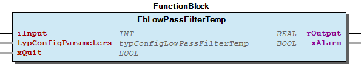
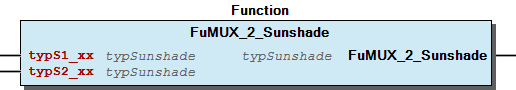

# WagoAppBuilding v1.0.2.16 (WAGO) - Complete Documentation

## 📋 Library Information

- **Company:** WAGO
- **Title:** WagoAppBuilding
- **Version:** 1.0.2.16
- **Categories:** WAGO BusinessView|Building Automation; WAGO LayerView|App; Application
- **Author:** WAGO U015842
- **Placeholder:** WagoAppBuilding

### Description ¶

This document is automatically generated.

Building library according to VDI 3813

The function blocks of this library are thread safe and can be called simultaneously from different CODESYS tasks.

This document is automatically generated. Building library according to VDI 3813 The function blocks of this library are thread safe and can be called simultaneously from different CODESYS tasks.

### Contents: ¶

Contents: - Documentation Index 10 Documentation - WagoAppBuilding Library Documentation Project Information Library Information Function Blocks - FbAdvanceWeatherProtection (FB) - FbAdvancedLatchingRelay (FB) - FbBasicWeatherProtection (FB) - FbCalculateSunPosition (FB) - FbCalculateSunriseSunset (FB) - FbControlLightScene (FB) - FbControlSunshadeScene (FB) - FbDimDoubleButton (FB) - FbDimSingleButton (FB) - FbEvaluateMultipleClicks (FB) - ... and 34 more Functions - Fu10Point (FUN) - Fu2Point (FUN) - Fu4Point (FUN) - FuAI (FUN) - FuAI_Temp (FUN) - FuAO (FUN) - FuGetLightSceneValue (FUN) - FuMUX_2_Sunshade (FUN) - FuMUX_3_Sunshade (FUN) - FuTypSunshade (FUN) - ... and 2 more Program Organization Function Groups - 02 Weather protection functions/ Witterungsschutzfunktion - 03 Application functions - 03 Application functions/ Anwendungsfunktionen - 03 Sensor functions / Sensorfunktionen - 03 Sensor functions / Sensorfunktionen - 04 Automatic functions - 04 Automatic functions/ Automatikfunktionen - 10 Further functions/ weitere Funktionen Global Variable Lists - GlobalVariables (GVL) - Status (GVL) - VersionHistory (GVL) Other Components - 01 Evaluate Buttons / Tasterauswertung - 01 Evaluate Buttons / Tasterauswertung - 01 Latching relay / Stromstoßschalter - 01 Lighting - 01 Lighting - 01 Lighting / Beleuchtung - 01 Lighting / Beleuchtung - 01 Lighting/ Beleuchtung - 01 Lighting/ Beleuchtung - 01 Sunshade actuator - ... and 70 more

### Indices and tables ¶

Based on WagoAppBuilding.library, last modified 29.05.2024, 19:57:14. LibDoc 3.5.16.10

© WAGO GmbH & Co. KG, Germany 2018 – All rights reserved. For the avoidance of doubt, this copyright notice does not only apply to the information above but also and primarily to the described library itself. Please note that third-party products are always mentioned without reference to intellectual property rights, including patents, utility models, designs and trademarks, accordingly the existence of such rights cannot be excluded. WAGO is a registered trademark of WAGO Verwaltungsgesellschaft mbH.

- File and Project Information - Library Reference Based on WagoAppBuilding.library, last modified 29.05.2024, 19:57:14. LibDoc 3.5.16.10 © WAGO GmbH & Co. KG, Germany 2018 – All rights reserved. For the avoidance of doubt, this copyright notice does not only apply to the information above but also and primarily to the described library itself. Please note that third-party products are always mentioned without reference to intellectual property rights, including patents, utility models, designs and trademarks, accordingly the existence of such rights cannot be excluded. WAGO is a registered trademark of WAGO Verwaltungsgesellschaft mbH.

### Documentation Index

## 10 Documentation

To ensure fast installation and start-up of the units, we strongly recommend that the following information and explanations are carefully read and adhered to.

To ensure fast installation and start-up of the units, we strongly recommend that the following information and explanations are carefully read and adhered to. - doc01_Foreword (FB) - doc_Calibration (FB)

## WagoAppBuilding Library Documentation

| Company: | WAGO |
| Title: | WagoAppBuilding |
| Version: | 1.0.2.16 |
| Categories: | WAGO BusinessView\|Building Automation; WAGO LayerView\|App; Application |
| Author: | WAGO U015842 |
| Placeholder: | WagoAppBuilding |

### Description

This document is automatically generated.

Building library according to VDI 3813

The function blocks of this library are thread safe and can be called simultaneously from different CODESYS tasks.

This document is automatically generated. Building library according to VDI 3813 The function blocks of this library are thread safe and can be called simultaneously from different CODESYS tasks.

### Contents:

- 10 Documentation doc01_Foreword (FB) - doc_Calibration (FB) 20 Program Organization Units - 01 Lighting / Beleuchtung - 02 Sunshade / Sonnenschutz - 03 Sensor functions / Sensorfunktionen - 10 Scene control / Szenensteuerung - 20 Partition wall control / Trennwandsteuerung - 70 Utilities / Hilfsfunktionen - 80 Data types 80 Status - Status (GVL) - eStatus (ENUM) FbEvaluateShortLongPress_1 (FB) FbEvaluateSingleButton_1 (FB) GlobalTextList (Text List) GlobalVariables (GVL) ParameterList (PARAMS) VersionHistory (GVL)

### Indices and tables

Based on WagoAppBuilding.library, last modified 29.05.2024, 19:57:14. LibDoc 3.5.16.10

© WAGO GmbH & Co. KG, Germany 2018 – All rights reserved. For the avoidance of doubt, this copyright notice does not only apply to the information above but also and primarily to the described library itself. Please note that third-party products are always mentioned without reference to intellectual property rights, including patents, utility models, designs and trademarks, accordingly the existence of such rights cannot be excluded. WAGO is a registered trademark of WAGO Verwaltungsgesellschaft mbH.

- File and Project Information - Library Reference Based on WagoAppBuilding.library, last modified 29.05.2024, 19:57:14. LibDoc 3.5.16.10 © WAGO GmbH & Co. KG, Germany 2018 – All rights reserved. For the avoidance of doubt, this copyright notice does not only apply to the information above but also and primarily to the described library itself. Please note that third-party products are always mentioned without reference to intellectual property rights, including patents, utility models, designs and trademarks, accordingly the existence of such rights cannot be excluded. WAGO is a registered trademark of WAGO Verwaltungsgesellschaft mbH.

### Project Information

## File and Project Information

| Scope | Name | Type | Content |
| --- | --- | --- | --- |
| FileHeader | libraryFile | string | WagoAppBuilding.library |
| contentFile | doc.clean.json |
| productName | e!COCKPIT |
| creationDateTime | date | 29.05.2024, 19:57:15 |
| companyName | string | WAGO |
| ProjectInformation | LastModificationDateTime | date | 29.05.2024, 19:57:14 |
| NoPlaceholder | string |  |
| Description | See: Description |
| Copyright | © WAGO Kontakttechnik GmbH & Co. KG, Germany 2018 – All rights reserved. |
| Author | WAGO U015842 |
| AutoResolveUnbound | bool | True |
| Placeholder | string | WagoAppBuilding |
| Company | WAGO |
| DocFormat | reStructuredText |
| Project | WagoAppBuilding |
| DefaultNamespace |  |
| Version | version | 1.0.2.16 |
| WagoAppBuilding | string | WagoAppBuilding |
| Title | WagoAppBuilding |
| LibraryCategories | library-category-list | WAGO BusinessView\|Building Automation; WAGO LayerView\|App; Application |
| CompiledLibraryCompatibilityVersion | string | CODESYS V3.5 SP16 Patch 3 |
| ThreadSafe | True |

### Library Information

## Library Reference

| LinkAllContent: False QualifiedOnly: True | SystemLibrary: False | Optional: False |

| LinkAllContent: False QualifiedOnly: False | SystemLibrary: False | Optional: False |

| LinkAllContent: False Optional: False | QualifiedOnly: False SystemLibrary: False | PublishSymbolsInContainer: True |

| LinkAllContent: False QualifiedOnly: False | SystemLibrary: False | Optional: False |

| LinkAllContent: False Optional: False | QualifiedOnly: False SystemLibrary: False | PublishSymbolsInContainer: True |

This is a dictionary of all referenced libraries and their name spaces.

This is a dictionary of all referenced libraries and their name spaces. CAA DTUtil Extern Library Identification : Placeholder: CAA DTUtility Default Resolution: CAA DTUtil Extern, * (CAA Technical Workgroup) Namespace: DTU Library Properties : Standard Library Identification : Placeholder: Standard Default Resolution: Standard, 3.5.5.0 (System) Namespace: Standard Library Properties : WagoSysErrorBase Library Identification : Placeholder: WagoSysErrorBase Default Resolution: WagoSysErrorBase, * (WAGO) Namespace: WagoSysErrorBase Library Properties : WagoSysVersion Library Identification : Name: WagoSysVersion Version: 1.0.0.0 Company: WAGO Namespace: WagoSysVersion Library Properties : WagoTypesErrorBase Library Identification : Placeholder: WagoTypesErrorBase Default Resolution: WagoTypesErrorBase, * (WAGO) Namespace: WagoTypesErrorBase Library Properties :

### Function Blocks

## FbAdvanceWeatherProtection (FB)

| Scope | Name | Type | Comment | Inherited from |
| --- | --- | --- | --- | --- |
| Output | oStatus | WagoSysErrorBase.FbResult | Status object. (Listed in Status ) The content of the error object could be displayed via the FbShowResult from the WagoSysErrorBase library. | FbBaseBuilding |
| sStatus | STRING | Status description as string (Listed in Status ) | FbBaseBuilding |
| Input | rWindVelocity | REAL | Measured wind velocity [m/s] |  |
| rWindDirection | REAL | Measured wind direction [°] |  |
| rTemperature | REAL | Measured outdoor temperature [°C] |  |
| xRain | BOOL | Measured precipitation |  |
| typWindAssessment | typWindAssessment | Parameter for wind assessment |  |
| typConfigParameters | typConfigWeatherProtection | Configuration parameters |  |
| Output | xSafety | BOOL | Protection mode active caused by wind alarm or frost alarm. |  |
| iWindSector | INT | Index of current active wind sector. |  |
| xError | BOOL | Error display through wrong parameters or wind sensor timeout |  |

| Norm | function |
| --- | --- |
| VDI 3813 page 2 - 6.5.18 | Weather protection |

The FbAdvanceWeatherProtection function block is used for weather protection by external sunshades against damage caused by wind, rain or icing. The detected sensor values of wind velocity, outside temperature and precipitation detection are evaluated and trigger the safety function of the sunshade actuator when there is a risk of damage.

This function block should only be used together with one wind assessment.

Graphical Illustration

Function description

The FbAdvanceWeatherProtection function block is based on the FbBasicWeatherProtection (FB) function block. The explanation of the inputs can be found in the above description. The measured wind direction rWindDirection is connected to the function block. The wind direction is assigned with a wind sector. The measured wind strength is multiplied by the factor of the wind sector and the calculated wind strength further processed. The xSafety output signals when the safety function of the sunshade is switched on. The output can be connected to the signal output for the safety position of the sunshade actuator. The iWindSector output signals the active wind sector. The xError output signals a time-out of the wind sensor or incorrect parameterization of the function block thresholds.

See also typWindAssessment ( typWindAssessment (STRUCT) ), it contains all parameter values for wind assessment. See also typConfigParameters ( typConfigWeatherProtection (STRUCT) ), it contains all parameter values for the function block.

Classification of wind sectors:

The Function block corresponds to a Room Automation macro (RA-Macro) with the following function(s) from the VDI 3813:

Interface variables Function The FbAdvanceWeatherProtection function block is used for weather protection by external sunshades against damage caused by wind, rain or icing. The detected sensor values of wind velocity, outside temperature and precipitation detection are evaluated and trigger the safety function of the sunshade actuator when there is a risk of damage. Note This function block should only be used together with one wind assessment. Graphical Illustration  Function description The FbAdvanceWeatherProtection function block is based on the FbBasicWeatherProtection (FB) function block. The explanation of the inputs can be found in the above description. The measured wind direction rWindDirection is connected to the function block. The wind direction is assigned with a wind sector. The measured wind strength is multiplied by the factor of the wind sector and the calculated wind strength further processed. The xSafety output signals when the safety function of the sunshade is switched on. The output can be connected to the signal output for the safety position of the sunshade actuator. The iWindSector output signals the active wind sector. The xError output signals a time-out of the wind sensor or incorrect parameterization of the function block thresholds. See also typWindAssessment ( typWindAssessment (STRUCT) ), it contains all parameter values for wind assessment. See also typConfigParameters ( typConfigWeatherProtection (STRUCT) ), it contains all parameter values for the function block. Classification of wind sectors:  The Function block corresponds to a Room Automation macro (RA-Macro) with the following function(s) from the VDI 3813:

## FbAdvancedLatchingRelay (FB)

| Scope | Name | Type | Comment |
| --- | --- | --- | --- |
| Input | xButton | BOOL | Every rising edge switches the actual output status. |
| xCentralOn | BOOL | Rising edge switches output status on. |
| xCentralOff | BOOL | Rising edge switches output status off. |
| typL_SCENE | typLight | Scene commands which can be linked to a scene function block. |
| xFeedback | BOOL | Status feedback when other actuators controls the same lights (e.g. segment control). |
| Inout | xRecoveryValue | BOOL | Maps switching behavior after voltage recovery. See Function description. |
| Output | xSwitchActuator | BOOL | Digital signal indicates the switching state of the latched relay. |
| typL_Segment | typLight | Light command for partition wall control. |

| Norm | function |
| --- | --- |
| VDI 3813 page 2 - 6.2.2 | Actuate light |
| VDI 3813 page 2 - 6.4.2 | Light actuator |

The FbAdvancedLatchingRelay function block maps the function of a latched relay. The switching function corresponds to a toggle flip-flop. The function block makes it possible to define a switching value with voltage recovery.

Graphical Illustration

Function description

The function block reacts to rising switching signals at the xButton input. With every positive switching signal at the xButton input, the latched relay switches its status value at the xActuator output. The xCentralOn and xCentralOff inputs serve to connect central ON/OFF commands. The xCentralOn input sends an ON command in the case of a rising edge. The xCentralOff input sends an OFF command in the case of a rising edge. The typL_SCENE input is used for scene control and can be linked to a scene function block. When an update signal is received, the transmitted switching value will be evaluated. If a scene switching value is greater than 0, xActuator switches to TRUE.

The xFeedback input is used as status feedback when connecting to the segment control. The current switching state of a segment must be passed to the xFeedback input. Hence the function block will receive the current switching state. The xActuator output indicates the switching state of the latched relay. The typL_Segment is used to connect the function block to the segment control.

The following states can be defined for the switching behavior after voltage recovery:

See also typL_SCENE ( typLight (STRUCT) ), it can be linked to a scene function block.

The Function block corresponds to a Room Automation macro (RA-Macro) with the following function(s) from the VDI 3813:

Interface variables Function The FbAdvancedLatchingRelay function block maps the function of a latched relay. The switching function corresponds to a toggle flip-flop. The function block makes it possible to define a switching value with voltage recovery. Graphical Illustration  Function description The function block reacts to rising switching signals at the xButton input. With every positive switching signal at the xButton input, the latched relay switches its status value at the xActuator output. The xCentralOn and xCentralOff inputs serve to connect central ON/OFF commands. The xCentralOn input sends an ON command in the case of a rising edge. The xCentralOff input sends an OFF command in the case of a rising edge. The typL_SCENE input is used for scene control and can be linked to a scene function block. When an update signal is received, the transmitted switching value will be evaluated. If a scene switching value is greater than 0, xActuator switches to TRUE. The xFeedback input is used as status feedback when connecting to the segment control. The current switching state of a segment must be passed to the xFeedback input. Hence the function block will receive the current switching state. The xActuator output indicates the switching state of the latched relay. The typL_Segment is used to connect the function block to the segment control. The following states can be defined for the switching behavior after voltage recovery: - Always switch off after voltage recovery: Initialize the variable xRecoveryValue with FALSE - Always switch on after voltage recovery: Initialize the variable xRecoveryValue with TRUE - Always recover the last value after voltage recovery: Declare the variable xRecoveryValue as RETAIN PERSISTENT without initialization. See also typL_SCENE ( typLight (STRUCT) ), it can be linked to a scene function block. The Function block corresponds to a Room Automation macro (RA-Macro) with the following function(s) from the VDI 3813:

## FbBasicWeatherProtection (FB)

| Scope | Name | Type | Comment | Inherited from |
| --- | --- | --- | --- | --- |
| Output | oStatus | WagoSysErrorBase.FbResult | Status object. (Listed in Status ) The content of the error object could be displayed via the FbShowResult from the WagoSysErrorBase library. | FbBaseBuilding |
| sStatus | STRING | Status description as string (Listed in Status ) | FbBaseBuilding |
| Input | rWindVelocity | REAL | Measured wind velocity [m/s] |  |
| rTemperature | REAL | Measured outdoor temperature [°C] |  |
| xRain | BOOL | Measured precipitation |  |
| typConfigParameters | typConfigWeatherProtection | Configuration parameters |  |
| Output | xSafety | BOOL | Protection mode active caused by wind alarm or frost alarm. |  |
| xError | BOOL | Error display through wrong parameters or wind sensor timeout |  |

| Norm | function |
| --- | --- |
| VDI 3813 page 2 - 6.5.18 | Weather protection |

The FbBasicWeatherProtection function block is used for weather protection by external sunshades against damage caused by wind, rain or icing.

Graphical Illustration

Function description

The FbBasicWeatherProtection function block is used for weather protection by external sunshades against damage caused by wind, rain or icing. The detected sensor values of wind velocity, outside temperature and precipitation detection are evaluated and trigger the safety function of the sunshade actuator when there is a risk of damage. The time-related behavior for the wind alarm and frost alarm is shown below as an example. The FbBasicWeatherProtection function block combines the functions of the FbFrostAlarm (FB) and FbWindAlarm (FB) . The explanation of the inputs can be found in the above descriptions. The configuration parameters at the “typConfigWeatherProtection” input also come from the FbFrostAlarm and FbWindAlarm function blocks. The “xSafety” output signals when the safety function of the sunshade is switched on. The output can be connected to the signal output for the safety position of the sunshade actuator. The “xError” output signals a time-out of the wind sensor or incorrect parameterization of the function block thresholds.

The Function block corresponds to a Room Automation macro (RA-Macro) with the following function(s) from the VDI 3813:

Function block combines the functions of the FbFrostAlarm and FbWindAlarm .

Chronological sequence of the frost alarm:

Chronological sequence of the wind alarm:

Interface variables Function The FbBasicWeatherProtection function block is used for weather protection by external sunshades against damage caused by wind, rain or icing. Graphical Illustration  Function description The FbBasicWeatherProtection function block is used for weather protection by external sunshades against damage caused by wind, rain or icing. The detected sensor values of wind velocity, outside temperature and precipitation detection are evaluated and trigger the safety function of the sunshade actuator when there is a risk of damage. The time-related behavior for the wind alarm and frost alarm is shown below as an example. The FbBasicWeatherProtection function block combines the functions of the FbFrostAlarm (FB) and FbWindAlarm (FB) . The explanation of the inputs can be found in the above descriptions. The configuration parameters at the “typConfigWeatherProtection” input also come from the FbFrostAlarm and FbWindAlarm function blocks. The “xSafety” output signals when the safety function of the sunshade is switched on. The output can be connected to the signal output for the safety position of the sunshade actuator. The “xError” output signals a time-out of the wind sensor or incorrect parameterization of the function block thresholds. The Function block corresponds to a Room Automation macro (RA-Macro) with the following function(s) from the VDI 3813: Function block combines the functions of the FbFrostAlarm and FbWindAlarm . Chronological sequence of the frost alarm:  Chronological sequence of the wind alarm: 

## FbCalculateSunPosition (FB)

| Scope | Name | Type | Initial | Comment |
| --- | --- | --- | --- | --- |
| Input | dtUTC_Time | DT |  | UTC Time |
| rLatitude | REAL | 52.305 | Latitude := North latitude in degrees + (north latitude in minutes / 60) |
| rLongitude | REAL | 8.922 | Longitude := East longitude in degrees + (east longitude in minutes / 60) |
| Output | rAzimuth | REAL |  | Azimuth of the Sun. [°] |
| rElevation | REAL |  | Elevation of the Sun. [°] |

The FbCalculateSunPosition function block is used to calculate the current position of the sun by the current time and geographic coordinates.

Graphical Illustration

Function description

The UTC time dtUTC_Time is required to calculate the position of the sun. The actual position is determined via inputs rLatitude and rLongitude . Latitude rLatitude and longitude rLongitude can also be calculated as follows:

Output rAzimuth indicates the actual azimuth and output rElevation the elevation in degrees.

Interface variables Function The FbCalculateSunPosition function block is used to calculate the current position of the sun by the current time and geographic coordinates. Graphical Illustration  Function description The UTC time dtUTC_Time is required to calculate the position of the sun. The actual position is determined via inputs rLatitude and rLongitude . Latitude rLatitude and longitude rLongitude can also be calculated as follows: Latitude := North latitude in degrees + (north latitude in minutes / 60) Longitude := East longitude in degrees + (east longitude in minutes / 60) Output rAzimuth indicates the actual azimuth and output rElevation the elevation in degrees.

## FbCalculateSunriseSunset (FB)

| Scope | Name | Type | Initial | Comment |
| --- | --- | --- | --- | --- |
| Input | dtUTC_Time | DT |  | UTC Time |
| rTimeZone | REAL |  | Time zone := local differenz to UTC-Time; e.g. MEZ := +1 |
| xDST | BOOL |  | Daylight saving time active. Calculation, if active, must be done external. |
| rLatitude | REAL | 52.305 | Latitude := North latitude in degrees + (north latitude in minutes / 60) |
| rLongitude | REAL | 8.922 | Longitude := East longitude in degrees + (east longitude in minutes / 60) |
| Output | tSuntime | TIME |  | Sun hours of the day. |
| dtSunrise | DT |  | Date and time of Sunrise. |
| dtSunset | DT |  | Date and time of Sunset. |

The FbCalculateSunriseSunset function block is used to calculate the sunrise and sunset by the current time and geographic coordinates.

Graphical Illustration

Function description

The UTC time dtUTC_Time is required to calculate the sunrise and sunset. The calculation with local time can be realized by using the rTimeZone input. The daylight saving time can be activated by switching the xDST input to TRUE. The actual position is determined via inputs rLatitude and rLongitude . Latitude rLatitude and longitude rLongitude can also be calculated as follows:

Latitude := North latitude in degrees + (north latitude in minutes / 60)

Longitude := East longitude in degrees + (east longitude in minutes / 60)

The dtSunrise and dtSunset outputs display the time of the sunrise and sunset. The tDayLenght ouput dislays the time between sunrise and sunset.

If the sun don’t rise and don’t set this day, the tDayLenght outputs T#0ms for sun all day down or T#24h for all day up.

The sunrise and sunset calculation got an accuaracy of +/- 3 minutes.

Interface variables Function The FbCalculateSunriseSunset function block is used to calculate the sunrise and sunset by the current time and geographic coordinates. Graphical Illustration  Function description The UTC time dtUTC_Time is required to calculate the sunrise and sunset. The calculation with local time can be realized by using the rTimeZone input. The daylight saving time can be activated by switching the xDST input to TRUE. The actual position is determined via inputs rLatitude and rLongitude . Latitude rLatitude and longitude rLongitude can also be calculated as follows: Latitude := North latitude in degrees + (north latitude in minutes / 60) Longitude := East longitude in degrees + (east longitude in minutes / 60) The dtSunrise and dtSunset outputs display the time of the sunrise and sunset. The tDayLenght ouput dislays the time between sunrise and sunset. If the sun don’t rise and don’t set this day, the tDayLenght outputs T#0ms for sun all day down or T#24h for all day up. Note The sunrise and sunset calculation got an accuaracy of +/- 3 minutes.

## FbControlLightScene (FB)

| Scope | Name | Type | Comment |
| --- | --- | --- | --- |
| Input | xScene1 | BOOL | Recall scene 1 |
| xScene2 | BOOL | Recall scene 2 |
| xScene3 | BOOL | Recall scene 3 |
| xScene4 | BOOL | Recall scene 4 |
| xScene5 | BOOL | Recall scene 5 |
| xScene6 | BOOL | Recall scene 6 |
| xScene7 | BOOL | Recall scene 7 |
| xScene8 | BOOL | Recall scene 8 |
| xScene9 | BOOL | Recall scene 9 |
| xScene10 | BOOL | Recall scene 10 |
| xLearnScene | BOOL | Save current value to active scene. |
| aLearnSceneValues | typLightGroup | Input current light actuator values for learning. |
| Inout | typLightScenes | typLightScenes | Stores light scene values |
| Output | typL_SCENEs | typL_SCENEs | Scene values for all groups of respective light actuators |
| bScene | BYTE | Displays the current active scene |

| Norm | function |
| --- | --- |
| VDI 3813 page 2 - 6.4.6 | Select room utilization type |
| VDI 3813 page 2 - 6.5.3 | Control via room utilization types |

The FbControlLightScene function block can be used to choose between several types of room utilization to adjust room conditions for lighting.

Graphical Illustration

Function description

For each scene, five lighting groups can be defined with different brightness values. The individual scenes are called up via a rising edge at one of the xScene1..10 inputs. The bScene output displays the scene currently called up. The function block provides two options for saving scenes.

The Function block corresponds to a Room Automation macro (RA-Macro) with the following function(s) from the VDI 3813:

Interface variables Function The FbControlLightScene function block can be used to choose between several types of room utilization to adjust room conditions for lighting. Graphical Illustration  Function description For each scene, five lighting groups can be defined with different brightness values. The individual scenes are called up via a rising edge at one of the xScene1..10 inputs. The bScene output displays the scene currently called up. The function block provides two options for saving scenes. - all scenes and all groups can be stored directly. The scenes are saved by writing the atypLightScenes input/output variable. The dimming values are entered for all scenes and all groups. This option is suitable for specifications at start-up. - With the second option, all groups of the current scene can be saved. The dimming values of all lighting groups must be restored at the arLearnSceneValues input. A rising edge at the xLearnScene input saves the dimming values from arLearnSceneValues to the scene atypLightScenes[X] currently called up. This option is suitable for manually adjust a scene. Note - The selection of individual groups from the atypL_SCENE output can be realized with the FuGetLightSceneValue function. - To ensure the saved scene values are retained even after a power failure, the atypLightScenes input/output variable should be declared as RETAIN PERSISTENT. The Function block corresponds to a Room Automation macro (RA-Macro) with the following function(s) from the VDI 3813:

## FbControlSunshadeScene (FB)

| Scope | Name | Type | Comment |
| --- | --- | --- | --- |
| Input | xScene1 | BOOL | Recall scene 1 |
| xScene2 | BOOL | Recall scene 2 |
| xScene3 | BOOL | Recall scene 3 |
| xScene4 | BOOL | Recall scene 4 |
| xScene5 | BOOL | Recall scene 5 |
| xScene6 | BOOL | Recall scene 6 |
| xScene7 | BOOL | Recall scene 7 |
| xScene8 | BOOL | Recall scene 8 |
| xScene9 | BOOL | Recall scene 9 |
| xScene10 | BOOL | Recall scene 10 |
| xLearnScene | BOOL | Save current position to active scene. |
| typLearnSunshadePosition | typSunshadePosition | Input current sunshade position for learning. |
| Output | typSetSunshade | typSunshade | Contains the manual position commands for the sunshade actuator. |
| bScene | BYTE | Dissplays the current active scene. |
| Inout | aSunshadeScenes | typSunshadeScenes | Stores scene positions. |

| Norm | function |
| --- | --- |
| VDI 3813 page 2 - 6.4.6 | Select room utilization type |
| VDI 3813 page 2 - 6.5.3 | Control via room utilization types |

Graphical Illustration

Function description

Ten different scenes with position values can be saved. The individual scenes are called up via a rising edge at one of the xScene1..10 inputs. The bScene output displays the scene currently called up. The function block provides to options for saving scenes.

The typSetSunshade output variables contain the position commands for the sunshade actuator. The typSetSunshade.xMove variable is briefly set to TRUE when controlling a scene.

The Function block corresponds to a Room Automation macro (RA-Macro) with the following function(s) from the VDI 3813:

Interface variables Graphical Illustration  Function description Ten different scenes with position values can be saved. The individual scenes are called up via a rising edge at one of the xScene1..10 inputs. The bScene output displays the scene currently called up. The function block provides to options for saving scenes. - With the first option, all scenes can be stored directly. The position values for all scenes are entered in the atypSunshadeScenes input/output variable. This option is suitable for specifications at start-up. - With the second option, the current scene can be changed. The position values of the sunshade must be restored at the typLearnSunshadePosition input. A rising edge at the xLearnScene input saves the position values from typLearnSunshadePosition to the scene atypSunshadeScenes[X] currently called up. This option is suitable for manually adjust a scene. The typSetSunshade output variables contain the position commands for the sunshade actuator. The typSetSunshade.xMove variable is briefly set to TRUE when controlling a scene. Note - To ensure the saved scene values are retained even after a power failure, the atypSunshadeScenes input/output variable should be declared as RETAIN PERSISTENT. - The set position values must be in the range of 0 – 100%. Otherwise, the sunshade actuator ignores the command. The Function block corresponds to a Room Automation macro (RA-Macro) with the following function(s) from the VDI 3813:

## FbDimDoubleButton (FB)

| Scope | Name | Type | Comment |
| --- | --- | --- | --- |
| Input | xOnAndStepUp | BOOL | A short button press transmits an ON command. A long button press transmits an dim UP command. |
| xOffAndStepDown | BOOL | A short button press transmits an OFF command. A long button press transmits an dim DOWN command. |
| xCentralOn | BOOL | A positive signal sends an ON command to the maximum dimming value. |
| xCentralOff | BOOL | A positive signal sends an OFF command. |
| typL_SCENE | typLight | Scene commands which can be linked to a scene function block. |
| rFeedback | REAL | Lighting value feedback [%]. Used when other actuators controls the same lights (e.g. segment control). |
| typConfigParameters | typConfigDim | parameter for specifying the operator control action |
| Output | xSwitchActuator | BOOL | Digital switching state. Can be connected to relay. |
| rActuator | REAL | Indicates the percentage dimming value. The possible dimming value in the ON state is limited by an maximum and minimum. |
| wActuatorAnalog | WORD | Indicates the dimming value as a signal in a range of 0 to 32767. For example, this output can be used for an analog output module. |
| typL_Segment | typLight | Lighting command is used to connect the function block to the segment control. |
| Inout | rRecoveryValue | REAL | Maps the percentage switching behavior after voltage recovery. See Function description. |

| Parameter ``typConfigDim.typLightActuator.rSetRecoveryValue`` | Actuator behavior after voltage recovery | Variable ``rRecoveryValue`` |
| --- | --- | --- |
| 0% | Power OFF | To save as a variable |
| 1-100% | Switching on to parameterized value | To save as a variable |
| 101% | Restore last dimming value | To save as RETAIN PERSISTENT variable |

| Norm | function |
| --- | --- |
| VDI 3813 page 2 - 6.2.2 | Actuate light |
| VDI 3813 page 2 - 6.4.2 | Light actuator |

The FbDimDoubleButton function block can be used to dim a light with a double button.

Graphical Illustration

Function description

The xOnAndStepUp and xOffAndStepDown button inputs evaluate short and long button commands. A short button press transmits an ON/OFF command. The switch-on value can be parameterized. A long button press transmits an UP/DOWN command. The dimming value can be dimmed between the limiting values. The xCentralOn and xCentralOff inputs serve to connect central ON/OFF commands. The xCentralOn input sends an ON command to the maximum dimming value in the case of a rising edge. The xCentralOff input sends an OFF command in the case of a rising edge. The actuation time of the xCentralOn and xCentralOff inputs does not affect the switching behavior. The typL_SCENE input is used for scene control and can be linked to a scene function block. When an update signal is received, the defined dimming value is transmitted. The rFeedback input is used as status feedback when connecting to the segment control. The current dimming value of a segment must be passed to the rFeedback input. Hence the function block will receive the current dimming value. The rRecoveryValue input/output variable maps the switching behavior after voltage recovery. The assignment is explained in the table below. The xActuator output indicates the digital switching state. If a percentage dimming value is greater than 0, xActuator switches to TRUE. The rActuator output indicates the percentage dimming value. The possible dimming value in the ON state is limited by the maximum and minimum dimming value. In the OFF state, the dimming value is 0. The wActuator output indicates the dimming value as a signal in a range of 0 to 32767. For example, this output can be used for an analog output module. The typL_Segment is used to connect the function block to the segment control.

See also typConfigParameters ( typConfigDim (STRUCT) ), it contains all parameter values for specifying the operator control action

The following behaviors can be defined for the switching behavior after voltage recovery:

The Function block corresponds to a Room Automation macro (RA-Macro) with the following function(s) from the VDI 3813:

Interface variables Function The FbDimDoubleButton function block can be used to dim a light with a double button. Graphical Illustration  Function description The xOnAndStepUp and xOffAndStepDown button inputs evaluate short and long button commands. A short button press transmits an ON/OFF command. The switch-on value can be parameterized. A long button press transmits an UP/DOWN command. The dimming value can be dimmed between the limiting values. The xCentralOn and xCentralOff inputs serve to connect central ON/OFF commands. The xCentralOn input sends an ON command to the maximum dimming value in the case of a rising edge. The xCentralOff input sends an OFF command in the case of a rising edge. The actuation time of the xCentralOn and xCentralOff inputs does not affect the switching behavior. The typL_SCENE input is used for scene control and can be linked to a scene function block. When an update signal is received, the defined dimming value is transmitted. The rFeedback input is used as status feedback when connecting to the segment control. The current dimming value of a segment must be passed to the rFeedback input. Hence the function block will receive the current dimming value. The rRecoveryValue input/output variable maps the switching behavior after voltage recovery. The assignment is explained in the table below. The xActuator output indicates the digital switching state. If a percentage dimming value is greater than 0, xActuator switches to TRUE. The rActuator output indicates the percentage dimming value. The possible dimming value in the ON state is limited by the maximum and minimum dimming value. In the OFF state, the dimming value is 0. The wActuator output indicates the dimming value as a signal in a range of 0 to 32767. For example, this output can be used for an analog output module. The typL_Segment is used to connect the function block to the segment control. See also typConfigParameters ( typConfigDim (STRUCT) ), it contains all parameter values for specifying the operator control action The following behaviors can be defined for the switching behavior after voltage recovery: The Function block corresponds to a Room Automation macro (RA-Macro) with the following function(s) from the VDI 3813:

## FbDimSingleButton (FB)

| Scope | Name | Type | Comment |
| --- | --- | --- | --- |
| Input | xButton | BOOL | Button for switching and Diming |
| xCentralOn | BOOL | A positive signal sends an ON command to the maximum dimming value. |
| xCentralOff | BOOL | A positive signal sends an OFF command. |
| typL_SCENE | typLight | Scene commands which can be linked to a scene function block. |
| rFeedback | REAL | Lighting value feedback [%]. Used when other actuators controls the same lights (e.g. segment control). |
| typConfigParameters | typConfigDim | parameter for specifying the operator control action |
| Output | xSwitchActuator | BOOL | Digital switching state. Can be connected to relay. |
| rActuator | REAL | Indicates the percentage dimming value. The possible dimming value in the ON state is limited by an maximum and minimum. |
| wActuatorAnalog | WORD | Indicates the dimming value as a signal in a range of 0 to 32767. For example, this output can be used for an analog output module. |
| typL_Segment | typLight | Lighting command is used to connect the function block to the segment control. |
| Inout | rRecoveryValue | REAL | Maps the percentage switching behavior after voltage recovery. See Function description. |

| Parameter ``typConfigDim.typLightActuator.rSetRecoveryValue`` | Actuator behavior after voltage recovery | Variable ``rRecoveryValue`` |
| --- | --- | --- |
| 0% | Power OFF | To save as a variable |
| 1-100% | Switching on to parameterized value | To save as a variable |
| 101% | Restore last dimming value | To save as RETAIN PERSISTENT variable |

| Norm | function |
| --- | --- |
| VDI 3813 page 2 - 6.2.2 | Actuate light |
| VDI 3813 page 2 - 6.4.2 | Light actuator |

The FbDimSingleButton function block can be used to dim a light with a single button.

Graphical Illustration

Function description

The xButton button input evaluates short and long button commands. A short button press transmits an ON/OFF command. The switch-on value can be parameterized. A long button press transmits an UP/DOWN command. The light is dimmed up after switching on. The dimming value can be dimmed between the limiting values. The xCentralOn and xCentralOff inputs serve to connect central ON/OFF commands. The xCentralOn input sends an ON command to the maximum dimming value in the case of a rising edge. The xCentralOff input sends an OFF command in the case of a rising edge. The actuation time of the xCentralOn and xCentralOff inputs does not affect the switching behavior. The typL_SCENE input is used for scene control and can be linked to a scene function block. When an update signal is received, the defined dimming value is transmitted. The rFeedback input is used as status feedback when connecting to the segment control. The current dimming value of a segment must be passed to the rFeedback input. Hence the function block will receive the current dimming value. The rRecoveryValue input/output variable maps the switching behavior after voltage recovery. The assignment is explained in the table below. The xActuator output indicates the digital switching state. If a percentage dimming value is greater than 0, xActuator switches to TRUE. The rActuator output indicates the percentage dimming value. The possible dimming value in the ON state is limited by the maximum and minimum dimming value. In the OFF state, the dimming value is 0. The wActuator output indicates the dimming value as a signal in a range of 0 to 32767. For example, this output can be used for an analog output module. The typL_Segment is used to connect the function block to the segment control.

The following behaviors can be defined for the switching behavior after voltage recovery:

See also typConfigParameters ( typConfigDim (STRUCT) ), it contains all parameter values for specifying the operator control action

The Function block corresponds to a Room Automation macro (RA-Macro) with the following function(s) from the VDI 3813:

Interface variables Function The FbDimSingleButton function block can be used to dim a light with a single button. Graphical Illustration  Function description The xButton button input evaluates short and long button commands. A short button press transmits an ON/OFF command. The switch-on value can be parameterized. A long button press transmits an UP/DOWN command. The light is dimmed up after switching on. The dimming value can be dimmed between the limiting values. The xCentralOn and xCentralOff inputs serve to connect central ON/OFF commands. The xCentralOn input sends an ON command to the maximum dimming value in the case of a rising edge. The xCentralOff input sends an OFF command in the case of a rising edge. The actuation time of the xCentralOn and xCentralOff inputs does not affect the switching behavior. The typL_SCENE input is used for scene control and can be linked to a scene function block. When an update signal is received, the defined dimming value is transmitted. The rFeedback input is used as status feedback when connecting to the segment control. The current dimming value of a segment must be passed to the rFeedback input. Hence the function block will receive the current dimming value. The rRecoveryValue input/output variable maps the switching behavior after voltage recovery. The assignment is explained in the table below. The xActuator output indicates the digital switching state. If a percentage dimming value is greater than 0, xActuator switches to TRUE. The rActuator output indicates the percentage dimming value. The possible dimming value in the ON state is limited by the maximum and minimum dimming value. In the OFF state, the dimming value is 0. The wActuator output indicates the dimming value as a signal in a range of 0 to 32767. For example, this output can be used for an analog output module. The typL_Segment is used to connect the function block to the segment control. The following behaviors can be defined for the switching behavior after voltage recovery: See also typConfigParameters ( typConfigDim (STRUCT) ), it contains all parameter values for specifying the operator control action The Function block corresponds to a Room Automation macro (RA-Macro) with the following function(s) from the VDI 3813:

## FbEvaluateMultipleClicks (FB)

| Scope | Name | Type | Initial | Comment |
| --- | --- | --- | --- | --- |
| Input | xButton | BOOL |  | Input button for clicks |
| bNumberOfClicks | BYTE | 2 | Number of clicks to be evaluated |
| tPeriodToClick | TIME | TIME#500ms | Time limit for reaching the number of clicks |
| Output | xMultipleClick | BOOL |  | Trigger for multiple clicks detected |
| xFewerClick | BOOL |  | Trigger for fewer clicks than number of clicks detected |

The FbWB_EvaluateMultipleClicks function block detects if a certain number of pushbutton signals has been made on the binary input signal.

Graphical Illustration

Function description

The number of pushbutton signals can be parameterized at the bNumberOfClicks input. If fewer pushbutton signals occur during the parameterizable time tPeriodToClick , the xFewerClick output is set to 1 for the time of one task cycle. If at least bNumberOfClicks pushbutton signals occur during the period tPeriodToClick , the xMultipleClick output signals is set to 1 for the time of one task cycle.

Time referenced behavior

Interface variables Function The FbWB_EvaluateMultipleClicks function block detects if a certain number of pushbutton signals has been made on the binary input signal. Graphical Illustration  Function description The number of pushbutton signals can be parameterized at the bNumberOfClicks input. If fewer pushbutton signals occur during the parameterizable time tPeriodToClick , the xFewerClick output is set to 1 for the time of one task cycle. If at least bNumberOfClicks pushbutton signals occur during the period tPeriodToClick , the xMultipleClick output signals is set to 1 for the time of one task cycle. Time referenced behavior 

## FbEvaluateShortLongPress (FB)

| Scope | Name | Type | Initial | Comment |
| --- | --- | --- | --- | --- |
| Input | xButton | BOOL |  | Input button for switching |
| tShortPushButton | TIME | TIME#500ms | Maximum time limit for short press to be detected |
| Output | xShort | BOOL |  | Signal for short press |
| xLong | BOOL |  | Signal for long press |

The FbEvaluateShortLongPress function block detects whether binary input signal is set shorter or longer than a specified time.

Interface variables Function The FbEvaluateShortLongPress function block detects whether binary input signal is set shorter or longer than a specified time.

## FbEvaluateShortLongPress_1 (FB)

| Scope | Name | Type | Initial | Comment |
| --- | --- | --- | --- | --- |
| Input | xButton | BOOL |  | Input button for switching |
| tShortPushButton | TIME | TIME#500ms | Maximum time limit for short press to be detected |
| Output | xShort | BOOL |  | Signal for short press |
| xLong | BOOL |  | Signal for long press |

The FbEvaluateShortLongPress function block detects whether binary input signal is set shorter or longer than a specified time.

Interface variables Function The FbEvaluateShortLongPress function block detects whether binary input signal is set shorter or longer than a specified time.

## FbEvaluateSingleButton (FB)

| Scope | Name | Type | Comment |
| --- | --- | --- | --- |
| Input | xButton | BOOL | PAR_OP: Button for switching and Diming |
| xFeedbackOnAndStepUp | BOOL | Feedback of other “OnAndStepUp” buttons connected to the actuator. |
| xFeedbackOffAndStepDown | BOOL | Feedback of other “OffAndStepDown” buttons connected to the actuator. |
| xFeedbackActuatorState | BOOL | Feedback of the actuator. The actuator may be switched by other functions like presence. |
| typEvaluateSingleButton | typEvaluateSingleButton | configuration structure |
| Output | xOnAndStepUp | BOOL | Output signal for switching on and dimming up. |
| xOffAndStepDown | BOOL | Output signal for switching off and dimming down. |
| xActuatorState | BOOL | Informational output of current actuator state. |
| xDimDirection | BOOL | Informational output of dim direction, TRUE:=up |

The function block evaluates single button presses to double button presses for switching and dimming.

Graphical Illustration

Interface variables Function The function block evaluates single button presses to double button presses for switching and dimming. Graphical Illustration 

## FbEvaluateSingleButton_1 (FB)

| Scope | Name | Type | Comment |
| --- | --- | --- | --- |
| Input | xButton | BOOL | PAR_OP: Button for switching and Diming |
| xFeedbackOnAndStepUp | BOOL | Feedback of other “OnAndStepUp” buttons connected to the actuator. |
| xFeedbackOffAndStepDown | BOOL | Feedback of other “OffAndStepDown” buttons connected to the actuator. |
| xFeedbackActuatorState | BOOL | Feedback of the actuator. The actuator may be switched by other functions like presence. |
| typEvaluateSingleButton | typEvaluateSingleButton | configuration structure |
| Output | xOnAndStepUp | BOOL | Output signal for switching on and dimming up. |
| xOffAndStepDown | BOOL | Output signal for switching off and dimming down. |
| xActuatorState | BOOL | Informational output of current actuator state. |
| xDimDirection | BOOL | Informational output of dim direction, TRUE:=up |

Aus WagoAppBuilding 1.0.2.9 Function*

The function block evaluates single button presses to double button presses for switching and dimming.

Graphical Illustration

Interface variables Aus WagoAppBuilding 1.0.2.9 Function* The function block evaluates single button presses to double button presses for switching and dimming. Graphical Illustration 

## FbFrostAlarm (FB)

| Scope | Name | Type | Comment | Inherited from |
| --- | --- | --- | --- | --- |
| Output | oStatus | WagoSysErrorBase.FbResult | Status object. (Listed in Status ) The content of the error object could be displayed via the FbShowResult from the WagoSysErrorBase library. | FbBaseBuilding |
| sStatus | STRING | Status description as string (Listed in Status ) | FbBaseBuilding |
| Input | xRain | BOOL | Measured precipitation |  |
| rTemperature | REAL | Measured outdoor temperature [°C] |  |
| typConfigParameters | typConfigFrostAlarm | Configuration parameters |  |
| Output | xFrostAlarm | BOOL | Signal Protection against frost |  |
| tDeiceTime | TIME | Elapsed time for Deicing time |  |
| xError | BOOL | Error display (parameter or timeout) |  |

The FbFrostAlarm function block is used for weather protection by external sunshades against damage caused icing.

Graphical Illustration

Function description

The sensor values received are connected to the xRain input for precipitation detection and rTemperature input for outside temperature. The typConfigParameters input contains the configuration parameters for the frost alarm. The xFrostAlarm output switches on when it falls below the frost temperature and precipitation is detected. When the deicing temperature is reached, the deicing time starts, which is displayed at the tDeiceTime output. Once the deicing time has elapsed, the xFrostAlarm output is reset. The xError output signals incorrect parameterization of the function block thresholds.

Chronological sequence:

Interface variables Function The FbFrostAlarm function block is used for weather protection by external sunshades against damage caused icing. Graphical Illustration  Function description The sensor values received are connected to the xRain input for precipitation detection and rTemperature input for outside temperature. The typConfigParameters input contains the configuration parameters for the frost alarm. The xFrostAlarm output switches on when it falls below the frost temperature and precipitation is detected. When the deicing temperature is reached, the deicing time starts, which is displayed at the tDeiceTime output. Once the deicing time has elapsed, the xFrostAlarm output is reset. The xError output signals incorrect parameterization of the function block thresholds. Chronological sequence: 

## FbHysteresis (FB)

| Scope | Name | Type | Comment |
| --- | --- | --- | --- |
| Input | rInput | REAL | Input value. |
| rActivate | REAL | Threshold value at which the output signal is set to TRUE. |
| rDeactivate | REAL | Threshold value at which the output signal is set to FALSE. |
| Output | xOutput | BOOL | Output signal. |

The FbHysteresis function block permits a switching function with adjustable hysteresis.

Graphical Illustration

Function description

Two variations are to be considered during the analysis of the input values:

The output signal xOutput is set to TRUE, if the condition rInput  rActivate is fulfilled. The output signal xOutput is set to FALSE, if the condition rInput  rDeactivate is fulfilled. The output signal does not change as long as the input value moves between the values rActivate and rDeactivate .

The output signal xOutput is set to TRUE, if the condition rInput  rActivate is fulfilled. The output signal xOutput is set to FALSE, if the condition rInput  rDeactivate is fulfilled. The output signal does not change as long as the input value moves between the values rActivate and rDeactivate .

Interface variables Function The FbHysteresis function block permits a switching function with adjustable hysteresis. Graphical Illustration  Function description Two variations are to be considered during the analysis of the input values: 1. rActivate > rDeactivate The output signal xOutput is set to TRUE, if the condition rInput  rActivate is fulfilled. The output signal xOutput is set to FALSE, if the condition rInput  rDeactivate is fulfilled. The output signal does not change as long as the input value moves between the values rActivate and rDeactivate .  1. rDeactivate > rActivate The output signal xOutput is set to TRUE, if the condition rInput  rActivate is fulfilled. The output signal xOutput is set to FALSE, if the condition rInput  rDeactivate is fulfilled. The output signal does not change as long as the input value moves between the values rActivate and rDeactivate . 

## FbLatchingRelay (FB)

| Scope | Name | Type | Comment |
| --- | --- | --- | --- |
| Input | xButton | BOOL | Every rising edge switches the actual output status. |
| xCentralOn | BOOL | Rising edge switches output status on. |
| xCentralOff | BOOL | Rising edge switches output status off. |
| Output | xSwitchActuator | BOOL | Digital signal indicates the switching state of the latched relay. |

| Norm | function |
| --- | --- |
| VDI 3813 page 2 - 6.2.2 | Actuate light |
| VDI 3813 page 2 - 6.4.2 | Light actuator |

The FbLatchingRelay function block maps the function of a latching relay. The switching function corresponds to a toggle flip-flop.

Graphical Illustration

Function description

The function block reacts to rising switching signals at the xButton input. With every positive switching signal at the xButton input, the latched relay switches its status value at the xActuator output. The xCentralOn and xCentralOff inputs serve to connect central ON/OFF commands for the xActuator output. The xCentralOn input sends an ON command in the case of a rising edge. The xCentralOff input sends an OFF command in the case of a rising edge.

The Function block corresponds to a Room Automation macro (RA-Macro) with the following function(s) from the VDI 3813:

Interface variables Function The FbLatchingRelay function block maps the function of a latching relay. The switching function corresponds to a toggle flip-flop. Graphical Illustration  Function description The function block reacts to rising switching signals at the xButton input. With every positive switching signal at the xButton input, the latched relay switches its status value at the xActuator output. The xCentralOn and xCentralOff inputs serve to connect central ON/OFF commands for the xActuator output. The xCentralOn input sends an ON command in the case of a rising edge. The xCentralOff input sends an OFF command in the case of a rising edge. The Function block corresponds to a Room Automation macro (RA-Macro) with the following function(s) from the VDI 3813:

## FbLightControlSegments (FB)

| Scope | Name | Type | Comment |
| --- | --- | --- | --- |
| Input | typL_Segment | typLightSegmentControl | Assigned by the Segment outputs of the lighting function blocks. |
| typPartition | typLightSegmentPartition | Detect if a partition between two segments is open (FALSE) or closed (TRUE). |
| Output | aSwitchActuator | ARRAY [1..MAX_LIGHT_SEGMENT] OF BOOL | Digital switching state for segments. Can be connected to relay. |
| arActuator | ARRAY [1..MAX_LIGHT_SEGMENT] OF REAL | Indicates the percentage dimming value for segments. The possible dimming value in the ON state is limited by an maximum and minimum. |
| aActuatorAnalog | ARRAY [1..MAX_LIGHT_SEGMENT] OF WORD | Indicates the dimming value for segments as a signal in a range of 0 to 32767. For example, this output can be used for an analog output module. |

| Norm | function |
| --- | --- |
| VDI 3813 page 2 - 6.5.5 | Partition wall control |

The FbLightControlSegments function block can be used for segment control or partition wall control of the lighting for 24 segments. Segment control is used to evaluate partition wall information and to transfer set value information to the segments.

Graphical Illustration

Function description

The typPartition input is used to detect if a partition between two segments is open or closed. If open, the typPartition[X] input is switched to FALSE. The segments are merged and viewed as one large segment. The merged segments are switched together. If closed, the typPartition[X] input is switched to TRUE. The segments are switched independently. The first partition typPartition[1] is located between segments one and two. The typL_Segment assigned by the Segment outputs of the lighting function blocks. The switching behavior of the segments is specified by the actuator function blocks. The aSwitchActuator output signals the digital switching states of the connected actuators. If a percentage dimming value is greater than 0, aSwitchActuator[X] switches to TRUE. The arActuator output signals the percentage dimming values. The dimming value is specified by the dimming values of the connected actuators. The aActuatorAnalog output signals the dimming value as a signal in a range of 0 to 32767. For example, this output can be used for an analog output module.

Installation and commissioning

The Function block corresponds to a Room Automation macro (RA-Macro) with the following function(s) from the VDI 3813:

Interface variables Function The FbLightControlSegments function block can be used for segment control or partition wall control of the lighting for 24 segments. Segment control is used to evaluate partition wall information and to transfer set value information to the segments. Graphical Illustration  Function description The typPartition input is used to detect if a partition between two segments is open or closed. If open, the typPartition[X] input is switched to FALSE. The segments are merged and viewed as one large segment. The merged segments are switched together. If closed, the typPartition[X] input is switched to TRUE. The segments are switched independently. The first partition typPartition[1] is located between segments one and two. The typL_Segment assigned by the Segment outputs of the lighting function blocks. The switching behavior of the segments is specified by the actuator function blocks. The aSwitchActuator output signals the digital switching states of the connected actuators. If a percentage dimming value is greater than 0, aSwitchActuator[X] switches to TRUE. The arActuator output signals the percentage dimming values. The dimming value is specified by the dimming values of the connected actuators. The aActuatorAnalog output signals the dimming value as a signal in a range of 0 to 32767. For example, this output can be used for an analog output module. Installation and commissioning  The Function block corresponds to a Room Automation macro (RA-Macro) with the following function(s) from the VDI 3813:

## FbLightControl_02_Segments (FB)

| Scope | Name | Type | Initial | Comment |
| --- | --- | --- | --- | --- |
| Input | aL_Segment | ARRAY [1..2] OF typLight |  | Assigned by the Segment outputs of the lighting function blocks. |
| xPartition | BOOL | TRUE | Detect if a partition between two segments is open (FALSE) or closed (TRUE). |
| Output | aSwitchActuator | ARRAY [1..2] OF BOOL |  | Digital switching state for segments. Can be connected to relay. |
| arActuator | ARRAY [1..2] OF REAL |  | Indicates the percentage dimming value for segments. The possible dimming value in the ON state is limited by an maximum and minimum. |
| aActuatorAnalog | ARRAY [1..2] OF WORD |  | Indicates the dimming value for segments as a signal in a range of 0 to 32767. For example, this output can be used for an analog output module. |

| Norm | function |
| --- | --- |
| VDI 3813 page 2 - 6.5.5 | Partition wall control |

The FbLightControl_02_Segments function block can be used for segment control or partition wall control of the lighting for 2 segments. Segment control is used to evaluate partition wall information and to transfer set value information to the segments.

Graphical Illustration

Function description

The xPartition input is used to detect if a partition between two segments is open or closed. If open, the xPartition input is switched to FALSE. The segments are merged and viewed as one large segment. The merged segments are switched together. If closed, the xPartition input is switched to TRUE. The segments are switched independently. The first partition aL_Segment[1] is located between segments one and two. The aL_Segment assigned by the Segment outputs of the lighting function blocks. The switching behavior of the segments is specified by the actuator function blocks. The aSwitchActuator output signals the digital switching states of the connected actuators. If a percentage dimming value is greater than 0, aSwitchActuator[X] switches to TRUE. The arActuator output signals the percentage dimming values. The dimming value is specified by the dimming values of the connected actuators. The aActuatorAnalog output signals the dimming value as a signal in a range of 0 to 32767. For example, this output can be used for an analog output module.

Installation and commissioning

The Function block corresponds to a Room Automation macro (RA-Macro) with the following function(s) from the VDI 3813:

Interface variables Function The FbLightControl_02_Segments function block can be used for segment control or partition wall control of the lighting for 2 segments. Segment control is used to evaluate partition wall information and to transfer set value information to the segments. Graphical Illustration  Function description The xPartition input is used to detect if a partition between two segments is open or closed. If open, the xPartition input is switched to FALSE. The segments are merged and viewed as one large segment. The merged segments are switched together. If closed, the xPartition input is switched to TRUE. The segments are switched independently. The first partition aL_Segment[1] is located between segments one and two. The aL_Segment assigned by the Segment outputs of the lighting function blocks. The switching behavior of the segments is specified by the actuator function blocks. The aSwitchActuator output signals the digital switching states of the connected actuators. If a percentage dimming value is greater than 0, aSwitchActuator[X] switches to TRUE. The arActuator output signals the percentage dimming values. The dimming value is specified by the dimming values of the connected actuators. The aActuatorAnalog output signals the dimming value as a signal in a range of 0 to 32767. For example, this output can be used for an analog output module. Installation and commissioning  The Function block corresponds to a Room Automation macro (RA-Macro) with the following function(s) from the VDI 3813:

## FbLightControl_03_Segments (FB)

| Scope | Name | Type | Initial | Comment |
| --- | --- | --- | --- | --- |
| Input | aL_Segment | ARRAY [1..3] OF typLight |  | Assigned by the Segment outputs of the lighting function blocks. |
| aPartition | ARRAY [1..2] OF BOOL | [2(TRUE)] | Detect if a partition between two segments is open (FALSE) or closed (TRUE). |
| Output | aSwitchActuator | ARRAY [1..3] OF BOOL |  | Digital switching state for segments. Can be connected to relay. |
| arActuator | ARRAY [1..3] OF REAL |  | Indicates the percentage dimming value for segments. The possible dimming value in the ON state is limited by an maximum and minimum. |
| aActuatorAnalog | ARRAY [1..3] OF WORD |  | Indicates the dimming value for segments as a signal in a range of 0 to 32767. For example, this output can be used for an analog output module. |

| Norm | function |
| --- | --- |
| VDI 3813 page 2 - 6.5.5 | Partition wall control |

Function block can be used for segment control or partition wall control of the lighting for 3 segments. Segment control is used to evaluate partition wall information and to transfer set value information to the segments.

Graphical Illustration

Function description

The aPartition[x] input is used to detect if a partition between two segments is open or closed. If open, the aPartition[x] input is switched to FALSE. The segments are merged and viewed as one large segment. The merged segments are switched together. If closed, the aPartition[x] input is switched to TRUE. The segments are switched independently. The first partition aL_Segment[1] is located between segments one and two. The aL_Segment assigned by the Segment outputs of the lighting function blocks. The switching behavior of the segments is specified by the actuator function blocks. The aSwitchActuator output signals the digital switching states of the connected actuators. If a percentage dimming value is greater than 0, aSwitchActuator[X] switches to TRUE. The arActuator output signals the percentage dimming values. The dimming value is specified by the dimming values of the connected actuators. The aActuatorAnalog output signals the dimming value as a signal in a range of 0 to 32767. For example, this output can be used for an analog output module.

Installation and commissioning

The Function block corresponds to a Room Automation macro (RA-Macro) with the following function(s) from the VDI 3813:

Interface variables Function Function block can be used for segment control or partition wall control of the lighting for 3 segments. Segment control is used to evaluate partition wall information and to transfer set value information to the segments. Graphical Illustration  Function description The aPartition[x] input is used to detect if a partition between two segments is open or closed. If open, the aPartition[x] input is switched to FALSE. The segments are merged and viewed as one large segment. The merged segments are switched together. If closed, the aPartition[x] input is switched to TRUE. The segments are switched independently. The first partition aL_Segment[1] is located between segments one and two. The aL_Segment assigned by the Segment outputs of the lighting function blocks. The switching behavior of the segments is specified by the actuator function blocks. The aSwitchActuator output signals the digital switching states of the connected actuators. If a percentage dimming value is greater than 0, aSwitchActuator[X] switches to TRUE. The arActuator output signals the percentage dimming values. The dimming value is specified by the dimming values of the connected actuators. The aActuatorAnalog output signals the dimming value as a signal in a range of 0 to 32767. For example, this output can be used for an analog output module. Installation and commissioning  The Function block corresponds to a Room Automation macro (RA-Macro) with the following function(s) from the VDI 3813:

## FbLowPassFilter (FB)

| Scope | Name | Type | Comment |
| --- | --- | --- | --- |
| Input | rInput | REAL | Analog input signal. |
| typConfigParameters | typConfigLowPassFilter | Configuration parameters. |
| xQuit | BOOL | Quit Limit Error. |
| Output | rOutput | REAL | Filtered output signal. |
| xAlarm | BOOL | Limit Error. |

The FbLowPassFilter function block is used to smooth noisy input signals. It can also be used to define the upper and lower alarm limits.

Graphical Illustration

Function description

The rInput input signal is smoothed via a PT1 circuit and output at the rOutput output. If the input signal violates the defined limits for a defined time, an alarm message is output at the xAlarm output. In this case, the rOutput output assumes the defined default setting. The alarm can be acknowledged after elimination of the error via a positive edge at the xQuit input, or by automatic acknowledgement. TypConfigParameters includes all configuration parameter.

Interface variables Function The FbLowPassFilter function block is used to smooth noisy input signals. It can also be used to define the upper and lower alarm limits. Graphical Illustration  Function description The rInput input signal is smoothed via a PT1 circuit and output at the rOutput output. If the input signal violates the defined limits for a defined time, an alarm message is output at the xAlarm output. In this case, the rOutput output assumes the defined default setting. The alarm can be acknowledged after elimination of the error via a positive edge at the xQuit input, or by automatic acknowledgement. TypConfigParameters includes all configuration parameter. Note - The parameter typConfigParameters.tCycleTime musst be smaller than typConfigParameters.tT1 .

## FbLowPassFilterAI (FB)

| Scope | Name | Type | Comment |
| --- | --- | --- | --- |
| Input | wInput | WORD | Analog input signal. [0-32767] |
| typConfigParameters | typConfigLowPassFilterAI | Configuration parameters. |
| xQuit | BOOL | Quit Limit Error. |
| Output | rOutput | REAL | Filtered output signal. |
| xAlarm | BOOL | Limit Error. |

The FbLowPassFilterAI function block scales the input value and smoothens noisy input signals. It can also be used to define the upper and lower alarm limits.

Graphical Illustration

Function description

The wInput input signal is scaled using a 4-point characteristic curve and smoothed via a PT1 circuit. The scaled and smoothed value is output at the rOutput output. If the input signal violates the defined limits for a defined time, an alarm message is output at the xAlarm output. In this case, the rOutput output assumes the defined default setting. The alarm can be acknowledged after elimination of the error via a positive edge at the xQuit input, or by automatic acknowledgement. TypConfigParameters includes all configuration parameter.

Interface variables Function The FbLowPassFilterAI function block scales the input value and smoothens noisy input signals. It can also be used to define the upper and lower alarm limits. Graphical Illustration  Function description The wInput input signal is scaled using a 4-point characteristic curve and smoothed via a PT1 circuit. The scaled and smoothed value is output at the rOutput output. If the input signal violates the defined limits for a defined time, an alarm message is output at the xAlarm output. In this case, the rOutput output assumes the defined default setting. The alarm can be acknowledged after elimination of the error via a positive edge at the xQuit input, or by automatic acknowledgement. TypConfigParameters includes all configuration parameter. Note - The parameter typConfigParameters.tCycleTime musst be smaller than typConfigParameters.tT1 .

## FbLowPassFilterBus (FB)

| Scope | Name | Type | Comment |
| --- | --- | --- | --- |
| Input | rInput | REAL | Input signal. |
| xUpdate | BOOL | New value from the bus. |
| typConfigParameters | typConfigLowPassFilterBus | Configuration parameters. |
| xQuit | BOOL | Quit limit error or timeout bus communication. |
| Output | xReady | BOOL | TRUE, when first value received. |
| rOutput | REAL | Filtered output signal. |
| xAlarm | BOOL | Limit error or timeout bus communication. |

Function block scales the input value and smoothens noisy input signals. It can also be used to define the upper and lower alarm limits.

Graphical Illustration

Function description

The rInput input signal is divided by ten (°C) and smoothed via a PT1 circuit. The scaled and smoothed value is output at the rOutput output. If the input signal violates the defined limits for a defined time, an alarm message is output at the xAlarm output. In this case, the rOutput output assumes the defined default setting. The alarm can be acknowledged after elimination of the error via a positive edge at the xQuit input, or by automatic acknowledgement. TypConfigParameters includes all configuration parameter.

Interface variables Function Function block scales the input value and smoothens noisy input signals. It can also be used to define the upper and lower alarm limits. Graphical Illustration  Function description The rInput input signal is divided by ten (°C) and smoothed via a PT1 circuit. The scaled and smoothed value is output at the rOutput output. If the input signal violates the defined limits for a defined time, an alarm message is output at the xAlarm output. In this case, the rOutput output assumes the defined default setting. The alarm can be acknowledged after elimination of the error via a positive edge at the xQuit input, or by automatic acknowledgement. TypConfigParameters includes all configuration parameter. Note - The parameter typConfigParameters.tCycleTime musst be smaller than typConfigParameters.tT1 .

## FbLowPassFilterTemp (FB)

| Scope | Name | Type | Comment |
| --- | --- | --- | --- |
| Input | iInput | INT | Analog input signal. [0,1°C] |
| typConfigParameters | typConfigLowPassFilterTemp | Configuration parameters. |
| xQuit | BOOL | Quit Limit Error. |
| Output | rOutput | REAL | Filtered output signal. |
| xAlarm | BOOL | Limit Error. |

Function block scales the input value and smoothens noisy input signals. It can also be used to define the upper and lower alarm limits.

Graphical Illustration

Function description

The iInput input signal is divided by ten (°C) and smoothed via a PT1 circuit. The scaled and smoothed value is output at the rOutput output. If the input signal violates the defined limits for a defined time, an alarm message is output at the xAlarm output. In this case, the rOutput output assumes the defined default setting. The alarm can be acknowledged after elimination of the error via a positive edge at the xQuit input, or by automatic acknowledgement. TypConfigParameters includes all configuration parameter.

Interface variables Function Function block scales the input value and smoothens noisy input signals. It can also be used to define the upper and lower alarm limits. Graphical Illustration  Function description The iInput input signal is divided by ten (°C) and smoothed via a PT1 circuit. The scaled and smoothed value is output at the rOutput output. If the input signal violates the defined limits for a defined time, an alarm message is output at the xAlarm output. In this case, the rOutput output assumes the defined default setting. The alarm can be acknowledged after elimination of the error via a positive edge at the xQuit input, or by automatic acknowledgement. TypConfigParameters includes all configuration parameter. Note - The parameter typConfigParameters.tCycleTime musst be smaller than typConfigParameters.tT1 .

## FbMacroAutomaticLights (FB)

| Scope | Name | Type | Comment | Inherited from |
| --- | --- | --- | --- | --- |
| Output | oStatus | WagoSysErrorBase.FbResult | Status object. (Listed in Status ) The content of the error object could be displayed via the FbShowResult from the WagoSysErrorBase library. | FbBaseBuilding |
| sStatus | STRING | Status description as string (Listed in Status ) | FbBaseBuilding |
| Input | xPresence | BOOL | Input is connected to the presence detection. |  |
| typConfigParameters | typConfigAutomaticLights | Configuration parameters |  |
| Output | xSwitchActuator | BOOL | Digital switching state. Can be connected to relay. |  |
| rActuator | REAL | Indicates the percentage dimming value. The possible dimming value in the ON state is limited by an maximum and minimum. |  |
| wActuatorAnalog | WORD | Indicates the dimming value as a signal in a range of 0 to 32767. For example, this output can be used for an analog output module. |  |

| Norm | function |
| --- | --- |
| VDI 3813 page 2 - 6.2.2 | Actuate light |
| VDI 3813 page 2 - 6.4.2 | Light actuator |
| VDI 3813 page 2 - 6.5.8 | Automatic light |

The FbMacroAutomaticLights function block switches the room lighting depending on presence detection. Natural lighting by daylight is ignored. The function block is particularly suited for rooms without direct sunlight, e.g. corridors and restrooms.

Graphical Illustration

Function description

The xPresence input is connected to the presence detection. The light is switched ON when presence detection is enabled. If presence detection is disabled, the light is switched off after the OFF delay has elapsed. The xActuator output indicates the digital switching state. If a percentage dimming value is greater than 0, xActuator switches to TRUE. The rActuator output indicates the percentage dimming value. The value is specified by the typAutomaticLights.rSwitchOnValue switch-on value. In the OFF state, the dimming value is 0. The wActuator output indicates the dimming value as a signal in a range of 0 to 32767. For example, this output can be used for an analog output module.

See also typConfigParameters ( typConfigAutomaticLights (STRUCT) ), it contains all parameter values for the function block.

The Function block corresponds to a Room Automation macro (RA-Macro) with the following function(s) from the VDI 3813:

Interface variables Function The FbMacroAutomaticLights function block switches the room lighting depending on presence detection. Natural lighting by daylight is ignored. The function block is particularly suited for rooms without direct sunlight, e.g. corridors and restrooms. Graphical Illustration  Function description The xPresence input is connected to the presence detection. The light is switched ON when presence detection is enabled. If presence detection is disabled, the light is switched off after the OFF delay has elapsed. The xActuator output indicates the digital switching state. If a percentage dimming value is greater than 0, xActuator switches to TRUE. The rActuator output indicates the percentage dimming value. The value is specified by the typAutomaticLights.rSwitchOnValue switch-on value. In the OFF state, the dimming value is 0. The wActuator output indicates the dimming value as a signal in a range of 0 to 32767. For example, this output can be used for an analog output module. See also typConfigParameters ( typConfigAutomaticLights (STRUCT) ), it contains all parameter values for the function block. The Function block corresponds to a Room Automation macro (RA-Macro) with the following function(s) from the VDI 3813:

## FbMacroConstantLightControl (FB)

| Scope | Name | Type | Comment | Inherited from |
| --- | --- | --- | --- | --- |
| Output | oStatus | WagoSysErrorBase.FbResult | Status object. (Listed in Status ) The content of the error object could be displayed via the FbShowResult from the WagoSysErrorBase library. | FbBaseBuilding |
| sStatus | STRING | Status description as string (Listed in Status ) | FbBaseBuilding |
| Input | xPresence | BOOL | Input is connected to the presence detection. |  |
| rSensorLightLevel | REAL | Measured light intensity of the sensor [lx] |  |
| xOnAndStepUp | BOOL | A short button press transmits an ON command. A long button press transmits an dim UP command. |  |
| xOffAndStepDown | BOOL | A short button press transmits an OFF command. A long button press transmits an dim DOWN command. |  |
| xCentralOn | BOOL | A positive signal sends an ON command to the maximum dimming value. |  |
| xCentralOff | BOOL | A positive signal sends an OFF command. |  |
| typL_SCENE | typLight | Scene commands which can be linked to a scene function block. |  |
| typConfigParameters | typConfigConstantLightControl | Configuration parameters |  |
| Output | xSwitchActuator | BOOL | Digital switching state. Can be connected to relay. |  |
| rActuator | REAL | Indicates the percentage dimming value. The possible dimming value in the ON state is limited by an maximum and minimum. |  |
| wActuatorAnalog | WORD | Indicates the dimming value as a signal in a range of 0 to 32767. For example, this output can be used for an analog output module. |  |
| xManualOverride | BOOL | Output signals that the automatic function is overridden by manual operation. |  |
| typL_Segment | typLight | Lighting command is used to connect the function block to the segment control. |  |

| Norm | function |
| --- | --- |
| VDI 3813 page 2 - 6.2.2 | Actuate light |
| VDI 3813 page 2 - 6.4.2 | Light actuator |
| VDI 3813 page 2 - 6.5.10 | Constant-light control |

The FbMacroConstantLightControl function block is used for automatic control of room lighting to a minimum light intensity. Daylight is taken into account. A PID controller controls the lighting internally. The constant light control can be overridden by button inputs or a scene recall.

Graphical Illustration

Function description

The xPresence input is connected to the presence detection. It defines the occupancy status of the room. A change to the occupancy status leads to instantaneous switching. Calibration of the brightness measurement is described in doc_Calibration (FB) . The measured light intensity of the sensor is connected to the rSensorLightLevel input. The sensor must be calibrated with parameters for the typConfigContantLightControl.typBrightnessMeasurement brightness measurement. The xOnAndStepUp and xOffAndStepDown button inputs override the automatic constant light control for a configurable time. The button inputs evaluate short and long button commands. A short button press transmits an ON/OFF command. The switch-on dimming value can be parameterized. A long button press transmits an UP/DOWN command. The dimming value can be dimmed between the dimming value range. The xCentralOn and xCentralOff inputs serve to connect central ON/OFF commands. The xCentralOn input sends an ON command to the maximum dimming value in the case of a rising edge. The xCentralOff input sends an OFF command in the case of a rising edge. The actuation time of the xCentralOn and xCentralOff inputs does not affect the switching behavior. The typL_SCENE input is used for scene control and can be linked to a scene function block. When an update signal is received, the defined dimming value is transmitted and the automatic constant light control overridden.

See also typConfigParameters ( typConfigConstantLightControl (STRUCT) ), it contains all parameter values for the function block.

Interface variables Function The FbMacroConstantLightControl function block is used for automatic control of room lighting to a minimum light intensity. Daylight is taken into account. A PID controller controls the lighting internally. The constant light control can be overridden by button inputs or a scene recall. Graphical Illustration  Function description The xPresence input is connected to the presence detection. It defines the occupancy status of the room. A change to the occupancy status leads to instantaneous switching. Calibration of the brightness measurement is described in doc_Calibration (FB) . The measured light intensity of the sensor is connected to the rSensorLightLevel input. The sensor must be calibrated with parameters for the typConfigContantLightControl.typBrightnessMeasurement brightness measurement. The xOnAndStepUp and xOffAndStepDown button inputs override the automatic constant light control for a configurable time. The button inputs evaluate short and long button commands. A short button press transmits an ON/OFF command. The switch-on dimming value can be parameterized. A long button press transmits an UP/DOWN command. The dimming value can be dimmed between the dimming value range. The xCentralOn and xCentralOff inputs serve to connect central ON/OFF commands. The xCentralOn input sends an ON command to the maximum dimming value in the case of a rising edge. The xCentralOff input sends an OFF command in the case of a rising edge. The actuation time of the xCentralOn and xCentralOff inputs does not affect the switching behavior. The typL_SCENE input is used for scene control and can be linked to a scene function block. When an update signal is received, the defined dimming value is transmitted and the automatic constant light control overridden. See also typConfigParameters ( typConfigConstantLightControl (STRUCT) ), it contains all parameter values for the function block.

## FbMacroDaylightDependentLighting (FB)

| Scope | Name | Type | Comment | Inherited from |
| --- | --- | --- | --- | --- |
| Output | oStatus | WagoSysErrorBase.FbResult | Status object. (Listed in Status ) The content of the error object could be displayed via the FbShowResult from the WagoSysErrorBase library. | FbBaseBuilding |
| sStatus | STRING | Status description as string (Listed in Status ) | FbBaseBuilding |
| Input | xPresence | BOOL | Input is connected to the presence detection. |  |
| rSensorLightLevel | REAL | Measured light intensity of the sensor [lx] |  |
| xOn | BOOL | A rising edge sends switches the light ON. |  |
| xOff | BOOL | A rising edge sends switches the light OFF. |  |
| typL_SCENE | typLight | Scene commands which can be linked to a scene function block. |  |
| typConfigParameters | typConfigDaylightDependentLighting | Configuration parameters |  |
| Output | xSwitchActuator | BOOL | Digital switching state. Can be connected to relay. |  |
| rActuator | REAL | Indicates the percentage dimming value. The possible dimming value in the ON state is limited by an maximum and minimum. |  |
| wActuatorAnalog | WORD | Indicates the dimming value as a signal in a range of 0 to 32767. For example, this output can be used for an analog output module. |  |
| xManualOverride | BOOL | Output signals that the automatic function is overridden by manual operation. |  |
| typL_Segment | typLight | Lighting command is used to connect the function block to the segment control. |  |

| Norm | function |
| --- | --- |
| VDI 3813 page 2 - 6.2.2 | Actuate light |
| VDI 3813 page 2 - 6.4.2 | Light actuator |
| VDI 3813 page 2 - 6.5.9 | Daylight-dependent lighting |

The FbMacroDaylightDependentLighting function block switches the room lighting depending on presence detection.

Graphical Illustration

Function description

The FbMacroDaylightDependentLighting function block is used for daylight dependent room lighting to ensure the minimum light intensity. Daylight is taken into account. If there is sufficient natural light, the artificial lighting is switched off. If the setpoint is not reached, the lighting is switched on. After the lighting is switched on and the configurable time has elapsed, the switch-off threshold for artificial light is automatically adjusted, so that the minimum light intensity is ensured continuously. The daylight dependent lighting can be overridden by the button inputs or a scene recall. The xPresence input defines the occupancy status of the room. A change to the occupancy status leads to instantaneous switching. The measured light intensity of the sensor is connected to the rSensorLightLevel input. The sensor must be calibrated with parameters for the typConfigDaylightDependentLighting.typBrightnessMeasurement brightness measurement. Calibration is described in doc_Calibration (FB) . The xOn and xOff button inputs override automatic daylight dependent lighting. A rising edge at the xOn input switches the lighting on. A rising edge at the xOff input switches the lighting off. The override is reset after a configurable time. The xActuator output indicates the digital switching state. If a percentage dimming value is greater than 0, xActuator switches to TRUE. The rActuator output indicates the percentage dimming value. The value is specified by the typConfigDaylightDependentLighting. typDaylightDependentLighting.rSwitchOnValue switch-on-threshold or the typL_SCENE.rDimValue scene value. In the OFF state, the dimming value is 0. The wActuator output indicates the dimming value as a signal in a range of 0 to 32767. For example, this output can be used for an analog output module. The xManualOverride output signals that the automatic function is overridden. The typL_Segment is used to connect the function block to the segment control.

See also typConfigParameters ( typConfigDaylightDependentLighting (STRUCT) ), it contains all parameter values for the function block.

Time referenced behavior

The Function block corresponds to a Room Automation macro (RA-Macro) with the following function(s) from the VDI 3813:

Interface variables Function The FbMacroDaylightDependentLighting function block switches the room lighting depending on presence detection. Graphical Illustration  Function description The FbMacroDaylightDependentLighting function block is used for daylight dependent room lighting to ensure the minimum light intensity. Daylight is taken into account. If there is sufficient natural light, the artificial lighting is switched off. If the setpoint is not reached, the lighting is switched on. After the lighting is switched on and the configurable time has elapsed, the switch-off threshold for artificial light is automatically adjusted, so that the minimum light intensity is ensured continuously. The daylight dependent lighting can be overridden by the button inputs or a scene recall. The xPresence input defines the occupancy status of the room. A change to the occupancy status leads to instantaneous switching. The measured light intensity of the sensor is connected to the rSensorLightLevel input. The sensor must be calibrated with parameters for the typConfigDaylightDependentLighting.typBrightnessMeasurement brightness measurement. Calibration is described in doc_Calibration (FB) . The xOn and xOff button inputs override automatic daylight dependent lighting. A rising edge at the xOn input switches the lighting on. A rising edge at the xOff input switches the lighting off. The override is reset after a configurable time. The xActuator output indicates the digital switching state. If a percentage dimming value is greater than 0, xActuator switches to TRUE. The rActuator output indicates the percentage dimming value. The value is specified by the typConfigDaylightDependentLighting. typDaylightDependentLighting.rSwitchOnValue switch-on-threshold or the typL_SCENE.rDimValue scene value. In the OFF state, the dimming value is 0. The wActuator output indicates the dimming value as a signal in a range of 0 to 32767. For example, this output can be used for an analog output module. The xManualOverride output signals that the automatic function is overridden. The typL_Segment is used to connect the function block to the segment control. See also typConfigParameters ( typConfigDaylightDependentLighting (STRUCT) ), it contains all parameter values for the function block. Time referenced behavior  The Function block corresponds to a Room Automation macro (RA-Macro) with the following function(s) from the VDI 3813:

## FbMacroLightControl (FB)

| Scope | Name | Type | Comment | Inherited from |
| --- | --- | --- | --- | --- |
| Output | oStatus | WagoSysErrorBase.FbResult | Status object. (Listed in Status ) The content of the error object could be displayed via the FbShowResult from the WagoSysErrorBase library. | FbBaseBuilding |
| sStatus | STRING | Status description as string (Listed in Status ) | FbBaseBuilding |
| Input | xSwitch | BOOL | Input determines the switching behavior of the function block. A positive edge switches on, and negative edge switches off. |  |
| typConfigParameters | typConfigLightControl | Configuration parameters |  |
| Output | xSwitchActuator | BOOL | Digital switching state. Can be connected to relay. |  |
| rActuator | REAL | Indicates the percentage dimming value. The possible dimming value in the ON state is limited by an maximum and minimum. |  |
| wActuatorAnalog | WORD | Indicates the dimming value as a signal in a range of 0 to 32767. For example, this output can be used for an analog output module. |  |

| Norm | function |
| --- | --- |
| VDI 3813 page 2 - 6.2.2 | Actuate light |
| VDI 3813 page 2 - 6.4.2 | Light actuator |
| VDI 3813 page 2 - 6.5.6 | Light control |

The FbMacroLightControl function block applicable to switching ON/OFF switchable and dimmable lighting systems.

Graphical Illustration

Function description

The xSwitch input determines the switching behavior of the function block. A positive edge switches on, and negative edge switches off. The xActuator output indicates the digital switching state. If a percentage dimming value is greater than 0, xActuator switches to TRUE. The rActuator output indicates the percentage dimming value. The value is specified by the typConfigLightControl.rSwitchOnValue switch-on value. In the OFF state, the dimming value is 0. The wActuator output indicates the dimming value as a signal in a range of 0 to 32767. For example, this output can be used for an analog output module.

See also typConfigParameters ( typConfigLightControl (STRUCT) ), it contains all parameter values for the function block.

The Function block corresponds to a Room Automation macro (RA-Macro) with the following function(s) from the VDI 3813:

Interface variables Function The FbMacroLightControl function block applicable to switching ON/OFF switchable and dimmable lighting systems. Graphical Illustration  Function description The xSwitch input determines the switching behavior of the function block. A positive edge switches on, and negative edge switches off. The xActuator output indicates the digital switching state. If a percentage dimming value is greater than 0, xActuator switches to TRUE. The rActuator output indicates the percentage dimming value. The value is specified by the typConfigLightControl.rSwitchOnValue switch-on value. In the OFF state, the dimming value is 0. The wActuator output indicates the dimming value as a signal in a range of 0 to 32767. For example, this output can be used for an analog output module. See also typConfigParameters ( typConfigLightControl (STRUCT) ), it contains all parameter values for the function block. The Function block corresponds to a Room Automation macro (RA-Macro) with the following function(s) from the VDI 3813:

## FbMacroStairwellLightControl (FB)

| Scope | Name | Type | Comment | Inherited from |
| --- | --- | --- | --- | --- |
| Output | oStatus | WagoSysErrorBase.FbResult | Status object. (Listed in Status ) The content of the error object could be displayed via the FbShowResult from the WagoSysErrorBase library. | FbBaseBuilding |
| sStatus | STRING | Status description as string (Listed in Status ) | FbBaseBuilding |
| Input | xButton | BOOL | A positive edge switches the lighting ON for a configurable period. Another positive edge restarts the elapsed time. |  |
| typConfigParameters | typConfigStairwellLightControl | Configuration parameters |  |
| Output | xSwitchActuator | BOOL | Digital switching state. Can be connected to relay. |  |
| rActuator | REAL | Indicates the percentage dimming value. The possible dimming value in the ON state is limited by an maximum and minimum. |  |
| wActuatorAnalog | WORD | Indicates the dimming value as a signal in a range of 0 to 32767. For example, this output can be used for an analog output module. |  |

| Norm | function |
| --- | --- |
| VDI 3813 page 2 - 6.2.2 | Actuate light |
| VDI 3813 page 2 - 6.4.2 | Light actuator |
| VDI 3813 page 2 - 6.5.7 | Stairwell light control |

The FbMacroStairwellLightControl function block maps the function of a stairwell light control. A prewarning can be triggered before switching off.

Graphical Illustration

Function description

The lighting is switched on by a positive edge at the xButton input for a configurable period. Another positive edge at xButton restarts the elapsed time. The xActuator output indicates the digital switching state. If a percentage switching value is greater than 0, xActuator switches to TRUE. The rActuator output indicates the percentage dimming value. The value is specified by the typConfigStairwellLightControl.rSwitchOnValue switch-on value. When switched off, the dimming value is 0. When the switch-off prewarning is used, the typConfigStairwellLightControl switching value is briefly output at the configured time. The wActuator output indicates the switching value as a signal in a range of 0 to 32767. For example, this output can be used for an analog output module.

See also typConfigParameters ( typConfigStairwellLightControl (STRUCT) ), it contains all parameter values for the function block.

Time referenced behavior

The Function block corresponds to a Room Automation macro (RA-Macro) with the following function(s) from the VDI 3813:

Interface variables Function The FbMacroStairwellLightControl function block maps the function of a stairwell light control. A prewarning can be triggered before switching off. Graphical Illustration  Function description The lighting is switched on by a positive edge at the xButton input for a configurable period. Another positive edge at xButton restarts the elapsed time. The xActuator output indicates the digital switching state. If a percentage switching value is greater than 0, xActuator switches to TRUE. The rActuator output indicates the percentage dimming value. The value is specified by the typConfigStairwellLightControl.rSwitchOnValue switch-on value. When switched off, the dimming value is 0. When the switch-off prewarning is used, the typConfigStairwellLightControl switching value is briefly output at the configured time. The wActuator output indicates the switching value as a signal in a range of 0 to 32767. For example, this output can be used for an analog output module. See also typConfigParameters ( typConfigStairwellLightControl (STRUCT) ), it contains all parameter values for the function block. Time referenced behavior  The Function block corresponds to a Room Automation macro (RA-Macro) with the following function(s) from the VDI 3813:

## FbMacroTwilightControl (FB)

| Scope | Name | Type | Initial | Comment | Inherited from |
| --- | --- | --- | --- | --- | --- |
| Output | oStatus | WagoSysErrorBase.FbResult |  | Status object. (Listed in Status ) The content of the error object could be displayed via the FbShowResult from the WagoSysErrorBase library. | FbBaseBuilding |
| sStatus | STRING |  | Status description as string (Listed in Status ) | FbBaseBuilding |
| Input | xEnable | BOOL | TRUE | Enable the function block |  |
| rIlluminance | REAL |  | Measured daylight illuminance |  |
| typConfigParameters | typConfigTwilightControl |  | Configuration parameters |  |
| Output | xSwitchActuator | BOOL |  | Digital switching state. Can be connected to relay. |  |
| rActuator | REAL |  | Indicates the percentage dimming value. The possible dimming value in the ON state is limited by an maximum and minimum. |  |
| wActuatorAnalog | WORD |  | Indicates the dimming value as a signal in a range of 0 to 32767. For example, this output can be used for an analog output module. |  |

| Norm | function |
| --- | --- |
| VDI 3813 page 2 - 6.2.2 | Actuate light |
| VDI 3813 page 2 - 6.4.2 | Light actuator |
| VDI 3813 page 2 - 6.5.7 | Stairwell light control |

The FbMacroTwilightControl function block switchs the lighting on depending on the outdoor light intensity. With low outdoor lighting the lighting is switched on. Conversely, the lighting is switched off when outdoor lighting is adequate.

Graphical Illustration

Function description

The xEnable input can be used to disable twilight control. The information can be come from the time program or a command from the building management system. The current measured intensity of the natural light is applied to the rIlluminance input. The xActuator output indicates the digital switching state. If a percentage dimming value is greater than 0, xActuator switches to TRUE. The rActuator output indicates the percentage dimming value. The value is specified by the typConfigTwilightControl.rDimValueAtTwilight switch-on value. When switched off, the typConfigTwilightControl.rSunriseLimit switching value is passed. The wActuator output indicates the dimming value as a signal in a range of 0 to 32767. For example, this output can be used for an analog output module.

See also typConfigParameters ( typConfigTwilightControl (STRUCT) ), it contains all parameter values for the function block.

The Function block corresponds to a Room Automation macro (RA-Macro) with the following function(s) from the VDI 3813:

Interface variables Function The FbMacroTwilightControl function block switchs the lighting on depending on the outdoor light intensity. With low outdoor lighting the lighting is switched on. Conversely, the lighting is switched off when outdoor lighting is adequate. Graphical Illustration  Function description The xEnable input can be used to disable twilight control. The information can be come from the time program or a command from the building management system. The current measured intensity of the natural light is applied to the rIlluminance input. The xActuator output indicates the digital switching state. If a percentage dimming value is greater than 0, xActuator switches to TRUE. The rActuator output indicates the percentage dimming value. The value is specified by the typConfigTwilightControl.rDimValueAtTwilight switch-on value. When switched off, the typConfigTwilightControl.rSunriseLimit switching value is passed. The wActuator output indicates the dimming value as a signal in a range of 0 to 32767. For example, this output can be used for an analog output module. See also typConfigParameters ( typConfigTwilightControl (STRUCT) ), it contains all parameter values for the function block. The Function block corresponds to a Room Automation macro (RA-Macro) with the following function(s) from the VDI 3813:

## FbOperatingHours_01 (FB)

| Scope | Name | Type | Comment |
| --- | --- | --- | --- |
| Input | xEnable | BOOL | Enable calculation. |
| Inout | dwOperatingMinutes | DWORD | Display operation hours in minutes. |
| Output | dwOperatingHours | DWORD | Display operation hours. |

The FbOperatingHours_01 function block determines the operating hours express in minutes.

Graphical Illustration

Function description

When the xEnable input is activated, the minutes of operation dwOperatingMinutes are counted upward minute by minute. If the counter is to be initialized with values, the variable dwOperatingMinutes can be directly overwritten. The operating hours calculated from the minutes of operation are indicated at the dwOperatingHours output.

The operating minutes function dwOperatingMinutes should be defined as RETAIN PERSISTENT so that the set values are retained in the event of a loss of power or after a project upload.

Interface variables Function The FbOperatingHours_01 function block determines the operating hours express in minutes. Graphical Illustration  Function description When the xEnable input is activated, the minutes of operation dwOperatingMinutes are counted upward minute by minute. If the counter is to be initialized with values, the variable dwOperatingMinutes can be directly overwritten. The operating hours calculated from the minutes of operation are indicated at the dwOperatingHours output. Note The operating minutes function dwOperatingMinutes should be defined as RETAIN PERSISTENT so that the set values are retained in the event of a loss of power or after a project upload.

## FbPresenceSensor (FB)

| Scope | Name | Type | Initial | Comment |
| --- | --- | --- | --- | --- |
| Input | xSensorSignal | BOOL |  | Signal from the presence sensor. |
| xManualOccupancy | BOOL |  | Set presence state by manual occupancy. |
| tHoldingTime | TIME | TIME#2m0s0ms | Holding time for present signal from presence sensor |
| xAND | BOOL |  | Select link control of both presence signals (OR or AND logic) |
| Output | xPresence | BOOL |  | Actual presence state |
| tElapsedTime | TIME |  | Elapsed time left to deactivation of presense sensor |

| Norm | function |
| --- | --- |
| VDI 3813 page 2 - 6.1.2 | Presence detection |
| VDI 3813 page 2 - 6.5.2 | Occupancy evaluation |

The FbPresenceSensor function block can be used to evaluate occupancy information transmitted by a presence detector and a manual control element.

Graphical Illustration

Function description

The presence detector is connected to the xSensorSignal input. The manual occupancy status is applied at the xManualOccupancy input. The presence output immediately responds to switching signals from the xManualOccupancy status. With the help of an adjustable holding time tHoldingTime , the occupancy status after a falling edge of the presence signal xSensorSignal can be held for a certain time. With the xAND input, the logical link control of the xSensorSignal and xOccupancyButton inputs for presence detection can be defined. A TRUE signal stands for an AND link, a FALSE signal stands for an OR link. The xPresence output signals the current presence status. This is the result of the logical combination of the presence inputs. The tElapsedTime time displays the elapsed time since the last presence detection. With renewed presence detection, the time is reset. If the tHoldingTime holding time at the tElapsedTime output has elapsed, the xPresence present status is set to FALSE.

The Function block corresponds to a Room Automation macro (RA-Macro) with the following function(s) from the VDI 3813:

Interface variables Function The FbPresenceSensor function block can be used to evaluate occupancy information transmitted by a presence detector and a manual control element. Graphical Illustration  Function description The presence detector is connected to the xSensorSignal input. The manual occupancy status is applied at the xManualOccupancy input. The presence output immediately responds to switching signals from the xManualOccupancy status. With the help of an adjustable holding time tHoldingTime , the occupancy status after a falling edge of the presence signal xSensorSignal can be held for a certain time. With the xAND input, the logical link control of the xSensorSignal and xOccupancyButton inputs for presence detection can be defined. A TRUE signal stands for an AND link, a FALSE signal stands for an OR link. The xPresence output signals the current presence status. This is the result of the logical combination of the presence inputs. The tElapsedTime time displays the elapsed time since the last presence detection. With renewed presence detection, the time is reset. If the tHoldingTime holding time at the tElapsedTime output has elapsed, the xPresence present status is set to FALSE. The Function block corresponds to a Room Automation macro (RA-Macro) with the following function(s) from the VDI 3813:

## FbSunshadeActuator (FB)

| Scope | Name | Type | Initial | Comment | Inherited from |
| --- | --- | --- | --- | --- | --- |
| Output | oStatus | WagoSysErrorBase.FbResult |  | Status object. (Listed in Status ) The content of the error object could be displayed via the FbShowResult from the WagoSysErrorBase library. | FbBaseBuilding |
| sStatus | STRING |  | Status description as string (Listed in Status ) | FbBaseBuilding |
| Input | xUp | BOOL |  | A long button press moving the sunshade UP. A short button press triggers a STOP command or a command to adjust the slats. |  |
| xDown | BOOL |  | A long button press moving the sunshade DOWN. A short button press triggers a STOP command or a command to adjust the slats. |  |
| xSafety | BOOL |  | A positive signal moves the sunshade to the safety position (upper end position). As long as the input is true, other commands get ignored. |  |
| xLockPosition | BOOL |  | Used to interlock the sunshade. Active motion commands are not canceled. |  |
| typMaintenanceSunshade | typSunshade |  | Command to move sunshade to maintenance position and locks it. |  |
| typSetSunshade | typSunshade |  | Command to move sunshade to manual set position. |  |
| typAutomaticSunshade | typSunshade |  | Command to move sunshade to automatic position. |  |
| xSetManualOverride | BOOL |  | A positive signal forces the manual priority. A negative signal allows the override time to elapse. |  |
| xResetManualOverride | BOOL |  | A positive edge resets the manual override instantly. It sets the priority to 6 and allows automatic comands to control sunshade. |  |
| typConfigParameters | typConfigSunshade |  | Configuration parameter. |  |
| Inout | typSunshadePosition | typSunshadePosition |  | Includes the current positions of the sunshade. |  |
| Output | xMoveUp | BOOL |  | Control state of motor control relay direction UP. |  |
| xMoveDown | BOOL |  | Control state of motor control relay direction DOWN. |  |
| xManualOverride | BOOL |  | Signals that the automatic sunshade function is overridden by manual commands. The output remains on TRUE for the manual override time. |  |
| bPriority | BYTE | 6 | Signals the active priority. The coding is as described Function description . |  |

| Norm | function |
| --- | --- |
| VDI 3813 page 2 - 6.2.3 | Sunshade actuator |
| VDI 3813 page 2 - 6.4.3 | Actuate sunshade |
| VDI 3813 page 2 - 6.5.12 | Priority control |

The FbSunshadeActuator function block is used to control conventional sunshade motors.

Graphical Illustration

Function description

The sunshade is controlled based on depending on priority. Commands of higher priority override commands of lower priority. For commands of the same priority, the last command made is executed. The priorities listed in descending order are:

The sunshade is controlled manually be two button inputs xUp and xDown . An extended button press on one of these inputs is causes the sunshade to move to the upper or lower position. A short button press triggers a STOP command or a command to adjust the slats. The safety position (upper end position) of the sunshade (e.g. on a wind alarm) can be controlled via the xSafety input. When the sunshade has been moved to the safety position, the sunshade cannot be manually controlled by commands of lower priority until the xSafety input is set to FALSE. The xLockPosition input can be used to interlock the sunshade. Motion commands are not canceled. Only the xSafety input can override the lock. If there is a continuous signal TRUE at typMaintenanceSunshade.xMove input, the sunshade moves to the position specified at the typMaintenanceSunshade input and is then locked. This enables the sunshade to be moved to a defined cleaning or maintenance position, for example. A rising edge at the typSetSunshade.xMove variable initiates a manual motion command to the position specified at the typSetSunshade input. The typAutomaticSunshade input is used to move the sunshade to the automatic sunshade position (automatic sunshade function). As long as the xAutomaticPosition input signal is TRUE, the value changes from the automatic sunshade function input are updated. The automatic sunshade function can be overridden. That means that commands are not evaluated via the typAutomaticSunshade input. The automatic sunshade function is overridden for the configured time typConfigSunshade.tTimeManualOverride if:

The reset of the override commands the sunshade to move to the position specified by the sunshade automatic. The automatic sunshade function can be reset before the override time typConfigSunshade.tTimeManualOverride has elapsed. A TRUE signal at the xSafety , „xLockPosition``, typMaintenanceSunshade.xMove or xResetManualOverride input can trigger a reset. After resetting the override, the sunshade moves to the last position specified by the automatic sunshade function. If there was never an automatic sunshade command, the sunshade moves up. The sunshade moves up if there is no previous automatic sunshade command and the parameter typConfigSunshade.xAutoMoveUp is set TRUE. The xManualOverride output signals that the automatic sunshade function is overridden by manual commands. The output remains on TRUE for the manual override time. The xMoveUp and xMoveDown output signals the current direction of motion. The outputs can be connected to the motor control. The bPriority output signals the active priority. The coding is as described above.

See also typConfigParameters ( typConfigSunshade (STRUCT) ), it contains all parameter values for the function block. See also typSunshadePosition ( typSunshadePosition (STRUCT) ), it includes the current positions of the sunshade.

The Function block corresponds to a Room Automation macro (RA-Macro) with the following function(s) from the VDI 3813:

Interface variables Function The FbSunshadeActuator function block is used to control conventional sunshade motors. Graphical Illustration  Function description The sunshade is controlled based on depending on priority. Commands of higher priority override commands of lower priority. For commands of the same priority, the last command made is executed. The priorities listed in descending order are: - 1 – Safety ( xSafety ) - 4 – Maintenance ( typMaintenanceSunshade , xLockPosition ) - 5 – Manual ( xUp / xDown , typSetPosition ) - 6 – Automatic ( typAutomaticSunshade ) The sunshade is controlled manually be two button inputs xUp and xDown . An extended button press on one of these inputs is causes the sunshade to move to the upper or lower position. A short button press triggers a STOP command or a command to adjust the slats. The safety position (upper end position) of the sunshade (e.g. on a wind alarm) can be controlled via the xSafety input. When the sunshade has been moved to the safety position, the sunshade cannot be manually controlled by commands of lower priority until the xSafety input is set to FALSE. The xLockPosition input can be used to interlock the sunshade. Motion commands are not canceled. Only the xSafety input can override the lock. If there is a continuous signal TRUE at typMaintenanceSunshade.xMove input, the sunshade moves to the position specified at the typMaintenanceSunshade input and is then locked. This enables the sunshade to be moved to a defined cleaning or maintenance position, for example. A rising edge at the typSetSunshade.xMove variable initiates a manual motion command to the position specified at the typSetSunshade input. The typAutomaticSunshade input is used to move the sunshade to the automatic sunshade position (automatic sunshade function). As long as the xAutomaticPosition input signal is TRUE, the value changes from the automatic sunshade function input are updated. The automatic sunshade function can be overridden. That means that commands are not evaluated via the typAutomaticSunshade input. The automatic sunshade function is overridden for the configured time typConfigSunshade.tTimeManualOverride if: - A command was initiated via one of the xUp or xDown inputs. - A position was approached via the xSetSunshade input. - The xSetManualOverride input with signal TRUE is connected. It should be noted that the override time only elapses if the xSetManualOverride is switched to FALSE again. Thus, the automatic sunshade function can be overridden longer than the time set. The reset of the override commands the sunshade to move to the position specified by the sunshade automatic. The automatic sunshade function can be reset before the override time typConfigSunshade.tTimeManualOverride has elapsed. A TRUE signal at the xSafety , „xLockPosition``, typMaintenanceSunshade.xMove or xResetManualOverride input can trigger a reset. After resetting the override, the sunshade moves to the last position specified by the automatic sunshade function. If there was never an automatic sunshade command, the sunshade moves up. The sunshade moves up if there is no previous automatic sunshade command and the parameter typConfigSunshade.xAutoMoveUp is set TRUE. The xManualOverride output signals that the automatic sunshade function is overridden by manual commands. The output remains on TRUE for the manual override time. The xMoveUp and xMoveDown output signals the current direction of motion. The outputs can be connected to the motor control. The bPriority output signals the active priority. The coding is as described above. See also typConfigParameters ( typConfigSunshade (STRUCT) ), it contains all parameter values for the function block. See also typSunshadePosition ( typSunshadePosition (STRUCT) ), it includes the current positions of the sunshade. The Function block corresponds to a Room Automation macro (RA-Macro) with the following function(s) from the VDI 3813: Note - It is absolutely essential that the sunshade motor being operated is equipped with integrated limit switches. - During voltage recovery, no move command can be triggered. The sunshade actuator maintains its current position. - The current typSunshadePosition position values should be declared as RETAIN PERSISTENT, so that the last position moved to is retained even after a controller reset. - The precision of positioning depends on the program cycle time. The lower the cycle time, the more precise the specified positions will be moved to. - A minimum runtime of 2 s for the height position and 30 ms for the slat angle position are taken into account as the positioning hysteresis, meaning that smaller changes in the shadow position do not initiate a move command. - The typConfigParameters.tReverseIdleTime pause time for a reverse motion direction must be configured according to the type of motor used. Too short of a pause time can result in the hardware being destroyed. The minimum pause time is limited to 500 ms. - After the manual override time typConfigParameters.tTimeManualOverride the sunshade actuator moves to the automatic position. If there is no automatic command connected, the actuator moves up. - The function block currently supports blind type 1 only (down closed/up open). - FbSunshadeActuator.RemainingOverrideTime (PROP)

## FbSunshadeAutomaticSolarControl (FB)

| Scope | Name | Type | Initial | Comment | Inherited from |
| --- | --- | --- | --- | --- | --- |
| Output | oStatus | WagoSysErrorBase.FbResult |  | Status object. (Listed in Status ) The content of the error object could be displayed via the FbShowResult from the WagoSysErrorBase library. | FbBaseBuilding |
| sStatus | STRING |  | Status description as string (Listed in Status ) | FbBaseBuilding |
| Input | xEnable | BOOL | TRUE | Can be used to enable (TRUE) or disable (FALSE) automatic solar control. |  |
| rIlluminance | REAL |  | Measured daylight illuminance [lx] |  |
| typConfigParameters | typConfigAutomaticSolarControl |  | Configuration parameters |  |
| Output | typAutomaticSunshade | typSunshade |  | Contains the automatic position commands for the sunshade actuator. |  |
| xAntiGlarePosition | BOOL |  | Displays the anti glare position is active. |  |
| xWaitingPosition | BOOL |  | Displays the waiting position is active. |  |
| xParkingPosition | BOOL |  | Displays the parking position is active. |  |

| Norm | function |
| --- | --- |
| VDI 3813 page 2 - 6.5.14 | Automatic solar control |

The FbSunshadeAutomaticSolarControl function block prevents the impact to the user by incoming sunrays of high intensity.

Graphical Illustration

Function description

The FbSunshadeAutomaticSolarControl function block maps the function of the automatic solar control. The automatic solar control prevents the impact to the user by incoming sunrays of high intensity by moving the sunshade to a defined antiglare position once the natural light exceeds a defined intensity. With decreasing brightness, a waiting position is taken. If the brightness falls below a defined intensity, a parking position is taken. The xEnable input can be used to disable automatic solar control. The information can be come from the time program or a command from the building management system. The current measured intensity of the natural light is connected the rIlluminance input. The parameters are configured using the typConfigParameters input. The „xAntiGlarePosition``, „xWaitingPosition`` and „xParkingPosition`` outputs display the active position. The position commands of the antiglare and waiting position are assigned permanently. The position command of the parkting position is assigned temporary with a rising edge. The typAutomaticSunshade output variable contains the position command for the sunshade actuator.

Time referenced behavior

The set position values must be in the range of 0 – 100%. Otherwise, the sunshade actuator ignores the command.

The Function block corresponds to a Room Automation macro (RA-Macro) with the following function(s) from the VDI 3813:

Interface variables Function The FbSunshadeAutomaticSolarControl function block prevents the impact to the user by incoming sunrays of high intensity. Graphical Illustration  Function description The FbSunshadeAutomaticSolarControl function block maps the function of the automatic solar control. The automatic solar control prevents the impact to the user by incoming sunrays of high intensity by moving the sunshade to a defined antiglare position once the natural light exceeds a defined intensity. With decreasing brightness, a waiting position is taken. If the brightness falls below a defined intensity, a parking position is taken. The xEnable input can be used to disable automatic solar control. The information can be come from the time program or a command from the building management system. The current measured intensity of the natural light is connected the rIlluminance input. The parameters are configured using the typConfigParameters input. The „xAntiGlarePosition``, „xWaitingPosition`` and „xParkingPosition`` outputs display the active position. The position commands of the antiglare and waiting position are assigned permanently. The position command of the parkting position is assigned temporary with a rising edge. The typAutomaticSunshade output variable contains the position command for the sunshade actuator. Time referenced behavior  Note The set position values must be in the range of 0 – 100%. Otherwise, the sunshade actuator ignores the command. The Function block corresponds to a Room Automation macro (RA-Macro) with the following function(s) from the VDI 3813:

## FbSunshadeAutomaticTwilightControl (FB)

| Scope | Name | Type | Initial | Comment | Inherited from |
| --- | --- | --- | --- | --- | --- |
| Output | oStatus | WagoSysErrorBase.FbResult |  | Status object. (Listed in Status ) The content of the error object could be displayed via the FbShowResult from the WagoSysErrorBase library. | FbBaseBuilding |
| sStatus | STRING |  | Status description as string (Listed in Status ) | FbBaseBuilding |
| Input | xEnable | BOOL | TRUE | Can be used to enable (TRUE) or disable (FALSE) automatic twilight control. |  |
| rIlluminance | REAL |  | Measured daylight illuminance [lx] |  |
| typConfigParameters | typConfigAutomaticTwilightControl |  | Configuration parameters |  |
| Output | typAutomaticSunshade | typSunshade |  | Contains the automatic position commands for the sunshade actuator. |  |
| xTwilightPosition | BOOL |  | Displays the twilight position is active. |  |
| xSunrisePosition | BOOL |  | Displays the sunrise position is active. |  |

| Norm | function |
| --- | --- |
| VDI 3813 page 2 - 6.5.13 | Automatic twilight control |

Function block can be used to position sunshades based on outdoor brightness. The sunshade can be moved during the night to reduce heat loss through the windows or to reduce light emissions.

Graphical Illustration

Function description

The FbSunshadeAutomaticTwilightControl function block maps the function of the automatic twilight control. The automatic twilight control can be used to position sunshades based on outdoor brightness. The automatic control makes it possible, for example, to close the sunshade during the night to reduce heat loss through the windows or to reduce light emissions. The xEnable input can be used to disable automatic twilight control. The information can be come from the time program or a command from the building management system. The current measured intensity of the natural light is applied to the rIlluminance input. The parameters are configured using the typConfigParameters input. The „ xTwilightPosition`` and „ xSunrisePosition`` outputs display the active position. The position command of the twilight position is assigned permanently. The position command of the sunrise position is assigned temporary with a rising edge. The typAutomaticSunshade output variable contains the position commands for the sunshade actuator.

Time referenced behavior

The set position values must be in the range of 0 – 100%. Otherwise, the sunshade actuator ignores the command.

The Function block corresponds to a Room Automation macro (RA-Macro) with the following function(s) from the VDI 3813:

Interface variables Function Function block can be used to position sunshades based on outdoor brightness. The sunshade can be moved during the night to reduce heat loss through the windows or to reduce light emissions. Graphical Illustration  Function description The FbSunshadeAutomaticTwilightControl function block maps the function of the automatic twilight control. The automatic twilight control can be used to position sunshades based on outdoor brightness. The automatic control makes it possible, for example, to close the sunshade during the night to reduce heat loss through the windows or to reduce light emissions. The xEnable input can be used to disable automatic twilight control. The information can be come from the time program or a command from the building management system. The current measured intensity of the natural light is applied to the rIlluminance input. The parameters are configured using the typConfigParameters input. The „ xTwilightPosition`` and „ xSunrisePosition`` outputs display the active position. The position command of the twilight position is assigned permanently. The position command of the sunrise position is assigned temporary with a rising edge. The typAutomaticSunshade output variable contains the position commands for the sunshade actuator. Time referenced behavior  Note The set position values must be in the range of 0 – 100%. Otherwise, the sunshade actuator ignores the command. The Function block corresponds to a Room Automation macro (RA-Macro) with the following function(s) from the VDI 3813:

## FbSunshadeControlSegments (FB)

| Scope | Name | Type | Comment |
| --- | --- | --- | --- |
| Input | aIN_Segment | typSunshadeSegment | Input signals for the corresponding segment. |
| aPartition | typSunshadeSegmentPartition | Detect if a partition between two segments is open (FALSE) or closed (TRUE). |
| Output | aOUT_Segment | typSunshadeSegment | Output signals for the corresponding sunshade actuators. |

| Norm | function |
| --- | --- |
| VDI 3813 page 2 - 6.5.5 | Partition wall control |

The FbSunshadeControlSegments function block can be used for segment control or partition wall control of the sunshade for 24 segments. Segment control is used to evaluate partition wall information and to transfer set value information to the segments.

Graphical Illustration

Function description

The aPartition input is used to detect if a partition between two segments is open or closed. If open, the aPartition[X] input is switched to FALSE. The segments are merged and viewed as one large segment. The merged segments receive motion commands together. If closed, the aPartition[X] input is switched to TRUE. The segments are moved independently. The first partition aPartition[1] is located between segments one and two. The aIN_Segment input variable is assigned the input signals of the individual segments. Input signals of the same segments are assigned to the same array index. The aOUT_Segment output delivers the input signals for the sunshade actuators. Sunshade actuators of the same segments are assigned to the same array index.

If a segment increases in size by removing the partition, the positions of the sunshades must be synchronized in the individual segments. This can be realized by starting together.

Installation and commissioning

The Function block corresponds to a Room Automation macro (RA-Macro) with the following function(s) from the VDI 3813:

Interface variables Function The FbSunshadeControlSegments function block can be used for segment control or partition wall control of the sunshade for 24 segments. Segment control is used to evaluate partition wall information and to transfer set value information to the segments. Graphical Illustration  Function description The aPartition input is used to detect if a partition between two segments is open or closed. If open, the aPartition[X] input is switched to FALSE. The segments are merged and viewed as one large segment. The merged segments receive motion commands together. If closed, the aPartition[X] input is switched to TRUE. The segments are moved independently. The first partition aPartition[1] is located between segments one and two. The aIN_Segment input variable is assigned the input signals of the individual segments. Input signals of the same segments are assigned to the same array index. The aOUT_Segment output delivers the input signals for the sunshade actuators. Sunshade actuators of the same segments are assigned to the same array index. Note If a segment increases in size by removing the partition, the positions of the sunshades must be synchronized in the individual segments. This can be realized by starting together. Installation and commissioning Example  The Function block corresponds to a Room Automation macro (RA-Macro) with the following function(s) from the VDI 3813:

## FbSunshadeControl_02_Segments (FB)

| Scope | Name | Type | Initial | Comment |
| --- | --- | --- | --- | --- |
| Input | aIN_Segment | ARRAY [1..2] OF typSunshadeSegmentControl |  | Input signals for the corresponding segment. |
| xPartition | BOOL | TRUE | Detect if a partition between two segments is open (FALSE) or closed (TRUE). |
| Output | aOUT_Segment | ARRAY [1..2] OF typSunshadeSegmentControl |  | Output signals for the corresponding sunshade actuators. |

| Norm | function |
| --- | --- |
| VDI 3813 page 2 - 6.5.5 | Partition wall control |

The FbSunshadeControl_02_Segments function block can be used for segment control or partition wall control of the sunshade for 2 segments. Segment control is used to evaluate partition wall information and to transfer set value information to the segments.

Graphical Illustration

Function description

The xPartition input is used to detect if a partition between two segments is open or closed. If open, the xPartition input is switched to FALSE. The segments are merged and viewed as one large segment. The merged segments receive motion commands together. If closed, the xPartition input is switched to TRUE. The segments are moved independently. The aIN_Segment input variable is assigned the input signals of the individual segments. Input signals of the same segments are assigned to the same array index. The aOUT_Segment output delivers the input signals for the sunshade actuators. Sunshade actuators of the same segments are assigned to the same array index.

If a segment increases in size by removing the partition, the positions of the sunshades must be synchronized in the individual segments. This can be realized by starting together.

Installation and commissioning

The Function block corresponds to a Room Automation macro (RA-Macro) with the following function(s) from the VDI 3813:

Interface variables Function The FbSunshadeControl_02_Segments function block can be used for segment control or partition wall control of the sunshade for 2 segments. Segment control is used to evaluate partition wall information and to transfer set value information to the segments. Graphical Illustration  Function description The xPartition input is used to detect if a partition between two segments is open or closed. If open, the xPartition input is switched to FALSE. The segments are merged and viewed as one large segment. The merged segments receive motion commands together. If closed, the xPartition input is switched to TRUE. The segments are moved independently. The aIN_Segment input variable is assigned the input signals of the individual segments. Input signals of the same segments are assigned to the same array index. The aOUT_Segment output delivers the input signals for the sunshade actuators. Sunshade actuators of the same segments are assigned to the same array index. Note If a segment increases in size by removing the partition, the positions of the sunshades must be synchronized in the individual segments. This can be realized by starting together. Installation and commissioning Example  The Function block corresponds to a Room Automation macro (RA-Macro) with the following function(s) from the VDI 3813:

## FbSunshadeControl_03_Segments (FB)

| Scope | Name | Type | Initial | Comment |
| --- | --- | --- | --- | --- |
| Input | aIN_Segment | ARRAY [1..3] OF typSunshadeSegmentControl |  | Input signals for the corresponding segment. |
| aPartition | ARRAY [1..2] OF BOOL | [2(TRUE)] | Detect if a partition between two segments is open (FALSE) or closed (TRUE). |
| Output | aOUT_Segment | ARRAY [1..3] OF typSunshadeSegmentControl |  | Output signals for the corresponding sunshade actuators. |

| Norm | function |
| --- | --- |
| VDI 3813 page 2 - 6.5.5 | Partition wall control |

The FbSunshadeControl_03_Segments function block can be used for segment control or partition wall control of the sunshade for 3 segments. Segment control is used to evaluate partition wall information and to transfer set value information to the segments.

Graphical Illustration

Function description

The aPartition input is used to detect if a partition between two segments is open or closed. If open, the aPartition[X] input is switched to FALSE. The segments are merged and viewed as one large segment. The merged segments receive motion commands together. If closed, the aPartition[X] input is switched to TRUE. The segments are moved independently. The first partition aPartition[1] is located between segments one and two. The aIN_Segment input variable is assigned the input signals of the individual segments. Input signals of the same segments are assigned to the same array index. The aOUT_Segment output delivers the input signals for the sunshade actuators. Sunshade actuators of the same segments are assigned to the same array index.

If a segment increases in size by removing the partition, the positions of the sunshades must be synchronized in the individual segments. This can be realized by starting together.

Installation and commissioning

The Function block corresponds to a Room Automation macro (RA-Macro) with the following function(s) from the VDI 3813:

Interface variables Function The FbSunshadeControl_03_Segments function block can be used for segment control or partition wall control of the sunshade for 3 segments. Segment control is used to evaluate partition wall information and to transfer set value information to the segments. Graphical Illustration  Function description The aPartition input is used to detect if a partition between two segments is open or closed. If open, the aPartition[X] input is switched to FALSE. The segments are merged and viewed as one large segment. The merged segments receive motion commands together. If closed, the aPartition[X] input is switched to TRUE. The segments are moved independently. The first partition aPartition[1] is located between segments one and two. The aIN_Segment input variable is assigned the input signals of the individual segments. Input signals of the same segments are assigned to the same array index. The aOUT_Segment output delivers the input signals for the sunshade actuators. Sunshade actuators of the same segments are assigned to the same array index. Note If a segment increases in size by removing the partition, the positions of the sunshades must be synchronized in the individual segments. This can be realized by starting together. Installation and commissioning Example  The Function block corresponds to a Room Automation macro (RA-Macro) with the following function(s) from the VDI 3813:

## FbSunshadeCoolingSupport (FB)

| Scope | Name | Type | Initial | Comment | Inherited from |
| --- | --- | --- | --- | --- | --- |
| Output | oStatus | WagoSysErrorBase.FbResult |  | Status object. (Listed in Status ) The content of the error object could be displayed via the FbShowResult from the WagoSysErrorBase library. | FbBaseBuilding |
| sStatus | STRING |  | Status description as string (Listed in Status ) | FbBaseBuilding |
| Input | xPresence | BOOL |  | Connected to the presence detection. Active present disables cooling support. Changing present state leads to undelayed switching behavior. |  |
| rIlluminance | REAL |  | Measured daylight illuminance [lx] |  |
| rTemperature | REAL |  | Measured room temperature |  |
| rCoolingValve | REAL |  | Actual opening of the cooling valve [%] |  |
| rSetpointCooling | REAL | 22 | Defines the threshold of the comfort room temperature [°C] |  |
| typConfigParameters | typConfigCoolingSupport |  | configuration parameters |  |
| Output | typAutomaticSunshade | typSunshade |  | Contains the automatic position commands for the sunshade actuator. |  |
| xCoolingSupport | BOOL |  | Displays the cooling support activity. |  |
| tDeactiveTime | TIME |  | Displays the elapsed time after deactivation of the cooling support. |  |

| Norm | function |
| --- | --- |
| VDI 3813 page 2 - 6.5.17 | Automatic thermal control |

Function block is used to support cooling by the sunshade. Solar thermal energy is prevented specifically in unoccupied rooms to reduce the energy expended.

Graphical Illustration

Function description

Cooling support is activated by a high room temperature or open cooling valve. The cooling support keeps permanently inactive for a parametrable time after its deactivation. The xPresence input is connected to the presence detection. If presence is detected, cooling support is disabled. A change in the presence detection leads to undelayed switching behavior. The measured intensity of the natural light is applied to the rIlluminance input. The light intensity must exceed the configured limiting value continuously, so that cooling support is activated. If the light intensity is low, cooling support is disabled. The measured room temperature is applied to the rTemperature input. The rSetpointCooling defines the threshold of the room temperature at which a position command is transmitted to the sunshade for cooling support. The rCoolingValve input is assigned the percentage opening of the cooling valve. By opening the cooling valve, the position command to the sunshade for cooling support can be triggered. The typConfigParameters input contains the configuration parameters for cooling support. The xCoolingSupport output displays the cooling support activity. The typAutomaticSunshade output variables contain the position commands for the sunshade actuator. The tDeactiveTime output displays the elapsed time after deactivation of the cooling support. If the tDeactiveTime value reaches the parametrable time „typConfigCoolingSupport.tDelayRestartCooling``, the cooling support can be reactivated.

..Note:: The set position values must be in the range of 0 – 100%. Otherwise, the sunshade actuator ignores the command.

The Function block corresponds to a Room Automation macro (RA-Macro) with the following function(s) from the VDI 3813:

Interface variables Function Function block is used to support cooling by the sunshade. Solar thermal energy is prevented specifically in unoccupied rooms to reduce the energy expended. Graphical Illustration  Function description Cooling support is activated by a high room temperature or open cooling valve. The cooling support keeps permanently inactive for a parametrable time after its deactivation. The xPresence input is connected to the presence detection. If presence is detected, cooling support is disabled. A change in the presence detection leads to undelayed switching behavior. The measured intensity of the natural light is applied to the rIlluminance input. The light intensity must exceed the configured limiting value continuously, so that cooling support is activated. If the light intensity is low, cooling support is disabled. The measured room temperature is applied to the rTemperature input. The rSetpointCooling defines the threshold of the room temperature at which a position command is transmitted to the sunshade for cooling support. The rCoolingValve input is assigned the percentage opening of the cooling valve. By opening the cooling valve, the position command to the sunshade for cooling support can be triggered. The typConfigParameters input contains the configuration parameters for cooling support. The xCoolingSupport output displays the cooling support activity. The typAutomaticSunshade output variables contain the position commands for the sunshade actuator. The tDeactiveTime output displays the elapsed time after deactivation of the cooling support. If the tDeactiveTime value reaches the parametrable time „typConfigCoolingSupport.tDelayRestartCooling``, the cooling support can be reactivated. ..Note:: The set position values must be in the range of 0 – 100%. Otherwise, the sunshade actuator ignores the command. The Function block corresponds to a Room Automation macro (RA-Macro) with the following function(s) from the VDI 3813:

## FbSunshadeHeatingSupport (FB)

| Scope | Name | Type | Initial | Comment | Inherited from |
| --- | --- | --- | --- | --- | --- |
| Output | oStatus | WagoSysErrorBase.FbResult |  | Status object. (Listed in Status ) The content of the error object could be displayed via the FbShowResult from the WagoSysErrorBase library. | FbBaseBuilding |
| sStatus | STRING |  | Status description as string (Listed in Status ) | FbBaseBuilding |
| Input | xPresence | BOOL |  | Connected to the presence detection. Active present disables heating support. Changing present state leads to undelayed switching behavior. |  |
| rIlluminance | REAL |  | Measured daylight illuminance [lx] |  |
| rTemperature | REAL |  | Measured room temperature |  |
| rHeatingValve | REAL |  | Actual opening of the heating valve [%] |  |
| rSetpointHeating | REAL | 18 | Defines the threshold of the comfort room temperature. [°C] |  |
| typConfigParameters | typConfigHeatingSupport |  | Configuration parameters |  |
| Output | typAutomaticSunshade | typSunshade |  | Contains the automatic position commands for the sunshade actuator. |  |
| xHeatingSupport | BOOL |  | Displays the heating support activity. |  |
| tDeactiveTime | TIME |  | Displays the elapsed time after deactivation of the heating support. |  |

| Norm | function |
| --- | --- |
| VDI 3813 page 2 - 6.5.17 | Automatic thermal control |

The FbSunshadeHeatingSupport function block is used to support heating by the sunshade. Solar thermal energy is allowed specifically in unoccupied rooms to reduce the heat energy expended.

Graphical Illustration

Function description

Heating support is activated by a low room temperature or open heating valve. The heating support keeps permanently inactive for a parametrable time after its deactivation. The xPresence input is connected to the presence detection. If presence is detected, heating support is disabled. A change in the presence detection leads to undelayed switching behavior. The measured intensity of the natural light is applied to the rIlluminance input. The light intensity must exceed the configured limiting value continuously, so that heating support is activated. If the light intensity is low, heating support is disabled. The measured room temperature is applied to the rTemperature input. The rSetpointHeating defines the threshold of the room temperature at which a position command is transmitted to the sunshade for heating support. The rHeatingValve input is assigned the percentage opening of the heating valve. By opening the heating valve, the position command to the sunshade for heating support can be triggered. The typConfigParameters input contains the configuration parameters for heating support. The xHeatingSupport output displays the heating support activity. The typAutomaticSunshade output variables contain the position commands for the sunshade actuator. The tDeactiveTime output displays the elapsed time after deactivation of the heating support. If the tDeactiveTime value reaches the parametrable time „typConfigHeatingSupport.tDelayRestartHeating``, the heating support can be reactivated.

The set position values must be in the range of 0 – 100%. Otherwise, the sunshade actuator ignores the command.

The Function block corresponds to a Room Automation macro (RA-Macro) with the following function(s) from the VDI 3813:

Interface variables Function The FbSunshadeHeatingSupport function block is used to support heating by the sunshade. Solar thermal energy is allowed specifically in unoccupied rooms to reduce the heat energy expended. Graphical Illustration  Function description Heating support is activated by a low room temperature or open heating valve. The heating support keeps permanently inactive for a parametrable time after its deactivation. The xPresence input is connected to the presence detection. If presence is detected, heating support is disabled. A change in the presence detection leads to undelayed switching behavior. The measured intensity of the natural light is applied to the rIlluminance input. The light intensity must exceed the configured limiting value continuously, so that heating support is activated. If the light intensity is low, heating support is disabled. The measured room temperature is applied to the rTemperature input. The rSetpointHeating defines the threshold of the room temperature at which a position command is transmitted to the sunshade for heating support. The rHeatingValve input is assigned the percentage opening of the heating valve. By opening the heating valve, the position command to the sunshade for heating support can be triggered. The typConfigParameters input contains the configuration parameters for heating support. The xHeatingSupport output displays the heating support activity. The typAutomaticSunshade output variables contain the position commands for the sunshade actuator. The tDeactiveTime output displays the elapsed time after deactivation of the heating support. If the tDeactiveTime value reaches the parametrable time „typConfigHeatingSupport.tDelayRestartHeating``, the heating support can be reactivated. Note The set position values must be in the range of 0 – 100%. Otherwise, the sunshade actuator ignores the command. The Function block corresponds to a Room Automation macro (RA-Macro) with the following function(s) from the VDI 3813:

## FbSunshadeSlatTracking (FB)

| Scope | Name | Type | Initial | Comment | Inherited from |
| --- | --- | --- | --- | --- | --- |
| Output | oStatus | WagoSysErrorBase.FbResult |  | Status object. (Listed in Status ) The content of the error object could be displayed via the FbShowResult from the WagoSysErrorBase library. | FbBaseBuilding |
| sStatus | STRING |  | Status description as string (Listed in Status ) | FbBaseBuilding |
| Input | xEnable | BOOL | TRUE | Can be used to enable (TRUE) or disable (FALSE) slat tracking. |  |
| rIlluminance | REAL |  | Measured daylight illuminance [lx] |  |
| dtUTC_Time | DT |  | UTC Time. |  |
| rLatitude | REAL | 52.305 | Latitude := North latitude in degrees + (north latitude in minutes / 60) |  |
| rLongitude | REAL | 8.922 | Longitude := East longitude in degrees + (east longitude in minutes / 60) |  |
| typSlatPosition | typSlatPosition |  | Set of possible sunshade positions |  |
| typConfigParameters | typConfigSlatTracking |  | Configuration parameters |  |
| Output | typAutomaticSunshade | typSunshade |  | Contains the automatic position commands for the sunshade actuator. |  |
| xParkingPosition | BOOL |  | Displays the parking position is active. |  |
| iPosition | INT |  | Displays current active slat position. |  |

| Norm | function |
| --- | --- |
| VDI 3813 page 2 - 6.5.15 | Slat tracking |

The FbSunshadeSlatTracking function block maps the function of the slat tracking. Like the automatic solar control, the slat tracking prevents the impact to the user by incoming sunrays of high intensity by moving to an antiglare position.

Graphical Illustration

Function description

In contrast to the automatic solar control, however, the position of the slats is adjusted to the current position of the sun when light intensity is high. In this way, every room receives optimal sunlight while preventing direct sunlight. With decreasing brightness or with the sun out of parameterized angle limits, a parking position is taken. The xEnable input can be used to disable automatic solar control. The information can be come from the time program or a command from the building management system. The measured intensity of the natural light is applied to the rIlluminance input. The dtUTC_Time , rLatitude and rLongitude inputs are used to calculate the position of the sun. The elevation angle and azimuth angle are calculated and evaluated. The rLatitude and rLongitude coordinates are input as following:

Value := value in degrees + (value in minutes / 60) + (value in seconds / 3600)

Example 8° 55‘ 19‘‘ O: rLongitude := 8 + 55 / 60 + 19 / 3600 = 8.9219

See also typConfigParameters ( typConfigSlatTracking (STRUCT) ), it contains all parameter values for specifying the operator control action The configuration of the slat positions is explained in typSlatPosition (STRUCT) .

The Function block corresponds to a Room Automation macro (RA-Macro) with the following function(s) from the VDI 3813:

Interface variables Function The FbSunshadeSlatTracking function block maps the function of the slat tracking. Like the automatic solar control, the slat tracking prevents the impact to the user by incoming sunrays of high intensity by moving to an antiglare position. Graphical Illustration  Function description In contrast to the automatic solar control, however, the position of the slats is adjusted to the current position of the sun when light intensity is high. In this way, every room receives optimal sunlight while preventing direct sunlight. With decreasing brightness or with the sun out of parameterized angle limits, a parking position is taken. The xEnable input can be used to disable automatic solar control. The information can be come from the time program or a command from the building management system. The measured intensity of the natural light is applied to the rIlluminance input. The dtUTC_Time , rLatitude and rLongitude inputs are used to calculate the position of the sun. The elevation angle and azimuth angle are calculated and evaluated. The rLatitude and rLongitude coordinates are input as following: Value := value in degrees + (value in minutes / 60) + (value in seconds / 3600) Example 8° 55‘ 19‘‘ O: rLongitude := 8 + 55 / 60 + 19 / 3600 = 8.9219 See also typConfigParameters ( typConfigSlatTracking (STRUCT) ), it contains all parameter values for specifying the operator control action The configuration of the slat positions is explained in typSlatPosition (STRUCT) . The Function block corresponds to a Room Automation macro (RA-Macro) with the following function(s) from the VDI 3813:

## FbWindAlarm (FB)

| Scope | Name | Type | Comment | Inherited from |
| --- | --- | --- | --- | --- |
| Output | oStatus | WagoSysErrorBase.FbResult | Status object. (Listed in Status ) The content of the error object could be displayed via the FbShowResult from the WagoSysErrorBase library. | FbBaseBuilding |
| sStatus | STRING | Status description as string (Listed in Status ) | FbBaseBuilding |
| Input | rWindVelocity | REAL | Measured wind velocity [m/s] |  |
| typConfigParameters | typConfigWindAlarm | configuration parameters |  |
| Output | xWindAlarm | BOOL | Signal Protection against wind |  |
| tWindThresholdTime | TIME | Elapsed time for Wind threshold time |  |
| xError | BOOL | Error display (parameter or timeout) |  |

The FbWindAlarm function block is used for weather protection by external sunshades against damage caused by wind.

Graphical Illustration

Function description

The measured wind velocity is connected to the rWindVelocity input. The typConfigParameters input contains the configuration parameters for the wind alarm. The xWindAlarm switches on in the event of strong wind or a storm. If the limiting value is not reached, the tWindThresholdTime switch-off delay starts. Once the switch-off delay has elapsed, the xWindAlarm output is reset. The xError output signals a time-out of the wind sensor or incorrect parameterization of the function block thresholds.

Chronological sequence of the wind alarm:

Interface variables Function The FbWindAlarm function block is used for weather protection by external sunshades against damage caused by wind. Graphical Illustration  Function description The measured wind velocity is connected to the rWindVelocity input. The typConfigParameters input contains the configuration parameters for the wind alarm. The xWindAlarm switches on in the event of strong wind or a storm. If the limiting value is not reached, the tWindThresholdTime switch-off delay starts. Once the switch-off delay has elapsed, the xWindAlarm output is reset. The xError output signals a time-out of the wind sensor or incorrect parameterization of the function block thresholds. Chronological sequence of the wind alarm: 

## doc01_Foreword (FB)

This document, including all figures and illustrations contained therein, is subject to copyright. Any use of this document that infringes upon the copyright provisions stipulated herein is prohibited. Reproduction, translation, electronic and phototechnical filing/archiving (e.g., photocopying), as well as any amendments require the written consent of WAGO Kontakttechnik GmbH & Co. KG, Minden, Germany. Non-observance will entail the right of claims for damages.

WAGO Kontakttechnik GmbH & Co. KG reserves the right to make any alterations or modifications that serve to increase the efficiency of technical progress. WAGO Kontakttechnik GmbH & Co. KG owns all rights arising from granting patents or from the legal protection of utility patents. Third-party products are always mentioned without any reference to patent rights. Thus, the existence of such rights cannot be excluded.

Personnel Qualification

The use of the product described in this document is exclusively geared to specialists having qualifications in PLC programming, electrical specialists or persons instructed by electrical specialists who are also familiar with the appropriate current standards. WAGO Kontakttechnik GmbH & Co. KG assumes no liability resulting from improper action and damage to WAGO products and third-party products due to non-observance of the information contained in this document.

Intended Use

For each individual application, the components are supplied from the factory with a dedicated hardware and software configuration. Modifications are only admitted within the framework of the possibilities documented in this document. All other changes to the hardware and/or software and the non-conforming use of the components entail the exclusion of liability on part of WAGO Kontakttechnik GmbH & Co. KG.

Please direct any requirements pertaining to a modified and/or new hardware or software configuration directly to WAGO Kontakttechnik GmbH & Co. KG.

Scope of Applicability

This application note is based on the _stated hardware and software from the specific manufacturer, as well as the associated documentation. This application note is therefore only valid for the described installation. New hardware and software versions may need to be handled differently.

Please note the detailed description in the specific manuals.

Copyright This document, including all figures and illustrations contained therein, is subject to copyright. Any use of this document that infringes upon the copyright provisions stipulated herein is prohibited. Reproduction, translation, electronic and phototechnical filing/archiving (e.g., photocopying), as well as any amendments require the written consent of WAGO Kontakttechnik GmbH & Co. KG, Minden, Germany. Non-observance will entail the right of claims for damages. WAGO Kontakttechnik GmbH & Co. KG reserves the right to make any alterations or modifications that serve to increase the efficiency of technical progress. WAGO Kontakttechnik GmbH & Co. KG owns all rights arising from granting patents or from the legal protection of utility patents. Third-party products are always mentioned without any reference to patent rights. Thus, the existence of such rights cannot be excluded. Personnel Qualification The use of the product described in this document is exclusively geared to specialists having qualifications in PLC programming, electrical specialists or persons instructed by electrical specialists who are also familiar with the appropriate current standards. WAGO Kontakttechnik GmbH & Co. KG assumes no liability resulting from improper action and damage to WAGO products and third-party products due to non-observance of the information contained in this document. Intended Use For each individual application, the components are supplied from the factory with a dedicated hardware and software configuration. Modifications are only admitted within the framework of the possibilities documented in this document. All other changes to the hardware and/or software and the non-conforming use of the components entail the exclusion of liability on part of WAGO Kontakttechnik GmbH & Co. KG. Please direct any requirements pertaining to a modified and/or new hardware or software configuration directly to WAGO Kontakttechnik GmbH & Co. KG. Scope of Applicability This application note is based on the _stated hardware and software from the specific manufacturer, as well as the associated documentation. This application note is therefore only valid for the described installation. New hardware and software versions may need to be handled differently. Please note the detailed description in the specific manuals.

## doc_Calibration (FB)

Calibration of the Brightness Measurement

The following section describes how the brightness measurement of a light sensor is calibrated. It is used to adjust the measured light intensity compared to the light intensity at the workstation. The calibration is carried out using the variables of the “typBrightnessMeasurement” structure.

Graphical Illustration

Function description

Two measurements from the light sensor are taken for the calibration. For both measurements, the luxmeter is placed on the work surface where the specified light intensity must be reached. The following preparations must be carried out for calibration:

The first measurement is performed in a darkened room using pure artificial light. The calibration value is determined as follows:

For safety reasons, the light intensity measured by the luxmeter should be about 10% higher than the specified light intensity setpoint. The second calibration measurement is required in order to determine the percentage adaptation of the calibration value. This measurement is performed in a semi-darkened room with residual artificial light. The second measurement is performed as follows:

If the percentage adaptation of the calibration value is performed in a semi-darkened room, the lowest possible offset is achieved depending on the part of daylight or artificial light. The actual value of the light intensity can still be lower than the light intensity setpoint.

Calibration of the brightness measurement:

Calibration of the Brightness Measurement The following section describes how the brightness measurement of a light sensor is calibrated. It is used to adjust the measured light intensity compared to the light intensity at the workstation. The calibration is carried out using the variables of the “typBrightnessMeasurement” structure. Graphical Illustration  Function description Two measurements from the light sensor are taken for the calibration. For both measurements, the luxmeter is placed on the work surface where the specified light intensity must be reached. The following preparations must be carried out for calibration: - The source of light to be measured must be switched on about 20 minutes before measuring, so that the lamps can operate at their full potential. - The specified light intensity level must be measured on the work surface. A luxmeter that can adapt well to the V(λ) curve is required for this. - The calibration cannot be performed until the room has been completely furnished since the measured values of the light sensor depend on the reflection properties of the room. - Start value “.rGain” = 3 - Start value “.rGainAdaptation” = 20 The first measurement is performed in a darkened room using pure artificial light. The calibration value is determined as follows: - If the light intensity at the workstation is higher than the light intensity setpoint, the “.rGain” calibration value must be increased until the specified light intensity is reached. - If the light intensity at the workstation is lower than the light intensity setpoint, the “.rGain” calibration value must be decreased until the specified light intensity is reached. For safety reasons, the light intensity measured by the luxmeter should be about 10% higher than the specified light intensity setpoint. The second calibration measurement is required in order to determine the percentage adaptation of the calibration value. This measurement is performed in a semi-darkened room with residual artificial light. The second measurement is performed as follows: - If the light intensity at the workstation is lower than the light intensity setpoint, the percentage of the adaptation “.rGainAdaptation” must be increased until the specified light intensity is reached. - If the light intensity at the workstation is higher than the light intensity setpoint, the percentage of the adaptation “.rGainAdaptation” must be decreased until the specified light intensity is reached. If the percentage adaptation of the calibration value is performed in a semi-darkened room, the lowest possible offset is achieved depending on the part of daylight or artificial light. The actual value of the light intensity can still be lower than the light intensity setpoint. Calibration of the brightness measurement: 

### Functions

## Fu10Point (FUN)

| Scope | Name | Type | Comment |
| --- | --- | --- | --- |
| Return | Fu10Point | REAL |  |
| Input | rInput | REAL | Input value. |
| arX | ARRAY [1..10] OF REAL | x-coordinates of the values. |
| arY | ARRAY [1..10] OF REAL | y-coordinates of the values. |

The Fu10Point function defines straight segments by 10 points.

Graphical Illustration

Characteristic:

Function description

The FuWB_10Point function defines straight segments by the points ( arX[1] , arY[1] ) to ( arX[10] , arY[10] ). the rInput_X input value is divided, linearized and output using these signals. The points entered thus determine the value of the output signal Y = f(x). In order to limit the output value outside of the defined segments, it is recommended that you define the last Y points equally high.

The reference points X must always be entered in an ascending order ( rX1 < rX2). If two X points that follow one another are identical, the output value is set to 0.

Interface variables Function The Fu10Point function defines straight segments by 10 points. Graphical Illustration  Characteristic:  Function description The FuWB_10Point function defines straight segments by the points ( arX[1] , arY[1] ) to ( arX[10] , arY[10] ). the rInput_X input value is divided, linearized and output using these signals. The points entered thus determine the value of the output signal Y = f(x). In order to limit the output value outside of the defined segments, it is recommended that you define the last Y points equally high. Note The reference points X must always be entered in an ascending order ( rX1 < rX2). If two X points that follow one another are identical, the output value is set to 0.

## Fu2Point (FUN)

| Scope | Name | Type | Comment |
| --- | --- | --- | --- |
| Return | Fu2Point | REAL |  |
| Input | rInput | REAL | Input value. |
| rX1 | REAL | x-coordinate of the first value. |
| rY1 | REAL | y-coordinate of the first value. |
| rX2 | REAL | x-coordinate of the second value. |
| rY2 | REAL | y-coordinate of the second value. |

The Fu2Point function describes a linear equation defined by two points.

Graphical Illustration

Characteristic:

Function description

The FuWB function describes a linear equation defined by the two points ( rX1 , rY1 ) and ( rX2 , rY2 ). The input value “rInput” is converted in accordance with the linear equation and output at the function output. If rX1 and rY2 are identical (vertical characteristic), the output is set to zero. If rY1 and rY2 are identical, the output is set to rY1 .

The reference points X must always be entered in an ascending order ( rX1 < rX2).

Interface variables Function The Fu2Point function describes a linear equation defined by two points. Graphical Illustration  Characteristic:  Function description The FuWB function describes a linear equation defined by the two points ( rX1 , rY1 ) and ( rX2 , rY2 ). The input value “rInput” is converted in accordance with the linear equation and output at the function output. If rX1 and rY2 are identical (vertical characteristic), the output is set to zero. If rY1 and rY2 are identical, the output is set to rY1 . Note The reference points X must always be entered in an ascending order ( rX1 < rX2).

## Fu4Point (FUN)

| Scope | Name | Type | Comment |
| --- | --- | --- | --- |
| Return | Fu4Point | REAL |  |
| Input | rInput | REAL | Input value. |
| rX1 | REAL | x-coordinate of the first value. |
| rY1 | REAL | y-coordinate of the first value. |
| rX2 | REAL | x-coordinate of the second value. |
| rY2 | REAL | y-coordinate of the second value. |

The Fu4Point function describes a linear equation with lower and upper delimitation. It is described by two inflection pairs.

Graphical Illustration

Characteristic:

Function description

The FuWB_4Point function describes a linear equation with lower and upper delimitation. It is described by the two inflection pairs ( rX1 , rY1 ) and ( rX2 , rY2 ). The output value is limited to the minimum value Y1 or to the maximum value Y2 in the case of input values rInput smaller than X1 and larger than X2. The output value changes according to a linear equation between these two values.

The reference points X must always be entered in an ascending order (rX1 < rX2).

Interface variables Function The Fu4Point function describes a linear equation with lower and upper delimitation. It is described by two inflection pairs. Graphical Illustration  Characteristic:  Function description The FuWB_4Point function describes a linear equation with lower and upper delimitation. It is described by the two inflection pairs ( rX1 , rY1 ) and ( rX2 , rY2 ). The output value is limited to the minimum value Y1 or to the maximum value Y2 in the case of input values rInput smaller than X1 and larger than X2. The output value changes according to a linear equation between these two values. Note The reference points X must always be entered in an ascending order (rX1 < rX2).

## FuAI (FUN)

| Scope | Name | Type | Comment |
| --- | --- | --- | --- |
| Return | FuAI | REAL |  |
| Input | wAI | WORD | Measured value of the analog input module. |
| rMin | REAL | Minimum output value for scaling. |
| rMax | REAL | Maximum output value for scaling. |

The FuAI function scales the measured value of the analog input modules (0 – 32767) and converts it into REAL. The scale value range is defined via the inputs rMin and rMax .

Graphical Illustration

Example Active temperature sensor 0 – 10 V,

measurement range –20°C to 60°C,

Measured temperature = 10°C

Measured value of the input module:

16384 (5 V),

rMin = -20; rMax = 60,

Scaled measured value (REAL) = 10

Interface variables Function The FuAI function scales the measured value of the analog input modules (0 – 32767) and converts it into REAL. The scale value range is defined via the inputs rMin and rMax . Graphical Illustration  Example Active temperature sensor 0 – 10 V, measurement range –20°C to 60°C, Measured temperature = 10°C Measured value of the input module: 16384 (5 V), rMin = -20; rMax = 60, Scaled measured value (REAL) = 10

## FuAI_Temp (FUN)

| Scope | Name | Type | Comment |
| --- | --- | --- | --- |
| Return | FuAI_Temp | REAL |  |
| Input | iTemp | INT | Temperature. [0,1°C] |

The FuAI_Temp function scales the measured value of the resistance modules (tenth of °C) in degree Celsius (°C) and converts it into REAL.

Graphical Illustration

Example Measured temperature: 25.5°C

Input value of the resistance module: 255

Scaled measured value (REAL) = 25.5

Interface variables Function The FuAI_Temp function scales the measured value of the resistance modules (tenth of °C) in degree Celsius (°C) and converts it into REAL. Graphical Illustration  Example Measured temperature: 25.5°C Input value of the resistance module: 255 Scaled measured value (REAL) = 25.5

## FuAO (FUN)

| Scope | Name | Type | Comment |
| --- | --- | --- | --- |
| Return | FuAO | WORD |  |
| Input | rAO | REAL | Analog output value. |

Function scales the set point as a percentage to a set value for the analog output modules (0 – 32767).

Graphical Illustration

Set value of controller (REAL): 50% Output set value (WORD): 16383 Output voltage: 5 V

Interface variables Function Function scales the set point as a percentage to a set value for the analog output modules (0 – 32767). Graphical Illustration  Example Set value of controller (REAL): 50% Output set value (WORD): 16383 Output voltage: 5 V

## FuGetLightSceneValue (FUN)

| Scope | Name | Type | Comment |
| --- | --- | --- | --- |
| Return | FuGetLightSceneValue | typLight |  |
| Input | typL_SCENEs | typL_SCENEs | Set of scene values for respective light actuators group |
| bGroup | BYTE | Target acutuators group |

The FuGetLightSceneValue function is used to transfer scene parameters of a specific group from the scene parameters of all groups.

Graphical Illustration

Function description

The atypL_SCENE input is connected to the output of the same name for the FbControlLightScene scene control. The bGroup input is used to select the group. The function outputs the scene parameters for the selected group. The parameters contain the .rDimValue scene dimming value and an .xUpdate call command. The scene output can be connected to a subsequent lighting function block.

Interface variables Function The FuGetLightSceneValue function is used to transfer scene parameters of a specific group from the scene parameters of all groups. Graphical Illustration  Function description The atypL_SCENE input is connected to the output of the same name for the FbControlLightScene scene control. The bGroup input is used to select the group. The function outputs the scene parameters for the selected group. The parameters contain the .rDimValue scene dimming value and an .xUpdate call command. The scene output can be connected to a subsequent lighting function block.

## FuMUX_2_Sunshade (FUN)

| Scope | Name | Type | Comment |
| --- | --- | --- | --- |
| Return | FuMUX_2_Sunshade | typSunshade |  |
| Input | typS1_xx | typSunshade | Sunshade position command 1 |
| typS2_xx | typSunshade | Sunshade position command 2 |

The FuMUX_2_Sunshade function is used to pass two different positioning commands with the same priority on the sunshade actuator.

Graphical Illustration

Function description

The „typS1_xx“ and „typS2_xx“ inputs are assigned with positioning commands of upstreamed blocks with the same priority. Any active positioning command is send to the output. If more positioning commands are active, the upper command passes.

Interface variables Function The FuMUX_2_Sunshade function is used to pass two different positioning commands with the same priority on the sunshade actuator. Graphical Illustration  Function description The „typS1_xx“ and „typS2_xx“ inputs are assigned with positioning commands of upstreamed blocks with the same priority. Any active positioning command is send to the output. If more positioning commands are active, the upper command passes.

## FuMUX_3_Sunshade (FUN)

| Scope | Name | Type | Comment |
| --- | --- | --- | --- |
| Return | FuMUX_3_Sunshade | typSunshade |  |
| Input | typS1_xx | typSunshade | Sunshade position command 1 |
| typS2_xx | typSunshade | Sunshade position command 2 |
| typS3_xx | typSunshade | Sunshade position command 3 |

The FuMUX_3_Sunshade function is used to pass three different positioning commands with the same priority on the sunshade actuator.

Graphical Illustration

Function description

The „typS1_xx“ to „typS3_xx“ inputs are assigned with positioning commands of upstreamed blocks with the same priority. Any active positioning command is send to the output. If more positioning commands are active, the upper command passes.

Interface variables Function The FuMUX_3_Sunshade function is used to pass three different positioning commands with the same priority on the sunshade actuator. Graphical Illustration  Function description The „typS1_xx“ to „typS3_xx“ inputs are assigned with positioning commands of upstreamed blocks with the same priority. Any active positioning command is send to the output. If more positioning commands are active, the upper command passes.

## FuTypSunshade (FUN)

| Scope | Name | Type | Comment |
| --- | --- | --- | --- |
| Return | FuTypSunshade | typSunshade |  |
| Input | xMove | BOOL | TRUE = move to position |
| wPositionBlind | WORD | Position of the blind [%] |
| wPositionLamella | WORD | Position of the lamella [%] |

The FuTypSunshade function is used to transfer the sunshade position command to the sunshade actuator.

Graphical Illustration

Function description

The xMove input is used to activate the positioning command. The wPositionBlind input defines the height position of the sunshade to be moved to. The wPositionLamella input defines the slat position of the sunshade to be moved to. The function outputs the position command for the sunshade actuator.

The set position values must be in the range of 0 – 100%. Otherwise, the sunshade actuator ignores the command.

Interface variables Function The FuTypSunshade function is used to transfer the sunshade position command to the sunshade actuator. Graphical Illustration  Function description The xMove input is used to activate the positioning command. The wPositionBlind input defines the height position of the sunshade to be moved to. The wPositionLamella input defines the slat position of the sunshade to be moved to. The function outputs the position command for the sunshade actuator. Note The set position values must be in the range of 0 – 100%. Otherwise, the sunshade actuator ignores the command.

## FuTypSunshadePosition (FUN)

| Scope | Name | Type | Comment |
| --- | --- | --- | --- |
| Return | FuTypSunshadePosition | typSunshadePosition |  |
| Input | rPositionBlind | REAL | Position of the blind [%] |
| rPositionLamella | REAL | Position of the lamella [%] |

The FuTypSunshadePosition function sets sunshade scene values to the data structure typSunshadePosition.

Graphical Illustration

Function description

The rPositionBlind input defines the height position of the sunshade to be moved to. The rPositionLamella input defines the slat position of the sunshade to be moved to. The function outputs the position command for the sunshade actuator.

Interface variables Function The FuTypSunshadePosition function sets sunshade scene values to the data structure typSunshadePosition. Graphical Illustration  Function description The rPositionBlind input defines the height position of the sunshade to be moved to. The rPositionLamella input defines the slat position of the sunshade to be moved to. The function outputs the position command for the sunshade actuator.

## FuTypSunshadeSegmentControl (FUN)

| Scope | Name | Type | Comment |
| --- | --- | --- | --- |
| Return | FuTypSunshadeSegmentControl | typSunshadeSegmentControl |  |
| Input | xUp | BOOL | A long button press moving the sunshade UP. A short button press triggers a STOP command or a command to adjust the slats. |
| xDown | BOOL | A long button press moving the sunshade DOWN. A short button press triggers a STOP command or a command to adjust the slats. |
| typSetSunshade | typSunshade | Command to move sunshade to manual set position. |
| xSetManualOverride | BOOL | A positive signal forces the manual priority. A negative signal allows the override time to elapse. |
| xResetManualOverride | BOOL | A positive edge resets the manual override instantly. It sets the priority to 6 and allows automatic comands to control sunshade. |

The FuTypSunshadeSegmentControl function is used to transfer input signals of a segment to the segment control for sunshade.

Graphical Illustration

Interface variables Function The FuTypSunshadeSegmentControl function is used to transfer input signals of a segment to the segment control for sunshade. Graphical Illustration  Example 

### Program Organization

## 20 Program Organization Units

- 01 Lighting / Beleuchtung 01 Latching relay / Stromstoßschalter FbAdvancedLatchingRelay (FB) - FbLatchingRelay (FB) 02 Dimmer - FbDimDoubleButton (FB) - FbDimSingleButton (FB) 03 Application functions/ Anwendungsfunktionen - FbMacroAutomaticLights (FB) - FbMacroConstantLightControl (FB) - FbMacroDaylightDependentLighting (FB) - FbMacroLightControl (FB) - FbMacroStairwellLightControl (FB) - FbMacroTwilightControl (FB) 02 Sunshade / Sonnenschutz - 01 Sunshade actuator/ Sonnenschutzaktor FbSunshadeActuator (FB) FbSunshadeActuator.RemainingOverrideTime (PROP) 02 Weather protection functions/ Witterungsschutzfunktion - FbAdvanceWeatherProtection (FB) - FbBasicWeatherProtection (FB) - FbFrostAlarm (FB) - FbWindAlarm (FB) 03 Thermal control / Thermoautomatik - FbSunshadeCoolingSupport (FB) - FbSunshadeHeatingSupport (FB) 04 Automatic functions/ Automatikfunktionen - FbSunshadeAutomaticSolarControl (FB) - FbSunshadeAutomaticTwilightControl (FB) - FbSunshadeSlatTracking (FB) 10 Further functions/ weitere Funktionen - FuMUX_2_Sunshade (FUN) - FuMUX_3_Sunshade (FUN) - FuTypSunshade (FUN) - FuTypSunshadePosition (FUN) 03 Sensor functions / Sensorfunktionen - FbPresenceSensor (FB) 10 Scene control / Szenensteuerung - 01 Lighting/ Beleuchtung FbControlLightScene (FB) - FuGetLightSceneValue (FUN) 02 Sunshade / Sonnenschutz - FbControlSunshadeScene (FB) 20 Partition wall control / Trennwandsteuerung - 01 Lighting/ Beleuchtung FbLightControlSegments (FB) - FbLightControl_02_Segments (FB) - FbLightControl_03_Segments (FB) 02 Sunshade / Sonnenschutz - FbSunshadeControlSegments (FB) - FbSunshadeControl_02_Segments (FB) - FbSunshadeControl_03_Segments (FB) - FuTypSunshadeSegmentControl (FUN) 70 Utilities / Hilfsfunktionen - 01 Evaluate Buttons / Tasterauswertung FbEvaluateMultipleClicks (FB) - FbEvaluateShortLongPress (FB) - FbEvaluateSingleButton (FB) 02 Analog signals / Analoge Signale - FbLowPassFilter (FB) - FbLowPassFilterAI (FB) - FbLowPassFilterBus (FB) - FbLowPassFilterTemp (FB) - FuAI (FUN) - FuAI_Temp (FUN) - FuAO (FUN) 03 Additional options / Zusatzfunktionen - FbCalculateSunPosition (FB) - FbCalculateSunriseSunset (FB) - FbHysteresis (FB) - FbOperatingHours_01 (FB) 04 Characteristic curves / Kennlinien - Fu10Point (FUN) - Fu2Point (FUN) - Fu4Point (FUN) 80 Data types - 01 Lighting / Beleuchtung 02 Dimmer typConfigDim (STRUCT) 03 Application functions - typConfigAutomaticLights (STRUCT) - typConfigConstantLightControl (STRUCT) - typConfigDaylightDependentLighting (STRUCT) - typConfigLightControl (STRUCT) - typConfigStairwellLightControl (STRUCT) - typConfigTwilightControl (STRUCT) - typConstantLightControl (STRUCT) - typDaylightDependentLighting (STRUCT) - typLightControl (STRUCT) - typStairwellLightControl (STRUCT) typDimmer (STRUCT) typLight (STRUCT) typLightActuator (STRUCT) 02 Sunshade / Sonnenschutz - 01 Sunshade actuator typConfigSunshade (STRUCT) 02 Weather proctection - typConfigFrostAlarm (STRUCT) - typConfigWeatherProtection (STRUCT) - typConfigWindAlarm (STRUCT) - typWindAssessment (STRUCT) 03 Thermal control - typConfigCoolingSupport (STRUCT) - typConfigHeatingSupport (STRUCT) 04 Automatic functions - typConfigAutomaticSolarControl (STRUCT) - typConfigAutomaticTwilightControl (STRUCT) - typConfigSlatTracking (STRUCT) - typSlatPosition (STRUCT) typSunshade (STRUCT) typSunshadePosition (STRUCT) 03 Sensor functions / Sensorfunktionen - typBrightnessMeasurement (STRUCT) 10 Scene control / Szenensteuerung - 01 Lighting typL_SCENEs (STRUCT) - typLightGroup (STRUCT) - typLightScenes (STRUCT) 02 Sunshade - typSunshadeScenes (STRUCT) 20 Partition wall control / Trennwandsteuerung - 01 Lighting typLightSegmentControl (ALIAS) - typLightSegmentPartition (STRUCT) 02 Sunshade - typSunshadeSegment (STRUCT) - typSunshadeSegmentControl (STRUCT) - typSunshadeSegmentPartition (STRUCT) 70 Utilities / Hilfsfunktionen - 01 Evaluate Buttons / Tasterauswertung typEvaluateSingleButton (STRUCT) 02 Analog signals - typConfigLowPassFilter (STRUCT) - typConfigLowPassFilterAI (STRUCT) - typConfigLowPassFilterBus (STRUCT) - typConfigLowPassFilterTemp (STRUCT)

### Function Groups

## 02 Weather protection functions/ Witterungsschutzfunktion

- FbAdvanceWeatherProtection (FB) - FbBasicWeatherProtection (FB) - FbFrostAlarm (FB) - FbWindAlarm (FB)

## 03 Application functions

- typConfigAutomaticLights (STRUCT) - typConfigConstantLightControl (STRUCT) - typConfigDaylightDependentLighting (STRUCT) - typConfigLightControl (STRUCT) - typConfigStairwellLightControl (STRUCT) - typConfigTwilightControl (STRUCT) - typConstantLightControl (STRUCT) - typDaylightDependentLighting (STRUCT) - typLightControl (STRUCT) - typStairwellLightControl (STRUCT)

## 03 Application functions/ Anwendungsfunktionen

- FbMacroAutomaticLights (FB) - FbMacroConstantLightControl (FB) - FbMacroDaylightDependentLighting (FB) - FbMacroLightControl (FB) - FbMacroStairwellLightControl (FB) - FbMacroTwilightControl (FB)

## 03 Sensor functions / Sensorfunktionen

- typBrightnessMeasurement (STRUCT)

## 03 Sensor functions / Sensorfunktionen

- FbPresenceSensor (FB)

## 04 Automatic functions

- typConfigAutomaticSolarControl (STRUCT) - typConfigAutomaticTwilightControl (STRUCT) - typConfigSlatTracking (STRUCT) - typSlatPosition (STRUCT)

## 04 Automatic functions/ Automatikfunktionen

- FbSunshadeAutomaticSolarControl (FB) - FbSunshadeAutomaticTwilightControl (FB) - FbSunshadeSlatTracking (FB)

## 10 Further functions/ weitere Funktionen

- FuMUX_2_Sunshade (FUN) - FuMUX_3_Sunshade (FUN) - FuTypSunshade (FUN) - FuTypSunshadePosition (FUN)

### Global Variable Lists

## GlobalVariables (GVL)

| Scope | Name | Type | Initial | Comment |
| --- | --- | --- | --- | --- |
| Constant | gc_MaxScene | BYTE | 10 | maximum numbers of scene |
| gc_MaxSunshadeMux | BYTE | 10 | maximum sunshade multiplexer |
| gc_MaxLightMux | BYTE | 10 | maximum light multiplexer |

## Status (GVL)

| Scope | Name | Type |
| --- | --- | --- |
| Constant | gc_Status | ARRAY [0..39] OF WagoTypesErrorBase.typResultItem |

| Value | Level | Description |
| --- | --- | --- |
| eStatus.Ok | WagoTypesErrorBase.WagoTypes.eSeverity.none | ‘OK’ |
| eStatus.ConfigurationError | WagoTypesErrorBase.WagoTypes.eSeverity.warning | ‘Error in Configuration’ |
| eStatus.Pending | WagoTypesErrorBase.WagoTypes.eSeverity.info | ‘Pending’ |
| eStatus.Holding | WagoTypesErrorBase.WagoTypes.eSeverity.info | ‘Holding’ |
| eStatus.Prewarning | WagoTypesErrorBase.WagoTypes.eSeverity.info | ‘Prewarning’ |
| eStatus.ControllerPending | WagoTypesErrorBase.WagoTypes.eSeverity.info | ‘Controller pending’ |
| eStatus.ControllerActive | WagoTypesErrorBase.WagoTypes.eSeverity.info | ‘Controller active’ |
| eStatus.MinLevelReached | WagoTypesErrorBase.WagoTypes.eSeverity.info | ‘Minimum level reached’ |
| eStatus.ManualOperation | WagoTypesErrorBase.WagoTypes.eSeverity.info | ‘Manual operation’ |
| eStatus.Safety | WagoTypesErrorBase.WagoTypes.eSeverity.warning | ‘Safety’ |
| eStatus.Maintenance | WagoTypesErrorBase.WagoTypes.eSeverity.info | ‘Maintenance’ |
| eStatus.AutomaticOperation | WagoTypesErrorBase.WagoTypes.eSeverity.info | ‘Automatic operation’ |
| eStatus.Windalarm | WagoTypesErrorBase.WagoTypes.eSeverity.warning | ‘Windalarm’ |
| eStatus.Frostalarm | WagoTypesErrorBase.WagoTypes.eSeverity.warning | ‘Frostalarm’ |
| eStatus.Cooling | WagoTypesErrorBase.WagoTypes.eSeverity.info | ‘Cooling’ |
| eStatus.Heating | WagoTypesErrorBase.WagoTypes.eSeverity.info | ‘Heating’ |
| eStatus.DelayToRestart | WagoTypesErrorBase.WagoTypes.eSeverity.info | ‘Delay time to restart’ |
| eStatus.ParkingPosition | WagoTypesErrorBase.WagoTypes.eSeverity.info | ‘Parking position’ |
| eStatus.AntiGlarePosition | WagoTypesErrorBase.WagoTypes.eSeverity.info | ‘Anti glare position’ |
| eStatus.WaitingPosition | WagoTypesErrorBase.WagoTypes.eSeverity.info | ‘Waiting position’ |
| eStatus.TwilightPosition | WagoTypesErrorBase.WagoTypes.eSeverity.info | ‘Twilight position’ |
| eStatus.SunrisePostition | WagoTypesErrorBase.WagoTypes.eSeverity.info | ‘Sunrise postition’ |
| eStatus.Timeout | WagoTypesErrorBase.WagoTypes.eSeverity.error | ‘Timeout’ |

## VersionHistory (GVL)

| Name | Type |
| --- | --- |
| Info | ProjectInfo |

| date | version | author | change |
| 14.08.2023 | 1.0.2.15 | u0105598 | 32- & 64-Bit |
| 24.05.2023 | 1.0.2.14 | u0105598 | WAT-35738 FbSunshadeActuator typSetSunshade overwrites typMaintenanceSunshade |
| 05.12.2022 | 1.0.2.13 | u015842 | Bugfix: FbEvaluateSingleButton dim direction after step down. |
| 25.11.2022 | 1.0.2.12 | u015842 | Feature: FbSunshadeActuator typMaintenancePosition can be toggled once with active ManualOverride |
| 06.10.2022 | 1.0.2.11 | u015842 | Bugfix: FbEvaluateShortLongPress |
| 30.05.2022 | 1.0.2.10 | u010188 | Bugfix: FbEvaluateShortLongPress |
| 17.05.2021 | 1.0.2.9 | u015842 | Bugfix: FbEvaluateSingleButton dim direction after step down. |
| 22.10.2020 | 1.0.2.8 | u0101684 | Array definition of typL_SCENEs adjusted |
| 07.08.2020 | 1.0.2.7 | u015842 | FbEvaluateSingleButton added. |
| 25.02.2020 | 1.0.2.6 | u015842 | Bugfix FbCalculateSunPosition seconds were added double |
| 11.02.2020 | 1.0.2.5 | u015652 | Documentation update |
| 08.10.2019 | 1.0.2.4 | u015842 | Bugfix FbSunshadeActuator: outputs xManualOverride correct with repeating typSetSunshade commands. |
| 12.07.2019 | 1.0.2.3 | u015652 | Bugfix FbMacroConstantLightControl: Change in automatic mode after a manual override with the last manual dimming value. |
| 24.06.2019 | 1.0.2.2 | u015842 | Unused ImagePool deleted. FbCalculateSunriseSunset better handling for no sunrise, sunset at this day. |
| 03.04.2019 | 1.0.2.1 | u015842 | Bugfix FbCalculateSunriseSunset: negative output times were possible |
| 08.01.2019 | 1.0.2.0 | u015842 | Properties: free placeholder added |
| 14.11.2018 | 1.0.1.15 | U015842 | FbSunshadeActuator new property RemainingOverrideTime and Bugfix FbTwilightControl: Didn´t work if dim value for twilight and sunrise are the same |
| 18.05.2018 | 1.0.1.14 | U015842 | Doku fix Partition wall control |
| 09.03.2018 | 1.0.1.13 | U015842 | Feature Dimmer: better usage with long dim periods |
| 19.02.2018 | 1.0.1.11 | U015842 | Doku Bugfix typDimmer.xStepDownAndSwitchOff |
| 04.09.2017 | 1.0.1.10 | U015842 | e!Cockpit 1.4 |
| 04.04.2017 | 1.0.1.8 | U015842 | e!Cockpit 1.3 Patch 1 |
| 06.12.2016 | 1.0.1.7 | U015842 | e!Cockpit 1.3 |
| 18.05.2016 | 1.0.1.1 | U015842 | e!Cockpit 1.2 |

WagoAppBuilding.library*

Description: Library for WAGO I/O- System

WagoAppBuilding.library* Description: Library for WAGO I/O- System

### Other Components

## 01 Evaluate Buttons / Tasterauswertung

- typEvaluateSingleButton (STRUCT)

## 01 Evaluate Buttons / Tasterauswertung

- FbEvaluateMultipleClicks (FB) - FbEvaluateShortLongPress (FB) - FbEvaluateSingleButton (FB)

## 01 Latching relay / Stromstoßschalter

- FbAdvancedLatchingRelay (FB) - FbLatchingRelay (FB)

## 01 Lighting

- typLightSegmentControl (ALIAS) - typLightSegmentPartition (STRUCT)

## 01 Lighting

- typL_SCENEs (STRUCT) - typLightGroup (STRUCT) - typLightScenes (STRUCT)

## 01 Lighting / Beleuchtung

- 02 Dimmer typConfigDim (STRUCT) 03 Application functions - typConfigAutomaticLights (STRUCT) - typConfigConstantLightControl (STRUCT) - typConfigDaylightDependentLighting (STRUCT) - typConfigLightControl (STRUCT) - typConfigStairwellLightControl (STRUCT) - typConfigTwilightControl (STRUCT) - typConstantLightControl (STRUCT) - typDaylightDependentLighting (STRUCT) - typLightControl (STRUCT) - typStairwellLightControl (STRUCT) typDimmer (STRUCT) typLight (STRUCT) typLightActuator (STRUCT)

## 01 Lighting / Beleuchtung

- 01 Latching relay / Stromstoßschalter FbAdvancedLatchingRelay (FB) - FbLatchingRelay (FB) 02 Dimmer - FbDimDoubleButton (FB) - FbDimSingleButton (FB) 03 Application functions/ Anwendungsfunktionen - FbMacroAutomaticLights (FB) - FbMacroConstantLightControl (FB) - FbMacroDaylightDependentLighting (FB) - FbMacroLightControl (FB) - FbMacroStairwellLightControl (FB) - FbMacroTwilightControl (FB)

## 01 Lighting/ Beleuchtung

- FbControlLightScene (FB) - FuGetLightSceneValue (FUN)

## 01 Lighting/ Beleuchtung

- FbLightControlSegments (FB) - FbLightControl_02_Segments (FB) - FbLightControl_03_Segments (FB)

## 01 Sunshade actuator ¶

- typConfigSunshade (STRUCT)

## 01 Sunshade actuator/ Sonnenschutzaktor

- FbSunshadeActuator (FB) FbSunshadeActuator.RemainingOverrideTime (PROP)

## 02 Analog signals

- typConfigLowPassFilter (STRUCT) - typConfigLowPassFilterAI (STRUCT) - typConfigLowPassFilterBus (STRUCT) - typConfigLowPassFilterTemp (STRUCT)

## 02 Analog signals / Analoge Signale

- FbLowPassFilter (FB) - FbLowPassFilterAI (FB) - FbLowPassFilterBus (FB) - FbLowPassFilterTemp (FB) - FuAI (FUN) - FuAI_Temp (FUN) - FuAO (FUN)

## 02 Dimmer ¶

- typConfigDim (STRUCT)

## 02 Dimmer

- FbDimDoubleButton (FB) - FbDimSingleButton (FB)

## 02 Sunshade

- typSunshadeSegment (STRUCT) - typSunshadeSegmentControl (STRUCT) - typSunshadeSegmentPartition (STRUCT)

## 02 Sunshade ¶

- typSunshadeScenes (STRUCT)

## 02 Sunshade / Sonnenschutz

- 01 Sunshade actuator/ Sonnenschutzaktor FbSunshadeActuator (FB) FbSunshadeActuator.RemainingOverrideTime (PROP) 02 Weather protection functions/ Witterungsschutzfunktion - FbAdvanceWeatherProtection (FB) - FbBasicWeatherProtection (FB) - FbFrostAlarm (FB) - FbWindAlarm (FB) 03 Thermal control / Thermoautomatik - FbSunshadeCoolingSupport (FB) - FbSunshadeHeatingSupport (FB) 04 Automatic functions/ Automatikfunktionen - FbSunshadeAutomaticSolarControl (FB) - FbSunshadeAutomaticTwilightControl (FB) - FbSunshadeSlatTracking (FB) 10 Further functions/ weitere Funktionen - FuMUX_2_Sunshade (FUN) - FuMUX_3_Sunshade (FUN) - FuTypSunshade (FUN) - FuTypSunshadePosition (FUN)

## 02 Sunshade / Sonnenschutz

- FbSunshadeControlSegments (FB) - FbSunshadeControl_02_Segments (FB) - FbSunshadeControl_03_Segments (FB) - FuTypSunshadeSegmentControl (FUN)

## 02 Sunshade / Sonnenschutz

- 01 Sunshade actuator typConfigSunshade (STRUCT) 02 Weather proctection - typConfigFrostAlarm (STRUCT) - typConfigWeatherProtection (STRUCT) - typConfigWindAlarm (STRUCT) - typWindAssessment (STRUCT) 03 Thermal control - typConfigCoolingSupport (STRUCT) - typConfigHeatingSupport (STRUCT) 04 Automatic functions - typConfigAutomaticSolarControl (STRUCT) - typConfigAutomaticTwilightControl (STRUCT) - typConfigSlatTracking (STRUCT) - typSlatPosition (STRUCT) typSunshade (STRUCT) typSunshadePosition (STRUCT)

## 02 Sunshade / Sonnenschutz

- FbControlSunshadeScene (FB)

## 02 Weather proctection

- typConfigFrostAlarm (STRUCT) - typConfigWeatherProtection (STRUCT) - typConfigWindAlarm (STRUCT) - typWindAssessment (STRUCT)

## 03 Additional options / Zusatzfunktionen

- FbCalculateSunPosition (FB) - FbCalculateSunriseSunset (FB) - FbHysteresis (FB) - FbOperatingHours_01 (FB)

## 03 Thermal control

- typConfigCoolingSupport (STRUCT) - typConfigHeatingSupport (STRUCT)

## 03 Thermal control / Thermoautomatik

- FbSunshadeCoolingSupport (FB) - FbSunshadeHeatingSupport (FB)

## 04 Characteristic curves / Kennlinien

- Fu10Point (FUN) - Fu2Point (FUN) - Fu4Point (FUN)

## 10 Scene control / Szenensteuerung

- 01 Lighting typL_SCENEs (STRUCT) - typLightGroup (STRUCT) - typLightScenes (STRUCT) 02 Sunshade - typSunshadeScenes (STRUCT)

## 10 Scene control / Szenensteuerung

- 01 Lighting/ Beleuchtung FbControlLightScene (FB) - FuGetLightSceneValue (FUN) 02 Sunshade / Sonnenschutz - FbControlSunshadeScene (FB)

## 20 Partition wall control / Trennwandsteuerung

- 01 Lighting/ Beleuchtung FbLightControlSegments (FB) - FbLightControl_02_Segments (FB) - FbLightControl_03_Segments (FB) 02 Sunshade / Sonnenschutz - FbSunshadeControlSegments (FB) - FbSunshadeControl_02_Segments (FB) - FbSunshadeControl_03_Segments (FB) - FuTypSunshadeSegmentControl (FUN)

## 20 Partition wall control / Trennwandsteuerung

- 01 Lighting typLightSegmentControl (ALIAS) - typLightSegmentPartition (STRUCT) 02 Sunshade - typSunshadeSegment (STRUCT) - typSunshadeSegmentControl (STRUCT) - typSunshadeSegmentPartition (STRUCT)

## 70 Utilities / Hilfsfunktionen

- 01 Evaluate Buttons / Tasterauswertung FbEvaluateMultipleClicks (FB) - FbEvaluateShortLongPress (FB) - FbEvaluateSingleButton (FB) 02 Analog signals / Analoge Signale - FbLowPassFilter (FB) - FbLowPassFilterAI (FB) - FbLowPassFilterBus (FB) - FbLowPassFilterTemp (FB) - FuAI (FUN) - FuAI_Temp (FUN) - FuAO (FUN) 03 Additional options / Zusatzfunktionen - FbCalculateSunPosition (FB) - FbCalculateSunriseSunset (FB) - FbHysteresis (FB) - FbOperatingHours_01 (FB) 04 Characteristic curves / Kennlinien - Fu10Point (FUN) - Fu2Point (FUN) - Fu4Point (FUN)

## 70 Utilities / Hilfsfunktionen

- 01 Evaluate Buttons / Tasterauswertung typEvaluateSingleButton (STRUCT) 02 Analog signals - typConfigLowPassFilter (STRUCT) - typConfigLowPassFilterAI (STRUCT) - typConfigLowPassFilterBus (STRUCT) - typConfigLowPassFilterTemp (STRUCT)

## 80 Data types

- 01 Lighting / Beleuchtung 02 Dimmer typConfigDim (STRUCT) 03 Application functions - typConfigAutomaticLights (STRUCT) - typConfigConstantLightControl (STRUCT) - typConfigDaylightDependentLighting (STRUCT) - typConfigLightControl (STRUCT) - typConfigStairwellLightControl (STRUCT) - typConfigTwilightControl (STRUCT) - typConstantLightControl (STRUCT) - typDaylightDependentLighting (STRUCT) - typLightControl (STRUCT) - typStairwellLightControl (STRUCT) typDimmer (STRUCT) typLight (STRUCT) typLightActuator (STRUCT) 02 Sunshade / Sonnenschutz - 01 Sunshade actuator typConfigSunshade (STRUCT) 02 Weather proctection - typConfigFrostAlarm (STRUCT) - typConfigWeatherProtection (STRUCT) - typConfigWindAlarm (STRUCT) - typWindAssessment (STRUCT) 03 Thermal control - typConfigCoolingSupport (STRUCT) - typConfigHeatingSupport (STRUCT) 04 Automatic functions - typConfigAutomaticSolarControl (STRUCT) - typConfigAutomaticTwilightControl (STRUCT) - typConfigSlatTracking (STRUCT) - typSlatPosition (STRUCT) typSunshade (STRUCT) typSunshadePosition (STRUCT) 03 Sensor functions / Sensorfunktionen - typBrightnessMeasurement (STRUCT) 10 Scene control / Szenensteuerung - 01 Lighting typL_SCENEs (STRUCT) - typLightGroup (STRUCT) - typLightScenes (STRUCT) 02 Sunshade - typSunshadeScenes (STRUCT) 20 Partition wall control / Trennwandsteuerung - 01 Lighting typLightSegmentControl (ALIAS) - typLightSegmentPartition (STRUCT) 02 Sunshade - typSunshadeSegment (STRUCT) - typSunshadeSegmentControl (STRUCT) - typSunshadeSegmentPartition (STRUCT) 70 Utilities / Hilfsfunktionen - 01 Evaluate Buttons / Tasterauswertung typEvaluateSingleButton (STRUCT) 02 Analog signals - typConfigLowPassFilter (STRUCT) - typConfigLowPassFilterAI (STRUCT) - typConfigLowPassFilterBus (STRUCT) - typConfigLowPassFilterTemp (STRUCT)

## 80 Status ¶

- Status (GVL) - eStatus (ENUM)

## FbSunshadeActuator.RemainingOverrideTime (PROP) ¶

## GlobalTextList (Text List) ¶

## ParameterList (PARAMS)

| Scope | Name | Type | Initial | Comment |
| --- | --- | --- | --- | --- |
| Constant | MAX_LIGHT_GROUP | BYTE | 5 | maximum number of actuator group |
| MAX_SLAT_POSITION | BYTE | 7 | maximum active shade position for slat tracking |
| MAX_WIND_SECTOR | BYTE | 11 | maximun wind sector |
| MAX_LIGHT_SEGMENT | BYTE | 24 | maximum segment for partition wall control |
| MAX_SUNSHADE_SEGMENT | BYTE | 24 | maximum segment for partition wall control |
| DELAY_TIME_HEATING_SUPPORT | TIME | TIME#60m0s0ms | time delay heating suppport |
| DELAY_TIME_COOLING_SUPPORT | TIME | TIME#60m0s0ms | time delay cooling suppport |
| S_OFFSET_MOVETIME | TIME | TIME#5s0ms | Offset move time |
| S_MIN_MOVETIME_LAMELLA | TIME | TIME#30ms | Min runtime of for the lamella angle |
| S_MIN_MOVETIME_BLIND | TIME | TIME#2s0ms | Min runtime of for the height position |
| CLC_KP | REAL | 0.002 | Constant light control gain |
| CLC_TN_GREATER_VARIANCE | REAL | 500 | Constant light control reset time for large setpoint/actual value deviation [s] |
| CLC_TN_SMALLER_VARIANCE | REAL | 800 | Constant light control reset time for small setpoint/actual value deviation [s] |
| CLC_ON_DELAY_CONTROLLER | TIME | TIME#2s0ms | Constant light control switch-on delay of the controller after the lighting has been switched on. |
| RWINDHYSTTIMEOUT | REAL | 0.05 | Hystersis for Windalarm time out |
| MAXDIMCYCLEBUFFER | DWORD | 1000 | Maximum cycle time to calculate dimmer |
| MAXDIMUPAFTERON | REAL | 100 | Maximum switch on level for single button dimmer to dim up after switched on. Higher switch on level will dim down after switched on. |

## eStatus (ENUM)

| Name | Initial |
| --- | --- |
| Ok | 1 |
| ConfigurationError | 2 |
| Pending | 3 |
| Holding | 4 |
| Prewarning | 5 |
| ControllerPending | 6 |
| ControllerActive | 7 |
| MinLevelReached | 8 |
| ManualOperation | 9 |
| Safety | 10 |
| Maintenance | 11 |
| AutomaticOperation | 12 |
| WindAlarm | 13 |
| FrostAlarm | 14 |
| Cooling | 15 |
| Heating | 16 |
| DelayToRestart | 17 |
| ParkingPosition | 18 |
| AntiGlarePosition | 19 |
| WaitingPosition | 20 |
| TwilightPosition | 21 |
| SunrisePostition | 22 |
| Timeout |  |

## typBrightnessMeasurement (STRUCT)

| Name | Type | Initial | Comment |
| --- | --- | --- | --- |
| rGain | REAL | 3 | Light sensor calibration |
| rGainAdaptation | REAL | 20 | Adaptation of the artificial light |

The following section describes how the brightness measurement of a light sensor is calibrated. It is used to adjust the measured light intensity compared to the light intensity at the workstation.

Installation and commissioning

Two measurements from the light sensor are taken for the calibration. For both measurements, the luxmeter is placed on the work surface where the specified light intensity must be reached.

The following preparations must be carried out for calibration:

The first measurement is performed in a darkened room using pure artificial light. The calibration value is determined as follows:

For safety reasons, the light intensity measured by the luxmeter should be about 10% higher than the specified light intensity setpoint. The second calibration measurement is required in order to determine the percentage adaptation of the calibration value. This measurement is performed in a semi-darkened room with residual artificial light.

The second measurement is performed as follows:

If the percentage adaptation of the calibration value is performed in a semi-darkened room, the lowest possible offset is achieved depending on the part of daylight or artificial light. The actual value of the light intensity can still be lower than the light intensity setpoint.

The work flow is illustrated below:

InOut: Function The following section describes how the brightness measurement of a light sensor is calibrated. It is used to adjust the measured light intensity compared to the light intensity at the workstation.  Installation and commissioning Two measurements from the light sensor are taken for the calibration. For both measurements, the luxmeter is placed on the work surface where the specified light intensity must be reached. The following preparations must be carried out for calibration: - The source of light to be measured must be switched on about 20 minutes before measuring, so that the lamps can operate at their full potential. - The specified light intensity level must be measured on the work surface. A luxmeter that can adapt well to the V(λ) curve is required for this. - The calibration cannot be performed until the room has been completely furnished since the measured values of the light sensor depend on the reflection properties of the room. - Start value “.rGain” = 3 - Start value “.rGainAdaptation” = 20 The first measurement is performed in a darkened room using pure artificial light. The calibration value is determined as follows: - If the light intensity at the workstation is higher than the light intensity setpoint, the “.rGain” calibration value must be increased until the specified light intensity is reached. - If the light intensity at the workstation is lower than the light intensity setpoint, the “.rGain” calibration value must be decreased until the specified light intensity is reached. For safety reasons, the light intensity measured by the luxmeter should be about 10% higher than the specified light intensity setpoint. The second calibration measurement is required in order to determine the percentage adaptation of the calibration value. This measurement is performed in a semi-darkened room with residual artificial light. The second measurement is performed as follows: - If the light intensity at the workstation is lower than the light intensity setpoint, the percentage of the adaptation “.rGainAdaptation” must be increased until the specified light intensity is reached. - If the light intensity at the workstation is higher than the light intensity setpoint, the percentage of the adaptation “.rGainAdaptation” must be decreased until the specified light intensity is reached. If the percentage adaptation of the calibration value is performed in a semi-darkened room, the lowest possible offset is achieved depending on the part of daylight or artificial light. The actual value of the light intensity can still be lower than the light intensity setpoint. The work flow is illustrated below: 

## typConfigAutomaticLights (STRUCT)

| Name | Type | Initial | Comment |
| --- | --- | --- | --- |
| rSwitchOnValue | REAL | 100 | ” defines the switch-on value of the lighting [%] |
| tDelayOff | TIME | TIME#5m0s0ms | defines the switch-off delay. With renewed presence detection, the elapsed time is reset. |

## typConfigAutomaticSolarControl (STRUCT)

| Name | Type | Initial | Comment |
| --- | --- | --- | --- |
| rAntiGlareLimit | REAL | 10000 | Defines the miminimum light intensity for positioning the antiglare. [lx] |
| rParkingLimit | REAL | 1000 | Defines the maximum light intensity for positioning the parking. [lx] |
| tDelayOnIlluminance | TIME | TIME#5s0ms | Switch-on delay for the anti glare. |
| tDelayOffIlluminance | TIME | TIME#5m0s0ms | switch-off delay to change to waiting and parking position. |
| wAntiGlarePositionBlind | WORD | 100 | Anti glare blind position [%] |
| wAntiGlarePositionLamella | WORD | 50 | Anti glare lamella position [%] |
| wWaitingPositionBlind | WORD | 100 | Waiting Position Blind [%] |
| wWaitingPositionLamella | WORD | 0 | Waiting Position Lamella [%] |
| wParkingPositionBlind | WORD | 0 | Parking Position Blind [%] |
| wParkingPositionLamella | WORD | 0 | Parking Position Lamella [%] |

## typConfigAutomaticTwilightControl (STRUCT)

| Name | Type | Initial | Comment |
| --- | --- | --- | --- |
| rTwilightLimit | REAL | 50 | Defines the maximum light intensity for positioning the twilight. [lx] |
| rSunriseLimit | REAL | 100 | Defines the minimum light intensity for positioning the sunrise. [lx] |
| tTimeHysteresis | TIME | TIME#5m0s0ms | Time hysteresis to prevent an accidental positioning operation after brief brightness variations. |
| wTwilightPositionBlind | WORD | 100 | Twilight blind position [%] \|\| Höhenposition bei Dämmerung [%] ) (*PAR_S_ACT ) |
| wTwilightPositionLamella | WORD | 100 | Twilight lamella position [%] \|\| Lamellenposition bei Dämmerung [%] ) (*PAR_S_ACT ) |
| wSunrisePositionBlind | WORD | 0 | Sunrise blind position [%] \|\| Höhenposition bei Sonnenaufgang [%] ) (*PAR_S_DEA ) |
| wSunrisePositionLamella | WORD | 0 | Sunrise lamella position [%] \|\| Lamellenposition der Sonnenaufgang [%] ) (*PAR_S_DEA ) |

## typConfigConstantLightControl (STRUCT)

| Name | Type | Comment |
| --- | --- | --- |
| typDimmer | typDimmer | dimmer parameters for manual operation |
| typConstantLightControl | typConstantLightControl | applications function parameter for constant light control |
| typBrightnessMeasurement | typBrightnessMeasurement | sensor function parameter to adapt measurement |
| typLightActuator | typLightActuator | Configuration parameter for light actuator |

## typConfigCoolingSupport (STRUCT)

| Name | Type | Initial | Comment |
| --- | --- | --- | --- |
| rIlluminationLimit | REAL | 20000 | Defines the threshold of the light intensity for activation of cooling support. |
| rOpenValve | REAL | 15 | Defines the threshold from with the valve is opened. If the valve is open, cooling support is activated. [%] |
| tTimeHysteresisIllumination | TIME | TIME#15m0s0ms | Specifies the time hysteresis for the measured light intensity. Threshold must be exceeded or not exceeded for the whole duration. |
| tDelayRestartCooling | TIME | TIME#60m0s0ms | Delays the reactivation of the cooling support after deactivation to prevent frequently positioning. |
| wPositionBlind | WORD | 100 | Switches the position height of the sunshade for cooling support ON. [%] |
| wPositionLamella | WORD | 100 | Switches the slat position of the sunshade for cooling support ON. [%] |

## typConfigDaylightDependentLighting (STRUCT)

| Name | Type | Comment |
| --- | --- | --- |
| typDaylightDependentLighting | typDaylightDependentLighting | applications function parameter for daylight dependent lighting |
| typBrightnessMeasurement | typBrightnessMeasurement | sensor function parameter to adapt measurement |

## typConfigDim (STRUCT)

| Name | Type | Comment |
| --- | --- | --- |
| typDimmer | typDimmer | operator parameter |
| typLightActuator | typLightActuator | Configuration parameter for light actuator |

## typConfigFrostAlarm (STRUCT)

| Name | Type | Initial | Comment |
| --- | --- | --- | --- |
| rFrostTemperature | REAL | 0 | PAR_FROST |
| rDeiceTemperature | REAL | 4 | TEMP_DEICE |
| tDeicingTime | TIME | TIME#15m0s0ms | PAR_DEICE |

## typConfigHeatingSupport (STRUCT)

| Name | Type | Initial | Comment |
| --- | --- | --- | --- |
| rIlluminationLimit | REAL | 20000 | Defines the threshold of the light intensity for activation of heating support. |
| rOpenValve | REAL | 15 | Defines the threshold from with the valve is opened. If the valve is open, heating support is activated. [%] |
| tTimeHysteresisIllumination | TIME | TIME#15m0s0ms | Specifies the time hysteresis for the measured light intensity. Threshold must be exceeded or not exceeded for the whole duration. |
| tDelayRestartHeating | TIME | TIME#60m0s0ms | Delays the reactivation of the heating support after deactivation to prevent frequently positioning. |
| wPositionBlind | WORD | 0 | Switches the position height of the sunshade for heating support ON. [%] |
| wPositionLamella | WORD | 0 | Switches the slat position of the sunshade for heating support ON. [%] |

## typConfigLightControl (STRUCT)

| Name | Type | Initial | Comment |
| --- | --- | --- | --- |
| rSwitchOnValue | REAL | 100 | switch on value [%] |
| typLightControl | typLightControl |  | applications function parameter for Macro Light Control |

## typConfigLowPassFilter (STRUCT)

| Name | Type | Initial | Comment |
| --- | --- | --- | --- |
| tCycleTime | TIME | TIME#100ms | Defines the cycle time for the PT1 circuit (low pass). |
| tT1 | TIME | TIME#2s0ms | Defines the time constant for the PT1 circuit. |
| rOffset | REAL |  | Enables measured value compensation for the input signal. |
| rLowLimitAlarm | REAL | -32767 | Defines the lower limit for issuing an alarm. |
| rHighLimitAlarm | REAL | 32768 | Defines the upper limit for issuing an alarm. |
| tAlarm | TIME | TIME#10s0ms | Defines the time period for which the input value must have violated the lower or upper limit before an alarm is issued. |
| rDefaultValue | REAL |  | Defines the output value active while the alarm is being issued. |
| xAutoQuit | BOOL | TRUE | Acknowledges the error message as soon as the input value is again situated within the defined alarm limits. |
| dummy | ARRAY [0..2] OF BYTE |  | Placeholder |

## typConfigLowPassFilterAI (STRUCT)

| Name | Type | Initial | Comment |
| --- | --- | --- | --- |
| tCycleTime | TIME | TIME#100ms | Defines the cycle time for the PT1 circuit (low pass). |
| tT1 | TIME | TIME#2s0ms | Defines the time constant for the PT1 circuit. |
| rOffset | REAL |  | Enables measured value compensation for the input signal. |
| rMin | REAL |  | Defines the minimum output value for scaling. |
| rMax | REAL | 32767 | Defines the maximum output value for scaling. |
| rLowLimitAlarm | REAL | -32767 | Defines the lower limit for issuing an alarm. |
| rHighLimitAlarm | REAL | 32768 | Defines the upper limit for issuing an alarm. |
| tAlarm | TIME | TIME#10s0ms | Defines the time period for which the input value must have violated the lower or upper limit before an alarm is issued. |
| rDefaultValue | REAL |  | Defines the output value active while the alarm is being issued. |
| xAutoQuit | BOOL | TRUE | Acknowledges the error message as soon as the input value is again situated within the defined alarm limits. |
| dummy | ARRAY [0..2] OF BYTE |  | Placeholder II Platzhalter |

## typConfigLowPassFilterBus (STRUCT)

| Name | Type | Initial | Comment |
| --- | --- | --- | --- |
| tCycleTime | TIME | TIME#100ms | Defines the cycle time for the PT1 circuit (low pass). |
| tT1 | TIME | TIME#2s0ms | Defines the time constant for the PT1 circuit. |
| rOffset | REAL |  | Enables measured value compensation for the input signal. |
| rLowLimitAlarm | REAL | -32767 | Defines the lower limit for issuing an alarm. |
| rHighLimitAlarm | REAL | 32768 | Defines the upper limit for issuing an alarm. |
| tAlarm | TIME | TIME#10s0ms | Defines the time period for which the input value must have violated the lower or upper limit before an alarm is issued. |
| rDefaultValue | REAL | 20 | Defines the output value active while the alarm is being issued. |
| xAutoQuit | BOOL | TRUE | Acknowledges the error message as soon as the input value is again situated within the defined alarm limits. |
| dummy | ARRAY [0..2] OF BYTE |  | Placeholder II Platzhalter |

## typConfigLowPassFilterTemp (STRUCT)

| Name | Type | Initial | Comment |
| --- | --- | --- | --- |
| tCycleTime | TIME | TIME#100ms | Defines the cycle time for the PT1 circuit (low pass). |
| tT1 | TIME | TIME#2s0ms | Defines the time constant for the PT1 circuit. |
| rOffset | REAL |  | Enables measured value compensation for the input signal. |
| rLowLimitAlarm | REAL | -32767 | Defines the lower limit for issuing an alarm. |
| rHighLimitAlarm | REAL | 32768 | Defines the upper limit for issuing an alarm. |
| tAlarm | TIME | TIME#10s0ms | Defines the time period for which the input value must have violated the lower or upper limit before an alarm is issued. |
| rDefaultValue | REAL | 20 | Defines the output value active while the alarm is being issued. |
| xAutoQuit | BOOL | TRUE | Acknowledges the error message as soon as the input value is again situated within the defined alarm limits. |
| dummy | ARRAY [0..2] OF BYTE |  | Placeholder II Platzhalter |

## typConfigSlatTracking (STRUCT)

| Name | Type | Initial | Comment |
| --- | --- | --- | --- |
| rSlatTrackingLimit | REAL | 10000 | Defines the minimum light intensity for positioning the slat tracking [lx] |
| rParkingLimit | REAL | 1000 | Defines the maximum light intensity for positioning the parking [lx] |
| tDelayOnIlluminance | TIME | TIME#5s0ms | Switch-on delay for the slat tracking. |
| tDelayOffIlluminance | TIME | TIME#5m0s0ms | Switch-off delay for the parking position. |
| wParkingPositionBlind | WORD | 0 | Parking Position Blind [%] |
| wParkingPositionLamella | WORD | 0 | Parking Position Lamella [%] |

## typConfigStairwellLightControl (STRUCT)

| Name | Type | Initial | Comment |
| --- | --- | --- | --- |
| rSwitchOnValue | REAL | 100 | switch on value [%] |
| typStairwellLightControl | typStairwellLightControl |  | applications function parameter for Macro Stairwell Light Control |

## typConfigSunshade (STRUCT)

| Name | Type | Initial | Comment |
| --- | --- | --- | --- |
| tTotalRunningTimeUp | TIME | TIME#1m0s0ms | specifies the total runtime for the sunshade UP command. |
| tTotalRunningTimeDown | TIME | TIME#1m0s0ms | specifies the total runtime for the sunshade DOWN command. |
| tReverseIdleTime | TIME | TIME#800ms | specifies the pause period for switching directions. This must be set based on the motor. |
| tMechanicReverseTime | TIME | TIME#0ms | specifies the time allotted for compensation of the mechanical dead time. Due to tightening of the webbing, a dead time elapses until the slat first responds. |
| tTotalRunningTimeLamella | TIME | TIME#1s500ms | specifies the total runtime of the slat from the 0 to 100% position. |
| tShortPushButton | TIME | TIME#500ms | defines the maximum actuation time for a short button press. If the input is pressed longer, the input is interpreted as a long button press. |
| tTimeManualOverride | TIME | TIME#60m0s0ms | time for MANUAL override mode to remain active. If zero, the manual will only be deactivated by xResetManualOverride . |
| bLamellaSteps | BYTE | 7 | Number of steps in order to open/close the Lamella |
| bType | BYTE | 1 | defines the sunshade type. Type 1: down closed / up open. |
| xAutoMoveUP | BOOL | FALSE | specifies the behavior when no automatic is active. TRUE: UP command. FALSE: Command to last active automatic position. |

Parameters for sunshade actuator.

InOut: Function Parameters for sunshade actuator.

## typConfigTwilightControl (STRUCT)

| Name | Type | Initial | Comment |
| --- | --- | --- | --- |
| rTwilightLimit | REAL | 50 | Illumination limit to activate twilight position [lx] |
| rSunriseLimit | REAL | 100 | Illumination limit to activate sunrise position [lx] |
| tTimeHysteresis | TIME | TIME#5m0s0ms | Time hysteris for on- and off-delay |
| rDimValueAtTwilight | REAL | 100 | Dim value at activation [%] |
| rDimValueAtSunrise | REAL | 0 | Dim value at deactivation limit [%] |

## typConfigWeatherProtection (STRUCT)

| Name | Type | Comment |
| --- | --- | --- |
| typConfigFrostAlarm | typConfigFrostAlarm | PAR_xx |
| typConfigWindAlarm | typConfigWindAlarm | PAR_xx |

## typConfigWindAlarm (STRUCT)

| Name | Type | Initial | Comment |
| --- | --- | --- | --- |
| rWindThreshold | REAL | 5 | Defines the lower limiting value of the continuous wind velocity that is not permitted. [m/s] |
| rSquallThreshold | REAL | 8 | Defines the lower limiting value of the short-term wind velocity (wind gusts) that is not permitted. [m/s] |
| tDelayOnWind | TIME | TIME#5s0ms | Switch-on delay for the safety function if the permitted wind velocity is continuously exceeded. |
| tDelayOffWind | TIME | TIME#15m0s0ms | Switch-off delay if the safety function has been triggered by wind. |
| tTimeOutWind | TIME | TIME#2880m0s0ms | Defines the time-out time by no wind value change. The function can be disabled by setting to t#0ms. |
| tTimeOutSensor | TIME | TIME#15m0s0ms | Defines time for time-out by sensor defect. |

## typConstantLightControl (STRUCT)

| Name | Type | Initial | Comment |
| --- | --- | --- | --- |
| rSetpointIlluminance | REAL | 500 | Defines the minimum light intensity at the workstation. [lx] |
| rSwitchOnValue | REAL | 100 | Defines the switch-on value of the control. The parameterized maximum dimming value cannot be overridden. [%] |
| tDelayAutoSwitchOn | TIME | TIME#10s0ms | Defines the switch-on delay of the constant light control after falling below the minimum light intensity. |
| rDeviationIlluminance | REAL | 50 | Defines the threshold value of the light intensity. This must be overridden, so that the control switches on the lighting. [lx] |
| tOffDelayAtMinLevel | TIME | TIME#15m0s0ms | Specifies the switch-off delay time, which switches off the lighting after reaching the minimum value of the control and overridden minimum light intensity. The conditions must be met over the entire period to send the switch-off command. |
| tTimeToDisableManual | TIME | TIME#15m0s0ms | Delay after last manual command to fall back to constant light control. |
| rMinValueLightControl | REAL | 10 | Specifies the minimum dimming value at which the control can step down. The value may differ from the manual minimum dimming value. [%] |

## typDaylightDependentLighting (STRUCT)

| Name | Type | Initial | Comment |
| --- | --- | --- | --- |
| rSetpointIlluminance | REAL | 500 | Defines the minimum light intensity at the workstation. [lx] |
| tDelayOn | TIME | TIME#20s0ms | Defines the switch-on delay time when the minimum light intensity is not reached. |
| tDelayOff | TIME | TIME#20s0ms | Defines the switch-off delay when the adjusted switch-off threshold is exceeded. |
| tTimeToDisableManual | TIME | TIME#15m0s0ms | Delay after last manual command to fall back to daylight dependent lighting |
| rSwitchOnValue | REAL | 100 | Defines the switch-on value of the control. The parameterized maximum dimming value cannot be overridden. [%] |
| tWaitTime | TIME | TIME#20s0ms | Wait time after switch on before switch-off value becomes defined |
| rOffset | REAL | 50 | Increase the adjusted switch-off threshold. [lx] |

## typDimmer (STRUCT)

| Name | Type | Initial | Comment |
| --- | --- | --- | --- |
| rMaximumDimLevel | REAL | 100 | defines the maximum dimming value [%] |
| rMinimumDimLevel | REAL | 5 | defines the minimum dimming value [%] |
| rSwitchOnDimLevel | REAL | 90 | defines a fixed switch-on dimming value. If 101% = reset last value before switched off |
| tShortPushButton | TIME | TIME#500ms | defines the maximum actuation time for a short button press. If the inputs are pressed longer, the pressing is interpreted as a long button press. |
| xMinLevelAsOff | BOOL |  | Set to TRUE if the switch-off command does not switch off the light, but should be set to the minimum dimming value. |
| xOnlyDimming | BOOL |  | is applied if the button inputs should only dim. Short button commands are not evaluated. |
| xSwitchOnAndStepUp | BOOL |  | is applied if a switch-on command is sent before stepping up. |
| xStepDownAndSwitchOff | BOOL |  | is applied if a switch-off command is sent when the minimum dimming value is reached. |

## typEvaluateSingleButton (STRUCT)

| Name | Type | Initial | Comment |
| --- | --- | --- | --- |
| tShortPushButton | TIME | TIME#500ms | Defines the maximum actuation time for a short button press. If the inputs are pressed longer, the pressing is interpreted as a long button press. |
| xSwitchOnWithDimUp | BOOL | TRUE | Switiching on, if dimming up and actuator is currently off. |
| bDimDirectionAfterSwitchOn | BYTE |  | Dimming behavior after switching on: \| 0=dim up \| 1=dim down \| 2=use last direction |

## typL_SCENEs (STRUCT)

| Name | Type | Comment |
| --- | --- | --- |
| aLight | ARRAY [1..MAX_LIGHT_GROUP] OF typLight | Scene values for respective actuators |

## typLight (STRUCT)

| Name | Type | Comment |
| --- | --- | --- |
| rDimValue | REAL | lighting dim value [%] |
| xUpdate | BOOL | command to switch signal to dim value |

## typLightActuator (STRUCT)

| Name | Type | Initial | Comment |
| --- | --- | --- | --- |
| rSetRecoveryValue | REAL |  | Set Dim value [%] by voltage recovery. If =101, use current dim value as recovery value |
| tDimPeriod | TIME | TIME#5s0ms | Dim period. Minimum 1s |
| rExponent | REAL | 0.0 | adaptation of dimming characteristic to the human eye. 0->linear growth, 1-100->exponential growth |

## typLightControl (STRUCT)

| Name | Type | Initial | Comment |
| --- | --- | --- | --- |
| tDelayOn | TIME | TIME#1s0ms | Switch-on delay |
| tDelayOff | TIME | TIME#1s0ms | Switch-off delay |

## typLightGroup (STRUCT)

| Name | Type | Comment |
| --- | --- | --- |
| aValue | ARRAY [1..MAX_LIGHT_GROUP] OF REAL | Scene values for respective actuators |

## typLightScenes (STRUCT)

| Name | Type | Comment |
| --- | --- | --- |
| aSceneValues | ARRAY [1..gc_MaxScene] OF typLightGroup | Scene values for respective actuators |

## typLightSegmentControl (ALIAS) ¶

## typLightSegmentPartition (STRUCT)

| Name | Type | Initial | Comment |
| --- | --- | --- | --- |
| aPartition | ARRAY [1..(MAX_SUNSHADE_SEGMENT - 1)] OF BOOL | [(MAX_LIGHT_SEGMENT - 1)(TRUE)] | Segment control partitions for respective actuators |

## typSlatPosition (STRUCT)

| Name | Type | Initial | Comment |
| --- | --- | --- | --- |
| awPositionBlind | ARRAY [1..MAX_SLAT_POSITION] OF WORD | [MAX_SLAT_POSITION(WORD#100)] | Slat Tracking Positions Blind [%] |
| awPositionLamella | ARRAY [1..MAX_SLAT_POSITION] OF WORD | [100, 85, 68, 51, 34, 17, 0] | Slat Tracking Position Lamella [%] |
| arElevation | ARRAY [0..MAX_SLAT_POSITION] OF REAL | [0, 13, 26, 39, 52, 65, 78, 90] | Set of maximum elevation angles, [0] is start elevation. [°] |
| rMinAzimuth | REAL | 90 | Minimum azimuth angle [°], north 0° |
| rMaxAzimuth | REAL | 270 | Maximum azimuth angle [°] , north 0° |

Contains parameters for the slat tracking positions.

Installation and commissioning

The following illustrations maps the correspondent between the variables.

InOut: Function Contains parameters for the slat tracking positions. Installation and commissioning The following illustrations maps the correspondent between the variables.  

## typStairwellLightControl (STRUCT)

| Name | Type | Initial | Comment |
| --- | --- | --- | --- |
| tHoldingTime | TIME | TIME#20s0ms | Specifies the total lighting on-time. |
| tPrewarning | TIME | TIME#5s0ms | Defines the time before switching off at which a switch-off prewarning is triggered. The switch-off prewarning briefly switches the lighting to the configured value. |
| rPrewarningLevel | REAL |  | Defines the lighting dimming value of the switch-off prewarning. [%] |

## typSunshade (STRUCT)

| Name | Type | Comment |
| --- | --- | --- |
| wPositionBlind | WORD | Position of the blind [%] |
| wPositionLamella | WORD | Position of the lamella [%] |
| xMove | BOOL | TRUE = move to position |

## typSunshadePosition (STRUCT)

| Name | Type | Comment |
| --- | --- | --- |
| rPositionBlind | REAL | Position of the blind [%] |
| rPositionLamella | REAL | Position of the lamella [%] |

## typSunshadeScenes (STRUCT)

| Name | Type | Comment |
| --- | --- | --- |
| aSunshadePosition | ARRAY [1..gc_MaxScene] OF typSunshadePosition | Scene values for respective actuators |

## typSunshadeSegment (STRUCT)

| Name | Type | Comment |
| --- | --- | --- |
| aSunshadeSegmentControl | ARRAY [1..MAX_SUNSHADE_SEGMENT] OF typSunshadeSegmentControl | Segment control values for respective actuators |

## typSunshadeSegmentControl (STRUCT)

| Name | Type | Comment |
| --- | --- | --- |
| xUp | BOOL | A long button press moving the sunshade UP. A short button press triggers a STOP command or a command to adjust the slats. |
| xDown | BOOL | A long button press moving the sunshade DOWN. A short button press triggers a STOP command or a command to adjust the slats. |
| typSetSunshade | typSunshade | Command to move sunshade to manual set position. |
| xSetManualOverride | BOOL | A positive signal forces the manual priority. A negative signal allows the override time to elapse. |
| xResetManualOverride | BOOL | A positive edge resets the manual override instantly. It sets the priority to 6 and allows automatic comands to control sunshade. |

## typSunshadeSegmentPartition (STRUCT)

| Name | Type | Initial |
| --- | --- | --- |
| aPartition | ARRAY [1..(MAX_SUNSHADE_SEGMENT - 1)] OF BOOL | [(MAX_SUNSHADE_SEGMENT - 1)(TRUE)] |

## typWindAssessment (STRUCT)

| Name | Type | Initial | Comment |
| --- | --- | --- | --- |
| arWindFactor | ARRAY [1..12] OF REAL | [12(1.0)] | defines the factor of the measured wind strength for the individual wind sectors. |
| arWindDirection | ARRAY [1..12] OF REAL | [0, 30, 60, 90, 120, 150, 180, 210, 240, 270, 300, 330] | defines the lower limiting angle of the individual wind sectors. |

Contains parameters for the wind assessment. The measured wind strength is multiplied by the factor of the wind sector and the calculated wind strength further processed.

Installation and commissioning

The following illustration maps the correspondent between the variables.

InOut: Function Contains parameters for the wind assessment. The measured wind strength is multiplied by the factor of the wind sector and the calculated wind strength further processed. Installation and commissioning The following illustration maps the correspondent between the variables. 