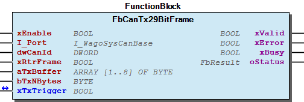

# WagoAppCanLayer2 v1.6.1.5 (WAGO) - Complete Documentation

## 📋 Library Information

- **Company:** WAGO
- **Title:** WagoAppCanLayer2
- **Version:** 1.6.1.5
- **Categories:** WAGO LayerView|App; Application; WAGO FunctionalView|Connectivity|FieldBus
- **Namespace:** WagoAppCanLayer2
- **Author:** WAGO/u010663/u010xxx
- **Placeholder:** WagoAppCanLayer2

### Description ¶

This document is automatically generated.

Handling CAN interfaces. Either the one directly on the plc or additional ones through module 750-658.

This document is automatically generated. Handling CAN interfaces. Either the one directly on the plc or additional ones through module 750-658.

### Contents: ¶

Contents: - Documentation Index 10 Documentation - WagoAppCanLayer2 Library Documentation Project Information Library Information Function Blocks - FbCanErrorInfo (FB) - FbCanL2Close (FB) - FbCanL2Open (FB) - FbCanL2Reset (FB) - FbCanRx11BitFrame (FB) - FbCanRx11BitFrameAll (FB) - FbCanRx29BitFrame (FB) - FbCanRx29BitFrameAll (FB) - FbCanRxTotal_11Bit (FB) - FbCanRxTotal_29Bit (FB) - ... and 4 more Program Organization Global Variable Lists - Status (GVL) - VersionHistory (GVL) Other Components - 80 Status - Advanced - ParameterList (PARAMS) - eStatus (ENUM) - typDataRaw (STRUCT)

### Indices and tables ¶

Based on WagoAppCanLayer2.library, last modified 29.05.2024, 20:25:27. LibDoc 3.5.16.10

© WAGO GmbH & Co. KG, Germany 2018 – All rights reserved. For the avoidance of doubt, this copyright notice does not only apply to the information above but also and primarily to the described library itself. Please note that third-party products are always mentioned without reference to intellectual property rights, including patents, utility models, designs and trademarks, accordingly the existence of such rights cannot be excluded. WAGO is a registered trademark of WAGO Verwaltungsgesellschaft mbH.

- File and Project Information - Library Reference Based on WagoAppCanLayer2.library, last modified 29.05.2024, 20:25:27. LibDoc 3.5.16.10 © WAGO GmbH & Co. KG, Germany 2018 – All rights reserved. For the avoidance of doubt, this copyright notice does not only apply to the information above but also and primarily to the described library itself. Please note that third-party products are always mentioned without reference to intellectual property rights, including patents, utility models, designs and trademarks, accordingly the existence of such rights cannot be excluded. WAGO is a registered trademark of WAGO Verwaltungsgesellschaft mbH.

### Documentation Index

## 10 Documentation

To ensure fast installation and start-up of the units, we strongly recommend that the following information and explanations are carefully read and adhered to.

To ensure fast installation and start-up of the units, we strongly recommend that the following information and explanations are carefully read and adhered to. - doc10_SystemProperties (FB)

## WagoAppCanLayer2 Library Documentation

| Company: | WAGO |
| Title: | WagoAppCanLayer2 |
| Version: | 1.6.1.5 |
| Categories: | WAGO LayerView\|App; Application; WAGO FunctionalView\|Connectivity\|FieldBus |
| Namespace: | WagoAppCanLayer2 |
| Author: | WAGO/u010663/u010xxx |
| Placeholder: | WagoAppCanLayer2 |

### Description

This document is automatically generated.

Handling CAN interfaces. Either the one directly on the plc or additional ones through module 750-658.

This document is automatically generated. Handling CAN interfaces. Either the one directly on the plc or additional ones through module 750-658.

### Contents:

- 10 Documentation doc10_SystemProperties (FB) 20 Program Organization Units - Advanced - FbCanErrorInfo (FB) - FbCanL2Close (FB) - FbCanL2Open (FB) - FbCanL2Reset (FB) - FbCanRx11BitFrame (FB) - FbCanRx11BitFrameAll (FB) - FbCanRx29BitFrame (FB) - FbCanRx29BitFrameAll (FB) - FbCanSetLed (FB) - FbCanTx11BitFrame (FB) - FbCanTx29BitFrame (FB) 80 Status - Status (GVL) - eStatus (ENUM) ParameterList (PARAMS) VersionHistory (GVL)

### Indices and tables

Based on WagoAppCanLayer2.library, last modified 29.05.2024, 20:25:27. LibDoc 3.5.16.10

© WAGO GmbH & Co. KG, Germany 2018 – All rights reserved. For the avoidance of doubt, this copyright notice does not only apply to the information above but also and primarily to the described library itself. Please note that third-party products are always mentioned without reference to intellectual property rights, including patents, utility models, designs and trademarks, accordingly the existence of such rights cannot be excluded. WAGO is a registered trademark of WAGO Verwaltungsgesellschaft mbH.

- File and Project Information - Library Reference Based on WagoAppCanLayer2.library, last modified 29.05.2024, 20:25:27. LibDoc 3.5.16.10 © WAGO GmbH & Co. KG, Germany 2018 – All rights reserved. For the avoidance of doubt, this copyright notice does not only apply to the information above but also and primarily to the described library itself. Please note that third-party products are always mentioned without reference to intellectual property rights, including patents, utility models, designs and trademarks, accordingly the existence of such rights cannot be excluded. WAGO is a registered trademark of WAGO Verwaltungsgesellschaft mbH.

### Project Information

## File and Project Information

| Scope | Name | Type | Content |
| --- | --- | --- | --- |
| FileHeader | libraryFile | string | WagoAppCanLayer2.library |
| contentFile | doc.clean.json |
| productName | e!COCKPIT |
| creationDateTime | date | 29.05.2024, 20:25:28 |
| companyName | string | WAGO |
| ProjectInformation | LastModificationDateTime | date | 29.05.2024, 20:25:27 |
| Description | string | See: Description |
| Copyright | © WAGO Kontakttechnik GmbH & Co. KG, Germany 2018 – All rights reserved. |
| Author | WAGO/u010663/u010xxx |
| AutoResolveUnbound | bool | True |
| Placeholder | string | WagoAppCanLayer2 |
| Company | WAGO |
| DocFormat | reStructuredText |
| Project | WagoAppCanLayer2 |
| DefaultNamespace | WagoAppCanLayer2 |
| Version | version | 1.6.1.5 |
| Title | string | WagoAppCanLayer2 |
| LibraryCategories | library-category-list | WAGO LayerView\|App; Application; WAGO FunctionalView\|Connectivity\|FieldBus |
| CompiledLibraryCompatibilityVersion | string | CODESYS V3.5 SP16 Patch 3 |

### Library Information

## Library Reference

| LinkAllContent: False QualifiedOnly: False | SystemLibrary: False | Optional: False |

| LinkAllContent: False QualifiedOnly: False | SystemLibrary: False | Optional: False |

| LinkAllContent: False QualifiedOnly: False | SystemLibrary: False | Optional: False |

| LinkAllContent: False QualifiedOnly: True | SystemLibrary: False | Optional: False |

| LinkAllContent: False Optional: False | QualifiedOnly: False SystemLibrary: False | PublishSymbolsInContainer: True |

This is a dictionary of all referenced libraries and their name spaces.

This is a dictionary of all referenced libraries and their name spaces. Standard Library Identification : Placeholder: Standard Default Resolution: Standard, * (System) Namespace: Standard Library Properties : WagoSysErrorBase Library Identification : Placeholder: WagoSysErrorBase Default Resolution: WagoSysErrorBase, * (WAGO) Namespace: WagoSysErrorBase Library Properties : WagoSysVersion Library Identification : Name: WagoSysVersion Version: 1.0.0.0 Company: WAGO Namespace: WagoSysVersion Library Properties : WagoTypesCan Library Identification : Placeholder: WagoTypesCan Default Resolution: WagoTypesCan, * (WAGO) Namespace: WagoTypesCan Library Properties : WagoTypesErrorBase Library Identification : Placeholder: WagoTypesErrorBase Default Resolution: WagoTypesErrorBase, * (WAGO) Namespace: WagoTypesErrorBase Library Properties :

### Function Blocks

## FbCanErrorInfo (FB)

| Scope | Name | Type | Comment |
| --- | --- | --- | --- |
| Input | xEnable | BOOL | enable function block |
| I_Port | WagoTypesCan.I_WagoSysCanBase | CAN port, either the internal pfc port or the K-Bus port provided by the module 750-658 |
| Inout | xTriggerResetCounter | BOOL | reset Counter |
| Output | xValid | BOOL | output data valid |
| xError | BOOL | error occured |
| oStatus | WagoSysErrorBase.FbResult | detailed status information |
| wBusState | WORD | CAN bus state |
| wBusDiag | WORD | Bus diagnostic bits |
| uiRxOverflowsL2 | UINT | Rx CAN Layer2 overflow counter |
| uiTxOverflowsL2 | UINT | Tx CAN Layer2 overflow counter |
| uiRxOverflows | UINT | Rx overflow counter |
| uiMsgTimeouts | UINT | Msg Timeout counter |
| uiBusOffs | UINT | Bus off counter |
| uiBusWarnings | UINT | Bus warning counter |

| wBusState result codes in CANopen mode |
| 16#00 | no initialization |
| 16#01 | has been requested |
| 16#04 | baudrate test running |
| 16#40 | after successful initialization |
| 16#41 | slave mode: stopped |
| 16#42 | slave mode: preoperational |
| 16#43 | slave mode: operational |
| 16#60 | master mode: configuration init |
| 16#61 | master mode: reset communication all nodes |
| 16#62 | master mode: wait state |
| 16#64 | master mode: boot configuration mode |
| 16#70 | master mode: network has been scanned but there are missing mandatory nodes |
| 16#80 | master mode: configuration matches |
| 16#90 | master mode: serious configuration mismatch or bus off |
| 16#A0 | master mode: network is set to operational |
| 16#C0 | master mode: network is set to stopped by request |

| wBusState rResult codes in CAN layer2 mode |
| 16#00 | no initialization |
| 16#A0 | network is operational |
| 16#90 | bus off |

| wBusDiag result bits |
| 0x00 | no error |
| 0x01 | rx-queue: overflow (lp-rx-queue) |
| 0x40 | rx-queue: overflow (hp-rx-queue) |
| 0x02 | CAN interface: overrun |
| 0x04 | CAN interface: bus off |
| 0x08 | CAN interface: error-status-bit set |
| 0x10 | CAN interface: error-status-bit reset |
| 0x20 | tx-queue: full (lp-tx-queue) |
| 0x80 | tx-queue: full (hp-tx-queue) |
| 0x100 | guarding or heartbeat error |

This function block shows CAN bus information such as bus off errors or other general status details.

Graphical Illustration

Notes on wBusState

Errorinfo extrabits if wBusState >= 16#80:

bit 0 = 1: optional/unexpected node error bit 1 = 1: mandatory node error bit 2 = 1: at least one slave is operational bit 3 = 1: the CANopen manager is operational

Notes on wBusDiag

Interface variables Function This function block shows CAN bus information such as bus off errors or other general status details. Graphical Illustration  Notes on wBusState Errorinfo extrabits if wBusState >= 16#80: bit 0 = 1: optional/unexpected node error bit 1 = 1: mandatory node error bit 2 = 1: at least one slave is operational bit 3 = 1: the CANopen manager is operational Notes on wBusDiag

## FbCanL2Close (FB)

| Scope | Name | Type | Comment |
| --- | --- | --- | --- |
| Input | xExecute | BOOL | close the can port |
| I_Port | WagoTypesCan.I_WagoSysCanBase | CAN port, either the internal pfc port or the K-Bus port provided by the module 750-658 |
| Output | xDone | BOOL | Can port closed |
| xError | BOOL | Error occured |
| xBusy | BOOL | Busy |
| oStatus | WagoSysErrorBase.FbResult | detailed status information |

This function block will close the CAN port in layer2 mode.

Graphical Illustration

Function Description

If the configuration values, e.g. the baudrate has to be changed, once the Can bus is already started the following steps need to be performed. Disable function block FbCanOpen if used with 750-658. Enable FbCanClose and wait for output done. Then disable FbCanClose. Now the system is prepared to take new values.

Interface variables Function This function block will close the CAN port in layer2 mode. Graphical Illustration  Function Description If the configuration values, e.g. the baudrate has to be changed, once the Can bus is already started the following steps need to be performed. Disable function block FbCanOpen if used with 750-658. Enable FbCanClose and wait for output done. Then disable FbCanClose. Now the system is prepared to take new values.

## FbCanL2Open (FB)

| Scope | Name | Type | Comment |
| --- | --- | --- | --- |
| Input | xEnable | BOOL | opens and configures the port |
| I_Port | WagoTypesCan.I_WagoSysCanBase | CAN port, either the internal pfc port or the K-Bus port provided by the module 750-658 |
| udiBaudrate | UDINT | baudrate in baud valid 100 baud ... 1Mbaud 0 = auto (if supported) |
| dwFlags | DWORD | used by module 750-658, details see description |
| dwPara | DWORD | reserved for future use |
| Output | xValid | BOOL | true if port is configured |
| xBusy | BOOL | configuration in progress |
| xError | BOOL | error occured |
| oStatus | WagoSysErrorBase.FbResult | detailed status information |

This function block opens a CAN port in layer2 mode and configures at least the CAN baudrate

Graphical Illustration

Function Description

Interface variables Function This function block opens a CAN port in layer2 mode and configures at least the CAN baudrate Graphical Illustration  Function Description 1. Onboard port is used as CAN layer2 Device This block is optional, since the integrated CAN configurator already opens the port. Input dwFlags : not supported Input dwPara : not supported 2. Module 750-658 is used Input dwFlags .0: Enable the following bits .1 -.3: 0: Set module mode to mapped mode 1: Set module mode to transparend mode 2: Set module mode to sniffer mode 3: Spare 7: Spare .4: Enable 29-bit COB-IDs .5: Enable SDO transmission over acyclic channel .6: Enable diagnosis over acyclic channel .7 - .31 Spare The bits in dwFlags will only be evaluated by the open function, if the first bit is TRUE. Input dwPara : not supported Note: This function block must be enabled and called in every plc cycle if Module 750-658 is used. If function block is disabled and function block FbCanL2Close has not been used, the output xBusy will stay high.

## FbCanL2Reset (FB)

| Scope | Name | Type | Comment |
| --- | --- | --- | --- |
| Input | xExecute | BOOL | perform a reset |
| I_Port | WagoTypesCan.I_WagoSysCanBase | Can port, either the internal pfc port or the K-Bus port provided by the module 750-658 |
| Output | xDone | BOOL | reset is done |
| xBusy | BOOL | reset in progress |
| xError | BOOL | error occured |
| oStatus | WagoSysErrorBase.FbResult | detailed status information |

This function block performs a reset on the Can port if in layer2 mode and resets the error counters

Graphical Illustration

Interface variables Function This function block performs a reset on the Can port if in layer2 mode and resets the error counters Graphical Illustration 

## FbCanRx11BitFrame (FB)

| Scope | Name | Type | Comment |
| --- | --- | --- | --- |
| Input | xEnable | BOOL | enable function block |
| I_Port | WagoTypesCan.I_WagoSysCanBase | Can port, either the internal pfc port or the K-bus port provided by the module 750-658 |
| xBufferMode | BOOL | False:get latest message, True: use internal buffer ->allows to receive even older messages |
| wCanId | WORD | Can ID |
| Inout | xRxTrigger | BOOL | activate the receive functionality |
| Output | xValid | BOOL | data received |
| xError | BOOL | error occured |
| xBusy | BOOL | waiting for Can message with wCanID or waiting for xRxTrigger |
| oStatus | WagoSysErrorBase.FbResult | detailed status information |
| wCounter | WORD | total received messages by this function block |
| wFrames | WORD | messages received in buffer |
| xRtrFrame | BOOL | RTR frame received |
| bRxNBytes | BYTE | amount of byte in message |
| aRxBuffer | ARRAY [1..8] OF BYTE | data of CAN message |

This function block allows to receive CAN messages with a defined CAN ID. This block supports only 11 Bit CAN IDs.

Graphical Illustration

Interface variables Function This function block allows to receive CAN messages with a defined CAN ID. This block supports only 11 Bit CAN IDs. Graphical Illustration 

## FbCanRx11BitFrameAll (FB)

| Scope | Name | Type | Comment |
| --- | --- | --- | --- |
| Input | xEnable | BOOL | enable function block |
| I_Port | WagoTypesCan.I_WagoSysCanBase | Can port, either the internal pfc port or the K-bus port provided by the module 750-658 |
| xBufferMode | BOOL | False:get latest message, True: use internal buffer ->allows to receive even older messages |
| Inout | xRxTrigger | BOOL | activate the receive functionality |
| Output | xValid | BOOL | data received |
| xError | BOOL | error occured |
| xBusy | BOOL | waiting for Can message with wCanID or waiting for xRxTrigger |
| oStatus | WagoSysErrorBase.FbResult | detailed status information |
| wCounter | WORD | total received messages (11 Bit and 29 Bit) |
| wFrames | WORD | messages received in buffer (11 Bit and 29 Bit) |
| xRtrFrame | BOOL | RTR frame received |
| bRxNBytes | BYTE | amount of byte in message |
| aRxBuffer | ARRAY [1..8] OF BYTE | data of CAN message |
| wRxId | WORD | Can ID of received message |

This function block allows to receive any CAN messages with 11-Bit identifier. 29-Bit frames are discarded by function block.

Graphical Illustration

Function Description

Either this function block is used or FbCanRx11BitFrame. It is not allowed to use both at the same time.

Interface variables Function This function block allows to receive any CAN messages with 11-Bit identifier. 29-Bit frames are discarded by function block. Graphical Illustration  Function Description Either this function block is used or FbCanRx11BitFrame. It is not allowed to use both at the same time.

## FbCanRx29BitFrame (FB)

| Scope | Name | Type | Comment |
| --- | --- | --- | --- |
| Input | xEnable | BOOL | enable function block |
| I_Port | WagoTypesCan.I_WagoSysCanBase | Can port, either the internal pfc port or the K-bus port provided by the module 750-658 |
| xBufferMode | BOOL | False:get latest message, True: use internal buffer ->allows to receive even old messages |
| dwCanId | DWORD | CAN ID |
| Inout | xRxTrigger | BOOL | activate the receive functionality |
| Output | xValid | BOOL | data received |
| xError | BOOL | error occured |
| xBusy | BOOL | waiting for Can message with wCanID or waiting for xRxTrigger |
| oStatus | WagoSysErrorBase.FbResult | detailed status information |
| wCounter | WORD | total received messages by this function block |
| wFrames | WORD | messages in buffer |
| xRtrFrame | BOOL | RTR frame received |
| bRxNBytes | BYTE | amount of byte in message |
| aRxBuffer | ARRAY [1..8] OF BYTE | data of CAN message |

This function block allows to receive CAN messages with a defined CAN ID. This block supports 11-Bit and 29-Bit identifier.

Graphical Illustration

Interface variables Function This function block allows to receive CAN messages with a defined CAN ID. This block supports 11-Bit and 29-Bit identifier. Graphical Illustration 

## FbCanRx29BitFrameAll (FB)

| Scope | Name | Type | Comment |
| --- | --- | --- | --- |
| Input | xEnable | BOOL | enable function block |
| I_Port | WagoTypesCan.I_WagoSysCanBase | CAN port, either the internal pfc port or the K-Bus port provided by the module 750-658 |
| xBufferMode | BOOL | False:get latest message, True: use internal buffer ->allows to receive even old messages |
| Inout | xRxTrigger | BOOL | activate the receive functionality |
| Output | xValid | BOOL | data received |
| xError | BOOL | error occured |
| xBusy | BOOL | waiting for Can message with wCanID or waiting for xRxTrigger |
| oStatus | WagoSysErrorBase.FbResult | detailed status information |
| wCounter | WORD | total received messages by this function block |
| wFrames | WORD | messages in buffer |
| xRtrFrame | BOOL | RTR frame received |
| bRxNBytes | BYTE | amount of byte in message |
| aRxBuffer | ARRAY [1..8] OF BYTE | data of CAN message |
| dwRxId | DWORD | Can ID of received message |

This function block allows to receive any CAN messages with 11-Bit and 29-Bit identifier.

Graphical Illustration

Function Description

Either this function block is used or FbCanRx29BitFrame. It is not allowed to use both at the same time.

Interface variables Function This function block allows to receive any CAN messages with 11-Bit and 29-Bit identifier. Graphical Illustration  Function Description Either this function block is used or FbCanRx29BitFrame. It is not allowed to use both at the same time.

## FbCanRxTotal_11Bit (FB)

| Scope | Name | Type | Comment |
| --- | --- | --- | --- |
| Input | xEnable | BOOL | enable function block |
| I_Port | WagoTypesCan.I_WagoSysCanBase | CAN port, either the internal pfc port or the K-Bus port provided by the module 750-658 |
| Output | xValid | BOOL | Valid data in receive array |
| xBusy | BOOL | Busy |
| xError | BOOL | Error occured |
| oStatus | WagoSysErrorBase.FbResult | Detailed status information |
| xRxBufferFull | BOOL | Indicates that the Receiver Buffer is full. |
| xRxOverflow | BOOL | Indicates that data is probably lost. |
| Inout | aRxBuffer | ARRAY [0..CAN_RX_BUFFER_MAX] OF typDataRaw | Array with received telegrams |
| udiRxIndex | UDINT | Index,withhin the data array |

This function block allows to receive all CAN messages with 11-Bit identifier.

Graphical Illustration

Function Description

In contrast to FbCanRx11BitFrameAll this function block uses an array for the data to be displayed. The parameter CAN_RX_BUFFER_MAX from the ParameterList allows to adjust the space within the array.

Interface variables Function This function block allows to receive all CAN messages with 11-Bit identifier. Graphical Illustration  Function Description In contrast to FbCanRx11BitFrameAll this function block uses an array for the data to be displayed. The parameter CAN_RX_BUFFER_MAX from the ParameterList allows to adjust the space within the array.

## FbCanRxTotal_29Bit (FB)

| Scope | Name | Type | Comment |
| --- | --- | --- | --- |
| Input | xEnable | BOOL | Enable function block |
| I_Port | WagoTypesCan.I_WagoSysCanBase | CAN port, either the internal pfc port or the K-Bus port provided by the module 750-658 |
| Output | xValid | BOOL | Valid data in receive array |
| xBusy | BOOL | Busy |
| xError | BOOL | Error occured |
| oStatus | WagoSysErrorBase.FbResult | Detailed status information |
| xRxBufferFull | BOOL | Indicates that the Receiver Buffer is full. |
| xRxOverflow | BOOL | Indicates that data is probably lost. |
| Inout | aRxBuffer | ARRAY [0..CAN_RX_BUFFER_MAX] OF typDataRaw | Array with received telegrams |
| udiRxIndex | UDINT | Index,withhin the data array |

This function block allows to receive all CAN messages with 29-Bit identifier.

Graphical Illustration

Function Description

In contrast to FbCanRx29BitFrameAll this function block uses an array for the data to be displayed. The parameter CAN_RX_BUFFER_MAX from the ParameterList allows to adjust the space within the array.

Interface variables Function This function block allows to receive all CAN messages with 29-Bit identifier. Graphical Illustration  Function Description In contrast to FbCanRx29BitFrameAll this function block uses an array for the data to be displayed. The parameter CAN_RX_BUFFER_MAX from the ParameterList allows to adjust the space within the array.

## FbCanSetLed (FB)

| Scope | Name | Type | Comment |
| --- | --- | --- | --- |
| Input | xEnable | BOOL | enable by eMode choosen LED status |
| I_Port | WagoTypesCan.I_WagoSysCanBase | CAN port |
| eMode | WagoTypesCan.eCanLedMode | see WagoTypesCan |
| Output | xValid | BOOL | true if port is configured |
| xError | BOOL | error occured |
| oStatus | WagoSysErrorBase.FbResult | detailed status information |

This function block allows to set LEDs on the onboard Can port.

Graphical Illustration

Function description

This function block is not supported by the can gateway module 750-658.

Interface variables Function This function block allows to set LEDs on the onboard Can port. Graphical Illustration  Function description This function block is not supported by the can gateway module 750-658.

## FbCanTx11BitFrame (FB)

| Scope | Name | Type | Comment |
| --- | --- | --- | --- |
| Input | xEnable | BOOL | enable function block |
| I_Port | WagoTypesCan.I_WagoSysCanBase | CAN port, either the internal pfc port or the K-Bus port provided by the module 750-658 |
| wCanId | WORD | CAN ID |
| xRtrFrame | BOOL | send RTR frame |
| aTxBuffer | ARRAY [1..8] OF BYTE | data for CAN message |
| bTxNBytes | BYTE | amount of byte in message |
| Inout | xTxTrigger | BOOL | activate the transmit functionality |
| Output | xValid | BOOL | data transmitted |
| xError | BOOL | error occured |
| xBusy | BOOL | transmission in progress |
| oStatus | WagoSysErrorBase.FbResult | detailed status information |

This function block allows to transmit a CAN messages with a defined CAN ID. This block supports only 11 Bit CAN IDs.

Graphical Illustration

Function Description

If oStatus shows ErrorMode then function block FbCanL2Open is disabled.

Interface variables Function This function block allows to transmit a CAN messages with a defined CAN ID. This block supports only 11 Bit CAN IDs. Graphical Illustration  Function Description If oStatus shows ErrorMode then function block FbCanL2Open is disabled.

## FbCanTx29BitFrame (FB)

| Scope | Name | Type | Comment |
| --- | --- | --- | --- |
| Input | xEnable | BOOL | enable function block |
| I_Port | WagoTypesCan.I_WagoSysCanBase | CAN port, either the internal pfc port or the K-Bus port provided by the module 750-658 |
| dwCanId | DWORD | CAN ID |
| xRtrFrame | BOOL | send RTR frame |
| aTxBuffer | ARRAY [1..8] OF BYTE | data for CAN message |
| bTxNBytes | BYTE | amount of byte in message |
| Inout | xTxTrigger | BOOL | activate the transmit functionality |
| Output | xValid | BOOL | data transmitted |
| xError | BOOL | error occured |
| xBusy | BOOL | transmission in progress |
| oStatus | WagoSysErrorBase.FbResult | detailed status information |

This function block allows to transmit a CAN messages with a defined CAN ID. This block supports 29-Bit CAN IDs.

Graphical Illustration

Function Description

If oStatus shows ErrorMode then function block FbCanL2Open is disabled.

Interface variables Function This function block allows to transmit a CAN messages with a defined CAN ID. This block supports 29-Bit CAN IDs. Graphical Illustration  Function Description If oStatus shows ErrorMode then function block FbCanL2Open is disabled.

## doc10_SystemProperties (FB)

All function blocks must be called up in the same program task.

This library supports the onboard CAN interface as well as the terminal 750-658

There are some differences between these two CAN interfaces, which need some special handling.

Terminal 750-658:

The function block FbModuleConfigurationAndStatus from library WagoSysModule_75x_658 must be used and executed in each plc cycle.

If the module is used in Mapped mode, IO data must be processed using function block FbModuleMappedModeIO_Access from library WagoSysModule_75x_658. Direct IO access is strictly forbidden.

Onboard interface:

Input I_port from the function blocks must be assigned by either WAGO_CAN_Layer2_Device, WAGO_CanOpen_Slave or WAGO_CanOpen_Manager.

Note All function blocks must be called up in the same program task. This library supports the onboard CAN interface as well as the terminal 750-658 There are some differences between these two CAN interfaces, which need some special handling. Terminal 750-658: The function block FbModuleConfigurationAndStatus from library WagoSysModule_75x_658 must be used and executed in each plc cycle. If the module is used in Mapped mode, IO data must be processed using function block FbModuleMappedModeIO_Access from library WagoSysModule_75x_658. Direct IO access is strictly forbidden.  Onboard interface: Input I_port from the function blocks must be assigned by either WAGO_CAN_Layer2_Device, WAGO_CanOpen_Slave or WAGO_CanOpen_Manager.

### Program Organization

## 20 Program Organization Units

- Advanced FbCanRxTotal_11Bit (FB) - FbCanRxTotal_29Bit (FB) - typDataRaw (STRUCT) FbCanErrorInfo (FB) FbCanL2Close (FB) FbCanL2Open (FB) FbCanL2Reset (FB) FbCanRx11BitFrame (FB) FbCanRx11BitFrameAll (FB) FbCanRx29BitFrame (FB) FbCanRx29BitFrameAll (FB) FbCanSetLed (FB) FbCanTx11BitFrame (FB) FbCanTx29BitFrame (FB)

### Global Variable Lists

## Status (GVL)

| Scope | Name | Type |
| --- | --- | --- |
| Constant | StatusCan | ARRAY [0..23] OF WagoTypesErrorBase.typResultItem |

| Value | Level | Description |
| --- | --- | --- |
| eStatus.OK | WagoTypesErrorBase.WagoTypes.eSeverity.INFO | ‘OK’ |
| eStatus.Running | WagoTypesErrorBase.WagoTypes.eSeverity.INFO | ‘Running’ |
| eStatus.Timeout | WagoTypesErrorBase.WagoTypes.eSeverity.ERROR | ‘Timeout’ |
| eStatus.Error | WagoTypesErrorBase.WagoTypes.eSeverity.ERROR | ‘Generic error’ |
| eStatus.InvalidID | WagoTypesErrorBase.WagoTypes.eSeverity.ERROR | ‘Invalid Id’ |
| eStatus.NoData | WagoTypesErrorBase.WagoTypes.eSeverity.INFO | ‘No data’ |
| eStatus.TxOverflow | WagoTypesErrorBase.WagoTypes.eSeverity.ERROR | ‘Tx overflow’ |
| eStatus.NotReady | WagoTypesErrorBase.WagoTypes.eSeverity.ERROR | ‘Not ready’ |
| eStatus.InvalidDatalen | WagoTypesErrorBase.WagoTypes.eSeverity.ERROR | ‘Invalid datalength’ |
| eStatus.ErrorLocked | WagoTypesErrorBase.WagoTypes.eSeverity.ERROR | ‘Device locked’ |
| eStatus.ErrorMode | WagoTypesErrorBase.WagoTypes.eSeverity.ERROR | ‘Invalid mode’ |
| eStatus.ErrorPort | WagoTypesErrorBase.WagoTypes.eSeverity.ERROR | ‘Invalid port or device’ |
| eStatus.ErrorBaudrate | WagoTypesErrorBase.WagoTypes.eSeverity.ERROR | ‘Invalid baudrate’ |
| eStatus.ErrorInterface | WagoTypesErrorBase.WagoTypes.eSeverity.ERROR | ‘Invalid interface’ |
| eStatus.ErrorNotReady | WagoTypesErrorBase.WagoTypes.eSeverity.ERROR | ‘Not ready’ |
| eStatus.ErrorNotSupported | WagoTypesErrorBase.WagoTypes.eSeverity.ERROR | ‘Function not supported’ |
| eStatus.BusOff | WagoTypesErrorBase.WagoTypes.eSeverity.ERROR | ‘CAN bus off’ |
| eStatus.BusPassive | WagoTypesErrorBase.WagoTypes.eSeverity.ERROR | ‘CAN bus passive’ |
| eStatus.DataOverflow | WagoTypesErrorBase.WagoTypes.eSeverity.ERROR | ‘CAN data overflow’ |
| eStatus.GuardingFailure | WagoTypesErrorBase.WagoTypes.eSeverity.ERROR | ‘Guarding Failure’ |
| eStatus.NoNodeAnswer | WagoTypesErrorBase.WagoTypes.eSeverity.ERROR | ‘No node answer’ |
| eStatus.NotConfigured | WagoTypesErrorBase.WagoTypes.eSeverity.ERROR | ‘Slave configuration error’ |
| eStatus.InvalidNMT | WagoTypesErrorBase.WagoTypes.eSeverity.ERROR | ‘Invalid NMT ommand’ |
| eStatus.SdoAbort | WagoTypesErrorBase.WagoTypes.eSeverity.ERROR | ‘SDO abort’ |

## VersionHistory (GVL)

| Name | Type |
| --- | --- |
| Info | ProjectInfo |

| date | version | author | change |
| 20.02.2024 | 1.6.1.5 | u010663 | Compiled SP16.3 |
| 18.08.2021 | 1.6.1.4 | u013939 | update doku |
| 06.10.2020 | 1.6.1.3 | u013939 | removed workaround for CAN LED in open |
| 07.09.2020 | 1.6.1.2 | u010663 | New parameter CAN_RX_MAX_BUFFERED |
| 11.06.2019 | 1.6.1.1 | u010663 | Libraries inserted by placeholder |
| 08.01.2019 | 1.6.1.0 | u015842 | Properties: free placeholder added |
| 05.07.2018 | 1.6.0.45 | u013939 | update doku |
| 11.04.2017 | 1.6.0.44 | u013939 | bugfix Rx29BitFrameAll |
| 10.04.2017 | 1.6.0.43 | u013939 | minor bugfixes in Rx11BitFrame,All / Rx29BitFrame,All |
| 11.01.2017 | 1.6.0.42 | u013939 | Merge with 1.6.0.40 |

WagoAppCanLayer2

WagoAppCanLayer2 Release Notes: Version 1.6.0.40: Maybe compatibility issues due to: Output wRxId from function block FbCanRx11BitFrame deleted Output dwRxId from function block FbCanRx29BitFrame deleted

### Other Components

## 80 Status ¶

- Status (GVL) - eStatus (ENUM)

## Advanced

- FbCanRxTotal_11Bit (FB) - FbCanRxTotal_29Bit (FB) - typDataRaw (STRUCT)

## ParameterList (PARAMS)

| Scope | Name | Type | Initial | Comment |
| --- | --- | --- | --- | --- |
| Constant | CAN_RX_BUFFER_MAX | UDINT | 100 | Size of array used by FbCanRxTotal_11Bit or FbCanRxTotal_29Bit |
| CAN_RX_MAX_BUFFERED | BYTE | 8 | Size of array used by FbCanRx11Bit and FbCanRx29Bit |

## eStatus (ENUM)

| Name | Initial | Comment |
| --- | --- | --- |
| OK | 0 | all is well |
| Running | 1 | command in work |
| Timeout | 2 | timeout while command execution |
| Error | 3 | unspecific error |
| InvalidId | 4 | no valid id for layer2 messages |
| NoData | 5 | no data received in read operation |
| TxOverflow | 6 | data was not transmitted because buffer overflow |
| NotReady | 7 | data was not transmitted because not ready |
| InvalidDatalen | 8 | data length not valid |
| ErrorLocked | 9 | device in in use |
| ErrorMode | 10 | invalid operation mode requested |
| ErrorPort | 11 | invalid port or device selected |
| ErrorBaudrate | 12 | invalid baudrate requested |
| ErrorInterface | 13 | invalid interface requested |
| ErrorNotReady | 14 | device not ready |
| ErrorNotSupported | 15 | function not supported |
| BusOff | 16 | CAN bus off |
| BusPassive | 17 | CAN bus passive |
| DataOverflow | 18 | Data overflow |
| GuardingFailure | 19 | Guarding fail |
| NoNodeAnswer | 20 | node is not responding to master |
| NotConfigured | 21 | slave configuration error |
| InvalidNMT | 22 | slave configuration error |
| SdoAbort | 23 | SDO Error reported by Node |

## typDataRaw (STRUCT)

| Name | Type |
| --- | --- |
| dwID | DWORD |
| bLen | BYTE |
| xRTR | BOOL |
| aData | ARRAY [1..8] OF BYTE |