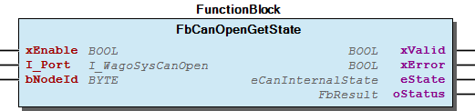

# WagoAppCanOpen v1.6.1.4 (WAGO) - Complete Documentation

## 📋 Library Information

- **Company:** WAGO
- **Title:** WagoAppCanOpen
- **Version:** 1.6.1.4
- **Categories:** WAGO LayerView|App; Application; WAGO FunctionalView|Connectivity|FieldBus
- **Namespace:** WagoAppCanOpen
- **Author:** Wago/u013939
- **Placeholder:** WagoAppCanOpen

### Description ¶

This document is automatically generated.

Library for CANopen functions as described in CiA405 and extra functions

The function blocks of this library are NOT thread safe and must be called from one CODESYS task only! Concurrent calls from different tasks may cause loss or corruption of data.

This document is automatically generated. Library for CANopen functions as described in CiA405 and extra functions The function blocks of this library are NOT thread safe and must be called from one CODESYS task only! Concurrent calls from different tasks may cause loss or corruption of data.

### Contents: ¶

Contents: - Documentation Index - Project Information - Library Information - Function Blocks CIA405_GET_KERNEL_STATE (FB) - CIA405_GET_LOCAL_NODE_ID (FB) - CIA405_GET_STATE (FB) - CIA405_NMT (FB) - CIA405_RECV_EMCY (FB) - CIA405_RECV_EMCY_DEV (FB) - CIA405_SDO_READ4 (FB) - CIA405_SDO_READxx (FB) - CIA405_SDO_WRITE4 (FB) - CIA405_SDO_WRITExx (FB) - ... and 16 more Functions - CANOPEN_VERSION (FUN) - FuCanOpenGetVersion (FUN) Methods - CIA405_CANOPEN_KERNEL_ERROR (ENUM) - WagoAppCanOpen Library Documentation - eCanOpenNodeState (ENUM) - typCanOpenEmcyError (STRUCT) Global Variable Lists - Status (GVL) - VersionHistory (GVL) Other Components - 20 Program Organisation Units - 21 CIA405 - 22 Wago Legacy - 80 Status - CIA405_DEVICE (ALIAS) - CIA405_EMCY_ERROR (STRUCT) - CIA405_SDO_ERROR (ALIAS) - CIA405_STATE (ENUM) - CIA405_TRANSITION_STATE (ENUM) - eCanBusState (ENUM) - ... and 1 more

### Indices and tables ¶

Based on WagoAppCanOpen.library, last modified 29.05.2024, 20:28:25. LibDoc 3.5.16.10

© WAGO GmbH & Co. KG, Germany 2018 – All rights reserved. For the avoidance of doubt, this copyright notice does not only apply to the information above but also and primarily to the described library itself. Please note that third-party products are always mentioned without reference to intellectual property rights, including patents, utility models, designs and trademarks, accordingly the existence of such rights cannot be excluded. WAGO is a registered trademark of WAGO Verwaltungsgesellschaft mbH.

- File and Project Information - Library Reference Based on WagoAppCanOpen.library, last modified 29.05.2024, 20:28:25. LibDoc 3.5.16.10 © WAGO GmbH & Co. KG, Germany 2018 – All rights reserved. For the avoidance of doubt, this copyright notice does not only apply to the information above but also and primarily to the described library itself. Please note that third-party products are always mentioned without reference to intellectual property rights, including patents, utility models, designs and trademarks, accordingly the existence of such rights cannot be excluded. WAGO is a registered trademark of WAGO Verwaltungsgesellschaft mbH.

### Documentation Index

## 10 Documentation

To ensure fast installation and start-up of the units, we strongly recommend that the following information and explanations are carefully read and adhered to.

To ensure fast installation and start-up of the units, we strongly recommend that the following information and explanations are carefully read and adhered to. - doc10_SystemProperties (FB)

### Project Information

## File and Project Information

| Scope | Name | Type | Content |
| --- | --- | --- | --- |
| FileHeader | libraryFile | string | WagoAppCanOpen.library |
| contentFile | doc.clean.json |
| productName | e!COCKPIT |
| creationDateTime | date | 29.05.2024, 20:28:25 |
| companyName | string | WAGO |
| ProjectInformation | LastModificationDateTime | date | 29.05.2024, 20:28:25 |
| Description | string | See: Description |
| Copyright | © WAGO Kontakttechnik GmbH & Co. KG, Germany 2018 – All rights reserved. |
| Author | Wago/u013939 |
| AutoResolveUnbound | bool | True |
| Placeholder | string | WagoAppCanOpen |
| Company | WAGO |
| DocFormat | reStructuredText |
| Project | WagoAppCanOpen |
| DefaultNamespace | WagoAppCanOpen |
| Version | version | 1.6.1.4 |
| Title | string | WagoAppCanOpen |
| LibraryCategories | library-category-list | WAGO LayerView\|App; Application; WAGO FunctionalView\|Connectivity\|FieldBus |
| CompiledLibraryCompatibilityVersion | string | CODESYS V3.5 SP16 Patch 3 |
| ThreadSafe | False |

### Library Information

## Library Reference

| LinkAllContent: False QualifiedOnly: False | SystemLibrary: False | Optional: False |

| LinkAllContent: False QualifiedOnly: False | SystemLibrary: False | Optional: False |

| LinkAllContent: False QualifiedOnly: False | SystemLibrary: False | Optional: False |

| LinkAllContent: False QualifiedOnly: False | SystemLibrary: False | Optional: False |

| LinkAllContent: False Optional: False | QualifiedOnly: False SystemLibrary: False | PublishSymbolsInContainer: True |

This is a dictionary of all referenced libraries and their name spaces.

This is a dictionary of all referenced libraries and their name spaces. Standard Library Identification : Name: Standard Version: newest Company: System Namespace: Standard Library Properties : WagoSysErrorBase Library Identification : Placeholder: WagoSysErrorBase Default Resolution: WagoSysErrorBase, * (WAGO) Namespace: WagoSysErrorBase Library Properties : WagoSysVersion Library Identification : Name: WagoSysVersion Version: 1.0.0.0 Company: WAGO Namespace: WagoSysVersion Library Properties : WagoTypesCan Library Identification : Placeholder: WagoTypesCan Default Resolution: WagoTypesCan, * (WAGO) Namespace: WagoTypesCan Library Properties : WagoTypesErrorBase Library Identification : Placeholder: WagoTypesErrorBase Default Resolution: WagoTypesErrorBase, * (WAGO) Namespace: WagoTypesErrorBase Library Properties :

### Function Blocks

## CIA405_GET_KERNEL_STATE (FB)

| Scope | Name | Type | Comment |
| --- | --- | --- | --- |
| Input | COM | I_WagoSysCanOpen | the CAN Port, i.e. WAGO_CANopen_Manager (WAGO specific) |
| ENABLE | BOOL | enables the function block |
| Output | CONFIRM | BOOL | confirms the success of the function block |
| STATE | CIA405_CANOPEN_KERNEL_ERROR | returns the actual state of the CANopen stack |
| DEVICE | CIA405_DEVICE | return the ID of the device that reported the error (WAGO addon) |

This function block returns the actual state of the CANopen stack

It is implemented according to CiA405 V 2.0 Page 18.

Graphical Illustration

Function Description

This function block is not supported by module 750-658 and Layer2 device

Interface variables Function This function block returns the actual state of the CANopen stack It is implemented according to CiA405 V 2.0 Page 18. Graphical Illustration  Function Description Note This function block is not supported by module 750-658 and Layer2 device

## CIA405_GET_LOCAL_NODE_ID (FB)

| Scope | Name | Type | Comment |
| --- | --- | --- | --- |
| Input | COM | I_WagoSysCanOpen | the CAN Port, i.e. WAGO_CANopen_Manager (WAGO specific) |
| ENABLE | BOOL | enables the function block |
| Output | CONFIRM | BOOL | confirms the success of the function block |
| DEVICE | CIA405_DEVICE | return the own node ID |

This function block returns own node ID

It is implemented according to CiA405 V 2.0 Page 17.

Graphical Illustration

Function Description

This function block is not supported by module 750-658 and Layer2 device

Interface variables Function This function block returns own node ID It is implemented according to CiA405 V 2.0 Page 17. Graphical Illustration  Function Description Note This function block is not supported by module 750-658 and Layer2 device

## CIA405_GET_STATE (FB)

| Scope | Name | Type | Comment |
| --- | --- | --- | --- |
| Input | COM | I_WagoSysCanOpen | the CAN Port, i.e. WAGO_CANopen_Manager (WAGO specific) |
| DEVICE | CIA405_DEVICE | the ID of the device |
| ENABLE | BOOL | enables the function block |
| Output | CONFIRM | BOOL | confirms the success of the function block |
| STATE | CIA405_STATE | the current state of the device or UNKNOWN / NOT_AVAIL |

This function block returns the current state of a device

It is implemented according to CiA405 V 2.0 Page 18.

Graphical Illustration

Function Description

This function block is not supported by module 750-658 and Layer2 device

Interface variables Function This function block returns the current state of a device It is implemented according to CiA405 V 2.0 Page 18. Graphical Illustration  Function Description Note This function block is not supported by module 750-658 and Layer2 device

## CIA405_NMT (FB)

| Scope | Name | Type | Comment |
| --- | --- | --- | --- |
| Input | COM | I_WagoSysCanOpen | the CAN Port, i.e. WAGO_CANopen_Manager (WAGO specific) |
| DEVICE | CIA405_DEVICE | the ID of the device or 0 for all |
| STATE | CIA405_TRANSITION_STATE | the state to set on ENABLE > TRUE |
| ENABLE | BOOL | enables the function block |
| Output | CONFIRM | BOOL | confirms the success of the function block |
| ERROR | CIA405_CANOPEN_KERNEL_ERROR | returns the error code |

This function block controls network management functions of one or all nodes

It is implemented according to CiA405 V 2.0 Page 18.

Graphical Illustration

Function Description

This function block is not supported by module 750-658 and Layer2 device

In slave mode only own node device id can be used

Interface variables Function This function block controls network management functions of one or all nodes It is implemented according to CiA405 V 2.0 Page 18. Graphical Illustration  Function Description Note This function block is not supported by module 750-658 and Layer2 device Note In slave mode only own node device id can be used

## CIA405_RECV_EMCY (FB)

| Scope | Name | Type | Comment |
| --- | --- | --- | --- |
| Input | COM | I_WagoSysCanOpen | the CAN Port, i.e. WAGO_CANopen_Manager (WAGO specific) |
| ENABLE | BOOL | enables the function block |
| Output | CONFIRM | BOOL | true if emergency object was received |
| DEVICE | CIA405_DEVICE | return the ID of the device that reported the emergency |
| ERROR | CIA405_CANOPEN_KERNEL_ERROR | returns the error code |
| ERRORINFO | CIA405_EMCY_ERROR | emergency error information from device |

This function block receives emergency object from any device

It is implemented according to CiA405 V 2.0 Page 19.

Graphical Illustration

Function Description

This function block is only supported by onboard CAN interface in master mode

Interface variables Function This function block receives emergency object from any device It is implemented according to CiA405 V 2.0 Page 19. Graphical Illustration  Function Description Note This function block is only supported by onboard CAN interface in master mode

## CIA405_RECV_EMCY_DEV (FB)

| Scope | Name | Type | Comment |
| --- | --- | --- | --- |
| Input | COM | I_WagoSysCanOpen | the CAN Port, i.e. WAGO_CANopen_Manager (WAGO specific) |
| DEVICE | CIA405_DEVICE | the ID of the device to test |
| ENABLE | BOOL | enables the function block |
| Output | CONFIRM | BOOL | true if emergency object was received |
| ERROR | CIA405_CANOPEN_KERNEL_ERROR | returns the error code |
| ERRORINFO | CIA405_EMCY_ERROR | emergency error information from device |

This function block receives emergency object from as selected device

It is implemented according to CiA405 V 2.0 Page 19.

Graphical Illustration

Function Description

This function block is only supported by onboard CAN interface in master mode

Interface variables Function This function block receives emergency object from as selected device It is implemented according to CiA405 V 2.0 Page 19. Graphical Illustration  Function Description Note This function block is only supported by onboard CAN interface in master mode

## CIA405_SDO_READ4 (FB)

| Scope | Name | Type | Initial | Comment |
| --- | --- | --- | --- | --- |
| Input | COM | I_WagoSysCanOpen |  | the CAN Port, i.e. WAGO_CANopen_Manager (WAGO specific) |
| DEVICE | CIA405_DEVICE |  | the ID of the device |
| CHANNEL | USINT | 1 | channel number for parallel transfers (0...8) |
| INDEX | WORD |  | index of SDO |
| SUBINDEX | BYTE |  | subindex of SDO |
| ENABLE | BOOL |  | enables the function block |
| TIMEOUT | UINT |  | timeout in ms or 0 for default (WAGO addon) |
| Output | DATA | ARRAY [1..4] OF BYTE |  | the SDO data array for the result |
| DATALENGTH | USINT |  | the data length of the received SDO |
| CONFIRM | BOOL |  | confirms the success of the function block |
| ERROR | CIA405_CANOPEN_KERNEL_ERROR |  | returns the status of the function block (i.e. working/error/Ok) |
| ERRORINFO | CIA405_SDO_ERROR |  | returns the SDO error response from the device im SDO_ERROR is reported |

This function block read an SDO object from a device with maximal 4 bytes

It is implemented according to CiA405 V 2.0 Page 16ff.

Graphical Illustration

Function Description

This function block is not supported by module 750-658 and Layer2 device

Interface variables Function This function block read an SDO object from a device with maximal 4 bytes It is implemented according to CiA405 V 2.0 Page 16ff. Graphical Illustration  Function Description Note This function block is not supported by module 750-658 and Layer2 device

## CIA405_SDO_READxx (FB)

| Scope | Name | Type | Initial | Comment |
| --- | --- | --- | --- | --- |
| Input | COM | I_WagoSysCanOpen |  | the CAN Port, i.e. WAGO_CANopen_Manager (WAGO specific) |
| DEVICE | CIA405_DEVICE |  | the ID of the device |
| CHANNEL | USINT | 1 | channel number for parallel transfers (0...7) |
| INDEX | WORD |  | index of SDO |
| SUBINDEX | BYTE |  | subindex of SDO |
| ENABLE | BOOL |  | enables the function block |
| TIMEOUT | UINT |  | timeout in ms or 0 for default (WAGO addon) |
| Output | DATA | ARRAY [1..246] OF BYTE |  | the SDO data array for the result |
| DATALENGTH | USINT |  | the data length of the received SDO |
| CONFIRM | BOOL |  | confirms the success of the function block |
| ERROR | CIA405_CANOPEN_KERNEL_ERROR |  | returns the status of the function block (i.e. working/error/Ok) |
| ERRORINFO | CIA405_SDO_ERROR |  | returns the SDO error response from the device im SDO_ERROR is reported |

This function block read an SDO object from a device with maximal 255 bytes

It is implemented according to CiA405 V 2.0 Page 16ff.

Graphical Illustration

Function Description

This function block is not supported by module 750-658 and Layer2 device

Interface variables Function This function block read an SDO object from a device with maximal 255 bytes It is implemented according to CiA405 V 2.0 Page 16ff. Graphical Illustration  Function Description Note This function block is not supported by module 750-658 and Layer2 device

## CIA405_SDO_WRITE4 (FB)

| Scope | Name | Type | Initial | Comment |
| --- | --- | --- | --- | --- |
| Input | COM | I_WagoSysCanOpen |  | the CAN Port, i.e. WAGO_CANopen_Manager (WAGO specific) |
| DEVICE | CIA405_DEVICE |  | the ID of the device |
| CHANNEL | USINT | 1 | channel number for parallel transfers (0...7) |
| INDEX | WORD |  | index of SDO |
| SUBINDEX | BYTE |  | subindex of SDO |
| ENABLE | BOOL |  | enables the function block |
| DATA | ARRAY [1..4] OF BYTE |  | the SDO data array containing the SDO data |
| DATALENGTH | USINT |  | the data length of the SDO to write |
| TIMEOUT | UINT |  | timeout in ms or 0 for default (WAGO addon) |
| Output | CONFIRM | BOOL |  | confirms the success of the function block |
| ERROR | CIA405_CANOPEN_KERNEL_ERROR |  | returns the status of the function block (i.e. working/error/Ok) |
| ERRORINFO | CIA405_SDO_ERROR |  | returns the SDO error response from the device im SDO_ERROR is reported |

This function block writes an SDO object from a device with maximal 4 bytes

It is implemented according to CiA405 V 2.0 Page 14ff.

Graphical Illustration

Function Description

This function block is not supported by module 750-658 and Layer2 device

Interface variables Function This function block writes an SDO object from a device with maximal 4 bytes It is implemented according to CiA405 V 2.0 Page 14ff. Graphical Illustration  Function Description Note This function block is not supported by module 750-658 and Layer2 device

## CIA405_SDO_WRITExx (FB)

| Scope | Name | Type | Initial | Comment |
| --- | --- | --- | --- | --- |
| Input | COM | I_WagoSysCanOpen |  | the CAN Port, i.e. WAGO_CANopen_Manager (WAGO specific) |
| DEVICE | CIA405_DEVICE |  | the ID of the device |
| CHANNEL | USINT | 1 | channel number for parallel transfers (0...7) |
| INDEX | WORD |  | index of SDO |
| SUBINDEX | BYTE |  | subindex of SDO |
| ENABLE | BOOL |  | enables the function block |
| DATA | ARRAY [1..246] OF BYTE |  | the SDO data array containing the SDO data |
| DATALENGTH | UINT |  | the data length of the SDO to write |
| TIMEOUT | UINT |  | timeout in ms or 0 for default (WAGO addon) |
| Output | CONFIRM | BOOL |  | confirms the success of the function block |
| ERROR | CIA405_CANOPEN_KERNEL_ERROR |  | returns the status of the function block (i.e. working/error/Ok) |
| ERRORINFO | CIA405_SDO_ERROR |  | returns the SDO error response from the device im SDO_ERROR is reported |

This function block writes an SDO object from a device with maximal 255 bytes

It is implemented according to CiA405 V 2.0 Page 14ff.

Graphical Illustration

Function Description

This function block is not supported by module 750-658 and Layer2 device

Interface variables Function This function block writes an SDO object from a device with maximal 255 bytes It is implemented according to CiA405 V 2.0 Page 14ff. Graphical Illustration  Function Description Note This function block is not supported by module 750-658 and Layer2 device

## FbCanOpenDiag (FB)

| Scope | Name | Type | Comment |
| --- | --- | --- | --- |
| Input | xEnable | BOOL | enables the function block |
| bNodeId | BYTE (1..127) | node id in master mode / not used in slave mode |
| I_Port | I_WagoSysCanOpen | the CAN Port, i.e. WAGO_CANopen_Manager |
| Output | xValid | BOOL | is set when diagnostic info is available |
| eBusState | eCanBusState | state of interface |
| sBusStr | STRING(32) | state as text |
| eNodeState | eCanOpenNodeState | canopen state of node |
| sNodeStr | STRING(32) | canopen state as text |
| xGuardingError | BOOL | guarding or heartbeat control error |
| xEmcyReceived | BOOL | flag is set when new emcy is received / reset in next plccycle |
| xEmcyValid | BOOL | flag is set when emcy message is in buffer |
| typEmcyInfo | typCanOpenEmcyError | information from emcy message in buffer |
| sEmcyStr | STRING(32) | emcy message in buffer as text |

This function block collects the diagnostic information of a node an prepares strings for diagnostic outputs.

Graphical Illustration

Function Description

This function block is not supported by module 750-658 and Layer2 device

Interface variables Function This function block collects the diagnostic information of a node an prepares strings for diagnostic outputs. Graphical Illustration  Function Description Note This function block is not supported by module 750-658 and Layer2 device

## FbCanOpenGetKernelState (FB)

| Scope | Name | Type | Comment |
| --- | --- | --- | --- |
| Input | xEnable | BOOL | enables the function block |
| I_Port | I_WagoSysCanOpen | the CAN Port, i.e. WAGO_CANopen_Manager |
| Output | xValid | BOOL | true if result from interface was returned |
| xError | BOOL | true if error in execution was detected |
| bNodeId | BYTE | device id from device with error |
| oStatus | WagoSysErrorBase.FbResult | detailed status information |

This function block returns the actual state of the CANopen stack

Graphical Illustration

Function Description

This function block is not supported by module 750-658 and Layer2 device

Interface variables Function This function block returns the actual state of the CANopen stack Graphical Illustration  Function Description Note This function block is not supported by module 750-658 and Layer2 device

## FbCanOpenGetLocalNodeId (FB)

| Scope | Name | Type | Comment |
| --- | --- | --- | --- |
| Input | xEnable | BOOL | enables the function block |
| I_Port | I_WagoSysCanOpen | the CAN Port, i.e. WAGO_CANopen_Manager |
| Output | xValid | BOOL | true if result from interface was returned |
| xError | BOOL | error occured in execution |
| bNodeId | BYTE | local node id |
| oStatus | WagoSysErrorBase.FbResult | detailed status information |

This function block returns the own node ID

Graphical Illustration

Function Description

This function block is not supported by module 750-658 and Layer2 device

Interface variables Function This function block returns the own node ID Graphical Illustration  Function Description Note This function block is not supported by module 750-658 and Layer2 device

## FbCanOpenGetState (FB)

| Scope | Name | Type | Comment |
| --- | --- | --- | --- |
| Input | xEnable | BOOL | enables the function block |
| I_Port | I_WagoSysCanOpen | the CAN Port, i.e. WAGO_CANopen_Manager |
| bNodeId | BYTE | device id to test |
| Output | xValid | BOOL | true if result from interface was analysed |
| xError | BOOL | true if error in execution was detected |
| eState | eCanInternalState | state reported |
| oStatus | WagoSysErrorBase.FbResult | detailed status information |

This function block returns the current state of a device

Graphical Illustration

Function Description

This function block is not supported by module 750-658 and Layer2 device

Interface variables Function This function block returns the current state of a device Graphical Illustration  Function Description Note This function block is not supported by module 750-658 and Layer2 device

## FbCanOpenGuardError (FB)

| Scope | Name | Type | Comment |
| --- | --- | --- | --- |
| Input | xEnable | BOOL | enables the function block |
| I_Port | I_WagoSysCanOpen | the CAN Port, i.e. WAGO_CANopen_Manager |
| Output | xValid | BOOL | true if result from interface was returned |
| xError | BOOL | error occured in execution occured |
| xGuardError | BOOL | guarding or hearbeat control failure |
| bNodeId | BYTE | node id with guarding or hearbeat control failure |
| oStatus | WagoSysErrorBase.FbResult | detailed status information |

This function block tests for node guarding or a heartbeat control error on any configured device.

Graphical Illustration

Function Description

This function block is only supported by onboard CAN interface in master mode

Interface variables Function This function block tests for node guarding or a heartbeat control error on any configured device. Graphical Illustration  Function Description Note This function block is only supported by onboard CAN interface in master mode

## FbCanOpenGuardErrorDev (FB)

| Scope | Name | Type | Comment |
| --- | --- | --- | --- |
| Input | xEnable | BOOL | enables the function block |
| I_Port | I_WagoSysCanOpen | the CAN Port, i.e. WAGO_CANopen_Manager |
| bNodeId | BYTE | local node id |
| Output | xValid | BOOL | true if result from interface was returned |
| xGuardError | BOOL | guarding or hearbeat control failure |
| xError | BOOL | error occured in execution |
| oStatus | WagoSysErrorBase.FbResult | detailed status information |

This function block tests for a guarding or a heartbeat control error of a configured device.

Graphical Illustration

Function Description

This function block is only supported by onboard CAN interface in master mode

Interface variables Function This function block tests for a guarding or a heartbeat control error of a configured device. Graphical Illustration  Function Description Note This function block is only supported by onboard CAN interface in master mode

## FbCanOpenRecvEmcy (FB)

| Scope | Name | Type | Comment |
| --- | --- | --- | --- |
| Input | xEnable | BOOL | enables the function block |
| I_Port | I_WagoSysCanOpen | the CAN Port, i.e. WAGO_CANopen_Manager |
| Output | xValid | BOOL | true if emergency object was received |
| xBusy | BOOL | true, if waiting for an emergency message |
| xError | BOOL | error occured in execution |
| oStatus | WagoSysErrorBase.FbResult | detailed status information |
| bNodeId | BYTE | device id from device with error |
| typEmcyError | typCanOpenEmcyError | Error Info |

This function block receives emergency object from any device

Graphical Illustration

Function Description

This function block is only supported by onboard CAN interface in master mode

Interface variables Function This function block receives emergency object from any device Graphical Illustration  Function Description Note This function block is only supported by onboard CAN interface in master mode

## FbCanOpenRecvEmcyDev (FB)

| Scope | Name | Type | Comment |
| --- | --- | --- | --- |
| Input | xEnable | BOOL | enables the function block |
| I_Port | I_WagoSysCanOpen | the CAN Port, i.e. WAGO_CANopen_Manager |
| bNodeId | BYTE | device id |
| Output | xValid | BOOL | true for ony plc cycle if an emergency message was received |
| xBusy | BOOL | true, if waiting for an emergency message |
| xError | BOOL | error occured in execution |
| oStatus | WagoSysErrorBase.FbResult | detailed status information |
| typEmcyError | typCanOpenEmcyError | Error Info |

This function block receives emergency object from a special slave

Graphical Illustration

Function Description

Supported by onboard CAN interface in master mode and by module 750-658

If used with module 750-658, function block FbCanL2Open from WagoAppCanLayer2 must be activated first

Interface variables Function This function block receives emergency object from a special slave Graphical Illustration  Function Description Supported by onboard CAN interface in master mode and by module 750-658 Note If used with module 750-658, function block FbCanL2Open from WagoAppCanLayer2 must be activated first

## FbCanOpenSdoRead (FB)

| Scope | Name | Type | Initial | Comment |
| --- | --- | --- | --- | --- |
| Input | xExecute | BOOL |  | enables the function block |
| I_Port | I_WagoSysCanOpen |  | the CAN Port, i.e. WAGO_CANopen_Manager |
| bNodeId | BYTE |  | node id |
| wIndex | WORD |  | index |
| bSubindex | BYTE |  | subindex |
| wTimeout | WORD |  | timeout in ms or 0 for default |
| bChannel | BYTE |  | channel number for parallel transfers (0...15) |
| Output | xDone | BOOL |  | true if result from interface was returned |
| xBusy | BOOL | FALSE |  |
| xError | BOOL |  | error occured in execution |
| oStatus | WagoSysErrorBase.FbResult |  | detailed status information |
| aData | ARRAY [1..246] OF BYTE |  | sdo data |
| wBytes | WORD |  | datalen |
| dwAbortCode | DWORD |  | abort code from slave |

This function block reads a SDO object with up to 246 bytes

Graphical Illustration

Function Description

This function block is not supported by module 750-658 and Layer2 device

Interface variables Function This function block reads a SDO object with up to 246 bytes Graphical Illustration  Function Description Note This function block is not supported by module 750-658 and Layer2 device

## FbCanOpenSdoRead4 (FB)

| Scope | Name | Type | Initial | Comment |
| --- | --- | --- | --- | --- |
| Input | xExecute | BOOL |  | enables the function block |
| I_Port | I_WagoSysCanOpen |  | the CAN Port, i.e. WAGO_CANopen_Manager |
| bNodeId | BYTE |  | node id |
| wIndex | WORD |  | index |
| bSubindex | BYTE |  | subindex |
| wTimeout | WORD |  | timeout in ms or 0 for default 500ms |
| bChannel | BYTE |  | channel number for parallel transfers (0...15) |
| Output | xDone | BOOL |  | true if result from interface was returned |
| xBusy | BOOL | FALSE |  |
| xError | BOOL |  | error occured in execution |
| oStatus | WagoSysErrorBase.FbResult |  | detailed status information |
| aData | ARRAY [1..4] OF BYTE |  | sdo data |
| wBytes | WORD |  | datalen |
| dwAbortCode | DWORD |  | abort code from slave |

This function block reads a SDO object with up to 4 bytes

Graphical Illustration

Function Description

Supported by onboard Can interface in master and slave mode as well as by module 750-658

If used with module 750-658, function block FbCanL2Open from WagoAppCanLayer2 must be activated first

Input bChannel without use for module 750-658

Interface variables Function This function block reads a SDO object with up to 4 bytes Graphical Illustration  Function Description Supported by onboard Can interface in master and slave mode as well as by module 750-658 Note If used with module 750-658, function block FbCanL2Open from WagoAppCanLayer2 must be activated first Input bChannel without use for module 750-658

## FbCanOpenSdoWrite (FB)

| Scope | Name | Type | Initial | Comment |
| --- | --- | --- | --- | --- |
| Input | xExecute | BOOL |  | enables the function block |
| I_Port | I_WagoSysCanOpen |  | the CAN Port, i.e. WAGO_CANopen_Manager |
| bNodeId | BYTE |  | node id |
| wIndex | WORD |  | index |
| bSubindex | BYTE |  | subindex |
| wBytes | WORD |  | datalen |
| aData | ARRAY [1..246] OF BYTE |  | sdo data |
| wTimeout | WORD |  | timeout in ms or 0 for default |
| bChannel | BYTE |  | channel number for parallel transfers (0...15) |
| Output | xDone | BOOL |  | true if result SDO was send |
| xBusy | BOOL | FALSE |  |
| xError | BOOL |  | error occured in execution |
| oStatus | WagoSysErrorBase.FbResult |  | detailed status information |
| dwAbortCode | DWORD |  | abort code from slave |

This function block writes a SDO object with up to 246 bytes

Graphical Illustration

Function Description

This function block is not supported by module 750-658 and Layer2 device

Interface variables Function This function block writes a SDO object with up to 246 bytes Graphical Illustration  Function Description Note This function block is not supported by module 750-658 and Layer2 device

## FbCanOpenSdoWrite4 (FB)

| Scope | Name | Type | Initial | Comment |
| --- | --- | --- | --- | --- |
| Input | xExecute | BOOL |  | enables the function block |
| I_Port | I_WagoSysCanOpen |  | the CAN Port, i.e. WAGO_CANopen_Manager |
| bNodeId | BYTE |  | node id |
| wIndex | WORD |  | index |
| bSubindex | BYTE |  | subindex |
| wBytes | WORD |  | datalen |
| aData | ARRAY [1..4] OF BYTE |  | sdo data |
| wTimeout | WORD |  | timeout in ms or 0 for default |
| bChannel | BYTE |  | channel number for parallel transfers (0...15) |
| Output | xDone | BOOL |  | true if result SDO was send |
| xBusy | BOOL | FALSE |  |
| xError | BOOL |  | error occured in execution |
| oStatus | WagoSysErrorBase.FbResult |  | detailed status information |
| dwAbortCode | DWORD |  | abort code from slave |

This function block writes a SDO object with up to 4 bytes

Graphical Illustration

Function Description

Supported by onboard Can interface in master and slave mode as well as by module 750-658

If used with module 750-658, function block FbCanL2Open from WagoAppCanLayer2 must be activated first

Input bChannel without use for module 750-658

Interface variables Function This function block writes a SDO object with up to 4 bytes Graphical Illustration  Function Description Supported by onboard Can interface in master and slave mode as well as by module 750-658 Note If used with module 750-658, function block FbCanL2Open from WagoAppCanLayer2 must be activated first Input bChannel without use for module 750-658

## FbCanOpenSendNmt (FB)

| Scope | Name | Type | Initial | Comment |
| --- | --- | --- | --- | --- |
| Input | xExecute | BOOL |  | slope to high starts the execution |
| I_Port | I_WagoSysCanOpen |  | the CAN Port, i.e. WAGO_CANopen_Manager |
| bNodeId | BYTE |  | device id |
| eState | eCanOpenState |  | State to set on slope of xEnable > TRUE |
| Output | xDone | BOOL |  | true if execution is done |
| xBusy | BOOL | FALSE |  |
| xError | BOOL |  | error occured in execution |
| oStatus | WagoSysErrorBase.FbResult |  | detailed status information |

This function block sends a NMT command

Graphical Illustration

Function Description

Supported by onboard CAN interface in master and slave mode as well as by module 750-658

If used with module 750-658, function block FbCanL2Open from WagoAppCanLayer2 must be activated first

In slave mode only own node device id can be used

Interface variables Function This function block sends a NMT command Graphical Illustration  Function Description Supported by onboard CAN interface in master and slave mode as well as by module 750-658 Note If used with module 750-658, function block FbCanL2Open from WagoAppCanLayer2 must be activated first Note In slave mode only own node device id can be used

## NMT_GUARD_ERROR (FB)

| Scope | Name | Type | Comment |
| --- | --- | --- | --- |
| Input | COM | I_WagoSysCanOpen | the CAN Port, i.e. WAGO_CANopen_Manager (WAGO specific) |
| ENABLE | BOOL | enables the function block |
| Output | CONFIRM | BOOL | true if a guarding error was detected |
| DEVICE | CIA405_DEVICE | the ID of the device with guarding error |
| ERROR | CIA405_CANOPEN_KERNEL_ERROR | returns the error code |

This function block tests for guarding or a heartbeat control error on any configured device

It is implemented like in WAGO_CANopen_02.lib for Codesys 2.3

Graphical Illustration

Function Description

This function block is only supported by onboard CAN interface in master mode

Interface variables Function This function block tests for guarding or a heartbeat control error on any configured device It is implemented like in WAGO_CANopen_02.lib for Codesys 2.3 Graphical Illustration  Function Description Note This function block is only supported by onboard CAN interface in master mode

## NMT_GUARD_ERROR_DEV (FB)

| Scope | Name | Type | Comment |
| --- | --- | --- | --- |
| Input | COM | I_WagoSysCanOpen | the CAN Port, i.e. WAGO_CANopen_Manager (WAGO specific) |
| DEVICE | CIA405_DEVICE | the ID of the device to test |
| ENABLE | BOOL | enables the function block |
| Output | CONFIRM | BOOL | true ia a guarding error on the device was detected |
| ERROR | CIA405_CANOPEN_KERNEL_ERROR | returns the error code |

This function block tests for a guarding or a heartbeat control error of a configured device.

It is implemented like in WAGO_CANopen_02.lib for Codesys 2.3

Graphical Illustration

Function Description

This function block is only supported by onboard CAN interface in master mode

Interface variables Function This function block tests for a guarding or a heartbeat control error of a configured device. It is implemented like in WAGO_CANopen_02.lib for Codesys 2.3 Graphical Illustration  Function Description Note This function block is only supported by onboard CAN interface in master mode

## doc10_SystemProperties (FB)

All function blocks must be called up in the same program task.

This library supports the onboard CAN interface.

Additional there are four function blocks (FbCanOpenRecvEmcyDev, FbCanOpenSdoRead4, FbCanOpenSdoWrite4, FbCanOpenSendNmt) which are also supported by terminal 750-658. If used with terminal 750-658 please take documentation of WagoAppCanLayer2 into account. Most important is in that case the mandatory use of function block FbModuleConfigurationAndStatus from library WagoSysModule_75x_658 which must be executed in each plc cycle.

Onboard interface:

Input I_port from the function blocks must be assigned by WAGO_CanOpen_Manager.

Module 750-658

Input I_port assigned with instance name from terminal

Note All function blocks must be called up in the same program task. This library supports the onboard CAN interface. Additional there are four function blocks (FbCanOpenRecvEmcyDev, FbCanOpenSdoRead4, FbCanOpenSdoWrite4, FbCanOpenSendNmt) which are also supported by terminal 750-658. If used with terminal 750-658 please take documentation of WagoAppCanLayer2 into account. Most important is in that case the mandatory use of function block FbModuleConfigurationAndStatus from library WagoSysModule_75x_658 which must be executed in each plc cycle. Onboard interface: Input I_port from the function blocks must be assigned by WAGO_CanOpen_Manager. Module 750-658 Input I_port assigned with instance name from terminal

### Functions

## CANOPEN_VERSION (FUN)

| Scope | Name | Type |
| --- | --- | --- |
| Return | CANOPEN_VERSION | WORD |
| Input | ENABLE | BOOL |

This function block returns the version of the library

1.6.1.3 = 16103

Interface variables This function block returns the version of the library 1.6.1.3 = 16103

## FuCanOpenGetVersion (FUN)

| Scope | Name | Type |
| --- | --- | --- |
| Return | FuCanOpenGetVersion | WORD |
| Input | xEnable | BOOL |

This function returns the version of the library

1.6.1.3 = 16103

Interface variables This function returns the version of the library 1.6.1.3 = 16103

### Methods

## CIA405_CANOPEN_KERNEL_ERROR (ENUM)

| Name | Initial | Comment |
| --- | --- | --- |
| NO_ERROR | 16#0 | no error |
| OTHER_ERROR | 16#1 | error,which does not fit in any other defined error class |
| DATA_OVERFLOW | 16#2 | data overflow |
| TIMEOUT | 16#3 | timeout |
| SDO_ERROR | 16#4 | SDO error reported by remote device i.e. object not present |
| BUS_OFF | 16#10 | CAN bus off |
| BUS_PASSIVE | 16#11 | CAN error passive |
| NO_DEVICE | 16#12 | no CAN device |
| NO_ANSWER | 16#21 | no answer from remote device |
| INVALID_ID | 16#23 | invalid id |
| NOT_CONFIGURED | 16#24 | node not configured |
| INVALID_NMT | 16#25 | invalid NMT command |
| GUARDING_ERROR | 16#27 | guarding error |
| OP_MODE_LEFT | 16#28 | operational mode left (reserved) |
| SYNC_ERROR | 16#29 | sync error 16#0100..16#FFFF: reserved by CiA |

This type represents the error numbers of the CANopen stack

It is implemented according to CiA DS-405 V 2.0 Page 13.

InOut: This type represents the error numbers of the CANopen stack It is implemented according to CiA DS-405 V 2.0 Page 13.

## WagoAppCanOpen Library Documentation

| Company: | WAGO |
| Title: | WagoAppCanOpen |
| Version: | 1.6.1.4 |
| Categories: | WAGO LayerView\|App; Application; WAGO FunctionalView\|Connectivity\|FieldBus |
| Namespace: | WagoAppCanOpen |
| Author: | Wago/u013939 |
| Placeholder: | WagoAppCanOpen |

### Description

This document is automatically generated.

Library for CANopen functions as described in CiA405 and extra functions

The function blocks of this library are NOT thread safe and must be called from one CODESYS task only! Concurrent calls from different tasks may cause loss or corruption of data.

This document is automatically generated. Library for CANopen functions as described in CiA405 and extra functions The function blocks of this library are NOT thread safe and must be called from one CODESYS task only! Concurrent calls from different tasks may cause loss or corruption of data.

### Contents:

- 10 Documentation doc10_SystemProperties (FB) 20 Program Organisation Units - FbCanOpenDiag (FB) - FbCanOpenGetKernelState (FB) - FbCanOpenGetLocalNodeId (FB) - FbCanOpenGetState (FB) - FbCanOpenGuardError (FB) - FbCanOpenGuardErrorDev (FB) - FbCanOpenRecvEmcy (FB) - FbCanOpenRecvEmcyDev (FB) - FbCanOpenSdoRead (FB) - FbCanOpenSdoRead4 (FB) - FbCanOpenSdoWrite (FB) - FbCanOpenSdoWrite4 (FB) - FbCanOpenSendNmt (FB) - FuCanOpenGetVersion (FUN) - eCanBusState (ENUM) - eCanOpenNodeState (ENUM) - typCanOpenEmcyError (STRUCT) 21 CIA405 - CIA405_CANOPEN_KERNEL_ERROR (ENUM) - CIA405_DEVICE (ALIAS) - CIA405_EMCY_ERROR (STRUCT) - CIA405_GET_KERNEL_STATE (FB) - CIA405_GET_LOCAL_NODE_ID (FB) - CIA405_GET_STATE (FB) - CIA405_NMT (FB) - CIA405_RECV_EMCY (FB) - CIA405_RECV_EMCY_DEV (FB) - CIA405_SDO_ERROR (ALIAS) - CIA405_SDO_READ4 (FB) - CIA405_SDO_READxx (FB) - CIA405_SDO_WRITE4 (FB) - CIA405_SDO_WRITExx (FB) - CIA405_STATE (ENUM) - CIA405_TRANSITION_STATE (ENUM) 22 Wago Legacy - CANOPEN_VERSION (FUN) - NMT_GUARD_ERROR (FB) - NMT_GUARD_ERROR_DEV (FB) 80 Status - Status (GVL) - eStatus (ENUM) VersionHistory (GVL)

### Indices and tables

Based on WagoAppCanOpen.library, last modified 29.05.2024, 20:28:25. LibDoc 3.5.16.10

© WAGO GmbH & Co. KG, Germany 2018 – All rights reserved. For the avoidance of doubt, this copyright notice does not only apply to the information above but also and primarily to the described library itself. Please note that third-party products are always mentioned without reference to intellectual property rights, including patents, utility models, designs and trademarks, accordingly the existence of such rights cannot be excluded. WAGO is a registered trademark of WAGO Verwaltungsgesellschaft mbH.

- File and Project Information - Library Reference Based on WagoAppCanOpen.library, last modified 29.05.2024, 20:28:25. LibDoc 3.5.16.10 © WAGO GmbH & Co. KG, Germany 2018 – All rights reserved. For the avoidance of doubt, this copyright notice does not only apply to the information above but also and primarily to the described library itself. Please note that third-party products are always mentioned without reference to intellectual property rights, including patents, utility models, designs and trademarks, accordingly the existence of such rights cannot be excluded. WAGO is a registered trademark of WAGO Verwaltungsgesellschaft mbH.

## eCanOpenNodeState (ENUM)

| Name | Initial | Comment |
| --- | --- | --- |
| StateUnknown | 0 | Node state is unknown |
| SlaveReset | 1 | Slave state is Reset |
| SlaveStop | 2 | Slave state is Stop |
| SlavePreop | 3 | Slave state is Preoperational |
| SlaveOp | 4 | Slave state is Operational |
| MasterReset | 5 | Master state is Init |
| MasterStop | 6 | Master state is Stop |
| MasterPreop | 7 | Master state is Preoperational |
| MasterOp | 8 | Master state is Operational |
| MasterError | 9 | Master state is Fatal error |
| MasterSlaveError | 10 | Mandantory slave is missing |
| NodeNotAvail | 11 | Node is not reachable |

## typCanOpenEmcyError (STRUCT)

| Name | Type | Comment |
| --- | --- | --- |
| wEmcyErrorCode | WORD | error code as decribed in CiA DS-301 |
| bErrorRegister | BYTE | error register (see decription of object 1001) |
| aErrorField | ARRAY [1..5] OF BYTE | manufacturer-specific error code |

This type contains emergency error information, as specified in CiA DS-301.

It is implemented according to CiA DS-405 but in modern WAGO style

InOut: This type contains emergency error information, as specified in CiA DS-301. It is implemented according to CiA DS-405 but in modern WAGO style

### Global Variable Lists

## Status (GVL)

| Scope | Name | Type |
| --- | --- | --- |
| Constant | StatusCanopen | ARRAY [0..24] OF WagoTypesErrorBase.typResultItem |

| Value | Level | Description |
| --- | --- | --- |
| eStatus.OK | WagoTypesErrorBase.eSeverity.INFO | ‘OK’ |
| eStatus.Running | WagoTypesErrorBase.eSeverity.INFO | ‘Running’ |
| eStatus.Timeout | WagoTypesErrorBase.eSeverity.ERROR | ‘Timeout’ |
| eStatus.Error | WagoTypesErrorBase.eSeverity.ERROR | ‘Generic error’ |
| eStatus.InvalidID | WagoTypesErrorBase.eSeverity.ERROR | ‘Invalid Id’ |
| eStatus.NoData | WagoTypesErrorBase.eSeverity.INFO | ‘No data’ |
| eStatus.TxOverflow | WagoTypesErrorBase.eSeverity.ERROR | ‘Tx overflow’ |
| eStatus.NotReady | WagoTypesErrorBase.eSeverity.ERROR | ‘Not ready’ |
| eStatus.InvalidDatalen | WagoTypesErrorBase.eSeverity.ERROR | ‘Invalid datalength’ |
| eStatus.ErrorLocked | WagoTypesErrorBase.eSeverity.ERROR | ‘Device locked’ |
| eStatus.ErrorMode | WagoTypesErrorBase.eSeverity.ERROR | ‘Invalid mode’ |
| eStatus.ErrorPort | WagoTypesErrorBase.eSeverity.ERROR | ‘Invalid port or device’ |
| eStatus.ErrorBaudrate | WagoTypesErrorBase.eSeverity.ERROR | ‘Invalid baudrate’ |
| eStatus.ErrorInterface | WagoTypesErrorBase.eSeverity.ERROR | ‘Invalid interface’ |
| eStatus.ErrorNotReady | WagoTypesErrorBase.eSeverity.ERROR | ‘Not ready’ |
| eStatus.ErrorNotSupported | WagoTypesErrorBase.eSeverity.ERROR | ‘Function not supported’ |
| eStatus.BusOff | WagoTypesErrorBase.eSeverity.ERROR | ‘CAN bus off’ |
| eStatus.BusPassive | WagoTypesErrorBase.eSeverity.ERROR | ‘CAN bus passive’ |
| eStatus.DataOverflow | WagoTypesErrorBase.eSeverity.ERROR | ‘CAN data overflow’ |
| eStatus.GuardingFailure | WagoTypesErrorBase.eSeverity.ERROR | ‘Guarding Failure’ |
| eStatus.NoNodeAnswer | WagoTypesErrorBase.eSeverity.ERROR | ‘No node answer’ |
| eStatus.NotConfigured | WagoTypesErrorBase.eSeverity.ERROR | ‘Slave configuration error’ |
| eStatus.InvalidNMT | WagoTypesErrorBase.eSeverity.ERROR | ‘Invalid NMT command’ |
| eStatus.SdoAbort | WagoTypesErrorBase.eSeverity.ERROR | ‘SDO abort’ |
| eStatus.SyncFailure | WagoTypesErrorBase.eSeverity.ERROR | ‘Sync Failure’ |

## VersionHistory (GVL)

| Name | Type | Comment |
| --- | --- | --- |
| Info | ProjectInfo | ToDo: Update CANOPEN_VERSION, FuCanOpenGetVersion |

| date | version | author | change |
| 17.01.2024 | 1.6.1.4 | u010663 | bugfixes FbCanOpenRead4, FbCanOpenWrite4 |
| 16.07.2020 | 1.6.1.3 | u013939 | bugfixes in CANOPEN_VERSION / FuCanGetVersion |
| 11.06.2019 | 1.6.1.2 | u010663 | Libraries inserted by placeholder |
| 23.01.2019 | 1.6.1.1 | u013939 | bugfixes in CANOPEN_VERSION / FuCanGetVersion |
| 08.01.2019 | 1.6.1.0 | u015842 | Properties: free placeholder added |
| 04.01.2019 | 1.6.0.33 | u013939 | update Doku |
| 05.07.2018 | 1.6.0.32 | u013939 | update Doku / sync error added |
| 26.04.2018 | 1.6.0.31 | u010663 | License information removed |
| 05.02.2018 | 1.6.0.30 | u013972 | bugfixes in CANOPEN_VERSION |
| 15.11.2017 | 1.6.0.29 | u013939 | bugfixes in FbCanOpenGuardErrorDev and FbCanOpenGuardError |
| 16.05.2017 | 1.6.0.28 | u013939 | minor bugfixes in FbCanOpenSendNmt |
| 25.04.2017 | 1.6.0.27 | u013939 | typos, minor bugfixes in fbCanOpenDiag,FbCanOpenRecvEmcyDev |
| 11.04.2017 | 1.6.0.26 | u013939 | minor bugfixes in fbCanOpenDiag |
| 06.04.2017 | 1.6.0.25 | u013939 | minor bugfixes in fbCanOpenDiag,CIA405_GET_STATE,FbCanOpenRecvEmcy,FbCanOpenRecvEmcyDev |
| 17.02.2017 | 1.6.0.24 | u010663 | Docu issues |
| 11.01.2017 | 1.6.0.23 | u013939 | minor bugfixes |

WagoAppCanOpen

WagoAppCanOpen Release Notes: Module 750-658 supports only - FbCanOpenRecvEmcyDev - FbCanOpenSdoRead4 - FbCanOpenSdoWrite4 - FbCanOpenSendNmt

### Other Components

## 20 Program Organisation Units

- FbCanOpenDiag (FB) - FbCanOpenGetKernelState (FB) - FbCanOpenGetLocalNodeId (FB) - FbCanOpenGetState (FB) - FbCanOpenGuardError (FB) - FbCanOpenGuardErrorDev (FB) - FbCanOpenRecvEmcy (FB) - FbCanOpenRecvEmcyDev (FB) - FbCanOpenSdoRead (FB) - FbCanOpenSdoRead4 (FB) - FbCanOpenSdoWrite (FB) - FbCanOpenSdoWrite4 (FB) - FbCanOpenSendNmt (FB) - FuCanOpenGetVersion (FUN) - eCanBusState (ENUM) - eCanOpenNodeState (ENUM) - typCanOpenEmcyError (STRUCT)

## 21 CIA405

- CIA405_CANOPEN_KERNEL_ERROR (ENUM) - CIA405_DEVICE (ALIAS) - CIA405_EMCY_ERROR (STRUCT) - CIA405_GET_KERNEL_STATE (FB) - CIA405_GET_LOCAL_NODE_ID (FB) - CIA405_GET_STATE (FB) - CIA405_NMT (FB) - CIA405_RECV_EMCY (FB) - CIA405_RECV_EMCY_DEV (FB) - CIA405_SDO_ERROR (ALIAS) - CIA405_SDO_READ4 (FB) - CIA405_SDO_READxx (FB) - CIA405_SDO_WRITE4 (FB) - CIA405_SDO_WRITExx (FB) - CIA405_STATE (ENUM) - CIA405_TRANSITION_STATE (ENUM)

## 22 Wago Legacy

- CANOPEN_VERSION (FUN) - NMT_GUARD_ERROR (FB) - NMT_GUARD_ERROR_DEV (FB)

## 80 Status ¶

- Status (GVL) - eStatus (ENUM)

## CIA405_DEVICE (ALIAS)

This type represents the possible node IDs for CANopen devices

This type represents the possible node IDs for CANopen devices

## CIA405_EMCY_ERROR (STRUCT)

| Name | Type | Comment |
| --- | --- | --- |
| EMCY_ERROR_CODE | WORD | error code as decribed in CiA DS-301 |
| ERROR_REGISTER | BYTE | error register (see decription of object 1001) |
| ERROR_FIELD | ARRAY [1..5] OF BYTE | manufacturer-specific error code |

This type contains emergency error information, as specified in CiA DS-301.

It is implemented according to CiA DS-405 V2.0 Page 12.

InOut: This type contains emergency error information, as specified in CiA DS-301. It is implemented according to CiA DS-405 V2.0 Page 12.

## CIA405_SDO_ERROR (ALIAS)

This type contains error information, as specified in CiA DS-301.

It is implemented according to CiA DS-405 V2.0 Page 12.

This type contains error information, as specified in CiA DS-301. It is implemented according to CiA DS-405 V2.0 Page 12.

## CIA405_STATE (ENUM)

| Name | Comment |
| --- | --- |
| INIT | initialisation in progress |
| RESET_COMM | resetting |
| RESET_APP | resetting application |
| PRE_OPERATIONAL | state preoperational |
| STOPPED | state stopped |
| OPERATIONAL | state operational |
| UNKNOWN | state not known (i.e. no guarding) |
| NOT_AVAIL | device not accessible |

This type describes the state of the CANopen network layer, as defined in CiA DS-301.

It is implemented according to CiA DS-405 V2.0 Page 13.

InOut: This type describes the state of the CANopen network layer, as defined in CiA DS-301. It is implemented according to CiA DS-405 V2.0 Page 13.

## CIA405_TRANSITION_STATE (ENUM)

| Name | Comment |
| --- | --- |
| START_REMOTE_NODE | goto operational |
| STOP_REMOTE_NODE | goto stop |
| ENTER_PRE_OPERATIONAL | goto pre operational |
| RESET_NODE | reset |
| RESET_COMMUNICATION | reset communication |

This type describes the state transitions as defined in CiA DS-301.

They are used to control the nodes and the master.

It is implemented according to CiA DS-405 V2.0 Page 13.

InOut: This type describes the state transitions as defined in CiA DS-301. They are used to control the nodes and the master. It is implemented according to CiA DS-405 V2.0 Page 13.

## eCanBusState (ENUM)

| Name | Initial | Comment |
| --- | --- | --- |
| BusNotStarted | 0 | Device has not started |
| BusOK | 1 | Device is running |
| BusBitError | 2 | Device has started but there are to many bit errors |
| BusDataError | 3 | Device has started but there is a data overflow |
| BusOffError | 4 | Device is not running because of hardware failure |
| BusNoDevice | 5 | Device is not available |

## eStatus (ENUM)

| Name | Initial | Comment |
| --- | --- | --- |
| OK | 0 | all is well |
| Running | 1 | command in work |
| Timeout | 2 | timeout while command execution |
| Error | 3 | unspecific error |
| InvalidId | 4 | no valid id |
| NoData | 5 | no data received in read operation |
| TxOverflow | 6 | data was not transmitted because buffer overflow |
| NotReady | 7 | data was not transmitted because not ready |
| InvalidDatalen | 8 | data length not valid |
| ErrorLocked | 9 | device in in use |
| ErrorMode | 10 | invalid operation mode requested |
| ErrorPort | 11 | invalid port or device selected |
| ErrorBaudrate | 12 | invalid baudrate requested |
| ErrorInterface | 13 | invalid interface requested |
| ErrorNotReady | 14 | device not ready |
| ErrorNotSupported | 15 | function not supported |
| BusOff | 16 | CAN bus off |
| BusPassive | 17 | CAN bus passive |
| DataOverflow | 18 | data overflow |
| GuardingFailure | 19 | guarding fail reported by slave or master |
| NoNodeAnswer | 20 | node is not responding to master |
| NotConfigured | 21 | slave configuration error |
| InvalidNMT | 22 | slave configuration error |
| SdoAbort | 23 | SDO Error reported by Node |
| SyncFailure | 24 | sync fail reported by slave or master |