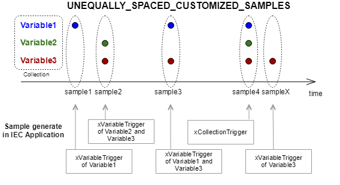

# WagoAppCloud v1.3.5.7 (WAGO) - Complete Documentation


## 📋 Library Information

- **Company:** WAGO
- **Title:** WagoAppCloud
- **Version:** 1.3.5.7
- **Categories:** Application; WAGO LayerView|App; WAGO FunctionalView|Connectivity
- **Namespace:** WagoAppCloud
- **Author:** WAGO / u014791
- **Placeholder:** WagoAppCloud

### Description ¶


This document is automatically generated.

This library is for

This document is automatically generated. This library is for - publishing data from a PLC program running on the PFC to the cloud - receiving commands sent from the cloud to the PFC

### Contents: ¶


Contents: - Documentation Index 10 Documentation - WagoAppCloud Library Documentation Project Information Library Information Function Blocks - FbAgentBusReciever (FB) - FbAgentBusTransmitter (FB) - FbCollectionLogger (FB) - FbCollectionLogger_2 (FB) - FbCommandConfigurator (FB) - FbCommandConfigurator_2 (FB) - FbCommandListener (FB) - FbCommandListener_2 (FB) - FbCommandResponder (FB) - FbCommandResponder_2 (FB) - ... and 11 more Functions - ASCII_TO_CHAR (FUN) - ComparisionTopic (FUN) - FuCycleDaemonRun (FUN) - FuGetSerializationSize (FUN) Methods - FbAgentBusReciever.NotifyReceivedData (METH) - FbAgentBusReciever.QueryReadyForReceiveData (METH) - FbAgentBusReciever.QueryReceiveBufferLocation (METH) - FbAgentBusTransmitter.FB_Exit (METH) - FbCollectionLogger_2.initialize (METH) - FbCommandConfigurator_2.initialize (METH) Program Organization Function Groups Internal Components - 90 Internal - typInternalContext (STRUCT) Global Variable Lists - CloudManager (GVL) - GVL (GVL) - Status (GVL) - VersionHistory (GVL) Other Components - 10 AgentBus - 29 Types - 30 MessageSerilization - 50 Daemon - 80 Status - Advanced - CommandDescriptions - Commands - Enums - Enums - ... and 27 more

### Indices and tables ¶


Based on WagoAppCloud.library, last modified 20.09.2024, 22:10:26. LibDoc 3.5.16.10

© WAGO GmbH & Co. KG, Germany 2018 – All rights reserved. For the avoidance of doubt, this copyright notice does not only apply to the information above but also and primarily to the described library itself. Please note that third-party products are always mentioned without reference to intellectual property rights, including patents, utility models, designs and trademarks, accordingly the existence of such rights cannot be excluded. WAGO is a registered trademark of WAGO Verwaltungsgesellschaft mbH.

- File and Project Information - Library Reference Based on WagoAppCloud.library, last modified 20.09.2024, 22:10:26. LibDoc 3.5.16.10 © WAGO GmbH & Co. KG, Germany 2018 – All rights reserved. For the avoidance of doubt, this copyright notice does not only apply to the information above but also and primarily to the described library itself. Please note that third-party products are always mentioned without reference to intellectual property rights, including patents, utility models, designs and trademarks, accordingly the existence of such rights cannot be excluded. WAGO is a registered trademark of WAGO Verwaltungsgesellschaft mbH.

### Documentation Index


## 10 Documentation


- doc01_Foreword (FB) - doc10_General (FB) General Wago Protocol Sparkplug Payload B Native MQTT

## WagoAppCloud Library Documentation


| Company: | WAGO |
| Title: | WagoAppCloud |
| Version: | 1.3.5.7 |
| Categories: | Application; WAGO LayerView\|App; WAGO FunctionalView\|Connectivity |
| Namespace: | WagoAppCloud |
| Author: | WAGO / u014791 |
| Placeholder: | WagoAppCloud |

### Description


This document is automatically generated.

This library is for

This document is automatically generated. This library is for - publishing data from a PLC program running on the PFC to the cloud - receiving commands sent from the cloud to the PFC

### Contents:


- 10 Documentation doc01_Foreword (FB) - doc10_General (FB) - Wago Protocol - Sparkplug Payload B - Native MQTT 20 Program Organization Units - Function Blocks 29 Types - ErrorInformationCloud (STRUCT) - Native MQTT - Wago Protocol - eConnectionId (ENUM) 80 Status - Status (GVL) - eStatus (ENUM) 90 Internal - 10 AgentBus - 20 Functions - 30 MessageSerilization - 50 Daemon GVL (GVL) Param (PARAMS) VersionHistory (GVL)

### Indices and tables


Based on WagoAppCloud.library, last modified 20.09.2024, 22:10:26. LibDoc 3.5.16.10

© WAGO GmbH & Co. KG, Germany 2018 – All rights reserved. For the avoidance of doubt, this copyright notice does not only apply to the information above but also and primarily to the described library itself. Please note that third-party products are always mentioned without reference to intellectual property rights, including patents, utility models, designs and trademarks, accordingly the existence of such rights cannot be excluded. WAGO is a registered trademark of WAGO Verwaltungsgesellschaft mbH.

- File and Project Information - Library Reference Based on WagoAppCloud.library, last modified 20.09.2024, 22:10:26. LibDoc 3.5.16.10 © WAGO GmbH & Co. KG, Germany 2018 – All rights reserved. For the avoidance of doubt, this copyright notice does not only apply to the information above but also and primarily to the described library itself. Please note that third-party products are always mentioned without reference to intellectual property rights, including patents, utility models, designs and trademarks, accordingly the existence of such rights cannot be excluded. WAGO is a registered trademark of WAGO Verwaltungsgesellschaft mbH.

### Project Information


## File and Project Information


| Scope | Name | Type | Content |
| --- | --- | --- | --- |
| FileHeader | libraryFile | string | WagoAppCloud.library |
| contentFile | doc.clean.json |
| productName | e!COCKPIT |
| creationDateTime | date | 20.09.2024, 22:10:27 |
| companyName | string | WAGO |
| ProjectInformation | LastModificationDateTime | date | 20.09.2024, 22:10:26 |
| Description | string | See: Description |
| DocFormat | reStructuredText |
| Author | WAGO / u014791 |
| DefaultNamespace | WagoAppCloud |
| Placeholder | WagoAppCloud |
| Company | WAGO |
| Title | WagoAppCloud |
| Project | WagoAppCloud |
| Released | bool | False |
| Version | version | 1.3.5.7 |
| LibraryCategories | library-category-list | Application; WAGO LayerView\|App; WAGO FunctionalView\|Connectivity |
| CompiledLibraryCompatibilityVersion | string | CODESYS V3.5 SP16 Patch 3 |
| IsEndUserLibrary | bool | False |

### Library Information


## Library Reference


| LinkAllContent: False QualifiedOnly: False | SystemLibrary: False | Optional: False |

| LinkAllContent: False QualifiedOnly: False | SystemLibrary: False | Optional: False |

| LinkAllContent: False QualifiedOnly: False | SystemLibrary: False | Optional: False |

| LinkAllContent: False QualifiedOnly: False | SystemLibrary: False | Optional: False |

| LinkAllContent: False QualifiedOnly: False | SystemLibrary: False | Optional: False |

| LinkAllContent: False QualifiedOnly: False | SystemLibrary: False | Optional: False |

| LinkAllContent: False QualifiedOnly: False | SystemLibrary: False | Optional: False |

| LinkAllContent: False QualifiedOnly: False | SystemLibrary: False | Optional: False |

| LinkAllContent: False QualifiedOnly: False | SystemLibrary: False PublishSymbolsInContainer: True | Optional: False |

| LinkAllContent: False QualifiedOnly: False | SystemLibrary: False | Optional: False |

| LinkAllContent: False QualifiedOnly: False | SystemLibrary: False | Optional: False |

| LinkAllContent: False QualifiedOnly: False | SystemLibrary: False | Optional: False |

| LinkAllContent: False QualifiedOnly: False | SystemLibrary: False | Optional: False |

| LinkAllContent: False QualifiedOnly: False | SystemLibrary: False | Optional: False |

This is a dictionary of all referenced libraries and their name spaces.

This is a dictionary of all referenced libraries and their name spaces. CmpApp Library Identification : Placeholder: CmpApp Default Resolution: CmpApp, * (System) Namespace: CmpApp Library Properties : CmpErrors2 Interfaces Library Identification : Name: CmpErrors2 Interfaces Version: newest Company: System Namespace: CmpErrors Library Properties : CmpEventMgr Library Identification : Placeholder: CmpEventMgr Default Resolution: CmpEventMgr, * (System) Namespace: CmpEventMgr Library Properties : CmpIecTask Library Identification : Placeholder: CmpIecTask Default Resolution: CmpIecTask, * (System) Namespace: CmpIecTask Library Properties : SysSocket Library Identification : Placeholder: SysSocket Default Resolution: SysSocket, * (System) Namespace: SysSocket Library Properties : WagoAppJSON Library Identification : Placeholder: WagoAppJSON Default Resolution: WagoAppJSON, * (WAGO) Namespace: WagoAppJSON Library Properties : Library Parameter : Parameter: JSON_MAX_STRING_WRITE = 255 Parameter: JSON_SKIP_STRING = ‘##’ Parameter: JSON_MAX_PARAMETER_STRING = 80 Parameter: SIZE_JSON_POINTER = 255 Parameter: JSON_SAX_CHUNK_SIZE = 10000 Parameter: CHECK_NEED_FOR_MASKING = TRUE Parameter: JSON_MAX_STRING_RESULT = 80 Parameter: JSON_NAME_ARRAY_BY_INDEX_SAX = FALSE Parameter: JSON_SAX_UTF8_ENABLED = FALSE Parameter: JSON_MAX_STRING_SAX = 2000 Parameter: JSON_MAX_ARRAY_SIZE = 170 Parameter: JSON_ADVANCED_CHUNK_SIZE_IMPORT = 50000 Parameter: JSON_POINTER_RESULT = 255 Parameter: MAX_METHOD_SET_CONFIGURATION = 255 Parameter: MAX_JSON_FILE_SIZE = 6000 Parameter: JSON_REPLACE_STRING = ‘#Parameter’ Parameter: JSON_MAX_STRING = 1000 Parameter: JSON_ADVANCED_CHUNK_SIZE_EXPORT = 50000 Parameter: JSON_MAX_DATA_LENGTH = 65535 Parameter: MAX_SINGLE_KEY_VALUE_LENGTH = 255 Parameter: JSON_MAX_TOKEN_COUNT = 100 Parameter: MAX_ARRAY_ELEMENTS_CUSTOM = 7 WagoAppString Library Identification : Placeholder: WagoAppString Default Resolution: WagoAppString, * (WAGO) Namespace: WagoAppString Library Properties : Library Parameter : Parameter: MAX_STRING_LENGTH = 255 WagoAppTime Library Identification : Placeholder: WagoAppTime Default Resolution: WagoAppTime, * (WAGO) Namespace: WagoAppTime Library Properties : WagoSysErrorBase Library Identification : Placeholder: WagoSysErrorBase Default Resolution: WagoSysErrorBase, * (WAGO) Namespace: WagoSysErrorBase Library Properties : Library Parameter : Parameter: RES_LOG_MAX_FILESIZE = 2000 Parameter: RES_LOG_MAX_FILES = 1 Parameter: RES_LOG_MAX_ENTRIES = 200 Parameter: RES_LOG_NAME = ‘WagoAppResultLogger’ WagoSysFileDir Library Identification : Placeholder: WagoSysFileDir Default Resolution: WagoSysFileDir, * (WAGO) Namespace: WagoSysFileDir Library Properties : WagoSysPlainMem Library Identification : Placeholder: WagoSysPlainMem Default Resolution: WagoSysPlainMem, * (WAGO) Namespace: WagoSysPlainMem Library Properties : WagoSysSocket_Internal_PFC Library Identification : Placeholder: WagoSysSocketInternal Default Resolution: WagoSysSocket_Internal_PFC, * (WAGO) Namespace: WagoSysSocket_internal Library Properties : Library Parameter : Parameter: TCP_USER_TIMEOUT = 10000 Parameter: CUININSTANCELISTSIZE = 20 WagoSysVersion Library Identification : Name: WagoSysVersion Version: 1.0.0.0 Company: WAGO Namespace: WagoSysVersion Library Properties : WagoTypesCommon Library Identification : Placeholder: WagoTypesCommon Default Resolution: WagoTypesCommon, * (WAGO) Namespace: WagoTypes Library Properties : Library Parameter : Parameter: MAX_STRING_LENGTH = 255 Parameter: MAX_WSTRING_LENGTH = 255

### Function Blocks


## FbAgentBusReciever (FB)


| Scope | Name | Type |
| --- | --- | --- |
| Input | sAddress | STRING |
| wPort | WORD |
| pRxBuffer | POINTER TO BYTE |
| udiRxBufferSize | UDINT |
| xRxEnable | BOOL |
| xOpen | BOOL |
| Output | xPackedReceived | BOOL |
| udiNumberOfReceivedBytes | UDINT |
| sClientIpAddress | IpAddressString |

Interface variables - notifications FbAgentBusReciever.NotifyReceivedData (METH) - FbAgentBusReciever.QueryReadyForReceiveData (METH) - FbAgentBusReciever.QueryReceiveBufferLocation (METH)

## FbAgentBusTransmitter (FB)


| Scope | Name | Type | Initial |
| --- | --- | --- | --- |
| Input | pTxData | POINTER TO ARRAY [0..(gMAX_UDP_SIZE - 1)] OF BYTE |  |
| dwNumberOfTxBytes | DWORD |  |
| eConnection | eConnectionId |  |
| Inout | xTxTrigger | BOOL |  |
| Output | xBusy | BOOL | FALSE |
| xError | BOOL | FALSE |
| oStatus | WagoSysErrorBase.FbResult |  |

Interface variables - FbAgentBusTransmitter.FB_Exit (METH)

## FbCollectionLogger (FB)


| Scope | Name | Type | Comment |
| --- | --- | --- | --- |
| Input | pCollections | POINTER TO ARRAY [0..(gMAX_COLLECTIONS - 1)] OF typCollection | Pointer/address of the collection list. |
| dwCollectionsCount | DWORD | Number of collections within the list |
| Output | oStatus | WagoSysErrorBase.FbResult | Status information |

This function block should be used to forward variables and their current values to the cloud.

Graphical Illustration

Function Description

Developer of the IEC 61131-3 program is responsible to group program variables within one or more collections. The list of configured collections should be passed as input together with a number describing the number of collections.

Different ways to generate samples are impossible. In the default state (eSamplingMode = LIBRARY_DEFAULT_AUTOMATIC) the samples will be generatted automatically. If using self-created samples it is important to choose the compatible data model. This information is important for the Wago Cloud. For further information see into the description of the enum eSamplingMode.

This function block FbCollectionLogger must be executed cyclically in the background task (set the tasc priority to 15).

Cycle time of e!COCKPIT task must be a part of the sample intervals of the collections.

The default setting of the maximum number of collections is preconfigured to 10 collections. It can be adjusted in the parameter list ‘Param’ via the parameter gMAX_COLLECTIONS.

Function block for the data protocols:

Interface variables Function This function block should be used to forward variables and their current values to the cloud. Graphical Illustration  Function Description Developer of the IEC 61131-3 program is responsible to group program variables within one or more collections. The list of configured collections should be passed as input together with a number describing the number of collections. Different ways to generate samples are impossible. In the default state (eSamplingMode = LIBRARY_DEFAULT_AUTOMATIC) the samples will be generatted automatically. If using self-created samples it is important to choose the compatible data model. This information is important for the Wago Cloud. For further information see into the description of the enum eSamplingMode. Note This function block FbCollectionLogger must be executed cyclically in the background task (set the tasc priority to 15). Note Cycle time of e!COCKPIT task must be a part of the sample intervals of the collections. The default setting of the maximum number of collections is preconfigured to 10 collections. It can be adjusted in the parameter list ‘Param’ via the parameter gMAX_COLLECTIONS. Function block for the data protocols: - Wago Protocol

## FbCollectionLogger_2 (FB)


| Scope | Name | Type | Comment |
| --- | --- | --- | --- |
| Input | pCollections | POINTER TO ARRAY [0..(gMAX_COLLECTIONS - 1)] OF typCollection | Pointer/address of the collection list. |
| dwCollectionsCount | DWORD | Number of collections within the list |
| Output | oStatus | WagoSysErrorBase.FbResult | Status information |

```
VAR
    oFbCollectionLogger_2 : WagoAppCloud.FbCollectionLogger_2(eConnection := eConnectionId.Connection2);
END_VAR
```

This function block should be used to forward variables and their current values to the cloud.

Graphical Illustration

Function Description

Developer of the IEC 61131-3 program is responsible to group program variables within one or more collections. The list of configured collections should be passed as input together with a number describing the number of collections.

Different ways to generate samples are impossible. In the default state (eSamplingMode = LIBRARY_DEFAULT_AUTOMATIC) the samples will be generatted automatically. If using self-created samples it is important to choose the compatible data model. This information is important for the Wago Cloud. For further information see into the description of the enum eSamplingMode.

This function block FbCollectionLogger_2 must be executed cyclically in the background task (set the tasc priority to 15).

Cycle time of e!COCKPIT task must be a part of the sample intervals of the collections.

The default setting of the maximum number of collections is preconfigured to 10 collections. It can be adjusted in the parameter list ‘Param’ via the parameter gMAX_COLLECTIONS.

When declaring the function block, it is determined for which of the two cloud connections the function block is intended.

Function block for the data protocols:

Interface variables Function This function block should be used to forward variables and their current values to the cloud. Graphical Illustration  Function Description Developer of the IEC 61131-3 program is responsible to group program variables within one or more collections. The list of configured collections should be passed as input together with a number describing the number of collections. Different ways to generate samples are impossible. In the default state (eSamplingMode = LIBRARY_DEFAULT_AUTOMATIC) the samples will be generatted automatically. If using self-created samples it is important to choose the compatible data model. This information is important for the Wago Cloud. For further information see into the description of the enum eSamplingMode. Note This function block FbCollectionLogger_2 must be executed cyclically in the background task (set the tasc priority to 15). Note Cycle time of e!COCKPIT task must be a part of the sample intervals of the collections. The default setting of the maximum number of collections is preconfigured to 10 collections. It can be adjusted in the parameter list ‘Param’ via the parameter gMAX_COLLECTIONS. When declaring the function block, it is determined for which of the two cloud connections the function block is intended. Function block for the data protocols: - Wago Protocol - FbCollectionLogger_2.initialize (METH)

## FbCommandConfigurator (FB)


| Scope | Name | Type | Initial | Comment |
| --- | --- | --- | --- | --- |
| Input | bNumberOfSupportedCommands | BYTE |  | Specifies number of commands in the list. |
| pSupportedCommands | POINTER TO ARRAY [0..(gMAX_COMMANDS - 1)] OF typCommandDescription |  | List of commands which are supported by the PLC program. Command is represented by type CommandDescription. |
| Output | xBusy | BOOL |  |  |
| xError | BOOL |  |  |
| oStatus | WagoSysErrorBase.FbResult |  | Status information |
| xIsRegistrationRequired | BOOL | TRUE | Indicates whether commands are forwarded to the cloud. (This is a debugging aid.) |

Function Block used to configure custom cloud to device commands.

Graphical Illustration

Function Description

Function block for the data protocols:

Interface variables Function Function Block used to configure custom cloud to device commands. Graphical Illustration  Function Description Registration of Commands using FbCommandConfigurator - FbCommandConfigurator publishes the provided commands to the Cloud per the information provided by typCommandDescription input. - The Cloud application can provide a user interface to request the execution of the command based on the typCommandDescription. - A Command can have up to 16 request and response parameters in the default setting. In the parameter list ‘Param’, this setting can be adjusted via the parameters gMAX_REQUEST_PARAMETERS and gMAX_RESPONSE_PARAMETERS. These parameters are provided by the struct typCommandParameterDescription. - max. 60 commands with 16 request and 16 response parameters (for the data protocol: Wago Protocol) Function block for the data protocols: - Wago Protocol

## FbCommandConfigurator_2 (FB)


| Scope | Name | Type | Initial | Comment |
| --- | --- | --- | --- | --- |
| Input | bNumberOfSupportedCommands | BYTE |  | Specifies number of commands in the list. |
| pSupportedCommands | POINTER TO ARRAY [0..(gMAX_COMMANDS - 1)] OF typCommandDescription |  | List of commands which are supported by the PLC program. Command is represented by type CommandDescription. |
| Output | xBusy | BOOL |  |  |
| xError | BOOL |  |  |
| oStatus | WagoSysErrorBase.FbResult |  | Status information |
| xIsRegistrationRequired | BOOL | TRUE | Indicates whether commands are forwarded to the cloud. (This is a debugging aid.) |

```
VAR
    oFbCommandConfigurator_2 : WagoAppCloud.FbCommandConfigurator_2(eConnection := eConnectionId.Connection2);
END_VAR
```

Function Block used to configure custom cloud to device commands.

Graphical Illustration

Function Description

When declaring the function block, it is determined for which of the two cloud connections the function block is intended.

Function block for the data protocols:

Interface variables Function Function Block used to configure custom cloud to device commands. Graphical Illustration  Function Description Registration of Commands using FbCommandConfigurator_2 - FbCommandConfigurator publishes the provided commands to the Cloud per the information provided by typCommandDescription input. - The Cloud application can provide a user interface to request the execution of the command based on the typCommandDescription. - A Command can have up to 16 request and response parameters in the default setting. In the parameter list ‘Param’, this setting can be adjusted via the parameters gMAX_REQUEST_PARAMETERS and gMAX_RESPONSE_PARAMETERS. These parameters are provided by the struct typCommandParameterDescription. - max. 60 commands with 16 request and 16 response parameters (for the data protocol: Wago Protocol) When declaring the function block, it is determined for which of the two cloud connections the function block is intended. Function block for the data protocols: - Wago Protocol - FbCommandConfigurator_2.initialize (METH)

## FbCommandListener (FB)


| Scope | Name | Type | Comment |
| --- | --- | --- | --- |
| Input | pCommand | POINTER TO typCommandRequest | Address of the command request. Function block will populate it after recived from the cloud. |
| Output | oStatus | WagoSysErrorBase.FbResult | Status information |
| xCommandReceived | BOOL | Indicates whether a command is available. |

This Function Block is used to listen and receive command requests from the cloud.

Graphical Illustration

Function Description

Before listen to a command request from the cloud it is necessary to configure the command in the aplication with the Function Block FbCommandConfigurator .

Listening for incoming CommandRequests using FbCommandListener

Function block for the data protocols:

Interface variables Function This Function Block is used to listen and receive command requests from the cloud. Graphical Illustration  Function Description Note Before listen to a command request from the cloud it is necessary to configure the command in the aplication with the Function Block FbCommandConfigurator . Listening for incoming CommandRequests using FbCommandListener - If a command request arrives from the Cloud the xCommandReceived flag is set to true for one cycle. - FbCommandListener requires a pointer to a CommandRequest struct which contains the information about the command request call. - The Command is handled based on the information provided by typCommandRequest. Function block for the data protocols: - Wago Protocol

## FbCommandListener_2 (FB)


| Scope | Name | Type | Comment |
| --- | --- | --- | --- |
| Input | pCommand | POINTER TO typCommandRequest | Address of the command request. Function block will populate it after recived from the cloud. |
| Output | oStatus | WagoSysErrorBase.FbResult | Status information |
| xCommandReceived | BOOL | Indicates whether a command is available. |

```
VAR
    oFbCommandListener_2 : WagoAppCloud.FbCommandListener_2(eConnection := eConnectionId.Connection2);
END_VAR
```

This Function Block is used to listen and receive command requests from the cloud.

Graphical Illustration

Function Description

Before listen to a command request from the cloud it is necessary to configure the command in the aplication with the Function Block FbCommandConfigurator_2 .

Listening for incoming CommandRequests using FbCommandListener_2

When declaring the function block, it is determined for which of the two cloud connections the function block is intended.

Function block for the data protocols:

Interface variables Function This Function Block is used to listen and receive command requests from the cloud. Graphical Illustration  Function Description Note Before listen to a command request from the cloud it is necessary to configure the command in the aplication with the Function Block FbCommandConfigurator_2 . Listening for incoming CommandRequests using FbCommandListener_2 - If a command request arrives from the Cloud the xCommandReceived flag is set to true for one cycle. - FbCommandListener_2 requires a pointer to a CommandRequest struct which contains the information about the command request call. - The Command is handled based on the information provided by typCommandRequest. When declaring the function block, it is determined for which of the two cloud connections the function block is intended. Function block for the data protocols: - Wago Protocol

## FbCommandResponder (FB)


| Scope | Name | Type | Comment |
| --- | --- | --- | --- |
| Input | pCommand | POINTER TO typCommandResponse | The command response. |
| Output | xBusy | BOOL | Execution of command in progress |
| xError | BOOL | Command executed with error |
| oStatus | WagoSysErrorBase.FbResult | Status information |
| Inout | xTrigger | BOOL | Triggers sending of the response. Also indicates if command was sent when going back to false. |

This Function Block is used to provide the response to a command request which was received from the cloud. (Microsoft Azure)

Graphical Illustration

Function Description

Before response to a command request it is necessary to configure the command in the aplication with the Function Block FbCommandConfigurator and to receive a command with the Function Block FbCommandListener .

Function block for the data protocol:

Interface variables Function This Function Block is used to provide the response to a command request which was received from the cloud. (Microsoft Azure) Graphical Illustration  Function Description Note Before response to a command request it is necessary to configure the command in the aplication with the Function Block FbCommandConfigurator and to receive a command with the Function Block FbCommandListener . Confirmation of command execution using FbCommandResponder - The execution of a command must be confirmed to the Cloud using FbCommandResponder. - The confirmation of command execution should be done by providing a typCommandResponse. - Response parameters are send to the Cloud using typCommandResponse, too. Function block for the data protocol: - Wago Protocol

## FbCommandResponder_2 (FB)


| Scope | Name | Type | Comment |
| --- | --- | --- | --- |
| Input | pCommand | POINTER TO typCommandResponse | The command response. |
| Output | xBusy | BOOL | Execution of command in progress |
| xError | BOOL | Command executed with error |
| oStatus | WagoSysErrorBase.FbResult | Status information |
| Inout | xTrigger | BOOL | Triggers sending of the response. Also indicates if command was sent when going back to false. |

```
VAR
    oFbCommandResponder_2 : WagoAppCloud.FbCommandResponder_2(eConnection := eConnectionId.Connection2);
END_VAR
```

This Function Block is used to provide the response to a command request which was received from the cloud. (Microsoft Azure)

Graphical Illustration

Function Description

Before response to a command request it is necessary to configure the command in the aplication with the Function Block FbCommandConfigurator and to receive a command with the Function Block FbCommandListener_2 .

When declaring the function block, it is determined for which of the two cloud connections the function block is intended.

Function block for the data protocol:

Interface variables Function This Function Block is used to provide the response to a command request which was received from the cloud. (Microsoft Azure) Graphical Illustration  Function Description Note Before response to a command request it is necessary to configure the command in the aplication with the Function Block FbCommandConfigurator and to receive a command with the Function Block FbCommandListener_2 . Confirmation of command execution using FbCommandResponder_2 - The execution of a command must be confirmed to the Cloud using FbCommandResponder_2. - The confirmation of command execution should be done by providing a typCommandResponse. - Response parameters are send to the Cloud using typCommandResponse, too. When declaring the function block, it is determined for which of the two cloud connections the function block is intended. Function block for the data protocol: - Wago Protocol

## FbGetLongTime (FB)


| Scope | Name | Type |
| --- | --- | --- |
| Inout | ltLongTime | LTIME |

## FbPublishMQTT (FB)


| Scope | Name | Type | Comment |
| --- | --- | --- | --- |
| Input | sTopic | STRING(255) | MQTT Topics are structured in a hierarchy similar to folders and files in a file system using the forward slash ( / )as a delimiter. Using this system you can create a user friendly and self descriptive naming structures of you own choosing. Topic names are: Case sensitive; use UTF-8 strings. |
| eQualityOfService | eQualityOfService | Quality of Service: 0,1,2 |
| xRetain | BOOL | Set to true to make the message retained |
| dwSize | DWORD | DataCount to be transmitted |
| aData | POINTER TO BYTE | Array of data which should be transmitted |
| Inout | xTrigger | BOOL | Trigger the transmission of data |
| Output | xBusy | BOOL | Transmission in progress |
| xError | BOOL | Indicates that an Error has occured. |
| oStatus | FbResult | Status object with detailed information about a happend error. (Listed in eStatus ) The content of the error object could be displayed via the FbShowResult from the WagoSysErrorBase library. |

Generate a MQTT message to publish to the cloud.

Graphical Illustration

Function Description

This function block transmit data to the cloud in the own data structure. The PLC application engineer can choose the topic and his own data structure. The Quality of Service 0, 1 and 2 are supported.

To write the data in a JSON format the library WagoAppJSON could be used.

If using the Native MQTT Protocol with the function blocks FbPublishMQTT and/or FbSubscribeMQTT it is necessary to configure the Data Protocol Native MQTT in the web based management.

For secure data traffic it is recommended to send maximum 65kByte in one task interval.

This function block must be executed in the background task (set the tasc priority to 15).

Interface variables Function Generate a MQTT message to publish to the cloud. Graphical Illustration  Function Description This function block transmit data to the cloud in the own data structure. The PLC application engineer can choose the topic and his own data structure. The Quality of Service 0, 1 and 2 are supported. To write the data in a JSON format the library WagoAppJSON could be used. Note If using the Native MQTT Protocol with the function blocks FbPublishMQTT and/or FbSubscribeMQTT it is necessary to configure the Data Protocol Native MQTT in the web based management. Note For secure data traffic it is recommended to send maximum 65kByte in one task interval. Note This function block must be executed in the background task (set the tasc priority to 15).

## FbPublishMQTT_2 (FB)


| Scope | Name | Type | Comment |
| --- | --- | --- | --- |
| Input | sTopic | STRING(255) | MQTT Topics are structured in a hierarchy similar to folders and files in a file system using the forward slash ( / )as a delimiter. Using this system you can create a user friendly and self descriptive naming structures of you own choosing. Topic names are: Case sensitive; use UTF-8 strings. |
| eQualityOfService | eQualityOfService | Quality of Service: 0,1,2 |
| xRetain | BOOL | Set to true to make the message retained |
| dwSize | DWORD | DataCount to be transmitted |
| aData | POINTER TO BYTE | Array of data which should be transmitted |
| Inout | xTrigger | BOOL | Trigger the transmission of data |
| Output | xBusy | BOOL | Transmission in progress |
| xError | BOOL | Indicates that an Error has occured. |
| oStatus | FbResult | Status object with detailed information about a happend error. (Listed in eStatus ) The content of the error object could be displayed via the FbShowResult from the WagoSysErrorBase library. |

```
VAR
    oFbPublishMQTT_2 : WagoAppCloud.FbPublishMQTT_2(eConnection := eConnectionId.Connection2);
END_VAR
```

Generate a MQTT message to publish to the cloud.

Graphical Illustration

Function Description

This function block transmit data to the cloud in the own data structure. The PLC application engineer can choose the topic and his own data structure. The Quality of Service 0, 1 and 2 are supported.

To write the data in a JSON format the library WagoAppJSON could be used.

If using the Native MQTT Protocol with the function blocks FbPublishMQTT_2 and/or FbSubscribeMQTT_2 it is necessary to configure the Data Protocol Native MQTT in the web based management.

For secure data traffic it is recommended to send maximum 65kByte in one task interval.

This function block must be executed in the background task (set the tasc priority to 15).

When declaring the function block, it is determined for which of the two cloud connections the function block is intended.

Interface variables Function Generate a MQTT message to publish to the cloud. Graphical Illustration  Function Description This function block transmit data to the cloud in the own data structure. The PLC application engineer can choose the topic and his own data structure. The Quality of Service 0, 1 and 2 are supported. To write the data in a JSON format the library WagoAppJSON could be used. Note If using the Native MQTT Protocol with the function blocks FbPublishMQTT_2 and/or FbSubscribeMQTT_2 it is necessary to configure the Data Protocol Native MQTT in the web based management. Note For secure data traffic it is recommended to send maximum 65kByte in one task interval. Note This function block must be executed in the background task (set the tasc priority to 15). When declaring the function block, it is determined for which of the two cloud connections the function block is intended.

## FbStatus_NativeMQTT (FB)


| Scope | Name | Type | Comment |
| --- | --- | --- | --- |
| Input | xEnabled | BOOL |  |
| Output | xIsActive | BOOL | true if connection is active |
| xError | BOOL | true if read or interpretation error of the status information (Outputs are invalid in this case and keep the last read value) |
| xCloudConnected | BOOL | true when cloud connection service is available |
| rCacheFillLevel | REAL | height of the cache fill level (in percent) |
| uliOutgoingDataBlocks | ULINT | number of outgoing data blocks in the cache |
| ErrorInformation | ErrorInformationCloud | Error information about the Cloud Connectivity |
| oStatus | WagoSysErrorBase.FbResult | Status information of the function block |

The state will be actualised in an interval of 5s.

This function block give the state of the connection to the cloud.

Graphical Illustration

Function Description

If the input parameter xEnabled is set the actual state actualised every 5s.

Interface variables Note The state will be actualised in an interval of 5s. Function This function block give the state of the connection to the cloud. Graphical Illustration  Function Description If the input parameter xEnabled is set the actual state actualised every 5s.

## FbStatus_NativeMQTT_2 (FB)


| Scope | Name | Type | Comment |
| --- | --- | --- | --- |
| Input | xEnabled | BOOL |  |
| Output | xIsActive | BOOL | true if connection is active |
| xError | BOOL | true if read or interpretation error of the status information (Outputs are invalid in this case and keep the last read value) |
| xCloudConnected | BOOL | true when cloud connection service is available |
| rCacheFillLevel | REAL | height of the cache fill level (in percent) |
| uliOutgoingDataBlocks | ULINT | number of outgoing data blocks in the cache |
| ErrorInformation | ErrorInformationCloud | Error information about the Cloud Connectivity |
| oStatus | WagoSysErrorBase.FbResult | Status information of the function block |

```
VAR
    oFbStatus_NativeMQTT_2 : WagoAppCloud.FbStatus_NativeMQTT_2(eConnection := eConnectionId.Connection2);
END_VAR
```

The state will be actualised in an interval of 5s.

This function block give the state of the connection to the cloud.

Graphical Illustration

Function Description

If the input parameter xEnabled is set the actual state actualised every 5s.

When declaring the function block, it is determined for which of the two cloud connections the function block is intended.

Interface variables Note The state will be actualised in an interval of 5s. Function This function block give the state of the connection to the cloud. Graphical Illustration  Function Description If the input parameter xEnabled is set the actual state actualised every 5s. When declaring the function block, it is determined for which of the two cloud connections the function block is intended.

## FbStatus_WagoProtocol (FB)


| Scope | Name | Type | Comment |
| --- | --- | --- | --- |
| Input | xEnabled | BOOL |  |
| Output | xIsActive | BOOL | true if connection is active |
| xError | BOOL | true if read or interpretation error of the status information (Outputs are invalid in this case and keep the last read value) |
| xCloudConnected | BOOL | true when cloud connection service is available |
| rCacheFillLevel | REAL | height of the cache fill level (in percent) |
| xTelemetryDataTransmission | BOOL | true when telemetry data (collections) is not stopped by the cloud |
| bCollectionCounter | BYTE | Number of collections sent to the cloud |
| uliOutgoingDataBlocks | ULINT | number of outgoing data blocks in the cache |
| ErrorInformation | ErrorInformationCloud | Error information about the Cloud Connectivity |
| oStatus | WagoSysErrorBase.FbResult | Status information of the function block |

```
PROGRAM PLC_PRG

VAR
    oFbStatus_WagoProtocol  : FbStatus_WagoProtocol;
END_VAR

oFbStatus_WagoProtocol( xEnabled:= TRUE,
                        xError=> ,
                        xCloudConnected=> ,
                        rCacheFillLevel=> ,
                        xTelemetryDataTransmission=> ,
                        bCollectionCounter=> ,
                        uliOutgoingDataBlocks=> );
```

The state will be actualised in an interval of 5s.

This function block give the state of the connection to the cloud.

Graphical Illustration

Function Description

If the input parameter xEnabled is set the actual state actualised every 5s.

This function block includes special information only for the Wago Protocol.

Interface variables Note The state will be actualised in an interval of 5s. Function This function block give the state of the connection to the cloud. Graphical Illustration  Function Description If the input parameter xEnabled is set the actual state actualised every 5s. Note This function block includes special information only for the Wago Protocol. Example

## FbStatus_WagoProtocol_2 (FB)


| Scope | Name | Type | Comment |
| --- | --- | --- | --- |
| Input | xEnabled | BOOL |  |
| Output | xIsActive | BOOL | true if connection is active |
| xError | BOOL | true if read or interpretation error of the status information (Outputs are invalid in this case and keep the last read value) |
| xCloudConnected | BOOL | true when cloud connection service is available |
| rCacheFillLevel | REAL | height of the cache fill level (in percent) |
| xTelemetryDataTransmission | BOOL | true when telemetry data (collections) is not stopped by the cloud |
| bCollectionCounter | BYTE | Number of collections sent to the cloud |
| uliOutgoingDataBlocks | ULINT | number of outgoing data blocks in the cache |
| ErrorInformation | ErrorInformationCloud | Error information about the Cloud Connectivity |
| oStatus | WagoSysErrorBase.FbResult | Status information of the function block |

```
VAR
    oFbStatus_WagoProtocol_2 : WagoAppCloud.FbStatus_WagoProtocol_2(eConnection := eConnectionId.Connection2);
END_VAR
```

The state will be actualised in an interval of 5s.

This function block give the state of the connection to the cloud.

Graphical Illustration

Function Description

If the input parameter xEnabled is set the actual state actualised every 5s.

This function block includes special information only for the Wago Protocol.

When declaring the function block, it is determined for which of the two cloud connections the function block is intended.

Interface variables Note The state will be actualised in an interval of 5s. Function This function block give the state of the connection to the cloud. Graphical Illustration  Function Description If the input parameter xEnabled is set the actual state actualised every 5s. Note This function block includes special information only for the Wago Protocol. When declaring the function block, it is determined for which of the two cloud connections the function block is intended.

## FbSubscribeMQTT (FB)


| Scope | Name | Type | Comment |
| --- | --- | --- | --- |
| Input | xSubscribe | BOOL | Enables the operation to subscribe the topic to the cloud |
| sTopic | STRING(255) | MQTT Topics are structured in a hierarchy similar to folders and files in a file system using the forward slash ( / ) as a delimiter. Using this system you can create a user friendly and self descriptive naming structures of you own choosing. Topic names are: Case sensitive; use UTF-8 strings. |
| eQoS | eQualityOfService | Quality of Service: 0,1,2 |
| aPayloadData | POINTER TO BYTE | Array of data which should be transmitted |
| Output | xBusy | BOOL | Indicates that the FB is working |
| xError | BOOL | Indicates that an Error has occured. |
| oStatus | WagoSysErrorBase.FbResult | Status object with detailed information about a happend error. (Listed in eStatus ) The content of the error object could be displayed via the FbShowResult from the WagoSysErrorBase library. |
| xDataReceived | BOOL | New data from the cloud for this topic received |
| dwRxNBytes | DWORD | Count of bytes which received in the payload from the cloud |
| xDataTruncated | BOOL | TRUE if the received payload data or the received topic is truncated. The following states are possible: 1. aPayloadData is too small 2. received data is bigger as the max supported size of 65237 bytes 3. Topic of the subscribed topic is bigger than 255 bytes |
| sReceivedTopic | STRING(255) | Give the topic which received the message. This is interesting by using wildcards. |

```
VAR
    myCloudManager_Connection1 : FbCloudManager := (eConnection:=eConnectionId.Connection1, wUdpPortData:=gCONNECTION_1_PORT3);
END_VAR
```

This function block contains a subscription to get data from the cloud. This subscription includes configuration like the topic and the quality of service.

Graphical Illustration

Function description

If the input parameter xSubscribe is set the function block will be initialised and the topic are subscriped to the cloud. New data from the cloud can be received in an intervall of 50ms.

If the count of subscription is greater than the default setting (10 subscription instances) the parameter gSUBSCRIPTIONS in the parameter list Param must be changed.

If using the Native MQTT Protocol with the function blocks FbPublishMQTT and/or FbSubscribeMQTT it is necessary to configure the Data Protocol Native MQTT in the web based management.

This function block must be executed cyclically in a background task (set the task priority to 15) with cycle interval <= 50ms.

The function block FbCloudManager is automatically started in the background in a background task. In the function module, the subscribed messages are assigned to the corresponding instances of the function modules FbSubscribeMQTT_2. The cycle time of the corresponding background task can be set in the parameter list ‘Param’ (default: 50ms). The background task can be deactivated via the parameter gENABLE_BACKGROUNDTASK in the parameter list ‘Param’ so that the task configuration can be determined by the PLC programmer. The function block FbCloudManager must be instantiated for the connection and called in a task. Example for connection 1 (only if gENABLE_BACKGROUNDTASK=FALSE):

The default setting of the number of subscriptions is preconfigured to 10 subscriptions. It can be adjusted in the parameter list ‘Param’ via the parameter gSUBSCRIPTIONS.

Interface variables Function This function block contains a subscription to get data from the cloud. This subscription includes configuration like the topic and the quality of service. Graphical Illustration  Function description If the input parameter xSubscribe is set the function block will be initialised and the topic are subscriped to the cloud. New data from the cloud can be received in an intervall of 50ms. Note If the count of subscription is greater than the default setting (10 subscription instances) the parameter gSUBSCRIPTIONS in the parameter list Param must be changed. Note If using the Native MQTT Protocol with the function blocks FbPublishMQTT and/or FbSubscribeMQTT it is necessary to configure the Data Protocol Native MQTT in the web based management. Note This function block must be executed cyclically in a background task (set the task priority to 15) with cycle interval <= 50ms. The function block FbCloudManager is automatically started in the background in a background task. In the function module, the subscribed messages are assigned to the corresponding instances of the function modules FbSubscribeMQTT_2. The cycle time of the corresponding background task can be set in the parameter list ‘Param’ (default: 50ms). The background task can be deactivated via the parameter gENABLE_BACKGROUNDTASK in the parameter list ‘Param’ so that the task configuration can be determined by the PLC programmer. The function block FbCloudManager must be instantiated for the connection and called in a task. Example for connection 1 (only if gENABLE_BACKGROUNDTASK=FALSE): The default setting of the number of subscriptions is preconfigured to 10 subscriptions. It can be adjusted in the parameter list ‘Param’ via the parameter gSUBSCRIPTIONS.

## FbSubscribeMQTT_2 (FB)


| Scope | Name | Type | Comment |
| --- | --- | --- | --- |
| Input | xSubscribe | BOOL | Enables the operation to subscribe the topic to the cloud |
| sTopic | STRING(255) | MQTT Topics are structured in a hierarchy similar to folders and files in a file system using the forward slash ( / ) as a delimiter. Using this system you can create a user friendly and self descriptive naming structures of you own choosing. Topic names are: Case sensitive; use UTF-8 strings. |
| eQoS | eQualityOfService | Quality of Service: 0,1,2 |
| aPayloadData | POINTER TO BYTE | Array of data which should be transmitted |
| Output | xBusy | BOOL | Indicates that the FB is working |
| xError | BOOL | Indicates that an Error has occured. |
| oStatus | WagoSysErrorBase.FbResult | Status object with detailed information about a happend error. (Listed in eStatus ) The content of the error object could be displayed via the FbShowResult from the WagoSysErrorBase library. |
| xDataReceived | BOOL | New data from the cloud for this topic received |
| dwRxNBytes | DWORD | Count of bytes which received in the payload from the cloud |
| xDataTruncated | BOOL | TRUE if the received payload data or the received topic is truncated. The following states are possible: 1. aPayloadData is too small 2. received data is bigger as the max supported size of 65237 bytes 3. Topic of the subscribed topic is bigger than 255 bytes |
| sReceivedTopic | STRING(255) | Give the topic which received the message. This is interesting by using wildcards. |

```
VAR
    myCloudManager_Connection1 : FbCloudManager := (eConnection:=eConnectionId.Connection1, wUdpPortData:=gCONNECTION_1_PORT3);
END_VAR
```

```
VAR
    oFbSubscribe1 : WagoAppCloud.FbSubscribeMQTT_2(eConnection := eConnectionId.Connection2);
END_VAR
```

This function block contains a subscription to get data from the cloud. This subscription includes configuration like the topic and the quality of service.

Graphical Illustration

Function description

If the input parameter xSubscribe is set the function block will be initialised and the topic are subscriped to the cloud. New data from the cloud can be received in an intervall of 50ms.

If the count of subscription is greater than the default setting (10 subscription instances) the parameter gSUBSCRIPTIONS in the parameter list Param must be changed.

If using the Native MQTT Protocol with the function blocks FbPublishMQTT_2 and/or FbSubscribeMQTT_2 it is necessary to configure the Data Protocol Native MQTT in the web based management.

This function block must be executed cyclically in a background task (set the task priority to 15) with cycle interval <= 50ms.

The function block FbCloudManager is automatically started in the background in a background task. In the function module, the subscribed messages are assigned to the corresponding instances of the function modules FbSubscribeMQTT_2. The cycle time of the corresponding background task can be set in the parameter list ‘Param’ (default: 50ms). The background task can be deactivated via the parameter gENABLE_BACKGROUNDTASK in the parameter list ‘Param’ so that the task configuration can be determined by the PLC programmer. The function block FbCloudManager must be instantiated for the connection and called in a task. Example for connection 1 (only if gENABLE_BACKGROUNDTASK=FALSE):

The default setting of the number of subscriptions is preconfigured to 10 subscriptions. It can be adjusted in the parameter list ‘Param’ via the parameter gSUBSCRIPTIONS.

When declaring the function block, it is determined for which of the two cloud connections the function block is intended.

Interface variables Function This function block contains a subscription to get data from the cloud. This subscription includes configuration like the topic and the quality of service. Graphical Illustration  Function description If the input parameter xSubscribe is set the function block will be initialised and the topic are subscriped to the cloud. New data from the cloud can be received in an intervall of 50ms. Note If the count of subscription is greater than the default setting (10 subscription instances) the parameter gSUBSCRIPTIONS in the parameter list Param must be changed. Note If using the Native MQTT Protocol with the function blocks FbPublishMQTT_2 and/or FbSubscribeMQTT_2 it is necessary to configure the Data Protocol Native MQTT in the web based management. Note This function block must be executed cyclically in a background task (set the task priority to 15) with cycle interval <= 50ms. The function block FbCloudManager is automatically started in the background in a background task. In the function module, the subscribed messages are assigned to the corresponding instances of the function modules FbSubscribeMQTT_2. The cycle time of the corresponding background task can be set in the parameter list ‘Param’ (default: 50ms). The background task can be deactivated via the parameter gENABLE_BACKGROUNDTASK in the parameter list ‘Param’ so that the task configuration can be determined by the PLC programmer. The function block FbCloudManager must be instantiated for the connection and called in a task. Example for connection 1 (only if gENABLE_BACKGROUNDTASK=FALSE): The default setting of the number of subscriptions is preconfigured to 10 subscriptions. It can be adjusted in the parameter list ‘Param’ via the parameter gSUBSCRIPTIONS. When declaring the function block, it is determined for which of the two cloud connections the function block is intended.

## doc01_Foreword (FB)


This document, including all figures and illustrations contained therein, is subject to copyright. Any use of this document that infringes upon the copyright provisions stipulated herein is prohibited. Reproduction, translation, electronic and phototechnical filing/archiving (e.g., photocopying), as well as any amendments require the written consent of WAGO Kontakttechnik GmbH & Co. KG, Minden, Germany. Non-observance will entail the right of claims for damages. WAGO Kontakttechnik GmbH & Co. KG reserves the right to make any alterations or modifications that serve to increase the efficiency of technical progress. WAGO Kontakttechnik GmbH & Co. KG owns all rights arising from granting patents or from the legal protection of utility patents. Third-party products are always mentioned without any reference to patent rights. Thus, the existence of such rights cannot be excluded.

Personnel Qualification

The use of the product described in this document is exclusively geared to specialists having qualifications in PLC programming, electrical specialists or persons instructed by electrical specialists who are also familiar with the appropriate current standards. WAGO Kontakttechnik GmbH & Co. KG assumes no liability resulting from improper action and damage to WAGO products and third-party products due to non-observance of the information contained in this document.

Intended Use

For each individual application, the components are supplied from the factory with a dedicated hardware and software configuration. Modifications are only admitted within the framework of the possibilities documented in this document. All other changes to the hardware and/or software and the non-conforming use of the components entail the exclusion of liability on part of WAGO Kontakttechnik GmbH & Co. KG. Please direct any requirements pertaining to a modified and/or new hardware or software configuration directly to WAGO Kontakttechnik GmbH & Co. KG.

Scope of Applicability

This application note is based on the _stated hardware and software from the specific manufacturer, as well as the associated documentation. This application note is therefore only valid for the described installation. New hardware and software versions may need to be handled differently. Please note the detailed description in the specific manuals.

Copyright This document, including all figures and illustrations contained therein, is subject to copyright. Any use of this document that infringes upon the copyright provisions stipulated herein is prohibited. Reproduction, translation, electronic and phototechnical filing/archiving (e.g., photocopying), as well as any amendments require the written consent of WAGO Kontakttechnik GmbH & Co. KG, Minden, Germany. Non-observance will entail the right of claims for damages. WAGO Kontakttechnik GmbH & Co. KG reserves the right to make any alterations or modifications that serve to increase the efficiency of technical progress. WAGO Kontakttechnik GmbH & Co. KG owns all rights arising from granting patents or from the legal protection of utility patents. Third-party products are always mentioned without any reference to patent rights. Thus, the existence of such rights cannot be excluded. Personnel Qualification The use of the product described in this document is exclusively geared to specialists having qualifications in PLC programming, electrical specialists or persons instructed by electrical specialists who are also familiar with the appropriate current standards. WAGO Kontakttechnik GmbH & Co. KG assumes no liability resulting from improper action and damage to WAGO products and third-party products due to non-observance of the information contained in this document. Intended Use For each individual application, the components are supplied from the factory with a dedicated hardware and software configuration. Modifications are only admitted within the framework of the possibilities documented in this document. All other changes to the hardware and/or software and the non-conforming use of the components entail the exclusion of liability on part of WAGO Kontakttechnik GmbH & Co. KG. Please direct any requirements pertaining to a modified and/or new hardware or software configuration directly to WAGO Kontakttechnik GmbH & Co. KG. Scope of Applicability This application note is based on the _stated hardware and software from the specific manufacturer, as well as the associated documentation. This application note is therefore only valid for the described installation. New hardware and software versions may need to be handled differently. Please note the detailed description in the specific manuals.

## doc10_General (FB)


### General


The library WagoAppCloud is a part of the Cloud Connectivity . The Cloud Connectivity allows all PFCs to communicate directly with the cloud.

Cloud Connectivity is able to connect to the following cloud platforms using the standardized MQTT protocol:

Cloud Connectivity is using the standardized MQTT (Message Queue Telemetry Transport Protocol) protocol as a client to communicate to the cloud (broker). In the MQTT protocol is defined how clients (PFC) connect to a broker (cloud). Also there is defined the way how a client (PFC) can publish and recieve data from the broker (cloud). All supported data protocols ( Wago Protocol , Native MQTT and Sparkplug payload B ) of the Cloud Connectivity are based on the MQTT protocol specification. The MQTT specification does not specify the topic namespace and payload representation of the data being published and/or subscribed. For the data protocols Wago Protocol and Sparkplug additional informations and restrictions are defined in seperated specifications.

These specifications describe the message types, message payloads, topic namespaces of the messages and the message flow.

For Wago Protocol and Sparkplug the PLC application engineer only has to configure the data model. Formatting according to the selected protocol is done by Cloud Connectivity automatically.

Based on these defined protocol specifications the cloud application engineer can implement the cloud application.

By using the data protocol Native MQTT the PLC application engineer can define the payload, topics and the data flow.

Cloud Connectivity gives the possibility to choose between different data protocols to communicate with the cloud. It is important to select the desired cloud platform and the data protocol in the web based management (WBM) before beginning the PLC application implementation.

Depending on this decision the PLC application engineer has to implement his software and has to use different function blocks of the library WagoAppCloud.

The Cloud Connectivity consists of a PLC library for e!Cockpit WagoAppCloud and related Linux application, which is running on PFC as a daemon. It is responsible for data flow between PLC program and cloud application.

The Linux Application is connected to the IEC Library using Inter-process communication (IPC) and also communicates with the Cloud. Data transmission to the Cloud is done by using the MQTT protocol and is encrypted using Transport Layer Security (TLS). Furthermore the Linux Application caches data coming from the PLC program to avoid data loss in case network connection to the Cloud got interrupted. Caching can be configured within Web Based Management (WBM) either in RAM or on a storage medium (SD Card). Linux Application takes care about automatic reconnect.

The PLC library WagoAppCloud forwards the data to the Linux application which sends the data to the cloud. In the PLC application the application engineer has to... - define the variables which shall be send to the cloud - define the commands which can be called by the cloud

The library WagoAppCloud is a part of the Cloud Connectivity . The Cloud Connectivity allows all PFCs to communicate directly with the cloud. Cloud Connectivity is able to connect to the following cloud platforms using the standardized MQTT protocol: - WAGO Cloud (Microsoft Azure) - Microsoft Azure - Amazon Web Services - IBM Cloud - SAP Cloud - MQTT-Broker Cloud Connectivity is using the standardized MQTT (Message Queue Telemetry Transport Protocol) protocol as a client to communicate to the cloud (broker). In the MQTT protocol is defined how clients (PFC) connect to a broker (cloud). Also there is defined the way how a client (PFC) can publish and recieve data from the broker (cloud). All supported data protocols ( Wago Protocol , Native MQTT and Sparkplug payload B ) of the Cloud Connectivity are based on the MQTT protocol specification. The MQTT specification does not specify the topic namespace and payload representation of the data being published and/or subscribed. For the data protocols Wago Protocol and Sparkplug additional informations and restrictions are defined in seperated specifications. These specifications describe the message types, message payloads, topic namespaces of the messages and the message flow. For Wago Protocol and Sparkplug the PLC application engineer only has to configure the data model. Formatting according to the selected protocol is done by Cloud Connectivity automatically. Based on these defined protocol specifications the cloud application engineer can implement the cloud application. By using the data protocol Native MQTT the PLC application engineer can define the payload, topics and the data flow. Cloud Connectivity gives the possibility to choose between different data protocols to communicate with the cloud. It is important to select the desired cloud platform and the data protocol in the web based management (WBM) before beginning the PLC application implementation. Depending on this decision the PLC application engineer has to implement his software and has to use different function blocks of the library WagoAppCloud. The Cloud Connectivity consists of a PLC library for e!Cockpit WagoAppCloud and related Linux application, which is running on PFC as a daemon. It is responsible for data flow between PLC program and cloud application. The Linux Application is connected to the IEC Library using Inter-process communication (IPC) and also communicates with the Cloud. Data transmission to the Cloud is done by using the MQTT protocol and is encrypted using Transport Layer Security (TLS). Furthermore the Linux Application caches data coming from the PLC program to avoid data loss in case network connection to the Cloud got interrupted. Caching can be configured within Web Based Management (WBM) either in RAM or on a storage medium (SD Card). Linux Application takes care about automatic reconnect. The PLC library WagoAppCloud forwards the data to the Linux application which sends the data to the cloud. In the PLC application the application engineer has to... - define the variables which shall be send to the cloud - define the commands which can be called by the cloud

## Wago Protocol


The Wago Protocol is a defined specification to communicate to the WAGO Cloud. It’s also possible to use this protocol specification to publish to other cloud instances.

Available Cloud Platforms for Wago Protocol:

Function Blocks:

For further information see into the Application Note, the Wago Messaging Protocol Specification and into the example applications:

The Wago Protocol is a defined specification to communicate to the WAGO Cloud. It’s also possible to use this protocol specification to publish to other cloud instances. Available Cloud Platforms for Wago Protocol: - WAGO Cloud - Microsoft Azure - Amazon Web Services - IBM Cloud - local MQTT Broker - Additional Providers Function Blocks: - FbCollectionLogger_2 - FbCommandConfigurator_2 - FbCommandListener_2 - FbCommandResponder_2 - FbStatus_WagoProtocol_2 For further information see into the Application Note, the Wago Messaging Protocol Specification and into the example applications: - WagoAppCloud_FbCollectionLogger_Example1.ecp: Variables of a PLC program are grouped into different collections. The values of variables are sampled on a time cycle and forwarded to the cloud. - WagoAppCloud_FbCollectionLogger_Example2.ecp: Variables of a PLC program are grouped into different collections. The values of variables are sampled and sent cyclicly to the cloud. PLC program also implements a custom command and shows how it can be handled. - WagoAppCloud_FbCommandListener_Example1.ecp: Variables of a PLC program are grouped into different collections. Some values of variables are sampled by certain event and sent to the cloud.

## Sparkplug Payload B


Sparkplug Payload B is a specification from Cirrus Link to communicate directly to SCADA Systems like SCADA System Ignition.

Available Cloud Platforms for Sparkplug:

Since FW22 the Implementation of the Sparkplug specification is in a seperate library WagoAppSparkplug.

Function Blocks:

For further information see into the Application Note and into the example application:

Sparkplug Payload B is a specification from Cirrus Link to communicate directly to SCADA Systems like SCADA System Ignition. Available Cloud Platforms for Sparkplug: - Azure - Amazon Web Services - MQTT Broker Since FW22 the Implementation of the Sparkplug specification is in a seperate library WagoAppSparkplug. Function Blocks: - WagoAppSparkplug.FbEdgeNode - WagoAppSparkplug.FbDevice - WagoAppSparkplug.FbMetric - WagoAppSparkplug.FbProperty - WagoAppSparkplug.FbStatus_Sparkplug For further information see into the Application Note and into the example application: - example_WagoAppSparkplug.ecp

## Native MQTT


Available Cloud Platforms for Native MQTT:

Function Blocks:

For further information see into the Application Note, the MQTT specification and into the example application:

Available Cloud Platforms for Native MQTT: - Amazon Web Services - IBM Cloud - SAP Cloud - MQTT Broker Function Blocks: - FbPublishMQTT_2 - FbSubscribeMQTT_2 - FbStatus_NativeMQTT_2 For further information see into the Application Note, the MQTT specification and into the example application: - WagoAppCloud_FbPublishMQTT_Example1.ecp: PLC program creates a primitive JSON document und publishes it via MQTT. - WagoAppCloud_FbSubscribeMQTT_Example1.ecp: PLC program subscribe data via MQTT from the cloud.

### Functions


## ASCII_TO_CHAR (FUN)


| Scope | Name | Type |
| --- | --- | --- |
| Return | ASCII_TO_CHAR | STRING |
| Input | bAsciiByte | BYTE |

## ComparisionTopic (FUN)


| Scope | Name | Type |
| --- | --- | --- |
| Return | ComparisionTopic | BOOL |
| Input | sSubInstanceTopic | STRING(255) |
| sReceivedTopic | STRING(255) |

See into the MQTT specification

4.7 Topic Names AND Topic Filters 4.7.1 Topic wildcards The topic level separator is used to introduce structure into the Topic Name. If present, it divides the Topic Name into multiple “topic levels”. A subscription’s Topic Filter can contain special wildcard characters, which allow you to subscribe to multiple topics at once. The wildcard characters can be used in Topic Filters, but MUST NOT be used within a Topic Name [MQTT-4.7.1-1]. 4.7.1.1 Topic level separator The forward slash (‘/’ U+002F) is used to separate each level within a topic tree and provide a hierarchical structure to the Topic Names. The use of the topic level separator is significant when either of the two wildcard characters is encountered in Topic Filters specified by subscribing Clients. Topic level separators can appear anywhere in a Topic Filter or Topic Name. Adjacent Topic level separators indicate a zero length topic level. 4.7.1.2 Multi-level wildcard The number sign (‘#’ U+0023) is a wildcard character that matches any number of levels within a topic. The multi-level wildcard represents the parent and any number of child levels. The multi-level wildcard character MUST be specified either on its own or following a topic level separator. In either case it MUST be the last character specified in the Topic Filter [MQTT-4.7.1-2].

Non normative comment For example, if a Client subscribes to “sport/tennis/player1/#”, it would receive messages published using these topic names: - “sport/tennis/player1” - “sport/tennis/player1/ranking” - “sport/tennis/player1/score/wimbledon”

Non normative comment - “sport/#” also matches the singular “sport”, since # includes the parent level. - “#” is valid and will receive every Application Message - “sport/tennis/#” is valid - “sport/tennis#” is not valid - “sport/tennis/#/ranking” is not valid

4.7.1.3 Single level wildcard The plus sign (‘+’ U+002B) is a wildcard character that matches only one topic level. The single-level wildcard can be used at any level in the Topic Filter, including first and last levels. Where it is used it MUST occupy an entire level of the filter [MQTT-4.7.1-3]. It can be used at more than one level in the Topic Filter and can be used in conjunction with the multilevel wildcard.

Non normative comment For example, “sport/tennis/+” matches “sport/tennis/player1” and “sport/tennis/player2”, but not “sport/tennis/player1/ranking”. Also, because the single-level wildcard matches only a single level, “sport/+” does not match “sport” but it does match “sport/”.

Non normative comment - “+” is valid - “+/tennis/#” is valid - “sport+” is not valid - “sport/+/player1” is valid - “/finance” matches “+/+” and “/+”, but not “+”

Interface variables See into the MQTT specification 4.7 Topic Names AND Topic Filters 4.7.1 Topic wildcards The topic level separator is used to introduce structure into the Topic Name. If present, it divides the Topic Name into multiple “topic levels”. A subscription’s Topic Filter can contain special wildcard characters, which allow you to subscribe to multiple topics at once. The wildcard characters can be used in Topic Filters, but MUST NOT be used within a Topic Name [MQTT-4.7.1-1]. 4.7.1.1 Topic level separator The forward slash (‘/’ U+002F) is used to separate each level within a topic tree and provide a hierarchical structure to the Topic Names. The use of the topic level separator is significant when either of the two wildcard characters is encountered in Topic Filters specified by subscribing Clients. Topic level separators can appear anywhere in a Topic Filter or Topic Name. Adjacent Topic level separators indicate a zero length topic level. 4.7.1.2 Multi-level wildcard The number sign (‘#’ U+0023) is a wildcard character that matches any number of levels within a topic. The multi-level wildcard represents the parent and any number of child levels. The multi-level wildcard character MUST be specified either on its own or following a topic level separator. In either case it MUST be the last character specified in the Topic Filter [MQTT-4.7.1-2]. Non normative comment For example, if a Client subscribes to “sport/tennis/player1/#”, it would receive messages published using these topic names: - “sport/tennis/player1” - “sport/tennis/player1/ranking” - “sport/tennis/player1/score/wimbledon” Non normative comment - “sport/#” also matches the singular “sport”, since # includes the parent level. - “#” is valid and will receive every Application Message - “sport/tennis/#” is valid - “sport/tennis#” is not valid - “sport/tennis/#/ranking” is not valid 4.7.1.3 Single level wildcard The plus sign (‘+’ U+002B) is a wildcard character that matches only one topic level. The single-level wildcard can be used at any level in the Topic Filter, including first and last levels. Where it is used it MUST occupy an entire level of the filter [MQTT-4.7.1-3]. It can be used at more than one level in the Topic Filter and can be used in conjunction with the multilevel wildcard. Non normative comment For example, “sport/tennis/+” matches “sport/tennis/player1” and “sport/tennis/player2”, but not “sport/tennis/player1/ranking”. Also, because the single-level wildcard matches only a single level, “sport/+” does not match “sport” but it does match “sport/”. Non normative comment - “+” is valid - “+/tennis/#” is valid - “sport+” is not valid - “sport/+/player1” is valid - “/finance” matches “+/+” and “/+”, but not “+”

## FuCycleDaemonRun (FUN)


| Scope | Name | Type |
| --- | --- | --- |
| Return | FuCycleDaemonRun | BOOL |
| Input | parameter | CmpIecTask.IEC_CYCLE_STRUCT |

## FuGetSerializationSize (FUN)


| Scope | Name | Type |
| --- | --- | --- |
| Return | FuGetSerializationSize | BYTE |
| Input | eVariableType | eVariableValueType |

### Methods


## FbAgentBusReciever.NotifyReceivedData (METH)


| Scope | Name | Type | Comment |
| --- | --- | --- | --- |
| Return | NotifyReceivedData | WagoTypes.eResultCode |  |
| Input | pData | POINTER TO BYTE | points to the received data |
| udiDataSize | UDINT | number of data in this chunk |
| pHeader | POINTER TO BYTE | points to the header, 0 if not available |

## FbAgentBusReciever.QueryReadyForReceiveData (METH)


| Scope | Name | Type |
| --- | --- | --- |
| Return | QueryReadyForReceiveData | UDINT |

## FbAgentBusReciever.QueryReceiveBufferLocation (METH)


| Scope | Name | Type |
| --- | --- | --- |
| Return | QueryReceiveBufferLocation | POINTER TO BYTE |

## FbAgentBusTransmitter.FB_Exit (METH)


| Scope | Name | Type |
| --- | --- | --- |
| Return | FB_Exit | BOOL |
| Input | bInCopyCode | BOOL |

## FbCollectionLogger_2.initialize (METH)


| Scope | Name | Type |
| --- | --- | --- |
| Return | initialize | BOOL |

## FbCommandConfigurator_2.initialize (METH)


| Scope | Name | Type |
| --- | --- | --- |
| Return | initialize | BOOL |

### Program Organization


## 20 Program Organization Units


- Function Blocks Advanced Native MQTT FbPublishMQTT (FB) - FbStatus_NativeMQTT (FB) - FbSubscribeMQTT (FB) Wago Protocol - FbCollectionLogger (FB) - FbCommandConfigurator (FB) - FbCommandListener (FB) - FbCommandResponder (FB) - FbStatus_WagoProtocol (FB) Native MQTT - FbPublishMQTT_2 (FB) - FbStatus_NativeMQTT_2 (FB) - FbSubscribeMQTT_2 (FB) Wago Protocol - FbCollectionLogger_2 (FB) FbCollectionLogger_2.initialize (METH) FbCommandConfigurator_2 (FB) - FbCommandConfigurator_2.initialize (METH) FbCommandListener_2 (FB) FbCommandResponder_2 (FB) FbStatus_WagoProtocol_2 (FB)

### Function Groups


## 20 Functions


- ASCII_TO_CHAR (FUN) - FuGetSerializationSize (FUN)

### Internal Components


## 90 Internal


- 10 AgentBus FbAgentBusReciever (FB) notifications FbAgentBusReciever.NotifyReceivedData (METH) - FbAgentBusReciever.QueryReadyForReceiveData (METH) - FbAgentBusReciever.QueryReceiveBufferLocation (METH) FbAgentBusTransmitter (FB) - FbAgentBusTransmitter.FB_Exit (METH) 20 Functions - ASCII_TO_CHAR (FUN) - FuGetSerializationSize (FUN) 30 MessageSerilization - Wago Protocol, Sparkplug FbGetLongTime (FB) 50 Daemon - CloudManager (GVL) - ComparisionTopic (FUN) - FuCycleDaemonRun (FUN)

## typInternalContext (STRUCT)


| Name | Type | Initial |
| --- | --- | --- |
| tTimer | TON |  |
| aMessage | ARRAY [0..(gMAX_UDP_SIZE - 1)] OF BYTE |  |
| dwMessageSize | DWORD | 0 |
| Transmitter | FbAgentBusTransmitter |  |
| xIsBusy | BOOL | FALSE |
| xTrigger | BOOL | FALSE |

### Global Variable Lists


## CloudManager (GVL)


| Scope | Name | Type | Initial | Comment |
| --- | --- | --- | --- | --- |
|  | myCloudManager_Connection1 | FbCloudManager | STRUCT(eConnection := Connection1, wUdpPortData := gCONNECTION_1_PORT3) |  |
| myCloudManager_Connection2 | FbCloudManager | STRUCT(eConnection := Connection2, wUdpPortData := gCONNECTION_2_PORT3) |  |
| Constant | MAX_CONFIG_REQUEST | INT | 2 | quantity of possible requests at the same time |

{attribute ‘qualified_only’} Initialize after CycleBackground Daemon

## GVL (GVL)


| Scope | Name | Type | Initial | Comment |
| --- | --- | --- | --- | --- |
| Constant | DATAGRAM_FORMAT_VERSION | BYTE | 6 |  |
| gMAX_VARIABLES | INT | 200 | Wago Protocol: Max count of variables in one collection |
| gMAX_COMMANDS | BYTE | 255 | Wago Protocol: Max count of commands (max. 60 when each having 16 request and 16 response parameters) |
| gMAX_UDP_SIZE | DWORD | 65507 | Maximal size for the internal udp communication to the dataagent (65535 - 20 (IP Header) - 8 (UDP Header) = 65507) |

## Status (GVL)


| Scope | Name | Type |
| --- | --- | --- |
| Constant | StatusCloud | ARRAY [0..39] OF WagoTypesErrorBase.typResultItem |

| Value | Level | Description |
| --- | --- | --- |
| eStatus.OK | WagoTypesErrorBase.eSeverity.info | ‘OK’ |
| eStatus.Init | WagoTypesErrorBase.eSeverity.info | ‘Init’ |
| eStatus.CollectionLogger_RegistrateCollection | WagoTypesErrorBase.eSeverity.info | ‘CollectionLogger: Registrate Collection’ |
| eStatus.CollectionLogger_NoCollections | WagoTypesErrorBase.eSeverity.error | ‘CollectionLogger: Parameter pCollections is not configured’ |
| eStatus.CollectionLogger_FalseCollectionCount | WagoTypesErrorBase.eSeverity.error | ‘CollectionLogger: Parameter dwCollectionCount is false’ |
| eStatus.CollectionLogger_NoVariableDescriptions | WagoTypesErrorBase.eSeverity.error | ‘CollectionLogger: Parameter pVariableDescriptions is not configured’ |
| eStatus.CollectionLogger_NoVariable | WagoTypesErrorBase.eSeverity.error | ‘CollectionLogger: Parameter pVariable is not configured’ |
| eStatus.CollectionLogger_NoPublishInterval | WagoTypesErrorBase.eSeverity.error | ‘CollectionLogger: Parameter pPublishInterval is not configured’ |
| eStatus.CollectionLogger_NoSampleInterval | WagoTypesErrorBase.eSeverity.error | ‘CollectionLogger: Parameter pSampleInterval is not configured’ |
| eStatus.CollectionLogger_VariablesCount | WagoTypesErrorBase.eSeverity.error | ‘CollectionLogger: count of variables’ |
| eStatus.RegistrationMessage | WagoTypesErrorBase.eSeverity.error | ‘FbRegistrationMsgFactory: CollectionMessage’ |
| eStatus.RegMsgFactory_NullPointer | WagoTypesErrorBase.eSeverity.error | ‘FbRegistrationMessageFactory: NullPointer’ |
| eStatus.CommandConfigurator_NoCmdDescriptions | WagoTypesErrorBase.eSeverity.error | ‘FbCommandConfigurator: Parameter pSupportedCommands is not configured’ |
| eStatus.CommandConfigurator_CommandCounts | WagoTypesErrorBase.eSeverity.error | ‘FbCommandConfigurator: bNumberOfSupportedCommands > gMAX_COMMANDS’ |
| eStatus.FalseNumRequestParameter | WagoTypesErrorBase.eSeverity.error | ‘bNumberOfRequestParameters is false’ |
| eStatus.FalseNumResponseParameter | WagoTypesErrorBase.eSeverity.error | ‘bNumberOfResponseParameters is false’ |
| eStatus.CommandListener_NoCommandRequest | WagoTypesErrorBase.eSeverity.error | ‘FbCommandRequest: Parameter pCommand is not configured’ |
| eStatus.CommandResponder_NoCommandResponse | WagoTypesErrorBase.eSeverity.error | ‘FbCommandResponder: Parameter pCommand is not configured’ |
| eStatus.SampleMsg_Overflow | WagoTypesErrorBase.eSeverity.error | ‘FbSampleMsgFactory: CollectionVarsCount > 200’ |
| eStatus.SampleMsg_NullPointer | WagoTypesErrorBase.eSeverity.error | ‘FbSampleMsgFactory: NullPointer’ |
| eStatus.CmdRegMsgFactory_NullPointer | WagoTypesErrorBase.eSeverity.error | ‘FbCommandRegistrationMessageFactory: pSupportedCommands or pRegistrationMessage’ |
| eStatus.CmdRequestDecoder_MagicId | WagoTypesErrorBase.eSeverity.error | ‘FbCommandRequestDecoder: Unkown MagicId’ |
| eStatus.CmdRequestDecoder_MessageSize | WagoTypesErrorBase.eSeverity.error | ‘FbCommandRequestDecoder: MessageSize’ |
| eStatus.CmdRequestDecoder_Version | WagoTypesErrorBase.eSeverity.error | ‘FbCommandRequestDecoder: Version’ |
| eStatus.CmdRequestDecoder_NullPointer | WagoTypesErrorBase.eSeverity.error | ‘FbCommandRequestDecoder: NullPointer’ |
| eStatus.CmdResponseMsgFactory_NullPointer | WagoTypesErrorBase.eSeverity.error | ‘FbCommandResponseMessageFactory: NullPointer’ |
| eStatus.MsgListener_UnknownSender | WagoTypesErrorBase.eSeverity.error | ‘FbMessageListener: unkown sender’ |
| eStatus.MsgListener_NoPacket | WagoTypesErrorBase.eSeverity.info | ‘FbMessageListener: no packet’ |
| eStatus.MsgListener_NullPointer | WagoTypesErrorBase.eSeverity.error | ‘FbMessageListener: NullPointer’ |
| eStatus.AgentBusRx_NullPointer | WagoTypesErrorBase.eSeverity.error | ‘FbAgentBusReceiver: NullPointer’ |
| eStatus.AgentBusTx_NullPointer | WagoTypesErrorBase.eSeverity.error | ‘FbAgentBusTransmitter: Null Pointer’ |
| eStatus.Publish_dwSizeFalse | WagoTypesErrorBase.eSeverity.error | ‘FbPublish: False dwSize’ |
| eStatus.Publish_sTopicFalse | WagoTypesErrorBase.eSeverity.error | ‘FbPublish: False sTopic’ |
| eStatus.Publish_eQoS | WagoTypesErrorBase.eSeverity.error | ‘FbPublish: False QualityOfService’ |
| eStatus.PublishMessageFactory_NullPointer | WagoTypesErrorBase.eSeverity.error | ‘FbPublishMessageFactory: Null Pointer’ |
| eStatus.Subscribe_FalseParameter | WagoTypesErrorBase.eSeverity.error | ‘FbSubscribe: False parameter’ |
| eStatus.Status_ReadError | WagoTypesErrorBase.eSeverity.warning | ‘Read error to read status information’ |
| eStatus.Status_InterprationError | WagoTypesErrorBase.eSeverity.error | ‘Error in the Interpretation of the status informations’ |
| eStatus.CommandConfiguratorMaxLimit | WagoTypesErrorBase.eSeverity.error | ‘Maximum message size of the command content exceeded’ |

Standard result items specific for this library

This is a general mapping of result codes to short standard texts which are appropriate to the usage of these codes in this library.

Typially, each unit (function, method, or function block) in this library uses only a subset of these codes. Please, refer to the documentation of the specific unit for the set of codes which is actualy used and for a detailed explanation of the meaning of a result code in the specifc context.

Standard result items specific for this library This is a general mapping of result codes to short standard texts which are appropriate to the usage of these codes in this library. Typially, each unit (function, method, or function block) in this library uses only a subset of these codes. Please, refer to the documentation of the specific unit for the set of codes which is actualy used and for a detailed explanation of the meaning of a result code in the specifc context.

## VersionHistory (GVL)


| Name | Type |
| --- | --- |
| Info | ProjectInfo |

| Date | Version | Author | Change |
| 18.06.2024 | 1.3.5.7 | u0103719 | WAT-36196: task creation causes warning messages (context: deleteTask(), SysTaskJoin(), RTS_TIMEOUT_DEFAULT) |
| 06.03.2024 | 1.3.5.6 | wago / u014791 | Fix: high CPU Load |
| 29.02.2024 | 1.3.5.5 | wago / u010663 | Compiled SP16.3 |
| 19.12.2023 | 1.3.5.4 | wago / u014791 | Improvement SysCreateTask -> internal |
| 21.08.2023 | 1.3.5.2 | u014791 | Library manager: fix placeholder |
| 27.07.2023 | 1.3.5.1 | u090064 | Fix FuGetSerializationSize for new datatypes |
| 13.07.2023 | 1.3.5.0 | u014791 | Add new datatypes for the WagoProtocol |
| 18.01.2023 | 1.3.4.2 | u0103719 | WAT34389: replace CDS3 Library |
| 02.12.2022 | 1.3.4.1 | wago / u014791 | FbCloudStatus: Delete SignOfLife |
| 15.11.2022 | 1.3.4.0 | wago / u014791 | ErrorInformationCloud: Add Hint |
| 30.08.2022 | 1.3.3.6 | wago / u014791 | Bugfix FbPublish: xError |
| 11.05.2022 | 1.3.3.5 | wago / u014791 | Bugfix WAT-34478: FbSubscribeMQTT_2 array limits |
| 29.04.2022 | 1.3.3.3 | wago / u014791 | Systemcalls allowed |
| 05.04.2022 | 1.3.3.2 | u0103719 | rename object type “char” to “eChar” |
| 18.03.2022 | 1.3.3.1 | wago / u014791 | Delete Sparkplug in the documentation |
| 22.06.2021 | 1.3.3.0 | wago / u014791 | Configurability of the number of parameter gMAX_REQUEST_PARAMETERS and gMAX_RESPONSE_PARAMETERS |
| 10.03.2021 | 1.3.2.14 | wago / u014791 | Add documentation for ErrorInformationCloud |
| 17.02.2021 | 1.3.2.13 | wago / u014791 | Add an error output for Status function blocks |
| 02.12.2020 | 1.3.2.12 | wago / u010545 | Bugfix runtime 15 –> FbStartDaemon |
| 12.11.2020 | 1.3.2.11 | wago / u014791 | Add an option to deactivate the background task |
| 28.07.2020 | 1.3.2.10 | wago / u090064 | Bugfix: Fix documentation of gMAX_COMMANDS and improve related serialization. |
| 27.05.2020 | 1.3.2.9 | wago / u014791 | Bugfix: Increase the size of the recieve buffer |
| 07.05.2020 | 1.3.2.8 | wago / u014791 | Bugfix: CommandResponse for 2 connections |
| 11.02.2020 | 1.3.2.6 | wago / u014791 | Bugfix: FbCloudStatus for 2 connections |
| 05.11.2019 | 1.3.2.5 | wago / u014791 | Support for multiple connections |
| 05.09.2019 | 1.3.1.7 | wago / u014791 | Add comment to the library documentation (eSamplingDataMode) |
| 08.08.2019 | 1.3.1.6 | wago / u013773 | Make cycle time of background adjustable via parameter list |
| 07.08.2019 | 1.3.1.5 | wago / u013773 | FbSubscribeMQTT: Update documentation |
| 15.05.2019 | 1.3.1.4 | wago / u014791 | Bugfix: FbCollectionLogger invalid error message ‘UNKNOWN’ |
| 23.04.2019 | 1.3.1.3 | wago / u014791 | Add data type string to eVariableValueType |
| 02.04.2019 | 1.3.0.8 | wago / u014791 | library documentation for sampling modes and bugfix WAT29321 |
| 07.02.2019 | 1.3.0.7 | wago / u014791 | Add library documentation |
| 29.01.2019 | 1.3.0.6 | wago / u014791 | Generate timestamp for cyclical transmission |
| 22.01.2019 | 1.3.0.5 | wago / u014791 | Improvements for FbPublishMQTT |
| 03.01.2019 | 1.3.0.4 | wago / u014791 | Bugfix: SubscribeMQTT |
| 18.12.2018 | 1.3.0.3 | wago / u014791 | Bugfix: recieve a retain message (FbSubscribeMQTT) |
| 17.12.2018 | 1.3.0.2 | wago / u013773 | Bugfix: Improve array declaration |
| 10.12.2018 | 1.3.0.1 | wago / u014791 | Bugfix: subscribe max payload (FbSubscribeMQTT) |
| 14.11.2018 | 1.3.0.0 | wago / u090064,u014791 | Add configuration of different sampling modes (eSamplingMode) |
| 19.10.2018 | 1.2.6.2 | wago / u014791 | Bugfix read cloud status |
| 09.10.2018 | 1.2.6.1 | wago / u014791 | Add documentation to FbStatus_WagoProtocol |
| 08.10.2018 | 1.2.6.0 | wago / u014791 | Timestamp parameter only for eventbased transmission |
| 02.10.2018 | 1.2.5.0 | wago / u014791 | Add timestamp as optional parameter in typCollection |
| 26.07.2018 | 1.2.4.15 | wago / u014791 | Change library WagoAppSocket to WagoSysSocket |
| 27.06.2018 | 1.2.4.14 | wago / u014791 | Bugfix configurate the collections |
| 06.06.2018 | 1.2.4.13 | wago / u014791 | Add wildcards for FbSubscribeMQTT |
| 30.05.2018 | 1.2.4.11 | wago / u014791 | Documentation |
| 16.05.2018 | 1.2.4.10 | wago / u014791 | FbSubscribeMQTT: change aPayloadData |
| 09.05.2018 | 1.2.4.9 | wago / u014791 | many instances of FbSubscribeMQTT |
| 08.05.2018 | 1.2.4.8 | wago / u014791 | FbSubscribeMQTT: add unsubscribe |
| 12.04.2018 | 1.2.4.7 | wago / u013773 | FbPublishMQTT: Allow payload size zero |
| 10.04.2018 | 1.2.4.6 | wago / u013773 | FbPublishMQTT: Add parameter for retained messages |
| 22.03.2018 | 1.2.4.5 | wago / u014791 | FbStatus: Add a new Counter of data blocks in cache |
| 19.03.2018 | 1.2.4.4 | wago / u014791 | FbSubscribeMQTT: Add data truncation flag |
| 15.03.2018 | 1.2.4.3 | wago / u014791 | Add function block FbSubscribeMQTT |
| 13.03.2018 | 1.2.4.2 | wago / u014791 | FbPublishMQTT: change datagram to dataagent |
| 06.03.2018 | 1.2.4.1 | wago / u014791 | CloudStatus: Add different function blocks for the different data formats |
| 21.02.2018 | 1.2.4.0 | wago / u014791 | Add parameter bQoS in FbPublishMQTT |
| 20.02.2018 | 1.2.3.0 | wago / u014791 | Add function block FbCloudStatus |
| 16.01.2018 | 1.2.2.3 | wago / u014791 | Bugfix: FbCollectionLogger: Online Change |
| 11.01.2018 | 1.2.2.2 | wago / u014791 | Bugfix: FbCollectionLogger: registrate collections |
| 13.12.2017 | 1.2.2.1 | wago / u014791 | Add comments |
| 29.11.2017 | 1.2.2.0 | wago / u104791 | Add function block FbPublish |
| 27.11.2017 | 1.2.1.5 | wago / u014791 | Error handling |
| 08.11.2017 | 1.2.1.4 | wago / u014791 | bugfix: send a Command (variable typ: bool) |
| 17.10.2017 | 1.2.1.3 | wago / u014791 | send a sample at the beginning of the communication |
| 12.10.2017 | 1.2.1.2 | wago / u014791 | correction of the initialisation of FbUdpTransmitter in FbCollectionLogger.initialize |
| 05.10.2017 | 1.2.1.1 | wago / u014791 | change data typ of variable trigger and collection trigger |
| 21.09.2017 | 1.2.1.0 | wago / u014791 | add data types for event based sending (typVariableDescription: pUpdate and typCollection: pTrigger) |
| 19.09.2017 | 1.2.0.2 | wago / u014791 | Send a new configuration by online change |
| 18.09.2017 | 1.2.0.1 | wago / u014791 | Send TagConfiguration again |
| 14.09.2017 | 1.2.0.0 | wago / u014791 | Add categories, bind to localhost (Udp-Transmitter) for FW11 |
| 13.09.2017 | 1.1.0.0 | wago / u013773 | Increase the length of the strings of typVariableDescription.sTag |
| 06.09.2017 | 1.0.1.5 | wago / u014791 | Download packet for FW9 and FW10 |
| 03.08.2017 | 1.0.1.3 | wago / u014791 | FW-Integration |
| 13.06.2017 | 0.1.0.3 | wago / u013773 | Fix possible out of range accesses in message serialization |
| 04.04.2017 | 0.1.0.2 | wago / u013773 | Remove unused libraries |
| 29.03.2017 | 0.1.0.1 | wago / u014791 | Documentation |
| 20.01.2017 | 0.1.0.0 | wago / u014791 | Rename WagoAppCloud |

Version of library WagoAppCloud

Release Notes:

Version of library WagoAppCloud Release Notes:

### Other Components


## 10 AgentBus


- FbAgentBusReciever (FB) notifications FbAgentBusReciever.NotifyReceivedData (METH) - FbAgentBusReciever.QueryReadyForReceiveData (METH) - FbAgentBusReciever.QueryReceiveBufferLocation (METH) FbAgentBusTransmitter (FB) - FbAgentBusTransmitter.FB_Exit (METH)

## 29 Types


- ErrorInformationCloud (STRUCT) - Native MQTT Enums eQualityOfService (ENUM) Wago Protocol - Enums eCommandParameterType (ENUM) - eSamplingMode (ENUM) - eVariableValueType (ENUM) Structs - CommandDescriptions typCommandDescription (STRUCT) - typCommandParameterDescription (STRUCT) Commands - typCommandParameter (STRUCT) - typCommandRequest (STRUCT) - typCommandResponse (STRUCT) VariableDescription - typVariableDescription (STRUCT) typCollection (STRUCT) typInternalContext (STRUCT) typLoggingState (STRUCT) eConnectionId (ENUM)

## 30 MessageSerilization


- Wago Protocol, Sparkplug FbGetLongTime (FB)

## 50 Daemon


- CloudManager (GVL) - ComparisionTopic (FUN) - FuCycleDaemonRun (FUN)

## 80 Status ¶


- Status (GVL) - eStatus (ENUM)

## Advanced


- Native MQTT FbPublishMQTT (FB) - FbStatus_NativeMQTT (FB) - FbSubscribeMQTT (FB) Wago Protocol - FbCollectionLogger (FB) - FbCommandConfigurator (FB) - FbCommandListener (FB) - FbCommandResponder (FB) - FbStatus_WagoProtocol (FB)

## CommandDescriptions


- typCommandDescription (STRUCT) - typCommandParameterDescription (STRUCT)

## Commands


- typCommandParameter (STRUCT) - typCommandRequest (STRUCT) - typCommandResponse (STRUCT)

## Enums ¶


- eQualityOfService (ENUM)

## Enums


- eCommandParameterType (ENUM) - eSamplingMode (ENUM) - eVariableValueType (ENUM)

## ErrorInformationCloud (STRUCT)


| Name | Type |
| --- | --- |
| ID | INT |
| Description | STRING(255) |
| Hint | STRING(255) |

| ErrorId | Description |
| 1 | PLC application is using wrong function block |
| 3 | PLC application is sending variables not supported by WAGO Protocol version |
| 5 | Received unhealthy packet (data loss) |
| 6 | PLC application is using wrong library version |
| 7 | Multi Cloud Connectivity license not existent |
| 8 | Sparkplug license not existing |
| 9 | Fallback to RAM cache due to SD card faults |
| 10 | Mosquitto error message |
| 11 | The connection was refused. |
| 12 | The connection was lost. |
| 13 | Keepalive Timeout. |
| 14 | Lookup error. |
| 15 | A TLS error occurred. |

ErrorInformationCloud includes the error information about the Cloud Connectivity. These error messages must be corrected one after the other by the customer.

InOut: ErrorInformationCloud includes the error information about the Cloud Connectivity. These error messages must be corrected one after the other by the customer.

## Function Blocks


- Advanced Native MQTT FbPublishMQTT (FB) - FbStatus_NativeMQTT (FB) - FbSubscribeMQTT (FB) Wago Protocol - FbCollectionLogger (FB) - FbCommandConfigurator (FB) - FbCommandListener (FB) - FbCommandResponder (FB) - FbStatus_WagoProtocol (FB) Native MQTT - FbPublishMQTT_2 (FB) - FbStatus_NativeMQTT_2 (FB) - FbSubscribeMQTT_2 (FB) Wago Protocol - FbCollectionLogger_2 (FB) FbCollectionLogger_2.initialize (METH) FbCommandConfigurator_2 (FB) - FbCommandConfigurator_2.initialize (METH) FbCommandListener_2 (FB) FbCommandResponder_2 (FB) FbStatus_WagoProtocol_2 (FB)

## Native MQTT


- FbPublishMQTT (FB) - FbStatus_NativeMQTT (FB) - FbSubscribeMQTT (FB)

## Native MQTT ¶


- Enums eQualityOfService (ENUM)

## Native MQTT


This folder includes function blocks for the data protocol Native MQTT . Before using the function blocks it is necessary to configure the Native MQTT in the Web Based Management .

This folder includes function blocks for the data protocol Native MQTT . Before using the function blocks it is necessary to configure the Native MQTT in the Web Based Management . - FbPublishMQTT_2 (FB) - FbStatus_NativeMQTT_2 (FB) - FbSubscribeMQTT_2 (FB)

## Param (PARAMS)


| Scope | Name | Type | Initial | Comment |
| --- | --- | --- | --- | --- |
| Constant | gMAX_COLLECTIONS | INT | 10 | Parameter for the maximal count of collections. (DataProtocol: WagoProtocol) (Parameter applies to both connections) |
| gSUBSCRIPTIONS | INT | 10 | Parameter of the number of subscriptions (DataProtocol: NativeMQTT) (Parameter applies to both connections) |
| gMAX_PAYLOAD_SIZE_PUBLISH | DWORD | 65237 | Parameter of the maximal payload size for publish instances (DataProtocol: NativeMQTT) - max 65237 Bytes (Parameter applies to both connections) |
| gMAX_PAYLOAD_SIZE_SUBSCRIBE | DWORD | 65237 | Parameter of the maximal payload size for subscribe instances (DataProtocol: NativeMQTT) - max 65237 Bytes (Parameter applies to both connections) |
| gENABLE_BACKGROUNDTASK | BOOL | TRUE | Parameter to enable/disable the background task (only for NativeMQTT) |
| gBACKGROUND_CYCLETIME | DWORD | 50000 | Cycle time of background task that handles native MQTT messages in microseconds (DataProtocol: NativeMQTT) |
| gMAX_REQUEST_PARAMETERS | BYTE | 16 | Wago Protocol: Default configuration for one command are 16 request parameters (possible value range 1-255) |
| gMAX_RESPONSE_PARAMETERS | BYTE | 16 | Wago Protocol: Default configuration for one command are 16 response parameters (possible value range 1-255) |
| gCONNECTION_1_PORT1 | WORD | 14118 |  |
| gCONNECTION_1_PORT2 | WORD | 14119 |  |
| gCONNECTION_1_PORT3 | WORD | 14120 |  |
| gCONNECTION_2_PORT1 | WORD | 14121 |  |
| gCONNECTION_2_PORT2 | WORD | 14122 |  |
| gCONNECTION_2_PORT3 | WORD | 14123 |  |

## Structs


- CommandDescriptions typCommandDescription (STRUCT) - typCommandParameterDescription (STRUCT) Commands - typCommandParameter (STRUCT) - typCommandRequest (STRUCT) - typCommandResponse (STRUCT) VariableDescription - typVariableDescription (STRUCT) typCollection (STRUCT) typInternalContext (STRUCT) typLoggingState (STRUCT)

## VariableDescription


- typVariableDescription (STRUCT)

## Wago Protocol


- Enums eCommandParameterType (ENUM) - eSamplingMode (ENUM) - eVariableValueType (ENUM) Structs - CommandDescriptions typCommandDescription (STRUCT) - typCommandParameterDescription (STRUCT) Commands - typCommandParameter (STRUCT) - typCommandRequest (STRUCT) - typCommandResponse (STRUCT) VariableDescription - typVariableDescription (STRUCT) typCollection (STRUCT) typInternalContext (STRUCT) typLoggingState (STRUCT)

## Wago Protocol


This folder includes function blocks for the data protocol Wago Protocol . Before using the function blocks it is necessary to configure the Wago Protocol in the Web Based Management . The specifiation of the Wago Protocol is defined in the application note.

This folder includes function blocks for the data protocol Wago Protocol . Before using the function blocks it is necessary to configure the Wago Protocol in the Web Based Management . The specifiation of the Wago Protocol is defined in the application note. - FbCollectionLogger_2 (FB) FbCollectionLogger_2.initialize (METH) FbCommandConfigurator_2 (FB) - FbCommandConfigurator_2.initialize (METH) FbCommandListener_2 (FB) FbCommandResponder_2 (FB) FbStatus_WagoProtocol_2 (FB)

## Wago Protocol


- FbCollectionLogger (FB) - FbCommandConfigurator (FB) - FbCommandListener (FB) - FbCommandResponder (FB) - FbStatus_WagoProtocol (FB)

## Wago Protocol, Sparkplug ¶


## eCommandParameterType (ENUM)


| Name | Initial | Comment |
| --- | --- | --- |
| CPT_BOOL | 0 | Parameter value is a boolean one. |
| CPT_DINT | 1 | Parameter value is signed int. |
| CPT_STRING | 2 | Parameter value is a string (limited length). |
| CPT_REAL | 3 | Parameter value is a foating point number. |
| CPT_UDINT | 4 | Parameter value is unsigned int. |

Enumeration represents different primitive data types of a command parameter.

InOut: Enumeration represents different primitive data types of a command parameter.

## eConnectionId (ENUM)


| Name | Initial |
| --- | --- |
| Connection1 | 1 |
| Connection2 | 2 |

## eQualityOfService (ENUM)


| Name | Initial |
| --- | --- |
| QoS0 | 0 |
| QoS1 | 1 |
| QoS2 | 2 |

## eSamplingMode (ENUM)


| Name | Initial | Comment |
| --- | --- | --- |
| LIBRARY_DEFAULT_AUTOMATIC | 0 | Default sampling mode of a collection. The library will automatically create samples using an internal timer with sampling interval from field pSampleInterval. Timestamp from field ltTimeStampUTC will be ignored, instead the library will use the system time for timestamping each created sample. This sampling mode will continuously create samples which are evenly spaced on time axis and each containing all variables of collection (please refer to the related diagram for overview). The library will forward the samples according to the publish interval specified by field pPublishInterval.  |
| UNEQUALLY_SPACED_COLLECTION_SAMPLES | 1 | Use this option if collection is required to create samples containing all variables at any unpredictable points of time (e.g. like some events or special conditions). Your PLC program will have to set fields xCollectionTrigger and optionally ltTimeStampUTC according to its own requirements. The library will forward the samples according to the publish interval specified by field pPublishInterval. To send the samples quickly to the cloud the publish interval must be set very small (minimum publish interval for this mode: 100ms). In case your PLC program does it wrong way than the produced dataflow will not reflect this sampling mode correctly and some functionalities in WAGO Cloud would not work correctly .  |
| UNEQUALLY_SPACED_CUSTOMIZED_SAMPLES | 2 | Use this option if collection is required to create samples containing at least one variable at any unpredictable points of time (e.g. like some events or special conditions). Your PLC program will have to set fields xVariableTrigger and/or xCollectionTrigger and optionally ltTimeStampUTC according to its own requirements. The library will forward the samples according to the publish interval specified by field pPublishInterval. To send the samples quickly to the cloud the publish interval must be set very small (minimum publish interval for this mode: 100ms). In case your PLC program does it wrong way than the produced dataflow will not reflect this sampling mode correctly and some functionalities in WAGO Cloud would not work correctly .  |
| EQUALLY_SPACED_COLLECTION_SAMPLES | 3 | This option can be used for collection to produce same results as LIBRARY_DEFAULT_AUTOMATIC. The difference is that your PLC program will have to set the fields xCollectionTrigger by its own and can optionally set custom timestamp to the field ltTimeStampUTC (please refer to the related diagram for overview). The sample interval must be generatted equally in the PLC program (manual). pSampleInterval is only an information for the WAGO Cloud. In case your PLC program does it wrong way than the produced dataflow will not reflect this sampling mode correctly and some functionalities in WAGO Cloud would not work correctly .  |
| EQUALLY_SPACED_CUSTOMIZED_SAMPLES | 4 | Use this option if collection is required to create samples which are evenly spaced on time axis but might contain only subset of collection variables. Your PLC program will have to set fields xVariableTrigger or xCollectionTrigger and optionally ltTimeStampUTC according to its own requirements (please refer to the related diagram for overview). The sample interval must be generatted equally in the PLC program (manual). pSampleInterval is only an information for the WAGO Cloud. In case your PLC program does it wrong way than the produced dataflow will not reflect this sampling mode correctly and some functionalities in WAGO Cloud would not work correctly .  |

Enumeration represents different kinds of sampling behavior your collection can be set to. In the context of WAGO Protocol creating a sample means following: 1. Copy values of variables into a datablock 2. Timestamp the datablock 3. Forward the datablock to the cloud So dependent on enumeration value the PLC program can define and control the flow of samples to the cloud application. In case of WAGO Cloud the enumeration value is also very important to handle the dataflow (timeseries) properly for some special functionalities.

InOut: Enumeration represents different kinds of sampling behavior your collection can be set to. In the context of WAGO Protocol creating a sample means following: 1. Copy values of variables into a datablock 2. Timestamp the datablock 3. Forward the datablock to the cloud So dependent on enumeration value the PLC program can define and control the flow of samples to the cloud application. In case of WAGO Cloud the enumeration value is also very important to handle the dataflow (timeseries) properly for some special functionalities.     

## eStatus (ENUM)


| Name | Initial | Comment |
| --- | --- | --- |
| OK | 0 | all is well |
| Init | 201 |  |
| CollectionLogger_RegistrateCollection | 202 |  |
| CollectionLogger_NoCollections | 204 |  |
| CollectionLogger_FalseCollectionCount | 205 |  |
| CollectionLogger_NoVariableDescriptions | 206 |  |
| CollectionLogger_NoVariable | 207 |  |
| CollectionLogger_NoPublishInterval | 208 |  |
| CollectionLogger_NoSampleInterval | 209 |  |
| CollectionLogger_VariablesCount | 210 |  |
| CommandConfigurator_NoCmdDescriptions | 211 |  |
| CommandConfigurator_CommandCounts | 212 |  |
| FalseNumRequestParameter | 213 |  |
| FalseNumResponseParameter | 214 |  |
| CommandListener_NoCommandRequest | 215 |  |
| CommandResponder_NoCommandResponse | 216 |  |
| RegistrationMessage | 217 |  |
| RegMsgFactory_NullPointer | 218 |  |
| CmdRequestDecoder_MagicId | 219 |  |
| CmdRequestDecoder_MessageSize | 220 |  |
| CmdRequestDecoder_Version | 221 |  |
| CmdRequestDecoder_NullPointer | 222 |  |
| CmdRegMsgFactory_NullPointer | 223 |  |
| CmdResponseMsgFactory_NullPointer | 224 |  |
| SampleMsg_Overflow | 225 |  |
| SampleMsg_NullPointer | 226 |  |
| MsgListener_UnknownSender | 227 |  |
| MsgListener_NoPacket | 228 |  |
| MsgListener_NullPointer | 229 |  |
| AgentBusRx_NullPointer | 230 |  |
| AgentBusTx_NullPointer | 231 |  |
| Publish_dwSizeFalse | 232 |  |
| Publish_sTopicFalse | 233 |  |
| Publish_eQoS | 234 |  |
| PublishMessageFactory_NullPointer | 235 |  |
| Subscribe_FalseParameter | 236 |  |
| CommandConfiguratorMaxLimit | 237 |  |
| Status_ReadError | 238 |  |
| Status_InterprationError | 239 |  |

## eVariableValueType (ENUM)


| Name | Initial | Comment |
| --- | --- | --- |
| VVT_BOOL | 0 | 1 byte |
| VVT_BYTE | 1 | 1 byte |
| VVT_USINT | 2 | 2 byte |
| VVT_INT | 3 | 2 byte |
| VVT_UINT | 4 | 2 byte |
| VVT_WORD | 5 | 2 byte |
| VVT_DINT | 6 | 4 byte |
| VVT_UDINT | 7 | 4 byte |
| VVT_DWORD | 8 | 4 byte |
| VVT_REAL | 9 | 4 byte |
| VVT_LREAL | 10 | 8 byte |
| VVT_STRING | 11 | max 80 byte |
| VVT_SINT | 12 | 1 byte |
| VVT_LINT | 13 | 8 byte |
| VVT_ULINT | 14 | 8 byte |
| VVT_LWORD | 15 | 8 byte |

Primitive data types currently supported for cloud connectivity.

InOut: Primitive data types currently supported for cloud connectivity.

## notifications


- FbAgentBusReciever.NotifyReceivedData (METH) - FbAgentBusReciever.QueryReadyForReceiveData (METH) - FbAgentBusReciever.QueryReceiveBufferLocation (METH)

## typCollection (STRUCT)


| Name | Type | Initial | Comment |
| --- | --- | --- | --- |
| dwCollectionId | DWORD |  | Unique Identifier for the collection. Different collections must have different identifiers. |
| sName | STRING(80) |  | Name of the collection. A human readable description (Latin1 character set is supported). |
| pVariableDescriptions | POINTER TO ARRAY [0..(gMAX_VARIABLES - 1)] OF typVariableDescription |  | Specifies the list of variables. Each variable is represented by type VariableDescription, which contains some meta information about the variable. |
| dwVariablesCount | DWORD |  | Specifies the number of variables within the collection. |
| eSamplingDataMode | eSamplingMode | eSamplingMode.LIBRARY_DEFAULT_AUTOMATIC | Specifies the Sampling Mode. In default the automatic mode is enabled which generated automatically in a generatted SampleInterval. |
| pPublishInterval | POINTER TO TIME |  | Specifies how often samples should be published to the cloud. For Sampling Mode = LIBRARY_DEFAULT_AUTOMATIC: The minimum publish interval is 1s. If a lower value is provided, then it is automatically set to 1s. For Sampling Mode: UNEQUALLY_SPACED_COLLECTION_SAMPLES, UNEQUALLY_SPACED_CUSTOMIZED_SAMPLES, EQUALLY_SPACED_COLLECTION_SAMPLES, EQUALLY_SPACED_CUSTOMIZED_SAMPLES: The minimum publish interval is 100ms. |
| pSampleInterval | POINTER TO TIME |  | Specifies the time span should be between two samples. The minimum sample interval for RAM is 100ms (1000ms for SDCARD). If a lower value is provided, then it is automatically set to 100ms. Supports for the Sampling Mode: LIBRARY_DEFAULT_AUTOMATIC |
| xCollectionTrigger | BOOL |  | Trigger for event based transmission to send all variables of this collection. Supports for the Sampling Mode: UNEQUALLY_SPACED_COLLECTION_SAMPLES, UNEQUALLY_SPACED_CUSTOMIZED_SAMPLES, EQUALLY_SPACED_COLLECTION_SAMPLES, EQUALLY_SPACED_CUSTOMIZED_SAMPLES |
| ltTimeStampUTC | LTIME | LTIME#0ns | UTC Timestamp in ns (This parameter is optional. If this parameter is not set, the timestamp will be generated automatically.) Supports for the Sampling Mode: UNEQUALLY_SPACED_COLLECTION_SAMPLES, UNEQUALLY_SPACED_CUSTOMIZED_SAMPLES, EQUALLY_SPACED_COLLECTION_SAMPLES, EQUALLY_SPACED_CUSTOMIZED_SAMPLES |
| typState | typLoggingState |  | Internal variable. Indicates state of the collection (i.e. number of errors occured). |
| typContext | typInternalContext |  | Internal variable. |

Contains list of variables, which are required to be published to the cloud. In addition it has parameters which control the data publishing process. PLC developer is responsible to initialize the collection properly.

InOut: Contains list of variables, which are required to be published to the cloud. In addition it has parameters which control the data publishing process. PLC developer is responsible to initialize the collection properly.

## typCommandDescription (STRUCT)


| Name | Type | Comment |
| --- | --- | --- |
| bCommandId | BYTE | Identifier of the command. Different commands must have different identifiers. |
| sName | STRING(32) | The name of the command (Latin1 character set is supported). |
| bNumberOfRequestParameters | BYTE | Specifies the number of request parameters. |
| aRequestParameters | ARRAY [0..(gMAX_REQUEST_PARAMETERS - 1)] OF typCommandParameterDescription | List of request parameters. Struct CommandParameterDescription describes a request parameter. |
| bNumberOfResponseParameters | BYTE | Specifies the number of response parameters. |
| aResponseParameters | ARRAY [0..(gMAX_RESPONSE_PARAMETERS - 1)] OF typCommandParameterDescription | List of response parameters. Struct CommandParameterDescription describes a response parameter. |

This struct provides the means to descibe a command. When published to the cloud then it becomes callable from there.

InOut: This struct provides the means to descibe a command. When published to the cloud then it becomes callable from there.

## typCommandParameter (STRUCT)


| Name | Type | Comment |
| --- | --- | --- |
| eParameterType | eCommandParameterType | Specifies the primitive data type of the parameter. |
| sParameterValue | STRING(32) | Specifies the value of the parameter in string notation. |
| sParameterName | STRING(32) | Specifies the name of the parameter. |

Specifies the parameter of a command.

InOut: Specifies the parameter of a command.

## typCommandParameterDescription (STRUCT)


| Name | Type | Comment |
| --- | --- | --- |
| eParameterType | eCommandParameterType | Primitive data type of the parameter. |
| sParameterName | STRING(32) | Name of the parameter (Latin1 character set is supported). |

This struct is used to describe one single parameter of a command.

InOut: This struct is used to describe one single parameter of a command.

## typCommandRequest (STRUCT)


| Name | Type | Comment |
| --- | --- | --- |
| dwCommandId | DWORD | The Id of command to be executed. This will refer to the command uniquely. |
| dwInvokeId | DWORD | The invoke Id. PLC program shall reply same identifier within the command response. Doing so the cloud can detect that the command requests was executed by the PLC program. |
| bNumberOfRequestParameters | BYTE | Indicates the number of parameters within the command request. |
| aRequestParameters | ARRAY [0..(gMAX_REQUEST_PARAMETERS - 1)] OF typCommandParameter | The list of parameters within the command request. |

Encapsulates a command request made by the cloud to the PLC program.

InOut: Encapsulates a command request made by the cloud to the PLC program.

## typCommandResponse (STRUCT)


| Name | Type | Comment |
| --- | --- | --- |
| dwCommandId | DWORD | The Id of the command. |
| dwInvokeId | DWORD | The invoke Id. Must be set same as it was within the related command request. |
| bNumberOfResponseParameters | BYTE | Indicates the number of parameters within command response. |
| aResponseParameters | ARRAY [0..(gMAX_RESPONSE_PARAMETERS - 1)] OF typCommandParameter | The list of response parameters. |

Encapsulates the response the PLC program shall reply with after a command request was executed by the PLC program.

InOut: Encapsulates the response the PLC program shall reply with after a command request was executed by the PLC program.

## typLoggingState (STRUCT)


| Name | Type | Initial | Comment |
| --- | --- | --- | --- |
| xIsRegistered | BOOL | FALSE | Indicates whether collection is registered within DataAgent |
| xIsSendInitialSample | BOOL | FALSE | Indicates if the first sample is send |
| dwErrorCounter | DWORD | 0 | Number of errors occured |
| dwBusyCounter | DWORD | 0 | Number of busy states occured |
| TransmitterResult | FbResult |  | The current result of the transmitter |

Contains information which indicates the current state of the collection.

InOut: Contains information which indicates the current state of the collection.

## typVariableDescription (STRUCT)


| Name | Type | Comment |
| --- | --- | --- |
| dwTypeId | DWORD | Indicates the category of the variable. PLC and IoT developers should agree for supported type IDs. |
| eValueType | eVariableValueType | Indicates primitive data type of the variable and its size in bytes. |
| pAddress | POINTER TO DWORD | Address of the variable at runtime within the memory. |
| sTag | STRING(80) | Tag name the variable should have within the IoT platform. Latin1 character set is supported. (max 80 characters) |
| sUnit | STRING(5) | Engineering unit the variable should have within the IoT platform. Latin1 character set is supported. (max 5 characters) |
| xVariableTrigger | BOOL | Trigger for event based transmission to send this variable to the cloud. |

This type should be used to describe a variable of the PLC program.

InOut: This type should be used to describe a variable of the PLC program.