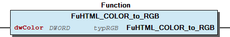
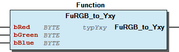

# WagoAppColorConverter v1.0.1.6 (WAGO) - Complete Documentation

## 📋 Library Information

- **Company:** WAGO
- **Title:** WagoAppColorConverter
- **Version:** 1.0.1.6
- **Categories:** WAGO BusinessView|Building Automation; WAGO LayerView|App; Application
- **Author:** WAGO / u014521
- **Placeholder:** WagoAppColorConverter

### Description ¶

This document is automatically generated.

Library for color converter

This document is automatically generated. Library for color converter

### Contents: ¶

Contents: - Documentation Index - Project Information - Library Information - Function Blocks FbCalculateStepFader (FB) - FbChaser (FB) - FbColorCrossFader (FB) - FbColorFader (FB) - FbColorMixer (FB) - FbFadeGenerator (FB) - FbRecallColorPalette (FB) - FbSEQ_GEN (FB) - FbSaveColorPalette (FB) Functions - FuCOLOR_to_RGB (FUN) - FuHTML_COLOR_to_RGB (FUN) - FuRGB_to_COLOR (FUN) - FuRGB_to_HTML_COLOR (FUN) - FuRGB_to_TEMP (FUN) - FuRGB_to_XYZ (FUN) - FuRGB_to_Yxy (FUN) - FuTEMP_to_RGB (FUN) - FuTRGB_to_COLOR (FUN) - FuTypRGB (FUN) - ... and 6 more Program Organization Internal Components Global Variable Lists Other Components - 01 Color palate - 01 Effects / Effekte - 01 HTML - 01 RGB Yxy - 02 Codesys - 02 Colour space converter / Farbraum Umwandler - 02 Fade - 02 RGB XYZ - 03 Cross fader - 03 General Function / Allgemeine Funktion - ... and 10 more

### Indices and tables ¶

Based on WagoAppColorConverter.library, last modified 20.09.2024, 22:09:05. LibDoc 3.5.16.10

© WAGO GmbH & Co. KG, Germany 2018 – All rights reserved. For the avoidance of doubt, this copyright notice does not only apply to the information above but also and primarily to the described library itself. Please note that third-party products are always mentioned without reference to intellectual property rights, including patents, utility models, designs and trademarks, accordingly the existence of such rights cannot be excluded. WAGO is a registered trademark of WAGO Verwaltungsgesellschaft mbH.

- File and Project Information - Library Reference Based on WagoAppColorConverter.library, last modified 20.09.2024, 22:09:05. LibDoc 3.5.16.10 © WAGO GmbH & Co. KG, Germany 2018 – All rights reserved. For the avoidance of doubt, this copyright notice does not only apply to the information above but also and primarily to the described library itself. Please note that third-party products are always mentioned without reference to intellectual property rights, including patents, utility models, designs and trademarks, accordingly the existence of such rights cannot be excluded. WAGO is a registered trademark of WAGO Verwaltungsgesellschaft mbH.

### Documentation Index

## WagoAppColorConverter Library Documentation

| Company: | WAGO |
| Title: | WagoAppColorConverter |
| Version: | 1.0.1.6 |
| Categories: | WAGO BusinessView\|Building Automation; WAGO LayerView\|App; Application |
| Author: | WAGO / u014521 |
| Placeholder: | WagoAppColorConverter |

### Description

This document is automatically generated.

Library for color converter

This document is automatically generated. Library for color converter

### Contents:

- 20 Program Organization Units 01 Effects / Effekte - 02 Colour space converter / Farbraum Umwandler - 03 General Function / Allgemeine Funktion - 04 Color Temperature/ Farbtemperatur - 05 Color format - 80 Data types 90 Internal - FbCalculateStepFader (FB) - FbColorFader (FB) - FbSEQ_GEN (FB) GlobalTextList (Text List) ParameterList (PARAMS) VersionHistory (GVL)

### Indices and tables

Based on WagoAppColorConverter.library, last modified 20.09.2024, 22:09:05. LibDoc 3.5.16.10

© WAGO GmbH & Co. KG, Germany 2018 – All rights reserved. For the avoidance of doubt, this copyright notice does not only apply to the information above but also and primarily to the described library itself. Please note that third-party products are always mentioned without reference to intellectual property rights, including patents, utility models, designs and trademarks, accordingly the existence of such rights cannot be excluded. WAGO is a registered trademark of WAGO Verwaltungsgesellschaft mbH.

- File and Project Information - Library Reference Based on WagoAppColorConverter.library, last modified 20.09.2024, 22:09:05. LibDoc 3.5.16.10 © WAGO GmbH & Co. KG, Germany 2018 – All rights reserved. For the avoidance of doubt, this copyright notice does not only apply to the information above but also and primarily to the described library itself. Please note that third-party products are always mentioned without reference to intellectual property rights, including patents, utility models, designs and trademarks, accordingly the existence of such rights cannot be excluded. WAGO is a registered trademark of WAGO Verwaltungsgesellschaft mbH.

### Project Information

## File and Project Information

| Scope | Name | Type | Content |
| --- | --- | --- | --- |
| FileHeader | libraryFile | string | WagoAppColorConverter.library |
| contentFile | doc.clean.json |
| productName | e!COCKPIT |
| creationDateTime | date | 20.09.2024, 22:09:05 |
| companyName | string | WAGO |
| ProjectInformation | LastModificationDateTime | date | 20.09.2024, 22:09:05 |
| NoPlaceholder | string |  |
| Description | See: Description |
| Copyright | © WAGO Kontakttechnik GmbH & Co. KG, Germany 2018 – All rights reserved. |
| Author | WAGO / u014521 |
| AutoResolveUnbound | bool | True |
| Placeholder | string | WagoAppColorConverter |
| Company | WAGO |
| DocFormat | reStructuredText |
| Project | WagoAppColorConverter |
| DefaultNamespace |  |
| Version | version | 1.0.1.6 |
| Title | string | WagoAppColorConverter |
| LibraryCategories | library-category-list | WAGO BusinessView\|Building Automation; WAGO LayerView\|App; Application |
| CompiledLibraryCompatibilityVersion | string | CODESYS V3.5 SP16 Patch 3 |

### Library Information

## Library Reference

| LinkAllContent: False QualifiedOnly: False | SystemLibrary: False | Optional: False |

| LinkAllContent: False QualifiedOnly: False | SystemLibrary: False | Optional: False |

This is a dictionary of all referenced libraries and their name spaces.

This is a dictionary of all referenced libraries and their name spaces. Standard Library Identification : Placeholder: Standard Default Resolution: Standard, * (System) Namespace: Standard Library Properties : WagoSysVersion Library Identification : Name: WagoSysVersion Version: 1.0.0.0 Company: WAGO Namespace: WagoSysVersion Library Properties :

### Function Blocks

## FbCalculateStepFader (FB)

| Scope | Name | Type | Initial | Comment |
| --- | --- | --- | --- | --- |
| Input | bTargetValue | BYTE |  | Target value |
| tFadeTime | TIME | TIME#1s0ms | Fade time |
| Inout | xRun | BOOL |  | run fading |
| bValue | BYTE |  | Current value |

This function calculates step fader

Graphical Illustration

Interface variables Function This function calculates step fader Graphical Illustration 

## FbChaser (FB)

| Scope | Name | Type | Initial | Comment |
| --- | --- | --- | --- | --- |
| Input | xEnable | BOOL |  | Enable the function block |
| xPause | BOOL |  | Pause |
| bChaserValue | BYTE | 255 | chaser value |
| iStartChannel | INT | 1 | start channel, min 1 |
| iEndChannel | INT | MAX_CHASER_CH | end channel, min 2 |
| iOffset | INT | 1 | interval increment, default: 1+ channel at a time |
| tHoldTime | TIME | TIME#500ms | Hold time. Minimim 500ms |
| Inout | abChaserChannel | ARRAY [1..MAX_CHASER_CH] OF BYTE |  | chaser channel values |
| Output | iChannel | INT |  | current active chaser channel |

The FbChaser function block copies the chaser value for a channel (A) to a different chase (B) for a given number of chase channels. The value for channel (A) is then reset to zero. A chaser effect can be created using this function.

Graphical Illustration

Function description

The function block is activated via the xEnable variable. The chaser can be stopped using the xPause variable. The chaser value to be copied is configured at the bChaserValue input. The chaser channel for which the copying process is to be started is assigned at the iStartChannel input. Copying of the chaser value is ended at the iEndChannel channel. The iOffset variable defines the increment for copying to a different channel.

The tDelay delay period indicates the delay or waiting period between each step. Using a rising edge at the xReset input, the contents of the abChaserChannel array can be deleted. The current chaser channel index is displayed at the iChannel output.

Interface variables Function The FbChaser function block copies the chaser value for a channel (A) to a different chase (B) for a given number of chase channels. The value for channel (A) is then reset to zero. A chaser effect can be created using this function. Graphical Illustration  Function description The function block is activated via the xEnable variable. The chaser can be stopped using the xPause variable. The chaser value to be copied is configured at the bChaserValue input. The chaser channel for which the copying process is to be started is assigned at the iStartChannel input. Copying of the chaser value is ended at the iEndChannel channel. The iOffset variable defines the increment for copying to a different channel. The tDelay delay period indicates the delay or waiting period between each step. Using a rising edge at the xReset input, the contents of the abChaserChannel array can be deleted. The current chaser channel index is displayed at the iChannel output.

## FbColorCrossFader (FB)

| Scope | Name | Type | Initial | Comment |
| --- | --- | --- | --- | --- |
| Input | xEnable | BOOL | TRUE | Enable the fucntion block. |
| tFadeTime | TIME | TIME#1s0ms | Fade time |
| tHoldTime | TIME | TIME#2s0ms | Hold time |
| xToAndFro | BOOL |  | Sequence moves to and fro |
| iNumberOfColors | INT | 10 | Number of Colors to cross fade. Min=2 Color, Max = 10 Colors |
| typColor_1 | typRGB |  | Color 1 |
| typColor_2 | typRGB |  | Color 2 |
| typColor_3 | typRGB |  | Color 3 |
| typColor_4 | typRGB |  | Color 4 |
| typColor_5 | typRGB |  | Color 5 |
| typColor_6 | typRGB |  | Color 6 |
| typColor_7 | typRGB |  | Color 7 |
| typColor_8 | typRGB |  | Color 8 |
| typColor_9 | typRGB |  | Color 9 |
| typColor_10 | typRGB |  | Color 10 |
| Inout | typRGB | typRGB |  | current RGB value |
| Output | iIndex | INT |  | current Color |

A cross fade sequence can be generated using the FbColorCrossFader function block. Cross fade up to 10 Colors. The sequence can be run in two ways namely: #. Repeat: the sequence of Colors repeats itself #. to and fro: the sequence of Colors moves to and fro

Graphical Illustration

Function description

The sequence is activated via the xEnable input. Cross fading between the sequences is defined by the tFadeTime delay time. The hold time of the recalled color is assigned at the tHoldTime input. The fade sequence colors can be configured via the typColour_1 to typColour_10 inputs. The number of fade sequence colors is defined at the iNumberOfColours input.

A TRUE signal at the xToAndFro input activates a cross fade sequence that runs continuously back and forth. A FALSE must be configured at the input if the fade sequence is to start over from the beginning when a maximum number of fade sequence colors is reached.

The color is displayed in the typRGB variable. The current color index is displayed at the iIndex output.

Interface variables Function A cross fade sequence can be generated using the FbColorCrossFader function block. Cross fade up to 10 Colors. The sequence can be run in two ways namely: #. Repeat: the sequence of Colors repeats itself #. to and fro: the sequence of Colors moves to and fro Graphical Illustration  Function description The sequence is activated via the xEnable input. Cross fading between the sequences is defined by the tFadeTime delay time. The hold time of the recalled color is assigned at the tHoldTime input. The fade sequence colors can be configured via the typColour_1 to typColour_10 inputs. The number of fade sequence colors is defined at the iNumberOfColours input. A TRUE signal at the xToAndFro input activates a cross fade sequence that runs continuously back and forth. A FALSE must be configured at the input if the fade sequence is to start over from the beginning when a maximum number of fade sequence colors is reached. The color is displayed in the typRGB variable. The current color index is displayed at the iIndex output.

## FbColorFader (FB)

| Scope | Name | Type | Initial | Comment |
| --- | --- | --- | --- | --- |
| Input | typTargetRGB | typRGB |  | target RGB value |
| tFadeTime | TIME | TIME#1s0ms | Fade time |
| Inout | xStart | BOOL |  | start fading |
| typRGB | typRGB |  | current RGB value |

Color fader for single RGB Color

Graphical Illustration

Interface variables Function Color fader for single RGB Color Graphical Illustration 

## FbColorMixer (FB)

| Scope | Name | Type | Comment |
| --- | --- | --- | --- |
| Input | bRed | BYTE | Red value |
| bGreen | BYTE | Green value |
| bBlue | BYTE | Blue value |
| xWrite | BOOL | Positive edge->write the value |
| xAutoWrite | BOOL | if TRUE-> the values will be written by value change |
| Inout | typRGB | typRGB | RGB value |

The FbColorMixer function block is used for setting the color of an RGB light.

Color mixer

Graphical Illustration

Function description

The respective color components are specified by the bRed , bGreen and bBlue inputs. The values are transmitted to typRGB by a rising edge at the Write input.

If the AutoWrite input variable is set to TRUE, the inputs bRed , bGreen and bBlue are monitored for value shifting. As soon as a value changes, it is transmitted to typRGB . The color is displayed at the dwColour output. Representation is as a hexadecimal character in the order B (Blue) G (Green) R (Red). Yellow, for example, in this form has the value 16#00FFFF and white the value 16#FFFFFF.

Interface variables Function The FbColorMixer function block is used for setting the color of an RGB light. Color mixer Graphical Illustration  Function description The respective color components are specified by the bRed , bGreen and bBlue inputs. The values are transmitted to typRGB by a rising edge at the Write input. If the AutoWrite input variable is set to TRUE, the inputs bRed , bGreen and bBlue are monitored for value shifting. As soon as a value changes, it is transmitted to typRGB . The color is displayed at the dwColour output. Representation is as a hexadecimal character in the order B (Blue) G (Green) R (Red). Yellow, for example, in this form has the value 16#00FFFF and white the value 16#FFFFFF.

## FbFadeGenerator (FB)

| Scope | Name | Type | Initial | Comment |
| --- | --- | --- | --- | --- |
| Input | xEnable | BOOL |  | Enable the fucntion block |
| tPeriod | TIME | TIME#5s0ms | Period in s. Min t#1s |
| bMaximumValue | BYTE | 255 | Maximum value |
| xTriangle | BOOL | TRUE | Fades pattern: Triangle (Default) |
| xSquare | BOOL |  | Fades pattern: Square |
| xSawtoothRise | BOOL |  | Fades pattern: Sawtooth rise |
| xSawtoothFall | BOOL |  | Fades pattern: Sawtooth fall |
| Inout | bFadeValue | BYTE |  | fade values |

A light scene can be generated using the FbFadeGenerator function block. This function block generates fade value.

Graphical Illustration

Function description

The function block is activated via the xEnable variable. The tPeriod input defines the duration of the light scene. The bMaximumValue defines the maximum achievable value for the light scene.

If one of the following variables is set to TRUE, the corresponding function is generated: #. Triangle #. Square #. Sawtooth rise #. Sawtooth fall

Interface variables Function A light scene can be generated using the FbFadeGenerator function block. This function block generates fade value. Graphical Illustration  Function description The function block is activated via the xEnable variable. The tPeriod input defines the duration of the light scene. The bMaximumValue defines the maximum achievable value for the light scene. If one of the following variables is set to TRUE, the corresponding function is generated: #. Triangle #. Square #. Sawtooth rise #. Sawtooth fall

## FbRecallColorPalette (FB)

| Scope | Name | Type | Comment |
| --- | --- | --- | --- |
| Input | atypRGB | ARRAY [1..10] OF typRGB | Color palate in RGB format |
| xRecallColor_1 | BOOL | recall Color 1 |
| xRecallColor_2 | BOOL | recall Color 2 |
| xRecallColor_3 | BOOL | recall Color 3 |
| xRecallColor_4 | BOOL | recall Color 4 |
| xRecallColor_5 | BOOL | recall Color 5 |
| xRecallColor_6 | BOOL | recall Color 6 |
| xRecallColor_7 | BOOL | recall Color 7 |
| xRecallColor_8 | BOOL | recall Color 8 |
| xRecallColor_9 | BOOL | recall Color 9 |
| xRecallColor_10 | BOOL | recall Color 10 |
| Inout | typRGB | typRGB | recalled RGB value |
| Output | bIndex | BYTE | Current index |

Using the FbRecallColorPalette function block, stored color palettes can be called from the atypRGB array. Recall up to 10 Colors and assigned its value to addressed RGB.

Graphical Illustration

Function description

The atypRGB input can be linked with the variables of the same name of the FbSaveColourPalette function block and contains the stored color palettes. At a rising edge at the xRecallColour_1 to xRecallColour_10 inputs, the color palettes are called up from the corresponding element of the atypRGB array.

The color is displayed at the dwColour output. Representation is as a hexadecimal character in the order B (Blue) G (Green) R (Red). Yellow, for example, in this form has the value 16#00FFFF and white the value 16#FFFFFF. The current color index is displayed at the bIndex output.

Interface variables Function Using the FbRecallColorPalette function block, stored color palettes can be called from the atypRGB array. Recall up to 10 Colors and assigned its value to addressed RGB. Graphical Illustration  Function description The atypRGB input can be linked with the variables of the same name of the FbSaveColourPalette function block and contains the stored color palettes. At a rising edge at the xRecallColour_1 to xRecallColour_10 inputs, the color palettes are called up from the corresponding element of the atypRGB array. The color is displayed at the dwColour output. Representation is as a hexadecimal character in the order B (Blue) G (Green) R (Red). Yellow, for example, in this form has the value 16#00FFFF and white the value 16#FFFFFF. The current color index is displayed at the bIndex output.

## FbSEQ_GEN (FB)

| Scope | Name | Type | Initial | Comment |
| --- | --- | --- | --- | --- |
| Input | iMODE | INT |  | define type : 0:TRIANGLE triangular from - AMPL. to + AMPL. 1: TRIANGLE_POS triangular from 0 to AMPL. 2:SAWTOOTH_RISE sawtooth increasing from -AMPL. to +AMPL. 3:SAWTOOTH_FALL sawtooth decreasing from AMPL to -AMPL 4:RECTANGLE rectangular switching from -AMPL. to +AMPL 5:SINUS sinus 6: COSINUS cosinus |
| xBASE | BOOL |  | FALSE: period referring to call; TRUE: period referring to time |
| tPERIOD | TIME | TIME#1s0ms | period time, only relevant if BASE=TRUE |
| iCYCLES | INT | 1000 | number of calls per period, only relevant if BASE=FALSE |
| iAMPLITUDE | INT |  | amplitude |
| xRESET | BOOL |  | reset |
| Output | iOUT | INT |  | generated function variable |

function block for generating some periodic functions. Taken from util.lib

Graphical Illustration

Interface variables Function function block for generating some periodic functions. Taken from util.lib Graphical Illustration 

## FbSaveColorPalette (FB)

| Scope | Name | Type | Comment |
| --- | --- | --- | --- |
| Input | bRed | BYTE | Red value |
| bGreen | BYTE | Green value |
| bBlue | BYTE | Blue value |
| xColor_1 | BOOL | saved Color 1 |
| xColor_2 | BOOL | saved Color 2 |
| xColor_3 | BOOL | saved Color 3 |
| xColor_4 | BOOL | saved Color 4 |
| xColor_5 | BOOL | saved Color 5 |
| xColor_6 | BOOL | saved Color 6 |
| xColor_7 | BOOL | saved Color 7 |
| xColor_8 | BOOL | saved Color 8 |
| xColor_9 | BOOL | saved Color 9 |
| xColor_10 | BOOL | saved Color 10 |
| xReset | BOOL | Reset all Colors |
| Inout | atypRGB | ARRAY [1..10] OF typRGB | Color palate in RGB format |
| Output | bIndex | BYTE | Current index |

Ten (10) color palettes can be stored using the FbSaveColorPalette function block.

Graphical Illustration

Function description

The respective color palette can be configured via the bRed , bGreen and bBlue inputs. At a rising edge at the xColour_1 to xColour_10 inputs, the color palette is saved in the corresponding element of the atypRGB array.

Using a rising edge at the xReset input, the contents of the atypRGB array can be deleted.

The color is displayed at the dwColour output. Representation is as a hexadecimal character in the order B (Blue) G (Green) R (Red). Yellow, for example, in this form has the value 16#00FFFF and white the value 16#FFFFFF. The current color index is displayed at the bIndex output.

The variables at the atypRGB input should be declared as RETAIN PERSISTENT so that the list of color palettes is retained after a controller reset and after a download.

Interface variables Function Ten (10) color palettes can be stored using the FbSaveColorPalette function block. Graphical Illustration  Function description The respective color palette can be configured via the bRed , bGreen and bBlue inputs. At a rising edge at the xColour_1 to xColour_10 inputs, the color palette is saved in the corresponding element of the atypRGB array. Using a rising edge at the xReset input, the contents of the atypRGB array can be deleted. The color is displayed at the dwColour output. Representation is as a hexadecimal character in the order B (Blue) G (Green) R (Red). Yellow, for example, in this form has the value 16#00FFFF and white the value 16#FFFFFF. The current color index is displayed at the bIndex output. Note The variables at the atypRGB input should be declared as RETAIN PERSISTENT so that the list of color palettes is retained after a controller reset and after a download.

### Functions

## FuCOLOR_to_RGB (FUN)

| Scope | Name | Type | Comment |
| --- | --- | --- | --- |
| Return | FuCOLOR_to_RGB | typRGB |  |
| Input | dwColor | DWORD | Color in DWORD format 16#BBGGRR |

The function converts the CODESYS color format into RGB values.

The input color is in DWORD format 16#RRGGBB.

Graphical Illustration

Interface variables Function The function converts the CODESYS color format into RGB values. The input color is in DWORD format 16#RRGGBB. Graphical Illustration 

## FuHTML_COLOR_to_RGB (FUN)

| Scope | Name | Type | Comment |
| --- | --- | --- | --- |
| Return | FuHTML_COLOR_to_RGB | typRGB |  |
| Input | dwColor | DWORD | color in DWORD format 16#RRGGBB |

The function converts the HTML color format into RGB values.

The input Color is in HTML color code format 16#RRGGBB.

Graphical Illustration

Interface variables Function The function converts the HTML color format into RGB values. The input Color is in HTML color code format 16#RRGGBB. Graphical Illustration 

## FuRGB_to_COLOR (FUN)

| Scope | Name | Type |
| --- | --- | --- |
| Return | FuRGB_to_COLOR | DWORD |
| Input | bRed | BYTE |
| bGreen | BYTE |
| bBlue | BYTE |

Combine byte value of Red, Green and Blue into a Color coded value. The Color is in Codesys DWORD format 16#RRGGBB. Transparency is not supported for this function and set to non transparence.

The return value can be used as Fill Color in visualisation.

Graphical Illustration

Interface variables Function Combine byte value of Red, Green and Blue into a Color coded value. The Color is in Codesys DWORD format 16#RRGGBB. Transparency is not supported for this function and set to non transparence. The return value can be used as Fill Color in visualisation. Graphical Illustration 

## FuRGB_to_HTML_COLOR (FUN)

| Scope | Name | Type |
| --- | --- | --- |
| Return | FuRGB_to_HTML_COLOR | DWORD |
| Input | bRed | BYTE |
| bGreen | BYTE |
| bBlue | BYTE |

The function converts RGB values into the HTML color format. Combine byte value of Red, Green and Blue into a coded Color value.

The Color is in HTML Color code format 16#RRGGBB.

Graphical Illustration

Interface variables Function The function converts RGB values into the HTML color format. Combine byte value of Red, Green and Blue into a coded Color value. The Color is in HTML Color code format 16#RRGGBB. Graphical Illustration 

## FuRGB_to_TEMP (FUN)

| Scope | Name | Type | Comment |
| --- | --- | --- | --- |
| Return | FuRGB_to_TEMP | REAL |  |
| Input | bRed | BYTE | Red value |
| bGreen | BYTE | Green value |
| bBlue | BYTE | Blue value |

The function converts an RGB color space into a color temperature in Kelvin.

Graphical Illustration

Interface variables Function The function converts an RGB color space into a color temperature in Kelvin. Graphical Illustration 

## FuRGB_to_XYZ (FUN)

| Scope | Name | Type | Comment |
| --- | --- | --- | --- |
| Return | FuRGB_to_XYZ | typXYZ |  |
| Input | bRed | BYTE | Red value |
| bGreen | BYTE | Green value |
| bBlue | BYTE | Blue value |

The function block converts an RGB color space into a CIE XYZ color space.

Graphical Illustration

Interface variables Function The function block converts an RGB color space into a CIE XYZ color space. Graphical Illustration 

## FuRGB_to_Yxy (FUN)

| Scope | Name | Type | Comment |
| --- | --- | --- | --- |
| Return | FuRGB_to_Yxy | typYxy |  |
| Input | bRed | BYTE | Red value |
| bGreen | BYTE | Green value |
| bBlue | BYTE | Blue value |

The function block converts an RGB color space into a CIE Yxy color space.

Graphical Illustration

Interface variables Function The function block converts an RGB color space into a CIE Yxy color space. Graphical Illustration 

## FuTEMP_to_RGB (FUN)

| Scope | Name | Type | Comment |
| --- | --- | --- | --- |
| Return | FuTEMP_to_RGB | typRGB |  |
| Input | rTemperature | REAL | Color temperature in KELVIN |

The function converts a color temperature in Kelvin into an RGB color space.

Graphical Illustration

Interface variables Function The function converts a color temperature in Kelvin into an RGB color space. Graphical Illustration 

## FuTRGB_to_COLOR (FUN)

| Scope | Name | Type | Comment |
| --- | --- | --- | --- |
| Return | FuTRGB_to_COLOR | DWORD |  |
| Input | bRed | BYTE |  |
| bGreen | BYTE |  |
| bBlue | BYTE |  |
| bTransparency | BYTE | 0 = full transparence, 255 = non transparence |

Combine byte value of Red, Green, Blue and Transparency into a Color coded value. The Color is in Codesys DWORD format 16#TTRRGGBB.

The return value can be used as Fill Color in visualisation.

Graphical Illustration

Graphical Interface of FuTRGB_to_COLOR

Interface variables Function Combine byte value of Red, Green, Blue and Transparency into a Color coded value. The Color is in Codesys DWORD format 16#TTRRGGBB. The return value can be used as Fill Color in visualisation. Graphical Illustration  Graphical Interface of FuTRGB_to_COLOR

## FuTypRGB (FUN)

| Scope | Name | Type | Comment |
| --- | --- | --- | --- |
| Return | FuTypRGB | typRGB |  |
| Input | bRed | BYTE | Red value |
| bGreen | BYTE | Green value |
| bBlue | BYTE | Blue value |

The function returns RGB values as type typRGB .

Graphical Illustration

Interface variables Function The function returns RGB values as type typRGB . Graphical Illustration 

## FuTypXYZ (FUN)

| Scope | Name | Type | Comment |
| --- | --- | --- | --- |
| Return | FuTypXYZ | typXYZ |  |
| Input | rX | REAL | X coordinate |
| rY | REAL | Y coordinate |
| rZ | REAL | Z coordinate |

The function returns CIE XYZ values as type typXY .

Graphical Illustration

Interface variables Function The function returns CIE XYZ values as type typXY . Graphical Illustration 

## FuTypYxy (FUN)

| Scope | Name | Type | Comment |
| --- | --- | --- | --- |
| Return | FuTypYxy | typYxy |  |
| Input | rLuminance_Y | REAL | illuminace Y |
| rCoordinate_x | REAL | x coordinate |
| rCoordinate_y | REAL | Y coordinate |

The function returns CIE Yxy values as type typYxy .

Graphical Illustration

Interface variables Function The function returns CIE Yxy values as type typYxy . Graphical Illustration 

## FuXYZ_to_RGB (FUN)

| Scope | Name | Type | Comment |
| --- | --- | --- | --- |
| Return | FuXYZ_to_RGB | typRGB |  |
| Input | rX | REAL | X coordinate |
| rY | REAL | Y coordinate |
| rZ | REAL | Z coordinate |

The function block converts a CIE XYZ color space into an RGB color space.

Observer. = 2°, Illuminant = D65

Graphical Illustration

Interface variables Function The function block converts a CIE XYZ color space into an RGB color space. Observer. = 2°, Illuminant = D65 Graphical Illustration 

## FuXYZ_to_Yxy (FUN)

| Scope | Name | Type | Comment |
| --- | --- | --- | --- |
| Return | FuXYZ_to_Yxy | typYxy |  |
| Input | rX | REAL | X coordinate |
| rY | REAL | Y coordinate |
| rZ | REAL | Z coordinate |

The function block converts a CIE XYZ color space into an CIE Yxy color space.

Observer. = 2°, Illuminant = D65

Graphical Illustration

Interface variables Function The function block converts a CIE XYZ color space into an CIE Yxy color space. Observer. = 2°, Illuminant = D65 Graphical Illustration 

## FuYxy_to_RGB (FUN)

| Scope | Name | Type | Comment |
| --- | --- | --- | --- |
| Return | FuYxy_to_RGB | typRGB |  |
| Input | rLuminance_Y | REAL | illuminace Y |
| rCoordinate_x | REAL | x coordinate |
| rCoordinate_y | REAL | Y coordinate |

The function block converts a CIE Yxy color space into an RGB color space.

Graphical Illustration

Interface variables Function The function block converts a CIE Yxy color space into an RGB color space. Graphical Illustration 

## FuYxy_to_XYZ (FUN)

| Scope | Name | Type | Comment |
| --- | --- | --- | --- |
| Return | FuYxy_to_XYZ | typXYZ |  |
| Input | rLuminance_Y | REAL | illuminace Y |
| rCoordinate_x | REAL | x coordinate |
| rCoordinate_y | REAL | Y coordinate |

The function block converts a CIE Yxy color space into a CIE XYZ color space.

Observer. = 2°, Illuminant = D65

Graphical Illustration

Interface variables Function The function block converts a CIE Yxy color space into a CIE XYZ color space. Observer. = 2°, Illuminant = D65 Graphical Illustration 

### Program Organization

## 20 Program Organization Units

- 01 Effects / Effekte 01 Color palate FbColorMixer (FB) - FbRecallColorPalette (FB) - FbSaveColorPalette (FB) 02 Fade - FbFadeGenerator (FB) 03 Cross fader - FbColorCrossFader (FB) 04 Chaser - FbChaser (FB) 02 Colour space converter / Farbraum Umwandler - 01 RGB Yxy FuRGB_to_Yxy (FUN) - FuYxy_to_RGB (FUN) 02 RGB XYZ - FuRGB_to_XYZ (FUN) - FuXYZ_to_RGB (FUN) 03 XYZ Yxy - FuXYZ_to_Yxy (FUN) - FuYxy_to_XYZ (FUN) 03 General Function / Allgemeine Funktion - FuTypRGB (FUN) - FuTypXYZ (FUN) - FuTypYxy (FUN) 04 Color Temperature/ Farbtemperatur - FuRGB_to_TEMP (FUN) - FuTEMP_to_RGB (FUN) 05 Color format - 01 HTML FuHTML_COLOR_to_RGB (FUN) - FuRGB_to_HTML_COLOR (FUN) 02 Codesys - FuCOLOR_to_RGB (FUN) - FuRGB_to_COLOR (FUN) - FuTRGB_to_COLOR (FUN) 80 Data types - typRGB (STRUCT) - typXYZ (STRUCT) - typYxy (STRUCT)

### Internal Components

## 90 Internal

- FbCalculateStepFader (FB) - FbColorFader (FB) - FbSEQ_GEN (FB)

### Global Variable Lists

## VersionHistory (GVL)

| Name | Type |
| --- | --- |
| Info | ProjectInfo |

| date | version | author | change |
| 09.09.2024 | 1.0.1.6 | u010188 | Rename functions with keyword “TO” (capital letters) into lowercase “to” |
| 09.08.2023 | 1.0.1.5 | u015842 | 32- and 64-Bit |
| 06.12.2021 | 1.0.1.4 | u015842 | FuTRGB_TO_COLOR added to support transparency. FuRGB_TO_COLOR set transparency to FF. |
| 21.05.2021 | 1.0.1.3 | u015842 | Bugfix FbFadeGenerator stop fading when disabled. Restart correctly when enabled again. |
| 04.02.2020 | 1.0.1.2 | u015652 | Docu update |
| 06.06.2019 | 1.0.1.1 | u015842 | Bugfix FbFadeGenerator outputs last value when no pattern is activated but enabled |
| 08.01.2019 | 1.0.1.0 | u015842 | Properties: free placeholder added |
| 11.09.2017 | 1.0.0.3 | U015842 | R5 |
| 08.02.2017 | 1.0.0.2 | U015842 | R4 Patch 1 |
| 01.12.2016 | 1.0.0.1 | U014521 | first version (R4) |

WagoAppColorConverter.library

Description: Library for Color converter

WagoAppColorConverter.library Description: Library for Color converter Release Notes:

### Other Components

## 01 Color palate

- FbColorMixer (FB) - FbRecallColorPalette (FB) - FbSaveColorPalette (FB)

## 01 Effects / Effekte

- 01 Color palate FbColorMixer (FB) - FbRecallColorPalette (FB) - FbSaveColorPalette (FB) 02 Fade - FbFadeGenerator (FB) 03 Cross fader - FbColorCrossFader (FB) 04 Chaser - FbChaser (FB)

## 01 HTML

- FuHTML_COLOR_to_RGB (FUN) - FuRGB_to_HTML_COLOR (FUN)

## 01 RGB Yxy ¶

- FuRGB_to_Yxy (FUN) - FuYxy_to_RGB (FUN)

## 02 Codesys

- FuCOLOR_to_RGB (FUN) - FuRGB_to_COLOR (FUN) - FuTRGB_to_COLOR (FUN)

## 02 Colour space converter / Farbraum Umwandler

- 01 RGB Yxy FuRGB_to_Yxy (FUN) - FuYxy_to_RGB (FUN) 02 RGB XYZ - FuRGB_to_XYZ (FUN) - FuXYZ_to_RGB (FUN) 03 XYZ Yxy - FuXYZ_to_Yxy (FUN) - FuYxy_to_XYZ (FUN)

## 02 Fade ¶

- FbFadeGenerator (FB)

## 02 RGB XYZ ¶

- FuRGB_to_XYZ (FUN) - FuXYZ_to_RGB (FUN)

## 03 Cross fader ¶

- FbColorCrossFader (FB)

## 03 General Function / Allgemeine Funktion

- FuTypRGB (FUN) - FuTypXYZ (FUN) - FuTypYxy (FUN)

## 03 XYZ Yxy ¶

- FuXYZ_to_Yxy (FUN) - FuYxy_to_XYZ (FUN)

## 04 Chaser ¶

## 04 Color Temperature/ Farbtemperatur

- FuRGB_to_TEMP (FUN) - FuTEMP_to_RGB (FUN)

## 05 Color format

- 01 HTML FuHTML_COLOR_to_RGB (FUN) - FuRGB_to_HTML_COLOR (FUN) 02 Codesys - FuCOLOR_to_RGB (FUN) - FuRGB_to_COLOR (FUN) - FuTRGB_to_COLOR (FUN)

## 80 Data types

- typRGB (STRUCT) - typXYZ (STRUCT) - typYxy (STRUCT)

## GlobalTextList (Text List) ¶

## ParameterList (PARAMS)

| Scope | Name | Type | Initial |
| --- | --- | --- | --- |
| Constant | MAX_CHASER_CH | INT | 50 |
| MIN_STEP_FADER_TIME | TIME | TIME#1s0ms |
| MAX_TASK_CYCLE | DWORD | 1000 |

## typRGB (STRUCT)

| Name | Type | Comment |
| --- | --- | --- |
| bRed | BYTE | Red value |
| bGreen | BYTE | Green value |
| bBlue | BYTE | Blue value |

## typXYZ (STRUCT)

| Name | Type | Comment |
| --- | --- | --- |
| rX | REAL | X coordinate |
| rY | REAL | Y coordinate |
| rZ | REAL | Z coordinate |

## typYxy (STRUCT)

| Name | Type | Comment |
| --- | --- | --- |
| rLuminance_Y | REAL | Illuminace Y |
| rCoordinate_x | REAL | x coordinate |
| rCoordinate_y | REAL | Y coordinate |