# WagoAppCom v1.7.1.2 (WAGO) - Complete Documentation


### Documentation Index


## 10 Documentation ¶


WAGO LayerView|App; WAGO Internal|Feature|Common|Com; Application; WAGO FunctionalView|Connectivity|Serial

WAGO / u013972

This document is automatically generated.

This library provides function blocks for handling serial interfaces.

Based on WagoAppCom.library, last modified 15.05.2023, 17:29:17. LibDoc 4.1.1.0

© WAGO GmbH & Co. KG, Germany 2018 – All rights reserved. For the avoidance of doubt, this copyright notice does not only apply to the information above but also and primarily to the described library itself. Please note that third-party products are always mentioned without reference to intellectual property rights, including patents, utility models, designs and trademarks, accordingly the existence of such rights cannot be excluded. WAGO is a registered trademark of WAGO Verwaltungsgesellschaft mbH.

- doc10_General (FunctionBlock) Company WAGO Title WagoAppCom Version 1.7.1.2 Categories WAGO LayerView|App; WAGO Internal|Feature|Common|Com; Application; WAGO FunctionalView|Connectivity|Serial Author WAGO / u013972 Placeholder WagoAppCom This document is automatically generated. This library provides function blocks for handling serial interfaces. - 10 Documentation doc10_General (FunctionBlock) 20 Program Organization Units - 10 Compact - 20 Modular - 30 Base LibraryResult (GVL) ParameterList (ParamList) ResultItems (GVL) VersionHistory (GVL) - File and Project Information - Library Reference Based on WagoAppCom.library, last modified 15.05.2023, 17:29:17. LibDoc 4.1.1.0 © WAGO GmbH & Co. KG, Germany 2018 – All rights reserved. For the avoidance of doubt, this copyright notice does not only apply to the information above but also and primarily to the described library itself. Please note that third-party products are always mentioned without reference to intellectual property rights, including patents, utility models, designs and trademarks, accordingly the existence of such rights cannot be excluded. WAGO is a registered trademark of WAGO Verwaltungsgesellschaft mbH.

### Project Information


| Scope | Name | Type | Content |
| --- | --- | --- | --- |
| FileHeader | creationDateTime | date | 15.05.2023, 17:29:18 |
| companyName | string | WAGO |
| libraryFile | string | WagoAppCom.library |
| productName | string | e!COCKPIT |
| contentFile | string | doc.clean.json |
| ProjectInformation | AutoResolveUnbound | bool | True |
| ProjectInformation | LastModificationDateTime | 15.05.2023, 17:29:17 |
| ProjectInformation | LibraryCategories | library-category-list | WAGO LayerView\|App; WAGO Internal\|Feature\|Common\|Com; Application; WAGO FunctionalView\|Connectivity\|Serial |
| ProjectInformation | Author | string | WAGO / u013972 |
| ProjectInformation | Company | string | WAGO |
| ProjectInformation | Copyright | string | © WAGO Kontakttechnik GmbH & Co. KG, Germany 2018 – All rights reserved. |
| ProjectInformation | DefaultNamespace | string |  |
| ProjectInformation | Description | string | See: Description |
| ProjectInformation | DocFormat | string | reStructuredText |
| ProjectInformation | Placeholder | string | WagoAppCom |
| ProjectInformation | Project | string | WagoAppCom |
| ProjectInformation | Title | string | WagoAppCom |
| ProjectInformation | Version | version | 1.7.1.2 |

### Library Information


| LinkAllContent: False Optional: False | QualifiedOnly: False | SystemLibrary: False |

| LinkAllContent: False Optional: False | PublishSymbolsInContainer: True QualifiedOnly: False | SystemLibrary: False |

| LinkAllContent: False Optional: False | QualifiedOnly: False | SystemLibrary: False |

| LinkAllContent: False Optional: False | QualifiedOnly: False | SystemLibrary: False |

| LinkAllContent: False Optional: False | QualifiedOnly: False | SystemLibrary: False |

| LinkAllContent: False Optional: False | QualifiedOnly: False | SystemLibrary: False |

| LinkAllContent: False Optional: False | PublishSymbolsInContainer: True QualifiedOnly: False | SystemLibrary: False |

| LinkAllContent: False Optional: False | QualifiedOnly: False | SystemLibrary: False |

| LinkAllContent: False Optional: False | PublishSymbolsInContainer: True QualifiedOnly: False | SystemLibrary: False |

This is a dictionary of all referenced libraries and their name spaces.

This is a dictionary of all referenced libraries and their name spaces. WagoSysBehaviourModels Library Identification : Placeholder: WagoSysBehaviourModels Default Resolution: WagoSysBehaviourModels, * (WAGO) Namespace: WagoSysBehaviourModels Library Properties : WagoSysErrorBase Library Identification : Placeholder: WagoSysErrorBase Default Resolution: WagoSysErrorBase, * (WAGO) Namespace: WagoSysErrorBase Library Properties : Library Parameter : Parameter: RES_LOG_MAX_ENTRIES = 200 Parameter: RES_LOG_MAX_FILES = 1 Parameter: RES_LOG_MAX_FILESIZE = 2000 Parameter: RES_LOG_NAME = ‘WagoAppResultLogger’ WagoSysPlainMem Library Identification : Placeholder: WagoSysPlainMem Default Resolution: WagoSysPlainMem, * (WAGO) Namespace: WagoSysPlainMem Library Properties : WagoSysTypedefs_Internal_32Bit Library Identification : Placeholder: WagoSysTypedefsInternal Default Resolution: WagoSysTypedefs_Internal_32Bit, * (WAGO) Namespace: WagoTypesInternal Library Properties : WagoSysVersion Library Identification : Name: WagoSysVersion Version: 1.0.0.0 Company: WAGO Namespace: WagoSysVersion Library Properties : WagoSysVirtualBuffer Library Identification : Placeholder: WagoSysVirtualBuffer Default Resolution: WagoSysVirtualBuffer, * (WAGO) Namespace: WagoSysVirtualBuffer Library Properties : WagoTypesCom Library Identification : Placeholder: WagoTypesCom Default Resolution: WagoTypesCom, * (WAGO) Namespace: WagoTypesCom Library Properties : WagoTypesCommon Library Identification : Placeholder: WagoTypesCommon Default Resolution: WagoTypesCommon, * (WAGO) Namespace: WagoTypes Library Properties : Library Parameter : Parameter: MAX_STRING_LENGTH = 255 Parameter: MAX_WSTRING_LENGTH = 255 WagoTypesErrorBase Library Identification : Placeholder: WagoTypesErrorBase Default Resolution: WagoTypesErrorBase, * (WAGO) Namespace: WagoTypesErrorBase Library Properties :

### Function Blocks


| Scope | Name | Type | Comment |
| --- | --- | --- | --- |
| Input | xEnable | BOOL | activate data exchange mode |
| I_Port | WagoTypesCom.I_WagoDataExchangeModule |  |
| Output | xIsEnabled | BOOL | TRUE -> data exchange mode is active |
| Output | usiModuleSize | USINT | size of the module at pa |
| abInputData | POINTER TO BYTE | data from the remote module -> array[n..m] of byte |
| abOutputData | POINTER TO BYTE | data to the remote module -> array[n..m] of byte |

| Scope | Name | Type | Comment |
| --- | --- | --- | --- |
| Output | xBusy | BOOL | FB is in some transient state and cannot react to requests |

This FB supports the data exchange mode for modules 652 and 1652

Graphical Illustration

Graphical Interface of FbDataExchangeMode

Function Description

This is the fundamental FB of this library.

Graphical Illustration

Graphical Interface of FbSerialInterface

Function Description

Each open FB represents a physical serial interface (‘SI’).

Multiple FBs may share one physical serial interface, but in that case they must not be open simultaneously, i.e. if the SI is opened by one application, it cannot be opened once more until the first open() has been close()d again.

In normal operation, the serial interfaces do not have to be closed again, as they will be used throughout the runtime of the machine. When encountering situations such as online-change, however, the used interfaces have to be closed() and re-opened again, as otherwise OS resources might stay blocked.

Interface variables Function This FB supports the data exchange mode for modules 652 and 1652 Graphical Illustration 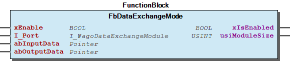 Graphical Interface of FbDataExchangeMode Function Description Interface variables Function This is the fundamental FB of this library. Graphical Illustration 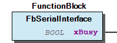 Graphical Interface of FbSerialInterface Function Description Each open FB represents a physical serial interface (‘SI’). Multiple FBs may share one physical serial interface, but in that case they must not be open simultaneously, i.e. if the SI is opened by one application, it cannot be opened once more until the first open() has been close()d again. In normal operation, the serial interfaces do not have to be closed again, as they will be used throughout the runtime of the machine. When encountering situations such as online-change, however, the used interfaces have to be closed() and re-opened again, as otherwise OS resources might stay blocked. - 01-Main-Interface AttachReadBuffer (Method) - AttachWriteBuffer (Method) - Close (Method) - DeferredResult (Property) - OpenAndConfigure (Method) - Read (Method) - Write (Method) - isConnected (Property) - nReadyForWrite (Property) - nReceiveDataArrived (Property) 02-Administration - GetErrorObject (Method) - finish (Method) - initialize (Method) 03-Flow-Control-and-Recovery - ClearRxBuffer (Method) - ClearTxBuffer (Method) - ErrorCondition (Property) - IgnoreIncomingData (Method) - IsTransmitterEmpty (Method) - ResetErrors (Method) - ResumeOperation (Method) - SetBusyState (Method) - nBytesInTxBuffer (Property) 04-Hardware-Lines - GetLineState (Method) - IsLineAvailable (Method) - SetLineState (Method)

## FbSerialInterface_Close_mod (FB)


| Scope | Name | Type | Comment | Inherited from |
| --- | --- | --- | --- | --- |
| Output | oStatus | FbResult | Status object (see WagoSysErrorBase). | FbBehaviourModel_oStatus_Base |
| Input | xExecute | BOOL | Triggers the execution of the action. | FbBehaviourModel_WagoAppExecute |
| xError | BOOL | Indicates that an error has occurred. | FbBehaviourModel_WagoAppExecute |
| xDone | BOOL | Successful completion of the action. | FbBehaviourModel_WagoAppExecute |
| xBusy | BOOL | Action is still in progress. | FbBehaviourModel_WagoAppExecute |
| Inout | Connection | FbSerialInterface | connect this to one single instance of FbSerialInterface |  |

| eStatus |
| 0 | Success, ready for communication. |
| EBADF | The FB was not open |
| ENOTTY | The serial Interface was attached exclusively to a different FB |

This closes a serial connection.

Graphical Illustration

Graphical Interface of FbSerialInterface_Close_mod

Function Description

This Fb implements the behaviour model ‘WagoExecute’ for closing a serial channel.

Interface variables Function This closes a serial connection. Graphical Illustration 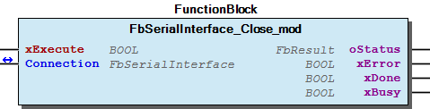 Graphical Interface of FbSerialInterface_Close_mod Function Description This Fb implements the behaviour model ‘WagoExecute’ for closing a serial channel.

## FbSerialInterface_Open_mod (FB)


| Scope | Name | Type | Comment | Inherited from |
| --- | --- | --- | --- | --- |
| Output | oStatus | FbResult | Status object (see WagoSysErrorBase). | FbBehaviourModel_oStatus_Base |
| Input | xExecute | BOOL | Triggers the execution of the action. | FbBehaviourModel_WagoAppExecute |
| xError | BOOL | Indicates that an error has occurred. | FbBehaviourModel_WagoAppExecute |
| xDone | BOOL | Successful completion of the action. | FbBehaviourModel_WagoAppExecute |
| xBusy | BOOL | Action is still in progress. | FbBehaviourModel_WagoAppExecute |
| Inout | Connection | FbSerialInterface | connect this to one single instance of FbSerialInterface |  |
| Input | I_Port | WagoTypesCom.I_WagoSysComBase | Instance of the Interface (e.g. COM1) |  |
| Input | udiBaudrate | UDINT | Baudrate (9600 = 9k6) |  |
| Input | usiDataBits | USINT | Number of Bits per frame (5..8) |  |
| Input | eParity | WagoTypesCom.eTTYParity | Parity |  |
| Input | eStopBits | WagoTypesCom.eTTYStopBits | Number of Stop-Bits, see note (1) |  |
| Input | eHandshake | WagoTypesCom.eTTYHandshake | TYPE of handshake (XON/XOFF, etc) |  |
| Input | ePhysical | WagoTypesCom.eTTYPhysicalLayer | RS232, RS422, RS485, etc |  |

| eStatus |
| 0 | Success, ready for communication. |
| ENOTTY | The serial interface does not exist or is already attached by another FB |
| ENOPROTOOPT | Configuration options not available for this device (e.g. hardware handshake) |
| EINVAL | Invalid parameters |
| EBUSY | Double open() with different device names (close previous device first) |
| EAGAIN | The device is busy with other blocking operation, e.g. clearBuffers() |

This opens a serial connection.

Graphical Illustration

Graphical Interface of FbSerialInterface_Open_mod

Function Description

This Fb implements the behaviour model ‘WagoExecute’ for the process of opening a serial channel.

For operation, an instance of FbSerialInterface (FB) has to be declared and assigned to the in-out variable ‘Connection’. When using the corresponding FBs ‘Close_mod(FB)’, ‘Read_mod(FB)’, or ‘Write_mod(FB)’, all these Fbs MUST be connected to the same instance of FbSerialInterface (which may be regarded as a kind of ‘handle’ for these FBs).

Interface variables Function This opens a serial connection. Graphical Illustration 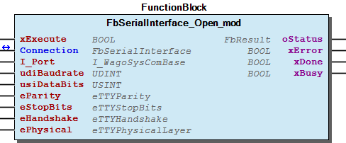 Graphical Interface of FbSerialInterface_Open_mod Function Description This Fb implements the behaviour model ‘WagoExecute’ for the process of opening a serial channel. For operation, an instance of FbSerialInterface (FB) has to be declared and assigned to the in-out variable ‘Connection’. When using the corresponding FBs ‘Close_mod(FB)’, ‘Read_mod(FB)’, or ‘Write_mod(FB)’, all these Fbs MUST be connected to the same instance of FbSerialInterface (which may be regarded as a kind of ‘handle’ for these FBs).

## FbSerialInterface_Read_mod (FB)


| Scope | Name | Type | Comment | Inherited from |
| --- | --- | --- | --- | --- |
| Output | oStatus | FbResult | Status object (see WagoSysErrorBase). | FbBehaviourModel_oStatus_Base |
| Input | xExecute | BOOL | Triggers the execution of the action. | FbBehaviourModel_WagoAppExecute |
| xError | BOOL | Indicates that an error has occurred. | FbBehaviourModel_WagoAppExecute |
| xDone | BOOL | Successful completion of the action. | FbBehaviourModel_WagoAppExecute |
| xBusy | BOOL | Action is still in progress. | FbBehaviourModel_WagoAppExecute |
| Inout | Connection | FbSerialInterface | connect this to one single instance of FbSerialInterface |  |
| Input | pRxBuffer | POINTER TO BYTE | Where to write the data |  |
| Input | udiRxBufferSize | UDINT | Size of the destination Buffer |  |
| Input | udiToRead | UDINT | how many bytes to read at minimum before being done |  |
| udiRxNBytes | UDINT | how many bytes are really read |  |

| eStatus |
| 0 | Success, ready for communication. |
| EBADF | The FB is not open |
| EINVAL | Invalid parameters. |

This reads data bytes from a serial interface.

Graphical Illustration

Graphical Interface of FbSerialInterface_Read_mod

Function Description

This Fb implements the behaviour model ‘WagoExecute’ for the process of reading a number of bytes from a serial interface.

The FB waits for a number of received bytes udiToRead before it terminates. If a number of 0 is applied, it returns after the first try.

The FB may read more bytes than udiToRead if the buffer size udiRxBufferSize is larger than the desired number of bytes.

Example: udiToRead=0 , udiRxBufferSize=1

The FB may read one byte if one comes in, but otherwise it simply returns.

Interface variables Function This reads data bytes from a serial interface. Graphical Illustration 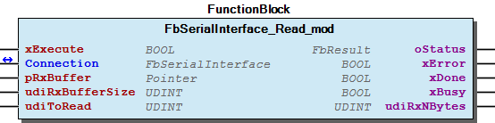 Graphical Interface of FbSerialInterface_Read_mod Function Description This Fb implements the behaviour model ‘WagoExecute’ for the process of reading a number of bytes from a serial interface. The FB waits for a number of received bytes udiToRead before it terminates. If a number of 0 is applied, it returns after the first try. The FB may read more bytes than udiToRead if the buffer size udiRxBufferSize is larger than the desired number of bytes. Example: udiToRead=0 , udiRxBufferSize=1 The FB may read one byte if one comes in, but otherwise it simply returns.

## FbSerialInterface_Write_mod (FB)


| Scope | Name | Type | Comment | Inherited from |
| --- | --- | --- | --- | --- |
| Output | oStatus | FbResult | Status object (see WagoSysErrorBase). | FbBehaviourModel_oStatus_Base |
| Input | xExecute | BOOL | Triggers the execution of the action. | FbBehaviourModel_WagoAppExecute |
| xError | BOOL | Indicates that an error has occurred. | FbBehaviourModel_WagoAppExecute |
| xDone | BOOL | Successful completion of the action. | FbBehaviourModel_WagoAppExecute |
| xBusy | BOOL | Action is still in progress. | FbBehaviourModel_WagoAppExecute |
| Inout | Connection | FbSerialInterface | connect this to one single instance of FbSerialInterface |  |
| Input | pTxBuffer | POINTER TO BYTE | The data to be transmitted |  |
| Input | udiTxNBytes | UDINT | How many bytes to transmit |  |

| result codes |
| 0 | Success, ready for communication. |
| EBADF | The FB is not open |
| EINVAL | Invalid parameters. |

This writes data bytes to a serial interface.

Graphical Illustration

Graphical Interface of FbSerialInterface_Write_mod

Function Description

This Fb implements the behaviour model ‘WagoExecute’ for the process of writing a number of bytes to a serial interface.

Interface variables Function This writes data bytes to a serial interface. Graphical Illustration 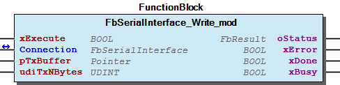 Graphical Interface of FbSerialInterface_Write_mod Function Description This Fb implements the behaviour model ‘WagoExecute’ for the process of writing a number of bytes to a serial interface.

## FbSerialInterface_cpt (FB)


| Scope | Name | Type | Comment | Inherited from |
| --- | --- | --- | --- | --- |
| Output | oStatus | FbResult | Status object (see WagoSysErrorBase). | FbBehaviourModel_oStatus_Base |
| Input | xOpen | BOOL | Opens and closes the channel. | FbBehaviourModel_WagoAppCommunicator |
| xIsOpen | BOOL | Indicates whether the channel is open. | FbBehaviourModel_WagoAppCommunicator |
| xIsIdle | BOOL | Feedback: channel is clear for new opening. | FbBehaviourModel_WagoAppCommunicator |
| xError | BOOL | Indicates that an error has occurred. | FbBehaviourModel_WagoAppCommunicator |
| Inout | xTxTrigger | BOOL | Starts transmission of data. | FbBehaviourModel_WagoAppCommunicator |
| Input | pTxBuffer | POINTER TO BYTE | Pointer to data for transmission | FbBehaviourModel_WagoAppCommunicator |
| Input | udiTxNBytes | UDINT | Number of bytes to transmit | FbBehaviourModel_WagoAppCommunicator |
| Input | pRxBuffer | POINTER TO BYTE | Pointer to receiver buffer | FbBehaviourModel_WagoAppCommunicator |
| Input | udiRxBufferSize | UDINT | Size of the receiver buffer | FbBehaviourModel_WagoAppCommunicator |
| Inout | udiRxIndex | UDINT | Number of bytes in the receiver buffer | FbBehaviourModel_WagoAppCommunicator |
| xRxBufferFull | BOOL | Indicates that the Receiver Buffer is full. | FbBehaviourModel_WagoAppCommunicator |
| xRxOverflow | BOOL | Indicates that data is probably lost. | FbBehaviourModel_WagoAppCommunicator |
| Input | xResetStatus | BOOL | Resets status code to ‘OK’ | FbBehaviourModel_WagoAppCommunicator |
| Input | I_Port | WagoTypesCom.I_WagoSysComBase | Instance of the Interface, e.g. COM1 |  |
| Input | udiBaudrate | UDINT | Baudrate (9600 = 9k6) |  |
| Input | usiDataBits | USINT | Number of Bits per frame (5..8) |  |
| Input | eParity | WagoTypesCom.eTTYParity | Parity |  |
| Input | eStopBits | WagoTypesCom.eTTYStopBits | Number of Stop-Bits, see note (1) |  |
| Input | eHandshake | WagoTypesCom.eTTYHandshake | TYPE of handshake (XON/XOFF, etc) |  |
| Input | ePhysical | WagoTypesCom.eTTYPhysicalLayer | RS232, RS422, RS485, etc |  |

| ResultCodes |
| 0 | Success, ready for communication. |
| ENOTTY | The addressed SI does not exist or is already attached by another FB |
| ENOTCONN | The addressed SI is a removable device which is not connected right now. |
| ENOPROTOOPT | Configuration options not available for this device (e.g. hardware handshake) |
| EINVAL | Invalid parameters |
| EBUSY | Double open() with different device IDs (close previous device first) |
| EBADF | The FB was not open but was sssum3ed to be open. |
| EBADMSG | Data integrity is severed (Framing Error or Parity Error) |

This is a serial communication FB with cpt -type interface for use in graphical languages. (For textual languages we recommend FbSerialInterface (FB) instead.)

Graphical Illustration

Graphical Interface of FbSerialInterface_cpt

Function Description

This FB implements the behaviour of the model ‘WagoCommunicator’ . The Fb is divided into three submodules:

Opening the Channel

For opening the serial communcation channel, the channel parameters have to be applied to the inputs ‘Port’…’ePhysical’ and the ‘xOpen’-input has to be set.

After the channel is open, the output ‘xIsOpen’ is set.

Transmission

The transmitter part implements the behaviour model ‘WagoTrigger’. The address of the data block to be transmitted is to be applied to ‘pTxBuffer’. ‘udiTxNBytes’ has to hold the number of bytes which are to be transmitted. Transmission starts when ‘xTxtrigger’ is set to TRUE.

After all data are processed, the FB re-sets the variable ‘xTxtrigger’ to false again.

eTxStatus then holds the result code of the transmission process:

Receiving Bytes

The receiving part implements the behaviour model ‘WagoReceiver’. pRxBuffer has to be set to the address of a databuffer. The size of that buffer has to be passed to the FB via udiRxBufferSize.

The in-out udiRxIndex has initially to be set to 0. When the FB receives data, the data will be put into the buffer and ‘udiRxIndex’ indicates the number of received data.

When udiRxIndex is re-set externally to zero, new data will be put at the beginning of the buffer again.

The two output flags ‘xRxBufferFull’ and ‘xRxOverflow’ will be re-set when udiRxIndex is re-set again.

Interface variables Function This is a serial communication FB with cpt -type interface for use in graphical languages. (For textual languages we recommend FbSerialInterface (FB) instead.) Graphical Illustration 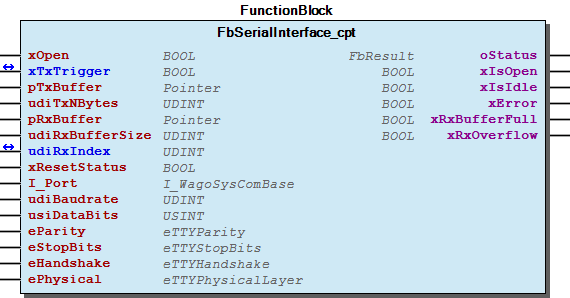 Graphical Interface of FbSerialInterface_cpt Function Description This FB implements the behaviour of the model ‘WagoCommunicator’ . The Fb is divided into three submodules: - Channel control - Transmitter (TX) - Receiver (RX) Opening the Channel For opening the serial communcation channel, the channel parameters have to be applied to the inputs ‘Port’…’ePhysical’ and the ‘xOpen’-input has to be set. After the channel is open, the output ‘xIsOpen’ is set. Transmission The transmitter part implements the behaviour model ‘WagoTrigger’. The address of the data block to be transmitted is to be applied to ‘pTxBuffer’. ‘udiTxNBytes’ has to hold the number of bytes which are to be transmitted. Transmission starts when ‘xTxtrigger’ is set to TRUE. After all data are processed, the FB re-sets the variable ‘xTxtrigger’ to false again. eTxStatus then holds the result code of the transmission process: Receiving Bytes The receiving part implements the behaviour model ‘WagoReceiver’. pRxBuffer has to be set to the address of a databuffer. The size of that buffer has to be passed to the FB via udiRxBufferSize. The in-out udiRxIndex has initially to be set to 0. When the FB receives data, the data will be put into the buffer and ‘udiRxIndex’ indicates the number of received data. When udiRxIndex is re-set externally to zero, new data will be put at the beginning of the buffer again. The two output flags ‘xRxBufferFull’ and ‘xRxOverflow’ will be re-set when udiRxIndex is re-set again. - 02-Administration finish (Method) - initialize (Method)

## FbSerialinterface_WithStatusOutputs (FB)


| Scope | Name | Type | Comment | Inherited from |
| --- | --- | --- | --- | --- |
| Output | xBusy | BOOL | FB is in some transient state and cannot react to requests | FbSerialInterface |
| xIsOpen | BOOL | TRUE if the channel is operative |  |
| xReadyForWrite | BOOL | TRUE if the virtual buffer is ready to accept data |  |
| xDataReceived | BOOL | TRUE if any bytes have been received |  |
| oStatus | WagoSysErrorBase.FbResult | Result of last Open or Clear-Buffer operation. |  |

This is a convenience wrapper for FbSerialInterface (FB) which does not require to use properties but instead delivers the complete status via output variables.

Graphical Illustration

Graphical Interface of FbSerialinterface_WithStatusOutputs

Function Description

This FB is intended to be a substitute for FbSerialInterface (FB) in graphical languages, where conditional use of properties might turn out to be not too feasible.

Thus, the main properties are mapped to additional output variables here.

When using textual languages, however, the advantage of this FB over its parent is only marginal. In these cases we recommend using FbSerialInterface (FB) instead because the interface of the base class is simpler.

Interface variables Function This is a convenience wrapper for FbSerialInterface (FB) which does not require to use properties but instead delivers the complete status via output variables. Graphical Illustration 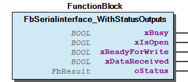 Graphical Interface of FbSerialinterface_WithStatusOutputs Function Description This FB is intended to be a substitute for FbSerialInterface (FB) in graphical languages, where conditional use of properties might turn out to be not too feasible. Thus, the main properties are mapped to additional output variables here. When using textual languages, however, the advantage of this FB over its parent is only marginal. In these cases we recommend using FbSerialInterface (FB) instead because the interface of the base class is simpler. - 01-Main-Interface Close (Method) - OpenAndConfigure (Method) - Read (Method) - Write (Method) 03-Flow-Control-and-Recovery - ResetErrors (Method)

## doc10_General (FB)


The library WagoAppCom provides FBs for using serial communication interfaces. This includes the serial interfaces at the central controller as well as those interfaces which are located as IO-modules at the local bus.

Device Configuration

The serial devices which are within the scope of this library are generally configured at runtime by opening a generic FB and providing it with the device identification (see below) and the required parameters. They might also be re-configured during runtime if the need for that should arise.

Device Identification

Devices are identified by an interface of type I_WagoSysComBase . Available devices regularly appear in the device list in the IDE.

There is no identification by standard name strings like ‘COM1’, etc. Instead, an instance of the interfaces is passed to the Open() method (and then this instance might be named COM1).

Hardware Handshake Pins

Some serial interfaces consist of only a transmit data line and a receive data line (or line pair , respecively), which is the traditional domain of serial communication (See RFC-1055 for example).

Others come with additional hardware lines for flow control, e.g. as standardized in RS-232-C. These lines could be configured to be handled automatically, so the application does not have to care about them.

For special purposes, the application may seize exclusive control over these lines and operate them in its own individual manner, e.g. for signalling special conditions to the connected hardware.

The library WagoAppCom provides FBs for using serial communication interfaces. This includes the serial interfaces at the central controller as well as those interfaces which are located as IO-modules at the local bus. Device Configuration The serial devices which are within the scope of this library are generally configured at runtime by opening a generic FB and providing it with the device identification (see below) and the required parameters. They might also be re-configured during runtime if the need for that should arise. Device Identification Devices are identified by an interface of type I_WagoSysComBase . Available devices regularly appear in the device list in the IDE. There is no identification by standard name strings like ‘COM1’, etc. Instead, an instance of the interfaces is passed to the Open() method (and then this instance might be named COM1). Hardware Handshake Pins Some serial interfaces consist of only a transmit data line and a receive data line (or line pair , respecively), which is the traditional domain of serial communication (See RFC-1055 for example). Others come with additional hardware lines for flow control, e.g. as standardized in RS-232-C. These lines could be configured to be handled automatically, so the application does not have to care about them. For special purposes, the application may seize exclusive control over these lines and operate them in its own individual manner, e.g. for signalling special conditions to the connected hardware.

### Methods


## FbSerialInterface.AttachReadBuffer (METH)


| Scope | Name | Type | Comment |
| --- | --- | --- | --- |
| Return | AttachReadBuffer | WagoTypes.eResultCode |  |
| Input | pRxBuffer | POINTER TO BYTE | Location of external buffer space |
| Input | udiRxBufferSize | UDINT | Size of the external buffer |

| result codes |
| 0 | Success, ready for communication. |
| EINVAL | Invalid parameters (size beyond plausibility). |
| EFBIG | New buffer is too small for data which is already contained in the previous buffer. |

This attaches external Buffer to the FB.

Graphical Illustration

Graphical Interface of FbSerialInterface.AttachReadBuffer

Function Description

This method can be applied at any time, even when the FB is not attached to a serial interface.

By default, each serial FB has a small built-in buffer which handles most standard situations but is small enough to not waste system memory. In certain situations, when high transmission rate (e.g. 115.2 kBaud) is combined with large cycle times (e.g. 250ms), or when large chunks of write data are generated, it is advisable to have buffers significantly larger than standard.

This is provided by this method.

If applied while in full operation, the previously received data were copied into the new buffer, if that one is big enough. If the new buffer is not big enough, data is lost.

If NULL-pointers are applied together with zero size, the external buffer is detached. Possible Data remaining in that buffer is silently discarded.

Interface variables Function This attaches external Buffer to the FB. Graphical Illustration  Graphical Interface of FbSerialInterface.AttachReadBuffer Function Description This method can be applied at any time, even when the FB is not attached to a serial interface. By default, each serial FB has a small built-in buffer which handles most standard situations but is small enough to not waste system memory. In certain situations, when high transmission rate (e.g. 115.2 kBaud) is combined with large cycle times (e.g. 250ms), or when large chunks of write data are generated, it is advisable to have buffers significantly larger than standard. This is provided by this method. If applied while in full operation, the previously received data were copied into the new buffer, if that one is big enough. If the new buffer is not big enough, data is lost. If NULL-pointers are applied together with zero size, the external buffer is detached. Possible Data remaining in that buffer is silently discarded.

## FbSerialInterface.AttachWriteBuffer (METH)


| Scope | Name | Type | Comment |
| --- | --- | --- | --- |
| Return | AttachWriteBuffer | WagoTypes.eResultCode |  |
| Input | pTxBuffer | POINTER TO BYTE | Location of external buffer space |
| Input | udiTxBufferSize | UDINT | Size of the external buffer |

| result codes |
| 0 | Success, ready for communication. |
| EINVAL | Invalid parameters (size beyond plausibility). |
| EFBIG | New buffer is too small for data which is already contained in the previous buffer. |

This attaches an external Buffer to the FB.

Graphical Illustration

Graphical Interface of FbSerialInterface.AttachWriteBuffer

Function Description

This method can be applied at any time, even when the FB is not attached to a serial interface.

By default, each serial FB might have a small built-in buffer which handles most standard situations but is small enough to not waste system memory. In certain situations, when high transmission rate (e.g. 115.2 kBaud) is combined with large cycle times (e.g. 250ms), or when large chunks of write data are generated, it is advisable to have buffers significantly larger than the standard.

If applied while in full operation, the previously written data were copied into the new buffer, if that one is big enough. If the new buffer is not big enough, data is lost.

If NULL-pointers are appilied together with zero size, the external buffer is detached. Possible Data remaining in that buffer is silently discarded.

Interface variables Function This attaches an external Buffer to the FB. Graphical Illustration 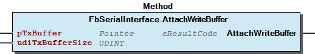 Graphical Interface of FbSerialInterface.AttachWriteBuffer Function Description This method can be applied at any time, even when the FB is not attached to a serial interface. By default, each serial FB might have a small built-in buffer which handles most standard situations but is small enough to not waste system memory. In certain situations, when high transmission rate (e.g. 115.2 kBaud) is combined with large cycle times (e.g. 250ms), or when large chunks of write data are generated, it is advisable to have buffers significantly larger than the standard. If applied while in full operation, the previously written data were copied into the new buffer, if that one is big enough. If the new buffer is not big enough, data is lost. If NULL-pointers are appilied together with zero size, the external buffer is detached. Possible Data remaining in that buffer is silently discarded.

## FbSerialInterface.ClearRxBuffer (METH)


This discards all received data up to this point in time.

Graphical Illustration

Graphical Interface of FbSerialInterface.ClearRxBuffer

Function Description

This is mainly used for recovery from a messed up status in the application.

Function This discards all received data up to this point in time. Graphical Illustration  Graphical Interface of FbSerialInterface.ClearRxBuffer Function Description This is mainly used for recovery from a messed up status in the application.

## FbSerialInterface.ClearTxBuffer (METH)


This discards all data which is scheduled for transmission.

Graphical Illustration

Graphical Interface of FbSerialInterface.ClearTxBuffer

Function This discards all data which is scheduled for transmission. Graphical Illustration  Graphical Interface of FbSerialInterface.ClearTxBuffer

## FbSerialInterface.Close (METH)


| Scope | Name | Type |
| --- | --- | --- |
| Return | Close | WagoTypes.eResultCode |

| result codes |
| 0 | Success |
| EBADF | The FB was not open |
| ENOTTY | The serial Interface was attached exclusively to a different FB |
| EWOULDBLOCK | Potentially successful operation, but final result needs some more cycles |

This closes the connection and detaches the FB.

Graphical Illustration

Graphical Interface of FbSerialInterface.Close

Interface variables Function This closes the connection and detaches the FB. Graphical Illustration 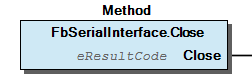 Graphical Interface of FbSerialInterface.Close

## FbSerialInterface.GetErrorObject (METH)


| Scope | Name | Type | Comment |
| --- | --- | --- | --- |
| Return | GetErrorObject | WagoTypes.eResultCode |  |
| Input | xAcknowledge | BOOL | if TRUE: the error condition is acknowledged by this |
| Output | oError | WagoSysErrorBase.FbResult | the error Object which is retrieved |

| result codes |
| 0 | Success, error object is retrieved (either OK or NOK) |
| ENOSYS | The COM-interface does not support Error Objects; output is invalid. |
| EBADF | No COM-object is attached to this FB |
| EFBIG | The COM object implements a different FBErrorFormat |

This retrieves the error object from the hardware interface.

Graphical Illustration

Graphical Interface of FbSerialInterface.GetErrorObject

Function Description

If the underlying objects for serial interfaces support error objects, this method delivers these objects to the application.

The capability of a specific interface (‘COM-object’) to deliver error objects may be tested by simply calling this method. A result code 0=OK would indicate that error objects are available.

xAcknowledge: When TRUE, the error is acknowledged with this call. The next call would return either an ‘OK’-Object or the next error Object in a series. When FALSE, the same Error object is displayed with each call until the hardware component decides to remove it for any reason.

When a hardware component does not support error objects, this call returns ENOSYS, and the error Object at the Output is invalid.

Interface variables Function This retrieves the error object from the hardware interface. Graphical Illustration 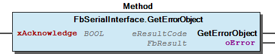 Graphical Interface of FbSerialInterface.GetErrorObject Function Description If the underlying objects for serial interfaces support error objects, this method delivers these objects to the application. Note The capability of a specific interface (‘COM-object’) to deliver error objects may be tested by simply calling this method. A result code 0=OK would indicate that error objects are available. xAcknowledge: When TRUE, the error is acknowledged with this call. The next call would return either an ‘OK’-Object or the next error Object in a series. When FALSE, the same Error object is displayed with each call until the hardware component decides to remove it for any reason. When a hardware component does not support error objects, this call returns ENOSYS, and the error Object at the Output is invalid.

## FbSerialInterface.GetLineState (METH)


| Scope | Name | Type | Comment |
| --- | --- | --- | --- |
| Return | GetLineState | BOOL |  |
| Input | eLineID | WagoTypesCom.eTTYLineID | which line; |

This retrieves the state of input lines, if available.

Graphical Illustration

Graphical Interface of FbSerialInterface.GetLineState

Function Description

This method returns TRUE if the input line is active and FALSE if otherwise. If the hardware does not permit querying of the hardware line, this method always returns TRUE.

Interface variables Function This retrieves the state of input lines, if available. Graphical Illustration 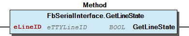 Graphical Interface of FbSerialInterface.GetLineState Function Description This method returns TRUE if the input line is active and FALSE if otherwise. If the hardware does not permit querying of the hardware line, this method always returns TRUE.

## FbSerialInterface.IgnoreIncomingData (METH)


| Scope | Name | Type |
| --- | --- | --- |
| Return | IgnoreIncomingData | WagoTypes.eResultCode |

| result codes |
| 0 | No inbound data since last call. |
| ENOLINK | Since the last call new data was received and positively discarded. |
| EDOTDOT | Not detectable if data loss has occurred. |

This clears RX buffer and ignores further data.

Graphical Illustration

Graphical Interface of FbSerialInterface.IgnoreIncomingData

Function Description

This method instructs the FB to clear the receive Buffer and to ignore all incoming data until regular operation is resumed. (ResumeOperation())

Note: this is intended for fault recovery. Data which is received inbetween is positively lost.

The result code yields information whether data has come in during the ‘ignore’-phase.

Interface variables Function This clears RX buffer and ignores further data. Graphical Illustration 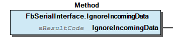 Graphical Interface of FbSerialInterface.IgnoreIncomingData Function Description This method instructs the FB to clear the receive Buffer and to ignore all incoming data until regular operation is resumed. (ResumeOperation()) Note: this is intended for fault recovery. Data which is received inbetween is positively lost. The result code yields information whether data has come in during the ‘ignore’-phase.

## FbSerialInterface.IsLineAvailable (METH)


| Scope | Name | Type | Comment |
| --- | --- | --- | --- |
| Return | IsLineAvailable | BOOL |  |
| Input | eLineID | WagoTypesCom.eTTYLineID | which line; |

This checks if an output line may be directly manipulated.

Graphical Illustration

Graphical Interface of FbSerialInterface.IsLineAvailable

Function Description

This method checks if the driver and the protocol supports manipulation of an output line.

If no extra hardware lines are available, this call returns FALSE. Note: hardware handhake cannot be configured in this case either. If hardware handhake is configured, some lines are not available for manipulation and this call returns FALSE for them. If lines are available and no hardware handshake is configured, the call returns TRUE.

Interface variables Function This checks if an output line may be directly manipulated. Graphical Illustration 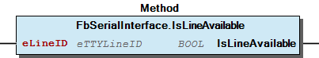 Graphical Interface of FbSerialInterface.IsLineAvailable Function Description This method checks if the driver and the protocol supports manipulation of an output line. If no extra hardware lines are available, this call returns FALSE. Note: hardware handhake cannot be configured in this case either. If hardware handhake is configured, some lines are not available for manipulation and this call returns FALSE for them. If lines are available and no hardware handshake is configured, the call returns TRUE.

## FbSerialInterface.IsTransmitterEmpty (METH)


| Scope | Name | Type | Comment |
| --- | --- | --- | --- |
| Return | IsTransmitterEmpty | BOOL |  |
| Input | xDefaultValue | BOOL | Value to be displayed on error. |

This function indicates that all data has been sent.

Graphical Illustration

Graphical Interface of FbSerialInterface.IsTransmitterEmpty

Function description

TRUE is returned if all data has left the scope of the FB and the hardware does not indicate otherwise that there is still data to be sent.

FALSE is returned otherwise.

If this function is not supported by the hardware but the result would depend on the hardware, or if any other errors occur which would affect the operation result, then the xDefaultValue is returned.

Interface variables Function This function indicates that all data has been sent. Graphical Illustration 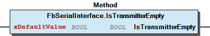 Graphical Interface of FbSerialInterface.IsTransmitterEmpty Function description TRUE is returned if all data has left the scope of the FB and the hardware does not indicate otherwise that there is still data to be sent. FALSE is returned otherwise. If this function is not supported by the hardware but the result would depend on the hardware, or if any other errors occur which would affect the operation result, then the xDefaultValue is returned.

## FbSerialInterface.OpenAndConfigure (METH)


| Scope | Name | Type | Comment |
| --- | --- | --- | --- |
| Return | OpenAndConfigure | WagoTypes.eResultCode |  |
| Input | I_Port | WagoTypesCom.I_WagoSysComBase | Instance of the Interface (e.g. COM1) |
| Input | udiBaudrate | UDINT | Baudrate (9600 = 9k6, 0=default) |
| Input | usiDataBits | USINT | Number of Bits per frame (5..8, 0=default) |
| Input | eParity | WagoTypesCom.eTTYParity | Parity |
| Input | eStopBits | WagoTypesCom.eTTYStopBits | Number of Stop-Bits, see note (1) |
| Input | eHandshake | WagoTypesCom.eTTYHandshake | TYPE of handshake (XON/XOFF, etc) |
| Input | ePhysical | WagoTypesCom.eTTYPhysicalLayer | RS232, RS422, RS485, etc |

| result codes |
| 0 | Success, ready for communication. |
| ENOTTY | The addressed SI does not exist or is already attached to another FB |
| ENOTCONN | The addressed SI is a removable device which is not connected right now. |
| ENOPROTOOPT | Configuration options not available for this device (e.g. hardware handshake) |
| EINVAL | Invalid parameters |
| EBUSY | Double open() with different device names (close previous device first) |
| EAGAIN | The device is busy with other blocking operation, e.g. clearBuffers() |
| EWOULDBLOCK | Potentially successful operation, but final result needs some more cycles. |

This attaches an FB to a serial port at runtime.

Graphical Illustration

Graphical Interface of FbSerialInterface.OpenAndConfigure

Function Description

When a baudrate of ‘0’ is passed to the FB, an apropriate default baudrate is taken, which is dependant on the specific hardware.

Note (1): Normally, the FB is opened at the very beginning of the program and typically does not change its configuration afterwards. By applying OpenAndConfigure() consecutively, however, the settings of the same interface may be changed without closing it.

Note(2): When setting up the number of stop-bits, unusual situations might occur, such as 1.5 stop bits, which is often seen with 5-bit-frames. These settings are not valid for each configuration. Details depend on the specific hardware.

Note(3): For a variety of serial interfaces ( = “SI” ) the stop-bit setting affects only the transmitter, while the receiver uniformly requires 1 stop bit and tolerates more, regardless of the setting. This is, however, not the case for synchronous operation, where bit positions of adjacent frames are synchronized.

Interface variables Function This attaches an FB to a serial port at runtime. Graphical Illustration 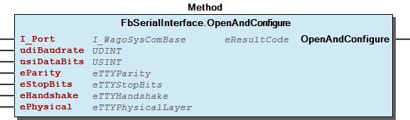 Graphical Interface of FbSerialInterface.OpenAndConfigure Function Description When a baudrate of ‘0’ is passed to the FB, an apropriate default baudrate is taken, which is dependant on the specific hardware. Note (1): Normally, the FB is opened at the very beginning of the program and typically does not change its configuration afterwards. By applying OpenAndConfigure() consecutively, however, the settings of the same interface may be changed without closing it. Note(2): When setting up the number of stop-bits, unusual situations might occur, such as 1.5 stop bits, which is often seen with 5-bit-frames. These settings are not valid for each configuration. Details depend on the specific hardware. Note(3): For a variety of serial interfaces ( = “SI” ) the stop-bit setting affects only the transmitter, while the receiver uniformly requires 1 stop bit and tolerates more, regardless of the setting. This is, however, not the case for synchronous operation, where bit positions of adjacent frames are synchronized.

## FbSerialInterface.Read (METH)


| Scope | Name | Type | Comment |
| --- | --- | --- | --- |
| Return | Read | WagoTypes.eResultCode |  |
| Input | pRxBuffer | POINTER TO BYTE | Where to store the read data |
| Input | udiRxBufferSize | UDINT | Size of the storage space |
| Output | udiRxNBytes | UDINT | How many bytes are really read |

| result codes |
| 0 | Success, ready for communication. |
| EBADF | The FB is not open |
| EINVAL | Invalid parameters. |
| ENOTCONN | The FB represents a removable device which has been disconnected during operation |
| ENODATA | No new data has arrived yet (regular condition) or data is ignored |
| EBADMSG | Data integrity is severed (Framing Error or Parity Error) |

This reads data from the serial port.

Graphical Illustration

Graphical Interface of FbSerialInterface.Read

Function Description

The input ‘udiRxBufferSize’ denotes the maximum number of expected bytes. This is typically the size of a buffer variable within the application. The read() method will not transfer more data than indicated here.

If more data is physically received than is to be read with one call of this function, the remaining data bytes stay in the internal buffer until the next read() .

The output ‘udiRxNBytes’ indicates the number of actually transferred data. This might be less than the maximum number (which is a regular situation).

If no data is received at all this method returns ENODATA.

Note: Asynchronous waiting until a number of bytes is finally received would be pointless here, because in that case the application would have to poll for the termination of the asynchronous job in that case. This is functionally equivalent to polling nReceiveDataArrived - which is much more efficient.

If a framing error or a parity error is detected, this condition will be signalled by EBADMSG. Nevertheless, the potentially corrupted data is transferred without any change.

Interface variables Function This reads data from the serial port. Graphical Illustration 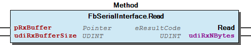 Graphical Interface of FbSerialInterface.Read Function Description The input ‘udiRxBufferSize’ denotes the maximum number of expected bytes. This is typically the size of a buffer variable within the application. The read() method will not transfer more data than indicated here. If more data is physically received than is to be read with one call of this function, the remaining data bytes stay in the internal buffer until the next read() . The output ‘udiRxNBytes’ indicates the number of actually transferred data. This might be less than the maximum number (which is a regular situation). If no data is received at all this method returns ENODATA. Note: Asynchronous waiting until a number of bytes is finally received would be pointless here, because in that case the application would have to poll for the termination of the asynchronous job in that case. This is functionally equivalent to polling nReceiveDataArrived - which is much more efficient. If a framing error or a parity error is detected, this condition will be signalled by EBADMSG. Nevertheless, the potentially corrupted data is transferred without any change.

## FbSerialInterface.ResetErrors (METH)


This clears all error indicators.

Graphical Illustration

Graphical Interface of FbSerialInterface.ResetErrors

Function Description

This method ResetErrors() clears the accumulated error conditions. After doing so the property ErrorCondition yields ‘OK’ until further error conditions newly arise.

Function This clears all error indicators. Graphical Illustration  Graphical Interface of FbSerialInterface.ResetErrors Function Description This method ResetErrors() clears the accumulated error conditions. After doing so the property ErrorCondition yields ‘OK’ until further error conditions newly arise.

## FbSerialInterface.ResumeOperation (METH)


| Scope | Name | Type |
| --- | --- | --- |
| Return | ResumeOperation | WagoTypes.eResultCode |

| result codes |
| 0 | Success, ready for communication. |
| EBADF | The FB was not open, so normal operation cannot take place. |
| ENOTCONN | The hardware is not connected, so normal operation cannot take place. |

This turns on the Receiver after interruption.

Graphical Illustration

Graphical Interface of FbSerialInterface.ResumeOperation

Function Description

This method instructs the FB to resume normal operation after having turned the RX off or having entered a busy state. It revokes the effect of IgnoreRxData() and SetBusyState().

Interface variables Function This turns on the Receiver after interruption. Graphical Illustration  Graphical Interface of FbSerialInterface.ResumeOperation Function Description This method instructs the FB to resume normal operation after having turned the RX off or having entered a busy state. It revokes the effect of IgnoreRxData() and SetBusyState().

## FbSerialInterface.SetBusyState (METH)


| Scope | Name | Type |
| --- | --- | --- |
| Return | SetBusyState | WagoTypes.eResultCode |

| result codes |
| 0 | Success, ready for communication. |
| EBADF | The FB was not open |
| EUNATCH | No protocol (handhake) suitable for busy state is configured. |

This announces that no more receive data is welcome.

Graphical Illustration

Graphical Interface of FbSerialInterface.SetBusyState

Function Description

This method tells the handshake mechanism that the FB does not want to receive data and applies the appropriate handshake mechanisms for that case - even if the receive buffer would otherwise be ready to accept more data.

This method is intended for the higher level application to try to stop the data flow from the sender when it is clear that the application temporarily cannot handle any more the data. This behaviour is intended to improve latency between sender and recipient.

If in spite of this new data arrives during this state, this is not an error and it will be processed regardless of the busy state. But the data is likely to stay in the buffer until the application gets ready for new data again.

By applying ResumeOperation() normal Operation will be resumed.

Attention: In actual implementations this mechanism can be applied only to soft-handshake (Xon-Xoff). Channels with configured hardware handshake cannot handle this functionality.

Interface variables Function This announces that no more receive data is welcome. Graphical Illustration 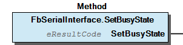 Graphical Interface of FbSerialInterface.SetBusyState Function Description This method tells the handshake mechanism that the FB does not want to receive data and applies the appropriate handshake mechanisms for that case - even if the receive buffer would otherwise be ready to accept more data. This method is intended for the higher level application to try to stop the data flow from the sender when it is clear that the application temporarily cannot handle any more the data. This behaviour is intended to improve latency between sender and recipient. If in spite of this new data arrives during this state, this is not an error and it will be processed regardless of the busy state. But the data is likely to stay in the buffer until the application gets ready for new data again. By applying ResumeOperation() normal Operation will be resumed. Attention: In actual implementations this mechanism can be applied only to soft-handshake (Xon-Xoff). Channels with configured hardware handshake cannot handle this functionality.

## FbSerialInterface.SetLineState (METH)


| Scope | Name | Type | Comment |
| --- | --- | --- | --- |
| Return | SetLineState | WagoTypes.eResultCode |  |
| Input | eLineID | WagoTypesCom.eTTYLineID | which line; |
| Input | xState | BOOL | to which state? TRUE = active |

| result codes |
| 0 | Success, ready for communication. |
| ENOSYS | This interface does not support control of hardware lines |
| EBADF | The FB is not open |
| EPROTONOSUPPORT | The configured protocol does not allow for manipulating output lines |
| EACCES | Other problem while attempting to manipulate an output line |

This sets an output line directly to active or passive state.

Graphical Illustration

Graphical Interface of FbSerialInterface.SetLineState

Function Description

Under normal circumstances, output lines are controlled by hardware handshake internally. Nevertheless, when no hardware handshake is involved, the serial lines might be used for individual purposes.

In the latter case, these hardware wires can be manipulated directly with this method to desired levels, according to the need of the actual application. This allows to implement also rather exotic handshake schemes.

Interface variables Function This sets an output line directly to active or passive state. Graphical Illustration 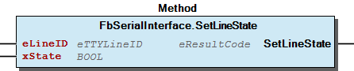 Graphical Interface of FbSerialInterface.SetLineState Function Description Under normal circumstances, output lines are controlled by hardware handshake internally. Nevertheless, when no hardware handshake is involved, the serial lines might be used for individual purposes. In the latter case, these hardware wires can be manipulated directly with this method to desired levels, according to the need of the actual application. This allows to implement also rather exotic handshake schemes.

## FbSerialInterface.Write (METH)


| Scope | Name | Type | Comment |
| --- | --- | --- | --- |
| Return | Write | WagoTypes.eResultCode |  |
| Input | pTxBuffer | POINTER TO BYTE | Location of the data to be transmitted |
| Input | udiTxNBytes | UDINT | How much data to transmit |

| result codes |
| 0 | Success, ready for communication. |
| EBADF | The FB is not open |
| EINVAL | Invalid parameters. |
| EWOULDBLOCK | FB is busy with previous data and would block |
| ENOTCONN | The FB represents a removable device which has been disconnected during operation |

This writes data to the serial port.

Graphical Illustration

Graphical Interface of FbSerialInterface.Write

Function Description

Before sending data, the application SHOULD check if the FB is ready to accept the data. This is done by evaluating ‘nReadyForWrite’.

Note, that it is a regular prodcedure to write more data than indicated by nReadyForWrite. In that case the location of the data will be used as temporary buffer and MUST NOT be altered until the transmission is completed. There is virtually no sensible limit ( < 2 Gigabyte) for the amout of data which could be passed in this manner.

If ‘nReadyForWrite’ yields a negative number, however, the FB is strictly not ready to accept further transmission data at all. This condition will be lifted again when all pending data is finally transmitted.

Note(1): Asynchronous waiting would be pointless here, because in that case the application would have to poll for the termination of the asynchronous job. This is functionally equivalent to polling nReadyForWrite, which is much more efficient.

Note(2): When passing more data than indicated by ‘nReadyForWrite’, the serial FB just buffers the pointer to the data but not the data itself. This mechanism allows for a nearly unlimited amount of transmit data to be buffered. This situation is indicated by nReadyForWrite = -1 while the data area is (semantically) blocked by the serial FB.

Important: While nReadyForWrite signals ‘-1’, the area to which pTxBuffer points must not be modified. If this behaviour is not feasible, the application must check nReadyForWrite before writing and must not pass more write data than indicated.

Note (3): When the application is stopped before all data are sent, the destructor will stop all sending activities for this FB, so no access to the pointed data will take place from this FB and the memory range can be freed immediately. To be redundantly on the safe side, the FB, which provides the memory space, should apply ClearTxBuffer() to the FbSerialInterface on application-stop, in order to prevent further accesses to that memory.

Note(4): For determining if the data chunk has been sent, the properties IsTransmitterEmpty or nBytesInTxBuffer may be used.

Interface variables Function This writes data to the serial port. Graphical Illustration  Graphical Interface of FbSerialInterface.Write Function Description Before sending data, the application SHOULD check if the FB is ready to accept the data. This is done by evaluating ‘nReadyForWrite’. Note, that it is a regular prodcedure to write more data than indicated by nReadyForWrite. In that case the location of the data will be used as temporary buffer and MUST NOT be altered until the transmission is completed. There is virtually no sensible limit ( < 2 Gigabyte) for the amout of data which could be passed in this manner. If ‘nReadyForWrite’ yields a negative number, however, the FB is strictly not ready to accept further transmission data at all. This condition will be lifted again when all pending data is finally transmitted. Note(1): Asynchronous waiting would be pointless here, because in that case the application would have to poll for the termination of the asynchronous job. This is functionally equivalent to polling nReadyForWrite, which is much more efficient. Note(2): When passing more data than indicated by ‘nReadyForWrite’, the serial FB just buffers the pointer to the data but not the data itself. This mechanism allows for a nearly unlimited amount of transmit data to be buffered. This situation is indicated by nReadyForWrite = -1 while the data area is (semantically) blocked by the serial FB. Important: While nReadyForWrite signals ‘-1’, the area to which pTxBuffer points must not be modified. If this behaviour is not feasible, the application must check nReadyForWrite before writing and must not pass more write data than indicated. Note (3): When the application is stopped before all data are sent, the destructor will stop all sending activities for this FB, so no access to the pointed data will take place from this FB and the memory range can be freed immediately. To be redundantly on the safe side, the FB, which provides the memory space, should apply ClearTxBuffer() to the FbSerialInterface on application-stop, in order to prevent further accesses to that memory. Note(4): For determining if the data chunk has been sent, the properties IsTransmitterEmpty or nBytesInTxBuffer may be used.

## FbSerialInterface.finish (METH)


This tears down the internal structures of FbSerialInterface.

Graphical Illustration

Graphical Interface of FbSerialInterface.finish

Function Description

This method is important when own FBs are derived from the base FB. In that case the derived FB should call SUPER^.finish() during its own finish() method.

In other cases (especially when the FB is instantiated directly) this method should not be used. (Treat as if declared PROTECTED, although technically PUBLIC)

Function This tears down the internal structures of FbSerialInterface. Graphical Illustration  Graphical Interface of FbSerialInterface.finish Function Description This method is important when own FBs are derived from the base FB. In that case the derived FB should call SUPER^.finish() during its own finish() method. In other cases (especially when the FB is instantiated directly) this method should not be used. (Treat as if declared PROTECTED, although technically PUBLIC)

## FbSerialInterface.initialize (METH)


This initializes the internal structures of the FbSerialInterface.

Graphical Illustration

Graphical Interface of FbSerialInterface.initialize

Function Description

This method is important when own FBs are derived from the base FB. In that case the derived FB should call SUPER^.initialize() during its own initialization.

In other cases (especially when the FB is instantiated directly) this method should not be used. (Treat as if declared PROTECTED, although technically PUBLIC)

Function This initializes the internal structures of the FbSerialInterface. Graphical Illustration 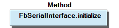 Graphical Interface of FbSerialInterface.initialize Function Description This method is important when own FBs are derived from the base FB. In that case the derived FB should call SUPER^.initialize() during its own initialization. In other cases (especially when the FB is instantiated directly) this method should not be used. (Treat as if declared PROTECTED, although technically PUBLIC)

## FbSerialInterface.nReadyForWrite (PROP)


This gives the max. size of write data which could be buffered.

Function Description

This getter tells, how many bytes of data could be accepted by the attached buffer.

A completely filled transmit buffer is indicated by nReadyForWrite=0. This value indicates, that data may be accepted, but not buffered. In this case the memory area on the application side which contains the send data would be used as buffer space itself and MUST NOT be altered until transmission is completed.

Note (1): The value ‘-1’ indicates that the data area of the last write data is used as part of the write buffer. In this case that data area must not be altered while nReadyForWrite = -1.

Note (2): Due to technical details, the maximum number which is indicated by this property is limited to 32767, even when there is actually more buffer space available.

Function This gives the max. size of write data which could be buffered. Function Description This getter tells, how many bytes of data could be accepted by the attached buffer. A completely filled transmit buffer is indicated by nReadyForWrite=0. This value indicates, that data may be accepted, but not buffered. In this case the memory area on the application side which contains the send data would be used as buffer space itself and MUST NOT be altered until transmission is completed. Note (1): The value ‘-1’ indicates that the data area of the last write data is used as part of the write buffer. In this case that data area must not be altered while nReadyForWrite = -1. Note (2): Due to technical details, the maximum number which is indicated by this property is limited to 32767, even when there is actually more buffer space available.

## FbSerialInterface_cpt.finish (METH)


This tears down the internal structures of FbSerialInterface.

Graphical Illustration

Graphical Interface of FbSerialInterface_cpt.finish

Function Description

This method is important when own FBs are derived from the base FB. In that case the derived FB should call SUPER^.finish() during its own finish() method.

In other cases (especially when the FB is instantiated directly) this method should not be used. (Treat as if declared PROTECTED, although technically PUBLIC)

Function This tears down the internal structures of FbSerialInterface. Graphical Illustration  Graphical Interface of FbSerialInterface_cpt.finish Function Description This method is important when own FBs are derived from the base FB. In that case the derived FB should call SUPER^.finish() during its own finish() method. In other cases (especially when the FB is instantiated directly) this method should not be used. (Treat as if declared PROTECTED, although technically PUBLIC)

## FbSerialInterface_cpt.initialize (METH)


This initializes the internal structures of the FbSerialInterface.

Graphical Illustration

Graphical Interface of FbSerialInterface_cpt.initialize

Function Description

This method is important when own FBs are derived from the base FB. In that case the derived FB should call SUPER^.initialize() during its own initialization.

In other cases (especially when the FB is instantiated directly) this method should not be used. (Treat as if declared PROTECTED, although technically PUBLIC)

Function This initializes the internal structures of the FbSerialInterface. Graphical Illustration  Graphical Interface of FbSerialInterface_cpt.initialize Function Description This method is important when own FBs are derived from the base FB. In that case the derived FB should call SUPER^.initialize() during its own initialization. In other cases (especially when the FB is instantiated directly) this method should not be used. (Treat as if declared PROTECTED, although technically PUBLIC)

## FbSerialinterface_WithStatusOutputs.Close (METH)


| Scope | Name | Type |
| --- | --- | --- |
| Return | Close | WagoTypes.eResultCode |

| result codes |
| 0 | Success |
| EBADF | The FB was not open |
| ENOTTY | The serial Interface was attached exclusively to a different FB |
| EWOULDBLOCK | Potentially successful operation, but final result needs some more cycles |

This closes the connection and detaches the FB.

Graphical Illustration

Graphical Interface of FbSerialinterface_WithStatusOutputs.Close

Interface variables Function This closes the connection and detaches the FB. Graphical Illustration 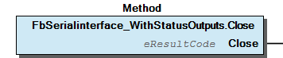 Graphical Interface of FbSerialinterface_WithStatusOutputs.Close

## FbSerialinterface_WithStatusOutputs.OpenAndConfigure (METH)


| Scope | Name | Type | Comment |
| --- | --- | --- | --- |
| Return | OpenAndConfigure | WagoTypes.eResultCode |  |
| Input | I_Port | WagoTypesCom.I_WagoSysComBase | Instance of the Interface (e.g. COM1) |
| Input | udiBaudrate | UDINT | Baudrate (9600 = 9k6, 0=default) |
| Input | usiDataBits | USINT | Number of Bits per frame (5..8, 0=default) |
| Input | eParity | WagoTypesCom.eTTYParity | Parity |
| Input | eStopBits | WagoTypesCom.eTTYStopBits | Number of Stop-Bits, see note (1) |
| Input | eHandshake | WagoTypesCom.eTTYHandshake | TYPE of handshake (XON/XOFF, etc) |
| Input | ePhysical | WagoTypesCom.eTTYPhysicalLayer | RS232, RS422, RS485, etc |

| result codes |
| 0 | Success, ready for communication. |
| ENOTTY | The addressed SI does not exist or is already attached to another FB |
| ENOTCONN | The addressed SI is a removable device which is not connected right now. |
| ENOPROTOOPT | Configuration options not available for this device (e.g. hardware handshake) |
| EINVAL | Invalid parameters |
| EBUSY | Double open() with different device names (close previous device first) |
| EAGAIN | The device is busy with other blocking operation, e.g. clearBuffers() |
| EWOULDBLOCK | Potentially successful operation, but final result needs some more cycles. |

This attaches an FB to a serial port at runtime.

Graphical Illustration

Graphical Interface of FbSerialinterface_WithStatusOutputs.OpenAndConfigure

Function Description

When a baudrate of ‘0’ is passed to the FB, an apropriate default baudrate is taken, which is dependant on the specific hardware.

Note (1): Normally, the FB is opened at the very beginning of the program and typically does not change its configuration afterwards. By applying OpenAndConfigure() consecutively, however, the settings of the same interface may be changed without closing it.

Note(2): When setting up the number of stop-bits, unusual situations might occur, such as 1.5 stop bits, which is often seen with 5-bit-frames. These settings are not valid for each configuration. Details depend on the specific hardware.

Note(3): For a variety of serial interfaces ( = “SI” ) the stop-bit setting affects only the transmitter, while the receiver uniformly requires 1 stop bit and tolerates more, regardless of the setting. This is, however, not the case for synchronous operation, where bit positions of adjacent frames are synchronized.

Interface variables Function This attaches an FB to a serial port at runtime. Graphical Illustration 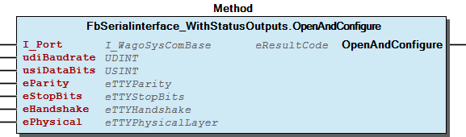 Graphical Interface of FbSerialinterface_WithStatusOutputs.OpenAndConfigure Function Description When a baudrate of ‘0’ is passed to the FB, an apropriate default baudrate is taken, which is dependant on the specific hardware. Note (1): Normally, the FB is opened at the very beginning of the program and typically does not change its configuration afterwards. By applying OpenAndConfigure() consecutively, however, the settings of the same interface may be changed without closing it. Note(2): When setting up the number of stop-bits, unusual situations might occur, such as 1.5 stop bits, which is often seen with 5-bit-frames. These settings are not valid for each configuration. Details depend on the specific hardware. Note(3): For a variety of serial interfaces ( = “SI” ) the stop-bit setting affects only the transmitter, while the receiver uniformly requires 1 stop bit and tolerates more, regardless of the setting. This is, however, not the case for synchronous operation, where bit positions of adjacent frames are synchronized.

## FbSerialinterface_WithStatusOutputs.Read (METH)


| Scope | Name | Type | Comment |
| --- | --- | --- | --- |
| Return | Read | WagoTypes.eResultCode |  |
| Input | pRxBuffer | POINTER TO BYTE | Where to store the read data |
| Input | udiRxBufferSize | UDINT | Size of the storage space |
| Output | udiRxNBytes | UDINT | How many bytes are really read |

| result codes |
| 0 | Success, ready for communication. |
| EBADF | The FB is not open |
| EINVAL | Invalid parameters. |
| ENOTCONN | The FB represents a removable device which has been disconnected during operation |
| ENODATA | No new data has arrived yet (regular condition) or data is ignored |
| EBADMSG | Data integrity is severed (Framing Error or Parity Error) |

This reads data from the serial port.

Graphical Illustration

Graphical Interface of FbSerialinterface_WithStatusOutputs.Read

Function Description

The input ‘udiRxBufferSize’ denotes the maximum number of expected bytes. This is typically the size of a buffer variable within the application. The read() method will not transfer more data than indicated here.

If more data is physically received than is to be read with one call of this function, the remaining data bytes stay in the internal buffer until the next read() .

The output ‘udiRxNBytes’ indicates the number of actually transferred data. This might be less than the maximum number (which is a regular situation).

If no data is received at all this method returns ENODATA.

Note: Asynchronous waiting until a number of bytes is finally received would be pointless here, because in that case the application would have to poll for the termination of the asynchronous job in that case. This is functionally equivalent to polling nReceiveDataArrived - which is much more efficient.

If a framing error or a parity error is detected, this condition will be signalled by EBADMSG. Nevertheless, the potentially corrupted data is transferred without any change.

Interface variables Function This reads data from the serial port. Graphical Illustration 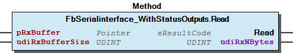 Graphical Interface of FbSerialinterface_WithStatusOutputs.Read Function Description The input ‘udiRxBufferSize’ denotes the maximum number of expected bytes. This is typically the size of a buffer variable within the application. The read() method will not transfer more data than indicated here. If more data is physically received than is to be read with one call of this function, the remaining data bytes stay in the internal buffer until the next read() . The output ‘udiRxNBytes’ indicates the number of actually transferred data. This might be less than the maximum number (which is a regular situation). If no data is received at all this method returns ENODATA. Note: Asynchronous waiting until a number of bytes is finally received would be pointless here, because in that case the application would have to poll for the termination of the asynchronous job in that case. This is functionally equivalent to polling nReceiveDataArrived - which is much more efficient. If a framing error or a parity error is detected, this condition will be signalled by EBADMSG. Nevertheless, the potentially corrupted data is transferred without any change.

## FbSerialinterface_WithStatusOutputs.ResetErrors (METH)


This clears all error indicators.

Graphical Illustration

Graphical Interface of FbSerialinterface_WithStatusOutputs.ResetErrors

Function Description

This method ResetErrors() clears the accumulated error conditions. After doing so the property ErrorCondition yields ‘OK’ until further error conditions newly arise.

Function This clears all error indicators. Graphical Illustration  Graphical Interface of FbSerialinterface_WithStatusOutputs.ResetErrors Function Description This method ResetErrors() clears the accumulated error conditions. After doing so the property ErrorCondition yields ‘OK’ until further error conditions newly arise.

## FbSerialinterface_WithStatusOutputs.Write (METH)


| Scope | Name | Type | Comment |
| --- | --- | --- | --- |
| Return | Write | WagoTypes.eResultCode |  |
| Input | pTxBuffer | POINTER TO BYTE | Location of the data to be transmitted |
| Input | udiTxNBytes | UDINT | How much data to transmit |

| result codes |
| 0 | Success, ready for communication. |
| EBADF | The FB is not open |
| EINVAL | Invalid parameters. |
| EWOULDBLOCK | FB is busy with previous data and would block |
| ENOTCONN | The FB represents a removable device which has been disconnected during operation |

This writes data to the serial port.

Graphical Illustration

Graphical Interface of FbSerialinterface_WithStatusOutputs.Write

Function Description

Before sending data, the application SHOULD check if the FB is ready to accept the data. This is done by evaluating ‘nReadyForWrite’.

Note, that it is a regular prodcedure to write more data than indicated by nReadyForWrite. In that case the location of the data will be used as temporary buffer and MUST NOT be altered until the transmission is completed. There is virtually no sensible limit ( < 2 Gigabyte) for the amout of data which could be passed in this manner.

If ‘nReadyForWrite’ yields a negative number, however, the FB is strictly not ready to accept further transmission data at all. This condition will be lifted again when all pending data is finally transmitted.

Note(1): Asynchronous waiting would be pointless here, because in that case the application would have to poll for the termination of the asynchronous job. This is functionally equivalent to polling nReadyForWrite, which is much more efficient.

Note(2): When passing more data than indicated by ‘nReadyForWrite’, the serial FB just buffers the pointer to the data but not the data itself. This mechanism allows for a nearly unlimited amount of transmit data to be buffered. This situation is indicated by nReadyForWrite = -1 while the data area is (semantically) blocked by the serial FB.

Important: While nReadyForWrite signals ‘-1’, the area to which pTxBuffer points must not be modified. If this behaviour is not feasible, the application must check nReadyForWrite before writing and must not pass more write data than indicated.

Note (3): When the application is stopped before all data are sent, the destructor will stop all sending activities for this FB, so no access to the pointed data will take place from this FB and the memory range can be freed immediately. To be redundantly on the safe side, the FB, which provides the memory space, should apply ClearTxBuffer() to the FbSerialInterface on application-stop, in order to prevent further accesses to that memory.

Note(4): For determining if the data chunk has been sent, the properties IsTransmitterEmpty or nBytesInTxBuffer may be used.

Interface variables Function This writes data to the serial port. Graphical Illustration 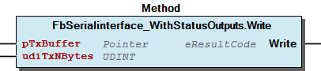 Graphical Interface of FbSerialinterface_WithStatusOutputs.Write Function Description Before sending data, the application SHOULD check if the FB is ready to accept the data. This is done by evaluating ‘nReadyForWrite’. Note, that it is a regular prodcedure to write more data than indicated by nReadyForWrite. In that case the location of the data will be used as temporary buffer and MUST NOT be altered until the transmission is completed. There is virtually no sensible limit ( < 2 Gigabyte) for the amout of data which could be passed in this manner. If ‘nReadyForWrite’ yields a negative number, however, the FB is strictly not ready to accept further transmission data at all. This condition will be lifted again when all pending data is finally transmitted. Note(1): Asynchronous waiting would be pointless here, because in that case the application would have to poll for the termination of the asynchronous job. This is functionally equivalent to polling nReadyForWrite, which is much more efficient. Note(2): When passing more data than indicated by ‘nReadyForWrite’, the serial FB just buffers the pointer to the data but not the data itself. This mechanism allows for a nearly unlimited amount of transmit data to be buffered. This situation is indicated by nReadyForWrite = -1 while the data area is (semantically) blocked by the serial FB. Important: While nReadyForWrite signals ‘-1’, the area to which pTxBuffer points must not be modified. If this behaviour is not feasible, the application must check nReadyForWrite before writing and must not pass more write data than indicated. Note (3): When the application is stopped before all data are sent, the destructor will stop all sending activities for this FB, so no access to the pointed data will take place from this FB and the memory range can be freed immediately. To be redundantly on the safe side, the FB, which provides the memory space, should apply ClearTxBuffer() to the FbSerialInterface on application-stop, in order to prevent further accesses to that memory. Note(4): For determining if the data chunk has been sent, the properties IsTransmitterEmpty or nBytesInTxBuffer may be used.

### Program Organization


## 20 Program Organization Units


- 10 Compact FbDataExchangeMode (FunctionBlock) - FbSerialInterface_cpt (FunctionBlock) 02-Administration finish (Method) - initialize (Method) 20 Modular - FbSerialInterface_Close_mod (FunctionBlock) - FbSerialInterface_Open_mod (FunctionBlock) - FbSerialInterface_Read_mod (FunctionBlock) - FbSerialInterface_Write_mod (FunctionBlock) 30 Base - FbSerialInterface (FunctionBlock) 01-Main-Interface AttachReadBuffer (Method) - AttachWriteBuffer (Method) - Close (Method) - DeferredResult (Property) - OpenAndConfigure (Method) - Read (Method) - Write (Method) - isConnected (Property) - nReadyForWrite (Property) - nReceiveDataArrived (Property) 02-Administration - GetErrorObject (Method) - finish (Method) - initialize (Method) 03-Flow-Control-and-Recovery - ClearRxBuffer (Method) - ClearTxBuffer (Method) - ErrorCondition (Property) - IgnoreIncomingData (Method) - IsTransmitterEmpty (Method) - ResetErrors (Method) - ResumeOperation (Method) - SetBusyState (Method) - nBytesInTxBuffer (Property) 04-Hardware-Lines - GetLineState (Method) - IsLineAvailable (Method) - SetLineState (Method) FbSerialinterface_WithStatusOutputs (FunctionBlock) - 01-Main-Interface Close (Method) - OpenAndConfigure (Method) - Read (Method) - Write (Method) 03-Flow-Control-and-Recovery - ResetErrors (Method)

### Base Components


## 30 Base


- FbSerialInterface (FunctionBlock) 01-Main-Interface AttachReadBuffer (Method) - AttachWriteBuffer (Method) - Close (Method) - DeferredResult (Property) - OpenAndConfigure (Method) - Read (Method) - Write (Method) - isConnected (Property) - nReadyForWrite (Property) - nReceiveDataArrived (Property) 02-Administration - GetErrorObject (Method) - finish (Method) - initialize (Method) 03-Flow-Control-and-Recovery - ClearRxBuffer (Method) - ClearTxBuffer (Method) - ErrorCondition (Property) - IgnoreIncomingData (Method) - IsTransmitterEmpty (Method) - ResetErrors (Method) - ResumeOperation (Method) - SetBusyState (Method) - nBytesInTxBuffer (Property) 04-Hardware-Lines - GetLineState (Method) - IsLineAvailable (Method) - SetLineState (Method) FbSerialinterface_WithStatusOutputs (FunctionBlock) - 01-Main-Interface Close (Method) - OpenAndConfigure (Method) - Read (Method) - Write (Method) 03-Flow-Control-and-Recovery - ResetErrors (Method)

### Modular Components


## 20 Modular


- FbSerialInterface_Close_mod (FunctionBlock) - FbSerialInterface_Open_mod (FunctionBlock) - FbSerialInterface_Read_mod (FunctionBlock) - FbSerialInterface_Write_mod (FunctionBlock)

### Main Interfaces


## 01 Main Interface


- Close (Method) - OpenAndConfigure (Method) - Read (Method) - Write (Method)

## 01 Main Interface


Most frequently used methods.

Most frequently used methods. - AttachReadBuffer (Method) - AttachWriteBuffer (Method) - Close (Method) - DeferredResult (Property) - OpenAndConfigure (Method) - Read (Method) - Write (Method) - isConnected (Property) - nReadyForWrite (Property) - nReceiveDataArrived (Property)

### Global Variable Lists


| Name | Type | Comment |
| --- | --- | --- |
| Factory | WagoSysErrorBase.FbResultFactory | Produces FbResults from given eResultCodes. |

| Scope | Name | Type | Initial |
| --- | --- | --- | --- |
| Constant | ERROR | ARRAY [0..23] OF WagoTypesErrorBase.typResultItem | [STRUCT(ID := WagoTypes.eResultCode.OK, Severity := WagoTypes.eSeverity.none, Text := ‘OK’), STRUCT(ID := WagoTypes.eResultCode.EWOULDBLOCK, Severity := WagoTypes.eSeverity.info, Text := ‘Potentially successful operation, but final result needs more cycles.’), STRUCT(ID := WagoTypes.eResultCode.ENODATA, Severity := WagoTypes.eSeverity.info, Text := ‘No new data has arrived yet.’), STRUCT(ID := WagoTypes.eResultCode.EAGAIN, Severity := WagoTypes.eSeverity.info, Text := ‘A request is still pending, no feedback so far.’), STRUCT(ID := WagoTypes.eResultCode.EINPROGRESS, Severity := WagoTypes.eSeverity.info, Text := ‘The requested action is in progress but not yet completed.’), STRUCT(ID := WagoTypes.eResultCode.ENOTTY, Severity := WagoTypes.eSeverity.error, Text := ‘The addressed SI/TTY does not exist or is already attached.’), STRUCT(ID := WagoTypes.eResultCode.ENOTCONN, Severity := WagoTypes.eSeverity.error, Text := ‘Unexpected disconnection during data transfer’), STRUCT(ID := WagoTypes.eResultCode.ENOPROTOOPT, Severity := WagoTypes.eSeverity.error, Text := ‘The given configuration options are not available for this device.’), STRUCT(ID := WagoTypes.eResultCode.EINVAL, Severity := WagoTypes.eSeverity.error, Text := ‘Invalid parameter(s)’), STRUCT(ID := WagoTypes.eResultCode.EBUSY, Severity := WagoTypes.eSeverity.error, Text := ‘Double open() with different device IDs (close previous device first)’), STRUCT(ID := WagoTypes.eResultCode.EBADF, Severity := WagoTypes.eSeverity.error, Text := ‘The FB is not open.’), STRUCT(ID := WagoTypes.eResultCode.EACCES, Severity := WagoTypes.eSeverity.error, Text := ‘Internal Problems while accessing the serial port’), STRUCT(ID := WagoTypes.eResultCode.EBADMSG, Severity := WagoTypes.eSeverity.error, Text := ‘Data integrity is severed (Framing Error or Parity Error)’), STRUCT(ID := WagoTypes.eResultCode.EFBIG, Severity := WagoTypes.eSeverity.error, Text := ‘New buffer is too small for data which is already contained here.’), STRUCT(ID := WagoTypes.eResultCode.ENOSYS, Severity := WagoTypes.eSeverity.error, Text := ‘The requested functionality is not supported here.’), STRUCT(ID := WagoTypes.eResultCode.EUNATCH, Severity := WagoTypes.eSeverity.error, Text := ‘No protocol (handhake) suitable for busy state is configured.’), STRUCT(ID := WagoTypes.eResultCode.EPROTONOSUPPORT, Severity := WagoTypes.eSeverity.error, Text := ‘Configured protocol does not allow for manipulating output lines.’), STRUCT(ID := WagoTypes.eResultCode.ENOSPC, Severity := WagoTypes.eSeverity.error, Text := ‘Rx overrun: (data loss due to too less buffer space)’), STRUCT(ID := WagoTypes.eResultCode.ECOMM, Severity := WagoTypes.eSeverity.error, Text := ‘Tx underrun: (Communication error on send)’), STRUCT(ID := WagoTypes.eResultCode.ENOMSG, Severity := WagoTypes.eSeverity.error, Text := ‘Frame error: data frame had too less stop bits or is otherwise corrupted’), STRUCT(ID := WagoTypes.eResultCode.ENOLINK, Severity := WagoTypes.eSeverity.info, Text := ‘Since the last call new data was received and positively discarded.’), STRUCT(ID := WagoTypes.eResultCode.EDOTDOT, Severity := WagoTypes.eSeverity.info, Text := ‘Not detectable if data loss has occurred.’)] |

| Name | Type |
| --- | --- |
| Info | WagoSysVersion.ProjectInfo |

| Date | Version | Author | Change |
| 08.03.2023 | 1.7.1.2 | WAGO / u010545 | bugfix FbDataExchangeMode -> WAT35454 |
| 01.03.2023 | 1.7.1.1 | WAGO / u010545 | FbDataExchangeMode added |
| 08.01.2019 | 1.7.1.0 | WAGO / u015842 | Properties: free placeholder added |
| 13.04.2018 | 1.7.0.1 | WAGO / u013972 | Resolve documentation error |
| 11.05.2017 | 1.7.0.0 | WAGO / u013972 | Remove WagoSysStandard |
| 10.03.2016 | 1.6.1.0 | WAGO / u013972 | Publish WagoSysErrorBase and WagoTypesErrorBase |
| 02.03.2016 | 1.6.0.0 | WAGO / u010545 | WagoAppErrorBase changed to WagoSysErrorBase / WagoTypesErrorBase |
| 07.01.2016 | 1.5.3.1 | WAGO / u013972 | Change ‘Pointer to Any’ to ‘Pointer to Byte’ |
| 29.09.2015 | 1.5.2.0 | WAGO / u013972 | Resolve libraries with placeholders |
| 23.09.2015 | 1.5.1.0 | WAGO / u013972 | Workaround for C0351-Bug, Remove Workaround for WAT14718 |
| 02.07.2015 | 1.5.0.0 | WAGO / u013972 | Release Version |

```
VAR
  eMyResult : eResultCode;  // result code which is to be investigated
  oError    : FbResult;     // result object for use in higher levels
END_VAR;

eMyResult := myFunction(...);
Namespace.LibraryResult.Factory.SetResult(eMyResult, oError);
```

Factory for standard result objects

Use this to translate result codes from this library into standard result objects.

(In this example ‘Namespace’ denotes the namespace which is used for including the specific library and ‘myFunction()’ is an example for a general function from this library.)

Standard result items specific for this library

Note: This is a general mapping of result codes to short standard texts which are appropriate to the usage of these codes in this library.

Typially, each unit (function, method, or function block) in this library uses only a subset of these codes. Please, refer to the documentation of the specific unit for the set of codes which is actualy used and for a detailed explanation of the meaning of a result code in the specifc context.

Factory for standard result objects Use this to translate result codes from this library into standard result objects. Usage: (In this example ‘Namespace’ denotes the namespace which is used for including the specific library and ‘myFunction()’ is an example for a general function from this library.) Standard result items specific for this library Note: This is a general mapping of result codes to short standard texts which are appropriate to the usage of these codes in this library. Typially, each unit (function, method, or function block) in this library uses only a subset of these codes. Please, refer to the documentation of the specific unit for the set of codes which is actualy used and for a detailed explanation of the meaning of a result code in the specifc context. WagoAppCom

### Other Components


## 02 Administration


Methods for administrative purpose, initializing, finishing, etc.

Methods for administrative purpose, initializing, finishing, etc. - GetErrorObject (Method) - finish (Method) - initialize (Method)

## 02 Administration


- finish (Method) - initialize (Method)

## 03 Flow Control and Recovery


- ResetErrors (Method)

## 03 Flow Control and Recovery


Control about the data flow and handshake process

Control about the data flow and handshake process - ClearRxBuffer (Method) - ClearTxBuffer (Method) - ErrorCondition (Property) - IgnoreIncomingData (Method) - IsTransmitterEmpty (Method) - ResetErrors (Method) - ResumeOperation (Method) - SetBusyState (Method) - nBytesInTxBuffer (Property)

## 04 Hardware Lines


Methods for directly accessing physical lines.

Methods for directly accessing physical lines. - GetLineState (Method) - IsLineAvailable (Method) - SetLineState (Method)

## 10 Compact


- FbDataExchangeMode (FunctionBlock) - FbSerialInterface_cpt (FunctionBlock) 02-Administration finish (Method) - initialize (Method)

## FbSerialInterface.DeferredResult (PROP)


| result codes |
| 0 | Ok: the channel is operative |
| EAGAIN | Request is still pending, no feedback so far. (no error) |
| ENOPROTOOPT | Configuration options not available for this device (e.g. hardware handshake, error) |
| EBADF | The FB is not open (error) |
| EINVAL | Invalid parameters. (error) |
| EACCESS | Other Problems while accessing the serial port (error) |

Thios gives the status of the channel after deferred requests.

Function Description

On simple interfaces, all requests (i.e. method calls) give immediate results. In certain interfaces, however, certain requests require more than one PLC cycle for completition (namely open(), close(), clear…())

This situation is indicated by the result code EWOULDBLOCK for the request (instead of OK) and by setting the xBusy-output while the request is in progress.

The property ‘DeferredResult’ yields the final result of that request. The result remains valid until another request is issued.

Function Thios gives the status of the channel after deferred requests. Function Description On simple interfaces, all requests (i.e. method calls) give immediate results. In certain interfaces, however, certain requests require more than one PLC cycle for completition (namely open(), close(), clear…()) This situation is indicated by the result code EWOULDBLOCK for the request (instead of OK) and by setting the xBusy-output while the request is in progress. The property ‘DeferredResult’ yields the final result of that request. The result remains valid until another request is issued.

## FbSerialInterface.ErrorCondition (PROP)


| result codes |
| OK | All in healthy state |
| ENOSPC | Rx overrun: (data loss due to too less buffer space) |
| EBADMSG | Parity error: data frame had wrong parity bits |
| ENOMSG | Frame error: data frame had too less stop bits or is otherwise corrupted |
| ECOMM | Tx underrun: (Communication error on send) |
| ENOTCONN | Unexpected disconnection during data transfer |

This indicates possible data corruption.

Function Description

The result code reflects the status of data integrity.

Note: These error conditions appear during the transmission and reception of data and could not be assigned to an individual method call.

The fault condition is cleared by ResetErrors();

Function This indicates possible data corruption. Function Description The result code reflects the status of data integrity. Note: These error conditions appear during the transmission and reception of data and could not be assigned to an individual method call. The fault condition is cleared by ResetErrors();

## FbSerialInterface.isConnected (PROP)


This returns True if connected and ready for operation.

Function Description

This generally indicates that OpenAndConfigure() has been executed successfully and that the channel has not been closed again.

Function This returns True if connected and ready for operation. Function Description This generally indicates that OpenAndConfigure() has been executed successfully and that the channel has not been closed again.

## FbSerialInterface.nBytesInTxBuffer (PROP)


This returns the number of bytes in the transmitter buffer.

Function Description

This is used when a continuous stream of frames on the transmitter line is required (synchroneous operation). When the buffer is in danger to run empty, padding bytes would be inserted into the stream.

Note (1): This functionality is not supported on each hardware. If this functionality is not supported, -1 is returned.

Note (2): Some Hardware does not allow to determine exactly how many bytes are pending for transmission in hardware buffers. In that case 1 is returned for ‘1..8’ bytes pending and 0 for no pending bytes detectable.

Function This returns the number of bytes in the transmitter buffer. Function Description This is used when a continuous stream of frames on the transmitter line is required (synchroneous operation). When the buffer is in danger to run empty, padding bytes would be inserted into the stream. Note (1): This functionality is not supported on each hardware. If this functionality is not supported, -1 is returned. Note (2): Some Hardware does not allow to determine exactly how many bytes are pending for transmission in hardware buffers. In that case 1 is returned for ‘1..8’ bytes pending and 0 for no pending bytes detectable.

## FbSerialInterface.nReceiveDataArrived (PROP)


| Scope | Name | Type | Initial | Comment |
| --- | --- | --- | --- | --- |
| Constant | cuiDefaultSystemBufferSize | UINT | 1028 | Desired size of internal system buffer for SI’s. |

This returns the number of received bytes in the internal buffer.

Function Description

A following read() could transfer at least this much bytes.

Function This returns the number of received bytes in the internal buffer. Function Description A following read() could transfer at least this much bytes. InOut: