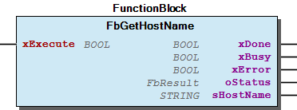
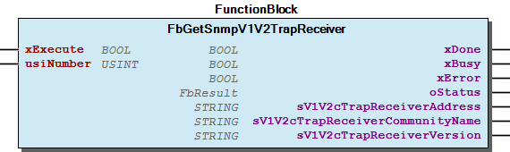
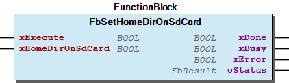

# WagoAppConfigTool v2.0.1.0 (WAGO) - Complete Documentation


## 📋 Library Information

- **Company:** WAGO
- **Title:** WagoAppConfigTool
- **Version:** 2.0.1.0
- **Categories:** WAGO LayerView|App; Application
- **Author:** WAGO / u010545
- **Placeholder:** WagoAppConfigTool

### Description ¶


This document is automatically generated.

Function blocks for get information about the actual controller

This document is automatically generated. Function blocks for get information about the actual controller

### Contents: ¶


Contents: - Documentation Index - Project Information - Library Information - Function Blocks FbConfigScriptBase (FB) - FbConfigTool (FB) - FbDnsServerAdd (FB) - FbDnsServerDelete (FB) - FbGetActivePartition (FB) - FbGetActualHostName (FB) - FbGetBridgeConfig (FB) - FbGetClockData (FB) - FbGetComPortOwner (FB) - FbGetCouplerDetails (FB) - ... and 65 more Methods - FbConfigScriptBase.Run (METH) - FbConfigScriptBase.onFinish (METH) - FbConfigScriptBase.onStart (METH) - FbGetBridgeConfig.onFinish (METH) - FbGetComPortOwner.onFinish (METH) - FbGetDsaMode.onFinish (METH) - FbGetFtp.onFinish (METH) - FbGetFtps.onFinish (METH) - FbGetGateway_1.onFinish (METH) - FbGetGateway_2.onFinish (METH) - ... and 26 more Program Organization Internal Components Global Variable Lists - ErrorConfigTool (GVL) - VersionHistory (GVL) Other Components - 80 Status - Bridge - BridgeConfig - Clock - Comports - Coupler - DNS - DSA Mode - Domain Name - Ethernet - ... and 22 more

### Indices and tables ¶


Based on WagoAppConfigTool.library, last modified 20.09.2024, 21:08:59. LibDoc 3.5.16.10

© WAGO GmbH & Co. KG, Germany 2018 – All rights reserved. For the avoidance of doubt, this copyright notice does not only apply to the information above but also and primarily to the described library itself. Please note that third-party products are always mentioned without reference to intellectual property rights, including patents, utility models, designs and trademarks, accordingly the existence of such rights cannot be excluded. WAGO is a registered trademark of WAGO Verwaltungsgesellschaft mbH.

- File and Project Information - Library Reference Based on WagoAppConfigTool.library, last modified 20.09.2024, 21:08:59. LibDoc 3.5.16.10 © WAGO GmbH & Co. KG, Germany 2018 – All rights reserved. For the avoidance of doubt, this copyright notice does not only apply to the information above but also and primarily to the described library itself. Please note that third-party products are always mentioned without reference to intellectual property rights, including patents, utility models, designs and trademarks, accordingly the existence of such rights cannot be excluded. WAGO is a registered trademark of WAGO Verwaltungsgesellschaft mbH.

### Documentation Index


## WagoAppConfigTool Library Documentation


| Company: | WAGO |
| Title: | WagoAppConfigTool |
| Version: | 2.0.1.0 |
| Categories: | WAGO LayerView\|App; Application |
| Author: | WAGO / u010545 |
| Placeholder: | WagoAppConfigTool |

### Description


This document is automatically generated.

Function blocks for get information about the actual controller

This document is automatically generated. Function blocks for get information about the actual controller

### Contents:


- 20 Program Organization Units Clock - Comports - Coupler - DNS - Ethernet - FTP(S) - FbConfigTool (FB) - Gateway - HTTP(S) - NTP - Runtime - SNMP - SSH 80 Status - ErrorConfigTool (GVL) - eErrorConfigTool (ENUM) 90 Internal - FbConfigScriptBase (FB) - FwModbus - NetworkConfig ParameterList (PARAMS) VersionHistory (GVL)

### Indices and tables


Based on WagoAppConfigTool.library, last modified 20.09.2024, 21:08:59. LibDoc 3.5.16.10

© WAGO GmbH & Co. KG, Germany 2018 – All rights reserved. For the avoidance of doubt, this copyright notice does not only apply to the information above but also and primarily to the described library itself. Please note that third-party products are always mentioned without reference to intellectual property rights, including patents, utility models, designs and trademarks, accordingly the existence of such rights cannot be excluded. WAGO is a registered trademark of WAGO Verwaltungsgesellschaft mbH.

- File and Project Information - Library Reference Based on WagoAppConfigTool.library, last modified 20.09.2024, 21:08:59. LibDoc 3.5.16.10 © WAGO GmbH & Co. KG, Germany 2018 – All rights reserved. For the avoidance of doubt, this copyright notice does not only apply to the information above but also and primarily to the described library itself. Please note that third-party products are always mentioned without reference to intellectual property rights, including patents, utility models, designs and trademarks, accordingly the existence of such rights cannot be excluded. WAGO is a registered trademark of WAGO Verwaltungsgesellschaft mbH.

### Project Information


## File and Project Information


| Scope | Name | Type | Content |
| --- | --- | --- | --- |
| FileHeader | libraryFile | string | WagoAppConfigTool.library |
| contentFile | doc.clean.json |
| productName | e!COCKPIT |
| creationDateTime | date | 20.09.2024, 21:09:00 |
| companyName | string | WAGO |
| ProjectInformation | LastModificationDateTime | date | 20.09.2024, 21:08:59 |
| Description | string | See: Description |
| Copyright | © WAGO Kontakttechnik GmbH & Co. KG, Germany 2018 – All rights reserved. |
| Author | WAGO / u010545 |
| AutoResolveUnbound | bool | True |
| Placeholder | string | WagoAppConfigTool |
| Company | WAGO |
| DocFormat | reStructuredText |
| Project | WagoAppConfigTool |
| DefaultNamespace |  |
| Version | version | 2.0.1.0 |
| Title | string | WagoAppConfigTool |
| LibraryCategories | library-category-list | WAGO LayerView\|App; Application |
| CompiledLibraryCompatibilityVersion | string | CODESYS V3.5 SP16 Patch 3 |

### Library Information


## Library Reference


| LinkAllContent: False QualifiedOnly: False | SystemLibrary: False | Optional: False |

| LinkAllContent: False QualifiedOnly: False | SystemLibrary: False | Optional: False |

| LinkAllContent: False QualifiedOnly: False | SystemLibrary: False | Optional: False |

| LinkAllContent: False QualifiedOnly: False | SystemLibrary: False | Optional: False |

| LinkAllContent: False QualifiedOnly: True | SystemLibrary: False | Optional: False |

| LinkAllContent: False QualifiedOnly: False | SystemLibrary: False | Optional: False |

| LinkAllContent: False QualifiedOnly: False | SystemLibrary: False | Optional: False |

| LinkAllContent: False QualifiedOnly: False | SystemLibrary: False | Optional: False |

| LinkAllContent: False QualifiedOnly: False | SystemLibrary: False | Optional: False |

| LinkAllContent: False QualifiedOnly: False | SystemLibrary: False | Optional: False |

| LinkAllContent: False Optional: False | QualifiedOnly: False SystemLibrary: False | PublishSymbolsInContainer: True |

| LinkAllContent: False QualifiedOnly: False | SystemLibrary: False | Optional: False |

| LinkAllContent: False QualifiedOnly: True | SystemLibrary: False | Optional: False |

| LinkAllContent: False Optional: False | QualifiedOnly: False SystemLibrary: False | PublishSymbolsInContainer: True |

This is a dictionary of all referenced libraries and their name spaces.

This is a dictionary of all referenced libraries and their name spaces. CmpApp Library Identification : Placeholder: CmpApp Default Resolution: CmpApp, * (System) Namespace: CmpApp Library Properties : CmpErrors2 Interfaces Library Identification : Name: CmpErrors2 Interfaces Version: newest Company: System Namespace: CmpErrors Library Properties : CmpEventMgr Library Identification : Placeholder: CmpEventMgr Default Resolution: CmpEventMgr, * (System) Namespace: CmpEventMgr Library Properties : CmpIecTask Library Identification : Placeholder: CmpIecTask Default Resolution: CmpIecTask, * (System) Namespace: CmpIecTask Library Properties : Standard Library Identification : Placeholder: Standard Default Resolution: Standard, * (System) Namespace: Standard Library Properties : SysMem Library Identification : Placeholder: SysMem Default Resolution: SysMem, * (System) Namespace: SysMem Library Properties : SysSocket Library Identification : Placeholder: SysSocket Default Resolution: SysSocket, * (System) Namespace: SysSocket Library Properties : SysTypes2 Interfaces Library Identification : Name: SysTypes2 Interfaces Version: newest Company: System Namespace: SysTypes Library Properties : WagoAppJSON Library Identification : Placeholder: WagoAppJSON Default Resolution: WagoAppJSON, * (WAGO) Namespace: WagoAppJSON Library Properties : WagoAppString Library Identification : Placeholder: WagoAppString Default Resolution: WagoAppString, * (WAGO) Namespace: WagoAppString Library Properties : Library Parameter : Parameter: MAX_STRING_LENGTH = 255 WagoSysErrorBase Library Identification : Placeholder: WagoSysErrorBase Default Resolution: WagoSysErrorBase, * (WAGO) Namespace: WagoSysErrorBase Library Properties : WagoSysProcess Library Identification : Placeholder: WagoSysProcess Default Resolution: WagoSysProcess, * (WAGO) Namespace: WagoSysProcess Library Properties : WagoSysVersion Library Identification : Name: WagoSysVersion Version: 1.0.0.0 Company: WAGO Namespace: WagoSysVersion Library Properties : WagoTypesErrorBase Library Identification : Placeholder: WagoTypesErrorBase Default Resolution: WagoTypesErrorBase, * (WAGO) Namespace: WagoTypesErrorBase Library Properties :

### Function Blocks


## FbConfigScriptBase (FB)


| Scope | Name | Type | Comment |
| --- | --- | --- | --- |
| Input | xExecute | BOOL | Start the process |
| Output | xDone | BOOL | TRUE if the started process is done -> check xError |
| xBusy | BOOL | TRUE while busy |
| xError | BOOL | TRUE when an error happens |
| oStatus | FbResult | Status object with detailed information about a happend error |

Graphical Illustration

Graphical Interface of FbConfigScriptBase

{attribute ‘conditionalshow’ := ‘wagoapplication’} //MERKER

Interface variables Function Base class for async execute Graphical Illustration  Graphical Interface of FbConfigScriptBase {attribute ‘conditionalshow’ := ‘wagoapplication’} //MERKER - FbConfigScriptBase.Run (METH) - FbConfigScriptBase.onFinish (METH) - FbConfigScriptBase.onStart (METH)

## FbConfigTool (FB)


| Scope | Name | Type | Comment | Inherited from |
| --- | --- | --- | --- | --- |
| Input | xExecute | BOOL | Start the process | FbConfigScriptBase |
| Output | xDone | BOOL | TRUE if the started process is done -> check xError | FbConfigScriptBase |
| xBusy | BOOL | TRUE while busy | FbConfigScriptBase |
| xError | BOOL | TRUE when an error happens | FbConfigScriptBase |
| oStatus | FbResult | Status object with detailed information about a happend error | FbConfigScriptBase |
| Input | sCallString | STRING(MAX_SCRIPT_STRINGLEN) | script to call Example ‘./get_coupler_details order-number’ |  |
| Output | sResultString | STRING(MAX_RESULT_STRINGLEN) |  |  |
| sErrorString | STRING(MAX_ERROR_STRINGLEN) |  |  |

```
VAR
    myFbConfigTool  :   FbConfigTool;
    sResult         :   STRING(255);
END_VAR

myFbConfigTool( xExecute     := TRUE,                                // start the call once
                sCallString  := './get_coupler_details order-number',// get the order number of the controller
                sResultString => sResult                             // get the result
              );

IF myFbConfigTool.xDone THEN // the call is ready for process the result

    IF myFbConfigTool.xError THEN // an error occurs
        // process the error here

    ELSE // all is OK
        // process the result
    END_IF

END_IF
```

This function block represents the functionality from codesys 2.x. It is able to execute the config scripts documented in the manual of the pfc controller. All these scripts are placed in the folder /etc/config-tools/ of the controller.

The call of the script have to start with ./ like ./get_coupler_details order-number This FB need min. FW (09).

Graphical Illustration

Graphical Interface of FbConfigTool

Interface variables Function This function block represents the functionality from codesys 2.x. It is able to execute the config scripts documented in the manual of the pfc controller. All these scripts are placed in the folder /etc/config-tools/ of the controller. Note The call of the script have to start with ./ like ./get_coupler_details order-number This FB need min. FW (09). Graphical Illustration  Graphical Interface of FbConfigTool Example For call the script get_coupler_details placed in /etc/config-tools/

## FbDnsServerAdd (FB)


| Scope | Name | Type | Comment | Inherited from |
| --- | --- | --- | --- | --- |
| Input | xExecute | BOOL | Start the process | FbConfigScriptBase |
| Output | xDone | BOOL | TRUE if the started process is done -> check xError | FbConfigScriptBase |
| xBusy | BOOL | TRUE while busy | FbConfigScriptBase |
| xError | BOOL | TRUE when an error happens | FbConfigScriptBase |
| oStatus | FbResult | Status object with detailed information about a happend error | FbConfigScriptBase |
| Input | sIp | STRING(16) | Example ‘192.168.1.17’ |  |

Graphical Illustration

Graphical Interface of FbDnsServerAdd

Interface variables Function Add a DNS server Graphical Illustration  Graphical Interface of FbDnsServerAdd

## FbDnsServerDelete (FB)


| Scope | Name | Type | Initial | Comment | Inherited from |
| --- | --- | --- | --- | --- | --- |
| Input | xExecute | BOOL |  | Start the process | FbConfigScriptBase |
| Output | xDone | BOOL |  | TRUE if the started process is done -> check xError | FbConfigScriptBase |
| xBusy | BOOL |  | TRUE while busy | FbConfigScriptBase |
| xError | BOOL |  | TRUE when an error happens | FbConfigScriptBase |
| oStatus | FbResult |  | Status object with detailed information about a happend error | FbConfigScriptBase |
| Input | usiNumber | USINT | 1 | consecutive number of the server |  |

Graphical Illustration

Graphical Interface of FbDnsServerDelete

Interface variables Function Remove a DNS server Graphical Illustration  Graphical Interface of FbDnsServerDelete

## FbGetActivePartition (FB)


| Scope | Name | Type | Comment | Inherited from |
| --- | --- | --- | --- | --- |
| Input | xExecute | BOOL | Start the process | FbConfigScriptBase |
| Output | xDone | BOOL | TRUE if the started process is done -> check xError | FbConfigScriptBase |
| xBusy | BOOL | TRUE while busy | FbConfigScriptBase |
| xError | BOOL | TRUE when an error happens | FbConfigScriptBase |
| oStatus | FbResult | Status object with detailed information about a happend error | FbConfigScriptBase |
| sActiveMedium | STRING(30) | Media of the active partition ‘sd-card’ ‘internal-flash-nand’ |  |

Get the media of the active partition.

Possible return values

Graphical Illustration

Graphical Interface of FbGetActivePartition

Interface variables Function Get the media of the active partition. Possible return values - ‘sd-card’ - ‘internal-flash-nand’ Graphical Illustration  Graphical Interface of FbGetActivePartition

## FbGetActualHostName (FB)


| Scope | Name | Type | Comment | Inherited from |
| --- | --- | --- | --- | --- |
| Input | xExecute | BOOL | Start the process | FbConfigScriptBase |
| Output | xDone | BOOL | TRUE if the started process is done -> check xError | FbConfigScriptBase |
| xBusy | BOOL | TRUE while busy | FbConfigScriptBase |
| xError | BOOL | TRUE when an error happens | FbConfigScriptBase |
| oStatus | FbResult | Status object with detailed information about a happend error | FbConfigScriptBase |
| sActualHostName | STRING(30) | The actual host name (if /etc/hostname is empty, a unique host name is generated from the MAC address) |  |

Graphical Illustration

Graphical Interface of FbGetActualHostName

Interface variables Function Identifies the actual host name Graphical Illustration  Graphical Interface of FbGetActualHostName

## FbGetBridgeConfig (FB)


| Scope | Name | Type | Comment | Inherited from |
| --- | --- | --- | --- | --- |
| Input | xExecute | BOOL | Start the process | FbConfigScriptBase |
| Output | xDone | BOOL | TRUE if the started process is done -> check xError | FbConfigScriptBase |
| xBusy | BOOL | TRUE while busy | FbConfigScriptBase |
| xError | BOOL | TRUE when an error happens | FbConfigScriptBase |
| oStatus | FbResult | Status object with detailed information about a happend error | FbConfigScriptBase |
| sbr1 | STRING |  |  |
| sbr2 | STRING |  |  |
| sbr3 | STRING |  |  |
| sbr4 | STRING |  |  |

Graphical Illustration

Graphical Interface of FbGetBridgeConfig

Interface variables Function Get ethernet information about the interfaces X11 Graphical Illustration  Graphical Interface of FbGetBridgeConfig - FbGetBridgeConfig.onFinish (METH)

## FbGetClockData (FB)


| Scope | Name | Type | Comment | Inherited from |
| --- | --- | --- | --- | --- |
| Input | xExecute | BOOL | Start the process | FbConfigScriptBase |
| Output | xDone | BOOL | TRUE if the started process is done -> check xError | FbConfigScriptBase |
| xBusy | BOOL | TRUE while busy | FbConfigScriptBase |
| xError | BOOL | TRUE when an error happens | FbConfigScriptBase |
| oStatus | FbResult | Status object with detailed information about a happend error | FbConfigScriptBase |
| sDateLocal | STRING(30) | Local date |  |
| sTimeUtc | STRING(30) | UTC time |  |
| sTimeLocal | STRING(30) | Local time |  |
| sDisplayMode | STRING(30) | Presentation format either as 12 or 24-hour format |  |
| sTzString | STRING(30) | Currently set time zone => original TZ string as stored in the operating system |  |

Graphical Illustration

Graphical Interface of FbGetClockData

Interface variables Function Get Time and Date Graphical Illustration  Graphical Interface of FbGetClockData

## FbGetComPortOwner (FB)


| Scope | Name | Type | Initial | Comment | Inherited from |
| --- | --- | --- | --- | --- | --- |
| Input | xExecute | BOOL |  | Start the process | FbConfigScriptBase |
| Output | xDone | BOOL |  | TRUE if the started process is done -> check xError | FbConfigScriptBase |
| xBusy | BOOL |  | TRUE while busy | FbConfigScriptBase |
| xError | BOOL |  | TRUE when an error happens | FbConfigScriptBase |
| oStatus | FbResult |  | Status object with detailed information about a happend error | FbConfigScriptBase |
| ePortOwner | eOwner | eOwner.UNKNOWN | LINUX / FREE |  |

Graphical Illustration

Graphical Interface of FbGetComPortOwner

Interface variables Function Get the owner of the onboard comport Graphical Illustration  Graphical Interface of FbGetComPortOwner - FbGetComPortOwner.onFinish (METH)

## FbGetCouplerDetails (FB)


| Scope | Name | Type | Comment | Inherited from |
| --- | --- | --- | --- | --- |
| Input | xExecute | BOOL | Start the process | FbConfigScriptBase |
| Output | xDone | BOOL | TRUE if the started process is done -> check xError | FbConfigScriptBase |
| xBusy | BOOL | TRUE while busy | FbConfigScriptBase |
| xError | BOOL | TRUE when an error happens | FbConfigScriptBase |
| oStatus | FbResult | Status object with detailed information about a happend error | FbConfigScriptBase |
| sProductDescription | STRING(80) | Product description |  |
| sOrderNumber | STRING(30) | Item number of the controller |  |
| sFirmwareRevision | STRING(30) | Firmware version of the controller |  |
| sLicenseInformation | STRING(80) | CODESYS license details |  |
| sPlcWebServerVersion | STRING(30) | Version of the CODESYS Webserver |  |
| sHostName | STRING(30) | Display of the host name. The return value is blank when /etc/hostname is empty. For details see the parameter “Actual Hostname.” |  |
| sActualHostName | STRING(30) | The actual host name (if /etc/hostname is empty, a unique host name is generated from the MAC address) |  |
| sDomainName | STRING(30) | Display of domain name |  |

Graphical Illustration

Graphical Interface of FbGetCouplerDetails

Interface variables Function Identifies various information about the controller Graphical Illustration  Graphical Interface of FbGetCouplerDetails

## FbGetDnsServer (FB)


| Scope | Name | Type | Initial | Comment | Inherited from |
| --- | --- | --- | --- | --- | --- |
| Input | xExecute | BOOL |  | Start the process | FbConfigScriptBase |
| Output | xDone | BOOL |  | TRUE if the started process is done -> check xError | FbConfigScriptBase |
| xBusy | BOOL |  | TRUE while busy | FbConfigScriptBase |
| xError | BOOL |  | TRUE when an error happens | FbConfigScriptBase |
| oStatus | FbResult |  | Status object with detailed information about a happend error | FbConfigScriptBase |
| Input | usiNumber | USINT | 1 | consecutive number (1..n) of the wanted server |  |
| Output | sDnsServer | STRING(30) |  | DNS server address with the consecutive number usiNumber |  |

Graphical Illustration

Graphical Interface of FbGetDnsServer

Interface variables Function Get detail information about a DNS server Graphical Illustration  Graphical Interface of FbGetDnsServer

## FbGetDomainName (FB)


| Scope | Name | Type | Comment | Inherited from |
| --- | --- | --- | --- | --- |
| Input | xExecute | BOOL | Start the process | FbConfigScriptBase |
| Output | xDone | BOOL | TRUE if the started process is done -> check xError | FbConfigScriptBase |
| xBusy | BOOL | TRUE while busy | FbConfigScriptBase |
| xError | BOOL | TRUE when an error happens | FbConfigScriptBase |
| oStatus | FbResult | Status object with detailed information about a happend error | FbConfigScriptBase |
| sDomainName | STRING(30) | Display of domain name |  |

Graphical Illustration

Graphical Interface of FbGetDomainName

Interface variables Function Identifies the domain name Graphical Illustration  Graphical Interface of FbGetDomainName

## FbGetDsaMode (FB)


| Scope | Name | Type | Comment | Inherited from |
| --- | --- | --- | --- | --- |
| Input | xExecute | BOOL | Start the process | FbConfigScriptBase |
| Output | xDone | BOOL | TRUE if the started process is done -> check xError | FbConfigScriptBase |
| xBusy | BOOL | TRUE while busy | FbConfigScriptBase |
| xError | BOOL | TRUE when an error happens | FbConfigScriptBase |
| oStatus | FbResult | Status object with detailed information about a happend error | FbConfigScriptBase |
| xSeparatedMode | BOOL | FALSE -> switched / TRUE -> separated |  |

Graphical Illustration

Graphical Interface of FbGetDsaMode

Interface variables Function Query the switch configuration: Graphical Illustration  Graphical Interface of FbGetDsaMode - FbGetDsaMode.onFinish (METH)

## FbGetFtp (FB)


| Scope | Name | Type | Comment | Inherited from |
| --- | --- | --- | --- | --- |
| Input | xExecute | BOOL | Start the process | FbConfigScriptBase |
| Output | xDone | BOOL | TRUE if the started process is done -> check xError | FbConfigScriptBase |
| xBusy | BOOL | TRUE while busy | FbConfigScriptBase |
| xError | BOOL | TRUE when an error happens | FbConfigScriptBase |
| oStatus | FbResult | Status object with detailed information about a happend error | FbConfigScriptBase |
| xEnabled | BOOL | Status of the FTP server |  |

Graphical Illustration

Graphical Interface of FbGetFtp

Interface variables Function Get information about ftp server state Graphical Illustration  Graphical Interface of FbGetFtp - FbGetFtp.onFinish (METH)

## FbGetFtps (FB)


| Scope | Name | Type | Comment | Inherited from |
| --- | --- | --- | --- | --- |
| Input | xExecute | BOOL | Start the process | FbConfigScriptBase |
| Output | xDone | BOOL | TRUE if the started process is done -> check xError | FbConfigScriptBase |
| xBusy | BOOL | TRUE while busy | FbConfigScriptBase |
| xError | BOOL | TRUE when an error happens | FbConfigScriptBase |
| oStatus | FbResult | Status object with detailed information about a happend error | FbConfigScriptBase |
| xEnabled | BOOL | Status of the FTP server |  |

Graphical Illustration

Graphical Interface of FbGetFtps

Interface variables Function Get information about ftp server state Graphical Illustration  Graphical Interface of FbGetFtps - FbGetFtps.onFinish (METH)

## FbGetGateway_1 (FB)


| Scope | Name | Type | Comment | Inherited from |
| --- | --- | --- | --- | --- |
| Input | xExecute | BOOL | Start the process | FbConfigScriptBase |
| Output | xDone | BOOL | TRUE if the started process is done -> check xError | FbConfigScriptBase |
| xBusy | BOOL | TRUE while busy | FbConfigScriptBase |
| xError | BOOL | TRUE when an error happens | FbConfigScriptBase |
| oStatus | FbResult | Status object with detailed information about a happend error | FbConfigScriptBase |
| xEnabled | BOOL | Current status of the default gateway 1 |  |
| sIp | STRING(30) | Current IP address of the default gateway 1 |  |
| udiMetric | UDINT | Current metric (cost factor) of the default gateway 1 |  |

Graphical Illustration

Graphical Interface of FbGetGateway_1

Interface variables Function Get detail information about the gateway 1 Graphical Illustration  Graphical Interface of FbGetGateway_1 - FbGetGateway_1.onFinish (METH)

## FbGetGateway_2 (FB)


| Scope | Name | Type | Comment | Inherited from |
| --- | --- | --- | --- | --- |
| Input | xExecute | BOOL | Start the process | FbConfigScriptBase |
| Output | xDone | BOOL | TRUE if the started process is done -> check xError | FbConfigScriptBase |
| xBusy | BOOL | TRUE while busy | FbConfigScriptBase |
| xError | BOOL | TRUE when an error happens | FbConfigScriptBase |
| oStatus | FbResult | Status object with detailed information about a happend error | FbConfigScriptBase |
| xEnabled | BOOL | Current status of the default gateway 1 |  |
| sIp | STRING(30) | Current IP address of the default gateway 2 |  |
| udiMetric | UDINT | Current metric (cost factor) of the default gateway 2 |  |

Graphical Illustration

Graphical Interface of FbGetGateway_2

Interface variables Function Get detail information about the gateway 2 Graphical Illustration  Graphical Interface of FbGetGateway_2 - FbGetGateway_2.onFinish (METH)

## FbGetGateway_number (FB)


| Scope | Name | Type | Comment | Inherited from |
| --- | --- | --- | --- | --- |
| Input | xExecute | BOOL | Start the process | FbConfigScriptBase |
| Output | xDone | BOOL | TRUE if the started process is done -> check xError | FbConfigScriptBase |
| xBusy | BOOL | TRUE while busy | FbConfigScriptBase |
| xError | BOOL | TRUE when an error happens | FbConfigScriptBase |
| oStatus | FbResult | Status object with detailed information about a happend error | FbConfigScriptBase |
| Input | udiGatewayNumber | UDINT | Current gateway number |  |
| Output | xEnabled | BOOL | Current status of the default gateway number |  |
| sIp | STRING(30) | Current IP address of the default gateway number |  |
| udiMetric | UDINT | Current metric (cost factor) of the default gateway number |  |

Graphical Illustration

Graphical Interface of FbGetGateway_number

Interface variables Function Get detail information about the gateway 2 Graphical Illustration  Graphical Interface of FbGetGateway_number - FbGetGateway_number.onFinish (METH)

## FbGetHardwareIndex (FB)


| Scope | Name | Type | Comment | Inherited from |
| --- | --- | --- | --- | --- |
| Input | xExecute | BOOL | Start the process | FbConfigScriptBase |
| Output | xDone | BOOL | TRUE if the started process is done -> check xError | FbConfigScriptBase |
| xBusy | BOOL | TRUE while busy | FbConfigScriptBase |
| xError | BOOL | TRUE when an error happens | FbConfigScriptBase |
| oStatus | FbResult | Status object with detailed information about a happend error | FbConfigScriptBase |
| sHardwareIndex | STRING(10) | Index of the hardware |  |

Graphical Illustration

Graphical Interface of FbGetHardwareIndex

Interface variables Function Identifies the hardware index of the controller Graphical Illustration  Graphical Interface of FbGetHardwareIndex

## FbGetHomeDirOnSdCard (FB)


| Scope | Name | Type | Comment | Inherited from |
| --- | --- | --- | --- | --- |
| Input | xExecute | BOOL | Start the process | FbConfigScriptBase |
| Output | xDone | BOOL | TRUE if the started process is done -> check xError | FbConfigScriptBase |
| xBusy | BOOL | TRUE while busy | FbConfigScriptBase |
| xError | BOOL | TRUE when an error happens | FbConfigScriptBase |
| oStatus | FbResult | Status object with detailed information about a happend error | FbConfigScriptBase |
| xHomeDirOnSdCard | BOOL |  |  |

Graphical Illustration

Graphical Interface of FbGetHomeDirOnSdCard

Interface variables Function Get information where the home dir is placed Graphical Illustration  Graphical Interface of FbGetHomeDirOnSdCard - FbGetHomeDirOnSdCard.onFinish (METH)

## FbGetHostName (FB)


| Scope | Name | Type | Comment | Inherited from |
| --- | --- | --- | --- | --- |
| Input | xExecute | BOOL | Start the process | FbConfigScriptBase |
| Output | xDone | BOOL | TRUE if the started process is done -> check xError | FbConfigScriptBase |
| xBusy | BOOL | TRUE while busy | FbConfigScriptBase |
| xError | BOOL | TRUE when an error happens | FbConfigScriptBase |
| oStatus | FbResult | Status object with detailed information about a happend error | FbConfigScriptBase |
| sHostName | STRING(30) | Display of the host name. The return value is blank when /etc/hostname is empty. For details see the parameter “Actual Hostname.” |  |

Graphical Illustration

Graphical Interface of FbGetHostName

Interface variables Function Identifies the host name Graphical Illustration  Graphical Interface of FbGetHostName

## FbGetHttp (FB)


| Scope | Name | Type | Comment | Inherited from |
| --- | --- | --- | --- | --- |
| Input | xExecute | BOOL | Start the process | FbConfigScriptBase |
| Output | xDone | BOOL | TRUE if the started process is done -> check xError | FbConfigScriptBase |
| xBusy | BOOL | TRUE while busy | FbConfigScriptBase |
| xError | BOOL | TRUE when an error happens | FbConfigScriptBase |
| oStatus | FbResult | Status object with detailed information about a happend error | FbConfigScriptBase |
| xEnabled | BOOL | Status of the HTTP server |  |

Graphical Illustration

Graphical Interface of FbGetHttp

Interface variables Function Get information about HTTP server state Graphical Illustration  Graphical Interface of FbGetHttp - FbGetHttp.onFinish (METH)

## FbGetHttps (FB)


| Scope | Name | Type | Comment | Inherited from |
| --- | --- | --- | --- | --- |
| Input | xExecute | BOOL | Start the process | FbConfigScriptBase |
| Output | xDone | BOOL | TRUE if the started process is done -> check xError | FbConfigScriptBase |
| xBusy | BOOL | TRUE while busy | FbConfigScriptBase |
| xError | BOOL | TRUE when an error happens | FbConfigScriptBase |
| oStatus | FbResult | Status object with detailed information about a happend error | FbConfigScriptBase |
| xEnabled | BOOL | Status of the HTTPS server |  |

Graphical Illustration

Graphical Interface of FbGetHttps

Interface variables Function Get information about HTTPS server state Graphical Illustration  Graphical Interface of FbGetHttps - FbGetHttps.onFinish (METH)

## FbGetNtpActiveState (FB)


| Scope | Name | Type | Comment | Inherited from |
| --- | --- | --- | --- | --- |
| Input | xExecute | BOOL | Start the process | FbConfigScriptBase |
| Output | xDone | BOOL | TRUE if the started process is done -> check xError | FbConfigScriptBase |
| xBusy | BOOL | TRUE while busy | FbConfigScriptBase |
| xError | BOOL | TRUE when an error happens | FbConfigScriptBase |
| oStatus | FbResult | Status object with detailed information about a happend error | FbConfigScriptBase |
| xEnabled | BOOL | Status of the NTP service |  |
| xConnectionActive | BOOL | Status of the NTP connection |  |

Graphical Illustration

Graphical Interface of FbGetNtpActiveState

Interface variables Function Get the state of a NTP connection Graphical Illustration  Graphical Interface of FbGetNtpActiveState - FbGetNtpActiveState.onFinish (METH)

## FbGetNtpConfig (FB)


| Scope | Name | Type | Comment | Inherited from |
| --- | --- | --- | --- | --- |
| Input | xExecute | BOOL | Start the process | FbConfigScriptBase |
| Output | xDone | BOOL | TRUE if the started process is done -> check xError | FbConfigScriptBase |
| xBusy | BOOL | TRUE while busy | FbConfigScriptBase |
| xError | BOOL | TRUE when an error happens | FbConfigScriptBase |
| oStatus | FbResult | Status object with detailed information about a happend error | FbConfigScriptBase |
| xEnabled | BOOL | Status of the NTP service |  |
| uiPort | UINT | Port number of the NTP service |  |
| uiUpdateTime | UINT | Seconds between two requests to the time server |  |
| sTimeServer_1 | STRING(MAX_CHAR_STRINGLEN) | IP address of the time server 1 |  |
| sTimeServer_2 | STRING(MAX_CHAR_STRINGLEN) | IP address of the time server 2 |  |
| sTimeServer_3 | STRING(MAX_CHAR_STRINGLEN) | IP address of the time server 3 |  |
| sTimeServer_4 | STRING(MAX_CHAR_STRINGLEN) | IP address of the time server 4 |  |

Graphical Illustration

Graphical Interface of FbGetNtpConfig

Interface variables Function Get detail information about the NTP (network time protocol) configuration Graphical Illustration  Graphical Interface of FbGetNtpConfig - FbGetNtpConfig.onFinish (METH)

## FbGetRtsInfo (FB)


| Scope | Name | Type | Comment | Inherited from |
| --- | --- | --- | --- | --- |
| Input | xExecute | BOOL | Start the process | FbConfigScriptBase |
| Output | xDone | BOOL | TRUE if the started process is done -> check xError | FbConfigScriptBase |
| xBusy | BOOL | TRUE while busy | FbConfigScriptBase |
| xError | BOOL | TRUE when an error happens | FbConfigScriptBase |
| oStatus | FbResult | Status object with detailed information about a happend error | FbConfigScriptBase |
| sPlcState | STRING(30) | ‘RUN’ ‘STOP’ |  |

Graphical Illustration

Graphical Interface of FbGetRtsInfo

Interface variables Function Get the plc state Graphical Illustration  Graphical Interface of FbGetRtsInfo

## FbGetRuntimeConfig (FB)


| Scope | Name | Type | Comment | Inherited from |
| --- | --- | --- | --- | --- |
| Input | xExecute | BOOL | Start the process | FbConfigScriptBase |
| Output | xDone | BOOL | TRUE if the started process is done -> check xError | FbConfigScriptBase |
| xBusy | BOOL | TRUE while busy | FbConfigScriptBase |
| xError | BOOL | TRUE when an error happens | FbConfigScriptBase |
| oStatus | FbResult | Status object with detailed information about a happend error | FbConfigScriptBase |
| sRunningVersion | STRING(30) | Version of the enabled PLC runtime ‘0’ = no runtime enabled ‘2’ = CODESYS 2 enabled ‘3’ = e!RUNTIME enabled |  |
| sDefaultWebpage | STRING(30) | Calling web page when only entering the IP address in the web browser ‘WBM’ (web based management) ‘Webvisu’ (web visualization) |  |
| sC2WebserverState | STRING(30) | Status of the runtime-specific Webserver (CODESYS 2) ‘enabled’ ‘disabled’ |  |
| sC2Authentication | STRING(30) | Status of the port authentication for communication between the CODESYS 2 PC software and the controller ‘enabled’ ‘disabled’ |  |
| sC2ServiceState | STRING(30) | Status of the port for communication between the CODESYS 2 PC software and the controller ‘enabled’ ‘disabled’ |  |
| sC2CommPort | STRING(30) | port nummer for communication IDE -> Runtime C2 |  |
| sC3WebserverState | STRING(30) | Status of the runtime-specific Webserver (e!COCKPIT) °) ‘enabled’ ‘disabled’ |  |
| sC3Authentication | STRING(30) | Status of the port authentication for communication between the e!COCKPIT and the controller ‘enabled’ ‘disabled’ |  |

Graphical Illustration

Graphical Interface of FbGetRuntimeConfig

Interface variables Function Get information about the runtime environment Graphical Illustration  Graphical Interface of FbGetRuntimeConfig

## FbGetServicePortOwner (FB)


| Scope | Name | Type | Initial | Comment | Inherited from |
| --- | --- | --- | --- | --- | --- |
| Input | xExecute | BOOL |  | Start the process | FbConfigScriptBase |
| Output | xDone | BOOL |  | TRUE if the started process is done -> check xError | FbConfigScriptBase |
| xBusy | BOOL |  | TRUE while busy | FbConfigScriptBase |
| xError | BOOL |  | TRUE when an error happens | FbConfigScriptBase |
| oStatus | FbResult |  | Status object with detailed information about a happend error | FbConfigScriptBase |
| ePortOwner | eOwner | eOwner.UNKNOWN | SERVICE / LINUX / FREE |  |

Graphical Illustration

Graphical Interface of FbGetServicePortOwner

Interface variables Function Get the owner of the service interface Graphical Illustration  Graphical Interface of FbGetServicePortOwner - FbGetServicePortOwner.onFinish (METH)

## FbGetSnmpGeneralConfig (FB)


| Scope | Name | Type | Comment | Inherited from |
| --- | --- | --- | --- | --- |
| Input | xExecute | BOOL | Start the process | FbConfigScriptBase |
| Output | xDone | BOOL | TRUE if the started process is done -> check xError | FbConfigScriptBase |
| xBusy | BOOL | TRUE while busy | FbConfigScriptBase |
| xError | BOOL | TRUE when an error happens | FbConfigScriptBase |
| oStatus | FbResult | Status object with detailed information about a happend error | FbConfigScriptBase |
| sDeviceName | STRING(255) | Specifies the SNMP parameter “sysName” |  |
| sDescription | STRING(255) | Specifies the SNMP parameter “sysDescr”. |  |
| sPhysicalLocation | STRING(255) | Specifies the SNMP parameter “sysLocation” |  |
| sContact | STRING(255) | Specifies the SNMP parameter “sysContact” |  |
| sV1V2cState | STRING(128) | Status of the SNMP protocol for v1/v2c as a string ‘enabled’ ‘disabled’ |  |
| sV1V2cCommunityName | STRING(32) | Specifies the community name set for v1/v2c/ |  |
| sObjectID | STRING(128) | Specifies the vendor objectID |  |

Graphical Illustration

Graphical Interface of FbGetSnmpGeneralConfig

Interface variables Function Get the SNMP general configuration Graphical Illustration  Graphical Interface of FbGetSnmpGeneralConfig

## FbGetSnmpV1V2Community (FB)


| Scope | Name | Type | Comment | Inherited from |
| --- | --- | --- | --- | --- |
| Input | xExecute | BOOL | Start the process | FbConfigScriptBase |
| Output | xDone | BOOL | TRUE if the started process is done -> check xError | FbConfigScriptBase |
| xBusy | BOOL | TRUE while busy | FbConfigScriptBase |
| xError | BOOL | TRUE when an error happens | FbConfigScriptBase |
| oStatus | FbResult | Status object with detailed information about a happend error | FbConfigScriptBase |
| Input | usiNumber | USINT | Number of the wanted community (1..n) |  |
| Output | sV1V2cCommunityName | STRING(32) | Specifies the community name -> SNMP version (‘v1’ or ‘v2c’) via which the SNMP agent sends |  |
| sV1V2cCommunityAccess | STRING(32) | Specifies the community access -> SNMP version (‘v1’ or ‘v2c’) via which the SNMP agent sends |  |

Graphical Illustration

Graphical Interface of FbGetSnmpV1V2Community

Interface variables Function Get the parameter of the specified by usiNumber v1-v2 community Graphical Illustration  Graphical Interface of FbGetSnmpV1V2Community

## FbGetSnmpV1V2TrapReceiver (FB)


| Scope | Name | Type | Comment | Inherited from |
| --- | --- | --- | --- | --- |
| Input | xExecute | BOOL | Start the process | FbConfigScriptBase |
| Output | xDone | BOOL | TRUE if the started process is done -> check xError | FbConfigScriptBase |
| xBusy | BOOL | TRUE while busy | FbConfigScriptBase |
| xError | BOOL | TRUE when an error happens | FbConfigScriptBase |
| oStatus | FbResult | Status object with detailed information about a happend error | FbConfigScriptBase |
| Input | usiNumber | USINT | Number of the wanted receiver (1..n) |  |
| Output | sV1V2cTrapReceiverAddress | STRING(255) | Specifies the IP address of the trap receiver that the controller is to send the v1 or v2 traps to. |  |
| sV1V2cTrapReceiverCommunityName | STRING(32) | Specifies the community name that the SNMP agent of the controller sends in the Trap Header |  |
| sV1V2cTrapReceiverVersion | STRING(32) | Specifies the SNMP version (‘v1’ or ‘v2c’) via which the SNMP agent sends the traps to the associated trap receiver address |  |

Graphical Illustration

Graphical Interface of FbGetSnmpV1V2TrapReceiver

Interface variables Function Get the parameter of the specified by usiNumber v1-v2 trap receiver Graphical Illustration  Graphical Interface of FbGetSnmpV1V2TrapReceiver

## FbGetSnmpV3TrapReceiverData (FB)


| Scope | Name | Type | Comment | Inherited from |
| --- | --- | --- | --- | --- |
| Input | xExecute | BOOL | Start the process | FbConfigScriptBase |
| Output | xDone | BOOL | TRUE if the started process is done -> check xError | FbConfigScriptBase |
| xBusy | BOOL | TRUE while busy | FbConfigScriptBase |
| xError | BOOL | TRUE when an error happens | FbConfigScriptBase |
| oStatus | FbResult | Status object with detailed information about a happend error | FbConfigScriptBase |
| Input | usiNumber | USINT | Number of the wanted user (1..n) |  |
| Output | sV3AuthName | STRING(32) | Specifies the user name for the v3 user |  |
| sV3AuthType | STRING(32) | Specifies the type of encryption that the v3 user uses ‘none’ ‘MD5’ ‘SHA1’ ‘SHA224’ (supported from FW24 and above) ‘SHA256’ (supported from FW24 and above) ‘SHA384’ (supported from FW24 and above) ‘SHA512’ (supported from FW24 and above) |  |
| sV3AuthKey | STRING(32) | Specifies the key string for authentication |  |
| sV3Privacy | STRING(32) | Specifies the type of privacy encryption for the v3 user ‘none’ ‘DES’ ‘AES’ ‘AES128’ (supported from FW24 and above) ‘AES192’ (supported from FW24 and above) ‘AES192C’ (supported from FW24 and above) ‘AES256’ (supported from FW24 and above) ‘AES256C’ (supported from FW24 and above) |  |
| sV3PrivacyKey | STRING(32) | Specifies the key string for privacy |  |
| sV3SecurityLevel | STRING(32) | Specifies the security level |  |
| sV3Host | STRING(255) | Specifies the host |  |

Graphical Illustration

Graphical Interface of FbGetSnmpV3TrapReceiverData

Interface variables Function Get the specified v3 user data Graphical Illustration  Graphical Interface of FbGetSnmpV3TrapReceiverData

## FbGetSnmpV3UserData (FB)


| Scope | Name | Type | Comment | Inherited from |
| --- | --- | --- | --- | --- |
| Input | xExecute | BOOL | Start the process | FbConfigScriptBase |
| Output | xDone | BOOL | TRUE if the started process is done -> check xError | FbConfigScriptBase |
| xBusy | BOOL | TRUE while busy | FbConfigScriptBase |
| xError | BOOL | TRUE when an error happens | FbConfigScriptBase |
| oStatus | FbResult | Status object with detailed information about a happend error | FbConfigScriptBase |
| Input | usiNumber | USINT | Number of the wanted user (1..n) |  |
| Output | sV3AuthName | STRING(32) | Specifies the user name for the v3 user |  |
| sV3AuthType | STRING(32) | Specifies the type of encryption that the v3 user uses ‘none’ ‘MD5’ ‘SHA1’ ‘SHA224’ (supported from FW24 and above) ‘SHA256’ (supported from FW24 and above) ‘SHA384’ (supported from FW24 and above) ‘SHA512’ (supported from FW24 and above) |  |
| sV3AuthKey | STRING(32) | Specifies the key string for authentication |  |
| sV3Privacy | STRING(32) | Specifies the type of privacy encryption for the v3 user ‘none’ ‘DES’ ‘AES’ ‘AES128’ (supported from FW24 and above) ‘AES192’ (supported from FW24 and above) ‘AES192C’ (supported from FW24 and above) ‘AES256’ (supported from FW24 and above) ‘AES256C’ (supported from FW24 and above) |  |
| sV3PrivacyKey | STRING(32) | Specifies the key string for privacy |  |
| sV3Access | STRING(32) | Specifies the accesss |  |
| sV3SecurityLevel | STRING(32) | Specifies the security level |  |

Graphical Illustration

Graphical Interface of FbGetSnmpV3UserData

Interface variables Function Get the specified v3 user data Graphical Illustration  Graphical Interface of FbGetSnmpV3UserData

## FbGetSshConfig (FB)


| Scope | Name | Type | Comment | Inherited from |
| --- | --- | --- | --- | --- |
| Input | xExecute | BOOL | Start the process | FbConfigScriptBase |
| Output | xDone | BOOL | TRUE if the started process is done -> check xError | FbConfigScriptBase |
| xBusy | BOOL | TRUE while busy | FbConfigScriptBase |
| xError | BOOL | TRUE when an error happens | FbConfigScriptBase |
| oStatus | FbResult | Status object with detailed information about a happend error | FbConfigScriptBase |
| xEnabled | BOOL | Status of the SSH port |  |
| uiPort | UINT | Port number for the SSH server |  |
| xAllowRootAccess | BOOL | Indicates whether logon as root is permitted |  |
| xPasswordRequest | BOOL | Indicates whether authentication by password (instead of PKI key files) is permitted |  |

Graphical Illustration

Graphical Interface of FbGetSshConfig

Interface variables Function Get information about the SSH server Graphical Illustration  Graphical Interface of FbGetSshConfig - FbGetSshConfig.onFinish (METH)

## FbGetX11_EthernetConfig (FB)


| Scope | Name | Type | Comment | Inherited from |
| --- | --- | --- | --- | --- |
| Input | xExecute | BOOL | Start the process | FbConfigScriptBase |
| Output | xDone | BOOL | TRUE if the started process is done -> check xError | FbConfigScriptBase |
| xBusy | BOOL | TRUE while busy | FbConfigScriptBase |
| xError | BOOL | TRUE when an error happens | FbConfigScriptBase |
| oStatus | FbResult | Status object with detailed information about a happend error | FbConfigScriptBase |
| xEnabled | BOOL |  |  |
| xAutoNegotation | BOOL |  |  |
| x100Mb | BOOL | TRUE -> 100Mb / FALSE -> 10Mb |  |
| xFullDuplex | BOOL | TRUE -> Fullduplex / FALSE -> Halfduplex |  |
| xMacLearning | BOOL | TRUE -> Enabled / FALSE ->Disabled |  |

Graphical Illustration

Graphical Interface of FbGetX11_EthernetConfig

Interface variables Function Get ethernet information about the interfaces X11 Graphical Illustration  Graphical Interface of FbGetX11_EthernetConfig - FbGetX11_EthernetConfig.onFinish (METH)

## FbGetX11_NetworkAddress (FB)


| Scope | Name | Type | Initial | Comment | Inherited from |
| --- | --- | --- | --- | --- | --- |
| Input | xExecute | BOOL |  | Start the process | FbConfigScriptBase |
| Output | xDone | BOOL |  | TRUE if the started process is done -> check xError | FbConfigScriptBase |
| xBusy | BOOL |  | TRUE while busy | FbConfigScriptBase |
| xError | BOOL |  | TRUE when an error happens | FbConfigScriptBase |
| oStatus | FbResult |  | Status object with detailed information about a happend error | FbConfigScriptBase |
| e_NetworkType | eNetworkType | eNetworkType.UNKNOWN | static / dhcp / bootp |  |
| sIpAddress | STRING(30) |  | Display of current IP address X11 |  |
| sSubnetMask | STRING(30) |  | Display of the current subnet mask X11 |  |
| xEnabled | BOOL |  | Status of the interface X11 |  |
| sMacAddress | STRING(30) |  | Display of the MAC address X11 |  |

Graphical Illustration

Graphical Interface of FbGetX11_NetworkAddress

Interface variables Function Identifies the parameters currently used for the ETHERNET interface X11. In case of DHCP or BOOTP the ip and subnet mask can be different to the information you get with the FbGetX11_NetworkAddress . Graphical Illustration  Graphical Interface of FbGetX11_NetworkAddress - FbGetX11_NetworkAddress.onFinish (METH)

## FbGetX12_EthernetConfig (FB)


| Scope | Name | Type | Comment | Inherited from |
| --- | --- | --- | --- | --- |
| Input | xExecute | BOOL | Start the process | FbConfigScriptBase |
| Output | xDone | BOOL | TRUE if the started process is done -> check xError | FbConfigScriptBase |
| xBusy | BOOL | TRUE while busy | FbConfigScriptBase |
| xError | BOOL | TRUE when an error happens | FbConfigScriptBase |
| oStatus | FbResult | Status object with detailed information about a happend error | FbConfigScriptBase |
| xEnabled | BOOL |  |  |
| xAutoNegotation | BOOL |  |  |
| x100Mb | BOOL | TRUE -> 100Mb / FALSE -> 10Mb |  |
| xFullDuplex | BOOL | TRUE -> Fullduplex / FALSE -> Halfduplex |  |
| xMacLearning | BOOL | TRUE -> Enabled / FALSE ->Disabled |  |

Graphical Illustration

Graphical Interface of FbGetX12_EthernetConfig

Interface variables Function Get ethernet information about the interfaces X12 Graphical Illustration  Graphical Interface of FbGetX12_EthernetConfig - FbGetX12_EthernetConfig.onFinish (METH)

## FbGetX12_NetworkAddress (FB)


| Scope | Name | Type | Initial | Comment | Inherited from |
| --- | --- | --- | --- | --- | --- |
| Input | xExecute | BOOL |  | Start the process | FbConfigScriptBase |
| Output | xDone | BOOL |  | TRUE if the started process is done -> check xError | FbConfigScriptBase |
| xBusy | BOOL |  | TRUE while busy | FbConfigScriptBase |
| xError | BOOL |  | TRUE when an error happens | FbConfigScriptBase |
| oStatus | FbResult |  | Status object with detailed information about a happend error | FbConfigScriptBase |
| e_NetworkType | eNetworkType | eNetworkType.UNKNOWN | static / dhcp / bootp |  |
| sIpAddress | STRING(30) |  | Display of current IP address X12 |  |
| sSubnetMask | STRING(30) |  | Display of the current subnet mask X12 |  |
| xEnabled | BOOL |  | Status of the interface X12 //MERKER |  |
| sMacAddress | STRING(30) |  | Display of the MAC address X12 //MERKER |  |

Graphical Illustration

Graphical Interface of FbGetX12_NetworkAddress

Interface variables Function Identifies the parameters currently used for the ETHERNET interface X12. In case of DHCP or BOOTP the ip and subnet mask can be different to the information you get with the FbGetX12_NetworkAddress . Graphical Illustration  Graphical Interface of FbGetX12_NetworkAddress - FbGetX12_NetworkAddress.onFinish (METH)

## FbGetX1_ActualNetworkAddress (FB)


| Scope | Name | Type | Comment | Inherited from |
| --- | --- | --- | --- | --- |
| Input | xExecute | BOOL | Start the process | FbConfigScriptBase |
| Output | xDone | BOOL | TRUE if the started process is done -> check xError | FbConfigScriptBase |
| xBusy | BOOL | TRUE while busy | FbConfigScriptBase |
| xError | BOOL | TRUE when an error happens | FbConfigScriptBase |
| oStatus | FbResult | Status object with detailed information about a happend error | FbConfigScriptBase |
| xEnabled | BOOL | Status of the interface X1 |  |
| sMacAddress | STRING(30) | Display of the MAC address X1 |  |
| sIpAddress | STRING(30) | Display of current IP address X1 |  |
| sSubnetMask | STRING(30) | Display of the current subnet mask X1 |  |

Graphical Illustration

Graphical Interface of FbGetX1_ActualNetworkAddress

Interface variables Function Identifies the parameters currently used for the ETHERNET interface X1. In case of DHCP or BOOTP the ip and subnet mask can be different to the information you get with the FbGetX1_NetworkAddress . Graphical Illustration  Graphical Interface of FbGetX1_ActualNetworkAddress - FbGetX1_ActualNetworkAddress.onFinish (METH)

## FbGetX1_EthernetConfig (FB)


| Scope | Name | Type | Comment | Inherited from |
| --- | --- | --- | --- | --- |
| Input | xExecute | BOOL | Start the process | FbConfigScriptBase |
| Output | xDone | BOOL | TRUE if the started process is done -> check xError | FbConfigScriptBase |
| xBusy | BOOL | TRUE while busy | FbConfigScriptBase |
| xError | BOOL | TRUE when an error happens | FbConfigScriptBase |
| oStatus | FbResult | Status object with detailed information about a happend error | FbConfigScriptBase |
| xEnabled | BOOL |  |  |
| xAutoNegotation | BOOL |  |  |
| x100Mb | BOOL | TRUE -> 100Mb / FALSE -> 10Mb |  |
| xFullDuplex | BOOL | TRUE -> Fullduplex / FALSE -> Halfduplex |  |
| xMacLearning | BOOL | TRUE -> Enabled / FALSE ->Disabled |  |

Graphical Illustration

Graphical Interface of FbGetX1_EthernetConfig

Interface variables Function Get ethernet information about the interfaces X1 Graphical Illustration  Graphical Interface of FbGetX1_EthernetConfig - FbGetX1_EthernetConfig.onFinish (METH)

## FbGetX1_NetworkAddress (FB)


| Scope | Name | Type | Initial | Comment | Inherited from |
| --- | --- | --- | --- | --- | --- |
| Input | xExecute | BOOL |  | Start the process | FbConfigScriptBase |
| Output | xDone | BOOL |  | TRUE if the started process is done -> check xError | FbConfigScriptBase |
| xBusy | BOOL |  | TRUE while busy | FbConfigScriptBase |
| xError | BOOL |  | TRUE when an error happens | FbConfigScriptBase |
| oStatus | FbResult |  | Status object with detailed information about a happend error | FbConfigScriptBase |
| e_NetworkType | eNetworkType | eNetworkType.UNKNOWN | static / dhcp / bootp |  |
| sIpAddress | STRING(30) |  | Address set for using a static IP address (static IP) |  |
| sSubnetMask | STRING(30) |  | Subnet mask set for using a static IP address (static IP) |  |
| xEnabled | BOOL |  | Status of the interface X1 |  |
| sMacAddress | STRING(30) |  | Display of the MAC address X1 |  |

Graphical Illustration

Graphical Interface of FbGetX1_NetworkAddress

Interface variables Function Get network address information about the interfaces X1. In case of DHCP or BOOTP this ip and subnet mask can be different to the actual used address, because this address is used for static ip only. For get the actual used address use FbGetX1_ActualNetworkAddress . Graphical Illustration  Graphical Interface of FbGetX1_NetworkAddress - FbGetX1_NetworkAddress.onFinish (METH)

## FbGetX2_ActualNetworkAddress (FB)


| Scope | Name | Type | Comment | Inherited from |
| --- | --- | --- | --- | --- |
| Input | xExecute | BOOL | Start the process | FbConfigScriptBase |
| Output | xDone | BOOL | TRUE if the started process is done -> check xError | FbConfigScriptBase |
| xBusy | BOOL | TRUE while busy | FbConfigScriptBase |
| xError | BOOL | TRUE when an error happens | FbConfigScriptBase |
| oStatus | FbResult | Status object with detailed information about a happend error | FbConfigScriptBase |
| xEnabled | BOOL | Status of the interface X2 |  |
| sMacAddress | STRING(30) | Display of the MAC address X2 |  |
| sIpAddress | STRING(30) | Display of current IP address X2 |  |
| sSubnetMask | STRING(30) | Display of the current subnet mask X2 |  |

Graphical Illustration

Graphical Interface of FbGetX2_ActualNetworkAddress

Interface variables Function Identifies the parameters currently used for the ETHERNET interface X2 in ‘separated’ mode. In case of DHCP or BOOTP the ip and subnet mask can be different to the information you get with the FbGetX2_NetworkAddress . Graphical Illustration  Graphical Interface of FbGetX2_ActualNetworkAddress - FbGetX2_ActualNetworkAddress.onFinish (METH)

## FbGetX2_EthernetConfig (FB)


| Scope | Name | Type | Comment | Inherited from |
| --- | --- | --- | --- | --- |
| Input | xExecute | BOOL | Start the process | FbConfigScriptBase |
| Output | xDone | BOOL | TRUE if the started process is done -> check xError | FbConfigScriptBase |
| xBusy | BOOL | TRUE while busy | FbConfigScriptBase |
| xError | BOOL | TRUE when an error happens | FbConfigScriptBase |
| oStatus | FbResult | Status object with detailed information about a happend error | FbConfigScriptBase |
| xEnabled | BOOL |  |  |
| xAutoNegotation | BOOL |  |  |
| x100Mb | BOOL | TRUE -> 100Mb / FALSE -> 10Mb |  |
| xFullDuplex | BOOL | TRUE -> Fullduplex / FALSE -> Halfduplex |  |
| xMacLearning | BOOL | TRUE -> Enabled / FALSE ->Disabled |  |

Graphical Illustration

Graphical Interface of FbGetX2_EthernetConfig

Interface variables Function Get ethernet information about the interfaces X2 Graphical Illustration  Graphical Interface of FbGetX2_EthernetConfig - FbGetX2_EthernetConfig.onFinish (METH)

## FbGetX2_NetworkAddress (FB)


| Scope | Name | Type | Initial | Comment | Inherited from |
| --- | --- | --- | --- | --- | --- |
| Input | xExecute | BOOL |  | Start the process | FbConfigScriptBase |
| Output | xDone | BOOL |  | TRUE if the started process is done -> check xError | FbConfigScriptBase |
| xBusy | BOOL |  | TRUE while busy | FbConfigScriptBase |
| xError | BOOL |  | TRUE when an error happens | FbConfigScriptBase |
| oStatus | FbResult |  | Status object with detailed information about a happend error | FbConfigScriptBase |
| e_NetworkType | eNetworkType | eNetworkType.UNKNOWN | static / dhcp / bootp |  |
| sIpAddress | STRING(30) |  | Address set for using a static IP address (static IP) |  |
| sSubnetMask | STRING(30) |  | Subnet mask set for using a static IP address (static IP) |  |
| xEnabled | BOOL |  | Status of the interface X2 |  |
| sMacAddress | STRING(30) |  | Display of the MAC address X2 |  |

Get network address information about the interfaces X12 In case of DHCP or BOOTP this ip and subnet mask can be different to the actual used address, because this address is used for static ip only. For get the actual used address use FbGetX2_ActualNetworkAddress .

This address is for separated mode only. (see folder DSA Mode )

Graphical Illustration

Graphical Interface of FbGetX2_NetworkAddress

Interface variables Function Get network address information about the interfaces X12 In case of DHCP or BOOTP this ip and subnet mask can be different to the actual used address, because this address is used for static ip only. For get the actual used address use FbGetX2_ActualNetworkAddress . Note This address is for separated mode only. (see folder DSA Mode ) Graphical Illustration  Graphical Interface of FbGetX2_NetworkAddress - FbGetX2_NetworkAddress.onFinish (METH)

## FbNetworkConfig (FB)


{attribute ‘conditionalshow’ := ‘wagoapplication’} //MERKER

{attribute ‘conditionalshow’ := ‘wagoapplication’} //MERKER - BridgeConfig FbNetworkConfig.getBridgeConfig (METH) - FbNetworkConfig.getBridgeInfo (METH) - FbNetworkConfig.setBridgeConfig (METH) - FbNetworkConfig.setBridgeInfo (METH) InterfaceConfig - FbNetworkConfig.getInterfaceConfig (METH) - FbNetworkConfig.setInterfaceConfig (METH) IpConfig - FbNetworkConfig.getIpConfig (METH) - FbNetworkConfig.setIpConfig (METH)

## FbSetBridgeConfig (FB)


| Scope | Name | Type | Comment | Inherited from |
| --- | --- | --- | --- | --- |
| Input | xExecute | BOOL | Start the process | FbConfigScriptBase |
| Output | xDone | BOOL | TRUE if the started process is done -> check xError | FbConfigScriptBase |
| xBusy | BOOL | TRUE while busy | FbConfigScriptBase |
| xError | BOOL | TRUE when an error happens | FbConfigScriptBase |
| oStatus | FbResult | Status object with detailed information about a happend error | FbConfigScriptBase |
| Input | sbr1 | STRING |  |  |
| sbr2 | STRING |  |  |
| sbr3 | STRING |  |  |
| sbr4 | STRING |  |  |

Graphical Illustration

Graphical Interface of FbSetBridgeConfig

Interface variables Function Get ethernet information about the interfaces X11 Graphical Illustration  Graphical Interface of FbSetBridgeConfig

## FbSetClockHourFormat (FB)


| Scope | Name | Type | Comment | Inherited from |
| --- | --- | --- | --- | --- |
| Input | xExecute | BOOL | Start the process | FbConfigScriptBase |
| Output | xDone | BOOL | TRUE if the started process is done -> check xError | FbConfigScriptBase |
| xBusy | BOOL | TRUE while busy | FbConfigScriptBase |
| xError | BOOL | TRUE when an error happens | FbConfigScriptBase |
| oStatus | FbResult | Status object with detailed information about a happend error | FbConfigScriptBase |
| Input | x12HourFormat | BOOL | TRUE -> 12 hour / FALSE -> 24 hour |  |

Graphical Illustration

Graphical Interface of FbSetClockHourFormat

Interface variables Function Set the local date of the clock Graphical Illustration  Graphical Interface of FbSetClockHourFormat

## FbSetClockLocalDate (FB)


| Scope | Name | Type | Initial | Comment | Inherited from |
| --- | --- | --- | --- | --- | --- |
| Input | xExecute | BOOL |  | Start the process | FbConfigScriptBase |
| Output | xDone | BOOL |  | TRUE if the started process is done -> check xError | FbConfigScriptBase |
| xBusy | BOOL |  | TRUE while busy | FbConfigScriptBase |
| xError | BOOL |  | TRUE when an error happens | FbConfigScriptBase |
| oStatus | FbResult |  | Status object with detailed information about a happend error | FbConfigScriptBase |
| Input | sLocalDate | STRING(11) | ‘01.01.2016’ | DD.MM.YYYY |  |

Graphical Illustration

Graphical Interface of FbSetClockLocalDate

Interface variables Function Set the local date of the clock Graphical Illustration  Graphical Interface of FbSetClockLocalDate

## FbSetClockLocalTime (FB)


| Scope | Name | Type | Initial | Comment | Inherited from |
| --- | --- | --- | --- | --- | --- |
| Input | xExecute | BOOL |  | Start the process | FbConfigScriptBase |
| Output | xDone | BOOL |  | TRUE if the started process is done -> check xError | FbConfigScriptBase |
| xBusy | BOOL |  | TRUE while busy | FbConfigScriptBase |
| xError | BOOL |  | TRUE when an error happens | FbConfigScriptBase |
| oStatus | FbResult |  | Status object with detailed information about a happend error | FbConfigScriptBase |
| Input | sLocalTime | STRING(12) | ‘00:00:00 00’ | hh:mm:ss xx |  |

Graphical Illustration

Graphical Interface of FbSetClockLocalTime

Interface variables Function Set the local time of the clock Graphical Illustration  Graphical Interface of FbSetClockLocalTime

## FbSetClockTimeZone (FB)


| Scope | Name | Type | Initial | Comment | Inherited from |
| --- | --- | --- | --- | --- | --- |
| Input | xExecute | BOOL |  | Start the process | FbConfigScriptBase |
| Output | xDone | BOOL |  | TRUE if the started process is done -> check xError | FbConfigScriptBase |
| xBusy | BOOL |  | TRUE while busy | FbConfigScriptBase |
| xError | BOOL |  | TRUE when an error happens | FbConfigScriptBase |
| oStatus | FbResult |  | Status object with detailed information about a happend error | FbConfigScriptBase |
| Input | sTimeZone | STRING | ‘CET-1CEST,M3.5.0,M10.5.0/3’ | (CET) Central European Time / (CEST) Central European Summer Time |  |

Graphical Illustration

Graphical Interface of FbSetClockTimeZone

Interface variables Function Set the local date of the clock Graphical Illustration  Graphical Interface of FbSetClockTimeZone

## FbSetClockUtcTime (FB)


| Scope | Name | Type | Initial | Comment | Inherited from |
| --- | --- | --- | --- | --- | --- |
| Input | xExecute | BOOL |  | Start the process | FbConfigScriptBase |
| Output | xDone | BOOL |  | TRUE if the started process is done -> check xError | FbConfigScriptBase |
| xBusy | BOOL |  | TRUE while busy | FbConfigScriptBase |
| xError | BOOL |  | TRUE when an error happens | FbConfigScriptBase |
| oStatus | FbResult |  | Status object with detailed information about a happend error | FbConfigScriptBase |
| Input | sUtcTime | STRING(12) | ‘00:00:00 00’ | hh:mm:ss xx |  |

Graphical Illustration

Graphical Interface of FbSetClockUtcTime

Interface variables Function Set the local date of the clock Graphical Illustration  Graphical Interface of FbSetClockUtcTime

## FbSetComPortOwner (FB)


| Scope | Name | Type | Comment | Inherited from |
| --- | --- | --- | --- | --- |
| Input | xExecute | BOOL | Start the process | FbConfigScriptBase |
| Output | xDone | BOOL | TRUE if the started process is done -> check xError | FbConfigScriptBase |
| xBusy | BOOL | TRUE while busy | FbConfigScriptBase |
| xError | BOOL | TRUE when an error happens | FbConfigScriptBase |
| oStatus | FbResult | Status object with detailed information about a happend error | FbConfigScriptBase |
| Input | xLinuxOwner | BOOL | TRUE -> Linux otherwise NONE |  |

Graphical Illustration

Graphical Interface of FbSetComPortOwner

Interface variables Function Set the owner of the serial onboard com port (COM 0) Graphical Illustration  Graphical Interface of FbSetComPortOwner

## FbSetDomainName (FB)


| Scope | Name | Type | Comment | Inherited from |
| --- | --- | --- | --- | --- |
| Input | xExecute | BOOL | Start the process | FbConfigScriptBase |
| Output | xDone | BOOL | TRUE if the started process is done -> check xError | FbConfigScriptBase |
| xBusy | BOOL | TRUE while busy | FbConfigScriptBase |
| xError | BOOL | TRUE when an error happens | FbConfigScriptBase |
| oStatus | FbResult | Status object with detailed information about a happend error | FbConfigScriptBase |
| Input | sDomainName | STRING(30) |  |  |

Graphical Illustration

Graphical Interface of FbSetDomainName

Interface variables Function Set the domain name Graphical Illustration  Graphical Interface of FbSetDomainName

## FbSetDsaMode (FB)


| Scope | Name | Type | Comment | Inherited from |
| --- | --- | --- | --- | --- |
| Input | xExecute | BOOL | Start the process | FbConfigScriptBase |
| Output | xDone | BOOL | TRUE if the started process is done -> check xError | FbConfigScriptBase |
| xBusy | BOOL | TRUE while busy | FbConfigScriptBase |
| xError | BOOL | TRUE when an error happens | FbConfigScriptBase |
| oStatus | FbResult | Status object with detailed information about a happend error | FbConfigScriptBase |
| Input | xSeparatedMode | BOOL | FALSE -> switched / TRUE -> separated |  |

| ‘xSeparatedMode’ | Function |
| --- | --- |
| FALSE | switched mode |
| TRUE | separated mode |

Sets the switch configuration.

Possible values

Graphical Illustration

Graphical Interface of FbSetDsaMode

Interface variables Function Sets the switch configuration. Possible values Graphical Illustration  Graphical Interface of FbSetDsaMode

## FbSetFtp (FB)


| Scope | Name | Type | Comment | Inherited from |
| --- | --- | --- | --- | --- |
| Input | xExecute | BOOL | Start the process | FbConfigScriptBase |
| Output | xDone | BOOL | TRUE if the started process is done -> check xError | FbConfigScriptBase |
| xBusy | BOOL | TRUE while busy | FbConfigScriptBase |
| xError | BOOL | TRUE when an error happens | FbConfigScriptBase |
| oStatus | FbResult | Status object with detailed information about a happend error | FbConfigScriptBase |
| Input | xEnable | BOOL | Enables the Telnet-Server |  |

Graphical Illustration

Graphical Interface of FbSetFtp

Interface variables Function Enables / Disables the FTP-Server Graphical Illustration  Graphical Interface of FbSetFtp

## FbSetFtps (FB)


| Scope | Name | Type | Comment | Inherited from |
| --- | --- | --- | --- | --- |
| Input | xExecute | BOOL | Start the process | FbConfigScriptBase |
| Output | xDone | BOOL | TRUE if the started process is done -> check xError | FbConfigScriptBase |
| xBusy | BOOL | TRUE while busy | FbConfigScriptBase |
| xError | BOOL | TRUE when an error happens | FbConfigScriptBase |
| oStatus | FbResult | Status object with detailed information about a happend error | FbConfigScriptBase |
| Input | xEnable | BOOL | Enables the FTPS-Server |  |

Graphical Illustration

Graphical Interface of FbSetFtps

Interface variables Function Enables / Disables the FTPS-Server Graphical Illustration  Graphical Interface of FbSetFtps

## FbSetFwModbusConfigTcp (FB)


| Scope | Name | Type | Initial | Comment | Inherited from |
| --- | --- | --- | --- | --- | --- |
| Input | xExecute | BOOL |  | Start the process | FbConfigScriptBase |
| Output | xDone | BOOL |  | TRUE if the started process is done -> check xError | FbConfigScriptBase |
| xBusy | BOOL |  | TRUE while busy | FbConfigScriptBase |
| xError | BOOL |  | TRUE when an error happens | FbConfigScriptBase |
| oStatus | FbResult |  | Status object with detailed information about a happend error | FbConfigScriptBase |
| Input | xEnable | BOOL | TRUE | Enables the Server |  |
| uiPort | UINT | 502 | Port for the server |  |

Graphical Illustration

Graphical Interface of FbSetFwModbusConfigTcp

Interface variables Function Enables / Disables the Modbus-Tcp-Server and set the used Port Graphical Illustration  Graphical Interface of FbSetFwModbusConfigTcp

## FbSetFwModbusConfigUdp (FB)


| Scope | Name | Type | Initial | Comment | Inherited from |
| --- | --- | --- | --- | --- | --- |
| Input | xExecute | BOOL |  | Start the process | FbConfigScriptBase |
| Output | xDone | BOOL |  | TRUE if the started process is done -> check xError | FbConfigScriptBase |
| xBusy | BOOL |  | TRUE while busy | FbConfigScriptBase |
| xError | BOOL |  | TRUE when an error happens | FbConfigScriptBase |
| oStatus | FbResult |  | Status object with detailed information about a happend error | FbConfigScriptBase |
| Input | xEnable | BOOL | TRUE | Enables the Server |  |
| uiPort | UINT | 502 | Port for the server |  |

Graphical Illustration

Graphical Interface of FbSetFwModbusConfigUdp

Interface variables Function Enables / Disables the Modbus-Tcp-Server and set the used Port Graphical Illustration  Graphical Interface of FbSetFwModbusConfigUdp

## FbSetGateway_1 (FB)


| Scope | Name | Type | Comment | Inherited from |
| --- | --- | --- | --- | --- |
| Input | xExecute | BOOL | Start the process | FbConfigScriptBase |
| Output | xDone | BOOL | TRUE if the started process is done -> check xError | FbConfigScriptBase |
| xBusy | BOOL | TRUE while busy | FbConfigScriptBase |
| xError | BOOL | TRUE when an error happens | FbConfigScriptBase |
| oStatus | FbResult | Status object with detailed information about a happend error | FbConfigScriptBase |
| Input | xEnable | BOOL |  |  |
| sIp | STRING(16) | Example ‘192.168.1.1’ |  |

Graphical Illustration

Graphical Interface of FbSetGateway_1

Interface variables Function Set the parameters of the first gateway Graphical Illustration  Graphical Interface of FbSetGateway_1

## FbSetGateway_2 (FB)


| Scope | Name | Type | Comment | Inherited from |
| --- | --- | --- | --- | --- |
| Input | xExecute | BOOL | Start the process | FbConfigScriptBase |
| Output | xDone | BOOL | TRUE if the started process is done -> check xError | FbConfigScriptBase |
| xBusy | BOOL | TRUE while busy | FbConfigScriptBase |
| xError | BOOL | TRUE when an error happens | FbConfigScriptBase |
| oStatus | FbResult | Status object with detailed information about a happend error | FbConfigScriptBase |
| Input | xEnable | BOOL |  |  |
| sIp | STRING(16) | Example ‘192.168.1.1’ |  |

Graphical Illustration

Graphical Interface of FbSetGateway_2

Interface variables Function Set the parameters of the second gateway Graphical Illustration  Graphical Interface of FbSetGateway_2

## FbSetGateway_number (FB)


| Scope | Name | Type | Comment | Inherited from |
| --- | --- | --- | --- | --- |
| Input | xExecute | BOOL | Start the process | FbConfigScriptBase |
| Output | xDone | BOOL | TRUE if the started process is done -> check xError | FbConfigScriptBase |
| xBusy | BOOL | TRUE while busy | FbConfigScriptBase |
| xError | BOOL | TRUE when an error happens | FbConfigScriptBase |
| oStatus | FbResult | Status object with detailed information about a happend error | FbConfigScriptBase |
| Input | xEnable | BOOL |  |  |
| sIp | STRING(16) | Example ‘192.168.1.1’ |  |
| udiGatewayNumber | UDINT |  |  |

Graphical Illustration

Graphical Interface of FbSetGateway_number

Interface variables Function Set the parameters of the second gateway Graphical Illustration  Graphical Interface of FbSetGateway_number

## FbSetHomeDirOnSdCard (FB)


| Scope | Name | Type | Comment | Inherited from |
| --- | --- | --- | --- | --- |
| Input | xExecute | BOOL | Start the process | FbConfigScriptBase |
| Output | xDone | BOOL | TRUE if the started process is done -> check xError | FbConfigScriptBase |
| xBusy | BOOL | TRUE while busy | FbConfigScriptBase |
| xError | BOOL | TRUE when an error happens | FbConfigScriptBase |
| oStatus | FbResult | Status object with detailed information about a happend error | FbConfigScriptBase |
| Input | xHomeDirOnSdCard | BOOL |  |  |

Graphical Illustration

Graphical Interface of FbSetHomeDirOnSdCard

Interface variables Function Set the home media Graphical Illustration  Graphical Interface of FbSetHomeDirOnSdCard

## FbSetHostName (FB)


| Scope | Name | Type | Comment | Inherited from |
| --- | --- | --- | --- | --- |
| Input | xExecute | BOOL | Start the process | FbConfigScriptBase |
| Output | xDone | BOOL | TRUE if the started process is done -> check xError | FbConfigScriptBase |
| xBusy | BOOL | TRUE while busy | FbConfigScriptBase |
| xError | BOOL | TRUE when an error happens | FbConfigScriptBase |
| oStatus | FbResult | Status object with detailed information about a happend error | FbConfigScriptBase |
| Input | sHostName | STRING(30) |  |  |

Graphical Illustration

Graphical Interface of FbSetHostName

Interface variables Function Set the host name Graphical Illustration  Graphical Interface of FbSetHostName

## FbSetHttp (FB)


| Scope | Name | Type | Comment | Inherited from |
| --- | --- | --- | --- | --- |
| Input | xExecute | BOOL | Start the process | FbConfigScriptBase |
| Output | xDone | BOOL | TRUE if the started process is done -> check xError | FbConfigScriptBase |
| xBusy | BOOL | TRUE while busy | FbConfigScriptBase |
| xError | BOOL | TRUE when an error happens | FbConfigScriptBase |
| oStatus | FbResult | Status object with detailed information about a happend error | FbConfigScriptBase |
| Input | xEnable | BOOL | Enables the HTTP-Server |  |

Graphical Illustration

Graphical Interface of FbSetHttp

Interface variables Function Enables / Disables the HTTP-Server Graphical Illustration  Graphical Interface of FbSetHttp

## FbSetNtpConfig (FB)


| Scope | Name | Type | Initial | Comment | Inherited from |
| --- | --- | --- | --- | --- | --- |
| Input | xExecute | BOOL |  | Start the process | FbConfigScriptBase |
| Output | xDone | BOOL |  | TRUE if the started process is done -> check xError | FbConfigScriptBase |
| xBusy | BOOL |  | TRUE while busy | FbConfigScriptBase |
| xError | BOOL |  | TRUE when an error happens | FbConfigScriptBase |
| oStatus | FbResult |  | Status object with detailed information about a happend error | FbConfigScriptBase |
| Input | xEnabled | BOOL |  |  |  |
| uiPort | UINT | 123 | well known port for ntp |  |
| uiUpdateTime | UINT | 600 | [s] update time for time |  |
| sIp_Timeserver_1 | STRING(MAX_CHAR_STRINGLEN) |  |  |  |
| sIp_Timeserver_2 | STRING(MAX_CHAR_STRINGLEN) |  |  |  |
| sIp_Timeserver_3 | STRING(MAX_CHAR_STRINGLEN) |  |  |  |
| sIp_Timeserver_4 | STRING(MAX_CHAR_STRINGLEN) |  |  |  |

Graphical Illustration

Graphical Interface of FbSetNtpConfig

Interface variables Function Set the NTP configuration Graphical Illustration  Graphical Interface of FbSetNtpConfig

## FbSetServicePortOwner (FB)


| Scope | Name | Type | Comment | Inherited from |
| --- | --- | --- | --- | --- |
| Input | xExecute | BOOL | Start the process | FbConfigScriptBase |
| Output | xDone | BOOL | TRUE if the started process is done -> check xError | FbConfigScriptBase |
| xBusy | BOOL | TRUE while busy | FbConfigScriptBase |
| xError | BOOL | TRUE when an error happens | FbConfigScriptBase |
| oStatus | FbResult | Status object with detailed information about a happend error | FbConfigScriptBase |
| Input | ePortOwner | eOwner | SERVICE / LINUX / FREE |  |

Graphical Illustration

Graphical Interface of FbSetServicePortOwner

Interface variables Function Set the owner of the serial onboard service port (COM 1) Graphical Illustration  Graphical Interface of FbSetServicePortOwner

## FbSetSshConfig (FB)


| Scope | Name | Type | Initial | Comment | Inherited from |
| --- | --- | --- | --- | --- | --- |
| Input | xExecute | BOOL |  | Start the process | FbConfigScriptBase |
| Output | xDone | BOOL |  | TRUE if the started process is done -> check xError | FbConfigScriptBase |
| xBusy | BOOL |  | TRUE while busy | FbConfigScriptBase |
| xError | BOOL |  | TRUE when an error happens | FbConfigScriptBase |
| oStatus | FbResult |  | Status object with detailed information about a happend error | FbConfigScriptBase |
| Input | xEnable | BOOL |  | Enables the SSH-Server |  |
| uiPort | UINT | 22 | Port number for the SSH server |  |
| xAllowRootAccess | BOOL |  | allow logon as root |  |
| xPasswordRequest | BOOL |  | authentication by password (instead of PKI key files) is permitted |  |

Graphical Illustration

Graphical Interface of FbSetSshConfig

Interface variables Function Configures the SSH-Server Graphical Illustration  Graphical Interface of FbSetSshConfig

## FbSetX11_EthernetConfig (FB)


| Scope | Name | Type | Comment | Inherited from |
| --- | --- | --- | --- | --- |
| Input | xExecute | BOOL | Start the process | FbConfigScriptBase |
| Output | xDone | BOOL | TRUE if the started process is done -> check xError | FbConfigScriptBase |
| xBusy | BOOL | TRUE while busy | FbConfigScriptBase |
| xError | BOOL | TRUE when an error happens | FbConfigScriptBase |
| oStatus | FbResult | Status object with detailed information about a happend error | FbConfigScriptBase |
| Input | xEnabled | BOOL |  |  |
| xAutoNegotation | BOOL |  |  |
| x100Mb | BOOL | TRUE -> 100Mb / FALSE -> 10Mb |  |
| xFullDuplex | BOOL | TRUE -> Fullduplex / FALSE -> Halfduplex |  |
| xMacLearning | BOOL | TRUE -> Enabled / FALSE ->Disabled |  |

Graphical Illustration

Graphical Interface of FbSetX11_EthernetConfig

Interface variables Function Set the ethernet configuration of port X11 Graphical Illustration  Graphical Interface of FbSetX11_EthernetConfig

## FbSetX11_NetworkAddress (FB)


| Scope | Name | Type | Initial | Comment | Inherited from |
| --- | --- | --- | --- | --- | --- |
| Input | xExecute | BOOL |  | Start the process | FbConfigScriptBase |
| Output | xDone | BOOL |  | TRUE if the started process is done -> check xError | FbConfigScriptBase |
| xBusy | BOOL |  | TRUE while busy | FbConfigScriptBase |
| xError | BOOL |  | TRUE when an error happens | FbConfigScriptBase |
| oStatus | FbResult |  | Status object with detailed information about a happend error | FbConfigScriptBase |
| Input | e_NetworkType | eNetworkType | eNetworkType.DHCP | static / dhcp / bootp |  |
| sIp | STRING(16) |  | Example ‘192.168.1.17’ |  |
| sSubNetMask | STRING(16) |  | Example ‘255.255.255.0’ |  |
| sBroadcast | STRING(16) |  | Example ‘255.255.255.0’ |  |

Graphical Illustration

Graphical Interface of FbSetX11_NetworkAddress

Interface variables Function Set network address for the interfaces X11. In case of DHCP or BOOTP this ip and subnet mask can be different to the actual used address, because this address is used for static ip only. For get the actual used address use |FbGetX11_ActualNetworkAddress| . Graphical Illustration  Graphical Interface of FbSetX11_NetworkAddress

## FbSetX12_EthernetConfig (FB)


| Scope | Name | Type | Comment | Inherited from |
| --- | --- | --- | --- | --- |
| Input | xExecute | BOOL | Start the process | FbConfigScriptBase |
| Output | xDone | BOOL | TRUE if the started process is done -> check xError | FbConfigScriptBase |
| xBusy | BOOL | TRUE while busy | FbConfigScriptBase |
| xError | BOOL | TRUE when an error happens | FbConfigScriptBase |
| oStatus | FbResult | Status object with detailed information about a happend error | FbConfigScriptBase |
| Input | xEnabled | BOOL |  |  |
| xAutoNegotation | BOOL |  |  |
| x100Mb | BOOL | TRUE -> 100Mb / FALSE -> 10Mb |  |
| xFullDuplex | BOOL | TRUE -> Fullduplex / FALSE -> Halfduplex |  |
| xMacLearning | BOOL | TRUE -> Enabled / FALSE ->Disabled |  |

Graphical Illustration

Graphical Interface of FbSetX12_EthernetConfig

Interface variables Function Set the ethernet configuration of port X12 Graphical Illustration  Graphical Interface of FbSetX12_EthernetConfig

## FbSetX12_NetworkAddress (FB)


| Scope | Name | Type | Initial | Comment | Inherited from |
| --- | --- | --- | --- | --- | --- |
| Input | xExecute | BOOL |  | Start the process | FbConfigScriptBase |
| Output | xDone | BOOL |  | TRUE if the started process is done -> check xError | FbConfigScriptBase |
| xBusy | BOOL |  | TRUE while busy | FbConfigScriptBase |
| xError | BOOL |  | TRUE when an error happens | FbConfigScriptBase |
| oStatus | FbResult |  | Status object with detailed information about a happend error | FbConfigScriptBase |
| Input | e_NetworkType | eNetworkType | eNetworkType.DHCP | static / dhcp / bootp |  |
| sIp | STRING(16) |  | Example ‘192.168.1.17’ |  |
| sSubNetMask | STRING(16) |  | Example ‘255.255.255.0’ |  |
| sBroadcast | STRING(16) |  | Example ‘255.255.255.0’ |  |

Graphical Illustration

Graphical Interface of FbSetX12_NetworkAddress

Interface variables Function Set network address for the interfaces X12. In case of DHCP or BOOTP this ip and subnet mask can be different to the actual used address, because this address is used for static ip only. For get the actual used address use |FbGetX12_ActualNetworkAddress| . Graphical Illustration  Graphical Interface of FbSetX12_NetworkAddress

## FbSetX1_EthernetConfig (FB)


| Scope | Name | Type | Comment | Inherited from |
| --- | --- | --- | --- | --- |
| Input | xExecute | BOOL | Start the process | FbConfigScriptBase |
| Output | xDone | BOOL | TRUE if the started process is done -> check xError | FbConfigScriptBase |
| xBusy | BOOL | TRUE while busy | FbConfigScriptBase |
| xError | BOOL | TRUE when an error happens | FbConfigScriptBase |
| oStatus | FbResult | Status object with detailed information about a happend error | FbConfigScriptBase |
| Input | xEnabled | BOOL |  |  |
| xAutoNegotation | BOOL |  |  |
| x100Mb | BOOL | TRUE -> 100Mb / FALSE -> 10Mb |  |
| xFullDuplex | BOOL | TRUE -> Fullduplex / FALSE -> Halfduplex |  |
| xMacLearning | BOOL | TRUE -> Enabled / FALSE ->Disabled |  |

Graphical Illustration

Graphical Interface of FbSetX1_EthernetConfig

Interface variables Function Set the ethernet configuration of port X1 Graphical Illustration  Graphical Interface of FbSetX1_EthernetConfig

## FbSetX1_NetworkAddress (FB)


| Scope | Name | Type | Initial | Comment | Inherited from |
| --- | --- | --- | --- | --- | --- |
| Input | xExecute | BOOL |  | Start the process | FbConfigScriptBase |
| Output | xDone | BOOL |  | TRUE if the started process is done -> check xError | FbConfigScriptBase |
| xBusy | BOOL |  | TRUE while busy | FbConfigScriptBase |
| xError | BOOL |  | TRUE when an error happens | FbConfigScriptBase |
| oStatus | FbResult |  | Status object with detailed information about a happend error | FbConfigScriptBase |
| Input | e_NetworkType | eNetworkType | eNetworkType.DHCP | static / dhcp / bootp |  |
| sIp | STRING(16) |  | Example ‘192.168.1.17’ |  |
| sSubNetMask | STRING(16) |  | Example ‘255.255.255.0’ |  |
| sBroadcast | STRING(16) |  | Example ‘255.255.255.0’ |  |

Graphical Illustration

Graphical Interface of FbSetX1_NetworkAddress

Interface variables Function Set network address for the interfaces X1. In case of DHCP or BOOTP this ip and subnet mask can be different to the actual used address, because this address is used for static ip only. For get the actual used address use FbGetX1_ActualNetworkAddress . Graphical Illustration  Graphical Interface of FbSetX1_NetworkAddress

## FbSetX2_EthernetConfig (FB)


| Scope | Name | Type | Comment | Inherited from |
| --- | --- | --- | --- | --- |
| Input | xExecute | BOOL | Start the process | FbConfigScriptBase |
| Output | xDone | BOOL | TRUE if the started process is done -> check xError | FbConfigScriptBase |
| xBusy | BOOL | TRUE while busy | FbConfigScriptBase |
| xError | BOOL | TRUE when an error happens | FbConfigScriptBase |
| oStatus | FbResult | Status object with detailed information about a happend error | FbConfigScriptBase |
| Input | xEnabled | BOOL |  |  |
| xAutoNegotation | BOOL |  |  |
| x100Mb | BOOL | TRUE -> 100Mb / FALSE -> 10Mb |  |
| xFullDuplex | BOOL | TRUE -> Fullduplex / FALSE -> Halfduplex |  |
| xMacLearning | BOOL | TRUE -> Enabled / FALSE ->Disabled |  |

Graphical Illustration

Graphical Interface of FbSetX2_EthernetConfig

Interface variables Function Set the ethernet configuration of port X2 Graphical Illustration  Graphical Interface of FbSetX2_EthernetConfig

## FbSetX2_NetworkAddress (FB)


| Scope | Name | Type | Initial | Comment | Inherited from |
| --- | --- | --- | --- | --- | --- |
| Input | xExecute | BOOL |  | Start the process | FbConfigScriptBase |
| Output | xDone | BOOL |  | TRUE if the started process is done -> check xError | FbConfigScriptBase |
| xBusy | BOOL |  | TRUE while busy | FbConfigScriptBase |
| xError | BOOL |  | TRUE when an error happens | FbConfigScriptBase |
| oStatus | FbResult |  | Status object with detailed information about a happend error | FbConfigScriptBase |
| Input | e_NetworkType | eNetworkType | eNetworkType.DHCP | static / dhcp / bootp |  |
| sIp | STRING(16) |  | Example ‘192.168.1.17’ |  |
| sSubNetMask | STRING(16) |  | Example ‘255.255.255.0’ |  |
| sBroadcast | STRING(16) |  | Example ‘255.255.255.0’ |  |

Graphical Illustration

Graphical Interface of FbSetX2_NetworkAddress

Interface variables Function Set network address for the interfaces X2. In case of DHCP or BOOTP this ip and subnet mask can be different to the actual used address, because this address is used for static ip only. For get the actual used address use FbGetX2_ActualNetworkAddress . Graphical Illustration  Graphical Interface of FbSetX2_NetworkAddress

### Methods


## FbConfigScriptBase.Run (METH)


| Scope | Name | Type |
| --- | --- | --- |
| Return | Run | BOOL |

## FbConfigScriptBase.onFinish (METH)


| Scope | Name | Type |
| --- | --- | --- |
| Return | onFinish | BOOL |

## FbConfigScriptBase.onStart (METH)


| Scope | Name | Type |
| --- | --- | --- |
| Return | onStart | BOOL |

## FbGetBridgeConfig.onFinish (METH)


| Scope | Name | Type |
| --- | --- | --- |
| Return | onFinish | BOOL |

called when all jobs finished

Interface variables called when all jobs finished

## FbGetComPortOwner.onFinish (METH)


| Scope | Name | Type |
| --- | --- | --- |
| Return | onFinish | BOOL |

called when all jobs finished

Interface variables called when all jobs finished

## FbGetDsaMode.onFinish (METH)


| Scope | Name | Type |
| --- | --- | --- |
| Return | onFinish | BOOL |

called when all jobs finished

Interface variables called when all jobs finished

## FbGetFtp.onFinish (METH)


| Scope | Name | Type |
| --- | --- | --- |
| Return | onFinish | BOOL |

called when all jobs finished

Interface variables called when all jobs finished

## FbGetFtps.onFinish (METH)


| Scope | Name | Type |
| --- | --- | --- |
| Return | onFinish | BOOL |

called when all jobs finished

Interface variables called when all jobs finished

## FbGetGateway_1.onFinish (METH)


| Scope | Name | Type |
| --- | --- | --- |
| Return | onFinish | BOOL |

called when all jobs finished

Interface variables called when all jobs finished

## FbGetGateway_2.onFinish (METH)


| Scope | Name | Type |
| --- | --- | --- |
| Return | onFinish | BOOL |

called when all jobs finished

Interface variables called when all jobs finished

## FbGetGateway_number.onFinish (METH)


| Scope | Name | Type |
| --- | --- | --- |
| Return | onFinish | BOOL |

called when all jobs finished

Interface variables called when all jobs finished

## FbGetHomeDirOnSdCard.onFinish (METH)


| Scope | Name | Type |
| --- | --- | --- |
| Return | onFinish | BOOL |

called when all jobs finished

Interface variables called when all jobs finished

## FbGetHttp.onFinish (METH)


| Scope | Name | Type |
| --- | --- | --- |
| Return | onFinish | BOOL |

called when all jobs finished

Interface variables called when all jobs finished

## FbGetHttps.onFinish (METH)


| Scope | Name | Type |
| --- | --- | --- |
| Return | onFinish | BOOL |

called when all jobs finished

Interface variables called when all jobs finished

## FbGetNtpActiveState.onFinish (METH)


| Scope | Name | Type |
| --- | --- | --- |
| Return | onFinish | BOOL |

called when all jobs finished

Interface variables called when all jobs finished

## FbGetNtpConfig.onFinish (METH)


| Scope | Name | Type |
| --- | --- | --- |
| Return | onFinish | BOOL |

called when all jobs finished

Interface variables called when all jobs finished

## FbGetServicePortOwner.onFinish (METH)


| Scope | Name | Type |
| --- | --- | --- |
| Return | onFinish | BOOL |

called when all jobs finished

Interface variables called when all jobs finished

## FbGetSshConfig.onFinish (METH)


| Scope | Name | Type |
| --- | --- | --- |
| Return | onFinish | BOOL |

called when all jobs finished

Interface variables called when all jobs finished

## FbGetX11_EthernetConfig.onFinish (METH)


| Scope | Name | Type |
| --- | --- | --- |
| Return | onFinish | BOOL |

called when all jobs finished

Interface variables called when all jobs finished

## FbGetX11_NetworkAddress.onFinish (METH)


| Scope | Name | Type |
| --- | --- | --- |
| Return | onFinish | BOOL |

called when all jobs finished

Interface variables called when all jobs finished

## FbGetX12_EthernetConfig.onFinish (METH)


| Scope | Name | Type |
| --- | --- | --- |
| Return | onFinish | BOOL |

called when all jobs finished

Interface variables called when all jobs finished

## FbGetX12_NetworkAddress.onFinish (METH)


| Scope | Name | Type |
| --- | --- | --- |
| Return | onFinish | BOOL |

called when all jobs finished

Interface variables called when all jobs finished

## FbGetX1_ActualNetworkAddress.onFinish (METH)


| Scope | Name | Type |
| --- | --- | --- |
| Return | onFinish | BOOL |

called when all jobs finished

Interface variables called when all jobs finished

## FbGetX1_EthernetConfig.onFinish (METH)


| Scope | Name | Type |
| --- | --- | --- |
| Return | onFinish | BOOL |

called when all jobs finished

Interface variables called when all jobs finished

## FbGetX1_NetworkAddress.onFinish (METH)


| Scope | Name | Type |
| --- | --- | --- |
| Return | onFinish | BOOL |

called when all jobs finished

Interface variables called when all jobs finished

## FbGetX2_ActualNetworkAddress.onFinish (METH)


| Scope | Name | Type |
| --- | --- | --- |
| Return | onFinish | BOOL |

called when all jobs finished

Interface variables called when all jobs finished

## FbGetX2_EthernetConfig.onFinish (METH)


| Scope | Name | Type |
| --- | --- | --- |
| Return | onFinish | BOOL |

called when all jobs finished

Interface variables called when all jobs finished

## FbGetX2_NetworkAddress.onFinish (METH)


| Scope | Name | Type |
| --- | --- | --- |
| Return | onFinish | BOOL |

called when all jobs finished

Interface variables called when all jobs finished

## FbNetworkConfig.getBridgeConfig (METH)


| Scope | Name | Type | Comment |
| --- | --- | --- | --- |
| Return | getBridgeConfig | STRING |  |
| Input | sJsonText | STRING(JSON_MAX_STRING) |  |
| sFilterText | STRING | br0,br1,br2,br3 |

/etc/config-tools/network_config –bridge-config –get –format json {“br0”:[“X1”,”X2”],”br1”:[“X11”,”X12”]}

Interface variables /etc/config-tools/network_config –bridge-config –get –format json {“br0”:[“X1”,”X2”],”br1”:[“X11”,”X12”]}

## FbNetworkConfig.getBridgeInfo (METH)


| Scope | Name | Type | Comment |
| --- | --- | --- | --- |
| Return | getBridgeInfo | INT |  |
| Input | sJsonText | STRING(JSON_MAX_STRING) |  |
| iLevelInterface | INT | 0:X1, 1:X2, 2:X11, 3:X12 |

## FbNetworkConfig.getInterfaceConfig (METH)


| Scope | Name | Type | Comment |
| --- | --- | --- | --- |
| Return | getInterfaceConfig | STRING |  |
| Input | sJsonText | STRING(JSON_MAX_STRING) |  |
| sFilterText | STRING | device, state, autonegotiation, netduplexmask, speed, maclearning |
| iLevelInterface | INT | 0:X1, 1:X2, 2:X11, 3:X12 |

/etc/config-tools/network_config –interface-config –get –format json [{“autonegotiation”:”on”,”device”:”X1”,”duplex”:”full”,”maclearning”:”on”,”speed”:100,”state”:”up”}, {“autonegotiation”:”on”,”device”:”X2”,”duplex”:”full”,”maclearning”:”on”,”speed”:100,”state”:”up”}, {“autonegotiation”:”on”,”device”:”X11”,”duplex”:”full”,”maclearning”:”on”,”speed”:100,”state”:”up”}, {“autonegotiation”:”on”,”device”:”X12”,”duplex”:”full”,”maclearning”:”on”,”speed”:100,”state”:”up”}]

Interface variables /etc/config-tools/network_config –interface-config –get –format json [{“autonegotiation”:”on”,”device”:”X1”,”duplex”:”full”,”maclearning”:”on”,”speed”:100,”state”:”up”}, {“autonegotiation”:”on”,”device”:”X2”,”duplex”:”full”,”maclearning”:”on”,”speed”:100,”state”:”up”}, {“autonegotiation”:”on”,”device”:”X11”,”duplex”:”full”,”maclearning”:”on”,”speed”:100,”state”:”up”}, {“autonegotiation”:”on”,”device”:”X12”,”duplex”:”full”,”maclearning”:”on”,”speed”:100,”state”:”up”}]

## FbNetworkConfig.getIpConfig (METH)


| Scope | Name | Type | Comment |
| --- | --- | --- | --- |
| Return | getIpConfig | STRING |  |
| Input | sJsonText | STRING(JSON_MAX_STRING) |  |
| sFilterText | STRING | device, source, ipaddr, netmask, bcast |
| iLevelInterface | INT | 0:X1, 1:X2, 2:X11, 3:X12, 4:br0, 5:br1, 6:br2, 7:br3, |

/etc/config-tools/network_config –ip-config –get –format json

{“X1”:{“bcast”:”0.0.0.0”,”ipaddr”:”0.0.0.0”,”netmask”:”0.0.0.0”,”source”:”none”}, “X11”:{“bcast”:”0.0.0.0”,”ipaddr”:”0.0.0.0”,”netmask”:”0.0.0.0”,”source”:”none”}, “X12”:{“bcast”:”0.0.0.0”,”ipaddr”:”0.0.0.0”,”netmask”:”0.0.0.0”,”source”:”none”}, “X2”:{“bcast”:”0.0.0.0”,”ipaddr”:”0.0.0.0”,”netmask”:”0.0.0.0”,”source”:”none”}, “br0”:{“bcast”:”192.168.178.255”,”ipaddr”:”192.168.178.115”,”netmask”:”255.255.255.0”,”source”:”static”}, “br1”:{“bcast”:”0.0.0.0”,”ipaddr”:”0.0.0.0”,”netmask”:”0.0.0.0”,”source”:”none”}}

Interface variables /etc/config-tools/network_config –ip-config –get –format json {“X1”:{“bcast”:”0.0.0.0”,”ipaddr”:”0.0.0.0”,”netmask”:”0.0.0.0”,”source”:”none”}, “X11”:{“bcast”:”0.0.0.0”,”ipaddr”:”0.0.0.0”,”netmask”:”0.0.0.0”,”source”:”none”}, “X12”:{“bcast”:”0.0.0.0”,”ipaddr”:”0.0.0.0”,”netmask”:”0.0.0.0”,”source”:”none”}, “X2”:{“bcast”:”0.0.0.0”,”ipaddr”:”0.0.0.0”,”netmask”:”0.0.0.0”,”source”:”none”}, “br0”:{“bcast”:”192.168.178.255”,”ipaddr”:”192.168.178.115”,”netmask”:”255.255.255.0”,”source”:”static”}, “br1”:{“bcast”:”0.0.0.0”,”ipaddr”:”0.0.0.0”,”netmask”:”0.0.0.0”,”source”:”none”}}

## FbNetworkConfig.setBridgeConfig (METH)


| Scope | Name | Type | Comment |
| --- | --- | --- | --- |
| Return | setBridgeConfig | BOOL |  |
| Input | sJsonText | POINTER TO STRING(JSON_MAX_STRING) |  |
| sbr1 | STRING | X1,X2 |
| sbr2 | STRING | X11,X12 |
| sbr3 | STRING |  |
| sbr4 | STRING |  |

/etc/config-tools/network_config –bridge-config –set ‘{“br0”:[“X1”,”X2”],”br1”:[“X11”,”X12”]}’

Interface variables /etc/config-tools/network_config –bridge-config –set ‘{“br0”:[“X1”,”X2”],”br1”:[“X11”,”X12”]}’

## FbNetworkConfig.setBridgeInfo (METH)


| Scope | Name | Type | Comment |
| --- | --- | --- | --- |
| Return | setBridgeInfo | STRING |  |
| Input | sText | STRING |  |
| sLevelInterface | STRING | br0, br1, br2 ,br3 |

## FbNetworkConfig.setInterfaceConfig (METH)


| Scope | Name | Type | Comment |
| --- | --- | --- | --- |
| Return | setInterfaceConfig | BOOL |  |
| Input | sJsonText | POINTER TO STRING(JSON_MAX_STRING) |  |
| iLevelInterface | INT | X1:0 ,X2:1, X11:2, X12:3 |
| xEnabled | BOOL |  |
| xAutoNegotation | BOOL |  |
| x100Mb | BOOL | TRUE -> 100Mb / FALSE -> 10Mb |
| xFullDuplex | BOOL | TRUE -> Fullduplex / FALSE -> Halfduplex |
| xMacLearning | BOOL | TRUE -> Enabled / FALSE -> Disabled |

/etc/config-tools/network_config –interface-config –set ‘[{“autonegotiation”:”on”,”device”:”X11”,”duplex”:”full”,”maclearning”:”on”,”speed”:100,”state”:”up”}]’

Interface variables /etc/config-tools/network_config –interface-config –set ‘[{“autonegotiation”:”on”,”device”:”X11”,”duplex”:”full”,”maclearning”:”on”,”speed”:100,”state”:”up”}]’

## FbNetworkConfig.setIpConfig (METH)


| Scope | Name | Type | Initial | Comment |
| --- | --- | --- | --- | --- |
| Return | setIpConfig | BOOL |  |  |
| Input | sJsonText | POINTER TO STRING(JSON_MAX_STRING) |  |  |
| iLevelInterface | INT |  | X1:0 ,X2:1, X11:2, X12:3, br0:4, br1:5, br2:6, br3:7 |
| e_NetworkType | eNetworkType | eNetworkType.DHCP | static / dhcp / bootp |
| sIp | STRING(16) |  | Example ‘192.168.1.17’ |
| sSubNetMask | STRING(16) |  | Example ‘255.255.255.0’ |
| sBroadcast | STRING(16) |  | Example ‘255.255.255.0’ |

/etc/config-tools/network_config –ip-config –set

{“br0”:{“bcast”:”192.168.178.255”,”ipaddr”:”192.168.178.115”,”netmask”:”255.255.255.0”,”source”:”static”}}

Interface variables /etc/config-tools/network_config –ip-config –set {“br0”:{“bcast”:”192.168.178.255”,”ipaddr”:”192.168.178.115”,”netmask”:”255.255.255.0”,”source”:”static”}}

### Program Organization


## 20 Program Organization Units


- Clock FbGetClockData (FB) - FbSetClockHourFormat (FB) - FbSetClockLocalDate (FB) - FbSetClockLocalTime (FB) - FbSetClockTimeZone (FB) - FbSetClockUtcTime (FB) Comports - FbGetComPortOwner (FB) FbGetComPortOwner.onFinish (METH) FbGetServicePortOwner (FB) - FbGetServicePortOwner.onFinish (METH) FbSetComPortOwner (FB) FbSetServicePortOwner (FB) eOwner (ENUM) Coupler - FbGetActivePartition (FB) - FbGetCouplerDetails (FB) - FbGetHardwareIndex (FB) DNS - FbDnsServerAdd (FB) - FbDnsServerDelete (FB) - FbGetDnsServer (FB) Ethernet - Bridge FbGetBridgeConfig (FB) FbGetBridgeConfig.onFinish (METH) FbSetBridgeConfig (FB) DSA Mode - FbGetDsaMode (FB) FbGetDsaMode.onFinish (METH) FbSetDsaMode (FB) Domain Name - FbGetDomainName (FB) - FbSetDomainName (FB) Host Name - FbGetActualHostName (FB) - FbGetHostName (FB) - FbSetHostName (FB) X01 Configuration - FbGetX1_EthernetConfig (FB) FbGetX1_EthernetConfig.onFinish (METH) FbGetX1_NetworkAddress (FB) - FbGetX1_NetworkAddress.onFinish (METH) FbSetX1_EthernetConfig (FB) FbSetX1_NetworkAddress (FB) obsolete - FbGetX1_ActualNetworkAddress (FB) FbGetX1_ActualNetworkAddress.onFinish (METH) X02 Configuration - FbGetX2_EthernetConfig (FB) FbGetX2_EthernetConfig.onFinish (METH) FbGetX2_NetworkAddress (FB) - FbGetX2_NetworkAddress.onFinish (METH) FbSetX2_EthernetConfig (FB) FbSetX2_NetworkAddress (FB) obsolete - FbGetX2_ActualNetworkAddress (FB) FbGetX2_ActualNetworkAddress.onFinish (METH) X11 Configuration - FbGetX11_EthernetConfig (FB) FbGetX11_EthernetConfig.onFinish (METH) FbGetX11_NetworkAddress (FB) - FbGetX11_NetworkAddress.onFinish (METH) FbSetX11_EthernetConfig (FB) FbSetX11_NetworkAddress (FB) X12 Configuration - FbGetX12_EthernetConfig (FB) FbGetX12_EthernetConfig.onFinish (METH) FbGetX12_NetworkAddress (FB) - FbGetX12_NetworkAddress.onFinish (METH) FbSetX12_EthernetConfig (FB) FbSetX12_NetworkAddress (FB) eNetworkType (ENUM) FTP(S) - FbGetFtp (FB) FbGetFtp.onFinish (METH) FbGetFtps (FB) - FbGetFtps.onFinish (METH) FbSetFtp (FB) FbSetFtps (FB) FbConfigTool (FB) Gateway - FbGetGateway_1 (FB) FbGetGateway_1.onFinish (METH) FbGetGateway_2 (FB) - FbGetGateway_2.onFinish (METH) FbGetGateway_number (FB) - FbGetGateway_number.onFinish (METH) FbSetGateway_1 (FB) FbSetGateway_2 (FB) FbSetGateway_number (FB) HTTP(S) - FbGetHttp (FB) FbGetHttp.onFinish (METH) FbGetHttps (FB) - FbGetHttps.onFinish (METH) FbSetHttp (FB) NTP - FbGetNtpActiveState (FB) FbGetNtpActiveState.onFinish (METH) FbGetNtpConfig (FB) - FbGetNtpConfig.onFinish (METH) FbSetNtpConfig (FB) Runtime - FbGetHomeDirOnSdCard (FB) FbGetHomeDirOnSdCard.onFinish (METH) FbGetRtsInfo (FB) FbGetRuntimeConfig (FB) FbSetHomeDirOnSdCard (FB) SNMP - FbGetSnmpGeneralConfig (FB) - FbGetSnmpV1V2Community (FB) - FbGetSnmpV1V2TrapReceiver (FB) - FbGetSnmpV3TrapReceiverData (FB) - FbGetSnmpV3UserData (FB) SSH - FbGetSshConfig (FB) FbGetSshConfig.onFinish (METH) FbSetSshConfig (FB)

### Internal Components


## 90 Internal


- FbConfigScriptBase (FB) FbConfigScriptBase.Run (METH) - FbConfigScriptBase.onFinish (METH) - FbConfigScriptBase.onStart (METH) FwModbus - FbSetFwModbusConfigTcp (FB) - FbSetFwModbusConfigUdp (FB) NetworkConfig - FbNetworkConfig (FB) BridgeConfig FbNetworkConfig.getBridgeConfig (METH) - FbNetworkConfig.getBridgeInfo (METH) - FbNetworkConfig.setBridgeConfig (METH) - FbNetworkConfig.setBridgeInfo (METH) InterfaceConfig - FbNetworkConfig.getInterfaceConfig (METH) - FbNetworkConfig.setInterfaceConfig (METH) IpConfig - FbNetworkConfig.getIpConfig (METH) - FbNetworkConfig.setIpConfig (METH)

### Global Variable Lists


## ErrorConfigTool (GVL)


| Scope | Name | Type |
| --- | --- | --- |
| Constant | ERROR_CONFIG_TOOL | ARRAY [0..4] OF WagoTypesErrorBase.typResultItem |

| Value | Level | Description |
| --- | --- | --- |
| eErrorConfigTool.OK | WagoTypesErrorBase.eSeverity.none | ‘OK’ |
| eErrorConfigTool.INVALID_COMMAND | WagoTypesErrorBase.eSeverity.error | ‘Invalid command’ |
| eErrorConfigTool.INVALID_RESULT_LEN | WagoTypesErrorBase.eSeverity.error | ‘Invalid result length’ |
| eErrorConfigTool.INVALID_RESULT | WagoTypesErrorBase.eSeverity.error | ‘Error -> Returnresult SysProcessExecuteCommand2’ |
| eErrorConfigTool.ERR_COMMAND | WagoTypesErrorBase.eSeverity.error | ‘Error -> The return of the command signals an error’ |

## VersionHistory (GVL)


| Name | Type |
| --- | --- |
| Info | WagoSysVersion.ProjectInfo |

| date | version | author | change |
| 02.09.2024 | 2.0.1.0 | u0103719 | WAT-36793: add Get-/SetBridgeConfig + update Get-/SetNetworkAddress & Get-/SetEthernetConfig (context: X1,X2,X11,X12 –>’network_config’) |
| 18.06.2024 | 2.0.0.7 | u0103719 | WAT-36196: task creation causes warning messages (context: deleteTask(), SysTaskJoin(), RTS_TIMEOUT_DEFAULT) |
| 08.02.2024 | 2.0.0.6 | u010663 | compiled SP16.3 |
| 11.01.2024 | 2.0.0.5 | u0103719 | add new parameter TASK_PRIO_CONFIG_DAEMON_CYCLE ->Ctrlx need adjustment |
| 05.01.2024 | 2.0.0.4 | u0103719 | WAT36192: revert changes from v1.4.1.0 (context: show result info ) |
| 04.01.2024 | 2.0.0.3 | u0103719 | modified SysCreateTask for new devices |
| 21.12.2023 | 2.0.0.2 | u0103719 | WAT36213: excluded X11,X12 Configuration |
| 09.03.2023 | 2.0.0.1 | u0103719 | WAT34561: add info description for privacy encryption |
| 01.02.2023 | 2.0.0.0 | u010545 | VV-4152 / VV-3423 delete task |
| 13.01.2023 | 1.4.1.1 | u0103719 | WAT34389: replace CDS3 Library |
| 14.10.2022 | 1.4.1.0 | u0103719 | WAT34825: show result info of /tmp/last_error.txt (FbConfigTool) |
| 07.09.2022 | 1.4.0.2 | u0103719 | WAT34405: modified CycleBackgroundDaemon.Run |
| 05.08.2022 | 1.4.0.0 | u0103719 | excluded from build FbSetHttps |
| 25.07.2022 | 1.3.0.2 | u0103719 | modified string length in snmp enviroment, add FbGetSnmpGeneralConfig parameter objectID |
| 22.07.2022 | 1.3.0.1 | u0103719 | FbGetSnmpV3UserData: extend output description(Authentication support,Encryption support) |
| 01.06.2022 | 1.3.0.0 | u0103719 | WAT34561: seperate operation of FbGetSnmpV3UserData in FbGetSnmpV3UserData and FbGetSnmpV3TrapReceiverData |
| 31.05.2022 | 1.2.1.0 | u0103719 | WAT34561: add FbGetSnmpV1V2Community |
| 04.05.2022 | 1.2.0.0 | u0103719 | WAT34396: delete input parameter metric (FbSetGateway_1&2) + add FbSetGateway_number, FbGetGateway_number |
| 21.04.2022 | 1.1.10.0 | u0103719 | WAT34426: extend length of chars for input parameters (NtpConfig) |
| 12.04.2022 | 1.1.9.1 | u010545 | Systemcalls for CycleBackgroundDaemon.Run() allowed -> WAT34405 |
| 04.03.2022 | 1.1.9.0 | u010545 | Task handling modified |
| 20.01.2022 | 1.1.8.0 | u010545 | handling of I_ConfigRunnables modified |
| 18.11.2021 | 1.1.7.1 | u010545 | Bugfix task handling |
| 20.10.2021 | 1.1.7.0 | u010545 | task handling modified |
| 27.09.2021 | 1.1.6.3 | u010545 | rename background task |
| 17.03.2021 | 1.1.6.2 | u010545 | Bugfix Application Status |
| 09.03.2021 | 1.1.6.1 | u010545 | WagoTypesErrorBase included |
| 30.11.2020 | 1.1.6.0 | u010545 | New parameters for string length |
| 23.11.2020 | 1.1.5.5 | u010545 | Bugfix FbStartDaemon |
| 07.10.2020 | 1.1.5.4 | u010545 | Bugfix BackgroundDaemon |
| 28.09.2020 | 1.1.5.3 | u010545 | WAT32333 -> limit 1..8 for FbDnsServerDelete removed |
| 24.09.2020 | 1.1.5.2 | u013972 | Increase timeout up to 60s |
| 23.09.2020 | 1.1.5.1 | u010545 | Bugfix BackgroundDaemon |
| 08.09.2020 | 1.1.5.0 | u013972 | Add output sEooroString and use WagoSysProcess instead of SysProcess |
| 27.07.2020 | 1.1.4.1 | u010545 | AuxInfo set with result of SysProcessExecuteCommand2 in case of INVALID_RESULT |
| 14.07.2020 | 1.1.4.0 | u010545 | Error -> Enum and Messages modified |
| 07.07.2020 | 1.1.3.1 | u010545 | Bugfix FbGetNtpActiveState WAT31947 |
| 11.06.2019 | 1.1.3.0 | u010545 | Bugfix Task handling |
| 08.01.2019 | 1.1.2.0 | u015842 | Properties: free placeholder added |
| 02.02.2018 | 1.1.1.0 | u010545 | Bugfix Async execution |
| 18.12.2017 | 1.1.0.1 | u010545 | FbGetNtpActiveState added |
| 09.11.2017 | 1.1.0.0 | u010545 | switched to CmpIecTask for async. |
| 17.07.2017 | 1.0.1.5 | u010545 | return value of script “get_eth_config” adjusted |
| 19.06.2017 | 1.0.1.4 | u010545 | Placeholder modyfied |
| 24.04.2017 | 1.0.1.3 | u010545 | WAT 23120 |
| 10.01.2017 | 1.0.1.2 | u010545 | Library-Manager clean up |
| 26.10.2016 | 1.0.1.1 | u010545 | FbConfigTool -> open script interface implemented |
| 20.10.2016 | 1.0.1.0 | u010545 | Need of resultfile in /tmp/ removed -> min. FW 02.07.00 needed |
| 12.10.2016 | 1.0.0.3 | u010545 | Additional function block FbGetHardwareIndex |
| 07.10.2016 | 1.0.0.2 | u010545 | update documentation |
| 29.09.2016 | 1.0.0.1 | u010545 | new features implemented redesign |
| 26.09.2016 | 1.0.0.0 | u010545 | first svn version |
| 08.08.2016 | 0.0.0.0 | u010545 | created |

WagoAppConfigTool

### Other Components


## 80 Status


- ErrorConfigTool (GVL) - eErrorConfigTool (ENUM)

## Bridge


- FbGetBridgeConfig (FB) FbGetBridgeConfig.onFinish (METH) FbSetBridgeConfig (FB)

## BridgeConfig


- FbNetworkConfig.getBridgeConfig (METH) - FbNetworkConfig.getBridgeInfo (METH) - FbNetworkConfig.setBridgeConfig (METH) - FbNetworkConfig.setBridgeInfo (METH)

## Clock


- FbGetClockData (FB) - FbSetClockHourFormat (FB) - FbSetClockLocalDate (FB) - FbSetClockLocalTime (FB) - FbSetClockTimeZone (FB) - FbSetClockUtcTime (FB)

## Comports


- FbGetComPortOwner (FB) FbGetComPortOwner.onFinish (METH) FbGetServicePortOwner (FB) - FbGetServicePortOwner.onFinish (METH) FbSetComPortOwner (FB) FbSetServicePortOwner (FB) eOwner (ENUM)

## Coupler


- FbGetActivePartition (FB) - FbGetCouplerDetails (FB) - FbGetHardwareIndex (FB)

## DNS


- FbDnsServerAdd (FB) - FbDnsServerDelete (FB) - FbGetDnsServer (FB)

## DSA Mode


- FbGetDsaMode (FB) FbGetDsaMode.onFinish (METH) FbSetDsaMode (FB)

## Domain Name


- FbGetDomainName (FB) - FbSetDomainName (FB)

## Ethernet


- Bridge FbGetBridgeConfig (FB) FbGetBridgeConfig.onFinish (METH) FbSetBridgeConfig (FB) DSA Mode - FbGetDsaMode (FB) FbGetDsaMode.onFinish (METH) FbSetDsaMode (FB) Domain Name - FbGetDomainName (FB) - FbSetDomainName (FB) Host Name - FbGetActualHostName (FB) - FbGetHostName (FB) - FbSetHostName (FB) X01 Configuration - FbGetX1_EthernetConfig (FB) FbGetX1_EthernetConfig.onFinish (METH) FbGetX1_NetworkAddress (FB) - FbGetX1_NetworkAddress.onFinish (METH) FbSetX1_EthernetConfig (FB) FbSetX1_NetworkAddress (FB) obsolete - FbGetX1_ActualNetworkAddress (FB) FbGetX1_ActualNetworkAddress.onFinish (METH) X02 Configuration - FbGetX2_EthernetConfig (FB) FbGetX2_EthernetConfig.onFinish (METH) FbGetX2_NetworkAddress (FB) - FbGetX2_NetworkAddress.onFinish (METH) FbSetX2_EthernetConfig (FB) FbSetX2_NetworkAddress (FB) obsolete - FbGetX2_ActualNetworkAddress (FB) FbGetX2_ActualNetworkAddress.onFinish (METH) X11 Configuration - FbGetX11_EthernetConfig (FB) FbGetX11_EthernetConfig.onFinish (METH) FbGetX11_NetworkAddress (FB) - FbGetX11_NetworkAddress.onFinish (METH) FbSetX11_EthernetConfig (FB) FbSetX11_NetworkAddress (FB) X12 Configuration - FbGetX12_EthernetConfig (FB) FbGetX12_EthernetConfig.onFinish (METH) FbGetX12_NetworkAddress (FB) - FbGetX12_NetworkAddress.onFinish (METH) FbSetX12_EthernetConfig (FB) FbSetX12_NetworkAddress (FB) eNetworkType (ENUM)

## FTP(S)


- FbGetFtp (FB) FbGetFtp.onFinish (METH) FbGetFtps (FB) - FbGetFtps.onFinish (METH) FbSetFtp (FB) FbSetFtps (FB)

## FwModbus


- FbSetFwModbusConfigTcp (FB) - FbSetFwModbusConfigUdp (FB)

## Gateway


- FbGetGateway_1 (FB) FbGetGateway_1.onFinish (METH) FbGetGateway_2 (FB) - FbGetGateway_2.onFinish (METH) FbGetGateway_number (FB) - FbGetGateway_number.onFinish (METH) FbSetGateway_1 (FB) FbSetGateway_2 (FB) FbSetGateway_number (FB)

## HTTP(S)


- FbGetHttp (FB) FbGetHttp.onFinish (METH) FbGetHttps (FB) - FbGetHttps.onFinish (METH) FbSetHttp (FB)

## Host Name


- FbGetActualHostName (FB) - FbGetHostName (FB) - FbSetHostName (FB)

## InterfaceConfig


- FbNetworkConfig.getInterfaceConfig (METH) - FbNetworkConfig.setInterfaceConfig (METH)

## IpConfig


- FbNetworkConfig.getIpConfig (METH) - FbNetworkConfig.setIpConfig (METH)

## NTP


- FbGetNtpActiveState (FB) FbGetNtpActiveState.onFinish (METH) FbGetNtpConfig (FB) - FbGetNtpConfig.onFinish (METH) FbSetNtpConfig (FB)

## NetworkConfig


- FbNetworkConfig (FB) BridgeConfig FbNetworkConfig.getBridgeConfig (METH) - FbNetworkConfig.getBridgeInfo (METH) - FbNetworkConfig.setBridgeConfig (METH) - FbNetworkConfig.setBridgeInfo (METH) InterfaceConfig - FbNetworkConfig.getInterfaceConfig (METH) - FbNetworkConfig.setInterfaceConfig (METH) IpConfig - FbNetworkConfig.getIpConfig (METH) - FbNetworkConfig.setIpConfig (METH)

## ParameterList (PARAMS)


| Scope | Name | Type | Initial | Comment |
| --- | --- | --- | --- | --- |
| Constant | MAX_CONFIG_REQUEST | INT | 32 | quantity of possible requests at the same time |
| MAX_SCRIPT_STRINGLEN | UINT | 1024 | max. length of script call string |
| MAX_RESULT_STRINGLEN | UINT | 2048 | max. length of script result string |
| MAX_ERROR_STRINGLEN | UINT | 255 | max. length of script error string |
| MAX_CHAR_STRINGLEN | UINT | 50 | max. length of char for input paramters |
| TASK_PRIO_CONFIG_DAEMON_CYCLE | USINT | 14 | Ctrlx ->39 ; PFC->0..15, Ctrlx->20..39 |

## Runtime


- FbGetHomeDirOnSdCard (FB) FbGetHomeDirOnSdCard.onFinish (METH) FbGetRtsInfo (FB) FbGetRuntimeConfig (FB) FbSetHomeDirOnSdCard (FB)

## SNMP


- FbGetSnmpGeneralConfig (FB) - FbGetSnmpV1V2Community (FB) - FbGetSnmpV1V2TrapReceiver (FB) - FbGetSnmpV3TrapReceiverData (FB) - FbGetSnmpV3UserData (FB)

## SSH


- FbGetSshConfig (FB) FbGetSshConfig.onFinish (METH) FbSetSshConfig (FB)

## X01 Configuration


- FbGetX1_EthernetConfig (FB) FbGetX1_EthernetConfig.onFinish (METH) FbGetX1_NetworkAddress (FB) - FbGetX1_NetworkAddress.onFinish (METH) FbSetX1_EthernetConfig (FB) FbSetX1_NetworkAddress (FB) obsolete - FbGetX1_ActualNetworkAddress (FB) FbGetX1_ActualNetworkAddress.onFinish (METH)

## X02 Configuration


- FbGetX2_EthernetConfig (FB) FbGetX2_EthernetConfig.onFinish (METH) FbGetX2_NetworkAddress (FB) - FbGetX2_NetworkAddress.onFinish (METH) FbSetX2_EthernetConfig (FB) FbSetX2_NetworkAddress (FB) obsolete - FbGetX2_ActualNetworkAddress (FB) FbGetX2_ActualNetworkAddress.onFinish (METH)

## X11 Configuration


- FbGetX11_EthernetConfig (FB) FbGetX11_EthernetConfig.onFinish (METH) FbGetX11_NetworkAddress (FB) - FbGetX11_NetworkAddress.onFinish (METH) FbSetX11_EthernetConfig (FB) FbSetX11_NetworkAddress (FB)

## X12 Configuration


- FbGetX12_EthernetConfig (FB) FbGetX12_EthernetConfig.onFinish (METH) FbGetX12_NetworkAddress (FB) - FbGetX12_NetworkAddress.onFinish (METH) FbSetX12_EthernetConfig (FB) FbSetX12_NetworkAddress (FB)

## eErrorConfigTool (ENUM)


| Name | Initial |
| --- | --- |
| OK | 0 |
| INVALID_COMMAND | 1 |
| INVALID_RESULT_LEN | 2 |
| INVALID_RESULT | 3 |
| ERR_COMMAND | 4 |

## eNetworkType (ENUM)


| Name | Initial |
| --- | --- |
| STATIC | 0 |
| DHCP | 1 |
| BOOTP | 2 |
| NONE | 3 |
| UNKNOWN | 255 |

Attributes: qualified_only InOut:

## eOwner (ENUM)


| Name | Initial |
| --- | --- |
| SERVICE | 0 |
| LINUX | 1 |
| FREE | 2 |
| UNKNOWN | 255 |

Attributes: qualified_only InOut:

## obsolete


- FbGetX2_ActualNetworkAddress (FB) FbGetX2_ActualNetworkAddress.onFinish (METH)

## obsolete


- FbGetX1_ActualNetworkAddress (FB) FbGetX1_ActualNetworkAddress.onFinish (METH)