# WagoAppControlSuite v1.0.2.0 (WAGO) - Complete Documentation

## 📋 Library Information

- **Company:** WAGO
- **Title:** WagoAppControlSuite
- **Version:** 1.0.2.0
- **Categories:** WAGO FunctionalView|Standard Algorithms; WAGO LayerView|App; Application
- **Author:** WAGO / u010663
- **Placeholder:** WagoAppControlSuite

### Description ¶

This document is automatically generated. Because of this, the chapter 30 Visualization is not shown in this document. If you are interested in getting to know more about visualization, we refer to the library manager of e!Cockpit.

Function blocks to build closed loop process control such as PID controller [1]

This document is automatically generated. Because of this, the chapter 30 Visualization is not shown in this document. If you are interested in getting to know more about visualization, we refer to the library manager of e!Cockpit. Function blocks to build closed loop process control such as PID controller [1]

### Contents: ¶

Contents: - Documentation Index 10 Documentation - WagoAppControlSuite Library Documentation Project Information Library Information Function Blocks - FbAutoTuneControlContinous_01 (FB) - FbAutoTuneControlContinous_03 (FB) - FbAutoTuneControlPWM_01 (FB) - FbAutoTuneControlPWM_03 (FB) - FbAverageMovingFilter (FB) - FbControlledSystemIdentification_01 (FB) - FbDelay (FB) - FbHysteresis_01 (FB) - FbRamp_01 (FB) - FbSaturation (FB) - ... and 12 more Functions - FuControllerParameterCalculation_PTn (FUN) - FuDeadZone (FUN) Program Organization Global Variable Lists - Status (GVL) - VersionHistory (GVL) Other Components - 29 Types - 80 Status - Controller - FbControlledSystemIdentification_01.Identifikation_ITn (ACT) - FbControlledSystemIdentification_01.Identifikation_PTn (ACT) - General - GlobalTextList (Text List) - Obsolete - ParameterList (PARAMS) - eControlledSystem (ENUM) - ... and 10 more

### Indices and tables ¶

| [1] | Based on WagoAppControlSuite.library, last modified 10.11.2021, 14:09:13. LibDoc 3.5.15.30 |

© WAGO Kontakttechnik GmbH & Co. KG, Germany 2018 – All rights reserved. For the avoidance of doubt, this copyright notice does not only apply to the information above but also and primarily to the described library itself. Please note that third-party products are always mentioned without reference to intellectual property rights, including patents, utility models, designs and trademarks, accordingly the existence of such rights cannot be excluded. WAGO is a registered trademark of WAGO Verwaltungsgesellschaft mbH.

- File and Project Information - Library Reference © WAGO Kontakttechnik GmbH & Co. KG, Germany 2018 – All rights reserved. For the avoidance of doubt, this copyright notice does not only apply to the information above but also and primarily to the described library itself. Please note that third-party products are always mentioned without reference to intellectual property rights, including patents, utility models, designs and trademarks, accordingly the existence of such rights cannot be excluded. WAGO is a registered trademark of WAGO Verwaltungsgesellschaft mbH.

### Documentation Index

## 10 Documentation ¶

- doc10_SystemProperties (FB)

## WagoAppControlSuite Library Documentation

| Company: | WAGO |
| Title: | WagoAppControlSuite |
| Version: | 1.0.2.0 |
| Categories: | WAGO FunctionalView\|Standard Algorithms; WAGO LayerView\|App; Application |
| Author: | WAGO / u010663 |
| Placeholder: | WagoAppControlSuite |

### Description

This document is automatically generated. Because of this, the chapter 30 Visualization is not shown in this document. If you are interested in getting to know more about visualization, we refer to the library manager of e!Cockpit.

Function blocks to build closed loop process control such as PID controller [1]

This document is automatically generated. Because of this, the chapter 30 Visualization is not shown in this document. If you are interested in getting to know more about visualization, we refer to the library manager of e!Cockpit. Function blocks to build closed loop process control such as PID controller [1]

### Contents:

- 10 Documentation doc10_SystemProperties (FB) 20 Program Organization Units - Controller - General 29 Types - eControlledSystem (ENUM) - eControllerDisabledMode (ENUM) - eControllerType (ENUM) - eMethode (ENUM) - typConfiguration_01 (STRUCT) - typConfiguration_02 (STRUCT) - typControllerValues (STRUCT) - typPID_Configuration (STRUCT) - typTempConfiguration_01 (STRUCT) - typTempConfiguration_02 (STRUCT) 80 Status - Status (GVL) - eStatus (ENUM) GlobalTextList (Text List) ParameterList (PARAMS) VersionHistory (GVL)

### Indices and tables

| [1] | Based on WagoAppControlSuite.library, last modified 10.11.2021, 14:09:13. LibDoc 3.5.15.30 |

© WAGO Kontakttechnik GmbH & Co. KG, Germany 2018 – All rights reserved. For the avoidance of doubt, this copyright notice does not only apply to the information above but also and primarily to the described library itself. Please note that third-party products are always mentioned without reference to intellectual property rights, including patents, utility models, designs and trademarks, accordingly the existence of such rights cannot be excluded. WAGO is a registered trademark of WAGO Verwaltungsgesellschaft mbH.

- File and Project Information - Library Reference © WAGO Kontakttechnik GmbH & Co. KG, Germany 2018 – All rights reserved. For the avoidance of doubt, this copyright notice does not only apply to the information above but also and primarily to the described library itself. Please note that third-party products are always mentioned without reference to intellectual property rights, including patents, utility models, designs and trademarks, accordingly the existence of such rights cannot be excluded. WAGO is a registered trademark of WAGO Verwaltungsgesellschaft mbH.

### Project Information

## File and Project Information

| Scope | Name | Type | Content |
| --- | --- | --- | --- |
| FileHeader | libraryFile | string | WagoAppControlSuite.library |
| contentFile | WagoAppControlSuite_clr.json |
| productName | e!COCKPIT |
| creationDateTime | date | 10.11.2021, 14:09:21 |
| companyName | string | WAGO |
| ProjectInformation | LastModificationDateTime | date | 10.11.2021, 14:09:13 |
| Description | string | See: Description |
| Copyright | © WAGO Kontakttechnik GmbH & Co. KG, Germany 2018 – All rights reserved. |
| Author | WAGO / u010663 |
| AutoResolveUnbound | bool | True |
| Placeholder | string | WagoAppControlSuite |
| Company | WAGO |
| DocFormat | reStructuredText |
| Project | WagoAppControlSuite |
| Version | version | 1.0.2.0 |
| Title | string | WagoAppControlSuite |
| LibraryCategories | library-category-list | WAGO FunctionalView\|Standard Algorithms; WAGO LayerView\|App; Application |
| CompiledLibraryCompatibilityVersion | string | CODESYS V3.5 SP16 Patch 3 |

### Library Information

## Library Reference

This is a dictionary of all referenced libraries and their name spaces.

This is a dictionary of all referenced libraries and their name spaces.

### 3SLicense

#### Library Identification

Placeholder: 3SLicense Default Resolution: 3SLicense, 0.0.0.0 (3S - Smart Software Solutions GmbH) Namespace: _3S_LICENSE

#### Library Properties

| LinkAllContent: False QualifiedOnly: False | Key: 3SLicense SystemLibrary: True | Optional: False |

### Breakpoint Logging Functions

#### Library Identification

Placeholder: BreakpointLogging Default Resolution: Breakpoint Logging Functions, 3.5.5.0 (3S - Smart Software Solutions GmbH) Namespace: BPLog

#### Library Properties

| LinkAllContent: False QualifiedOnly: True | Key: BreakpointLogging SystemLibrary: True | Optional: False |

### CAA Types Extern

#### Library Identification

Placeholder: CAA Types Default Resolution: CAA Types Extern, * (CAA Technical Workgroup) Namespace: CAA

#### Library Properties

| LinkAllContent: False QualifiedOnly: True | Key: CAA Types SystemLibrary: False | Optional: False |

### CmpIecTask

#### Library Identification

Placeholder: CmpIecTask Default Resolution: CmpIecTask, * (System) Namespace: CmpIecTask

#### Library Properties

| LinkAllContent: False QualifiedOnly: False | Key: CmpIecTask SystemLibrary: False | Optional: False |

### IoStandard

#### Library Identification

Placeholder: IoStandard Default Resolution: IoStandard, 3.5.9.0 (System) Namespace: IoStandard

#### Library Properties

| LinkAllContent: True QualifiedOnly: False | Key: IoStandard SystemLibrary: True | Optional: False |

### Standard

#### Library Identification

Placeholder: Standard Default Resolution: Standard, * (System) Namespace: Standard

#### Library Properties

| LinkAllContent: False Optional: False | QualifiedOnly: False Key: Standard | SystemLibrary: False PublishSymbolsInContainer: True |

### VisuElem3DPath

#### Library Identification

Placeholder: System_VisuElem3DPath Default Resolution: VisuElem3DPath, 3.5.16.30 (System) Namespace: VisuElem3DPath

#### Library Properties

| LinkAllContent: False QualifiedOnly: False | Key: System_VisuElem3DPath SystemLibrary: True | Optional: False |

#### Library Parameter

Parameter: GC_POINTS_PER_POLYGON = 100

### VisuElemCamDisplayer

#### Library Identification

Placeholder: System_VisuElemCamDisplayer Default Resolution: VisuElemCamDisplayer, 3.5.16.30 (System) Namespace: VisuElemCamDisplayer

#### Library Properties

| LinkAllContent: False QualifiedOnly: False | Key: System_VisuElemCamDisplayer SystemLibrary: True | Optional: False |

#### Library Parameter

Parameter: GC_POINTS_PER_CAM = 100

### VisuElemMeter

#### Library Identification

Placeholder: System_VisuElemMeter Default Resolution: VisuElemMeter, 3.5.16.30 (System) Namespace: VisuElemMeter

#### Library Properties

| LinkAllContent: False QualifiedOnly: False | Key: System_VisuElemMeter SystemLibrary: True | Optional: False |

### VisuElemTextEditor

#### Library Identification

Placeholder: System_VisuElemTextEditor Default Resolution: VisuElemTextEditor, 3.5.16.30 (System) Namespace: VisuElemTextEditor

#### Library Properties

| LinkAllContent: False QualifiedOnly: False | Key: System_VisuElemTextEditor SystemLibrary: True | Optional: False |

### VisuElemTrace

#### Library Identification

Placeholder: System_VisuElemTrace Default Resolution: VisuElemTrace, 3.5.16.30 (System) Namespace: VisuElemTrace

#### Library Properties

| LinkAllContent: False QualifiedOnly: False | Key: System_VisuElemTrace SystemLibrary: True | Optional: False |

### VisuElemXYChart

#### Library Identification

Placeholder: System_VisuElemXYChart Default Resolution: VisuElemXYChart, 3.5.16.30 (System) Namespace: VisuElemXYChart

#### Library Properties

| LinkAllContent: False QualifiedOnly: False | Key: System_VisuElemXYChart SystemLibrary: True | Optional: False |

### VisuElems

#### Library Identification

Placeholder: System_VisuElems Default Resolution: VisuElems, 3.5.16.30 (System) Namespace: VisuElems

#### Library Properties

| LinkAllContent: False QualifiedOnly: False | Key: System_VisuElems SystemLibrary: True | Optional: False |

### VisuElemsAlarm

#### Library Identification

Placeholder: System_VisuElemsAlarm Default Resolution: VisuElemsAlarm, 3.5.16.30 (System) Namespace: VisuElemsAlarm

#### Library Properties

| LinkAllContent: False QualifiedOnly: False | Key: System_VisuElemsAlarm SystemLibrary: True | Optional: False |

### VisuElemsDateTime

#### Library Identification

Placeholder: System_VisuElemsDateTime Default Resolution: VisuElemsDateTime, 3.5.16.30 (System) Namespace: VisuElemsDateTime

#### Library Properties

| LinkAllContent: False QualifiedOnly: False | Key: System_VisuElemsDateTime SystemLibrary: True | Optional: False |

### VisuElemsSpecialControls

#### Library Identification

Placeholder: System_VisuElemsSpecialControls Default Resolution: VisuElemsSpecialControls, 3.5.16.30 (System) Namespace: VisuElemsSpecialControls

#### Library Properties

| LinkAllContent: False QualifiedOnly: False | Key: System_VisuElemsSpecialControls SystemLibrary: True | Optional: False |

### VisuElemsWinControls

#### Library Identification

Placeholder: System_VisuElemsWinControls Default Resolution: VisuElemsWinControls, 3.5.16.30 (System) Namespace: VisuElemsWinControls

#### Library Properties

| LinkAllContent: False QualifiedOnly: False | Key: System_VisuElemsWinControls SystemLibrary: True | Optional: False |

### VisuInputs

#### Library Identification

Placeholder: system_visuinputs Default Resolution: VisuInputs, 3.5.16.30 (System) Namespace: visuinputs

#### Library Properties

| LinkAllContent: False Optional: False | QualifiedOnly: False Key: system_visuinputs | SystemLibrary: True PublishSymbolsInContainer: True |

### VisuNativeControl

#### Library Identification

Placeholder: System_VisuNativeControl Default Resolution: VisuNativeControl, 3.5.16.0 (System) Namespace: VisuNativeControl

#### Library Properties

| LinkAllContent: False QualifiedOnly: False | Key: System_VisuNativeControl SystemLibrary: True | Optional: False |

### WagoAppProcessorLoad

#### Library Identification

Placeholder: WagoAppProcessorLoad Default Resolution: WagoAppProcessorLoad, 1.0.0.2 (WAGO) Namespace: WagoAppProcessorLoad

#### Library Properties

| LinkAllContent: False QualifiedOnly: False | Key: WagoAppProcessorLoad SystemLibrary: True | Optional: False |

### WagoSysErrorBase

#### Library Identification

Placeholder: WagoSysErrorBase Default Resolution: WagoSysErrorBase, * (WAGO) Namespace: WagoSysErrorBase

#### Library Properties

| LinkAllContent: False QualifiedOnly: False | Key: WagoSysErrorBase SystemLibrary: False | PublishSymbolsInContainer: True Optional: False |

#### Library Parameter

Parameter: RES_LOG_MAX_FILESIZE = 2000 Parameter: RES_LOG_MAX_FILES = 1 Parameter: RES_LOG_MAX_ENTRIES = 200 Parameter: RES_LOG_NAME = ‘WagoAppResultLogger’

### WagoSysKbusTerminalControl

#### Library Identification

Placeholder: WagoSysKbusTerminalControl Default Resolution: WagoSysKbusTerminalControl, 1.6.1.6 (WAGO) Namespace: WagoSysKbusTerminalControl

#### Library Properties

| LinkAllContent: False QualifiedOnly: False | Key: WagoSysKbusTerminalControl SystemLibrary: True | Optional: False |

### WagoSysStandard

#### Library Identification

Placeholder: WagoSysStandard Default Resolution: WagoSysStandard, 1.6.0.0 (WAGO) Namespace: WagoSysStandard

#### Library Properties

| LinkAllContent: False QualifiedOnly: False | Key: WagoSysStandard SystemLibrary: True | Optional: False |

### WagoSysVersion

#### Library Identification

Name: WagoSysVersion Version: 1.0.0.0 Company: WAGO Namespace: WagoSysVersion

#### Library Properties

| LinkAllContent: False QualifiedOnly: False | Key: WagoSysVersion, 1.0.0.0 (WAGO) SystemLibrary: False | Optional: False |

### WagoTypesErrorBase

#### Library Identification

Placeholder: WagoTypesErrorBase Default Resolution: WagoTypesErrorBase, * (WAGO) Namespace: WagoTypesErrorBase

#### Library Properties

| LinkAllContent: False Optional: False | QualifiedOnly: False Key: WagoTypesErrorBase | SystemLibrary: False PublishSymbolsInContainer: True |

### Function Blocks

## FbAutoTuneControlContinous_01 (FB)

| Scope | Name | Type | Initial | Comment | Inherited from |
| --- | --- | --- | --- | --- | --- |
| Output | oStatus | WagoSysErrorBase.FbResult |  | Status object. (Listed in Status ) The content of the error object can be displayed using FbShowResult from the WagoSysErrorBase library. | FbBase |
| Input | xEnable | BOOL |  | enable controller |  |
| rActualValue | REAL |  | actual process value |  |
| rSetpointValue | REAL |  | setpoint value |  |
| tSampleRate | TIME |  | sample rate |  |
| xUseExternalControlParameter | BOOL |  | use external control parameter set |  |
| rKp | REAL | 1.0 | PID controller ->P-part |  |
| rTn | REAL | 1.0 | PID controller -> I-part |  |
| rTv | REAL | 1.0 | PID controller -> D-part |  |
| rOutputMax | REAL | 1000 | maximum limit output rY |  |
| rOutputMin | REAL | -1000 | minimum limit output rY |  |
| xManualOperation | BOOL |  | manual mode |  |
| rManualValue | REAL |  | output in manual mode |  |
| typConfiguration | typConfiguration_01 |  | configuration values |  |
| xReleasedByOperator | BOOL |  | release identification with estimated stationary end value by operator |  |
| rStationaryEndvalue | REAL |  | estimated stationary end value |  |
| Output | rY | REAL |  | manipulated value in % [rOutputMin..rOutputMax] |  |
| rKs | REAL |  | calculated process gain |  |
| rTu | REAL |  | calculated process dead time |  |
| rTg | REAL |  | calculated process build-up time |  |
| xError | BOOL |  | error |  |
| xLimitReached | BOOL |  | manipulated value has limit reached |  |
| xLimitMaxReached | BOOL |  | manipulated value has maximum reached |  |
| xLimitMinReached | BOOL |  | manipulated value has minimum reached |  |
| iStatus | INT |  | internal phase |  |
| sStatus | STRING |  | status information |  |
| actualKp | REAL |  | actual gain of controller |  |
| actualTn | REAL |  | actual I-part of controller |  |
| actualTv | REAL |  | actual D-part of controller |  |
| Inout | xEnableAutoTune | BOOL |  | activate autotune process, will be reset by function block |  |
| xReset | BOOL |  | reset an error |  |

A controller with autotune functionality designed for general control with an analog manipulated output

Graphical Illustration

Function Description

This module represents a process controller with six different phases. Enabling the autotune functionality the first time is done by activating input xEnable and xEnableAutoTune at the same time.

Phase 1) Settling phase ->internal state 5

In this phase, the controlled system is supplied with a set value the size of typConfiguration.iP5StartLevel . Depending on the configuration value xUseLevelAsAbsoluteValue iP5StartLevel is used as absolute or as %-value from the setpoint.

The system then waits until the system is in a stable state.

This phase can also be used to bring the system close to the actual operating point. This is particularly important when the controlled system is non-linear, so that subsequent identification can determine the real behavior at the operating point as well as possible.

Phase 2) Identification phase ->internal state 10

In this phase, the controlled system is supplied with a set value the size of typConfiguration.iP10IdentLevel . Depending on the configuration value xUseLevelAsAbsoluteValue iP10IdentLevel is used as absolute or as %-value from the setpoint. The waveform of the controlled system response is recorded. The module returns an error if the step response cannot be recorded completely. Such is the case if the internal memory is too small. In this case, the error message is ArrayTooSmall . The rY output is reset to zero by default. The problem can be resolved by increasing the tSampleRate sampling rate or increasing the MAX_IDENTIFICATION_ARRAY parameter.

At the end of the identification phase, the controlled system parameters are determined using the inflectional tangent method.

The output point for the control parameters represents the determined data set ( rKs , rTu and rTg ).

Evaluating both typConfiguration.iP10StationaryEndpointControlTime and typConfiguration.rP10StationaryEndpointPercentReferenceValue inputs determines when the stationary end value is reached during the identification phase. If the process value does not change more than the typConfiguration.rP10StationaryEndpointPercentReferenceValue percent within the specified time, it is assumed that the stationary end value has been reached.

This module also allows you to interrupt identification early or to start calculating the controller parameters immediately. This can be useful if the stationary end value is reached very slowly. In this case, the operator can estimate the end value from the rStationaryEndvalue input directly and trigger calculation by the xReleasedByOperator input.

Phase 3) Controlling the intermediate setpoint ->internal state 20

Following the identification phase, the system reaches a specific process value. The process difference from the setpoint actually specified is determined. In this phase, the control parameters are set to an intermediate setpoint that is 50 % of the process difference. Therefore, you have the option of roughly estimating the quality of the control parameters.

Phase 4) Controlling the setpoint ->internal state 30

In this phase, the specified setpoint is controlled with the calculated control parameters. The quality of the control must be assessed by the operator and improved by manual optimization, if necessary. It is recommended to use the trace functionality to get a visual impression of the process profile.

The system switches to phase 5 once the setpoint is reached.

Phase 5) Maintain setpoint (regulating disturbance variables) ->internal state 40

The controller operates with the controller set determined by the typConfiguration.eP40ControlMethode configuration value. The default value is CHR_aperiodisch_dis . If a new setpoint is identified, the system switches to phase 6.

Phase 6) Regulating the setpoint step change ->internal state 50

The controller operates with the controller set determined by the typConfiguration.eP50ControlMethode configuration value. The default value is CHR_aperiodisch_set . Once the new setpoint is reached with the corresponding accuracy, the system switches to phase 5.

Since the controlled system gain is unknown during initial identification, the process value is monitored using the typConfiguration.rP10MaxProcessValueWhileIdentification configuration value.

When the process value threshold is reached, the output is reset to zero and the identification process terminated. However, the process value can still rise further due to the properties of the controlled system. With that said, the process value threshold should be selected as low as possible to preclude any damage due to impermissible high process values. If an error interrupts identification, the function block must be disabled once. You can then restart with a reduced value for typConfiguration.iP10IdentLevel .

This module can also be used as a traditional PID controller if the xUseExternalControlParameter is set to TRUE. In this case, the controller operates with the rKp , rTn and rTv input values.

A second identification phase is only performed if the difference between the current process value and the new setpoint rSetPointValue is at least typConfiguration.rMinProcessDifference .

Interface variables Function A controller with autotune functionality designed for general control with an analog manipulated output Graphical Illustration  Function Description This module represents a process controller with six different phases. Enabling the autotune functionality the first time is done by activating input xEnable and xEnableAutoTune at the same time. Phase 1) Settling phase ->internal state 5 In this phase, the controlled system is supplied with a set value the size of typConfiguration.iP5StartLevel . Depending on the configuration value xUseLevelAsAbsoluteValue iP5StartLevel is used as absolute or as %-value from the setpoint. The system then waits until the system is in a stable state. This phase can also be used to bring the system close to the actual operating point. This is particularly important when the controlled system is non-linear, so that subsequent identification can determine the real behavior at the operating point as well as possible. Phase 2) Identification phase ->internal state 10 In this phase, the controlled system is supplied with a set value the size of typConfiguration.iP10IdentLevel . Depending on the configuration value xUseLevelAsAbsoluteValue iP10IdentLevel is used as absolute or as %-value from the setpoint. The waveform of the controlled system response is recorded. The module returns an error if the step response cannot be recorded completely. Such is the case if the internal memory is too small. In this case, the error message is ArrayTooSmall . The rY output is reset to zero by default. The problem can be resolved by increasing the tSampleRate sampling rate or increasing the MAX_IDENTIFICATION_ARRAY parameter. At the end of the identification phase, the controlled system parameters are determined using the inflectional tangent method. The output point for the control parameters represents the determined data set ( rKs , rTu and rTg ). Evaluating both typConfiguration.iP10StationaryEndpointControlTime and typConfiguration.rP10StationaryEndpointPercentReferenceValue inputs determines when the stationary end value is reached during the identification phase. If the process value does not change more than the typConfiguration.rP10StationaryEndpointPercentReferenceValue percent within the specified time, it is assumed that the stationary end value has been reached. This module also allows you to interrupt identification early or to start calculating the controller parameters immediately. This can be useful if the stationary end value is reached very slowly. In this case, the operator can estimate the end value from the rStationaryEndvalue input directly and trigger calculation by the xReleasedByOperator input. Phase 3) Controlling the intermediate setpoint ->internal state 20 Following the identification phase, the system reaches a specific process value. The process difference from the setpoint actually specified is determined. In this phase, the control parameters are set to an intermediate setpoint that is 50 % of the process difference. Therefore, you have the option of roughly estimating the quality of the control parameters. Phase 4) Controlling the setpoint ->internal state 30 In this phase, the specified setpoint is controlled with the calculated control parameters. The quality of the control must be assessed by the operator and improved by manual optimization, if necessary. It is recommended to use the trace functionality to get a visual impression of the process profile. The system switches to phase 5 once the setpoint is reached. Phase 5) Maintain setpoint (regulating disturbance variables) ->internal state 40 The controller operates with the controller set determined by the typConfiguration.eP40ControlMethode configuration value. The default value is CHR_aperiodisch_dis . If a new setpoint is identified, the system switches to phase 6. Phase 6) Regulating the setpoint step change ->internal state 50 The controller operates with the controller set determined by the typConfiguration.eP50ControlMethode configuration value. The default value is CHR_aperiodisch_set . Once the new setpoint is reached with the corresponding accuracy, the system switches to phase 5. Note Since the controlled system gain is unknown during initial identification, the process value is monitored using the typConfiguration.rP10MaxProcessValueWhileIdentification configuration value. When the process value threshold is reached, the output is reset to zero and the identification process terminated. However, the process value can still rise further due to the properties of the controlled system. With that said, the process value threshold should be selected as low as possible to preclude any damage due to impermissible high process values. If an error interrupts identification, the function block must be disabled once. You can then restart with a reduced value for typConfiguration.iP10IdentLevel . This module can also be used as a traditional PID controller if the xUseExternalControlParameter is set to TRUE. In this case, the controller operates with the rKp , rTn and rTv input values. Note A second identification phase is only performed if the difference between the current process value and the new setpoint rSetPointValue is at least typConfiguration.rMinProcessDifference .

## FbAutoTuneControlContinous_03 (FB)

| Scope | Name | Type | Initial | Comment | Inherited from |
| --- | --- | --- | --- | --- | --- |
| Output | oStatus | WagoSysErrorBase.FbResult |  | Status object. (Listed in Status ) The content of the error object can be displayed using FbShowResult from the WagoSysErrorBase library. | FbBase |
| Input | xEnable | BOOL |  | enable controller |  |
| rActualValue | REAL |  | actual process value |  |
| rSetpointValue | REAL |  | setpoint value |  |
| tSampleRate | TIME |  | sample rate |  |
| xUseExternalControlParameter | BOOL |  | use external control parameter set |  |
| rKp | REAL | 1.0 | PID controller ->P-part |  |
| rTn | REAL | 1.0 | PID controller -> I-part |  |
| rTv | REAL | 1.0 | PID controller -> D-part |  |
| rOutputMax | REAL | 1000 | maximum limit output rY |  |
| rOutputMin | REAL | -1000 | minimum limit output rY |  |
| xManualOperation | BOOL |  | manual mode |  |
| rManualValue | REAL |  | output in manual mode |  |
| typConfiguration | typConfiguration_01 |  | configuration values |  |
| xReleasedByOperator | BOOL |  | release identification with estimated stationary end value by operator |  |
| rStationaryEndvalue | REAL |  | estimated stationary end value |  |
| Output | rY | REAL |  | manipulated value in % [rOutputMin..rOutputMax] |  |
| rKs | REAL |  | calculated process gain |  |
| rTu | REAL |  | calculated process dead time |  |
| rTg | REAL |  | calculated process build-up time |  |
| xError | BOOL |  | error |  |
| xLimitReached | BOOL |  | manipulated value has limit reached |  |
| xLimitMaxReached | BOOL |  | manipulated value has maximum reached |  |
| xLimitMinReached | BOOL |  | manipulated value has minimum reached |  |
| iStatus | INT |  | internal phase |  |
| sStatus | STRING |  | status information |  |
| actualKp | REAL |  | actual gain of controller |  |
| actualTn | REAL |  | actual I-part of controller |  |
| actualTv | REAL |  | actual D-part of controller |  |
| Inout | xEnableAutoTune | BOOL |  | activate autotune process, will be reset by function block |  |
| xReset | BOOL |  | reset an error |  |

A controller with autotune functionality designed for general control with an analog manipulated output

Graphical Illustration

Function Description

This module represents a process controller with six different phases. Enabling the autotune functionality the first time is done by activating input xEnable and xEnableAutoTune at the same time.

Phase 1) Settling phase ->internal state 5

In this phase, the controlled system is supplied with a set value the size of typConfiguration.iP5StartLevel . Depending on the configuration value xUseLevelAsAbsoluteValue iP5StartLevel is used as absolute or as %-value from the setpoint.

The system then waits until the system is in a stable state.

This phase can also be used to bring the system close to the actual operating point. This is particularly important when the controlled system is non-linear, so that subsequent identification can determine the real behavior at the operating point as well as possible.

Phase 2) Identification phase ->internal state 10

In this phase, the controlled system is supplied with a set value the size of typConfiguration.iP10IdentLevel . Depending on the configuration value xUseLevelAsAbsoluteValue iP10IdentLevel is used as absolute or as %-value from the setpoint. The waveform of the controlled system response is recorded. The module returns an error if the step response cannot be recorded completely. Such is the case if the internal memory is too small. In this case, the error message is ArrayTooSmall . The rY output is reset to zero by default. The problem can be resolved by increasing the tSampleRate sampling rate or increasing the MAX_IDENTIFICATION_ARRAY parameter.

At the end of the identification phase, the controlled system parameters are determined using the inflectional tangent method.

The output point for the control parameters represents the determined data set ( rKs , rTu and rTg ).

Evaluating both typConfiguration.iP10StationaryEndpointControlTime and typConfiguration.rP10StationaryEndpointPercentReferenceValue inputs determines when the stationary end value is reached during the identification phase. If the process value does not change more than the typConfiguration.rP10StationaryEndpointPercentReferenceValue percent within the specified time, it is assumed that the stationary end value has been reached.

This module also allows you to interrupt identification early or to start calculating the controller parameters immediately. This can be useful if the stationary end value is reached very slowly. In this case, the operator can estimate the end value from the rStationaryEndvalue input directly and trigger calculation by the xReleasedByOperator input.

Phase 3) Controlling the intermediate setpoint ->internal state 20

Following the identification phase, the system reaches a specific process value. The process difference from the setpoint actually specified is determined. In this phase, the control parameters are set to an intermediate setpoint that is 50 % of the process difference. Therefore, you have the option of roughly estimating the quality of the control parameters.

Phase 4) Controlling the setpoint ->internal state 30

In this phase, the specified setpoint is controlled with the calculated control parameters. The quality of the control must be assessed by the operator and improved by manual optimization, if necessary. It is recommended to use the trace functionality to get a visual impression of the process profile.

The system switches to phase 5 once the setpoint is reached.

Phase 5) Maintain setpoint (regulating disturbance variables) ->internal state 40

The controller operates with the controller set determined by the typConfiguration.eP40ControlMethode configuration value. The default value is CHR_aperiodisch_dis . If a new setpoint is identified, the system switches to phase 6.

Phase 6) Regulating the setpoint step change ->internal state 50

The controller operates with the controller set determined by the typConfiguration.eP50ControlMethode configuration value. The default value is CHR_aperiodisch_set . Once the new setpoint is reached with the corresponding accuracy, the system switches to phase 5.

Since the controlled system gain is unknown during initial identification, the process value is monitored using the typConfiguration.rP10MaxProcessValueWhileIdentification configuration value.

When the process value threshold is reached, the output is reset to zero and the identification process terminated. However, the process value can still rise further due to the properties of the controlled system. With that said, the process value threshold should be selected as low as possible to preclude any damage due to impermissible high process values. If an error interrupts identification, the function block must be disabled once. You can then restart with a reduced value for typConfiguration.iP10IdentLevel .

This module can also be used as a traditional PID controller if the xUseExternalControlParameter is set to TRUE. In this case, the controller operates with the rKp , rTn and rTv input values.

A second identification phase is only performed if the difference between the current process value and the new setpoint rSetPointValue is at least typConfiguration.rMinProcessDifference .

Interface variables Function A controller with autotune functionality designed for general control with an analog manipulated output Graphical Illustration 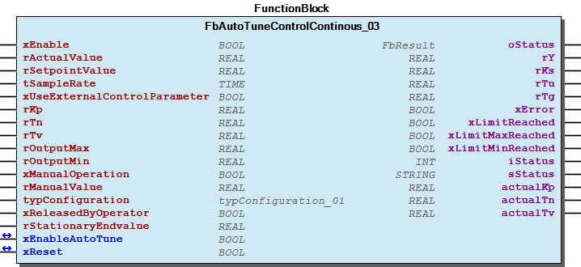 Function Description This module represents a process controller with six different phases. Enabling the autotune functionality the first time is done by activating input xEnable and xEnableAutoTune at the same time. Phase 1) Settling phase ->internal state 5 In this phase, the controlled system is supplied with a set value the size of typConfiguration.iP5StartLevel . Depending on the configuration value xUseLevelAsAbsoluteValue iP5StartLevel is used as absolute or as %-value from the setpoint. The system then waits until the system is in a stable state. This phase can also be used to bring the system close to the actual operating point. This is particularly important when the controlled system is non-linear, so that subsequent identification can determine the real behavior at the operating point as well as possible. Phase 2) Identification phase ->internal state 10 In this phase, the controlled system is supplied with a set value the size of typConfiguration.iP10IdentLevel . Depending on the configuration value xUseLevelAsAbsoluteValue iP10IdentLevel is used as absolute or as %-value from the setpoint. The waveform of the controlled system response is recorded. The module returns an error if the step response cannot be recorded completely. Such is the case if the internal memory is too small. In this case, the error message is ArrayTooSmall . The rY output is reset to zero by default. The problem can be resolved by increasing the tSampleRate sampling rate or increasing the MAX_IDENTIFICATION_ARRAY parameter. At the end of the identification phase, the controlled system parameters are determined using the inflectional tangent method. The output point for the control parameters represents the determined data set ( rKs , rTu and rTg ). Evaluating both typConfiguration.iP10StationaryEndpointControlTime and typConfiguration.rP10StationaryEndpointPercentReferenceValue inputs determines when the stationary end value is reached during the identification phase. If the process value does not change more than the typConfiguration.rP10StationaryEndpointPercentReferenceValue percent within the specified time, it is assumed that the stationary end value has been reached. This module also allows you to interrupt identification early or to start calculating the controller parameters immediately. This can be useful if the stationary end value is reached very slowly. In this case, the operator can estimate the end value from the rStationaryEndvalue input directly and trigger calculation by the xReleasedByOperator input. Phase 3) Controlling the intermediate setpoint ->internal state 20 Following the identification phase, the system reaches a specific process value. The process difference from the setpoint actually specified is determined. In this phase, the control parameters are set to an intermediate setpoint that is 50 % of the process difference. Therefore, you have the option of roughly estimating the quality of the control parameters. Phase 4) Controlling the setpoint ->internal state 30 In this phase, the specified setpoint is controlled with the calculated control parameters. The quality of the control must be assessed by the operator and improved by manual optimization, if necessary. It is recommended to use the trace functionality to get a visual impression of the process profile. The system switches to phase 5 once the setpoint is reached. Phase 5) Maintain setpoint (regulating disturbance variables) ->internal state 40 The controller operates with the controller set determined by the typConfiguration.eP40ControlMethode configuration value. The default value is CHR_aperiodisch_dis . If a new setpoint is identified, the system switches to phase 6. Phase 6) Regulating the setpoint step change ->internal state 50 The controller operates with the controller set determined by the typConfiguration.eP50ControlMethode configuration value. The default value is CHR_aperiodisch_set . Once the new setpoint is reached with the corresponding accuracy, the system switches to phase 5. Note Since the controlled system gain is unknown during initial identification, the process value is monitored using the typConfiguration.rP10MaxProcessValueWhileIdentification configuration value. When the process value threshold is reached, the output is reset to zero and the identification process terminated. However, the process value can still rise further due to the properties of the controlled system. With that said, the process value threshold should be selected as low as possible to preclude any damage due to impermissible high process values. If an error interrupts identification, the function block must be disabled once. You can then restart with a reduced value for typConfiguration.iP10IdentLevel . This module can also be used as a traditional PID controller if the xUseExternalControlParameter is set to TRUE. In this case, the controller operates with the rKp , rTn and rTv input values. Note A second identification phase is only performed if the difference between the current process value and the new setpoint rSetPointValue is at least typConfiguration.rMinProcessDifference .

## FbAutoTuneControlPWM_01 (FB)

| Scope | Name | Type | Initial | Comment | Inherited from |
| --- | --- | --- | --- | --- | --- |
| Output | oStatus | WagoSysErrorBase.FbResult |  | Status object. (Listed in Status ) The content of the error object can be displayed using FbShowResult from the WagoSysErrorBase library. | FbBase |
| Input | xEnable | BOOL |  | enable controller |  |
| rActualValue | REAL |  | actual process value |  |
| rSetpointValue | REAL |  | setpoint value |  |
| tSampleRate | TIME |  | sample rate |  |
| xUseExternalControlParameter | BOOL |  | use external control parameter set |  |
| rKp | REAL | 1.0 | PID controller ->P-part |  |
| rTn | REAL | 1.0 | PID controller -> I-part |  |
| rTv | REAL | 1.0 | PID controller -> D-part |  |
| rOutputMax | REAL | 100 | [0..100 %] maximum limit output rY |  |
| rOutputMin | REAL | 0 | [0..100 %] minimum limit output rY |  |
| xManualOperation | BOOL |  | manual mode |  |
| rManualValue | REAL |  | [0..100 %] output in manual mode |  |
| typConfiguration | typConfiguration_02 |  | configuration values |  |
| xReleasedByOperator | BOOL |  | release identification with estimated stationary end value by operator |  |
| rStationaryEndvalue | REAL |  | estimated stationary end value |  |
| Output | xPWM | BOOL |  | manipulated value |  |
| rY | REAL |  | manipulated value in % [rOutputMin..rOutputMax] |  |
| rKs | REAL |  | calculated process gain |  |
| rTu | REAL |  | calculated process dead time |  |
| rTg | REAL |  | calculated process build-up time |  |
| xError | BOOL |  | error |  |
| xLimitReached | BOOL |  | manipulated value has limit reached |  |
| xLimitMaxReached | BOOL |  | manipulated value has maximum reached |  |
| xLimitMinReached | BOOL |  | manipulated value has minimum reached |  |
| iStatus | INT |  | internal phase |  |
| sStatus | STRING |  | status information |  |
| actualKp | REAL |  | actual gain of controller |  |
| actualTn | REAL |  | actual I-part of controller |  |
| actualTv | REAL |  | actual D-part of controller |  |
| Inout | xEnableAutoTune | BOOL |  | activate autotune process, will be reset by function block |  |
| xReset | BOOL |  | reset an error |  |

A controller with autotune functionality designed for process control with a digital manipulated output

Graphical Illustration

Function Description

This module represents a process controller with six different phases. Enabling the autotune functionality the first time is done by activating input xEnable and xEnableAutoTune at the same time.

Phase 1) Settling phase ->internal state 5

In this phase, the controlled system is supplied with a set value the size of typConfiguration.iP5StartLevel . The system then waits until the system is in a stable state. This phase can also be used to bring the system close to the actual operating point. This is particularly important when the controlled system is non-linear, so that subsequent identification can determine the real behavior at the operating point as well as possible.

Phase 2) Identification phase ->internal state 10

In this phase, the controlled system is supplied with a set value the size of typConfiguration.iP10IdentLevel . The waveform of the controlled system response is recorded. The module returns an error if the step response cannot be recorded completely. Such is the case if the internal memory is too small. In this case, the error message is ArrayTooSmall . The xPWM output is reset to zero. The problem can be resolved by increasing the tSampleRate sampling rate or increasing the MAX_IDENTIFICATION_ARRAY parameter.

At the end of the identification phase, the controlled system parameters are determined using the inflectional tangent method.

The output point for the control parameters represents the determined data set ( rKs , rTu and rTg ).

Evaluating both typConfiguration.iP10StationaryEndpointControlTime and typConfiguration.rP10StationaryEndpointPercentReferenceValue inputs determines when the stationary end value is reached during the identification phase. If the process value does not change more than the typConfiguration.rP10StationaryEndpointPercentReferenceValue percent within the specified time, it is assumed that the stationary end value has been reached.

This module also allows you to interrupt identification early or to start calculating the controller parameters immediately. This can be useful if the stationary end value is reached very slowly. In this case, the operator can estimate the end value from the rStationaryEndvalue input directly and trigger calculation by the xReleasedByOperator input.

Phase 3) Controlling the intermediate setpoint ->internal state 20

Following the identification phase, the system reaches a specific process value. The process difference from the setpoint actually specified is determined. In this phase, the control parameters are set to an intermediate setpoint that is 50 % of the process difference. Therefore, you have the option of roughly estimating the quality of the control parameters.

Phase 4) Controlling the setpoint ->internal state 30

In this phase, the specified setpoint is controlled with the calculated control parameters. The quality of the control must be assessed by the operator and improved by manual optimization, if necessary. It is recommended to use the trace functionality to get a visual impression of the process profile.

The system switches to phase 5 once the setpoint is reached.

Phase 5) Maintain setpoint (regulating disturbance variables) ->internal state 40

The controller operates with the controller set determined by the typConfiguration.eP40ControlMethode configuration value. The default value is CHR_aperiodisch_dis . If a new setpoint is identified, the system switches to phase 6.

Phase 6) Regulating the setpoint step change ->internal state 50

The controller operates with the controller set determined by the typConfiguration.eP50ControlMethode configuration value. The default value is CHR_aperiodisch_set . Once the new setpoint is reached with the corresponding accuracy, the system switches to phase 5.

Since the controlled system gain is unknown during initial identification, the process value is monitored using the typConfiguration.rP10MaxProcessValueWhileIdentification configuration value.

When the process value threshold is reached, the output is reset to zero and the identification process terminated. However, the process value can still rise further due to the properties of the controlled system. With that said, the process value threshold should be selected as low as possible to preclude any damage due to impermissible high process values. If an error interrupts identification, the function block must be disabled once. You can then restart with a reduced value for typConfiguration.iP10IdentLevel .

This module can also be used as a traditional PID controller if the xUseExternalControlParameter is set to TRUE. In this case, the controller operates with the rKp , rTn and rTv input values.

A second identification phase is only performed if the difference between the current process value and the new setpoint rSetPointValue it at least typConfiguration.rMinProcessDifference .

Interface variables Function A controller with autotune functionality designed for process control with a digital manipulated output Graphical Illustration 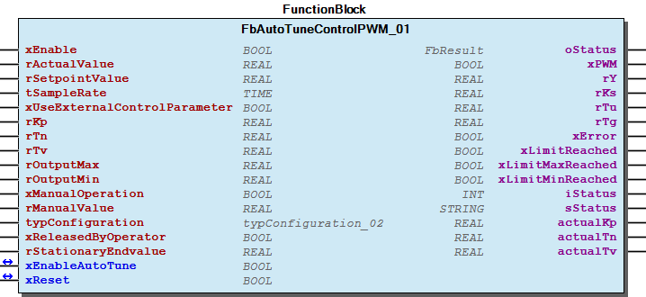 Function Description This module represents a process controller with six different phases. Enabling the autotune functionality the first time is done by activating input xEnable and xEnableAutoTune at the same time. Phase 1) Settling phase ->internal state 5 In this phase, the controlled system is supplied with a set value the size of typConfiguration.iP5StartLevel . The system then waits until the system is in a stable state. This phase can also be used to bring the system close to the actual operating point. This is particularly important when the controlled system is non-linear, so that subsequent identification can determine the real behavior at the operating point as well as possible. Phase 2) Identification phase ->internal state 10 In this phase, the controlled system is supplied with a set value the size of typConfiguration.iP10IdentLevel . The waveform of the controlled system response is recorded. The module returns an error if the step response cannot be recorded completely. Such is the case if the internal memory is too small. In this case, the error message is ArrayTooSmall . The xPWM output is reset to zero. The problem can be resolved by increasing the tSampleRate sampling rate or increasing the MAX_IDENTIFICATION_ARRAY parameter. At the end of the identification phase, the controlled system parameters are determined using the inflectional tangent method. The output point for the control parameters represents the determined data set ( rKs , rTu and rTg ). Evaluating both typConfiguration.iP10StationaryEndpointControlTime and typConfiguration.rP10StationaryEndpointPercentReferenceValue inputs determines when the stationary end value is reached during the identification phase. If the process value does not change more than the typConfiguration.rP10StationaryEndpointPercentReferenceValue percent within the specified time, it is assumed that the stationary end value has been reached. This module also allows you to interrupt identification early or to start calculating the controller parameters immediately. This can be useful if the stationary end value is reached very slowly. In this case, the operator can estimate the end value from the rStationaryEndvalue input directly and trigger calculation by the xReleasedByOperator input. Phase 3) Controlling the intermediate setpoint ->internal state 20 Following the identification phase, the system reaches a specific process value. The process difference from the setpoint actually specified is determined. In this phase, the control parameters are set to an intermediate setpoint that is 50 % of the process difference. Therefore, you have the option of roughly estimating the quality of the control parameters. Phase 4) Controlling the setpoint ->internal state 30 In this phase, the specified setpoint is controlled with the calculated control parameters. The quality of the control must be assessed by the operator and improved by manual optimization, if necessary. It is recommended to use the trace functionality to get a visual impression of the process profile. The system switches to phase 5 once the setpoint is reached. Phase 5) Maintain setpoint (regulating disturbance variables) ->internal state 40 The controller operates with the controller set determined by the typConfiguration.eP40ControlMethode configuration value. The default value is CHR_aperiodisch_dis . If a new setpoint is identified, the system switches to phase 6. Phase 6) Regulating the setpoint step change ->internal state 50 The controller operates with the controller set determined by the typConfiguration.eP50ControlMethode configuration value. The default value is CHR_aperiodisch_set . Once the new setpoint is reached with the corresponding accuracy, the system switches to phase 5. Note Since the controlled system gain is unknown during initial identification, the process value is monitored using the typConfiguration.rP10MaxProcessValueWhileIdentification configuration value. When the process value threshold is reached, the output is reset to zero and the identification process terminated. However, the process value can still rise further due to the properties of the controlled system. With that said, the process value threshold should be selected as low as possible to preclude any damage due to impermissible high process values. If an error interrupts identification, the function block must be disabled once. You can then restart with a reduced value for typConfiguration.iP10IdentLevel . This module can also be used as a traditional PID controller if the xUseExternalControlParameter is set to TRUE. In this case, the controller operates with the rKp , rTn and rTv input values. Note A second identification phase is only performed if the difference between the current process value and the new setpoint rSetPointValue it at least typConfiguration.rMinProcessDifference .

## FbAutoTuneControlPWM_03 (FB)

| Scope | Name | Type | Initial | Comment | Inherited from |
| --- | --- | --- | --- | --- | --- |
| Output | oStatus | WagoSysErrorBase.FbResult |  | Status object. (Listed in Status ) The content of the error object can be displayed using FbShowResult from the WagoSysErrorBase library. | FbBase |
| Input | xEnable | BOOL |  | enable controller |  |
| rActualValue | REAL |  | actual process value |  |
| rSetpointValue | REAL |  | setpoint value |  |
| tSampleRate | TIME |  | sample rate |  |
| xUseExternalControlParameter | BOOL |  | use external control parameter set |  |
| rKp | REAL | 1.0 | PID controller ->P-part |  |
| rTn | REAL | 1.0 | PID controller -> I-part |  |
| rTv | REAL | 1.0 | PID controller -> D-part |  |
| rOutputMax | REAL | 100 | [0..100 %] maximum limit output rY |  |
| rOutputMin | REAL | 0 | [0..100 %] minimum limit output rY |  |
| xManualOperation | BOOL |  | manual mode |  |
| rManualValue | REAL |  | [0..100 %] output in manual mode |  |
| typConfiguration | typConfiguration_02 |  | configuration values |  |
| xReleasedByOperator | BOOL |  | release identification with estimated stationary end value by operator |  |
| rStationaryEndvalue | REAL |  | estimated stationary end value |  |
| Output | xPWM | BOOL |  | manipulated value |  |
| rY | REAL |  | manipulated value in % [rOutputMin..rOutputMax] |  |
| rKs | REAL |  | calculated process gain |  |
| rTu | REAL |  | calculated process dead time |  |
| rTg | REAL |  | calculated process build-up time |  |
| xError | BOOL |  | error |  |
| xLimitReached | BOOL |  | manipulated value has limit reached |  |
| xLimitMaxReached | BOOL |  | manipulated value has maximum reached |  |
| xLimitMinReached | BOOL |  | manipulated value has minimum reached |  |
| iStatus | INT |  | internal phase |  |
| sStatus | STRING |  | status information |  |
| actualKp | REAL |  | actual gain of controller |  |
| actualTn | REAL |  | actual I-part of controller |  |
| actualTv | REAL |  | actual D-part of controller |  |
| Inout | xEnableAutoTune | BOOL |  | activate autotune process, will be reset by function block |  |
| xReset | BOOL |  | reset an error |  |

A controller with autotune functionality designed for process control with a digital manipulated output

Graphical Illustration

Function Description

This module represents a process controller with six different phases. Enabling the autotune functionality the first time is done by activating input xEnable and xEnableAutoTune at the same time.

Phase 1) Settling phase ->internal state 5

In this phase, the controlled system is supplied with a set value the size of typConfiguration.iP5StartLevel . The system then waits until the system is in a stable state. This phase can also be used to bring the system close to the actual operating point. This is particularly important when the controlled system is non-linear, so that subsequent identification can determine the real behavior at the operating point as well as possible.

Phase 2) Identification phase ->internal state 10

In this phase, the controlled system is supplied with a set value the size of typConfiguration.iP10IdentLevel . The waveform of the controlled system response is recorded. The module returns an error if the step response cannot be recorded completely. Such is the case if the internal memory is too small. In this case, the error message is ArrayTooSmall . The xPWM output is reset to zero. The problem can be resolved by increasing the tSampleRate sampling rate or increasing the MAX_IDENTIFICATION_ARRAY parameter.

At the end of the identification phase, the controlled system parameters are determined using the inflectional tangent method.

The output point for the control parameters represents the determined data set ( rKs , rTu and rTg ).

Evaluating both typConfiguration.iP10StationaryEndpointControlTime and typConfiguration.rP10StationaryEndpointPercentReferenceValue inputs determines when the stationary end value is reached during the identification phase. If the process value does not change more than the typConfiguration.rP10StationaryEndpointPercentReferenceValue percent within the specified time, it is assumed that the stationary end value has been reached.

This module also allows you to interrupt identification early or to start calculating the controller parameters immediately. This can be useful if the stationary end value is reached very slowly. In this case, the operator can estimate the end value from the rStationaryEndvalue input directly and trigger calculation by the xReleasedByOperator input.

Phase 3) Controlling the intermediate setpoint ->internal state 20

Following the identification phase, the system reaches a specific process value. The process difference from the setpoint actually specified is determined. In this phase, the control parameters are set to an intermediate setpoint that is 50 % of the process difference. Therefore, you have the option of roughly estimating the quality of the control parameters.

Phase 4) Controlling the setpoint ->internal state 30

In this phase, the specified setpoint is controlled with the calculated control parameters. The quality of the control must be assessed by the operator and improved by manual optimization, if necessary. It is recommended to use the trace functionality to get a visual impression of the process profile.

The system switches to phase 5 once the setpoint is reached.

Phase 5) Maintain setpoint (regulating disturbance variables) ->internal state 40

The controller operates with the controller set determined by the typConfiguration.eP40ControlMethode configuration value. The default value is CHR_aperiodisch_dis . If a new setpoint is identified, the system switches to phase 6.

Phase 6) Regulating the setpoint step change ->internal state 50

The controller operates with the controller set determined by the typConfiguration.eP50ControlMethode configuration value. The default value is CHR_aperiodisch_set . Once the new setpoint is reached with the corresponding accuracy, the system switches to phase 5.

Since the controlled system gain is unknown during initial identification, the process value is monitored using the typConfiguration.rP10MaxProcessValueWhileIdentification configuration value.

When the process value threshold is reached, the output is reset to zero and the identification process terminated. However, the process value can still rise further due to the properties of the controlled system. With that said, the process value threshold should be selected as low as possible to preclude any damage due to impermissible high process values. If an error interrupts identification, the function block must be disabled once. You can then restart with a reduced value for typConfiguration.iP10IdentLevel .

This module can also be used as a traditional PID controller if the xUseExternalControlParameter is set to TRUE. In this case, the controller operates with the rKp , rTn and rTv input values.

A second identification phase is only performed if the difference between the current process value and the new setpoint rSetPointValue it at least typConfiguration.rMinProcessDifference .

Interface variables Function A controller with autotune functionality designed for process control with a digital manipulated output Graphical Illustration 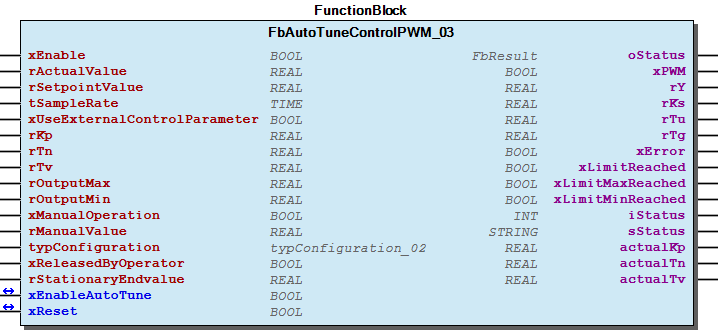 Function Description This module represents a process controller with six different phases. Enabling the autotune functionality the first time is done by activating input xEnable and xEnableAutoTune at the same time. Phase 1) Settling phase ->internal state 5 In this phase, the controlled system is supplied with a set value the size of typConfiguration.iP5StartLevel . The system then waits until the system is in a stable state. This phase can also be used to bring the system close to the actual operating point. This is particularly important when the controlled system is non-linear, so that subsequent identification can determine the real behavior at the operating point as well as possible. Phase 2) Identification phase ->internal state 10 In this phase, the controlled system is supplied with a set value the size of typConfiguration.iP10IdentLevel . The waveform of the controlled system response is recorded. The module returns an error if the step response cannot be recorded completely. Such is the case if the internal memory is too small. In this case, the error message is ArrayTooSmall . The xPWM output is reset to zero. The problem can be resolved by increasing the tSampleRate sampling rate or increasing the MAX_IDENTIFICATION_ARRAY parameter. At the end of the identification phase, the controlled system parameters are determined using the inflectional tangent method. The output point for the control parameters represents the determined data set ( rKs , rTu and rTg ). Evaluating both typConfiguration.iP10StationaryEndpointControlTime and typConfiguration.rP10StationaryEndpointPercentReferenceValue inputs determines when the stationary end value is reached during the identification phase. If the process value does not change more than the typConfiguration.rP10StationaryEndpointPercentReferenceValue percent within the specified time, it is assumed that the stationary end value has been reached. This module also allows you to interrupt identification early or to start calculating the controller parameters immediately. This can be useful if the stationary end value is reached very slowly. In this case, the operator can estimate the end value from the rStationaryEndvalue input directly and trigger calculation by the xReleasedByOperator input. Phase 3) Controlling the intermediate setpoint ->internal state 20 Following the identification phase, the system reaches a specific process value. The process difference from the setpoint actually specified is determined. In this phase, the control parameters are set to an intermediate setpoint that is 50 % of the process difference. Therefore, you have the option of roughly estimating the quality of the control parameters. Phase 4) Controlling the setpoint ->internal state 30 In this phase, the specified setpoint is controlled with the calculated control parameters. The quality of the control must be assessed by the operator and improved by manual optimization, if necessary. It is recommended to use the trace functionality to get a visual impression of the process profile. The system switches to phase 5 once the setpoint is reached. Phase 5) Maintain setpoint (regulating disturbance variables) ->internal state 40 The controller operates with the controller set determined by the typConfiguration.eP40ControlMethode configuration value. The default value is CHR_aperiodisch_dis . If a new setpoint is identified, the system switches to phase 6. Phase 6) Regulating the setpoint step change ->internal state 50 The controller operates with the controller set determined by the typConfiguration.eP50ControlMethode configuration value. The default value is CHR_aperiodisch_set . Once the new setpoint is reached with the corresponding accuracy, the system switches to phase 5. Note Since the controlled system gain is unknown during initial identification, the process value is monitored using the typConfiguration.rP10MaxProcessValueWhileIdentification configuration value. When the process value threshold is reached, the output is reset to zero and the identification process terminated. However, the process value can still rise further due to the properties of the controlled system. With that said, the process value threshold should be selected as low as possible to preclude any damage due to impermissible high process values. If an error interrupts identification, the function block must be disabled once. You can then restart with a reduced value for typConfiguration.iP10IdentLevel . This module can also be used as a traditional PID controller if the xUseExternalControlParameter is set to TRUE. In this case, the controller operates with the rKp , rTn and rTv input values. Note A second identification phase is only performed if the difference between the current process value and the new setpoint rSetPointValue it at least typConfiguration.rMinProcessDifference .

## FbAverageMovingFilter (FB)

| Scope | Name | Type | Comment |
| --- | --- | --- | --- |
| Input | rIn | REAL | input |
| wCount | INT | amount of samples taken into account |
| Inout | xReset | BOOL | reset internal buffer to zero |
| Output | rY | REAL | output |
| xError | BOOL | error occured |

A average moving filter

Graphical Illustration

Function description

The average value from wCount samples will be calculated. An error will be indicated if input wCount is greater than the parameter MAX_AVERAGE_MOVING_FILTER divided by 2.

Interface variables Function A average moving filter Graphical Illustration 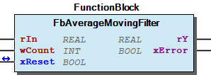 Function description The average value from wCount samples will be calculated. An error will be indicated if input wCount is greater than the parameter MAX_AVERAGE_MOVING_FILTER divided by 2.

## FbControlledSystemIdentification_01 (FB)

| Scope | Name | Type | Initial | Comment | Inherited from |
| --- | --- | --- | --- | --- | --- |
| Output | oStatus | WagoSysErrorBase.FbResult |  | Status object. (Listed in Status ) The content of the error object can be displayed using FbShowResult from the WagoSysErrorBase library. | FbBase |
| Input | xEnable | BOOL |  | enable identification |  |
| tSampleRate | TIME |  | sample rate |  |
| rActualValue | REAL |  | actual process value |  |
| rSetPoint | REAL |  | reference value |  |
| eControlledSystem | eControlledSystem | PTn | must be PTn, further modes will follow in the future |  |
| eControllerType | eControllerType | 99 | type of controller |  |
| tMaxImpuls | TIME |  | only future use |  |
| xManualOperation | BOOL |  | manual mode, no identification done |  |
| rManipulatedValueAtStart | REAL |  | manipulated value at start up |  |
| rSetPointReachedLimit | REAL | 1 | [%]; limit in percent, if the process value is within this limit, a time defined by iStationaryEndpointControlTime will be started to evaluate the stationary endvalue |  |
| iStationaryEndpointControlTime | INT |  | [s], time to check whether the process value is in the allowed range |  |
| xReleasedByOperator | BOOL |  | activate calculating of controller values by using input rStationaryEndvalue as estimated stationary endvalue |  |
| rStationaryEndvalue | REAL |  | estimated stationary endvalue |  |
| Output | xDone | BOOL |  | identification sucessful done |  |
| xBusy | BOOL |  | identification in progress |  |
| xError | BOOL |  | identification stopped with error |  |
| rValue | REAL |  | output |  |
| iBufferCounter | INT |  | actual level of internal buffer |  |
| rKs | REAL |  | calculated process gain |  |
| rTu | REAL |  | calculated process dead time constant |  |
| rTg | REAL |  | calculated process build-up time constant |  |
| aValues | ARRAY [0..4] OF typControllerValues |  | calculated controller parameter sets |  |
| typAuxData | typAuxDataIdentification |  | only used by additional function blocks from the Controller folder |  |

This function block identifies a controlled system by evaluating the step response following the inflectional tangent method.

Graphical Illustration

Function Description

This module allows identification of a controlled system. However, a non-oscillating, non-integrating controlled system is required. The eControlledSystem input must therefore always be operated with the eControlledSystem.PTn value (additional controlled system types shall be added in the future).

Identification may only be started if the system is in a steady state. Otherwise, the values are calculated incorrectly. If the module is enabled by the xEnable input, identification is started by a change at the rSetPoint input. The xManualOperation input allows to supply the controlled system manually with the value rSetPoint without the identification being carried out. This can be useful, so that identification is only executed in the vicinity of the real operating point (linearization of a nonlinear distance around the operating point). If identification is started, make sure that the rManipulatedValueAtStart input is connected correctly. If this input has an incorrect value, identification of the rKs gain factor of the controlled system is calculated incorrectly.

The default for rSetPoint must be selected to prevent damage to the controlled system. Corresponding monitoring functions must be added to the user program.

If there is no accurate knowledge of the behavior of the controlled system, start with low values for rSetPoint to get a first impression.

This module maps the real controlled system behavior by PTn approximation.

The output point for the control parameters represents the data set (rKs, rTu and rTg). The module makes the values possible for the selected eControllerType available at the aValues output. Assignment is as follows:

aValues[0] ->Ziegler, extended Ziegler-Nichols method

aValues[1] ->CHR_aperiodisch_dis, Chien/Hrones and Reswick, aperiodic disturbance response

aValues[2] ->CHR_aperiodisch_dis, Chien/Hrones and Reswick, aperiodic response to setpoint changes

aValues[3] ->CHR_20_dis, Chien/Hrones and Reswick, aperiodic disturbance response with 20 % overshoot

aValues[4] ->CHR_20_dis, Chien/Hrones and Reswick, aperiodic response to setpoint changes with 20 % overshoot

Only non-integrating systems are currently supported.

This module returns an error if the step response cannot be recorded completely. Such is the case if the internal memory is too small. In this case, the error message is ArrayTooSmall . The rValue output is reset to zero in this case. The problem can be resolved by increasing the tSampleRate sampling rate or increasing the MAX_IDENTIFICATION_ARRAY parameter.

This module also allows you to interrupt identification early or to start calculating the controller parameters immediately. This can be useful if the stationary end value is reached very slowly. In this case, the operator can estimate the end value from the rStationaryEndvalue input directly and trigger calculation by the xReleasedByOperator input.

Evaluating both iStationaryEndpointControlTime and rSetPointReachedLimit inputs determines when the stationary end value is reached during the identification phase. If the process value does not change more than the rSetPointReachedLimit percent within the specified time, it is assumed that the stationary end value has been reached.

Interface variables Function This function block identifies a controlled system by evaluating the step response following the inflectional tangent method. Graphical Illustration 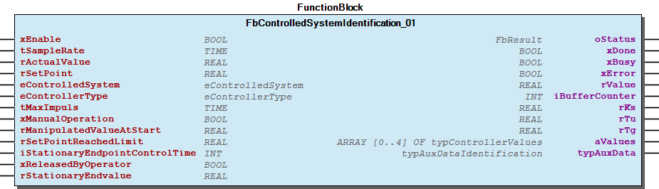 Function Description This module allows identification of a controlled system. However, a non-oscillating, non-integrating controlled system is required. The eControlledSystem input must therefore always be operated with the eControlledSystem.PTn value (additional controlled system types shall be added in the future). Identification may only be started if the system is in a steady state. Otherwise, the values are calculated incorrectly. If the module is enabled by the xEnable input, identification is started by a change at the rSetPoint input. The xManualOperation input allows to supply the controlled system manually with the value rSetPoint without the identification being carried out. This can be useful, so that identification is only executed in the vicinity of the real operating point (linearization of a nonlinear distance around the operating point). If identification is started, make sure that the rManipulatedValueAtStart input is connected correctly. If this input has an incorrect value, identification of the rKs gain factor of the controlled system is calculated incorrectly. Note The default for rSetPoint must be selected to prevent damage to the controlled system. Corresponding monitoring functions must be added to the user program. If there is no accurate knowledge of the behavior of the controlled system, start with low values for rSetPoint to get a first impression. This module maps the real controlled system behavior by PTn approximation. 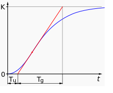 The output point for the control parameters represents the data set (rKs, rTu and rTg). The module makes the values possible for the selected eControllerType available at the aValues output. Assignment is as follows: aValues[0] ->Ziegler, extended Ziegler-Nichols method aValues[1] ->CHR_aperiodisch_dis, Chien/Hrones and Reswick, aperiodic disturbance response aValues[2] ->CHR_aperiodisch_dis, Chien/Hrones and Reswick, aperiodic response to setpoint changes aValues[3] ->CHR_20_dis, Chien/Hrones and Reswick, aperiodic disturbance response with 20 % overshoot aValues[4] ->CHR_20_dis, Chien/Hrones and Reswick, aperiodic response to setpoint changes with 20 % overshoot Only non-integrating systems are currently supported. 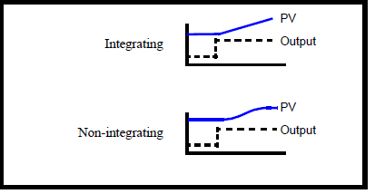 This module returns an error if the step response cannot be recorded completely. Such is the case if the internal memory is too small. In this case, the error message is ArrayTooSmall . The rValue output is reset to zero in this case. The problem can be resolved by increasing the tSampleRate sampling rate or increasing the MAX_IDENTIFICATION_ARRAY parameter. This module also allows you to interrupt identification early or to start calculating the controller parameters immediately. This can be useful if the stationary end value is reached very slowly. In this case, the operator can estimate the end value from the rStationaryEndvalue input directly and trigger calculation by the xReleasedByOperator input. Evaluating both iStationaryEndpointControlTime and rSetPointReachedLimit inputs determines when the stationary end value is reached during the identification phase. If the process value does not change more than the rSetPointReachedLimit percent within the specified time, it is assumed that the stationary end value has been reached. - FbControlledSystemIdentification_01.Identifikation_ITn (ACT) - FbControlledSystemIdentification_01.Identifikation_PTn (ACT)

## FbDelay (FB)

| Scope | Name | Type | Initial | Comment |
| --- | --- | --- | --- | --- |
| Input | rIn | REAL |  | input |
| tSampleRate | TIME |  | must be an integer multiple of tTaskIntervall,e.g. 200ms |
| tDelay | TIME | TIME#1s0ms | required delay |
| xManualOperation | BOOL |  | manual operation |
| rManualValue | REAL |  | value in manual mode |
| Inout | xReset | BOOL |  | reset |
| Output | rY | REAL |  | output |
| xError | BOOL |  | error occured |

Function block for a dead time element

Graphical Illustration

Function description

A dead time element. An error will occure if the parameter MAX_DELAY is too small to allow for the delay defined by tDelay .

Interface variables Function Function block for a dead time element Graphical Illustration 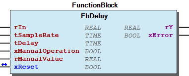 Function description A dead time element. An error will occure if the parameter MAX_DELAY is too small to allow for the delay defined by tDelay .

## FbHysteresis_01 (FB)

| Scope | Name | Type | Comment |
| --- | --- | --- | --- |
| Input | rIn | REAL | input |
| rActivate | REAL | activate level |
| rDeactivate | REAL | deactivate level |
| Output | xOut | BOOL | output |
| xBetween | BOOL | xBetween will be high when rIn is between rActivate and rDeactivate |

Hysteresis functionality

Graphical Illustration

Function description

This Hysteresis function has two modes:

Interface variables Function Hysteresis functionality Graphical Illustration 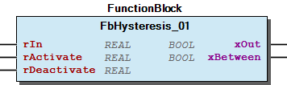 Function description This Hysteresis function has two modes: 1. if rActivate > rDeactivate then xOut will be TRUE when rIn > rActivate and FALSE when rIn rDeactivate .

## FbRamp_01 (FB)

| Scope | Name | Type | Comment |
| --- | --- | --- | --- |
| Input | xEnable | BOOL | Enable function block. |
| rIn | REAL | Input value for the ramp. |
| tSampleRate | TIME | must be an integer multiple of tTaskIntervall |
| rRampStartValue | REAL | ramp value at start |
| rRampEndValue | REAL | end value for ramp |
| tRampDuration | TIME | ramp duration |
| xManualOperation | BOOL | manual mode |
| rManualValue | REAL | value in manual mode |
| Output | rY | REAL | Output value. |
| xRampActive | BOOL | Displays ramp is active. |

Function block ensures a defined rising or falling rate of the output

Graphical Illustration

Function description

This function block must be called in each cycle.

If enabled, the output starts with the value defined by rRampStartValue . Within the time period tRampDuration the signal reaches the value defined by rRampEndValue Leaving the manual mode, while xEnable is still true, will restart the signal generation, beginning with rRampStartValue

Interface variables Function Function block ensures a defined rising or falling rate of the output Graphical Illustration 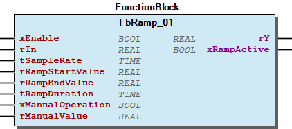 Function description This function block must be called in each cycle. If enabled, the output starts with the value defined by rRampStartValue . Within the time period tRampDuration the signal reaches the value defined by rRampEndValue Leaving the manual mode, while xEnable is still true, will restart the signal generation, beginning with rRampStartValue

## FbSaturation (FB)

| Scope | Name | Type | Comment |
| --- | --- | --- | --- |
| Input | rIn | REAL | input |
| rOutputMax | REAL | maximum value allowed for the input |
| rOutputMin | REAL | minimum value allowed for the input |
| Output | rY | REAL | output |
| xLimitReached | BOOL | output value has limit reached |
| xLimitMaxReached | BOOL | output value has maximum reached |
| xLimitMinReached | BOOL | output value has minimum reached |

This function block limits the input

Graphical Illustration

Function description

The input will be limited by the values rOutputMax and rOutputMin .

Interface variables Function This function block limits the input Graphical Illustration 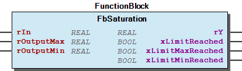 Function description The input will be limited by the values rOutputMax and rOutputMin .

## FbTemperatureControlContinous_01 (FB)

| Scope | Name | Type | Initial | Comment | Inherited from |
| --- | --- | --- | --- | --- | --- |
| Output | oStatus | WagoSysErrorBase.FbResult |  | Status object. (Listed in Status ) The content of the error object can be displayed using FbShowResult from the WagoSysErrorBase library. | FbBase |
| Input | xEnable | BOOL |  | enable controller |  |
| rActualValue | REAL |  | actual process value |  |
| rSetpointValue | REAL |  | setpoint value |  |
| tSampleRate | TIME |  | sample rate |  |
| xUseExternalControlParameter | BOOL |  | use external control parameter set |  |
| rKp | REAL | 1.0 | PID controller ->P-part |  |
| rTn | REAL | 1.0 | PID controller -> I-part |  |
| rTv | REAL | 1.0 | PID controller -> D-part |  |
| rOutputMax | REAL | 1000 | maximum limit output rY |  |
| rOutputMin | REAL | -1000 | minimum limit output rY |  |
| xManualOperation | BOOL |  | manual mode |  |
| rManualValue | REAL |  | output in manual mode |  |
| typTempConfiguration | typTempConfiguration_01 |  | configuration values |  |
| xReleasedByOperator | BOOL |  | release identification with estimated stationary end value by operator |  |
| rStationaryEndvalue | REAL |  | estimated stationary end value |  |
| xDisablePT1D_Part | BOOL |  | disable PT1D part within control algorithm |  |
| Output | rY | REAL |  | manipulated value in % [rOutputMin..rOutputMax] |  |
| rKs | REAL |  | calculated process gain |  |
| rTu | REAL |  | calculated process dead time |  |
| rTg | REAL |  | calculated process build-up time |  |
| xError | BOOL |  | error |  |
| xLimitReached | BOOL |  | manipulated value has limit reached |  |
| xLimitMaxReached | BOOL |  | manipulated value has maximum reached |  |
| xLimitMinReached | BOOL |  | manipulated value has minimum reached |  |
| iStatus | INT |  | internal phase |  |
| sStatus | STRING |  | status information |  |
| actualKp | REAL |  | actual gain of controller |  |
| actualTn | REAL |  | actual I-part of controller |  |
| actualTv | REAL |  | actual D-part of controller |  |
| Inout | xEnableAutoTune | BOOL |  | activate autotune process, will be reset by function block |  |
| xReset | BOOL |  | reset an error |  |

A controller with autotune functionality designed for temperature control with an analog manipulated output

Graphical Illustration

Function Description

This module represents a temperature controller with six different phases.

Phase 1) Settling phase ->internal state 5

In this phase, the controlled system is supplied with a set value the size of typTempConfiguration.iP5StartLevel . Depending on the configuration value xUseLevelAsAbsoluteValue iP5StartLevel is used as absolute or as %-value from the setpoint.

The system then waits until the system is in a stable state.

This phase can also be used to bring the system close to the actual operating point. This is particularly important when the controlled system is non-linear, so that subsequent identification can determine the real behavior at the operating point as well as possible.

Phase 2) Identification phase ->internal state 10

In this phase, the controlled system is supplied with a set value the size of typTempConfiguration.iP10IdentLevel . Depending on the configuration value xUseLevelAsAbsoluteValue iP10IdentLevel is used as absolute or as %-value from the setpoint. The waveform of the controlled system response is recorded. The module returns an error if the step response cannot be recorded completely. Such is the case if the internal memory is too small. In this case, the error message is ArrayTooSmall . The rY output is reset to zero by default. The problem can be resolved by increasing the tSampleRate sampling rate or increasing the MAX_IDENTIFICATION_ARRAY parameter.

At the end of the identification phase, the controlled system parameters are determined using the inflectional tangent method.

The output point for the control parameters represents the determined data set ( rKs , rTu and rTg ).

Evaluating both typTempConfiguration.iP10StationaryEndpointControlTime and typTempConfiguration.rP10StationaryEndpointPercentReferenceValue inputs determines when the stationary end value is reached during the identification phase. If the process value does not change more than the typTempConfiguration.rP10StationaryEndpointPercentReferenceValue percent within the specified time, it is assumed that the stationary end value has been reached.

This module also allows you to interrupt identification early or to start calculating the controller parameters immediately. This can be useful if the stationary end value is reached very slowly. In this case, the operator can estimate the end value from the rStationaryEndvalue input directly and trigger calculation by the xReleasedByOperator input.

Phase 3) Controlling the intermediate setpoint ->internal state 20

Following the identification phase, the system reaches a specific temperature. The temperature difference from the setpoint actually specified is determined. In this phase, the control parameters are set to an intermediate setpoint that is 50 % of the temperature difference. Therefore, you have the option of roughly estimating the quality of the control parameters.

Phase 4) Controlling the setpoint ->internal state 30

In this phase, the specified setpoint is controlled with the calculated control parameters. The quality of the control must be assessed by the operator and improved by manual optimization, if necessary. It is recommended to use the trace functionality to get a visual impression of the temperature profile.

The system switches to phase 5 once the setpoint is reached.

Phase 5) Maintain setpoint (regulating disturbance variables) ->internal state 40

The controller operates with the controller set determined by the typTempConfiguration.eP40ControlMethode configuration value. The default value is CHR_aperiodisch_dis . If a new setpoint is identified, the system switches to phase 6.

Phase 6) Regulating the setpoint step change ->internal state 50

The controller operates with the controller set determined by the typTempConfiguration.eP50ControlMethode configuration value. The default value is CHR_aperiodisch_set . Once the new setpoint is reached with the corresponding accuracy, the system switches to phase 5.

Since the controlled system gain is unknown during initial identification, the temperature is monitored using the typTempConfiguration.rP10MaxTemperatureWhileIdentification configuration value.

When the temperature threshold is reached, the output is reset to zero and the identification process terminated. However, the process temperature can still rise further due to the properties of the controlled system. With that said, the temperature threshold should be selected as low as possible to preclude any damage due to impermissible high temperatures. If an error interrupts identification, the function block must be disabled once. You can then restart with a reduced value for typTempConfiguration.iP10IdentLevel .

This module can also be used as a traditional PID controller if the xUseExternalControlParameter is set to TRUE. In this case, the controller operates with the rKp , rTn and rTv input values.

A second identification phase is only performed if the temperature difference between the current temperature and the new setpoint rSetPointValue it greater than typTempConfiguration.rMinProcessDifference .

Interface variables Function A controller with autotune functionality designed for temperature control with an analog manipulated output Graphical Illustration  Function Description This module represents a temperature controller with six different phases. Phase 1) Settling phase ->internal state 5 In this phase, the controlled system is supplied with a set value the size of typTempConfiguration.iP5StartLevel . Depending on the configuration value xUseLevelAsAbsoluteValue iP5StartLevel is used as absolute or as %-value from the setpoint. The system then waits until the system is in a stable state. This phase can also be used to bring the system close to the actual operating point. This is particularly important when the controlled system is non-linear, so that subsequent identification can determine the real behavior at the operating point as well as possible. Phase 2) Identification phase ->internal state 10 In this phase, the controlled system is supplied with a set value the size of typTempConfiguration.iP10IdentLevel . Depending on the configuration value xUseLevelAsAbsoluteValue iP10IdentLevel is used as absolute or as %-value from the setpoint. The waveform of the controlled system response is recorded. The module returns an error if the step response cannot be recorded completely. Such is the case if the internal memory is too small. In this case, the error message is ArrayTooSmall . The rY output is reset to zero by default. The problem can be resolved by increasing the tSampleRate sampling rate or increasing the MAX_IDENTIFICATION_ARRAY parameter. At the end of the identification phase, the controlled system parameters are determined using the inflectional tangent method. The output point for the control parameters represents the determined data set ( rKs , rTu and rTg ). Evaluating both typTempConfiguration.iP10StationaryEndpointControlTime and typTempConfiguration.rP10StationaryEndpointPercentReferenceValue inputs determines when the stationary end value is reached during the identification phase. If the process value does not change more than the typTempConfiguration.rP10StationaryEndpointPercentReferenceValue percent within the specified time, it is assumed that the stationary end value has been reached. This module also allows you to interrupt identification early or to start calculating the controller parameters immediately. This can be useful if the stationary end value is reached very slowly. In this case, the operator can estimate the end value from the rStationaryEndvalue input directly and trigger calculation by the xReleasedByOperator input. Phase 3) Controlling the intermediate setpoint ->internal state 20 Following the identification phase, the system reaches a specific temperature. The temperature difference from the setpoint actually specified is determined. In this phase, the control parameters are set to an intermediate setpoint that is 50 % of the temperature difference. Therefore, you have the option of roughly estimating the quality of the control parameters. Phase 4) Controlling the setpoint ->internal state 30 In this phase, the specified setpoint is controlled with the calculated control parameters. The quality of the control must be assessed by the operator and improved by manual optimization, if necessary. It is recommended to use the trace functionality to get a visual impression of the temperature profile. The system switches to phase 5 once the setpoint is reached. Phase 5) Maintain setpoint (regulating disturbance variables) ->internal state 40 The controller operates with the controller set determined by the typTempConfiguration.eP40ControlMethode configuration value. The default value is CHR_aperiodisch_dis . If a new setpoint is identified, the system switches to phase 6. Phase 6) Regulating the setpoint step change ->internal state 50 The controller operates with the controller set determined by the typTempConfiguration.eP50ControlMethode configuration value. The default value is CHR_aperiodisch_set . Once the new setpoint is reached with the corresponding accuracy, the system switches to phase 5. Note Since the controlled system gain is unknown during initial identification, the temperature is monitored using the typTempConfiguration.rP10MaxTemperatureWhileIdentification configuration value. When the temperature threshold is reached, the output is reset to zero and the identification process terminated. However, the process temperature can still rise further due to the properties of the controlled system. With that said, the temperature threshold should be selected as low as possible to preclude any damage due to impermissible high temperatures. If an error interrupts identification, the function block must be disabled once. You can then restart with a reduced value for typTempConfiguration.iP10IdentLevel . This module can also be used as a traditional PID controller if the xUseExternalControlParameter is set to TRUE. In this case, the controller operates with the rKp , rTn and rTv input values. Note A second identification phase is only performed if the temperature difference between the current temperature and the new setpoint rSetPointValue it greater than typTempConfiguration.rMinProcessDifference .

## FbTemperatureControlContinous_03 (FB)

| Scope | Name | Type | Initial | Comment | Inherited from |
| --- | --- | --- | --- | --- | --- |
| Output | oStatus | WagoSysErrorBase.FbResult |  | Status object. (Listed in Status ) The content of the error object can be displayed using FbShowResult from the WagoSysErrorBase library. | FbBase |
| Input | xEnable | BOOL |  | enable controller |  |
| rActualValue | REAL |  | actual process value |  |
| rSetpointValue | REAL |  | setpoint value |  |
| tSampleRate | TIME |  | sample rate |  |
| xUseExternalControlParameter | BOOL |  | use external control parameter set |  |
| rKp | REAL | 1.0 | PID controller ->P-part |  |
| rTn | REAL | 1.0 | PID controller -> I-part |  |
| rTv | REAL | 1.0 | PID controller -> D-part |  |
| rOutputMax | REAL | 1000 | maximum limit output rY |  |
| rOutputMin | REAL | -1000 | minimum limit output rY |  |
| xManualOperation | BOOL |  | manual mode |  |
| rManualValue | REAL |  | output in manual mode |  |
| typTempConfiguration | typTempConfiguration_01 |  | configuration values |  |
| xReleasedByOperator | BOOL |  | release identification with estimated stationary end value by operator |  |
| rStationaryEndvalue | REAL |  | estimated stationary end value |  |
| xDisablePT1D_Part | BOOL |  | disable PT1D part within control algorithm |  |
| Output | rY | REAL |  | manipulated value in % [rOutputMin..rOutputMax] |  |
| rKs | REAL |  | calculated process gain |  |
| rTu | REAL |  | calculated process dead time |  |
| rTg | REAL |  | calculated process build-up time |  |
| xError | BOOL |  | error |  |
| xLimitReached | BOOL |  | manipulated value has limit reached |  |
| xLimitMaxReached | BOOL |  | manipulated value has maximum reached |  |
| xLimitMinReached | BOOL |  | manipulated value has minimum reached |  |
| iStatus | INT |  | internal phase |  |
| sStatus | STRING |  | status information |  |
| actualKp | REAL |  | actual gain of controller |  |
| actualTn | REAL |  | actual I-part of controller |  |
| actualTv | REAL |  | actual D-part of controller |  |
| Inout | xEnableAutoTune | BOOL |  | activate autotune process, will be reset by function block |  |
| xReset | BOOL |  | reset an error |  |

A controller with autotune functionality designed for temperature control with an analog manipulated output

Graphical Illustration

Function Description

This module represents a temperature controller with six different phases.

Phase 1) Settling phase ->internal state 5

In this phase, the controlled system is supplied with a set value the size of typTempConfiguration.iP5StartLevel . Depending on the configuration value xUseLevelAsAbsoluteValue iP5StartLevel is used as absolute or as %-value from the setpoint.

The system then waits until the system is in a stable state.

This phase can also be used to bring the system close to the actual operating point. This is particularly important when the controlled system is non-linear, so that subsequent identification can determine the real behavior at the operating point as well as possible.

Phase 2) Identification phase ->internal state 10

In this phase, the controlled system is supplied with a set value the size of typTempConfiguration.iP10IdentLevel . Depending on the configuration value xUseLevelAsAbsoluteValue iP10IdentLevel is used as absolute or as %-value from the setpoint. The waveform of the controlled system response is recorded. The module returns an error if the step response cannot be recorded completely. Such is the case if the internal memory is too small. In this case, the error message is ArrayTooSmall . The rY output is reset to zero by default. The problem can be resolved by increasing the tSampleRate sampling rate or increasing the MAX_IDENTIFICATION_ARRAY parameter.

At the end of the identification phase, the controlled system parameters are determined using the inflectional tangent method.

The output point for the control parameters represents the determined data set ( rKs , rTu and rTg ).

Evaluating both typTempConfiguration.iP10StationaryEndpointControlTime and typTempConfiguration.rP10StationaryEndpointPercentReferenceValue inputs determines when the stationary end value is reached during the identification phase. If the process value does not change more than the typTempConfiguration.rP10StationaryEndpointPercentReferenceValue percent within the specified time, it is assumed that the stationary end value has been reached.

This module also allows you to interrupt identification early or to start calculating the controller parameters immediately. This can be useful if the stationary end value is reached very slowly. In this case, the operator can estimate the end value from the rStationaryEndvalue input directly and trigger calculation by the xReleasedByOperator input.

Phase 3) Controlling the intermediate setpoint ->internal state 20

Following the identification phase, the system reaches a specific temperature. The temperature difference from the setpoint actually specified is determined. In this phase, the control parameters are set to an intermediate setpoint that is 50 % of the temperature difference. Therefore, you have the option of roughly estimating the quality of the control parameters.

Phase 4) Controlling the setpoint ->internal state 30

In this phase, the specified setpoint is controlled with the calculated control parameters. The quality of the control must be assessed by the operator and improved by manual optimization, if necessary. It is recommended to use the trace functionality to get a visual impression of the temperature profile.

The system switches to phase 5 once the setpoint is reached.

Phase 5) Maintain setpoint (regulating disturbance variables) ->internal state 40

The controller operates with the controller set determined by the typTempConfiguration.eP40ControlMethode configuration value. The default value is CHR_aperiodisch_dis . If a new setpoint is identified, the system switches to phase 6.

Phase 6) Regulating the setpoint step change ->internal state 50

The controller operates with the controller set determined by the typTempConfiguration.eP50ControlMethode configuration value. The default value is CHR_aperiodisch_set . Once the new setpoint is reached with the corresponding accuracy, the system switches to phase 5.

Since the controlled system gain is unknown during initial identification, the temperature is monitored using the typTempConfiguration.rP10MaxTemperatureWhileIdentification configuration value.

When the temperature threshold is reached, the output is reset to zero and the identification process terminated. However, the process temperature can still rise further due to the properties of the controlled system. With that said, the temperature threshold should be selected as low as possible to preclude any damage due to impermissible high temperatures. If an error interrupts identification, the function block must be disabled once. You can then restart with a reduced value for typTempConfiguration.iP10IdentLevel .

This module can also be used as a traditional PID controller if the xUseExternalControlParameter is set to TRUE. In this case, the controller operates with the rKp , rTn and rTv input values.

A second identification phase is only performed if the temperature difference between the current temperature and the new setpoint rSetPointValue it greater than typTempConfiguration.rMinProcessDifference .

Interface variables Function A controller with autotune functionality designed for temperature control with an analog manipulated output Graphical Illustration  Function Description This module represents a temperature controller with six different phases. Phase 1) Settling phase ->internal state 5 In this phase, the controlled system is supplied with a set value the size of typTempConfiguration.iP5StartLevel . Depending on the configuration value xUseLevelAsAbsoluteValue iP5StartLevel is used as absolute or as %-value from the setpoint. The system then waits until the system is in a stable state. This phase can also be used to bring the system close to the actual operating point. This is particularly important when the controlled system is non-linear, so that subsequent identification can determine the real behavior at the operating point as well as possible. Phase 2) Identification phase ->internal state 10 In this phase, the controlled system is supplied with a set value the size of typTempConfiguration.iP10IdentLevel . Depending on the configuration value xUseLevelAsAbsoluteValue iP10IdentLevel is used as absolute or as %-value from the setpoint. The waveform of the controlled system response is recorded. The module returns an error if the step response cannot be recorded completely. Such is the case if the internal memory is too small. In this case, the error message is ArrayTooSmall . The rY output is reset to zero by default. The problem can be resolved by increasing the tSampleRate sampling rate or increasing the MAX_IDENTIFICATION_ARRAY parameter. At the end of the identification phase, the controlled system parameters are determined using the inflectional tangent method. The output point for the control parameters represents the determined data set ( rKs , rTu and rTg ). Evaluating both typTempConfiguration.iP10StationaryEndpointControlTime and typTempConfiguration.rP10StationaryEndpointPercentReferenceValue inputs determines when the stationary end value is reached during the identification phase. If the process value does not change more than the typTempConfiguration.rP10StationaryEndpointPercentReferenceValue percent within the specified time, it is assumed that the stationary end value has been reached. This module also allows you to interrupt identification early or to start calculating the controller parameters immediately. This can be useful if the stationary end value is reached very slowly. In this case, the operator can estimate the end value from the rStationaryEndvalue input directly and trigger calculation by the xReleasedByOperator input. Phase 3) Controlling the intermediate setpoint ->internal state 20 Following the identification phase, the system reaches a specific temperature. The temperature difference from the setpoint actually specified is determined. In this phase, the control parameters are set to an intermediate setpoint that is 50 % of the temperature difference. Therefore, you have the option of roughly estimating the quality of the control parameters. Phase 4) Controlling the setpoint ->internal state 30 In this phase, the specified setpoint is controlled with the calculated control parameters. The quality of the control must be assessed by the operator and improved by manual optimization, if necessary. It is recommended to use the trace functionality to get a visual impression of the temperature profile. The system switches to phase 5 once the setpoint is reached. Phase 5) Maintain setpoint (regulating disturbance variables) ->internal state 40 The controller operates with the controller set determined by the typTempConfiguration.eP40ControlMethode configuration value. The default value is CHR_aperiodisch_dis . If a new setpoint is identified, the system switches to phase 6. Phase 6) Regulating the setpoint step change ->internal state 50 The controller operates with the controller set determined by the typTempConfiguration.eP50ControlMethode configuration value. The default value is CHR_aperiodisch_set . Once the new setpoint is reached with the corresponding accuracy, the system switches to phase 5. Note Since the controlled system gain is unknown during initial identification, the temperature is monitored using the typTempConfiguration.rP10MaxTemperatureWhileIdentification configuration value. When the temperature threshold is reached, the output is reset to zero and the identification process terminated. However, the process temperature can still rise further due to the properties of the controlled system. With that said, the temperature threshold should be selected as low as possible to preclude any damage due to impermissible high temperatures. If an error interrupts identification, the function block must be disabled once. You can then restart with a reduced value for typTempConfiguration.iP10IdentLevel . This module can also be used as a traditional PID controller if the xUseExternalControlParameter is set to TRUE. In this case, the controller operates with the rKp , rTn and rTv input values. Note A second identification phase is only performed if the temperature difference between the current temperature and the new setpoint rSetPointValue it greater than typTempConfiguration.rMinProcessDifference .

## FbTemperatureControlPWM_01 (FB)

| Scope | Name | Type | Initial | Comment | Inherited from |
| --- | --- | --- | --- | --- | --- |
| Output | oStatus | WagoSysErrorBase.FbResult |  | Status object. (Listed in Status ) The content of the error object can be displayed using FbShowResult from the WagoSysErrorBase library. | FbBase |
| Input | xEnable | BOOL |  | enable controller |  |
| rActualValue | REAL |  | actual process value |  |
| rSetpointValue | REAL |  | setpoint value |  |
| tSampleRate | TIME |  | sample rate |  |
| xUseExternalControlParameter | BOOL |  | use external control parameter set |  |
| rKp | REAL | 1.0 | PID controller ->P-part |  |
| rTn | REAL | 1.0 | PID controller -> I-part |  |
| rTv | REAL | 1.0 | PID controller -> D-part |  |
| rOutputMax | REAL | 100 | [0..100 %] maximum limit output rY |  |
| rOutputMin | REAL | 0 | [0..100 %] minimum limit output rY |  |
| xManualOperation | BOOL |  | manual mode |  |
| rManualValue | REAL |  | [0..100 %] output in manual mode |  |
| typTempConfiguration | typTempConfiguration_02 |  | configuration values |  |
| xReleasedByOperator | BOOL |  | release identification with estimated stationary end value by operator |  |
| rStationaryEndvalue | REAL |  | estimated stationary end value |  |
| xDisablePT1D_Part | BOOL |  | disable PT1D part within control algorithm |  |
| Output | xPWM | BOOL |  | manipulated value |  |
| rY | REAL |  | manipulated value in % [rOutputMin..rOutputMax] |  |
| rKs | REAL |  | calculated process gain |  |
| rTu | REAL |  | calculated process dead time |  |
| rTg | REAL |  | calculated process build-up time |  |
| xError | BOOL |  | error |  |
| xLimitReached | BOOL |  | manipulated value has limit reached |  |
| xLimitMaxReached | BOOL |  | manipulated value has maximum reached |  |
| xLimitMinReached | BOOL |  | manipulated value has minimum reached |  |
| iStatus | INT |  | internal phase |  |
| sStatus | STRING |  | status information |  |
| actualKp | REAL |  | actual gain of controller |  |
| actualTn | REAL |  | actual I-part of controller |  |
| actualTv | REAL |  | actual D-part of controller |  |
| Inout | xEnableAutoTune | BOOL |  | activate autotune process, will be reset by function block |  |
| xReset | BOOL |  | reset an error |  |

A controller with autotune functionality designed for temperature control with a digital manipulated output

Graphical Illustration

Function Description

This module represents a temperature controller with six different phases.

Phase 1) Settling phase ->internal state 5

In this phase, the controlled system is supplied with a set value the size of typTempConfiguration.iP5StartLevel . The system then waits until the system is in a stable state.

This phase can also be used to bring the system close to the actual operating point. This is particularly important when the controlled system is non-linear, so that subsequent identification can determine the real behavior at the operating point as well as possible.

Phase 2) Identification phase ->internal state 10

In this phase, the controlled system is supplied with a set value the size of typTempConfiguration.iP10IdentLevel . The waveform of the controlled system response is recorded. The module returns an error if the step response cannot be recorded completely. Such is the case if the internal memory is too small. In this case, the error message is ArrayTooSmall . The xPWM output is reset to zero. The problem can be resolved by increasing the tSampleRate sampling rate or increasing the MAX_IDENTIFICATION_ARRAY parameter.

At the end of the identification phase, the controlled system parameters are determined using the inflectional tangent method.

The output point for the control parameters represents the determined data set ( rKs , rTu and rTg ).

Evaluating both typTempConfiguration.iP10StationaryEndpointControlTime and typTempConfiguration.rP10StationaryEndpointPercentReferenceValue inputs determines when the stationary end value is reached during the identification phase. If the process value does not change more than the typTempConfiguration.rP10StationaryEndpointPercentReferenceValue percent within the specified time, it is assumed that the stationary end value has been reached.

This module also allows you to interrupt identification early or to start calculating the controller parameters immediately. This can be useful if the stationary end value is reached very slowly. In this case, the operator can estimate the end value from the rStationaryEndvalue input directly and trigger calculation by the xReleasedByOperator input.

Phase 3) Controlling the intermediate setpoint ->internal state 20

Following the identification phase, the system reaches a specific temperature. The temperature difference from the setpoint actually specified is determined. In this phase, the control parameters are set to an intermediate setpoint that is 50 % of the temperature difference. Therefore, you have the option of roughly estimating the quality of the control parameters.

Phase 4) Controlling the setpoint ->internal state 30

In this phase, the specified setpoint is controlled with the calculated control parameters. The quality of the control must be assessed by the operator and improved by manual optimization, if necessary. It is recommended to use the trace functionality to get a visual impression of the temperature profile.

The system switches to phase 5 once the setpoint is reached.

Phase 5) Maintain setpoint (regulating disturbance variables) ->internal state 40

The controller operates with the controller set determined by the typTempConfiguration.eP40ControlMethode configuration value. The default value is CHR_aperiodisch_dis . If a new setpoint is identified, the system switches to phase 6.

Phase 6) Regulating the setpoint step change ->internal state 50

The controller operates with the controller set determined by the typTempConfiguration.eP50ControlMethode configuration value. The default value is CHR_aperiodisch_set . Once the new setpoint is reached with the corresponding accuracy, the system switches to phase 5.

Since the controlled system gain is unknown during initial identification, the temperature is monitored using the typTempConfiguration.rP10MaxTemperatureWhileIdentification configuration value.

When the temperature threshold is reached, the output is reset to zero and the identification process terminated. However, the process temperature can still rise further due to the properties of the controlled system. With that said, the temperature threshold should be selected as low as possible to preclude any damage due to impermissible high temperatures. If an error interrupts identification, the function block must be disabled once. You can then restart with a reduced value for typTempConfiguration.iP10IdentLevel .

This module can also be used as a traditional PID controller if the xUseExternalControlParameter is set to TRUE. In this case, the controller operates with the rKp , rTn and rTv input values.

A second identification phase is only performed if the temperature difference between the current temperature and the new setpoint rSetPointValue it greater than typTempConfiguration.rMinProcessDifference .

Interface variables Function A controller with autotune functionality designed for temperature control with a digital manipulated output Graphical Illustration 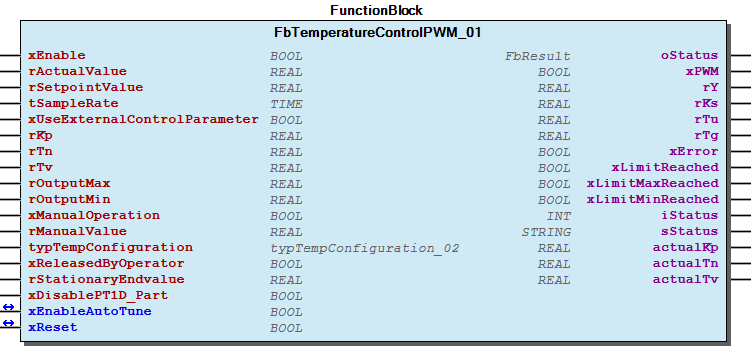 Function Description This module represents a temperature controller with six different phases. Phase 1) Settling phase ->internal state 5 In this phase, the controlled system is supplied with a set value the size of typTempConfiguration.iP5StartLevel . The system then waits until the system is in a stable state. This phase can also be used to bring the system close to the actual operating point. This is particularly important when the controlled system is non-linear, so that subsequent identification can determine the real behavior at the operating point as well as possible. Phase 2) Identification phase ->internal state 10 In this phase, the controlled system is supplied with a set value the size of typTempConfiguration.iP10IdentLevel . The waveform of the controlled system response is recorded. The module returns an error if the step response cannot be recorded completely. Such is the case if the internal memory is too small. In this case, the error message is ArrayTooSmall . The xPWM output is reset to zero. The problem can be resolved by increasing the tSampleRate sampling rate or increasing the MAX_IDENTIFICATION_ARRAY parameter. At the end of the identification phase, the controlled system parameters are determined using the inflectional tangent method. The output point for the control parameters represents the determined data set ( rKs , rTu and rTg ). Evaluating both typTempConfiguration.iP10StationaryEndpointControlTime and typTempConfiguration.rP10StationaryEndpointPercentReferenceValue inputs determines when the stationary end value is reached during the identification phase. If the process value does not change more than the typTempConfiguration.rP10StationaryEndpointPercentReferenceValue percent within the specified time, it is assumed that the stationary end value has been reached. This module also allows you to interrupt identification early or to start calculating the controller parameters immediately. This can be useful if the stationary end value is reached very slowly. In this case, the operator can estimate the end value from the rStationaryEndvalue input directly and trigger calculation by the xReleasedByOperator input. Phase 3) Controlling the intermediate setpoint ->internal state 20 Following the identification phase, the system reaches a specific temperature. The temperature difference from the setpoint actually specified is determined. In this phase, the control parameters are set to an intermediate setpoint that is 50 % of the temperature difference. Therefore, you have the option of roughly estimating the quality of the control parameters. Phase 4) Controlling the setpoint ->internal state 30 In this phase, the specified setpoint is controlled with the calculated control parameters. The quality of the control must be assessed by the operator and improved by manual optimization, if necessary. It is recommended to use the trace functionality to get a visual impression of the temperature profile. The system switches to phase 5 once the setpoint is reached. Phase 5) Maintain setpoint (regulating disturbance variables) ->internal state 40 The controller operates with the controller set determined by the typTempConfiguration.eP40ControlMethode configuration value. The default value is CHR_aperiodisch_dis . If a new setpoint is identified, the system switches to phase 6. Phase 6) Regulating the setpoint step change ->internal state 50 The controller operates with the controller set determined by the typTempConfiguration.eP50ControlMethode configuration value. The default value is CHR_aperiodisch_set . Once the new setpoint is reached with the corresponding accuracy, the system switches to phase 5. Note Since the controlled system gain is unknown during initial identification, the temperature is monitored using the typTempConfiguration.rP10MaxTemperatureWhileIdentification configuration value. When the temperature threshold is reached, the output is reset to zero and the identification process terminated. However, the process temperature can still rise further due to the properties of the controlled system. With that said, the temperature threshold should be selected as low as possible to preclude any damage due to impermissible high temperatures. If an error interrupts identification, the function block must be disabled once. You can then restart with a reduced value for typTempConfiguration.iP10IdentLevel . This module can also be used as a traditional PID controller if the xUseExternalControlParameter is set to TRUE. In this case, the controller operates with the rKp , rTn and rTv input values. Note A second identification phase is only performed if the temperature difference between the current temperature and the new setpoint rSetPointValue it greater than typTempConfiguration.rMinProcessDifference .

## FbTemperatureControlPWM_03 (FB)

| Scope | Name | Type | Initial | Comment | Inherited from |
| --- | --- | --- | --- | --- | --- |
| Output | oStatus | WagoSysErrorBase.FbResult |  | Status object. (Listed in Status ) The content of the error object can be displayed using FbShowResult from the WagoSysErrorBase library. | FbBase |
| Input | xEnable | BOOL |  | enable controller |  |
| rActualValue | REAL |  | actual process value |  |
| rSetpointValue | REAL |  | setpoint value |  |
| tSampleRate | TIME |  | sample rate |  |
| xUseExternalControlParameter | BOOL |  | use external control parameter set |  |
| rKp | REAL | 1.0 | PID controller ->P-part |  |
| rTn | REAL | 1.0 | PID controller -> I-part |  |
| rTv | REAL | 1.0 | PID controller -> D-part |  |
| rOutputMax | REAL | 100 | [0..100 %] maximum limit output rY |  |
| rOutputMin | REAL | 0 | [0..100 %] minimum limit output rY |  |
| xManualOperation | BOOL |  | manual mode |  |
| rManualValue | REAL |  | [0..100 %] output in manual mode |  |
| typTempConfiguration | typTempConfiguration_02 |  | configuration values |  |
| xReleasedByOperator | BOOL |  | release identification with estimated stationary end value by operator |  |
| rStationaryEndvalue | REAL |  | estimated stationary end value |  |
| xDisablePT1D_Part | BOOL |  | disable PT1D part within control algorithm |  |
| Output | xPWM | BOOL |  | manipulated value |  |
| rY | REAL |  | manipulated value in % [rOutputMin..rOutputMax] |  |
| rKs | REAL |  | calculated process gain |  |
| rTu | REAL |  | calculated process dead time |  |
| rTg | REAL |  | calculated process build-up time |  |
| xError | BOOL |  | error |  |
| xLimitReached | BOOL |  | manipulated value has limit reached |  |
| xLimitMaxReached | BOOL |  | manipulated value has maximum reached |  |
| xLimitMinReached | BOOL |  | manipulated value has minimum reached |  |
| iStatus | INT |  | internal phase |  |
| sStatus | STRING |  | status information |  |
| actualKp | REAL |  | actual gain of controller |  |
| actualTn | REAL |  | actual I-part of controller |  |
| actualTv | REAL |  | actual D-part of controller |  |
| Inout | xEnableAutoTune | BOOL |  | activate autotune process, will be reset by function block |  |
| xReset | BOOL |  | reset an error |  |

A controller with autotune functionality designed for temperature control with a digital manipulated output

Graphical Illustration

Function Description

This module represents a temperature controller with six different phases.

Phase 1) Settling phase ->internal state 5

In this phase, the controlled system is supplied with a set value the size of typTempConfiguration.iP5StartLevel . The system then waits until the system is in a stable state.

This phase can also be used to bring the system close to the actual operating point. This is particularly important when the controlled system is non-linear, so that subsequent identification can determine the real behavior at the operating point as well as possible.

Phase 2) Identification phase ->internal state 10

In this phase, the controlled system is supplied with a set value the size of typTempConfiguration.iP10IdentLevel . The waveform of the controlled system response is recorded. The module returns an error if the step response cannot be recorded completely. Such is the case if the internal memory is too small. In this case, the error message is ArrayTooSmall . The xPWM output is reset to zero. The problem can be resolved by increasing the tSampleRate sampling rate or increasing the MAX_IDENTIFICATION_ARRAY parameter.

At the end of the identification phase, the controlled system parameters are determined using the inflectional tangent method.

The output point for the control parameters represents the determined data set ( rKs , rTu and rTg ).

Evaluating both typTempConfiguration.iP10StationaryEndpointControlTime and typTempConfiguration.rP10StationaryEndpointPercentReferenceValue inputs determines when the stationary end value is reached during the identification phase. If the process value does not change more than the typTempConfiguration.rP10StationaryEndpointPercentReferenceValue percent within the specified time, it is assumed that the stationary end value has been reached.

This module also allows you to interrupt identification early or to start calculating the controller parameters immediately. This can be useful if the stationary end value is reached very slowly. In this case, the operator can estimate the end value from the rStationaryEndvalue input directly and trigger calculation by the xReleasedByOperator input.

Phase 3) Controlling the intermediate setpoint ->internal state 20

Following the identification phase, the system reaches a specific temperature. The temperature difference from the setpoint actually specified is determined. In this phase, the control parameters are set to an intermediate setpoint that is 50 % of the temperature difference. Therefore, you have the option of roughly estimating the quality of the control parameters.

Phase 4) Controlling the setpoint ->internal state 30

In this phase, the specified setpoint is controlled with the calculated control parameters. The quality of the control must be assessed by the operator and improved by manual optimization, if necessary. It is recommended to use the trace functionality to get a visual impression of the temperature profile.

The system switches to phase 5 once the setpoint is reached.

Phase 5) Maintain setpoint (regulating disturbance variables) ->internal state 40

The controller operates with the controller set determined by the typTempConfiguration.eP40ControlMethode configuration value. The default value is CHR_aperiodisch_dis . If a new setpoint is identified, the system switches to phase 6.

Phase 6) Regulating the setpoint step change ->internal state 50

The controller operates with the controller set determined by the typTempConfiguration.eP50ControlMethode configuration value. The default value is CHR_aperiodisch_set . Once the new setpoint is reached with the corresponding accuracy, the system switches to phase 5.

Since the controlled system gain is unknown during initial identification, the temperature is monitored using the typTempConfiguration.rP10MaxTemperatureWhileIdentification configuration value.

When the temperature threshold is reached, the output is reset to zero and the identification process terminated. However, the process temperature can still rise further due to the properties of the controlled system. With that said, the temperature threshold should be selected as low as possible to preclude any damage due to impermissible high temperatures. If an error interrupts identification, the function block must be disabled once. You can then restart with a reduced value for typTempConfiguration.iP10IdentLevel .

This module can also be used as a traditional PID controller if the xUseExternalControlParameter is set to TRUE. In this case, the controller operates with the rKp , rTn and rTv input values.

A second identification phase is only performed if the temperature difference between the current temperature and the new setpoint rSetPointValue it greater than typTempConfiguration.rMinProcessDifference .

Interface variables Function A controller with autotune functionality designed for temperature control with a digital manipulated output Graphical Illustration 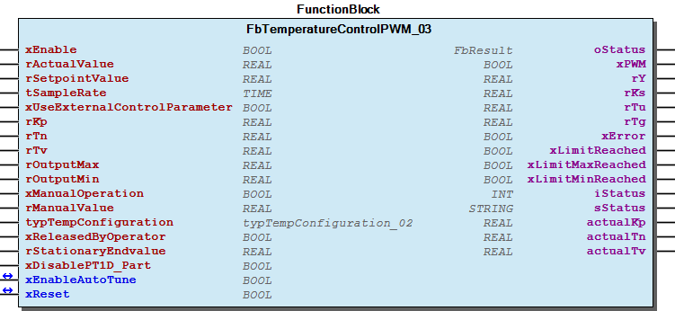 Function Description This module represents a temperature controller with six different phases. Phase 1) Settling phase ->internal state 5 In this phase, the controlled system is supplied with a set value the size of typTempConfiguration.iP5StartLevel . The system then waits until the system is in a stable state. This phase can also be used to bring the system close to the actual operating point. This is particularly important when the controlled system is non-linear, so that subsequent identification can determine the real behavior at the operating point as well as possible. Phase 2) Identification phase ->internal state 10 In this phase, the controlled system is supplied with a set value the size of typTempConfiguration.iP10IdentLevel . The waveform of the controlled system response is recorded. The module returns an error if the step response cannot be recorded completely. Such is the case if the internal memory is too small. In this case, the error message is ArrayTooSmall . The xPWM output is reset to zero. The problem can be resolved by increasing the tSampleRate sampling rate or increasing the MAX_IDENTIFICATION_ARRAY parameter. At the end of the identification phase, the controlled system parameters are determined using the inflectional tangent method. The output point for the control parameters represents the determined data set ( rKs , rTu and rTg ). Evaluating both typTempConfiguration.iP10StationaryEndpointControlTime and typTempConfiguration.rP10StationaryEndpointPercentReferenceValue inputs determines when the stationary end value is reached during the identification phase. If the process value does not change more than the typTempConfiguration.rP10StationaryEndpointPercentReferenceValue percent within the specified time, it is assumed that the stationary end value has been reached. This module also allows you to interrupt identification early or to start calculating the controller parameters immediately. This can be useful if the stationary end value is reached very slowly. In this case, the operator can estimate the end value from the rStationaryEndvalue input directly and trigger calculation by the xReleasedByOperator input. Phase 3) Controlling the intermediate setpoint ->internal state 20 Following the identification phase, the system reaches a specific temperature. The temperature difference from the setpoint actually specified is determined. In this phase, the control parameters are set to an intermediate setpoint that is 50 % of the temperature difference. Therefore, you have the option of roughly estimating the quality of the control parameters. Phase 4) Controlling the setpoint ->internal state 30 In this phase, the specified setpoint is controlled with the calculated control parameters. The quality of the control must be assessed by the operator and improved by manual optimization, if necessary. It is recommended to use the trace functionality to get a visual impression of the temperature profile. The system switches to phase 5 once the setpoint is reached. Phase 5) Maintain setpoint (regulating disturbance variables) ->internal state 40 The controller operates with the controller set determined by the typTempConfiguration.eP40ControlMethode configuration value. The default value is CHR_aperiodisch_dis . If a new setpoint is identified, the system switches to phase 6. Phase 6) Regulating the setpoint step change ->internal state 50 The controller operates with the controller set determined by the typTempConfiguration.eP50ControlMethode configuration value. The default value is CHR_aperiodisch_set . Once the new setpoint is reached with the corresponding accuracy, the system switches to phase 5. Note Since the controlled system gain is unknown during initial identification, the temperature is monitored using the typTempConfiguration.rP10MaxTemperatureWhileIdentification configuration value. When the temperature threshold is reached, the output is reset to zero and the identification process terminated. However, the process temperature can still rise further due to the properties of the controlled system. With that said, the temperature threshold should be selected as low as possible to preclude any damage due to impermissible high temperatures. If an error interrupts identification, the function block must be disabled once. You can then restart with a reduced value for typTempConfiguration.iP10IdentLevel . This module can also be used as a traditional PID controller if the xUseExternalControlParameter is set to TRUE. In this case, the controller operates with the rKp , rTn and rTv input values. Note A second identification phase is only performed if the temperature difference between the current temperature and the new setpoint rSetPointValue it greater than typTempConfiguration.rMinProcessDifference .

## Fb_D (FB)

| Scope | Name | Type | Initial | Comment | Inherited from |
| --- | --- | --- | --- | --- | --- |
| Output | oStatus | WagoSysErrorBase.FbResult |  | Status object. (Listed in Status ) The content of the error object can be displayed using FbShowResult from the WagoSysErrorBase library. | FbBase |
| Input | rIn | REAL |  | input |  |
| tSampleRate | TIME |  | must be an integer multiple of tTaskIntervall |  |
| rTv | REAL | 1.0 | [s] |  |
| rTdamping | REAL |  | [s];if rTdamp=0 then ideal D-function |  |
| xManualOperation | BOOL |  | manual mode |  |
| rManualValue | REAL |  | value in manual mode |  |
| xSyncOutput | BOOL |  | the output ry will be set to rManualValue for exactely one cycle ->rising edge evaluation |  |
| rOutputMax | REAL | 1E+38 | maximum value allowed for the input |  |
| rOutputMin | REAL | -1E+38 | minimum value allowed for the input |  |
| Output | rY | REAL |  | output |  |
| xLimitReached | BOOL |  | output value has limit reached |  |
| xLimitMaxReached | BOOL |  | output value has maximum reached |  |
| xLimitMinReached | BOOL |  | output value has minimum reached |  |

A differentiator element to design own control algorithm

Graphical Illustration

Function description

An ideal D-part can be archieved by setting rTdamping to zero. The output may be syncronized. This functionality will be perfomed with a rising edge of input xSyncOutput and will set the output to the value given by rManualValue . The output is limited by rOutputMax and rOutputMin .

Interface variables Function A differentiator element to design own control algorithm Graphical Illustration 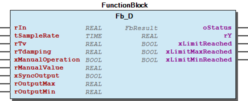 Function description An ideal D-part can be archieved by setting rTdamping to zero. The output may be syncronized. This functionality will be perfomed with a rising edge of input xSyncOutput and will set the output to the value given by rManualValue . The output is limited by rOutputMax and rOutputMin .

## Fb_I (FB)

| Scope | Name | Type | Initial | Comment | Inherited from |
| --- | --- | --- | --- | --- | --- |
| Output | oStatus | WagoSysErrorBase.FbResult |  | Status object. (Listed in Status ) The content of the error object can be displayed using FbShowResult from the WagoSysErrorBase library. | FbBase |
| Input | rIn | REAL |  | input |  |
| tSampleRate | TIME |  | must be an integer multiple of tTaskIntervall,e.g. 200ms |  |
| rTi | REAL | 1 | [s] time constant |  |
| xManualOperation | BOOL |  | manual mode |  |
| rManualValue | REAL |  | value in manual mode |  |
| xSyncOutput | BOOL |  | syncronize output, rManualValue will be used |  |
| rOutputMax | REAL | 1E+38 | maximum value allowed for the input |  |
| rOutputMin | REAL | -1E+38 | minimum value allowed for the input |  |
| Output | rY | REAL |  | output |  |
| xError | BOOL |  | error occured |  |
| xLimitReached | BOOL |  | output value has limit reached |  |
| xLimitMaxReached | BOOL |  | output value has maximum reached |  |
| xLimitMinReached | BOOL |  | output value has minimum reached |  |

An integrator element to design own control algorithm

Graphical Illustration

Function description

The output may be syncronized. This functionality will be perfomed with a rising edge of input xSyncOutput and will set the output to the value given by rManualValue . The output will be limited by rOutputMax and rOutputMin .

Interface variables Function An integrator element to design own control algorithm Graphical Illustration 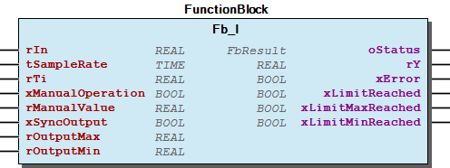 Function description The output may be syncronized. This functionality will be perfomed with a rising edge of input xSyncOutput and will set the output to the value given by rManualValue . The output will be limited by rOutputMax and rOutputMin .

## Fb_P (FB)

| Scope | Name | Type | Comment | Inherited from |
| --- | --- | --- | --- | --- |
| Output | oStatus | WagoSysErrorBase.FbResult | Status object. (Listed in Status ) The content of the error object can be displayed using FbShowResult from the WagoSysErrorBase library. | FbBase |
| Input | rIn | REAL | input |  |
| tSampleRate | TIME | must be an integer multiple of tTaskIntervall,e.g. 200ms |  |
| rK | REAL | gain |  |
| xManualOperation | BOOL | manual operation |  |
| rManualValue | REAL | value in manual mode |  |
| Output | rY | REAL | output |  |

A proportional element to design own control algorithm

Graphical Illustration

Function description

A proportional element for control structures

Interface variables Function A proportional element to design own control algorithm Graphical Illustration 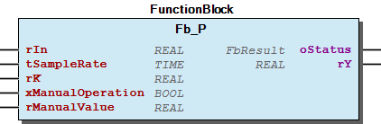 Function description A proportional element for control structures

## Fb_PID (FB)

| Scope | Name | Type | Initial | Comment | Inherited from |
| --- | --- | --- | --- | --- | --- |
| Output | oStatus | WagoSysErrorBase.FbResult |  | Status object. (Listed in Status ) The content of the error object can be displayed using FbShowResult from the WagoSysErrorBase library. | FbBase |
| Input | xEnable | BOOL |  | enable controller |  |
| rActualValue | REAL |  | actual process value |  |
| rSetpointValue | REAL |  | setpoint value |  |
| tSampleRate | TIME |  | sample rate |  |
| rKp | REAL | 1.0 | PID controller ->P-part |  |
| rTn | REAL | 1.0 | PID controller -> I-part |  |
| rTv | REAL | 1.0 | PID controller -> D-part |  |
| rOutputMax | REAL | 1E+38 | maximum limit output rY |  |
| rOutputMin | REAL | -1E+38 | minimum limit output rY |  |
| xManualOperation | BOOL |  | manual mode |  |
| rManualValue | REAL |  | output in manual mode |  |
| typConfiguration | typPID_Configuration |  | configuration values |  |
| Output | rY | REAL |  | ( manipulated value in [rOutputMin..rOutputMax] ) |  |
| xLimitReached | BOOL |  | manipulated value has limit reached |  |
| xLimitMaxReached | BOOL |  | manipulated value has maximum reached |  |
| xLimitMinReached | BOOL |  | manipulated value has minimum reached |  |

A PID controller in the additive control structure

Graphical Illustration

Function Description

This module represents a controller that allows diverse controller types, e.g., PID or PI, by selecting the rKp , rTn and rTv inputs.

The output value can be limited to the range from rOutputMin to rOutputMax . If the controller is operated with a digital output via a PWM module, the limiting values must be set to rOutputMin=0 and rOutputMax=100.

An AntiWindUp of the integral gain is always realized. rOutputMin and rOutputMax are also used as limiting values. Manual operation is realized via the xManualOperation input. Switching to automatic mode is hitchless.

If the controller is disabled, the size of the setpoint is determined by the configuration of the typConfiguration.eDisableMode and typConfiguration.rDisabledOutput , if necessary. The output is reset to zero by default.

If the rate time of the controller modeled on a real rate time instead of the ideal rate time, corresponding damping can be realized via typConfiguration.rTdamping .

You can configure other options via the typConfiguration input. typConfiguration.xUseP_Modified allows the proportional multiplier to act on the process value instead of on the deviation from the setpoint. The same applies to the rate time via typConfiguration.xUseD_Modified .

By typConfiguration.xChangeInDirection the effective direction can be changed. This option works only in the standard PID mode.

Interface variables Function A PID controller in the additive control structure Graphical Illustration 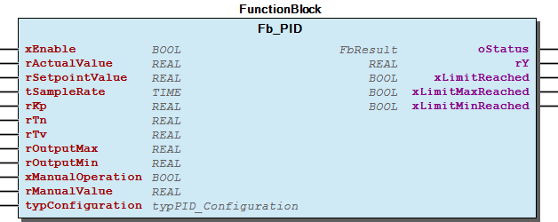 Function Description This module represents a controller that allows diverse controller types, e.g., PID or PI, by selecting the rKp , rTn and rTv inputs. The output value can be limited to the range from rOutputMin to rOutputMax . If the controller is operated with a digital output via a PWM module, the limiting values must be set to rOutputMin=0 and rOutputMax=100. An AntiWindUp of the integral gain is always realized. rOutputMin and rOutputMax are also used as limiting values. Manual operation is realized via the xManualOperation input. Switching to automatic mode is hitchless. If the controller is disabled, the size of the setpoint is determined by the configuration of the typConfiguration.eDisableMode and typConfiguration.rDisabledOutput , if necessary. The output is reset to zero by default. If the rate time of the controller modeled on a real rate time instead of the ideal rate time, corresponding damping can be realized via typConfiguration.rTdamping . You can configure other options via the typConfiguration input. typConfiguration.xUseP_Modified allows the proportional multiplier to act on the process value instead of on the deviation from the setpoint. The same applies to the rate time via typConfiguration.xUseD_Modified . By typConfiguration.xChangeInDirection the effective direction can be changed. This option works only in the standard PID mode.

## Fb_PID_01 (FB)

| Scope | Name | Type | Initial | Comment | Inherited from |
| --- | --- | --- | --- | --- | --- |
| Output | oStatus | WagoSysErrorBase.FbResult |  | Status object. (Listed in Status ) The content of the error object can be displayed using FbShowResult from the WagoSysErrorBase library. | FbBase |
| Input | xEnable | BOOL |  | enable controller |  |
| rActualValue | REAL |  | actual process value |  |
| rSetpointValue | REAL |  | setpoint value |  |
| tSampleRate | TIME |  | sample rate |  |
| rKp | REAL | 1.0 | PID controller ->P-part |  |
| rTn | REAL | 1.0 | PID controller -> I-part |  |
| rTv | REAL | 1.0 | PID controller -> D-part |  |
| rOutputMax | REAL | 1E+38 | maximum limit output rY |  |
| rOutputMin | REAL | -1E+38 | minimum limit output rY |  |
| xManualOperation | BOOL |  | manual mode |  |
| rManualValue | REAL |  | output in manual mode |  |
| typConfiguration | typPID_Configuration |  | configuration values |  |
| Output | rY | REAL |  | ( manipulated value in [rOutputMin..rOutputMax] ) |  |
| xLimitReached | BOOL |  | manipulated value has limit reached |  |
| xLimitMaxReached | BOOL |  | manipulated value has maximum reached |  |
| xLimitMinReached | BOOL |  | manipulated value has minimum reached |  |

A PID controller in the additive control structure

Graphical Illustration

Function Description

This module represents a controller that allows diverse controller types, e.g., PID or PI, by selecting the rKp , rTn and rTv inputs.

The output value can be limited to the range from rOutputMin to rOutputMax . If the controller is operated with a digital output via a PWM module, the limiting values must be set to rOutputMin=0 and rOutputMax=100.

An AntiWindUp of the integral gain is always realized. rOutputMin and rOutputMax are also used as limiting values. Manual operation is realized via the xManualOperation input. Switching to automatic mode is hitchless.

If the controller is disabled, the size of the setpoint is determined by the configuration of the typConfiguration.eDisableMode and typConfiguration.rDisabledOutput , if necessary. The output is reset to zero by default.

If the rate time of the controller modeled on a real rate time instead of the ideal rate time, corresponding damping can be realized via typConfiguration.rTdamping .

You can configure other options via the typConfiguration input. typConfiguration.xUseP_Modified allows the proportional multiplier to act on the process value instead of on the deviation from the setpoint. The same applies to the rate time via typConfiguration.xUseD_Modified .

By typConfiguration.xChangeInDirection the effective direction can be changed. This option works only in the standard PID mode.

Interface variables Function A PID controller in the additive control structure Graphical Illustration  Function Description This module represents a controller that allows diverse controller types, e.g., PID or PI, by selecting the rKp , rTn and rTv inputs. The output value can be limited to the range from rOutputMin to rOutputMax . If the controller is operated with a digital output via a PWM module, the limiting values must be set to rOutputMin=0 and rOutputMax=100. An AntiWindUp of the integral gain is always realized. rOutputMin and rOutputMax are also used as limiting values. Manual operation is realized via the xManualOperation input. Switching to automatic mode is hitchless. If the controller is disabled, the size of the setpoint is determined by the configuration of the typConfiguration.eDisableMode and typConfiguration.rDisabledOutput , if necessary. The output is reset to zero by default. If the rate time of the controller modeled on a real rate time instead of the ideal rate time, corresponding damping can be realized via typConfiguration.rTdamping . You can configure other options via the typConfiguration input. typConfiguration.xUseP_Modified allows the proportional multiplier to act on the process value instead of on the deviation from the setpoint. The same applies to the rate time via typConfiguration.xUseD_Modified . By typConfiguration.xChangeInDirection the effective direction can be changed. This option works only in the standard PID mode.

## Fb_PT1 (FB)

| Scope | Name | Type | Initial | Comment | Inherited from |
| --- | --- | --- | --- | --- | --- |
| Output | oStatus | WagoSysErrorBase.FbResult |  | Status object. (Listed in Status ) The content of the error object can be displayed using FbShowResult from the WagoSysErrorBase library. | FbBase |
| Input | rIn | REAL |  | input |  |
| tSampleRate | TIME |  | must be an integer multiple of tTaskIntervall,e.g. 200ms |  |
| rK | REAL | 1.0 | Gain |  |
| rT | REAL | 1 | [s] time constant |  |
| xManualOperation | BOOL |  | activate manual value |  |
| rManualValue | REAL |  | manual value |  |
| Output | rY | REAL |  | output |  |
| xError | BOOL |  | future use |  |

A PT1 element to design own control algorithm

Graphical Illustration

Function description

This function block may be used as a low pass filter.

Interface variables Function A PT1 element to design own control algorithm Graphical Illustration 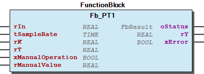 Function description This function block may be used as a low pass filter.

## Fb_PWM_01 (FB)

| Scope | Name | Type | Initial | Comment |
| --- | --- | --- | --- | --- |
| Input | xEnable | BOOL |  | Enable |
| rDutyCycle | REAL |  | [%] duty cycle 0..100 |
| rCycleDuration | REAL | 0.5 | [s] duration, e.g. 0.5 ->0.5 s |
| tMinimalSwitchOn | TIME | TIME#10ms | [s] Minimum time for the output to be switched on. Must be an integer multiple of the appropriate task intervall. |
| Output | xOut | BOOL |  | output signal |

A PWM element to generate a digital signal from an analog input

Graphical Illustration

Function description An input signal in the range from 0% to 100%, will be transformed in a puls width signal. To increase accuracy, output values below the tMinimalSwitchOn value, will be internally stored and will be added to the next output.

Interface variables Function A PWM element to generate a digital signal from an analog input Graphical Illustration 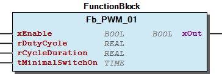 Function description An input signal in the range from 0% to 100%, will be transformed in a puls width signal. To increase accuracy, output values below the tMinimalSwitchOn value, will be internally stored and will be added to the next output.

## doc10_SystemProperties (FB)

Using the modules of this library requires basic knowledge of control engineering and can only be used by appropriately trained employees.

This library provides basic function blocks for control engineering applications. The General folder contains general modules.

There is also a universal PID controller and two specialized controllers for temperature control. These modules are in the Controller folder. If the basic options of these modules are inadequate in specific applications, additional properties can be provided by the addition of basic modules. If the setpoint is offset by noise, it can be useful to add the FuDeadZone function before the setpoint.

Temperature controls are generally slow. Therefore, a sampling time of 1 or 2 seconds is usually sufficient for such processes. If the sampling time is very short and the MAX_IDENTIFICATION_ARRAY parameter is too small, an error occurs because the step response cannot be recorded completely in this case.

Temperature controls often require a large rate time for good control. However, this also increases the sensitivity to noisy input signals at the same time. In this case, you have to think about using a filter.

In case of temperature control with a digital output, the FbTemperatureControlPWM_01 module is to be used. It should be noted that this module is used in a task that has a significantly higher execution time than the sampling time for the actual control specified at the module.

A value ranging from 10 ms to 100 ms is suitable in most cases.

The FbControlledSystemIdentification_01 function block permits the identification of a controlled system according to the inflectional tangent method. However, it requires a controlled system that has non-integrating behavior as well as no oscillating behavior, e.g., heating a furnace.

This version of the library currently only supports identification of non-oscillating, non-integrating controlled systems.

It is recommended to use the trace functionality of the system to roughly verify the determined values.

The Fb_PID function block operates according to the sum formula shown in the following figure:

If the call interval of the control tasks is changed, the project must be recompiled and loaded again. An online change is not supported for this change.

The sample rate must be assigend by the user.

Using the modules of this library requires basic knowledge of control engineering and can only be used by appropriately trained employees. This library provides basic function blocks for control engineering applications. The General folder contains general modules. There is also a universal PID controller and two specialized controllers for temperature control. These modules are in the Controller folder. If the basic options of these modules are inadequate in specific applications, additional properties can be provided by the addition of basic modules. If the setpoint is offset by noise, it can be useful to add the FuDeadZone function before the setpoint. Temperature controls are generally slow. Therefore, a sampling time of 1 or 2 seconds is usually sufficient for such processes. If the sampling time is very short and the MAX_IDENTIFICATION_ARRAY parameter is too small, an error occurs because the step response cannot be recorded completely in this case. Temperature controls often require a large rate time for good control. However, this also increases the sensitivity to noisy input signals at the same time. In this case, you have to think about using a filter. In case of temperature control with a digital output, the FbTemperatureControlPWM_01 module is to be used. It should be noted that this module is used in a task that has a significantly higher execution time than the sampling time for the actual control specified at the module. A value ranging from 10 ms to 100 ms is suitable in most cases. The FbControlledSystemIdentification_01 function block permits the identification of a controlled system according to the inflectional tangent method. However, it requires a controlled system that has non-integrating behavior as well as no oscillating behavior, e.g., heating a furnace. This version of the library currently only supports identification of non-oscillating, non-integrating controlled systems.  It is recommended to use the trace functionality of the system to roughly verify the determined values. The Fb_PID function block operates according to the sum formula shown in the following figure: 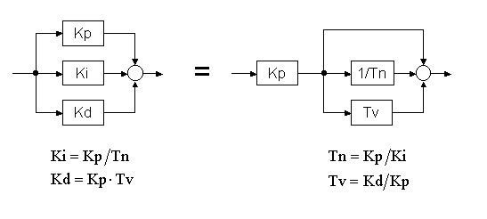 Note If the call interval of the control tasks is changed, the project must be recompiled and loaded again. An online change is not supported for this change. Note The sample rate must be assigend by the user.

### Functions

## FuControllerParameterCalculation_PTn (FUN)

| Scope | Name | Type | Comment |
| --- | --- | --- | --- |
| Return | FuControllerParameterCalculation_PTn | ARRAY [0..4] OF typControllerValues |  |
| Input | rKs | REAL | process gain |
| rTu | REAL | process dead time constant |
| rTg | REAL | process build-up time constant |
| eControllerType | eControllerType | controller type such as PID or PI |

A function which calculates controller parameter, depending on the controlled system values

Graphical Illustration

Function description

This function calculates controller parameter depending on the inputs rKs , rTu and rTg as well as eControllerType .

Assignment is as follows:

FuControllerParameterCalculation_PTn[0] ->Ziegler, extended Ziegler-Nichols method

FuControllerParameterCalculation_PTn[1] ->CHR_aperiodisch_dis, Chien/Hrones and Reswick, aperiodic disturbance response

FuControllerParameterCalculation_PTn[2] ->CHR_aperiodisch_dis, Chien/Hrones and Reswick, aperiodic response to setpoint changes

FuControllerParameterCalculation_PTn[3] ->CHR_20_dis, Chien/Hrones and Reswick, aperiodic disturbance response with 20 % overshoot

FuControllerParameterCalculation_PTn[4] ->CHR_20_dis, Chien/Hrones and Reswick, aperiodic response to setpoint changes with 20 % overshoot

Interface variables Function A function which calculates controller parameter, depending on the controlled system values Graphical Illustration 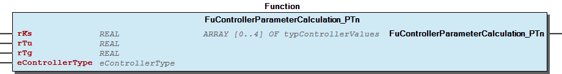 Function description This function calculates controller parameter depending on the inputs rKs , rTu and rTg as well as eControllerType . Assignment is as follows: FuControllerParameterCalculation_PTn[0] ->Ziegler, extended Ziegler-Nichols method FuControllerParameterCalculation_PTn[1] ->CHR_aperiodisch_dis, Chien/Hrones and Reswick, aperiodic disturbance response FuControllerParameterCalculation_PTn[2] ->CHR_aperiodisch_dis, Chien/Hrones and Reswick, aperiodic response to setpoint changes FuControllerParameterCalculation_PTn[3] ->CHR_20_dis, Chien/Hrones and Reswick, aperiodic disturbance response with 20 % overshoot FuControllerParameterCalculation_PTn[4] ->CHR_20_dis, Chien/Hrones and Reswick, aperiodic response to setpoint changes with 20 % overshoot

## FuDeadZone (FUN)

| Scope | Name | Type | Comment |
| --- | --- | --- | --- |
| Return | FuDeadZone | REAL |  |
| Input | rIn | REAL | Input |
| rThreshold | REAL | Threshold |
| Output | xInDeadZone | BOOL | Input is in the dead zone |

A function implementing a dead zone

Graphical Illustration

Function description

Interface variables Function A function implementing a dead zone Graphical Illustration 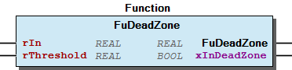 Function description

### Program Organization

## 20 Program Organization Units

- Controller FbAutoTuneControlContinous_03 (FB) - FbAutoTuneControlPWM_03 (FB) - FbTemperatureControlContinous_03 (FB) - FbTemperatureControlPWM_03 (FB) - Fb_PID_01 (FB) - Obsolete FbAutoTuneControlContinous_01 (FB) - FbAutoTuneControlPWM_01 (FB) - FbTemperatureControlContinous_01 (FB) - FbTemperatureControlPWM_01 (FB) - Fb_PID (FB) General - FbAverageMovingFilter (FB) - FbControlledSystemIdentification_01 (FB) FbControlledSystemIdentification_01.Identifikation_ITn (ACT) - FbControlledSystemIdentification_01.Identifikation_PTn (ACT) FbDelay (FB) FbHysteresis_01 (FB) FbRamp_01 (FB) FbSaturation (FB) Fb_D (FB) Fb_I (FB) Fb_P (FB) Fb_PT1 (FB) Fb_PWM_01 (FB) FuControllerParameterCalculation_PTn (FUN) FuDeadZone (FUN)

### Global Variable Lists

## Status (GVL)

| Value | Level | Description |
| --- | --- | --- |
| WagoTypesErrorBase.WagoTypes.Ok | WagoTypesErrorBase.WagoTypes.eSeverity.none | ‘OK’ |
| ControlledSystem_Not_Supported | WagoTypesErrorBase.WagoTypes.eSeverity.info | ‘Controlled System not supported’ |
| Controller_Not_Supported | WagoTypesErrorBase.WagoTypes.eSeverity.info | ‘Controller not supported’ |
| Done | WagoTypesErrorBase.WagoTypes.eSeverity.info | ‘Done’ |
| ArrayTooSmall | WagoTypesErrorBase.WagoTypes.eSeverity.error | ‘Array too small’ |
| Identification | WagoTypesErrorBase.WagoTypes.eSeverity.info | ‘Identification active’ |
| P50_TryToReachNewSetpoint | WagoTypesErrorBase.WagoTypes.eSeverity.info | ‘Try to reach new setpoint’ |
| Abort_MaxProcessValueReached | WagoTypesErrorBase.WagoTypes.eSeverity.error | ‘Abort max process value reached’ |
| P40_HoldSetpoint | WagoTypesErrorBase.WagoTypes.eSeverity.info | ‘Try to hold actual setpoint’ |
| TuningDenied_PWMtoLow | WagoTypesErrorBase.WagoTypes.eSeverity.info | ‘Identification denied’ |
| ManualOperation | WagoTypesErrorBase.WagoTypes.eSeverity.info | ‘Manual operation’ |
| ControllerDisabled | WagoTypesErrorBase.WagoTypes.eSeverity.info | ‘Controller disabled’ |
| Abort_MinProcessValueReached | WagoTypesErrorBase.WagoTypes.eSeverity.info | ‘Abort min process value reached’ |
| AutotuneInProgress | WagoTypesErrorBase.WagoTypes.eSeverity.info | ‘Autotune in progress’ |
| AutotuneDenied | WagoTypesErrorBase.WagoTypes.eSeverity.info | ‘Autotune denied temperature difference to low’ |
| ControllerParameterInvalid | WagoTypesErrorBase.WagoTypes.eSeverity.info | ‘No valid controller parameter available’ |
| AutotuneAbortedByUser | WagoTypesErrorBase.WagoTypes.eSeverity.info | ‘Autotune aborted by user’ |
| InvalidSampleRate | WagoTypesErrorBase.WagoTypes.eSeverity.info | ‘Invalid sample rate’ |

## VersionHistory (GVL)

| date | version | author | change |
| 30.07.2021 | 1.0.2.0 | u010663 | Function blocks xxx_01 replaced by version xxx_03 due to different internal calculation |
| 29.07.2021 | 1.0.1.6 | u010663 | Bugfix ptDoInit Input FbProcessControlBase_01 |
| 03.02.2021 | 1.0.1.5 | u010663 | Add ptDoInit Input FbProcessControlBase_01 |
| 17.08.2020 | 1.0.1.4 | u010663 | Remove WagoVisuIcons |
| 26.09.2019 | 1.0.1.3 | u010663 | Bugfix FbDelay |
| 12.09.2019 | 1.0.1.2 | u010663 | No error, if xEnable and xEnableAutoTune are not set at the same time for the first identification |
| 24.06.2019 | 1.0.1.1 | u010663 | Improvement tSamplerate=0 |
| 08.01.2019 | 1.0.1.0 | u015842 | Properties: free placeholder added |
| 29.08.2018 | 1.0.0.1 | u010663 | Bugfix setpoint 0 |
| 05.12.2017 | 1.0.0.0 | u010663 | First version |

WagoAppControlSuite.library

Release Notes:

Actual controller function blocks are in the folder Controller . For compatibility with older projects the old function blocks are still available within the folger Obsolete . For new projects it is recommended to use the latest function blocks.

WagoAppControlSuite.library Release Notes: Actual controller function blocks are in the folder Controller . For compatibility with older projects the old function blocks are still available within the folger Obsolete . For new projects it is recommended to use the latest function blocks.

### Other Components

## 29 Types

- eControlledSystem (ENUM) - eControllerDisabledMode (ENUM) - eControllerType (ENUM) - eMethode (ENUM) - typConfiguration_01 (STRUCT) - typConfiguration_02 (STRUCT) - typControllerValues (STRUCT) - typPID_Configuration (STRUCT) - typTempConfiguration_01 (STRUCT) - typTempConfiguration_02 (STRUCT)

## 80 Status ¶

- Status (GVL) - eStatus (ENUM)

## Controller

- FbAutoTuneControlContinous_03 (FB) - FbAutoTuneControlPWM_03 (FB) - FbTemperatureControlContinous_03 (FB) - FbTemperatureControlPWM_03 (FB) - Fb_PID_01 (FB) - Obsolete FbAutoTuneControlContinous_01 (FB) - FbAutoTuneControlPWM_01 (FB) - FbTemperatureControlContinous_01 (FB) - FbTemperatureControlPWM_01 (FB) - Fb_PID (FB)

## FbControlledSystemIdentification_01.Identifikation_ITn (ACT)

## FbControlledSystemIdentification_01.Identifikation_PTn (ACT)

## General

- FbAverageMovingFilter (FB) - FbControlledSystemIdentification_01 (FB) FbControlledSystemIdentification_01.Identifikation_ITn (ACT) - FbControlledSystemIdentification_01.Identifikation_PTn (ACT) FbDelay (FB) FbHysteresis_01 (FB) FbRamp_01 (FB) FbSaturation (FB) Fb_D (FB) Fb_I (FB) Fb_P (FB) Fb_PT1 (FB) Fb_PWM_01 (FB) FuControllerParameterCalculation_PTn (FUN) FuDeadZone (FUN)

## GlobalTextList (Text List) ¶

## Obsolete

- FbAutoTuneControlContinous_01 (FB) - FbAutoTuneControlPWM_01 (FB) - FbTemperatureControlContinous_01 (FB) - FbTemperatureControlPWM_01 (FB) - Fb_PID (FB)

## ParameterList (PARAMS)

| Scope | Name | Type | Initial | Comment |
| --- | --- | --- | --- | --- |
| Constant | MAX_IDENTIFICATION_ARRAY | DINT | 5000 | array to store step response |
| MAX_AVERAGE_MOVING_FILTER | INT | 1000 | array to store values |
| MAX_DELAY | INT | 100 | array to store values |
| ABSOLUTE_DIFFERENCE_SETPOINT_ZERO | REAL | 2.0 | absolute difference from setpoint 0 |

## eControlledSystem (ENUM)

| Name | Initial | Comment |
| --- | --- | --- |
| PTn | 0 | PTn-controlled system |
| PTnOscillating | 2 | future use,PTn-oscillating controlled system |
| ITn | 3 | future use,ITn-controlled system |
| Impuls | 100 | future use |

## eControllerDisabledMode (ENUM)

| Name | Initial | Comment |
| --- | --- | --- |
| Output_min | 0 | set output to rOutputMin |
| Output_hold | 1 | set output to the last value |
| Output_special | 2 | set output to the value defined by parameter rOutputValueControllerDisabled |

## eControllerType (ENUM)

| Name | Initial | Comment |
| --- | --- | --- |
| P | 0 | P-Controller |
| PI | 1 | PI-Controller |
| PD | 2 | PD-Controller |
| PID | 3 | PID-Controller |

## eMethode (ENUM)

| Name | Initial | Comment |
| --- | --- | --- |
| Ziegler | 0 | extended Ziegler-Nichols approach |
| CHR_aperiodisch_set | 2 | using Chien/Hrones and Reswick aperiodisch set point optimized |
| CHR_aperiodisch_dis | 1 | using Chien/Hrones and Reswick aperiodisch disturbance optimized |
| CHR_20_set | 4 | using Chien/Hrones and Reswick aperiodisch set point optimized with 20% shot over |
| CHR_20_dis | 3 | using Chien/Hrones and Reswick aperiodisch disturbance optimized with 20% shot over |

## eStatus (ENUM)

| Name | Initial | Comment |
| --- | --- | --- |
| OK | 0 | OK |
| ControlledSystem_Not_Supported | 1 | controlled system not supported, in this library version only PTn systems are supported |
| Controller_Not_Supported | 2 | controller type not supported, allowed are P,PI,PD,PID |
| Done | 3 | done |
| ArrayTooSmall | 100 | step response can not be evaluated, since not all values can be stored |
| Identification | 200 | identification in progress |
| P50_TryToReachNewSetpoint | 201 | internal state 50 |
| Abort_MaxProcessValueReached | 202 | maximal process value reached |
| P40_HoldSetpoint | 203 | internal state 40 |
| TuningDenied_PWMtoLow | 204 | autotune denied since PWM settings invalid |
| ManualOperation | 205 | manual mode |
| ControllerDisabled | 206 | controller disabled |
| Abort_MinProcessValueReached | 207 | minimal process value reached |
| AutotuneInProgress | 208 | autotune in progress |
| AutotuneDenied | 209 | autotune denied |
| ControllerParameterInvalid | 210 | controller parameter invalid |
| AutotuneAbortedByUser | 211 | autotune aborted by operator |
| InvalidSampleRate | 212 | Invalid sample rate |

## typConfiguration_01 (STRUCT)

| Name | Type | Initial | Comment |
| --- | --- | --- | --- |
| rMaxProcessValue | REAL | 400 | must be adjusted by customer ->e.g. 400 |
| rMinProcessValue | REAL | 0 | must be adjusted by customer ->e.g. 0 |
| iControllerDisabledMode | INT | 0 | default is ->set output to min value |
| rOutputValueControllerDisabled | REAL | 0 | the output will be set to this value if the parameter bControllerDisabledMode is equal Output_special |
| eControllerType | eControllerType | PID |  |
| rMinProcessDifference | REAL | 50 | Autotune will be denied, if the difference from the actual process value to the new setpoint is less than rMinProcessDifference |
| xChangeInDirection | BOOL |  | effective direction inverted |
| xUseLevelAsAbsoluteValue | BOOL |  | use iP5StartLevel and iP10IdentLevel values in continous mode as absolute values |
| iP5StartLevel | INT | 5 | Start level will be x or x% from the rSetpointValue in continous mode or x% duty cycle in PWM mode |
| tP5Delay | TIME | TIME#20s0ms | after this time the evaluation will start checking whether the output is already stable |
| rP5Limit | REAL | 1.0 | process value may change within this limit |
| tP5TimeCheck | TIME | TIME#20s0ms | each 20s it will be checked how much the process value has changed |
| iP10IdentLevel | INT | 15 | Identification will be x or x% from the rSetpointValue depending on setting xUseLevelAsAbsoluteValue |
| rP10StationaryEndpointPercentReferenceValue | REAL | 1.0 | [%] phase 10 identification: % from the setpointvalue ->0.5=0.5% |
| iP10StationaryEndpointControlTime | INT | 30 | [s] phase 10 identification: check whether value is stable within this time period |
| eP40ControlMethode | eMethode | CHR_aperiodisch_dis | Phase 40: keep value |
| eP50ControlMethode | eMethode | CHR_aperiodisch_set | Phase 50: try to reach new setpoint |
| rP50SetPointPercentReferenceValue | REAL | 4.0 | [%] |
| tP50SettlingTimeReferenceValue | TIME | TIME#5s0ms | during this time period the actual value must stay stable within the given range |

## typConfiguration_02 (STRUCT)

| Name | Type | Initial | Comment | Inherited from |
| --- | --- | --- | --- | --- |
| rMaxProcessValue | REAL | 400 | must be adjusted by customer ->e.g. 400 | typConfiguration_01 |
| rMinProcessValue | REAL | 0 | must be adjusted by customer ->e.g. 0 | typConfiguration_01 |
| iControllerDisabledMode | INT | 0 | default is ->set output to min value | typConfiguration_01 |
| rOutputValueControllerDisabled | REAL | 0 | the output will be set to this value if the parameter bControllerDisabledMode is equal Output_special | typConfiguration_01 |
| eControllerType | eControllerType | PID |  | typConfiguration_01 |
| rMinProcessDifference | REAL | 50 | Autotune will be denied, if the difference from the actual process value to the new setpoint is less than rMinProcessDifference | typConfiguration_01 |
| xChangeInDirection | BOOL |  | effective direction inverted | typConfiguration_01 |
| xUseLevelAsAbsoluteValue | BOOL |  | use iP5StartLevel and iP10IdentLevel values in continous mode as absolute values | typConfiguration_01 |
| iP5StartLevel | INT | 5 | Start level will be x or x% from the rSetpointValue in continous mode or x% duty cycle in PWM mode | typConfiguration_01 |
| tP5Delay | TIME | TIME#20s0ms | after this time the evaluation will start checking whether the output is already stable | typConfiguration_01 |
| rP5Limit | REAL | 1.0 | process value may change within this limit | typConfiguration_01 |
| tP5TimeCheck | TIME | TIME#20s0ms | each 20s it will be checked how much the process value has changed | typConfiguration_01 |
| iP10IdentLevel | INT | 15 | Identification will be x or x% from the rSetpointValue depending on setting xUseLevelAsAbsoluteValue | typConfiguration_01 |
| rP10StationaryEndpointPercentReferenceValue | REAL | 1.0 | [%] phase 10 identification: % from the setpointvalue ->0.5=0.5% | typConfiguration_01 |
| iP10StationaryEndpointControlTime | INT | 30 | [s] phase 10 identification: check whether value is stable within this time period | typConfiguration_01 |
| eP40ControlMethode | eMethode | CHR_aperiodisch_dis | Phase 40: keep value | typConfiguration_01 |
| eP50ControlMethode | eMethode | CHR_aperiodisch_set | Phase 50: try to reach new setpoint | typConfiguration_01 |
| rP50SetPointPercentReferenceValue | REAL | 4.0 | [%] | typConfiguration_01 |
| tP50SettlingTimeReferenceValue | TIME | TIME#5s0ms | during this time period the actual value must stay stable within the given range | typConfiguration_01 |
| rPWMCycleDuration | REAL | 0.5 | [s] cycle duration used by PWM |  |
| tPWMMinimalSwitchOn | TIME | TIME#100ms | [s] minimum period of time to switch the actuator on |  |

## typControllerValues (STRUCT)

| Name | Type | Comment |
| --- | --- | --- |
| Kp | REAL | Proportional multiplier (P part) \|\| Proportionalverstärkung (P - Anteil) |
| Tn | REAL | Reset time (I part) [s] \|\| Nachstellzeit (I - Anteil) [s] |
| Tv | REAL | Rate time (D part) [s] \|\| Vorhaltezeit (D - Anteil) [s] |

## typPID_Configuration (STRUCT)

| Name | Type | Comment |
| --- | --- | --- |
| xUseP_Modified | BOOL | Use P part in the backward loop |
| xUseD_Modified | BOOL | Use D part in the backward loop |
| rTdamping | REAL | approximate D part by an additional damping time |
| eDisableMode | eControllerDisabledMode | define the way, the output should be set if the controller is disabled or in error state |
| rDisabledOutput | REAL | the output will be set to this value if the parameter bControllerDisabledMode is equal Output_special |
| xChangeInDirection | BOOL | effective direction inverted Wirkrichtungsumkehr |

## typTempConfiguration_01 (STRUCT)

| Name | Type | Initial | Comment |
| --- | --- | --- | --- |
| rMaxTemperature | REAL | 400 | must be adjusted by customer ->e.g. 400° |
| rMinTemperature | REAL | 0 | must be adjusted by customer ->e.g. 0° |
| iControllerDisabledMode | INT | 0 | default is ->set output to min value |
| rOutputValueControllerDisabled | REAL | 0 | the output will be set to this value if the parameter bControllerDisabledMode is equal Output_special |
| eControllerType | eControllerType | PID | controller type |
| rMinProcessDifference | REAL | 50 | Autotune will be denied, if the difference from the actual process value to the new setpoint is less than rMinProcessDifference |
| xChangeInDirection | BOOL |  | effective direction inverted |
| xUseLevelAsAbsoluteValue | BOOL |  | use iP5StartLevel and iP10IdentLevel values in continous mode as absolute values |
| iP5StartLevel | INT | 5 | Start level will be x or x% from the rSetpointValue in continous mode or x% duty cycle in PWM mode |
| tP5Delay | TIME | TIME#20s0ms | after this time the evaluation will start checking whether the output is already stable |
| rP5Limit | REAL | 1.0 | process value may change within this limit |
| tP5TimeCheck | TIME | TIME#20s0ms | each 20s it will be checked how much the process value has changed |
| iP10IdentLevel | INT | 15 | Identifikation will be x or x% from the rSetpointValue depending on parameter xUseLevelAsAbsoluteValue |
| rP10StationaryEndpointPercentReferenceValue | REAL | 1.0 | [%] phase 10 identification: % from the setpointvalue ->0.5=0.5% |
| iP10StationaryEndpointControlTime | INT | 30 | [s] phase 10 identification: check whether value is stable within this time period |
| eP40ControlMethode | eMethode | CHR_aperiodisch_dis | Phase 40: keep value |
| eP50ControlMethode | eMethode | CHR_aperiodisch_set | Phase 50: try to reach new setpoint |
| rP50SetPointPercentReferenceValue | REAL | 4.0 | [%] |
| tP50SettlingTimeReferenceValue | TIME | TIME#5s0ms | during this time period the actual value must stay stable within the given range |
| rP50FadeOutDivisor | REAL | 10.0 |  |
| xP50UseFadeOut | BOOL | TRUE |  |
| rP50TrackingKpFactor | REAL | 2.0 | PT1_D gain for PT1 part |
| rP50TrackingTuFactor | REAL | 1.0 | PT1_D Tv for PT1 part |

## typTempConfiguration_02 (STRUCT)

| Name | Type | Initial | Comment | Inherited from |
| --- | --- | --- | --- | --- |
| rMaxTemperature | REAL | 400 | must be adjusted by customer ->e.g. 400° | typTempConfiguration_01 |
| rMinTemperature | REAL | 0 | must be adjusted by customer ->e.g. 0° | typTempConfiguration_01 |
| iControllerDisabledMode | INT | 0 | default is ->set output to min value | typTempConfiguration_01 |
| rOutputValueControllerDisabled | REAL | 0 | the output will be set to this value if the parameter bControllerDisabledMode is equal Output_special | typTempConfiguration_01 |
| eControllerType | eControllerType | PID | controller type | typTempConfiguration_01 |
| rMinProcessDifference | REAL | 50 | Autotune will be denied, if the difference from the actual process value to the new setpoint is less than rMinProcessDifference | typTempConfiguration_01 |
| xChangeInDirection | BOOL |  | effective direction inverted | typTempConfiguration_01 |
| xUseLevelAsAbsoluteValue | BOOL |  | use iP5StartLevel and iP10IdentLevel values in continous mode as absolute values | typTempConfiguration_01 |
| iP5StartLevel | INT | 5 | Start level will be x or x% from the rSetpointValue in continous mode or x% duty cycle in PWM mode | typTempConfiguration_01 |
| tP5Delay | TIME | TIME#20s0ms | after this time the evaluation will start checking whether the output is already stable | typTempConfiguration_01 |
| rP5Limit | REAL | 1.0 | process value may change within this limit | typTempConfiguration_01 |
| tP5TimeCheck | TIME | TIME#20s0ms | each 20s it will be checked how much the process value has changed | typTempConfiguration_01 |
| iP10IdentLevel | INT | 15 | Identifikation will be x or x% from the rSetpointValue depending on parameter xUseLevelAsAbsoluteValue | typTempConfiguration_01 |
| rP10StationaryEndpointPercentReferenceValue | REAL | 1.0 | [%] phase 10 identification: % from the setpointvalue ->0.5=0.5% | typTempConfiguration_01 |
| iP10StationaryEndpointControlTime | INT | 30 | [s] phase 10 identification: check whether value is stable within this time period | typTempConfiguration_01 |
| eP40ControlMethode | eMethode | CHR_aperiodisch_dis | Phase 40: keep value | typTempConfiguration_01 |
| eP50ControlMethode | eMethode | CHR_aperiodisch_set | Phase 50: try to reach new setpoint | typTempConfiguration_01 |
| rP50SetPointPercentReferenceValue | REAL | 4.0 | [%] | typTempConfiguration_01 |
| tP50SettlingTimeReferenceValue | TIME | TIME#5s0ms | during this time period the actual value must stay stable within the given range | typTempConfiguration_01 |
| rP50FadeOutDivisor | REAL | 10.0 |  | typTempConfiguration_01 |
| xP50UseFadeOut | BOOL | TRUE |  | typTempConfiguration_01 |
| rP50TrackingKpFactor | REAL | 2.0 | PT1_D gain for PT1 part | typTempConfiguration_01 |
| rP50TrackingTuFactor | REAL | 1.0 | PT1_D Tv for PT1 part | typTempConfiguration_01 |
| rPWMCycleDuration | REAL | 0.5 | [s] cycle duration used by PWM |  |
| tPWMMinimalSwitchOn | TIME | TIME#100ms | [s] minimum period of time to switch the actuator on |  |