# WagoAppControl v1.6.2.0 (WAGO) - Complete Documentation


## 📋 Library Information

- **Company:** WAGO
- **Title:** WagoAppControl
- **Version:** 1.6.2.0
- **Categories:** WAGO FunctionalView|Base; WAGO LayerView|App; Application
- **Namespace:** WagoAppControl
- **Author:** WAGO / u013972
- **Placeholder:** WagoAppControl

### Description ¶


This document is automatically generated. Because of this, the chapter 30 Visualization is not shown in this document. If you are interested in getting to know more about visualization, we refer to the library manager of e!Cockpit.

run-control of applications [1]

This document is automatically generated. Because of this, the chapter 30 Visualization is not shown in this document. If you are interested in getting to know more about visualization, we refer to the library manager of e!Cockpit. run-control of applications [1]

### Contents: ¶


Contents: - Documentation Index 10 Documentation - WagoAppControl Library Documentation Project Information Library Information Function Blocks - FbWagoApplicationControl (FB) - FbWagoPlcOperationControl (FB) - doc10_Overview (FB) Methods - FbWagoApplicationControl.AttachToApplication (METH) - FbWagoApplicationControl.Detach (METH) - FbWagoApplicationControl.ResetApplicationCold (METH) - FbWagoApplicationControl.ResetApplicationOrigin (METH) - FbWagoApplicationControl.ResetApplicationWarm (METH) - FbWagoApplicationControl.StartApplication (METH) - FbWagoApplicationControl.StopApplication (METH) - FbWagoApplicationControl.getAppName (METH) - FbWagoPlcOperationControl.DisableApplicationReset (PROP) - FbWagoPlcOperationControl.DisableApplicationWrite (PROP) - ... and 2 more Program Organization Global Variable Lists - LibraryResult (GVL) - ResultItems (GVL) - VersionHistory (GVL) Other Components - 01 Properties - 02 Critical Sections - 21 Application Control - 22 PLC Control - FbWagoPlcOperationControl.DisableAll (PROP) - FbWagoPlcOperationControl.DisableApplicationBreakPoint (PROP) - FbWagoPlcOperationControl.DisableApplicationDownload (PROP) - FbWagoPlcOperationControl.DisableApplicationForce (PROP) - FbWagoPlcOperationControl.DisableApplicationOnlineChange (PROP) - FbWagoPlcOperationControl.DisableApplicationStop (PROP) - ... and 2 more

### Indices and tables ¶


| [1] | Based on WagoAppControl.library, last modified 14.01.2019, 17:05:24. The content of this file was automatically generated with None on 14.01.2019, 17:05:27 |

© WAGO Kontakttechnik GmbH & Co. KG, Germany 2018 – All rights reserved. For the avoidance of doubt, this copyright notice does not only apply to the information above but also and primarily to the described library itself. Please note that third-party products are always mentioned without reference to intellectual property rights, including patents, utility models, designs and trademarks, accordingly the existence of such rights cannot be excluded. WAGO is a registered trademark of WAGO Verwaltungsgesellschaft mbH.

- File and Project Information - Library Reference © WAGO Kontakttechnik GmbH & Co. KG, Germany 2018 – All rights reserved. For the avoidance of doubt, this copyright notice does not only apply to the information above but also and primarily to the described library itself. Please note that third-party products are always mentioned without reference to intellectual property rights, including patents, utility models, designs and trademarks, accordingly the existence of such rights cannot be excluded. WAGO is a registered trademark of WAGO Verwaltungsgesellschaft mbH.

### Documentation Index


## 10 Documentation ¶


- doc10_Overview (FB)

## WagoAppControl Library Documentation


| Company: | WAGO |
| Title: | WagoAppControl |
| Version: | 1.6.2.0 |
| Categories: | WAGO FunctionalView\|Base; WAGO LayerView\|App; Application |
| Namespace: | WagoAppControl |
| Author: | WAGO / u013972 |
| Placeholder: | WagoAppControl |

### Description


This document is automatically generated. Because of this, the chapter 30 Visualization is not shown in this document. If you are interested in getting to know more about visualization, we refer to the library manager of e!Cockpit.

run-control of applications [1]

This document is automatically generated. Because of this, the chapter 30 Visualization is not shown in this document. If you are interested in getting to know more about visualization, we refer to the library manager of e!Cockpit. run-control of applications [1]

### Contents:


- 10 Documentation doc10_Overview (FB) 20 Program Organization Units - 21 Application Control - 22 PLC Control LibraryResult (GVL) ResultItems (GVL) VersionHistory (GVL)

### Indices and tables


| [1] | Based on WagoAppControl.library, last modified 14.01.2019, 17:05:24. The content of this file was automatically generated with None on 14.01.2019, 17:05:27 |

© WAGO Kontakttechnik GmbH & Co. KG, Germany 2018 – All rights reserved. For the avoidance of doubt, this copyright notice does not only apply to the information above but also and primarily to the described library itself. Please note that third-party products are always mentioned without reference to intellectual property rights, including patents, utility models, designs and trademarks, accordingly the existence of such rights cannot be excluded. WAGO is a registered trademark of WAGO Verwaltungsgesellschaft mbH.

- File and Project Information - Library Reference © WAGO Kontakttechnik GmbH & Co. KG, Germany 2018 – All rights reserved. For the avoidance of doubt, this copyright notice does not only apply to the information above but also and primarily to the described library itself. Please note that third-party products are always mentioned without reference to intellectual property rights, including patents, utility models, designs and trademarks, accordingly the existence of such rights cannot be excluded. WAGO is a registered trademark of WAGO Verwaltungsgesellschaft mbH.

### Project Information


## File and Project Information


| Scope | Name | Type | Content |
| --- | --- | --- | --- |
| FileHeader | libraryFile | string | WagoAppControl.library |
| contentFile | WagoAppControl_clr.json |
| productName | e!COCKPIT |
| creationDateTime | date | 14.01.2019, 17:05:27 |
| companyName | string | WAGO |
| ProjectInformation | LastModificationDateTime | date | 14.01.2019, 17:05:24 |
| Description | string | See: Description |
| Copyright | © WAGO Kontakttechnik GmbH & Co. KG, Germany 2018 – All rights reserved. |
| Author | WAGO / u013972 |
| AutoResolveUnbound | bool | True |
| Placeholder | string | WagoAppControl |
| Company | WAGO |
| DocFormat | reStructuredText |
| Project | WagoAppControl |
| DefaultNamespace | WagoAppControl |
| Version | version | 1.6.2.0 |
| Title | string | WagoAppControl |
| LibraryCategories | library-category-list | WAGO FunctionalView\|Base; WAGO LayerView\|App; Application |

### Library Information


## Library Reference


| LinkAllContent: False QualifiedOnly: False | SystemLibrary: False | Optional: False |

| LinkAllContent: False QualifiedOnly: False | SystemLibrary: False | Optional: False |

| LinkAllContent: False QualifiedOnly: False | SystemLibrary: False PublishSymbolsInContainer: True | Optional: False |

| LinkAllContent: False QualifiedOnly: False | SystemLibrary: False | Optional: False |

| LinkAllContent: False QualifiedOnly: False | SystemLibrary: False | Optional: False |

| LinkAllContent: False Optional: False | QualifiedOnly: False SystemLibrary: False | PublishSymbolsInContainer: True |

| LinkAllContent: False Optional: False | QualifiedOnly: True SystemLibrary: False | PublishSymbolsInContainer: True |

This is a dictionary of all referenced libraries and their name spaces.

This is a dictionary of all referenced libraries and their name spaces. CmpApp Library Identification : Placeholder: CmpApp Default Resolution: CmpApp, * (System) Namespace: CmpApp Library Properties : Component Manager Library Identification : Placeholder: Component Manager Default Resolution: Component Manager, * (System) Namespace: Component_Manager Library Properties : WagoSysErrorBase Library Identification : Placeholder: WagoSysErrorBase Default Resolution: WagoSysErrorBase, * (WAGO) Namespace: WagoSysErrorBase Library Properties : Library Parameter : Parameter: RES_LOG_MAX_FILESIZE = 2000 Parameter: RES_LOG_MAX_FILES = 1 Parameter: RES_LOG_MAX_ENTRIES = 200 Parameter: RES_LOG_NAME = ‘WagoAppResultLogger’ WagoSysTypedefs_Pointer Library Identification : Placeholder: WagoSysTypedefs_Pointer Default Resolution: WagoSysTypedefs_Pointer, * (WAGO) Namespace: WAGOWagoTypesPointer Library Properties : WagoSysVersion Library Identification : Name: WagoSysVersion Version: 1.0.0.0 Company: WAGO Namespace: WagoSysVersion Library Properties : WagoTypesCommon Library Identification : Placeholder: WagoTypesCommon Default Resolution: WagoTypesCommon, * (WAGO) Namespace: WagoTypes Library Properties : WagoTypesErrorBase Library Identification : Placeholder: WagoTypesErrorBase Default Resolution: WagoTypesErrorBase, * (WAGO) Namespace: WagoTypesErrorBase Library Properties :

### Function Blocks


## FbWagoApplicationControl (FB)


| Scope | Name | Type | Comment |
| --- | --- | --- | --- |
| Output | xIsAttached | BOOL | True, if this FB is attached to an application |
| xBusy | BOOL | Asynchroneous operations still pending. |
| eState | eAppState | State of the attached application. |

```
VAR
   Ctrl : FbWagoApplicationControl;
END_VAR

Ctrl();                 // cyclic operation for updating outputs

IF not xInitialized THEN
   IF Ctrl.AttachToApplication('OtherApplication') <>0 THEN
      React_Adequately_Upon_Missing_OtherApplication();
   END_IF
   xInitialized         := TRUE;
END_IF
:
:
IF xNewSpecialCondition AND (Ctrl.eState = eAppState.run) AND (not Ctrl.xBusy) THEN
   eResult := Ctrl.StopApplication();
END_IF
```

```
VAR
   Ctrl : FbWagoApplicationControl;
END_VAR

Ctrl();                 // cyclic operation for updating outputs

IF not xInitialized THEN
   Ctrl.AttachToApplication('');  // attach to own application
   xInitialized  := TRUE;
END_IF
:
:
sMyName := Ctrl.getAppName();     // find out your own name
:
IF xPanicCondition THEN           // stop yourself in case of panic.
   Ctrl.StopApplication();        // be aware: returning from that state requires other apps running
   xPanicCondition := FALSE;      // acknowledge the panic indicator
END_IF
```

This Fb provides control about starting, stoppping, and resetting of other applications.

Graphical Illustration

Function Description

For operation, the FB is attached to the desired application with the method AttachToApplication() .

Once the Fb is successfully attached to the controlled application, this application may be started, stopped or reset by the corresponding methods.

The output ‘xBusy’ indicates that certain asynchronous operations (e.g. stop()) are still pending and that the desired state has not yet been reached. When the state of the application has reached its target state, xBusy will return to FALSE again.

Typical usage:

Note: Generally speaking, this FB also works on the same application where the fb is embedded. But keep in mind that once an application has stopped itself, it will have some difficulties re-starting itself again.

Interface variables Function This Fb provides control about starting, stoppping, and resetting of other applications. Graphical Illustration 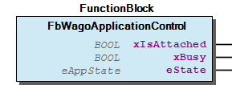 Function Description For operation, the FB is attached to the desired application with the method AttachToApplication() . Once the Fb is successfully attached to the controlled application, this application may be started, stopped or reset by the corresponding methods. The output ‘xBusy’ indicates that certain asynchronous operations (e.g. stop()) are still pending and that the desired state has not yet been reached. When the state of the application has reached its target state, xBusy will return to FALSE again. Typical usage: Note: Generally speaking, this FB also works on the same application where the fb is embedded. But keep in mind that once an application has stopped itself, it will have some difficulties re-starting itself again. Example: - FbWagoApplicationControl.AttachToApplication (METH) - FbWagoApplicationControl.Detach (METH) - FbWagoApplicationControl.ResetApplicationCold (METH) - FbWagoApplicationControl.ResetApplicationOrigin (METH) - FbWagoApplicationControl.ResetApplicationWarm (METH) - FbWagoApplicationControl.StartApplication (METH) - FbWagoApplicationControl.StopApplication (METH) - FbWagoApplicationControl.getAppName (METH)

## FbWagoPlcOperationControl (FB)


Temporarily disabling critical PLC operations.

Graphical Illustration

Function Description

This FB provides means for temporarily preventing the PLC from being stopped, written to or being otherwise manipulated by external means.

Additionaly to the fundamental functiatity, a pair of Enter()/Leave() methods is provided (see: ‘Critical Sections’ below): EnterSection() stores the state of the PLC-Flags internally, before setting new states according its argument. Finally, LeaveSection() restores these flags again, so the application does not have to restore them explicitly.

Function Temporarily disabling critical PLC operations. Graphical Illustration 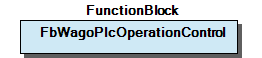 Function Description This FB provides means for temporarily preventing the PLC from being stopped, written to or being otherwise manipulated by external means. Additionaly to the fundamental functiatity, a pair of Enter()/Leave() methods is provided (see: ‘Critical Sections’ below): EnterSection() stores the state of the PLC-Flags internally, before setting new states according its argument. Finally, LeaveSection() restores these flags again, so the application does not have to restore them explicitly. - 01 Properties FbWagoPlcOperationControl.DisableAll (PROP) - FbWagoPlcOperationControl.DisableApplicationBreakPoint (PROP) - FbWagoPlcOperationControl.DisableApplicationDownload (PROP) - FbWagoPlcOperationControl.DisableApplicationForce (PROP) - FbWagoPlcOperationControl.DisableApplicationOnlineChange (PROP) - FbWagoPlcOperationControl.DisableApplicationReset (PROP) - FbWagoPlcOperationControl.DisableApplicationStop (PROP) - FbWagoPlcOperationControl.DisableApplicationWrite (PROP) 02 Critical Sections - FbWagoPlcOperationControl.EnterSection (METH) - FbWagoPlcOperationControl.LeaveSection (METH)

## doc10_Overview (FB)


This library provides means for controlling the operation of applications, (e.g. starting and stopping, etc.) from another application or from the application itself.

Secondly, means are provided for temporarily disabling critical operations from the codesys-IDE in critical sections.

This library provides means for controlling the operation of applications, (e.g. starting and stopping, etc.) from another application or from the application itself. Secondly, means are provided for temporarily disabling critical operations from the codesys-IDE in critical sections.

### Methods


## FbWagoApplicationControl.AttachToApplication (METH)


| Scope | Name | Type | Comment |
| --- | --- | --- | --- |
| Return | AttachToApplication | eResultCode |  |
| Input | sName | STRING | name of the application. |

| Result Codes |
| 0 | Success |
| ENOENT | An application with the given name does not exist |

Attaches the FB to a named application.

Graphical Illustration

Function Description

An empty string denotes this application, i.e. the application which issues the call.

Interface variables Function Attaches the FB to a named application. Graphical Illustration 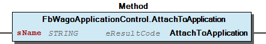 Function Description An empty string denotes this application, i.e. the application which issues the call.

## FbWagoApplicationControl.Detach (METH)


| Scope | Name | Type |
| --- | --- | --- |
| Return | Detach | eResultCode |

| Result Codes |
| 0 | Success |

Releases the control

Graphical Illustration

Function Description

Interface variables Function Releases the control Graphical Illustration 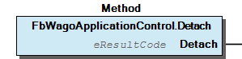 Function Description Note (1): Technically, the use of Detach() is neither mandatory nor strictly needed. However, it is good practice to use Detach(), because in this case subsequent calls of StopApplication() etc. would not stop any application which has been attached previously but whos attachment is obsolete now. Note (2): This method never fails (always returns OK), because there is no interaction with any previously attached applications.

## FbWagoApplicationControl.ResetApplicationCold (METH)


| Scope | Name | Type |
| --- | --- | --- |
| Return | ResetApplicationCold | eResultCode |

| Result Codes |
| 0 | Success |
| EBADF | The Fb is not attached properly to an application |
| EACCES | The reset process has failed due to other reasons. |

Resets the attached application (cold)

Graphical Illustration

Function Description

This process might take some time. While the transition is not completed the output ‘xBusy’ is TRUE.

Interface variables Function Resets the attached application (cold) Graphical Illustration 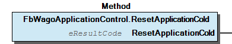 Function Description This process might take some time. While the transition is not completed the output ‘xBusy’ is TRUE.

## FbWagoApplicationControl.ResetApplicationOrigin (METH)


| Scope | Name | Type |
| --- | --- | --- |
| Return | ResetApplicationOrigin | eResultCode |

| Result Codes |
| 0 | Success |
| EBADF | The Fb is not attached properly to an application |
| EACCES | The reset process has failed due to other reasons. |

Resets the attached application (origin).

Graphical Illustration

Function Description

This process might take some time. While the transition is not completed the output ‘xBusy’ is TRUE.

Interface variables Function Resets the attached application (origin). Graphical Illustration 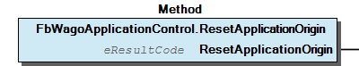 Function Description This process might take some time. While the transition is not completed the output ‘xBusy’ is TRUE.

## FbWagoApplicationControl.ResetApplicationWarm (METH)


| Scope | Name | Type |
| --- | --- | --- |
| Return | ResetApplicationWarm | eResultCode |

| Result Codes |
| 0 | Success |
| EBADF | The Fb is not attached properly to the application |
| EACCES | The reset process has failed due to other reasons. |

Resets the attached application (warm).

Graphical Illustration

Function Description

This process might take some time. While the transition is not completed the output ‘xBusy’ is TRUE.

Interface variables Function Resets the attached application (warm). Graphical Illustration 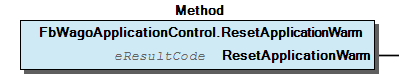 Function Description This process might take some time. While the transition is not completed the output ‘xBusy’ is TRUE.

## FbWagoApplicationControl.StartApplication (METH)


| Scope | Name | Type |
| --- | --- | --- |
| Return | StartApplication | eResultCode |

| Result Codes |
| 0 | Success |
| EBADF | The Fb is not attached properly to the application |
| EACCES | The start process has failed due to other reasons. |

Starts the attached application.

Graphical Illustration

Function Description

This process might take some time. While the transition is not completed the output ‘xBusy’ is TRUE.

Interface variables Function Starts the attached application. Graphical Illustration 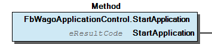 Function Description This process might take some time. While the transition is not completed the output ‘xBusy’ is TRUE.

## FbWagoApplicationControl.StopApplication (METH)


| Scope | Name | Type |
| --- | --- | --- |
| Return | StopApplication | eResultCode |

| Result Codes |
| 0 | Success |
| EBADF | The Fb is not attached properly to the application |
| EACCES | The stop process has failed due to other reasons. |

Stops the attached application.

Graphical Illustration

Function Description

This process might take some time. While the transition is not completed the output ‘xBusy’ is TRUE.

Interface variables Function Stops the attached application. Graphical Illustration 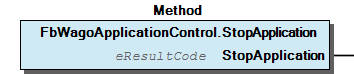 Function Description This process might take some time. While the transition is not completed the output ‘xBusy’ is TRUE.

## FbWagoApplicationControl.getAppName (METH)


| Scope | Name | Type |
| --- | --- | --- |
| Return | getAppName | STRING |

Retrieves the name of the attached application.

Graphical Illustration

Function Description

Returns an empty string, if no application is attached.

Interface variables Function Retrieves the name of the attached application. Graphical Illustration 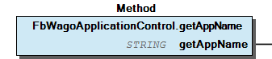 Function Description Returns an empty string, if no application is attached.

## FbWagoPlcOperationControl.DisableApplicationReset (PROP)


Disables reseting.

Graphical Illustration

Function Disables reseting. Graphical Illustration 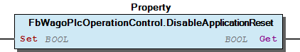

## FbWagoPlcOperationControl.DisableApplicationWrite (PROP)


Disables writing variables.

Graphical Illustration

Function Disables writing variables. Graphical Illustration 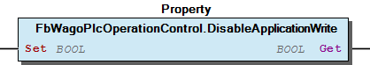

## FbWagoPlcOperationControl.EnterSection (METH)


| Scope | Name | Type | Comment |
| --- | --- | --- | --- |
| Return | EnterSection | ePLCop |  |
| Input | eDisabledOps | ePLCop | Superimposition of ePLCop’s which are to be disabled. |

```
VAR
   CriticalSection: FbWagoPlcOperationControl;
END_VAR

CriticalSection.EnterSection(ePlcOp.Stop + ePlcOp.Download + ePlcOp.OnlineChange);
:                           //
:                           // stopping, downloading, and online-change are disabled here
:                           //
CriticalSection.LeaveSection();
```

Disables a set of certain PLC operations.

Graphical Illustration

Function Description

Before disabling the referred operations this method stores the previous state internally. Later, the stored state will be effective again after the corresponding LeaveSection() method has been called.

The set of PLC operations which were allowed before this call becomes effective is provided as the return value of this method.

There is no nesting implemented for this method pair. When EnterSection() is called successively without calling LeaveSection() inbetween, further PLC operations may be disabled by these calls. The next LeaveSection() will restore the state from before the first EnterSection() call was issued. Only one LeaveSection() is needed for a series on EnterSections().

Note (1): As a consequence of this, if EnterSection() is called when the program flow has already entered a section (and not left it again), the returned value is not necessarily the state which will be restored with LeaveSection() .

Note(2): The addressed properties are only disabled by this call. If they are not addressed here, the will not be automatically enabled, but they are left in their current state.

Typical usage:

Interface variables Function Disables a set of certain PLC operations. Graphical Illustration 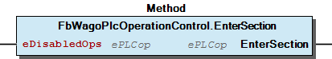 Function Description Before disabling the referred operations this method stores the previous state internally. Later, the stored state will be effective again after the corresponding LeaveSection() method has been called. The set of PLC operations which were allowed before this call becomes effective is provided as the return value of this method. There is no nesting implemented for this method pair. When EnterSection() is called successively without calling LeaveSection() inbetween, further PLC operations may be disabled by these calls. The next LeaveSection() will restore the state from before the first EnterSection() call was issued. Only one LeaveSection() is needed for a series on EnterSections(). Note (1): As a consequence of this, if EnterSection() is called when the program flow has already entered a section (and not left it again), the returned value is not necessarily the state which will be restored with LeaveSection() . Note(2): The addressed properties are only disabled by this call. If they are not addressed here, the will not be automatically enabled, but they are left in their current state. Typical usage:

## FbWagoPlcOperationControl.LeaveSection (METH)


Restores the allowances for PLC operations.

Graphical Illustration

Function Description

The PLC operation flags are restored to that state, which was stored by the preceding EnterSection() call.

Function Restores the allowances for PLC operations. Graphical Illustration 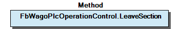 Function Description The PLC operation flags are restored to that state, which was stored by the preceding EnterSection() call.

### Program Organization


## 20 Program Organization Units


- 21 Application Control FbWagoApplicationControl (FB) FbWagoApplicationControl.AttachToApplication (METH) - FbWagoApplicationControl.Detach (METH) - FbWagoApplicationControl.ResetApplicationCold (METH) - FbWagoApplicationControl.ResetApplicationOrigin (METH) - FbWagoApplicationControl.ResetApplicationWarm (METH) - FbWagoApplicationControl.StartApplication (METH) - FbWagoApplicationControl.StopApplication (METH) - FbWagoApplicationControl.getAppName (METH) eAppState (ENUM) 22 PLC Control - FbWagoPlcOperationControl (FB) 01 Properties FbWagoPlcOperationControl.DisableAll (PROP) - FbWagoPlcOperationControl.DisableApplicationBreakPoint (PROP) - FbWagoPlcOperationControl.DisableApplicationDownload (PROP) - FbWagoPlcOperationControl.DisableApplicationForce (PROP) - FbWagoPlcOperationControl.DisableApplicationOnlineChange (PROP) - FbWagoPlcOperationControl.DisableApplicationReset (PROP) - FbWagoPlcOperationControl.DisableApplicationStop (PROP) - FbWagoPlcOperationControl.DisableApplicationWrite (PROP) 02 Critical Sections - FbWagoPlcOperationControl.EnterSection (METH) - FbWagoPlcOperationControl.LeaveSection (METH) ePLCop (ENUM)

### Global Variable Lists


## LibraryResult (GVL)


| Name | Type | Comment |
| --- | --- | --- |
| Factory | FbResultFactory | Produces FbResults from given eResultCodes. |

```
VAR
  eMyResult : eResultCode;  // result code which is to be investigated
  oError    : FbResult;     // result object for use in higher levels
END_VAR;

eMyResult := myFunction(...);
Namespace.LibraryResult.Factory.SetResult(eMyResult, oError);
```

Factory for standard result objects

Use this to translate result codes from this library into standard result objects.

(In this example ‘Namespace’ denotes the namespace which is used for including the specific library and ‘myFunction()’ is an example for a general function from this library.)

Factory for standard result objects Use this to translate result codes from this library into standard result objects. Usage: (In this example ‘Namespace’ denotes the namespace which is used for including the specific library and ‘myFunction()’ is an example for a general function from this library.)

## ResultItems (GVL)


| Scope | Name | Type | Initial |
| --- | --- | --- | --- |
| Constant | ERROR | ARRAY [0..3] OF typResultItem | [STRUCT(ID := OK, Severity := eSeverity.none, Text := ‘OK’), STRUCT(ID := ENOENT, Severity := eSeverity.error, Text := ‘An application with the given name does not exist.’), STRUCT(ID := EBADF, Severity := eSeverity.error, Text := ‘The Fb is not attached properly to the application.’), STRUCT(ID := EACCES, Severity := eSeverity.error, Text := ‘Failure due to internal or other reasons.’)] |

Standard result items specific for this library

Note: This is a general mapping of result codes to short standard texts which are appropriate to the usage of these codes in this library.

Typially, each unit (function, method, or function block) in this library uses only a subset of these codes. Please, refer to the documentation of the specific unit for the set of codes which is actualy used and for a detailed explanation of the meaning of a result code in the specifc context.

Standard result items specific for this library Note: This is a general mapping of result codes to short standard texts which are appropriate to the usage of these codes in this library. Typially, each unit (function, method, or function block) in this library uses only a subset of these codes. Please, refer to the documentation of the specific unit for the set of codes which is actualy used and for a detailed explanation of the meaning of a result code in the specifc context.

## VersionHistory (GVL)


| Name | Type |
| --- | --- |
| Info | ProjectInfo |

| date | version | author | change |
| 08.01.2019 | 1.6.2.0 | WAGO / u015842 | Properties: free placeholder added |
| 26.09.2018 | 1.6.1.1 | WAGO / u013972 | Change in the documentation |
| 10.03.2016 | 1.6.1.0 | WAGO / u013972 | Publish WagoSysErrorBase |
| 04.03.2016 | 1.6.0.0 | WAGO / u013972 | Replace WagoAppErrorBase with WagoSysErrorBase |
| 29.09.2015 | 1.5.2.0 | WAGO / u013972 | Resolve libraries with placeholders |
| 23.09.2015 | 1.5.1.0 | WAGO / u013972 | Workaround for C0351-Bug |
| 23.06.2015 | 1.5.0.0 | WAGO / u013972 | Release version |

WagoAppControl

### Other Components


## 01 Properties


Setting one or more of the following properties will disable the specified PLC operation. Resetting the property will enable the operation again.

When getting one of the properties, TRUE indicates a disabled operation and FALSE indicates an enabled operation.

Setting one or more of the following properties will disable the specified PLC operation. Resetting the property will enable the operation again. When getting one of the properties, TRUE indicates a disabled operation and FALSE indicates an enabled operation. - FbWagoPlcOperationControl.DisableAll (PROP) - FbWagoPlcOperationControl.DisableApplicationBreakPoint (PROP) - FbWagoPlcOperationControl.DisableApplicationDownload (PROP) - FbWagoPlcOperationControl.DisableApplicationForce (PROP) - FbWagoPlcOperationControl.DisableApplicationOnlineChange (PROP) - FbWagoPlcOperationControl.DisableApplicationReset (PROP) - FbWagoPlcOperationControl.DisableApplicationStop (PROP) - FbWagoPlcOperationControl.DisableApplicationWrite (PROP)

## 02 Critical Sections


- FbWagoPlcOperationControl.EnterSection (METH) - FbWagoPlcOperationControl.LeaveSection (METH)

## 21 Application Control


A function block for controlling a single application from another one.

A function block for controlling a single application from another one. - FbWagoApplicationControl (FB) FbWagoApplicationControl.AttachToApplication (METH) - FbWagoApplicationControl.Detach (METH) - FbWagoApplicationControl.ResetApplicationCold (METH) - FbWagoApplicationControl.ResetApplicationOrigin (METH) - FbWagoApplicationControl.ResetApplicationWarm (METH) - FbWagoApplicationControl.StartApplication (METH) - FbWagoApplicationControl.StopApplication (METH) - FbWagoApplicationControl.getAppName (METH) eAppState (ENUM)

## 22 PLC Control


A function block for controlling the whole PLC.

A function block for controlling the whole PLC. - FbWagoPlcOperationControl (FB) 01 Properties FbWagoPlcOperationControl.DisableAll (PROP) - FbWagoPlcOperationControl.DisableApplicationBreakPoint (PROP) - FbWagoPlcOperationControl.DisableApplicationDownload (PROP) - FbWagoPlcOperationControl.DisableApplicationForce (PROP) - FbWagoPlcOperationControl.DisableApplicationOnlineChange (PROP) - FbWagoPlcOperationControl.DisableApplicationReset (PROP) - FbWagoPlcOperationControl.DisableApplicationStop (PROP) - FbWagoPlcOperationControl.DisableApplicationWrite (PROP) 02 Critical Sections - FbWagoPlcOperationControl.EnterSection (METH) - FbWagoPlcOperationControl.LeaveSection (METH) ePLCop (ENUM)

## FbWagoPlcOperationControl.DisableAll (PROP)


Disables the complete set of PLC operations.

Graphical Illustration

Function Disables the complete set of PLC operations. Graphical Illustration 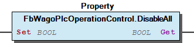

## FbWagoPlcOperationControl.DisableApplicationBreakPoint (PROP)


Disables setting breakpoints.

Graphical Illustration

Function Disables setting breakpoints. Graphical Illustration 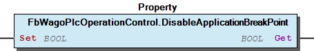

## FbWagoPlcOperationControl.DisableApplicationDownload (PROP)


Disables downloading.

Graphical Illustration

Function Disables downloading. Graphical Illustration 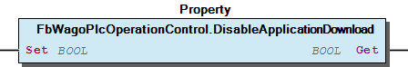

## FbWagoPlcOperationControl.DisableApplicationForce (PROP)


Disables forcing variables.

Graphical Illustration

Function Disables forcing variables. Graphical Illustration 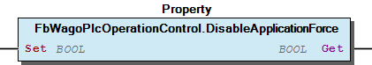

## FbWagoPlcOperationControl.DisableApplicationOnlineChange (PROP)


Disables online change.

Graphical Illustration

Function Disables online change. Graphical Illustration 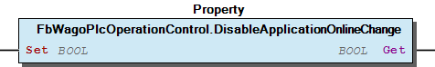

## FbWagoPlcOperationControl.DisableApplicationStop (PROP)


Disables stopping the application.

Graphical Illustration

Function Disables stopping the application. Graphical Illustration 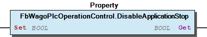

## eAppState (ENUM)


| Name | Initial | Comment |
| --- | --- | --- |
| none | 0 | No information is available. |
| run | 1 | Application is running. |
| stop | 2 | Application is loaded but not running. |
| halt | 3 | Debugging state (directly mapped from Codesys) |
| singleStep | 4 | Debugging state (directly mapped from Codesys) |
| singleCycle | 5 | Debugging state (directly mapped from Codesys) |
| exceptional | 6 | Exceptional state which is not covered by Codesys definitions |
| unknown |  | Other states which indicate internal malfunction |

This represents the execution status of an application.

InOut: Function This represents the execution status of an application.

## ePLCop (ENUM)


| Name | Initial | Comment |
| --- | --- | --- |
| None | 0 | magic number for ‘disable nothing’ |
| OnlineChange | 1 | disable OnlineChange when set |
| Download | 2 | disable Download when set |
| Stop | 4 | disable Stop when set |
| BreakPoint | 8 | disable BreakPoint operation when set |
| Write | 16 | disable Write when set |
| Force | 32 | disable Forcing when set |
| Reset | 64 | disable Reset when set |
| All | 16#FFFF | magic number for’disable all features’ |

```
EnterSection(ePLCop.Stop OR ePLCop.Reset);
```

This represents the arguments for FbWagoPlcOperationControl.Enter()

Function Description

The values are intended to be superimposed in a way like like:

When a bit is set in a variable of this type, the corresponding feature is disabled .

The value All is a magic value for setting all available disable-flags whatever they are. It will not be returned by EnterSection() when every possible feature is disabled. At that point only those bits are returned, which are actually known and regarded by this library. Other bits are not considered here.

InOut: Function This represents the arguments for FbWagoPlcOperationControl.Enter() Function Description The values are intended to be superimposed in a way like like: When a bit is set in a variable of this type, the corresponding feature is disabled . Note The value All is a magic value for setting all available disable-flags whatever they are. It will not be returned by EnterSection() when every possible feature is disabled. At that point only those bits are returned, which are actually known and regarded by this library. Other bits are not considered here.