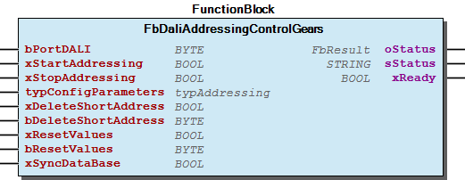
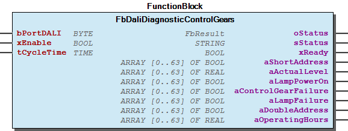
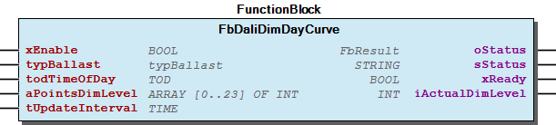
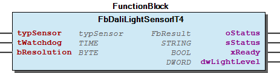
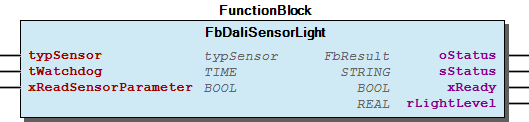
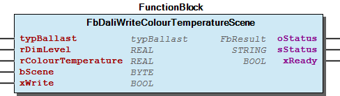

# WagoAppDALI v1.3.1.10 (WAGO) - Complete Documentation

## 📋 Library Information

- **Company:** WAGO
- **Title:** WagoAppDALI
- **Version:** 1.3.1.10
- **Categories:** WAGO LayerView|App; WAGO FunctionalView|Device|IO; Application; WAGO FunctionalView|Connectivity|FieldBus; WAGO BusinessView|Building Automation
- **Namespace:** WagoAppDALI
- **Author:** WAGO / u010729
- **Placeholder:** WagoAppDALI

### Description ¶

This document is automatically generated.

This library is for - Control Gears (ECGs)

-Diagnostic and Maintenance (Device Type 52)

This document is automatically generated. This library is for - Control Gears (ECGs) - Control devices (Sensors) - Self-contained emergency lighting (Device type 1) - Colour control (Device type 8) - Energy Reporting (Device Type 51) -Diagnostic and Maintenance (Device Type 52) - Push buttons (Instance type 1) - Absolute input devices (Instance type 2) - Occupancy sensor (Instance type 3) - Light sensor (Instance type 4) - Sensor Type 1 (Multi-sensor, Pushbutton) - Sensor Type 2 (Multi-sensor, Pushbutton)

### Contents: ¶

Contents: - Documentation Index 10 Documentation - WagoAppDALI Library Documentation Project Information Library Information Function Blocks - FbButtonStuck (FB) - FbCfgAutoTest (FB) - FbCfgEmergencyLighting (FB) - FbCfgMultiSensorType1 (FB) - FbCfgMultiSensorType2 (FB) - FbCfgPushbuttonSensorType1 (FB) - FbCfgPushbuttonSensorType2 (FB) - FbControlEmergencyLighting (FB) - FbDaliAbsoluteInputSensorIT2 (FB) - FbDaliActiveEnergyAndPower (FB) - ... and 74 more Functions - FuDaliDimValue (FUN) - FuDayCurve (FUN) - FuLuxLevelSensorType2 (FUN) - FuPercentDimValue (FUN) - FuTypBallast (FUN) - FuTypMultiSensorType1 (FUN) - FuTypMultiSensorType2 (FUN) - FuTypPushButtonSensorType1 (FUN) - FuTypPushbuttonSensorType2 (FUN) Methods - FbDaliConstantLightControl.SetDisableSendFadeTime (PROP) - FbDaliIdentifyControlGears.xUseTypBallastForStopIdentify (PROP) Program Organization Function Groups Internal Components Global Variable Lists - Common (GVL) - ConstantLightControl (GVL) - StandardSensorConfiguration (GVL) - Status (GVL) - VersionHistory (GVL) Other Components - 01 Configuration - 01 Configuration - 01 Configuration - 01 Configuration - 01 Configuration - 02 Function test - 02 Sensor Values - 02 Sensor Values - 02 Sensor Values - 02 Switching - ... and 87 more

### Indices and tables ¶

Based on WagoAppDALI.library, last modified 20.09.2024, 21:34:32. LibDoc 3.5.16.10

© WAGO GmbH & Co. KG, Germany 2018 – All rights reserved. For the avoidance of doubt, this copyright notice does not only apply to the information above but also and primarily to the described library itself. Please note that third-party products are always mentioned without reference to intellectual property rights, including patents, utility models, designs and trademarks, accordingly the existence of such rights cannot be excluded. WAGO is a registered trademark of WAGO Verwaltungsgesellschaft mbH.

- File and Project Information - Library Reference Based on WagoAppDALI.library, last modified 20.09.2024, 21:34:32. LibDoc 3.5.16.10 © WAGO GmbH & Co. KG, Germany 2018 – All rights reserved. For the avoidance of doubt, this copyright notice does not only apply to the information above but also and primarily to the described library itself. Please note that third-party products are always mentioned without reference to intellectual property rights, including patents, utility models, designs and trademarks, accordingly the existence of such rights cannot be excluded. WAGO is a registered trademark of WAGO Verwaltungsgesellschaft mbH.

### Documentation Index

## 10 Documentation

To ensure fast installation and start-up of the units, we strongly recommend that the following information and explanations are carefully read and adhered to.

To ensure fast installation and start-up of the units, we strongly recommend that the following information and explanations are carefully read and adhered to. - doc01_Foreword (FB) - doc10_SystemProperties (FB) - doc11_DefaultValues (FB) - doc12_FadeTimeFadeRate (FB)

## WagoAppDALI Library Documentation

| Company: | WAGO |
| Title: | WagoAppDALI |
| Version: | 1.3.1.10 |
| Categories: | WAGO LayerView\|App; WAGO FunctionalView\|Device\|IO; Application; WAGO FunctionalView\|Connectivity\|FieldBus; WAGO BusinessView\|Building Automation |
| Namespace: | WagoAppDALI |
| Author: | WAGO / u010729 |
| Placeholder: | WagoAppDALI |

### Description

This document is automatically generated.

This library is for - Control Gears (ECGs)

-Diagnostic and Maintenance (Device Type 52)

This document is automatically generated. This library is for - Control Gears (ECGs) - Control devices (Sensors) - Self-contained emergency lighting (Device type 1) - Colour control (Device type 8) - Energy Reporting (Device Type 51) -Diagnostic and Maintenance (Device Type 52) - Push buttons (Instance type 1) - Absolute input devices (Instance type 2) - Occupancy sensor (Instance type 3) - Light sensor (Instance type 4) - Sensor Type 1 (Multi-sensor, Pushbutton) - Sensor Type 2 (Multi-sensor, Pushbutton)

### Contents:

- 10 Documentation doc01_Foreword (FB) - doc10_SystemProperties (FB) - doc11_DefaultValues (FB) - doc12_FadeTimeFadeRate (FB) 20 Program Organization Units - 10 Communication - 11 Configuration - 20 Control gear - 21 Self-contained emergency lighting (device type 1) - 28 Colour control (device type 8) - 51 Energy Reporting (device type 51) - 52 Diagnostics and Maintenance (device type 52) - 60 Standard Sensor - 70 Sensor type 1 - 80 Sensor type 2 - Common (GVL) 30 Visualizations 80 Status - Status (GVL) - eStatus (ENUM) 90 Internal - 30 Visualization - GlobalTextList (Text List) ParameterList (PARAMS) VersionHistory (GVL)

### Indices and tables

Based on WagoAppDALI.library, last modified 20.09.2024, 21:34:32. LibDoc 3.5.16.10

© WAGO GmbH & Co. KG, Germany 2018 – All rights reserved. For the avoidance of doubt, this copyright notice does not only apply to the information above but also and primarily to the described library itself. Please note that third-party products are always mentioned without reference to intellectual property rights, including patents, utility models, designs and trademarks, accordingly the existence of such rights cannot be excluded. WAGO is a registered trademark of WAGO Verwaltungsgesellschaft mbH.

- File and Project Information - Library Reference Based on WagoAppDALI.library, last modified 20.09.2024, 21:34:32. LibDoc 3.5.16.10 © WAGO GmbH & Co. KG, Germany 2018 – All rights reserved. For the avoidance of doubt, this copyright notice does not only apply to the information above but also and primarily to the described library itself. Please note that third-party products are always mentioned without reference to intellectual property rights, including patents, utility models, designs and trademarks, accordingly the existence of such rights cannot be excluded. WAGO is a registered trademark of WAGO Verwaltungsgesellschaft mbH.

### Project Information

## File and Project Information

| Scope | Name | Type | Content |
| --- | --- | --- | --- |
| FileHeader | libraryFile | string | WagoAppDALI.library |
| contentFile | doc.clean.json |
| productName | e!COCKPIT |
| creationDateTime | date | 20.09.2024, 21:34:54 |
| companyName | string | WAGO |
| ProjectInformation | LastModificationDateTime | date | 20.09.2024, 21:34:32 |
| Description | string | See: Description |
| Copyright | © WAGO Kontakttechnik GmbH & Co. KG, Germany 2018 – All rights reserved. |
| Author | WAGO / u010729 |
| AutoResolveUnbound | bool | True |
| Placeholder | string | WagoAppDALI |
| Company | WAGO |
| DocFormat | reStructuredText |
| Project | WagoAppDALI |
| DefaultNamespace | WagoAppDALI |
| Version | version | 1.3.1.10 |
| ThreadSave | string | FALSE |
| Title | WagoAppDALI |
| LibraryCategories | library-category-list | WAGO LayerView\|App; WAGO FunctionalView\|Device\|IO; Application; WAGO FunctionalView\|Connectivity\|FieldBus; WAGO BusinessView\|Building Automation |
| CompiledLibraryCompatibilityVersion | string | CODESYS V3.5 SP16 Patch 3 |

### Library Information

## Library Reference

| LinkAllContent: False QualifiedOnly: False | SystemLibrary: False | Optional: False |

| LinkAllContent: False QualifiedOnly: False | SystemLibrary: False | Optional: False |

| LinkAllContent: False QualifiedOnly: False | SystemLibrary: False | Optional: False |

| LinkAllContent: False QualifiedOnly: False | SystemLibrary: True | Optional: False |

| LinkAllContent: False QualifiedOnly: False | SystemLibrary: True | Optional: False |

| LinkAllContent: False QualifiedOnly: False | SystemLibrary: True | Optional: False |

| LinkAllContent: False QualifiedOnly: False | SystemLibrary: True | Optional: False |

| LinkAllContent: False QualifiedOnly: False | SystemLibrary: True | Optional: False |

| LinkAllContent: False QualifiedOnly: False | SystemLibrary: True | Optional: False |

| LinkAllContent: False QualifiedOnly: False | SystemLibrary: True | Optional: False |

| LinkAllContent: False QualifiedOnly: False | SystemLibrary: True | Optional: False |

| LinkAllContent: False QualifiedOnly: False | SystemLibrary: True | Optional: False |

| LinkAllContent: False QualifiedOnly: False | SystemLibrary: True | Optional: False |

| LinkAllContent: False QualifiedOnly: False | SystemLibrary: True | Optional: False |

| LinkAllContent: False Optional: False | QualifiedOnly: False SystemLibrary: True | PublishSymbolsInContainer: True |

| LinkAllContent: False QualifiedOnly: False | SystemLibrary: True | Optional: False |

| LinkAllContent: False QualifiedOnly: True | SystemLibrary: False | Optional: False |

| LinkAllContent: False QualifiedOnly: False | SystemLibrary: False | Optional: False |

| LinkAllContent: False QualifiedOnly: False | SystemLibrary: False | Optional: False |

| LinkAllContent: False Optional: False | QualifiedOnly: True SystemLibrary: False | PublishSymbolsInContainer: True |

| LinkAllContent: False QualifiedOnly: True | SystemLibrary: False | Optional: False |

| LinkAllContent: False QualifiedOnly: False | SystemLibrary: False | Optional: False |

| LinkAllContent: False QualifiedOnly: False | SystemLibrary: False | Optional: False |

| LinkAllContent: False QualifiedOnly: False | SystemLibrary: False | Optional: False |

This is a dictionary of all referenced libraries and their name spaces.

This is a dictionary of all referenced libraries and their name spaces. Standard Library Identification : Placeholder: Standard Default Resolution: Standard, * (System) Namespace: Standard Library Properties : Util Library Identification : Placeholder: Util Default Resolution: Util, * (System) Namespace: Util Library Properties : Library Parameter : Parameter: IBLOCKSIZE = 22800 VisuDialogs Library Identification : Placeholder: VisuDialogs Default Resolution: VisuDialogs, * (System) Namespace: VisuDialogs Library Properties : VisuElem3DPath Library Identification : Placeholder: System_VisuElem3DPath Default Resolution: VisuElem3DPath, 3.5.10.0 (System) Namespace: VisuElem3DPath Library Properties : Library Parameter : Parameter: GC_POINTS_PER_POLYGON = 100 VisuElemCamDisplayer Library Identification : Placeholder: System_VisuElemCamDisplayer Default Resolution: VisuElemCamDisplayer, 3.5.10.0 (System) Namespace: VisuElemCamDisplayer Library Properties : Library Parameter : Parameter: GC_POINTS_PER_CAM = 100 VisuElemMeter Library Identification : Placeholder: System_VisuElemMeter Default Resolution: VisuElemMeter, 3.5.10.0 (System) Namespace: VisuElemMeter Library Properties : VisuElemTextEditor Library Identification : Placeholder: System_VisuElemTextEditor Default Resolution: VisuElemTextEditor, 3.5.10.0 (System) Namespace: VisuElemTextEditor Library Properties : VisuElemTrace Library Identification : Placeholder: System_VisuElemTrace Default Resolution: VisuElemTrace, 3.5.10.0 (System) Namespace: VisuElemTrace Library Properties : VisuElemXYChart Library Identification : Placeholder: System_VisuElemXYChart Default Resolution: VisuElemXYChart, 3.5.16.30 (System) Namespace: VisuElemXYChart Library Properties : VisuElems Library Identification : Placeholder: System_VisuElems Default Resolution: VisuElems, 3.5.10.0 (System) Namespace: VisuElems Library Properties : VisuElemsAlarm Library Identification : Placeholder: System_VisuElemsAlarm Default Resolution: VisuElemsAlarm, 3.5.10.0 (System) Namespace: VisuElemsAlarm Library Properties : VisuElemsDateTime Library Identification : Placeholder: System_VisuElemsDateTime Default Resolution: VisuElemsDateTime, 3.5.10.0 (System) Namespace: VisuElemsDateTime Library Properties : VisuElemsSpecialControls Library Identification : Placeholder: System_VisuElemsSpecialControls Default Resolution: VisuElemsSpecialControls, 3.5.10.0 (System) Namespace: VisuElemsSpecialControls Library Properties : VisuElemsWinControls Library Identification : Placeholder: System_VisuElemsWinControls Default Resolution: VisuElemsWinControls, 3.5.10.0 (System) Namespace: VisuElemsWinControls Library Properties : VisuInputs Library Identification : Placeholder: system_visuinputs Default Resolution: VisuInputs, 3.5.16.30 (System) Namespace: visuinputs Library Properties : VisuNativeControl Library Identification : Placeholder: System_VisuNativeControl Default Resolution: VisuNativeControl, 3.5.10.0 (System) Namespace: VisuNativeControl Library Properties : VisuSymbols Library Identification : Placeholder: VisuSymbols Default Resolution: VisuSymbols, * (System) Namespace: VisuSymbols Library Properties : WagoSysErrorBase Library Identification : Placeholder: WagoSysErrorBase Default Resolution: WagoSysErrorBase, * (WAGO) Namespace: WagoSysErrorBase Library Properties : WagoSysVersion Library Identification : Name: WagoSysVersion Version: 1.0.0.0 Company: WAGO Namespace: WagoSysVersion Library Properties : WagoTypesCommon Library Identification : Placeholder: WagoTypesCommon Default Resolution: WagoTypesCommon, * (WAGO) Namespace: WagoTypes Library Properties : WagoTypesErrorBase Library Identification : Placeholder: WagoTypesErrorBase Default Resolution: WagoTypesErrorBase, * (WAGO) Namespace: WagoTypesErrorBase Library Properties : WagoTypesModule_753_647 Library Identification : Placeholder: WagoTypesModule_753_647 Default Resolution: WagoTypesModule_753_647, * (WAGO) Namespace: WagoTypesModule_753_647 Library Properties : Library Parameter : Parameter: GP_MAXRESPONSEDATA = 70 Parameter: GP_MAXRESPONSES = 2 WagoVisuIcons Library Identification : Placeholder: WagoVisuIcons Default Resolution: WagoVisuIcons, * (WAGO) Namespace: WagoVisuIcons Library Properties : WagoVisuIconsMaterialDesign Library Identification : Placeholder: WagoVisuIconsMaterialDesign Default Resolution: WagoVisuIconsMaterialDesign, * (WAGO) Namespace: WagoVisuIconsMaterialDesign Library Properties :

### Function Blocks

## FbButtonStuck (FB)

| Scope | Name | Type | Initial | Comment |
| --- | --- | --- | --- | --- |
| Input | xButton | BOOL |  | Received sensor signal from standard sensor. |
| tButtonStuck | TIME | TIME#20s0ms | Button stuck time. If it is expected while xButton is TRUE, the output will be set to FALSE. |
| Output | xButtonOut | BOOL |  | Output signal with handled button stuck functionality. |

The function block is used to be the button stuck funtionality for push button standard sensors while it is deactivated by event filter in StandardSensorConfiguration .

Graphical Illustration

Function Description

If xButton is pressed until the time tButtonStuck expires, the xButtonOut will set to FALSE until a negative and new positive edge of the xButton input. Otherwise the output xButtonOut follows the input signal xButton .

Interface variables Function The function block is used to be the button stuck funtionality for push button standard sensors while it is deactivated by event filter in StandardSensorConfiguration . Graphical Illustration  Function Description If xButton is pressed until the time tButtonStuck expires, the xButtonOut will set to FALSE until a negative and new positive edge of the xButton input. Otherwise the output xButtonOut follows the input signal xButton .

## FbCfgAutoTest (FB)

| Scope | Name | Type | Comment | Inherited from |
| --- | --- | --- | --- | --- |
| Output | oStatus | WagoSysErrorBase.FbResult | Error object. (Listed in eStatus ) The content of the error object could be displayed via the FbShowResult from the WagoSysErrorBase library. | FbReadyBase |
| sStatus | STRING | Error description as string (Listed in eStatus ) | FbReadyBase |
| xReady | BOOL | TRUE: Module is ready for operation. ; FALSE: Ongoing operation or no communication. | FbReadyBase |
| Input | typBallast | typBallast | Definition which control gears will be addressed. |  |
| xRead | BOOL | A positive edge causes the auto configuration to be read out. |  |
| xWrite | BOOL | A positive edge writes the auto configuration to the self- contained emergency lighting. |  |
| Inout | typConfigParameters | typCfgAutoTest |  |  |

The function block can read and write the schedule settings for the emergency lighting device.

Graphical Illustration

Please consider for a correct function the system properties .

Interface variables Function The function block can read and write the schedule settings for the emergency lighting device. Graphical Illustration  Note Please consider for a correct function the system properties .

## FbCfgEmergencyLighting (FB)

| Scope | Name | Type | Comment | Inherited from |
| --- | --- | --- | --- | --- |
| Output | oStatus | WagoSysErrorBase.FbResult | Error object. (Listed in eStatus ) The content of the error object could be displayed via the FbShowResult from the WagoSysErrorBase library. | FbReadyBase |
| sStatus | STRING | Error description as string (Listed in eStatus ) | FbReadyBase |
| xReady | BOOL | TRUE: Module is ready for operation. ; FALSE: Ongoing operation or no communication. | FbReadyBase |
| Input | typBallast | typBallast | Definition which control gears will be addressed. |  |
| xRead | BOOL | A positive edge causes the configuration to be read out. |  |
| xWrite | BOOL | A positive edge writes the configuration to the self- contained emergency lighting. |  |
| Inout | typConfigParameters | typCfgEmergencyLighting |  |  |

The function block reads the status of all emergency lighting devices.

Graphical Illustration

Please consider for a correct function the system properties .

Interface variables Function The function block reads the status of all emergency lighting devices. Graphical Illustration  Note Please consider for a correct function the system properties .

## FbCfgMultiSensorType1 (FB)

| Scope | Name | Type | Comment | Inherited from |
| --- | --- | --- | --- | --- |
| Output | oStatus | WagoSysErrorBase.FbResult | Error object. (Listed in eStatus ) The content of the error object could be displayed via the FbShowResult from the WagoSysErrorBase library. | FbReadyBase |
| sStatus | STRING | Error description as string (Listed in eStatus ) | FbReadyBase |
| xReady | BOOL | TRUE: Module is ready for operation. ; FALSE: Ongoing operation or no communication. | FbReadyBase |
| Input | typMultiSensorType1 | typMultiSensorType1 | Multi-sensor addresses for presence detection and brightness measurement. |  |
| xBroadcast | BOOL | By a positive edge on this input, the addresses defined by typMultiSensorType1 will be disregarded and the commands transmitted as a broadcast to all multi-sensors. Only one connected multi-sensor is meaningful in this case when reading the configuration. |  |
| xRead | BOOL | On a positive edge on this input, the configuration reading process from the multi-sensor is started. |  |
| xWrite | BOOL | On a positive edge on this input, the configuration writing process to the multi-sensor is started. |  |
| Inout | typConfigParameters | typCfgMultiSensorType1 | Configuration parameters |  |

The function block is used for configuring the multi-sensor type 1.

Graphical Illustration

Please consider for a correct function the system properties .

Interface variables Function The function block is used for configuring the multi-sensor type 1. Graphical Illustration  Note Please consider for a correct function the system properties .

## FbCfgMultiSensorType2 (FB)

| Scope | Name | Type | Comment | Inherited from |
| --- | --- | --- | --- | --- |
| Output | oStatus | WagoSysErrorBase.FbResult | Error object. (Listed in eStatus ) The content of the error object could be displayed via the FbShowResult from the WagoSysErrorBase library. | FbReadyBase |
| sStatus | STRING | Error description as string (Listed in eStatus ) | FbReadyBase |
| xReady | BOOL | TRUE: Module is ready for operation. ; FALSE: Ongoing operation or no communication. | FbReadyBase |
| Input | typMultiSensorType2 | typMultiSensorType2 | Multi-sensor addresses for presence detection, brightness measurement and remote control. |  |
| xBroadcast | BOOL | By a positive edge on this input, the addresses defined by typMultiSensorType2 will be disregarded and the commands transmitted as a broadcast to all multi-sensors. Only one connected multi-sensor is meaningful in this case when reading the configuration. |  |
| xRead | BOOL | On a positive edge on this input, the configuration reading process from the multi-sensor is started. |  |
| xWrite | BOOL | On a positive edge on this input, the configuration writing process to the multi-sensor is started. |  |
| Inout | typConfigParameters | typCfgMultiSensorType2 | Configuration paramters |  |

When the parameters typCfgLightSensorType2.bMaxSendTime and typCfgLightSensorType2.bSendOnDelta are set to zero, no event will be transmitted by the light intensity sensor.

The function block is used for configuring the multi-sensor type 2.

Graphical Illustration

Please consider for a correct function the system properties .

Interface variables Note When the parameters typCfgLightSensorType2.bMaxSendTime and typCfgLightSensorType2.bSendOnDelta are set to zero, no event will be transmitted by the light intensity sensor. Function The function block is used for configuring the multi-sensor type 2. Graphical Illustration  Note Please consider for a correct function the system properties .

## FbCfgPushbuttonSensorType1 (FB)

| Scope | Name | Type | Comment | Inherited from |
| --- | --- | --- | --- | --- |
| Output | oStatus | WagoSysErrorBase.FbResult | Error object. (Listed in eStatus ) The content of the error object could be displayed via the FbShowResult from the WagoSysErrorBase library. | FbReadyBase |
| sStatus | STRING | Error description as string (Listed in eStatus ) | FbReadyBase |
| xReady | BOOL | TRUE: Module is ready for operation. ; FALSE: Ongoing operation or no communication. | FbReadyBase |
| Input | typPushButtonSensorType1 | typPushButtonSensorType1 | Pushbutton sensor addresses |  |
| xRead | BOOL | A positive edge starts the configuration reading process from the key coupler. |  |
| xWrite | BOOL | A positive edge starts the configuration writing process in the key coupler. |  |
| Inout | typConfigParameters | typCfgPushbuttonSensorType1 | Configuration parameters |  |

The function block is used for configuring the pushbutton sensor type 1.

Graphical Illustration

Please consider for a correct function the system properties .

Interface variables Function The function block is used for configuring the pushbutton sensor type 1. Graphical Illustration  Note Please consider for a correct function the system properties .

## FbCfgPushbuttonSensorType2 (FB)

| Scope | Name | Type | Comment | Inherited from |
| --- | --- | --- | --- | --- |
| Output | oStatus | WagoSysErrorBase.FbResult | Error object. (Listed in eStatus ) The content of the error object could be displayed via the FbShowResult from the WagoSysErrorBase library. | FbReadyBase |
| sStatus | STRING | Error description as string (Listed in eStatus ) | FbReadyBase |
| xReady | BOOL | TRUE: Module is ready for operation. ; FALSE: Ongoing operation or no communication. | FbReadyBase |
| Input | typPushButtonSensorType2 | typPushButtonSensorType2 | Pushbutton sensor addresses |  |
| xRead | BOOL | A positive edge starts the configuration reading process from the key coupler. |  |
| xWrite | BOOL | A positive edge starts the configuration writing process in the key coupler. |  |
| Inout | typConfigParameters | typCfgPushbuttonSensorType2 | Configuration paramters |  |

The function block is used for configuring the key coupler type 2.

Graphical Illustration

Please consider for a correct function the system properties .

Interface variables Function The function block is used for configuring the key coupler type 2. Graphical Illustration  Note Please consider for a correct function the system properties .

## FbControlEmergencyLighting (FB)

| Scope | Name | Type | Comment | Inherited from |
| --- | --- | --- | --- | --- |
| Output | oStatus | WagoSysErrorBase.FbResult | Error object. (Listed in eStatus ) The content of the error object could be displayed via the FbShowResult from the WagoSysErrorBase library. | FbReadyBase |
| sStatus | STRING | Error description as string (Listed in eStatus ) | FbReadyBase |
| xReady | BOOL | TRUE: Module is ready for operation. ; FALSE: Ongoing operation or no communication. | FbReadyBase |
| Input | typBallast | typBallast | Definition which control gears will be addressed. |  |
| xRest | BOOL | The emergency lighting is switched off |  |
| xInhibit | BOOL | Emergency operation is inhibited for 15 minutes |  |
| xResetInhibit | BOOL | Reset inhibit mode |  |

The function block sends different control / reset commands to the emergency lighting devices.

Graphical Illustration

Please consider for a correct function the system properties .

Interface variables Function The function block sends different control / reset commands to the emergency lighting devices. Graphical Illustration  Note Please consider for a correct function the system properties .

## FbDaliAbsoluteInputSensorIT2 (FB)

| Scope | Name | Type | Initial | Comment | Inherited from |
| --- | --- | --- | --- | --- | --- |
| Output | oStatus | WagoSysErrorBase.FbResult |  | Error object. (Listed in eStatus ) The content of the error object could be displayed via the FbShowResult from the WagoSysErrorBase library. | FbReadyBase |
| sStatus | STRING |  | Error description as string (Listed in eStatus ) | FbReadyBase |
| xReady | BOOL |  | TRUE: Module is ready for operation. ; FALSE: Ongoing operation or no communication. | FbReadyBase |
| Input | typSensor | typSensor |  | DALI sensor address parameter for brightness measurement. |  |
| tWatchdog | TIME | TIME#5m0s0ms | This input defines the time period within a refresh signal must be transmitted by the sensor. The function can be deactivated by using the value t#0s. |  |
| bResolution | BYTE | 10 | Resolution of the absolute input sensor |  |
| Output | dwAbsoulteInput | DWORD |  | Measured absolute input value. |  |
| xSwitch | BOOL |  | Displays switch status if switch mode is active. |  |

The function block outputs the raw data for the signals transmitted by a standard sensor absolute input instance.

Graphical Illustration

Please consider for a correct function the system properties .

Interface variables Function The function block outputs the raw data for the signals transmitted by a standard sensor absolute input instance. Graphical Illustration  Note Please consider for a correct function the system properties .

## FbDaliActiveEnergyAndPower (FB)

| Scope | Name | Type | Initial | Comment | Inherited from |
| --- | --- | --- | --- | --- | --- |
| Output | oStatus | WagoSysErrorBase.FbResult |  | Error object. (Listed in eStatus ) The content of the error object could be displayed via the FbShowResult from the WagoSysErrorBase library. | FbReadyBase |
| sStatus | STRING |  | Error description as string (Listed in eStatus ) | FbReadyBase |
| xReady | BOOL |  | TRUE: Module is ready for operation. ; FALSE: Ongoing operation or no communication. | FbReadyBase |
| Input | bPortDALI | BYTE | 1 | Specifies which DALI Multi-Master Module is to be addressed at the controller. Counting is from left to right. |  |
| xEnable | BOOL |  | The input releases the cyclic polling of the values |  |
| bShortAddress | BYTE |  | Short address (0–63) |  |
| tUpdateInterval | TIME | TIME#15m0s0ms | This input defines the update interval for requesting the values. |  |
| Output | typValid | typValidEnergyAndPower |  | Indicates which values are valid |  |
| rActiveEnergy | REAL |  | Active Energy [Wh] |  |
| rActivePower | REAL |  | Active Power [W] |  |

The function block reads the energy values Active Energy and Active Power from the control gear(ECG).

Graphical Illustration

Graphical Interface of FbDaliActiveEnergyAndPower

General notes

To reduce the bus load, only one function block from the category Device Type 49 to 52 can read out the data from the ECG.

Please consider for a correct function the system properties .

Interface variables Function The function block reads the energy values Active Energy and Active Power from the control gear(ECG). Graphical Illustration  Graphical Interface of FbDaliActiveEnergyAndPower General notes Note To reduce the bus load, only one function block from the category Device Type 49 to 52 can read out the data from the ECG. Note Please consider for a correct function the system properties .

## FbDaliActualLevelControlGears (FB)

| Scope | Name | Type | Initial | Comment | Inherited from |
| --- | --- | --- | --- | --- | --- |
| Output | oStatus | WagoSysErrorBase.FbResult |  | Error object. (Listed in eStatus ) The content of the error object could be displayed via the FbShowResult from the WagoSysErrorBase library. | FbReadyBase |
| sStatus | STRING |  | Error description as string (Listed in eStatus ) | FbReadyBase |
| xReady | BOOL |  | TRUE: Module is ready for operation. ; FALSE: Ongoing operation or no communication. | FbReadyBase |
| Input | bPortDALI | BYTE | 1 | Specifies which DALI Multi-Master Module is to be addressed at the controller. Counting is from left to right. |  |
| Output | aShortAddress | ARRAY [0..63] OF BOOL |  | Available short addresses |  |
| aActualLevel | ARRAY [0..96] OF REAL |  | Actual level from the control gear (ECG) |  |

The function block can be used to read out the available short addresses and the current dimming values for the control gear (ECG).

Only applicable with PFC family >=FW4

Graphical Illustration

Please consider for a correct function the system properties .

Interface variables Function The function block can be used to read out the available short addresses and the current dimming values for the control gear (ECG). Note Only applicable with PFC family >=FW4 Graphical Illustration  Note Please consider for a correct function the system properties .

## FbDaliAddressingControlGears (FB)

| Scope | Name | Type | Initial | Comment | Inherited from |
| --- | --- | --- | --- | --- | --- |
| Output | oStatus | WagoSysErrorBase.FbResult |  | Error object. (Listed in eStatus ) The content of the error object could be displayed via the FbShowResult from the WagoSysErrorBase library. | FbReadyBase |
| sStatus | STRING |  | Error description as string (Listed in eStatus ) | FbReadyBase |
| xReady | BOOL |  | TRUE: Module is ready for operation. ; FALSE: Ongoing operation or no communication. | FbReadyBase |
| Input | bPortDALI | BYTE | 1 | Specifies which DALI Multi-Master Module is to be addressed at the controller. Counting is from left to right. |  |
| xStartAddressing | BOOL |  | A positive edge starts the random addressing of the DALI control gears (ECG). |  |
| xStopAddressing | BOOL |  | A positive edge ends the addressing of the control gears (ECG) prematurely. |  |
| typConfigParameters | typAddressing |  | Selection of the different addressing options. |  |
| xDeleteShortAddress | BOOL |  | A positive edge deletes the selected bDeleteShortAddress short address. |  |
| bDeleteShortAddress | BYTE |  | Selection of the short address to be deleted. |  |
| xResetValues | BOOL |  | A positive edget sets the control gears (ECG) with the short address bResetValues to its “reset values”. doc11_DefaultValues |  |
| bResetValues | BYTE |  | Selection of the control gears (ECG) to be reset. |  |
| xSyncDataBase | BOOL |  | A positive edge synchronizes the module-internal database. |  |

The function block is used to address the connected DALI control gears (ECG). In addition, the short addresses can be deleted or the settings can be set to the “reset values”. doc11_DefaultValues

Graphical Illustration

General notes

All sensors connected to the system are switched to the passive-mode (sensors may not transmit DALI telegrams on their own) prior to addressing.

Upon completion of addressing, the sensors switched back to the active-mode (sensors transmit their values only to the DALI Multi-Master module).

Please consider for a correct function the system properties .

Interface variables Function The function block is used to address the connected DALI control gears (ECG). In addition, the short addresses can be deleted or the settings can be set to the “reset values”. doc11_DefaultValues Graphical Illustration  General notes Note All sensors connected to the system are switched to the passive-mode (sensors may not transmit DALI telegrams on their own) prior to addressing. Note Upon completion of addressing, the sensors switched back to the active-mode (sensors transmit their values only to the DALI Multi-Master module). Note Please consider for a correct function the system properties .

## FbDaliAddressingStandardSensor (FB)

| Scope | Name | Type | Initial | Comment | Inherited from |
| --- | --- | --- | --- | --- | --- |
| Output | oStatus | WagoSysErrorBase.FbResult |  | Error object. (Listed in eStatus ) The content of the error object could be displayed via the FbShowResult from the WagoSysErrorBase library. | FbReadyBase |
| sStatus | STRING |  | Error description as string (Listed in eStatus ) | FbReadyBase |
| xReady | BOOL |  | TRUE: Module is ready for operation. ; FALSE: Ongoing operation or no communication. | FbReadyBase |
| Input | bPortDALI | BYTE | 1 | Specifies which DALI Multi-Master Module is to be addressed at the controller. Counting is from left to right. |  |
| xStartAddressing | BOOL |  | A positive edge starts the random addressing of the DALI control devices (sensors). |  |
| xStopAddressing | BOOL |  | A positive edge ends the addressing of the control devices (sensors) prematurely. |  |
| typConfigParameters | typAddressingSensor |  | Selection of the different addressing options. |  |
| xDeleteShortAddress | BOOL |  | A positive edge deletes the selected bDeleteShortAddress short address. |  |
| bDeleteShortAddress | BYTE |  | Selection of the short address to be deleted. |  |

The function block is used to address the connected DALI control devices (sensors). In addition, the short addresses can be changed or the short addresses can be deleted.

Graphical Illustration

General notes

All sensors connected to the system are switched to the passive-mode (sensors may not transmit DALI telegrams on their own) prior to addressing.

Upon completion of addressing, all sensors can be set to standard configuration defined in StandardSensorConfiguration .

Please consider for a correct function the system properties .

Interface variables Function The function block is used to address the connected DALI control devices (sensors). In addition, the short addresses can be changed or the short addresses can be deleted. Graphical Illustration  General notes Note All sensors connected to the system are switched to the passive-mode (sensors may not transmit DALI telegrams on their own) prior to addressing. Note Upon completion of addressing, all sensors can be set to standard configuration defined in StandardSensorConfiguration . Note Please consider for a correct function the system properties .

## FbDaliApparentEnergyAndPower (FB)

| Scope | Name | Type | Initial | Comment | Inherited from |
| --- | --- | --- | --- | --- | --- |
| Output | oStatus | WagoSysErrorBase.FbResult |  | Error object. (Listed in eStatus ) The content of the error object could be displayed via the FbShowResult from the WagoSysErrorBase library. | FbReadyBase |
| sStatus | STRING |  | Error description as string (Listed in eStatus ) | FbReadyBase |
| xReady | BOOL |  | TRUE: Module is ready for operation. ; FALSE: Ongoing operation or no communication. | FbReadyBase |
| Input | bPortDALI | BYTE | 1 | Specifies which DALI Multi-Master Module is to be addressed at the controller. Counting is from left to right. |  |
| xEnable | BOOL |  | The input releases the cyclic polling of the values |  |
| bShortAddress | BYTE |  | Short address (0–63) |  |
| tUpdateInterval | TIME | TIME#15m0s0ms | This input defines the update interval for requesting the values. |  |
| Output | typValid | typValidEnergyAndPower |  | Indicates which values are valid |  |
| rApparentEnergy | REAL |  | Apparent Energy [Wh] |  |
| rApparentPower | REAL |  | Apparent Power [W] |  |

The function block reads the energy values Apparent Energy and Apparent Power from the control gear(ECG).

Graphical Illustration

Graphical Interface of FbDaliApparentEnergyAndPower

General notes

To reduce the bus load, only one function block from the category Device Type 49 to 52 can read out the data from the ECG.

Please consider for a correct function the system properties .

Interface variables Function The function block reads the energy values Apparent Energy and Apparent Power from the control gear(ECG). Graphical Illustration  Graphical Interface of FbDaliApparentEnergyAndPower General notes Note To reduce the bus load, only one function block from the category Device Type 49 to 52 can read out the data from the ECG. Note Please consider for a correct function the system properties .

## FbDaliChangeAddressControlGears (FB)

| Scope | Name | Type | Initial | Comment | Inherited from |
| --- | --- | --- | --- | --- | --- |
| Output | oStatus | WagoSysErrorBase.FbResult |  | Error object. (Listed in eStatus ) The content of the error object could be displayed via the FbShowResult from the WagoSysErrorBase library. | FbReadyBase |
| sStatus | STRING |  | Error description as string (Listed in eStatus ) | FbReadyBase |
| xReady | BOOL |  | TRUE: Module is ready for operation. ; FALSE: Ongoing operation or no communication. | FbReadyBase |
| Input | bPortDALI | BYTE | 1 | Specifies which DALI Multi-Master Module is to be addressed at the controller. Counting is from left to right. |  |
| xReplaceShortAddress | BOOL |  | A positive edge replaces the bCurrentShortAddress with the bNewShortAddress . The bCurrentShortAddress must be available at least. |  |
| bCurrentShortAddress | BYTE |  | Actual short address of the control gears (ECG). |  |
| bNewShortAddress | BYTE | 63 | Target short address of the control gears (ECG). |  |

If bNewShortAddress already exists, the addresses will be swapped among each other.

The function block is used to change the control gear (ECG) short addresses.

Graphical Illustration

Swap short address 1 with short address 2, so that the control gear (ECG) with short address 1 gets the short address 2 and vice versa.

Please consider for a correct function the system properties .

Interface variables Note If bNewShortAddress already exists, the addresses will be swapped among each other. Function The function block is used to change the control gear (ECG) short addresses. Graphical Illustration  Example Swap short address 1 with short address 2, so that the control gear (ECG) with short address 1 gets the short address 2 and vice versa. 1. Set bCurrentShortAddress to “1”. 2. Set bNewShortAddress to “2”. 3. Set xReplaceShortAddress to “TRUE”. Note Please consider for a correct function the system properties .

## FbDaliChangeAddressStandardSensor (FB)

| Scope | Name | Type | Initial | Comment | Inherited from |
| --- | --- | --- | --- | --- | --- |
| Output | oStatus | WagoSysErrorBase.FbResult |  | Error object. (Listed in eStatus ) The content of the error object could be displayed via the FbShowResult from the WagoSysErrorBase library. | FbReadyBase |
| sStatus | STRING |  | Error description as string (Listed in eStatus ) | FbReadyBase |
| xReady | BOOL |  | TRUE: Module is ready for operation. ; FALSE: Ongoing operation or no communication. | FbReadyBase |
| Input | bPortDALI | BYTE | 1 | Specifies which DALI Multi-Master Module is to be addressed at the controller. Counting is from left to right. |  |
| xReplaceShortAddress | BOOL |  | A positive edge replaces the bCurrentShortAddress with the bNewShortAddress . The bCurrentShortAddress must be available at least. |  |
| bCurrentShortAddress | BYTE |  | Actual short address of the control device (sensor). |  |
| bNewShortAddress | BYTE | 63 | Target short address of the control device (sensor). |  |

If bNewShortAddress already exists, the addresses will be swapped among each other.

The function block is used to change the control device (sensor) short addresses.

Graphical Illustration

Swap short address 1 with short address 2, so that the control device with short address 1 gets the short address 2 and vice versa.

Please consider for a correct function the system properties .

Interface variables Note If bNewShortAddress already exists, the addresses will be swapped among each other. Function The function block is used to change the control device (sensor) short addresses. Graphical Illustration  Example Swap short address 1 with short address 2, so that the control device with short address 1 gets the short address 2 and vice versa. 1. Set bCurrentShortAddress to “1”. 2. Set bNewShortAddress to “2”. 3. Set xReplaceShortAddress to “TRUE”. Note Please consider for a correct function the system properties .

## FbDaliColourTemperatureDayCurve (FB)

| Scope | Name | Type | Initial | Comment | Inherited from |
| --- | --- | --- | --- | --- | --- |
| Output | oStatus | WagoSysErrorBase.FbResult |  | Error object. (Listed in eStatus ) The content of the error object could be displayed via the FbShowResult from the WagoSysErrorBase library. | FbReadyBase |
| sStatus | STRING |  | Error description as string (Listed in eStatus ) | FbReadyBase |
| xReady | BOOL |  | TRUE: Module is ready for operation. ; FALSE: Ongoing operation or no communication. | FbReadyBase |
| Input | xEnable | BOOL |  | The input releases the cyclic writing of the values and a positive edge triggers the first sending of the colour temperature |  |
| typBallast | typBallast |  | Definition which control gears will be addressed. |  |
| todTimeOfDay | TOD |  | Time of day for the actual calculation of the setpoint |  |
| aPointsColourTemperature | ARRAY [0..23] OF INT |  | Specification of the colour temperature for each full hour |  |
| tUpdateInterval | TIME | TIME#1m0s0ms | This input defines the update interval for sending the colour temperature |  |
| Output | iActualColourTemperature | INT |  | Currently calculated colour temperature based on the daily curve |  |

This function sends the current colour temperature using a 24 point characteristic for each full hour of the day.

Graphical Illustration

Function description

If the function block is enabled via the “xEnable” input, the calculated colour temperature is sent to the DALI bus based on the day curve in the “tUpdateInterval” interval. The colour temperature between the points are determined using a linear equation. A linear equation is automatically generated from the last point of the characteristic curve to the first point of the characteristic curve.

Interface variables Function This function sends the current colour temperature using a 24 point characteristic for each full hour of the day. Graphical Illustration  Function description If the function block is enabled via the “xEnable” input, the calculated colour temperature is sent to the DALI bus based on the day curve in the “tUpdateInterval” interval. The colour temperature between the points are determined using a linear equation. A linear equation is automatically generated from the last point of the characteristic curve to the first point of the characteristic curve.

## FbDaliCommandsControlDevices (FB)

| Scope | Name | Type | Initial | Comment | Inherited from |
| --- | --- | --- | --- | --- | --- |
| Output | oStatus | WagoSysErrorBase.FbResult |  | Error object. (Listed in eStatus ) The content of the error object could be displayed via the FbShowResult from the WagoSysErrorBase library. | FbReadyBase |
| sStatus | STRING |  | Error description as string (Listed in eStatus ) | FbReadyBase |
| xReady | BOOL |  | TRUE: Module is ready for operation. ; FALSE: Ongoing operation or no communication. | FbReadyBase |
| Input | bPortDALI | BYTE | 1 | Specifies which DALI Multi-Master Module is to be addressed at the controller. Counting is from left to right. |  |
| bAddressByte | BYTE |  | Address byte defined in IEC 62386 part 103 |  |
| bInstanceByte | BYTE |  | Instance byte defined in IEC 62386 part 103 |  |
| bObcodeByte | BYTE |  | Obcode byte defined in IEC 62386 Part 103 |  |
| Inout | xSend | BOOL |  | If the input is set, the DALI command is transmitted to the terminal. After transfer, the input is reset by the function module. |  |
| Output | bAnswer | BYTE |  | Response from the control device |  |

| DALI Commands from Part 103, 301, 302, 303 and 304 |
| --- |
| Command name | bAddressByte | bInstanceByte | bObcodeByte |
| IDENTIFY DEVICE | Device | Device | 0 |
| RESET POWER CYCLE SEEN | Device | Device | 1 |
| RESET | Device | Device | 16 |
| RESET MEMORY BANK (DTR0) | Device | Device | 17 |
| SET SHORT ADDRESS (DTR0) | Device | Device | 20 |
| ENABLE WRITE MEMORY | Device | Device | 21 |
| ENABLE APPLICATION CONTROLLER | Device | Device | 22 |
| DISABLE APPLICATION CONTROLLER | Device | Device | 23 |
| SET OPERATING MODE (DTR0) | Device | Device | 24 |
| ADD TO DEVICE GROUPS 0-15 (DTR2:DTR1) | Device | Device | 25 |
| ADD TO DEVICE GROUPS 16-31 (DTR2:DTR1) | Device | Device | 26 |
| REMOVE FROM DEVICE GROUPS 0-15 (DTR2:DTR1) | Device | Device | 27 |
| REMOVE FROM DEVICE GROUPS 16-31 (DTR2:DTR1) | Device | Device | 28 |
| START QUIESCENT MODE | Device | Device | 29 |
| STOP QUIESCENT MODE | Device | Device | 30 |
| ENABLE POWER CYCLE NOTIFICATION | Device | Device | 31 |
| DISABLE POWER CYCLE NOTIFICATION | Device | Device | 32 |
| QUERY DEVICE STATUS | Device | Device | 48 |
| QUERY APPLICATION CONTROLLER ERROR | Device | Device | 49 |
| QUERY INPUT DEVICE ERROR | Device | Device | 50 |
| QUERY MISSING SHORT ADDRESS | Device | Device | 51 |
| QUERY VERSION NUMBER | Device | Device | 52 |
| QUERY NUMBER OF INSTANCES | Device | Device | 53 |
| QUERY CONTENT DTR0 | Device | Device | 54 |
| QUERY CONTENT DTR1 | Device | Device | 55 |
| QUERY CONTENT DTR2 | Device | Device | 56 |
| QUERY RANDOM ADDRESS (H) | Device | Device | 57 |
| QUERY RANDOM ADDRESS (M) | Device | Device | 58 |
| QUERY RANDOM ADDRESS (L) | Device | Device | 59 |
| READ MEMORY LOCATION (DTR1, DTR0) | Device | Device | 60 |
| QUERY APPLICATION CONTROLLER ENABLED | Device | Device | 61 |
| QUERY OPERATING MODE | Device | Device | 62 |
| QUERY MANUFACTURER SPECIFIC MODE | Device | Device | 63 |
| QUERY QUIESCENT MODE | Device | Device | 64 |
| QUERY DEVICE GROUPS 0-7 | Device | Device | 65 |
| QUERY DEVICE GROUPS 8-15 | Device | Device | 66 |
| QUERY DEVICE GROUPS 16-23 | Device | Device | 67 |
| QUERY DEVICE GROUPS 24-31 | Device | Device | 68 |
| QUERY POWER CYCLE NOTIFICATION | Device | Device | 69 |
| QUERY DEVICE CAPABILITIES | Device | Device | 70 |
| QUERY EXTENDED VERSION NUMBER(DTR0) | Device | Device | 71 |
| QUERY RESET STATE | Device | Device | 72 |
| QUERY APPLICATION CONTROLLER ALWAYS ACTIVE | Device | Device | 73 |
| SET EVENT PRIORITY (DTR0) | Device | Device, Instance | 97 |
| ENABLE INSTANCE | Device | Instance | 98 |
| DISABLE INSTANCE | Device | Instance | 99 |
| SET PRIMARY INSTANCE GROUP (DTR0) | Device | Instance | 100 |
| SET INSTANCE GROUP 1 (DTR0) | Device | Instance | 101 |
| SET INSTANCE GROUP 2 (DTR0) | Device | Instance | 102 |
| SET EVENT SCHEME (DTR0) | Device | Instance | 103 |
| SET EVENT FILTER (DTR2, DTR1, DTR0) | Device | Instance | 104 |
| SET INSTANCE TYPE AND MODE (DTR1, DTR0) | Device | Instance | 105 |
| QUERY INSTANCE TYPE | Device | Instance | 128 |
| QUERY RESOLUTION | Device | Instance | 129 |
| QUERY INSTANCE ERROR | Device | Instance | 130 |
| QUERY INSTANCE STATUS | Device | Instance | 131 |
| QUERY EVENT PRIORITY | Device | Device, Instance | 132 |
| QUERY INSTANCE ENABLED | Device | Instance | 134 |
| QUERY PRIMARY INSTANCE GROUP | Device | Instance | 136 |
| QUERY INSTANCE GROUP 1 | Device | Instance | 137 |
| QUERY INSTANCE GROUP 2 | Device | Instance | 138 |
| QUERY EVENT SCHEME | Device | Instance | 139 |
| QUERY INPUT VALUE | Device | Instance | 140 |
| QUERY INPUT VALUE LATCH | Device | Instance | 141 |
| QUERY FEATURE TYPE | Device | Device, Instance | 142 |
| QUERY NEXT FEATURE TYPE | Device | Device, Instance | 143 |
| QUERY EVENT FILTER 0-7 | Device | Instance | 144 |
| QUERY EVENT FILTER 8-15 | Device | Instance | 145 |
| QUERY EVENT FILTER 16-23 | Device | Instance | 146 |
| QUERY INSTANCE OPERATING MODE | Device | Instance | 147 |
| QUERY NEXT AVAILABLE INSTANCE TYPE | Device | Instance | 148 |
| TERMINATE | 193 | 0 | 0 |
| INITIALISE (device) | 193 | 1 | device |
| RANDOMISE | 193 | 2 | 0 |
| COMPARE | 193 | 3 | 0 |
| WITHDRAW | 193 | 4 | 0 |
| SEARCHADDRH (data) | 193 | 5 | data |
| SEARCHADDRM (data) | 193 | 6 | data |
| SEARCHADDRL (data) | 193 | 7 | data |
| PROGRAM SHORT ADDRESS (data) | 193 | 8 | data |
| VERIFY SHORT ADDRESS (data) | 193 | 9 | data |
| QUERY SHORT ADDRESS | 193 | 10 | 0 |
| WRITE MEMORY LOCATION (DTR1, DTR0, data) | 193 | 32 | data |
| WRITE MEMORY LOCATION – NO REPLY (DTR1,DTR0,data) | 193 | 33 | data |
| DTR0 (data) | 193 | 48 | data |
| DTR1 (data) | 193 | 49 | data |
| DTR2 (data) | 193 | 50 | data |
| SEND TESTFRAME (data) | 193 | 51 | data |
| DIRECT WRITE MEMORY (DTR1, offset, data) | 197 | offset | data |
| DTR1:DTR0 (data1, data0) | 199 | data1 | data0 |
| DTR2:DTR1 (data2, data1) | 201 | data2 | data1 |
| Part 301: SET SHORT TIMER (DTR0) | Device | Instance | 0 |
| Part 301: SET DOUBLE TIMER (DTR0) | Device | Instance | 1 |
| Part 301: SET REPEAT TIMER (DTR0) | Device | Instance | 2 |
| Part 301: SET STUCK TIMER (DTR0) | Device | Instance | 3 |
| Part 301: QUERY SHORT TIMER | Device | Instance | 10 |
| Part 301: QUERY SHORT TIMER MIN | Device | Instance | 11 |
| Part 301: QUERY DOUBLE TIMER | Device | Instance | 12 |
| Part 301: QUERY DOUBLE TIMER MIN | Device | Instance | 13 |
| Part 301: QUERY REPEAT TIMER | Device | Instance | 14 |
| Part 301: QUERY STUCK TIMER | Device | Instance | 15 |
| Part 302: SET REPORT TIMER (DTR0) | Device | Instance | 16 |
| Part 302: SET DEADTIME TIMER (DTR0) | Device | Instance | 17 |
| Part 302: QUERY DEADTIME TIMER | Device | Instance | 29 |
| Part 302: QUERY REPORT TIMER | Device | Instance | 30 |
| Part 302: QUERY SWITCH | Device | Instance | 31 |
| Part 303: CATCH MOVEMENT | Device | Instance | 32 |
| Part 303: SET HOLD TIMER (DTR0) | Device | Instance | 33 |
| Part 303: SET REPORT TIMER (DTR0) | Device | Instance | 34 |
| Part 303: SET DEADTIME TIMER (DTR0) | Device | Instance | 35 |
| Part 303: CANCEL HOLD TIMER | Device | Instance | 36 |
| Part 303: QUERY DEADTIME TIMER | Device | Instance | 44 |
| Part 303: QUERY HOLD TIMER | Device | Instance | 45 |
| Part 303: QUERY REPORT TIMER | Device | Instance | 46 |
| Part 303: QUERY CATCHING | Device | Instance | 47 |
| Part 304: SET REPORT TIMER (DTR0) | Device | Instance | 48 |
| Part 304: SET HYSTERESIS (DTR0) | Device | Instance | 49 |
| Part 304: SET DEADTIME TIMER (DTR0) | Device | Instance | 50 |
| Part 304: SET HYSTERESIS MIN (DTR0) | Device | Instance | 51 |
| Part 304: QUERY HYSTERESIS MIN | Device | Instance | 60 |
| Part 304: QUERY DEADTIME TIMER | Device | Instance | 61 |
| Part 304: QUERY REPORT TIMER | Device | Instance | 62 |
| Part 304: QUERY HYSTERESIS | Device | Instance | 63 |

| 24 Bit DALI Command frame encoding from Part 103, 301, 302, 303 and 304 |
| --- |
| Bytes / Bits | Device addressing |
| Adress Byte | Instance Byte | Opcode Byte |
| 23 | 22 | 21 | 20 | 19 | 18 | 17 | 16 | 15...8 | 7...0 |
| 0 | 64 short addresses | 1 | Device command or instance address or feature, see next table |  | Short addressing |
| 1 | 0 | 32 device group addresses | 1 |  | Device group addressing |
| 1 | 1 | 1 | 1 | 1 | 1 | 0 | 1 |  | Broadcast unadressed |
| 1 | 1 | 1 | 1 | 1 | 1 | 1 | 1 |  | Broadcast |
| 1 | 1 | 0 | 16 special command spaces | 1 | Command specific | Special command |
| 1 | 1 | 1 | 0 | x | x | x | 1 | Reserved | Reserved |
| 1 | 1 | 1 | 1 | 0 | x | x | 1 |
| 1 | 1 | 1 | 1 | 1 | 0 | x | 1 |

| Instance byte in a command frame |
| --- |
| Instance byte | Adressing |
| 15 | 14 | 13 | 12 | 11 | 10 | 09 | 08 |
| 0 | 0 | 0 | 32 Instance numbers | Instance number |
| 1 | 0 | 0 | 32 Instance groups | Instance group |
| 1 | 1 | 0 | 32 Instance types | Instance type |
| 1 | 1 | 1 | 32 Instance numbers | Feature on instance number level |
| 1 | 1 | 1 | 32 Instance groups | Feature on instance group level |
| 1 | 1 | 0 | 32 Instance types | Feature on instance type level |
| 1 | 1 | 1 | 1 | 1 | 1 | 0 | 1 | Feature on instance broadcast level |
| 1 | 1 | 1 | 1 | 1 | 1 | 1 | 1 | Instance broadcast |
| 1 | 1 | 1 | 1 | 1 | 1 | 0 | 0 | Feature on device level |
| 1 | 1 | 1 | 1 | 1 | 1 | 1 | 0 | Device |
| 0 | 1 | 0 | x | x | x | x | x | Reserved |
| 1 | 1 | 1 | 0 | x | x | x | x |
| 1 | 1 | 1 | 1 | 0 | x | x | x |
| 1 | 1 | 1 | 1 | 1 | 0 | x | x |

The function block can be used to send DALI commands that are specified in the IEC 82386 part 103. The address byte, instance byte and the opcode byte will be send one to one (address byte must be formed as described in IEC 82386). Send Twice or Query will be recognized automatically.

Graphical Illustration

Command Set

24 Bit DALI Command frame encoding

Instance byte in a command frame

Please consider for a correct function the system properties .

Interface variables Function The function block can be used to send DALI commands that are specified in the IEC 82386 part 103. The address byte, instance byte and the opcode byte will be send one to one (address byte must be formed as described in IEC 82386). Send Twice or Query will be recognized automatically. Graphical Illustration  Command Set 24 Bit DALI Command frame encoding Instance byte in a command frame Note Please consider for a correct function the system properties .

## FbDaliCommandsControlGears (FB)

| Scope | Name | Type | Comment | Inherited from |
| --- | --- | --- | --- | --- |
| Output | oStatus | WagoSysErrorBase.FbResult | Error object. (Listed in eStatus ) The content of the error object could be displayed via the FbShowResult from the WagoSysErrorBase library. | FbReadyBase |
| sStatus | STRING | Error description as string (Listed in eStatus ) | FbReadyBase |
| xReady | BOOL | TRUE: Module is ready for operation. ; FALSE: Ongoing operation or no communication. | FbReadyBase |
| Input | typBallast | typBallast | Definition which control gears will be addressed. |  |
| xDirectArcPowerControl | BOOL | TRUE: The values at the input wCommand are interpreted as direct dimming value (raw value). FALSE: The values at the input wCommand are interpreted as DALI commands. |  |
| wCommand | WORD | Command |  |
| bSpecialValue | BYTE | Special values |  |
| Inout | xSend | BOOL | If the input is set, the DALI command is transmitted to the terminal. After transfer, the input is reset by the function module. |  |
| Output | bValue | BYTE | Response from the control gear (ECG) |  |

| Indirect control commands of the lamp power |
| --- |
| Command | wCommand | bSpecialValue |
| OFF | 0 |  |
| UP | 1 |  |
| DOWN | 2 |  |
| STEP UP | 3 |  |
| STEP DOWN | 4 |  |
| RECALL MAX LEVEL | 5 |  |
| RECALL MIN LEVEL | 6 |  |
| STEP DOWN AND OFF | 7 |  |
| ON AND STEP UP | 8 |  |
| ENABLE DAPC SEQUENCE | 9 |  |
| GO TO LAST ACTIVE LEVEL | 10 |  |
| CONTINUOUS UP | 11 |  |
| CONTINUOUS DOWN | 12 |  |
| RESERVED | 13 - 15 |  |
| GO TO SCENE | 16 - 31 |  |
| Configuration commands |
| RESET | 32 |  |
| STORE ACTUAL LEVEL IN THE DTR | 33 |  |
| SAVE PERSISTENT VARIABLES | 34 |  |
| SET OPERATING MODE | 35 |  |
| RESET MEMORY BANK | 36 |  |
| IDENTIFY DEVICE | 37 |  |
| RESERVED | 38 - 41 |  |
| STORE THE DTR AS MAX LEVEL | 42 |  |
| STORE THE DTR AS MIN LEVEL | 43 |  |
| STORE THE DTR AS SYSTEM FAILURE LEVEL | 44 |  |
| STORE THE DTR AS POWER ON LEVEL | 45 |  |
| STORE THE DTR AS FADE TIME | 46 |  |
| STORE THE DTR AS FADE RATE | 47 |  |
| SET EXTENDED FADE TIME | 48 |  |
| RESERVED | 49 - 63 |  |
| STORE THE DTR AS SCENE | 64 - 79 |  |
| REMOVE FROM SCENE | 80 - 95 |  |
| ADD TO GROUP | 96 - 111 |  |
| REMOVE FROM GROUP | 112 - 127 |  |
| STORE DTR AS SHORT ADDRESS | 128 |  |
| ENABLE WRITE MEMORY | 129 |  |
| RESERVED | 130 - 143 |  |
| Query commands |
| QUERY STATUS | 144 |  |
| QUERY CONTROL GEAR PRESENT | 145 |  |
| QUERY LAMP FAILURE | 146 |  |
| QUERY LAMP POWER ON | 147 |  |
| QUERY LIMIT ERROR | 148 |  |
| QUERY RESET STATE | 149 |  |
| QUERY MISSING SHORT ADDRESS | 150 |  |
| QUERY VERSION NUMBER | 151 |  |
| QUERY CONTENT DTR | 152 |  |
| QUERY DEVICE TYPE | 153 |  |
| QUERY PHYSICAL MINIMUM LEVEL | 154 |  |
| QUERY POWER FAILURE | 155 |  |
| QUERY CONTENT DTR1 | 156 |  |
| QUERY CONTENT DTR2 | 157 |  |
| QUERY OPERATION MODE | 158 |  |
| QUERY LIGHT SOURCE TYPE | 159 |  |
| QUERY ACTUAL LEVEL | 160 |  |
| QUERY MAX LEVEL | 161 |  |
| QUERY MIN LEVEL | 162 |  |
| QUERY POWER ON LEVEL | 163 |  |
| QUERY SYSTEM FAILURE LEVEL | 164 |  |
| QUERY FADE TIME / FADE RATE | 165 |  |
| QUERY MANUFACTURER SPECIFIC MODE | 166 |  |
| QUERY NEXT DEVICE TYPE | 167 |  |
| QUERY EXTENDED FADE TIME | 168 |  |
| QUERY CONTROL GEAR FAILURE | 169 |  |
| RESERVED | 170 - 175 |  |
| QUERY SCENE LEVEL | 176 - 191 |  |
| QUERY GROUPS 0 - 7 | 192 |  |
| QUERY GROUPS 8 - 15 | 193 |  |
| QUERY RANDOM ADDRESS (H) | 194 |  |
| QUERY RANDOM ADDRESS (M) | 195 |  |
| QUERY RANDOM ADDRESS (L) | 196 |  |
| READ MEMORY LOCATION | 197 |  |
| RESERVED | 198 - 223 |  |
| Device specific commmands |
| DEVICE TYPE SPECIFIC COMMANDS | 224 - 254 | DEVICE TYPE |
| QUERY EXTENDED VERSION NUMBER | 255 | DEVICE TYPE |
| Special commands |
| TERMINATE | 256 |  |
| DATA TRANSFER REGISTER (DTR) | 257 | VALUE |
| INITIALIZE | 258 | VALUE |
| RANDOMIZE | 259 |  |
| COMPARE | 260 |  |
| WITHDRAW | 261 |  |
| PING | 262 |  |
| RESERVED | 263 |  |
| SEARCHADDRH | 264 | VALUE |
| SEARCHADDRM | 265 | VALUE |
| SEARCHADDRL | 266 | VALUE |
| PROGRAM SHORT ADDRESS | 267 |  |
| VERIFY SHORT ADDRESS | 268 |  |
| QUERY SHORT ADDRESS | 269 |  |
| RESERVED | 270 - 271 |  |
| ENABLE DEVICE TYPE X | 272 | DEVICE TYPE |
| DATA TRANSFER REGISTER 1 (DTR1) | 273 | VALUE |
| DATA TRANSFER REGISTER 2 (DTR2) | 274 | VALUE |
| WRITE MEMORY LOCATION | 275 | VALUE |
| WRITE MEMORY LOCATION (NO REPLY) | 276 | VALUE |

Address 16#FF (255) can be entered at input „bAddress“ for the broadcasting commands.

The function block can be used to issue the DALI commands specified in standard IEC 82386 (see Table 2 in the appendix).

Graphical Illustration

Command Set

Please consider for a correct function the system properties .

Interface variables Note Address 16#FF (255) can be entered at input „bAddress“ for the broadcasting commands. Function The function block can be used to issue the DALI commands specified in standard IEC 82386 (see Table 2 in the appendix). Graphical Illustration  Command Set Note Please consider for a correct function the system properties .

## FbDaliConfigControlGears (FB)

| Scope | Name | Type | Comment | Inherited from |
| --- | --- | --- | --- | --- |
| Output | oStatus | WagoSysErrorBase.FbResult | Error object. (Listed in eStatus ) The content of the error object could be displayed via the FbShowResult from the WagoSysErrorBase library. | FbReadyBase |
| sStatus | STRING | Error description as string (Listed in eStatus ) | FbReadyBase |
| xReady | BOOL | TRUE: Module is ready for operation. ; FALSE: Ongoing operation or no communication. | FbReadyBase |
| Input | typBallast | typBallast | Definition which control gears will be addressed. |  |
| xRead | BOOL | A positive edge causes the configuration values to be read out. |  |
| xWrite | BOOL | A positive edge results in writing of the configuration parameters to the control gear (ECG). |  |
| Inout | rMinLevel | REAL | Minimum dimming level limit of the control gear (ECG) [%]. |  |
| rMaxLevel | REAL | Maximum dimming level limit of the control gear (ECG) [%]. |  |
| bFadeRate | BYTE | Fade rate for dimming. The entry is done according to IEC 62386 ( doc12_FadeTimeFadeRate ), with 1 indicating large grading and number 15 fine grading. This value is only effective with relative dimming commands. |  |
| bFadeTime | BYTE | Fade time of the control gear (ECG) when sending defined dimming levels. The entry is done according to IEC 62386 ( doc12_FadeTimeFadeRate ), with 0 indicating that new value is reached quickly and 15 that a new value is reached slowly. |  |
| rPowerOnLevel | REAL | Power on level [%]. At a value of 101 %, the last value before the power failure is recalled. |  |
| rSystemFailureLevel | REAL | System failure level [%] for the event of a bus fault. At a value of 101 %, the actual level remains unchanged. |  |

The function block can read and write the parameters from an control gear (ECG).

Graphical Illustration

Change configuration values:

Please consider for a correct function the system properties .

Interface variables Function The function block can read and write the parameters from an control gear (ECG). Graphical Illustration  Example Change configuration values: 1. Read out the configuration from the control gear (ECG) with the xRead input. 2. Change the values you want to change. 3. Write the configuration to the control gear (ECG) with the xWrite input. Note Please consider for a correct function the system properties .

## FbDaliConfigGroupControlGears (FB)

| Scope | Name | Type | Initial | Comment | Inherited from |
| --- | --- | --- | --- | --- | --- |
| Output | oStatus | WagoSysErrorBase.FbResult |  | Error object. (Listed in eStatus ) The content of the error object could be displayed via the FbShowResult from the WagoSysErrorBase library. | FbReadyBase |
| sStatus | STRING |  | Error description as string (Listed in eStatus ) | FbReadyBase |
| xReady | BOOL |  | TRUE: Module is ready for operation. ; FALSE: Ongoing operation or no communication. | FbReadyBase |
| Input | bPortDALI | BYTE | 1 | Specifies which DALI Multi-Master Module is to be addressed at the controller. Counting is from left to right. |  |
| xRead | BOOL |  | A positive edge causes the selected group configuration to be read out of all control gears (ECG). |  |
| xWrite | BOOL |  | A positive edge results in writing of the selected group configuration to the control gears (ECG). |  |
| bGroup | BYTE |  | Selection of the DALI group which should be configured. |  |
| Inout | aGroupMember | ARRAY [0..63] OF BOOL |  | The array shows the members of the selected group. |  |

The function block is used to configure the DALI groups. In addition to the 16 standard DALI groups, this function block can be used to configure additionally 16 virtual groups.

Graphical Illustration

Change group configuration:

General notes

The virtual groups are saved in the DALI module and can have up to 8 members. All other subscribers are rejected.

For the virtual groups, the module sends the telegrams to all group members one after the other as fast as possible.

Please consider for a correct function the system properties .

Interface variables Function The function block is used to configure the DALI groups. In addition to the 16 standard DALI groups, this function block can be used to configure additionally 16 virtual groups. Graphical Illustration  Example Change group configuration: 1. Read out the group configuration from the control gears (ECG) with the xRead input. 2. Change the values in aGroupMember you want to change. 3. Write the group configuration to the control gears (ECG) with the xWrite input. General notes Note The virtual groups are saved in the DALI module and can have up to 8 members. All other subscribers are rejected. Note For the virtual groups, the module sends the telegrams to all group members one after the other as fast as possible. Note Please consider for a correct function the system properties .

## FbDaliConfigSceneControlGears (FB)

| Scope | Name | Type | Initial | Comment | Inherited from |
| --- | --- | --- | --- | --- | --- |
| Output | oStatus | WagoSysErrorBase.FbResult |  | Error object. (Listed in eStatus ) The content of the error object could be displayed via the FbShowResult from the WagoSysErrorBase library. | FbReadyBase |
| sStatus | STRING |  | Error description as string (Listed in eStatus ) | FbReadyBase |
| xReady | BOOL |  | TRUE: Module is ready for operation. ; FALSE: Ongoing operation or no communication. | FbReadyBase |
| Input | bPortDALI | BYTE | 1 | Specifies which DALI Multi-Master Module is to be addressed at the controller. Counting is from left to right. |  |
| xRead | BOOL |  | A positive edge causes the selected scene configuration to be read out of all control gears (ECG). |  |
| xWrite | BOOL |  | A positive edge writes the selected scene configuration to the control gears (ECG). |  |
| bScene | BYTE |  | Selection of the DALI scene (0-15). |  |
| xSendOnDelta | BOOL | TRUE | The dimming values are called up directly on any change in the values in aSceneLevel . |  |
| Inout | aSceneLevel | ARRAY [0..63] OF REAL |  | The array shows the values of the selected scene [%]. |  |

The function block is used for configuring DALI scenes.

Graphical Illustration

Change scene configuration:

Please consider for a correct function the system properties .

Interface variables Function The function block is used for configuring DALI scenes. Graphical Illustration  Example Change scene configuration: 1. Read out the scene configuration from the control gears (ECG) with the xRead input. 2. Change the values in aSceneLevel you want to change. If xSendOnDelta is set, the actual level will be changed directly. 3. Write the scene configuration to the control gears (ECG) with the xWrite input. Note Please consider for a correct function the system properties .

## FbDaliConstantLightControl (FB)

| Scope | Name | Type | Comment | Inherited from |
| --- | --- | --- | --- | --- |
| Output | oStatus | WagoSysErrorBase.FbResult | Error object. (Listed in eStatus ) The content of the error object could be displayed via the FbShowResult from the WagoSysErrorBase library. | FbReadyBase |
| sStatus | STRING | Error description as string (Listed in eStatus ) | FbReadyBase |
| xReady | BOOL | TRUE: Module is ready for operation. ; FALSE: Ongoing operation or no communication. | FbReadyBase |
| Input | typBallast | typBallast | Definition which control gears will be addressed. the ECGs. |  |
| xControlOff | BOOL | The control can be deactivated via input xControlOff so that, for example, when selecting a scene of the relevant address, the dimming level will not be immediately overwritten. |  |
| xOn | BOOL | Switch on the lighting. |  |
| xOff | BOOL | Switch off the lighting. |  |
| xToggle | BOOL | A positive edge at the input switches the lighting on or off. |  |
| xOnAndStepUp | BOOL | The lighting is switched on by pushing the button briefly, the lighting is dimmed brighter by pushing the button longer. |  |
| xOffAndStepDown | BOOL | The lighting is switched off by pushing the button briefly, the lighting is dimmed lower by pushing the button longer. |  |
| rMeasuredLightLevel | REAL | Input signal of the light sensor [lx] |  |
| xPresenceDetector | BOOL | Switching signal of the presence detector. The lighting and controller are switched off (standby) by a falling edge. |  |
| typConfigParameters | typConstantLightControl | Setting parameter for the constant light control |  |
| Inout | rReferenceLightLevel | REAL | Light intensity setpoint [lx]. It can be raised or lowered by a long button press at the xOnAndStepUp and xOffAndStepDown inputs. The setpoint offset must be activated with the typConfigParameters.xSetpValueShifting and typConfigParameters.xDimmingActivateController parameters. |  |
| Output | rActualLevel | REAL | The rActualLevel output displays the current dimming level [%] of the selected short address or group. |  |

The rReferenceLightLevel variable should be defined as RETAIN.

The function block enables constant light to be controlled automatically in connection with a light sensor.

The maximum short push button time can be set function block individually by property tShortPushButton or global by Commmon.SHORT_PUSHBUTTON . The last change of both variables willtake effect.

Graphical Illustration

Time referenced behavior

Calibration

Two measurements are required for calibrating the light sensor. For both measurements, the luxmeter is placed on the work surface where the desired light intensity must be reached.

The first measurement is performed in a darkened room using pure artificial light. The calibration value is determined as follows:

For safety reasons, the light intensity measured by the luxmeter should be about 10% higher than the desired light intensity setpoint.

The second calibration measurement is required in order to determine the percentage adaptation of the calibration value. This measurement is performed in a semi-darkened room with residual artificial light.

The second measurement is performed as follows:

If the percentage adaptation of the calibration value is performed in a semi-darkened room, the lowest possible offset is achieved depending on the part of daylight or artificial light. The actual value of the light intensity can still be lower than the light intensity setpoint.

General notes

Following a setpoint adjustment, the constant light controller waits for a period of tDelayReferenceLightLevel until it determines new setpoints. This is necessary because the current sensor value is not always directly available. The “tDelayReferenceLightLevel” delay period can be set using the FbDaliConfigConstantLightControl function block.

The fade time shown under items 2, 5 and 8 in the diagram above cannot be set for virtual groups.

Please consider for a correct function the system properties .

Interface variables Note The rReferenceLightLevel variable should be defined as RETAIN. Function The function block enables constant light to be controlled automatically in connection with a light sensor. Note The maximum short push button time can be set function block individually by property tShortPushButton or global by Commmon.SHORT_PUSHBUTTON . The last change of both variables willtake effect. Graphical Illustration  Time referenced behavior  Calibration - The source of light to be measured must be switched on about 20 minutes before measuring, so that the lamps can operate at their full potential. - The specified light intensity level must be measured on the work surface. A luxmeter that can adapt well to the V(λ) curve is required for this. - The calibration cannot be performed until the room has been completely furnished since the measured values of the light sensor depend on the reflection properties of the room. - Start value rGain = 3 - Start value rGainAdaption = 20 Two measurements are required for calibrating the light sensor. For both measurements, the luxmeter is placed on the work surface where the desired light intensity must be reached. The first measurement is performed in a darkened room using pure artificial light. The calibration value is determined as follows: - If the light intensity in the workplace is higher than the light intensity setpoint, the calibration value must be increased until the desired light intensity is reached. - If the light intensity in the workplace is lower than the light intensity setpoint, the calibration value must be decreased until the desired light intensity is reached. For safety reasons, the light intensity measured by the luxmeter should be about 10% higher than the desired light intensity setpoint. The second calibration measurement is required in order to determine the percentage adaptation of the calibration value. This measurement is performed in a semi-darkened room with residual artificial light. The second measurement is performed as follows: - If the light intensity in the workplace is lower than the light intensity setpoint, the percentage of the adaptation must be increased until the desired light intensity is reached. - If the light intensity in the workplace is higher than the desired light intensity, the percentage of the adaptation must be decreased until the desired light intensity is reached. If the percentage adaptation of the calibration value is performed in a semi-darkened room, the lowest possible offset is achieved depending on the part of daylight or artificial light. The actual value of the light intensity can still be lower than the light intensity setpoint.  General notes Note Following a setpoint adjustment, the constant light controller waits for a period of tDelayReferenceLightLevel until it determines new setpoints. This is necessary because the current sensor value is not always directly available. The “tDelayReferenceLightLevel” delay period can be set using the FbDaliConfigConstantLightControl function block. Note The fade time shown under items 2, 5 and 8 in the diagram above cannot be set for virtual groups. Note Please consider for a correct function the system properties . - FbDaliConstantLightControl.SetDisableSendFadeTime (PROP) - FbDaliConstantLightControl.tShortPushButton (PROP) - FbDaliConstantLightControl.xDimmDownMinCheck (PROP) - FbDaliConstantLightControl.xDimmUpMaxCheck (PROP)

## FbDaliControlGearDiagnosticsAndMaintenance (FB)

| Scope | Name | Type | Initial | Comment | Inherited from |
| --- | --- | --- | --- | --- | --- |
| Output | oStatus | WagoSysErrorBase.FbResult |  | Error object. (Listed in eStatus ) The content of the error object could be displayed via the FbShowResult from the WagoSysErrorBase library. | FbReadyBase |
| sStatus | STRING |  | Error description as string (Listed in eStatus ) | FbReadyBase |
| xReady | BOOL |  | TRUE: Module is ready for operation. ; FALSE: Ongoing operation or no communication. | FbReadyBase |
| Input | bPortDALI | BYTE | 1 | Specifies which DALI Multi-Master Module is to be addressed at the controller. Counting is from left to right. |  |
| xEnable | BOOL |  | The input releases the cyclic polling of the values |  |
| bShortAddress | BYTE |  | Short address (0–63) |  |
| tUpdateInterval | TIME | TIME#60m0s0ms | This input defines the update interval for requesting the values. |  |
| Output | typValid | typValidControlGearDiagnosticsAndMaintenance |  | Status message from ECG (value is not available or temporary not available) |  |
| dwOperatingTime | DWORD |  | Operating Time of the Control Gear (ECG) [min] |  |
| dwStartCounter | DWORD |  | Counts the number of control gear starts that are induced by a power cycle of the external supply. |  |
| rExternalSupplyVoltage | REAL |  | RMS value of external supply voltage [Vrms] |  |
| bFrequency | BYTE |  | Frequency of external supply voltage[Hz]. (0 in case of 0 Hz pure DC or rectified AC voltage). |  |
| rPowerFactor | REAL |  | Power Factor |  |
| xOverallFailureCondition | BOOL |  | Overall Failure Condition reflects the status of “controlGearFailure”. |  |
| bOverallFailureCondition | BYTE |  | Counts the number of OverallFailureCondition |  |
| xUndervoltage | BOOL |  | xUndervoltage = 1, if the ExternalSupplyVoltage of the control gear is such that lifetime and/or performance of the control gear could be affected. |  |
| bUndervoltageCounter | BYTE |  | Counts the number of ControlGearUndervoltages |  |
| xOvervoltage | BOOL |  | xOvervoltage = 1, if the ExternalSupplyVoltage of the control gear is such that lifetime and/or performance of the control gear could be affected. |  |
| bOvervoltageCounter | BYTE |  | Counts the number of ControlGearOvervoltages |  |
| xOutputPowerLimitation | BOOL |  | xOutputPowerLimitation = 1, if the control gear limits the output current due to its internal power limitation. This is the case if the LED voltage multiplied with the control gear output current is higher than the output power limit of the control gear. |  |
| bOutputPowerLimitationCounter | BYTE |  | Counts the number of OutputPowerLimitations |  |
| xThermalDerating | BOOL |  | Lifetime AND/OR performance of the control gear could be affected IF the control gear temperature is too high. If xThermalDerating = 1 the output current of the control gear may be reduced. |  |
| bThermalDeratingCounter | BYTE |  | Counts the number of ThermalDeratings |  |
| xThermalShutdown | BOOL |  | xThermalShutdown = 1, if the ControlGearTemperature is such that lifetime and/or performance of the control gear could be affected. |  |
| bThermalShutdownCounter | BYTE |  | Counts the number of ThermalShutdowns |  |
| siTemperature | SINT |  | The temperature indicated by siTemperature is an internal temperature and may be different from the Tc temperature. |  |
| bOutputCurrentPercent | BYTE |  | Control gear output current in [%] related to the nominal output current setting of the control gear. |  |

The function block reads diagnostic and maintenace reports from the control gear(ECG).

Graphical Illustration

Graphical Interface of FbDaliControlGearDiagnosticsAndMaintenance

General notes

To reduce the bus load, only one function block from the category Device Type 49 to 52 can read out the data from the ECG.

Please consider for a correct function the system properties .

Interface variables Function The function block reads diagnostic and maintenace reports from the control gear(ECG). Graphical Illustration  Graphical Interface of FbDaliControlGearDiagnosticsAndMaintenance General notes Note To reduce the bus load, only one function block from the category Device Type 49 to 52 can read out the data from the ECG. Note Please consider for a correct function the system properties .

## FbDaliDiagnosticControlGears (FB)

| Scope | Name | Type | Initial | Comment | Inherited from |
| --- | --- | --- | --- | --- | --- |
| Output | oStatus | WagoSysErrorBase.FbResult |  | Error object. (Listed in eStatus ) The content of the error object could be displayed via the FbShowResult from the WagoSysErrorBase library. | FbReadyBase |
| sStatus | STRING |  | Error description as string (Listed in eStatus ) | FbReadyBase |
| xReady | BOOL |  | TRUE: Module is ready for operation. ; FALSE: Ongoing operation or no communication. | FbReadyBase |
| Input | bPortDALI | BYTE | 1 | Specifies which DALI Multi-Master Module is to be addressed at the controller. Counting is from left to right. |  |
| xEnable | BOOL |  | A positive edge causes the status values to be read from the internal module database and checks the DALI bus for double addresses. |  |
| tCycleTime | TIME | TIME#60m0s0ms | Cycle time for the circular request. |  |
| Output | aShortAddress | ARRAY [0..63] OF BOOL |  | Indication of the existing control gear (ECG) short addresses. |  |
| aActualLevel | ARRAY [0..63] OF REAL |  | Actual Level of the control gear (ECG). |  |
| aLampPowerOn | ARRAY [0..63] OF BOOL |  | Indication of lamps are switched on. |  |
| aControlGearFailure | ARRAY [0..63] OF BOOL |  | Indication of a control gear (ECG) failure. |  |
| aLampFailure | ARRAY [0..63] OF BOOL |  | Indication of a lamp failure. |  |
| aDoubleAddress | ARRAY [0..63] OF BOOL |  | Indication of double addresses. |  |
| aOperatingHours | ARRAY [0..63] OF REAL |  | Operating hours of the control gears (ECG). |  |

The function block block reads out the current status of the control gears (ECG) from the module database and from the DALI bus.

Graphical Illustration

Change scene configuration:

Please consider for a correct function the system properties .

Interface variables Function The function block block reads out the current status of the control gears (ECG) from the module database and from the DALI bus. Graphical Illustration  Example Change scene configuration: 1. Set xEnable for reading out the current status of the control gears (ECG). 2. Wait until xReady is true. 3. See the result at the outputs. Note Please consider for a correct function the system properties .

## FbDaliDimDayCurve (FB)

| Scope | Name | Type | Initial | Comment | Inherited from |
| --- | --- | --- | --- | --- | --- |
| Output | oStatus | WagoSysErrorBase.FbResult |  | Error object. (Listed in eStatus ) The content of the error object could be displayed via the FbShowResult from the WagoSysErrorBase library. | FbReadyBase |
| sStatus | STRING |  | Error description as string (Listed in eStatus ) | FbReadyBase |
| xReady | BOOL |  | TRUE: Module is ready for operation. ; FALSE: Ongoing operation or no communication. | FbReadyBase |
| Input | xEnable | BOOL |  | The input releases the cyclic writing of the values and a positive edge triggers the first sending of the dim value. A negative edge switches the light off. |  |
| typBallast | typBallast |  | Definition which control gears will be addressed. |  |
| todTimeOfDay | TOD |  | Time of day for the actual calculation of the setpoint |  |
| aPointsDimLevel | ARRAY [0..23] OF INT |  | Specification of the dim levels for each full hour |  |
| tUpdateInterval | TIME | TIME#1m0s0ms | This input defines the update interval for sending the dim value |  |
| Output | iActualDimLevel | INT |  | Currently calculated dimming value based on the daily curve |  |

This function sends the current actual dim level using a 24 point characteristic for each full hour of the day.

Graphical Illustration

Function description

If the function block is enabled via the “xEnable” input, the calculated dimming value is sent to the DALI bus based on the day curve in the “tUpdateInterval” interval. The dim level between the points are determined using a linear equation. A linear equation is automatically generated from the last point of the characteristic curve to the first point of the characteristic curve.

Interface variables Function This function sends the current actual dim level using a 24 point characteristic for each full hour of the day. Graphical Illustration  Function description If the function block is enabled via the “xEnable” input, the calculated dimming value is sent to the DALI bus based on the day curve in the “tUpdateInterval” interval. The dim level between the points are determined using a linear equation. A linear equation is automatically generated from the last point of the characteristic curve to the first point of the characteristic curve.

## FbDaliDimDoubleButton (FB)

| Scope | Name | Type | Comment | Inherited from |
| --- | --- | --- | --- | --- |
| Output | oStatus | WagoSysErrorBase.FbResult | Error object. (Listed in eStatus ) The content of the error object could be displayed via the FbShowResult from the WagoSysErrorBase library. | FbReadyBase |
| sStatus | STRING | Error description as string (Listed in eStatus ) | FbReadyBase |
| xReady | BOOL | TRUE: Module is ready for operation. ; FALSE: Ongoing operation or no communication. | FbReadyBase |
| Input | typBallast | typBallast | Definition which control gears will be addressed. |  |
| xOnAndStepUp | BOOL | Switch on (short press) or dim up (long press) |  |
| xOffAndStepDown | BOOL | Switch off (short press) or dim down (long press) |  |
| typConfigParameters | typDimDoubleButton | Setting parameter for the dimmer |  |
| Output | rActualLevel | REAL | The rActualLevel output displays the current dimming level [%] of the selected short address or group. |  |

The function of the inputs xOnAndStepUp and xOffAndStepDown dependent on typConfigParameters.xOnlyDimming .

The function block can be used to dim the DALI lighting. The lighting is dimmed or powered on and off by controlling two separate button inputs.

Graphical Illustration

General notes

The time for differentiating between a short and long button press can be specified function block individual by property tShortPushButton or global via the SHORT_PUSHBUTTON input parameter in Common . Any button pulse that is smaller in value than the set parameter value is interpreted as a short button press.

Please consider for a correct function the system properties .

Interface variables Note The function of the inputs xOnAndStepUp and xOffAndStepDown dependent on typConfigParameters.xOnlyDimming . Function The function block can be used to dim the DALI lighting. The lighting is dimmed or powered on and off by controlling two separate button inputs. Graphical Illustration  General notes Note The time for differentiating between a short and long button press can be specified function block individual by property tShortPushButton or global via the SHORT_PUSHBUTTON input parameter in Common . Any button pulse that is smaller in value than the set parameter value is interpreted as a short button press. Note Please consider for a correct function the system properties . - FbDaliDimDoubleButton.tShortPushButton (PROP)

## FbDaliDimSingleButton (FB)

| Scope | Name | Type | Comment | Inherited from |
| --- | --- | --- | --- | --- |
| Output | oStatus | WagoSysErrorBase.FbResult | Error object. (Listed in eStatus ) The content of the error object could be displayed via the FbShowResult from the WagoSysErrorBase library. | FbReadyBase |
| sStatus | STRING | Error description as string (Listed in eStatus ) | FbReadyBase |
| xReady | BOOL | TRUE: Module is ready for operation. ; FALSE: Ongoing operation or no communication. | FbReadyBase |
| Input | typBallast | typBallast | Definition which control gears will be addressed. |  |
| xButton | BOOL | Button for switching (short press) and dimming (long press) |  |
| typConfigParameters | typDimSingleButton | Setting parameter for the dimmer |  |
| Output | rActualLevel | REAL | The rActualLevel output displays the current dimming level [%] of the selected short address or group. |  |

The function of the input xButton dependent on typConfigParameters.xOnlyDimming .

The function block can be used to dim the DALI lighting. The lighting is dimmed or powered on and off by controlling one button.

Graphical Illustration

General notes

The time for differentiating between a short and long button press can be specified function block individual by property tShortPushButton or global via the SHORT_PUSHBUTTON input parameter in Common . Any button pulse that is smaller in value than the set parameter value is interpreted as a short button press.

Please consider for a correct function the system properties .

Interface variables Note The function of the input xButton dependent on typConfigParameters.xOnlyDimming . Function The function block can be used to dim the DALI lighting. The lighting is dimmed or powered on and off by controlling one button. Graphical Illustration  General notes Note The time for differentiating between a short and long button press can be specified function block individual by property tShortPushButton or global via the SHORT_PUSHBUTTON input parameter in Common . Any button pulse that is smaller in value than the set parameter value is interpreted as a short button press. Note Please consider for a correct function the system properties . - FbDaliDimSingleButton.tShortPushButton (PROP)

## FbDaliGeneralPurposeSensorIT6 (FB)

| Scope | Name | Type | Initial | Comment | Inherited from |
| --- | --- | --- | --- | --- | --- |
| Output | oStatus | WagoSysErrorBase.FbResult |  | Error object. (Listed in eStatus ) The content of the error object could be displayed via the FbShowResult from the WagoSysErrorBase library. | FbReadyBase |
| sStatus | STRING |  | Error description as string (Listed in eStatus ) | FbReadyBase |
| xReady | BOOL |  | TRUE: Module is ready for operation. ; FALSE: Ongoing operation or no communication. | FbReadyBase |
| Input | typSensor | typSensor |  | DALI sensor address parameter for brightness measurement. |  |
| tWatchdog | TIME | TIME#5m0s0ms | This input defines the time period within a refresh signal must be transmitted by the sensor. The function can be deactivated by using the value t#0s. |  |
| bResolution | BYTE | 10 | Resolution of the light sensor |  |
| Output | dwLightLevel | DWORD |  | Measured light Level [lx]. |  |
| bunitOfMeasurement | BYTE |  | Units of measure and |  |
| bQuantityName | BYTE |  | Quantity names |  |

The function block outputs the raw data for the signals transmitted by a standard sensor light instance.

Graphical Illustration

Please consider for a correct function the system properties .

Interface variables Function The function block outputs the raw data for the signals transmitted by a standard sensor light instance. Graphical Illustration  Note Please consider for a correct function the system properties .

## FbDaliIdentifyControlGears (FB)

| Scope | Name | Type | Initial | Comment | Inherited from |
| --- | --- | --- | --- | --- | --- |
| Output | oStatus | WagoSysErrorBase.FbResult |  | Error object. (Listed in eStatus ) The content of the error object could be displayed via the FbShowResult from the WagoSysErrorBase library. | FbReadyBase |
| sStatus | STRING |  | Error description as string (Listed in eStatus ) | FbReadyBase |
| xReady | BOOL |  | TRUE: Module is ready for operation. ; FALSE: Ongoing operation or no communication. | FbReadyBase |
| Input | typBallast | typBallast |  | Definition which control gears will be addressed. |  |
| xIdentify | BOOL |  | The selected control gear (ECG) flashes as long as the input is active. |  |
| bFlashPeriod | BYTE | 1 | Flash period for the identification of the control gear (ECG) [s]. Value range: 1 - 51 s |  |

The function block is used to identify the control gear (ECG) short addresses.

Function description

As long as xIdentify is active the control gear (ECG), which is selected in typBallast , is flashing. If you change the control gear (ECG) selection, the old address stops flashing and the new address starts flashing.

Graphical Illustration

Identifying control gears (ECG) 1 and 2:

Please consider for a correct function the system properties .

Interface variables Function The function block is used to identify the control gear (ECG) short addresses. Function description As long as xIdentify is active the control gear (ECG), which is selected in typBallast , is flashing. If you change the control gear (ECG) selection, the old address stops flashing and the new address starts flashing. Graphical Illustration  Example Identifying control gears (ECG) 1 and 2: 1. Set typBallast to short address “1”. 2. Set xIdentify to “TRUE”. 3. Now control gear (ECG) with short address “1” is flashing. 4. Set typBallast to short address “2”. 5. Now control gear (ECG) with short address “2” is flashing. (Control gear (ECG) with short address “1” stops flashing.) 6. Set xIdentify to “FALSE” to stop the identification. Note Please consider for a correct function the system properties . - FbDaliIdentifyControlGears.xUseTypBallastForStopIdentify (PROP)

## FbDaliIdentifyStandardSensor (FB)

| Scope | Name | Type | Initial | Comment | Inherited from |
| --- | --- | --- | --- | --- | --- |
| Output | oStatus | WagoSysErrorBase.FbResult |  | Error object. (Listed in eStatus ) The content of the error object could be displayed via the FbShowResult from the WagoSysErrorBase library. | FbReadyBase |
| sStatus | STRING |  | Error description as string (Listed in eStatus ) | FbReadyBase |
| xReady | BOOL |  | TRUE: Module is ready for operation. ; FALSE: Ongoing operation or no communication. | FbReadyBase |
| Input | bPortDALI | BYTE | 1 | Specifies which DALI Multi-Master Module is to be addressed at the controller. Counting is from left to right. |  |
| xIdentify | BOOL |  | The selected control device (sensor) identifies as long as the input is active. |  |
| bShortAddress | BYTE |  | Selected Short address. |  |

The function block is used to identify the control device (sensor) short addresses.

Function description

As long as xIdentify is active the control device, which is selected in bShortAddress , is identified. If you change the control device selection, the old address stops identification and the new address starts identification.

Graphical Illustration

Identifying control devices (sensor) 1 and 2:

Please consider for a correct function the system properties .

Interface variables Function The function block is used to identify the control device (sensor) short addresses. Function description As long as xIdentify is active the control device, which is selected in bShortAddress , is identified. If you change the control device selection, the old address stops identification and the new address starts identification. Graphical Illustration  Example Identifying control devices (sensor) 1 and 2: 1. Set bShortAddress to short address “1”. 2. Set xIdentify to “TRUE”. 3. Now control device (sensor) with short address “1” is flashing. 4. Set bShortAddress to short address “2”. 5. Now control device (sensor) with short address “2” is flashing. (Control device (sensor) with short address “1” stops flashing.) 6. Set xIdentify to “FALSE” to stop the identification. Note Please consider for a correct function the system properties .

## FbDaliLatchingRelay (FB)

| Scope | Name | Type | Comment | Inherited from |
| --- | --- | --- | --- | --- |
| Output | oStatus | WagoSysErrorBase.FbResult | Error object. (Listed in eStatus ) The content of the error object could be displayed via the FbShowResult from the WagoSysErrorBase library. | FbReadyBase |
| sStatus | STRING | Error description as string (Listed in eStatus ) | FbReadyBase |
| xReady | BOOL | TRUE: Module is ready for operation. ; FALSE: Ongoing operation or no communication. | FbReadyBase |
| Input | typBallast | typBallast | Definition which control gears will be addressed. |  |
| xButton | BOOL | A positive edge at the xButton input causes the light addressed by the short or group address to switch on or off. Whether the light is switched on or off depends on the previous switching _state of the lighting. |  |
| rDimLevelForOff | REAL | If rDimLevelForOff is greater than zero, the lights are not switched off, but are set instead to the dimming level set at the rDimLevelForOff input. |  |
| Output | rActualLevel | REAL | The rActualLevel output displays the current dimming level [%] of the selected short address or group. |  |

The function block maps the function of a latching relay.

Graphical Illustration

Change light level with the function block FbDaliDimDoubleButton and save the dim value as scene:

Please consider for a correct function the system properties .

Interface variables Function The function block maps the function of a latching relay. Graphical Illustration  Example Change light level with the function block FbDaliDimDoubleButton and save the dim value as scene: 1. Call the light level you want to save with the function block FbDaliDimDoubleButton . 2. Define at bScene the scene number of the target scene. 3. Positive edge at xWrite saves the actual dim value into the selected scene. Note Please consider for a correct function the system properties .

## FbDaliLightSensorIT4 (FB)

| Scope | Name | Type | Initial | Comment | Inherited from |
| --- | --- | --- | --- | --- | --- |
| Output | oStatus | WagoSysErrorBase.FbResult |  | Error object. (Listed in eStatus ) The content of the error object could be displayed via the FbShowResult from the WagoSysErrorBase library. | FbReadyBase |
| sStatus | STRING |  | Error description as string (Listed in eStatus ) | FbReadyBase |
| xReady | BOOL |  | TRUE: Module is ready for operation. ; FALSE: Ongoing operation or no communication. | FbReadyBase |
| Input | typSensor | typSensor |  | DALI sensor address parameter for brightness measurement. |  |
| tWatchdog | TIME | TIME#5m0s0ms | This input defines the time period within a refresh signal must be transmitted by the sensor. The function can be deactivated by using the value t#0s. |  |
| bResolution | BYTE | 10 | Resolution of the light sensor |  |
| Output | dwLightLevel | DWORD |  | Measured light Level [lx]. |  |

The function block outputs the raw data for the signals transmitted by a standard sensor light instance.

Graphical Illustration

Please consider for a correct function the system properties .

Interface variables Function The function block outputs the raw data for the signals transmitted by a standard sensor light instance. Graphical Illustration  Note Please consider for a correct function the system properties .

## FbDaliLightSourceDiagnosticsAndMaintenance (FB)

| Scope | Name | Type | Initial | Comment | Inherited from |
| --- | --- | --- | --- | --- | --- |
| Output | oStatus | WagoSysErrorBase.FbResult |  | Error object. (Listed in eStatus ) The content of the error object could be displayed via the FbShowResult from the WagoSysErrorBase library. | FbReadyBase |
| sStatus | STRING |  | Error description as string (Listed in eStatus ) | FbReadyBase |
| xReady | BOOL |  | TRUE: Module is ready for operation. ; FALSE: Ongoing operation or no communication. | FbReadyBase |
| Input | bPortDALI | BYTE | 1 | Specifies which DALI Multi-Master Module is to be addressed at the controller. Counting is from left to right. |  |
| xEnable | BOOL |  | The input releases the cyclic polling of the values |  |
| bShortAddress | BYTE |  | Short address (0–63) |  |
| tUpdateInterval | TIME | TIME#60m0s0ms | This input defines the update interval for requesting the values. |  |
| xSetCounter | BOOL |  | A positive edge writes the value dwSetCounter to the resetable start counter dwCounterResettable |  |
| dwSetCounter | DWORD |  | The value to be written for dwCounterResettable |  |
| xSetOnTime | BOOL |  | A positive edge writes the value dwSetOnTime to the resetable operating time dwOnTimeResettable |  |
| dwSetOnTime | DWORD |  | The value to be written for dwOnTimeResettable [min] |  |
| Output | typValid | typValidLightSourceDiagnosticsAndMaintenance |  | Status message from ECG (value is not available or temporary not available) |  |
| dwCounterResettable | DWORD |  | Resettable counter of the starts of the light source |  |
| dwStartCounter | DWORD |  | Counter of the starts of the light source |  |
| dwOnTimeResettable | DWORD |  | Resettable Operating Time of the Control Gear (ECG) [min] |  |
| dwOnTime | DWORD |  | Light source operating time[min]. |  |
| rVoltage | REAL |  | Actual control gear output voltage [V] |  |
| rCurrent | REAL |  | Light source current |  |
| xOverallFailureCondition | BOOL |  | Overall Failure Condition reflects the status of “controlGearFailure”. |  |
| bOverallFailureCondition | BYTE |  | Counts the number of OverallFailureCondition |  |
| xShortCircuit | BOOL |  | light source has a lamp failure with short circuit |  |
| bShortCircuitCounter | BYTE |  | Counts the number of ControlGearShortCircuits |  |
| xOpenCricuit | BOOL |  | light source has a lamp failure with open circuit |  |
| bOpenCircuitCounter | BYTE |  | Counts the number of LightSourceOpenCircuits |  |
| xThermalDerating | BOOL |  | Lifetime AND/OR performance of the light source could be affected if the light source temperature is too high. If xThermalDerating = 1 the output current of the control gear may be reduced. |  |
| bThermalDeratingCounter | BYTE |  | Counts the number of ThermalDeratings |  |
| xThermalShutdown | BOOL |  | xThermalShutdown = 1, if the LightSourceTemperature is such that lifetime and/or performance of the light source could be affected. |  |
| bThermalShutdownCounter | BYTE |  | Counts the number of ThermalShutdowns |  |
| siTemperature | SINT |  | siTemperature indicates the temperature of the light source. |  |

The function block reads diagnostic and maintenace reports from the light source.

Graphical Illustration

Graphical Interface of FbDaliLightSourceDiagnosticsAndMaintenance

General notes

To reduce the bus load, only one function block from the category Device Type 49 to 52 can read out the data from the ECG.

Please consider for a correct function the system properties .

Interface variables Function The function block reads diagnostic and maintenace reports from the light source. Graphical Illustration  Graphical Interface of FbDaliLightSourceDiagnosticsAndMaintenance General notes Note To reduce the bus load, only one function block from the category Device Type 49 to 52 can read out the data from the ECG. Note Please consider for a correct function the system properties .

## FbDaliLoadSideEnergyAndPower (FB)

| Scope | Name | Type | Initial | Comment | Inherited from |
| --- | --- | --- | --- | --- | --- |
| Output | oStatus | WagoSysErrorBase.FbResult |  | Error object. (Listed in eStatus ) The content of the error object could be displayed via the FbShowResult from the WagoSysErrorBase library. | FbReadyBase |
| sStatus | STRING |  | Error description as string (Listed in eStatus ) | FbReadyBase |
| xReady | BOOL |  | TRUE: Module is ready for operation. ; FALSE: Ongoing operation or no communication. | FbReadyBase |
| Input | bPortDALI | BYTE | 1 | Specifies which DALI Multi-Master Module is to be addressed at the controller. Counting is from left to right. |  |
| xEnable | BOOL |  | The input releases the cyclic polling of the values |  |
| bShortAddress | BYTE |  | Short address (0–63) |  |
| tUpdateInterval | TIME | TIME#15m0s0ms | This input defines the update interval for requesting the values. |  |
| Output | typValid | typValidEnergyAndPower |  | Indicates which values are valid |  |
| rActiveEnergyLoadside | REAL |  | Active Energy Loadside [Wh] |  |
| rActivePowerLoadside | REAL |  | Active Power Loadside[W] |  |

The function block reads the energy values Active Energy Loadside and Active Power Loadside from the control gear(ECG).

Graphical Illustration

Graphical Interface of FbDaliLoadSideEnergyAndPower

General notes

To reduce the bus load, only one function block from the category Device Type 49 to 52 can read out the data from the ECG.

Please consider for a correct function the system properties .

Interface variables Function The function block reads the energy values Active Energy Loadside and Active Power Loadside from the control gear(ECG). Graphical Illustration  Graphical Interface of FbDaliLoadSideEnergyAndPower General notes Note To reduce the bus load, only one function block from the category Device Type 49 to 52 can read out the data from the ECG. Note Please consider for a correct function the system properties .

## FbDaliMacroCommandsControlDevices (FB)

| Scope | Name | Type | Initial | Comment | Inherited from |
| --- | --- | --- | --- | --- | --- |
| Output | oStatus | WagoSysErrorBase.FbResult |  | Error object. (Listed in eStatus ) The content of the error object could be displayed via the FbShowResult from the WagoSysErrorBase library. | FbReadyBase |
| sStatus | STRING |  | Error description as string (Listed in eStatus ) | FbReadyBase |
| xReady | BOOL |  | TRUE: Module is ready for operation. ; FALSE: Ongoing operation or no communication. | FbReadyBase |
| Input | bPortDALI | BYTE | 1 | Specifies which DALI Multi-Master Module is to be addressed at the controller. Counting is from left to right. |  |
| bMacro | BYTE |  | Macro number |  |
| aParameter | ARRAY [0..6] OF BYTE |  | Parameter for the macros. |  |
| xStopAddressing | BOOL |  | A positive edge terminates the addressing macro |  |
| Inout | xSend | BOOL |  | If the input is set, the call-up of the macro is transmitted to the terminal. After transfer, the input is reset by the function module. |  |
| Output | abValues | ARRAY [0..66] OF BYTE |  | Feedback from the respective macros |  |

The function block is used to call up the macros stored in the DALI Multi-Master module.

Graphical Illustration

Command Set

Interface variables Function The function block is used to call up the macros stored in the DALI Multi-Master module. Graphical Illustration  Command Set

### Macro 1 - Random Addressing

| Send |
| --- |
| abParameter[0] | 0: | All newly addressed control devices are set to the “reset value”. |
| 1: | The control device retain their settings. |
| abParameter[1] | 0: | Only non-addressed devices are addressed. |
| 1: | All control devices are re-addressed. |
| abParameter[2] | 0: | The indication is active during addressing. |
| 1: | Indication is inactive during addressing. |
| Receive |
| abValues[0] | Macro used. |
| abValues[1] | Number of addressed control devices. |
| abValues[2] | First short address assigned. |
| abValues[3] | Last short address assigned. |

### Macro 3 - Exchange short addresses

| Send |
| --- |
| abParameter[0] | Short address (0 - 63) to be exchanged must be available. |
| abParameter[1] | Short address (0 - 63) to be exchanged can be available. |
| Receive |
| abValues[0] | Macro used. |

### Macro 4 - Send two commands successively

| Send |
| --- |
| abParameter[0] | Address of first command (based on IEC 62386). |
| abParameter[1] | First Instance Byte |
| abParameter[2] | First Obcode Byte |
| abParameter[3] | Address of second command (based on IEC 62386). |
| abParameter[4] | Second Instance Byte |
| abParameter[5] | Second Obcode Byte |
| abParameter[6] | Number of repetitions (should always be zero). |
| Receive |
| abValues[0] | Macro used. |

### Macro 5 - Read serial number (8 bytes)

| Send |
| --- |
| abParameter[0] | Short address (0 - 63) |
| Receive |
| abValues[0] | Macro used. |
| abValues[1] | Number of bytes read. |
| abValues[2] | Serial number byte 8 |
| abValues[3] | Serial number byte 7 |
| abValues[4] | Serial number byte 6 |
| abValues[5] | Serial number byte 5 |
| abValues[6] | Serial number byte 4 |
| abValues[7] | Serial number byte 3 |
| abValues[8] | Serial number byte 2 |
| abValues[9] | Serial number byte 1 |

### Macro 6 - Synchronize module database

| Send |
| --- |
| abParameter[0] | 0 = No response; 1 = Response |
| Receive |
| abValues[0] | Macro used. |
| abValues[1] | Index\| |
| 1 | Group 0 - 7 of the control device (bit-encoded response) |
| 2 | Group 8 - 15 of the control device (bit-encoded response) |
| 3 | Group 16 - 23 of the control device (bit-encoded response) |
| 4 | Group 24 - 31 of the control device (bit-encoded response) |
| 6 | Operating Mode |
| 7 | Application controller active |
| 8 | Power cycle notification |
| 9 | Quiescent Mode active |

### Macro 13 - Read memory bank

| Send |
| --- |
| abParameter[0] | Short address (0 - 63) |
| abParameter[1] | Number of memory bank |
| abParameter[2] | Starting value (Offset) |
| abParameter[3] | Number of bytes to be read |
| Receive |
| abValues[0] | Macro used. |
| abValues[1] | Number of bytes read |
| abValues[2] | 1st read byte from the memory bank |
| abValues[3] | 2nd read byte from the memory bank |
|  | And more... |
| abValues[65] | 64st read byte from the memory bank |

### Macro 14 - Write memory bank

| Send |
| --- |
| abParameter[0] | Short address (0 - 63) |
| abParameter[1] | Number of memory bank |
| abParameter[2] | Starting value (Offset) |
| abParameter[3] | Number of bytes to be write |
| abParameter[4] | First byte to write |
| abParameter[5] | Second byte to write |
| abParameter[6] | Third byte to write |
| Receive |
| abValues[0] | Macro used. |

### Macro 25 - Send configuration commands

| Send |
| --- |
| abParameter[0] | Contents of Data Transfer Register (DTR1) |
| abParameter[1] | Contents of Data Transfer Register (DTR0) |
| abParameter[2] | Address of second command (based on IEC 62386) |
| abParameter[3] | Instance Byte |
| abParameter[4] | Obcode Byte |
| Receive |
| abValues[0] | Macro used. |

### Macro 29 - Configuration with DTR, DTR1 and DTR2

| Send |
| --- |
| abParameter[0] | Contents of Data Transfer Register (DTR2) |
| abParameter[1] | Contents of Data Transfer Register (DTR1) |
| abParameter[2] | Contents of Data Transfer Register (DTR) |
| abParameter[3] | Address (based on IEC 62386) |
| abParameter[4] | DALI command |
| abParameter[5] | Bit |  |
| 0 | Data Transfer Register (DTR2) being written |
| 1 | Data Transfer Register (DTR1) being written |
| 2 | Data Transfer Register (DTR0) not being written |
| abParameter[6] | Instance Byte |
| Receive |
| abValues[0] | Macro used. |

### Macro 33 - Read module database

| Send |
| --- |
| abParameter[0] | Start address |
| abParameter[1] | Lenghth (max. 64) |
| abParameter[2] | Index |  |
| 0 | Short address of control device |
| 1 | Group 0 - 7 of the control device (bit-encoded response) |
| 2 | Group 8 - 15 of the control device (bit-encoded response) |
| 3 | Group 16 - 23 of the control device (bit-encoded response) |
| 4 | Group 24 - 31 of the control device (bit-encoded response) |
| 5 | Status control device |
| 6 | Operating Mode |
| 7 | Application controller active |
| 8 | Power cycle notification |
| 9 | Quiescent Mode active |
| 10 | Temporariy content of DTR0 |
| 11 | Temporariy content of DTR1 |
| 12 | Temporariy content of DTR2 |
| 13 | Device service data (Autoreplace) |
| Receive |
| abValues[0] | Macro used. |
| abValues[1] | Number of bytes read |
| abValues[2..66] | Data |

### Macro 35 - Application extended query commands

| Send |
| --- |
| abParameter[0] | Contents of Data Transfer Register (DTR0) |
| abParameter[1] | Contents of Data Transfer Register (DTR1) |
| abParameter[2] | Contents of Data Transfer Register (DTR2) |
| abParameter[3] | Address (based on IEC 62386) |
| abParameter[4] | Opcode |
| abParameter[5] | Bit |  |
| 0 | Data Transfer Register (DTR0) being written |
| 1 | Data Transfer Register (DTR1) being written |
| 2 | Data Transfer Register (DTR0) being written |
| 3 | Query command |
| 4 | Send twice |
| abParameter[6] | Instance Byte |
| Receive |
| abValues[0] | Macro used. |
| abValues[1] | Query response |

### Macro 36 - Own short address

| Send |
| --- |
|  |  |
| Receive |
| abValues[0] | Macro used. |
| abValues[1] | Short address |

Please consider for a correct function the system properties .

Note Please consider for a correct function the system properties .

## FbDaliMacroCommandsControlGears (FB)

| Scope | Name | Type | Initial | Comment | Inherited from |
| --- | --- | --- | --- | --- | --- |
| Output | oStatus | WagoSysErrorBase.FbResult |  | Error object. (Listed in eStatus ) The content of the error object could be displayed via the FbShowResult from the WagoSysErrorBase library. | FbReadyBase |
| sStatus | STRING |  | Error description as string (Listed in eStatus ) | FbReadyBase |
| xReady | BOOL |  | TRUE: Module is ready for operation. ; FALSE: Ongoing operation or no communication. | FbReadyBase |
| Input | bPortDALI | BYTE | 1 | Specifies which DALI Multi-Master Module is to be addressed at the controller. Counting is from left to right. |  |
| bMacro | BYTE |  | Macro number |  |
| aParameter | ARRAY [0..6] OF BYTE |  | Parameter for the macros. |  |
| xStopAddressing | BOOL |  | A positive edge terminates the addressing macro |  |
| Inout | xSend | BOOL |  | If the input is set, the call-up of the macro is transmitted to the terminal. After transfer, the input is reset by the function module. |  |
| Output | abValues | ARRAY [0..66] OF BYTE |  | Feedback from the respective macros |  |

The function block is used to call up the macros stored in the DALI Multi-Master module.

Graphical Illustration

Command Set

Interface variables Function The function block is used to call up the macros stored in the DALI Multi-Master module. Graphical Illustration  Command Set

### Macro 1 - Random Addressing

| Send |
| --- |
| abParameter[0] | 0: | All newly addressed operating units are set to the “reset value”. |
| 1: | The operating units retain their settings. |
| abParameter[1] | 0: | Only non-addressed devices are addressed. |
| 1: | All operating units are re-addressed. |
| abParameter[2] | 0: | The dimming value is changed during addressing (max. value). |
| 1: | The dimming value is not changed during addressing. |
| Receive |
| abValues[0] | Macro used. |
| abValues[1] | Number of addressed operating units. |
| abValues[2] | First short address assigned. |
| abValues[3] | Last short address assigned. |

### Macro 3 - Exchange short addresses

| Send |
| --- |
| abParameter[0] | Short address (0 - 63) to be exchanged must be available. |
| abParameter[1] | Short address (0 - 63) to be exchanged can be available. |
| Receive |
| abValues[0] | Macro used. |

### Macro 4 - Send two commands successively

| Send |
| --- |
| abParameter[0] | Address of first command (based on IEC 62386). |
| abParameter[1] | First DALI command. |
| abParameter[2] | Reserved |
| abParameter[3] | Address of second command (based on IEC 62386). |
| abParameter[4] | Second DALI command. |
| abParameter[5] | Reserved. |
| abParameter[6] | Number of repetitions (should always be zero). |
| Receive |
| abValues[0] | Macro used. |

### Macro 5 - Read serial number (8 bytes)

| Send |
| --- |
| abParameter[0] | Short address (0 - 63) |
| Receive |
| abValues[0] | Macro used. |
| abValues[1] | Number of bytes read. |
| abValues[2] | Serial number byte 8 |
| abValues[3] | Serial number byte 7 |
| abValues[4] | Serial number byte 6 |
| abValues[5] | Serial number byte 5 |
| abValues[6] | Serial number byte 4 |
| abValues[7] | Serial number byte 3 |
| abValues[8] | Serial number byte 2 |
| abValues[9] | Serial number byte 1 |

### Macro 6 - Synchronize module database

| Send |
| --- |
| abParameter[0] | 0 = No response; 1 = Response |
| Receive |
| abValues[0] | Macro used. |
| abValues[1] | Number of the executed query |

### Macro 7 - Start flashing

| Send |
| --- |
| abParameter[0] | Address (0 - 96) |
| 0-63 | Short address 0 - 63 |
| 64-95 | Group 0 - 31 |
| 96 | Broadcast |
| abParameter[1] | Number of flashing periods. |
| Receive |
| abValues[0] | Macro used. |

### Macro 8 - Stop flashing

| Send |
| --- |
| abParameter[0] | Address (0 - 96) |
| 0-63 | Short address 0 - 63 |
| 64-95 | Group 0 - 31 |
| 96 | Broadcast |
| abParameter[1] | Number of flashing periods. |
| Receive |
| abValues[0] | Macro used. |

### Macro 9 - Start dimming

| Send |
| --- |
| abParameter[0] | Address (0 - 96) |
| 0-63 | Short address 0 - 63 |
| 64-95 | Group 0 - 31 |
| 96 | Broadcast |
| abParameter[1] | Bit |  |
| 0.1 | 00 = Dimming only |
|  | 01 = Start at the last dimming value. |
|  | 02 = Can be switched on via dimming. |
| 2 | 0 = Darker |
|  | 1 = Brighter |
| 3 | 0 = Light remains on then minimum value is reached. |
|  | 1 = Light switches off when minimum value is reached. |
| 4 | 0 = No check whether min./max. value has been reached. |
|  | 1 = Check for min./max. value |
| 5 | 0 = Use UP / DOWN commands |
|  | 1 = Use CONTINIUOUS UP / CONTINIUOUS DOWN commands(from FW 20) |
| 6 | 0 = Use LAST LEVEL from module database |
|  | 1 = USE GO TO LAST LEVEL (from FW 20) |
| 7 | reserved |
| Receive |
| abValues[0] | Macro used. |

### Macro 10 - Stop dimming

| Send |
| --- |
| abParameter[0] | Address (0 - 96) |
| 0-63 | Short address 0 - 63 |
| 64-95 | Group 0 - 31 |
| 96 | Broadcast |
| Receive |
| abValues[0] | Macro used. |

### Macro 11 - Delete virtual group

| Send |
| --- |
| abParameter[0] | Virtual group (16 - 31) |
| Receive |
| abValues[0] | Macro used. |

### Macro 12 - Read device status

| Send |
| --- |
| abParameter[0] | Bit |  |
| 0 | Short address available |
| 1 | Operating unit (ECG) is switched on. |
| 2 | Reading a status bit. |
| abParameter[1] | Bit number in status byte, starting from Parameter[0] = 2 |
| 0 | _state of the operating unit (ECG) |
| 1 | Lamp error |
| 2 | Lamp power on |
| 3 | Query limit value error |
| 4 | Transition process |
| 5 | Query “Reset _state”? |
| 6 | Query short address is missing? |
| 7 | Query “Power Failure”? |
| Receive |
| abValues[0] | Macro used. |
| abValues[1] | Status short address 0 - 7 (bit coded) |
| abValues[2] | Status short address 8 - 15 (bit coded) |
| abValues[3] | Status short address 16 - 23 (bit coded) |
| abValues[4] | Status short address 24 - 31 (bit coded) |
| abValues[5] | Status short address 32 - 39 (bit coded) |
| abValues[6] | Status short address 40 - 47 (bit coded) |
| abValues[7] | Status short address 48 - 55 (bit coded) |
| abValues[8] | Status short address 56 - 63 (bit coded) |

### Macro 13 - Read memory bank

| Send |
| --- |
| abParameter[0] | Short address (0 - 63) |
| abParameter[1] | Number of memory bank |
| abParameter[2] | Starting value (Offset) |
| abParameter[3] | Number of bytes to be read |
| Receive |
| abValues[0] | Macro used. |
| abValues[1] | Number of bytes read |
| abValues[2] | 1st read byte from the memory bank |
| abValues[3] | 2nd read byte from the memory bank |
|  | And more... |
| abValues[65] | 64st read byte from the memory bank |

### Macro 14 - Write memory bank

| Send |
| --- |
| abParameter[0] | Short address (0 - 63) |
| abParameter[1] | Number of memory bank |
| abParameter[2] | Starting value (Offset) |
| abParameter[3] | Number of bytes to be write |
| abParameter[4] | First byte to write |
| abParameter[5] | Second byte to write |
| abParameter[6] | Third byte to write |
| Receive |
| abValues[0] | Macro used. |

### Macro 15 - Write module database into EEPROM

| Send |
| --- |
| abParameter[0] | No significance |
| Receive |
| abValues[0] | Macro used. |

### Macro 16 - Read module database from EEPROM

| Send |
| --- |
| abParameter[0] | No significance |
| Receive |
| abValues[0] | Macro used. |

### Macro 17 - Read operating hours

| Send |
| --- |
| abParameter[0] | Short address (0 - 63) |
| Receive |
| abValues[0] | Macro used. |
| abValues[1] | First byte of operating hours (LSB) |
| abValues[2] | Second byte of operating hours |
| abValues[3] | Third byte of operating hours (MSB) |

### Macro 18 - Delete operating hours

| Send |
| --- |
| abParameter[0] | Short address (0 - 63) |
| Receive |
| abValues[0] | Macro used. |

### Macro 19 - Add short address to virtual group

| Send |
| --- |
| abParameter[0] | Short address (0 - 63) |
| abParameter[1] | Virtual group (16 - 31) |
| Receive |
| abValues[0] | Macro used. |

### Macro 20 - Remove short address from virtual group

| Send |
| --- |
| abParameter[0] | Short address (0 - 63) |
| abParameter[1] | Virtual group (16 - 31) |
| Receive |
| abValues[0] | Macro used. |

### Macro 21 - Check for subscription in virtual group

| Send |
| --- |
| abParameter[0] | Short address (0 - 63) |
| Receive |
| abValues[0] | Macro used. |
| abValues[1] | Virtual group 16 - 23 (bit coded) |
| abValues[2] | Virtual group 24 - 31 (bit coded) |

### Macro 23 - Read module register

| Send |
| --- |
| abParameter[0] | First register to read |
| abParameter[1] | Number of register to read (max. 16) |
| Receive |
| abValues[0] | Macro used. |
| abValues[1] | Number of read registers |
| abValues[2] | Register value 1 (MSB) |
| abValues[3] | Register value 1 (LSB) |
|  | And more... |
| abValues[32] | Register value 16 (MSB) |
| abValues[33] | Register value 16 (LSB) |

### Macro 24 - Write module register

| Send |
| --- |
| abParameter[0] | Register to write (32 - 41) |
| abParameter[1] | Register value (MSB) |
| abParameter[2] | Register value (LSB) |
| Receive |
| abValues[0] | Macro used. |

### Macro 25 - Send configuration commands

| Send |
| --- |
| abParameter[0] | Reserved |
| abParameter[1] | Contents of Data Transfer Register (DTR) |
| abParameter[2] | Address of second command (based on IEC 62386) |
| abParameter[3] | DALI command |
| Receive |
| abValues[0] | Macro used. |

### Macro 26 - Switch own power supply on / off

| Send |
| --- |
| abParameter[0] | 0: | On |
| 1: | Off |
| Receive |
| abValues[0] | Macro used. |

### Macro 28 - Read group subscribers

| Send |
| --- |
| abParameter[0] | Group (0 - 31) |
| Receive |
| abValues[0] | Macro used. |
| abValues[1] | Short address 0 - 7 (bit coded) |
| abValues[2] | Short address 8 - 15 (bit coded) |
| abValues[3] | Short address 16 - 23 (bit coded) |
| abValues[4] | Short address 24 - 31 (bit coded) |
| abValues[5] | Short address 32 - 39 (bit coded) |
| abValues[6] | Short address 40 - 47 (bit coded) |
| abValues[7] | Short address 48 - 55 (bit coded) |
| abValues[8] | Short address 56 - 63 (bit coded) |

### Macro 29 - Configuration with DTR, DTR1 and DTR2

| Send |
| --- |
| abParameter[0] | Contents of Data Transfer Register (DTR2) |
| abParameter[1] | Contents of Data Transfer Register (DTR1) |
| abParameter[2] | Contents of Data Transfer Register (DTR) |
| abParameter[3] | Address (based on IEC 62386) |
| abParameter[4] | DALI command |
| abParameter[5] | Bit |  |
| 0 | Data Transfer Register (DTR1) being written |
| 1 | Data Transfer Register (DTR2) being written |
| abParameter[6] | Device type |
| Receive |
| abValues[0] | Macro used. |

### Macro 30 - Set operation time

| Send |
| --- |
| abParameter[0] | Short address 0 - 63 |
| abParameter[1] | Operating hours unit of measure 0.25 hours (Low Byte) |
| abParameter[2] | Operating hours unit of measure 0.25 hours (Middle Byte) |
| abParameter[3] | Operating hours unit of measure 0.25 hours (High Byte) |
| Receive |
| abValues[0] | Macro used. |

### Macro 31 - Software reset

| Send |
| --- |
| abParameter[0] | 0 | Reserved |
| 1 | Software reset |
| 2 | Bus reset |
| abParameter[6] | Device type |
| Receive |
| abValues[0] | Macro used. |

### Macro 32 - Restore dim value

| Send |
| --- |
| No parameter |
| Receive |
| abValues[0] | Macro used. |

### Macro 33 - Read module database

| Send |
| --- |
| abParameter[0] | Start address |
| abParameter[1] | Lenghth (max. 64) |
| abParameter[2] | Index |  |
| 0 | Short address of control gear (ECG) |
| 1 | Group 0 - 7 of the control gear (ECG) (bit-encoded response) |
| 2 | Group 8 - 15 of the control gear (ECG) (bit-encoded response) |
| 3 | Current status of the control gear (ECG) |
| 4 | Current dimming value for the control gear (ECG) |
| 5 | Dimming value of the control gear (ECG) on loss of the DALI bus |
| 6 | Switch-on dimming value of the control gear (ECG) |
| 7 | Minimum dimming value for the control gear (ECG) |
| 8 | Maximum dimming value for the control gear (ECG) |
| 9 | Minimum physical dimming value for the control gear (ECG) |
| 10 | Fade time / Fade rate |
| 11 | Dimming value for Scene 0 |
| 12 | Dimming value for Scene 1 |
| 13 | Dimming value for Scene 2 |
| 14 | Dimming value for Scene 3 |
| 15 | Dimming value for Scene 4 |
| 16 | Dimming value for Scene 5 |
| 17 | Dimming value for Scene 6 |
| 18 | Dimming value for Scene 7 |
| 19 | Dimming value for Scene 8 |
| 20 | Dimming value for Scene 9 |
| 21 | Dimming value for Scene 10 |
| 22 | Dimming value for Scene 11 |
| 23 | Dimming value for Scene 12 |
| 24 | Dimming value for Scene 13 |
| 25 | Dimming value for Scene 14 |
| 26 | Dimming value for Scene 15 |
| 27 | Operating hours for a light, Low Byte |
| 28 | Operating hours for a light, Middle Byte |
| 29 | Operating hours for a light, High Byte |
| 30 | Virtual groups 24 - 31 for the control gear (ECG) |
| 31 | Virtual groups 16 - 23 for the control gear (ECG) |
| 32 | Content DTR (from FW 20) |
| 35 | Last dim level (from FW 20) |
| 36 | Extended fade time (from FW 20) |
| 37 | Operation mode (from FW 20) |
| Receive |
| abValues[0] | Number of bytes read |
| abValues[1..65] | Data |

### Macro 35 - Application extended query commands

| Send |
| --- |
| abParameter[0] | Contents of Data Transfer Register (DTR0) |
| abParameter[1] | Contents of Data Transfer Register (DTR1) |
| abParameter[2] | Contents of Data Transfer Register (DTR2) |
| abParameter[3] | Address (based on IEC 62386) |
| abParameter[4] | Konfiguration command (Obcode Byte) |
| abParameter[5] | Bit |  |
| 0 | Data Transfer Register (DTR0) being written |
| 1 | Data Transfer Register (DTR1) being written |
| 2 | Data Transfer Register (DTR0) being written |
| 3 | Query command |
| 4 | Send twice |
| 5 | Enable send Device Type X |
| Receive |
| abValues[0] | Macro used. |
| abValues[1] | Query response |

Please consider for a correct function the system properties .

Note Please consider for a correct function the system properties .

## FbDaliMaster (FB)

| Scope | Name | Type | Initial | Comment |
| --- | --- | --- | --- | --- |
| Input | bPortDALI | BYTE | 1 | Specifies which DALI module is to be addressed at the controller. Counting is from left to right. |
| I_Port | WagoTypesModule_753_647.I_Port_753_647 |  | Interface to the 753-647 module. |
| xQuit | BOOL |  | A positive edge resets the last error. |
| xWriteStandardSensorConfig | BOOL | TRUE | A positive edge writes the WAGO default configuration for all DALI-2 sensors. The configuration values can be changed in StandardSensorConfiguration . |
| Output | oStatus | WagoSysErrorBase.FbResult |  | Error object. (Listed in eStatus ) The content of the error object could be displayed via the FbShowResult from the WagoSysErrorBase library. |
| sStatus | STRING |  | Error description as string (Listed in eStatus ) |

The function block is necessary for the interface to the DALI Multi-Master module 753-647. All other function blocks communicate with the DALI Multi-Master module via this function block.

Graphical Illustration

The input I_Port will be connected with the module, which is defined in the project structure. Therefore you select the user defined name of the module at the input. E.g. if the module is named “DALI_Module_Room_2” you have to select this name at the input I_Port .

Additional you have to fill in the number of the DALI module. In this example it’s the second DALI module so you have to fill in a “2” at the input bPortDALI .

If DALI-2 sensors are connected, we recommend to write the sensor configuration after each reboot by initialize the xWriteStandardSensorConfig with TRUE.

General notes

The FbDaliMaster function block should be called in the program sequence before all other DALI function blocks.

Only one DALI Multi-Master module may be called up with each DALI module.

Please consider for a correct function the system properties .

Interface variables Function The function block is necessary for the interface to the DALI Multi-Master module 753-647. All other function blocks communicate with the DALI Multi-Master module via this function block. Graphical Illustration  Example The input I_Port will be connected with the module, which is defined in the project structure. Therefore you select the user defined name of the module at the input. E.g. if the module is named “DALI_Module_Room_2” you have to select this name at the input I_Port . Additional you have to fill in the number of the DALI module. In this example it’s the second DALI module so you have to fill in a “2” at the input bPortDALI . If DALI-2 sensors are connected, we recommend to write the sensor configuration after each reboot by initialize the xWriteStandardSensorConfig with TRUE.   General notes Note The FbDaliMaster function block should be called in the program sequence before all other DALI function blocks. Note Only one DALI Multi-Master module may be called up with each DALI module. Note Please consider for a correct function the system properties .

## FbDaliMemoryBankControlGears (FB)

| Scope | Name | Type | Initial | Comment | Inherited from |
| --- | --- | --- | --- | --- | --- |
| Output | oStatus | WagoSysErrorBase.FbResult |  | Error object. (Listed in eStatus ) The content of the error object could be displayed via the FbShowResult from the WagoSysErrorBase library. | FbReadyBase |
| sStatus | STRING |  | Error description as string (Listed in eStatus ) | FbReadyBase |
| xReady | BOOL |  | TRUE: Module is ready for operation. ; FALSE: Ongoing operation or no communication. | FbReadyBase |
| Input | bPortDALI | BYTE | 1 | Specifies which DALI Multi-Master Module is to be addressed at the controller. Counting is from left to right. |  |
| bShortAddress | BYTE |  | Short address (0–63) |  |
| bMemoryBank | BYTE |  | Selection of the memory bank for reading and writing. |  |
| bStartMemoryLocation | BYTE |  | Start address inside the memory bank for reading and writing. |  |
| bNumberOfBytes | BYTE |  | Number of memory addresses for reading and writing. |  |
| xRead | BOOL |  | A positive edge initiates reading out the selected content of the memory bank. |  |
| xWrite | BOOL |  | A positive edge initiates writing the selected content to the memory bank. |  |
| Inout | aValue | ARRAY [0..63] OF BYTE |  | The array shows the values of the selected memory bank. |  |

The function block can be used to read and write the control gears (ECG) memory banks.

Graphical Illustration

General notes

To enable the write access the value 16#55 must be set at memory address 16#02.

Writing data (16#5F) to Memory bank 2 at address 9 and 10:

Please consider for a correct function the system properties .

Interface variables Function The function block can be used to read and write the control gears (ECG) memory banks. Graphical Illustration  General notes Note To enable the write access the value 16#55 must be set at memory address 16#02. Example Writing data (16#5F) to Memory bank 2 at address 9 and 10: 1. Set bMemoryBank to “2”. 2. Set bStartMemoryLocation to “2”. 3. Set bNumberOfBytes to “1”. (length of the data) 4. Set aValue[0] to “16#55”. (write access) 5. Positive edge at xWrite . (write access command will be written) 6. Set bStartMemoryLocation to “9”. 7. Set bNumberOfBytes to “2”. (length of the data) 8. Set aValue[0] and aValue[1] to “16#5F”. 9. Positive edge at xWrite . (values will be written into the memory bank) Note Please consider for a correct function the system properties .

## FbDaliMemoryBankStandardSensor (FB)

| Scope | Name | Type | Initial | Comment | Inherited from |
| --- | --- | --- | --- | --- | --- |
| Output | oStatus | WagoSysErrorBase.FbResult |  | Error object. (Listed in eStatus ) The content of the error object could be displayed via the FbShowResult from the WagoSysErrorBase library. | FbReadyBase |
| sStatus | STRING |  | Error description as string (Listed in eStatus ) | FbReadyBase |
| xReady | BOOL |  | TRUE: Module is ready for operation. ; FALSE: Ongoing operation or no communication. | FbReadyBase |
| Input | bPortDALI | BYTE | 1 | Specifies which DALI Multi-Master Module is to be addressed at the controller. Counting is from left to right. |  |
| bShortAddress | BYTE |  | Short address (0–63) |  |
| bMemoryBank | BYTE |  | Selection of the memory bank for reading and writing. |  |
| bStartMemoryLocation | BYTE |  | Start address inside the memory bank for reading and writing. |  |
| bNumberOfBytes | BYTE |  | Number of memory addresses for reading and writing. |  |
| xRead | BOOL |  | A positive edge initiates reading out the selected content of the memory bank. |  |
| xWrite | BOOL |  | A positive edge initiates writing the selected content to the memory bank. |  |
| Inout | aValue | ARRAY [0..63] OF BYTE |  | The array shows the values of the selected memory bank. |  |

The function block can be used to read and write the input devices (Sensors) memory banks.

Graphical Illustration

General notes

To enable the write access the value 16#55 must be set at memory address 16#02.

Writing data (16#5F) to Memory bank 2 at address 9 and 10:

Please consider for a correct function the system properties .

Interface variables Function The function block can be used to read and write the input devices (Sensors) memory banks. Graphical Illustration  General notes Note To enable the write access the value 16#55 must be set at memory address 16#02. Example Writing data (16#5F) to Memory bank 2 at address 9 and 10: 1. Set bMemoryBank to “2”. 2. Set bStartMemoryLocation to “2”. 3. Set bNumberOfBytes to “1”. (length of the data) 4. Set aValue[0] to “16#55”. (write access) 5. Positive edge at xWrite . (write access command will be written) 6. Set bStartMemoryLocation to “9”. 7. Set bNumberOfBytes to “2”. (length of the data) 8. Set aValue[0] and aValue[1] to “16#5F”. 9. Positive edge at xWrite . (values will be written into the memory bank) Note Please consider for a correct function the system properties .

## FbDaliOperatingHours (FB)

| Scope | Name | Type | Initial | Comment | Inherited from |
| --- | --- | --- | --- | --- | --- |
| Output | oStatus | WagoSysErrorBase.FbResult |  | Error object. (Listed in eStatus ) The content of the error object could be displayed via the FbShowResult from the WagoSysErrorBase library. | FbReadyBase |
| sStatus | STRING |  | Error description as string (Listed in eStatus ) | FbReadyBase |
| xReady | BOOL |  | TRUE: Module is ready for operation. ; FALSE: Ongoing operation or no communication. | FbReadyBase |
| Input | bPortDALI | BYTE | 1 | Specifies which DALI Multi-Master Module is to be addressed at the controller. Counting is from left to right. |  |
| xRead | BOOL |  | A positive edge initiates reading out the operating hours of the module database. |  |
| xWrite | BOOL |  | A positive edge initiates writing the operating hours to the module database. |  |
| xResetAll | BOOL |  | A positive edge causes all the operating hours in the module database to be set to “0”. |  |
| Inout | aOperatingHours | ARRAY [0..63] OF REAL |  | The array shows the operating hours of each control gear (ECG) [h]. |  |

The function block reads and writes the operating hours of the DALI control gear (ECG) into the module database.

Graphical Illustration

Reading out the operating hours and delete afterwards:

General notes

The function block reads and writes always all operating hours into the module database.

Please consider for a correct function the system properties .

Interface variables Function The function block reads and writes the operating hours of the DALI control gear (ECG) into the module database. Graphical Illustration  Example Reading out the operating hours and delete afterwards: 1. Positive edge at xRead . 2. Wait until xReady is true. 3. See the operating hours in aOperatingHours . 4. Positive edge at xResetAll . (Initialize aOperatingHours with “0”) 5. Positive edge at xWrite . (Operating hours are deleted now) General notes Note The function block reads and writes always all operating hours into the module database. Note Please consider for a correct function the system properties .

## FbDaliPresenceSensorIT3 (FB)

| Scope | Name | Type | Initial | Comment | Inherited from |
| --- | --- | --- | --- | --- | --- |
| Output | oStatus | WagoSysErrorBase.FbResult |  | Error object. (Listed in eStatus ) The content of the error object could be displayed via the FbShowResult from the WagoSysErrorBase library. | FbReadyBase |
| sStatus | STRING |  | Error description as string (Listed in eStatus ) | FbReadyBase |
| xReady | BOOL |  | TRUE: Module is ready for operation. ; FALSE: Ongoing operation or no communication. | FbReadyBase |
| Input | typSensor | typSensor |  | DALI sensor address parameter for presence detection. |  |
| tOffDelay | TIME | TIME#10m0s0ms | This input defines the switch-off delay for the presence detection. If tOffDelay = t#0s, then only the holding time of the presence sensor will be evaluated. |  |
| tWatchdog | TIME | TIME#5m0s0ms | This input defines the time period within a refresh signal must be transmitted by the sensor. The function can be deactivated by using the value t#0s. |  |
| Output | xPresence | BOOL |  | Presence detected. |  |

The function block outputs the raw data for the signals transmitted by a standard sensor presence instance.

Graphical Illustration

Please consider for a correct function the system properties .

Interface variables Function The function block outputs the raw data for the signals transmitted by a standard sensor presence instance. Graphical Illustration  Note Please consider for a correct function the system properties .

## FbDaliPushButtonSensorIT1 (FB)

| Scope | Name | Type | Initial | Comment | Inherited from |
| --- | --- | --- | --- | --- | --- |
| Output | oStatus | WagoSysErrorBase.FbResult |  | Error object. (Listed in eStatus ) The content of the error object could be displayed via the FbShowResult from the WagoSysErrorBase library. | FbReadyBase |
| sStatus | STRING |  | Error description as string (Listed in eStatus ) | FbReadyBase |
| xReady | BOOL |  | TRUE: Module is ready for operation. ; FALSE: Ongoing operation or no communication. | FbReadyBase |
| Input | typSensor | typSensor |  | DALI sensor address parameter for push button. |  |
| tWatchdog | TIME | TIME#5m0s0ms | This input defines the time period within a refresh signal must be transmitted by the sensor. The function can be deactivated by using the value t#0s. |  |
| Output | xButton | BOOL |  | Indicates that button is pressed. |  |

The function block outputs the raw data for the signals transmitted by a standard sensor push button instance.

Graphical Illustration

Please consider for a correct function the system properties .

Interface variables Function The function block outputs the raw data for the signals transmitted by a standard sensor push button instance. Graphical Illustration  Note Please consider for a correct function the system properties .

## FbDaliPushButtonSensorIT1_Feedback (FB)

| Scope | Name | Type | Initial | Comment | Inherited from |
| --- | --- | --- | --- | --- | --- |
| Output | oStatus | WagoSysErrorBase.FbResult |  | Error object. (Listed in eStatus ) The content of the error object could be displayed via the FbShowResult from the WagoSysErrorBase library. | FbReadyBase |
| sStatus | STRING |  | Error description as string (Listed in eStatus ) | FbReadyBase |
| xReady | BOOL |  | TRUE: Module is ready for operation. ; FALSE: Ongoing operation or no communication. | FbReadyBase |
| Input | typSensor | typSensor |  | DALI sensor address parameter for push button. |  |
| tWatchdog | TIME | TIME#5m0s0ms | This input defines the time period within a refresh signal must be transmitted by the sensor. The function can be deactivated by using the value t#0s. |  |
| xFeedback | BOOL |  | Feedback of the DALI Channel |  |
| Output | xButton | BOOL |  | Indicates that button is pressed. |  |

The function block outputs the raw data for the signals transmitted by a standard sensor push button instance.

Graphical Illustration

Please consider for a correct function the system properties .

Interface variables Function The function block outputs the raw data for the signals transmitted by a standard sensor push button instance. Graphical Illustration  Note Please consider for a correct function the system properties .

## FbDaliRecallColourTemperature (FB)

| Scope | Name | Type | Comment | Inherited from |
| --- | --- | --- | --- | --- |
| Output | oStatus | WagoSysErrorBase.FbResult | Error object. (Listed in eStatus ) The content of the error object could be displayed via the FbShowResult from the WagoSysErrorBase library. | FbReadyBase |
| sStatus | STRING | Error description as string (Listed in eStatus ) | FbReadyBase |
| xReady | BOOL | TRUE: Module is ready for operation. ; FALSE: Ongoing operation or no communication. | FbReadyBase |
| Input | typBallast | typBallast | Definition which control gears will be addressed. |  |
| rColourTemperature | REAL | At this input the Colour temperature Tc can be set within a range of 1000 - 10000 K. |  |
| xUpdate | BOOL | The associated colour is called up directly on each change in value at the rColourTemperature input. The colour is called up again on a positive edge at the xUpdate input. |  |

The function block is used to call up the color temperature Tc.

Graphical Illustration

Please consider for a correct function the system properties .

Interface variables Function The function block is used to call up the color temperature Tc. Graphical Illustration  Note Please consider for a correct function the system properties .

## FbDaliRecallPrimary (FB)

| Scope | Name | Type | Comment | Inherited from |
| --- | --- | --- | --- | --- |
| Output | oStatus | WagoSysErrorBase.FbResult | Error object. (Listed in eStatus ) The content of the error object could be displayed via the FbShowResult from the WagoSysErrorBase library. | FbReadyBase |
| sStatus | STRING | Error description as string (Listed in eStatus ) | FbReadyBase |
| xReady | BOOL | TRUE: Module is ready for operation. ; FALSE: Ongoing operation or no communication. | FbReadyBase |
| Input | typBallast | typBallast | Definition which control gears will be addressed. |  |
| rDimlevel | REAL | With this input you set the dim level. |  |
| bPrimary | BYTE | Set the primary channel between 1 and 5. |  |
| xUpdate | BOOL | Toggle this input to update the dimlevel. |  |

The function block sets the temporary primary dimlevel.

Graphical Illustration

Please consider for a correct function the system properties .

Interface variables Function The function block sets the temporary primary dimlevel. Graphical Illustration  Note Please consider for a correct function the system properties .

## FbDaliRecallRGBWAF (FB)

| Scope | Name | Type | Comment | Inherited from |
| --- | --- | --- | --- | --- |
| Output | oStatus | WagoSysErrorBase.FbResult | Error object. (Listed in eStatus ) The content of the error object could be displayed via the FbShowResult from the WagoSysErrorBase library. | FbReadyBase |
| sStatus | STRING | Error description as string (Listed in eStatus ) | FbReadyBase |
| xReady | BOOL | TRUE: Module is ready for operation. ; FALSE: Ongoing operation or no communication. | FbReadyBase |
| Input | typBallast | typBallast | Definition which control gears will be addressed. |  |
| rRed | REAL | At this input the red value can be set in percent (values > 100 % = MASK). |  |
| rGreen | REAL | At this input the green value can be set in percent (values > 100 % = MASK). |  |
| rBlue | REAL | At this input the blue value can be set in percent (values > 100 % = MASK). |  |
| rWhite | REAL | At this input the white value can be set in percent (values > 100 % = MASK). |  |
| rAmber | REAL | At this input the amber value can be set in percent (values > 100 % = MASK). |  |
| rFreecolour | REAL | At this input the free colour value can be set in percent (values > 100 % = MASK). |  |
| bRGBWAF_Control | BYTE | At this input the RGBWAF control will be set. See also “Command 251 in IEC 62386-209 norm”. |  |
| xUpdate | BOOL | Toggle this input to update the dimlevel. |  |

The function block sends the RGBWAF signal.

Graphical Illustration

Please consider for a correct function the system properties .

Interface variables Function The function block sends the RGBWAF signal. Graphical Illustration  Note Please consider for a correct function the system properties .

## FbDaliRecallScene (FB)

| Scope | Name | Type | Comment | Inherited from |
| --- | --- | --- | --- | --- |
| Output | oStatus | WagoSysErrorBase.FbResult | Error object. (Listed in eStatus ) The content of the error object could be displayed via the FbShowResult from the WagoSysErrorBase library. | FbReadyBase |
| sStatus | STRING | Error description as string (Listed in eStatus ) | FbReadyBase |
| xReady | BOOL | TRUE: Module is ready for operation. ; FALSE: Ongoing operation or no communication. | FbReadyBase |
| Input | typBallast | typBallast | Definition which control gears will be addressed. |  |
| xScene0 | BOOL | A positive edge calls up scene 0 |  |
| xScene1 | BOOL | A positive edge calls up scene 1 |  |
| xScene2 | BOOL | A positive edge calls up scene 2 |  |
| xScene3 | BOOL | A positive edge calls up scene 3 |  |
| xScene4 | BOOL | A positive edge calls up scene 4 |  |
| xScene5 | BOOL | A positive edge calls up scene 5 |  |
| xScene6 | BOOL | A positive edge calls up scene 6 |  |
| xScene7 | BOOL | A positive edge calls up scene 7 |  |
| xScene8 | BOOL | A positive edge calls up scene 8 |  |
| xScene9 | BOOL | A positive edge calls up scene 9 |  |
| xScene10 | BOOL | A positive edge calls up scene 10 |  |
| xScene11 | BOOL | A positive edge calls up scene 11 |  |
| xScene12 | BOOL | A positive edge calls up scene 12 |  |
| xScene13 | BOOL | A positive edge calls up scene 13 |  |
| xScene14 | BOOL | A positive edge calls up scene 14 |  |
| xScene15 | BOOL | A positive edge calls up scene 15 |  |
| bScene | BYTE | Scene recall when the scene number changes. Value range: 0 - 15 |  |
| xUpdateScene | BOOL | The scene selected at the “bScene” input is called on a positive edge. |  |
| Output | rActualLevel | REAL | The rActualLevel output displays the current dimming level [%] of the selected short address or group. |  |

This note refers to a specific input, which is not described in Function description.

The function block can be used to call up the DALI light scenes defined in the control gear (ECG).

Graphical Illustration

Function description

The DALI light scenes can be called in two different ways:

General notes

The FbDaliSendFadeTime function block can be situated upstream of scene call-up to alter the fade time for a scene. The xSuccess output transmits a trigger signal to the desired scene input after transmitting the fade time which results in the scene call-up to be executed as described above.

Please consider for a correct function the system properties .

Interface variables Note This note refers to a specific input, which is not described in Function description. Function The function block can be used to call up the DALI light scenes defined in the control gear (ECG). Graphical Illustration  Function description The DALI light scenes can be called in two different ways: 1. With a positive edge at inputs xScene0 to xScene15 , the corresponding DALI light scene is called. 2. If a value changes at the bScene input or with a positive edge at the xUpdateScene input, the DALI light scene specified at the bScene input is called up. General notes Note The FbDaliSendFadeTime function block can be situated upstream of scene call-up to alter the fade time for a scene. The xSuccess output transmits a trigger signal to the desired scene input after transmitting the fade time which results in the scene call-up to be executed as described above. Note Please consider for a correct function the system properties .

## FbDaliRecall_XY_Coordinate (FB)

| Scope | Name | Type | Comment | Inherited from |
| --- | --- | --- | --- | --- |
| Output | oStatus | WagoSysErrorBase.FbResult | Error object. (Listed in eStatus ) The content of the error object could be displayed via the FbShowResult from the WagoSysErrorBase library. | FbReadyBase |
| sStatus | STRING | Error description as string (Listed in eStatus ) | FbReadyBase |
| xReady | BOOL | TRUE: Module is ready for operation. ; FALSE: Ongoing operation or no communication. | FbReadyBase |
| Input | typBallast | typBallast | Definition which control gears will be addressed. |  |
| rX_Coordinate | REAL | At this input the X-coordinate is set. |  |
| rY_Coordinate | REAL | At this input the Y-coordinate is set. |  |
| xUpdate | BOOL | The associated colour is called up directly on each change in value at the rX_Coordinate and rY_Coordinate inputs. The colour is called up again on a positive edge at the xUpdate input. |  |

The function block is used to call up a color from a “CIE 1931” diagram.

Graphical Illustration

General notes

The X and Y coordinates can be read from a Yxy colour scheme.

Please consider for a correct function the system properties .

Interface variables Function The function block is used to call up a color from a “CIE 1931” diagram. Graphical Illustration  General notes Note The X and Y coordinates can be read from a Yxy colour scheme. Note Please consider for a correct function the system properties .

## FbDaliRestoreActualLevel (FB)

| Scope | Name | Type | Initial | Comment | Inherited from |
| --- | --- | --- | --- | --- | --- |
| Output | oStatus | WagoSysErrorBase.FbResult |  | Error object. (Listed in eStatus ) The content of the error object could be displayed via the FbShowResult from the WagoSysErrorBase library. | FbReadyBase |
| sStatus | STRING |  | Error description as string (Listed in eStatus ) | FbReadyBase |
| xReady | BOOL |  | TRUE: Module is ready for operation. ; FALSE: Ongoing operation or no communication. | FbReadyBase |
| Input | bPortDALI | BYTE | 1 | Specifies which DALI Multi-Master Module is to be addressed at the controller. Counting is from left to right. |  |
| xRestore | BOOL |  | On a positive edge, the most recently saved dimming value from the database is transmitted to the control gear (ECG). |  |

The function block is used to store the last known dimming value.

Graphical Illustration

Please consider for a correct function the system properties .

Interface variables Function The function block is used to store the last known dimming value. Graphical Illustration  Note Please consider for a correct function the system properties .

## FbDaliSendDimValue (FB)

| Scope | Name | Type | Initial | Comment | Inherited from |
| --- | --- | --- | --- | --- | --- |
| Output | oStatus | WagoSysErrorBase.FbResult |  | Error object. (Listed in eStatus ) The content of the error object could be displayed via the FbShowResult from the WagoSysErrorBase library. | FbReadyBase |
| sStatus | STRING |  | Error description as string (Listed in eStatus ) | FbReadyBase |
| xReady | BOOL |  | TRUE: Module is ready for operation. ; FALSE: Ongoing operation or no communication. | FbReadyBase |
| Input | typBallast | typBallast |  | Definition which control gears will be addressed. |  |
| rDimValue | REAL |  | The dimming level specified at the input is sent after each change in value [%]. |  |
| rHysteresis | REAL | 1 | Hysteresis |  |
| xUpdate | BOOL |  | A positive edge sends the “rDimValue” dimming level again. |  |
| Output | rActualLevel | REAL |  | The rActualLevel output displays the current dimming level [%] of the selected short address or group. |  |

The function block sends direct dimming levels to the selected DALI control gear (ECG).

Graphical Illustration

Function description

If the value change at the rDimValue input is greater than rHysteresis , or a positive edge is detected at the xUpdate input, the selected lamps are dimmed to the dimming value set at the rDimValue input.

Please consider for a correct function the system properties .

Interface variables Function The function block sends direct dimming levels to the selected DALI control gear (ECG). Graphical Illustration  Function description If the value change at the rDimValue input is greater than rHysteresis , or a positive edge is detected at the xUpdate input, the selected lamps are dimmed to the dimming value set at the rDimValue input. Note Please consider for a correct function the system properties .

## FbDaliSendFadeRate (FB)

| Scope | Name | Type | Initial | Comment | Inherited from |
| --- | --- | --- | --- | --- | --- |
| Output | oStatus | WagoSysErrorBase.FbResult |  | Error object. (Listed in eStatus ) The content of the error object could be displayed via the FbShowResult from the WagoSysErrorBase library. | FbReadyBase |
| sStatus | STRING |  | Error description as string (Listed in eStatus ) | FbReadyBase |
| xReady | BOOL |  | TRUE: Module is ready for operation. ; FALSE: Ongoing operation or no communication. | FbReadyBase |
| Input | typBallast | typBallast |  | Definition which control gears will be addressed. |  |
| bFadeRate | BYTE | 255 | Fade rate for dimming. The entry is done according to IEC 62386 ( doc12_FadeTimeFadeRate ), with 1 indicating large grading and number 15 fine grading. This value is only effective with relative dimming commands. |  |
| xUpdate | BOOL |  | A positive edge writes the fade rate into the control gear (ECG). |  |
| Output | xSuccess | BOOL |  | Trigger signal to display the completed transmission. |  |

The function block writes the fade rate, when bFadeRate changes or there is a positive edge at xUpdate .

The function block writes the fade rate to one or more control gears (ECG).

Graphical Illustration

Set fade rate to 63,25 fades/s.:

Please consider for a correct function the system properties .

Interface variables Note The function block writes the fade rate, when bFadeRate changes or there is a positive edge at xUpdate . Function The function block writes the fade rate to one or more control gears (ECG). Graphical Illustration  Example Set fade rate to 63,25 fades/s.: 1. Set value “6” at bFadeRate . 2. Positive edge at xUpdate . Note Please consider for a correct function the system properties .

## FbDaliSendFadeTime (FB)

| Scope | Name | Type | Initial | Comment | Inherited from |
| --- | --- | --- | --- | --- | --- |
| Output | oStatus | WagoSysErrorBase.FbResult |  | Error object. (Listed in eStatus ) The content of the error object could be displayed via the FbShowResult from the WagoSysErrorBase library. | FbReadyBase |
| sStatus | STRING |  | Error description as string (Listed in eStatus ) | FbReadyBase |
| xReady | BOOL |  | TRUE: Module is ready for operation. ; FALSE: Ongoing operation or no communication. | FbReadyBase |
| Input | typBallast | typBallast |  | Definition which control gears will be addressed. |  |
| bFadeTime | BYTE | 255 | Fade time for dim values. The entry is done according to IEC 62386 ( doc12_FadeTimeFadeRate ). |  |
| xUpdate | BOOL |  | A positive edge writes the fade time into the control gear (ECG). |  |
| Output | xSuccess | BOOL |  | Trigger signal to display the completed transmission of the set fade time. |  |

The function block writes the fade time, when bFadeTime changes or there is a positive edge at xUpdate .

The function block writes the fade time to one or more control gears (ECG).

Graphical Illustration

Set fade time to 16.0 s.:

Please consider for a correct function the system properties .

Interface variables Note The function block writes the fade time, when bFadeTime changes or there is a positive edge at xUpdate . Function The function block writes the fade time to one or more control gears (ECG). Graphical Illustration  Example Set fade time to 16.0 s.: 1. Set value “10” at bFadeTime . 2. Positive edge at xUpdate . Note Please consider for a correct function the system properties .

## FbDaliSensorLight (FB)

| Scope | Name | Type | Initial | Comment | Inherited from |
| --- | --- | --- | --- | --- | --- |
| Output | oStatus | WagoSysErrorBase.FbResult |  | Error object. (Listed in eStatus ) The content of the error object could be displayed via the FbShowResult from the WagoSysErrorBase library. | FbReadyBase |
| sStatus | STRING |  | Error description as string (Listed in eStatus ) | FbReadyBase |
| xReady | BOOL |  | TRUE: Module is ready for operation. ; FALSE: Ongoing operation or no communication. | FbReadyBase |
| Input | typSensor | typSensor |  | Sensor address to be read. | FbDaliSensorValues |
| tWatchdog | TIME | TIME#5m0s0ms | This input defines the time period within a refresh event must be transmitted by the sensor. If no event detected, the sensor status gets querried to detect sensor availability. The function can be deactivated by using the value t#0s. | FbDaliSensorValues |
| xReadSensorParameter | BOOL |  | A positive edge restarts reading sensor parameters to inpertrete sensor events. | FbDaliSensorValues |
| Output | rLightLevel | REAL |  | Minimum measured light level [lx] of any instance of the sensor. |  |

With program start the function block reads nesseccary sensor configuration via DALI bus. Until it is done the status is “busy”.

The function block outputs the event based light level signals from a standard sensor (DALI-2).

Presence holding time for movement based sensors is configured in sensor configuration StandardSensorConfiguration .

Graphical Illustration

Please consider for a correct function the system properties .

Interface variables Note With program start the function block reads nesseccary sensor configuration via DALI bus. Until it is done the status is “busy”. Function The function block outputs the event based light level signals from a standard sensor (DALI-2). Note Presence holding time for movement based sensors is configured in sensor configuration StandardSensorConfiguration . Graphical Illustration  Note Please consider for a correct function the system properties .

## FbDaliSensorLightPresence (FB)

| Scope | Name | Type | Initial | Comment | Inherited from |
| --- | --- | --- | --- | --- | --- |
| Output | oStatus | WagoSysErrorBase.FbResult |  | Error object. (Listed in eStatus ) The content of the error object could be displayed via the FbShowResult from the WagoSysErrorBase library. | FbReadyBase |
| sStatus | STRING |  | Error description as string (Listed in eStatus ) | FbReadyBase |
| xReady | BOOL |  | TRUE: Module is ready for operation. ; FALSE: Ongoing operation or no communication. | FbReadyBase |
| Input | typSensor | typSensor |  | Sensor address to be read. | FbDaliSensorValues |
| tWatchdog | TIME | TIME#5m0s0ms | This input defines the time period within a refresh event must be transmitted by the sensor. If no event detected, the sensor status gets querried to detect sensor availability. The function can be deactivated by using the value t#0s. | FbDaliSensorValues |
| xReadSensorParameter | BOOL |  | A positive edge restarts reading sensor parameters to inpertrete sensor events. | FbDaliSensorValues |
| Output | xPresence | BOOL |  | Presence detection of any instance of the sensor. |  |
| rLightLevel | REAL |  | Minimum measured light level [lx] of any instance of the sensor. |  |

With program start the function block reads nesseccary sensor configuration via DALI bus. Until it is done the status is “busy”.

The function block outputs the event based data signals from a standard sensor (DALI-2) for presence and light level.

Presence holding time for movement based sensors is configured in sensor configuration StandardSensorConfiguration .

Graphical Illustration

Please consider for a correct function the system properties .

Interface variables Note With program start the function block reads nesseccary sensor configuration via DALI bus. Until it is done the status is “busy”. Function The function block outputs the event based data signals from a standard sensor (DALI-2) for presence and light level. Note Presence holding time for movement based sensors is configured in sensor configuration StandardSensorConfiguration . Graphical Illustration  Note Please consider for a correct function the system properties .

## FbDaliSensorLightPresencePushbutton2 (FB)

| Scope | Name | Type | Initial | Comment |
| --- | --- | --- | --- | --- |
| Input | typSensor | typSensor |  | DALI sensor address parameter. |
| tWatchdog | TIME | TIME#5m0s0ms | This input defines the time period within a refresh signal must be transmitted by the sensor. The function can be deactivated by using the value t#0s. |
| tOffDelay | TIME | TIME#10m0s0ms | This input defines the switch-off delay for the presence detection. |
| bResolutionLightSensor | BYTE | 13 | This input defines the resolution of the brightness sensor. |
| Output | oStatus | WagoSysErrorBase.FbResult |  | Error object. (Listed in eStatus ) The content of the error object could be displayed via the FbShowResult from the WagoSysErrorBase library. |
| sStatus | STRING |  | Error description as string (Listed in eStatus ) |
| xReady | BOOL |  | TRUE: Module is ready for operation. ; FALSE: Ongoing operation or no communication. |
| xPresence | BOOL |  | Presence detection of any instance of the sensor. |
| rLightLevel | REAL |  | Measured light level [lx] of the sensor. |
| xButton1 | BOOL |  | Indicates that button 1 is pressed. |
| xButton2 | BOOL |  | Indicates that button 2 is pressed. |

The function block outputs the event based data signals from a Esylux PD-C 360/x BMS DALI-2 sensor with presence, light level and 2 pushbuttons.

Presence holding time for movement based sensors is configured in sensor configuration StandardSensorConfiguration .

Graphical Illustration

Please consider for a correct function the system properties .

Interface variables Function The function block outputs the event based data signals from a Esylux PD-C 360/x BMS DALI-2 sensor with presence, light level and 2 pushbuttons. Note Presence holding time for movement based sensors is configured in sensor configuration StandardSensorConfiguration . Graphical Illustration  Note Please consider for a correct function the system properties .

## FbDaliSensorPresence (FB)

| Scope | Name | Type | Initial | Comment | Inherited from |
| --- | --- | --- | --- | --- | --- |
| Output | oStatus | WagoSysErrorBase.FbResult |  | Error object. (Listed in eStatus ) The content of the error object could be displayed via the FbShowResult from the WagoSysErrorBase library. | FbReadyBase |
| sStatus | STRING |  | Error description as string (Listed in eStatus ) | FbReadyBase |
| xReady | BOOL |  | TRUE: Module is ready for operation. ; FALSE: Ongoing operation or no communication. | FbReadyBase |
| Input | typSensor | typSensor |  | Sensor address to be read. | FbDaliSensorValues |
| tWatchdog | TIME | TIME#5m0s0ms | This input defines the time period within a refresh event must be transmitted by the sensor. If no event detected, the sensor status gets querried to detect sensor availability. The function can be deactivated by using the value t#0s. | FbDaliSensorValues |
| xReadSensorParameter | BOOL |  | A positive edge restarts reading sensor parameters to inpertrete sensor events. | FbDaliSensorValues |
| Output | xPresence | BOOL |  | Presence detection of any instance of the sensor. |  |

With program start the function block reads nesseccary sensor configuration via DALI bus. Until it is done the status is “busy”.

The function block outputs the event based presence signals from a standard sensor (DALI-2).

Presence holding time for movement based sensors is configured in sensor configuration StandardSensorConfiguration .

Graphical Illustration

Please consider for a correct function the system properties .

Interface variables Note With program start the function block reads nesseccary sensor configuration via DALI bus. Until it is done the status is “busy”. Function The function block outputs the event based presence signals from a standard sensor (DALI-2). Note Presence holding time for movement based sensors is configured in sensor configuration StandardSensorConfiguration . Graphical Illustration  Note Please consider for a correct function the system properties .

## FbDaliSensorPushbutton4 (FB)

| Scope | Name | Type | Initial | Comment | Inherited from |
| --- | --- | --- | --- | --- | --- |
| Output | oStatus | WagoSysErrorBase.FbResult |  | Error object. (Listed in eStatus ) The content of the error object could be displayed via the FbShowResult from the WagoSysErrorBase library. | FbReadyBase |
| sStatus | STRING |  | Error description as string (Listed in eStatus ) | FbReadyBase |
| xReady | BOOL |  | TRUE: Module is ready for operation. ; FALSE: Ongoing operation or no communication. | FbReadyBase |
| Input | typSensor | typSensor |  | Sensor address to be read. | FbDaliSensorValues |
| tWatchdog | TIME | TIME#5m0s0ms | This input defines the time period within a refresh event must be transmitted by the sensor. If no event detected, the sensor status gets querried to detect sensor availability. The function can be deactivated by using the value t#0s. | FbDaliSensorValues |
| xReadSensorParameter | BOOL |  | A positive edge restarts reading sensor parameters to inpertrete sensor events. | FbDaliSensorValues |
| bFirstPushButton | BYTE |  | Defines the first utilized push button instance. Range: 1-27 |  |
| Output | xButton1 | BOOL |  | Indicates that button 1 is pressed. |  |
| xButton2 | BOOL |  | Indicates that button 2 is pressed. |  |
| xButton3 | BOOL |  | Indicates that button 3 is pressed. |  |
| xButton4 | BOOL |  | Indicates that button 4 is pressed. |  |

With program start the function block reads nesseccary sensor configuration via DALI bus. Until it is done the status is “busy”.

The function block outputs the event based data signals from a standard sensor (DALI2) for 4 push button instances.

Graphical Illustration

Please consider for a correct function the system properties .

Interface variables Note With program start the function block reads nesseccary sensor configuration via DALI bus. Until it is done the status is “busy”. Function The function block outputs the event based data signals from a standard sensor (DALI2) for 4 push button instances. Graphical Illustration  Note Please consider for a correct function the system properties .

## FbDaliSensorPushbutton4_Feedback (FB)

| Scope | Name | Type | Initial | Comment | Inherited from |
| --- | --- | --- | --- | --- | --- |
| Output | oStatus | WagoSysErrorBase.FbResult |  | Error object. (Listed in eStatus ) The content of the error object could be displayed via the FbShowResult from the WagoSysErrorBase library. | FbReadyBase |
| sStatus | STRING |  | Error description as string (Listed in eStatus ) | FbReadyBase |
| xReady | BOOL |  | TRUE: Module is ready for operation. ; FALSE: Ongoing operation or no communication. | FbReadyBase |
| Input | typSensor | typSensor |  | Sensor address to be read. | FbDaliSensorValues |
| tWatchdog | TIME | TIME#5m0s0ms | This input defines the time period within a refresh event must be transmitted by the sensor. If no event detected, the sensor status gets querried to detect sensor availability. The function can be deactivated by using the value t#0s. | FbDaliSensorValues |
| xReadSensorParameter | BOOL |  | A positive edge restarts reading sensor parameters to inpertrete sensor events. | FbDaliSensorValues |
| bFirstPushButton | BYTE |  | Defines the first utilized push button instance. Range: 1-27 |  |
| xFeedback1 | BOOL |  |  |  |
| xFeedback2 | BOOL |  |  |  |
| xFeedback3 | BOOL |  |  |  |
| xFeedback4 | BOOL |  |  |  |
| Output | xButton1 | BOOL |  | Indicates that button 1 is pressed. |  |
| xButton2 | BOOL |  | Indicates that button 2 is pressed. |  |
| xButton3 | BOOL |  | Indicates that button 3 is pressed. |  |
| xButton4 | BOOL |  | Indicates that button 4 is pressed. |  |

With program start the function block reads nesseccary sensor configuration via DALI bus. Until it is done the status is “busy”.

The function block outputs the event based data signals from a standard sensor (DALI2) for 4 push button instances.

Graphical Illustration

Please consider for a correct function the system properties .

Interface variables Note With program start the function block reads nesseccary sensor configuration via DALI bus. Until it is done the status is “busy”. Function The function block outputs the event based data signals from a standard sensor (DALI2) for 4 push button instances. Graphical Illustration  Note Please consider for a correct function the system properties .

## FbDaliSensorPushbutton8 (FB)

| Scope | Name | Type | Initial | Comment | Inherited from |
| --- | --- | --- | --- | --- | --- |
| Output | oStatus | WagoSysErrorBase.FbResult |  | Error object. (Listed in eStatus ) The content of the error object could be displayed via the FbShowResult from the WagoSysErrorBase library. | FbReadyBase |
| sStatus | STRING |  | Error description as string (Listed in eStatus ) | FbReadyBase |
| xReady | BOOL |  | TRUE: Module is ready for operation. ; FALSE: Ongoing operation or no communication. | FbReadyBase |
| Input | typSensor | typSensor |  | Sensor address to be read. | FbDaliSensorValues |
| tWatchdog | TIME | TIME#5m0s0ms | This input defines the time period within a refresh event must be transmitted by the sensor. If no event detected, the sensor status gets querried to detect sensor availability. The function can be deactivated by using the value t#0s. | FbDaliSensorValues |
| xReadSensorParameter | BOOL |  | A positive edge restarts reading sensor parameters to inpertrete sensor events. | FbDaliSensorValues |
| bFirstPushButton | BYTE |  | Defines the first utilized push button instance. Range: 1-27 |  |
| Output | xButton1 | BOOL |  | Indicates that button 1 is pressed. |  |
| xButton2 | BOOL |  | Indicates that button 2 is pressed. |  |
| xButton3 | BOOL |  | Indicates that button 3 is pressed. |  |
| xButton4 | BOOL |  | Indicates that button 4 is pressed. |  |
| xButton5 | BOOL |  | Indicates that button 5 is pressed. |  |
| xButton6 | BOOL |  | Indicates that button 6 is pressed. |  |
| xButton7 | BOOL |  | Indicates that button 7 is pressed. |  |
| xButton8 | BOOL |  | Indicates that button 8 is pressed. |  |

With program start the function block reads sensor configuration via DALI bus. Until it is done the status is “busy”.

The function block outputs the event based data signals from a standard sensor (DALI2) for 8 push button instances.

Graphical Illustration

Please consider for a correct function the system properties .

Interface variables Note With program start the function block reads sensor configuration via DALI bus. Until it is done the status is “busy”. Function The function block outputs the event based data signals from a standard sensor (DALI2) for 8 push button instances. Graphical Illustration  Note Please consider for a correct function the system properties .

## FbDaliStandardSensor (FB)

| Scope | Name | Type | Initial | Comment | Inherited from |
| --- | --- | --- | --- | --- | --- |
| Output | oStatus | WagoSysErrorBase.FbResult |  | Error object. (Listed in eStatus ) The content of the error object could be displayed via the FbShowResult from the WagoSysErrorBase library. | FbReadyBase |
| sStatus | STRING |  | Error description as string (Listed in eStatus ) | FbReadyBase |
| xReady | BOOL |  | TRUE: Module is ready for operation. ; FALSE: Ongoing operation or no communication. | FbReadyBase |
| Input | typSensor | typSensor |  | Sensor address to be read. | FbDaliSensorValues |
| tWatchdog | TIME | TIME#5m0s0ms | This input defines the time period within a refresh event must be transmitted by the sensor. If no event detected, the sensor status gets querried to detect sensor availability. The function can be deactivated by using the value t#0s. | FbDaliSensorValues |
| xReadSensorParameter | BOOL |  | A positive edge restarts reading sensor parameters to inpertrete sensor events. | FbDaliSensorValues |
| Output | aPresence | ARRAY [0..31] OF BOOL |  | Presence detection of the sensor. |  |
| aLightLevel | ARRAY [0..31] OF REAL |  | Measured light Level [lx]. |  |
| aPushButton | ARRAY [0..31] OF BOOL |  | Signals pressed Pushbutton. |  |
| aAbsoluteInput | ARRAY [0..31] OF REAL |  | Measured absolute input level. |  |
| aGeneralPurpose | ARRAY [0..31] OF REAL |  | Measured general purpose input level. |  |
| xUpdate | BOOL |  | New Event from the sensor received. |  |

With program start the function block reads nesseccary sensor configuration via DALI bus. Until it is done the status is “busy”.

The function block outputs the values transferred from a standard sensor (DALI2). The outputs are sorted by instance types.

Graphical Illustration

Interface variables Note With program start the function block reads nesseccary sensor configuration via DALI bus. Until it is done the status is “busy”. Function The function block outputs the values transferred from a standard sensor (DALI2). The outputs are sorted by instance types. Graphical Illustration 

## FbDaliStandardSensorHighResolution (FB)

| Scope | Name | Type | Initial | Comment | Inherited from |
| --- | --- | --- | --- | --- | --- |
| Output | oStatus | WagoSysErrorBase.FbResult |  | Error object. (Listed in eStatus ) The content of the error object could be displayed via the FbShowResult from the WagoSysErrorBase library. | FbReadyBase |
| sStatus | STRING |  | Error description as string (Listed in eStatus ) | FbReadyBase |
| xReady | BOOL |  | TRUE: Module is ready for operation. ; FALSE: Ongoing operation or no communication. | FbReadyBase |
| Input | typSensor | typSensor |  | Sensor address to be read. | FbDaliSensorValues |
| tWatchdog | TIME | TIME#5m0s0ms | This input defines the time period within a refresh event must be transmitted by the sensor. If no event detected, the sensor status gets querried to detect sensor availability. The function can be deactivated by using the value t#0s. | FbDaliSensorValues |
| xReadSensorParameter | BOOL |  | A positive edge restarts reading sensor parameters to inpertrete sensor events. | FbDaliSensorValues |
| Output | aPresence | ARRAY [0..31] OF BOOL |  | Presence detection of the sensor. | FbDaliStandardSensor |
| aLightLevel | ARRAY [0..31] OF REAL |  | Measured light Level [lx]. | FbDaliStandardSensor |
| aPushButton | ARRAY [0..31] OF BOOL |  | Signals pressed Pushbutton. | FbDaliStandardSensor |
| aAbsoluteInput | ARRAY [0..31] OF REAL |  | Measured absolute input level. | FbDaliStandardSensor |
| aGeneralPurpose | ARRAY [0..31] OF REAL |  | Measured general purpose input level. | FbDaliStandardSensor |
| xUpdate | BOOL |  | New Event from the sensor received. | FbDaliStandardSensor |

With program start the function block reads nesseccary sensor configuration via DALI bus. Until it is done the status is “busy”.

The function block outputs the values transferred from a standard sensor (DALI2). The outputs are sorted by instance types. The function block shell be used for sensors with high resolution of light instances. After a light event, the value gets querried up to a resolution of 32.

Graphical Illustration

Please consider for a correct function the system properties .

Interface variables Note With program start the function block reads nesseccary sensor configuration via DALI bus. Until it is done the status is “busy”. Function The function block outputs the values transferred from a standard sensor (DALI2). The outputs are sorted by instance types. The function block shell be used for sensors with high resolution of light instances. After a light event, the value gets querried up to a resolution of 32. Graphical Illustration  Note Please consider for a correct function the system properties .

## FbDaliStoreActualLevelAsScene (FB)

| Scope | Name | Type | Comment | Inherited from |
| --- | --- | --- | --- | --- |
| Output | oStatus | WagoSysErrorBase.FbResult | Error object. (Listed in eStatus ) The content of the error object could be displayed via the FbShowResult from the WagoSysErrorBase library. | FbReadyBase |
| sStatus | STRING | Error description as string (Listed in eStatus ) | FbReadyBase |
| xReady | BOOL | TRUE: Module is ready for operation. ; FALSE: Ongoing operation or no communication. | FbReadyBase |
| Input | typBallast | typBallast | Definition which control gears will be addressed. |  |
| xWrite | BOOL | A positive edge causes the current value to be saved as scene. |  |
| bScene | BYTE | Scene number, which should be saved. |  |
| Output | rActualLevel | REAL | Indication of the current dimming level [%] |  |

The function block can be used to save the set dimming values as scenes.

Graphical Illustration

Change light level with the function block FbDaliDimDoubleButton and save the dim value as scene:

Please consider for a correct function the system properties .

Interface variables Function The function block can be used to save the set dimming values as scenes. Graphical Illustration  Example Change light level with the function block FbDaliDimDoubleButton and save the dim value as scene: 1. Call the light level you want to save with the function block FbDaliDimDoubleButton . 2. Define at bScene the scene number of the target scene. 3. Positive edge at xWrite saves the actual dim value into the selected scene. Note Please consider for a correct function the system properties .

## FbDaliSwitchOnOff (FB)

| Scope | Name | Type | Comment | Inherited from |
| --- | --- | --- | --- | --- |
| Output | oStatus | WagoSysErrorBase.FbResult | Error object. (Listed in eStatus ) The content of the error object could be displayed via the FbShowResult from the WagoSysErrorBase library. | FbReadyBase |
| sStatus | STRING | Error description as string (Listed in eStatus ) | FbReadyBase |
| xReady | BOOL | TRUE: Module is ready for operation. ; FALSE: Ongoing operation or no communication. | FbReadyBase |
| Input | typBallast | typBallast | Definition which control gears will be addressed.. |  |
| xOn | BOOL | A positive edge switches the selected control gear (ECG) on. |  |
| xOff | BOOL | A positive edge switches the selected control gear (ECG) off. |  |
| rDimLevelForOff | REAL | If rDimLevelForOff is greater than zero, the lights are not switched off, but are set instead to the dimming level set at the rDimLevelForOff input. |  |
| Output | rActualLevel | REAL | The rActualLevel output displays the current dimming level [%] of the selected short address or group. |  |

The function block maps the function of a switch.

Graphical Illustration

Please consider for a correct function the system properties .

Interface variables Function The function block maps the function of a switch. Graphical Illustration  Note Please consider for a correct function the system properties .

## FbDaliSwitchPowerSupply (FB)

| Scope | Name | Type | Initial | Comment | Inherited from |
| --- | --- | --- | --- | --- | --- |
| Output | oStatus | WagoSysErrorBase.FbResult |  | Error object. (Listed in eStatus ) The content of the error object could be displayed via the FbShowResult from the WagoSysErrorBase library. | FbReadyBase |
| sStatus | STRING |  | Error description as string (Listed in eStatus ) | FbReadyBase |
| xReady | BOOL |  | TRUE: Module is ready for operation. ; FALSE: Ongoing operation or no communication. | FbReadyBase |
| Input | bPortDALI | BYTE | 1 | Specifies which DALI Multi-Master Module is to be addressed at the controller. Counting is from left to right. |  |
| xWrite | BOOL |  | On a positive edge, the internal power supply is activated/deactivated as a function of the xEnablePowerSupply input. |  |
| xEnablePowerSupply | BOOL |  | Enabling of the internal DALI power supply |  |

The function block can be used to activate/deactivate the internal DALI power supply.

Graphical Illustration

Please consider for a correct function the system properties .

Interface variables Function The function block can be used to activate/deactivate the internal DALI power supply. Graphical Illustration  Note Please consider for a correct function the system properties .

## FbDaliUniversalSensorIT0 (FB)

| Scope | Name | Type | Initial | Comment | Inherited from |
| --- | --- | --- | --- | --- | --- |
| Output | oStatus | WagoSysErrorBase.FbResult |  | Error object. (Listed in eStatus ) The content of the error object could be displayed via the FbShowResult from the WagoSysErrorBase library. | FbReadyBase |
| sStatus | STRING |  | Error description as string (Listed in eStatus ) | FbReadyBase |
| xReady | BOOL |  | TRUE: Module is ready for operation. ; FALSE: Ongoing operation or no communication. | FbReadyBase |
| Input | typSensor | typSensor |  | DALI sensor address parameter. |  |
| tUpdateInterval | TIME | TIME#10s0ms | This input defines the update interval for measured value. Value t#0s deactivats updates; miminum interval t#1s. |  |
| bResolution | BYTE | 10 | Resolution of the sensor |  |
| Output | dwValue | DWORD |  | Measured value |  |

The function block outputs the raw data for the signals querried from a standard sensor universal instance.

Graphical Illustration

Please consider for a correct function the system properties .

Interface variables Function The function block outputs the raw data for the signals querried from a standard sensor universal instance. Graphical Illustration  Note Please consider for a correct function the system properties .

## FbDaliWriteColourTemperatureScene (FB)

| Scope | Name | Type | Comment | Inherited from |
| --- | --- | --- | --- | --- |
| Output | oStatus | WagoSysErrorBase.FbResult | Error object. (Listed in eStatus ) The content of the error object could be displayed via the FbShowResult from the WagoSysErrorBase library. | FbReadyBase |
| sStatus | STRING | Error description as string (Listed in eStatus ) | FbReadyBase |
| xReady | BOOL | TRUE: Module is ready for operation. ; FALSE: Ongoing operation or no communication. | FbReadyBase |
| Input | typBallast | typBallast | Definition which control gears will be addressed. |  |
| rDimLevel | REAL | Dim level for the selected scene |  |
| rColourTemperature | REAL | At this input the Colour temperature Tc can be set within a range of 1000 - 10000 K. |  |
| bScene | BYTE | Selection of the DALI scene (0-15). |  |
| xWrite | BOOL | A positive edge results in writing of the scene values to the control gear (ECG). |  |

The function block can write the colour temperature scene Tc.

Graphical Illustration

Please consider for a correct function the system properties .

Interface variables Function The function block can write the colour temperature scene Tc. Graphical Illustration  Note Please consider for a correct function the system properties .

## FbDaliWrite_XY_CoordinateScene (FB)

| Scope | Name | Type | Comment | Inherited from |
| --- | --- | --- | --- | --- |
| Output | oStatus | WagoSysErrorBase.FbResult | Error object. (Listed in eStatus ) The content of the error object could be displayed via the FbShowResult from the WagoSysErrorBase library. | FbReadyBase |
| sStatus | STRING | Error description as string (Listed in eStatus ) | FbReadyBase |
| xReady | BOOL | TRUE: Module is ready for operation. ; FALSE: Ongoing operation or no communication. | FbReadyBase |
| Input | typBallast | typBallast | Definition which control gears will be addressed. |  |
| rDimLevel | REAL | Dim level for the selected scene |  |
| rX_Coordinate | REAL | At this input the X-coordinate is set. |  |
| rY_Coordinate | REAL | At this input the Y-coordinate is set. |  |
| bScene | BYTE | Selection of the DALI scene (0-15). |  |
| xWrite | BOOL | A positive edge results in writing of the scene values to the control gear (ECG). |  |

The function block can write the scene with xy-coordinates.

Graphical Illustration

Please consider for a correct function the system properties .

Interface variables Function The function block can write the scene with xy-coordinates. Graphical Illustration  Note Please consider for a correct function the system properties .

## FbDaliWritelRGBWAF_Scene (FB)

| Scope | Name | Type | Comment | Inherited from |
| --- | --- | --- | --- | --- |
| Output | oStatus | WagoSysErrorBase.FbResult | Error object. (Listed in eStatus ) The content of the error object could be displayed via the FbShowResult from the WagoSysErrorBase library. | FbReadyBase |
| sStatus | STRING | Error description as string (Listed in eStatus ) | FbReadyBase |
| xReady | BOOL | TRUE: Module is ready for operation. ; FALSE: Ongoing operation or no communication. | FbReadyBase |
| Input | typBallast | typBallast | Definition which control gears will be addressed. |  |
| rDimLevel | REAL | Dim level for the selected scene [%] |  |
| rRed | REAL | At this input the red value can be set in percent (values > 100 % = MASK). |  |
| rGreen | REAL | At this input the green value can be set in percent (values > 100 % = MASK). |  |
| rBlue | REAL | At this input the blue value can be set in percent (values > 100 % = MASK). |  |
| rWhite | REAL | At this input the white value can be set in percent (values > 100 % = MASK). |  |
| rAmber | REAL | At this input the amber value can be set in percent (values > 100 % = MASK). |  |
| rFreecolour | REAL | At this input the free colour value can be set in percent (values > 100 % = MASK). |  |
| bRGBWAF_Control | BYTE | At this input the RGBWAF control will be set. See also “Command 251 in IEC 62386-209”. |  |
| bScene | BYTE | Selection of the DALI scene (0-15). |  |
| xWrite | BOOL | A positive edge results in writing of the scene values to the control gear (ECG). |  |

The function block can write the RGBWAF scene.

Graphical Illustration

Please consider for a correct function the system properties .

Interface variables Function The function block can write the RGBWAF scene. Graphical Illustration  Note Please consider for a correct function the system properties .

## FbDurationTest (FB)

| Scope | Name | Type | Comment | Inherited from |
| --- | --- | --- | --- | --- |
| Output | oStatus | WagoSysErrorBase.FbResult | Error object. (Listed in eStatus ) The content of the error object could be displayed via the FbShowResult from the WagoSysErrorBase library. | FbReadyBase |
| sStatus | STRING | Error description as string (Listed in eStatus ) | FbReadyBase |
| xReady | BOOL | TRUE: Module is ready for operation. ; FALSE: Ongoing operation or no communication. | FbReadyBase |
| Input | typBallast | typBallast | Definition which control gears will be addressed. |  |
| xStartDurationTest | BOOL | Start duration test |  |
| xStopDurationTest | BOOL | Stop duration test |  |
| xResetDurationTestDoneFlag | BOOL | Resets the duration test done flag |  |

The function block allows manual start / stop of the duration test.

Graphical Illustration

Please consider for a correct function the system properties .

Interface variables Function The function block allows manual start / stop of the duration test. Graphical Illustration  Note Please consider for a correct function the system properties .

## FbFunctionTest (FB)

| Scope | Name | Type | Comment | Inherited from |
| --- | --- | --- | --- | --- |
| Output | oStatus | WagoSysErrorBase.FbResult | Error object. (Listed in eStatus ) The content of the error object could be displayed via the FbShowResult from the WagoSysErrorBase library. | FbReadyBase |
| sStatus | STRING | Error description as string (Listed in eStatus ) | FbReadyBase |
| xReady | BOOL | TRUE: Module is ready for operation. ; FALSE: Ongoing operation or no communication. | FbReadyBase |
| Input | typBallast | typBallast | Definition which control gears will be addressed. |  |
| xStartFunctionTest | BOOL | Start function test |  |
| xStopFunctionTest | BOOL | Stop function test |  |
| xResetFunctionTestDoneFlag | BOOL | Resets the function test done flag |  |

The function block allows manual start / stop of the function test.

Graphical Illustration

Please consider for a correct function the system properties .

Interface variables Function The function block allows manual start / stop of the function test. Graphical Illustration  Note Please consider for a correct function the system properties .

## FbMultiSensorType1 (FB)

| Scope | Name | Type | Initial | Comment | Inherited from |
| --- | --- | --- | --- | --- | --- |
| Output | oStatus | WagoSysErrorBase.FbResult |  | Error object. (Listed in eStatus ) The content of the error object could be displayed via the FbShowResult from the WagoSysErrorBase library. | FbReadyBase |
| sStatus | STRING |  | Error description as string (Listed in eStatus ) | FbReadyBase |
| xReady | BOOL |  | TRUE: Module is ready for operation. ; FALSE: Ongoing operation or no communication. | FbReadyBase |
| Input | typMultiSensorType1 | typMultiSensorType1 |  | Multi-sensor addresses for presence detection and brightness measurement. |  |
| tOffDelay | TIME | TIME#10m0s0ms | This input defines the switch-off delay for the presence detection. |  |
| tWatchdog | TIME | TIME#5m0s0ms | This input defines the time period within a refresh signal must be transmitted by the sensor. The function can be deactivated by using the value t#0s. |  |
| Output | xUpdateLightLevel | BOOL |  | New Event from the Light Sensor. |  |
| rLightLevel | REAL |  | Measured light Level [lx]. |  |
| xPresence | BOOL |  | Presence detected. |  |

The function block outputs the raw data for the signals transmitted by the key coupler.

Graphical Illustration

Please consider for a correct function the system properties .

Interface variables Function The function block outputs the raw data for the signals transmitted by the key coupler. Graphical Illustration  Note Please consider for a correct function the system properties .

## FbMultiSensorType2 (FB)

| Scope | Name | Type | Initial | Comment | Inherited from |
| --- | --- | --- | --- | --- | --- |
| Output | oStatus | WagoSysErrorBase.FbResult |  | Error object. (Listed in eStatus ) The content of the error object could be displayed via the FbShowResult from the WagoSysErrorBase library. | FbReadyBase |
| sStatus | STRING |  | Error description as string (Listed in eStatus ) | FbReadyBase |
| xReady | BOOL |  | TRUE: Module is ready for operation. ; FALSE: Ongoing operation or no communication. | FbReadyBase |
| Input | typMultiSensorType2 | typMultiSensorType2 |  | Multi-sensor addresses for presence detection, brightness measurement and remote control. |  |
| tOffDelay | TIME | TIME#10m0s0ms | This input defines the switch-off delay for the presence detection. |  |
| tTimeOut | TIME | TIME#15s0ms | This input defines the maximum time for pressing a pushbutton. |  |
| tWatchdog | TIME | TIME#5m0s0ms | This input defines the time period within a refresh signal must be transmitted by the sensor. The function can be deactivated by using the value t#0s. |  |
| Output | xUpdateLightLevel | BOOL |  | New event from the light sensor |  |
| rLightLevel | REAL |  | Current value from light intensity sensor [lx] |  |
| xPresence | BOOL |  | Presence detected |  |
| xButton1 | BOOL |  | Button 1 pressed |  |
| xButton2 | BOOL |  | Button 2 pressed |  |
| xButton3 | BOOL |  | Button 3 pressed |  |
| xButton4 | BOOL |  | Button 4 pressed |  |
| xButton5 | BOOL |  | Button 5 pressed |  |
| xButton6 | BOOL |  | Button 6 pressed |  |
| xButton7 | BOOL |  | Button 7 pressed |  |
| xButton8 | BOOL |  | Button 8 pressed |  |
| xButton9 | BOOL |  | Button 9 pressed |  |
| xButton10 | BOOL |  | Button 10 pressed |  |
| xButton11 | BOOL |  | Button 11 pressed |  |

The function block outputs the values transferred from a multi-sensor.

Graphical Illustration

Remote Control

Please consider for a correct function the system properties .

Interface variables Function The function block outputs the values transferred from a multi-sensor. Graphical Illustration  Example Remote Control Example 1:  Note Please consider for a correct function the system properties .

## FbOperationTimeEmergencyLighting (FB)

| Scope | Name | Type | Comment | Inherited from |
| --- | --- | --- | --- | --- |
| Output | oStatus | WagoSysErrorBase.FbResult | Error object. (Listed in eStatus ) The content of the error object could be displayed via the FbShowResult from the WagoSysErrorBase library. | FbReadyBase |
| sStatus | STRING | Error description as string (Listed in eStatus ) | FbReadyBase |
| xReady | BOOL | TRUE: Module is ready for operation. ; FALSE: Ongoing operation or no communication. | FbReadyBase |
| Input | typBallast | typBallast | Definition which control gears will be addressed. |  |
| xRead | BOOL | A positive edge initiates reading out the status values |  |
| xResetLampTime | BOOL |  |  |
| Output | bLampEmergencyTime | BYTE | Hours |  |
| wLampTotalOperationTime | WORD | Hours |  |

The function block readout the operation time of the self-contained emergency lighting.

Graphical Illustration

Please consider for a correct function the system properties .

Interface variables Function The function block readout the operation time of the self-contained emergency lighting. Graphical Illustration  Note Please consider for a correct function the system properties .

## FbPushbuttonSensorType1 (FB)

| Scope | Name | Type | Initial | Comment | Inherited from |
| --- | --- | --- | --- | --- | --- |
| Output | oStatus | WagoSysErrorBase.FbResult |  | Error object. (Listed in eStatus ) The content of the error object could be displayed via the FbShowResult from the WagoSysErrorBase library. | FbReadyBase |
| sStatus | STRING |  | Error description as string (Listed in eStatus ) | FbReadyBase |
| xReady | BOOL |  | TRUE: Module is ready for operation. ; FALSE: Ongoing operation or no communication. | FbReadyBase |
| Input | typPushButtonSensorType1 | typPushButtonSensorType1 |  | Pushbutton sensor addresses |  |
| tTimeOut | TIME | TIME#15s0ms | This input defines the maximum time for pressing a pushbutton. When a switch is used, the time-out function can be deactivated by the value t#0s. |  |
| Output | xButton1 | BOOL |  | Signal if Button A is pressed. |  |
| xButton2 | BOOL |  | Signal if Button B is pressed. |  |
| xButton3 | BOOL |  | Signal if Button C is pressed. |  |
| xButton4 | BOOL |  | Signal if Button D is pressed. |  |

The function block outputs the values transferred from a key coupler.

Graphical Illustration

Please consider for a correct function the system properties .

Interface variables Function The function block outputs the values transferred from a key coupler. Graphical Illustration  Note Please consider for a correct function the system properties .

## FbPushbuttonSensorType2 (FB)

| Scope | Name | Type | Initial | Comment | Inherited from |
| --- | --- | --- | --- | --- | --- |
| Output | oStatus | WagoSysErrorBase.FbResult |  | Error object. (Listed in eStatus ) The content of the error object could be displayed via the FbShowResult from the WagoSysErrorBase library. | FbReadyBase |
| sStatus | STRING |  | Error description as string (Listed in eStatus ) | FbReadyBase |
| xReady | BOOL |  | TRUE: Module is ready for operation. ; FALSE: Ongoing operation or no communication. | FbReadyBase |
| Input | typPushButtonSensorType2 | typPushButtonSensorType2 |  | Pushbutton sensor addresses |  |
| tTimeOut | TIME | TIME#15s0ms | This input defines the maximum time for pressing a pushbutton. When a switch is used, the time-out function can be deactivated by the value t#0s. |  |
| Output | xButton1 | BOOL |  | Signal if Button A is pressed. |  |
| xButton2 | BOOL |  | Signal if Button B is pressed. |  |
| xButton3 | BOOL |  | Signal if Button C is pressed. |  |
| xButton4 | BOOL |  | Signal if Button D is pressed. |  |

The function block outputs the values transferred from a key coupler.

Graphical Illustration

Please consider for a correct function the system properties .

Interface variables Function The function block outputs the values transferred from a key coupler. Graphical Illustration  Note Please consider for a correct function the system properties .

## FbRawDataPushbuttonSensorType1 (FB)

| Scope | Name | Type | Comment | Inherited from |
| --- | --- | --- | --- | --- |
| Output | oStatus | WagoSysErrorBase.FbResult | Error object. (Listed in eStatus ) The content of the error object could be displayed via the FbShowResult from the WagoSysErrorBase library. | FbReadyBase |
| sStatus | STRING | Error description as string (Listed in eStatus ) | FbReadyBase |
| xReady | BOOL | TRUE: Module is ready for operation. ; FALSE: Ongoing operation or no communication. | FbReadyBase |
| Input | typPushButtonSensorType1 | typPushButtonSensorType1 | Pushbutton sensor addresses |  |
| Output | aShortPress | ARRAY [1..4] OF BOOL | This array indicates for one cycle as an Boolean condition if a short press at a button has begun. |  |
| aOnLongPress | ARRAY [1..4] OF BOOL | This array indicates for one cycle as an Boolean condition if a long press at a button has begun. |  |
| aOffLongPress | ARRAY [1..4] OF BOOL | This array indicates for one cycle as an Boolean condition if a long press at a button has ended. |  |
| aDoublePress | ARRAY [1..4] OF BOOL | This array indicates for one cycle as an Boolean condition if a double press at a button has begun. |  |
| aSwitchClosed | ARRAY [1..4] OF BOOL | This array indicates for one cycle as an Boolean condition if a switch is being closed. |  |
| aSwitchOpened | ARRAY [1..4] OF BOOL | This array indicates for one cycle as an Boolean condition if a switch is being opened. |  |

The function block outputs the raw data for the signals transmitted by the key coupler.

Graphical Illustration

Please consider for a correct function the system properties .

Interface variables Function The function block outputs the raw data for the signals transmitted by the key coupler. Graphical Illustration  Note Please consider for a correct function the system properties .

## FbRawDataPushbuttonSensorType2 (FB)

| Scope | Name | Type | Comment | Inherited from |
| --- | --- | --- | --- | --- |
| Output | oStatus | WagoSysErrorBase.FbResult | Error object. (Listed in eStatus ) The content of the error object could be displayed via the FbShowResult from the WagoSysErrorBase library. | FbReadyBase |
| sStatus | STRING | Error description as string (Listed in eStatus ) | FbReadyBase |
| xReady | BOOL | TRUE: Module is ready for operation. ; FALSE: Ongoing operation or no communication. | FbReadyBase |
| Input | typPushButtonSensorType2 | typPushButtonSensorType2 | Pushbutton sensor addresses |  |
| Output | aOnShortPress | ARRAY [1..4] OF BOOL | This array indicates for one cycle as an Boolean condition if a short press at a button has begun. |  |
| aOffShortPress | ARRAY [1..4] OF BOOL | This array indicates for one cycle as an Boolean condition if a short press at a button has ended. |  |
| aOnLongPress | ARRAY [1..4] OF BOOL | This array indicates for one cycle as an Boolean condition if a long press at a button has begun. |  |
| aOffLongPress | ARRAY [1..4] OF BOOL | This array indicates for one cycle as an Boolean condition if a long press at a button has ended. |  |
| aDoublePress | ARRAY [1..4] OF BOOL | This array indicates for one cycle as an Boolean condition if a double press at a button has begun. |  |
| aSwitchClosed | ARRAY [1..4] OF BOOL | This array indicates for one cycle as an Boolean condition if a switch is being closed. |  |
| aSwitchOpened | ARRAY [1..4] OF BOOL | This array indicates for one cycle as an Boolean condition if a switch is being opened. |  |

The function block outputs the raw data for the signals transmitted by the key coupler.

Graphical Illustration

Please consider for a correct function the system properties .

Interface variables Function The function block outputs the raw data for the signals transmitted by the key coupler. Graphical Illustration  Note Please consider for a correct function the system properties .

## FbReadFactorySettings (FB)

| Scope | Name | Type | Comment | Inherited from |
| --- | --- | --- | --- | --- |
| Output | oStatus | WagoSysErrorBase.FbResult | Error object. (Listed in eStatus ) The content of the error object could be displayed via the FbShowResult from the WagoSysErrorBase library. | FbReadyBase |
| sStatus | STRING | Error description as string (Listed in eStatus ) | FbReadyBase |
| xReady | BOOL | TRUE: Module is ready for operation. ; FALSE: Ongoing operation or no communication. | FbReadyBase |
| Input | typBallast | typBallast | Definition which control gears will be addressed. |  |
| xRead | BOOL | A positive edge initiates reading out the factory settings |  |
| Output | rEmergencyMinLevel | REAL | Min. level for emergency mode |  |
| rEmergencyMaxLevel | REAL | Max. level for emergency mode |  |
| wRatedDuration | WORD | Rated duration [min] |  |
| typFeatures | typFeatures | Features of the self-contained emergency lighting |  |

The function block readout the manufacture defined parameters

Graphical Illustration

Please consider for a correct function the system properties .

Interface variables Function The function block readout the manufacture defined parameters Graphical Illustration  Note Please consider for a correct function the system properties .

## FbStatusEmergencyLighting (FB)

| Scope | Name | Type | Comment | Inherited from |
| --- | --- | --- | --- | --- |
| Output | oStatus | WagoSysErrorBase.FbResult | Error object. (Listed in eStatus ) The content of the error object could be displayed via the FbShowResult from the WagoSysErrorBase library. | FbReadyBase |
| sStatus | STRING | Error description as string (Listed in eStatus ) | FbReadyBase |
| xReady | BOOL | TRUE: Module is ready for operation. ; FALSE: Ongoing operation or no communication. | FbReadyBase |
| Input | typBallast | typBallast | Definition which control gears will be addressed. |  |
| xRead | BOOL | A positive edge initiates reading out the status values |  |
| Output | typFailureStatus | typFailureStatus | Actual failure status |  |
| typEmergencyStatus | typEmergencyStatus | Actual emergency status |  |
| typEmergencyMode | typEmergencyMode | Actual emergency mode |  |
| wDurationTestResult | WORD | Result of the last duration test [min] |  |
| rBatteryCharge | REAL | Charge condition of the battery [%] |  |

The function block readout the status of the self-contained emergency lighting.

Graphical Illustration

Please consider for a correct function the system properties .

Interface variables Function The function block readout the status of the self-contained emergency lighting. Graphical Illustration  Note Please consider for a correct function the system properties .

## doc01_Foreword (FB)

This document, including all figures and illustrations contained therein, is subject to copyright. Any use of this document that infringes upon the copyright provisions stipulated herein is prohibited. Reproduction, translation, electronic and phototechnical filing/archiving (e.g., photocopying), as well as any amendments require the written consent of WAGO Kontakttechnik GmbH & Co. KG, Minden, Germany. Non-observance will entail the right of claims for damages.

WAGO Kontakttechnik GmbH & Co. KG reserves the right to make any alterations or modifications that serve to increase the efficiency of technical progress. WAGO Kontakttechnik GmbH & Co. KG owns all rights arising from granting patents or from the legal protection of utility patents. Third-party products are always mentioned without any reference to patent rights. Thus, the existence of such rights cannot be excluded.

Personnel Qualification

The use of the product described in this document is exclusively geared to specialists having qualifications in PLC programming, electrical specialists or persons instructed by electrical specialists who are also familiar with the appropriate current standards. WAGO Kontakttechnik GmbH & Co. KG assumes no liability resulting from improper action and damage to WAGO products and third-party products due to non-observance of the information contained in this document.

Intended Use

For each individual application, the components are supplied from the factory with a dedicated hardware and software configuration. Modifications are only admitted within the framework of the possibilities documented in this document. All other changes to the hardware and/or software and the non-conforming use of the components entail the exclusion of liability on part of WAGO Kontakttechnik GmbH & Co. KG.

Please direct any requirements pertaining to a modified and/or new hardware or software configuration directly to WAGO Kontakttechnik GmbH & Co. KG.

Scope of Applicability

This application note is based on the _stated hardware and software from the specific manufacturer, as well as the associated documentation. This application note is therefore only valid for the described installation. New hardware and software versions may need to be handled differently.

Please note the detailed description in the specific manuals.

Copyright This document, including all figures and illustrations contained therein, is subject to copyright. Any use of this document that infringes upon the copyright provisions stipulated herein is prohibited. Reproduction, translation, electronic and phototechnical filing/archiving (e.g., photocopying), as well as any amendments require the written consent of WAGO Kontakttechnik GmbH & Co. KG, Minden, Germany. Non-observance will entail the right of claims for damages. WAGO Kontakttechnik GmbH & Co. KG reserves the right to make any alterations or modifications that serve to increase the efficiency of technical progress. WAGO Kontakttechnik GmbH & Co. KG owns all rights arising from granting patents or from the legal protection of utility patents. Third-party products are always mentioned without any reference to patent rights. Thus, the existence of such rights cannot be excluded. Personnel Qualification The use of the product described in this document is exclusively geared to specialists having qualifications in PLC programming, electrical specialists or persons instructed by electrical specialists who are also familiar with the appropriate current standards. WAGO Kontakttechnik GmbH & Co. KG assumes no liability resulting from improper action and damage to WAGO products and third-party products due to non-observance of the information contained in this document. Intended Use For each individual application, the components are supplied from the factory with a dedicated hardware and software configuration. Modifications are only admitted within the framework of the possibilities documented in this document. All other changes to the hardware and/or software and the non-conforming use of the components entail the exclusion of liability on part of WAGO Kontakttechnik GmbH & Co. KG. Please direct any requirements pertaining to a modified and/or new hardware or software configuration directly to WAGO Kontakttechnik GmbH & Co. KG. Scope of Applicability This application note is based on the _stated hardware and software from the specific manufacturer, as well as the associated documentation. This application note is therefore only valid for the described installation. New hardware and software versions may need to be handled differently. Please note the detailed description in the specific manuals.

## doc10_SystemProperties (FB)

All DALI function blocks that communicate with the master must be called up in the same program task.

The maximum number of DALI modules in your node conformation is 25.

This library supports all DALI commands FROM IEC 62386 part 102 and part 103

In addition the following device types from IEC 62386 will be supported:

The DALI standard (IEC 62386 part 102) defines:

WAGO additional supports:

The DALI standard (IEC 62386 part 103) defines:

where WAGO recommends a maximum of 16 input devices (Sensor type 1 or 2 or DALI-2 sensors)

Note All DALI function blocks that communicate with the master must be called up in the same program task. Note The maximum number of DALI modules in your node conformation is 25. This library supports all DALI commands FROM IEC 62386 part 102 and part 103 In addition the following device types from IEC 62386 will be supported: - Self-contained emergency lighting (Device type 1) - Colour control (Device type 8) - Push buttons (Instance type 1) - Absolute input devices (Instance type 2) - Occupancy sensor (Instance type 3) - Light sensor (Instance type 4) The DALI standard (IEC 62386 part 102) defines: - max. 64 control gears (ECG) - max. 16 groups - max. 16 scenes WAGO additional supports: - max. 16 virtual groups The DALI standard (IEC 62386 part 103) defines: - max. 64 control device addresses where WAGO recommends a maximum of 16 input devices (Sensor type 1 or 2 or DALI-2 sensors)

## doc11_DefaultValues (FB)

| Parameters | Default value (factory) | Reset values |
| --- | --- | --- |
| Actual level | ???? ???? | 254 |
| Last active level | ???? ???? | 254 |
| Last light level | 254 | 254 |
| Power on level | 254 | 254 |
| System failure level | 254 | 254 |
| Min. level | Physical min level | Physical min level |
| Max. level | 254 | 254 |
| Fade rate | 7 | 7 |
| Fade time | 0 | 0 |
| Ext. fade time base | 0 | 0 |
| Ext. fade time multiplier | 0 | 0 |
| Short address | 255 (“MASK”) no address | no changes |
| Group 0 - 7 | 0000 0000 (no group) | 0000 0000 (no group) |
| Group 8 - 15 | 0000 0000 (no group) | 0000 0000 (no group) |
| Scene 0 - 15 | 255 (“MASK”) | 255 (“MASK”) |

Default values

## doc12_FadeTimeFadeRate (FB)

| Value | Fade time [s] | Fade rate [fades/s] |
| --- | --- | --- |
| 0 | Extended fade | not applicable |
| 1 | 0.707 | 357.796 |
| 2 | 1.0 | 253.0 |
| 3 | 1.414 | 178.898 |
| 4 | 2.0 | 126.5 |
| 5 | 2.828 | 89.449 |
| 6 | 4.0 | 63.25 |
| 7 | 5.657 | 44.725 |
| 8 | 8.0 | 31.625 |
| 9 | 11.314 | 22.362 |
| 10 | 16.0 | 15.813 |
| 11 | 22.627 | 11.181 |
| 12 | 32.0 | 7.906 |
| 13 | 45.255 | 5.591 |
| 14 | 64.0 | 3.953 |
| 15 | 90.51 | 2.795 |

| Value | Multiplier | Base value |
| --- | --- | --- |
| 0 | 0 | 1 |
| 1 | 100 ms | 2 |
| 2 | 1 s | 3 |
| 3 | 10 s | 4 |
| 4 | 1 | 5 |
| 5 | Reserved | 6 |
| 6 | Reserved | 7 |
| 7 | Reserved | 8 |
| 8 |  | 9 |
| 9 |  | 10 |
| 10 |  | 11 |
| 11 |  | 12 |
| 12 |  | 13 |
| 13 |  | 14 |
| 14 |  | 15 |
| 15 |  | 16 |

Fade Time and Fade Rate

Extended fade time

The extended fade time will only be used, if fade time equals 0.

Format extended fade time: 0YYY AAAAb

YYY equals extended fade time multiplier

AAAA equals extended fade time base value

Fade time = Base value * Multiplier

Fade Time and Fade Rate Extended fade time Note The extended fade time will only be used, if fade time equals 0. Format extended fade time: 0YYY AAAAb YYY equals extended fade time multiplier AAAA equals extended fade time base value Fade time = Base value * Multiplier

### Functions

## FuDaliDimValue (FUN)

| Scope | Name | Type | Comment |
| --- | --- | --- | --- |
| Return | FuDaliDimValue | BYTE |  |
| Input | rPercent | REAL | Dim level in percent [%] |

This function is used for converting the 0 – 100 percent dimming level to a DALI dimming value (0 – 254). The value 101 % will be displayed with 255 (MASK).

Graphical Illustration

Please consider for a correct function the system properties .

Interface variables Function This function is used for converting the 0 – 100 percent dimming level to a DALI dimming value (0 – 254). The value 101 % will be displayed with 255 (MASK). Graphical Illustration  Note Please consider for a correct function the system properties .

## FuDayCurve (FUN)

| Scope | Name | Type | Comment |
| --- | --- | --- | --- |
| Return | FuDayCurve | INT |  |
| Input | todTimeOfDay | TOD | Time of day for the actual calculation of the setpoint |
| aPoints | ARRAY [0..23] OF INT | Specification of the points for each full hour |

This function calculates the current actual value using a 24 point characteristic for each full hour of the day.

Graphical Illustration

Function description

Every time the function is called, the current time of the daylight curve is calculated. The values between the points are determined using a linear equation. A linear equation is automatically generated from the last point of the characteristic curve to the first point of the characteristic curve.

Interface variables Function This function calculates the current actual value using a 24 point characteristic for each full hour of the day. Graphical Illustration  Function description Every time the function is called, the current time of the daylight curve is calculated. The values between the points are determined using a linear equation. A linear equation is automatically generated from the last point of the characteristic curve to the first point of the characteristic curve.

## FuLuxLevelSensorType2 (FUN)

| Scope | Name | Type | Comment |
| --- | --- | --- | --- |
| Return | FuLuxLevelSensorType2 | REAL |  |
| Input | bLightLevel | BYTE | Raw Value from the Multi-Sensor |

The function converts the measured light intensity from the multi-sensor to a Lux value [lx].

Graphical Illustration

Please consider for a correct function the system properties .

Interface variables Function The function converts the measured light intensity from the multi-sensor to a Lux value [lx]. Graphical Illustration  Note Please consider for a correct function the system properties .

## FuPercentDimValue (FUN)

| Scope | Name | Type | Comment |
| --- | --- | --- | --- |
| Return | FuPercentDimValue | REAL |  |
| Input | bRawValue | BYTE | DALI dim value |

This function is used for converting the DALI dimming value (0 – 254) to a 0 – 100 percent dimming level. The raw value 255 means MASK and will be displayed as 101 %.

Graphical Illustration

Please consider for a correct function the system properties .

Interface variables Function This function is used for converting the DALI dimming value (0 – 254) to a 0 – 100 percent dimming level. The raw value 255 means MASK and will be displayed as 101 %. Graphical Illustration  Note Please consider for a correct function the system properties .

## FuTypBallast (FUN)

| Scope | Name | Type | Initial | Comment |
| --- | --- | --- | --- | --- |
| Return | FuTypBallast | typBallast |  |  |
| Input | bPortDALI | BYTE | 1 | Specifies which DALI master module is to be addressed at the controller. Counting is from left to right. |
| bAddress | BYTE |  | Short address of 0 – 63, Group address 0 – 15, virtual Group 16 - 32 or Broadcast 255. |
| xIsGroup | BOOL |  | Selects short or group address: FALSE: Short address or broadcast; TRUE: Group address |

This function describes the parameters in “typBallast”.

Graphical Illustration

Please consider for a correct function the system properties .

Interface variables Function This function describes the parameters in “typBallast”. Graphical Illustration  Note Please consider for a correct function the system properties .

## FuTypMultiSensorType1 (FUN)

| Scope | Name | Type | Initial | Comment |
| --- | --- | --- | --- | --- |
| Return | FuTypMultiSensorType1 | typMultiSensorType1 |  |  |
| Input | bAddressPresence | BYTE |  | Presence detector address |
| bAddressLightLevel | BYTE |  | Light intensity sensor address |
| bPortDALI | BYTE | 1 | Specifies which DALI Multi-Master Module is to be addressed at the controller. Counting is from left to right. |

The function converts the multi-sensor addresses to the data type typMultiSensorType1 .

Graphical Illustration

Please consider for a correct function the system properties .

Interface variables Function The function converts the multi-sensor addresses to the data type typMultiSensorType1 . Graphical Illustration  Note Please consider for a correct function the system properties .

## FuTypMultiSensorType2 (FUN)

| Scope | Name | Type | Initial | Comment |
| --- | --- | --- | --- | --- |
| Return | FuTypMultiSensorType2 | typMultiSensorType2 |  |  |
| Input | bAddressPresence | BYTE |  | Presence detector address |
| bAddressLightLevel | BYTE |  | Light intensity sensor address |
| bAddressRemoteControl | BYTE |  | Infrared receiver address for integration of a remote control |
| bPortDALI | BYTE | 1 | Specifies which DALI Multi-Master Module is to be addressed at the controller. Counting is from left to right. |

The function converts the multi-sensor addresses to the data type typMultiSensorType2 .

Graphical Illustration

Please consider for a correct function the system properties .

Interface variables Function The function converts the multi-sensor addresses to the data type typMultiSensorType2 . Graphical Illustration  Note Please consider for a correct function the system properties .

## FuTypPushButtonSensorType1 (FUN)

| Scope | Name | Type | Initial | Comment |
| --- | --- | --- | --- | --- |
| Return | FuTypPushButtonSensorType1 | typPushButtonSensorType1 |  |  |
| Input | bAddressButton1 | BYTE |  | Address of first button input “A” |
| bAddressButton2 | BYTE |  | Address of second button input “B” |
| bAddressButton3 | BYTE |  | Address of third button input “C” |
| bAddressButton4 | BYTE |  | Address of fourth button input “D” |
| bPortDALI | BYTE | 1 | Specifies which DALI Multi-Master Module is to be addressed at the controller. Counting is from left to right. |

The function converts the key coupler addresses to the data type typPushbuttonSensorType1 .

Graphical Illustration

Please consider for a correct function the system properties .

Interface variables Function The function converts the key coupler addresses to the data type typPushbuttonSensorType1 . Graphical Illustration  Note Please consider for a correct function the system properties .

## FuTypPushbuttonSensorType2 (FUN)

| Scope | Name | Type | Initial | Comment |
| --- | --- | --- | --- | --- |
| Return | FuTypPushbuttonSensorType2 | typPushbuttonSensorType2 |  |  |
| Input | bAddress | BYTE |  | Key coupler address |
| bPortDALI | BYTE | 1 | Specifies which DALI Multi-Master Module is to be addressed at the controller. Counting is from left to right. |

The function converts the key coupler addresses to the data type typPushbuttonSensorType2 .

Graphical Illustration

Please consider for a correct function the system properties .

Interface variables Function The function converts the key coupler addresses to the data type typPushbuttonSensorType2 . Graphical Illustration  Note Please consider for a correct function the system properties .

### Methods

## FbDaliConstantLightControl.SetDisableSendFadeTime (PROP)

With this property, the changing of fade time by constant light controller can be enabled/disabled. Default: FALSE = Send fade time enabled

With this property, the changing of fade time by constant light controller can be enabled/disabled. Default: FALSE = Send fade time enabled

## FbDaliIdentifyControlGears.xUseTypBallastForStopIdentify (PROP)

### Program Organization

## 20 Program Organization Units

- 10 Communication FbDaliMaster (FB) 11 Configuration - PrgDaliConfigurator (PRG) 20 Control gear - 01 Configuration FbDaliAddressingControlGears (FB) - FbDaliChangeAddressControlGears (FB) - FbDaliConfigControlGears (FB) - FbDaliConfigGroupControlGears (FB) - FbDaliConfigSceneControlGears (FB) - FbDaliDiagnosticControlGears (FB) - FbDaliIdentifyControlGears (FB) FbDaliIdentifyControlGears.xUseTypBallastForStopIdentify (PROP) FbDaliMemoryBankControlGears (FB) FbDaliOperatingHours (FB) FbDaliSendFadeRate (FB) FbDaliSendFadeTime (FB) FbDaliStoreActualLevelAsScene (FB) 02 Switching - FbDaliLatchingRelay (FB) - FbDaliSwitchOnOff (FB) 03 Dimming - FbDaliDimDoubleButton (FB) FbDaliDimDoubleButton.tShortPushButton (PROP) FbDaliDimSingleButton (FB) - FbDaliDimSingleButton.tShortPushButton (PROP) 04 Constant Light control - ConstantLightControl (GVL) - FbDaliConstantLightControl (FB) FbDaliConstantLightControl.SetDisableSendFadeTime (PROP) - FbDaliConstantLightControl.tShortPushButton (PROP) - FbDaliConstantLightControl.xDimmDownMinCheck (PROP) - FbDaliConstantLightControl.xDimmUpMaxCheck (PROP) 05 Scenes - FbDaliRecallScene (FB) 06 General - FbDaliActualLevelControlGears (FB) - FbDaliCommandsControlGears (FB) - FbDaliMacroCommandsControlGears (FB) Macro 1 - Random Addressing - Macro 3 - Exchange short addresses - Macro 4 - Send two commands successively - Macro 5 - Read serial number (8 bytes) - Macro 6 - Synchronize module database - Macro 7 - Start flashing - Macro 8 - Stop flashing - Macro 9 - Start dimming - Macro 10 - Stop dimming - Macro 11 - Delete virtual group - Macro 12 - Read device status - Macro 13 - Read memory bank - Macro 14 - Write memory bank - Macro 15 - Write module database into EEPROM - Macro 16 - Read module database from EEPROM - Macro 17 - Read operating hours - Macro 18 - Delete operating hours - Macro 19 - Add short address to virtual group - Macro 20 - Remove short address from virtual group - Macro 21 - Check for subscription in virtual group - Macro 23 - Read module register - Macro 24 - Write module register - Macro 25 - Send configuration commands - Macro 26 - Switch own power supply on / off - Macro 28 - Read group subscribers - Macro 29 - Configuration with DTR, DTR1 and DTR2 - Macro 30 - Set operation time - Macro 31 - Software reset - Macro 32 - Restore dim value - Macro 33 - Read module database - Macro 35 - Application extended query commands FbDaliRestoreActualLevel (FB) FbDaliSendDimValue (FB) FbDaliSwitchPowerSupply (FB) 07 Conversion - FuDaliDimValue (FUN) - FuPercentDimValue (FUN) - FuTypBallast (FUN) 08 Day Kurves - FbDaliColourTemperatureDayCurve (FB) - FbDaliDimDayCurve (FB) - FuDayCurve (FUN) 80 Data Types - Addresses typBallast (STRUCT) Configuration - typAddressing (STRUCT) - typConstantLightControl (STRUCT) - typDimDoubleButton (STRUCT) - typDimSingleButton (STRUCT) 21 Self-contained emergency lighting (device type 1) - 01 Configuration FbCfgAutoTest (FB) - FbCfgEmergencyLighting (FB) - FbReadFactorySettings (FB) 02 Function test - FbControlEmergencyLighting (FB) - FbDurationTest (FB) - FbFunctionTest (FB) 03 Status - FbOperationTimeEmergencyLighting (FB) - FbStatusEmergencyLighting (FB) 80 Data Types - typCfgAutoTest (STRUCT) - typCfgEmergencyLighting (STRUCT) - typEmergencyMode (STRUCT) - typEmergencyStatus (STRUCT) - typFailureStatus (STRUCT) - typFeatures (STRUCT) 28 Colour control (device type 8) - FbDaliRecallColourTemperature (FB) - FbDaliRecallPrimary (FB) - FbDaliRecallRGBWAF (FB) - FbDaliRecall_XY_Coordinate (FB) - FbDaliWriteColourTemperatureScene (FB) - FbDaliWrite_XY_CoordinateScene (FB) - FbDaliWritelRGBWAF_Scene (FB) 51 Energy Reporting (device type 51) - 80 Data Types typValidEnergyAndPower (STRUCT) FbDaliActiveEnergyAndPower (FB) FbDaliApparentEnergyAndPower (FB) FbDaliLoadSideEnergyAndPower (FB) 52 Diagnostics and Maintenance (device type 52) - 80 Data Types typValidControlGearDiagnosticsAndMaintenance (STRUCT) - typValidLightSourceDiagnosticsAndMaintenance (STRUCT) FbDaliControlGearDiagnosticsAndMaintenance (FB) FbDaliLightSourceDiagnosticsAndMaintenance (FB) 60 Standard Sensor - 01 Configuration FbDaliAddressingStandardSensor (FB) - FbDaliChangeAddressStandardSensor (FB) - FbDaliIdentifyStandardSensor (FB) - FbDaliMemoryBankStandardSensor (FB) - StandardSensorConfiguration (GVL) 02 Sensor Values - FbDaliSensorLight (FB) - FbDaliSensorLightPresence (FB) - FbDaliSensorLightPresencePushbutton2 (FB) - FbDaliSensorPresence (FB) - FbDaliSensorPushbutton4 (FB) - FbDaliSensorPushbutton4_Feedback (FB) - FbDaliSensorPushbutton8 (FB) 03 Advanced Sensor Values - FbDaliAbsoluteInputSensorIT2 (FB) - FbDaliGeneralPurposeSensorIT6 (FB) - FbDaliLightSensorIT4 (FB) - FbDaliPresenceSensorIT3 (FB) - FbDaliPushButtonSensorIT1 (FB) - FbDaliPushButtonSensorIT1_Feedback (FB) - FbDaliStandardSensor (FB) - FbDaliStandardSensorHighResolution (FB) - FbDaliUniversalSensorIT0 (FB) 06 General - FbDaliCommandsControlDevices (FB) - FbDaliMacroCommandsControlDevices (FB) Macro 1 - Random Addressing - Macro 3 - Exchange short addresses - Macro 4 - Send two commands successively - Macro 5 - Read serial number (8 bytes) - Macro 6 - Synchronize module database - Macro 13 - Read memory bank - Macro 14 - Write memory bank - Macro 25 - Send configuration commands - Macro 29 - Configuration with DTR, DTR1 and DTR2 - Macro 33 - Read module database - Macro 35 - Application extended query commands - Macro 36 - Own short address 08 Additional Functions - FbButtonStuck (FB) 80 Data Types - typAddressingSensor (STRUCT) - typEnableConfigurationCommands (STRUCT) - typSensor (STRUCT) 70 Sensor type 1 - 01 Configuration FbCfgMultiSensorType1 (FB) - FbCfgPushbuttonSensorType1 (FB) 02 Sensor Values - FbMultiSensorType1 (FB) - FbPushbuttonSensorType1 (FB) - FbRawDataPushbuttonSensorType1 (FB) 03 Conversion - FuTypMultiSensorType1 (FUN) - FuTypPushButtonSensorType1 (FUN) 80 Data Types - Addresses typMultiSensorType1 (STRUCT) - typPushButtonSensorType1 (STRUCT) Configuration - typCfgLightSensorType1 (STRUCT) - typCfgMultiSensorType1 (STRUCT) - typCfgPresenceSensorType1 (STRUCT) - typCfgPushbuttonSensorType1 (STRUCT) - typPushbuttonFeaturesType1 (STRUCT) 80 Sensor type 2 - 01 Configuration FbCfgMultiSensorType2 (FB) - FbCfgPushbuttonSensorType2 (FB) 02 Sensor Values - FbMultiSensorType2 (FB) - FbPushbuttonSensorType2 (FB) - FbRawDataPushbuttonSensorType2 (FB) 03 Conversion - FuLuxLevelSensorType2 (FUN) - FuTypMultiSensorType2 (FUN) - FuTypPushbuttonSensorType2 (FUN) 80 Data Types - Addresses typMultiSensorType2 (STRUCT) - typPushButtonSensorType2 (STRUCT) Configuration - typCfgLightSensorType2 (STRUCT) - typCfgMultiSensorType2 (STRUCT) - typCfgPresenceSensorType2 (STRUCT) - typCfgPushbuttonSensorType2 (STRUCT) - typPushbuttonFeaturesType2 (STRUCT) Common (GVL)

### Function Groups

## 08 Additional Functions ¶

### Internal Components

## 90 Internal

- 30 Visualization 20 Control Gear Dialog - Template 60 Standard Sensor - Template TL_Configuration (Text List) TL_DaliModules (Text List) TL_Groups (Text List) TL_Scene (Text List) TL_Unicode (Text List) GlobalTextList (Text List)

### Global Variable Lists

## Common (GVL)

| Name | Type | Initial | Comment |
| --- | --- | --- | --- |
| SHORT_PUSHBUTTON | TIME | TIME#500ms | Max. time for a brief button press |
| WATCHDOG | TIME | TIME#1s0ms | Default watchdog for the DALI commands |
| CHECK_MIN_MAX_VALUES | BOOL | TRUE | Check, Min-/Max values are reached during diming |
| UPDATE_INTERVAL_ACTUAL_LEVEL | TIME | TIME#1m0s0ms | Interval for reading out the actual level from the module database |

{attribute ‘qualified_only’}

{attribute ‘qualified_only’}

## ConstantLightControl (GVL)

| Name | Type | Initial | Comment |
| --- | --- | --- | --- |
| g_DelayAutoSwitchOn | TIME | TIME#30s0ms | On delay, when the light level is lower than the reference light level |
| g_DeviationAutoSwitchOn | REAL | 50 | Minimum level below the setpoint for automatic switch-on [lx] |
| g_Kp | REAL | 0.002 | Constant light control gain |
| g_TnOutHysteresis | REAL | 500 | Reset time for large setpoint/actual value deviation [s] |
| g_TnInHysteresis | REAL | 800 | Reset time for small setpoint/actual value deviation [s] |
| g_OnDelayController | TIME | TIME#5s0ms | Switch-on delay of the controller after the lighting has been switched on. |
| g_FadeTimeController | BYTE | 4 | Fade Time, when the Controller is active (2s) |
| g_MinSendTime | TIME | TIME#2s0ms | Min send time controller |

## StandardSensorConfiguration (GVL)

| Name | Type | Initial | Comment |
| --- | --- | --- | --- |
| g_EnableWriteConfiguration | typEnableConfigurationCommands |  | Select parameter, which should be written into the input devices |
| g_ApplicationController | BOOL | FALSE | Enable/Disable other application controllers. FALSE=Disable |
| g_OperatingMode | BYTE | 0 | Set the operating mode. |
| g_PowerCycleNotification | BOOL | TRUE | Enable/Disable power cycle notification. |
| g_EnableInstance | BOOL | TRUE | Enable/Disable sensor instances. |
| g_EventSheme | BYTE | 2 | Set event sheme. (event shemes other than 2 will not be supported by this library) |
| g_LightEventFilter | BYTE | 1 | Enable/Disable illuminence level events; Range: 0-1 |
| g_LightEventPriority | BYTE | 5 | Event priority for illuminence level events; Range: 3-5 |
| g_LightReportTime | BYTE | 60 | Inverval in which the input value will be repeated even the input value has not changed; unit: [s]; 0=Disabled; Range: 1-255s in 1s steps |
| g_LightHysteresis | BYTE | 5 | Hysteresis; unit [%]; Range: 0-25 in 1% steps |
| g_LightHysteresisMin | BYTE | 10 | Hysteresis Min; unit [%]; Range: 1 - >15 in 1% steps |
| g_LightDeadTime | REAL | 2.0 | Defines minimum deadtime between two events; unit: [s]; 0=Disabled; Range: 0s-12.75s in 0.05s steps |
| g_PresenceEventFilter | BYTE | 15 | Set presence event filter; bitcoded: 0=Occupied, 1=Vacant, 2=Repeat, 3=Movement, 4=No movement, 5-7 reserved |
| g_PresenceEventPriority | BYTE | 4 | Event priority for presence events; Range: 3-5 |
| g_PresenceHoldTime | BYTE | 3 | Hold timer is used to derive occupency for movement based sensors; unit: [s]; 0=1s; Range: 0-254 (42.3min) in 10s steps |
| g_PresenceReportTime | BYTE | 30 | Inverval in which the input value will be repeated even the input value has not changed; unit: [s]; 0=Disabled; Range: 1-255s in 1s steps |
| g_PresenceDeadTime | REAL | 1.0 | Defines minimum deadtime between two events; unit: [s]; 0=Disabled; Range: 0s-12.75s in 0.05s steps |
| g_AbsoluteInputEventFilter | BYTE | 1 | Enable/Disable linear level events; Range: 0-1 |
| g_AbsoluteInputEventPriority | BYTE | 3 | Event priority for linear events; Range: 3-5 |
| g_AbsoluteInputReportTime | BYTE | 60 | Inverval in which the input value will be repeated even the input value has not changed; unit: [s]; 0=Disabled; Range: 1-255s in 1s steps |
| g_AbsoluteInputDeadTime | REAL | 1.0 | Defines minimum deadtime between two events; unit: [s]; 0=Disabled; Range: 0s-12.75s in 0.05s steps |
| g_PushButtonEventFilter | BYTE | 83 | Set presence event filter; bitcoded: 0=Button released, 1=Button pressed, 2=Short press, 3=Double press, 4=Long press start, 5=Long press repeat, 6=Long press stop, 7=Button stuck/free |
| g_PushButtonEventPriority | BYTE | 3 | Event priority for push button events; Range: 3-5 |
| g_PushButtonShortTimer | REAL | 0.5 | Set time for short pushed button events; unit: [s]; 0=Disabled; Range: 0s-5.1s in 0.05s steps |
| g_PushButtonDoubleTimer | REAL | 1.0 | Set time for double pushed button events; unit: [s]; 0=Disabled; Range: 0s-2s in 0.05s steps |
| g_PushButtonRepeatTimer | REAL | 1.0 | Set the repetition interval of long press repeat events; unit: [s]; 0=Disabled; Range: 0s-2s in 0.05s steps |
| g_PushButtonStuckTimer | BYTE | 30 | If a button is pressed or bouncing for the set time it is considered broken; unit: [s]; 0=Disabled; Range: 1-255s in 1s steps |

Global parameter for standard sensors (control devices), written by FbDaliMaster or when addressing sensors. All parameters are written broadcast.

Global parameter for standard sensors (control devices), written by FbDaliMaster or when addressing sensors. All parameters are written broadcast.

## Status (GVL)

| Scope | Name | Type |
| --- | --- | --- |
| Constant | gc_Status | ARRAY [0..66] OF WagoSysErrorBase.WagoTypesErrorBase.typResultItem |

| Value | Level | Description |
| --- | --- | --- |
| eStatus.Ok | WagoSysErrorBase.WagoTypes.eSeverity.none | ‘OK’ |
| eStatus.CommandNotSupported | WagoSysErrorBase.WagoTypes.eSeverity.error | ‘Command is not supported by the module’ |
| eStatus.InvalidParameter | WagoSysErrorBase.WagoTypes.eSeverity.error | ‘Command has not vaild parameters’ |
| eStatus.OutOfRange | WagoSysErrorBase.WagoTypes.eSeverity.error | ‘Value out of range’ |
| eStatus.FrameStatus | WagoSysErrorBase.WagoTypes.eSeverity.warning | ‘Collision on the backward frame’ |
| eStatus.DeniedBusy | WagoSysErrorBase.WagoTypes.eSeverity.warning | ‘No answer from the device or the command is temporary denied by the module’ |
| eStatus.InternalErrorSequenceID | WagoSysErrorBase.WagoTypes.eSeverity.error | ‘Internal error of the sequence ID’ |
| eStatus.Continued | WagoSysErrorBase.WagoTypes.eSeverity.info | ‘New device addressed’ |
| eStatus.FunctionAborted | WagoSysErrorBase.WagoTypes.eSeverity.info | ‘Function is aborted’ |
| eStatus.PlausibilityCheckFailed | WagoSysErrorBase.WagoTypes.eSeverity.info | ‘Plausibility check failed’ |
| eStatus.CollisionDetected | WagoSysErrorBase.WagoTypes.eSeverity.warning | ‘Collision detected’ |
| eStatus.InvalidModuleDatabase | WagoSysErrorBase.WagoTypes.eSeverity.warning | ‘Invaild module database’ |
| eStatus.CopyErrorModuleDatabase | WagoSysErrorBase.WagoTypes.eSeverity.warning | ‘Error copying database’ |
| eStatus.ModuleResponseBufferFull | WagoSysErrorBase.WagoTypes.eSeverity.warning | ‘Response buffer of the module is full’ |
| eStatus.ModuleStatus | WagoSysErrorBase.WagoTypes.eSeverity.info | ‘Status message’ |
| eStatus.NonAddressedDeviceFound | WagoSysErrorBase.WagoTypes.eSeverity.info | ‘Found devices without short address’ |
| eStatus.AddressingFoult | WagoSysErrorBase.WagoTypes.eSeverity.info | ‘Error addressing’ |
| eStatus.ModuleTransmitBufferFull | WagoSysErrorBase.WagoTypes.eSeverity.warning | ‘Transmit buffer of the module is full’ |
| eStatus.UndefinedError | WagoSysErrorBase.WagoTypes.eSeverity.error | ‘Error in “leading” controller’ |
| eStatus.ErrorSequenceID | WagoSysErrorBase.WagoTypes.eSeverity.error | ‘Incorrect sequence ID’ |
| eStatus.WorkflowErrorTransmit | WagoSysErrorBase.WagoTypes.eSeverity.error | ‘Internal communication error between APC and FEC’ |
| eStatus.UnadressedDevicesNotFound | WagoSysErrorBase.WagoTypes.eSeverity.info | ‘Unaddressed devices could not be found’ |
| eStatus.ShortCircuit | WagoSysErrorBase.WagoTypes.eSeverity.error | ‘The DALI bus is short-circuited’ |
| eStatus.QuiescentMode | WagoSysErrorBase.WagoTypes.eSeverity.error | ‘Quiescent mode is active’ |
| eStatus.ErrorWriteSerialNumber | WagoSysErrorBase.WagoTypes.eSeverity.error | ‘Serial number could not be written into the register’ |
| eStatus.NumberReadEntriesInvalid | WagoSysErrorBase.WagoTypes.eSeverity.error | ‘Number of read entries is invalid’ |
| eStatus.ApplControllerDisabled | WagoSysErrorBase.WagoTypes.eSeverity.error | ‘Application Controller is disabled’ |
| eStatus.MasterNotAvailable | WagoSysErrorBase.WagoTypes.eSeverity.error | ‘Interface to the DALI module is missing’ |
| eStatus.UndefinedInterface | WagoSysErrorBase.WagoTypes.eSeverity.error | ‘No interface connected’ |
| eStatus.UnknownFirmware | WagoSysErrorBase.WagoTypes.eSeverity.info | ‘Unknown firmware’ |
| eStatus.WatchdogTriggered | WagoSysErrorBase.WagoTypes.eSeverity.warning | ‘Watchdog has triggered’ |
| eStatus.InvalidAddress | WagoSysErrorBase.WagoTypes.eSeverity.warning | ‘Invalid DALI address’ |
| eStatus.UnsupportedFeature | WagoSysErrorBase.WagoTypes.eSeverity.info | ‘Module firmware does not support the feature’ |
| eStatus.SystemFailureBus | WagoSysErrorBase.WagoTypes.eSeverity.error | ‘System failure on the DALI bus (power down > 550 ms)’ |
| eStatus.FatalError | WagoSysErrorBase.WagoTypes.eSeverity.error | ‘Power down > 40 ms’ |
| eStatus.LampAlreadySelected | WagoSysErrorBase.WagoTypes.eSeverity.info | ‘Lamp is already selected’ |
| eStatus.ExternalAccess | WagoSysErrorBase.WagoTypes.eSeverity.warning | ‘DALI-Configurator has access to the DALI module’ |
| eStatus.NetworkQueryActive | WagoSysErrorBase.WagoTypes.eSeverity.info | ‘DALI module is updating the database’ |
| eStatus.MailboxNotInit | WagoSysErrorBase.WagoTypes.eSeverity.warning | ‘Mailbox is not initialise’ |
| eStatus.NotEnoughGroups | WagoSysErrorBase.WagoTypes.eSeverity.error | ‘Not enough groups’ |
| eStatus.InvalidCommand | WagoSysErrorBase.WagoTypes.eSeverity.warning | ‘The module does not support the command’ |
| eStatus.ModuleBufferOverflow | WagoSysErrorBase.WagoTypes.eSeverity.warning | ‘Buffer overflow in the module’ |
| eStatus.InvalidFadeTime | WagoSysErrorBase.WagoTypes.eSeverity.error | ‘Fade time is out of range (0 - 15)’ |
| eStatus.InvalidFadeRate | WagoSysErrorBase.WagoTypes.eSeverity.error | ‘Fade rate is out of range (1 - 15)’ |
| eStatus.InvalidGroup | WagoSysErrorBase.WagoTypes.eSeverity.error | ‘Group is out of range (0 - 31)’ |
| eStatus.InvalidScene | WagoSysErrorBase.WagoTypes.eSeverity.error | ‘Scene is out of range (0 - 15)’ |
| eStatus.InvalidValues | WagoSysErrorBase.WagoTypes.eSeverity.warning | ‘Query groups or broadcast not supported’ |
| eStatus.NoGroup | WagoSysErrorBase.WagoTypes.eSeverity.info | ‘No short address is defined in the group’ |
| eStatus.FirmwareNotSupported | WagoSysErrorBase.WagoTypes.eSeverity.error | ‘The library does not support the module firmware’ |
| eStatus.TimeoutSensor | WagoSysErrorBase.WagoTypes.eSeverity.error | ‘The distance between two sensor events was to high’ |
| eStatus.InvalidMinSendTime | WagoSysErrorBase.WagoTypes.eSeverity.error | ‘Min. send time is out of range’ |
| eStatus.InvalidMaxSendTime | WagoSysErrorBase.WagoTypes.eSeverity.error | ‘Max send time is out of range’ |
| eStatus.InvalidSendOnDelta | WagoSysErrorBase.WagoTypes.eSeverity.error | ‘Send on delta is out of range’ |
| eStatus.ButtonStuck | WagoSysErrorBase.WagoTypes.eSeverity.warning | ‘Button gets stuck’ |
| eStatus.InvalidMemoryBankValues | WagoSysErrorBase.WagoTypes.eSeverity.warning | ‘The memory bank values are invalid’ |
| eStatus.NoInstance | WagoSysErrorBase.WagoTypes.eSeverity.warning | ‘The control device has no instance’ |
| eStatus.InvalidInstance | WagoSysErrorBase.WagoTypes.eSeverity.warning | ‘Invalid instance address’ |
| eStatus.InvalidEventSheme | WagoSysErrorBase.WagoTypes.eSeverity.warning | ‘Invalid event sheme’ |
| eStatus.InvalidSensorConfig | WagoSysErrorBase.WagoTypes.eSeverity.warning | ‘Invalid sensor configuration’ |
| eStatus.Busy | WagoSysErrorBase.WagoTypes.eSeverity.warning | ‘Busy while operating’ |
| eStatus.ModuleDatabaseFromEEPROM | WagoSysErrorBase.WagoTypes.eSeverity.info | ‘Module database read from EEPROM’ |
| eStatus.AddressedDevicesAvailable | WagoSysErrorBase.WagoTypes.eSeverity.info | ‘Addressed devices available’ |
| eStatus.DeviceError | WagoSysErrorBase.WagoTypes.eSeverity.error | ‘Device error’ |
| eStatus.NoLightInstance | WagoSysErrorBase.WagoTypes.eSeverity.warning | ‘Sensor without light sensor instance’ |
| eStatus.NoPresenceInstance | WagoSysErrorBase.WagoTypes.eSeverity.warning | ‘Sensor without presence instance’ |
| eStatus.FunctionNotSupported | WagoSysErrorBase.WagoTypes.eSeverity.error | ‘The function is not supported by the device’ |
| eStatus.AddressingIsRunning | WagoSysErrorBase.WagoTypes.eSeverity.warning | ‘The addressing function is running’ |

## VersionHistory (GVL)

| Name | Type |
| --- | --- |
| Info | WagoSysVersion.ProjectInfo |

| date | version | author | change DisableController |
| 05.06.2024 | 1.3.1.10 | u0100408 | FbMacroControlGear.StartAddressing more ResultIDs (4,10,13,14,17,18 & >19) added to Blacklist due to new behavior of the DALI-FW 23/24 |
| 02.04.2024 | 1.3.1.9 | u0105598 | Property xQueryActualValue, tQueryActualValueDelay & xSetActualLevelTo255IfECGNotAvailable added to FbDaliMaster |
| 15.02.2024 | 1.3.1.8 | u010663 | Compiled SP16.3 |
| 28.11.2023 | 1.3.1.7 | u015842 | Feature FbDaliConstantLightControl added hidden property rYLevel to change cyclical send value from application. |
| 06.10.2023 | 1.3.1.6 | u0105598 | Property FbDaliIdentifyControlGears.xUseTypBallastForStopIdentify added, Method FbMacroControlGears.StopIdentificationAdress added and both implemented in FbDaliIdentifyControlGears |
| 19.09.2023 | 1.3.1.5 | u0105598 | WAT36000 & FbDaliAddressingControlGears fixed |
| 14.08.2023 | 1.3.1.4 | u0105598 | 32- & 64-Bit |
| 26.05.2023 | 1.3.1.3 | u0105598 | WAT-35336 - WagoAppdali.PrgDaliConfigurator did not update group membership properly & WAT-35598 - 753-647 FW(24) did not stop sending Up when opening the WDC |
| 26.05.2023 | 1.3.1.2 | u0105598 | WAT-35780 - FbDaliAddressingControlGears aborts addressing on any message other than “Continued”. |
| 25.05.2023 | 1.3.1.1 | u0105598 | WAT-35733 FbMacroControlGears.StopAdressing() the Fb.Method dont leads anymore step chains to be clamped. |
| 17.05.2023 | 1.3.1.0 | u0105598 | Added new Fbs: FbDaliSensorLightPresencePushbutton2 and FbDaliSensorPushbutton8. |
| 25.10.2022 | 1.3.0.39 | u015842 | Feature FbDaliSensorValues skip not existing sensor type configuration reading automatically. |
| 20.10.2022 | 1.3.0.38 | u010729 | Documentation of FbDaliWritelRGBWAF_Scene and FbDaliWritelRGBWAF expanded |
| 04.08.2022 | 1.3.0.37 | u010729 | Documentation FbDaliSendFadeTime expanded, Bugfix typRxSensorType2 |
| 09.09.2021 | 1.3.0.36 | u010729 | FbDaliWritelRGBWAF_Scene added. |
| 19.07.2021 | 1.3.0.35 | u015842 | Feature: FbDaliConstantLightControl and FbDaliDimDoubleButton hidden Properties xSetDimLevel and rSetDimLevel added to set Dimlevel directly. |
| 28.06.2021 | 1.3.0.34 | u010729 | Added FbDaliCommandsControlDevices, FbDaliMacroCommandsControlDevice, FbDaliColourTemperatureDayCurve, FbDaliDimDayCurve and FuDayCurve. |
| 09.04.2021 | 1.3.0.33 | u015842 | Feature: FbDaliConstantLightControl xOnPresenceBelowSetpoint got now same behavior as xOnPresence with switch on after switched off by fallen presence and previous xControllerOff, hidden property SetMeasuredLightLevelAsCalibrated for external calibration added. |
| 04.02.2021 | 1.3.0.32 | u010729 | Bugfix FbDaliAddressingControlGears (Stop Quiescent Mode added). FbDaliMemoryBankStandardSensor added. |
| 06.01.2021 | 1.3.0.31 | u015842 | Doku: Minor note change for property tShortPushButton. |
| 05.01.2021 | 1.3.0.30 | u015842 | Feature: Short push button time of dimming function blocks can be set individually by using property tShortPushButton. Visu: Workaround module selection without textlist. |
| 10.12.2020 | 1.3.0.29 | u015842 | Visu: Bugfix for Semitransparent drawing. |
| 22.09.2020 | 1.3.0.28 | u015842 | FbDaliUniversalSensorIT0: Bugfix internal xUpdate-Trigger |
| 14.09.2020 | 1.3.0.27 | u015842 | FbDaliSensorValues: Limiting bPortDali and return status “InvalidAddress”; improved initally parameter reading by waiting GlobalVariables.g_RetryWaitTime (T#1s) between retries. |
| 24.07.2020 | 1.3.0.26 | u015842 | FbDaliConstantLightControl: Bugfix Send one dimm down command after dim up commands; new Property: SetDisableSendFadeTime |
| 22.06.2020 | 1.3.0.25 | u010729 | FbDaliMaster method SetBehaviorAfterShortCircuit added and bugfix method SetReceiverBitTiming. (internal methods) |
| 31.03.2020 | 1.3.0.24 | u015842 | FbDaliConstantLightControl: Properties EnableController and DisableController added to deactivate the controller and reactivate after xControlOff. |
| 30.03.2020 | 1.3.0.23 | u010729 | Text List update in Japanese (Text: Instances) |
| 30.03.2020 | 1.3.0.22 | u010729 | Text list updated in Japanese; FbDaliConfigurator alignment ribbon optimized. |
| 24.02.2020 | 1.3.0.21 | u015842 | FbDaliSensorValues: Bugfix with retriggered xReadSensorParameter while reading the sensor parameters. FbDaliConstantLightControl: better behavior with xOnPresenceBelowSetpoint combined with bad calibration. Documentation of tOffDelay from FbDaliPresenceSensorIT3 extended. HideFbBaseDiiA |
| 05.12.2019 | 1.3.0.19 | u010729 | New function blocks for Device Type 51 (Energy Reporting) and Device Type 52 (Diagnostics and Maintenance) added. |
| 28.10.2019 | 1.3.0.18 | u015842 | Link to fixed versioned WagoVisuIcons removed. |
| 11.10.2019 | 1.3.0.17 | u015842 | FbDaliConstantLightControl: stay in controlling state after mailbox was not ready (e.g. Dali Configurator connected), Bugfix cyclic sending while control was disabled, rActualLightLevel now is calculated in all control states. |
| 01.10.2019 | 1.3.0.16 | u010729 | Image pool deleted and linked with WagoVisuIcons. |
| 24.09.2019 | 1.3.0.15 | u010729 | Bugfix FbDaliMaster, when reading telegrams from the mailbox. Revision of the global token, so that only one sensor module can query the configuration. The FbDaliStandardSensor tries to read the configuration of the sensor up to five times. FbDaliSensorLight and FbDaliSensorPresence added. |
| 15.08.2019 | 1.3.0.14 | u015842 | Changing FbDaliUniversalSensorIT0 to update intervals because instance type do not send events. |
| 14.08.2019 | 1.3.0.13 | u010729 | Bugfix PrgDaliConfigurator when reading Fade Time/Fade Rate; Automatic adjustment of the registers when downgrading the firmware. |
| 27.06.2019 | 1.3.0.12 | u010729 | Bugfix FbDali_xxx_SensorIT1-4: A new event resets the error message |
| 24.06.2019 | 1.3.0.11 | u010729 | Presence and button signals are reset in the event of a fault. Light level and analog value remains. Status sensor function blocks “No answer” has changed to “Watchdog has triggered”. FbDaliSensorValues evaluates, if switch or analogue value. |
| 17.06.2019 | 1.3.0.10 | u010729 | Link to WagoVisuIcons removed |
| 22.05.2019 | 1.3.0.9 | u010729 | Tolerances adapted to the FuDaliDimmValue |
| 14.05.2019 | 1.3.0.8 | u010729 | FbDaliWriteColourTemperatureScene and FbDaliWrite_XY_CoordinateScene added. Interpretation of input values corrected for DALI-2 sensors. FbStatusEmergencyLighting extended with wDurationTestResult and FbQueryEmergencyLighting added. Bugfix FbMultiSensorType1 LightLevel. Plausibility check FbDaliActualLevelControlGears. FbDaliMaster cyclic query “Query Status module” added; Bugfix “xReady” for Advanced Sensor Values. New event “Application Controller disabled” and “System failure bus” added. |
| 06.02.2019 | 1.3.0.0 | u010729 | Enable variable for each global sensor parameter to be written to the input devices. Renamed the function blocks FbDaliSensorLightInstances, FbDaliSensorPresenceInstances and FbDaliSensorPushbuttonInstances |
| 23.01.2019 | 1.2.1.2 | u010729 | Bugfix FbPushbuttonSensorType1 and g_PresenceHoldTime changed from 30 to 3. |
| 08.01.2019 | 1.2.1.0 | u015842 | Properties: free placeholder added |
| 05.12.2018 | 1.2.0.1 | u015842 | Bugfix: Dali module BitTiming by firmware version |
| 22.11.2018 | 1.2.0.0 | u010729 | New functions of the firmware 20 integrated; Return code changed incompatibly |
| 10.10.2018 | 1.1.0.13 | u015842 | Library profile to SP11 Patch1; Bugfix FbMacroControlDevice.ChangeAddress |
| 08.10.2018 | 1.1.0.11 | u015842 | Through Bugfix, FW04 didnt understand some sensor macro commands of FW05. |
| 02.10.2018 | 1.1.0.9 | u015842 | minor Bugfix FbWriteBroadcastConfigStandardSensor, Master got new property DeactLevelAfterScene, eStatus changed number range caused by firmeware update |
| 18.08.2018 | 1.1.0.8 | u018088 | Pictures DALI Remote control (Sensortype 2) updated to new Tridonic REMOTECONTROL IR6 |
| 15.08.2018 | 1.1.0.7 | u010729 | Language jp and fr added |
| 06.08.2018 | 1.1.0.6 | u015842 | Bugfix Bitshifting with different resolutions |
| 01.08.2018 | 1.1.0.5 | u015842 | Minor Bugfix Outputs from DALISensorInstance FBs |
| 23.07.2018 | 1.1.0.4 | u015842 | Minor Redesign: Configuration Standard Sensors from single commands to DALI module macros |
| 17.07.2018 | 1.1.0.2 | u015842 | Minor Bugfixes: Doku, Constantlightcontrol and Standard Sensors |
| 06.06.2018 | 1.1.0.0 | u015842 | Integration of Standard Sensors (DALI2 Sensors) |
| 05.06.2018 | 1.0.0.21 | u015842 | Master automatically sets ReceiverBitTiming in FW04, 05 and 06. |
| 16.10.2017 | 1.0.0.19 | u010729 | New icon for emergency lighting |
| 28.09.2017 | 1.0.0.18 | u010729 | Cycle time for the calculation of the dim value optimized |
| 07.06.2017 | 1.0.0.14 | u010729 | [Fixed] FbConstant Light Control Auto switch on, when presence and light level below setpoint. |
| 25.10.2016 | 1.0.0.10 | u010729 | FbDaliMaster Statuswechsel FW not supported / Mailbox not init behoben |
| 17.08.2016 | 1.0.0.9 | u010729 | Severity for Interface missing changed from warning to error |
| 17.07.2016 | 1.0.0.8 | u010729 | Release |

WagoAppDALI.library

WagoAppDALI.library Release Notes - IEC 62386 Part 102 (Control Gears) is supported - IEC 62386 Part 103 (Control devices) is supported - IEC 62386 Part 202 (Self-contained emergency lighting) is supported - IEC 62386 Part 209 (Colour Contol) is supported - IEC 62386 Part 301 Push buttons - IEC 62386 Part 302 Absolute input devices - IEC 62386 Part 303 Occupancy sensor - IEC 62386 Part 304 Light sensor - DiiA specification Part 252 Energy Reporting - DiiA specification Part 253 Diagnostics and Maintenance - Sensor Type 1 (Multi-Sensor and Pushbutton Sensor) is supported - Sensor Type 2 (Multi-Sensor and Pushbutton Sensor) is supported

### Other Components

## 01 Configuration

The following function blocks are for the configuration of the standard control gears (ECG).

The following function blocks are for the configuration of the standard control gears (ECG). - FbDaliAddressingControlGears (FB) - FbDaliChangeAddressControlGears (FB) - FbDaliConfigControlGears (FB) - FbDaliConfigGroupControlGears (FB) - FbDaliConfigSceneControlGears (FB) - FbDaliDiagnosticControlGears (FB) - FbDaliIdentifyControlGears (FB) FbDaliIdentifyControlGears.xUseTypBallastForStopIdentify (PROP) FbDaliMemoryBankControlGears (FB) FbDaliOperatingHours (FB) FbDaliSendFadeRate (FB) FbDaliSendFadeTime (FB) FbDaliStoreActualLevelAsScene (FB)

## 01 Configuration

- FbCfgAutoTest (FB) - FbCfgEmergencyLighting (FB) - FbReadFactorySettings (FB)

## 01 Configuration

- FbCfgMultiSensorType2 (FB) - FbCfgPushbuttonSensorType2 (FB)

## 01 Configuration

- FbCfgMultiSensorType1 (FB) - FbCfgPushbuttonSensorType1 (FB)

## 01 Configuration

- FbDaliAddressingStandardSensor (FB) - FbDaliChangeAddressStandardSensor (FB) - FbDaliIdentifyStandardSensor (FB) - FbDaliMemoryBankStandardSensor (FB) - StandardSensorConfiguration (GVL)

## 02 Function test

- FbControlEmergencyLighting (FB) - FbDurationTest (FB) - FbFunctionTest (FB)

## 02 Sensor Values

- FbMultiSensorType1 (FB) - FbPushbuttonSensorType1 (FB) - FbRawDataPushbuttonSensorType1 (FB)

## 02 Sensor Values

- FbDaliSensorLight (FB) - FbDaliSensorLightPresence (FB) - FbDaliSensorLightPresencePushbutton2 (FB) - FbDaliSensorPresence (FB) - FbDaliSensorPushbutton4 (FB) - FbDaliSensorPushbutton4_Feedback (FB) - FbDaliSensorPushbutton8 (FB)

## 02 Sensor Values

- FbMultiSensorType2 (FB) - FbPushbuttonSensorType2 (FB) - FbRawDataPushbuttonSensorType2 (FB)

## 02 Switching

In diesem Ordner befinden sich Funktionsbausteine zum Schalten der DALI EVGs

In diesem Ordner befinden sich Funktionsbausteine zum Schalten der DALI EVGs - FbDaliLatchingRelay (FB) - FbDaliSwitchOnOff (FB)

## 03 Advanced Sensor Values

- FbDaliAbsoluteInputSensorIT2 (FB) - FbDaliGeneralPurposeSensorIT6 (FB) - FbDaliLightSensorIT4 (FB) - FbDaliPresenceSensorIT3 (FB) - FbDaliPushButtonSensorIT1 (FB) - FbDaliPushButtonSensorIT1_Feedback (FB) - FbDaliStandardSensor (FB) - FbDaliStandardSensorHighResolution (FB) - FbDaliUniversalSensorIT0 (FB)

## 03 Conversion

- FuLuxLevelSensorType2 (FUN) - FuTypMultiSensorType2 (FUN) - FuTypPushbuttonSensorType2 (FUN)

## 03 Conversion

- FuTypMultiSensorType1 (FUN) - FuTypPushButtonSensorType1 (FUN)

## 03 Dimming

- FbDaliDimDoubleButton (FB) FbDaliDimDoubleButton.tShortPushButton (PROP) FbDaliDimSingleButton (FB) - FbDaliDimSingleButton.tShortPushButton (PROP)

## 03 Status

- FbOperationTimeEmergencyLighting (FB) - FbStatusEmergencyLighting (FB)

## 04 Constant Light control

- ConstantLightControl (GVL) - FbDaliConstantLightControl (FB) FbDaliConstantLightControl.SetDisableSendFadeTime (PROP) - FbDaliConstantLightControl.tShortPushButton (PROP) - FbDaliConstantLightControl.xDimmDownMinCheck (PROP) - FbDaliConstantLightControl.xDimmUpMaxCheck (PROP)

## 05 Scenes ¶

- FbDaliRecallScene (FB)

## 06 General

- FbDaliActualLevelControlGears (FB) - FbDaliCommandsControlGears (FB) - FbDaliMacroCommandsControlGears (FB) Macro 1 - Random Addressing - Macro 3 - Exchange short addresses - Macro 4 - Send two commands successively - Macro 5 - Read serial number (8 bytes) - Macro 6 - Synchronize module database - Macro 7 - Start flashing - Macro 8 - Stop flashing - Macro 9 - Start dimming - Macro 10 - Stop dimming - Macro 11 - Delete virtual group - Macro 12 - Read device status - Macro 13 - Read memory bank - Macro 14 - Write memory bank - Macro 15 - Write module database into EEPROM - Macro 16 - Read module database from EEPROM - Macro 17 - Read operating hours - Macro 18 - Delete operating hours - Macro 19 - Add short address to virtual group - Macro 20 - Remove short address from virtual group - Macro 21 - Check for subscription in virtual group - Macro 23 - Read module register - Macro 24 - Write module register - Macro 25 - Send configuration commands - Macro 26 - Switch own power supply on / off - Macro 28 - Read group subscribers - Macro 29 - Configuration with DTR, DTR1 and DTR2 - Macro 30 - Set operation time - Macro 31 - Software reset - Macro 32 - Restore dim value - Macro 33 - Read module database - Macro 35 - Application extended query commands FbDaliRestoreActualLevel (FB) FbDaliSendDimValue (FB) FbDaliSwitchPowerSupply (FB)

## 06 General

- FbDaliCommandsControlDevices (FB) - FbDaliMacroCommandsControlDevices (FB) Macro 1 - Random Addressing - Macro 3 - Exchange short addresses - Macro 4 - Send two commands successively - Macro 5 - Read serial number (8 bytes) - Macro 6 - Synchronize module database - Macro 13 - Read memory bank - Macro 14 - Write memory bank - Macro 25 - Send configuration commands - Macro 29 - Configuration with DTR, DTR1 and DTR2 - Macro 33 - Read module database - Macro 35 - Application extended query commands - Macro 36 - Own short address

## 07 Conversion

- FuDaliDimValue (FUN) - FuPercentDimValue (FUN) - FuTypBallast (FUN)

## 08 Day Kurves

- FbDaliColourTemperatureDayCurve (FB) - FbDaliDimDayCurve (FB) - FuDayCurve (FUN)

## 10 Communication ¶

## 11 Configuration ¶

- PrgDaliConfigurator (PRG)

## 20 Control Gear ¶

## 20 Control gear

In this section you can find all function blocks and programs which will be needed for standard control gears (ECG).

In this section you can find all function blocks and programs which will be needed for standard control gears (ECG). - 01 Configuration FbDaliAddressingControlGears (FB) - FbDaliChangeAddressControlGears (FB) - FbDaliConfigControlGears (FB) - FbDaliConfigGroupControlGears (FB) - FbDaliConfigSceneControlGears (FB) - FbDaliDiagnosticControlGears (FB) - FbDaliIdentifyControlGears (FB) FbDaliIdentifyControlGears.xUseTypBallastForStopIdentify (PROP) FbDaliMemoryBankControlGears (FB) FbDaliOperatingHours (FB) FbDaliSendFadeRate (FB) FbDaliSendFadeTime (FB) FbDaliStoreActualLevelAsScene (FB) 02 Switching - FbDaliLatchingRelay (FB) - FbDaliSwitchOnOff (FB) 03 Dimming - FbDaliDimDoubleButton (FB) FbDaliDimDoubleButton.tShortPushButton (PROP) FbDaliDimSingleButton (FB) - FbDaliDimSingleButton.tShortPushButton (PROP) 04 Constant Light control - ConstantLightControl (GVL) - FbDaliConstantLightControl (FB) FbDaliConstantLightControl.SetDisableSendFadeTime (PROP) - FbDaliConstantLightControl.tShortPushButton (PROP) - FbDaliConstantLightControl.xDimmDownMinCheck (PROP) - FbDaliConstantLightControl.xDimmUpMaxCheck (PROP) 05 Scenes - FbDaliRecallScene (FB) 06 General - FbDaliActualLevelControlGears (FB) - FbDaliCommandsControlGears (FB) - FbDaliMacroCommandsControlGears (FB) Macro 1 - Random Addressing - Macro 3 - Exchange short addresses - Macro 4 - Send two commands successively - Macro 5 - Read serial number (8 bytes) - Macro 6 - Synchronize module database - Macro 7 - Start flashing - Macro 8 - Stop flashing - Macro 9 - Start dimming - Macro 10 - Stop dimming - Macro 11 - Delete virtual group - Macro 12 - Read device status - Macro 13 - Read memory bank - Macro 14 - Write memory bank - Macro 15 - Write module database into EEPROM - Macro 16 - Read module database from EEPROM - Macro 17 - Read operating hours - Macro 18 - Delete operating hours - Macro 19 - Add short address to virtual group - Macro 20 - Remove short address from virtual group - Macro 21 - Check for subscription in virtual group - Macro 23 - Read module register - Macro 24 - Write module register - Macro 25 - Send configuration commands - Macro 26 - Switch own power supply on / off - Macro 28 - Read group subscribers - Macro 29 - Configuration with DTR, DTR1 and DTR2 - Macro 30 - Set operation time - Macro 31 - Software reset - Macro 32 - Restore dim value - Macro 33 - Read module database - Macro 35 - Application extended query commands FbDaliRestoreActualLevel (FB) FbDaliSendDimValue (FB) FbDaliSwitchPowerSupply (FB) 07 Conversion - FuDaliDimValue (FUN) - FuPercentDimValue (FUN) - FuTypBallast (FUN) 08 Day Kurves - FbDaliColourTemperatureDayCurve (FB) - FbDaliDimDayCurve (FB) - FuDayCurve (FUN) 80 Data Types - Addresses typBallast (STRUCT) Configuration - typAddressing (STRUCT) - typConstantLightControl (STRUCT) - typDimDoubleButton (STRUCT) - typDimSingleButton (STRUCT)

## 21 Self-contained emergency lighting (device type 1)

- 01 Configuration FbCfgAutoTest (FB) - FbCfgEmergencyLighting (FB) - FbReadFactorySettings (FB) 02 Function test - FbControlEmergencyLighting (FB) - FbDurationTest (FB) - FbFunctionTest (FB) 03 Status - FbOperationTimeEmergencyLighting (FB) - FbStatusEmergencyLighting (FB) 80 Data Types - typCfgAutoTest (STRUCT) - typCfgEmergencyLighting (STRUCT) - typEmergencyMode (STRUCT) - typEmergencyStatus (STRUCT) - typFailureStatus (STRUCT) - typFeatures (STRUCT)

## 28 Colour control (device type 8)

- FbDaliRecallColourTemperature (FB) - FbDaliRecallPrimary (FB) - FbDaliRecallRGBWAF (FB) - FbDaliRecall_XY_Coordinate (FB) - FbDaliWriteColourTemperatureScene (FB) - FbDaliWrite_XY_CoordinateScene (FB) - FbDaliWritelRGBWAF_Scene (FB)

## 30 Visualization

- 20 Control Gear Dialog - Template 60 Standard Sensor - Template TL_Configuration (Text List) TL_DaliModules (Text List) TL_Groups (Text List) TL_Scene (Text List) TL_Unicode (Text List)

## 30 Visualizations ¶

## 51 Energy Reporting (device type 51)

- 80 Data Types typValidEnergyAndPower (STRUCT) FbDaliActiveEnergyAndPower (FB) FbDaliApparentEnergyAndPower (FB) FbDaliLoadSideEnergyAndPower (FB)

## 52 Diagnostics and Maintenance (device type 52)

- 80 Data Types typValidControlGearDiagnosticsAndMaintenance (STRUCT) - typValidLightSourceDiagnosticsAndMaintenance (STRUCT) FbDaliControlGearDiagnosticsAndMaintenance (FB) FbDaliLightSourceDiagnosticsAndMaintenance (FB)

## 60 Standard Sensor

- 01 Configuration FbDaliAddressingStandardSensor (FB) - FbDaliChangeAddressStandardSensor (FB) - FbDaliIdentifyStandardSensor (FB) - FbDaliMemoryBankStandardSensor (FB) - StandardSensorConfiguration (GVL) 02 Sensor Values - FbDaliSensorLight (FB) - FbDaliSensorLightPresence (FB) - FbDaliSensorLightPresencePushbutton2 (FB) - FbDaliSensorPresence (FB) - FbDaliSensorPushbutton4 (FB) - FbDaliSensorPushbutton4_Feedback (FB) - FbDaliSensorPushbutton8 (FB) 03 Advanced Sensor Values - FbDaliAbsoluteInputSensorIT2 (FB) - FbDaliGeneralPurposeSensorIT6 (FB) - FbDaliLightSensorIT4 (FB) - FbDaliPresenceSensorIT3 (FB) - FbDaliPushButtonSensorIT1 (FB) - FbDaliPushButtonSensorIT1_Feedback (FB) - FbDaliStandardSensor (FB) - FbDaliStandardSensorHighResolution (FB) - FbDaliUniversalSensorIT0 (FB) 06 General - FbDaliCommandsControlDevices (FB) - FbDaliMacroCommandsControlDevices (FB) Macro 1 - Random Addressing - Macro 3 - Exchange short addresses - Macro 4 - Send two commands successively - Macro 5 - Read serial number (8 bytes) - Macro 6 - Synchronize module database - Macro 13 - Read memory bank - Macro 14 - Write memory bank - Macro 25 - Send configuration commands - Macro 29 - Configuration with DTR, DTR1 and DTR2 - Macro 33 - Read module database - Macro 35 - Application extended query commands - Macro 36 - Own short address 08 Additional Functions - FbButtonStuck (FB) 80 Data Types - typAddressingSensor (STRUCT) - typEnableConfigurationCommands (STRUCT) - typSensor (STRUCT)

## 60 Standard Sensor ¶

## 70 Sensor type 1

- 01 Configuration FbCfgMultiSensorType1 (FB) - FbCfgPushbuttonSensorType1 (FB) 02 Sensor Values - FbMultiSensorType1 (FB) - FbPushbuttonSensorType1 (FB) - FbRawDataPushbuttonSensorType1 (FB) 03 Conversion - FuTypMultiSensorType1 (FUN) - FuTypPushButtonSensorType1 (FUN) 80 Data Types - Addresses typMultiSensorType1 (STRUCT) - typPushButtonSensorType1 (STRUCT) Configuration - typCfgLightSensorType1 (STRUCT) - typCfgMultiSensorType1 (STRUCT) - typCfgPresenceSensorType1 (STRUCT) - typCfgPushbuttonSensorType1 (STRUCT) - typPushbuttonFeaturesType1 (STRUCT)

## 80 Data Types

- Addresses typMultiSensorType1 (STRUCT) - typPushButtonSensorType1 (STRUCT) Configuration - typCfgLightSensorType1 (STRUCT) - typCfgMultiSensorType1 (STRUCT) - typCfgPresenceSensorType1 (STRUCT) - typCfgPushbuttonSensorType1 (STRUCT) - typPushbuttonFeaturesType1 (STRUCT)

## 80 Data Types ¶

- typValidEnergyAndPower (STRUCT)

## 80 Data Types

- typValidControlGearDiagnosticsAndMaintenance (STRUCT) - typValidLightSourceDiagnosticsAndMaintenance (STRUCT)

## 80 Data Types

- Addresses typMultiSensorType2 (STRUCT) - typPushButtonSensorType2 (STRUCT) Configuration - typCfgLightSensorType2 (STRUCT) - typCfgMultiSensorType2 (STRUCT) - typCfgPresenceSensorType2 (STRUCT) - typCfgPushbuttonSensorType2 (STRUCT) - typPushbuttonFeaturesType2 (STRUCT)

## 80 Data Types

- typAddressingSensor (STRUCT) - typEnableConfigurationCommands (STRUCT) - typSensor (STRUCT)

## 80 Data Types

- typCfgAutoTest (STRUCT) - typCfgEmergencyLighting (STRUCT) - typEmergencyMode (STRUCT) - typEmergencyStatus (STRUCT) - typFailureStatus (STRUCT) - typFeatures (STRUCT)

## 80 Data Types

- Addresses typBallast (STRUCT) Configuration - typAddressing (STRUCT) - typConstantLightControl (STRUCT) - typDimDoubleButton (STRUCT) - typDimSingleButton (STRUCT)

## 80 Sensor type 2

- 01 Configuration FbCfgMultiSensorType2 (FB) - FbCfgPushbuttonSensorType2 (FB) 02 Sensor Values - FbMultiSensorType2 (FB) - FbPushbuttonSensorType2 (FB) - FbRawDataPushbuttonSensorType2 (FB) 03 Conversion - FuLuxLevelSensorType2 (FUN) - FuTypMultiSensorType2 (FUN) - FuTypPushbuttonSensorType2 (FUN) 80 Data Types - Addresses typMultiSensorType2 (STRUCT) - typPushButtonSensorType2 (STRUCT) Configuration - typCfgLightSensorType2 (STRUCT) - typCfgMultiSensorType2 (STRUCT) - typCfgPresenceSensorType2 (STRUCT) - typCfgPushbuttonSensorType2 (STRUCT) - typPushbuttonFeaturesType2 (STRUCT)

## 80 Status ¶

- Status (GVL) - eStatus (ENUM)

## Addresses

- typMultiSensorType1 (STRUCT) - typPushButtonSensorType1 (STRUCT)

## Addresses ¶

- typBallast (STRUCT)

## Addresses

- typMultiSensorType2 (STRUCT) - typPushButtonSensorType2 (STRUCT)

## Configuration

- typCfgLightSensorType1 (STRUCT) - typCfgMultiSensorType1 (STRUCT) - typCfgPresenceSensorType1 (STRUCT) - typCfgPushbuttonSensorType1 (STRUCT) - typPushbuttonFeaturesType1 (STRUCT)

## Configuration

- typCfgLightSensorType2 (STRUCT) - typCfgMultiSensorType2 (STRUCT) - typCfgPresenceSensorType2 (STRUCT) - typCfgPushbuttonSensorType2 (STRUCT) - typPushbuttonFeaturesType2 (STRUCT)

## Configuration

- typAddressing (STRUCT) - typConstantLightControl (STRUCT) - typDimDoubleButton (STRUCT) - typDimSingleButton (STRUCT)

## Dialog ¶

## FbDaliConstantLightControl.tShortPushButton (PROP) ¶

## FbDaliConstantLightControl.xDimmDownMinCheck (PROP)

## FbDaliConstantLightControl.xDimmUpMaxCheck (PROP) ¶

## FbDaliDimDoubleButton.tShortPushButton (PROP) ¶

## FbDaliDimSingleButton.tShortPushButton (PROP) ¶

## GlobalTextList (Text List)

| ID | Default | de | en | fr | ja |
| --- | --- | --- | --- | --- | --- |
| 178 | `` Available`` | Verfügbar |  | Disponible | 使用中 |
| 139 | %3.1f |  |  |  |  |
| 141 | %3.1f %% |  |  |  |  |
| 99 | %d |  |  |  |  |
| 100 | %s |  |  |  |  |
| 768 | AC |  |  | CA |  |
| 164 | AC Active | AC Aktiv |  | CA: Actif | AC アクティブ |
| 850 | AC Error | AC Fehler |  | CA: Erreur | AC エラー |
| 713 | AC: Application Controller | AC: Anwendungskontroller |  | CA: Contrôleur d’application | AC: アプリケーションコントローラ |
| 402 | Acknowledge | Bestätigen |  | Quitter | 閉じる |
| 358 | Action | Aktion |  | Action | アクション |
| 693 | Active | Aktiv |  | Actif | アクティブ |
| 10 | Actual Level | Istwert |  | Valeurs actuelle | 現在のレベル |
| 749 | Address | Adresse |  | Addresse | アドレス |
| 44 | Addressing | Adressierung |  | Adressage | アドレッシング |
| 185 | Central Off | Zentral Aus |  | Tout éteindre | 全消灯 |
| 184 | Central On | Zentral Ein |  | Tout allumer | 全点灯 |
| 27 | Close | Schließen |  | Fermer | 閉じる |
| 156 | Configuration | Konfiguration |  | Configuration | 設定 |
| 434 | Control Gears | EVGs |  | Ballasts | 照明 |
| 189 | DALI Network | DALI Netzwerk |  | Réseau DALI | DALI ライン |
| 58 | Delete | Löschen |  | Supprimer | 削除 |
| 6 | Device Failure | Gerätefehler |  | Problème ballast | デバイス故障 |
| 57 | Diagnostic | Diagnose |  | Diagnostique | 診断 |
| 9 | Double Address | Doppelte Adresse |  | Double addresse | ダブルアドレス |
| 944 | Error | Fehler |  | Erreur | エラー |
| 137 | Group | Gruppe |  | Groupe | グループ |
| 35 | Groups | Gruppen |  | Groupes | グループ |
| 647 | Instances | Instanzen |  | Instance | インスタンス |
| 7 | Lamp Failure | Leuchtmittelfehler |  | Défaut lampe | ランプ故障 |
| 3 | Lamp On | Lampe Ein |  | Lampe allumée | ランプ点灯 |
| 188 | Locate | Lokalisieren |  | Localiser | 検索 |
| 61 | Module | Modul |  | Module | モジュール |
| 205 | New Address | Neue Adresse |  | Nouvelle addresse | 新しいアドレス |
| 48 | No | Nein |  | Non | いいえ |
| 177 | Not available | Nicht verfügbar |  | Indisponible | 未使用 |
| 752 | Number Of Instances | Instanzanzahl |  | Nombre d’instances | インスタンスNo. |
| 41 | Only unadressed devices | Nur nichtadressierte Geräte |  | Uniquement les équipements non-adressés | 新しいデバイスのみ |
| 165 | Operating Hours | Betriebsstunden |  | Temps de fonctionnement | 稼働時間 |
| 102 | Read | Lesen |  | Lire | 読み込み |
| 203 | `` Reset `` |  |  | Réinitialisation | リセット |
| 11 | Reset Values | Reset Werte |  | Réinitialisation des paramètres | パラメータリセット |
| 36 | Scenes | Szenen |  | Scènes | シーン |
| 64 | Selected | Ausgewählte |  | Sélectionné | 選択中 |
| 140 | Send On Delta | Senden bei Wertänderung |  | Envoyer si changement | ライブアップデート |
| 396 | Sensors | Sensoren |  | Capteurs | センサー |
| 240 | Set global configuration | Setze globale Konfiguration |  | Définir la configuration globale | グローバル設定を書き込む |
| 51 | Short Address | Kurzadresse |  | Adresses | アドレス |
| 46 | Start |  |  | Démarrer | スタート |
| 50 | Stop | Stopp |  | Arrêter | 中止 |
| 62 | Switching | Schalten |  | Commutation | スイッチング |
| 264 | Type | Typ |  | Type | タイプ |
| 144 | Unit | Einheit |  | Unité | 単位 |
| 143 | Value | Wert |  | Valeur | 設定値 |
| 49 | Would you like to start addressing? | Möchten Sie die Adressierung starten? |  | Commencer la procédure d’adressage ? | アドレッシングを開始しますか？ |
| 174 | Would you like to write all operating hours? | Möchten Sie alle Betriebsstunden schreiben? |  | Ecrire tous les temps ? | 稼働時間を書き込みしますか？ |
| 181 | Would you like to write the configuration to all devices? | Möchten Sie die Konfiguration in alle Geräte schreiben? |  | Voulez-vous écrire la configuration sur tous les périphériques? | 全に 設定を書き込みしますか？ |
| 136 | Write | Schreiben |  | Écrire | 書き込み |
| 157 | Write All | Alle schreiben |  | Tout écrire | 全書き込み |
| 47 | Yes | Ja |  | Oui | はい |
| 173 | [h] |  |  |  |  |

## ParameterList (PARAMS)

| Scope | Name | Type | Initial | Comment |
| --- | --- | --- | --- | --- |
| Constant | MAX_RX_BUFFER | WORD | 300 | Receive buffer size |
| MAX_MODULES | BYTE | 25 | Max. number of DALI modules |
| xAllowCommandsDuringAdressing | BOOL | FALSE |  |

## PrgDaliConfigurator (PRG)

This program must be called once in the project, if you use the visualization DALIConfigurator .

Graphical Illustration

Visualization

Please consider for a correct function the system properties .

Function This program must be called once in the project, if you use the visualization DALIConfigurator . Graphical Illustration  Visualization - Addressing control gears: The ECG short address can be allocated on this page.  1. Module number: Specifies which DALI master module is to be addressed on the PLC. Counting is from left to right. 2. Addressing: By pressing the “Start” button, random addressing is carried out. Three choices are available: - Only unaddressed devices: If you mark the checkbox for Only devices without short address, only the devices which do not yet have a short address will be addressed. - Reset values: If you mark the checkbox, the newly addressed control gear is reset to its default values. - Identify: While a new control gear is getting addressed, the dim level changed to MAX. 3. Read: By pressing this button, the DALI bus is scanned for existing control gears. They are displayed with his device type as “available” in ( 10. ). 4. Locate: By pressing this button, the selected DALI control gear is set to identification mode. 5. Reset: By pressing this button, the selected DALI control gear is set to its default values. 6. Delete: By pressing this button, the address of the selected DALI control gear will be deleted. 7. New Address: By entering a valid short address, the short address of the selected DALI control gear will be replaced by the entered short address. 8. Central On: By pressing this button, every control gears on the DALI bus of the selected module ( 1. ), will be switched on. 9. Central Off: By pressing this button, every control gears on the DALI bus of the selected module ( 1. ), will be switched off. 10. DALI addresses: Here the addressed control gears on the DALI bus of the selected module ( 1. ) will be displayed after addressing ( 2. ) or reading ( 3. ). - Addressing sensors: The sensor short address can be allocated on this page. Only DALI-2 sensors are supported.  1. Module number: Specifies which DALI master module is to be addressed on the PLC. Counting is from left to right. 2. Addressing: By pressing the “Start” button, random addressing is carried out. Three choices are available: - Only unaddressed devices: If you mark the checkbox for Only devices without short address, only the devices which do not yet have a short address will be addressed. - Set global configuration: If you mark the checkbox, the sensor configuration defined in StandardSensorConfiguration is written broadcast after successfull addressing. - Identify: While a new sensor is getting addressed, it is identifying. 3. Read: By pressing this button, the DALI bus is scanned for existing control devices (sensors). They are displayed with his device types as “available” in ( 7. ). 4. Locate: By pressing this button, the selected DALI control device (sensor) is set to identification mode. 5. Delete: By pressing this button, the address of the selected DALI control device (sensor) will be deleted. 6. New Address: By entering a valid short address, the short address of the selected DALI control gear will be replaced by the entered short address. 7. DALI addresses: Here the addressed control devices (sensors) on the DALI bus of the selected module ( 1. ) will be displayed after addressing ( 2. ) or reading ( 3. ). - Groups: The DALI control gear groups can be allocated on this page.  1. Module number: Specifies which DALI master module is to be addressed on the PLC. Counting is from left to right. 2. Central On: By pressing this button, every control gears on the DALI bus of the selected module ( 1. ), will be switched on. 3. Central Off: By pressing this button, every control gears on the DALI bus of the selected module ( 1. ), will be switched off. 4. Read: By pressing this button, the group members of the selected group ( 7. ) are queried and displayed as “available” in ( 8. ). 5. Write: By pressing this button, the selected control gears will be added to the selected group ( 7. ). 6. Locate: By pressing this button, the DALI control gears of the selected group is set to identification mode. 7. Group X: In this drop down menu you choose the group. 8. DALI addresses: Here the control gears associated to the selected group ( 7. ) of the selected module ( 1. ) will be displayed after reading ( 4. ) or by changing the group ( 7. ). - Scenes: The DALI control gear scenes can be allocated on this page.  1. Module number: Specifies which DALI master module is to be addressed on the PLC. Counting is from left to right. 2. Central On: By pressing this button, every control gears on the DALI bus of the selected module ( 1. ), will be switched on. 3. Central Off: By pressing this button, every control gears on the DALI bus of the selected module ( 1. ), will be switched off. 4. Read: By pressing this button, the scene values of the selected scene ( 7. ) are queried and displayed in ( 8. ). 5. Write: By pressing this button, the scene values will be written to the control gears ( 8. ). 6. Send On Delta: On a change in value the dim value is transmitted to the control gear, when the checkbox is marked. 7. Scene X: In this drop down menu you choose the scene. 8. DALI addresses: Here the control gears associated to the selected scene ( 7. ) of the selected module ( 1. ) will be displayed after reading ( 4. ) or by changing the scene ( 7. ). - Configuration: The DALI control gears can be configured on this page.  1. Module number: Specifies which DALI master module is to be addressed on the PLC. Counting is from left to right. 2. Central On: By pressing this button, every control gears on the DALI bus of the selected module ( 1. ), will be switched on. 3. Central Off: By pressing this button, every control gears on the DALI bus of the selected module ( 1. ), will be switched off. 4. Read: By pressing this button, the configuration parameters of the selected short address ( 6. ) or group address ( 7. ) will be read out. They are displayed in 9. . 5. Write: By pressing this button, the configuration parameters of the selected short address ( 6. ) or group address ( 7. ) will be written. 6. Short address: In this field you fill in the short address, which has to be read out or configured. 7. Group: In this field you fill in the group address, which has to be read out of configured. 8. Write All: By pressing this button, the configuration parameters will be written to every control gear on the DALI bus of the selected module ( 1. ) 9. Configuration parameters: Here the configuration parameters of the selected control gear ( 6. ) or group ( 7. ) will be shown and can be edited. - Diagnostic control gears: The diagnostic data of the DALI control gears will be shown on this page.  1. Module number: Specifies which DALI master module is to be addressed on the PLC. Counting is from left to right. 2. Central On: By pressing this button, every control gears on the DALI bus of the selected module ( 1. ), will be switched on. 3. Central Off: By pressing this button, every control gears on the DALI bus of the selected module ( 1. ), will be switched off. 4. Read: By pressing this button, the diagnostic data of every control gear found on the DALI bus of the selected module ( 1. ) will be read out. They are displayed in ( 8. ). 5. Write: By pressing this button, the operating hours defined in ( 6. ) will be written to the selected control gear. 6. Operating hours: In this field you fill in the operating hours, which have to be written to one or all control gears. 7. Write All: By pressing this button, the operating hours defined in ( 6. ) will be written to every control gear of the selected module ( 1. ) 8. Diagnostic parameters: Here the diagnostic parameters of the control gears of the selected module ( 1. ) will be listed. - Diagnostic sensors: The diagnostic data of the DALI-2 sensors will be shown on this page.  1. Module number: Specifies which DALI master module is to be addressed on the PLC. Counting is from left to right. 2. Read: By pressing this button, the diagnostic data of every control device (sensor) found on the DALI bus of the selected module ( 1. ) will be read out. They are displayed in ( 8. ). 3. Instances: By pressing this button, the instance parameters of this sensor short address will be read and shown in the Dialog below. 4. Diagnostic parameters: Here the diagnostic parameters of the control device (sensor) of the selected module ( 1. ) will be listed.  1. Address: Specifies which sensor short address is read out. They are displayed in ( 4. ). 2. Read: By pressing this button, the diagnostic data of the selected sensor address will be read out. If the sensor address didn’t change, only the data content will be actualized. Otherwise the nesseccary parameter (e.g. instance types) will be read also. 3. Close: By pressing this button, the dialog is closing. 4. Diagnostic parameters: Here the diagnostic parameters of the instances of the selected control device (sensor) module ( 1. ) will be listed. Note Please consider for a correct function the system properties .

## TL_Configuration (Text List)

| ID | Default | de | en | fr | ja |
| --- | --- | --- | --- | --- | --- |
| 1 | Power On Level | Einschaltwert |  | Niv. mise sous tension | 電源オン時の調光率 |
| 2 | System Failure Level | Systemfehlerwert |  | Niv. défaillance système | システム障害時の調光率 |
| 3 | Min. Level | Min. Wert |  | Niveau minimum | 調光率（下限） |
| 4 | Max. Level | Max. Wert |  | Niveau maximum | 調光率（上限） |
| 5 | Fade Rate | Überblendgeschwindigkeit |  | Fade Rate | 調光ステップ |
| 6 | Fade Time | Überblendzeit |  | Fade Time | 調光時間 |

## TL_DaliModules (Text List)

| ID | Default | de | en | fr | ja |
| --- | --- | --- | --- | --- | --- |
| 1 | DALI Module 1 |  |  | Module DALI 1 | DALI ライン１ |
| 2 | DALI Module 2 |  |  | Module DALI 2 | DALI ライン２ |
| 3 | DALI Module 3 |  |  | Module DALI 3 | DALI ライン３ |
| 4 | DALI Module 4 |  |  | Module DALI 4 | DALI ライン４ |
| 5 | DALI Module 5 |  |  | Module DALI 5 | DALI ライン５ |
| 6 | DALI Module 6 |  |  | Module DALI 6 | DALI ライン６ |
| 7 | DALI Module 7 |  |  | Module DALI 7 | DALI ライン７ |
| 8 | DALI Module 8 |  |  | Module DALI 8 | DALI ライン８ |
| 9 | DALI Module 9 |  |  | Module DALI 9 | DALI ライン９ |
| 10 | DALI Module 10 |  |  | Module DALI 10 | DALI ライン１０ |
| 11 | DALI Module 11 |  |  | Module DALI 11 | DALI ライン１１ |
| 12 | DALI Module 12 |  |  | Module DALI 12 | DALI ライン１２ |
| 13 | DALI Module 13 |  |  | Module DALI 13 | DALI ライン１３ |
| 14 | DALI Module 14 |  |  | Module DALI 14 | DALI ライン１４ |
| 15 | DALI Module 15 |  |  | Module DALI 15 | DALI ライン１５ |
| 16 | DALI Module 16 |  |  | Module DALI 16 | DALI ライン１６ |
| 17 | DALI Module 17 |  |  | Module DALI 17 | DALI ライン１７ |
| 18 | DALI Module 18 |  |  | Module DALI 18 | DALI ライン１８ |
| 19 | DALI Module 19 |  |  | Module DALI 19 | DALI ライン１９ |
| 20 | DALI Module 20 |  |  | Module DALI 20 | DALI ライン２０ |
| 21 | DALI Module 21 |  |  | Module DALI 21 | DALI ライン２１ |
| 22 | DALI Module 22 |  |  | Module DALI 22 | DALI ライン２２ |
| 23 | DALI Module 23 |  |  | Module DALI 23 | DALI ライン２３ |
| 24 | DALI Module 24 |  |  | Module DALI 24 | DALI ライン２４ |
| 25 | DALI Module 25 |  |  | Module DALI 25 | DALI ライン２５ |

## TL_Groups (Text List)

| ID | Default | de | en | fr | ja |
| --- | --- | --- | --- | --- | --- |
| 0 | Group 0 |  |  | Groupe 0 | グループ０ |
| 1 | Group 1 |  |  | Groupe 1 | グループ１ |
| 2 | Group 2 |  |  | Groupe 2 | グループ２ |
| 3 | Group 3 |  |  | Groupe 3 | グループ３ |
| 4 | Group 4 |  |  | Groupe 4 | グループ４ |
| 5 | Group 5 |  |  | Groupe 5 | グループ５ |
| 6 | Group 6 |  |  | Groupe 6 | グループ６ |
| 7 | Group 7 |  |  | Groupe 7 | グループ７ |
| 8 | Group 8 |  |  | Groupe 8 | グループ８ |
| 9 | Group 9 |  |  | Groupe 9 | グループ９ |
| 10 | Group 10 |  |  | Groupe 10 | グループ１０ |
| 11 | Group 11 |  |  | Groupe 11 | グループ１１ |
| 12 | Group 12 |  |  | Groupe 12 | グループ１２ |
| 13 | Group 13 |  |  | Groupe 13 | グループ１３ |
| 14 | Group 14 |  |  | Groupe 14 | グループ１４ |
| 15 | Group 15 |  |  | Groupe 15 | グループ１５ |
| 16 | V. Group 16 |  |  | Groupe 16 | 仮想グループ１６ |
| 17 | V. Group 17 |  |  | Groupe 17 | 仮想グループ１７ |
| 18 | V. Group 18 |  |  | Groupe 18 | 仮想グループ１８ |
| 19 | V. Group 19 |  |  | Groupe 19 | 仮想グループ１９ |
| 20 | V. Group 20 |  |  | Groupe 20 | 仮想グループ２０ |
| 21 | V. Group 21 |  |  | Groupe 21 | 仮想グループ２１ |
| 22 | V. Group 22 |  |  | Groupe 22 | 仮想グループ２２ |
| 23 | V. Group 23 |  |  | Groupe 23 | 仮想グループ２３ |
| 24 | V. Group 24 |  |  | Groupe 24 | 仮想グループ２４ |
| 25 | V. Group 25 |  |  | Groupe 25 | 仮想グループ２５ |
| 26 | V. Group 26 |  |  | Groupe 26 | 仮想グループ２６ |
| 27 | V. Group 27 |  |  | Groupe 27 | 仮想グループ２７ |
| 28 | V. Group 28 |  |  | Groupe 28 | 仮想グループ２８ |
| 29 | V. Group 29 |  |  | Groupe 29 | 仮想グループ２９ |
| 30 | V. Group 30 |  |  | Groupe 30 | 仮想グループ３０ |
| 31 | V. Group 31 |  |  | Groupe 31 | 仮想グループ３１ |

## TL_Scene (Text List)

| ID | Default | de | en | fr | ja |
| --- | --- | --- | --- | --- | --- |
| 0 | Scene 0 |  |  | Scène 0 | シーン０ |
| 1 | Scene 1 |  |  | Scène 1 | シーン１ |
| 2 | Scene 2 |  |  | Scène 2 | シーン２ |
| 3 | Scene 3 |  |  | Scène 3 | シーン３ |
| 4 | Scene 4 |  |  | Scène 4 | シーン４ |
| 5 | Scene 5 |  |  | Scène 5 | シーン５ |
| 6 | Scene 6 |  |  | Scène 6 | シーン６ |
| 7 | Scene 7 |  |  | Scène 7 | シーン７ |
| 8 | Scene 8 |  |  | Scène 8 | シーン８ |
| 9 | Scene 9 |  |  | Scène 9 | シーン９ |
| 10 | Scene 10 |  |  | Scène 10 | シーン１０ |
| 11 | Scene 11 |  |  | Scène 11 | シーン１１ |
| 12 | Scene 12 |  |  | Scène 12 | シーン１２ |
| 13 | Scene 13 |  |  | Scène 13 | シーン１３ |
| 14 | Scene 14 |  |  | Scène 14 | シーン１４ |
| 15 | Scene 15 |  |  | Scène 15 | シーン１５ |

## TL_Unicode (Text List)

| ID | Default | de | en | fr | ja |
| --- | --- | --- | --- | --- | --- |
| 0 | %3.1f |  |  |  |  |

## Template ¶

## Template ¶

## eStatus (ENUM)

| Name | Initial | Comment |
| --- | --- | --- |
| Ok | 0 | (none) Ok |
| CommandNotSupported | 1 | (error) Command is not supported by the module |
| InvalidParameter | 2 | (error) Command has not vaild parameters |
| OutOfRange | 3 | (error) No answer from the device |
| FrameStatus | 4 | (warning) Collision on the backward frame |
| DeniedBusy | 5 | (warning) No answer from the device or the command is temporary denied by the module |
| InternalErrorSequenceID | 6 | (error) Internal error of the sequence ID |
| Continued | 7 | (info) New device addressed |
| FunctionAborted | 8 | (info) Addressing is aborted |
| PlausibilityCheckFailed | 9 | (info) Plausibility check failed |
| CollisionDetected | 10 | (warning) Collision detected |
| InvalidModuleDatabase | 11 | (warning) Invaild module database |
| CopyErrorModuleDatabase | 12 | (warning) Error copying database |
| ModuleResponseBufferFull | 13 | (warning) Response buffer of the module is full |
| ModuleStatus | 14 | (info) Status message |
| NonAddressedDeviceFound | 15 | (info) Found devices without short address |
| AddressingFoult | 16 | (info) Error addressing |
| ModuleTransmitBufferFull | 17 | (warning) Transmit buffer of the module is full |
| UndefinedError | 18 | (error) Error in “leading” controller |
| ErrorSequenceID | 19 | (error) Incorrect sequence ID |
| WorkflowErrorTransmit | 20 | (error) Internal communication error between APC and FEC |
| UnadressedDevicesNotFound | 21 | (info) Unaddressed devices could not be found |
| ShortCircuit | 22 | (error) The DALI bus is short-circuited |
| QuiescentMode | 23 | (error) Quiescent mode is active. The DALI module may not send any forward frame. |
| ErrorWriteSerialNumber | 24 | (error) Serial number could not be written into the register |
| NumberReadEntriesInvalid | 25 | (error) Number of read entries is invalid |
| ApplControllerDisabled | 26 | (error) Application controller disabled. The DALI module may not send any forward frame. |
| MasterNotAvailable | 100 | (error) Interface to the DALI module is missing |
| UndefinedInterface | 101 | (error) No interface connected |
| UnknownFirmware | 102 | (info) Unknown firmware |
| WatchdogTriggered | 103 | (warning) Watchdog has triggered |
| InvalidAddress | 104 | (warning) Invalid DALI address |
| UnsupportedFeature | 105 | (info) Module firmware does not support the feature |
| SystemFailureBus | 106 | (error) System failure on the DALI bus (power down > 550 ms) |
| FatalError | 107 | (error) < FW 20 = Fatal error / > FW 19 = power down > 40 ms |
| LampAlreadySelected | 108 | (info) Lamp is already selected |
| ExternalAccess | 109 | (warning) DALI-Configurator has access to the DALI module |
| NetworkQueryActive | 110 | (info) DALI module is updating the database |
| MailboxNotInit | 111 | (warning) Mailbox is not initialise |
| NotEnoughGroups | 112 | (error) Not enough groups |
| InvalidCommand | 113 | (warning) The module does not support the command |
| ModuleBufferOverflow | 114 | (warning) Buffer overflow in the module |
| InvalidFadeTime | 115 | (error) Fade time is out of range (0 - 15) |
| InvalidFadeRate | 116 | (error) Fade rate is out of range (1 - 15) |
| InvalidGroup | 117 | (error) Group is out of range (0 - 31) |
| InvalidScene | 118 | (error) Scene is out of range (0 - 15) |
| InvalidValues | 119 | (warning) Query groups or broadcast not supported |
| NoGroup | 120 | (info) No short address is defined in the group |
| FirmwareNotSupported | 121 | (error) The library does not support the module firmware |
| TimeoutSensor | 122 | (error) The distance between two sensor events was to high |
| InvalidMinSendTime | 123 | (error) Min. send time is out of range |
| InvalidMaxSendTime | 124 | (error) Max send time is out of range |
| InvalidSendOnDelta | 125 | (error) Send on delta is out of range |
| ButtonStuck | 126 | (warning) Button gets stuck |
| InvalidMemoryBankValues | 127 | (warning) The memory bank values are invalid |
| NoInstance | 128 | (warning) The control device has no instance |
| InvalidInstance | 129 | (warning) Invalid instance address |
| InvalidEventSheme | 130 | (warning) Invalid event sheme |
| InvalidSensorConfig | 131 | (warning) Invalid sensor configuration |
| Busy | 132 | (warning) Busy while operating |
| ModuleDatabaseFromEEPROM | 133 | (info) Module database read from EEPROM |
| AddressedDevicesAvailable | 134 | (info) Addressed devices available |
| DeviceError | 135 | (error) Device error |
| NoLightInstance | 136 | (warning) Sensor without light instance |
| NoPresenceInstance | 137 | (warning) Sensor without presence instance |
| FunctionNotSupported | 138 | (error) The function is not supported by the device |
| AddressingIsRunning | 139 | (warning) The addressing function is running |

## typAddressing (STRUCT)

| Name | Type | Initial | Comment |
| --- | --- | --- | --- |
| xOnlyUnadressedDevices | BOOL | TRUE | Only control gear (ECG) with no short address are readdressed. |
| xResetValues | BOOL | TRUE | All newly addressed control gear (ECG) are set to their “reset values”. |
| xIdentify | BOOL | TRUE | The dimming level is changed during addressing |

## typAddressingSensor (STRUCT)

| Name | Type | Initial | Comment |
| --- | --- | --- | --- |
| xOnlyUnadressedDevices | BOOL | TRUE | Only control devices (sensors) with no short address are readdressed. |
| xWriteGlobalConfiguration | BOOL | TRUE | Writes the configuration for all control devices (sensors). The configuration values can be changed in StandardSensorConfiguration . |
| xIdentify | BOOL | TRUE | The dimming level is changed during addressing |

## typBallast (STRUCT)

| Name | Type | Initial | Comment |
| --- | --- | --- | --- |
| bAddress | BYTE |  | Short address of 0 – 63, Group address 0 – 15, virtual Group 16 - 32 or Broadcast 255. |
| xIsGroup | BOOL |  | Selects short or group address: FALSE: Short address or broadcast; TRUE: Group address |
| bPortDALI | BYTE | 1 | Specifies which DALI master module is to be addressed at the controller. Counting is from left to right. |

| Modus | bAddress | xIsGroup |
| Short address | 0 - 63 | FALSE |
| Group | 0 - 31 | TRUE |
| Broadcast | 255 | FALSE |

Additional information

InOut: Additional information

## typCfgAutoTest (STRUCT)

| Name | Type | Comment |
| --- | --- | --- |
| bFunctionTestInterval | BYTE | Function test interval in [days] |
| wFunctionTestDelayTime | WORD | Function Test Delay Time in [15 min] |
| bDurationTestInterval | BYTE | Duration Test Interval in [weeks] |
| wDurationTestDelayTime | WORD | Duration Test Delay Time in [15 min] |

## typCfgEmergencyLighting (STRUCT)

| Name | Type | Comment |
| --- | --- | --- |
| rEmergencyLevel | REAL | % |
| bProlongTime | BYTE | 0,5 min |
| bTestExecutionTimeout | BYTE | days |

## typCfgLightSensorType1 (STRUCT)

| Name | Type | Initial | Comment |
| --- | --- | --- | --- |
| bMinSendTime | BYTE | 8 | This parameter defines the minimum time until a new measured value may be sent. This function may be deactivated when requested. When activated, times between 250 ms and 15.75 s can be set. The default setting is 2 s. (0 = disable; 1 = 250 ms; 2 = 500ms; ... 63 = 15,75s) |
| bMaxSendTime | BYTE | 5 | This parameter defines the maximum time until a new measured value may be sent. This function may be deactivated when requested. When activated, times between 5 s and 155 s can be set. The default setting is 25 s. (0 = disable; 1= 5s; 2 = 10s; ... 31 = 155s) |
| bSendOnDelta | BYTE | 1 | This parameter defines the percentage deviation of the current measured value from the most recently transmitted measured value until a new measured value is transmitted. This ensures that data is transmitted only when required. This function cannot be deactivated. When activated, deviation levels between 3% and 24% can be set. The default setting is 6%. (0 = 3%; 1 = 6 %; ...7 = 24%) |
| xActiveMode | BOOL | TRUE | This parameter defines the enable signal for transmitting of light intensity events. |

## typCfgLightSensorType2 (STRUCT)

| Name | Type | Initial | Comment |
| --- | --- | --- | --- |
| bMinSendTime | BYTE | 20 | This parameter defines the minimum time until a new measured value may be sent. This function may be deactivated when requested. When activated, times between 300 ms and 25.5 s can be set. The default setting is 2 s. (3 = 300ms; 4 = 400ms; ... 255 = 25,5s) |
| bMaxSendTime | BYTE | 250 | This parameter defines the maximum time until a new measured value may be sent. This function may be deactivated when requested. When activated, times between 300 ms and 25,5 s can be set. The default setting is 25 s. (0 = disable; 3 = 300ms; 4 = 400ms; ... 255 = 25,5s) |
| bSendOnDelta | BYTE | 2 | This parameter defines the percentage deviation of the current measured value from the most recently transmitted measured value until a new measured value is transmitted. This ensures that data is transmitted only when required. This function cannot be deactivated. When activated, deviation levels between 3% and 50% can be set. The default setting is 6%. (0 = disable; 1 = 3%; 2 = 6 %; ...9 = 50%) |

## typCfgMultiSensorType1 (STRUCT)

| Name | Type | Comment |
| --- | --- | --- |
| typCfgLightSensorType1 | typCfgLightSensorType1 | Configuration paramters light sensor |
| typCfgPresenceSensorType1 | typCfgPresenceSensorType1 | Configuration paramters presence detector |

## typCfgMultiSensorType2 (STRUCT)

| Name | Type | Initial | Comment |
| --- | --- | --- | --- |
| typCfgLightSensorType2 | typCfgLightSensorType2 |  | Configuration parameters light sensor |
| typCfgPresenceSensorType2 | typCfgPresenceSensorType2 |  | Configuration parameters presence detector |
| xActiveMode | BOOL | TRUE | Mulit-Sensor in active mode |

## typCfgPresenceSensorType1 (STRUCT)

| Name | Type | Initial | Comment |
| --- | --- | --- | --- |
| bRepetitionTime | BYTE | 10 | This parameter defines the time period between two presence events when the sensor detects presence. (1 = 1s; 2 = 2s; ... 255 = 255s) |
| xActiveMode | BOOL | TRUE | This parameter defines the enable signal for transmitting of presence events. |

## typCfgPresenceSensorType2 (STRUCT)

| Name | Type | Initial | Comment |
| --- | --- | --- | --- |
| bRepetitionTime | BYTE | 10 | This parameter defines the time period between two presence events when the sensor detects presence. (1 = 1s; 2 = 2s; ... 255 = 255s) |
| xActiveMode | BOOL | TRUE | This parameter defines the enable signal for transmitting of presence events. |

## typCfgPushbuttonSensorType1 (STRUCT)

| Name | Type | Comment |
| --- | --- | --- |
| typCfgChannel | ARRAY [1..4] OF typPushbuttonFeaturesType1 | Channel |

## typCfgPushbuttonSensorType2 (STRUCT)

| Name | Type | Initial | Comment |
| --- | --- | --- | --- |
| typCfgChannel | ARRAY [1..4] OF typPushbuttonFeaturesType2 |  | Channel |
| xActiveMode | BOOL | TRUE | This parameter defines the enable signal for transmitting of pushbutton events. |

## typConstantLightControl (STRUCT)

| Name | Type | Initial | Comment |
| --- | --- | --- | --- |
| rPresetReferenceLightLevel | REAL | 500 | Setpoint value when switching on [lx] |
| rSwitchOnDimLevel | REAL | 50 | Dimming level when switching on before the controller is activated [%] |
| rGain | REAL | 3 | Amplifying of the light sensor measured value |
| rGainAdaptation | REAL | 20 | Adaptation of the gain depending on the daylight percentage [%] |
| tOffDelayAtMinLevel | TIME | TIME#15m0s0ms | The time after which the lighting changes to the standby mode at the minimum dimming level. Any change to the dimming value restarts the switch-off delay. The “t#0s” value can be used to deactivate switching off the lighting at minimum dimming level. |
| tOffDelayStandby | TIME | TIME#30m0s0ms | The runtime of the standby mode. The lighting is switched off when the specified time period expires. The standby function can be deactivated using the value “t#0s”. |
| bFadeTimeOn | BYTE | 4 | Transition time, when the light is turned on. See also system properties |
| bFadeTimeStandby | BYTE | 9 | Transition time, when the controller goes into stand-by mode. See also system properties |
| bFadeTimeOff | BYTE | 7 | Transition time, when the light is switched off. See also system properties |
| rMinValueLightControl | REAL | 1 | Minimum dimming value for the constant light controller while dimming is being regulated. |
| rStandbyLevel | REAL | 3 | Dim level in standby mode [%] |
| xSetpValueShifting | BOOL | TRUE | The xOnAndStepUp and xOffAndStepDown buttons can be used to raise/lower the dimming level. |
| xRememberLastLightLevel | BOOL |  | The lighting is adjusted to the rReferenceLightLevel after switching on. Otherwise, it is adjusted to the rPresetReferenceLightLevel setpoint value. |
| xOnPresenceBelowSetpoint | BOOL |  | The xPresenceDetector input switches on the light as long the presence signal is available and the actual value is smaller than the setpoint value by 50 lx. |
| xOnPresence | BOOL |  | A positive edge of the xPresenceDetector input switches on the light indepentend from the rMeasuredLightLevel value. |
| xDimmingActivateController | BOOL | TRUE | The rReferenceLightLevel setpoint value can be raised/lowered using long button press at the xOnAndStepUp and xOffAndStepDown buttons. |
| xDisableShortPress | BOOL |  | The brief button press is deactivated at both xOnAndStepUp and xOffAndStepDown button inputs. |

## typDimDoubleButton (STRUCT)

| Name | Type | Initial | Comment |
| --- | --- | --- | --- |
| xSwitchOnLastLevel | BOOL |  | Switching on with the last dimming level |
| xUseSwitchOnLevel | BOOL | TRUE | Switching on with a defined dimming level |
| rSwitchOnLevel | REAL | 90 | Dimming level when switching on [%] |
| rDimLevelForOff | REAL |  | Dimming level which switching off [%] |
| xOnlyDimming | BOOL |  | Dimming can only be performed via the “xOnAndStepUp” and “xOffAndStepDown” inputs. |
| xSwitchOnAndStepUp | BOOL |  | Before dimming, a switch-on command is sent. |
| xStepDownAndSwitchOff | BOOL |  | If the minimum dimming level is reached, the lighting is switched off. |

## typDimSingleButton (STRUCT)

| Name | Type | Initial | Comment |
| --- | --- | --- | --- |
| xSwitchOnLastLevel | BOOL |  | Switching on with the last dimming level |
| xUseSwitchOnLevel | BOOL | TRUE | Switching on with a defined dimming level |
| rSwitchOnLevel | REAL | 90 | Dimming level when switching on [%] |
| rDimLevelForOff | REAL |  | Dimming level which switching off [%] |
| xOnlyDimming | BOOL |  | Dimming can only be performed via the “xOnAndStepUp” and “xOffAndStepDown” inputs. |
| xSwitchOnAndStepUp | BOOL |  | Before dimming, a switch-on command is sent. |
| xStepDownAndSwitchOff | BOOL |  | If the minimum dimming level is reached, the lighting is switched off. |

## typEmergencyMode (STRUCT)

| Name | Type | Comment |
| --- | --- | --- |
| xRestModeActive | BOOL | If rest mode is active, the lamp is intentionally of whilst the control gear is powered by the battery. |
| xNormalModeActive | BOOL | If normal mode is active, the main supply is available and the battery is charging. |
| xEmergencyModeActive | BOOL | If emergency mode is active, the main supply has failed and whilst the control gear is powered by the battery until deep discharge point. |
| xExtendedEmergencyModeActive | BOOL | If extended emergency mode is active, the control gear continues to operate the lamp in the same way as in emergency mode for the programmed prolong time after the restoration of the mains supply or after receipt of the control command to enter extendes emergency mode. |
| xFunctionTestInProgress | BOOL | If the function test is in progress, the integrity of the circuit and the correct operation of a lamp, a changeover device and the self-contained battery will be checked. |
| xDurationTestInProgress | BOOL | If the duration test is in progress, the self-contained battery will be checked if it supplies the system within the limits of rated duration of emergency operation. |
| xHardwireInhibitIsActive | BOOL | If the hardwired inhibit is active, the additional input of the control gear prevents the control gear from going into the emergency mode. |
| xHardwireSwitchIsOn | BOOL | If the hardwired switch is turned on, the additional input of the control gear is connected to a switch to switch the lamp on and off in normal mode. |

## typEmergencyStatus (STRUCT)

| Name | Type | Comment |
| --- | --- | --- |
| xInhibitMode | BOOL | If this parameter is active, the inhibit mode is switched on. |
| xFunctionTestDoneAndResultValid | BOOL | If this parameter is active, the function test is done and the result is valid. |
| xDurationTestDoneAndResultValid | BOOL | If this parameter is active, the duration test is done and the result is valid. |
| xBatteryFullyCharged | BOOL | If this parameter is active, the battery is fully charged. |
| xFunctionTestRequestPending | BOOL | If this parameter is active, the function test is in progress. |
| xDurationTestRequestPending | BOOL | If this parameter is active, the duration test is in progress. |
| xIdentificationActive | BOOL | If this parameter is active, the identification is active. |
| xPhysicallySelected | BOOL | If this parameter is active, the physical selection is supported. |

## typEnableConfigurationCommands (STRUCT)

| Name | Type | Initial | Comment |
| --- | --- | --- | --- |
| ApplicationController | BOOL |  | Enable/Disable other application controllers |
| OperatingMode | BOOL |  | Set the operating mode |
| DeleteDeviceGroups | BOOL |  | Delete configured groups in control devices |
| PowerCycleNotification | BOOL |  | Enable/Disable power cycle notification |
| EnableInstance | BOOL | TRUE | Enable/Disable sensor instances |
| DeleteInstanceGroups | BOOL |  | Delete configured groups in sensor instances |
| EventSheme | BOOL | TRUE | Set event sheme |
| LightEventFilter | BOOL | TRUE | Enable/Disable illuminence level events |
| LightEventPriority | BOOL |  | Event priority for illuminence level events |
| LightReportTime | BOOL | TRUE | Inverval in which the input value will be repeated even the input value has not changed |
| LightHysteresis | BOOL | TRUE | Hysteresis |
| LightHysteresisMin | BOOL | TRUE | Hysteresis Min |
| LightDeadTime | BOOL | TRUE | Defines minimum deadtime between two events |
| PresenceEventFilter | BOOL | TRUE | Set presence event filter |
| PresenceEventPriority | BOOL |  | Event priority for presence events |
| PresenceHoldTime | BOOL | TRUE | Hold timer is used to derive occupency for movement based sensors |
| PresenceReportTime | BOOL | TRUE | Inverval in which the input value will be repeated even the input value has not changed |
| PresenceDeadTime | BOOL | TRUE | Defines minimum deadtime between two events |
| AbsoluteInputEventFilter | BOOL | TRUE | Enable/Disable linear level events |
| AbsoluteInputEventPriority | BOOL |  | Event priority for linear events |
| AbsoluteInputReportTime | BOOL | TRUE | Inverval in which the input value will be repeated even the input value has not changed |
| AbsoluteInputDeadTime | BOOL | TRUE | Defines minimum deadtime between two events |
| PushButtonEventFilter | BOOL | TRUE | Set presence event filter |
| PushButtonEventPriority | BOOL |  | Event priority for push button events |
| PushButtonShortTimer | BOOL | TRUE | Set time for short pushed button events |
| PushButtonDoubleTimer | BOOL |  | Set time for double pushed button events |
| PushButtonRepeatTimer | BOOL | TRUE | Set the repetition interval of long press repeat events |
| PushButtonStuckTimer | BOOL |  | If a button is pressed or bouncing for the set time it is considered broken |
| SavePersistent | BOOL |  | Set save persistent command after writing the configuration. (Multiple writing can leads to damages in the control devices) |

## typFailureStatus (STRUCT)

| Name | Type | Comment |
| --- | --- | --- |
| xCircuitFailure | BOOL | If this parameter is active, a curcuit failure is given. |
| xBatteryDurationFailure | BOOL | If This parameter is active, a battery duration failure is given. |
| xBatteryFailure | BOOL | If This parameter is active, a battery failure is given. |
| xEmergencyLampFailure | BOOL | If This parameter is active, a emergency lamp failure is given. |
| xFunctionTestMaxDelayExceeded | BOOL | If This parameter is active, the max delay exceeded in function test. |
| xDurationTestMaxDelayExceeded | BOOL | If This parameter is active, the max delay exceeded in duration test. |
| xFunctionTestFailed | BOOL | If This parameter is active, the function test failed. |
| xDurationTestFailed | BOOL | If This parameter is active, the duration test failed. |

## typFeatures (STRUCT)

| Name | Type | Comment |
| --- | --- | --- |
| xIntegralEmergencyControlGear | BOOL | If This parameter is active, the feature “Integral emergency control gear” is given. |
| xMaintainedControlGear | BOOL | If This parameter is active, the feature “Maintained control gear” is given. |
| xSwitchedMaintainedControlGear | BOOL | If This parameter is active, the feature “Switched maintained control gear” is given. |
| xAutoTestCapability | BOOL | If This parameter is active, the feature “Auto test capability” is given. |
| xAdjustableEmergencyLevel | BOOL | If This parameter is active, the emergency level is adjustable. |
| xHardwireInhibitSupported | BOOL | If This parameter is active, the hardwired inhibit is supported. |
| xPhysicalSelectionSupported | BOOL | If This parameter is active, the physical selection is supported. |
| xReLightInResetModeSupported | BOOL | If This parameter is active, the feature “Relight in reset mode” is given. |

## typMultiSensorType1 (STRUCT)

| Name | Type | Initial | Comment |
| --- | --- | --- | --- |
| bAddressPresence | BYTE |  | Presence detector address |
| bAddressLightLevel | BYTE |  | Light intensity sensor address |
| bPortDALI | BYTE | 1 | Specifies which DALI Multi-Master Module is to be addressed at the controller. Counting is from left to right. |

## typMultiSensorType2 (STRUCT)

| Name | Type | Initial | Comment |
| --- | --- | --- | --- |
| bAddressPresence | BYTE |  | Presence detector address |
| bAddressLightLevel | BYTE |  | Light intensity sensor address |
| bAddressRemoteControl | BYTE |  | Infrared receiver address for integration of a remote control |
| bPortDALI | BYTE | 1 | Specifies which DALI Multi-Master Module is to be addressed at the controller. Counting is from left to right. |

## typPushButtonSensorType1 (STRUCT)

| Name | Type | Initial | Comment |
| --- | --- | --- | --- |
| bAddressButton1 | BYTE |  | Address of first button input “A” |
| bAddressButton2 | BYTE |  | Address of second button input “B” |
| bAddressButton3 | BYTE |  | Address of third button input “C” |
| bAddressButton4 | BYTE |  | Address of fourth button input “D” |
| bPortDALI | BYTE | 1 | Specifies which DALI Multi-Master Module is to be addressed at the controller. Counting is from left to right. |

## typPushButtonSensorType2 (STRUCT)

| Name | Type | Initial | Comment |
| --- | --- | --- | --- |
| bAddress | BYTE |  | Pushbutton coupler address |
| bPortDALI | BYTE | 1 | Specifies which DALI Multi-Master Module is to be addressed at the controller. Counting is from left to right. |

## typPushbuttonFeaturesType1 (STRUCT)

| Name | Type | Initial | Comment |
| --- | --- | --- | --- |
| xShortPressSupported | BOOL | TRUE | Short press will be evaluated |
| xLongPressSupported | BOOL | TRUE | Long press will be evaluated |
| xDoublePressSupported | BOOL |  | Double press will be evaluated |
| xSwitchSupported | BOOL |  | Toggle event will be evaluated |
| xActiveMode | BOOL | TRUE | Pushbutton-Sensor in active mode |

## typPushbuttonFeaturesType2 (STRUCT)

| Name | Type | Initial | Comment |
| --- | --- | --- | --- |
| xSwitch | BOOL |  | Function as switch or button |
| xShortPressSupported | BOOL | TRUE | Short press will be evaluated |
| xLongPressSupported | BOOL | TRUE | Long press will be evaluated |
| xDoublePressSupported | BOOL |  | Double press will be evaluated |
| xSwitchOpenCloseSupported | BOOL |  | Toggle switch will be evaluated |

## typSensor (STRUCT)

| Name | Type | Initial | Comment |
| --- | --- | --- | --- |
| bAddress | BYTE |  | Short Address (0 - 63) |
| bInstanceType | BYTE |  | Instance type is recognized automatically and no longer needs to be specified |
| bInstanceNumber | BYTE |  | Instance Number of the instance type |
| bPortDali | BYTE | 1 | Specifies which DALI master module is to be addressed at the controller. Counting is from left to right. |

## typValidControlGearDiagnosticsAndMaintenance (STRUCT)

| Name | Type | Comment |
| --- | --- | --- |
| xOperatingTime | BOOL | The value dwOperatingTime is valid |
| xStartCounter | BOOL | The value dwStartCounter is valid |
| xVoltage | BOOL | The value rExternalSupplyVoltage is valid |
| xFrequency | BOOL | The value bFrequency is valid |
| xPowerFactor | BOOL | The value rPowerFactor is valid |
| xOverallFailureCondition | BOOL | The value xOverallFailureCondition is valid |
| xOverallFailureConditionCounter | BOOL | The value bOverallFailureConditionCounter is valid |
| xUndervoltage | BOOL | The value xUndervoltage is valid |
| xUndervoltageCounter | BOOL | The value bUndervoltageCounter is valid |
| xOvervoltage | BOOL | The value xOvervoltage is valid |
| xOvervoltageCounter | BOOL | The value bOvervoltageCounter is valid |
| xOutputPowerLimitation | BOOL | The value xOutputPowerLimitation is valid |
| xOutputPowerLimitationCounter | BOOL | The value bOutputPowerLimitationCounter is valid |
| xThermalDerating | BOOL | The value xThermalDerating is valid |
| xThermalDeratingCounter | BOOL | The value bThermalDeratingCounter is valid |
| xThermalShutdown | BOOL | The value xThermalShutdown is valid |
| xThermalShutdownCounter | BOOL | The value bThermalShutdownCounter is valid |
| xTemperature | BOOL | The value siTemperature is valid |
| xOutputCurrentPercent | BOOL | The value bOutputCurrentPercent is valid |

## typValidEnergyAndPower (STRUCT)

| Name | Type | Comment |
| --- | --- | --- |
| xEnergy | BOOL | The energy value is valid |
| xPower | BOOL | The power value is valid |

## typValidLightSourceDiagnosticsAndMaintenance (STRUCT)

| Name | Type | Comment |
| --- | --- | --- |
| xStartCounterResettable | BOOL | The value dwCounterResettable is valid |
| xStartCounter | BOOL | The value dwStartCounter is valid |
| xOnTimeResettable | BOOL | The value dwOnTimeResettable is valid |
| xOnTime | BOOL | The value dwOnTime is valid |
| xVoltage | BOOL | The value rVoltage is valid |
| xCurrent | BOOL | The value rCurrent is valid |
| xOverallFailureCondition | BOOL | The value bOverallFailureCondition is valid |
| xOverallFailureConditionCounter | BOOL | The value bOverallFailureConditionCounter is valid |
| xShortCircuit | BOOL | The value xShortCircuit is valid |
| xShortCircuitCounter | BOOL | The value bShortCircuitCounter is valid |
| xOpenCricuit | BOOL | The value xOpenCricuit is valid |
| xOpenCircuitCounter | BOOL | The value bOpenCircuitCounter is valid |
| xThermalDerating | BOOL | The value xThermalDerating is valid |
| xThermalDeratingCounter | BOOL | The value bThermalDeratingCounter is valid |
| xThermalShutdown | BOOL | The value xThermalShutdown is valid |
| xThermalShutdownCounter | BOOL | The value bThermalShutdownCounter is valid |
| xTemperature | BOOL | The value siTemperature is valid |