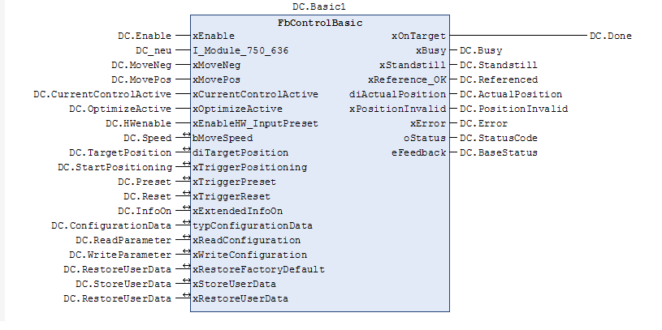

# WagoAppDCDriveController v1.8.1.2 (WAGO) - Complete Documentation


## 📋 Library Information

- **Company:** WAGO
- **Title:** WagoAppDCDriveController
- **Version:** 1.8.1.2
- **Categories:** WAGO LayerView|App; WAGO FunctionalView|Device|IO; Application
- **Author:** WAGO/u010663
- **Placeholder:** WagoAppDCDriveController

### Description ¶


This document is automatically generated.

Function blocks handling module 750-636 and derivates.

The function blocks of this library are NOT thread safe and must be called from one CODESYS task only! Concurrent calls from different tasks may cause loss or corruption of data.

This document is automatically generated. Function blocks handling module 750-636 and derivates. The function blocks of this library are NOT thread safe and must be called from one CODESYS task only! Concurrent calls from different tasks may cause loss or corruption of data.

### Contents: ¶


Contents: - Documentation Index - Project Information - Library Information - Function Blocks FbControlBasic (FB) - FbPWM (FB) Program Organization Internal Components Global Variable Lists - Status (GVL) - VersionHistory (GVL) Other Components - 30 Visualizations - 80 Status - Additional - GlobalTextList (Text List) - ParameterList (PARAMS) - eStatus (ENUM) - typConfiguration (STRUCT) - typVisu (STRUCT)

### Indices and tables ¶


Based on WagoAppDCDriveController.library, last modified 20.06.2024, 00:25:27. LibDoc 3.5.16.10

© WAGO GmbH & Co. KG, Germany 2018 – All rights reserved. For the avoidance of doubt, this copyright notice does not only apply to the information above but also and primarily to the described library itself. Please note that third-party products are always mentioned without reference to intellectual property rights, including patents, utility models, designs and trademarks, accordingly the existence of such rights cannot be excluded. WAGO is a registered trademark of WAGO Verwaltungsgesellschaft mbH.

- File and Project Information - Library Reference Based on WagoAppDCDriveController.library, last modified 20.06.2024, 00:25:27. LibDoc 3.5.16.10 © WAGO GmbH & Co. KG, Germany 2018 – All rights reserved. For the avoidance of doubt, this copyright notice does not only apply to the information above but also and primarily to the described library itself. Please note that third-party products are always mentioned without reference to intellectual property rights, including patents, utility models, designs and trademarks, accordingly the existence of such rights cannot be excluded. WAGO is a registered trademark of WAGO Verwaltungsgesellschaft mbH.

### Documentation Index


## WagoAppDCDriveController Library Documentation


| Company: | WAGO |
| Title: | WagoAppDCDriveController |
| Version: | 1.8.1.2 |
| Categories: | WAGO LayerView\|App; WAGO FunctionalView\|Device\|IO; Application |
| Author: | WAGO/u010663 |
| Placeholder: | WagoAppDCDriveController |

### Description


This document is automatically generated.

Function blocks handling module 750-636 and derivates.

The function blocks of this library are NOT thread safe and must be called from one CODESYS task only! Concurrent calls from different tasks may cause loss or corruption of data.

This document is automatically generated. Function blocks handling module 750-636 and derivates. The function blocks of this library are NOT thread safe and must be called from one CODESYS task only! Concurrent calls from different tasks may cause loss or corruption of data.

### Contents:


- 20 Program Organization Units Additional - FbControlBasic (FB) - typConfiguration (STRUCT) - typVisu (STRUCT) 30 Visualizations 80 Status - Status (GVL) - eStatus (ENUM) 90 Internal - GlobalTextList (Text List) ParameterList (PARAMS) VersionHistory (GVL)

### Indices and tables


Based on WagoAppDCDriveController.library, last modified 20.06.2024, 00:25:27. LibDoc 3.5.16.10

© WAGO GmbH & Co. KG, Germany 2018 – All rights reserved. For the avoidance of doubt, this copyright notice does not only apply to the information above but also and primarily to the described library itself. Please note that third-party products are always mentioned without reference to intellectual property rights, including patents, utility models, designs and trademarks, accordingly the existence of such rights cannot be excluded. WAGO is a registered trademark of WAGO Verwaltungsgesellschaft mbH.

- File and Project Information - Library Reference Based on WagoAppDCDriveController.library, last modified 20.06.2024, 00:25:27. LibDoc 3.5.16.10 © WAGO GmbH & Co. KG, Germany 2018 – All rights reserved. For the avoidance of doubt, this copyright notice does not only apply to the information above but also and primarily to the described library itself. Please note that third-party products are always mentioned without reference to intellectual property rights, including patents, utility models, designs and trademarks, accordingly the existence of such rights cannot be excluded. WAGO is a registered trademark of WAGO Verwaltungsgesellschaft mbH.

### Project Information


## File and Project Information


| Scope | Name | Type | Content |
| --- | --- | --- | --- |
| FileHeader | libraryFile | string | WagoAppDCDriveController.library |
| contentFile | doc.clean.json |
| productName | e!COCKPIT |
| creationDateTime | date | 20.06.2024, 00:25:31 |
| companyName | string | WAGO |
| ProjectInformation | LastModificationDateTime | date | 20.06.2024, 00:25:27 |
| Description | string | See: Description |
| Copyright | © WAGO Kontakttechnik GmbH & Co. KG, Germany 2018 – All rights reserved. |
| Author | WAGO/u010663 |
| AutoResolveUnbound | bool | True |
| Placeholder | string | WagoAppDCDriveController |
| Company | WAGO |
| DocFormat | reStructuredText |
| Project | WagoAppDCDriveController |
| Version | version | 1.8.1.2 |
| ThreadSave | string | False |
| Version string |  |
| Title | WagoAppDCDriveController |
| LibraryCategories | library-category-list | WAGO LayerView\|App; WAGO FunctionalView\|Device\|IO; Application |
| CompiledLibraryCompatibilityVersion | string | CODESYS V3.5 SP16 Patch 3 |

### Library Information


## Library Reference


| LinkAllContent: False QualifiedOnly: False | SystemLibrary: False | Optional: False |

| LinkAllContent: False Optional: False | QualifiedOnly: False SystemLibrary: False | PublishSymbolsInContainer: True |

| LinkAllContent: False QualifiedOnly: False | SystemLibrary: True | Optional: False |

| LinkAllContent: False QualifiedOnly: False | SystemLibrary: True | Optional: False |

| LinkAllContent: False QualifiedOnly: False | SystemLibrary: True | Optional: False |

| LinkAllContent: False QualifiedOnly: False | SystemLibrary: True | Optional: False |

| LinkAllContent: False QualifiedOnly: False | SystemLibrary: True | Optional: False |

| LinkAllContent: False QualifiedOnly: False | SystemLibrary: True | Optional: False |

| LinkAllContent: False QualifiedOnly: False | SystemLibrary: True | Optional: False |

| LinkAllContent: False QualifiedOnly: False | SystemLibrary: True | Optional: False |

| LinkAllContent: False QualifiedOnly: False | SystemLibrary: True | Optional: False |

| LinkAllContent: False QualifiedOnly: False | SystemLibrary: True | Optional: False |

| LinkAllContent: False QualifiedOnly: False | SystemLibrary: True | Optional: False |

| LinkAllContent: False Optional: False | QualifiedOnly: False SystemLibrary: True | PublishSymbolsInContainer: True |

| LinkAllContent: False QualifiedOnly: False | SystemLibrary: True | Optional: False |

| LinkAllContent: False QualifiedOnly: True | SystemLibrary: False | Optional: False |

| LinkAllContent: False QualifiedOnly: False | SystemLibrary: False | Optional: False |

| LinkAllContent: False QualifiedOnly: False | SystemLibrary: False | Optional: False |

| LinkAllContent: False Optional: False | QualifiedOnly: False SystemLibrary: False | PublishSymbolsInContainer: True |

| LinkAllContent: False QualifiedOnly: True | SystemLibrary: False | Optional: False |

| LinkAllContent: False QualifiedOnly: True | SystemLibrary: False | Optional: False |

| LinkAllContent: False QualifiedOnly: True | SystemLibrary: False | Optional: False |

This is a dictionary of all referenced libraries and their name spaces.

This is a dictionary of all referenced libraries and their name spaces. Standard Library Identification : Placeholder: Standard Default Resolution: Standard, * (System) Namespace: Standard Library Properties : VisuDialogs Library Identification : Placeholder: VisuDialogs Default Resolution: VisuDialogs, * (System) Namespace: VisuDialogs Library Properties : VisuElem3DPath Library Identification : Placeholder: System_VisuElem3DPath Default Resolution: VisuElem3DPath, 3.5.10.0 (System) Namespace: VisuElem3DPath Library Properties : Library Parameter : Parameter: GC_POINTS_PER_POLYGON = 100 VisuElemCamDisplayer Library Identification : Placeholder: System_VisuElemCamDisplayer Default Resolution: VisuElemCamDisplayer, 3.5.10.0 (System) Namespace: VisuElemCamDisplayer Library Properties : Library Parameter : Parameter: GC_POINTS_PER_CAM = 100 VisuElemMeter Library Identification : Placeholder: System_VisuElemMeter Default Resolution: VisuElemMeter, 3.5.10.0 (System) Namespace: VisuElemMeter Library Properties : VisuElemTextEditor Library Identification : Placeholder: System_VisuElemTextEditor Default Resolution: VisuElemTextEditor, 3.5.10.0 (System) Namespace: VisuElemTextEditor Library Properties : VisuElemTrace Library Identification : Placeholder: System_VisuElemTrace Default Resolution: VisuElemTrace, 3.5.10.0 (System) Namespace: VisuElemTrace Library Properties : VisuElemXYChart Library Identification : Placeholder: System_VisuElemXYChart Default Resolution: VisuElemXYChart, 3.5.16.30 (System) Namespace: VisuElemXYChart Library Properties : VisuElems Library Identification : Placeholder: System_VisuElems Default Resolution: VisuElems, 3.5.10.0 (System) Namespace: VisuElems Library Properties : VisuElemsAlarm Library Identification : Placeholder: System_VisuElemsAlarm Default Resolution: VisuElemsAlarm, 3.5.10.0 (System) Namespace: VisuElemsAlarm Library Properties : VisuElemsDateTime Library Identification : Placeholder: System_VisuElemsDateTime Default Resolution: VisuElemsDateTime, 3.5.10.0 (System) Namespace: VisuElemsDateTime Library Properties : VisuElemsSpecialControls Library Identification : Placeholder: System_VisuElemsSpecialControls Default Resolution: VisuElemsSpecialControls, 3.5.10.0 (System) Namespace: VisuElemsSpecialControls Library Properties : VisuElemsWinControls Library Identification : Placeholder: System_VisuElemsWinControls Default Resolution: VisuElemsWinControls, 3.5.10.0 (System) Namespace: VisuElemsWinControls Library Properties : VisuInputs Library Identification : Placeholder: system_visuinputs Default Resolution: VisuInputs, 3.5.16.30 (System) Namespace: visuinputs Library Properties : VisuNativeControl Library Identification : Placeholder: System_VisuNativeControl Default Resolution: VisuNativeControl, 3.5.10.0 (System) Namespace: VisuNativeControl Library Properties : VisuSymbols Library Identification : Name: VisuSymbols Version: newest Company: System Namespace: VisuSymbols Library Properties : WagoSysErrorBase Library Identification : Placeholder: WagoSysErrorBase Default Resolution: WagoSysErrorBase, * (WAGO) Namespace: WagoSysErrorBase Library Properties : WagoSysVersion Library Identification : Name: WagoSysVersion Version: 1.0.0.0 Company: WAGO Namespace: WagoSysVersion Library Properties : WagoTypesBusServices Library Identification : Placeholder: WagoTypesBusServices Default Resolution: WagoTypesBusServices, * (WAGO) Namespace: WagoTypesBusServices Library Properties : WagoTypesErrorBase Library Identification : Placeholder: WagoTypesErrorBase Default Resolution: WagoTypesErrorBase, * (WAGO) Namespace: WagoTypesErrorBase Library Properties : WagoTypesModuleBase Library Identification : Placeholder: WagoTypesModuleBase Default Resolution: WagoTypesModuleBase, * (WAGO) Namespace: WagoTypesModuleBase Library Properties : Library Parameter : Parameter: MAX_MBX_SIZE = 18 WagoTypesModule_750_636 Library Identification : Placeholder: WagoTypesModule_750_636 Default Resolution: WagoTypesModule_750_636, * (WAGO) Namespace: WagoTypesModule_750_636 Library Properties :

### Function Blocks


## FbControlBasic (FB)


| Scope | Name | Type | Comment |
| --- | --- | --- | --- |
| Input | xEnable | BOOL | Enable function block |
| I_Port | WagoTypesModule_750_636.I_Module_750_636 | Basic interface |
| xMoveNeg | BOOL | Move negative (PWM mode) |
| xMovePos | BOOL | Move positive (PWM mode) |
| xCurrentControlActive | BOOL | Activate current control functionality |
| xOptimizeActive | BOOL | Activate optimize functionality |
| xEnableHwInputPreset | BOOL | Enable hardware input preset |
| Inout | bMoveSpeed | BYTE | Speed for PWM mode while MoveNeg or MovePos is active |
| diTargetPosition | DINT | Target position |
| xTriggerPositioning | BOOL | Start positioning |
| xTriggerPreset | BOOL | Set actual position equal diTargetPosition. Modul is referenced. |
| xTriggerReset | BOOL | Reset error |
| xExtendedInfoOn | BOOL | If an error occured, activate this variable to get detailed information. Will be reset after a “reset command” was executed and the general error has disappeared |
| typConfigurationData | typConfiguration | Configuration data |
| xReadConfiguration | BOOL | Read parameter |
| xWriteConfiguration | BOOL | Write parameter |
| xRestoreFactoryDefault | BOOL | Restore factory settings |
| xStoreUserData | BOOL | Store actual data as user data |
| xRestoreUserData | BOOL | Copy user data to actual data |
| Output | xOnTarget | BOOL | Positioning finished |
| xBusy | BOOL | Motor running |
| xStandstill | BOOL | Standstill |
| xReferenceOK | BOOL | System is referenced |
| diActualPosition | DINT | Actual position |
| xPositionInvalid | BOOL | True if register communication active |
| xError | BOOL | A general module error has occured |
| oStatus | WagoSysErrorBase.FbResult | Detailed status and error information Status |

```
PROGRAM PLC_PRG
VAR
    DC                          : typVisu;
END_VAR
```

This function block handles the DC module 750-636 and its derivates

Graphical Illustration

Function description

The function block supports one operation mode at a time, which is either: - speed mode (xMovePos or xMoveNeg) - positioning mode (xTriggerPositioning) - info show error details (xExtendedInfoOn) - read module configuration - write module configuration - restore factory default values - store actual ram values in flash as user data set - restore user data

Therefore it is necessary, in case of an error, to deactivate any other mode than info mode.

This function block also allows to read and write the module configuration. The input xRestoreFactoryDefault allows to set the parameters to the factory values.

The PWM mode is performed by either xMoveNeg or xMovePos . The speed is set by the input bMoveSpeed . This parameter defines the puls duration ratio of the PWM mode. Accelerating from zero to bMoveSpeed in PWM modes assumes parameter CurrentLimitTime>0.

Positioning is started by the input xStartPositioning . The drive will take the input diTargetPosition as target position. The positioning job is perfomed according to the configuration values. If the positioning job is finished with the actual position within the positioning target window, the function block will reset the variable xStartPositioning . To stop the motor the input xStartPositioning needs to be false. If xEnable is reset while the motor is moving in either PWM mode or positioning mode the motor will stop.

A very simple project using the visualisation may look like:

Visualization

The visualisation input m_input_drive is a variable from type typVisu.

Interface variables Function This function block handles the DC module 750-636 and its derivates Graphical Illustration  Function description The function block supports one operation mode at a time, which is either: - speed mode (xMovePos or xMoveNeg) - positioning mode (xTriggerPositioning) - info show error details (xExtendedInfoOn) - read module configuration - write module configuration - restore factory default values - store actual ram values in flash as user data set - restore user data Therefore it is necessary, in case of an error, to deactivate any other mode than info mode. This function block also allows to read and write the module configuration. The input xRestoreFactoryDefault allows to set the parameters to the factory values. The PWM mode is performed by either xMoveNeg or xMovePos . The speed is set by the input bMoveSpeed . This parameter defines the puls duration ratio of the PWM mode. Accelerating from zero to bMoveSpeed in PWM modes assumes parameter CurrentLimitTime>0. Positioning is started by the input xStartPositioning . The drive will take the input diTargetPosition as target position. The positioning job is perfomed according to the configuration values. If the positioning job is finished with the actual position within the positioning target window, the function block will reset the variable xStartPositioning . To stop the motor the input xStartPositioning needs to be false. If xEnable is reset while the motor is moving in either PWM mode or positioning mode the motor will stop. Example A very simple project using the visualisation may look like:  Visualization  Note The visualisation input m_input_drive is a variable from type typVisu.

## FbPWM (FB)


| Scope | Name | Type | Comment |
| --- | --- | --- | --- |
| Input | xEnable | BOOL | Enables function block |
| I_Port | WagoTypesModule_750_636.I_Module_750_636 | Basic interface |
| xDirPos | BOOL | Move in positive direction |
| xDirNeg | BOOL | Move in negative direction |
| bSpeed | BYTE | Move speed |
| xEnableHwPreset | BOOL | Enable hardware input preset |
| Inout | xTriggerReset | BOOL | Reset error |
| Output | xValid | BOOL | Output value diPosition valid |
| xBusy | BOOL | PWM mode active |
| xError | BOOL | Error occcured |
| oStatus | WagoSysErrorBase.FbResult | Status information Status |
| diPosition | DINT | Actual position |

This function block allows velocity control by means of PWM mode

Graphical Illustration

Interface variables Function This function block allows velocity control by means of PWM mode Graphical Illustration 

### Program Organization


## 20 Program Organization Units


- Additional FbPWM (FB) FbControlBasic (FB) typConfiguration (STRUCT) typVisu (STRUCT)

### Internal Components


## 90 Internal ¶


- GlobalTextList (Text List)

### Global Variable Lists


## Status (GVL)


| Scope | Name | Type |
| --- | --- | --- |
| Constant | StatusModule_636 | ARRAY [0..23] OF WagoTypesErrorBase.typResultItem |

| Value | Level | Description |
| --- | --- | --- |
| eStatus.DriveOK | WagoTypesErrorBase.eSeverity.info | ‘OK’ |
| eStatus.CmdError | WagoTypesErrorBase.eSeverity.error | ‘ErrorExecutingCommand’ |
| eStatus.DriveNotReferenced | WagoTypesErrorBase.eSeverity.error | ‘DriveNotReferenced’ |
| eStatus.Timeout | WagoTypesErrorBase.eSeverity.error | ‘Timeout’ |
| eStatus.FunctionBlockNotEnabled | WagoTypesErrorBase.eSeverity.error | ‘FunctionBlockNotEnabled’ |
| eStatus.ErrorReadingSettings | WagoTypesErrorBase.eSeverity.error | ‘ErrorReadingSettings’ |
| eStatus.ErrorWritingSettings | WagoTypesErrorBase.eSeverity.error | ‘ErrorWritingSettings’ |
| eStatus.ModulErrorDetected | WagoTypesErrorBase.eSeverity.error | ‘ModulErrorDetected’ |
| eStatus.OvertemperatureWarning | WagoTypesErrorBase.eSeverity.warning | ‘OvertemperatureWarning’ |
| eStatus.OvertemperatureError | WagoTypesErrorBase.eSeverity.error | ‘OvertemperatureError’ |
| eStatus.PositionOverflow | WagoTypesErrorBase.eSeverity.error | ‘PositionOverflow’ |
| eStatus.VoltageError | WagoTypesErrorBase.eSeverity.error | ‘VoltageError’ |
| eStatus.Overload | WagoTypesErrorBase.eSeverity.error | ‘Overload’ |
| eStatus.MotionDetectionTimeout | WagoTypesErrorBase.eSeverity.error | ‘MotionDetectionTimeout’ |
| eStatus.MotorVoltageError | WagoTypesErrorBase.eSeverity.error | ‘MotorVoltageError’ |
| eStatus.FieldVoltageError | WagoTypesErrorBase.eSeverity.error | ‘FieldVoltageError’ |
| eStatus.NoStart | WagoTypesErrorBase.eSeverity.error | ‘NoStart’ |
| eStatus.ReadingSettings | WagoTypesErrorBase.eSeverity.info | ‘ReadingSettings’ |
| eStatus.WritingSettings | WagoTypesErrorBase.eSeverity.info | ‘WritingSettings’ |
| eStatus.Standstill | WagoTypesErrorBase.eSeverity.info | ‘Standstill’ |
| eStatus.Positioning | WagoTypesErrorBase.eSeverity.info | ‘Positioning’ |
| eStatus.MovePos | WagoTypesErrorBase.eSeverity.info | ‘MovePos’ |
| eStatus.MoveNeg | WagoTypesErrorBase.eSeverity.info | ‘MoveNeg’ |
| eStatus.PaAccesFailed | WagoTypesErrorBase.eSeverity.error | ‘ProcessAccessFailed’ |

Description: Status information

Description: Status information

## VersionHistory (GVL)


| Name | Type |
| --- | --- |
| Info | ProjectInfo |

| date | version | author | change |
| 19.06.2024 | 1.8.1.2 | u0103719 | WAT-36673: add library via placeholder (context: VisuSymbols) |
| 19.12.2022 | 1.8.1.1 | u010663 | Library WagoVisuIcons deleted |
| 08.01.2019 | 1.8.1.0 | u015842 | Properties: free placeholder added |
| 25.04.2018 | 1.8.0.1 | u010663 | Docu issues |
| 19.10.2017 | 1.8.0.0 | u010663 | Necessary since e!Cockpit v1.4 |
| 06.06.2017 | 1.7.0.0 | u010663 | Compiler Version set to V3.5.9.10 |
| 02.12.2016 | 1.6.0.1 | u010663 | Documentation issues |
| 25.02.2016 | 1.6.0.0 | u010663 | Update according to WagoSysModuleBase |
| 16.06.2015 | 1.5.0.0 | u010663 | Release |

WagoAppDCDriveController.library

Release Notes:

WagoAppDCDriveController.library Release Notes:

### Other Components


## 30 Visualizations ¶


## 80 Status ¶


- Status (GVL) - eStatus (ENUM)

## Additional ¶


## GlobalTextList (Text List)


| ID | Default | de |
| --- | --- | --- |
| 60 |  |  |
| 61 | `` 1`` |  |
| 9 | `` Move Speed`` | Geschwindigkeit |
| 24 | %s |  |
| 10 | `` %s `` |  |
| 13 | Actual Position | Ist-Position |
| 36 | After PowerUp 24V Brake activ | Bremse aktiv nach Spannung Ein |
| 58 | Brakemode, Stopmode | Bremsmode,Stopmode |
| 15 | Current Control | Strom |
| 53 | CurrentControl_PWM | CurrentControl_PWM |
| 52 | CurrentLimit_PWM | CurrentLimit_PWM |
| 54 | CurrentLimit_Time | CurrentLimit_Time |
| 5 | DC Configuration | Konfiguration |
| 6 | DC Control | Ansteuerung |
| 65 | Enable |  |
| 39 | Enable Z-Impulse | Freigabe Z-Impuls |
| 32 | Encoder Decoding | Encoder Decodierung |
| 18 | Error | Fehler |
| 48 | FilterTime | Filter Zeit |
| 59 | Increase Swing Back | Ausholweite |
| 45 | InputMode,StopMode | Eingänge,Stopfunktionalität |
| 62 | Insert "Preset value" in ->TargetPosition field |  |
| 55 | MotionDetectionTimeout | Stillstand Erkennung |
| 34 | Motor Voltage <24Volt | Motor Spannung <24Volt |
| 8 | MoveNeg | Fahre negative |
| 7 | MovePos | Fahre positive |
| 14 | Optimize | Optimiere |
| 43 | Overtravel | Overtravel |
| 25 | P 0 |  |
| 28 | P 1 |  |
| 47 | P 10,11 |  |
| 50 | P 12 |  |
| 51 | P 13 |  |
| 56 | P 14 |  |
| 57 | P 15 |  |
| 21 | P 2 |  |
| 20 | P 3 |  |
| 30 | P 4 |  |
| 38 | P 4.14 |  |
| 37 | P 4.15 |  |
| 35 | P 4.7 |  |
| 40 | P 5,6 |  |
| 42 | P 7 |  |
| 44 | P 8 |  |
| 46 | P 9 |  |
| 33 | Positioning_Retry | Wiederholungen bei Positionierung |
| 17 | Preset |  |
| 41 | Preset Value |  |
| 23 | Prestop Negativ |  |
| 29 | Prestop Positiv |  |
| 27 | RampTime_Start | Anfahrrampe |
| 26 | RampTime_Stop | Stop-Rampe |
| 0 | Read Parameter | Lesen |
| 66 | Ref OK |  |
| 16 | Reset | Zurücksetzen |
| 4 | `` Restore User Data`` | Restore |
| 2 | `` Restore factory `` |  |
| 63 | Show Error Details |  |
| 64 | Show Error Details |  |
| 49 | ShutDownDistance | ShutDownDistance |
| 68 | Stand still |  |
| 67 | Standstill |  |
| 31 | Standstill_Limit | Stillstand |
| 12 | Start |  |
| 19 | Status |  |
| 3 | Store User Data |  |
| 11 | Target Position | Soll-Position |
| 22 | TargetWindow | Zielfenster |
| 1 | Write Parameter | Schreiben |

## ParameterList (PARAMS)


| Scope | Name | Type | Initial | Comment |
| --- | --- | --- | --- | --- |
| Constant | IN_WINDOW_TIME | TIME | TIME#300ms | Time delay after which the on target bit is set if the actual position is within the target window |
| PWM_DELAY | TIME | TIME#35ms | Value should not be modified unless otherwise adviced |

## eStatus (ENUM)


| Name | Initial | Comment |
| --- | --- | --- |
| DriveOK | 0 | OK |
| CmdError | 50 | More than one command active,e.g. xStart and xJogPos |
| DriveNotReferenced | 51 | Drive not referenced |
| Timeout | 52 | Timeout |
| FunctionBlockNotEnabled | 53 | Function block not enabled |
| ErrorReadingSettings | 54 | Error reading settings |
| ErrorWritingSettings | 55 | Error writting settings |
| PaAccesFailed | 56 | Error process access |
| ModulErrorDetected | 99 | General modul error ->activate extended info |
| OvertemperatureWarning | 100 | Warning overtemperature |
| OvertemperatureError | 101 | Error overtemperature |
| PositionOverflow | 102 | Position overflow |
| VoltageError | 103 | Error voltage |
| Overload | 104 | Error overload occured |
| MotionDetectionTimeout | 105 | Error no motion detected withhin given timeout |
| MotorVoltageError | 107 | Error motor voltage |
| FieldVoltageError | 108 | Error field voltage |
| NoStart | 109 | Error start signal missing |
| Standstill | 200 | Status standstill |
| Positioning | 201 | Status positioning active |
| MovePos | 202 | Status moving positive by PWM mode |
| MoveNeg | 203 | Status moving negative by PWM mode |
| ReadingSettings | 204 | Status reading settings |
| WritingSettings | 205 |  |

Description: Status information

InOut: Description: Status information

## typConfiguration (STRUCT)


| Name | Type | Initial | Comment |
| --- | --- | --- | --- |
| DC_RampTimeStart | BYTE | 16#40 | Ramp time start |
| DC_RampTimeStop | BYTE | 16#40 | Ramp time stop |
| DC_PrestopPos | WORD | 100 | Prestop positive |
| DC_PrestopNeg | WORD | 100 | Prestop negative |
| DC_TargetWindow | WORD | 10 | Target window |
| DC_StandstillLimit | BYTE | 100 | Standstill limit |
| DC_PositioningRetry | BYTE | 5 | Positioning retries |
| DC_StopMode_PowerUp | BOOL | FALSE | Break active after power up |
| DC_PresetValue | DINT | 0 | Preset value |
| DC_Overtravel | INT | 0 | Overtravel |
| DC_AuxMode | WORD | 16#A37 | Parameter 8 see manual module 750-636 |
| DC_FilterTime | WORD | 16#AAA | Parameter 9 see manual module 750-636 |
| DC_ShutDownDistance | DINT | 0 | Shutdown distance |
| DC_CurrentLimit_PWM | BYTE | 175 | Duty cycle e.g. 200->100% |
| DC_CurrentControl_PWM | BYTE | 180 | Current control |
| DC_CurrentLimitTime | BYTE | 0 | Current limit time |
| DC_MotionDetectionTimeout | BYTE | 3 | Motion detection timeout |
| DC_MotorVoltage_24Volt | BOOL |  | 24Volt->FALSE , refers to register 39, Bit 7 |
| DC_EncoderDecoding | BYTE | 0 | Encoder decoding |
| DC_Enable_Z | BOOL |  | Refers to register 39 Bit 14 |
| DC_Register_49 | WORD | 16#105 | Parameter 14 see manual module 750-636 |
| DC_Register_50 | WORD |  | Parameter 15 see manual module 750-636 |

Description: Configuration structure

InOut: Description: Configuration structure

## typVisu (STRUCT)


| Name | Type | Initial |
| --- | --- | --- |
| Basic1 | FbControlBasic |  |
| Enable | BOOL | TRUE |
| TargetPosition | DINT |  |
| ActualPosition | DINT |  |
| StartPositioning | BOOL |  |
| ReadParameter | BOOL |  |
| WriteParameter | BOOL |  |
| RestoreFactoryDefault | BOOL |  |
| RestoreUserData | BOOL |  |
| StoreUserData | BOOL |  |
| Reset | BOOL |  |
| ConfigurationData | typConfiguration |  |
| Done | BOOL |  |
| StatusCode | WagoSysErrorBase.FbResult |  |
| Error | BOOL |  |
| Busy | BOOL |  |
| PositionInvalid | BOOL |  |
| Text | STRING | ‘Configuration 750-636 DC Positioning Modul’ |
| Speed | BYTE |  |
| MoveNeg | BOOL |  |
| MovePos | BOOL |  |
| init | BOOL |  |
| TON1 | TON |  |
| Preset | BOOL |  |
| InfoOn | BOOL |  |
| Standstill | BOOL |  |
| Referenced | BOOL |  |
| CurrentControlActive | BOOL |  |
| OptimizeActive | BOOL |  |
| HWenable | BOOL |  |
| IsActive | BOOL |  |
| BaseError | BOOL |  |
| BaseStatus | eStatus |  |

Description: A structure, used with the visualisation template tplConfiguration_636

InOut: Description: A structure, used with the visualisation template tplConfiguration_636