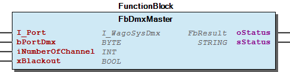
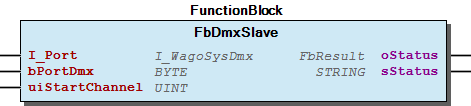
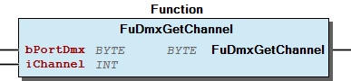
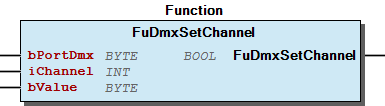

# WagoAppDMX v1.0.1.2 (WAGO) - Complete Documentation

## 📋 Library Information

- **Company:** WAGO
- **Title:** WagoAppDMX
- **Version:** 1.0.1.2
- **Categories:** WAGO BusinessView|Building Automation; WAGO LayerView|App; Application
- **Author:** WAGO / u015842
- **Placeholder:** WagoAppDMX

### Description ¶

This document is automatically generated.

Library for DMX512 communication with Wago system

This document is automatically generated. Library for DMX512 communication with Wago system

### Contents: ¶

Contents: - Documentation Index 10 Documentation - WagoAppDMX Library Documentation Project Information Library Information Function Blocks - FbDmxMaster (FB) - FbDmxSlave (FB) - doc01_Foreword (FB) Functions - FuDmxGetChannel (FUN) - FuDmxSetChannel (FUN) Methods - FbDmxMaster.Job (METH) - FbDmxSlave.Job (METH) - FbDmxSlave.StartChannel (PROP) Program Organization Global Variable Lists - GlobalVariables (GVL) - Status (GVL) - VersionHistory (GVL) Other Components - 00 Administration - 00 Administration - 01 Communication / Kommunikation - 01 Parameters - 01 Parameters - 02 Channel values / Kanalwerte - 80 Data types - 80 Status - FbDmxMaster.Blackout (PROP) - FbDmxMaster.NumberOfChannel (PROP) - ... and 6 more

### Indices and tables ¶

Based on WagoAppDMX.library, last modified 29.05.2024, 19:58:10. LibDoc 3.5.16.10

© WAGO GmbH & Co. KG, Germany 2018 – All rights reserved. For the avoidance of doubt, this copyright notice does not only apply to the information above but also and primarily to the described library itself. Please note that third-party products are always mentioned without reference to intellectual property rights, including patents, utility models, designs and trademarks, accordingly the existence of such rights cannot be excluded. WAGO is a registered trademark of WAGO Verwaltungsgesellschaft mbH.

- File and Project Information - Library Reference Based on WagoAppDMX.library, last modified 29.05.2024, 19:58:10. LibDoc 3.5.16.10 © WAGO GmbH & Co. KG, Germany 2018 – All rights reserved. For the avoidance of doubt, this copyright notice does not only apply to the information above but also and primarily to the described library itself. Please note that third-party products are always mentioned without reference to intellectual property rights, including patents, utility models, designs and trademarks, accordingly the existence of such rights cannot be excluded. WAGO is a registered trademark of WAGO Verwaltungsgesellschaft mbH.

### Documentation Index

## 10 Documentation

To ensure fast installation and start-up of the units, we strongly recommend that the following information and explanations are carefully read and adhered to.

To ensure fast installation and start-up of the units, we strongly recommend that the following information and explanations are carefully read and adhered to. - doc01_Foreword (FB)

## WagoAppDMX Library Documentation

| Company: | WAGO |
| Title: | WagoAppDMX |
| Version: | 1.0.1.2 |
| Categories: | WAGO BusinessView\|Building Automation; WAGO LayerView\|App; Application |
| Author: | WAGO / u015842 |
| Placeholder: | WagoAppDMX |

### Description

This document is automatically generated.

Library for DMX512 communication with Wago system

This document is automatically generated. Library for DMX512 communication with Wago system

### Contents:

- 10 Documentation doc01_Foreword (FB) 20 Program Organization Units - 01 Communication / Kommunikation - 02 Channel values / Kanalwerte - 80 Data types 80 Status - Status (GVL) - eStatus (ENUM) GlobalTextList (Text List) GlobalVariables (GVL) ParameterList (PARAMS) VersionHistory (GVL)

### Indices and tables

Based on WagoAppDMX.library, last modified 29.05.2024, 19:58:10. LibDoc 3.5.16.10

© WAGO GmbH & Co. KG, Germany 2018 – All rights reserved. For the avoidance of doubt, this copyright notice does not only apply to the information above but also and primarily to the described library itself. Please note that third-party products are always mentioned without reference to intellectual property rights, including patents, utility models, designs and trademarks, accordingly the existence of such rights cannot be excluded. WAGO is a registered trademark of WAGO Verwaltungsgesellschaft mbH.

- File and Project Information - Library Reference Based on WagoAppDMX.library, last modified 29.05.2024, 19:58:10. LibDoc 3.5.16.10 © WAGO GmbH & Co. KG, Germany 2018 – All rights reserved. For the avoidance of doubt, this copyright notice does not only apply to the information above but also and primarily to the described library itself. Please note that third-party products are always mentioned without reference to intellectual property rights, including patents, utility models, designs and trademarks, accordingly the existence of such rights cannot be excluded. WAGO is a registered trademark of WAGO Verwaltungsgesellschaft mbH.

### Project Information

## File and Project Information

| Scope | Name | Type | Content |
| --- | --- | --- | --- |
| FileHeader | libraryFile | string | WagoAppDMX.library |
| contentFile | doc.clean.json |
| productName | e!COCKPIT |
| creationDateTime | date | 29.05.2024, 19:58:11 |
| companyName | string | WAGO |
| ProjectInformation | LastModificationDateTime | date | 29.05.2024, 19:58:10 |
| NoPlaceholder | string |  |
| Description | See: Description |
| Copyright | © WAGO Kontakttechnik GmbH & Co. KG, Germany 2018 – All rights reserved. |
| Author | WAGO / u015842 |
| AutoResolveUnbound | bool | True |
| Placeholder | string | WagoAppDMX |
| Company | WAGO |
| DocFormat | reStructuredText |
| Project | WagoAppDMX |
| DefaultNamespace |  |
| Version | version | 1.0.1.2 |
| Threadsave | string | False |
| Title | WagoAppDMX |
| LibraryCategories | library-category-list | WAGO BusinessView\|Building Automation; WAGO LayerView\|App; Application |
| CompiledLibraryCompatibilityVersion | string | CODESYS V3.5 SP16 Patch 3 |

### Library Information

## Library Reference

| LinkAllContent: False QualifiedOnly: False | SystemLibrary: False | Optional: False |

| LinkAllContent: False Optional: False | QualifiedOnly: False SystemLibrary: False | PublishSymbolsInContainer: True |

| LinkAllContent: False QualifiedOnly: False | SystemLibrary: False | Optional: False |

| LinkAllContent: False QualifiedOnly: True | SystemLibrary: False | Optional: False |

| LinkAllContent: False Optional: False | QualifiedOnly: True SystemLibrary: False | PublishSymbolsInContainer: True |

| LinkAllContent: False Optional: False | QualifiedOnly: False SystemLibrary: False | PublishSymbolsInContainer: True |

| LinkAllContent: False QualifiedOnly: False | SystemLibrary: False | Optional: False |

This is a dictionary of all referenced libraries and their name spaces.

This is a dictionary of all referenced libraries and their name spaces. Standard Library Identification : Placeholder: Standard Default Resolution: Standard, 3.5.5.0 (System) Namespace: Standard Library Properties : WagoSysErrorBase Library Identification : Placeholder: WagoSysErrorBase Default Resolution: WagoSysErrorBase, * (WAGO) Namespace: WagoSysErrorBase Library Properties : WagoSysSerial Library Identification : Placeholder: WagoSysSerial Default Resolution: WagoSysSerial, * (WAGO) Namespace: WagoSysSerial Library Properties : WagoSysVersion Library Identification : Name: WagoSysVersion Version: 1.0.0.0 Company: WAGO Namespace: WagoSysVersion Library Properties : WagoTypesCom Library Identification : Placeholder: WagoTypesCom Default Resolution: WagoTypesCom, * (WAGO) Namespace: WagoTypesCom Library Properties : WagoTypesErrorBase Library Identification : Placeholder: WagoTypesErrorBase Default Resolution: WagoTypesErrorBase, * (WAGO) Namespace: WagoTypesErrorBase Library Properties : WagoTypesModuleBase Library Identification : Placeholder: WagoTypesModuleBase Default Resolution: WagoTypesModuleBase, * (WAGO) Namespace: WagoTypesModuleBase Library Properties :

### Function Blocks

## FbDmxMaster (FB)

| Scope | Name | Type | Initial | Comment | Inherited from |
| --- | --- | --- | --- | --- | --- |
| Input | I_Port | WagoTypesCom.I_WagoSysDmx |  | Serial 750-652 module | FbDmxSerial |
| bPortDmx | BYTE | 1 | Master assignment number. Range 1 to MAX_MODULE. | FbDmxSerial |
| Output | oStatus | WagoSysErrorBase.FbResult |  | Status object. (Listed in Status ) The content of the error object could be displayed via the FbShowResult from the WagoSysErrorBase library. | FbDmxSerial |
| sStatus | STRING |  | Status description as string (Listed in Status ) | FbDmxSerial |
| Input | iNumberOfChannel | INT | 21 | Number of DMX channels to send. Range 1-512. |  |
| xBlackout | BOOL |  | TRUE-> blackout mode is active. All DMX Channel values will remain zero. |  |

The FbDmxMaster function block transmits values to a DMX line. Communication takes place via an RS-485 interface module (750-652). This function block may be used only once per installed serial I/O module.

The DMX function is only possible using WAGO 750-652 Serial Module from firmware version 03. For FW 03 until FW05, maximum 21 or 45 DMX channel can be sent depends on the Process Image setting of the module. From FW 06 maximum 512 DMX channel can be sent.

Graphical Illustration

Function description

bPortDmx must be connect to the other functions. I_Port must be connected with the serial interface for example: IoConfig_Globals.RS232_485_Interface

The maximum number of channels to be transmitted can be limited at the iNumberOfChannel input.

Interface variables Function The FbDmxMaster function block transmits values to a DMX line. Communication takes place via an RS-485 interface module (750-652). This function block may be used only once per installed serial I/O module. Note The DMX function is only possible using WAGO 750-652 Serial Module from firmware version 03. For FW 03 until FW05, maximum 21 or 45 DMX channel can be sent depends on the Process Image setting of the module. From FW 06 maximum 512 DMX channel can be sent. Graphical Illustration  Function description bPortDmx must be connect to the other functions. I_Port must be connected with the serial interface for example: IoConfig_Globals.RS232_485_Interface The maximum number of channels to be transmitted can be limited at the iNumberOfChannel input. The xBlackOut input activates the Shutdown mode. - xBlackOut = TRUE -> Shutdown mode is activated. The DMX universe values of channel 1 to iNumberOfChannel remain at zero. - xBlackOut = FALSE -> Shutdown mode is not activated. The DMX values that have been entered become effective. - 00 Administration FbDmxMaster.Job (METH) 01 Parameters - FbDmxMaster.Blackout (PROP) - FbDmxMaster.NumberOfChannel (PROP) FbDmxMaster.TxTrigger (PROP)

## FbDmxSlave (FB)

| Scope | Name | Type | Initial | Comment | Inherited from |
| --- | --- | --- | --- | --- | --- |
| Input | I_Port | WagoTypesCom.I_WagoSysDmx |  | Serial 750-652 module | FbDmxSerial |
| bPortDmx | BYTE | 1 | Master assignment number. Range 1 to MAX_MODULE. | FbDmxSerial |
| Output | oStatus | WagoSysErrorBase.FbResult |  | Status object. (Listed in Status ) The content of the error object could be displayed via the FbShowResult from the WagoSysErrorBase library. | FbDmxSerial |
| sStatus | STRING |  | Status description as string (Listed in Status ) | FbDmxSerial |
| Input | uiStartChannel | UINT | 1 | Start DMX channel to read. Range 1 to 512. |  |

The FbDmxSlave function block serves to receive values from a DMX line. Communication takes place via an RS-485 interface module (750-652). This function block may be used only once per installed serial I/O module.

The DMX function is only possible using WAGO 750-652 Serial Module from firmware version (06). Maximum 21 DMX value can be read.

The starting channel uiStartChannel must be similar with the configuration of the serial I/O module. The serial I/O module can be configured with WAGO-I/O-CHECK. Including the starting channel number, up to 21 consecutive channels can be read.

Graphical Illustration

Function description

bPortDmx must be connect to the other functions. I_Port must be connected with the serial interface for example: IoConfig_Globals.RS232_485_Interface

The input iStartChannel specifies the first read DMX channel. This starting channel must be similar with the configuration of the serial I/O module. The serial I/O module can be configured with WAGO-I/O-CHECK. Including the starting channel number, up to 21 consecutive channels can be read. The DMX values are read out starting from the start index specified at the iStartChannel input. Please note that the value at the iStartChannel input does not lead to configuration of the start channel number of the serial I/O module. The start channel number must be executed with WAGO-I/O-CHECK.

Interface variables Function The FbDmxSlave function block serves to receive values from a DMX line. Communication takes place via an RS-485 interface module (750-652). This function block may be used only once per installed serial I/O module. Note The DMX function is only possible using WAGO 750-652 Serial Module from firmware version (06). Maximum 21 DMX value can be read. Note The starting channel uiStartChannel must be similar with the configuration of the serial I/O module. The serial I/O module can be configured with WAGO-I/O-CHECK. Including the starting channel number, up to 21 consecutive channels can be read. Graphical Illustration  Function description bPortDmx must be connect to the other functions. I_Port must be connected with the serial interface for example: IoConfig_Globals.RS232_485_Interface The input iStartChannel specifies the first read DMX channel. This starting channel must be similar with the configuration of the serial I/O module. The serial I/O module can be configured with WAGO-I/O-CHECK. Including the starting channel number, up to 21 consecutive channels can be read. The DMX values are read out starting from the start index specified at the iStartChannel input. Please note that the value at the iStartChannel input does not lead to configuration of the start channel number of the serial I/O module. The start channel number must be executed with WAGO-I/O-CHECK. - 00 Administration FbDmxSlave.Job (METH) 01 Parameters - FbDmxSlave.StartChannel (PROP) FbDmxSlave.TxTrigger (PROP)

## doc01_Foreword (FB)

This document, including all figures and illustrations contained therein, is subject to copyright. Any use of this document that infringes upon the copyright provisions stipulated herein is prohibited. Reproduction, translation, electronic and phototechnical filing/archiving (e.g., photocopying), as well as any amendments require the written consent of WAGO Kontakttechnik GmbH & Co. KG, Minden, Germany. Non-observance will entail the right of claims for damages.

WAGO Kontakttechnik GmbH & Co. KG reserves the right to make any alterations or modifications that serve to increase the efficiency of technical progress. WAGO Kontakttechnik GmbH & Co. KG owns all rights arising from granting patents or from the legal protection of utility patents. Third-party products are always mentioned without any reference to patent rights. Thus, the existence of such rights cannot be excluded.

Personnel Qualification

The use of the product described in this document is exclusively geared to specialists having qualifications in PLC programming, electrical specialists or persons instructed by electrical specialists who are also familiar with the appropriate current standards. WAGO Kontakttechnik GmbH & Co. KG assumes no liability resulting from improper action and damage to WAGO products and third-party products due to non-observance of the information contained in this document.

Intended Use

For each individual application, the components are supplied from the factory with a dedicated hardware and software configuration. Modifications are only admitted within the framework of the possibilities documented in this document. All other changes to the hardware and/or software and the non-conforming use of the components entail the exclusion of liability on part of WAGO Kontakttechnik GmbH & Co. KG.

Please direct any requirements pertaining to a modified and/or new hardware or software configuration directly to WAGO Kontakttechnik GmbH & Co. KG.

Scope of Applicability

This application note is based on the _stated hardware and software from the specific manufacturer, as well as the associated documentation. This application note is therefore only valid for the described installation. New hardware and software versions may need to be handled differently.

Please note the detailed description in the specific manuals.

Copyright This document, including all figures and illustrations contained therein, is subject to copyright. Any use of this document that infringes upon the copyright provisions stipulated herein is prohibited. Reproduction, translation, electronic and phototechnical filing/archiving (e.g., photocopying), as well as any amendments require the written consent of WAGO Kontakttechnik GmbH & Co. KG, Minden, Germany. Non-observance will entail the right of claims for damages. WAGO Kontakttechnik GmbH & Co. KG reserves the right to make any alterations or modifications that serve to increase the efficiency of technical progress. WAGO Kontakttechnik GmbH & Co. KG owns all rights arising from granting patents or from the legal protection of utility patents. Third-party products are always mentioned without any reference to patent rights. Thus, the existence of such rights cannot be excluded. Personnel Qualification The use of the product described in this document is exclusively geared to specialists having qualifications in PLC programming, electrical specialists or persons instructed by electrical specialists who are also familiar with the appropriate current standards. WAGO Kontakttechnik GmbH & Co. KG assumes no liability resulting from improper action and damage to WAGO products and third-party products due to non-observance of the information contained in this document. Intended Use For each individual application, the components are supplied from the factory with a dedicated hardware and software configuration. Modifications are only admitted within the framework of the possibilities documented in this document. All other changes to the hardware and/or software and the non-conforming use of the components entail the exclusion of liability on part of WAGO Kontakttechnik GmbH & Co. KG. Please direct any requirements pertaining to a modified and/or new hardware or software configuration directly to WAGO Kontakttechnik GmbH & Co. KG. Scope of Applicability This application note is based on the _stated hardware and software from the specific manufacturer, as well as the associated documentation. This application note is therefore only valid for the described installation. New hardware and software versions may need to be handled differently. Please note the detailed description in the specific manuals.

### Functions

## FuDmxGetChannel (FUN)

| Scope | Name | Type | Comment |
| --- | --- | --- | --- |
| Return | FuDmxGetChannel | BYTE |  |
| Input | bPortDmx | BYTE | Master assignment number. Range 1 to MAX_MODULE. |
| iChannel | INT | Address of the DMX channel |

Values of a DMX channel can be read out with the FuDmxGetChannel module.

Graphical Illustration

Function description

The DMX channel for receiving is selected with the iChannel input. The channel number must be in the range, which is configured in the master function block. bPortDmx must be connect to the bPortDmx of the Master function block.

Interface variables Function Values of a DMX channel can be read out with the FuDmxGetChannel module. Graphical Illustration  Function description The DMX channel for receiving is selected with the iChannel input. The channel number must be in the range, which is configured in the master function block. bPortDmx must be connect to the bPortDmx of the Master function block.

## FuDmxSetChannel (FUN)

| Scope | Name | Type | Comment |
| --- | --- | --- | --- |
| Return | FuDmxSetChannel | BOOL |  |
| Input | bPortDmx | BYTE | Master assignment number. Range 1 to MAX_MODULE. |
| iChannel | INT | Address of the DMX channel |
| bValue | BYTE | DMX value |

Values can be written to a DMX channel with the FuDmxSetChannel module.

Graphical Illustration

Function description

The DMX channel for the transmission is selected with the iChannel input. The DMX value to be transmitted is specified at the bValue input. bPortDmx must be connect to the bPortDmx of the Master function block.

Interface variables Function Values can be written to a DMX channel with the FuDmxSetChannel module. Graphical Illustration  Function description The DMX channel for the transmission is selected with the iChannel input. The DMX value to be transmitted is specified at the bValue input. bPortDmx must be connect to the bPortDmx of the Master function block.

### Methods

## FbDmxMaster.Job (METH)

| Scope | Name | Type |
| --- | --- | --- |
| Return | Job | WagoSysErrorBase.FbResult |

## FbDmxSlave.Job (METH)

| Scope | Name | Type |
| --- | --- | --- |
| Return | Job | WagoSysErrorBase.FbResult |

## FbDmxSlave.StartChannel (PROP) ¶

### Program Organization

## 20 Program Organization Units

- 01 Communication / Kommunikation FbDmxMaster (FB) 00 Administration FbDmxMaster.Job (METH) 01 Parameters - FbDmxMaster.Blackout (PROP) - FbDmxMaster.NumberOfChannel (PROP) FbDmxMaster.TxTrigger (PROP) FbDmxSlave (FB) - 00 Administration FbDmxSlave.Job (METH) 01 Parameters - FbDmxSlave.StartChannel (PROP) FbDmxSlave.TxTrigger (PROP) 02 Channel values / Kanalwerte - FuDmxGetChannel (FUN) - FuDmxSetChannel (FUN) 80 Data types - typDMX (STRUCT)

### Global Variable Lists

## GlobalVariables (GVL)

| Name | Type |
| --- | --- |
| g_DMX_DATA | ARRAY [1..MAX_MODULE] OF typDMX |

## Status (GVL)

| Scope | Name | Type |
| --- | --- | --- |
| Constant | gc_Status | ARRAY [0..39] OF WagoTypesErrorBase.typResultItem |

| Value | Level | Description |
| --- | --- | --- |
| eStatus.Ok | WagoTypesErrorBase.WagoTypes.eSeverity.none | ‘OK’ |
| eStatus.Busy | WagoTypesErrorBase.WagoTypes.eSeverity.info | ‘Busy’ |
| eStatus.Timeout | WagoTypesErrorBase.WagoTypes.eSeverity.error | ‘Timeout’ |
| eStatus.FrameError | WagoTypesErrorBase.WagoTypes.eSeverity.error | ‘Frame error’ |
| eStatus.InvalidPortID | WagoTypesErrorBase.WagoTypes.eSeverity.error | ‘Invalid port ID’ |
| eStatus.InvalidParam | WagoTypesErrorBase.WagoTypes.eSeverity.error | ‘Invalid parameter’ |
| eStatus.InvalidSerialModule | WagoTypesErrorBase.WagoTypes.eSeverity.error | ‘Invalid serial module’ |
| eStatus.InvalidPort | WagoTypesErrorBase.WagoTypes.eSeverity.error | ‘Invalid Port’ |
| eStatus.InvalidFirmware | WagoTypesErrorBase.WagoTypes.eSeverity.error | ‘Invalid Firmware’ |
| eStatus.NullPointer | WagoTypesErrorBase.WagoTypes.eSeverity.error | ‘Null pointer’ |
| eStatus.InterfaceNotAvailable | WagoTypesErrorBase.WagoTypes.eSeverity.error | ‘Interface not available’ |
| eStatus.OverLimitNumberOfChannel | WagoTypesErrorBase.WagoTypes.eSeverity.error | ‘Over the limit of allowed number of send channels’ |
| eStatus.NoModuleFound | WagoTypesErrorBase.WagoTypes.eSeverity.error | ‘No module found on the nodes’ |

## VersionHistory (GVL)

| Name | Type |
| --- | --- |
| Info | ProjectInfo |

| date | version | author | change |
| 09.08.2023 | 1.0.1.2 | u015652 | 32- and 64-Bit |
| 04.02.2020 | 1.0.1.1 | u015652 | Docu update |
| 08.01.2019 | 1.0.1.0 | u015842 | Properties: free placeholder added |
| 11.10.2018 | 1.0.0.15 | u015842 | New Property TxTrigger |
| 26.04.2018 | 1.0.0.14 | u015842 | Update Documentation |
| 28.11.2017 | 1.0.0.13 | u015842 | Documentation note for FbDmxSlave added |
| 05.05.2017 | 1.0.0.11 | u015842 | Internal interface changed |
| 28.03.2017 | 1.0.0.10 | u015842 | R4 Patch 1 |
| 14.11.2016 | 1.0.0.8 | u014521 | R4 |

WagoAppDMX.library

Description: Library for DMX communication with WAGO I/O- System

WagoAppDMX.library Description: Library for DMX communication with WAGO I/O- System

### Other Components

## 00 Administration ¶

- FbDmxMaster.Job (METH)

## 00 Administration ¶

- FbDmxSlave.Job (METH)

## 01 Communication / Kommunikation

- FbDmxMaster (FB) 00 Administration FbDmxMaster.Job (METH) 01 Parameters - FbDmxMaster.Blackout (PROP) - FbDmxMaster.NumberOfChannel (PROP) FbDmxMaster.TxTrigger (PROP) FbDmxSlave (FB) - 00 Administration FbDmxSlave.Job (METH) 01 Parameters - FbDmxSlave.StartChannel (PROP) FbDmxSlave.TxTrigger (PROP)

## 01 Parameters

- FbDmxMaster.Blackout (PROP) - FbDmxMaster.NumberOfChannel (PROP)

## 01 Parameters ¶

- FbDmxSlave.StartChannel (PROP)

## 02 Channel values / Kanalwerte

- FuDmxGetChannel (FUN) - FuDmxSetChannel (FUN)

## 80 Data types ¶

## 80 Status ¶

- Status (GVL) - eStatus (ENUM)

## FbDmxMaster.Blackout (PROP) ¶

## FbDmxMaster.NumberOfChannel (PROP) ¶

## FbDmxMaster.TxTrigger (PROP) ¶

## FbDmxSlave.TxTrigger (PROP) ¶

## GlobalTextList (Text List) ¶

## ParameterList (PARAMS)

| Scope | Name | Type | Initial | Comment |
| --- | --- | --- | --- | --- |
| Constant | MAX_MODULE | DWORD | 100 | Maximum number of master |
| RING_BUFFER_SIZE | INT | 255 | Default-Size of the RingBuffer |
| MAX_CHANNEL | INT | 512 | Maximum DMX channel |
| MAX_DMX_SLAVE_RX | INT | 21 | Maximum number of received slaved data |

## eStatus (ENUM)

| Name | Initial |
| --- | --- |
| Ok | 0 |
| Busy | 1 |
| Timeout | 2 |
| FrameError | 3 |
| InvalidPortID | 4 |
| InvalidParam | 5 |
| InvalidSerialModule | 6 |
| InvalidPort | 7 |
| InvalidFirmware | 8 |
| NullPointer | 9 |
| InterfaceNotAvailable | 10 |
| OverLimitNumberOfChannel | 11 |
| NoModuleFound | 12 |

## typDMX (STRUCT)

| Name | Type | Comment |
| --- | --- | --- |
| abTxBuffer | ARRAY [0..MAX_CHANNEL] OF BYTE | DMX channel values |
| abRxBuffer | ARRAY [0..MAX_CHANNEL] OF BYTE | DMX channel values |