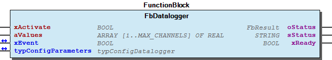

# WagoAppDatalogger v1.0.5.6 (WAGO) - Complete Documentation

## 📋 Library Information

- **Company:** WAGO
- **Title:** WagoAppDatalogger
- **Version:** 1.0.5.6
- **Categories:** WAGO LayerView|App; Application; WAGO BusinessView|Factory Automation; WAGO BusinessView|Building Automation; WAGO BusinessView|Process Automation
- **Author:** WAGO U016494
- **Placeholder:** WagoAppDatalogger

### Description ¶

This document is automatically generated.

Datalogger for WAGO I/O System

This document is automatically generated. Datalogger for WAGO I/O System

### Contents: ¶

Contents: - Documentation Index - Project Information - Library Information - Function Blocks - Methods FbDatalogger.getStatusObject (METH) - FbDatalogger.setStatusObject (METH) Program Organization Internal Components Global Variable Lists - GlobalVariables (GVL) - Status (GVL) - VersionHistory (GVL) Other Components - 01 Datalogger - 01 Datalogger - 30 Visualizations - 30 Visualizations - 70 Text List - 80 Data types - 80 Data types - 80 Status - 80 Status - FbDatalogger.ActFilename (PROP) - ... and 22 more

### Indices and tables ¶

Based on WagoAppDatalogger.library, last modified 29.05.2024, 20:46:44. LibDoc 3.5.16.10

© WAGO GmbH & Co. KG, Germany 2018 – All rights reserved. For the avoidance of doubt, this copyright notice does not only apply to the information above but also and primarily to the described library itself. Please note that third-party products are always mentioned without reference to intellectual property rights, including patents, utility models, designs and trademarks, accordingly the existence of such rights cannot be excluded. WAGO is a registered trademark of WAGO Verwaltungsgesellschaft mbH.

- File and Project Information - Library Reference Based on WagoAppDatalogger.library, last modified 29.05.2024, 20:46:44. LibDoc 3.5.16.10 © WAGO GmbH & Co. KG, Germany 2018 – All rights reserved. For the avoidance of doubt, this copyright notice does not only apply to the information above but also and primarily to the described library itself. Please note that third-party products are always mentioned without reference to intellectual property rights, including patents, utility models, designs and trademarks, accordingly the existence of such rights cannot be excluded. WAGO is a registered trademark of WAGO Verwaltungsgesellschaft mbH.

### Documentation Index

## WagoAppDatalogger Library Documentation

| Company: | WAGO |
| Title: | WagoAppDatalogger |
| Version: | 1.0.5.6 |
| Categories: | WAGO LayerView\|App; Application; WAGO BusinessView\|Factory Automation; WAGO BusinessView\|Building Automation; WAGO BusinessView\|Process Automation |
| Author: | WAGO U016494 |
| Placeholder: | WagoAppDatalogger |

### Description

This document is automatically generated.

Datalogger for WAGO I/O System

This document is automatically generated. Datalogger for WAGO I/O System

### Contents:

- 20 Program Organization Units 01 Datalogger 30 Visualizations - 01 Datalogger 80 Data types - typChannelConfig (STRUCT) - typConfigDatalogger (STRUCT) 80 Status - Status (GVL) - eStatus (ENUM) 90 Internal - 30 Visualizations - 70 Text List - 80 Data types GlobalTextList (Text List) GlobalVariables (GVL) ImagePool (Image Pool) ParameterList (PARAMS) VersionHistory (GVL)

### Indices and tables

Based on WagoAppDatalogger.library, last modified 29.05.2024, 20:46:44. LibDoc 3.5.16.10

© WAGO GmbH & Co. KG, Germany 2018 – All rights reserved. For the avoidance of doubt, this copyright notice does not only apply to the information above but also and primarily to the described library itself. Please note that third-party products are always mentioned without reference to intellectual property rights, including patents, utility models, designs and trademarks, accordingly the existence of such rights cannot be excluded. WAGO is a registered trademark of WAGO Verwaltungsgesellschaft mbH.

- File and Project Information - Library Reference Based on WagoAppDatalogger.library, last modified 29.05.2024, 20:46:44. LibDoc 3.5.16.10 © WAGO GmbH & Co. KG, Germany 2018 – All rights reserved. For the avoidance of doubt, this copyright notice does not only apply to the information above but also and primarily to the described library itself. Please note that third-party products are always mentioned without reference to intellectual property rights, including patents, utility models, designs and trademarks, accordingly the existence of such rights cannot be excluded. WAGO is a registered trademark of WAGO Verwaltungsgesellschaft mbH.

### Project Information

## File and Project Information

| Scope | Name | Type | Content |
| --- | --- | --- | --- |
| FileHeader | libraryFile | string | WagoAppDatalogger.library |
| contentFile | doc.clean.json |
| productName | e!COCKPIT |
| creationDateTime | date | 29.05.2024, 20:46:50 |
| companyName | string | WAGO |
| ProjectInformation | WagoAppDatalogger | WagoAppDatalogger |
| LastModificationDateTime | date | 29.05.2024, 20:46:44 |
| NoPlaceholder | string |  |
| Description | See: Description |
| Copyright | © WAGO Kontakttechnik GmbH & Co. KG, Germany 2018 – All rights reserved. |
| Author | WAGO U016494 |
| AutoResolveUnbound | bool | True |
| Placeholder | string | WagoAppDatalogger |
| Company | WAGO |
| DocFormat | reStructuredText |
| Project | WagoAppDatalogger |
| DefaultNamespace |  |
| Version | version | 1.0.5.6 |
| Title | string | WagoAppDatalogger |
| LibraryCategories | library-category-list | WAGO LayerView\|App; Application; WAGO BusinessView\|Factory Automation; WAGO BusinessView\|Building Automation; WAGO BusinessView\|Process Automation |
| CompiledLibraryCompatibilityVersion | string | CODESYS V3.5 SP16 Patch 3 |

### Library Information

## Library Reference

| LinkAllContent: False QualifiedOnly: False | SystemLibrary: False | Optional: False |

| LinkAllContent: False QualifiedOnly: False | SystemLibrary: False | Optional: False |

| LinkAllContent: False QualifiedOnly: False | SystemLibrary: False | Optional: False |

| LinkAllContent: False QualifiedOnly: False | SystemLibrary: True | Optional: False |

| LinkAllContent: False QualifiedOnly: False | SystemLibrary: True | Optional: False |

| LinkAllContent: False QualifiedOnly: False | SystemLibrary: True | Optional: False |

| LinkAllContent: False QualifiedOnly: False | SystemLibrary: True | Optional: False |

| LinkAllContent: False QualifiedOnly: False | SystemLibrary: True | Optional: False |

| LinkAllContent: False QualifiedOnly: False | SystemLibrary: True | Optional: False |

| LinkAllContent: False QualifiedOnly: False | SystemLibrary: True | Optional: False |

| LinkAllContent: False QualifiedOnly: False | SystemLibrary: True | Optional: False |

| LinkAllContent: False QualifiedOnly: False | SystemLibrary: True | Optional: False |

| LinkAllContent: False QualifiedOnly: False | SystemLibrary: True | Optional: False |

| LinkAllContent: False QualifiedOnly: False | SystemLibrary: True | Optional: False |

| LinkAllContent: False Optional: False | QualifiedOnly: False SystemLibrary: True | PublishSymbolsInContainer: True |

| LinkAllContent: False QualifiedOnly: False | SystemLibrary: True | Optional: False |

| LinkAllContent: False QualifiedOnly: True | SystemLibrary: False | Optional: False |

| LinkAllContent: False QualifiedOnly: True | SystemLibrary: False | Optional: False |

| LinkAllContent: False QualifiedOnly: True | SystemLibrary: False | Optional: False |

| LinkAllContent: False QualifiedOnly: True | SystemLibrary: False | Optional: False |

| LinkAllContent: False QualifiedOnly: False | SystemLibrary: False PublishSymbolsInContainer: True | Optional: False |

| LinkAllContent: False QualifiedOnly: False | SystemLibrary: False | Optional: False |

| LinkAllContent: False QualifiedOnly: False | SystemLibrary: False | Optional: False |

| LinkAllContent: False Optional: False | QualifiedOnly: False SystemLibrary: False | PublishSymbolsInContainer: True |

| LinkAllContent: False QualifiedOnly: False | SystemLibrary: False | Optional: False |

| LinkAllContent: False QualifiedOnly: False | SystemLibrary: False | Optional: False |

This is a dictionary of all referenced libraries and their name spaces.

This is a dictionary of all referenced libraries and their name spaces. Standard Library Identification : Placeholder: Standard Default Resolution: Standard, 3.5.5.0 (System) Namespace: Standard Library Properties : Standard64 Library Identification : Placeholder: Standard64 Default Resolution: Standard64, * (System) Namespace: Standard64 Library Properties : VisuDialogs Library Identification : Placeholder: VisuDialogs Default Resolution: VisuDialogs, * (System) Namespace: VisuDialogs Library Properties : VisuElem3DPath Library Identification : Placeholder: System_VisuElem3DPath Default Resolution: VisuElem3DPath, 3.5.10.0 (System) Namespace: VisuElem3DPath Library Properties : Library Parameter : Parameter: GC_POINTS_PER_POLYGON = 100 VisuElemCamDisplayer Library Identification : Placeholder: System_VisuElemCamDisplayer Default Resolution: VisuElemCamDisplayer, 3.5.10.0 (System) Namespace: VisuElemCamDisplayer Library Properties : Library Parameter : Parameter: GC_POINTS_PER_CAM = 100 VisuElemMeter Library Identification : Placeholder: System_VisuElemMeter Default Resolution: VisuElemMeter, 3.5.10.0 (System) Namespace: VisuElemMeter Library Properties : VisuElemTextEditor Library Identification : Placeholder: System_VisuElemTextEditor Default Resolution: VisuElemTextEditor, 3.5.10.0 (System) Namespace: VisuElemTextEditor Library Properties : VisuElemTrace Library Identification : Placeholder: System_VisuElemTrace Default Resolution: VisuElemTrace, 3.5.10.0 (System) Namespace: VisuElemTrace Library Properties : VisuElemXYChart Library Identification : Placeholder: System_VisuElemXYChart Default Resolution: VisuElemXYChart, 3.5.16.30 (System) Namespace: VisuElemXYChart Library Properties : VisuElems Library Identification : Placeholder: System_VisuElems Default Resolution: VisuElems, 3.5.10.0 (System) Namespace: VisuElems Library Properties : VisuElemsAlarm Library Identification : Placeholder: System_VisuElemsAlarm Default Resolution: VisuElemsAlarm, 3.5.10.0 (System) Namespace: VisuElemsAlarm Library Properties : VisuElemsDateTime Library Identification : Placeholder: System_VisuElemsDateTime Default Resolution: VisuElemsDateTime, 3.5.10.0 (System) Namespace: VisuElemsDateTime Library Properties : VisuElemsSpecialControls Library Identification : Placeholder: System_VisuElemsSpecialControls Default Resolution: VisuElemsSpecialControls, 3.5.10.0 (System) Namespace: VisuElemsSpecialControls Library Properties : VisuElemsWinControls Library Identification : Placeholder: System_VisuElemsWinControls Default Resolution: VisuElemsWinControls, 3.5.10.0 (System) Namespace: VisuElemsWinControls Library Properties : VisuInputs Library Identification : Placeholder: system_visuinputs Default Resolution: VisuInputs, 3.5.16.30 (System) Namespace: visuinputs Library Properties : VisuNativeControl Library Identification : Placeholder: System_VisuNativeControl Default Resolution: VisuNativeControl, 3.5.10.0 (System) Namespace: VisuNativeControl Library Properties : VisuSymbols Library Identification : Name: VisuSymbols Version: newest Company: System Namespace: VisuSymbols Library Properties : WagoAppFileDir Library Identification : Placeholder: WagoAppFileDir Default Resolution: WagoAppFileDir, * (WAGO) Namespace: WagoAppFileDir Library Properties : WagoAppString Library Identification : Placeholder: WagoAppString Default Resolution: WagoAppString, * (WAGO) Namespace: WagoAppString Library Properties : WagoAppTime Library Identification : Placeholder: WagoAppTime Default Resolution: WagoAppTime, * (WAGO) Namespace: WagoAppTime Library Properties : WagoSysErrorBase Library Identification : Placeholder: WagoSysErrorBase Default Resolution: WagoSysErrorBase, * (WAGO) Namespace: WagoSysErrorBase Library Properties : Library Parameter : Parameter: RES_LOG_MAX_FILESIZE = 2000 Parameter: RES_LOG_MAX_FILES = 1 Parameter: RES_LOG_MAX_ENTRIES = 200 Parameter: RES_LOG_NAME = ‘WagoAppResultLogger’ WagoSysPlainMem Library Identification : Placeholder: WagoSysPlainMem Default Resolution: WagoSysPlainMem, * (WAGO) Namespace: WagoSysPlainMem Library Properties : WagoSysVersion Library Identification : Name: WagoSysVersion Version: 1.0.0.0 Company: WAGO Namespace: WagoSysVersion Library Properties : WagoTypesErrorBase Library Identification : Placeholder: WagoTypesErrorBase Default Resolution: WagoTypesErrorBase, * (WAGO) Namespace: WagoTypesErrorBase Library Properties : WagoVisuIcons Library Identification : Placeholder: WagoVisuIcons Default Resolution: WagoVisuIcons, * (WAGO) Namespace: WagoVisuIcons Library Properties : WagoVisuIconsMaterialDesign Library Identification : Placeholder: WagoVisuIconsMaterialDesign Default Resolution: WagoVisuIconsMaterialDesign, * (WAGO) Namespace: WagoVisuIconsMaterialDesign Library Properties :

### Function Blocks

## FbDatalogger (FB)

| Scope | Name | Type | Initial | Comment |
| --- | --- | --- | --- | --- |
| Input | xActivate | BOOL | TRUE | activates the function block. |
| aValues | ARRAY [1..MAX_CHANNELS] OF REAL |  | contains the input real Values to be logged. |
| Inout | xEvent | BOOL |  | Triggers the save-action once. |
| typConfigParameters | typConfigDatalogger |  | Contains the configuration of the function block, including the settings of each channel. |
| Output | oStatus | WagoSysErrorBase.FbResult |  | Status object. (Listed in Status ) The content of the error object could be displayed via the FbShowResult from the WagoSysErrorBase library. |
| sStatus | STRING |  | Status description as string (Listed in Status ) |
| xReady | BOOL | TRUE | Indicates an open file with FALSE. |

Function block for Datalogging with WAGO I/O System

Graphical Illustration

Function description

the Dataplotter can only display up to 80 channels. The Parameter MAX_CHANNELS under ParameterList has to be set to a maximum of 80

Due to the limitation of the maximum number of files in the root directory of the storage medium, the FbDatalogger function block forces a subdirectory called “CSV_Files”, in which the CSV files are stored. If the file path contains a subdirectory already, “sPath” is kept unchanged. The “sPath” file path specified is adjusted automatically.

The FbDatalogger function block checks if a folder with the specified “sPath” file path already exists. If not, the FbDatalogger function block creates the folder automatically.

Setting the “typConfigParameters.xAppendDate” input appends the current date of the controller to the file name. Therefore a new file is generated every day because the file name changes every day.

Setting the “typConfigParameters.atypChannelConfig.xLogAlarm” appends another column to the end of the respective channel in the file in which an alarm is marked with “1” and no alarm with “0”. (This is only relevant for the “Standard Wago datalogger format”).

The “xEvent” input triggers the logging operation once. It should should be taken into account when using trigger times less than one second that the function block has set the “xReady” output to TRUE to avoid possible complications associated with a wrongly opened file.

The output “xReady” represents a feature for coordinating the simultaneous access to a single file from different Instances of FbDatalogger.

‘_dp’ is always added to the file name. This prevents any confusion between different CSV formats in a file (usually due to setting the “typConfigParameters.bDatalogger_type” during the write operation without changing the file name). A new file is always generated when the defined size of 25 Mbytes is reached.

The following rules are used to name the generated file:

The parameter typConfigParameters.bNewFile set the mode how often the logger creates a new file (1=daily/2=monthly/3=yearly)

-Common Note

Interface variables Function Function block for Datalogging with WAGO I/O System Graphical Illustration  Function description The FbDatalogger function block logs entries from up to 160 channels at an interval of min. one second in a CSV file. The CSV file can be generated in 3 different formats: 1. Standard Wago datalogger format 2. Econ format 3. Dataplotter format: Specific for the Dataplotter Web application. Note the Dataplotter can only display up to 80 channels. The Parameter MAX_CHANNELS under ParameterList has to be set to a maximum of 80 Due to the limitation of the maximum number of files in the root directory of the storage medium, the FbDatalogger function block forces a subdirectory called “CSV_Files”, in which the CSV files are stored. If the file path contains a subdirectory already, “sPath” is kept unchanged. The “sPath” file path specified is adjusted automatically. Example: 1. “/media/sd/logfile.csv” → “/media/sd/CSV_Files/logfile.csv” 2. “/media/sd/Tag1/logfile2.csv” → “/media/sd/Tag1/logfile2.csv” The FbDatalogger function block checks if a folder with the specified “sPath” file path already exists. If not, the FbDatalogger function block creates the folder automatically. Setting the “typConfigParameters.xAppendDate” input appends the current date of the controller to the file name. Therefore a new file is generated every day because the file name changes every day. Setting the “typConfigParameters.atypChannelConfig.xLogAlarm” appends another column to the end of the respective channel in the file in which an alarm is marked with “1” and no alarm with “0”. (This is only relevant for the “Standard Wago datalogger format”). The “xEvent” input triggers the logging operation once. It should should be taken into account when using trigger times less than one second that the function block has set the “xReady” output to TRUE to avoid possible complications associated with a wrongly opened file. The output “xReady” represents a feature for coordinating the simultaneous access to a single file from different Instances of FbDatalogger. -Note specifically about Econ format “bDatalogger_type = 2”: “typConfigParameters.xAppendDate” has no effect on the file name. The date is always added before the file name. The “Append Date” visualization element does not exist in this case. The file name in the input parameter “typConfigParameters.sFileName” will be automatically converted to uppercase letters. Example: 2015_11_28_LOGFILE.CSV The minimal interval time for the logging operation is equal to 1 minute. The “Seconds” visualization element will not be available. -Note specifically about Datenplotter format “bDatalogger_type = 3”: ‘_dp’ is always added to the file name. This prevents any confusion between different CSV formats in a file (usually due to setting the “typConfigParameters.bDatalogger_type” during the write operation without changing the file name). A new file is always generated when the defined size of 25 Mbytes is reached. The following rules are used to name the generated file: 1. If “typConfigDatalogger.xAppendDate” is set to FALSE, the “Date_Time” is added to the name of the newly generated file. 2. If “typConfigDatalogger.xAppendDate” is set to TRUE, only the time is appended to the name of the newly generated file. The parameter typConfigParameters.bNewFile set the mode how often the logger creates a new file (1=daily/2=monthly/3=yearly) -Common Note If you want to log nr > 2147483648 set Dez Places=0 (typChannelConfig.bDecimalPlaces) - 80 Status FbDatalogger.getStatusObject (METH) - FbDatalogger.setStatusObject (METH) FbDatalogger.ActFilename (PROP)

### Methods

## FbDatalogger.getStatusObject (METH)

| Scope | Name | Type |
| --- | --- | --- |
| Return | getStatusObject | WagoSysErrorBase.FbResult |

## FbDatalogger.setStatusObject (METH)

| Scope | Name | Type | Comment |
| --- | --- | --- | --- |
| Input | uiID | UINT | result ID |

### Program Organization

## 20 Program Organization Units

- 01 Datalogger FbDatalogger (FB) 80 Status FbDatalogger.getStatusObject (METH) - FbDatalogger.setStatusObject (METH) FbDatalogger.ActFilename (PROP)

### Internal Components

## 90 Internal

- 30 Visualizations - 70 Text List TL_ButtonText (Text List) - TL_CSVFormat (Text List) - TL_DateFormat (Text List) - TL_FileCycle (Text List) - TL_LogAlarmStatus (Text List) - TL_LogInterval (Text List) - TL_LogIntervalEcon (Text List) - TL_LogStatus (Text List) - TL_PAUSE_ButtonText (Text List) - TL_TimeFormat (Text List) 80 Data types - eProgress (ENUM) - typAIChannel (STRUCT) - typChannelConfigIntern (STRUCT) - typConfigDataloggerIntern (STRUCT) - typPlcTime (STRUCT) - typTable (STRUCT)

### Global Variable Lists

## GlobalVariables (GVL)

| Scope | Name | Type | Initial | Comment |
| --- | --- | --- | --- | --- |
| Constant | gc_MAX_RESERVED_CHANNELS | BYTE | 160 | limited to 160, due to total number of channels in visualization table. |
| gc_MAX_BUFFER | UDINT | 16000 | max number of bytes in abFilebuffer |

## Status (GVL)

| Scope | Name | Type |
| --- | --- | --- |
| Constant | gc_Status | ARRAY [0..3] OF WagoTypesErrorBase.typResultItem |

| Value | Level | Description |
| --- | --- | --- |
| eStatus.LoggingOn | WagoTypesErrorBase.WagoTypes.eSeverity.none | ‘Cyclic Logging ON’ |
| eStatus.LoggingOff | WagoTypesErrorBase.WagoTypes.eSeverity.none | ‘Cyclic Logging OFF’ |
| eStatus.FileError | WagoTypesErrorBase.WagoTypes.eSeverity.error | ‘Status of the last log: File Access Error’ |
| eStatus.MaxNbrOfChannels | WagoTypesErrorBase.WagoTypes.eSeverity.error | ‘Error: Maximum allowed number of channels (160) is exeeded’ |

## VersionHistory (GVL)

| Name | Type |
| --- | --- |
| Info | ProjectInfo |

| date | version | author | change |
| 02.05.2024 | 1.0.5.6 | u010663 | insert pic 0 |
| 26.02.2024 | 1.0.5.5 | u010663 | Compiled SP16.3 |
| 02.06.2023 | 1.0.5.4 | u012478 | bugfix compile error visu index |
| 27.04.2023 | 1.0.5.3 | u012478 | bugfix channel table row selection |
| 18.01.2023 | 1.0.5.1 | u012478 | bugfix 0 decimal places |
| 29.09.2022 | 1.0.5.0 | u012478 | bugfix compile error visu index / Textlist/ wrong neg Value /add FbDirSweep |
| 27.09.2021 | 1.0.4.0 | u012478 | insert Propertie ActFilename |
| 12.10.2020 | 1.0.3.0 | u012478 | insert parameter bNewFile for date in filename |
| 22.06.2020 | 1.0.2.0 | u010663 | Improvement FbDatalogger |
| 08.01.2019 | 1.0.1.0 | u015842 | Properties: free placeholder added |
| 29.10.2018 | 1.0.0.14 | u012478 | add spanish language |
| 26.04.2018 | 1.0.0.13 | u010545 | Update documentation |
| 18.12.2017 | 1.0.0.12 | WAGO / u013972 | Remove obsolete WagoVisuIcons |
| 04.12.2017 | 1.0.0.11 | WAGO / u012478 | Get plc time immediately with xEvent |
| 07.07.2017 | 1.0.0.10 | WAGO / u013972 | Remove obsolete placeholder |
| 18.01.2017 | 1.0.0.9 | U016494 | FbFileHandler corrected: wait until FbCheckDirectoryExists is not busy |
| 10.10.2016 | 1.0.0.8 | U016494 | Text-Liste updated |
| 08.07.2016 | 1.0.0.7 | U016494 | Lösung für die Darstellungsprobleme der Status-Liste |
| 15.06.2016 | 1.0.0.6 | U016494 | Bug Fix: using FSM_SyncedWrite. Bug Fix: unwanted skip of a log cycle |
| 14.06.2016 | 1.0.0.5 | U016494 | Added MessageBar to Visualisations |
| 24.05.2016 | 1.0.0.4 | U016494 | Bug fixes : padding added for address alignment in RETAIN Variables |
| 19.05.2016 | 1.0.0.3 | U016494 | Bug fixes |
| 12.05.2016 | 1.0.0.2 | U016494 | Link to WagoSysErrorBase in documentation corrected |
| 11.05.2016 | 1.0.0.1 | U016494 | German Translation added |
| 10.05.2016 | 1.0.0.0 | U016494 | Release 3 |

WagoAppDatalogger.library*

Description: Library for WAGO I/O- System

WagoAppDatalogger.library* Description: Library for WAGO I/O- System Release Notes: Known Bugs - FbGetFileProperties get stock on busy when it is running on a fast task. Temporary solution: FbDatalogger should run on a background task with 50ms . To-Do’s - Create input parameter DateTime to allow user to use an external DateTime source. - Make multiple version of FbDatalogger with different MAX_CHANNELS, because MAX_CHANNELS in ParameterList affects all instances of FbDatalogger

### Other Components

## 01 Datalogger ¶

## 01 Datalogger

- FbDatalogger (FB) 80 Status FbDatalogger.getStatusObject (METH) - FbDatalogger.setStatusObject (METH) FbDatalogger.ActFilename (PROP)

## 30 Visualizations ¶

## 30 Visualizations ¶

## 70 Text List

- TL_ButtonText (Text List) - TL_CSVFormat (Text List) - TL_DateFormat (Text List) - TL_FileCycle (Text List) - TL_LogAlarmStatus (Text List) - TL_LogInterval (Text List) - TL_LogIntervalEcon (Text List) - TL_LogStatus (Text List) - TL_PAUSE_ButtonText (Text List) - TL_TimeFormat (Text List)

## 80 Data types

- eProgress (ENUM) - typAIChannel (STRUCT) - typChannelConfigIntern (STRUCT) - typConfigDataloggerIntern (STRUCT) - typPlcTime (STRUCT) - typTable (STRUCT)

## 80 Data types

- typChannelConfig (STRUCT) - typConfigDatalogger (STRUCT)

## 80 Status

- FbDatalogger.getStatusObject (METH) - FbDatalogger.setStatusObject (METH)

## 80 Status ¶

- Status (GVL) - eStatus (ENUM)

## FbDatalogger.ActFilename (PROP) ¶

## GlobalTextList (Text List)

| ID | Default | de | en | es |
| --- | --- | --- | --- | --- |
| 895 |  |  |  |  |
| 26 | %d | %d | %d | %d |
| 0 | %s | %s | %s | %s |
| 2 | `` %s - `` | %s - | %s - | %s - |
| 20 | `` * If you choose overwrite, the existing file will be deleted. `` | Wenn Sie überschreiben auswählen, wird die existierende Datei gelöscht. | If you choose overwrite, the existing file will be deleted. | Si elige sobrescribir, se eliminar el archivo existente. |
| 12 | Alarm | Alarm | Alarm | Alarma |
| 17 | Append | Anhängen | Append |  |
| 28 | Append date | Datum anhängen | Append date |  |
| 18 | Cancel | Abbrechen | Cancel | Cancelar |
| 7 | Column separator: | Spalten Trennzeichen: | Column separator: | Separador de columna: |
| 32 | Configuration | Konfiguration | Configuration | Configuracion |
| 6 | CSV format presets: | CSV Format Voreinstellungen: | CSV format presets: | Formato CSV por defecto: |
| 31 | CSV Settings | CSV Einstellungen | CSV Settings | Ajustes CSV |
| 25 | Cyclic Logging | Zyklisches Loggen | Cyclic Logging | Registro c¡clico |
| 36 | Date | Datum | Date | Fecha |
| 5 | Date format: | Datumsformat: | Date format: | Formato de fecha: |
| 11 | Decimal Places | Nachkommastellen | Decimal Places | Numero de decimales |
| 256 | Decimal places | Nachkommastellen | Decimal Places | Numero de decimales |
| 8 | Decimal separator: | Dezimale Trennzeichen: | Decimal separator: | Separador decimal: |
| 22 | Error while accessing file! | Fehler beim Dateizugriff! | Error while accessing file! | ­Error de acceso al archivo! |
| 23 | File Information | Dateiinformation | File Information | Informacion del archivo |
| 27 | Filename: | Dateiname: | Filname: | Nombre del archivo |
| 29 | Filepath: | Dateipfad: | Filepath: | Ruta del archivo |
| 37 | ID | ID | ID | ID |
| 38 | Load Settings | Einstellungen laden | Load Settings | Cargar ajustes |
| 33 | Log status | Logstatus | Log status | Estado del registro |
| 421 | Log Status | Logstatus | Log status | Estado del registro |
| 13 | Lower limit | Unteres Limit | Lower limit | Limite inferior |
| 539 | Lower Limit | Unteres Limit | Lower limit | Limite inferior |
| 253 | LowerLimit | Unteres Limit | Lower limit | Limite inferior |
| 24 | Manual Logging | Manuelles Loggen | Manual Logging | Registro manual |
| 9 | Name | Name | Name | Nombre |
| 21 | Ok | Ok | Ok | Ok |
| 16 | Overwrite | überschreiben | Overwrite | Sobreescribir |
| 15 | Pause cyclic logging to modify the settings. | Zyklisches Loggen pausieren, um die Einstellungen zu bearbeiten. | Pause cyclic logging to modify the settings. | Pausar el registro c¡clico para modificar los ajustes. |
| 1 | Recently logged values: | Zuletzt geloggte Werte: | Recently logged values: | Valores registrados recientemente: |
| 39 | Save Settings | Einstellungen speichern | Save Settings | Guardar ajustes |
| 3 | Settings | Einstellungen | Settings | Ajustes |
| 35 | Stored file: %s | Gespeicherte Datei: %s | Stored File: %s | Archivo almacenado: %s |
| 40 | Time | Uhrzeit | Time | Tiempo |
| 4 | Time format: | Uhrzeitsformat: | Time format: | Formato de tiempo: |
| 30 | Trigger | Trigger | Trigger | Disparo |
| 10 | Unit | Einheit | Unit | Unidad |
| 14 | Upper limit | Oberes Limit | Upper limit | Limiter superior |
| 247 | Upper Limit |  |  | Limiter superior |
| 34 | Value | Wert | Value | Valor |
| 19 | You are about to change the settings of an already existing File. Do you want to overwrite the file or continue appending data? | Sie sind dabei, die Einstellungen einer bereits existierenden Datei zu „ndern. Möchten Sie die Datei neu berschreiben oder die Daten weiter anhängen? | You are about to change the settings of an already existing File. Do you want to overwrite the file or continue appending data? | Est s a punto de cambiar los ajustes del archivo existente. ¨Quieres sobrescribir el archivo o continuar a¤adiendo datos? |

## ImagePool (Image Pool)

| ID | File name | Image | Link type |
| --- | --- | --- | --- |
| 3 | Status_Ok.png |  | Embedded |
| 9 | Delete.png |  | Embedded |
| 2100 | Play_green.svg |  | Embedded |
| 2110 | Stop_red.svg |  | Embedded |
| 2120 | Pause_rot.svg |  | Embedded |
| 2121 | Pause_grey.svg |  | Embedded |
| 1000 | Save.png |  | Embedded |
| 1002 | Auto_Save.png |  | Embedded |
| 100 | CheckboxChecked_Def.svg |  | Embedded |
| 101 | CheckboxUnchecked_Def.svg |  | Embedded |
| 1003 | Save_Logfile.png |  | Embedded |
| 1413 | Settings.png |  | Embedded |
| 1416 | GroupSettings.png |  | Embedded |
| 4 | Status_Error.png |  | Embedded |
| 75 | Save_Logfile.png |  | Embedded |
| 0 | Pic0.png |  | Embedded |

## ParameterList (PARAMS)

| Scope | Name | Type | Initial | Comment |
| --- | --- | --- | --- | --- |
| Constant | MAX_CHANNELS | BYTE | 80 | can be set to a maximum 160, due to total number of channels in visualization. |
| MAX_FILESIZE | ULINT | 26214400 | File size limit in Bytes (equals to 25MB). This is only relevant for csv-Files in ´´dataplotter´´ format.CSV-Files should NOT exceed THIS LIMIT in order FOR the dataplotter TO FUNCTION correctly. A new CSV-file will be automatically generated after raching 25 MB. |

## TL_ButtonText (Text List)

| ID | Default | de | en | es |
| --- | --- | --- | --- | --- |
| 0 | Start | Start | Start | Iniciar |
| 1 | Stop | Stop | Stop | Parar |

## TL_CSVFormat (Text List)

| ID | Default | de | en | es |
| --- | --- | --- | --- | --- |
| 1 | Standard Format | Standard Format | Standard Format | Formato Estandar |
| 2 | Econ Format | Econ Format | Econ Format | Formato Simple |
| 3 | Dataplotter Format | Dataplotter Format | Dataplotter Format | Formato Dataplotter |

## TL_DateFormat (Text List)

| ID | Default | de | en | es |
| --- | --- | --- | --- | --- |
| 0 | yyyy-mm-dd (2012-03-31) |  |  |  |
| 1 | yyyy/mm/dd (2012/03/31) |  |  |  |
| 2 | yyyy.mm.dd (2012.03.31) |  |  |  |
| 3 | yyyy_mm_dd (2012_03_31) |  |  |  |
| 4 | yyyy mm dd (2012 03 31) |  |  |  |
| 5 | yyyymmdd (20120331) |  |  |  |
| 6 | dd-mm-yyyy (31-03-2012) |  |  |  |
| 7 | dd/mm/yyyy (31/03/2012) |  |  |  |
| 8 | dd.mm.yyyy (31.03.2012) |  |  |  |
| 9 | dd_mm_yyyy (31_03_2012) |  |  |  |
| 10 | dd mm yyyy (31 03 2012) |  |  |  |
| 11 | ddmmyyyy (31032012) |  |  |  |
| 12 | mm-dd-yyyy (03-31-2012) |  |  |  |
| 13 | mm/dd/yyyy (03/31/2012) |  |  |  |
| 14 | mm.dd.yyyy (03.31.2012) |  |  |  |
| 15 | mm_dd_yyyy (03_31_2012) |  |  |  |
| 16 | mm dd yyyy (03 31 2012) |  |  |  |
| 17 | mmddyyyy (03312012) |  |  |  |

## TL_FileCycle (Text List) ¶

## TL_LogAlarmStatus (Text List)

| ID | Default | de | en | es |
| --- | --- | --- | --- | --- |
| 0 | Alarm logging ON | Alarm Logging Ein | Alarm logging ON |  |
| 1 | Alarm logging OFF | Alarm Logging Aus | Alarm logging OFF |  |

## TL_LogInterval (Text List)

| ID | Default | de | en | es |
| --- | --- | --- | --- | --- |
| 1 | Hour | Stunde | Hour | Hora |
| 2 | Minute | Minute | Minute | Minuto |
| 3 | Second | Sekunde | Second | Segundo |

## TL_LogIntervalEcon (Text List)

| ID | Default | de | en | es |
| --- | --- | --- | --- | --- |
| 1 | Hour | Stunde | Hour | Hora |
| 2 | Minute | Minute | Minute | Minuto |

## TL_LogStatus (Text List)

| ID | Default | de | en | es |
| --- | --- | --- | --- | --- |
| 0 | Cyclic Logging ON | Zyklisches Logging EIN | Cyclic Logging ON | Iniciar registro c¡clico |
| 1 | Cyclic Logging OFF | Zyklisches Logging AUS | Cyclic Logging OFF | Parar registro c¡clico |
| 2 | Status of the last log: File Access Error | Status des letzten Logs: Dateizugriff Fehler !! | Status of the last log: File Access Error !! | Estado del ultimo registro: ­Error de acceso al archivo! |
| 3 | Error: Maximum allowed number of channels (160) is exeeded | Fehler: die zulässige maximale Anzahl der Kanäle (160) ist überschritten | Error: Maximum allowed number of channels (160) is exeeded | Error: Se ha excedido el numero m ximo permitido de canales (160) |

## TL_PAUSE_ButtonText (Text List)

| ID | Default | de | en | es |
| --- | --- | --- | --- | --- |
| 0 | Resume channel logging | Kanal weiter loggen | Resume channel logging | Reanudar registro de canal |
| 1 | Pause channel logging | Kanal pausieren | Pause channel logging | Pausar registro de canal |

## TL_TimeFormat (Text List)

| ID | Default | de | en | es |
| --- | --- | --- | --- | --- |
| 0 | hh:mm:ss (22:15:58) |  |  |  |
| 1 | hh:mm (22:15) |  |  |  |
| 2 | hh_mm_ss (22_15_58) |  |  |  |
| 3 | hh_mm (22_15) |  |  |  |
| 4 | hh-mm-ss (22-15-58) |  |  |  |
| 5 | hh-mm (22-15) |  |  |  |
| 6 | hhmmss (221558) |  |  |  |
| 7 | hhmm (2215) |  |  |  |

## eProgress (ENUM)

| Name | Initial |
| --- | --- |
| Start | 0 |
| Prepare_Filename |  |
| Get_FileInfo |  |
| Prepare_HeaderLine |  |
| Prepare_ValueLine |  |
| Open_File |  |
| Check_Open_File |  |
| Check_Write_File |  |
| Check_Read_File |  |
| Check_Close_File |  |

## eStatus (ENUM)

| Name | Initial |
| --- | --- |
| LoggingOn | 0 |
| LoggingOff | 1 |
| FileError | 2 |
| MaxNbrOfChannels | 3 |

## typAIChannel (STRUCT)

| Name | Type | Initial | Comment |
| --- | --- | --- | --- |
| iRunningChannel | INT | 0 |  |
| sAlias | STRING(50) |  |  |
| sUnit | STRING(10) |  |  |
| sFormatedValue | STRING(20) |  |  |
| rAlarmLowerLimit | REAL |  | Value for the Low-Alarm |
| rAlarmUpperLimit | REAL |  | Value for the High-Alarm |
| xLogAlarm | BOOL | FALSE | TRUE: Alarm displayed in .csv file / FALSE: Alarm NOT displayed in file |
| iLogAlarm | INT | 0 | holds the static ID of image that indicates whether the LogAlarm option is ON or OFF |
| xAlarm | BOOL | FALSE | TRUE if rValue<loweralarm OR rValue>upperalarm |
| xExistingChannel | BOOL | FALSE |  |
| xRunningChannel | BOOL | FALSE |  |
| rValue | REAL |  |  |
| bDecimalPlaces | BYTE |  |  |
| dwStateColor | DWORD |  | If rValue ok: GREEN; Otherwise: RED |
| artypTable | ARRAY [0..20] OF typTable |  |  |

## typChannelConfig (STRUCT)

| Name | Type | Initial | Comment |
| --- | --- | --- | --- |
| xChannelExists | BOOL | FALSE | Only existing (TRUE) channels will be recognized by function block. |
| bDecimalPlaces | BYTE | 2 | Decimal places for value in CSV file. DEFAULT-value=2. Min- value=0, Max-value=7 |
| xLogAlarm | BOOL | FALSE | TRUE: Alarm displayed in csv file / FALSE: Alarm NOT displayed in csv file. |
| bDummy | BYTE |  | Internal use only: padding required for address alignment |
| sChannelName | STRING(51) |  | Name of channel. |
| sUnit | STRING(7) |  | Unit of channel. |
| rAlarmLowerLimit | REAL | 0 | Sets value for the Low-Alarm. |
| rAlarmUpperLimit | REAL | 0 | Sets value for the High-Alarm. |

Changes concerning the variable ´´xChannelExists´´, and therefore the header in the file will only be considered in the logging-file after restarting the function block with a new filename.

InOut: Note Changes concerning the variable ´´xChannelExists´´, and therefore the header in the file will only be considered in the logging-file after restarting the function block with a new filename.

## typChannelConfigIntern (STRUCT)

| Name | Type | Initial | Comment |
| --- | --- | --- | --- |
| sChannelName | STRING(50) |  | Name of channel. |
| sUnit | STRING(4) |  | Unit of channel. |
| bDecimalPlaces | BYTE | 2 | Decimal places for value in CSV file. DEFAULT-value=2. Min- value=0. Max-value=7 |
| bLogAlarm | BYTE |  | Holds the icon-ID |
| rAlarmLowerLimit | REAL | 0 | Sets value for the Low-Alarm. |
| rAlarmUpperLimit | REAL | 0 | Sets value for the High-Alarm. |
| xChannelExists | BOOL | FALSE | Only existing (TRUE) channels will be recognized by function block. |
| xLogAlarm | BOOL | FALSE | TRUE: Alarm displayed in csv file / FALSE: Alarm NOT displayed in file. |

InOut: CHANGES CONCERNING THE VARIABLE xChannelExists, AND THEREFORE THE HEADER IN THE FILE WILL ONLY BE CONSIDERED IN THE LOGGING-FILE AFTER RESTARTING THE FUNCTION BLOCK WITH A NEW FILENAME

## typConfigDatalogger (STRUCT)

| Name | Type | Initial | Comment |
| --- | --- | --- | --- |
| bDatalogger_type | BYTE | 1 | Indicates which csv format should be used. There are 3 available formats: Standard Wago datalogger format Econ format Dataplotter format: Specific for the Dataplotter Web application. Please set MAX_CHANNELS in ParameterList to 80. The dataplotter webapplication can only display up to 80 channels |
| xAppendDate | BOOL | FALSE | Automatically append current date to filename (new file each day!). |
| bNewFile | BYTE | 1 | create a new file every... 1=day , 2= month ,3 =year*) |
| xCyclicLogging | BOOL | FALSE | Triggers the cyclic logging to th csv file. |
| bInterval | BYTE | 3 | Desired logging cycle unit: hours minutes seconds (Default value) |
| sFilename | STRING(79) | ‘logfile.csv’ | Desired filename. |
| sPath | STRING(79) | ‘/media/sd/’ | File directory / Default is SD-Card. |
| sFileHeader | STRING(79) | ‘’ | Start-String of File Header. Specific for Datalogger (econ- format). Use only if bDatalogger_type=2. |
| sDecimalSeparator | STRING(3) | ‘,’ | Decimal Seperator for values in CSV-file. Default-value is comma ‘,’ For the dataplotter-format, THIS parameter will be ignored. A full-stop ‘.’ will always be used. |
| sColumnSeparator | STRING(3) | ‘;’ | Column Seperator in CSV-file. Default-value is comma ‘;’ For the dataplotter-format, this parameter will be ignored. A comma ‘,’ will always be used. |
| uiIntervalFactor | UINT | 1 | Desired logging factor factor. (Default value = 1, Max value = 65535) |
| bDateFormat | BYTE | 0 | Date format to be used in the logfile: yyyy-mm-dd (2012-03-31) (Default value) yyyy/mm/dd (2012/03/31) yyyy.mm.dd (2012.03.31) yyyy_mm_dd (2012_03_31) yyyy mm dd (2012 03 31) yyyymmdd (20120331) dd-mm-yyyy (31-03-2012) dd/mm/yyyy (31/03/2012) dd.mm.yyyy (31.03.2012) dd_mm_yyyy (31_03_2012) dd mm yyyy (31 03 2012) ddmmyyyy (31032012) mm-dd-yyyy (03-31-2012) mm/dd/yyyy (03/31/2012) mm.dd.yyyy (03.31.2012) mm_dd_yyyy (03_31_2012) mm dd yyyy (03 31 2012) mmddyyyy (03312012) |
| bTimeFormat | BYTE | 0 | Time format to be used in the logfile (24H Format): hh:mm:ss (22:15:58) (Default value) hh:mm (22:15) hh_mm_ss (22_15_58) hh_mm (22_15) hh-mm-ss (22-15-58) hh-mm (22-15) hhmmss (221558) hhmm (2215) |
| atypChannelConfig | ARRAY [1..MAX_CHANNELS] OF typChannelConfig |  | Contains configuration of each channel |

## typConfigDataloggerIntern (STRUCT)

| Name | Type | Initial | Comment |
| --- | --- | --- | --- |
| bDatalogger_Type | BYTE | 1 |  |
| sDecimalSeparator | STRING(1) | ‘,’ | Decimal Seperator for values in CSV-file. Default-value is comma ‘,’ For the dataplotter-format, THIS parameter will be ignored. A full-stop ‘.’ will always be used. |
| sColumnSeparator | STRING(1) | ‘;’ | Column Seperator in CSV-file. Default-value is comma ‘;’ For the dataplotter-format, this parameter will be ignored. A comma ‘,’ will always be used. |
| bInterval | BYTE | 3 | Desired logging cycle unit: hours minutes seconds (Default value) |
| bDateFormat | BYTE |  |  |
| sDateFormat | STRING(8) | ‘%D.%M.%Y’ | Date format to be used: |
| bTimeFormat | BYTE |  |  |
| sTimeFormat | STRING(8) | ‘%h:%m:%s’ | Time format to be used. |
| sDateTimeFormat | STRING(20) | ‘%D.%M.%Y %h:%m:%s’ | DataTime format to be used. |
| atypChannelConfig | ARRAY [1..gc_MAX_RESERVED_CHANNELS] OF typChannelConfigIntern |  | Contains configuration of each channel |

## typPlcTime (STRUCT)

| Name | Type | Comment |
| --- | --- | --- |
| bYear | BYTE | keep the last digit as offset to the year 1970 |
| bMonth | BYTE | 1 .. 12 |
| bDay | BYTE | 1 .. 31 |
| bHour | BYTE | 0 .. 23 |
| bMinute | BYTE | 0 .. 60 |
| bSecond | BYTE | 0 .. 60 |
| bDayOfWeek | BYTE | 0 .. 7 |

## typTable (STRUCT)

| Name | Type |
| --- | --- |
| strID | STRING(10) |
| strDate | STRING(10) |
| strDate2 | STRING(10) |
| strTime | STRING(8) |
| strDateTime | STRING(20) |
| strValue | STRING(20) |
| rValue | REAL |
| strUnit | STRING(10) |
| xAlarm | BOOL |