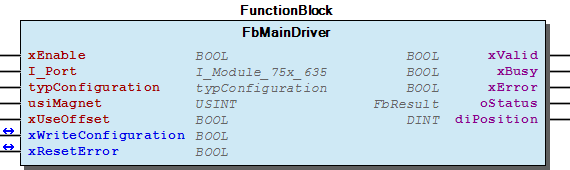

# WagoAppDigitalImpulseInterface v1.7.1.0 (WAGO) - Complete Documentation

## 📋 Library Information

- **Company:** WAGO
- **Title:** WagoAppDigitalImpulseInterface
- **Version:** 1.7.1.0
- **Categories:** Application; WAGO FunctionalView|Device|IO; WAGO LayerView|App
- **Author:** WAGO/u010663
- **Placeholder:** WagoAppDigitalImpulseInterface

### Description ¶

This document is automatically generated. Because of this, the chapter 30 Visualization is not shown in this document. If you are interested in getting to know more about visualization, we refer to the library manager of e!Cockpit.

Handling module 750-635 [1]

This document is automatically generated. Because of this, the chapter 30 Visualization is not shown in this document. If you are interested in getting to know more about visualization, we refer to the library manager of e!Cockpit. Handling module 750-635 [1]

### Contents: ¶

Contents: - Documentation Index - Project Information - Library Information - Function Blocks - Program Organization - Global Variable Lists Status (GVL) - VersionHistory (GVL) Other Components - 80 Status - eStatus (ENUM) - typConfiguration (STRUCT)

### Indices and tables ¶

| [1] | Based on WagoAppDigitalImpulseInterface.library, last modified 14.01.2019, 18:51:55. The content of this file was automatically generated with None on 14.01.2019, 18:51:57 |

© WAGO Kontakttechnik GmbH & Co. KG, Germany 2018 – All rights reserved. For the avoidance of doubt, this copyright notice does not only apply to the information above but also and primarily to the described library itself. Please note that third-party products are always mentioned without reference to intellectual property rights, including patents, utility models, designs and trademarks, accordingly the existence of such rights cannot be excluded. WAGO is a registered trademark of WAGO Verwaltungsgesellschaft mbH.

- File and Project Information - Library Reference © WAGO Kontakttechnik GmbH & Co. KG, Germany 2018 – All rights reserved. For the avoidance of doubt, this copyright notice does not only apply to the information above but also and primarily to the described library itself. Please note that third-party products are always mentioned without reference to intellectual property rights, including patents, utility models, designs and trademarks, accordingly the existence of such rights cannot be excluded. WAGO is a registered trademark of WAGO Verwaltungsgesellschaft mbH.

### Documentation Index

## WagoAppDigitalImpulseInterface Library Documentation

| Company: | WAGO |
| Title: | WagoAppDigitalImpulseInterface |
| Version: | 1.7.1.0 |
| Categories: | Application; WAGO FunctionalView\|Device\|IO; WAGO LayerView\|App |
| Author: | WAGO/u010663 |
| Placeholder: | WagoAppDigitalImpulseInterface |

### Description

This document is automatically generated. Because of this, the chapter 30 Visualization is not shown in this document. If you are interested in getting to know more about visualization, we refer to the library manager of e!Cockpit.

Handling module 750-635 [1]

This document is automatically generated. Because of this, the chapter 30 Visualization is not shown in this document. If you are interested in getting to know more about visualization, we refer to the library manager of e!Cockpit. Handling module 750-635 [1]

### Contents:

- 20 Program Organization Units FbMainDriver (FB) - typConfiguration (STRUCT) 80 Status - Status (GVL) - eStatus (ENUM) VersionHistory (GVL)

### Indices and tables

| [1] | Based on WagoAppDigitalImpulseInterface.library, last modified 14.01.2019, 18:51:55. The content of this file was automatically generated with None on 14.01.2019, 18:51:57 |

© WAGO Kontakttechnik GmbH & Co. KG, Germany 2018 – All rights reserved. For the avoidance of doubt, this copyright notice does not only apply to the information above but also and primarily to the described library itself. Please note that third-party products are always mentioned without reference to intellectual property rights, including patents, utility models, designs and trademarks, accordingly the existence of such rights cannot be excluded. WAGO is a registered trademark of WAGO Verwaltungsgesellschaft mbH.

- File and Project Information - Library Reference © WAGO Kontakttechnik GmbH & Co. KG, Germany 2018 – All rights reserved. For the avoidance of doubt, this copyright notice does not only apply to the information above but also and primarily to the described library itself. Please note that third-party products are always mentioned without reference to intellectual property rights, including patents, utility models, designs and trademarks, accordingly the existence of such rights cannot be excluded. WAGO is a registered trademark of WAGO Verwaltungsgesellschaft mbH.

### Project Information

## File and Project Information

| Scope | Name | Type | Content |
| --- | --- | --- | --- |
| FileHeader | libraryFile | string | WagoAppDigitalImpulseInterface.library |
| contentFile | WagoAppDigitalImpulseInterface_clr.json |
| productName | e!COCKPIT |
| creationDateTime | date | 14.01.2019, 18:51:57 |
| companyName | string | WAGO |
| ProjectInformation | LastModificationDateTime | date | 14.01.2019, 18:51:55 |
| Description | string | See: Description |
| Copyright | © WAGO Kontakttechnik GmbH & Co. KG, Germany 2018 – All rights reserved. |
| Author | WAGO/u010663 |
| AutoResolveUnbound | bool | True |
| Placeholder | string | WagoAppDigitalImpulseInterface |
| Company | WAGO |
| DocFormat | reStructuredText |
| Project | WagoAppDigitalImpulseInterface |
| DefaultNamespace |  |
| Version | version | 1.7.1.0 |
| Version string | string |  |
| Title | WagoAppDigitalImpulseInterface |
| LibraryCategories | library-category-list | Application; WAGO FunctionalView\|Device\|IO; WAGO LayerView\|App |

### Library Information

## Library Reference

| LinkAllContent: False QualifiedOnly: False | SystemLibrary: False | Optional: False |

| LinkAllContent: False QualifiedOnly: False | SystemLibrary: False | Optional: False |

| LinkAllContent: False QualifiedOnly: True | SystemLibrary: False | Optional: False |

| LinkAllContent: False QualifiedOnly: True | SystemLibrary: False | Optional: False |

| LinkAllContent: False QualifiedOnly: True | SystemLibrary: False | Optional: False |

This is a dictionary of all referenced libraries and their name spaces.

This is a dictionary of all referenced libraries and their name spaces. WagoSysErrorBase Library Identification : Placeholder: WagoSysErrorBase Default Resolution: WagoSysErrorBase, * (WAGO) Namespace: WagoSysErrorBase Library Properties : WagoSysVersion Library Identification : Name: WagoSysVersion Version: 1.0.0.0 Company: WAGO Namespace: WagoSysVersion Library Properties : WagoTypesErrorBase Library Identification : Placeholder: WagoTypesErrorBase Default Resolution: WagoTypesErrorBase, * (WAGO) Namespace: WagoTypesErrorBase Library Properties : WagoTypesModuleBase Library Identification : Placeholder: WagoTypesModuleBase Default Resolution: WagoTypesModuleBase, * (WAGO) Namespace: WagoTypesModuleBase Library Properties : Library Parameter : Parameter: MAX_MBX_SIZE = 18 WagoTypesModule_75x_635 Library Identification : Placeholder: WagoTypesModule_75x_635 Default Resolution: WagoTypesModule_75x_635, * (WAGO) Namespace: WagoTypesModule_75x_635 Library Properties :

### Function Blocks

## FbMainDriver (FB)

| Scope | Name | Type | Comment |
| --- | --- | --- | --- |
| Input | xEnable | BOOL | Enable function block |
| I_Port | WagoTypesModule_75x_635.I_Module_75x_635 | basic interface |
| typConfiguration | typConfiguration | Configuration values |
| usiMagnet | USINT | Show position from this sensor. |
| xUseOffset | BOOL | The offset value, will be taken into account to display the actual position |
| Inout | xWriteConfiguration | BOOL | Write configuration values, mandatory on power up |
| xResetError | BOOL | Reset an error |
| Output | xValid | BOOL | Position is valid |
| xBusy | BOOL | Function block active |
| xError | BOOL | An error occured |
| oStatus | WagoSysErrorBase.FbResult | Status details |
| diPosition | DINT | Actual postion according to ´´usiMagnets´´ |

Reading the actual position from a sensor

Graphical Illustration

Function Description This function block allows to read the position from up to 4 magnets mounted on a transonar sensor. Setting the ultrasonic speed as well as the number of mounted magnets is mandatory und must be done each time by power up.

Interface variables Function Reading the actual position from a sensor Graphical Illustration  Function Description This function block allows to read the position from up to 4 magnets mounted on a transonar sensor. Setting the ultrasonic speed as well as the number of mounted magnets is mandatory und must be done each time by power up.

### Program Organization

## 20 Program Organization Units

- FbMainDriver (FB) - typConfiguration (STRUCT)

### Global Variable Lists

## Status (GVL)

| Scope | Name | Type | Initial |
| --- | --- | --- | --- |
| Constant | Status_635 | ARRAY [0..8] OF WagoTypesErrorBase.typResultItem | [STRUCT(ID := eStatus.OK, Severity := WagoTypesErrorBase.eSeverity.info, text := ‘OK’), STRUCT(ID := eStatus.StopUnderflow, Severity := WagoTypesErrorBase.eSeverity.error, text := ‘Stop Underflow’), STRUCT(ID := eStatus.StopOverflow, Severity := WagoTypesErrorBase.eSeverity.error, text := ‘Stop Overflow’), STRUCT(ID := eStatus.ConfigErrorUltraSonicSpeed, Severity := WagoTypesErrorBase.eSeverity.error, text := ‘UltraSonicSpeedInvalid’), STRUCT(ID := eStatus.ConfigErrorOffset, Severity := WagoTypesErrorBase.eSeverity.error, text := ‘OffsetInvalid’), STRUCT(ID := eStatus.ConfigErrorMagnetCount, Severity := WagoTypesErrorBase.eSeverity.error, text := ‘MagnetCountInvalid’), STRUCT(ID := eStatus.ParameterErrorMagnet, Severity := WagoTypesErrorBase.eSeverity.error, text := ‘MagnetParameterInvalid’), STRUCT(ID := eStatus.ConfigurationActive, Severity := WagoTypesErrorBase.eSeverity.info, text := ‘ConfigurationActive’)] |

Description: Status information

Description: Status information

## VersionHistory (GVL)

| Name | Type |
| --- | --- |
| Info | ProjectInfo |

| date | version | author | change |
| 08.01.2019 | 1.7.1.0 | u015842 | Properties: free placeholder added |
| 06.06.2017 | 1.7.0.0 | u010663 | Compiler Version set to V3.5.9.10 |
| 29.02.2016 | 1.6.0.0 | u010663 | Update according to WagoSysErrorBase |
| 29.09.2015 | 1.5.0.2 | u010663 | Libraries inserted by placeholder |
| 24.08.2015 | 1.5.0.1 | u010663 | Placeholder added |
| 13.08.2015 | 1.5.0.0 | u010663 | Released |

WagoAppDigitalImpulseInterface.library

Release Notes:

WagoAppDigitalImpulseInterface.library Release Notes:

### Other Components

## 80 Status ¶

- Status (GVL) - eStatus (ENUM)

## eStatus (ENUM)

| Name | Initial | Comment |
| --- | --- | --- |
| OK | 0 |  |
| StopUnderflow | 1 | Bit 0 |
| StopOverflow | 2 | Bit 1 |
| ConfigErrorUltraSonicSpeed | 3 |  |
| ConfigErrorOffset | 4 |  |
| ConfigErrorMagnetCount | 5 |  |
| ParameterErrorMagnet | 6 |  |
| ConfigurationActive | 7 |  |

Description: Status information

InOut: Description: Status information

## typConfiguration (STRUCT)

| Name | Type | Initial | Comment |
| --- | --- | --- | --- |
| NumberOfMagnets | BYTE | 1 | Number of mounted magnets |
| UltraSonicSpeed | DINT | 23500 | Ultra sonic speed |
| Offset | DINT | 0 | Offset, allows adjustment of position value |