# WagoAppEnergyDevices v2.0.4.0 (WAGO) - Complete Documentation


## 📋 Library Information

- **Company:** WAGO
- **Title:** WagoAppEnergyDevices
- **Version:** 2.0.4.0
- **Categories:** Application; WAGO LayerView|App; WAGO BusinessView|Energy Automation; WAGO FunctionalView|Connectivity
- **Namespace:** WagoAppEnergyDevices
- **Author:** WAGO / u0100282, u0104455, u014702
- **Placeholder:** WagoAppEnergyDevices

### Description ¶


This document is automatically generated.

Library to connect typical energy devices with WAGO I/O System

The function blocks of this library are NOT thread safe and must be called from one CODESYS task only! Concurrent calls from different tasks may cause loss or corruption of data.

This document is automatically generated. Library to connect typical energy devices with WAGO I/O System The function blocks of this library are NOT thread safe and must be called from one CODESYS task only! Concurrent calls from different tasks may cause loss or corruption of data.

### Contents: ¶


Contents: - Documentation Index 10 Documentation - WagoAppEnergyDevices Library Documentation Project Information Library Information Function Blocks - Fb7SJ80 (FB) - FbBaseFree (FB) - FbBasePM (FB) - FbBlueLog (FB) - FbChargePilot (FB) - FbComPass (FB) - FbComPassA (FB) - FbComPassB (FB) - FbComPassBs (FB) - FbDataManager (FB) - ... and 28 more Functions Methods - FbComPass.adjustRequestsToVersion (METH) - FbComPass.decodeEvent (METH) - FbComPass.decodeSystemData (METH) - FbComPass.mPrepareData (METH) - FbComPass.mTransferData (METH) - FbComPass.shiftEventHistory (METH) - FbDataManager.mPrepareData (METH) - FbIec60870Base.mAppCFG (METH) - FbIec60870Base.mPreCFG (METH) - FbIec60870Base.mRegisterInfObj (METH) - ... and 34 more Program Organization - 20 Program Organization Units - 20 Program Organization Units Base Components - 01 Base - Free - 02 Base - PM - typBaseFree_Out (STRUCT) - typBasePM_In (STRUCT) - typBasePM_Out (STRUCT) Internal Components Global Variable Lists - GlobalVariables (GVL) - Status (GVL) - VersionHistory (GVL) Other Components - (obsolete) - (obsolete) - (obsolete) - 00 Master - 01 BlueLog - 01 ComPass A - 01 ComPass A/B/Bs - 01 Data Manager - 01 EOR-3D - 01 ION 7x50 - ... and 123 more

### Indices and tables ¶


Based on WagoAppEnergyDevices.library, last modified 20.09.2024, 21:53:13. LibDoc 3.5.16.10

© WAGO GmbH & Co. KG, Germany 2018 – All rights reserved. For the avoidance of doubt, this copyright notice does not only apply to the information above but also and primarily to the described library itself. Please note that third-party products are always mentioned without reference to intellectual property rights, including patents, utility models, designs and trademarks, accordingly the existence of such rights cannot be excluded. WAGO is a registered trademark of WAGO Verwaltungsgesellschaft mbH.

- File and Project Information - Library Reference Based on WagoAppEnergyDevices.library, last modified 20.09.2024, 21:53:13. LibDoc 3.5.16.10 © WAGO GmbH & Co. KG, Germany 2018 – All rights reserved. For the avoidance of doubt, this copyright notice does not only apply to the information above but also and primarily to the described library itself. Please note that third-party products are always mentioned without reference to intellectual property rights, including patents, utility models, designs and trademarks, accordingly the existence of such rights cannot be excluded. WAGO is a registered trademark of WAGO Verwaltungsgesellschaft mbH.

### Documentation Index


## 10 Documentation


- doc01_Foreword (FB) - doc02_HowTo (FB)

## WagoAppEnergyDevices Library Documentation


| Company: | WAGO |
| Title: | WagoAppEnergyDevices |
| Version: | 2.0.4.0 |
| Categories: | Application; WAGO LayerView\|App; WAGO BusinessView\|Energy Automation; WAGO FunctionalView\|Connectivity |
| Namespace: | WagoAppEnergyDevices |
| Author: | WAGO / u0100282, u0104455, u014702 |
| Placeholder: | WagoAppEnergyDevices |

### Description


This document is automatically generated.

Library to connect typical energy devices with WAGO I/O System

The function blocks of this library are NOT thread safe and must be called from one CODESYS task only! Concurrent calls from different tasks may cause loss or corruption of data.

This document is automatically generated. Library to connect typical energy devices with WAGO I/O System The function blocks of this library are NOT thread safe and must be called from one CODESYS task only! Concurrent calls from different tasks may cause loss or corruption of data.

### Contents:


- 10 Documentation doc01_Foreword (FB) - doc02_HowTo (FB) 20 Program Organization Units - 00 Master - 01 a-Eberle - 02 Horstmann - 03 Huawei - 04 Janitza - 05 Kries - 06 Meteocontrol - 07 Schneider Electric - 08 Siemens - 09 SMA - 10 SolarLog - 11 Stucke - 12 SEG/Woodward - 13 EOn - 14 Wago - 15 MenckeTegtmeyer - 16 PQ - 17 Thytronic - 18 Smart1 - 19 TheMobilityHouse 80 Status - Status (GVL) - eStatus (ENUM) 90 Internal - 20 Program Organization Units - 80 Data Types GlobalTextList (Text List) GlobalVariables (GVL) Parameters (PARAMS) VersionHistory (GVL)

### Indices and tables


Based on WagoAppEnergyDevices.library, last modified 20.09.2024, 21:53:13. LibDoc 3.5.16.10

© WAGO GmbH & Co. KG, Germany 2018 – All rights reserved. For the avoidance of doubt, this copyright notice does not only apply to the information above but also and primarily to the described library itself. Please note that third-party products are always mentioned without reference to intellectual property rights, including patents, utility models, designs and trademarks, accordingly the existence of such rights cannot be excluded. WAGO is a registered trademark of WAGO Verwaltungsgesellschaft mbH.

- File and Project Information - Library Reference Based on WagoAppEnergyDevices.library, last modified 20.09.2024, 21:53:13. LibDoc 3.5.16.10 © WAGO GmbH & Co. KG, Germany 2018 – All rights reserved. For the avoidance of doubt, this copyright notice does not only apply to the information above but also and primarily to the described library itself. Please note that third-party products are always mentioned without reference to intellectual property rights, including patents, utility models, designs and trademarks, accordingly the existence of such rights cannot be excluded. WAGO is a registered trademark of WAGO Verwaltungsgesellschaft mbH.

### Project Information


## File and Project Information


| Scope | Name | Type | Content |
| --- | --- | --- | --- |
| FileHeader | libraryFile | string | WagoAppEnergyDevices.library |
| contentFile | doc.clean.json |
| productName | e!COCKPIT |
| creationDateTime | date | 20.09.2024, 21:53:35 |
| companyName | string | WAGO |
| ProjectInformation | LastModificationDateTime | date | 20.09.2024, 21:53:13 |
| Description | string | See: Description |
| Copyright | © WAGO GmbH & Co. KG, Germany 2021 – All rights reserved. |
| Author | WAGO / u0100282, u0104455, u014702 |
| AutoResolveUnbound | bool | True |
| Placeholder | string | WagoAppEnergyDevices |
| Company | WAGO |
| DocFormat | reStructuredText |
| Project | WagoAppEnergyDevices |
| DefaultNamespace | WagoAppEnergyDevices |
| Version | version | 2.0.4.0 |
| ThreadSave | bool | False |
| Title | string | WagoAppEnergyDevices |
| LibraryCategories | library-category-list | Application; WAGO LayerView\|App; WAGO BusinessView\|Energy Automation; WAGO FunctionalView\|Connectivity |
| CompiledLibraryCompatibilityVersion | string | CODESYS V3.5 SP16 Patch 3 |
| IsEndUserLibrary | bool | False |

### Library Information


## Library Reference


| LinkAllContent: False QualifiedOnly: False | SystemLibrary: False | Optional: False |

| LinkAllContent: False QualifiedOnly: False | SystemLibrary: False | Optional: False |

| LinkAllContent: False QualifiedOnly: False | SystemLibrary: False | Optional: False |

| LinkAllContent: False QualifiedOnly: False | SystemLibrary: False | Optional: False |

| LinkAllContent: False QualifiedOnly: False | SystemLibrary: True | Optional: False |

| LinkAllContent: False QualifiedOnly: False | SystemLibrary: True | Optional: False |

| LinkAllContent: False QualifiedOnly: False | SystemLibrary: True | Optional: False |

| LinkAllContent: False QualifiedOnly: False | SystemLibrary: True | Optional: False |

| LinkAllContent: False QualifiedOnly: False | SystemLibrary: True | Optional: False |

| LinkAllContent: False QualifiedOnly: False | SystemLibrary: True | Optional: False |

| LinkAllContent: False QualifiedOnly: False | SystemLibrary: True | Optional: False |

| LinkAllContent: False QualifiedOnly: False | SystemLibrary: True | Optional: False |

| LinkAllContent: False QualifiedOnly: False | SystemLibrary: True | Optional: False |

| LinkAllContent: False QualifiedOnly: False | SystemLibrary: True | Optional: False |

| LinkAllContent: False QualifiedOnly: False | SystemLibrary: True | Optional: False |

| LinkAllContent: False Optional: False | QualifiedOnly: False SystemLibrary: True | PublishSymbolsInContainer: True |

| LinkAllContent: False QualifiedOnly: False | SystemLibrary: True | Optional: False |

| LinkAllContent: False QualifiedOnly: False | SystemLibrary: False | Optional: False |

| LinkAllContent: False QualifiedOnly: False | SystemLibrary: False | Optional: False |

| LinkAllContent: False QualifiedOnly: False | SystemLibrary: False | Optional: False |

| LinkAllContent: False QualifiedOnly: False | SystemLibrary: False | Optional: False |

| LinkAllContent: False QualifiedOnly: False | SystemLibrary: False | Optional: False |

| LinkAllContent: False QualifiedOnly: False | SystemLibrary: False | Optional: False |

| LinkAllContent: False QualifiedOnly: False | SystemLibrary: False | Optional: False |

| LinkAllContent: False Optional: False | QualifiedOnly: False SystemLibrary: False | PublishSymbolsInContainer: True |

| LinkAllContent: False Optional: False | QualifiedOnly: True SystemLibrary: False | PublishSymbolsInContainer: True |

This is a dictionary of all referenced libraries and their name spaces.

This is a dictionary of all referenced libraries and their name spaces. CmpBitmapPool Library Identification : Placeholder: CmpBitmapPool Default Resolution: CmpBitmapPool, * (System) Namespace: CmpBitmapPool Library Properties : Standard Library Identification : Placeholder: Standard Default Resolution: Standard, * (System) Namespace: Standard Library Properties : SysCom Library Identification : Placeholder: SysCom Default Resolution: SysCom, * (System) Namespace: SysCom Library Properties : SysMem Library Identification : Placeholder: SysMem Default Resolution: SysMem, * (System) Namespace: SysMem Library Properties : VisuElem3DPath Library Identification : Placeholder: System_VisuElem3DPath Default Resolution: VisuElem3DPath, 3.5.10.0 (System) Namespace: VisuElem3DPath Library Properties : Library Parameter : Parameter: GC_POINTS_PER_POLYGON = 100 VisuElemCamDisplayer Library Identification : Placeholder: System_VisuElemCamDisplayer Default Resolution: VisuElemCamDisplayer, 3.5.10.0 (System) Namespace: VisuElemCamDisplayer Library Properties : Library Parameter : Parameter: GC_POINTS_PER_CAM = 100 VisuElemMeter Library Identification : Placeholder: System_VisuElemMeter Default Resolution: VisuElemMeter, 3.5.10.0 (System) Namespace: VisuElemMeter Library Properties : VisuElemTextEditor Library Identification : Placeholder: System_VisuElemTextEditor Default Resolution: VisuElemTextEditor, 3.5.10.0 (System) Namespace: VisuElemTextEditor Library Properties : VisuElemTrace Library Identification : Placeholder: System_VisuElemTrace Default Resolution: VisuElemTrace, 3.5.10.0 (System) Namespace: VisuElemTrace Library Properties : VisuElemXYChart Library Identification : Placeholder: System_VisuElemXYChart Default Resolution: VisuElemXYChart, 3.5.16.30 (System) Namespace: VisuElemXYChart Library Properties : VisuElems Library Identification : Placeholder: System_VisuElems Default Resolution: VisuElems, 3.5.10.0 (System) Namespace: VisuElems Library Properties : VisuElemsAlarm Library Identification : Placeholder: System_VisuElemsAlarm Default Resolution: VisuElemsAlarm, 3.5.10.0 (System) Namespace: VisuElemsAlarm Library Properties : VisuElemsDateTime Library Identification : Placeholder: System_VisuElemsDateTime Default Resolution: VisuElemsDateTime, 3.5.10.0 (System) Namespace: VisuElemsDateTime Library Properties : VisuElemsSpecialControls Library Identification : Placeholder: System_VisuElemsSpecialControls Default Resolution: VisuElemsSpecialControls, 3.5.10.0 (System) Namespace: VisuElemsSpecialControls Library Properties : VisuElemsWinControls Library Identification : Placeholder: System_VisuElemsWinControls Default Resolution: VisuElemsWinControls, 3.5.10.0 (System) Namespace: VisuElemsWinControls Library Properties : VisuInputs Library Identification : Placeholder: system_visuinputs Default Resolution: VisuInputs, 3.5.16.30 (System) Namespace: visuinputs Library Properties : VisuNativeControl Library Identification : Placeholder: System_VisuNativeControl Default Resolution: VisuNativeControl, 3.5.10.0 (System) Namespace: VisuNativeControl Library Properties : WagoAppPlcModbus Library Identification : Placeholder: WagoAppPlcModbus Default Resolution: WagoAppPlcModbus, * (WAGO) Namespace: WagoAppPlcModbus Library Properties : WagoAppRTU Library Identification : Placeholder: WagoAppRTU Default Resolution: WagoAppRTU, * (WAGO) Namespace: WagoAppRTU Library Properties : WagoAppRTU_Slaves Library Identification : Name: WagoAppRTU_Slaves Version: newest Company: WAGO Namespace: WagoAppRTU_Slaves Library Properties : Library Parameter : Parameter: MAXNUMBEROFSECTIONS = 24 Parameter: XAPPLICATIONCALLSRTULIB = FALSE WagoAppString Library Identification : Placeholder: WagoAppString Default Resolution: WagoAppString, * (WAGO) Namespace: WagoAppString Library Properties : Library Parameter : Parameter: MAX_STRING_LENGTH = 255 WagoAppTime Library Identification : Placeholder: WagoAppTime Default Resolution: WagoAppTime, * (WAGO) Namespace: WagoAppTime Library Properties : WagoSysBehaviourModels Library Identification : Name: WagoSysBehaviourModels Version: newest Company: WAGO Namespace: WagoSysBehaviourModels Library Properties : WagoSysErrorBase Library Identification : Placeholder: WagoSysErrorBase Default Resolution: WagoSysErrorBase, * (WAGO) Namespace: WagoSysErrorBase Library Properties : Library Parameter : Parameter: RES_LOG_MAX_FILESIZE = 2000 Parameter: RES_LOG_MAX_FILES = 1 Parameter: RES_LOG_MAX_ENTRIES = 200 Parameter: RES_LOG_NAME = ‘WagoAppResultLogger’ WagoSysString Library Identification : Placeholder: WagoSysString Default Resolution: WagoSysString, * (WAGO) Namespace: WagoSysString Library Properties : WagoTypesCom Library Identification : Placeholder: WagoTypesCom Default Resolution: WagoTypesCom, * (WAGO) Namespace: WagoTypesCom Library Properties :

### Function Blocks


## Fb7SJ80 (FB)


| Scope | Name | Type | Initial | Comment | Inherited from |
| --- | --- | --- | --- | --- | --- |
| Input | xEnable | BOOL |  |  | FbModbusSimpleBase |
| bUnitID | BYTE |  | Unit ID of Modbus device | FbModbusSimpleBase |
| bUnitID2 | BYTE |  | Alternative Unit ID | FbModbusSimpleBase |
| bMasterID | BYTE |  | Modbus RTU - Master assignment number. Range 1 to gc_MAX_RTU_MASTER | FbModbusSimpleBase |
| sHost | STRING(15) |  | Modbus TCP - IPv4 address, MUST be left empty for Modbus/RTU | FbModbusSimpleBase |
| wPort | WORD | 502 | Modbus TCP - Port number, can be left empty for Modbus/RTU | FbModbusSimpleBase |
| tRequestDelay | TIME |  | := T#20MS; | FbModbusSimpleBase |
| Output | xBusy | BOOL |  |  | FbModbusSimpleBase |
| xError | BOOL |  |  | FbModbusSimpleBase |
| xValid | BOOL |  |  | FbModbusSimpleBase |
| xLinkOk | BOOL |  |  | FbModbusSimpleBase |
| xNewData | BOOL |  |  | FbModbusSimpleBase |
| xInitialsDone | BOOL |  |  | FbModbusSimpleBase |
| oStatus | WagoSysErrorBase.FbResult |  |  | FbModbusSimpleBase |
| oCycleTime | FbTimeMeasurement |  |  | FbModbusSimpleBase |
| tResponse | LTIME |  |  | FbModbusSimpleBase |
| typOutputValues | typ7SJ80_Out |  |  |  |

Function block to communicate with a Siemens 7SJ80.

Protocoll: Modbus TCP & RTU

Graphical Illustration

Function description

The function block Fb7SJ80 reads measured values ​​and status values ​​from the Modbus registers of a Siemens 7SJ80.

The inputs bUnitID , bMasterID , sHost and wPort are used to specify the communication parameters of the device, depending on the used Modbus type.

For Modbus RTU the additional usage of the function block FbModbusRTU_Master is mandatory. The link to the function block FbModbusRTU_Master is realized by the variable bMasterID .

The function block can be released for processing via the xEnable input.

The read values ​​are provided in the structure typOutputValues .

Interface variables Function Function block to communicate with a Siemens 7SJ80. Protocoll: Modbus TCP & RTU Graphical Illustration 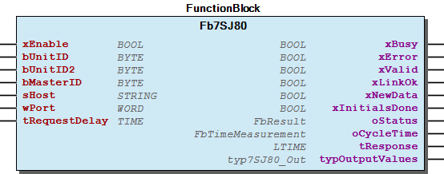 Function description The function block Fb7SJ80 reads measured values ​​and status values ​​from the Modbus registers of a Siemens 7SJ80. The inputs bUnitID , bMasterID , sHost and wPort are used to specify the communication parameters of the device, depending on the used Modbus type. For Modbus RTU the additional usage of the function block FbModbusRTU_Master is mandatory. The link to the function block FbModbusRTU_Master is realized by the variable bMasterID . The function block can be released for processing via the xEnable input. The read values ​​are provided in the structure typOutputValues .

## FbBaseFree (FB)


| Scope | Name | Type | Initial | Comment | Inherited from |
| --- | --- | --- | --- | --- | --- |
| Output | oStatus | FbResult |  | Status object (see WagoSysErrorBase). | FbBehaviourModel_oStatus_Base |
| Input | xEnable | BOOL |  | Enables the operation. | FbBehaviourModel_WagoAppEnable |
| Output | xError | BOOL |  | Indicates that an Error has occurred. | FbBehaviourModel_WagoAppEnable |
| xValid | BOOL |  | Indicates that Data is valid. | FbBehaviourModel_WagoAppEnable |
| xBusy | BOOL |  | Indicates that the FB is working. | FbBehaviourModel_WagoAppEnable |
| xNewData | BOOL |  |  | _FbModbusBase |
| oCycle | FbTimeMeasurement |  |  | _FbModbusBase |
| Input | bUnitID | BYTE |  | Unit ID | FbModbus_TCP |
| bUnitID2 | BYTE |  | Alternative Unit ID | FbModbus_TCP |
| sHost | STRING(15) |  | Modbus TCP - IP address | FbModbus_TCP |
| wPort | WORD | 502 | Modbus TCP - Port number | FbModbus_TCP |
| Output | typOutputValues | typBaseFree_Out |  | Output values |  |

Function block to communicate with a SolarLog Base (free interface).

Protocoll: Modbus TCP

Graphical Illustration

Function description

The function block FbBaseFree reads measured values ​​and status values ​​from the Modbus registers of a SolarLog Base.

The inputs bUnitID , sHost and wPort are used to specify the communication parameters of the device.

The function block can be released for processing via the xEnable input.

The read values ​​are provided in the structure typOutputValues .

Interface variables Function Function block to communicate with a SolarLog Base (free interface). Protocoll: Modbus TCP Graphical Illustration 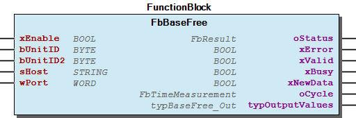 Function description The function block FbBaseFree reads measured values ​​and status values ​​from the Modbus registers of a SolarLog Base. The inputs bUnitID , sHost and wPort are used to specify the communication parameters of the device. The function block can be released for processing via the xEnable input. The read values ​​are provided in the structure typOutputValues .

## FbBasePM (FB)


| Scope | Name | Type | Initial | Comment | Inherited from |
| --- | --- | --- | --- | --- | --- |
| Output | oStatus | FbResult |  | Status object (see WagoSysErrorBase). | FbBehaviourModel_oStatus_Base |
| Input | xEnable | BOOL |  | Enables the operation. | FbBehaviourModel_WagoAppEnable |
| Output | xError | BOOL |  | Indicates that an Error has occurred. | FbBehaviourModel_WagoAppEnable |
| xValid | BOOL |  | Indicates that Data is valid. | FbBehaviourModel_WagoAppEnable |
| xBusy | BOOL |  | Indicates that the FB is working. | FbBehaviourModel_WagoAppEnable |
| xNewData | BOOL |  |  | _FbModbusBase |
| oCycle | FbTimeMeasurement |  |  | _FbModbusBase |
| Input | bUnitID | BYTE |  | Unit ID | FbModbus_TCP |
| bUnitID2 | BYTE |  | Alternative Unit ID | FbModbus_TCP |
| sHost | STRING(15) |  | Modbus TCP - IP address | FbModbus_TCP |
| wPort | WORD | 502 | Modbus TCP - Port number | FbModbus_TCP |
| Inout | typInputValues | typBasePM_In |  | Input values |  |
| Output | xPreLoadedCtrl | BOOL |  | Pre load of control values successful |  |
| typOutputValues | typBasePM_Out |  | Output values |  |

Function block to communicate with a SolarLog Base (power management interface).

Protocoll: Modbus TCP

Graphical Illustration

Function description

The function block FbBasePM reads measured values ​​and status values ​​from the Modbus registers of a SolarLog Base. Furthermore, control commands of the device will be written.

The inputs bUnitID , sHost and wPort are used to specify the communication parameters of the device.

The function block can be released for processing via the xEnable input.

The read values ​​are provided in the structure typOutputValues .

The control commands can be described in the structure typInputValues .

The output xPreLoadedCtrl signals a successful first readout of the control values.

Interface variables Function Function block to communicate with a SolarLog Base (power management interface). Protocoll: Modbus TCP Graphical Illustration 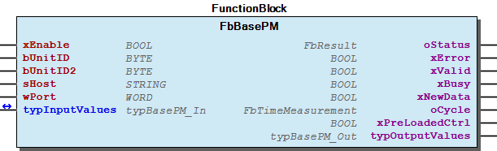 Function description The function block FbBasePM reads measured values ​​and status values ​​from the Modbus registers of a SolarLog Base. Furthermore, control commands of the device will be written. The inputs bUnitID , sHost and wPort are used to specify the communication parameters of the device. The function block can be released for processing via the xEnable input. The read values ​​are provided in the structure typOutputValues . The control commands can be described in the structure typInputValues . The output xPreLoadedCtrl signals a successful first readout of the control values.

## FbBlueLog (FB)


| Scope | Name | Type | Initial | Comment | Inherited from |
| --- | --- | --- | --- | --- | --- |
| Output | oStatus | FbResult |  | Status object (see WagoSysErrorBase). | FbBehaviourModel_oStatus_Base |
| Input | xEnable | BOOL |  | Enables the operation. | FbBehaviourModel_WagoAppEnable |
| Output | xError | BOOL |  | Indicates that an Error has occurred. | FbBehaviourModel_WagoAppEnable |
| xValid | BOOL |  | Indicates that Data is valid. | FbBehaviourModel_WagoAppEnable |
| xBusy | BOOL |  | Indicates that the FB is working. | FbBehaviourModel_WagoAppEnable |
| xNewData | BOOL |  |  | _FbModbusBase |
| oCycle | FbTimeMeasurement |  |  | _FbModbusBase |
| Input | bUnitID | BYTE |  | Unit ID | FbModbus_TCP |
| bUnitID2 | BYTE |  | Alternative Unit ID | FbModbus_TCP |
| sHost | STRING(15) |  | Modbus TCP - IP address | FbModbus_TCP |
| wPort | WORD | 502 | Modbus TCP - Port number | FbModbus_TCP |
| xEnableExtendedControls | BOOL |  | if OFF the FB writes control registers 5000-5005 (P_SET_GRIDOP_REL, P_PF_SET, P_Q_SET_REL) only; if ON it writes 5000-5023 (including voltage control) |  |
| Inout | typInputValues | typBlueLog_In |  |  |  |
| Output | xPreLoadedCtrl | BOOL |  | Pre load of control values successful |  |
| typOutputValues | typBlueLog_Out |  |  |  |

Function block to communicate with a Meteocontrol BlueLog.

Protocoll: Modbus TCP

Graphical Illustration

Function description

The function block FbBlueLog reads measured values ​​and status values ​​from the Modbus registers of a Meteocontrol BlueLog. Furthermore, control commands of the device will be written.

The inputs bUnitID , sHost and wPort are used to specify the communication parameters of the device.

The function block can be released for processing via the xEnable input.

The read values ​​are provided in the structure typOutputValues .

The control commands can be described in the structure typInputValues .

The output xPreLoadedCtrl signals a successful first readout of the control values.

Interface variables Function Function block to communicate with a Meteocontrol BlueLog. Protocoll: Modbus TCP Graphical Illustration 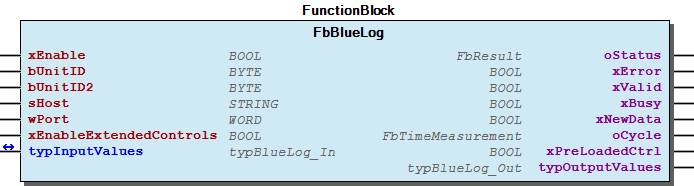 Function description The function block FbBlueLog reads measured values ​​and status values ​​from the Modbus registers of a Meteocontrol BlueLog. Furthermore, control commands of the device will be written. The inputs bUnitID , sHost and wPort are used to specify the communication parameters of the device. The function block can be released for processing via the xEnable input. The read values ​​are provided in the structure typOutputValues . The control commands can be described in the structure typInputValues . The output xPreLoadedCtrl signals a successful first readout of the control values.

## FbChargePilot (FB)


| Scope | Name | Type | Initial | Comment | Inherited from |
| --- | --- | --- | --- | --- | --- |
| Input | xEnable | BOOL |  |  | FbModbusSimpleBase |
| bUnitID | BYTE |  | Unit ID of Modbus device | FbModbusSimpleBase |
| bUnitID2 | BYTE |  | Alternative Unit ID | FbModbusSimpleBase |
| bMasterID | BYTE |  | Modbus RTU - Master assignment number. Range 1 to gc_MAX_RTU_MASTER | FbModbusSimpleBase |
| sHost | STRING(15) |  | Modbus TCP - IPv4 address, MUST be left empty for Modbus/RTU | FbModbusSimpleBase |
| wPort | WORD | 502 | Modbus TCP - Port number, can be left empty for Modbus/RTU | FbModbusSimpleBase |
| tRequestDelay | TIME |  | := T#20MS; | FbModbusSimpleBase |
| Output | xBusy | BOOL |  |  | FbModbusSimpleBase |
| xError | BOOL |  |  | FbModbusSimpleBase |
| xValid | BOOL |  |  | FbModbusSimpleBase |
| xLinkOk | BOOL |  |  | FbModbusSimpleBase |
| xNewData | BOOL |  |  | FbModbusSimpleBase |
| xInitialsDone | BOOL |  |  | FbModbusSimpleBase |
| oStatus | WagoSysErrorBase.FbResult |  |  | FbModbusSimpleBase |
| oCycleTime | FbTimeMeasurement |  |  | FbModbusSimpleBase |
| tResponse | LTIME |  |  | FbModbusSimpleBase |
| Inout | typControl | typChargePilot_Control |  |  |  |
| Output | typOutput | typChargePilot_Out |  |  |  |

Function block to communicate with a TMH ChargePilot.

Protocoll: Modbus TCP & RTU

Graphical Illustration

Interface variables Function Function block to communicate with a TMH ChargePilot. Protocoll: Modbus TCP & RTU Graphical Illustration 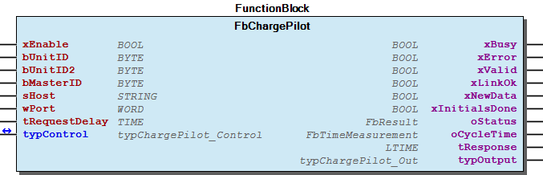

## FbComPass (FB)


| Scope | Name | Type | Initial | Comment | Inherited from |
| --- | --- | --- | --- | --- | --- |
| Input | xEnable | BOOL |  |  | FbModbusSimpleBase |
| bUnitID | BYTE |  | Unit ID of Modbus device | FbModbusSimpleBase |
| bUnitID2 | BYTE |  | Alternative Unit ID | FbModbusSimpleBase |
| bMasterID | BYTE |  | Modbus RTU - Master assignment number. Range 1 to gc_MAX_RTU_MASTER | FbModbusSimpleBase |
| sHost | STRING(15) |  | Modbus TCP - IPv4 address, MUST be left empty for Modbus/RTU | FbModbusSimpleBase |
| wPort | WORD | 502 | Modbus TCP - Port number, can be left empty for Modbus/RTU | FbModbusSimpleBase |
| tRequestDelay | TIME |  | := T#20MS; | FbModbusSimpleBase |
| Output | xBusy | BOOL |  |  | FbModbusSimpleBase |
| xError | BOOL |  |  | FbModbusSimpleBase |
| xValid | BOOL |  |  | FbModbusSimpleBase |
| xLinkOk | BOOL |  |  | FbModbusSimpleBase |
| xNewData | BOOL |  |  | FbModbusSimpleBase |
| xInitialsDone | BOOL |  |  | FbModbusSimpleBase |
| oStatus | WagoSysErrorBase.FbResult |  |  | FbModbusSimpleBase |
| oCycleTime | FbTimeMeasurement |  |  | FbModbusSimpleBase |
| tResponse | LTIME |  |  | FbModbusSimpleBase |
| Input | typInputValues | typComPass_Ctrl |  | Input values |  |
| xUseSimpleEvents | BOOL |  | instead of buffered event history registers |  |
| Output | typOutputValues | typComPass_Out |  | Output values |  |
| xIsV2 | BOOL |  |  |  |
| wProductCode | WORD |  | ProductType - A: 2561, B: 2562, Bs: 2570 |  |
| rFirmwareVersion | REAL |  | Note: Compass B/Bs2.0 (re)starts counting with 1.000 but we start with 2.000 to destinguish between them |  |
| aEventHistory | ARRAY [0..10] OF typComPassV2Event |  |  |  |

Interface variables - FbComPass.adjustRequestsToVersion (METH) - FbComPass.decodeEvent (METH) - FbComPass.decodeSystemData (METH) - FbComPass.mPrepareData (METH) - FbComPass.mTransferData (METH) - FbComPass.shiftEventHistory (METH)

## FbComPassA (FB)


| Scope | Name | Type | Initial | Comment | Inherited from |
| --- | --- | --- | --- | --- | --- |
| Output | oStatus | FbResult |  | Status object (see WagoSysErrorBase). | FbBehaviourModel_oStatus_Base |
| Input | xEnable | BOOL |  | Enables the operation. | FbBehaviourModel_WagoAppEnable |
| Output | xError | BOOL |  | Indicates that an Error has occurred. | FbBehaviourModel_WagoAppEnable |
| xValid | BOOL |  | Indicates that Data is valid. | FbBehaviourModel_WagoAppEnable |
| xBusy | BOOL |  | Indicates that the FB is working. | FbBehaviourModel_WagoAppEnable |
| Input | bUnitID | BYTE | 1 | Modbus slave address |  |
| bMasterID | BYTE | 1 | Master assignment number. Range 1 to gc_MAX_RTU_MASTER. |  |
| typInputValues | typComPassA_In |  | Input values |  |
| Output | typOutputValues | typComPassA_Out |  | Output values |  |
| xNewData | BOOL |  |  |  |

Function block to communicate with a Horstmann ComPass A.

Protocoll: Modbus RTU

Graphical Illustration

Function description

The function block FbComPassA reads measured values ​​and status values ​​from the Modbus registers of a Horstmann ComPass A. Furthermore, control commands of the device will be written.

For the communication the additional usage of the function block FbModbusRTU_Master is mandatory. The link to the function block FbModbusRTU_Master is realized by the variable bMasterID .

The function block can be released for processing via the xEnable input.

At the input bUnitID , the Modbus slave address of the ComPass A specified.

The read values ​​are provided in the structure typOutputValues .

The control commands can be described in the structure typInputValues . After a successful read operation, the variables will be reset automatically.

If an event is detected, the current event data in the structure typOutputValues provided. The control command typInputValues.xDeleteEventMsg can be used to confirm an event and the next event in the memory is read. The read out memory location number is displayed via the variable typOutputValues.rEventCounter . Is the entire memory area read out and not another active event detected, the variable returns the value 0.

Interface variables Function Function block to communicate with a Horstmann ComPass A. Protocoll: Modbus RTU Graphical Illustration  Function description The function block FbComPassA reads measured values ​​and status values ​​from the Modbus registers of a Horstmann ComPass A. Furthermore, control commands of the device will be written. For the communication the additional usage of the function block FbModbusRTU_Master is mandatory. The link to the function block FbModbusRTU_Master is realized by the variable bMasterID . The function block can be released for processing via the xEnable input. At the input bUnitID , the Modbus slave address of the ComPass A specified. The read values ​​are provided in the structure typOutputValues . The control commands can be described in the structure typInputValues . After a successful read operation, the variables will be reset automatically. If an event is detected, the current event data in the structure typOutputValues provided. The control command typInputValues.xDeleteEventMsg can be used to confirm an event and the next event in the memory is read. The read out memory location number is displayed via the variable typOutputValues.rEventCounter . Is the entire memory area read out and not another active event detected, the variable returns the value 0.

## FbComPassB (FB)


| Scope | Name | Type | Initial | Comment | Inherited from |
| --- | --- | --- | --- | --- | --- |
| Output | oStatus | FbResult |  | Status object (see WagoSysErrorBase). | FbBehaviourModel_oStatus_Base |
| Input | xEnable | BOOL |  | Enables the operation. | FbBehaviourModel_WagoAppEnable |
| Output | xError | BOOL |  | Indicates that an Error has occurred. | FbBehaviourModel_WagoAppEnable |
| xValid | BOOL |  | Indicates that Data is valid. | FbBehaviourModel_WagoAppEnable |
| xBusy | BOOL |  | Indicates that the FB is working. | FbBehaviourModel_WagoAppEnable |
| Input | bUnitID | BYTE |  | Modbus slave address |  |
| bMasterID | BYTE | 1 | Master assignment number. Range 1 to gc_MAX_RTU_MASTER. |  |
| typInputValues | typComPassB_In |  | Input values |  |
| Output | typOutputValues | typComPassB_Out |  | Output values |  |
| xNewData | BOOL |  |  |  |

Function block to communicate with a Horstmann ComPass B.

Protocoll: Modbus RTU

Graphical Illustration

Function description

The function block FbComPassB reads measured values ​​and status values ​​from the Modbus registers of a Horstmann ComPass B. Furthermore, control commands of the device will be written.

For the communication the additional usage of the function block FbModbusRTU_Master is mandatory. The link to the function block FbModbusRTU_Master is realized by the variable bMasterID .

The function block can be released for processing via the xEnable input.

At the input bUnitID , the Modbus slave address of the ComPass B specified.

The read values ​​are provided in the structure typOutputValues .

The control commands can be described in the structure typInputValues . After a successful read operation, the variables will be reset automatically.

If an event is detected, the current event data in the structure typOutputValues provided. The control command typInputValues.xDeleteEventMsg can be used to confirm an event and the next event in the memory is read. The read out memory location number is displayed via the variable typOutputValues.rEventCounter . Is the entire memory area read out and not another active event detected, the variable returns the value 0.

Interface variables Function Function block to communicate with a Horstmann ComPass B. Protocoll: Modbus RTU Graphical Illustration 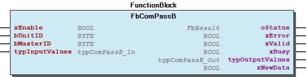 Function description The function block FbComPassB reads measured values ​​and status values ​​from the Modbus registers of a Horstmann ComPass B. Furthermore, control commands of the device will be written. For the communication the additional usage of the function block FbModbusRTU_Master is mandatory. The link to the function block FbModbusRTU_Master is realized by the variable bMasterID . The function block can be released for processing via the xEnable input. At the input bUnitID , the Modbus slave address of the ComPass B specified. The read values ​​are provided in the structure typOutputValues . The control commands can be described in the structure typInputValues . After a successful read operation, the variables will be reset automatically. If an event is detected, the current event data in the structure typOutputValues provided. The control command typInputValues.xDeleteEventMsg can be used to confirm an event and the next event in the memory is read. The read out memory location number is displayed via the variable typOutputValues.rEventCounter . Is the entire memory area read out and not another active event detected, the variable returns the value 0.

## FbComPassBs (FB)


| Scope | Name | Type | Initial | Comment | Inherited from |
| --- | --- | --- | --- | --- | --- |
| Output | oStatus | FbResult |  | Status object (see WagoSysErrorBase). | FbBehaviourModel_oStatus_Base |
| Input | xEnable | BOOL |  | Enables the operation. | FbBehaviourModel_WagoAppEnable |
| Output | xError | BOOL |  | Indicates that an Error has occurred. | FbBehaviourModel_WagoAppEnable |
| xValid | BOOL |  | Indicates that Data is valid. | FbBehaviourModel_WagoAppEnable |
| xBusy | BOOL |  | Indicates that the FB is working. | FbBehaviourModel_WagoAppEnable |
| Input | bUnitID | BYTE | 1 | Modbus slave address |  |
| bMasterID | BYTE | 1 | Master assignment number. Range 1 to gc_MAX_RTU_MASTER. |  |
| typInputValues | typComPassBs_In |  | Input values |  |
| Output | typOutputValues | typComPassBs_Out |  | Output values |  |
| xNewData | BOOL |  |  |  |

Function block to communicate with a Horstmann ComPass Bs.

Protocoll: Modbus RTU

Graphical Illustration

Function description

The function block FbComPassBs reads measured values ​​and status values ​​from the Modbus registers of a Horstmann ComPass Bs. Furthermore, control commands of the device will be written.

For the communication the additional usage of the function block FbModbusRTU_Master is mandatory. The link to the function block FbModbusRTU_Master is realized by the variable bMasterID .

The function block can be released for processing via the xEnable input.

At the input bUnitID , the Modbus slave address of the ComPass Bs specified.

The read values ​​are provided in the structure typOutputValues .

The control commands can be described in the structure typInputValues . After a successful read operation, the variables will be reset automatically.

The ComPass Bs device has a switch-disconnector, which can be usedby the control commands typInputValues.xLoadDisconnector_ON and typInputValues.xLoadDisconnector_OFF . The device requires a correct execution of a Switching process a proper wiring of the BI inputs. The wiring is described in the manual of the ComPass Bs device. The current status of the switch-disconnector and possible error messages can cause the variables typOutputValues.xLoadDisconnector_Status and typOutputValues.xLoadDisconnector_Fault .

If an event is detected, the current event data in the structure typOutputValues provided. The control command typInputValues.xDeleteEventMsg can be used to confirm an event and the next event in the memory is read. The read out memory location number is displayed via the variable typOutputValues.rEventCounter . Is the entire memory area read out and not another active event detected, the variable returns the value 0.

Interface variables Function Function block to communicate with a Horstmann ComPass Bs. Protocoll: Modbus RTU Graphical Illustration 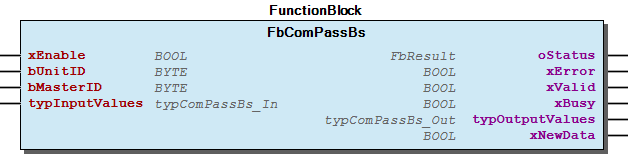 Function description The function block FbComPassBs reads measured values ​​and status values ​​from the Modbus registers of a Horstmann ComPass Bs. Furthermore, control commands of the device will be written. For the communication the additional usage of the function block FbModbusRTU_Master is mandatory. The link to the function block FbModbusRTU_Master is realized by the variable bMasterID . The function block can be released for processing via the xEnable input. At the input bUnitID , the Modbus slave address of the ComPass Bs specified. The read values ​​are provided in the structure typOutputValues . The control commands can be described in the structure typInputValues . After a successful read operation, the variables will be reset automatically. The ComPass Bs device has a switch-disconnector, which can be usedby the control commands typInputValues.xLoadDisconnector_ON and typInputValues.xLoadDisconnector_OFF . The device requires a correct execution of a Switching process a proper wiring of the BI inputs. The wiring is described in the manual of the ComPass Bs device. The current status of the switch-disconnector and possible error messages can cause the variables typOutputValues.xLoadDisconnector_Status and typOutputValues.xLoadDisconnector_Fault . If an event is detected, the current event data in the structure typOutputValues provided. The control command typInputValues.xDeleteEventMsg can be used to confirm an event and the next event in the memory is read. The read out memory location number is displayed via the variable typOutputValues.rEventCounter . Is the entire memory area read out and not another active event detected, the variable returns the value 0.

## FbDataManager (FB)


| Scope | Name | Type | Initial | Comment | Inherited from |
| --- | --- | --- | --- | --- | --- |
| Input | xEnable | BOOL |  |  | FbModbusSimpleBase |
| bUnitID | BYTE |  | Unit ID of Modbus device | FbModbusSimpleBase |
| bUnitID2 | BYTE |  | Alternative Unit ID | FbModbusSimpleBase |
| bMasterID | BYTE |  | Modbus RTU - Master assignment number. Range 1 to gc_MAX_RTU_MASTER | FbModbusSimpleBase |
| sHost | STRING(15) |  | Modbus TCP - IPv4 address, MUST be left empty for Modbus/RTU | FbModbusSimpleBase |
| wPort | WORD | 502 | Modbus TCP - Port number, can be left empty for Modbus/RTU | FbModbusSimpleBase |
| tRequestDelay | TIME |  | := T#20MS; | FbModbusSimpleBase |
| Output | xBusy | BOOL |  |  | FbModbusSimpleBase |
| xError | BOOL |  |  | FbModbusSimpleBase |
| xValid | BOOL |  |  | FbModbusSimpleBase |
| xLinkOk | BOOL |  |  | FbModbusSimpleBase |
| xNewData | BOOL |  |  | FbModbusSimpleBase |
| xInitialsDone | BOOL |  |  | FbModbusSimpleBase |
| oStatus | WagoSysErrorBase.FbResult |  |  | FbModbusSimpleBase |
| oCycleTime | FbTimeMeasurement |  |  | FbModbusSimpleBase |
| tResponse | LTIME |  |  | FbModbusSimpleBase |
| Inout | typControl | typDataManager_In |  |  |  |
| Output | typOutput | typDataManager_Out |  |  |  |

Interface variables - FbDataManager.mPrepareData (METH)

## FbDataManager_old (FB)


| Scope | Name | Type | Initial | Comment | Inherited from |
| --- | --- | --- | --- | --- | --- |
| Output | oStatus | FbResult |  | Status object (see WagoSysErrorBase). | FbBehaviourModel_oStatus_Base |
| Input | xEnable | BOOL |  | Enables the operation. | FbBehaviourModel_WagoAppEnable |
| Output | xError | BOOL |  | Indicates that an Error has occurred. | FbBehaviourModel_WagoAppEnable |
| xValid | BOOL |  | Indicates that Data is valid. | FbBehaviourModel_WagoAppEnable |
| xBusy | BOOL |  | Indicates that the FB is working. | FbBehaviourModel_WagoAppEnable |
| xNewData | BOOL |  |  | _FbModbusBase |
| oCycle | FbTimeMeasurement |  |  | _FbModbusBase |
| Input | bUnitID | BYTE |  | Unit ID | FbModbus_TCP |
| bUnitID2 | BYTE |  | Alternative Unit ID | FbModbus_TCP |
| sHost | STRING(15) |  | Modbus TCP - IP address | FbModbus_TCP |
| wPort | WORD | 502 | Modbus TCP - Port number | FbModbus_TCP |
| Inout | typInputValues | typDataManager_In |  | Input values |  |
| Output | xPreLoadedCtrl | BOOL |  | Pre load of control values successful |  |
| typOutputValues | typDataManager_Out |  | Output values |  |

Function block to communicate with a SMA DataManager M/L.

Protocoll: Modbus TCP

Graphical Illustration

Function description

The function block FbDataManager reads measured values ​​and status values ​​from the Modbus registers of a SMA DataManager. Furthermore, control commands of the device will be written.

The inputs bUnitID , sHost and wPort are used to specify the communication parameters of the device. The DataManager device typically has two UnitIDs, firstly for the device information and secondly for the measured values. Please enter the first UnitID for the device information, the second will be adjusted automatically.

The function block can be released for processing via the xEnable input.

The read values ​​are provided in the structure typOutputValues .

The control commands can be described in the structure typInputValues .

The output xPreLoadedCtrl signals a successful first readout of the control values.

Interface variables Function Function block to communicate with a SMA DataManager M/L. Protocoll: Modbus TCP Graphical Illustration  Function description The function block FbDataManager reads measured values ​​and status values ​​from the Modbus registers of a SMA DataManager. Furthermore, control commands of the device will be written. The inputs bUnitID , sHost and wPort are used to specify the communication parameters of the device. The DataManager device typically has two UnitIDs, firstly for the device information and secondly for the measured values. Please enter the first UnitID for the device information, the second will be adjusted automatically. The function block can be released for processing via the xEnable input. The read values ​​are provided in the structure typOutputValues . The control commands can be described in the structure typInputValues . The output xPreLoadedCtrl signals a successful first readout of the control values.

## FbEOR_3D (FB)


| Scope | Name | Type | Initial | Comment | Inherited from |
| --- | --- | --- | --- | --- | --- |
| Output | oStatus | FbResult |  | Status object (see WagoSysErrorBase). | FbBehaviourModel_oStatus_Base |
| Input | xEnable | BOOL |  | Enables the operation. | FbBehaviourModel_WagoAppEnable |
| Output | xError | BOOL |  | Indicates that an Error has occurred. | FbBehaviourModel_WagoAppEnable |
| xValid | BOOL |  | Indicates that Data is valid. | FbBehaviourModel_WagoAppEnable |
| xBusy | BOOL |  | Indicates that the FB is working. | FbBehaviourModel_WagoAppEnable |
| Input | bUnitID | BYTE |  | Modbus slave address |  |
| bMasterID | BYTE | 1 | Master assignment number. Range 1 to gc_MAX_RTU_MASTER. |  |
| Output | typOutputValues | typEOR_3D_Out |  | Output values |  |
| xNewData | BOOL |  |  |  |

Function block to communicate with a a-eberle EOR-3D.

Protocoll: Modbus RTU

Graphical Illustration

Function description

The function block FbEOR_3D reads measured values ​​and status values ​​from the Modbus registers of a a-eberle EOR-3D. Furthermore, control commands of the device will be written.

For the communication the additional usage of the function block FbModbusRTU_Master is mandatory. The link to the function block FbModbusRTU_Master is realized by the variable bMasterID .

The function block can be released for processing via the xEnable input.

At the input bUnitID , the Modbus slave address of the EOR-3D specified.

The read values ​​are provided in the structure typOutputValues .

Interface variables Function Function block to communicate with a a-eberle EOR-3D. Protocoll: Modbus RTU Graphical Illustration 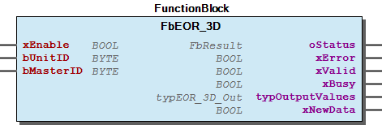 Function description The function block FbEOR_3D reads measured values ​​and status values ​​from the Modbus registers of a a-eberle EOR-3D. Furthermore, control commands of the device will be written. For the communication the additional usage of the function block FbModbusRTU_Master is mandatory. The link to the function block FbModbusRTU_Master is realized by the variable bMasterID . The function block can be released for processing via the xEnable input. At the input bUnitID , the Modbus slave address of the EOR-3D specified. The read values ​​are provided in the structure typOutputValues .

## FbEOnModbus (FB)


| Scope | Name | Type | Initial | Comment | Inherited from |
| --- | --- | --- | --- | --- | --- |
| Input | xEnable | BOOL |  |  | FbModbusSimpleBase |
| bUnitID | BYTE |  | Unit ID of Modbus device | FbModbusSimpleBase |
| bUnitID2 | BYTE |  | Alternative Unit ID | FbModbusSimpleBase |
| bMasterID | BYTE |  | Modbus RTU - Master assignment number. Range 1 to gc_MAX_RTU_MASTER | FbModbusSimpleBase |
| sHost | STRING(15) |  | Modbus TCP - IPv4 address, MUST be left empty for Modbus/RTU | FbModbusSimpleBase |
| wPort | WORD | 502 | Modbus TCP - Port number, can be left empty for Modbus/RTU | FbModbusSimpleBase |
| tRequestDelay | TIME |  | := T#20MS; | FbModbusSimpleBase |
| Output | xBusy | BOOL |  |  | FbModbusSimpleBase |
| xError | BOOL |  |  | FbModbusSimpleBase |
| xValid | BOOL |  |  | FbModbusSimpleBase |
| xLinkOk | BOOL |  |  | FbModbusSimpleBase |
| xNewData | BOOL |  |  | FbModbusSimpleBase |
| xInitialsDone | BOOL |  |  | FbModbusSimpleBase |
| oStatus | WagoSysErrorBase.FbResult |  |  | FbModbusSimpleBase |
| oCycleTime | FbTimeMeasurement |  |  | FbModbusSimpleBase |
| tResponse | LTIME |  |  | FbModbusSimpleBase |
| typOutputValues | typEOnModbus_Output |  |  |  |

## FbGridInspector (FB)


| Scope | Name | Type | Initial | Comment | Inherited from |
| --- | --- | --- | --- | --- | --- |
| Output | oStatus | FbResult |  | Status object (see WagoSysErrorBase). | FbBehaviourModel_oStatus_Base |
| Input | xEnable | BOOL |  | Enables the operation. | FbBehaviourModel_WagoAppEnable |
| Output | xError | BOOL |  | Indicates that an Error has occurred. | FbBehaviourModel_WagoAppEnable |
| xValid | BOOL |  | Indicates that Data is valid. | FbBehaviourModel_WagoAppEnable |
| xBusy | BOOL |  | Indicates that the FB is working. | FbBehaviourModel_WagoAppEnable |
| Input | bUnitID | BYTE |  | Modbus slave address |  |
| bMasterID | BYTE | 1 | Master assignment number. Range 1 to gc_MAX_RTU_MASTER. |  |
| typInputValues | typGridInspector_In |  | Input values |  |
| Output | typOutputValues | typGridInspector_Out |  | Output values |  |
| xNewData | BOOL |  |  |  |
| oCycle | FbTimeMeasurement |  |  |  |

Function block to communicate with a Kries Grid Inspector.

Protocoll: Modbus RTU

Graphical Illustration

Function description

The function block FbGridInspector reads measured values ​​and status values ​​from the Modbus registers of a Kries Grid Inspector. Furthermore, control commands of the device will be written.

For the communication the additional usage of the function block FbModbusRTU_Master is mandatory. The link to the function block FbModbusRTU_Master is realized by the variable bMasterID .

The processing of the measured values can be enabled via the input xEnableValues . The processing of the event memory ccan be enabled via the input xEnableEvents . The processing of the status bits can be enabled via the input xEnableStatusBits . The processing of the system settings can be enabled via the input xEnableSettings .

At the input bUnitID , the Modbus slave address of the Grid Inspector specified.

Note: - Communication to the Grid Inspector device is aborted as soon as the user selects the menu of the IKI device.

values within the output structure could be possible rounding differences.

Interface variables Function Function block to communicate with a Kries Grid Inspector. Protocoll: Modbus RTU Graphical Illustration 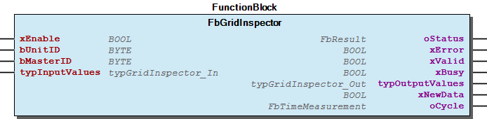 Function description The function block FbGridInspector reads measured values ​​and status values ​​from the Modbus registers of a Kries Grid Inspector. Furthermore, control commands of the device will be written. For the communication the additional usage of the function block FbModbusRTU_Master is mandatory. The link to the function block FbModbusRTU_Master is realized by the variable bMasterID . The processing of the measured values can be enabled via the input xEnableValues . The processing of the event memory ccan be enabled via the input xEnableEvents . The processing of the status bits can be enabled via the input xEnableStatusBits . The processing of the system settings can be enabled via the input xEnableSettings . At the input bUnitID , the Modbus slave address of the Grid Inspector specified. Note: - Communication to the Grid Inspector device is aborted as soon as the user selects the menu of the IKI device. - Between the displayed values on the display of the Grid Inspector and the read out values within the output structure could be possible rounding differences.

## FbGridInspectorLight (FB)


| Scope | Name | Type | Initial | Comment | Inherited from |
| --- | --- | --- | --- | --- | --- |
| Input | xEnable | BOOL |  |  | FbModbusSimpleBase |
| bUnitID | BYTE |  | Unit ID of Modbus device | FbModbusSimpleBase |
| bUnitID2 | BYTE |  | Alternative Unit ID | FbModbusSimpleBase |
| bMasterID | BYTE |  | Modbus RTU - Master assignment number. Range 1 to gc_MAX_RTU_MASTER | FbModbusSimpleBase |
| sHost | STRING(15) |  | Modbus TCP - IPv4 address, MUST be left empty for Modbus/RTU | FbModbusSimpleBase |
| wPort | WORD | 502 | Modbus TCP - Port number, can be left empty for Modbus/RTU | FbModbusSimpleBase |
| tRequestDelay | TIME |  | := T#20MS; | FbModbusSimpleBase |
| Output | xBusy | BOOL |  |  | FbModbusSimpleBase |
| xError | BOOL |  |  | FbModbusSimpleBase |
| xValid | BOOL |  |  | FbModbusSimpleBase |
| xLinkOk | BOOL |  |  | FbModbusSimpleBase |
| xNewData | BOOL |  |  | FbModbusSimpleBase |
| xInitialsDone | BOOL |  |  | FbModbusSimpleBase |
| oStatus | WagoSysErrorBase.FbResult |  |  | FbModbusSimpleBase |
| oCycleTime | FbTimeMeasurement |  |  | FbModbusSimpleBase |
| tResponse | LTIME |  |  | FbModbusSimpleBase |
| Input | iNumMeasurementField | USINT | 1 | F1 vs. F2 |  |
| typControl | typGridInspector_Ctrl |  |  |  |
| Output | typMeasurements | typGridInspector_Meas |  |  |  |
| typStates | typGridInspector_States |  |  |  |

## FbION7x50 (FB)


| Scope | Name | Type | Initial | Comment | Inherited from |
| --- | --- | --- | --- | --- | --- |
| Output | oStatus | FbResult |  | Status object (see WagoSysErrorBase). | FbBehaviourModel_oStatus_Base |
| Input | xEnable | BOOL |  | Enables the operation. | FbBehaviourModel_WagoAppEnable |
| Output | xError | BOOL |  | Indicates that an Error has occurred. | FbBehaviourModel_WagoAppEnable |
| xValid | BOOL |  | Indicates that Data is valid. | FbBehaviourModel_WagoAppEnable |
| xBusy | BOOL |  | Indicates that the FB is working. | FbBehaviourModel_WagoAppEnable |
| xNewData | BOOL |  |  | _FbModbusBase |
| oCycle | FbTimeMeasurement |  |  | _FbModbusBase |
| Input | bUnitID | BYTE |  | Unit ID | FbModbus_RTUTCP |
| bUnitID2 | BYTE |  | Alternative Unit ID | FbModbus_RTUTCP |
| bMasterID | BYTE |  | Modbus RTU - Master assignment number. Range 1 to gc_MAX_RTU_MASTER | FbModbus_RTUTCP |
| sHost | STRING(15) |  | Modbus TCP - IP address | FbModbus_RTUTCP |
| wPort | WORD | 502 | Modbus TCP - Port number | FbModbus_RTUTCP |
| Output | typOutputValues | typION7x50_Out |  | Output values |  |

Function block to communicate with a Schneider Electric ION 7x50.

Protocoll: Modbus TCP & RTU

Graphical Illustration

Function description

The function block FbION7x50 reads measured values ​​and status values ​​from the Modbus registers of a Schneider Electric ION 7x50.

The inputs bUnitID , bMasterID , sHost and wPort are used to specify the communication parameters of the device, depending on the used Modbus type.

For Modbus RTU the additional usage of the function block FbModbusRTU_Master is mandatory. The link to the function block FbModbusRTU_Master is realized by the variable bMasterID .

The function block can be released for processing via the xEnable input.

The read values ​​are provided in the structure typOutputValues .

Interface variables Function Function block to communicate with a Schneider Electric ION 7x50. Protocoll: Modbus TCP & RTU Graphical Illustration 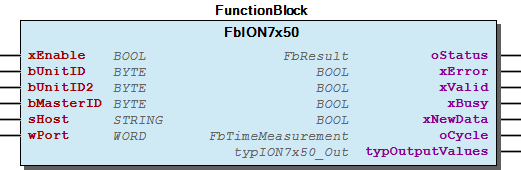 Function description The function block FbION7x50 reads measured values ​​and status values ​​from the Modbus registers of a Schneider Electric ION 7x50. The inputs bUnitID , bMasterID , sHost and wPort are used to specify the communication parameters of the device, depending on the used Modbus type. For Modbus RTU the additional usage of the function block FbModbusRTU_Master is mandatory. The link to the function block FbModbusRTU_Master is realized by the variable bMasterID . The function block can be released for processing via the xEnable input. The read values ​​are provided in the structure typOutputValues .

## FbIec60870Base (FB)


| Scope | Name | Type | Initial | Comment |
| --- | --- | --- | --- | --- |
| Input | xEnable | BOOL |  |  |
| typASDUAddr | WagoAppRTU_Slaves.typADDR | STRUCT(low := 1) | Project specific IEC60870-101/4 asdu address |
| I_Port | WagoTypesCom.I_WagoSysComBase |  | Selected COM port: e.g. IoConfig_Globals.COM1 or IoConfig_Globals.RS232_485_Interface |
| ePortType | INT |  | ePortHardware; // Physical type of serial line (0=RS232, 4=RS485) |
| typLinkAddr | WagoAppRTU_Slaves.typADDR | STRUCT(low := 1) | Project specific IEC60870-101 link address |
| sIpAddress | STRING |  |  |
| wTcpPort | WORD |  |  |
| Output | xValid | BOOL |  |  |
| oStatus | WagoSysErrorBase.FbResult |  | Error/status object (listed in eStatus ) |
| sStatus | STRING(255) |  | Description of current error/status |
| xLinkOK | BOOL |  |  |

Interface variables - FbIec60870Base.mAppCFG (METH) - FbIec60870Base.mPreCFG (METH) - FbIec60870Base.mRegisterInfObj (METH) - FbIec60870Base.mReset (METH) - FbIec60870Base.mTransfer (METH)

## FbIki23 (FB)


| Scope | Name | Type | Initial | Comment | Inherited from |
| --- | --- | --- | --- | --- | --- |
| Input | xEnable | BOOL |  |  | FbModbusSimpleBase |
| bUnitID | BYTE |  | Unit ID of Modbus device | FbModbusSimpleBase |
| bUnitID2 | BYTE |  | Alternative Unit ID | FbModbusSimpleBase |
| bMasterID | BYTE |  | Modbus RTU - Master assignment number. Range 1 to gc_MAX_RTU_MASTER | FbModbusSimpleBase |
| sHost | STRING(15) |  | Modbus TCP - IPv4 address, MUST be left empty for Modbus/RTU | FbModbusSimpleBase |
| wPort | WORD | 502 | Modbus TCP - Port number, can be left empty for Modbus/RTU | FbModbusSimpleBase |
| tRequestDelay | TIME |  | := T#20MS; | FbModbusSimpleBase |
| Output | xBusy | BOOL |  |  | FbModbusSimpleBase |
| xError | BOOL |  |  | FbModbusSimpleBase |
| xValid | BOOL |  |  | FbModbusSimpleBase |
| xLinkOk | BOOL |  |  | FbModbusSimpleBase |
| xNewData | BOOL |  |  | FbModbusSimpleBase |
| xInitialsDone | BOOL |  |  | FbModbusSimpleBase |
| oStatus | WagoSysErrorBase.FbResult |  |  | FbModbusSimpleBase |
| oCycleTime | FbTimeMeasurement |  |  | FbModbusSimpleBase |
| tResponse | LTIME |  |  | FbModbusSimpleBase |
| Input | typControl | typIki23_Control |  |  |  |
| Output | sFirmwareVersion | STRING |  |  |  |
| sHardwareVersion | STRING |  |  |  |
| typValues | typIki23_Output |  |  |  |

## FbJanitza (FB)


| Scope | Name | Type | Initial | Comment | Inherited from |
| --- | --- | --- | --- | --- | --- |
| Input | xEnable | BOOL |  |  | FbModbusSimpleBase |
| bUnitID | BYTE |  | Unit ID of Modbus device | FbModbusSimpleBase |
| bUnitID2 | BYTE |  | Alternative Unit ID | FbModbusSimpleBase |
| bMasterID | BYTE |  | Modbus RTU - Master assignment number. Range 1 to gc_MAX_RTU_MASTER | FbModbusSimpleBase |
| sHost | STRING(15) |  | Modbus TCP - IPv4 address, MUST be left empty for Modbus/RTU | FbModbusSimpleBase |
| wPort | WORD | 502 | Modbus TCP - Port number, can be left empty for Modbus/RTU | FbModbusSimpleBase |
| tRequestDelay | TIME |  | := T#20MS; | FbModbusSimpleBase |
| Output | xBusy | BOOL |  |  | FbModbusSimpleBase |
| xError | BOOL |  |  | FbModbusSimpleBase |
| xValid | BOOL |  |  | FbModbusSimpleBase |
| xLinkOk | BOOL |  |  | FbModbusSimpleBase |
| xNewData | BOOL |  |  | FbModbusSimpleBase |
| xInitialsDone | BOOL |  |  | FbModbusSimpleBase |
| oStatus | WagoSysErrorBase.FbResult |  |  | FbModbusSimpleBase |
| oCycleTime | FbTimeMeasurement |  |  | FbModbusSimpleBase |
| tResponse | LTIME |  |  | FbModbusSimpleBase |
| typOutputValues | typJanitza_Out |  | Output values |  |

Function block to communicate with a Janitza UMG 104/604.

Protocoll: Modbus TCP & RTU

Graphical Illustration

Function description

The function block FbJanitza reads measured values ​​and status values ​​from the Modbus registers of a Janitza UMG 104/604.

The inputs bUnitID , bMasterID , sHost and wPort are used to specify the communication parameters of the device, depending on the used Modbus type.

For Modbus RTU the additional usage of the function block FbModbusRTU_Master is mandatory. The link to the function block FbModbusRTU_Master is realized by the variable bMasterID .

The function block can be released for processing via the xEnable input.

The read values ​​are provided in the structure typOutputValues .

Interface variables Function Function block to communicate with a Janitza UMG 104/604. Protocoll: Modbus TCP & RTU Graphical Illustration 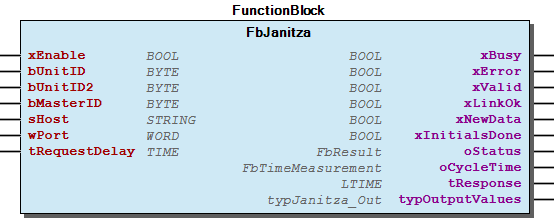 Function description The function block FbJanitza reads measured values ​​and status values ​​from the Modbus registers of a Janitza UMG 104/604. The inputs bUnitID , bMasterID , sHost and wPort are used to specify the communication parameters of the device, depending on the used Modbus type. For Modbus RTU the additional usage of the function block FbModbusRTU_Master is mandatory. The link to the function block FbModbusRTU_Master is realized by the variable bMasterID . The function block can be released for processing via the xEnable input. The read values ​​are provided in the structure typOutputValues .

## FbMID30x0 (FB)


| Scope | Name | Type | Initial | Comment | Inherited from |
| --- | --- | --- | --- | --- | --- |
| Input | xEnable | BOOL |  |  | FbModbusSimpleBase |
| bUnitID | BYTE |  | Unit ID of Modbus device | FbModbusSimpleBase |
| bUnitID2 | BYTE |  | Alternative Unit ID | FbModbusSimpleBase |
| bMasterID | BYTE |  | Modbus RTU - Master assignment number. Range 1 to gc_MAX_RTU_MASTER | FbModbusSimpleBase |
| sHost | STRING(15) |  | Modbus TCP - IPv4 address, MUST be left empty for Modbus/RTU | FbModbusSimpleBase |
| wPort | WORD | 502 | Modbus TCP - Port number, can be left empty for Modbus/RTU | FbModbusSimpleBase |
| tRequestDelay | TIME |  | := T#20MS; | FbModbusSimpleBase |
| Output | xBusy | BOOL |  |  | FbModbusSimpleBase |
| xError | BOOL |  |  | FbModbusSimpleBase |
| xValid | BOOL |  |  | FbModbusSimpleBase |
| xLinkOk | BOOL |  |  | FbModbusSimpleBase |
| xNewData | BOOL |  |  | FbModbusSimpleBase |
| xInitialsDone | BOOL |  |  | FbModbusSimpleBase |
| oStatus | WagoSysErrorBase.FbResult |  |  | FbModbusSimpleBase |
| oCycleTime | FbTimeMeasurement |  |  | FbModbusSimpleBase |
| tResponse | LTIME |  |  | FbModbusSimpleBase |
| typOutputValues | typMID30x0_Output |  |  |  |

## FbMRA4 (FB)


| Scope | Name | Type | Initial | Comment | Inherited from |
| --- | --- | --- | --- | --- | --- |
| Input | xEnable | BOOL |  |  | FbModbusSimpleBase |
| bUnitID | BYTE |  | Unit ID of Modbus device | FbModbusSimpleBase |
| bUnitID2 | BYTE |  | Alternative Unit ID | FbModbusSimpleBase |
| bMasterID | BYTE |  | Modbus RTU - Master assignment number. Range 1 to gc_MAX_RTU_MASTER | FbModbusSimpleBase |
| sHost | STRING(15) |  | Modbus TCP - IPv4 address, MUST be left empty for Modbus/RTU | FbModbusSimpleBase |
| wPort | WORD | 502 | Modbus TCP - Port number, can be left empty for Modbus/RTU | FbModbusSimpleBase |
| tRequestDelay | TIME |  | := T#20MS; | FbModbusSimpleBase |
| Output | xBusy | BOOL |  |  | FbModbusSimpleBase |
| xError | BOOL |  |  | FbModbusSimpleBase |
| xValid | BOOL |  |  | FbModbusSimpleBase |
| xLinkOk | BOOL |  |  | FbModbusSimpleBase |
| xNewData | BOOL |  |  | FbModbusSimpleBase |
| xInitialsDone | BOOL |  |  | FbModbusSimpleBase |
| oStatus | WagoSysErrorBase.FbResult |  |  | FbModbusSimpleBase |
| oCycleTime | FbTimeMeasurement |  |  | FbModbusSimpleBase |
| tResponse | LTIME |  |  | FbModbusSimpleBase |
| Inout | typInputValues | typMRA4_In |  |  |  |
| Output | typOutputValues | typMRA4_Out |  |  |  |

## FbMenckeTegtmeyer (FB)


| Scope | Name | Type | Initial | Comment | Inherited from |
| --- | --- | --- | --- | --- | --- |
| Input | xEnable | BOOL |  |  | FbModbusSimpleBase |
| bUnitID | BYTE |  | Unit ID of Modbus device | FbModbusSimpleBase |
| bUnitID2 | BYTE |  | Alternative Unit ID | FbModbusSimpleBase |
| bMasterID | BYTE |  | Modbus RTU - Master assignment number. Range 1 to gc_MAX_RTU_MASTER | FbModbusSimpleBase |
| sHost | STRING(15) |  | Modbus TCP - IPv4 address, MUST be left empty for Modbus/RTU | FbModbusSimpleBase |
| wPort | WORD | 502 | Modbus TCP - Port number, can be left empty for Modbus/RTU | FbModbusSimpleBase |
| tRequestDelay | TIME |  | := T#20MS; | FbModbusSimpleBase |
| Output | xBusy | BOOL |  |  | FbModbusSimpleBase |
| xError | BOOL |  |  | FbModbusSimpleBase |
| xValid | BOOL |  |  | FbModbusSimpleBase |
| xLinkOk | BOOL |  |  | FbModbusSimpleBase |
| xNewData | BOOL |  |  | FbModbusSimpleBase |
| xInitialsDone | BOOL |  |  | FbModbusSimpleBase |
| oStatus | WagoSysErrorBase.FbResult |  |  | FbModbusSimpleBase |
| oCycleTime | FbTimeMeasurement |  |  | FbModbusSimpleBase |
| tResponse | LTIME |  |  | FbModbusSimpleBase |
| typMeasurements | typMenckeTegtmeyerData |  |  |  |

Interface variables - FbMenckeTegtmeyer.mPrepareData (METH) - FbMenckeTegtmeyer.mTransferData (METH)

## FbMiCOM (FB)


| Scope | Name | Type | Initial | Comment | Inherited from |
| --- | --- | --- | --- | --- | --- |
| Input | xEnable | BOOL |  |  | FbModbusSimpleBase |
| bUnitID | BYTE |  | Unit ID of Modbus device | FbModbusSimpleBase |
| bUnitID2 | BYTE |  | Alternative Unit ID | FbModbusSimpleBase |
| bMasterID | BYTE |  | Modbus RTU - Master assignment number. Range 1 to gc_MAX_RTU_MASTER | FbModbusSimpleBase |
| sHost | STRING(15) |  | Modbus TCP - IPv4 address, MUST be left empty for Modbus/RTU | FbModbusSimpleBase |
| wPort | WORD | 502 | Modbus TCP - Port number, can be left empty for Modbus/RTU | FbModbusSimpleBase |
| tRequestDelay | TIME |  | := T#20MS; | FbModbusSimpleBase |
| Output | xBusy | BOOL |  |  | FbModbusSimpleBase |
| xError | BOOL |  |  | FbModbusSimpleBase |
| xValid | BOOL |  |  | FbModbusSimpleBase |
| xLinkOk | BOOL |  |  | FbModbusSimpleBase |
| xNewData | BOOL |  |  | FbModbusSimpleBase |
| xInitialsDone | BOOL |  |  | FbModbusSimpleBase |
| oStatus | WagoSysErrorBase.FbResult |  |  | FbModbusSimpleBase |
| oCycleTime | FbTimeMeasurement |  |  | FbModbusSimpleBase |
| tResponse | LTIME |  |  | FbModbusSimpleBase |
| Inout | typInputValues | typMiCOM_In |  |  |  |
| Output | typOutputValues | typMiCOM_Out |  |  |  |

## FbModbusRTU_Master (FB)


| Scope | Name | Type | Initial | Comment | Inherited from |
| --- | --- | --- | --- | --- | --- |
| Output | oStatus | FbResult |  | Status object (see WagoSysErrorBase). | FbBehaviourModel_oStatus_Base |
| Input | xEnable | BOOL |  | Enables the operation. | FbBehaviourModel_WagoAppEnable |
| Output | xError | BOOL |  | Indicates that an Error has occurred. | FbBehaviourModel_WagoAppEnable |
| xValid | BOOL |  | Indicates that Data is valid. | FbBehaviourModel_WagoAppEnable |
| xBusy | BOOL |  | Indicates that the FB is working. | FbBehaviourModel_WagoAppEnable |
| Input | I_Port | WagoTypesCom.I_WagoSysComBase |  | Name of the serial interface (e.g. ‘COM2’, ‘SER7.2’, ) |  |
| bMasterID | BYTE | 1 | Master assignment number. Range 1 to gc_MAX_RTU_MASTER |  |
| typModbusRTU_Config | typModbusRTU_Config |  | Modbus RTU configuration |  |

Master function block for all Modbus RTU function blocks.

Graphical Illustration

Function description

Modbus RTU master for the Modbus RTU communication between the WAGO-Controller and the Modbus RTU slaves via a RS-485 serial interface module.

The link to the function block FbModbusRTU_Master is realized by the variable bMasterID . All slaves in the communication line require the same bMasterID address. One of these function block is needed for each modbus line.

Default physical layer= RS485_HalfDuplex, Baud: 9600.

Interface variables Function Master function block for all Modbus RTU function blocks. Graphical Illustration 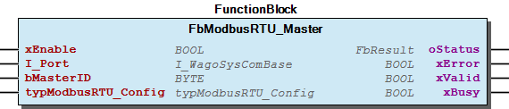 Function description Modbus RTU master for the Modbus RTU communication between the WAGO-Controller and the Modbus RTU slaves via a RS-485 serial interface module. The link to the function block FbModbusRTU_Master is realized by the variable bMasterID . All slaves in the communication line require the same bMasterID address. One of these function block is needed for each modbus line. Default physical layer= RS485_HalfDuplex, Baud: 9600.

## FbModbusSimpleBase (FB)


| Scope | Name | Type | Initial | Comment |
| --- | --- | --- | --- | --- |
| Input | xEnable | BOOL |  |  |
| bUnitID | BYTE |  | Unit ID of Modbus device |
| bUnitID2 | BYTE |  | Alternative Unit ID |
| bMasterID | BYTE |  | Modbus RTU - Master assignment number. Range 1 to gc_MAX_RTU_MASTER |
| sHost | STRING(15) |  | Modbus TCP - IPv4 address, MUST be left empty for Modbus/RTU |
| wPort | WORD | 502 | Modbus TCP - Port number, can be left empty for Modbus/RTU |
| tRequestDelay | TIME |  | := T#20MS; |
| Output | xBusy | BOOL |  |  |
| xError | BOOL |  |  |
| xValid | BOOL |  |  |
| xLinkOk | BOOL |  |  |
| xNewData | BOOL |  |  |
| xInitialsDone | BOOL |  |  |
| oStatus | WagoSysErrorBase.FbResult |  |  |
| oCycleTime | FbTimeMeasurement |  |  |
| tResponse | LTIME |  |  |

This is a very easy to use base class for any Modbus device, refer to Janitza implementaion as an example usage

{attribute ‘hide’} //

Interface variables This is a very easy to use base class for any Modbus device, refer to Janitza implementaion as an example usage {attribute ‘hide’} // - BusHandling FbModbusSimpleBase.mAcquireMaster (METH) - FbModbusSimpleBase.mPrepareRequest (METH) - FbModbusSimpleBase.mReleaseMaster (METH) - FbModbusSimpleBase.mRunMaster (METH) - FbModbusSimpleBase.mTestResponse (METH) RegisterAccess - FbModbusSimpleBase.mGetBinaryRegister (METH) - FbModbusSimpleBase.mGetSwappedRegister_f32 (METH) - FbModbusSimpleBase.mGetSwappedRegister_f64 (METH) - FbModbusSimpleBase.mGetSwappedRegister_i16 (METH) - FbModbusSimpleBase.mGetSwappedRegister_i32 (METH) - FbModbusSimpleBase.mGetSwappedRegister_i64 (METH) - FbModbusSimpleBase.mGetSwappedRegister_str (METH) - FbModbusSimpleBase.mGetSwappedRegister_u16 (METH) - FbModbusSimpleBase.mGetSwappedRegister_u32 (METH) - FbModbusSimpleBase.mGetSwappedRegister_u64 (METH) - FbModbusSimpleBase.mSetSwappedRegister_f32_IfValid (METH) - FbModbusSimpleBase.mSetSwappedRegister_i16_IfValid (METH) - FbModbusSimpleBase.mSetSwappedRegister_i32_IfValid (METH) - FbModbusSimpleBase.mSetSwappedRegister_i64_IfValid (METH) - FbModbusSimpleBase.mSetSwappedRegister_u16_IfValid (METH) - FbModbusSimpleBase.mSetSwappedRegister_u32_IfValid (METH) - FbModbusSimpleBase.mSetSwappedRegister_u64_IfValid (METH) FbModbusSimpleBase.mGetNextJob (METH) FbModbusSimpleBase.mModbusCycle (METH) FbModbusSimpleBase.mPrepareData (METH) FbModbusSimpleBase.mRePrioritize (METH) FbModbusSimpleBase.mReset (METH) FbModbusSimpleBase.mTransferData (METH)

## FbNA011 (FB)


| Scope | Name | Type | Initial | Comment | Inherited from |
| --- | --- | --- | --- | --- | --- |
| Input | xEnable | BOOL |  |  | FbModbusSimpleBase |
| bUnitID | BYTE |  | Unit ID of Modbus device | FbModbusSimpleBase |
| bUnitID2 | BYTE |  | Alternative Unit ID | FbModbusSimpleBase |
| bMasterID | BYTE |  | Modbus RTU - Master assignment number. Range 1 to gc_MAX_RTU_MASTER | FbModbusSimpleBase |
| sHost | STRING(15) |  | Modbus TCP - IPv4 address, MUST be left empty for Modbus/RTU | FbModbusSimpleBase |
| wPort | WORD | 502 | Modbus TCP - Port number, can be left empty for Modbus/RTU | FbModbusSimpleBase |
| tRequestDelay | TIME |  | := T#20MS; | FbModbusSimpleBase |
| Output | xBusy | BOOL |  |  | FbModbusSimpleBase |
| xError | BOOL |  |  | FbModbusSimpleBase |
| xValid | BOOL |  |  | FbModbusSimpleBase |
| xLinkOk | BOOL |  |  | FbModbusSimpleBase |
| xNewData | BOOL |  |  | FbModbusSimpleBase |
| xInitialsDone | BOOL |  |  | FbModbusSimpleBase |
| oStatus | WagoSysErrorBase.FbResult |  |  | FbModbusSimpleBase |
| oCycleTime | FbTimeMeasurement |  |  | FbModbusSimpleBase |
| tResponse | LTIME |  |  | FbModbusSimpleBase |
| Input | typControl | typNA011_Control |  | optional paramters |  |
| Output | typOutputValues | typNA011_Output |  |  |  |

## FbPAC4200 (FB)


| Scope | Name | Type | Initial | Comment | Inherited from |
| --- | --- | --- | --- | --- | --- |
| Output | oStatus | FbResult |  | Status object (see WagoSysErrorBase). | FbBehaviourModel_oStatus_Base |
| Input | xEnable | BOOL |  | Enables the operation. | FbBehaviourModel_WagoAppEnable |
| Output | xError | BOOL |  | Indicates that an Error has occurred. | FbBehaviourModel_WagoAppEnable |
| xValid | BOOL |  | Indicates that Data is valid. | FbBehaviourModel_WagoAppEnable |
| xBusy | BOOL |  | Indicates that the FB is working. | FbBehaviourModel_WagoAppEnable |
| xNewData | BOOL |  |  | _FbModbusBase |
| oCycle | FbTimeMeasurement |  |  | _FbModbusBase |
| Input | bUnitID | BYTE |  | Unit ID | FbModbus_RTUTCP |
| bUnitID2 | BYTE |  | Alternative Unit ID | FbModbus_RTUTCP |
| bMasterID | BYTE |  | Modbus RTU - Master assignment number. Range 1 to gc_MAX_RTU_MASTER | FbModbus_RTUTCP |
| sHost | STRING(15) |  | Modbus TCP - IP address | FbModbus_RTUTCP |
| wPort | WORD | 502 | Modbus TCP - Port number | FbModbus_RTUTCP |
| Output | typOutputValues | typPAC4200_Out |  |  |  |
| xIs3200 | BOOL |  |  |  |

Function block to communicate with a Siemens SENTRON PAC3200 and PAC4200.

Protocoll: Modbus TCP & RTU

Graphical Illustration

Function description

The function block FbPAC4200 reads measured values ​​and status values ​​from the Modbus registers of a Siemens SENTRON PAC4200.

The inputs bUnitID , bMasterID , sHost and wPort are used to specify the communication parameters of the device, depending on the used Modbus type.

For Modbus RTU the additional usage of the function block FbModbusRTU_Master is mandatory. The link to the function block FbModbusRTU_Master is realized by the variable bMasterID .

The function block can be released for processing via the xEnable input.

The read values ​​are provided in the structure typOutputValues .

Interface variables Function Function block to communicate with a Siemens SENTRON PAC3200 and PAC4200. Protocoll: Modbus TCP & RTU Graphical Illustration 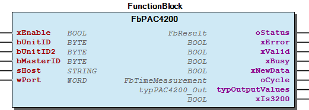 Function description The function block FbPAC4200 reads measured values ​​and status values ​​from the Modbus registers of a Siemens SENTRON PAC4200. The inputs bUnitID , bMasterID , sHost and wPort are used to specify the communication parameters of the device, depending on the used Modbus type. For Modbus RTU the additional usage of the function block FbModbusRTU_Master is mandatory. The link to the function block FbModbusRTU_Master is realized by the variable bMasterID . The function block can be released for processing via the xEnable input. The read values ​​are provided in the structure typOutputValues .

## FbPM5x00 (FB)


| Scope | Name | Type | Initial | Comment | Inherited from |
| --- | --- | --- | --- | --- | --- |
| Input | xEnable | BOOL |  |  | FbModbusSimpleBase |
| bUnitID | BYTE |  | Unit ID of Modbus device | FbModbusSimpleBase |
| bUnitID2 | BYTE |  | Alternative Unit ID | FbModbusSimpleBase |
| bMasterID | BYTE |  | Modbus RTU - Master assignment number. Range 1 to gc_MAX_RTU_MASTER | FbModbusSimpleBase |
| sHost | STRING(15) |  | Modbus TCP - IPv4 address, MUST be left empty for Modbus/RTU | FbModbusSimpleBase |
| wPort | WORD | 502 | Modbus TCP - Port number, can be left empty for Modbus/RTU | FbModbusSimpleBase |
| tRequestDelay | TIME |  | := T#20MS; | FbModbusSimpleBase |
| Output | xBusy | BOOL |  |  | FbModbusSimpleBase |
| xError | BOOL |  |  | FbModbusSimpleBase |
| xValid | BOOL |  |  | FbModbusSimpleBase |
| xLinkOk | BOOL |  |  | FbModbusSimpleBase |
| xNewData | BOOL |  |  | FbModbusSimpleBase |
| xInitialsDone | BOOL |  |  | FbModbusSimpleBase |
| oStatus | WagoSysErrorBase.FbResult |  |  | FbModbusSimpleBase |
| oCycleTime | FbTimeMeasurement |  |  | FbModbusSimpleBase |
| tResponse | LTIME |  |  | FbModbusSimpleBase |
| Input | typInputValues | typPM5x00_In |  |  |  |
| Output | typOutputValues | typPM5x00_Out |  |  |  |

## FbSICAM (FB)


| Scope | Name | Type | Initial | Comment | Inherited from |
| --- | --- | --- | --- | --- | --- |
| Output | oStatus | FbResult |  | Status object (see WagoSysErrorBase). | FbBehaviourModel_oStatus_Base |
| Input | xEnable | BOOL |  | Enables the operation. | FbBehaviourModel_WagoAppEnable |
| Output | xError | BOOL |  | Indicates that an Error has occurred. | FbBehaviourModel_WagoAppEnable |
| xValid | BOOL |  | Indicates that Data is valid. | FbBehaviourModel_WagoAppEnable |
| xBusy | BOOL |  | Indicates that the FB is working. | FbBehaviourModel_WagoAppEnable |
| Input | bUnitID | BYTE |  | Modbus slave address |  |
| bMasterID | BYTE | 1 | Master assignment number. Range 1 to gc_MAX_RTU_MASTER. |  |
| xReadMinMaxValues | BOOL |  |  |  |
| Output | typOutputValues | typSICAM_Out |  | Output values |  |
| typOutputValues_MinMax | typSICAM_OutMinMax |  | Output values - trailing pointer |  |
| xNewData | BOOL |  |  |  |

Function block to communicate with a Siemens SICAM.

Protocoll: Modbus RTU

Graphical Illustration

Function description

The function block FbSICAM reads measured values ​​and status values ​​from the Modbus registers of a Siemens SICAM.

For the communication the additional usage of the function block FbModbusRTU_Master is mandatory. The link to the function block FbModbusRTU_Master is realized by the variable bMasterID .

The function block can be released for processing via the xEnable input.

At the input bUnitID , the Modbus slave address of the SICAM specified.

The read values ​​are provided in the structure typOutputValues and typOutputValues2 .

Interface variables Function Function block to communicate with a Siemens SICAM. Protocoll: Modbus RTU Graphical Illustration 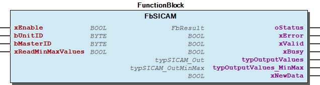 Function description The function block FbSICAM reads measured values ​​and status values ​​from the Modbus registers of a Siemens SICAM. For the communication the additional usage of the function block FbModbusRTU_Master is mandatory. The link to the function block FbModbusRTU_Master is realized by the variable bMasterID . The function block can be released for processing via the xEnable input. At the input bUnitID , the Modbus slave address of the SICAM specified. The read values ​​are provided in the structure typOutputValues and typOutputValues2 .

## FbSYMAP (FB)


| Scope | Name | Type | Initial | Comment | Inherited from |
| --- | --- | --- | --- | --- | --- |
| Output | oStatus | FbResult |  | Status object (see WagoSysErrorBase). | FbBehaviourModel_oStatus_Base |
| Input | xEnable | BOOL |  | Enables the operation. | FbBehaviourModel_WagoAppEnable |
| Output | xError | BOOL |  | Indicates that an Error has occurred. | FbBehaviourModel_WagoAppEnable |
| xValid | BOOL |  | Indicates that Data is valid. | FbBehaviourModel_WagoAppEnable |
| xBusy | BOOL |  | Indicates that the FB is working. | FbBehaviourModel_WagoAppEnable |
| xNewData | BOOL |  |  | _FbModbusBase |
| oCycle | FbTimeMeasurement |  |  | _FbModbusBase |
| Input | bUnitID | BYTE |  | Unit ID | FbModbus_RTUTCP |
| bUnitID2 | BYTE |  | Alternative Unit ID | FbModbus_RTUTCP |
| bMasterID | BYTE |  | Modbus RTU - Master assignment number. Range 1 to gc_MAX_RTU_MASTER | FbModbus_RTUTCP |
| sHost | STRING(15) |  | Modbus TCP - IP address | FbModbus_RTUTCP |
| wPort | WORD | 502 | Modbus TCP - Port number | FbModbus_RTUTCP |
| Output | xPreLoadedCtrl | BOOL |  |  |  |
| typOutput | typSYMAP_Out |  |  |  |

Function block to communicate with a Stucke SYMAP Compact.

Protocoll: Modbus TCP & RTU

Graphical Illustration

Function description

The function block FbSYMAP reads measured values ​​and status values ​​from the Modbus registers of a Stucke SYMAP Compact.

The inputs bUnitID , bMasterID , sHost and wPort are used to specify the communication parameters of the device, depending on the used Modbus type.

For Modbus RTU the additional usage of the function block FbModbusRTU_Master is mandatory. The link to the function block FbModbusRTU_Master is realized by the variable bMasterID .

The function block can be released for processing via the xEnable input.

The read values ​​are provided in the structure typOutputValues .

Interface variables Function Function block to communicate with a Stucke SYMAP Compact. Protocoll: Modbus TCP & RTU Graphical Illustration 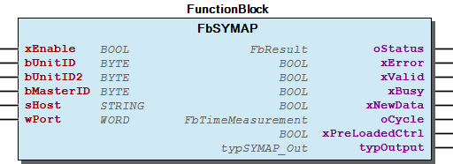 Function description The function block FbSYMAP reads measured values ​​and status values ​​from the Modbus registers of a Stucke SYMAP Compact. The inputs bUnitID , bMasterID , sHost and wPort are used to specify the communication parameters of the device, depending on the used Modbus type. For Modbus RTU the additional usage of the function block FbModbusRTU_Master is mandatory. The link to the function block FbModbusRTU_Master is realized by the variable bMasterID . The function block can be released for processing via the xEnable input. The read values ​​are provided in the structure typOutputValues .

## FbSmart1 (FB)


| Scope | Name | Type | Initial | Comment | Inherited from |
| --- | --- | --- | --- | --- | --- |
| Input | xEnable | BOOL |  |  | FbIec60870Base |
| typASDUAddr | WagoAppRTU_Slaves.typADDR | STRUCT(low := 1) | Project specific IEC60870-101/4 asdu address | FbIec60870Base |
| I_Port | WagoTypesCom.I_WagoSysComBase |  | Selected COM port: e.g. IoConfig_Globals.COM1 or IoConfig_Globals.RS232_485_Interface | FbIec60870Base |
| ePortType | INT |  | ePortHardware; // Physical type of serial line (0=RS232, 4=RS485) | FbIec60870Base |
| typLinkAddr | WagoAppRTU_Slaves.typADDR | STRUCT(low := 1) | Project specific IEC60870-101 link address | FbIec60870Base |
| sIpAddress | STRING |  |  | FbIec60870Base |
| wTcpPort | WORD |  |  | FbIec60870Base |
| Output | xValid | BOOL |  |  | FbIec60870Base |
| oStatus | WagoSysErrorBase.FbResult |  | Error/status object (listed in eStatus ) | FbIec60870Base |
| sStatus | STRING(255) |  | Description of current error/status | FbIec60870Base |
| xLinkOK | BOOL |  |  | FbIec60870Base |
| Input | eMode | eSmart1_Mode |  |  |  |
| Inout | typControl | typSmart1_Control |  |  |  |
| Output | typOutput | typSmart1_Output |  |  |  |

## FbSmartLogger (FB)


| Scope | Name | Type | Initial | Comment | Inherited from |
| --- | --- | --- | --- | --- | --- |
| Input | xEnable | BOOL |  |  | FbModbusSimpleBase |
| bUnitID | BYTE |  | Unit ID of Modbus device | FbModbusSimpleBase |
| bUnitID2 | BYTE |  | Alternative Unit ID | FbModbusSimpleBase |
| bMasterID | BYTE |  | Modbus RTU - Master assignment number. Range 1 to gc_MAX_RTU_MASTER | FbModbusSimpleBase |
| sHost | STRING(15) |  | Modbus TCP - IPv4 address, MUST be left empty for Modbus/RTU | FbModbusSimpleBase |
| wPort | WORD | 502 | Modbus TCP - Port number, can be left empty for Modbus/RTU | FbModbusSimpleBase |
| tRequestDelay | TIME |  | := T#20MS; | FbModbusSimpleBase |
| Output | xBusy | BOOL |  |  | FbModbusSimpleBase |
| xError | BOOL |  |  | FbModbusSimpleBase |
| xValid | BOOL |  |  | FbModbusSimpleBase |
| xLinkOk | BOOL |  |  | FbModbusSimpleBase |
| xNewData | BOOL |  |  | FbModbusSimpleBase |
| xInitialsDone | BOOL |  |  | FbModbusSimpleBase |
| oStatus | WagoSysErrorBase.FbResult |  |  | FbModbusSimpleBase |
| oCycleTime | FbTimeMeasurement |  |  | FbModbusSimpleBase |
| tResponse | LTIME |  |  | FbModbusSimpleBase |
| Input | typInputValues | typSmartLogger_In |  |  |  |
| Output | typOutputValues | typSmartLogger_Out |  |  |  |

## FbSmartLogger_old (FB)


| Scope | Name | Type | Initial | Comment | Inherited from |
| --- | --- | --- | --- | --- | --- |
| Output | oStatus | FbResult |  | Status object (see WagoSysErrorBase). | FbBehaviourModel_oStatus_Base |
| Input | xEnable | BOOL |  | Enables the operation. | FbBehaviourModel_WagoAppEnable |
| Output | xError | BOOL |  | Indicates that an Error has occurred. | FbBehaviourModel_WagoAppEnable |
| xValid | BOOL |  | Indicates that Data is valid. | FbBehaviourModel_WagoAppEnable |
| xBusy | BOOL |  | Indicates that the FB is working. | FbBehaviourModel_WagoAppEnable |
| Input | bUnitID_Logger | BYTE |  | Modbus slave address - logger data |  |
| bUnitID_Meteo | BYTE |  | Modbus slave address - meteo data |  |
| sHost | STRING(15) |  | Modbus TCP - IP address |  |
| wPort | WORD | 502 | Modbus TCP - Port number |  |
| typInputValues | typSmartLogger_In |  | Input values |  |
| Output | typOutputValues | typSmartLogger_Out |  | Output values |  |
| xNewData | BOOL |  |  |  |

Function block to communicate with a Huawei SmartLogger.

Protocoll: Modbus TCP

Graphical Illustration

Function description

The function block FbSmartLogger reads measured values ​​and status values ​​from the Modbus registers of a Huawei SmartLogger. Furthermore, control commands of the device will be written.

The inputs sHost , wPort , bUnitID_Logger and bUnitID_Meteo are used to specify the communication parameters of the device.

The function block can be released for processing via the xEnable input.

The read values ​​are provided in the structure typOutputValues .

The control commands can be described in the structure typInputValues .

Interface variables Function Function block to communicate with a Huawei SmartLogger. Protocoll: Modbus TCP Graphical Illustration 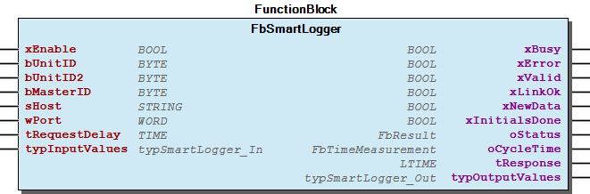 Function description The function block FbSmartLogger reads measured values ​​and status values ​​from the Modbus registers of a Huawei SmartLogger. Furthermore, control commands of the device will be written. The inputs sHost , wPort , bUnitID_Logger and bUnitID_Meteo are used to specify the communication parameters of the device. The function block can be released for processing via the xEnable input. The read values ​​are provided in the structure typOutputValues . The control commands can be described in the structure typInputValues .

## FbSunnyIsland (FB)


| Scope | Name | Type | Initial | Comment | Inherited from |
| --- | --- | --- | --- | --- | --- |
| Input | xEnable | BOOL |  |  | FbModbusSimpleBase |
| bUnitID | BYTE |  | Unit ID of Modbus device | FbModbusSimpleBase |
| bUnitID2 | BYTE |  | Alternative Unit ID | FbModbusSimpleBase |
| bMasterID | BYTE |  | Modbus RTU - Master assignment number. Range 1 to gc_MAX_RTU_MASTER | FbModbusSimpleBase |
| sHost | STRING(15) |  | Modbus TCP - IPv4 address, MUST be left empty for Modbus/RTU | FbModbusSimpleBase |
| wPort | WORD | 502 | Modbus TCP - Port number, can be left empty for Modbus/RTU | FbModbusSimpleBase |
| tRequestDelay | TIME |  | := T#20MS; | FbModbusSimpleBase |
| Output | xBusy | BOOL |  |  | FbModbusSimpleBase |
| xError | BOOL |  |  | FbModbusSimpleBase |
| xValid | BOOL |  |  | FbModbusSimpleBase |
| xLinkOk | BOOL |  |  | FbModbusSimpleBase |
| xNewData | BOOL |  |  | FbModbusSimpleBase |
| xInitialsDone | BOOL |  |  | FbModbusSimpleBase |
| oStatus | WagoSysErrorBase.FbResult |  |  | FbModbusSimpleBase |
| oCycleTime | FbTimeMeasurement |  |  | FbModbusSimpleBase |
| tResponse | LTIME |  |  | FbModbusSimpleBase |
| Inout | typControl | typSunnyIsland_Control |  |  |  |
| Output | typOutput | typSunnyIsland_Output |  |  |  |

Interface variables - FbSunnyIsland.mPrepareData (METH)

## FbUmd (FB)


| Scope | Name | Type | Initial | Comment | Inherited from |
| --- | --- | --- | --- | --- | --- |
| Input | xEnable | BOOL |  |  | FbModbusSimpleBase |
| bUnitID | BYTE |  | Unit ID of Modbus device | FbModbusSimpleBase |
| bUnitID2 | BYTE |  | Alternative Unit ID | FbModbusSimpleBase |
| bMasterID | BYTE |  | Modbus RTU - Master assignment number. Range 1 to gc_MAX_RTU_MASTER | FbModbusSimpleBase |
| sHost | STRING(15) |  | Modbus TCP - IPv4 address, MUST be left empty for Modbus/RTU | FbModbusSimpleBase |
| wPort | WORD | 502 | Modbus TCP - Port number, can be left empty for Modbus/RTU | FbModbusSimpleBase |
| tRequestDelay | TIME |  | := T#20MS; | FbModbusSimpleBase |
| Output | xBusy | BOOL |  |  | FbModbusSimpleBase |
| xError | BOOL |  |  | FbModbusSimpleBase |
| xValid | BOOL |  |  | FbModbusSimpleBase |
| xLinkOk | BOOL |  |  | FbModbusSimpleBase |
| xNewData | BOOL |  |  | FbModbusSimpleBase |
| xInitialsDone | BOOL |  |  | FbModbusSimpleBase |
| oStatus | WagoSysErrorBase.FbResult |  |  | FbModbusSimpleBase |
| oCycleTime | FbTimeMeasurement |  |  | FbModbusSimpleBase |
| tResponse | LTIME |  |  | FbModbusSimpleBase |
| sProductName | STRING |  |  |  |
| sFirmwareVersion | STRING |  |  |  |
| sHardwareVersion | STRING |  |  |  |
| typMeasurements | typUmdData |  |  |  |

## FbWalm (FB)


| Scope | Name | Type | Initial | Comment | Inherited from |
| --- | --- | --- | --- | --- | --- |
| Input | xEnable | BOOL |  |  | FbModbusSimpleBase |
| bUnitID | BYTE |  | Unit ID of Modbus device | FbModbusSimpleBase |
| bUnitID2 | BYTE |  | Alternative Unit ID | FbModbusSimpleBase |
| bMasterID | BYTE |  | Modbus RTU - Master assignment number. Range 1 to gc_MAX_RTU_MASTER | FbModbusSimpleBase |
| sHost | STRING(15) |  | Modbus TCP - IPv4 address, MUST be left empty for Modbus/RTU | FbModbusSimpleBase |
| wPort | WORD | 502 | Modbus TCP - Port number, can be left empty for Modbus/RTU | FbModbusSimpleBase |
| tRequestDelay | TIME |  | := T#20MS; | FbModbusSimpleBase |
| Output | xBusy | BOOL |  |  | FbModbusSimpleBase |
| xError | BOOL |  |  | FbModbusSimpleBase |
| xValid | BOOL |  |  | FbModbusSimpleBase |
| xLinkOk | BOOL |  |  | FbModbusSimpleBase |
| xNewData | BOOL |  |  | FbModbusSimpleBase |
| xInitialsDone | BOOL |  |  | FbModbusSimpleBase |
| oStatus | WagoSysErrorBase.FbResult |  |  | FbModbusSimpleBase |
| oCycleTime | FbTimeMeasurement |  |  | FbModbusSimpleBase |
| tResponse | LTIME |  |  | FbModbusSimpleBase |
| Input | typControl | typWalmControl |  |  |  |
| Output | aMeters | ARRAY [1..10] OF typWalmMeter |  |  |  |

## doc01_Foreword (FB)


This document, including all figures and illustrations contained therein, is subject to copyright. Any use of this document that infringes upon the copyright provisions stipulated herein is prohibited. Reproduction, translation, electronic and phototechnical filing/archiving (e.g., photocopying), as well as any amendments require the written consent of WAGO GmbH & Co. KG, Minden, Germany. Non-observance will entail the right of claims for damages.

WAGO GmbH & Co. KG reserves the right to make any alterations or modifications that serve to increase the efficiency of technical progress. WAGO GmbH & Co. KG owns all rights arising from granting patents or from the legal protection of utility patents. Third-party products are always mentioned without any reference to patent rights. Thus, the existence of such rights cannot be excluded.

Personnel Qualification

The use of the product described in this document is exclusively geared to specialists having qualifications in PLC programming, electrical specialists or persons instructed by electrical specialists who are also familiar with the appropriate current standards. WAGO GmbH & Co. KG assumes no liability resulting from improper action and damage to WAGO products and third-party products due to non-observance of the information contained in this document.

Intended Use

For each individual application, the components are supplied from the factory with a dedicated hardware and software configuration. Modifications are only admitted within the framework of the possibilities documented in this document. All other changes to the hardware and/or software and the non-conforming use of the components entail the exclusion of liability on part of WAGO GmbH & Co. KG.

Please direct any requirements pertaining to a modified and/or new hardware or software configuration directly to WAGO GmbH & Co. KG.

Scope of Applicability

This application note is based on the _stated hardware and software from the specific manufacturer, as well as the associated documentation. This application note is therefore only valid for the described installation. New hardware and software versions may need to be handled differently.

Please note the detailed description in the specific manuals.

Copyright This document, including all figures and illustrations contained therein, is subject to copyright. Any use of this document that infringes upon the copyright provisions stipulated herein is prohibited. Reproduction, translation, electronic and phototechnical filing/archiving (e.g., photocopying), as well as any amendments require the written consent of WAGO GmbH & Co. KG, Minden, Germany. Non-observance will entail the right of claims for damages. WAGO GmbH & Co. KG reserves the right to make any alterations or modifications that serve to increase the efficiency of technical progress. WAGO GmbH & Co. KG owns all rights arising from granting patents or from the legal protection of utility patents. Third-party products are always mentioned without any reference to patent rights. Thus, the existence of such rights cannot be excluded. Personnel Qualification The use of the product described in this document is exclusively geared to specialists having qualifications in PLC programming, electrical specialists or persons instructed by electrical specialists who are also familiar with the appropriate current standards. WAGO GmbH & Co. KG assumes no liability resulting from improper action and damage to WAGO products and third-party products due to non-observance of the information contained in this document. Intended Use For each individual application, the components are supplied from the factory with a dedicated hardware and software configuration. Modifications are only admitted within the framework of the possibilities documented in this document. All other changes to the hardware and/or software and the non-conforming use of the components entail the exclusion of liability on part of WAGO GmbH & Co. KG. Please direct any requirements pertaining to a modified and/or new hardware or software configuration directly to WAGO GmbH & Co. KG. Scope of Applicability This application note is based on the _stated hardware and software from the specific manufacturer, as well as the associated documentation. This application note is therefore only valid for the described installation. New hardware and software versions may need to be handled differently. Please note the detailed description in the specific manuals.

## doc02_HowTo (FB)


```
PROGRAM PLC_PRG
VAR
    oSmartLogger            : WagoAppEnergyDevices.FbSmartLogger;
END_VAR
```

```
PROGRAM PLC_PRG
VAR
    oMaster                 : WagoAppEnergyDevices.FbModbusRTU_Master;
    oComPassA               : WagoAppEnergyDevices.FbComPassA;
    oComPassB               : WagoAppEnergyDevices.FbComPassB;
END_VAR
```

This library provides communication to several devices in the Energy Automation. The communication is able via Modbus TCP or Modbus RTU or both, depends on the used device. The communication protocol used by the device is documented in the “Function” section of the relevant function block.

Usage Modbus TCP

Devices which are able to communicate via Modbus TCP can be used directly.

Usage Modbus RTU

Devices which are able to communicate via Modbus RTU always need the basic communication module FbModbusRTU_Master as their master. The master function block is connected to the functionblocks of the devices via the master assignment number. All devices which are connected to this master, need the same communication settings.

Function This library provides communication to several devices in the Energy Automation. The communication is able via Modbus TCP or Modbus RTU or both, depends on the used device. The communication protocol used by the device is documented in the “Function” section of the relevant function block. Usage Modbus TCP Devices which are able to communicate via Modbus TCP can be used directly. Example Usage Modbus RTU Devices which are able to communicate via Modbus RTU always need the basic communication module FbModbusRTU_Master as their master. The master function block is connected to the functionblocks of the devices via the master assignment number. All devices which are connected to this master, need the same communication settings. Example

### Functions


## IOA_TO_DWORD (FUN)


| Scope | Name | Type |
| --- | --- | --- |
| Return | IOA_TO_DWORD | DWORD |
| Input | IOA | STRING |

This function returns the DWORD value of a given IOA in structured string format

Interface variables Function This function returns the DWORD value of a given IOA in structured string format valid formats are: ‘8-8-8’ ‘16-8’ ‘8-8’ ‘24’ ‘16’ ‘8’

### Methods


## FbComPass.adjustRequestsToVersion (METH)


{attribute ‘hide’}

## FbComPass.decodeEvent (METH)


| Name | Type |
| --- | --- |
| wEventIdLast | WORD |

{attribute ‘hide’}

Interface variables {attribute ‘hide’}

## FbComPass.decodeSystemData (METH)


{attribute ‘hide’}

## FbComPass.mPrepareData (METH)


| Scope | Name | Type |
| --- | --- | --- |
| Input | typQuery | REFERENCE TO WagoAppPlcModbus.typMbQuery |
|  | typInputValuesLast | typComPass_Ctrl |

{attribute ‘hide’}

Interface variables {attribute ‘hide’}

## FbComPass.mTransferData (METH)


| Scope | Name | Type |
| --- | --- | --- |
| Input | typResponse | REFERENCE TO typMbResponse |

{attribute ‘hide’}

Interface variables {attribute ‘hide’}

## FbComPass.shiftEventHistory (METH) ¶


## FbDataManager.mPrepareData (METH)


| Scope | Name | Type |
| --- | --- | --- |
| Input | typQuery | REFERENCE TO WagoAppPlcModbus.typMbQuery |

## FbIec60870Base.mAppCFG (METH)


| Scope | Name | Type |
| --- | --- | --- |
| Return | mAppCFG | INT |
| Inout | fbAppCfg | WagoAppRTU.fb870C_AppCfg |

## FbIec60870Base.mPreCFG (METH) ¶


## FbIec60870Base.mRegisterInfObj (METH)


| Scope | Name | Type |
| --- | --- | --- |
| Return | mRegisterInfObj | DINT |
| Inout | fbAppCfg | WagoAppRTU.fb870C_AppCfg |
| Input | tk | BYTE |
| dwIOA | DWORD |
| p | __XWORD |

## FbIec60870Base.mReset (METH) ¶


## FbIec60870Base.mTransfer (METH) ¶


## FbMenckeTegtmeyer.mPrepareData (METH)


| Scope | Name | Type |
| --- | --- | --- |
| Input | typQuery | REFERENCE TO WagoAppPlcModbus.typMbQuery |

## FbMenckeTegtmeyer.mTransferData (METH)


| Scope | Name | Type |
| --- | --- | --- |
| Input | typResponse | REFERENCE TO WagoAppPlcModbus.typMbResponse |

## FbModbusSimpleBase.mAcquireMaster (METH)


| Scope | Name | Type |
| --- | --- | --- |
| Return | mAcquireMaster | BOOL |
| Input | bNextState | BYTE |

## FbModbusSimpleBase.mGetBinaryRegister (METH)


| Scope | Name | Type |
| --- | --- | --- |
| Return | mGetBinaryRegister | BOOL |
| Input | pSource | POINTER TO ARRAY [0..1] OF BYTE |
| wBitNumber | WORD |

## FbModbusSimpleBase.mGetNextJob (METH)


| Scope | Name | Type | Comment |
| --- | --- | --- | --- |
| Return | mGetNextJob | DINT |  |
| Input | aJobList | POINTER TO typModbusJob |  |
| iJob | DINT | based on last Job, can be 0 |

## FbModbusSimpleBase.mGetSwappedRegister_f32 (METH)


| Scope | Name | Type |
| --- | --- | --- |
| Return | mGetSwappedRegister_f32 | REAL |
| Input | pSource | POINTER TO ARRAY [0..3] OF BYTE |

## FbModbusSimpleBase.mGetSwappedRegister_f64 (METH)


| Scope | Name | Type |
| --- | --- | --- |
| Return | mGetSwappedRegister_f64 | UDINT |
| Input | pSource | POINTER TO ARRAY [0..7] OF BYTE |

## FbModbusSimpleBase.mGetSwappedRegister_i16 (METH)


| Scope | Name | Type |
| --- | --- | --- |
| Return | mGetSwappedRegister_i16 | INT |
| Input | pSource | POINTER TO ARRAY [0..1] OF BYTE |

## FbModbusSimpleBase.mGetSwappedRegister_i32 (METH)


| Scope | Name | Type |
| --- | --- | --- |
| Return | mGetSwappedRegister_i32 | DINT |
| Input | pSource | POINTER TO ARRAY [0..3] OF BYTE |

## FbModbusSimpleBase.mGetSwappedRegister_i64 (METH)


| Scope | Name | Type |
| --- | --- | --- |
| Return | mGetSwappedRegister_i64 | LINT |
| Input | pSource | POINTER TO ARRAY [0..7] OF BYTE |

## FbModbusSimpleBase.mGetSwappedRegister_str (METH)


| Scope | Name | Type |
| --- | --- | --- |
| Return | mGetSwappedRegister_str | STRING |
| Input | pSource | POINTER TO ARRAY [1..80] OF BYTE |
| iLength | UINT |

## FbModbusSimpleBase.mGetSwappedRegister_u16 (METH)


| Scope | Name | Type |
| --- | --- | --- |
| Return | mGetSwappedRegister_u16 | UINT |
| Input | pSource | POINTER TO ARRAY [0..1] OF BYTE |

## FbModbusSimpleBase.mGetSwappedRegister_u32 (METH)


| Scope | Name | Type |
| --- | --- | --- |
| Return | mGetSwappedRegister_u32 | UDINT |
| Input | pSource | POINTER TO ARRAY [0..3] OF BYTE |

## FbModbusSimpleBase.mGetSwappedRegister_u64 (METH)


| Scope | Name | Type |
| --- | --- | --- |
| Return | mGetSwappedRegister_u64 | ULINT |
| Input | pSource | POINTER TO ARRAY [0..7] OF BYTE |

## FbModbusSimpleBase.mModbusCycle (METH)


| Scope | Name | Type |
| --- | --- | --- |
| Input | aJobList | POINTER TO typModbusJob |
|  | tDelay | TON |
| _NumJobs | DINT |

## FbModbusSimpleBase.mPrepareData (METH)


| Scope | Name | Type |
| --- | --- | --- |
| Input | typQuery | REFERENCE TO WagoAppPlcModbus.typMbQuery |

_optional_ base class method that CAN be implemented in derived class

Interface variables _optional_ base class method that CAN be implemented in derived class

## FbModbusSimpleBase.mPrepareRequest (METH)


| Scope | Name | Type |
| --- | --- | --- |
| Return | mPrepareRequest | BOOL |
| Input | bUnitID | BYTE |
| bFunctionCode | BYTE |
| uiFirstAddress | UINT |
| uiLastAddress | UINT |

## FbModbusSimpleBase.mRePrioritize (METH) ¶


## FbModbusSimpleBase.mReleaseMaster (METH) ¶


## FbModbusSimpleBase.mReset (METH)


| Scope | Name | Type |
| --- | --- | --- |
| Input | aJobList | POINTER TO typModbusJob |

## FbModbusSimpleBase.mRunMaster (METH)


| Name | Type |
| --- | --- |
| tDnR | FbDelayedToggleAndReturn |

## FbModbusSimpleBase.mSetSwappedRegister_f32_IfValid (METH)


| Scope | Name | Type | Initial |
| --- | --- | --- | --- |
| Input | value | __SYSTEM.AnyType |  |
| pDest | POINTER TO ARRAY [0..3] OF BYTE |  |
| scale | REAL | 1 |

## FbModbusSimpleBase.mSetSwappedRegister_i16_IfValid (METH)


| Scope | Name | Type | Initial |
| --- | --- | --- | --- |
| Input | value | __SYSTEM.AnyType |  |
| pDest | POINTER TO ARRAY [0..1] OF BYTE |  |
| scale | REAL | 1 |

## FbModbusSimpleBase.mSetSwappedRegister_i32_IfValid (METH)


| Scope | Name | Type | Initial |
| --- | --- | --- | --- |
| Input | value | __SYSTEM.AnyType |  |
| pDest | POINTER TO ARRAY [0..3] OF BYTE |  |
| scale | REAL | 1 |

## FbModbusSimpleBase.mSetSwappedRegister_i64_IfValid (METH)


| Scope | Name | Type | Initial |
| --- | --- | --- | --- |
| Input | value | __SYSTEM.AnyType |  |
| pDest | POINTER TO ARRAY [0..3] OF BYTE |  |
| scale | REAL | 1 |

## FbModbusSimpleBase.mSetSwappedRegister_u16_IfValid (METH)


| Scope | Name | Type | Initial |
| --- | --- | --- | --- |
| Input | value | __SYSTEM.AnyType |  |
| pDest | POINTER TO ARRAY [0..1] OF BYTE |  |
| scale | REAL | 1 |

## FbModbusSimpleBase.mSetSwappedRegister_u32_IfValid (METH)


| Scope | Name | Type | Initial |
| --- | --- | --- | --- |
| Input | value | __SYSTEM.AnyType |  |
| pDest | POINTER TO ARRAY [0..3] OF BYTE |  |
| scale | REAL | 1 |

## FbModbusSimpleBase.mSetSwappedRegister_u64_IfValid (METH)


| Scope | Name | Type | Initial |
| --- | --- | --- | --- |
| Input | value | __SYSTEM.AnyType |  |
| pDest | POINTER TO ARRAY [0..3] OF BYTE |  |
| scale | REAL | 1 |

## FbModbusSimpleBase.mTestResponse (METH)


| Scope | Name | Type |
| --- | --- | --- |
| Return | mTestResponse | BOOL |

## FbModbusSimpleBase.mTransferData (METH)


| Scope | Name | Type |
| --- | --- | --- |
| Input | typResponse | REFERENCE TO WagoAppPlcModbus.typMbResponse |

base class method that SHOULD be implemented in derived class

Interface variables base class method that SHOULD be implemented in derived class

## FbSunnyIsland.mPrepareData (METH)


| Scope | Name | Type |
| --- | --- | --- |
| Input | typQuery | REFERENCE TO WagoAppPlcModbus.typMbQuery |
|  | typControl_Last | typSunnyIsland_Control |

## typSystemSettings (STRUCT)


| Name | Type | Comment |
| --- | --- | --- |
| wShortCircuitDetection | WORD | Short circuit detection [On <> 0 ; Off = 0] |
| wShortCircuitDetection_I_hh | WORD | Short circuit detection I>> threshold [100 A ... 2000 A] |
| wShortCircuitDetection_tI_hh | WORD | Short circuit detection tI>> [60 ms ... 300 ms] |
| wShortCircuitDetectionDirected | WORD | Short circuit detection directed [On <> 0 ; Off = 0] |
| wShortCircuitDetectionPhi_k2 | WORD | Short circuit detection Phi-k2 [-60° ... +60°] |
| wShortCircuitDetectionPhi_k3 | WORD | Short circuit detection Phi-k3 [-60° ... +60°] |
| wGroundFaultDetection | WORD | Ground fault detection [On <> 0 ; Off = 0] |
| wGroundFaultDetection_Ie_h | WORD | Ground fault detection Ie> threshold [40 A ... 200 A] |
| wGroundFaultDetection_tIe_h | WORD | Ground fault detection tIe> [60 ms ... 300 ms] |
| wGroundFaultDetectionDirected | WORD | Ground fault detection directed [On <> 0 ; Off = 0] |
| wGroundFaultDetectionPhi_k1 | WORD | Ground fault detection Phi-k1 [-60° ... +60°] |
| wWattmetric | WORD | Wattmetric [On <> 0 ; Off = 0] |
| wWattmetricTypeOfNetwork | WORD | Wattmetric type of network [inductive <> 0 ; isolated = 0] |
| wWattmetric_Ie_h | WORD | Wattmetric Ie> threshold [4 A ... 30 A] |
| wWattmetric_tIe_h | WORD | Wattmetric tIe> [0 = 20 periods ; 1 = 50 periods ; 2 = 150 periods] |
| wWattmetric_U0 | WORD | Wattmetric U0 [low = 0 ; high <> 1] |
| wWiper | WORD | Wiper [On <> 0 ; Off = 0] |
| wWiper_t0_wait | WORD | Wiper tU0 wait [0 = 0 periods ; 1 = 5 periods ; 2 = 20 periods ; 3 = 60 periods] |
| wWiper_U0 | WORD | Wiper U0 threshold [100 V ... 300.000 V \| 1 ^= 100 V ; 3000 ^= 300000 V] |
| wWiper_I0 | WORD | Wiper I0 threshold [1 A ... 9999 A] |
| wWiper_U0_wait | WORD | Wiper U0 wait threshold [100 V ... 300.000 V \| 1 ^= 100 V ; 3000 ^= 300000 V] |
| wWiperTracking | WORD | Wiper tracking [On <> 0 ; Off = 0] |
| wPulseDetection | WORD | Pulse detection [On <> 0 ; Off = 0] |
| wPulseDetectionType | WORD | Pulse detection type [Symmetrical <> 0 ; Asymmetrical = 0] |
| wResetMode | WORD | Reset mode [0 = Auto ; 1 = 1h ... 8 = 8h ; 9 = Manual] |
| wDeadTime10s | WORD | Dead time 10s [On <> 0 ; Off = 0] |
| wAveragingTime_dt | WORD | Averaging time dt [ 1 min ... 60 min] |
| wObservationTime_dt | WORD | Observation time dT [ 1 Day ... 365 Days] |
| wDate_YYYY | WORD | Date YYYY |
| wDate_MM | WORD | Date MM [01 ... 12] |
| wDate_DD | WORD | Date DD [01 ... 31] |
| wTime_hh | WORD | Time hh [00 ... 23] |
| wTime_mm | WORD | Time mm [00 ... 59] |
| wTime_ss | WORD | Time ss [00 ... 59] |
| wPassword | WORD | Password as a number [0000 ... 9999] |
| wMotorControl_1_On | WORD | Motor control 1 ‘On’ |
| wMotorControl_1_AssignmentOn | WORD | Motor control 1 assignment ‘On’ |
| wMotorControl_1_AssignmentOff | WORD | Motor control 1 assignment ‘Off’ |
| wMotorControl_1_EndPositionOn | WORD | Motor control 1 end position ‘On’ |
| wMotorControl_1_EndPositionOff | WORD | Motor control 1 end position ‘Off’ |
| wMotorControl_1_SwitchingOn | WORD | Motor control 1 switching ‘On’ |
| wMotorControl_1_SwitchingOff | WORD | Motor control 1 switching ‘Off’ |
| wMotorControl_1_ILimit | WORD | Motor control 1 I limit |
| wMotorControl_1_IcLimit | WORD | Motor control 1 Ic limit |
| wMotorControl_1_Tmax | WORD | Motor control 1 T max |
| wMotorControl_2_On | WORD | Motor control 2 ‘On’ |
| wMotorControl_2_AssignmentOn | WORD | Motor control 2 assignment ‘On’ |
| wMotorControl_2_AssignmentOff | WORD | Motor control 2 assignment ‘Off’ |
| wMotorControl_2_EndPositionOn | WORD | Motor control 2 end position ‘On’ |
| wMotorControl_2_EndPositionOff | WORD | Motor control 2 end position ‘Off’ |
| wMotorControl_2_SwitchingOn | WORD | Motor control 2 switching ‘On’ |
| wMotorControl_2_SwitchingOff | WORD | Motor control 2 switching ‘Off’ |
| wMotorControl_2_ILimit | WORD | Motor control 2 I limit |
| wMotorControl_2_IcLimit | WORD | Motor control 2 Ic limit |
| wMotorControl_2_Tmax | WORD | Motor control 2 T max |
| wRelayFunction | WORD | Relay function |
| wRelayContactType | WORD | Relay contact type |
| wAlarm_1_Relay | WORD | Alarm 1 relay |
| wAlarm_1_Type | WORD | Alarm 2 tye |
| wAlarm_2_Relay | WORD | Alarm 2 relay |
| wAlarm_2_Type | WORD | Alarm 2 type |
| wAlarm_3_Relay | WORD | Alarm 3 relay |
| wAlarm_3_Type | WORD | Alarm 3 type |
| wAlarm_4_Relay | WORD | Alarm 4 relay |
| wAlarm_4_Type | WORD | Alarm 4 type |
| wAlarm_5_Relay | WORD | Alarm 5 relay |
| wAlarm_5_Type | WORD | Alarm 5 type |
| wAlarm_6_Relay | WORD | Alarm 6 relay |
| wAlarm_6_Type | WORD | Alarm 6 type |
| wAlarm_7_Relay | WORD | Alarm 7 relay |
| wAlarm_7_Type | WORD | Alarm 7 type |
| wAlarm_8_Relay | WORD | Alarm 8 relay |
| wAlarm_8_Type | WORD | Alarm 8 type |
| wVersionSoftware | WORD | Version software |
| wTrigger_1 | WORD | Trigger 1 |
| wTrigger_2 | WORD | Trigger 2 |
| wVersionHardware | WORD | Version hardware |
| wTrigger_1_I_Limit | WORD | Trigger 1 I limit |
| wTrigger_1_Ic_Limit | WORD | Trigger 1 Ic limit |
| wTrigger_2_I_Limit | WORD | Trigger 2 I limit |
| wTrigger_2_Ic_Limit | WORD | Trigger 2 Ic limit |
| wWatchdog | WORD | Watchdog |
| wTrigger_1_Assignment | WORD | Trigger 1 assignment |
| wTrigger_2_Assignment | WORD | Trigger 2 assignment |
| wTransientDisturbance | WORD | Transient disturbance [On <> 0 ; Off = 0] |
| wTransientDisturbanceThreshold | WORD | Transient disturbance threshold [1 A ... 9999 A] |
| wTransientDisturbance_tR | WORD | Transient disturbance tR [1s ... 999s] |
| wTransientDisturbance_Ne | WORD | Transient disturbance Ne [1 ... 10] |
| wTransientDisturbance_Na | WORD | Transient disturbance Na [1 ... 200] |
| wTransientDisturbanceDirected | WORD | Transient disturbance directed [On <> 0 ; Off = 0] |
| wWiperTypeOfNetwork | WORD | Wiper type of network [inductive / insulated, low impedance] |
| wWiper_I0_wait | WORD | Wiper I0 wait threshold [5 A ... 999 A] |
| wTypeOfNetwork | WORD | Type of network |
| typField_1 | typSystemField | Datatype system of field 1 |
| typField_2 | typSystemField | Datatype system of field 2 |

### Program Organization


## 20 Program Organization Units


- IEC60870 FbIec60870Base (FB) FbIec60870Base.mAppCFG (METH) - FbIec60870Base.mPreCFG (METH) - FbIec60870Base.mRegisterInfObj (METH) - FbIec60870Base.mReset (METH) - FbIec60870Base.mTransfer (METH) Modbus - FbModbusSimpleBase (FB) BusHandling FbModbusSimpleBase.mAcquireMaster (METH) - FbModbusSimpleBase.mPrepareRequest (METH) - FbModbusSimpleBase.mReleaseMaster (METH) - FbModbusSimpleBase.mRunMaster (METH) - FbModbusSimpleBase.mTestResponse (METH) RegisterAccess - FbModbusSimpleBase.mGetBinaryRegister (METH) - FbModbusSimpleBase.mGetSwappedRegister_f32 (METH) - FbModbusSimpleBase.mGetSwappedRegister_f64 (METH) - FbModbusSimpleBase.mGetSwappedRegister_i16 (METH) - FbModbusSimpleBase.mGetSwappedRegister_i32 (METH) - FbModbusSimpleBase.mGetSwappedRegister_i64 (METH) - FbModbusSimpleBase.mGetSwappedRegister_str (METH) - FbModbusSimpleBase.mGetSwappedRegister_u16 (METH) - FbModbusSimpleBase.mGetSwappedRegister_u32 (METH) - FbModbusSimpleBase.mGetSwappedRegister_u64 (METH) - FbModbusSimpleBase.mSetSwappedRegister_f32_IfValid (METH) - FbModbusSimpleBase.mSetSwappedRegister_i16_IfValid (METH) - FbModbusSimpleBase.mSetSwappedRegister_i32_IfValid (METH) - FbModbusSimpleBase.mSetSwappedRegister_i64_IfValid (METH) - FbModbusSimpleBase.mSetSwappedRegister_u16_IfValid (METH) - FbModbusSimpleBase.mSetSwappedRegister_u32_IfValid (METH) - FbModbusSimpleBase.mSetSwappedRegister_u64_IfValid (METH) FbModbusSimpleBase.mGetNextJob (METH) FbModbusSimpleBase.mModbusCycle (METH) FbModbusSimpleBase.mPrepareData (METH) FbModbusSimpleBase.mRePrioritize (METH) FbModbusSimpleBase.mReset (METH) FbModbusSimpleBase.mTransferData (METH)

## 20 Program Organization Units


- 00 Master 01 Modbus RTU FbModbusRTU_Master (FB) - typModbusRTU_Config (STRUCT) 01 a-Eberle - 01 EOR-3D FbEOR_3D (FB) - typEOR_3D_Out (STRUCT) 02 Horstmann - (obsolete) 01 ComPass A FbComPassA (FB) - typComPassA_In (STRUCT) - typComPassA_Out (STRUCT) 02 ComPass B - FbComPassB (FB) - typComPassB_In (STRUCT) - typComPassB_Out (STRUCT) 03 ComPass Bs - FbComPassBs (FB) - typComPassBs_In (STRUCT) - typComPassBs_Out (STRUCT) 01 ComPass A/B/Bs - FbComPass (FB) FbComPass.adjustRequestsToVersion (METH) - FbComPass.decodeEvent (METH) - FbComPass.decodeSystemData (METH) - FbComPass.mPrepareData (METH) - FbComPass.mTransferData (METH) - FbComPass.shiftEventHistory (METH) typComPassV1Event (STRUCT) typComPassV1EventFlags (STRUCT) typComPassV2Event (STRUCT) typComPassV2EventFlags (STRUCT) typComPassV2EventType (ENUM) typComPass_Ctrl (STRUCT) typComPass_Out (STRUCT) 03 Huawei - 01 SmartLogger (obsolete) FbSmartLogger_old (FB) FbSmartLogger (FB) eAlarm (ENUM) typSmartLogger_In (STRUCT) typSmartLogger_Out (STRUCT) 04 Janitza - 01 Janitza UMG FbJanitza (FB) - typJanitza_Out (STRUCT) 05 Kries - (obsolete) 80 Data Types typEvent (STRUCT) - typEventLog (STRUCT) - typField (STRUCT) - typField_1_2 (STRUCT) - typMeasuredValues (STRUCT) - typPhase (STRUCT) - typStatus (STRUCT) - typStatusField (STRUCT) - typSystemField (STRUCT) - typSystemSettings (STRUCT) FbGridInspector (FB) typGridInspector_In (STRUCT) typGridInspector_Out (STRUCT) 02 Grid Inspector IKI-50 - FbGridInspectorLight (FB) - typGridInspector_Ctrl (STRUCT) - typGridInspector_Meas (STRUCT) - typGridInspector_States (STRUCT) 03 IKI-23 - FbIki23 (FB) - typIki23_Control (STRUCT) - typIki23_Output (STRUCT) 06 Meteocontrol - 01 BlueLog FbBlueLog (FB) - eBlueLogModeP (ENUM) - eBlueLogModeQ (ENUM) - typBlueLog_In (STRUCT) - typBlueLog_Out (STRUCT) 07 Schneider Electric - 01 ION 7x50 FbION7x50 (FB) - typION7x50_Out (STRUCT) 02 MiCOM P132/139 - FbMiCOM (FB) - typMiCOM_In (STRUCT) - typMiCOM_Out (STRUCT) 03 PM5x00 - FbPM5x00 (FB) - typPM5x00_In (STRUCT) - typPM5x00_Out (STRUCT) 08 Siemens - 02 PAC3200 4200 FbPAC4200 (FB) - typPAC4200_Out (STRUCT) 03 SICAM - FbSICAM (FB) - typSICAM_Out (STRUCT) - typSICAM_OutMinMax (STRUCT) 04 7SJ80 - Fb7SJ80 (FB) - typ7SJ80_Out (STRUCT) 09 SMA - 01 Data Manager FbDataManager (FB) FbDataManager.mPrepareData (METH) FbDataManager_old (FB) eDigInGroup (ENUM) typDataManager_In (STRUCT) typDataManager_Out (STRUCT) 02 Sunny Island - FbSunnyIsland (FB) FbSunnyIsland.mPrepareData (METH) typSunnyIsland_Control (STRUCT) typSunnyIsland_Output (STRUCT) 10 SolarLog - 01 Base - Free FbBaseFree (FB) - typBaseFree_Out (STRUCT) 02 Base - PM - FbBasePM (FB) - typBasePM_In (STRUCT) - typBasePM_Out (STRUCT) 11 Stucke - 01 SYMAP FbSYMAP (FB) - typSYMAP_Out (STRUCT) 12 SEG/Woodward - 01 MRA4 FbMRA4 (FB) - typMRA4_In (STRUCT) - typMRA4_Out (STRUCT) 13 EOn - FbEOnModbus (FB) - typEOnModbus_Output (STRUCT) 14 Wago - MID30x0 FbMID30x0 (FB) - typMID30x0_Output (STRUCT) WALM - FbWalm (FB) - typWalmControl (STRUCT) - typWalmMeter (STRUCT) 15 MenckeTegtmeyer - FbMenckeTegtmeyer (FB) FbMenckeTegtmeyer.mPrepareData (METH) - FbMenckeTegtmeyer.mTransferData (METH) typMenckeTegtmeyerData (STRUCT) 16 PQ - FbUmd (FB) - typUmdData (STRUCT) 17 Thytronic - NA011 FbNA011 (FB) - typNA011_BufferInfo (STRUCT) - typNA011_Control (STRUCT) - typNA011_Event (STRUCT) - typNA011_EventCause (ENUM) - typNA011_Fault (STRUCT) - typNA011_FaultCause (ENUM) - typNA011_Output (STRUCT) 18 Smart1 - FbSmart1 (FB) - IOA_TO_DWORD (FUN) - eSmart1_Mode (ENUM) - typSmart1_Control (STRUCT) - typSmart1_Output (STRUCT) 19 TheMobilityHouse - ChargePilot FbChargePilot (FB) - typChargePilot_Control (STRUCT) - typChargePilot_Out (STRUCT)

### Base Components


## 01 Base - Free


- FbBaseFree (FB) - typBaseFree_Out (STRUCT)

## 02 Base - PM


- FbBasePM (FB) - typBasePM_In (STRUCT) - typBasePM_Out (STRUCT)

## typBaseFree_Out (STRUCT)


| Name | Type | Comment |
| --- | --- | --- |
| dwlastUpdateTime | DWORD | Unixtime when last register update has happened. 0=no live data yet [sec] |
| dwPac | DWORD | Total Pac of all inverters and inv-type meters [W] |
| dwPdc | DWORD | Total Pdc of all inverters [W] |
| wUac | WORD | Average Uac of all inverters [V] |
| wUdc | WORD | Average Udc of all inverters [V] |
| dwDailyYield | DWORD | Summarized daily yield of all inverters [Wh] |
| dwYesterdayYield | DWORD | Summarized yesterday yield of all inverters [Wh] |
| dwMonthlyYield | DWORD | Summarized monthly yield of all inverters [Wh] |
| dwYearlyYield | DWORD | Summarized yearly yield of all inverters [Wh] |
| dwTotalYield | DWORD | Summarized total yield of all inverters [Wh] |
| dwPacConsumption | DWORD | Total Pac of all consumption meters [W] |
| dwDailyYieldConsumption | DWORD | Summarized daily yield of all consumption inverters [Wh] |
| dwYesterdayYieldConsumption | DWORD | Summarized yesterday yield of all consumption inverters [Wh] |
| dwMonthlyYieldConsumption | DWORD | Summarized monthly yield of all consumption inverters [Wh] |
| dwYearlyYieldConsumption | DWORD | Summarized yearly yield of all consumption inverters [Wh] |
| dwTotalYieldConsumption | DWORD | Summarized total yield of all consumption inverters [Wh] |
| dwTotalPower | DWORD | Total installed generator power [Wh/Wp] |

## typBasePM_In (STRUCT)


| Name | Type | Comment |
| --- | --- | --- |
| wP_LimitType | WORD | Mode of active power limit |
| wP_LimitPerc | WORD | Active power limit (100=no limit) [%] |
| wReactiveType | WORD | Mode of reactive power control |
| rCosPhiFix | REAL | Fixed cos(phi) (wReactiveType=2) |
| iQPerc | INT | Fixed reactive power Q in % of Pn (wReactiveType=4) |
| dwWatchDogTag | DWORD | Watchdog register to indicate valid power limit settings |
| dwWatchDogTime | DWORD | Watchdog timeout (0=deactivated) [sec] |
| wWatchDogLimit | WORD | Active power limit in % in case of watchdog timeout [%] |
| wUtilityConnectGood | WORD | External utility data validity indicator (1=use data from register 10218 to 10214 as utility meter data) |
| rUtility_fUacRS | REAL | External utility voltage(phase 1 to 2) [V] |
| rUtility_fUacST | REAL | External utility voltage(phase 2 to 3) [V] |
| rUtility_fUacTR | REAL | External utility voltage(phase 3 to 1) [V] |
| rUtility_fPacR | REAL | External utility active power (phase 1) [W] |
| rUtility_fPacS | REAL | External utility active power (phase 2) [W] |
| rUtility_fPacT | REAL | External utility active power (phase 3) [W] |
| rUtility_fQacR | REAL | External utility reactive power (phase 1) [Var] |
| rUtility_fQacS | REAL | External utility reactive power (phase 2) [Var] |
| rUtility_fQacT | REAL | External utility reactive power (phase 3) [Var] |
| rUq0_Uc | REAL | Reference voltage via Modbus U/Uref Value U/Uc (1,0=no shift of the characteristic curve only with Modus 7) |
| rQref_Pbinst | REAL | Switch to Q with voltage limiting function % Pbinst with sign ind/cap. Range defined by curve [%] |

## typBasePM_Out (STRUCT)


| Name | Type | Comment |
| --- | --- | --- |
| dwlastUpdateTime | DWORD | Unixtime when last register update has happened. 0=no live data yet [sec] |
| wP_LimitConfim | WORD | Acknowledge of PLimit set [%] |
| diPac | DINT | Pac measured from utility meter (at feedin-point) or Total Pac of all inverters and inv-type meters [W] |
| dwIac | DWORD | Iac from utility meter [A*100] |
| iUac | INT | Uac from utility meter [V] |
| wFac | WORD | Frequency from utility meter [Hz*100] |
| iCosPhi | INT | CosPhi*1000 (1000=CosPhi 1, >0=inductive, <0=capacitive) |
| iQPerc | INT | Var of installed Pn [%*10] |
| diQ | DINT | Q [Var] (>0=inductive, <0=capacitive) |
| wSolarIrradiation | WORD | Average Solar-irradiation of all sensors 65535, if none attached [W/m²] |
| iModulTemperature | INT | Average modul temperature of all sensors -273, if none attached [°C] |
| iAmbientTemperature | INT | Average ambient temperature of all sensors -273, if none attached [°C] |
| wWindspeed | WORD | Maximum windspeed of all sensors 65535, if not attached [0.1*m/s] |
| wUac12 | WORD | Uac (Phase 1-2) from utility meter [V] |
| wUac23 | WORD | Uac (Phase 2-3) from utility meter [V] |
| wUac31 | WORD | Uac (Phase 3-1) from utility meter [V] |
| dwIac1 | DWORD | Iac (Phase 1) from utility meter [A*100] |
| dwIac2 | DWORD | Iac (Phase 2) from utility meter [A*100] |
| dwIac3 | DWORD | Iac (Phase 3) from utility meter [A*100] |
| wUacInverter | WORD | Uac from inverters [V] |
| dwIacInverter | DWORD | Iac from inverters [A*100] |

### Internal Components


## 90 Internal


- 20 Program Organization Units IEC60870 FbIec60870Base (FB) FbIec60870Base.mAppCFG (METH) - FbIec60870Base.mPreCFG (METH) - FbIec60870Base.mRegisterInfObj (METH) - FbIec60870Base.mReset (METH) - FbIec60870Base.mTransfer (METH) Modbus - FbModbusSimpleBase (FB) BusHandling FbModbusSimpleBase.mAcquireMaster (METH) - FbModbusSimpleBase.mPrepareRequest (METH) - FbModbusSimpleBase.mReleaseMaster (METH) - FbModbusSimpleBase.mRunMaster (METH) - FbModbusSimpleBase.mTestResponse (METH) RegisterAccess - FbModbusSimpleBase.mGetBinaryRegister (METH) - FbModbusSimpleBase.mGetSwappedRegister_f32 (METH) - FbModbusSimpleBase.mGetSwappedRegister_f64 (METH) - FbModbusSimpleBase.mGetSwappedRegister_i16 (METH) - FbModbusSimpleBase.mGetSwappedRegister_i32 (METH) - FbModbusSimpleBase.mGetSwappedRegister_i64 (METH) - FbModbusSimpleBase.mGetSwappedRegister_str (METH) - FbModbusSimpleBase.mGetSwappedRegister_u16 (METH) - FbModbusSimpleBase.mGetSwappedRegister_u32 (METH) - FbModbusSimpleBase.mGetSwappedRegister_u64 (METH) - FbModbusSimpleBase.mSetSwappedRegister_f32_IfValid (METH) - FbModbusSimpleBase.mSetSwappedRegister_i16_IfValid (METH) - FbModbusSimpleBase.mSetSwappedRegister_i32_IfValid (METH) - FbModbusSimpleBase.mSetSwappedRegister_i64_IfValid (METH) - FbModbusSimpleBase.mSetSwappedRegister_u16_IfValid (METH) - FbModbusSimpleBase.mSetSwappedRegister_u32_IfValid (METH) - FbModbusSimpleBase.mSetSwappedRegister_u64_IfValid (METH) FbModbusSimpleBase.mGetNextJob (METH) FbModbusSimpleBase.mModbusCycle (METH) FbModbusSimpleBase.mPrepareData (METH) FbModbusSimpleBase.mRePrioritize (METH) FbModbusSimpleBase.mReset (METH) FbModbusSimpleBase.mTransferData (METH) 80 Data Types - eByteOrderSwap (ENUM)

### Global Variable Lists


## GlobalVariables (GVL)


| Name | Type | Initial | Comment |
| --- | --- | --- | --- |
| uNaN | uNaN | STRUCT(w := 16#7FC00000) |  |
| rNaN | REAL | uNaN.f |  |
| g_aBUS_CONTROL | ARRAY [1..gc_MAX_RTU_MASTER] OF typBusControl |  | internal communication control structure |
| xApplicationCallsRtuLib | BOOL | FALSE |  |
| fbStatusFactory | WagoSysErrorBase.FbResultFactory |  |  |

## Status (GVL)


| Scope | Name | Type | Initial |
| --- | --- | --- | --- |
| Constant | gc_Status | ARRAY [0..18] OF WagoTypesErrorBase.typResultItem | [STRUCT(ID := eStatus.OK, Severity := WagoTypesErrorBase.WagoTypes.eSeverity.none, text := ‘OK’), STRUCT(ID := eStatus.Enabled, Severity := WagoSysErrorBase.WagoTypesErrorBase.WagoTypes.eSeverity.info, text := ‘Waiting for connection’), STRUCT(ID := eStatus.Setup, Severity := WagoSysErrorBase.WagoTypesErrorBase.WagoTypes.eSeverity.info, text := ‘Setting up library’), STRUCT(ID := eStatus.Waiting, Severity := WagoSysErrorBase.WagoTypesErrorBase.WagoTypes.eSeverity.info, text := ‘Waiting for library’), STRUCT(ID := eStatus.NoParameters, Severity := WagoSysErrorBase.WagoTypesErrorBase.WagoTypes.eSeverity.error, text := ‘Could not get parameter list’), STRUCT(ID := eStatus.MissingCallback, Severity := WagoSysErrorBase.WagoTypesErrorBase.WagoTypes.eSeverity.error, text := ‘No valid master function block running (no callback registered)’), STRUCT(ID := eStatus.ServerMissmatch, Severity := WagoSysErrorBase.WagoTypesErrorBase.WagoTypes.eSeverity.error, text := ‘Received stack callback for wrong server instance’), STRUCT(ID := eStatus.APDUMissmatch, Severity := WagoSysErrorBase.WagoTypesErrorBase.WagoTypes.eSeverity.error, text := ‘Received stack callback for wrong APDU instance’), STRUCT(ID := eStatus.Disabled, Severity := WagoSysErrorBase.WagoTypesErrorBase.WagoTypes.eSeverity.error, text := ‘Disabled’), STRUCT(ID := eStatus.Connected, Severity := WagoSysErrorBase.WagoTypesErrorBase.WagoTypes.eSeverity.info, text := ‘Connected’), STRUCT(ID := eStatus.ConnectionLost, Severity := WagoSysErrorBase.WagoTypesErrorBase.WagoTypes.eSeverity.info, text := ‘Connection lost’), STRUCT(ID := eStatus.BUSY, Severity := WagoTypesErrorBase.WagoTypes.eSeverity.info, text := ‘Busy’), STRUCT(ID := eStatus.TIMEOUT, Severity := WagoTypesErrorBase.WagoTypes.eSeverity.error, text := ‘Device time out’), STRUCT(ID := eStatus.TXTIMEOUT, Severity := WagoTypesErrorBase.WagoTypes.eSeverity.error, text := ‘Bus time out’), STRUCT(ID := eStatus.INVALID_MASTER_ID, Severity := WagoTypesErrorBase.WagoTypes.eSeverity.error, text := ‘Invalid Master ID’), STRUCT(ID := eStatus.INVALID_PORT, Severity := WagoTypesErrorBase.WagoTypes.eSeverity.error, text := ‘Invalid Port’), STRUCT(ID := eStatus.NULLPOINTER, Severity := WagoTypesErrorBase.WagoTypes.eSeverity.error, text := ‘Null pointer’), STRUCT(ID := eStatus.SLAVE_ERROR, Severity := WagoTypesErrorBase.WagoTypes.eSeverity.error, text := ‘Modbus exception’), STRUCT(ID := eStatus.SLAVE_BUSY, Severity := WagoTypesErrorBase.WagoTypes.eSeverity.error, text := ‘Device busy’)] |

## VersionHistory (GVL)


| Name | Type | Initial | Comment |
| --- | --- | --- | --- |
| Version | STRING | ‘2.0.4.0’ | please refer to https://semver.org/lang/de/ for versioning style |
| Info | WagoSysVersion.ProjectInfo |  |  |

### Other Components


## (obsolete) ¶


- FbSmartLogger_old (FB)

## (obsolete)


- 80 Data Types typEvent (STRUCT) - typEventLog (STRUCT) - typField (STRUCT) - typField_1_2 (STRUCT) - typMeasuredValues (STRUCT) - typPhase (STRUCT) - typStatus (STRUCT) - typStatusField (STRUCT) - typSystemField (STRUCT) - typSystemSettings (STRUCT) FbGridInspector (FB) typGridInspector_In (STRUCT) typGridInspector_Out (STRUCT)

## (obsolete)


- 01 ComPass A FbComPassA (FB) - typComPassA_In (STRUCT) - typComPassA_Out (STRUCT) 02 ComPass B - FbComPassB (FB) - typComPassB_In (STRUCT) - typComPassB_Out (STRUCT) 03 ComPass Bs - FbComPassBs (FB) - typComPassBs_In (STRUCT) - typComPassBs_Out (STRUCT)

## 00 Master


- 01 Modbus RTU FbModbusRTU_Master (FB) - typModbusRTU_Config (STRUCT)

## 01 BlueLog


- FbBlueLog (FB) - eBlueLogModeP (ENUM) - eBlueLogModeQ (ENUM) - typBlueLog_In (STRUCT) - typBlueLog_Out (STRUCT)

## 01 ComPass A


- FbComPassA (FB) - typComPassA_In (STRUCT) - typComPassA_Out (STRUCT)

## 01 ComPass A/B/Bs


- FbComPass (FB) FbComPass.adjustRequestsToVersion (METH) - FbComPass.decodeEvent (METH) - FbComPass.decodeSystemData (METH) - FbComPass.mPrepareData (METH) - FbComPass.mTransferData (METH) - FbComPass.shiftEventHistory (METH) typComPassV1Event (STRUCT) typComPassV1EventFlags (STRUCT) typComPassV2Event (STRUCT) typComPassV2EventFlags (STRUCT) typComPassV2EventType (ENUM) typComPass_Ctrl (STRUCT) typComPass_Out (STRUCT)

## 01 Data Manager


- FbDataManager (FB) FbDataManager.mPrepareData (METH) FbDataManager_old (FB) eDigInGroup (ENUM) typDataManager_In (STRUCT) typDataManager_Out (STRUCT)

## 01 EOR-3D ¶


- FbEOR_3D (FB) - typEOR_3D_Out (STRUCT)

## 01 ION 7x50


- FbION7x50 (FB) - typION7x50_Out (STRUCT)

## 01 Janitza UMG


- FbJanitza (FB) - typJanitza_Out (STRUCT)

## 01 MRA4


- FbMRA4 (FB) - typMRA4_In (STRUCT) - typMRA4_Out (STRUCT)

## 01 Modbus RTU


- FbModbusRTU_Master (FB) - typModbusRTU_Config (STRUCT)

## 01 SYMAP ¶


- FbSYMAP (FB) - typSYMAP_Out (STRUCT)

## 01 SmartLogger


- (obsolete) FbSmartLogger_old (FB) FbSmartLogger (FB) eAlarm (ENUM) typSmartLogger_In (STRUCT) typSmartLogger_Out (STRUCT)

## 01 a-Eberle


- 01 EOR-3D FbEOR_3D (FB) - typEOR_3D_Out (STRUCT)

## 02 ComPass B


- FbComPassB (FB) - typComPassB_In (STRUCT) - typComPassB_Out (STRUCT)

## 02 Grid Inspector IKI-50


- FbGridInspectorLight (FB) - typGridInspector_Ctrl (STRUCT) - typGridInspector_Meas (STRUCT) - typGridInspector_States (STRUCT)

## 02 Horstmann


- (obsolete) 01 ComPass A FbComPassA (FB) - typComPassA_In (STRUCT) - typComPassA_Out (STRUCT) 02 ComPass B - FbComPassB (FB) - typComPassB_In (STRUCT) - typComPassB_Out (STRUCT) 03 ComPass Bs - FbComPassBs (FB) - typComPassBs_In (STRUCT) - typComPassBs_Out (STRUCT) 01 ComPass A/B/Bs - FbComPass (FB) FbComPass.adjustRequestsToVersion (METH) - FbComPass.decodeEvent (METH) - FbComPass.decodeSystemData (METH) - FbComPass.mPrepareData (METH) - FbComPass.mTransferData (METH) - FbComPass.shiftEventHistory (METH) typComPassV1Event (STRUCT) typComPassV1EventFlags (STRUCT) typComPassV2Event (STRUCT) typComPassV2EventFlags (STRUCT) typComPassV2EventType (ENUM) typComPass_Ctrl (STRUCT) typComPass_Out (STRUCT)

## 02 MiCOM P132/139


- FbMiCOM (FB) - typMiCOM_In (STRUCT) - typMiCOM_Out (STRUCT)

## 02 PAC3200 4200


- FbPAC4200 (FB) - typPAC4200_Out (STRUCT)

## 02 Sunny Island


- FbSunnyIsland (FB) FbSunnyIsland.mPrepareData (METH) typSunnyIsland_Control (STRUCT) typSunnyIsland_Output (STRUCT)

## 03 ComPass Bs


- FbComPassBs (FB) - typComPassBs_In (STRUCT) - typComPassBs_Out (STRUCT)

## 03 Huawei


- 01 SmartLogger (obsolete) FbSmartLogger_old (FB) FbSmartLogger (FB) eAlarm (ENUM) typSmartLogger_In (STRUCT) typSmartLogger_Out (STRUCT)

## 03 IKI-23


- FbIki23 (FB) - typIki23_Control (STRUCT) - typIki23_Output (STRUCT)

## 03 PM5x00


- FbPM5x00 (FB) - typPM5x00_In (STRUCT) - typPM5x00_Out (STRUCT)

## 03 SICAM


- FbSICAM (FB) - typSICAM_Out (STRUCT) - typSICAM_OutMinMax (STRUCT)

## 04 7SJ80 ¶


- Fb7SJ80 (FB) - typ7SJ80_Out (STRUCT)

## 04 Janitza


- 01 Janitza UMG FbJanitza (FB) - typJanitza_Out (STRUCT)

## 05 Kries


- (obsolete) 80 Data Types typEvent (STRUCT) - typEventLog (STRUCT) - typField (STRUCT) - typField_1_2 (STRUCT) - typMeasuredValues (STRUCT) - typPhase (STRUCT) - typStatus (STRUCT) - typStatusField (STRUCT) - typSystemField (STRUCT) - typSystemSettings (STRUCT) FbGridInspector (FB) typGridInspector_In (STRUCT) typGridInspector_Out (STRUCT) 02 Grid Inspector IKI-50 - FbGridInspectorLight (FB) - typGridInspector_Ctrl (STRUCT) - typGridInspector_Meas (STRUCT) - typGridInspector_States (STRUCT) 03 IKI-23 - FbIki23 (FB) - typIki23_Control (STRUCT) - typIki23_Output (STRUCT)

## 06 Meteocontrol


- 01 BlueLog FbBlueLog (FB) - eBlueLogModeP (ENUM) - eBlueLogModeQ (ENUM) - typBlueLog_In (STRUCT) - typBlueLog_Out (STRUCT)

## 07 Schneider Electric


- 01 ION 7x50 FbION7x50 (FB) - typION7x50_Out (STRUCT) 02 MiCOM P132/139 - FbMiCOM (FB) - typMiCOM_In (STRUCT) - typMiCOM_Out (STRUCT) 03 PM5x00 - FbPM5x00 (FB) - typPM5x00_In (STRUCT) - typPM5x00_Out (STRUCT)

## 08 Siemens


- 02 PAC3200 4200 FbPAC4200 (FB) - typPAC4200_Out (STRUCT) 03 SICAM - FbSICAM (FB) - typSICAM_Out (STRUCT) - typSICAM_OutMinMax (STRUCT) 04 7SJ80 - Fb7SJ80 (FB) - typ7SJ80_Out (STRUCT)

## 09 SMA


- 01 Data Manager FbDataManager (FB) FbDataManager.mPrepareData (METH) FbDataManager_old (FB) eDigInGroup (ENUM) typDataManager_In (STRUCT) typDataManager_Out (STRUCT) 02 Sunny Island - FbSunnyIsland (FB) FbSunnyIsland.mPrepareData (METH) typSunnyIsland_Control (STRUCT) typSunnyIsland_Output (STRUCT)

## 10 SolarLog


- 01 Base - Free FbBaseFree (FB) - typBaseFree_Out (STRUCT) 02 Base - PM - FbBasePM (FB) - typBasePM_In (STRUCT) - typBasePM_Out (STRUCT)

## 11 Stucke


- 01 SYMAP FbSYMAP (FB) - typSYMAP_Out (STRUCT)

## 12 SEG/Woodward


- 01 MRA4 FbMRA4 (FB) - typMRA4_In (STRUCT) - typMRA4_Out (STRUCT)

## 13 EOn


- FbEOnModbus (FB) - typEOnModbus_Output (STRUCT)

## 14 Wago


- MID30x0 FbMID30x0 (FB) - typMID30x0_Output (STRUCT) WALM - FbWalm (FB) - typWalmControl (STRUCT) - typWalmMeter (STRUCT)

## 15 MenckeTegtmeyer


- FbMenckeTegtmeyer (FB) FbMenckeTegtmeyer.mPrepareData (METH) - FbMenckeTegtmeyer.mTransferData (METH) typMenckeTegtmeyerData (STRUCT)

## 16 PQ ¶


- FbUmd (FB) - typUmdData (STRUCT)

## 17 Thytronic


- NA011 FbNA011 (FB) - typNA011_BufferInfo (STRUCT) - typNA011_Control (STRUCT) - typNA011_Event (STRUCT) - typNA011_EventCause (ENUM) - typNA011_Fault (STRUCT) - typNA011_FaultCause (ENUM) - typNA011_Output (STRUCT)

## 18 Smart1


- FbSmart1 (FB) - IOA_TO_DWORD (FUN) - eSmart1_Mode (ENUM) - typSmart1_Control (STRUCT) - typSmart1_Output (STRUCT)

## 19 TheMobilityHouse


- ChargePilot FbChargePilot (FB) - typChargePilot_Control (STRUCT) - typChargePilot_Out (STRUCT)

## 80 Data Types


- typEvent (STRUCT) - typEventLog (STRUCT) - typField (STRUCT) - typField_1_2 (STRUCT) - typMeasuredValues (STRUCT) - typPhase (STRUCT) - typStatus (STRUCT) - typStatusField (STRUCT) - typSystemField (STRUCT) - typSystemSettings (STRUCT)

## 80 Data Types ¶


- eByteOrderSwap (ENUM)

## 80 Status ¶


- Status (GVL) - eStatus (ENUM)

## BusHandling


- FbModbusSimpleBase.mAcquireMaster (METH) - FbModbusSimpleBase.mPrepareRequest (METH) - FbModbusSimpleBase.mReleaseMaster (METH) - FbModbusSimpleBase.mRunMaster (METH) - FbModbusSimpleBase.mTestResponse (METH)

## ChargePilot


- FbChargePilot (FB) - typChargePilot_Control (STRUCT) - typChargePilot_Out (STRUCT)

## GlobalTextList (Text List)


| ID | Default | de |
| --- | --- | --- |
| 231 | Code |  |
| 628 | End | Ende |
| 735 | I L1 |  |
| 399 | I L2 |  |
| 320 | I L3 |  |
| 810 | L1 |  |
| 903 | L2 |  |
| 580 | L3 |  |
| 516 | Start |  |
| 17 | Time | Zeit |

## IEC60870


- FbIec60870Base (FB) FbIec60870Base.mAppCFG (METH) - FbIec60870Base.mPreCFG (METH) - FbIec60870Base.mRegisterInfObj (METH) - FbIec60870Base.mReset (METH) - FbIec60870Base.mTransfer (METH)

## MID30x0


- FbMID30x0 (FB) - typMID30x0_Output (STRUCT)

## Modbus


- FbModbusSimpleBase (FB) BusHandling FbModbusSimpleBase.mAcquireMaster (METH) - FbModbusSimpleBase.mPrepareRequest (METH) - FbModbusSimpleBase.mReleaseMaster (METH) - FbModbusSimpleBase.mRunMaster (METH) - FbModbusSimpleBase.mTestResponse (METH) RegisterAccess - FbModbusSimpleBase.mGetBinaryRegister (METH) - FbModbusSimpleBase.mGetSwappedRegister_f32 (METH) - FbModbusSimpleBase.mGetSwappedRegister_f64 (METH) - FbModbusSimpleBase.mGetSwappedRegister_i16 (METH) - FbModbusSimpleBase.mGetSwappedRegister_i32 (METH) - FbModbusSimpleBase.mGetSwappedRegister_i64 (METH) - FbModbusSimpleBase.mGetSwappedRegister_str (METH) - FbModbusSimpleBase.mGetSwappedRegister_u16 (METH) - FbModbusSimpleBase.mGetSwappedRegister_u32 (METH) - FbModbusSimpleBase.mGetSwappedRegister_u64 (METH) - FbModbusSimpleBase.mSetSwappedRegister_f32_IfValid (METH) - FbModbusSimpleBase.mSetSwappedRegister_i16_IfValid (METH) - FbModbusSimpleBase.mSetSwappedRegister_i32_IfValid (METH) - FbModbusSimpleBase.mSetSwappedRegister_i64_IfValid (METH) - FbModbusSimpleBase.mSetSwappedRegister_u16_IfValid (METH) - FbModbusSimpleBase.mSetSwappedRegister_u32_IfValid (METH) - FbModbusSimpleBase.mSetSwappedRegister_u64_IfValid (METH) FbModbusSimpleBase.mGetNextJob (METH) FbModbusSimpleBase.mModbusCycle (METH) FbModbusSimpleBase.mPrepareData (METH) FbModbusSimpleBase.mRePrioritize (METH) FbModbusSimpleBase.mReset (METH) FbModbusSimpleBase.mTransferData (METH)

## NA011


- FbNA011 (FB) - typNA011_BufferInfo (STRUCT) - typNA011_Control (STRUCT) - typNA011_Event (STRUCT) - typNA011_EventCause (ENUM) - typNA011_Fault (STRUCT) - typNA011_FaultCause (ENUM) - typNA011_Output (STRUCT)

## Parameters (PARAMS)


| Scope | Name | Type | Initial | Comment |
| --- | --- | --- | --- | --- |
| Constant | gc_MAX_RTU_MASTER | DWORD | 8 | Maximum number of master POUs |

## RegisterAccess


- FbModbusSimpleBase.mGetBinaryRegister (METH) - FbModbusSimpleBase.mGetSwappedRegister_f32 (METH) - FbModbusSimpleBase.mGetSwappedRegister_f64 (METH) - FbModbusSimpleBase.mGetSwappedRegister_i16 (METH) - FbModbusSimpleBase.mGetSwappedRegister_i32 (METH) - FbModbusSimpleBase.mGetSwappedRegister_i64 (METH) - FbModbusSimpleBase.mGetSwappedRegister_str (METH) - FbModbusSimpleBase.mGetSwappedRegister_u16 (METH) - FbModbusSimpleBase.mGetSwappedRegister_u32 (METH) - FbModbusSimpleBase.mGetSwappedRegister_u64 (METH) - FbModbusSimpleBase.mSetSwappedRegister_f32_IfValid (METH) - FbModbusSimpleBase.mSetSwappedRegister_i16_IfValid (METH) - FbModbusSimpleBase.mSetSwappedRegister_i32_IfValid (METH) - FbModbusSimpleBase.mSetSwappedRegister_i64_IfValid (METH) - FbModbusSimpleBase.mSetSwappedRegister_u16_IfValid (METH) - FbModbusSimpleBase.mSetSwappedRegister_u32_IfValid (METH) - FbModbusSimpleBase.mSetSwappedRegister_u64_IfValid (METH)

## WALM


- FbWalm (FB) - typWalmControl (STRUCT) - typWalmMeter (STRUCT)

## eAlarm (ENUM)


| Name | Initial | Comment |
| --- | --- | --- |
| InvalidValueP | 1100 | Invalid value for active power setpoint P (severity: important) |
| InvalidValueQ | 1101 | Invalid value for reactive power setpoint Q (severity: important) |
| CircuitBreakerOff | 1103 | The circuit breaker of the device is off (severity: important) |
| ErrorSupply | 1104 | An error on supply point occurred (severity: important) |
| ErrorAddresses | 1105 | Address conflict with existing device (severity: important) |
| ErrorAC | 1106 | Error of AC communication box (severity: important) |
| ErrorDI1 | 1107 | Error on periphery of digital input 1 (severity: adjust) |
| ErrorDI2 | 1108 | Error on periphery of digital input 2 (severity: adjust) |
| ErrorDI3 | 1109 | Error on periphery of digital input 3 (severity: adjust) |
| ErrorDI4 | 1110 | Error on periphery of digital input 4 (severity: adjust) |
| Error24V | 1115 | 24v power supply of device disturbed (severity: important) |
| InvalidCert | 1129 | Smartlogger certificate invalid (severity: warning) |
| NearlyExpiredCert | 1130 | Smartlogger certificate nearly expired (severity: warning) |
| ExpiredCert | 1131 | Smartlogger certificate expired (severity: important) |

Attributes: qualified_only InOut:

## eBlueLogModeP (ENUM)


| Name | Initial |
| --- | --- |
| none | 0 |
| fix | 1 |
| DI | 2 |
| AI | 3 |
| Modbus | 4 |
| RPC | 5 |
| LFSMO | 100 |
| LFSMU | 101 |
| FailsafeHold | 200 |
| FailsafeDefault | 201 |
| FailsafeSystem | 202 |
| FailsafeDisconnect | 203 |

Attributes: qualified_only InOut:

## eBlueLogModeQ (ENUM)


| Name | Initial |
| --- | --- |
| none | 0 |
| PF_fix | 1 |
| PF_DI | 2 |
| PF_AI | 3 |
| PF_Modbus | 4 |
| PF_curveP | 5 |
| PF_curveV | 6 |
| Q_fix | 7 |
| Q_DI | 8 |
| Q_AI | 9 |
| Q_Modbus | 10 |
| Q_Pcurve | 11 |
| Q_Vcurve | 12 |
| Q_PFcurve | 13 |
| Q_Vdroop | 14 |
| Q_compensation | 100 |
| FailsafeHold | 200 |
| FailsafeDefault | 201 |
| FailsafeSystem | 202 |

Attributes: qualified_only InOut:

## eByteOrderSwap (ENUM)


| Name | Comment |
| --- | --- |
| NONE | Do not change any order |
| swapBYTE | change the byte endianess in each word independently |
| swapWORD | change the word endianess keeping the bytes (reverse words) |
| swapWORDnBYTE | change the byte endianess of the full struct (reverse bytes) |

Attributes: qualified_only InOut:

## eDigInGroup (ENUM)


| Name | Initial |
| --- | --- |
| Open | 311 |
| DI1 | 2055 |
| DI1_DI2 | 2056 |
| DI1_DI2_DI3 | 2057 |
| DI1_DI2_DI3_DI4 | 2058 |
| DI1_DI2_DI4 | 2059 |
| DI1_DI3 | 2060 |
| DI1_DI3_DI4 | 2061 |
| DI1_DI4 | 2062 |
| DI2 | 2063 |
| DI2_DI3 | 2064 |
| DI2_DI3_DI4 | 2065 |
| DI2_DI4 | 2066 |
| DI3 | 2067 |
| DI3_DI4 | 2068 |
| DI4 | 2069 |

Attributes: qualified_only InOut:

## eSmart1_Mode (ENUM)


| Name |
| --- |
| NAP |
| CPS |
| PV |

Attributes: qualified_only InOut:

## eStatus (ENUM)


| Name | Initial | Comment |
| --- | --- | --- |
| OK | WagoTypes.eResultCode.OK | must be equal |
| Enabled | 1 | Enabled |
| Setup | 2 | Setting up parameters of protocol stack |
| Waiting | 3 | Waiting for protocol stack |
| NoParameters | 4 | Could not get parameter list |
| Disabled | 8 | xEnable was unset during operation |
| Connected | 9 | Remote connection established |
| ConnectionLost | 10 | Remote connection lost |
| ServerMissmatch | 11 | Received stack callback for wrong server instance |
| APDUMissmatch | 12 | Received stack callback for wrong APDU instance |
| MissingCallback | 13 | No valid master function block running (no callback registered) |
| BUSY | WagoTypes.eResultCode.EBUSY | Mirrored from subsequent libs |
| TIMEOUT | WagoAppPlcModbus.eErrorModbus.TIME_OUT |  |
| TXTIMEOUT | WagoAppPlcModbus.eErrorModbus.TX_TIME_OUT |  |
| INVALID_MASTER_ID | WagoAppPlcModbus.eErrorModbus.INVALID_PARAMETER |  |
| INVALID_PORT | WagoTypes.eResultCode.ENODEV |  |
| NULLPOINTER | WagoAppPlcModbus.eErrorModbus.INVALID_POINTER |  |
| SLAVE_ERROR | WagoAppPlcModbus.eErrorModbus.EXTENDED_SLAVE_ERROR |  |
| SLAVE_BUSY | WagoAppPlcModbus.eErrorModbus.SLAVE_DEVICE_BUSY |  |

Attributes: qualified_only InOut:

## typ7SJ80_Out (STRUCT)


| Name | Type | Initial | Comment |
| --- | --- | --- | --- |
| rVoltage_L1 | REAL | rNaN | kV |
| rVoltage_L2 | REAL | rNaN | kV |
| rVoltage_L3 | REAL | rNaN | kV |
| rVoltage_L12 | REAL | rNaN | kV |
| rVoltage_L23 | REAL | rNaN | kV |
| rVoltage_L31 | REAL | rNaN | kV |
| rVoltage_UEN | REAL | rNaN | kV |
| rCurrent_L1 | REAL | rNaN | A |
| rCurrent_L2 | REAL | rNaN | A |
| rCurrent_L3 | REAL | rNaN | A |
| rCurrent_IE | REAL | rNaN | A |
| rApparentPower_total | REAL | rNaN | MVA |
| rActivePower_total | REAL | rNaN | MW |
| rReactivePower_total | REAL | rNaN | Mvar |
| rFrequency | REAL | rNaN |  |
| rCosPhi_total | REAL | rNaN |  |
| xDevice_ready | BOOL |  | Update des Geräteabbildes im SIPROTEC-Gerät nach Erst- bzw. Wiederanlauf ist abgeschlossen |
| xParameter_load | BOOL |  | Neue Parameter laden |
| xProtection_active | BOOL |  | Mindestens eine Schutzfunktion ist wirksam |
| xFault | BOOL |  | Störungssammelmeldung KOMMEND |
| xWarning | BOOL |  | Warnungssammelmeldung KOMMEND |
| xGenericPickup | BOOL |  | Anregung (Schutz, Sammelmeldung) |
| xGenericTrip | BOOL |  | Schutzauslösung (allg., Sammelmeldung) |
| xTestmode | BOOL |  | Testbetrieb ist aktiv |
| xLocal | BOOL |  | Steuerung Ort |
| xEarthFault_L1 | BOOL |  | Erdschluss in Phase L1 |
| xEarthFault_L2 | BOOL |  | Erdschluss in Phase L2 |
| xEarthFault_L3 | BOOL |  | Erdschluss in Phase L3 |
| xEarthFault_fwd | BOOL |  | Erdschluss vorwärts |
| xEarthFault_rev | BOOL |  | Erdschluss rückwärts |
| xShortCircuit | BOOL |  |  |
| xShortCircuit_dir | BOOL |  |  |
| xOvervoltage | BOOL |  | Overvoltage alarm |
| xUndervoltage | BOOL |  | Undervoltage alarm |

## typBlueLog_In (STRUCT)


| Name | Type | Initial | Comment |
| --- | --- | --- | --- |
| rP_SET_REL | REAL | 100 | 5000, Active power setpoint [%] |
| rPF_SET | REAL | 1 | 5002, Displacement factor setpoint |
| rQ_SET_REL | REAL |  | 5004, Reactive power setpoint [%] |
| rP_SET_ABS | REAL | 1000000.0 | 5006, Active power setpoint [MW] |
| rQ_SET_ABS | REAL |  | 5008, Reactive power setpoint [Mvar] |
| rP_SET_METHOD | eBlueLogModeP | eBlueLogModeP.Modbus | 5010, Active power setpoint handling |
| rQ_SET_METHOD | eBlueLogModeQ | eBlueLogModeQ.Q_Vcurve | 5012, Reactive power setpoint handling |
| rV_REF_QV_SHIFT | REAL |  | 5016, Reference voltage for parallel displacement of the characteristic Q (U) [kV] |
| rV_SET_ABS | REAL |  | 5020, Absolute voltage setpoint [kV] |
| rQ_REF_VDROOP_SHIFT | REAL |  | Default reference reactive power for parallel displacement [Mvar] |

## typBlueLog_Out (STRUCT)


| Name | Type | Initial | Comment |
| --- | --- | --- | --- |
| rP_SET_REL | REAL | rNaN | Relative active power setpoint feedback [%] |
| rP_SET_ABS | REAL | rNaN | Absolute active power setpoint feedback [MW] |
| rP_SET_RPC_REL | REAL | rNaN | Relative active power setpoint 3rd party curtailment [%] |
| rP_EFF_REL | REAL | rNaN | Effective relative active power setpoint |
| rQ_SET_REL | REAL | rNaN | Relative reactive power feedback [%] |
| rQ_SET_ABS | REAL | rNaN | Absolute reactive power feedback [Mvar] |
| rQ_EFF_REL | REAL | rNaN | Effective relative reactive power setpoint |
| rQ_EFF_ABS | REAL | rNaN | Effective relative reactive power setpoint |
| rPF_SET | REAL | rNaN | Power factor setpoint feedback |
| rV_SET_ABS | REAL | rNaN | Absolute voltage setpoint feedback [kV] |
| rP_SET_MODE | eBlueLogModeP |  | P set mode |
| rQ_SET_MODE | eBlueLogModeQ |  | Q set mode |
| rP_CTRL_REL | REAL | rNaN | Active power control value [%] |
| rQ_CTRL_REL | REAL | rNaN | Ractive power control value [%] |
| rPF_CTRL | REAL | rNaN | Power factor control value |
| rP_AC | REAL | rNaN | Current active power [MW] |
| rPF | REAL | rNaN | PF |
| rQ_AC | REAL | rNaN | Current reactive power [Mvar] |
| rS_AC | REAL | rNaN | Current apparent power [MVA] |
| rF_AC | REAL | rNaN | Current frequency [Hz] |
| rU12 | REAL | rNaN | Voltage L1-L2 [kV] |
| rU23 | REAL | rNaN | Voltage L2-L3 [kV] |
| rU31 | REAL | rNaN | Voltage L3-L1 [kV] |
| rI1 | REAL | rNaN | Current L1 [A] |
| rI2 | REAL | rNaN | Current L2 [A] |
| rI3 | REAL | rNaN | Current L3 [A] |
| rU1N | REAL | rNaN | Voltage L1-N [kV] |
| rU2N | REAL | rNaN | Voltage L2-N [kV] |
| rU3N | REAL | rNaN | Voltage L3-N [kV] |
| rP_AC_INV | REAL | rNaN | Sum of the current inverter active power [MW] |
| rQ_AC_INV | REAL | rNaN | Sum of the current inverter reactive power [Mvar] |
| rP_AC_AVAIL | REAL | rNaN | Sum of the available inverter active power [MW] |
| rQ_AC_AVAIL | REAL | rNaN | Sum of the available inverter reactive power [Mvar] |
| rQV_LIMIT_REACHED | REAL | rNaN | Q(U) lower/upper limit achieved: 0=none, 1=lower limit reached, 2=upper limit reached |
| rE_W_D | REAL | rNaN | Wind direction [°] |
| rE_W_S | REAL | rNaN | Wind speed [m/s] |
| rSRAD | REAL | rNaN | Irradiance [W/m²] |
| rTEMP | REAL | rNaN | Temperature [°C] |
| rPPC_INV_INST | REAL | rNaN | num inverters configured |
| rPPC_INV_AVAIL | REAL | rNaN | num inverters available / not offline or service |

## typChargePilot_Control (STRUCT)


| Name | Type | Initial | Comment |
| --- | --- | --- | --- |
| rSetpointPlimit | REAL | rNaN | [W] |
| rSetpointPlimitRel | REAL | rNaN | [%] |

## typChargePilot_Out (STRUCT)


| Name | Type | Initial | Comment |
| --- | --- | --- | --- |
| rP_CPs | REAL | rNaN | Active power of charge points [kW] |
| rI1_CPs | REAL | rNaN | Current L1 [A] |
| rI2_CPs | REAL | rNaN | Current L2 [A] |
| rI3_CPs | REAL | rNaN | Current L3 [A] |
| rU1N_CPs | REAL | rNaN | Voltage L1-N [V] |
| rU2N_CPs | REAL | rNaN | Voltage L2-N [V] |
| rU3N_CPs | REAL | rNaN | Voltage L3-N [V] |
| rPF1_CPs | REAL | rNaN | Power factor L1 |
| rPF2_CPs | REAL | rNaN | Power factor L2 |
| rPF3_CPs | REAL | rNaN | Power factor L3 |
| rP_Site | REAL | rNaN | Active power of the site [kW] |
| rS_Site | REAL | rNaN | Apparent power of the site [kW] |
| rI1_Site | REAL | rNaN | Current L1 [A] |
| rI2_Site | REAL | rNaN | Current L2 [A] |
| rI3_Site | REAL | rNaN | Current L3 [A] |
| rFeedbackPlimit | REAL | rNaN | [W] |
| rFeedbackPlimitRel | REAL | rNaN | [%] |

## typComPassA_In (STRUCT)


| Name | Type | Comment |
| --- | --- | --- |
| xClearHistory | BOOL | Clear history |
| xDeleteEvent | BOOL | Delete last event message in buffer |
| xDisplayReset | BOOL | Reset display indicating events |

## typComPassA_Out (STRUCT)


| Name | Type | Initial | Comment |
| --- | --- | --- | --- |
| rPhaseCurrent_I1 | REAL | rNaN | Phase current I1 [A] |
| rPhaseCurrent_I2 | REAL | rNaN | Phase current I2 [A] |
| rPhaseCurrent_I3 | REAL | rNaN | Phase current I3 [A] |
| rEarthCurrent_IE | REAL | rNaN | Phase current IE [A] |
| rPhaseAngle_I1 | REAL | rNaN | Phase angle I1 [1/10°] |
| rPhaseAngle_I2 | REAL | rNaN | Phase angle I2 [1/10°] |
| rPhaseAngle_I3 | REAL | rNaN | Phase angle I3 [1/10°] |
| rPhaseAngle_IE | REAL | rNaN | Phase angle IE [1/10°] |
| rFrequency | REAL | rNaN | Frequency [1/100 Hz] |
| rAvgPhaseCurrent_I1_15min | REAL | rNaN | Average phase current I1 - last 15 minutes [A] |
| rAvgPhaseCurrent_I2_15min | REAL | rNaN | Average phase current I2 - last 15 minutes [A] |
| rAvgPhaseCurrent_I3_15min | REAL | rNaN | Average phase current I3 - last 15 minutes [A] |
| rAvgPhaseCurrent_IE_15min | REAL | rNaN | Average phase current IE - last 15 minutes [A] |
| rMaxPhaseCurrent_I1_24h | REAL | rNaN | Maximum phase current I1 - last 24 hours [A] |
| rMaxPhaseCurrent_I2_24h | REAL | rNaN | Maximum phase current I2 - last 24 hours [A] |
| rMaxPhaseCurrent_I3_24h | REAL | rNaN | Maximum phase current I3 - last 24 hours [A] |
| rMaxPhaseCurrent_I1_7d | REAL | rNaN | Maximum phase current I1 - last 7 days [A] |
| rMaxPhaseCurrent_I2_7d | REAL | rNaN | Maximum phase current I2 - last 7 days [A] |
| rMaxPhaseCurrent_I3_7d | REAL | rNaN | Maximum phase current I3 - last 7 days [A] |
| rMaxPhaseCurrent_I1_365d | REAL | rNaN | Maximum phase current I1 - last 365 days [A] |
| rMaxPhaseCurrent_I2_365d | REAL | rNaN | Maximum phase current I2 - last 365 days [A] |
| rMaxPhaseCurrent_I3_365d | REAL | rNaN | Maximum phase current I3 - last 365 days [A] |
| rMaxPhaseCurrent_I1_Reset | REAL | rNaN | Maximum phase current I1 - since last reset [A] |
| rMaxPhaseCurrent_I2_Reset | REAL | rNaN | Maximum phase current I2 - since last reset [A] |
| rMaxPhaseCurrent_I3_Reset | REAL | rNaN | Maximum phase current I3 - since last reset [A] |
| xOvercurrent | BOOL |  | Overcurrent |
| xEarthFault | BOOL |  | Earth fault |
| xEventPhase1 | BOOL |  | Event in phase 1 |
| xEventPhase2 | BOOL |  | Event in phase 2 |
| xEventPhase3 | BOOL |  | Event in phase 3 |
| xOvervoltage | BOOL |  | Overvoltage U> |
| xUndervoltage | BOOL |  | Undervoltage U< |
| xOvercurrent_A | BOOL |  | Overcurrent in direction A |
| xOvercurrent_B | BOOL |  | Overcurrent in direction B |
| xEarthFault_A | BOOL |  | Earth fault in direction A |
| xEarthFault_B | BOOL |  | Earth fault in direction B |
| xTestBit | BOOL |  | Test bit |
| xEventEnding | BOOL |  | Event kommt(false) / geht(true) |
| rEventCounter | REAL | rNaN | Event counter |
| rCurrentAtFault_I1 | REAL | rNaN | Maximum phase current I1 - at time of event [A] |
| rCurrentAtFault_I2 | REAL | rNaN | Maximum phase current I2 - at time of event [A] |
| rCurrentAtFault_I3 | REAL | rNaN | Maximum phase current I3 - at time of event [A] |
| rCurrentAtFault_IE | REAL | rNaN | Maximum earth current IE - at time of event [A] |
| rLastGoodCurrent_I1 | REAL | rNaN | Last good current I1 - before event [A] |
| rLastGoodCurrent_I2 | REAL | rNaN | Last good current I2 - before event [A] |
| rLastGoodCurrent_I3 | REAL | rNaN | Last good current I3 - before event [A] |
| rEventTimeStamp_Day | REAL | rNaN | Timestamp last event - day |
| rEventTimeStamp_Month | REAL | rNaN | Timestamp last event - month |
| rEventTimeStamp_Year | REAL | rNaN | Timestamp last event - year |
| rEventTimeStamp_Hour | REAL | rNaN | Timestamp last event - hour |
| rEventTimeStamp_Min | REAL | rNaN | Timestamp last event - minute |
| rEventTimeStamp_Sec | REAL | rNaN | Timestamp last event - second |
| xDataAvailable | BOOL |  | Data available |
| xDeviceError | BOOL |  | Internal device error |
| xTestActive | BOOL |  | Test mode active |
| xTestOK | BOOL |  | Test mode OK |
| xTestNOK | BOOL |  | Test mode NOK |
| sDeviceStatus | STRING(20) |  | Device status |
| sBatteryStatus | STRING(20) |  | Battery status |
| sSupplyStatus | STRING(20) |  | 24V supply status |
| sVoltageStatus | STRING(20) |  | Voltage status |
| sPowerStatus | STRING(20) |  | Power status |
| sProductType | STRING(10) |  | Product type |
| rSerialNumber1 | REAL | rNaN | Serial number 1 |
| rSerialNumber2 | REAL | rNaN | Serial number 2 |
| sFirmwareVersion | STRING(5) |  | Firmware version |
| sHardwareVersion | STRING(5) |  | Hardware version |
| xIsV2 | BOOL |  |  |

## typComPassB_In (STRUCT)


| Name | Type | Comment | Inherited from |
| --- | --- | --- | --- |
| xClearHistory | BOOL | Clear history | typComPassA_In |
| xDeleteEvent | BOOL | Delete last event message in buffer | typComPassA_In |
| xDisplayReset | BOOL | Reset display indicating events | typComPassA_In |

## typComPassB_Out (STRUCT)


| Name | Type | Initial | Comment | Inherited from |
| --- | --- | --- | --- | --- |
| rPhaseCurrent_I1 | REAL | rNaN | Phase current I1 [A] | typComPassA_Out |
| rPhaseCurrent_I2 | REAL | rNaN | Phase current I2 [A] | typComPassA_Out |
| rPhaseCurrent_I3 | REAL | rNaN | Phase current I3 [A] | typComPassA_Out |
| rEarthCurrent_IE | REAL | rNaN | Phase current IE [A] | typComPassA_Out |
| rPhaseAngle_I1 | REAL | rNaN | Phase angle I1 [1/10°] | typComPassA_Out |
| rPhaseAngle_I2 | REAL | rNaN | Phase angle I2 [1/10°] | typComPassA_Out |
| rPhaseAngle_I3 | REAL | rNaN | Phase angle I3 [1/10°] | typComPassA_Out |
| rPhaseAngle_IE | REAL | rNaN | Phase angle IE [1/10°] | typComPassA_Out |
| rFrequency | REAL | rNaN | Frequency [1/100 Hz] | typComPassA_Out |
| rAvgPhaseCurrent_I1_15min | REAL | rNaN | Average phase current I1 - last 15 minutes [A] | typComPassA_Out |
| rAvgPhaseCurrent_I2_15min | REAL | rNaN | Average phase current I2 - last 15 minutes [A] | typComPassA_Out |
| rAvgPhaseCurrent_I3_15min | REAL | rNaN | Average phase current I3 - last 15 minutes [A] | typComPassA_Out |
| rAvgPhaseCurrent_IE_15min | REAL | rNaN | Average phase current IE - last 15 minutes [A] | typComPassA_Out |
| rMaxPhaseCurrent_I1_24h | REAL | rNaN | Maximum phase current I1 - last 24 hours [A] | typComPassA_Out |
| rMaxPhaseCurrent_I2_24h | REAL | rNaN | Maximum phase current I2 - last 24 hours [A] | typComPassA_Out |
| rMaxPhaseCurrent_I3_24h | REAL | rNaN | Maximum phase current I3 - last 24 hours [A] | typComPassA_Out |
| rMaxPhaseCurrent_I1_7d | REAL | rNaN | Maximum phase current I1 - last 7 days [A] | typComPassA_Out |
| rMaxPhaseCurrent_I2_7d | REAL | rNaN | Maximum phase current I2 - last 7 days [A] | typComPassA_Out |
| rMaxPhaseCurrent_I3_7d | REAL | rNaN | Maximum phase current I3 - last 7 days [A] | typComPassA_Out |
| rMaxPhaseCurrent_I1_365d | REAL | rNaN | Maximum phase current I1 - last 365 days [A] | typComPassA_Out |
| rMaxPhaseCurrent_I2_365d | REAL | rNaN | Maximum phase current I2 - last 365 days [A] | typComPassA_Out |
| rMaxPhaseCurrent_I3_365d | REAL | rNaN | Maximum phase current I3 - last 365 days [A] | typComPassA_Out |
| rMaxPhaseCurrent_I1_Reset | REAL | rNaN | Maximum phase current I1 - since last reset [A] | typComPassA_Out |
| rMaxPhaseCurrent_I2_Reset | REAL | rNaN | Maximum phase current I2 - since last reset [A] | typComPassA_Out |
| rMaxPhaseCurrent_I3_Reset | REAL | rNaN | Maximum phase current I3 - since last reset [A] | typComPassA_Out |
| xOvercurrent | BOOL |  | Overcurrent | typComPassA_Out |
| xEarthFault | BOOL |  | Earth fault | typComPassA_Out |
| xEventPhase1 | BOOL |  | Event in phase 1 | typComPassA_Out |
| xEventPhase2 | BOOL |  | Event in phase 2 | typComPassA_Out |
| xEventPhase3 | BOOL |  | Event in phase 3 | typComPassA_Out |
| xOvervoltage | BOOL |  | Overvoltage U> | typComPassA_Out |
| xUndervoltage | BOOL |  | Undervoltage U< | typComPassA_Out |
| xOvercurrent_A | BOOL |  | Overcurrent in direction A | typComPassA_Out |
| xOvercurrent_B | BOOL |  | Overcurrent in direction B | typComPassA_Out |
| xEarthFault_A | BOOL |  | Earth fault in direction A | typComPassA_Out |
| xEarthFault_B | BOOL |  | Earth fault in direction B | typComPassA_Out |
| xTestBit | BOOL |  | Test bit | typComPassA_Out |
| xEventEnding | BOOL |  | Event kommt(false) / geht(true) | typComPassA_Out |
| rEventCounter | REAL | rNaN | Event counter | typComPassA_Out |
| rCurrentAtFault_I1 | REAL | rNaN | Maximum phase current I1 - at time of event [A] | typComPassA_Out |
| rCurrentAtFault_I2 | REAL | rNaN | Maximum phase current I2 - at time of event [A] | typComPassA_Out |
| rCurrentAtFault_I3 | REAL | rNaN | Maximum phase current I3 - at time of event [A] | typComPassA_Out |
| rCurrentAtFault_IE | REAL | rNaN | Maximum earth current IE - at time of event [A] | typComPassA_Out |
| rLastGoodCurrent_I1 | REAL | rNaN | Last good current I1 - before event [A] | typComPassA_Out |
| rLastGoodCurrent_I2 | REAL | rNaN | Last good current I2 - before event [A] | typComPassA_Out |
| rLastGoodCurrent_I3 | REAL | rNaN | Last good current I3 - before event [A] | typComPassA_Out |
| rEventTimeStamp_Day | REAL | rNaN | Timestamp last event - day | typComPassA_Out |
| rEventTimeStamp_Month | REAL | rNaN | Timestamp last event - month | typComPassA_Out |
| rEventTimeStamp_Year | REAL | rNaN | Timestamp last event - year | typComPassA_Out |
| rEventTimeStamp_Hour | REAL | rNaN | Timestamp last event - hour | typComPassA_Out |
| rEventTimeStamp_Min | REAL | rNaN | Timestamp last event - minute | typComPassA_Out |
| rEventTimeStamp_Sec | REAL | rNaN | Timestamp last event - second | typComPassA_Out |
| xDataAvailable | BOOL |  | Data available | typComPassA_Out |
| xDeviceError | BOOL |  | Internal device error | typComPassA_Out |
| xTestActive | BOOL |  | Test mode active | typComPassA_Out |
| xTestOK | BOOL |  | Test mode OK | typComPassA_Out |
| xTestNOK | BOOL |  | Test mode NOK | typComPassA_Out |
| sDeviceStatus | STRING(20) |  | Device status | typComPassA_Out |
| sBatteryStatus | STRING(20) |  | Battery status | typComPassA_Out |
| sSupplyStatus | STRING(20) |  | 24V supply status | typComPassA_Out |
| sVoltageStatus | STRING(20) |  | Voltage status | typComPassA_Out |
| sPowerStatus | STRING(20) |  | Power status | typComPassA_Out |
| sProductType | STRING(10) |  | Product type | typComPassA_Out |
| rSerialNumber1 | REAL | rNaN | Serial number 1 | typComPassA_Out |
| rSerialNumber2 | REAL | rNaN | Serial number 2 | typComPassA_Out |
| sFirmwareVersion | STRING(5) |  | Firmware version | typComPassA_Out |
| sHardwareVersion | STRING(5) |  | Hardware version | typComPassA_Out |
| xIsV2 | BOOL |  |  | typComPassA_Out |
| rVoltage_V12 | REAL | rNaN | Voltage V12 [V] |  |
| rVoltage_V23 | REAL | rNaN | Voltage V23 [V] |  |
| rVoltage_V31 | REAL | rNaN | Voltage V31 [V] |  |
| rVoltage_V1 | REAL | rNaN | Voltage V1 [V] |  |
| rVoltage_V2 | REAL | rNaN | Voltage V2 [V] |  |
| rVoltage_V3 | REAL | rNaN | Voltage V3 [V] |  |
| rDisplacementVoltage_VNE | REAL | rNaN | Displacement voltage VNE [V] |  |
| rPhaseAngle_V12 | REAL | rNaN | Phase angle V12 [1°] |  |
| rPhaseAngle_V23 | REAL | rNaN | Phase angle V23 [1°] |  |
| rPhaseAngle_V31 | REAL | rNaN | Phase angle V31 [1°] |  |
| rPhaseAngle_V1 | REAL | rNaN | Phase angle V1 [1°] |  |
| rPhaseAngle_V2 | REAL | rNaN | Phase angle V2 [1°] |  |
| rPhaseAngle_V3 | REAL | rNaN | Phase angle V3 [1°] |  |
| rPhaseAngle_VNE | REAL | rNaN | Phase angle VNE [1°] |  |
| rApparentPower | REAL | rNaN | Apparent power [kVA] |  |
| rActivePower | REAL | rNaN | Active power [kW] |  |
| rReactivePower | REAL | rNaN | Reactive power [kVAR] |  |
| rCosPhi | REAL | rNaN | Power factor (Cos phi) [-] |  |
| rLoadFlowDirection | REAL | rNaN | Load flow direction |  |
| rApparentPower_L1 | REAL | rNaN | Apparent power L1 [kVA] |  |
| rApparentPower_L2 | REAL | rNaN | Apparent power L2 [kVA] |  |
| rApparentPower_L3 | REAL | rNaN | Apparent power L3 [kVA] |  |
| rActivePower_L1 | REAL | rNaN | Active power L1 [kW] |  |
| rActivePower_L2 | REAL | rNaN | Active power L2 [kW] |  |
| rActivePower_L3 | REAL | rNaN | Active power L3 [kW] |  |
| rReactivePower_L1 | REAL | rNaN | Reactive power L1 [kVAR] |  |
| rReactivePower_L2 | REAL | rNaN | Reactive power L2 [kVAR] |  |
| rReactivePower_L3 | REAL | rNaN | Reactive power L3 [kVAR] |  |
| rCosPhi_L1 | REAL | rNaN | Power factor (Cos phi) L1 [-] |  |
| rCosPhi_L2 | REAL | rNaN | Power factor (Cos phi) L2 [-] |  |
| rCosPhi_L3 | REAL | rNaN | Power factor (Cos phi) L3 [-] |  |
| rResistiveVoltage_V1 | REAL | rNaN | Voltage V1 [V] of resistive sensor |  |
| rResistiveVoltage_V2 | REAL | rNaN | Voltage V2 [V] of resistive sensor |  |
| rResistiveVoltage_V3 | REAL | rNaN | Voltage V3 [V] of resistive sensor |  |
| rResistivePhaseAngle_V12 | REAL | rNaN | Phase angle V12 [1°] of resistive sensor |  |
| rResistivePhaseAngle_V23 | REAL | rNaN | Phase angle V23 [1°] of resistive sensor |  |
| rResistivePhaseAngle_V31 | REAL | rNaN | Phase angle V31 [1°] of resistive sensor |  |
| xOvervoltage2 | BOOL |  | Overvoltage U>> |  |
| xUndervoltage2 | BOOL |  | Undervoltage U<< |  |

## typComPassBs_In (STRUCT)


| Name | Type | Comment | Inherited from |
| --- | --- | --- | --- |
| xClearHistory | BOOL | Clear history | typComPassA_In |
| xDeleteEvent | BOOL | Delete last event message in buffer | typComPassA_In |
| xDisplayReset | BOOL | Reset display indicating events | typComPassA_In |
| xLoadDisconnector_ON | BOOL | disconnector ON command |  |
| xLoadDisconnector_OFF | BOOL | disconnector OFF command |  |

## typComPassBs_Out (STRUCT)


| Name | Type | Initial | Comment | Inherited from |
| --- | --- | --- | --- | --- |
| rPhaseCurrent_I1 | REAL | rNaN | Phase current I1 [A] | typComPassA_Out |
| rPhaseCurrent_I2 | REAL | rNaN | Phase current I2 [A] | typComPassA_Out |
| rPhaseCurrent_I3 | REAL | rNaN | Phase current I3 [A] | typComPassA_Out |
| rEarthCurrent_IE | REAL | rNaN | Phase current IE [A] | typComPassA_Out |
| rPhaseAngle_I1 | REAL | rNaN | Phase angle I1 [1/10°] | typComPassA_Out |
| rPhaseAngle_I2 | REAL | rNaN | Phase angle I2 [1/10°] | typComPassA_Out |
| rPhaseAngle_I3 | REAL | rNaN | Phase angle I3 [1/10°] | typComPassA_Out |
| rPhaseAngle_IE | REAL | rNaN | Phase angle IE [1/10°] | typComPassA_Out |
| rFrequency | REAL | rNaN | Frequency [1/100 Hz] | typComPassA_Out |
| rAvgPhaseCurrent_I1_15min | REAL | rNaN | Average phase current I1 - last 15 minutes [A] | typComPassA_Out |
| rAvgPhaseCurrent_I2_15min | REAL | rNaN | Average phase current I2 - last 15 minutes [A] | typComPassA_Out |
| rAvgPhaseCurrent_I3_15min | REAL | rNaN | Average phase current I3 - last 15 minutes [A] | typComPassA_Out |
| rAvgPhaseCurrent_IE_15min | REAL | rNaN | Average phase current IE - last 15 minutes [A] | typComPassA_Out |
| rMaxPhaseCurrent_I1_24h | REAL | rNaN | Maximum phase current I1 - last 24 hours [A] | typComPassA_Out |
| rMaxPhaseCurrent_I2_24h | REAL | rNaN | Maximum phase current I2 - last 24 hours [A] | typComPassA_Out |
| rMaxPhaseCurrent_I3_24h | REAL | rNaN | Maximum phase current I3 - last 24 hours [A] | typComPassA_Out |
| rMaxPhaseCurrent_I1_7d | REAL | rNaN | Maximum phase current I1 - last 7 days [A] | typComPassA_Out |
| rMaxPhaseCurrent_I2_7d | REAL | rNaN | Maximum phase current I2 - last 7 days [A] | typComPassA_Out |
| rMaxPhaseCurrent_I3_7d | REAL | rNaN | Maximum phase current I3 - last 7 days [A] | typComPassA_Out |
| rMaxPhaseCurrent_I1_365d | REAL | rNaN | Maximum phase current I1 - last 365 days [A] | typComPassA_Out |
| rMaxPhaseCurrent_I2_365d | REAL | rNaN | Maximum phase current I2 - last 365 days [A] | typComPassA_Out |
| rMaxPhaseCurrent_I3_365d | REAL | rNaN | Maximum phase current I3 - last 365 days [A] | typComPassA_Out |
| rMaxPhaseCurrent_I1_Reset | REAL | rNaN | Maximum phase current I1 - since last reset [A] | typComPassA_Out |
| rMaxPhaseCurrent_I2_Reset | REAL | rNaN | Maximum phase current I2 - since last reset [A] | typComPassA_Out |
| rMaxPhaseCurrent_I3_Reset | REAL | rNaN | Maximum phase current I3 - since last reset [A] | typComPassA_Out |
| xOvercurrent | BOOL |  | Overcurrent | typComPassA_Out |
| xEarthFault | BOOL |  | Earth fault | typComPassA_Out |
| xEventPhase1 | BOOL |  | Event in phase 1 | typComPassA_Out |
| xEventPhase2 | BOOL |  | Event in phase 2 | typComPassA_Out |
| xEventPhase3 | BOOL |  | Event in phase 3 | typComPassA_Out |
| xOvervoltage | BOOL |  | Overvoltage U> | typComPassA_Out |
| xUndervoltage | BOOL |  | Undervoltage U< | typComPassA_Out |
| xOvercurrent_A | BOOL |  | Overcurrent in direction A | typComPassA_Out |
| xOvercurrent_B | BOOL |  | Overcurrent in direction B | typComPassA_Out |
| xEarthFault_A | BOOL |  | Earth fault in direction A | typComPassA_Out |
| xEarthFault_B | BOOL |  | Earth fault in direction B | typComPassA_Out |
| xTestBit | BOOL |  | Test bit | typComPassA_Out |
| xEventEnding | BOOL |  | Event kommt(false) / geht(true) | typComPassA_Out |
| rEventCounter | REAL | rNaN | Event counter | typComPassA_Out |
| rCurrentAtFault_I1 | REAL | rNaN | Maximum phase current I1 - at time of event [A] | typComPassA_Out |
| rCurrentAtFault_I2 | REAL | rNaN | Maximum phase current I2 - at time of event [A] | typComPassA_Out |
| rCurrentAtFault_I3 | REAL | rNaN | Maximum phase current I3 - at time of event [A] | typComPassA_Out |
| rCurrentAtFault_IE | REAL | rNaN | Maximum earth current IE - at time of event [A] | typComPassA_Out |
| rLastGoodCurrent_I1 | REAL | rNaN | Last good current I1 - before event [A] | typComPassA_Out |
| rLastGoodCurrent_I2 | REAL | rNaN | Last good current I2 - before event [A] | typComPassA_Out |
| rLastGoodCurrent_I3 | REAL | rNaN | Last good current I3 - before event [A] | typComPassA_Out |
| rEventTimeStamp_Day | REAL | rNaN | Timestamp last event - day | typComPassA_Out |
| rEventTimeStamp_Month | REAL | rNaN | Timestamp last event - month | typComPassA_Out |
| rEventTimeStamp_Year | REAL | rNaN | Timestamp last event - year | typComPassA_Out |
| rEventTimeStamp_Hour | REAL | rNaN | Timestamp last event - hour | typComPassA_Out |
| rEventTimeStamp_Min | REAL | rNaN | Timestamp last event - minute | typComPassA_Out |
| rEventTimeStamp_Sec | REAL | rNaN | Timestamp last event - second | typComPassA_Out |
| xDataAvailable | BOOL |  | Data available | typComPassA_Out |
| xDeviceError | BOOL |  | Internal device error | typComPassA_Out |
| xTestActive | BOOL |  | Test mode active | typComPassA_Out |
| xTestOK | BOOL |  | Test mode OK | typComPassA_Out |
| xTestNOK | BOOL |  | Test mode NOK | typComPassA_Out |
| sDeviceStatus | STRING(20) |  | Device status | typComPassA_Out |
| sBatteryStatus | STRING(20) |  | Battery status | typComPassA_Out |
| sSupplyStatus | STRING(20) |  | 24V supply status | typComPassA_Out |
| sVoltageStatus | STRING(20) |  | Voltage status | typComPassA_Out |
| sPowerStatus | STRING(20) |  | Power status | typComPassA_Out |
| sProductType | STRING(10) |  | Product type | typComPassA_Out |
| rSerialNumber1 | REAL | rNaN | Serial number 1 | typComPassA_Out |
| rSerialNumber2 | REAL | rNaN | Serial number 2 | typComPassA_Out |
| sFirmwareVersion | STRING(5) |  | Firmware version | typComPassA_Out |
| sHardwareVersion | STRING(5) |  | Hardware version | typComPassA_Out |
| xIsV2 | BOOL |  |  | typComPassA_Out |
| rVoltage_V12 | REAL | rNaN | Voltage V12 [V] | typComPassB_Out |
| rVoltage_V23 | REAL | rNaN | Voltage V23 [V] | typComPassB_Out |
| rVoltage_V31 | REAL | rNaN | Voltage V31 [V] | typComPassB_Out |
| rVoltage_V1 | REAL | rNaN | Voltage V1 [V] | typComPassB_Out |
| rVoltage_V2 | REAL | rNaN | Voltage V2 [V] | typComPassB_Out |
| rVoltage_V3 | REAL | rNaN | Voltage V3 [V] | typComPassB_Out |
| rDisplacementVoltage_VNE | REAL | rNaN | Displacement voltage VNE [V] | typComPassB_Out |
| rPhaseAngle_V12 | REAL | rNaN | Phase angle V12 [1°] | typComPassB_Out |
| rPhaseAngle_V23 | REAL | rNaN | Phase angle V23 [1°] | typComPassB_Out |
| rPhaseAngle_V31 | REAL | rNaN | Phase angle V31 [1°] | typComPassB_Out |
| rPhaseAngle_V1 | REAL | rNaN | Phase angle V1 [1°] | typComPassB_Out |
| rPhaseAngle_V2 | REAL | rNaN | Phase angle V2 [1°] | typComPassB_Out |
| rPhaseAngle_V3 | REAL | rNaN | Phase angle V3 [1°] | typComPassB_Out |
| rPhaseAngle_VNE | REAL | rNaN | Phase angle VNE [1°] | typComPassB_Out |
| rApparentPower | REAL | rNaN | Apparent power [kVA] | typComPassB_Out |
| rActivePower | REAL | rNaN | Active power [kW] | typComPassB_Out |
| rReactivePower | REAL | rNaN | Reactive power [kVAR] | typComPassB_Out |
| rCosPhi | REAL | rNaN | Power factor (Cos phi) [-] | typComPassB_Out |
| rLoadFlowDirection | REAL | rNaN | Load flow direction | typComPassB_Out |
| rApparentPower_L1 | REAL | rNaN | Apparent power L1 [kVA] | typComPassB_Out |
| rApparentPower_L2 | REAL | rNaN | Apparent power L2 [kVA] | typComPassB_Out |
| rApparentPower_L3 | REAL | rNaN | Apparent power L3 [kVA] | typComPassB_Out |
| rActivePower_L1 | REAL | rNaN | Active power L1 [kW] | typComPassB_Out |
| rActivePower_L2 | REAL | rNaN | Active power L2 [kW] | typComPassB_Out |
| rActivePower_L3 | REAL | rNaN | Active power L3 [kW] | typComPassB_Out |
| rReactivePower_L1 | REAL | rNaN | Reactive power L1 [kVAR] | typComPassB_Out |
| rReactivePower_L2 | REAL | rNaN | Reactive power L2 [kVAR] | typComPassB_Out |
| rReactivePower_L3 | REAL | rNaN | Reactive power L3 [kVAR] | typComPassB_Out |
| rCosPhi_L1 | REAL | rNaN | Power factor (Cos phi) L1 [-] | typComPassB_Out |
| rCosPhi_L2 | REAL | rNaN | Power factor (Cos phi) L2 [-] | typComPassB_Out |
| rCosPhi_L3 | REAL | rNaN | Power factor (Cos phi) L3 [-] | typComPassB_Out |
| rResistiveVoltage_V1 | REAL | rNaN | Voltage V1 [V] of resistive sensor | typComPassB_Out |
| rResistiveVoltage_V2 | REAL | rNaN | Voltage V2 [V] of resistive sensor | typComPassB_Out |
| rResistiveVoltage_V3 | REAL | rNaN | Voltage V3 [V] of resistive sensor | typComPassB_Out |
| rResistivePhaseAngle_V12 | REAL | rNaN | Phase angle V12 [1°] of resistive sensor | typComPassB_Out |
| rResistivePhaseAngle_V23 | REAL | rNaN | Phase angle V23 [1°] of resistive sensor | typComPassB_Out |
| rResistivePhaseAngle_V31 | REAL | rNaN | Phase angle V31 [1°] of resistive sensor | typComPassB_Out |
| xOvervoltage2 | BOOL |  | Overvoltage U>> | typComPassB_Out |
| xUndervoltage2 | BOOL |  | Undervoltage U<< | typComPassB_Out |
| wLoadDisconnector_Status | WORD |  | disconnector status |  |
| wLoadDisconnector_Fault | WORD |  | disconnector fault |  |

## typComPassV1Event (STRUCT)


| Name | Type | Initial | Comment |
| --- | --- | --- | --- |
| dtEventTimeStamp | DT |  |  |
| ms | WORD |  |  |
| sTimeStamp | STRING |  | for visu |
| typEventV1 | typComPassV1EventFlags |  | the raw event from modbus register |
| wEventId | WORD |  | Event counter V1 / unique ID V2 |
| xStartOfEvent | BOOL |  | Decoded Event |
| xEndOfEvent | BOOL |  | Event kommt(false) / geht(true) |
| xOvercurrent | BOOL |  |  |
| xOvercurrent_A | BOOL |  |  |
| xOvercurrent_B | BOOL |  |  |
| xEarthFault | BOOL |  |  |
| xEarthFault_A | BOOL |  |  |
| xEarthFault_B | BOOL |  | Earth fault in direction B |
| rCurrent_I1 | REAL | rNaN | Maximum phase current I1 - at time of event [A] |
| rCurrent_I2 | REAL | rNaN | Maximum phase current I2 - at time of event [A] |
| rCurrent_I3 | REAL | rNaN | Maximum phase current I3 - at time of event [A] |
| rCurrent_IE | REAL | rNaN | Maximum earth current IE - at time of event [A] |
| xPhase1 | BOOL |  | Event known in phase, only set for StartOfEvent |
| xPhase2 | BOOL |  | Event known in phase, only set for StartOfEvent |
| xPhase3 | BOOL |  | Event known in phase, only set for StartOfEvent |
| xOvervoltage | BOOL |  |  |
| xUndervoltage | BOOL |  | Undervoltage U< |

## typComPassV1EventFlags (STRUCT)


| Name | Type |
| --- | --- |
| xEOF | BIT |
| xL3 | BIT |
| xL2 | BIT |
| xL1 | BIT |
| xOV | BIT |
| xUV | BIT |
| xIhh_A | BIT |
| xIhh_B | BIT |
| xIEh_A | BIT |
| xIEh_B | BIT |
| xTest | BIT |
| xVNEh | BIT |
| xPh | BIT |
| xIh | BIT |
| xIEh | BIT |
| xIhh | BIT |

## typComPassV2Event (STRUCT)


| Name | Type | Initial | Comment | Inherited from |
| --- | --- | --- | --- | --- |
| dtEventTimeStamp | DT |  |  | typComPassV1Event |
| ms | WORD |  |  | typComPassV1Event |
| sTimeStamp | STRING |  | for visu | typComPassV1Event |
| typEventV1 | typComPassV1EventFlags |  | the raw event from modbus register | typComPassV1Event |
| wEventId | WORD |  | Event counter V1 / unique ID V2 | typComPassV1Event |
| xStartOfEvent | BOOL |  | Decoded Event | typComPassV1Event |
| xEndOfEvent | BOOL |  | Event kommt(false) / geht(true) | typComPassV1Event |
| xOvercurrent | BOOL |  |  | typComPassV1Event |
| xOvercurrent_A | BOOL |  |  | typComPassV1Event |
| xOvercurrent_B | BOOL |  |  | typComPassV1Event |
| xEarthFault | BOOL |  |  | typComPassV1Event |
| xEarthFault_A | BOOL |  |  | typComPassV1Event |
| xEarthFault_B | BOOL |  | Earth fault in direction B | typComPassV1Event |
| rCurrent_I1 | REAL | rNaN | Maximum phase current I1 - at time of event [A] | typComPassV1Event |
| rCurrent_I2 | REAL | rNaN | Maximum phase current I2 - at time of event [A] | typComPassV1Event |
| rCurrent_I3 | REAL | rNaN | Maximum phase current I3 - at time of event [A] | typComPassV1Event |
| rCurrent_IE | REAL | rNaN | Maximum earth current IE - at time of event [A] | typComPassV1Event |
| xPhase1 | BOOL |  | Event known in phase, only set for StartOfEvent | typComPassV1Event |
| xPhase2 | BOOL |  | Event known in phase, only set for StartOfEvent | typComPassV1Event |
| xPhase3 | BOOL |  | Event known in phase, only set for StartOfEvent | typComPassV1Event |
| xOvervoltage | BOOL |  |  | typComPassV1Event |
| xUndervoltage | BOOL |  | Undervoltage U< | typComPassV1Event |
| sCodeV2 | STRING |  | for visu |  |
| typCodeV2 | typComPassV2EventType |  | the raw event from modbus register |  |
| typFlagsV2 | typComPassV2EventFlags |  | the raw flags from modbus register |  |
| xOvervoltage_hh | BOOL |  | V2 Events |  |
| xUndervoltage_ll | BOOL |  | Undervoltage U<< |  |
| xEarthPulsating | BOOL |  |  |  |
| xEarthPulsating_A | BOOL |  |  |  |
| xEarthPulsating_B | BOOL |  | Earth fault in direction B |  |

## typComPassV2EventFlags (STRUCT)


| Name | Type |
| --- | --- |
| xSOF | BIT |
| xEOF | BIT |
| xPhaseSelective | BIT |
| xL1 | BIT |
| xL2 | BIT |
| xL3 | BIT |
| xEarthfault | BIT |
| xDIR_A | BIT |
| xDIR_B | BIT |
| xTest | BIT |
| xSaved | BIT |

## typComPassV2EventType (ENUM)


| Name | Initial | Comment |
| --- | --- | --- |
| Ihh | 1050 | I>> |
| Ihh_A |  |  |
| Ihh_B |  |  |
| IESh | 1200 | IES> (Erdschlussanregung alle Arten) |
| IESh_A |  |  |
| IESh_B |  |  |
| IEShh | 1250 | IES>> (Erdschluss alle Arten) |
| IEShh_A |  |  |
| IEShh_B |  |  |
| IEPh | 1400 | IEP> (Erdschluss cos φ ) |
| IEPh_A |  |  |
| IEPh_B |  |  |
| IEQh | 1500 | IEQ> (Erdschluss sin φ ) |
| IEQh_A |  |  |
| IEQh_B |  |  |
| dIEh | 1600 | ΔIE> (Erdschluss pulsierend) |
| dIEh_A |  |  |
| dIEh_B |  |  |
| IETWh | 1700 | IETW> (Erdschluss Wischer) |
| IETWh_A |  |  |
| IETWh_B |  |  |
| IETAh | 1750 | IETA> (Erdschluss Wischer) |
| IETAh_A |  |  |
| IETAh_B |  |  |
| UNEh | 1900 |  |
| UNEhh | 1950 |  |
| Uh | 2000 |  |
| Ul |  |  |
| Uhh | 2050 |  |
| Ull |  |  |

Attributes: qualified_only InOut:

## typComPass_Ctrl (STRUCT)


| Name | Type | Comment |
| --- | --- | --- |
| xDeleteEventAndNext | BOOL |  |
| xDisplayReset | BOOL |  |
| xClearHistory | BOOL | Clear history of all events |
| xLoadDisconnector_ON | BOOL | disconnector ON command |
| xLoadDisconnector_OFF | BOOL | disconnector OFF command |

## typComPass_Out (STRUCT)


| Name | Type | Initial | Comment |
| --- | --- | --- | --- |
| sProductType | STRING(10) |  | Product type |
| rSerialNumber1 | REAL | rNaN | Serial number 1 |
| rSerialNumber2 | REAL | rNaN | Serial number 2 |
| sFirmwareVersion | STRING(5) |  | Firmware version |
| sHardwareVersion | STRING(5) |  | Hardware version |
| typEvent | typComPassV2Event |  | this includes data for V1 and can be type casted to “typComPassV1Event” |
| rPhaseCurrent_I1 | REAL | rNaN | Phase current I1 [A] |
| rPhaseCurrent_I2 | REAL | rNaN | Phase current I2 [A] |
| rPhaseCurrent_I3 | REAL | rNaN | Phase current I3 [A] |
| rEarthCurrent_IE | REAL | rNaN | Phase current IE [A] |
| rPhaseAngle_I1 | REAL | rNaN | Phase angle I1 [1/10°] |
| rPhaseAngle_I2 | REAL | rNaN | Phase angle I2 [1/10°] |
| rPhaseAngle_I3 | REAL | rNaN | Phase angle I3 [1/10°] |
| rPhaseAngle_IE | REAL | rNaN | Phase angle IE [1/10°] |
| rFrequency | REAL | rNaN | Frequency [1/100 Hz] |
| rVoltage_V12 | REAL | rNaN | Voltage V12 [V] |
| rVoltage_V23 | REAL | rNaN | Voltage V23 [V] |
| rVoltage_V31 | REAL | rNaN | Voltage V31 [V] |
| rVoltage_V1 | REAL | rNaN | Voltage V1 [V] |
| rVoltage_V2 | REAL | rNaN | Voltage V2 [V] |
| rVoltage_V3 | REAL | rNaN | Voltage V3 [V] |
| rDisplacementVoltage_VNE | REAL | rNaN | Displacement voltage VNE [V] |
| rPhaseAngle_V12 | REAL | rNaN | Phase angle V12 [1°] |
| rPhaseAngle_V23 | REAL | rNaN | Phase angle V23 [1°] |
| rPhaseAngle_V31 | REAL | rNaN | Phase angle V31 [1°] |
| rApparentPower | REAL | rNaN | Apparent power [kVA] |
| rActivePower | REAL | rNaN | Active power [kW] |
| rReactivePower | REAL | rNaN | Reactive power [kVAR] |
| rCosPhi | REAL | rNaN | Power factor (Cos phi) [-] |
| rLoadFlowDirection | REAL | rNaN | Load flow direction |
| rApparentPower_L1 | REAL | rNaN | Apparent power L1 [kVA] |
| rApparentPower_L2 | REAL | rNaN | Apparent power L2 [kVA] |
| rApparentPower_L3 | REAL | rNaN | Apparent power L3 [kVA] |
| rActivePower_L1 | REAL | rNaN | Active power L1 [kW] |
| rActivePower_L2 | REAL | rNaN | Active power L2 [kW] |
| rActivePower_L3 | REAL | rNaN | Active power L3 [kW] |
| rReactivePower_L1 | REAL | rNaN | Reactive power L1 [kVAR] |
| rReactivePower_L2 | REAL | rNaN | Reactive power L2 [kVAR] |
| rReactivePower_L3 | REAL | rNaN | Reactive power L3 [kVAR] |
| rCosPhi_L1 | REAL | rNaN | Power factor (Cos phi) L1 [-] |
| rCosPhi_L2 | REAL | rNaN | Power factor (Cos phi) L2 [-] |
| rCosPhi_L3 | REAL | rNaN | Power factor (Cos phi) L3 [-] |
| rResistiveVoltage_V1 | REAL | rNaN | Voltage V1 [V] of resistive sensor |
| rResistiveVoltage_V2 | REAL | rNaN | Voltage V2 [V] of resistive sensor |
| rResistiveVoltage_V3 | REAL | rNaN | Voltage V3 [V] of resistive sensor |
| rResistivePhaseAngle_V12 | REAL | rNaN | Phase angle V12 [1°] of resistive sensor |
| rResistivePhaseAngle_V23 | REAL | rNaN | Phase angle V23 [1°] of resistive sensor |
| rResistivePhaseAngle_V31 | REAL | rNaN | Phase angle V31 [1°] of resistive sensor |
| wLoadDisconnector_Status | WORD |  | disconnector status |
| wLoadDisconnector_Fault | WORD |  | disconnector fault |

## typDataManager_In (STRUCT)


| Name | Type | Initial | Comment |
| --- | --- | --- | --- |
| xStartFeeding | BOOL | TRUE |  |
| rActivePowerSetpoint | REAL |  | Active power setpoint P of the maximum active power (PMAX) of the PV plant [%] |
| rReactivePowerSetpoint | REAL |  | Reactive power setpoint Q of the maximum active power (PMAX) of the PV plant [%] |
| rPowerFactor | REAL |  | 9800 = 0.98 |
| rInductiveOrCapacitive | BOOL |  | Inductive = TRUE, Capacitive = FALSE |

## typDataManager_Out (STRUCT)


| Name | Type | Initial | Comment |
| --- | --- | --- | --- |
| dwVersionNumber | DWORD |  | Version number of the SMA profile |
| dwDeviceID | DWORD |  | Device ID |
| dwSerialNumber | DWORD |  | Serial number |
| dwSystemTime | DWORD |  | System time [sec] |
| rConnectedPower | REAL | rNaN | Accumulated connected power of the PV inverter [W] |
| lrTotalEnergy | LREAL | rNaN | Total energy fed in on all line conductors [Wh] |
| rActivePower | REAL | rNaN | Current PV feed-in active power on all line conductors [W] |
| rReactivePower | REAL | rNaN | Reactive power on all line conductors [VAr] |
| rBatteryStateOfCharge | REAL | rNaN | Current battery state of charge (SOC in relation to present capacity of the battery) [%] |
| rPowerLimitation_DI | REAL | rNaN | Power limitation via digital input [%] |
| rPowerLimitation_AI | REAL | rNaN | PV power limitation via communication [%] |
| rPowerLimitation_MB | REAL | rNaN | PV power limitation via communication for direct marketing [%] |
| rPowerLimitation_DM | REAL | rNaN | PV power limitation via communication for direct marketing [%] |
| rMinimumPowerLimitation | REAL | rNaN | Minimum PV power limitation [%] |
| rInternalPowerLimitation | REAL | rNaN | Internal PV power limitation [%] |
| rActivePowerPCC | REAL | rNaN | Active power of system at PCC [W] |
| rReactivePowerPCC | REAL | rNaN | Reactive power of system at PCC [VAr] |
| rCurrentBatteryCharge | REAL | rNaN | Current battery charge [W] |
| rCurrentBatteryDischarge | REAL | rNaN | Current battery discharge [W] |
| lrBatteryCharge | LREAL | rNaN | Battery charge [Wh] |
| lrBatteryDischarge | LREAL | rNaN | Battery discharge [Wh] |
| rActivePowerL1_PCC | REAL | rNaN | Feed-in of power into grid: Line conductor L1 at PCC [W] |
| rActivePowerL2_PCC | REAL | rNaN | Feed-in of power into grid: Line conductor L2 at PCC [W] |
| rActivePowerL3_PCC | REAL | rNaN | Feed-in of power into grid: Line conductor L3 at PCC [W] |
| rReactivePowerL1_PCC | REAL | rNaN | Feed-in of power into grid: Line conductor L1 at PCC [VAr] |
| rReactivePowerL2_PCC | REAL | rNaN | Feed-in of power into grid: Line conductor L2 at PCC [VAr] |
| rReactivePowerL3_PCC | REAL | rNaN | Feed-in of power into grid: Line conductor L3 at PCC [VAr] |
| rVoltageL1_L2_PCC | REAL | rNaN | System voltage: Line conductor L1 - L2 at PCC [V] |
| rVoltageL2_L3_PCC | REAL | rNaN | System voltage: Line conductor L2 - L3 at PCC [V] |
| rVoltageL3_L1_PCC | REAL | rNaN | System voltage: Line conductor L3 - L1 at PCC [V] |
| rVoltageL_N | REAL | rNaN | Mean value of grid voltage L-N at PCC [V] |
| rVoltageL_L | REAL | rNaN | Mean value of grid voltage L-L at PCC [V] |
| rPowerFactor | REAL | rNaN | Displacement power factor at PCC |
| rFrequency | REAL | rNaN | Grid frequency at PCC [Hz] |
| rVoltageL1_PCC | REAL | rNaN | System voltage: Line conductor L1 at PCC [V] |
| rVoltageL2_PCC | REAL | rNaN | System voltage: Line conductor L2 at PCC [V] |
| rVoltageL3_PCC | REAL | rNaN | System voltage: Line conductor L3 at PCC [V] |
| rCurrentL1_PCC | REAL | rNaN | System current: Line conductor L1 at PCC [V] |
| rCurrentL2_PCC | REAL | rNaN | System current: Line conductor L2 at PCC [V] |
| rCurrentL3_PCC | REAL | rNaN | System current: Line conductor L3 at PCC [V] |
| rInternalReactivePowerLimitation | REAL | rNaN | Internal PV reactive power limitation [%] |
| rUnderexcitedReactivePower1 | REAL | rNaN | Available underexcited reactive power [VAr] |
| rOverexcitedReactivePower1 | REAL | rNaN | Available overexcited reactive power [VAr] |
| rPowerOutput | REAL | rNaN | Theoretically available power output [W] |
| rGeneratingSystem | REAL | rNaN | Availability of generating system [%] |
| rExternalActivePowerLimitation | REAL | rNaN | External active power limitation [%] |
| rUnderexcitedReactivePower2 | REAL | rNaN | Available underexcited reactive power [%] |
| rOverexcitedReactivePower2 | REAL | rNaN | Available overexcited reactive power [%] |
| rAmbientTemperature1 | REAL | rNaN | Ambient temperature [°C] |
| rGlobalWindSpeed1 | REAL | rNaN | Global wind speed [m/s] |
| rPV_ModuleTemperature1 | REAL | rNaN | PV module temperature [°C] |
| rTotalIrradiation | REAL | rNaN | Total irradiation on the external irradiation sensor/pyranometer [W/m²] |
| rAmbientTemperature2 | REAL | rNaN | Ambient temperature [°F] |
| rAmbientTemperature3 | REAL | rNaN | Ambient temperature [K] |
| rPV_ModuleTemperature2 | REAL | rNaN | PV module temperature [°F] |
| rPV_ModuleTemperature3 | REAL | rNaN | PV module temperature [K] |
| rGlobalWindSpeed2 | REAL | rNaN | Global wind speed [km/h] |
| rGlobalWindSpeed3 | REAL | rNaN | Global wind speed [mph] |
| eDigitaInputGroup | eDigInGroup |  | Digital input group 1, coded as status |
| rManuallyActivePowerLimit | REAL | rNaN | Manually set active power limit for the entire system [%] |

## typEOR_3D_Out (STRUCT)


| Name | Type | Comment |
| --- | --- | --- |
| xStatus | BOOL | Status / live contact |
| xFailure | BOOL | Failure signal |
| xU1_ok | BOOL | Earth conduction voltage UL1E OK |
| xU2_ok | BOOL | Earth conduction voltage UL2E OK |
| xU3_ok | BOOL | Earth conduction voltage UL3E OK |
| xUerd | BOOL | Earth fault threshold >Uerd exceeded |
| xUerd_Delay | BOOL | Earth fault threshold >Uerd exceeded / delayed signal |
| xUerd_L1 | BOOL | Earth fault in L1 phase |
| xUerd_L2 | BOOL | Earth fault in L2 phase |
| xUerd_L3 | BOOL | Earth fault in L3 phase |
| xUerd_L1_Delay | BOOL | Earth fault in L1 phase / delayed signal |
| xUerd_L2_Delay | BOOL | Earth fault in L2 phase / delayed signal |
| xUerd_L3_Delay | BOOL | Earth fault in L3 phase / delayed signal |
| xPrio_Uerd_L | BOOL | Prioritised forward earth fault signal |
| xPrio_Uerd_S | BOOL | Prioritised backward earth fault signal |
| xQu2_L | BOOL | Forward earth fault transient |
| xQu2_S | BOOL | Backward earth fault transient |
| xQu2_DE_L | BOOL | Earth fault transient with changeover to continuous earth fault (DE) forward |
| xQu2_DE_S | BOOL | Earth fault transient with changeover to continuous earth fault (DE) backward |
| xQui_L | BOOL | Intermittent forward earth fault |
| xQui_S | BOOL | Intermittent backward earth fault |
| xCos_L | BOOL | Cos(phi) (active power direction) forward |
| xCos_S | BOOL | Cos(phi) (active power direction) backward |
| xSin_L | BOOL | Sin(phi) (active power direction) forward |
| xSin_S | BOOL | Sin(phi) (active power direction) backward |
| xOV_250_L | BOOL | Harmonic procedure 250Hz forward |
| xOV_250_S | BOOL | Harmonic procedure 250Hz backward |
| xOV_fx1_L | BOOL | Harmonic procedure free frequency 1 forward |
| xOV_fx1_S | BOOL | Harmonic procedure free frequency 1 backward |
| xPuls_50 | BOOL | Pulse locating signal |
| xPuls_50_LED | BOOL | Pulse locating signal LED indicator |
| xI | BOOL | Central fault signal nondirectional short circuit |
| xI1 | BOOL | Non-directional short circuit phase L1 |
| xI2 | BOOL | Non-directional short circuit phase L2 |
| xI3 | BOOL | Non-directional short circuit phase L3 |
| xI_L | BOOL | Central fault signal forward short circuit |
| xI1_L | BOOL | Forward short circuit phase L1 |
| xI2_L | BOOL | Forward short circuit phase L2 |
| xI3_L | BOOL | Forward short circuit phase L3 |
| xI_S | BOOL | Central fault signal backward short circuit |
| xI1_S | BOOL | Backward short circuit phase L1 |
| xI2_S | BOOL | Backward short circuit phase L2 |
| xI3_S | BOOL | Backward short circuit phase L3 |
| rUp_0 | REAL | Absolute value U0 (primary) [kV] |
| rUp_1 | REAL | Absolute value U1 (primary) [kV] |
| rUp_2 | REAL | Absolute value U2 (primary) [kV] |
| rUp_3 | REAL | Absolute value U3 (primary) [kV] |
| rIp_0 | REAL | Absolute value I0 (primary) [A] |
| rIp_1 | REAL | Absolute value I1 (primary) [A] |
| rIp_2 | REAL | Absolute value I2 (primary) [A] |
| rIp_3 | REAL | Absolute value I3 (primary) [A] |
| rUs_0 | REAL | Absolute value U0 (secondary) [V] |
| rUs_1 | REAL | Absolute value U1 (secondary) [V] |
| rUs_2 | REAL | Absolute value U2 (secondary) [V] |
| rUs_3 | REAL | Absolute value U3 (secondary) [V] |
| rIs_0 | REAL | Absolute value I0 (secondary) [mA] |
| rIs_1 | REAL | Absolute value I1 (secondary) [mA] |
| rIs_2 | REAL | Absolute value I2 (secondary) [mA] |
| rIs_3 | REAL | Absolute value I3 (secondary) [mA] |
| rU12p | REAL | Absolute value U12 |
| rU12p_r | REAL | Real coefficient U12 |
| rU12p_i | REAL | Imaginary coefficient U12 |
| rWU12 | REAL | Angle U12 |
| rAngle_U0_I0 | REAL | Angle U0 I0 [°] |
| rAngle_U1_I1 | REAL | Angle U1 I1 [°] |
| rAngle_U2_I2 | REAL | Angle U2 I2 [°] |
| rAngle_U3_I3 | REAL | Angle U3 I3 [°] |
| rP_0 | REAL | Active power zero sequence component P0 [kW] |
| rP_1 | REAL | Active power P1 [kW] |
| rP_2 | REAL | Active power P2 [kW] |
| rP_3 | REAL | Active power P3 [kW] |
| rQ_0 | REAL | Reactive power zero sequence component Q0 [kVar] |
| rQ_1 | REAL | Reactive power Q1 [kVar] |
| rQ_2 | REAL | Reactive power Q2 [kVar] |
| rQ_3 | REAL | Reactive power Q3 [kVar] |
| rS_0 | REAL | Apparent power zero sequence component S0 [kVA] |
| rS_1 | REAL | Apparent power S1 [kVA] |
| rS_2 | REAL | Apparent power S2 [kVA] |
| rS_3 | REAL | Apparent power S3 [kVA] |
| rPg | REAL | All active power P1+P2+P3 [kW] |
| rQg | REAL | All reactive power Q1+Q2+Q3 [kVar] |
| rSg | REAL | All apparent power S1+S2+S3 [kVA] |
| rCosPhi | REAL | Cosinus Phi |

## typEOnModbus_Output (STRUCT)


| Name | Type | Initial | Comment |
| --- | --- | --- | --- |
| xShortCircuit_Fwd | BIT |  | base address 32000 |
| xShortCircuit_Rev | BIT |  |  |
| xEarthFault_Fwd_Transient | BIT |  |  |
| xEarthFault_Fwd_Measured | BIT |  |  |
| xEarthFault_Fwd | BIT |  |  |
| xLocal | BIT |  |  |
| xSF6fault | BIT |  |  |
| xProtectiveTrip | BIT |  |  |
| xEarthFault_Rev_Transient | BIT |  |  |
| xEarthFault_Rev_Measured | BIT |  |  |
| xEarthFault_Rev | BIT |  |  |
| iPositionQ0 | WORD |  | base address 36200 |
| iPositionQ8 | WORD |  |  |
| rVoltage_L1N | REAL | rNaN |  |
| rVoltage_L2N | REAL | rNaN |  |
| rVoltage_L3N | REAL | rNaN |  |
| rVoltage_L12 | REAL | rNaN |  |
| rVoltage_L23 | REAL | rNaN |  |
| rVoltage_L31 | REAL | rNaN |  |
| rCurrent_L1 | REAL | rNaN |  |
| rCurrent_L2 | REAL | rNaN |  |
| rCurrent_L3 | REAL | rNaN |  |
| rCurrent_IK | REAL | rNaN |  |
| rActivePower | REAL | rNaN |  |
| rReactivePower | REAL | rNaN |  |

this must be word aligned (not 32bit), so that we can just memcpy registers to data:

InOut: this must be word aligned (not 32bit), so that we can just memcpy registers to data:

## typEvent (STRUCT)


| Name | Type | Comment |
| --- | --- | --- |
| wYear | WORD | Year of the Event |
| wMonth | WORD | Month of the Event |
| wDay | WORD | Day of the Event |
| wHour | WORD | Hour of the Event |
| wMinute | WORD | Minute of the Event |
| wSecond | WORD | Second of the Event |
| wEventType | WORD | Type of the Event |
| wCurrentL1 | WORD | Current of L1 |
| wCurrentL2 | WORD | Current of L2 |
| wCurrentL3 | WORD | Current of L3 |
| wTotalCurrent | WORD | Total current |

## typEventLog (STRUCT)


| Name | Type | Comment |
| --- | --- | --- |
| aField_1 | ARRAY [1..20] OF typEvent | Array of Event data for field 1 |
| aField_2 | ARRAY [1..20] OF typEvent | Array of Event data for field 2 |

## typField (STRUCT)


| Name | Type | Comment |
| --- | --- | --- |
| aPhases | ARRAY [1..3] OF typPhase | Array of data type for phase information |
| iAngularCurrent_L1_L2 | INT | Angular Current L1, L2 |
| iAngularCurrent_L2_L3 | INT | Angular Current L2, L3 |
| iAngularCurrent_L3_L1 | INT | Angular Current L3, L1 |
| iAngularVoltage_L1_L2 | INT | Angular Voltage L1, L2 |
| iAngularVoltage_L2_L3 | INT | Angular Voltage L2, L3 |
| iAngularVoltage_L3_L1 | INT | Angular Voltage L3, L1 |
| iZeroSequenceCurrent_I0 | INT | Zero sequence current I0 |
| iTotal_U1_U3 | INT | Total U1 - U3 |
| iVoltage_L1_L2 | INT | Voltage L1 - L2 |
| iVoltage_L2_L3 | INT | Voltage L2 - L3 |
| iVoltage_L3_L1 | INT | Voltage L3 - L1 |
| iTotalEffectivePower | INT | Total effective power |
| iTotalReactivePower | INT | Total reactive power |
| iTotalApparentPower | INT | Total apparent power |
| iTotalEffectiveEnergyFromRail | INT | Total effective energy away from the rail |
| iTotalEffectiveEnergyToRail | INT | Total effective energy to the rail |
| iTotalReactiveEnergyFromRail | INT | Total reactive energy away from the rail |
| iTotalReactiveEnergyToRail | INT | Total reactive energy to the rail |
| iTotalApparentEnergyFromRail | INT | Total apparent energy away from the rail |
| iTotalApparentEnergyToRail | INT | Total apparent energy to the rail |
| idtTotalEffectivePowerFromRail | INT | dt total effective power away from the rail |
| iMinDtTotalEffectivePowerFromRail | INT | Minimum dT total effective power away from the rail |
| iMaxDtTotalEffectivePowerFromRail | INT | Maximum dT total effective power away from the rail |
| iMinResTotalEffectivePowerFromRail | INT | Minimum res total effective power away from the rail |
| iMaxResTotalEffectivePowerFromRail | INT | Maximum res total effective power away from the rail |
| idtTotalEffectivePowerToRail | INT | dT total effective power to the rail |
| iMinDtTotalEffectivePowerToRail | INT | Minimum dT total effective power to the rail |
| iMaxDtTotalEffectivePowerToRail | INT | Maximum dT total effective power to the rail |
| iMinResTotalEffectivePowerToRail | INT | Minimum res total effective power to the rail |
| iMaxResTotalEffectivePowerToRail | INT | Macimum res total effective power to the rail |
| idtTotalReactivePowerFromRail | INT | dT total reactive power away from rail |
| iMinDtTotalReactivePowerFromRail | INT | Minimum dT total reactive power away from the rail |
| iMaxDtTotalReactivePowerFromRail | INT | Maximum dT total reactive power away from the rail |
| iMinResTotalReactivePowerFromRail | INT | Minimum res total reactive power away from the rail |
| iMaxResTotalReactivePowerFromRail | INT | Maximum res total reacive power away from the rail |
| idtTotalReactivePowerToRail | INT | dT total reactive power to the rail |
| iMinDtTotalReactivePowerToRail | INT | Minimum dT total reactive power to the rail |
| iMaxDtTotalReactivePowerToRail | INT | Maxmimum dT total reactive power to the rail |
| iMinResTotalReactivePowerToRail | INT | Minimum res total reactive power to the rail |
| iMaxResTotalReactivePowerToRail | INT | Maximum res total reactive power to the rail |
| idtTotalApparentPowerFromRail | INT | dT total apparent power away from the rail |
| iMinDtTotalApparentPowerFromRail | INT | Minimum dT total apparent power away from the rail |
| iMaxDtTotalApparentPowerFromRail | INT | Maximum dT total apparent power away from the rail |
| iMinResTotalApparentPowerFromRail | INT | Minimum res total apparent power away from the rail |
| iMaxResTotalApparentPowerFromRail | INT | Maximum res total apparent powewr away from the rail |
| idtTotalApparentPowerToRail | INT | dT total apparent power to the rail |
| iMinDtTotalApparentPowerToRail | INT | Minimum dT total apparent power to the rail |
| iMaxDtTotalApparentPowerToRail | INT | Maximum dT total apparent power to the rail |
| iMinResTotalApparentPowerToRail | INT | Minimum res total apparent power to the rail |
| iMaxResTotalApparentPowerToRail | INT | Maximum res total apparent power from the rail |
| iCosPhiTotal | INT | Cos Phi total U1 - U2, I1 - I3 |
| iAngleTotal | INT | Angle total U1 - U3, I1 - I3 |
| idtVoltage_L1_L2 | INT | dT Voltage L1 - L2 |
| iMinDtVoltage_L1_L2 | INT | Minimum dT Voltage L1 - L2 |
| iMaxDtVoltage_L1_L2 | INT | Maximum dT Voltage L1 - L2 |
| iMinResVoltage_L1_L2 | INT | Minimum res Voltage L1 - L2 |
| iMaxResVoltage_L1_L2 | INT | Maxmimum res Voltage L1 - L2 |
| idtVoltage_L2_L3 | INT | dT Voltage L2 - L3 |
| iMinDtVoltage_L2_L3 | INT | Minimum dT Voltage L2 - L3 |
| iMaxDtVoltage_L2_L3 | INT | Maximum dT Voltage L2 - L3 |
| iMinResVoltage_L2_L3 | INT | Minimum res Voltage L2 - L3 |
| iMaxResVoltage_L2_L3 | INT | Maximum res Voltage L2 - L3 |
| idtVoltage_L3_L1 | INT | dT Voltage L3 - L1 |
| iMinDtVoltage_L3_L1 | INT | Minimum dT Voltage L3 - L1 |
| iMaxDtVoltage_L3_L1 | INT | Maximum dT Voltage L3 - L1 |
| iMinResVoltage_L3_L1 | INT | Minimum res Voltage L3 - L1 |
| iMaxResVoltage_L3_L1 | INT | Maximum res Voltage L3 - L1 |
| idtZeroSequenceCurrentI0FromRail | INT | dT zero sequence current I0 away from the rail |
| iMinDtZeroSequenceCurrentI0FromRail | INT | Minimum dT zero sequence current I0 away from the rail |
| iMaxDtZeroSequenceCurrentI0FromRail | INT | Maximum dT zero sequence urrent I0 away from the rail |
| iMinResZeroSequenceCurrentI0FromRail | INT | Minimum res zero sequence current I0 away from the rail |
| iMaxResZeroSequenceCurrentI0FromRail | INT | Maximum res zero sequence current I0 away from the rail |
| idtZeroSequenceCurrentI0ToRail | INT | dT zero sequence current I0 to the rail |
| iMinDtZeroSequenceCurrentI0ToRail | INT | Minimum dT zero sequence current I0 to the rail |
| iMaxDtZeroSequenceCurrentI0ToRail | INT | Maximum dT zero sequence current I0 to the rail |
| iMinResZeroSequenceCurrentI0ToRail | INT | Minimum res zero sequence current I0 to the rail |
| iMaxResZeroSequenceCurrentI0ToRail | INT | Maximum res zero sequence current I0 to the rail |
| idtTotal_U1_U3 | INT | dT total U1 - U3 |
| iMinDtTotal_U1_U3 | INT | Minimum dT total U1 - U3 |
| iMaxDtTotal_U1_U3 | INT | Maximum dT total U1 - U3 |
| iMinResTotal_U1_U3 | INT | Minimum res total U1 - U3 |
| iMaxResTotal_U1_U3 | INT | Maximum res total U1 - U3 |

## typField_1_2 (STRUCT)


| Name | Type | Comment |
| --- | --- | --- |
| iCurrentL1 | INT | Current L1 |
| idtCurrentL1FromRail | INT | dT current L1 away from the rail |
| iMinDtCurrentL1FromRail | INT | Minimum dT current L1 away from the rail |
| iMaxDtCurrentL1FromRail | INT | Maximum dT current L1 away from the rail |
| iMinResCurrentL1FromRail | INT | Minimum res current L1 away from the rail |
| iMaxResCurrentL1FromRail | INT | Maximum res current L1 away from the rail |
| idtCurrentL1ToRail | INT | dT current L1 to the rail |
| iMinDtCurrentL1ToRail | INT | Minimum dT current L1 to the rail |
| iMaxDtCurrentL1ToRail | INT | Maximum dT current L1 to the rail |
| iMinResCurrentL1ToRail | INT | Minimum res current L1 to the rail |
| iMaxResCurrentL1ToRail | INT | Maximum res current L1 to the rail |
| iCurrentL2 | INT | Current L2 |
| idtCurrentL2FromRail | INT | dT Current L2 away from the rail |
| iMinDtCurrentL2FromRail | INT | Minimum dT current L2 away from the rail |
| iMaxDtCurrentL2FromRail | INT | Maximum dT current L2 away from the rail |
| iMinResCurrentL2FromRail | INT | Minimum res current L2 away from the rail |
| iMaxResCurrentL2FromRail | INT | Maximum res current L2 away from the rail |
| idtCurrentL2ToRail | INT | dT current L2 to the rail |
| iMinDtCurrentL2ToRail | INT | Minimum dT current L2 to the rail |
| iMaxDtCurrentL2ToRail | INT | Maximum dT current L2 to the rail |
| iMinResCurrentL2ToRail | INT | Minimum res current L2 to the rail |
| iMaxResCurrentL2ToRail | INT | Maximum res current L2 to the rail |
| iCurrentL3 | INT | Current L3 |
| idtCurrentL3FromRail | INT | dT current L3 away from the rial |
| iMinDtCurrentL3FromRail | INT | Minimum dT current L3 away from the rail |
| iMaxDtCurrentL3FromRail | INT | Maximum dT curren L3 away from the rail |
| iMinResCurrentL3FromRail | INT | Minimum res current L3 away from the rail |
| iMaxResCurrentL3FromRail | INT | Maximum res current L3 away from the rail |
| idtCurrentL3ToRail | INT | dT current L3 to the rail |
| iMinDtCurrentL3ToRail | INT | Minimum dT current L3 to the rail |
| iMaxDtCurrentL3ToRail | INT | Maximum dT current L3 to the rail |
| iMinResCurrentL3ToRail | INT | Minimum res current L3 to the rail |
| iMaxResCurrentL3ToRail | INT | Maximum res current L3 to the rail |
| iTotalCurrentL1_L3 | INT | Total current L1 - L3 |
| iTotalEffectivePower | INT | Total effective power |
| iTotalReactivePower | INT | Total reactive power |
| iTotalApparentPower | INT | Total apparent power |
| idtTotalEffectivePowerFromRail | INT | dT total effective power away from the rail |
| iMinDtTotalEffectivePowerFromRail | INT | Minimum dT total effective power away from the rail |
| iMaxDtTotalEffectivePowerFromRail | INT | Maximum dT total effective power away from the rail |
| iMinResTotalEffectivePowerFromRail | INT | Minimum res total effective power away from the rail |
| iMaxResTotalEffectivePowerFromRail | INT | Maximum res total effective power away from the rail |
| idtTotalEffectivePowerToRail | INT | dT total effective power to the rail |
| iMinDtTotalEffectivePowerToRail | INT | Minimum dT total effective power to the rail |
| iMaxDtTotalEffectivePowerToRail | INT | Maximum dT total effecive power to the rail |
| iMinResTotalEffectivePowerToRail | INT | Minimum res total effective power to the rail |
| iMaxResTotalEffectivePowerToRail | INT | Maximum res total effectieve power to the rail |
| idtTotalReactivePowerFromRail | INT | dT total reactive power away from the rail |
| iMinDtTotalReactivePowerFromRail | INT | Minimum dT total reactive power away from the rail |
| iMaxDtTotalReactivePowerFromRail | INT | Maximum dT total reactive power away from the rail |
| iMinResTotalReactivePowerFromRail | INT | Minimum res total reactive power away from the rail |
| iMaxResTotalReactivePowerFromRail | INT | Maximum res total reactive power away from the rail |
| idtTotalReactivePowerToRail | INT | dT total reactive power to the rail |
| iMinDtTotalReactivePowerToRail | INT | Minimum dT total reactive power to the rail |
| iMaxDtTotalReactivePowerToRail | INT | Maximum dT total reactive power to the rail |
| iMinResTotalReactivePowerToRail | INT | Minimum res total reactive power to the rail |
| iMaxResTotalReactivePowerToRail | INT | Maximum res total reactive power to the rail |
| idtTotalApparentPowerFromRail | INT | dT total apparent power away from the rail |
| iMinDtTotalApparentPowerFromRail | INT | Minimum dT total apparent power away from the rail |
| iMaxDtTotalApparentPowerFromRail | INT | Maximum dT total apparent power away from the rail |
| iMinResTotalApparentPowerFromRail | INT | Minimum res total apparent power away from the rail |
| iMaxResTotalApparentPowerFromRail | INT | Maximum res total apparent power away from the rail |
| idtTotalApparentPowerToRail | INT | dT total apparent power to the rail |
| iMinDtTotalApparentPowerToRail | INT | Minimum dT total apparent power to the rail |
| iMaxDtTotalApparentPowerToRail | INT | Maximuum dT total apparent power to the rail |
| iMinResTotalApparentPowerToRail | INT | Minimum res total apparent power to the rail |
| iMaxResTotalApparentPowerToRail | INT | Maximum res total apparent power to the rail |
| idtZeroSequenceCurrentI0FromRail | INT | dT zero sequence current I0 away from the rail |
| iMinDtZeroSequenceCurrentI0FromRail | INT | Minimum dT zero sequence current I0 away from the rail |
| iMaxDtZeroSequenceCurrentI0FromRail | INT | Maximum dT zero sequence current I0 away from the rail |
| iMinResZeroSequenceCurrentI0FromRail | INT | Minimum res zero sequence current I0 away from the rail |
| iMaxResZeroSequenceCurrentI0FromRail | INT | Maximum res zero sequence current I0 away from the rail |
| idtZeroSequenceCurrentI0ToRail | INT | dT zero sequence current I0 to the rail |
| iMinDtZeroSequenceCurrentI0ToRail | INT | Minimum dT zero sequence current I0 to the rail |
| iMaxDtZeroSequenceCurrentI0ToRail | INT | Maximum dT zero sequence current I0 to the rail |
| iMinResZeroSequenceCurrentI0ToRail | INT | Minimum dT zero sequence current I0 to the rail |
| iMaxResZeroSequenceCurrentI0ToRail | INT | Maximum res zero sequence current I0 to the rail |

## typGridInspector_Ctrl (STRUCT)


| Name | Type | Comment |
| --- | --- | --- |
| xResetError | BOOL | Reset error message in IKI |
| xResetEvents | BOOL | Delete event memory in IKI |
| xResetFactoryDefault | BOOL | Reset IKI to factory settings |
| xResetEnergyCounter | BOOL | Reset energy meter |
| xAcknowledgeMotorControlError | BOOL | Acknowledge motor control unit error |
| xControlMotor1_On | BOOL | Switching command motor control 1 On |
| xControlMotor1_Off | BOOL | Switching command motor control 1 Off |
| xControlMotor2_On | BOOL | Switching command motor control 2 On |
| xControlMotor2_Off | BOOL | Switching command motor control 2 Off |

## typGridInspector_In (STRUCT)


| Name | Type | Comment |
| --- | --- | --- |
| xEnableValues | BOOL | Enable communication to GridInspector - Values |
| xEnableEvents | BOOL | Enable communication to GridInspector - Events |
| xEnableStatusBits | BOOL | Enable communication to GridInspector - Status bits |
| xEnableSettings | BOOL | Enable communication to GridInspector - Settings |
| xResetError | BOOL | Reset error message in IKI |
| xResetEvents | BOOL | Delete event memory in IKI |
| xReset_MinRes_MaxRes | BOOL | Clear min/max memory from IKI |
| xResetFactoryDefault | BOOL | Reset IKI to factory settings |
| xCommandMotorControl_1_On | BOOL | Switching command motor control 1 On |
| xCommandMotorControl_1_Off | BOOL | Switching command motor control 1 Off |
| xCommandMotorControl_2_On | BOOL | Switching command motor control 2 On |
| xCommandMotorControl_2_Off | BOOL | Switching command motor control 2 Off |
| xMotorControlErrorAck | BOOL | Acknowledge motor control unit error |
| xTrigger_1_activate | BOOL | Trigger 1 being activated |
| xTrigger_2_activate | BOOL | Trigger 2 being activated |
| xTrigger_1_ResetError | BOOL | Trigger 1 Reset Error |
| xTrigger_2_ResetError | BOOL | Trigger 1 Reset Error |
| xResetWork | BOOL | Reset Work |
| xSystemSettings_Write | BOOL | The value wSystemSettings_Value is written into the register wSystemSettigsRegister |
| wSystemSettings_Register | WORD | Register number of the system parameter to be written |
| wSystemSettings_Value | WORD | Value to be written |

## typGridInspector_Meas (STRUCT)


| Name | Type | Comment |
| --- | --- | --- |
| iCurrent_L1 | INT | current |
| iCurrent_L2 | INT | current |
| iCurrent_L3 | INT | current |
| iVoltage_L1 | INT | Voltage |
| iVoltage_L2 | INT | Voltage |
| iVoltage_L3 | INT | Voltage |
| iCosPhi_L1 | INT | Cos Phi |
| iCosPhi_L2 | INT | Cos Phi |
| iCosPhi_L3 | INT | Cos Phi |
| iFrequency_L1 | INT | Frequency |
| iFrequency_L2 | INT | Frequency |
| iFrequency_L3 | INT | Frequency |
| iZeroSequenceCurrent_I0 | INT | Zero sequence current I0 |
| iZeroOffsetVoltage_UNE | INT |  |
| iVoltage_L12 | INT | Voltage L1 - L2 |
| iVoltage_L23 | INT | Voltage L2 - L3 |
| iVoltage_L31 | INT | Voltage L3 - L1 |
| iTotalEffectivePower | INT | Total effective power |
| iTotalReactivePower | INT | Total reactive power |
| iTotalApparentPower | INT | Total apparent power |

## typGridInspector_Out (STRUCT)


| Name | Type | Comment |
| --- | --- | --- |
| typMeasuredValues | typMeasuredValues | Measured values of the device |
| typEventLog | typEventLog | Event memory of the device |
| typStatus | typStatus | Status bit of the device |
| typSystemSettings | typSystemSettings | System settings of the device |

## typGridInspector_States (STRUCT)


| Name | Type | Comment |
| --- | --- | --- |
| xShortCircuitL1 | BOOL | Short circuit L1 |
| xShortCircuitL2 | BOOL | Short circuit L2 |
| xShortCircuitL3 | BOOL | Short circuit L3 |
| xShortCircuitDirectionToRail | BOOL | Short circuit direction to the rail |
| xShortCircuitDirectionFromRail | BOOL | Short circuit direction away from the rail |
| xShortCircuitDirectionUnknown | BOOL | Short circuit direction unknown |
| xGroundFault | BOOL | Ground fault |
| xGroundFault_Wiper | BOOL | Ground fault wiper |
| xGroundFault_Wattmetric | BOOL | Ground fault wattmetric |
| xPulsationDetected | BOOL | Pulsation detected |
| xGroundFaultDirectionToRail | BOOL | Ground fault direction to the rail |
| xGroundFaultDirectionFromRail | BOOL | Ground fault direction away from the rail |
| xGroundFaultDirectionUnknown | BOOL | Ground fault direction unknown |
| xMotorControl_1_Error | BOOL | Motorcontrol 1 error status |
| xMotorControl_1_EndPositionOn | BOOL | Motorcontrol 1 end position ‘On’ |
| xMotorControl_1_EndPositionOff | BOOL | Motorcontrol 1 end position ‘Off’ |
| xMotorControl_2_Error | BOOL | Motorcontrol 2 error status |
| xMotorControl_2_EndPositionOn | BOOL | Motorcontrol 2 end position ‘On’ |
| xMotorControl_2_EndPositionOff | BOOL | Motorcontrol 2 end position ‘Off’ |
| wHardwareVersion | WORD |  |
| wSoftwareVersion | WORD |  |
| dwSerial | DWORD |  |

## typION7x50_Out (STRUCT)


| Name | Type | Initial | Comment |
| --- | --- | --- | --- |
| rU_L1N | REAL | rNaN | Voltage L1-N [kV] |
| rU_L2N | REAL | rNaN | Voltage L2-N [kV] |
| rU_L3N | REAL | rNaN | Voltage L3-N [kV] |
| rU_L12 | REAL | rNaN | Voltage L1-L2 [kV] |
| rU_L23 | REAL | rNaN | Voltage L2-L3 [kV] |
| rU_L31 | REAL | rNaN | Voltage L3-L1 [kV] |
| rI_L1 | REAL | rNaN | Current L1 [A] |
| rI_L2 | REAL | rNaN | Current L2 [A] |
| rI_L3 | REAL | rNaN | Current L3 [A] |
| rI_Sum | REAL | rNaN | Current total [A] |
| rP_L1 | REAL | rNaN | Active power L1 [MW] |
| rP_L2 | REAL | rNaN | Active power L2 [MW] |
| rP_L3 | REAL | rNaN | Active power L3 [MW] |
| rP_Sum | REAL | rNaN | Active power total [MW] |
| rQ_L1 | REAL | rNaN | Reactive power L1 [Mvar] |
| rQ_L2 | REAL | rNaN | Reactive power L2 [Mvar] |
| rQ_L3 | REAL | rNaN | Reactive power L3 [Mvar] |
| rQ_Sum | REAL | rNaN | Reactive power total [Mvar] |
| rS_L1 | REAL | rNaN | Apparent power L1 [MVA] |
| rS_L2 | REAL | rNaN | Apparent power L2 [MVA] |
| rS_L3 | REAL | rNaN | Apparent power L3 [MVA] |
| rS_Sum | REAL | rNaN | Apparent power total [MVA] |
| rPF_L1 | REAL | rNaN | Power factor L1 |
| rPF_L2 | REAL | rNaN | Power factor L2 |
| rPF_L3 | REAL | rNaN | Power factor L3 |
| rPF_Avg | REAL | rNaN | Power factor average |
| rF | REAL | rNaN | Frequency [Hz] |

## typIki23_Control (STRUCT)


| Name | Type | Comment |
| --- | --- | --- |
| xResetEvents | BOOL | Delete event memory in IKI |

## typIki23_Output (STRUCT)


| Name | Type | Initial | Comment |
| --- | --- | --- | --- |
| xShortCircuitL1 | BOOL |  | base address 2000 |
| xShortCircuitL2 | BOOL |  |  |
| xShortCircuitL3 | BOOL |  |  |
| xShortCircuit_Fwd | BOOL |  |  |
| xShortCircuit_Rev | BOOL |  |  |
| xEarthFault_Fwd | BOOL |  |  |
| xEarthFault_Rev | BOOL |  |  |
| xPulsationDetected | BOOL |  |  |
| rFrequency_L1 | REAL | rNaN |  |
| rFrequency_L2 | REAL | rNaN |  |
| rFrequency_L3 | REAL | rNaN |  |
| rCosPhi_L1 | REAL | rNaN |  |
| rCosPhi_L2 | REAL | rNaN |  |
| rCosPhi_L3 | REAL | rNaN |  |
| rCurrent_L1 | REAL | rNaN | base address 36214 (EON has 36200, we don’t have all data) |
| rCurrent_L2 | REAL | rNaN |  |
| rCurrent_L3 | REAL | rNaN |  |
| rCurrent_IK | REAL | rNaN |  |
| wHardwareVersion | WORD |  |  |
| wSoftwareVersion | WORD |  |  |
| dwSerial | DWORD |  |  |

this must be word aligned (not 32BOOL), so that we can just memcpy registers to data:

InOut: this must be word aligned (not 32BOOL), so that we can just memcpy registers to data:

## typJanitza_Out (STRUCT)


| Name | Type | Initial | Comment |
| --- | --- | --- | --- |
| rU_L1N | REAL | rNaN | Voltage L1-N [V] |
| rU_L2N | REAL | rNaN | Voltage L2-N [V] |
| rU_L3N | REAL | rNaN | Voltage L3-N [V] |
| rU_L12 | REAL | rNaN | Voltage L1-L2 [V] |
| rU_L23 | REAL | rNaN | Voltage L2-L3 [V] |
| rU_L31 | REAL | rNaN | Voltage L3-L1 [V] |
| rI_L1 | REAL | rNaN | Current L1 [A] |
| rI_L2 | REAL | rNaN | Current L2 [A] |
| rI_L3 | REAL | rNaN | Current L3 [A] |
| rI_Sum | REAL | rNaN | Current total [A] |
| rP_L1 | REAL | rNaN | Active power L1 [kW] |
| rP_L2 | REAL | rNaN | Active power L2 [kW] |
| rP_L3 | REAL | rNaN | Active power L3 [kW] |
| rP_Sum | REAL | rNaN | Active power total [kW] |
| rQ_L1 | REAL | rNaN | Reactive power L1 [kvar] |
| rQ_L2 | REAL | rNaN | Reactive power L2 [kvar] |
| rQ_L3 | REAL | rNaN | Reactive power L3 [kvar] |
| rQ_Sum | REAL | rNaN | Reactive power total [kvar] |
| rS_L1 | REAL | rNaN | Apparent power L1 [kVA] |
| rS_L2 | REAL | rNaN | Apparent power L2 [kVA] |
| rS_L3 | REAL | rNaN | Apparent power L3 [kVA] |
| rS_Sum | REAL | rNaN | Apparent power total [kVA] |
| rPF_L1 | REAL | rNaN | Power factor L1 |
| rPF_L2 | REAL | rNaN | Power factor L2 |
| rPF_L3 | REAL | rNaN | Power factor L3 |
| rPF_Avg | REAL | rNaN | Power factor average |
| rF | REAL | rNaN | Frequency [Hz] |
| sProductName | STRING |  |  |

## typMID30x0_Output (STRUCT)


| Name | Type | Initial | Comment |
| --- | --- | --- | --- |
| dwSerial | DWORD |  | base address 0x4000 |
| wType | WORD |  |  |
| iUnitId | INT |  |  |
| iBaud | INT |  |  |
| rProtocolVersion | REAL | rNaN |  |
| rSoftwareVersion | REAL | rNaN |  |
| rHardwareVersion | REAL | rNaN |  |
| wRatioCT | WORD |  | swapped with surrounding REALs |
| iMeterAmps | INT |  |  |
| rS0rate | REAL | rNaN |  |
| iDelivery | INT |  |  |
| wLCDtime | WORD |  |  |
| iParity | INT |  |  |
| cDirection_L1 | STRING(1) |  |  |
| cDirection_L2 | STRING(1) |  |  |
| cDirection_L3 | STRING(1) |  |  |
| iCountOfftime | INT |  |  |
| iQuadrant | INT |  |  |
| iQuadrant_L1 | INT |  |  |
| iQuadrant_L2 | INT |  |  |
| iQuadrant_L3 | INT |  |  |
| dwChecksum | DWORD |  |  |
| dwStatus | DWORD |  |  |
| res1 | ARRAY [1..8] OF WORD |  |  |
| iDatatype | INT |  |  |
| res2 | ARRAY [1..11] OF WORD |  |  |
| iOrientation | INT |  |  |
| iObisCode | INT |  |  |
| rVoltage | REAL | rNaN | base address 0x5000 |
| rVoltage_L1N | REAL | rNaN |  |
| rVoltage_L2N | REAL | rNaN |  |
| rVoltage_L3N | REAL | rNaN |  |
| rFrequency | REAL | rNaN |  |
| rCurrent | REAL | rNaN |  |
| rCurrent_L1 | REAL | rNaN |  |
| rCurrent_L2 | REAL | rNaN |  |
| rCurrent_L3 | REAL | rNaN |  |
| rActivePower | REAL | rNaN |  |
| rActivePower_L1 | REAL | rNaN |  |
| rActivePower_L2 | REAL | rNaN |  |
| rActivePower_L3 | REAL | rNaN |  |
| rReactivePower | REAL | rNaN |  |
| rReactivePower_L1 | REAL | rNaN |  |
| rReactivePower_L2 | REAL | rNaN |  |
| rReactivePower_L3 | REAL | rNaN |  |
| rApparentPower | REAL | rNaN |  |
| rApparentPower_L1 | REAL | rNaN |  |
| rApparentPower_L2 | REAL | rNaN |  |
| rApparentPower_L3 | REAL | rNaN |  |
| rPowerfactor | REAL | rNaN |  |
| rPowerfactor_L1 | REAL | rNaN |  |
| rPowerfactor_L2 | REAL | rNaN |  |
| rPowerfactor_L3 | REAL | rNaN |  |
| rVoltage_L12 | REAL | rNaN |  |
| rVoltage_L31 | REAL | rNaN |  |
| rVoltage_L23 | REAL | rNaN |  |
| rNetActiveEnergy | REAL | rNaN | base address 0x6000 |
| rNetActiveEnergyTariff1 | REAL | rNaN |  |
| rNetActiveEnergyTariff2 | REAL | rNaN |  |
| rNetActiveEnergy_L1 | REAL | rNaN |  |
| rNetActiveEnergy_L2 | REAL | rNaN |  |
| rNetActiveEnergy_L3 | REAL | rNaN |  |
| rActiveEnergyConsumed | REAL | rNaN |  |
| rActiveEnergyConsumedTariff1 | REAL | rNaN |  |
| rActiveEnergyConsumedTariff2 | REAL | rNaN |  |
| rActiveEnergyConsumed_L1 | REAL | rNaN |  |
| rActiveEnergyConsumed_L2 | REAL | rNaN |  |
| rActiveEnergyConsumed_L3 | REAL | rNaN |  |
| rActiveEnergyDelivered | REAL | rNaN |  |
| rActiveEnergyDeliveredTariff1 | REAL | rNaN |  |
| rActiveEnergyDeliveredTariff2 | REAL | rNaN |  |
| rActiveEnergyDelivered_L1 | REAL | rNaN |  |
| rActiveEnergyDelivered_L2 | REAL | rNaN |  |
| rActiveEnergyDelivered_L3 | REAL | rNaN |  |
| rNetReactiveEnergy | REAL | rNaN |  |
| rNetReactiveEnergyTariff1 | REAL | rNaN |  |
| rNetReactiveEnergyTariff2 | REAL | rNaN |  |
| rNetReactiveEnergy_L1 | REAL | rNaN |  |
| rNetReactiveEnergy_L2 | REAL | rNaN |  |
| rNetReactiveEnergy_L3 | REAL | rNaN |  |
| rReactiveEnergyConsumed | REAL | rNaN |  |
| rReactiveEnergyConsumedTariff1 | REAL | rNaN |  |
| rReactiveEnergyConsumedTariff2 | REAL | rNaN |  |
| rReactiveEnergyConsumed_L1 | REAL | rNaN |  |
| rReactiveEnergyConsumed_L2 | REAL | rNaN |  |
| rReactiveEnergyConsumed_L3 | REAL | rNaN |  |
| rReactiveEnergyDelivered | REAL | rNaN |  |
| rReactiveEnergyDeliveredTariff1 | REAL | rNaN |  |
| rReactiveEnergyDeliveredTariff2 | REAL | rNaN |  |
| rReactiveEnergyDelivered_L1 | REAL | rNaN |  |
| rReactiveEnergyDelivered_L2 | REAL | rNaN |  |
| rReactiveEnergyDelivered_L3 | REAL | rNaN |  |
| iTariff | INT |  |  |
| rDayCounter | REAL | rNaN |  |

this must be word aligned (not 32bit), so that we can just map registers to data:

InOut: this must be word aligned (not 32bit), so that we can just map registers to data:

## typMRA4_In (STRUCT)


| Name | Type |
| --- | --- |
| xAcknowledge_LED | BOOL |
| xAcknowledge_Relays | BOOL |
| xAcknowledge_ControlTechnology | BOOL |
| xAcknowledge_Device | BOOL |
| xAcknowledge_AuslBef | BOOL |

## typMRA4_Out (STRUCT)


| Name | Type | Initial | Comment |
| --- | --- | --- | --- |
| rVoltage_U1 | REAL | rNaN |  |
| rVoltage_U2 | REAL | rNaN |  |
| rVoltage_U3 | REAL | rNaN |  |
| rVoltage_U12 | REAL | rNaN |  |
| rVoltage_U23 | REAL | rNaN |  |
| rVoltage_U31 | REAL | rNaN |  |
| rCurrent_I1 | REAL | rNaN | rVoltage_VNE: real:= rNaN; |
| rCurrent_I2 | REAL | rNaN |  |
| rCurrent_I3 | REAL | rNaN |  |
| rApparentPower_total | REAL | rNaN | rCurrent_IE:REAL:= rNaN; |
| rActivePower_total | REAL | rNaN |  |
| rReactivePower_total | REAL | rNaN |  |
| rCosPhi_total | REAL | rNaN |  |
| rFrequency | REAL | rNaN | PerfomanceFactor_L1 : REAL:= rNaN; PerfomanceFactor_L2 : REAL:= rNaN; PerfomanceFactor_L3 : REAL:= rNaN; PerfomanceFactor_total : REAL:= rNaN; THD_Voltage_UL12:REAL:= rNaN; THD_Voltage_UL23:REAL:= rNaN; THD_Voltage_UL31:REAL:= rNaN; |
| xProtection_ExBlo1_E | BOOL |  | Protection Messages |
| xProtection_ExBlo2_E | BOOL |  |  |
| xProtection_active | BOOL |  |  |
| xProtection_ExBlo | BOOL |  |  |
| xProtection_Alarm_L1 | BOOL |  |  |
| xProtection_Alarm_L2 | BOOL |  |  |
| xProtection_Alarm_L3 | BOOL |  |  |
| xProtection_Alarm_E | BOOL |  |  |
| xProtection_Alarm | BOOL |  |  |
| xProtection_Ausl_L1 | BOOL |  |  |
| xProtection_Ausl_L2 | BOOL |  |  |
| xProtection_Ausl_L3 | BOOL |  |  |
| xProtection_Ausl_E | BOOL |  |  |
| xProtection_Ausl | BOOL |  |  |
| xProtection_Blo_AuslBef | BOOL |  |  |
| xProtection_ExBlo_AuslBef_E | BOOL |  |  |
| xProtection_ExBlo_AuslBef | BOOL |  |  |
| xProtection_I_Rch_vorw | BOOL |  |  |
| xProtection_I_Rch_Rueckw | BOOL |  |  |
| xProtection_I_Rch_n_moegl | BOOL |  |  |
| rBuildVersion | REAL | rNaN | //Slot X2 xDigitalRelay1:BOOL; xDigitalRelay2:BOOL; xDigitalRelay3:BOOL; xDigitalRelay4:BOOL; xDigitalRelay5:BOOL; xDigitalRelay6:BOOL; xDigitalRelay_locked:BOOL; xDigitalRelay_forced:BOOL; //Slot X1 xDigitalInput1:BOOL; xDigitalInput2:BOOL; xDigitalInput3:BOOL; xDigitalInput4:BOOL; xDigitalInput5:BOOL; xDigitalInput6:BOOL; xDigitalInput7:BOOL; xDigitalInput8:BOOL; |
| rOperatingHours | REAL | rNaN |  |
| wTimeYear | WORD |  |  |
| wTimeMonth | WORD |  |  |
| wTimeDay | WORD |  |  |
| wTimeHour | WORD |  |  |
| wTimeMinute | WORD |  |  |

## typMeasuredValues (STRUCT)


| Name | Type | Comment |
| --- | --- | --- |
| typField_1 | typField | Data type of information for field 1 |
| typField_2 | typField | Data type of information for field 2 |
| typField_1_2 | typField_1_2 | Data type of information for field 1 - 2 |
| rTotalEffectiveEnergyFromRailField_1 | REAL | total effective energy away from the rail - field 1 |
| rTotalEffectiveEnergyToRailField_1 | REAL | total effective energy to the rail - field 1 |
| rTotalReactiveEnergyFromRailField_1 | REAL | total reactive energy away from the rail - field 1 |
| rTotalReactiveEnergyToRailField_1 | REAL | total reactive energy to the rail - field 1 |
| rTotalApparentEnergyFromRailField_1 | REAL | total apparent energy away from the rail - field 1 |
| rTotalApparentEnergyToRailField_1 | REAL | total apparent energy to the rail - field 1 |
| rTotalEffectiveEnergyFromRailField_2 | REAL | total effective energy away from the rail - field 1 |
| rTotalEffectiveEnergyToRailField_2 | REAL | total effective energy to the rail - field 1 |
| rTotalReactiveEnergyFromRailField_2 | REAL | total reactive energy away from the rail - field 1 |
| rTotalReactiveEnergyToRailField_2 | REAL | total reactive energy to the rail - field 1 |
| rTotalApparentEnergyFromRailField_2 | REAL | total apparent energy away from the rail - field 1 |
| rTotalApparentEnergyToRailField_2 | REAL | total apparent energy to the rail - field 1 |

## typMenckeTegtmeyerData (STRUCT)


| Name | Type | Initial |
| --- | --- | --- |
| rIrradiation | REAL | rNaN |
| rCellTemperature | REAL | rNaN |
| rExtTemperature | REAL | rNaN |

## typMiCOM_In (STRUCT)


| Name | Type |
| --- | --- |
| xQ0_OpenCmd | BOOL |
| xQ0_CloseCmd | BOOL |
| xQ8_OpenCmd | BOOL |
| xQ8_CloseCmd | BOOL |

## typMiCOM_Out (STRUCT)


| Name | Type | Initial | Comment |
| --- | --- | --- | --- |
| rCurrent_L1 | REAL | rNaN |  |
| rCurrent_L2 | REAL | rNaN |  |
| rCurrent_L3 | REAL | rNaN |  |
| rVoltage_L1 | REAL | rNaN |  |
| rVoltage_L2 | REAL | rNaN |  |
| rVoltage_L3 | REAL | rNaN |  |
| rVoltage_L12 | REAL | rNaN |  |
| rVoltage_L23 | REAL | rNaN |  |
| rVoltage_L31 | REAL | rNaN |  |
| rActivePower | REAL | rNaN |  |
| rReactivePower | REAL | rNaN |  |
| rApparentPower | REAL | rNaN |  |
| rFrequency | REAL | rNaN |  |
| xGenericPickup | BOOL |  |  |
| xGenericTrip | BOOL |  |  |
| xUMZtripped | BOOL |  |  |
| xQUtripped | BOOL |  |  |
| xPickup_L1 | BOOL |  |  |
| xPickup_L2 | BOOL |  |  |
| xPickup_L3 | BOOL |  |  |
| xPickup_N | BOOL |  |  |
| xTrip_L1 | BOOL |  |  |
| xTrip_L2 | BOOL |  |  |
| xTrip_L3 | BOOL |  |  |
| xTrip_N | BOOL |  |  |
| xEarthFault_L1 | BOOL |  |  |
| xEarthFault_L2 | BOOL |  |  |
| xEarthFault_L3 | BOOL |  |  |
| xEarthFault_fwd | BOOL |  |  |
| xEarthFault_rev | BOOL |  |  |
| xShortCircuit_L1 | BOOL |  |  |
| xShortCircuit_L2 | BOOL |  |  |
| xShortCircuit_L3 | BOOL |  |  |
| xShortCircuit_fwd | BOOL |  |  |
| xShortCircuit_rev | BOOL |  |  |
| xTestMode | BOOL |  |  |
| xWarning | BOOL |  |  |
| xFault | BOOL |  |  |
| xSF6loss | BOOL |  |  |
| xLocal | BOOL |  | Fern/Ort |
| xQ0_IsOpen | BOOL |  |  |
| xQ0_IsClosed | BOOL |  |  |
| xQ8_IsOpen | BOOL |  |  |
| xQ8_IsClosed | BOOL |  |  |

Note: all values are scaled to MW,kV,A

InOut: Note: all values are scaled to MW,kV,A

## typModbusRTU_Config (STRUCT)


| Name | Type | Initial | Comment |
| --- | --- | --- | --- |
| udiBaudrate | UDINT | 9600 | Baudrate 9600, 19200, 38400, 57600, 115200 |
| usiDataBits | USINT | 8 | Databits 5, 6, 7, 8 |
| eParity | WagoAppPlcModbus.WagoTypesCom.eTTYParity | WagoAppPlcModbus.WagoTypesCom.eTTYParity.Even | Parity |
| eStopBits | WagoAppPlcModbus.WagoTypesCom.eTTYStopBits | WagoAppPlcModbus.WagoTypesCom.eTTYStopBits.One | Number of stop bits |
| eHandshake | WagoAppPlcModbus.WagoTypesCom.eTTYHandshake | WagoAppPlcModbus.WagoTypesCom.eTTYHandshake.None | TYPE of handshake (XON/XOFF, etc) |
| ePhysical | WagoAppPlcModbus.WagoTypesCom.eTTYPhysicalLayer | WagoAppPlcModbus.WagoTypesCom.eTTYPhysicalLayer.RS485_HalfDuplex | RS232, RS422, RS485, etc |
| tTimeOut | TIME | TIME#500ms | Timeout to response the request. |

## typNA011_BufferInfo (STRUCT)


| Name | Type |
| --- | --- |
| wNumStored | UINT |
| wLastRaised | UINT |

this must be word aligned (not 32bit), so that we can just map registers to data:

InOut: this must be word aligned (not 32bit), so that we can just map registers to data:

## typNA011_Control (STRUCT)


| Name | Type | Comment |
| --- | --- | --- |
| xResetEvents | BOOL | wFaultToRead, wEventToRead: UINT; |
| xControlCB_Open | BOOL |  |
| xControlCB_Close | BOOL | Switching command motor control 1 Off |

this must be word aligned (not 32bit), so that we can just map registers to data:

InOut: this must be word aligned (not 32bit), so that we can just map registers to data:

## typNA011_Event (STRUCT)


| Name | Type |
| --- | --- |
| wNumber | UINT |
| eCause | typNA011_EventCause |
| wYear | UINT |
| wMonth | UINT |
| wDay | UINT |
| wHour | UINT |
| wMinute | UINT |
| wSecond | UINT |
| wMSecond | UINT |

this must be word aligned (not 32bit), so that we can just map registers to data:

InOut: this must be word aligned (not 32bit), so that we can just map registers to data:

## typNA011_EventCause (ENUM)


| Name |
| --- |
| none |
| overflow |
| powerDown |
| powerUp |
| start_Ih |
| start_Ihh |
| start_Ihhh |
| start_IEh |
| start_IEhh |
| trip_Ih |
| trip_Ihh |
| trip_Ihhh |
| trip_IEh |
| trip_IEhh |
| BF_on |
| BF_off |
| IN1_on |
| IN1_off |
| IN2_on |
| IN2_off |
| IN3_on |
| IN3_off |
| AlarmCB_on |
| AlarmCB_off |
| CB_open_MMI |
| CB_close_MMI |
| CB_open_Modbus |
| CB_close_Modbus |
| CB_open_IEC103 |
| CB_close_IEC103 |
| _79_disabled |
| _79_blocked |
| _79_enabled |
| _79_manualClose |
| _79_start |
| _79_rapidClose |
| _79_slowClose |
| _79_delayedClose |
| _79_interrupted |
| _79_failPhase |
| _79_failEarth |
| _79_failExternal |
| _79_rapidOk |
| _79_slowOk |
| _79_delayedOk |

Attributes: qualified_only InOut:

## typNA011_Fault (STRUCT)


| Name | Type | Initial | Comment |
| --- | --- | --- | --- |
| wNumber | UINT |  |  |
| eCause | typNA011_FaultCause |  |  |
| wPhase | WORD |  |  |
| rCurrent_L1 | REAL | rNaN |  |
| rCurrent_L2 | REAL | rNaN |  |
| rCurrent_L3 | REAL | rNaN |  |
| rCurrent_E | REAL | rNaN | [A] |
| wYear | UINT |  |  |
| wMonth | UINT |  |  |
| wDay | UINT |  |  |
| wHour | UINT |  |  |
| wMinute | UINT |  |  |
| wSecond | UINT |  |  |
| wMSecond | UINT |  |  |

this must be word aligned (not 32bit), so that we can just map registers to data:

InOut: this must be word aligned (not 32bit), so that we can just map registers to data:

## typNA011_FaultCause (ENUM)


| Name |
| --- |
| none |
| start_Ih |
| start_Ihh |
| start_Ihhh |
| start_IEh |
| start_IEhh |
| trip_Ih |
| trip_Ihh |
| trip_Ihhh |
| trip_IEh |
| trip_IEhh |

Attributes: qualified_only InOut:

## typNA011_Output (STRUCT)


| Name | Type | Initial | Comment |
| --- | --- | --- | --- |
| wCode | WORD |  |  |
| dwSerial | DWORD |  |  |
| wFirmware | WORD |  |  |
| wDI1 | WORD |  |  |
| wDI2 | WORD |  |  |
| wDI3 | WORD |  |  |
| wBreakerPosition | WORD |  | IEC60870 DPI conform breaker status |
| xCB_Error | BOOL |  | Circuit breaker error status |
| xCB_IsOpen | BOOL |  | Circuit breaker end position ‘open’ |
| xCB_IsClosed | BOOL |  | Circuit breaker end position ‘closed’ |
| rCurrent_L1 | REAL | rNaN | [A] |
| rCurrent_L2 | REAL | rNaN | [A] |
| rCurrent_L3 | REAL | rNaN | [A] |
| rCurrent_E | REAL | rNaN | [A] |
| wProtectionsTrip | WORD |  |  |
| xShortCircuit_Lx | BOOL |  |  |
| xShortCircuit_LE | BOOL |  |  |
| typFault | typNA011_Fault |  | typFaultInfo, typEventInfo: typNA011_BufferInfo; |
| typEvent | typNA011_Event |  |  |

this must be word aligned (not 32bit), so that we can just map registers to data:

InOut: this must be word aligned (not 32bit), so that we can just map registers to data:

## typPAC4200_Out (STRUCT)


| Name | Type | Initial | Comment |
| --- | --- | --- | --- |
| rVoltage_L1N | REAL | rNaN | Voltage L1-N [V] |
| rVoltage_L2N | REAL | rNaN | Voltage L2-N [V] |
| rVoltage_L3N | REAL | rNaN | Voltage L3-N [V] |
| rVoltage_L12 | REAL | rNaN | Voltage L1-L2 [V] |
| rVoltage_L23 | REAL | rNaN | Voltage L2-L3 [V] |
| rVoltage_L31 | REAL | rNaN | Voltage L3-L1 [V] |
| rCurrent_L1 | REAL | rNaN | Current L1 [A] |
| rCurrent_L2 | REAL | rNaN | Current L2 [A] |
| rCurrent_L3 | REAL | rNaN | Current L3 [A] |
| rApparentPower_L1 | REAL | rNaN | Apparent power L1 [VA] |
| rApparentPower_L2 | REAL | rNaN | Apparent power L2 [VA] |
| rApparentPower_L3 | REAL | rNaN | Apparent power L3 [VA] |
| rApparentPower_Total | REAL | rNaN | Apparent power total [VA] |
| rActivePower_L1 | REAL | rNaN | Active power L1 [W] |
| rActivePower_L2 | REAL | rNaN | Active power L2 [W] |
| rActivePower_L3 | REAL | rNaN | Active power L3 [W] |
| rActivePower_Total | REAL | rNaN | Active power total [W] |
| rReactivePower_L1 | REAL | rNaN | Reactive power L1 [var] |
| rReactivePower_L2 | REAL | rNaN | Reactive power L2 [var] |
| rReactivePower_L3 | REAL | rNaN | Reactive power L3 [var] |
| rReactivePower_Total | REAL | rNaN | Reactive power total [var] |
| rPowerFactor_L1 | REAL | rNaN | Power factor L1 |
| rPowerFactor_L2 | REAL | rNaN | Power factor L2 |
| rPowerFactor_L3 | REAL | rNaN | Power factor L3 |
| rPowerFactor_Total | REAL | rNaN | Power factor total |
| rTHD_Voltage_L12 | REAL | rNaN | THD voltage L1-L2 [%] |
| rTHD_Voltage_L23 | REAL | rNaN | THD voltage L2-L3 [%] |
| rTHD_Voltage_L31 | REAL | rNaN | THD voltage L3-L1 [%] |
| rFrequency | REAL | rNaN | Frequency [Hz] |
| rCosPhi_L1 | REAL | rNaN | CosPhi L1 |
| rCosPhi_L2 | REAL | rNaN | CosPhi L2 |
| rCosPhi_L3 | REAL | rNaN | CosPhi L3 |

## typPM5x00_In (STRUCT)


| Name | Type |
| --- | --- |
| xAcknowledgeAlarms | BOOL |
| xResetAlarmCounters | BOOL |

## typPM5x00_Out (STRUCT)


| Name | Type | Initial | Comment |
| --- | --- | --- | --- |
| rCurrent_L1 | REAL | rNaN | [A] |
| rCurrent_L2 | REAL | rNaN | [A] |
| rCurrent_L3 | REAL | rNaN | [A] |
| rCurrent_N | REAL | rNaN | [A] |
| rCurrent_E | REAL | rNaN | [A] |
| rVoltage_L1 | REAL | rNaN | [V] |
| rVoltage_L2 | REAL | rNaN | [V] |
| rVoltage_L3 | REAL | rNaN | [V] |
| rVoltage_L12 | REAL | rNaN | [V] |
| rVoltage_L23 | REAL | rNaN | [V] |
| rVoltage_L31 | REAL | rNaN | [V] |
| rVoltage_NE | REAL | rNaN | Displacement voltage [V] |
| rActivePower | REAL | rNaN | [kW] |
| rActivePower_L1 | REAL | rNaN | [kW] |
| rActivePower_L2 | REAL | rNaN | [kW] |
| rActivePower_L3 | REAL | rNaN | [kW] |
| rReactivePower | REAL | rNaN | [kvar] |
| rReactivePower_L1 | REAL | rNaN | [kvar] |
| rReactivePower_L2 | REAL | rNaN | [kvar] |
| rReactivePower_L3 | REAL | rNaN | [kvar] |
| rApparentPower | REAL | rNaN | [kVA] |
| rApparentPower_L1 | REAL | rNaN | [kVA] |
| rApparentPower_L2 | REAL | rNaN | [kVA] |
| rApparentPower_L3 | REAL | rNaN | [kVA] |
| rPowerFactor | REAL | rNaN |  |
| rPowerFactor_L1 | REAL | rNaN |  |
| rPowerFactor_L2 | REAL | rNaN |  |
| rPowerFactor_L3 | REAL | rNaN |  |
| rFrequency | REAL | rNaN |  |

## typPhase (STRUCT)


| Name | Type | Comment |
| --- | --- | --- |
| iCurrent | INT | current |
| idtCurrentFromRail | INT | dT current away from the rail |
| iMinDtCurrentFromRail | INT | Minimum dT current away from the rail |
| iMaxDtCurrentFromRail | INT | Maximum dT current away from the rail |
| iMinResCurrentFromRail | INT | Minimum res current away from the rail |
| iMaxResCurrentFromRail | INT | Maximum res current away from the rail |
| idtCurrentToRail | INT | dT current to the rail |
| iMinDtCurrentToRail | INT | Minimum dT current to the rail |
| iMaxDtCurrentToRail | INT | Maximum dT current to the rail |
| iMinResCurrentToRail | INT | Minimum res current to the rail |
| iMaxResCurrentToRail | INT | Maximum res current to the rail |
| iFrequencyVoltage | INT | Frequency of the Voltage |
| iVoltage | INT | Voltage |
| idtVoltage | INT | dT Voltage |
| iMinDtVoltage | INT | Minimum dT Voltage |
| iMaxDtVoltage | INT | Maximum dT Voltage |
| iMinResVoltage | INT | Minimum res Voltage |
| iMaxResVoltage | INT | Maximum res Voltage |
| iCosPhi | INT | Cos Phi |
| iAngle_U_I | INT | Angle U - I |

## typSICAM_Out (STRUCT)


| Name | Type | Initial | Comment |
| --- | --- | --- | --- |
| xTestMode_Active | BOOL |  | Test mode active |
| xOvercurrent | BOOL |  | Overcurrent without direction |
| xEarthFault | BOOL |  | Earth fault |
| xOvervoltage_Warning | BOOL |  | Overvoltage warning |
| xOvervoltage_Alarm | BOOL |  | Overvoltage alarm |
| xUndervoltage_Warning | BOOL |  | Undervoltage warning |
| xUndervoltage_Alarm | BOOL |  | Undervoltage alarm |
| xOvercurrent_A | BOOL |  | Overcurrent direction A |
| xOvercurrent_B | BOOL |  | Overcurrent direction B |
| xEarthFault_A | BOOL |  | Earth fault direction A |
| xEarthFault_B | BOOL |  | Earth fault direction B |
| xLoadFlowDirection_A_L1 | BOOL |  | Load flow direction direction A I1 |
| xLoadFlowDirection_B_L1 | BOOL |  | Load flow direction direction B I1 |
| xLoadFlowDirection_A_L2 | BOOL |  | Load flow direction direction A I2 |
| xLoadFlowDirection_B_L2 | BOOL |  | Load flow direction direction B I2 |
| xLoadFlowDirection_A_L3 | BOOL |  | Load flow direction direction A I3 |
| xLoadFlowDirection_B_L3 | BOOL |  | Load flow direction direction B I3 |
| rCurrent_L1 | REAL | rNaN | Phase current I1 [A] |
| rCurrent_L2 | REAL | rNaN | Phase current I2 [A] |
| rCurrent_L3 | REAL | rNaN | Phase current I3 [A] |
| rEarthCurrent | REAL | rNaN | Phase current IE [A] |
| rVoltage_L12 | REAL | rNaN | Voltage V12 [V] |
| rVoltage_L23 | REAL | rNaN | Voltage V23 [V] |
| rVoltage_L31 | REAL | rNaN | Voltage V31 [V] |
| rVoltage_L1 | REAL | rNaN | Voltage V1 [V] |
| rVoltage_L2 | REAL | rNaN | Voltage V2 [V] |
| rVoltage_L3 | REAL | rNaN | Voltage V3 [V] |
| rDisplacementVoltage | REAL | rNaN | Displacement voltage VNE [V] |
| rApparentPower_L1 | REAL | rNaN | Apparent power L1 [kVA] |
| rApparentPower_L2 | REAL | rNaN | Apparent power L2 [kVA] |
| rApparentPower_L3 | REAL | rNaN | Apparent power L3 [kVA] |
| rActivePower_L1 | REAL | rNaN | Active power L1 [kW] |
| rActivePower_L2 | REAL | rNaN | Active power L2 [kW] |
| rActivePower_L3 | REAL | rNaN | Active power L3 [kW] |
| rReactivePower_L1 | REAL | rNaN | Reactive power L1 [kvar] |
| rReactivePower_L2 | REAL | rNaN | Reactive power L2 [kvar] |
| rReactivePower_L3 | REAL | rNaN | Reactive power L3 [kvar] |
| rCosPhi_L1 | REAL | rNaN | Power factor (Cos phi) L1 [1/1000] |
| rCosPhi_L2 | REAL | rNaN | Power factor (Cos phi) L2 [1/1000] |
| rCosPhi_L3 | REAL | rNaN | Power factor (Cos phi) L3 [1/1000] |
| rFrequency | REAL | rNaN | Frequency [1/10 Hz] |
| sLoadFlowDirection_L1 | STRING(5) |  | Load flow direction L1 |
| sLoadFlowDirection_L2 | STRING(5) |  | Load flow direction L2 |
| sLoadFlowDirection_L3 | STRING(5) |  | Load flow direction L3 |

## typSICAM_OutMinMax (STRUCT)


| Name | Type | Initial | Comment |
| --- | --- | --- | --- |
| rMinPhaseCurrent_I1_15m | REAL | rNaN | Minimum phase current I1 - last 15 minutes [A] |
| rMinPhaseCurrent_I2_15m | REAL | rNaN | Minimum phase current I2 - last 15 minutes [A] |
| rMinPhaseCurrent_I3_15m | REAL | rNaN | Minimum phase current I3 - last 15 minutes [A] |
| rMinPhaseCurrent_IE_15m | REAL | rNaN | Minimum phase current IE - last 15 minutes [A] |
| rMinActivePower_L1_15m | REAL | rNaN | Minimum active power L1 - last 15 minutes [A] |
| rMinActivePower_L2_15m | REAL | rNaN | Minimum active power L2 - last 15 minutes [A] |
| rMinActivePower_L3_15m | REAL | rNaN | Minimum active power L3 - last 15 minutes [A] |
| rMinReactivePower_L1_15m | REAL | rNaN | Minimum reactive power L1 - last 15 minutes [A] |
| rMinReactivePower_L2_15m | REAL | rNaN | Minimum reactive power L2 - last 15 minutes [A] |
| rMinReactivePower_L3_15m | REAL | rNaN | Minimum reactive power L3 - last 15 minutes [A] |
| rMinApparentPower_L1_15m | REAL | rNaN | Minimum apparent power L1 - last 15 minutes [A] |
| rMinApparentPower_L2_15m | REAL | rNaN | Minimum apparent power L2 - last 15 minutes [A] |
| rMinApparentPower_L3_15m | REAL | rNaN | Minimum apparent power L3 - last 15 minutes [A] |
| rMaxPhaseCurrent_I1_15m | REAL | rNaN | Maximum phase current I1 - last 15 minutes [A] |
| rMaxPhaseCurrent_I2_15m | REAL | rNaN | Maximum phase current I2 - last 15 minutes [A] |
| rMaxPhaseCurrent_I3_15m | REAL | rNaN | Maximum phase current I3 - last 15 minutes [A] |
| rMaxPhaseCurrent_IE_15m | REAL | rNaN | Maximum phase current IE - last 15 minutes [A] |
| rMaxActivePower_L1_15m | REAL | rNaN | Maximum active power L1 - last 15 minutes [A] |
| rMaxActivePower_L2_15m | REAL | rNaN | Maximum active power L2 - last 15 minutes [A] |
| rMaxActivePower_L3_15m | REAL | rNaN | Maximum active power L3 - last 15 minutes [A] |
| rMaxReactivePower_L1_15m | REAL | rNaN | Maximum reactive power L1 - last 15 minutes [A] |
| rMaxReactivePower_L2_15m | REAL | rNaN | Maximum reactive power L2 - last 15 minutes [A] |
| rMaxReactivePower_L3_15m | REAL | rNaN | Maximum reactive power L3 - last 15 minutes [A] |
| rMaxApparentPower_L1_15m | REAL | rNaN | Maximum apparent power L1 - last 15 minutes [A] |
| rMaxApparentPower_L2_15m | REAL | rNaN | Maximum apparent power L2 - last 15 minutes [A] |
| rMaxApparentPower_L3_15m | REAL | rNaN | Maximum apparent power L3 - last 15 minutes [A] |
| rMinPhaseCurrent_I1_30m | REAL | rNaN | Minimum phase current I1 - last 30 minutes [A] |
| rMinPhaseCurrent_I2_30m | REAL | rNaN | Minimum phase current I2 - last 30 minutes [A] |
| rMinPhaseCurrent_I3_30m | REAL | rNaN | Minimum phase current I3 - last 30 minutes [A] |
| rMinPhaseCurrent_IE_30m | REAL | rNaN | Minimum phase current IE - last 30 minutes [A] |
| rMinActivePower_L1_30m | REAL | rNaN | Minimum active power L1 - last 30 minutes [A] |
| rMinActivePower_L2_30m | REAL | rNaN | Minimum active power L2 - last 30 minutes [A] |
| rMinActivePower_L3_30m | REAL | rNaN | Minimum active power L3 - last 30 minutes [A] |
| rMinReactivePower_L1_30m | REAL | rNaN | Minimum reactive power L1 - last 30 minutes [A] |
| rMinReactivePower_L2_30m | REAL | rNaN | Minimum reactive power L2 - last 30 minutes [A] |
| rMinReactivePower_L3_30m | REAL | rNaN | Minimum reactive power L3 - last 30 minutes [A] |
| rMinApparentPower_L1_30m | REAL | rNaN | Minimum apparent power L1 - last 30 minutes [A] |
| rMinApparentPower_L2_30m | REAL | rNaN | Minimum apparent power L2 - last 30 minutes [A] |
| rMinApparentPower_L3_30m | REAL | rNaN | Minimum apparent power L3 - last 30 minutes [A] |
| rMaxPhaseCurrent_I1_30m | REAL | rNaN | Maximum phase current I1 - last 30 minutes [A] |
| rMaxPhaseCurrent_I2_30m | REAL | rNaN | Maximum phase current I2 - last 30 minutes [A] |
| rMaxPhaseCurrent_I3_30m | REAL | rNaN | Maximum phase current I3 - last 30 minutes [A] |
| rMaxPhaseCurrent_IE_30m | REAL | rNaN | Maximum phase current IE - last 30 minutes [A] |
| rMaxActivePower_L1_30m | REAL | rNaN | Maximum active power L1 - last 30 minutes [A] |
| rMaxActivePower_L2_30m | REAL | rNaN | Maximum active power L2 - last 30 minutes [A] |
| rMaxActivePower_L3_30m | REAL | rNaN | Maximum active power L3 - last 30 minutes [A] |
| rMaxReactivePower_L1_30m | REAL | rNaN | Maximum reactive power L1 - last 30 minutes [A] |
| rMaxReactivePower_L2_30m | REAL | rNaN | Maximum reactive power L2 - last 30 minutes [A] |
| rMaxReactivePower_L3_30m | REAL | rNaN | Maximum reactive power L3 - last 30 minutes [A] |
| rMaxApparentPower_L1_30m | REAL | rNaN | Maximum apparent power L1 - last 30 minutes [A] |
| rMaxApparentPower_L2_30m | REAL | rNaN | Maximum apparent power L2 - last 30 minutes [A] |
| rMaxApparentPower_L3_30m | REAL | rNaN | Maximum apparent power L3 - last 30 minutes [A] |
| rMinPhaseCurrent_I1_45m | REAL | rNaN | Minimum phase current I1 - last 45 minutes [A] |
| rMinPhaseCurrent_I2_45m | REAL | rNaN | Minimum phase current I2 - last 45 minutes [A] |
| rMinPhaseCurrent_I3_45m | REAL | rNaN | Minimum phase current I3 - last 45 minutes [A] |
| rMinPhaseCurrent_IE_45m | REAL | rNaN | Minimum phase current IE - last 45 minutes [A] |
| rMinActivePower_L1_45m | REAL | rNaN | Minimum active power L1 - last 45 minutes [A] |
| rMinActivePower_L2_45m | REAL | rNaN | Minimum active power L2 - last 45 minutes [A] |
| rMinActivePower_L3_45m | REAL | rNaN | Minimum active power L3 - last 45 minutes [A] |
| rMinReactivePower_L1_45m | REAL | rNaN | Minimum reactive power L1 - last 45 minutes [A] |
| rMinReactivePower_L2_45m | REAL | rNaN | Minimum reactive power L2 - last 45 minutes [A] |
| rMinReactivePower_L3_45m | REAL | rNaN | Minimum reactive power L3 - last 45 minutes [A] |
| rMinApparentPower_L1_45m | REAL | rNaN | Minimum apparent power L1 - last 45 minutes [A] |
| rMinApparentPower_L2_45m | REAL | rNaN | Minimum apparent power L2 - last 45 minutes [A] |
| rMinApparentPower_L3_45m | REAL | rNaN | Minimum apparent power L3 - last 45 minutes [A] |
| rMaxPhaseCurrent_I1_45m | REAL | rNaN | Maximum phase current I1 - last 45 minutes [A] |
| rMaxPhaseCurrent_I2_45m | REAL | rNaN | Maximum phase current I2 - last 45 minutes [A] |
| rMaxPhaseCurrent_I3_45m | REAL | rNaN | Maximum phase current I3 - last 45 minutes [A] |
| rMaxPhaseCurrent_IE_45m | REAL | rNaN | Maximum phase current IE - last 45 minutes [A] |
| rMaxActivePower_L1_45m | REAL | rNaN | Maximum active power L1 - last 45 minutes [A] |
| rMaxActivePower_L2_45m | REAL | rNaN | Maximum active power L2 - last 45 minutes [A] |
| rMaxActivePower_L3_45m | REAL | rNaN | Maximum active power L3 - last 45 minutes [A] |
| rMaxReactivePower_L1_45m | REAL | rNaN | Maximum reactive power L1 - last 45 minutes [A] |
| rMaxReactivePower_L2_45m | REAL | rNaN | Maximum reactive power L2 - last 45 minutes [A] |
| rMaxReactivePower_L3_45m | REAL | rNaN | Maximum reactive power L3 - last 45 minutes [A] |
| rMaxApparentPower_L1_45m | REAL | rNaN | Maximum apparent power L1 - last 45 minutes [A] |
| rMaxApparentPower_L2_45m | REAL | rNaN | Maximum apparent power L2 - last 45 minutes [A] |
| rMaxApparentPower_L3_45m | REAL | rNaN | Maximum apparent power L3 - last 45 minutes [A] |
| rMinPhaseCurrent_I1_60m | REAL | rNaN | Minimum phase current I1 - last 60 minutes [A] |
| rMinPhaseCurrent_I2_60m | REAL | rNaN | Minimum phase current I2 - last 60 minutes [A] |
| rMinPhaseCurrent_I3_60m | REAL | rNaN | Minimum phase current I3 - last 60 minutes [A] |
| rMinPhaseCurrent_IE_60m | REAL | rNaN | Minimum phase current IE - last 60 minutes [A] |
| rMinActivePower_L1_60m | REAL | rNaN | Minimum active power L1 - last 60 minutes [A] |
| rMinActivePower_L2_60m | REAL | rNaN | Minimum active power L2 - last 60 minutes [A] |
| rMinActivePower_L3_60m | REAL | rNaN | Minimum active power L3 - last 60 minutes [A] |
| rMinReactivePower_L1_60m | REAL | rNaN | Minimum reactive power L1 - last 60 minutes [A] |
| rMinReactivePower_L2_60m | REAL | rNaN | Minimum reactive power L2 - last 60 minutes [A] |
| rMinReactivePower_L3_60m | REAL | rNaN | Minimum reactive power L3 - last 60 minutes [A] |
| rMinApparentPower_L1_60m | REAL | rNaN | Minimum apparent power L1 - last 60 minutes [A] |
| rMinApparentPower_L2_60m | REAL | rNaN | Minimum apparent power L2 - last 60 minutes [A] |
| rMinApparentPower_L3_60m | REAL | rNaN | Minimum apparent power L3 - last 60 minutes [A] |
| rMaxPhaseCurrent_I1_60m | REAL | rNaN | Maximum phase current I1 - last 60 minutes [A] |
| rMaxPhaseCurrent_I2_60m | REAL | rNaN | Maximum phase current I2 - last 60 minutes [A] |
| rMaxPhaseCurrent_I3_60m | REAL | rNaN | Maximum phase current I3 - last 60 minutes [A] |
| rMaxPhaseCurrent_IE_60m | REAL | rNaN | Maximum phase current IE - last 60 minutes [A] |
| rMaxActivePower_L1_60m | REAL | rNaN | Maximum active power L1 - last 60 minutes [A] |
| rMaxActivePower_L2_60m | REAL | rNaN | Maximum active power L2 - last 60 minutes [A] |
| rMaxActivePower_L3_60m | REAL | rNaN | Maximum active power L3 - last 60 minutes [A] |
| rMaxReactivePower_L1_60m | REAL | rNaN | Maximum reactive power L1 - last 60 minutes [A] |
| rMaxReactivePower_L2_60m | REAL | rNaN | Maximum reactive power L2 - last 60 minutes [A] |
| rMaxReactivePower_L3_60m | REAL | rNaN | Maximum reactive power L3 - last 60 minutes [A] |
| rMaxApparentPower_L1_60m | REAL | rNaN | Maximum apparent power L1 - last 60 minutes [A] |
| rMaxApparentPower_L2_60m | REAL | rNaN | Maximum apparent power L2 - last 60 minutes [A] |
| rMaxApparentPower_L3_60m | REAL | rNaN | Maximum apparent power L3 - last 60 minutes [A] |
| rMinPhaseCurrent_I1_24h | REAL | rNaN | Minimum phase current I1 - last 24 hours [A] |
| rMinPhaseCurrent_I2_24h | REAL | rNaN | Minimum phase current I2 - last 24 hours [A] |
| rMinPhaseCurrent_I3_24h | REAL | rNaN | Minimum phase current I3 - last 24 hours [A] |
| rMinPhaseCurrent_IE_24h | REAL | rNaN | Minimum phase current IE - last 24 hours [A] |
| rMinActivePower_L1_24h | REAL | rNaN | Minimum active power L1 - last 24 hours [A] |
| rMinActivePower_L2_24h | REAL | rNaN | Minimum active power L2 - last 24 hours [A] |
| rMinActivePower_L3_24h | REAL | rNaN | Minimum active power L3 - last 24 hours [A] |
| rMinReactivePower_L1_24h | REAL | rNaN | Minimum reactive power L1 - last 24 hours [A] |
| rMinReactivePower_L2_24h | REAL | rNaN | Minimum reactive power L2 - last 24 hours [A] |
| rMinReactivePower_L3_24h | REAL | rNaN | Minimum reactive power L3 - last 24 hours [A] |
| rMinApparentPower_L1_24h | REAL | rNaN | Minimum apparent power L1 - last 24 hours [A] |
| rMinApparentPower_L2_24h | REAL | rNaN | Minimum apparent power L2 - last 24 hours [A] |
| rMinApparentPower_L3_24h | REAL | rNaN | Minimum apparent power L3 - last 24 hours [A] |
| rMaxPhaseCurrent_I1_24h | REAL | rNaN | Maximum phase current I1 - last 24 hours [A] |
| rMaxPhaseCurrent_I2_24h | REAL | rNaN | Maximum phase current I2 - last 24 hours [A] |
| rMaxPhaseCurrent_I3_24h | REAL | rNaN | Maximum phase current I3 - last 24 hours [A] |
| rMaxPhaseCurrent_IE_24h | REAL | rNaN | Maximum phase current IE - last 24 hours [A] |
| rMaxActivePower_L1_24h | REAL | rNaN | Maximum active power L1 - last 24 hours [A] |
| rMaxActivePower_L2_24h | REAL | rNaN | Maximum active power L2 - last 24 hours [A] |
| rMaxActivePower_L3_24h | REAL | rNaN | Maximum active power L3 - last 24 hours [A] |
| rMaxReactivePower_L1_24h | REAL | rNaN | Maximum reactive power L1 - last 24 hours [A] |
| rMaxReactivePower_L2_24h | REAL | rNaN | Maximum reactive power L2 - last 24 hours [A] |
| rMaxReactivePower_L3_24h | REAL | rNaN | Maximum reactive power L3 - last 24 hours [A] |
| rMaxApparentPower_L1_24h | REAL | rNaN | Maximum apparent power L1 - last 24 hours [A] |
| rMaxApparentPower_L2_24h | REAL | rNaN | Maximum apparent power L2 - last 24 hours [A] |
| rMaxApparentPower_L3_24h | REAL | rNaN | Maximum apparent power L3 - last 24 hours [A] |
| rMinPhaseCurrent_I1_1mo | REAL | rNaN | Minimum phase current I1 - last month [A] |
| rMinPhaseCurrent_I2_1mo | REAL | rNaN | Minimum phase current I2 - last month [A] |
| rMinPhaseCurrent_I3_1mo | REAL | rNaN | Minimum phase current I3 - last month [A] |
| rMinPhaseCurrent_IE_1mo | REAL | rNaN | Minimum phase current IE - last month [A] |
| rMinActivePower_L1_1mo | REAL | rNaN | Minimum active power L1 - last month [A] |
| rMinActivePower_L2_1mo | REAL | rNaN | Minimum active power L2 - last month [A] |
| rMinActivePower_L3_1mo | REAL | rNaN | Minimum active power L3 - last month [A] |
| rMinReactivePower_L1_1mo | REAL | rNaN | Minimum reactive power L1 - last month [A] |
| rMinReactivePower_L2_1mo | REAL | rNaN | Minimum reactive power L2 - last month [A] |
| rMinReactivePower_L3_1mo | REAL | rNaN | Minimum reactive power L3 - last month [A] |
| rMinApparentPower_L1_1mo | REAL | rNaN | Minimum apparent power L1 - last month [A] |
| rMinApparentPower_L2_1mo | REAL | rNaN | Minimum apparent power L2 - last month [A] |
| rMinApparentPower_L3_1mo | REAL | rNaN | Minimum apparent power L3 - last month [A] |
| rMaxPhaseCurrent_I1_1mo | REAL | rNaN | Maximum phase current I1 - last month [A] |
| rMaxPhaseCurrent_I2_1mo | REAL | rNaN | Maximum phase current I2 - last month [A] |
| rMaxPhaseCurrent_I3_1mo | REAL | rNaN | Maximum phase current I3 - last month [A] |
| rMaxPhaseCurrent_IE_1mo | REAL | rNaN | Maximum phase current IE - last month [A] |
| rMaxActivePower_L1_1mo | REAL | rNaN | Maximum active power L1 - last month [A] |
| rMaxActivePower_L2_1mo | REAL | rNaN | Maximum active power L2 - last month [A] |
| rMaxActivePower_L3_1mo | REAL | rNaN | Maximum active power L3 - last month [A] |
| rMaxReactivePower_L1_1mo | REAL | rNaN | Maximum reactive power L1 - last month [A] |
| rMaxReactivePower_L2_1mo | REAL | rNaN | Maximum reactive power L2 - last month [A] |
| rMaxReactivePower_L3_1mo | REAL | rNaN | Maximum reactive power L3 - last month [A] |
| rMaxApparentPower_L1_1mo | REAL | rNaN | Maximum apparent power L1 - last month [A] |
| rMaxApparentPower_L2_1mo | REAL | rNaN | Maximum apparent power L2 - last month [A] |
| rMaxApparentPower_L3_1mo | REAL | rNaN | Maximum apparent power L3 - last month [A] |
| rMinPhaseCurrent_I1_1yr | REAL | rNaN | Minimum phase current I1 - last year [A] |
| rMinPhaseCurrent_I2_1yr | REAL | rNaN | Minimum phase current I2 - last year [A] |
| rMinPhaseCurrent_I3_1yr | REAL | rNaN | Minimum phase current I3 - last year [A] |
| rMinPhaseCurrent_IE_1yr | REAL | rNaN | Minimum phase current IE - last year [A] |
| rMinActivePower_L1_1yr | REAL | rNaN | Minimum active power L1 - last year [A] |
| rMinActivePower_L2_1yr | REAL | rNaN | Minimum active power L2 - last year [A] |
| rMinActivePower_L3_1yr | REAL | rNaN | Minimum active power L3 - last year [A] |
| rMinReactivePower_L1_1yr | REAL | rNaN | Minimum reactive power L1 - last year [A] |
| rMinReactivePower_L2_1yr | REAL | rNaN | Minimum reactive power L2 - last year [A] |
| rMinReactivePower_L3_1yr | REAL | rNaN | Minimum reactive power L3 - last year [A] |
| rMinApparentPower_L1_1yr | REAL | rNaN | Minimum apparent power L1 - last year [A] |
| rMinApparentPower_L2_1yr | REAL | rNaN | Minimum apparent power L2 - last year [A] |
| rMinApparentPower_L3_1yr | REAL | rNaN | Minimum apparent power L3 - last year [A] |
| rMaxPhaseCurrent_I1_1yr | REAL | rNaN | Maximum phase current I1 - last year [A] |
| rMaxPhaseCurrent_I2_1yr | REAL | rNaN | Maximum phase current I2 - last year [A] |
| rMaxPhaseCurrent_I3_1yr | REAL | rNaN | Maximum phase current I3 - last year [A] |
| rMaxPhaseCurrent_IE_1yr | REAL | rNaN | Maximum phase current IE - last year [A] |
| rMaxActivePower_L1_1yr | REAL | rNaN | Maximum active power L1 - last year [A] |
| rMaxActivePower_L2_1yr | REAL | rNaN | Maximum active power L2 - last year [A] |
| rMaxActivePower_L3_1yr | REAL | rNaN | Maximum active power L3 - last year [A] |
| rMaxReactivePower_L1_1yr | REAL | rNaN | Maximum reactive power L1 - last year [A] |
| rMaxReactivePower_L2_1yr | REAL | rNaN | Maximum reactive power L2 - last year [A] |
| rMaxReactivePower_L3_1yr | REAL | rNaN | Maximum reactive power L3 - last year [A] |
| rMaxApparentPower_L1_1yr | REAL | rNaN | Maximum apparent power L1 - last year [A] |
| rMaxApparentPower_L2_1yr | REAL | rNaN | Maximum apparent power L2 - last year [A] |
| rMaxApparentPower_L3_1yr | REAL | rNaN | Maximum apparent power L3 - last year [A] |

## typSYMAP_Out (STRUCT)


| Name | Type | Initial | Comment |
| --- | --- | --- | --- |
| rFrequency_PT1 | REAL | rNaN | Frequency PT1 [Hz] |
| rFrequency_PT2 | REAL | rNaN | Frequency PT2 [Hz] |
| rFrequency_PT3 | REAL | rNaN | Frequency PT3 [Hz] |
| rVoltage_U12_Perc_PT1 | REAL | rNaN | Voltage L1-L2 PT1 [%] |
| rVoltage_U23_Perc_PT1 | REAL | rNaN | Voltage L2-L3 PT1 [%] |
| rVoltage_U31_Perc_PT1 | REAL | rNaN | Voltage L3-L1 PT1 [%] |
| rVoltage_U1_Perc_PT1 | REAL | rNaN | Voltage L1 PT1 [%] |
| rVoltage_U2_Perc_PT1 | REAL | rNaN | Voltage L2 PT1 [%] |
| rVoltage_U3_Perc_PT1 | REAL | rNaN | Voltage L3 PT1 [%] |
| rVoltage_U12_Perc_PT2 | REAL | rNaN | Voltage L1-L2 PT2 [%] |
| rVoltage_U23_Perc_PT2 | REAL | rNaN | Voltage L2-L3 PT2 [%] |
| rVoltage_U31_Perc_PT2 | REAL | rNaN | Voltage L3-L1 PT2 [%] |
| rVoltage_U1_Perc_PT2 | REAL | rNaN | Voltage L1 PT2 [%] |
| rVoltage_U2_Perc_PT2 | REAL | rNaN | Voltage L2 PT2 [%] |
| rVoltage_U3_Perc_PT2 | REAL | rNaN | Voltage L3 PT2 [%] |
| rVoltage_U12_Perc_PT3 | REAL | rNaN | Voltage L1-L2 PT3 [%] |
| rVoltage_U23_Perc_PT3 | REAL | rNaN | Voltage L2-L3 PT3 [%] |
| rVoltage_U31_Perc_PT3 | REAL | rNaN | Voltage L3-L1 PT3 [%] |
| rVoltage_U1_Perc_PT3 | REAL | rNaN | Voltage L1 PT3 [%] |
| rVoltage_U2_Perc_PT3 | REAL | rNaN | Voltage L2 PT3 [%] |
| rVoltage_U3_Perc_PT3 | REAL | rNaN | Voltage L3 PT3 [%] |
| rVoltage_UGND_PT_GND1 | REAL | rNaN | Voltage UGND PT GND1 [%] |
| rVoltage_UGND_PT1 | REAL | rNaN | Voltage UGND PT1 [%] |
| rVoltage_UGND_PT2 | REAL | rNaN | Voltage UGND PT2 [%] |
| rVoltage_UGND_PT3 | REAL | rNaN | Voltage UGND PT3 [%] |
| rCurrent_I1_Perc_CT1 | REAL | rNaN | Current L1 CT1 [%] |
| rCurrent_I2_Perc_CT1 | REAL | rNaN | Current L2 CT1 [%] |
| rCurrent_I3_Perc_CT1 | REAL | rNaN | Current L3 CT1 [%] |
| rCurrent_I1_Perc_CT2 | REAL | rNaN | Current L1 CT2 [%] |
| rCurrent_I2_Perc_CT2 | REAL | rNaN | Current L2 CT2 [%] |
| rCurrent_I3_Perc_CT2 | REAL | rNaN | Current L3 CT2 [%] |
| rCurrent_IGND_CT_GND1 | REAL | rNaN | Current IGND CT GND1 [%] |
| rCurrent_IGND_CT1 | REAL | rNaN | Current IGND CT1 [%] |
| rCurrent_IGND_CT2 | REAL | rNaN | Current IGND CT2 [%] |
| rCurrent_IGND_CT3 | REAL | rNaN | Current IGND CT3 [%] |
| rCurrent_IDIFF1 | REAL | rNaN | Current Difference 1 [%] |
| rCurrent_IDIFF2 | REAL | rNaN | Current Difference 2 [%] |
| rCurrent_IDIFF3 | REAL | rNaN | Current Difference 3 [%] |
| rCurrent_IS1 | REAL | rNaN | Current IS1 [%] |
| rCurrent_IS2 | REAL | rNaN | Current IS2 [%] |
| rCurrent_IS3 | REAL | rNaN | Current IS3 [%] |
| rActivePower_Perc_CT1 | REAL | rNaN | Active power CT1 [%] |
| rReactivePower_Perc_CT1 | REAL | rNaN | Reactive power CT1 [%] |
| rApparentPower_Perc_CT1 | REAL | rNaN | Apparent power CT1 [%] |
| rPowerFactor_Perc_CT1 | REAL | rNaN | Power factor CT1 [%] |
| rActivePower_L1_Perc_CT1 | REAL | rNaN | Active power L1 CT1 [%] |
| rActivePower_L2_Perc_CT1 | REAL | rNaN | Active power L2 CT1 [%] |
| rActivePower_L3_Perc_CT1 | REAL | rNaN | Active power L3 CT1 [%] |
| rReactivePower_L1_Perc_CT1 | REAL | rNaN | Reactive power L1 CT1 [%] |
| rReactivePower_L2_Perc_CT1 | REAL | rNaN | Reactive power L2 CT1 [%] |
| rReactivePower_L3_Perc_CT1 | REAL | rNaN | Reactive power L3 CT1 [%] |
| rApparentPower_L1_Perc_CT1 | REAL | rNaN | Apparent power L1 CT1 [%] |
| rApparentPower_L2_Perc_CT1 | REAL | rNaN | Apparent power L2 CT1 [%] |
| rApparentPower_L3_Perc_CT1 | REAL | rNaN | Apparent power L3 CT1 [%] |
| rPowerFactor_L1_Perc_CT1 | REAL | rNaN | Power factor L1 CT1 [%] |
| rPowerFactor_L2_Perc_CT1 | REAL | rNaN | Power factor L2 CT1 [%] |
| rPowerFactor_L3_Perc_CT1 | REAL | rNaN | Power factor L3 CT1 [%] |
| rActivePower_Zerosystem_GND1 | REAL | rNaN | Active power zerosystem GND1 [%] |
| rReactivePower_Zerosystem_GND1 | REAL | rNaN | Reactive power zerosystem GND1 [%] |
| rApparentPower_Zerosystem_GND1 | REAL | rNaN | Apparent power zerosystem GND1 [%] |
| rPowerFactor_Zerosystem_GND1 | REAL | rNaN | Power factor zerosystem GND1 [%] |
| rActivePower_Perc_CT2 | REAL | rNaN | Active power CT2 [%] |
| rReactivePower_Perc_CT2 | REAL | rNaN | Reactive power CT2 [%] |
| rApparentPower_Perc_CT2 | REAL | rNaN | Apparent power CT2 [%] |
| rPowerFactor_Perc_CT2 | REAL | rNaN | Power factor CT2 [%] |
| rActivePower_L1_Perc_CT2 | REAL | rNaN | Active power L1 CT2 [%] |
| rActivePower_L2_Perc_CT2 | REAL | rNaN | Active power L2 CT2 [%] |
| rActivePower_L3_Perc_CT2 | REAL | rNaN | Active power L3 CT2 [%] |
| rReactivePower_L1_Perc_CT2 | REAL | rNaN | Reactive power L1 CT2 [%] |
| rReactivePower_L2_Perc_CT2 | REAL | rNaN | Reactive power L2 CT2 [%] |
| rReactivePower_L3_Perc_CT2 | REAL | rNaN | Reactive power L3 CT2 [%] |
| rApparentPower_L1_Perc_CT2 | REAL | rNaN | Apparent power L1 CT2 [%] |
| rApparentPower_L2_Perc_CT2 | REAL | rNaN | Apparent power L2 CT2 [%] |
| rApparentPower_L3_Perc_CT2 | REAL | rNaN | Apparent power L3 CT2 [%] |
| rPowerFactor_L1_Perc_CT2 | REAL | rNaN | Power factor L1 CT2 [%] |
| rPowerFactor_L2_Perc_CT2 | REAL | rNaN | Power factor L2 CT2 [%] |
| rPowerFactor_L3_Perc_CT2 | REAL | rNaN | Power factor L3 CT2 [%] |
| rActivePower_Zerosystem_CT2 | REAL | rNaN | Active power zerosystem CT2 [%] |
| rReactivePower_Zerosystem_CT2 | REAL | rNaN | Reactive power zerosystem CT2 [%] |
| rApparentPower_Zerosystem_CT2 | REAL | rNaN | Apparent power zerosystem CT2 [%] |
| rPowerFactor_Zerosystem_CT2 | REAL | rNaN | Power factor zerosystem CT2 [%] |
| xShunt_Output_1 | BOOL |  | Digital output 1 |
| xShunt_Output_2 | BOOL |  | Digital output 2 |
| xLockout_relay | BOOL |  | Digital output 3 |
| xSynchron_ON | BOOL |  | Digital output 4 |
| uiTime_year | UINT |  | Year |
| uiTime_month | UINT |  | Month |
| uiTime_day | UINT |  | Day |
| uiTime_hour | UINT |  | Hour |
| uiTime_minute | UINT |  | Minute |
| uiTime_second | UINT |  | Second |
| uiTime_millisecond | UINT |  | Millisecond |
| rNominal_primary_Voltage_W1 | REAL | rNaN | Nominal primary voltage W1 [V] |
| rNominal_primary_Current_W1 | REAL | rNaN | Nominal primary current W1 [A] |
| rNominal_primary_Active_Power_W1 | REAL | rNaN | Nominal primary active power W1 [kW] |
| rNominal_primary_Displacement_Voltage_W1 | REAL | rNaN | Nominal primary displacement voltage W1 [V] |
| rNominal_primary_Earth_current_W1 | REAL | rNaN | Nominal primary earth current W1 [A] |
| rNominal_secondary_Voltage_W2 | REAL | rNaN | Nominal primary voltage W2 [V] |
| rNominal_secondary_Current_W2 | REAL | rNaN | Nominal primary current W2 [A] |
| rNominal_secondary_Active_Power_W2 | REAL | rNaN | Nominal primary active power W2 [kW] |
| rNominal_secondary_Displacement_Voltage_W2 | REAL | rNaN | Nominal primary displacement voltage W2 [V] |
| rNominal_secondary_Earth_current_W2 | REAL | rNaN | Nominal primary earth current W2 [A] |
| rNominal_tertiary_Voltage_W3 | REAL | rNaN | Nominal primary voltage W3 [V] |
| rNominal_tertiary_Current_W3 | REAL | rNaN | Nominal primary current W3 [A] |
| rNominal_tertiary_Active_Power_W3 | REAL | rNaN | Nominal primary active power W3 [kW] |
| rNominal_tertiary_Displacement_Voltage_W3 | REAL | rNaN | Nominal primary displacement voltage W3 [V] |
| rNominal_tertiary_Earth_current_W3 | REAL | rNaN | Nominal primary earth current W3 [A] |

TODO: split into one struct per each source

InOut: TODO: split into one struct per each source

## typSmart1_Control (STRUCT)


| Name | Type | Initial | Comment |
| --- | --- | --- | --- |
| rSetpointPlimitRel | REAL | rNaN | [%] |
| rSetpointPlimit | REAL | rNaN | [W] |
| rSetpointSlimit | REAL | rNaN | [VA] |
| rSetpointQref | REAL | rNaN | [var] |
| rSetpointPFref | REAL | rNaN |  |
| x2CurveControl | typDPI |  |  |
| xActivateQUcurve | BOOL |  |  |
| xActivateQPcurve | BOOL |  |  |
| xActivateQcontrol | BOOL |  |  |
| xActivatePFcontrol | BOOL |  |  |
| rSetpointUrefRel | REAL | rNaN | U(Q0)ref 0.9..1.1 |
| rSetpointQrefRel | REAL | rNaN | Qref/Pbinst -0.5..+0.5 |
| rCurtailmentCause | REAL | rNaN | 1=EEG, 2=ENWG |
| rCurtailmentSource | REAL | rNaN | 1=TSO, 2=ReVu |
| xProtectiveTrip | BOOL |  |  |
| xEmergencyOffCmd | BOOL |  |  |

## typSmart1_Output (STRUCT)


| Name | Type | Initial | Comment |
| --- | --- | --- | --- |
| xTest | BOOL |  |  |
| rHardware | REAL |  | Spec. 10.1 |
| rSerial | REAL |  |  |
| rSoftware | REAL |  |  |
| rHeartbeat | REAL |  |  |
| rState | REAL |  |  |
| rI1_Grid | REAL | rNaN | Current L1 [A] |
| rI2_Grid | REAL | rNaN | Current L2 [A] |
| rI3_Grid | REAL | rNaN | Current L3 [A] |
| rU1N_Grid | REAL | rNaN | Voltage L1-N [V] |
| rU2N_Grid | REAL | rNaN | Voltage L2-N [V] |
| rU3N_Grid | REAL | rNaN | Voltage L3-N [V] |
| rU12_Grid | REAL | rNaN | Voltage L1-L2 [V] |
| rU23_Grid | REAL | rNaN | Voltage L2-L3 [V] |
| rU31_Grid | REAL | rNaN | Voltage L3-L1 [V] |
| rS1_Grid | REAL | rNaN | Apparent power [VA] |
| rS2_Grid | REAL | rNaN | Apparent power [VA] |
| rS3_Grid | REAL | rNaN | Apparent power [VA] |
| rP1_Grid | REAL | rNaN | Active power [W] |
| rP2_Grid | REAL | rNaN | Active power [W] |
| rP3_Grid | REAL | rNaN | Active power [W] |
| rS_Grid | REAL | rNaN | Apparent power [VA] |
| rP_Grid | REAL | rNaN | Active power [W] |
| rQ_Grid | REAL | rNaN | Reactive power [var] |
| rF_Grid | REAL | rNaN | Current frequency [Hz] |
| rPF_Grid | REAL | rNaN | PF |
| rP_Contracted | REAL | rNaN | Active power [W] |
| rS_Contracted | REAL | rNaN | Apparent power [VA] |
| rQ_Nom | REAL | rNaN | Reactive power [var] |
| rP_MeasuredRel | REAL | rNaN | Active power [W] |
| rS_MeasuredRel | REAL | rNaN | Apparent power [VA] |
| rP_Measured | REAL | rNaN | Active power [W] |
| rS_Measured | REAL | rNaN | Apparent power [VA] |
| rQ_Measured | REAL | rNaN | Reactive power [var] |
| rP_MinRequired | REAL | rNaN | Active power [W] |
| x2CurveStatus | typDPI |  |  |
| xStatusQUcurve | BOOL |  |  |
| xStatusQPcurve | BOOL |  |  |
| xStatusQcontrol | BOOL |  |  |
| xStatusPFcontrol | BOOL |  |  |
| xLowerQUreached | BOOL |  |  |
| xUpperQUreached | BOOL |  |  |
| rFeedbackUrefRel | REAL | rNaN | U(Q0)ref 0.9..1.1 |
| rFeedbackQrefRel | REAL | rNaN | Qref/Pbinst -0.5..+0.5 |
| rFeedbackPlimit | REAL | rNaN | [W] |
| rFeedbackSlimit | REAL | rNaN | [VA] |
| rFeedbackQref | REAL | rNaN | [var] |
| rFeedbackPlimitRel | REAL | rNaN | [%] |
| rFeedbackPFref | REAL | rNaN |  |
| rP_Installed | REAL | rNaN | [W] |
| rP_Available | REAL | rNaN | [W] |
| rQ_AvailableUE | REAL | rNaN | [var] |
| rQ_AvailableOE | REAL | rNaN | [var] |
| rPF_Measured | REAL | rNaN |  |
| xStatusEmergencyOff | BOOL |  |  |
| xProtectionTripped | BOOL |  |  |
| rTemperature | REAL | rNaN |  |
| rIrradiation | REAL | rNaN |  |

## typSmartLogger_In (STRUCT)


| Name | Type | Initial | Comment |
| --- | --- | --- | --- |
| xInverterOff | BOOL |  |  |
| rActivePowerSetpoint_rel | REAL | rNaN | Active power setpoint P [%] |
| rActivePowerSetpoint_kW | REAL | rNaN | Active power setpoint P [kW] |
| rReactivePowerSetpoint_kvar | REAL | rNaN | Reactive power setpoint Q [kVar] |
| rPowerFactorSetpoint | REAL | rNaN | Power factor setpoint cos(phi) |

## typSmartLogger_Out (STRUCT)


| Name | Type | Initial | Comment |
| --- | --- | --- | --- |
| sSerialNr | STRING |  | Serial number of device |
| rWindspeed | REAL | rNaN | Windspeed [m/s] |
| rWinddirection | REAL | rNaN | Winddirection [°] |
| rPV_Temperature | REAL | rNaN | Temperature of PV-module [°C] |
| rAmbienttemperature | REAL | rNaN | Ambienttemperature [°C] |
| rCurrentRadiation | REAL | rNaN | Current radiation [W/m²] |
| rDailyRadiation | REAL | rNaN | Daily radiation [kWh/m²] |
| rDC_Current | REAL | rNaN | Total current of all inverters [A] |
| rTotalInputPower | REAL | rNaN | Total input power of all invertes [kW] |
| rActivePower | REAL | rNaN | Total active power of all invertes [kW] |
| rPowerFactor | REAL | rNaN | Total power factor of all invertes |
| rReactivePower | REAL | rNaN | Total reactive power of all invertes [kVar] |
| rEnergyTotal | REAL | rNaN | Total energy of all inverters [kWh] |
| rEnergyDaily | REAL | rNaN | Total energy of actual day of all inverters [kWh] |
| rCurrentL1 | REAL | rNaN | Total current L1 of all inverters [A] |
| rCurrentL2 | REAL | rNaN | Total current L2 of all inverters [A] |
| rCurrentL3 | REAL | rNaN | Total current L3 of all inverters [A] |
| rVoltage_L12 | REAL | rNaN | kV |
| rVoltage_L23 | REAL | rNaN | kV |
| rVoltage_L31 | REAL | rNaN | kV |

## typStatus (STRUCT)


| Name | Type | Comment |
| --- | --- | --- |
| typField_1 | typStatusField | Data type of status information for field 1 |
| typField_2 | typStatusField | Data type of status information for field 1 |
| xMotorControl_1_Error | BOOL | Motorcontrol 1 error status |
| xMotorControl_2_Error | BOOL | Motorcontrol 2 error status |
| xMotorControl_1_EndPositionOn | BOOL | Motorcontrol 1 end position ‘On’ |
| xMotorControl_1_EndPositionOff | BOOL | Motorcontrol 1 end position ‘Off’ |
| xMotorControl_2_EndPositionOn | BOOL | Motorcontrol 2 end position ‘On’ |
| xMotorControl_2_EndPositionOff | BOOL | Motorcontrol 2 end position ‘Off’ |
| xDisplayTrigger_1 | BOOL | Display of trigger 1 |
| xDisplayTrigger_2 | BOOL | Display of trigger 2 |
| xDisplayTrigger_1_Error | BOOL | Display of error trigger 1 |
| xDisplayTrigger_2_Error | BOOL | Display of error trigger 2 |

## typStatusField (STRUCT)


| Name | Type | Comment |
| --- | --- | --- |
| xDisplayPhase_1 | BOOL | Display phase 1 induktive (0 = inductive, 1 = capacitive) |
| xDisplayPhase_2 | BOOL | Display phase 2 induktive (0 = inductive, 1 = capacitive) |
| xDisplayPhase_3 | BOOL | Display phase 3 induktive (0 = inductive, 1 = capacitive) |
| xShortCircuitL1 | BOOL | Short circuit L1 |
| xShortCircuitL2 | BOOL | Short circuit L2 |
| xShortCircuitL3 | BOOL | Short circuit L3 |
| xShortCircuitDirectionToRail | BOOL | Short circuit direction to the rail |
| xShortCircuitDirectionFromRail | BOOL | Short circuit direction away from the rail |
| xShortCircuitDirectionUnknown | BOOL | Short circuit direction unknown |
| xGroundFault | BOOL | Ground fault |
| xGroundFault_Wiper | BOOL | Ground fault wiper |
| xGroundFault_Wattmetric | BOOL | Ground fault wattmetric |
| xPulsationDetected | BOOL | Pulsation detected |
| xGroundFaultDirectionToRail | BOOL | Ground fault direction to the rail |
| xGroundFaultDirectionFromRail | BOOL | Ground fault direction away from the rail |
| xGroundFaultDirectionUnknown | BOOL | Ground fault direction unknown |
| xLimitValueMonitoring_U_h | BOOL | Limit value monitoring U> |
| xLimitValueMonitoring_U_hh | BOOL | Limit value monitoring U>> |
| xLimitValueMonitoring_U_l | BOOL | Limit value monitoring U< |
| xLimitValueMonitoring_U_ll | BOOL | Limit value monitoring U<< |
| xLimitValueMonitoring_f_h | BOOL | Limit value monitoring f> |
| xLimitValueMonitoring_f_l | BOOL | Limit value monitoring f< |
| xLimitValueMonitoring_Q_U | BOOL | Limit value monitoring Q&U |
| xLimitValueMonitoring_I_h | BOOL | Limit value monitoring I> |
| xLimitValueMonitoring_I_hh | BOOL | Limit value monitoring I>> |
| xLimitValueMonitoring_I0_h | BOOL | Limit value monitoring I0> |
| xLimitValueMonitoring_U0_h | BOOL | Limit value monitoring U0> |
| xLimitValueMonitoring_P_h | BOOL | Limit value monitoring P> |
| xTransientDisturbanceExcitation | BOOL | Transient disturbance excited |
| xTransientDisturbanceWarning | BOOL | Transient disturbance warning |
| xTransientDisturbanceDirectionToRail | BOOL | Transient disturbance direction to the rail |
| xTransientDisturbanceDirectionFromRail | BOOL | Transient disturbance direction away from the rail |
| xTransientDisturbanceDirectionUnknown | BOOL | Transient disturbance direction unknown |

## typSunnyIsland_Control (STRUCT)


| Name | Type | Initial | Comment |
| --- | --- | --- | --- |
| xStartFeeding | BOOL | TRUE |  |
| rActivePowerSetpoint | REAL |  | Active power setpoint P of the maximum active power (PMAX) of the PV plant [%] |
| rReactivePowerSetpoint | REAL |  | Reactive power setpoint Q of the maximum active power (PMAX) of the PV plant [%] |

## typSunnyIsland_Output (STRUCT)


| Name | Type | Initial | Comment |
| --- | --- | --- | --- |
| dwVersionNumber | DWORD |  | Version number of the SMA profile |
| dwDeviceID | DWORD |  | Device ID |
| dwSerialNumber | DWORD |  | Serial number |
| dwSystemTime | DWORD |  | System time [sec] |
| rActivePower_Load | REAL | rNaN |  |
| rActivePower_FeedIn | REAL | rNaN |  |
| rActivePower_Generated | REAL | rNaN |  |
| rActivePower_PCC | REAL | rNaN | Current PV feed-in active power on all line conductors [W] |
| rActivePowerL1_PCC | REAL | rNaN | Feed-in of power into grid: Line conductor L1 at PCC [W] |
| rActivePowerL2_PCC | REAL | rNaN | Feed-in of power into grid: Line conductor L2 at PCC [W] |
| rActivePowerL3_PCC | REAL | rNaN | Feed-in of power into grid: Line conductor L3 at PCC [W] |
| rVoltageL1_PCC | REAL | rNaN | System voltage: Line conductor L1 at PCC [V] |
| rVoltageL2_PCC | REAL | rNaN | System voltage: Line conductor L2 at PCC [V] |
| rVoltageL3_PCC | REAL | rNaN | System voltage: Line conductor L3 at PCC [V] |
| rFrequency_PCC | REAL | rNaN | Grid frequency at PCC [Hz] |
| rReactivePower_PCC | REAL | rNaN | Reactive power on all line conductors [VAr] |
| rReactivePowerL1_PCC | REAL | rNaN | Feed-in of power into grid: Line conductor L1 at PCC [VAr] |
| rReactivePowerL2_PCC | REAL | rNaN | Feed-in of power into grid: Line conductor L2 at PCC [VAr] |
| rReactivePowerL3_PCC | REAL | rNaN | Feed-in of power into grid: Line conductor L3 at PCC [VAr] |
| rCurrentL1_PCC | REAL | rNaN | System current: Line conductor L1 at PCC [V] |
| rCurrentL2_PCC | REAL | rNaN | System current: Line conductor L2 at PCC [V] |
| rCurrentL3_PCC | REAL | rNaN | System current: Line conductor L3 at PCC [V] |
| rCurrent_BAT | REAL | rNaN |  |
| rSOC_BAT | REAL | rNaN | Battery state of charge % |
| rSOH_BAT | REAL | rNaN | Battery capacity % |
| rTemp_BAT | REAL | rNaN | °C |

## typSystemField (STRUCT)


| Name | Type | Comment |
| --- | --- | --- |
| iLimitValueMonitoring_U_h_Threshold | INT | Limit value monitoring U> threshold |
| iLimitValueMonitoring_U_h_Duration | INT | Limit value monitoring U> duration |
| iLimitValueMonitoring_U_h_DurationType | INT | Limit value monitoring U> duration type |
| iLimitValueMonitoring_U_hh_Threshold | INT | Limit value monitoring U>> threshold |
| iLimitValueMonitoring_U_hh_Duration | INT | Limit value monitoring U>> duration |
| iLimitValueMonitoring_U_hh_DurationType | INT | Limit value monitoring U>> duration type |
| iLimitValueMonitoring_U_l_Threshold | INT | Limit value monitoring U< threshold |
| iLimitValueMonitoring_U_l_Duration | INT | Limit value monitoring U< duration |
| iLimitValueMonitoring_U_l_DurationType | INT | Limit value monitoring U< duration type |
| iLimitValueMonitoring_U_ll_Threshold | INT | Limit value monitoring U<< threshold |
| iLimitValueMonitoring_U_ll_Duration | INT | Limit value monitoring U<< duration |
| iLimitValueMonitoring_U_ll_DurationType | INT | Limit value monitoring U<< duration type |
| iLimitValueMonitoring_f_h_Threshold | INT | Limit value monitoring f> threshold |
| iLimitValueMonitoring_f_h_Duration | INT | Limit value monitoring f> duration |
| iLimitValueMonitoring_f_h_DurationType | INT | Limit value monitoring f> duration type |
| iLimitValueMonitoring_f_l_Threshold | INT | Limit value monitoring f< threshold |
| iLimitValueMonitoring_f_l_Duration | INT | Limit value monitoring f< duration |
| iLimitValueMonitoring_f_l_DurationType | INT | Limit value monitoring f< duration type |
| iLimitValueMonitoring_QU_Threshold | INT | Limit value monitoring Q&U< threshold |
| iLimitValueMonitoring_QU_Duration | INT | Limit value monitoring Q&U< duration |
| iLimitValueMonitoring_QU_DurationType | INT | Limit value monitoring Q&U< duration type |
| iLimitValueMonitoring_I_h_Threshold | INT | Limit value monitoring I> threshold |
| iLimitValueMonitoring_I_h_Duration | INT | Limit value monitoring I> duration |
| iLimitValueMonitoring_I_h_DurationType | INT | Limit value monitoring I> duration type |
| iLimitValueMonitoring_I_hh_Threshold | INT | Limit value monitoring I>> threshold |
| iLimitValueMonitoring_I_hh_Duration | INT | Limit value monitoring I>> duration |
| iLimitValueMonitoring_I_hh_DurationType | INT | Limit value monitoring I>> duration type |
| iLimitValueMonitoring_I0_Threshold | INT | Limit value monitoring I0> threshold |
| iLimitValueMonitoring_I0_Duration | INT | Limit value monitoring I0> duration |
| iLimitValueMonitoring_I0_DurationType | INT | Limit value monitoring I0> duration type |
| iLimitValueMonitoring_U0_Threshold | INT | Limit value monitoring U0> threshold |
| iLimitValueMonitoring_U0_Duration | INT | Limit value monitoring U0> duration |
| iLimitValueMonitoring_U0_DurationType | INT | Limit value monitoring U0> duration type |
| iLimitValueMonitoring_P_Threshold | INT | Limit value monitoring P> threshold |
| iLimitValueMonitoring_P_Duration | INT | Limit value monitoring P> duration |
| iLimitValueMonitoring_P_DurationType | INT | Limit value monitoring P> duration type |
| iSupplyVoltage | INT | Supply voltage |

## typUmdData (STRUCT)


| Name | Type | Initial | Comment |
| --- | --- | --- | --- |
| rU_L1N | REAL | rNaN | Voltage L1-N [V] |
| rU_L2N | REAL | rNaN | Voltage L2-N [V] |
| rU_L3N | REAL | rNaN | Voltage L3-N [V] |
| rU_L12 | REAL | rNaN | Voltage L1-L2 [V] |
| rU_L23 | REAL | rNaN | Voltage L2-L3 [V] |
| rU_L31 | REAL | rNaN | Voltage L3-L1 [V] |
| rI_L1 | REAL | rNaN | Current L1 [A] |
| rI_L2 | REAL | rNaN | Current L2 [A] |
| rI_L3 | REAL | rNaN | Current L3 [A] |
| rI_NE | REAL | rNaN | Current NE [A] |
| rP_L1 | REAL | rNaN | Active power L1 [kW] |
| rP_L2 | REAL | rNaN | Active power L2 [kW] |
| rP_L3 | REAL | rNaN | Active power L3 [kW] |
| rP_Sum | REAL | rNaN | Active power total [kW] |
| rS_L1 | REAL | rNaN | Apparent power L1 [kVA] |
| rS_L2 | REAL | rNaN | Apparent power L2 [kVA] |
| rS_L3 | REAL | rNaN | Apparent power L3 [kVA] |
| rS_Sum | REAL | rNaN | Apparent power total [kVA] |
| rQ_L1 | REAL | rNaN | Reactive power L1 [kvar] |
| rQ_L2 | REAL | rNaN | Reactive power L2 [kvar] |
| rQ_L3 | REAL | rNaN | Reactive power L3 [kvar] |
| rQ_Sum | REAL | rNaN | Reactive power total [kvar] |
| rPF_L1 | REAL | rNaN | Power factor L1 |
| rPF_L2 | REAL | rNaN | Power factor L2 |
| rPF_L3 | REAL | rNaN | Power factor L3 |
| rPF_Avg | REAL | rNaN | Power factor average |
| rF | REAL | rNaN | Frequency [Hz] |
| rEPimport | REAL | rNaN | Active power energy imported [kWh] |
| rEPexport | REAL | rNaN | Active power energy exported [kWh] |
| rEQinductive | REAL | rNaN | Reactive power energy inductive [kvarh] |
| rEQcapacitive | REAL | rNaN | Reactive power energy capacitive [kvarh] |

## typWalmControl (STRUCT)


| Name | Type | Initial |
| --- | --- | --- |
| rCurtailment | REAL | 100 |

## typWalmMeter (STRUCT)


| Name | Type |
| --- | --- |
| Isum | REAL |
| I1 | REAL |
| I2 | REAL |
| I3 | REAL |
| Uavg | REAL |
| U1N | REAL |
| U2N | REAL |
| U3N | REAL |
| f | REAL |
| Psum | REAL |
| P1 | REAL |
| P2 | REAL |
| P3 | REAL |
| Ssum | REAL |
| S1 | REAL |
| S2 | REAL |
| S3 | REAL |
| Eexport | REAL |
| Eimport | REAL |
| wBaseAddr | WORD |