# WagoAppEnocean v1.1.4.19 (WAGO) - Complete Documentation


## 📋 Library Information

- **Company:** WAGO
- **Title:** WagoAppEnocean
- **Version:** 1.1.4.19
- **Categories:** WAGO BusinessView|Building Automation; WAGO LayerView|App; Application
- **Namespace:** WagoAppEnocean
- **Author:** WAGO / u015842
- **Placeholder:** WagoAppEnocean

### Description ¶


This document is automatically generated.

Library for Enocean Equipment Profiles (EEP)

This document is automatically generated. Library for Enocean Equipment Profiles (EEP)

### Contents: ¶


Contents: - Documentation Index 10 Documentation - WagoAppEnocean Library Documentation Project Information Library Information Function Blocks - ESP3_Parser (FB) - FBD2010C_NodOn_PilotWire (FB) - FbBaseA502xx_TempSensor (FB) - FbBaseA504xx_TempHumiditySensor (FB) - FbBaseA506xx_LightSensor (FB) - FbBaseA507xx_OccupancySensor (FB) - FbBaseA508xx_LightTempOccupancySensor (FB) - FbBaseA509xx_GasSensor (FB) - FbBaseA510xx_RoomOperatingPanel (FB) - FbBaseA512xx_AutomatedMeterReading (FB) - ... and 204 more Functions - ASCIIByte_TO_HEXByte (FUN) - ByteOffset (FUN) - Bytes_To_Word (FUN) - CalculateCrc8 (FUN) - CalculateCrc8_Two_Arrays (FUN) - FuByteID (FUN) - FuEnocean_2Point (FUN) - FuEnocean_4Point (FUN) - FuEnocean_LinearValue_X (FUN) - FuEnocean_STC65_Send_ID (FUN) - ... and 13 more Methods - 02 Setpoint - 02 Setpoint - 02 Setpoint - 02 Setpoint - 02 Setpoint - 02 Setpoint - 02 Setpoint - 02 Setpoint - 02 Setpoint - 02 Setpoint - ... and 219 more Interfaces - I_2_RockerSwitch (ITF) - I_3DI (ITF) - I_4DI (ITF) - I_4_RockerSwitch (ITF) - I_A513XX_Universal (ITF) - I_AutomatedMeterReading (ITF) - I_Barometer (ITF) - I_BasicActuator (ITF) - I_BatteryLevel (ITF) - I_BatteryPoweredActuator (ITF) - ... and 45 more Program Organization Base Components - 00 Base ID - 06 Read gateway base ID - 82 Base - 82 Base - FbBaseA502xx_TempSensor.Temperature (PROP) - FbBaseA504xx_TempHumiditySensor.RelativeHumidity (PROP) - FbBaseA504xx_TempHumiditySensor.Temperature (PROP) - FbBaseA506xx_LightSensor.Illumination (PROP) - FbBaseA507xx_OccupancySensor.PIRS (PROP) - FbBaseA508xx_LightTempOccupancySensor.Illumination (PROP) - ... and 30 more Internal Components - 90 Internal - 90 Internal - Internal Global Variable Lists - GlobalVariables (GVL) - Status (GVL) - VersionHistory (GVL) Other Components - 0 Types - 00 Administration - 00 Administration - 00 Administration - 00 Administration - 00 Administration - 00 Communication - 00 ESP3 Ringbuffer - 00 Enocean datagram - 00 Gateway - ... and 606 more

### Indices and tables ¶


Based on WagoAppEnOcean.library, last modified 29.05.2024, 20:40:23. LibDoc 3.5.16.10

© WAGO GmbH & Co. KG, Germany 2018 – All rights reserved. For the avoidance of doubt, this copyright notice does not only apply to the information above but also and primarily to the described library itself. Please note that third-party products are always mentioned without reference to intellectual property rights, including patents, utility models, designs and trademarks, accordingly the existence of such rights cannot be excluded. WAGO is a registered trademark of WAGO Verwaltungsgesellschaft mbH.

- File and Project Information - Library Reference Based on WagoAppEnOcean.library, last modified 29.05.2024, 20:40:23. LibDoc 3.5.16.10 © WAGO GmbH & Co. KG, Germany 2018 – All rights reserved. For the avoidance of doubt, this copyright notice does not only apply to the information above but also and primarily to the described library itself. Please note that third-party products are always mentioned without reference to intellectual property rights, including patents, utility models, designs and trademarks, accordingly the existence of such rights cannot be excluded. WAGO is a registered trademark of WAGO Verwaltungsgesellschaft mbH.

### Documentation Index


## 10 Documentation


To ensure fast installation and start-up of the units, we strongly recommend that the following information and explanations are carefully read and adhered to.

To ensure fast installation and start-up of the units, we strongly recommend that the following information and explanations are carefully read and adhered to. - doc01_Foreword (FB)

## WagoAppEnocean Library Documentation


| Company: | WAGO |
| Title: | WagoAppEnocean |
| Version: | 1.1.4.19 |
| Categories: | WAGO BusinessView\|Building Automation; WAGO LayerView\|App; Application |
| Namespace: | WagoAppEnocean |
| Author: | WAGO / u015842 |
| Placeholder: | WagoAppEnocean |

### Description


This document is automatically generated.

Library for Enocean Equipment Profiles (EEP)

This document is automatically generated. Library for Enocean Equipment Profiles (EEP)

### Contents:


- 10 Documentation doc01_Foreword (FB) 20 Program Organization Units - 01 Communication - 02 Enocean Equipment Profiles (EEP) - 03 Raw data - 04 Compact - 70 Tools - 80 Data types - 81 Interfaces - 82 Base 80 Status - Status (GVL) - eStatus (ENUM) 90 Internal - 00 Enocean datagram - 01 Scaling - 02 Enocean Equipment Profiles (Compact) - 03 Characteristic curve - 30 Visualizations - 70 Tools - 71 Thermokon Commands for configuration - 72 Gateway 750-940 - 80 Data types GlobalTextList (Text List) GlobalVariables (GVL) ParameterList_AppEnocean (PARAMS) VersionHistory (GVL)

### Indices and tables


Based on WagoAppEnOcean.library, last modified 29.05.2024, 20:40:23. LibDoc 3.5.16.10

© WAGO GmbH & Co. KG, Germany 2018 – All rights reserved. For the avoidance of doubt, this copyright notice does not only apply to the information above but also and primarily to the described library itself. Please note that third-party products are always mentioned without reference to intellectual property rights, including patents, utility models, designs and trademarks, accordingly the existence of such rights cannot be excluded. WAGO is a registered trademark of WAGO Verwaltungsgesellschaft mbH.

- File and Project Information - Library Reference Based on WagoAppEnOcean.library, last modified 29.05.2024, 20:40:23. LibDoc 3.5.16.10 © WAGO GmbH & Co. KG, Germany 2018 – All rights reserved. For the avoidance of doubt, this copyright notice does not only apply to the information above but also and primarily to the described library itself. Please note that third-party products are always mentioned without reference to intellectual property rights, including patents, utility models, designs and trademarks, accordingly the existence of such rights cannot be excluded. WAGO is a registered trademark of WAGO Verwaltungsgesellschaft mbH.

### Project Information


## File and Project Information


| Scope | Name | Type | Content |
| --- | --- | --- | --- |
| FileHeader | libraryFile | string | WagoAppEnOcean.library |
| contentFile | doc.clean.json |
| productName | e!COCKPIT |
| creationDateTime | date | 29.05.2024, 20:40:28 |
| companyName | string | WAGO |
| ProjectInformation | LastModificationDateTime | date | 29.05.2024, 20:40:23 |
| NoPlaceholder | string |  |
| Description | See: Description |
| Copyright | © WAGO Kontakttechnik GmbH & Co. KG, Germany 2018 – All rights reserved. |
| Author | WAGO / u015842 |
| AutoResolveUnbound | bool | True |
| Placeholder | string | WagoAppEnocean |
| Company | WAGO |
| DocFormat | reStructuredText |
| Project | WagoAppEnOcean |
| DefaultNamespace | WagoAppEnocean |
| Version | version | 1.1.4.19 |
| Title | string | WagoAppEnocean |
| LibraryCategories | library-category-list | WAGO BusinessView\|Building Automation; WAGO LayerView\|App; Application |
| CompiledLibraryCompatibilityVersion | string | CODESYS V3.5 SP16 Patch 3 |
| ThreadSafe | FALSE |

### Library Information


## Library Reference


| LinkAllContent: False QualifiedOnly: False | SystemLibrary: False | Optional: False |

| LinkAllContent: False QualifiedOnly: False | SystemLibrary: False | Optional: False |

| LinkAllContent: False Optional: False | QualifiedOnly: False SystemLibrary: False | PublishSymbolsInContainer: True |

| LinkAllContent: False QualifiedOnly: False | SystemLibrary: True | Optional: False |

| LinkAllContent: False QualifiedOnly: False | SystemLibrary: True | Optional: False |

| LinkAllContent: False QualifiedOnly: False | SystemLibrary: True | Optional: False |

| LinkAllContent: False QualifiedOnly: False | SystemLibrary: True | Optional: False |

| LinkAllContent: False QualifiedOnly: False | SystemLibrary: True | Optional: False |

| LinkAllContent: False QualifiedOnly: False | SystemLibrary: True | Optional: False |

| LinkAllContent: False QualifiedOnly: False | SystemLibrary: True | Optional: False |

| LinkAllContent: False QualifiedOnly: False | SystemLibrary: True | Optional: False |

| LinkAllContent: False QualifiedOnly: False | SystemLibrary: True | Optional: False |

| LinkAllContent: False QualifiedOnly: False | SystemLibrary: True | Optional: False |

| LinkAllContent: False Optional: False | QualifiedOnly: False SystemLibrary: True | PublishSymbolsInContainer: True |

| LinkAllContent: False QualifiedOnly: False | SystemLibrary: True | Optional: False |

| LinkAllContent: False QualifiedOnly: True | SystemLibrary: True Optional: False | PublishSymbolsInContainer: True |

| LinkAllContent: False QualifiedOnly: False | SystemLibrary: False | Optional: False |

| LinkAllContent: False QualifiedOnly: False | SystemLibrary: False | Optional: False |

| LinkAllContent: False QualifiedOnly: False | SystemLibrary: False | Optional: False |

| LinkAllContent: False QualifiedOnly: False | SystemLibrary: False | Optional: False |

| LinkAllContent: False QualifiedOnly: False | SystemLibrary: False | Optional: False |

| LinkAllContent: False QualifiedOnly: False | SystemLibrary: False | Optional: False |

This is a dictionary of all referenced libraries and their name spaces.

This is a dictionary of all referenced libraries and their name spaces. Standard Library Identification : Placeholder: Standard Default Resolution: Standard, 3.5.5.0 (System) Namespace: Standard Library Properties : SysMem Library Identification : Placeholder: SysMem Default Resolution: SysMem, * (System) Namespace: SysMem Library Properties : VisuDialogs Library Identification : Placeholder: VisuDialogs Default Resolution: VisuDialogs, * (System) Namespace: VisuDialogs Library Properties : VisuElem3DPath Library Identification : Placeholder: System_VisuElem3DPath Default Resolution: VisuElem3DPath, 3.5.10.0 (System) Namespace: VisuElem3DPath Library Properties : Library Parameter : Parameter: GC_POINTS_PER_POLYGON = 100 VisuElemCamDisplayer Library Identification : Placeholder: System_VisuElemCamDisplayer Default Resolution: VisuElemCamDisplayer, 3.5.10.0 (System) Namespace: VisuElemCamDisplayer Library Properties : Library Parameter : Parameter: GC_POINTS_PER_CAM = 100 VisuElemMeter Library Identification : Placeholder: System_VisuElemMeter Default Resolution: VisuElemMeter, 3.5.10.0 (System) Namespace: VisuElemMeter Library Properties : VisuElemTextEditor Library Identification : Placeholder: System_VisuElemTextEditor Default Resolution: VisuElemTextEditor, 3.5.10.0 (System) Namespace: VisuElemTextEditor Library Properties : VisuElemTrace Library Identification : Placeholder: System_VisuElemTrace Default Resolution: VisuElemTrace, 3.5.10.0 (System) Namespace: VisuElemTrace Library Properties : VisuElems Library Identification : Placeholder: System_VisuElems Default Resolution: VisuElems, 3.5.10.0 (System) Namespace: VisuElems Library Properties : VisuElemsAlarm Library Identification : Placeholder: System_VisuElemsAlarm Default Resolution: VisuElemsAlarm, 3.5.10.0 (System) Namespace: VisuElemsAlarm Library Properties : VisuElemsDateTime Library Identification : Placeholder: System_VisuElemsDateTime Default Resolution: VisuElemsDateTime, 3.5.10.0 (System) Namespace: VisuElemsDateTime Library Properties : VisuElemsSpecialControls Library Identification : Placeholder: System_VisuElemsSpecialControls Default Resolution: VisuElemsSpecialControls, 3.5.10.0 (System) Namespace: VisuElemsSpecialControls Library Properties : VisuElemsWinControls Library Identification : Placeholder: System_VisuElemsWinControls Default Resolution: VisuElemsWinControls, 3.5.10.0 (System) Namespace: VisuElemsWinControls Library Properties : VisuInputs Library Identification : Placeholder: system_visuinputs Default Resolution: VisuInputs, 3.5.16.30 (System) Namespace: visuinputs Library Properties : VisuNativeControl Library Identification : Placeholder: System_VisuNativeControl Default Resolution: VisuNativeControl, 3.5.10.0 (System) Namespace: VisuNativeControl Library Properties : VisuSymbols Library Identification : Name: VisuSymbols Version: newest Company: System Namespace: VisuSymbols Library Properties : WagoAppCom Library Identification : Placeholder: WagoAppCom Default Resolution: WagoAppCom, * (WAGO) Namespace: WagoAppCom Library Properties : WagoAppMem Library Identification : Placeholder: WagoAppMem Default Resolution: WagoAppMem, * (WAGO) Namespace: WagoAppMem Library Properties : WagoSysErrorBase Library Identification : Placeholder: WagoSysErrorBase Default Resolution: WagoSysErrorBase, * (WAGO) Namespace: WagoSysErrorBase Library Properties : Library Parameter : Parameter: RES_LOG_MAX_FILESIZE = 2000 Parameter: RES_LOG_MAX_FILES = 1 Parameter: RES_LOG_MAX_ENTRIES = 200 Parameter: RES_LOG_NAME = ‘WagoAppResultLogger’ WagoSysVersion Library Identification : Name: WagoSysVersion Version: 1.0.0.0 Company: WAGO Namespace: WagoSysVersion Library Properties : WagoTypesErrorBase Library Identification : Placeholder: WagoTypesErrorBase Default Resolution: WagoTypesErrorBase, * (WAGO) Namespace: WagoTypesErrorBase Library Properties : WagoVisuIcons Library Identification : Placeholder: WagoVisuIcons Default Resolution: WagoVisuIcons, * (WAGO) Namespace: WagoVisuIcons Library Properties :

### Function Blocks


## ESP3_Parser (FB)


| Scope | Name | Type |
| --- | --- | --- |
| Input | bData | BYTE |
| Inout | Packet | typESP3_Packet |
| Output | xReceivedPacket | BOOL |
| eError | BYTE |

Interface variables - ESP3_Parser.RESET (ACT) - ESP3_Parser.TIMER (ACT)

## FBD2010C_NodOn_PilotWire (FB)


| Scope | Name | Type | Initial | Comment | Inherited from |
| --- | --- | --- | --- | --- | --- |
| Input | bPortEnOcean | BYTE (1..ParameterList_AppEnocean.MAX_MODULE) | 1 | Master assignment number. Range 1 to MAX_MASTER. | FbEnoceanBase |
| Output | oStatus | WagoSysErrorBase.FbResult |  | Status object. (Listed in Status ) The content of the error object could be displayed via the FbShowResult from the WagoSysErrorBase library. | FbEnoceanBase |
| sStatus | STRING |  | Status description as string (Listed in Status ) | FbEnoceanBase |
| Input | dwID | DWORD |  | Gateway address | FbBaseD2XXXX |
| Inout | xLearn | BOOL |  | TRUE to wait for the Teach-in Request. FALSE when finished or elapsed teach in TimeOut ‘GlobalVariables.gTeachInTimeoutUTE’. | FbBaseD2XXXX |
| dwIdDevice | DWORD |  | ID of the EEP Device | FbBaseD2XXXX |
| Output | typAfterTeachInInfo | typ_AfterTeachInInfo |  | Other data available after a Teach-In/UTE telegram | FbBaseD2XXXX |
| iRSSI | INT |  | Received signal strengh indication (-90…-45dBm) = (bad…good) | FbBaseD2XXXX |
| xError | BOOL |  | Displays an error occured. | FbBaseD2XXXX |
| Input | tTimeOut | TIME | TIME#1s0ms | Send TimeOut for the request (Min = 500ms) | FbBaseD201XX |
| eNewPilotWireMode | enum_PilotWireMode_D201XX |  | To set the new mode, change this value and trigger xSetPilotWireMode | FbD2010C |
| typMeasurementParameters | typ_Measurement_D201XX |  | Structure that contains the measurement parameters. Trigger xSetMeasurementParameters to send this parameters. Check typ_Measurement_D201XX for more details | FbD2010C |
| typSetLocal | typ_SetLocal_D201XX |  | Structure that contains the local parameters. Trigger xSetLocalParameters to send this parameters. Check typ_SetLocal_D201XX for more details | FbD2010C |
| Inout | xSetMeasurementParameters | BOOL |  | TRUE -> send the measurement parameters | FbD2010C |
| xUpdateMeasurementValue | BOOL |  | TRUE -> to get a new Measurement value | FbD2010C |
| xSetPilotWireMode | BOOL |  | TRUE -> send the mode | FbD2010C |
| xUpdatePilotWireMode | BOOL |  | TRUE -> to get a new pilot wire mode | FbD2010C |
| xSetLocalParameters | BOOL |  | TRUE -> send the parameters in typSetLocal | FbD2010C |
| Output | ePilotWireMode | enum_PilotWireMode_D201XX |  | Actual pilot wire mode | FbD2010C |
| typMeasurementResponse | typ_MeasurementReponse_D201XX |  | Measurement value and unit. Check typ_MeasurementReponse_D201XX for more details | FbD2010C |
| xNewValue | BOOL |  | TRUE one cycle when a new value is received | FbD2010C |
| Input | eNewRepeaterLevel | enum_RepeaterLevel |  | New value for repeater. Trigger xSetRepeaterLevel to send the value |  |
| Inout | xSetRepeaterLevel | BOOL |  |  |  |
| xGetRepeaterLevel | BOOL |  |  |  |
| Output | eRepeaterLevel | enum_RepeaterLevel |  | Actual repeater value |  |

```
VAR
    oFbEnOcean_750_940_RS485: WagoAppEnOcean.FbEnOcean_750_940_RS485;
    oFBD2010C_NodOn: WagoAppEnOcean.FBD2010C_NodOn_PilotWire;
    xError: BOOL;
    xLearn : BOOL;
    eNewPilotWireMode: WagoAppEnOcean.enum_PilotWireMode_D201XX;
    typMeasurement: WagoAppEnOcean.typ_Measurement_D201XX;
    ePilotWireMode: WagoAppEnOcean.enum_PilotWireMode_D201XX;
    xUpdatePilotWireMode: BOOL;
    xSetPilotWireMode: BOOL;
    xSetMeasurementParameters: BOOL;
    typMeasurementResponse: WagoAppEnOcean.typ_MeasurementReponse_D201XX;
    eNewRepeaterLevel: WagoAppEnOcean.enum_RepeaterLevel;
    xSetRepeaterLevel: BOOL;
    xGetRepeaterLevel : BOOL;
    xSetLocalParameters: BOOL;
    typSetLocal: WagoAppEnOcean.typ_SetLocal_D201XX;
    eRepeaterLevel: WagoAppEnOcean.enum_RepeaterLevel;
    xUpdateMeasurementValue: BOOL;
    sStatus: STRING;
    dwLearn_ID: DWORD;
    xNewValue: BOOL;
END_VAR
oFbEnOcean_750_940_RS485(
    I_Port:= _750_652_24,
    bPortEnOcean:= 1,
    xReset:= ,
    oStatus=> ,
    sStatus=> ,
    dwStationAddress=> dwStationAddress);

oFBD2010C_NodOn(
    bPortEnocean:= 1,
    dwID:= dwStationAddress,
    xLearn:= xLearn,
    dwIdDevice:= dwLearn_ID,
    iRSSI=> ,
    xError=> xError,
    sStatus=> sStatus,
    xNewValue => xNewValue,
    eNewPilotWireMode:= eNewPilotWireMode,
    typMeasurementParameters:= typMeasurement,
    typSetLocal := typSetLocal,
    xSetMeasurementParameters:= xSetMeasurementParameters,
    xUpdateMeasurementValue:= xUpdateMeasurementValue,
    xGetRepeaterLevel := xGetRepeaterLevel,
    xSetLocalParameters :=  xSetLocalParameters,
    xSetPilotWireMode:= xSetPilotWireMode,
    xUpdatePilotWireMode:= xUpdatePilotWireMode,
    ePilotWireMode=> ePilotWireMode,
    typMeasurementResponse=> typMeasurementResponse,
    eNewRepeaterLevel:= eNewRepeaterLevel,
    xSetRepeaterLevel:= xSetRepeaterLevel,
    eRepeaterLevel=> eRepeaterLevel);
```

Function block for the EEP D2-01-0C with Nodon functionalities

Commands available :

The device may not accept some commands and/or some parameters of the commands. Check if the EEP of the device can handle this commands and/or the parameters.

Graphical illustration

Graphical Interface of FBD2010C_NodOn_PilotWire

Interface variables Function block for the EEP D2-01-0C with Nodon functionalities Commands available : - 0x5 Actuator Set Measurement - 0x6 Actuator Measurement Query - 0x7 Actuator Measurement Response - 0x8 Actuator Set Pilot Wire Mode - 0x9 Actuator Pilot Wire Mode Query - 0xA Actuator Pilot Wire Mode Response - MSC Set Repeater Level - MSC Receive Repeater Level Note The device may not accept some commands and/or some parameters of the commands. Check if the EEP of the device can handle this commands and/or the parameters. Graphical illustration  Graphical Interface of FBD2010C_NodOn_PilotWire Example Variables

## FbBaseA502xx_TempSensor (FB)


| Scope | Name | Type | Initial | Comment | Inherited from |
| --- | --- | --- | --- | --- | --- |
| Input | bPortEnOcean | BYTE (1..ParameterList_AppEnocean.MAX_MODULE) | 1 | Master assignment number. Range 1 to MAX_MASTER. | FbEnoceanBase |
| Output | oStatus | WagoSysErrorBase.FbResult |  | Status object. (Listed in Status ) The content of the error object could be displayed via the FbShowResult from the WagoSysErrorBase library. | FbEnoceanBase |
| sStatus | STRING |  | Status description as string (Listed in Status ) | FbEnoceanBase |
| Input | dwID | DWORD |  | Device ID | FbDevice |
| tTimeOut | TIME | TIME#60m0s0ms | Maximal time gap between telegrams | FbReceiver_4BS |
| Output | dwDestination_ID | DWORD |  | Destination ID | FbReceiver_4BS |
| xValid | BOOL |  | Valid telegram | FbReceiver_4BS |
| iRSSI | INT |  | Received signal strengh indication (-90...-45dBm) = (bad...good) | FbReceiver_4BS |
| rTemperature | REAL | ENOCEAN_DFLT_TEMP | Temperature measured by the temperature sensor in °C |  |

Base class for Enocean Profile A5-02-xx or 07-02-xx

Graphical Illustration

Interface variables Function Base class for Enocean Profile A5-02-xx or 07-02-xx Graphical Illustration  - 01 Data FbBaseA502xx_TempSensor.getTemperatureResolution1BYTE (METH) - FbBaseA502xx_TempSensor.getTemperatureResolution2BYTE (METH) - FbBaseA502xx_TempSensor.setTemperature (METH) FbBaseA502xx_TempSensor.Temperature (PROP)

## FbBaseA504xx_TempHumiditySensor (FB)


| Scope | Name | Type | Initial | Comment | Inherited from |
| --- | --- | --- | --- | --- | --- |
| Input | bPortEnOcean | BYTE (1..ParameterList_AppEnocean.MAX_MODULE) | 1 | Master assignment number. Range 1 to MAX_MASTER. | FbEnoceanBase |
| Output | oStatus | WagoSysErrorBase.FbResult |  | Status object. (Listed in Status ) The content of the error object could be displayed via the FbShowResult from the WagoSysErrorBase library. | FbEnoceanBase |
| sStatus | STRING |  | Status description as string (Listed in Status ) | FbEnoceanBase |
| Input | dwID | DWORD |  | Device ID | FbDevice |
| tTimeOut | TIME | TIME#60m0s0ms | Maximal time gap between telegrams | FbReceiver_4BS |
| Output | dwDestination_ID | DWORD |  | Destination ID | FbReceiver_4BS |
| xValid | BOOL |  | Valid telegram | FbReceiver_4BS |
| iRSSI | INT |  | Received signal strengh indication (-90...-45dBm) = (bad...good) | FbReceiver_4BS |
| rTemperature | REAL | ENOCEAN_DFLT_TEMP | Temperature measured by the temperature sensor in °C |  |
| rRelativeHumidity | REAL | ENOCEAN_DFLT_RH | Relative Humidity measured by the humidity sensor in % |  |

Base class for Enocean Profile A5-04-xx or 07-04-xx

Graphical Illustration

Interface variables Function Base class for Enocean Profile A5-04-xx or 07-04-xx Graphical Illustration  - FbBaseA504xx_TempHumiditySensor.RelativeHumidity (PROP) - FbBaseA504xx_TempHumiditySensor.Temperature (PROP)

## FbBaseA506xx_LightSensor (FB)


| Scope | Name | Type | Initial | Comment | Inherited from |
| --- | --- | --- | --- | --- | --- |
| Input | bPortEnOcean | BYTE (1..ParameterList_AppEnocean.MAX_MODULE) | 1 | Master assignment number. Range 1 to MAX_MASTER. | FbEnoceanBase |
| Output | oStatus | WagoSysErrorBase.FbResult |  | Status object. (Listed in Status ) The content of the error object could be displayed via the FbShowResult from the WagoSysErrorBase library. | FbEnoceanBase |
| sStatus | STRING |  | Status description as string (Listed in Status ) | FbEnoceanBase |
| Input | dwID | DWORD |  | Device ID | FbDevice |
| tTimeOut | TIME | TIME#60m0s0ms | Maximal time gap between telegrams | FbReceiver_4BS |
| Output | dwDestination_ID | DWORD |  | Destination ID | FbReceiver_4BS |
| xValid | BOOL |  | Valid telegram | FbReceiver_4BS |
| iRSSI | INT |  | Received signal strengh indication (-90...-45dBm) = (bad...good) | FbReceiver_4BS |
| rIllumination | REAL |  | Illumination in lx |  |

Base class for Enocean Profile A5-06-xx or 07-06-xx

Graphical Illustration

Interface variables Function Base class for Enocean Profile A5-06-xx or 07-06-xx Graphical Illustration  - FbBaseA506xx_LightSensor.Illumination (PROP)

## FbBaseA507xx_OccupancySensor (FB)


| Scope | Name | Type | Initial | Comment | Inherited from |
| --- | --- | --- | --- | --- | --- |
| Input | bPortEnOcean | BYTE (1..ParameterList_AppEnocean.MAX_MODULE) | 1 | Master assignment number. Range 1 to MAX_MASTER. | FbEnoceanBase |
| Output | oStatus | WagoSysErrorBase.FbResult |  | Status object. (Listed in Status ) The content of the error object could be displayed via the FbShowResult from the WagoSysErrorBase library. | FbEnoceanBase |
| sStatus | STRING |  | Status description as string (Listed in Status ) | FbEnoceanBase |
| Input | dwID | DWORD |  | Device ID | FbDevice |
| tTimeOut | TIME | TIME#60m0s0ms | Maximal time gap between telegrams | FbReceiver_4BS |
| Output | dwDestination_ID | DWORD |  | Destination ID | FbReceiver_4BS |
| xValid | BOOL |  | Valid telegram | FbReceiver_4BS |
| iRSSI | INT |  | Received signal strengh indication (-90...-45dBm) = (bad...good) | FbReceiver_4BS |
| xPIR_Status | BOOL |  | Status of PIR |  |

Base class for Enocean Profile A5-07-xx or 07-07-xx

Graphical Illustration

Interface variables Function Base class for Enocean Profile A5-07-xx or 07-07-xx Graphical Illustration  - FbBaseA507xx_OccupancySensor.PIRS (PROP)

## FbBaseA508xx_LightTempOccupancySensor (FB)


| Scope | Name | Type | Initial | Comment | Inherited from |
| --- | --- | --- | --- | --- | --- |
| Input | bPortEnOcean | BYTE (1..ParameterList_AppEnocean.MAX_MODULE) | 1 | Master assignment number. Range 1 to MAX_MASTER. | FbEnoceanBase |
| Output | oStatus | WagoSysErrorBase.FbResult |  | Status object. (Listed in Status ) The content of the error object could be displayed via the FbShowResult from the WagoSysErrorBase library. | FbEnoceanBase |
| sStatus | STRING |  | Status description as string (Listed in Status ) | FbEnoceanBase |
| Input | dwID | DWORD |  | Device ID | FbDevice |
| tTimeOut | TIME | TIME#60m0s0ms | Maximal time gap between telegrams | FbReceiver_4BS |
| Output | dwDestination_ID | DWORD |  | Destination ID | FbReceiver_4BS |
| xValid | BOOL |  | Valid telegram | FbReceiver_4BS |
| iRSSI | INT |  | Received signal strengh indication (-90...-45dBm) = (bad...good) | FbReceiver_4BS |
| rIllumination | REAL |  | Illumination in lx. |  |
| rTemperature | REAL | ENOCEAN_DFLT_TEMP | Temperature value in °C. |  |
| xOccupancyButton | BOOL |  | Occupancy button |  |

Base class for Enocean Profile A5-08-xx or 07-08-xx

Graphical Illustration

Interface variables Function Base class for Enocean Profile A5-08-xx or 07-08-xx Graphical Illustration  - FbBaseA508xx_LightTempOccupancySensor.Illumination (PROP) - FbBaseA508xx_LightTempOccupancySensor.OccupancyButton (PROP) - FbBaseA508xx_LightTempOccupancySensor.Temperature (PROP)

## FbBaseA509xx_GasSensor (FB)


| Scope | Name | Type | Initial | Comment | Inherited from |
| --- | --- | --- | --- | --- | --- |
| Input | bPortEnOcean | BYTE (1..ParameterList_AppEnocean.MAX_MODULE) | 1 | Master assignment number. Range 1 to MAX_MASTER. | FbEnoceanBase |
| Output | oStatus | WagoSysErrorBase.FbResult |  | Status object. (Listed in Status ) The content of the error object could be displayed via the FbShowResult from the WagoSysErrorBase library. | FbEnoceanBase |
| sStatus | STRING |  | Status description as string (Listed in Status ) | FbEnoceanBase |
| Input | dwID | DWORD |  | Device ID | FbDevice |
| tTimeOut | TIME | TIME#60m0s0ms | Maximal time gap between telegrams | FbReceiver_4BS |
| Output | dwDestination_ID | DWORD |  | Destination ID | FbReceiver_4BS |
| xValid | BOOL |  | Valid telegram | FbReceiver_4BS |
| iRSSI | INT |  | Received signal strengh indication (-90...-45dBm) = (bad...good) | FbReceiver_4BS |
| rConcentration | REAL |  | measured concentration. |  |

Base class for device with Enocean Profile A5-09-xx or 07-09-xx

Graphical Illustration

Interface variables Function Base class for device with Enocean Profile A5-09-xx or 07-09-xx Graphical Illustration  - FbBaseA509xx_GasSensor.Concentration (PROP)

## FbBaseA510xx_RoomOperatingPanel (FB)


| Scope | Name | Type | Initial | Comment | Inherited from |
| --- | --- | --- | --- | --- | --- |
| Input | bPortEnOcean | BYTE (1..ParameterList_AppEnocean.MAX_MODULE) | 1 | Master assignment number. Range 1 to MAX_MASTER. | FbEnoceanBase |
| Output | oStatus | WagoSysErrorBase.FbResult |  | Status object. (Listed in Status ) The content of the error object could be displayed via the FbShowResult from the WagoSysErrorBase library. | FbEnoceanBase |
| sStatus | STRING |  | Status description as string (Listed in Status ) | FbEnoceanBase |
| Input | dwID | DWORD |  | Device ID | FbDevice |
| tTimeOut | TIME | TIME#60m0s0ms | Maximal time gap between telegrams | FbReceiver_4BS |
| Output | dwDestination_ID | DWORD |  | Destination ID | FbReceiver_4BS |
| xValid | BOOL |  | Valid telegram | FbReceiver_4BS |
| iRSSI | INT |  | Received signal strengh indication (-90...-45dBm) = (bad...good) | FbReceiver_4BS |

Base class for Enocean Profile A5-10-xx or 07-10-xx

Graphical Illustration

Interface variables Function Base class for Enocean Profile A5-10-xx or 07-10-xx Graphical Illustration  - 01 Methods FbBaseA510xx_RoomOperatingPanel.getIllumination (METH) - FbBaseA510xx_RoomOperatingPanel.getRelativeHumidity (METH) - FbBaseA510xx_RoomOperatingPanel.getSetpointCorrection (METH) - FbBaseA510xx_RoomOperatingPanel.getTemperature (METH) - FbBaseA510xx_RoomOperatingPanel.getTurnSwitch (METH) - FbBaseA510xx_RoomOperatingPanel.isBinaryState (METH)

## FbBaseA512xx_AutomatedMeterReading (FB)


| Scope | Name | Type | Initial | Comment | Inherited from |
| --- | --- | --- | --- | --- | --- |
| Input | bPortEnOcean | BYTE (1..ParameterList_AppEnocean.MAX_MODULE) | 1 | Master assignment number. Range 1 to MAX_MASTER. | FbEnoceanBase |
| Output | oStatus | WagoSysErrorBase.FbResult |  | Status object. (Listed in Status ) The content of the error object could be displayed via the FbShowResult from the WagoSysErrorBase library. | FbEnoceanBase |
| sStatus | STRING |  | Status description as string (Listed in Status ) | FbEnoceanBase |
| Input | dwID | DWORD |  | Device ID | FbDevice |
| tTimeOut | TIME | TIME#60m0s0ms | Maximal time gap between telegrams | FbReceiver_4BS |
| Output | dwDestination_ID | DWORD |  | Destination ID | FbReceiver_4BS |
| xValid | BOOL |  | Valid telegram | FbReceiver_4BS |
| iRSSI | INT |  | Received signal strengh indication (-90...-45dBm) = (bad...good) | FbReceiver_4BS |
| rValue | REAL |  | Current value or cumulative value |  |
| xDataType | BOOL |  | TRUE-> Current value, FALSE-> Cumulative value |  |
| bInfo | BYTE |  | Measurement channel or tariff info |  |

Base class for Automated meter reading with Enocean Profile A5-12-xx or 07-12-xx

Graphical Illustration

Interface variables Function Base class for Automated meter reading with Enocean Profile A5-12-xx or 07-12-xx Graphical Illustration  - FbBaseA512xx_AutomatedMeterReading.AutomatedMeterReading (PROP)

## FbBaseA512xx_TempSensor (FB)


| Scope | Name | Type | Initial | Comment | Inherited from |
| --- | --- | --- | --- | --- | --- |
| Input | bPortEnOcean | BYTE (1..ParameterList_AppEnocean.MAX_MODULE) | 1 | Master assignment number. Range 1 to MAX_MASTER. | FbEnoceanBase |
| Output | oStatus | WagoSysErrorBase.FbResult |  | Status object. (Listed in Status ) The content of the error object could be displayed via the FbShowResult from the WagoSysErrorBase library. | FbEnoceanBase |
| sStatus | STRING |  | Status description as string (Listed in Status ) | FbEnoceanBase |
| Input | dwID | DWORD |  | Device ID | FbDevice |
| tTimeOut | TIME | TIME#60m0s0ms | Maximal time gap between telegrams | FbReceiver_4BS |
| Output | dwDestination_ID | DWORD |  | Destination ID | FbReceiver_4BS |
| xValid | BOOL |  | Valid telegram | FbReceiver_4BS |
| iRSSI | INT |  | Received signal strengh indication (-90...-45dBm) = (bad...good) | FbReceiver_4BS |
| rTemperature | REAL | ENOCEAN_DFLT_TEMP | Temperature in °C |  |
| bBatteryLevel | BYTE |  | Battery level |  |

Base class for temperature sensor with Enocean Profile A5-12-xx or 07-12-xx

Graphical Illustration

Interface variables Function Base class for temperature sensor with Enocean Profile A5-12-xx or 07-12-xx Graphical Illustration  - FbBaseA512xx_TempSensor.Temperature (PROP)

## FbBaseA530xx_SingleInputContact (FB)


| Scope | Name | Type | Initial | Comment | Inherited from |
| --- | --- | --- | --- | --- | --- |
| Input | bPortEnOcean | BYTE (1..ParameterList_AppEnocean.MAX_MODULE) | 1 | Master assignment number. Range 1 to MAX_MASTER. | FbEnoceanBase |
| Output | oStatus | WagoSysErrorBase.FbResult |  | Status object. (Listed in Status ) The content of the error object could be displayed via the FbShowResult from the WagoSysErrorBase library. | FbEnoceanBase |
| sStatus | STRING |  | Status description as string (Listed in Status ) | FbEnoceanBase |
| Input | dwID | DWORD |  | Device ID | FbDevice |
| tTimeOut | TIME | TIME#60m0s0ms | Maximal time gap between telegrams | FbReceiver_4BS |
| Output | dwDestination_ID | DWORD |  | Destination ID | FbReceiver_4BS |
| xValid | BOOL |  | Valid telegram | FbReceiver_4BS |
| iRSSI | INT |  | Received signal strengh indication (-90...-45dBm) = (bad...good) | FbReceiver_4BS |
| xContactClosed | BOOL |  | TRUE= Contact closed |  |

Base class for device with Enocean Profile A5-30-xx or 07-30-xx

Graphical Illustration

Interface variables Function Base class for device with Enocean Profile A5-30-xx or 07-30-xx Graphical Illustration  - FbBaseA530xx_SingleInputContact.ContactClosed (PROP)

## FbBaseD211xx_RoomOperatingPanel (FB)


| Scope | Name | Type | Initial | Comment | Inherited from |
| --- | --- | --- | --- | --- | --- |
| Input | bPortEnOcean | BYTE (1..ParameterList_AppEnocean.MAX_MODULE) | 1 | Master assignment number. Range 1 to MAX_MASTER. | FbEnoceanBase |
| Output | oStatus | WagoSysErrorBase.FbResult |  | Status object. (Listed in Status ) The content of the error object could be displayed via the FbShowResult from the WagoSysErrorBase library. | FbEnoceanBase |
| sStatus | STRING |  | Status description as string (Listed in Status ) | FbEnoceanBase |
| Input | bFilterTableChannel | BYTE |  | Filter table channel | FbBaseD2YYxx_SmartAck |
| tTimeOut | TIME | TIME#60m0s0ms | Maximal time gap between telegrams | FbBaseD2YYxx_SmartAck |
| Output | xReady | BOOL | TRUE | TRUE-> Function block is ready | FbBaseD2YYxx_SmartAck |
| dwID | DWORD |  | Partner ID | FbBaseD2YYxx_SmartAck |
| xValid | BOOL |  | Valid telegram | FbBaseD2YYxx_SmartAck |
| iRSSI | INT |  | Received signal strengh indication (-90...-45dBm) = (bad...good) | FbBaseD2YYxx_SmartAck |
| Input | xShowSymbolHeating | BOOL |  | DHS: Display heating symbol |  |
| xShowSymbolCooling | BOOL |  | DCS: Display cooling symbol |  |
| xShowSymbolWindowOpen | BOOL |  | SSW: Show symbol window |  |

Base class for device with Enocean Profile D2-11-xx

Graphical Illustration

Interface variables Function Base class for device with Enocean Profile D2-11-xx Graphical Illustration  - FbBaseD211xx_RoomOperatingPanel.Data (METH) - FbBaseD211xx_RoomOperatingPanel.TeachIn (METH)

## FbBaseD2YYxx_SmartAck (FB)


| Scope | Name | Type | Initial | Comment | Inherited from |
| --- | --- | --- | --- | --- | --- |
| Input | bPortEnOcean | BYTE (1..ParameterList_AppEnocean.MAX_MODULE) | 1 | Master assignment number. Range 1 to MAX_MASTER. | FbEnoceanBase |
| Output | oStatus | WagoSysErrorBase.FbResult |  | Status object. (Listed in Status ) The content of the error object could be displayed via the FbShowResult from the WagoSysErrorBase library. | FbEnoceanBase |
| sStatus | STRING |  | Status description as string (Listed in Status ) | FbEnoceanBase |
| Input | bFilterTableChannel | BYTE |  | Filter table channel |  |
| tTimeOut | TIME | TIME#60m0s0ms | Maximal time gap between telegrams |  |
| Output | xReady | BOOL | TRUE | TRUE-> Function block is ready |  |
| dwID | DWORD |  | Partner ID |  |
| xValid | BOOL |  | Valid telegram |  |
| iRSSI | INT |  | Received signal strengh indication (-90...-45dBm) = (bad...good) |  |

Base class for bidrectional Enocean data using SMART-ACK

Graphical Illustration

Supported EEP:

Interface variables Function Base class for bidrectional Enocean data using SMART-ACK Graphical Illustration  Supported EEP:

### D2-FUNC-TYPE


Only works using Thermokon ST65 EVC . Please refer to the manufacturer’s manual to find the Enocean Equipment Profiles (EEP) number for your device.

Note Only works using Thermokon ST65 EVC . Please refer to the manufacturer’s manual to find the Enocean Equipment Profiles (EEP) number for your device. - 01 Parameters FbBaseD2YYxx_SmartAck.FilterTableChannel (PROP) - FbBaseD2YYxx_SmartAck.ID (PROP) 03 Flag - FbBaseD2YYxx_SmartAck.isZero_ID (METH)

## FbBaseF602xx_RockerSwitch_2_Rocker (FB)


| Scope | Name | Type | Initial | Comment | Inherited from |
| --- | --- | --- | --- | --- | --- |
| Input | bPortEnOcean | BYTE (1..ParameterList_AppEnocean.MAX_MODULE) | 1 | Master assignment number. Range 1 to MAX_MASTER. | FbEnoceanBase |
| Output | oStatus | WagoSysErrorBase.FbResult |  | Status object. (Listed in Status ) The content of the error object could be displayed via the FbShowResult from the WagoSysErrorBase library. | FbEnoceanBase |
| sStatus | STRING |  | Status description as string (Listed in Status ) | FbEnoceanBase |
| Input | dwID | DWORD |  | Device ID | FbDevice |
| tTimeOut | TIME | TIME#60m0s0ms | Maximal time gap between telegrams | FbReceiver_RPS |
| Output | dwDestination_ID | DWORD |  | Destination ID | FbReceiver_RPS |
| xValid | BOOL |  | Valid telegram | FbReceiver_RPS |
| iRSSI | INT |  | Received signal strengh indication (-90...-45dBm) = (bad...good) | FbReceiver_RPS |
| xButton_AO | BOOL |  | Indicator for State O of channel AO |  |
| xButton_AI | BOOL |  | Indicator for State I of channel AI |  |
| xButton_BO | BOOL |  | Indicator for State O of channel BO |  |
| xButton_BI | BOOL |  | Indicator for State I of channel BI |  |

Base class for Enocean Profile F6-02-xx or 05-02-xx

Graphical Illustration

Interface variables Function Base class for Enocean Profile F6-02-xx or 05-02-xx Graphical Illustration  - FbBaseF602xx_RockerSwitch_2_Rocker.Button_AI (PROP) - FbBaseF602xx_RockerSwitch_2_Rocker.Button_AO (PROP) - FbBaseF602xx_RockerSwitch_2_Rocker.Button_BI (PROP) - FbBaseF602xx_RockerSwitch_2_Rocker.Button_BO (PROP) - FbBaseF602xx_RockerSwitch_2_Rocker.RPS_2_Rocker (METH)

## FbBaseF603xx_RockerSwitch_4_Rocker (FB)


| Scope | Name | Type | Initial | Comment | Inherited from |
| --- | --- | --- | --- | --- | --- |
| Input | bPortEnOcean | BYTE (1..ParameterList_AppEnocean.MAX_MODULE) | 1 | Master assignment number. Range 1 to MAX_MASTER. | FbEnoceanBase |
| Output | oStatus | WagoSysErrorBase.FbResult |  | Status object. (Listed in Status ) The content of the error object could be displayed via the FbShowResult from the WagoSysErrorBase library. | FbEnoceanBase |
| sStatus | STRING |  | Status description as string (Listed in Status ) | FbEnoceanBase |
| Input | dwID | DWORD |  | Device ID | FbDevice |
| tTimeOut | TIME | TIME#60m0s0ms | Maximal time gap between telegrams | FbReceiver_RPS |
| Output | dwDestination_ID | DWORD |  | Destination ID | FbReceiver_RPS |
| xValid | BOOL |  | Valid telegram | FbReceiver_RPS |
| iRSSI | INT |  | Received signal strengh indication (-90...-45dBm) = (bad...good) | FbReceiver_RPS |
| xButton_AO | BOOL |  | Indicator for State O of channel A0 |  |
| xButton_AI | BOOL |  | Indicator for State I of channel AI |  |
| xButton_BO | BOOL |  | Indicator for State O of channel B0 |  |
| xButton_BI | BOOL |  | Indicator for State I of channel BI |  |
| xButton_CO | BOOL |  | Indicator for State O of channel C0 |  |
| xButton_CI | BOOL |  | Indicator for State I of channel CI |  |
| xButton_DO | BOOL |  | Indicator for State O of channel D0 |  |
| xButton_DI | BOOL |  | Indicator for State I of channel DI |  |

Base class for Enocean Profile F6-03-xx or 05-03-xx

Graphical Illustration

Interface variables Function Base class for Enocean Profile F6-03-xx or 05-03-xx Graphical Illustration  - FbBaseF603xx_RockerSwitch_4_Rocker.Button_AI (PROP) - FbBaseF603xx_RockerSwitch_4_Rocker.Button_AO (PROP) - FbBaseF603xx_RockerSwitch_4_Rocker.Button_BI (PROP) - FbBaseF603xx_RockerSwitch_4_Rocker.Button_BO (PROP) - FbBaseF603xx_RockerSwitch_4_Rocker.Button_CI (PROP) - FbBaseF603xx_RockerSwitch_4_Rocker.Button_CO (PROP) - FbBaseF603xx_RockerSwitch_4_Rocker.Button_DI (PROP) - FbBaseF603xx_RockerSwitch_4_Rocker.Button_DO (PROP) - FbBaseF603xx_RockerSwitch_4_Rocker.RPS_4_Rocker (METH)

## FbBaseF604xx_KeyCardActivatedSwitch (FB)


| Scope | Name | Type | Initial | Comment | Inherited from |
| --- | --- | --- | --- | --- | --- |
| Input | bPortEnOcean | BYTE (1..ParameterList_AppEnocean.MAX_MODULE) | 1 | Master assignment number. Range 1 to MAX_MASTER. | FbEnoceanBase |
| Output | oStatus | WagoSysErrorBase.FbResult |  | Status object. (Listed in Status ) The content of the error object could be displayed via the FbShowResult from the WagoSysErrorBase library. | FbEnoceanBase |
| sStatus | STRING |  | Status description as string (Listed in Status ) | FbEnoceanBase |
| Input | dwID | DWORD |  | Device ID | FbDevice |
| tTimeOut | TIME | TIME#60m0s0ms | Maximal time gap between telegrams | FbReceiver_RPS |
| Output | dwDestination_ID | DWORD |  | Destination ID | FbReceiver_RPS |
| xValid | BOOL |  | Valid telegram | FbReceiver_RPS |
| iRSSI | INT |  | Received signal strengh indication (-90...-45dBm) = (bad...good) | FbReceiver_RPS |
| xKeyInserted | BOOL |  | TRUE-> key inserted |  |

Base class for Enocean Profile F6-04-xx or 05-04-xx

Graphical Illustration

Interface variables Function Base class for Enocean Profile F6-04-xx or 05-04-xx Graphical Illustration  - FbBaseF604xx_KeyCardActivatedSwitch.KeyInserted (PROP)

## FbBaseF610xx_WindowHandle (FB)


| Scope | Name | Type | Initial | Comment | Inherited from |
| --- | --- | --- | --- | --- | --- |
| Input | bPortEnOcean | BYTE (1..ParameterList_AppEnocean.MAX_MODULE) | 1 | Master assignment number. Range 1 to MAX_MASTER. | FbEnoceanBase |
| Output | oStatus | WagoSysErrorBase.FbResult |  | Status object. (Listed in Status ) The content of the error object could be displayed via the FbShowResult from the WagoSysErrorBase library. | FbEnoceanBase |
| sStatus | STRING |  | Status description as string (Listed in Status ) | FbEnoceanBase |
| Input | dwID | DWORD |  | Device ID | FbDevice |
| tTimeOut | TIME | TIME#60m0s0ms | Maximal time gap between telegrams | FbReceiver_RPS |
| Output | dwDestination_ID | DWORD |  | Destination ID | FbReceiver_RPS |
| xValid | BOOL |  | Valid telegram | FbReceiver_RPS |
| iRSSI | INT |  | Received signal strengh indication (-90...-45dBm) = (bad...good) | FbReceiver_RPS |
| xHorizontal | BOOL |  | handle in horizontal position |  |
| xVerticalUp | BOOL |  | handle in vertical up position |  |
| xVerticalDown | BOOL |  | handle in vertical down position |  |

Base class for Enocean Profile F6-10-xx or 05-10-xx

Graphical Illustration

Interface variables Function Base class for Enocean Profile F6-10-xx or 05-10-xx Graphical Illustration  - FbBaseF610xx_WindowHandle.Horizontal (PROP) - FbBaseF610xx_WindowHandle.VerticalDown (PROP) - FbBaseF610xx_WindowHandle.VerticalUp (PROP)

## FbBaseShowID (FB)


| Scope | Name | Type | Initial | Comment |
| --- | --- | --- | --- | --- |
| Input | bPortEnocean | BYTE | 1 | Enocean master assignment |
| bNumberOfClicks | BYTE | 2 | The number of successively received telegrams having the same transmitter ID |
| Output | oStatus | WagoSysErrorBase.FbResult |  | Status object. (Listed in Status ) The content of the error object could be displayed via the FbShowResult from the WagoSysErrorBase library. |
| sStatus | STRING |  | Status description as string (Listed in Status ) |
| xUpdate | BOOL |  | TRUE-> Incoming ID identified |
| dwID | DWORD |  | Device ID |

Base class for Show ID

Graphical Illustration

Interface variables Function Base class for Show ID Graphical Illustration  - 00 Administration FbBaseShowID.setClassname (METH) 01 Parameters - FbBaseShowID.ID (PROP) - FbBaseShowID.NumberOfClicks (PROP) - FbBaseShowID.Port_ID (PROP) 03 Flag - FbBaseShowID.isZero_ID (METH) 80 Status - FbBaseShowID.setStatusObject (METH)

## FbBidirectional (FB)


| Scope | Name | Type | Initial | Comment | Inherited from |
| --- | --- | --- | --- | --- | --- |
| Input | bPortEnOcean | BYTE (1..ParameterList_AppEnocean.MAX_MODULE) | 1 | Master assignment number. Range 1 to MAX_MASTER. | FbEnoceanBase |
| Output | oStatus | WagoSysErrorBase.FbResult |  | Status object. (Listed in Status ) The content of the error object could be displayed via the FbShowResult from the WagoSysErrorBase library. | FbEnoceanBase |
| sStatus | STRING |  | Status description as string (Listed in Status ) | FbEnoceanBase |
| Input | dwID | DWORD |  | Device ID | FbDevice |
| tTimeOut | TIME | TIME#60m0s0ms | Maximal time gap between telegrams |  |
| dwDestination_ID | DWORD | 16#FFFFFFFF | Destination ID |  |
| Output | xReady | BOOL | TRUE | TRUE-> Function block is ready |  |
| xValid | BOOL |  | Valid telegram |  |
| iRSSI | INT |  | Received signal strengh indication (-90...-45dBm) = (bad...good) |  |

Base class for a bidirectional

Graphical Illustration

Interface variables Function Base class for a bidirectional Graphical Illustration 

## FbBidirectional_4BS (FB)


| Scope | Name | Type | Initial | Comment | Inherited from |
| --- | --- | --- | --- | --- | --- |
| Input | bPortEnOcean | BYTE (1..ParameterList_AppEnocean.MAX_MODULE) | 1 | Master assignment number. Range 1 to MAX_MASTER. | FbEnoceanBase |
| Output | oStatus | WagoSysErrorBase.FbResult |  | Status object. (Listed in Status ) The content of the error object could be displayed via the FbShowResult from the WagoSysErrorBase library. | FbEnoceanBase |
| sStatus | STRING |  | Status description as string (Listed in Status ) | FbEnoceanBase |
| Input | dwID | DWORD |  | Device ID | FbDevice |
| wManufacturer_ID | WORD |  | Manufacturer ID, see table above |  |
| tTimeOut | TIME | TIME#60m0s0ms | Maximal time gap between telegrams |  |
| dwDestination_ID | DWORD | 16#FFFFFFFF | Destination ID |  |
| Output | xReady | BOOL | TRUE | TRUE-> Function block is ready |  |
| xValid | BOOL |  | Valid telegram |  |
| iRSSI | INT |  | Received signal strengh indication (-90...-45dBm) = (bad...good) |  |

Base class for bidirectional 4BS Graphical Illustration

Interface variables Function Base class for bidirectional 4BS Graphical Illustration  - FbBidirectional_4BS.Data (METH) - FbBidirectional_4BS.TeachIn (METH) - FbBidirectional_4BS.getDataByte (METH) - FbBidirectional_4BS.isUpdate (METH) - FbBidirectional_4BS.setDataByte (METH)

## FbConfigFilterChannel (FB)


| Scope | Name | Type | Initial |
| --- | --- | --- | --- |
| Input | xEnable | BOOL | TRUE |
| bPortEnOcean | BYTE | 1 |
| Inout | typConfigGatewayFilter | typConfigGatewayFilter |  |

Gateway filter channel configuration.

Graphical Illustration

Function block to read and write the gateway filter channels with the visualization “VISU_GatewayFilterChannel”.

This function block is only used with Thermokon STC65-RS-485-EVC Gateway.

Interface variables Function Gateway filter channel configuration. Graphical Illustration  Function block to read and write the gateway filter channels with the visualization “VISU_GatewayFilterChannel”. Note This function block is only used with Thermokon STC65-RS-485-EVC Gateway.

## FbConfigGateway_STC65 (FB)


| Scope | Name | Type | Initial | Comment | Inherited from |
| --- | --- | --- | --- | --- | --- |
| Input | bPortEnOcean | BYTE (1..ParameterList_AppEnocean.MAX_MODULE) | 1 | Master assignment number. Range 1 to MAX_MASTER. | FbEnoceanBase |
| Output | oStatus | WagoSysErrorBase.FbResult |  | Status object. (Listed in Status ) The content of the error object could be displayed via the FbShowResult from the WagoSysErrorBase library. | FbEnoceanBase |
| sStatus | STRING |  | Status description as string (Listed in Status ) | FbEnoceanBase |
| xReady | BOOL | TRUE | TRUE-> The block is ready | FbConfig_STC65 |
| Input | xWrite | BOOL |  | Start write |  |
| xRead | BOOL |  | Start write |  |
| Inout | typConfig_STC65 | typConfig_STC65 |  | parameters |  |

Gateway configuration.

Graphical Illustration

Function block to read and write the gateway parameters. Also usable with the visualization “VISU_GatewayConfiguration”.

This function block is only used with Thermokon STC65-RS-485-EVC Gateway.

Interface variables Function Gateway configuration. Graphical Illustration  Function block to read and write the gateway parameters. Also usable with the visualization “VISU_GatewayConfiguration”. Note This function block is only used with Thermokon STC65-RS-485-EVC Gateway.

## FbConfig_STC65 (FB)


| Scope | Name | Type | Initial | Comment | Inherited from |
| --- | --- | --- | --- | --- | --- |
| Input | bPortEnOcean | BYTE (1..ParameterList_AppEnocean.MAX_MODULE) | 1 | Master assignment number. Range 1 to MAX_MASTER. | FbEnoceanBase |
| Output | oStatus | WagoSysErrorBase.FbResult |  | Status object. (Listed in Status ) The content of the error object could be displayed via the FbShowResult from the WagoSysErrorBase library. | FbEnoceanBase |
| sStatus | STRING |  | Status description as string (Listed in Status ) | FbEnoceanBase |
| xReady | BOOL | TRUE | TRUE-> The block is ready |  |

Base class for gateway configuration

Graphical Illustration

Interface variables Function Base class for gateway configuration Graphical Illustration 

## FbD10710_PeopleCounter (FB)


| Scope | Name | Type | Initial | Comment |
| --- | --- | --- | --- | --- |
| Input | bPortEnocean | BYTE | 1 | Port of Enocean - Master |
| tTimeout | TIME | TIME#60m0s0ms | Timeout for received telegrams |
| xResetCount | BOOL |  | Set People Count to zero |
| Inout | xLearn | BOOL |  | Activate learn mode |
| dwLearn_ID | DWORD |  | Device ID of the sensor/actuator |
| Output | oStatus | WagoSysErrorBase.FbResult |  | Status object. (Listed in Status ) The content of the error object could be displayed via the FbShowResult from the WagoSysErrorBase library. |
| sStatus | STRING |  | Status description as string (Listed in Status ) |
| xReady | BOOL |  | ID available. Ready to receive telegrams of the sensor. |
| wPeopleCount | WORD |  | Difference between people that pass by the sensor in one direction and people that passed by in the opposite direction |
| xLowBattery | BOOL |  | TRUE= Battery charge is under 25%. Please consider changing battery. |
| bBatteryStatus | BYTE |  | Energy storage of the battery status: 0= High, 1= Medium, 2= Low, 3= Critical |
| xValid | BOOL | FALSE | Valid received telegram |
| iRSSI | INT |  | Received signal strengh indication (-90...-45dBm) = (bad...good) |

The Function block encodes and decodes Enocean device according to the Enocean Equipment Profiles (EEP).

Graphical Illustration

Function description

The supported EnOcean Equipment Profiles (EEP) are listed in the table below:

Interface variables Function The Function block encodes and decodes Enocean device according to the Enocean Equipment Profiles (EEP). Graphical Illustration Function description The supported EnOcean Equipment Profiles (EEP) are listed in the table below:

### D1-07-10


Don´t use the Thermokon STC65-RS-485-EVC gateway in compatibility mode (Compatibility mode off => DIP 2.3= off).

Installation and commissioning:

Teach-In steps:

Declare “dwLearn_ID” as RETAIN PERSISTENT.

Note Don´t use the Thermokon STC65-RS-485-EVC gateway in compatibility mode (Compatibility mode off => DIP 2.3= off). Installation and commissioning: Teach-In steps: 1. Add the station address of the Master function block to “dwID”. Increase “bID_Offset” on each function block which can send telegrams. 2. Set this function block in learning mode (xLearn := TRUE). 3. Set the sensor in “Pairing mode”. 4. The Fb will receive the Device ID of the sensor automatically. Note Declare “dwLearn_ID” as RETAIN PERSISTENT.

## FbD2010A (FB)


| Scope | Name | Type | Initial | Comment | Inherited from |
| --- | --- | --- | --- | --- | --- |
| Input | bPortEnOcean | BYTE (1..ParameterList_AppEnocean.MAX_MODULE) | 1 | Master assignment number. Range 1 to MAX_MASTER. | FbEnoceanBase |
| Output | oStatus | WagoSysErrorBase.FbResult |  | Status object. (Listed in Status ) The content of the error object could be displayed via the FbShowResult from the WagoSysErrorBase library. | FbEnoceanBase |
| sStatus | STRING |  | Status description as string (Listed in Status ) | FbEnoceanBase |
| Input | dwID | DWORD |  | Gateway address | FbBaseD2XXXX |
| Inout | xLearn | BOOL |  | TRUE to wait for the Teach-in Request. FALSE when finished or elapsed teach in TimeOut ‘GlobalVariables.gTeachInTimeoutUTE’. | FbBaseD2XXXX |
| dwIdDevice | DWORD |  | ID of the EEP Device | FbBaseD2XXXX |
| Output | typAfterTeachInInfo | typ_AfterTeachInInfo |  | Other data available after a Teach-In/UTE telegram | FbBaseD2XXXX |
| iRSSI | INT |  | Received signal strengh indication (-90…-45dBm) = (bad…good) | FbBaseD2XXXX |
| xError | BOOL |  | Displays an error occured. | FbBaseD2XXXX |
| Input | tTimeOut | TIME | TIME#1s0ms | Send TimeOut for the request (Min = 500ms) | FbBaseD201XX |
| typSetLocal | typ_SetLocal_D201XX |  | Structure that contains the local parameters. Trigger xSetLocalParameters to send this parameters. Check typ_SetLocal_D201XX for more details |  |
| xSwitch | BOOL |  |  |  |
| Inout | xSetLocalParameters | BOOL |  | TRUE -> send the parameters in typSetLocal |  |
| xSetSwitch | BOOL |  | TRUE -> send the switch value |  |
| xUpdateSwitchValue | BOOL |  | TRUE -> to get a new switch value |  |
| Output | typStatusResponse | typ_StatusResponse_D201XX |  | Check typ_StatusResponse_D201XX for more details |  |
| xNewValue | BOOL |  | TRUE one cycle when a new value is received |  |

```
VAR
    oFbEnOcean_750_940_RS485: WagoAppEnOcean.FbEnOcean_750_940_RS485;
    oFbD2010A: WagoAppEnOcean.FbD2010A;
    xError: BOOL;
    xLearn : BOOL;
    xSetLocalParameters: BOOL;
    typSetLocal: WagoAppEnOcean.typ_SetLocal_D201XX;
    sStatus: STRING;
    dwLearn_ID: DWORD;
    xNewValue: BOOL;
    typStatusResponse : WagoAppEnOcean.typ_StatusResponse_D201XX;
    xUpdateSwitchValue: BOOL;
    xSetSwitch: BOOL;
    xSwitch: BOOL;
END_VAR
oFbEnOcean_750_940_RS485(
    I_Port:= _750_652_24,
    bPortEnOcean:= 1,
    xReset:= ,
    oStatus=> ,
    sStatus=> ,
    dwStationAddress=> dwStationAddress);

oFbD2010A(
    bPortEnocean:= 1,
    dwID:= dwStationAddress,
    xLearn:= xLearn,
    dwIdDevice:= dwLearn_ID,
    tTimeOut := T#2S,
    iRSSI=> ,
    xError=> xError,
    xNewValue => xNewValue,
    sStatus=> sStatus,
    typSetLocal:= typSetLocal,
    xSwitch:= xSwitch,
    xSetLocalParameters:= xSetLocalParameters,
    xSetSwitch:= xSetSwitch,
    xUpdateSwitchValue:= xUpdateSwitchValue,
    typStatusResponse=> typStatusResponse);
```

Function block for the EEP D2-01-0A

Commands available :

The device may not accept some commands and/or some parameters of the commands. Check if the EEP of the device can handle this commands and/or the parameters.

Graphical illustration

Graphical Interface of FbD2010A

Interface variables Function block for the EEP D2-01-0A Commands available : - 0x1 Actuator Set Output - 0x2 Actuator Set Local - 0x3 Actuator Status Query - 0x4 Actuator Status Response Note The device may not accept some commands and/or some parameters of the commands. Check if the EEP of the device can handle this commands and/or the parameters. Graphical illustration  Graphical Interface of FbD2010A Example Variables - FbD2010A.isSwitchOutputOn (PROP)

## FbD2010B (FB)


| Scope | Name | Type | Initial | Comment | Inherited from |
| --- | --- | --- | --- | --- | --- |
| Input | bPortEnOcean | BYTE (1..ParameterList_AppEnocean.MAX_MODULE) | 1 | Master assignment number. Range 1 to MAX_MASTER. | FbEnoceanBase |
| Output | oStatus | WagoSysErrorBase.FbResult |  | Status object. (Listed in Status ) The content of the error object could be displayed via the FbShowResult from the WagoSysErrorBase library. | FbEnoceanBase |
| sStatus | STRING |  | Status description as string (Listed in Status ) | FbEnoceanBase |
| Input | dwID | DWORD |  | Gateway address | FbBaseD2XXXX |
| Inout | xLearn | BOOL |  | TRUE to wait for the Teach-in Request. FALSE when finished or elapsed teach in TimeOut ‘GlobalVariables.gTeachInTimeoutUTE’. | FbBaseD2XXXX |
| dwIdDevice | DWORD |  | ID of the EEP Device | FbBaseD2XXXX |
| Output | typAfterTeachInInfo | typ_AfterTeachInInfo |  | Other data available after a Teach-In/UTE telegram | FbBaseD2XXXX |
| iRSSI | INT |  | Received signal strengh indication (-90…-45dBm) = (bad…good) | FbBaseD2XXXX |
| xError | BOOL |  | Displays an error occured. | FbBaseD2XXXX |
| Input | tTimeOut | TIME | TIME#1s0ms | Send TimeOut for the request (Min = 500ms) | FbBaseD201XX |
| typSetLocal | typ_SetLocal_D201XX |  | Structure that contains the local parameters. Trigger xSetLocalParameters to send this parameters. Check typ_SetLocal_D201XX for more details | FbD2010A |
| xSwitch | BOOL |  |  | FbD2010A |
| Inout | xSetLocalParameters | BOOL |  | TRUE -> send the parameters in typSetLocal | FbD2010A |
| xSetSwitch | BOOL |  | TRUE -> send the switch value | FbD2010A |
| xUpdateSwitchValue | BOOL |  | TRUE -> to get a new switch value | FbD2010A |
| Output | typStatusResponse | typ_StatusResponse_D201XX |  | Check typ_StatusResponse_D201XX for more details | FbD2010A |
| xNewValue | BOOL |  | TRUE one cycle when a new value is received | FbD2010A |
| Input | typMeasurementParameters | typ_Measurement_D201XX |  | Structure that contains the measurement parameters. Trigger xSetMeasurementParameters to send this parameters. Check typ_Measurement_D201XX for more details |  |
| Inout | xSetMeasurementParameters | BOOL |  | TRUE -> send the measurement parameters |  |
| xUpdateMeasurementValue | BOOL |  | TRUE -> to get a new Measurement value |  |
| Output | typMeasurementResponse | typ_MeasurementReponse_D201XX |  | Measurement value and unit. Check typ_MeasurementReponse_D201XX for more details |  |

```
VAR
    oFbEnOcean_750_940_RS485: WagoAppEnOcean.FbEnOcean_750_940_RS485;
    oFbD2010B: WagoAppEnOcean.FbD2010B;
    xError: BOOL;
    xLearn : BOOL;
    typMeasurement: WagoAppEnOcean.typ_Measurement_D201XX;
    xSetMeasurementParameters: BOOL;
    typMeasurementResponse: WagoAppEnOcean.typ_MeasurementReponse_D201XX;
    xSetLocalParameters: BOOL;
    typSetLocal: WagoAppEnOcean.typ_SetLocal_D201XX;
    xUpdateMeasurementValue: BOOL;
    sStatus: STRING;
    dwLearn_ID: DWORD;
    xNewValue: BOOL;
    typStatusResponse : WagoAppEnOcean.typ_StatusResponse_D201XX;
    xUpdateSwitchValue: BOOL;
    xSetSwitch: BOOL;
    xSwitch: BOOL;
END_VAR
oFbEnOcean_750_940_RS485(
    I_Port:= _750_652_24,
    bPortEnOcean:= 1,
    xReset:= ,
    oStatus=> ,
    sStatus=> ,
    dwStationAddress=> dwStationAddress);

oFbD2010B(
    bPortEnocean:= 1,
    dwID:= dwStationAddress,
    xLearn:= xLearn,
    dwIdDevice:= dwLearn_ID,
    tTimeOut := T#2S,
    iRSSI=> ,
    xError=> xError,
    sStatus=> sStatus,
    xNewValue => xNewValue,
    typMeasurementParameters:= typMeasurement,
    typSetLocal:= typSetLocal,
    xSwitch:= xSwitch,
    xSetMeasurementParameters:= xSetMeasurementParameters,
    xUpdateMeasurementValue:= xUpdateMeasurementValue,
    xSetLocalParameters:= xSetLocalParameters,
    xSetSwitch:= xSetSwitch,
    xUpdateSwitchValue:= xUpdateSwitchValue,
    typStatusResponse=> typStatusResponse,
    typMeasurementResponse=> typMeasurementResponse);
```

Function block for the EEP D2-01-0B

Commands available :

The device may not accept some commands and/or some parameters of the commands. Check if the EEP of the device can handle this commands and/or the parameters.

Graphical illustration

Graphical Interface of FbD2010B

Interface variables Function block for the EEP D2-01-0B Commands available : - 0x1 Actuator Set Output - 0x2 Actuator Set Local - 0x3 Actuator Status Query - 0x4 Actuator Status Response - 0x5 Actuator Set Measurement - 0x6 Actuator Measurement Query - 0x7 Actuator Measurement Response Note The device may not accept some commands and/or some parameters of the commands. Check if the EEP of the device can handle this commands and/or the parameters. Graphical illustration  Graphical Interface of FbD2010B Example Variables

## FbD2010C (FB)


| Scope | Name | Type | Initial | Comment | Inherited from |
| --- | --- | --- | --- | --- | --- |
| Input | bPortEnOcean | BYTE (1..ParameterList_AppEnocean.MAX_MODULE) | 1 | Master assignment number. Range 1 to MAX_MASTER. | FbEnoceanBase |
| Output | oStatus | WagoSysErrorBase.FbResult |  | Status object. (Listed in Status ) The content of the error object could be displayed via the FbShowResult from the WagoSysErrorBase library. | FbEnoceanBase |
| sStatus | STRING |  | Status description as string (Listed in Status ) | FbEnoceanBase |
| Input | dwID | DWORD |  | Gateway address | FbBaseD2XXXX |
| Inout | xLearn | BOOL |  | TRUE to wait for the Teach-in Request. FALSE when finished or elapsed teach in TimeOut ‘GlobalVariables.gTeachInTimeoutUTE’. | FbBaseD2XXXX |
| dwIdDevice | DWORD |  | ID of the EEP Device | FbBaseD2XXXX |
| Output | typAfterTeachInInfo | typ_AfterTeachInInfo |  | Other data available after a Teach-In/UTE telegram | FbBaseD2XXXX |
| iRSSI | INT |  | Received signal strengh indication (-90…-45dBm) = (bad…good) | FbBaseD2XXXX |
| xError | BOOL |  | Displays an error occured. | FbBaseD2XXXX |
| Input | tTimeOut | TIME | TIME#1s0ms | Send TimeOut for the request (Min = 500ms) | FbBaseD201XX |
| eNewPilotWireMode | enum_PilotWireMode_D201XX |  | To set the new mode, change this value and trigger xSetPilotWireMode |  |
| typMeasurementParameters | typ_Measurement_D201XX |  | Structure that contains the measurement parameters. Trigger xSetMeasurementParameters to send this parameters. Check typ_Measurement_D201XX for more details |  |
| typSetLocal | typ_SetLocal_D201XX |  | Structure that contains the local parameters. Trigger xSetLocalParameters to send this parameters. Check typ_SetLocal_D201XX for more details |  |
| Inout | xSetMeasurementParameters | BOOL |  | TRUE -> send the measurement parameters |  |
| xUpdateMeasurementValue | BOOL |  | TRUE -> to get a new Measurement value |  |
| xSetPilotWireMode | BOOL |  | TRUE -> send the mode |  |
| xUpdatePilotWireMode | BOOL |  | TRUE -> to get a new pilot wire mode |  |
| xSetLocalParameters | BOOL |  | TRUE -> send the parameters in typSetLocal |  |
| Output | ePilotWireMode | enum_PilotWireMode_D201XX |  | Actual pilot wire mode |  |
| typMeasurementResponse | typ_MeasurementReponse_D201XX |  | Measurement value and unit. Check typ_MeasurementReponse_D201XX for more details |  |
| xNewValue | BOOL |  | TRUE one cycle when a new value is received |  |

```
VAR
    oFbEnOcean_750_940_RS485: WagoAppEnOcean.FbEnOcean_750_940_RS485;
    oFBD2010C: WagoAppEnOcean.FBD2010C;
    xError: BOOL;
    xLearn : BOOL;
    eNewPilotWireMode: WagoAppEnOcean.enum_PilotWireMode_D201XX;
    typMeasurement: WagoAppEnOcean.typ_Measurement_D201XX;
    ePilotWireMode: WagoAppEnOcean.enum_PilotWireMode_D201XX;
    xUpdatePilotWireMode: BOOL;
    xSetPilotWireMode: BOOL;
    xSetMeasurementParameters: BOOL;
    typMeasurementResponse: WagoAppEnOcean.typ_MeasurementReponse_D201XX;
    xSetLocalParameters: BOOL;
    typSetLocal: WagoAppEnOcean.typ_SetLocal_D201XX;
    xUpdateMeasurementValue: BOOL;
    sStatus: STRING;
    dwLearn_ID: DWORD;
    xNewValue: BOOL;
END_VAR
oFbEnOcean_750_940_RS485(
    I_Port:= _750_652_24,
    bPortEnOcean:= 1,
    xReset:= ,
    oStatus=> ,
    sStatus=> ,
    dwStationAddress=> dwStationAddress);

oFBD2010C_NodOn(
    bPortEnocean:= 1,
    dwID:= dwStationAddress,
    xLearn:= xLearn,
    dwIdDevice:= dwLearn_ID,
    iRSSI=> ,
    xError=> xError,
    sStatus=> sStatus,
    xNewValue => xNewValue,
    eNewPilotWireMode:= eNewPilotWireMode,
    typMeasurementParameters:= typMeasurement,
    typSetLocal := typSetLocal,
    xSetMeasurementParameters:= xSetMeasurementParameters,
    xUpdateMeasurementValue:= xUpdateMeasurementValue,
    xSetLocalParameters :=  xSetLocalParameters,
    xSetPilotWireMode:= xSetPilotWireMode,
    xUpdatePilotWireMode:= xUpdatePilotWireMode,
    ePilotWireMode=> ePilotWireMode,
    typMeasurementResponse=> typMeasurementResponse);
```

Function block for the EEP D2-01-0C

Commands available :

The device may not accept some commands and/or some parameters of the commands. Check if the EEP of the device can handle this commands and/or the parameters.

Graphical illustration

Graphical Interface of FbD2010C

Interface variables Function block for the EEP D2-01-0C Commands available : - 0x5 Actuator Set Measurement - 0x6 Actuator Measurement Query - 0x7 Actuator Measurement Response - 0x8 Actuator Set Pilot Wire Mode - 0x9 Actuator Pilot Wire Mode Query - 0xA Actuator Pilot Wire Mode Response Note The device may not accept some commands and/or some parameters of the commands. Check if the EEP of the device can handle this commands and/or the parameters. Graphical illustration  Graphical Interface of FbD2010C Example Variables

## FbD2010E (FB)


| Scope | Name | Type | Initial | Comment | Inherited from |
| --- | --- | --- | --- | --- | --- |
| Input | bPortEnOcean | BYTE (1..ParameterList_AppEnocean.MAX_MODULE) | 1 | Master assignment number. Range 1 to MAX_MASTER. | FbEnoceanBase |
| Output | oStatus | WagoSysErrorBase.FbResult |  | Status object. (Listed in Status ) The content of the error object could be displayed via the FbShowResult from the WagoSysErrorBase library. | FbEnoceanBase |
| sStatus | STRING |  | Status description as string (Listed in Status ) | FbEnoceanBase |
| Input | dwID | DWORD |  | Gateway address | FbBaseD2XXXX |
| Inout | xLearn | BOOL |  | TRUE to wait for the Teach-in Request. FALSE when finished or elapsed teach in TimeOut ‘GlobalVariables.gTeachInTimeoutUTE’. | FbBaseD2XXXX |
| dwIdDevice | DWORD |  | ID of the EEP Device | FbBaseD2XXXX |
| Output | typAfterTeachInInfo | typ_AfterTeachInInfo |  | Other data available after a Teach-In/UTE telegram | FbBaseD2XXXX |
| iRSSI | INT |  | Received signal strengh indication (-90…-45dBm) = (bad…good) | FbBaseD2XXXX |
| xError | BOOL |  | Displays an error occured. | FbBaseD2XXXX |
| Input | tTimeOut | TIME | TIME#1s0ms | Send TimeOut for the request (Min = 500ms) | FbBaseD201XX |
| typSetLocal | typ_SetLocal_D201XX |  | Structure that contains the local parameters. Trigger xSetLocalParameters to send this parameters. Check typ_SetLocal_D201XX for more details | FbD2010A |
| xSwitch | BOOL |  |  | FbD2010A |
| Inout | xSetLocalParameters | BOOL |  | TRUE -> send the parameters in typSetLocal | FbD2010A |
| xSetSwitch | BOOL |  | TRUE -> send the switch value | FbD2010A |
| xUpdateSwitchValue | BOOL |  | TRUE -> to get a new switch value | FbD2010A |
| Output | typStatusResponse | typ_StatusResponse_D201XX |  | Check typ_StatusResponse_D201XX for more details | FbD2010A |
| xNewValue | BOOL |  | TRUE one cycle when a new value is received | FbD2010A |
| Input | typMeasurementParameters | typ_Measurement_D201XX |  | Structure that contains the measurement parameters. Trigger xSetMeasurementParameters to send this parameters. Check typ_Measurement_D201XX for more details | FbD2010B |
| Inout | xSetMeasurementParameters | BOOL |  | TRUE -> send the measurement parameters | FbD2010B |
| xUpdateMeasurementValue | BOOL |  | TRUE -> to get a new Measurement value | FbD2010B |
| Output | typMeasurementResponse | typ_MeasurementReponse_D201XX |  | Measurement value and unit. Check typ_MeasurementReponse_D201XX for more details | FbD2010B |

```
VAR
    oFbEnOcean_750_940_RS485: WagoAppEnOcean.FbEnOcean_750_940_RS485;
    oFbD2010E_NodOn: WagoAppEnOcean.FbD2010E;
    xError: BOOL;
    xLearn : BOOL;
    typMeasurement: WagoAppEnOcean.typ_Measurement_D201XX;
    xSetMeasurementParameters: BOOL;
    typMeasurementResponse: WagoAppEnOcean.typ_MeasurementReponse_D201XX;
    xSetLocalParameters: BOOL;
    typSetLocal: WagoAppEnOcean.typ_SetLocal_D201XX;
    xUpdateMeasurementValue: BOOL;
    sStatus: STRING;
    dwLearn_ID: DWORD;
    xNewValue: BOOL;
    typStatusResponse : WagoAppEnOcean.typ_StatusResponse_D201XX;
    xUpdateSwitchValue: BOOL;
    typStatusReponse: WagoAppEnOcean.typ_StatusResponse_D201XX;
    xSetSwitch: BOOL;
    xSwitch: BOOL;
END_VAR
oFbEnOcean_750_940_RS485(
    I_Port:= _750_652_24,
    bPortEnOcean:= 1,
    xReset:= ,
    oStatus=> ,
    sStatus=> ,
    dwStationAddress=> dwStationAddress);

oFbD2010E_NodOn(
    bPortEnocean:= 1,
    dwID:= dwStationAddress,
    xLearn:= xLearn,
    dwIdDevice:= dwLearn_ID,
    tTimeOut := T#2S,
    iRSSI=> ,
    xError=> xError,
    sStatus=> sStatus,
    xNewValue => xNewValue,
    typMeasurementParameters:= typMeasurement,
    typSetLocal:= typSetLocal,
    xSwitch:= xSwitch,
    xSetMeasurementParameters:= xSetMeasurementParameters,
    xUpdateMeasurementValue:= xUpdateMeasurementValue,
    xSetLocalParameters:= xSetLocalParameters,
    xSetSwitch:= xSetSwitch,
    xUpdateSwitchValue:= xUpdateSwitchValue,
    typStatusResponse=> typStatusReponse,
    typMeasurementResponse=> typMeasurementResponse);
```

Function block for the EEP D2-01-0E

Commands available :

The device may not accept some commands and/or some parameters of the commands. Check if the EEP of the device can handle this commands and/or the parameters.

Graphical illustration

Graphical Interface of FbD2010E

Interface variables Function block for the EEP D2-01-0E Commands available : - 0x1 Actuator Set Output - 0x2 Actuator Set Local - 0x3 Actuator Status Query - 0x4 Actuator Status Response - 0x5 Actuator Set Measurement - 0x6 Actuator Measurement Query - 0x7 Actuator Measurement Response Note The device may not accept some commands and/or some parameters of the commands. Check if the EEP of the device can handle this commands and/or the parameters. Graphical illustration  Graphical Interface of FbD2010E Example Variables

## FbD2010F (FB)


| Scope | Name | Type | Initial | Comment | Inherited from |
| --- | --- | --- | --- | --- | --- |
| Input | bPortEnOcean | BYTE (1..ParameterList_AppEnocean.MAX_MODULE) | 1 | Master assignment number. Range 1 to MAX_MASTER. | FbEnoceanBase |
| Output | oStatus | WagoSysErrorBase.FbResult |  | Status object. (Listed in Status ) The content of the error object could be displayed via the FbShowResult from the WagoSysErrorBase library. | FbEnoceanBase |
| sStatus | STRING |  | Status description as string (Listed in Status ) | FbEnoceanBase |
| Input | dwID | DWORD |  | Gateway address | FbBaseD2XXXX |
| Inout | xLearn | BOOL |  | TRUE to wait for the Teach-in Request. FALSE when finished or elapsed teach in TimeOut ‘GlobalVariables.gTeachInTimeoutUTE’. | FbBaseD2XXXX |
| dwIdDevice | DWORD |  | ID of the EEP Device | FbBaseD2XXXX |
| Output | typAfterTeachInInfo | typ_AfterTeachInInfo |  | Other data available after a Teach-In/UTE telegram | FbBaseD2XXXX |
| iRSSI | INT |  | Received signal strengh indication (-90…-45dBm) = (bad…good) | FbBaseD2XXXX |
| xError | BOOL |  | Displays an error occured. | FbBaseD2XXXX |
| Input | tTimeOut | TIME | TIME#1s0ms | Send TimeOut for the request (Min = 500ms) | FbBaseD201XX |
| typSetLocal | typ_SetLocal_D201XX |  | Structure that contains the local parameters. Trigger xSetLocalParameters to send this parameters. Check typ_SetLocal_D201XX for more details | FbD2010A |
| xSwitch | BOOL |  |  | FbD2010A |
| Inout | xSetLocalParameters | BOOL |  | TRUE -> send the parameters in typSetLocal | FbD2010A |
| xSetSwitch | BOOL |  | TRUE -> send the switch value | FbD2010A |
| xUpdateSwitchValue | BOOL |  | TRUE -> to get a new switch value | FbD2010A |
| Output | typStatusResponse | typ_StatusResponse_D201XX |  | Check typ_StatusResponse_D201XX for more details | FbD2010A |
| xNewValue | BOOL |  | TRUE one cycle when a new value is received | FbD2010A |
| Input | typExternalInterfaceSettings | typ_ExternalInterfaceSettings_D201XX |  | Structure that contains the externals parameters to set. Trigger xSetExternalInterfaceSettings to send this parameters. Check typ_ExternalInterfaceSettings_D201XX for more details |  |
| Inout | xSetExternalInterfaceSettings | BOOL |  | TRUE -> send the parameters in typExternalInterfaceSettings |  |
| xGetExternalInterfaceSettings | BOOL |  | TRUE -> to get the settings of the device |  |
| Output | typExternalInterfaceSettingsResponse | typ_ExternalInterfaceSettings_D201XX |  | Structure that contains the externals parameters set. Check typ_ExternalInterfaceSettings_D201XX for more details |  |

```
VAR
    oFbEnOcean_750_940_RS485: WagoAppEnOcean.FbEnOcean_750_940_RS485;
    oFbD2010F: WagoAppEnOcean.FbD2010F;
    xError: BOOL;
    xLearn : BOOL;
    xSetLocalParameters: BOOL;
    typSetLocal: WagoAppEnOcean.typ_SetLocal_D201XX;
    sStatus: STRING;
    dwLearn_ID: DWORD;
    xNewValue: BOOL;
    typStatusResponse : WagoAppEnOcean.typ_StatusResponse_D201XX;
    xSwitchValue : BOOL;
    xUpdateSwitchValue: BOOL;
    xSetSwitch: BOOL;
    xSwitch: BOOL;
END_VAR
oFbEnOcean_750_940_RS485(
    I_Port:= _750_652_24,
    bPortEnOcean:= 1,
    xReset:= ,
    oStatus=> ,
    sStatus=> ,
    dwStationAddress=> dwStationAddress);

oFbD2010F(
    bPortEnocean:= 1,
    dwID:= dwStationAddress,
    xLearn:= xLearn,
    dwIdDevice:= dwLearn_ID,
    iRSSI=> ,
    xError=> ,
    sStatus=> sStatus,
    xNewValue => xNewValue,
    typSetLocal:= typSetLocal,
    xSwitch:= xSwitch,
    typExternalInterfaceSettings:= typExternalInterfaceSettings,
    xSetLocalParameters:= xSetLocalParameters,
    xSetSwitch:= xSetSwitch,
    xUpdateSwitchValue:= xUpdateSwitchValue,
    xSetExternalInterfaceSettings:= xSetExternalInterfaceSettings,
    xGetExternalInterfaceSettings:= xGetExternalInterfaceSettings,
    typStatusResponse=> typStatusResponse,
    typExternalInterfaceSettingsResponse=> typExternalInterfaceSettingsResponse);
```

Function block for the EEP D2-01-0F

Commands available :

The device may not accept some commands and/or some parameters of the commands. Check if the EEP of the device can handle this commands and/or the parameters.

Graphical illustration

Graphical Interface of FbD2010F

Interface variables Function block for the EEP D2-01-0F Commands available : - 0x1 Actuator Set Output - 0x2 Actuator Set Local - 0x3 Actuator Status Query - 0x4 Actuator Status Response - 0xB Actuator Set External Interface Settings - 0xC Actuator External Interface Settings Query - 0xD Actuator External Interface Settings Response Note The device may not accept some commands and/or some parameters of the commands. Check if the EEP of the device can handle this commands and/or the parameters. Graphical illustration  Graphical Interface of FbD2010F Example Variables

## FbD2010F_NodOn_Multifunction (FB)


| Scope | Name | Type | Initial | Comment | Inherited from |
| --- | --- | --- | --- | --- | --- |
| Input | bPortEnOcean | BYTE (1..ParameterList_AppEnocean.MAX_MODULE) | 1 | Master assignment number. Range 1 to MAX_MASTER. | FbEnoceanBase |
| Output | oStatus | WagoSysErrorBase.FbResult |  | Status object. (Listed in Status ) The content of the error object could be displayed via the FbShowResult from the WagoSysErrorBase library. | FbEnoceanBase |
| sStatus | STRING |  | Status description as string (Listed in Status ) | FbEnoceanBase |
| Input | dwID | DWORD |  | Gateway address | FbBaseD2XXXX |
| Inout | xLearn | BOOL |  | TRUE to wait for the Teach-in Request. FALSE when finished or elapsed teach in TimeOut ‘GlobalVariables.gTeachInTimeoutUTE’. | FbBaseD2XXXX |
| dwIdDevice | DWORD |  | ID of the EEP Device | FbBaseD2XXXX |
| Output | typAfterTeachInInfo | typ_AfterTeachInInfo |  | Other data available after a Teach-In/UTE telegram | FbBaseD2XXXX |
| iRSSI | INT |  | Received signal strengh indication (-90…-45dBm) = (bad…good) | FbBaseD2XXXX |
| xError | BOOL |  | Displays an error occured. | FbBaseD2XXXX |
| Input | tTimeOut | TIME | TIME#1s0ms | Send TimeOut for the request (Min = 500ms) | FbBaseD201XX |
| typSetLocal | typ_SetLocal_D201XX |  | Structure that contains the local parameters. Trigger xSetLocalParameters to send this parameters. Check typ_SetLocal_D201XX for more details | FbD2010A |
| xSwitch | BOOL |  |  | FbD2010A |
| Inout | xSetLocalParameters | BOOL |  | TRUE -> send the parameters in typSetLocal | FbD2010A |
| xSetSwitch | BOOL |  | TRUE -> send the switch value | FbD2010A |
| xUpdateSwitchValue | BOOL |  | TRUE -> to get a new switch value | FbD2010A |
| Output | typStatusResponse | typ_StatusResponse_D201XX |  | Check typ_StatusResponse_D201XX for more details | FbD2010A |
| xNewValue | BOOL |  | TRUE one cycle when a new value is received | FbD2010A |
| Input | typExternalInterfaceSettings | typ_ExternalInterfaceSettings_D201XX |  | Structure that contains the externals parameters to set. Trigger xSetExternalInterfaceSettings to send this parameters. Check typ_ExternalInterfaceSettings_D201XX for more details | FbD2010F |
| Inout | xSetExternalInterfaceSettings | BOOL |  | TRUE -> send the parameters in typExternalInterfaceSettings | FbD2010F |
| xGetExternalInterfaceSettings | BOOL |  | TRUE -> to get the settings of the device | FbD2010F |
| Output | typExternalInterfaceSettingsResponse | typ_ExternalInterfaceSettings_D201XX |  | Structure that contains the externals parameters set. Check typ_ExternalInterfaceSettings_D201XX for more details | FbD2010F |
| Input | eNewRepeaterLevel | enum_RepeaterLevel |  | New value for repeater. Trigger xSetRepeaterLevel to send the value |  |
| Inout | xGetRepeaterLevel | BOOL |  |  |  |
| xSetRepeaterLevel | BOOL |  |  |  |
| Output | eRepeaterLevel | enum_RepeaterLevel |  | Actual repeater value |  |

```
VAR
    oFbEnOcean_750_940_RS485: WagoAppEnOcean.FbEnOcean_750_940_RS485;
    oFbD2010F_NodOn_InWallModule_1Channel: WagoAppEnOcean.FbD2010F_NodOn_Multifunction;
    xError: BOOL;
    xLearn : BOOL;
    eNewRepeaterLevel: WagoAppEnOcean.enum_RepeaterLevel;
    xSetRepeaterLevel: BOOL;
    xGetRepeaterLevel : BOOL;
    xSetLocalParameters: BOOL;
    typSetLocal: WagoAppEnOcean.typ_SetLocal_D201XX;
    eRepeaterLevel: WagoAppEnOcean.enum_RepeaterLevel;
    sStatus: STRING;
    dwLearn_ID: DWORD;
    xNewValue: BOOL;
    typStatusResponse : WagoAppEnOcean.typ_StatusResponse_D201XX;
    xSwitchValue : BOOL;
    xUpdateSwitchValue: BOOL;
    xSetSwitch: BOOL;
    xSwitch: BOOL;
END_VAR
oFbEnOcean_750_940_RS485(
    I_Port:= _750_652_24,
    bPortEnOcean:= 1,
    xReset:= ,
    oStatus=> ,
    sStatus=> ,
    dwStationAddress=> dwStationAddress);

oFbD2010F_NodOn_InWallModule_1Channel(
    bPortEnocean:= 1,
    dwID:= dwStationAddress,
    xLearn:= xLearn,
    dwIdDevice:= dwLearn_ID,
    iRSSI=> ,
    xError=> ,
    sStatus=> sStatus,
    xNewValue => xNewValue,
    typSetLocal:= typSetLocal,
    xSwitch:= xSwitch,
    typExternalInterfaceSettings:= typExternalInterfaceSettings,
    xSetLocalParameters:= xSetLocalParameters,
    xSetSwitch:= xSetSwitch,
    xUpdateSwitchValue:= xUpdateSwitchValue,
    xSetExternalInterfaceSettings:= xSetExternalInterfaceSettings,
    xGetExternalInterfaceSettings:= xGetExternalInterfaceSettings,
    typStatusResponse=> typStatusResponse,
    typExternalInterfaceSettingsResponse=> typExternalInterfaceSettingsResponse ,
    eNewRepeaterLevel:= eNewRepeaterLevel,
    xSetRepeaterLevel:= xSetRepeaterLevel,
    xGetRepeaterLevel := xGetRepeaterLevel,
    eRepeaterLevel => eRepeaterLevel);
```

Function block for the EEP D2-01-0F with Nodon functionalities

Commands available :

The device may not accept some commands and/or some parameters of the commands. Check if the EEP of the device can handle this commands and/or the parameters.

Graphical illustration

Graphical Interface of FbD2010F_NodOn_Multifunction

Interface variables Function block for the EEP D2-01-0F with Nodon functionalities Commands available : - 0x1 Actuator Set Output - 0x2 Actuator Set Local - 0x3 Actuator Status Query - 0x4 Actuator Status Response - 0xB Actuator Set External Interface Settings - 0xC Actuator External Interface Settings Query - 0xD Actuator External Interface Settings Response Note The device may not accept some commands and/or some parameters of the commands. Check if the EEP of the device can handle this commands and/or the parameters. Graphical illustration  Graphical Interface of FbD2010F_NodOn_Multifunction Example Variables

## FbD20112 (FB)


| Scope | Name | Type | Initial | Comment | Inherited from |
| --- | --- | --- | --- | --- | --- |
| Input | bPortEnOcean | BYTE (1..ParameterList_AppEnocean.MAX_MODULE) | 1 | Master assignment number. Range 1 to MAX_MASTER. | FbEnoceanBase |
| Output | oStatus | WagoSysErrorBase.FbResult |  | Status object. (Listed in Status ) The content of the error object could be displayed via the FbShowResult from the WagoSysErrorBase library. | FbEnoceanBase |
| sStatus | STRING |  | Status description as string (Listed in Status ) | FbEnoceanBase |
| Input | dwID | DWORD |  | Gateway address | FbBaseD2XXXX |
| Inout | xLearn | BOOL |  | TRUE to wait for the Teach-in Request. FALSE when finished or elapsed teach in TimeOut ‘GlobalVariables.gTeachInTimeoutUTE’. | FbBaseD2XXXX |
| dwIdDevice | DWORD |  | ID of the EEP Device | FbBaseD2XXXX |
| Output | typAfterTeachInInfo | typ_AfterTeachInInfo |  | Other data available after a Teach-In/UTE telegram | FbBaseD2XXXX |
| iRSSI | INT |  | Received signal strengh indication (-90…-45dBm) = (bad…good) | FbBaseD2XXXX |
| xError | BOOL |  | Displays an error occured. | FbBaseD2XXXX |
| Input | tTimeOut | TIME | TIME#1s0ms | Send TimeOut for the request (Min = 500ms) | FbBaseD201XX |
| atypSetLocal | ARRAY [1..2] OF typ_SetLocal_D201XX |  | Structure that contains the local parameters. Trigger axSetLocalParameters[1 or 2] to send this parameters. Check typ_SetLocal_D201XX for more details |  |
| axSwitch | ARRAY [1..2] OF BOOL |  |  |  |
| atypExternalInterfaceSettings | ARRAY [1..2] OF typ_ExternalInterfaceSettings_D201XX |  | Structure that contains the externals parameters to set. Trigger axSetExternalInterfaceSettings[1 or 2] to send this parameters. Check typ_ExternalInterfaceSettings_D201XX for more details |  |
| Inout | axSetLocalParameters | ARRAY [1..2] OF BOOL |  | TRUE -> send the parameters in typSetLocal |  |
| axSetSwitch | ARRAY [1..2] OF BOOL |  | TRUE -> send the switch value |  |
| axUpdateSwitchValue | ARRAY [1..2] OF BOOL |  | TRUE -> to get a new switch value |  |
| axSetExternalInterfaceSettings | ARRAY [1..2] OF BOOL |  | TRUE -> send the parameters in typExternalInterfaceSettings |  |
| axGetExternalInterfaceSettings | ARRAY [1..2] OF BOOL |  | TRUE -> to get the settings of the device |  |
| Output | atypStatusResponse | ARRAY [1..2] OF typ_StatusResponse_D201XX |  | Structure that contains the response values. Check typ_StatusResponse_D201XX for more details |  |
| atypExternalInterfaceSettingsResponse | ARRAY [1..2] OF typ_ExternalInterfaceSettings_D201XX |  | Structure that contains the externals parameters set. Check typ_ExternalInterfaceSettings_D201XX for more details |  |
| xNewValue | BOOL |  |  |  |

```
VAR
    oFbEnOcean_750_940_RS485: WagoAppEnOcean.FbEnOcean_750_940_RS485;
    oFbD20112: WagoAppEnOcean.FbD20112;
    xError: BOOL;
    xLearn : BOOL;
    axSetLocalParameters: ARRAY [1..2] OF BOOL;
    atypSetLocal: ARRAY [1..2] OF  WagoAppEnOcean.typ_SetLocal_D201XX;
    eRepeaterLevel: WagoAppEnOcean.enum_RepeaterLevel;
    sStatus: STRING;
    dwLearn_ID: DWORD;
    xNewValue: BOOL;
    atypStatusResponse : ARRAY [1..2] OF WagoAppEnOcean.typ_StatusResponse_D201XX;
    axUpdateSwitchValue: ARRAY [1..2] OF BOOL;
    axSetSwitch: ARRAY [1..2] OF BOOL;
    axSwitch : ARRAY [1..2] OF BOOL;
END_VAR
oFbEnOcean_750_940_RS485(
    I_Port:= _750_652_24,
    bPortEnOcean:= 1,
    xReset:= ,
    oStatus=> ,
    sStatus=> ,
    dwStationAddress=> dwStationAddress);

oFbD20112(
    bPortEnocean:= 1,
    dwID:= dwStationAddress,
    xLearn:= xLearn,
    dwIdDevice:= dwLearn_ID,
    iRSSI=> ,
    xError=> xError,
    sStatus=> sStatus,
    xNewValue => xNewValue,
    atypSetLocal:= atypSetLocal,
    axSwitch:= axSwitch,
    atypExternalInterfaceSettings:= atypExternalInterfaceSettings,
    axSetLocalParameters:= axSetLocalParameters,
    axSetSwitch:= axSetSwitch,
    axUpdateSwitchValue:= axUpdateSwitchValue,
    axSetExternalInterfaceSettings:= axSetExternalInterfaceSettings,
    axGetExternalInterfaceSettings:= axGetExternalInterfaceSettings,
    atypStatusResponse=> atypStatusResponse,
    atypExternalInterfaceSettingsResponse=> atypExternalInterfaceSettingsResponse);
```

Function block for the EEP D2-01-12

Commands available :

The device may not accept some commands and/or some parameters of the commands. Check if the EEP of the device can handle this commands and/or the parameters.

Graphical illustration

Graphical Interface of FbD20112

Interface variables Function block for the EEP D2-01-12 Commands available : - 0x1 Actuator Set Output - 0x2 Actuator Set Local - 0x3 Actuator Status Query - 0x4 Actuator Status Response - 0xB Actuator Set External Interface Settings - 0xC Actuator External Interface Settings Query - 0xD Actuator External Interface Settings Response Note The device may not accept some commands and/or some parameters of the commands. Check if the EEP of the device can handle this commands and/or the parameters. Graphical illustration  Graphical Interface of FbD20112 Example Variables - FbD20112.isSwitchOutput1On (PROP) - FbD20112.isSwitchOutput2On (PROP)

## FbD20112_NodOn_Lighting (FB)


| Scope | Name | Type | Initial | Comment | Inherited from |
| --- | --- | --- | --- | --- | --- |
| Input | bPortEnOcean | BYTE (1..ParameterList_AppEnocean.MAX_MODULE) | 1 | Master assignment number. Range 1 to MAX_MASTER. | FbEnoceanBase |
| Output | oStatus | WagoSysErrorBase.FbResult |  | Status object. (Listed in Status ) The content of the error object could be displayed via the FbShowResult from the WagoSysErrorBase library. | FbEnoceanBase |
| sStatus | STRING |  | Status description as string (Listed in Status ) | FbEnoceanBase |
| Input | dwID | DWORD |  | Gateway address | FbBaseD2XXXX |
| Inout | xLearn | BOOL |  | TRUE to wait for the Teach-in Request. FALSE when finished or elapsed teach in TimeOut ‘GlobalVariables.gTeachInTimeoutUTE’. | FbBaseD2XXXX |
| dwIdDevice | DWORD |  | ID of the EEP Device | FbBaseD2XXXX |
| Output | typAfterTeachInInfo | typ_AfterTeachInInfo |  | Other data available after a Teach-In/UTE telegram | FbBaseD2XXXX |
| iRSSI | INT |  | Received signal strengh indication (-90…-45dBm) = (bad…good) | FbBaseD2XXXX |
| xError | BOOL |  | Displays an error occured. | FbBaseD2XXXX |
| Input | tTimeOut | TIME | TIME#1s0ms | Send TimeOut for the request (Min = 500ms) | FbBaseD201XX |
| atypSetLocal | ARRAY [1..2] OF typ_SetLocal_D201XX |  | Structure that contains the local parameters. Trigger axSetLocalParameters[1 or 2] to send this parameters. Check typ_SetLocal_D201XX for more details | FbD20112 |
| axSwitch | ARRAY [1..2] OF BOOL |  |  | FbD20112 |
| atypExternalInterfaceSettings | ARRAY [1..2] OF typ_ExternalInterfaceSettings_D201XX |  | Structure that contains the externals parameters to set. Trigger axSetExternalInterfaceSettings[1 or 2] to send this parameters. Check typ_ExternalInterfaceSettings_D201XX for more details | FbD20112 |
| Inout | axSetLocalParameters | ARRAY [1..2] OF BOOL |  | TRUE -> send the parameters in typSetLocal | FbD20112 |
| axSetSwitch | ARRAY [1..2] OF BOOL |  | TRUE -> send the switch value | FbD20112 |
| axUpdateSwitchValue | ARRAY [1..2] OF BOOL |  | TRUE -> to get a new switch value | FbD20112 |
| axSetExternalInterfaceSettings | ARRAY [1..2] OF BOOL |  | TRUE -> send the parameters in typExternalInterfaceSettings | FbD20112 |
| axGetExternalInterfaceSettings | ARRAY [1..2] OF BOOL |  | TRUE -> to get the settings of the device | FbD20112 |
| Output | atypStatusResponse | ARRAY [1..2] OF typ_StatusResponse_D201XX |  | Structure that contains the response values. Check typ_StatusResponse_D201XX for more details | FbD20112 |
| atypExternalInterfaceSettingsResponse | ARRAY [1..2] OF typ_ExternalInterfaceSettings_D201XX |  | Structure that contains the externals parameters set. Check typ_ExternalInterfaceSettings_D201XX for more details | FbD20112 |
| xNewValue | BOOL |  |  | FbD20112 |
| Input | eNewRepeaterLevel | enum_RepeaterLevel |  | New value for repeater. Trigger xSetRepeaterLevel to send the value |  |
| Inout | xSetRepeaterLevel | BOOL |  |  |  |
| xGetRepeaterLevel | BOOL |  |  |  |
| Output | eRepeaterLevel | enum_RepeaterLevel |  | Actual repeater value |  |

```
VAR
    oFbEnOcean_750_940_RS485: WagoAppEnOcean.FbEnOcean_750_940_RS485;
    oFbD20112_NodOn_InWall_Module_2Channels: WagoAppEnOcean.FbD20112_NodOn_Lighting;
    xError: BOOL;
    xLearn : BOOL;
    eNewRepeaterLevel: WagoAppEnOcean.enum_RepeaterLevel;
    xSetRepeaterLevel: BOOL;
    xGetRepeaterLevel : BOOL;
    axSetLocalParameters: ARRAY [1..2] OF BOOL;
    atypSetLocal: ARRAY [1..2] OF  WagoAppEnOcean.typ_SetLocal_D201XX;
    eRepeaterLevel: WagoAppEnOcean.enum_RepeaterLevel;
    sStatus: STRING;
    dwLearn_ID: DWORD;
    xNewValue: BOOL;
    atypStatusResponse : ARRAY [1..2] OF WagoAppEnOcean.typ_StatusResponse_D201XX;
    axUpdateSwitchValue: ARRAY [1..2] OF BOOL;
    axSetSwitch: ARRAY [1..2] OF BOOL;
    axSwitch : ARRAY [1..2] OF BOOL;
END_VAR
oFbEnOcean_750_940_RS485(
    I_Port:= _750_652_24,
    bPortEnOcean:= 1,
    xReset:= ,
    oStatus=> ,
    sStatus=> ,
    dwStationAddress=> dwStationAddress);

oFbD20112_NodOn_InWall_Module_2Channels(
    bPortEnocean:= 1,
    dwID:= dwStationAddress,
    xLearn:= xLearn,
    dwIdDevice:= dwLearn_ID,
    iRSSI=> ,
    xError=> xError,
    sStatus=> sStatus,
    xNewValue => xNewValue,
    atypSetLocal:= atypSetLocal,
    axSwitch:= axSwitch,
    atypExternalInterfaceSettings:= atypExternalInterfaceSettings,
    axSetLocalParameters:= axSetLocalParameters,
    axSetSwitch:= axSetSwitch,
    axUpdateSwitchValue:= axUpdateSwitchValue,
    axSetExternalInterfaceSettings:= axSetExternalInterfaceSettings,
    axGetExternalInterfaceSettings:= axGetExternalInterfaceSettings,
    atypStatusResponse=> atypStatusResponse,
    atypExternalInterfaceSettingsResponse=> atypExternalInterfaceSettingsResponse,
    eNewRepeaterLevel:= eNewRepeaterLevel,
    xSetRepeaterLevel:= xSetRepeaterLevel,
    xGetRepeaterLevel := xGetRepeaterLevel,
    eRepeaterLevel => eRepeaterLevel);
```

Function block for the EEP D2-01-12 with Nodon functionalities

Commands available :

The device may not accept some commands and/or some parameters of the commands. Check if the EEP of the device can handle this commands and/or the parameters.

Graphical illustration

Graphical Interface of FbD20112_NodOn_Lighting

Interface variables Function block for the EEP D2-01-12 with Nodon functionalities Commands available : - 0x1 Actuator Set Output - 0x2 Actuator Set Local - 0x3 Actuator Status Query - 0x4 Actuator Status Response - 0xB Actuator Set External Interface Settings - 0xC Actuator External Interface Settings Query - 0xD Actuator External Interface Settings Response Note The device may not accept some commands and/or some parameters of the commands. Check if the EEP of the device can handle this commands and/or the parameters. Graphical illustration  Graphical Interface of FbD20112_NodOn_Lighting Example Variables

## FbD2030A (FB)


| Scope | Name | Type | Initial | Comment | Inherited from |
| --- | --- | --- | --- | --- | --- |
| Input | bPortEnOcean | BYTE (1..ParameterList_AppEnocean.MAX_MODULE) | 1 | Master assignment number. Range 1 to MAX_MASTER. | FbEnoceanBase |
| Output | oStatus | WagoSysErrorBase.FbResult |  | Status object. (Listed in Status ) The content of the error object could be displayed via the FbShowResult from the WagoSysErrorBase library. | FbEnoceanBase |
| sStatus | STRING |  | Status description as string (Listed in Status ) | FbEnoceanBase |
| Input | dwID | DWORD |  | Gateway address | FbBaseD2XXXX |
| Inout | xLearn | BOOL |  | TRUE to wait for the Teach-in Request. FALSE when finished or elapsed teach in TimeOut ‘GlobalVariables.gTeachInTimeoutUTE’. | FbBaseD2XXXX |
| dwIdDevice | DWORD |  | ID of the EEP Device | FbBaseD2XXXX |
| Output | typAfterTeachInInfo | typ_AfterTeachInInfo |  | Other data available after a Teach-In/UTE telegram | FbBaseD2XXXX |
| iRSSI | INT |  | Received signal strengh indication (-90…-45dBm) = (bad…good) | FbBaseD2XXXX |
| xError | BOOL |  | Displays an error occured. | FbBaseD2XXXX |
| Input | tTimeOut | TIME | TIME#1s0ms | Send TimeOut for the request (Min = 500ms) |  |
| Output | xNewValue | BOOL |  | TRUE one cycle when a new value is received |  |
| eButtonAction | enum_ButtonAction_D2030A |  | Button action |  |
| bBatteryLevel | BYTE (0..100) |  | Level of the battery in % |  |

```
VAR
    oFbEnOcean_750_940_RS485: WagoAppEnOcean.FbEnOcean_750_940_RS485;
    oFbD2030A: WagoAppEnOcean.FbD2030A;
    xLearn : BOOL;
    xNewValue : BOOL;
    bBattery : BYTE;
    xError : BOOL;
    sStatus : STRING;
    eButtonAction: WagoAppEnOcean.enum_ButtonAction_D2030A;
    dwLearn_ID: DWORD;
END_VAR
oFbEnOcean_750_940_RS485(
    I_Port:= _750_652_24,
    bPortEnOcean:= 1,
    xReset:= ,
    oStatus=> ,
    sStatus=> ,
    dwStationAddress=> dwStationAddress);
oFbD2030A(
    bPortEnocean:= 1,
    dwID:= dwStationAddress,
    xLearn:=xLearn ,
    dwIdDevice:= dwLearn_ID,
    xNewValue=> xNewValue,
    eButtonAction=> eButtonAction,
    bBatteryLevel=> bBattery,
    iRSSI=> ,
    xError=> xError,
    sStatus=> sStatus);
```

The Function block encodes and decodes Enocean device according to the Enocean Equipment Profiles (EEP).

Graphical illustration

Graphical Interface of FbD2030A

Interface variables Function The Function block encodes and decodes Enocean device according to the Enocean Equipment Profiles (EEP). Graphical illustration  Graphical Interface of FbD2030A Example Variables

## FbD20500_Blind (FB)


| Scope | Name | Type | Initial | Comment | Inherited from |
| --- | --- | --- | --- | --- | --- |
| Input | bPortEnOcean | BYTE (1..ParameterList_AppEnocean.MAX_MODULE) | 1 | Master assignment number. Range 1 to MAX_MASTER. | FbEnoceanBase |
| Output | oStatus | WagoSysErrorBase.FbResult |  | Status object. (Listed in Status ) The content of the error object could be displayed via the FbShowResult from the WagoSysErrorBase library. | FbEnoceanBase |
| sStatus | STRING |  | Status description as string (Listed in Status ) | FbEnoceanBase |
| Input | dwID | DWORD |  | Gateway address | FbBaseD2XXXX |
| Inout | xLearn | BOOL |  | TRUE to wait for the Teach-in Request. FALSE when finished or elapsed teach in TimeOut ‘GlobalVariables.gTeachInTimeoutUTE’. | FbBaseD2XXXX |
| dwIdDevice | DWORD |  | ID of the EEP Device | FbBaseD2XXXX |
| Output | typAfterTeachInInfo | typ_AfterTeachInInfo |  | Other data available after a Teach-In/UTE telegram | FbBaseD2XXXX |
| iRSSI | INT |  | Received signal strengh indication (-90…-45dBm) = (bad…good) | FbBaseD2XXXX |
| xError | BOOL |  | Displays an error occured. | FbBaseD2XXXX |
| Input | tTimeOut | TIME | TIME#1s0ms | Send TimeOut for the request (Min = 500ms) | FbBaseD205XX |
| typGoToPositionAndAngle | typ_GoToPositionAndAngle_D205XX |  |  |  |
| typSetParameters | typ_SetParameters_D205XX |  |  |  |
| Inout | xGoToPositionAndAngle | BOOL |  |  |  |
| xStop | BOOL |  |  |  |
| xQueryPositionAndAngle | BOOL |  |  |  |
| xSetParameters | BOOL |  |  |  |
| Output | typReplyPositionAndAngle | typ_ReplyPositionAndAngle_D205XX |  |  |  |
| xNewValue | BOOL |  | TRUE one cycle when a new value is received |  |

```
VAR
    oFbEnOcean_750_940_RS485: WagoAppEnOcean.FbEnOcean_750_940_RS485;
    oFbD20500_NodOn_RollerShutter_Module: WagoAppEnOcean.FbD20500_NodOn_RollerShutter_Module ;
    xLearn: BOOL;
    dwLearn_ID: DWORD;
    xError: BOOL;
    sStatus: STRING;
    typGoToPositionAndAngle: WagoAppEnOcean.typ_GoToPositionAndAngle_D205XX;
    typSetParameters: WagoAppEnOcean.typ_SetParameters_D205XX;
    xGoToPositionAndAngle: BOOL;
    xStop: BOOL;
    xQueryPositionAndAngle: BOOL;
    xSetParameters: BOOL;
    typReplyPositionAndAngle: WagoAppEnOcean.typ_ReplyPositionAndAngle_D205XX;
END_VAR
oFbEnOcean_750_940_RS485(
    I_Port:= _750_652_24,
    bPortEnOcean:= 1,
    xReset:= ,
    oStatus=> ,
    sStatus=> ,
    dwStationAddress=> dwStationAddress);

oFbD20500_NodOn_RollerShutter_Module(
bPortEnocean:= 1,
dwID:= dwStationAddress,
xLearn:= xLearn,
dwIdDevice:= dwLearn_ID,
iRSSI=> ,
xError=> xError,
sStatus=> sStatus,
xNewValue => xNewValue,
typGoToPositionAndAngle:= typGoToPositionAndAngle,
typSetParameters:= typSetParameters,
xGoToPositionAndAngle:= xGoToPositionAndAngle,
xStop:= xStop,
xQueryPositionAndAngle:= xQueryPositionAndAngle,
xSetParameters:= xSetParameters,
typReplyPositionAndAngle=> typReplyPositionAndAngle);
```

Function block for the EEP D2-05-0A

Commands available :

The device may not accept some commands and/or some parameters of the commands. Check if the EEP of the device can handle this commands and/or the parameters.

Graphical illustration

Graphical Interface of FbD20500_Blind

Interface variables Function block for the EEP D2-05-0A Commands available : - 0x1 Go to Position and Angle - 0x2 Stop - 0x3 Query Position and Angle - 0x4 Reply Position and Angle - 0x5 Set parameters Note The device may not accept some commands and/or some parameters of the commands. Check if the EEP of the device can handle this commands and/or the parameters. Graphical illustration  Graphical Interface of FbD20500_Blind Example Variables

## FbD20500_NodOn_RollerShutter_Module (FB)


| Scope | Name | Type | Initial | Comment | Inherited from |
| --- | --- | --- | --- | --- | --- |
| Input | bPortEnOcean | BYTE (1..ParameterList_AppEnocean.MAX_MODULE) | 1 | Master assignment number. Range 1 to MAX_MASTER. | FbEnoceanBase |
| Output | oStatus | WagoSysErrorBase.FbResult |  | Status object. (Listed in Status ) The content of the error object could be displayed via the FbShowResult from the WagoSysErrorBase library. | FbEnoceanBase |
| sStatus | STRING |  | Status description as string (Listed in Status ) | FbEnoceanBase |
| Input | dwID | DWORD |  | Gateway address | FbBaseD2XXXX |
| Inout | xLearn | BOOL |  | TRUE to wait for the Teach-in Request. FALSE when finished or elapsed teach in TimeOut ‘GlobalVariables.gTeachInTimeoutUTE’. | FbBaseD2XXXX |
| dwIdDevice | DWORD |  | ID of the EEP Device | FbBaseD2XXXX |
| Output | typAfterTeachInInfo | typ_AfterTeachInInfo |  | Other data available after a Teach-In/UTE telegram | FbBaseD2XXXX |
| iRSSI | INT |  | Received signal strengh indication (-90…-45dBm) = (bad…good) | FbBaseD2XXXX |
| xError | BOOL |  | Displays an error occured. | FbBaseD2XXXX |
| Input | tTimeOut | TIME | TIME#1s0ms | Send TimeOut for the request (Min = 500ms) | FbBaseD205XX |
| typGoToPositionAndAngle | typ_GoToPositionAndAngle_D205XX |  |  | FbD20500_Blind |
| typSetParameters | typ_SetParameters_D205XX |  |  | FbD20500_Blind |
| Inout | xGoToPositionAndAngle | BOOL |  |  | FbD20500_Blind |
| xStop | BOOL |  |  | FbD20500_Blind |
| xQueryPositionAndAngle | BOOL |  |  | FbD20500_Blind |
| xSetParameters | BOOL |  |  | FbD20500_Blind |
| Output | typReplyPositionAndAngle | typ_ReplyPositionAndAngle_D205XX |  |  | FbD20500_Blind |
| xNewValue | BOOL |  | TRUE one cycle when a new value is received | FbD20500_Blind |
| Input | eNewRepeaterLevel | enum_RepeaterLevel |  | New value for repeater. Trigger xSetRepeaterLevel to send the value |  |
| Inout | xGetRepeaterLevel | BOOL |  |  |  |
| xSetRepeaterLevel | BOOL |  |  |  |
| Output | eRepeaterLevel | enum_RepeaterLevel |  | Actual repeater value |  |

```
VAR
    oFbEnOcean_750_940_RS485: WagoAppEnOcean.FbEnOcean_750_940_RS485;
    oFbD20500_NodOn_RollerShutter_Module: WagoAppEnOcean.FbD20500_NodOn_RollerShutter_Module ;
    xLearn: BOOL;
    dwLearn_ID: DWORD;
    xError: BOOL;
    sStatus: STRING;
    typGoToPositionAndAngle: WagoAppEnOcean.typ_GoToPositionAndAngle_D205XX;
    typSetParameters: WagoAppEnOcean.typ_SetParameters_D205XX;
    xGoToPositionAndAngle: BOOL;
    xStop: BOOL;
    xQueryPositionAndAngle: BOOL;
    xSetParameters: BOOL;
    typReplyPositionAndAngle: WagoAppEnOcean.typ_ReplyPositionAndAngle_D205XX;
    eNewRepeaterLevel: WagoAppEnOcean.enum_RepeaterLevel;
    xGetRepeaterLevel: BOOL;
    xSetRepeaterLevel: BOOL;
    eRepeaterLevel: WagoAppEnOcean.enum_RepeaterLevel;
END_VAR
oFbEnOcean_750_940_RS485(
    I_Port:= _750_652_24,
    bPortEnOcean:= 1,
    xReset:= ,
    oStatus=> ,
    sStatus=> ,
    dwStationAddress=> dwStationAddress);

oFbD20500_NodOn_RollerShutter_Module(
bPortEnocean:= 1,
dwID:= dwStationAddress,
xLearn:= xLearn,
dwIdDevice:= dwLearn_ID,
iRSSI=> ,
xError=> xError,
sStatus=> sStatus,
xNewValue => xNewValue,
typGoToPositionAndAngle:= typGoToPositionAndAngle,
typSetParameters:= typSetParameters,
xGoToPositionAndAngle:= xGoToPositionAndAngle,
xStop:= xStop,
xQueryPositionAndAngle:= xQueryPositionAndAngle,
xSetParameters:= xSetParameters,
typReplyPositionAndAngle=> typReplyPositionAndAngle,
eNewRepeaterLevel:= eNewRepeaterLevel,
xGetRepeaterLevel:= xGetRepeaterLevel,
xSetRepeaterLevel:= xSetRepeaterLevel,
eRepeaterLevel=> eRepeaterLevel);
```

Function block for the EEP D2-05-0A with Nodon functionalities

Commands available :

The device may not accept some commands and/or some parameters of the commands. Check if the EEP of the device can handle this commands and/or the parameters.

Graphical illustration

Graphical Interface of FbD20500_NodOn_RollerShutter_Module

Interface variables Function block for the EEP D2-05-0A with Nodon functionalities Commands available : - 0x1 Go to Position and Angle - 0x2 Stop - 0x3 Query Position and Angle - 0x4 Reply Position and Angle - 0x5 Set parameters Note The device may not accept some commands and/or some parameters of the commands. Check if the EEP of the device can handle this commands and/or the parameters. Graphical illustration 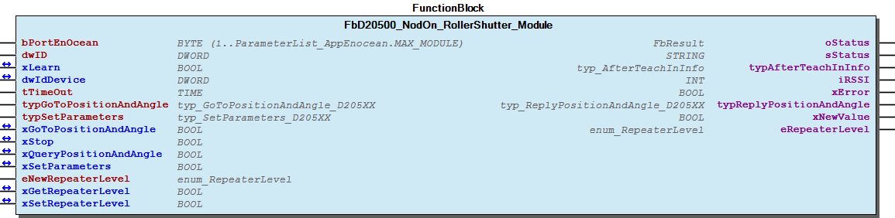 Graphical Interface of FbD20500_NodOn_RollerShutter_Module Example Variables

## FbD21500_PeopleActivityCounter (FB)


| Scope | Name | Type | Initial | Comment |
| --- | --- | --- | --- | --- |
| Input | bPortEnocean | BYTE | 1 | Port of Enocean - Master |
| dwID | DWORD | 0 | Station address |
| bID_Offset | BYTE | 1 | Offset applied to station address (Send-ID for this function block) |
| tTimeout | TIME | TIME#60m0s0ms | Timeout for received telegrams |
| Inout | xLearn | BOOL |  | Activate learn mode |
| dwLearn_ID | DWORD |  | Device ID of the sensor/actuator |
| Output | oStatus | WagoSysErrorBase.FbResult |  | Status object. (Listed in Status ) The content of the error object could be displayed via the FbShowResult from the WagoSysErrorBase library. |
| sStatus | STRING |  | Status description as string (Listed in Status ) |
| xReady | BOOL |  | ID available. Ready to receive telegrams of the sensor. |
| wPIR_Counter | WORD |  | Amount of times that PIR activity has been counted [0-65535]. At 65535, an overflow occurs |
| bPIR_UpdateRate | BYTE |  | Discrete interval in which the activity is considered [1..16 seconds]. |
| wCountDiffToLastCount | WORD |  | Difference amount of times that PIR activity has been counted to the last received telegram |
| wTimeDiffToLastCount | WORD |  | Time difference between the two last telegrams in seconds |
| xPresence | BOOL |  | TRUE= Presence is detected |
| xLowBattery | BOOL |  | TRUE= Battery is low. Please change battery or increase the amount of solar radiation. |
| bPresenceStatus | BYTE |  | Presence detector status: 0= Present, 1= Not present, 2= Not detectable, 3= Presence detector error |
| bBatteryStatus | BYTE |  | Energy storage of the battery status: 0= High, 1= Medium, 2= Low, 3= Critical |
| xValid | BOOL | FALSE | Valid received telegram |
| iRSSI | INT |  | Received signal strengh indication (-90...-45dBm) = (bad...good) |

The Function block encodes and decodes Enocean device according to the Enocean Equipment Profiles (EEP).

Graphical Illustration

Function description

The supported EnOcean Equipment Profiles (EEP) are listed in the table below:

Interface variables Function The Function block encodes and decodes Enocean device according to the Enocean Equipment Profiles (EEP). Graphical Illustration  Function description The supported EnOcean Equipment Profiles (EEP) are listed in the table below:

### D2-15-00


Don´t use the Thermokon STC65-RS-485-EVC gateway in compatibility mode (Compatibility mode off => DIP 2.3= off).

Installation and commissioning:

Teach-In steps:

Declare “dwLearn_ID” as RETAIN PERSISTENT.

Note Don´t use the Thermokon STC65-RS-485-EVC gateway in compatibility mode (Compatibility mode off => DIP 2.3= off). Installation and commissioning: Teach-In steps: 1. Add the station address of the Master function block to “dwID”. Increase “bID_Offset” on each function block which can send telegrams. 2. Set this function block in learning mode (xLearn := TRUE). 3. Set the sensor in “Pairing mode”. 4. The Fb will receive the Device ID of the sensor automatically. Note Declare “dwLearn_ID” as RETAIN PERSISTENT.

## FbD24100 (FB)


| Scope | Name | Type | Initial | Comment | Inherited from |
| --- | --- | --- | --- | --- | --- |
| Input | bPortEnOcean | BYTE (1..ParameterList_AppEnocean.MAX_MODULE) | 1 | Master assignment number. Range 1 to MAX_MASTER. | FbEnoceanBase |
| Output | oStatus | WagoSysErrorBase.FbResult |  | Status object. (Listed in Status ) The content of the error object could be displayed via the FbShowResult from the WagoSysErrorBase library. | FbEnoceanBase |
| sStatus | STRING |  | Status description as string (Listed in Status ) | FbEnoceanBase |
| Input | dwID | DWORD |  | Gateway address | FbBaseD2XXXX |
| Inout | xLearn | BOOL |  | TRUE to wait for the Teach-in Request. FALSE when finished or elapsed teach in TimeOut ‘GlobalVariables.gTeachInTimeoutUTE’. | FbBaseD2XXXX |
| dwIdDevice | DWORD |  | ID of the EEP Device | FbBaseD2XXXX |
| Output | typAfterTeachInInfo | typ_AfterTeachInInfo |  | Other data available after a Teach-In/UTE telegram | FbBaseD2XXXX |
| iRSSI | INT |  | Received signal strengh indication (-90…-45dBm) = (bad…good) | FbBaseD2XXXX |
| xError | BOOL |  | Displays an error occured. | FbBaseD2XXXX |
| Input | tSendTimeOut | TIME | TIME#1s0ms | Send TimeOut for the request (Min = 500ms) |  |
| bUnit | BYTE (0..14) |  | Selected unit for get and set commands. |  |
| Inout | xGetProductStatus | BOOL |  | Read product status to get active units. |  |
| xGetUnitStatus | BOOL |  | Read unit status of input bUnit . |  |
| xGetPresenceData | BOOL |  | Read presence data of input bUnit . |  |
| xGetEnvironmentalData | BOOL |  | Read environmental data of input bUnit . |  |
| xGetMaintenanceData | BOOL |  | Read maintenance data of input bUnit . |  |
| Input | xSetOccupancyMember1 | BOOL |  | Set occupancy state of member 1 for input bUnit . |  |
| xSetOccupancyMember2 | BOOL |  | Set occupancy state of member 2 for input bUnit . |  |
| Inout | xSetOccupancy | BOOL |  | Write the occupancy states. |  |
| Input | eSetIlluminationMode | eSetIlluminationMode_D24100 |  | Set illumination mode for input bUnit . |  |
| Inout | xSetIlluminationMode | BOOL |  | Write the illumination mode eSetIlluminationMode to selected unit. |  |
| Input | typSetUnitData | typUnitData_D24100 |  | Set unit data for input bUnit . |  |
| Inout | xSetUnitData | BOOL |  | Write unit data of input bUnit . |  |
| Output | bUnitResponse | BYTE |  | Last responding unit. |  |
| aUnitActivity | ARRAY [0..14] OF BOOL |  | Displays the active units of the device. |  |
| aEnvironmentalData | ARRAY [0..14] OF typEnvironmentalData_D24100 |  | Displays the environmental data of the units. |  |
| aMaintenanceData | ARRAY [0..14] OF typMaintenanceData_D24100 |  | Displays the maintenance data of the units. |  |
| atypUnitStatus | ARRAY [0..14] OF typUnitStatus_D24100 |  | Displays the unit data of the units. |  |
| aOccupancyMember1 | ARRAY [0..14] OF BOOL |  | Displays the occupany state member 1 of the units. |  |
| aOccupancyMember2 | ARRAY [0..14] OF BOOL |  | Displays the occupany state member 2 of the units. |  |
| aPresence | ARRAY [0..14] OF BOOL |  | Displays the presence state of the units. |  |

The Function block encodes and decodes Enocean device according to the Enocean Equipment Profiles (EEP).

Graphical illustration

Graphical Interface of FbD24100

Function description

With the command set unit data ( xSetUnitData ) the dimming level is only relevant for the illumination mode service light. The device controlls the dimming level itself in other illumination modes.

When using xSetIlluminationMode higher illumination modes needs to be cleared before lower modes gets active.

Supported EEP:

Interface variables Function The Function block encodes and decodes Enocean device according to the Enocean Equipment Profiles (EEP). Graphical illustration  Graphical Interface of FbD24100 Function description Note With the command set unit data ( xSetUnitData ) the dimming level is only relevant for the illumination mode service light. The device controlls the dimming level itself in other illumination modes. Note When using xSetIlluminationMode higher illumination modes needs to be cleared before lower modes gets active. Supported EEP:

### A2-41-00


Please refer to the manufacturer’s manual to find the Enocean Equipment Profiles (EEP) number for your device.

Note Please refer to the manufacturer’s manual to find the Enocean Equipment Profiles (EEP) number for your device. Example VAR oFbEnOcean_750_940_RS485: WagoAppEnocean.FbEnOcean_750_940_RS485; dwStationAddress: DWORD; oFbD24100: WagoAppEnocean.FbD24100; xLearn: BOOL; dwIdDevice: DWORD; // Should be saved retain persistent bUnit: BYTE (0..14) := 0; xGetProductStatus: BOOL; xGetUnitStatus: BOOL; xGetPresenceData: BOOL; xGetEnvironmentalData: BOOL; xGetMaintenanceData: BOOL; xSetOccupancyMember1: BOOL; xSetOccupancyMember2: BOOL; xSetOccupancy: BOOL; eSetIlluminationMode: WagoAppEnocean.eSetIlluminationMode_D24100; xSetIlluminationMode: BOOL; typSetUnitData: WagoAppEnocean.typUnitData_D24100; xSetUnitData: BOOL; bUnitResponse: BYTE; aUnitActivity: ARRAY [0..14] OF BOOL; aEnvironmentalData: ARRAY [0..14] OF WagoAppEnocean.typEnvironmentalData_D24100; aMaintenanceData: ARRAY [0..14] OF WagoAppEnocean.typMaintenanceData_D24100; atypUnitStatus: ARRAY [0..14] OF WagoAppEnocean.typUnitStatus_D24100; aOccupancyMember1: ARRAY [0..14] OF BOOL; aOccupancyMember2: ARRAY [0..14] OF BOOL; aPresence: ARRAY [0..14] OF BOOL; END_VAR oFbEnOcean_750_940_RS485( I_Port:= _750_652_24, bPortEnOcean:= 1, xReset:= , oStatus=> , sStatus=> , dwStationAddress=> dwStationAddress); oFbD24100( bPortEnOcean:= 1, oStatus=> , sStatus=> , dwID:= dwStationAddress, xLearn:= xLearn, dwIdDevice:= dwIdDevice, typAfterTeachInInfo=> , iRSSI=> , xError=> , tSendTimeOut:= , bUnit:= bUnit, xGetProductStatus:= xGetProductStatus, xGetUnitStatus:= xGetUnitStatus, xGetPresenceData:= xGetPresenceData, xGetEnvironmentalData:= xGetEnvironmentalData, xGetMaintenanceData:= xGetMaintenanceData, xSetOccupancyMember1:= xSetOccupancyMember1, xSetOccupancyMember2:= xSetOccupancyMember2, xSetOccupancy:= xSetOccupancy, eSetIlluminationMode:= eSetIlluminationMode, xSetIlluminationMode:= xSetIlluminationMode, typSetUnitData:= typSetUnitData, xSetUnitData:= xSetUnitData, bUnitResponse=> bUnitResponse, aUnitActivity=> aUnitActivity, aEnvironmentalData=> aEnvironmentalData, aMaintenanceData=> aMaintenanceData, atypUnitStatus=> atypUnitStatus, aOccupancyMember1=> aOccupancyMember1, aOccupancyMember2=> aOccupancyMember2, aPresence=> aPresence); - EEP Commands get commands FbD24100.getEnvironmentalData_resp (METH) - FbD24100.getMaintenanceData_resp (METH) - FbD24100.getPresenceData_resp (METH) - FbD24100.getProductStatus_resp (METH) - FbD24100.getUnitOperatingState_resp (METH) - FbD24100.getUnitStatus_resp (METH) set sommands - FbD24100.protSetUnitCommandByte (METH) - FbD24100.setGetCommand_Cmd (METH) - FbD24100.setOccupancy_Cmd (METH) - FbD24100.setUnitData_Cmd (METH) - FbD24100.setUnitOperatingState_Cmd (METH) Parameters - FbD24100.deviceFunc (PROP) - FbD24100.deviceType (PROP) FbD24100.protCore_D24100 (METH) FbD24100.protIsValidResponse (METH)

## FbDeleteSensorFromFilterChannel (FB)


| Scope | Name | Type | Initial | Comment | Inherited from |
| --- | --- | --- | --- | --- | --- |
| Input | bPortEnOcean | BYTE (1..ParameterList_AppEnocean.MAX_MODULE) | 1 | Master assignment number. Range 1 to MAX_MASTER. | FbEnoceanBase |
| Output | oStatus | WagoSysErrorBase.FbResult |  | Status object. (Listed in Status ) The content of the error object could be displayed via the FbShowResult from the WagoSysErrorBase library. | FbEnoceanBase |
| sStatus | STRING |  | Status description as string (Listed in Status ) | FbEnoceanBase |
| xReady | BOOL | TRUE | TRUE-> The block is ready | FbConfig_STC65 |
| Input | bFilterTableChannel | BYTE |  | filter table channel | FbFilterTableChannel_STC65 |
| Inout | xDelete | BOOL |  | Start write |  |
| typDeleteSensorFromFilterChannel | typDeleteSensorFromFilterChannel |  | parameters |  |

Delete sensor from filter channel

Graphical Illustration

This function block is only used with Thermokon STC65-RS-485-EVC Gateway.

Interface variables Function Delete sensor from filter channel Graphical Illustration  Note This function block is only used with Thermokon STC65-RS-485-EVC Gateway.

## FbDevice (FB)


| Scope | Name | Type | Initial | Comment | Inherited from |
| --- | --- | --- | --- | --- | --- |
| Input | bPortEnOcean | BYTE (1..ParameterList_AppEnocean.MAX_MODULE) | 1 | Master assignment number. Range 1 to MAX_MASTER. | FbEnoceanBase |
| Output | oStatus | WagoSysErrorBase.FbResult |  | Status object. (Listed in Status ) The content of the error object could be displayed via the FbShowResult from the WagoSysErrorBase library. | FbEnoceanBase |
| sStatus | STRING |  | Status description as string (Listed in Status ) | FbEnoceanBase |
| Input | dwID | DWORD |  | Device ID |  |

Base class for a Device

Graphical Illustration

Interface variables Function Base class for a Device Graphical Illustration  - 01 Parameters FbDevice.ID (PROP) 03 Flag - FbDevice.isZero_ID (METH)

## FbESP3_SmartAck (FB)


| Scope | Name | Type | Initial | Comment |
| --- | --- | --- | --- | --- |
| Input | bPortEnocean | BYTE | 16#1 | Enocean master assignment |
| xReset | BOOL |  |  |
| Inout | xStartSmartAck | BOOL |  |  |
| xReady | BOOL |  |  |
| dwIDRead | DWORD |  |  |
| dwIDDest | DWORD |  |  |
| Output | oStatus | WagoSysErrorBase.FbResult |  | Status object. (Listed in Status ) The content of the error object could be displayed via the FbShowResult from the WagoSysErrorBase library. |
| sStatus | STRING |  | Status description as string (Listed in Status ) |
| xSmartSuccess | BOOL |  |  |
| xError | BOOL |  |  |
| bFeedback | BYTE |  |  |

Interface variables - FbESP3_SmartAck.Reset (ACT) - FbESP3_SmartAck.setStatusObject (METH)

## FbEnOceanDevice_A5_D5_F6 (FB)


| Scope | Name | Type | Initial | Comment | Inherited from |
| --- | --- | --- | --- | --- | --- |
| Input | bPortEnOcean | BYTE (1..ParameterList_AppEnocean.MAX_MODULE) | 1 | Master assignment number. Range 1 to MAX_MASTER. | FbEnoceanBase |
| Output | oStatus | WagoSysErrorBase.FbResult |  | Status object. (Listed in Status ) The content of the error object could be displayed via the FbShowResult from the WagoSysErrorBase library. | FbEnoceanBase |
| sStatus | STRING |  | Status description as string (Listed in Status ) | FbEnoceanBase |
| Input | dwID | DWORD |  | Device ID | FbDevice |
| typEEP | typEEP |  | EEP |  |
| tTimeOut | TIME | TIME#0ms | Maximal time gap between telegrams |  |
| Output | dwDestination_ID | DWORD |  | Destination ID |  |
| xValid | BOOL |  | Valid telegram |  |
| iRSSI | INT |  | Received signal strengh indication (-90...-45dBm) = (bad...good) |  |
| xUpdate | BOOL |  |  |  |

| EEP Profile | Type | Func | Org | Data | Function Description | Type Description |
| --- | --- | --- | --- | --- | --- | --- |
| F6-01-01 | 16#01 | 16#01 | 16#F6 | RPS | Switch Buttons | Push Button |
| F6-02-01 | 16#01 | 16#02 | 16#F6 | RPS | Rocker Switch, 2 Rocker | Light and Blind Control - Application Style 1 |
| F6-02-02 | 16#02 | 16#02 | 16#F6 | RPS | Rocker Switch, 2 Rocker | Light and Blind Control - Application Style 2 |
| F6-02-03 | 16#03 | 16#02 | 16#F6 | RPS | Rocker Switch, 2 Rocker | Light Control - Application Style 1 |
| F6-02-04 | 16#04 | 16#02 | 16#F6 | RPS | Rocker Switch, 2 Rocker | Light and Blind Control - ERP2 |
| F6-03-01 | 16#01 | 16#03 | 16#F6 | RPS | Rocker Switch, 4 Rocker | Light and Blind Control - Application Style 1 |
| F6-03-02 | 16#02 | 16#03 | 16#F6 | RPS | Rocker Switch, 4 Rocker | Light and Blind Control - Application Style 2 |
| F6-04-01 | 16#01 | 16#04 | 16#F6 | RPS | Position Switch, Home and Office Application | Key Card Activated Switch |
| F6-04-02 | 16#02 | 16#04 | 16#F6 | RPS | Position Switch, Home and Office Application | Key Card Activated Switch ERP2 |
| F6-05-00 | 16#00 | 16#05 | 16#F6 | RPS | Detectors | Wind Speed Threshold Detector |
| F6-05-01 | 16#01 | 16#05 | 16#F6 | RPS | Detectors | Liquid Leakage Sensor (mechanic harvester) |
| F6-05-02 | 16#02 | 16#05 | 16#F6 | RPS | Detectors | Smoke Detectors |
| F6-10-00 | 16#00 | 16#10 | 16#F6 | RPS | Mechanical Handle | Window Handle |
| F6-10-01 | 16#01 | 16#10 | 16#F6 | RPS | Mechanical Handle | Window Handle ERP2 |
| D5-00-01 | 16#01 | 16#00 | 16#D5 | 1BS | Contacts and Switches | Single Input Contact |
| A5-02-01 | 16#01 | 16#02 | 16#A5 | 4BS | Temperature Sensors | -40°C to 0°C |
| A5-02-02 | 16#02 | 16#02 | 16#A5 | 4BS | Temperature Sensors | -30°C…10°C |
| A5-02-03 | 16#03 | 16#02 | 16#A5 | 4BS | Temperature Sensors | -20°C…20°C |
| A5-02-04 | 16#04 | 16#02 | 16#A5 | 4BS | Temperature Sensors | -10°C…30°C |
| A5-02-05 | 16#05 | 16#02 | 16#A5 | 4BS | Temperature Sensors | 0°C…40°C |
| A5-02-06 | 16#06 | 16#02 | 16#A5 | 4BS | Temperature Sensors | 10°C…50°C |
| A5-02-07 | 16#07 | 16#02 | 16#A5 | 4BS | Temperature Sensors | 20°C…60°C |
| A5-02-08 | 16#08 | 16#02 | 16#A5 | 4BS | Temperature Sensors | 30°C…70°C |
| A5-02-09 | 16#09 | 16#02 | 16#A5 | 4BS | Temperature Sensors | 40°C…80°C |
| A5-02-0A | 16#0A | 16#02 | 16#A5 | 4BS | Temperature Sensors | 50°C…90°C |
| A5-02-0B | 16#0B | 16#02 | 16#A5 | 4BS | Temperature Sensors | 60°C…100°C |
| A5-02-10 | 16#10 | 16#02 | 16#A5 | 4BS | Temperature Sensors | -60°C…20°C |
| A5-02-11 | 16#11 | 16#02 | 16#A5 | 4BS | Temperature Sensors | -50°C…30°C |
| A5-02-12 | 16#12 | 16#02 | 16#A5 | 4BS | Temperature Sensors | -40°C…40°C |
| A5-02-13 | 16#13 | 16#02 | 16#A5 | 4BS | Temperature Sensors | -30°C…50°C |
| A5-02-14 | 16#14 | 16#02 | 16#A5 | 4BS | Temperature Sensors | -20°C…60°C |
| A5-02-15 | 16#15 | 16#02 | 16#A5 | 4BS | Temperature Sensors | -10°C…70°C |
| A5-02-16 | 16#16 | 16#02 | 16#A5 | 4BS | Temperature Sensors | 0°C…80°C |
| A5-02-17 | 16#17 | 16#02 | 16#A5 | 4BS | Temperature Sensors | 10°C…90°C |
| A5-02-18 | 16#18 | 16#02 | 16#A5 | 4BS | Temperature Sensors | 20°C…100°C |
| A5-02-19 | 16#19 | 16#02 | 16#A5 | 4BS | Temperature Sensors | 30°C…110°C |
| A5-02-1A | 16#1A | 16#02 | 16#A5 | 4BS | Temperature Sensors | 40°C…120°C |
| A5-02-1B | 16#1B | 16#02 | 16#A5 | 4BS | Temperature Sensors | 50°C…130°C |
| A5-02-20 | 16#20 | 16#02 | 16#A5 | 4BS | Temperature Sensors | -10°C…41.2°C |
| A5-02-30 | 16#30 | 16#02 | 16#A5 | 4BS | Temperature Sensors | -40°C…62.3°C |
| A5-04-01 | 16#01 | 16#04 | 16#A5 | 4BS | Temperature and Humidity Sensors | 0°C…40°C and 0% to 100% |
| A5-04-02 | 16#02 | 16#04 | 16#A5 | 4BS | Temperature and Humidity Sensors | -20°C…60°C and 0% to 100% |
| A5-04-03 | 16#03 | 16#04 | 16#A5 | 4BS | Temperature and Humidity Sensors | -20°C…60°C and 0% to 100% 10Bit |
| A5-07-01 | 16#01 | 16#07 | 16#A5 | 4BS | Occupancy Sensor | Supply Voltage Monitor |
| A5-07-02 | 16#02 | 16#07 | 16#A5 | 4BS | Occupancy Sensor | Supply Voltage Monitor |
| A5-07-03 | 16#03 | 16#07 | 16#A5 | 4BS | Occupancy Sensor | Supply Voltage Monitor and Illumination Sensor |
| A5-10-01 | 16#01 | 16#10 | 16#A5 | 4BS | Room Operating Panel | Temperature, Temperature Set Point, Fan Speed, Occupancy, |
| A5-10-02 | 16#02 | 16#10 | 16#A5 | 4BS | Room Operating Panel | Temperature, Temperature Set Point, Fan Speed, Day/Night, |
| A5-10-03 | 16#03 | 16#10 | 16#A5 | 4BS | Room Operating Panel | Temperature, Temperature Set Point, |
| A5-10-04 | 16#04 | 16#10 | 16#A5 | 4BS | Room Operating Panel | Temperature, Temperature Set Point, Fan Speed, |
| A5-10-05 | 16#05 | 16#10 | 16#A5 | 4BS | Room Operating Panel | Temperature, Temperature Set Point, Occupancy, |
| A5-10-06 | 16#06 | 16#10 | 16#A5 | 4BS | Room Operating Panel | Temperature, Temperature Set Point, Day/Night, |
| A5-10-07 | 16#07 | 16#10 | 16#A5 | 4BS | Room Operating Panel | Temperature, Fan Speed, |
| A5-10-08 | 16#08 | 16#10 | 16#A5 | 4BS | Room Operating Panel | Temperature, Fan Speed, Occupancy, |
| A5-10-09 | 16#09 | 16#10 | 16#A5 | 4BS | Room Operating Panel | Temperature, Fan Speed, Day/Night, |
| A5-10-0A | 16#0A | 16#10 | 16#A5 | 4BS | Room Operating Panel | Temperature, Temperature Set Point, Single Input, |
| A5-10-0B | 16#0B | 16#10 | 16#A5 | 4BS | Room Operating Panel | Temperature, Single Input, |
| A5-10-0C | 16#0C | 16#10 | 16#A5 | 4BS | Room Operating Panel | Temperature, Occupancy, |
| A5-10-0D | 16#0D | 16#10 | 16#A5 | 4BS | Room Operating Panel | Temperature, Day/Night, |
| A5-10-10 | 16#10 | 16#10 | 16#A5 | 4BS | Room Operating Panel | Temperature, Temperature Set Point, Single Input, Humidity, |
| A5-10-11 | 16#11 | 16#10 | 16#A5 | 4BS | Room Operating Panel | Temperature, Temperature Set Point, Day/Night, Humidity, |
| A5-10-12 | 16#12 | 16#10 | 16#A5 | 4BS | Room Operating Panel | Temperature, Temperature Set Point, Humidity, |
| A5-10-13 | 16#13 | 16#10 | 16#A5 | 4BS | Room Operating Panel | Temperature, Occupancy, Humidity, |
| A5-10-14 | 16#14 | 16#10 | 16#A5 | 4BS | Room Operating Panel | Temperature, Day/Night, Humidity, |
| A5-10-15 | 16#15 | 16#10 | 16#A5 | 4BS | Room Operating Panel | Temperature, Temperature Set Point, |
| A5-10-16 | 16#16 | 16#10 | 16#A5 | 4BS | Room Operating Panel | Temperature, Temperature Set Point, Occupancy, |
| A5-10-17 | 16#17 | 16#10 | 16#A5 | 4BS | Room Operating Panel | Temperature, Occupancy, |
| A5-10-18 | 16#18 | 16#10 | 16#A5 | 4BS | Room Operating Panel | Temperature, Temperature Set Point, Fan Speed, Occupancy, Illumination, |
| A5-10-19 | 16#19 | 16#10 | 16#A5 | 4BS | Room Operating Panel | Temperature, Temperature Set Point, Fan Speed, Occupancy, |
| A5-10-1A | 16#1A | 16#10 | 16#A5 | 4BS | Room Operating Panel | Temperature, Temperature Set Point, Fan Speed, Illumination, Supply Voltage Mon, |
| A5-10-1B | 16#1B | 16#10 | 16#A5 | 4BS | Room Operating Panel | Temperature, Fan Speed, Occupancy, Illumination, Supply Voltage Mon, |
| A5-10-1C | 16#1C | 16#10 | 16#A5 | 4BS | Room Operating Panel | Temperature, Fan Speed, Occupancy, Illumination Set Point, |
| A5-10-1D | 16#1D | 16#10 | 16#A5 | 4BS | Room Operating Panel | Temperature, Fan Speed, Occupancy, Humidity, Humidity Set Point, |
| A5-10-1E | 16#1E | 16#10 | 16#A5 | 4BS | Room Operating Panel | Temperature, Fan Speed, Occupancy, Illumination, Supply Voltage Mon, |
| A5-10-1F | 16#1F | 16#10 | 16#A5 | 4BS | Room Operating Panel | Temperature, Temperature Set Point, Fan Speed, Occupancy, |
| A5-10-20 | 16#20 | 16#10 | 16#A5 | 4BS | Room Operating Panel | Temperature, Temperature Set Point, |
| A5-10-21 | 16#21 | 16#10 | 16#A5 | 4BS | Room Operating Panel | Temperature, Temperature Set Point, Fan Speed, Humidity, |
| A5-10-22 | 16#22 | 16#10 | 16#A5 | 4BS | Room Operating Panel | Temperature, Temperature Set Point, Fan Speed, Humidity, |
| A5-10-23 | 16#23 | 16#10 | 16#A5 | 4BS | Room Operating Panel | Temperature, Temperature Set Point, Fan Speed, Occupancy, Humidity, |

With this block, a large number of Enocean devices should be able to be queried. The measured values ​​can be read out with the Get methods. The table below lists the supported EEPs.

Graphical Illustration

If more EEPs are required, please send an email to support @ wago . com

Interface variables Function With this block, a large number of Enocean devices should be able to be queried. The measured values ​​can be read out with the Get methods. The table below lists the supported EEPs. Graphical Illustration  If more EEPs are required, please send an email to support @ wago . com - 1BS FbEnOceanDevice_A5_D5_F6.Data_1BS (METH) 4BS - FbEnOceanDevice_A5_D5_F6.Data_4BS (METH) - FbEnOceanDevice_A5_D5_F6.getTemperatureResolution1BYTE (METH) - FbEnOceanDevice_A5_D5_F6.getTemperatureResolution2BYTE (METH) GETs - FbEnOceanDevice_A5_D5_F6.getBinaryState (METH) - FbEnOceanDevice_A5_D5_F6.getIllumination (METH) - FbEnOceanDevice_A5_D5_F6.getPIR (METH) - FbEnOceanDevice_A5_D5_F6.getRelativeHumidity (METH) - FbEnOceanDevice_A5_D5_F6.getSecondAction (METH) - FbEnOceanDevice_A5_D5_F6.getSetpointCorrection (METH) - FbEnOceanDevice_A5_D5_F6.getSimultaneouslyPressedButtons (METH) - FbEnOceanDevice_A5_D5_F6.getTemperature (METH) - FbEnOceanDevice_A5_D5_F6.getTurnSwitch (METH) RPS - FbEnOceanDevice_A5_D5_F6.Data_RPS (METH) - FbEnOceanDevice_A5_D5_F6.NU (PROP) - FbEnOceanDevice_A5_D5_F6.T21 (PROP) FbEnOceanDevice_A5_D5_F6.get_bFUNC (METH) FbEnOceanDevice_A5_D5_F6.get_bRORG (METH) FbEnOceanDevice_A5_D5_F6.get_bTYPE (METH) FbEnOceanDevice_A5_D5_F6.udiEEP (PROP)

## FbEnOcean_750_940_RS485 (FB)


| Scope | Name | Type | Initial | Comment |
| --- | --- | --- | --- | --- |
| Input | I_Port | WagoAppCom.I_WagoSysComBase |  | Serial module |
| bPortEnOcean | BYTE | 1 | Master assignment number. Range 1 to MAX_MASTER. bPortEnocean |
| xReset | BOOL |  | Reset master |
| Output | oStatus | WagoSysErrorBase.FbResult |  | Status object. (Listed in Status ) The content of the error object could be displayed via the FbShowResult from the WagoSysErrorBase library. |
| sStatus | STRING |  | Status description as string (Listed in Status ) |
| dwStationAddress | DWORD |  | Station address of the Gateway. |

Enocean master with 750-940 over serial communication (RS485).

This gateway can handle bidirectional communication.

Graphical Illustration

Function description

Function block sets up a link to the 750-940 Gateway to provide communication employing the EnOcean radio protocol. The communication between this function block and the 750-940 Gateway is handled with the ESP3 protocol.

Support only 750-940 Gateway.

Interface variables Function Enocean master with 750-940 over serial communication (RS485). Note This gateway can handle bidirectional communication. Graphical Illustration  Function description Function block sets up a link to the 750-940 Gateway to provide communication employing the EnOcean radio protocol. The communication between this function block and the 750-940 Gateway is handled with the ESP3 protocol. Note Support only 750-940 Gateway. - FbEnOcean_750_940_RS485.AckEventTimeout (PROP) - FbEnOcean_750_940_RS485.ConfigurationTimeout (PROP) - FbEnOcean_750_940_RS485.Handle_Config (ACT) - FbEnOcean_750_940_RS485.Open (PROP) - FbEnOcean_750_940_RS485.Send_EEP (ACT) - FbEnOcean_750_940_RS485.Send_ExtEEP (ACT) - FbEnOcean_750_940_RS485.TxTimeout (PROP) - FbEnOcean_750_940_RS485.setStatusObject (METH)

## FbEnOcean_FillMbx_SMACK (FB)


| Scope | Name | Type | Initial | Comment |
| --- | --- | --- | --- | --- |
| Input | bPortEnocean | BYTE | 1 | Enocean master assignment |
| bNumberOfDatabytes | BYTE |  | Number of databytes |
| abDataByte | ARRAY [0..ENOCEAN_MAX_INDEX_DB] OF BYTE |  | data byte |
| dwIDController | DWORD |  | Read ID |
| dwIDSensor | DWORD |  |  |
| Inout | xSend | BOOL |  | Start process to write filter state |
| Output | xReady | BOOL | FALSE | Communication Status - FALSE: process is ongoing, TRUE: nothing to do |
| oStatus | WagoSysErrorBase.FbResult |  | Status object. (Listed in Status ) The content of the error object could be displayed via the FbShowResult from the WagoSysErrorBase library. |
| sStatus | STRING |  | Status description as string (Listed in Status ) |

Interface variables - FbEnOcean_FillMbx_SMACK.setStatusObject (METH)

## FbEnOcean_WriteFilterStatus (FB)


| Scope | Name | Type | Initial | Comment |
| --- | --- | --- | --- | --- |
| Input | bPortEnocean | BYTE | 1 | Enocean master assignment |
| xFilterEnable | BOOL | FALSE | Filter ON/OFF - TRUE: Filter will be ON, otherwise filter will be OFF |
| bFilterOperator | BYTE | 16#0 | 0x00: OR combination of all filters 0x01: AND combination of all filters 0x08: OR combination for receive filters AND combination for repeat filters 0x09: AND combination for receive filters OR combination for repeat filters |
| Inout | xWrite | BOOL |  | Start process to write filter state |
| Output | oStatus | WagoSysErrorBase.FbResult |  | Status object. (Listed in Status ) The content of the error object could be displayed via the FbShowResult from the WagoSysErrorBase library. |
| sStatus | STRING |  | Status description as string (Listed in Status ) |
| xReady | BOOL | FALSE | Communication Status - FALSE: process is ongoing, TRUE: nothing to do |
| bFeedback | BYTE |  | Success of the process: 16#00: ENOCEAN_OK 16#E1: ENOCEAN_ERROR_TIMEOUT 16#E2: ENOCEAN_ERROR_BUSY 16#E9: ENOCEAN_ERROR_INVALID_PARAM |

Interface variables - FbEnOcean_WriteFilterStatus.setStatusObject (METH)

## FbEnoceanA50201_TempSensor (FB)


| Scope | Name | Type | Initial | Comment | Inherited from |
| --- | --- | --- | --- | --- | --- |
| Input | bPortEnOcean | BYTE (1..ParameterList_AppEnocean.MAX_MODULE) | 1 | Master assignment number. Range 1 to MAX_MASTER. | FbEnoceanBase |
| Output | oStatus | WagoSysErrorBase.FbResult |  | Status object. (Listed in Status ) The content of the error object could be displayed via the FbShowResult from the WagoSysErrorBase library. | FbEnoceanBase |
| sStatus | STRING |  | Status description as string (Listed in Status ) | FbEnoceanBase |
| Input | dwID | DWORD |  | Device ID | FbDevice |
| tTimeOut | TIME | TIME#60m0s0ms | Maximal time gap between telegrams | FbReceiver_4BS |
| Output | dwDestination_ID | DWORD |  | Destination ID | FbReceiver_4BS |
| xValid | BOOL |  | Valid telegram | FbReceiver_4BS |
| iRSSI | INT |  | Received signal strengh indication (-90...-45dBm) = (bad...good) | FbReceiver_4BS |
| rTemperature | REAL | ENOCEAN_DFLT_TEMP | Temperature measured by the temperature sensor in °C | FbBaseA502xx_TempSensor |

| EEP | Type | Temperature range |
| A5/07-02-01 | 16#01 | -40°C...0°C |

The Function block decodes Enocean device according to the Enocean Equipment Profiles (EEP).

Graphical Illustration

Function description

The supported EnOcean Equipment Profiles (EEP) are listed in the table below.

Please refer to the manufacturer’s manual to find the Enocean Equipment Profiles (EEP) number for your device.

Interface variables Function The Function block decodes Enocean device according to the Enocean Equipment Profiles (EEP). Graphical Illustration  Function description The supported EnOcean Equipment Profiles (EEP) are listed in the table below. Note Please refer to the manufacturer’s manual to find the Enocean Equipment Profiles (EEP) number for your device.

## FbEnoceanA50202_TempSensor (FB)


| Scope | Name | Type | Initial | Comment | Inherited from |
| --- | --- | --- | --- | --- | --- |
| Input | bPortEnOcean | BYTE (1..ParameterList_AppEnocean.MAX_MODULE) | 1 | Master assignment number. Range 1 to MAX_MASTER. | FbEnoceanBase |
| Output | oStatus | WagoSysErrorBase.FbResult |  | Status object. (Listed in Status ) The content of the error object could be displayed via the FbShowResult from the WagoSysErrorBase library. | FbEnoceanBase |
| sStatus | STRING |  | Status description as string (Listed in Status ) | FbEnoceanBase |
| Input | dwID | DWORD |  | Device ID | FbDevice |
| tTimeOut | TIME | TIME#60m0s0ms | Maximal time gap between telegrams | FbReceiver_4BS |
| Output | dwDestination_ID | DWORD |  | Destination ID | FbReceiver_4BS |
| xValid | BOOL |  | Valid telegram | FbReceiver_4BS |
| iRSSI | INT |  | Received signal strengh indication (-90...-45dBm) = (bad...good) | FbReceiver_4BS |
| rTemperature | REAL | ENOCEAN_DFLT_TEMP | Temperature measured by the temperature sensor in °C | FbBaseA502xx_TempSensor |

| EEP | Type | Temperature range |
| A5/07-02-02 | 16#02 | -30°C...10°C |

The Function block decodes Enocean device according to the Enocean Equipment Profiles (EEP).

Graphical Illustration

Function description

The supported EnOcean Equipment Profiles (EEP) are listed in the table below.

Please refer to the manufacturer’s manual to find the Enocean Equipment Profiles (EEP) number for your device.

Interface variables Function The Function block decodes Enocean device according to the Enocean Equipment Profiles (EEP). Graphical Illustration  Function description The supported EnOcean Equipment Profiles (EEP) are listed in the table below. Note Please refer to the manufacturer’s manual to find the Enocean Equipment Profiles (EEP) number for your device.

## FbEnoceanA50203_TempSensor (FB)


| Scope | Name | Type | Initial | Comment | Inherited from |
| --- | --- | --- | --- | --- | --- |
| Input | bPortEnOcean | BYTE (1..ParameterList_AppEnocean.MAX_MODULE) | 1 | Master assignment number. Range 1 to MAX_MASTER. | FbEnoceanBase |
| Output | oStatus | WagoSysErrorBase.FbResult |  | Status object. (Listed in Status ) The content of the error object could be displayed via the FbShowResult from the WagoSysErrorBase library. | FbEnoceanBase |
| sStatus | STRING |  | Status description as string (Listed in Status ) | FbEnoceanBase |
| Input | dwID | DWORD |  | Device ID | FbDevice |
| tTimeOut | TIME | TIME#60m0s0ms | Maximal time gap between telegrams | FbReceiver_4BS |
| Output | dwDestination_ID | DWORD |  | Destination ID | FbReceiver_4BS |
| xValid | BOOL |  | Valid telegram | FbReceiver_4BS |
| iRSSI | INT |  | Received signal strengh indication (-90...-45dBm) = (bad...good) | FbReceiver_4BS |
| rTemperature | REAL | ENOCEAN_DFLT_TEMP | Temperature measured by the temperature sensor in °C | FbBaseA502xx_TempSensor |

| EEP | Type | Temperature range |
| A5/07-02-03 | 16#03 | -20°C...20°C |

The Function block decodes Enocean device according to the Enocean Equipment Profiles (EEP).

Graphical Illustration

Function description

The supported EnOcean Equipment Profiles (EEP) are listed in the table below.

Please refer to the manufacturer’s manual to find the Enocean Equipment Profiles (EEP) number for your device.

Interface variables Function The Function block decodes Enocean device according to the Enocean Equipment Profiles (EEP). Graphical Illustration  Function description The supported EnOcean Equipment Profiles (EEP) are listed in the table below. Note Please refer to the manufacturer’s manual to find the Enocean Equipment Profiles (EEP) number for your device.

## FbEnoceanA50204_TempSensor (FB)


| Scope | Name | Type | Initial | Comment | Inherited from |
| --- | --- | --- | --- | --- | --- |
| Input | bPortEnOcean | BYTE (1..ParameterList_AppEnocean.MAX_MODULE) | 1 | Master assignment number. Range 1 to MAX_MASTER. | FbEnoceanBase |
| Output | oStatus | WagoSysErrorBase.FbResult |  | Status object. (Listed in Status ) The content of the error object could be displayed via the FbShowResult from the WagoSysErrorBase library. | FbEnoceanBase |
| sStatus | STRING |  | Status description as string (Listed in Status ) | FbEnoceanBase |
| Input | dwID | DWORD |  | Device ID | FbDevice |
| tTimeOut | TIME | TIME#60m0s0ms | Maximal time gap between telegrams | FbReceiver_4BS |
| Output | dwDestination_ID | DWORD |  | Destination ID | FbReceiver_4BS |
| xValid | BOOL |  | Valid telegram | FbReceiver_4BS |
| iRSSI | INT |  | Received signal strengh indication (-90...-45dBm) = (bad...good) | FbReceiver_4BS |
| rTemperature | REAL | ENOCEAN_DFLT_TEMP | Temperature measured by the temperature sensor in °C | FbBaseA502xx_TempSensor |

| EEP | Type | Temperature range |
| A5/07-02-04 | 16#04 | -10°C...30°C |

The Function block decodes Enocean device according to the Enocean Equipment Profiles (EEP).

Graphical Illustration

Function description

The supported EnOcean Equipment Profiles (EEP) are listed in the table below.

Please refer to the manufacturer’s manual to find the Enocean Equipment Profiles (EEP) number for your device.

Interface variables Function The Function block decodes Enocean device according to the Enocean Equipment Profiles (EEP). Graphical Illustration  Function description The supported EnOcean Equipment Profiles (EEP) are listed in the table below. Note Please refer to the manufacturer’s manual to find the Enocean Equipment Profiles (EEP) number for your device.

## FbEnoceanA50205_TempSensor (FB)


| Scope | Name | Type | Initial | Comment | Inherited from |
| --- | --- | --- | --- | --- | --- |
| Input | bPortEnOcean | BYTE (1..ParameterList_AppEnocean.MAX_MODULE) | 1 | Master assignment number. Range 1 to MAX_MASTER. | FbEnoceanBase |
| Output | oStatus | WagoSysErrorBase.FbResult |  | Status object. (Listed in Status ) The content of the error object could be displayed via the FbShowResult from the WagoSysErrorBase library. | FbEnoceanBase |
| sStatus | STRING |  | Status description as string (Listed in Status ) | FbEnoceanBase |
| Input | dwID | DWORD |  | Device ID | FbDevice |
| tTimeOut | TIME | TIME#60m0s0ms | Maximal time gap between telegrams | FbReceiver_4BS |
| Output | dwDestination_ID | DWORD |  | Destination ID | FbReceiver_4BS |
| xValid | BOOL |  | Valid telegram | FbReceiver_4BS |
| iRSSI | INT |  | Received signal strengh indication (-90...-45dBm) = (bad...good) | FbReceiver_4BS |
| rTemperature | REAL | ENOCEAN_DFLT_TEMP | Temperature measured by the temperature sensor in °C | FbBaseA502xx_TempSensor |

| EEP | Type | Temperature range |
| A5/07-02-05 | 16#05 | 0°C...40°C |

The Function block decodes Enocean device according to the Enocean Equipment Profiles (EEP).

Graphical Illustration

Function description

The supported EnOcean Equipment Profiles (EEP) are listed in the table below.

Please refer to the manufacturer’s manual to find the Enocean Equipment Profiles (EEP) number for your device.

Interface variables Function The Function block decodes Enocean device according to the Enocean Equipment Profiles (EEP). Graphical Illustration  Function description The supported EnOcean Equipment Profiles (EEP) are listed in the table below. Note Please refer to the manufacturer’s manual to find the Enocean Equipment Profiles (EEP) number for your device.

## FbEnoceanA50206_TempSensor (FB)


| Scope | Name | Type | Initial | Comment | Inherited from |
| --- | --- | --- | --- | --- | --- |
| Input | bPortEnOcean | BYTE (1..ParameterList_AppEnocean.MAX_MODULE) | 1 | Master assignment number. Range 1 to MAX_MASTER. | FbEnoceanBase |
| Output | oStatus | WagoSysErrorBase.FbResult |  | Status object. (Listed in Status ) The content of the error object could be displayed via the FbShowResult from the WagoSysErrorBase library. | FbEnoceanBase |
| sStatus | STRING |  | Status description as string (Listed in Status ) | FbEnoceanBase |
| Input | dwID | DWORD |  | Device ID | FbDevice |
| tTimeOut | TIME | TIME#60m0s0ms | Maximal time gap between telegrams | FbReceiver_4BS |
| Output | dwDestination_ID | DWORD |  | Destination ID | FbReceiver_4BS |
| xValid | BOOL |  | Valid telegram | FbReceiver_4BS |
| iRSSI | INT |  | Received signal strengh indication (-90...-45dBm) = (bad...good) | FbReceiver_4BS |
| rTemperature | REAL | ENOCEAN_DFLT_TEMP | Temperature measured by the temperature sensor in °C | FbBaseA502xx_TempSensor |

| EEP | Type | Temperature range |
| A5/07-02-06 | 16#06 | 10°C...50°C |

The Function block decodes Enocean device according to the Enocean Equipment Profiles (EEP).

Graphical Illustration

Function description

The supported EnOcean Equipment Profiles (EEP) are listed in the table below.

Please refer to the manufacturer’s manual to find the Enocean Equipment Profiles (EEP) number for your device.

Interface variables Function The Function block decodes Enocean device according to the Enocean Equipment Profiles (EEP). Graphical Illustration  Function description The supported EnOcean Equipment Profiles (EEP) are listed in the table below. Note Please refer to the manufacturer’s manual to find the Enocean Equipment Profiles (EEP) number for your device.

## FbEnoceanA50207_TempSensor (FB)


| Scope | Name | Type | Initial | Comment | Inherited from |
| --- | --- | --- | --- | --- | --- |
| Input | bPortEnOcean | BYTE (1..ParameterList_AppEnocean.MAX_MODULE) | 1 | Master assignment number. Range 1 to MAX_MASTER. | FbEnoceanBase |
| Output | oStatus | WagoSysErrorBase.FbResult |  | Status object. (Listed in Status ) The content of the error object could be displayed via the FbShowResult from the WagoSysErrorBase library. | FbEnoceanBase |
| sStatus | STRING |  | Status description as string (Listed in Status ) | FbEnoceanBase |
| Input | dwID | DWORD |  | Device ID | FbDevice |
| tTimeOut | TIME | TIME#60m0s0ms | Maximal time gap between telegrams | FbReceiver_4BS |
| Output | dwDestination_ID | DWORD |  | Destination ID | FbReceiver_4BS |
| xValid | BOOL |  | Valid telegram | FbReceiver_4BS |
| iRSSI | INT |  | Received signal strengh indication (-90...-45dBm) = (bad...good) | FbReceiver_4BS |
| rTemperature | REAL | ENOCEAN_DFLT_TEMP | Temperature measured by the temperature sensor in °C | FbBaseA502xx_TempSensor |

| EEP | Type | Temperature range |
| A5/07-02-07 | 16#07 | 20°C...60°C |

The Function block decodes Enocean device according to the Enocean Equipment Profiles (EEP).

Graphical Illustration

Function description

The supported EnOcean Equipment Profiles (EEP) are listed in the table below.

Please refer to the manufacturer’s manual to find the Enocean Equipment Profiles (EEP) number for your device.

Interface variables Function The Function block decodes Enocean device according to the Enocean Equipment Profiles (EEP). Graphical Illustration  Function description The supported EnOcean Equipment Profiles (EEP) are listed in the table below. Note Please refer to the manufacturer’s manual to find the Enocean Equipment Profiles (EEP) number for your device.

## FbEnoceanA50208_TempSensor (FB)


| Scope | Name | Type | Initial | Comment | Inherited from |
| --- | --- | --- | --- | --- | --- |
| Input | bPortEnOcean | BYTE (1..ParameterList_AppEnocean.MAX_MODULE) | 1 | Master assignment number. Range 1 to MAX_MASTER. | FbEnoceanBase |
| Output | oStatus | WagoSysErrorBase.FbResult |  | Status object. (Listed in Status ) The content of the error object could be displayed via the FbShowResult from the WagoSysErrorBase library. | FbEnoceanBase |
| sStatus | STRING |  | Status description as string (Listed in Status ) | FbEnoceanBase |
| Input | dwID | DWORD |  | Device ID | FbDevice |
| tTimeOut | TIME | TIME#60m0s0ms | Maximal time gap between telegrams | FbReceiver_4BS |
| Output | dwDestination_ID | DWORD |  | Destination ID | FbReceiver_4BS |
| xValid | BOOL |  | Valid telegram | FbReceiver_4BS |
| iRSSI | INT |  | Received signal strengh indication (-90...-45dBm) = (bad...good) | FbReceiver_4BS |
| rTemperature | REAL | ENOCEAN_DFLT_TEMP | Temperature measured by the temperature sensor in °C | FbBaseA502xx_TempSensor |

| EEP | Type | Temperature range |
| A5/07-02-08 | 16#08 | 30°C...70°C |

The Function block decodes Enocean device according to the Enocean Equipment Profiles (EEP).

Graphical Illustration

Function description

The supported EnOcean Equipment Profiles (EEP) are listed in the table below.

Please refer to the manufacturer’s manual to find the Enocean Equipment Profiles (EEP) number for your device.

Interface variables Function The Function block decodes Enocean device according to the Enocean Equipment Profiles (EEP). Graphical Illustration  Function description The supported EnOcean Equipment Profiles (EEP) are listed in the table below. Note Please refer to the manufacturer’s manual to find the Enocean Equipment Profiles (EEP) number for your device.

## FbEnoceanA50209_TempSensor (FB)


| Scope | Name | Type | Initial | Comment | Inherited from |
| --- | --- | --- | --- | --- | --- |
| Input | bPortEnOcean | BYTE (1..ParameterList_AppEnocean.MAX_MODULE) | 1 | Master assignment number. Range 1 to MAX_MASTER. | FbEnoceanBase |
| Output | oStatus | WagoSysErrorBase.FbResult |  | Status object. (Listed in Status ) The content of the error object could be displayed via the FbShowResult from the WagoSysErrorBase library. | FbEnoceanBase |
| sStatus | STRING |  | Status description as string (Listed in Status ) | FbEnoceanBase |
| Input | dwID | DWORD |  | Device ID | FbDevice |
| tTimeOut | TIME | TIME#60m0s0ms | Maximal time gap between telegrams | FbReceiver_4BS |
| Output | dwDestination_ID | DWORD |  | Destination ID | FbReceiver_4BS |
| xValid | BOOL |  | Valid telegram | FbReceiver_4BS |
| iRSSI | INT |  | Received signal strengh indication (-90...-45dBm) = (bad...good) | FbReceiver_4BS |
| rTemperature | REAL | ENOCEAN_DFLT_TEMP | Temperature measured by the temperature sensor in °C | FbBaseA502xx_TempSensor |

| EEP | Type | Temperature range |
| A5/07-02-09 | 16#09 | 40°C...80°C |

The Function block decodes Enocean device according to the Enocean Equipment Profiles (EEP).

Graphical Illustration

Function description

The supported EnOcean Equipment Profiles (EEP) are listed in the table below.

Please refer to the manufacturer’s manual to find the Enocean Equipment Profiles (EEP) number for your device.

Interface variables Function The Function block decodes Enocean device according to the Enocean Equipment Profiles (EEP). Graphical Illustration  Function description The supported EnOcean Equipment Profiles (EEP) are listed in the table below. Note Please refer to the manufacturer’s manual to find the Enocean Equipment Profiles (EEP) number for your device.

## FbEnoceanA5020A_TempSensor (FB)


| Scope | Name | Type | Initial | Comment | Inherited from |
| --- | --- | --- | --- | --- | --- |
| Input | bPortEnOcean | BYTE (1..ParameterList_AppEnocean.MAX_MODULE) | 1 | Master assignment number. Range 1 to MAX_MASTER. | FbEnoceanBase |
| Output | oStatus | WagoSysErrorBase.FbResult |  | Status object. (Listed in Status ) The content of the error object could be displayed via the FbShowResult from the WagoSysErrorBase library. | FbEnoceanBase |
| sStatus | STRING |  | Status description as string (Listed in Status ) | FbEnoceanBase |
| Input | dwID | DWORD |  | Device ID | FbDevice |
| tTimeOut | TIME | TIME#60m0s0ms | Maximal time gap between telegrams | FbReceiver_4BS |
| Output | dwDestination_ID | DWORD |  | Destination ID | FbReceiver_4BS |
| xValid | BOOL |  | Valid telegram | FbReceiver_4BS |
| iRSSI | INT |  | Received signal strengh indication (-90...-45dBm) = (bad...good) | FbReceiver_4BS |
| rTemperature | REAL | ENOCEAN_DFLT_TEMP | Temperature measured by the temperature sensor in °C | FbBaseA502xx_TempSensor |

| EEP | Type | Temperature range |
| A5/07-02-0A | 16#0A | 50°C...90°C |

The Function block decodes Enocean device according to the Enocean Equipment Profiles (EEP).

Graphical Illustration

Function description

The supported EnOcean Equipment Profiles (EEP) are listed in the table below.

Please refer to the manufacturer’s manual to find the Enocean Equipment Profiles (EEP) number for your device.

Interface variables Function The Function block decodes Enocean device according to the Enocean Equipment Profiles (EEP). Graphical Illustration  Function description The supported EnOcean Equipment Profiles (EEP) are listed in the table below. Note Please refer to the manufacturer’s manual to find the Enocean Equipment Profiles (EEP) number for your device.

## FbEnoceanA5020B_TempSensor (FB)


| Scope | Name | Type | Initial | Comment | Inherited from |
| --- | --- | --- | --- | --- | --- |
| Input | bPortEnOcean | BYTE (1..ParameterList_AppEnocean.MAX_MODULE) | 1 | Master assignment number. Range 1 to MAX_MASTER. | FbEnoceanBase |
| Output | oStatus | WagoSysErrorBase.FbResult |  | Status object. (Listed in Status ) The content of the error object could be displayed via the FbShowResult from the WagoSysErrorBase library. | FbEnoceanBase |
| sStatus | STRING |  | Status description as string (Listed in Status ) | FbEnoceanBase |
| Input | dwID | DWORD |  | Device ID | FbDevice |
| tTimeOut | TIME | TIME#60m0s0ms | Maximal time gap between telegrams | FbReceiver_4BS |
| Output | dwDestination_ID | DWORD |  | Destination ID | FbReceiver_4BS |
| xValid | BOOL |  | Valid telegram | FbReceiver_4BS |
| iRSSI | INT |  | Received signal strengh indication (-90...-45dBm) = (bad...good) | FbReceiver_4BS |
| rTemperature | REAL | ENOCEAN_DFLT_TEMP | Temperature measured by the temperature sensor in °C | FbBaseA502xx_TempSensor |

| EEP | Type | Temperature range |
| A5/07-02-0B | 16#0B | 60°C...100°C |

The Function block decodes Enocean device according to the Enocean Equipment Profiles (EEP).

Graphical Illustration

Function description

The supported EnOcean Equipment Profiles (EEP) are listed in the table below.

Please refer to the manufacturer’s manual to find the Enocean Equipment Profiles (EEP) number for your device.

Interface variables Function The Function block decodes Enocean device according to the Enocean Equipment Profiles (EEP). Graphical Illustration  Function description The supported EnOcean Equipment Profiles (EEP) are listed in the table below. Note Please refer to the manufacturer’s manual to find the Enocean Equipment Profiles (EEP) number for your device.

## FbEnoceanA50210_TempSensor (FB)


| Scope | Name | Type | Initial | Comment | Inherited from |
| --- | --- | --- | --- | --- | --- |
| Input | bPortEnOcean | BYTE (1..ParameterList_AppEnocean.MAX_MODULE) | 1 | Master assignment number. Range 1 to MAX_MASTER. | FbEnoceanBase |
| Output | oStatus | WagoSysErrorBase.FbResult |  | Status object. (Listed in Status ) The content of the error object could be displayed via the FbShowResult from the WagoSysErrorBase library. | FbEnoceanBase |
| sStatus | STRING |  | Status description as string (Listed in Status ) | FbEnoceanBase |
| Input | dwID | DWORD |  | Device ID | FbDevice |
| tTimeOut | TIME | TIME#60m0s0ms | Maximal time gap between telegrams | FbReceiver_4BS |
| Output | dwDestination_ID | DWORD |  | Destination ID | FbReceiver_4BS |
| xValid | BOOL |  | Valid telegram | FbReceiver_4BS |
| iRSSI | INT |  | Received signal strengh indication (-90...-45dBm) = (bad...good) | FbReceiver_4BS |
| rTemperature | REAL | ENOCEAN_DFLT_TEMP | Temperature measured by the temperature sensor in °C | FbBaseA502xx_TempSensor |

| EEP | Type | Temperature range |
| A5/07-02-10 | 16#10 | -60°C...20°C |

The Function block decodes Enocean device according to the Enocean Equipment Profiles (EEP).

Graphical Illustration

Function description

The supported EnOcean Equipment Profiles (EEP) are listed in the table below.

Please refer to the manufacturer’s manual to find the Enocean Equipment Profiles (EEP) number for your device.

Interface variables Function The Function block decodes Enocean device according to the Enocean Equipment Profiles (EEP). Graphical Illustration  Function description The supported EnOcean Equipment Profiles (EEP) are listed in the table below. Note Please refer to the manufacturer’s manual to find the Enocean Equipment Profiles (EEP) number for your device.

## FbEnoceanA50211_TempSensor (FB)


| Scope | Name | Type | Initial | Comment | Inherited from |
| --- | --- | --- | --- | --- | --- |
| Input | bPortEnOcean | BYTE (1..ParameterList_AppEnocean.MAX_MODULE) | 1 | Master assignment number. Range 1 to MAX_MASTER. | FbEnoceanBase |
| Output | oStatus | WagoSysErrorBase.FbResult |  | Status object. (Listed in Status ) The content of the error object could be displayed via the FbShowResult from the WagoSysErrorBase library. | FbEnoceanBase |
| sStatus | STRING |  | Status description as string (Listed in Status ) | FbEnoceanBase |
| Input | dwID | DWORD |  | Device ID | FbDevice |
| tTimeOut | TIME | TIME#60m0s0ms | Maximal time gap between telegrams | FbReceiver_4BS |
| Output | dwDestination_ID | DWORD |  | Destination ID | FbReceiver_4BS |
| xValid | BOOL |  | Valid telegram | FbReceiver_4BS |
| iRSSI | INT |  | Received signal strengh indication (-90...-45dBm) = (bad...good) | FbReceiver_4BS |
| rTemperature | REAL | ENOCEAN_DFLT_TEMP | Temperature measured by the temperature sensor in °C | FbBaseA502xx_TempSensor |

| EEP | Type | Temperature range |
| A5/07-02-11 | 16#11 | -50°C...30°C |

The Function block decodes Enocean device according to the Enocean Equipment Profiles (EEP).

Graphical Illustration

Function description

The supported EnOcean Equipment Profiles (EEP) are listed in the table below.

Please refer to the manufacturer’s manual to find the Enocean Equipment Profiles (EEP) number for your device.

Interface variables Function The Function block decodes Enocean device according to the Enocean Equipment Profiles (EEP). Graphical Illustration  Function description The supported EnOcean Equipment Profiles (EEP) are listed in the table below. Note Please refer to the manufacturer’s manual to find the Enocean Equipment Profiles (EEP) number for your device.

## FbEnoceanA50212_TempSensor (FB)


| Scope | Name | Type | Initial | Comment | Inherited from |
| --- | --- | --- | --- | --- | --- |
| Input | bPortEnOcean | BYTE (1..ParameterList_AppEnocean.MAX_MODULE) | 1 | Master assignment number. Range 1 to MAX_MASTER. | FbEnoceanBase |
| Output | oStatus | WagoSysErrorBase.FbResult |  | Status object. (Listed in Status ) The content of the error object could be displayed via the FbShowResult from the WagoSysErrorBase library. | FbEnoceanBase |
| sStatus | STRING |  | Status description as string (Listed in Status ) | FbEnoceanBase |
| Input | dwID | DWORD |  | Device ID | FbDevice |
| tTimeOut | TIME | TIME#60m0s0ms | Maximal time gap between telegrams | FbReceiver_4BS |
| Output | dwDestination_ID | DWORD |  | Destination ID | FbReceiver_4BS |
| xValid | BOOL |  | Valid telegram | FbReceiver_4BS |
| iRSSI | INT |  | Received signal strengh indication (-90...-45dBm) = (bad...good) | FbReceiver_4BS |
| rTemperature | REAL | ENOCEAN_DFLT_TEMP | Temperature measured by the temperature sensor in °C | FbBaseA502xx_TempSensor |

| EEP | Type | Temperature range |
| A5/07-02-12 | 16#12 | -40°C...40°C |

The Function block decodes Enocean device according to the Enocean Equipment Profiles (EEP).

Graphical Illustration

Function description

The supported EnOcean Equipment Profiles (EEP) are listed in the table below.

Please refer to the manufacturer’s manual to find the Enocean Equipment Profiles (EEP) number for your device.

Interface variables Function The Function block decodes Enocean device according to the Enocean Equipment Profiles (EEP). Graphical Illustration  Function description The supported EnOcean Equipment Profiles (EEP) are listed in the table below. Note Please refer to the manufacturer’s manual to find the Enocean Equipment Profiles (EEP) number for your device.

## FbEnoceanA50213_TempSensor (FB)


| Scope | Name | Type | Initial | Comment | Inherited from |
| --- | --- | --- | --- | --- | --- |
| Input | bPortEnOcean | BYTE (1..ParameterList_AppEnocean.MAX_MODULE) | 1 | Master assignment number. Range 1 to MAX_MASTER. | FbEnoceanBase |
| Output | oStatus | WagoSysErrorBase.FbResult |  | Status object. (Listed in Status ) The content of the error object could be displayed via the FbShowResult from the WagoSysErrorBase library. | FbEnoceanBase |
| sStatus | STRING |  | Status description as string (Listed in Status ) | FbEnoceanBase |
| Input | dwID | DWORD |  | Device ID | FbDevice |
| tTimeOut | TIME | TIME#60m0s0ms | Maximal time gap between telegrams | FbReceiver_4BS |
| Output | dwDestination_ID | DWORD |  | Destination ID | FbReceiver_4BS |
| xValid | BOOL |  | Valid telegram | FbReceiver_4BS |
| iRSSI | INT |  | Received signal strengh indication (-90...-45dBm) = (bad...good) | FbReceiver_4BS |
| rTemperature | REAL | ENOCEAN_DFLT_TEMP | Temperature measured by the temperature sensor in °C | FbBaseA502xx_TempSensor |

| EEP | Type | Temperature range |
| A5/07-02-13 | 16#13 | -30°C...50°C |

The Function block decodes Enocean device according to the Enocean Equipment Profiles (EEP).

Graphical Illustration

Function description

The supported EnOcean Equipment Profiles (EEP) are listed in the table below.

Please refer to the manufacturer’s manual to find the Enocean Equipment Profiles (EEP) number for your device.

Interface variables Function The Function block decodes Enocean device according to the Enocean Equipment Profiles (EEP). Graphical Illustration  Function description The supported EnOcean Equipment Profiles (EEP) are listed in the table below. Note Please refer to the manufacturer’s manual to find the Enocean Equipment Profiles (EEP) number for your device.

## FbEnoceanA50214_TempSensor (FB)


| Scope | Name | Type | Initial | Comment | Inherited from |
| --- | --- | --- | --- | --- | --- |
| Input | bPortEnOcean | BYTE (1..ParameterList_AppEnocean.MAX_MODULE) | 1 | Master assignment number. Range 1 to MAX_MASTER. | FbEnoceanBase |
| Output | oStatus | WagoSysErrorBase.FbResult |  | Status object. (Listed in Status ) The content of the error object could be displayed via the FbShowResult from the WagoSysErrorBase library. | FbEnoceanBase |
| sStatus | STRING |  | Status description as string (Listed in Status ) | FbEnoceanBase |
| Input | dwID | DWORD |  | Device ID | FbDevice |
| tTimeOut | TIME | TIME#60m0s0ms | Maximal time gap between telegrams | FbReceiver_4BS |
| Output | dwDestination_ID | DWORD |  | Destination ID | FbReceiver_4BS |
| xValid | BOOL |  | Valid telegram | FbReceiver_4BS |
| iRSSI | INT |  | Received signal strengh indication (-90...-45dBm) = (bad...good) | FbReceiver_4BS |
| rTemperature | REAL | ENOCEAN_DFLT_TEMP | Temperature measured by the temperature sensor in °C | FbBaseA502xx_TempSensor |

| EEP | Type | Temperature range |
| A5/07-02-14 | 16#14 | -20°C...60°C |

The Function block decodes Enocean device according to the Enocean Equipment Profiles (EEP).

Graphical Illustration

Function description

The supported EnOcean Equipment Profiles (EEP) are listed in the table below.

Please refer to the manufacturer’s manual to find the Enocean Equipment Profiles (EEP) number for your device.

Interface variables Function The Function block decodes Enocean device according to the Enocean Equipment Profiles (EEP). Graphical Illustration  Function description The supported EnOcean Equipment Profiles (EEP) are listed in the table below. Note Please refer to the manufacturer’s manual to find the Enocean Equipment Profiles (EEP) number for your device.

## FbEnoceanA50215_TempSensor (FB)


| Scope | Name | Type | Initial | Comment | Inherited from |
| --- | --- | --- | --- | --- | --- |
| Input | bPortEnOcean | BYTE (1..ParameterList_AppEnocean.MAX_MODULE) | 1 | Master assignment number. Range 1 to MAX_MASTER. | FbEnoceanBase |
| Output | oStatus | WagoSysErrorBase.FbResult |  | Status object. (Listed in Status ) The content of the error object could be displayed via the FbShowResult from the WagoSysErrorBase library. | FbEnoceanBase |
| sStatus | STRING |  | Status description as string (Listed in Status ) | FbEnoceanBase |
| Input | dwID | DWORD |  | Device ID | FbDevice |
| tTimeOut | TIME | TIME#60m0s0ms | Maximal time gap between telegrams | FbReceiver_4BS |
| Output | dwDestination_ID | DWORD |  | Destination ID | FbReceiver_4BS |
| xValid | BOOL |  | Valid telegram | FbReceiver_4BS |
| iRSSI | INT |  | Received signal strengh indication (-90...-45dBm) = (bad...good) | FbReceiver_4BS |
| rTemperature | REAL | ENOCEAN_DFLT_TEMP | Temperature measured by the temperature sensor in °C | FbBaseA502xx_TempSensor |

| EEP | Type | Temperature range |
| A5/07-02-15 | 16#15 | -10°C...70°C |

The Function block decodes Enocean device according to the Enocean Equipment Profiles (EEP).

Graphical Illustration

Function description

The supported EnOcean Equipment Profiles (EEP) are listed in the table below.

Please refer to the manufacturer’s manual to find the Enocean Equipment Profiles (EEP) number for your device.

Interface variables Function The Function block decodes Enocean device according to the Enocean Equipment Profiles (EEP). Graphical Illustration  Function description The supported EnOcean Equipment Profiles (EEP) are listed in the table below. Note Please refer to the manufacturer’s manual to find the Enocean Equipment Profiles (EEP) number for your device.

## FbEnoceanA50216_TempSensor (FB)


| Scope | Name | Type | Initial | Comment | Inherited from |
| --- | --- | --- | --- | --- | --- |
| Input | bPortEnOcean | BYTE (1..ParameterList_AppEnocean.MAX_MODULE) | 1 | Master assignment number. Range 1 to MAX_MASTER. | FbEnoceanBase |
| Output | oStatus | WagoSysErrorBase.FbResult |  | Status object. (Listed in Status ) The content of the error object could be displayed via the FbShowResult from the WagoSysErrorBase library. | FbEnoceanBase |
| sStatus | STRING |  | Status description as string (Listed in Status ) | FbEnoceanBase |
| Input | dwID | DWORD |  | Device ID | FbDevice |
| tTimeOut | TIME | TIME#60m0s0ms | Maximal time gap between telegrams | FbReceiver_4BS |
| Output | dwDestination_ID | DWORD |  | Destination ID | FbReceiver_4BS |
| xValid | BOOL |  | Valid telegram | FbReceiver_4BS |
| iRSSI | INT |  | Received signal strengh indication (-90...-45dBm) = (bad...good) | FbReceiver_4BS |
| rTemperature | REAL | ENOCEAN_DFLT_TEMP | Temperature measured by the temperature sensor in °C | FbBaseA502xx_TempSensor |

| EEP | Type | Temperature range |
| A5/07-02-16 | 16#16 | 0°C...80°C |

The Function block decodes Enocean device according to the Enocean Equipment Profiles (EEP).

Graphical Illustration

Function description

The supported EnOcean Equipment Profiles (EEP) are listed in the table below.

Please refer to the manufacturer’s manual to find the Enocean Equipment Profiles (EEP) number for your device.

Interface variables Function The Function block decodes Enocean device according to the Enocean Equipment Profiles (EEP). Graphical Illustration  Function description The supported EnOcean Equipment Profiles (EEP) are listed in the table below. Note Please refer to the manufacturer’s manual to find the Enocean Equipment Profiles (EEP) number for your device.

## FbEnoceanA50217_TempSensor (FB)


| Scope | Name | Type | Initial | Comment | Inherited from |
| --- | --- | --- | --- | --- | --- |
| Input | bPortEnOcean | BYTE (1..ParameterList_AppEnocean.MAX_MODULE) | 1 | Master assignment number. Range 1 to MAX_MASTER. | FbEnoceanBase |
| Output | oStatus | WagoSysErrorBase.FbResult |  | Status object. (Listed in Status ) The content of the error object could be displayed via the FbShowResult from the WagoSysErrorBase library. | FbEnoceanBase |
| sStatus | STRING |  | Status description as string (Listed in Status ) | FbEnoceanBase |
| Input | dwID | DWORD |  | Device ID | FbDevice |
| tTimeOut | TIME | TIME#60m0s0ms | Maximal time gap between telegrams | FbReceiver_4BS |
| Output | dwDestination_ID | DWORD |  | Destination ID | FbReceiver_4BS |
| xValid | BOOL |  | Valid telegram | FbReceiver_4BS |
| iRSSI | INT |  | Received signal strengh indication (-90...-45dBm) = (bad...good) | FbReceiver_4BS |
| rTemperature | REAL | ENOCEAN_DFLT_TEMP | Temperature measured by the temperature sensor in °C | FbBaseA502xx_TempSensor |

| EEP | Type | Temperature range |
| A5/07-02-17 | 16#17 | 10°C...90°C |

The Function block decodes Enocean device according to the Enocean Equipment Profiles (EEP).

Graphical Illustration

Function description

The supported EnOcean Equipment Profiles (EEP) are listed in the table below.

Please refer to the manufacturer’s manual to find the Enocean Equipment Profiles (EEP) number for your device.

Interface variables Function The Function block decodes Enocean device according to the Enocean Equipment Profiles (EEP). Graphical Illustration  Function description The supported EnOcean Equipment Profiles (EEP) are listed in the table below. Note Please refer to the manufacturer’s manual to find the Enocean Equipment Profiles (EEP) number for your device.

## FbEnoceanA50218_TempSensor (FB)


| Scope | Name | Type | Initial | Comment | Inherited from |
| --- | --- | --- | --- | --- | --- |
| Input | bPortEnOcean | BYTE (1..ParameterList_AppEnocean.MAX_MODULE) | 1 | Master assignment number. Range 1 to MAX_MASTER. | FbEnoceanBase |
| Output | oStatus | WagoSysErrorBase.FbResult |  | Status object. (Listed in Status ) The content of the error object could be displayed via the FbShowResult from the WagoSysErrorBase library. | FbEnoceanBase |
| sStatus | STRING |  | Status description as string (Listed in Status ) | FbEnoceanBase |
| Input | dwID | DWORD |  | Device ID | FbDevice |
| tTimeOut | TIME | TIME#60m0s0ms | Maximal time gap between telegrams | FbReceiver_4BS |
| Output | dwDestination_ID | DWORD |  | Destination ID | FbReceiver_4BS |
| xValid | BOOL |  | Valid telegram | FbReceiver_4BS |
| iRSSI | INT |  | Received signal strengh indication (-90...-45dBm) = (bad...good) | FbReceiver_4BS |
| rTemperature | REAL | ENOCEAN_DFLT_TEMP | Temperature measured by the temperature sensor in °C | FbBaseA502xx_TempSensor |

| EEP | Type | Temperature range |
| A5/07-02-18 | 16#18 | 20°C...100°C |

The Function block decodes Enocean device according to the Enocean Equipment Profiles (EEP).

Graphical Illustration

Function description

The supported EnOcean Equipment Profiles (EEP) are listed in the table below.

Please refer to the manufacturer’s manual to find the Enocean Equipment Profiles (EEP) number for your device.

Interface variables Function The Function block decodes Enocean device according to the Enocean Equipment Profiles (EEP). Graphical Illustration  Function description The supported EnOcean Equipment Profiles (EEP) are listed in the table below. Note Please refer to the manufacturer’s manual to find the Enocean Equipment Profiles (EEP) number for your device.

## FbEnoceanA50219_TempSensor (FB)


| Scope | Name | Type | Initial | Comment | Inherited from |
| --- | --- | --- | --- | --- | --- |
| Input | bPortEnOcean | BYTE (1..ParameterList_AppEnocean.MAX_MODULE) | 1 | Master assignment number. Range 1 to MAX_MASTER. | FbEnoceanBase |
| Output | oStatus | WagoSysErrorBase.FbResult |  | Status object. (Listed in Status ) The content of the error object could be displayed via the FbShowResult from the WagoSysErrorBase library. | FbEnoceanBase |
| sStatus | STRING |  | Status description as string (Listed in Status ) | FbEnoceanBase |
| Input | dwID | DWORD |  | Device ID | FbDevice |
| tTimeOut | TIME | TIME#60m0s0ms | Maximal time gap between telegrams | FbReceiver_4BS |
| Output | dwDestination_ID | DWORD |  | Destination ID | FbReceiver_4BS |
| xValid | BOOL |  | Valid telegram | FbReceiver_4BS |
| iRSSI | INT |  | Received signal strengh indication (-90...-45dBm) = (bad...good) | FbReceiver_4BS |
| rTemperature | REAL | ENOCEAN_DFLT_TEMP | Temperature measured by the temperature sensor in °C | FbBaseA502xx_TempSensor |

| EEP | Type | Temperature range |
| A5/07-02-19 | 16#19 | 30°C...110°C |

The Function block decodes Enocean device according to the Enocean Equipment Profiles (EEP).

Graphical Illustration

Function description

The supported EnOcean Equipment Profiles (EEP) are listed in the table below.

Please refer to the manufacturer’s manual to find the Enocean Equipment Profiles (EEP) number for your device.

Interface variables Function The Function block decodes Enocean device according to the Enocean Equipment Profiles (EEP). Graphical Illustration  Function description The supported EnOcean Equipment Profiles (EEP) are listed in the table below. Note Please refer to the manufacturer’s manual to find the Enocean Equipment Profiles (EEP) number for your device.

## FbEnoceanA5021A_TempSensor (FB)


| Scope | Name | Type | Initial | Comment | Inherited from |
| --- | --- | --- | --- | --- | --- |
| Input | bPortEnOcean | BYTE (1..ParameterList_AppEnocean.MAX_MODULE) | 1 | Master assignment number. Range 1 to MAX_MASTER. | FbEnoceanBase |
| Output | oStatus | WagoSysErrorBase.FbResult |  | Status object. (Listed in Status ) The content of the error object could be displayed via the FbShowResult from the WagoSysErrorBase library. | FbEnoceanBase |
| sStatus | STRING |  | Status description as string (Listed in Status ) | FbEnoceanBase |
| Input | dwID | DWORD |  | Device ID | FbDevice |
| tTimeOut | TIME | TIME#60m0s0ms | Maximal time gap between telegrams | FbReceiver_4BS |
| Output | dwDestination_ID | DWORD |  | Destination ID | FbReceiver_4BS |
| xValid | BOOL |  | Valid telegram | FbReceiver_4BS |
| iRSSI | INT |  | Received signal strengh indication (-90...-45dBm) = (bad...good) | FbReceiver_4BS |
| rTemperature | REAL | ENOCEAN_DFLT_TEMP | Temperature measured by the temperature sensor in °C | FbBaseA502xx_TempSensor |

| EEP | Type | Temperature range |
| A5/07-02-1A | 16#1A | 40°C...120°C |

The Function block decodes Enocean device according to the Enocean Equipment Profiles (EEP).

Graphical Illustration

Function description

The supported EnOcean Equipment Profiles (EEP) are listed in the table below.

Please refer to the manufacturer’s manual to find the Enocean Equipment Profiles (EEP) number for your device.

Interface variables Function The Function block decodes Enocean device according to the Enocean Equipment Profiles (EEP). Graphical Illustration  Function description The supported EnOcean Equipment Profiles (EEP) are listed in the table below. Note Please refer to the manufacturer’s manual to find the Enocean Equipment Profiles (EEP) number for your device.

## FbEnoceanA5021B_TempSensor (FB)


| Scope | Name | Type | Initial | Comment | Inherited from |
| --- | --- | --- | --- | --- | --- |
| Input | bPortEnOcean | BYTE (1..ParameterList_AppEnocean.MAX_MODULE) | 1 | Master assignment number. Range 1 to MAX_MASTER. | FbEnoceanBase |
| Output | oStatus | WagoSysErrorBase.FbResult |  | Status object. (Listed in Status ) The content of the error object could be displayed via the FbShowResult from the WagoSysErrorBase library. | FbEnoceanBase |
| sStatus | STRING |  | Status description as string (Listed in Status ) | FbEnoceanBase |
| Input | dwID | DWORD |  | Device ID | FbDevice |
| tTimeOut | TIME | TIME#60m0s0ms | Maximal time gap between telegrams | FbReceiver_4BS |
| Output | dwDestination_ID | DWORD |  | Destination ID | FbReceiver_4BS |
| xValid | BOOL |  | Valid telegram | FbReceiver_4BS |
| iRSSI | INT |  | Received signal strengh indication (-90...-45dBm) = (bad...good) | FbReceiver_4BS |
| rTemperature | REAL | ENOCEAN_DFLT_TEMP | Temperature measured by the temperature sensor in °C | FbBaseA502xx_TempSensor |

| EEP | Type | Temperature range |
| A5/07-02-1B | 16#1B | 50°C...130°C |

The Function block decodes Enocean device according to the Enocean Equipment Profiles (EEP).

Graphical Illustration

Function description

The supported EnOcean Equipment Profiles (EEP) are listed in the table below.

Please refer to the manufacturer’s manual to find the Enocean Equipment Profiles (EEP) number for your device.

Interface variables Function The Function block decodes Enocean device according to the Enocean Equipment Profiles (EEP). Graphical Illustration  Function description The supported EnOcean Equipment Profiles (EEP) are listed in the table below. Note Please refer to the manufacturer’s manual to find the Enocean Equipment Profiles (EEP) number for your device.

## FbEnoceanA50220_TempSensor (FB)


| Scope | Name | Type | Initial | Comment | Inherited from |
| --- | --- | --- | --- | --- | --- |
| Input | bPortEnOcean | BYTE (1..ParameterList_AppEnocean.MAX_MODULE) | 1 | Master assignment number. Range 1 to MAX_MASTER. | FbEnoceanBase |
| Output | oStatus | WagoSysErrorBase.FbResult |  | Status object. (Listed in Status ) The content of the error object could be displayed via the FbShowResult from the WagoSysErrorBase library. | FbEnoceanBase |
| sStatus | STRING |  | Status description as string (Listed in Status ) | FbEnoceanBase |
| Input | dwID | DWORD |  | Device ID | FbDevice |
| tTimeOut | TIME | TIME#60m0s0ms | Maximal time gap between telegrams | FbReceiver_4BS |
| Output | dwDestination_ID | DWORD |  | Destination ID | FbReceiver_4BS |
| xValid | BOOL |  | Valid telegram | FbReceiver_4BS |
| iRSSI | INT |  | Received signal strengh indication (-90...-45dBm) = (bad...good) | FbReceiver_4BS |
| rTemperature | REAL | ENOCEAN_DFLT_TEMP | Temperature measured by the temperature sensor in °C | FbBaseA502xx_TempSensor |

| EEP | Type | Temperature range |
| A5/07-02-20 | 16#20 | -10°C...41.2°C |

The Function block decodes Enocean device according to the Enocean Equipment Profiles (EEP).

Graphical Illustration

Function description

The supported EnOcean Equipment Profiles (EEP) are listed in the table below.

Please refer to the manufacturer’s manual to find the Enocean Equipment Profiles (EEP) number for your device.

Interface variables Function The Function block decodes Enocean device according to the Enocean Equipment Profiles (EEP). Graphical Illustration  Function description The supported EnOcean Equipment Profiles (EEP) are listed in the table below. Note Please refer to the manufacturer’s manual to find the Enocean Equipment Profiles (EEP) number for your device.

## FbEnoceanA50230_TempSensor (FB)


| Scope | Name | Type | Initial | Comment | Inherited from |
| --- | --- | --- | --- | --- | --- |
| Input | bPortEnOcean | BYTE (1..ParameterList_AppEnocean.MAX_MODULE) | 1 | Master assignment number. Range 1 to MAX_MASTER. | FbEnoceanBase |
| Output | oStatus | WagoSysErrorBase.FbResult |  | Status object. (Listed in Status ) The content of the error object could be displayed via the FbShowResult from the WagoSysErrorBase library. | FbEnoceanBase |
| sStatus | STRING |  | Status description as string (Listed in Status ) | FbEnoceanBase |
| Input | dwID | DWORD |  | Device ID | FbDevice |
| tTimeOut | TIME | TIME#60m0s0ms | Maximal time gap between telegrams | FbReceiver_4BS |
| Output | dwDestination_ID | DWORD |  | Destination ID | FbReceiver_4BS |
| xValid | BOOL |  | Valid telegram | FbReceiver_4BS |
| iRSSI | INT |  | Received signal strengh indication (-90...-45dBm) = (bad...good) | FbReceiver_4BS |
| rTemperature | REAL | ENOCEAN_DFLT_TEMP | Temperature measured by the temperature sensor in °C | FbBaseA502xx_TempSensor |

| EEP | Type | Temperature range |
| A5/07-02-30 | 16#30 | -40°C...62.3°C |

The Function block decodes Enocean device according to the Enocean Equipment Profiles (EEP).

Graphical Illustration

Function description

The supported EnOcean Equipment Profiles (EEP) are listed in the table below.

Please refer to the manufacturer’s manual to find the Enocean Equipment Profiles (EEP) number for your device.

Interface variables Function The Function block decodes Enocean device according to the Enocean Equipment Profiles (EEP). Graphical Illustration  Function description The supported EnOcean Equipment Profiles (EEP) are listed in the table below. Note Please refer to the manufacturer’s manual to find the Enocean Equipment Profiles (EEP) number for your device.

## FbEnoceanA502xx_TempSensor (FB)


| Scope | Name | Type | Initial | Comment | Inherited from |
| --- | --- | --- | --- | --- | --- |
| Input | bPortEnOcean | BYTE (1..ParameterList_AppEnocean.MAX_MODULE) | 1 | Master assignment number. Range 1 to MAX_MASTER. | FbEnoceanBase |
| Output | oStatus | WagoSysErrorBase.FbResult |  | Status object. (Listed in Status ) The content of the error object could be displayed via the FbShowResult from the WagoSysErrorBase library. | FbEnoceanBase |
| sStatus | STRING |  | Status description as string (Listed in Status ) | FbEnoceanBase |
| Input | dwID | DWORD |  | Device ID | FbDevice |
| tTimeOut | TIME | TIME#60m0s0ms | Maximal time gap between telegrams | FbReceiver_4BS |
| Output | dwDestination_ID | DWORD |  | Destination ID | FbReceiver_4BS |
| xValid | BOOL |  | Valid telegram | FbReceiver_4BS |
| iRSSI | INT |  | Received signal strengh indication (-90...-45dBm) = (bad...good) | FbReceiver_4BS |
| rTemperature | REAL | ENOCEAN_DFLT_TEMP | Temperature measured by the temperature sensor in °C | FbBaseA502xx_TempSensor |
| Input | bType | BYTE | 16#1 | Device individual characteristics (TYPE) |  |

| EEP Profile | Type | Temperature range |
| A5/07-02-01 | 16#01 | -40°C...0°C |
| A5/07-02-02 | 16#02 | -30°C...10°C |
| A5/07-02-03 | 16#03 | -20°C...20°C |
| A5/07-02-04 | 16#04 | -10°C...30°C |
| A5/07-02-05 | 16#05 | 0°C...40°C |
| A5/07-02-06 | 16#06 | 10°C...50°C |
| A5/07-02-07 | 16#07 | 20°C...60°C |
| A5/07-02-08 | 16#08 | 30°C...70°C |
| A5/07-02-09 | 16#09 | 40°C...80°C |
| A5/07-02-0A | 16#0A | 50°C...90°C |
| A5/07-02-0B | 16#0B | 60°C...100°C |
| A5/07-02-10 | 16#10 | -60°C...20°C |
| A5/07-02-11 | 16#11 | -50°C...30°C |
| A5/07-02-12 | 16#12 | -40°C...40°C |
| A5/07-02-13 | 16#13 | -30°C...50°C |
| A5/07-02-14 | 16#14 | -20°C...60°C |
| A5/07-02-15 | 16#15 | -10°C...70°C |
| A5/07-02-16 | 16#16 | 0°C...80°C |
| A5/07-02-17 | 16#17 | 10°C...90°C |
| A5/07-02-18 | 16#18 | 20°C...100°C |
| A5/07-02-19 | 16#19 | 30°C...110°C |
| A5/07-02-1A | 16#1A | 40°C...120°C |
| A5/07-02-1B | 16#1B | 50°C...130°C |
| A5/07-02-20 | 16#20 | -10°C...41.2°C |
| A5/07-02-30 | 16#30 | -40°C...62.3°C |

The function block outputs value of a temperature sensor.

Graphical Illustration

Function description

The Function block decodes all devices with an Enocean Profile A5-02-xx or 07-02-xx; whereby xx refers to Type of device in its individual characteristics (TYPE) and is defined at input ‘’bType’‘.

Please refer to EnOcean Equipment Profiles (EEP) or the manufacturer’s manual to find the TYPE number for your device.

Please refer to the manufacturer’s manual to find the Enocean Equipment Profiles (EEP) number for your device.

Interface variables Function The function block outputs value of a temperature sensor. Graphical Illustration  Function description The Function block decodes all devices with an Enocean Profile A5-02-xx or 07-02-xx; whereby xx refers to Type of device in its individual characteristics (TYPE) and is defined at input ‘’bType’‘. Please refer to EnOcean Equipment Profiles (EEP) or the manufacturer’s manual to find the TYPE number for your device. Note Please refer to the manufacturer’s manual to find the Enocean Equipment Profiles (EEP) number for your device.

## FbEnoceanA50401_TempHumiditySensor (FB)


| Scope | Name | Type | Initial | Comment | Inherited from |
| --- | --- | --- | --- | --- | --- |
| Input | bPortEnOcean | BYTE (1..ParameterList_AppEnocean.MAX_MODULE) | 1 | Master assignment number. Range 1 to MAX_MASTER. | FbEnoceanBase |
| Output | oStatus | WagoSysErrorBase.FbResult |  | Status object. (Listed in Status ) The content of the error object could be displayed via the FbShowResult from the WagoSysErrorBase library. | FbEnoceanBase |
| sStatus | STRING |  | Status description as string (Listed in Status ) | FbEnoceanBase |
| Input | dwID | DWORD |  | Device ID | FbDevice |
| tTimeOut | TIME | TIME#60m0s0ms | Maximal time gap between telegrams | FbReceiver_4BS |
| Output | dwDestination_ID | DWORD |  | Destination ID | FbReceiver_4BS |
| xValid | BOOL |  | Valid telegram | FbReceiver_4BS |
| iRSSI | INT |  | Received signal strengh indication (-90...-45dBm) = (bad...good) | FbReceiver_4BS |
| rTemperature | REAL | ENOCEAN_DFLT_TEMP | Temperature measured by the temperature sensor in °C | FbBaseA504xx_TempHumiditySensor |
| rRelativeHumidity | REAL | ENOCEAN_DFLT_RH | Relative Humidity measured by the humidity sensor in % | FbBaseA504xx_TempHumiditySensor |
| xT_SensorAvailable | BOOL |  | Temperature and humidity sensor availbility |  |

The Function block decodes Enocean device according to the Enocean Equipment Profiles (EEP).

Graphical Illustration

Supported EEP:

Interface variables Function The Function block decodes Enocean device according to the Enocean Equipment Profiles (EEP). Graphical Illustration  Supported EEP:

### A5/07-04-01


Please refer to the manufacturer’s manual to find the Enocean Equipment Profiles (EEP) number for your device.

Note Please refer to the manufacturer’s manual to find the Enocean Equipment Profiles (EEP) number for your device. - FbEnoceanA50401_TempHumiditySensor.T_SensorAvailable (PROP)

## FbEnoceanA50402_TempHumiditySensor (FB)


| Scope | Name | Type | Initial | Comment | Inherited from |
| --- | --- | --- | --- | --- | --- |
| Input | bPortEnOcean | BYTE (1..ParameterList_AppEnocean.MAX_MODULE) | 1 | Master assignment number. Range 1 to MAX_MASTER. | FbEnoceanBase |
| Output | oStatus | WagoSysErrorBase.FbResult |  | Status object. (Listed in Status ) The content of the error object could be displayed via the FbShowResult from the WagoSysErrorBase library. | FbEnoceanBase |
| sStatus | STRING |  | Status description as string (Listed in Status ) | FbEnoceanBase |
| Input | dwID | DWORD |  | Device ID | FbDevice |
| tTimeOut | TIME | TIME#60m0s0ms | Maximal time gap between telegrams | FbReceiver_4BS |
| Output | dwDestination_ID | DWORD |  | Destination ID | FbReceiver_4BS |
| xValid | BOOL |  | Valid telegram | FbReceiver_4BS |
| iRSSI | INT |  | Received signal strengh indication (-90...-45dBm) = (bad...good) | FbReceiver_4BS |
| rTemperature | REAL | ENOCEAN_DFLT_TEMP | Temperature measured by the temperature sensor in °C | FbBaseA504xx_TempHumiditySensor |
| rRelativeHumidity | REAL | ENOCEAN_DFLT_RH | Relative Humidity measured by the humidity sensor in % | FbBaseA504xx_TempHumiditySensor |
| xT_SensorAvailable | BOOL |  | Temperature and humidity sensor availbility |  |

The Function block decodes Enocean device according to the Enocean Equipment Profiles (EEP).

Graphical Illustration

Supported EEP:

Interface variables Function The Function block decodes Enocean device according to the Enocean Equipment Profiles (EEP). Graphical Illustration  Supported EEP:

### A5/07-04-02


Please refer to the manufacturer’s manual to find the Enocean Equipment Profiles (EEP) number for your device.

Note Please refer to the manufacturer’s manual to find the Enocean Equipment Profiles (EEP) number for your device. - FbEnoceanA50402_TempHumiditySensor.T_SensorAvailable (PROP)

## FbEnoceanA50403_TempHumiditySensor (FB)


| Scope | Name | Type | Initial | Comment | Inherited from |
| --- | --- | --- | --- | --- | --- |
| Input | bPortEnOcean | BYTE (1..ParameterList_AppEnocean.MAX_MODULE) | 1 | Master assignment number. Range 1 to MAX_MASTER. | FbEnoceanBase |
| Output | oStatus | WagoSysErrorBase.FbResult |  | Status object. (Listed in Status ) The content of the error object could be displayed via the FbShowResult from the WagoSysErrorBase library. | FbEnoceanBase |
| sStatus | STRING |  | Status description as string (Listed in Status ) | FbEnoceanBase |
| Input | dwID | DWORD |  | Device ID | FbDevice |
| tTimeOut | TIME | TIME#60m0s0ms | Maximal time gap between telegrams | FbReceiver_4BS |
| Output | dwDestination_ID | DWORD |  | Destination ID | FbReceiver_4BS |
| xValid | BOOL |  | Valid telegram | FbReceiver_4BS |
| iRSSI | INT |  | Received signal strengh indication (-90...-45dBm) = (bad...good) | FbReceiver_4BS |
| rTemperature | REAL | ENOCEAN_DFLT_TEMP | Temperature measured by the temperature sensor in °C | FbBaseA504xx_TempHumiditySensor |
| rRelativeHumidity | REAL | ENOCEAN_DFLT_RH | Relative Humidity measured by the humidity sensor in % | FbBaseA504xx_TempHumiditySensor |

The Function block decodes Enocean device according to the Enocean Equipment Profiles (EEP).

Graphical Illustration

Supported EEP:

Interface variables Function The Function block decodes Enocean device according to the Enocean Equipment Profiles (EEP). Graphical Illustration  Supported EEP:

### A5/07-04-03


Please refer to the manufacturer’s manual to find the Enocean Equipment Profiles (EEP) number for your device.

Note Please refer to the manufacturer’s manual to find the Enocean Equipment Profiles (EEP) number for your device.

## FbEnoceanA50501_BarometricSensor (FB)


| Scope | Name | Type | Initial | Comment | Inherited from |
| --- | --- | --- | --- | --- | --- |
| Input | bPortEnOcean | BYTE (1..ParameterList_AppEnocean.MAX_MODULE) | 1 | Master assignment number. Range 1 to MAX_MASTER. | FbEnoceanBase |
| Output | oStatus | WagoSysErrorBase.FbResult |  | Status object. (Listed in Status ) The content of the error object could be displayed via the FbShowResult from the WagoSysErrorBase library. | FbEnoceanBase |
| sStatus | STRING |  | Status description as string (Listed in Status ) | FbEnoceanBase |
| Input | dwID | DWORD |  | Device ID | FbDevice |
| tTimeOut | TIME | TIME#60m0s0ms | Maximal time gap between telegrams | FbReceiver_4BS |
| Output | dwDestination_ID | DWORD |  | Destination ID | FbReceiver_4BS |
| xValid | BOOL |  | Valid telegram | FbReceiver_4BS |
| iRSSI | INT |  | Received signal strengh indication (-90...-45dBm) = (bad...good) | FbReceiver_4BS |
| rBarometer | REAL |  | Measured pressure in hPa |  |
| xTelegramType | BOOL |  | Telegram type |  |

The Function block decodes Enocean device according to the Enocean Equipment Profiles (EEP).

Graphical Illustration

Supported EEP:

Interface variables Function The Function block decodes Enocean device according to the Enocean Equipment Profiles (EEP). Graphical Illustration  Supported EEP:

### A5/07-05-01


Please refer to the manufacturer’s manual to find the Enocean Equipment Profiles (EEP) number for your device.

Note Please refer to the manufacturer’s manual to find the Enocean Equipment Profiles (EEP) number for your device. - FbEnoceanA50501_BarometricSensor.Barometer (PROP)

## FbEnoceanA50601_LightSensor (FB)


| Scope | Name | Type | Initial | Comment | Inherited from |
| --- | --- | --- | --- | --- | --- |
| Input | bPortEnOcean | BYTE (1..ParameterList_AppEnocean.MAX_MODULE) | 1 | Master assignment number. Range 1 to MAX_MASTER. | FbEnoceanBase |
| Output | oStatus | WagoSysErrorBase.FbResult |  | Status object. (Listed in Status ) The content of the error object could be displayed via the FbShowResult from the WagoSysErrorBase library. | FbEnoceanBase |
| sStatus | STRING |  | Status description as string (Listed in Status ) | FbEnoceanBase |
| Input | dwID | DWORD |  | Device ID | FbDevice |
| tTimeOut | TIME | TIME#60m0s0ms | Maximal time gap between telegrams | FbReceiver_4BS |
| Output | dwDestination_ID | DWORD |  | Destination ID | FbReceiver_4BS |
| xValid | BOOL |  | Valid telegram | FbReceiver_4BS |
| iRSSI | INT |  | Received signal strengh indication (-90...-45dBm) = (bad...good) | FbReceiver_4BS |
| rIllumination | REAL |  | Illumination in lx | FbBaseA506xx_LightSensor |
| rSupplyVoltage | REAL |  | Supply voltage in V |  |

The Function block decodes Enocean device according to the Enocean Equipment Profiles (EEP).

Graphical Illustration

Supported EEP:

Interface variables Function The Function block decodes Enocean device according to the Enocean Equipment Profiles (EEP). Graphical Illustration  Supported EEP:

### A5/07-06-01


Please refer to the manufacturer’s manual to find the Enocean Equipment Profiles (EEP) number for your device.

Note Please refer to the manufacturer’s manual to find the Enocean Equipment Profiles (EEP) number for your device. - FbEnoceanA50601_LightSensor.SupplyVoltage (PROP)

## FbEnoceanA50602_LightSensor (FB)


| Scope | Name | Type | Initial | Comment | Inherited from |
| --- | --- | --- | --- | --- | --- |
| Input | bPortEnOcean | BYTE (1..ParameterList_AppEnocean.MAX_MODULE) | 1 | Master assignment number. Range 1 to MAX_MASTER. | FbEnoceanBase |
| Output | oStatus | WagoSysErrorBase.FbResult |  | Status object. (Listed in Status ) The content of the error object could be displayed via the FbShowResult from the WagoSysErrorBase library. | FbEnoceanBase |
| sStatus | STRING |  | Status description as string (Listed in Status ) | FbEnoceanBase |
| Input | dwID | DWORD |  | Device ID | FbDevice |
| tTimeOut | TIME | TIME#60m0s0ms | Maximal time gap between telegrams | FbReceiver_4BS |
| Output | dwDestination_ID | DWORD |  | Destination ID | FbReceiver_4BS |
| xValid | BOOL |  | Valid telegram | FbReceiver_4BS |
| iRSSI | INT |  | Received signal strengh indication (-90...-45dBm) = (bad...good) | FbReceiver_4BS |
| rIllumination | REAL |  | Illumination in lx | FbBaseA506xx_LightSensor |
| rSupplyVoltage | REAL |  | Supply voltage in V |  |

The Function block decodes Enocean device according to the Enocean Equipment Profiles (EEP).

Graphical Illustration

Supported EEP:

Interface variables Function The Function block decodes Enocean device according to the Enocean Equipment Profiles (EEP). Graphical Illustration  Supported EEP:

### A5/07-06-02


Please refer to the manufacturer’s manual to find the Enocean Equipment Profiles (EEP) number for your device.

Note Please refer to the manufacturer’s manual to find the Enocean Equipment Profiles (EEP) number for your device. - FbEnoceanA50602_LightSensor.SupplyVoltage (PROP)

## FbEnoceanA50603_LightSensor (FB)


| Scope | Name | Type | Initial | Comment | Inherited from |
| --- | --- | --- | --- | --- | --- |
| Input | bPortEnOcean | BYTE (1..ParameterList_AppEnocean.MAX_MODULE) | 1 | Master assignment number. Range 1 to MAX_MASTER. | FbEnoceanBase |
| Output | oStatus | WagoSysErrorBase.FbResult |  | Status object. (Listed in Status ) The content of the error object could be displayed via the FbShowResult from the WagoSysErrorBase library. | FbEnoceanBase |
| sStatus | STRING |  | Status description as string (Listed in Status ) | FbEnoceanBase |
| Input | dwID | DWORD |  | Device ID | FbDevice |
| tTimeOut | TIME | TIME#60m0s0ms | Maximal time gap between telegrams | FbReceiver_4BS |
| Output | dwDestination_ID | DWORD |  | Destination ID | FbReceiver_4BS |
| xValid | BOOL |  | Valid telegram | FbReceiver_4BS |
| iRSSI | INT |  | Received signal strengh indication (-90...-45dBm) = (bad...good) | FbReceiver_4BS |
| rIllumination | REAL |  | Illumination in lx | FbBaseA506xx_LightSensor |
| rSupplyVoltage | REAL |  | Supply voltage in V |  |

The Function block decodes Enocean device according to the Enocean Equipment Profiles (EEP).

Graphical Illustration

Supported EEP:

Interface variables Function The Function block decodes Enocean device according to the Enocean Equipment Profiles (EEP). Graphical Illustration  Supported EEP:

### A5/07-06-03


Please refer to the manufacturer’s manual to find the Enocean Equipment Profiles (EEP) number for your device.

Note Please refer to the manufacturer’s manual to find the Enocean Equipment Profiles (EEP) number for your device. - FbEnoceanA50603_LightSensor.SupplyVoltage (PROP)

## FbEnoceanA50701_OccupancySensor (FB)


| Scope | Name | Type | Initial | Comment | Inherited from |
| --- | --- | --- | --- | --- | --- |
| Input | bPortEnOcean | BYTE (1..ParameterList_AppEnocean.MAX_MODULE) | 1 | Master assignment number. Range 1 to MAX_MASTER. | FbEnoceanBase |
| Output | oStatus | WagoSysErrorBase.FbResult |  | Status object. (Listed in Status ) The content of the error object could be displayed via the FbShowResult from the WagoSysErrorBase library. | FbEnoceanBase |
| sStatus | STRING |  | Status description as string (Listed in Status ) | FbEnoceanBase |
| Input | dwID | DWORD |  | Device ID | FbDevice |
| tTimeOut | TIME | TIME#60m0s0ms | Maximal time gap between telegrams | FbReceiver_4BS |
| Output | dwDestination_ID | DWORD |  | Destination ID | FbReceiver_4BS |
| xValid | BOOL |  | Valid telegram | FbReceiver_4BS |
| iRSSI | INT |  | Received signal strengh indication (-90...-45dBm) = (bad...good) | FbReceiver_4BS |
| xPIR_Status | BOOL |  | Status of PIR | FbBaseA507xx_OccupancySensor |
| rSupplyVoltage | REAL |  | Supply voltage [V] |  |

The Function block decodes Enocean device according to the Enocean Equipment Profiles (EEP).

Graphical Illustration

Supported EEP:

Interface variables Function The Function block decodes Enocean device according to the Enocean Equipment Profiles (EEP). Graphical Illustration  Supported EEP:

### A5/07-07-01


Please refer to the manufacturer’s manual to find the Enocean Equipment Profiles (EEP) number for your device.

Note Please refer to the manufacturer’s manual to find the Enocean Equipment Profiles (EEP) number for your device. - FbEnoceanA50701_OccupancySensor.SupplyVoltage (PROP)

## FbEnoceanA50702_OccupancySensor (FB)


| Scope | Name | Type | Initial | Comment | Inherited from |
| --- | --- | --- | --- | --- | --- |
| Input | bPortEnOcean | BYTE (1..ParameterList_AppEnocean.MAX_MODULE) | 1 | Master assignment number. Range 1 to MAX_MASTER. | FbEnoceanBase |
| Output | oStatus | WagoSysErrorBase.FbResult |  | Status object. (Listed in Status ) The content of the error object could be displayed via the FbShowResult from the WagoSysErrorBase library. | FbEnoceanBase |
| sStatus | STRING |  | Status description as string (Listed in Status ) | FbEnoceanBase |
| Input | dwID | DWORD |  | Device ID | FbDevice |
| tTimeOut | TIME | TIME#60m0s0ms | Maximal time gap between telegrams | FbReceiver_4BS |
| Output | dwDestination_ID | DWORD |  | Destination ID | FbReceiver_4BS |
| xValid | BOOL |  | Valid telegram | FbReceiver_4BS |
| iRSSI | INT |  | Received signal strengh indication (-90...-45dBm) = (bad...good) | FbReceiver_4BS |
| xPIR_Status | BOOL |  | Status of PIR | FbBaseA507xx_OccupancySensor |
| rSupplyVoltage | REAL |  | Supply voltage [V] |  |

The Function block decodes Enocean device according to the Enocean Equipment Profiles (EEP).

Graphical Illustration

Supported EEP:

Interface variables Function The Function block decodes Enocean device according to the Enocean Equipment Profiles (EEP). Graphical Illustration  Supported EEP:

### A5/07-07-02


Please refer to the manufacturer’s manual to find the Enocean Equipment Profiles (EEP) number for your device.

Note Please refer to the manufacturer’s manual to find the Enocean Equipment Profiles (EEP) number for your device. - FbEnoceanA50702_OccupancySensor.SupplyVoltage (PROP)

## FbEnoceanA50703_OccupancySensor (FB)


| Scope | Name | Type | Initial | Comment | Inherited from |
| --- | --- | --- | --- | --- | --- |
| Input | bPortEnOcean | BYTE (1..ParameterList_AppEnocean.MAX_MODULE) | 1 | Master assignment number. Range 1 to MAX_MASTER. | FbEnoceanBase |
| Output | oStatus | WagoSysErrorBase.FbResult |  | Status object. (Listed in Status ) The content of the error object could be displayed via the FbShowResult from the WagoSysErrorBase library. | FbEnoceanBase |
| sStatus | STRING |  | Status description as string (Listed in Status ) | FbEnoceanBase |
| Input | dwID | DWORD |  | Device ID | FbDevice |
| tTimeOut | TIME | TIME#60m0s0ms | Maximal time gap between telegrams | FbReceiver_4BS |
| Output | dwDestination_ID | DWORD |  | Destination ID | FbReceiver_4BS |
| xValid | BOOL |  | Valid telegram | FbReceiver_4BS |
| iRSSI | INT |  | Received signal strengh indication (-90...-45dBm) = (bad...good) | FbReceiver_4BS |
| xPIR_Status | BOOL |  | Status of PIR | FbBaseA507xx_OccupancySensor |
| rIllumination | REAL |  | Illumination in lx. Range 0.0 lx- 1000 lx |  |
| rSupplyVoltage | REAL |  | Supply voltage [V] |  |

The Function block decodes Enocean device according to the Enocean Equipment Profiles (EEP).

Graphical Illustration

Supported EEP:

Interface variables Function The Function block decodes Enocean device according to the Enocean Equipment Profiles (EEP). Graphical Illustration  Supported EEP:

### A5/07-07-03


Please refer to the manufacturer’s manual to find the Enocean Equipment Profiles (EEP) number for your device.

Note Please refer to the manufacturer’s manual to find the Enocean Equipment Profiles (EEP) number for your device. - FbEnoceanA50703_OccupancySensor.Illumination (PROP) - FbEnoceanA50703_OccupancySensor.SupplyVoltage (PROP)

## FbEnoceanA50801_LightTempOccupancySensor (FB)


| Scope | Name | Type | Initial | Comment | Inherited from |
| --- | --- | --- | --- | --- | --- |
| Input | bPortEnOcean | BYTE (1..ParameterList_AppEnocean.MAX_MODULE) | 1 | Master assignment number. Range 1 to MAX_MASTER. | FbEnoceanBase |
| Output | oStatus | WagoSysErrorBase.FbResult |  | Status object. (Listed in Status ) The content of the error object could be displayed via the FbShowResult from the WagoSysErrorBase library. | FbEnoceanBase |
| sStatus | STRING |  | Status description as string (Listed in Status ) | FbEnoceanBase |
| Input | dwID | DWORD |  | Device ID | FbDevice |
| tTimeOut | TIME | TIME#60m0s0ms | Maximal time gap between telegrams | FbReceiver_4BS |
| Output | dwDestination_ID | DWORD |  | Destination ID | FbReceiver_4BS |
| xValid | BOOL |  | Valid telegram | FbReceiver_4BS |
| iRSSI | INT |  | Received signal strengh indication (-90...-45dBm) = (bad...good) | FbReceiver_4BS |
| rIllumination | REAL |  | Illumination in lx. | FbBaseA508xx_LightTempOccupancySensor |
| rTemperature | REAL | ENOCEAN_DFLT_TEMP | Temperature value in °C. | FbBaseA508xx_LightTempOccupancySensor |
| xOccupancyButton | BOOL |  | Occupancy button | FbBaseA508xx_LightTempOccupancySensor |
| xPIR_Status | BOOL |  | Status of PIR |  |
| rSupplyVoltage | REAL |  | Supply voltage in V. Range 0.0V-5.1V |  |

The Function block decodes Enocean device according to the Enocean Equipment Profiles (EEP).

Graphical Illustration

Supported EEP:

Interface variables Function The Function block decodes Enocean device according to the Enocean Equipment Profiles (EEP). Graphical Illustration  Supported EEP:

### A5/07-08-01


Please refer to the manufacturer’s manual to find the Enocean Equipment Profiles (EEP) number for your device.

Note Please refer to the manufacturer’s manual to find the Enocean Equipment Profiles (EEP) number for your device. - FbEnoceanA50801_LightTempOccupancySensor.PIRS (PROP) - FbEnoceanA50801_LightTempOccupancySensor.SupplyVoltage (PROP)

## FbEnoceanA50802_LightTempOccupancySensor (FB)


| Scope | Name | Type | Initial | Comment | Inherited from |
| --- | --- | --- | --- | --- | --- |
| Input | bPortEnOcean | BYTE (1..ParameterList_AppEnocean.MAX_MODULE) | 1 | Master assignment number. Range 1 to MAX_MASTER. | FbEnoceanBase |
| Output | oStatus | WagoSysErrorBase.FbResult |  | Status object. (Listed in Status ) The content of the error object could be displayed via the FbShowResult from the WagoSysErrorBase library. | FbEnoceanBase |
| sStatus | STRING |  | Status description as string (Listed in Status ) | FbEnoceanBase |
| Input | dwID | DWORD |  | Device ID | FbDevice |
| tTimeOut | TIME | TIME#60m0s0ms | Maximal time gap between telegrams | FbReceiver_4BS |
| Output | dwDestination_ID | DWORD |  | Destination ID | FbReceiver_4BS |
| xValid | BOOL |  | Valid telegram | FbReceiver_4BS |
| iRSSI | INT |  | Received signal strengh indication (-90...-45dBm) = (bad...good) | FbReceiver_4BS |
| rIllumination | REAL |  | Illumination in lx. | FbBaseA508xx_LightTempOccupancySensor |
| rTemperature | REAL | ENOCEAN_DFLT_TEMP | Temperature value in °C. | FbBaseA508xx_LightTempOccupancySensor |
| xOccupancyButton | BOOL |  | Occupancy button | FbBaseA508xx_LightTempOccupancySensor |
| xPIR_Status | BOOL |  | Status of PIR |  |
| rSupplyVoltage | REAL |  | Supply voltage in V. Range 0.0V-5.1V |  |

The Function block decodes Enocean device according to the Enocean Equipment Profiles (EEP).

Graphical Illustration

Supported EEP:

Interface variables Function The Function block decodes Enocean device according to the Enocean Equipment Profiles (EEP). Graphical Illustration  Supported EEP:

### A5/07-08-02


Please refer to the manufacturer’s manual to find the Enocean Equipment Profiles (EEP) number for your device.

Note Please refer to the manufacturer’s manual to find the Enocean Equipment Profiles (EEP) number for your device. - FbEnoceanA50802_LightTempOccupancySensor.PIRS (PROP) - FbEnoceanA50802_LightTempOccupancySensor.SupplyVoltage (PROP)

## FbEnoceanA50803_LightTempOccupancySensor (FB)


| Scope | Name | Type | Initial | Comment | Inherited from |
| --- | --- | --- | --- | --- | --- |
| Input | bPortEnOcean | BYTE (1..ParameterList_AppEnocean.MAX_MODULE) | 1 | Master assignment number. Range 1 to MAX_MASTER. | FbEnoceanBase |
| Output | oStatus | WagoSysErrorBase.FbResult |  | Status object. (Listed in Status ) The content of the error object could be displayed via the FbShowResult from the WagoSysErrorBase library. | FbEnoceanBase |
| sStatus | STRING |  | Status description as string (Listed in Status ) | FbEnoceanBase |
| Input | dwID | DWORD |  | Device ID | FbDevice |
| tTimeOut | TIME | TIME#60m0s0ms | Maximal time gap between telegrams | FbReceiver_4BS |
| Output | dwDestination_ID | DWORD |  | Destination ID | FbReceiver_4BS |
| xValid | BOOL |  | Valid telegram | FbReceiver_4BS |
| iRSSI | INT |  | Received signal strengh indication (-90...-45dBm) = (bad...good) | FbReceiver_4BS |
| rIllumination | REAL |  | Illumination in lx. | FbBaseA508xx_LightTempOccupancySensor |
| rTemperature | REAL | ENOCEAN_DFLT_TEMP | Temperature value in °C. | FbBaseA508xx_LightTempOccupancySensor |
| xOccupancyButton | BOOL |  | Occupancy button | FbBaseA508xx_LightTempOccupancySensor |
| xPIR_Status | BOOL |  | Status of PIR |  |
| rSupplyVoltage | REAL |  | Supply voltage in V. Range 0.0V-5.1V |  |

The Function block decodes Enocean device according to the Enocean Equipment Profiles (EEP).

Graphical Illustration

Supported EEP:

Interface variables Function The Function block decodes Enocean device according to the Enocean Equipment Profiles (EEP). Graphical Illustration  Supported EEP:

### A5/07-08-03


Please refer to the manufacturer’s manual to find the Enocean Equipment Profiles (EEP) number for your device.

Note Please refer to the manufacturer’s manual to find the Enocean Equipment Profiles (EEP) number for your device. - FbEnoceanA50803_LightTempOccupancySensor.PIRS (PROP) - FbEnoceanA50803_LightTempOccupancySensor.SupplyVoltage (PROP)

## FbEnoceanA50902_CO2_Sensor (FB)


| Scope | Name | Type | Initial | Comment | Inherited from |
| --- | --- | --- | --- | --- | --- |
| Input | bPortEnOcean | BYTE (1..ParameterList_AppEnocean.MAX_MODULE) | 1 | Master assignment number. Range 1 to MAX_MASTER. | FbEnoceanBase |
| Output | oStatus | WagoSysErrorBase.FbResult |  | Status object. (Listed in Status ) The content of the error object could be displayed via the FbShowResult from the WagoSysErrorBase library. | FbEnoceanBase |
| sStatus | STRING |  | Status description as string (Listed in Status ) | FbEnoceanBase |
| Input | dwID | DWORD |  | Device ID | FbDevice |
| tTimeOut | TIME | TIME#60m0s0ms | Maximal time gap between telegrams | FbReceiver_4BS |
| Output | dwDestination_ID | DWORD |  | Destination ID | FbReceiver_4BS |
| xValid | BOOL |  | Valid telegram | FbReceiver_4BS |
| iRSSI | INT |  | Received signal strengh indication (-90...-45dBm) = (bad...good) | FbReceiver_4BS |
| rConcentration | REAL |  | measured concentration. | FbBaseA509xx_GasSensor |
| rTemperature | REAL | ENOCEAN_DFLT_TEMP | Temperature value measured by temperature sensor in °C |  |
| xT_SensorAvailable | BOOL |  | Temperature Sensor availability |  |
| rSupplyVoltage | REAL |  | Supply voltage in V |  |

The Function block decodes Enocean device according to the Enocean Equipment Profiles (EEP).

Graphical Illustration

Supported EEP:

Interface variables Function The Function block decodes Enocean device according to the Enocean Equipment Profiles (EEP). Graphical Illustration  Supported EEP:

### A5/07-09-02


Please refer to the manufacturer’s manual to find the Enocean Equipment Profiles (EEP) number for your device.

Note Please refer to the manufacturer’s manual to find the Enocean Equipment Profiles (EEP) number for your device. - FbEnoceanA50902_CO2_Sensor.SupplyVoltage (PROP) - FbEnoceanA50902_CO2_Sensor.T_SensorAvailable (PROP) - FbEnoceanA50902_CO2_Sensor.Temperature (PROP)

## FbEnoceanA50904_CO2_Sensor (FB)


| Scope | Name | Type | Initial | Comment | Inherited from |
| --- | --- | --- | --- | --- | --- |
| Input | bPortEnOcean | BYTE (1..ParameterList_AppEnocean.MAX_MODULE) | 1 | Master assignment number. Range 1 to MAX_MASTER. | FbEnoceanBase |
| Output | oStatus | WagoSysErrorBase.FbResult |  | Status object. (Listed in Status ) The content of the error object could be displayed via the FbShowResult from the WagoSysErrorBase library. | FbEnoceanBase |
| sStatus | STRING |  | Status description as string (Listed in Status ) | FbEnoceanBase |
| Input | dwID | DWORD |  | Device ID | FbDevice |
| tTimeOut | TIME | TIME#60m0s0ms | Maximal time gap between telegrams | FbReceiver_4BS |
| Output | dwDestination_ID | DWORD |  | Destination ID | FbReceiver_4BS |
| xValid | BOOL |  | Valid telegram | FbReceiver_4BS |
| iRSSI | INT |  | Received signal strengh indication (-90...-45dBm) = (bad...good) | FbReceiver_4BS |
| rConcentration | REAL |  | measured concentration. | FbBaseA509xx_GasSensor |
| rTemperature | REAL | ENOCEAN_DFLT_TEMP | Temperature value measured by temperature sensor in °C |  |
| xT_SensorAvailable | BOOL |  | Temperature Sensor availability |  |
| rRelativeHumidity | REAL | ENOCEAN_DFLT_RH | Relative Humidity measured by the humidity sensor in % |  |
| xrH_SensorAvailable | BOOL |  | Relative Humidity Sensor availability |  |

The Function block decodes Enocean device according to the Enocean Equipment Profiles (EEP).

Graphical Illustration

Supported EEP:

Interface variables Function The Function block decodes Enocean device according to the Enocean Equipment Profiles (EEP). Graphical Illustration  Supported EEP:

### A5/07-09-04


Please refer to the manufacturer’s manual to find the Enocean Equipment Profiles (EEP) number for your device.

Note Please refer to the manufacturer’s manual to find the Enocean Equipment Profiles (EEP) number for your device. - FbEnoceanA50904_CO2_Sensor.T_SensorAvailable (PROP) - FbEnoceanA50904_CO2_Sensor.Temperature (PROP) - FbEnoceanA50904_CO2_Sensor.rH_SensorAvailable (PROP)

## FbEnoceanA50905_VOC_Sensor (FB)


| Scope | Name | Type | Initial | Comment | Inherited from |
| --- | --- | --- | --- | --- | --- |
| Input | bPortEnOcean | BYTE (1..ParameterList_AppEnocean.MAX_MODULE) | 1 | Master assignment number. Range 1 to MAX_MASTER. | FbEnoceanBase |
| Output | oStatus | WagoSysErrorBase.FbResult |  | Status object. (Listed in Status ) The content of the error object could be displayed via the FbShowResult from the WagoSysErrorBase library. | FbEnoceanBase |
| sStatus | STRING |  | Status description as string (Listed in Status ) | FbEnoceanBase |
| Input | dwID | DWORD |  | Device ID | FbDevice |
| tTimeOut | TIME | TIME#60m0s0ms | Maximal time gap between telegrams | FbReceiver_4BS |
| Output | dwDestination_ID | DWORD |  | Destination ID | FbReceiver_4BS |
| xValid | BOOL |  | Valid telegram | FbReceiver_4BS |
| iRSSI | INT |  | Received signal strengh indication (-90...-45dBm) = (bad...good) | FbReceiver_4BS |
| rConcentration | REAL |  | measured concentration. | FbBaseA509xx_GasSensor |
| bVOC_ID | BYTE |  | VOC Identification |  |

| VOC ID | Description |
| 0 | VOCT (total) |
| 1 | Formaldehyde |
| 2 | Benzene |
| 3 | Styrene |
| 4 | Toluene |
| 5 | Tetrachloroethylene |
| 6 | Xylene |
| 7 | n-Hexane |
| 8 | n-Octane |
| 9 | Cyclopentane |
| 10 | Methanol |
| 11 | Ethanol |
| 12 | 1-Pentanol |
| 13 | Acetone |
| 14 | ethylene oxide |
| 15 | Acetaldehyde ue |
| 16 | Acetic acid |
| 17 | Propionice acid |
| 18 | Valeric acid |
| 19 | Butyric acid |
| 20 | Ammoniac |
| 21 |  |
| 22 | Hydrogen Sulfide |
| 23 | Dimenthylsulfide |
| 24 | 2-Butanol (butyl alcohol) |
| 25 | 2-Methylpropanol |
| 26 | Diethyl ether |
| 255 | Ozone |

The Function block decodes Enocean device according to the Enocean Equipment Profiles (EEP).

Graphical Illustration

Supported EEP:

Interface variables Function The Function block decodes Enocean device according to the Enocean Equipment Profiles (EEP). Graphical Illustration  Supported EEP:

### A5/07-09-05


Please refer to the manufacturer’s manual to find the Enocean Equipment Profiles (EEP) number for your device.

Note Please refer to the manufacturer’s manual to find the Enocean Equipment Profiles (EEP) number for your device.

## FbEnoceanA50906_Radon (FB)


| Scope | Name | Type | Initial | Comment | Inherited from |
| --- | --- | --- | --- | --- | --- |
| Input | bPortEnOcean | BYTE (1..ParameterList_AppEnocean.MAX_MODULE) | 1 | Master assignment number. Range 1 to MAX_MASTER. | FbEnoceanBase |
| Output | oStatus | WagoSysErrorBase.FbResult |  | Status object. (Listed in Status ) The content of the error object could be displayed via the FbShowResult from the WagoSysErrorBase library. | FbEnoceanBase |
| sStatus | STRING |  | Status description as string (Listed in Status ) | FbEnoceanBase |
| Input | dwID | DWORD |  | Device ID | FbDevice |
| tTimeOut | TIME | TIME#60m0s0ms | Maximal time gap between telegrams | FbReceiver_4BS |
| Output | dwDestination_ID | DWORD |  | Destination ID | FbReceiver_4BS |
| xValid | BOOL |  | Valid telegram | FbReceiver_4BS |
| iRSSI | INT |  | Received signal strengh indication (-90...-45dBm) = (bad...good) | FbReceiver_4BS |
| wRadonActivity | WORD |  | Radon activity measured by Radon gas sensor in Bq/m3 |  |

The Function block decodes Enocean device according to the Enocean Equipment Profiles (EEP).

Graphical Illustration

Supported EEP:

Interface variables Function The Function block decodes Enocean device according to the Enocean Equipment Profiles (EEP). Graphical Illustration  Supported EEP:

### A5/07-09-06


Please refer to the manufacturer’s manual to find the Enocean Equipment Profiles (EEP) number for your device.

Note Please refer to the manufacturer’s manual to find the Enocean Equipment Profiles (EEP) number for your device. - FbEnoceanA50906_Radon.RadonActivity (PROP)

## FbEnoceanA50907_Particles (FB)


| Scope | Name | Type | Initial | Comment | Inherited from |
| --- | --- | --- | --- | --- | --- |
| Input | bPortEnOcean | BYTE (1..ParameterList_AppEnocean.MAX_MODULE) | 1 | Master assignment number. Range 1 to MAX_MASTER. | FbEnoceanBase |
| Output | oStatus | WagoSysErrorBase.FbResult |  | Status object. (Listed in Status ) The content of the error object could be displayed via the FbShowResult from the WagoSysErrorBase library. | FbEnoceanBase |
| sStatus | STRING |  | Status description as string (Listed in Status ) | FbEnoceanBase |
| Input | dwID | DWORD |  | Device ID | FbDevice |
| tTimeOut | TIME | TIME#60m0s0ms | Maximal time gap between telegrams | FbReceiver_4BS |
| Output | dwDestination_ID | DWORD |  | Destination ID | FbReceiver_4BS |
| xValid | BOOL |  | Valid telegram | FbReceiver_4BS |
| iRSSI | INT |  | Received signal strengh indication (-90...-45dBm) = (bad...good) | FbReceiver_4BS |
| wPM1_Values | WORD |  | Dust less than 1 µm PM1 |  |
| wPM2_5_Values | WORD |  | Dust less than 2.5 µm PM2.5 |  |
| wPM10_Values | WORD |  | Dust less than 10 µm PM10 |  |
| xPM1_Active | BOOL |  | PM1 Active |  |
| xPM2_5_Active | BOOL |  | PM2.5 Active |  |
| xPM10_Active | BOOL |  | PM10 Active |  |

The Function block decodes Enocean device according to the Enocean Equipment Profiles (EEP).

Graphical Illustration

Supported EEP:

Interface variables Function The Function block decodes Enocean device according to the Enocean Equipment Profiles (EEP). Graphical Illustration  Supported EEP:

### A5/07-09-07


Please refer to the manufacturer’s manual to find the Enocean Equipment Profiles (EEP) number for your device.

Note Please refer to the manufacturer’s manual to find the Enocean Equipment Profiles (EEP) number for your device. - FbEnoceanA50907_Particles.PM10_Values (PROP) - FbEnoceanA50907_Particles.PM1_Values (PROP) - FbEnoceanA50907_Particles.PM2_5_Values (PROP)

## FbEnoceanA50908_PureCO2_Sensor (FB)


| Scope | Name | Type | Initial | Comment | Inherited from |
| --- | --- | --- | --- | --- | --- |
| Input | bPortEnOcean | BYTE (1..ParameterList_AppEnocean.MAX_MODULE) | 1 | Master assignment number. Range 1 to MAX_MASTER. | FbEnoceanBase |
| Output | oStatus | WagoSysErrorBase.FbResult |  | Status object. (Listed in Status ) The content of the error object could be displayed via the FbShowResult from the WagoSysErrorBase library. | FbEnoceanBase |
| sStatus | STRING |  | Status description as string (Listed in Status ) | FbEnoceanBase |
| Input | dwID | DWORD |  | Device ID | FbDevice |
| tTimeOut | TIME | TIME#60m0s0ms | Maximal time gap between telegrams | FbReceiver_4BS |
| Output | dwDestination_ID | DWORD |  | Destination ID | FbReceiver_4BS |
| xValid | BOOL |  | Valid telegram | FbReceiver_4BS |
| iRSSI | INT |  | Received signal strengh indication (-90...-45dBm) = (bad...good) | FbReceiver_4BS |
| rConcentration | REAL |  | measured concentration. | FbBaseA509xx_GasSensor |

The Function block decodes Enocean device according to the Enocean Equipment Profiles (EEP).

Graphical Illustration

Supported EEP:

Interface variables Function The Function block decodes Enocean device according to the Enocean Equipment Profiles (EEP). Graphical Illustration  Supported EEP:

### A5/07-09-08


Please refer to the manufacturer’s manual to find the Enocean Equipment Profiles (EEP) number for your device.

Note Please refer to the manufacturer’s manual to find the Enocean Equipment Profiles (EEP) number for your device.

## FbEnoceanA51001_RoomOperatingPanel (FB)


| Scope | Name | Type | Initial | Comment | Inherited from |
| --- | --- | --- | --- | --- | --- |
| Input | bPortEnOcean | BYTE (1..ParameterList_AppEnocean.MAX_MODULE) | 1 | Master assignment number. Range 1 to MAX_MASTER. | FbEnoceanBase |
| Output | oStatus | WagoSysErrorBase.FbResult |  | Status object. (Listed in Status ) The content of the error object could be displayed via the FbShowResult from the WagoSysErrorBase library. | FbEnoceanBase |
| sStatus | STRING |  | Status description as string (Listed in Status ) | FbEnoceanBase |
| Input | dwID | DWORD |  | Device ID | FbDevice |
| tTimeOut | TIME | TIME#60m0s0ms | Maximal time gap between telegrams | FbReceiver_4BS |
| Output | dwDestination_ID | DWORD |  | Destination ID | FbReceiver_4BS |
| xValid | BOOL |  | Valid telegram | FbReceiver_4BS |
| iRSSI | INT |  | Received signal strengh indication (-90...-45dBm) = (bad...good) | FbReceiver_4BS |
| Input | rMaxSetpointCorrection | REAL |  | Maximum setpoint correction value |  |
| Output | rTemperature | REAL |  | Temperature measured by the temperature sensor in °C. Range 0°C-40°C |  |
| rSetpointCorrection | REAL |  | Temperature setpoint correction value in °C |  |
| xBinaryState | BOOL |  | Binary state DB0.0 |  |
| xAuto | BOOL |  | Fan speed stage auto |  |
| xStage_0 | BOOL |  | Fan speed stage 0 |  |
| xStage_1 | BOOL |  | Fan speed stage 1 |  |
| xStage_2 | BOOL |  | Fan speed stage 2 |  |
| xStage_3 | BOOL |  | Fan speed stage 3 |  |

The Function block decodes Enocean device according to the Enocean Equipment Profiles (EEP).

Graphical Illustration

Supported EEP:

Interface variables Function The Function block decodes Enocean device according to the Enocean Equipment Profiles (EEP). Graphical Illustration  Supported EEP:

### A5/07-10-01


Please refer to the manufacturer’s manual to find the Enocean Equipment Profiles (EEP) number for your device.

Note Please refer to the manufacturer’s manual to find the Enocean Equipment Profiles (EEP) number for your device. - 01 Temperature FbEnoceanA51001_RoomOperatingPanel.Temperature (PROP) 02 Setpoint - FbEnoceanA51001_RoomOperatingPanel.MaxSetpointCorrection (PROP) - FbEnoceanA51001_RoomOperatingPanel.SetpointCorrection (PROP) 03 Binary State - FbEnoceanA51001_RoomOperatingPanel.BinaryState (PROP) 04 Fan speed - FbEnoceanA51001_RoomOperatingPanel.Auto (PROP) - FbEnoceanA51001_RoomOperatingPanel.Stage_0 (PROP) - FbEnoceanA51001_RoomOperatingPanel.Stage_1 (PROP) - FbEnoceanA51001_RoomOperatingPanel.Stage_2 (PROP) - FbEnoceanA51001_RoomOperatingPanel.Stage_3 (PROP)

## FbEnoceanA51002_RoomOperatingPanel (FB)


| Scope | Name | Type | Initial | Comment | Inherited from |
| --- | --- | --- | --- | --- | --- |
| Input | bPortEnOcean | BYTE (1..ParameterList_AppEnocean.MAX_MODULE) | 1 | Master assignment number. Range 1 to MAX_MASTER. | FbEnoceanBase |
| Output | oStatus | WagoSysErrorBase.FbResult |  | Status object. (Listed in Status ) The content of the error object could be displayed via the FbShowResult from the WagoSysErrorBase library. | FbEnoceanBase |
| sStatus | STRING |  | Status description as string (Listed in Status ) | FbEnoceanBase |
| Input | dwID | DWORD |  | Device ID | FbDevice |
| tTimeOut | TIME | TIME#60m0s0ms | Maximal time gap between telegrams | FbReceiver_4BS |
| Output | dwDestination_ID | DWORD |  | Destination ID | FbReceiver_4BS |
| xValid | BOOL |  | Valid telegram | FbReceiver_4BS |
| iRSSI | INT |  | Received signal strengh indication (-90...-45dBm) = (bad...good) | FbReceiver_4BS |
| Input | rMaxSetpointCorrection | REAL |  | Maximum setpoint correction value |  |
| Output | rTemperature | REAL |  | Temperature measured by the temperature sensor in °C. Range 0°C-40°C |  |
| rSetpointCorrection | REAL |  | Temperature setpoint correction value in °C |  |
| xBinaryState | BOOL |  | Binary state DB0.0 |  |
| xAuto | BOOL |  | Fan speed stage auto |  |
| xStage_0 | BOOL |  | Fan speed stage 0 |  |
| xStage_1 | BOOL |  | Fan speed stage 1 |  |
| xStage_2 | BOOL |  | Fan speed stage 2 |  |
| xStage_3 | BOOL |  | Fan speed stage 3 |  |

The Function block decodes Enocean device according to the Enocean Equipment Profiles (EEP).

Graphical Illustration

Supported EEP:

Interface variables Function The Function block decodes Enocean device according to the Enocean Equipment Profiles (EEP). Graphical Illustration  Supported EEP:

### A5/07-10-02


Please refer to the manufacturer’s manual to find the Enocean Equipment Profiles (EEP) number for your device.

Note Please refer to the manufacturer’s manual to find the Enocean Equipment Profiles (EEP) number for your device. - 01 Temperature FbEnoceanA51002_RoomOperatingPanel.Temperature (PROP) 02 Setpoint - FbEnoceanA51002_RoomOperatingPanel.MaxSetpointCorrection (PROP) - FbEnoceanA51002_RoomOperatingPanel.SetpointCorrection (PROP) 03 Binary State - FbEnoceanA51002_RoomOperatingPanel.BinaryState (PROP) 04 Fan speed - FbEnoceanA51002_RoomOperatingPanel.Auto (PROP) - FbEnoceanA51002_RoomOperatingPanel.Stage_0 (PROP) - FbEnoceanA51002_RoomOperatingPanel.Stage_1 (PROP) - FbEnoceanA51002_RoomOperatingPanel.Stage_2 (PROP) - FbEnoceanA51002_RoomOperatingPanel.Stage_3 (PROP)

## FbEnoceanA51003_RoomOperatingPanel (FB)


| Scope | Name | Type | Initial | Comment | Inherited from |
| --- | --- | --- | --- | --- | --- |
| Input | bPortEnOcean | BYTE (1..ParameterList_AppEnocean.MAX_MODULE) | 1 | Master assignment number. Range 1 to MAX_MASTER. | FbEnoceanBase |
| Output | oStatus | WagoSysErrorBase.FbResult |  | Status object. (Listed in Status ) The content of the error object could be displayed via the FbShowResult from the WagoSysErrorBase library. | FbEnoceanBase |
| sStatus | STRING |  | Status description as string (Listed in Status ) | FbEnoceanBase |
| Input | dwID | DWORD |  | Device ID | FbDevice |
| tTimeOut | TIME | TIME#60m0s0ms | Maximal time gap between telegrams | FbReceiver_4BS |
| Output | dwDestination_ID | DWORD |  | Destination ID | FbReceiver_4BS |
| xValid | BOOL |  | Valid telegram | FbReceiver_4BS |
| iRSSI | INT |  | Received signal strengh indication (-90...-45dBm) = (bad...good) | FbReceiver_4BS |
| Input | rMaxSetpointCorrection | REAL |  | Maximum setpoint correction value |  |
| Output | rTemperature | REAL |  | Temperature measured by the temperature sensor in °C. Range 0°C-40°C |  |
| rSetpointCorrection | REAL |  | Temperature setpoint correction value in °C |  |

The Function block decodes Enocean device according to the Enocean Equipment Profiles (EEP).

Graphical Illustration

Supported EEP:

Interface variables Function The Function block decodes Enocean device according to the Enocean Equipment Profiles (EEP). Graphical Illustration 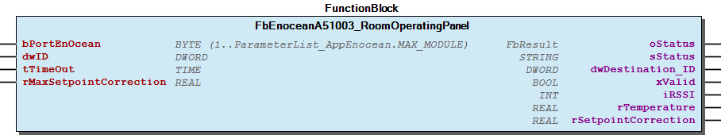 Supported EEP:

### A5/07-10-03


Please refer to the manufacturer’s manual to find the Enocean Equipment Profiles (EEP) number for your device.

Note Please refer to the manufacturer’s manual to find the Enocean Equipment Profiles (EEP) number for your device. - 01 Temperature FbEnoceanA51003_RoomOperatingPanel.Temperature (PROP) 02 Setpoint - FbEnoceanA51003_RoomOperatingPanel.MaxSetpointCorrection (PROP) - FbEnoceanA51003_RoomOperatingPanel.SetpointCorrection (PROP)

## FbEnoceanA51004_RoomOperatingPanel (FB)


| Scope | Name | Type | Initial | Comment | Inherited from |
| --- | --- | --- | --- | --- | --- |
| Input | bPortEnOcean | BYTE (1..ParameterList_AppEnocean.MAX_MODULE) | 1 | Master assignment number. Range 1 to MAX_MASTER. | FbEnoceanBase |
| Output | oStatus | WagoSysErrorBase.FbResult |  | Status object. (Listed in Status ) The content of the error object could be displayed via the FbShowResult from the WagoSysErrorBase library. | FbEnoceanBase |
| sStatus | STRING |  | Status description as string (Listed in Status ) | FbEnoceanBase |
| Input | dwID | DWORD |  | Device ID | FbDevice |
| tTimeOut | TIME | TIME#60m0s0ms | Maximal time gap between telegrams | FbReceiver_4BS |
| Output | dwDestination_ID | DWORD |  | Destination ID | FbReceiver_4BS |
| xValid | BOOL |  | Valid telegram | FbReceiver_4BS |
| iRSSI | INT |  | Received signal strengh indication (-90...-45dBm) = (bad...good) | FbReceiver_4BS |
| Input | rMaxSetpointCorrection | REAL |  | Maximum setpoint correction value |  |
| Output | rTemperature | REAL |  | Temperature measured by the temperature sensor in °C. Range 0°C-40°C |  |
| rSetpointCorrection | REAL |  | Temperature setpoint correction value in °C |  |
| xAuto | BOOL |  | Fan speed stage auto |  |
| xStage_0 | BOOL |  | Fan speed stage 0 |  |
| xStage_1 | BOOL |  | Fan speed stage 1 |  |
| xStage_2 | BOOL |  | Fan speed stage 2 |  |
| xStage_3 | BOOL |  | Fan speed stage 3 |  |

The Function block decodes Enocean device according to the Enocean Equipment Profiles (EEP).

Graphical Illustration

Supported EEP:

Interface variables Function The Function block decodes Enocean device according to the Enocean Equipment Profiles (EEP). Graphical Illustration  Supported EEP:

### A5/07-10-04


Please refer to the manufacturer’s manual to find the Enocean Equipment Profiles (EEP) number for your device.

Note Please refer to the manufacturer’s manual to find the Enocean Equipment Profiles (EEP) number for your device. - 01 Temperature FbEnoceanA51004_RoomOperatingPanel.Temperature (PROP) 02 Setpoint - FbEnoceanA51004_RoomOperatingPanel.MaxSetpointCorrection (PROP) - FbEnoceanA51004_RoomOperatingPanel.SetpointCorrection (PROP) 03 Fan speed - FbEnoceanA51004_RoomOperatingPanel.Auto (PROP) - FbEnoceanA51004_RoomOperatingPanel.Stage_0 (PROP) - FbEnoceanA51004_RoomOperatingPanel.Stage_1 (PROP) - FbEnoceanA51004_RoomOperatingPanel.Stage_2 (PROP) - FbEnoceanA51004_RoomOperatingPanel.Stage_3 (PROP)

## FbEnoceanA51005_RoomOperatingPanel (FB)


| Scope | Name | Type | Initial | Comment | Inherited from |
| --- | --- | --- | --- | --- | --- |
| Input | bPortEnOcean | BYTE (1..ParameterList_AppEnocean.MAX_MODULE) | 1 | Master assignment number. Range 1 to MAX_MASTER. | FbEnoceanBase |
| Output | oStatus | WagoSysErrorBase.FbResult |  | Status object. (Listed in Status ) The content of the error object could be displayed via the FbShowResult from the WagoSysErrorBase library. | FbEnoceanBase |
| sStatus | STRING |  | Status description as string (Listed in Status ) | FbEnoceanBase |
| Input | dwID | DWORD |  | Device ID | FbDevice |
| tTimeOut | TIME | TIME#60m0s0ms | Maximal time gap between telegrams | FbReceiver_4BS |
| Output | dwDestination_ID | DWORD |  | Destination ID | FbReceiver_4BS |
| xValid | BOOL |  | Valid telegram | FbReceiver_4BS |
| iRSSI | INT |  | Received signal strengh indication (-90...-45dBm) = (bad...good) | FbReceiver_4BS |
| Input | rMaxSetpointCorrection | REAL |  | Maximum setpoint correction value |  |
| Output | rTemperature | REAL |  | Temperature measured by the temperature sensor in °C.. Range 0°C-40°C |  |
| rSetpointCorrection | REAL |  | Temperature setpoint correction value in °C |  |
| xBinaryState | BOOL |  | Binary state DB0.0 |  |

The Function block decodes Enocean device according to the Enocean Equipment Profiles (EEP).

Graphical Illustration

Supported EEP:

Interface variables Function The Function block decodes Enocean device according to the Enocean Equipment Profiles (EEP). Graphical Illustration  Supported EEP:

### A5/07-10-05


Please refer to the manufacturer’s manual to find the Enocean Equipment Profiles (EEP) number for your device.

Note Please refer to the manufacturer’s manual to find the Enocean Equipment Profiles (EEP) number for your device. - 01 Temperature FbEnoceanA51005_RoomOperatingPanel.Temperature (PROP) 02 Setpoint - FbEnoceanA51005_RoomOperatingPanel.MaxSetpointCorrection (PROP) - FbEnoceanA51005_RoomOperatingPanel.SetpointCorrection (PROP) 03 Binary State - FbEnoceanA51005_RoomOperatingPanel.BinaryState (PROP)

## FbEnoceanA51006_RoomOperatingPanel (FB)


| Scope | Name | Type | Initial | Comment | Inherited from |
| --- | --- | --- | --- | --- | --- |
| Input | bPortEnOcean | BYTE (1..ParameterList_AppEnocean.MAX_MODULE) | 1 | Master assignment number. Range 1 to MAX_MASTER. | FbEnoceanBase |
| Output | oStatus | WagoSysErrorBase.FbResult |  | Status object. (Listed in Status ) The content of the error object could be displayed via the FbShowResult from the WagoSysErrorBase library. | FbEnoceanBase |
| sStatus | STRING |  | Status description as string (Listed in Status ) | FbEnoceanBase |
| Input | dwID | DWORD |  | Device ID | FbDevice |
| tTimeOut | TIME | TIME#60m0s0ms | Maximal time gap between telegrams | FbReceiver_4BS |
| Output | dwDestination_ID | DWORD |  | Destination ID | FbReceiver_4BS |
| xValid | BOOL |  | Valid telegram | FbReceiver_4BS |
| iRSSI | INT |  | Received signal strengh indication (-90...-45dBm) = (bad...good) | FbReceiver_4BS |
| Input | rMaxSetpointCorrection | REAL |  | Maximum setpoint correction value |  |
| Output | rTemperature | REAL |  | Temperature measured by the temperature sensor in °C. Range 0°C-40°C |  |
| rSetpointCorrection | REAL |  | Temperature setpoint correction value in °C |  |
| xBinaryState | BOOL |  | Binary state DB0.0 |  |

The Function block decodes Enocean device according to the Enocean Equipment Profiles (EEP).

Graphical Illustration

Supported EEP:

Interface variables Function The Function block decodes Enocean device according to the Enocean Equipment Profiles (EEP). Graphical Illustration  Supported EEP:

### A5/07-10-06


Please refer to the manufacturer’s manual to find the Enocean Equipment Profiles (EEP) number for your device.

Note Please refer to the manufacturer’s manual to find the Enocean Equipment Profiles (EEP) number for your device. - 01 Temperature FbEnoceanA51006_RoomOperatingPanel.Temperature (PROP) 02 Setpoint - FbEnoceanA51006_RoomOperatingPanel.MaxSetpointCorrection (PROP) - FbEnoceanA51006_RoomOperatingPanel.SetpointCorrection (PROP) 03 Binary State - FbEnoceanA51006_RoomOperatingPanel.BinaryState (PROP)

## FbEnoceanA51007_RoomOperatingPanel (FB)


| Scope | Name | Type | Initial | Comment | Inherited from |
| --- | --- | --- | --- | --- | --- |
| Input | bPortEnOcean | BYTE (1..ParameterList_AppEnocean.MAX_MODULE) | 1 | Master assignment number. Range 1 to MAX_MASTER. | FbEnoceanBase |
| Output | oStatus | WagoSysErrorBase.FbResult |  | Status object. (Listed in Status ) The content of the error object could be displayed via the FbShowResult from the WagoSysErrorBase library. | FbEnoceanBase |
| sStatus | STRING |  | Status description as string (Listed in Status ) | FbEnoceanBase |
| Input | dwID | DWORD |  | Device ID | FbDevice |
| tTimeOut | TIME | TIME#60m0s0ms | Maximal time gap between telegrams | FbReceiver_4BS |
| Output | dwDestination_ID | DWORD |  | Destination ID | FbReceiver_4BS |
| xValid | BOOL |  | Valid telegram | FbReceiver_4BS |
| iRSSI | INT |  | Received signal strengh indication (-90...-45dBm) = (bad...good) | FbReceiver_4BS |
| rTemperature | REAL |  | Temperature measured by the temperature sensor in °C. Range 0°C-40°C |  |
| xAuto | BOOL |  | Fan speed stage auto |  |
| xStage_0 | BOOL |  | Fan speed stage 0 |  |
| xStage_1 | BOOL |  | Fan speed stage 1 |  |
| xStage_2 | BOOL |  | Fan speed stage 2 |  |
| xStage_3 | BOOL |  | Fan speed stage 3 |  |

The Function block decodes Enocean device according to the Enocean Equipment Profiles (EEP).

Graphical Illustration

Supported EEP:

Interface variables Function The Function block decodes Enocean device according to the Enocean Equipment Profiles (EEP). Graphical Illustration  Supported EEP:

### A5/07-10-07


Please refer to the manufacturer’s manual to find the Enocean Equipment Profiles (EEP) number for your device.

Note Please refer to the manufacturer’s manual to find the Enocean Equipment Profiles (EEP) number for your device. - 01 Temperature FbEnoceanA51007_RoomOperatingPanel.Temperature (PROP) 02 Fan speed - FbEnoceanA51007_RoomOperatingPanel.Auto (PROP) - FbEnoceanA51007_RoomOperatingPanel.Stage_0 (PROP) - FbEnoceanA51007_RoomOperatingPanel.Stage_1 (PROP) - FbEnoceanA51007_RoomOperatingPanel.Stage_2 (PROP) - FbEnoceanA51007_RoomOperatingPanel.Stage_3 (PROP)

## FbEnoceanA51008_RoomOperatingPanel (FB)


| Scope | Name | Type | Initial | Comment | Inherited from |
| --- | --- | --- | --- | --- | --- |
| Input | bPortEnOcean | BYTE (1..ParameterList_AppEnocean.MAX_MODULE) | 1 | Master assignment number. Range 1 to MAX_MASTER. | FbEnoceanBase |
| Output | oStatus | WagoSysErrorBase.FbResult |  | Status object. (Listed in Status ) The content of the error object could be displayed via the FbShowResult from the WagoSysErrorBase library. | FbEnoceanBase |
| sStatus | STRING |  | Status description as string (Listed in Status ) | FbEnoceanBase |
| Input | dwID | DWORD |  | Device ID | FbDevice |
| tTimeOut | TIME | TIME#60m0s0ms | Maximal time gap between telegrams | FbReceiver_4BS |
| Output | dwDestination_ID | DWORD |  | Destination ID | FbReceiver_4BS |
| xValid | BOOL |  | Valid telegram | FbReceiver_4BS |
| iRSSI | INT |  | Received signal strengh indication (-90...-45dBm) = (bad...good) | FbReceiver_4BS |
| rTemperature | REAL |  | Temperature measured by the temperature sensor in °C. Range 0°C-40°C |  |
| xBinaryState | BOOL |  | Binary state DB0.0 |  |
| xAuto | BOOL |  | Fan speed stage auto |  |
| xStage_0 | BOOL |  | Fan speed stage 0 |  |
| xStage_1 | BOOL |  | Fan speed stage 1 |  |
| xStage_2 | BOOL |  | Fan speed stage 2 |  |
| xStage_3 | BOOL |  | Fan speed stage 3 |  |

The Function block decodes Enocean device according to the Enocean Equipment Profiles (EEP).

Graphical Illustration

Supported EEP:

Interface variables Function The Function block decodes Enocean device according to the Enocean Equipment Profiles (EEP). Graphical Illustration  Supported EEP:

### A5/07-10-08


Please refer to the manufacturer’s manual to find the Enocean Equipment Profiles (EEP) number for your device.

Note Please refer to the manufacturer’s manual to find the Enocean Equipment Profiles (EEP) number for your device. - 01 Temperature FbEnoceanA51008_RoomOperatingPanel.Temperature (PROP) 02 Binary State - FbEnoceanA51008_RoomOperatingPanel.BinaryState (PROP) 03 Fan speed - FbEnoceanA51008_RoomOperatingPanel.Auto (PROP) - FbEnoceanA51008_RoomOperatingPanel.Stage_0 (PROP) - FbEnoceanA51008_RoomOperatingPanel.Stage_1 (PROP) - FbEnoceanA51008_RoomOperatingPanel.Stage_2 (PROP) - FbEnoceanA51008_RoomOperatingPanel.Stage_3 (PROP)

## FbEnoceanA51009_RoomOperatingPanel (FB)


| Scope | Name | Type | Initial | Comment | Inherited from |
| --- | --- | --- | --- | --- | --- |
| Input | bPortEnOcean | BYTE (1..ParameterList_AppEnocean.MAX_MODULE) | 1 | Master assignment number. Range 1 to MAX_MASTER. | FbEnoceanBase |
| Output | oStatus | WagoSysErrorBase.FbResult |  | Status object. (Listed in Status ) The content of the error object could be displayed via the FbShowResult from the WagoSysErrorBase library. | FbEnoceanBase |
| sStatus | STRING |  | Status description as string (Listed in Status ) | FbEnoceanBase |
| Input | dwID | DWORD |  | Device ID | FbDevice |
| tTimeOut | TIME | TIME#60m0s0ms | Maximal time gap between telegrams | FbReceiver_4BS |
| Output | dwDestination_ID | DWORD |  | Destination ID | FbReceiver_4BS |
| xValid | BOOL |  | Valid telegram | FbReceiver_4BS |
| iRSSI | INT |  | Received signal strengh indication (-90...-45dBm) = (bad...good) | FbReceiver_4BS |
| rTemperature | REAL |  | Temperature measured by the temperature sensor in °C. Range 0°C-40°C |  |
| xBinaryState | BOOL |  | Binary state DB0.0 |  |
| xAuto | BOOL |  | Fan speed stage auto |  |
| xStage_0 | BOOL |  | Fan speed stage 0 |  |
| xStage_1 | BOOL |  | Fan speed stage 1 |  |
| xStage_2 | BOOL |  | Fan speed stage 2 |  |
| xStage_3 | BOOL |  | Fan speed stage 3 |  |

The Function block decodes Enocean device according to the Enocean Equipment Profiles (EEP).

Graphical Illustration

Supported EEP:

Interface variables Function The Function block decodes Enocean device according to the Enocean Equipment Profiles (EEP). Graphical Illustration  Supported EEP:

### A5/07-10-09


Please refer to the manufacturer’s manual to find the Enocean Equipment Profiles (EEP) number for your device.

Note Please refer to the manufacturer’s manual to find the Enocean Equipment Profiles (EEP) number for your device. - 01 Temperature FbEnoceanA51009_RoomOperatingPanel.Temperature (PROP) 02 Binary State - FbEnoceanA51009_RoomOperatingPanel.BinaryState (PROP) 03 Fan speed - FbEnoceanA51009_RoomOperatingPanel.Auto (PROP) - FbEnoceanA51009_RoomOperatingPanel.Stage_0 (PROP) - FbEnoceanA51009_RoomOperatingPanel.Stage_1 (PROP) - FbEnoceanA51009_RoomOperatingPanel.Stage_2 (PROP) - FbEnoceanA51009_RoomOperatingPanel.Stage_3 (PROP)

## FbEnoceanA5100A_RoomOperatingPanel (FB)


| Scope | Name | Type | Initial | Comment | Inherited from |
| --- | --- | --- | --- | --- | --- |
| Input | bPortEnOcean | BYTE (1..ParameterList_AppEnocean.MAX_MODULE) | 1 | Master assignment number. Range 1 to MAX_MASTER. | FbEnoceanBase |
| Output | oStatus | WagoSysErrorBase.FbResult |  | Status object. (Listed in Status ) The content of the error object could be displayed via the FbShowResult from the WagoSysErrorBase library. | FbEnoceanBase |
| sStatus | STRING |  | Status description as string (Listed in Status ) | FbEnoceanBase |
| Input | dwID | DWORD |  | Device ID | FbDevice |
| tTimeOut | TIME | TIME#60m0s0ms | Maximal time gap between telegrams | FbReceiver_4BS |
| Output | dwDestination_ID | DWORD |  | Destination ID | FbReceiver_4BS |
| xValid | BOOL |  | Valid telegram | FbReceiver_4BS |
| iRSSI | INT |  | Received signal strengh indication (-90...-45dBm) = (bad...good) | FbReceiver_4BS |
| Input | rMaxSetpointCorrection | REAL |  | Maximum temperature setpoint correction value in °C. Range 0°C-40°C |  |
| Output | rTemperature | REAL |  | Temperature measured by the temperature sensor in °C |  |
| rSetpointCorrection | REAL |  | Temperature setpoint correction value in °C |  |
| xBinaryState | BOOL |  | Binary state DB0.0 |  |

The Function block decodes Enocean device according to the Enocean Equipment Profiles (EEP).

Graphical Illustration

Supported EEP:

Interface variables Function The Function block decodes Enocean device according to the Enocean Equipment Profiles (EEP). Graphical Illustration  Supported EEP:

### A5/07-10-0A


Please refer to the manufacturer’s manual to find the Enocean Equipment Profiles (EEP) number for your device.

Note Please refer to the manufacturer’s manual to find the Enocean Equipment Profiles (EEP) number for your device. - 01 Temperature FbEnoceanA5100A_RoomOperatingPanel.Temperature (PROP) 02 Setpoint - FbEnoceanA5100A_RoomOperatingPanel.MaxSetpointCorrection (PROP) - FbEnoceanA5100A_RoomOperatingPanel.SetpointCorrection (PROP) 03 Binary State - FbEnoceanA5100A_RoomOperatingPanel.BinaryState (PROP)

## FbEnoceanA5100B_RoomOperatingPanel (FB)


| Scope | Name | Type | Initial | Comment | Inherited from |
| --- | --- | --- | --- | --- | --- |
| Input | bPortEnOcean | BYTE (1..ParameterList_AppEnocean.MAX_MODULE) | 1 | Master assignment number. Range 1 to MAX_MASTER. | FbEnoceanBase |
| Output | oStatus | WagoSysErrorBase.FbResult |  | Status object. (Listed in Status ) The content of the error object could be displayed via the FbShowResult from the WagoSysErrorBase library. | FbEnoceanBase |
| sStatus | STRING |  | Status description as string (Listed in Status ) | FbEnoceanBase |
| Input | dwID | DWORD |  | Device ID | FbDevice |
| tTimeOut | TIME | TIME#60m0s0ms | Maximal time gap between telegrams | FbReceiver_4BS |
| Output | dwDestination_ID | DWORD |  | Destination ID | FbReceiver_4BS |
| xValid | BOOL |  | Valid telegram | FbReceiver_4BS |
| iRSSI | INT |  | Received signal strengh indication (-90...-45dBm) = (bad...good) | FbReceiver_4BS |
| rTemperature | REAL |  | Temperature measured by the temperature sensor in °C. Range 0°C-40°C |  |
| xBinaryState | BOOL |  | Binary state DB0.0 |  |

The Function block decodes Enocean device according to the Enocean Equipment Profiles (EEP).

Graphical Illustration

Supported EEP:

Interface variables Function The Function block decodes Enocean device according to the Enocean Equipment Profiles (EEP). Graphical Illustration  Supported EEP:

### A5/07-10-0B


Please refer to the manufacturer’s manual to find the Enocean Equipment Profiles (EEP) number for your device.

Note Please refer to the manufacturer’s manual to find the Enocean Equipment Profiles (EEP) number for your device. - 01 Temperature FbEnoceanA5100B_RoomOperatingPanel.Temperature (PROP) 02 Binary State - FbEnoceanA5100B_RoomOperatingPanel.BinaryState (PROP)

## FbEnoceanA5100C_RoomOperatingPanel (FB)


| Scope | Name | Type | Initial | Comment | Inherited from |
| --- | --- | --- | --- | --- | --- |
| Input | bPortEnOcean | BYTE (1..ParameterList_AppEnocean.MAX_MODULE) | 1 | Master assignment number. Range 1 to MAX_MASTER. | FbEnoceanBase |
| Output | oStatus | WagoSysErrorBase.FbResult |  | Status object. (Listed in Status ) The content of the error object could be displayed via the FbShowResult from the WagoSysErrorBase library. | FbEnoceanBase |
| sStatus | STRING |  | Status description as string (Listed in Status ) | FbEnoceanBase |
| Input | dwID | DWORD |  | Device ID | FbDevice |
| tTimeOut | TIME | TIME#60m0s0ms | Maximal time gap between telegrams | FbReceiver_4BS |
| Output | dwDestination_ID | DWORD |  | Destination ID | FbReceiver_4BS |
| xValid | BOOL |  | Valid telegram | FbReceiver_4BS |
| iRSSI | INT |  | Received signal strengh indication (-90...-45dBm) = (bad...good) | FbReceiver_4BS |
| rTemperature | REAL |  | Temperature measured by the temperature sensor in °C. Range 0°C-40°C |  |
| xBinaryState | BOOL |  | Binary state DB0.0 |  |

The Function block decodes Enocean device according to the Enocean Equipment Profiles (EEP).

Graphical Illustration

Supported EEP:

Interface variables Function The Function block decodes Enocean device according to the Enocean Equipment Profiles (EEP). Graphical Illustration 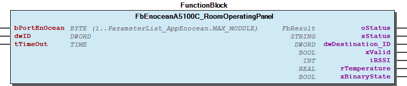 Supported EEP:

### A5/07-10-0C


Please refer to the manufacturer’s manual to find the Enocean Equipment Profiles (EEP) number for your device.

Note Please refer to the manufacturer’s manual to find the Enocean Equipment Profiles (EEP) number for your device. - 01 Temperature FbEnoceanA5100C_RoomOperatingPanel.Temperature (PROP) 02 Binary State - FbEnoceanA5100C_RoomOperatingPanel.BinaryState (PROP)

## FbEnoceanA5100D_RoomOperatingPanel (FB)


| Scope | Name | Type | Initial | Comment | Inherited from |
| --- | --- | --- | --- | --- | --- |
| Input | bPortEnOcean | BYTE (1..ParameterList_AppEnocean.MAX_MODULE) | 1 | Master assignment number. Range 1 to MAX_MASTER. | FbEnoceanBase |
| Output | oStatus | WagoSysErrorBase.FbResult |  | Status object. (Listed in Status ) The content of the error object could be displayed via the FbShowResult from the WagoSysErrorBase library. | FbEnoceanBase |
| sStatus | STRING |  | Status description as string (Listed in Status ) | FbEnoceanBase |
| Input | dwID | DWORD |  | Device ID | FbDevice |
| tTimeOut | TIME | TIME#60m0s0ms | Maximal time gap between telegrams | FbReceiver_4BS |
| Output | dwDestination_ID | DWORD |  | Destination ID | FbReceiver_4BS |
| xValid | BOOL |  | Valid telegram | FbReceiver_4BS |
| iRSSI | INT |  | Received signal strengh indication (-90...-45dBm) = (bad...good) | FbReceiver_4BS |
| rTemperature | REAL |  | Temperature measured by the temperature sensor in °C. Range 0°C-40°C |  |
| xBinaryState | BOOL |  | Binary state DB0.0 |  |

The Function block decodes Enocean device according to the Enocean Equipment Profiles (EEP).

Graphical Illustration

Supported EEP:

Interface variables Function The Function block decodes Enocean device according to the Enocean Equipment Profiles (EEP). Graphical Illustration  Supported EEP:

### A5/07-10-0D


Please refer to the manufacturer’s manual to find the Enocean Equipment Profiles (EEP) number for your device.

Note Please refer to the manufacturer’s manual to find the Enocean Equipment Profiles (EEP) number for your device. - 01 Temperature FbEnoceanA5100D_RoomOperatingPanel.Temperature (PROP) 02 Binary State - FbEnoceanA5100D_RoomOperatingPanel.BinaryState (PROP)

## FbEnoceanA51010_RoomOperatingPanel (FB)


| Scope | Name | Type | Initial | Comment | Inherited from |
| --- | --- | --- | --- | --- | --- |
| Input | bPortEnOcean | BYTE (1..ParameterList_AppEnocean.MAX_MODULE) | 1 | Master assignment number. Range 1 to MAX_MASTER. | FbEnoceanBase |
| Output | oStatus | WagoSysErrorBase.FbResult |  | Status object. (Listed in Status ) The content of the error object could be displayed via the FbShowResult from the WagoSysErrorBase library. | FbEnoceanBase |
| sStatus | STRING |  | Status description as string (Listed in Status ) | FbEnoceanBase |
| Input | dwID | DWORD |  | Device ID | FbDevice |
| tTimeOut | TIME | TIME#60m0s0ms | Maximal time gap between telegrams | FbReceiver_4BS |
| Output | dwDestination_ID | DWORD |  | Destination ID | FbReceiver_4BS |
| xValid | BOOL |  | Valid telegram | FbReceiver_4BS |
| iRSSI | INT |  | Received signal strengh indication (-90...-45dBm) = (bad...good) | FbReceiver_4BS |
| Input | rMaxSetpointCorrection | REAL |  | Maximum setpoint correction value |  |
| Output | rTemperature | REAL |  | Temperature measured by the temperature sensor in °C. Range 0°C-40°C |  |
| rRelativeHumidity | REAL |  | Relative Humidity measured by the humidity sensor in % |  |
| rSetpointCorrection | REAL |  | Temperature setpoint correction value in °C |  |
| xBinaryState | BOOL |  | Binary state DB0.0 |  |

The Function block decodes Enocean device according to the Enocean Equipment Profiles (EEP).

Graphical Illustration

Supported EEP:

Interface variables Function The Function block decodes Enocean device according to the Enocean Equipment Profiles (EEP). Graphical Illustration  Supported EEP:

### A5/07-10-10


Please refer to the manufacturer’s manual to find the Enocean Equipment Profiles (EEP) number for your device.

Note Please refer to the manufacturer’s manual to find the Enocean Equipment Profiles (EEP) number for your device. - 01 Temperature FbEnoceanA51010_RoomOperatingPanel.Temperature (PROP) 02 Setpoint - FbEnoceanA51010_RoomOperatingPanel.MaxSetpointCorrection (PROP) - FbEnoceanA51010_RoomOperatingPanel.SetpointCorrection (PROP) 03 Binary State - FbEnoceanA51010_RoomOperatingPanel.BinaryState (PROP) 04 Relative humidity - FbEnoceanA51010_RoomOperatingPanel.RelativeHumidity (PROP)

## FbEnoceanA51011_RoomOperatingPanel (FB)


| Scope | Name | Type | Initial | Comment | Inherited from |
| --- | --- | --- | --- | --- | --- |
| Input | bPortEnOcean | BYTE (1..ParameterList_AppEnocean.MAX_MODULE) | 1 | Master assignment number. Range 1 to MAX_MASTER. | FbEnoceanBase |
| Output | oStatus | WagoSysErrorBase.FbResult |  | Status object. (Listed in Status ) The content of the error object could be displayed via the FbShowResult from the WagoSysErrorBase library. | FbEnoceanBase |
| sStatus | STRING |  | Status description as string (Listed in Status ) | FbEnoceanBase |
| Input | dwID | DWORD |  | Device ID | FbDevice |
| tTimeOut | TIME | TIME#60m0s0ms | Maximal time gap between telegrams | FbReceiver_4BS |
| Output | dwDestination_ID | DWORD |  | Destination ID | FbReceiver_4BS |
| xValid | BOOL |  | Valid telegram | FbReceiver_4BS |
| iRSSI | INT |  | Received signal strengh indication (-90...-45dBm) = (bad...good) | FbReceiver_4BS |
| Input | rMaxSetpointCorrection | REAL |  | Maximum setpoint value |  |
| Output | rTemperature | REAL |  | Temperature measured by the temperature sensor in °C. Range 0°C-40°C |  |
| rRelativeHumidity | REAL |  | Relative Humidity measured by the humidity sensor in % |  |
| rSetpointCorrection | REAL |  | Temperature setpoint correction value in °C |  |
| xBinaryState | BOOL |  | Binary state DB0.0 |  |

The Function block decodes Enocean device according to the Enocean Equipment Profiles (EEP).

Graphical Illustration

Supported EEP:

Interface variables Function The Function block decodes Enocean device according to the Enocean Equipment Profiles (EEP). Graphical Illustration  Supported EEP:

### A5/07-10-11


Please refer to the manufacturer’s manual to find the Enocean Equipment Profiles (EEP) number for your device.

Note Please refer to the manufacturer’s manual to find the Enocean Equipment Profiles (EEP) number for your device. - 01 Temperature FbEnoceanA51011_RoomOperatingPanel.Temperature (PROP) 02 Setpoint - FbEnoceanA51011_RoomOperatingPanel.MaxSetpointCorrection (PROP) - FbEnoceanA51011_RoomOperatingPanel.SetpointCorrection (PROP) 03 Binary State - FbEnoceanA51011_RoomOperatingPanel.BinaryState (PROP) 04 Relative humidity - FbEnoceanA51011_RoomOperatingPanel.RelativeHumidity (PROP)

## FbEnoceanA51012_RoomOperatingPanel (FB)


| Scope | Name | Type | Initial | Comment | Inherited from |
| --- | --- | --- | --- | --- | --- |
| Input | bPortEnOcean | BYTE (1..ParameterList_AppEnocean.MAX_MODULE) | 1 | Master assignment number. Range 1 to MAX_MASTER. | FbEnoceanBase |
| Output | oStatus | WagoSysErrorBase.FbResult |  | Status object. (Listed in Status ) The content of the error object could be displayed via the FbShowResult from the WagoSysErrorBase library. | FbEnoceanBase |
| sStatus | STRING |  | Status description as string (Listed in Status ) | FbEnoceanBase |
| Input | dwID | DWORD |  | Device ID | FbDevice |
| tTimeOut | TIME | TIME#60m0s0ms | Maximal time gap between telegrams | FbReceiver_4BS |
| Output | dwDestination_ID | DWORD |  | Destination ID | FbReceiver_4BS |
| xValid | BOOL |  | Valid telegram | FbReceiver_4BS |
| iRSSI | INT |  | Received signal strengh indication (-90...-45dBm) = (bad...good) | FbReceiver_4BS |
| Input | rMaxSetpointCorrection | REAL |  | Maximum setpoint correction value |  |
| Output | rTemperature | REAL |  | Temperature measured by the temperature sensor in °C. Range 0°C-40°C |  |
| rRelativeHumidity | REAL |  | Relative Humidity measured by the humidity sensor in % |  |
| rSetpointCorrection | REAL |  | Temperature setpoint correction value in °C |  |

The Function block decodes Enocean device according to the Enocean Equipment Profiles (EEP).

Graphical Illustration

Supported EEP:

Interface variables Function The Function block decodes Enocean device according to the Enocean Equipment Profiles (EEP). Graphical Illustration  Supported EEP:

### A5/07-10-12


Please refer to the manufacturer’s manual to find the Enocean Equipment Profiles (EEP) number for your device.

Note Please refer to the manufacturer’s manual to find the Enocean Equipment Profiles (EEP) number for your device. - 01 Temperature FbEnoceanA51012_RoomOperatingPanel.Temperature (PROP) 02 Setpoint - FbEnoceanA51012_RoomOperatingPanel.MaxSetpointCorrection (PROP) - FbEnoceanA51012_RoomOperatingPanel.SetpointCorrection (PROP) 03 Relative humidity - FbEnoceanA51012_RoomOperatingPanel.RelativeHumidity (PROP)

## FbEnoceanA51013_RoomOperatingPanel (FB)


| Scope | Name | Type | Initial | Comment | Inherited from |
| --- | --- | --- | --- | --- | --- |
| Input | bPortEnOcean | BYTE (1..ParameterList_AppEnocean.MAX_MODULE) | 1 | Master assignment number. Range 1 to MAX_MASTER. | FbEnoceanBase |
| Output | oStatus | WagoSysErrorBase.FbResult |  | Status object. (Listed in Status ) The content of the error object could be displayed via the FbShowResult from the WagoSysErrorBase library. | FbEnoceanBase |
| sStatus | STRING |  | Status description as string (Listed in Status ) | FbEnoceanBase |
| Input | dwID | DWORD |  | Device ID | FbDevice |
| tTimeOut | TIME | TIME#60m0s0ms | Maximal time gap between telegrams | FbReceiver_4BS |
| Output | dwDestination_ID | DWORD |  | Destination ID | FbReceiver_4BS |
| xValid | BOOL |  | Valid telegram | FbReceiver_4BS |
| iRSSI | INT |  | Received signal strengh indication (-90...-45dBm) = (bad...good) | FbReceiver_4BS |
| rTemperature | REAL |  | Temperature measured by the temperature sensor in °C. Range 0°C-40°C |  |
| rRelativeHumidity | REAL |  | Relative Humidity measured by the humidity sensor in % |  |
| xBinaryState | BOOL |  | Binary state DB0.0 |  |

The Function block decodes Enocean device according to the Enocean Equipment Profiles (EEP).

Graphical Illustration

Supported EEP:

Interface variables Function The Function block decodes Enocean device according to the Enocean Equipment Profiles (EEP). Graphical Illustration  Supported EEP:

### A5/07-10-13


Please refer to the manufacturer’s manual to find the Enocean Equipment Profiles (EEP) number for your device.

Note Please refer to the manufacturer’s manual to find the Enocean Equipment Profiles (EEP) number for your device. - 01 Temperature FbEnoceanA51013_RoomOperatingPanel.Temperature (PROP) 02 Binary State - FbEnoceanA51013_RoomOperatingPanel.BinaryState (PROP) 03 Relative humidity - FbEnoceanA51013_RoomOperatingPanel.RelativeHumidity (PROP)

## FbEnoceanA51014_RoomOperatingPanel (FB)


| Scope | Name | Type | Initial | Comment | Inherited from |
| --- | --- | --- | --- | --- | --- |
| Input | bPortEnOcean | BYTE (1..ParameterList_AppEnocean.MAX_MODULE) | 1 | Master assignment number. Range 1 to MAX_MASTER. | FbEnoceanBase |
| Output | oStatus | WagoSysErrorBase.FbResult |  | Status object. (Listed in Status ) The content of the error object could be displayed via the FbShowResult from the WagoSysErrorBase library. | FbEnoceanBase |
| sStatus | STRING |  | Status description as string (Listed in Status ) | FbEnoceanBase |
| Input | dwID | DWORD |  | Device ID | FbDevice |
| tTimeOut | TIME | TIME#60m0s0ms | Maximal time gap between telegrams | FbReceiver_4BS |
| Output | dwDestination_ID | DWORD |  | Destination ID | FbReceiver_4BS |
| xValid | BOOL |  | Valid telegram | FbReceiver_4BS |
| iRSSI | INT |  | Received signal strengh indication (-90...-45dBm) = (bad...good) | FbReceiver_4BS |
| rTemperature | REAL |  | Temperature measured by the temperature sensor in °C. Range 0°C-40°C |  |
| rRelativeHumidity | REAL |  | Relative Humidity measured by the humidity sensor in % |  |
| xBinaryState | BOOL |  | Binary state DB0.0 |  |

The Function block decodes Enocean device according to the Enocean Equipment Profiles (EEP).

Graphical Illustration

Supported EEP:

Interface variables Function The Function block decodes Enocean device according to the Enocean Equipment Profiles (EEP). Graphical Illustration  Supported EEP:

### A5/07-10-14


Please refer to the manufacturer’s manual to find the Enocean Equipment Profiles (EEP) number for your device.

Note Please refer to the manufacturer’s manual to find the Enocean Equipment Profiles (EEP) number for your device. - 01 Temperature FbEnoceanA51014_RoomOperatingPanel.Temperature (PROP) 02 Binary State - FbEnoceanA51014_RoomOperatingPanel.BinaryState (PROP) 03 Relative humidity - FbEnoceanA51014_RoomOperatingPanel.RelativeHumidity (PROP)

## FbEnoceanA51015_RoomOperatingPanel (FB)


| Scope | Name | Type | Initial | Comment | Inherited from |
| --- | --- | --- | --- | --- | --- |
| Input | bPortEnOcean | BYTE (1..ParameterList_AppEnocean.MAX_MODULE) | 1 | Master assignment number. Range 1 to MAX_MASTER. | FbEnoceanBase |
| Output | oStatus | WagoSysErrorBase.FbResult |  | Status object. (Listed in Status ) The content of the error object could be displayed via the FbShowResult from the WagoSysErrorBase library. | FbEnoceanBase |
| sStatus | STRING |  | Status description as string (Listed in Status ) | FbEnoceanBase |
| Input | dwID | DWORD |  | Device ID | FbDevice |
| tTimeOut | TIME | TIME#60m0s0ms | Maximal time gap between telegrams | FbReceiver_4BS |
| Output | dwDestination_ID | DWORD |  | Destination ID | FbReceiver_4BS |
| xValid | BOOL |  | Valid telegram | FbReceiver_4BS |
| iRSSI | INT |  | Received signal strengh indication (-90...-45dBm) = (bad...good) | FbReceiver_4BS |
| Input | rMaxSetpointCorrection | REAL |  | Maximum setpoint correction value |  |
| Output | rTemperature | REAL |  | Temperature measured by the temperature sensor in °C. Range -10°C...41.2°C |  |
| rSetpointCorrection | REAL |  | Temperature setpoint correction value in °C |  |

The Function block decodes Enocean device according to the Enocean Equipment Profiles (EEP).

Graphical Illustration

Supported EEP:

Interface variables Function The Function block decodes Enocean device according to the Enocean Equipment Profiles (EEP). Graphical Illustration  Supported EEP:

### A5/07-10-15


Please refer to the manufacturer’s manual to find the Enocean Equipment Profiles (EEP) number for your device.

Note Please refer to the manufacturer’s manual to find the Enocean Equipment Profiles (EEP) number for your device. - 01 Temperature FbEnoceanA51015_RoomOperatingPanel.Temperature (PROP) 02 Setpoint - FbEnoceanA51015_RoomOperatingPanel.MaxSetpointCorrection (PROP) - FbEnoceanA51015_RoomOperatingPanel.SetpointCorrection (PROP)

## FbEnoceanA51016_RoomOperatingPanel (FB)


| Scope | Name | Type | Initial | Comment | Inherited from |
| --- | --- | --- | --- | --- | --- |
| Input | bPortEnOcean | BYTE (1..ParameterList_AppEnocean.MAX_MODULE) | 1 | Master assignment number. Range 1 to MAX_MASTER. | FbEnoceanBase |
| Output | oStatus | WagoSysErrorBase.FbResult |  | Status object. (Listed in Status ) The content of the error object could be displayed via the FbShowResult from the WagoSysErrorBase library. | FbEnoceanBase |
| sStatus | STRING |  | Status description as string (Listed in Status ) | FbEnoceanBase |
| Input | dwID | DWORD |  | Device ID | FbDevice |
| tTimeOut | TIME | TIME#60m0s0ms | Maximal time gap between telegrams | FbReceiver_4BS |
| Output | dwDestination_ID | DWORD |  | Destination ID | FbReceiver_4BS |
| xValid | BOOL |  | Valid telegram | FbReceiver_4BS |
| iRSSI | INT |  | Received signal strengh indication (-90...-45dBm) = (bad...good) | FbReceiver_4BS |
| Input | rMaxSetpointCorrection | REAL |  | Maximum setpoint correction. |  |
| Output | rTemperature | REAL |  | Temperature measured by the temperature sensor in °C. Range -10°C...41.2°C |  |
| rSetpointCorrection | REAL |  | Temperature setpoint correction value in °C |  |
| xBinaryState | BOOL |  | Binary state DB0.0 |  |

The Function block decodes Enocean device according to the Enocean Equipment Profiles (EEP).

Graphical Illustration

Supported EEP:

Interface variables Function The Function block decodes Enocean device according to the Enocean Equipment Profiles (EEP). Graphical Illustration  Supported EEP:

### A5/07-10-16


Please refer to the manufacturer’s manual to find the Enocean Equipment Profiles (EEP) number for your device.

Note Please refer to the manufacturer’s manual to find the Enocean Equipment Profiles (EEP) number for your device. - 01 Temperature FbEnoceanA51016_RoomOperatingPanel.Temperature (PROP) 02 Setpoint - FbEnoceanA51016_RoomOperatingPanel.MaxSetpointCorrection (PROP) - FbEnoceanA51016_RoomOperatingPanel.SetpointCorrection (PROP) 03 Binary State - FbEnoceanA51016_RoomOperatingPanel.BinaryState (PROP)

## FbEnoceanA51017_RoomOperatingPanel (FB)


| Scope | Name | Type | Initial | Comment | Inherited from |
| --- | --- | --- | --- | --- | --- |
| Input | bPortEnOcean | BYTE (1..ParameterList_AppEnocean.MAX_MODULE) | 1 | Master assignment number. Range 1 to MAX_MASTER. | FbEnoceanBase |
| Output | oStatus | WagoSysErrorBase.FbResult |  | Status object. (Listed in Status ) The content of the error object could be displayed via the FbShowResult from the WagoSysErrorBase library. | FbEnoceanBase |
| sStatus | STRING |  | Status description as string (Listed in Status ) | FbEnoceanBase |
| Input | dwID | DWORD |  | Device ID | FbDevice |
| tTimeOut | TIME | TIME#60m0s0ms | Maximal time gap between telegrams | FbReceiver_4BS |
| Output | dwDestination_ID | DWORD |  | Destination ID | FbReceiver_4BS |
| xValid | BOOL |  | Valid telegram | FbReceiver_4BS |
| iRSSI | INT |  | Received signal strengh indication (-90...-45dBm) = (bad...good) | FbReceiver_4BS |
| rTemperature | REAL |  | Temperature measured by the temperature sensor in °C. Range -10°C...41.2°C |  |
| xBinaryState | BOOL |  | Binary state DB0.0 |  |

The Function block decodes Enocean device according to the Enocean Equipment Profiles (EEP).

Graphical Illustration

Supported EEP:

Interface variables Function The Function block decodes Enocean device according to the Enocean Equipment Profiles (EEP). Graphical Illustration  Supported EEP:

### A5/07-10-17


Please refer to the manufacturer’s manual to find the Enocean Equipment Profiles (EEP) number for your device.

Note Please refer to the manufacturer’s manual to find the Enocean Equipment Profiles (EEP) number for your device. - 01 Temperature FbEnoceanA51017_RoomOperatingPanel.Temperature (PROP) 02 Binary State - FbEnoceanA51017_RoomOperatingPanel.BinaryState (PROP)

## FbEnoceanA51018_RoomOperatingPanel (FB)


| Scope | Name | Type | Initial | Comment | Inherited from |
| --- | --- | --- | --- | --- | --- |
| Input | bPortEnOcean | BYTE (1..ParameterList_AppEnocean.MAX_MODULE) | 1 | Master assignment number. Range 1 to MAX_MASTER. | FbEnoceanBase |
| Output | oStatus | WagoSysErrorBase.FbResult |  | Status object. (Listed in Status ) The content of the error object could be displayed via the FbShowResult from the WagoSysErrorBase library. | FbEnoceanBase |
| sStatus | STRING |  | Status description as string (Listed in Status ) | FbEnoceanBase |
| Input | dwID | DWORD |  | Device ID | FbDevice |
| tTimeOut | TIME | TIME#60m0s0ms | Maximal time gap between telegrams | FbReceiver_4BS |
| Output | dwDestination_ID | DWORD |  | Destination ID | FbReceiver_4BS |
| xValid | BOOL |  | Valid telegram | FbReceiver_4BS |
| iRSSI | INT |  | Received signal strengh indication (-90...-45dBm) = (bad...good) | FbReceiver_4BS |
| Input | rMaxSetpointCorrection | REAL |  | Maximum setpoint correction value |  |
| Output | rTemperature | REAL |  | Temperature measured by the temperature sensor in °C. Range 0°C-40°C |  |
| rSetpointCorrection | REAL |  | Temperature setpoint correction value in °C |  |
| rIllumination | REAL |  | Illumination in lx |  |
| xBinaryState | BOOL |  | Binary state DB0.0 |  |
| xAuto | BOOL |  | Fan speed stage auto |  |
| xStage_0 | BOOL |  | Fan speed stage 0 |  |
| xStage_1 | BOOL |  | Fan speed stage 1 |  |
| xStage_2 | BOOL |  | Fan speed stage 2 |  |
| xStage_3 | BOOL |  | Fan speed stage 3 |  |
| xStage_4 | BOOL |  | Fan speed stage 4 |  |
| xStage_5 | BOOL |  | Fan speed stage 5 |  |
| xOff | BOOL |  | Off |  |

The Function block decodes Enocean device according to the Enocean Equipment Profiles (EEP).

Graphical Illustration

Supported EEP:

Interface variables Function The Function block decodes Enocean device according to the Enocean Equipment Profiles (EEP). Graphical Illustration  Supported EEP:

### A5/07-10-18


Please refer to the manufacturer’s manual to find the Enocean Equipment Profiles (EEP) number for your device.

Note Please refer to the manufacturer’s manual to find the Enocean Equipment Profiles (EEP) number for your device. - 01 Temperature FbEnoceanA51018_RoomOperatingPanel.Temperature (PROP) 02 Setpoint - FbEnoceanA51018_RoomOperatingPanel.MaxSetpointCorrection (PROP) - FbEnoceanA51018_RoomOperatingPanel.SetpointCorrection (PROP) 04 Fan speed - FbEnoceanA51018_RoomOperatingPanel.FanSpeed (PROP) 05 Binary State - FbEnoceanA51018_RoomOperatingPanel.BinaryState (PROP) 06 Illumination - FbEnoceanA51018_RoomOperatingPanel.Illumination (PROP)

## FbEnoceanA51019_RoomOperatingPanel (FB)


| Scope | Name | Type | Initial | Comment | Inherited from |
| --- | --- | --- | --- | --- | --- |
| Input | bPortEnOcean | BYTE (1..ParameterList_AppEnocean.MAX_MODULE) | 1 | Master assignment number. Range 1 to MAX_MASTER. | FbEnoceanBase |
| Output | oStatus | WagoSysErrorBase.FbResult |  | Status object. (Listed in Status ) The content of the error object could be displayed via the FbShowResult from the WagoSysErrorBase library. | FbEnoceanBase |
| sStatus | STRING |  | Status description as string (Listed in Status ) | FbEnoceanBase |
| Input | dwID | DWORD |  | Device ID | FbDevice |
| tTimeOut | TIME | TIME#60m0s0ms | Maximal time gap between telegrams | FbReceiver_4BS |
| Output | dwDestination_ID | DWORD |  | Destination ID | FbReceiver_4BS |
| xValid | BOOL |  | Valid telegram | FbReceiver_4BS |
| iRSSI | INT |  | Received signal strengh indication (-90...-45dBm) = (bad...good) | FbReceiver_4BS |
| Input | rMaxSetpointCorrection | REAL |  | Maximum setpoint correction value |  |
| Output | rTemperature | REAL |  | Temperature measured by the temperature sensor in °C. Range 0°C-40°C |  |
| rRelativeHumidity | REAL |  | Relative Humidity measured by the humidity sensor in % |  |
| rSetpointCorrection | REAL |  | Temperature setpoint correction value in °C |  |
| xBinaryState | BOOL |  | Binary state DB0.0 |  |
| xAuto | BOOL |  | Fan speed stage auto |  |
| xStage_0 | BOOL |  | Fan speed stage 0 |  |
| xStage_1 | BOOL |  | Fan speed stage 1 |  |
| xStage_2 | BOOL |  | Fan speed stage 2 |  |
| xStage_3 | BOOL |  | Fan speed stage 3 |  |
| xStage_4 | BOOL |  | Fan speed stage 4 |  |
| xStage_5 | BOOL |  | Fan speed stage 5 |  |
| xOff | BOOL |  | Off |  |

The Function block decodes Enocean device according to the Enocean Equipment Profiles (EEP).

Graphical Illustration

Supported EEP:

Interface variables Function The Function block decodes Enocean device according to the Enocean Equipment Profiles (EEP). Graphical Illustration  Supported EEP:

### A5/07-10-19


Please refer to the manufacturer’s manual to find the Enocean Equipment Profiles (EEP) number for your device.

Note Please refer to the manufacturer’s manual to find the Enocean Equipment Profiles (EEP) number for your device. - 01 Temperature FbEnoceanA51019_RoomOperatingPanel.Temperature (PROP) 02 Setpoint - FbEnoceanA51019_RoomOperatingPanel.MaxSetpointCorrection (PROP) - FbEnoceanA51019_RoomOperatingPanel.SetpointCorrection (PROP) 03 Relative humidity - FbEnoceanA51019_RoomOperatingPanel.RelativeHumidity (PROP) 04 Fan speed - FbEnoceanA51019_RoomOperatingPanel.FanSpeed (PROP) 05 Binary State - FbEnoceanA51019_RoomOperatingPanel.BinaryState (PROP)

## FbEnoceanA51022_RoomOperatingPanel (FB)


| Scope | Name | Type | Initial | Comment | Inherited from |
| --- | --- | --- | --- | --- | --- |
| Input | bPortEnOcean | BYTE (1..ParameterList_AppEnocean.MAX_MODULE) | 1 | Master assignment number. Range 1 to MAX_MASTER. | FbEnoceanBase |
| Output | oStatus | WagoSysErrorBase.FbResult |  | Status object. (Listed in Status ) The content of the error object could be displayed via the FbShowResult from the WagoSysErrorBase library. | FbEnoceanBase |
| sStatus | STRING |  | Status description as string (Listed in Status ) | FbEnoceanBase |
| Input | dwID | DWORD |  | Device ID | FbDevice |
| tTimeOut | TIME | TIME#60m0s0ms | Maximal time gap between telegrams | FbReceiver_4BS |
| Output | dwDestination_ID | DWORD |  | Destination ID | FbReceiver_4BS |
| xValid | BOOL |  | Valid telegram | FbReceiver_4BS |
| iRSSI | INT |  | Received signal strengh indication (-90...-45dBm) = (bad...good) | FbReceiver_4BS |
| Input | rMaxSetpointCorrection | REAL |  | Maximum setpoint correction value |  |
| Output | rTemperature | REAL |  | Temperature measured by the temperature sensor in °C. Range 0°C-40°C |  |
| rRelativeHumidity | REAL |  | Relative Humidity measured by the humidity sensor in % |  |
| rSetpointCorrection | REAL |  | Temperature setpoint correction value in °C |  |
| xAuto | BOOL |  | Fan speed stage auto |  |
| xStage_0 | BOOL |  | Fan speed stage 0 |  |
| xStage_1 | BOOL |  | Fan speed stage 1 |  |
| xStage_2 | BOOL |  | Fan speed stage 2 |  |
| xStage_3 | BOOL |  | Fan speed stage 3 |  |

The Function block decodes Enocean device according to the Enocean Equipment Profiles (EEP).

Graphical Illustration

Supported EEP:

Interface variables Function The Function block decodes Enocean device according to the Enocean Equipment Profiles (EEP). Graphical Illustration  Supported EEP:

### A5/07-10-22


Please refer to the manufacturer’s manual to find the Enocean Equipment Profiles (EEP) number for your device.

Note Please refer to the manufacturer’s manual to find the Enocean Equipment Profiles (EEP) number for your device. - 01 Temperature FbEnoceanA51022_RoomOperatingPanel.Temperature (PROP) 02 Setpoint - FbEnoceanA51022_RoomOperatingPanel.MaxSetpointCorrection (PROP) - FbEnoceanA51022_RoomOperatingPanel.SetpointCorrection (PROP) 03 Relative humidity - FbEnoceanA51022_RoomOperatingPanel.RelativeHumidity (PROP) 04 Fan speed - FbEnoceanA51022_RoomOperatingPanel.Auto (PROP) - FbEnoceanA51022_RoomOperatingPanel.Stage_0 (PROP) - FbEnoceanA51022_RoomOperatingPanel.Stage_1 (PROP) - FbEnoceanA51022_RoomOperatingPanel.Stage_2 (PROP) - FbEnoceanA51022_RoomOperatingPanel.Stage_3 (PROP)

## FbEnoceanA51023_RoomOperatingPanel (FB)


| Scope | Name | Type | Initial | Comment | Inherited from |
| --- | --- | --- | --- | --- | --- |
| Input | bPortEnOcean | BYTE (1..ParameterList_AppEnocean.MAX_MODULE) | 1 | Master assignment number. Range 1 to MAX_MASTER. | FbEnoceanBase |
| Output | oStatus | WagoSysErrorBase.FbResult |  | Status object. (Listed in Status ) The content of the error object could be displayed via the FbShowResult from the WagoSysErrorBase library. | FbEnoceanBase |
| sStatus | STRING |  | Status description as string (Listed in Status ) | FbEnoceanBase |
| Input | dwID | DWORD |  | Device ID | FbDevice |
| tTimeOut | TIME | TIME#60m0s0ms | Maximal time gap between telegrams | FbReceiver_4BS |
| Output | dwDestination_ID | DWORD |  | Destination ID | FbReceiver_4BS |
| xValid | BOOL |  | Valid telegram | FbReceiver_4BS |
| iRSSI | INT |  | Received signal strengh indication (-90...-45dBm) = (bad...good) | FbReceiver_4BS |
| Input | rMaxSetpointCorrection | REAL |  | Maximum setpoint correction value |  |
| Output | rTemperature | REAL |  | Temperature measured by the temperature sensor in °C. Range 0°C-40°C |  |
| rRelativeHumidity | REAL |  | Relative Humidity measured by the humidity sensor in % |  |
| rSetpointCorrection | REAL |  | Temperature setpoint correction value in °C |  |
| xBinaryState | BOOL |  | Binary state DB0.0 |  |
| xAuto | BOOL |  | Fan speed stage auto |  |
| xStage_0 | BOOL |  | Fan speed stage 0 |  |
| xStage_1 | BOOL |  | Fan speed stage 1 |  |
| xStage_2 | BOOL |  | Fan speed stage 2 |  |
| xStage_3 | BOOL |  | Fan speed stage 3 |  |

The Function block decodes Enocean device according to the Enocean Equipment Profiles (EEP).

Graphical Illustration

Supported EEP:

Interface variables Function The Function block decodes Enocean device according to the Enocean Equipment Profiles (EEP). Graphical Illustration  Supported EEP:

### A5/07-10-23


Please refer to the manufacturer’s manual to find the Enocean Equipment Profiles (EEP) number for your device.

Note Please refer to the manufacturer’s manual to find the Enocean Equipment Profiles (EEP) number for your device. - 01 Temperature FbEnoceanA51023_RoomOperatingPanel.Temperature (PROP) 02 Setpoint - FbEnoceanA51023_RoomOperatingPanel.MaxSetpointCorrection (PROP) - FbEnoceanA51023_RoomOperatingPanel.SetpointCorrection (PROP) 03 Relative humidity - FbEnoceanA51023_RoomOperatingPanel.RelativeHumidity (PROP) 04 Fan speed - FbEnoceanA51023_RoomOperatingPanel.Auto (PROP) - FbEnoceanA51023_RoomOperatingPanel.Stage_0 (PROP) - FbEnoceanA51023_RoomOperatingPanel.Stage_1 (PROP) - FbEnoceanA51023_RoomOperatingPanel.Stage_2 (PROP) - FbEnoceanA51023_RoomOperatingPanel.Stage_3 (PROP) 05 Binary State - FbEnoceanA51023_RoomOperatingPanel.BinaryState (PROP)

## FbEnoceanA510xx_RoomOperatingPanel (FB)


| Scope | Name | Type | Initial | Comment | Inherited from |
| --- | --- | --- | --- | --- | --- |
| Input | bPortEnOcean | BYTE (1..ParameterList_AppEnocean.MAX_MODULE) | 1 | Master assignment number. Range 1 to MAX_MASTER. | FbEnoceanBase |
| Output | oStatus | WagoSysErrorBase.FbResult |  | Status object. (Listed in Status ) The content of the error object could be displayed via the FbShowResult from the WagoSysErrorBase library. | FbEnoceanBase |
| sStatus | STRING |  | Status description as string (Listed in Status ) | FbEnoceanBase |
| Input | dwID | DWORD |  | Device ID | FbDevice |
| tTimeOut | TIME | TIME#60m0s0ms | Maximal time gap between telegrams | FbReceiver_4BS |
| Output | dwDestination_ID | DWORD |  | Destination ID | FbReceiver_4BS |
| xValid | BOOL |  | Valid telegram | FbReceiver_4BS |
| iRSSI | INT |  | Received signal strengh indication (-90...-45dBm) = (bad...good) | FbReceiver_4BS |
| Input | bType | BYTE | 16#1 | Device individual characteristics (TYPE) |  |
| rMaxSetpointCorrection | REAL |  | Maximum setpoint correction value |  |
| Output | rTemperature | REAL |  | Temperature measured by the temperature sensor in °C. Range 0°C-40°C |  |
| rRelativeHumidity | REAL |  | Relative Humidity measured by the humidity sensor in % |  |
| rSetpointCorrection | REAL |  | Temperature setpoint correction value in °C |  |
| xBinaryState | BOOL |  | Binary state DB0.0 |  |
| xAuto | BOOL |  | Fan speed stage auto |  |
| xStage_0 | BOOL |  | Fan speed stage 0 |  |
| xStage_1 | BOOL |  | Fan speed stage 1 |  |
| xStage_2 | BOOL |  | Fan speed stage 2 |  |
| xStage_3 | BOOL |  | Fan speed stage 3 |  |

| Profile | Type | SetPoint | Temperature | Relative Humidity | xBinary status** | Fan speed |
| A5/07-10-01 | 16#01 | 0...255 | 0°C...40°C | N/A | {TRUE\|FALSE} | Available |
| A5/07-10-02 | 16#02 | 0...255 | 0°C...40°C | N/A | {TRUE\|FALSE} | Available |
| A5/07-10-03 | 16#03 | 0...255 | 0°C...40°C | N/A | N/A | N/A |
| A5/07-10-04 | 16#04 | 0...255 | 0°C...40°C | N/A | N/A | Available |
| A5/07-10-05 | 16#05 | 0...255 | 0°C...40°C | N/A | {TRUE\|FALSE} | N/A |
| A5/07-10-06 | 16#06 | 0...255 | 0°C...40°C | N/A | {TRUE\|FALSE} | N/A |
| A5/07-10-07 | 16#07 | N/A | 0°C...40°C | N/A | N/A | Available |
| A5/07-10-08 | 16#08 | N/A | 0°C...40°C | N/A | {TRUE\|FALSE} | Available |
| A5/07-10-09 | 16#09 | N/A | 0°C...40°C | N/A | {TRUE\|FALSE} | Available |
| A5/07-10-0A | 16#0A | 0...255 | 0°C...40°C | N/A | {TRUE\|FALSE} | N/A |
| A5/07-10-0B | 16#0B | N/A | 0°C...40°C | N/A | {TRUE\|FALSE} | N/A |
| A5/07-10-0C | 16#0C | N/A | 0°C...40°C | N/A | {TRUE\|FALSE} | N/A |
| A5/07-10-0D | 16#0D | N/A | 0°C...40°C | N/A | {TRUE\|FALSE} | N/A |
| A5/07-10-10 | 16#10 | 0...255 | 0°C...40°C | 0%...100% | {TRUE\|FALSE} | N/A |
| A5/07-10-11 | 16#11 | 0...255 | 0°C...40°C | 0%...100% | {TRUE\|FALSE} | N/A |
| A5/07-10-12 | 16#12 | 0...255 | 0°C...40°C | 0%...100% | N/A | N/A |
| A5/07-10-13 | 16#13 | N/A | 0°C...40°C | 0%...100% | {TRUE\|FALSE} | N/A |
| A5/07-10-14 | 16#14 | N/A | 0°C...40°C | 0%...100% | {TRUE\|FALSE} | N/A |
| A5/07-10-15 | 16#15 | 0...63 | -10°C...41.2°C | N/A | N/A | N/A |
| A5/07-10-16 | 16#16 | 0...63 | -10°C...41.2°C | N/A | {TRUE\|FALSE} | N/A |
| A5/07-10-17 | 16#17 | N/A | -10°C...41.2°C | N/A | {TRUE\|FALSE} | N/A |
| A5/07-10-22 | 16#22 | 0...255 | 0°C...40°C | 0%...100% | N/A | Available |
| A5/07-10-23 | 16#23 | 0...255 | 0°C...40°C | 0%...100% | {TRUE\|FALSE} | Available |

The Function block decodes Enocean devices with an Enocean Profile A5-10-xx or 07-10-xx.

Graphical Illustration

Function description

The ‘’bType’’ input corresponds to the device individual characteristics (TYPE) and must be input according to the EnOcean Equipment Profile (EEP) used by the sensor.

The maximum setpoint correction is specified at the ‘’rMaxSetpointCorrection’’ output.

Please refer to EnOcean Equipment Profiles (EEP) or the manufacturer’s manual to find the TYPE number for your device.

Please refer to the manufacturer’s manual to find the Enocean Equipment Profiles (EEP) number for your device.

Interface variables Function The Function block decodes Enocean devices with an Enocean Profile A5-10-xx or 07-10-xx. Graphical Illustration  Function description The ‘’bType’’ input corresponds to the device individual characteristics (TYPE) and must be input according to the EnOcean Equipment Profile (EEP) used by the sensor. The maximum setpoint correction is specified at the ‘’rMaxSetpointCorrection’’ output. Please refer to EnOcean Equipment Profiles (EEP) or the manufacturer’s manual to find the TYPE number for your device. Note Please refer to the manufacturer’s manual to find the Enocean Equipment Profiles (EEP) number for your device. - 01 Temperature FbEnoceanA510xx_RoomOperatingPanel.Temperature (PROP) 02 Setpoint - FbEnoceanA510xx_RoomOperatingPanel.MaxSetpointCorrection (PROP) - FbEnoceanA510xx_RoomOperatingPanel.SetpointCorrection (PROP) 03 Binary State - FbEnoceanA510xx_RoomOperatingPanel.BinaryState (PROP) 04 Relative humidity - FbEnoceanA510xx_RoomOperatingPanel.RelativeHumidity (PROP) 05 Fan speed - FbEnoceanA510xx_RoomOperatingPanel.Auto (PROP) - FbEnoceanA510xx_RoomOperatingPanel.Stage_0 (PROP) - FbEnoceanA510xx_RoomOperatingPanel.Stage_1 (PROP) - FbEnoceanA510xx_RoomOperatingPanel.Stage_2 (PROP) - FbEnoceanA510xx_RoomOperatingPanel.Stage_3 (PROP)

## FbEnoceanA51101_LightingController (FB)


| Scope | Name | Type | Initial | Comment | Inherited from |
| --- | --- | --- | --- | --- | --- |
| Input | bPortEnOcean | BYTE (1..ParameterList_AppEnocean.MAX_MODULE) | 1 | Master assignment number. Range 1 to MAX_MASTER. | FbEnoceanBase |
| Output | oStatus | WagoSysErrorBase.FbResult |  | Status object. (Listed in Status ) The content of the error object could be displayed via the FbShowResult from the WagoSysErrorBase library. | FbEnoceanBase |
| sStatus | STRING |  | Status description as string (Listed in Status ) | FbEnoceanBase |
| Input | dwID | DWORD |  | Device ID | FbDevice |
| tTimeOut | TIME | TIME#60m0s0ms | Maximal time gap between telegrams | FbReceiver_4BS |
| Output | dwDestination_ID | DWORD |  | Destination ID | FbReceiver_4BS |
| xValid | BOOL |  | Valid telegram | FbReceiver_4BS |
| iRSSI | INT |  | Received signal strengh indication (-90...-45dBm) = (bad...good) | FbReceiver_4BS |
| typLightingController | typLightingController |  | received values |  |

The Function block decodes Enocean device according to the Enocean Equipment Profiles (EEP).

Graphical Illustration

Supported EEP:

Interface variables Function The Function block decodes Enocean device according to the Enocean Equipment Profiles (EEP). Graphical Illustration  Supported EEP:

### A5/07-11-01


Please refer to the manufacturer’s manual to find the Enocean Equipment Profiles (EEP) number for your device.

Note Please refer to the manufacturer’s manual to find the Enocean Equipment Profiles (EEP) number for your device. - FbEnoceanA51101_LightingController.LightingController (PROP)

## FbEnoceanA51200_Counter (FB)


| Scope | Name | Type | Initial | Comment | Inherited from |
| --- | --- | --- | --- | --- | --- |
| Input | bPortEnOcean | BYTE (1..ParameterList_AppEnocean.MAX_MODULE) | 1 | Master assignment number. Range 1 to MAX_MASTER. | FbEnoceanBase |
| Output | oStatus | WagoSysErrorBase.FbResult |  | Status object. (Listed in Status ) The content of the error object could be displayed via the FbShowResult from the WagoSysErrorBase library. | FbEnoceanBase |
| sStatus | STRING |  | Status description as string (Listed in Status ) | FbEnoceanBase |
| Input | dwID | DWORD |  | Device ID | FbDevice |
| tTimeOut | TIME | TIME#60m0s0ms | Maximal time gap between telegrams | FbReceiver_4BS |
| Output | dwDestination_ID | DWORD |  | Destination ID | FbReceiver_4BS |
| xValid | BOOL |  | Valid telegram | FbReceiver_4BS |
| iRSSI | INT |  | Received signal strengh indication (-90...-45dBm) = (bad...good) | FbReceiver_4BS |
| rValue | REAL |  | Current value or cumulative value | FbBaseA512xx_AutomatedMeterReading |
| xDataType | BOOL |  | TRUE-> Current value, FALSE-> Cumulative value | FbBaseA512xx_AutomatedMeterReading |
| bInfo | BYTE |  | Measurement channel or tariff info | FbBaseA512xx_AutomatedMeterReading |

The Function block decodes Enocean device according to the Enocean Equipment Profiles (EEP).

Graphical Illustration

Supported EEP:

Interface variables Function The Function block decodes Enocean device according to the Enocean Equipment Profiles (EEP). Graphical Illustration  Supported EEP:

### A5/07-12-00


Please refer to the manufacturer’s manual to find the Enocean Equipment Profiles (EEP) number for your device.

Note Please refer to the manufacturer’s manual to find the Enocean Equipment Profiles (EEP) number for your device.

## FbEnoceanA51201_Electricity (FB)


| Scope | Name | Type | Initial | Comment | Inherited from |
| --- | --- | --- | --- | --- | --- |
| Input | bPortEnOcean | BYTE (1..ParameterList_AppEnocean.MAX_MODULE) | 1 | Master assignment number. Range 1 to MAX_MASTER. | FbEnoceanBase |
| Output | oStatus | WagoSysErrorBase.FbResult |  | Status object. (Listed in Status ) The content of the error object could be displayed via the FbShowResult from the WagoSysErrorBase library. | FbEnoceanBase |
| sStatus | STRING |  | Status description as string (Listed in Status ) | FbEnoceanBase |
| Input | dwID | DWORD |  | Device ID | FbDevice |
| tTimeOut | TIME | TIME#60m0s0ms | Maximal time gap between telegrams | FbReceiver_4BS |
| Output | dwDestination_ID | DWORD |  | Destination ID | FbReceiver_4BS |
| xValid | BOOL |  | Valid telegram | FbReceiver_4BS |
| iRSSI | INT |  | Received signal strengh indication (-90...-45dBm) = (bad...good) | FbReceiver_4BS |
| rValue | REAL |  | Current value or cumulative value | FbBaseA512xx_AutomatedMeterReading |
| xDataType | BOOL |  | TRUE-> Current value, FALSE-> Cumulative value | FbBaseA512xx_AutomatedMeterReading |
| bInfo | BYTE |  | Measurement channel or tariff info | FbBaseA512xx_AutomatedMeterReading |

The Function block decodes Enocean device according to the Enocean Equipment Profiles (EEP).

Graphical Illustration

Supported EEP:

Interface variables Function The Function block decodes Enocean device according to the Enocean Equipment Profiles (EEP). Graphical Illustration  Supported EEP:

### A5/07-12-01


Please refer to the manufacturer’s manual to find the Enocean Equipment Profiles (EEP) number for your device.

Note Please refer to the manufacturer’s manual to find the Enocean Equipment Profiles (EEP) number for your device.

## FbEnoceanA51202_Gas (FB)


| Scope | Name | Type | Initial | Comment | Inherited from |
| --- | --- | --- | --- | --- | --- |
| Input | bPortEnOcean | BYTE (1..ParameterList_AppEnocean.MAX_MODULE) | 1 | Master assignment number. Range 1 to MAX_MASTER. | FbEnoceanBase |
| Output | oStatus | WagoSysErrorBase.FbResult |  | Status object. (Listed in Status ) The content of the error object could be displayed via the FbShowResult from the WagoSysErrorBase library. | FbEnoceanBase |
| sStatus | STRING |  | Status description as string (Listed in Status ) | FbEnoceanBase |
| Input | dwID | DWORD |  | Device ID | FbDevice |
| tTimeOut | TIME | TIME#60m0s0ms | Maximal time gap between telegrams | FbReceiver_4BS |
| Output | dwDestination_ID | DWORD |  | Destination ID | FbReceiver_4BS |
| xValid | BOOL |  | Valid telegram | FbReceiver_4BS |
| iRSSI | INT |  | Received signal strengh indication (-90...-45dBm) = (bad...good) | FbReceiver_4BS |
| rValue | REAL |  | Current value or cumulative value | FbBaseA512xx_AutomatedMeterReading |
| xDataType | BOOL |  | TRUE-> Current value, FALSE-> Cumulative value | FbBaseA512xx_AutomatedMeterReading |
| bInfo | BYTE |  | Measurement channel or tariff info | FbBaseA512xx_AutomatedMeterReading |

The Function block decodes Enocean device according to the Enocean Equipment Profiles (EEP).

Graphical Illustration

Supported EEP:

Interface variables Function The Function block decodes Enocean device according to the Enocean Equipment Profiles (EEP). Graphical Illustration  Supported EEP:

### A5/07-12-02


Please refer to the manufacturer’s manual to find the Enocean Equipment Profiles (EEP) number for your device.

Note Please refer to the manufacturer’s manual to find the Enocean Equipment Profiles (EEP) number for your device.

## FbEnoceanA51203_Water (FB)


| Scope | Name | Type | Initial | Comment | Inherited from |
| --- | --- | --- | --- | --- | --- |
| Input | bPortEnOcean | BYTE (1..ParameterList_AppEnocean.MAX_MODULE) | 1 | Master assignment number. Range 1 to MAX_MASTER. | FbEnoceanBase |
| Output | oStatus | WagoSysErrorBase.FbResult |  | Status object. (Listed in Status ) The content of the error object could be displayed via the FbShowResult from the WagoSysErrorBase library. | FbEnoceanBase |
| sStatus | STRING |  | Status description as string (Listed in Status ) | FbEnoceanBase |
| Input | dwID | DWORD |  | Device ID | FbDevice |
| tTimeOut | TIME | TIME#60m0s0ms | Maximal time gap between telegrams | FbReceiver_4BS |
| Output | dwDestination_ID | DWORD |  | Destination ID | FbReceiver_4BS |
| xValid | BOOL |  | Valid telegram | FbReceiver_4BS |
| iRSSI | INT |  | Received signal strengh indication (-90...-45dBm) = (bad...good) | FbReceiver_4BS |
| rValue | REAL |  | Current value or cumulative value | FbBaseA512xx_AutomatedMeterReading |
| xDataType | BOOL |  | TRUE-> Current value, FALSE-> Cumulative value | FbBaseA512xx_AutomatedMeterReading |
| bInfo | BYTE |  | Measurement channel or tariff info | FbBaseA512xx_AutomatedMeterReading |

The Function block decodes Enocean device according to the Enocean Equipment Profiles (EEP).

Graphical Illustration

Supported EEP:

Interface variables Function The Function block decodes Enocean device according to the Enocean Equipment Profiles (EEP). Graphical Illustration  Supported EEP:

### A5/07-12-03


Please refer to the manufacturer’s manual to find the Enocean Equipment Profiles (EEP) number for your device.

Note Please refer to the manufacturer’s manual to find the Enocean Equipment Profiles (EEP) number for your device.

## FbEnoceanA51204_TempLoadSensor (FB)


| Scope | Name | Type | Initial | Comment | Inherited from |
| --- | --- | --- | --- | --- | --- |
| Input | bPortEnOcean | BYTE (1..ParameterList_AppEnocean.MAX_MODULE) | 1 | Master assignment number. Range 1 to MAX_MASTER. | FbEnoceanBase |
| Output | oStatus | WagoSysErrorBase.FbResult |  | Status object. (Listed in Status ) The content of the error object could be displayed via the FbShowResult from the WagoSysErrorBase library. | FbEnoceanBase |
| sStatus | STRING |  | Status description as string (Listed in Status ) | FbEnoceanBase |
| Input | dwID | DWORD |  | Device ID | FbDevice |
| tTimeOut | TIME | TIME#60m0s0ms | Maximal time gap between telegrams | FbReceiver_4BS |
| Output | dwDestination_ID | DWORD |  | Destination ID | FbReceiver_4BS |
| xValid | BOOL |  | Valid telegram | FbReceiver_4BS |
| iRSSI | INT |  | Received signal strengh indication (-90...-45dBm) = (bad...good) | FbReceiver_4BS |
| rTemperature | REAL | ENOCEAN_DFLT_TEMP | Temperature in °C | FbBaseA512xx_TempSensor |
| bBatteryLevel | BYTE |  | Battery level | FbBaseA512xx_TempSensor |
| wMeterReading | WORD |  | Current value in gram |  |

The Function block decodes Enocean device according to the Enocean Equipment Profiles (EEP).

Graphical Illustration

Supported EEP:

Interface variables Function The Function block decodes Enocean device according to the Enocean Equipment Profiles (EEP). Graphical Illustration 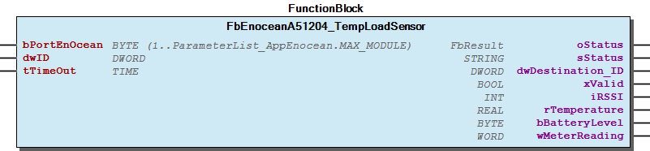 Supported EEP:

### A5/07-12-04


Please refer to the manufacturer’s manual to find the Enocean Equipment Profiles (EEP) number for your device.

Note Please refer to the manufacturer’s manual to find the Enocean Equipment Profiles (EEP) number for your device. - FbEnoceanA51204_TempLoadSensor.BatteryLevel (PROP) - FbEnoceanA51204_TempLoadSensor.MeterReading (PROP)

## FbEnoceanA51205_TempContainerSensor (FB)


| Scope | Name | Type | Initial | Comment | Inherited from |
| --- | --- | --- | --- | --- | --- |
| Input | bPortEnOcean | BYTE (1..ParameterList_AppEnocean.MAX_MODULE) | 1 | Master assignment number. Range 1 to MAX_MASTER. | FbEnoceanBase |
| Output | oStatus | WagoSysErrorBase.FbResult |  | Status object. (Listed in Status ) The content of the error object could be displayed via the FbShowResult from the WagoSysErrorBase library. | FbEnoceanBase |
| sStatus | STRING |  | Status description as string (Listed in Status ) | FbEnoceanBase |
| Input | dwID | DWORD |  | Device ID | FbDevice |
| tTimeOut | TIME | TIME#60m0s0ms | Maximal time gap between telegrams | FbReceiver_4BS |
| Output | dwDestination_ID | DWORD |  | Destination ID | FbReceiver_4BS |
| xValid | BOOL |  | Valid telegram | FbReceiver_4BS |
| iRSSI | INT |  | Received signal strengh indication (-90...-45dBm) = (bad...good) | FbReceiver_4BS |
| rTemperature | REAL | ENOCEAN_DFLT_TEMP | Temperature in °C | FbBaseA512xx_TempSensor |
| bBatteryLevel | BYTE |  | Battery level | FbBaseA512xx_TempSensor |
| wSensorPosition | WORD |  | Sensor position. Bit n indicates location n |  |

The Function block decodes Enocean device according to the Enocean Equipment Profiles (EEP).

Graphical Illustration

Supported EEP:

Interface variables Function The Function block decodes Enocean device according to the Enocean Equipment Profiles (EEP). Graphical Illustration  Supported EEP:

### A5/07-12-05


Please refer to the manufacturer’s manual to find the Enocean Equipment Profiles (EEP) number for your device.

Note Please refer to the manufacturer’s manual to find the Enocean Equipment Profiles (EEP) number for your device. - FbEnoceanA51205_TempContainerSensor.BatteryLevel (PROP) - FbEnoceanA51205_TempContainerSensor.SensorPosition (PROP)

## FbEnoceanA51301_WeatherStation (FB)


| Scope | Name | Type | Initial | Comment | Inherited from |
| --- | --- | --- | --- | --- | --- |
| Input | bPortEnOcean | BYTE (1..ParameterList_AppEnocean.MAX_MODULE) | 1 | Master assignment number. Range 1 to MAX_MASTER. | FbEnoceanBase |
| Output | oStatus | WagoSysErrorBase.FbResult |  | Status object. (Listed in Status ) The content of the error object could be displayed via the FbShowResult from the WagoSysErrorBase library. | FbEnoceanBase |
| sStatus | STRING |  | Status description as string (Listed in Status ) | FbEnoceanBase |
| Input | dwID | DWORD |  | Device ID | FbDevice |
| tTimeOut | TIME | TIME#60m0s0ms | Maximal time gap between telegrams | FbReceiver_4BS |
| Output | dwDestination_ID | DWORD |  | Destination ID | FbReceiver_4BS |
| xValid | BOOL |  | Valid telegram | FbReceiver_4BS |
| iRSSI | INT |  | Received signal strengh indication (-90...-45dBm) = (bad...good) | FbReceiver_4BS |
| typWeatherStation | typWeatherStation |  | Output parameters of weather station |  |

The Function block decodes Enocean device according to the Enocean Equipment Profiles (EEP).

Graphical Illustration

Supported EEP:

Interface variables Function The Function block decodes Enocean device according to the Enocean Equipment Profiles (EEP). Graphical Illustration  Supported EEP:

### A5/07-13-01


Please refer to the manufacturer’s manual to find the Enocean Equipment Profiles (EEP) number for your device.

Note Please refer to the manufacturer’s manual to find the Enocean Equipment Profiles (EEP) number for your device. - FbEnoceanA51301_WeatherStation.WeatherStation (PROP)

## FbEnoceanA51302_SunIntensity (FB)


| Scope | Name | Type | Initial | Comment | Inherited from |
| --- | --- | --- | --- | --- | --- |
| Input | bPortEnOcean | BYTE (1..ParameterList_AppEnocean.MAX_MODULE) | 1 | Master assignment number. Range 1 to MAX_MASTER. | FbEnoceanBase |
| Output | oStatus | WagoSysErrorBase.FbResult |  | Status object. (Listed in Status ) The content of the error object could be displayed via the FbShowResult from the WagoSysErrorBase library. | FbEnoceanBase |
| sStatus | STRING |  | Status description as string (Listed in Status ) | FbEnoceanBase |
| Input | dwID | DWORD |  | Device ID | FbDevice |
| tTimeOut | TIME | TIME#60m0s0ms | Maximal time gap between telegrams | FbReceiver_4BS |
| Output | dwDestination_ID | DWORD |  | Destination ID | FbReceiver_4BS |
| xValid | BOOL |  | Valid telegram | FbReceiver_4BS |
| iRSSI | INT |  | Received signal strengh indication (-90...-45dBm) = (bad...good) | FbReceiver_4BS |
| typSunIntensityNorthernHemisphere | typSunIntensityNorthernHemisphere |  | Output parameters of sun intensity sensor |  |

The Function block decodes Enocean device according to the Enocean Equipment Profiles (EEP).

Graphical Illustration

Supported EEP:

Interface variables Function The Function block decodes Enocean device according to the Enocean Equipment Profiles (EEP). Graphical Illustration  Supported EEP:

### A5/07-13-02


Please refer to the manufacturer’s manual to find the Enocean Equipment Profiles (EEP) number for your device.

Note Please refer to the manufacturer’s manual to find the Enocean Equipment Profiles (EEP) number for your device. - FbEnoceanA51302_SunIntensity.SunIntensityNorthernHemisphere (PROP)

## FbEnoceanA51303_DateExchange (FB)


| Scope | Name | Type | Initial | Comment | Inherited from |
| --- | --- | --- | --- | --- | --- |
| Input | bPortEnOcean | BYTE (1..ParameterList_AppEnocean.MAX_MODULE) | 1 | Master assignment number. Range 1 to MAX_MASTER. | FbEnoceanBase |
| Output | oStatus | WagoSysErrorBase.FbResult |  | Status object. (Listed in Status ) The content of the error object could be displayed via the FbShowResult from the WagoSysErrorBase library. | FbEnoceanBase |
| sStatus | STRING |  | Status description as string (Listed in Status ) | FbEnoceanBase |
| Input | dwID | DWORD |  | Device ID | FbDevice |
| tTimeOut | TIME | TIME#60m0s0ms | Maximal time gap between telegrams | FbReceiver_4BS |
| Output | dwDestination_ID | DWORD |  | Destination ID | FbReceiver_4BS |
| xValid | BOOL |  | Valid telegram | FbReceiver_4BS |
| iRSSI | INT |  | Received signal strengh indication (-90...-45dBm) = (bad...good) | FbReceiver_4BS |
| typDateExchange | typDateExchange |  | Output parameters of date exchange module |  |

The Function block decodes Enocean device according to the Enocean Equipment Profiles (EEP).

Graphical Illustration

Supported EEP:

Interface variables Function The Function block decodes Enocean device according to the Enocean Equipment Profiles (EEP). Graphical Illustration  Supported EEP:

### A5/07-13-03


Please refer to the manufacturer’s manual to find the Enocean Equipment Profiles (EEP) number for your device.

Note Please refer to the manufacturer’s manual to find the Enocean Equipment Profiles (EEP) number for your device. - FbEnoceanA51303_DateExchange.DateExchange (PROP)

## FbEnoceanA51304_TimeDateExchange (FB)


| Scope | Name | Type | Initial | Comment | Inherited from |
| --- | --- | --- | --- | --- | --- |
| Input | bPortEnOcean | BYTE (1..ParameterList_AppEnocean.MAX_MODULE) | 1 | Master assignment number. Range 1 to MAX_MASTER. | FbEnoceanBase |
| Output | oStatus | WagoSysErrorBase.FbResult |  | Status object. (Listed in Status ) The content of the error object could be displayed via the FbShowResult from the WagoSysErrorBase library. | FbEnoceanBase |
| sStatus | STRING |  | Status description as string (Listed in Status ) | FbEnoceanBase |
| Input | dwID | DWORD |  | Device ID | FbDevice |
| tTimeOut | TIME | TIME#60m0s0ms | Maximal time gap between telegrams | FbReceiver_4BS |
| Output | dwDestination_ID | DWORD |  | Destination ID | FbReceiver_4BS |
| xValid | BOOL |  | Valid telegram | FbReceiver_4BS |
| iRSSI | INT |  | Received signal strengh indication (-90...-45dBm) = (bad...good) | FbReceiver_4BS |
| typTimeAndDayExchange | typTimeAndDayExchange |  | Output parameters of time and day exchange module |  |

The Function block decodes Enocean device according to the Enocean Equipment Profiles (EEP).

Graphical Illustration

Supported EEP:

Interface variables Function The Function block decodes Enocean device according to the Enocean Equipment Profiles (EEP). Graphical Illustration  Supported EEP:

### A5/07-13-04


Please refer to the manufacturer’s manual to find the Enocean Equipment Profiles (EEP) number for your device.

Note Please refer to the manufacturer’s manual to find the Enocean Equipment Profiles (EEP) number for your device. - FbEnoceanA51304_TimeDateExchange.TimeAndDayExchange (PROP)

## FbEnoceanA51305_DirectionExchange (FB)


| Scope | Name | Type | Initial | Comment | Inherited from |
| --- | --- | --- | --- | --- | --- |
| Input | bPortEnOcean | BYTE (1..ParameterList_AppEnocean.MAX_MODULE) | 1 | Master assignment number. Range 1 to MAX_MASTER. | FbEnoceanBase |
| Output | oStatus | WagoSysErrorBase.FbResult |  | Status object. (Listed in Status ) The content of the error object could be displayed via the FbShowResult from the WagoSysErrorBase library. | FbEnoceanBase |
| sStatus | STRING |  | Status description as string (Listed in Status ) | FbEnoceanBase |
| Input | dwID | DWORD |  | Device ID | FbDevice |
| tTimeOut | TIME | TIME#60m0s0ms | Maximal time gap between telegrams | FbReceiver_4BS |
| Output | dwDestination_ID | DWORD |  | Destination ID | FbReceiver_4BS |
| xValid | BOOL |  | Valid telegram | FbReceiver_4BS |
| iRSSI | INT |  | Received signal strengh indication (-90...-45dBm) = (bad...good) | FbReceiver_4BS |
| typDirectionExchange | typDirectionExchange |  | Output parameters of direction exchange module |  |

The Function block decodes Enocean device according to the Enocean Equipment Profiles (EEP).

Graphical Illustration

Supported EEP:

Interface variables Function The Function block decodes Enocean device according to the Enocean Equipment Profiles (EEP). Graphical Illustration  Supported EEP:

### A5/07-13-05


Please refer to the manufacturer’s manual to find the Enocean Equipment Profiles (EEP) number for your device.

Note Please refer to the manufacturer’s manual to find the Enocean Equipment Profiles (EEP) number for your device. - FbEnoceanA51305_DirectionExchange.DirectionExchange (PROP)

## FbEnoceanA51306_GeographicPositionExchange (FB)


| Scope | Name | Type | Initial | Comment | Inherited from |
| --- | --- | --- | --- | --- | --- |
| Input | bPortEnOcean | BYTE (1..ParameterList_AppEnocean.MAX_MODULE) | 1 | Master assignment number. Range 1 to MAX_MASTER. | FbEnoceanBase |
| Output | oStatus | WagoSysErrorBase.FbResult |  | Status object. (Listed in Status ) The content of the error object could be displayed via the FbShowResult from the WagoSysErrorBase library. | FbEnoceanBase |
| sStatus | STRING |  | Status description as string (Listed in Status ) | FbEnoceanBase |
| Input | dwID | DWORD |  | Device ID | FbDevice |
| tTimeOut | TIME | TIME#60m0s0ms | Maximal time gap between telegrams | FbReceiver_4BS |
| Output | dwDestination_ID | DWORD |  | Destination ID | FbReceiver_4BS |
| xValid | BOOL |  | Valid telegram | FbReceiver_4BS |
| iRSSI | INT |  | Received signal strengh indication (-90...-45dBm) = (bad...good) | FbReceiver_4BS |
| typGeographicPositionExchange | typGeographicPositionExchange |  | Output parameters of geographic position exchange module |  |

The Function block decodes Enocean device according to the Enocean Equipment Profiles (EEP).

Graphical Illustration

Supported EEP:

Interface variables Function The Function block decodes Enocean device according to the Enocean Equipment Profiles (EEP). Graphical Illustration  Supported EEP:

### A5/07-13-06


Please refer to the manufacturer’s manual to find the Enocean Equipment Profiles (EEP) number for your device.

Note Please refer to the manufacturer’s manual to find the Enocean Equipment Profiles (EEP) number for your device. - FbEnoceanA51306_GeographicPositionExchange.GeographicPositionExchange (PROP)

## FbEnoceanA51310_SunPositionRadiation (FB)


| Scope | Name | Type | Initial | Comment | Inherited from |
| --- | --- | --- | --- | --- | --- |
| Input | bPortEnOcean | BYTE (1..ParameterList_AppEnocean.MAX_MODULE) | 1 | Master assignment number. Range 1 to MAX_MASTER. | FbEnoceanBase |
| Output | oStatus | WagoSysErrorBase.FbResult |  | Status object. (Listed in Status ) The content of the error object could be displayed via the FbShowResult from the WagoSysErrorBase library. | FbEnoceanBase |
| sStatus | STRING |  | Status description as string (Listed in Status ) | FbEnoceanBase |
| Input | dwID | DWORD |  | Device ID | FbDevice |
| tTimeOut | TIME | TIME#60m0s0ms | Maximal time gap between telegrams | FbReceiver_4BS |
| Output | dwDestination_ID | DWORD |  | Destination ID | FbReceiver_4BS |
| xValid | BOOL |  | Valid telegram | FbReceiver_4BS |
| iRSSI | INT |  | Received signal strengh indication (-90...-45dBm) = (bad...good) | FbReceiver_4BS |
| typSunPositionRadiation | typSunPositionRadiation |  | Output parameters of sun position radiation module |  |

The Function block decodes Enocean device according to the Enocean Equipment Profiles (EEP).

Graphical Illustration

Supported EEP:

Interface variables Function The Function block decodes Enocean device according to the Enocean Equipment Profiles (EEP). Graphical Illustration  Supported EEP:

### A5/07-13-10


Please refer to the manufacturer’s manual to find the Enocean Equipment Profiles (EEP) number for your device.

Note Please refer to the manufacturer’s manual to find the Enocean Equipment Profiles (EEP) number for your device. - FbEnoceanA51310_SunPositionRadiation.SunPositionRadiation (PROP)

## FbEnoceanA513XX_Universal (FB)


| Scope | Name | Type | Initial | Comment | Inherited from |
| --- | --- | --- | --- | --- | --- |
| Input | bPortEnOcean | BYTE (1..ParameterList_AppEnocean.MAX_MODULE) | 1 | Master assignment number. Range 1 to MAX_MASTER. | FbEnoceanBase |
| Output | oStatus | WagoSysErrorBase.FbResult |  | Status object. (Listed in Status ) The content of the error object could be displayed via the FbShowResult from the WagoSysErrorBase library. | FbEnoceanBase |
| sStatus | STRING |  | Status description as string (Listed in Status ) | FbEnoceanBase |
| Input | dwID | DWORD |  | Device ID | FbDevice |
| tTimeOut | TIME | TIME#60m0s0ms | Maximal time gap between telegrams | FbReceiver_4BS |
| Output | dwDestination_ID | DWORD |  | Destination ID | FbReceiver_4BS |
| xValid | BOOL |  | Valid telegram | FbReceiver_4BS |
| iRSSI | INT |  | Received signal strengh indication (-90...-45dBm) = (bad...good) | FbReceiver_4BS |
| typA513XX_Universal | typA513XX_Universal |  | Output parameters of A513XX_Universal |  |

The Function block decodes Enocean device according to the Enocean Equipment Profiles (EEP).

Graphical Illustration

Supported EEP:

A5/07-13-01 A5/07-13-02 A5/07-13-03 A5/07-13-04 A5/07-13-05 A5/07-13-06 ================

Please refer to the manufacturer’s manual to find the Enocean Equipment Profiles (EEP) number for your device.

Interface variables Function The Function block decodes Enocean device according to the Enocean Equipment Profiles (EEP). Graphical Illustration  Supported EEP: A5/07-13-01 A5/07-13-02 A5/07-13-03 A5/07-13-04 A5/07-13-05 A5/07-13-06 ================ Note Please refer to the manufacturer’s manual to find the Enocean Equipment Profiles (EEP) number for your device. - FbEnoceanA513XX_Universal.A513XX_Universal (PROP)

## FbEnoceanA51401_Window_DoorSensor (FB)


| Scope | Name | Type | Initial | Comment | Inherited from |
| --- | --- | --- | --- | --- | --- |
| Input | bPortEnOcean | BYTE (1..ParameterList_AppEnocean.MAX_MODULE) | 1 | Master assignment number. Range 1 to MAX_MASTER. | FbEnoceanBase |
| Output | oStatus | WagoSysErrorBase.FbResult |  | Status object. (Listed in Status ) The content of the error object could be displayed via the FbShowResult from the WagoSysErrorBase library. | FbEnoceanBase |
| sStatus | STRING |  | Status description as string (Listed in Status ) | FbEnoceanBase |
| Input | dwID | DWORD |  | Device ID | FbDevice |
| tTimeOut | TIME | TIME#60m0s0ms | Maximal time gap between telegrams | FbReceiver_4BS |
| Output | dwDestination_ID | DWORD |  | Destination ID | FbReceiver_4BS |
| xValid | BOOL |  | Valid telegram | FbReceiver_4BS |
| iRSSI | INT |  | Received signal strengh indication (-90...-45dBm) = (bad...good) | FbReceiver_4BS |
| typWindow_OpenClose | typWindow_OpenClose |  | Output parameters of window/door sensor |  |

The Function block decodes Enocean device according to the Enocean Equipment Profiles (EEP).

Graphical Illustration

Supported EEP:

Interface variables Function The Function block decodes Enocean device according to the Enocean Equipment Profiles (EEP). Graphical Illustration  Supported EEP:

### A5/07-14-01


Please refer to the manufacturer’s manual to find the Enocean Equipment Profiles (EEP) number for your device.

Note Please refer to the manufacturer’s manual to find the Enocean Equipment Profiles (EEP) number for your device. - FbEnoceanA51401_Window_DoorSensor.Door_contact (PROP)

## FbEnoceanA51402_Window_DoorSensor (FB)


| Scope | Name | Type | Initial | Comment | Inherited from |
| --- | --- | --- | --- | --- | --- |
| Input | bPortEnOcean | BYTE (1..ParameterList_AppEnocean.MAX_MODULE) | 1 | Master assignment number. Range 1 to MAX_MASTER. | FbEnoceanBase |
| Output | oStatus | WagoSysErrorBase.FbResult |  | Status object. (Listed in Status ) The content of the error object could be displayed via the FbShowResult from the WagoSysErrorBase library. | FbEnoceanBase |
| sStatus | STRING |  | Status description as string (Listed in Status ) | FbEnoceanBase |
| Input | dwID | DWORD |  | Device ID | FbDevice |
| tTimeOut | TIME | TIME#60m0s0ms | Maximal time gap between telegrams | FbReceiver_4BS |
| Output | dwDestination_ID | DWORD |  | Destination ID | FbReceiver_4BS |
| xValid | BOOL |  | Valid telegram | FbReceiver_4BS |
| iRSSI | INT |  | Received signal strengh indication (-90...-45dBm) = (bad...good) | FbReceiver_4BS |
| typWindow_OpenClose | typWindow_OpenClose |  | Output parameters of window/door sensor |  |
| rIllumination | REAL |  | Illumination [lx] ; Value range = 0..1000lx \|\| Error if Value>1000 |  |

The Function block decodes Enocean device according to the Enocean Equipment Profiles (EEP).

Graphical Illustration

Supported EEP:

Interface variables Function The Function block decodes Enocean device according to the Enocean Equipment Profiles (EEP). Graphical Illustration  Supported EEP:

### A5/07-14-02


Please refer to the manufacturer’s manual to find the Enocean Equipment Profiles (EEP) number for your device.

Note Please refer to the manufacturer’s manual to find the Enocean Equipment Profiles (EEP) number for your device. - FbEnoceanA51402_Window_DoorSensor.Door_contact (PROP)

## FbEnoceanA51403_Window_DoorSensor (FB)


| Scope | Name | Type | Initial | Comment | Inherited from |
| --- | --- | --- | --- | --- | --- |
| Input | bPortEnOcean | BYTE (1..ParameterList_AppEnocean.MAX_MODULE) | 1 | Master assignment number. Range 1 to MAX_MASTER. | FbEnoceanBase |
| Output | oStatus | WagoSysErrorBase.FbResult |  | Status object. (Listed in Status ) The content of the error object could be displayed via the FbShowResult from the WagoSysErrorBase library. | FbEnoceanBase |
| sStatus | STRING |  | Status description as string (Listed in Status ) | FbEnoceanBase |
| Input | dwID | DWORD |  | Device ID | FbDevice |
| tTimeOut | TIME | TIME#60m0s0ms | Maximal time gap between telegrams | FbReceiver_4BS |
| Output | dwDestination_ID | DWORD |  | Destination ID | FbReceiver_4BS |
| xValid | BOOL |  | Valid telegram | FbReceiver_4BS |
| iRSSI | INT |  | Received signal strengh indication (-90...-45dBm) = (bad...good) | FbReceiver_4BS |
| typWindow_OpenClose | typWindow_OpenClose |  | Output parameters of window/door sensor |  |
| typWindow_Vibration | typWindow_Vibration |  | Output parameters of window/door sensor |  |

The Function block decodes Enocean device according to the Enocean Equipment Profiles (EEP).

Graphical Illustration

Supported EEP:

Interface variables Function The Function block decodes Enocean device according to the Enocean Equipment Profiles (EEP). Graphical Illustration  Supported EEP:

### A5/07-14-03


Please refer to the manufacturer’s manual to find the Enocean Equipment Profiles (EEP) number for your device.

Note Please refer to the manufacturer’s manual to find the Enocean Equipment Profiles (EEP) number for your device. - FbEnoceanA51403_Window_DoorSensor.Door_contact (PROP) - FbEnoceanA51403_Window_DoorSensor.Window_Vibration (PROP)

## FbEnoceanA51404_Window_DoorSensor (FB)


| Scope | Name | Type | Initial | Comment | Inherited from |
| --- | --- | --- | --- | --- | --- |
| Input | bPortEnOcean | BYTE (1..ParameterList_AppEnocean.MAX_MODULE) | 1 | Master assignment number. Range 1 to MAX_MASTER. | FbEnoceanBase |
| Output | oStatus | WagoSysErrorBase.FbResult |  | Status object. (Listed in Status ) The content of the error object could be displayed via the FbShowResult from the WagoSysErrorBase library. | FbEnoceanBase |
| sStatus | STRING |  | Status description as string (Listed in Status ) | FbEnoceanBase |
| Input | dwID | DWORD |  | Device ID | FbDevice |
| tTimeOut | TIME | TIME#60m0s0ms | Maximal time gap between telegrams | FbReceiver_4BS |
| Output | dwDestination_ID | DWORD |  | Destination ID | FbReceiver_4BS |
| xValid | BOOL |  | Valid telegram | FbReceiver_4BS |
| iRSSI | INT |  | Received signal strengh indication (-90...-45dBm) = (bad...good) | FbReceiver_4BS |
| typWindow_OpenClose | typWindow_OpenClose |  | Output parameters of window/door sensor |  |
| typWindow_Vibration | typWindow_Vibration |  | Output parameters of window/door sensor |  |
| rIllumination | REAL |  | Illumination [lx] ; Value range = 0..1000lx \|\| Error if Value>1000 |  |

The Function block decodes Enocean device according to the Enocean Equipment Profiles (EEP).

Graphical Illustration

Supported EEP:

Interface variables Function The Function block decodes Enocean device according to the Enocean Equipment Profiles (EEP). Graphical Illustration  Supported EEP:

### A5/07-14-04


Please refer to the manufacturer’s manual to find the Enocean Equipment Profiles (EEP) number for your device.

Note Please refer to the manufacturer’s manual to find the Enocean Equipment Profiles (EEP) number for your device. - FbEnoceanA51404_Window_DoorSensor.Door_contact (PROP) - FbEnoceanA51404_Window_DoorSensor.Window_Vibration (PROP)

## FbEnoceanA51405_Window_DoorSensor (FB)


| Scope | Name | Type | Initial | Comment | Inherited from |
| --- | --- | --- | --- | --- | --- |
| Input | bPortEnOcean | BYTE (1..ParameterList_AppEnocean.MAX_MODULE) | 1 | Master assignment number. Range 1 to MAX_MASTER. | FbEnoceanBase |
| Output | oStatus | WagoSysErrorBase.FbResult |  | Status object. (Listed in Status ) The content of the error object could be displayed via the FbShowResult from the WagoSysErrorBase library. | FbEnoceanBase |
| sStatus | STRING |  | Status description as string (Listed in Status ) | FbEnoceanBase |
| Input | dwID | DWORD |  | Device ID | FbDevice |
| tTimeOut | TIME | TIME#60m0s0ms | Maximal time gap between telegrams | FbReceiver_4BS |
| Output | dwDestination_ID | DWORD |  | Destination ID | FbReceiver_4BS |
| xValid | BOOL |  | Valid telegram | FbReceiver_4BS |
| iRSSI | INT |  | Received signal strengh indication (-90...-45dBm) = (bad...good) | FbReceiver_4BS |
| typWindow_Vibration | typWindow_Vibration |  | Output parameters of window/door sensor |  |
| rSupplyVoltage | REAL |  | Voltage supply [V]; Value range = 0..5 V |  |

The Function block decodes Enocean device according to the Enocean Equipment Profiles (EEP).

Graphical Illustration

Supported EEP:

Interface variables Function The Function block decodes Enocean device according to the Enocean Equipment Profiles (EEP). Graphical Illustration  Supported EEP:

### A5/07-14-05


Please refer to the manufacturer’s manual to find the Enocean Equipment Profiles (EEP) number for your device.

Note Please refer to the manufacturer’s manual to find the Enocean Equipment Profiles (EEP) number for your device. - FbEnoceanA51405_Window_DoorSensor.Window_Vibration (PROP)

## FbEnoceanA51406_Window_DoorSensor (FB)


| Scope | Name | Type | Initial | Comment | Inherited from |
| --- | --- | --- | --- | --- | --- |
| Input | bPortEnOcean | BYTE (1..ParameterList_AppEnocean.MAX_MODULE) | 1 | Master assignment number. Range 1 to MAX_MASTER. | FbEnoceanBase |
| Output | oStatus | WagoSysErrorBase.FbResult |  | Status object. (Listed in Status ) The content of the error object could be displayed via the FbShowResult from the WagoSysErrorBase library. | FbEnoceanBase |
| sStatus | STRING |  | Status description as string (Listed in Status ) | FbEnoceanBase |
| Input | dwID | DWORD |  | Device ID | FbDevice |
| tTimeOut | TIME | TIME#60m0s0ms | Maximal time gap between telegrams | FbReceiver_4BS |
| Output | dwDestination_ID | DWORD |  | Destination ID | FbReceiver_4BS |
| xValid | BOOL |  | Valid telegram | FbReceiver_4BS |
| iRSSI | INT |  | Received signal strengh indication (-90...-45dBm) = (bad...good) | FbReceiver_4BS |
| typWindow_Vibration | typWindow_Vibration |  | Output parameters of window/door sensor |  |
| rSupplyVoltage | REAL |  | Voltage supply [V]; Value range = 0..5 V |  |
| rIllumination | REAL |  | Illumination [lx] ; Value range = 0..1000lx \|\| Error if Value>1000 |  |

The Function block decodes Enocean device according to the Enocean Equipment Profiles (EEP).

Graphical Illustration

Supported EEP:

Interface variables Function The Function block decodes Enocean device according to the Enocean Equipment Profiles (EEP). Graphical Illustration  Supported EEP:

### A5/07-14-06


Please refer to the manufacturer’s manual to find the Enocean Equipment Profiles (EEP) number for your device.

Note Please refer to the manufacturer’s manual to find the Enocean Equipment Profiles (EEP) number for your device. - FbEnoceanA51406_Window_DoorSensor.Window_Vibration (PROP)

## FbEnoceanA51407_Window_DoorSensor (FB)


| Scope | Name | Type | Initial | Comment | Inherited from |
| --- | --- | --- | --- | --- | --- |
| Input | bPortEnOcean | BYTE (1..ParameterList_AppEnocean.MAX_MODULE) | 1 | Master assignment number. Range 1 to MAX_MASTER. | FbEnoceanBase |
| Output | oStatus | WagoSysErrorBase.FbResult |  | Status object. (Listed in Status ) The content of the error object could be displayed via the FbShowResult from the WagoSysErrorBase library. | FbEnoceanBase |
| sStatus | STRING |  | Status description as string (Listed in Status ) | FbEnoceanBase |
| Input | dwID | DWORD |  | Device ID | FbDevice |
| tTimeOut | TIME | TIME#60m0s0ms | Maximal time gap between telegrams | FbReceiver_4BS |
| Output | dwDestination_ID | DWORD |  | Destination ID | FbReceiver_4BS |
| xValid | BOOL |  | Valid telegram | FbReceiver_4BS |
| iRSSI | INT |  | Received signal strengh indication (-90...-45dBm) = (bad...good) | FbReceiver_4BS |
| typDoor_contact | typDoor_contact |  | Output parameters of door contact |  |

The Function block decodes Enocean device according to the Enocean Equipment Profiles (EEP).

Graphical Illustration

Supported EEP:

Interface variables Function The Function block decodes Enocean device according to the Enocean Equipment Profiles (EEP). Graphical Illustration  Supported EEP:

### A5/07-14-07


Please refer to the manufacturer’s manual to find the Enocean Equipment Profiles (EEP) number for your device.

Note Please refer to the manufacturer’s manual to find the Enocean Equipment Profiles (EEP) number for your device. - FbEnoceanA51407_Window_DoorSensor.Door_contact (PROP)

## FbEnoceanA51408_Window_DoorSensor (FB)


| Scope | Name | Type | Initial | Comment | Inherited from |
| --- | --- | --- | --- | --- | --- |
| Input | bPortEnOcean | BYTE (1..ParameterList_AppEnocean.MAX_MODULE) | 1 | Master assignment number. Range 1 to MAX_MASTER. | FbEnoceanBase |
| Output | oStatus | WagoSysErrorBase.FbResult |  | Status object. (Listed in Status ) The content of the error object could be displayed via the FbShowResult from the WagoSysErrorBase library. | FbEnoceanBase |
| sStatus | STRING |  | Status description as string (Listed in Status ) | FbEnoceanBase |
| Input | dwID | DWORD |  | Device ID | FbDevice |
| tTimeOut | TIME | TIME#60m0s0ms | Maximal time gap between telegrams | FbReceiver_4BS |
| Output | dwDestination_ID | DWORD |  | Destination ID | FbReceiver_4BS |
| xValid | BOOL |  | Valid telegram | FbReceiver_4BS |
| iRSSI | INT |  | Received signal strengh indication (-90...-45dBm) = (bad...good) | FbReceiver_4BS |
| typDoor_contact | typDoor_contact |  | Output parameters of door contact |  |
| typWindow_Vibration | typWindow_Vibration |  | Output parameters of window/door sensor |  |

The Function block decodes Enocean device according to the Enocean Equipment Profiles (EEP).

Graphical Illustration

Supported EEP:

Interface variables Function The Function block decodes Enocean device according to the Enocean Equipment Profiles (EEP). Graphical Illustration  Supported EEP:

### A5/07-14-08


Please refer to the manufacturer’s manual to find the Enocean Equipment Profiles (EEP) number for your device.

Note Please refer to the manufacturer’s manual to find the Enocean Equipment Profiles (EEP) number for your device. - FbEnoceanA51408_Window_DoorSensor.Door_contact (PROP) - FbEnoceanA51408_Window_DoorSensor.Window_Vibration (PROP)

## FbEnoceanA51409_Window_DoorSensor (FB)


| Scope | Name | Type | Initial | Comment | Inherited from |
| --- | --- | --- | --- | --- | --- |
| Input | bPortEnOcean | BYTE (1..ParameterList_AppEnocean.MAX_MODULE) | 1 | Master assignment number. Range 1 to MAX_MASTER. | FbEnoceanBase |
| Output | oStatus | WagoSysErrorBase.FbResult |  | Status object. (Listed in Status ) The content of the error object could be displayed via the FbShowResult from the WagoSysErrorBase library. | FbEnoceanBase |
| sStatus | STRING |  | Status description as string (Listed in Status ) | FbEnoceanBase |
| Input | dwID | DWORD |  | Device ID | FbDevice |
| tTimeOut | TIME | TIME#60m0s0ms | Maximal time gap between telegrams | FbReceiver_4BS |
| Output | dwDestination_ID | DWORD |  | Destination ID | FbReceiver_4BS |
| xValid | BOOL |  | Valid telegram | FbReceiver_4BS |
| iRSSI | INT |  | Received signal strengh indication (-90...-45dBm) = (bad...good) | FbReceiver_4BS |
| typWindow_DoorSensor | typWindow_DoorSensor |  | Output parameters of window/door sensor |  |

The Function block decodes Enocean device according to the Enocean Equipment Profiles (EEP).

Graphical Illustration

Supported EEP:

Interface variables Function The Function block decodes Enocean device according to the Enocean Equipment Profiles (EEP). Graphical Illustration  Supported EEP:

### A5/07-14-09


Please refer to the manufacturer’s manual to find the Enocean Equipment Profiles (EEP) number for your device.

Note Please refer to the manufacturer’s manual to find the Enocean Equipment Profiles (EEP) number for your device. - FbEnoceanA51409_Window_DoorSensor.Window_DoorSensor (PROP)

## FbEnoceanA5140A_Window_DoorSensor (FB)


| Scope | Name | Type | Initial | Comment | Inherited from |
| --- | --- | --- | --- | --- | --- |
| Input | bPortEnOcean | BYTE (1..ParameterList_AppEnocean.MAX_MODULE) | 1 | Master assignment number. Range 1 to MAX_MASTER. | FbEnoceanBase |
| Output | oStatus | WagoSysErrorBase.FbResult |  | Status object. (Listed in Status ) The content of the error object could be displayed via the FbShowResult from the WagoSysErrorBase library. | FbEnoceanBase |
| sStatus | STRING |  | Status description as string (Listed in Status ) | FbEnoceanBase |
| Input | dwID | DWORD |  | Device ID | FbDevice |
| tTimeOut | TIME | TIME#60m0s0ms | Maximal time gap between telegrams | FbReceiver_4BS |
| Output | dwDestination_ID | DWORD |  | Destination ID | FbReceiver_4BS |
| xValid | BOOL |  | Valid telegram | FbReceiver_4BS |
| iRSSI | INT |  | Received signal strengh indication (-90...-45dBm) = (bad...good) | FbReceiver_4BS |
| typWindow_DoorSensor | typWindow_DoorSensor |  | Output parameters of window/door sensor |  |
| typWindow_Vibration | typWindow_Vibration |  | Output parameters of window/door sensor |  |

The Function block decodes Enocean device according to the Enocean Equipment Profiles (EEP).

Graphical Illustration

Supported EEP:

Interface variables Function The Function block decodes Enocean device according to the Enocean Equipment Profiles (EEP). Graphical Illustration  Supported EEP:

### A5/07-14-0A


Please refer to the manufacturer’s manual to find the Enocean Equipment Profiles (EEP) number for your device.

Note Please refer to the manufacturer’s manual to find the Enocean Equipment Profiles (EEP) number for your device. - FbEnoceanA5140A_Window_DoorSensor.Window_DoorSensor (PROP) - FbEnoceanA5140A_Window_DoorSensor.Window_Vibration (PROP)

## FbEnoceanA52001_BatteryPoweredActuator (FB)


| Scope | Name | Type | Initial | Comment | Inherited from |
| --- | --- | --- | --- | --- | --- |
| Input | bPortEnOcean | BYTE (1..ParameterList_AppEnocean.MAX_MODULE) | 1 | Master assignment number. Range 1 to MAX_MASTER. | FbEnoceanBase |
| Output | oStatus | WagoSysErrorBase.FbResult |  | Status object. (Listed in Status ) The content of the error object could be displayed via the FbShowResult from the WagoSysErrorBase library. | FbEnoceanBase |
| sStatus | STRING |  | Status description as string (Listed in Status ) | FbEnoceanBase |
| Input | dwID | DWORD |  | Device ID | FbDevice |
| wManufacturer_ID | WORD |  | Manufacturer ID, see table above | FbBidirectional_4BS |
| tTimeOut | TIME | TIME#60m0s0ms | Maximal time gap between telegrams | FbBidirectional_4BS |
| dwDestination_ID | DWORD | 16#FFFFFFFF | Destination ID | FbBidirectional_4BS |
| Output | xReady | BOOL | TRUE | TRUE-> Function block is ready | FbBidirectional_4BS |
| xValid | BOOL |  | Valid telegram | FbBidirectional_4BS |
| iRSSI | INT |  | Received signal strengh indication (-90...-45dBm) = (bad...good) | FbBidirectional_4BS |
| Input | typBatteryPoweredActuatorWriteParameters | typBatteryPoweredActuatorWriteParameters |  | Input parameters to write |  |
| Inout | xLearn | BOOL |  | Activate learn mode.This variable will be reset when the function block ID has been successfully learnt. |  |
| dwLearn_ID | DWORD |  | The learnt actuator ID that is received and stored here.This variable should be declared as RETAIN PERSISTENT. |  |
| Output | typBatteryPoweredActuatorReadParameters | typBatteryPoweredActuatorReadParameters |  | Output parameters to read |  |

The Function block enncodes and decodes Enocean device according to the Enocean Equipment Profiles (EEP).

Graphical Illustration

Function description

The supported EnOcean Equipment Profiles (EEP) are listed in the table below:

Interface variables Function The Function block enncodes and decodes Enocean device according to the Enocean Equipment Profiles (EEP). Graphical Illustration  Function description The supported EnOcean Equipment Profiles (EEP) are listed in the table below:

### A5/07-20-01


| Manufacturer | ID |
| Peha | 0x001 |
| Thermokon | 0x002 |
| Servodan | 0x003 |
| EchoFlex Solutions | 0x004 |
| Omnio AG | 0x005 |
| Hardmeier electronics | 0x006 |
| Regulvar Inc | 0x007 |
| Ad Hoc Electronics | 0x008 |
| Distech Controls | 0x009 |
| Kieback + Peter | 0x00A |
| EnOcean GmbH | 0x00B |
| Probare | 0x00C |
| Eltako | 0x00D |
| Leviton | 0x00E |
| Honeywell | 0x00F |
| Spartan Peripheral Devices | 0x010 |
| Siemens | 0x011 |
| T-Mac | 0x012 |
| Reliable Controls Corporation | 0x013 |
| Elsner Elektronik GmbH | 0x014 |
| Diehl Controls | 0x015 |
| BSC Computer | 0x016 |
| S+S Regeltechnik GmbH | 0x017 |
| Masco Corporation | 0x018 |
| Intesis Software SL | 0x019 |
| Res. | 0x01A |
| Lutuo Technology | 0x01B |
| CAN2GO | 0x01C |
| Oventrop | 0x035 |
| Multi user Manufacturer ID | 0x7FF |

Please refer to the manufacturer’s manual to find the Enocean Equipment Profiles (EEP) number for your device.

Installation and commissioning:

Teach-In steps:

List of manufacturer’s ID:

Note Please refer to the manufacturer’s manual to find the Enocean Equipment Profiles (EEP) number for your device. Installation and commissioning: Teach-In steps: 1. Assigning the manufacturer ID at the function block. See table below 2. Setting the own ID. This depends on the gateway specification 3. The function block and the actuator must be “introduced” to one another as radio communication partner devices at the beginning of commissioning. This is done by activating the learning mode and wait for the actuator to send a teach-in telegram. The function block will then acknowledge the teach-in telegram. The actuator sends it’s ID to the function block. The received ID is then stored. The function block will automatically ends the learning mode upon succesful teach-in. List of manufacturer’s ID: - FbEnoceanA52001_BatteryPoweredActuator.BatteryPoweredActuatorReadParameters (PROP) - FbEnoceanA52001_BatteryPoweredActuator.BatteryPoweredActuatorWriteParameters (PROP)

## FbEnoceanA52002_BasicActuator (FB)


| Scope | Name | Type | Initial | Comment | Inherited from |
| --- | --- | --- | --- | --- | --- |
| Input | bPortEnOcean | BYTE (1..ParameterList_AppEnocean.MAX_MODULE) | 1 | Master assignment number. Range 1 to MAX_MASTER. | FbEnoceanBase |
| Output | oStatus | WagoSysErrorBase.FbResult |  | Status object. (Listed in Status ) The content of the error object could be displayed via the FbShowResult from the WagoSysErrorBase library. | FbEnoceanBase |
| sStatus | STRING |  | Status description as string (Listed in Status ) | FbEnoceanBase |
| Input | dwID | DWORD |  | Device ID | FbDevice |
| wManufacturer_ID | WORD |  | Manufacturer ID, see table above | FbBidirectional_4BS |
| tTimeOut | TIME | TIME#60m0s0ms | Maximal time gap between telegrams | FbBidirectional_4BS |
| dwDestination_ID | DWORD | 16#FFFFFFFF | Destination ID | FbBidirectional_4BS |
| Output | xReady | BOOL | TRUE | TRUE-> Function block is ready | FbBidirectional_4BS |
| xValid | BOOL |  | Valid telegram | FbBidirectional_4BS |
| iRSSI | INT |  | Received signal strengh indication (-90...-45dBm) = (bad...good) | FbBidirectional_4BS |
| Input | typBasicActuatorWriteParameters | typBasicActuatorWriteParameters |  | parameter to write |  |
| Inout | xLearn | BOOL |  | Activate learn mode.This variable will be reset when the function block ID has been successfully learnt. |  |
| dwLearn_ID | DWORD |  | The learnt actuator ID that is received and stored here.This variable should be declared as RETAIN PERSISTENT. |  |
| Output | typBasicActuatorReadParameters | typBasicActuatorReadParameters |  | Parameter to read |  |

The Function block enncodes and decodes Enocean device according to the Enocean Equipment Profiles (EEP).

Graphical Illustration

Function description

The supported EnOcean Equipment Profiles (EEP) are listed in the table below:

Interface variables Function The Function block enncodes and decodes Enocean device according to the Enocean Equipment Profiles (EEP). Graphical Illustration  Function description The supported EnOcean Equipment Profiles (EEP) are listed in the table below:

### A5/07-20-02


| Manufacturer | ID |
| Peha | 0x001 |
| Thermokon | 0x002 |
| Servodan | 0x003 |
| EchoFlex Solutions | 0x004 |
| Omnio AG | 0x005 |
| Hardmeier electronics | 0x006 |
| Regulvar Inc | 0x007 |
| Ad Hoc Electronics | 0x008 |
| Distech Controls | 0x009 |
| Kieback + Peter | 0x00A |
| EnOcean GmbH | 0x00B |
| Probare | 0x00C |
| Eltako | 0x00D |
| Leviton | 0x00E |
| Honeywell | 0x00F |
| Spartan Peripheral Devices | 0x010 |
| Siemens | 0x011 |
| T-Mac | 0x012 |
| Reliable Controls Corporation | 0x013 |
| Elsner Elektronik GmbH | 0x014 |
| Diehl Controls | 0x015 |
| BSC Computer | 0x016 |
| S+S Regeltechnik GmbH | 0x017 |
| Masco Corporation | 0x018 |
| Intesis Software SL | 0x019 |
| Res. | 0x01A |
| Lutuo Technology | 0x01B |
| CAN2GO | 0x01C |
| Oventrop | 0x035 |
| Multi user Manufacturer ID | 0x7FF |

Please refer to the manufacturer’s manual to find the Enocean Equipment Profiles (EEP) number for your device.

Installation and commissioning:

Teach-In steps:

List of manufacturer’s ID:

Note Please refer to the manufacturer’s manual to find the Enocean Equipment Profiles (EEP) number for your device. Installation and commissioning: Teach-In steps: 1. Assigning the manufacturer ID at the function block. See table below 2. Setting the own ID. This depends on the gateway specification 3. The function block and the actuator must be “introduced” to one another as radio communication partner devices at the beginning of commissioning. This is done by activating the learning mode and wait for the actuator to send a teach-in telegram. The function block will then acknowledge the teach-in telegram. The actuator sends it’s ID to the function block. The received ID is then stored. The function block will automatically ends the learning mode upon succesful teach-in. List of manufacturer’s ID: - FbEnoceanA52002_BasicActuator.BasicActuatorReadParameters (PROP) - FbEnoceanA52002_BasicActuator.BasicActuatorWriteParameters (PROP)

## FbEnoceanA52003_LinePoweredActuator (FB)


| Scope | Name | Type | Initial | Comment | Inherited from |
| --- | --- | --- | --- | --- | --- |
| Input | bPortEnOcean | BYTE (1..ParameterList_AppEnocean.MAX_MODULE) | 1 | Master assignment number. Range 1 to MAX_MASTER. | FbEnoceanBase |
| Output | oStatus | WagoSysErrorBase.FbResult |  | Status object. (Listed in Status ) The content of the error object could be displayed via the FbShowResult from the WagoSysErrorBase library. | FbEnoceanBase |
| sStatus | STRING |  | Status description as string (Listed in Status ) | FbEnoceanBase |
| Input | dwID | DWORD |  | Device ID | FbDevice |
| wManufacturer_ID | WORD |  | Manufacturer ID, see table above | FbBidirectional_4BS |
| tTimeOut | TIME | TIME#60m0s0ms | Maximal time gap between telegrams | FbBidirectional_4BS |
| dwDestination_ID | DWORD | 16#FFFFFFFF | Destination ID | FbBidirectional_4BS |
| Output | xReady | BOOL | TRUE | TRUE-> Function block is ready | FbBidirectional_4BS |
| xValid | BOOL |  | Valid telegram | FbBidirectional_4BS |
| iRSSI | INT |  | Received signal strengh indication (-90...-45dBm) = (bad...good) | FbBidirectional_4BS |
| Input | typLinePoweredActuatorWriteParameters | typLinePoweredActuatorWriteParameters |  | parameter to write |  |
| Inout | xLearn | BOOL |  | Activate learn mode.This variable will be reset when the function block ID has been successfully learnt. |  |
| dwLearn_ID | DWORD |  | The learnt actuator ID that is received and stored here.This variable should be declared as RETAIN PERSISTENT. |  |
| Output | typLinePoweredActuatorReadParameters | typLinePoweredActuatorReadParameters |  | Parameter to read |  |

The Function block enncodes and decodes Enocean device according to the Enocean Equipment Profiles (EEP).

Graphical Illustration

Function description

The supported EnOcean Equipment Profiles (EEP) are listed in the table below:

Interface variables Function The Function block enncodes and decodes Enocean device according to the Enocean Equipment Profiles (EEP). Graphical Illustration  Function description The supported EnOcean Equipment Profiles (EEP) are listed in the table below:

### A5/07-20-03


| Manufacturer | ID |
| Peha | 0x001 |
| Thermokon | 0x002 |
| Servodan | 0x003 |
| EchoFlex Solutions | 0x004 |
| Omnio AG | 0x005 |
| Hardmeier electronics | 0x006 |
| Regulvar Inc | 0x007 |
| Ad Hoc Electronics | 0x008 |
| Distech Controls | 0x009 |
| Kieback + Peter | 0x00A |
| EnOcean GmbH | 0x00B |
| Probare | 0x00C |
| Eltako | 0x00D |
| Leviton | 0x00E |
| Honeywell | 0x00F |
| Spartan Peripheral Devices | 0x010 |
| Siemens | 0x011 |
| T-Mac | 0x012 |
| Reliable Controls Corporation | 0x013 |
| Elsner Elektronik GmbH | 0x014 |
| Diehl Controls | 0x015 |
| BSC Computer | 0x016 |
| S+S Regeltechnik GmbH | 0x017 |
| Masco Corporation | 0x018 |
| Intesis Software SL | 0x019 |
| Res. | 0x01A |
| Lutuo Technology | 0x01B |
| CAN2GO | 0x01C |
| Oventrop | 0x035 |
| Multi user Manufacturer ID | 0x7FF |

Please refer to the manufacturer’s manual to find the Enocean Equipment Profiles (EEP) number for your device.

Installation and commissioning:

Teach-In steps:

List of manufacturer’s ID:

Note Please refer to the manufacturer’s manual to find the Enocean Equipment Profiles (EEP) number for your device. Installation and commissioning: Teach-In steps: 1. Assigning the manufacturer ID at the function block. See table below 2. Setting the own ID. This depends on the gateway specification 3. The function block and the actuator must be “introduced” to one another as radio communication partner devices at the beginning of commissioning. This is done by activating the learning mode and wait for the actuator to send a teach-in telegram. The function block will then acknowledge the teach-in telegram. The actuator sends it’s ID to the function block. The received ID is then stored. The function block will automatically ends the learning mode upon succesful teach-in. List of manufacturer’s ID: - FbEnoceanA52003_LinePoweredActuator.LinePoweredActuatorReadParameters (PROP) - FbEnoceanA52003_LinePoweredActuator.LinePoweredActuatorWriteParameters (PROP)

## FbEnoceanA52004_HeatingRadiatorValve (FB)


| Scope | Name | Type | Initial | Comment | Inherited from |
| --- | --- | --- | --- | --- | --- |
| Input | bPortEnOcean | BYTE (1..ParameterList_AppEnocean.MAX_MODULE) | 1 | Master assignment number. Range 1 to MAX_MASTER. | FbEnoceanBase |
| Output | oStatus | WagoSysErrorBase.FbResult |  | Status object. (Listed in Status ) The content of the error object could be displayed via the FbShowResult from the WagoSysErrorBase library. | FbEnoceanBase |
| sStatus | STRING |  | Status description as string (Listed in Status ) | FbEnoceanBase |
| Input | dwID | DWORD |  | Device ID | FbDevice |
| wManufacturer_ID | WORD |  | Manufacturer ID, see table above | FbBidirectional_4BS |
| tTimeOut | TIME | TIME#60m0s0ms | Maximal time gap between telegrams | FbBidirectional_4BS |
| dwDestination_ID | DWORD | 16#FFFFFFFF | Destination ID | FbBidirectional_4BS |
| Output | xReady | BOOL | TRUE | TRUE-> Function block is ready | FbBidirectional_4BS |
| xValid | BOOL |  | Valid telegram | FbBidirectional_4BS |
| iRSSI | INT |  | Received signal strengh indication (-90...-45dBm) = (bad...good) | FbBidirectional_4BS |
| Input | typHeatingRadiatorValveWriteParameters | typHeatingRadiatorValveWriteParameters |  | parameter to write |  |
| Inout | xLearn | BOOL |  | Activate learn mode.This variable will be reset when the function block ID has been successfully learnt. |  |
| dwLearn_ID | DWORD |  | The learnt actuator ID that is received and stored here.This variable should be declared as RETAIN PERSISTENT. |  |
| Output | typHeatingRadiatorValveReadParameters | typHeatingRadiatorValveReadParameters |  | Parameter to read |  |

The Function block enncodes and decodes Enocean device according to the Enocean Equipment Profiles (EEP).

Graphical Illustration

Function description

The supported EnOcean Equipment Profiles (EEP) are listed in the table below:

Interface variables Function The Function block enncodes and decodes Enocean device according to the Enocean Equipment Profiles (EEP). Graphical Illustration  Function description The supported EnOcean Equipment Profiles (EEP) are listed in the table below:

### A5/07-20-04


| Manufacturer | ID |
| Peha | 0x001 |
| Thermokon | 0x002 |
| Servodan | 0x003 |
| EchoFlex Solutions | 0x004 |
| Omnio AG | 0x005 |
| Hardmeier electronics | 0x006 |
| Regulvar Inc | 0x007 |
| Ad Hoc Electronics | 0x008 |
| Distech Controls | 0x009 |
| Kieback + Peter | 0x00A |
| EnOcean GmbH | 0x00B |
| Probare | 0x00C |
| Eltako | 0x00D |
| Leviton | 0x00E |
| Honeywell | 0x00F |
| Spartan Peripheral Devices | 0x010 |
| Siemens | 0x011 |
| T-Mac | 0x012 |
| Reliable Controls Corporation | 0x013 |
| Elsner Elektronik GmbH | 0x014 |
| Diehl Controls | 0x015 |
| BSC Computer | 0x016 |
| S+S Regeltechnik GmbH | 0x017 |
| Masco Corporation | 0x018 |
| Intesis Software SL | 0x019 |
| Res. | 0x01A |
| Lutuo Technology | 0x01B |
| CAN2GO | 0x01C |
| Oventrop | 0x035 |
| Holter Regelamaturen | 0x045 |
| Micropelt | 0x049 |
| Multi user Manufacturer ID | 0x7FF |

Please refer to the manufacturer’s manual to find the Enocean Equipment Profiles (EEP) number for your device.

Installation and commissioning:

Teach-In steps:

List of manufacturer’s ID:

Note Please refer to the manufacturer’s manual to find the Enocean Equipment Profiles (EEP) number for your device. Installation and commissioning: Teach-In steps: 1. Assigning the manufacturer ID at the function block. See table below 2. Setting the own ID. This depends on the gateway specification 3. The function block and the actuator must be “introduced” to one another as radio communication partner devices at the beginning of commissioning. This is done by activating the learning mode and wait for the actuator to send a teach-in telegram. The function block will then acknowledge the teach-in telegram. The actuator sends it’s ID to the function block. The received ID is then stored. The function block will automatically ends the learning mode upon succesful teach-in. List of manufacturer’s ID: - FbEnoceanA52004_HeatingRadiatorValve.HeatingRadiatorValveReadParameters (PROP) - FbEnoceanA52004_HeatingRadiatorValve.HeatingRadiatorValveWriteParameters (PROP)

## FbEnoceanA52006_HarvestingPoweredActuator (FB)


| Scope | Name | Type | Initial | Comment | Inherited from |
| --- | --- | --- | --- | --- | --- |
| Input | bPortEnOcean | BYTE (1..ParameterList_AppEnocean.MAX_MODULE) | 1 | Master assignment number. Range 1 to MAX_MASTER. | FbEnoceanBase |
| Output | oStatus | WagoSysErrorBase.FbResult |  | Status object. (Listed in Status ) The content of the error object could be displayed via the FbShowResult from the WagoSysErrorBase library. | FbEnoceanBase |
| sStatus | STRING |  | Status description as string (Listed in Status ) | FbEnoceanBase |
| Input | dwID | DWORD |  | Device ID | FbDevice |
| wManufacturer_ID | WORD |  | Manufacturer ID, see table above | FbBidirectional_4BS |
| tTimeOut | TIME | TIME#60m0s0ms | Maximal time gap between telegrams | FbBidirectional_4BS |
| dwDestination_ID | DWORD | 16#FFFFFFFF | Destination ID | FbBidirectional_4BS |
| Output | xReady | BOOL | TRUE | TRUE-> Function block is ready | FbBidirectional_4BS |
| xValid | BOOL |  | Valid telegram | FbBidirectional_4BS |
| iRSSI | INT |  | Received signal strengh indication (-90...-45dBm) = (bad...good) | FbBidirectional_4BS |
| Input | typHarvestingPoweredActuatorWriteParameters | typHarvestingPoweredActuatorWriteParameters |  | parameter to write |  |
| Inout | xLearn | BOOL |  | Activate learn mode.This variable will be reset when the function block ID has been successfully learnt. |  |
| dwLearn_ID | DWORD |  | The learnt actuator ID that is received and stored here.This variable should be declared as RETAIN PERSISTENT. |  |
| Output | typHarvestingPoweredActuatorReadParameters | typHarvestingPoweredActuatorReadParameters |  | Parameter to read |  |

The Function block enncodes and decodes Enocean device according to the Enocean Equipment Profiles (EEP).

Graphical Illustration

Function description

The supported EnOcean Equipment Profiles (EEP) are listed in the table below:

Interface variables Function The Function block enncodes and decodes Enocean device according to the Enocean Equipment Profiles (EEP). Graphical Illustration  Function description The supported EnOcean Equipment Profiles (EEP) are listed in the table below:

### A5/07-20-06


| Manufacturer | ID |
| Peha | 0x001 |
| Thermokon | 0x002 |
| Servodan | 0x003 |
| EchoFlex Solutions | 0x004 |
| Omnio AG | 0x005 |
| Hardmeier electronics | 0x006 |
| Regulvar Inc | 0x007 |
| Ad Hoc Electronics | 0x008 |
| Distech Controls | 0x009 |
| Kieback + Peter | 0x00A |
| EnOcean GmbH | 0x00B |
| Probare | 0x00C |
| Eltako | 0x00D |
| Leviton | 0x00E |
| Honeywell | 0x00F |
| Spartan Peripheral Devices | 0x010 |
| Siemens | 0x011 |
| T-Mac | 0x012 |
| Reliable Controls Corporation | 0x013 |
| Elsner Elektronik GmbH | 0x014 |
| Diehl Controls | 0x015 |
| BSC Computer | 0x016 |
| S+S Regeltechnik GmbH | 0x017 |
| Masco Corporation | 0x018 |
| Intesis Software SL | 0x019 |
| Res. | 0x01A |
| Lutuo Technology | 0x01B |
| CAN2GO | 0x01C |
| Oventrop | 0x035 |
| Holter Regelamaturen | 0x045 |
| Micropelt | 0x049 |
| Multi user Manufacturer ID | 0x7FF |

Please refer to the manufacturer’s manual to find the Enocean Equipment Profiles (EEP) number for your device.

Installation and commissioning:

Teach-In steps:

List of manufacturer’s ID:

Note Please refer to the manufacturer’s manual to find the Enocean Equipment Profiles (EEP) number for your device. Installation and commissioning: Teach-In steps: 1. Assigning the manufacturer ID at the function block. See table below 2. Setting the own ID. This depends on the gateway specification 3. The function block and the actuator must be “introduced” to one another as radio communication partner devices at the beginning of commissioning. This is done by activating the learning mode and wait for the actuator to send a teach-in telegram. The function block will then acknowledge the teach-in telegram. The actuator sends it’s ID to the function block. The received ID is then stored. The function block will automatically ends the learning mode upon succesful teach-in. List of manufacturer’s ID: - FbEnoceanA52006_HarvestingPoweredActuator.HarvestingPoweredActuatorReadParameters (PROP) - FbEnoceanA52006_HarvestingPoweredActuator.HarvestingPoweredActuatorWriteParameters (PROP)

## FbEnoceanA52012_TempControllerInput (FB)


| Scope | Name | Type | Initial | Comment | Inherited from |
| --- | --- | --- | --- | --- | --- |
| Input | bPortEnOcean | BYTE (1..ParameterList_AppEnocean.MAX_MODULE) | 1 | Master assignment number. Range 1 to MAX_MASTER. | FbEnoceanBase |
| Output | oStatus | WagoSysErrorBase.FbResult |  | Status object. (Listed in Status ) The content of the error object could be displayed via the FbShowResult from the WagoSysErrorBase library. | FbEnoceanBase |
| sStatus | STRING |  | Status description as string (Listed in Status ) | FbEnoceanBase |
| Input | dwID | DWORD |  | Device ID | FbDevice |
| tTimeOut | TIME | TIME#60m0s0ms | Maximal time gap between telegrams | FbReceiver_4BS |
| Output | dwDestination_ID | DWORD |  | Destination ID | FbReceiver_4BS |
| xValid | BOOL |  | Valid telegram | FbReceiver_4BS |
| iRSSI | INT |  | Received signal strengh indication (-90...-45dBm) = (bad...good) | FbReceiver_4BS |
| typTemperatureControllerInput | typTemperatureControllerInput |  | structure for Temperature Controller Input |  |

The Function block decodes Enocean device according to the Enocean Equipment Profiles (EEP).

Graphical Illustration

Supported EEP:

Interface variables Function The Function block decodes Enocean device according to the Enocean Equipment Profiles (EEP). Graphical Illustration  Supported EEP:

### A5/07-20-12


Please refer to the manufacturer’s manual to find the Enocean Equipment Profiles (EEP) number for your device.

Note Please refer to the manufacturer’s manual to find the Enocean Equipment Profiles (EEP) number for your device. - FbEnoceanA52012_TempControllerInput.TemperatureControllerInput (PROP)

## FbEnoceanA53001_SingleInputContactBateryMonitor (FB)


| Scope | Name | Type | Initial | Comment | Inherited from |
| --- | --- | --- | --- | --- | --- |
| Input | bPortEnOcean | BYTE (1..ParameterList_AppEnocean.MAX_MODULE) | 1 | Master assignment number. Range 1 to MAX_MASTER. | FbEnoceanBase |
| Output | oStatus | WagoSysErrorBase.FbResult |  | Status object. (Listed in Status ) The content of the error object could be displayed via the FbShowResult from the WagoSysErrorBase library. | FbEnoceanBase |
| sStatus | STRING |  | Status description as string (Listed in Status ) | FbEnoceanBase |
| Input | dwID | DWORD |  | Device ID | FbDevice |
| tTimeOut | TIME | TIME#60m0s0ms | Maximal time gap between telegrams | FbReceiver_4BS |
| Output | dwDestination_ID | DWORD |  | Destination ID | FbReceiver_4BS |
| xValid | BOOL |  | Valid telegram | FbReceiver_4BS |
| iRSSI | INT |  | Received signal strengh indication (-90...-45dBm) = (bad...good) | FbReceiver_4BS |
| xContactClosed | BOOL |  | TRUE= Contact closed | FbBaseA530xx_SingleInputContact |
| xSupplyVoltageLow | BOOL |  | handle in vertical up position |  |

The Function block decodes Enocean device according to the Enocean Equipment Profiles (EEP).

Graphical Illustration

Supported EEP:

Interface variables Function The Function block decodes Enocean device according to the Enocean Equipment Profiles (EEP). Graphical Illustration 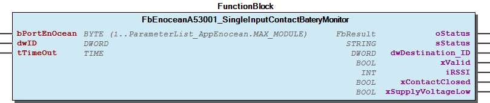 Supported EEP:

### A5/07-30-01


Please refer to the manufacturer’s manual to find the Enocean Equipment Profiles (EEP) number for your device.

Note Please refer to the manufacturer’s manual to find the Enocean Equipment Profiles (EEP) number for your device. - FbEnoceanA53001_SingleInputContactBateryMonitor.SupplyVoltageLow (PROP)

## FbEnoceanA53002_SingleInputContact (FB)


| Scope | Name | Type | Initial | Comment | Inherited from |
| --- | --- | --- | --- | --- | --- |
| Input | bPortEnOcean | BYTE (1..ParameterList_AppEnocean.MAX_MODULE) | 1 | Master assignment number. Range 1 to MAX_MASTER. | FbEnoceanBase |
| Output | oStatus | WagoSysErrorBase.FbResult |  | Status object. (Listed in Status ) The content of the error object could be displayed via the FbShowResult from the WagoSysErrorBase library. | FbEnoceanBase |
| sStatus | STRING |  | Status description as string (Listed in Status ) | FbEnoceanBase |
| Input | dwID | DWORD |  | Device ID | FbDevice |
| tTimeOut | TIME | TIME#60m0s0ms | Maximal time gap between telegrams | FbReceiver_4BS |
| Output | dwDestination_ID | DWORD |  | Destination ID | FbReceiver_4BS |
| xValid | BOOL |  | Valid telegram | FbReceiver_4BS |
| iRSSI | INT |  | Received signal strengh indication (-90...-45dBm) = (bad...good) | FbReceiver_4BS |
| xContactClosed | BOOL |  | TRUE= Contact closed | FbBaseA530xx_SingleInputContact |

The Function block decodes Enocean device according to the Enocean Equipment Profiles (EEP).

Graphical Illustration

Supported EEP:

Interface variables Function The Function block decodes Enocean device according to the Enocean Equipment Profiles (EEP). Graphical Illustration  Supported EEP:

### A5/07-30-02


Please refer to the manufacturer’s manual to find the Enocean Equipment Profiles (EEP) number for your device.

Note Please refer to the manufacturer’s manual to find the Enocean Equipment Profiles (EEP) number for your device.

## FbEnoceanA53003_DigitalInputWakeTemp (FB)


| Scope | Name | Type | Initial | Comment | Inherited from |
| --- | --- | --- | --- | --- | --- |
| Input | bPortEnOcean | BYTE (1..ParameterList_AppEnocean.MAX_MODULE) | 1 | Master assignment number. Range 1 to MAX_MASTER. | FbEnoceanBase |
| Output | oStatus | WagoSysErrorBase.FbResult |  | Status object. (Listed in Status ) The content of the error object could be displayed via the FbShowResult from the WagoSysErrorBase library. | FbEnoceanBase |
| sStatus | STRING |  | Status description as string (Listed in Status ) | FbEnoceanBase |
| Input | dwID | DWORD |  | Device ID | FbDevice |
| tTimeOut | TIME | TIME#60m0s0ms | Maximal time gap between telegrams | FbReceiver_4BS |
| Output | dwDestination_ID | DWORD |  | Destination ID | FbReceiver_4BS |
| xValid | BOOL |  | Valid telegram | FbReceiver_4BS |
| iRSSI | INT |  | Received signal strengh indication (-90...-45dBm) = (bad...good) | FbReceiver_4BS |
| xDI0 | BOOL |  | Digital input |  |
| xDI1 | BOOL |  | Digital input |  |
| xDI2 | BOOL |  | Digital input |  |
| xDI3 | BOOL |  | Digital input |  |
| xWakeSignal | BOOL |  | Wake signal |  |
| rTemperature | REAL |  | Temperature |  |

The Function block decodes Enocean device according to the Enocean Equipment Profiles (EEP).

Graphical Illustration

Supported EEP:

Interface variables Function The Function block decodes Enocean device according to the Enocean Equipment Profiles (EEP). Graphical Illustration  Supported EEP:

### A5/07-30-03


Please refer to the manufacturer’s manual to find the Enocean Equipment Profiles (EEP) number for your device.

Note Please refer to the manufacturer’s manual to find the Enocean Equipment Profiles (EEP) number for your device. - FbEnoceanA53003_DigitalInputWakeTemp.DI0 (PROP) - FbEnoceanA53003_DigitalInputWakeTemp.DI1 (PROP) - FbEnoceanA53003_DigitalInputWakeTemp.DI2 (PROP) - FbEnoceanA53003_DigitalInputWakeTemp.DI3 (PROP) - FbEnoceanA53003_DigitalInputWakeTemp.Temperature (PROP) - FbEnoceanA53003_DigitalInputWakeTemp.WakeSignal (PROP)

## FbEnoceanA53004_DigitalInput8bits (FB)


| Scope | Name | Type | Initial | Comment | Inherited from |
| --- | --- | --- | --- | --- | --- |
| Input | bPortEnOcean | BYTE (1..ParameterList_AppEnocean.MAX_MODULE) | 1 | Master assignment number. Range 1 to MAX_MASTER. | FbEnoceanBase |
| Output | oStatus | WagoSysErrorBase.FbResult |  | Status object. (Listed in Status ) The content of the error object could be displayed via the FbShowResult from the WagoSysErrorBase library. | FbEnoceanBase |
| sStatus | STRING |  | Status description as string (Listed in Status ) | FbEnoceanBase |
| Input | dwID | DWORD |  | Device ID | FbDevice |
| tTimeOut | TIME | TIME#60m0s0ms | Maximal time gap between telegrams | FbReceiver_4BS |
| Output | dwDestination_ID | DWORD |  | Destination ID | FbReceiver_4BS |
| xValid | BOOL |  | Valid telegram | FbReceiver_4BS |
| iRSSI | INT |  | Received signal strengh indication (-90...-45dBm) = (bad...good) | FbReceiver_4BS |
| xDI0 | BOOL |  | Digital input |  |
| xDI1 | BOOL |  | Digital input |  |
| xDI2 | BOOL |  | Digital input |  |
| bDigitalValue | BYTE |  | Digital value DV0 |  |

The Function block decodes Enocean device according to the Enocean Equipment Profiles (EEP).

Graphical Illustration

Supported EEP:

Interface variables Function The Function block decodes Enocean device according to the Enocean Equipment Profiles (EEP). Graphical Illustration  Supported EEP:

### A5/07-30-04


Please refer to the manufacturer’s manual to find the Enocean Equipment Profiles (EEP) number for your device.

Note Please refer to the manufacturer’s manual to find the Enocean Equipment Profiles (EEP) number for your device. - FbEnoceanA53004_DigitalInput8bits.DI0 (PROP) - FbEnoceanA53004_DigitalInput8bits.DI1 (PROP) - FbEnoceanA53004_DigitalInput8bits.DI2 (PROP) - FbEnoceanA53004_DigitalInput8bits.DigitalValue (PROP)

## FbEnoceanA53701_DemandResponse (FB)


| Scope | Name | Type | Initial | Comment | Inherited from |
| --- | --- | --- | --- | --- | --- |
| Input | bPortEnOcean | BYTE (1..ParameterList_AppEnocean.MAX_MODULE) | 1 | Master assignment number. Range 1 to MAX_MASTER. | FbEnoceanBase |
| Output | oStatus | WagoSysErrorBase.FbResult |  | Status object. (Listed in Status ) The content of the error object could be displayed via the FbShowResult from the WagoSysErrorBase library. | FbEnoceanBase |
| sStatus | STRING |  | Status description as string (Listed in Status ) | FbEnoceanBase |
| Input | dwID | DWORD |  | Device ID | FbDevice |
| tTimeOut | TIME | TIME#60m0s0ms | Maximal time gap between telegrams | FbReceiver_4BS |
| Output | dwDestination_ID | DWORD |  | Destination ID | FbReceiver_4BS |
| xValid | BOOL |  | Valid telegram | FbReceiver_4BS |
| iRSSI | INT |  | Received signal strengh indication (-90...-45dBm) = (bad...good) | FbReceiver_4BS |
| typDemandResponse | typDemandResponse |  | received values |  |

The Function block decodes Enocean device according to the Enocean Equipment Profiles (EEP).

Graphical Illustration

Supported EEP:

Interface variables Function The Function block decodes Enocean device according to the Enocean Equipment Profiles (EEP). Graphical Illustration  Supported EEP:

### A5/07-37-01


Please refer to the manufacturer’s manual to find the Enocean Equipment Profiles (EEP) number for your device.

Note Please refer to the manufacturer’s manual to find the Enocean Equipment Profiles (EEP) number for your device. - FbEnoceanA53701_DemandResponse.DemandResponse (PROP)

## FbEnoceanBase (FB)


| Scope | Name | Type | Initial | Comment |
| --- | --- | --- | --- | --- |
| Input | bPortEnOcean | BYTE (1..ParameterList_AppEnocean.MAX_MODULE) | 1 | Master assignment number. Range 1 to MAX_MASTER. |
| Output | oStatus | WagoSysErrorBase.FbResult |  | Status object. (Listed in Status ) The content of the error object could be displayed via the FbShowResult from the WagoSysErrorBase library. |
| sStatus | STRING |  | Status description as string (Listed in Status ) |

Base class for Enocean function block

Graphical Illustration

Interface variables Function Base class for Enocean function block Graphical Illustration  - 00 Administration FbEnoceanBase.setClassname (METH) 01 Parameters - FbEnoceanBase.Port_ID (PROP) 80 Status - FbEnoceanBase.setStatusObject (METH)

## FbEnoceanD21101_RoomOperatingPanel (FB)


| Scope | Name | Type | Initial | Comment | Inherited from |
| --- | --- | --- | --- | --- | --- |
| Input | bPortEnOcean | BYTE (1..ParameterList_AppEnocean.MAX_MODULE) | 1 | Master assignment number. Range 1 to MAX_MASTER. | FbEnoceanBase |
| Output | oStatus | WagoSysErrorBase.FbResult |  | Status object. (Listed in Status ) The content of the error object could be displayed via the FbShowResult from the WagoSysErrorBase library. | FbEnoceanBase |
| sStatus | STRING |  | Status description as string (Listed in Status ) | FbEnoceanBase |
| Input | bFilterTableChannel | BYTE |  | Filter table channel | FbBaseD2YYxx_SmartAck |
| tTimeOut | TIME | TIME#60m0s0ms | Maximal time gap between telegrams | FbBaseD2YYxx_SmartAck |
| Output | xReady | BOOL | TRUE | TRUE-> Function block is ready | FbBaseD2YYxx_SmartAck |
| dwID | DWORD |  | Partner ID | FbBaseD2YYxx_SmartAck |
| xValid | BOOL |  | Valid telegram | FbBaseD2YYxx_SmartAck |
| iRSSI | INT |  | Received signal strengh indication (-90...-45dBm) = (bad...good) | FbBaseD2YYxx_SmartAck |
| Input | xShowSymbolHeating | BOOL |  | DHS: Display heating symbol | FbBaseD211xx_RoomOperatingPanel |
| xShowSymbolCooling | BOOL |  | DCS: Display cooling symbol | FbBaseD211xx_RoomOperatingPanel |
| xShowSymbolWindowOpen | BOOL |  | SSW: Show symbol window | FbBaseD211xx_RoomOperatingPanel |
| Inout | xLearn | BOOL |  | Activate learn mode |  |
| typSync | typD211xx |  | Synchronisation parameters |  |
| Output | rTemperature | REAL |  | Temperature measured by the temperature sensor in °C. Range 0°C-40°C |  |
| rSetpointCorrection | REAL |  | Temperature setpoint correction value in °C |  |

The Function block receives and transmits (bidrectional) Enocean data using SMART-ACK

Graphical Illustration

Supported EEP:

Interface variables Function The Function block receives and transmits (bidrectional) Enocean data using SMART-ACK Graphical Illustration 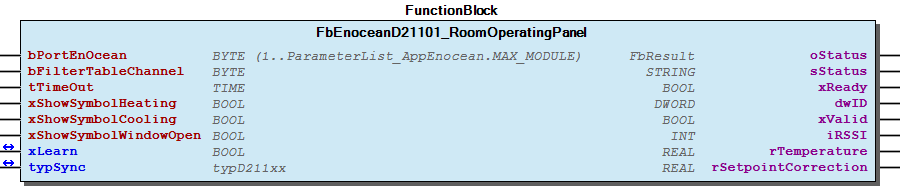 Supported EEP:

### D2-11-01


Please refer to the manufacturer’s manual to find the Enocean Equipment Profiles (EEP) number for your device.

Note Please refer to the manufacturer’s manual to find the Enocean Equipment Profiles (EEP) number for your device. - 01 Temperature FbEnoceanD21101_RoomOperatingPanel.Temperature (PROP) 02 Setpoint - FbEnoceanD21101_RoomOperatingPanel.SetpointCorrection (PROP)

## FbEnoceanD21102_RoomOperatingPanel (FB)


| Scope | Name | Type | Initial | Comment | Inherited from |
| --- | --- | --- | --- | --- | --- |
| Input | bPortEnOcean | BYTE (1..ParameterList_AppEnocean.MAX_MODULE) | 1 | Master assignment number. Range 1 to MAX_MASTER. | FbEnoceanBase |
| Output | oStatus | WagoSysErrorBase.FbResult |  | Status object. (Listed in Status ) The content of the error object could be displayed via the FbShowResult from the WagoSysErrorBase library. | FbEnoceanBase |
| sStatus | STRING |  | Status description as string (Listed in Status ) | FbEnoceanBase |
| Input | bFilterTableChannel | BYTE |  | Filter table channel | FbBaseD2YYxx_SmartAck |
| tTimeOut | TIME | TIME#60m0s0ms | Maximal time gap between telegrams | FbBaseD2YYxx_SmartAck |
| Output | xReady | BOOL | TRUE | TRUE-> Function block is ready | FbBaseD2YYxx_SmartAck |
| dwID | DWORD |  | Partner ID | FbBaseD2YYxx_SmartAck |
| xValid | BOOL |  | Valid telegram | FbBaseD2YYxx_SmartAck |
| iRSSI | INT |  | Received signal strengh indication (-90...-45dBm) = (bad...good) | FbBaseD2YYxx_SmartAck |
| Input | xShowSymbolHeating | BOOL |  | DHS: Display heating symbol | FbBaseD211xx_RoomOperatingPanel |
| xShowSymbolCooling | BOOL |  | DCS: Display cooling symbol | FbBaseD211xx_RoomOperatingPanel |
| xShowSymbolWindowOpen | BOOL |  | SSW: Show symbol window | FbBaseD211xx_RoomOperatingPanel |
| Inout | xLearn | BOOL |  | Activate learn mode |  |
| typSync | typD211xx |  | Synchronisation parameters |  |
| Output | rTemperature | REAL |  | Temperature measured by the temperature sensor in °C. Range 0°C-40°C |  |
| rRelativeHumidity | REAL |  | Relative Humidity measured by the humidity sensor in % |  |
| rSetpointCorrection | REAL |  | Temperature setpoint correction value in °C |  |

The Function block receives and transmits (bidrectional) Enocean data using SMART-ACK

Graphical Illustration

Supported EEP:

Interface variables Function The Function block receives and transmits (bidrectional) Enocean data using SMART-ACK Graphical Illustration  Supported EEP:

### D2-11-02


Please refer to the manufacturer’s manual to find the Enocean Equipment Profiles (EEP) number for your device.

Note Please refer to the manufacturer’s manual to find the Enocean Equipment Profiles (EEP) number for your device. - 01 Temperature FbEnoceanD21102_RoomOperatingPanel.Temperature (PROP) 02 Setpoint - FbEnoceanD21102_RoomOperatingPanel.SetpointCorrection (PROP) 03 Relative humidity - FbEnoceanD21102_RoomOperatingPanel.RelativeHumidity (PROP)

## FbEnoceanD21103_RoomOperatingPanel (FB)


| Scope | Name | Type | Initial | Comment | Inherited from |
| --- | --- | --- | --- | --- | --- |
| Input | bPortEnOcean | BYTE (1..ParameterList_AppEnocean.MAX_MODULE) | 1 | Master assignment number. Range 1 to MAX_MASTER. | FbEnoceanBase |
| Output | oStatus | WagoSysErrorBase.FbResult |  | Status object. (Listed in Status ) The content of the error object could be displayed via the FbShowResult from the WagoSysErrorBase library. | FbEnoceanBase |
| sStatus | STRING |  | Status description as string (Listed in Status ) | FbEnoceanBase |
| Input | bFilterTableChannel | BYTE |  | Filter table channel | FbBaseD2YYxx_SmartAck |
| tTimeOut | TIME | TIME#60m0s0ms | Maximal time gap between telegrams | FbBaseD2YYxx_SmartAck |
| Output | xReady | BOOL | TRUE | TRUE-> Function block is ready | FbBaseD2YYxx_SmartAck |
| dwID | DWORD |  | Partner ID | FbBaseD2YYxx_SmartAck |
| xValid | BOOL |  | Valid telegram | FbBaseD2YYxx_SmartAck |
| iRSSI | INT |  | Received signal strengh indication (-90...-45dBm) = (bad...good) | FbBaseD2YYxx_SmartAck |
| Input | xShowSymbolHeating | BOOL |  | DHS: Display heating symbol | FbBaseD211xx_RoomOperatingPanel |
| xShowSymbolCooling | BOOL |  | DCS: Display cooling symbol | FbBaseD211xx_RoomOperatingPanel |
| xShowSymbolWindowOpen | BOOL |  | SSW: Show symbol window | FbBaseD211xx_RoomOperatingPanel |
| Inout | xLearn | BOOL |  | Activate learn mode |  |
| typSync | typD211xx |  | Synchronisation parameters |  |
| Output | rTemperature | REAL |  | Temperature measured by the temperature sensor in °C. Range 0°C-40°C |  |
| rSetpointCorrection | REAL |  | Temperature setpoint correction value in °C |  |
| xAuto | BOOL |  | Fan speed stage auto |  |
| xStage_0 | BOOL |  | Fan speed stage 0 |  |
| xStage_1 | BOOL |  | Fan speed stage 1 |  |
| xStage_2 | BOOL |  | Fan speed stage 2 |  |
| xStage_3 | BOOL |  | Fan speed stage 3 |  |

The Function block receives and transmits (bidrectional) Enocean data using SMART-ACK

Graphical Illustration

Supported EEP:

Interface variables Function The Function block receives and transmits (bidrectional) Enocean data using SMART-ACK Graphical Illustration  Supported EEP:

### D2-11-03


Please refer to the manufacturer’s manual to find the Enocean Equipment Profiles (EEP) number for your device.

Note Please refer to the manufacturer’s manual to find the Enocean Equipment Profiles (EEP) number for your device. - 01 Temperature FbEnoceanD21103_RoomOperatingPanel.Temperature (PROP) 02 Setpoint - FbEnoceanD21103_RoomOperatingPanel.SetpointCorrection (PROP) 04 Fan speed - FbEnoceanD21103_RoomOperatingPanel.Auto (PROP) - FbEnoceanD21103_RoomOperatingPanel.Stage_0 (PROP) - FbEnoceanD21103_RoomOperatingPanel.Stage_1 (PROP) - FbEnoceanD21103_RoomOperatingPanel.Stage_2 (PROP) - FbEnoceanD21103_RoomOperatingPanel.Stage_3 (PROP)

## FbEnoceanD21104_RoomOperatingPanel (FB)


| Scope | Name | Type | Initial | Comment | Inherited from |
| --- | --- | --- | --- | --- | --- |
| Input | bPortEnOcean | BYTE (1..ParameterList_AppEnocean.MAX_MODULE) | 1 | Master assignment number. Range 1 to MAX_MASTER. | FbEnoceanBase |
| Output | oStatus | WagoSysErrorBase.FbResult |  | Status object. (Listed in Status ) The content of the error object could be displayed via the FbShowResult from the WagoSysErrorBase library. | FbEnoceanBase |
| sStatus | STRING |  | Status description as string (Listed in Status ) | FbEnoceanBase |
| Input | bFilterTableChannel | BYTE |  | Filter table channel | FbBaseD2YYxx_SmartAck |
| tTimeOut | TIME | TIME#60m0s0ms | Maximal time gap between telegrams | FbBaseD2YYxx_SmartAck |
| Output | xReady | BOOL | TRUE | TRUE-> Function block is ready | FbBaseD2YYxx_SmartAck |
| dwID | DWORD |  | Partner ID | FbBaseD2YYxx_SmartAck |
| xValid | BOOL |  | Valid telegram | FbBaseD2YYxx_SmartAck |
| iRSSI | INT |  | Received signal strengh indication (-90...-45dBm) = (bad...good) | FbBaseD2YYxx_SmartAck |
| Input | xShowSymbolHeating | BOOL |  | DHS: Display heating symbol | FbBaseD211xx_RoomOperatingPanel |
| xShowSymbolCooling | BOOL |  | DCS: Display cooling symbol | FbBaseD211xx_RoomOperatingPanel |
| xShowSymbolWindowOpen | BOOL |  | SSW: Show symbol window | FbBaseD211xx_RoomOperatingPanel |
| Inout | xLearn | BOOL |  | Activate learn mode |  |
| typSync | typD211xx |  | Synchronisation parameters |  |
| Output | rTemperature | REAL |  | Temperature measured by the temperature sensor in °C. Range 0°C-40°C |  |
| rRelativeHumidity | REAL |  | Relative Humidity measured by the humidity sensor in % |  |
| rSetpointCorrection | REAL |  | Temperature setpoint correction value in °C |  |
| xAuto | BOOL |  | Fan speed stage auto |  |
| xStage_0 | BOOL |  | Fan speed stage 0 |  |
| xStage_1 | BOOL |  | Fan speed stage 1 |  |
| xStage_2 | BOOL |  | Fan speed stage 2 |  |
| xStage_3 | BOOL |  | Fan speed stage 3 |  |

The Function block receives and transmits (bidrectional) Enocean data using SMART-ACK

Graphical Illustration

Supported EEP:

Interface variables Function The Function block receives and transmits (bidrectional) Enocean data using SMART-ACK Graphical Illustration  Supported EEP:

### D2-11-04


Please refer to the manufacturer’s manual to find the Enocean Equipment Profiles (EEP) number for your device.

Note Please refer to the manufacturer’s manual to find the Enocean Equipment Profiles (EEP) number for your device. - 01 Temperature FbEnoceanD21104_RoomOperatingPanel.Temperature (PROP) 02 Setpoint - FbEnoceanD21104_RoomOperatingPanel.SetpointCorrection (PROP) 03 Relative humidity - FbEnoceanD21104_RoomOperatingPanel.RelativeHumidity (PROP) 04 Fan speed - FbEnoceanD21104_RoomOperatingPanel.Auto (PROP) - FbEnoceanD21104_RoomOperatingPanel.Stage_0 (PROP) - FbEnoceanD21104_RoomOperatingPanel.Stage_1 (PROP) - FbEnoceanD21104_RoomOperatingPanel.Stage_2 (PROP) - FbEnoceanD21104_RoomOperatingPanel.Stage_3 (PROP)

## FbEnoceanD21105_RoomOperatingPanel (FB)


| Scope | Name | Type | Initial | Comment | Inherited from |
| --- | --- | --- | --- | --- | --- |
| Input | bPortEnOcean | BYTE (1..ParameterList_AppEnocean.MAX_MODULE) | 1 | Master assignment number. Range 1 to MAX_MASTER. | FbEnoceanBase |
| Output | oStatus | WagoSysErrorBase.FbResult |  | Status object. (Listed in Status ) The content of the error object could be displayed via the FbShowResult from the WagoSysErrorBase library. | FbEnoceanBase |
| sStatus | STRING |  | Status description as string (Listed in Status ) | FbEnoceanBase |
| Input | bFilterTableChannel | BYTE |  | Filter table channel | FbBaseD2YYxx_SmartAck |
| tTimeOut | TIME | TIME#60m0s0ms | Maximal time gap between telegrams | FbBaseD2YYxx_SmartAck |
| Output | xReady | BOOL | TRUE | TRUE-> Function block is ready | FbBaseD2YYxx_SmartAck |
| dwID | DWORD |  | Partner ID | FbBaseD2YYxx_SmartAck |
| xValid | BOOL |  | Valid telegram | FbBaseD2YYxx_SmartAck |
| iRSSI | INT |  | Received signal strengh indication (-90...-45dBm) = (bad...good) | FbBaseD2YYxx_SmartAck |
| Input | xShowSymbolHeating | BOOL |  | DHS: Display heating symbol | FbBaseD211xx_RoomOperatingPanel |
| xShowSymbolCooling | BOOL |  | DCS: Display cooling symbol | FbBaseD211xx_RoomOperatingPanel |
| xShowSymbolWindowOpen | BOOL |  | SSW: Show symbol window | FbBaseD211xx_RoomOperatingPanel |
| Inout | xLearn | BOOL |  | Activate learn mode |  |
| typSync | typD211xx |  | Synchronisation parameters |  |
| Output | rTemperature | REAL |  | Temperature measured by the temperature sensor in °C. Range 0°C-40°C |  |
| rSetpointCorrection | REAL |  | Temperature setpoint correction value in °C |  |
| xAuto | BOOL |  | Fan speed stage auto |  |
| xStage_0 | BOOL |  | Fan speed stage 0 |  |
| xStage_1 | BOOL |  | Fan speed stage 1 |  |
| xStage_2 | BOOL |  | Fan speed stage 2 |  |
| xStage_3 | BOOL |  | Fan speed stage 3 |  |
| xOccupancy | BOOL |  | Binary state DB0.0 |  |

The Function block receives and transmits (bidrectional) Enocean data using SMART-ACK

Graphical Illustration

Supported EEP:

Interface variables Function The Function block receives and transmits (bidrectional) Enocean data using SMART-ACK Graphical Illustration  Supported EEP:

### D2-11-05


Please refer to the manufacturer’s manual to find the Enocean Equipment Profiles (EEP) number for your device.

Note Please refer to the manufacturer’s manual to find the Enocean Equipment Profiles (EEP) number for your device. - 01 Temperature FbEnoceanD21105_RoomOperatingPanel.Temperature (PROP) 02 Setpoint - FbEnoceanD21105_RoomOperatingPanel.SetpointCorrection (PROP) 04 Fan speed - FbEnoceanD21105_RoomOperatingPanel.Auto (PROP) - FbEnoceanD21105_RoomOperatingPanel.Stage_0 (PROP) - FbEnoceanD21105_RoomOperatingPanel.Stage_1 (PROP) - FbEnoceanD21105_RoomOperatingPanel.Stage_2 (PROP) - FbEnoceanD21105_RoomOperatingPanel.Stage_3 (PROP) 05 Occupancy - FbEnoceanD21105_RoomOperatingPanel.Occupancy (PROP)

## FbEnoceanD21106_RoomOperatingPanel (FB)


| Scope | Name | Type | Initial | Comment | Inherited from |
| --- | --- | --- | --- | --- | --- |
| Input | bPortEnOcean | BYTE (1..ParameterList_AppEnocean.MAX_MODULE) | 1 | Master assignment number. Range 1 to MAX_MASTER. | FbEnoceanBase |
| Output | oStatus | WagoSysErrorBase.FbResult |  | Status object. (Listed in Status ) The content of the error object could be displayed via the FbShowResult from the WagoSysErrorBase library. | FbEnoceanBase |
| sStatus | STRING |  | Status description as string (Listed in Status ) | FbEnoceanBase |
| Input | bFilterTableChannel | BYTE |  | Filter table channel | FbBaseD2YYxx_SmartAck |
| tTimeOut | TIME | TIME#60m0s0ms | Maximal time gap between telegrams | FbBaseD2YYxx_SmartAck |
| Output | xReady | BOOL | TRUE | TRUE-> Function block is ready | FbBaseD2YYxx_SmartAck |
| dwID | DWORD |  | Partner ID | FbBaseD2YYxx_SmartAck |
| xValid | BOOL |  | Valid telegram | FbBaseD2YYxx_SmartAck |
| iRSSI | INT |  | Received signal strengh indication (-90...-45dBm) = (bad...good) | FbBaseD2YYxx_SmartAck |
| Input | xShowSymbolHeating | BOOL |  | DHS: Display heating symbol | FbBaseD211xx_RoomOperatingPanel |
| xShowSymbolCooling | BOOL |  | DCS: Display cooling symbol | FbBaseD211xx_RoomOperatingPanel |
| xShowSymbolWindowOpen | BOOL |  | SSW: Show symbol window | FbBaseD211xx_RoomOperatingPanel |
| Inout | xLearn | BOOL |  | Activate learn mode |  |
| typSync | typD211xx |  | Synchronisation parameters |  |
| Output | rTemperature | REAL |  | Temperature measured by the temperature sensor in °C. Range 0°C-40°C |  |
| rRelativeHumidity | REAL |  | Relative Humidity measured by the humidity sensor in % |  |
| rSetpointCorrection | REAL |  | Temperature setpoint correction value in °C |  |
| xAuto | BOOL |  | Fan speed stage auto |  |
| xStage_0 | BOOL |  | Fan speed stage 0 |  |
| xStage_1 | BOOL |  | Fan speed stage 1 |  |
| xStage_2 | BOOL |  | Fan speed stage 2 |  |
| xStage_3 | BOOL |  | Fan speed stage 3 |  |
| xOccupancy | BOOL |  | Binary state DB0.0 |  |

The Function block receives and transmits (bidrectional) Enocean data using SMART-ACK

Graphical Illustration

Supported EEP:

Interface variables Function The Function block receives and transmits (bidrectional) Enocean data using SMART-ACK Graphical Illustration  Supported EEP:

### D2-11-06


Please refer to the manufacturer’s manual to find the Enocean Equipment Profiles (EEP) number for your device.

Note Please refer to the manufacturer’s manual to find the Enocean Equipment Profiles (EEP) number for your device. - 01 Temperature FbEnoceanD21106_RoomOperatingPanel.Temperature (PROP) 02 Setpoint - FbEnoceanD21106_RoomOperatingPanel.SetpointCorrection (PROP) 03 Relative humidity - FbEnoceanD21106_RoomOperatingPanel.RelativeHumidity (PROP) 04 Fan speed - FbEnoceanD21106_RoomOperatingPanel.Auto (PROP) - FbEnoceanD21106_RoomOperatingPanel.Stage_0 (PROP) - FbEnoceanD21106_RoomOperatingPanel.Stage_1 (PROP) - FbEnoceanD21106_RoomOperatingPanel.Stage_2 (PROP) - FbEnoceanD21106_RoomOperatingPanel.Stage_3 (PROP) 05 Occupancy - FbEnoceanD21106_RoomOperatingPanel.Occupancy (PROP)

## FbEnoceanD21107_RoomOperatingPanel (FB)


| Scope | Name | Type | Initial | Comment | Inherited from |
| --- | --- | --- | --- | --- | --- |
| Input | bPortEnOcean | BYTE (1..ParameterList_AppEnocean.MAX_MODULE) | 1 | Master assignment number. Range 1 to MAX_MASTER. | FbEnoceanBase |
| Output | oStatus | WagoSysErrorBase.FbResult |  | Status object. (Listed in Status ) The content of the error object could be displayed via the FbShowResult from the WagoSysErrorBase library. | FbEnoceanBase |
| sStatus | STRING |  | Status description as string (Listed in Status ) | FbEnoceanBase |
| Input | bFilterTableChannel | BYTE |  | Filter table channel | FbBaseD2YYxx_SmartAck |
| tTimeOut | TIME | TIME#60m0s0ms | Maximal time gap between telegrams | FbBaseD2YYxx_SmartAck |
| Output | xReady | BOOL | TRUE | TRUE-> Function block is ready | FbBaseD2YYxx_SmartAck |
| dwID | DWORD |  | Partner ID | FbBaseD2YYxx_SmartAck |
| xValid | BOOL |  | Valid telegram | FbBaseD2YYxx_SmartAck |
| iRSSI | INT |  | Received signal strengh indication (-90...-45dBm) = (bad...good) | FbBaseD2YYxx_SmartAck |
| Input | xShowSymbolHeating | BOOL |  | DHS: Display heating symbol | FbBaseD211xx_RoomOperatingPanel |
| xShowSymbolCooling | BOOL |  | DCS: Display cooling symbol | FbBaseD211xx_RoomOperatingPanel |
| xShowSymbolWindowOpen | BOOL |  | SSW: Show symbol window | FbBaseD211xx_RoomOperatingPanel |
| Inout | xLearn | BOOL |  | Activate learn mode |  |
| typSync | typD211xx |  | Synchronisation parameters |  |
| Output | rTemperature | REAL |  | Temperature measured by the temperature sensor in °C. Range 0°C-40°C |  |
| rSetpointCorrection | REAL |  | Temperature setpoint correction value in °C |  |
| xOccupancy | BOOL |  | Binary state DB0.0 |  |

The Function block receives and transmits (bidrectional) Enocean data using SMART-ACK

Graphical Illustration

Supported EEP:

Interface variables Function The Function block receives and transmits (bidrectional) Enocean data using SMART-ACK Graphical Illustration  Supported EEP:

### D2-11-07


Please refer to the manufacturer’s manual to find the Enocean Equipment Profiles (EEP) number for your device.

Note Please refer to the manufacturer’s manual to find the Enocean Equipment Profiles (EEP) number for your device. - 01 Temperature FbEnoceanD21107_RoomOperatingPanel.Temperature (PROP) 02 Setpoint - FbEnoceanD21107_RoomOperatingPanel.SetpointCorrection (PROP) 05 Occupancy - FbEnoceanD21107_RoomOperatingPanel.Occupancy (PROP)

## FbEnoceanD21108_RoomOperatingPanel (FB)


| Scope | Name | Type | Initial | Comment | Inherited from |
| --- | --- | --- | --- | --- | --- |
| Input | bPortEnOcean | BYTE (1..ParameterList_AppEnocean.MAX_MODULE) | 1 | Master assignment number. Range 1 to MAX_MASTER. | FbEnoceanBase |
| Output | oStatus | WagoSysErrorBase.FbResult |  | Status object. (Listed in Status ) The content of the error object could be displayed via the FbShowResult from the WagoSysErrorBase library. | FbEnoceanBase |
| sStatus | STRING |  | Status description as string (Listed in Status ) | FbEnoceanBase |
| Input | bFilterTableChannel | BYTE |  | Filter table channel | FbBaseD2YYxx_SmartAck |
| tTimeOut | TIME | TIME#60m0s0ms | Maximal time gap between telegrams | FbBaseD2YYxx_SmartAck |
| Output | xReady | BOOL | TRUE | TRUE-> Function block is ready | FbBaseD2YYxx_SmartAck |
| dwID | DWORD |  | Partner ID | FbBaseD2YYxx_SmartAck |
| xValid | BOOL |  | Valid telegram | FbBaseD2YYxx_SmartAck |
| iRSSI | INT |  | Received signal strengh indication (-90...-45dBm) = (bad...good) | FbBaseD2YYxx_SmartAck |
| Input | xShowSymbolHeating | BOOL |  | DHS: Display heating symbol | FbBaseD211xx_RoomOperatingPanel |
| xShowSymbolCooling | BOOL |  | DCS: Display cooling symbol | FbBaseD211xx_RoomOperatingPanel |
| xShowSymbolWindowOpen | BOOL |  | SSW: Show symbol window | FbBaseD211xx_RoomOperatingPanel |
| Inout | xLearn | BOOL |  | Activate learn mode |  |
| typSync | typD211xx |  | Synchronisation parameters |  |
| Output | rTemperature | REAL |  | Temperature measured by the temperature sensor in °C. Range 0°C-40°C |  |
| rRelativeHumidity | REAL |  | Relative Humidity measured by the humidity sensor in % |  |
| rSetpointCorrection | REAL |  | Temperature setpoint correction value in °C |  |
| xOccupancy | BOOL |  | Binary state DB0.0 |  |

The Function block receives and transmits (bidrectional) Enocean data using SMART-ACK

Graphical Illustration

Supported EEP:

Interface variables Function The Function block receives and transmits (bidrectional) Enocean data using SMART-ACK Graphical Illustration  Supported EEP:

### D2-11-08


Please refer to the manufacturer’s manual to find the Enocean Equipment Profiles (EEP) number for your device.

Note Please refer to the manufacturer’s manual to find the Enocean Equipment Profiles (EEP) number for your device. - 01 Temperature FbEnoceanD21108_RoomOperatingPanel.Temperature (PROP) 02 Setpoint - FbEnoceanD21108_RoomOperatingPanel.SetpointCorrection (PROP) 03 Relative humidity - FbEnoceanD21108_RoomOperatingPanel.RelativeHumidity (PROP) 05 Occupancy - FbEnoceanD21108_RoomOperatingPanel.Occupancy (PROP)

## FbEnoceanD211xx_RoomOperatingPanel (FB)


| Scope | Name | Type | Initial | Comment | Inherited from |
| --- | --- | --- | --- | --- | --- |
| Input | bPortEnOcean | BYTE (1..ParameterList_AppEnocean.MAX_MODULE) | 1 | Master assignment number. Range 1 to MAX_MASTER. | FbEnoceanBase |
| Output | oStatus | WagoSysErrorBase.FbResult |  | Status object. (Listed in Status ) The content of the error object could be displayed via the FbShowResult from the WagoSysErrorBase library. | FbEnoceanBase |
| sStatus | STRING |  | Status description as string (Listed in Status ) | FbEnoceanBase |
| Input | bFilterTableChannel | BYTE |  | Filter table channel | FbBaseD2YYxx_SmartAck |
| tTimeOut | TIME | TIME#60m0s0ms | Maximal time gap between telegrams | FbBaseD2YYxx_SmartAck |
| Output | xReady | BOOL | TRUE | TRUE-> Function block is ready | FbBaseD2YYxx_SmartAck |
| dwID | DWORD |  | Partner ID | FbBaseD2YYxx_SmartAck |
| xValid | BOOL |  | Valid telegram | FbBaseD2YYxx_SmartAck |
| iRSSI | INT |  | Received signal strengh indication (-90...-45dBm) = (bad...good) | FbBaseD2YYxx_SmartAck |
| Input | xShowSymbolHeating | BOOL |  | DHS: Display heating symbol |  |
| xShowSymbolCooling | BOOL |  | DCS: Display cooling symbol |  |
| xShowSymbolWindowOpen | BOOL |  | SSW: Show symbol window |  |
| Inout | _xLearn | BOOL |  | Activate learn mode |  |
| typSync | typD211xx |  | Synchronisation parameters |  |
| Output | rTemperature | REAL |  | Temperature measured by the temperature sensor in °C. Range 0°C-40°C |  |
| rRelativeHumidity | REAL |  | Relative Humidity measured by the humidity sensor in % |  |
| rSetpointCorrection | REAL |  | Temperature setpoint correction value in °C |  |
| xAuto | BOOL |  | Fan speed stage auto |  |
| xStage_0 | BOOL |  | Fan speed stage 0 |  |
| xStage_1 | BOOL |  | Fan speed stage 1 |  |
| xStage_2 | BOOL |  | Fan speed stage 2 |  |
| xStage_3 | BOOL |  | Fan speed stage 3 |  |
| xOccupancy | BOOL |  | Binary state DB0.0 |  |

The Function block receives and transmits (bidrectional) Enocean data using SMART-ACK

Graphical Illustration

Supported EEP:

Interface variables Function The Function block receives and transmits (bidrectional) Enocean data using SMART-ACK Graphical Illustration  Supported EEP:

### D2-11-xx


Please refer to the manufacturer’s manual to find the Enocean Equipment Profiles (EEP) number for your device.

Note Please refer to the manufacturer’s manual to find the Enocean Equipment Profiles (EEP) number for your device. - FbEnoceanD211xx_RoomOperatingPanel.Job (ACT) Pointer values FbEnoceanD211xx_RoomOperatingPanel.MessageType_A (ACT) FbEnoceanD211xx_RoomOperatingPanel.MessageType_B (ACT) FbEnoceanD211xx_RoomOperatingPanel.MessageType_C (ACT) FbEnoceanD211xx_RoomOperatingPanel.Sync (ACT)

## FbEnoceanD2FEFE_RoomOperatingPanel (FB)


| Scope | Name | Type | Initial | Comment | Inherited from |
| --- | --- | --- | --- | --- | --- |
| Input | bPortEnOcean | BYTE (1..ParameterList_AppEnocean.MAX_MODULE) | 1 | Master assignment number. Range 1 to MAX_MASTER. | FbEnoceanBase |
| Output | oStatus | WagoSysErrorBase.FbResult |  | Status object. (Listed in Status ) The content of the error object could be displayed via the FbShowResult from the WagoSysErrorBase library. | FbEnoceanBase |
| sStatus | STRING |  | Status description as string (Listed in Status ) | FbEnoceanBase |
| Input | bFilterTableChannel | BYTE |  | Filter table channel | FbBaseD2YYxx_SmartAck |
| tTimeOut | TIME | TIME#60m0s0ms | Maximal time gap between telegrams | FbBaseD2YYxx_SmartAck |
| Output | xReady | BOOL | TRUE | TRUE-> Function block is ready | FbBaseD2YYxx_SmartAck |
| dwID | DWORD |  | Partner ID | FbBaseD2YYxx_SmartAck |
| xValid | BOOL |  | Valid telegram | FbBaseD2YYxx_SmartAck |
| iRSSI | INT |  | Received signal strengh indication (-90...-45dBm) = (bad...good) | FbBaseD2YYxx_SmartAck |
| Input | xShowSymbolHeating | BOOL |  | SSH: Show symbol heating |  |
| xShowSymbolCooling | BOOL |  | SSC: Show symbol cooling |  |
| xShowSymbolWindowOpen | BOOL |  | SSW: Show symbol window open |  |
| Inout | xLearn | BOOL |  | Activate learn mode |  |
| typSync | typD2FEFE |  | Device parameters |  |
| Output | rTemperature | REAL |  | TMP: Temperature |  |
| rHumidity | REAL |  | HUM: Humidity in % |  |

The Function block receives and transmits (bidrectional) Enocean data using SMART-ACK

Graphical Illustration

Supported EEP:

Interface variables Function The Function block receives and transmits (bidrectional) Enocean data using SMART-ACK Graphical Illustration  Supported EEP:

### D2-FE-FE


Please refer to the manufacturer’s manual to find the Enocean Equipment Profiles (EEP) number for your device.

Note Please refer to the manufacturer’s manual to find the Enocean Equipment Profiles (EEP) number for your device. - FbEnoceanD2FEFE_RoomOperatingPanel.Job (ACT) Pointer values FbEnoceanD2FEFE_RoomOperatingPanel.MessageType_A (ACT) FbEnoceanD2FEFE_RoomOperatingPanel.MessageType_B (ACT) FbEnoceanD2FEFE_RoomOperatingPanel.MessageType_C (ACT) FbEnoceanD2FEFE_RoomOperatingPanel.Sync (ACT)

## FbEnoceanD50001_SingleInputContact (FB)


| Scope | Name | Type | Initial | Comment | Inherited from |
| --- | --- | --- | --- | --- | --- |
| Input | bPortEnOcean | BYTE (1..ParameterList_AppEnocean.MAX_MODULE) | 1 | Master assignment number. Range 1 to MAX_MASTER. | FbEnoceanBase |
| Output | oStatus | WagoSysErrorBase.FbResult |  | Status object. (Listed in Status ) The content of the error object could be displayed via the FbShowResult from the WagoSysErrorBase library. | FbEnoceanBase |
| sStatus | STRING |  | Status description as string (Listed in Status ) | FbEnoceanBase |
| Input | dwID | DWORD |  | Device ID | FbDevice |
| tTimeOut | TIME | TIME#60m0s0ms | Maximal time gap between telegrams | FbReceiver_1BS |
| Output | dwDestination_ID | DWORD |  | Destination ID | FbReceiver_1BS |
| xValid | BOOL |  | Valid telegram | FbReceiver_1BS |
| iRSSI | INT |  | Received signal strengh indication (-90...-45dBm) = (bad...good) | FbReceiver_1BS |
| xContactClosed | BOOL |  | TRUE= Contact closed |  |

The Function block decodes Enocean device according to the Enocean Equipment Profiles (EEP).

Graphical Illustration

Supported EEP:

Interface variables Function The Function block decodes Enocean device according to the Enocean Equipment Profiles (EEP). Graphical Illustration  Supported EEP:

### D5/06-00-01


Please refer to the manufacturer’s manual to find the Enocean Equipment Profiles (EEP) number for your device.

Note Please refer to the manufacturer’s manual to find the Enocean Equipment Profiles (EEP) number for your device. - FbEnoceanD50001_SingleInputContact.ContactClosed (PROP)

## FbEnoceanF60201_RockerSwitch_2_Rocker (FB)


| Scope | Name | Type | Initial | Comment | Inherited from |
| --- | --- | --- | --- | --- | --- |
| Input | bPortEnOcean | BYTE (1..ParameterList_AppEnocean.MAX_MODULE) | 1 | Master assignment number. Range 1 to MAX_MASTER. | FbEnoceanBase |
| Output | oStatus | WagoSysErrorBase.FbResult |  | Status object. (Listed in Status ) The content of the error object could be displayed via the FbShowResult from the WagoSysErrorBase library. | FbEnoceanBase |
| sStatus | STRING |  | Status description as string (Listed in Status ) | FbEnoceanBase |
| Input | dwID | DWORD |  | Device ID | FbDevice |
| tTimeOut | TIME | TIME#60m0s0ms | Maximal time gap between telegrams | FbReceiver_RPS |
| Output | dwDestination_ID | DWORD |  | Destination ID | FbReceiver_RPS |
| xValid | BOOL |  | Valid telegram | FbReceiver_RPS |
| iRSSI | INT |  | Received signal strengh indication (-90...-45dBm) = (bad...good) | FbReceiver_RPS |
| xButton_AO | BOOL |  | Indicator for State O of channel AO | FbBaseF602xx_RockerSwitch_2_Rocker |
| xButton_AI | BOOL |  | Indicator for State I of channel AI | FbBaseF602xx_RockerSwitch_2_Rocker |
| xButton_BO | BOOL |  | Indicator for State O of channel BO | FbBaseF602xx_RockerSwitch_2_Rocker |
| xButton_BI | BOOL |  | Indicator for State I of channel BI | FbBaseF602xx_RockerSwitch_2_Rocker |

The Function block decodes Enocean device according to the Enocean Equipment Profiles (EEP).

Graphical Illustration

Supported EEP:

Interface variables Function The Function block decodes Enocean device according to the Enocean Equipment Profiles (EEP). Graphical Illustration  Supported EEP:

### F6/05-02-01


Please refer to the manufacturer’s manual to find the Enocean Equipment Profiles (EEP) number for your device.

Functionality changed in V 1.1.0.26: Outputs will switch off when timeout expired.

Note Please refer to the manufacturer’s manual to find the Enocean Equipment Profiles (EEP) number for your device. Note Functionality changed in V 1.1.0.26: Outputs will switch off when timeout expired.

## FbEnoceanF60202_RockerSwitch_2_Rocker (FB)


| Scope | Name | Type | Initial | Comment | Inherited from |
| --- | --- | --- | --- | --- | --- |
| Input | bPortEnOcean | BYTE (1..ParameterList_AppEnocean.MAX_MODULE) | 1 | Master assignment number. Range 1 to MAX_MASTER. | FbEnoceanBase |
| Output | oStatus | WagoSysErrorBase.FbResult |  | Status object. (Listed in Status ) The content of the error object could be displayed via the FbShowResult from the WagoSysErrorBase library. | FbEnoceanBase |
| sStatus | STRING |  | Status description as string (Listed in Status ) | FbEnoceanBase |
| Input | dwID | DWORD |  | Device ID | FbDevice |
| tTimeOut | TIME | TIME#60m0s0ms | Maximal time gap between telegrams | FbReceiver_RPS |
| Output | dwDestination_ID | DWORD |  | Destination ID | FbReceiver_RPS |
| xValid | BOOL |  | Valid telegram | FbReceiver_RPS |
| iRSSI | INT |  | Received signal strengh indication (-90...-45dBm) = (bad...good) | FbReceiver_RPS |
| xButton_AO | BOOL |  | Indicator for State O of channel AO | FbBaseF602xx_RockerSwitch_2_Rocker |
| xButton_AI | BOOL |  | Indicator for State I of channel AI | FbBaseF602xx_RockerSwitch_2_Rocker |
| xButton_BO | BOOL |  | Indicator for State O of channel BO | FbBaseF602xx_RockerSwitch_2_Rocker |
| xButton_BI | BOOL |  | Indicator for State I of channel BI | FbBaseF602xx_RockerSwitch_2_Rocker |

The Function block decodes Enocean device according to the Enocean Equipment Profiles (EEP).

Graphical Illustration

Supported EEP:

Interface variables Function The Function block decodes Enocean device according to the Enocean Equipment Profiles (EEP). Graphical Illustration  Supported EEP:

### F6/05-02-02


Please refer to the manufacturer’s manual to find the Enocean Equipment Profiles (EEP) number for your device.

Functionality changed in V 1.1.0.26: Outputs will switch off when timeout expired.

Note Please refer to the manufacturer’s manual to find the Enocean Equipment Profiles (EEP) number for your device. Note Functionality changed in V 1.1.0.26: Outputs will switch off when timeout expired.

## FbEnoceanF60301_RockerSwitch_4_Rocker (FB)


| Scope | Name | Type | Initial | Comment | Inherited from |
| --- | --- | --- | --- | --- | --- |
| Input | bPortEnOcean | BYTE (1..ParameterList_AppEnocean.MAX_MODULE) | 1 | Master assignment number. Range 1 to MAX_MASTER. | FbEnoceanBase |
| Output | oStatus | WagoSysErrorBase.FbResult |  | Status object. (Listed in Status ) The content of the error object could be displayed via the FbShowResult from the WagoSysErrorBase library. | FbEnoceanBase |
| sStatus | STRING |  | Status description as string (Listed in Status ) | FbEnoceanBase |
| Input | dwID | DWORD |  | Device ID | FbDevice |
| tTimeOut | TIME | TIME#60m0s0ms | Maximal time gap between telegrams | FbReceiver_RPS |
| Output | dwDestination_ID | DWORD |  | Destination ID | FbReceiver_RPS |
| xValid | BOOL |  | Valid telegram | FbReceiver_RPS |
| iRSSI | INT |  | Received signal strengh indication (-90...-45dBm) = (bad...good) | FbReceiver_RPS |
| xButton_AO | BOOL |  | Indicator for State O of channel A0 | FbBaseF603xx_RockerSwitch_4_Rocker |
| xButton_AI | BOOL |  | Indicator for State I of channel AI | FbBaseF603xx_RockerSwitch_4_Rocker |
| xButton_BO | BOOL |  | Indicator for State O of channel B0 | FbBaseF603xx_RockerSwitch_4_Rocker |
| xButton_BI | BOOL |  | Indicator for State I of channel BI | FbBaseF603xx_RockerSwitch_4_Rocker |
| xButton_CO | BOOL |  | Indicator for State O of channel C0 | FbBaseF603xx_RockerSwitch_4_Rocker |
| xButton_CI | BOOL |  | Indicator for State I of channel CI | FbBaseF603xx_RockerSwitch_4_Rocker |
| xButton_DO | BOOL |  | Indicator for State O of channel D0 | FbBaseF603xx_RockerSwitch_4_Rocker |
| xButton_DI | BOOL |  | Indicator for State I of channel DI | FbBaseF603xx_RockerSwitch_4_Rocker |

The Function block decodes Enocean device according to the Enocean Equipment Profiles (EEP).

Graphical Illustration

Supported EEP:

Interface variables Function The Function block decodes Enocean device according to the Enocean Equipment Profiles (EEP). Graphical Illustration  Supported EEP:

### F6/05-03-01


Please refer to the manufacturer’s manual to find the Enocean Equipment Profiles (EEP) number for your device.

Functionality changed in V 1.1.0.26: Outputs will switch off when timeout expired.

Note Please refer to the manufacturer’s manual to find the Enocean Equipment Profiles (EEP) number for your device. Note Functionality changed in V 1.1.0.26: Outputs will switch off when timeout expired.

## FbEnoceanF60302_RockerSwitch_4_Rocker (FB)


| Scope | Name | Type | Initial | Comment | Inherited from |
| --- | --- | --- | --- | --- | --- |
| Input | bPortEnOcean | BYTE (1..ParameterList_AppEnocean.MAX_MODULE) | 1 | Master assignment number. Range 1 to MAX_MASTER. | FbEnoceanBase |
| Output | oStatus | WagoSysErrorBase.FbResult |  | Status object. (Listed in Status ) The content of the error object could be displayed via the FbShowResult from the WagoSysErrorBase library. | FbEnoceanBase |
| sStatus | STRING |  | Status description as string (Listed in Status ) | FbEnoceanBase |
| Input | dwID | DWORD |  | Device ID | FbDevice |
| tTimeOut | TIME | TIME#60m0s0ms | Maximal time gap between telegrams | FbReceiver_RPS |
| Output | dwDestination_ID | DWORD |  | Destination ID | FbReceiver_RPS |
| xValid | BOOL |  | Valid telegram | FbReceiver_RPS |
| iRSSI | INT |  | Received signal strengh indication (-90...-45dBm) = (bad...good) | FbReceiver_RPS |
| xButton_AO | BOOL |  | Indicator for State O of channel A0 | FbBaseF603xx_RockerSwitch_4_Rocker |
| xButton_AI | BOOL |  | Indicator for State I of channel AI | FbBaseF603xx_RockerSwitch_4_Rocker |
| xButton_BO | BOOL |  | Indicator for State O of channel B0 | FbBaseF603xx_RockerSwitch_4_Rocker |
| xButton_BI | BOOL |  | Indicator for State I of channel BI | FbBaseF603xx_RockerSwitch_4_Rocker |
| xButton_CO | BOOL |  | Indicator for State O of channel C0 | FbBaseF603xx_RockerSwitch_4_Rocker |
| xButton_CI | BOOL |  | Indicator for State I of channel CI | FbBaseF603xx_RockerSwitch_4_Rocker |
| xButton_DO | BOOL |  | Indicator for State O of channel D0 | FbBaseF603xx_RockerSwitch_4_Rocker |
| xButton_DI | BOOL |  | Indicator for State I of channel DI | FbBaseF603xx_RockerSwitch_4_Rocker |

The Function block decodes Enocean device according to the Enocean Equipment Profiles (EEP).

Graphical Illustration

Supported EEP:

Interface variables Function The Function block decodes Enocean device according to the Enocean Equipment Profiles (EEP). Graphical Illustration  Supported EEP:

### F6/05-03-02


Please refer to the manufacturer’s manual to find the Enocean Equipment Profiles (EEP) number for your device.

Functionality changed in V 1.1.0.26: Outputs will switch off when timeout expired.

Note Please refer to the manufacturer’s manual to find the Enocean Equipment Profiles (EEP) number for your device. Note Functionality changed in V 1.1.0.26: Outputs will switch off when timeout expired.

## FbEnoceanF60401_KeyCardActivatedSwitch (FB)


| Scope | Name | Type | Initial | Comment | Inherited from |
| --- | --- | --- | --- | --- | --- |
| Input | bPortEnOcean | BYTE (1..ParameterList_AppEnocean.MAX_MODULE) | 1 | Master assignment number. Range 1 to MAX_MASTER. | FbEnoceanBase |
| Output | oStatus | WagoSysErrorBase.FbResult |  | Status object. (Listed in Status ) The content of the error object could be displayed via the FbShowResult from the WagoSysErrorBase library. | FbEnoceanBase |
| sStatus | STRING |  | Status description as string (Listed in Status ) | FbEnoceanBase |
| Input | dwID | DWORD |  | Device ID | FbDevice |
| tTimeOut | TIME | TIME#60m0s0ms | Maximal time gap between telegrams | FbReceiver_RPS |
| Output | dwDestination_ID | DWORD |  | Destination ID | FbReceiver_RPS |
| xValid | BOOL |  | Valid telegram | FbReceiver_RPS |
| iRSSI | INT |  | Received signal strengh indication (-90...-45dBm) = (bad...good) | FbReceiver_RPS |
| xKeyInserted | BOOL |  | TRUE-> key inserted | FbBaseF604xx_KeyCardActivatedSwitch |

The Function block decodes Enocean device according to the Enocean Equipment Profiles (EEP).

Graphical Illustration

Supported EEP:

Interface variables Function The Function block decodes Enocean device according to the Enocean Equipment Profiles (EEP). Graphical Illustration  Supported EEP:

### F6/05-04-01


Please refer to the manufacturer’s manual to find the Enocean Equipment Profiles (EEP) number for your device.

Note Please refer to the manufacturer’s manual to find the Enocean Equipment Profiles (EEP) number for your device.

## FbEnoceanF60402_KeyCardActivatedSwitchERP2 (FB)


| Scope | Name | Type | Initial | Comment | Inherited from |
| --- | --- | --- | --- | --- | --- |
| Input | bPortEnOcean | BYTE (1..ParameterList_AppEnocean.MAX_MODULE) | 1 | Master assignment number. Range 1 to MAX_MASTER. | FbEnoceanBase |
| Output | oStatus | WagoSysErrorBase.FbResult |  | Status object. (Listed in Status ) The content of the error object could be displayed via the FbShowResult from the WagoSysErrorBase library. | FbEnoceanBase |
| sStatus | STRING |  | Status description as string (Listed in Status ) | FbEnoceanBase |
| Input | dwID | DWORD |  | Device ID | FbDevice |
| tTimeOut | TIME | TIME#60m0s0ms | Maximal time gap between telegrams | FbReceiver_RPS |
| Output | dwDestination_ID | DWORD |  | Destination ID | FbReceiver_RPS |
| xValid | BOOL |  | Valid telegram | FbReceiver_RPS |
| iRSSI | INT |  | Received signal strengh indication (-90...-45dBm) = (bad...good) | FbReceiver_RPS |
| xKeyInserted | BOOL |  | TRUE-> key inserted | FbBaseF604xx_KeyCardActivatedSwitch |

The Function block decodes Enocean device according to the Enocean Equipment Profiles (EEP).

Graphical Illustration

Supported EEP:

Interface variables Function The Function block decodes Enocean device according to the Enocean Equipment Profiles (EEP). Graphical Illustration  Supported EEP:

### F6/05-04-02


Please refer to the manufacturer’s manual to find the Enocean Equipment Profiles (EEP) number for your device.

Note Please refer to the manufacturer’s manual to find the Enocean Equipment Profiles (EEP) number for your device.

## FbEnoceanF61000_WindowHandle (FB)


| Scope | Name | Type | Initial | Comment | Inherited from |
| --- | --- | --- | --- | --- | --- |
| Input | bPortEnOcean | BYTE (1..ParameterList_AppEnocean.MAX_MODULE) | 1 | Master assignment number. Range 1 to MAX_MASTER. | FbEnoceanBase |
| Output | oStatus | WagoSysErrorBase.FbResult |  | Status object. (Listed in Status ) The content of the error object could be displayed via the FbShowResult from the WagoSysErrorBase library. | FbEnoceanBase |
| sStatus | STRING |  | Status description as string (Listed in Status ) | FbEnoceanBase |
| Input | dwID | DWORD |  | Device ID | FbDevice |
| tTimeOut | TIME | TIME#60m0s0ms | Maximal time gap between telegrams | FbReceiver_RPS |
| Output | dwDestination_ID | DWORD |  | Destination ID | FbReceiver_RPS |
| xValid | BOOL |  | Valid telegram | FbReceiver_RPS |
| iRSSI | INT |  | Received signal strengh indication (-90...-45dBm) = (bad...good) | FbReceiver_RPS |
| xHorizontal | BOOL |  | handle in horizontal position | FbBaseF610xx_WindowHandle |
| xVerticalUp | BOOL |  | handle in vertical up position | FbBaseF610xx_WindowHandle |
| xVerticalDown | BOOL |  | handle in vertical down position | FbBaseF610xx_WindowHandle |

The Function block decodes Enocean device according to the Enocean Equipment Profiles (EEP).

Graphical Illustration

Supported EEP:

Interface variables Function The Function block decodes Enocean device according to the Enocean Equipment Profiles (EEP). Graphical Illustration  Supported EEP:

### F6/05-10-00


Please refer to the manufacturer’s manual to find the Enocean Equipment Profiles (EEP) number for your device.

Note Please refer to the manufacturer’s manual to find the Enocean Equipment Profiles (EEP) number for your device.

## FbEnoceanF61001_WindowHandle_ERP2 (FB)


| Scope | Name | Type | Initial | Comment | Inherited from |
| --- | --- | --- | --- | --- | --- |
| Input | bPortEnOcean | BYTE (1..ParameterList_AppEnocean.MAX_MODULE) | 1 | Master assignment number. Range 1 to MAX_MASTER. | FbEnoceanBase |
| Output | oStatus | WagoSysErrorBase.FbResult |  | Status object. (Listed in Status ) The content of the error object could be displayed via the FbShowResult from the WagoSysErrorBase library. | FbEnoceanBase |
| sStatus | STRING |  | Status description as string (Listed in Status ) | FbEnoceanBase |
| Input | dwID | DWORD |  | Device ID | FbDevice |
| tTimeOut | TIME | TIME#60m0s0ms | Maximal time gap between telegrams | FbReceiver_RPS |
| Output | dwDestination_ID | DWORD |  | Destination ID | FbReceiver_RPS |
| xValid | BOOL |  | Valid telegram | FbReceiver_RPS |
| iRSSI | INT |  | Received signal strengh indication (-90...-45dBm) = (bad...good) | FbReceiver_RPS |
| xHorizontal | BOOL |  | handle in horizontal position | FbBaseF610xx_WindowHandle |
| xVerticalUp | BOOL |  | handle in vertical up position | FbBaseF610xx_WindowHandle |
| xVerticalDown | BOOL |  | handle in vertical down position | FbBaseF610xx_WindowHandle |

The Function block decodes Enocean device according to the Enocean Equipment Profiles (EEP).

Graphical Illustration

Supported EEP:

Interface variables Function The Function block decodes Enocean device according to the Enocean Equipment Profiles (EEP). Graphical Illustration 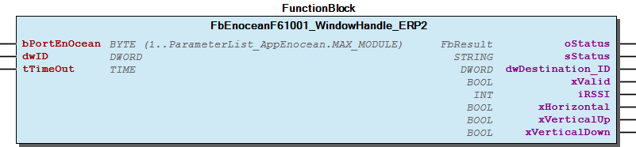 Supported EEP:

### F6/05-10-01


Please refer to the manufacturer’s manual to find the Enocean Equipment Profiles (EEP) number for your device.

Note Please refer to the manufacturer’s manual to find the Enocean Equipment Profiles (EEP) number for your device.

## FbEnoceanSerial (FB)


| Scope | Name | Type | Initial | Comment | Inherited from |
| --- | --- | --- | --- | --- | --- |
| Input | I_Port | WagoAppCom.I_WagoSysComBase |  | Serial module | FbGateway |
| bPortEnOcean | BYTE | 1 | Master assignment number. Range 1 to MAX_MASTER. | FbGateway |
| Output | oStatus | WagoSysErrorBase.FbResult |  | Status object. (Listed in Status ) The content of the error object could be displayed via the FbShowResult from the WagoSysErrorBase library. | FbGateway |
| sStatus | STRING |  | Status description as string (Listed in Status ) | FbGateway |

Base class for Enocean communication over serial

Graphical Illustration

Interface variables Function Base class for Enocean communication over serial Graphical Illustration  - 02 Values FbEnoceanSerial.Serial (METH) 03 Flags - 01 Serial FbEnoceanSerial.isIdle (METH) - FbEnoceanSerial.isOpen (METH) 02 RX buffer - FbEnoceanSerial.isRxBufferFull (METH) - FbEnoceanSerial.isRxOverflow (METH) FbEnoceanSerial.isValidPort (METH) FbEnoceanSerial.isValidPortID (METH) 80 Status object - FbEnoceanSerial.ForwardStatusObject (METH) FbEnoceanSerial.Timeout (PROP)

## FbEnoceanShowID (FB)


| Scope | Name | Type | Initial | Comment | Inherited from |
| --- | --- | --- | --- | --- | --- |
| Input | bPortEnocean | BYTE | 1 | Enocean master assignment | FbBaseShowID |
| bNumberOfClicks | BYTE | 2 | The number of successively received telegrams having the same transmitter ID | FbBaseShowID |
| Output | oStatus | WagoSysErrorBase.FbResult |  | Status object. (Listed in Status ) The content of the error object could be displayed via the FbShowResult from the WagoSysErrorBase library. | FbBaseShowID |
| sStatus | STRING |  | Status description as string (Listed in Status ) | FbBaseShowID |
| xUpdate | BOOL |  | TRUE-> Incoming ID identified | FbBaseShowID |
| dwID | DWORD |  | Device ID | FbBaseShowID |
| Input | bRF_Type | BYTE | 16#F6 | Filter for radio telegram type (ORG or RORG) |  |

| ORG or RORG | description |
| 16#05 or 16#F6 | Repeated Switch Communication |
| 16#06 or 16#D5 | 1 Byte Communication |
| 16#07 or 16#A5 | 4 Byte Communication |

This function block identifies a device’s ID by means of number of consecutive telegram received by the WAGO-Controller.

Graphical Illustration

Please refer to the manufacturer’s manual to find the Enocean Equipment Profiles (EEP) number for your device.

Interface variables Function This function block identifies a device’s ID by means of number of consecutive telegram received by the WAGO-Controller. Graphical Illustration  Example: - EEP2.0: 05-02-01 => ‘’bRF_TYPE’’ = 16#05 - EEP2.1: F6-02-01 => ‘’bRF_TYPE’‘= 16#F6 bRF_TYPE: Note Please refer to the manufacturer’s manual to find the Enocean Equipment Profiles (EEP) number for your device.

## FbEnoceanShowID_EEP (FB)


| Scope | Name | Type | Initial | Comment | Inherited from |
| --- | --- | --- | --- | --- | --- |
| Input | bPortEnocean | BYTE | 1 | Enocean master assignment | FbBaseShowID |
| bNumberOfClicks | BYTE | 2 | The number of successively received telegrams having the same transmitter ID | FbBaseShowID |
| Output | oStatus | WagoSysErrorBase.FbResult |  | Status object. (Listed in Status ) The content of the error object could be displayed via the FbShowResult from the WagoSysErrorBase library. | FbBaseShowID |
| sStatus | STRING |  | Status description as string (Listed in Status ) | FbBaseShowID |
| xUpdate | BOOL |  | TRUE-> Incoming ID identified | FbBaseShowID |
| dwID | DWORD |  | Device ID | FbBaseShowID |
| typEEP | typEEP |  |  |  |
| bRORG | BYTE | 16#F6 | Filter for radio telegram type (ORG or RORG) |  |
| bTYPE | BYTE | 16#0 | Filter for radio telegram type (ORG or RORG) |  |
| bFUNC | BYTE | 16#0 | Filter for radio telegram type (ORG or RORG) |  |
| udiEEP | UDINT |  |  |  |
| uiManID | UINT |  |  |  |

| ORG or RORG | description |
| 16#05 or 16#F6 | Repeated Switch Communication |
| 16#06 or 16#D5 | 1 Byte Communication |
| 16#07 or 16#A5 | 4 Byte Communication |

This function block identifies a device’s ID and EEPby means of number of consecutive telegram received by the WAGO-Controller.

Graphical Illustration

Please refer to the manufacturer’s manual to find the Enocean Equipment Profiles (EEP) number for your device.

Interface variables Function This function block identifies a device’s ID and EEPby means of number of consecutive telegram received by the WAGO-Controller. Graphical Illustration 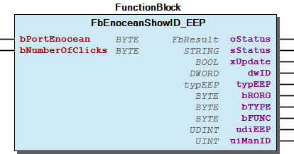 Example: - EEP2.0: 05-02-01 => ‘’bRF_TYPE’’ = 16#05 - EEP2.1: F6-02-01 => ‘’bRF_TYPE’‘= 16#F6 bRF_TYPE: Note Please refer to the manufacturer’s manual to find the Enocean Equipment Profiles (EEP) number for your device. - FbEnoceanShowID_EEP.getManufactureString (METH) - FbEnoceanShowID_EEP.get_bFUNC (METH) - FbEnoceanShowID_EEP.get_bTYPE (METH) - FbEnoceanShowID_EEP.get_uiManID (METH)

## FbEnoceanShowPushButtonID (FB)


| Scope | Name | Type | Initial | Comment | Inherited from |
| --- | --- | --- | --- | --- | --- |
| Input | bPortEnocean | BYTE | 1 | Enocean master assignment | FbBaseShowID |
| bNumberOfClicks | BYTE | 2 | The number of successively received telegrams having the same transmitter ID | FbBaseShowID |
| Output | oStatus | WagoSysErrorBase.FbResult |  | Status object. (Listed in Status ) The content of the error object could be displayed via the FbShowResult from the WagoSysErrorBase library. | FbBaseShowID |
| sStatus | STRING |  | Status description as string (Listed in Status ) | FbBaseShowID |
| xUpdate | BOOL |  | TRUE-> Incoming ID identified | FbBaseShowID |
| dwID | DWORD |  | Device ID | FbBaseShowID |
| bRocker | BYTE |  | rocker location |  |
| bButton | BYTE |  | button location |  |

| ORG or RORG | description |
| 16#05 or 16#F6 | Repeated Switch Communication |

This function block identifies a device’s of EEP ORG=16#05 or ROPRG=16#F6 (Repeated Switch Communication) by means of number of consecutive telegram received by the WAGO-Controller.

Graphical Illustration

This function blocks detects ID from the following device EEP ORG / RORG number.

Please refer to the manufacturer’s manual to find the Enocean Equipment Profiles (EEP) number for your device.

Interface variables Function This function block identifies a device’s of EEP ORG=16#05 or ROPRG=16#F6 (Repeated Switch Communication) by means of number of consecutive telegram received by the WAGO-Controller. Graphical Illustration  This function blocks detects ID from the following device EEP ORG / RORG number. Note Please refer to the manufacturer’s manual to find the Enocean Equipment Profiles (EEP) number for your device.

## FbEnocean_1BS_Receive (FB)


| Scope | Name | Type | Initial | Comment | Inherited from |
| --- | --- | --- | --- | --- | --- |
| Input | bPortEnOcean | BYTE (1..ParameterList_AppEnocean.MAX_MODULE) | 1 | Master assignment number. Range 1 to MAX_MASTER. | FbEnoceanBase |
| Output | oStatus | WagoSysErrorBase.FbResult |  | Status object. (Listed in Status ) The content of the error object could be displayed via the FbShowResult from the WagoSysErrorBase library. | FbEnoceanBase |
| sStatus | STRING |  | Status description as string (Listed in Status ) | FbEnoceanBase |
| Input | dwID | DWORD |  | Device ID | FbDevice |
| tTimeOut | TIME | TIME#60m0s0ms | Maximal time gap between telegrams. Deactivated with t#0ms. | FbReceiver |
| Output | dwDestination_ID | DWORD |  | Destination ID | FbReceiver |
| xValid | BOOL |  | Valid telegram, no timeout detected. | FbReceiver |
| iRSSI | INT |  | Received signal strengh indication (-90...-45dBm) = (bad...good) | FbReceiver |
| bDataByte | BYTE |  | DATA_BYTE0 |  |

The function block dencodes EnOcean radio telegram of type 1BS, which is received from an EnOcean Gateway.

Graphical Illustration

Supported EEP:

Interface variables Function The function block dencodes EnOcean radio telegram of type 1BS, which is received from an EnOcean Gateway. Graphical Illustration  Supported EEP:

### D5/06-FUNC-TYPE


Please refer to the manufacturer’s manual to find the Enocean Equipment Profiles (EEP) number for your device.

Note Please refer to the manufacturer’s manual to find the Enocean Equipment Profiles (EEP) number for your device.

## FbEnocean_1BS_Send (FB)


| Scope | Name | Type | Initial | Comment | Inherited from |
| --- | --- | --- | --- | --- | --- |
| Input | bPortEnOcean | BYTE (1..ParameterList_AppEnocean.MAX_MODULE) | 1 | Master assignment number. Range 1 to MAX_MASTER. | FbEnoceanBase |
| Output | oStatus | WagoSysErrorBase.FbResult |  | Status object. (Listed in Status ) The content of the error object could be displayed via the FbShowResult from the WagoSysErrorBase library. | FbEnoceanBase |
| sStatus | STRING |  | Status description as string (Listed in Status ) | FbEnoceanBase |
| Input | dwID | DWORD |  | Device ID | FbDevice |
| dwDestination_ID | DWORD | 16#FFFFFFFF | Destination ID | FbTransmitter |
| Output | xReady | BOOL | TRUE | TRUE-> Function block is ready | FbTransmitter |
| Input | bHysteresis | BYTE | 1 | Hysteresis for sending conditions |  |
| tTimeout | TIME | TIME#1s0ms | Minimum time interval for send telegram |  |
| xUpdate | BOOL |  | Initiate telegram update |  |
| bDataByte0 | BYTE |  | DataByte 0 |  |

The function block encodes EnOcean radio telegram of type 1BS, which is transmitted via an EnOCean Gateway.

Graphical Illustration

Supported EEP:

Interface variables Function The function block encodes EnOcean radio telegram of type 1BS, which is transmitted via an EnOCean Gateway. Graphical Illustration  Supported EEP:

### D5/06-FUNC-TYPE


Please refer to the manufacturer’s manual to find the Enocean Equipment Profiles (EEP) number for your device.

Note Please refer to the manufacturer’s manual to find the Enocean Equipment Profiles (EEP) number for your device.

## FbEnocean_4BS_Bidirectional (FB)


| Scope | Name | Type | Initial | Comment | Inherited from |
| --- | --- | --- | --- | --- | --- |
| Input | bPortEnOcean | BYTE (1..ParameterList_AppEnocean.MAX_MODULE) | 1 | Master assignment number. Range 1 to MAX_MASTER. | FbEnoceanBase |
| Output | oStatus | WagoSysErrorBase.FbResult |  | Status object. (Listed in Status ) The content of the error object could be displayed via the FbShowResult from the WagoSysErrorBase library. | FbEnoceanBase |
| sStatus | STRING |  | Status description as string (Listed in Status ) | FbEnoceanBase |
| Input | dwID | DWORD |  | Device ID | FbDevice |
| tTimeOut | TIME | TIME#60m0s0ms | Maximal time gap between telegrams | FbBidirectional |
| dwDestination_ID | DWORD | 16#FFFFFFFF | Destination ID | FbBidirectional |
| Output | xReady | BOOL | TRUE | TRUE-> Function block is ready | FbBidirectional |
| xValid | BOOL |  | Valid telegram | FbBidirectional |
| iRSSI | INT |  | Received signal strengh indication (-90...-45dBm) = (bad...good) | FbBidirectional |
| Input | wManufacturer_ID | WORD |  | Manufacturer ID, see table above |  |
| bFUNC | BYTE |  | FUNC |  |
| bTYPE | BYTE |  | TYPE |  |
| bDataByte3Send | BYTE |  | DATA_BYTE3 |  |
| bDataByte2Send | BYTE |  | DATA_BYTE2 |  |
| bDataByte1Send | BYTE |  | DATA_BYTE1 |  |
| bDataByte0Send | BYTE |  | DATA_BYTE0 |  |
| Output | bDataByte3 | BYTE |  | DATA_BYTE3 |  |
| bDataByte2 | BYTE |  | DATA_BYTE2 |  |
| bDataByte1 | BYTE |  | DATA_BYTE1 |  |
| bDataByte0 | BYTE |  | DATA_BYTE0 |  |
| Inout | xLearn | BOOL |  | Activate learn mode |  |
| dwLearn_ID | DWORD |  | Device ID |  |

The Function block enncodes and decodes Enocean device according to the Enocean Equipment Profiles (EEP).

Graphical Illustration

Function description

The supported EnOcean Equipment Profiles (EEP) are listed in the table below:

Interface variables Function The Function block enncodes and decodes Enocean device according to the Enocean Equipment Profiles (EEP). Graphical Illustration  Function description The supported EnOcean Equipment Profiles (EEP) are listed in the table below:

### A5/07-FUNC-TYPE


| Manufacturer | ID |
| Peha | 0x001 |
| Thermokon | 0x002 |
| Servodan | 0x003 |
| EchoFlex Solutions | 0x004 |
| Omnio AG | 0x005 |
| Hardmeier electronics | 0x006 |
| Regulvar Inc | 0x007 |
| Ad Hoc Electronics | 0x008 |
| Distech Controls | 0x009 |
| Kieback + Peter | 0x00A |
| EnOcean GmbH | 0x00B |
| Probare | 0x00C |
| Eltako | 0x00D |
| Leviton | 0x00E |
| Honeywell | 0x00F |
| Spartan Peripheral Devices | 0x010 |
| Siemens | 0x011 |
| T-Mac | 0x012 |
| Reliable Controls Corporation | 0x013 |
| Elsner Elektronik GmbH | 0x014 |
| Diehl Controls | 0x015 |
| BSC Computer | 0x016 |
| S+S Regeltechnik GmbH | 0x017 |
| Masco Corporation | 0x018 |
| Intesis Software SL | 0x019 |
| Res. | 0x01A |
| Lutuo Technology | 0x01B |
| CAN2GO | 0x01C |
| Oventrop | 0x035 |
| Multi user Manufacturer ID | 0x7FF |

Please refer to the manufacturer’s manual to find the Enocean Equipment Profiles (EEP) number for your device.

Installation and commissioning:

Teach-In steps:

List of manufacturer’s ID:

Note Please refer to the manufacturer’s manual to find the Enocean Equipment Profiles (EEP) number for your device. Installation and commissioning: Teach-In steps: 1. Assigning the manufacturer ID at the function block. See table below 2. Setting the own ID. This depends on the gateway specification 3. The function block and the actuator must be “introduced” to one another as radio communication partner devices at the beginning of commissioning. This is done by activating the learning mode and wait for the actuator to send a teach-in telegram. The function block will then acknowledge the teach-in telegram. The actuator sends it’s ID to the function block. The received ID is then stored. The function block will automatically ends the learning mode upon succesful teach-in. List of manufacturer’s ID:

## FbEnocean_4BS_Receive (FB)


| Scope | Name | Type | Initial | Comment | Inherited from |
| --- | --- | --- | --- | --- | --- |
| Input | bPortEnOcean | BYTE (1..ParameterList_AppEnocean.MAX_MODULE) | 1 | Master assignment number. Range 1 to MAX_MASTER. | FbEnoceanBase |
| Output | oStatus | WagoSysErrorBase.FbResult |  | Status object. (Listed in Status ) The content of the error object could be displayed via the FbShowResult from the WagoSysErrorBase library. | FbEnoceanBase |
| sStatus | STRING |  | Status description as string (Listed in Status ) | FbEnoceanBase |
| Input | dwID | DWORD |  | Device ID | FbDevice |
| tTimeOut | TIME | TIME#60m0s0ms | Maximal time gap between telegrams. Deactivated with t#0ms. | FbReceiver |
| Output | dwDestination_ID | DWORD |  | Destination ID | FbReceiver |
| xValid | BOOL |  | Valid telegram, no timeout detected. | FbReceiver |
| iRSSI | INT |  | Received signal strengh indication (-90...-45dBm) = (bad...good) | FbReceiver |
| bDataByte3 | BYTE |  | DATA_BYTE3 |  |
| bDataByte2 | BYTE |  | DATA_BYTE2 |  |
| bDataByte1 | BYTE |  | DATA_BYTE1 |  |
| bDataByte0 | BYTE |  | DATA_BYTE0 |  |

The function block dencodes EnOcean radio telegram of type 4BS, which is received from an EnOcean Gateway.

Graphical Illustration

Supported EEP:

Interface variables Function The function block dencodes EnOcean radio telegram of type 4BS, which is received from an EnOcean Gateway. Graphical Illustration  Supported EEP:

### A5/07-FUNC-TYPE


Please refer to the manufacturer’s manual to find the Enocean Equipment Profiles (EEP) number for your device.

Note Please refer to the manufacturer’s manual to find the Enocean Equipment Profiles (EEP) number for your device.

## FbEnocean_4BS_Send (FB)


| Scope | Name | Type | Initial | Comment | Inherited from |
| --- | --- | --- | --- | --- | --- |
| Input | bPortEnOcean | BYTE (1..ParameterList_AppEnocean.MAX_MODULE) | 1 | Master assignment number. Range 1 to MAX_MASTER. | FbEnoceanBase |
| Output | oStatus | WagoSysErrorBase.FbResult |  | Status object. (Listed in Status ) The content of the error object could be displayed via the FbShowResult from the WagoSysErrorBase library. | FbEnoceanBase |
| sStatus | STRING |  | Status description as string (Listed in Status ) | FbEnoceanBase |
| Input | dwID | DWORD |  | Device ID | FbDevice |
| dwDestination_ID | DWORD | 16#FFFFFFFF | Destination ID | FbTransmitter |
| Output | xReady | BOOL | TRUE | TRUE-> Function block is ready | FbTransmitter |
| Input | bHysteresis | BYTE | 1 | Hysteresis for sending conditions |  |
| tTimeout | TIME | TIME#1s0ms | Minimum time interval for send telegram |  |
| xUpdate | BOOL |  | Initiate telegram update |  |
| bDataByte3 | BYTE |  | DataByte 3 |  |
| bDataByte2 | BYTE |  | DataByte 2 |  |
| bDataByte1 | BYTE |  | DataByte 1 |  |
| bDataByte0 | BYTE |  | DataByte 0 |  |

The function block encodes EnOcean radio telegram of type 4BS, which is transmitted via an EnOCean Gateway.

Graphical Illustration

Supported EEP:

Interface variables Function The function block encodes EnOcean radio telegram of type 4BS, which is transmitted via an EnOCean Gateway. Graphical Illustration  Supported EEP:

### A5/07-FUNC-TYPE


Please refer to the manufacturer’s manual to find the Enocean Equipment Profiles (EEP) number for your device.

Note Please refer to the manufacturer’s manual to find the Enocean Equipment Profiles (EEP) number for your device.

## FbEnocean_750_642 (FB)


| Scope | Name | Type | Initial | Comment | Inherited from |
| --- | --- | --- | --- | --- | --- |
| Input | I_Port | WagoAppCom.I_WagoSysComBase |  | Serial module | FbGateway |
| bPortEnOcean | BYTE | 1 | Master assignment number. Range 1 to MAX_MASTER. | FbGateway |
| Output | oStatus | WagoSysErrorBase.FbResult |  | Status object. (Listed in Status ) The content of the error object could be displayed via the FbShowResult from the WagoSysErrorBase library. | FbGateway |
| sStatus | STRING |  | Status description as string (Listed in Status ) | FbGateway |
| Input | xReset | BOOL |  | Reset master |  |

Enocean receiver using Wago EnOcean module 750-642

This gateway handles only unidirectional communication.

Graphical Illustration

Function description

Function block sets up a link to the Wago EnOCean module 750-642 to provide communication employing the EnOcean radio protocol.

Support only EnOCean module 750-642.

Interface variables Function Enocean receiver using Wago EnOcean module 750-642 Note This gateway handles only unidirectional communication. Graphical Illustration 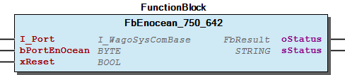 Function description Function block sets up a link to the Wago EnOCean module 750-642 to provide communication employing the EnOcean radio protocol. Note Support only EnOCean module 750-642. - 00 Administration FbEnocean_750_642.Job (METH) 01 Parameters - FbEnocean_750_642.Reset (PROP)

## FbEnocean_MSC_Receive (FB)


| Scope | Name | Type | Initial | Comment | Inherited from |
| --- | --- | --- | --- | --- | --- |
| Input | bPortEnOcean | BYTE (1..ParameterList_AppEnocean.MAX_MODULE) | 1 | Master assignment number. Range 1 to MAX_MASTER. | FbEnoceanBase |
| Output | oStatus | WagoSysErrorBase.FbResult |  | Status object. (Listed in Status ) The content of the error object could be displayed via the FbShowResult from the WagoSysErrorBase library. | FbEnoceanBase |
| sStatus | STRING |  | Status description as string (Listed in Status ) | FbEnoceanBase |
| Input | dwID | DWORD |  | Device ID | FbDevice |
| tTimeOut | TIME | TIME#60m0s0ms | Maximal time gap between telegrams. Deactivated with t#0ms. | FbReceiver |
| Output | dwDestination_ID | DWORD |  | Destination ID | FbReceiver |
| xValid | BOOL |  | Valid telegram, no timeout detected. | FbReceiver |
| iRSSI | INT |  | Received signal strengh indication (-90...-45dBm) = (bad...good) | FbReceiver |
| abDataByte | ARRAY [0..ENOCEAN_MAX_MSC_INDEX_DB] OF BYTE |  | data byte |  |
| bNumberOfDataBytes | BYTE |  | Number of databytes |  |

The function block dencodes EnOcean radio telegram of type MSC, which is received from an EnOcean Gateway.

Graphical Illustration

Supported EEP:

Interface variables Function The function block dencodes EnOcean radio telegram of type MSC, which is received from an EnOcean Gateway. Graphical Illustration  Supported EEP:

### D1-FUNC-TYPE


Please refer to the manufacturer’s manual to find the Enocean Equipment Profiles (EEP) number for your device.

Note Please refer to the manufacturer’s manual to find the Enocean Equipment Profiles (EEP) number for your device.

## FbEnocean_MSC_Send (FB)


| Scope | Name | Type | Initial | Comment | Inherited from |
| --- | --- | --- | --- | --- | --- |
| Input | bPortEnOcean | BYTE (1..ParameterList_AppEnocean.MAX_MODULE) | 1 | Master assignment number. Range 1 to MAX_MASTER. | FbEnoceanBase |
| Output | oStatus | WagoSysErrorBase.FbResult |  | Status object. (Listed in Status ) The content of the error object could be displayed via the FbShowResult from the WagoSysErrorBase library. | FbEnoceanBase |
| sStatus | STRING |  | Status description as string (Listed in Status ) | FbEnoceanBase |
| Input | dwID | DWORD |  | Device ID | FbDevice |
| dwDestination_ID | DWORD | 16#FFFFFFFF | Destination ID | FbTransmitter |
| Output | xReady | BOOL | TRUE | TRUE-> Function block is ready | FbTransmitter |
| Input | bHysteresis | BYTE | 1 | Hysteresis for sending conditions |  |
| tTimeout | TIME | TIME#1s0ms | Minimum time interval for send telegram |  |
| xUpdate | BOOL |  | Initiate telegram update |  |
| abDataByte | ARRAY [0..ENOCEAN_MAX_MSC_INDEX_DB] OF BYTE |  | data byte |  |
| bNumberOfDataBytes | BYTE | 1 | number of databyte*) |  |

The function block encodes EnOcean radio telegram of type MSC, which is transmitted via an EnOCean Gateway.

Graphical Illustration

Supported EEP:

Interface variables Function The function block encodes EnOcean radio telegram of type MSC, which is transmitted via an EnOCean Gateway. Graphical Illustration  Supported EEP:

### D1-FUNC-TYPE


Please refer to the manufacturer’s manual to find the Enocean Equipment Profiles (EEP) number for your device.

Note Please refer to the manufacturer’s manual to find the Enocean Equipment Profiles (EEP) number for your device.

## FbEnocean_RPS_Receive (FB)


| Scope | Name | Type | Initial | Comment | Inherited from |
| --- | --- | --- | --- | --- | --- |
| Input | bPortEnOcean | BYTE (1..ParameterList_AppEnocean.MAX_MODULE) | 1 | Master assignment number. Range 1 to MAX_MASTER. | FbEnoceanBase |
| Output | oStatus | WagoSysErrorBase.FbResult |  | Status object. (Listed in Status ) The content of the error object could be displayed via the FbShowResult from the WagoSysErrorBase library. | FbEnoceanBase |
| sStatus | STRING |  | Status description as string (Listed in Status ) | FbEnoceanBase |
| Input | dwID | DWORD |  | Device ID | FbDevice |
| tTimeOut | TIME | TIME#60m0s0ms | Maximal time gap between telegrams. Deactivated with t#0ms. | FbReceiver |
| Output | dwDestination_ID | DWORD |  | Destination ID | FbReceiver |
| xValid | BOOL |  | Valid telegram, no timeout detected. | FbReceiver |
| iRSSI | INT |  | Received signal strengh indication (-90...-45dBm) = (bad...good) | FbReceiver |
| bDataByte | BYTE |  | DATA_BYTE |  |
| xT21 | BOOL |  | PTM switch module of type 1 / 2 |  |
| xNU | BOOL |  | U-message / N-message |  |

The function block dencodes EnOcean radio telegram of type RPS, which is received from an EnOcean Gateway.

Graphical Illustration

Supported EEP:

Interface variables Function The function block dencodes EnOcean radio telegram of type RPS, which is received from an EnOcean Gateway. Graphical Illustration  Supported EEP:

### F6/05-FUNC-TYPE


Please refer to the manufacturer’s manual to find the Enocean Equipment Profiles (EEP) number for your device.

Note Please refer to the manufacturer’s manual to find the Enocean Equipment Profiles (EEP) number for your device.

## FbEnocean_RPS_Send (FB)


| Scope | Name | Type | Initial | Comment | Inherited from |
| --- | --- | --- | --- | --- | --- |
| Input | bPortEnOcean | BYTE (1..ParameterList_AppEnocean.MAX_MODULE) | 1 | Master assignment number. Range 1 to MAX_MASTER. | FbEnoceanBase |
| Output | oStatus | WagoSysErrorBase.FbResult |  | Status object. (Listed in Status ) The content of the error object could be displayed via the FbShowResult from the WagoSysErrorBase library. | FbEnoceanBase |
| sStatus | STRING |  | Status description as string (Listed in Status ) | FbEnoceanBase |
| Input | dwID | DWORD |  | Device ID | FbDevice |
| dwDestination_ID | DWORD | 16#FFFFFFFF | Destination ID | FbTransmitter |
| Output | xReady | BOOL | TRUE | TRUE-> Function block is ready | FbTransmitter |
| Input | xButton_AO | BOOL |  | Indicator for State O of channel A |  |
| xButton_AI | BOOL |  | Indicator for State I of channel A |  |
| xButton_BO | BOOL |  | Indicator for State O of channel B |  |
| xButton_BI | BOOL |  | Indicator for State I of channel B |  |

The function block encodes EnOcean radio telegram of type RPS, which is transmitted via an EnOCean Gateway.

Graphical Illustration

Pressing two buttons simultaneously makes it possible set two input signals at the same time.

Supported EEP:

Interface variables Function The function block encodes EnOcean radio telegram of type RPS, which is transmitted via an EnOCean Gateway. Graphical Illustration  Note Pressing two buttons simultaneously makes it possible set two input signals at the same time. Supported EEP:

### F6/05-02-01


Please refer to the manufacturer’s manual to find the Enocean Equipment Profiles (EEP) number for your device.

Note Please refer to the manufacturer’s manual to find the Enocean Equipment Profiles (EEP) number for your device.

## FbEnocean_STC65_RS485_EVC (FB)


| Scope | Name | Type | Initial | Comment | Inherited from |
| --- | --- | --- | --- | --- | --- |
| Input | I_Port | WagoAppCom.I_WagoSysComBase |  | Serial module | FbGateway |
| bPortEnOcean | BYTE | 1 | Master assignment number. Range 1 to MAX_MASTER. | FbGateway |
| Output | oStatus | WagoSysErrorBase.FbResult |  | Status object. (Listed in Status ) The content of the error object could be displayed via the FbShowResult from the WagoSysErrorBase library. | FbGateway |
| sStatus | STRING |  | Status description as string (Listed in Status ) | FbGateway |
| Input | xReset | BOOL |  | Reset master |  |
| Output | dwStationAddress | DWORD |  | Station address of the Gateway. |  |
| xCompatibilityMode | BOOL |  | Compatibility mode active. The Gateway is handled like FW2.0.0.0. |  |
| sFirmware | STRING(10) |  | Gateway Firmware version. |  |

Enocean master over serial communication (RS485)

This gateway can handle bidirectional communication.

Graphical Illustration

Function description

Function block sets up a link to the Thermokon STC65-RS-485-EVC Gateway to provide communication employing the EnOcean radio protocol. For advanced configuration settings uses the FbEnocean_STC65_RS485_EVC_Config .

Support only Thermokon gateway STC65-RS485-EVC.

Interface variables Function Enocean master over serial communication (RS485) Note This gateway can handle bidirectional communication. Graphical Illustration  Function description Function block sets up a link to the Thermokon STC65-RS-485-EVC Gateway to provide communication employing the EnOcean radio protocol. For advanced configuration settings uses the FbEnocean_STC65_RS485_EVC_Config . Note Support only Thermokon gateway STC65-RS485-EVC. - 00 Administration FbEnocean_STC65_RS485_EVC.Job (METH) 01 Parameters - FbEnocean_STC65_RS485_EVC.Address_EVC (PROP) - FbEnocean_STC65_RS485_EVC.Reset (PROP) - FbEnocean_STC65_RS485_EVC.setInitConfig (METH) 02 Values - FbEnocean_STC65_RS485_EVC.getFirmwareVersion (METH) - FbEnocean_STC65_RS485_EVC.getGatewayConfig (METH) - FbEnocean_STC65_RS485_EVC.getStationAddress (METH) 03 Flags - FbEnocean_STC65_RS485_EVC.isCompatibilityMode (METH) 90 Internal - FbEnocean_STC65_RS485_EVC.Fill_Mailbox (ACT) - FbEnocean_STC65_RS485_EVC.Send_CMD (ACT) - FbEnocean_STC65_RS485_EVC.Send_EEP (ACT) - FbEnocean_STC65_RS485_EVC.Send_ExtEEP (ACT)

## FbEnocean_STC65_RS485_EVC_Config (FB)


| Scope | Name | Type | Initial | Comment | Inherited from |
| --- | --- | --- | --- | --- | --- |
| Input | bPortEnOcean | BYTE (1..ParameterList_AppEnocean.MAX_MODULE) | 1 | Master assignment number. Range 1 to MAX_MASTER. | FbEnoceanBase |
| Output | oStatus | WagoSysErrorBase.FbResult |  | Status object. (Listed in Status ) The content of the error object could be displayed via the FbShowResult from the WagoSysErrorBase library. | FbEnoceanBase |
| sStatus | STRING |  | Status description as string (Listed in Status ) | FbEnoceanBase |
| Input | typConfigParameters | typConfig_STC65 |  | Advanced configuration parameters for the FbEnocean_STC65_RS485_EVC. |  |

Advanced configuration for enocean gateway.

Graphical Illustration

Function description

Function block sets advance configuration parameters to the Thermokon STC65-RS-485-EVC Gateway with bidirectional communication.

Changes will take effect after the next controller reboot.

Support only Thermokon gateway STC65-RS485-EVC from FW 3.0.2.

Interface variables Function Advanced configuration for enocean gateway. Graphical Illustration  Function description Function block sets advance configuration parameters to the Thermokon STC65-RS-485-EVC Gateway with bidirectional communication. Note Changes will take effect after the next controller reboot. Note Support only Thermokon gateway STC65-RS485-EVC from FW 3.0.2.

## FbEnocean_VLD_Receive (FB)


| Scope | Name | Type | Initial | Comment | Inherited from |
| --- | --- | --- | --- | --- | --- |
| Input | bPortEnOcean | BYTE (1..ParameterList_AppEnocean.MAX_MODULE) | 1 | Master assignment number. Range 1 to MAX_MASTER. | FbEnoceanBase |
| Output | oStatus | WagoSysErrorBase.FbResult |  | Status object. (Listed in Status ) The content of the error object could be displayed via the FbShowResult from the WagoSysErrorBase library. | FbEnoceanBase |
| sStatus | STRING |  | Status description as string (Listed in Status ) | FbEnoceanBase |
| Input | dwID | DWORD |  | Device ID | FbDevice |
| tTimeOut | TIME | TIME#60m0s0ms | Maximal time gap between telegrams. Deactivated with t#0ms. | FbReceiver |
| Output | dwDestination_ID | DWORD |  | Destination ID | FbReceiver |
| xValid | BOOL |  | Valid telegram, no timeout detected. | FbReceiver |
| iRSSI | INT |  | Received signal strengh indication (-90...-45dBm) = (bad...good) | FbReceiver |
| abDataByte | ARRAY [0..ENOCEAN_MAX_VLD_INDEX_DB] OF BYTE |  | data byte |  |
| bNumberOfDataBytes | BYTE |  | Number of databytes |  |

The function block dencodes EnOcean radio telegram of type VLD, which is received from an EnOcean Gateway.

Graphical Illustration

Supported EEP:

Interface variables Function The function block dencodes EnOcean radio telegram of type VLD, which is received from an EnOcean Gateway. Graphical Illustration  Supported EEP:

### D2-FUNC-TYPE


Please refer to the manufacturer’s manual to find the Enocean Equipment Profiles (EEP) number for your device.

Note Please refer to the manufacturer’s manual to find the Enocean Equipment Profiles (EEP) number for your device.

## FbEnocean_VLD_Send (FB)


| Scope | Name | Type | Initial | Comment | Inherited from |
| --- | --- | --- | --- | --- | --- |
| Input | bPortEnOcean | BYTE (1..ParameterList_AppEnocean.MAX_MODULE) | 1 | Master assignment number. Range 1 to MAX_MASTER. | FbEnoceanBase |
| Output | oStatus | WagoSysErrorBase.FbResult |  | Status object. (Listed in Status ) The content of the error object could be displayed via the FbShowResult from the WagoSysErrorBase library. | FbEnoceanBase |
| sStatus | STRING |  | Status description as string (Listed in Status ) | FbEnoceanBase |
| Input | dwID | DWORD |  | Device ID | FbDevice |
| dwDestination_ID | DWORD | 16#FFFFFFFF | Destination ID | FbTransmitter |
| Output | xReady | BOOL | TRUE | TRUE-> Function block is ready | FbTransmitter |
| Input | bHysteresis | BYTE | 1 | Hysteresis for sending conditions |  |
| tTimeout | TIME | TIME#1s0ms | Minimum time interval for send telegram |  |
| xUpdate | BOOL |  | Initiate telegram update |  |
| abDataByte | ARRAY [0..ENOCEAN_MAX_VLD_INDEX_DB] OF BYTE |  | data byte |  |
| bNumberOfDataBytes | BYTE | 1 | number of databyte |  |

The function block encodes EnOcean radio telegram of type VLD, which is transmitted via an EnOCean Gateway.

Graphical Illustration

Supported EEP:

Interface variables Function The function block encodes EnOcean radio telegram of type VLD, which is transmitted via an EnOCean Gateway. Graphical Illustration  Supported EEP:

### D2-FUNC-TYPE


Please refer to the manufacturer’s manual to find the Enocean Equipment Profiles (EEP) number for your device.

Note Please refer to the manufacturer’s manual to find the Enocean Equipment Profiles (EEP) number for your device.

## FbEnocean_WriteBaseId_750_940 (FB)


| Scope | Name | Type | Initial | Comment | Inherited from |
| --- | --- | --- | --- | --- | --- |
| Input | bPortEnOcean | BYTE (1..ParameterList_AppEnocean.MAX_MODULE) | 1 | Master assignment number. Range 1 to MAX_MASTER. | FbEnoceanBase |
| Output | oStatus | WagoSysErrorBase.FbResult |  | Status object. (Listed in Status ) The content of the error object could be displayed via the FbShowResult from the WagoSysErrorBase library. | FbEnoceanBase |
| sStatus | STRING |  | Status description as string (Listed in Status ) | FbEnoceanBase |
| Input | xWrite | BOOL |  | Positive edge writes the station address to the gateway. This can only be done 10 times per gateway! |  |
| dwNewStationAddress | DWORD |  | New station address for the Gateway. Range between 0xFF800000 and 0xFFFFFF80. |  |
| xReadRemaining | BOOL |  | Positive edge reads remaining writing cycles for the gateway. |  |
| Output | bRemainingWriteCycles | BYTE |  | Displays remaining writing cycles for station address. |  |

Used to change the base ID (station address) of the gateway 750-940.

IMPORTANT: Writing can only be used 10 times per gateway. There is no possibility to reset this constraint. Also power off/on will not allow more than 10 changes!

Graphical Illustration

Function description

You may use this function when change a defect gateway to set new gateways address to the old one. This allows to change the gateway without new learning bidirectional devices.

The current station address (before writing and after writing) will be displayed at communication function block FbEnOcean_750_940_RS485 . After writing or with reading the remaining writing cycles for the station address will be displayed at output bRemainingWriteCycles .

Station addresses of the gateway always ends with 16#80 or 16#00. If other end addresses are chosen, the address will automatically reduced to the lower address with that end numbers. e.g.: dwNewStationAddress = 16#FFABCD00 -> 16#FFABCD00 dwNewStationAddress = 16#FFABCDAA -> 16#FFABCD80

Interface variables Function Used to change the base ID (station address) of the gateway 750-940. Note IMPORTANT: Writing can only be used 10 times per gateway. There is no possibility to reset this constraint. Also power off/on will not allow more than 10 changes! Graphical Illustration  Function description You may use this function when change a defect gateway to set new gateways address to the old one. This allows to change the gateway without new learning bidirectional devices. The current station address (before writing and after writing) will be displayed at communication function block FbEnOcean_750_940_RS485 . After writing or with reading the remaining writing cycles for the station address will be displayed at output bRemainingWriteCycles . Station addresses of the gateway always ends with 16#80 or 16#00. If other end addresses are chosen, the address will automatically reduced to the lower address with that end numbers. e.g.: dwNewStationAddress = 16#FFABCD00 -> 16#FFABCD00 dwNewStationAddress = 16#FFABCDAA -> 16#FFABCD80

## FbFillSmartAckMailbox (FB)


| Scope | Name | Type | Initial | Comment | Inherited from |
| --- | --- | --- | --- | --- | --- |
| Input | bPortEnOcean | BYTE (1..ParameterList_AppEnocean.MAX_MODULE) | 1 | Master assignment number. Range 1 to MAX_MASTER. | FbEnoceanBase |
| Output | oStatus | WagoSysErrorBase.FbResult |  | Status object. (Listed in Status ) The content of the error object could be displayed via the FbShowResult from the WagoSysErrorBase library. | FbEnoceanBase |
| sStatus | STRING |  | Status description as string (Listed in Status ) | FbEnoceanBase |
| xReady | BOOL | TRUE | TRUE-> The block is ready | FbConfig_STC65 |
| Input | bFilterTableChannel | BYTE |  | filter table channel | FbFilterTableChannel_STC65 |
| dwIDRead | DWORD |  | Read ID |  |
| bNumberOfDatabytes | BYTE |  | Number of databytes |  |
| abDataByte | ARRAY [0..ENOCEAN_MAX_INDEX_DB] OF BYTE |  | data byte |  |
| Inout | xSend | BOOL |  | Start write |  |

Fill mailbox for Smart act devices

Graphical Illustration

This function block is only used with Thermokon STC65-RS-485-EVC Gateway.

Interface variables Function Fill mailbox for Smart act devices Graphical Illustration  Note This function block is only used with Thermokon STC65-RS-485-EVC Gateway.

## FbFilterTableChannel_STC65 (FB)


| Scope | Name | Type | Initial | Comment | Inherited from |
| --- | --- | --- | --- | --- | --- |
| Input | bPortEnOcean | BYTE (1..ParameterList_AppEnocean.MAX_MODULE) | 1 | Master assignment number. Range 1 to MAX_MASTER. | FbEnoceanBase |
| Output | oStatus | WagoSysErrorBase.FbResult |  | Status object. (Listed in Status ) The content of the error object could be displayed via the FbShowResult from the WagoSysErrorBase library. | FbEnoceanBase |
| sStatus | STRING |  | Status description as string (Listed in Status ) | FbEnoceanBase |
| xReady | BOOL | TRUE | TRUE-> The block is ready | FbConfig_STC65 |
| Input | bFilterTableChannel | BYTE |  | filter table channel |  |

Base class for filter table channel

Graphical Illustration

Interface variables Function Base class for filter table channel Graphical Illustration  - 01 Parameters FbFilterTableChannel_STC65.FilterTableChannel (PROP)

## FbGateway (FB)


| Scope | Name | Type | Initial | Comment |
| --- | --- | --- | --- | --- |
| Input | I_Port | WagoAppCom.I_WagoSysComBase |  | Serial module |
| bPortEnOcean | BYTE | 1 | Master assignment number. Range 1 to MAX_MASTER. |
| Output | oStatus | WagoSysErrorBase.FbResult |  | Status object. (Listed in Status ) The content of the error object could be displayed via the FbShowResult from the WagoSysErrorBase library. |
| sStatus | STRING |  | Status description as string (Listed in Status ) |

Base class for Enocean gateway over I_Port

Graphical Illustration

Interface variables Function Base class for Enocean gateway over I_Port Graphical Illustration  - 00 Administration FbGateway.setClassname (METH) 01 Parameters - FbGateway.Port (PROP) - FbGateway.Port_ID (PROP) 80 Status - FbGateway.setStatusObject (METH)

## FbLearnByButton (FB)


| Scope | Name | Type | Initial | Comment | Inherited from |
| --- | --- | --- | --- | --- | --- |
| Input | bPortEnOcean | BYTE (1..ParameterList_AppEnocean.MAX_MODULE) | 1 | Master assignment number. Range 1 to MAX_MASTER. | FbEnoceanBase |
| Output | oStatus | WagoSysErrorBase.FbResult |  | Status object. (Listed in Status ) The content of the error object could be displayed via the FbShowResult from the WagoSysErrorBase library. | FbEnoceanBase |
| sStatus | STRING |  | Status description as string (Listed in Status ) | FbEnoceanBase |
| xReady | BOOL | TRUE | TRUE-> The block is ready | FbConfig_STC65 |
| Input | bFilterTableChannel | BYTE |  | filter table channel | FbFilterTableChannel_STC65 |
| tTimeOut | TIME | TIME#60m0s0ms | Maximal time gap between telegrams |  |
| bRF_Type | BYTE |  | RORG or ORG number |  |
| Inout | xLearn | BOOL |  | Activate learn mode |  |
| dwIDRead | DWORD |  | Read ID |  |
| typLearnByButton | typLearnByButton |  | parameters |  |

Teach in sensor via learn button

Graphical Illustration

This function block is only used with Thermokon STC65-RS-485-EVC Gateway.

Interface variables Function Teach in sensor via learn button Graphical Illustration  Note This function block is only used with Thermokon STC65-RS-485-EVC Gateway.

## FbLearnByDeviceID (FB)


| Scope | Name | Type | Initial | Comment | Inherited from |
| --- | --- | --- | --- | --- | --- |
| Input | bPortEnOcean | BYTE (1..ParameterList_AppEnocean.MAX_MODULE) | 1 | Master assignment number. Range 1 to MAX_MASTER. | FbEnoceanBase |
| Output | oStatus | WagoSysErrorBase.FbResult |  | Status object. (Listed in Status ) The content of the error object could be displayed via the FbShowResult from the WagoSysErrorBase library. | FbEnoceanBase |
| sStatus | STRING |  | Status description as string (Listed in Status ) | FbEnoceanBase |
| xReady | BOOL | TRUE | TRUE-> The block is ready | FbConfig_STC65 |
| Input | bFilterTableChannel | BYTE |  | filter table channel | FbFilterTableChannel_STC65 |
| dwID | DWORD |  | Device ID |  |
| typEEP | typEEP |  | Device EEP |  |
| Inout | xLearn | BOOL |  | Start write |  |
| typLearnByDeviceID | typLearnByDeviceID |  | parameters |  |

Teach in sensor via ID

Graphical Illustration

This function block is only used with Thermokon STC65-RS-485-EVC Gateway.

Interface variables Function Teach in sensor via ID Graphical Illustration 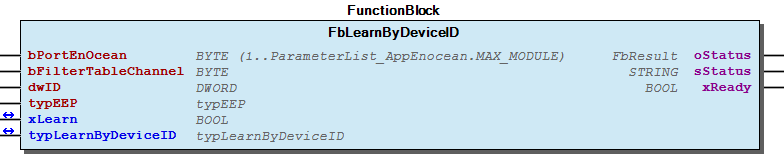 Note This function block is only used with Thermokon STC65-RS-485-EVC Gateway.

## FbManageFilterList_750_940 (FB)


| Scope | Name | Type | Initial | Comment |
| --- | --- | --- | --- | --- |
| Input | bPortEnocean | BYTE | 16#1 | Enocean master assignment |
| typFilterAddTyp | typWriteFilterESP3 |  | Type of single filter which shall be added to EnOcean module, if the process was successful the filter will be add to aFilterListWriteESP3 |
| bSelectIndexDelete | BYTE | 16#0 | Delete a single filter from EnOcean module based on read filter entry in aFilterListReadESP3 |
| Output | aFilterListReadESP3 | ARRAY [0..ESP3_MAX_FILTER_CHN] OF typReadFilterESP3 |  | Filter list wih read filter from EnOcean module |
| xReady | BOOL | FALSE | Signals an ongoing process |
| xError | BOOL | FALSE | Signals if last process wasn’t successfully |
| Inout | aFilterListWriteESP3 | ARRAY [0..ESP3_MAX_FILTER_CHN] OF typWriteFilterESP3 |  | Filter list with filter which shall be written to EnOcean module |
| xReadAll | BOOL |  | Read all available filter from EnOcean module and fills the aFilterListReadESP3, this process takes some time |
| xAddAll | BOOL |  | Add all filter from aFilterListWriteESP3 to EnOcean module, this process takes some time |
| xDeleteAll | BOOL |  | Delete all filters on EnOcean module and also in FilterListESP3 |
| xFilterAdd | BOOL |  | Starting the process to add a single filter to EnOcean module |
| xIndexDelete | BOOL |  | Starting the process to delete the selected filter in bSelectIndexDelete from aFilterListReadESP3 and also from EnOcean module |

The Function block reads, writes and deletes filter list in gateway 750-940.

The filter list aFilterListReadESP3 and aFilterListWriteESP3 weren’t synchornizised which each other.

Graphical Illustration

Function description

aFilterListWriteESP3 : User’s filter list with filter which shall be written to EnOcean module, only marked filter with xWrite as TRUE will be written to the EnOcean module when trigger the xAddAll flag. If the user reads all filter only the filter list aFilterListReadESP3 will be updated and not the aFilterListWriteESP3 list. If the user retrigger the xAddAll flag, the same marked filter will be written again to the EnOcean module which will be seen, when the filter list aFilterListReadESP3 will be updated. If the User add a single filter wich is stored in typFilterAddTyp with the flag `xFilterAdd , the filter will be written to the EnOcean module and if this was successfully, the new filter will be set in FilterListWriteESP3 list on the first entry which is marked with xWrite as FALSE.

aFilterListReadESP3 : Every time the xReadAll flag is triggered, all filters stored in EnOcean module will be read. If the EnOcean module has no filter so far, the list will be empty and all entries will be marked as xReady with TRUE. If some filter in this list shall be erased on the EnOcean module, the index of the filter in the aFilterListReadESP3 list must be stored in bSelectIndexDelete an the trigger flag xDelete must be set. When the process was successfully the filter in the aFilterListReadESP3 list will be erased and marked as xReady as TRUE, if the user update the list by trigger the xReadAll flag, the list will be automatically in the corret order.

Interface variables Function The Function block reads, writes and deletes filter list in gateway 750-940. Note The filter list aFilterListReadESP3 and aFilterListWriteESP3 weren’t synchornizised which each other. Graphical Illustration  Function description aFilterListWriteESP3 : User’s filter list with filter which shall be written to EnOcean module, only marked filter with xWrite as TRUE will be written to the EnOcean module when trigger the xAddAll flag. If the user reads all filter only the filter list aFilterListReadESP3 will be updated and not the aFilterListWriteESP3 list. If the user retrigger the xAddAll flag, the same marked filter will be written again to the EnOcean module which will be seen, when the filter list aFilterListReadESP3 will be updated. If the User add a single filter wich is stored in typFilterAddTyp with the flag `xFilterAdd , the filter will be written to the EnOcean module and if this was successfully, the new filter will be set in FilterListWriteESP3 list on the first entry which is marked with xWrite as FALSE. aFilterListReadESP3 : Every time the xReadAll flag is triggered, all filters stored in EnOcean module will be read. If the EnOcean module has no filter so far, the list will be empty and all entries will be marked as xReady with TRUE. If some filter in this list shall be erased on the EnOcean module, the index of the filter in the aFilterListReadESP3 list must be stored in bSelectIndexDelete an the trigger flag xDelete must be set. When the process was successfully the filter in the aFilterListReadESP3 list will be erased and marked as xReady as TRUE, if the user update the list by trigger the xReadAll flag, the list will be automatically in the corret order. Read all set filter from EnOcean module: 1. trigger xReadAll once 2. all read filter will be writen to aFilterListReadESP3 and signaled as ready with the flag xReady Delete all filter from the EnOcean module: 1. trigger xDeleteAll once 2. if process was successfully, read again all filter from module an check if some active filters are in aFilterListReadESP3 Add a single filter to the EnOcean module: 1. set filter parameter in typFilterAddTyp 2. trigger xFilterAdd once 3. if process was successfully, the written filter will be added to aFilterListWriteESP3 and the flag xWrite will be set Delete single filter from EnOcean module based on a read filter from aFilterListReadESP3 : 1. first make sure to actualize the aFilterListReadESP3 list by read all filter from EnOcean module 2. get the index from aFilterListReadESP3 with the filter to delete an store this index in bSelectIndexDelete 3. trigger xDelete to start the delete process (maybe this ist optional) 4. if the delete process was successfully, read all filter from the module an in aFilterListReadESP3 the filter must be erased

## FbManageSmartAckFilterTable (FB)


| Scope | Name | Type | Initial | Comment | Inherited from |
| --- | --- | --- | --- | --- | --- |
| Input | bPortEnOcean | BYTE (1..ParameterList_AppEnocean.MAX_MODULE) | 1 | Master assignment number. Range 1 to MAX_MASTER. | FbEnoceanBase |
| Output | oStatus | WagoSysErrorBase.FbResult |  | Status object. (Listed in Status ) The content of the error object could be displayed via the FbShowResult from the WagoSysErrorBase library. | FbEnoceanBase |
| sStatus | STRING |  | Status description as string (Listed in Status ) | FbEnoceanBase |
| Input | xReadAll | BOOL |  | Triggers reading of complete filter table. |  |
| xDeleteAll | BOOL |  | Triggers deleting of complete filter table. |  |
| bFilterTableChannel | BYTE |  | Selected filter table channel for reading or deleting |  |
| xRead | BOOL |  | Triggers reading of selected filter table channel. |  |
| xDelete | BOOL |  | Triggers deleting of selected filter table channel. |  |
| Inout | xLearn | BOOL |  | Activate learn mode. Resets automatically after learning or timeout. |  |
| Output | atypFilterTableChannels | ARRAY [0..ENOCEAN_MAX_TABLE_FILTER] OF typFilterChannel |  | List of filter table. |  |
| xReady | BOOL |  | Displays, no action is running. |  |

This function block manages gateways smart ack filter table list by reading, learning or deleting Enocean device IDs.

Support only Thermokon gateway STC65-RS485-EVC.

Graphical Illustration

Interface variables Function This function block manages gateways smart ack filter table list by reading, learning or deleting Enocean device IDs. Note Support only Thermokon gateway STC65-RS485-EVC. Graphical Illustration  - FbManageSmartAckFilterTable.tLearnTimeout (PROP)

## FbReadFilterState (FB)


| Scope | Name | Type | Initial | Comment | Inherited from |
| --- | --- | --- | --- | --- | --- |
| Input | bPortEnOcean | BYTE (1..ParameterList_AppEnocean.MAX_MODULE) | 1 | Master assignment number. Range 1 to MAX_MASTER. | FbEnoceanBase |
| Output | oStatus | WagoSysErrorBase.FbResult |  | Status object. (Listed in Status ) The content of the error object could be displayed via the FbShowResult from the WagoSysErrorBase library. | FbEnoceanBase |
| sStatus | STRING |  | Status description as string (Listed in Status ) | FbEnoceanBase |
| xReady | BOOL | TRUE | TRUE-> The block is ready | FbConfig_STC65 |
| Inout | xRead | BOOL |  | Start write |  |
| typFilterState | typFilterState |  | parameters |  |

Read filter stateRead filter state

Graphical Illustration

This function block is only used with Thermokon STC65-RS-485-EVC Gateway.

Interface variables Function Read filter stateRead filter state Graphical Illustration  Note This function block is only used with Thermokon STC65-RS-485-EVC Gateway.

## FbReadGatewayChipBaseID (FB)


| Scope | Name | Type | Initial | Comment | Inherited from |
| --- | --- | --- | --- | --- | --- |
| Input | bPortEnOcean | BYTE (1..ParameterList_AppEnocean.MAX_MODULE) | 1 | Master assignment number. Range 1 to MAX_MASTER. | FbEnoceanBase |
| Output | oStatus | WagoSysErrorBase.FbResult |  | Status object. (Listed in Status ) The content of the error object could be displayed via the FbShowResult from the WagoSysErrorBase library. | FbEnoceanBase |
| sStatus | STRING |  | Status description as string (Listed in Status ) | FbEnoceanBase |
| xReady | BOOL | TRUE | TRUE-> The block is ready | FbConfig_STC65 |
| Inout | xRead | BOOL |  | Start write |  |
| typGatewayChipBaseID | typGatewayChipBaseID |  | parameters |  |

Read gateway chip ID and base ID.

Graphical Illustration

This function block is only used with Thermokon STC65-RS-485-EVC Gateway.

Interface variables Function Read gateway chip ID and base ID. Graphical Illustration  Note This function block is only used with Thermokon STC65-RS-485-EVC Gateway.

## FbReadGatewayConfig (FB)


| Scope | Name | Type | Initial | Comment | Inherited from |
| --- | --- | --- | --- | --- | --- |
| Input | bPortEnOcean | BYTE (1..ParameterList_AppEnocean.MAX_MODULE) | 1 | Master assignment number. Range 1 to MAX_MASTER. | FbEnoceanBase |
| Output | oStatus | WagoSysErrorBase.FbResult |  | Status object. (Listed in Status ) The content of the error object could be displayed via the FbShowResult from the WagoSysErrorBase library. | FbEnoceanBase |
| sStatus | STRING |  | Status description as string (Listed in Status ) | FbEnoceanBase |
| xReady | BOOL | TRUE | TRUE-> The block is ready | FbConfig_STC65 |
| Inout | xRead | BOOL |  | Start write |  |
| typConfig_STC65 | typConfig_STC65 |  | parameters |  |

read gateway configurations

Graphical Illustration

This function block is only used with Thermokon STC65-RS-485-EVC Gateway.

Interface variables Function read gateway configurations Graphical Illustration  Note This function block is only used with Thermokon STC65-RS-485-EVC Gateway.

## FbReadGatewayFirmwareVersion (FB)


| Scope | Name | Type | Initial | Comment | Inherited from |
| --- | --- | --- | --- | --- | --- |
| Input | bPortEnOcean | BYTE (1..ParameterList_AppEnocean.MAX_MODULE) | 1 | Master assignment number. Range 1 to MAX_MASTER. | FbEnoceanBase |
| Output | oStatus | WagoSysErrorBase.FbResult |  | Status object. (Listed in Status ) The content of the error object could be displayed via the FbShowResult from the WagoSysErrorBase library. | FbEnoceanBase |
| sStatus | STRING |  | Status description as string (Listed in Status ) | FbEnoceanBase |
| xReady | BOOL | TRUE | TRUE-> The block is ready | FbConfig_STC65 |
| Inout | xRead | BOOL |  | Start write |  |
| typFirmwareVersion | typFirmwareVersion |  | parameters |  |

Read gateway firmware version

Graphical Illustration

This function block is only used with Thermokon STC65-RS-485-EVC Gateway.

Interface variables Function Read gateway firmware version Graphical Illustration  Note This function block is only used with Thermokon STC65-RS-485-EVC Gateway.

## FbReadGatewayStationAddress (FB)


| Scope | Name | Type | Initial | Comment | Inherited from |
| --- | --- | --- | --- | --- | --- |
| Input | bPortEnOcean | BYTE (1..ParameterList_AppEnocean.MAX_MODULE) | 1 | Master assignment number. Range 1 to MAX_MASTER. | FbEnoceanBase |
| Output | oStatus | WagoSysErrorBase.FbResult |  | Status object. (Listed in Status ) The content of the error object could be displayed via the FbShowResult from the WagoSysErrorBase library. | FbEnoceanBase |
| sStatus | STRING |  | Status description as string (Listed in Status ) | FbEnoceanBase |
| xReady | BOOL | TRUE | TRUE-> The block is ready | FbConfig_STC65 |
| Inout | xRead | BOOL |  | Start write |  |
| dwStationAddress | DWORD |  |  |  |

Read gateway station address

Graphical Illustration

This function block is only used with Thermokon STC65-RS-485-EVC Gateway.

Interface variables Function Read gateway station address Graphical Illustration  Note This function block is only used with Thermokon STC65-RS-485-EVC Gateway.

## FbReadSensorFilterChannel (FB)


| Scope | Name | Type | Initial | Comment | Inherited from |
| --- | --- | --- | --- | --- | --- |
| Input | bPortEnOcean | BYTE (1..ParameterList_AppEnocean.MAX_MODULE) | 1 | Master assignment number. Range 1 to MAX_MASTER. | FbEnoceanBase |
| Output | oStatus | WagoSysErrorBase.FbResult |  | Status object. (Listed in Status ) The content of the error object could be displayed via the FbShowResult from the WagoSysErrorBase library. | FbEnoceanBase |
| sStatus | STRING |  | Status description as string (Listed in Status ) | FbEnoceanBase |
| xReady | BOOL | TRUE | TRUE-> The block is ready | FbConfig_STC65 |
| Input | bFilterTableChannel | BYTE |  | filter table channel | FbFilterTableChannel_STC65 |
| Inout | xRead | BOOL |  | Start write |  |
| typFilterChannel | typFilterChannel |  | parameters |  |

Read sensor of filter channel

Graphical Illustration

This function block is only used with Thermokon STC65-RS-485-EVC Gateway.

Interface variables Function Read sensor of filter channel Graphical Illustration  Note This function block is only used with Thermokon STC65-RS-485-EVC Gateway.

## FbReceiver (FB)


| Scope | Name | Type | Initial | Comment | Inherited from |
| --- | --- | --- | --- | --- | --- |
| Input | bPortEnOcean | BYTE (1..ParameterList_AppEnocean.MAX_MODULE) | 1 | Master assignment number. Range 1 to MAX_MASTER. | FbEnoceanBase |
| Output | oStatus | WagoSysErrorBase.FbResult |  | Status object. (Listed in Status ) The content of the error object could be displayed via the FbShowResult from the WagoSysErrorBase library. | FbEnoceanBase |
| sStatus | STRING |  | Status description as string (Listed in Status ) | FbEnoceanBase |
| Input | dwID | DWORD |  | Device ID | FbDevice |
| tTimeOut | TIME | TIME#60m0s0ms | Maximal time gap between telegrams. Deactivated with t#0ms. |  |
| Output | dwDestination_ID | DWORD |  | Destination ID |  |
| xValid | BOOL |  | Valid telegram, no timeout detected. |  |
| iRSSI | INT |  | Received signal strengh indication (-90...-45dBm) = (bad...good) |  |

Base class for a receiver

Graphical Illustration

Interface variables Function Base class for a receiver Graphical Illustration 

## FbReceiver_1BS (FB)


| Scope | Name | Type | Initial | Comment | Inherited from |
| --- | --- | --- | --- | --- | --- |
| Input | bPortEnOcean | BYTE (1..ParameterList_AppEnocean.MAX_MODULE) | 1 | Master assignment number. Range 1 to MAX_MASTER. | FbEnoceanBase |
| Output | oStatus | WagoSysErrorBase.FbResult |  | Status object. (Listed in Status ) The content of the error object could be displayed via the FbShowResult from the WagoSysErrorBase library. | FbEnoceanBase |
| sStatus | STRING |  | Status description as string (Listed in Status ) | FbEnoceanBase |
| Input | dwID | DWORD |  | Device ID | FbDevice |
| tTimeOut | TIME | TIME#60m0s0ms | Maximal time gap between telegrams |  |
| Output | dwDestination_ID | DWORD |  | Destination ID |  |
| xValid | BOOL |  | Valid telegram |  |
| iRSSI | INT |  | Received signal strengh indication (-90...-45dBm) = (bad...good) |  |

Base class for receiving 1BS Graphical Illustration

Interface variables Function Base class for receiving 1BS Graphical Illustration  - FbReceiver_1BS.Data (METH) - FbReceiver_1BS.getDataByte (METH) - FbReceiver_1BS.isUpdate (METH)

## FbReceiver_4BS (FB)


| Scope | Name | Type | Initial | Comment | Inherited from |
| --- | --- | --- | --- | --- | --- |
| Input | bPortEnOcean | BYTE (1..ParameterList_AppEnocean.MAX_MODULE) | 1 | Master assignment number. Range 1 to MAX_MASTER. | FbEnoceanBase |
| Output | oStatus | WagoSysErrorBase.FbResult |  | Status object. (Listed in Status ) The content of the error object could be displayed via the FbShowResult from the WagoSysErrorBase library. | FbEnoceanBase |
| sStatus | STRING |  | Status description as string (Listed in Status ) | FbEnoceanBase |
| Input | dwID | DWORD |  | Device ID | FbDevice |
| tTimeOut | TIME | TIME#60m0s0ms | Maximal time gap between telegrams |  |
| Output | dwDestination_ID | DWORD |  | Destination ID |  |
| xValid | BOOL |  | Valid telegram |  |
| iRSSI | INT |  | Received signal strengh indication (-90...-45dBm) = (bad...good) |  |

Base class for receiving 4BS Graphical Illustration

Interface variables Function Base class for receiving 4BS Graphical Illustration  - FbReceiver_4BS.Data (METH) - FbReceiver_4BS.getDataByte (METH) - FbReceiver_4BS.isUpdate (METH)

## FbReceiver_RPS (FB)


| Scope | Name | Type | Initial | Comment | Inherited from |
| --- | --- | --- | --- | --- | --- |
| Input | bPortEnOcean | BYTE (1..ParameterList_AppEnocean.MAX_MODULE) | 1 | Master assignment number. Range 1 to MAX_MASTER. | FbEnoceanBase |
| Output | oStatus | WagoSysErrorBase.FbResult |  | Status object. (Listed in Status ) The content of the error object could be displayed via the FbShowResult from the WagoSysErrorBase library. | FbEnoceanBase |
| sStatus | STRING |  | Status description as string (Listed in Status ) | FbEnoceanBase |
| Input | dwID | DWORD |  | Device ID | FbDevice |
| tTimeOut | TIME | TIME#60m0s0ms | Maximal time gap between telegrams |  |
| Output | dwDestination_ID | DWORD |  | Destination ID |  |
| xValid | BOOL |  | Valid telegram |  |
| iRSSI | INT |  | Received signal strengh indication (-90...-45dBm) = (bad...good) |  |

Base class for receiving RPS Graphical Illustration

Interface variables Function Base class for receiving RPS Graphical Illustration  - FbReceiver_RPS.Data (METH) - FbReceiver_RPS.NU (PROP) - FbReceiver_RPS.T21 (PROP) - FbReceiver_RPS.getDataByte (METH) - FbReceiver_RPS.isUpdate (METH)

## FbShow_ID_ByClick (FB)


| Scope | Name | Type | Initial | Comment |
| --- | --- | --- | --- | --- |
| Input | bPortEnocean | BYTE | 1 | Enocean master assignment |
| bRF_Type | BYTE | 16#5 | Radio telegram type (ORG or RORG number) |
| bNumberOfClicks | BYTE | 2 | Number of consecutive telegrams |
| Output | dwID | DWORD | 0 | Identified Device’s ID |

## FbSmartAckLearnByButton (FB)


| Scope | Name | Type | Initial | Comment | Inherited from |
| --- | --- | --- | --- | --- | --- |
| Input | bPortEnOcean | BYTE (1..ParameterList_AppEnocean.MAX_MODULE) | 1 | Master assignment number. Range 1 to MAX_MASTER. | FbEnoceanBase |
| Output | oStatus | WagoSysErrorBase.FbResult |  | Status object. (Listed in Status ) The content of the error object could be displayed via the FbShowResult from the WagoSysErrorBase library. | FbEnoceanBase |
| sStatus | STRING |  | Status description as string (Listed in Status ) | FbEnoceanBase |
| xReady | BOOL | TRUE | TRUE-> The block is ready | FbConfig_STC65 |
| Input | bFilterTableChannel | BYTE |  | filter table channel | FbFilterTableChannel_STC65 |
| tTimeOut | TIME | TIME#60m0s0ms | Maximal time gap between telegrams |  |
| Inout | xLearn | BOOL |  | Activate learn mode |  |
| dwIDRead | DWORD |  | Read ID |  |
| typEEP | typEEP |  | Read EEP |  |
| typSmartActViaLearnButton | typSmartActViaLearnButton |  | parameters |  |

Teach in sensor via learn button for smart ack

Graphical Illustration

This function block is only used with Thermokon STC65-RS-485-EVC Gateway.

Interface variables Function Teach in sensor via learn button for smart ack Graphical Illustration  Note This function block is only used with Thermokon STC65-RS-485-EVC Gateway.

## FbTransmitter (FB)


| Scope | Name | Type | Initial | Comment | Inherited from |
| --- | --- | --- | --- | --- | --- |
| Input | bPortEnOcean | BYTE (1..ParameterList_AppEnocean.MAX_MODULE) | 1 | Master assignment number. Range 1 to MAX_MASTER. | FbEnoceanBase |
| Output | oStatus | WagoSysErrorBase.FbResult |  | Status object. (Listed in Status ) The content of the error object could be displayed via the FbShowResult from the WagoSysErrorBase library. | FbEnoceanBase |
| sStatus | STRING |  | Status description as string (Listed in Status ) | FbEnoceanBase |
| Input | dwID | DWORD |  | Device ID | FbDevice |
| dwDestination_ID | DWORD | 16#FFFFFFFF | Destination ID |  |
| Output | xReady | BOOL | TRUE | TRUE-> Function block is ready |  |

Base class for a receiver

Graphical Illustration

Interface variables Function Base class for a receiver Graphical Illustration 

## FbWriteGatewayConfig (FB)


| Scope | Name | Type | Initial | Comment | Inherited from |
| --- | --- | --- | --- | --- | --- |
| Input | bPortEnOcean | BYTE (1..ParameterList_AppEnocean.MAX_MODULE) | 1 | Master assignment number. Range 1 to MAX_MASTER. | FbEnoceanBase |
| Output | oStatus | WagoSysErrorBase.FbResult |  | Status object. (Listed in Status ) The content of the error object could be displayed via the FbShowResult from the WagoSysErrorBase library. | FbEnoceanBase |
| sStatus | STRING |  | Status description as string (Listed in Status ) | FbEnoceanBase |
| xReady | BOOL | TRUE | TRUE-> The block is ready | FbConfig_STC65 |
| Inout | xWrite | BOOL |  | Start write |  |
| typConfig_STC65 | typConfig_STC65 |  | gateway configuration data |  |

Write gateway configurations

Graphical Illustration

This function block is only used with Thermokon STC65-RS-485-EVC Gateway.

Interface variables Function Write gateway configurations Graphical Illustration  Note This function block is only used with Thermokon STC65-RS-485-EVC Gateway.

## Fb_EnOceanCom (FB)


| Scope | Name | Type | Comment |
| --- | --- | --- | --- |
| Input | xOpen | BOOL | open connection |
| xSend | BOOL | send |
| I_Port | WagoAppCom.I_WagoSysComBase | Serial module |
| xReset | BOOL | resets serial interface |
| Inout | utTxPaket | typESP3_Packet |  |
| utRxBuffer | typESP3_RingBuffer |  |
| Output | oStatus | WagoSysErrorBase.FbResult | Status object. (Listed in Status ) The content of the error object could be displayed via the FbShowResult from the WagoSysErrorBase library. |
| sStatus | STRING | Status description as string (Listed in Status ) |
| xReady | BOOL |  |
| bError | BYTE |  |
| xIsOpen | BOOL |  |
| xReceivedPacket | BOOL |  |

Interface variables - Fb_EnOceanCom.Fill_Sync_Frame (ACT) - Fb_EnOceanCom.Fill_Tx_Buffer (ACT) - Fb_EnOceanCom.Receive (ACT) - Fb_EnOceanCom.Reset_Received_Data (ACT) - Fb_EnOceanCom.SerialInterface (ACT) - Fb_EnOceanCom.Transmission (ACT) - Fb_EnOceanCom.setStatusObject (METH)

## doc01_Foreword (FB)


This document, including all figures and illustrations contained therein, is subject to copyright. Any use of this document that infringes upon the copyright provisions stipulated herein is prohibited. Reproduction, translation, electronic and phototechnical filing/archiving (e.g., photocopying), as well as any amendments require the written consent of WAGO Kontakttechnik GmbH & Co. KG, Minden, Germany. Non-observance will entail the right of claims for damages.

WAGO Kontakttechnik GmbH & Co. KG reserves the right to make any alterations or modifications that serve to increase the efficiency of technical progress. WAGO Kontakttechnik GmbH & Co. KG owns all rights arising from granting patents or from the legal protection of utility patents. Third-party products are always mentioned without any reference to patent rights. Thus, the existence of such rights cannot be excluded.

Personnel Qualification

The use of the product described in this document is exclusively geared to specialists having qualifications in PLC programming, electrical specialists or persons instructed by electrical specialists who are also familiar with the appropriate current standards. WAGO Kontakttechnik GmbH & Co. KG assumes no liability resulting from improper action and damage to WAGO products and third-party products due to non-observance of the information contained in this document.

Intended Use

For each individual application, the components are supplied from the factory with a dedicated hardware and software configuration. Modifications are only admitted within the framework of the possibilities documented in this document. All other changes to the hardware and/or software and the non-conforming use of the components entail the exclusion of liability on part of WAGO Kontakttechnik GmbH & Co. KG.

Please direct any requirements pertaining to a modified and/or new hardware or software configuration directly to WAGO Kontakttechnik GmbH & Co. KG.

Scope of Applicability

This application note is based on the _stated hardware and software from the specific manufacturer, as well as the associated documentation. This application note is therefore only valid for the described installation. New hardware and software versions may need to be handled differently.

Please note the detailed description in the specific manuals.

Copyright This document, including all figures and illustrations contained therein, is subject to copyright. Any use of this document that infringes upon the copyright provisions stipulated herein is prohibited. Reproduction, translation, electronic and phototechnical filing/archiving (e.g., photocopying), as well as any amendments require the written consent of WAGO Kontakttechnik GmbH & Co. KG, Minden, Germany. Non-observance will entail the right of claims for damages. WAGO Kontakttechnik GmbH & Co. KG reserves the right to make any alterations or modifications that serve to increase the efficiency of technical progress. WAGO Kontakttechnik GmbH & Co. KG owns all rights arising from granting patents or from the legal protection of utility patents. Third-party products are always mentioned without any reference to patent rights. Thus, the existence of such rights cannot be excluded. Personnel Qualification The use of the product described in this document is exclusively geared to specialists having qualifications in PLC programming, electrical specialists or persons instructed by electrical specialists who are also familiar with the appropriate current standards. WAGO Kontakttechnik GmbH & Co. KG assumes no liability resulting from improper action and damage to WAGO products and third-party products due to non-observance of the information contained in this document. Intended Use For each individual application, the components are supplied from the factory with a dedicated hardware and software configuration. Modifications are only admitted within the framework of the possibilities documented in this document. All other changes to the hardware and/or software and the non-conforming use of the components entail the exclusion of liability on part of WAGO Kontakttechnik GmbH & Co. KG. Please direct any requirements pertaining to a modified and/or new hardware or software configuration directly to WAGO Kontakttechnik GmbH & Co. KG. Scope of Applicability This application note is based on the _stated hardware and software from the specific manufacturer, as well as the associated documentation. This application note is therefore only valid for the described installation. New hardware and software versions may need to be handled differently. Please note the detailed description in the specific manuals.

### Functions


## ASCIIByte_TO_HEXByte (FUN)


| Scope | Name | Type |
| --- | --- | --- |
| Return | ASCIIByte_TO_HEXByte | BYTE |
| Input | bAscii | BYTE |

## ByteOffset (FUN)


| Scope | Name | Type |
| --- | --- | --- |
| Return | ByteOffset | DWORD |
| Input | uiNumberOfBytesOffset | UINT |

## Bytes_To_Word (FUN)


| Scope | Name | Type |
| --- | --- | --- |
| Return | Bytes_To_Word | WORD |
| Input | UpperByte | BYTE |
| LowerByte | BYTE |

## CalculateCrc8 (FUN)


| Scope | Name | Type |
| --- | --- | --- |
| Return | CalculateCrc8 | BYTE |
| Input | uiLength | UINT |
| pData | POINTER TO BYTE |

## CalculateCrc8_Two_Arrays (FUN)


| Scope | Name | Type |
| --- | --- | --- |
| Return | CalculateCrc8_Two_Arrays | BYTE |
| Input | uiLength_1 | UINT |
| pData_1 | POINTER TO BYTE |
| uiLength_2 | UINT |
| pData_2 | POINTER TO BYTE |

## FuByteID (FUN)


| Scope | Name | Type |
| --- | --- | --- |
| Return | FuByteID | BYTE |
| Input | dwID | DWORD |
| bID_Index | BYTE |

## FuEnocean_2Point (FUN)


| Scope | Name | Type | Comment |
| --- | --- | --- | --- |
| Return | FuEnocean_2Point | REAL |  |
| Input | rInput | REAL | Input value \|\| Eingangswert |
| rX1 | REAL | x-coordinate of the first value \|\| x-Koordinate des ersten Wertes |
| rY1 | REAL | y-coordinate of the first value \|\| y-Koordinate des ersten Wertes |
| rX2 | REAL | x-coordinate of the second value \|\| x-Koordinate des zweiten Wertes |
| rY2 | REAL | y-coordinate of the second value \|\| y-Koordinate des zweiten Wertes |

Auxillary function

Graphical Illustration

Interface variables Function Auxillary function Graphical Illustration 

## FuEnocean_4Point (FUN)


| Scope | Name | Type | Comment |
| --- | --- | --- | --- |
| Return | FuEnocean_4Point | REAL |  |
| Input | rInput | REAL | Input value \|\| Eingangswert |
| rX1 | REAL | x-coordinate of the first value \|\| x-Koordinate des ersten Wertes |
| rY1 | REAL | y-coordinate of the first value \|\| y-Koordinate des ersten Wertes |
| rX2 | REAL | x-coordinate of the second value \|\| x-Koordinate des zweiten Wertes |
| rY2 | REAL | y-coordinate of the second value \|\| y-Koordinate des zweiten Wertes |

Auxillary function

Graphical Illustration

Interface variables Function Auxillary function Graphical Illustration 

## FuEnocean_LinearValue_X (FUN)


| Scope | Name | Type | Comment |
| --- | --- | --- | --- |
| Return | FuEnocean_LinearValue_X | REAL |  |
| Input | rInput | REAL | Input Y value \|\| Eingangswert Y-Wert |
| rX1 | REAL | x-coordinate of the first value \|\| x-Koordinate des ersten Wertes |
| rY1 | REAL | y-coordinate of the first value \|\| y-Koordinate des ersten Wertes |
| rX2 | REAL | x-coordinate of the second value \|\| x-Koordinate des zweiten Wertes |
| rY2 | REAL | y-coordinate of the second value \|\| y-Koordinate des zweiten Wertes |

Auxillary function

Graphical Illustration

Interface variables Function Auxillary function Graphical Illustration 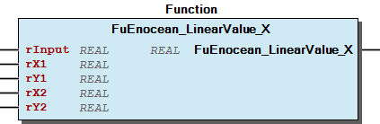

## FuEnocean_STC65_Send_ID (FUN)


| Scope | Name | Type | Initial | Comment |
| --- | --- | --- | --- | --- |
| Return | FuEnocean_STC65_Send_ID | DWORD |  |  |
| Input | dwStationAddress | DWORD | 0 | Gateway station address |
| bOffset | BYTE | 1 | Offset applied to station address for transmitting ID |

Use to calculate send ID according to the STC65-RS485-EVC Gateway specification

Graphical Illustration

Support only Thermokon gateway SRC65-RS485-EVC and Thermokon STC65-RS485-EVC.

Interface variables Function Use to calculate send ID according to the STC65-RS485-EVC Gateway specification Graphical Illustration  Note Support only Thermokon gateway SRC65-RS485-EVC and Thermokon STC65-RS485-EVC.

## FuFW_STC65 (FUN)


| Scope | Name | Type |
| --- | --- | --- |
| Return | FuFW_STC65 | STRING(10) |
| Input | typFirmwareVersion | typFirmwareVersion |

## FuFanspeed (FUN)


| Scope | Name | Type | Comment |
| --- | --- | --- | --- |
| Input | bDataByte | BYTE |  |
| Inout | xAuto | BOOL | fan speed stage auto |
| xStage_0 | BOOL | fan speed stage 0 |
| xStage_1 | BOOL | fan speed stage 1 |
| xStage_2 | BOOL | fan speed stage 2 |
| xStage_3 | BOOL | fan speed stage 3 |

Auxillary function

Graphical Illustration

Interface variables Function Auxillary function Graphical Illustration 

## FuSetDevice_ID (FUN)


| Scope | Name | Type |
| --- | --- | --- |
| Return | FuSetDevice_ID | DWORD |
| Input | bID_Byte_3 | BYTE |
| bID_Byte_2 | BYTE |
| bID_Byte_1 | BYTE |
| bID_Byte_0 | BYTE |

## FuSetStatusField (FUN)


| Scope | Name | Type |
| --- | --- | --- |
| Return | FuSetStatusField | BYTE |
| Input | bRP_Counter | BYTE |
| xNU | BOOL |
| xT21 | BOOL |

## FuSetpointCorrection (FUN)


| Scope | Name | Type |
| --- | --- | --- |
| Return | FuSetpointCorrection | REAL |
| Input | bDataByte | BYTE |
| rMaxSetpointCorrection | REAL |

Auxillary function

Graphical Illustration

Interface variables Function Auxillary function Graphical Illustration 

## FuSetpointOffset (FUN)


| Scope | Name | Type |
| --- | --- | --- |
| Return | FuSetpointOffset | BYTE |
| Input | rSetpointCorrection | REAL |
| rMaxSetpointCorrection | REAL |

Auxillary function

Graphical Illustration

Interface variables Function Auxillary function Graphical Illustration 

## HexArray_To_ByteArray (FUN)


| Scope | Name | Type |
| --- | --- | --- |
| Return | HexArray_To_ByteArray | BOOL |
| Input | sData | STRING |
| pBuffer | POINTER TO BYTE |
| Inout | uiLength | UINT |

## Hex_To_Byte (FUN)


| Scope | Name | Type |
| --- | --- | --- |
| Return | Hex_To_Byte | BYTE |
| Input | sString | STRING(2) |

## RbIsEmpty (FUN)


| Scope | Name | Type | Initial |
| --- | --- | --- | --- |
| Return | RbIsEmpty | BOOL |  |
| Input | bPortEnocean | BYTE | 1 |

## RbIsFull (FUN)


| Scope | Name | Type | Initial |
| --- | --- | --- | --- |
| Return | RbIsFull | BOOL |  |
| Input | bPortEnocean | BYTE | 1 |

## RbPop (FUN)


| Scope | Name | Type | Initial |
| --- | --- | --- | --- |
| Return | RbPop | typESP3_Packet |  |
| Input | bPortEnocean | BYTE | 1 |

## RbPush (FUN)


| Scope | Name | Type | Initial |
| --- | --- | --- | --- |
| Return | RbPush | BOOL |  |
| Input | bPortEnocean | BYTE | 1 |
| stPushEntry | typESP3_Packet |  |

## RbReset (FUN)


| Scope | Name | Type | Initial |
| --- | --- | --- | --- |
| Return | RbReset | BOOL |  |
| Input | bPortEnocean | BYTE | 1 |

### Methods


## 02 Setpoint


- FbEnoceanA51022_RoomOperatingPanel.MaxSetpointCorrection (PROP) - FbEnoceanA51022_RoomOperatingPanel.SetpointCorrection (PROP)

## 02 Setpoint


- FbEnoceanA5100A_RoomOperatingPanel.MaxSetpointCorrection (PROP) - FbEnoceanA5100A_RoomOperatingPanel.SetpointCorrection (PROP)

## 02 Setpoint


- FbEnoceanA51003_RoomOperatingPanel.MaxSetpointCorrection (PROP) - FbEnoceanA51003_RoomOperatingPanel.SetpointCorrection (PROP)

## 02 Setpoint


- FbEnoceanA51023_RoomOperatingPanel.MaxSetpointCorrection (PROP) - FbEnoceanA51023_RoomOperatingPanel.SetpointCorrection (PROP)

## 02 Setpoint


- FbEnoceanA51001_RoomOperatingPanel.MaxSetpointCorrection (PROP) - FbEnoceanA51001_RoomOperatingPanel.SetpointCorrection (PROP)

## 02 Setpoint


- FbEnoceanD21103_RoomOperatingPanel.SetpointCorrection (PROP)

## 02 Setpoint


- FbEnoceanA51010_RoomOperatingPanel.MaxSetpointCorrection (PROP) - FbEnoceanA51010_RoomOperatingPanel.SetpointCorrection (PROP)

## 02 Setpoint


- FbEnoceanA51016_RoomOperatingPanel.MaxSetpointCorrection (PROP) - FbEnoceanA51016_RoomOperatingPanel.SetpointCorrection (PROP)

## 02 Setpoint


- FbEnoceanA51018_RoomOperatingPanel.MaxSetpointCorrection (PROP) - FbEnoceanA51018_RoomOperatingPanel.SetpointCorrection (PROP)

## 02 Setpoint


- FbEnoceanD21106_RoomOperatingPanel.SetpointCorrection (PROP)

## 02 Setpoint


- FbEnoceanD21104_RoomOperatingPanel.SetpointCorrection (PROP)

## 02 Setpoint


- FbEnoceanA51012_RoomOperatingPanel.MaxSetpointCorrection (PROP) - FbEnoceanA51012_RoomOperatingPanel.SetpointCorrection (PROP)

## 02 Setpoint


- FbEnoceanA51019_RoomOperatingPanel.MaxSetpointCorrection (PROP) - FbEnoceanA51019_RoomOperatingPanel.SetpointCorrection (PROP)

## 02 Setpoint


- FbEnoceanA51015_RoomOperatingPanel.MaxSetpointCorrection (PROP) - FbEnoceanA51015_RoomOperatingPanel.SetpointCorrection (PROP)

## 02 Setpoint


- FbEnoceanA51004_RoomOperatingPanel.MaxSetpointCorrection (PROP) - FbEnoceanA51004_RoomOperatingPanel.SetpointCorrection (PROP)

## 02 Setpoint


- FbEnoceanD21105_RoomOperatingPanel.SetpointCorrection (PROP)

## 02 Setpoint


- FbEnoceanA51002_RoomOperatingPanel.MaxSetpointCorrection (PROP) - FbEnoceanA51002_RoomOperatingPanel.SetpointCorrection (PROP)

## 02 Setpoint


- FbEnoceanD21107_RoomOperatingPanel.SetpointCorrection (PROP)

## 02 Setpoint


- FbEnoceanA51005_RoomOperatingPanel.MaxSetpointCorrection (PROP) - FbEnoceanA51005_RoomOperatingPanel.SetpointCorrection (PROP)

## 02 Setpoint


- FbEnoceanA510xx_RoomOperatingPanel.MaxSetpointCorrection (PROP) - FbEnoceanA510xx_RoomOperatingPanel.SetpointCorrection (PROP)

## 02 Setpoint


- FbEnoceanA51006_RoomOperatingPanel.MaxSetpointCorrection (PROP) - FbEnoceanA51006_RoomOperatingPanel.SetpointCorrection (PROP)

## 02 Setpoint


- FbEnoceanD21102_RoomOperatingPanel.SetpointCorrection (PROP)

## 02 Setpoint


- FbEnoceanD21108_RoomOperatingPanel.SetpointCorrection (PROP)

## 02 Setpoint


- FbEnoceanA51011_RoomOperatingPanel.MaxSetpointCorrection (PROP) - FbEnoceanA51011_RoomOperatingPanel.SetpointCorrection (PROP)

## 02 Setpoint


- FbEnoceanD21101_RoomOperatingPanel.SetpointCorrection (PROP)

## 05 Read sensor of filter channel


- FbReadSensorFilterChannel (FB)

## 08 Read Firmware version


- FbReadGatewayFirmwareVersion (FB)

## 09 Read filter state ¶


- FbReadFilterState (FB)

## A5-12-xx Automated Meter Reading


The following function blocks output the data from the automated meters with EnOcean Equipment Profiles (EEP) A5-12-XX or 07-12-XX (XX stands for the device type).

Please refer to the manufacturer’s manual to find the TYPE number for your device.

Additional informations about EnOcean Equipment Profiles (EEP) are available on the at: https://www.enocean-alliance.org/en/enocean_standard/

Function The following function blocks output the data from the automated meters with EnOcean Equipment Profiles (EEP) A5-12-XX or 07-12-XX (XX stands for the device type). Note Please refer to the manufacturer’s manual to find the TYPE number for your device. Note Additional informations about EnOcean Equipment Profiles (EEP) are available on the at: https://www.enocean-alliance.org/en/enocean_standard/ - FbEnoceanA51200_Counter (FB) A5/07-12-00 FbEnoceanA51201_Electricity (FB) - A5/07-12-01 FbEnoceanA51202_Gas (FB) - A5/07-12-02 FbEnoceanA51203_Water (FB) - A5/07-12-03 FbEnoceanA51204_TempLoadSensor (FB) - A5/07-12-04 FbEnoceanA51204_TempLoadSensor.BatteryLevel (PROP) - FbEnoceanA51204_TempLoadSensor.MeterReading (PROP) FbEnoceanA51205_TempContainerSensor (FB) - A5/07-12-05 FbEnoceanA51205_TempContainerSensor.BatteryLevel (PROP) - FbEnoceanA51205_TempContainerSensor.SensorPosition (PROP)

## ESP3_Parser.RESET (ACT) ¶


## FbBaseA502xx_TempSensor.getTemperatureResolution1BYTE (METH)


| Scope | Name | Type | Comment |
| --- | --- | --- | --- |
| Return | getTemperatureResolution1BYTE | REAL |  |
| Input | rC1 | REAL | low limit |
| rC2 | REAL | high limit |

method for scaling value of 1 byte resolution

return value:

Temperature in real

Interface variables Method: method for scaling value of 1 byte resolution return value: Temperature in real

## FbBaseA502xx_TempSensor.getTemperatureResolution2BYTE (METH)


| Scope | Name | Type | Comment |
| --- | --- | --- | --- |
| Return | getTemperatureResolution2BYTE | REAL |  |
| Input | rC1 | REAL | low limit |
| rC2 | REAL | high limit |

method for scaling value of 2 byte resolution

return value:

Temperature in real

Interface variables Method: method for scaling value of 2 byte resolution return value: Temperature in real

## FbBaseA502xx_TempSensor.setTemperature (METH)


| Scope | Name | Type | Comment |
| --- | --- | --- | --- |
| Input | bResolution | BYTE |  |
| rC1 | REAL | low limit |
| rC2 | REAL | high limit |

## FbBaseA510xx_RoomOperatingPanel.getIllumination (METH)


| Scope | Name | Type |
| --- | --- | --- |
| Return | getIllumination | REAL |
| Input | rValue | REAL |
| rX1 | REAL |
| rY1 | REAL |
| rX2 | REAL |
| rY2 | REAL |

## FbBaseA510xx_RoomOperatingPanel.getRelativeHumidity (METH)


| Scope | Name | Type |
| --- | --- | --- |
| Return | getRelativeHumidity | REAL |
| Input | bDataByte | BYTE |

This method sets relative humidity

Interface variables Method: This method sets relative humidity

## FbBaseA510xx_RoomOperatingPanel.getSetpointCorrection (METH)


| Scope | Name | Type | Comment |
| --- | --- | --- | --- |
| Return | getSetpointCorrection | REAL |  |
| Input | rMaxSetpointCorrection | REAL | Maximum setpoint value |
| bResolution | BYTE | resolution |
| bDataByte | BYTE | input value |

This method set setpoint correction

Interface variables Method: This method set setpoint correction

## FbBaseA510xx_RoomOperatingPanel.getTemperature (METH)


| Scope | Name | Type |
| --- | --- | --- |
| Return | getTemperature | REAL |
| Input | rValue | REAL |
| rX1 | REAL |
| rY1 | REAL |
| rX2 | REAL |
| rY2 | REAL |

## FbBaseA510xx_RoomOperatingPanel.getTurnSwitch (METH)


| Scope | Name | Type | Comment |
| --- | --- | --- | --- |
| Input | bDataByte | BYTE |  |
| Output | xAuto | BOOL | Fan speed stage auto |
| xStage_0 | BOOL | Fan speed stage 0 |
| xStage_1 | BOOL | Fan speed stage 1 |
| xStage_2 | BOOL | Fan speed stage 2 |
| xStage_3 | BOOL | Fan speed stage 3 |

set turn switch

Interface variables Method: set turn switch

## FbBaseA510xx_RoomOperatingPanel.isBinaryState (METH)


| Scope | Name | Type |
| --- | --- | --- |
| Return | isBinaryState | BOOL |

This method sets binary state

Interface variables Method: This method sets binary state

## FbBaseD211xx_RoomOperatingPanel.Data (METH)


| Scope | Name | Type |
| --- | --- | --- |
| Return | Data | eStatus |

## FbBaseD211xx_RoomOperatingPanel.TeachIn (METH)


| Scope | Name | Type | Comment |
| --- | --- | --- | --- |
| Return | TeachIn | BOOL |  |
| Inout | xLearn | BOOL | Activate learn mode |
| typSync | typD211xx | Synchronisation parameters |
| dwID | DWORD | dwID |

## FbBaseD2YYxx_SmartAck.isZero_ID (METH)


| Scope | Name | Type |
| --- | --- | --- |
| Return | isZero_ID | BOOL |

## FbBaseF602xx_RockerSwitch_2_Rocker.RPS_2_Rocker (METH)


## FbBaseF603xx_RockerSwitch_4_Rocker.RPS_4_Rocker (METH)


## FbBaseShowID.isZero_ID (METH)


| Scope | Name | Type |
| --- | --- | --- |
| Return | isZero_ID | BOOL |

## FbBaseShowID.setClassname (METH)


| Scope | Name | Type |
| --- | --- | --- |
| Input | sName | STRING |

set class name

Interface variables set class name

## FbBaseShowID.setStatusObject (METH)


| Scope | Name | Type | Comment |
| --- | --- | --- | --- |
| Input | uiID | UINT | result ID |

set oStatus and sStatus output

Interface variables set oStatus and sStatus output

## FbBidirectional_4BS.Data (METH)


| Scope | Name | Type |
| --- | --- | --- |
| Return | Data | eStatus |

## FbBidirectional_4BS.TeachIn (METH)


| Scope | Name | Type | Comment |
| --- | --- | --- | --- |
| Return | TeachIn | BOOL |  |
| Input | bFUNC | BYTE | FUNC |
| bTYPE | BYTE | TYPE |
| Inout | xLearn | BOOL | Activate learn mode |
| dwLearn_ID | DWORD | Device ID |

## FbBidirectional_4BS.getDataByte (METH)


| Scope | Name | Type | Comment |
| --- | --- | --- | --- |
| Return | getDataByte | BYTE |  |
| Input | bIndex | BYTE | databyte index |

method to retrieve values from data bytes

Interface variables method to retrieve values from data bytes

## FbBidirectional_4BS.isUpdate (METH)


| Scope | Name | Type |
| --- | --- | --- |
| Return | isUpdate | BOOL |

## FbBidirectional_4BS.setDataByte (METH)


| Scope | Name | Type | Comment |
| --- | --- | --- | --- |
| Return | setDataByte | BOOL |  |
| Input | bIndex | BYTE | databyte index |
| bValue | BYTE | databyte value |

method to set values from data bytes

Interface variables method to set values from data bytes

## FbD24100.getEnvironmentalData_resp (METH)


| Scope | Name | Type | Comment |
| --- | --- | --- | --- |
| Return | getEnvironmentalData_resp | BOOL |  |
| Input | ref_typEnvironmentalData | REFERENCE TO typEnvironmentalData_D24100 |  |
| Output | bUnit | BYTE | Index of Unit; 0..14 |
| xError | BOOL |  |
| sStatus | STRING |  |

```
VAR

END_VAR
```

The device may not accept the command or somes parameters of the command. Check if the EEP of the device can handle this command and/or its parameters.

Graphical illustration

Graphical Interface of FbD24100.getEnvironmentalData_resp

Interface variables Note The device may not accept the command or somes parameters of the command. Check if the EEP of the device can handle this command and/or its parameters. Graphical illustration  Graphical Interface of FbD24100.getEnvironmentalData_resp Example Variables

## FbD24100.getMaintenanceData_resp (METH)


| Scope | Name | Type | Comment |
| --- | --- | --- | --- |
| Return | getMaintenanceData_resp | BOOL |  |
| Input | ref_typMaintenanceData | REFERENCE TO typMaintenanceData_D24100 |  |
| Output | bUnit | BYTE | Index of Unit; 0..14 |
| xError | BOOL |  |
| sStatus | STRING |  |

```
VAR

END_VAR
```

** Method for the command 0x4 “Actuator Status Response” of the Enocean Equipment Profiles (EEP) D2-01-XX This command is sent by an actuator if one of the following events occurs :

The device may not accept the command or somes parameters of the command. Check if the EEP of the device can handle this command and/or its parameters.

Graphical illustration

Graphical Interface of FbD24100.getMaintenanceData_resp

Interface variables ** Method for the command 0x4 “Actuator Status Response” of the Enocean Equipment Profiles (EEP) D2-01-XX This command is sent by an actuator if one of the following events occurs : - Status of one channel has been changed locally - Message Actuator Status Query has been received Note The device may not accept the command or somes parameters of the command. Check if the EEP of the device can handle this command and/or its parameters. Graphical illustration  Graphical Interface of FbD24100.getMaintenanceData_resp Example Variables

## FbD24100.getPresenceData_resp (METH)


| Scope | Name | Type | Comment |
| --- | --- | --- | --- |
| Return | getPresenceData_resp | BOOL |  |
| Input | ref_xOccupancyMember1 | REFERENCE TO BOOL | Occupancy State Member 1; 0=not occupied, 1=occupied, 7=not supported |
| ref_xOccupancyMember2 | REFERENCE TO BOOL | Occupancy State Member 2; 0=not occupied, 1=occupied, 7=not supported |
| ref_xPresence | REFERENCE TO BOOL | Presence State; 0=no presence detected, 1=no presence detected |
| Output | bUnit | BYTE | Index of Unit; 0..14 |
| xError | BOOL |  |
| sStatus | STRING |  |

```
VAR

END_VAR
```

** Method for the command 0x4 “Actuator Status Response” of the Enocean Equipment Profiles (EEP) D2-01-XX This command is sent by an actuator if one of the following events occurs :

The device may not accept the command or somes parameters of the command. Check if the EEP of the device can handle this command and/or its parameters.

Graphical illustration

Graphical Interface of FbD24100.getPresenceData_resp

Interface variables ** Method for the command 0x4 “Actuator Status Response” of the Enocean Equipment Profiles (EEP) D2-01-XX This command is sent by an actuator if one of the following events occurs : - Status of one channel has been changed locally - Message Actuator Status Query has been received Note The device may not accept the command or somes parameters of the command. Check if the EEP of the device can handle this command and/or its parameters. Graphical illustration  Graphical Interface of FbD24100.getPresenceData_resp Example Variables

## FbD24100.getProductStatus_resp (METH)


| Scope | Name | Type |
| --- | --- | --- |
| Return | getProductStatus_resp | BOOL |
| Input | ref_aUnitActivity | REFERENCE TO ARRAY [0..14] OF BOOL |
| Output | xError | BOOL |
| sStatus | STRING |

```
VAR

END_VAR
```

** Method for the command 0x4 “Actuator Status Response” of the Enocean Equipment Profiles (EEP) D2-01-XX This command is sent by an actuator if one of the following events occurs :

The device may not accept the command or somes parameters of the command. Check if the EEP of the device can handle this command and/or its parameters.

Graphical illustration

Graphical Interface of FbD24100.getProductStatus_resp

Interface variables ** Method for the command 0x4 “Actuator Status Response” of the Enocean Equipment Profiles (EEP) D2-01-XX This command is sent by an actuator if one of the following events occurs : - Status of one channel has been changed locally - Message Actuator Status Query has been received Note The device may not accept the command or somes parameters of the command. Check if the EEP of the device can handle this command and/or its parameters. Graphical illustration  Graphical Interface of FbD24100.getProductStatus_resp Example Variables

## FbD24100.getUnitOperatingState_resp (METH)


| Scope | Name | Type | Comment |
| --- | --- | --- | --- |
| Return | getUnitOperatingState_resp | BOOL |  |
| Input | ref_eIlluminationMode | REFERENCE TO eIlluminationMode_D24100 |  |
| Output | bUnit | BYTE | Index of Unit; 0..14 |
| xError | BOOL |  |
| sStatus | STRING |  |

```
VAR

END_VAR
```

** Method for the command 0x4 “Actuator Status Response” of the Enocean Equipment Profiles (EEP) D2-01-XX This command is sent by an actuator if one of the following events occurs :

The device may not accept the command or somes parameters of the command. Check if the EEP of the device can handle this command and/or its parameters.

Graphical illustration

Graphical Interface of FbD24100.getUnitOperatingState_resp

Interface variables ** Method for the command 0x4 “Actuator Status Response” of the Enocean Equipment Profiles (EEP) D2-01-XX This command is sent by an actuator if one of the following events occurs : - Status of one channel has been changed locally - Message Actuator Status Query has been received Note The device may not accept the command or somes parameters of the command. Check if the EEP of the device can handle this command and/or its parameters. Graphical illustration  Graphical Interface of FbD24100.getUnitOperatingState_resp Example Variables

## FbD24100.getUnitStatus_resp (METH)


| Scope | Name | Type | Comment |
| --- | --- | --- | --- |
| Return | getUnitStatus_resp | BOOL |  |
| Input | ref_typUnitStatus_D24100 | REFERENCE TO typUnitStatus_D24100 |  |
| Output | bUnit | BYTE | Index of Unit; 0..14 |
| xError | BOOL |  |
| sStatus | STRING |  |

```
VAR

END_VAR
```

** Method for the command 0x4 “Actuator Status Response” of the Enocean Equipment Profiles (EEP) D2-01-XX This command is sent by an actuator if one of the following events occurs :

The device may not accept the command or somes parameters of the command. Check if the EEP of the device can handle this command and/or its parameters.

Graphical illustration

Graphical Interface of FbD24100.getUnitStatus_resp

Interface variables ** Method for the command 0x4 “Actuator Status Response” of the Enocean Equipment Profiles (EEP) D2-01-XX This command is sent by an actuator if one of the following events occurs : - Status of one channel has been changed locally - Message Actuator Status Query has been received Note The device may not accept the command or somes parameters of the command. Check if the EEP of the device can handle this command and/or its parameters. Graphical illustration 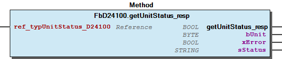 Graphical Interface of FbD24100.getUnitStatus_resp Example Variables

## FbD24100.protCore_D24100 (METH)


| Scope | Name | Type |
| --- | --- | --- |
| Return | protCore_D24100 | BOOL |

## FbD24100.protIsValidResponse (METH)


| Scope | Name | Type |
| --- | --- | --- |
| Return | protIsValidResponse | BOOL |
| Input | ref_typBuffer | REFERENCE TO typ_Buffer |
| bCmd | BYTE |

## FbD24100.protSetUnitCommandByte (METH)


| Scope | Name | Type | Comment |
| --- | --- | --- | --- |
| Return | protSetUnitCommandByte | BYTE |  |
| Input | bUnit | BYTE | Index of Unit connected to EnOcean Module |
| bCommandID | BYTE | Command Identifier |

## FbD24100.setGetCommand_Cmd (METH)


| Scope | Name | Type | Comment |
| --- | --- | --- | --- |
| Return | setGetCommand_Cmd | BOOL |  |
| Input | bUnit | BYTE | Index of Unit connected to EnOcean Module |
| bCommandID | BYTE | Command Identifier; 0=Product Status, 1=Unit Status, 2= Presence Data, 3=Environmental Data, 4=Maintenance Data |
| Output | xError | BOOL |  |
| sStatus | STRING |  |

```
VAR

END_VAR
```

** Method for the get command of the Enocean Equipment Profiles (EEP) D2-01-00 This command is sent to an actuator. It requests responces corresponding to the command id.

The device may not accept the command or somes parameters of the command. Check if the EEP of the device can handle this command and/or its parameters.

Graphical illustration

Graphical Interface of FbD24100.setGetCommand_Cmd

Interface variables ** Method for the get command of the Enocean Equipment Profiles (EEP) D2-01-00 This command is sent to an actuator. It requests responces corresponding to the command id. Note The device may not accept the command or somes parameters of the command. Check if the EEP of the device can handle this command and/or its parameters. Graphical illustration  Graphical Interface of FbD24100.setGetCommand_Cmd Example Variables

## FbD24100.setOccupancy_Cmd (METH)


| Scope | Name | Type | Comment |
| --- | --- | --- | --- |
| Return | setOccupancy_Cmd | BOOL |  |
| Input | bUnit | BYTE |  |
| bOccupancyMember1 | BYTE | Occupancy State Member 1; 0=not occupied, 1=occupied, 7=no change |
| bOccupancyMember2 | BYTE | Occupancy State Member 2; 0=not occupied, 1=occupied, 7=no change |
| Output | xError | BOOL |  |
| sStatus | STRING |  |

```
VAR

END_VAR
```

** Method for the command 0x3 “AGet Command” of the Enocean Equipment Profiles (EEP) D2-01-XX This command is sent to an actuator. It requests the status of one or all channels of an actuator.

The device may not accept the command or somes parameters of the command. Check if the EEP of the device can handle this command and/or its parameters.

Graphical illustration

Graphical Interface of FbD24100.setOccupancy_Cmd

Interface variables ** Method for the command 0x3 “AGet Command” of the Enocean Equipment Profiles (EEP) D2-01-XX This command is sent to an actuator. It requests the status of one or all channels of an actuator. Note The device may not accept the command or somes parameters of the command. Check if the EEP of the device can handle this command and/or its parameters. Graphical illustration  Graphical Interface of FbD24100.setOccupancy_Cmd Example Variables

## FbD24100.setUnitData_Cmd (METH)


| Scope | Name | Type |
| --- | --- | --- |
| Return | setUnitData_Cmd | BOOL |
| Input | bUnit | BYTE |
| reftypUnitData | REFERENCE TO typUnitData_D24100 |
| Output | xError | BOOL |
| sStatus | STRING |

```
VAR

END_VAR
```

** Method for the command 0x3 “AGet Command” of the Enocean Equipment Profiles (EEP) D2-01-XX This command is sent to an actuator. It requests the status of one or all channels of an actuator.

The device may not accept the command or somes parameters of the command. Check if the EEP of the device can handle this command and/or its parameters.

Graphical illustration

Graphical Interface of FbD24100.setUnitData_Cmd

Interface variables ** Method for the command 0x3 “AGet Command” of the Enocean Equipment Profiles (EEP) D2-01-XX This command is sent to an actuator. It requests the status of one or all channels of an actuator. Note The device may not accept the command or somes parameters of the command. Check if the EEP of the device can handle this command and/or its parameters. Graphical illustration  Graphical Interface of FbD24100.setUnitData_Cmd Example Variables

## FbD24100.setUnitOperatingState_Cmd (METH)


| Scope | Name | Type | Comment |
| --- | --- | --- | --- |
| Return | setUnitOperatingState_Cmd | BOOL |  |
| Input | bUnit | BYTE |  |
| bIlluminationMode | BYTE | Set Trigger for Target Illumination Mode |
| Output | xError | BOOL |  |
| sStatus | STRING |  |

```
VAR

END_VAR
```

Method for the command “Set operating state” of the Enocean Equipment Profiles (EEP) D2-41-00. This command is sent to an unit.

The device may not accept the command or somes parameters of the command. Check if the EEP of the device can handle this command and/or its parameters.

Graphical illustration

Graphical Interface of FbD24100.setUnitOperatingState_Cmd

Interface variables Method for the command “Set operating state” of the Enocean Equipment Profiles (EEP) D2-41-00. This command is sent to an unit. Note The device may not accept the command or somes parameters of the command. Check if the EEP of the device can handle this command and/or its parameters. Graphical illustration  Graphical Interface of FbD24100.setUnitOperatingState_Cmd Example Variables

## FbDevice.isZero_ID (METH)


| Scope | Name | Type |
| --- | --- | --- |
| Return | isZero_ID | BOOL |

## FbESP3_SmartAck.Reset (ACT)


sStatusSmartAck := ‘’;

sStatusSmartAck := ‘’;

## FbESP3_SmartAck.setStatusObject (METH)


| Scope | Name | Type | Comment |
| --- | --- | --- | --- |
| Input | uiID | UINT | result ID |

setting result object

Interface variables setting result object

## FbEnOceanDevice_A5_D5_F6.Data_1BS (METH)


| Scope | Name | Type |
| --- | --- | --- |
| Return | Data_1BS | eStatus |

## FbEnOceanDevice_A5_D5_F6.Data_4BS (METH)


| Scope | Name | Type |
| --- | --- | --- |
| Return | Data_4BS | eStatus |

## FbEnOceanDevice_A5_D5_F6.Data_RPS (METH)


| Scope | Name | Type |
| --- | --- | --- |
| Return | Data_RPS | eStatus |

## FbEnOceanDevice_A5_D5_F6.getBinaryState (METH)


| Scope | Name | Type | Initial |
| --- | --- | --- | --- |
| Return | getBinaryState | BOOL |  |
| Input | uiIndex | UINT | 0 |

This method sets binary state

Interface variables Method: This method sets binary state

## FbEnOceanDevice_A5_D5_F6.getIllumination (METH)


| Scope | Name | Type |
| --- | --- | --- |
| Return | getIllumination | REAL |

## FbEnOceanDevice_A5_D5_F6.getPIR (METH)


| Scope | Name | Type |
| --- | --- | --- |
| Return | getPIR | BOOL |

## FbEnOceanDevice_A5_D5_F6.getRelativeHumidity (METH)


| Scope | Name | Type |
| --- | --- | --- |
| Return | getRelativeHumidity | REAL |

This method sets relative humidity

Interface variables Method: This method sets relative humidity

## FbEnOceanDevice_A5_D5_F6.getSecondAction (METH)


| Scope | Name | Type |
| --- | --- | --- |
| Return | getSecondAction | BOOL |

## FbEnOceanDevice_A5_D5_F6.getSetpointCorrection (METH)


| Scope | Name | Type | Comment |
| --- | --- | --- | --- |
| Return | getSetpointCorrection | REAL |  |
| Input | rMin | REAL | Maximum setpoint value |
| rMax | REAL | Maximum setpoint value |

This method set setpoint correction

Interface variables Method: This method set setpoint correction

## FbEnOceanDevice_A5_D5_F6.getSimultaneouslyPressedButtons (METH)


| Scope | Name | Type |
| --- | --- | --- |
| Return | getSimultaneouslyPressedButtons | BYTE |

## FbEnOceanDevice_A5_D5_F6.getTemperature (METH)


| Scope | Name | Type |
| --- | --- | --- |
| Return | getTemperature | REAL |

## FbEnOceanDevice_A5_D5_F6.getTemperatureResolution1BYTE (METH)


| Scope | Name | Type | Comment |
| --- | --- | --- | --- |
| Return | getTemperatureResolution1BYTE | REAL |  |
| Input | rC1 | REAL | low limit |
| rC2 | REAL | high limit |

method for scaling value of 1 byte resolution

return value:

Temperature in real

Interface variables Method: method for scaling value of 1 byte resolution return value: Temperature in real

## FbEnOceanDevice_A5_D5_F6.getTemperatureResolution2BYTE (METH)


| Scope | Name | Type | Comment |
| --- | --- | --- | --- |
| Return | getTemperatureResolution2BYTE | REAL |  |
| Input | rC1 | REAL | low limit |
| rC2 | REAL | high limit |

method for scaling value of 2 byte resolution

return value:

Temperature in real

Interface variables Method: method for scaling value of 2 byte resolution return value: Temperature in real

## FbEnOceanDevice_A5_D5_F6.getTurnSwitch (METH)


| Scope | Name | Type |
| --- | --- | --- |
| Return | getTurnSwitch | UINT |

set turn switch

Interface variables Method: set turn switch

## FbEnOceanDevice_A5_D5_F6.get_bFUNC (METH)


| Scope | Name | Type |
| --- | --- | --- |
| Return | get_bFUNC | BYTE |

## FbEnOceanDevice_A5_D5_F6.get_bRORG (METH)


| Scope | Name | Type |
| --- | --- | --- |
| Return | get_bRORG | BYTE |

## FbEnOceanDevice_A5_D5_F6.get_bTYPE (METH)


| Scope | Name | Type |
| --- | --- | --- |
| Return | get_bTYPE | BYTE |

## FbEnOcean_750_940_RS485.Open (PROP) ¶


## FbEnOcean_750_940_RS485.setStatusObject (METH)


| Scope | Name | Type | Comment |
| --- | --- | --- | --- |
| Input | uiID | UINT | result ID |

setting result object

Interface variables setting result object

## FbEnOcean_FillMbx_SMACK.setStatusObject (METH)


| Scope | Name | Type | Comment |
| --- | --- | --- | --- |
| Input | uiID | UINT | result ID |

setting result object

Interface variables setting result object

## FbEnOcean_WriteFilterStatus.setStatusObject (METH)


| Scope | Name | Type | Comment |
| --- | --- | --- | --- |
| Input | uiID | UINT | result ID |

setting result object

Interface variables setting result object

## FbEnoceanA51001_RoomOperatingPanel.MaxSetpointCorrection (PROP)


## FbEnoceanA51001_RoomOperatingPanel.SetpointCorrection (PROP)


## FbEnoceanA51002_RoomOperatingPanel.MaxSetpointCorrection (PROP)


## FbEnoceanA51002_RoomOperatingPanel.SetpointCorrection (PROP)


## FbEnoceanA51003_RoomOperatingPanel.MaxSetpointCorrection (PROP)


## FbEnoceanA51003_RoomOperatingPanel.SetpointCorrection (PROP)


## FbEnoceanA51004_RoomOperatingPanel.MaxSetpointCorrection (PROP)


## FbEnoceanA51004_RoomOperatingPanel.SetpointCorrection (PROP)


## FbEnoceanA51005_RoomOperatingPanel.MaxSetpointCorrection (PROP)


## FbEnoceanA51005_RoomOperatingPanel.SetpointCorrection (PROP)


## FbEnoceanA51006_RoomOperatingPanel.MaxSetpointCorrection (PROP)


## FbEnoceanA51006_RoomOperatingPanel.SetpointCorrection (PROP)


## FbEnoceanA5100A_RoomOperatingPanel.MaxSetpointCorrection (PROP)


## FbEnoceanA5100A_RoomOperatingPanel.SetpointCorrection (PROP)


## FbEnoceanA51010_RoomOperatingPanel.MaxSetpointCorrection (PROP)


## FbEnoceanA51010_RoomOperatingPanel.SetpointCorrection (PROP)


## FbEnoceanA51011_RoomOperatingPanel.MaxSetpointCorrection (PROP)


## FbEnoceanA51011_RoomOperatingPanel.SetpointCorrection (PROP)


## FbEnoceanA51012_RoomOperatingPanel.MaxSetpointCorrection (PROP)


## FbEnoceanA51012_RoomOperatingPanel.SetpointCorrection (PROP)


## FbEnoceanA51015_RoomOperatingPanel.MaxSetpointCorrection (PROP)


## FbEnoceanA51015_RoomOperatingPanel.SetpointCorrection (PROP)


## FbEnoceanA51016_RoomOperatingPanel.MaxSetpointCorrection (PROP)


## FbEnoceanA51016_RoomOperatingPanel.SetpointCorrection (PROP)


## FbEnoceanA51018_RoomOperatingPanel.MaxSetpointCorrection (PROP)


## FbEnoceanA51018_RoomOperatingPanel.SetpointCorrection (PROP)


## FbEnoceanA51019_RoomOperatingPanel.MaxSetpointCorrection (PROP)


## FbEnoceanA51019_RoomOperatingPanel.SetpointCorrection (PROP)


## FbEnoceanA51022_RoomOperatingPanel.MaxSetpointCorrection (PROP)


## FbEnoceanA51022_RoomOperatingPanel.SetpointCorrection (PROP)


## FbEnoceanA51023_RoomOperatingPanel.MaxSetpointCorrection (PROP)


## FbEnoceanA51023_RoomOperatingPanel.SetpointCorrection (PROP)


## FbEnoceanA510xx_RoomOperatingPanel.MaxSetpointCorrection (PROP)


## FbEnoceanA510xx_RoomOperatingPanel.SetpointCorrection (PROP)


## FbEnoceanA51204_TempLoadSensor.MeterReading (PROP) ¶


## FbEnoceanA52001_BatteryPoweredActuator.BatteryPoweredActuatorReadParameters (PROP)


## FbEnoceanA52001_BatteryPoweredActuator.BatteryPoweredActuatorWriteParameters (PROP)


## FbEnoceanA52002_BasicActuator.BasicActuatorReadParameters (PROP)


## FbEnoceanA52002_BasicActuator.BasicActuatorWriteParameters (PROP)


## FbEnoceanA52003_LinePoweredActuator.LinePoweredActuatorReadParameters (PROP)


## FbEnoceanA52003_LinePoweredActuator.LinePoweredActuatorWriteParameters (PROP)


## FbEnoceanA52004_HeatingRadiatorValve.HeatingRadiatorValveReadParameters (PROP)


## FbEnoceanA52004_HeatingRadiatorValve.HeatingRadiatorValveWriteParameters (PROP)


## FbEnoceanA52006_HarvestingPoweredActuator.HarvestingPoweredActuatorReadParameters (PROP)


## FbEnoceanA52006_HarvestingPoweredActuator.HarvestingPoweredActuatorWriteParameters (PROP)


## FbEnoceanBase.setClassname (METH)


| Scope | Name | Type |
| --- | --- | --- |
| Input | sName | STRING |

setting class name

Interface variables setting class name

## FbEnoceanBase.setStatusObject (METH)


| Scope | Name | Type | Comment |
| --- | --- | --- | --- |
| Input | uiID | UINT | result ID |

setting result object

Interface variables setting result object

## FbEnoceanD21101_RoomOperatingPanel.SetpointCorrection (PROP)


## FbEnoceanD21102_RoomOperatingPanel.SetpointCorrection (PROP)


## FbEnoceanD21103_RoomOperatingPanel.SetpointCorrection (PROP)


## FbEnoceanD21104_RoomOperatingPanel.SetpointCorrection (PROP)


## FbEnoceanD21105_RoomOperatingPanel.SetpointCorrection (PROP)


## FbEnoceanD21106_RoomOperatingPanel.SetpointCorrection (PROP)


## FbEnoceanD21107_RoomOperatingPanel.SetpointCorrection (PROP)


## FbEnoceanD21108_RoomOperatingPanel.SetpointCorrection (PROP)


## FbEnoceanD211xx_RoomOperatingPanel.MessageType_A (ACT)


Message type A / ID0: First switch press after sleep-mode, request data of SR06 to STC65. Direction= Sensor to Gateway

Message type A / ID0: First switch press after sleep-mode, request data of SR06 to STC65. Direction= Sensor to Gateway

## FbEnoceanD211xx_RoomOperatingPanel.MessageType_B (ACT)


Message type B / ID1: Override device parameter, reply to data request. Override SR06 datas by Application. Direction= Gateway to Sensor

Message type B / ID1: Override device parameter, reply to data request. Override SR06 datas by Application. Direction= Gateway to Sensor

## FbEnoceanD211xx_RoomOperatingPanel.MessageType_C (ACT)


Message type C / ID2: Transmit actual data. SR06 sends actual datas to Controller. Direction= Sensor to Gateway

Message type C / ID2: Transmit actual data. SR06 sends actual datas to Controller. Direction= Sensor to Gateway

## FbEnoceanD2FEFE_RoomOperatingPanel.MessageType_A (ACT)


## FbEnoceanD2FEFE_RoomOperatingPanel.MessageType_B (ACT)


## FbEnoceanD2FEFE_RoomOperatingPanel.MessageType_C (ACT)


## FbEnoceanD50001_SingleInputContact.ContactClosed (PROP)


## FbEnoceanSerial.ForwardStatusObject (METH)


| Scope | Name | Type |
| --- | --- | --- |
| Input | oStatusObject | WagoSysErrorBase.FbResult |

## FbEnoceanSerial.Serial (METH)


| Scope | Name | Type | Comment |
| --- | --- | --- | --- |
| Return | Serial | WagoSysErrorBase.FbResult |  |
| Input | xOpen | BOOL | Open serial communication channel. |
| I_Port | WagoAppCom.I_WagoSysComBase | serial module |
| pRxBuffer | POINTER TO BYTE | Address of the receive buffer |
| udiRxBufferSize | UDINT | Size of receive buffer |
| pTxBuffer | POINTER TO BYTE | Address of send buffer |
| udiTxNBytes | UDINT |  |
| xReset | BOOL | Reset status |
| Inout | xTxTrigger | BOOL | Starts transmission of data |
| udiRxIndex | UDINT | Number of bytes in the receiver buffer |

Serial data handling

Interface variables Serial data handling

## FbEnoceanSerial.isIdle (METH)


| Scope | Name | Type |
| --- | --- | --- |
| Return | isIdle | BOOL |

serial RX buffer is idle

Interface variables serial RX buffer is idle

## FbEnoceanSerial.isOpen (METH)


| Scope | Name | Type |
| --- | --- | --- |
| Return | isOpen | BOOL |

serial communication is open

Interface variables serial communication is open

## FbEnoceanSerial.isRxBufferFull (METH)


| Scope | Name | Type |
| --- | --- | --- |
| Return | isRxBufferFull | BOOL |

serial RX buffer full

Interface variables serial RX buffer full

## FbEnoceanSerial.isRxOverflow (METH)


| Scope | Name | Type |
| --- | --- | --- |
| Return | isRxOverflow | BOOL |

serial RX buffer is overflowed

Interface variables serial RX buffer is overflowed

## FbEnoceanSerial.isValidPort (METH)


| Scope | Name | Type |
| --- | --- | --- |
| Return | isValidPort | BOOL |

Check if I_Port is not zero i.e. valid

Interface variables Check if I_Port is not zero i.e. valid

## FbEnoceanSerial.isValidPortID (METH)


| Scope | Name | Type |
| --- | --- | --- |
| Return | isValidPortID | BOOL |

Check if Port ID is valid.

Interface variables Check if Port ID is valid.

## FbEnoceanShowID_EEP.getManufactureString (METH)


| Scope | Name | Type |
| --- | --- | --- |
| Return | getManufactureString | STRING |

## FbEnoceanShowID_EEP.get_bFUNC (METH)


| Scope | Name | Type |
| --- | --- | --- |
| Return | get_bFUNC | BYTE |

## FbEnoceanShowID_EEP.get_bTYPE (METH)


| Scope | Name | Type |
| --- | --- | --- |
| Return | get_bTYPE | BYTE |

## FbEnoceanShowID_EEP.get_uiManID (METH)


| Scope | Name | Type |
| --- | --- | --- |
| Return | get_uiManID | UINT |

## FbEnocean_750_642.Job (METH)


| Scope | Name | Type |
| --- | --- | --- |
| Return | Job | WagoSysErrorBase.FbResult |

## FbEnocean_750_642.Reset (PROP) ¶


## FbEnocean_STC65_RS485_EVC.Job (METH)


| Scope | Name | Type |
| --- | --- | --- |
| Return | Job | WagoSysErrorBase.FbResult |

## FbEnocean_STC65_RS485_EVC.Reset (PROP) ¶


## FbEnocean_STC65_RS485_EVC.getFirmwareVersion (METH)


| Scope | Name | Type |
| --- | --- | --- |
| Return | getFirmwareVersion | STRING(10) |

## FbEnocean_STC65_RS485_EVC.getGatewayConfig (METH)


| Scope | Name | Type |
| --- | --- | --- |
| Return | getGatewayConfig | typConfig_STC65 |

## FbEnocean_STC65_RS485_EVC.getStationAddress (METH)


| Scope | Name | Type |
| --- | --- | --- |
| Return | getStationAddress | DWORD |

## FbEnocean_STC65_RS485_EVC.isCompatibilityMode (METH)


| Scope | Name | Type |
| --- | --- | --- |
| Return | isCompatibilityMode | BOOL |

## FbEnocean_STC65_RS485_EVC.setInitConfig (METH)


| Scope | Name | Type |
| --- | --- | --- |
| Input | xRepeatMode | BOOL |
| xOptionalData | BOOL |
| xFilterMode | BOOL |

## FbGateway.setClassname (METH)


| Scope | Name | Type |
| --- | --- | --- |
| Input | sName | STRING |

setting class name

Interface variables setting class name

## FbGateway.setStatusObject (METH)


| Scope | Name | Type | Comment |
| --- | --- | --- | --- |
| Input | uiID | UINT | result ID |

setting result object

Interface variables setting result object

## FbReceiver_1BS.Data (METH)


| Scope | Name | Type |
| --- | --- | --- |
| Return | Data | eStatus |

## FbReceiver_1BS.getDataByte (METH)


| Scope | Name | Type | Comment |
| --- | --- | --- | --- |
| Return | getDataByte | BYTE |  |
| Input | bIndex | BYTE | databyte index |

method to retrieve values from data bytes

Interface variables method to retrieve values from data bytes

## FbReceiver_1BS.isUpdate (METH)


| Scope | Name | Type |
| --- | --- | --- |
| Return | isUpdate | BOOL |

## FbReceiver_4BS.Data (METH)


| Scope | Name | Type |
| --- | --- | --- |
| Return | Data | eStatus |

## FbReceiver_4BS.getDataByte (METH)


| Scope | Name | Type | Comment |
| --- | --- | --- | --- |
| Return | getDataByte | BYTE |  |
| Input | bIndex | BYTE | databyte index |

method to retrieve values from data bytes

Interface variables method to retrieve values from data bytes

## FbReceiver_4BS.isUpdate (METH)


| Scope | Name | Type |
| --- | --- | --- |
| Return | isUpdate | BOOL |

## FbReceiver_RPS.Data (METH)


| Scope | Name | Type |
| --- | --- | --- |
| Return | Data | eStatus |

## FbReceiver_RPS.getDataByte (METH)


| Scope | Name | Type | Comment |
| --- | --- | --- | --- |
| Return | getDataByte | BYTE |  |
| Input | bIndex | BYTE | databyte index |

method to retrieve values from data bytes

Interface variables method to retrieve values from data bytes

## FbReceiver_RPS.isUpdate (METH)


| Scope | Name | Type |
| --- | --- | --- |
| Return | isUpdate | BOOL |

## Fb_EnOceanCom.Reset_Received_Data (ACT) ¶


## Fb_EnOceanCom.setStatusObject (METH)


| Scope | Name | Type | Comment |
| --- | --- | --- | --- |
| Input | uiID | UINT | result ID |

setting result object

Interface variables setting result object

## GETs


- FbEnOceanDevice_A5_D5_F6.getBinaryState (METH) - FbEnOceanDevice_A5_D5_F6.getIllumination (METH) - FbEnOceanDevice_A5_D5_F6.getPIR (METH) - FbEnOceanDevice_A5_D5_F6.getRelativeHumidity (METH) - FbEnOceanDevice_A5_D5_F6.getSecondAction (METH) - FbEnOceanDevice_A5_D5_F6.getSetpointCorrection (METH) - FbEnOceanDevice_A5_D5_F6.getSimultaneouslyPressedButtons (METH) - FbEnOceanDevice_A5_D5_F6.getTemperature (METH) - FbEnOceanDevice_A5_D5_F6.getTurnSwitch (METH)

## I_AutomatedMeterReading.AutomatedMeterReading (PROP)


## I_BasicActuator.BasicActuatorReadParameters (PROP) ¶


## I_BasicActuator.BasicActuatorWriteParameters (PROP)


## I_BatteryPoweredActuator.BatteryPoweredActuatorReadParameters (PROP)


## I_BatteryPoweredActuator.BatteryPoweredActuatorWriteParameters (PROP)


## I_ContactClosed.ContactClosed (PROP) ¶


## I_HarvestingPoweredActuator.HarvestingPoweredActuatorReadParameters (PROP)


## I_HarvestingPoweredActuator.HarvestingPoweredActuatorWriteParameters (PROP)


## I_HeatingRadiatorValve.HeatingRadiatorValveReadParameters (PROP)


## I_HeatingRadiatorValve.HeatingRadiatorValveWriteParameters (PROP)


## I_LinePoweredActuator.LinePoweredActuatorReadParameters (PROP)


## I_LinePoweredActuator.LinePoweredActuatorWriteParameters (PROP)


## I_MaxSetpointCorrection.MaxSetpointCorrection (PROP)


## I_MeterReading.MeterReading (PROP) ¶


## I_SetpointCorrection.SetpointCorrection (PROP) ¶


## I_Window_OpenClose.Door_contact (PROP) ¶


## eSetIlluminationMode_D24100 (ENUM)


| Name | Initial | Comment |
| --- | --- | --- |
| LightOff | 0 | Light off |
| ReducedLight | 1 | Reduced light |
| WorkingLight | 2 | Working light |
| ServiceLight | 3 | Service light |
| ClearLightOff | 4 | Clear light off |
| ClearReducedLight | 5 | Clear reduced light |
| ClearWorkingLight | 6 | Clear working light |
| ClearServiceLight | 7 | Clear service light |

Attributes: qualified_only InOut:

## enum_SetResetLockingMode_D205XX (ENUM)


| Name | Initial |
| --- | --- |
| DoNotChange | 0 |
| SetBlockageMode | 1 |
| SetAlarmMode | 2 |
| Reserved | 3 |
| Deblockage | 7 |

Attributes: qualified_only InOut:

## get commands


- FbD24100.getEnvironmentalData_resp (METH) - FbD24100.getMaintenanceData_resp (METH) - FbD24100.getPresenceData_resp (METH) - FbD24100.getProductStatus_resp (METH) - FbD24100.getUnitOperatingState_resp (METH) - FbD24100.getUnitStatus_resp (METH)

## set sommands


- FbD24100.protSetUnitCommandByte (METH) - FbD24100.setGetCommand_Cmd (METH) - FbD24100.setOccupancy_Cmd (METH) - FbD24100.setUnitData_Cmd (METH) - FbD24100.setUnitOperatingState_Cmd (METH)

## typAutomatedMeterReading (STRUCT)


| Name | Type | Comment |
| --- | --- | --- |
| rValue | REAL | Current value or cumulative value |
| xDataType | BOOL | TRUE-> Current value, FALSE-> Cumulative value |
| bInfo | BYTE | Measurement channel or tariff info |

## typBasicActuatorReadParameters (STRUCT)


| Name | Type | Comment |
| --- | --- | --- |
| rValveSetpoint | REAL | Current valve position in % |
| xSetpointInverse | BOOL | Current Setpoint inverse. See definition set by the manufacturer |

## typBasicActuatorWriteParameters (STRUCT)


| Name | Type | Comment |
| --- | --- | --- |
| rValvePositionSetpoint | REAL | Valve Set Point in % |
| xSetSetpointInverse | BOOL | Set Setpoint inverse. See definition set by the manufacturer |

## typBatteryPoweredActuatorReadParameters (STRUCT)


| Name | Type | Initial | Comment |
| --- | --- | --- | --- |
| rCurrentValue | REAL |  | Actual valve position in % |
| rTemperature | REAL | 20 | Measured temperature in °C |
| xServiceOn | BOOL |  | Service on |
| xEnergyInput | BOOL |  | Energy input enable |
| xEnergyStorage | BOOL |  | Energy storage |
| xBatteryCapacity | BOOL |  | Battery capacity; change battery next days |
| xContactCoverOpen | BOOL |  | Contact, cover open |
| xFailureTempSensor | BOOL |  | Failure Temperature sensor or out off range |
| xDetectionWindowOpen | BOOL |  | Detection, window open |
| xActuatorObstructed | BOOL |  | Actuator obstructed |

## typBatteryPoweredActuatorWriteParameters (STRUCT)


| Name | Type | Initial | Comment |
| --- | --- | --- | --- |
| rSetpointValue | REAL |  | IF xSetpointSelection=FALSE ->Setpoint Valve position in ELSE ->Setpoint Temperature in °C. |
| xSetpointSelection | BOOL |  | Setpoint selection; TRUE-> Send temperature setpoint value, FALSE-> Send ventil position setpoint |
| xSetpointInverse | BOOL |  | Setpoint inversion; TRUE->Send valve position/ Temperature setpoint as inverted, FALSE-> Send valve position/ Temperature setpoint as normal |
| rTemp_RCU | REAL | 20.0 | Temperature from Room Controller Unit in °C, default 20°C |
| xRunInitSequence | BOOL |  | Run init sequence |
| xLiftSet | BOOL |  | Lift set |
| xValveOpen | BOOL |  | TRUE->Open valve |
| xValveClosed | BOOL |  | TRUE->Close valve |
| xSummerMode | BOOL |  | Summer time power save mode |
| xSelectFunction | BOOL |  | Select function. |

## typD211xx_MessageType_A (STRUCT)


| Name | Type | Initial | Comment |
| --- | --- | --- | --- |
| xSetpointSelection | BOOL |  | SPT: Setpoint type/ selection |
| bMessage_ID | BYTE | 0 | MID: Message ID |
| bNumberDatabyte | BYTE | 1 | Number of databytes |
| bDummy | BYTE |  | Patch byte for alignment |

## typD211xx_MessageType_B (STRUCT)


| Name | Type | Initial | Comment |
| --- | --- | --- | --- |
| rSetpointCorrection | REAL |  | OSO: Override setpoint offset |
| bBaseSetpoint | BYTE |  | BSP: Base setpoint |
| bValidOffsetAdjustment | BYTE |  | COA: Set valid temperature correction |
| bMessage_ID | BYTE | 1 | MID: Message ID |
| bNumberDatabyte | BYTE | 4 | Number of databytes |
| xSetpointSelection | BOOL |  | SPT: Setpoint type/ selection |
| xAuto | BOOL |  | OFS: fan speed Auto |
| xStage_0 | BOOL |  | OFS: fan speed stage 0 |
| xStage_1 | BOOL |  | OFS: fan speed stage 1 |
| xStage_2 | BOOL |  | OFS: fan speed stage 2 |
| xStage_3 | BOOL |  | OFS: fan speed stage 3 |
| xOccupancy | BOOL |  | OOS: occupancy state |
| xShowSymbolHeating | BOOL |  | DHS: Display heating symbol |
| xShowSymbolCooling | BOOL |  | DCS: Display cooling symbol |
| xShowSymbolWindowOpen | BOOL |  | SSW: Show symbol window |

## typD211xx_MessageType_C (STRUCT)


| Name | Type | Initial | Comment |
| --- | --- | --- | --- |
| rTemperature | REAL |  | TEMP: Temperature |
| rRelativeHumidity | REAL |  | HUMI: Humidity in % |
| rSetpointCorrection | REAL |  | SP: Setpoint shfit |
| bBaseSetpoint | BYTE |  | IBS: Internal Base setpoint for temperature |
| bValidOffsetAdjustment | BYTE |  | BSP: Valid temperature setpoint |
| bTelegramTrigger | BYTE |  | TT: Telegram trigger |
| bMessage_ID | BYTE | 2 | MID: Message ID |
| bNumberDatabyte | BYTE | 6 | Number of databytes |
| xSetpointSelection | BOOL |  | SPT: Setpoint type/ selection |
| xAuto | BOOL |  | FS: fan speed Auto |
| xStage_0 | BOOL |  | FS: fan speed stage 0 |
| xStage_1 | BOOL |  | FS: fan speed stage 1 |
| xStage_2 | BOOL |  | FS: fan speed stage 2 |
| xStage_3 | BOOL |  | FS: fan speed stage 3 |
| xOccupancy | BOOL |  | OS: occupancy state |

## typD2FEFE_MessageType_A (STRUCT)


| Name | Type | Initial | Comment |
| --- | --- | --- | --- |
| bMessage_ID | BYTE | 1 | MID: Message ID |
| bNumberDatabyte | BYTE | 1 | Number of databytes |
| xSetpointSelection | BOOL |  | SPS: Setpoint selection |
| xTempAvailable | BOOL |  | TMA: Temperature measurement availbility |
| xHumidityAvailable | BOOL |  | HMA: Humidity measurement availbility |
| xSetpointOffsetAvailable | BOOL |  | SOA: Setpoint offset availbility |
| xFandspeedAvailable | BOOL |  | FSA: Fanspeed available |
| xOccupancyAvailable | BOOL |  | OCCA: Occupancy availbility |

## typD2FEFE_MessageType_B (STRUCT)


| Name | Type | Initial | Comment |
| --- | --- | --- | --- |
| rSetpointOffset | REAL |  | SP: setpoint offset |
| bInternalBaseSetpoint | BYTE |  | IBS: Internal Base setpoint |
| bValidOffsetAdjustment | BYTE |  | VOA: Valid offset adjustment |
| bMessage_ID | BYTE | 2 | MID: Message ID |
| bNumberDatabyte | BYTE | 4 | Number of databytes |
| xSetpointSelection | BOOL |  | SPS: Setpoint selection |
| xShowSymbolHeating | BOOL |  | SSH: Show symbol heating |
| xShowSymbolCooling | BOOL |  | SSC: Show symbol cooling |
| xShowSymbolWindowOpen | BOOL |  | SSW: Show symbol window open |
| xAuto | BOOL |  | FAN: fan speed Auto |
| xStage_0 | BOOL |  | FAN: fan speed stage 0 |
| xStage_1 | BOOL |  | FAN: fan speed stage 1 |
| xStage_2 | BOOL |  | FAN: fan speed stage 2 |
| xStage_3 | BOOL |  | FAN: fan speed stage 3 |
| xOccupancy | BOOL |  | COCC: change occupancy state |

## typD2FEFE_MessageType_C (STRUCT)


| Name | Type | Initial | Comment |
| --- | --- | --- | --- |
| rTemperature | REAL |  | TMP: Temperature |
| rHumidity | REAL |  | HUM: Humidity in % |
| rSetpointOffset | REAL |  | SP: setpoint offset |
| bInternalBaseSetpoint | BYTE |  | IBS: Internal Base setpoint |
| bValidOffsetAdjustment | BYTE |  | VOA: Valid offset adjustment |
| bMessage_ID | BYTE | 3 | MID: Message ID |
| bNumberDatabyte | BYTE | 6 | Number of databytes |
| xSetpointSelection | BOOL |  | SPS: Setpoint selection |
| xTempAvailable | BOOL |  | TMA: Temperature measurement availbility |
| xHumidityAvailable | BOOL |  | HMA: Humidity measurement availbility |
| xSetpointOffsetAvailable | BOOL |  | SOA: Setpoint offset availbility |
| xOccupancyAvailable | BOOL |  | OCCA: Occupancy availbility |
| xAuto | BOOL |  | FAN: fan speed Auto |
| xStage_0 | BOOL |  | FAN: fan speed stage 0 |
| xStage_1 | BOOL |  | FAN: fan speed stage 1 |
| xStage_2 | BOOL |  | FAN: fan speed stage 2 |
| xStage_3 | BOOL |  | FAN: fan speed stage 3 |
| xOccupancy | BOOL |  | OCC: occupancy state |
| bDummy | BYTE |  | Patch byte for alignment |

## typHarvestingPoweredActuatorReadParameters (STRUCT)


| Name | Type | Comment |
| --- | --- | --- |
| bFeedback | BYTE | Actuator status: 0: Ok 1: Charge level of energy storage low 2: Radio com error 3: Radio signal strength is weak (-77 dBm or less) 4: Actuator blocked |
| xReady | BOOL | Communication status |
| xValid | BOOL | Valid telegram |
| rActualValvePosition | REAL | Actual valve position in %, scale: 0% ... 100% |
| rSetpointOffset | REAL | Actual Setpoint offset |
| rRoomTemperature | REAL | Measured temperature in °C, scale: 0°C ... 40°C |
| rFlowTemperature | REAL | Measured feed temperature in °C, scale: 20°C ... 80°C |
| rSetpointTempLocalControl | REAL | Temperature set point in °C, scale: 0°C ... 40°C |
| xLocalControlActive | BOOL | Local offset mode, relative = FALSE, absolute = TRUE |
| xWindowOpen | BOOL | Window open detection |
| xBatteryCharging | BOOL | Battery charging is active |

## typHarvestingPoweredActuatorWriteParameters (STRUCT)


| Name | Type | Initial | Comment |
| --- | --- | --- | --- |
| rSetpointValvePosition | REAL | 0 | Setpoint Valve position in %, scale: 0% ... 100% |
| xLocalControl | BOOL | FALSE | Actuator itself will calculate the valve position |
| rBaseSetpointTempLocalControl | REAL | 21 | Setpoint Temperature in °C, scale: 0°C ... 40°C |
| rExtRoomTempSensor | REAL | 0 | Current Room Temperature in °C, scale 0°C ... 40°C |
| bWakeUpCycle | BYTE | 0 | Define the cyclic wake-up time: 0: AUTO (default; 2 min, 5 min or 10 min) 1: 2 min 2: 5 min 3: 10 min 4: 20 min 5: 30 min 6: 60 min 7: 120 min |
| xSummerMode | BOOL | FALSE | Initiate summer mode (reduced communication, (only each 8h)) |
| xReferenceRun | BOOL | FALSE | Execute reference run |
| xStandbyMode | BOOL | FALSE | Stanby-mode=True => Temperature will only be send if local setpoint was changed |

## typHeatingRadiatorValveReadParameters (STRUCT)


| Name | Type | Comment |
| --- | --- | --- |
| bFeedback | BYTE | Actuator status: 0: Ok 1: Measurement error 2: Battery empty 3: Frost protection 4: Blocked valve 5: End point detection error 6: No valve 7: Not taught in 8: No response from controller 9: Teach-in error 100: Unknown error |
| rActualValvePosition | REAL | Actual valve position in %, scale: 0% ... 100% |
| rSetpointTemp_Out | REAL | Local Temperature set point in °C, scale: 10°C ... 30°C |
| rRoomTemperature | REAL | Measured room temperature in °C, scale: 10°C ... 30°C |
| rFlowTemperature | REAL | Measured flow temperature in °C, scale: 20°C ... 80°C |
| xActuatorButtonLocked | BOOL | Shows if the button on the actuator is locked |
| xBatteryEmpty | BOOL | Battery capacity; change battery next days |

## typHeatingRadiatorValveWriteParameters (STRUCT)


| Name | Type | Initial | Comment |
| --- | --- | --- | --- |
| rSetpointValvePosition | REAL |  | Setpoint Valve position in %, scale: 0% ... 100% |
| rSetpointTemp_In | REAL |  | Setpoint Temperature in °C, scale: 10°C ... 30°C |
| xSetSetpointTemp_In | BOOL |  | As long as it is TRUE, controller will send rSetpointTemp_In to rSetpointTemp_Out to overriding the local setpoint |
| xButtonLocked | BOOL | FALSE | Set the button lock status |
| bWakeUpCycle | BYTE | 19 | Define the cyclic wake-up time (19=300s => 10min.) 0: 10 s (min) 1 ... 49: 60 s ... 1500 s, increment: 30 s => 1=60s, 2=90s, 3=120s, ..., 19=600s, 20=630s, ...., 49=1500s 50 ... 63: 3 hrs ... 42 hrs (max), increment: 3 hrs => 50=3h, 51=6h, 52=9h, ..., 63=42h |
| bDisplayOrientation | BYTE | 0 | Adjusts the display orientation: 0: 0° 1: 90° 2: 180° 3: 270° |
| bServiceCommand | BYTE | 0 | Initiates certain temporary service operations: 0: No change 1: Open Valve 2: Run initialisation 3: Close valve |

## typLinePoweredActuatorReadParameters (STRUCT)


| Name | Type | Comment |
| --- | --- | --- |
| rCurrentValvePosition | REAL | Actual valve position in % |
| rTemperature | REAL | Measured temperature in °C |

## typLinePoweredActuatorWriteParameters (STRUCT)


| Name | Type | Initial | Comment |
| --- | --- | --- | --- |
| rSetpointValue | REAL |  | IF xSetpointSelection=FALSE ->Setpoint Valve position in ELSE ->Setpoint Temperature in °C. |
| xSetpointSelection | BOOL |  | TRUE-> Send temperature setpoint value, FALSE-> Send ventil position setpoint |
| xSetpointInverse | BOOL |  | TRUE->Send valve position/ Temperature setpoint as inverted, FALSE-> Send valve position/ Temperature setpoint as normal |
| rTemp_RCU | REAL | 20.0 | Temperature from Room Controller Unit in °C, default 20°C |

## typReadFilterESP3 (STRUCT)


| Name | Type | Comment |
| --- | --- | --- |
| xActive | BOOL | TRUE: list is occupied with a filter setting , otherwise FALSE |
| bFilterType | BYTE | Device ID = 0, R-ORG = 1, dBm = 2, Destination ID = 3 |
| dwFilterValue | DWORD | Value of filter function ’compare’: device ID, R-ORG, RSSI of radio telegram in dBm |

## typWindow_OpenClose (STRUCT)


| Name | Type | Comment |
| --- | --- | --- |
| xClosed | BOOL | Window/door closed |
| xOpen | BOOL | Window/door opend |
| rSupplyVoltage | REAL | Voltage supply [V]; Value range = 0..5 V |

## typWriteFilterESP3 (STRUCT)


| Name | Type | Comment |
| --- | --- | --- |
| xWrite | BOOL | TRUE: filter shall be written to EnOcean module, otherwise FALSE |
| bFilterType | BYTE | Device ID = 0, R-ORG = 1, dBm = 2, Destination ID = 3 |
| dwFilterValue | DWORD | Value of filter function ’compare’: device ID, R-ORG, RSSI of radio telegram in dBm |
| bFilterAction | BYTE | 0x00: Drop received telegram, 0x80: Forward received telegram, 0x40: Do not repeat received telegram, 0xC0: Repeat received telegram |

## typ_ExternalInterfaceSettings_D201XX (STRUCT)


| Name | Type | Initial | Comment |
| --- | --- | --- | --- |
| bIOChannel | BYTE (0..31) |  | 0x00..x01D : output channel (to load), 0x1E : not applicable / do not use, 0x1F : input channel (from mains supply) |
| eExternalInterfaceSettings | enum_ExternalInterfaceMode_D201XX | enum_ExternalInterfaceMode_D201XX.AutoDetect | External interface mode |
| xSwitchingState | BOOL |  | FALSE : change of key state sets ON or OFF, TRUE : Specific ON/OFF positions. ON when contents are closed and OFF when contacts are open |

typ_ExternalInterfaceSettings_D201XX for EEP D2-01-XX

Parameters available with EEP :

The device may not accept some parameters of the commands. Check if the EEP of the device can handle this commands and/or the parameters.

InOut: typ_ExternalInterfaceSettings_D201XX for EEP D2-01-XX Parameters available with EEP : - bIOChannel - eExternalInterfaceSettings (D2-01-0F, D2-01-12) - xSwitchingState (D2-01-0F, D2-01-12) Note The device may not accept some parameters of the commands. Check if the EEP of the device can handle this commands and/or the parameters.

## typ_SetLocal_D201XX (STRUCT)


| Name | Type | Comment |
| --- | --- | --- |
| bDimTimer1 | BYTE (0..15) | Dim timer 1 [0,5.. 7,5s / steps 0x01..0x0F : 0,5], 0 = not used |
| eState | enum_State_D201XX | default state, see enum_State_D201XX |
| xEnablePowerFailureDetection | BOOL | Enable/Disable power failure detection |
| xNightOperation | BOOL | FALSE : User interface indication : day operation, TRUE : User interface indication : night operation |
| bDimTimer2 | BYTE (0..15) | Dim timer 2 [0,5.. 7,5s / steps 0x01..0x0F : 0,5], 0 = not used |
| bDimTimer3 | BYTE (0..15) | Dim timer 3 [0,5.. 7,5s / steps 0x01..0x0F : 0,5], 0 = not used |
| bIOChannel | BYTE (0..31) | 0x00..x01D : output channel (to load), 0x1E : not applicable / do not use, 0x1F : input channel (from mains supply) |
| xEnableLocalControl | BOOL | Enable/Disable local control |
| xResetOverCurrentShutDown | BOOL | FALSE : reset over current shut down : not active, TRUE : reset over current shut down : trigger signal |
| xAutomaticRestartAfterOverCurrentShutDown | BOOL | FALSE : Over current shut down : static off, TRUE : Over current shut down : automatic restart |
| xEnableTaughtInWithDifferentEEP | BOOL | Enable/Disable taught-in device (with different EEP) |

typ_SetLocal_D201XX for EEP D2-01-XX

Parameters available with EEP :

The device may not accept some parameters of the commands. Check if the EEP of the device can handle this commands and/or the parameters.

InOut: typ_SetLocal_D201XX for EEP D2-01-XX Parameters available with EEP : - bIOChannel - bDimTimer1/bDimTimer2/bDimTimer3 (D2-01-02, D2-01-03, D2-01-04, D2-01-05, D2-01-09, D2-01-16) - eState (D2-01-05, D2-01-08, D2-01-09, D2-01-0C) - xEnablePowerFailureDetection (D2-01-0A, D2-01-0B) - xNightOperation (D2-01-05, D2-01-08, D2-01-0A, D2-01-0B, D2-01-0C, D2-01-0D, D2-01-0E, D2-01-0F, D2-01-12) - xEnableLocalControl (D2-01-04 , D2-01-05, D2-01-08, D2-01-0A, D2-01-0B, D2-01-0C, D2-01-0D, D2-01-0E, D2-01-0F, D2-01-12) - xResetOverCurrentShutDown (D2-01-04, D2-01-05, D2-01-08, D2-01-09, D2-01-0C) - xAutomaticRestartAfterOverCurrentShutDown (D2-01-04, D2-01-05, D2-01-08, D2-01-0C) - xEnableTaughtInWithDifferentEEP (D2-01-04, D2-01-05, D2-01-08, D2-01-09 , D2-01-0A, D2-01-0B, D2-01-0C, D2-01-0D, D2-01-0E, D2-01-0F, D2-01-12) Note The device may not accept some parameters of the commands. Check if the EEP of the device can handle this commands and/or the parameters.

## typ_SetParameters_D205XX (STRUCT)


| Name | Type | Comment |
| --- | --- | --- |
| wSetVertical | WORD (500..32767) | Measured duration of a vertical run500..30000 -> 5000..300000 ms, 32767 -> no change |
| bSetRotation | BYTE | 0 -> no rotation, 1..254-> 10..2540 ms, 255 -> no change |
| eSetAlarmAction | enum_AlarmAction_D205XX | Besides locking all other commands entering the alarm mode results in the action configured |
| eChannel | enum_Channel_D205XX | Channel address |

typ_GoToPositionAndAngle_D205XX for EEP D2-05-XX

The device may not accept some parameters of the commands. Check if the EEP of the device can handle this commands and/or the parameters.

InOut: typ_GoToPositionAndAngle_D205XX for EEP D2-05-XX Parameters available with EEP : * wSetVertical (D2-05-00, D2-05-01, D2-05-02) * bSetRotation (D2-05-00, D2-05-01, D2-05-02) * eSetAlarmAction (D2-05-00, D2-05-01) * eChannel Note The device may not accept some parameters of the commands. Check if the EEP of the device can handle this commands and/or the parameters.

### Interfaces


## I_2_RockerSwitch (ITF)


- I_2_RockerSwitch.Button_AI (PROP) - I_2_RockerSwitch.Button_AO (PROP) - I_2_RockerSwitch.Button_BI (PROP) - I_2_RockerSwitch.Button_BO (PROP)

## I_3DI (ITF)


- I_3DI.DI0 (PROP) - I_3DI.DI1 (PROP) - I_3DI.DI2 (PROP)

## I_4DI (ITF)


- I_4DI.DI0 (PROP) - I_4DI.DI1 (PROP) - I_4DI.DI2 (PROP) - I_4DI.DI3 (PROP)

## I_4_RockerSwitch (ITF)


- I_4_RockerSwitch.Button_AI (PROP) - I_4_RockerSwitch.Button_AO (PROP) - I_4_RockerSwitch.Button_BI (PROP) - I_4_RockerSwitch.Button_BO (PROP) - I_4_RockerSwitch.Button_CI (PROP) - I_4_RockerSwitch.Button_CO (PROP) - I_4_RockerSwitch.Button_DI (PROP) - I_4_RockerSwitch.Button_DO (PROP)

## I_A513XX_Universal (ITF)


- I_A513XX_Universal.A513XX_Universal (PROP)

## I_AutomatedMeterReading (ITF)


- I_AutomatedMeterReading.AutomatedMeterReading (PROP)

## I_Barometer (ITF) ¶


- I_Barometer.Barometer (PROP)

## I_BasicActuator (ITF)


- I_BasicActuator.BasicActuatorReadParameters (PROP) - I_BasicActuator.BasicActuatorWriteParameters (PROP)

## I_BatteryLevel (ITF)


- I_BatteryLevel.BatteryLevel (PROP)

## I_BatteryPoweredActuator (ITF)


- I_BatteryPoweredActuator.BatteryPoweredActuatorReadParameters (PROP) - I_BatteryPoweredActuator.BatteryPoweredActuatorWriteParameters (PROP)

## I_BinaryState (ITF)


- I_BinaryState.BinaryState (PROP)

## I_ByteState (ITF) ¶


- I_ByteState.ByteState (PROP)

## I_Concentration (ITF)


- I_Concentration.Concentration (PROP)

## I_ContactClosed (ITF)


- I_ContactClosed.ContactClosed (PROP)

## I_DateExchange (ITF)


- I_DateExchange.DateExchange (PROP)

## I_DemandResponse (ITF)


- I_DemandResponse.DemandResponse (PROP)

## I_DigitalValue (ITF)


- I_DigitalValue.DigitalValue (PROP)

## I_DirectionExchange (ITF)


- I_DirectionExchange.DirectionExchange (PROP)

## I_Door_contact (ITF)


- I_Door_contact.Door_contact (PROP)

## I_EnoceanDevice (ITF)


- I_EnoceanDevice.ID (PROP) - I_EnoceanDevice.Port_ID (PROP)

## I_FanSpeed (ITF) ¶


- I_FanSpeed.FanSpeed (PROP)

## I_FanSpeedStage (ITF)


- I_FanSpeedStage.Auto (PROP) - I_FanSpeedStage.Stage_0 (PROP) - I_FanSpeedStage.Stage_1 (PROP) - I_FanSpeedStage.Stage_2 (PROP) - I_FanSpeedStage.Stage_3 (PROP)

## I_GeographicPositionExchange (ITF)


- I_GeographicPositionExchange.GeographicPositionExchange (PROP)

## I_HarvestingPoweredActuator (ITF)


- I_HarvestingPoweredActuator.HarvestingPoweredActuatorReadParameters (PROP) - I_HarvestingPoweredActuator.HarvestingPoweredActuatorWriteParameters (PROP)

## I_HeatingRadiatorValve (ITF)


- I_HeatingRadiatorValve.HeatingRadiatorValveReadParameters (PROP) - I_HeatingRadiatorValve.HeatingRadiatorValveWriteParameters (PROP)

## I_Illumination (ITF)


- I_Illumination.Illumination (PROP)

## I_KeyInserted (ITF)


- I_KeyInserted.KeyInserted (PROP)

## I_LightingController (ITF)


- I_LightingController.LightingController (PROP)

## I_LinePoweredActuator (ITF)


- I_LinePoweredActuator.LinePoweredActuatorReadParameters (PROP) - I_LinePoweredActuator.LinePoweredActuatorWriteParameters (PROP)

## I_MaxSetpointCorrection (ITF)


- I_MaxSetpointCorrection.MaxSetpointCorrection (PROP)

## I_MeterReading (ITF)


- I_MeterReading.MeterReading (PROP)

## I_Occupancy (ITF) ¶


- I_Occupancy.Occupancy (PROP)

## I_OccupancyButton (ITF)


- I_OccupancyButton.OccupancyButton (PROP)

## I_PIR_Status (ITF) ¶


- I_PIR_Status.PIRS (PROP)

## I_Particles (ITF)


- I_Particles.PM10_Values (PROP) - I_Particles.PM1_Values (PROP) - I_Particles.PM2_5_Values (PROP)

## I_RadonActivity (ITF)


- I_RadonActivity.RadonActivity (PROP)

## I_RelativeHumidity (ITF)


- I_RelativeHumidity.RelativeHumidity (PROP)

## I_SensorPosition (ITF)


- I_SensorPosition.SensorPosition (PROP)

## I_SetpointCorrection (ITF)


- I_SetpointCorrection.SetpointCorrection (PROP)

## I_SunIntensityNorthernHemisphere (ITF)


- I_SunIntensityNorthernHemisphere.SunIntensityNorthernHemisphere (PROP)

## I_SunPositionRadiation (ITF)


- I_SunPositionRadiation.SunPositionRadiation (PROP)

## I_SupplyVoltage (ITF)


- I_SupplyVoltage.SupplyVoltage (PROP)

## I_SupplyVoltageLow (ITF)


- I_SupplyVoltageLow.SupplyVoltageLow (PROP)

## I_TempControllerInput (ITF)


- I_TempControllerInput.TemperatureControllerInput (PROP)

## I_TempSensorAvailbility (ITF)


- I_TempSensorAvailbility.T_SensorAvailable (PROP)

## I_Temperature (ITF)


- I_Temperature.Temperature (PROP)

## I_TimeAndDayExchange (ITF)


- I_TimeAndDayExchange.TimeAndDayExchange (PROP)

## I_VOC_ID (ITF) ¶


- I_VOC_ID.VOC_ID (PROP)

## I_WakeSignal (ITF)


- I_WakeSignal.WakeSignal (PROP)

## I_WeatherStation (ITF)


- I_WeatherStation.WeatherStation (PROP)

## I_WindowHandle (ITF)


- I_WindowHandle.Horizontal (PROP) - I_WindowHandle.VerticalDown (PROP) - I_WindowHandle.VerticalUp (PROP)

## I_Window_DoorSensor (ITF)


- I_Window_DoorSensor.Window_DoorSensor (PROP)

## I_Window_OpenClose (ITF)


- I_Window_OpenClose.Door_contact (PROP)

## I_Window_Vibration (ITF)


- I_Window_Vibration.Window_Vibration (PROP)

## I_rH_SensorAvailbility (ITF)


- I_rH_SensorAvailbility.rH_SensorAvailable (PROP)

### Program Organization


## 20 Program Organization Units


- 01 Communication 01 Serial FbEnOcean_750_940_RS485 (FB) FbEnOcean_750_940_RS485.AckEventTimeout (PROP) - FbEnOcean_750_940_RS485.ConfigurationTimeout (PROP) - FbEnOcean_750_940_RS485.Handle_Config (ACT) - FbEnOcean_750_940_RS485.Open (PROP) - FbEnOcean_750_940_RS485.Send_EEP (ACT) - FbEnOcean_750_940_RS485.Send_ExtEEP (ACT) - FbEnOcean_750_940_RS485.TxTimeout (PROP) - FbEnOcean_750_940_RS485.setStatusObject (METH) FbEnocean_STC65_RS485_EVC (FB) - 00 Administration FbEnocean_STC65_RS485_EVC.Job (METH) 01 Parameters - FbEnocean_STC65_RS485_EVC.Address_EVC (PROP) - FbEnocean_STC65_RS485_EVC.Reset (PROP) - FbEnocean_STC65_RS485_EVC.setInitConfig (METH) 02 Values - FbEnocean_STC65_RS485_EVC.getFirmwareVersion (METH) - FbEnocean_STC65_RS485_EVC.getGatewayConfig (METH) - FbEnocean_STC65_RS485_EVC.getStationAddress (METH) 03 Flags - FbEnocean_STC65_RS485_EVC.isCompatibilityMode (METH) 90 Internal - FbEnocean_STC65_RS485_EVC.Fill_Mailbox (ACT) - FbEnocean_STC65_RS485_EVC.Send_CMD (ACT) - FbEnocean_STC65_RS485_EVC.Send_EEP (ACT) - FbEnocean_STC65_RS485_EVC.Send_ExtEEP (ACT) FbEnocean_STC65_RS485_EVC_Config (FB) 02 Enocean Module 750-642 (Unidirectional) - FbEnocean_750_642 (FB) 00 Administration FbEnocean_750_642.Job (METH) 01 Parameters - FbEnocean_750_642.Reset (PROP) 02 Enocean Equipment Profiles (EEP) - A5-02-xx Temperature Sensor FbEnoceanA50201_TempSensor (FB) - FbEnoceanA50202_TempSensor (FB) - FbEnoceanA50203_TempSensor (FB) - FbEnoceanA50204_TempSensor (FB) - FbEnoceanA50205_TempSensor (FB) - FbEnoceanA50206_TempSensor (FB) - FbEnoceanA50207_TempSensor (FB) - FbEnoceanA50208_TempSensor (FB) - FbEnoceanA50209_TempSensor (FB) - FbEnoceanA5020A_TempSensor (FB) - FbEnoceanA5020B_TempSensor (FB) - FbEnoceanA50210_TempSensor (FB) - FbEnoceanA50211_TempSensor (FB) - FbEnoceanA50212_TempSensor (FB) - FbEnoceanA50213_TempSensor (FB) - FbEnoceanA50214_TempSensor (FB) - FbEnoceanA50215_TempSensor (FB) - FbEnoceanA50216_TempSensor (FB) - FbEnoceanA50217_TempSensor (FB) - FbEnoceanA50218_TempSensor (FB) - FbEnoceanA50219_TempSensor (FB) - FbEnoceanA5021A_TempSensor (FB) - FbEnoceanA5021B_TempSensor (FB) - FbEnoceanA50220_TempSensor (FB) - FbEnoceanA50230_TempSensor (FB) A5-04-xx Temperature and Humidity Sensor - FbEnoceanA50401_TempHumiditySensor (FB) A5/07-04-01 FbEnoceanA50401_TempHumiditySensor.T_SensorAvailable (PROP) FbEnoceanA50402_TempHumiditySensor (FB) - A5/07-04-02 FbEnoceanA50402_TempHumiditySensor.T_SensorAvailable (PROP) FbEnoceanA50403_TempHumiditySensor (FB) - A5/07-04-03 A5-05-xx Barometric Sensor - FbEnoceanA50501_BarometricSensor (FB) A5/07-05-01 FbEnoceanA50501_BarometricSensor.Barometer (PROP) A5-06-xx Light Sensor - FbEnoceanA50601_LightSensor (FB) A5/07-06-01 FbEnoceanA50601_LightSensor.SupplyVoltage (PROP) FbEnoceanA50602_LightSensor (FB) - A5/07-06-02 FbEnoceanA50602_LightSensor.SupplyVoltage (PROP) FbEnoceanA50603_LightSensor (FB) - A5/07-06-03 FbEnoceanA50603_LightSensor.SupplyVoltage (PROP) A5-07-xx Occupancy Sensor - FbEnoceanA50701_OccupancySensor (FB) A5/07-07-01 FbEnoceanA50701_OccupancySensor.SupplyVoltage (PROP) FbEnoceanA50702_OccupancySensor (FB) - A5/07-07-02 FbEnoceanA50702_OccupancySensor.SupplyVoltage (PROP) FbEnoceanA50703_OccupancySensor (FB) - A5/07-07-03 FbEnoceanA50703_OccupancySensor.Illumination (PROP) - FbEnoceanA50703_OccupancySensor.SupplyVoltage (PROP) A5-08-xx Light,Temperature and Occupancy Sensor - FbEnoceanA50801_LightTempOccupancySensor (FB) A5/07-08-01 FbEnoceanA50801_LightTempOccupancySensor.PIRS (PROP) - FbEnoceanA50801_LightTempOccupancySensor.SupplyVoltage (PROP) FbEnoceanA50802_LightTempOccupancySensor (FB) - A5/07-08-02 FbEnoceanA50802_LightTempOccupancySensor.PIRS (PROP) - FbEnoceanA50802_LightTempOccupancySensor.SupplyVoltage (PROP) FbEnoceanA50803_LightTempOccupancySensor (FB) - A5/07-08-03 FbEnoceanA50803_LightTempOccupancySensor.PIRS (PROP) - FbEnoceanA50803_LightTempOccupancySensor.SupplyVoltage (PROP) A5-09-xx Gas Sensor - FbEnoceanA50902_CO2_Sensor (FB) A5/07-09-02 FbEnoceanA50902_CO2_Sensor.SupplyVoltage (PROP) - FbEnoceanA50902_CO2_Sensor.T_SensorAvailable (PROP) - FbEnoceanA50902_CO2_Sensor.Temperature (PROP) FbEnoceanA50904_CO2_Sensor (FB) - A5/07-09-04 FbEnoceanA50904_CO2_Sensor.T_SensorAvailable (PROP) - FbEnoceanA50904_CO2_Sensor.Temperature (PROP) - FbEnoceanA50904_CO2_Sensor.rH_SensorAvailable (PROP) FbEnoceanA50905_VOC_Sensor (FB) - A5/07-09-05 FbEnoceanA50906_Radon (FB) - A5/07-09-06 FbEnoceanA50906_Radon.RadonActivity (PROP) FbEnoceanA50907_Particles (FB) - A5/07-09-07 FbEnoceanA50907_Particles.PM10_Values (PROP) - FbEnoceanA50907_Particles.PM1_Values (PROP) - FbEnoceanA50907_Particles.PM2_5_Values (PROP) FbEnoceanA50908_PureCO2_Sensor (FB) - A5/07-09-08 A5-10-xx Room Operating Panel - FbEnoceanA51001_RoomOperatingPanel (FB) A5/07-10-01 01 Temperature FbEnoceanA51001_RoomOperatingPanel.Temperature (PROP) 02 Setpoint - FbEnoceanA51001_RoomOperatingPanel.MaxSetpointCorrection (PROP) - FbEnoceanA51001_RoomOperatingPanel.SetpointCorrection (PROP) 03 Binary State - FbEnoceanA51001_RoomOperatingPanel.BinaryState (PROP) 04 Fan speed - FbEnoceanA51001_RoomOperatingPanel.Auto (PROP) - FbEnoceanA51001_RoomOperatingPanel.Stage_0 (PROP) - FbEnoceanA51001_RoomOperatingPanel.Stage_1 (PROP) - FbEnoceanA51001_RoomOperatingPanel.Stage_2 (PROP) - FbEnoceanA51001_RoomOperatingPanel.Stage_3 (PROP) FbEnoceanA51002_RoomOperatingPanel (FB) - A5/07-10-02 01 Temperature FbEnoceanA51002_RoomOperatingPanel.Temperature (PROP) 02 Setpoint - FbEnoceanA51002_RoomOperatingPanel.MaxSetpointCorrection (PROP) - FbEnoceanA51002_RoomOperatingPanel.SetpointCorrection (PROP) 03 Binary State - FbEnoceanA51002_RoomOperatingPanel.BinaryState (PROP) 04 Fan speed - FbEnoceanA51002_RoomOperatingPanel.Auto (PROP) - FbEnoceanA51002_RoomOperatingPanel.Stage_0 (PROP) - FbEnoceanA51002_RoomOperatingPanel.Stage_1 (PROP) - FbEnoceanA51002_RoomOperatingPanel.Stage_2 (PROP) - FbEnoceanA51002_RoomOperatingPanel.Stage_3 (PROP) FbEnoceanA51003_RoomOperatingPanel (FB) - A5/07-10-03 01 Temperature FbEnoceanA51003_RoomOperatingPanel.Temperature (PROP) 02 Setpoint - FbEnoceanA51003_RoomOperatingPanel.MaxSetpointCorrection (PROP) - FbEnoceanA51003_RoomOperatingPanel.SetpointCorrection (PROP) FbEnoceanA51004_RoomOperatingPanel (FB) - A5/07-10-04 01 Temperature FbEnoceanA51004_RoomOperatingPanel.Temperature (PROP) 02 Setpoint - FbEnoceanA51004_RoomOperatingPanel.MaxSetpointCorrection (PROP) - FbEnoceanA51004_RoomOperatingPanel.SetpointCorrection (PROP) 03 Fan speed - FbEnoceanA51004_RoomOperatingPanel.Auto (PROP) - FbEnoceanA51004_RoomOperatingPanel.Stage_0 (PROP) - FbEnoceanA51004_RoomOperatingPanel.Stage_1 (PROP) - FbEnoceanA51004_RoomOperatingPanel.Stage_2 (PROP) - FbEnoceanA51004_RoomOperatingPanel.Stage_3 (PROP) FbEnoceanA51005_RoomOperatingPanel (FB) - A5/07-10-05 01 Temperature FbEnoceanA51005_RoomOperatingPanel.Temperature (PROP) 02 Setpoint - FbEnoceanA51005_RoomOperatingPanel.MaxSetpointCorrection (PROP) - FbEnoceanA51005_RoomOperatingPanel.SetpointCorrection (PROP) 03 Binary State - FbEnoceanA51005_RoomOperatingPanel.BinaryState (PROP) FbEnoceanA51006_RoomOperatingPanel (FB) - A5/07-10-06 01 Temperature FbEnoceanA51006_RoomOperatingPanel.Temperature (PROP) 02 Setpoint - FbEnoceanA51006_RoomOperatingPanel.MaxSetpointCorrection (PROP) - FbEnoceanA51006_RoomOperatingPanel.SetpointCorrection (PROP) 03 Binary State - FbEnoceanA51006_RoomOperatingPanel.BinaryState (PROP) FbEnoceanA51007_RoomOperatingPanel (FB) - A5/07-10-07 01 Temperature FbEnoceanA51007_RoomOperatingPanel.Temperature (PROP) 02 Fan speed - FbEnoceanA51007_RoomOperatingPanel.Auto (PROP) - FbEnoceanA51007_RoomOperatingPanel.Stage_0 (PROP) - FbEnoceanA51007_RoomOperatingPanel.Stage_1 (PROP) - FbEnoceanA51007_RoomOperatingPanel.Stage_2 (PROP) - FbEnoceanA51007_RoomOperatingPanel.Stage_3 (PROP) FbEnoceanA51008_RoomOperatingPanel (FB) - A5/07-10-08 01 Temperature FbEnoceanA51008_RoomOperatingPanel.Temperature (PROP) 02 Binary State - FbEnoceanA51008_RoomOperatingPanel.BinaryState (PROP) 03 Fan speed - FbEnoceanA51008_RoomOperatingPanel.Auto (PROP) - FbEnoceanA51008_RoomOperatingPanel.Stage_0 (PROP) - FbEnoceanA51008_RoomOperatingPanel.Stage_1 (PROP) - FbEnoceanA51008_RoomOperatingPanel.Stage_2 (PROP) - FbEnoceanA51008_RoomOperatingPanel.Stage_3 (PROP) FbEnoceanA51009_RoomOperatingPanel (FB) - A5/07-10-09 01 Temperature FbEnoceanA51009_RoomOperatingPanel.Temperature (PROP) 02 Binary State - FbEnoceanA51009_RoomOperatingPanel.BinaryState (PROP) 03 Fan speed - FbEnoceanA51009_RoomOperatingPanel.Auto (PROP) - FbEnoceanA51009_RoomOperatingPanel.Stage_0 (PROP) - FbEnoceanA51009_RoomOperatingPanel.Stage_1 (PROP) - FbEnoceanA51009_RoomOperatingPanel.Stage_2 (PROP) - FbEnoceanA51009_RoomOperatingPanel.Stage_3 (PROP) FbEnoceanA5100A_RoomOperatingPanel (FB) - A5/07-10-0A 01 Temperature FbEnoceanA5100A_RoomOperatingPanel.Temperature (PROP) 02 Setpoint - FbEnoceanA5100A_RoomOperatingPanel.MaxSetpointCorrection (PROP) - FbEnoceanA5100A_RoomOperatingPanel.SetpointCorrection (PROP) 03 Binary State - FbEnoceanA5100A_RoomOperatingPanel.BinaryState (PROP) FbEnoceanA5100B_RoomOperatingPanel (FB) - A5/07-10-0B 01 Temperature FbEnoceanA5100B_RoomOperatingPanel.Temperature (PROP) 02 Binary State - FbEnoceanA5100B_RoomOperatingPanel.BinaryState (PROP) FbEnoceanA5100C_RoomOperatingPanel (FB) - A5/07-10-0C 01 Temperature FbEnoceanA5100C_RoomOperatingPanel.Temperature (PROP) 02 Binary State - FbEnoceanA5100C_RoomOperatingPanel.BinaryState (PROP) FbEnoceanA5100D_RoomOperatingPanel (FB) - A5/07-10-0D 01 Temperature FbEnoceanA5100D_RoomOperatingPanel.Temperature (PROP) 02 Binary State - FbEnoceanA5100D_RoomOperatingPanel.BinaryState (PROP) FbEnoceanA51010_RoomOperatingPanel (FB) - A5/07-10-10 01 Temperature FbEnoceanA51010_RoomOperatingPanel.Temperature (PROP) 02 Setpoint - FbEnoceanA51010_RoomOperatingPanel.MaxSetpointCorrection (PROP) - FbEnoceanA51010_RoomOperatingPanel.SetpointCorrection (PROP) 03 Binary State - FbEnoceanA51010_RoomOperatingPanel.BinaryState (PROP) 04 Relative humidity - FbEnoceanA51010_RoomOperatingPanel.RelativeHumidity (PROP) FbEnoceanA51011_RoomOperatingPanel (FB) - A5/07-10-11 01 Temperature FbEnoceanA51011_RoomOperatingPanel.Temperature (PROP) 02 Setpoint - FbEnoceanA51011_RoomOperatingPanel.MaxSetpointCorrection (PROP) - FbEnoceanA51011_RoomOperatingPanel.SetpointCorrection (PROP) 03 Binary State - FbEnoceanA51011_RoomOperatingPanel.BinaryState (PROP) 04 Relative humidity - FbEnoceanA51011_RoomOperatingPanel.RelativeHumidity (PROP) FbEnoceanA51012_RoomOperatingPanel (FB) - A5/07-10-12 01 Temperature FbEnoceanA51012_RoomOperatingPanel.Temperature (PROP) 02 Setpoint - FbEnoceanA51012_RoomOperatingPanel.MaxSetpointCorrection (PROP) - FbEnoceanA51012_RoomOperatingPanel.SetpointCorrection (PROP) 03 Relative humidity - FbEnoceanA51012_RoomOperatingPanel.RelativeHumidity (PROP) FbEnoceanA51013_RoomOperatingPanel (FB) - A5/07-10-13 01 Temperature FbEnoceanA51013_RoomOperatingPanel.Temperature (PROP) 02 Binary State - FbEnoceanA51013_RoomOperatingPanel.BinaryState (PROP) 03 Relative humidity - FbEnoceanA51013_RoomOperatingPanel.RelativeHumidity (PROP) FbEnoceanA51014_RoomOperatingPanel (FB) - A5/07-10-14 01 Temperature FbEnoceanA51014_RoomOperatingPanel.Temperature (PROP) 02 Binary State - FbEnoceanA51014_RoomOperatingPanel.BinaryState (PROP) 03 Relative humidity - FbEnoceanA51014_RoomOperatingPanel.RelativeHumidity (PROP) FbEnoceanA51015_RoomOperatingPanel (FB) - A5/07-10-15 01 Temperature FbEnoceanA51015_RoomOperatingPanel.Temperature (PROP) 02 Setpoint - FbEnoceanA51015_RoomOperatingPanel.MaxSetpointCorrection (PROP) - FbEnoceanA51015_RoomOperatingPanel.SetpointCorrection (PROP) FbEnoceanA51016_RoomOperatingPanel (FB) - A5/07-10-16 01 Temperature FbEnoceanA51016_RoomOperatingPanel.Temperature (PROP) 02 Setpoint - FbEnoceanA51016_RoomOperatingPanel.MaxSetpointCorrection (PROP) - FbEnoceanA51016_RoomOperatingPanel.SetpointCorrection (PROP) 03 Binary State - FbEnoceanA51016_RoomOperatingPanel.BinaryState (PROP) FbEnoceanA51017_RoomOperatingPanel (FB) - A5/07-10-17 01 Temperature FbEnoceanA51017_RoomOperatingPanel.Temperature (PROP) 02 Binary State - FbEnoceanA51017_RoomOperatingPanel.BinaryState (PROP) FbEnoceanA51018_RoomOperatingPanel (FB) - A5/07-10-18 01 Temperature FbEnoceanA51018_RoomOperatingPanel.Temperature (PROP) 02 Setpoint - FbEnoceanA51018_RoomOperatingPanel.MaxSetpointCorrection (PROP) - FbEnoceanA51018_RoomOperatingPanel.SetpointCorrection (PROP) 04 Fan speed - FbEnoceanA51018_RoomOperatingPanel.FanSpeed (PROP) 05 Binary State - FbEnoceanA51018_RoomOperatingPanel.BinaryState (PROP) 06 Illumination - FbEnoceanA51018_RoomOperatingPanel.Illumination (PROP) FbEnoceanA51019_RoomOperatingPanel (FB) - A5/07-10-19 01 Temperature FbEnoceanA51019_RoomOperatingPanel.Temperature (PROP) 02 Setpoint - FbEnoceanA51019_RoomOperatingPanel.MaxSetpointCorrection (PROP) - FbEnoceanA51019_RoomOperatingPanel.SetpointCorrection (PROP) 03 Relative humidity - FbEnoceanA51019_RoomOperatingPanel.RelativeHumidity (PROP) 04 Fan speed - FbEnoceanA51019_RoomOperatingPanel.FanSpeed (PROP) 05 Binary State - FbEnoceanA51019_RoomOperatingPanel.BinaryState (PROP) FbEnoceanA51022_RoomOperatingPanel (FB) - A5/07-10-22 01 Temperature FbEnoceanA51022_RoomOperatingPanel.Temperature (PROP) 02 Setpoint - FbEnoceanA51022_RoomOperatingPanel.MaxSetpointCorrection (PROP) - FbEnoceanA51022_RoomOperatingPanel.SetpointCorrection (PROP) 03 Relative humidity - FbEnoceanA51022_RoomOperatingPanel.RelativeHumidity (PROP) 04 Fan speed - FbEnoceanA51022_RoomOperatingPanel.Auto (PROP) - FbEnoceanA51022_RoomOperatingPanel.Stage_0 (PROP) - FbEnoceanA51022_RoomOperatingPanel.Stage_1 (PROP) - FbEnoceanA51022_RoomOperatingPanel.Stage_2 (PROP) - FbEnoceanA51022_RoomOperatingPanel.Stage_3 (PROP) FbEnoceanA51023_RoomOperatingPanel (FB) - A5/07-10-23 01 Temperature FbEnoceanA51023_RoomOperatingPanel.Temperature (PROP) 02 Setpoint - FbEnoceanA51023_RoomOperatingPanel.MaxSetpointCorrection (PROP) - FbEnoceanA51023_RoomOperatingPanel.SetpointCorrection (PROP) 03 Relative humidity - FbEnoceanA51023_RoomOperatingPanel.RelativeHumidity (PROP) 04 Fan speed - FbEnoceanA51023_RoomOperatingPanel.Auto (PROP) - FbEnoceanA51023_RoomOperatingPanel.Stage_0 (PROP) - FbEnoceanA51023_RoomOperatingPanel.Stage_1 (PROP) - FbEnoceanA51023_RoomOperatingPanel.Stage_2 (PROP) - FbEnoceanA51023_RoomOperatingPanel.Stage_3 (PROP) 05 Binary State - FbEnoceanA51023_RoomOperatingPanel.BinaryState (PROP) A5-11-xx Controller Status - FbEnoceanA51101_LightingController (FB) A5/07-11-01 FbEnoceanA51101_LightingController.LightingController (PROP) A5-12-xx Automated Meter Reading - FbEnoceanA51200_Counter (FB) A5/07-12-00 FbEnoceanA51201_Electricity (FB) - A5/07-12-01 FbEnoceanA51202_Gas (FB) - A5/07-12-02 FbEnoceanA51203_Water (FB) - A5/07-12-03 FbEnoceanA51204_TempLoadSensor (FB) - A5/07-12-04 FbEnoceanA51204_TempLoadSensor.BatteryLevel (PROP) - FbEnoceanA51204_TempLoadSensor.MeterReading (PROP) FbEnoceanA51205_TempContainerSensor (FB) - A5/07-12-05 FbEnoceanA51205_TempContainerSensor.BatteryLevel (PROP) - FbEnoceanA51205_TempContainerSensor.SensorPosition (PROP) A5-13-xx Environmental Applications - FbEnoceanA51301_WeatherStation (FB) A5/07-13-01 FbEnoceanA51301_WeatherStation.WeatherStation (PROP) FbEnoceanA51302_SunIntensity (FB) - A5/07-13-02 FbEnoceanA51302_SunIntensity.SunIntensityNorthernHemisphere (PROP) FbEnoceanA51303_DateExchange (FB) - A5/07-13-03 FbEnoceanA51303_DateExchange.DateExchange (PROP) FbEnoceanA51304_TimeDateExchange (FB) - A5/07-13-04 FbEnoceanA51304_TimeDateExchange.TimeAndDayExchange (PROP) FbEnoceanA51305_DirectionExchange (FB) - A5/07-13-05 FbEnoceanA51305_DirectionExchange.DirectionExchange (PROP) FbEnoceanA51306_GeographicPositionExchange (FB) - A5/07-13-06 FbEnoceanA51306_GeographicPositionExchange.GeographicPositionExchange (PROP) FbEnoceanA51310_SunPositionRadiation (FB) - A5/07-13-10 FbEnoceanA51310_SunPositionRadiation.SunPositionRadiation (PROP) FbEnoceanA513XX_Universal (FB) - FbEnoceanA513XX_Universal.A513XX_Universal (PROP) A5-14 Multi-Func Sensor - FbEnoceanA51401_Window_DoorSensor (FB) A5/07-14-01 FbEnoceanA51401_Window_DoorSensor.Door_contact (PROP) FbEnoceanA51402_Window_DoorSensor (FB) - A5/07-14-02 FbEnoceanA51402_Window_DoorSensor.Door_contact (PROP) FbEnoceanA51403_Window_DoorSensor (FB) - A5/07-14-03 FbEnoceanA51403_Window_DoorSensor.Door_contact (PROP) - FbEnoceanA51403_Window_DoorSensor.Window_Vibration (PROP) FbEnoceanA51404_Window_DoorSensor (FB) - A5/07-14-04 FbEnoceanA51404_Window_DoorSensor.Door_contact (PROP) - FbEnoceanA51404_Window_DoorSensor.Window_Vibration (PROP) FbEnoceanA51405_Window_DoorSensor (FB) - A5/07-14-05 FbEnoceanA51405_Window_DoorSensor.Window_Vibration (PROP) FbEnoceanA51406_Window_DoorSensor (FB) - A5/07-14-06 FbEnoceanA51406_Window_DoorSensor.Window_Vibration (PROP) FbEnoceanA51407_Window_DoorSensor (FB) - A5/07-14-07 FbEnoceanA51407_Window_DoorSensor.Door_contact (PROP) FbEnoceanA51408_Window_DoorSensor (FB) - A5/07-14-08 FbEnoceanA51408_Window_DoorSensor.Door_contact (PROP) - FbEnoceanA51408_Window_DoorSensor.Window_Vibration (PROP) FbEnoceanA51409_Window_DoorSensor (FB) - A5/07-14-09 FbEnoceanA51409_Window_DoorSensor.Window_DoorSensor (PROP) FbEnoceanA5140A_Window_DoorSensor (FB) - A5/07-14-0A FbEnoceanA5140A_Window_DoorSensor.Window_DoorSensor (PROP) - FbEnoceanA5140A_Window_DoorSensor.Window_Vibration (PROP) A5-20-xx HVAC Components - FbEnoceanA52001_BatteryPoweredActuator (FB) A5/07-20-01 FbEnoceanA52001_BatteryPoweredActuator.BatteryPoweredActuatorReadParameters (PROP) - FbEnoceanA52001_BatteryPoweredActuator.BatteryPoweredActuatorWriteParameters (PROP) FbEnoceanA52002_BasicActuator (FB) - A5/07-20-02 FbEnoceanA52002_BasicActuator.BasicActuatorReadParameters (PROP) - FbEnoceanA52002_BasicActuator.BasicActuatorWriteParameters (PROP) FbEnoceanA52003_LinePoweredActuator (FB) - A5/07-20-03 FbEnoceanA52003_LinePoweredActuator.LinePoweredActuatorReadParameters (PROP) - FbEnoceanA52003_LinePoweredActuator.LinePoweredActuatorWriteParameters (PROP) FbEnoceanA52004_HeatingRadiatorValve (FB) - A5/07-20-04 FbEnoceanA52004_HeatingRadiatorValve.HeatingRadiatorValveReadParameters (PROP) - FbEnoceanA52004_HeatingRadiatorValve.HeatingRadiatorValveWriteParameters (PROP) FbEnoceanA52006_HarvestingPoweredActuator (FB) - A5/07-20-06 FbEnoceanA52006_HarvestingPoweredActuator.HarvestingPoweredActuatorReadParameters (PROP) - FbEnoceanA52006_HarvestingPoweredActuator.HarvestingPoweredActuatorWriteParameters (PROP) FbEnoceanA52012_TempControllerInput (FB) - A5/07-20-12 FbEnoceanA52012_TempControllerInput.TemperatureControllerInput (PROP) A5-30-xx Digital Input - FbEnoceanA53001_SingleInputContactBateryMonitor (FB) A5/07-30-01 FbEnoceanA53001_SingleInputContactBateryMonitor.SupplyVoltageLow (PROP) FbEnoceanA53002_SingleInputContact (FB) - A5/07-30-02 FbEnoceanA53003_DigitalInputWakeTemp (FB) - A5/07-30-03 FbEnoceanA53003_DigitalInputWakeTemp.DI0 (PROP) - FbEnoceanA53003_DigitalInputWakeTemp.DI1 (PROP) - FbEnoceanA53003_DigitalInputWakeTemp.DI2 (PROP) - FbEnoceanA53003_DigitalInputWakeTemp.DI3 (PROP) - FbEnoceanA53003_DigitalInputWakeTemp.Temperature (PROP) - FbEnoceanA53003_DigitalInputWakeTemp.WakeSignal (PROP) FbEnoceanA53004_DigitalInput8bits (FB) - A5/07-30-04 FbEnoceanA53004_DigitalInput8bits.DI0 (PROP) - FbEnoceanA53004_DigitalInput8bits.DI1 (PROP) - FbEnoceanA53004_DigitalInput8bits.DI2 (PROP) - FbEnoceanA53004_DigitalInput8bits.DigitalValue (PROP) A5-37-xx Energy Management - FbEnoceanA53701_DemandResponse (FB) A5/07-37-01 FbEnoceanA53701_DemandResponse.DemandResponse (PROP) D1-07-10 People Counter - FbD10710_PeopleCounter (FB) D1-07-10 D2-01-xx Electronic Switches and Dimmers - FBD2010C_NodOn_PilotWire (FB) - FbD2010A (FB) FbD2010A.isSwitchOutputOn (PROP) FbD2010B (FB) FbD2010C (FB) FbD2010E (FB) FbD2010F (FB) FbD2010F_NodOn_Multifunction (FB) FbD20112 (FB) - FbD20112.isSwitchOutput1On (PROP) - FbD20112.isSwitchOutput2On (PROP) FbD20112_NodOn_Lighting (FB) D2-03-XX Light, Switching + Blind Control - FbD2030A (FB) D2-05-XX Blinds Control for Position And Angle - FbD20500_Blind (FB) - FbD20500_NodOn_RollerShutter_Module (FB) D2-11-xx Room Operating Panel - FbEnoceanD21101_RoomOperatingPanel (FB) D2-11-01 01 Temperature FbEnoceanD21101_RoomOperatingPanel.Temperature (PROP) 02 Setpoint - FbEnoceanD21101_RoomOperatingPanel.SetpointCorrection (PROP) FbEnoceanD21102_RoomOperatingPanel (FB) - D2-11-02 01 Temperature FbEnoceanD21102_RoomOperatingPanel.Temperature (PROP) 02 Setpoint - FbEnoceanD21102_RoomOperatingPanel.SetpointCorrection (PROP) 03 Relative humidity - FbEnoceanD21102_RoomOperatingPanel.RelativeHumidity (PROP) FbEnoceanD21103_RoomOperatingPanel (FB) - D2-11-03 01 Temperature FbEnoceanD21103_RoomOperatingPanel.Temperature (PROP) 02 Setpoint - FbEnoceanD21103_RoomOperatingPanel.SetpointCorrection (PROP) 04 Fan speed - FbEnoceanD21103_RoomOperatingPanel.Auto (PROP) - FbEnoceanD21103_RoomOperatingPanel.Stage_0 (PROP) - FbEnoceanD21103_RoomOperatingPanel.Stage_1 (PROP) - FbEnoceanD21103_RoomOperatingPanel.Stage_2 (PROP) - FbEnoceanD21103_RoomOperatingPanel.Stage_3 (PROP) FbEnoceanD21104_RoomOperatingPanel (FB) - D2-11-04 01 Temperature FbEnoceanD21104_RoomOperatingPanel.Temperature (PROP) 02 Setpoint - FbEnoceanD21104_RoomOperatingPanel.SetpointCorrection (PROP) 03 Relative humidity - FbEnoceanD21104_RoomOperatingPanel.RelativeHumidity (PROP) 04 Fan speed - FbEnoceanD21104_RoomOperatingPanel.Auto (PROP) - FbEnoceanD21104_RoomOperatingPanel.Stage_0 (PROP) - FbEnoceanD21104_RoomOperatingPanel.Stage_1 (PROP) - FbEnoceanD21104_RoomOperatingPanel.Stage_2 (PROP) - FbEnoceanD21104_RoomOperatingPanel.Stage_3 (PROP) FbEnoceanD21105_RoomOperatingPanel (FB) - D2-11-05 01 Temperature FbEnoceanD21105_RoomOperatingPanel.Temperature (PROP) 02 Setpoint - FbEnoceanD21105_RoomOperatingPanel.SetpointCorrection (PROP) 04 Fan speed - FbEnoceanD21105_RoomOperatingPanel.Auto (PROP) - FbEnoceanD21105_RoomOperatingPanel.Stage_0 (PROP) - FbEnoceanD21105_RoomOperatingPanel.Stage_1 (PROP) - FbEnoceanD21105_RoomOperatingPanel.Stage_2 (PROP) - FbEnoceanD21105_RoomOperatingPanel.Stage_3 (PROP) 05 Occupancy - FbEnoceanD21105_RoomOperatingPanel.Occupancy (PROP) FbEnoceanD21106_RoomOperatingPanel (FB) - D2-11-06 01 Temperature FbEnoceanD21106_RoomOperatingPanel.Temperature (PROP) 02 Setpoint - FbEnoceanD21106_RoomOperatingPanel.SetpointCorrection (PROP) 03 Relative humidity - FbEnoceanD21106_RoomOperatingPanel.RelativeHumidity (PROP) 04 Fan speed - FbEnoceanD21106_RoomOperatingPanel.Auto (PROP) - FbEnoceanD21106_RoomOperatingPanel.Stage_0 (PROP) - FbEnoceanD21106_RoomOperatingPanel.Stage_1 (PROP) - FbEnoceanD21106_RoomOperatingPanel.Stage_2 (PROP) - FbEnoceanD21106_RoomOperatingPanel.Stage_3 (PROP) 05 Occupancy - FbEnoceanD21106_RoomOperatingPanel.Occupancy (PROP) FbEnoceanD21107_RoomOperatingPanel (FB) - D2-11-07 01 Temperature FbEnoceanD21107_RoomOperatingPanel.Temperature (PROP) 02 Setpoint - FbEnoceanD21107_RoomOperatingPanel.SetpointCorrection (PROP) 05 Occupancy - FbEnoceanD21107_RoomOperatingPanel.Occupancy (PROP) FbEnoceanD21108_RoomOperatingPanel (FB) - D2-11-08 01 Temperature FbEnoceanD21108_RoomOperatingPanel.Temperature (PROP) 02 Setpoint - FbEnoceanD21108_RoomOperatingPanel.SetpointCorrection (PROP) 03 Relative humidity - FbEnoceanD21108_RoomOperatingPanel.RelativeHumidity (PROP) 05 Occupancy - FbEnoceanD21108_RoomOperatingPanel.Occupancy (PROP) D2-15-xx Single Sensor - FbD21500_PeopleActivityCounter (FB) D2-15-00 D2-41-xx Status Data, Sensor Data, Maintenance Data, Light Control - FbD24100 (FB) A2-41-00 EEP Commands get commands FbD24100.getEnvironmentalData_resp (METH) - FbD24100.getMaintenanceData_resp (METH) - FbD24100.getPresenceData_resp (METH) - FbD24100.getProductStatus_resp (METH) - FbD24100.getUnitOperatingState_resp (METH) - FbD24100.getUnitStatus_resp (METH) set sommands - FbD24100.protSetUnitCommandByte (METH) - FbD24100.setGetCommand_Cmd (METH) - FbD24100.setOccupancy_Cmd (METH) - FbD24100.setUnitData_Cmd (METH) - FbD24100.setUnitOperatingState_Cmd (METH) Parameters - FbD24100.deviceFunc (PROP) - FbD24100.deviceType (PROP) FbD24100.protCore_D24100 (METH) FbD24100.protIsValidResponse (METH) eBiodynamicLightChronotype_D24100 (ENUM) eIlluminationMode_D24100 (ENUM) eSetIlluminationMode_D24100 (ENUM) typEnvironmentalData_D24100 (STRUCT) typMaintenanceData_D24100 (STRUCT) typUnitData_D24100 (STRUCT) typUnitStatus_D24100 (STRUCT) D5-00-xx Contacts and Switches - FbEnoceanD50001_SingleInputContact (FB) D5/06-00-01 FbEnoceanD50001_SingleInputContact.ContactClosed (PROP) F6-02-xx Rocker Switch 2 Rocker - FbEnoceanF60201_RockerSwitch_2_Rocker (FB) F6/05-02-01 FbEnoceanF60202_RockerSwitch_2_Rocker (FB) - F6/05-02-02 F6-03-xx Rocker Switch 4 Rocker - FbEnoceanF60301_RockerSwitch_4_Rocker (FB) F6/05-03-01 FbEnoceanF60302_RockerSwitch_4_Rocker (FB) - F6/05-03-02 F6-04-xx Position Switch, Home and Office Application - FbEnoceanF60401_KeyCardActivatedSwitch (FB) F6/05-04-01 FbEnoceanF60402_KeyCardActivatedSwitchERP2 (FB) - F6/05-04-02 F6-10-xx Mechanical Handle - FbEnoceanF61000_WindowHandle (FB) F6/05-10-00 FbEnoceanF61001_WindowHandle_ERP2 (FB) - F6/05-10-01 03 Raw data - 01 Receiving data FbEnocean_1BS_Receive (FB) D5/06-FUNC-TYPE FbEnocean_4BS_Receive (FB) - A5/07-FUNC-TYPE FbEnocean_MSC_Receive (FB) - D1-FUNC-TYPE FbEnocean_RPS_Receive (FB) - F6/05-FUNC-TYPE FbEnocean_VLD_Receive (FB) - D2-FUNC-TYPE 02 Sending data - FbEnocean_1BS_Send (FB) D5/06-FUNC-TYPE FbEnocean_4BS_Send (FB) - A5/07-FUNC-TYPE FbEnocean_MSC_Send (FB) - D1-FUNC-TYPE FbEnocean_RPS_Send (FB) - F6/05-02-01 FbEnocean_VLD_Send (FB) - D2-FUNC-TYPE 03 Bidirectional - FbEnocean_4BS_Bidirectional (FB) A5/07-FUNC-TYPE 04 Compact - A5-02 Temperature Sensor FbEnoceanA502xx_TempSensor (FB) A5-10 Room Operating Panel - FbEnoceanA510xx_RoomOperatingPanel (FB) 01 Temperature FbEnoceanA510xx_RoomOperatingPanel.Temperature (PROP) 02 Setpoint - FbEnoceanA510xx_RoomOperatingPanel.MaxSetpointCorrection (PROP) - FbEnoceanA510xx_RoomOperatingPanel.SetpointCorrection (PROP) 03 Binary State - FbEnoceanA510xx_RoomOperatingPanel.BinaryState (PROP) 04 Relative humidity - FbEnoceanA510xx_RoomOperatingPanel.RelativeHumidity (PROP) 05 Fan speed - FbEnoceanA510xx_RoomOperatingPanel.Auto (PROP) - FbEnoceanA510xx_RoomOperatingPanel.Stage_0 (PROP) - FbEnoceanA510xx_RoomOperatingPanel.Stage_1 (PROP) - FbEnoceanA510xx_RoomOperatingPanel.Stage_2 (PROP) - FbEnoceanA510xx_RoomOperatingPanel.Stage_3 (PROP) D2-11 Room Operating Panel - FbEnoceanD211xx_RoomOperatingPanel (FB) D2-11-xx FbEnoceanD211xx_RoomOperatingPanel.Job (ACT) Pointer values FbEnoceanD211xx_RoomOperatingPanel.MessageType_A (ACT) FbEnoceanD211xx_RoomOperatingPanel.MessageType_B (ACT) FbEnoceanD211xx_RoomOperatingPanel.MessageType_C (ACT) FbEnoceanD211xx_RoomOperatingPanel.Sync (ACT) FbEnOceanDevice_A5_D5_F6 (FB) - 1BS FbEnOceanDevice_A5_D5_F6.Data_1BS (METH) 4BS - FbEnOceanDevice_A5_D5_F6.Data_4BS (METH) - FbEnOceanDevice_A5_D5_F6.getTemperatureResolution1BYTE (METH) - FbEnOceanDevice_A5_D5_F6.getTemperatureResolution2BYTE (METH) GETs - FbEnOceanDevice_A5_D5_F6.getBinaryState (METH) - FbEnOceanDevice_A5_D5_F6.getIllumination (METH) - FbEnOceanDevice_A5_D5_F6.getPIR (METH) - FbEnOceanDevice_A5_D5_F6.getRelativeHumidity (METH) - FbEnOceanDevice_A5_D5_F6.getSecondAction (METH) - FbEnOceanDevice_A5_D5_F6.getSetpointCorrection (METH) - FbEnOceanDevice_A5_D5_F6.getSimultaneouslyPressedButtons (METH) - FbEnOceanDevice_A5_D5_F6.getTemperature (METH) - FbEnOceanDevice_A5_D5_F6.getTurnSwitch (METH) RPS - FbEnOceanDevice_A5_D5_F6.Data_RPS (METH) - FbEnOceanDevice_A5_D5_F6.NU (PROP) - FbEnOceanDevice_A5_D5_F6.T21 (PROP) FbEnOceanDevice_A5_D5_F6.get_bFUNC (METH) FbEnOceanDevice_A5_D5_F6.get_bRORG (METH) FbEnOceanDevice_A5_D5_F6.get_bTYPE (METH) FbEnOceanDevice_A5_D5_F6.udiEEP (PROP) FbEnoceanShowID_EEP (FB) - FbEnoceanShowID_EEP.getManufactureString (METH) - FbEnoceanShowID_EEP.get_bFUNC (METH) - FbEnoceanShowID_EEP.get_bTYPE (METH) - FbEnoceanShowID_EEP.get_uiManID (METH) 70 Tools - FbEnoceanShowID (FB) - FbEnoceanShowPushButtonID (FB) - FbEnocean_WriteBaseId_750_940 (FB) - FbManageFilterList_750_940 (FB) - FbManageSmartAckFilterTable (FB) FbManageSmartAckFilterTable.tLearnTimeout (PROP) FuEnocean_STC65_Send_ID (FUN) 80 Data types - 01 Enocean Data typConfig_STC65 (STRUCT) - typEEP (STRUCT) - typEnocean (STRUCT) - typ_AfterTeachInInfo (STRUCT) 02 EnOcean Equipment Profiles (EEP) - typA513XX_Universal (STRUCT) - typAutomatedMeterReading (STRUCT) - typBasicActuatorReadParameters (STRUCT) - typBasicActuatorWriteParameters (STRUCT) - typBatteryPoweredActuatorReadParameters (STRUCT) - typBatteryPoweredActuatorWriteParameters (STRUCT) - typDateExchange (STRUCT) - typDemandResponse (STRUCT) - typDirectionExchange (STRUCT) - typDoor_contact (STRUCT) - typGeographicPositionExchange (STRUCT) - typHarvestingPoweredActuatorReadParameters (STRUCT) - typHarvestingPoweredActuatorWriteParameters (STRUCT) - typHeatingRadiatorValveReadParameters (STRUCT) - typHeatingRadiatorValveWriteParameters (STRUCT) - typLightingController (STRUCT) - typLinePoweredActuatorReadParameters (STRUCT) - typLinePoweredActuatorWriteParameters (STRUCT) - typSunIntensityNorthernHemisphere (STRUCT) - typSunPositionRadiation (STRUCT) - typTemperatureControllerInput (STRUCT) - typTimeAndDayExchange (STRUCT) - typWeatherStation (STRUCT) - typWindow_DoorSensor (STRUCT) - typWindow_OpenClose (STRUCT) - typWindow_Vibration (STRUCT) 03 EEP - A5-20-01 Battery Powered Actuator typA52001_Parameters (STRUCT) - typA52001_Values (STRUCT) D2-01-XX - Structures typ_ExternalInterfaceSettings_D201XX (STRUCT) - typ_MeasurementReponse_D201XX (STRUCT) - typ_Measurement_D201XX (STRUCT) - typ_SetLocal_D201XX (STRUCT) - typ_StatusResponse_D201XX (STRUCT) enum - enum_Dim_D201XX (ENUM) - enum_ErrorLevel_D201XX (ENUM) - enum_ExternalInterfaceMode_D201XX (ENUM) - enum_MeasurementMode_D201XX (ENUM) - enum_PilotWireMode_D201XX (ENUM) - enum_State_D201XX (ENUM) - enum_Unit_D201XX (ENUM) D2-01-xx Electronic Switches and Dimmers - typD2010E (STRUCT) D2-03-XX - enum enum_ButtonAction_D2030A (ENUM) D2-05-XX - Structures typ_GoToPositionAndAngle_D205XX (STRUCT) - typ_PositionAndAngleBase_D205XX (STRUCT) - typ_ReplyPositionAndAngle_D205XX (STRUCT) - typ_SetParameters_D205XX (STRUCT) enum - enum_ActualLockingMode_D205XX (ENUM) - enum_AlarmAction_D205XX (ENUM) - enum_Channel_D205XX (ENUM) - enum_Repositioning_D205XX (ENUM) - enum_SetResetLockingMode_D205XX (ENUM) D2-11-xx Room Operating Panel - typD211xx (STRUCT) - typD211xx_MessageType_A (STRUCT) - typD211xx_MessageType_B (STRUCT) - typD211xx_MessageType_C (STRUCT) 04 SMART ACK - typChannelDevices (STRUCT) - typEnoceanDevice (STRUCT) 81 Interfaces - 01 Device I_EnoceanDevice (ITF) I_EnoceanDevice.ID (PROP) - I_EnoceanDevice.Port_ID (PROP) 02 Data - I_2_RockerSwitch (ITF) I_2_RockerSwitch.Button_AI (PROP) - I_2_RockerSwitch.Button_AO (PROP) - I_2_RockerSwitch.Button_BI (PROP) - I_2_RockerSwitch.Button_BO (PROP) I_3DI (ITF) - I_3DI.DI0 (PROP) - I_3DI.DI1 (PROP) - I_3DI.DI2 (PROP) I_4DI (ITF) - I_4DI.DI0 (PROP) - I_4DI.DI1 (PROP) - I_4DI.DI2 (PROP) - I_4DI.DI3 (PROP) I_4_RockerSwitch (ITF) - I_4_RockerSwitch.Button_AI (PROP) - I_4_RockerSwitch.Button_AO (PROP) - I_4_RockerSwitch.Button_BI (PROP) - I_4_RockerSwitch.Button_BO (PROP) - I_4_RockerSwitch.Button_CI (PROP) - I_4_RockerSwitch.Button_CO (PROP) - I_4_RockerSwitch.Button_DI (PROP) - I_4_RockerSwitch.Button_DO (PROP) I_A513XX_Universal (ITF) - I_A513XX_Universal.A513XX_Universal (PROP) I_AutomatedMeterReading (ITF) - I_AutomatedMeterReading.AutomatedMeterReading (PROP) I_Barometer (ITF) - I_Barometer.Barometer (PROP) I_BasicActuator (ITF) - I_BasicActuator.BasicActuatorReadParameters (PROP) - I_BasicActuator.BasicActuatorWriteParameters (PROP) I_BatteryLevel (ITF) - I_BatteryLevel.BatteryLevel (PROP) I_BatteryPoweredActuator (ITF) - I_BatteryPoweredActuator.BatteryPoweredActuatorReadParameters (PROP) - I_BatteryPoweredActuator.BatteryPoweredActuatorWriteParameters (PROP) I_BinaryState (ITF) - I_BinaryState.BinaryState (PROP) I_ByteState (ITF) - I_ByteState.ByteState (PROP) I_Concentration (ITF) - I_Concentration.Concentration (PROP) I_ContactClosed (ITF) - I_ContactClosed.ContactClosed (PROP) I_DateExchange (ITF) - I_DateExchange.DateExchange (PROP) I_DemandResponse (ITF) - I_DemandResponse.DemandResponse (PROP) I_DigitalValue (ITF) - I_DigitalValue.DigitalValue (PROP) I_DirectionExchange (ITF) - I_DirectionExchange.DirectionExchange (PROP) I_Door_contact (ITF) - I_Door_contact.Door_contact (PROP) I_FanSpeed (ITF) - I_FanSpeed.FanSpeed (PROP) I_FanSpeedStage (ITF) - I_FanSpeedStage.Auto (PROP) - I_FanSpeedStage.Stage_0 (PROP) - I_FanSpeedStage.Stage_1 (PROP) - I_FanSpeedStage.Stage_2 (PROP) - I_FanSpeedStage.Stage_3 (PROP) I_GeographicPositionExchange (ITF) - I_GeographicPositionExchange.GeographicPositionExchange (PROP) I_HarvestingPoweredActuator (ITF) - I_HarvestingPoweredActuator.HarvestingPoweredActuatorReadParameters (PROP) - I_HarvestingPoweredActuator.HarvestingPoweredActuatorWriteParameters (PROP) I_HeatingRadiatorValve (ITF) - I_HeatingRadiatorValve.HeatingRadiatorValveReadParameters (PROP) - I_HeatingRadiatorValve.HeatingRadiatorValveWriteParameters (PROP) I_Illumination (ITF) - I_Illumination.Illumination (PROP) I_KeyInserted (ITF) - I_KeyInserted.KeyInserted (PROP) I_LightingController (ITF) - I_LightingController.LightingController (PROP) I_LinePoweredActuator (ITF) - I_LinePoweredActuator.LinePoweredActuatorReadParameters (PROP) - I_LinePoweredActuator.LinePoweredActuatorWriteParameters (PROP) I_MaxSetpointCorrection (ITF) - I_MaxSetpointCorrection.MaxSetpointCorrection (PROP) I_MeterReading (ITF) - I_MeterReading.MeterReading (PROP) I_Occupancy (ITF) - I_Occupancy.Occupancy (PROP) I_OccupancyButton (ITF) - I_OccupancyButton.OccupancyButton (PROP) I_PIR_Status (ITF) - I_PIR_Status.PIRS (PROP) I_Particles (ITF) - I_Particles.PM10_Values (PROP) - I_Particles.PM1_Values (PROP) - I_Particles.PM2_5_Values (PROP) I_RadonActivity (ITF) - I_RadonActivity.RadonActivity (PROP) I_RelativeHumidity (ITF) - I_RelativeHumidity.RelativeHumidity (PROP) I_SensorPosition (ITF) - I_SensorPosition.SensorPosition (PROP) I_SetpointCorrection (ITF) - I_SetpointCorrection.SetpointCorrection (PROP) I_SunIntensityNorthernHemisphere (ITF) - I_SunIntensityNorthernHemisphere.SunIntensityNorthernHemisphere (PROP) I_SunPositionRadiation (ITF) - I_SunPositionRadiation.SunPositionRadiation (PROP) I_SupplyVoltage (ITF) - I_SupplyVoltage.SupplyVoltage (PROP) I_SupplyVoltageLow (ITF) - I_SupplyVoltageLow.SupplyVoltageLow (PROP) I_TempControllerInput (ITF) - I_TempControllerInput.TemperatureControllerInput (PROP) I_TempSensorAvailbility (ITF) - I_TempSensorAvailbility.T_SensorAvailable (PROP) I_Temperature (ITF) - I_Temperature.Temperature (PROP) I_TimeAndDayExchange (ITF) - I_TimeAndDayExchange.TimeAndDayExchange (PROP) I_VOC_ID (ITF) - I_VOC_ID.VOC_ID (PROP) I_WakeSignal (ITF) - I_WakeSignal.WakeSignal (PROP) I_WeatherStation (ITF) - I_WeatherStation.WeatherStation (PROP) I_WindowHandle (ITF) - I_WindowHandle.Horizontal (PROP) - I_WindowHandle.VerticalDown (PROP) - I_WindowHandle.VerticalUp (PROP) I_Window_DoorSensor (ITF) - I_Window_DoorSensor.Window_DoorSensor (PROP) I_Window_OpenClose (ITF) - I_Window_OpenClose.Door_contact (PROP) I_Window_Vibration (ITF) - I_Window_Vibration.Window_Vibration (PROP) I_rH_SensorAvailbility (ITF) - I_rH_SensorAvailbility.rH_SensorAvailable (PROP) 82 Base - 00 Communication FbEnoceanBase (FB) 00 Administration FbEnoceanBase.setClassname (METH) 01 Parameters - FbEnoceanBase.Port_ID (PROP) 80 Status - FbEnoceanBase.setStatusObject (METH) FbEnoceanSerial (FB) - 02 Values FbEnoceanSerial.Serial (METH) 03 Flags - 01 Serial FbEnoceanSerial.isIdle (METH) - FbEnoceanSerial.isOpen (METH) 02 RX buffer - FbEnoceanSerial.isRxBufferFull (METH) - FbEnoceanSerial.isRxOverflow (METH) FbEnoceanSerial.isValidPort (METH) FbEnoceanSerial.isValidPortID (METH) 80 Status object - FbEnoceanSerial.ForwardStatusObject (METH) FbEnoceanSerial.Timeout (PROP) FbGateway (FB) - 00 Administration FbGateway.setClassname (METH) 01 Parameters - FbGateway.Port (PROP) - FbGateway.Port_ID (PROP) 80 Status - FbGateway.setStatusObject (METH) 01 Device - FbDevice (FB) 01 Parameters FbDevice.ID (PROP) 03 Flag - FbDevice.isZero_ID (METH) 02 Direction - 01 Receiver FbReceiver (FB) 02 Transmitter - FbTransmitter (FB) 03 Bidirectional - FbBidirectional (FB) 03 Datagram - FbBidirectional_4BS (FB) FbBidirectional_4BS.Data (METH) - FbBidirectional_4BS.TeachIn (METH) - FbBidirectional_4BS.getDataByte (METH) - FbBidirectional_4BS.isUpdate (METH) - FbBidirectional_4BS.setDataByte (METH) FbReceiver_1BS (FB) - FbReceiver_1BS.Data (METH) - FbReceiver_1BS.getDataByte (METH) - FbReceiver_1BS.isUpdate (METH) FbReceiver_4BS (FB) - FbReceiver_4BS.Data (METH) - FbReceiver_4BS.getDataByte (METH) - FbReceiver_4BS.isUpdate (METH) FbReceiver_RPS (FB) - FbReceiver_RPS.Data (METH) - FbReceiver_RPS.NU (PROP) - FbReceiver_RPS.T21 (PROP) - FbReceiver_RPS.getDataByte (METH) - FbReceiver_RPS.isUpdate (METH) 04 Profiles - FbBaseA502xx_TempSensor (FB) 01 Data FbBaseA502xx_TempSensor.getTemperatureResolution1BYTE (METH) - FbBaseA502xx_TempSensor.getTemperatureResolution2BYTE (METH) - FbBaseA502xx_TempSensor.setTemperature (METH) FbBaseA502xx_TempSensor.Temperature (PROP) FbBaseA504xx_TempHumiditySensor (FB) - FbBaseA504xx_TempHumiditySensor.RelativeHumidity (PROP) - FbBaseA504xx_TempHumiditySensor.Temperature (PROP) FbBaseA506xx_LightSensor (FB) - FbBaseA506xx_LightSensor.Illumination (PROP) FbBaseA507xx_OccupancySensor (FB) - FbBaseA507xx_OccupancySensor.PIRS (PROP) FbBaseA508xx_LightTempOccupancySensor (FB) - FbBaseA508xx_LightTempOccupancySensor.Illumination (PROP) - FbBaseA508xx_LightTempOccupancySensor.OccupancyButton (PROP) - FbBaseA508xx_LightTempOccupancySensor.Temperature (PROP) FbBaseA509xx_GasSensor (FB) - FbBaseA509xx_GasSensor.Concentration (PROP) FbBaseA510xx_RoomOperatingPanel (FB) - 01 Methods FbBaseA510xx_RoomOperatingPanel.getIllumination (METH) - FbBaseA510xx_RoomOperatingPanel.getRelativeHumidity (METH) - FbBaseA510xx_RoomOperatingPanel.getSetpointCorrection (METH) - FbBaseA510xx_RoomOperatingPanel.getTemperature (METH) - FbBaseA510xx_RoomOperatingPanel.getTurnSwitch (METH) - FbBaseA510xx_RoomOperatingPanel.isBinaryState (METH) FbBaseA512xx_AutomatedMeterReading (FB) - FbBaseA512xx_AutomatedMeterReading.AutomatedMeterReading (PROP) FbBaseA512xx_TempSensor (FB) - FbBaseA512xx_TempSensor.Temperature (PROP) FbBaseA530xx_SingleInputContact (FB) - FbBaseA530xx_SingleInputContact.ContactClosed (PROP) FbBaseD211xx_RoomOperatingPanel (FB) - FbBaseD211xx_RoomOperatingPanel.Data (METH) - FbBaseD211xx_RoomOperatingPanel.TeachIn (METH) FbBaseD2YYxx_SmartAck (FB) - D2-FUNC-TYPE 01 Parameters FbBaseD2YYxx_SmartAck.FilterTableChannel (PROP) - FbBaseD2YYxx_SmartAck.ID (PROP) 03 Flag - FbBaseD2YYxx_SmartAck.isZero_ID (METH) FbBaseF602xx_RockerSwitch_2_Rocker (FB) - FbBaseF602xx_RockerSwitch_2_Rocker.Button_AI (PROP) - FbBaseF602xx_RockerSwitch_2_Rocker.Button_AO (PROP) - FbBaseF602xx_RockerSwitch_2_Rocker.Button_BI (PROP) - FbBaseF602xx_RockerSwitch_2_Rocker.Button_BO (PROP) - FbBaseF602xx_RockerSwitch_2_Rocker.RPS_2_Rocker (METH) FbBaseF603xx_RockerSwitch_4_Rocker (FB) - FbBaseF603xx_RockerSwitch_4_Rocker.Button_AI (PROP) - FbBaseF603xx_RockerSwitch_4_Rocker.Button_AO (PROP) - FbBaseF603xx_RockerSwitch_4_Rocker.Button_BI (PROP) - FbBaseF603xx_RockerSwitch_4_Rocker.Button_BO (PROP) - FbBaseF603xx_RockerSwitch_4_Rocker.Button_CI (PROP) - FbBaseF603xx_RockerSwitch_4_Rocker.Button_CO (PROP) - FbBaseF603xx_RockerSwitch_4_Rocker.Button_DI (PROP) - FbBaseF603xx_RockerSwitch_4_Rocker.Button_DO (PROP) - FbBaseF603xx_RockerSwitch_4_Rocker.RPS_4_Rocker (METH) FbBaseF604xx_KeyCardActivatedSwitch (FB) - FbBaseF604xx_KeyCardActivatedSwitch.KeyInserted (PROP) FbBaseF610xx_WindowHandle (FB) - FbBaseF610xx_WindowHandle.Horizontal (PROP) - FbBaseF610xx_WindowHandle.VerticalDown (PROP) - FbBaseF610xx_WindowHandle.VerticalUp (PROP) 70 Tools - FbBaseShowID (FB) 00 Administration FbBaseShowID.setClassname (METH) 01 Parameters - FbBaseShowID.ID (PROP) - FbBaseShowID.NumberOfClicks (PROP) - FbBaseShowID.Port_ID (PROP) 03 Flag - FbBaseShowID.isZero_ID (METH) 80 Status - FbBaseShowID.setStatusObject (METH)

### Base Components


## 00 Base ID ¶


- typGatewayChipBaseID (STRUCT)

## 06 Read gateway base ID


- FbReadGatewayChipBaseID (FB) - FbReadGatewayStationAddress (FB)

## 82 Base


- 00 Gateway FbConfig_STC65 (FB) 01 Filter table channel - FbFilterTableChannel_STC65 (FB) 01 Parameters FbFilterTableChannel_STC65.FilterTableChannel (PROP)

## 82 Base


- 00 Communication FbEnoceanBase (FB) 00 Administration FbEnoceanBase.setClassname (METH) 01 Parameters - FbEnoceanBase.Port_ID (PROP) 80 Status - FbEnoceanBase.setStatusObject (METH) FbEnoceanSerial (FB) - 02 Values FbEnoceanSerial.Serial (METH) 03 Flags - 01 Serial FbEnoceanSerial.isIdle (METH) - FbEnoceanSerial.isOpen (METH) 02 RX buffer - FbEnoceanSerial.isRxBufferFull (METH) - FbEnoceanSerial.isRxOverflow (METH) FbEnoceanSerial.isValidPort (METH) FbEnoceanSerial.isValidPortID (METH) 80 Status object - FbEnoceanSerial.ForwardStatusObject (METH) FbEnoceanSerial.Timeout (PROP) FbGateway (FB) - 00 Administration FbGateway.setClassname (METH) 01 Parameters - FbGateway.Port (PROP) - FbGateway.Port_ID (PROP) 80 Status - FbGateway.setStatusObject (METH) 01 Device - FbDevice (FB) 01 Parameters FbDevice.ID (PROP) 03 Flag - FbDevice.isZero_ID (METH) 02 Direction - 01 Receiver FbReceiver (FB) 02 Transmitter - FbTransmitter (FB) 03 Bidirectional - FbBidirectional (FB) 03 Datagram - FbBidirectional_4BS (FB) FbBidirectional_4BS.Data (METH) - FbBidirectional_4BS.TeachIn (METH) - FbBidirectional_4BS.getDataByte (METH) - FbBidirectional_4BS.isUpdate (METH) - FbBidirectional_4BS.setDataByte (METH) FbReceiver_1BS (FB) - FbReceiver_1BS.Data (METH) - FbReceiver_1BS.getDataByte (METH) - FbReceiver_1BS.isUpdate (METH) FbReceiver_4BS (FB) - FbReceiver_4BS.Data (METH) - FbReceiver_4BS.getDataByte (METH) - FbReceiver_4BS.isUpdate (METH) FbReceiver_RPS (FB) - FbReceiver_RPS.Data (METH) - FbReceiver_RPS.NU (PROP) - FbReceiver_RPS.T21 (PROP) - FbReceiver_RPS.getDataByte (METH) - FbReceiver_RPS.isUpdate (METH) 04 Profiles - FbBaseA502xx_TempSensor (FB) 01 Data FbBaseA502xx_TempSensor.getTemperatureResolution1BYTE (METH) - FbBaseA502xx_TempSensor.getTemperatureResolution2BYTE (METH) - FbBaseA502xx_TempSensor.setTemperature (METH) FbBaseA502xx_TempSensor.Temperature (PROP) FbBaseA504xx_TempHumiditySensor (FB) - FbBaseA504xx_TempHumiditySensor.RelativeHumidity (PROP) - FbBaseA504xx_TempHumiditySensor.Temperature (PROP) FbBaseA506xx_LightSensor (FB) - FbBaseA506xx_LightSensor.Illumination (PROP) FbBaseA507xx_OccupancySensor (FB) - FbBaseA507xx_OccupancySensor.PIRS (PROP) FbBaseA508xx_LightTempOccupancySensor (FB) - FbBaseA508xx_LightTempOccupancySensor.Illumination (PROP) - FbBaseA508xx_LightTempOccupancySensor.OccupancyButton (PROP) - FbBaseA508xx_LightTempOccupancySensor.Temperature (PROP) FbBaseA509xx_GasSensor (FB) - FbBaseA509xx_GasSensor.Concentration (PROP) FbBaseA510xx_RoomOperatingPanel (FB) - 01 Methods FbBaseA510xx_RoomOperatingPanel.getIllumination (METH) - FbBaseA510xx_RoomOperatingPanel.getRelativeHumidity (METH) - FbBaseA510xx_RoomOperatingPanel.getSetpointCorrection (METH) - FbBaseA510xx_RoomOperatingPanel.getTemperature (METH) - FbBaseA510xx_RoomOperatingPanel.getTurnSwitch (METH) - FbBaseA510xx_RoomOperatingPanel.isBinaryState (METH) FbBaseA512xx_AutomatedMeterReading (FB) - FbBaseA512xx_AutomatedMeterReading.AutomatedMeterReading (PROP) FbBaseA512xx_TempSensor (FB) - FbBaseA512xx_TempSensor.Temperature (PROP) FbBaseA530xx_SingleInputContact (FB) - FbBaseA530xx_SingleInputContact.ContactClosed (PROP) FbBaseD211xx_RoomOperatingPanel (FB) - FbBaseD211xx_RoomOperatingPanel.Data (METH) - FbBaseD211xx_RoomOperatingPanel.TeachIn (METH) FbBaseD2YYxx_SmartAck (FB) - D2-FUNC-TYPE 01 Parameters FbBaseD2YYxx_SmartAck.FilterTableChannel (PROP) - FbBaseD2YYxx_SmartAck.ID (PROP) 03 Flag - FbBaseD2YYxx_SmartAck.isZero_ID (METH) FbBaseF602xx_RockerSwitch_2_Rocker (FB) - FbBaseF602xx_RockerSwitch_2_Rocker.Button_AI (PROP) - FbBaseF602xx_RockerSwitch_2_Rocker.Button_AO (PROP) - FbBaseF602xx_RockerSwitch_2_Rocker.Button_BI (PROP) - FbBaseF602xx_RockerSwitch_2_Rocker.Button_BO (PROP) - FbBaseF602xx_RockerSwitch_2_Rocker.RPS_2_Rocker (METH) FbBaseF603xx_RockerSwitch_4_Rocker (FB) - FbBaseF603xx_RockerSwitch_4_Rocker.Button_AI (PROP) - FbBaseF603xx_RockerSwitch_4_Rocker.Button_AO (PROP) - FbBaseF603xx_RockerSwitch_4_Rocker.Button_BI (PROP) - FbBaseF603xx_RockerSwitch_4_Rocker.Button_BO (PROP) - FbBaseF603xx_RockerSwitch_4_Rocker.Button_CI (PROP) - FbBaseF603xx_RockerSwitch_4_Rocker.Button_CO (PROP) - FbBaseF603xx_RockerSwitch_4_Rocker.Button_DI (PROP) - FbBaseF603xx_RockerSwitch_4_Rocker.Button_DO (PROP) - FbBaseF603xx_RockerSwitch_4_Rocker.RPS_4_Rocker (METH) FbBaseF604xx_KeyCardActivatedSwitch (FB) - FbBaseF604xx_KeyCardActivatedSwitch.KeyInserted (PROP) FbBaseF610xx_WindowHandle (FB) - FbBaseF610xx_WindowHandle.Horizontal (PROP) - FbBaseF610xx_WindowHandle.VerticalDown (PROP) - FbBaseF610xx_WindowHandle.VerticalUp (PROP) 70 Tools - FbBaseShowID (FB) 00 Administration FbBaseShowID.setClassname (METH) 01 Parameters - FbBaseShowID.ID (PROP) - FbBaseShowID.NumberOfClicks (PROP) - FbBaseShowID.Port_ID (PROP) 03 Flag - FbBaseShowID.isZero_ID (METH) 80 Status - FbBaseShowID.setStatusObject (METH)

## FbBaseA502xx_TempSensor.Temperature (PROP) ¶


## FbBaseA504xx_TempHumiditySensor.RelativeHumidity (PROP)


## FbBaseA504xx_TempHumiditySensor.Temperature (PROP) ¶


## FbBaseA506xx_LightSensor.Illumination (PROP) ¶


## FbBaseA507xx_OccupancySensor.PIRS (PROP) ¶


## FbBaseA508xx_LightTempOccupancySensor.Illumination (PROP)


## FbBaseA508xx_LightTempOccupancySensor.OccupancyButton (PROP)


## FbBaseA508xx_LightTempOccupancySensor.Temperature (PROP)


## FbBaseA509xx_GasSensor.Concentration (PROP) ¶


## FbBaseA512xx_AutomatedMeterReading.AutomatedMeterReading (PROP)


## FbBaseA512xx_TempSensor.Temperature (PROP) ¶


## FbBaseA530xx_SingleInputContact.ContactClosed (PROP)


## FbBaseD2YYxx_SmartAck.FilterTableChannel (PROP) ¶


## FbBaseD2YYxx_SmartAck.ID (PROP) ¶


## FbBaseF602xx_RockerSwitch_2_Rocker.Button_AI (PROP)


## FbBaseF602xx_RockerSwitch_2_Rocker.Button_AO (PROP)


## FbBaseF602xx_RockerSwitch_2_Rocker.Button_BI (PROP)


## FbBaseF602xx_RockerSwitch_2_Rocker.Button_BO (PROP)


## FbBaseF603xx_RockerSwitch_4_Rocker.Button_AI (PROP)


## FbBaseF603xx_RockerSwitch_4_Rocker.Button_AO (PROP)


## FbBaseF603xx_RockerSwitch_4_Rocker.Button_BI (PROP)


## FbBaseF603xx_RockerSwitch_4_Rocker.Button_BO (PROP)


## FbBaseF603xx_RockerSwitch_4_Rocker.Button_CI (PROP)


## FbBaseF603xx_RockerSwitch_4_Rocker.Button_CO (PROP)


## FbBaseF603xx_RockerSwitch_4_Rocker.Button_DI (PROP)


## FbBaseF603xx_RockerSwitch_4_Rocker.Button_DO (PROP)


## FbBaseF604xx_KeyCardActivatedSwitch.KeyInserted (PROP)


## FbBaseF610xx_WindowHandle.Horizontal (PROP) ¶


## FbBaseF610xx_WindowHandle.VerticalDown (PROP) ¶


## FbBaseF610xx_WindowHandle.VerticalUp (PROP) ¶


## FbBaseShowID.ID (PROP) ¶


## FbBaseShowID.NumberOfClicks (PROP) ¶


## FbBaseShowID.Port_ID (PROP) ¶


## FbEnoceanBase.Port_ID (PROP) ¶


## typGatewayChipBaseID (STRUCT)


| Name | Type |
| --- | --- |
| dwBaseID | DWORD |
| dwChipID | DWORD |

## typ_PositionAndAngleBase_D205XX (STRUCT)


| Name | Type | Initial | Comment |
| --- | --- | --- | --- |
| bPosition | BYTE (0..127) | 127 | Vertical position (0(up)..100(down) %), 127 = No change or unknown |
| bAngle | BYTE (0..127) | 127 | Rotation position (0(up)..100(down) %), 127 = No change or unknown |
| eChannel | enum_Channel_D205XX |  | Channel address |

typ_PositionAndAngleBase_D205XX for EEP D2-05-XX

Parameters available with EEP :

The device may not accept some parameters of the commands. Check if the EEP of the device can handle this commands and/or the parameters.

InOut: typ_PositionAndAngleBase_D205XX for EEP D2-05-XX Parameters available with EEP : - bPosition (D2-05-00, D2-05-01, D2-05-02) - bAngle (D2-05-00, D2-05-01, D2-05-02) - eChannel (D2-05-00, D2-05-01, D2-05-02) Note The device may not accept some parameters of the commands. Check if the EEP of the device can handle this commands and/or the parameters.

### Internal Components


## 90 Internal


- FbEnocean_STC65_RS485_EVC.Fill_Mailbox (ACT) - FbEnocean_STC65_RS485_EVC.Send_CMD (ACT) - FbEnocean_STC65_RS485_EVC.Send_EEP (ACT) - FbEnocean_STC65_RS485_EVC.Send_ExtEEP (ACT)

## 90 Internal


- 00 Enocean datagram FuByteID (FUN) - FuSetDevice_ID (FUN) - FuSetStatusField (FUN) 01 Scaling - FuFanspeed (FUN) - FuSetpointCorrection (FUN) - FuSetpointOffset (FUN) 02 Enocean Equipment Profiles (Compact) - D2- Smart-Ack / VLD telegram D2-FE-FE Room Operating Panel FbEnoceanD2FEFE_RoomOperatingPanel (FB) D2-FE-FE FbEnoceanD2FEFE_RoomOperatingPanel.Job (ACT) Pointer values FbEnoceanD2FEFE_RoomOperatingPanel.MessageType_A (ACT) FbEnoceanD2FEFE_RoomOperatingPanel.MessageType_B (ACT) FbEnoceanD2FEFE_RoomOperatingPanel.MessageType_C (ACT) FbEnoceanD2FEFE_RoomOperatingPanel.Sync (ACT) 03 Characteristic curve - 01 x-Value FuEnocean_LinearValue_X (FUN) 02 y-Value - FuEnocean_2Point (FUN) - FuEnocean_4Point (FUN) 30 Visualizations - 71 Thermokon Commands for configuration Templates ImagePool (Image Pool) 70 Tools - 01 Search for device ID FbShow_ID_ByClick (FB) 71 Thermokon Commands for configuration - 01 Gateway configuration FbConfigFilterChannel (FB) - FbConfigGateway_STC65 (FB) - FbReadGatewayConfig (FB) - FbWriteGatewayConfig (FB) 02 Teach in sensor via ID - FbLearnByDeviceID (FB) 03 Teach in sensor via learn button - FbLearnByButton (FB) 04 Delete sensor from filter channel - FbDeleteSensorFromFilterChannel (FB) 05 Read sensor of filter channel - FbReadSensorFilterChannel (FB) 06 Read gateway base ID - FbReadGatewayChipBaseID (FB) - FbReadGatewayStationAddress (FB) 08 Read Firmware version - FbReadGatewayFirmwareVersion (FB) 09 Read filter state - FbReadFilterState (FB) 10 SMART ACK - 01 Teach in Smart Ack via learn button FbSmartAckLearnByButton (FB) 02 Fill mailbox for Smart Ack devices - FbFillSmartAckMailbox (FB) 82 Base - 00 Gateway FbConfig_STC65 (FB) 01 Filter table channel - FbFilterTableChannel_STC65 (FB) 01 Parameters FbFilterTableChannel_STC65.FilterTableChannel (PROP) FuFW_STC65 (FUN) 72 Gateway 750-940 - 0 Types 01_ESP3 typESP3_Header (STRUCT) - typESP3_Packet (STRUCT) - typESP3_RingBuffer (STRUCT) EnOcean 750-940 - Filter typEnumFilterListSM (ENUM) - typReadFilterESP3 (STRUCT) - typWriteFilterESP3 (STRUCT) typESP3_Rb (STRUCT) typEnumConfig (ENUM) typEnumTxESP3 (ENUM) enumESP3_FillMbx (ENUM) enumESP3_SmartAck (ENUM) 01_Ext. Moduls - 02_Communication Fb_EnOceanCom (FB) Fb_EnOceanCom.Fill_Sync_Frame (ACT) - Fb_EnOceanCom.Fill_Tx_Buffer (ACT) - Fb_EnOceanCom.Receive (ACT) - Fb_EnOceanCom.Reset_Received_Data (ACT) - Fb_EnOceanCom.SerialInterface (ACT) - Fb_EnOceanCom.Transmission (ACT) - Fb_EnOceanCom.setStatusObject (METH) 80 EnOcean 750-940 - 00 ESP3 Ringbuffer RbIsEmpty (FUN) - RbIsFull (FUN) - RbPop (FUN) - RbPush (FUN) - RbReset (FUN) 01 Filter - FbEnOcean_WriteFilterStatus (FB) FbEnOcean_WriteFilterStatus.setStatusObject (METH) 02 SMART ACKNOWLEDGE - FbEnOcean_FillMbx_SMACK (FB) FbEnOcean_FillMbx_SMACK.setStatusObject (METH) ESP3_SMACK - FbESP3_SmartAck (FB) FbESP3_SmartAck.Reset (ACT) - FbESP3_SmartAck.setStatusObject (METH) Internal - CalculateCrc8 (FUN) - CalculateCrc8_Two_Arrays (FUN) - Utils 00_ESP3_Utils ESP3_Parser (FB) ESP3_Parser.RESET (ACT) - ESP3_Parser.TIMER (ACT) ASCIIByte_TO_HEXByte (FUN) ByteOffset (FUN) Bytes_To_Word (FUN) HexArray_To_ByteArray (FUN) Hex_To_Byte (FUN) enumESP_Parsing (ENUM) enumTransmission (ENUM) MODBUS_CONFIGURATION (PRG) 80 Data types - 02 Configuration 00 Base ID typGatewayChipBaseID (STRUCT) 01 Configuration - typFirmwareVersion (STRUCT) 02 Sensor - typLearnByButton (STRUCT) - typLearnByDeviceID (STRUCT) 03 Smart ack - typSmartActViaLearnButton (STRUCT) 04 Channel filters - typConfigGatewayFilter (STRUCT) - typDeleteSensorFromFilterChannel (STRUCT) - typFilterChannel (STRUCT) - typFilterState (STRUCT) D2-FE-FE Room Operating Panel - typD2FEFE (STRUCT) - typD2FEFE_MessageType_A (STRUCT) - typD2FEFE_MessageType_B (STRUCT) - typD2FEFE_MessageType_C (STRUCT) NodOn Repeater - enum_RepeaterLevel (ENUM) typCoordinate_XY (STRUCT)

## Internal


- CalculateCrc8 (FUN) - CalculateCrc8_Two_Arrays (FUN) - Utils 00_ESP3_Utils ESP3_Parser (FB) ESP3_Parser.RESET (ACT) - ESP3_Parser.TIMER (ACT) ASCIIByte_TO_HEXByte (FUN) ByteOffset (FUN) Bytes_To_Word (FUN) HexArray_To_ByteArray (FUN) Hex_To_Byte (FUN) enumESP_Parsing (ENUM) enumTransmission (ENUM)

### Global Variable Lists


## GlobalVariables (GVL)


| Scope | Name | Type | Initial | Comment |
| --- | --- | --- | --- | --- |
|  | gEnoceanData | ARRAY [1..MAX_MODULE] OF typEnocean |  | Communication variables for the function blocks. |
| gSmartAckDevices | ARRAY [1..MAX_MODULE] OF typChannelDevices |  | Communication vairables for smart ack devices. |
| gGatewayConfig_STC65 | ARRAY [1..MAX_MODULE] OF typConfig_STC65 |  | Advanced configuration parameters for the FbEnocean_STC65_RS485_EVC. |
| gRepeat | ARRAY [1..MAX_MODULE] OF BOOL |  | Activates Gateway repeating mode. |
| gDeactivateHeartBeat_STC65 | ARRAY [1..MAX_MODULE] OF BOOL |  | Deactivates Gateway heart beat. |
| tESP3_Packet_Timeout | TIME | TIME#5s0ms |  |
| gESP3_RbBuffer | ARRAY [1..MAX_MODULE] OF typESP3_Rb |  | Communication variables for the ESP3 function blocks. |
| gESP3_PayloadBuffer | ARRAY [1..MAX_MODULE, 0..ESP3_MAX_PAYLOAD] OF BYTE |  | Payload buffer for the ESP3 function blocks. |
| gEnoceanGatewayWatchdog | TIME | TIME#61m0s0ms | Watchdog for Gateway |
| gReadSmartAckRetries | BYTE | 20 | Number of retries to read ID from Gateway for Smart Ack devices (D211xx) |
| gTeachInTimeoutUTE | TIME | TIME#1m0s0ms | Timeout for Teach-In process with UTE Messages |
| Constant | bMaxFilterChannel | BYTE | 31 |  |
| aCRC8Table | ARRAY [0..255] OF BYTE | [16#0, 16#7, 16#E, 16#9, 16#1C, 16#1B, 16#12, 16#15, 16#38, 16#3F, 16#36, 16#31, 16#24, 16#23, 16#2A, 16#2D, 16#70, 16#77, 16#7E, 16#79, 16#6C, 16#6B, 16#62, 16#65, 16#48, 16#4F, 16#46, 16#41, 16#54, 16#53, 16#5A, 16#5D, 16#E0, 16#E7, 16#EE, 16#E9, 16#FC, 16#FB, 16#F2, 16#F5, 16#D8, 16#DF, 16#D6, 16#D1, 16#C4, 16#C3, 16#CA, 16#CD, 16#90, 16#97, 16#9E, 16#99, 16#8C, 16#8B, 16#82, 16#85, 16#A8, 16#AF, 16#A6, 16#A1, 16#B4, 16#B3, 16#BA, 16#BD, 16#C7, 16#C0, 16#C9, 16#CE, 16#DB, 16#DC, 16#D5, 16#D2, 16#FF, 16#F8, 16#F1, 16#F6, 16#E3, 16#E4, 16#ED, 16#EA, 16#B7, 16#B0, 16#B9, 16#BE, 16#AB, 16#AC, 16#A5, 16#A2, 16#8F, 16#88, 16#81, 16#86, 16#93, 16#94, 16#9D, 16#9A, 16#27, 16#20, 16#29, 16#2E, 16#3B, 16#3C, 16#35, 16#32, 16#1F, 16#18, 16#11, 16#16, 16#3, 16#4, 16#D, 16#A, 16#57, 16#50, 16#59, 16#5E, 16#4B, 16#4C, 16#45, 16#42, 16#6F, 16#68, 16#61, 16#66, 16#73, 16#74, 16#7D, 16#7A, 16#89, 16#8E, 16#87, 16#80, 16#95, 16#92, 16#9B, 16#9C, 16#B1, 16#B6, 16#BF, 16#B8, 16#AD, 16#AA, 16#A3, 16#A4, 16#F9, 16#FE, 16#F7, 16#F0, 16#E5, 16#E2, 16#EB, 16#EC, 16#C1, 16#C6, 16#CF, 16#C8, 16#DD, 16#DA, 16#D3, 16#D4, 16#69, 16#6E, 16#67, 16#60, 16#75, 16#72, 16#7B, 16#7C, 16#51, 16#56, 16#5F, 16#58, 16#4D, 16#4A, 16#43, 16#44, 16#19, 16#1E, 16#17, 16#10, 16#5, 16#2, 16#B, 16#C, 16#21, 16#26, 16#2F, 16#28, 16#3D, 16#3A, 16#33, 16#34, 16#4E, 16#49, 16#40, 16#47, 16#52, 16#55, 16#5C, 16#5B, 16#76, 16#71, 16#78, 16#7F, 16#6A, 16#6D, 16#64, 16#63, 16#3E, 16#39, 16#30, 16#37, 16#22, 16#25, 16#2C, 16#2B, 16#6, 16#1, 16#8, 16#F, 16#1A, 16#1D, 16#14, 16#13, 16#AE, 16#A9, 16#A0, 16#A7, 16#B2, 16#B5, 16#BC, 16#BB, 16#96, 16#91, 16#98, 16#9F, 16#8A, 16#8D, 16#84, 16#83, 16#DE, 16#D9, 16#D0, 16#D7, 16#C2, 16#C5, 16#CC, 16#CB, 16#E6, 16#E1, 16#E8, 16#EF, 16#FA, 16#FD, 16#F4, 16#F3] |  |

## Status (GVL)


| Scope | Name | Type |
| --- | --- | --- |
| Constant | gc_Status | ARRAY [0..39] OF WagoTypesErrorBase.typResultItem |

| Value | Level | Description |
| --- | --- | --- |
| eStatus.Ok | WagoTypesErrorBase.WagoTypes.eSeverity.none | ‘OK’ |
| eStatus.Timeout | WagoTypesErrorBase.WagoTypes.eSeverity.error | ‘Timeout’ |
| eStatus.Busy | WagoTypesErrorBase.WagoTypes.eSeverity.warning | ‘Busy’ |
| eStatus.CRC_Error | WagoTypesErrorBase.WagoTypes.eSeverity.error | ‘CRC Error’ |
| eStatus.NoRead_ID | WagoTypesErrorBase.WagoTypes.eSeverity.error | ‘No read ID’ |
| eStatus.Zero_ID | WagoTypesErrorBase.WagoTypes.eSeverity.error | ‘Zero ID’ |
| eStatus.InvalidPort_ID | WagoTypesErrorBase.WagoTypes.eSeverity.error | ‘Invalid Port ID’ |
| eStatus.InvalidPort | WagoTypesErrorBase.WagoTypes.eSeverity.error | ‘Invalid Port’ |
| eStatus.InvalidSize | WagoTypesErrorBase.WagoTypes.eSeverity.error | ‘Invalid size’ |
| eStatus.InvalidData | WagoTypesErrorBase.WagoTypes.eSeverity.error | ‘Invalid Data’ |
| eStatus.TeachInActive | WagoTypesErrorBase.WagoTypes.eSeverity.info | ‘Teach in active’ |
| eStatus.NoGatewayFound | WagoTypesErrorBase.WagoTypes.eSeverity.error | ‘No gateway found’ |
| eStatus.InvalidRF_Type | WagoTypesErrorBase.WagoTypes.eSeverity.error | ‘Invalid RF type’ |
| eStatus.CommandState | WagoTypesErrorBase.WagoTypes.eSeverity.error | ‘STC65 command state code. Please refer data sheet’ |
| eStatus.GatewayNotOnline | WagoTypesErrorBase.WagoTypes.eSeverity.error | ‘Gateway not online’ |
| eStatus.SearchForGateway | WagoTypesErrorBase.WagoTypes.eSeverity.info | ‘Search for gateway’ |
| eStatus.TYPE_NotSupported | WagoTypesErrorBase.WagoTypes.eSeverity.error | ‘TYPE not supported’ |
| eStatus.TeachInError | WagoTypesErrorBase.WagoTypes.eSeverity.error | ‘TeachIn Error |
| eStatus.Not_Supported | WagoTypesErrorBase.WagoTypes.eSeverity.error | ‘Not supported by Gateway’ |
| eStatus.Memory_Error | WagoTypesErrorBase.WagoTypes.eSeverity.error | ‘The memory write process failed’ |
| eStatus.BaseID_Out_Of_Range | WagoTypesErrorBase.WagoTypes.eSeverity.error | ‘Base ID out of Range or same. Must start with 16#FF8’ |
| eStatus.BaseID_Max_Reached | WagoTypesErrorBase.WagoTypes.eSeverity.error | ‘Base ID has already been changed 10 times |
| eStatus.BatteryLow | WagoTypesErrorBase.WagoTypes.eSeverity.warning | ‘Battery low’ |
| eStatus.CommandBufferFull | WagoTypesErrorBase.WagoTypes.eSeverity.error | ‘Command buffer full’ |

## VersionHistory (GVL)


| Name | Type |
| --- | --- |
| Info | ProjectInfo |

| date | version | author | change |
| 22.04.2024 | 1.1.4.19 | u015842 | Bugfix Thermokon gateway selection; added support WagoSolPEHA |
| 16.04.2024 | 1.1.4.18 | u0105598 | WAT-36204 - FbManageSmartAckFilterTable löscht nicht alle IDs aus der Tabelle |
| 04.04.2024 | 1.1.4.17 | u015842 | FbD24100 documentation actualized, set unit data takes dimming level only with service light mode |
| 28.02.2024 | 1.1.4.16 | u010663 | compiled SP16.3 |
| 27.11.2023 | 1.1.4.15 | u015842 | added Profile: D2-41-00 |
| 09.10.2023 | 1.1.4.14 | u015842 | added Profiles: D2-01-0A, D2-01-0B, D2-01-0C, D2-01-0E, D2-01-0F, D2-01-12, D2-03-0A, D2-05-00 |
| 09.08.2023 | 1.1.4.13 | u015842 | 32- and 64-Bit |
| 07.06.2023 | 1.1.4.12 | u0105598 | Added FbEnOceanDevice_A5_D5_F6 and FbEnoceanShowID_EEP |
| 09.05.2023 | 1.1.4.11 | u0105598 | WAT-35260 Problems with the enrollment process. There were blockages. Because the timeout interval was too small. |
| 21.11.2022 | 1.1.4.10 | u015842 | FbD10710_PeopleCounter added. |
| 17.11.2022 | 1.1.4.9 | u015842 | Bugfix: FbManageSmartAckFilterTable xLearn gets reseted after learn in process, fixed delete process. |
| 02.05.2022 | 1.1.4.8 | u015842 | Bugfix: UTE for EEP D2-01-0E and D2-15-00 with FbEnOcean_750_940_RS485 |
| 13.03.2022 | 1.1.4.7 | u015842 | Bugfix: FbManageSmartAckFilterTable reading could not be repeated; FbEnoceanD211xx_RoomOperatingPanel extended retries of reading existing filter entries |
| 10.03.2022 | 1.1.4.6 | u015842 | FbEnOcean_750_940_RS485 xReset and Open property can be used simultane. |
| 03.02.2022 | 1.1.4.4 | u015842 | FbEnocean_WriteBaseId_750_940 added. |
| 26.01.2022 | 1.1.4.2 | u015842 | Bugfix FbEnOcean_750_940_RS485 with UTE Telegramm (relevant for EEP D2-01-0E and D2-15-00) |
| 03.12.2021 | 1.1.4.1 | u015842 | Bugfix FbEnOcean_750_940_RS485 when sending 4BS-Telegrams |
| 25.10.2021 | 1.1.4.0 | u015842 | FbManageFilterList_750_940 added to manage filter lists in 750-940. |
| 10.09.2021 | 1.1.3.5 | u015842 | FbEnocean_STC65_RS485_EVC: increase Timout for sending from 100ms to 500ms |
| 28.07.2021 | 1.1.3.4 | u015842 | FbReadSensorFilterChannel: correction with evaluation of receive telegram; FbEnoceanD211xx_RoomOperatingPanel: Repeating read FilterTableChannel when receive error; FbManageSmartAckFilterTable: Bugfix DeleteAll |
| 26.05.2021 | 1.1.3.3 | u015842 | FbEnOcean_750_940_RS485 bugfix read station address and sending data. |
| 11.05.2021 | 1.1.3.2 | u015842 | FbEnOcean_750_940_RS485 for support of module 750-940 added. |
| 15.11.2020 | 1.1.2.7 | u015842 | FbManageSmartAckFilterTable added for better behavior of Smart Ack devices. FbEnocean_750_642 ew Property Timeout for connecting via RemoteIO. |
| 12.10.2020 | 1.1.2.6 | u015842 | FbEnoceanD211xx_RoomOperatingPanel and FbEnoceanD2FEFE_RoomOperatingPanel: xShowSymbolHeating, xShowSymbolCooling, xShowSymbolWindowOpen corrected. |
| 22.09.2020 | 1.1.2.5 | u015842 | FbEnocean_STC65_RS485_EVC new Property Timeout for connecting via RemoteIO |
| 30.07.2020 | 1.1.2.4 | u015842 | Bugfixes in EEP A510-... function blocks with parititially analyse wrong data bytes |
| 16.03.2020 | 1.1.2.3 | u015652 | Image-ID of wago logo changed. |
| 05.11.2019 | 1.1.2.2 | u015652 | FbD21500_PeopleActivityCounter added. Internal Gateway Visus added. |
| 15.08.2019 | 1.1.2.1 | u015652 | FbEnoceanD211xx_RoomOperatingPanel: Data exchange between STC65 and Conrtoller changed. |
| 10.07.2019 | 1.1.2.0 | u015652 | FbD2010E: Name of Input-Variable changed. |
| 11.06.2019 | 1.1.1.2 | u015652 | New Fb added: FbD2010E, FbA52004 and FbA52006. Changed Teach-In-procedure in FbBidirectional_4BS. |
| 28.03.2019 | 1.1.1.1 | u015652 | Bugfix WAT28779 for bidirectional communication. Modified HeartBeat-procedure: HeartBeat will be sent each 60 minutes if the communication is interrupted. |
| 08.01.2019 | 1.1.1.0 | u015842 | Properties: free placeholder added |
| 07.01.2019 | 1.1.0.30 | U0100408 | Internal property to FbEnocean_STC65_RS485_EVC added |
| 31.10.2018 | 1.1.0.29 | U015652 | Bugfix FbEnoceanSD211XX - Setpoint correction |
| 05.10.2018 | 1.1.0.28 | U015652 | Bugfix FbEnoceanShowPushButtonID - New Thermokon-modules sends less lern-telegramms than old modules, teach-in filter implemented. |
| 04.10.2018 | 1.1.0.27 | U015652 | Bugfix FbBaseD211xx_RoomOperatingPanel, xLearn has not been reset and ENOCEAN_MAX_CONFIG_TIMEOUT increased. |
| 10.09.2018 | 1.1.0.26 | U015652 | FbRockerSwitch_2_Rocker, FbRockerSwitch_4_Rocker: Invalid or missing telegrams will switch off the Outputs. |
| 22.06.2018 | 1.1.0.25 | U015652 | Some more FBs added |
| 11.04.2018 | 1.1.0.24 | U015652 | FbA513XX_Universal added |
| 04.01.2018 | 1.1.0.22 | U015842 | FbEnoceanShowID: Bugfix xUpdate |
| 12.12.2017 | 1.1.0.21 | U015842 | Profile A51409 added. Feature FbEnocean_1BS_Receive without Timeout, Bugfixes: A51012, D211xx |
| 04.04.2017 | 1.1.0.14 | U015842 | e!Cockpit 1.3 Patch 1 |
| 07.12.2016 | 1.1.0.7 | U014521 | e!Cockpit 1.3 |

WagoAppEnocean.library

Description: Library for Enocean EEP profiles and communication with WAGO I/O- System

WagoAppEnocean.library Description: Library for Enocean EEP profiles and communication with WAGO I/O- System

### Other Components


## 0 Types


- 01_ESP3 typESP3_Header (STRUCT) - typESP3_Packet (STRUCT) - typESP3_RingBuffer (STRUCT) EnOcean 750-940 - Filter typEnumFilterListSM (ENUM) - typReadFilterESP3 (STRUCT) - typWriteFilterESP3 (STRUCT) typESP3_Rb (STRUCT) typEnumConfig (ENUM) typEnumTxESP3 (ENUM) enumESP3_FillMbx (ENUM) enumESP3_SmartAck (ENUM)

## 00 Administration ¶


- FbGateway.setClassname (METH)

## 00 Administration


- FbEnoceanBase.setClassname (METH)

## 00 Administration


- FbEnocean_STC65_RS485_EVC.Job (METH)

## 00 Administration


- FbBaseShowID.setClassname (METH)

## 00 Administration ¶


- FbEnocean_750_642.Job (METH)

## 00 Communication


- FbEnoceanBase (FB) 00 Administration FbEnoceanBase.setClassname (METH) 01 Parameters - FbEnoceanBase.Port_ID (PROP) 80 Status - FbEnoceanBase.setStatusObject (METH) FbEnoceanSerial (FB) - 02 Values FbEnoceanSerial.Serial (METH) 03 Flags - 01 Serial FbEnoceanSerial.isIdle (METH) - FbEnoceanSerial.isOpen (METH) 02 RX buffer - FbEnoceanSerial.isRxBufferFull (METH) - FbEnoceanSerial.isRxOverflow (METH) FbEnoceanSerial.isValidPort (METH) FbEnoceanSerial.isValidPortID (METH) 80 Status object - FbEnoceanSerial.ForwardStatusObject (METH) FbEnoceanSerial.Timeout (PROP) FbGateway (FB) - 00 Administration FbGateway.setClassname (METH) 01 Parameters - FbGateway.Port (PROP) - FbGateway.Port_ID (PROP) 80 Status - FbGateway.setStatusObject (METH)

## 00 ESP3 Ringbuffer


- RbIsEmpty (FUN) - RbIsFull (FUN) - RbPop (FUN) - RbPush (FUN) - RbReset (FUN)

## 00 Enocean datagram


- FuByteID (FUN) - FuSetDevice_ID (FUN) - FuSetStatusField (FUN)

## 00 Gateway ¶


- FbConfig_STC65 (FB)

## 00_ESP3_Utils


- ESP3_Parser (FB) ESP3_Parser.RESET (ACT) - ESP3_Parser.TIMER (ACT)

## 01 Search for device ID ¶


- FbShow_ID_ByClick (FB)

## 01 Communication


- 01 Serial FbEnOcean_750_940_RS485 (FB) FbEnOcean_750_940_RS485.AckEventTimeout (PROP) - FbEnOcean_750_940_RS485.ConfigurationTimeout (PROP) - FbEnOcean_750_940_RS485.Handle_Config (ACT) - FbEnOcean_750_940_RS485.Open (PROP) - FbEnOcean_750_940_RS485.Send_EEP (ACT) - FbEnOcean_750_940_RS485.Send_ExtEEP (ACT) - FbEnOcean_750_940_RS485.TxTimeout (PROP) - FbEnOcean_750_940_RS485.setStatusObject (METH) FbEnocean_STC65_RS485_EVC (FB) - 00 Administration FbEnocean_STC65_RS485_EVC.Job (METH) 01 Parameters - FbEnocean_STC65_RS485_EVC.Address_EVC (PROP) - FbEnocean_STC65_RS485_EVC.Reset (PROP) - FbEnocean_STC65_RS485_EVC.setInitConfig (METH) 02 Values - FbEnocean_STC65_RS485_EVC.getFirmwareVersion (METH) - FbEnocean_STC65_RS485_EVC.getGatewayConfig (METH) - FbEnocean_STC65_RS485_EVC.getStationAddress (METH) 03 Flags - FbEnocean_STC65_RS485_EVC.isCompatibilityMode (METH) 90 Internal - FbEnocean_STC65_RS485_EVC.Fill_Mailbox (ACT) - FbEnocean_STC65_RS485_EVC.Send_CMD (ACT) - FbEnocean_STC65_RS485_EVC.Send_EEP (ACT) - FbEnocean_STC65_RS485_EVC.Send_ExtEEP (ACT) FbEnocean_STC65_RS485_EVC_Config (FB) 02 Enocean Module 750-642 (Unidirectional) - FbEnocean_750_642 (FB) 00 Administration FbEnocean_750_642.Job (METH) 01 Parameters - FbEnocean_750_642.Reset (PROP)

## 01 Configuration ¶


- typFirmwareVersion (STRUCT)

## 01 Data


- FbBaseA502xx_TempSensor.getTemperatureResolution1BYTE (METH) - FbBaseA502xx_TempSensor.getTemperatureResolution2BYTE (METH) - FbBaseA502xx_TempSensor.setTemperature (METH)

## 01 Device


- I_EnoceanDevice (ITF) I_EnoceanDevice.ID (PROP) - I_EnoceanDevice.Port_ID (PROP)

## 01 Device


- FbDevice (FB) 01 Parameters FbDevice.ID (PROP) 03 Flag - FbDevice.isZero_ID (METH)

## 01 Enocean Data


- typConfig_STC65 (STRUCT) - typEEP (STRUCT) - typEnocean (STRUCT) - typ_AfterTeachInInfo (STRUCT)

## 01 Filter


- FbEnOcean_WriteFilterStatus (FB) FbEnOcean_WriteFilterStatus.setStatusObject (METH)

## 01 Filter table channel


- FbFilterTableChannel_STC65 (FB) 01 Parameters FbFilterTableChannel_STC65.FilterTableChannel (PROP)

## 01 Gateway configuration


- FbConfigFilterChannel (FB) - FbConfigGateway_STC65 (FB) - FbReadGatewayConfig (FB) - FbWriteGatewayConfig (FB)

## 01 Methods


- FbBaseA510xx_RoomOperatingPanel.getIllumination (METH) - FbBaseA510xx_RoomOperatingPanel.getRelativeHumidity (METH) - FbBaseA510xx_RoomOperatingPanel.getSetpointCorrection (METH) - FbBaseA510xx_RoomOperatingPanel.getTemperature (METH) - FbBaseA510xx_RoomOperatingPanel.getTurnSwitch (METH) - FbBaseA510xx_RoomOperatingPanel.isBinaryState (METH)

## 01 Parameters


- FbBaseShowID.ID (PROP) - FbBaseShowID.NumberOfClicks (PROP) - FbBaseShowID.Port_ID (PROP)

## 01 Parameters ¶


- FbEnoceanBase.Port_ID (PROP)

## 01 Parameters


- FbBaseD2YYxx_SmartAck.FilterTableChannel (PROP) - FbBaseD2YYxx_SmartAck.ID (PROP)

## 01 Parameters ¶


## 01 Parameters


- FbEnocean_STC65_RS485_EVC.Address_EVC (PROP) - FbEnocean_STC65_RS485_EVC.Reset (PROP) - FbEnocean_STC65_RS485_EVC.setInitConfig (METH)

## 01 Parameters


- FbFilterTableChannel_STC65.FilterTableChannel (PROP)

## 01 Parameters


- FbGateway.Port (PROP) - FbGateway.Port_ID (PROP)

## 01 Parameters ¶


- FbEnocean_750_642.Reset (PROP)

## 01 Receiver ¶


## 01 Receiving data


- FbEnocean_1BS_Receive (FB) D5/06-FUNC-TYPE FbEnocean_4BS_Receive (FB) - A5/07-FUNC-TYPE FbEnocean_MSC_Receive (FB) - D1-FUNC-TYPE FbEnocean_RPS_Receive (FB) - F6/05-FUNC-TYPE FbEnocean_VLD_Receive (FB) - D2-FUNC-TYPE

## 01 Scaling


- FuFanspeed (FUN) - FuSetpointCorrection (FUN) - FuSetpointOffset (FUN)

## 01 Serial


- FbEnOcean_750_940_RS485 (FB) FbEnOcean_750_940_RS485.AckEventTimeout (PROP) - FbEnOcean_750_940_RS485.ConfigurationTimeout (PROP) - FbEnOcean_750_940_RS485.Handle_Config (ACT) - FbEnOcean_750_940_RS485.Open (PROP) - FbEnOcean_750_940_RS485.Send_EEP (ACT) - FbEnOcean_750_940_RS485.Send_ExtEEP (ACT) - FbEnOcean_750_940_RS485.TxTimeout (PROP) - FbEnOcean_750_940_RS485.setStatusObject (METH) FbEnocean_STC65_RS485_EVC (FB) - 00 Administration FbEnocean_STC65_RS485_EVC.Job (METH) 01 Parameters - FbEnocean_STC65_RS485_EVC.Address_EVC (PROP) - FbEnocean_STC65_RS485_EVC.Reset (PROP) - FbEnocean_STC65_RS485_EVC.setInitConfig (METH) 02 Values - FbEnocean_STC65_RS485_EVC.getFirmwareVersion (METH) - FbEnocean_STC65_RS485_EVC.getGatewayConfig (METH) - FbEnocean_STC65_RS485_EVC.getStationAddress (METH) 03 Flags - FbEnocean_STC65_RS485_EVC.isCompatibilityMode (METH) 90 Internal - FbEnocean_STC65_RS485_EVC.Fill_Mailbox (ACT) - FbEnocean_STC65_RS485_EVC.Send_CMD (ACT) - FbEnocean_STC65_RS485_EVC.Send_EEP (ACT) - FbEnocean_STC65_RS485_EVC.Send_ExtEEP (ACT) FbEnocean_STC65_RS485_EVC_Config (FB)

## 01 Serial


- FbEnoceanSerial.isIdle (METH) - FbEnoceanSerial.isOpen (METH)

## 01 Teach in Smart Ack via learn button


- FbSmartAckLearnByButton (FB)

## 01 Temperature


- FbEnoceanD21104_RoomOperatingPanel.Temperature (PROP)

## 01 Temperature


- FbEnoceanD21101_RoomOperatingPanel.Temperature (PROP)

## 01 Temperature


- FbEnoceanA51005_RoomOperatingPanel.Temperature (PROP)

## 01 Temperature


- FbEnoceanA51004_RoomOperatingPanel.Temperature (PROP)

## 01 Temperature


- FbEnoceanA51018_RoomOperatingPanel.Temperature (PROP)

## 01 Temperature


- FbEnoceanD21102_RoomOperatingPanel.Temperature (PROP)

## 01 Temperature


- FbEnoceanA5100C_RoomOperatingPanel.Temperature (PROP)

## 01 Temperature


- FbEnoceanA510xx_RoomOperatingPanel.Temperature (PROP)

## 01 Temperature


- FbEnoceanD21105_RoomOperatingPanel.Temperature (PROP)

## 01 Temperature


- FbEnoceanA51001_RoomOperatingPanel.Temperature (PROP)

## 01 Temperature


- FbEnoceanD21107_RoomOperatingPanel.Temperature (PROP)

## 01 Temperature


- FbEnoceanA5100A_RoomOperatingPanel.Temperature (PROP)

## 01 Temperature


- FbEnoceanD21103_RoomOperatingPanel.Temperature (PROP)

## 01 Temperature


- FbEnoceanA51023_RoomOperatingPanel.Temperature (PROP)

## 01 Temperature


- FbEnoceanA51009_RoomOperatingPanel.Temperature (PROP)

## 01 Temperature


- FbEnoceanA51022_RoomOperatingPanel.Temperature (PROP)

## 01 Temperature


- FbEnoceanD21106_RoomOperatingPanel.Temperature (PROP)

## 01 Temperature


- FbEnoceanA51011_RoomOperatingPanel.Temperature (PROP)

## 01 Temperature


- FbEnoceanA5100B_RoomOperatingPanel.Temperature (PROP)

## 01 Temperature


- FbEnoceanA5100D_RoomOperatingPanel.Temperature (PROP)

## 01 Temperature


- FbEnoceanA51007_RoomOperatingPanel.Temperature (PROP)

## 01 Temperature


- FbEnoceanA51003_RoomOperatingPanel.Temperature (PROP)

## 01 Temperature


- FbEnoceanD21108_RoomOperatingPanel.Temperature (PROP)

## 01 Temperature


- FbEnoceanA51012_RoomOperatingPanel.Temperature (PROP)

## 01 Temperature


- FbEnoceanA51013_RoomOperatingPanel.Temperature (PROP)

## 01 Temperature


- FbEnoceanA51014_RoomOperatingPanel.Temperature (PROP)

## 01 Temperature


- FbEnoceanA51016_RoomOperatingPanel.Temperature (PROP)

## 01 Temperature


- FbEnoceanA51015_RoomOperatingPanel.Temperature (PROP)

## 01 Temperature


- FbEnoceanA51010_RoomOperatingPanel.Temperature (PROP)

## 01 Temperature


- FbEnoceanA51019_RoomOperatingPanel.Temperature (PROP)

## 01 Temperature


- FbEnoceanA51017_RoomOperatingPanel.Temperature (PROP)

## 01 Temperature


- FbEnoceanA51008_RoomOperatingPanel.Temperature (PROP)

## 01 Temperature


- FbEnoceanA51002_RoomOperatingPanel.Temperature (PROP)

## 01 Temperature


- FbEnoceanA51006_RoomOperatingPanel.Temperature (PROP)

## 01 x-Value ¶


- FuEnocean_LinearValue_X (FUN)

## 01_ESP3


- typESP3_Header (STRUCT) - typESP3_Packet (STRUCT) - typESP3_RingBuffer (STRUCT)

## 01_Ext. Moduls


- 02_Communication Fb_EnOceanCom (FB) Fb_EnOceanCom.Fill_Sync_Frame (ACT) - Fb_EnOceanCom.Fill_Tx_Buffer (ACT) - Fb_EnOceanCom.Receive (ACT) - Fb_EnOceanCom.Reset_Received_Data (ACT) - Fb_EnOceanCom.SerialInterface (ACT) - Fb_EnOceanCom.Transmission (ACT) - Fb_EnOceanCom.setStatusObject (METH)

## 02 Binary State


- FbEnoceanA51013_RoomOperatingPanel.BinaryState (PROP)

## 02 Binary State


- FbEnoceanA51017_RoomOperatingPanel.BinaryState (PROP)

## 02 Binary State


- FbEnoceanA5100C_RoomOperatingPanel.BinaryState (PROP)

## 02 Binary State


- FbEnoceanA5100D_RoomOperatingPanel.BinaryState (PROP)

## 02 Binary State


- FbEnoceanA5100B_RoomOperatingPanel.BinaryState (PROP)

## 02 Binary State


- FbEnoceanA51014_RoomOperatingPanel.BinaryState (PROP)

## 02 Binary State


- FbEnoceanA51008_RoomOperatingPanel.BinaryState (PROP)

## 02 Binary State


- FbEnoceanA51009_RoomOperatingPanel.BinaryState (PROP)

## 02 Configuration


- 00 Base ID typGatewayChipBaseID (STRUCT) 01 Configuration - typFirmwareVersion (STRUCT) 02 Sensor - typLearnByButton (STRUCT) - typLearnByDeviceID (STRUCT) 03 Smart ack - typSmartActViaLearnButton (STRUCT) 04 Channel filters - typConfigGatewayFilter (STRUCT) - typDeleteSensorFromFilterChannel (STRUCT) - typFilterChannel (STRUCT) - typFilterState (STRUCT)

## 02 Data


- I_2_RockerSwitch (ITF) I_2_RockerSwitch.Button_AI (PROP) - I_2_RockerSwitch.Button_AO (PROP) - I_2_RockerSwitch.Button_BI (PROP) - I_2_RockerSwitch.Button_BO (PROP) I_3DI (ITF) - I_3DI.DI0 (PROP) - I_3DI.DI1 (PROP) - I_3DI.DI2 (PROP) I_4DI (ITF) - I_4DI.DI0 (PROP) - I_4DI.DI1 (PROP) - I_4DI.DI2 (PROP) - I_4DI.DI3 (PROP) I_4_RockerSwitch (ITF) - I_4_RockerSwitch.Button_AI (PROP) - I_4_RockerSwitch.Button_AO (PROP) - I_4_RockerSwitch.Button_BI (PROP) - I_4_RockerSwitch.Button_BO (PROP) - I_4_RockerSwitch.Button_CI (PROP) - I_4_RockerSwitch.Button_CO (PROP) - I_4_RockerSwitch.Button_DI (PROP) - I_4_RockerSwitch.Button_DO (PROP) I_A513XX_Universal (ITF) - I_A513XX_Universal.A513XX_Universal (PROP) I_AutomatedMeterReading (ITF) - I_AutomatedMeterReading.AutomatedMeterReading (PROP) I_Barometer (ITF) - I_Barometer.Barometer (PROP) I_BasicActuator (ITF) - I_BasicActuator.BasicActuatorReadParameters (PROP) - I_BasicActuator.BasicActuatorWriteParameters (PROP) I_BatteryLevel (ITF) - I_BatteryLevel.BatteryLevel (PROP) I_BatteryPoweredActuator (ITF) - I_BatteryPoweredActuator.BatteryPoweredActuatorReadParameters (PROP) - I_BatteryPoweredActuator.BatteryPoweredActuatorWriteParameters (PROP) I_BinaryState (ITF) - I_BinaryState.BinaryState (PROP) I_ByteState (ITF) - I_ByteState.ByteState (PROP) I_Concentration (ITF) - I_Concentration.Concentration (PROP) I_ContactClosed (ITF) - I_ContactClosed.ContactClosed (PROP) I_DateExchange (ITF) - I_DateExchange.DateExchange (PROP) I_DemandResponse (ITF) - I_DemandResponse.DemandResponse (PROP) I_DigitalValue (ITF) - I_DigitalValue.DigitalValue (PROP) I_DirectionExchange (ITF) - I_DirectionExchange.DirectionExchange (PROP) I_Door_contact (ITF) - I_Door_contact.Door_contact (PROP) I_FanSpeed (ITF) - I_FanSpeed.FanSpeed (PROP) I_FanSpeedStage (ITF) - I_FanSpeedStage.Auto (PROP) - I_FanSpeedStage.Stage_0 (PROP) - I_FanSpeedStage.Stage_1 (PROP) - I_FanSpeedStage.Stage_2 (PROP) - I_FanSpeedStage.Stage_3 (PROP) I_GeographicPositionExchange (ITF) - I_GeographicPositionExchange.GeographicPositionExchange (PROP) I_HarvestingPoweredActuator (ITF) - I_HarvestingPoweredActuator.HarvestingPoweredActuatorReadParameters (PROP) - I_HarvestingPoweredActuator.HarvestingPoweredActuatorWriteParameters (PROP) I_HeatingRadiatorValve (ITF) - I_HeatingRadiatorValve.HeatingRadiatorValveReadParameters (PROP) - I_HeatingRadiatorValve.HeatingRadiatorValveWriteParameters (PROP) I_Illumination (ITF) - I_Illumination.Illumination (PROP) I_KeyInserted (ITF) - I_KeyInserted.KeyInserted (PROP) I_LightingController (ITF) - I_LightingController.LightingController (PROP) I_LinePoweredActuator (ITF) - I_LinePoweredActuator.LinePoweredActuatorReadParameters (PROP) - I_LinePoweredActuator.LinePoweredActuatorWriteParameters (PROP) I_MaxSetpointCorrection (ITF) - I_MaxSetpointCorrection.MaxSetpointCorrection (PROP) I_MeterReading (ITF) - I_MeterReading.MeterReading (PROP) I_Occupancy (ITF) - I_Occupancy.Occupancy (PROP) I_OccupancyButton (ITF) - I_OccupancyButton.OccupancyButton (PROP) I_PIR_Status (ITF) - I_PIR_Status.PIRS (PROP) I_Particles (ITF) - I_Particles.PM10_Values (PROP) - I_Particles.PM1_Values (PROP) - I_Particles.PM2_5_Values (PROP) I_RadonActivity (ITF) - I_RadonActivity.RadonActivity (PROP) I_RelativeHumidity (ITF) - I_RelativeHumidity.RelativeHumidity (PROP) I_SensorPosition (ITF) - I_SensorPosition.SensorPosition (PROP) I_SetpointCorrection (ITF) - I_SetpointCorrection.SetpointCorrection (PROP) I_SunIntensityNorthernHemisphere (ITF) - I_SunIntensityNorthernHemisphere.SunIntensityNorthernHemisphere (PROP) I_SunPositionRadiation (ITF) - I_SunPositionRadiation.SunPositionRadiation (PROP) I_SupplyVoltage (ITF) - I_SupplyVoltage.SupplyVoltage (PROP) I_SupplyVoltageLow (ITF) - I_SupplyVoltageLow.SupplyVoltageLow (PROP) I_TempControllerInput (ITF) - I_TempControllerInput.TemperatureControllerInput (PROP) I_TempSensorAvailbility (ITF) - I_TempSensorAvailbility.T_SensorAvailable (PROP) I_Temperature (ITF) - I_Temperature.Temperature (PROP) I_TimeAndDayExchange (ITF) - I_TimeAndDayExchange.TimeAndDayExchange (PROP) I_VOC_ID (ITF) - I_VOC_ID.VOC_ID (PROP) I_WakeSignal (ITF) - I_WakeSignal.WakeSignal (PROP) I_WeatherStation (ITF) - I_WeatherStation.WeatherStation (PROP) I_WindowHandle (ITF) - I_WindowHandle.Horizontal (PROP) - I_WindowHandle.VerticalDown (PROP) - I_WindowHandle.VerticalUp (PROP) I_Window_DoorSensor (ITF) - I_Window_DoorSensor.Window_DoorSensor (PROP) I_Window_OpenClose (ITF) - I_Window_OpenClose.Door_contact (PROP) I_Window_Vibration (ITF) - I_Window_Vibration.Window_Vibration (PROP) I_rH_SensorAvailbility (ITF) - I_rH_SensorAvailbility.rH_SensorAvailable (PROP)

## 02 Direction


- 01 Receiver FbReceiver (FB) 02 Transmitter - FbTransmitter (FB) 03 Bidirectional - FbBidirectional (FB)

## 02 EnOcean Equipment Profiles (EEP)


- typA513XX_Universal (STRUCT) - typAutomatedMeterReading (STRUCT) - typBasicActuatorReadParameters (STRUCT) - typBasicActuatorWriteParameters (STRUCT) - typBatteryPoweredActuatorReadParameters (STRUCT) - typBatteryPoweredActuatorWriteParameters (STRUCT) - typDateExchange (STRUCT) - typDemandResponse (STRUCT) - typDirectionExchange (STRUCT) - typDoor_contact (STRUCT) - typGeographicPositionExchange (STRUCT) - typHarvestingPoweredActuatorReadParameters (STRUCT) - typHarvestingPoweredActuatorWriteParameters (STRUCT) - typHeatingRadiatorValveReadParameters (STRUCT) - typHeatingRadiatorValveWriteParameters (STRUCT) - typLightingController (STRUCT) - typLinePoweredActuatorReadParameters (STRUCT) - typLinePoweredActuatorWriteParameters (STRUCT) - typSunIntensityNorthernHemisphere (STRUCT) - typSunPositionRadiation (STRUCT) - typTemperatureControllerInput (STRUCT) - typTimeAndDayExchange (STRUCT) - typWeatherStation (STRUCT) - typWindow_DoorSensor (STRUCT) - typWindow_OpenClose (STRUCT) - typWindow_Vibration (STRUCT)

## 02 Enocean Equipment Profiles (Compact)


- D2- Smart-Ack / VLD telegram D2-FE-FE Room Operating Panel FbEnoceanD2FEFE_RoomOperatingPanel (FB) D2-FE-FE FbEnoceanD2FEFE_RoomOperatingPanel.Job (ACT) Pointer values FbEnoceanD2FEFE_RoomOperatingPanel.MessageType_A (ACT) FbEnoceanD2FEFE_RoomOperatingPanel.MessageType_B (ACT) FbEnoceanD2FEFE_RoomOperatingPanel.MessageType_C (ACT) FbEnoceanD2FEFE_RoomOperatingPanel.Sync (ACT)

## 02 Enocean Equipment Profiles (EEP)


- A5-02-xx Temperature Sensor FbEnoceanA50201_TempSensor (FB) - FbEnoceanA50202_TempSensor (FB) - FbEnoceanA50203_TempSensor (FB) - FbEnoceanA50204_TempSensor (FB) - FbEnoceanA50205_TempSensor (FB) - FbEnoceanA50206_TempSensor (FB) - FbEnoceanA50207_TempSensor (FB) - FbEnoceanA50208_TempSensor (FB) - FbEnoceanA50209_TempSensor (FB) - FbEnoceanA5020A_TempSensor (FB) - FbEnoceanA5020B_TempSensor (FB) - FbEnoceanA50210_TempSensor (FB) - FbEnoceanA50211_TempSensor (FB) - FbEnoceanA50212_TempSensor (FB) - FbEnoceanA50213_TempSensor (FB) - FbEnoceanA50214_TempSensor (FB) - FbEnoceanA50215_TempSensor (FB) - FbEnoceanA50216_TempSensor (FB) - FbEnoceanA50217_TempSensor (FB) - FbEnoceanA50218_TempSensor (FB) - FbEnoceanA50219_TempSensor (FB) - FbEnoceanA5021A_TempSensor (FB) - FbEnoceanA5021B_TempSensor (FB) - FbEnoceanA50220_TempSensor (FB) - FbEnoceanA50230_TempSensor (FB) A5-04-xx Temperature and Humidity Sensor - FbEnoceanA50401_TempHumiditySensor (FB) A5/07-04-01 FbEnoceanA50401_TempHumiditySensor.T_SensorAvailable (PROP) FbEnoceanA50402_TempHumiditySensor (FB) - A5/07-04-02 FbEnoceanA50402_TempHumiditySensor.T_SensorAvailable (PROP) FbEnoceanA50403_TempHumiditySensor (FB) - A5/07-04-03 A5-05-xx Barometric Sensor - FbEnoceanA50501_BarometricSensor (FB) A5/07-05-01 FbEnoceanA50501_BarometricSensor.Barometer (PROP) A5-06-xx Light Sensor - FbEnoceanA50601_LightSensor (FB) A5/07-06-01 FbEnoceanA50601_LightSensor.SupplyVoltage (PROP) FbEnoceanA50602_LightSensor (FB) - A5/07-06-02 FbEnoceanA50602_LightSensor.SupplyVoltage (PROP) FbEnoceanA50603_LightSensor (FB) - A5/07-06-03 FbEnoceanA50603_LightSensor.SupplyVoltage (PROP) A5-07-xx Occupancy Sensor - FbEnoceanA50701_OccupancySensor (FB) A5/07-07-01 FbEnoceanA50701_OccupancySensor.SupplyVoltage (PROP) FbEnoceanA50702_OccupancySensor (FB) - A5/07-07-02 FbEnoceanA50702_OccupancySensor.SupplyVoltage (PROP) FbEnoceanA50703_OccupancySensor (FB) - A5/07-07-03 FbEnoceanA50703_OccupancySensor.Illumination (PROP) - FbEnoceanA50703_OccupancySensor.SupplyVoltage (PROP) A5-08-xx Light,Temperature and Occupancy Sensor - FbEnoceanA50801_LightTempOccupancySensor (FB) A5/07-08-01 FbEnoceanA50801_LightTempOccupancySensor.PIRS (PROP) - FbEnoceanA50801_LightTempOccupancySensor.SupplyVoltage (PROP) FbEnoceanA50802_LightTempOccupancySensor (FB) - A5/07-08-02 FbEnoceanA50802_LightTempOccupancySensor.PIRS (PROP) - FbEnoceanA50802_LightTempOccupancySensor.SupplyVoltage (PROP) FbEnoceanA50803_LightTempOccupancySensor (FB) - A5/07-08-03 FbEnoceanA50803_LightTempOccupancySensor.PIRS (PROP) - FbEnoceanA50803_LightTempOccupancySensor.SupplyVoltage (PROP) A5-09-xx Gas Sensor - FbEnoceanA50902_CO2_Sensor (FB) A5/07-09-02 FbEnoceanA50902_CO2_Sensor.SupplyVoltage (PROP) - FbEnoceanA50902_CO2_Sensor.T_SensorAvailable (PROP) - FbEnoceanA50902_CO2_Sensor.Temperature (PROP) FbEnoceanA50904_CO2_Sensor (FB) - A5/07-09-04 FbEnoceanA50904_CO2_Sensor.T_SensorAvailable (PROP) - FbEnoceanA50904_CO2_Sensor.Temperature (PROP) - FbEnoceanA50904_CO2_Sensor.rH_SensorAvailable (PROP) FbEnoceanA50905_VOC_Sensor (FB) - A5/07-09-05 FbEnoceanA50906_Radon (FB) - A5/07-09-06 FbEnoceanA50906_Radon.RadonActivity (PROP) FbEnoceanA50907_Particles (FB) - A5/07-09-07 FbEnoceanA50907_Particles.PM10_Values (PROP) - FbEnoceanA50907_Particles.PM1_Values (PROP) - FbEnoceanA50907_Particles.PM2_5_Values (PROP) FbEnoceanA50908_PureCO2_Sensor (FB) - A5/07-09-08 A5-10-xx Room Operating Panel - FbEnoceanA51001_RoomOperatingPanel (FB) A5/07-10-01 01 Temperature FbEnoceanA51001_RoomOperatingPanel.Temperature (PROP) 02 Setpoint - FbEnoceanA51001_RoomOperatingPanel.MaxSetpointCorrection (PROP) - FbEnoceanA51001_RoomOperatingPanel.SetpointCorrection (PROP) 03 Binary State - FbEnoceanA51001_RoomOperatingPanel.BinaryState (PROP) 04 Fan speed - FbEnoceanA51001_RoomOperatingPanel.Auto (PROP) - FbEnoceanA51001_RoomOperatingPanel.Stage_0 (PROP) - FbEnoceanA51001_RoomOperatingPanel.Stage_1 (PROP) - FbEnoceanA51001_RoomOperatingPanel.Stage_2 (PROP) - FbEnoceanA51001_RoomOperatingPanel.Stage_3 (PROP) FbEnoceanA51002_RoomOperatingPanel (FB) - A5/07-10-02 01 Temperature FbEnoceanA51002_RoomOperatingPanel.Temperature (PROP) 02 Setpoint - FbEnoceanA51002_RoomOperatingPanel.MaxSetpointCorrection (PROP) - FbEnoceanA51002_RoomOperatingPanel.SetpointCorrection (PROP) 03 Binary State - FbEnoceanA51002_RoomOperatingPanel.BinaryState (PROP) 04 Fan speed - FbEnoceanA51002_RoomOperatingPanel.Auto (PROP) - FbEnoceanA51002_RoomOperatingPanel.Stage_0 (PROP) - FbEnoceanA51002_RoomOperatingPanel.Stage_1 (PROP) - FbEnoceanA51002_RoomOperatingPanel.Stage_2 (PROP) - FbEnoceanA51002_RoomOperatingPanel.Stage_3 (PROP) FbEnoceanA51003_RoomOperatingPanel (FB) - A5/07-10-03 01 Temperature FbEnoceanA51003_RoomOperatingPanel.Temperature (PROP) 02 Setpoint - FbEnoceanA51003_RoomOperatingPanel.MaxSetpointCorrection (PROP) - FbEnoceanA51003_RoomOperatingPanel.SetpointCorrection (PROP) FbEnoceanA51004_RoomOperatingPanel (FB) - A5/07-10-04 01 Temperature FbEnoceanA51004_RoomOperatingPanel.Temperature (PROP) 02 Setpoint - FbEnoceanA51004_RoomOperatingPanel.MaxSetpointCorrection (PROP) - FbEnoceanA51004_RoomOperatingPanel.SetpointCorrection (PROP) 03 Fan speed - FbEnoceanA51004_RoomOperatingPanel.Auto (PROP) - FbEnoceanA51004_RoomOperatingPanel.Stage_0 (PROP) - FbEnoceanA51004_RoomOperatingPanel.Stage_1 (PROP) - FbEnoceanA51004_RoomOperatingPanel.Stage_2 (PROP) - FbEnoceanA51004_RoomOperatingPanel.Stage_3 (PROP) FbEnoceanA51005_RoomOperatingPanel (FB) - A5/07-10-05 01 Temperature FbEnoceanA51005_RoomOperatingPanel.Temperature (PROP) 02 Setpoint - FbEnoceanA51005_RoomOperatingPanel.MaxSetpointCorrection (PROP) - FbEnoceanA51005_RoomOperatingPanel.SetpointCorrection (PROP) 03 Binary State - FbEnoceanA51005_RoomOperatingPanel.BinaryState (PROP) FbEnoceanA51006_RoomOperatingPanel (FB) - A5/07-10-06 01 Temperature FbEnoceanA51006_RoomOperatingPanel.Temperature (PROP) 02 Setpoint - FbEnoceanA51006_RoomOperatingPanel.MaxSetpointCorrection (PROP) - FbEnoceanA51006_RoomOperatingPanel.SetpointCorrection (PROP) 03 Binary State - FbEnoceanA51006_RoomOperatingPanel.BinaryState (PROP) FbEnoceanA51007_RoomOperatingPanel (FB) - A5/07-10-07 01 Temperature FbEnoceanA51007_RoomOperatingPanel.Temperature (PROP) 02 Fan speed - FbEnoceanA51007_RoomOperatingPanel.Auto (PROP) - FbEnoceanA51007_RoomOperatingPanel.Stage_0 (PROP) - FbEnoceanA51007_RoomOperatingPanel.Stage_1 (PROP) - FbEnoceanA51007_RoomOperatingPanel.Stage_2 (PROP) - FbEnoceanA51007_RoomOperatingPanel.Stage_3 (PROP) FbEnoceanA51008_RoomOperatingPanel (FB) - A5/07-10-08 01 Temperature FbEnoceanA51008_RoomOperatingPanel.Temperature (PROP) 02 Binary State - FbEnoceanA51008_RoomOperatingPanel.BinaryState (PROP) 03 Fan speed - FbEnoceanA51008_RoomOperatingPanel.Auto (PROP) - FbEnoceanA51008_RoomOperatingPanel.Stage_0 (PROP) - FbEnoceanA51008_RoomOperatingPanel.Stage_1 (PROP) - FbEnoceanA51008_RoomOperatingPanel.Stage_2 (PROP) - FbEnoceanA51008_RoomOperatingPanel.Stage_3 (PROP) FbEnoceanA51009_RoomOperatingPanel (FB) - A5/07-10-09 01 Temperature FbEnoceanA51009_RoomOperatingPanel.Temperature (PROP) 02 Binary State - FbEnoceanA51009_RoomOperatingPanel.BinaryState (PROP) 03 Fan speed - FbEnoceanA51009_RoomOperatingPanel.Auto (PROP) - FbEnoceanA51009_RoomOperatingPanel.Stage_0 (PROP) - FbEnoceanA51009_RoomOperatingPanel.Stage_1 (PROP) - FbEnoceanA51009_RoomOperatingPanel.Stage_2 (PROP) - FbEnoceanA51009_RoomOperatingPanel.Stage_3 (PROP) FbEnoceanA5100A_RoomOperatingPanel (FB) - A5/07-10-0A 01 Temperature FbEnoceanA5100A_RoomOperatingPanel.Temperature (PROP) 02 Setpoint - FbEnoceanA5100A_RoomOperatingPanel.MaxSetpointCorrection (PROP) - FbEnoceanA5100A_RoomOperatingPanel.SetpointCorrection (PROP) 03 Binary State - FbEnoceanA5100A_RoomOperatingPanel.BinaryState (PROP) FbEnoceanA5100B_RoomOperatingPanel (FB) - A5/07-10-0B 01 Temperature FbEnoceanA5100B_RoomOperatingPanel.Temperature (PROP) 02 Binary State - FbEnoceanA5100B_RoomOperatingPanel.BinaryState (PROP) FbEnoceanA5100C_RoomOperatingPanel (FB) - A5/07-10-0C 01 Temperature FbEnoceanA5100C_RoomOperatingPanel.Temperature (PROP) 02 Binary State - FbEnoceanA5100C_RoomOperatingPanel.BinaryState (PROP) FbEnoceanA5100D_RoomOperatingPanel (FB) - A5/07-10-0D 01 Temperature FbEnoceanA5100D_RoomOperatingPanel.Temperature (PROP) 02 Binary State - FbEnoceanA5100D_RoomOperatingPanel.BinaryState (PROP) FbEnoceanA51010_RoomOperatingPanel (FB) - A5/07-10-10 01 Temperature FbEnoceanA51010_RoomOperatingPanel.Temperature (PROP) 02 Setpoint - FbEnoceanA51010_RoomOperatingPanel.MaxSetpointCorrection (PROP) - FbEnoceanA51010_RoomOperatingPanel.SetpointCorrection (PROP) 03 Binary State - FbEnoceanA51010_RoomOperatingPanel.BinaryState (PROP) 04 Relative humidity - FbEnoceanA51010_RoomOperatingPanel.RelativeHumidity (PROP) FbEnoceanA51011_RoomOperatingPanel (FB) - A5/07-10-11 01 Temperature FbEnoceanA51011_RoomOperatingPanel.Temperature (PROP) 02 Setpoint - FbEnoceanA51011_RoomOperatingPanel.MaxSetpointCorrection (PROP) - FbEnoceanA51011_RoomOperatingPanel.SetpointCorrection (PROP) 03 Binary State - FbEnoceanA51011_RoomOperatingPanel.BinaryState (PROP) 04 Relative humidity - FbEnoceanA51011_RoomOperatingPanel.RelativeHumidity (PROP) FbEnoceanA51012_RoomOperatingPanel (FB) - A5/07-10-12 01 Temperature FbEnoceanA51012_RoomOperatingPanel.Temperature (PROP) 02 Setpoint - FbEnoceanA51012_RoomOperatingPanel.MaxSetpointCorrection (PROP) - FbEnoceanA51012_RoomOperatingPanel.SetpointCorrection (PROP) 03 Relative humidity - FbEnoceanA51012_RoomOperatingPanel.RelativeHumidity (PROP) FbEnoceanA51013_RoomOperatingPanel (FB) - A5/07-10-13 01 Temperature FbEnoceanA51013_RoomOperatingPanel.Temperature (PROP) 02 Binary State - FbEnoceanA51013_RoomOperatingPanel.BinaryState (PROP) 03 Relative humidity - FbEnoceanA51013_RoomOperatingPanel.RelativeHumidity (PROP) FbEnoceanA51014_RoomOperatingPanel (FB) - A5/07-10-14 01 Temperature FbEnoceanA51014_RoomOperatingPanel.Temperature (PROP) 02 Binary State - FbEnoceanA51014_RoomOperatingPanel.BinaryState (PROP) 03 Relative humidity - FbEnoceanA51014_RoomOperatingPanel.RelativeHumidity (PROP) FbEnoceanA51015_RoomOperatingPanel (FB) - A5/07-10-15 01 Temperature FbEnoceanA51015_RoomOperatingPanel.Temperature (PROP) 02 Setpoint - FbEnoceanA51015_RoomOperatingPanel.MaxSetpointCorrection (PROP) - FbEnoceanA51015_RoomOperatingPanel.SetpointCorrection (PROP) FbEnoceanA51016_RoomOperatingPanel (FB) - A5/07-10-16 01 Temperature FbEnoceanA51016_RoomOperatingPanel.Temperature (PROP) 02 Setpoint - FbEnoceanA51016_RoomOperatingPanel.MaxSetpointCorrection (PROP) - FbEnoceanA51016_RoomOperatingPanel.SetpointCorrection (PROP) 03 Binary State - FbEnoceanA51016_RoomOperatingPanel.BinaryState (PROP) FbEnoceanA51017_RoomOperatingPanel (FB) - A5/07-10-17 01 Temperature FbEnoceanA51017_RoomOperatingPanel.Temperature (PROP) 02 Binary State - FbEnoceanA51017_RoomOperatingPanel.BinaryState (PROP) FbEnoceanA51018_RoomOperatingPanel (FB) - A5/07-10-18 01 Temperature FbEnoceanA51018_RoomOperatingPanel.Temperature (PROP) 02 Setpoint - FbEnoceanA51018_RoomOperatingPanel.MaxSetpointCorrection (PROP) - FbEnoceanA51018_RoomOperatingPanel.SetpointCorrection (PROP) 04 Fan speed - FbEnoceanA51018_RoomOperatingPanel.FanSpeed (PROP) 05 Binary State - FbEnoceanA51018_RoomOperatingPanel.BinaryState (PROP) 06 Illumination - FbEnoceanA51018_RoomOperatingPanel.Illumination (PROP) FbEnoceanA51019_RoomOperatingPanel (FB) - A5/07-10-19 01 Temperature FbEnoceanA51019_RoomOperatingPanel.Temperature (PROP) 02 Setpoint - FbEnoceanA51019_RoomOperatingPanel.MaxSetpointCorrection (PROP) - FbEnoceanA51019_RoomOperatingPanel.SetpointCorrection (PROP) 03 Relative humidity - FbEnoceanA51019_RoomOperatingPanel.RelativeHumidity (PROP) 04 Fan speed - FbEnoceanA51019_RoomOperatingPanel.FanSpeed (PROP) 05 Binary State - FbEnoceanA51019_RoomOperatingPanel.BinaryState (PROP) FbEnoceanA51022_RoomOperatingPanel (FB) - A5/07-10-22 01 Temperature FbEnoceanA51022_RoomOperatingPanel.Temperature (PROP) 02 Setpoint - FbEnoceanA51022_RoomOperatingPanel.MaxSetpointCorrection (PROP) - FbEnoceanA51022_RoomOperatingPanel.SetpointCorrection (PROP) 03 Relative humidity - FbEnoceanA51022_RoomOperatingPanel.RelativeHumidity (PROP) 04 Fan speed - FbEnoceanA51022_RoomOperatingPanel.Auto (PROP) - FbEnoceanA51022_RoomOperatingPanel.Stage_0 (PROP) - FbEnoceanA51022_RoomOperatingPanel.Stage_1 (PROP) - FbEnoceanA51022_RoomOperatingPanel.Stage_2 (PROP) - FbEnoceanA51022_RoomOperatingPanel.Stage_3 (PROP) FbEnoceanA51023_RoomOperatingPanel (FB) - A5/07-10-23 01 Temperature FbEnoceanA51023_RoomOperatingPanel.Temperature (PROP) 02 Setpoint - FbEnoceanA51023_RoomOperatingPanel.MaxSetpointCorrection (PROP) - FbEnoceanA51023_RoomOperatingPanel.SetpointCorrection (PROP) 03 Relative humidity - FbEnoceanA51023_RoomOperatingPanel.RelativeHumidity (PROP) 04 Fan speed - FbEnoceanA51023_RoomOperatingPanel.Auto (PROP) - FbEnoceanA51023_RoomOperatingPanel.Stage_0 (PROP) - FbEnoceanA51023_RoomOperatingPanel.Stage_1 (PROP) - FbEnoceanA51023_RoomOperatingPanel.Stage_2 (PROP) - FbEnoceanA51023_RoomOperatingPanel.Stage_3 (PROP) 05 Binary State - FbEnoceanA51023_RoomOperatingPanel.BinaryState (PROP) A5-11-xx Controller Status - FbEnoceanA51101_LightingController (FB) A5/07-11-01 FbEnoceanA51101_LightingController.LightingController (PROP) A5-12-xx Automated Meter Reading - FbEnoceanA51200_Counter (FB) A5/07-12-00 FbEnoceanA51201_Electricity (FB) - A5/07-12-01 FbEnoceanA51202_Gas (FB) - A5/07-12-02 FbEnoceanA51203_Water (FB) - A5/07-12-03 FbEnoceanA51204_TempLoadSensor (FB) - A5/07-12-04 FbEnoceanA51204_TempLoadSensor.BatteryLevel (PROP) - FbEnoceanA51204_TempLoadSensor.MeterReading (PROP) FbEnoceanA51205_TempContainerSensor (FB) - A5/07-12-05 FbEnoceanA51205_TempContainerSensor.BatteryLevel (PROP) - FbEnoceanA51205_TempContainerSensor.SensorPosition (PROP) A5-13-xx Environmental Applications - FbEnoceanA51301_WeatherStation (FB) A5/07-13-01 FbEnoceanA51301_WeatherStation.WeatherStation (PROP) FbEnoceanA51302_SunIntensity (FB) - A5/07-13-02 FbEnoceanA51302_SunIntensity.SunIntensityNorthernHemisphere (PROP) FbEnoceanA51303_DateExchange (FB) - A5/07-13-03 FbEnoceanA51303_DateExchange.DateExchange (PROP) FbEnoceanA51304_TimeDateExchange (FB) - A5/07-13-04 FbEnoceanA51304_TimeDateExchange.TimeAndDayExchange (PROP) FbEnoceanA51305_DirectionExchange (FB) - A5/07-13-05 FbEnoceanA51305_DirectionExchange.DirectionExchange (PROP) FbEnoceanA51306_GeographicPositionExchange (FB) - A5/07-13-06 FbEnoceanA51306_GeographicPositionExchange.GeographicPositionExchange (PROP) FbEnoceanA51310_SunPositionRadiation (FB) - A5/07-13-10 FbEnoceanA51310_SunPositionRadiation.SunPositionRadiation (PROP) FbEnoceanA513XX_Universal (FB) - FbEnoceanA513XX_Universal.A513XX_Universal (PROP) A5-14 Multi-Func Sensor - FbEnoceanA51401_Window_DoorSensor (FB) A5/07-14-01 FbEnoceanA51401_Window_DoorSensor.Door_contact (PROP) FbEnoceanA51402_Window_DoorSensor (FB) - A5/07-14-02 FbEnoceanA51402_Window_DoorSensor.Door_contact (PROP) FbEnoceanA51403_Window_DoorSensor (FB) - A5/07-14-03 FbEnoceanA51403_Window_DoorSensor.Door_contact (PROP) - FbEnoceanA51403_Window_DoorSensor.Window_Vibration (PROP) FbEnoceanA51404_Window_DoorSensor (FB) - A5/07-14-04 FbEnoceanA51404_Window_DoorSensor.Door_contact (PROP) - FbEnoceanA51404_Window_DoorSensor.Window_Vibration (PROP) FbEnoceanA51405_Window_DoorSensor (FB) - A5/07-14-05 FbEnoceanA51405_Window_DoorSensor.Window_Vibration (PROP) FbEnoceanA51406_Window_DoorSensor (FB) - A5/07-14-06 FbEnoceanA51406_Window_DoorSensor.Window_Vibration (PROP) FbEnoceanA51407_Window_DoorSensor (FB) - A5/07-14-07 FbEnoceanA51407_Window_DoorSensor.Door_contact (PROP) FbEnoceanA51408_Window_DoorSensor (FB) - A5/07-14-08 FbEnoceanA51408_Window_DoorSensor.Door_contact (PROP) - FbEnoceanA51408_Window_DoorSensor.Window_Vibration (PROP) FbEnoceanA51409_Window_DoorSensor (FB) - A5/07-14-09 FbEnoceanA51409_Window_DoorSensor.Window_DoorSensor (PROP) FbEnoceanA5140A_Window_DoorSensor (FB) - A5/07-14-0A FbEnoceanA5140A_Window_DoorSensor.Window_DoorSensor (PROP) - FbEnoceanA5140A_Window_DoorSensor.Window_Vibration (PROP) A5-20-xx HVAC Components - FbEnoceanA52001_BatteryPoweredActuator (FB) A5/07-20-01 FbEnoceanA52001_BatteryPoweredActuator.BatteryPoweredActuatorReadParameters (PROP) - FbEnoceanA52001_BatteryPoweredActuator.BatteryPoweredActuatorWriteParameters (PROP) FbEnoceanA52002_BasicActuator (FB) - A5/07-20-02 FbEnoceanA52002_BasicActuator.BasicActuatorReadParameters (PROP) - FbEnoceanA52002_BasicActuator.BasicActuatorWriteParameters (PROP) FbEnoceanA52003_LinePoweredActuator (FB) - A5/07-20-03 FbEnoceanA52003_LinePoweredActuator.LinePoweredActuatorReadParameters (PROP) - FbEnoceanA52003_LinePoweredActuator.LinePoweredActuatorWriteParameters (PROP) FbEnoceanA52004_HeatingRadiatorValve (FB) - A5/07-20-04 FbEnoceanA52004_HeatingRadiatorValve.HeatingRadiatorValveReadParameters (PROP) - FbEnoceanA52004_HeatingRadiatorValve.HeatingRadiatorValveWriteParameters (PROP) FbEnoceanA52006_HarvestingPoweredActuator (FB) - A5/07-20-06 FbEnoceanA52006_HarvestingPoweredActuator.HarvestingPoweredActuatorReadParameters (PROP) - FbEnoceanA52006_HarvestingPoweredActuator.HarvestingPoweredActuatorWriteParameters (PROP) FbEnoceanA52012_TempControllerInput (FB) - A5/07-20-12 FbEnoceanA52012_TempControllerInput.TemperatureControllerInput (PROP) A5-30-xx Digital Input - FbEnoceanA53001_SingleInputContactBateryMonitor (FB) A5/07-30-01 FbEnoceanA53001_SingleInputContactBateryMonitor.SupplyVoltageLow (PROP) FbEnoceanA53002_SingleInputContact (FB) - A5/07-30-02 FbEnoceanA53003_DigitalInputWakeTemp (FB) - A5/07-30-03 FbEnoceanA53003_DigitalInputWakeTemp.DI0 (PROP) - FbEnoceanA53003_DigitalInputWakeTemp.DI1 (PROP) - FbEnoceanA53003_DigitalInputWakeTemp.DI2 (PROP) - FbEnoceanA53003_DigitalInputWakeTemp.DI3 (PROP) - FbEnoceanA53003_DigitalInputWakeTemp.Temperature (PROP) - FbEnoceanA53003_DigitalInputWakeTemp.WakeSignal (PROP) FbEnoceanA53004_DigitalInput8bits (FB) - A5/07-30-04 FbEnoceanA53004_DigitalInput8bits.DI0 (PROP) - FbEnoceanA53004_DigitalInput8bits.DI1 (PROP) - FbEnoceanA53004_DigitalInput8bits.DI2 (PROP) - FbEnoceanA53004_DigitalInput8bits.DigitalValue (PROP) A5-37-xx Energy Management - FbEnoceanA53701_DemandResponse (FB) A5/07-37-01 FbEnoceanA53701_DemandResponse.DemandResponse (PROP) D1-07-10 People Counter - FbD10710_PeopleCounter (FB) D1-07-10 D2-01-xx Electronic Switches and Dimmers - FBD2010C_NodOn_PilotWire (FB) - FbD2010A (FB) FbD2010A.isSwitchOutputOn (PROP) FbD2010B (FB) FbD2010C (FB) FbD2010E (FB) FbD2010F (FB) FbD2010F_NodOn_Multifunction (FB) FbD20112 (FB) - FbD20112.isSwitchOutput1On (PROP) - FbD20112.isSwitchOutput2On (PROP) FbD20112_NodOn_Lighting (FB) D2-03-XX Light, Switching + Blind Control - FbD2030A (FB) D2-05-XX Blinds Control for Position And Angle - FbD20500_Blind (FB) - FbD20500_NodOn_RollerShutter_Module (FB) D2-11-xx Room Operating Panel - FbEnoceanD21101_RoomOperatingPanel (FB) D2-11-01 01 Temperature FbEnoceanD21101_RoomOperatingPanel.Temperature (PROP) 02 Setpoint - FbEnoceanD21101_RoomOperatingPanel.SetpointCorrection (PROP) FbEnoceanD21102_RoomOperatingPanel (FB) - D2-11-02 01 Temperature FbEnoceanD21102_RoomOperatingPanel.Temperature (PROP) 02 Setpoint - FbEnoceanD21102_RoomOperatingPanel.SetpointCorrection (PROP) 03 Relative humidity - FbEnoceanD21102_RoomOperatingPanel.RelativeHumidity (PROP) FbEnoceanD21103_RoomOperatingPanel (FB) - D2-11-03 01 Temperature FbEnoceanD21103_RoomOperatingPanel.Temperature (PROP) 02 Setpoint - FbEnoceanD21103_RoomOperatingPanel.SetpointCorrection (PROP) 04 Fan speed - FbEnoceanD21103_RoomOperatingPanel.Auto (PROP) - FbEnoceanD21103_RoomOperatingPanel.Stage_0 (PROP) - FbEnoceanD21103_RoomOperatingPanel.Stage_1 (PROP) - FbEnoceanD21103_RoomOperatingPanel.Stage_2 (PROP) - FbEnoceanD21103_RoomOperatingPanel.Stage_3 (PROP) FbEnoceanD21104_RoomOperatingPanel (FB) - D2-11-04 01 Temperature FbEnoceanD21104_RoomOperatingPanel.Temperature (PROP) 02 Setpoint - FbEnoceanD21104_RoomOperatingPanel.SetpointCorrection (PROP) 03 Relative humidity - FbEnoceanD21104_RoomOperatingPanel.RelativeHumidity (PROP) 04 Fan speed - FbEnoceanD21104_RoomOperatingPanel.Auto (PROP) - FbEnoceanD21104_RoomOperatingPanel.Stage_0 (PROP) - FbEnoceanD21104_RoomOperatingPanel.Stage_1 (PROP) - FbEnoceanD21104_RoomOperatingPanel.Stage_2 (PROP) - FbEnoceanD21104_RoomOperatingPanel.Stage_3 (PROP) FbEnoceanD21105_RoomOperatingPanel (FB) - D2-11-05 01 Temperature FbEnoceanD21105_RoomOperatingPanel.Temperature (PROP) 02 Setpoint - FbEnoceanD21105_RoomOperatingPanel.SetpointCorrection (PROP) 04 Fan speed - FbEnoceanD21105_RoomOperatingPanel.Auto (PROP) - FbEnoceanD21105_RoomOperatingPanel.Stage_0 (PROP) - FbEnoceanD21105_RoomOperatingPanel.Stage_1 (PROP) - FbEnoceanD21105_RoomOperatingPanel.Stage_2 (PROP) - FbEnoceanD21105_RoomOperatingPanel.Stage_3 (PROP) 05 Occupancy - FbEnoceanD21105_RoomOperatingPanel.Occupancy (PROP) FbEnoceanD21106_RoomOperatingPanel (FB) - D2-11-06 01 Temperature FbEnoceanD21106_RoomOperatingPanel.Temperature (PROP) 02 Setpoint - FbEnoceanD21106_RoomOperatingPanel.SetpointCorrection (PROP) 03 Relative humidity - FbEnoceanD21106_RoomOperatingPanel.RelativeHumidity (PROP) 04 Fan speed - FbEnoceanD21106_RoomOperatingPanel.Auto (PROP) - FbEnoceanD21106_RoomOperatingPanel.Stage_0 (PROP) - FbEnoceanD21106_RoomOperatingPanel.Stage_1 (PROP) - FbEnoceanD21106_RoomOperatingPanel.Stage_2 (PROP) - FbEnoceanD21106_RoomOperatingPanel.Stage_3 (PROP) 05 Occupancy - FbEnoceanD21106_RoomOperatingPanel.Occupancy (PROP) FbEnoceanD21107_RoomOperatingPanel (FB) - D2-11-07 01 Temperature FbEnoceanD21107_RoomOperatingPanel.Temperature (PROP) 02 Setpoint - FbEnoceanD21107_RoomOperatingPanel.SetpointCorrection (PROP) 05 Occupancy - FbEnoceanD21107_RoomOperatingPanel.Occupancy (PROP) FbEnoceanD21108_RoomOperatingPanel (FB) - D2-11-08 01 Temperature FbEnoceanD21108_RoomOperatingPanel.Temperature (PROP) 02 Setpoint - FbEnoceanD21108_RoomOperatingPanel.SetpointCorrection (PROP) 03 Relative humidity - FbEnoceanD21108_RoomOperatingPanel.RelativeHumidity (PROP) 05 Occupancy - FbEnoceanD21108_RoomOperatingPanel.Occupancy (PROP) D2-15-xx Single Sensor - FbD21500_PeopleActivityCounter (FB) D2-15-00 D2-41-xx Status Data, Sensor Data, Maintenance Data, Light Control - FbD24100 (FB) A2-41-00 EEP Commands get commands FbD24100.getEnvironmentalData_resp (METH) - FbD24100.getMaintenanceData_resp (METH) - FbD24100.getPresenceData_resp (METH) - FbD24100.getProductStatus_resp (METH) - FbD24100.getUnitOperatingState_resp (METH) - FbD24100.getUnitStatus_resp (METH) set sommands - FbD24100.protSetUnitCommandByte (METH) - FbD24100.setGetCommand_Cmd (METH) - FbD24100.setOccupancy_Cmd (METH) - FbD24100.setUnitData_Cmd (METH) - FbD24100.setUnitOperatingState_Cmd (METH) Parameters - FbD24100.deviceFunc (PROP) - FbD24100.deviceType (PROP) FbD24100.protCore_D24100 (METH) FbD24100.protIsValidResponse (METH) eBiodynamicLightChronotype_D24100 (ENUM) eIlluminationMode_D24100 (ENUM) eSetIlluminationMode_D24100 (ENUM) typEnvironmentalData_D24100 (STRUCT) typMaintenanceData_D24100 (STRUCT) typUnitData_D24100 (STRUCT) typUnitStatus_D24100 (STRUCT) D5-00-xx Contacts and Switches - FbEnoceanD50001_SingleInputContact (FB) D5/06-00-01 FbEnoceanD50001_SingleInputContact.ContactClosed (PROP) F6-02-xx Rocker Switch 2 Rocker - FbEnoceanF60201_RockerSwitch_2_Rocker (FB) F6/05-02-01 FbEnoceanF60202_RockerSwitch_2_Rocker (FB) - F6/05-02-02 F6-03-xx Rocker Switch 4 Rocker - FbEnoceanF60301_RockerSwitch_4_Rocker (FB) F6/05-03-01 FbEnoceanF60302_RockerSwitch_4_Rocker (FB) - F6/05-03-02 F6-04-xx Position Switch, Home and Office Application - FbEnoceanF60401_KeyCardActivatedSwitch (FB) F6/05-04-01 FbEnoceanF60402_KeyCardActivatedSwitchERP2 (FB) - F6/05-04-02 F6-10-xx Mechanical Handle - FbEnoceanF61000_WindowHandle (FB) F6/05-10-00 FbEnoceanF61001_WindowHandle_ERP2 (FB) - F6/05-10-01

## 02 Enocean Module 750-642 (Unidirectional)


- FbEnocean_750_642 (FB) 00 Administration FbEnocean_750_642.Job (METH) 01 Parameters - FbEnocean_750_642.Reset (PROP)

## 02 Fan speed


- FbEnoceanA51007_RoomOperatingPanel.Auto (PROP) - FbEnoceanA51007_RoomOperatingPanel.Stage_0 (PROP) - FbEnoceanA51007_RoomOperatingPanel.Stage_1 (PROP) - FbEnoceanA51007_RoomOperatingPanel.Stage_2 (PROP) - FbEnoceanA51007_RoomOperatingPanel.Stage_3 (PROP)

## 02 Fill mailbox for Smart Ack devices


- FbFillSmartAckMailbox (FB)

## 02 RX buffer


- FbEnoceanSerial.isRxBufferFull (METH) - FbEnoceanSerial.isRxOverflow (METH)

## 02 SMART ACKNOWLEDGE


- FbEnOcean_FillMbx_SMACK (FB) FbEnOcean_FillMbx_SMACK.setStatusObject (METH)

## 02 Sending data


- FbEnocean_1BS_Send (FB) D5/06-FUNC-TYPE FbEnocean_4BS_Send (FB) - A5/07-FUNC-TYPE FbEnocean_MSC_Send (FB) - D1-FUNC-TYPE FbEnocean_RPS_Send (FB) - F6/05-02-01 FbEnocean_VLD_Send (FB) - D2-FUNC-TYPE

## 02 Sensor


- typLearnByButton (STRUCT) - typLearnByDeviceID (STRUCT)

## 02 Teach in sensor via ID ¶


- FbLearnByDeviceID (FB)

## 02 Transmitter ¶


## 02 Values ¶


- FbEnoceanSerial.Serial (METH)

## 02 Values


- FbEnocean_STC65_RS485_EVC.getFirmwareVersion (METH) - FbEnocean_STC65_RS485_EVC.getGatewayConfig (METH) - FbEnocean_STC65_RS485_EVC.getStationAddress (METH)

## 02 y-Value


- FuEnocean_2Point (FUN) - FuEnocean_4Point (FUN)

## 02_Communication


- Fb_EnOceanCom (FB) Fb_EnOceanCom.Fill_Sync_Frame (ACT) - Fb_EnOceanCom.Fill_Tx_Buffer (ACT) - Fb_EnOceanCom.Receive (ACT) - Fb_EnOceanCom.Reset_Received_Data (ACT) - Fb_EnOceanCom.SerialInterface (ACT) - Fb_EnOceanCom.Transmission (ACT) - Fb_EnOceanCom.setStatusObject (METH)

## 03 Flag ¶


- FbDevice.isZero_ID (METH)

## 03 Flag ¶


- FbBaseShowID.isZero_ID (METH)

## 03 Flag ¶


- FbBaseD2YYxx_SmartAck.isZero_ID (METH)

## 03 Bidirectional ¶


- FbBidirectional (FB)

## 03 Bidirectional


- FbEnocean_4BS_Bidirectional (FB) A5/07-FUNC-TYPE

## 03 Binary State


- FbEnoceanA51002_RoomOperatingPanel.BinaryState (PROP)

## 03 Binary State


- FbEnoceanA51005_RoomOperatingPanel.BinaryState (PROP)

## 03 Binary State


- FbEnoceanA51001_RoomOperatingPanel.BinaryState (PROP)

## 03 Binary State


- FbEnoceanA510xx_RoomOperatingPanel.BinaryState (PROP)

## 03 Binary State


- FbEnoceanA51006_RoomOperatingPanel.BinaryState (PROP)

## 03 Binary State


- FbEnoceanA51011_RoomOperatingPanel.BinaryState (PROP)

## 03 Binary State


- FbEnoceanA51010_RoomOperatingPanel.BinaryState (PROP)

## 03 Binary State


- FbEnoceanA5100A_RoomOperatingPanel.BinaryState (PROP)

## 03 Binary State


- FbEnoceanA51016_RoomOperatingPanel.BinaryState (PROP)

## 03 Characteristic curve


- 01 x-Value FuEnocean_LinearValue_X (FUN) 02 y-Value - FuEnocean_2Point (FUN) - FuEnocean_4Point (FUN)

## 03 Datagram


- FbBidirectional_4BS (FB) FbBidirectional_4BS.Data (METH) - FbBidirectional_4BS.TeachIn (METH) - FbBidirectional_4BS.getDataByte (METH) - FbBidirectional_4BS.isUpdate (METH) - FbBidirectional_4BS.setDataByte (METH) FbReceiver_1BS (FB) - FbReceiver_1BS.Data (METH) - FbReceiver_1BS.getDataByte (METH) - FbReceiver_1BS.isUpdate (METH) FbReceiver_4BS (FB) - FbReceiver_4BS.Data (METH) - FbReceiver_4BS.getDataByte (METH) - FbReceiver_4BS.isUpdate (METH) FbReceiver_RPS (FB) - FbReceiver_RPS.Data (METH) - FbReceiver_RPS.NU (PROP) - FbReceiver_RPS.T21 (PROP) - FbReceiver_RPS.getDataByte (METH) - FbReceiver_RPS.isUpdate (METH)

## 03 EEP


- A5-20-01 Battery Powered Actuator typA52001_Parameters (STRUCT) - typA52001_Values (STRUCT) D2-01-XX - Structures typ_ExternalInterfaceSettings_D201XX (STRUCT) - typ_MeasurementReponse_D201XX (STRUCT) - typ_Measurement_D201XX (STRUCT) - typ_SetLocal_D201XX (STRUCT) - typ_StatusResponse_D201XX (STRUCT) enum - enum_Dim_D201XX (ENUM) - enum_ErrorLevel_D201XX (ENUM) - enum_ExternalInterfaceMode_D201XX (ENUM) - enum_MeasurementMode_D201XX (ENUM) - enum_PilotWireMode_D201XX (ENUM) - enum_State_D201XX (ENUM) - enum_Unit_D201XX (ENUM) D2-01-xx Electronic Switches and Dimmers - typD2010E (STRUCT) D2-03-XX - enum enum_ButtonAction_D2030A (ENUM) D2-05-XX - Structures typ_GoToPositionAndAngle_D205XX (STRUCT) - typ_PositionAndAngleBase_D205XX (STRUCT) - typ_ReplyPositionAndAngle_D205XX (STRUCT) - typ_SetParameters_D205XX (STRUCT) enum - enum_ActualLockingMode_D205XX (ENUM) - enum_AlarmAction_D205XX (ENUM) - enum_Channel_D205XX (ENUM) - enum_Repositioning_D205XX (ENUM) - enum_SetResetLockingMode_D205XX (ENUM) D2-11-xx Room Operating Panel - typD211xx (STRUCT) - typD211xx_MessageType_A (STRUCT) - typD211xx_MessageType_B (STRUCT) - typD211xx_MessageType_C (STRUCT)

## 03 Fan speed


- FbEnoceanA51009_RoomOperatingPanel.Auto (PROP) - FbEnoceanA51009_RoomOperatingPanel.Stage_0 (PROP) - FbEnoceanA51009_RoomOperatingPanel.Stage_1 (PROP) - FbEnoceanA51009_RoomOperatingPanel.Stage_2 (PROP) - FbEnoceanA51009_RoomOperatingPanel.Stage_3 (PROP)

## 03 Fan speed


- FbEnoceanA51008_RoomOperatingPanel.Auto (PROP) - FbEnoceanA51008_RoomOperatingPanel.Stage_0 (PROP) - FbEnoceanA51008_RoomOperatingPanel.Stage_1 (PROP) - FbEnoceanA51008_RoomOperatingPanel.Stage_2 (PROP) - FbEnoceanA51008_RoomOperatingPanel.Stage_3 (PROP)

## 03 Fan speed


- FbEnoceanA51004_RoomOperatingPanel.Auto (PROP) - FbEnoceanA51004_RoomOperatingPanel.Stage_0 (PROP) - FbEnoceanA51004_RoomOperatingPanel.Stage_1 (PROP) - FbEnoceanA51004_RoomOperatingPanel.Stage_2 (PROP) - FbEnoceanA51004_RoomOperatingPanel.Stage_3 (PROP)

## 03 Flags


- FbEnocean_STC65_RS485_EVC.isCompatibilityMode (METH)

## 03 Flags


- 01 Serial FbEnoceanSerial.isIdle (METH) - FbEnoceanSerial.isOpen (METH) 02 RX buffer - FbEnoceanSerial.isRxBufferFull (METH) - FbEnoceanSerial.isRxOverflow (METH) FbEnoceanSerial.isValidPort (METH) FbEnoceanSerial.isValidPortID (METH)

## 03 Raw data


- 01 Receiving data FbEnocean_1BS_Receive (FB) D5/06-FUNC-TYPE FbEnocean_4BS_Receive (FB) - A5/07-FUNC-TYPE FbEnocean_MSC_Receive (FB) - D1-FUNC-TYPE FbEnocean_RPS_Receive (FB) - F6/05-FUNC-TYPE FbEnocean_VLD_Receive (FB) - D2-FUNC-TYPE 02 Sending data - FbEnocean_1BS_Send (FB) D5/06-FUNC-TYPE FbEnocean_4BS_Send (FB) - A5/07-FUNC-TYPE FbEnocean_MSC_Send (FB) - D1-FUNC-TYPE FbEnocean_RPS_Send (FB) - F6/05-02-01 FbEnocean_VLD_Send (FB) - D2-FUNC-TYPE 03 Bidirectional - FbEnocean_4BS_Bidirectional (FB) A5/07-FUNC-TYPE

## 03 Relative humidity


- FbEnoceanA51014_RoomOperatingPanel.RelativeHumidity (PROP)

## 03 Relative humidity


- FbEnoceanD21108_RoomOperatingPanel.RelativeHumidity (PROP)

## 03 Relative humidity


- FbEnoceanD21102_RoomOperatingPanel.RelativeHumidity (PROP)

## 03 Relative humidity


- FbEnoceanA51023_RoomOperatingPanel.RelativeHumidity (PROP)

## 03 Relative humidity


- FbEnoceanA51019_RoomOperatingPanel.RelativeHumidity (PROP)

## 03 Relative humidity


- FbEnoceanD21106_RoomOperatingPanel.RelativeHumidity (PROP)

## 03 Relative humidity


- FbEnoceanA51013_RoomOperatingPanel.RelativeHumidity (PROP)

## 03 Relative humidity


- FbEnoceanA51022_RoomOperatingPanel.RelativeHumidity (PROP)

## 03 Relative humidity


- FbEnoceanA51012_RoomOperatingPanel.RelativeHumidity (PROP)

## 03 Relative humidity


- FbEnoceanD21104_RoomOperatingPanel.RelativeHumidity (PROP)

## 03 Smart ack ¶


- typSmartActViaLearnButton (STRUCT)

## 03 Teach in sensor via learn button


- FbLearnByButton (FB)

## 04 Channel filters


- typConfigGatewayFilter (STRUCT) - typDeleteSensorFromFilterChannel (STRUCT) - typFilterChannel (STRUCT) - typFilterState (STRUCT)

## 04 Compact


- A5-02 Temperature Sensor FbEnoceanA502xx_TempSensor (FB) A5-10 Room Operating Panel - FbEnoceanA510xx_RoomOperatingPanel (FB) 01 Temperature FbEnoceanA510xx_RoomOperatingPanel.Temperature (PROP) 02 Setpoint - FbEnoceanA510xx_RoomOperatingPanel.MaxSetpointCorrection (PROP) - FbEnoceanA510xx_RoomOperatingPanel.SetpointCorrection (PROP) 03 Binary State - FbEnoceanA510xx_RoomOperatingPanel.BinaryState (PROP) 04 Relative humidity - FbEnoceanA510xx_RoomOperatingPanel.RelativeHumidity (PROP) 05 Fan speed - FbEnoceanA510xx_RoomOperatingPanel.Auto (PROP) - FbEnoceanA510xx_RoomOperatingPanel.Stage_0 (PROP) - FbEnoceanA510xx_RoomOperatingPanel.Stage_1 (PROP) - FbEnoceanA510xx_RoomOperatingPanel.Stage_2 (PROP) - FbEnoceanA510xx_RoomOperatingPanel.Stage_3 (PROP) D2-11 Room Operating Panel - FbEnoceanD211xx_RoomOperatingPanel (FB) D2-11-xx FbEnoceanD211xx_RoomOperatingPanel.Job (ACT) Pointer values FbEnoceanD211xx_RoomOperatingPanel.MessageType_A (ACT) FbEnoceanD211xx_RoomOperatingPanel.MessageType_B (ACT) FbEnoceanD211xx_RoomOperatingPanel.MessageType_C (ACT) FbEnoceanD211xx_RoomOperatingPanel.Sync (ACT) FbEnOceanDevice_A5_D5_F6 (FB) - 1BS FbEnOceanDevice_A5_D5_F6.Data_1BS (METH) 4BS - FbEnOceanDevice_A5_D5_F6.Data_4BS (METH) - FbEnOceanDevice_A5_D5_F6.getTemperatureResolution1BYTE (METH) - FbEnOceanDevice_A5_D5_F6.getTemperatureResolution2BYTE (METH) GETs - FbEnOceanDevice_A5_D5_F6.getBinaryState (METH) - FbEnOceanDevice_A5_D5_F6.getIllumination (METH) - FbEnOceanDevice_A5_D5_F6.getPIR (METH) - FbEnOceanDevice_A5_D5_F6.getRelativeHumidity (METH) - FbEnOceanDevice_A5_D5_F6.getSecondAction (METH) - FbEnOceanDevice_A5_D5_F6.getSetpointCorrection (METH) - FbEnOceanDevice_A5_D5_F6.getSimultaneouslyPressedButtons (METH) - FbEnOceanDevice_A5_D5_F6.getTemperature (METH) - FbEnOceanDevice_A5_D5_F6.getTurnSwitch (METH) RPS - FbEnOceanDevice_A5_D5_F6.Data_RPS (METH) - FbEnOceanDevice_A5_D5_F6.NU (PROP) - FbEnOceanDevice_A5_D5_F6.T21 (PROP) FbEnOceanDevice_A5_D5_F6.get_bFUNC (METH) FbEnOceanDevice_A5_D5_F6.get_bRORG (METH) FbEnOceanDevice_A5_D5_F6.get_bTYPE (METH) FbEnOceanDevice_A5_D5_F6.udiEEP (PROP) FbEnoceanShowID_EEP (FB) - FbEnoceanShowID_EEP.getManufactureString (METH) - FbEnoceanShowID_EEP.get_bFUNC (METH) - FbEnoceanShowID_EEP.get_bTYPE (METH) - FbEnoceanShowID_EEP.get_uiManID (METH)

## 04 Delete sensor from filter channel


- FbDeleteSensorFromFilterChannel (FB)

## 04 Fan speed


- FbEnoceanA51023_RoomOperatingPanel.Auto (PROP) - FbEnoceanA51023_RoomOperatingPanel.Stage_0 (PROP) - FbEnoceanA51023_RoomOperatingPanel.Stage_1 (PROP) - FbEnoceanA51023_RoomOperatingPanel.Stage_2 (PROP) - FbEnoceanA51023_RoomOperatingPanel.Stage_3 (PROP)

## 04 Fan speed


- FbEnoceanA51001_RoomOperatingPanel.Auto (PROP) - FbEnoceanA51001_RoomOperatingPanel.Stage_0 (PROP) - FbEnoceanA51001_RoomOperatingPanel.Stage_1 (PROP) - FbEnoceanA51001_RoomOperatingPanel.Stage_2 (PROP) - FbEnoceanA51001_RoomOperatingPanel.Stage_3 (PROP)

## 04 Fan speed


- FbEnoceanD21105_RoomOperatingPanel.Auto (PROP) - FbEnoceanD21105_RoomOperatingPanel.Stage_0 (PROP) - FbEnoceanD21105_RoomOperatingPanel.Stage_1 (PROP) - FbEnoceanD21105_RoomOperatingPanel.Stage_2 (PROP) - FbEnoceanD21105_RoomOperatingPanel.Stage_3 (PROP)

## 04 Fan speed


- FbEnoceanD21106_RoomOperatingPanel.Auto (PROP) - FbEnoceanD21106_RoomOperatingPanel.Stage_0 (PROP) - FbEnoceanD21106_RoomOperatingPanel.Stage_1 (PROP) - FbEnoceanD21106_RoomOperatingPanel.Stage_2 (PROP) - FbEnoceanD21106_RoomOperatingPanel.Stage_3 (PROP)

## 04 Fan speed


- FbEnoceanA51002_RoomOperatingPanel.Auto (PROP) - FbEnoceanA51002_RoomOperatingPanel.Stage_0 (PROP) - FbEnoceanA51002_RoomOperatingPanel.Stage_1 (PROP) - FbEnoceanA51002_RoomOperatingPanel.Stage_2 (PROP) - FbEnoceanA51002_RoomOperatingPanel.Stage_3 (PROP)

## 04 Fan speed


- FbEnoceanA51022_RoomOperatingPanel.Auto (PROP) - FbEnoceanA51022_RoomOperatingPanel.Stage_0 (PROP) - FbEnoceanA51022_RoomOperatingPanel.Stage_1 (PROP) - FbEnoceanA51022_RoomOperatingPanel.Stage_2 (PROP) - FbEnoceanA51022_RoomOperatingPanel.Stage_3 (PROP)

## 04 Fan speed


- FbEnoceanD21104_RoomOperatingPanel.Auto (PROP) - FbEnoceanD21104_RoomOperatingPanel.Stage_0 (PROP) - FbEnoceanD21104_RoomOperatingPanel.Stage_1 (PROP) - FbEnoceanD21104_RoomOperatingPanel.Stage_2 (PROP) - FbEnoceanD21104_RoomOperatingPanel.Stage_3 (PROP)

## 04 Fan speed


- FbEnoceanD21103_RoomOperatingPanel.Auto (PROP) - FbEnoceanD21103_RoomOperatingPanel.Stage_0 (PROP) - FbEnoceanD21103_RoomOperatingPanel.Stage_1 (PROP) - FbEnoceanD21103_RoomOperatingPanel.Stage_2 (PROP) - FbEnoceanD21103_RoomOperatingPanel.Stage_3 (PROP)

## 04 Fan speed


- FbEnoceanA51018_RoomOperatingPanel.FanSpeed (PROP)

## 04 Fan speed


- FbEnoceanA51019_RoomOperatingPanel.FanSpeed (PROP)

## 04 Profiles


- FbBaseA502xx_TempSensor (FB) 01 Data FbBaseA502xx_TempSensor.getTemperatureResolution1BYTE (METH) - FbBaseA502xx_TempSensor.getTemperatureResolution2BYTE (METH) - FbBaseA502xx_TempSensor.setTemperature (METH) FbBaseA502xx_TempSensor.Temperature (PROP) FbBaseA504xx_TempHumiditySensor (FB) - FbBaseA504xx_TempHumiditySensor.RelativeHumidity (PROP) - FbBaseA504xx_TempHumiditySensor.Temperature (PROP) FbBaseA506xx_LightSensor (FB) - FbBaseA506xx_LightSensor.Illumination (PROP) FbBaseA507xx_OccupancySensor (FB) - FbBaseA507xx_OccupancySensor.PIRS (PROP) FbBaseA508xx_LightTempOccupancySensor (FB) - FbBaseA508xx_LightTempOccupancySensor.Illumination (PROP) - FbBaseA508xx_LightTempOccupancySensor.OccupancyButton (PROP) - FbBaseA508xx_LightTempOccupancySensor.Temperature (PROP) FbBaseA509xx_GasSensor (FB) - FbBaseA509xx_GasSensor.Concentration (PROP) FbBaseA510xx_RoomOperatingPanel (FB) - 01 Methods FbBaseA510xx_RoomOperatingPanel.getIllumination (METH) - FbBaseA510xx_RoomOperatingPanel.getRelativeHumidity (METH) - FbBaseA510xx_RoomOperatingPanel.getSetpointCorrection (METH) - FbBaseA510xx_RoomOperatingPanel.getTemperature (METH) - FbBaseA510xx_RoomOperatingPanel.getTurnSwitch (METH) - FbBaseA510xx_RoomOperatingPanel.isBinaryState (METH) FbBaseA512xx_AutomatedMeterReading (FB) - FbBaseA512xx_AutomatedMeterReading.AutomatedMeterReading (PROP) FbBaseA512xx_TempSensor (FB) - FbBaseA512xx_TempSensor.Temperature (PROP) FbBaseA530xx_SingleInputContact (FB) - FbBaseA530xx_SingleInputContact.ContactClosed (PROP) FbBaseD211xx_RoomOperatingPanel (FB) - FbBaseD211xx_RoomOperatingPanel.Data (METH) - FbBaseD211xx_RoomOperatingPanel.TeachIn (METH) FbBaseD2YYxx_SmartAck (FB) - D2-FUNC-TYPE 01 Parameters FbBaseD2YYxx_SmartAck.FilterTableChannel (PROP) - FbBaseD2YYxx_SmartAck.ID (PROP) 03 Flag - FbBaseD2YYxx_SmartAck.isZero_ID (METH) FbBaseF602xx_RockerSwitch_2_Rocker (FB) - FbBaseF602xx_RockerSwitch_2_Rocker.Button_AI (PROP) - FbBaseF602xx_RockerSwitch_2_Rocker.Button_AO (PROP) - FbBaseF602xx_RockerSwitch_2_Rocker.Button_BI (PROP) - FbBaseF602xx_RockerSwitch_2_Rocker.Button_BO (PROP) - FbBaseF602xx_RockerSwitch_2_Rocker.RPS_2_Rocker (METH) FbBaseF603xx_RockerSwitch_4_Rocker (FB) - FbBaseF603xx_RockerSwitch_4_Rocker.Button_AI (PROP) - FbBaseF603xx_RockerSwitch_4_Rocker.Button_AO (PROP) - FbBaseF603xx_RockerSwitch_4_Rocker.Button_BI (PROP) - FbBaseF603xx_RockerSwitch_4_Rocker.Button_BO (PROP) - FbBaseF603xx_RockerSwitch_4_Rocker.Button_CI (PROP) - FbBaseF603xx_RockerSwitch_4_Rocker.Button_CO (PROP) - FbBaseF603xx_RockerSwitch_4_Rocker.Button_DI (PROP) - FbBaseF603xx_RockerSwitch_4_Rocker.Button_DO (PROP) - FbBaseF603xx_RockerSwitch_4_Rocker.RPS_4_Rocker (METH) FbBaseF604xx_KeyCardActivatedSwitch (FB) - FbBaseF604xx_KeyCardActivatedSwitch.KeyInserted (PROP) FbBaseF610xx_WindowHandle (FB) - FbBaseF610xx_WindowHandle.Horizontal (PROP) - FbBaseF610xx_WindowHandle.VerticalDown (PROP) - FbBaseF610xx_WindowHandle.VerticalUp (PROP)

## 04 Relative humidity


- FbEnoceanA51011_RoomOperatingPanel.RelativeHumidity (PROP)

## 04 Relative humidity


- FbEnoceanA510xx_RoomOperatingPanel.RelativeHumidity (PROP)

## 04 Relative humidity


- FbEnoceanA51010_RoomOperatingPanel.RelativeHumidity (PROP)

## 04 SMART ACK


- typChannelDevices (STRUCT) - typEnoceanDevice (STRUCT)

## 05 Binary State


- FbEnoceanA51019_RoomOperatingPanel.BinaryState (PROP)

## 05 Binary State


- FbEnoceanA51023_RoomOperatingPanel.BinaryState (PROP)

## 05 Binary State


- FbEnoceanA51018_RoomOperatingPanel.BinaryState (PROP)

## 05 Fan speed


- FbEnoceanA510xx_RoomOperatingPanel.Auto (PROP) - FbEnoceanA510xx_RoomOperatingPanel.Stage_0 (PROP) - FbEnoceanA510xx_RoomOperatingPanel.Stage_1 (PROP) - FbEnoceanA510xx_RoomOperatingPanel.Stage_2 (PROP) - FbEnoceanA510xx_RoomOperatingPanel.Stage_3 (PROP)

## 05 Occupancy


- FbEnoceanD21108_RoomOperatingPanel.Occupancy (PROP)

## 05 Occupancy


- FbEnoceanD21107_RoomOperatingPanel.Occupancy (PROP)

## 05 Occupancy


- FbEnoceanD21105_RoomOperatingPanel.Occupancy (PROP)

## 05 Occupancy


- FbEnoceanD21106_RoomOperatingPanel.Occupancy (PROP)

## 06 Illumination


- FbEnoceanA51018_RoomOperatingPanel.Illumination (PROP)

## 10 SMART ACK


- 01 Teach in Smart Ack via learn button FbSmartAckLearnByButton (FB) 02 Fill mailbox for Smart Ack devices - FbFillSmartAckMailbox (FB)

## 1BS ¶


- FbEnOceanDevice_A5_D5_F6.Data_1BS (METH)

## 30 Visualizations


- 71 Thermokon Commands for configuration Templates ImagePool (Image Pool)

## 4BS


- FbEnOceanDevice_A5_D5_F6.Data_4BS (METH) - FbEnOceanDevice_A5_D5_F6.getTemperatureResolution1BYTE (METH) - FbEnOceanDevice_A5_D5_F6.getTemperatureResolution2BYTE (METH)

## 70 Tools


- FbBaseShowID (FB) 00 Administration FbBaseShowID.setClassname (METH) 01 Parameters - FbBaseShowID.ID (PROP) - FbBaseShowID.NumberOfClicks (PROP) - FbBaseShowID.Port_ID (PROP) 03 Flag - FbBaseShowID.isZero_ID (METH) 80 Status - FbBaseShowID.setStatusObject (METH)

## 70 Tools


- 01 Search for device ID FbShow_ID_ByClick (FB)

## 70 Tools


- FbEnoceanShowID (FB) - FbEnoceanShowPushButtonID (FB) - FbEnocean_WriteBaseId_750_940 (FB) - FbManageFilterList_750_940 (FB) - FbManageSmartAckFilterTable (FB) FbManageSmartAckFilterTable.tLearnTimeout (PROP) FuEnocean_STC65_Send_ID (FUN)

## 71 Thermokon Commands for configuration


- 01 Gateway configuration FbConfigFilterChannel (FB) - FbConfigGateway_STC65 (FB) - FbReadGatewayConfig (FB) - FbWriteGatewayConfig (FB) 02 Teach in sensor via ID - FbLearnByDeviceID (FB) 03 Teach in sensor via learn button - FbLearnByButton (FB) 04 Delete sensor from filter channel - FbDeleteSensorFromFilterChannel (FB) 05 Read sensor of filter channel - FbReadSensorFilterChannel (FB) 06 Read gateway base ID - FbReadGatewayChipBaseID (FB) - FbReadGatewayStationAddress (FB) 08 Read Firmware version - FbReadGatewayFirmwareVersion (FB) 09 Read filter state - FbReadFilterState (FB) 10 SMART ACK - 01 Teach in Smart Ack via learn button FbSmartAckLearnByButton (FB) 02 Fill mailbox for Smart Ack devices - FbFillSmartAckMailbox (FB) 82 Base - 00 Gateway FbConfig_STC65 (FB) 01 Filter table channel - FbFilterTableChannel_STC65 (FB) 01 Parameters FbFilterTableChannel_STC65.FilterTableChannel (PROP) FuFW_STC65 (FUN)

## 71 Thermokon Commands for configuration


- Templates ImagePool (Image Pool)

## 72 Gateway 750-940


- 0 Types 01_ESP3 typESP3_Header (STRUCT) - typESP3_Packet (STRUCT) - typESP3_RingBuffer (STRUCT) EnOcean 750-940 - Filter typEnumFilterListSM (ENUM) - typReadFilterESP3 (STRUCT) - typWriteFilterESP3 (STRUCT) typESP3_Rb (STRUCT) typEnumConfig (ENUM) typEnumTxESP3 (ENUM) enumESP3_FillMbx (ENUM) enumESP3_SmartAck (ENUM) 01_Ext. Moduls - 02_Communication Fb_EnOceanCom (FB) Fb_EnOceanCom.Fill_Sync_Frame (ACT) - Fb_EnOceanCom.Fill_Tx_Buffer (ACT) - Fb_EnOceanCom.Receive (ACT) - Fb_EnOceanCom.Reset_Received_Data (ACT) - Fb_EnOceanCom.SerialInterface (ACT) - Fb_EnOceanCom.Transmission (ACT) - Fb_EnOceanCom.setStatusObject (METH) 80 EnOcean 750-940 - 00 ESP3 Ringbuffer RbIsEmpty (FUN) - RbIsFull (FUN) - RbPop (FUN) - RbPush (FUN) - RbReset (FUN) 01 Filter - FbEnOcean_WriteFilterStatus (FB) FbEnOcean_WriteFilterStatus.setStatusObject (METH) 02 SMART ACKNOWLEDGE - FbEnOcean_FillMbx_SMACK (FB) FbEnOcean_FillMbx_SMACK.setStatusObject (METH) ESP3_SMACK - FbESP3_SmartAck (FB) FbESP3_SmartAck.Reset (ACT) - FbESP3_SmartAck.setStatusObject (METH) Internal - CalculateCrc8 (FUN) - CalculateCrc8_Two_Arrays (FUN) - Utils 00_ESP3_Utils ESP3_Parser (FB) ESP3_Parser.RESET (ACT) - ESP3_Parser.TIMER (ACT) ASCIIByte_TO_HEXByte (FUN) ByteOffset (FUN) Bytes_To_Word (FUN) HexArray_To_ByteArray (FUN) Hex_To_Byte (FUN) enumESP_Parsing (ENUM) enumTransmission (ENUM) MODBUS_CONFIGURATION (PRG)

## 80 Data types


- 02 Configuration 00 Base ID typGatewayChipBaseID (STRUCT) 01 Configuration - typFirmwareVersion (STRUCT) 02 Sensor - typLearnByButton (STRUCT) - typLearnByDeviceID (STRUCT) 03 Smart ack - typSmartActViaLearnButton (STRUCT) 04 Channel filters - typConfigGatewayFilter (STRUCT) - typDeleteSensorFromFilterChannel (STRUCT) - typFilterChannel (STRUCT) - typFilterState (STRUCT) D2-FE-FE Room Operating Panel - typD2FEFE (STRUCT) - typD2FEFE_MessageType_A (STRUCT) - typD2FEFE_MessageType_B (STRUCT) - typD2FEFE_MessageType_C (STRUCT) NodOn Repeater - enum_RepeaterLevel (ENUM) typCoordinate_XY (STRUCT)

## 80 Data types


- 01 Enocean Data typConfig_STC65 (STRUCT) - typEEP (STRUCT) - typEnocean (STRUCT) - typ_AfterTeachInInfo (STRUCT) 02 EnOcean Equipment Profiles (EEP) - typA513XX_Universal (STRUCT) - typAutomatedMeterReading (STRUCT) - typBasicActuatorReadParameters (STRUCT) - typBasicActuatorWriteParameters (STRUCT) - typBatteryPoweredActuatorReadParameters (STRUCT) - typBatteryPoweredActuatorWriteParameters (STRUCT) - typDateExchange (STRUCT) - typDemandResponse (STRUCT) - typDirectionExchange (STRUCT) - typDoor_contact (STRUCT) - typGeographicPositionExchange (STRUCT) - typHarvestingPoweredActuatorReadParameters (STRUCT) - typHarvestingPoweredActuatorWriteParameters (STRUCT) - typHeatingRadiatorValveReadParameters (STRUCT) - typHeatingRadiatorValveWriteParameters (STRUCT) - typLightingController (STRUCT) - typLinePoweredActuatorReadParameters (STRUCT) - typLinePoweredActuatorWriteParameters (STRUCT) - typSunIntensityNorthernHemisphere (STRUCT) - typSunPositionRadiation (STRUCT) - typTemperatureControllerInput (STRUCT) - typTimeAndDayExchange (STRUCT) - typWeatherStation (STRUCT) - typWindow_DoorSensor (STRUCT) - typWindow_OpenClose (STRUCT) - typWindow_Vibration (STRUCT) 03 EEP - A5-20-01 Battery Powered Actuator typA52001_Parameters (STRUCT) - typA52001_Values (STRUCT) D2-01-XX - Structures typ_ExternalInterfaceSettings_D201XX (STRUCT) - typ_MeasurementReponse_D201XX (STRUCT) - typ_Measurement_D201XX (STRUCT) - typ_SetLocal_D201XX (STRUCT) - typ_StatusResponse_D201XX (STRUCT) enum - enum_Dim_D201XX (ENUM) - enum_ErrorLevel_D201XX (ENUM) - enum_ExternalInterfaceMode_D201XX (ENUM) - enum_MeasurementMode_D201XX (ENUM) - enum_PilotWireMode_D201XX (ENUM) - enum_State_D201XX (ENUM) - enum_Unit_D201XX (ENUM) D2-01-xx Electronic Switches and Dimmers - typD2010E (STRUCT) D2-03-XX - enum enum_ButtonAction_D2030A (ENUM) D2-05-XX - Structures typ_GoToPositionAndAngle_D205XX (STRUCT) - typ_PositionAndAngleBase_D205XX (STRUCT) - typ_ReplyPositionAndAngle_D205XX (STRUCT) - typ_SetParameters_D205XX (STRUCT) enum - enum_ActualLockingMode_D205XX (ENUM) - enum_AlarmAction_D205XX (ENUM) - enum_Channel_D205XX (ENUM) - enum_Repositioning_D205XX (ENUM) - enum_SetResetLockingMode_D205XX (ENUM) D2-11-xx Room Operating Panel - typD211xx (STRUCT) - typD211xx_MessageType_A (STRUCT) - typD211xx_MessageType_B (STRUCT) - typD211xx_MessageType_C (STRUCT) 04 SMART ACK - typChannelDevices (STRUCT) - typEnoceanDevice (STRUCT)

## 80 EnOcean 750-940


- 00 ESP3 Ringbuffer RbIsEmpty (FUN) - RbIsFull (FUN) - RbPop (FUN) - RbPush (FUN) - RbReset (FUN) 01 Filter - FbEnOcean_WriteFilterStatus (FB) FbEnOcean_WriteFilterStatus.setStatusObject (METH) 02 SMART ACKNOWLEDGE - FbEnOcean_FillMbx_SMACK (FB) FbEnOcean_FillMbx_SMACK.setStatusObject (METH) ESP3_SMACK - FbESP3_SmartAck (FB) FbESP3_SmartAck.Reset (ACT) - FbESP3_SmartAck.setStatusObject (METH)

## 80 Status ¶


- FbEnoceanBase.setStatusObject (METH)

## 80 Status ¶


- FbGateway.setStatusObject (METH)

## 80 Status ¶


- Status (GVL) - eStatus (ENUM)

## 80 Status ¶


- FbBaseShowID.setStatusObject (METH)

## 80 Status object


- FbEnoceanSerial.ForwardStatusObject (METH)

## 81 Interfaces


- 01 Device I_EnoceanDevice (ITF) I_EnoceanDevice.ID (PROP) - I_EnoceanDevice.Port_ID (PROP) 02 Data - I_2_RockerSwitch (ITF) I_2_RockerSwitch.Button_AI (PROP) - I_2_RockerSwitch.Button_AO (PROP) - I_2_RockerSwitch.Button_BI (PROP) - I_2_RockerSwitch.Button_BO (PROP) I_3DI (ITF) - I_3DI.DI0 (PROP) - I_3DI.DI1 (PROP) - I_3DI.DI2 (PROP) I_4DI (ITF) - I_4DI.DI0 (PROP) - I_4DI.DI1 (PROP) - I_4DI.DI2 (PROP) - I_4DI.DI3 (PROP) I_4_RockerSwitch (ITF) - I_4_RockerSwitch.Button_AI (PROP) - I_4_RockerSwitch.Button_AO (PROP) - I_4_RockerSwitch.Button_BI (PROP) - I_4_RockerSwitch.Button_BO (PROP) - I_4_RockerSwitch.Button_CI (PROP) - I_4_RockerSwitch.Button_CO (PROP) - I_4_RockerSwitch.Button_DI (PROP) - I_4_RockerSwitch.Button_DO (PROP) I_A513XX_Universal (ITF) - I_A513XX_Universal.A513XX_Universal (PROP) I_AutomatedMeterReading (ITF) - I_AutomatedMeterReading.AutomatedMeterReading (PROP) I_Barometer (ITF) - I_Barometer.Barometer (PROP) I_BasicActuator (ITF) - I_BasicActuator.BasicActuatorReadParameters (PROP) - I_BasicActuator.BasicActuatorWriteParameters (PROP) I_BatteryLevel (ITF) - I_BatteryLevel.BatteryLevel (PROP) I_BatteryPoweredActuator (ITF) - I_BatteryPoweredActuator.BatteryPoweredActuatorReadParameters (PROP) - I_BatteryPoweredActuator.BatteryPoweredActuatorWriteParameters (PROP) I_BinaryState (ITF) - I_BinaryState.BinaryState (PROP) I_ByteState (ITF) - I_ByteState.ByteState (PROP) I_Concentration (ITF) - I_Concentration.Concentration (PROP) I_ContactClosed (ITF) - I_ContactClosed.ContactClosed (PROP) I_DateExchange (ITF) - I_DateExchange.DateExchange (PROP) I_DemandResponse (ITF) - I_DemandResponse.DemandResponse (PROP) I_DigitalValue (ITF) - I_DigitalValue.DigitalValue (PROP) I_DirectionExchange (ITF) - I_DirectionExchange.DirectionExchange (PROP) I_Door_contact (ITF) - I_Door_contact.Door_contact (PROP) I_FanSpeed (ITF) - I_FanSpeed.FanSpeed (PROP) I_FanSpeedStage (ITF) - I_FanSpeedStage.Auto (PROP) - I_FanSpeedStage.Stage_0 (PROP) - I_FanSpeedStage.Stage_1 (PROP) - I_FanSpeedStage.Stage_2 (PROP) - I_FanSpeedStage.Stage_3 (PROP) I_GeographicPositionExchange (ITF) - I_GeographicPositionExchange.GeographicPositionExchange (PROP) I_HarvestingPoweredActuator (ITF) - I_HarvestingPoweredActuator.HarvestingPoweredActuatorReadParameters (PROP) - I_HarvestingPoweredActuator.HarvestingPoweredActuatorWriteParameters (PROP) I_HeatingRadiatorValve (ITF) - I_HeatingRadiatorValve.HeatingRadiatorValveReadParameters (PROP) - I_HeatingRadiatorValve.HeatingRadiatorValveWriteParameters (PROP) I_Illumination (ITF) - I_Illumination.Illumination (PROP) I_KeyInserted (ITF) - I_KeyInserted.KeyInserted (PROP) I_LightingController (ITF) - I_LightingController.LightingController (PROP) I_LinePoweredActuator (ITF) - I_LinePoweredActuator.LinePoweredActuatorReadParameters (PROP) - I_LinePoweredActuator.LinePoweredActuatorWriteParameters (PROP) I_MaxSetpointCorrection (ITF) - I_MaxSetpointCorrection.MaxSetpointCorrection (PROP) I_MeterReading (ITF) - I_MeterReading.MeterReading (PROP) I_Occupancy (ITF) - I_Occupancy.Occupancy (PROP) I_OccupancyButton (ITF) - I_OccupancyButton.OccupancyButton (PROP) I_PIR_Status (ITF) - I_PIR_Status.PIRS (PROP) I_Particles (ITF) - I_Particles.PM10_Values (PROP) - I_Particles.PM1_Values (PROP) - I_Particles.PM2_5_Values (PROP) I_RadonActivity (ITF) - I_RadonActivity.RadonActivity (PROP) I_RelativeHumidity (ITF) - I_RelativeHumidity.RelativeHumidity (PROP) I_SensorPosition (ITF) - I_SensorPosition.SensorPosition (PROP) I_SetpointCorrection (ITF) - I_SetpointCorrection.SetpointCorrection (PROP) I_SunIntensityNorthernHemisphere (ITF) - I_SunIntensityNorthernHemisphere.SunIntensityNorthernHemisphere (PROP) I_SunPositionRadiation (ITF) - I_SunPositionRadiation.SunPositionRadiation (PROP) I_SupplyVoltage (ITF) - I_SupplyVoltage.SupplyVoltage (PROP) I_SupplyVoltageLow (ITF) - I_SupplyVoltageLow.SupplyVoltageLow (PROP) I_TempControllerInput (ITF) - I_TempControllerInput.TemperatureControllerInput (PROP) I_TempSensorAvailbility (ITF) - I_TempSensorAvailbility.T_SensorAvailable (PROP) I_Temperature (ITF) - I_Temperature.Temperature (PROP) I_TimeAndDayExchange (ITF) - I_TimeAndDayExchange.TimeAndDayExchange (PROP) I_VOC_ID (ITF) - I_VOC_ID.VOC_ID (PROP) I_WakeSignal (ITF) - I_WakeSignal.WakeSignal (PROP) I_WeatherStation (ITF) - I_WeatherStation.WeatherStation (PROP) I_WindowHandle (ITF) - I_WindowHandle.Horizontal (PROP) - I_WindowHandle.VerticalDown (PROP) - I_WindowHandle.VerticalUp (PROP) I_Window_DoorSensor (ITF) - I_Window_DoorSensor.Window_DoorSensor (PROP) I_Window_OpenClose (ITF) - I_Window_OpenClose.Door_contact (PROP) I_Window_Vibration (ITF) - I_Window_Vibration.Window_Vibration (PROP) I_rH_SensorAvailbility (ITF) - I_rH_SensorAvailbility.rH_SensorAvailable (PROP)

## A5-02 Temperature Sensor


- FbEnoceanA502xx_TempSensor (FB)

## A5-02-xx Temperature Sensor


The following function blocks output the measured value of a temperature sensor with EnOcean Equipment Profiles (EEP) A5-02-XX or 07-02-XX (XX stands for the device type).

Please refer to the manufacturer’s manual to find the TYPE number for your device.

Additional informations about EnOcean Equipment Profiles (EEP) are available on the at: https://www.enocean-alliance.org/en/enocean_standard/

Function The following function blocks output the measured value of a temperature sensor with EnOcean Equipment Profiles (EEP) A5-02-XX or 07-02-XX (XX stands for the device type). Note Please refer to the manufacturer’s manual to find the TYPE number for your device. Note Additional informations about EnOcean Equipment Profiles (EEP) are available on the at: https://www.enocean-alliance.org/en/enocean_standard/ - FbEnoceanA50201_TempSensor (FB) - FbEnoceanA50202_TempSensor (FB) - FbEnoceanA50203_TempSensor (FB) - FbEnoceanA50204_TempSensor (FB) - FbEnoceanA50205_TempSensor (FB) - FbEnoceanA50206_TempSensor (FB) - FbEnoceanA50207_TempSensor (FB) - FbEnoceanA50208_TempSensor (FB) - FbEnoceanA50209_TempSensor (FB) - FbEnoceanA5020A_TempSensor (FB) - FbEnoceanA5020B_TempSensor (FB) - FbEnoceanA50210_TempSensor (FB) - FbEnoceanA50211_TempSensor (FB) - FbEnoceanA50212_TempSensor (FB) - FbEnoceanA50213_TempSensor (FB) - FbEnoceanA50214_TempSensor (FB) - FbEnoceanA50215_TempSensor (FB) - FbEnoceanA50216_TempSensor (FB) - FbEnoceanA50217_TempSensor (FB) - FbEnoceanA50218_TempSensor (FB) - FbEnoceanA50219_TempSensor (FB) - FbEnoceanA5021A_TempSensor (FB) - FbEnoceanA5021B_TempSensor (FB) - FbEnoceanA50220_TempSensor (FB) - FbEnoceanA50230_TempSensor (FB)

## A5-04-xx Temperature and Humidity Sensor


The following function blocks output the measured value of a temperature and humidity sensor with EnOcean Equipment Profiles (EEP) A5-04-XX or 07-04-XX (XX stands for the device type).

Please refer to the manufacturer’s manual to find the TYPE number for your device.

Additional informations about EnOcean Equipment Profiles (EEP) are available on the at: https://www.enocean-alliance.org/en/enocean_standard/

Function The following function blocks output the measured value of a temperature and humidity sensor with EnOcean Equipment Profiles (EEP) A5-04-XX or 07-04-XX (XX stands for the device type). Note Please refer to the manufacturer’s manual to find the TYPE number for your device. Note Additional informations about EnOcean Equipment Profiles (EEP) are available on the at: https://www.enocean-alliance.org/en/enocean_standard/ - FbEnoceanA50401_TempHumiditySensor (FB) A5/07-04-01 FbEnoceanA50401_TempHumiditySensor.T_SensorAvailable (PROP) FbEnoceanA50402_TempHumiditySensor (FB) - A5/07-04-02 FbEnoceanA50402_TempHumiditySensor.T_SensorAvailable (PROP) FbEnoceanA50403_TempHumiditySensor (FB) - A5/07-04-03

## A5-05-xx Barometric Sensor


The following function blocks output the measured value of a barometric sensor with EnOcean Equipment Profiles (EEP) A5-05-XX or 07-05-XX (XX stands for the device type).

Please refer to the manufacturer’s manual to find the TYPE number for your device.

Additional informations about EnOcean Equipment Profiles (EEP) are available on the at: https://www.enocean-alliance.org/en/enocean_standard/

Function The following function blocks output the measured value of a barometric sensor with EnOcean Equipment Profiles (EEP) A5-05-XX or 07-05-XX (XX stands for the device type). Note Please refer to the manufacturer’s manual to find the TYPE number for your device. Note Additional informations about EnOcean Equipment Profiles (EEP) are available on the at: https://www.enocean-alliance.org/en/enocean_standard/ - FbEnoceanA50501_BarometricSensor (FB) A5/07-05-01 FbEnoceanA50501_BarometricSensor.Barometer (PROP)

## A5-06-xx Light Sensor


The following function blocks output the measured value of a light sensor with EnOcean Equipment Profiles (EEP) A5-06-XX or 07-06-XX (XX stands for the device type).

Please refer to the manufacturer’s manual to find the TYPE number for your device.

Additional informations about EnOcean Equipment Profiles (EEP) are available on the at: https://www.enocean-alliance.org/en/enocean_standard/

Function The following function blocks output the measured value of a light sensor with EnOcean Equipment Profiles (EEP) A5-06-XX or 07-06-XX (XX stands for the device type). Note Please refer to the manufacturer’s manual to find the TYPE number for your device. Note Additional informations about EnOcean Equipment Profiles (EEP) are available on the at: https://www.enocean-alliance.org/en/enocean_standard/ - FbEnoceanA50601_LightSensor (FB) A5/07-06-01 FbEnoceanA50601_LightSensor.SupplyVoltage (PROP) FbEnoceanA50602_LightSensor (FB) - A5/07-06-02 FbEnoceanA50602_LightSensor.SupplyVoltage (PROP) FbEnoceanA50603_LightSensor (FB) - A5/07-06-03 FbEnoceanA50603_LightSensor.SupplyVoltage (PROP)

## A5-07-xx Occupancy Sensor


The following function blocks output the measured value of a occupancy sensor with EnOcean Equipment Profiles (EEP) A5-07-XX or 07-07-XX (XX stands for the device type).

Please refer to the manufacturer’s manual to find the TYPE number for your device.

Additional informations about EnOcean Equipment Profiles (EEP) are available on the at: https://www.enocean-alliance.org/en/enocean_standard/

Function The following function blocks output the measured value of a occupancy sensor with EnOcean Equipment Profiles (EEP) A5-07-XX or 07-07-XX (XX stands for the device type). Note Please refer to the manufacturer’s manual to find the TYPE number for your device. Note Additional informations about EnOcean Equipment Profiles (EEP) are available on the at: https://www.enocean-alliance.org/en/enocean_standard/ - FbEnoceanA50701_OccupancySensor (FB) A5/07-07-01 FbEnoceanA50701_OccupancySensor.SupplyVoltage (PROP) FbEnoceanA50702_OccupancySensor (FB) - A5/07-07-02 FbEnoceanA50702_OccupancySensor.SupplyVoltage (PROP) FbEnoceanA50703_OccupancySensor (FB) - A5/07-07-03 FbEnoceanA50703_OccupancySensor.Illumination (PROP) - FbEnoceanA50703_OccupancySensor.SupplyVoltage (PROP)

## A5-08-xx Light,Temperature and Occupancy Sensor


The following function blocks output the measured value of a light, temperature and occupancy sensor with EnOcean Equipment Profiles (EEP) A5-08-XX or 07-08-XX (XX stands for the device type).

Please refer to the manufacturer’s manual to find the TYPE number for your device.

Additional informations about EnOcean Equipment Profiles (EEP) are available on the at: https://www.enocean-alliance.org/en/enocean_standard/

Function The following function blocks output the measured value of a light, temperature and occupancy sensor with EnOcean Equipment Profiles (EEP) A5-08-XX or 07-08-XX (XX stands for the device type). Note Please refer to the manufacturer’s manual to find the TYPE number for your device. Note Additional informations about EnOcean Equipment Profiles (EEP) are available on the at: https://www.enocean-alliance.org/en/enocean_standard/ - FbEnoceanA50801_LightTempOccupancySensor (FB) A5/07-08-01 FbEnoceanA50801_LightTempOccupancySensor.PIRS (PROP) - FbEnoceanA50801_LightTempOccupancySensor.SupplyVoltage (PROP) FbEnoceanA50802_LightTempOccupancySensor (FB) - A5/07-08-02 FbEnoceanA50802_LightTempOccupancySensor.PIRS (PROP) - FbEnoceanA50802_LightTempOccupancySensor.SupplyVoltage (PROP) FbEnoceanA50803_LightTempOccupancySensor (FB) - A5/07-08-03 FbEnoceanA50803_LightTempOccupancySensor.PIRS (PROP) - FbEnoceanA50803_LightTempOccupancySensor.SupplyVoltage (PROP)

## A5-09-xx Gas Sensor


The following function blocks output the measured value of a gas sensor with EnOcean Equipment Profiles (EEP) A5-09-XX or 07-09-XX (XX stands for the device type).

Please refer to the manufacturer’s manual to find the TYPE number for your device.

Additional informations about EnOcean Equipment Profiles (EEP) are available on the at: https://www.enocean-alliance.org/en/enocean_standard/

Function The following function blocks output the measured value of a gas sensor with EnOcean Equipment Profiles (EEP) A5-09-XX or 07-09-XX (XX stands for the device type). Note Please refer to the manufacturer’s manual to find the TYPE number for your device. Note Additional informations about EnOcean Equipment Profiles (EEP) are available on the at: https://www.enocean-alliance.org/en/enocean_standard/ - FbEnoceanA50902_CO2_Sensor (FB) A5/07-09-02 FbEnoceanA50902_CO2_Sensor.SupplyVoltage (PROP) - FbEnoceanA50902_CO2_Sensor.T_SensorAvailable (PROP) - FbEnoceanA50902_CO2_Sensor.Temperature (PROP) FbEnoceanA50904_CO2_Sensor (FB) - A5/07-09-04 FbEnoceanA50904_CO2_Sensor.T_SensorAvailable (PROP) - FbEnoceanA50904_CO2_Sensor.Temperature (PROP) - FbEnoceanA50904_CO2_Sensor.rH_SensorAvailable (PROP) FbEnoceanA50905_VOC_Sensor (FB) - A5/07-09-05 FbEnoceanA50906_Radon (FB) - A5/07-09-06 FbEnoceanA50906_Radon.RadonActivity (PROP) FbEnoceanA50907_Particles (FB) - A5/07-09-07 FbEnoceanA50907_Particles.PM10_Values (PROP) - FbEnoceanA50907_Particles.PM1_Values (PROP) - FbEnoceanA50907_Particles.PM2_5_Values (PROP) FbEnoceanA50908_PureCO2_Sensor (FB) - A5/07-09-08

## A5-10 Room Operating Panel


- FbEnoceanA510xx_RoomOperatingPanel (FB) 01 Temperature FbEnoceanA510xx_RoomOperatingPanel.Temperature (PROP) 02 Setpoint - FbEnoceanA510xx_RoomOperatingPanel.MaxSetpointCorrection (PROP) - FbEnoceanA510xx_RoomOperatingPanel.SetpointCorrection (PROP) 03 Binary State - FbEnoceanA510xx_RoomOperatingPanel.BinaryState (PROP) 04 Relative humidity - FbEnoceanA510xx_RoomOperatingPanel.RelativeHumidity (PROP) 05 Fan speed - FbEnoceanA510xx_RoomOperatingPanel.Auto (PROP) - FbEnoceanA510xx_RoomOperatingPanel.Stage_0 (PROP) - FbEnoceanA510xx_RoomOperatingPanel.Stage_1 (PROP) - FbEnoceanA510xx_RoomOperatingPanel.Stage_2 (PROP) - FbEnoceanA510xx_RoomOperatingPanel.Stage_3 (PROP)

## A5-10-xx Room Operating Panel


The following function blocks evaluate the data from the room operating panel with EnOcean Equipment Profiles (EEP) A5-10-XX or 07-10-XX (XX stands for the device type).

Please refer to the manufacturer’s manual to find the TYPE number for your device.

Additional informations about EnOcean Equipment Profiles (EEP) are available on the at: https://www.enocean-alliance.org/en/enocean_standard/

Function The following function blocks evaluate the data from the room operating panel with EnOcean Equipment Profiles (EEP) A5-10-XX or 07-10-XX (XX stands for the device type). Note Please refer to the manufacturer’s manual to find the TYPE number for your device. Note Additional informations about EnOcean Equipment Profiles (EEP) are available on the at: https://www.enocean-alliance.org/en/enocean_standard/ - FbEnoceanA51001_RoomOperatingPanel (FB) A5/07-10-01 01 Temperature FbEnoceanA51001_RoomOperatingPanel.Temperature (PROP) 02 Setpoint - FbEnoceanA51001_RoomOperatingPanel.MaxSetpointCorrection (PROP) - FbEnoceanA51001_RoomOperatingPanel.SetpointCorrection (PROP) 03 Binary State - FbEnoceanA51001_RoomOperatingPanel.BinaryState (PROP) 04 Fan speed - FbEnoceanA51001_RoomOperatingPanel.Auto (PROP) - FbEnoceanA51001_RoomOperatingPanel.Stage_0 (PROP) - FbEnoceanA51001_RoomOperatingPanel.Stage_1 (PROP) - FbEnoceanA51001_RoomOperatingPanel.Stage_2 (PROP) - FbEnoceanA51001_RoomOperatingPanel.Stage_3 (PROP) FbEnoceanA51002_RoomOperatingPanel (FB) - A5/07-10-02 01 Temperature FbEnoceanA51002_RoomOperatingPanel.Temperature (PROP) 02 Setpoint - FbEnoceanA51002_RoomOperatingPanel.MaxSetpointCorrection (PROP) - FbEnoceanA51002_RoomOperatingPanel.SetpointCorrection (PROP) 03 Binary State - FbEnoceanA51002_RoomOperatingPanel.BinaryState (PROP) 04 Fan speed - FbEnoceanA51002_RoomOperatingPanel.Auto (PROP) - FbEnoceanA51002_RoomOperatingPanel.Stage_0 (PROP) - FbEnoceanA51002_RoomOperatingPanel.Stage_1 (PROP) - FbEnoceanA51002_RoomOperatingPanel.Stage_2 (PROP) - FbEnoceanA51002_RoomOperatingPanel.Stage_3 (PROP) FbEnoceanA51003_RoomOperatingPanel (FB) - A5/07-10-03 01 Temperature FbEnoceanA51003_RoomOperatingPanel.Temperature (PROP) 02 Setpoint - FbEnoceanA51003_RoomOperatingPanel.MaxSetpointCorrection (PROP) - FbEnoceanA51003_RoomOperatingPanel.SetpointCorrection (PROP) FbEnoceanA51004_RoomOperatingPanel (FB) - A5/07-10-04 01 Temperature FbEnoceanA51004_RoomOperatingPanel.Temperature (PROP) 02 Setpoint - FbEnoceanA51004_RoomOperatingPanel.MaxSetpointCorrection (PROP) - FbEnoceanA51004_RoomOperatingPanel.SetpointCorrection (PROP) 03 Fan speed - FbEnoceanA51004_RoomOperatingPanel.Auto (PROP) - FbEnoceanA51004_RoomOperatingPanel.Stage_0 (PROP) - FbEnoceanA51004_RoomOperatingPanel.Stage_1 (PROP) - FbEnoceanA51004_RoomOperatingPanel.Stage_2 (PROP) - FbEnoceanA51004_RoomOperatingPanel.Stage_3 (PROP) FbEnoceanA51005_RoomOperatingPanel (FB) - A5/07-10-05 01 Temperature FbEnoceanA51005_RoomOperatingPanel.Temperature (PROP) 02 Setpoint - FbEnoceanA51005_RoomOperatingPanel.MaxSetpointCorrection (PROP) - FbEnoceanA51005_RoomOperatingPanel.SetpointCorrection (PROP) 03 Binary State - FbEnoceanA51005_RoomOperatingPanel.BinaryState (PROP) FbEnoceanA51006_RoomOperatingPanel (FB) - A5/07-10-06 01 Temperature FbEnoceanA51006_RoomOperatingPanel.Temperature (PROP) 02 Setpoint - FbEnoceanA51006_RoomOperatingPanel.MaxSetpointCorrection (PROP) - FbEnoceanA51006_RoomOperatingPanel.SetpointCorrection (PROP) 03 Binary State - FbEnoceanA51006_RoomOperatingPanel.BinaryState (PROP) FbEnoceanA51007_RoomOperatingPanel (FB) - A5/07-10-07 01 Temperature FbEnoceanA51007_RoomOperatingPanel.Temperature (PROP) 02 Fan speed - FbEnoceanA51007_RoomOperatingPanel.Auto (PROP) - FbEnoceanA51007_RoomOperatingPanel.Stage_0 (PROP) - FbEnoceanA51007_RoomOperatingPanel.Stage_1 (PROP) - FbEnoceanA51007_RoomOperatingPanel.Stage_2 (PROP) - FbEnoceanA51007_RoomOperatingPanel.Stage_3 (PROP) FbEnoceanA51008_RoomOperatingPanel (FB) - A5/07-10-08 01 Temperature FbEnoceanA51008_RoomOperatingPanel.Temperature (PROP) 02 Binary State - FbEnoceanA51008_RoomOperatingPanel.BinaryState (PROP) 03 Fan speed - FbEnoceanA51008_RoomOperatingPanel.Auto (PROP) - FbEnoceanA51008_RoomOperatingPanel.Stage_0 (PROP) - FbEnoceanA51008_RoomOperatingPanel.Stage_1 (PROP) - FbEnoceanA51008_RoomOperatingPanel.Stage_2 (PROP) - FbEnoceanA51008_RoomOperatingPanel.Stage_3 (PROP) FbEnoceanA51009_RoomOperatingPanel (FB) - A5/07-10-09 01 Temperature FbEnoceanA51009_RoomOperatingPanel.Temperature (PROP) 02 Binary State - FbEnoceanA51009_RoomOperatingPanel.BinaryState (PROP) 03 Fan speed - FbEnoceanA51009_RoomOperatingPanel.Auto (PROP) - FbEnoceanA51009_RoomOperatingPanel.Stage_0 (PROP) - FbEnoceanA51009_RoomOperatingPanel.Stage_1 (PROP) - FbEnoceanA51009_RoomOperatingPanel.Stage_2 (PROP) - FbEnoceanA51009_RoomOperatingPanel.Stage_3 (PROP) FbEnoceanA5100A_RoomOperatingPanel (FB) - A5/07-10-0A 01 Temperature FbEnoceanA5100A_RoomOperatingPanel.Temperature (PROP) 02 Setpoint - FbEnoceanA5100A_RoomOperatingPanel.MaxSetpointCorrection (PROP) - FbEnoceanA5100A_RoomOperatingPanel.SetpointCorrection (PROP) 03 Binary State - FbEnoceanA5100A_RoomOperatingPanel.BinaryState (PROP) FbEnoceanA5100B_RoomOperatingPanel (FB) - A5/07-10-0B 01 Temperature FbEnoceanA5100B_RoomOperatingPanel.Temperature (PROP) 02 Binary State - FbEnoceanA5100B_RoomOperatingPanel.BinaryState (PROP) FbEnoceanA5100C_RoomOperatingPanel (FB) - A5/07-10-0C 01 Temperature FbEnoceanA5100C_RoomOperatingPanel.Temperature (PROP) 02 Binary State - FbEnoceanA5100C_RoomOperatingPanel.BinaryState (PROP) FbEnoceanA5100D_RoomOperatingPanel (FB) - A5/07-10-0D 01 Temperature FbEnoceanA5100D_RoomOperatingPanel.Temperature (PROP) 02 Binary State - FbEnoceanA5100D_RoomOperatingPanel.BinaryState (PROP) FbEnoceanA51010_RoomOperatingPanel (FB) - A5/07-10-10 01 Temperature FbEnoceanA51010_RoomOperatingPanel.Temperature (PROP) 02 Setpoint - FbEnoceanA51010_RoomOperatingPanel.MaxSetpointCorrection (PROP) - FbEnoceanA51010_RoomOperatingPanel.SetpointCorrection (PROP) 03 Binary State - FbEnoceanA51010_RoomOperatingPanel.BinaryState (PROP) 04 Relative humidity - FbEnoceanA51010_RoomOperatingPanel.RelativeHumidity (PROP) FbEnoceanA51011_RoomOperatingPanel (FB) - A5/07-10-11 01 Temperature FbEnoceanA51011_RoomOperatingPanel.Temperature (PROP) 02 Setpoint - FbEnoceanA51011_RoomOperatingPanel.MaxSetpointCorrection (PROP) - FbEnoceanA51011_RoomOperatingPanel.SetpointCorrection (PROP) 03 Binary State - FbEnoceanA51011_RoomOperatingPanel.BinaryState (PROP) 04 Relative humidity - FbEnoceanA51011_RoomOperatingPanel.RelativeHumidity (PROP) FbEnoceanA51012_RoomOperatingPanel (FB) - A5/07-10-12 01 Temperature FbEnoceanA51012_RoomOperatingPanel.Temperature (PROP) 02 Setpoint - FbEnoceanA51012_RoomOperatingPanel.MaxSetpointCorrection (PROP) - FbEnoceanA51012_RoomOperatingPanel.SetpointCorrection (PROP) 03 Relative humidity - FbEnoceanA51012_RoomOperatingPanel.RelativeHumidity (PROP) FbEnoceanA51013_RoomOperatingPanel (FB) - A5/07-10-13 01 Temperature FbEnoceanA51013_RoomOperatingPanel.Temperature (PROP) 02 Binary State - FbEnoceanA51013_RoomOperatingPanel.BinaryState (PROP) 03 Relative humidity - FbEnoceanA51013_RoomOperatingPanel.RelativeHumidity (PROP) FbEnoceanA51014_RoomOperatingPanel (FB) - A5/07-10-14 01 Temperature FbEnoceanA51014_RoomOperatingPanel.Temperature (PROP) 02 Binary State - FbEnoceanA51014_RoomOperatingPanel.BinaryState (PROP) 03 Relative humidity - FbEnoceanA51014_RoomOperatingPanel.RelativeHumidity (PROP) FbEnoceanA51015_RoomOperatingPanel (FB) - A5/07-10-15 01 Temperature FbEnoceanA51015_RoomOperatingPanel.Temperature (PROP) 02 Setpoint - FbEnoceanA51015_RoomOperatingPanel.MaxSetpointCorrection (PROP) - FbEnoceanA51015_RoomOperatingPanel.SetpointCorrection (PROP) FbEnoceanA51016_RoomOperatingPanel (FB) - A5/07-10-16 01 Temperature FbEnoceanA51016_RoomOperatingPanel.Temperature (PROP) 02 Setpoint - FbEnoceanA51016_RoomOperatingPanel.MaxSetpointCorrection (PROP) - FbEnoceanA51016_RoomOperatingPanel.SetpointCorrection (PROP) 03 Binary State - FbEnoceanA51016_RoomOperatingPanel.BinaryState (PROP) FbEnoceanA51017_RoomOperatingPanel (FB) - A5/07-10-17 01 Temperature FbEnoceanA51017_RoomOperatingPanel.Temperature (PROP) 02 Binary State - FbEnoceanA51017_RoomOperatingPanel.BinaryState (PROP) FbEnoceanA51018_RoomOperatingPanel (FB) - A5/07-10-18 01 Temperature FbEnoceanA51018_RoomOperatingPanel.Temperature (PROP) 02 Setpoint - FbEnoceanA51018_RoomOperatingPanel.MaxSetpointCorrection (PROP) - FbEnoceanA51018_RoomOperatingPanel.SetpointCorrection (PROP) 04 Fan speed - FbEnoceanA51018_RoomOperatingPanel.FanSpeed (PROP) 05 Binary State - FbEnoceanA51018_RoomOperatingPanel.BinaryState (PROP) 06 Illumination - FbEnoceanA51018_RoomOperatingPanel.Illumination (PROP) FbEnoceanA51019_RoomOperatingPanel (FB) - A5/07-10-19 01 Temperature FbEnoceanA51019_RoomOperatingPanel.Temperature (PROP) 02 Setpoint - FbEnoceanA51019_RoomOperatingPanel.MaxSetpointCorrection (PROP) - FbEnoceanA51019_RoomOperatingPanel.SetpointCorrection (PROP) 03 Relative humidity - FbEnoceanA51019_RoomOperatingPanel.RelativeHumidity (PROP) 04 Fan speed - FbEnoceanA51019_RoomOperatingPanel.FanSpeed (PROP) 05 Binary State - FbEnoceanA51019_RoomOperatingPanel.BinaryState (PROP) FbEnoceanA51022_RoomOperatingPanel (FB) - A5/07-10-22 01 Temperature FbEnoceanA51022_RoomOperatingPanel.Temperature (PROP) 02 Setpoint - FbEnoceanA51022_RoomOperatingPanel.MaxSetpointCorrection (PROP) - FbEnoceanA51022_RoomOperatingPanel.SetpointCorrection (PROP) 03 Relative humidity - FbEnoceanA51022_RoomOperatingPanel.RelativeHumidity (PROP) 04 Fan speed - FbEnoceanA51022_RoomOperatingPanel.Auto (PROP) - FbEnoceanA51022_RoomOperatingPanel.Stage_0 (PROP) - FbEnoceanA51022_RoomOperatingPanel.Stage_1 (PROP) - FbEnoceanA51022_RoomOperatingPanel.Stage_2 (PROP) - FbEnoceanA51022_RoomOperatingPanel.Stage_3 (PROP) FbEnoceanA51023_RoomOperatingPanel (FB) - A5/07-10-23 01 Temperature FbEnoceanA51023_RoomOperatingPanel.Temperature (PROP) 02 Setpoint - FbEnoceanA51023_RoomOperatingPanel.MaxSetpointCorrection (PROP) - FbEnoceanA51023_RoomOperatingPanel.SetpointCorrection (PROP) 03 Relative humidity - FbEnoceanA51023_RoomOperatingPanel.RelativeHumidity (PROP) 04 Fan speed - FbEnoceanA51023_RoomOperatingPanel.Auto (PROP) - FbEnoceanA51023_RoomOperatingPanel.Stage_0 (PROP) - FbEnoceanA51023_RoomOperatingPanel.Stage_1 (PROP) - FbEnoceanA51023_RoomOperatingPanel.Stage_2 (PROP) - FbEnoceanA51023_RoomOperatingPanel.Stage_3 (PROP) 05 Binary State - FbEnoceanA51023_RoomOperatingPanel.BinaryState (PROP)

## A5-11-xx Controller Status


The following function blocks output the controller status with EnOcean Equipment Profiles (EEP) A5-11-XX or 07-11-XX (XX stands for the device type).

Please refer to the manufacturer’s manual to find the TYPE number for your device.

Additional informations about EnOcean Equipment Profiles (EEP) are available on the at: https://www.enocean-alliance.org/en/enocean_standard/

Function The following function blocks output the controller status with EnOcean Equipment Profiles (EEP) A5-11-XX or 07-11-XX (XX stands for the device type). Note Please refer to the manufacturer’s manual to find the TYPE number for your device. Note Additional informations about EnOcean Equipment Profiles (EEP) are available on the at: https://www.enocean-alliance.org/en/enocean_standard/ - FbEnoceanA51101_LightingController (FB) A5/07-11-01 FbEnoceanA51101_LightingController.LightingController (PROP)

## A5-13-xx Environmental Applications


The following function blocks output the data from the environmental applications with EnOcean Equipment Profiles (EEP) A5-13-XX or 07-13-XX (XX stands for the device type).

Please refer to the manufacturer’s manual to find the TYPE number for your device.

Additional informations about EnOcean Equipment Profiles (EEP) are available on the at: https://www.enocean-alliance.org/en/enocean_standard/

Function The following function blocks output the data from the environmental applications with EnOcean Equipment Profiles (EEP) A5-13-XX or 07-13-XX (XX stands for the device type). Note Please refer to the manufacturer’s manual to find the TYPE number for your device. Note Additional informations about EnOcean Equipment Profiles (EEP) are available on the at: https://www.enocean-alliance.org/en/enocean_standard/ - FbEnoceanA51301_WeatherStation (FB) A5/07-13-01 FbEnoceanA51301_WeatherStation.WeatherStation (PROP) FbEnoceanA51302_SunIntensity (FB) - A5/07-13-02 FbEnoceanA51302_SunIntensity.SunIntensityNorthernHemisphere (PROP) FbEnoceanA51303_DateExchange (FB) - A5/07-13-03 FbEnoceanA51303_DateExchange.DateExchange (PROP) FbEnoceanA51304_TimeDateExchange (FB) - A5/07-13-04 FbEnoceanA51304_TimeDateExchange.TimeAndDayExchange (PROP) FbEnoceanA51305_DirectionExchange (FB) - A5/07-13-05 FbEnoceanA51305_DirectionExchange.DirectionExchange (PROP) FbEnoceanA51306_GeographicPositionExchange (FB) - A5/07-13-06 FbEnoceanA51306_GeographicPositionExchange.GeographicPositionExchange (PROP) FbEnoceanA51310_SunPositionRadiation (FB) - A5/07-13-10 FbEnoceanA51310_SunPositionRadiation.SunPositionRadiation (PROP) FbEnoceanA513XX_Universal (FB) - FbEnoceanA513XX_Universal.A513XX_Universal (PROP)

## A5-14 Multi-Func Sensor


- FbEnoceanA51401_Window_DoorSensor (FB) A5/07-14-01 FbEnoceanA51401_Window_DoorSensor.Door_contact (PROP) FbEnoceanA51402_Window_DoorSensor (FB) - A5/07-14-02 FbEnoceanA51402_Window_DoorSensor.Door_contact (PROP) FbEnoceanA51403_Window_DoorSensor (FB) - A5/07-14-03 FbEnoceanA51403_Window_DoorSensor.Door_contact (PROP) - FbEnoceanA51403_Window_DoorSensor.Window_Vibration (PROP) FbEnoceanA51404_Window_DoorSensor (FB) - A5/07-14-04 FbEnoceanA51404_Window_DoorSensor.Door_contact (PROP) - FbEnoceanA51404_Window_DoorSensor.Window_Vibration (PROP) FbEnoceanA51405_Window_DoorSensor (FB) - A5/07-14-05 FbEnoceanA51405_Window_DoorSensor.Window_Vibration (PROP) FbEnoceanA51406_Window_DoorSensor (FB) - A5/07-14-06 FbEnoceanA51406_Window_DoorSensor.Window_Vibration (PROP) FbEnoceanA51407_Window_DoorSensor (FB) - A5/07-14-07 FbEnoceanA51407_Window_DoorSensor.Door_contact (PROP) FbEnoceanA51408_Window_DoorSensor (FB) - A5/07-14-08 FbEnoceanA51408_Window_DoorSensor.Door_contact (PROP) - FbEnoceanA51408_Window_DoorSensor.Window_Vibration (PROP) FbEnoceanA51409_Window_DoorSensor (FB) - A5/07-14-09 FbEnoceanA51409_Window_DoorSensor.Window_DoorSensor (PROP) FbEnoceanA5140A_Window_DoorSensor (FB) - A5/07-14-0A FbEnoceanA5140A_Window_DoorSensor.Window_DoorSensor (PROP) - FbEnoceanA5140A_Window_DoorSensor.Window_Vibration (PROP)

## A5-20-01 Battery Powered Actuator


- typA52001_Parameters (STRUCT) - typA52001_Values (STRUCT)

## A5-20-xx HVAC Components


- FbEnoceanA52001_BatteryPoweredActuator (FB) A5/07-20-01 FbEnoceanA52001_BatteryPoweredActuator.BatteryPoweredActuatorReadParameters (PROP) - FbEnoceanA52001_BatteryPoweredActuator.BatteryPoweredActuatorWriteParameters (PROP) FbEnoceanA52002_BasicActuator (FB) - A5/07-20-02 FbEnoceanA52002_BasicActuator.BasicActuatorReadParameters (PROP) - FbEnoceanA52002_BasicActuator.BasicActuatorWriteParameters (PROP) FbEnoceanA52003_LinePoweredActuator (FB) - A5/07-20-03 FbEnoceanA52003_LinePoweredActuator.LinePoweredActuatorReadParameters (PROP) - FbEnoceanA52003_LinePoweredActuator.LinePoweredActuatorWriteParameters (PROP) FbEnoceanA52004_HeatingRadiatorValve (FB) - A5/07-20-04 FbEnoceanA52004_HeatingRadiatorValve.HeatingRadiatorValveReadParameters (PROP) - FbEnoceanA52004_HeatingRadiatorValve.HeatingRadiatorValveWriteParameters (PROP) FbEnoceanA52006_HarvestingPoweredActuator (FB) - A5/07-20-06 FbEnoceanA52006_HarvestingPoweredActuator.HarvestingPoweredActuatorReadParameters (PROP) - FbEnoceanA52006_HarvestingPoweredActuator.HarvestingPoweredActuatorWriteParameters (PROP) FbEnoceanA52012_TempControllerInput (FB) - A5/07-20-12 FbEnoceanA52012_TempControllerInput.TemperatureControllerInput (PROP)

## A5-30-xx Digital Input


- FbEnoceanA53001_SingleInputContactBateryMonitor (FB) A5/07-30-01 FbEnoceanA53001_SingleInputContactBateryMonitor.SupplyVoltageLow (PROP) FbEnoceanA53002_SingleInputContact (FB) - A5/07-30-02 FbEnoceanA53003_DigitalInputWakeTemp (FB) - A5/07-30-03 FbEnoceanA53003_DigitalInputWakeTemp.DI0 (PROP) - FbEnoceanA53003_DigitalInputWakeTemp.DI1 (PROP) - FbEnoceanA53003_DigitalInputWakeTemp.DI2 (PROP) - FbEnoceanA53003_DigitalInputWakeTemp.DI3 (PROP) - FbEnoceanA53003_DigitalInputWakeTemp.Temperature (PROP) - FbEnoceanA53003_DigitalInputWakeTemp.WakeSignal (PROP) FbEnoceanA53004_DigitalInput8bits (FB) - A5/07-30-04 FbEnoceanA53004_DigitalInput8bits.DI0 (PROP) - FbEnoceanA53004_DigitalInput8bits.DI1 (PROP) - FbEnoceanA53004_DigitalInput8bits.DI2 (PROP) - FbEnoceanA53004_DigitalInput8bits.DigitalValue (PROP)

## A5-37-xx Energy Management


- FbEnoceanA53701_DemandResponse (FB) A5/07-37-01 FbEnoceanA53701_DemandResponse.DemandResponse (PROP)

## D1-07-10 People Counter


- FbD10710_PeopleCounter (FB) D1-07-10

## D2- Smart-Ack / VLD telegram


- D2-FE-FE Room Operating Panel FbEnoceanD2FEFE_RoomOperatingPanel (FB) D2-FE-FE FbEnoceanD2FEFE_RoomOperatingPanel.Job (ACT) Pointer values FbEnoceanD2FEFE_RoomOperatingPanel.MessageType_A (ACT) FbEnoceanD2FEFE_RoomOperatingPanel.MessageType_B (ACT) FbEnoceanD2FEFE_RoomOperatingPanel.MessageType_C (ACT) FbEnoceanD2FEFE_RoomOperatingPanel.Sync (ACT)

## D2-01-XX


- Structures typ_ExternalInterfaceSettings_D201XX (STRUCT) - typ_MeasurementReponse_D201XX (STRUCT) - typ_Measurement_D201XX (STRUCT) - typ_SetLocal_D201XX (STRUCT) - typ_StatusResponse_D201XX (STRUCT) enum - enum_Dim_D201XX (ENUM) - enum_ErrorLevel_D201XX (ENUM) - enum_ExternalInterfaceMode_D201XX (ENUM) - enum_MeasurementMode_D201XX (ENUM) - enum_PilotWireMode_D201XX (ENUM) - enum_State_D201XX (ENUM) - enum_Unit_D201XX (ENUM)

## D2-01-xx Electronic Switches and Dimmers


## D2-01-xx Electronic Switches and Dimmers


- FBD2010C_NodOn_PilotWire (FB) - FbD2010A (FB) FbD2010A.isSwitchOutputOn (PROP) FbD2010B (FB) FbD2010C (FB) FbD2010E (FB) FbD2010F (FB) FbD2010F_NodOn_Multifunction (FB) FbD20112 (FB) - FbD20112.isSwitchOutput1On (PROP) - FbD20112.isSwitchOutput2On (PROP) FbD20112_NodOn_Lighting (FB)

## D2-03-XX ¶


- enum enum_ButtonAction_D2030A (ENUM)

## D2-03-XX Light, Switching + Blind Control


## D2-05-XX


- Structures typ_GoToPositionAndAngle_D205XX (STRUCT) - typ_PositionAndAngleBase_D205XX (STRUCT) - typ_ReplyPositionAndAngle_D205XX (STRUCT) - typ_SetParameters_D205XX (STRUCT) enum - enum_ActualLockingMode_D205XX (ENUM) - enum_AlarmAction_D205XX (ENUM) - enum_Channel_D205XX (ENUM) - enum_Repositioning_D205XX (ENUM) - enum_SetResetLockingMode_D205XX (ENUM)

## D2-05-XX Blinds Control for Position And Angle


- FbD20500_Blind (FB) - FbD20500_NodOn_RollerShutter_Module (FB)

## D2-11 Room Operating Panel


- FbEnoceanD211xx_RoomOperatingPanel (FB) D2-11-xx FbEnoceanD211xx_RoomOperatingPanel.Job (ACT) Pointer values FbEnoceanD211xx_RoomOperatingPanel.MessageType_A (ACT) FbEnoceanD211xx_RoomOperatingPanel.MessageType_B (ACT) FbEnoceanD211xx_RoomOperatingPanel.MessageType_C (ACT) FbEnoceanD211xx_RoomOperatingPanel.Sync (ACT)

## D2-11-xx Room Operating Panel


- FbEnoceanD21101_RoomOperatingPanel (FB) D2-11-01 01 Temperature FbEnoceanD21101_RoomOperatingPanel.Temperature (PROP) 02 Setpoint - FbEnoceanD21101_RoomOperatingPanel.SetpointCorrection (PROP) FbEnoceanD21102_RoomOperatingPanel (FB) - D2-11-02 01 Temperature FbEnoceanD21102_RoomOperatingPanel.Temperature (PROP) 02 Setpoint - FbEnoceanD21102_RoomOperatingPanel.SetpointCorrection (PROP) 03 Relative humidity - FbEnoceanD21102_RoomOperatingPanel.RelativeHumidity (PROP) FbEnoceanD21103_RoomOperatingPanel (FB) - D2-11-03 01 Temperature FbEnoceanD21103_RoomOperatingPanel.Temperature (PROP) 02 Setpoint - FbEnoceanD21103_RoomOperatingPanel.SetpointCorrection (PROP) 04 Fan speed - FbEnoceanD21103_RoomOperatingPanel.Auto (PROP) - FbEnoceanD21103_RoomOperatingPanel.Stage_0 (PROP) - FbEnoceanD21103_RoomOperatingPanel.Stage_1 (PROP) - FbEnoceanD21103_RoomOperatingPanel.Stage_2 (PROP) - FbEnoceanD21103_RoomOperatingPanel.Stage_3 (PROP) FbEnoceanD21104_RoomOperatingPanel (FB) - D2-11-04 01 Temperature FbEnoceanD21104_RoomOperatingPanel.Temperature (PROP) 02 Setpoint - FbEnoceanD21104_RoomOperatingPanel.SetpointCorrection (PROP) 03 Relative humidity - FbEnoceanD21104_RoomOperatingPanel.RelativeHumidity (PROP) 04 Fan speed - FbEnoceanD21104_RoomOperatingPanel.Auto (PROP) - FbEnoceanD21104_RoomOperatingPanel.Stage_0 (PROP) - FbEnoceanD21104_RoomOperatingPanel.Stage_1 (PROP) - FbEnoceanD21104_RoomOperatingPanel.Stage_2 (PROP) - FbEnoceanD21104_RoomOperatingPanel.Stage_3 (PROP) FbEnoceanD21105_RoomOperatingPanel (FB) - D2-11-05 01 Temperature FbEnoceanD21105_RoomOperatingPanel.Temperature (PROP) 02 Setpoint - FbEnoceanD21105_RoomOperatingPanel.SetpointCorrection (PROP) 04 Fan speed - FbEnoceanD21105_RoomOperatingPanel.Auto (PROP) - FbEnoceanD21105_RoomOperatingPanel.Stage_0 (PROP) - FbEnoceanD21105_RoomOperatingPanel.Stage_1 (PROP) - FbEnoceanD21105_RoomOperatingPanel.Stage_2 (PROP) - FbEnoceanD21105_RoomOperatingPanel.Stage_3 (PROP) 05 Occupancy - FbEnoceanD21105_RoomOperatingPanel.Occupancy (PROP) FbEnoceanD21106_RoomOperatingPanel (FB) - D2-11-06 01 Temperature FbEnoceanD21106_RoomOperatingPanel.Temperature (PROP) 02 Setpoint - FbEnoceanD21106_RoomOperatingPanel.SetpointCorrection (PROP) 03 Relative humidity - FbEnoceanD21106_RoomOperatingPanel.RelativeHumidity (PROP) 04 Fan speed - FbEnoceanD21106_RoomOperatingPanel.Auto (PROP) - FbEnoceanD21106_RoomOperatingPanel.Stage_0 (PROP) - FbEnoceanD21106_RoomOperatingPanel.Stage_1 (PROP) - FbEnoceanD21106_RoomOperatingPanel.Stage_2 (PROP) - FbEnoceanD21106_RoomOperatingPanel.Stage_3 (PROP) 05 Occupancy - FbEnoceanD21106_RoomOperatingPanel.Occupancy (PROP) FbEnoceanD21107_RoomOperatingPanel (FB) - D2-11-07 01 Temperature FbEnoceanD21107_RoomOperatingPanel.Temperature (PROP) 02 Setpoint - FbEnoceanD21107_RoomOperatingPanel.SetpointCorrection (PROP) 05 Occupancy - FbEnoceanD21107_RoomOperatingPanel.Occupancy (PROP) FbEnoceanD21108_RoomOperatingPanel (FB) - D2-11-08 01 Temperature FbEnoceanD21108_RoomOperatingPanel.Temperature (PROP) 02 Setpoint - FbEnoceanD21108_RoomOperatingPanel.SetpointCorrection (PROP) 03 Relative humidity - FbEnoceanD21108_RoomOperatingPanel.RelativeHumidity (PROP) 05 Occupancy - FbEnoceanD21108_RoomOperatingPanel.Occupancy (PROP)

## D2-11-xx Room Operating Panel


- typD211xx (STRUCT) - typD211xx_MessageType_A (STRUCT) - typD211xx_MessageType_B (STRUCT) - typD211xx_MessageType_C (STRUCT)

## D2-15-xx Single Sensor


- FbD21500_PeopleActivityCounter (FB) D2-15-00

## D2-41-xx Status Data, Sensor Data, Maintenance Data, Light Control


- FbD24100 (FB) A2-41-00 EEP Commands get commands FbD24100.getEnvironmentalData_resp (METH) - FbD24100.getMaintenanceData_resp (METH) - FbD24100.getPresenceData_resp (METH) - FbD24100.getProductStatus_resp (METH) - FbD24100.getUnitOperatingState_resp (METH) - FbD24100.getUnitStatus_resp (METH) set sommands - FbD24100.protSetUnitCommandByte (METH) - FbD24100.setGetCommand_Cmd (METH) - FbD24100.setOccupancy_Cmd (METH) - FbD24100.setUnitData_Cmd (METH) - FbD24100.setUnitOperatingState_Cmd (METH) Parameters - FbD24100.deviceFunc (PROP) - FbD24100.deviceType (PROP) FbD24100.protCore_D24100 (METH) FbD24100.protIsValidResponse (METH) eBiodynamicLightChronotype_D24100 (ENUM) eIlluminationMode_D24100 (ENUM) eSetIlluminationMode_D24100 (ENUM) typEnvironmentalData_D24100 (STRUCT) typMaintenanceData_D24100 (STRUCT) typUnitData_D24100 (STRUCT) typUnitStatus_D24100 (STRUCT)

## D2-FE-FE Room Operating Panel


- typD2FEFE (STRUCT) - typD2FEFE_MessageType_A (STRUCT) - typD2FEFE_MessageType_B (STRUCT) - typD2FEFE_MessageType_C (STRUCT)

## D2-FE-FE Room Operating Panel


- FbEnoceanD2FEFE_RoomOperatingPanel (FB) D2-FE-FE FbEnoceanD2FEFE_RoomOperatingPanel.Job (ACT) Pointer values FbEnoceanD2FEFE_RoomOperatingPanel.MessageType_A (ACT) FbEnoceanD2FEFE_RoomOperatingPanel.MessageType_B (ACT) FbEnoceanD2FEFE_RoomOperatingPanel.MessageType_C (ACT) FbEnoceanD2FEFE_RoomOperatingPanel.Sync (ACT)

## D5-00-xx Contacts and Switches


- FbEnoceanD50001_SingleInputContact (FB) D5/06-00-01 FbEnoceanD50001_SingleInputContact.ContactClosed (PROP)

## EEP Commands


- get commands FbD24100.getEnvironmentalData_resp (METH) - FbD24100.getMaintenanceData_resp (METH) - FbD24100.getPresenceData_resp (METH) - FbD24100.getProductStatus_resp (METH) - FbD24100.getUnitOperatingState_resp (METH) - FbD24100.getUnitStatus_resp (METH) set sommands - FbD24100.protSetUnitCommandByte (METH) - FbD24100.setGetCommand_Cmd (METH) - FbD24100.setOccupancy_Cmd (METH) - FbD24100.setUnitData_Cmd (METH) - FbD24100.setUnitOperatingState_Cmd (METH)

## ESP3_Parser.TIMER (ACT) ¶


## ESP3_SMACK


- FbESP3_SmartAck (FB) FbESP3_SmartAck.Reset (ACT) - FbESP3_SmartAck.setStatusObject (METH)

## EnOcean 750-940


- Filter typEnumFilterListSM (ENUM) - typReadFilterESP3 (STRUCT) - typWriteFilterESP3 (STRUCT) typESP3_Rb (STRUCT) typEnumConfig (ENUM) typEnumTxESP3 (ENUM)

## F6-02-xx Rocker Switch 2 Rocker


- FbEnoceanF60201_RockerSwitch_2_Rocker (FB) F6/05-02-01 FbEnoceanF60202_RockerSwitch_2_Rocker (FB) - F6/05-02-02

## F6-03-xx Rocker Switch 4 Rocker


- FbEnoceanF60301_RockerSwitch_4_Rocker (FB) F6/05-03-01 FbEnoceanF60302_RockerSwitch_4_Rocker (FB) - F6/05-03-02

## F6-04-xx Position Switch, Home and Office Application


- FbEnoceanF60401_KeyCardActivatedSwitch (FB) F6/05-04-01 FbEnoceanF60402_KeyCardActivatedSwitchERP2 (FB) - F6/05-04-02

## F6-10-xx Mechanical Handle


- FbEnoceanF61000_WindowHandle (FB) F6/05-10-00 FbEnoceanF61001_WindowHandle_ERP2 (FB) - F6/05-10-01

## FbD2010A.isSwitchOutputOn (PROP) ¶


## FbD20112.isSwitchOutput1On (PROP) ¶


## FbD20112.isSwitchOutput2On (PROP) ¶


## FbD24100.deviceFunc (PROP) ¶


## FbD24100.deviceType (PROP) ¶


## FbDevice.ID (PROP) ¶


## FbEnOceanDevice_A5_D5_F6.NU (PROP) ¶


## FbEnOceanDevice_A5_D5_F6.T21 (PROP) ¶


## FbEnOceanDevice_A5_D5_F6.udiEEP (PROP) ¶


## FbEnOcean_750_940_RS485.AckEventTimeout (PROP) ¶


## FbEnOcean_750_940_RS485.ConfigurationTimeout (PROP)


## FbEnOcean_750_940_RS485.Handle_Config (ACT)


********** start with waiting some time to let the module initializes itself **********

********** start with waiting some time to let the module initializes itself **********

## FbEnOcean_750_940_RS485.Send_EEP (ACT)


create ESP3 conform telegram

create ESP3 conform telegram

## FbEnOcean_750_940_RS485.Send_ExtEEP (ACT)


create ESP3 conform telegram

create ESP3 conform telegram

## FbEnOcean_750_940_RS485.TxTimeout (PROP) ¶


## FbEnoceanA50401_TempHumiditySensor.T_SensorAvailable (PROP)


## FbEnoceanA50402_TempHumiditySensor.T_SensorAvailable (PROP)


## FbEnoceanA50501_BarometricSensor.Barometer (PROP) ¶


## FbEnoceanA50601_LightSensor.SupplyVoltage (PROP) ¶


## FbEnoceanA50602_LightSensor.SupplyVoltage (PROP) ¶


## FbEnoceanA50603_LightSensor.SupplyVoltage (PROP) ¶


## FbEnoceanA50701_OccupancySensor.SupplyVoltage (PROP)


## FbEnoceanA50702_OccupancySensor.SupplyVoltage (PROP)


## FbEnoceanA50703_OccupancySensor.Illumination (PROP)


## FbEnoceanA50703_OccupancySensor.SupplyVoltage (PROP)


## FbEnoceanA50801_LightTempOccupancySensor.PIRS (PROP)


## FbEnoceanA50801_LightTempOccupancySensor.SupplyVoltage (PROP)


## FbEnoceanA50802_LightTempOccupancySensor.PIRS (PROP)


## FbEnoceanA50802_LightTempOccupancySensor.SupplyVoltage (PROP)


## FbEnoceanA50803_LightTempOccupancySensor.PIRS (PROP)


## FbEnoceanA50803_LightTempOccupancySensor.SupplyVoltage (PROP)


## FbEnoceanA50902_CO2_Sensor.SupplyVoltage (PROP) ¶


## FbEnoceanA50902_CO2_Sensor.T_SensorAvailable (PROP)


## FbEnoceanA50902_CO2_Sensor.Temperature (PROP) ¶


## FbEnoceanA50904_CO2_Sensor.T_SensorAvailable (PROP)


## FbEnoceanA50904_CO2_Sensor.Temperature (PROP) ¶


## FbEnoceanA50904_CO2_Sensor.rH_SensorAvailable (PROP)


## FbEnoceanA50906_Radon.RadonActivity (PROP) ¶


## FbEnoceanA50907_Particles.PM10_Values (PROP) ¶


## FbEnoceanA50907_Particles.PM1_Values (PROP) ¶


## FbEnoceanA50907_Particles.PM2_5_Values (PROP) ¶


## FbEnoceanA51001_RoomOperatingPanel.Auto (PROP) ¶


## FbEnoceanA51001_RoomOperatingPanel.BinaryState (PROP)


## FbEnoceanA51001_RoomOperatingPanel.Stage_0 (PROP) ¶


## FbEnoceanA51001_RoomOperatingPanel.Stage_1 (PROP) ¶


## FbEnoceanA51001_RoomOperatingPanel.Stage_2 (PROP) ¶


## FbEnoceanA51001_RoomOperatingPanel.Stage_3 (PROP) ¶


## FbEnoceanA51001_RoomOperatingPanel.Temperature (PROP)


## FbEnoceanA51002_RoomOperatingPanel.Auto (PROP) ¶


## FbEnoceanA51002_RoomOperatingPanel.BinaryState (PROP)


## FbEnoceanA51002_RoomOperatingPanel.Stage_0 (PROP) ¶


## FbEnoceanA51002_RoomOperatingPanel.Stage_1 (PROP) ¶


## FbEnoceanA51002_RoomOperatingPanel.Stage_2 (PROP) ¶


## FbEnoceanA51002_RoomOperatingPanel.Stage_3 (PROP) ¶


## FbEnoceanA51002_RoomOperatingPanel.Temperature (PROP)


## FbEnoceanA51003_RoomOperatingPanel.Temperature (PROP)


## FbEnoceanA51004_RoomOperatingPanel.Auto (PROP) ¶


## FbEnoceanA51004_RoomOperatingPanel.Stage_0 (PROP) ¶


## FbEnoceanA51004_RoomOperatingPanel.Stage_1 (PROP) ¶


## FbEnoceanA51004_RoomOperatingPanel.Stage_2 (PROP) ¶


## FbEnoceanA51004_RoomOperatingPanel.Stage_3 (PROP) ¶


## FbEnoceanA51004_RoomOperatingPanel.Temperature (PROP)


## FbEnoceanA51005_RoomOperatingPanel.BinaryState (PROP)


## FbEnoceanA51005_RoomOperatingPanel.Temperature (PROP)


## FbEnoceanA51006_RoomOperatingPanel.BinaryState (PROP)


## FbEnoceanA51006_RoomOperatingPanel.Temperature (PROP)


## FbEnoceanA51007_RoomOperatingPanel.Auto (PROP) ¶


## FbEnoceanA51007_RoomOperatingPanel.Stage_0 (PROP) ¶


## FbEnoceanA51007_RoomOperatingPanel.Stage_1 (PROP) ¶


## FbEnoceanA51007_RoomOperatingPanel.Stage_2 (PROP) ¶


## FbEnoceanA51007_RoomOperatingPanel.Stage_3 (PROP) ¶


## FbEnoceanA51007_RoomOperatingPanel.Temperature (PROP)


## FbEnoceanA51008_RoomOperatingPanel.Auto (PROP) ¶


## FbEnoceanA51008_RoomOperatingPanel.BinaryState (PROP)


## FbEnoceanA51008_RoomOperatingPanel.Stage_0 (PROP) ¶


## FbEnoceanA51008_RoomOperatingPanel.Stage_1 (PROP) ¶


## FbEnoceanA51008_RoomOperatingPanel.Stage_2 (PROP) ¶


## FbEnoceanA51008_RoomOperatingPanel.Stage_3 (PROP) ¶


## FbEnoceanA51008_RoomOperatingPanel.Temperature (PROP)


## FbEnoceanA51009_RoomOperatingPanel.Auto (PROP) ¶


## FbEnoceanA51009_RoomOperatingPanel.BinaryState (PROP)


## FbEnoceanA51009_RoomOperatingPanel.Stage_0 (PROP) ¶


## FbEnoceanA51009_RoomOperatingPanel.Stage_1 (PROP) ¶


## FbEnoceanA51009_RoomOperatingPanel.Stage_2 (PROP) ¶


## FbEnoceanA51009_RoomOperatingPanel.Stage_3 (PROP) ¶


## FbEnoceanA51009_RoomOperatingPanel.Temperature (PROP)


## FbEnoceanA5100A_RoomOperatingPanel.BinaryState (PROP)


## FbEnoceanA5100A_RoomOperatingPanel.Temperature (PROP)


## FbEnoceanA5100B_RoomOperatingPanel.BinaryState (PROP)


## FbEnoceanA5100B_RoomOperatingPanel.Temperature (PROP)


## FbEnoceanA5100C_RoomOperatingPanel.BinaryState (PROP)


## FbEnoceanA5100C_RoomOperatingPanel.Temperature (PROP)


## FbEnoceanA5100D_RoomOperatingPanel.BinaryState (PROP)


## FbEnoceanA5100D_RoomOperatingPanel.Temperature (PROP)


## FbEnoceanA51010_RoomOperatingPanel.BinaryState (PROP)


## FbEnoceanA51010_RoomOperatingPanel.RelativeHumidity (PROP)


## FbEnoceanA51010_RoomOperatingPanel.Temperature (PROP)


## FbEnoceanA51011_RoomOperatingPanel.BinaryState (PROP)


## FbEnoceanA51011_RoomOperatingPanel.RelativeHumidity (PROP)


## FbEnoceanA51011_RoomOperatingPanel.Temperature (PROP)


## FbEnoceanA51012_RoomOperatingPanel.RelativeHumidity (PROP)


## FbEnoceanA51012_RoomOperatingPanel.Temperature (PROP)


## FbEnoceanA51013_RoomOperatingPanel.BinaryState (PROP)


## FbEnoceanA51013_RoomOperatingPanel.RelativeHumidity (PROP)


## FbEnoceanA51013_RoomOperatingPanel.Temperature (PROP)


## FbEnoceanA51014_RoomOperatingPanel.BinaryState (PROP)


## FbEnoceanA51014_RoomOperatingPanel.RelativeHumidity (PROP)


## FbEnoceanA51014_RoomOperatingPanel.Temperature (PROP)


## FbEnoceanA51015_RoomOperatingPanel.Temperature (PROP)


## FbEnoceanA51016_RoomOperatingPanel.BinaryState (PROP)


## FbEnoceanA51016_RoomOperatingPanel.Temperature (PROP)


## FbEnoceanA51017_RoomOperatingPanel.BinaryState (PROP)


## FbEnoceanA51017_RoomOperatingPanel.Temperature (PROP)


## FbEnoceanA51018_RoomOperatingPanel.BinaryState (PROP)


## FbEnoceanA51018_RoomOperatingPanel.FanSpeed (PROP) ¶


## FbEnoceanA51018_RoomOperatingPanel.Illumination (PROP)


## FbEnoceanA51018_RoomOperatingPanel.Temperature (PROP)


## FbEnoceanA51019_RoomOperatingPanel.BinaryState (PROP)


## FbEnoceanA51019_RoomOperatingPanel.FanSpeed (PROP) ¶


## FbEnoceanA51019_RoomOperatingPanel.RelativeHumidity (PROP)


## FbEnoceanA51019_RoomOperatingPanel.Temperature (PROP)


## FbEnoceanA51022_RoomOperatingPanel.Auto (PROP) ¶


## FbEnoceanA51022_RoomOperatingPanel.RelativeHumidity (PROP)


## FbEnoceanA51022_RoomOperatingPanel.Stage_0 (PROP) ¶


## FbEnoceanA51022_RoomOperatingPanel.Stage_1 (PROP) ¶


## FbEnoceanA51022_RoomOperatingPanel.Stage_2 (PROP) ¶


## FbEnoceanA51022_RoomOperatingPanel.Stage_3 (PROP) ¶


## FbEnoceanA51022_RoomOperatingPanel.Temperature (PROP)


## FbEnoceanA51023_RoomOperatingPanel.Auto (PROP) ¶


## FbEnoceanA51023_RoomOperatingPanel.BinaryState (PROP)


## FbEnoceanA51023_RoomOperatingPanel.RelativeHumidity (PROP)


## FbEnoceanA51023_RoomOperatingPanel.Stage_0 (PROP) ¶


## FbEnoceanA51023_RoomOperatingPanel.Stage_1 (PROP) ¶


## FbEnoceanA51023_RoomOperatingPanel.Stage_2 (PROP) ¶


## FbEnoceanA51023_RoomOperatingPanel.Stage_3 (PROP) ¶


## FbEnoceanA51023_RoomOperatingPanel.Temperature (PROP)


## FbEnoceanA510xx_RoomOperatingPanel.Auto (PROP) ¶


## FbEnoceanA510xx_RoomOperatingPanel.BinaryState (PROP)


## FbEnoceanA510xx_RoomOperatingPanel.RelativeHumidity (PROP)


## FbEnoceanA510xx_RoomOperatingPanel.Stage_0 (PROP) ¶


## FbEnoceanA510xx_RoomOperatingPanel.Stage_1 (PROP) ¶


## FbEnoceanA510xx_RoomOperatingPanel.Stage_2 (PROP) ¶


## FbEnoceanA510xx_RoomOperatingPanel.Stage_3 (PROP) ¶


## FbEnoceanA510xx_RoomOperatingPanel.Temperature (PROP)


## FbEnoceanA51101_LightingController.LightingController (PROP)


## FbEnoceanA51204_TempLoadSensor.BatteryLevel (PROP) ¶


## FbEnoceanA51205_TempContainerSensor.BatteryLevel (PROP)


## FbEnoceanA51205_TempContainerSensor.SensorPosition (PROP)


## FbEnoceanA51301_WeatherStation.WeatherStation (PROP)


## FbEnoceanA51302_SunIntensity.SunIntensityNorthernHemisphere (PROP)


## FbEnoceanA51303_DateExchange.DateExchange (PROP) ¶


## FbEnoceanA51304_TimeDateExchange.TimeAndDayExchange (PROP)


## FbEnoceanA51305_DirectionExchange.DirectionExchange (PROP)


## FbEnoceanA51306_GeographicPositionExchange.GeographicPositionExchange (PROP)


## FbEnoceanA51310_SunPositionRadiation.SunPositionRadiation (PROP)


## FbEnoceanA513XX_Universal.A513XX_Universal (PROP) ¶


## FbEnoceanA51401_Window_DoorSensor.Door_contact (PROP)


## FbEnoceanA51402_Window_DoorSensor.Door_contact (PROP)


## FbEnoceanA51403_Window_DoorSensor.Door_contact (PROP)


## FbEnoceanA51403_Window_DoorSensor.Window_Vibration (PROP)


## FbEnoceanA51404_Window_DoorSensor.Door_contact (PROP)


## FbEnoceanA51404_Window_DoorSensor.Window_Vibration (PROP)


## FbEnoceanA51405_Window_DoorSensor.Window_Vibration (PROP)


## FbEnoceanA51406_Window_DoorSensor.Window_Vibration (PROP)


## FbEnoceanA51407_Window_DoorSensor.Door_contact (PROP)


## FbEnoceanA51408_Window_DoorSensor.Door_contact (PROP)


## FbEnoceanA51408_Window_DoorSensor.Window_Vibration (PROP)


## FbEnoceanA51409_Window_DoorSensor.Window_DoorSensor (PROP)


## FbEnoceanA5140A_Window_DoorSensor.Window_DoorSensor (PROP)


## FbEnoceanA5140A_Window_DoorSensor.Window_Vibration (PROP)


## FbEnoceanA52012_TempControllerInput.TemperatureControllerInput (PROP)


## FbEnoceanA53001_SingleInputContactBateryMonitor.SupplyVoltageLow (PROP)


## FbEnoceanA53003_DigitalInputWakeTemp.DI0 (PROP) ¶


## FbEnoceanA53003_DigitalInputWakeTemp.DI1 (PROP) ¶


## FbEnoceanA53003_DigitalInputWakeTemp.DI2 (PROP) ¶


## FbEnoceanA53003_DigitalInputWakeTemp.DI3 (PROP) ¶


## FbEnoceanA53003_DigitalInputWakeTemp.Temperature (PROP)


## FbEnoceanA53003_DigitalInputWakeTemp.WakeSignal (PROP)


## FbEnoceanA53004_DigitalInput8bits.DI0 (PROP) ¶


## FbEnoceanA53004_DigitalInput8bits.DI1 (PROP) ¶


## FbEnoceanA53004_DigitalInput8bits.DI2 (PROP) ¶


## FbEnoceanA53004_DigitalInput8bits.DigitalValue (PROP)


## FbEnoceanA53701_DemandResponse.DemandResponse (PROP)


## FbEnoceanD21101_RoomOperatingPanel.Temperature (PROP)


## FbEnoceanD21102_RoomOperatingPanel.RelativeHumidity (PROP)


## FbEnoceanD21102_RoomOperatingPanel.Temperature (PROP)


## FbEnoceanD21103_RoomOperatingPanel.Auto (PROP) ¶


## FbEnoceanD21103_RoomOperatingPanel.Stage_0 (PROP) ¶


## FbEnoceanD21103_RoomOperatingPanel.Stage_1 (PROP) ¶


## FbEnoceanD21103_RoomOperatingPanel.Stage_2 (PROP) ¶


## FbEnoceanD21103_RoomOperatingPanel.Stage_3 (PROP) ¶


## FbEnoceanD21103_RoomOperatingPanel.Temperature (PROP)


## FbEnoceanD21104_RoomOperatingPanel.Auto (PROP) ¶


## FbEnoceanD21104_RoomOperatingPanel.RelativeHumidity (PROP)


## FbEnoceanD21104_RoomOperatingPanel.Stage_0 (PROP) ¶


## FbEnoceanD21104_RoomOperatingPanel.Stage_1 (PROP) ¶


## FbEnoceanD21104_RoomOperatingPanel.Stage_2 (PROP) ¶


## FbEnoceanD21104_RoomOperatingPanel.Stage_3 (PROP) ¶


## FbEnoceanD21104_RoomOperatingPanel.Temperature (PROP)


## FbEnoceanD21105_RoomOperatingPanel.Auto (PROP) ¶


## FbEnoceanD21105_RoomOperatingPanel.Occupancy (PROP)


## FbEnoceanD21105_RoomOperatingPanel.Stage_0 (PROP) ¶


## FbEnoceanD21105_RoomOperatingPanel.Stage_1 (PROP) ¶


## FbEnoceanD21105_RoomOperatingPanel.Stage_2 (PROP) ¶


## FbEnoceanD21105_RoomOperatingPanel.Stage_3 (PROP) ¶


## FbEnoceanD21105_RoomOperatingPanel.Temperature (PROP)


## FbEnoceanD21106_RoomOperatingPanel.Auto (PROP) ¶


## FbEnoceanD21106_RoomOperatingPanel.Occupancy (PROP)


## FbEnoceanD21106_RoomOperatingPanel.RelativeHumidity (PROP)


## FbEnoceanD21106_RoomOperatingPanel.Stage_0 (PROP) ¶


## FbEnoceanD21106_RoomOperatingPanel.Stage_1 (PROP) ¶


## FbEnoceanD21106_RoomOperatingPanel.Stage_2 (PROP) ¶


## FbEnoceanD21106_RoomOperatingPanel.Stage_3 (PROP) ¶


## FbEnoceanD21106_RoomOperatingPanel.Temperature (PROP)


## FbEnoceanD21107_RoomOperatingPanel.Occupancy (PROP)


## FbEnoceanD21107_RoomOperatingPanel.Temperature (PROP)


## FbEnoceanD21108_RoomOperatingPanel.Occupancy (PROP)


## FbEnoceanD21108_RoomOperatingPanel.RelativeHumidity (PROP)


## FbEnoceanD21108_RoomOperatingPanel.Temperature (PROP)


## FbEnoceanD211xx_RoomOperatingPanel.Job (ACT)


### Pointer values


## FbEnoceanD211xx_RoomOperatingPanel.Sync (ACT)


Prüfen ob es innerhalb der IEC eine Aenderung in der typD211xx gab. Wennn ja, dann sende MessageType_B

Prüfen ob es innerhalb der IEC eine Aenderung in der typD211xx gab. Wennn ja, dann sende MessageType_B

## FbEnoceanD2FEFE_RoomOperatingPanel.Job (ACT)


### Pointer values


## FbEnoceanD2FEFE_RoomOperatingPanel.Sync (ACT) ¶


## FbEnoceanSerial.Timeout (PROP) ¶


## FbEnocean_STC65_RS485_EVC.Address_EVC (PROP) ¶


## FbEnocean_STC65_RS485_EVC.Fill_Mailbox (ACT)


_aSendBuffer[4] := _I_EnoceanOld.FilterTableChannel; _aSendBuffer[5] := _I_EnoceanOld.NumberOfDatabytes;

_aSendBuffer[6] :=_I_EnoceanOld.getDataByte(17); _aSendBuffer[7] :=_I_EnoceanOld.getDataByte(16); _aSendBuffer[8] :=_I_EnoceanOld.getDataByte(15); _aSendBuffer[9] :=_I_EnoceanOld.getDataByte(14);

_aSendBuffer[10] :=_I_EnoceanOld.getDataByte(13); _aSendBuffer[11] :=_I_EnoceanOld.getDataByte(12); _aSendBuffer[12] :=_I_EnoceanOld.getDataByte(11); _aSendBuffer[13] :=_I_EnoceanOld.getDataByte(10);

_aSendBuffer[14] :=_I_EnoceanOld.getDataByte(9); _aSendBuffer[15] :=_I_EnoceanOld.getDataByte(8); _aSendBuffer[16] :=_I_EnoceanOld.getDataByte(7); _aSendBuffer[17] :=_I_EnoceanOld.getDataByte(6);

_aSendBuffer[18] :=_I_EnoceanOld.getDataByte(5); _aSendBuffer[19] :=_I_EnoceanOld.getDataByte(4); _aSendBuffer[20] :=_I_EnoceanOld.getDataByte(3); _aSendBuffer[21] :=_I_EnoceanOld.getDataByte(2);

_aSendBuffer[22] :=_I_EnoceanOld.getDataByte(1); _aSendBuffer[23] :=_I_EnoceanOld.getDataByte(0);

_aSendBuffer[4] := _I_EnoceanOld.FilterTableChannel; _aSendBuffer[5] := _I_EnoceanOld.NumberOfDatabytes; _aSendBuffer[6] :=_I_EnoceanOld.getDataByte(17); _aSendBuffer[7] :=_I_EnoceanOld.getDataByte(16); _aSendBuffer[8] :=_I_EnoceanOld.getDataByte(15); _aSendBuffer[9] :=_I_EnoceanOld.getDataByte(14); _aSendBuffer[10] :=_I_EnoceanOld.getDataByte(13); _aSendBuffer[11] :=_I_EnoceanOld.getDataByte(12); _aSendBuffer[12] :=_I_EnoceanOld.getDataByte(11); _aSendBuffer[13] :=_I_EnoceanOld.getDataByte(10); _aSendBuffer[14] :=_I_EnoceanOld.getDataByte(9); _aSendBuffer[15] :=_I_EnoceanOld.getDataByte(8); _aSendBuffer[16] :=_I_EnoceanOld.getDataByte(7); _aSendBuffer[17] :=_I_EnoceanOld.getDataByte(6); _aSendBuffer[18] :=_I_EnoceanOld.getDataByte(5); _aSendBuffer[19] :=_I_EnoceanOld.getDataByte(4); _aSendBuffer[20] :=_I_EnoceanOld.getDataByte(3); _aSendBuffer[21] :=_I_EnoceanOld.getDataByte(2); _aSendBuffer[22] :=_I_EnoceanOld.getDataByte(1); _aSendBuffer[23] :=_I_EnoceanOld.getDataByte(0);

## FbEnocean_STC65_RS485_EVC.Send_CMD (ACT)


_aSendBuffer[4] :=_I_EnoceanOld.getDataByte(4); _aSendBuffer[5] :=_I_EnoceanOld.getDataByte(5); _aSendBuffer[6] :=_I_EnoceanOld.getDataByte(6); _aSendBuffer[7] :=_I_EnoceanOld.getDataByte(7); _aSendBuffer[8] :=_I_EnoceanOld.getDataByte(8); _aSendBuffer[9] :=_I_EnoceanOld.getDataByte(9); _aSendBuffer[10] :=_I_EnoceanOld.getDataByte(10); _aSendBuffer[11] :=_I_EnoceanOld.getDataByte(11); _aSendBuffer[12] :=_I_EnoceanOld.getDataByte(12);

_aSendBuffer[4] :=_I_EnoceanOld.getDataByte(4); _aSendBuffer[5] :=_I_EnoceanOld.getDataByte(5); _aSendBuffer[6] :=_I_EnoceanOld.getDataByte(6); _aSendBuffer[7] :=_I_EnoceanOld.getDataByte(7); _aSendBuffer[8] :=_I_EnoceanOld.getDataByte(8); _aSendBuffer[9] :=_I_EnoceanOld.getDataByte(9); _aSendBuffer[10] :=_I_EnoceanOld.getDataByte(10); _aSendBuffer[11] :=_I_EnoceanOld.getDataByte(11); _aSendBuffer[12] :=_I_EnoceanOld.getDataByte(12);

## FbEnocean_STC65_RS485_EVC.Send_EEP (ACT)


_aSendBuffer[4] :=_I_EnoceanOld.getDataByte(0); _aSendBuffer[5] :=_I_EnoceanOld.getDataByte(2); _aSendBuffer[6] :=_I_EnoceanOld.getDataByte(1); _aSendBuffer[7] :=_I_EnoceanOld.getDataByte(3);

_aSendBuffer[4] :=_I_EnoceanOld.getDataByte(0); _aSendBuffer[5] :=_I_EnoceanOld.getDataByte(2); _aSendBuffer[6] :=_I_EnoceanOld.getDataByte(1); _aSendBuffer[7] :=_I_EnoceanOld.getDataByte(3);

## FbEnocean_STC65_RS485_EVC.Send_ExtEEP (ACT)


_aSendBuffer[4] := _I_EnoceanOld.NumberOfDatabytes;

_aSendBuffer[5] :=_I_EnoceanOld.getDataByte(13); _aSendBuffer[6] :=_I_EnoceanOld.getDataByte(12); _aSendBuffer[7] :=_I_EnoceanOld.getDataByte(11); _aSendBuffer[8] :=_I_EnoceanOld.getDataByte(10);

_aSendBuffer[9] :=_I_EnoceanOld.getDataByte(9); _aSendBuffer[10] :=_I_EnoceanOld.getDataByte(8); _aSendBuffer[11] :=_I_EnoceanOld.getDataByte(7); _aSendBuffer[12] :=_I_EnoceanOld.getDataByte(6);

_aSendBuffer[13] :=_I_EnoceanOld.getDataByte(5); _aSendBuffer[14] :=_I_EnoceanOld.getDataByte(4); _aSendBuffer[15] :=_I_EnoceanOld.getDataByte(3); _aSendBuffer[16] :=_I_EnoceanOld.getDataByte(2);

_aSendBuffer[17] :=_I_EnoceanOld.getDataByte(1); _aSendBuffer[18] :=_I_EnoceanOld.getDataByte(0);

_aSendBuffer[19] := DWORD_TO_BYTE(SHR(_I_EnoceanOld.ID,24)); _aSendBuffer[20] := DWORD_TO_BYTE(SHR(_I_EnoceanOld.ID,16) AND 16#FF); _aSendBuffer[21] := DWORD_TO_BYTE(SHR(_I_EnoceanOld.ID,8) AND 16#FF); _aSendBuffer[22] := DWORD_TO_BYTE(_I_EnoceanOld.ID AND 16#FF);

_aSendBuffer[23] := SetStatusField(_I_EnoceanOld.RP_Counter, _I_EnoceanOld.NU, _I_EnoceanOld.T21);

_aSendBuffer[4] := _I_EnoceanOld.NumberOfDatabytes; _aSendBuffer[5] :=_I_EnoceanOld.getDataByte(13); _aSendBuffer[6] :=_I_EnoceanOld.getDataByte(12); _aSendBuffer[7] :=_I_EnoceanOld.getDataByte(11); _aSendBuffer[8] :=_I_EnoceanOld.getDataByte(10); _aSendBuffer[9] :=_I_EnoceanOld.getDataByte(9); _aSendBuffer[10] :=_I_EnoceanOld.getDataByte(8); _aSendBuffer[11] :=_I_EnoceanOld.getDataByte(7); _aSendBuffer[12] :=_I_EnoceanOld.getDataByte(6); _aSendBuffer[13] :=_I_EnoceanOld.getDataByte(5); _aSendBuffer[14] :=_I_EnoceanOld.getDataByte(4); _aSendBuffer[15] :=_I_EnoceanOld.getDataByte(3); _aSendBuffer[16] :=_I_EnoceanOld.getDataByte(2); _aSendBuffer[17] :=_I_EnoceanOld.getDataByte(1); _aSendBuffer[18] :=_I_EnoceanOld.getDataByte(0); _aSendBuffer[19] := DWORD_TO_BYTE(SHR(_I_EnoceanOld.ID,24)); _aSendBuffer[20] := DWORD_TO_BYTE(SHR(_I_EnoceanOld.ID,16) AND 16#FF); _aSendBuffer[21] := DWORD_TO_BYTE(SHR(_I_EnoceanOld.ID,8) AND 16#FF); _aSendBuffer[22] := DWORD_TO_BYTE(_I_EnoceanOld.ID AND 16#FF); _aSendBuffer[23] := SetStatusField(_I_EnoceanOld.RP_Counter, _I_EnoceanOld.NU, _I_EnoceanOld.T21);

## FbFilterTableChannel_STC65.FilterTableChannel (PROP)


## FbGateway.Port (PROP) ¶


## FbGateway.Port_ID (PROP) ¶


## FbManageSmartAckFilterTable.tLearnTimeout (PROP) ¶


## FbReceiver_RPS.NU (PROP) ¶


## FbReceiver_RPS.T21 (PROP) ¶


## Fb_EnOceanCom.Fill_Sync_Frame (ACT) ¶


## Fb_EnOceanCom.Fill_Tx_Buffer (ACT) ¶


## Fb_EnOceanCom.Receive (ACT) ¶


Get next telegramm

## Fb_EnOceanCom.SerialInterface (ACT)


Serial_Interface ( xOPEN_COM_PORT := xOpenSerialCom, ( * Opens serial port

Serial_Interface ( xOPEN_COM_PORT := xOpenSerialCom, ( * Opens serial port

## Fb_EnOceanCom.Transmission (ACT)


While receiving foreign data

While receiving foreign data

## Filter


- typEnumFilterListSM (ENUM) - typReadFilterESP3 (STRUCT) - typWriteFilterESP3 (STRUCT)

## GlobalTextList (Text List) ¶


## I_2_RockerSwitch.Button_AI (PROP) ¶


## I_2_RockerSwitch.Button_AO (PROP) ¶


## I_2_RockerSwitch.Button_BI (PROP) ¶


## I_2_RockerSwitch.Button_BO (PROP) ¶


## I_3DI.DI0 (PROP) ¶


## I_3DI.DI1 (PROP) ¶


## I_3DI.DI2 (PROP) ¶


## I_4DI.DI0 (PROP) ¶


## I_4DI.DI1 (PROP) ¶


## I_4DI.DI2 (PROP) ¶


## I_4DI.DI3 (PROP) ¶


## I_4_RockerSwitch.Button_AI (PROP) ¶


## I_4_RockerSwitch.Button_AO (PROP) ¶


## I_4_RockerSwitch.Button_BI (PROP) ¶


## I_4_RockerSwitch.Button_BO (PROP) ¶


## I_4_RockerSwitch.Button_CI (PROP) ¶


## I_4_RockerSwitch.Button_CO (PROP) ¶


## I_4_RockerSwitch.Button_DI (PROP) ¶


## I_4_RockerSwitch.Button_DO (PROP) ¶


## I_A513XX_Universal.A513XX_Universal (PROP) ¶


## I_Barometer.Barometer (PROP) ¶


## I_BatteryLevel.BatteryLevel (PROP) ¶


## I_BinaryState.BinaryState (PROP) ¶


## I_ByteState.ByteState (PROP) ¶


## I_Concentration.Concentration (PROP) ¶


## I_DateExchange.DateExchange (PROP) ¶


## I_DemandResponse.DemandResponse (PROP) ¶


## I_DigitalValue.DigitalValue (PROP) ¶


## I_DirectionExchange.DirectionExchange (PROP) ¶


## I_Door_contact.Door_contact (PROP) ¶


## I_EnoceanDevice.ID (PROP) ¶


## I_EnoceanDevice.Port_ID (PROP) ¶


## I_FanSpeed.FanSpeed (PROP) ¶


## I_FanSpeedStage.Auto (PROP) ¶


## I_FanSpeedStage.Stage_0 (PROP) ¶


## I_FanSpeedStage.Stage_1 (PROP) ¶


## I_FanSpeedStage.Stage_2 (PROP) ¶


## I_FanSpeedStage.Stage_3 (PROP) ¶


## I_GeographicPositionExchange.GeographicPositionExchange (PROP)


## I_Illumination.Illumination (PROP) ¶


## I_KeyInserted.KeyInserted (PROP) ¶


## I_LightingController.LightingController (PROP) ¶


## I_Occupancy.Occupancy (PROP) ¶


## I_OccupancyButton.OccupancyButton (PROP) ¶


## I_PIR_Status.PIRS (PROP) ¶


## I_Particles.PM10_Values (PROP) ¶


## I_Particles.PM1_Values (PROP) ¶


## I_Particles.PM2_5_Values (PROP) ¶


## I_RadonActivity.RadonActivity (PROP) ¶


## I_RelativeHumidity.RelativeHumidity (PROP) ¶


## I_SensorPosition.SensorPosition (PROP) ¶


## I_SunIntensityNorthernHemisphere.SunIntensityNorthernHemisphere (PROP)


## I_SunPositionRadiation.SunPositionRadiation (PROP) ¶


## I_SupplyVoltage.SupplyVoltage (PROP) ¶


## I_SupplyVoltageLow.SupplyVoltageLow (PROP) ¶


## I_TempControllerInput.TemperatureControllerInput (PROP)


## I_TempSensorAvailbility.T_SensorAvailable (PROP) ¶


## I_Temperature.Temperature (PROP) ¶


## I_TimeAndDayExchange.TimeAndDayExchange (PROP) ¶


## I_VOC_ID.VOC_ID (PROP) ¶


## I_WakeSignal.WakeSignal (PROP) ¶


## I_WeatherStation.WeatherStation (PROP) ¶


## I_WindowHandle.Horizontal (PROP) ¶


## I_WindowHandle.VerticalDown (PROP) ¶


## I_WindowHandle.VerticalUp (PROP) ¶


## I_Window_DoorSensor.Window_DoorSensor (PROP) ¶


## I_Window_Vibration.Window_Vibration (PROP) ¶


## I_rH_SensorAvailbility.rH_SensorAvailable (PROP) ¶


## ImagePool (Image Pool)


| ID | File name | Image | Link type |
| --- | --- | --- | --- |
| 10001 | WagoLogo.png |  | Embedded |

## MODBUS_CONFIGURATION (PRG) ¶


## NodOn Repeater ¶


- enum_RepeaterLevel (ENUM)

## ParameterList_AppEnocean (PARAMS)


| Scope | Name | Type | Initial | Comment |
| --- | --- | --- | --- | --- |
| Constant | MAX_MODULE | BYTE | 5 | Defines the max possible enocean modules. |
| MAX_SEND_BUFFER | INT | 35 | Defines the max size of the send buffer. |
| RING_BUFFER_SIZE | INT | 255 | Internal use for the default size of the ring buffer. |
| BUADRATE_SxC65_RS485_EVC | UDINT | 9600 | Defines the baudrate for Thermokon STC65 EVC. |
| MAX_TIME_HEART_BEAT | TIME | TIME#60m0s0ms | During this time it will be checked if the gateway is available. (Read station address) |
| MAX_SMART_ACK_INDEX | BYTE | 15 | Internal use for the max size of the filter table for smart ack devices. |
| ENOCEAN_MAX_INDEX_DB | BYTE | 17 | Internal use for the DB index. |
| ENOCEAN_MAX_VLD_INDEX_DB | BYTE | 13 | Internal use for the VLD. |
| ENOCEAN_MAX_MSC_INDEX_DB | BYTE | 13 | Internal use for the MSC. |
| ENOCEAN_DFLT_TEMP | REAL | 20.0 | Defines the default temperature. |
| ENOCEAN_DFLT_RH | REAL | 30.0 | Defines the default RH. |
| ENOCEAN_MAX_CONFIG_TIMEOUT | TIME | TIME#2s0ms | Defines the timeout for configuration. (min. 2 seconds for Smart Ack) |
| ENOCEAN_MAX_SEND_TIMEOUT | TIME | TIME#2s0ms | Defines the timeout for sending. (min. 2 seconds for Smart Ack) |
| ENOCEAN_MAX_SEND_BUFFER | INT | 35 | Internal use for the default size of the send buffer. |
| ENOCEAN_MAX_SMARTACK_TEACH_TIME | TIME | TIME#60m0s0ms | Defines the max teach in time for a smart ack device. |
| ENOCEAN_MAX_SMARTACK_FILTER | BYTE | 14 | Internal use for the smart ack devices. |
| ENOCEAN_MAX_TABLE_FILTER | BYTE | 64 | Internal use for the filter table. |
| ENOCEAN_MAX_INSTANCE | WORD | 1000 | Internal use for max of enocean function blocks. |
| MAX_INIT_TIMEOUT_SEARCH_GATEWAY | TIME | TIME#10s0ms | Defines the time for searching the gateway before an error accures. |
| BUADRATE_750_940 | UDINT | 115200 | Defines the baudrate for 750-940 module. |
| ENOCEAN_RB_MAX_ITEMS | UINT | 3 | Ringbuffer size (0..3 = 4 entries) for ESP3 (with 750-940). |
| ESP3_MAX_FILTER_CHN | BYTE | 29 | Defines the max filter size (0..29 = 30 entries) for ESP3 (with 750-940). |
| ESP3_MAX_SMACK_LEARN_CLIENTS | BYTE | 15 | Defines the max Smart Ack Clinets with for ESP3 (with 750-940). |
| ESP3_MAX_PAYLOAD | BYTE | 200 | Defines the max Payload size for ESP3 (with 750-940). |
| ESP3_PACKET_SIZE | UINT | 500 | Defines the max Size of a ESP3 Packet (with 750-940). |
| ESP3_MAX_NUMBER_ESP_TELEGRAMMS | UINT | 10 | Defines the max number of ESP3 Telegramms in a ringbuffer (with 750-940). |

## Parameters


- FbD24100.deviceFunc (PROP) - FbD24100.deviceType (PROP)

## RPS


- FbEnOceanDevice_A5_D5_F6.Data_RPS (METH) - FbEnOceanDevice_A5_D5_F6.NU (PROP) - FbEnOceanDevice_A5_D5_F6.T21 (PROP)

## Structures


- typ_GoToPositionAndAngle_D205XX (STRUCT) - typ_PositionAndAngleBase_D205XX (STRUCT) - typ_ReplyPositionAndAngle_D205XX (STRUCT) - typ_SetParameters_D205XX (STRUCT)

## Structures


- typ_ExternalInterfaceSettings_D201XX (STRUCT) - typ_MeasurementReponse_D201XX (STRUCT) - typ_Measurement_D201XX (STRUCT) - typ_SetLocal_D201XX (STRUCT) - typ_StatusResponse_D201XX (STRUCT)

## Templates ¶


- ImagePool (Image Pool)

## Utils


- 00_ESP3_Utils ESP3_Parser (FB) ESP3_Parser.RESET (ACT) - ESP3_Parser.TIMER (ACT) ASCIIByte_TO_HEXByte (FUN) ByteOffset (FUN) Bytes_To_Word (FUN) HexArray_To_ByteArray (FUN) Hex_To_Byte (FUN)

## eBiodynamicLightChronotype_D24100 (ENUM)


| Name | Initial | Comment |
| --- | --- | --- |
| off | 0 | Off |
| normal | 1 | Normal |
| owl | 2 | Owl |
| lark | 3 | Lark |
| noting | 15 | No change / not supported |

Attributes: qualified_only InOut:

## eIlluminationMode_D24100 (ENUM)


| Name | Initial | Comment |
| --- | --- | --- |
| LightOff | 0 | Light off |
| ReducedLight | 1 | Reduced light |
| WorkingLight | 2 | Working light |
| ServiceLight | 3 | Service light |

Attributes: qualified_only InOut:

## eStatus (ENUM)


| Name | Initial |
| --- | --- |
| Ok | 0 |
| Timeout | 1 |
| Busy | 2 |
| CRC_Error | 3 |
| NoRead_ID | 4 |
| Zero_ID | 5 |
| InvalidPort_ID | 6 |
| InvalidPort | 7 |
| InvalidSize | 8 |
| InvalidData | 9 |
| TeachInActive | 10 |
| NoGatewayFound | 11 |
| InvalidRF_Type | 12 |
| CommandState | 13 |
| GatewayNotOnline | 14 |
| SearchForGateway | 15 |
| TYPE_NotSupported | 16 |
| TeachInError | 17 |
| Not_Supported | 18 |
| Memory_Error | 19 |
| BaseID_Out_Of_Range | 20 |
| BaseID_Max_Reached | 21 |
| BatteryLow | 22 |
| CommandBufferFull | 23 |

## enum


- enum_Dim_D201XX (ENUM) - enum_ErrorLevel_D201XX (ENUM) - enum_ExternalInterfaceMode_D201XX (ENUM) - enum_MeasurementMode_D201XX (ENUM) - enum_PilotWireMode_D201XX (ENUM) - enum_State_D201XX (ENUM) - enum_Unit_D201XX (ENUM)

## enum ¶


- enum_ButtonAction_D2030A (ENUM)

## enum


- enum_ActualLockingMode_D205XX (ENUM) - enum_AlarmAction_D205XX (ENUM) - enum_Channel_D205XX (ENUM) - enum_Repositioning_D205XX (ENUM) - enum_SetResetLockingMode_D205XX (ENUM)

## enumESP3_FillMbx (ENUM)


| Name | Initial |
| --- | --- |
| SA_FILL_MAILBOX_IDLE | 0 |
| SA_FILL_MAILBOX | 10 |
| SA_FILL_MAILBOX_IN | 11 |

## enumESP3_SmartAck (ENUM)


| Name | Initial |
| --- | --- |
| SA_IDLE | 0 |
| SA_WR_LEARNMODE_ON | 10 |
| SA_WR_LEARNMODE_SETON_IN | 11 |
| SA_EVENT_CONFIRM_LEARN_IN | 12 |
| SA_SEND_RET_OK | 20 |
| SA_WR_LEARNMODE_OFF | 30 |
| SA_WR_LEARNMODE_SETOFF_IN | 31 |

## enumESP_Parsing (ENUM)


| Name | Initial |
| --- | --- |
| SYNC_BYTE | 1 |
| CRC_HEADER | 2 |
| HEADER | 3 |
| DATA | 4 |
| OPTIONAL_DATA | 5 |
| CRC_DATA | 6 |

## enumTransmission (ENUM)


| Name | Initial |
| --- | --- |
| INIT | 1 |
| IDLE | 2 |
| SEND_PACKET | 3 |
| RECEIVE_PACKET | 4 |
| RESET_TRANSMISSION | 5 |
| INIT_SYNC_MODE | 6 |
| WAIT | 7 |

## enum_ActualLockingMode_D205XX (ENUM)


| Name | Initial |
| --- | --- |
| NormalNoLock | 0 |
| BlockageMode | 1 |
| AlarmMode | 2 |
| Reserved | 3 |

Attributes: qualified_only InOut:

## enum_AlarmAction_D205XX (ENUM)


| Name | Initial | Comment |
| --- | --- | --- |
| NoAction | 0 | Besides locking all others commands entering the alarm mode results in no action |
| ImmediateStop | 1 | Besides locking all others commands entering the alarm mode results in immediate stop |
| GoUp | 2 | Besides locking all others commands entering the alarm mode results in go up (0%) |
| GoDown | 3 | Besides locking all others commands entering the alarm mode results in go down (100%) |
| NoChange | 7 | do not change |

Attributes: qualified_only InOut:

## enum_ButtonAction_D2030A (ENUM)


| Name | Initial |
| --- | --- |
| Reserved | 0 |
| SimplePress | 1 |
| DoublePress | 2 |
| LongPress | 3 |
| LongPressReleased | 4 |
| Unknown | 7 |

Attributes: qualified_only InOut:

## enum_Channel_D205XX (ENUM)


| Name | Initial |
| --- | --- |
| Channel1 | 0 |
| Channel2 | 1 |
| Channel3 | 2 |
| Channel4 | 3 |
| Unknown | 14 |
| AllChannels | 15 |

Attributes: qualified_only InOut:

## enum_Dim_D201XX (ENUM)


| Name | Initial |
| --- | --- |
| SwitchToNewOutput | 0 |
| DimToNewOutputTimer1 | 1 |
| DimToNewOutputTimer2 | 2 |
| DimToNewOutputTimer3 | 3 |
| StopDimming | 4 |

Attributes: qualified_only InOut:

## enum_ErrorLevel_D201XX (ENUM)


| Name | Initial |
| --- | --- |
| Level0_HW_OK | 0 |
| Level1_HW_Warning | 1 |
| Level2_HW_Failure | 2 |
| NotSupported | 3 |

Attributes: qualified_only InOut:

## enum_ExternalInterfaceMode_D201XX (ENUM)


| Name | Initial |
| --- | --- |
| External_Switch | 1 |
| External_PushButton | 2 |
| AutoDetect | 3 |
| NotApplicable | 0 |

Attributes: qualified_only InOut:

## enum_MeasurementMode_D201XX (ENUM)


| Name | Initial |
| --- | --- |
| EnergyMeasurement | 0 |
| PowerMeasurement | 1 |

Attributes: qualified_only InOut:

## enum_PilotWireMode_D201XX (ENUM)


| Name | Initial |
| --- | --- |
| Off | 0 |
| Comfort | 1 |
| Eco | 2 |
| Anti_Freeze | 3 |
| Comfort_1 | 4 |
| Comfort_2 | 5 |
| Unknown | 7 |

Attributes: qualified_only InOut:

## enum_RepeaterLevel (ENUM)


| Name | Initial |
| --- | --- |
| Off | 0 |
| Level1 | 1 |
| Level2 | 2 |
| Unknown | 3 |

Attributes: qualified_only InOut:

## enum_Repositioning_D205XX (ENUM)


| Name | Initial |
| --- | --- |
| GoDirectlyToPosAng | 0 |
| GoUpThenToPosAng | 1 |
| GoDownThenToPosAng | 2 |
| Reserved | 7 |

Attributes: qualified_only InOut:

## enum_State_D201XX (ENUM)


| Name | Initial |
| --- | --- |
| OFF_OR_0 | 0 |
| ON_OR_100 | 1 |
| RememberPreviousState | 2 |

Attributes: qualified_only InOut:

## enum_Unit_D201XX (ENUM)


| Name | Initial |
| --- | --- |
| Ws | 0 |
| Wh | 1 |
| kWh | 2 |
| W | 3 |
| kW | 4 |
| Not_Used | 7 |

Attributes: qualified_only InOut:

## typA513XX_Universal (STRUCT)


| Name | Type | Comment |
| --- | --- | --- |
| rTemperature | REAL | Outdoor temperature value measured by temperature sensor in °C |
| rDawnSensor | REAL | Twilight sensor in lx (Value 0..999lx) |
| rWindSpeed | REAL | Wind speed in m/s (Value 0..70m/s) |
| xNight | BOOL | Night status; TRUE ->night, FALSE->day |
| xRain | BOOL | Rain status; TRUE ->rain,FALSE->no rain |
| rSunWest | REAL | Sun intensity from west in lx |
| rSunSouth | REAL | sun intensity from south in lx |
| rSunEast | REAL | sun intensity from east in lx |
| bDay | BYTE | day |
| bMonth | BYTE | month |
| wYear | WORD | year |
| sWeekDay | STRING(10) | week day |
| bHour | BYTE | hour |
| bMinute | BYTE | minute |
| bSecond | BYTE | second |
| sTimeFormat | STRING(6) | 12-HRS or 24-HRS |
| sNotation | STRING(2) | AM or PM |
| rElevation | REAL | Elevation in , 0° is horizon° |
| rAzimut | REAL | Azimut in °, 0° is true north |
| rLatitude | REAL | Latitude ° |
| rLongitude | REAL | Longitude in ° |
| xSource | BOOL | Choice of source; TRUE->GPS or equivalent, FALSE->Real time clock |
| bIdentifier | BYTE | Identifier |

## typA52001_Parameters (STRUCT)


| Name | Type | Initial | Comment |
| --- | --- | --- | --- |
| rValvePositionSetpoint | REAL | 0 | Setpoint Valve position in % |
| rTemperatureSetpoint | REAL | 0 | Setpoint Temperature in °C |
| xSetpointSelection | BOOL | FALSE | TRUE-> Send temperature setpoint value, FALSE-> Send ventil position setpoint |
| xSetpointInverse | BOOL | FALSE | TRUE->Send valve position/ Temperature setpoint as inverted, FALSE-> Send valve position/ Temperature setpoint as normal |
| rCurrentTemperature | REAL | 20 | Current temperature in °C, default 20°C |
| xRunInitSequence | BOOL | FALSE | Run init sequence |
| xLiftSet | BOOL | FALSE | Lift set |
| xValveOpen | BOOL | FALSE | TRUE->Open valve |
| xValveClosed | BOOL | FALSE | TRUE->Close valve |
| xSummerMode | BOOL | FALSE | Summer time power save mode |
| xSelectFunction | BOOL | FALSE | Select function |

## typA52001_Values (STRUCT)


| Name | Type | Initial | Comment |
| --- | --- | --- | --- |
| rCurrentValvePosition | REAL | 0 | Actual valve position in % |
| rTemperature | REAL | 20 | Measured temperature in °C |
| xServiceOn | BOOL | FALSE | Service on |
| xEnergyInput | BOOL | FALSE | Energy input |
| xEnergyStorage | BOOL | FALSE | Energy storage |
| xBatteryCapacity | BOOL | FALSE | Battery capacity; change battery next days |
| xContactCoverOpen | BOOL | FALSE | Contact, cover open |
| xFailureTemperatureSensor | BOOL | FALSE | Failure Temperature sensor or out off range |
| xDetectionWindowOpen | BOOL | FALSE | :Detection, window open |
| xActuatorObstructed | BOOL | FALSE | Actuator obstructed |

## typChannelDevices (STRUCT)


| Name | Type |
| --- | --- |
| atypDevice | ARRAY [0..MAX_SMART_ACK_INDEX] OF typEnoceanDevice |

## typConfigGatewayFilter (STRUCT)


| Name | Type |
| --- | --- |
| xReadFilterChannel | ARRAY [0..31] OF BOOL |
| typFilterChannel | ARRAY [0..31] OF typFilterChannel |
| xLearn | ARRAY [0..31] OF BOOL |
| dwIDRead | ARRAY [0..31] OF DWORD |
| xDelete | ARRAY [0..31] OF BOOL |
| _bFilterTableChannel | BYTE |
| xReadAllFilter | BOOL |
| stStatus | STRING |
| xError | BOOL |

## typConfig_STC65 (STRUCT)


| Name | Type | Comment |
| --- | --- | --- |
| xFilterMode | BOOL | TRUE activates filter mode configured in the Gateway. |
| xRepeatMode | BOOL | TRUE activates repeat mode. |
| xOptionalData | BOOL | TRUE activates optional data like RSSI, destination ID and filter table channel. |

## typCoordinate_XY (STRUCT)


| Name | Type |
| --- | --- |
| rX | REAL |
| rY | REAL |

## typD2010E (STRUCT)


| Name | Type | Initial | Comment |
| --- | --- | --- | --- |
| xLocalControl | BOOL | TRUE | Local Control enable/disable |
| xDayNightMode | BOOL | TRUE | User interface day/night mode |
| bDefaultState | BYTE | 2 | Default state configurable: 0: OFF 1: ON 2: remember previous state |
| bMeasurementMode | BYTE | 1 | Measurement Mode: 0: Energy measurement (See bUnit) 1: Power measurement (See bUnit) |
| bUnit | BYTE | 3 | Unit Energy Query: 0: Ws (Set bMeasurementMode= 0) 1: Wh (Set bMeasurementMode= 0) 2: kWh (Set bMeasurementMode= 0) 3: W (Set bMeasurementMode= 1) 4: kW (Set bMeasurementMode= 1) |
| bReportMeasurement | BYTE | 1 | Report Measurement: 0: query only (Use tAutomatic... or xUpdate to get Values) 1: query / auto reporting |
| wMeasurementDelta | WORD | 0 | Measurement delta to be reported: 0...4095 |
| xResetMeasurement | BOOL |  | Reset the Measurement values on the Device |
| bMaxTimeBetweenActuatorMessages | BYTE | 0 | Maximum time between two subsequent actuator messages: 0: Reserved 1...255: 10...2550s |
| bMinTimeBetweenActuatorMessages | BYTE | 0 | Maximum time between two subsequent actuator messages: 0: Reserved 1...255: 1...255s |
| tAutomaticMeasurementResponse | TIME | TIME#0ms | Min. request time interval for measurement values. Disabled: TIME := T#0s => Auto reporting |
| tAutomaticStatusUpdate | TIME | TIME#0ms | Min. request time interval for Switch state. Disabled: TIME := T#0s => Auto reporting |

## typD211xx (STRUCT)


| Name | Type | Initial | Comment |
| --- | --- | --- | --- |
| rSetpointCorrection | REAL |  | OSO: Override setpoint offset |
| bBaseSetpoint | BYTE |  | BSP: Base setpoint |
| bValidOffsetAdjustment | BYTE |  | COA: Set valid temperature correction |
| xSetpointSelection | BOOL |  | SPT: Setpoint type/ selection |
| xAuto | BOOL | TRUE | OFS: fan speed Auto |
| xStage_0 | BOOL |  | OFS: fan speed stage 0 |
| xStage_1 | BOOL |  | OFS: fan speed stage 1 |
| xStage_2 | BOOL |  | OFS: fan speed stage 2 |
| xStage_3 | BOOL |  | OFS: fan speed stage 3 |
| xOccupancy | BOOL |  | OOS: occupancy state |
| bDummy | BYTE |  | Patch byte for alignment |

## typD2FEFE (STRUCT)


| Name | Type | Comment |
| --- | --- | --- |
| rSetpointOffset | REAL | SP: setpoint offset |
| bInternalBaseSetpoint | BYTE | IBS: Internal Base setpoint |
| bValidOffsetAdjustment | BYTE | VOA: Valid offset adjustment |
| xSetpointSelection | BOOL | SPS: Setpoint selection, 0: Setpoint offset, 1: Temperature setpoint |
| xAuto | BOOL | FAN: fan speed Auto |
| xStage_0 | BOOL | FAN: fan speed stage 0 |
| xStage_1 | BOOL | FAN: fan speed stage 1 |
| xStage_2 | BOOL | FAN: fan speed stage 2 |
| xStage_3 | BOOL | FAN: fan speed stage 3 |
| xOccupancy | BOOL | COCC: change occupancy state |
| bDummy | BYTE | Patch byte for alignment |

## typDateExchange (STRUCT)


| Name | Type | Comment |
| --- | --- | --- |
| bDay | BYTE | Day |
| bMonth | BYTE | Month |
| wYear | WORD | Year |
| xSource | BOOL | Choice of source; TRUE->GPS or equivalent, FALSE->Real time clock |
| bIdentifier | BYTE | Identifier |

## typDeleteSensorFromFilterChannel (STRUCT)


| Name | Type |
| --- | --- |
| bAddress_EVC | BYTE |
| bFilterTableChannel | BYTE |
| bCommandState | BYTE |
| bRORG | BYTE |
| dwID | DWORD |

## typDemandResponse (STRUCT)


| Name | Type | Comment |
| --- | --- | --- |
| bTemporaryDefault | BYTE | New temporaray default DR set point |
| bPowerUsage | BYTE | Power usage in % |
| xRelativePowerUsage | BOOL | TRUE->relative power usage |
| tTimeoutSetting | TIME | Time in 15 min intervals |
| bDR_Level | BYTE | Direct Response Level |
| xRandomStartDelay | BOOL | TRUE ->Random start delay active |
| xRandomizedEndDelay | BOOL | TRUE ->Randomnized end delay active |
| xPowerUsageDR_State | BOOL | TRUE ->maximum power usage for default DR state |

## typDirectionExchange (STRUCT)


| Name | Type | Comment |
| --- | --- | --- |
| rElevation | REAL | Elevation in °, 0° is horizon |
| rAzimut | REAL | Azimut in °, 0° is true north |
| bIdentifier | BYTE | Identifier |

## typDoor_contact (STRUCT)


| Name | Type | Comment |
| --- | --- | --- |
| xClosed | BOOL | Window/door closed |
| xOpen | BOOL | Window/door opend |
| xLocked | BOOL | Window/door locked |
| xUnlocked | BOOL | Window/door unlocked |
| rSupplyVoltage | REAL | Voltage supply [V]; Value range = 0..5 V |

## typEEP (STRUCT)


| Name | Type |
| --- | --- |
| bRORG | BYTE |
| bFUNC | BYTE |
| bTYPE | BYTE |

## typESP3_Header (STRUCT)


| Name | Type |
| --- | --- |
| wDataLength | WORD |
| bOptionalDataLength | BYTE |
| bPacketType | BYTE |

## typESP3_Packet (STRUCT)


| Name | Type |
| --- | --- |
| utHeader | typESP3_Header |
| aData | ARRAY [0..255] OF BYTE |
| aOptionalData | ARRAY [0..255] OF BYTE |

## typESP3_Rb (STRUCT)


| Name | Type |
| --- | --- |
| bCnt | BYTE |
| bHead | BYTE |
| bTail | BYTE |
| stESP3_Packets | ARRAY [0..ENOCEAN_RB_MAX_ITEMS] OF typESP3_Packet |

## typESP3_RingBuffer (STRUCT)


| Name | Type |
| --- | --- |
| bIndex | BYTE |
| aPackets | ARRAY [0..ESP3_MAX_NUMBER_ESP_TELEGRAMMS] OF typESP3_PACKET |

## typEnocean (STRUCT)


| Name | Type | Comment |
| --- | --- | --- |
| bMSG_Type | BYTE | ORG: 5-> RPS; 6->1BS; 7-> 4BS; 8-> HRC |
| bCMD | BYTE | command byte |
| dwID | DWORD | Transmitter ID |
| abDataByte | ARRAY [0..ENOCEAN_MAX_INDEX_DB] OF BYTE | data byte |
| dwDestination_ID | DWORD | Destination ID |
| bRP_Counter | BYTE | Repeater counter |
| xT21 | BOOL | PTM switch module of type 1 / 2 |
| xNU | BOOL | U-message / N-message |
| xBusy | BOOL | Sendeauftrag aktiv |
| xStartSend | BOOL | Flag for send activation |
| xToggelBit | BOOL | Flag for telegram updates |
| bNumberOfDatabytes | BYTE | Length of databytes |
| bFilterTableChannel | BYTE | Filter table channel |
| bRSSI | BYTE | Received signal strengh indication not included minus sign (-90...-45dBm |
| bGateway | BYTE | Address for communication between Controller and Gateway. |
| xOnline | BOOL | TRUE= Gateway is online |
| wInstance | WORD | Instance number |
| wInstanceCounter | WORD | Instance counter |
| bGatewaySelection | BYTE | Choice of the gateway type: 16#02 -> Thermokon STC65, 16#01 -> 750-940, 16#03 -> PEHA Easy Click |

## typEnoceanDevice (STRUCT)


| Name | Type | Comment |
| --- | --- | --- |
| typEEP | typEEP | EEP |
| dwID | DWORD | Device ID |

## typEnumConfig (ENUM)


| Name | Initial |
| --- | --- |
| CONFIG_DELAY | 0 |
| CONFIG_DELAY_IN | 1 |
| CONFIG_RD_BASE_ID | 10 |
| CONFIG_RD_BASE_ID_IN | 11 |
| CONFIG_FINISHED | 30 |

## typEnumFilterListSM (ENUM)


| Name | Initial |
| --- | --- |
| FILTERLIST_IDLE | 0 |
| FILTERLIST_RD_FITER_ALL | 10 |
| FILTERLIST_RD_FILTER_ALL_IN | 11 |
| FILTERLIST_WR_FITER_ALL | 20 |
| FILTERLIST_WR_FILTER_ALL_IN | 21 |
| FILTERLIST_WR_FITER_DEL_ALL | 30 |
| FILTERLIST_WR_FILTER_DEL_ALL_IN | 31 |
| FILTERLIST_WR_FITER_ADD | 40 |
| FILTERLIST_WR_FILTER_ADD_IN | 41 |
| FILTERLIST_WR_FITER_DEL | 50 |
| FILTERLIST_WR_FILTER_DEL_IN | 51 |

## typEnumTxESP3 (ENUM)


| Name | Initial |
| --- | --- |
| TX_CONFIG | 0 |
| TX_IDLE | 1 |
| TX_ESP3 | 10 |
| TX_ESP3_IN | 11 |
| TX_CO_GET_BASE_ID | 20 |
| TX_CO_GET_BASE_ID_IN | 21 |
| TX_CO_WR_IDBASE | 22 |
| TX_CO_WR_IDBASE_IN | 23 |
| TX_CO_WR_FILTER_ENABLE | 30 |
| TX_CO_WR_FILTER_ENABLE_IN | 31 |
| TX_CO_RD_FILTER | 40 |
| TX_CO_RD_FILTER_IN | 41 |
| TX_CO_WR_FILTER_ADD | 50 |
| TX_CO_WR_FILTER_ADD_IN | 51 |
| TX_CO_WR_FILTER_DEL_ALL | 60 |
| TX_CO_WR_FILTER_DEL_ALL_IN | 61 |
| TX_CO_WR_FILTER_DEL | 70 |
| TX_CO_WR_FILTER_DEL_IN | 71 |
| SA_WR_LEARNMODE | 80 |
| SA_WR_LEARNMODE_ON_IN | 81 |
| SA_WR_LEARNMODE_OFF_IN | 82 |
| SA_RD_LEARNMODE | 90 |
| SA_RD_LEARNMODE_IN | 91 |
| SA_WR_LEARNCONFIRM | 100 |
| SA_WR_LEARNCONFIRM_IN | 101 |
| SA_WR_CLIENTLEARNRQ | 110 |
| SA_WR_CLIENTLEARNRQ_IN | 111 |
| SA_WR_RESET | 120 |
| SA_WR_RESET_IN | 121 |
| SA_RD_LEARNEDCLIENTS | 130 |
| SA_RD_LEARNEDCLIENTS_IN | 131 |
| SA_WR_RECLAIMS | 140 |
| SA_WR_RECLAIMS_IN | 141 |
| SA_WR_POSTMASTER | 150 |
| SA_WR_POSTMASTER_IN | 151 |
| SA_RD_MAILBOX_STATUS | 160 |
| SA_RD_MAILBOX_STATUS_IN | 161 |
| SA_DEL_MAILBOX | 170 |
| SA_DEL_MAILBOX_IN | 171 |
| SA_CONFIRM_LEARN | 180 |
| SA_CONFIRM_LEARN_IN | 181 |

## typEnvironmentalData_D24100 (STRUCT)


| Name | Type | Comment |
| --- | --- | --- |
| bNoiseLevel | BYTE | Surrounding Noise Level; range: 0..150 dB(A), 255 = not supported |
| wAirQuality | WORD | Air Quality (VOC); range: 0..65500 ppb, 65535 = not supported |
| wIllumination | WORD | Illumination of the Surroundings; range: 0..20000 lx, 32767 = not supported |
| rTemperature | REAL | Temperature; range: 0..50 °C, 127 = not supported |
| bHumidity | BYTE | Rel. Humidity of the Surroundings; range: 0..100 %, 127 = not supported |

## typFilterChannel (STRUCT)


| Name | Type |
| --- | --- |
| typEEP | typEEP |
| dwID | DWORD |

## typFilterState (STRUCT)


| Name | Type |
| --- | --- |
| bNextFreeFilterChannel | BYTE |
| bMaxFilterChannel | BYTE |
| bSmartackLearnClients | BYTE |
| bMaxSmartackDevices | BYTE |

## typFirmwareVersion (STRUCT)


| Name | Type |
| --- | --- |
| bFW_Main | BYTE |
| bFW_Sub | BYTE |
| bFW_Revision | BYTE |

## typGeographicPositionExchange (STRUCT)


| Name | Type | Comment |
| --- | --- | --- |
| rLatitude | REAL | Latitude in ° |
| rLongitude | REAL | Longitude in ° |
| bIdentifier | BYTE | Identifier |

## typLearnByButton (STRUCT)


| Name | Type |
| --- | --- |
| bAddress_EVC | BYTE |
| bFilterTableChannel | BYTE |
| bMaxFilterTableChannel | BYTE |
| bCommandState | BYTE |
| typEEP | typEEP |
| dwID | DWORD |

## typLearnByDeviceID (STRUCT)


| Name | Type | Comment |
| --- | --- | --- |
| bAddress_EVC | BYTE |  |
| typEEP | typEEP |  |
| dwID | DWORD |  |
| bFilterTableChannel | BYTE | filter table channel |

## typLightingController (STRUCT)


| Name | Type | Comment |
| --- | --- | --- |
| rIllumination | REAL | Measured luminance in lx (Range 0 - 510 lx) |
| bSetpoint | BYTE | Illumination setpoint (Range 0 - 255) |
| bDimmingOutputLevel | BYTE | Dimming output level (Range 0 - 255) |
| xOccupancy | BOOL | Occupancy state (TRUE->Room is occupied) |
| xRepeater | BOOL | Repeater enable signal (TRUE->repeater enabled) |
| xPowerRelayTimer | BOOL | Repeater relay timer enable signal (TRUE->power relay timer enabled) |
| xDayLightHarvesting | BOOL | Daylight harvesting enable signal (TRUE->day light harvesting enabled) |
| xDimming | BOOL | Dimming load enable signal (TRUE->dimming load enabled) |
| xMagnetContact | BOOL | Magnet contact state (TRUE->contact closed) |
| xPowerRelay | BOOL | Power relay state (TRUE->power relay on) |

## typMaintenanceData_D24100 (STRUCT)


| Name | Type | Comment |
| --- | --- | --- |
| dwOperatingHours | DWORD | Total amount of operating hours during product’s lifetime; range: 0..260000 h, 262143 = not supported |
| dwOperatingHoursActive | DWORD | Operating hours, during which the product was active; range: 0..260000 h, 262143 = not supported |
| rPowerConsumption | REAL | Power Consumption; range: 0..400 W, 409,5 = not supported |
| wEnergyConsumption | WORD | Total Energy Consumption during product’s lifetime; range: 0..65500 kWh, 65535 = not supported |

## typSmartActViaLearnButton (STRUCT)


| Name | Type |
| --- | --- |
| bNumTeachedSmartAckDevices | BYTE |
| bMaxSmartAckDevices | BYTE |
| bSmartAckTeachInState | BYTE |
| typEEP | typEEP |
| dwID | DWORD |

## typSunIntensityNorthernHemisphere (STRUCT)


| Name | Type | Comment |
| --- | --- | --- |
| rSunWest | REAL | Sun intensity from west in lx (Range 0lx...150lx) |
| rSunSouth | REAL | Sun intensity from south in lx (Range 0lx...150lx) |
| rSunEast | REAL | Sun intensity from east in lx (Range 0lx...150lx) |
| bIdentifier | BYTE | Identifier |

## typSunPositionRadiation (STRUCT)


| Name | Type | Comment |
| --- | --- | --- |
| rSunElevation | REAL | Sun Elevation |
| xNight | BOOL | Night time |
| rSunAzimut | REAL | Azimut |
| bSolarRadiationMSB | BYTE | Solar radiation MSB |
| bSolarRadiationLSB | BYTE | Solar radiation LSB |
| bIdentifier | BYTE | Identifier |

## typTemperatureControllerInput (STRUCT)


| Name | Type | Comment |
| --- | --- | --- |
| rControlVariableOverride | REAL | Actual value for controller in % |
| bFanStageOverride | BYTE | Fan stage override |
| rSetpointShift | REAL | Actual setpoint could be shifted in K |
| xFanOverride | BOOL | Fan override |
| bControllerMode | BYTE | Controller Mode |
| xControllerState | BOOL | Controller state |
| xEnergyHoldOff_DewPoint | BOOL | Energy hold off/ Dew Point |
| bRoomOccupancy | BYTE | Room occupancy |

## typTimeAndDayExchange (STRUCT)


| Name | Type | Comment |
| --- | --- | --- |
| sWeekDay | STRING(10) | Week day |
| bHour | BYTE | Hour |
| bMinute | BYTE | Minute |
| bSecond | BYTE | Second |
| sTimeFormat | STRING(6) | Time format: 12-HRS or 24-HRS |
| sNotation | STRING(2) | Notation: AM or PM |
| xSource | BOOL | Choice of source; TRUE->GPS or equivalent, FALSE->Real time clock |
| bIdentifier | BYTE | Identifier |

## typUnitData_D24100 (STRUCT)


| Name | Type | Initial | Comment |
| --- | --- | --- | --- |
| eIlluminationMode | eIlluminationMode_D24100 |  | Illumination mode |
| xSwitchControl | BOOL |  | Switch to indicated illumination mode OR store dimming settings; FALSE = store, TRUE = switch |
| eBiodynamicLightChronotype | eBiodynamicLightChronotype_D24100 | eBiodynamicLightChronotype_D24100.noting | Biodynamic Light Chronotype |
| xFadingMode | BOOL |  | Fast or slow adjustment to new dimming level; FALSE = direct mode, TRUE = runtime mode |
| rDimmingLevel | REAL |  | Dimming Level; range: 0..100 % |
| wColourTemperature | WORD |  | Colour Temperature; range: 0..16000 K, 16383 = no change |

## typUnitStatus_D24100 (STRUCT)


| Name | Type | Comment |
| --- | --- | --- |
| eIlluminationMode | eIlluminationMode_D24100 | Illumination mode |
| eBiodynamicLightChronotype | eBiodynamicLightChronotype_D24100 | Biodynamic Light Chronotype |
| rDimmingLevel | REAL | Dimming Level; range: 0..100 % |
| wColourTemperature | WORD | Colour Temperature; range: 0..16000 K, value 16383 = no change |

## typWeatherStation (STRUCT)


| Name | Type | Comment |
| --- | --- | --- |
| rTemperature | REAL | Outdoor temperature value measured by temperature sensor in °C |
| rDawnSensor | REAL | Twilight sensor in lx (Value 0..999lx) |
| rWindSpeed | REAL | Wind speed in m/s (Value 0..70m/s) |
| xNight | BOOL | Night status; TRUE ->night, FALSE->day |
| xRain | BOOL | Rain status; TRUE ->rain,FALSE->no rain |
| bIdentifier | BYTE | Identifier |

## typWindow_DoorSensor (STRUCT)


| Name | Type | Comment | Inherited from |
| --- | --- | --- | --- |
| xClosed | BOOL | Window/door closed | typWindow_OpenClose |
| xOpen | BOOL | Window/door opend | typWindow_OpenClose |
| rSupplyVoltage | REAL | Voltage supply [V]; Value range = 0..5 V | typWindow_OpenClose |
| xTilt | BOOL | Window/door tilted |  |

## typWindow_Vibration (STRUCT)


| Name | Type | Comment |
| --- | --- | --- |
| xVibration | BOOL | Vibration detected |
| xNoVibration | BOOL | No Vibration detected |

## typ_AfterTeachInInfo (STRUCT)


| Name | Type | Comment |
| --- | --- | --- |
| xBidirectionalCommunication | BOOL | Unidirectional or Birectional communication |
| uiIDManufacturer | UINT | ID of the manufacturer. Receive when a Teach-In process is done |
| bNumberOfChannelTaught | BYTE | Number of channel taught. Receive when a Teach-In process is done |

Stucture that contains data that can be available after a Teach-in telegram

InOut: Stucture that contains data that can be available after a Teach-in telegram

## typ_GoToPositionAndAngle_D205XX (STRUCT)


| Name | Type | Initial | Comment | Inherited from |
| --- | --- | --- | --- | --- |
| bPosition | BYTE (0..127) | 127 | Vertical position (0(up)..100(down) %), 127 = No change or unknown | typ_PositionAndAngleBase_D205XX |
| bAngle | BYTE (0..127) | 127 | Rotation position (0(up)..100(down) %), 127 = No change or unknown | typ_PositionAndAngleBase_D205XX |
| eChannel | enum_Channel_D205XX |  | Channel address | typ_PositionAndAngleBase_D205XX |
| eSetResetLockingMode | enum_SetResetLockingMode_D205XX |  | Set/Reset locking modes |  |
| eRepositioning | enum_Repositioning_D205XX |  | How to ajust the internal positioning tracker before going to a new position |  |

typ_GoToPositionAndAngle_D205XX for EEP D2-05-XX

Parameters available with EEP : * eSetResetLockingMode (D2-05-00, D2-05-01, D2-05-02) * eRepositioning (D2-05-00, D2-05-01, D2-05-02)

The device may not accept some parameters of the commands. Check if the EEP of the device can handle this commands and/or the parameters.

InOut: typ_GoToPositionAndAngle_D205XX for EEP D2-05-XX Parameters available with EEP : * eSetResetLockingMode (D2-05-00, D2-05-01, D2-05-02) * eRepositioning (D2-05-00, D2-05-01, D2-05-02) - bPosition (D2-05-00, D2-05-01, D2-05-02) - bAngle (D2-05-00, D2-05-01, D2-05-02) - eChannel (D2-05-00, D2-05-01, D2-05-02) Note The device may not accept some parameters of the commands. Check if the EEP of the device can handle this commands and/or the parameters.

## typ_MeasurementReponse_D201XX (STRUCT)


| Name | Type | Comment |
| --- | --- | --- |
| bIOChannel | BYTE (0..31) | 0x00..x01D : output channel (to load), 0x1E : not applicable / do not use, 0x1F : input channel (from mains supply) |
| rValue | REAL | Value read |
| eUnit | enum_Unit_D201XX | Unit see enum_Unit_D201XX |

typ_MeasurementReponse_D201XX for EEP D2-01-XX

Parameters available with EEP :

The device may not accept some parameters of the commands. Check if the EEP of the device can handle this commands and/or the parameters.

InOut: typ_MeasurementReponse_D201XX for EEP D2-01-XX Parameters available with EEP : - bIOChannel - rValue (D2-01-00, D2-01-02, D2-01-04, D2-01-05, D2-01-06, D2-01-08, D2-01-09, D2-01-0B, D2-01-0C, D2-01-0E, D2-01-10) - eUnit (Energy units : D2-01-00, D2-01-02, D2-01-04, D2-01-05, D2-01-06, D2-01-08, D2-01-09, D2-01-0B, D2-01-0C, D2-01-0E, D2-01-10) - (Power units : D2-01-04, D2-01-05, D2-01-08, D2-01-09, D2-01-0B, D2-01-0C, D2-01-0E) Note The device may not accept some parameters of the commands. Check if the EEP of the device can handle this commands and/or the parameters.

## typ_Measurement_D201XX (STRUCT)


| Name | Type | Comment |
| --- | --- | --- |
| xAutoReportMesurement | BOOL | FALSE : report measurement : query only, TRUE : Report measurement Query/Auto reporting |
| xResetMeasurement | BOOL | FALSE : Reset measurement : not active, TRUE : reset measurement : trigger signal |
| eMeasurementMode | enum_MeasurementMode_D201XX | Energy/Power : see enum_MeasurementMode_D201XX |
| bIOChannel | BYTE (0..31) | 0x00..x01D : output channel (to load), 0x1E : not applicable / do not use, 0x1F : input channel (from mains supply) |
| wMeasurementDelta | WORD (0..4095) |  |
| eUnit | enum_Unit_D201XX | Unit : see enum_Unit_D201XX |
| bMinTimeBetweenMessage | BYTE (1..255) | Minimum time between two subsequent actuator message : 1..255 = 1..255s |
| bMaxTimeBetweenMessage | BYTE (1..255) | Maximum time between two subsequent actuator message : 1..255 = 10..2550s |

typ_Measurement_D201XX for EEP D2-01-XX

Parameters available with EEP :

The device may not accept some parameters of the commands. Check if the EEP of the device can handle this commands and/or the parameters.

InOut: typ_Measurement_D201XX for EEP D2-01-XX Parameters available with EEP : - bIOChannel - xAutoReportMesurement (D2-01-04 , D2-01-05, D2-01-08 , D2-01-09, D2-01-0B, D2-01-0C, D2-01-0E) - xResetMeasurement(D2-01-05, D2-01-08, D2-01-09, D2-01-0B, D2-01-0C, D2-01-0E) - eMeasurementMode (Energy : D2-01-00, D2-01-02, D2-01-04, D2-01-05, D2-01-06, D2-01-08, D2-01-09, D2-01-0B, D2-01-0C, D2-01-0E, D2-01-10) - (Power : D2-01-04, D2-01-05, D2-01-08, D2-01-09, D2-01-0B, D2-01-0C, D2-01-0E) - wMeasurementDelta (D2-01-05, D2-01-08, D2-01-09, D2-01-0B, D2-01-0C, D2-01-0E) - eUnit (D2-01-05, D2-01-08, D2-01-09, D2-01-0B, D2-01-0C, D2-01-0E) - bMinTimeBetweenMessage/bMaxTimeBetweenMessage (D2-01-05, D2-01-08, D2-01-09, D2-01-0B, D2-01-0C, D2-01-0E) Note The device may not accept some parameters of the commands. Check if the EEP of the device can handle this commands and/or the parameters.

## typ_ReplyPositionAndAngle_D205XX (STRUCT)


| Name | Type | Initial | Comment | Inherited from |
| --- | --- | --- | --- | --- |
| bPosition | BYTE (0..127) | 127 | Vertical position (0(up)..100(down) %), 127 = No change or unknown | typ_PositionAndAngleBase_D205XX |
| bAngle | BYTE (0..127) | 127 | Rotation position (0(up)..100(down) %), 127 = No change or unknown | typ_PositionAndAngleBase_D205XX |
| eChannel | enum_Channel_D205XX |  | Channel address | typ_PositionAndAngleBase_D205XX |
| eActualLockingMode | enum_ActualLockingMode_D205XX |  | Current locking mode |  |

typ_GoToPositionAndAngle_D205XX for EEP D2-05-XX

Parameters available with EEP : * eActualLockingMode (D2-05-00, D2-05-01, D2-05-02)

The device may not accept some parameters of the commands. Check if the EEP of the device can handle this commands and/or the parameters.

InOut: typ_GoToPositionAndAngle_D205XX for EEP D2-05-XX Parameters available with EEP : * eActualLockingMode (D2-05-00, D2-05-01, D2-05-02) - bPosition (D2-05-00, D2-05-01, D2-05-02) - bAngle (D2-05-00, D2-05-01, D2-05-02) - eChannel Note The device may not accept some parameters of the commands. Check if the EEP of the device can handle this commands and/or the parameters.

## typ_StatusResponse_D201XX (STRUCT)


| Name | Type | Comment |
| --- | --- | --- |
| xPowerFailureEnable | BOOL | FALSE : Power failure detection disabled/not supported, TRUE : Power failure detection enabled |
| xPowerFailureDetected | BOOL | FALSE : Power failure not detected/not supported, TRUE : Power failure detected |
| xOverCurrentSwitchOffExecuted | BOOL | FALSE : Over current switch off : ready / not supported, TRUE : Over current switch off: executed |
| eErrorLevel | enum_ErrorLevel_D201XX | Error level, see enum_ErrorLevel_D201XX |
| xLocalControlEnabled | BOOL | FALSE : Local control disabled / not supported, TRUE : local control enabled |
| bOutputValue | BYTE (0..128) | 0 : 0% or OFF, 0x01..0x64 : 1 to 100% or ON, else not used or invalid |
| bIOChannel | BYTE (0..31) | 0x00..x01D : output channel (to load), 0x1E : not applicable / do not use, 0x1F : input channel (from mains supply) |

typ_StatusResponse_D201XX for EEP D2-01-XX

Parameters available with EEP :

The device may not accept some parameters of the commands. Check if the EEP of the device can handle this commands and/or the parameters.

InOut: typ_StatusResponse_D201XX for EEP D2-01-XX Parameters available with EEP : - bIOChannel - xPowerFailureEnable (D2-01-0A, D2-01-0B) - xPowerFailureDetected (D2-01-0A, D2-01-0B) - xOverCurrentSwitchOffExecuted (D2-01-04, D2-01-05, D2-01-08, D2-01-09, D2-01-0C) - eErrorLevel (D2-01-05, D2-01-08 , D2-01-09, D2-01-0C) - xLocalControlEnabled (D2-01-04 , D2-01-05, D2-01-08, D2-01-0A, D2-01-0B, D2-01-0C, D2-01-0D, D2-01-0E, D2-01-0F, D2-01-12) - bOutputValue (All) Note The device may not accept some parameters of the commands. Check if the EEP of the device can handle this commands and/or the parameters.