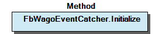

# WagoAppEvent v1.6.3.1 (WAGO) - Complete Documentation


## 📋 Library Information

- **Company:** WAGO
- **Title:** WagoAppEvent
- **Version:** 1.6.3.1
- **Categories:** WAGO LayerView|App; Application; WAGO FunctionalView|Base
- **Author:** WAGO / u013972
- **Placeholder:** WagoAppEvent

### Description ¶


This document is automatically generated.

Handling Events

This document is automatically generated. Handling Events

### Contents: ¶


Contents: - Documentation Index 10 Documentation - WagoAppEvent Library Documentation Project Information Library Information Function Blocks - FbWagoEventCatcher (FB) - FbWagoPostEvent_cpt (FB) - FbWagoSimpleEventCatcher_cpt (FB) - doc10_General (FB) Functions - ComposeEventID (FUN) - DoesEventExist (FUN) - GetNumberOfRegisteredCallbacks (FUN) - WagoPostEvent (FUN) Methods - FbWagoEventCatcher.Finish (METH) - FbWagoEventCatcher.GetEventCount (METH) - FbWagoEventCatcher.Initialize (METH) - FbWagoEventCatcher.Register (METH) - FbWagoEventCatcher.Unregister (METH) - FbWagoEventCatcher.UnregisterAll (METH) - FbWagoEventCatcher.protRun (METH) - FbWagoSimpleEventCatcher_cpt.protRun (METH) Program Organization Function Groups Base Components Main Interfaces Global Variable Lists - LibraryResult (GVL) - ResultItems (GVL) - VersionHistory (GVL) Other Components - 02 Auxiliary - 03 Protected - 04 Administration - 10 Compact - 10 Methods - 29 Types - FbWagoEventCatcher.FreeRegistrationSlots (PROP) - ParameterList (PARAMS) - eWagoEventClass (ENUM) - typWagoEventInfo (STRUCT)

### Indices and tables ¶


Based on WagoAppEvent.library, last modified 29.05.2024, 19:54:04. LibDoc 3.5.16.10

© WAGO GmbH & Co. KG, Germany 2018 – All rights reserved. For the avoidance of doubt, this copyright notice does not only apply to the information above but also and primarily to the described library itself. Please note that third-party products are always mentioned without reference to intellectual property rights, including patents, utility models, designs and trademarks, accordingly the existence of such rights cannot be excluded. WAGO is a registered trademark of WAGO Verwaltungsgesellschaft mbH.

- File and Project Information - Library Reference Based on WagoAppEvent.library, last modified 29.05.2024, 19:54:04. LibDoc 3.5.16.10 © WAGO GmbH & Co. KG, Germany 2018 – All rights reserved. For the avoidance of doubt, this copyright notice does not only apply to the information above but also and primarily to the described library itself. Please note that third-party products are always mentioned without reference to intellectual property rights, including patents, utility models, designs and trademarks, accordingly the existence of such rights cannot be excluded. WAGO is a registered trademark of WAGO Verwaltungsgesellschaft mbH.

### Documentation Index


## 10 Documentation ¶


## WagoAppEvent Library Documentation


| Company: | WAGO |
| Title: | WagoAppEvent |
| Version: | 1.6.3.1 |
| Categories: | WAGO LayerView\|App; Application; WAGO FunctionalView\|Base |
| Author: | WAGO / u013972 |
| Placeholder: | WagoAppEvent |

### Description


This document is automatically generated.

Handling Events

This document is automatically generated. Handling Events

### Contents:


- 10 Documentation doc10_General (FB) 20 Program Organization Units - 10 Compact - 30 Base - 40 Auxiliary Functions 29 Types - eWagoEventClass (ENUM) - typWagoEventInfo (STRUCT) LibraryResult (GVL) ParameterList (PARAMS) ResultItems (GVL) VersionHistory (GVL)

### Indices and tables


Based on WagoAppEvent.library, last modified 29.05.2024, 19:54:04. LibDoc 3.5.16.10

© WAGO GmbH & Co. KG, Germany 2018 – All rights reserved. For the avoidance of doubt, this copyright notice does not only apply to the information above but also and primarily to the described library itself. Please note that third-party products are always mentioned without reference to intellectual property rights, including patents, utility models, designs and trademarks, accordingly the existence of such rights cannot be excluded. WAGO is a registered trademark of WAGO Verwaltungsgesellschaft mbH.

- File and Project Information - Library Reference Based on WagoAppEvent.library, last modified 29.05.2024, 19:54:04. LibDoc 3.5.16.10 © WAGO GmbH & Co. KG, Germany 2018 – All rights reserved. For the avoidance of doubt, this copyright notice does not only apply to the information above but also and primarily to the described library itself. Please note that third-party products are always mentioned without reference to intellectual property rights, including patents, utility models, designs and trademarks, accordingly the existence of such rights cannot be excluded. WAGO is a registered trademark of WAGO Verwaltungsgesellschaft mbH.

### Project Information


## File and Project Information


| Scope | Name | Type | Content |
| --- | --- | --- | --- |
| FileHeader | libraryFile | string | WagoAppEvent.library |
| contentFile | doc.clean.json |
| productName | e!COCKPIT |
| creationDateTime | date | 29.05.2024, 19:54:04 |
| companyName | string | WAGO |
| ProjectInformation | LastModificationDateTime | date | 29.05.2024, 19:54:04 |
| Description | string | See: Description |
| Copyright | © WAGO Kontakttechnik GmbH & Co. KG, Germany 2018 – All rights reserved. |
| Author | WAGO / u013972 |
| AutoResolveUnbound | bool | True |
| Placeholder | string | WagoAppEvent |
| Company | WAGO |
| DocFormat | reStructuredText |
| Project | WagoAppEvent |
| DefaultNamespace |  |
| Version | version | 1.6.3.1 |
| Title | string | WagoAppEvent |
| LibraryCategories | library-category-list | WAGO LayerView\|App; Application; WAGO FunctionalView\|Base |
| CompiledLibraryCompatibilityVersion | string | CODESYS V3.5 SP16 Patch 3 |

### Library Information


## Library Reference


| LinkAllContent: False QualifiedOnly: False | SystemLibrary: False | Optional: False |

| LinkAllContent: False QualifiedOnly: False | SystemLibrary: False | Optional: False |

| LinkAllContent: False QualifiedOnly: False | SystemLibrary: False | Optional: False |

| LinkAllContent: False QualifiedOnly: False | SystemLibrary: False | Optional: False |

| LinkAllContent: False QualifiedOnly: False | SystemLibrary: False | Optional: False |

| LinkAllContent: False QualifiedOnly: False | SystemLibrary: False | Optional: False |

| LinkAllContent: False Optional: False | QualifiedOnly: False SystemLibrary: False | PublishSymbolsInContainer: True |

| LinkAllContent: False QualifiedOnly: False | SystemLibrary: False | Optional: False |

| LinkAllContent: False QualifiedOnly: False | SystemLibrary: False | Optional: False |

| LinkAllContent: False QualifiedOnly: False | SystemLibrary: False | Optional: False |

| LinkAllContent: False Optional: False | QualifiedOnly: False SystemLibrary: False | PublishSymbolsInContainer: True |

| LinkAllContent: False Optional: False | QualifiedOnly: False SystemLibrary: False | PublishSymbolsInContainer: True |

This is a dictionary of all referenced libraries and their name spaces.

This is a dictionary of all referenced libraries and their name spaces. CmpErrors2 Interfaces Library Identification : Name: CmpErrors2 Interfaces Version: newest Company: System Namespace: CmpErrors Library Properties : CmpEventMgr Library Identification : Placeholder: CmpEventMgr Default Resolution: CmpEventMgr, * (System) Namespace: CmpEventMgr Library Properties : WagoSysBehaviourModels Library Identification : Placeholder: WagoSysBehaviourModels Default Resolution: WagoSysBehaviourModels, * (WAGO) Namespace: WagoSysBehaviourModels Library Properties : WagoSysErrorBase Library Identification : Placeholder: WagoSysErrorBase Default Resolution: WagoSysErrorBase, * (WAGO) Namespace: WagoSysErrorBase Library Properties : Library Parameter : Parameter: RES_LOG_MAX_FILESIZE = 2000 Parameter: RES_LOG_MAX_FILES = 1 Parameter: RES_LOG_MAX_ENTRIES = 200 Parameter: RES_LOG_NAME = ‘WagoAppResultLogger’ WagoSysEvent_Internal_PFC Library Identification : Placeholder: WagoSysEventInternal Default Resolution: WagoSysEvent_Internal_PFC, * (WAGO) Namespace: WagoSysEvent_Internal_PFC Library Properties : WagoSysPlainMem Library Identification : Placeholder: WagoSysPlainMem Default Resolution: WagoSysPlainMem, * (WAGO) Namespace: WagoSysPlainMem Library Properties : WagoSysStandard Library Identification : Placeholder: WagoSysStandard Default Resolution: WagoSysStandard, * (WAGO) Namespace: WagoSysStandard Library Properties : WagoSysTypedefs_Debugging Library Identification : Placeholder: WagoSysTypedefs_Debugging Default Resolution: WagoSysTypedefs_Debugging, * (WAGO) Namespace: WagoSysTypedefs_Debugging Library Properties : WagoSysVersion Library Identification : Name: WagoSysVersion Version: 1.0.0.0 Company: WAGO Namespace: WagoSysVersion Library Properties : WagoTypesCommon Library Identification : Placeholder: WagoTypesCommon Default Resolution: WagoTypesCommon, * (WAGO) Namespace: WagoTypes Library Properties : WagoTypesErrorBase Library Identification : Placeholder: WagoTypesErrorBase Default Resolution: WagoTypesErrorBase, * (WAGO) Namespace: WagoTypesErrorBase Library Properties : WagoTypesEvent Library Identification : Placeholder: WagoTypesEvent Default Resolution: WagoTypesEvent, * (WAGO) Namespace: WagoTypesEvent Library Properties :

### Function Blocks


## FbWagoEventCatcher (FB)


This is a Function block base for catching events.

Graphical Illustration

Function Description

Usage: Derive child FBs from this base and overload the protected method protRun() as demonstrated in the ‘General’ overview.

When the event is posted, the protected method protRun(typWagoEventInfo) is executed. This runner method is provided with the full set of event parameters via its input Info: typWagoEventInfo

Feedback from the runner is provided in two ways:

Function This is a Function block base for catching events. Graphical Illustration  Function Description Usage: Derive child FBs from this base and overload the protected method protRun() as demonstrated in the ‘General’ overview. When the event is posted, the protected method protRun(typWagoEventInfo) is executed. This runner method is provided with the full set of event parameters via its input Info: typWagoEventInfo Feedback from the runner is provided in two ways: 1. If the parameter format indicates a “deny”-Option, the result code of the runner determines, if the event responses with “deny” (code<>0) or “accept” (code=0). 2. The parameter structure contains a pointer to a feedback area and a size of the feedback area. If one of these is zero, no feedback is fed back. - 01 Main Interface FbWagoEventCatcher.Register (METH) - FbWagoEventCatcher.Unregister (METH) - FbWagoEventCatcher.UnregisterAll (METH) 02 Auxiliary - FbWagoEventCatcher.FreeRegistrationSlots (PROP) - FbWagoEventCatcher.GetEventCount (METH) 03 Protected - FbWagoEventCatcher.protRun (METH) 04 Administration - FbWagoEventCatcher.Finish (METH) - FbWagoEventCatcher.Initialize (METH)

## FbWagoPostEvent_cpt (FB)


| Scope | Name | Type | Comment | Inherited from |
| --- | --- | --- | --- | --- |
| Output | oStatus | FbResult | Status object (see WagoSysErrorBase). | FbBehaviourModel_oStatus_Base |
| Inout | xTrigger | BOOL | Triggers the action and signals termination. | FbBehaviourModel_WagoAppTrigger |
| Output | xError | BOOL | Indicates that an error has occurred. | FbBehaviourModel_WagoAppTrigger |
| xBusy | BOOL | True while not terminated. | FbBehaviourModel_WagoAppTrigger |
| Input | eEventID | eWagoEventID | Identification number for the event |  |
| eParameterID | eWagoEventParameterID | Identifies the parameter structure for the event |  |
| wParamVersion | WORD | Additional versioning for parameter structure. |  |
| pParameter | POINTER TO unWagoEventParameter | The parameter structure itself |  |

| Result Codes |
| OK = 0 | Event was registered successfully |
| EPERM | This event must not be posted via WagoAppEvent |
| ENOENT | The event-ID was unknown |
| (others) | Other problems while posting the event |

This is a FUP-oriented function block for posting events.

Graphical Illustration

Function Description

This FB implements the behaviour model ‘WagoAppTrigger’ .

For simply posting events without parameters, the inputs eParameterID , wParamVersion , and pParameter may just be set to 0 .

When parameters have to be passed, it depends on the individual eWagoEventID which values for eParameterID , wParamVersion , and unWagoEventParameter are acceptable or valid. For a detailed description, please refer to the documentation of WagoTypesEvent and to the 3S-description of these events.

Interface variables Function This is a FUP-oriented function block for posting events. Graphical Illustration  Function Description This FB implements the behaviour model ‘WagoAppTrigger’ . Note For simply posting events without parameters, the inputs eParameterID , wParamVersion , and pParameter may just be set to 0 . When parameters have to be passed, it depends on the individual eWagoEventID which values for eParameterID , wParamVersion , and unWagoEventParameter are acceptable or valid. For a detailed description, please refer to the documentation of WagoTypesEvent and to the 3S-description of these events.

## FbWagoSimpleEventCatcher_cpt (FB)


| Scope | Name | Type | Comment | Inherited from |
| --- | --- | --- | --- | --- |
| Output | oStatus | FbResult | Status object (see WagoSysErrorBase). | FbBehaviourModel_oStatus_Base |
| Input | xOpen | BOOL | Desired channel state (open=TRUE, closed=FALSE) | FbBehaviourModel_WagoAppChannel |
| Output | xError | BOOL | Feedback: an Error has occurred. | FbBehaviourModel_WagoAppChannel |
| xIsOpen | BOOL | Feedback: channel is operative. | FbBehaviourModel_WagoAppChannel |
| xIsIdle | BOOL | Feedback: channel is clear for new opening. | FbBehaviourModel_WagoAppChannel |
| Input | eEventID | eWagoEventID | the event number which is to be regarded. |  |

| Result Codes |
| OK = 0 | Event was registered successfully. |
| EPERM | The event must not be registered via WagoAppEvent. |
| EKEYREJECTED | The event-ID was unknown and could not be created. |
| ENOENT | The event-ID was unknown and not attempt was made to create it (future use). |
| EACCES | The event could not be opened. |
| (others) | The callback could not be registered. |

This is a FUP-oriented function block for catching single events.

Graphical Illustration

Function Description

This function block implements the behaviour model ‘WagoAppChannel’ . For using the catcher FB, you are supposed to derive your own FB from this library FB and overload the method protRun with your specific functionality.

(In the introducing section ‘General’ an example is given. Although the example is formally written for the parent this FB (i.e. FbWagoEventCatcher instead of FbWagoSimpleEventCatcher_cpt), the code which is to be written for using any of these FBs is identical, because both FB differ only in the interface variables of the behaviour model.)

The xOpen -Input controls the registering and unregistering of the event.

When the registered event is caught, the protected method protRun() is executed. This runner method is provided with the full set of event parameters via its input Info: typWagoEventInfo .

Feedback from the runner is provided in two ways:

If multiple events are to be mapped on a single Catching FB, the method-oriented FbWagoEventCatcher (FB) should be used instead.

Attention: Take care to have SUPER^() involved in the body of derived FBs, as otherwise the behaviour model will not work.

Interface variables Function This is a FUP-oriented function block for catching single events. Graphical Illustration  Function Description This function block implements the behaviour model ‘WagoAppChannel’ . For using the catcher FB, you are supposed to derive your own FB from this library FB and overload the method protRun with your specific functionality. (In the introducing section ‘General’ an example is given. Although the example is formally written for the parent this FB (i.e. FbWagoEventCatcher instead of FbWagoSimpleEventCatcher_cpt), the code which is to be written for using any of these FBs is identical, because both FB differ only in the interface variables of the behaviour model.) The xOpen -Input controls the registering and unregistering of the event. When the registered event is caught, the protected method protRun() is executed. This runner method is provided with the full set of event parameters via its input Info: typWagoEventInfo . Feedback from the runner is provided in two ways: 1. If the parameter format indicates a ‘deny’-Option, the result code of the runner determines, whether the event is responded with ‘deny’ (code<>0) or ‘accept’ (code=0). 2. The parameter structure contains a pointer to a feedback area and the size of the feedback area. If one of these is zero, no feedback is fed back. Note If multiple events are to be mapped on a single Catching FB, the method-oriented FbWagoEventCatcher (FB) should be used instead. Attention: Take care to have SUPER^() involved in the body of derived FBs, as otherwise the behaviour model will not work. - 10 Methods FbWagoSimpleEventCatcher_cpt.protRun (METH)

## doc10_General (FB)


```
///////////// New FB handles application event STOP:  (inherites from base class)

FUNCTION_BLOCK FbEventCatcher_Stop EXTENDS FbWagoEventCatcher

//////////// Common interface of Wago event callback //////////////////////

METHOD PROTECTED protRun : eResultCode  // This is the callback method for STOP event.
VAR_INPUT                               // It Returns OK when it allows stopping and
    Info : typWagoEventInfo;            // it returns EACCESS when it does not.
END_VAR

//////////// Application specific content of callback method //////////////

CASE Info.eEventID OF          // If registered to more than one event, find out
                               // which of these events has been issued.
  eWagoEventID.PrepareStop:
    Notify_The_Application(Info.unParameter.CmpAppStop.eStopReason);
    protRun := OK;


  eWagoEventID.DenyStop:        // Decide if stopping is ok or not

    IF Get_Allowance_From_Application_To_Stop() THEN
      protRun := OK;            // confirm the allowance to stop
    ELSE
      protRun := EACCES;        // deny the stop request
    END_IF


  ELSE:                         // other events. Just pass through.
    protRun := OK;

END_CASE;
```

```
FUNCTION_BLOCK FbEventCatcher_Stop EXTENDS FbWagoEventCatcher  // handles application stop

METHOD initialize

  SUPER^.initialize();                // original initialization. Be careful to insert this!
  Register(eWagoEventID.DenyStop);    // additional: registering an event
  Register(eWagoEventID.PrepareDone); // additional: registering another event
```

```
VAR
  FbStopHandler : FbEventCatcher_Stop;
END_VAR
```

```
IF not xInitialized THEN
  FbStopHandler.Register(eWagoEventID.PrepareStop);
  FbStopHandler.Register(eWagoEventID.DenyStop);
  FbStopHandler.Register(...);
  xInitialized := TRUE;
END_IF
```

The library ‘WagoAppEvent.library’ provides functionalities for registering callbacks to system events and for triggering (‘posting’) application specific events.

The major differences / advantages to the more fundamental ‘CmpEvenrMgr.library’ are the following:

For using callbacks, the application would derive its own callback function block from FbWagoEventcatcher(FB) of this library and redefine the runner method ‘protRun()’ to the specific function:

Redefinition of Callback-Method:

Note: We use a new method name ‘protRun’ instead of the original callback name ‘EventCallback()’, because

Automatic Initialization within Catcher FB:

In the previous step we have defined what the event catcher has to do in case of an event. In the following steps, we now demonstrate how to register that catcher to the system, so that events are actually passed to it.

The easiest way would be to handle registering directly within the initialization method of the FB. In this case, no further calls are necessary within the application for registering the event. The initialize() method is called from FB_INIT() and will be executed during internal construction of the FB.

Application Code:

Within the application code, the catcher FB has merely to be constructed:

Basically, no further registering code is necessary. Nevertheless, the catcher might also be registered from within the application. That would allow for a more detailed control about when the registration takes place:

Both ways could be mixed. When registering only from the application side, it is not necessary to redefine the method initialize().

The library ‘WagoAppEvent.library’ provides functionalities for registering callbacks to system events and for triggering (‘posting’) application specific events. Context The major differences / advantages to the more fundamental ‘CmpEvenrMgr.library’ are the following: - In ‘WagoAppEvent’, the set of usable system events is restricted to those events, which are considered ‘safe’ for application usage and which are also supported by the target hardware. These restrictions are represented in an internal target specific sub-library ‘WagoSysEvent_Internal_ ’, which is selected by the device description. - The callback function blocks carry all functionality for administrative information internally. The application does not have to care about handles or double registration. Such a callback function block can be registered to more than one event simultaneously. Unregistering is done automatically when the FB is unloaded. - Event identifications and parameter descriptions are available in a re-organized form directly from this libarary. This re-organization is in most cases a direct 1:1-mapping of the constants which could be found in other system libraries, but it is extended by Wago-specific events and it is cleaned from those system constants which are considered to lead to unsafe usage. No other libraries than ‘WagoAppEvent’ itself have to be included. - Expected return values from the callback methods are handled in a unified and also formalized way (i.e. by a pointer to the range where the return values are to be written to and a size specification). In simple and well documented cases (e.g. ‘deny’-events), the ‘yes/no’-decision made by the callback function is transported via the unified result code of the callback (‘OK’ / other than ‘OK’) and it is inserted into the proper places automatically by the underlying framework of this library. All this avoids mistakes which would be hard to debug. - Parameters of the event are given in plain form to the callback functions without the necessity to parse chains of pointers. - There are compact function blocks available which implement the standard Wago behaviour models and which are easy-to-use in graphical development environments. Usage For using callbacks, the application would derive its own callback function block from FbWagoEventcatcher(FB) of this library and redefine the runner method ‘protRun()’ to the specific function: Redefinition of Callback-Method: Note: We use a new method name ‘protRun’ instead of the original callback name ‘EventCallback()’, because - EventCallback() is already used for internal administration, such as parameter handling and wrapping, - EventCallback() has a different (more obscure) interface - EventCallback() cannot be declared PROTECTED as it should be, because the callback should only be called from the event, never from the application itself. Automatic Initialization within Catcher FB: In the previous step we have defined what the event catcher has to do in case of an event. In the following steps, we now demonstrate how to register that catcher to the system, so that events are actually passed to it. The easiest way would be to handle registering directly within the initialization method of the FB. In this case, no further calls are necessary within the application for registering the event. The initialize() method is called from FB_INIT() and will be executed during internal construction of the FB. Application Code: Within the application code, the catcher FB has merely to be constructed: Basically, no further registering code is necessary. Nevertheless, the catcher might also be registered from within the application. That would allow for a more detailed control about when the registration takes place: Both ways could be mixed. When registering only from the application side, it is not necessary to redefine the method initialize().

### Functions


## ComposeEventID (FUN)


| Scope | Name | Type | Comment |
| --- | --- | --- | --- |
| Return | ComposeEventID | eWagoEventID |  |
| Input | EventNumber | WORD | event number |
| EventClass | eWagoEventClass | class number |

Composes a fully qualified WAGO event ID.

Graphical Illustration

Function Description

This function composes a fully qualified WAGO event ID from a 16-Bit arbitrary event number and a 16-bit Class number. It is intended to be used as a helper function when own events are created.

The Event number is meant to identify the individual number of the event, while the event class carries information about the severity of that event, e.g. ‘info’, ‘warning’, ‘exception’ or others.

When only predefined events are used this helper is not needed.

Interface variables Function Composes a fully qualified WAGO event ID. Graphical Illustration  Function Description This function composes a fully qualified WAGO event ID from a 16-Bit arbitrary event number and a 16-bit Class number. It is intended to be used as a helper function when own events are created. The Event number is meant to identify the individual number of the event, while the event class carries information about the severity of that event, e.g. ‘info’, ‘warning’, ‘exception’ or others. When only predefined events are used this helper is not needed.

## DoesEventExist (FUN)


| Scope | Name | Type | Comment |
| --- | --- | --- | --- |
| Return | DoesEventExist | BOOL |  |
| Input | eEventID | eWagoEventID | The event to be investigated |

Checks if an event is known to the system or not.

Graphical Illustration

Function Description

The Function ‘DoesEventExist’ returns TRUE if the event is known to the system and FALSE otherwise.

Interface variables Function Checks if an event is known to the system or not. Graphical Illustration  Function Description The Function ‘DoesEventExist’ returns TRUE if the event is known to the system and FALSE otherwise.

## GetNumberOfRegisteredCallbacks (FUN)


| Scope | Name | Type | Comment |
| --- | --- | --- | --- |
| Return | GetNumberOfRegisteredCallbacks | UDINT |  |
| Input | eEventID | eWagoEventID | the event which is to be investigated |

This returns the number of Callbacks which are registered to a given event

Graphical Illustration

Interface variables Function This returns the number of Callbacks which are registered to a given event Graphical Illustration 

## WagoPostEvent (FUN)


| Scope | Name | Type | Comment |
| --- | --- | --- | --- |
| Return | WagoPostEvent | eResultCode |  |
| Input | eEventID | eWagoEventID | The identification number of the event |
| eParameterID | eWagoEventParameterID | Format of parameter union (0=none) |
| wParamVersion | WORD | Version of parameter format (0=none) |
| pParameter | POINTER TO unWagoEventParameter | Parameters, passed to the event (0=none) |

| Result Codes |
| OK = 0 | Event was posted successfully. |
| EPERM | The Event must not be posted via WagoAppEvent. |
| ENOENT | The Event-ID was unknown. |
| (others) | Other undocumented problems while posting the event. |

Posts an event to the system.

Graphical Illustration

Function Description

Note: For simply posting events without parameters, the inputs eParameterID , wParamVersion , and pParameter may simply be set to 0.

When parameters have to be passed, it depends on the individual eWagoEventID which values for eParameterID , wParamVersion , and unWagoEventParameter are acceptable or valid. For more details, please refer to the Appendix ‘Types’ , to the documentation of WagoTypesEvent or to the 3S-description of these events.

Interface variables Function Posts an event to the system. Graphical Illustration  Function Description Note: For simply posting events without parameters, the inputs eParameterID , wParamVersion , and pParameter may simply be set to 0. When parameters have to be passed, it depends on the individual eWagoEventID which values for eParameterID , wParamVersion , and unWagoEventParameter are acceptable or valid. For more details, please refer to the Appendix ‘Types’ , to the documentation of WagoTypesEvent or to the 3S-description of these events.

### Methods


## FbWagoEventCatcher.Finish (METH)


| Scope | Name | Type |
| --- | --- | --- |
| Return | Finish | eResultCode |

```
SUPER^.finish()
```

This method is called when the FB is unloaded.

Graphical Illustration

Function Description

This method is meant to be re-defined when additional cleanup code is required. Remember to call

in the child’s finish()-method.

Interface variables Function This method is called when the FB is unloaded. Graphical Illustration  Function Description This method is meant to be re-defined when additional cleanup code is required. Remember to call in the child’s finish()-method.

## FbWagoEventCatcher.GetEventCount (METH)


| Scope | Name | Type |
| --- | --- | --- |
| Return | GetEventCount | LINT |
| Input | eEventID | eWagoEventID |

Returns how often an event has been caught by this FB.

Graphical Illustration

Function Description

The number of events of type eEventID is counted since registration. If the event has not been registered by this FB, -1 is returned.

If only one event is registered and “0” is passed for the event-ID, the count of the only registered event is returned.

Interface variables Function Returns how often an event has been caught by this FB. Graphical Illustration  Function Description The number of events of type eEventID is counted since registration. If the event has not been registered by this FB, -1 is returned. If only one event is registered and “0” is passed for the event-ID, the count of the only registered event is returned.

## FbWagoEventCatcher.Initialize (METH)


```
SUPER^.initialize();                // Original initialization. Always insert this!
Register(eWagoEventID.DenyStop);    // Additional: registering an event
Register(eWagoEventID.PrepareDone); // Additional: registering another event
```

This method is called when the FB is constructed.

Graphical Illustration

Function Description

You might redefine this method if required and insert some initializing registrations here:

Remember to call SUPER^.initialize() in the first line of the child’s initialize()-method.

Function This method is called when the FB is constructed. Graphical Illustration  Function Description You might redefine this method if required and insert some initializing registrations here: Remember to call SUPER^.initialize() in the first line of the child’s initialize()-method.

## FbWagoEventCatcher.Register (METH)


| Scope | Name | Type |
| --- | --- | --- |
| Return | Register | eResultCode |
| Input | eEventID | eWagoEventID |

| Result Codes |
| OK=0 | Event was registered successfully. |
| EPERM | The Event must not be registered via WagoAppEvent. |
| EKEYREJECTED | The Event-ID was unknown and also could not be created. |
| ENOENT | The Event-ID was unknown and no attempt was made to create it future use). |
| EACCES | The Event could not be opened. |
| EALREADY | The Event is already registered for this catcher. |
| ENFILE | Too many events have been registered on this FB. |
| (others) | The callback could not be registered due to other reasons. |

Registering this FB to the specified event.

Graphical Illustration

Function Description

Note: More than one event can be registered to this FB simultaneously. The maximum number is given by ParameterList.cuiMaxEventsPerCatcher.

If an event does not exist at the time of registering, it will be created automatically. In this case it will be deleted automatically when the event is unregistered again.

Interface variables Function Registering this FB to the specified event. Graphical Illustration  Function Description Note: More than one event can be registered to this FB simultaneously. The maximum number is given by ParameterList.cuiMaxEventsPerCatcher. If an event does not exist at the time of registering, it will be created automatically. In this case it will be deleted automatically when the event is unregistered again.

## FbWagoEventCatcher.Unregister (METH)


| Scope | Name | Type |
| --- | --- | --- |
| Return | Unregister | eResultCode |
| Input | eEventID | eWagoEventID |

| Result Codes |
| OK=0 | Operation successfully completed |
| ENOENT | The specified event has not been registered to this FB. |
| EADV | Advertise Error: Registered Interface was evidently not registered any more. |
| EBADF | The event was not known to the system. |

Unregister one event from the FB.

Graphical Illustration

Interface variables Function Unregister one event from the FB. Graphical Illustration 

## FbWagoEventCatcher.UnregisterAll (METH)


| Scope | Name | Type |
| --- | --- | --- |
| Return | UnregisterAll | eResultCode |

| Result Codes |
| OK=0 | Operation successfully completed |
| ENOENT | The specified event has not been registered to this FB |
| EADV | Advertise Error: Registered Interface was evidently not registered any more |
| EBADF | Event was not known to the system |

Unregisters all events from this FB.

Graphical Illustration

Interface variables Function Unregisters all events from this FB. Graphical Illustration 

## FbWagoEventCatcher.protRun (METH)


| Scope | Name | Type |
| --- | --- | --- |
| Return | protRun | eResultCode |
| Input | Info | typWagoEventInfo |

| FbWagoEventcatcher.protRun() - Input structure “Info” |
| --- |
| Component Name | type | Meaning |
| --- | --- | --- |
| eEventID | eWagoEventID | ID of the event. |
| dwEventProvider | DWORD | Provider identification (CmpApp = 2) |
| pReturnValues | POINTER TO BYTE | Pointer to possible return values from the runner (0=none) |
| udiReturnSize | UDINT | Size of the feedback buffer (0=no feedback allowed) |
| eParameterID | eWagoEventParameterID | Identifies the format of the event parameters |
| unParameter | unWagoEventParameter | Union containing all known parameter formats |

| Result Codes (FbWagoEventcatcher.protRun()) |
| OK = 0 | Regular termination of callback runner. |
| (other) | In a “deny” context: deny the requested action. Else: ignored. |

Runner method template for derived FBs.

Graphical Illustration

Function Description

This method is called, when the event is caught. Overload it with your own code.

The input structure Info ( typWagoEventInfo ) provides information about the event identity, the parameter format and possible feedback locations.

If the event catcher is expected to make a deny/allow decision, this method is expected to signalize ‘allow’ by a return value of 0=’OK’ and ‘deny’ by any other value (e.g. EACCESS).

More information about the general usage of this FB is given in the subsection ‘Usage’ of the introducing section ‘General’ .

Interface variables Function Runner method template for derived FBs. Graphical Illustration  Function Description This method is called, when the event is caught. Overload it with your own code. The input structure Info ( typWagoEventInfo ) provides information about the event identity, the parameter format and possible feedback locations. If the event catcher is expected to make a deny/allow decision, this method is expected to signalize ‘allow’ by a return value of 0=’OK’ and ‘deny’ by any other value (e.g. EACCESS). More information about the general usage of this FB is given in the subsection ‘Usage’ of the introducing section ‘General’ .

## FbWagoSimpleEventCatcher_cpt.protRun (METH)


| Scope | Name | Type |
| --- | --- | --- |
| Return | protRun | eResultCode |
| Input | Info | typWagoEventInfo |

| Result Codes |
| OK = 0 | Regular termination of callback runner. |
| (other) | In a ‘deny’ context: deny the requested action. Else: ignored. |

This is a runner method template for derived FBs of FbWagoSimpleEventCatcher_cpt (FB) .

Graphical Illustration

Function Description

This method is called, when the event is caught. Overload it with your own code.

The input structure Info ( typWagoEventInfo ) provides information about the event identity, the parameter format and possible feedback locations.

If the event catcher is expected to make a deny/allow decision, this method is expected to signalize ‘allow’ by a return value of 0=’OK’ and ‘deny’ by any other value (e.g. EACCESS).

More information about the general usage of this FB is given in the subsection ‘Usage’ of the introducing section ‘General’ , which applies as well for the ‘_cpt’ FB.

Interface variables Function This is a runner method template for derived FBs of FbWagoSimpleEventCatcher_cpt (FB) . Graphical Illustration  Function Description This method is called, when the event is caught. Overload it with your own code. The input structure Info ( typWagoEventInfo ) provides information about the event identity, the parameter format and possible feedback locations. If the event catcher is expected to make a deny/allow decision, this method is expected to signalize ‘allow’ by a return value of 0=’OK’ and ‘deny’ by any other value (e.g. EACCESS). More information about the general usage of this FB is given in the subsection ‘Usage’ of the introducing section ‘General’ , which applies as well for the ‘_cpt’ FB.

### Program Organization


## 20 Program Organization Units


- 10 Compact FbWagoPostEvent_cpt (FB) - FbWagoSimpleEventCatcher_cpt (FB) 10 Methods FbWagoSimpleEventCatcher_cpt.protRun (METH) 30 Base - FbWagoEventCatcher (FB) 01 Main Interface FbWagoEventCatcher.Register (METH) - FbWagoEventCatcher.Unregister (METH) - FbWagoEventCatcher.UnregisterAll (METH) 02 Auxiliary - FbWagoEventCatcher.FreeRegistrationSlots (PROP) - FbWagoEventCatcher.GetEventCount (METH) 03 Protected - FbWagoEventCatcher.protRun (METH) 04 Administration - FbWagoEventCatcher.Finish (METH) - FbWagoEventCatcher.Initialize (METH) WagoPostEvent (FUN) 40 Auxiliary Functions - ComposeEventID (FUN) - DoesEventExist (FUN) - GetNumberOfRegisteredCallbacks (FUN)

### Function Groups


## 40 Auxiliary Functions


- ComposeEventID (FUN) - DoesEventExist (FUN) - GetNumberOfRegisteredCallbacks (FUN)

### Base Components


## 30 Base


- FbWagoEventCatcher (FB) 01 Main Interface FbWagoEventCatcher.Register (METH) - FbWagoEventCatcher.Unregister (METH) - FbWagoEventCatcher.UnregisterAll (METH) 02 Auxiliary - FbWagoEventCatcher.FreeRegistrationSlots (PROP) - FbWagoEventCatcher.GetEventCount (METH) 03 Protected - FbWagoEventCatcher.protRun (METH) 04 Administration - FbWagoEventCatcher.Finish (METH) - FbWagoEventCatcher.Initialize (METH) WagoPostEvent (FUN)

### Main Interfaces


## 01 Main Interface


- FbWagoEventCatcher.Register (METH) - FbWagoEventCatcher.Unregister (METH) - FbWagoEventCatcher.UnregisterAll (METH)

### Global Variable Lists


## LibraryResult (GVL)


| Name | Type | Comment |
| --- | --- | --- |
| Factory | FbResultFactory | Produces FbResults from given eResultCodes. |

```
VAR
  eMyResult : eResultCode;  // result code which is to be investigated
  oError    : FbResult;     // result object for use in higher levels
END_VAR;

eMyResult := myFunction(...);
Namespace.LibraryResult.Factory.SetResult(eMyResult, oError);
```

Factory for standard result objects

Use this to translate result codes from this library into standard result objects.

(In this example ‘Namespace’ denotes the namespace which is used for including the specific library and ‘myFunction()’ is an example for a general function from this library.)

Factory for standard result objects Use this to translate result codes from this library into standard result objects. Usage: (In this example ‘Namespace’ denotes the namespace which is used for including the specific library and ‘myFunction()’ is an example for a general function from this library.)

## ResultItems (GVL)


| Scope | Name | Type | Initial |
| --- | --- | --- | --- |
| Constant | ERROR | ARRAY [0..10] OF typResultItem | [STRUCT(ID := OK, Severity := eSeverity.none, Text := ‘OK’), STRUCT(ID := EALREADY, Severity := eSeverity.info, Text := ‘The event is already registered for this catcher.’), STRUCT(ID := EDEFAULT, Severity := eSeverity.info, Text := ‘No action has been started s far.’), STRUCT(ID := EPERM, Severity := eSeverity.error, Text := ‘This event must not be posted or egistered via WagoAppEvent.’), STRUCT(ID := ENOENT, Severity := eSeverity.error, Text := ‘The event is unknown in this context / is not registered to this FB.’), STRUCT(ID := EKEYREJECTED, Severity := eSeverity.error, Text := ‘The event-ID was unknown and could not be created.’), STRUCT(ID := EACCES, Severity := eSeverity.error, Text := ‘The event could not be opened.’), STRUCT(ID := ENFILE, Severity := eSeverity.error, Text := ‘Too many events have been registered on this FB.’), STRUCT(ID := EADV, Severity := eSeverity.error, Text := ‘Advertise Error: Registered interface was evidently not registered any more.’), STRUCT(ID := EBADF, Severity := eSeverity.error, Text := ‘The event was not known to the system at all.’), STRUCT(ID := EINVAL, Severity := eSeverity.error, Text := ‘FbWagoPostEvent(_cpt) with eWagoEventID.DeleteDone,pParameter:=0 is not allowed’)] |

Standard result items specific for this library

Note: This is a general mapping of result codes to short standard texts which are appropriate to the usage of these codes in this library.

Typially, each unit (function, method, or function block) in this library uses only a subset of these codes. Please, refer to the documentation of the specific unit for the set of codes which is actualy used and for a detailed explanation of the meaning of a result code in the specifc context.

Standard result items specific for this library Note: This is a general mapping of result codes to short standard texts which are appropriate to the usage of these codes in this library. Typially, each unit (function, method, or function block) in this library uses only a subset of these codes. Please, refer to the documentation of the specific unit for the set of codes which is actualy used and for a detailed explanation of the meaning of a result code in the specifc context.

## VersionHistory (GVL)


| Name | Type |
| --- | --- |
| Info | ProjectInfo |

| date | version | author | change |
| 07.02.2024 | 1.6.3.1 | WAGO / u010663 | Compiled SP16.3 |
| 05.08.2022 | 1.6.3.0 | WAGO / u010663 | Internal replace cmpErrors by cmpErrors2Interfaces |
| 05.03.2021 | 1.6.2.1 | WAGO / u013972 | Resolve typs form WagoSysErrorBase with namespace |
| 08.01.2019 | 1.6.2.0 | u015842 | Properties: free placeholder added |
| 10.10.2017 | 1.6.1.1 | WAGO / u013972 | WagoPostEvent()/WagoPostEvent_cpt() - Workaround for WAT24385 |
| 10.03.2016 | 1.6.1.0 | WAGO / u013972 | Publish WagoSysErrorBase |
| 04.03.2016 | 1.6.0.0 | WAGO / u013972 | Replace WagoAppErrorBase with WagoSysErrorBase |
| 15.02.2016 | 1.5.3.1 | WAGO / u013972 | Add a new EventClass |
| 29.09.2015 | 1.5.2.0 | WAGO / u013972 | Resolve libraries with placeholder |
| 23.09.2015 | 1.5.1.0 | WAGO / u013972 | Workaround for C0351-Bug |
| 23.06.2015 | 1.5.0.0 | WAGO / u013972 | Release version |

WagoAppEvent

Known Bugs - WAT24385:

WagoAppEvent Known Bugs - WAT24385:

### Other Components


## 02 Auxiliary


- FbWagoEventCatcher.FreeRegistrationSlots (PROP) - FbWagoEventCatcher.GetEventCount (METH)

## 03 Protected ¶


- FbWagoEventCatcher.protRun (METH)

## 04 Administration


- FbWagoEventCatcher.Finish (METH) - FbWagoEventCatcher.Initialize (METH)

## 10 Compact


- FbWagoPostEvent_cpt (FB) - FbWagoSimpleEventCatcher_cpt (FB) 10 Methods FbWagoSimpleEventCatcher_cpt.protRun (METH)

## 10 Methods


- FbWagoSimpleEventCatcher_cpt.protRun (METH)

## 29 Types


Note: Some type definitions in this library are taken from a separate sub-library ‘WagoTypesEvent.library’ which is included automatically when ‘WagoAppEvent’ is included.

As these definitions are commonly used in this library they are repeated here for the sake of convenience.

Note: Some type definitions in this library are taken from a separate sub-library ‘WagoTypesEvent.library’ which is included automatically when ‘WagoAppEvent’ is included. As these definitions are commonly used in this library they are repeated here for the sake of convenience. - eWagoEventClass (ENUM) - typWagoEventInfo (STRUCT)

## FbWagoEventCatcher.FreeRegistrationSlots (PROP)


The number of events which could be registered by this FB

Graphical Illustration

Function The number of events which could be registered by this FB Graphical Illustration 

## ParameterList (PARAMS)


| Scope | Name | Type | Initial | Comment |
| --- | --- | --- | --- | --- |
| Constant | cuiMaxEventsPerCatcher | UINT | 60 | Determines how many events could be registered per catcher FB |
| cudiProviderID | UDINT | 2 | Pre-set identifcation number for the event producer |

## eWagoEventClass (ENUM)


| Name | Initial | Comment |
| --- | --- | --- |
| none | 0 |  |
| info | EVTCLASS_INFO |  |
| warning | EVTCLASS_WARNING |  |
| error | EVTCLASS_ERROR |  |
| exception | EVTCLASS_EXCEPTION |  |
| user | EVTCLASS_VENDOR_SPEC |  |
| EVTCLASS_FUSE | 16#1001 | Eventclass reserved for use in WagoSysFuse_Internal |
| all | EVTCLASS_ALL |  |

Predifined values for specifying the class of a user defined event.

This type is used for composing own eventIDs with the function ‘ComposeEventID()’. It is a mere wrapper which uses a subset of the predefined codesys definitions.

InOut: Predifined values for specifying the class of a user defined event. This type is used for composing own eventIDs with the function ‘ComposeEventID()’. It is a mere wrapper which uses a subset of the predefined codesys definitions.

## typWagoEventInfo (STRUCT)


| Name | Type | Comment |
| --- | --- | --- |
| eEventID | eWagoEventID | ID of the event. |
| dwEventProvider | DWORD | provider identification (CmpApp = 2) |
| pReturnValues | POINTER TO BYTE | pointer to possible return values from the runner (0=none) |
| udiReturnSize | UDINT | size of the feedback buffer (0=no feedback allowed) |
| eParameterID | eWagoEventParameterID | identifies the format of the event parameters |
| unParameter | unWagoEventParameter | union containing all known parameter formats. |

This structure is passed as input argument to every callback runner.

The ‘eEventID’ identifies which event is caught. Although events are registered separately, multiple events may finally be handled by one single handler. These multiple events are now differentiated by this means.

When parameters are passed to the catcher, this is done via the structure ‘unParameter’, which is a union of multiple different known parameter structures. The struct-component eParameterID identifies which component of the union applies here.

When feedback is expected from a runner, there are two different ways to handle that:

InOut: This structure is passed as input argument to every callback runner. The ‘eEventID’ identifies which event is caught. Although events are registered separately, multiple events may finally be handled by one single handler. These multiple events are now differentiated by this means. When parameters are passed to the catcher, this is done via the structure ‘unParameter’, which is a union of multiple different known parameter structures. The struct-component eParameterID identifies which component of the union applies here. When feedback is expected from a runner, there are two different ways to handle that: 1. Simple ‘accept/deny’ descisions are signalized via the return value of the runner. Feedback through the typWagoEventInfo-structure does not take place. 2. When feedback of larger size is expected, in this structure the component ‘pReturnValues’ indicates where to write that feedback and ‘udiReturnSize’ indicates the size of that area.