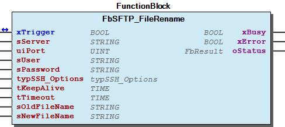
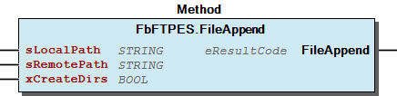
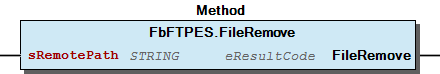

# WagoAppFTP v1.3.1.7 (WAGO) - Complete Documentation


## 📋 Library Information

- **Company:** WAGO
- **Title:** WagoAppFTP
- **Version:** 1.3.1.7
- **Categories:** WAGO FunctionalView|Connectivity|Network; WAGO LayerView|App; WAGO Internal|Feature|Network|FTP; Application
- **Author:** WAGO / u013972
- **Placeholder:** WagoAppFTP

### Description ¶


This document is automatically generated.

This library provide Client-Services for FTP, FTPS, FTPES and SFTP

This document is automatically generated. This library provide Client-Services for FTP, FTPS, FTPES and SFTP

### Contents: ¶


Contents: - Documentation Index - Project Information - Library Information - Function Blocks FbFTP (FB) - FbFTPES (FB) - FbFTPES_DirCreate (FB) - FbFTPES_DirRemove (FB) - FbFTPES_FileAppend (FB) - FbFTPES_FileAppendFromMem (FB) - FbFTPES_FileRead (FB) - FbFTPES_FileReadToMem (FB) - FbFTPES_FileRemove (FB) - FbFTPES_FileRename (FB) - ... and 38 more Functions Methods - FbFTP.DirCreate (METH) - FbFTP.DirRemove (METH) - FbFTP.FileAppend (METH) - FbFTP.FileAppendFromMem (METH) - FbFTP.FileRead (METH) - FbFTP.FileReadToMem (METH) - FbFTP.FileRemove (METH) - FbFTP.FileRename (METH) - FbFTP.FileWrite (METH) - FbFTP.FileWrite2 (METH) - ... and 35 more Program Organization Internal Components Global Variable Lists - Status (GVL) - VersionHistory (GVL) Other Components - 80 Status - FTP - FTPES - FTPS - SFTP

### Indices and tables ¶


Based on WagoAppFTP.library, last modified 29.05.2024, 20:39:47. LibDoc 3.5.16.10

© WAGO GmbH & Co. KG, Germany 2018 – All rights reserved. For the avoidance of doubt, this copyright notice does not only apply to the information above but also and primarily to the described library itself. Please note that third-party products are always mentioned without reference to intellectual property rights, including patents, utility models, designs and trademarks, accordingly the existence of such rights cannot be excluded. WAGO is a registered trademark of WAGO Verwaltungsgesellschaft mbH.

- File and Project Information - Library Reference Based on WagoAppFTP.library, last modified 29.05.2024, 20:39:47. LibDoc 3.5.16.10 © WAGO GmbH & Co. KG, Germany 2018 – All rights reserved. For the avoidance of doubt, this copyright notice does not only apply to the information above but also and primarily to the described library itself. Please note that third-party products are always mentioned without reference to intellectual property rights, including patents, utility models, designs and trademarks, accordingly the existence of such rights cannot be excluded. WAGO is a registered trademark of WAGO Verwaltungsgesellschaft mbH.

### Documentation Index


## WagoAppFTP Library Documentation


| Company: | WAGO |
| Title: | WagoAppFTP |
| Version: | 1.3.1.7 |
| Categories: | WAGO FunctionalView\|Connectivity\|Network; WAGO LayerView\|App; WAGO Internal\|Feature\|Network\|FTP; Application |
| Author: | WAGO / u013972 |
| Placeholder: | WagoAppFTP |

### Description


This document is automatically generated.

This library provide Client-Services for FTP, FTPS, FTPES and SFTP

This document is automatically generated. This library provide Client-Services for FTP, FTPS, FTPES and SFTP

### Contents:


- 20 Program Organization Units FTP - FTPES - FTPS - SFTP 80 Status - Status (GVL) 90 Internal - UNIT_TO_STRING_WITH_AT_LEAST_TWO_CHARS (FUN) VersionHistory (GVL)

### Indices and tables


Based on WagoAppFTP.library, last modified 29.05.2024, 20:39:47. LibDoc 3.5.16.10

© WAGO GmbH & Co. KG, Germany 2018 – All rights reserved. For the avoidance of doubt, this copyright notice does not only apply to the information above but also and primarily to the described library itself. Please note that third-party products are always mentioned without reference to intellectual property rights, including patents, utility models, designs and trademarks, accordingly the existence of such rights cannot be excluded. WAGO is a registered trademark of WAGO Verwaltungsgesellschaft mbH.

- File and Project Information - Library Reference Based on WagoAppFTP.library, last modified 29.05.2024, 20:39:47. LibDoc 3.5.16.10 © WAGO GmbH & Co. KG, Germany 2018 – All rights reserved. For the avoidance of doubt, this copyright notice does not only apply to the information above but also and primarily to the described library itself. Please note that third-party products are always mentioned without reference to intellectual property rights, including patents, utility models, designs and trademarks, accordingly the existence of such rights cannot be excluded. WAGO is a registered trademark of WAGO Verwaltungsgesellschaft mbH.

### Project Information


## File and Project Information


| Scope | Name | Type | Content |
| --- | --- | --- | --- |
| FileHeader | libraryFile | string | WagoAppFTP.library |
| contentFile | doc.clean.json |
| productName | e!COCKPIT |
| creationDateTime | date | 29.05.2024, 20:39:48 |
| companyName | string | WAGO |
| ProjectInformation | LastModificationDateTime | date | 29.05.2024, 20:39:47 |
| Description | string | See: Description |
| Copyright | © WAGO Kontakttechnik GmbH & Co. KG, Germany 2018 – All rights reserved. |
| Author | WAGO / u013972 |
| AutoResolveUnbound | bool | True |
| Placeholder | string | WagoAppFTP |
| Company | WAGO |
| DocFormat | reStructuredText |
| Project | WagoAppFTP |
| DefaultNamespace |  |
| Version | version | 1.3.1.7 |
| Title | string | WagoAppFTP |
| LibraryCategories | library-category-list | WAGO FunctionalView\|Connectivity\|Network; WAGO LayerView\|App; WAGO Internal\|Feature\|Network\|FTP; Application |
| CompiledLibraryCompatibilityVersion | string | CODESYS V3.5 SP16 Patch 3 |

### Library Information


## Library Reference


| LinkAllContent: False QualifiedOnly: False | SystemLibrary: True | Optional: False |

| LinkAllContent: False QualifiedOnly: False | SystemLibrary: True | Optional: False |

| LinkAllContent: False QualifiedOnly: False | SystemLibrary: False | Optional: False |

| LinkAllContent: False QualifiedOnly: False | SystemLibrary: False | Optional: False |

| LinkAllContent: False Optional: False | QualifiedOnly: False SystemLibrary: False | PublishSymbolsInContainer: True |

| LinkAllContent: False QualifiedOnly: False | SystemLibrary: False | Optional: False |

| LinkAllContent: False QualifiedOnly: False | SystemLibrary: False | Optional: False |

| LinkAllContent: False QualifiedOnly: True | SystemLibrary: False | Optional: False |

| LinkAllContent: False QualifiedOnly: False | SystemLibrary: False | Optional: False |

| LinkAllContent: False Optional: False | QualifiedOnly: False SystemLibrary: False | PublishSymbolsInContainer: True |

| LinkAllContent: False QualifiedOnly: False | SystemLibrary: False | Optional: False |

| LinkAllContent: False QualifiedOnly: False | SystemLibrary: False | Optional: False |

| LinkAllContent: False Optional: False | QualifiedOnly: False SystemLibrary: False | PublishSymbolsInContainer: True |

| LinkAllContent: False Optional: False | QualifiedOnly: False SystemLibrary: False | PublishSymbolsInContainer: True |

This is a dictionary of all referenced libraries and their name spaces.

This is a dictionary of all referenced libraries and their name spaces. Analyzation Library Identification : Placeholder: Analyzation Default Resolution: Analyzation, 3.5.2.0 (System) Namespace: Analyzation Library Properties : Library Parameter : Parameter: TABLE_UPPER_BOUND = 15 Parameter: STRING_LENGTH_ADDRESS = 20 Parameter: STRING_LENGTH_EXP = 255 Parameter: STRING_LENGTH_COMMENT = 255 Parameter: TABLE_SHOW_VALID_ITEMS = FALSE Parameter: STRING_LENGTH_OUTSTRING = 255 IecSfc Library Identification : Placeholder: IecSfc Default Resolution: IecSfc, 3.4.2.0 (System) Namespace: IecSfc Library Properties : Standard Library Identification : Placeholder: Standard Default Resolution: Standard, * (System) Namespace: Standard Library Properties : SysFile Library Identification : Placeholder: SysFile Default Resolution: SysFile, * (System) Namespace: SysFile Library Properties : SysTimeRtc Library Identification : Placeholder: SysTimeRtc Default Resolution: SysTimeRtc, * (System) Namespace: SysTimeRtc Library Properties : WagoAppString Library Identification : Placeholder: WagoAppString Default Resolution: WagoAppString, * (WAGO) Namespace: WagoAppString Library Properties : Library Parameter : Parameter: MAX_STRING_LENGTH = 255 WagoSysCurl Library Identification : Placeholder: WagoSysCurl Default Resolution: WagoSysCurl, * (WAGO) Namespace: WagoSysCurl Library Properties : WagoSysErrorBase Library Identification : Placeholder: WagoSysErrorBase Default Resolution: WagoSysErrorBase, * (WAGO) Namespace: WagoSysErrorBase Library Properties : Library Parameter : Parameter: RES_LOG_MAX_FILESIZE = 2000 Parameter: RES_LOG_MAX_FILES = 1 Parameter: RES_LOG_MAX_ENTRIES = 200 Parameter: RES_LOG_NAME = ‘WagoAppResultLogger’ WagoSysFileDir Library Identification : Placeholder: WagoSysFileDir Default Resolution: WagoSysFileDir, * (WAGO) Namespace: WagoSysFileDir Library Properties : WagoSysPlainMem Library Identification : Placeholder: WagoSysPlainMem Default Resolution: WagoSysPlainMem, * (WAGO) Namespace: WagoSysPlainMem Library Properties : WagoSysVersion Library Identification : Name: WagoSysVersion Version: 1.0.0.0 Company: WAGO Namespace: WagoSysVersion Library Properties : WagoTypesCommon Library Identification : Placeholder: WagoTypesCommon Default Resolution: WagoTypesCommon, * (WAGO) Namespace: WagoTypes Library Properties : Library Parameter : Parameter: MAX_STRING_LENGTH = 255 Parameter: MAX_WSTRING_LENGTH = 255 WagoTypesCurl Library Identification : Placeholder: WagoTypesCurl Default Resolution: WagoTypesCurl, * (WAGO) Namespace: WagoTypesCurl Library Properties : WagoTypesErrorBase Library Identification : Placeholder: WagoTypesErrorBase Default Resolution: WagoTypesErrorBase, * (WAGO) Namespace: WagoTypesErrorBase Library Properties :

### Function Blocks


## FbFTP (FB)


| Scope | Name | Type | Initial | Comment |
| --- | --- | --- | --- | --- |
| Input | sServer | STRING(255) |  | Name or IP of the Server, e.g. ‘192.168.1.17’ |
| uiPort | UINT | 0 | Number to be the remote port number to connect to, instead of the one specified in the URL or the default port for the used protocol. |
| sUser | STRING(255) |  | Authentification |
| sPassword | STRING(255) |  | Authentification |
| xActiveMode | BOOL | FALSE | If xActiveMode is true then the FTP-Client try to connect in active mode. |
| sActivePort | STRING(255) | ‘0’ | If the active mode is enabled, this tells the remote server to connect to the specified port, optionally followed by a ‘-‘ to specify a port range. If the port specified is 0, the operating system will pick a free port. |
| tKeepAlive | TIME |  | Sets the interval, in seconds, that the operating system will wait between sending keepalive probes. Not all operating systems support this option. If tKeepAlive = T#0S the KeepAlive is disabled |
| tTimeout | TIME | TIME#10s0ms | The maximum time in seconds that you allow the libcurl transfer operation to take. If tTimeout = 0, the timeout is deactivated |
| Output | xBusy | BOOL |  | True while not terminated. |
| xDone | BOOL |  | Process successfull performed. |
| xError | BOOL |  | Indicates an error. |
| oStatus | WagoSysErrorBase.FbResult |  | Execution state or error code |
| udiNBytesToTransfer | UDINT |  | Number of Bytes to transfer. |
| udiNBytesTransfered | UDINT |  | Number of Bytes, that are currently transferred |

```
VAR
    FbFTP : WagoAppFTP.FbFTP;
    xBusy: BOOL;
    xDone: BOOL;
    xError: BOOL;
    oStatus: WagoSysErrorBase.FbResult;
    udiNBytesToTransfer: UDINT;
    udiNBytesTransfered: UDINT;

    iState : INT;

    //List
    sListBuffer : STRING(255);
    //Write
    sTxBuffer   : STRING(255) := 'Hello World!';
    //Read
    sRxBuffer   : STRING(255);
END_VAR

FbFTP(
    sServer:= '192.168.1.17',
    uiPort:= 0,
    sUser:= 'root',
    sPassword:= 'wago',
    xActiveMode:= FALSE,
    sActivePort:= '',
    tKeepAlive:= T#5S,
    tTimeout:= T#5S,
    xBusy=> xBusy,
    xDone=> xDone,
    xError=> xError,
    oStatus=> oStatus,
    udiNBytesToTransfer=> udiNBytesToTransfer,
    udiNBytesTransfered=> udiNBytesTransfered);

IF FbFTP.xDone = TRUE THEN
    iState := iState + 1;
ELSIF FbFTP.xError = TRUE THEN
    iState := 99;
END_IF

IF FbFTP.xBusy = FALSE THEN
    CASE iState OF
        0:
            //Makes a directory listing of the user´s home directory.
            FbFTP.List(sRemotePath := '', pRxBuffer := ADR(sListBuffer), udiRxBufferSize := SIZEOF(sListBuffer), sFileSpec := '', xWithDetails := FALSE);
        1:
            //Creates the directory 'NewDir' and the file 'HelloWorld.txt'. Writes the data from sTxBuffer into the new file.
            FbFTP.FileWriteFromMem(sRemotePath := 'NewDir/HelloWorld.txt', pTxBuffer := ADR(sTxBuffer), udiTxNBytes := LENGTH(sTxBuffer), xCreateDirs := TRUE);
        2:
            //Create a new directory. A Path with '//' at the begin starts in the root directory
            FbFTP.DirCreate(sRemotePath := '//root/NewDir/NewDir2');
        3:
            //Makes a directory.
            FbFTP.List(sRemotePath := 'NewDir', pRxBuffer := ADR(sListBuffer), udiRxBufferSize := SIZEOF(sListBuffer), sFileSpec := '*.txt', xWithDetails := TRUE);
        4:
            //Rename and replace the file.
            FbFTP.FileRename(sOldFileName := '//root/NewDir/HelloWorld.txt', sNewFileName := 'NewDir/NewDir2/Rename.txt');
        5:
            //Reads the data from the file.
            FbFTP.FileReadToMem(sRemotePath := '//root/NewDir/NewDir2/Rename.txt', pRxBuffer := ADR(sRxBuffer), udiRxBufferSize := SIZEOF(sRxBuffer));
        6:
            //Removes the file.
            FbFTP.FileRemove(sRemotePath := 'NewDir/NewDir2/Rename.txt');
        7:
            //Removes a directory
            FbFTP.DirRemove(sRemotePath := '//root/NewDir/NewDir2');
        8:
            //Removes a directory
            FbFTP.DirRemove(sRemotePath := 'NewDir/');

        99:
            //Some Error Handling
    END_CASE
END_IF
```

This function block provides FTP-Client-Services.

Graphical Illustration

Graphical Interface of FbFTP

Function Description

The FbFTP is the base function block for FTP-Client-Services. The Fb provide functions like read and write files, rename or remove files and create or remove directories.

The inputs of the FbFTP handle the gerneral information for the FTP connection and the outputs signal the process and the result of the operations. The operations are triggered by call the specific method for the operation. After a call the methods will return immediately and the FbFTP start the operation.

This function block must called cyclic.

Interface variables Function This function block provides FTP-Client-Services. Graphical Illustration  Graphical Interface of FbFTP Function Description The FbFTP is the base function block for FTP-Client-Services. The Fb provide functions like read and write files, rename or remove files and create or remove directories. The inputs of the FbFTP handle the gerneral information for the FTP connection and the outputs signal the process and the result of the operations. The operations are triggered by call the specific method for the operation. After a call the methods will return immediately and the FbFTP start the operation. Note This function block must called cyclic. Example: - FbFTP.DirCreate (METH) - FbFTP.DirRemove (METH) - FbFTP.FileAppend (METH) - FbFTP.FileAppendFromMem (METH) - FbFTP.FileRead (METH) - FbFTP.FileReadToMem (METH) - FbFTP.FileRemove (METH) - FbFTP.FileRename (METH) - FbFTP.FileWrite (METH) - FbFTP.FileWrite2 (METH) - FbFTP.FileWriteFromMem (METH) - FbFTP.List (METH)

## FbFTPES (FB)


| Scope | Name | Type | Initial | Comment |
| --- | --- | --- | --- | --- |
| Input | sServer | STRING(255) |  | Name or IP of the Server, e.g. ‘192.168.1.17’ |
| uiPort | UINT | 0 | Number to be the remote port number to connect to, instead of the one specified in the URL or the default port for the used protocol. |
| sUser | STRING(255) |  | Authentification |
| sPassword | STRING(255) |  | Authentification |
| xActiveMode | BOOL | FALSE | If xActiveMode is true then the FTP-Client try to connect in active mode. |
| sActivePort | STRING(255) | ‘0’ | If the active mode is enabled, this tells the remote server to connect to the specified port, optionally followed by a ‘-‘ to specify a port range. If the port specified is 0, the operating system will pick a free port. |
| typSSL_Options | WagoTypesCurl.typSSL_Options |  | Authentification |
| tKeepAlive | TIME |  | Sets the interval, in seconds, that the operating system will wait between sending keepalive probes. Not all operating systems support this option. If tKeepAlive = T#0S the KeepAlive is disabled |
| tTimeout | TIME | TIME#10s0ms | The maximum time in seconds that you allow the libcurl transfer operation to take. If tTimeout = 0, the timeout is deactivated |
| Output | xBusy | BOOL |  | True while not terminated. |
| xDone | BOOL |  | Process successfull performed. |
| xError | BOOL |  | Indicates an error. |
| oStatus | WagoSysErrorBase.FbResult |  | Execution state or error code |
| udiNBytesToTransfer | UDINT |  | Number of Bytes to transfer. |
| udiNBytesTransfered | UDINT |  | Number of Bytes, that are currently transferred |

```
VAR
    FbFTPES : WagoAppFTP.FbFTPES;

    typSSL_Options: WagoAppFTP.WagoTypesCurl.typSSL_Options := (
        sCA_Cert:= '',
        sCA_Path:= '',
        xVerifyPeer:= FALSE,
        xVerifyHost:= FALSE,
        sClientCert:= '',
        sClientCert_Key:= '',
        sClientCert_KeyPasswd:= '');

    xBusy: BOOL;
    xDone: BOOL;
    xError: BOOL;
    oStatus: WagoSysErrorBase.FbResult;
    udiNBytesToTransfer: UDINT;
    udiNBytesTransfered: UDINT;

    iState : INT;

    //List
    sListBuffer : STRING(255);
    //Write
    sTxBuffer   : STRING(255) := 'Hello World!';
    //Read
    sRxBuffer   : STRING(255);
END_VAR

FbFTPES(
    sServer:= '192.168.1.17',
    uiPort:= 0,
    sUser:= 'root',
    sPassword:= 'wago',
    xActiveMode:= FALSE,
    sActivePort:= '',
    typSSL_Options := typSSL_Options,
    tKeepAlive:= T#5S,
    tTimeout:= T#5S,
    xBusy=> xBusy,
    xDone=> xDone,
    xError=> xError,
    oStatus=> oStatus,
    udiNBytesToTransfer=> udiNBytesToTransfer,
    udiNBytesTransfered=> udiNBytesTransfered);

IF FbFTPES.xDone = TRUE THEN
    iState := iState + 1;
ELSIF FbFTPES.xError = TRUE THEN
    iState := 99;
END_IF

IF FbFTPES.xBusy = FALSE THEN
    CASE iState OF
        0:
            //Makes a directory listing of the user´s home directory.
            FbFTPES.List(sRemotePath := '', pRxBuffer := ADR(sListBuffer), udiRxBufferSize := SIZEOF(sListBuffer), sFileSpec := '', xWithDetails := FALSE);
        1:
            //Creates the directory 'NewDir' and the file 'HelloWorld.txt'. Writes the data from sTxBuffer into the new file.
            FbFTPES.FileWriteFromMem(sRemotePath := 'NewDir/HelloWorld.txt', pTxBuffer := ADR(sTxBuffer), udiTxNBytes := LENGTH(sTxBuffer), xCreateDirs := TRUE);
        2:
            //Create a new directory. A Path with '//' at the begin starts in the root directory
            FbFTPES.DirCreate(sRemotePath := '//root/NewDir/NewDir2');
        3:
            //Makes a directory.
            FbFTPES.List(sRemotePath := 'NewDir', pRxBuffer := ADR(sListBuffer), udiRxBufferSize := SIZEOF(sListBuffer), sFileSpec := '*.txt', xWithDetails := TRUE);
        4:
            //Rename and replace the file.
            FbFTPES.FileRename(sOldFileName := '//root/NewDir/HelloWorld.txt', sNewFileName := 'NewDir/NewDir2/Rename.txt');
        5:
            //Reads the data from the file.
            FbFTPES.FileReadToMem(sRemotePath := '//root/NewDir/NewDir2/Rename.txt', pRxBuffer := ADR(sRxBuffer), udiRxBufferSize := SIZEOF(sRxBuffer));
        6:
            //Removes the file.
            FbFTPES.FileRemove(sRemotePath := 'NewDir/NewDir2/Rename.txt');
        7:
            //Removes a directory
            FbFTPES.DirRemove(sRemotePath := '//root/NewDir/NewDir2');
        8:
            //Removes a directory
            FbFTPES.DirRemove(sRemotePath := 'NewDir/');

        99:
            //Some Error Handling
    END_CASE
END_IF
```

This function block provides FTPES-Client-Services.

Graphical Illustration

Graphical Interface of FbFTPES

Function Description

The FbFTPES is the base function block for FTPES-Client-Services. The Fb provide functions like read and write files, rename or remove files and create or remove directories.

The inputs of the FbFTPES handle the gerneral information for the FTPES connection and the outputs signal the process and the result of the operations. The operations are triggered by call the specific method for the operation. After a call the methods will return immediately and the FbFTPES start the operation.

This function block must called cyclic.

Example without host and peer verification.

Interface variables Function This function block provides FTPES-Client-Services. Graphical Illustration  Graphical Interface of FbFTPES Function Description The FbFTPES is the base function block for FTPES-Client-Services. The Fb provide functions like read and write files, rename or remove files and create or remove directories. The inputs of the FbFTPES handle the gerneral information for the FTPES connection and the outputs signal the process and the result of the operations. The operations are triggered by call the specific method for the operation. After a call the methods will return immediately and the FbFTPES start the operation. Note This function block must called cyclic. Example: Example without host and peer verification. - FbFTPES.DirCreate (METH) - FbFTPES.DirRemove (METH) - FbFTPES.FileAppend (METH) - FbFTPES.FileAppendFromMem (METH) - FbFTPES.FileRead (METH) - FbFTPES.FileReadToMem (METH) - FbFTPES.FileRemove (METH) - FbFTPES.FileRename (METH) - FbFTPES.FileWrite (METH) - FbFTPES.FileWriteFromMem (METH) - FbFTPES.List (METH)

## FbFTPES_DirCreate (FB)


| Scope | Name | Type | Initial | Comment |
| --- | --- | --- | --- | --- |
| Inout | xTrigger | BOOL |  | Will be reset by the functionblok if it is terminated. |
| Input | sServer | STRING(255) |  | Name or IP of the Server, e.g. ‘192.168.1.17’ |
| uiPort | UINT | 0 | Number to be the remote port number to connect to, instead of the one specified in the URL or the default port for the used protocol. |
| sUser | STRING(255) |  | Authentification |
| sPassword | STRING(255) |  | Authentification |
| xActiveMode | BOOL | FALSE | If xActiveMode is true then the FTP-Client try to connect in active mode. |
| sActivePort | STRING(255) | ‘0’ | If the active mode is enabled, this tells the remote server to connect to the specified port, optionally followed by a ‘-‘ to specify a port range. If the port specified is 0, the operating system will pick a free port. |
| typSSL_Options | WagoTypesCurl.typSSL_Options |  | Authentification |
| tKeepAlive | TIME |  | Sets the interval, in seconds, that the operating system will wait between sending keepalive probes. Not all operating systems support this option. If tKeepAlive = T#0S the KeepAlive is disabled |
| tTimeout | TIME | TIME#10s0ms | The maximum time in seconds that you allow the libcurl transfer operation to take. If tTimeout = 0, the timeout is deactivated |
| sRemotePath | STRING(255) |  | Path on the remote server with the directory, that schould create. For a path form the home directory, the path shlould start without slash. For a absolute path the path should start with ‘//’. |
| Output | xBusy | BOOL |  | True while not terminated. |
| xError | BOOL |  | Signals presence of an error. |
| oStatus | WagoSysErrorBase.FbResult |  | Execution state or error code |

```
VAR
    FbFTPES_DirCreate : WagoAppFTP.FbFTPES_DirCreate;

    Trigger : BOOL := TRUE;

    typSSL_Options: WagoAppFTP.WagoTypesCurl.typSSL_Options := (
        sCA_Cert:= '',
        sCA_Path:= '',
        xVerifyPeer:= FALSE,
        xVerifyHost:= FALSE,
        sClientCert:= '',
        sClientCert_Key:= '',
        sClientCert_KeyPasswd:= '');

    xBusy: BOOL;
    xError: BOOL;
    oStatus: WagoSysErrorBase.FbResult;
END_VAR

FbFTPES_DirCreate(
    xTrigger:= Trigger,
    sServer:= '192.168.1.17',
    uiPort:= 0,
    sUser:= 'root',
    sPassword:= 'wago',
    xActiveMode:= FALSE,
    sActivePort:= '',
    typSSL_Options := typSSL_Options,
    tKeepAlive:= T#5S,
    tTimeout:= T#5S,
    sRemotePath:= 'NewDir',
    xBusy=> xBusy,
    xError=> xError,
    oStatus=> oStatus);
```

Create a directory

Graphical Illustration

Graphical Interface of FbFTPES_DirCreate

Function description

This functionblock create a new directory specified by sRemotePath . The Fb create only the last directory in the path. If a directory in the path is missing or the driectory, that schould create, already exists an error occur.

Transition to TRUE on xTrigger triggers the process to create a new directory. The function block resets xTrigger to FALSE again after it has finished the process. If something went wrong during the process xTrigger resets to FALSE and xError is set to TRUE . The output xBusy indicates that the function block is still processing.

Example without host and peer verification.

Interface variables Function* Create a directory Graphical Illustration  Graphical Interface of FbFTPES_DirCreate Function description This functionblock create a new directory specified by sRemotePath . The Fb create only the last directory in the path. If a directory in the path is missing or the driectory, that schould create, already exists an error occur. Transition to TRUE on xTrigger triggers the process to create a new directory. The function block resets xTrigger to FALSE again after it has finished the process. If something went wrong during the process xTrigger resets to FALSE and xError is set to TRUE . The output xBusy indicates that the function block is still processing. Example Example without host and peer verification.

## FbFTPES_DirRemove (FB)


| Scope | Name | Type | Initial | Comment |
| --- | --- | --- | --- | --- |
| Inout | xTrigger | BOOL |  | Will be reset by the functionblok if it is terminated. |
| Input | sServer | STRING(255) |  | Name or IP of the Server, e.g. ‘192.168.1.17’ |
| uiPort | UINT | 0 | Number to be the remote port number to connect to, instead of the one specified in the URL or the default port for the used protocol. |
| sUser | STRING(255) |  | Authentification |
| sPassword | STRING(255) |  | Authentification |
| xActiveMode | BOOL | FALSE | If xActiveMode is true then the FTP-Client try to connect in active mode. |
| sActivePort | STRING(255) | ‘0’ | If the active mode is enabled, this tells the remote server to connect to the specified port, optionally followed by a ‘-‘ to specify a port range. If the port specified is 0, the operating system will pick a free port. |
| typSSL_Options | WagoTypesCurl.typSSL_Options |  | Authentification |
| tKeepAlive | TIME |  | Sets the interval, in seconds, that the operating system will wait between sending keepalive probes. Not all operating systems support this option. If tKeepAlive = T#0S the KeepAlive is disabled |
| tTimeout | TIME | TIME#10s0ms | The maximum time in seconds that you allow the libcurl transfer operation to take. If tTimeout = 0, the timeout is deactivated |
| sRemotePath | STRING(255) |  | Path on the remote server with directorys, that schould be removed. For a path form the home directory, the path shlould start without slash. For a absolute path the path should start with ‘//’. |
| Output | xBusy | BOOL |  | True while not terminated. |
| xError | BOOL |  | Signals presence of an error. |
| oStatus | WagoSysErrorBase.FbResult |  | Execution state or error code |

```
VAR
    FbFTPES_DirRemove : WagoAppFTP.FbFTPES_DirRemove;

    Trigger : BOOL := TRUE;

    typSSL_Options: WagoAppFTP.WagoTypesCurl.typSSL_Options := (
        sCA_Cert:= '',
        sCA_Path:= '',
        xVerifyPeer:= FALSE,
        xVerifyHost:= FALSE,
        sClientCert:= '',
        sClientCert_Key:= '',
        sClientCert_KeyPasswd:= '');

    xBusy: BOOL;
    xError: BOOL;
    oStatus: WagoSysErrorBase.FbResult;
END_VAR

FbFTPES_DirRemove(
    xTrigger:= Trigger,
    sServer:= '192.168.1.17',
    uiPort:= 0,
    sUser:= 'root',
    sPassword:= 'wago',
    xActiveMode:= FALSE,
    sActivePort:= '',
    typSSL_Options := typSSL_Options,
    tKeepAlive:= T#5S,
    tTimeout:= T#5S,
    sRemotePath:= 'NewDir',
    xBusy=> xBusy,
    xError=> xError,
    oStatus=> oStatus);
```

Remove a directory

Graphical Illustration

Graphical Interface of FbFTPES_DirRemove

Function description

This functionblock remove remove the directory, that is specified by sRemotePath . An error is returned if the directory does not exists, the dircectory cannot be removed (in use, or not empty), or if the user does not have the appropriate privilege level.

Transition to TRUE on xTrigger triggers the process to remove a directory. The function block resets xTrigger to FALSE again after it has finished the process. If something went wrong during the process xTrigger resets to FALSE and xError is set to TRUE . The output xBusy indicates that the function block is still processing.

Example without host and peer verification.

Interface variables Function* Remove a directory Graphical Illustration  Graphical Interface of FbFTPES_DirRemove Function description This functionblock remove remove the directory, that is specified by sRemotePath . An error is returned if the directory does not exists, the dircectory cannot be removed (in use, or not empty), or if the user does not have the appropriate privilege level. Transition to TRUE on xTrigger triggers the process to remove a directory. The function block resets xTrigger to FALSE again after it has finished the process. If something went wrong during the process xTrigger resets to FALSE and xError is set to TRUE . The output xBusy indicates that the function block is still processing. Example Example without host and peer verification.

## FbFTPES_FileAppend (FB)


| Scope | Name | Type | Initial | Comment |
| --- | --- | --- | --- | --- |
| Inout | xTrigger | BOOL |  | Will be reset by the functionblok if it is terminated. |
| Input | sServer | STRING(255) |  | Name or IP of the Server, e.g. ‘192.168.1.17’ |
| uiPort | UINT | 0 | Number to be the remote port number to connect to, instead of the one specified in the URL or the default port for the used protocol. |
| sUser | STRING(255) |  | Authentification |
| sPassword | STRING(255) |  | Authentification |
| xActiveMode | BOOL | FALSE | If xActiveMode is true then the FTP-Client try to connect in active mode. |
| sActivePort | STRING(255) | ‘0’ | If the active mode is enabled, this tells the remote server to connect to the specified port, optionally followed by a ‘-‘ to specify a port range. If the port specified is 0, the operating system will pick a free port. |
| typSSL_Options | WagoTypesCurl.typSSL_Options |  | Authentification |
| tKeepAlive | TIME |  | Sets the interval, in seconds, that the operating system will wait between sending keepalive probes. Not all operating systems support this option. If tKeepAlive = T#0S the KeepAlive is disabled |
| tTimeout | TIME | TIME#10s0ms | The maximum time in seconds that you allow the libcurl transfer operation to take. If tTimeout = 0, the timeout is deactivated |
| sLocalPath | STRING(255) |  | Path to the local file that should append to the remote file. |
| sRemotePath | STRING(255) |  | Path on the remote server to the file, the local file should append to. For a path form the home directory, the path shlould start without slash. For a absolute path the path should start with ‘//’. |
| xCreateDirs | BOOL |  | Create all missing directories in the sRemotePath |
| Output | xBusy | BOOL |  | True while not terminated. |
| xError | BOOL |  | Signals presence of an error. |
| oStatus | WagoSysErrorBase.FbResult |  | Execution state or error code |
| udiNBytesTransfered | UDINT |  | Number of Bytes, that are currently transferred |

```
VAR
    FbFTPES_FileAppend : WagoAppFTP.FbFTPES_FileAppend;

    Trigger : BOOL := TRUE;

    typSSL_Options: WagoAppFTP.WagoTypesCurl.typSSL_Options := (
        sCA_Cert:= '',
        sCA_Path:= '',
        xVerifyPeer:= FALSE,
        xVerifyHost:= FALSE,
        sClientCert:= '',
        sClientCert_Key:= '',
        sClientCert_KeyPasswd:= '');

    xBusy: BOOL;
    xError: BOOL;
    oStatus: WagoSysErrorBase.FbResult;
    udiNBytesTransfered: UDINT;
END_VAR

FbFTPES_FileAppend(
    xTrigger:= Trigger,
    sServer:= '192.168.1.17',
    uiPort:= 0,
    sUser:= 'root',
    sPassword:= 'wago',
    xActiveMode:= FALSE,
    sActivePort:= '',
    typSSL_Options := typSSL_Options,
    tKeepAlive:= T#5S,
    tTimeout:= T#5S,
    sLocalPath:= 'HOME://testbench/myfirstfile.txt',
    sRemotePath:= 'Append.txt',
    xCreateDirs:= FALSE,
    xBusy=> xBusy,
    xError=> xError,
    oStatus=> oStatus,
    udiNBytesTransfered=> udiNBytesTransfered);
```

Append a local file to a remote file

Graphical Illustration

Graphical Interface of FbFTPES_FileAppend

Function description

This functionblock append a local file specified by sLocalPath to the end of a file on the remote host specified by sRemotePath . If the remote file dosen´t exit, it will be created.

Transition to TRUE on xTrigger triggers the process to append the local file to the remote file. The function block resets xTrigger to FALSE again after it has finished the process. If something went wrong during the process xTrigger resets to FALSE and xError is set to TRUE . The output xBusy indicates that the function block is still processing.

Example without host and peer verification.

Interface variables Function Append a local file to a remote file Graphical Illustration  Graphical Interface of FbFTPES_FileAppend Function description This functionblock append a local file specified by sLocalPath to the end of a file on the remote host specified by sRemotePath . If the remote file dosen´t exit, it will be created. Transition to TRUE on xTrigger triggers the process to append the local file to the remote file. The function block resets xTrigger to FALSE again after it has finished the process. If something went wrong during the process xTrigger resets to FALSE and xError is set to TRUE . The output xBusy indicates that the function block is still processing. For ‘’sLocalPath’’ you can use the following prefixes, known form WagoAppFileDir: - HOME:// - CARD:// - TEMP:// - ROOT:// Example Example without host and peer verification.

## FbFTPES_FileAppendFromMem (FB)


| Scope | Name | Type | Initial | Comment |
| --- | --- | --- | --- | --- |
| Inout | xTrigger | BOOL |  | Will be reset by the functionblok if it is terminated. |
| Input | sServer | STRING(255) |  | Name or IP of the Server, e.g. ‘192.168.1.17’ |
| uiPort | UINT | 0 | Number to be the remote port number to connect to, instead of the one specified in the URL or the default port for the used protocol. |
| sUser | STRING(255) |  | Authentification |
| sPassword | STRING(255) |  | Authentification |
| xActiveMode | BOOL | FALSE | If xActiveMode is true then the FTP-Client try to connect in active mode. |
| sActivePort | STRING(255) | ‘0’ | If the active mode is enabled, this tells the remote server to connect to the specified port, optionally followed by a ‘-‘ to specify a port range. If the port specified is 0, the operating system will pick a free port. |
| typSSL_Options | WagoTypesCurl.typSSL_Options |  | Authentification |
| tKeepAlive | TIME |  | Sets the interval, in seconds, that the operating system will wait between sending keepalive probes. Not all operating systems support this option. If tKeepAlive = T#0S the KeepAlive is disabled |
| tTimeout | TIME | TIME#10s0ms | The maximum time in seconds that you allow the libcurl transfer operation to take. If tTimeout = 0, the timeout is deactivated |
| sRemotePath | STRING(255) |  | Path on the remote server to the file, the data form the transfer buffer should append to. For a path form the home directory, the path shlould start without slash. For a absolute path the path should start with ‘//’. |
| pTxBuffer | POINTER TO BYTE |  | Address of the transfer buffer |
| udiTxNBytes | UDINT |  | Length of the transfer buffer |
| xCreateDirs | BOOL |  | Create all missing directories in the sRemotePath |
| Output | xBusy | BOOL |  | True while not terminated. |
| xError | BOOL |  | Signals presence of an error. |
| oStatus | WagoSysErrorBase.FbResult |  | Execution state or error code |
| udiNBytesTransfered | UDINT |  | Number of Bytes, that are currently transferred |

```
VAR
    FbFTPES_FileAppendFromMem : WagoAppFTP.FbFTPES_FileAppendFromMem;

    Trigger : BOOL := TRUE;

    typSSL_Options: WagoAppFTP.WagoTypesCurl.typSSL_Options := (
        sCA_Cert:= '',
        sCA_Path:= '',
        xVerifyPeer:= FALSE,
        xVerifyHost:= FALSE,
        sClientCert:= '',
        sClientCert_Key:= '',
        sClientCert_KeyPasswd:= '');

    xBusy: BOOL;
    xError: BOOL;
    oStatus: WagoSysErrorBase.FbResult;
    udiNBytesTransfered: UDINT;

    sTxBuffer : STRING(255) := 'Hello World';
END_VAR

FbFTPES_FileAppendFromMem(
    xTrigger:= Trigger,
    sServer:= '192.168.1.17',
    uiPort:= 0,
    sUser:= 'root',
    sPassword:= 'wago',
    xActiveMode:= FALSE,
    sActivePort:= '',
    typSSL_Options := typSSL_Options,
    tKeepAlive:= T#5S,
    tTimeout:= T#5S,
    sRemotePath:= 'AppendFromMem.txt',
    pTxBuffer:= ADR(sTxBuffer),
    udiTxNBytes := LENGTH(sTxBuffer),
    xCreateDirs := FALSE,
    xBusy=> xBusy,
    xError=> xError,
    oStatus=> oStatus,
    udiNBytesTransfered=> udiNBytesTransfered);
```

Append a data from a buffer to a remote file

Graphical Illustration

Graphical Interface of FbFTPES_FileAppendFromMem

Function description

Thisfunction block append data from the TxBuffer to the end of a file on the remote host specified by sRemotePath . If the remote file dosen´t exit, it will be created.

Transition to TRUE on xTrigger triggers the process to append the transfer buffer to the remote file. The function block resets xTrigger to FALSE again after it has finished the process. If something went wrong during the process xTrigger resets to FALSE and xError is set to TRUE . The output xBusy indicates that the function block is still processing.

Example without host and peer verification.

Interface variables Function Append a data from a buffer to a remote file Graphical Illustration  Graphical Interface of FbFTPES_FileAppendFromMem Function description Thisfunction block append data from the TxBuffer to the end of a file on the remote host specified by sRemotePath . If the remote file dosen´t exit, it will be created. Transition to TRUE on xTrigger triggers the process to append the transfer buffer to the remote file. The function block resets xTrigger to FALSE again after it has finished the process. If something went wrong during the process xTrigger resets to FALSE and xError is set to TRUE . The output xBusy indicates that the function block is still processing. Example Example without host and peer verification.

## FbFTPES_FileRead (FB)


| Scope | Name | Type | Initial | Comment |
| --- | --- | --- | --- | --- |
| Inout | xTrigger | BOOL |  | Will be reset by the functionblok if it is terminated. |
| Input | sServer | STRING(255) |  | Name or IP of the Server, e.g. ‘192.168.1.17’ |
| uiPort | UINT | 0 | Number to be the remote port number to connect to, instead of the one specified in the URL or the default port for the used protocol. |
| sUser | STRING(255) |  | Authentification |
| sPassword | STRING(255) |  | Authentification |
| xActiveMode | BOOL | FALSE | If xActiveMode is true then the FTP-Client try to connect in active mode. |
| sActivePort | STRING(255) | ‘0’ | If the active mode is enabled, this tells the remote server to connect to the specified port, optionally followed by a ‘-‘ to specify a port range. If the port specified is 0, the operating system will pick a free port. |
| typSSL_Options | WagoTypesCurl.typSSL_Options |  | Authentification |
| tKeepAlive | TIME |  | Sets the interval, in seconds, that the operating system will wait between sending keepalive probes. Not all operating systems support this option. If tKeepAlive = T#0S the KeepAlive is disabled |
| tTimeout | TIME | TIME#10s0ms | The maximum time in seconds that you allow the libcurl transfer operation to take. If tTimeout = 0, the timeout is deactivated |
| sLocalPath | STRING(255) |  | Path to the local file, in that the remote file will be written. |
| sRemotePath | STRING(255) |  | Path on the remote server to the file, that should read. For a path form the home directory, the path shlould start without slash. For a absolute path the path should start with ‘//’. |
| Output | xBusy | BOOL |  | True while not terminated. |
| xError | BOOL |  | Signals presence of an error. |
| oStatus | WagoSysErrorBase.FbResult |  | Execution state or error code |
| udiNBytesToTransfer | UDINT |  | Number of Bytes to transfer. |
| udiNBytesTransfered | UDINT |  | Number of Bytes, that are currently transferred |

```
VAR
    FbFTPES_FileRead : WagoAppFTP.FbFTPES_FileRead;

    Trigger : BOOL := TRUE;

    typSSL_Options: WagoAppFTP.WagoTypesCurl.typSSL_Options := (
        sCA_Cert:= '',
        sCA_Path:= '',
        xVerifyPeer:= FALSE,
        xVerifyHost:= FALSE,
        sClientCert:= '',
        sClientCert_Key:= '',
        sClientCert_KeyPasswd:= '');

    xBusy: BOOL;
    xError: BOOL;
    oStatus: WagoSysErrorBase.FbResult;
    udiNBytesToTransfer: UDINT;
    udiNBytesTransfered: UDINT;
END_VAR

FbFTPES_FileRead(
    xTrigger:= Trigger,
    sServer:= '192.168.1.17',
    uiPort:= 0,
    sUser:= 'root',
    sPassword:= 'wago',
    xActiveMode:= FALSE,
    sActivePort:= '',
    typSSL_Options := typSSL_Options,
    tKeepAlive:= T#5S,
    tTimeout:= T#5S,
    sLocalPath:= 'Read.txt',
    sRemotePath:= 'AppendFromMem.txt',
    xBusy=> xBusy,
    xError=> xError,
    oStatus=> oStatus,
    udiNBytesToTransfer=> udiNBytesToTransfer,
    udiNBytesTransfered=> udiNBytesTransfered);
```

Read a file

Graphical Illustration

Graphical Interface of FbFTPES_FileRead

Function description

This functionblock reads the data form the remote file, that is specified by the input parameter sRemotePath , and stored it in the local file, that is specified by the input parameter sLocalPath .

Transition to TRUE on xTrigger triggers the process to read the remote file to a local file. The function block resets xTrigger to FALSE again after it has finished the process. If something went wrong during the process xTrigger resets to FALSE and xError is set to TRUE . The output xBusy indicates that the function block is still processing.

Example without host and peer verification.

Interface variables Function Read a file Graphical Illustration  Graphical Interface of FbFTPES_FileRead Function description This functionblock reads the data form the remote file, that is specified by the input parameter sRemotePath , and stored it in the local file, that is specified by the input parameter sLocalPath . Transition to TRUE on xTrigger triggers the process to read the remote file to a local file. The function block resets xTrigger to FALSE again after it has finished the process. If something went wrong during the process xTrigger resets to FALSE and xError is set to TRUE . The output xBusy indicates that the function block is still processing. For ‘’sLocalPath’’ you can use the following prefixes, known form WagoAppFileDir: - HOME:// - CARD:// - TEMP:// - ROOT:// Example Example without host and peer verification.

## FbFTPES_FileReadToMem (FB)


| Scope | Name | Type | Initial | Comment |
| --- | --- | --- | --- | --- |
| Inout | xTrigger | BOOL |  | Will be reset by the functionblok if it is terminated. |
| Input | sServer | STRING(255) |  | Name or IP of the Server, e.g. ‘192.168.1.17’ |
| uiPort | UINT | 0 | Number to be the remote port number to connect to, instead of the one specified in the URL or the default port for the used protocol. |
| sUser | STRING(255) |  | Authentification |
| sPassword | STRING(255) |  | Authentification |
| xActiveMode | BOOL | FALSE | If xActiveMode is true then the FTP-Client try to connect in active mode. |
| sActivePort | STRING(255) | ‘0’ | If the active mode is enabled, this tells the remote server to connect to the specified port, optionally followed by a ‘-‘ to specify a port range. If the port specified is 0, the operating system will pick a free port. |
| typSSL_Options | WagoTypesCurl.typSSL_Options |  | Authentification |
| tKeepAlive | TIME |  | Sets the interval, in seconds, that the operating system will wait between sending keepalive probes. Not all operating systems support this option. If tKeepAlive = T#0S the KeepAlive is disabled |
| tTimeout | TIME | TIME#10s0ms | The maximum time in seconds that you allow the libcurl transfer operation to take. If tTimeout = 0, the timeout is deactivated |
| sRemotePath | STRING(255) |  | Path on the remote server to the file, that should read. For a path form the home directory, the path shlould start without slash. For a absolute path the path should start with ‘//’. |
| pRxBuffer | POINTER TO BYTE |  | Address of the receive buffer |
| udiRxBufferSize | UDINT |  | Size of the receive buffer |
| Output | xBusy | BOOL |  | True while not terminated. |
| xError | BOOL |  | Signals presence of an error. |
| oStatus | WagoSysErrorBase.FbResult |  | Execution state or error code |
| udiNBytesToTransfer | UDINT |  | Number of Bytes to transfer. |
| udiNBytesTransfered | UDINT |  | Number of Bytes, that are currently transferred |

```
VAR
    FbFTPES_FileReadToMem : WagoAppFTP.FbFTPES_FileReadToMem;

    Trigger : BOOL := TRUE;

    typSSL_Options: WagoAppFTP.WagoTypesCurl.typSSL_Options := (
        sCA_Cert:= '',
        sCA_Path:= '',
        xVerifyPeer:= FALSE,
        xVerifyHost:= FALSE,
        sClientCert:= '',
        sClientCert_Key:= '',
        sClientCert_KeyPasswd:= '');

    xBusy: BOOL;
    xError: BOOL;
    oStatus: WagoSysErrorBase.FbResult;
    udiNBytesToTransfer: UDINT;
    udiNBytesTransfered: UDINT;

    sRxBuffer : STRING(255);
END_VAR

FbFTPES_FileReadToMem(
    xTrigger:= Trigger,
    sServer:= '192.168.1.17',
    uiPort:= 0,
    sUser:= 'root',
    sPassword:= 'wago',
    xActiveMode:= FALSE,
    sActivePort:= '',
    typSSL_Options := typSSL_Options,
    tKeepAlive:= T#5S,
    tTimeout:= T#5S,
    sRemotePath:= 'AppendFromMem.txt',
    pRxBuffer:= ADR(sRxBuffer),
    udiRxBufferSize:= SIZEOF(sRxBuffer),
    xBusy=> xBusy,
    xError=> xError,
    oStatus=> oStatus,
    udiNBytesToTransfer=> udiNBytesToTransfer,
    udiNBytesTransfered=> udiNBytesTransfered);
```

Read a file

Graphical Illustration

Graphical Interface of FbFTPES_FileReadToMem

Function description

This functionblock reads the data form the remote file, that is specified by the input parameter sRemotePath , and stored it in the RxBuffer, that is specified by the input parameter pRxBuffer and udiRxBufferSize . If the remote file not exist or the parameter pRxBuffer and udiRxBufferSize are 0 then an error occur.

Transition to TRUE on xTrigger triggers the process to remove a remote file. The function block resets xTrigger to FALSE again after it has finished the process. If something went wrong during the process xTrigger resets to FALSE and xError is set to TRUE . The output xBusy indicates that the function block is still processing.

Example without host and peer verification.

Interface variables Function Read a file Graphical Illustration  Graphical Interface of FbFTPES_FileReadToMem Function description This functionblock reads the data form the remote file, that is specified by the input parameter sRemotePath , and stored it in the RxBuffer, that is specified by the input parameter pRxBuffer and udiRxBufferSize . If the remote file not exist or the parameter pRxBuffer and udiRxBufferSize are 0 then an error occur. Transition to TRUE on xTrigger triggers the process to remove a remote file. The function block resets xTrigger to FALSE again after it has finished the process. If something went wrong during the process xTrigger resets to FALSE and xError is set to TRUE . The output xBusy indicates that the function block is still processing. Example Example without host and peer verification.

## FbFTPES_FileRemove (FB)


| Scope | Name | Type | Initial | Comment |
| --- | --- | --- | --- | --- |
| Inout | xTrigger | BOOL |  | Will be reset by the functionblok if it is terminated. |
| Input | sServer | STRING(255) |  | Name or IP of the Server, e.g. ‘192.168.1.17’ |
| uiPort | UINT | 0 | Number to be the remote port number to connect to, instead of the one specified in the URL or the default port for the used protocol. |
| sUser | STRING(255) |  | Authentification |
| sPassword | STRING(255) |  | Authentification |
| xActiveMode | BOOL | FALSE | If xActiveMode is true then the FTP-Client try to connect in active mode. |
| sActivePort | STRING(255) | ‘0’ | If the active mode is enabled, this tells the remote server to connect to the specified port, optionally followed by a ‘-‘ to specify a port range. If the port specified is 0, the operating system will pick a free port. |
| typSSL_Options | WagoTypesCurl.typSSL_Options |  | Authentification |
| tKeepAlive | TIME |  | Sets the interval, in seconds, that the operating system will wait between sending keepalive probes. Not all operating systems support this option. If tKeepAlive = T#0S the KeepAlive is disabled |
| tTimeout | TIME | TIME#10s0ms | The maximum time in seconds that you allow the libcurl transfer operation to take. If tTimeout = 0, the timeout is deactivated |
| sRemotePath | STRING(255) |  | Path on the remote server to the file, that should remove. For a path form the home directory, the path shlould start without slash. For a absolute path the path should start with ‘//’. |
| Output | xBusy | BOOL |  | True while not terminated. |
| xError | BOOL |  | Signals presence of an error. |
| oStatus | WagoSysErrorBase.FbResult |  | Execution state or error code |

```
VAR
    FbFTPES_FileRemove : WagoAppFTP.FbFTPES_FileRemove;

    Trigger : BOOL := TRUE;

    typSSL_Options: WagoAppFTP.WagoTypesCurl.typSSL_Options := (
        sCA_Cert:= '',
        sCA_Path:= '',
        xVerifyPeer:= FALSE,
        xVerifyHost:= FALSE,
        sClientCert:= '',
        sClientCert_Key:= '',
        sClientCert_KeyPasswd:= '');

    xBusy: BOOL;
    xError: BOOL;
    oStatus: WagoSysErrorBase.FbResult;
END_VAR

FbFTPES_FileRemove(
    xTrigger:= Trigger,
    sServer:= '192.168.1.17',
    uiPort:= 0,
    sUser:= 'root',
    sPassword:= 'wago',
    xActiveMode:= FALSE,
    sActivePort:= '',
    typSSL_Options := typSSL_Options,
    tKeepAlive:= T#5S,
    tTimeout:= T#5S,
    sRemotePath:= 'Append.txt',
    xBusy=> xBusy,
    xError=> xError,
    oStatus=> oStatus);
```

Remove a file

Graphical Illustration

Graphical Interface of FbFTPES_FileRemove

Function description

This functionblock remove the file, that is specified by sRemotePath . An error is returned if the file does not exists, the file cannot be removed, or if the user does not have the appropriate privilege level.

Transition to TRUE on xTrigger triggers the process to remove a remote file. The function block resets xTrigger to FALSE again after it has finished the process. If something went wrong during the process xTrigger resets to FALSE and xError is set to TRUE . The output xBusy indicates that the function block is still processing.

Example without host and peer verification.

Interface variables Function Remove a file Graphical Illustration  Graphical Interface of FbFTPES_FileRemove Function description This functionblock remove the file, that is specified by sRemotePath . An error is returned if the file does not exists, the file cannot be removed, or if the user does not have the appropriate privilege level. Transition to TRUE on xTrigger triggers the process to remove a remote file. The function block resets xTrigger to FALSE again after it has finished the process. If something went wrong during the process xTrigger resets to FALSE and xError is set to TRUE . The output xBusy indicates that the function block is still processing. Example Example without host and peer verification.

## FbFTPES_FileRename (FB)


| Scope | Name | Type | Initial | Comment |
| --- | --- | --- | --- | --- |
| Inout | xTrigger | BOOL |  | Will be reset by the functionblok if it is terminated. |
| Input | sServer | STRING(255) |  | Name or IP of the Server, e.g. ‘192.168.1.17’ |
| uiPort | UINT | 0 | Number to be the remote port number to connect to, instead of the one specified in the URL or the default port for the used protocol. |
| sUser | STRING(255) |  | Authentification |
| sPassword | STRING(255) |  | Authentification |
| xActiveMode | BOOL | FALSE | If xActiveMode is true then the FTP-Client try to connect in active mode. |
| sActivePort | STRING(255) | ‘0’ | If the active mode is enabled, this tells the remote server to connect to the specified port, optionally followed by a ‘-‘ to specify a port range. If the port specified is 0, the operating system will pick a free port. |
| typSSL_Options | WagoTypesCurl.typSSL_Options |  | Authentification |
| tKeepAlive | TIME |  | Sets the interval, in seconds, that the operating system will wait between sending keepalive probes. Not all operating systems support this option. If tKeepAlive = T#0S the KeepAlive is disabled |
| tTimeout | TIME | TIME#10s0ms | The maximum time in seconds that you allow the libcurl transfer operation to take. If tTimeout = 0, the timeout is deactivated |
| sOldFileName | STRING(255) |  | Path on the remote server, that define the file that schould renamed. For a path form the home directory, the path shlould start without slash. For a absolute path the path should start with ‘//’. |
| sNewFileName | STRING(255) |  | Path on the remote server, that define the new file name. For a path form the home directory, the path shlould start without slash. For a absolute path the path should start with ‘//’. |
| Output | xBusy | BOOL |  | True while not terminated. |
| xError | BOOL |  | Signals presence of an error. |
| oStatus | WagoSysErrorBase.FbResult |  | Execution state or error code |

```
VAR
    FbFTPES_FileRename : WagoAppFTP.FbFTPES_FileRename;

    Trigger : BOOL := TRUE;

    typSSL_Options: WagoAppFTP.WagoTypesCurl.typSSL_Options := (
        sCA_Cert:= '',
        sCA_Path:= '',
        xVerifyPeer:= FALSE,
        xVerifyHost:= FALSE,
        sClientCert:= '',
        sClientCert_Key:= '',
        sClientCert_KeyPasswd:= '');

    xBusy: BOOL;
    xError: BOOL;
    oStatus: WagoSysErrorBase.FbResult;
END_VAR

FbFTPES_FileRename(
    xTrigger:= Trigger,
    sServer:= '192.168.1.17',
    uiPort:= 0,
    sUser:= 'root',
    sPassword:= 'wago',
    xActiveMode:= FALSE,
    sActivePort:= '',
    typSSL_Options := typSSL_Options,
    tKeepAlive:= T#5S,
    tTimeout:= T#5S,
    sOldFileName:= 'Append.txt',
    sNewFileName:= 'Rename.txt',
    xBusy=> xBusy,
    xError=> xError,
    oStatus=> oStatus);
```

Rename a file

Graphical Illustration

Graphical Interface of FbFTPES_FileRename

Function description

This functionblock rename the file, that is defined by the input parameter sOldFileName , to the name, that is defined by the input parameter sNewFileName .

Transition to TRUE on xTrigger triggers the process to rename a remote file. The function block resets xTrigger to FALSE again after it has finished the process. If something went wrong during the process xTrigger resets to FALSE and xError is set to TRUE . The output xBusy indicates that the function block is still processing.

Example without host and peer verification.

Interface variables Function Rename a file Graphical Illustration  Graphical Interface of FbFTPES_FileRename Function description This functionblock rename the file, that is defined by the input parameter sOldFileName , to the name, that is defined by the input parameter sNewFileName . Transition to TRUE on xTrigger triggers the process to rename a remote file. The function block resets xTrigger to FALSE again after it has finished the process. If something went wrong during the process xTrigger resets to FALSE and xError is set to TRUE . The output xBusy indicates that the function block is still processing. Example: Example without host and peer verification.

## FbFTPES_FileWrite (FB)


| Scope | Name | Type | Initial | Comment |
| --- | --- | --- | --- | --- |
| Inout | xTrigger | BOOL |  | Will be reset by the functionblok if it is terminated. |
| Input | sServer | STRING(255) |  | Name or IP of the Server, e.g. ‘192.168.1.17’ |
| uiPort | UINT | 0 | Number to be the remote port number to connect to, instead of the one specified in the URL or the default port for the used protocol. |
| sUser | STRING(255) |  | Authentification |
| sPassword | STRING(255) |  | Authentification |
| xActiveMode | BOOL | FALSE | If xActiveMode is true then the FTP-Client try to connect in active mode. |
| sActivePort | STRING(255) | ‘0’ | If the active mode is enabled, this tells the remote server to connect to the specified port, optionally followed by a ‘-‘ to specify a port range. If the port specified is 0, the operating system will pick a free port. |
| typSSL_Options | WagoTypesCurl.typSSL_Options |  | Authentification |
| tKeepAlive | TIME |  | Sets the interval, in seconds, that the operating system will wait between sending keepalive probes. Not all operating systems support this option. If tKeepAlive = T#0S the KeepAlive is disabled |
| tTimeout | TIME | TIME#10s0ms | The maximum time in seconds that you allow the libcurl transfer operation to take. If tTimeout = 0, the timeout is deactivated |
| sLocalPath | STRING(255) |  | Path to the local file that should write to the remote file. |
| sRemotePath | STRING(255) |  | Path on the remote server to the file, the local file should write to. For a path form the home directory, the path shlould start without slash. For a absolute path the path should start with ‘//’. |
| xCreateDirs | BOOL |  | Create all missing directories in the sRemotePath |
| Output | xBusy | BOOL |  | True while not terminated. |
| xError | BOOL |  | Signals presence of an error. |
| oStatus | WagoSysErrorBase.FbResult |  | Execution state or error code |
| udiNBytesTransfered | UDINT |  | Number of Bytes, that are currently transferred |

```
VAR
    FbFTPES_FileWrite : WagoAppFTP.FbFTPES_FileWrite;

    Trigger : BOOL := TRUE;

    typSSL_Options: WagoAppFTP.WagoTypesCurl.typSSL_Options := (
        sCA_Cert:= '',
        sCA_Path:= '',
        xVerifyPeer:= FALSE,
        xVerifyHost:= FALSE,
        sClientCert:= '',
        sClientCert_Key:= '',
        sClientCert_KeyPasswd:= '');

    xBusy: BOOL;
    xError: BOOL;
    oStatus: WagoSysErrorBase.FbResult;
    udiNBytesTransfered: UDINT;
END_VAR

FbFTPES_FileWrite(
    xTrigger:= Trigger,
    sServer:= '192.168.1.17',
    uiPort:= 0,
    sUser:= 'root',
    sPassword:= 'wago',
    xActiveMode:= FALSE,
    sActivePort:= '',
    typSSL_Options := typSSL_Options,
    tKeepAlive:= T#5S,
    tTimeout:= T#5S,
    sLocalPath:= 'HOME://testbench/myfirstfile.txt',
    sRemotePath:= 'Write.txt',
    xCreateDirs:= FALSE,
    xBusy=> xBusy,
    xError=> xError,
    oStatus=> oStatus,
    udiNBytesTransfered=> udiNBytesTransfered);
```

Write a file

Graphical Illustration

Graphical Interface of FbFTPES_FileWrite

Function description

This functionblock write the data form the local file, that is specified by the input parameter sLocalPath , to the remote file, that is specified by the input parameter sRemotePath .

Transition to TRUE on xTrigger triggers the process to write the local file to the remote file. The function block resets xTrigger to FALSE again after it has finished the process. If something went wrong during the process xTrigger resets to FALSE and xError is set to TRUE . The output xBusy indicates that the function block is still processing.

Example without host and peer verification.

Interface variables Function Write a file Graphical Illustration  Graphical Interface of FbFTPES_FileWrite Function description This functionblock write the data form the local file, that is specified by the input parameter sLocalPath , to the remote file, that is specified by the input parameter sRemotePath . Transition to TRUE on xTrigger triggers the process to write the local file to the remote file. The function block resets xTrigger to FALSE again after it has finished the process. If something went wrong during the process xTrigger resets to FALSE and xError is set to TRUE . The output xBusy indicates that the function block is still processing. For ‘’sLocalPath’’ you can use the following prefixes, known form WagoAppFileDir: - HOME:// - CARD:// - TEMP:// - ROOT:// Example: Example without host and peer verification.

## FbFTPES_FileWriteFromMem (FB)


| Scope | Name | Type | Initial | Comment |
| --- | --- | --- | --- | --- |
| Inout | xTrigger | BOOL |  | Will be reset by the functionblok if it is terminated. |
| Input | sServer | STRING(255) |  | Name or IP of the Server, e.g. ‘192.168.1.17’ |
| uiPort | UINT | 0 | Number to be the remote port number to connect to, instead of the one specified in the URL or the default port for the used protocol. |
| sUser | STRING(255) |  | Authentification |
| sPassword | STRING(255) |  | Authentification |
| xActiveMode | BOOL | FALSE | If xActiveMode is true then the FTP-Client try to connect in active mode. |
| sActivePort | STRING(255) | ‘0’ | If the active mode is enabled, this tells the remote server to connect to the specified port, optionally followed by a ‘-‘ to specify a port range. If the port specified is 0, the operating system will pick a free port. |
| typSSL_Options | WagoTypesCurl.typSSL_Options |  | Authentification |
| tKeepAlive | TIME |  | Sets the interval, in seconds, that the operating system will wait between sending keepalive probes. Not all operating systems support this option. If tKeepAlive = T#0S the KeepAlive is disabled |
| tTimeout | TIME | TIME#10s0ms | The maximum time in seconds that you allow the libcurl transfer operation to take. If tTimeout = 0, the timeout is deactivated |
| sRemotePath | STRING(255) |  | Path on the remote server to the file, the data form the transfer buffer should write to. For a path form the home directory, the path shlould start without slash. For a absolute path the path should start with ‘//’. |
| pTxBuffer | POINTER TO BYTE |  | Address of the transfer buffer |
| udiTxNBytes | UDINT |  | Length of the transfer buffer |
| xCreateDirs | BOOL |  | Create all missing directories in the sRemotePath |
| Output | xBusy | BOOL |  | True while not terminated. |
| xError | BOOL |  | Signals presence of an error. |
| oStatus | WagoSysErrorBase.FbResult |  | Execution state or error code |
| udiNBytesTransfered | UDINT |  | Number of Bytes, that are currently transferred |

```
VAR
    FbFTPES_FileWriteFromMem : WagoAppFTP.FbFTPES_FileWriteFromMem;

    Trigger : BOOL := TRUE;

    typSSL_Options: WagoAppFTP.WagoTypesCurl.typSSL_Options := (
        sCA_Cert:= '',
        sCA_Path:= '',
        xVerifyPeer:= FALSE,
        xVerifyHost:= FALSE,
        sClientCert:= '',
        sClientCert_Key:= '',
        sClientCert_KeyPasswd:= '');

    xBusy: BOOL;
    xError: BOOL;
    oStatus: WagoSysErrorBase.FbResult;
    udiNBytesToTransfer: UDINT;
    udiNBytesTransfered: UDINT;

    sTxBuffer : STRING(255) := 'Hello World!';
END_VAR

FbFTPES_FileWriteFromMem(
    xTrigger:= Trigger,
    sServer:= '192.168.1.17',
    uiPort:= 0,
    sUser:= 'root',
    sPassword:= 'wago',
    xActiveMode:= FALSE,
    sActivePort:= '',
    typSSL_Options := typSSL_Options,
    tKeepAlive:= T#5S,
    tTimeout:= T#5S,
    sRemotePath:= 'Write.txt',
    pTxBuffer:= ADR(sTxBuffer),
    udiTxNBytes := LENGTH(sTxBuffer),
    xCreateDirs := FALSE,
    xBusy=> xBusy,
    xError=> xError,
    oStatus=> oStatus,
    udiNBytesToTransfer=> udiNBytesToTransfer,
    udiNBytesTransfered=> udiNBytesTransfered);
```

Write a file

Graphical Illustration

Graphical Interface of FbFTPES_FileWriteFromMem

Function description

This functionblock write the data from the TxBuffer to a file on the remote host specified by sRemotePath .

Transition to TRUE on xTrigger triggers the process to write the transfer buffer to the remote file. The function block resets xTrigger to FALSE again after it has finished the process. If something went wrong during the process xTrigger resets to FALSE and xError is set to TRUE . The output xBusy indicates that the function block is still processing.

Example without host and peer verification.

Interface variables Function Write a file Graphical Illustration  Graphical Interface of FbFTPES_FileWriteFromMem Function description This functionblock write the data from the TxBuffer to a file on the remote host specified by sRemotePath . Transition to TRUE on xTrigger triggers the process to write the transfer buffer to the remote file. The function block resets xTrigger to FALSE again after it has finished the process. If something went wrong during the process xTrigger resets to FALSE and xError is set to TRUE . The output xBusy indicates that the function block is still processing. Example: Example without host and peer verification.

## FbFTPES_List (FB)


| Scope | Name | Type | Initial | Comment |
| --- | --- | --- | --- | --- |
| Inout | xTrigger | BOOL |  | Will be reset by the functionblok if it is terminated. |
| Input | sServer | STRING(255) |  | Name or IP of the Server, e.g. ‘192.168.1.17’ |
| uiPort | UINT | 0 | Number to be the remote port number to connect to, instead of the one specified in the URL or the default port for the used protocol. |
| sUser | STRING(255) |  | Authentification |
| sPassword | STRING(255) |  | Authentification |
| xActiveMode | BOOL | FALSE | If xActiveMode is true then the FTP-Client try to connect in active mode. |
| sActivePort | STRING(255) | ‘0’ | If the active mode is enabled, this tells the remote server to connect to the specified port, optionally followed by a ‘-‘ to specify a port range. If the port specified is 0, the operating system will pick a free port. |
| typSSL_Options | WagoTypesCurl.typSSL_Options |  | Authentification |
| tKeepAlive | TIME |  | Sets the interval, in seconds, that the operating system will wait between sending keepalive probes. Not all operating systems support this option. If tKeepAlive = T#0S the KeepAlive is disabled |
| tTimeout | TIME | TIME#10s0ms | The maximum time in seconds that you allow the libcurl transfer operation to take. If tTimeout = 0, the timeout is deactivated |
| sRemotePath | STRING(255) |  | Path on the remote server to the directory, the should list. For a path form the home directory, the path shlould start without slash. For a absolute path the path should start with ‘//’. |
| pRxBuffer | POINTER TO BYTE |  | Address of the receive buffer |
| udiRxBufferSize | UDINT |  | Size of the receive buffer |
| sFileSpec | STRING(255) |  | Specify a specific file or type. e.g. ‘ * .txt’ |
| xWithDetails | BOOL |  | List more than only the names of the files or directories |
| Output | xBusy | BOOL |  | True while not terminated. |
| xError | BOOL |  | Signals presence of an error. |
| oStatus | WagoSysErrorBase.FbResult |  | Execution state or error code |
| udiNBytesTransfered | UDINT |  | Number of Bytes, that are currently transferred |

```
VAR
    FbFTPES_List : WagoAppFTP.FbFTPES_List;

    Trigger : BOOL := TRUE;

    typSSL_Options: WagoAppFTP.WagoTypesCurl.typSSL_Options := (
        sCA_Cert:= '',
        sCA_Path:= '',
        xVerifyPeer:= FALSE,
        xVerifyHost:= FALSE,
        sClientCert:= '',
        sClientCert_Key:= '',
        sClientCert_KeyPasswd:= '');

    xBusy: BOOL;
    xError: BOOL;
    oStatus: WagoSysErrorBase.FbResult;
    udiNBytesTransfered: UDINT;

    sRxBuffer : STRING(255);
END_VAR

FbFTPES_List(
    xTrigger:= Trigger,
    sServer:= '192.168.1.17',
    uiPort:= 0,
    sUser:= 'root',
    sPassword:= 'wago',
    xActiveMode:= FALSE,
    sActivePort:= '',
    typSSL_Options := typSSL_Options,
    tKeepAlive:= T#5S,
    tTimeout:= T#5S,
    sRemotePath:= '',
    pRxBuffer:= ADR(sRxBuffer),
    udiRxBufferSize:= SIZEOF(sRxBuffer),
    sFileSpec:= '',
    xWithDetails:= FALSE,
    xBusy=> xBusy,
    xError=> xError,
    oStatus=> oStatus,
    udiNBytesTransfered=> udiNBytesTransfered);
```

List files and directories

Graphical Illustration

Graphical Interface of FbFTPES_List

Function description

This functionblock performs a directory listing. The linsting includ only those files that match the specification stored in sFileSpec . The input parameter pRxBuffer is pointing to the first element of the buffer and the buffersize is defined by the input parameter udiRxBufferSize .

If more details of the files and direcotries should list, the input parameter xWithDetails must set to true.

Transition to TRUE on xTrigger triggers the process to make a directory listing. The function block resets xTrigger to FALSE again after it has finished the process. If something went wrong during the process xTrigger resets to FALSE and xError is set to TRUE . The output xBusy indicates that the function block is still processing.

Example without host and peer verification.

Interface variables Function List files and directories Graphical Illustration  Graphical Interface of FbFTPES_List Function description This functionblock performs a directory listing. The linsting includ only those files that match the specification stored in sFileSpec . The input parameter pRxBuffer is pointing to the first element of the buffer and the buffersize is defined by the input parameter udiRxBufferSize . If more details of the files and direcotries should list, the input parameter xWithDetails must set to true. Transition to TRUE on xTrigger triggers the process to make a directory listing. The function block resets xTrigger to FALSE again after it has finished the process. If something went wrong during the process xTrigger resets to FALSE and xError is set to TRUE . The output xBusy indicates that the function block is still processing. Example: Example without host and peer verification.

## FbFTPS (FB)


| Scope | Name | Type | Initial | Comment |
| --- | --- | --- | --- | --- |
| Input | sServer | STRING(255) |  | Name or IP of the Server, e.g. ‘192.168.1.17’ |
| uiPort | UINT | 0 | Number to be the remote port number to connect to, instead of the one specified in the URL or the default port for the used protocol. |
| sUser | STRING(255) |  | Authentification |
| sPassword | STRING(255) |  | Authentification |
| xActiveMode | BOOL | FALSE | If xActiveMode is true then the FTP-Client try to connect in active mode. |
| sActivePort | STRING(255) | ‘0’ | If the active mode is enabled, this tells the remote server to connect to the specified port, optionally followed by a ‘-‘ to specify a port range. If the port specified is 0, the operating system will pick a free port. |
| typSSL_Options | WagoTypesCurl.typSSL_Options |  |  |
| tKeepAlive | TIME |  | Sets the interval, in seconds, that the operating system will wait between sending keepalive probes. Not all operating systems support this option. If tKeepAlive = T#0S the KeepAlive is disabled |
| tTimeout | TIME | TIME#10s0ms | The maximum time in seconds that you allow the libcurl transfer operation to take. If tTimeout = 0, the timeout is deactivated |
| Output | xBusy | BOOL |  | True while not terminated. |
| xDone | BOOL |  | Process successfull performed. |
| xError | BOOL |  | Indicates an error. |
| oStatus | WagoSysErrorBase.FbResult |  | Execution state or error code |
| udiNBytesToTransfer | UDINT |  | Number of Bytes to transfer. |
| udiNBytesTransfered | UDINT |  | Number of Bytes, that are currently transferred |

```
VAR
    FbFTPS : WagoAppFTP.FbFTPS;

    typSSL_Options: WagoAppFTP.WagoTypesCurl.typSSL_Options := (
        sCA_Cert:= '',
        sCA_Path:= '',
        xVerifyPeer:= FALSE,
        xVerifyHost:= FALSE,
        sClientCert := '',
        sClientCert_Key := '',
        sClientCert_KeyPasswd:= '');

    xBusy: BOOL;
    xDone: BOOL;
    xError: BOOL;
    oStatus: WagoSysErrorBase.FbResult;
    udiNBytesToTransfer: UDINT;
    udiNBytesTransfered: UDINT;

    iState : INT;

    //List
    sListBuffer : STRING(255);
    //Write
    sTxBuffer   : STRING(255) := 'Hello World!';
    //Read
    sRxBuffer   : STRING(255);
END_VAR

FbFTPS(
    sServer:= '172.29.233.1',
    uiPort:= 0,
    sUser:= 'user',
    sPassword:= 'password',
    xActiveMode:= FALSE,
    sActivePort:= '',
    typSSL_Options := typSSL_Options,
    tKeepAlive:= T#5S,
    tTimeout:= T#5S,
    xBusy=> xBusy,
    xDone=> xDone,
    xError=> xError,
    oStatus=> oStatus,
    udiNBytesToTransfer=> udiNBytesToTransfer,
    udiNBytesTransfered=> udiNBytesTransfered);

IF FbFTPS.xDone = TRUE THEN
    iState := iState + 1;
ELSIF FbFTPS.xError = TRUE THEN
    iState := 99;
END_IF

IF FbFTPS.xBusy = FALSE THEN
    CASE iState OF
        0:
            //Makes a directory listing of the user´s home directory.
            FbFTPS.List(sRemotePath := '', pRxBuffer := ADR(sListBuffer), udiRxBufferSize := SIZEOF(sListBuffer), sFileSpec := '', xWithDetails := FALSE);
        1:
            //Creates the directory 'NewDir' and the file 'HelloWorld.txt'. Writes the data from sTxBuffer into the new file.
            FbFTPS.FileWriteFromMem(sRemotePath := 'NewDir/HelloWorld.txt', pTxBuffer := ADR(sTxBuffer), udiTxNBytes := LENGTH(sTxBuffer), xCreateDirs := TRUE);
        2:
            //Create a new directory. A Path with '//' at the begin starts in the root directory
            FbFTPS.DirCreate(sRemotePath := 'NewDir/NewDir2');
        3:
            //Makes a directory.
            FbFTPS.List(sRemotePath := 'NewDir', pRxBuffer := ADR(sListBuffer), udiRxBufferSize := SIZEOF(sListBuffer), sFileSpec := '*.txt', xWithDetails := TRUE);
        4:
            //Rename and replace the file.
            FbFTPS.FileRename(sOldFileName := 'NewDir/HelloWorld.txt', sNewFileName := 'NewDir/NewDir2/Rename.txt');
        5:
            //Reads the data from the file.
            FbFTPS.FileReadToMem(sRemotePath := 'NewDir/NewDir2/Rename.txt', pRxBuffer := ADR(sRxBuffer), udiRxBufferSize := SIZEOF(sRxBuffer));
        6:
            //Removes the file.
            FbFTPS.FileRemove(sRemotePath := 'NewDir/NewDir2/Rename.txt');
        7:
            //Removes a directory
            FbFTPS.DirRemove(sRemotePath := 'NewDir/NewDir2');
        8:
            //Removes a directory
            FbFTPS.DirRemove(sRemotePath := 'NewDir/');

        99:
            //Some Error Handling
    END_CASE
END_IF
```

This function block provides FTPS-Client-Services.

Graphical Illustration

Graphical Interface of FbFTPS

Function Description

The FbFTPS is the base function block for FTPS-Client-Services. The Fb provide functions like read and write files, rename or remove files and create or remove directories.

The inputs of the FbFTPS handle the gerneral information for the FTPS connection and the outputs signal the process and the result of the operations. The operations are triggered by call the specific method for the operation. After a call the methods will return immediately and the FbFTPS start the operation.

This function block must called cyclic.

Example without host and peer verification.

Interface variables Function This function block provides FTPS-Client-Services. Graphical Illustration  Graphical Interface of FbFTPS Function Description The FbFTPS is the base function block for FTPS-Client-Services. The Fb provide functions like read and write files, rename or remove files and create or remove directories. The inputs of the FbFTPS handle the gerneral information for the FTPS connection and the outputs signal the process and the result of the operations. The operations are triggered by call the specific method for the operation. After a call the methods will return immediately and the FbFTPS start the operation. Note This function block must called cyclic. Example: Example without host and peer verification. - FbFTPS.DirCreate (METH) - FbFTPS.DirRemove (METH) - FbFTPS.FileAppend (METH) - FbFTPS.FileAppendFromMem (METH) - FbFTPS.FileRead (METH) - FbFTPS.FileReadToMem (METH) - FbFTPS.FileRemove (METH) - FbFTPS.FileRename (METH) - FbFTPS.FileWrite (METH) - FbFTPS.FileWriteFromMem (METH) - FbFTPS.List (METH)

## FbFTPS_DirCreate (FB)


| Scope | Name | Type | Initial | Comment |
| --- | --- | --- | --- | --- |
| Inout | xTrigger | BOOL |  | Will be reset by the functionblok if it is terminated. |
| Input | sServer | STRING(255) |  | Name or IP of the Server, e.g. ‘192.168.1.17’ |
| uiPort | UINT | 0 | Number to be the remote port number to connect to, instead of the one specified in the URL or the default port for the used protocol. |
| sUser | STRING(255) |  | Authentification |
| sPassword | STRING(255) |  | Authentification |
| xActiveMode | BOOL | FALSE | If xActiveMode is true then the FTP-Client try to connect in active mode. |
| sActivePort | STRING(255) | ‘0’ | If the active mode is enabled, this tells the remote server to connect to the specified port, optionally followed by a ‘-‘ to specify a port range. If the port specified is 0, the operating system will pick a free port. |
| typSSL_Options | WagoTypesCurl.typSSL_Options |  |  |
| tKeepAlive | TIME |  | Sets the interval, in seconds, that the operating system will wait between sending keepalive probes. Not all operating systems support this option. If tKeepAlive = T#0S the KeepAlive is disabled |
| tTimeout | TIME | TIME#10s0ms | The maximum time in seconds that you allow the libcurl transfer operation to take. If tTimeout = 0, the timeout is deactivated |
| sRemotePath | STRING(255) |  | Path on the remote server with the directory, that schould create. For a path form the home directory, the path shlould start without slash. For a absolute path the path should start with ‘//’. |
| Output | xBusy | BOOL |  | True while not terminated. |
| xError | BOOL |  | Signals presence of an error. |
| oStatus | WagoSysErrorBase.FbResult |  | Execution state or error code |

```
VAR
    FbFTPS_DirCreate : WagoAppFTP.FbFTPS_DirCreate;

    Trigger : BOOL := TRUE;

    typSSL_Options: WagoAppFTP.WagoTypesCurl.typSSL_Options := (
        sCA_Cert:= '',
        sCA_Path:= '',
        xVerifyPeer:= FALSE,
        xVerifyHost:= FALSE,
        sClientCert:= '',
        sClientCert_Key:= '',
        sClientCert_KeyPasswd:= '');

    xBusy: BOOL;
    xError: BOOL;
    oStatus: WagoSysErrorBase.FbResult;
END_VAR

FbFTPS_DirCreate(
    xTrigger:= Trigger,
    sServer:= '172.29.233.1',
    uiPort:= 0,
    sUser:= 'user',
    sPassword:= 'password',
    xActiveMode:= FALSE,
    sActivePort:= '',
    typSSL_Options := typSSL_Options,
    tKeepAlive:= T#5S,
    tTimeout:= T#5S,
    sRemotePath:= 'NewDir',
    xBusy=> xBusy,
    xError=> xError,
    oStatus=> oStatus);
```

Create a directory

Graphical Illustration

Graphical Interface of FbFTPS_DirCreate

Function description

This functionblock create a new directory specified by sRemotePath . The Fb create only the last directory in the path. If a directory in the path is missing or the driectory, that schould create, already exists an error occur.

Transition to TRUE on xTrigger triggers the process to create a new directory. The function block resets xTrigger to FALSE again after it has finished the process. If something went wrong during the process xTrigger resets to FALSE and xError is set to TRUE . The output xBusy indicates that the function block is still processing.

Example without host and peer verification.

Interface variables Function* Create a directory Graphical Illustration  Graphical Interface of FbFTPS_DirCreate Function description This functionblock create a new directory specified by sRemotePath . The Fb create only the last directory in the path. If a directory in the path is missing or the driectory, that schould create, already exists an error occur. Transition to TRUE on xTrigger triggers the process to create a new directory. The function block resets xTrigger to FALSE again after it has finished the process. If something went wrong during the process xTrigger resets to FALSE and xError is set to TRUE . The output xBusy indicates that the function block is still processing. Example Example without host and peer verification.

## FbFTPS_DirRemove (FB)


| Scope | Name | Type | Initial | Comment |
| --- | --- | --- | --- | --- |
| Inout | xTrigger | BOOL |  | Will be reset by the functionblok if it is terminated. |
| Input | sServer | STRING(255) |  | Name or IP of the Server, e.g. ‘192.168.1.17’ |
| uiPort | UINT | 0 | Number to be the remote port number to connect to, instead of the one specified in the URL or the default port for the used protocol. |
| sUser | STRING(255) |  | Authentification |
| sPassword | STRING(255) |  | Authentification |
| xActiveMode | BOOL | FALSE | If xActiveMode is true then the FTP-Client try to connect in active mode. |
| sActivePort | STRING(255) | ‘0’ | If the active mode is enabled, this tells the remote server to connect to the specified port, optionally followed by a ‘-‘ to specify a port range. If the port specified is 0, the operating system will pick a free port. |
| typSSL_Options | WagoTypesCurl.typSSL_Options |  |  |
| tKeepAlive | TIME |  | Sets the interval, in seconds, that the operating system will wait between sending keepalive probes. Not all operating systems support this option. If tKeepAlive = T#0S the KeepAlive is disabled |
| tTimeout | TIME | TIME#10s0ms | The maximum time in seconds that you allow the libcurl transfer operation to take. If tTimeout = 0, the timeout is deactivated |
| sRemotePath | STRING(255) |  | Path on the remote server with directorys, that schould be removed. For a path form the home directory, the path shlould start without slash. For a absolute path the path should start with ‘//’. |
| Output | xBusy | BOOL |  | True while not terminated. |
| xError | BOOL |  | Signals presence of an error. |
| oStatus | WagoSysErrorBase.FbResult |  | Execution state or error code |

```
VAR
    FbFTPS_DirRemove : WagoAppFTP.FbFTPS_DirRemove;

    Trigger : BOOL := TRUE;

    typSSL_Options: WagoAppFTP.WagoTypesCurl.typSSL_Options := (
        sCA_Cert:= '',
        sCA_Path:= '',
        xVerifyPeer:= FALSE,
        xVerifyHost:= FALSE,
        sClientCert:= '',
        sClientCert_Key:= '',
        sClientCert_KeyPasswd:= '');

    xBusy: BOOL;
    xError: BOOL;
    oStatus: WagoSysErrorBase.FbResult;
END_VAR

FbFTPS_DirRemove(
    xTrigger:= Trigger,
    sServer:= '172.29.233.1',
    uiPort:= 0,
    sUser:= 'user',
    sPassword:= 'password',
    xActiveMode:= FALSE,
    sActivePort:= '',
    typSSL_Options := typSSL_Options,
    tKeepAlive:= T#5S,
    tTimeout:= T#5S,
    sRemotePath:= 'NewDir',
    xBusy=> xBusy,
    xError=> xError,
    oStatus=> oStatus);
```

Remove a directory

Graphical Illustration

Graphical Interface of FbFTPS_DirRemove

Function description

This functionblock remove remove the directory, that is specified by sRemotePath . An error is returned if the directory does not exists, the dircectory cannot be removed (in use, or not empty), or if the user does not have the appropriate privilege level.

Transition to TRUE on xTrigger triggers the process to remove a directory. The function block resets xTrigger to FALSE again after it has finished the process. If something went wrong during the process xTrigger resets to FALSE and xError is set to TRUE . The output xBusy indicates that the function block is still processing.

Example without host and peer verification.

Interface variables Function* Remove a directory Graphical Illustration  Graphical Interface of FbFTPS_DirRemove Function description This functionblock remove remove the directory, that is specified by sRemotePath . An error is returned if the directory does not exists, the dircectory cannot be removed (in use, or not empty), or if the user does not have the appropriate privilege level. Transition to TRUE on xTrigger triggers the process to remove a directory. The function block resets xTrigger to FALSE again after it has finished the process. If something went wrong during the process xTrigger resets to FALSE and xError is set to TRUE . The output xBusy indicates that the function block is still processing. Example Example without host and peer verification.

## FbFTPS_FileAppend (FB)


| Scope | Name | Type | Initial | Comment |
| --- | --- | --- | --- | --- |
| Inout | xTrigger | BOOL |  | Will be reset by the functionblok if it is terminated. |
| Input | sServer | STRING(255) |  | Name or IP of the Server, e.g. ‘192.168.1.17’ |
| uiPort | UINT | 0 | Number to be the remote port number to connect to, instead of the one specified in the URL or the default port for the used protocol. |
| sUser | STRING(255) |  | Authentification |
| sPassword | STRING(255) |  | Authentification |
| xActiveMode | BOOL | FALSE | If xActiveMode is true then the FTP-Client try to connect in active mode. |
| sActivePort | STRING(255) | ‘0’ | If the active mode is enabled, this tells the remote server to connect to the specified port, optionally followed by a ‘-‘ to specify a port range. If the port specified is 0, the operating system will pick a free port. |
| typSSL_Options | WagoTypesCurl.typSSL_Options |  |  |
| tKeepAlive | TIME |  | Sets the interval, in seconds, that the operating system will wait between sending keepalive probes. Not all operating systems support this option. If tKeepAlive = T#0S the KeepAlive is disabled |
| tTimeout | TIME | TIME#10s0ms | The maximum time in seconds that you allow the libcurl transfer operation to take. If tTimeout = 0, the timeout is deactivated |
| sLocalPath | STRING(255) |  | Path to the local file that should append to the remote file. |
| sRemotePath | STRING(255) |  | Path on the remote server to the file, the local file should append to. For a path form the home directory, the path shlould start without slash. For a absolute path the path should start with ‘//’. |
| xCreateDirs | BOOL |  | Create all missing directories in the sRemotePath |
| Output | xBusy | BOOL |  | True while not terminated. |
| xError | BOOL |  | Signals presence of an error. |
| oStatus | WagoSysErrorBase.FbResult |  | Execution state or error code |
| udiNBytesTransfered | UDINT |  | Number of Bytes, that are currently transferred |

```
VAR
    FbFTPS_FileAppend : WagoAppFTP.FbFTPS_FileAppend;

    Trigger : BOOL := TRUE;

    typSSL_Options: WagoAppFTP.WagoTypesCurl.typSSL_Options := (
        sCA_Cert:= '',
        sCA_Path:= '',
        xVerifyPeer:= FALSE,
        xVerifyHost:= FALSE,
        sClientCert:= '',
        sClientCert_Key:= '',
        sClientCert_KeyPasswd:= '');

    xBusy: BOOL;
    xError: BOOL;
    oStatus: WagoSysErrorBase.FbResult;
    udiNBytesTransfered: UDINT;
END_VAR

FbFTPS_FileAppend(
    xTrigger:= Trigger,
    sServer:= '172.29.233.1',
    uiPort:= 0,
    sUser:= 'user',
    sPassword:= 'password',
    xActiveMode:= FALSE,
    sActivePort:= '',
    typSSL_Options := typSSL_Options,
    tKeepAlive:= T#5S,
    tTimeout:= T#5S,
    sLocalPath:= 'HOME://testbench/myfirstfile.txt',
    sRemotePath:= 'Append.txt',
    xCreateDirs:= FALSE,
    xBusy=> xBusy,
    xError=> xError,
    oStatus=> oStatus,
    udiNBytesTransfered=> udiNBytesTransfered);
```

Append a local file to a remote file

Graphical Illustration

Graphical Interface of FbFTPS_FileAppend

Function description

This functionblock append a local file specified by sLocalPath to the end of a file on the remote host specified by sRemotePath . If the remote file dosen´t exit, it will be created.

Transition to TRUE on xTrigger triggers the process to append the local file to the remote file. The function block resets xTrigger to FALSE again after it has finished the process. If something went wrong during the process xTrigger resets to FALSE and xError is set to TRUE . The output xBusy indicates that the function block is still processing.

Example without host and peer verification.

Interface variables Function Append a local file to a remote file Graphical Illustration  Graphical Interface of FbFTPS_FileAppend Function description This functionblock append a local file specified by sLocalPath to the end of a file on the remote host specified by sRemotePath . If the remote file dosen´t exit, it will be created. Transition to TRUE on xTrigger triggers the process to append the local file to the remote file. The function block resets xTrigger to FALSE again after it has finished the process. If something went wrong during the process xTrigger resets to FALSE and xError is set to TRUE . The output xBusy indicates that the function block is still processing. For ‘’sLocalPath’’ you can use the following prefixes, known form WagoAppFileDir: - HOME:// - CARD:// - TEMP:// - ROOT:// Example Example without host and peer verification.

## FbFTPS_FileAppendFromMem (FB)


| Scope | Name | Type | Initial | Comment |
| --- | --- | --- | --- | --- |
| Inout | xTrigger | BOOL |  | Will be reset by the functionblok if it is terminated. |
| Input | sServer | STRING(255) |  | Name or IP of the Server, e.g. ‘192.168.1.17’ |
| uiPort | UINT | 0 | Number to be the remote port number to connect to, instead of the one specified in the URL or the default port for the used protocol. |
| sUser | STRING(255) |  | Authentification |
| sPassword | STRING(255) |  | Authentification |
| xActiveMode | BOOL | FALSE | If xActiveMode is true then the FTP-Client try to connect in active mode. |
| sActivePort | STRING(255) | ‘0’ | If the active mode is enabled, this tells the remote server to connect to the specified port, optionally followed by a ‘-‘ to specify a port range. If the port specified is 0, the operating system will pick a free port. |
| typSSL_Options | WagoTypesCurl.typSSL_Options |  |  |
| tKeepAlive | TIME |  | Sets the interval, in seconds, that the operating system will wait between sending keepalive probes. Not all operating systems support this option. If tKeepAlive = T#0S the KeepAlive is disabled |
| tTimeout | TIME | TIME#10s0ms | The maximum time in seconds that you allow the libcurl transfer operation to take. If tTimeout = 0, the timeout is deactivated |
| sRemotePath | STRING(255) |  | Path on the remote server to the file, the data form the transfer buffer should append to. For a path form the home directory, the path shlould start without slash. For a absolute path the path should start with ‘//’. |
| pTxBuffer | POINTER TO BYTE |  | Address of the transfer buffer |
| udiTxNBytes | UDINT |  | Length of the transfer buffer |
| xCreateDirs | BOOL |  | Create all missing directories in the sRemotePath |
| Output | xBusy | BOOL |  | True while not terminated. |
| xError | BOOL |  | Signals presence of an error. |
| oStatus | WagoSysErrorBase.FbResult |  | Execution state or error code |
| udiNBytesTransfered | UDINT |  | Number of Bytes, that are currently transferred |

```
VAR
    FbFTPS_FileAppendFromMem : WagoAppFTP.FbFTPS_FileAppendFromMem;

    Trigger : BOOL := TRUE;

    typSSL_Options: WagoAppFTP.WagoTypesCurl.typSSL_Options := (
        sCA_Cert:= '',
        sCA_Path:= '',
        xVerifyPeer:= FALSE,
        xVerifyHost:= FALSE,
        sClientCert:= '',
        sClientCert_Key:= '',
        sClientCert_KeyPasswd:= '');

    xBusy: BOOL;
    xError: BOOL;
    oStatus: WagoSysErrorBase.FbResult;
    udiNBytesTransfered: UDINT;

    sTxBuffer : STRING(255) := 'Hello World';
END_VAR

FbFTPS_FileAppendFromMem(
    xTrigger:= Trigger,
    sServer:= '172.29.233.1',
    uiPort:= 0,
    sUser:= 'user',
    sPassword:= 'password',
    xActiveMode:= FALSE,
    sActivePort:= '',
    typSSL_Options := typSSL_Options,
    tKeepAlive:= T#5S,
    tTimeout:= T#5S,
    sRemotePath:= 'AppendFromMem.txt',
    pTxBuffer:= ADR(sTxBuffer),
    udiTxNBytes := LENGTH(sTxBuffer),
    xCreateDirs := FALSE,
    xBusy=> xBusy,
    xError=> xError,
    oStatus=> oStatus,
    udiNBytesTransfered=> udiNBytesTransfered);
```

Append a data from a buffer to a remote file

Graphical Illustration

Graphical Interface of FbFTPS_FileAppendFromMem

Function description

Thisfunction block append data from the TxBuffer to the end of a file on the remote host specified by sRemotePath . If the remote file dosen´t exit, it will be created.

Transition to TRUE on xTrigger triggers the process to append the transfer buffer to the remote file. The function block resets xTrigger to FALSE again after it has finished the process. If something went wrong during the process xTrigger resets to FALSE and xError is set to TRUE . The output xBusy indicates that the function block is still processing.

Example without host and peer verification.

Interface variables Function Append a data from a buffer to a remote file Graphical Illustration  Graphical Interface of FbFTPS_FileAppendFromMem Function description Thisfunction block append data from the TxBuffer to the end of a file on the remote host specified by sRemotePath . If the remote file dosen´t exit, it will be created. Transition to TRUE on xTrigger triggers the process to append the transfer buffer to the remote file. The function block resets xTrigger to FALSE again after it has finished the process. If something went wrong during the process xTrigger resets to FALSE and xError is set to TRUE . The output xBusy indicates that the function block is still processing. Example Example without host and peer verification.

## FbFTPS_FileRead (FB)


| Scope | Name | Type | Initial | Comment |
| --- | --- | --- | --- | --- |
| Inout | xTrigger | BOOL |  | Will be reset by the functionblok if it is terminated. |
| Input | sServer | STRING(255) |  | Name or IP of the Server, e.g. ‘192.168.1.17’ |
| uiPort | UINT | 0 | Number to be the remote port number to connect to, instead of the one specified in the URL or the default port for the used protocol. |
| sUser | STRING(255) |  | Authentification |
| sPassword | STRING(255) |  | Authentification |
| xActiveMode | BOOL | FALSE | If xActiveMode is true then the FTP-Client try to connect in active mode. |
| sActivePort | STRING(255) | ‘0’ | If the active mode is enabled, this tells the remote server to connect to the specified port, optionally followed by a ‘-‘ to specify a port range. If the port specified is 0, the operating system will pick a free port. |
| typSSL_Options | WagoTypesCurl.typSSL_Options |  |  |
| tKeepAlive | TIME |  | Sets the interval, in seconds, that the operating system will wait between sending keepalive probes. Not all operating systems support this option. If tKeepAlive = T#0S the KeepAlive is disabled |
| tTimeout | TIME | TIME#10s0ms | The maximum time in seconds that you allow the libcurl transfer operation to take. If tTimeout = 0, the timeout is deactivated |
| sLocalPath | STRING(255) |  | Path to the local file, in that the remote file will be written. |
| sRemotePath | STRING(255) |  | Path on the remote server to the file, that should read. For a path form the home directory, the path shlould start without slash. For a absolute path the path should start with ‘//’. |
| Output | xBusy | BOOL |  | True while not terminated. |
| xError | BOOL |  | Signals presence of an error. |
| oStatus | WagoSysErrorBase.FbResult |  | Execution state or error code |
| udiNBytesToTransfer | UDINT |  | Number of Bytes to transfer. |
| udiNBytesTransfered | UDINT |  | Number of Bytes, that are currently transferred |

```
VAR
    FbFTPS_FileRead : WagoAppFTP.FbFTPS_FileRead;

    Trigger : BOOL := TRUE;

    typSSL_Options: WagoAppFTP.WagoTypesCurl.typSSL_Options := (
        sCA_Cert:= '',
        sCA_Path:= '',
        xVerifyPeer:= FALSE,
        xVerifyHost:= FALSE,
        sClientCert:= '',
        sClientCert_Key:= '',
        sClientCert_KeyPasswd:= '');

    xBusy: BOOL;
    xError: BOOL;
    oStatus: WagoSysErrorBase.FbResult;
    udiNBytesToTransfer: UDINT;
    udiNBytesTransfered: UDINT;
END_VAR

FbFTPS_FileRead(
    xTrigger:= Trigger,
    sServer:= '172.29.233.1',
    uiPort:= 0,
    sUser:= 'user',
    sPassword:= 'password',
    xActiveMode:= FALSE,
    sActivePort:= '',
    typSSL_Options := typSSL_Options,
    tKeepAlive:= T#5S,
    tTimeout:= T#5S,
    sLocalPath:= 'Read.txt',
    sRemotePath:= 'AppendFromMem.txt',
    xBusy=> xBusy,
    xError=> xError,
    oStatus=> oStatus,
    udiNBytesToTransfer=> udiNBytesToTransfer,
    udiNBytesTransfered=> udiNBytesTransfered);
```

Read a file

Graphical Illustration

Graphical Interface of FbFTPS_FileRead

Function description

This functionblock reads the data form the remote file, that is specified by the input parameter sRemotePath , and stored it in the local file, that is specified by the input parameter sLocalPath .

Transition to TRUE on xTrigger triggers the process to read the remote file to a local file. The function block resets xTrigger to FALSE again after it has finished the process. If something went wrong during the process xTrigger resets to FALSE and xError is set to TRUE . The output xBusy indicates that the function block is still processing.

Example without host and peer verification.

Interface variables Function Read a file Graphical Illustration  Graphical Interface of FbFTPS_FileRead Function description This functionblock reads the data form the remote file, that is specified by the input parameter sRemotePath , and stored it in the local file, that is specified by the input parameter sLocalPath . Transition to TRUE on xTrigger triggers the process to read the remote file to a local file. The function block resets xTrigger to FALSE again after it has finished the process. If something went wrong during the process xTrigger resets to FALSE and xError is set to TRUE . The output xBusy indicates that the function block is still processing. For ‘’sLocalPath’’ you can use the following prefixes, known form WagoAppFileDir: - HOME:// - CARD:// - TEMP:// - ROOT:// Example Example without host and peer verification.

## FbFTPS_FileReadToMem (FB)


| Scope | Name | Type | Initial | Comment |
| --- | --- | --- | --- | --- |
| Inout | xTrigger | BOOL |  | Will be reset by the functionblok if it is terminated. |
| Input | sServer | STRING(255) |  | Name or IP of the Server, e.g. ‘192.168.1.17’ |
| uiPort | UINT | 0 | Number to be the remote port number to connect to, instead of the one specified in the URL or the default port for the used protocol. |
| sUser | STRING(255) |  | Authentification |
| sPassword | STRING(255) |  | Authentification |
| xActiveMode | BOOL | FALSE | If xActiveMode is true then the FTP-Client try to connect in active mode. |
| sActivePort | STRING(255) | ‘0’ | If the active mode is enabled, this tells the remote server to connect to the specified port, optionally followed by a ‘-‘ to specify a port range. If the port specified is 0, the operating system will pick a free port. |
| typSSL_Options | WagoTypesCurl.typSSL_Options |  |  |
| tKeepAlive | TIME |  | Sets the interval, in seconds, that the operating system will wait between sending keepalive probes. Not all operating systems support this option. If tKeepAlive = T#0S the KeepAlive is disabled |
| tTimeout | TIME | TIME#10s0ms | The maximum time in seconds that you allow the libcurl transfer operation to take. If tTimeout = 0, the timeout is deactivated |
| sRemotePath | STRING(255) |  | Path on the remote server to the file, that should read. For a path form the home directory, the path shlould start without slash. For a absolute path the path should start with ‘//’. |
| pRxBuffer | POINTER TO BYTE |  | Address of the receive buffer |
| udiRxBufferSize | UDINT |  | Size of the receive buffer |
| Output | xBusy | BOOL |  | True while not terminated. |
| xError | BOOL |  | Signals presence of an error. |
| oStatus | WagoSysErrorBase.FbResult |  | Execution state or error code |
| udiNBytesToTransfer | UDINT |  | Number of Bytes to transfer. |
| udiNBytesTransfered | UDINT |  | Number of Bytes, that are currently transferred |

```
VAR
    FbFTPS_FileReadToMem : WagoAppFTP.FbFTPS_FileReadToMem;

    Trigger : BOOL := TRUE;

    typSSL_Options: WagoAppFTP.WagoTypesCurl.typSSL_Options := (
        sCA_Cert:= '',
        sCA_Path:= '',
        xVerifyPeer:= FALSE,
        xVerifyHost:= FALSE,
        sClientCert:= '',
        sClientCert_Key:= '',
        sClientCert_KeyPasswd:= '');

    xBusy: BOOL;
    xError: BOOL;
    oStatus: WagoSysErrorBase.FbResult;
    udiNBytesToTransfer: UDINT;
    udiNBytesTransfered: UDINT;

    sRxBuffer : STRING(255);
END_VAR

FbFTPS_FileReadToMem(
    xTrigger:= Trigger,
    sServer:= '172.29.233.1',
    uiPort:= 0,
    sUser:= 'user',
    sPassword:= 'password',
    xActiveMode:= FALSE,
    sActivePort:= '',
    typSSL_Options := typSSL_Options,
    tKeepAlive:= T#5S,
    tTimeout:= T#5S,
    sRemotePath:= 'AppendFromMem.txt',
    pRxBuffer:= ADR(sRxBuffer),
    udiRxBufferSize:= SIZEOF(sRxBuffer),
    xBusy=> xBusy,
    xError=> xError,
    oStatus=> oStatus,
    udiNBytesToTransfer=> udiNBytesToTransfer,
    udiNBytesTransfered=> udiNBytesTransfered);
```

Read a file

Graphical Illustration

Graphical Interface of FbFTPS_FileReadToMem

Function description

This functionblock reads the data form the remote file, that is specified by the input parameter sRemotePath , and stored it in the RxBuffer, that is specified by the input parameter pRxBuffer and udiRxBufferSize . If the remote file not exist or the parameter pRxBuffer and udiRxBufferSize are 0 then an error occur.

Transition to TRUE on xTrigger triggers the process to remove a remote file. The function block resets xTrigger to FALSE again after it has finished the process. If something went wrong during the process xTrigger resets to FALSE and xError is set to TRUE . The output xBusy indicates that the function block is still processing.

Example without host and peer verification.

Interface variables Function Read a file Graphical Illustration  Graphical Interface of FbFTPS_FileReadToMem Function description This functionblock reads the data form the remote file, that is specified by the input parameter sRemotePath , and stored it in the RxBuffer, that is specified by the input parameter pRxBuffer and udiRxBufferSize . If the remote file not exist or the parameter pRxBuffer and udiRxBufferSize are 0 then an error occur. Transition to TRUE on xTrigger triggers the process to remove a remote file. The function block resets xTrigger to FALSE again after it has finished the process. If something went wrong during the process xTrigger resets to FALSE and xError is set to TRUE . The output xBusy indicates that the function block is still processing. Example Example without host and peer verification.

## FbFTPS_FileRemove (FB)


| Scope | Name | Type | Initial | Comment |
| --- | --- | --- | --- | --- |
| Inout | xTrigger | BOOL |  | Will be reset by the functionblok if it is terminated. |
| Input | sServer | STRING(255) |  | Name or IP of the Server, e.g. ‘192.168.1.17’ |
| uiPort | UINT | 0 | Number to be the remote port number to connect to, instead of the one specified in the URL or the default port for the used protocol. |
| sUser | STRING(255) |  | Authentification |
| sPassword | STRING(255) |  | Authentification |
| xActiveMode | BOOL | FALSE | If xActiveMode is true then the FTP-Client try to connect in active mode. |
| sActivePort | STRING(255) | ‘0’ | If the active mode is enabled, this tells the remote server to connect to the specified port, optionally followed by a ‘-‘ to specify a port range. If the port specified is 0, the operating system will pick a free port. |
| typSSL_Options | WagoTypesCurl.typSSL_Options |  |  |
| tKeepAlive | TIME |  | Sets the interval, in seconds, that the operating system will wait between sending keepalive probes. Not all operating systems support this option. If tKeepAlive = T#0S the KeepAlive is disabled |
| tTimeout | TIME | TIME#10s0ms | The maximum time in seconds that you allow the libcurl transfer operation to take. If tTimeout = 0, the timeout is deactivated |
| sRemotePath | STRING(255) |  | Path on the remote server to the file, that should remove. For a path form the home directory, the path shlould start without slash. For a absolute path the path should start with ‘//’. |
| Output | xBusy | BOOL |  | True while not terminated. |
| xError | BOOL |  | Signals presence of an error. |
| oStatus | WagoSysErrorBase.FbResult |  | Execution state or error code |

```
VAR
    FbFTPS_FileRemove : WagoAppFTP.FbFTPS_FileRemove;

    Trigger : BOOL := TRUE;

    typSSL_Options: WagoAppFTP.WagoTypesCurl.typSSL_Options := (
        sCA_Cert:= '',
        sCA_Path:= '',
        xVerifyPeer:= FALSE,
        xVerifyHost:= FALSE,
        sClientCert:= '',
        sClientCert_Key:= '',
        sClientCert_KeyPasswd:= '');

    xBusy: BOOL;
    xError: BOOL;
    oStatus: WagoSysErrorBase.FbResult;
END_VAR

FbFTPS_FileRemove(
    xTrigger:= Trigger,
    sServer:= '172.29.233.1',
    uiPort:= 0,
    sUser:= 'user',
    sPassword:= 'password',
    xActiveMode:= FALSE,
    sActivePort:= '',
    typSSL_Options := typSSL_Options,
    tKeepAlive:= T#5S,
    tTimeout:= T#5S,
    sRemotePath:= 'Append.txt',
    xBusy=> xBusy,
    xError=> xError,
    oStatus=> oStatus);
```

Remove a file

Graphical Illustration

Graphical Interface of FbFTPS_FileRemove

Function description

This functionblock remove the file, that is specified by sRemotePath . An error is returned if the file does not exists, the file cannot be removed, or if the user does not have the appropriate privilege level.

Transition to TRUE on xTrigger triggers the process to remove a remote file. The function block resets xTrigger to FALSE again after it has finished the process. If something went wrong during the process xTrigger resets to FALSE and xError is set to TRUE . The output xBusy indicates that the function block is still processing.

Example without host and peer verification.

Interface variables Function Remove a file Graphical Illustration  Graphical Interface of FbFTPS_FileRemove Function description This functionblock remove the file, that is specified by sRemotePath . An error is returned if the file does not exists, the file cannot be removed, or if the user does not have the appropriate privilege level. Transition to TRUE on xTrigger triggers the process to remove a remote file. The function block resets xTrigger to FALSE again after it has finished the process. If something went wrong during the process xTrigger resets to FALSE and xError is set to TRUE . The output xBusy indicates that the function block is still processing. Example Example without host and peer verification.

## FbFTPS_FileRename (FB)


| Scope | Name | Type | Initial | Comment |
| --- | --- | --- | --- | --- |
| Inout | xTrigger | BOOL |  | Will be reset by the functionblok if it is terminated. |
| Input | sServer | STRING(255) |  | Name or IP of the Server, e.g. ‘192.168.1.17’ |
| uiPort | UINT | 0 | Number to be the remote port number to connect to, instead of the one specified in the URL or the default port for the used protocol. |
| sUser | STRING(255) |  | Authentification |
| sPassword | STRING(255) |  | Authentification |
| xActiveMode | BOOL | FALSE | If xActiveMode is true then the FTP-Client try to connect in active mode. |
| sActivePort | STRING(255) | ‘0’ | If the active mode is enabled, this tells the remote server to connect to the specified port, optionally followed by a ‘-‘ to specify a port range. If the port specified is 0, the operating system will pick a free port. |
| typSSL_Options | WagoTypesCurl.typSSL_Options |  |  |
| tKeepAlive | TIME |  | Sets the interval, in seconds, that the operating system will wait between sending keepalive probes. Not all operating systems support this option. If tKeepAlive = T#0S the KeepAlive is disabled |
| tTimeout | TIME | TIME#10s0ms | The maximum time in seconds that you allow the libcurl transfer operation to take. If tTimeout = 0, the timeout is deactivated |
| sOldFileName | STRING(255) |  | Path on the remote server, that define the file that schould renamed. For a path form the home directory, the path shlould start without slash. For a absolute path the path should start with ‘//’. |
| sNewFileName | STRING(255) |  | Path on the remote server, that define the new file name. For a path form the home directory, the path shlould start without slash. For a absolute path the path should start with ‘//’. |
| Output | xBusy | BOOL |  | True while not terminated. |
| xError | BOOL |  | Signals presence of an error. |
| oStatus | WagoSysErrorBase.FbResult |  | Execution state or error code |

```
VAR
    FbFTPS_FileRename : WagoAppFTP.FbFTPS_FileRename;

    Trigger : BOOL := TRUE;

    typSSL_Options: WagoAppFTP.WagoTypesCurl.typSSL_Options := (
        sCA_Cert:= '',
        sCA_Path:= '',
        xVerifyPeer:= FALSE,
        xVerifyHost:= FALSE,
        sClientCert:= '',
        sClientCert_Key:= '',
        sClientCert_KeyPasswd:= '');

    xBusy: BOOL;
    xError: BOOL;
    oStatus: WagoSysErrorBase.FbResult;
END_VAR

FbFTPS_FileRename(
    xTrigger:= Trigger,
    sServer:= '172.29.233.1',
    uiPort:= 0,
    sUser:= 'user',
    sPassword:= 'password',
    xActiveMode:= FALSE,
    sActivePort:= '',
    typSSL_Options := typSSL_Options,
    tKeepAlive:= T#5S,
    tTimeout:= T#5S,
    sOldFileName:= 'Append.txt',
    sNewFileName:= 'Rename.txt',
    xBusy=> xBusy,
    xError=> xError,
    oStatus=> oStatus);
```

Rename a file

Graphical Illustration

Graphical Interface of FbFTPS_FileRename

Function description

This functionblock rename the file, that is defined by the input parameter sOldFileName , to the name, that is defined by the input parameter sNewFileName .

Transition to TRUE on xTrigger triggers the process to rename a remote file. The function block resets xTrigger to FALSE again after it has finished the process. If something went wrong during the process xTrigger resets to FALSE and xError is set to TRUE . The output xBusy indicates that the function block is still processing.

Example without host and peer verification.

Interface variables Function Rename a file Graphical Illustration  Graphical Interface of FbFTPS_FileRename Function description This functionblock rename the file, that is defined by the input parameter sOldFileName , to the name, that is defined by the input parameter sNewFileName . Transition to TRUE on xTrigger triggers the process to rename a remote file. The function block resets xTrigger to FALSE again after it has finished the process. If something went wrong during the process xTrigger resets to FALSE and xError is set to TRUE . The output xBusy indicates that the function block is still processing. Example: Example without host and peer verification.

## FbFTPS_FileWrite (FB)


| Scope | Name | Type | Initial | Comment |
| --- | --- | --- | --- | --- |
| Inout | xTrigger | BOOL |  | Will be reset by the functionblok if it is terminated. |
| Input | sServer | STRING(255) |  | Name or IP of the Server, e.g. ‘192.168.1.17’ |
| uiPort | UINT | 0 | Number to be the remote port number to connect to, instead of the one specified in the URL or the default port for the used protocol. |
| sUser | STRING(255) |  | Authentification |
| sPassword | STRING(255) |  | Authentification |
| xActiveMode | BOOL | FALSE | If xActiveMode is true then the FTP-Client try to connect in active mode. |
| sActivePort | STRING(255) | ‘0’ | If the active mode is enabled, this tells the remote server to connect to the specified port, optionally followed by a ‘-‘ to specify a port range. If the port specified is 0, the operating system will pick a free port. |
| typSSL_Options | WagoTypesCurl.typSSL_Options |  |  |
| tKeepAlive | TIME |  | Sets the interval, in seconds, that the operating system will wait between sending keepalive probes. Not all operating systems support this option. If tKeepAlive = T#0S the KeepAlive is disabled |
| tTimeout | TIME | TIME#10s0ms | The maximum time in seconds that you allow the libcurl transfer operation to take. If tTimeout = 0, the timeout is deactivated |
| sLocalPath | STRING(255) |  | Path to the local file that should write to the remote file. |
| sRemotePath | STRING(255) |  | Path on the remote server to the file, the local file should write to. For a path form the home directory, the path shlould start without slash. For a absolute path the path should start with ‘//’. |
| xCreateDirs | BOOL |  | Create all missing directories in the sRemotePath |
| Output | xBusy | BOOL |  | True while not terminated. |
| xError | BOOL |  | Signals presence of an error. |
| oStatus | WagoSysErrorBase.FbResult |  | Execution state or error code |
| udiNBytesTransfered | UDINT |  | Number of Bytes, that are currently transferred |

```
VAR
    FbFTPS_FileWrite : WagoAppFTP.FbFTPS_FileWrite;

    Trigger : BOOL := TRUE;

    typSSL_Options: WagoAppFTP.WagoTypesCurl.typSSL_Options := (
        sCA_Cert:= '',
        sCA_Path:= '',
        xVerifyPeer:= FALSE,
        xVerifyHost:= FALSE,
        sClientCert:= '',
        sClientCert_Key:= '',
        sClientCert_KeyPasswd:= '');

    xBusy: BOOL;
    xError: BOOL;
    oStatus: WagoSysErrorBase.FbResult;
    udiNBytesTransfered: UDINT;
END_VAR

FbFTPS_FileWrite(
    xTrigger:= Trigger,
    sServer:= '172.29.233.1',
    uiPort:= 0,
    sUser:= 'user',
    sPassword:= 'password',
    xActiveMode:= FALSE,
    sActivePort:= '',
    typSSL_Options := typSSL_Options,
    tKeepAlive:= T#5S,
    tTimeout:= T#5S,
    sLocalPath:= 'HOME://testbench/myfirstfile.txt',
    sRemotePath:= 'Write.txt',
    xCreateDirs:= FALSE,
    xBusy=> xBusy,
    xError=> xError,
    oStatus=> oStatus,
    udiNBytesTransfered=> udiNBytesTransfered);
```

Write a file

Graphical Illustration

Graphical Interface of FbFTPS_FileWrite

Function description

This functionblock write the data form the local file, that is specified by the input parameter sLocalPath , to the remote file, that is specified by the input parameter sRemotePath .

Transition to TRUE on xTrigger triggers the process to write the local file to the remote file. The function block resets xTrigger to FALSE again after it has finished the process. If something went wrong during the process xTrigger resets to FALSE and xError is set to TRUE . The output xBusy indicates that the function block is still processing.

Example without host and peer verification.

Interface variables Function Write a file Graphical Illustration  Graphical Interface of FbFTPS_FileWrite Function description This functionblock write the data form the local file, that is specified by the input parameter sLocalPath , to the remote file, that is specified by the input parameter sRemotePath . Transition to TRUE on xTrigger triggers the process to write the local file to the remote file. The function block resets xTrigger to FALSE again after it has finished the process. If something went wrong during the process xTrigger resets to FALSE and xError is set to TRUE . The output xBusy indicates that the function block is still processing. For ‘’sLocalPath’’ you can use the following prefixes, known form WagoAppFileDir: - HOME:// - CARD:// - TEMP:// - ROOT:// Example: Example without host and peer verification.

## FbFTPS_FileWriteFromMem (FB)


| Scope | Name | Type | Initial | Comment |
| --- | --- | --- | --- | --- |
| Inout | xTrigger | BOOL |  | Will be reset by the functionblok if it is terminated. |
| Input | sServer | STRING(255) |  | Name or IP of the Server, e.g. ‘192.168.1.17’ |
| uiPort | UINT | 0 | Number to be the remote port number to connect to, instead of the one specified in the URL or the default port for the used protocol. |
| sUser | STRING(255) |  | Authentification |
| sPassword | STRING(255) |  | Authentification |
| xActiveMode | BOOL | FALSE | If xActiveMode is true then the FTP-Client try to connect in active mode. |
| sActivePort | STRING(255) | ‘0’ | If the active mode is enabled, this tells the remote server to connect to the specified port, optionally followed by a ‘-‘ to specify a port range. If the port specified is 0, the operating system will pick a free port. |
| typSSL_Options | WagoTypesCurl.typSSL_Options |  |  |
| tKeepAlive | TIME |  | Sets the interval, in seconds, that the operating system will wait between sending keepalive probes. Not all operating systems support this option. If tKeepAlive = T#0S the KeepAlive is disabled |
| tTimeout | TIME | TIME#10s0ms | The maximum time in seconds that you allow the libcurl transfer operation to take. If tTimeout = 0, the timeout is deactivated |
| sRemotePath | STRING(255) |  | Path on the remote server to the file, the data form the transfer buffer should write to. For a path form the home directory, the path shlould start without slash. For a absolute path the path should start with ‘//’. |
| pTxBuffer | POINTER TO BYTE |  | Address of the transfer buffer |
| udiTxNBytes | UDINT |  | Length of the transfer buffer |
| xCreateDirs | BOOL |  | Create all missing directories in the sRemotePath |
| Output | xBusy | BOOL |  | True while not terminated. |
| xError | BOOL |  | Signals presence of an error. |
| oStatus | WagoSysErrorBase.FbResult |  | Execution state or error code |
| udiNBytesTransfered | UDINT |  | Number of Bytes, that are currently transferred |

```
VAR
    FbFTPS_FileWriteFromMem : WagoAppFTP.FbFTPS_FileWriteFromMem;

    Trigger : BOOL := TRUE;

    typSSL_Options: WagoAppFTP.WagoTypesCurl.typSSL_Options := (
        sCA_Cert:= '',
        sCA_Path:= '',
        xVerifyPeer:= FALSE,
        xVerifyHost:= FALSE,
        sClientCert:= '',
        sClientCert_Key:= '',
        sClientCert_KeyPasswd:= '');

    xBusy: BOOL;
    xError: BOOL;
    oStatus: WagoSysErrorBase.FbResult;
    udiNBytesToTransfer: UDINT;
    udiNBytesTransfered: UDINT;

    sTxBuffer : STRING(255) := 'Hello World!';
END_VAR

FbFTPS_FileWriteFromMem(
    xTrigger:= Trigger,
    sServer:= '172.29.233.1',
    uiPort:= 0,
    sUser:= 'user',
    sPassword:= 'password',
    xActiveMode:= FALSE,
    sActivePort:= '',
    typSSL_Options := typSSL_Options,
    tKeepAlive:= T#5S,
    tTimeout:= T#5S,
    sRemotePath:= 'Write.txt',
    pTxBuffer:= ADR(sTxBuffer),
    udiTxNBytes := LENGTH(sTxBuffer),
    xCreateDirs := FALSE,
    xBusy=> xBusy,
    xError=> xError,
    oStatus=> oStatus,
    udiNBytesToTransfer=> udiNBytesToTransfer,
    udiNBytesTransfered=> udiNBytesTransfered);
```

Write a file

Graphical Illustration

Graphical Interface of FbFTPS_FileWriteFromMem

Function description

This functionblock write the data from the TxBuffer to a file on the remote host specified by sRemotePath .

Transition to TRUE on xTrigger triggers the process to write the transfer buffer to the remote file. The function block resets xTrigger to FALSE again after it has finished the process. If something went wrong during the process xTrigger resets to FALSE and xError is set to TRUE . The output xBusy indicates that the function block is still processing.

Example without host and peer verification.

Interface variables Function Write a file Graphical Illustration  Graphical Interface of FbFTPS_FileWriteFromMem Function description This functionblock write the data from the TxBuffer to a file on the remote host specified by sRemotePath . Transition to TRUE on xTrigger triggers the process to write the transfer buffer to the remote file. The function block resets xTrigger to FALSE again after it has finished the process. If something went wrong during the process xTrigger resets to FALSE and xError is set to TRUE . The output xBusy indicates that the function block is still processing. Example: Example without host and peer verification.

## FbFTPS_List (FB)


| Scope | Name | Type | Initial | Comment |
| --- | --- | --- | --- | --- |
| Inout | xTrigger | BOOL |  | Will be reset by the functionblok if it is terminated. |
| Input | sServer | STRING(255) |  | Name or IP of the Server, e.g. ‘192.168.1.17’ |
| uiPort | UINT | 0 | Number to be the remote port number to connect to, instead of the one specified in the URL or the default port for the used protocol. |
| sUser | STRING(255) |  | Authentification |
| sPassword | STRING(255) |  | Authentification |
| xActiveMode | BOOL | FALSE | If xActiveMode is true then the FTP-Client try to connect in active mode. |
| sActivePort | STRING(255) | ‘0’ | If the active mode is enabled, this tells the remote server to connect to the specified port, optionally followed by a ‘-‘ to specify a port range. If the port specified is 0, the operating system will pick a free port. |
| typSSL_Options | WagoTypesCurl.typSSL_Options |  |  |
| tKeepAlive | TIME |  | Sets the interval, in seconds, that the operating system will wait between sending keepalive probes. Not all operating systems support this option. If tKeepAlive = T#0S the KeepAlive is disabled |
| tTimeout | TIME | TIME#10s0ms | The maximum time in seconds that you allow the libcurl transfer operation to take. If tTimeout = 0, the timeout is deactivated |
| sRemotePath | STRING(255) |  | Path on the remote server to the directory, the should list. For a path form the home directory, the path shlould start without slash. For a absolute path the path should start with ‘//’. |
| pRxBuffer | POINTER TO BYTE |  | Address of the receive buffer |
| udiRxBufferSize | UDINT |  | Size of the receive buffer |
| sFileSpec | STRING(255) |  | Specify a specific file or type. e.g. ‘ * .txt’ |
| xWithDetails | BOOL |  | List more than only the names of the files or directories |
| Output | xBusy | BOOL |  | True while not terminated. |
| xError | BOOL |  | Signals presence of an error. |
| oStatus | WagoSysErrorBase.FbResult |  | Execution state or error code |
| udiNBytesTransfered | UDINT |  | Number of Bytes, that are currently transferred |

```
VAR
    FbFTPS_List : WagoAppFTP.FbFTPS_List;

    Trigger : BOOL := TRUE;

    typSSL_Options: WagoAppFTP.WagoTypesCurl.typSSL_Options := (
        sCA_Cert:= '',
        sCA_Path:= '',
        xVerifyPeer:= FALSE,
        xVerifyHost:= FALSE,
        sClientCert:= '',
        sClientCert_Key:= '',
        sClientCert_KeyPasswd:= '');

    xBusy: BOOL;
    xError: BOOL;
    oStatus: WagoSysErrorBase.FbResult;
    udiNBytesTransfered: UDINT;

    sRxBuffer : STRING(255);
END_VAR

FbFTPS_List(
    xTrigger:= Trigger,
    sServer:= '172.29.233.1',
    uiPort:= 0,
    sUser:= 'user',
    sPassword:= 'password',
    xActiveMode:= FALSE,
    sActivePort:= '',
    typSSL_Options := typSSL_Options,
    tKeepAlive:= T#5S,
    tTimeout:= T#5S,
    sRemotePath:= '',
    pRxBuffer:= ADR(sRxBuffer),
    udiRxBufferSize:= SIZEOF(sRxBuffer),
    sFileSpec:= '',
    xWithDetails:= FALSE,
    xBusy=> xBusy,
    xError=> xError,
    oStatus=> oStatus,
    udiNBytesTransfered=> udiNBytesTransfered);
```

List files and directories

Graphical Illustration

Graphical Interface of FbFTPS_List

Function description

This functionblock performs a directory listing. The linsting includ only those files that match the specification stored in sFileSpec . The input parameter pRxBuffer is pointing to the first element of the buffer and the buffersize is defined by the input parameter udiRxBufferSize .

If more details of the files and direcotries should list, the input parameter xWithDetails must set to true.

Transition to TRUE on xTrigger triggers the process to make a directory listing. The function block resets xTrigger to FALSE again after it has finished the process. If something went wrong during the process xTrigger resets to FALSE and xError is set to TRUE . The output xBusy indicates that the function block is still processing.

Example without host and peer verification.

Interface variables Function List files and directories Graphical Illustration  Graphical Interface of FbFTPS_List Function description This functionblock performs a directory listing. The linsting includ only those files that match the specification stored in sFileSpec . The input parameter pRxBuffer is pointing to the first element of the buffer and the buffersize is defined by the input parameter udiRxBufferSize . If more details of the files and direcotries should list, the input parameter xWithDetails must set to true. Transition to TRUE on xTrigger triggers the process to make a directory listing. The function block resets xTrigger to FALSE again after it has finished the process. If something went wrong during the process xTrigger resets to FALSE and xError is set to TRUE . The output xBusy indicates that the function block is still processing. Example: Example without host and peer verification.

## FbFTP_DirCreate (FB)


| Scope | Name | Type | Initial | Comment |
| --- | --- | --- | --- | --- |
| Inout | xTrigger | BOOL |  | Will be reset by the functionblok if it is terminated. |
| Input | sServer | STRING(255) |  | Name or IP of the Server, e.g. ‘192.168.1.17’ |
| uiPort | UINT | 0 | Number to be the remote port number to connect to, instead of the one specified in the URL or the default port for the used protocol. |
| sUser | STRING(255) |  | Authentification |
| sPassword | STRING(255) |  | Authentification |
| xActiveMode | BOOL | FALSE | If xActiveMode is true then the FTP-Client try to connect in active mode. |
| sActivePort | STRING(255) | ‘0’ | If the active mode is enabled, this tells the remote server to connect to the specified port, optionally followed by a ‘-‘ to specify a port range. If the port specified is 0, the operating system will pick a free port. |
| tKeepAlive | TIME |  | Sets the interval, in seconds, that the operating system will wait between sending keepalive probes. Not all operating systems support this option. If tKeepAlive = T#0S the KeepAlive is disabled |
| tTimeout | TIME |  | The maximum time in seconds that you allow the libcurl transfer operation to take. If tTimeout = 0, the timeout is deactivated. |
| sRemotePath | STRING(255) |  | Path on the remote server with the directory, that schould create. For a path form the home directory, the path shlould start without slash. For a absolute path the path should start with ‘//’. |
| Output | xBusy | BOOL |  | True while not terminated. |
| xError | BOOL |  | Signals presence of an error. |
| oStatus | WagoSysErrorBase.FbResult |  | Execution state or error code |

```
VAR
    FbFTP_DirCreate : WagoAppFTP.FbFTP_DirCreate;

    Trigger : BOOL := TRUE;

    xBusy: BOOL;
    xError: BOOL;
    oStatus: WagoSysErrorBase.FbResult;
END_VAR

FbFTP_DirCreate(
    xTrigger:= Trigger,
    sServer:= '192.168.1.17',
    uiPort:= 0,
    sUser:= 'root',
    sPassword:= 'wago',
    xActiveMode:= FALSE,
    sActivePort:= '',
    tKeepAlive:= T#5S,
    tTimeout:= T#5S,
    sRemotePath:= 'NewDir',
    xBusy=> xBusy,
    xError=> xError,
    oStatus=> oStatus);
```

Create a directory

Graphical Illustration

Graphical Interface of FbFTP_DirCreate

Function description

This functionblock create a new directory specified by sRemotePath . The Fb create only the last directory in the path. If a directory in the path is missing or the driectory, that schould create, already exists an error occur.

Transition to TRUE on xTrigger triggers the process to create a new directory. The function block resets xTrigger to FALSE again after it has finished the process. If something went wrong during the process xTrigger resets to FALSE and xError is set to TRUE . The output xBusy indicates that the function block is still processing.

Interface variables Function* Create a directory Graphical Illustration  Graphical Interface of FbFTP_DirCreate Function description This functionblock create a new directory specified by sRemotePath . The Fb create only the last directory in the path. If a directory in the path is missing or the driectory, that schould create, already exists an error occur. Transition to TRUE on xTrigger triggers the process to create a new directory. The function block resets xTrigger to FALSE again after it has finished the process. If something went wrong during the process xTrigger resets to FALSE and xError is set to TRUE . The output xBusy indicates that the function block is still processing. Example

## FbFTP_DirRemove (FB)


| Scope | Name | Type | Initial | Comment |
| --- | --- | --- | --- | --- |
| Inout | xTrigger | BOOL |  | Will be reset by the functionblok if it is terminated. |
| Input | sServer | STRING(255) |  | Name or IP of the Server, e.g. ‘192.168.1.17’ |
| uiPort | UINT | 0 | Number to be the remote port number to connect to, instead of the one specified in the URL or the default port for the used protocol. |
| sUser | STRING(255) |  | Authentification |
| sPassword | STRING(255) |  | Authentification |
| xActiveMode | BOOL | FALSE | If xActiveMode is true then the FTP-Client try to connect in active mode. |
| sActivePort | STRING(255) | ‘0’ | If the active mode is enabled, this tells the remote server to connect to the specified port, optionally followed by a ‘-‘ to specify a port range. If the port specified is 0, the operating system will pick a free port. |
| tKeepAlive | TIME |  | Sets the interval, in seconds, that the operating system will wait between sending keepalive probes. Not all operating systems support this option. If tKeepAlive = T#0S the KeepAlive is disabled |
| tTimeout | TIME |  | The maximum time in seconds that you allow the libcurl transfer operation to take. If tTimeout = 0, the timeout is deactivated. |
| sRemotePath | STRING(255) |  | Path on the remote server with directorys, that schould be removed. For a path form the home directory, the path shlould start without slash. For a absolute path the path should start with ‘//’. |
| Output | xBusy | BOOL |  | True while not terminated. |
| xError | BOOL |  | Signals presence of an error. |
| oStatus | WagoSysErrorBase.FbResult |  | Execution state or error code |

```
VAR
    FbFTP_DirRemove : WagoAppFTP.FbFTP_DirRemove;

    Trigger : BOOL := TRUE;

    xBusy: BOOL;
    xError: BOOL;
    oStatus: WagoSysErrorBase.FbResult;
END_VAR

FbFTP_DirRemove(
    xTrigger:= Trigger,
    sServer:= '192.168.1.17',
    uiPort:= 0,
    sUser:= 'root',
    sPassword:= 'wago',
    xActiveMode:= FALSE,
    sActivePort:= '',
    tKeepAlive:= T#5S,
    tTimeout:= T#5S,
    sRemotePath:= 'NewDir',
    xBusy=> xBusy,
    xError=> xError,
    oStatus=> oStatus);
```

Remove a directory

Graphical Illustration

Graphical Interface of FbFTP_DirRemove

Function description

This functionblock remove remove the directory, that is specified by sRemotePath . An error is returned if the directory does not exists, the dircectory cannot be removed (in use, or not empty), or if the user does not have the appropriate privilege level.

Transition to TRUE on xTrigger triggers the process to remove a directory. The function block resets xTrigger to FALSE again after it has finished the process. If something went wrong during the process xTrigger resets to FALSE and xError is set to TRUE . The output xBusy indicates that the function block is still processing.

Interface variables Function* Remove a directory Graphical Illustration  Graphical Interface of FbFTP_DirRemove Function description This functionblock remove remove the directory, that is specified by sRemotePath . An error is returned if the directory does not exists, the dircectory cannot be removed (in use, or not empty), or if the user does not have the appropriate privilege level. Transition to TRUE on xTrigger triggers the process to remove a directory. The function block resets xTrigger to FALSE again after it has finished the process. If something went wrong during the process xTrigger resets to FALSE and xError is set to TRUE . The output xBusy indicates that the function block is still processing. Example

## FbFTP_FileAppend (FB)


| Scope | Name | Type | Initial | Comment |
| --- | --- | --- | --- | --- |
| Inout | xTrigger | BOOL |  | Will be reset by the functionblok if it is terminated. |
| Input | sServer | STRING(255) |  | Name or IP of the Server, e.g. ‘192.168.1.17’ |
| uiPort | UINT | 0 | Number to be the remote port number to connect to, instead of the one specified in the URL or the default port for the used protocol. |
| sUser | STRING(255) |  | Authentification |
| sPassword | STRING(255) |  | Authentification |
| xActiveMode | BOOL | FALSE | If xActiveMode is true then the FTP-Client try to connect in active mode. |
| sActivePort | STRING(255) | ‘0’ | If the active mode is enabled, this tells the remote server to connect to the specified port, optionally followed by a ‘-‘ to specify a port range. If the port specified is 0, the operating system will pick a free port. |
| tKeepAlive | TIME |  | Sets the interval, in seconds, that the operating system will wait between sending keepalive probes. Not all operating systems support this option. If tKeepAlive = T#0S the KeepAlive is disabled |
| tTimeout | TIME |  | The maximum time in seconds that you allow the libcurl transfer operation to take. If tTimeout = 0, the timeout is deactivated. |
| sLocalPath | STRING(255) |  | Path to the local file that should append to the remote file. |
| sRemotePath | STRING(255) |  | Path on the remote server to the file, the local file should append to. For a path form the home directory, the path shlould start without slash. For a absolute path the path should start with ‘//’. |
| xCreateDirs | BOOL |  | Create all missing directories in the sRemotePath |
| Output | xBusy | BOOL |  | True while not terminated. |
| xError | BOOL |  | Signals presence of an error. |
| oStatus | WagoSysErrorBase.FbResult |  | Execution state or error code |
| udiNBytesTransfered | UDINT |  | Number of Bytes, that are currently transferred |

```
VAR
    FbFTP_FileAppend : WagoAppFTP.FbFTP_FileAppend;

    Trigger : BOOL := TRUE;

    xBusy: BOOL;
    xError: BOOL;
    oStatus: WagoSysErrorBase.FbResult;
    udiNBytesTransfered: UDINT;
END_VAR

FbFTP_FileAppend(
    xTrigger:= Trigger,
    sServer:= '192.168.1.17',
    uiPort:= 0,
    sUser:= 'root',
    sPassword:= 'wago',
    xActiveMode:= FALSE,
    sActivePort:= '',
    tKeepAlive:= T#5S,
    tTimeout:= T#5S,
    sLocalPath:= 'HOME://testbench/myfirstfile.txt',
    sRemotePath:= 'Append.txt',
    xCreateDirs:= FALSE,
    xBusy=> xBusy,
    xError=> xError,
    oStatus=> oStatus,
    udiNBytesTransfered=> udiNBytesTransfered);
```

Append a local file to a remote file

Graphical Illustration

Graphical Interface of FbFTP_FileAppend

Function description

This functionblock append a local file specified by sLocalPath to the end of a file on the remote host specified by sRemotePath . If the remote file dosen´t exit, it will be created.

Transition to TRUE on xTrigger triggers the process to append the local file to the remote file. The function block resets xTrigger to FALSE again after it has finished the process. If something went wrong during the process xTrigger resets to FALSE and xError is set to TRUE . The output xBusy indicates that the function block is still processing.

Interface variables Function Append a local file to a remote file Graphical Illustration  Graphical Interface of FbFTP_FileAppend Function description This functionblock append a local file specified by sLocalPath to the end of a file on the remote host specified by sRemotePath . If the remote file dosen´t exit, it will be created. Transition to TRUE on xTrigger triggers the process to append the local file to the remote file. The function block resets xTrigger to FALSE again after it has finished the process. If something went wrong during the process xTrigger resets to FALSE and xError is set to TRUE . The output xBusy indicates that the function block is still processing. For ‘’sLocalPath’’ you can use the following prefixes, known form WagoAppFileDir: - HOME:// - CARD:// - TEMP:// - ROOT:// Example

## FbFTP_FileAppendFromMem (FB)


| Scope | Name | Type | Initial | Comment |
| --- | --- | --- | --- | --- |
| Inout | xTrigger | BOOL |  | Will be reset by the functionblok if it is terminated. |
| Input | sServer | STRING(255) |  | Name or IP of the Server, e.g. ‘192.168.1.17’ |
| uiPort | UINT | 0 | Number to be the remote port number to connect to, instead of the one specified in the URL or the default port for the used protocol. |
| sUser | STRING(255) |  | Authentification |
| sPassword | STRING(255) |  | Authentification |
| xActiveMode | BOOL | FALSE | If xActiveMode is true then the FTP-Client try to connect in active mode. |
| sActivePort | STRING(255) | ‘0’ | If the active mode is enabled, this tells the remote server to connect to the specified port, optionally followed by a ‘-‘ to specify a port range. If the port specified is 0, the operating system will pick a free port. |
| tKeepAlive | TIME |  | Sets the interval, in seconds, that the operating system will wait between sending keepalive probes. Not all operating systems support this option. If tKeepAlive = T#0S the KeepAlive is disabled |
| tTimeout | TIME |  | The maximum time in seconds that you allow the libcurl transfer operation to take. If tTimeout = 0, the timeout is deactivated. |
| sRemotePath | STRING(255) |  | Path on the remote server to the file, the data form the transfer buffer should append to. For a path form the home directory, the path shlould start without slash. For a absolute path the path should start with ‘//’. |
| pTxBuffer | POINTER TO BYTE |  | Address of the transfer buffer |
| udiTxNBytes | UDINT |  | Length of the transfer buffer |
| xCreateDirs | BOOL |  | Create all missing directories in the sRemotePath |
| Output | xBusy | BOOL |  | True while not terminated. |
| xError | BOOL |  | Signals presence of an error. |
| oStatus | WagoSysErrorBase.FbResult |  | Execution state or error code |
| udiNBytesTransfered | UDINT |  | Number of Bytes, that are currently transferred |

```
VAR
    FbFTP_FileAppendFromMem : WagoAppFTP.FbFTP_FileAppendFromMem;

    Trigger : BOOL := TRUE;

    xBusy: BOOL;
    xError: BOOL;
    oStatus: WagoSysErrorBase.FbResult;
    udiNBytesTransfered: UDINT;

    sTxBuffer : STRING(255) := 'Hello World!';
END_VAR

FbFTP_FileAppendFromMem(
    xTrigger:= Trigger,
    sServer:= '192.168.1.17',
    uiPort:= 0,
    sUser:= 'root',
    sPassword:= 'wago',
    xActiveMode:= FALSE,
    sActivePort:= '',
    tKeepAlive:= T#5S,
    tTimeout:= T#5S,
    sRemotePath:= 'AppendFromMem.txt',
    pTxBuffer:= ADR(sTxBuffer),
    udiTxNBytes := LENGTH(sTxBuffer),
    xCreateDirs := FALSE,
    xBusy=> xBusy,
    xError=> xError,
    oStatus=> oStatus,
    udiNBytesTransfered=> udiNBytesTransfered);
```

Append a data from a buffer to a remote file

Graphical Illustration

Graphical Interface of FbFTP_FileAppendFromMem

Function description

Thisfunction block append data from the TxBuffer to the end of a file on the remote host specified by sRemotePath . If the remote file dosen´t exit, it will be created.

Transition to TRUE on xTrigger triggers the process to append the transfer buffer to the remote file. The function block resets xTrigger to FALSE again after it has finished the process. If something went wrong during the process xTrigger resets to FALSE and xError is set to TRUE . The output xBusy indicates that the function block is still processing.

Interface variables Function Append a data from a buffer to a remote file Graphical Illustration  Graphical Interface of FbFTP_FileAppendFromMem Function description Thisfunction block append data from the TxBuffer to the end of a file on the remote host specified by sRemotePath . If the remote file dosen´t exit, it will be created. Transition to TRUE on xTrigger triggers the process to append the transfer buffer to the remote file. The function block resets xTrigger to FALSE again after it has finished the process. If something went wrong during the process xTrigger resets to FALSE and xError is set to TRUE . The output xBusy indicates that the function block is still processing. Example

## FbFTP_FileRead (FB)


| Scope | Name | Type | Initial | Comment |
| --- | --- | --- | --- | --- |
| Inout | xTrigger | BOOL |  | Will be reset by the functionblok if it is terminated. |
| Input | sServer | STRING(255) |  | Name or IP of the Server, e.g. ‘192.168.1.17’ |
| uiPort | UINT | 0 | Number to be the remote port number to connect to, instead of the one specified in the URL or the default port for the used protocol. |
| sUser | STRING(255) |  | Authentification |
| sPassword | STRING(255) |  | Authentification |
| xActiveMode | BOOL | FALSE | If xActiveMode is true then the FTP-Client try to connect in active mode. |
| sActivePort | STRING(255) | ‘0’ | If the active mode is enabled, this tells the remote server to connect to the specified port, optionally followed by a ‘-‘ to specify a port range. If the port specified is 0, the operating system will pick a free port. |
| tKeepAlive | TIME |  | Sets the interval, in seconds, that the operating system will wait between sending keepalive probes. Not all operating systems support this option. If tKeepAlive = T#0S the KeepAlive is disabled |
| tTimeout | TIME |  | The maximum time in seconds that you allow the libcurl transfer operation to take. If tTimeout = 0, the timeout is deactivated. |
| sLocalPath | STRING(255) |  | Path to the local file, in that the remote file will be written. |
| sRemotePath | STRING(255) |  | Path on the remote server to the file, that should read. For a path form the home directory, the path shlould start without slash. For a absolute path the path should start with ‘//’. |
| Output | xBusy | BOOL |  | True while not terminated. |
| xError | BOOL |  | Signals presence of an error. |
| oStatus | WagoSysErrorBase.FbResult |  | Execution state or error code |
| udiNBytesToTransfer | UDINT |  | Number of Bytes to transfer. |
| udiNBytesTransfered | UDINT |  | Number of Bytes, that are currently transferred |

```
VAR
    FbFTP_FileRead : WagoAppFTP.FbFTP_FileRead;

    Trigger : BOOL := TRUE;

    xBusy: BOOL;
    xError: BOOL;
    oStatus: WagoSysErrorBase.FbResult;
    udiNBytesToTransfer: UDINT;
    udiNBytesTransfered: UDINT;
END_VAR

FbFTP_FileRead(
    xTrigger:= Trigger,
    sServer:= '192.168.1.17',
    uiPort:= 0,
    sUser:= 'root',
    sPassword:= 'wago',
    xActiveMode:= FALSE,
    sActivePort:= '',
    tKeepAlive:= T#5S,
    tTimeout:= T#5S,
    sLocalPath:= 'Read.txt',
    sRemotePath:= 'Some.txt',
    xBusy=> xBusy,
    xError=> xError,
    oStatus=> oStatus,
    udiNBytesToTransfer=> udiNBytesToTransfer,
    udiNBytesTransfered=> udiNBytesTransfered);
```

Read a file

Graphical Illustration

Graphical Interface of FbFTP_FileRead

Function description

This functionblock reads the data form the remote file, that is specified by the input parameter sRemotePath , and stored it in the local file, that is specified by the input parameter sLocalPath .

Transition to TRUE on xTrigger triggers the process to read the remote file to a local file. The function block resets xTrigger to FALSE again after it has finished the process. If something went wrong during the process xTrigger resets to FALSE and xError is set to TRUE . The output xBusy indicates that the function block is still processing.

Interface variables Function Read a file Graphical Illustration  Graphical Interface of FbFTP_FileRead Function description This functionblock reads the data form the remote file, that is specified by the input parameter sRemotePath , and stored it in the local file, that is specified by the input parameter sLocalPath . Transition to TRUE on xTrigger triggers the process to read the remote file to a local file. The function block resets xTrigger to FALSE again after it has finished the process. If something went wrong during the process xTrigger resets to FALSE and xError is set to TRUE . The output xBusy indicates that the function block is still processing. For ‘’sLocalPath’’ you can use the following prefixes, known form WagoAppFileDir: - HOME:// - CARD:// - TEMP:// - ROOT:// Example

## FbFTP_FileReadToMem (FB)


| Scope | Name | Type | Initial | Comment |
| --- | --- | --- | --- | --- |
| Inout | xTrigger | BOOL |  | Will be reset by the functionblok if it is terminated. |
| Input | sServer | STRING(255) |  | Name or IP of the Server, e.g. ‘192.168.1.17’ |
| uiPort | UINT | 0 | Number to be the remote port number to connect to, instead of the one specified in the URL or the default port for the used protocol. |
| sUser | STRING(255) |  | Authentification |
| sPassword | STRING(255) |  | Authentification |
| xActiveMode | BOOL | FALSE | If xActiveMode is true then the FTP-Client try to connect in active mode. |
| sActivePort | STRING(255) | ‘0’ | If the active mode is enabled, this tells the remote server to connect to the specified port, optionally followed by a ‘-‘ to specify a port range. If the port specified is 0, the operating system will pick a free port. |
| tKeepAlive | TIME |  | Sets the interval, in seconds, that the operating system will wait between sending keepalive probes. Not all operating systems support this option. If tKeepAlive = T#0S the KeepAlive is disabled |
| tTimeout | TIME |  | The maximum time in seconds that you allow the libcurl transfer operation to take. If tTimeout = 0, the timeout is deactivated. |
| sRemotePath | STRING(255) |  | Path on the remote server to the file, that should read. For a path form the home directory, the path shlould start without slash. For a absolute path the path should start with ‘//’. |
| pRxBuffer | POINTER TO BYTE |  | Address of the receive buffer |
| udiRxBufferSize | UDINT |  | Size of the receive buffer |
| Output | xBusy | BOOL |  | True while not terminated. |
| xError | BOOL |  | Signals presence of an error. |
| oStatus | WagoSysErrorBase.FbResult |  | Execution state or error code |
| udiNBytesToTransfer | UDINT |  | Number of Bytes to transfer. |
| udiNBytesTransfered | UDINT |  | Number of Bytes, that are currently transferred |

```
VAR
    FbFTP_FileReadToMem : WagoAppFTP.FbFTP_FileReadToMem;

    Trigger : BOOL := TRUE;

    xBusy: BOOL;
    xError: BOOL;
    oStatus: WagoSysErrorBase.FbResult;
    udiNBytesToTransfer: UDINT;
    udiNBytesTransfered: UDINT;

    sRxBuffer : STRING(255);
END_VAR

FbFTP_FileReadToMem(
    xTrigger:= Trigger,
    sServer:= '192.168.1.17',
    uiPort:= 0,
    sUser:= 'root',
    sPassword:= 'wago',
    xActiveMode:= FALSE,
    sActivePort:= '',
    tKeepAlive:= T#5S,
    tTimeout:= T#5S,
    sRemotePath:= 'Some.txt',
    pRxBuffer:= ADR(sRxBuffer),
    udiRxBufferSize:= SIZEOF(sRxBuffer),
    xBusy=> xBusy,
    xError=> xError,
    oStatus=> oStatus,
    udiNBytesToTransfer=> udiNBytesToTransfer,
    udiNBytesTransfered=> udiNBytesTransfered);
```

Read a file

Graphical Illustration

Graphical Interface of FbFTP_FileReadToMem

Function description

This functionblock reads the data form the remote file, that is specified by the input parameter sRemotePath , and stored it in the RxBuffer, that is specified by the input parameter pRxBuffer and udiRxBufferSize . If the remote file not exist or the parameter pRxBuffer and udiRxBufferSize are 0 then an error occur.

Transition to TRUE on xTrigger triggers the process to remove a remote file. The function block resets xTrigger to FALSE again after it has finished the process. If something went wrong during the process xTrigger resets to FALSE and xError is set to TRUE . The output xBusy indicates that the function block is still processing.

Interface variables Function Read a file Graphical Illustration  Graphical Interface of FbFTP_FileReadToMem Function description This functionblock reads the data form the remote file, that is specified by the input parameter sRemotePath , and stored it in the RxBuffer, that is specified by the input parameter pRxBuffer and udiRxBufferSize . If the remote file not exist or the parameter pRxBuffer and udiRxBufferSize are 0 then an error occur. Transition to TRUE on xTrigger triggers the process to remove a remote file. The function block resets xTrigger to FALSE again after it has finished the process. If something went wrong during the process xTrigger resets to FALSE and xError is set to TRUE . The output xBusy indicates that the function block is still processing. Example

## FbFTP_FileRemove (FB)


| Scope | Name | Type | Initial | Comment |
| --- | --- | --- | --- | --- |
| Inout | xTrigger | BOOL |  | Will be reset by the functionblok if it is terminated. |
| Input | sServer | STRING(255) |  | Name or IP of the Server, e.g. ‘192.168.1.17’ |
| uiPort | UINT | 0 | Number to be the remote port number to connect to, instead of the one specified in the URL or the default port for the used protocol. |
| sUser | STRING(255) |  | Authentification |
| sPassword | STRING(255) |  | Authentification |
| xActiveMode | BOOL | FALSE | If xActiveMode is true then the FTP-Client try to connect in active mode. |
| sActivePort | STRING(255) | ‘0’ | If the active mode is enabled, this tells the remote server to connect to the specified port, optionally followed by a ‘-‘ to specify a port range. If the port specified is 0, the operating system will pick a free port. |
| tKeepAlive | TIME |  | Sets the interval, in seconds, that the operating system will wait between sending keepalive probes. Not all operating systems support this option. If tKeepAlive = T#0S the KeepAlive is disabled |
| tTimeout | TIME |  | The maximum time in seconds that you allow the libcurl transfer operation to take. If tTimeout = 0, the timeout is deactivated. |
| sRemotePath | STRING(255) |  | Path on the remote server to the file, that should remove. For a path form the home directory, the path shlould start without slash. For a absolute path the path should start with ‘//’. |
| Output | xBusy | BOOL |  | True while not terminated. |
| xError | BOOL |  | Signals presence of an error. |
| oStatus | WagoSysErrorBase.FbResult |  | Execution state or error code |

```
VAR
    FbFTP_FileRemove : WagoAppFTP.FbFTP_FileRemove;

    Trigger : BOOL := TRUE;

    xBusy: BOOL;
    xError: BOOL;
    oStatus: WagoSysErrorBase.FbResult;
END_VAR

FbFTP_FileRemove(
    xTrigger:= Trigger,
    sServer:= '192.168.1.17',
    uiPort:= 0,
    sUser:= 'root',
    sPassword:= 'wago',
    xActiveMode:= FALSE,
    sActivePort:= '',
    tKeepAlive:= T#5S,
    tTimeout:= T#5S,
    sRemotePath:= 'AppendFromMem.txt',
    xBusy=> xBusy,
    xError=> xError,
    oStatus=> oStatus);
```

Remove a file

Graphical Illustration

Graphical Interface of FbFTP_FileRemove

Function description

This functionblock remove the file, that is specified by sRemotePath . An error is returned if the file does not exists, the file cannot be removed, or if the user does not have the appropriate privilege level.

Transition to TRUE on xTrigger triggers the process to remove a remote file. The function block resets xTrigger to FALSE again after it has finished the process. If something went wrong during the process xTrigger resets to FALSE and xError is set to TRUE . The output xBusy indicates that the function block is still processing.

Interface variables Function Remove a file Graphical Illustration  Graphical Interface of FbFTP_FileRemove Function description This functionblock remove the file, that is specified by sRemotePath . An error is returned if the file does not exists, the file cannot be removed, or if the user does not have the appropriate privilege level. Transition to TRUE on xTrigger triggers the process to remove a remote file. The function block resets xTrigger to FALSE again after it has finished the process. If something went wrong during the process xTrigger resets to FALSE and xError is set to TRUE . The output xBusy indicates that the function block is still processing. Example

## FbFTP_FileRename (FB)


| Scope | Name | Type | Initial | Comment |
| --- | --- | --- | --- | --- |
| Inout | xTrigger | BOOL |  | Will be reset by the functionblok if it is terminated. |
| Input | sServer | STRING(255) |  | Name or IP of the Server, e.g. ‘192.168.1.17’ |
| uiPort | UINT | 0 | Number to be the remote port number to connect to, instead of the one specified in the URL or the default port for the used protocol. |
| sUser | STRING(255) |  | Authentification |
| sPassword | STRING(255) |  | Authentification |
| xActiveMode | BOOL | FALSE | If xActiveMode is true then the FTP-Client try to connect in active mode. |
| sActivePort | STRING(255) | ‘0’ | If the active mode is enabled, this tells the remote server to connect to the specified port, optionally followed by a ‘-‘ to specify a port range. If the port specified is 0, the operating system will pick a free port. |
| tKeepAlive | TIME |  | Sets the interval, in seconds, that the operating system will wait between sending keepalive probes. Not all operating systems support this option. If tKeepAlive = T#0S the KeepAlive is disabled |
| tTimeout | TIME |  | The maximum time in seconds that you allow the libcurl transfer operation to take. If tTimeout = 0, the timeout is deactivated. |
| sOldFileName | STRING(255) |  | Path on the remote server, that define the file that schould renamed. For a path form the home directory, the path shlould start without slash. For a absolute path the path should start with ‘//’. |
| sNewFileName | STRING(255) |  | Path on the remote server, that define the new file name. For a path form the home directory, the path shlould start without slash. For a absolute path the path should start with ‘//’. |
| Output | xBusy | BOOL |  | True while not terminated. |
| xError | BOOL |  | Signals presence of an error. |
| oStatus | WagoSysErrorBase.FbResult |  | Execution state or error code |

```
VAR
    FbFTP_FileRename : WagoAppFTP.FbFTP_FileRename;

    Trigger : BOOL := TRUE;

    xBusy: BOOL;
    xError: BOOL;
    oStatus: WagoSysErrorBase.FbResult;
END_VAR

FbFTP_FileRename(
    xTrigger:= Trigger,
    sServer:= '192.168.1.17',
    uiPort:= 0,
    sUser:= 'root',
    sPassword:= 'wago',
    xActiveMode:= FALSE,
    sActivePort:= '',
    tKeepAlive:= T#5S,
    tTimeout:= T#5S,
    sOldFileName:= 'Test.txt',
    sNewFileName:= 'Rename.txt',
    xBusy=> xBusy,
    xError=> xError,
    oStatus=> oStatus);
```

Rename a file

Graphical Illustration

Graphical Interface of FbFTP_FileRename

Function description

This functionblock rename the file, that is defined by the input parameter sOldFileName , to the name, that is defined by the input parameter sNewFileName .

Transition to TRUE on xTrigger triggers the process to rename a remote file. The function block resets xTrigger to FALSE again after it has finished the process. If something went wrong during the process xTrigger resets to FALSE and xError is set to TRUE . The output xBusy indicates that the function block is still processing.

Interface variables Function Rename a file Graphical Illustration  Graphical Interface of FbFTP_FileRename Function description This functionblock rename the file, that is defined by the input parameter sOldFileName , to the name, that is defined by the input parameter sNewFileName . Transition to TRUE on xTrigger triggers the process to rename a remote file. The function block resets xTrigger to FALSE again after it has finished the process. If something went wrong during the process xTrigger resets to FALSE and xError is set to TRUE . The output xBusy indicates that the function block is still processing. Example:

## FbFTP_FileWrite (FB)


| Scope | Name | Type | Initial | Comment |
| --- | --- | --- | --- | --- |
| Inout | xTrigger | BOOL |  | Will be reset by the functionblok if it is terminated. |
| Input | sServer | STRING(255) |  | Name or IP of the Server, e.g. ‘192.168.1.17’ |
| uiPort | UINT | 0 | Number to be the remote port number to connect to, instead of the one specified in the URL or the default port for the used protocol. |
| sUser | STRING(255) |  | Authentification |
| sPassword | STRING(255) |  | Authentification |
| xActiveMode | BOOL | FALSE | If xActiveMode is true then the FTP-Client try to connect in active mode. |
| sActivePort | STRING(255) | ‘0’ | If the active mode is enabled, this tells the remote server to connect to the specified port, optionally followed by a ‘-‘ to specify a port range. If the port specified is 0, the operating system will pick a free port. |
| tKeepAlive | TIME |  | Sets the interval, in seconds, that the operating system will wait between sending keepalive probes. Not all operating systems support this option. If tKeepAlive = T#0S the KeepAlive is disabled |
| tTimeout | TIME |  | The maximum time in seconds that you allow the libcurl transfer operation to take. If tTimeout = 0, the timeout is deactivated. |
| sLocalPath | STRING(255) |  | Path to the local file that should write to the remote file. |
| sRemotePath | STRING(255) |  | Path on the remote server to the file, the local file should write to. For a path form the home directory, the path shlould start without slash. For a absolute path the path should start with ‘//’. |
| xCreateDirs | BOOL |  | Create all missing directories in the sRemotePath |
| Output | xBusy | BOOL |  | True while not terminated. |
| xError | BOOL |  | Signals presence of an error. |
| oStatus | WagoSysErrorBase.FbResult |  | Execution state or error code |
| udiNBytesTransfered | UDINT |  | Number of Bytes, that are currently transferred |

```
VAR
    FbFTP_FileWrite : WagoAppFTP.FbFTP_FileWrite;

    Trigger : BOOL := TRUE;

    xBusy: BOOL;
    xError: BOOL;
    oStatus: WagoSysErrorBase.FbResult;
    udiNBytesTransfered: UDINT;
END_VAR

FbFTP_FileWrite(
    xTrigger:= Trigger,
    sServer:= '192.168.1.17',
    uiPort:= 0,
    sUser:= 'root',
    sPassword:= 'wago',
    xActiveMode:= FALSE,
    sActivePort:= '',
    tKeepAlive:= T#5S,
    tTimeout:= T#5S,
    sLocalPath:= 'HOME://testbench/myfirstfile.txt',
    sRemotePath:= 'Write.txt',
    xCreateDirs:= FALSE,
    xBusy=> xBusy,
    xError=> xError,
    oStatus=> oStatus,
    udiNBytesTransfered=> udiNBytesTransfered);
```

Write a file

Graphical Illustration

Graphical Interface of FbFTP_FileWrite

Function description

This functionblock write the data form the local file, that is specified by the input parameter sLocalPath , to the remote file, that is specified by the input parameter sRemotePath .

Transition to TRUE on xTrigger triggers the process to write the local file to the remote file. The function block resets xTrigger to FALSE again after it has finished the process. If something went wrong during the process xTrigger resets to FALSE and xError is set to TRUE . The output xBusy indicates that the function block is still processing.

Interface variables Function Write a file Graphical Illustration  Graphical Interface of FbFTP_FileWrite Function description This functionblock write the data form the local file, that is specified by the input parameter sLocalPath , to the remote file, that is specified by the input parameter sRemotePath . Transition to TRUE on xTrigger triggers the process to write the local file to the remote file. The function block resets xTrigger to FALSE again after it has finished the process. If something went wrong during the process xTrigger resets to FALSE and xError is set to TRUE . The output xBusy indicates that the function block is still processing. For ‘’sLocalPath’’ you can use the following prefixes, known form WagoAppFileDir: - HOME:// - CARD:// - TEMP:// - ROOT:// Example:

## FbFTP_FileWriteFromMem (FB)


| Scope | Name | Type | Initial | Comment |
| --- | --- | --- | --- | --- |
| Inout | xTrigger | BOOL |  | Will be reset by the functionblok if it is terminated. |
| Input | sServer | STRING(255) |  | Name or IP of the Server, e.g. ‘192.168.1.17’ |
| uiPort | UINT | 0 | Number to be the remote port number to connect to, instead of the one specified in the URL or the default port for the used protocol. |
| sUser | STRING(255) |  | Authentification |
| sPassword | STRING(255) |  | Authentification |
| xActiveMode | BOOL | FALSE | If xActiveMode is true then the FTP-Client try to connect in active mode. |
| sActivePort | STRING(255) | ‘0’ | If the active mode is enabled, this tells the remote server to connect to the specified port, optionally followed by a ‘-‘ to specify a port range. If the port specified is 0, the operating system will pick a free port. |
| tKeepAlive | TIME |  | Sets the interval, in seconds, that the operating system will wait between sending keepalive probes. Not all operating systems support this option. If tKeepAlive = T#0S the KeepAlive is disabled |
| tTimeout | TIME |  | The maximum time in seconds that you allow the libcurl transfer operation to take. If tTimeout = 0, the timeout is deactivated. |
| sRemotePath | STRING(255) |  | Path on the remote server to the file, the data form the transfer buffer should write to. For a path form the home directory, the path shlould start without slash. For a absolute path the path should start with ‘//’. |
| pTxBuffer | POINTER TO BYTE |  | Address of the transfer buffer |
| udiTxNBytes | UDINT |  | Length of the transfer buffer |
| xCreateDirs | BOOL |  | Create all missing directories in the sRemotePath |
| Output | xBusy | BOOL |  | True while not terminated. |
| xError | BOOL |  | Signals presence of an error. |
| oStatus | WagoSysErrorBase.FbResult |  | Execution state or error code |
| udiNBytesTransfered | UDINT |  | Number of Bytes, that are currently transferred |

```
VAR
    FbFTP_FileWriteFromMem : WagoAppFTP.FbFTP_FileWriteFromMem;

    Trigger : BOOL := TRUE;

    xBusy: BOOL;
    xError: BOOL;
    oStatus: WagoSysErrorBase.FbResult;
    udiNBytesTransfered: UDINT;

    sTxBuffer : STRING(255) := 'Hello World!';
END_VAR

FbFTP_FileWriteFromMem(
    xTrigger:= Trigger,
    sServer:= '192.168.1.17',
    uiPort:= 0,
    sUser:= 'root',
    sPassword:= 'wago',
    xActiveMode:= FALSE,
    sActivePort:= '',
    tKeepAlive:= T#5S,
    tTimeout:= T#5S,
    sRemotePath:= 'Write.txt',
    pTxBuffer:= ADR(sTxBuffer),
    udiTxNBytes := LENGTH(sTxBuffer),
    xCreateDirs := FALSE,
    xBusy=> xBusy,
    xError=> xError,
    oStatus=> oStatus,
    udiNBytesTransfered=> udiNBytesTransfered);
```

Write a file

Graphical Illustration

Graphical Interface of FbFTP_FileWriteFromMem

Function description

This functionblock write the data from the TxBuffer to a file on the remote host specified by sRemotePath .

Transition to TRUE on xTrigger triggers the process to write the transfer buffer to the remote file. The function block resets xTrigger to FALSE again after it has finished the process. If something went wrong during the process xTrigger resets to FALSE and xError is set to TRUE . The output xBusy indicates that the function block is still processing.

Interface variables Function Write a file Graphical Illustration  Graphical Interface of FbFTP_FileWriteFromMem Function description This functionblock write the data from the TxBuffer to a file on the remote host specified by sRemotePath . Transition to TRUE on xTrigger triggers the process to write the transfer buffer to the remote file. The function block resets xTrigger to FALSE again after it has finished the process. If something went wrong during the process xTrigger resets to FALSE and xError is set to TRUE . The output xBusy indicates that the function block is still processing. Example:

## FbFTP_List (FB)


| Scope | Name | Type | Initial | Comment |
| --- | --- | --- | --- | --- |
| Inout | xTrigger | BOOL |  | Will be reset by the functionblok if it is terminated. |
| Input | sServer | STRING(255) |  | Name or IP of the Server, e.g. ‘192.168.1.17’ |
| uiPort | UINT | 0 | Number to be the remote port number to connect to, instead of the one specified in the URL or the default port for the used protocol. |
| sUser | STRING(255) |  | Authentification |
| sPassword | STRING(255) |  | Authentification |
| xActiveMode | BOOL | FALSE | If xActiveMode is true then the FTP-Client try to connect in active mode. |
| sActivePort | STRING(255) | ‘0’ | If the active mode is enabled, this tells the remote server to connect to the specified port, optionally followed by a ‘-‘ to specify a port range. If the port specified is 0, the operating system will pick a free port. |
| tKeepAlive | TIME |  | Sets the interval, in seconds, that the operating system will wait between sending keepalive probes. Not all operating systems support this option. If tKeepAlive = T#0S the KeepAlive is disabled |
| tTimeout | TIME |  | The maximum time in seconds that you allow the libcurl transfer operation to take. If tTimeout = 0, the timeout is deactivated. |
| sRemotePath | STRING(255) |  | Path on the remote server to the directory, the should list. For a path form the home directory, the path shlould start without slash. For a absolute path the path should start with ‘//’. |
| pRxBuffer | POINTER TO BYTE |  | Address of the receive buffer |
| udiRxBufferSize | UDINT |  | Size of the receive buffer |
| sFileSpec | STRING(255) |  | Specify a specific file or type. e.g. ‘ * .txt’ |
| xWithDetails | BOOL |  | List more than only the names of the files or directories |
| Output | xBusy | BOOL |  | True while not terminated. |
| xError | BOOL |  | Signals presence of an error. |
| oStatus | WagoSysErrorBase.FbResult |  | Execution state or error code |
| udiNBytesTransfered | UDINT |  | Number of Bytes, that are currently transferred |

```
VAR
    FbFTP_List : WagoAppFTP.FbFTP_List;

    Trigger : BOOL := TRUE;

    xBusy: BOOL;
    xError: BOOL;
    oStatus: WagoSysErrorBase.FbResult;
    udiNBytesTransfered: UDINT;

    sRxBuffer : STRING(255);
END_VAR

FbFTP_List(
    xTrigger:= Trigger,
    sServer:= '192.168.1.17',
    uiPort:= 0,
    sUser:= 'root',
    sPassword:= 'wago',
    xActiveMode:= FALSE,
    sActivePort:= '',
    tKeepAlive:= T#5S,
    tTimeout:= T#5S,
    sRemotePath:= '',
    pRxBuffer:= ADR(sRxBuffer),
    udiRxBufferSize:= SIZEOF(sRxBuffer),
    sFileSpec:= '',
    xWithDetails:= FALSE,
    xBusy=> xBusy,
    xError=> xError,
    oStatus=> oStatus,
    udiNBytesTransfered=> udiNBytesTransfered);
```

List files and directories

Graphical Illustration

Graphical Interface of FbFTP_List

Function description

This functionblock performs a directory listing. The linsting includ only those files that match the specification stored in sFileSpec . The input parameter pRxBuffer is pointing to the first element of the buffer and the buffersize is defined by the input parameter udiRxBufferSize .

If more details of the files and direcotries should list, the input parameter xWithDetails must set to true.

Transition to TRUE on xTrigger triggers the process to make a directory listing. The function block resets xTrigger to FALSE again after it has finished the process. If something went wrong during the process xTrigger resets to FALSE and xError is set to TRUE . The output xBusy indicates that the function block is still processing.

Interface variables Function List files and directories Graphical Illustration  Graphical Interface of FbFTP_List Function description This functionblock performs a directory listing. The linsting includ only those files that match the specification stored in sFileSpec . The input parameter pRxBuffer is pointing to the first element of the buffer and the buffersize is defined by the input parameter udiRxBufferSize . If more details of the files and direcotries should list, the input parameter xWithDetails must set to true. Transition to TRUE on xTrigger triggers the process to make a directory listing. The function block resets xTrigger to FALSE again after it has finished the process. If something went wrong during the process xTrigger resets to FALSE and xError is set to TRUE . The output xBusy indicates that the function block is still processing. Example:

## FbSFTP (FB)


| Scope | Name | Type | Initial | Comment |
| --- | --- | --- | --- | --- |
| Input | sServer | STRING(255) |  | Name or IP of the Server, e.g. ‘192.168.1.17’ |
| uiPort | UINT | 0 | Number to be the remote port number to connect to, instead of the one specified in the URL or the default port for the used protocol. |
| sUser | STRING(255) |  | Authentification |
| sPassword | STRING(255) |  | Authentification |
| typSSH_Options | WagoTypesCurl.typSSH_Options |  | Options for the authentication |
| tKeepAlive | TIME |  | Sets the interval, in seconds, that the operating system will wait between sending keepalive probes. Not all operating systems support this option. If tKeepAlive = T#0S the KeepAlive is disabled |
| tTimeout | TIME | TIME#10s0ms | The maximum time in seconds that you allow the libcurl transfer operation to take. If tTimeout = 0, the timeout is deactivated |
| Output | xBusy | BOOL |  | True while not terminated. |
| xDone | BOOL |  | Process successfull performed. |
| xError | BOOL |  | Indicates an error. |
| oStatus | WagoSysErrorBase.FbResult |  | Execution state or error code |
| udiNBytesToTransfer | UDINT |  | Number of Bytes to transfer. |
| udiNBytesTransfered | UDINT |  | Number of Bytes, that are currently transferred |

```
VAR
    FbSFTP : WagoAppFTP.FbSFTP;

    typSSH_Options: WagoTypesCurl.typSSH_Options := (
        xAuthPassword:= TRUE,   //Authentication with password is enabled
        xAuthKey:= FALSE,
        sPrivateKey:= '',
        sPassphrase:= '',
        xAuthHost:= FALSE,
        sKnownHosts:= '');

    xBusy: BOOL;
    xDone: BOOL;
    xError: BOOL;
    oStatus: WagoSysErrorBase.FbResult;
    udiNBytesToTransfer: UDINT;
    udiNBytesTransfered: UDINT;

    iState : INT;

    //List
    sListBuffer : STRING(255);
    //Write
    sTxBuffer   : STRING(255) := 'Hello World!';
    //Read
    sRxBuffer   : STRING(255);
END_VAR

FbSFTP(
    sServer:= '192.168.1.17',
    uiPort:= 0,
    sUser:= 'root',
    sPassword:= 'wago',
    typSSH_Options := typSSH_Options,
    tKeepAlive:= T#5S,
    tTimeout:= T#5S,
    xBusy=> xBusy,
    xDone=> xDone,
    xError=> xError,
    oStatus=> oStatus,
    udiNBytesToTransfer=> udiNBytesToTransfer,
    udiNBytesTransfered=> udiNBytesTransfered);

IF FbSFTP.xDone = TRUE THEN
    iState := iState + 1;

ELSIF FbSFTP.xError = TRUE THEN
    iState := 99;
END_IF

IF FbSFTP.xBusy = FALSE THEN
    CASE iState OF
        0:
            //Makes a directory listing of the user´s home directory.
            FbSFTP.List(sRemotePath := '/root', pRxBuffer := ADR(sListBuffer), udiRxBufferSize := SIZEOF(sListBuffer), xWithDetails := FALSE);
        1:
            //Creates the directory 'NewDir' and the file 'HelloWorld.txt'. Writes the data from sTxBuffer into the new file.
            FbSFTP.FileWriteFromMem(sRemotePath := '/root/NewDir/HelloWorld.txt', pTxBuffer := ADR(sTxBuffer), udiTxNBytes := LENGTH(sTxBuffer), xCreateDirs := TRUE);
        2:
            //Create a new directory.
            FbSFTP.DirCreate(sRemotePath := '/root/NewDir/NewDir2');
        3:
            //Makes a directory.
            FbSFTP.List(sRemotePath := '/root/NewDir', pRxBuffer := ADR(sListBuffer), udiRxBufferSize := SIZEOF(sListBuffer), xWithDetails := TRUE);
        4:
            //Rename and replace the file.
            FbSFTP.FileRename(sOldFileName := '/root/NewDir/HelloWorld.txt', sNewFileName := '/root/NewDir/NewDir2/Rename.txt');
        5:
            //Reads the data from the file.
            FbSFTP.FileReadToMem(sRemotePath := '/root/NewDir/NewDir2/Rename.txt', pRxBuffer := ADR(sRxBuffer), udiRxBufferSize := SIZEOF(sRxBuffer));
        6:
            //Removes the file.
            FbSFTP.FileRemove(sRemotePath := '/root/NewDir/NewDir2/Rename.txt');
        7:
            //Removes a directory
            FbSFTP.DirRemove(sRemotePath := '/root/NewDir/NewDir2');
        8:
            //Removes a directory
            FbSFTP.DirRemove(sRemotePath := '/root/NewDir/');
        99:
            //Some Error Handling
    END_CASE
END_IF
```

This function block provides SFTP-Client-Services.

Graphical Illustration

Graphical Interface of FbSFTP

Function Description

The FbSFTP is the base function block for SFTP-Client-Services. The Fb provide functions like read and write files, rename or remove files and create or remove directories.

The inputs of the FbSFTP handle the gerneral information for the SFTP connection and the outputs signal the process and the result of the operations. The operations are triggered by call the specific method for the operation. After a call the methods will return immediately and the SFTP start the operation.

This function block must called cyclic.

Example with authentication with password

Interface variables Function This function block provides SFTP-Client-Services. Graphical Illustration  Graphical Interface of FbSFTP Function Description The FbSFTP is the base function block for SFTP-Client-Services. The Fb provide functions like read and write files, rename or remove files and create or remove directories. The inputs of the FbSFTP handle the gerneral information for the SFTP connection and the outputs signal the process and the result of the operations. The operations are triggered by call the specific method for the operation. After a call the methods will return immediately and the SFTP start the operation. Note This function block must called cyclic. Example: Example with authentication with password - FbSFTP.DirCreate (METH) - FbSFTP.DirRemove (METH) - FbSFTP.FileAppend (METH) - FbSFTP.FileAppendFromMem (METH) - FbSFTP.FileRead (METH) - FbSFTP.FileReadToMem (METH) - FbSFTP.FileRemove (METH) - FbSFTP.FileRename (METH) - FbSFTP.FileWrite (METH) - FbSFTP.FileWriteFromMem (METH) - FbSFTP.List (METH)

## FbSFTP_DirCreate (FB)


| Scope | Name | Type | Initial | Comment |
| --- | --- | --- | --- | --- |
| Inout | xTrigger | BOOL |  | Will be reset by the functionblok if it is terminated. |
| Input | sServer | STRING(255) |  | Name or IP of the Server, e.g. ‘192.168.1.17’ |
| uiPort | UINT | 0 | Number to be the remote port number to connect to, instead of the one specified in the URL or the default port for the used protocol. |
| sUser | STRING(255) |  | Authentification |
| sPassword | STRING(255) |  | Authentification |
| typSSH_Options | WagoTypesCurl.typSSH_Options |  | Options for the authentication |
| tKeepAlive | TIME |  | Sets the interval, in seconds, that the operating system will wait between sending keepalive probes. Not all operating systems support this option. If tKeepAlive = T#0S the KeepAlive is disabled |
| tTimeout | TIME | TIME#10s0ms | The maximum time in seconds that you allow the libcurl transfer operation to take. If tTimeout = 0, the timeout is deactivated |
| sRemotePath | STRING(255) |  | The absolute path on the remote server with the directory, that schould create. |
| Output | xBusy | BOOL |  | True while not terminated. |
| xError | BOOL |  | Signals presence of an error. |
| oStatus | WagoSysErrorBase.FbResult |  | Execution state or error code |

```
VAR
    FbSFTP_DirCreate : WagoAppFTP.FbSFTP_DirCreate;

    Trigger : BOOL := TRUE;

    typSSH_Options: WagoTypesCurl.typSSH_Options := (
        xAuthPassword:= TRUE,   //Authentication with password is enabled
        xAuthKey:= FALSE,
        sPrivateKey:= '',
        sPassphrase:= '',
        xAuthHost:= FALSE,
        sKnownHosts:= '');

    xBusy: BOOL;
    xError: BOOL;
    oStatus: WagoSysErrorBase.FbResult;
END_VAR

FbSFTP_DirCreate(
    xTrigger:= Trigger,
    sServer:= '192.168.1.17',
    uiPort:= 0,
    sUser:= 'root',
    sPassword:= 'wago',
    typSSH_Options := typSSH_Options,
    tKeepAlive:= T#5S,
    tTimeout:= T#5S,
    sRemotePath:= '/root/NewDir',
    xBusy=> xBusy,
    xError=> xError,
    oStatus=> oStatus);
```

Create a directory

Graphical Illustration

Graphical Interface of FbSFTP_DirCreate

Function description

This functionblock create a new directory specified by sRemotePath . The Fb create only the last directory in the path. If a directory in the path is missing or the driectory, that schould create, already exists an error occur.

Transition to TRUE on xTrigger triggers the process to create a new directory. The function block resets xTrigger to FALSE again after it has finished the process. If something went wrong during the process xTrigger resets to FALSE and xError is set to TRUE . The output xBusy indicates that the function block is still processing.

Example without host and peer verification.

Interface variables Function* Create a directory Graphical Illustration  Graphical Interface of FbSFTP_DirCreate Function description This functionblock create a new directory specified by sRemotePath . The Fb create only the last directory in the path. If a directory in the path is missing or the driectory, that schould create, already exists an error occur. Transition to TRUE on xTrigger triggers the process to create a new directory. The function block resets xTrigger to FALSE again after it has finished the process. If something went wrong during the process xTrigger resets to FALSE and xError is set to TRUE . The output xBusy indicates that the function block is still processing. Example Example without host and peer verification.

## FbSFTP_DirRemove (FB)


| Scope | Name | Type | Initial | Comment |
| --- | --- | --- | --- | --- |
| Inout | xTrigger | BOOL |  | Will be reset by the functionblok if it is terminated. |
| Input | sServer | STRING(255) |  | Name or IP of the Server, e.g. ‘192.168.1.17’ |
| uiPort | UINT | 0 | Number to be the remote port number to connect to, instead of the one specified in the URL or the default port for the used protocol. |
| sUser | STRING(255) |  | Authentification |
| sPassword | STRING(255) |  | Authentification |
| typSSH_Options | WagoTypesCurl.typSSH_Options |  | Options for the authentication |
| tKeepAlive | TIME |  | Sets the interval, in seconds, that the operating system will wait between sending keepalive probes. Not all operating systems support this option. If tKeepAlive = T#0S the KeepAlive is disabled |
| tTimeout | TIME | TIME#10s0ms | The maximum time in seconds that you allow the libcurl transfer operation to take. If tTimeout = 0, the timeout is deactivated |
| sRemotePath | STRING(255) |  | The absolute path on the remote server with directorys, that schould be removed. |
| Output | xBusy | BOOL |  | True while not terminated. |
| xError | BOOL |  | Signals presence of an error. |
| oStatus | WagoSysErrorBase.FbResult |  | Execution state or error code |

```
VAR
    FbSFTP_DirRemove : WagoAppFTP.FbSFTP_DirRemove;

    Trigger : BOOL := TRUE;

    typSSH_Options: WagoTypesCurl.typSSH_Options := (
        xAuthPassword:= TRUE,   //Authentication with password is enabled
        xAuthKey:= FALSE,
        sPrivateKey:= '',
        sPassphrase:= '',
        xAuthHost:= FALSE,
        sKnownHosts:= '');

    xBusy: BOOL;
    xError: BOOL;
    oStatus: WagoSysErrorBase.FbResult;
END_VAR

FbSFTP_DirRemove(
    xTrigger:= Trigger,
    sServer:= '192.168.1.17',
    uiPort:= 0,
    sUser:= 'root',
    sPassword:= 'wago',
    typSSH_Options := typSSH_Options,
    tKeepAlive:= T#5S,
    tTimeout:= T#5S,
    sRemotePath:= '/root/NewDir',
    xBusy=> xBusy,
    xError=> xError,
    oStatus=> oStatus);
```

Remove a directory

Graphical Illustration

Graphical Interface of FbSFTP_DirRemove

Function description

This functionblock remove remove the directory, that is specified by sRemotePath . An error is returned if the directory does not exists, the dircectory cannot be removed (in use, or not empty), or if the user does not have the appropriate privilege level.

Transition to TRUE on xTrigger triggers the process to remove a directory. The function block resets xTrigger to FALSE again after it has finished the process. If something went wrong during the process xTrigger resets to FALSE and xError is set to TRUE . The output xBusy indicates that the function block is still processing.

Example without host and peer verification.

Interface variables Function* Remove a directory Graphical Illustration  Graphical Interface of FbSFTP_DirRemove Function description This functionblock remove remove the directory, that is specified by sRemotePath . An error is returned if the directory does not exists, the dircectory cannot be removed (in use, or not empty), or if the user does not have the appropriate privilege level. Transition to TRUE on xTrigger triggers the process to remove a directory. The function block resets xTrigger to FALSE again after it has finished the process. If something went wrong during the process xTrigger resets to FALSE and xError is set to TRUE . The output xBusy indicates that the function block is still processing. Example Example without host and peer verification.

## FbSFTP_FileAppend (FB)


| Scope | Name | Type | Initial | Comment |
| --- | --- | --- | --- | --- |
| Inout | xTrigger | BOOL |  | Will be reset by the functionblok if it is terminated. |
| Input | sServer | STRING(255) |  | Name or IP of the Server, e.g. ‘192.168.1.17’ |
| uiPort | UINT | 0 | Number to be the remote port number to connect to, instead of the one specified in the URL or the default port for the used protocol. |
| sUser | STRING(255) |  | Authentification |
| sPassword | STRING(255) |  | Authentification |
| typSSH_Options | WagoTypesCurl.typSSH_Options |  | Options for the authentication |
| tKeepAlive | TIME |  | Sets the interval, in seconds, that the operating system will wait between sending keepalive probes. Not all operating systems support this option. If tKeepAlive = T#0S the KeepAlive is disabled |
| tTimeout | TIME | TIME#10s0ms | The maximum time in seconds that you allow the libcurl transfer operation to take. If tTimeout = 0, the timeout is deactivated |
| sLocalPath | STRING(255) |  | Path to the local file that should append to the remote file. |
| sRemotePath | STRING(255) |  | The absolute path on the remote server to the file, the local file should append to. |
| xCreateDirs | BOOL |  | Create all missing directories in the sRemotePath |
| Output | xBusy | BOOL |  | True while not terminated. |
| xError | BOOL |  | Signals presence of an error. |
| oStatus | WagoSysErrorBase.FbResult |  | Execution state or error code |
| udiNBytesTransfered | UDINT |  | Number of Bytes, that are currently transferred |

```
VAR
    FbSFTP_FileAppend : WagoAppFTP.FbSFTP_FileAppend;

    Trigger : BOOL := TRUE;

    typSSH_Options: WagoTypesCurl.typSSH_Options := (
        xAuthPassword:= TRUE,   //Authentication with password is enabled
        xAuthKey:= FALSE,
        sPrivateKey:= '',
        sPassphrase:= '',
        xAuthHost:= FALSE,
        sKnownHosts:= '');

    xBusy: BOOL;
    xError: BOOL;
    oStatus: WagoSysErrorBase.FbResult;
    udiNBytesTransfered: UDINT;
END_VAR

FbSFTP_FileAppend(
    xTrigger:= Trigger,
    sServer:= '192.168.1.17',
    uiPort:= 0,
    sUser:= 'root',
    sPassword:= 'wago',
    typSSH_Options:= typSSH_Options,
    tKeepAlive:= T#5S,
    tTimeout:= T#5S,
    sLocalPath:= 'HOME://Some.txt',
    sRemotePath:= '/root/HelloWorld.txt',
    xCreateDirs:= FALSE,
    xBusy=> xBusy,
    xError=> xError,
    oStatus=> oStatus,
    udiNBytesTransfered=> udiNBytesTransfered);
```

Append a local file to a remote file

Graphical Illustration

Graphical Interface of FbSFTP_FileAppend

Function description

This functionblock append a local file specified by sLocalPath to the end of a file on the remote host specified by sRemotePath . If the remote file dosen´t exit, it will be created.

Transition to TRUE on xTrigger triggers the process to append the local file to the remote file. The function block resets xTrigger to FALSE again after it has finished the process. If something went wrong during the process xTrigger resets to FALSE and xError is set to TRUE . The output xBusy indicates that the function block is still processing.

Example without host and peer verification.

Interface variables Function Append a local file to a remote file Graphical Illustration  Graphical Interface of FbSFTP_FileAppend Function description This functionblock append a local file specified by sLocalPath to the end of a file on the remote host specified by sRemotePath . If the remote file dosen´t exit, it will be created. Transition to TRUE on xTrigger triggers the process to append the local file to the remote file. The function block resets xTrigger to FALSE again after it has finished the process. If something went wrong during the process xTrigger resets to FALSE and xError is set to TRUE . The output xBusy indicates that the function block is still processing. For ‘’sLocalPath’’ you can use the following prefixes, known form WagoAppFileDir: - HOME:// - CARD:// - TEMP:// - ROOT:// Example Example without host and peer verification.

## FbSFTP_FileAppendFromMem (FB)


| Scope | Name | Type | Initial | Comment |
| --- | --- | --- | --- | --- |
| Inout | xTrigger | BOOL |  | Will be reset by the functionblok if it is terminated. |
| Input | sServer | STRING(255) |  | Name or IP of the Server, e.g. ‘192.168.1.17’ |
| uiPort | UINT | 0 | Number to be the remote port number to connect to, instead of the one specified in the URL or the default port for the used protocol. |
| sUser | STRING(255) |  | Authentification |
| sPassword | STRING(255) |  | Authentification |
| typSSH_Options | WagoTypesCurl.typSSH_Options |  | Options for the authentication |
| tKeepAlive | TIME |  | Sets the interval, in seconds, that the operating system will wait between sending keepalive probes. Not all operating systems support this option. If tKeepAlive = T#0S the KeepAlive is disabled |
| tTimeout | TIME | TIME#10s0ms | The maximum time in seconds that you allow the libcurl transfer operation to take. If tTimeout = 0, the timeout is deactivated |
| sRemotePath | STRING(255) |  | The absolute path on the remote server to the file, the data form the transfer buffer should append to. |
| pTxBuffer | POINTER TO BYTE |  | Address of the transfer buffer |
| udiTxNBytes | UDINT |  | Length of the transfer buffer |
| xCreateDirs | BOOL |  | Create all missing directories in the sRemotePath |
| Output | xBusy | BOOL |  | True while not terminated. |
| xError | BOOL |  | Signals presence of an error. |
| oStatus | WagoSysErrorBase.FbResult |  | Execution state or error code |
| udiNBytesTransfered | UDINT |  | Number of Bytes, that are currently transferred |

```
VAR
    FbSFTP_FileAppendFromMem : WagoAppFTP.FbSFTP_FileAppendFromMem;

    Trigger : BOOL := TRUE;

    typSSH_Options: WagoTypesCurl.typSSH_Options := (
        xAuthPassword:= TRUE,   //Authentication with password is enabled
        xAuthKey:= FALSE,
        sPrivateKey:= '',
        sPassphrase:= '',
        xAuthHost:= FALSE,
        sKnownHosts:= '');

    xBusy: BOOL;
    xError: BOOL;
    oStatus: WagoSysErrorBase.FbResult;
    udiNBytesTransfered: UDINT;

    sTxBuffer : STRING(255);
END_VAR

FbSFTP_FileAppendFromMem(
    xTrigger:= Trigger,
    sServer:= '192.168.1.17',
    uiPort:= 0,
    sUser:= 'root',
    sPassword:= 'wago',
    typSSH_Options := typSSH_Options,
    tKeepAlive:= T#5S,
    tTimeout:= T#5S,
    sRemotePath:= '/root/AppendFromMem.txt',
    pTxBuffer:= ADR(sTxBuffer),
    udiTxNBytes:= LENGTH(sTxBuffer),
    xCreateDirs:= FALSE,
    xBusy=> xBusy,
    xError=> xError,
    oStatus=> oStatus,
    udiNBytesTransfered=> udiNBytesTransfered);
```

Append a data from a buffer to a remote file

Graphical Illustration

Graphical Interface of FbSFTP_FileAppendFromMem

Function description

Thisfunction block append data from the TxBuffer to the end of a file on the remote host specified by sRemotePath . If the remote file dosen´t exit, it will be created.

Transition to TRUE on xTrigger triggers the process to append the transfer buffer to the remote file. The function block resets xTrigger to FALSE again after it has finished the process. If something went wrong during the process xTrigger resets to FALSE and xError is set to TRUE . The output xBusy indicates that the function block is still processing.

Example without host and peer verification.

Interface variables Function Append a data from a buffer to a remote file Graphical Illustration  Graphical Interface of FbSFTP_FileAppendFromMem Function description Thisfunction block append data from the TxBuffer to the end of a file on the remote host specified by sRemotePath . If the remote file dosen´t exit, it will be created. Transition to TRUE on xTrigger triggers the process to append the transfer buffer to the remote file. The function block resets xTrigger to FALSE again after it has finished the process. If something went wrong during the process xTrigger resets to FALSE and xError is set to TRUE . The output xBusy indicates that the function block is still processing. Example Example without host and peer verification.

## FbSFTP_FileRead (FB)


| Scope | Name | Type | Initial | Comment |
| --- | --- | --- | --- | --- |
| Inout | xTrigger | BOOL |  | Will be reset by the functionblok if it is terminated. |
| Input | sServer | STRING(255) |  | Name or IP of the Server, e.g. ‘192.168.1.17’ |
| uiPort | UINT | 0 | Number to be the remote port number to connect to, instead of the one specified in the URL or the default port for the used protocol. |
| sUser | STRING(255) |  | Authentification |
| sPassword | STRING(255) |  | Authentification |
| typSSH_Options | WagoTypesCurl.typSSH_Options |  | Options for the authentication |
| tKeepAlive | TIME |  | Sets the interval, in seconds, that the operating system will wait between sending keepalive probes. Not all operating systems support this option. If tKeepAlive = T#0S the KeepAlive is disabled |
| tTimeout | TIME | TIME#10s0ms | The maximum time in seconds that you allow the libcurl transfer operation to take. If tTimeout = 0, the timeout is deactivated |
| sLocalPath | STRING(255) |  | Path to the local file, in that the remote file will be written. |
| sRemotePath | STRING(255) |  | The absolute path on the remote server to the file, that should read. |
| Output | xBusy | BOOL |  | True while not terminated. |
| xError | BOOL |  | Signals presence of an error. |
| oStatus | WagoSysErrorBase.FbResult |  | Execution state or error code |
| udiNBytesToTransfer | UDINT |  | Number of Bytes to transfer. |
| udiNBytesTransfered | UDINT |  | Number of Bytes, that are currently transferred |

```
VAR
    FbSFTP_FileRead : WagoAppFTP.FbSFTP_FileRead;

    Trigger : BOOL := TRUE;

    typSSH_Options: WagoTypesCurl.typSSH_Options := (
        xAuthPassword:= TRUE,   //Authentication with password is enabled
        xAuthKey:= FALSE,
        sPrivateKey:= '',
        sPassphrase:= '',
        xAuthHost:= FALSE,
        sKnownHosts:= '');

    xBusy: BOOL;
    xError: BOOL;
    oStatus: WagoSysErrorBase.FbResult;
    udiNBytesToTransfer: UDINT;
    udiNBytesTransfered: UDINT;
END_VAR

FbSFTP_FileRead(
    xTrigger:= Trigger,
    sServer:= '192.168.1.17',
    uiPort:= 0,
    sUser:= 'root',
    sPassword:= 'wago',
    typSSH_Options := typSSH_Options,
    tKeepAlive:= T#5S,
    tTimeout:= T#5S,
    sLocalPath:= 'HOME://Some.txt',
    sRemotePath:= '/root/HelloWorld.txt',
    xBusy=> xBusy,
    xError=> xError,
    oStatus=> oStatus,
    udiNBytesToTransfer=> udiNBytesToTransfer,
    udiNBytesTransfered=> udiNBytesTransfered);
```

Read a file

Graphical Illustration

Graphical Interface of FbSFTP_FileRead

Function description

This functionblock reads the data form the remote file, that is specified by the input parameter sRemotePath , and stored it in the local file, that is specified by the input parameter sLocalPath .

Transition to TRUE on xTrigger triggers the process to read the remote file to a local file. The function block resets xTrigger to FALSE again after it has finished the process. If something went wrong during the process xTrigger resets to FALSE and xError is set to TRUE . The output xBusy indicates that the function block is still processing.

Example without host and peer verification.

Interface variables Function Read a file Graphical Illustration  Graphical Interface of FbSFTP_FileRead Function description This functionblock reads the data form the remote file, that is specified by the input parameter sRemotePath , and stored it in the local file, that is specified by the input parameter sLocalPath . Transition to TRUE on xTrigger triggers the process to read the remote file to a local file. The function block resets xTrigger to FALSE again after it has finished the process. If something went wrong during the process xTrigger resets to FALSE and xError is set to TRUE . The output xBusy indicates that the function block is still processing. For ‘’sLocalPath’’ you can use the following prefixes, known form WagoAppFileDir: - HOME:// - CARD:// - TEMP:// - ROOT:// Example Example without host and peer verification.

## FbSFTP_FileReadToMem (FB)


| Scope | Name | Type | Initial | Comment |
| --- | --- | --- | --- | --- |
| Inout | xTrigger | BOOL |  | Will be reset by the functionblok if it is terminated. |
| Input | sServer | STRING(255) |  | Name or IP of the Server, e.g. ‘192.168.1.17’ |
| uiPort | UINT | 0 | Number to be the remote port number to connect to, instead of the one specified in the URL or the default port for the used protocol. |
| sUser | STRING(255) |  | Authentification |
| sPassword | STRING(255) |  | Authentification |
| typSSH_Options | WagoTypesCurl.typSSH_Options |  | Options for the authentication |
| tKeepAlive | TIME |  | Sets the interval, in seconds, that the operating system will wait between sending keepalive probes. Not all operating systems support this option. If tKeepAlive = T#0S the KeepAlive is disabled |
| tTimeout | TIME | TIME#10s0ms | The maximum time in seconds that you allow the libcurl transfer operation to take. If tTimeout = 0, the timeout is deactivated |
| sRemotePath | STRING(255) |  | Path on the remote server to the file, that should read. |
| pRxBuffer | POINTER TO BYTE |  | Address of the receive buffer |
| udiRxBufferSize | UDINT |  | Size of the receive buffer |
| Output | xBusy | BOOL |  | True while not terminated. |
| xError | BOOL |  | Signals presence of an error. |
| oStatus | WagoSysErrorBase.FbResult |  | Execution state or error code |
| udiNBytesToTransfer | UDINT |  | Number of Bytes to transfer. |
| udiNBytesTransfered | UDINT |  | Number of Bytes, that are currently transferred |

```
VAR
    FbSFTP_FileReadToMem : WagoAppFTP.FbSFTP_FileReadToMem;

    Trigger : BOOL := TRUE;

    typSSH_Options: WagoTypesCurl.typSSH_Options := (
        xAuthPassword:= TRUE,   //Authentication with password is enabled
        xAuthKey:= FALSE,
        sPrivateKey:= '',
        sPassphrase:= '',
        xAuthHost:= FALSE,
        sKnownHosts:= '');

    xBusy: BOOL;
    xError: BOOL;
    oStatus: WagoSysErrorBase.FbResult;
    udiNBytesToTransfer: UDINT;
    udiNBytesTransfered: UDINT;

    sRxBuffer : STRING(255);
END_VAR

FbSFTP_FileReadToMem(
    xTrigger:= Trigger,
    sServer:= '192.168.1.17',
    uiPort:= 0,
    sUser:= 'root',
    sPassword:= 'wago',
    typSSH_Options := typSSH_Options,
    tKeepAlive:= T#5S,
    tTimeout:= T#5S,
    sRemotePath:= '/root/HelloWorld.txt',
    pRxBuffer:= ADR(sRxBuffer),
    udiRxBufferSize:= SIZEOF(sRxBuffer),
    xBusy=> xBusy,
    xError=> xError,
    oStatus=> oStatus,
    udiNBytesToTransfer=> udiNBytesToTransfer,
    udiNBytesTransfered=> udiNBytesTransfered);
```

Read a file

Graphical Illustration

Graphical Interface of FbSFTP_FileReadToMem

Function description

This functionblock reads the data form the remote file, that is specified by the input parameter sRemotePath , and stored it in the RxBuffer, that is specified by the input parameter pRxBuffer and udiRxBufferSize . If the remote file not exist or the parameter pRxBuffer and udiRxBufferSize are 0 then an error occur.

Transition to TRUE on xTrigger triggers the process to remove a remote file. The function block resets xTrigger to FALSE again after it has finished the process. If something went wrong during the process xTrigger resets to FALSE and xError is set to TRUE . The output xBusy indicates that the function block is still processing.

Example without host and peer verification.

Interface variables Function Read a file Graphical Illustration  Graphical Interface of FbSFTP_FileReadToMem Function description This functionblock reads the data form the remote file, that is specified by the input parameter sRemotePath , and stored it in the RxBuffer, that is specified by the input parameter pRxBuffer and udiRxBufferSize . If the remote file not exist or the parameter pRxBuffer and udiRxBufferSize are 0 then an error occur. Transition to TRUE on xTrigger triggers the process to remove a remote file. The function block resets xTrigger to FALSE again after it has finished the process. If something went wrong during the process xTrigger resets to FALSE and xError is set to TRUE . The output xBusy indicates that the function block is still processing. Example Example without host and peer verification.

## FbSFTP_FileRemove (FB)


| Scope | Name | Type | Initial | Comment |
| --- | --- | --- | --- | --- |
| Inout | xTrigger | BOOL |  | Will be reset by the functionblok if it is terminated. |
| Input | sServer | STRING(255) |  | Name or IP of the Server, e.g. ‘192.168.1.17’ |
| uiPort | UINT | 0 | Number to be the remote port number to connect to, instead of the one specified in the URL or the default port for the used protocol. |
| sUser | STRING(255) |  | Authentification |
| sPassword | STRING(255) |  | Authentification |
| typSSH_Options | WagoTypesCurl.typSSH_Options |  | Options for the authentication |
| tKeepAlive | TIME |  | Sets the interval, in seconds, that the operating system will wait between sending keepalive probes. Not all operating systems support this option. If tKeepAlive = T#0S the KeepAlive is disabled |
| tTimeout | TIME | TIME#10s0ms | The maximum time in seconds that you allow the libcurl transfer operation to take. If tTimeout = 0, the timeout is deactivated |
| sRemotePath | STRING(255) |  | The absolute path on the remote server to the file, that should remove. |
| Output | xBusy | BOOL |  | True while not terminated. |
| xError | BOOL |  | Signals presence of an error. |
| oStatus | WagoSysErrorBase.FbResult |  | Execution state or error code |

```
VAR
    FbSFTP_FileRemove : WagoAppFTP.FbSFTP_FileRemove;

    Trigger : BOOL := TRUE;

    typSSH_Options: WagoTypesCurl.typSSH_Options := (
        xAuthPassword:= TRUE,   //Authentication with password is enabled
        xAuthKey:= FALSE,
        sPrivateKey:= '',
        sPassphrase:= '',
        xAuthHost:= FALSE,
        sKnownHosts:= '');

    xBusy: BOOL;
    xError: BOOL;
    oStatus: WagoSysErrorBase.FbResult;
END_VAR

FbSFTP_FileRemove(
    xTrigger:= Trigger,
    sServer:= '192.168.1.17',
    uiPort:= 0,
    sUser:= 'root',
    sPassword:= 'wago',
    typSSH_Options := typSSH_Options,
    tKeepAlive:= T#5S,
    tTimeout:= T#5S,
    sRemotePath:= '/root/HelloWorld.txt',
    xBusy=> xBusy,
    xError=> xError,
    oStatus=> oStatus);
```

Remove a file

Graphical Illustration

Graphical Interface of FbSFTP_FileRemove

Function description

This functionblock remove the file, that is specified by sRemotePath . An error is returned if the file does not exists, the file cannot be removed, or if the user does not have the appropriate privilege level.

Transition to TRUE on xTrigger triggers the process to remove a remote file. The function block resets xTrigger to FALSE again after it has finished the process. If something went wrong during the process xTrigger resets to FALSE and xError is set to TRUE . The output xBusy indicates that the function block is still processing.

Example without host and peer verification.

Interface variables Function Remove a file Graphical Illustration  Graphical Interface of FbSFTP_FileRemove Function description This functionblock remove the file, that is specified by sRemotePath . An error is returned if the file does not exists, the file cannot be removed, or if the user does not have the appropriate privilege level. Transition to TRUE on xTrigger triggers the process to remove a remote file. The function block resets xTrigger to FALSE again after it has finished the process. If something went wrong during the process xTrigger resets to FALSE and xError is set to TRUE . The output xBusy indicates that the function block is still processing. Example Example without host and peer verification.

## FbSFTP_FileRename (FB)


| Scope | Name | Type | Initial | Comment |
| --- | --- | --- | --- | --- |
| Inout | xTrigger | BOOL |  | Will be reset by the functionblok if it is terminated. |
| Input | sServer | STRING(255) |  | Name or IP of the Server, e.g. ‘192.168.1.17’ |
| uiPort | UINT | 0 | Number to be the remote port number to connect to, instead of the one specified in the URL or the default port for the used protocol. |
| sUser | STRING(255) |  | Authentification |
| sPassword | STRING(255) |  | Authentification |
| typSSH_Options | WagoTypesCurl.typSSH_Options |  | Options for the authentication |
| tKeepAlive | TIME |  | Sets the interval, in seconds, that the operating system will wait between sending keepalive probes. Not all operating systems support this option. If tKeepAlive = T#0S the KeepAlive is disabled |
| tTimeout | TIME | TIME#10s0ms | The maximum time in seconds that you allow the libcurl transfer operation to take. If tTimeout = 0, the timeout is deactivated |
| sOldFileName | STRING(255) |  | The absolute path on the remote server, that define the file that schould renamed. |
| sNewFileName | STRING(255) |  | The absolute path on the remote server, that define the new file name. |
| Output | xBusy | BOOL |  | True while not terminated. |
| xError | BOOL |  | Signals presence of an error. |
| oStatus | WagoSysErrorBase.FbResult |  | Execution state or error code |

```
VAR
    FbSFTP_FileRename : WagoAppFTP.FbSFTP_FileRename;

    Trigger : BOOL := TRUE;

    typSSH_Options: WagoTypesCurl.typSSH_Options := (
        xAuthPassword:= TRUE,   //Authentication with password is enabled
        xAuthKey:= FALSE,
        sPrivateKey:= '',
        sPassphrase:= '',
        xAuthHost:= FALSE,
        sKnownHosts:= '');

    xBusy: BOOL;
    xError: BOOL;
    oStatus: WagoSysErrorBase.FbResult;
END_VAR

FbSFTP_FileRename(
    xTrigger:= Trigger,
    sServer:= '192.168.1.17',
    uiPort:= 0,
    sUser:= 'root',
    sPassword:= 'wago',
    typSSH_Options := typSSH_Options,
    tKeepAlive:= T#5S,
    tTimeout:= T#5S,
    sOldFileName:= '/root/HelloWorld.txt',
    sNewFileName:= '/root/Rename.txt',
    xBusy=> xBusy,
    xError=> xError,
    oStatus=> oStatus);
```

Rename a file

Graphical Illustration

Graphical Interface of FbSFTP_FileRename

Function description

This functionblock rename the file, that is defined by the input parameter sOldFileName , to the name, that is defined by the input parameter sNewFileName .

Transition to TRUE on xTrigger triggers the process to rename a remote file. The function block resets xTrigger to FALSE again after it has finished the process. If something went wrong during the process xTrigger resets to FALSE and xError is set to TRUE . The output xBusy indicates that the function block is still processing.

Example without host and peer verification.

Interface variables Function Rename a file Graphical Illustration  Graphical Interface of FbSFTP_FileRename Function description This functionblock rename the file, that is defined by the input parameter sOldFileName , to the name, that is defined by the input parameter sNewFileName . Transition to TRUE on xTrigger triggers the process to rename a remote file. The function block resets xTrigger to FALSE again after it has finished the process. If something went wrong during the process xTrigger resets to FALSE and xError is set to TRUE . The output xBusy indicates that the function block is still processing. Example: Example without host and peer verification.

## FbSFTP_FileWrite (FB)


| Scope | Name | Type | Initial | Comment |
| --- | --- | --- | --- | --- |
| Inout | xTrigger | BOOL |  | Will be reset by the functionblok if it is terminated. |
| Input | sServer | STRING(255) |  | Name or IP of the Server, e.g. ‘192.168.1.17’ |
| uiPort | UINT | 0 | Number to be the remote port number to connect to, instead of the one specified in the URL or the default port for the used protocol. |
| sUser | STRING(255) |  | Authentification |
| sPassword | STRING(255) |  | Authentification |
| typSSH_Options | WagoTypesCurl.typSSH_Options |  | Options for the authentication |
| tKeepAlive | TIME |  | Sets the interval, in seconds, that the operating system will wait between sending keepalive probes. Not all operating systems support this option. If tKeepAlive = T#0S the KeepAlive is disabled |
| tTimeout | TIME | TIME#10s0ms | The maximum time in seconds that you allow the libcurl transfer operation to take. If tTimeout = 0, the timeout is deactivated |
| sLocalPath | STRING(255) |  | Path to the local file that should write to the remote file. |
| sRemotePath | STRING(255) |  | For a path form the home directory, the path shlould start without slash. |
| xCreateDirs | BOOL |  | Create all missing directories in the sRemotePath |
| Output | xBusy | BOOL |  | True while not terminated. |
| xError | BOOL |  | Signals presence of an error. |
| oStatus | WagoSysErrorBase.FbResult |  | Execution state or error code |
| udiNBytesTransfered | UDINT |  | Number of Bytes, that are currently transferred |

```
VAR
    FbSFTP_FileWrite : WagoAppFTP.FbSFTP_FileWrite;

    Trigger : BOOL := TRUE;

    typSSH_Options: WagoTypesCurl.typSSH_Options := (
        xAuthPassword:= TRUE,   //Authentication with password is enabled
        xAuthKey:= FALSE,
        sPrivateKey:= '',
        sPassphrase:= '',
        xAuthHost:= FALSE,
        sKnownHosts:= '');

    xBusy: BOOL;
    xError: BOOL;
    oStatus: WagoSysErrorBase.FbResult;
    udiNBytesTransfered: UDINT;
END_VAR

FbSFTP_FileWrite(
    xTrigger:= Trigger,
    sServer:= '192.168.1.17',
    uiPort:= 0,
    sUser:= 'root',
    sPassword:= 'wago',
    typSSH_Options := typSSH_Options,
    tKeepAlive:= T#5S,
    tTimeout:= T#5S,
    sLocalPath:= 'HOME://Some.txt',
    sRemotePath:= '/root/HelloWorld.txt',
    xCreateDirs:= FALSE,
    xBusy=> xBusy,
    xError=> xError,
    oStatus=> oStatus,
    udiNBytesTransfered=> udiNBytesTransfered);
```

Write a file

Graphical Illustration

Graphical Interface of FbSFTP_FileWrite

Function description

This functionblock write the data form the local file, that is specified by the input parameter sLocalPath , to the remote file, that is specified by the input parameter sRemotePath .

Transition to TRUE on xTrigger triggers the process to write the local file to the remote file. The function block resets xTrigger to FALSE again after it has finished the process. If something went wrong during the process xTrigger resets to FALSE and xError is set to TRUE . The output xBusy indicates that the function block is still processing.

Example without host and peer verification.

Interface variables Function Write a file Graphical Illustration  Graphical Interface of FbSFTP_FileWrite Function description This functionblock write the data form the local file, that is specified by the input parameter sLocalPath , to the remote file, that is specified by the input parameter sRemotePath . Transition to TRUE on xTrigger triggers the process to write the local file to the remote file. The function block resets xTrigger to FALSE again after it has finished the process. If something went wrong during the process xTrigger resets to FALSE and xError is set to TRUE . The output xBusy indicates that the function block is still processing. For ‘’sLocalPath’’ you can use the following prefixes, known form WagoAppFileDir: - HOME:// - CARD:// - TEMP:// - ROOT:// Example: Example without host and peer verification.

## FbSFTP_FileWriteFromMem (FB)


| Scope | Name | Type | Initial | Comment |
| --- | --- | --- | --- | --- |
| Inout | xTrigger | BOOL |  | Will be reset by the functionblok if it is terminated. |
| Input | sServer | STRING(255) |  | Name or IP of the Server, e.g. ‘192.168.1.17’ |
| uiPort | UINT | 0 | Number to be the remote port number to connect to, instead of the one specified in the URL or the default port for the used protocol. |
| sUser | STRING(255) |  | Authentification |
| sPassword | STRING(255) |  | Authentification |
| typSSH_Options | WagoTypesCurl.typSSH_Options |  | Options for the authentication |
| tKeepAlive | TIME |  | Sets the interval, in seconds, that the operating system will wait between sending keepalive probes. Not all operating systems support this option. If tKeepAlive = T#0S the KeepAlive is disabled |
| tTimeout | TIME | TIME#10s0ms | The maximum time in seconds that you allow the libcurl transfer operation to take. If tTimeout = 0, the timeout is deactivated |
| sRemotePath | STRING(255) |  | For a path form the home directory, the path shlould start without slash. |
| pTxBuffer | POINTER TO BYTE |  | Address of the transfer buffer |
| udiTxNBytes | UDINT |  | Length of the transfer buffer |
| xCreateDirs | BOOL |  | Create all missing directories in the sRemotePath |
| Output | xBusy | BOOL |  | True while not terminated. |
| xError | BOOL |  | Signals presence of an error. |
| oStatus | WagoSysErrorBase.FbResult |  | Execution state or error code |
| udiNBytesTransfered | UDINT |  | Number of Bytes, that are currently transferred |

```
VAR
    FbSFTP_FileWriteFromMem : WagoAppFTP.FbSFTP_FileWriteFromMem;

    Trigger : BOOL := TRUE;

    typSSH_Options: WagoTypesCurl.typSSH_Options := (
        xAuthPassword:= TRUE,   //Authentication with password is enabled
        xAuthKey:= FALSE,
        sPrivateKey:= '',
        sPassphrase:= '',
        xAuthHost:= FALSE,
        sKnownHosts:= '');

    xBusy: BOOL;
    xError: BOOL;
    oStatus: WagoSysErrorBase.FbResult;
    udiNBytesTransfered: UDINT;

    sTxBuffer : STRING(255);
END_VAR

FbSFTP_FileWriteFromMem(
    xTrigger:= Trigger,
    sServer:= '192.168.1.17',
    uiPort:= 0,
    sUser:= 'root',
    sPassword:= 'wago',
    typSSH_Options := typSSH_Options,
    tKeepAlive:= T#5S,
    tTimeout:= T#5S,
    sRemotePath:= '/root/Write.txt',
    pTxBuffer:= ADR(sTxBuffer),
    udiTxNBytes := LENGTH(sTxBuffer),
    xCreateDirs := FALSE,
    xBusy=> xBusy,
    xError=> xError,
    oStatus=> oStatus,
    udiNBytesTransfered=> udiNBytesTransfered);
```

Write a file

Graphical Illustration

Graphical Interface of FbSFTP_FileWriteFromMem

Function description

This functionblock write the data from the TxBuffer to a file on the remote host specified by sRemotePath .

Transition to TRUE on xTrigger triggers the process to write the transfer buffer to the remote file. The function block resets xTrigger to FALSE again after it has finished the process. If something went wrong during the process xTrigger resets to FALSE and xError is set to TRUE . The output xBusy indicates that the function block is still processing.

Example without host and peer verification.

Interface variables Function Write a file Graphical Illustration  Graphical Interface of FbSFTP_FileWriteFromMem Function description This functionblock write the data from the TxBuffer to a file on the remote host specified by sRemotePath . Transition to TRUE on xTrigger triggers the process to write the transfer buffer to the remote file. The function block resets xTrigger to FALSE again after it has finished the process. If something went wrong during the process xTrigger resets to FALSE and xError is set to TRUE . The output xBusy indicates that the function block is still processing. Example: Example without host and peer verification.

## FbSFTP_List (FB)


| Scope | Name | Type | Initial | Comment |
| --- | --- | --- | --- | --- |
| Inout | xTrigger | BOOL |  | Will be reset by the functionblok if it is terminated. |
| Input | sServer | STRING(255) |  | Name or IP of the Server, e.g. ‘192.168.1.17’ |
| uiPort | UINT | 0 | Number to be the remote port number to connect to, instead of the one specified in the URL or the default port for the used protocol. |
| sUser | STRING(255) |  | Authentification |
| sPassword | STRING(255) |  | Authentification |
| typSSH_Options | WagoTypesCurl.typSSH_Options |  | Options for the authentication |
| tKeepAlive | TIME |  | Sets the interval, in seconds, that the operating system will wait between sending keepalive probes. Not all operating systems support this option. If tKeepAlive = T#0S the KeepAlive is disabled |
| tTimeout | TIME | TIME#10s0ms | The maximum time in seconds that you allow the libcurl transfer operation to take. If tTimeout = 0, the timeout is deactivated |
| sRemotePath | STRING(255) |  | For a path form the home directory, the path shlould start without slash. |
| pRxBuffer | POINTER TO BYTE |  | Address of the receive buffer |
| udiRxBufferSize | UDINT |  | Size of the receive buffer |
| xWithDetails | BOOL |  | List more than only the names of the files or directories |
| Output | xBusy | BOOL |  | True while not terminated. |
| xError | BOOL |  | Signals presence of an error. |
| oStatus | WagoSysErrorBase.FbResult |  | Execution state or error code |
| udiNBytesTransfered | UDINT |  | Number of Bytes, that are currently transferred |

```
VAR
    FbSFTP_List : WagoAppFTP.FbSFTP_List;

    Trigger : BOOL := TRUE;

    typSSH_Options: WagoTypesCurl.typSSH_Options := (
        xAuthPassword:= TRUE,   //Authentication with password is enabled
        xAuthKey:= FALSE,
        sPrivateKey:= '',
        sPassphrase:= '',
        xAuthHost:= FALSE,
        sKnownHosts:= '');

    xBusy: BOOL;
    xError: BOOL;
    oStatus: WagoSysErrorBase.FbResult;
    udiNBytesTransfered: UDINT;

    sRxBuffer : STRING(255);
END_VAR

FbSFTP_List(
    xTrigger:= Trigger,
    sServer:= '192.168.1.17',
    uiPort:= 0,
    sUser:= 'root',
    sPassword:= 'wago',
    typSSH_Options := typSSH_Options,
    tKeepAlive:= T#5S,
    tTimeout:= T#5S,
    sRemotePath:= '/root',
    pRxBuffer:= ADR(sRxBuffer),
    udiRxBufferSize:= SIZEOF(sRxBuffer),
    xWithDetails:= FALSE,
    xBusy=> xBusy,
    xError=> xError,
    oStatus=> oStatus,
    udiNBytesTransfered=> udiNBytesTransfered);
```

List files and directories

Graphical Illustration

Graphical Interface of FbSFTP_List

Function description

This functionblock performs a directory listing. The input parameter pRxBuffer is pointing to the first element of the buffer and the buffersize is defined by the input parameter udiRxBufferSize .

If more details of the files and direcotries should list, the input parameter xWithDetails must set to true.

Transition to TRUE on xTrigger triggers the process to make a directory listing. The function block resets xTrigger to FALSE again after it has finished the process. If something went wrong during the process xTrigger resets to FALSE and xError is set to TRUE . The output xBusy indicates that the function block is still processing.

Example without host and peer verification.

Interface variables Function List files and directories Graphical Illustration  Graphical Interface of FbSFTP_List Function description This functionblock performs a directory listing. The input parameter pRxBuffer is pointing to the first element of the buffer and the buffersize is defined by the input parameter udiRxBufferSize . If more details of the files and direcotries should list, the input parameter xWithDetails must set to true. Transition to TRUE on xTrigger triggers the process to make a directory listing. The function block resets xTrigger to FALSE again after it has finished the process. If something went wrong during the process xTrigger resets to FALSE and xError is set to TRUE . The output xBusy indicates that the function block is still processing. Example: Example without host and peer verification.

### Functions


## UNIT_TO_STRING_WITH_AT_LEAST_TWO_CHARS (FUN)


| Scope | Name | Type |
| --- | --- | --- |
| Return | UNIT_TO_STRING_WITH_AT_LEAST_TWO_CHARS | STRING(255) |
| Input | number | UINT |

### Methods


## FbFTP.DirCreate (METH)


| Scope | Name | Type | Comment |
| --- | --- | --- | --- |
| Return | DirCreate | WagoTypes.eResultCode |  |
| Input | sRemotePath | STRING(255) | Path on the remote server with the directory, that schould create. For a path form the home directory, the path shlould start without slash. For a absolute path the path should start with ‘//’. |

```
VAR
    FbFTP : WagoAppFTP.FbFTP;
    xBusy: BOOL;
    xDone: BOOL;
    xError: BOOL;
    oStatus: WagoSysErrorBase.FbResult;
    udiNBytesToTransfer: UDINT;
    udiNBytesTransfered: UDINT;

    xDo : BOOL;
END_VAR

FbFTP(
    sServer:= '192.168.1.17',
    uiPort:= 0,
    sUser:= 'root',
    sPassword:= 'wago',
    xActiveMode:= FALSE,
    sActivePort:= '',
    tKeepAlive:= T#5S,
    tTimeout:= T#5S,
    xBusy=> xBusy,
    xDone=> xDone,
    xError=> xError,
    oStatus=> oStatus,
    udiNBytesToTransfer=> udiNBytesToTransfer,
    udiNBytesTransfered=> udiNBytesTransfered);

IF xDo = TRUE THEN
    //Create a new directory. A Path with '//' at the begin starts in the root directory
    FbFTP.DirCreate(sRemotePath := '//root/NewDir');

    xDo := FALSE;
END_IF
```

Create a directory

Graphical Illustration

Graphical Interface of FbFTP.DirCreate

Function description

This method starts an operation to create a new directory specified by sRemotePath . The method create only the last directory in the path. If a directory in the path is missing or the driectory, that schould create, already exists an error occur.

The status and result of the operation are displayed by the outputs of the FbFTP.

This method has the following return values: ============================= ===================================================================================== WagoTypes.eResultCode.OK Success, operation has been started. WagoTypes.eResultCode.EBUSY The Fb is already in process. No new operation can start while xBusy is TRUE WagoTypes.eResultCode.EINVAL The input is invalid ============================= =====================================================================================

Interface variables Function* Create a directory Graphical Illustration  Graphical Interface of FbFTP.DirCreate Function description This method starts an operation to create a new directory specified by sRemotePath . The method create only the last directory in the path. If a directory in the path is missing or the driectory, that schould create, already exists an error occur. The status and result of the operation are displayed by the outputs of the FbFTP. This method has the following return values: ============================= ===================================================================================== WagoTypes.eResultCode.OK Success, operation has been started. WagoTypes.eResultCode.EBUSY The Fb is already in process. No new operation can start while xBusy is TRUE WagoTypes.eResultCode.EINVAL The input is invalid ============================= ===================================================================================== Example:

## FbFTP.DirRemove (METH)


| Scope | Name | Type | Comment |
| --- | --- | --- | --- |
| Return | DirRemove | WagoTypes.eResultCode |  |
| Input | sRemotePath | STRING(255) | Path on the remote server to the directory that schould be removed. For a path form the home directory, the path shlould start without slash. For a absolute path the path should start with ‘//’. |

```
VAR
    FbFTP : WagoAppFTP.FbFTP;
    xBusy: BOOL;
    xDone: BOOL;
    xError: BOOL;
    oStatus: WagoSysErrorBase.FbResult;
    udiNBytesToTransfer: UDINT;
    udiNBytesTransfered: UDINT;

    xDo : BOOL;
END_VAR

FbFTP(
    sServer:= '192.168.1.17',
    uiPort:= 0,
    sUser:= 'root',
    sPassword:= 'wago',
    xActiveMode:= FALSE,
    sActivePort:= '',
    tKeepAlive:= T#5S,
    tTimeout:= T#5S,
    xBusy=> xBusy,
    xDone=> xDone,
    xError=> xError,
    oStatus=> oStatus,
    udiNBytesToTransfer=> udiNBytesToTransfer,
    udiNBytesTransfered=> udiNBytesTransfered);

IF xDo = TRUE THEN
    //Removes a directory. A Path with '//' at the begin starts in the root directory
    FbFTP.DirRemove(sRemotePath := '//root/NewDir');

    xDo := FALSE;
END_IF
```

Remove a directory

Graphical Illustration

Graphical Interface of FbFTP.DirRemove

Function description

This method starts an operation to remove the directory, that is specified by sRemotePath . An error is returned if the directory does not exists, the dircectory cannot removed (in use, or not empty), or if the user does not have the appropriate privilege level.

The status and result of the operation are displayed by the outputs of the FbFTP.

This method has the following return values: ============================= ===================================================================================== WagoTypes.eResultCode.OK Success, operation has been started. WagoTypes.eResultCode.EBUSY The Fb is already in process. No new operation can start while xBusy is TRUE WagoTypes.eResultCode.EINVAL The input is invalid ============================= =====================================================================================

Interface variables Remove a directory Graphical Illustration  Graphical Interface of FbFTP.DirRemove Function description This method starts an operation to remove the directory, that is specified by sRemotePath . An error is returned if the directory does not exists, the dircectory cannot removed (in use, or not empty), or if the user does not have the appropriate privilege level. The status and result of the operation are displayed by the outputs of the FbFTP. This method has the following return values: ============================= ===================================================================================== WagoTypes.eResultCode.OK Success, operation has been started. WagoTypes.eResultCode.EBUSY The Fb is already in process. No new operation can start while xBusy is TRUE WagoTypes.eResultCode.EINVAL The input is invalid ============================= ===================================================================================== Example:

## FbFTP.FileAppend (METH)


| Scope | Name | Type | Comment |
| --- | --- | --- | --- |
| Return | FileAppend | WagoTypes.eResultCode |  |
| Input | sLocalPath | STRING(255) | Path to the local file that should append to the remote file. |
| sRemotePath | STRING(255) | Path on the remote server to the file, the local file should append to. For a path form the home directory, the path shlould start without slash. For a absolute path the path should start with ‘//’. |
| xCreateDirs | BOOL | Create all missing directories in the sRemotePath |

```
VAR
    FbFTP : WagoAppFTP.FbFTP;
    xBusy: BOOL;
    xDone: BOOL;
    xError: BOOL;
    oStatus: WagoSysErrorBase.FbResult;
    udiNBytesToTransfer: UDINT;
    udiNBytesTransfered: UDINT;

    xDo : BOOL;
END_VAR

FbFTP(
    sServer:= '192.168.1.17',
    uiPort:= 0,
    sUser:= 'root',
    sPassword:= 'wago',
    xActiveMode:= FALSE,
    sActivePort:= '',
    tKeepAlive:= T#5S,
    tTimeout:= T#5S,
    xBusy=> xBusy,
    xDone=> xDone,
    xError=> xError,
    oStatus=> oStatus,
    udiNBytesToTransfer=> udiNBytesToTransfer,
    udiNBytesTransfered=> udiNBytesTransfered);

IF xDo = TRUE THEN
    //Append the local file to the remote file
    FbFTP.FileAppend(sLocalPath := 'HOME://Some.txt', sRemotePath := 'NewDir/HelloWorld.txt', xCreateDirs := TRUE);

    xDo := FALSE;
END_IF
```

Append a local file to a remote file

Graphical Illustration

Graphical Interface of FbFTP.FileAppend

Function description

This method starts an operation to append a local file specified by sLocalPath to the end of a file on the remote host specified by sRemotePath . If the remote file dosen´t exit, it will be created.

The status and result of the operation are displayed by the outputs of the FbFTP.

This method has the following return values: ============================= ===================================================================================== WagoTypes.eResultCode.OK Success, operation has been started. WagoTypes.eResultCode.EBUSY The Fb is already in process. No new operation can start while xBusy is TRUE WagoTypes.eResultCode.EINVAL The input is invalid WagoTypes.eResultCode.ENOENT The local file dosen´t exist ============================= =====================================================================================

Interface variables Function Append a local file to a remote file Graphical Illustration  Graphical Interface of FbFTP.FileAppend Function description This method starts an operation to append a local file specified by sLocalPath to the end of a file on the remote host specified by sRemotePath . If the remote file dosen´t exit, it will be created. For ‘’sLocalPath’’ you can use the following prefixes, known form WagoAppFileDir: - HOME:// - CARD:// - TEMP:// - ROOT:// The status and result of the operation are displayed by the outputs of the FbFTP. This method has the following return values: ============================= ===================================================================================== WagoTypes.eResultCode.OK Success, operation has been started. WagoTypes.eResultCode.EBUSY The Fb is already in process. No new operation can start while xBusy is TRUE WagoTypes.eResultCode.EINVAL The input is invalid WagoTypes.eResultCode.ENOENT The local file dosen´t exist ============================= ===================================================================================== Example:

## FbFTP.FileAppendFromMem (METH)


| Scope | Name | Type | Comment |
| --- | --- | --- | --- |
| Return | FileAppendFromMem | WagoTypes.eResultCode |  |
| Input | sRemotePath | STRING(255) | Path on the remote server to the file, the data form the transfer buffer should append to. For a path form the home directory, the path shlould start without slash. For a absolute path the path should start with ‘//’. |
| pTxBuffer | POINTER TO BYTE | Address of the transfer buffer |
| udiTxNBytes | UDINT | Length of the transfer buffer |
| xCreateDirs | BOOL | Create all missing directories in the sRemotePath |

```
VAR
    FbFTP : WagoAppFTP.FbFTP;
    xBusy: BOOL;
    xDone: BOOL;
    xError: BOOL;
    oStatus: WagoSysErrorBase.FbResult;
    udiNBytesToTransfer: UDINT;
    udiNBytesTransfered: UDINT;

    xDo : BOOL;

    //Append
    sTxBuffer   : STRING(255) := 'Hello World!';
END_VAR

FbFTP(
    sServer:= '192.168.1.17',
    uiPort:= 0,
    sUser:= 'root',
    sPassword:= 'wago',
    xActiveMode:= FALSE,
    sActivePort:= '',
    tKeepAlive:= T#5S,
    tTimeout:= T#5S,
    xBusy=> xBusy,
    xDone=> xDone,
    xError=> xError,
    oStatus=> oStatus,
    udiNBytesToTransfer=> udiNBytesToTransfer,
    udiNBytesTransfered=> udiNBytesTransfered);

IF xDo = TRUE THEN
    //Append the data from sTxBuffer into the remote file.
    FbFTP.FileAppendFromMem(sRemotePath := 'NewDir/HelloWorld.txt', pTxBuffer := ADR(sTxBuffer), udiTxNBytes := LENGTH(sTxBuffer), xCreateDirs := TRUE);

    xDo := FALSE;
END_IF
```

Append a data from a buffer to a remote file

Graphical Illustration

Graphical Interface of FbFTP.FileAppendFromMem

Function description

This method starts an operation to append data from the TxBuffer to the end of a file on the remote host specified by sRemotePath . If the remote file dosen´t exit, it will be created.

The status and result of the operation are displayed by the outputs of the FbFTP.

This method has the following return values: ============================= ===================================================================================== WagoTypes.eResultCode.OK Success, operation has been started. WagoTypes.eResultCode.EBUSY The Fb is already in process. No new operation can start while xBusy is TRUE WagoTypes.eResultCode.EINVAL The input is invalid ============================= =====================================================================================

Interface variables Function Append a data from a buffer to a remote file Graphical Illustration  Graphical Interface of FbFTP.FileAppendFromMem Function description This method starts an operation to append data from the TxBuffer to the end of a file on the remote host specified by sRemotePath . If the remote file dosen´t exit, it will be created. The status and result of the operation are displayed by the outputs of the FbFTP. This method has the following return values: ============================= ===================================================================================== WagoTypes.eResultCode.OK Success, operation has been started. WagoTypes.eResultCode.EBUSY The Fb is already in process. No new operation can start while xBusy is TRUE WagoTypes.eResultCode.EINVAL The input is invalid ============================= ===================================================================================== Example:

## FbFTP.FileRead (METH)


| Scope | Name | Type | Comment |
| --- | --- | --- | --- |
| Return | FileRead | WagoTypes.eResultCode |  |
| Input | sLocalPath | STRING(255) | Path to the local file, in that the remote file will be written. |
| sRemotePath | STRING(255) | Path on the remote server to the file, that should read. For a path form the home directory, the path shlould start without slash. For a absolute path the path should start with ‘//’. |

```
VAR
    FbFTP : WagoAppFTP.FbFTP;
    xBusy: BOOL;
    xDone: BOOL;
    xError: BOOL;
    oStatus: WagoSysErrorBase.FbResult;
    udiNBytesToTransfer: UDINT;
    udiNBytesTransfered: UDINT;

    xDo : BOOL;

    //Read
    sRxBuffer   : STRING(255);
END_VAR

FbFTP(
    sServer:= '192.168.1.17',
    uiPort:= 0,
    sUser:= 'root',
    sPassword:= 'wago',
    xActiveMode:= FALSE,
    sActivePort:= '',
    tKeepAlive:= T#5S,
    tTimeout:= T#5S,
    xBusy=> xBusy,
    xDone=> xDone,
    xError=> xError,
    oStatus=> oStatus,
    udiNBytesToTransfer=> udiNBytesToTransfer,
    udiNBytesTransfered=> udiNBytesTransfered);

IF xDo = TRUE THEN
    //Reads the data from the file.
    FbFTP.FileRead(sLocalPath := 'HOME://Some.txt', sRemotePath := 'NewDir/HelloWorld.txt');

    xDo := FALSE;
END_IF
```

Read a file

Graphical Illustration

Graphical Interface of FbFTP.FileRead

Function description

This method starts an operation to reads the data form the remote file, that is specified by the input parameter sRemotePath , and stored it in the local file, that is specified by the input parameter sLocalPath .

The status and result of the operation are displayed by the outputs of the FbFTP.

This method has the following return values: ============================= ===================================================================================== WagoTypes.eResultCode.OK Success, operation has been started. WagoTypes.eResultCode.EBUSY The Fb is already in process. No new operation can start while xBusy is TRUE WagoTypes.eResultCode.EINVAL The input is invalid ============================= =====================================================================================

Interface variables Function Read a file Graphical Illustration  Graphical Interface of FbFTP.FileRead Function description This method starts an operation to reads the data form the remote file, that is specified by the input parameter sRemotePath , and stored it in the local file, that is specified by the input parameter sLocalPath . For ‘’sLocalPath’’ you can use the following prefixes, known form WagoAppFileDir: - HOME:// - CARD:// - TEMP:// - ROOT:// The status and result of the operation are displayed by the outputs of the FbFTP. This method has the following return values: ============================= ===================================================================================== WagoTypes.eResultCode.OK Success, operation has been started. WagoTypes.eResultCode.EBUSY The Fb is already in process. No new operation can start while xBusy is TRUE WagoTypes.eResultCode.EINVAL The input is invalid ============================= ===================================================================================== Example:

## FbFTP.FileReadToMem (METH)


| Scope | Name | Type | Comment |
| --- | --- | --- | --- |
| Return | FileReadToMem | WagoTypes.eResultCode |  |
| Input | sRemotePath | STRING(255) | Path on the remote server to the file, that should read. For a path form the home directory, the path shlould start without slash. For a absolute path the path should start with ‘//’. |
| pRxBuffer | POINTER TO BYTE | Address of the receive buffer |
| udiRxBufferSize | UDINT | Size of the receive buffer |

```
VAR
    FbFTP : WagoAppFTP.FbFTP;
    xBusy: BOOL;
    xDone: BOOL;
    xError: BOOL;
    oStatus: WagoSysErrorBase.FbResult;
    udiNBytesToTransfer: UDINT;
    udiNBytesTransfered: UDINT;

    xDo : BOOL;

    //Read
    sRxBuffer   : STRING(255);
END_VAR

FbFTP(
    sServer:= '192.168.1.17',
    uiPort:= 0,
    sUser:= 'root',
    sPassword:= 'wago',
    xActiveMode:= FALSE,
    sActivePort:= '',
    tKeepAlive:= T#5S,
    tTimeout:= T#5S,
    xBusy=> xBusy,
    xDone=> xDone,
    xError=> xError,
    oStatus=> oStatus,
    udiNBytesToTransfer=> udiNBytesToTransfer,
    udiNBytesTransfered=> udiNBytesTransfered);

IF xDo = TRUE THEN
    //Reads the data from the file.
    FbFTP.FileReadToMem(sRemotePath := 'NewDir/HelloWorld.txt', pRxBuffer := ADR(sRxBuffer), udiRxBufferSize := SIZEOF(sRxBuffer));

    xDo := FALSE;
END_IF
```

Read a file

Graphical Illustration

Graphical Interface of FbFTP.FileReadToMem

Function description

This method starts an operation to reads the data form the remote file, that is specified by the input parameter sRemotePath , and stored it in the RxBuffer, that is specified by the input parameter pRxBuffer and udiRxBufferSize .

The status and result of the operation are displayed by the outputs of the FbFTP.

This method has the following return values: ============================= ===================================================================================== WagoTypes.eResultCode.OK Success, operation has been started. WagoTypes.eResultCode.EBUSY The Fb is already in process. No new operation can start while xBusy is TRUE WagoTypes.eResultCode.EINVAL The input is invalid ============================= =====================================================================================

Interface variables Function Read a file Graphical Illustration  Graphical Interface of FbFTP.FileReadToMem Function description This method starts an operation to reads the data form the remote file, that is specified by the input parameter sRemotePath , and stored it in the RxBuffer, that is specified by the input parameter pRxBuffer and udiRxBufferSize . The status and result of the operation are displayed by the outputs of the FbFTP. This method has the following return values: ============================= ===================================================================================== WagoTypes.eResultCode.OK Success, operation has been started. WagoTypes.eResultCode.EBUSY The Fb is already in process. No new operation can start while xBusy is TRUE WagoTypes.eResultCode.EINVAL The input is invalid ============================= ===================================================================================== Example:

## FbFTP.FileRemove (METH)


| Scope | Name | Type | Comment |
| --- | --- | --- | --- |
| Return | FileRemove | WagoTypes.eResultCode |  |
| Input | sRemotePath | STRING(255) | Path on the remote server to the file, that should remove. For a path form the home directory, the path shlould start without slash. For a absolute path the path should start with ‘//’. |

```
VAR
    FbFTP : WagoAppFTP.FbFTP;
    xBusy: BOOL;
    xDone: BOOL;
    xError: BOOL;
    oStatus: WagoSysErrorBase.FbResult;
    udiNBytesToTransfer: UDINT;
    udiNBytesTransfered: UDINT;

    xDo : BOOL;
END_VAR

FbFTP(
    sServer:= '192.168.1.17',
    uiPort:= 0,
    sUser:= 'root',
    sPassword:= 'wago',
    xActiveMode:= FALSE,
    sActivePort:= '',
    tKeepAlive:= T#5S,
    tTimeout:= T#5S,
    xBusy=> xBusy,
    xDone=> xDone,
    xError=> xError,
    oStatus=> oStatus,
    udiNBytesToTransfer=> udiNBytesToTransfer,
    udiNBytesTransfered=> udiNBytesTransfered);

IF xDo = TRUE THEN
    //Removes a file. A Path with '//' at the begin starts in the root directory
    FbFTP.FileRemove(sRemotePath := '//root/NewDir/HelloWorld.txt');

    xDo := FALSE;
END_IF
```

Remove a file

Graphical Illustration

Graphical Interface of FbFTP.FileRemove

Function description

This method starts an operation to remove the file, that is specified by sRemotePath . An error is returned if the file does not exists, the file cannot be removed, or if the user does not have the appropriate privilege level.

The status and result of the operation are displayed by the outputs of the FbFTP.

This method has the following return values: ============================= ===================================================================================== WagoTypes.eResultCode.OK Success, operation has been started. WagoTypes.eResultCode.EBUSY The Fb is already in process. No new operation can start while xBusy is TRUE WagoTypes.eResultCode.EINVAL The input is invalid ============================= =====================================================================================

Interface variables Function Remove a file Graphical Illustration  Graphical Interface of FbFTP.FileRemove Function description This method starts an operation to remove the file, that is specified by sRemotePath . An error is returned if the file does not exists, the file cannot be removed, or if the user does not have the appropriate privilege level. The status and result of the operation are displayed by the outputs of the FbFTP. This method has the following return values: ============================= ===================================================================================== WagoTypes.eResultCode.OK Success, operation has been started. WagoTypes.eResultCode.EBUSY The Fb is already in process. No new operation can start while xBusy is TRUE WagoTypes.eResultCode.EINVAL The input is invalid ============================= ===================================================================================== Example:

## FbFTP.FileRename (METH)


| Scope | Name | Type | Comment |
| --- | --- | --- | --- |
| Return | FileRename | WagoTypes.eResultCode |  |
| Input | sOldFileName | STRING(255) | Path on the remote server, that define the file that schould renamed. For a path form the home directory, the path shlould start without slash. For a absolute path the path should start with ‘//’. |
| sNewFileName | STRING(255) | Path on the remote server, that define the new file name. For a path form the home directory, the path shlould start without slash. For a absolute path the path should start with ‘//’. |

```
VAR
    FbFTP : WagoAppFTP.FbFTP;
    xBusy: BOOL;
    xDone: BOOL;
    xError: BOOL;
    oStatus: WagoSysErrorBase.FbResult;
    udiNBytesToTransfer: UDINT;
    udiNBytesTransfered: UDINT;

    xDo : BOOL;
END_VAR

FbFTP(
    sServer:= '192.168.1.17',
    uiPort:= 0,
    sUser:= 'root',
    sPassword:= 'wago',
    xActiveMode:= FALSE,
    sActivePort:= '',
    tKeepAlive:= T#5S,
    tTimeout:= T#5S,
    xBusy=> xBusy,
    xDone=> xDone,
    xError=> xError,
    oStatus=> oStatus,
    udiNBytesToTransfer=> udiNBytesToTransfer,
    udiNBytesTransfered=> udiNBytesTransfered);

IF xDo = TRUE THEN
    //Rename and replace the file. A path with '//' at the begin starts in the root directory, a path wihout slash at the begin starts in the users home directory
    FbFTP.FileRename(sOldFileName := '//root/NewDir/HelloWorld.txt', sNewFileName := 'NewDir/Rename.txt');

    xDo := FALSE;
END_IF
```

Rename a file

Graphical Illustration

Graphical Interface of FbFTP.FileRename

Function description

This method starts an operation to rename the file, that is defined by the input parameter sOldFileName , to the name, that is defined by the input parameter sNewFileName .

The status and result of the operation are displayed by the outputs of the FbFTP.

This method has the following return values: ============================= ===================================================================================== WagoTypes.eResultCode.OK Success, operation has been started. WagoTypes.eResultCode.EBUSY The Fb is already in process. No new operation can start while xBusy is TRUE WagoTypes.eResultCode.EINVAL The input is invalid ============================= =====================================================================================

Interface variables Function Rename a file Graphical Illustration  Graphical Interface of FbFTP.FileRename Function description This method starts an operation to rename the file, that is defined by the input parameter sOldFileName , to the name, that is defined by the input parameter sNewFileName . The status and result of the operation are displayed by the outputs of the FbFTP. This method has the following return values: ============================= ===================================================================================== WagoTypes.eResultCode.OK Success, operation has been started. WagoTypes.eResultCode.EBUSY The Fb is already in process. No new operation can start while xBusy is TRUE WagoTypes.eResultCode.EINVAL The input is invalid ============================= ===================================================================================== Example:

## FbFTP.FileWrite (METH)


| Scope | Name | Type | Comment |
| --- | --- | --- | --- |
| Return | FileWrite | WagoTypes.eResultCode |  |
| Input | sLocalPath | STRING(255) | Path to the local file that should write to the remote file. |
| sRemotePath | STRING(255) | Path on the remote server to the file, the local file should write to. For a path form the home directory, the path shlould start without slash. For a absolute path the path should start with ‘//’. |
| xCreateDirs | BOOL | Create all missing directories in the sRemotePath |

```
VAR
    FbFTP : WagoAppFTP.FbFTP;
    xBusy: BOOL;
    xDone: BOOL;
    xError: BOOL;
    oStatus: WagoSysErrorBase.FbResult;
    udiNBytesToTransfer: UDINT;
    udiNBytesTransfered: UDINT;

    xDo : BOOL;
END_VAR

FbFTP(
    sServer:= '192.168.1.17',
    uiPort:= 0,
    sUser:= 'root',
    sPassword:= 'wago',
    xActiveMode:= FALSE,
    sActivePort:= '',
    tKeepAlive:= T#5S,
    tTimeout:= T#5S,
    xBusy=> xBusy,
    xDone=> xDone,
    xError=> xError,
    oStatus=> oStatus,
    udiNBytesToTransfer=> udiNBytesToTransfer,
    udiNBytesTransfered=> udiNBytesTransfered);

IF xDo = TRUE THEN
    //Wite the local file to the remote server
    FbFTP.FileWrite(sLocalPath := 'HOME://Some.txt', sRemotePath := 'NewDir/HelloWorld.txt', xCreateDirs := TRUE);

    xDo := FALSE;
END_IF
```

Write a file

Graphical Illustration

Graphical Interface of FbFTP.FileWrite

Function description

This method starts an operation to write the data form the local file, that is specified by the input parameter sLocalPath , to the remote file, that is specified by the input parameter sRemotePath .

If the remote file exit, it will be overwritten.

The status and result of the operation are displayed by the outputs of the FbFTP.

This method has the following return values: ============================= ===================================================================================== WagoTypes.eResultCode.OK Success, operation has been started. WagoTypes.eResultCode.EBUSY The Fb is already in process. No new operation can start while xBusy is TRUE WagoTypes.eResultCode.EINVAL The input is invalid WagoTypes.eResultCode.ENOENT The local file dosen´t exist ============================= =====================================================================================

Interface variables Function Write a file Graphical Illustration  Graphical Interface of FbFTP.FileWrite Function description This method starts an operation to write the data form the local file, that is specified by the input parameter sLocalPath , to the remote file, that is specified by the input parameter sRemotePath . If the remote file exit, it will be overwritten. For ‘’sLocalPath’’ you can use the following prefixes, known form WagoAppFileDir: - HOME:// - CARD:// - TEMP:// - ROOT:// The status and result of the operation are displayed by the outputs of the FbFTP. This method has the following return values: ============================= ===================================================================================== WagoTypes.eResultCode.OK Success, operation has been started. WagoTypes.eResultCode.EBUSY The Fb is already in process. No new operation can start while xBusy is TRUE WagoTypes.eResultCode.EINVAL The input is invalid WagoTypes.eResultCode.ENOENT The local file dosen´t exist ============================= ===================================================================================== Example:

## FbFTP.FileWrite2 (METH)


| Scope | Name | Type | Comment |
| --- | --- | --- | --- |
| Return | FileWrite2 | WagoTypes.eResultCode |  |
| Input | sLocalPath | STRING(255) | Path to the local file that should write to the remote file. |
| sRemotePath | STRING(255) | Path on the remote server to the file, the local file should write to. For a path form the home directory, the path shlould start without slash. For a absolute path the path should start with ‘//’. |
| xCreateDirs | BOOL | Create all missing directories in the sRemotePath |

```
VAR
    FbFTP : WagoAppFTP.FbFTP;
    xBusy: BOOL;
    xDone: BOOL;
    xError: BOOL;
    oStatus: WagoSysErrorBase.FbResult;
    udiNBytesToTransfer: UDINT;
    udiNBytesTransfered: UDINT;

    xDo : BOOL;
END_VAR

FbFTP(
    sServer:= '192.168.1.17',
    uiPort:= 0,
    sUser:= 'root',
    sPassword:= 'wago',
    xActiveMode:= FALSE,
    sActivePort:= '',
    tKeepAlive:= T#5S,
    tTimeout:= T#5S,
    xBusy=> xBusy,
    xDone=> xDone,
    xError=> xError,
    oStatus=> oStatus,
    udiNBytesToTransfer=> udiNBytesToTransfer,
    udiNBytesTransfered=> udiNBytesTransfered);

IF xDo = TRUE THEN
    //Wite the local file to the remote server
    FbFTP.FileWrite2(sLocalPath := 'HOME://Some.txt', sRemotePath := 'NewDir/HelloWorld.txt', xCreateDirs := TRUE);

    xDo := FALSE;
END_IF
```

Write a file

Graphical Illustration

Graphical Interface of FbFTP.FileWrite2

Function description

This method starts an operation to write the data form the local file, that is specified by the input parameter sLocalPath , to the remote file, that is specified by the input parameter sRemotePath . In contrast to FileWrite() this method set the last modification date of the file to be transferred at the server with the command ‘MFMT’.

If the remote file exit, it will be overwritten.

The ftp server must support the MFMT command, otherwise an error is returned.

The status and result of the operation are displayed by the outputs of the FbFTP.

This method has the following return values: ============================= ===================================================================================== WagoTypes.eResultCode.OK Success, operation has been started. WagoTypes.eResultCode.EBUSY The Fb is already in process. No new operation can start while xBusy is TRUE WagoTypes.eResultCode.EINVAL The input is invalid WagoTypes.eResultCode.ENOENT The local file dosen´t exist ============================= =====================================================================================

Interface variables Function Write a file Graphical Illustration  Graphical Interface of FbFTP.FileWrite2 Function description This method starts an operation to write the data form the local file, that is specified by the input parameter sLocalPath , to the remote file, that is specified by the input parameter sRemotePath . In contrast to FileWrite() this method set the last modification date of the file to be transferred at the server with the command ‘MFMT’. If the remote file exit, it will be overwritten. For ‘’sLocalPath’’ you can use the following prefixes, known form WagoAppFileDir: - HOME:// - CARD:// - TEMP:// - ROOT:// Note The ftp server must support the MFMT command, otherwise an error is returned. The status and result of the operation are displayed by the outputs of the FbFTP. This method has the following return values: ============================= ===================================================================================== WagoTypes.eResultCode.OK Success, operation has been started. WagoTypes.eResultCode.EBUSY The Fb is already in process. No new operation can start while xBusy is TRUE WagoTypes.eResultCode.EINVAL The input is invalid WagoTypes.eResultCode.ENOENT The local file dosen´t exist ============================= ===================================================================================== Example:

## FbFTP.FileWriteFromMem (METH)


| Scope | Name | Type | Comment |
| --- | --- | --- | --- |
| Return | FileWriteFromMem | WagoTypes.eResultCode |  |
| Input | sRemotePath | STRING(255) | Path on the remote server to the file, the data form the transfer buffer should write to. For a path form the home directory, the path shlould start without slash. For a absolute path the path should start with ‘//’. |
| pTxBuffer | POINTER TO BYTE | Address of the transfer buffer |
| udiTxNBytes | UDINT | Length of the transfer buffer |
| xCreateDirs | BOOL | Create all missing directories in the sRemotePath |

```
VAR
    FbFTP : WagoAppFTP.FbFTP;
    xBusy: BOOL;
    xDone: BOOL;
    xError: BOOL;
    oStatus: WagoSysErrorBase.FbResult;
    udiNBytesToTransfer: UDINT;
    udiNBytesTransfered: UDINT;

    xDo : BOOL;

    //Append
    sTxBuffer   : STRING(255) := 'Hello World!';
END_VAR

FbFTP(
    sServer:= '192.168.1.17',
    uiPort:= 0,
    sUser:= 'root',
    sPassword:= 'wago',
    xActiveMode:= FALSE,
    sActivePort:= '',
    tKeepAlive:= T#5S,
    tTimeout:= T#5S,
    xBusy=> xBusy,
    xDone=> xDone,
    xError=> xError,
    oStatus=> oStatus,
    udiNBytesToTransfer=> udiNBytesToTransfer,
    udiNBytesTransfered=> udiNBytesTransfered);

IF xDo = TRUE THEN
    //Write the data from sTxBuffer into the remote server.
    FbFTP.FileWriteFromMem(sRemotePath := 'NewDir/HelloWorld.txt', pTxBuffer := ADR(sTxBuffer), udiTxNBytes := LENGTH(sTxBuffer), xCreateDirs := TRUE);

    xDo := FALSE;
END_IF
```

Write a file

Graphical Illustration

Graphical Interface of FbFTP.FileWriteFromMem

Function description

This method starts an operation to write the data from the TxBuffer to a file on the remote host specified by sRemotePath . If the remote file exit, it will be overwritten.

The status and result of the operation are displayed by the outputs of the FbFTP.

This method has the following return values: ============================= ===================================================================================== WagoTypes.eResultCode.OK Success, operation has been started. WagoTypes.eResultCode.EBUSY The Fb is already in process. No new operation can start while xBusy is TRUE WagoTypes.eResultCode.EINVAL The input is invalid ============================= =====================================================================================

Interface variables Function Write a file Graphical Illustration  Graphical Interface of FbFTP.FileWriteFromMem Function description This method starts an operation to write the data from the TxBuffer to a file on the remote host specified by sRemotePath . If the remote file exit, it will be overwritten. The status and result of the operation are displayed by the outputs of the FbFTP. This method has the following return values: ============================= ===================================================================================== WagoTypes.eResultCode.OK Success, operation has been started. WagoTypes.eResultCode.EBUSY The Fb is already in process. No new operation can start while xBusy is TRUE WagoTypes.eResultCode.EINVAL The input is invalid ============================= ===================================================================================== Example:

## FbFTP.List (METH)


| Scope | Name | Type | Comment |
| --- | --- | --- | --- |
| Return | List | WagoTypes.eResultCode |  |
| Input | sRemotePath | STRING(255) | Path on the remote server to the directory, the should list. For a path form the home directory, the path shlould start without slash. For a absolute path the path should start with ‘//’. |
| pRxBuffer | POINTER TO BYTE | Address of the receive buffer |
| udiRxBufferSize | UDINT | Size of the receive buffer |
| sFileSpec | STRING(255) | Specify a specific file or type. e.g. ‘ * .txt’ |
| xWithDetails | BOOL | List more than only the names of the files or directories |

```
VAR
    FbFTP : WagoAppFTP.FbFTP;
    xBusy: BOOL;
    xDone: BOOL;
    xError: BOOL;
    oStatus: WagoSysErrorBase.FbResult;
    udiNBytesToTransfer: UDINT;
    udiNBytesTransfered: UDINT;

    xDo : BOOL;

    //List
    sListBuffer : STRING(255);
END_VAR

FbFTP(
    sServer:= '192.168.1.17',
    uiPort:= 0,
    sUser:= 'root',
    sPassword:= 'wago',
    xActiveMode:= FALSE,
    sActivePort:= '',
    tKeepAlive:= T#5S,
    tTimeout:= T#5S,
    xBusy=> xBusy,
    xDone=> xDone,
    xError=> xError,
    oStatus=> oStatus,
    udiNBytesToTransfer=> udiNBytesToTransfer,
    udiNBytesTransfered=> udiNBytesTransfered);

IF xDo = TRUE THEN
    //Makes a directory listing of the user´s home directory.
    FbFTP.List(sRemotePath := '', pRxBuffer := ADR(sListBuffer), udiRxBufferSize := SIZEOF(sListBuffer), sFileSpec := '', xWithDetails := FALSE);

    xDo := FALSE;
END_IF
```

List files and directories

Graphical Illustration

Graphical Interface of FbFTP.List

Function description

This method starts an operation to performs a directory listing. The linsting includ only those files that match the specification stored in``sFileSpec``. The input parameter pRxBuffer is pointing to the first element of the buffer and the buffersize is defined by the input parameter udiRxBufferSize .

If more details of the files and direcotries should list, the input parameter xWithDetails must set to true.

The status and result of the operation are displayed by the outputs of the FbFTP.

This method has the following return values: ============================= ===================================================================================== WagoTypes.eResultCode.OK Success, operation has been started. WagoTypes.eResultCode.EBUSY The Fb is already in process. No new operation can start while xBusy is TRUE WagoTypes.eResultCode.EINVAL The input is invalid ============================= =====================================================================================

Interface variables Function List files and directories Graphical Illustration  Graphical Interface of FbFTP.List Function description This method starts an operation to performs a directory listing. The linsting includ only those files that match the specification stored in``sFileSpec``. The input parameter pRxBuffer is pointing to the first element of the buffer and the buffersize is defined by the input parameter udiRxBufferSize . If more details of the files and direcotries should list, the input parameter xWithDetails must set to true. The status and result of the operation are displayed by the outputs of the FbFTP. This method has the following return values: ============================= ===================================================================================== WagoTypes.eResultCode.OK Success, operation has been started. WagoTypes.eResultCode.EBUSY The Fb is already in process. No new operation can start while xBusy is TRUE WagoTypes.eResultCode.EINVAL The input is invalid ============================= ===================================================================================== Example:

## FbFTPES.DirCreate (METH)


| Scope | Name | Type | Comment |
| --- | --- | --- | --- |
| Return | DirCreate | WagoTypes.eResultCode |  |
| Input | sRemotePath | STRING(255) | Path on the remote server with the directory, that schould create. For a path form the home directory, the path shlould start without slash. For a absolute path the path should start with ‘//’. |

```
VAR
    FbFTPES : WagoAppFTP.FbFTPES;

    typSSL_Options: WagoAppFTP.WagoTypesCurl.typSSL_Options := (
        sCA_Cert:= '',
        sCA_Path:= '',
        xVerifyPeer:= FALSE,
        xVerifyHost:= FALSE,
        sClientCert:= '',
        sClientCert_Key:= '',
        sClientCert_KeyPasswd:= '');

    xBusy: BOOL;
    xDone: BOOL;
    xError: BOOL;
    oStatus: WagoSysErrorBase.FbResult;
    udiNBytesToTransfer: UDINT;
    udiNBytesTransfered: UDINT;

    xDo : BOOL;
END_VAR

FbFTPES(
    sServer:= '192.168.1.17',
    uiPort:= 0,
    sUser:= 'root',
    sPassword:= 'wago',
    xActiveMode:= FALSE,
    sActivePort:= '',
    typSSL_Options := typSSL_Options,
    tKeepAlive:= T#5S,
    tTimeout:= T#5S,
    xBusy=> xBusy,
    xDone=> xDone,
    xError=> xError,
    oStatus=> oStatus,
    udiNBytesToTransfer=> udiNBytesToTransfer,
    udiNBytesTransfered=> udiNBytesTransfered);

IF xDo = TRUE THEN
    //Create a new directory. A Path with '//' at the begin starts in the root directory
    FbFTPES.DirCreate(sRemotePath := '//root/NewDir');

    xDo := FALSE;
END_IF
```

Create a directory

Graphical Illustration

Graphical Interface of FbFTPES.DirCreate

Function description

This method starts an operation to create a new directory specified by sRemotePath . The method create only the last directory in the path. If a directory in the path is missing or the driectory, that schould create, already exists an error occur.

The status and result of the operation are displayed by the outputs of the FbFTPES.

This method has the following return values: ============================= ===================================================================================== WagoTypes.eResultCode.OK Success, operation has been started. WagoTypes.eResultCode.EBUSY The Fb is already in process. No new operation can start while xBusy is TRUE WagoTypes.eResultCode.EINVAL The input is invalid ============================= =====================================================================================

Example without host and peer verification.

Interface variables Function* Create a directory Graphical Illustration  Graphical Interface of FbFTPES.DirCreate Function description This method starts an operation to create a new directory specified by sRemotePath . The method create only the last directory in the path. If a directory in the path is missing or the driectory, that schould create, already exists an error occur. The status and result of the operation are displayed by the outputs of the FbFTPES. This method has the following return values: ============================= ===================================================================================== WagoTypes.eResultCode.OK Success, operation has been started. WagoTypes.eResultCode.EBUSY The Fb is already in process. No new operation can start while xBusy is TRUE WagoTypes.eResultCode.EINVAL The input is invalid ============================= ===================================================================================== Example: Example without host and peer verification.

## FbFTPES.DirRemove (METH)


| Scope | Name | Type | Comment |
| --- | --- | --- | --- |
| Return | DirRemove | WagoTypes.eResultCode |  |
| Input | sRemotePath | STRING(255) | Path on the remote server to the directory that schould be removed. For a path form the home directory, the path shlould start without slash. For a absolute path the path should start with ‘//’. |

```
VAR
    FbFTPES : WagoAppFTP.FbFTPES;

    typSSL_Options: WagoAppFTP.WagoTypesCurl.typSSL_Options := (
        sCA_Cert:= '',
        sCA_Path:= '',
        xVerifyPeer:= FALSE,
        xVerifyHost:= FALSE,
        sClientCert:= '',
        sClientCert_Key:= '',
        sClientCert_KeyPasswd:= '');

    xBusy: BOOL;
    xDone: BOOL;
    xError: BOOL;
    oStatus: WagoSysErrorBase.FbResult;
    udiNBytesToTransfer: UDINT;
    udiNBytesTransfered: UDINT;

    xDo : BOOL;
END_VAR

FbFTPES(
    sServer:= '192.168.1.17',
    uiPort:= 0,
    sUser:= 'root',
    sPassword:= 'wago',
    xActiveMode:= FALSE,
    sActivePort:= '',
    typSSL_Options := typSSL_Options,
    tKeepAlive:= T#5S,
    tTimeout:= T#5S,
    xBusy=> xBusy,
    xDone=> xDone,
    xError=> xError,
    oStatus=> oStatus,
    udiNBytesToTransfer=> udiNBytesToTransfer,
    udiNBytesTransfered=> udiNBytesTransfered);

IF xDo = TRUE THEN
    //Removes a directory. A Path with '//' at the begin starts in the root directory
    FbFTPES.DirRemove(sRemotePath := '//root/NewDir');

    xDo := FALSE;
END_IF
```

Remove a directory

Graphical Illustration

Graphical Interface of FbFTPES.DirRemove

Function description

This method starts an operation to remove the directory, that is specified by sRemotePath . An error is returned if the directory does not exists, the dircectory cannot removed (in use, or not empty), or if the user does not have the appropriate privilege level.

The status and result of the operation are displayed by the outputs of the FbFTPS.

This method has the following return values: ============================= ===================================================================================== WagoTypes.eResultCode.OK Success, operation has been started. WagoTypes.eResultCode.EBUSY The Fb is already in process. No new operation can start while xBusy is TRUE WagoTypes.eResultCode.EINVAL The input is invalid ============================= =====================================================================================

Example without host and peer verification.

Interface variables Remove a directory Graphical Illustration  Graphical Interface of FbFTPES.DirRemove Function description This method starts an operation to remove the directory, that is specified by sRemotePath . An error is returned if the directory does not exists, the dircectory cannot removed (in use, or not empty), or if the user does not have the appropriate privilege level. The status and result of the operation are displayed by the outputs of the FbFTPS. This method has the following return values: ============================= ===================================================================================== WagoTypes.eResultCode.OK Success, operation has been started. WagoTypes.eResultCode.EBUSY The Fb is already in process. No new operation can start while xBusy is TRUE WagoTypes.eResultCode.EINVAL The input is invalid ============================= ===================================================================================== Example: Example without host and peer verification.

## FbFTPES.FileAppend (METH)


| Scope | Name | Type | Comment |
| --- | --- | --- | --- |
| Return | FileAppend | WagoTypes.eResultCode |  |
| Input | sLocalPath | STRING(255) | Path to the local file that should append to the remote file. |
| sRemotePath | STRING(255) | Path on the remote server to the file, the local file should append to. For a path form the home directory, the path shlould start without slash. For a absolute path the path should start with ‘//’. |
| xCreateDirs | BOOL | Create all missing directories in the sRemotePath |

```
VAR
    FbFTPES : WagoAppFTP.FbFTPES;

    typSSL_Options: WagoAppFTP.WagoTypesCurl.typSSL_Options := (
        sCA_Cert:= '',
        sCA_Path:= '',
        xVerifyPeer:= FALSE,
        xVerifyHost:= FALSE,
        sClientCert:= '',
        sClientCert_Key:= '',
        sClientCert_KeyPasswd:= '');

    xBusy: BOOL;
    xDone: BOOL;
    xError: BOOL;
    oStatus: WagoSysErrorBase.FbResult;
    udiNBytesToTransfer: UDINT;
    udiNBytesTransfered: UDINT;

    xDo : BOOL;
END_VAR

FbFTPES(
    sServer:= '192.168.1.17',
    uiPort:= 0,
    sUser:= 'root',
    sPassword:= 'wago',
    xActiveMode:= FALSE,
    sActivePort:= '',
    typSSL_Options := typSSL_Options,
    tKeepAlive:= T#5S,
    tTimeout:= T#5S,
    xBusy=> xBusy,
    xDone=> xDone,
    xError=> xError,
    oStatus=> oStatus,
    udiNBytesToTransfer=> udiNBytesToTransfer,
    udiNBytesTransfered=> udiNBytesTransfered);

IF xDo = TRUE THEN
    //Append the local file to the remote file
    FbFTPES.FileAppend(sLocalPath := 'HOME://Some.txt', sRemotePath := 'NewDir/HelloWorld.txt', xCreateDirs := TRUE);

    xDo := FALSE;
END_IF
```

Append a local file to a remote file

Graphical Illustration

Graphical Interface of FbFTPES.FileAppend

Function description

This method starts an operation to append a local file specified by sLocalPath to the end of a file on the remote host specified by sRemotePath . If the remote file dosen´t exit, it will be created.

The status and result of the operation are displayed by the outputs of the FbFTPES.

This method has the following return values: ============================= ===================================================================================== WagoTypes.eResultCode.OK Success, operation has been started. WagoTypes.eResultCode.EBUSY The Fb is already in process. No new operation can start while xBusy is TRUE WagoTypes.eResultCode.EINVAL The input is invalid WagoTypes.eResultCode.ENOENT The local file dosen´t exist ============================= =====================================================================================

Example without host and peer verification.

Interface variables Function Append a local file to a remote file Graphical Illustration  Graphical Interface of FbFTPES.FileAppend Function description This method starts an operation to append a local file specified by sLocalPath to the end of a file on the remote host specified by sRemotePath . If the remote file dosen´t exit, it will be created. For ‘’sLocalPath’’ you can use the following prefixes, known form WagoAppFileDir: - HOME:// - CARD:// - TEMP:// - ROOT:// The status and result of the operation are displayed by the outputs of the FbFTPES. This method has the following return values: ============================= ===================================================================================== WagoTypes.eResultCode.OK Success, operation has been started. WagoTypes.eResultCode.EBUSY The Fb is already in process. No new operation can start while xBusy is TRUE WagoTypes.eResultCode.EINVAL The input is invalid WagoTypes.eResultCode.ENOENT The local file dosen´t exist ============================= ===================================================================================== Example: Example without host and peer verification.

## FbFTPES.FileAppendFromMem (METH)


| Scope | Name | Type | Comment |
| --- | --- | --- | --- |
| Return | FileAppendFromMem | WagoTypes.eResultCode |  |
| Input | sRemotePath | STRING(255) | Path on the remote server to the file, the data form the transfer buffer should append to. For a path form the home directory, the path shlould start without slash. For a absolute path the path should start with ‘//’. |
| pTxBuffer | POINTER TO BYTE | Address of the transfer buffer |
| udiTxNBytes | UDINT | Length of the transfer buffer |
| xCreateDirs | BOOL | Create all missing directories in the sRemotePath |

```
VAR
    FbFTPES : WagoAppFTP.FbFTPES;

    typSSL_Options: WagoAppFTP.WagoTypesCurl.typSSL_Options := (
        sCA_Cert:= '',
        sCA_Path:= '',
        xVerifyPeer:= FALSE,
        xVerifyHost:= FALSE,
        sClientCert:= '',
        sClientCert_Key:= '',
        sClientCert_KeyPasswd:= '');

    xBusy: BOOL;
    xDone: BOOL;
    xError: BOOL;
    oStatus: WagoSysErrorBase.FbResult;
    udiNBytesToTransfer: UDINT;
    udiNBytesTransfered: UDINT;

    xDo : BOOL;

    //Append
    sTxBuffer   : STRING(255) := 'Hello World!';
END_VAR

FbFTPES(
    sServer:= '192.168.1.17',
    uiPort:= 0,
    sUser:= 'root',
    sPassword:= 'wago',
    xActiveMode:= FALSE,
    sActivePort:= '',
    typSSL_Options := typSSL_Options,
    tKeepAlive:= T#5S,
    tTimeout:= T#5S,
    xBusy=> xBusy,
    xDone=> xDone,
    xError=> xError,
    oStatus=> oStatus,
    udiNBytesToTransfer=> udiNBytesToTransfer,
    udiNBytesTransfered=> udiNBytesTransfered);

IF xDo = TRUE THEN
    //Append the data from sTxBuffer into the remote file.
    FbFTPES.FileAppendFromMem(sRemotePath := 'NewDir/HelloWorld.txt', pTxBuffer := ADR(sTxBuffer), udiTxNBytes := LENGTH(sTxBuffer), xCreateDirs := TRUE);

    xDo := FALSE;
END_IF
```

Append a data from a buffer to a remote file

Graphical Illustration

Graphical Interface of FbFTPES.FileAppendFromMem

Function description

This method starts an operation to append data from the TxBuffer to the end of a file on the remote host specified by sRemotePath . If the remote file dosen´t exit, it will be created.

The status and result of the operation are displayed by the outputs of the FbFTPES.

This method has the following return values: ============================= ===================================================================================== WagoTypes.eResultCode.OK Success, operation has been started. WagoTypes.eResultCode.EBUSY The Fb is already in process. No new operation can start while xBusy is TRUE WagoTypes.eResultCode.EINVAL The input is invalid ============================= =====================================================================================

Example without host and peer verification.

Interface variables Function Append a data from a buffer to a remote file Graphical Illustration  Graphical Interface of FbFTPES.FileAppendFromMem Function description This method starts an operation to append data from the TxBuffer to the end of a file on the remote host specified by sRemotePath . If the remote file dosen´t exit, it will be created. The status and result of the operation are displayed by the outputs of the FbFTPES. This method has the following return values: ============================= ===================================================================================== WagoTypes.eResultCode.OK Success, operation has been started. WagoTypes.eResultCode.EBUSY The Fb is already in process. No new operation can start while xBusy is TRUE WagoTypes.eResultCode.EINVAL The input is invalid ============================= ===================================================================================== Example: Example without host and peer verification.

## FbFTPES.FileRead (METH)


| Scope | Name | Type | Comment |
| --- | --- | --- | --- |
| Return | FileRead | WagoTypes.eResultCode |  |
| Input | sLocalPath | STRING(255) | Path to the local file, in that the remote file will be written. |
| sRemotePath | STRING(255) | Path on the remote server to the file, that should read. For a path form the home directory, the path shlould start without slash. For a absolute path the path should start with ‘//’. |

```
VAR
    FbFTPES : WagoAppFTP.FbFTPES;

    typSSL_Options: WagoAppFTP.WagoTypesCurl.typSSL_Options := (
        sCA_Cert:= '',
        sCA_Path:= '',
        xVerifyPeer:= FALSE,
        xVerifyHost:= FALSE,
        sClientCert:= '',
        sClientCert_Key:= '',
        sClientCert_KeyPasswd:= '');

    xBusy: BOOL;
    xDone: BOOL;
    xError: BOOL;
    oStatus: WagoSysErrorBase.FbResult;
    udiNBytesToTransfer: UDINT;
    udiNBytesTransfered: UDINT;

    xDo : BOOL;
END_VAR

FbFTPES(
    sServer:= '192.168.1.17',
    uiPort:= 0,
    sUser:= 'root',
    sPassword:= 'wago',
    xActiveMode:= FALSE,
    sActivePort:= '',
    typSSL_Options := typSSL_Options,
    tKeepAlive:= T#5S,
    tTimeout:= T#5S,
    xBusy=> xBusy,
    xDone=> xDone,
    xError=> xError,
    oStatus=> oStatus,
    udiNBytesToTransfer=> udiNBytesToTransfer,
    udiNBytesTransfered=> udiNBytesTransfered);

IF xDo = TRUE THEN
    //Reads the data from the file.
    FbFTPES.FileRead(sLocalPath := 'HOME://Some.txt', sRemotePath := 'NewDir/HelloWorld.txt');

    xDo := FALSE;
END_IF
```

Read a file

Graphical Illustration

Graphical Interface of FbFTPES.FileRead

Function description

This method starts an operation to reads the data form the remote file, that is specified by the input parameter sRemotePath , and stored it in the local file, that is specified by the input parameter sLocalPath .

The status and result of the operation are displayed by the outputs of the FbFTPES.

This method has the following return values: ============================= ===================================================================================== WagoTypes.eResultCode.OK Success, operation has been started. WagoTypes.eResultCode.EBUSY The Fb is already in process. No new operation can start while xBusy is TRUE WagoTypes.eResultCode.EINVAL The input is invalid ============================= =====================================================================================

Example without host and peer verification.

Interface variables Function Read a file Graphical Illustration  Graphical Interface of FbFTPES.FileRead Function description This method starts an operation to reads the data form the remote file, that is specified by the input parameter sRemotePath , and stored it in the local file, that is specified by the input parameter sLocalPath . For ‘’sLocalPath’’ you can use the following prefixes, known form WagoAppFileDir: - HOME:// - CARD:// - TEMP:// - ROOT:// The status and result of the operation are displayed by the outputs of the FbFTPES. This method has the following return values: ============================= ===================================================================================== WagoTypes.eResultCode.OK Success, operation has been started. WagoTypes.eResultCode.EBUSY The Fb is already in process. No new operation can start while xBusy is TRUE WagoTypes.eResultCode.EINVAL The input is invalid ============================= ===================================================================================== Example: Example without host and peer verification.

## FbFTPES.FileReadToMem (METH)


| Scope | Name | Type | Comment |
| --- | --- | --- | --- |
| Return | FileReadToMem | WagoTypes.eResultCode |  |
| Input | sRemotePath | STRING(255) | Path on the remote server to the file, that should read. For a path form the home directory, the path shlould start without slash. For a absolute path the path should start with ‘//’. |
| pRxBuffer | POINTER TO BYTE | Address of the receive buffer |
| udiRxBufferSize | UDINT | Size of the receive buffer |

```
VAR
    FbFTPES : WagoAppFTP.FbFTPES;

    typSSL_Options: WagoAppFTP.WagoTypesCurl.typSSL_Options := (
        sCA_Cert:= '',
        sCA_Path:= '',
        xVerifyPeer:= FALSE,
        xVerifyHost:= FALSE,
        sClientCert:= '',
        sClientCert_Key:= '',
        sClientCert_KeyPasswd:= '');

    xBusy: BOOL;
    xDone: BOOL;
    xError: BOOL;
    oStatus: WagoSysErrorBase.FbResult;
    udiNBytesToTransfer: UDINT;
    udiNBytesTransfered: UDINT;

    xDo : BOOL;

    //Read
    sRxBuffer   : STRING(255);
END_VAR

FbFTPES(
    sServer:= '192.168.1.17',
    uiPort:= 0,
    sUser:= 'root',
    sPassword:= 'wago',
    xActiveMode:= FALSE,
    sActivePort:= '',
    typSSL_Options := typSSL_Options,
    tKeepAlive:= T#5S,
    tTimeout:= T#5S,
    xBusy=> xBusy,
    xDone=> xDone,
    xError=> xError,
    oStatus=> oStatus,
    udiNBytesToTransfer=> udiNBytesToTransfer,
    udiNBytesTransfered=> udiNBytesTransfered);

IF xDo = TRUE THEN
    //Reads the data from the file.
    FbFTPES.FileReadToMem(sRemotePath := 'NewDir/HelloWorld.txt', pRxBuffer := ADR(sRxBuffer), udiRxBufferSize := SIZEOF(sRxBuffer));

    xDo := FALSE;
END_IF
```

Read a file

Graphical Illustration

Graphical Interface of FbFTPES.FileReadToMem

Function description

This method starts an operation to reads the data form the remote file, that is specified by the input parameter sRemotePath , and stored it in the RxBuffer, that is specified by the input parameter pRxBuffer and udiRxBufferSize .

The status and result of the operation are displayed by the outputs of the FbFTPES.

This method has the following return values: ============================= ===================================================================================== WagoTypes.eResultCode.OK Success, operation has been started. WagoTypes.eResultCode.EBUSY The Fb is already in process. No new operation can start while xBusy is TRUE WagoTypes.eResultCode.EINVAL The input is invalid ============================= =====================================================================================

Example without host and peer verification.

Interface variables Function Read a file Graphical Illustration  Graphical Interface of FbFTPES.FileReadToMem Function description This method starts an operation to reads the data form the remote file, that is specified by the input parameter sRemotePath , and stored it in the RxBuffer, that is specified by the input parameter pRxBuffer and udiRxBufferSize . The status and result of the operation are displayed by the outputs of the FbFTPES. This method has the following return values: ============================= ===================================================================================== WagoTypes.eResultCode.OK Success, operation has been started. WagoTypes.eResultCode.EBUSY The Fb is already in process. No new operation can start while xBusy is TRUE WagoTypes.eResultCode.EINVAL The input is invalid ============================= ===================================================================================== Example: Example without host and peer verification.

## FbFTPES.FileRemove (METH)


| Scope | Name | Type | Comment |
| --- | --- | --- | --- |
| Return | FileRemove | WagoTypes.eResultCode |  |
| Input | sRemotePath | STRING(255) | Path on the remote server to the file, that should remove. For a path form the home directory, the path shlould start without slash. For a absolute path the path should start with ‘//’. |

```
VAR
    FbFTPES : WagoAppFTP.FbFTPES;

    typSSL_Options: WagoAppFTP.WagoTypesCurl.typSSL_Options := (
        sCA_Cert:= '',
        sCA_Path:= '',
        xVerifyPeer:= FALSE,
        xVerifyHost:= FALSE,
        sClientCert:= '',
        sClientCert_Key:= '',
        sClientCert_KeyPasswd:= '');

    xBusy: BOOL;
    xDone: BOOL;
    xError: BOOL;
    oStatus: WagoSysErrorBase.FbResult;
    udiNBytesToTransfer: UDINT;
    udiNBytesTransfered: UDINT;

    xDo : BOOL;
END_VAR

FbFTPES(
    sServer:= '192.168.1.17',
    uiPort:= 0,
    sUser:= 'root',
    sPassword:= 'wago',
    xActiveMode:= FALSE,
    sActivePort:= '',
    typSSL_Options := typSSL_Options,
    tKeepAlive:= T#5S,
    tTimeout:= T#5S,
    xBusy=> xBusy,
    xDone=> xDone,
    xError=> xError,
    oStatus=> oStatus,
    udiNBytesToTransfer=> udiNBytesToTransfer,
    udiNBytesTransfered=> udiNBytesTransfered);

IF xDo = TRUE THEN
    //Removes a file. A Path with '//' at the begin starts in the root directory
    FbFTPES.FileRemove(sRemotePath := '//root/NewDir/HelloWorld.txt');

    xDo := FALSE;
END_IF
```

Remove a file

Graphical Illustration

Graphical Interface of FbFTPES.FileRemove

Function description

This method starts an operation to remove the file, that is specified by sRemotePath . An error is returned if the file does not exists, the file cannot be removed, or if the user does not have the appropriate privilege level.

The status and result of the operation are displayed by the outputs of the FbFTPES.

This method has the following return values: ============================= ===================================================================================== WagoTypes.eResultCode.OK Success, operation has been started. WagoTypes.eResultCode.EBUSY The Fb is already in process. No new operation can start while xBusy is TRUE WagoTypes.eResultCode.EINVAL The input is invalid ============================= =====================================================================================

Example without host and peer verification.

Interface variables Function Remove a file Graphical Illustration  Graphical Interface of FbFTPES.FileRemove Function description This method starts an operation to remove the file, that is specified by sRemotePath . An error is returned if the file does not exists, the file cannot be removed, or if the user does not have the appropriate privilege level. The status and result of the operation are displayed by the outputs of the FbFTPES. This method has the following return values: ============================= ===================================================================================== WagoTypes.eResultCode.OK Success, operation has been started. WagoTypes.eResultCode.EBUSY The Fb is already in process. No new operation can start while xBusy is TRUE WagoTypes.eResultCode.EINVAL The input is invalid ============================= ===================================================================================== Example: Example without host and peer verification.

## FbFTPES.FileRename (METH)


| Scope | Name | Type | Comment |
| --- | --- | --- | --- |
| Return | FileRename | WagoTypes.eResultCode |  |
| Input | sOldFileName | STRING(255) | Path on the remote server, that define the file that schould renamed. For a path form the home directory, the path shlould start without slash. For a absolute path the path should start with ‘//’. |
| sNewFileName | STRING(255) | Path on the remote server, that define the new file name. For a path form the home directory, the path shlould start without slash. For a absolute path the path should start with ‘//’. |

```
VAR
    FbFTPES : WagoAppFTP.FbFTPES;

    typSSL_Options: WagoAppFTP.WagoTypesCurl.typSSL_Options := (
        sCA_Cert:= '',
        sCA_Path:= '',
        xVerifyPeer:= FALSE,
        xVerifyHost:= FALSE,
        sClientCert:= '',
        sClientCert_Key:= '',
        sClientCert_KeyPasswd:= '');

    xBusy: BOOL;
    xDone: BOOL;
    xError: BOOL;
    oStatus: WagoSysErrorBase.FbResult;
    udiNBytesToTransfer: UDINT;
    udiNBytesTransfered: UDINT;

    xDo : BOOL;
END_VAR

FbFTPES(
    sServer:= '192.168.1.17',
    uiPort:= 0,
    sUser:= 'root',
    sPassword:= 'wago',
    xActiveMode:= FALSE,
    sActivePort:= '',
    typSSL_Options := typSSL_Options,
    tKeepAlive:= T#5S,
    tTimeout:= T#5S,
    xBusy=> xBusy,
    xDone=> xDone,
    xError=> xError,
    oStatus=> oStatus,
    udiNBytesToTransfer=> udiNBytesToTransfer,
    udiNBytesTransfered=> udiNBytesTransfered);

IF xDo = TRUE THEN
    //Rename and replace the file. A path with '//' at the begin starts in the root directory, a path wihout slash at the begin starts in the users home directory
    FbFTPES.FileRename(sOldFileName := '//root/NewDir/HelloWorld.txt', sNewFileName := 'NewDir/Rename.txt');

    xDo := FALSE;
END_IF
```

Rename a file

Graphical Illustration

Graphical Interface of FbFTPES.FileRename

Function description

This method starts an operation to rename the file, that is defined by the input parameter sOldFileName , to the name, that is defined by the input parameter sNewFileName .

The status and result of the operation are displayed by the outputs of the FbFTPES.

This method has the following return values: ============================= ===================================================================================== WagoTypes.eResultCode.OK Success, operation has been started. WagoTypes.eResultCode.EBUSY The Fb is already in process. No new operation can start while xBusy is TRUE WagoTypes.eResultCode.EINVAL The input is invalid ============================= =====================================================================================

Example without host and peer verification.

Interface variables Function Rename a file Graphical Illustration  Graphical Interface of FbFTPES.FileRename Function description This method starts an operation to rename the file, that is defined by the input parameter sOldFileName , to the name, that is defined by the input parameter sNewFileName . The status and result of the operation are displayed by the outputs of the FbFTPES. This method has the following return values: ============================= ===================================================================================== WagoTypes.eResultCode.OK Success, operation has been started. WagoTypes.eResultCode.EBUSY The Fb is already in process. No new operation can start while xBusy is TRUE WagoTypes.eResultCode.EINVAL The input is invalid ============================= ===================================================================================== Example: Example without host and peer verification.

## FbFTPES.FileWrite (METH)


| Scope | Name | Type | Comment |
| --- | --- | --- | --- |
| Return | FileWrite | WagoTypes.eResultCode |  |
| Input | sLocalPath | STRING(255) | Path to the local file that should write to the remote file. |
| sRemotePath | STRING(255) | Path on the remote server to the file, the local file should write to. For a path form the home directory, the path shlould start without slash. For a absolute path the path should start with ‘//’. |
| xCreateDirs | BOOL | Create all missing directories in the sRemotePath |

```
VAR
    FbFTPES : WagoAppFTP.FbFTPES;

    typSSL_Options: WagoAppFTP.WagoTypesCurl.typSSL_Options := (
        sCA_Cert:= '',
        sCA_Path:= '',
        xVerifyPeer:= FALSE,
        xVerifyHost:= FALSE,
        sClientCert:= '',
        sClientCert_Key:= '',
        sClientCert_KeyPasswd:= '');

    xBusy: BOOL;
    xDone: BOOL;
    xError: BOOL;
    oStatus: WagoSysErrorBase.FbResult;
    udiNBytesToTransfer: UDINT;
    udiNBytesTransfered: UDINT;

    xDo : BOOL;
END_VAR

FbFTPES(
    sServer:= '192.168.1.17',
    uiPort:= 0,
    sUser:= 'root',
    sPassword:= 'wago',
    xActiveMode:= FALSE,
    sActivePort:= '',
    typSSL_Options := typSSL_Options,
    tKeepAlive:= T#5S,
    tTimeout:= T#5S,
    xBusy=> xBusy,
    xDone=> xDone,
    xError=> xError,
    oStatus=> oStatus,
    udiNBytesToTransfer=> udiNBytesToTransfer,
    udiNBytesTransfered=> udiNBytesTransfered);

IF xDo = TRUE THEN
    //Wite the local file to the remote server
    FbFTPES.FileWrite(sLocalPath := 'HOME://Some.txt', sRemotePath := 'NewDir/HelloWorld.txt', xCreateDirs := TRUE);

    xDo := FALSE;
END_IF
```

Write a file

Graphical Illustration

Graphical Interface of FbFTPES.FileWrite

Function description

This method starts an operation to write the data form the local file, that is specified by the input parameter sLocalPath , to the remote file, that is specified by the input parameter sRemotePath .

If the remote file exit, it will be overwritten.

The status and result of the operation are displayed by the outputs of the FbFTPES.

This method has the following return values: ============================= ===================================================================================== WagoTypes.eResultCode.OK Success, operation has been started. WagoTypes.eResultCode.EBUSY The Fb is already in process. No new operation can start while xBusy is TRUE WagoTypes.eResultCode.EINVAL The input is invalid WagoTypes.eResultCode.ENOENT The local file dosen´t exist ============================= =====================================================================================

Example without host and peer verification.

Interface variables Function Write a file Graphical Illustration  Graphical Interface of FbFTPES.FileWrite Function description This method starts an operation to write the data form the local file, that is specified by the input parameter sLocalPath , to the remote file, that is specified by the input parameter sRemotePath . If the remote file exit, it will be overwritten. For ‘’sLocalPath’’ you can use the following prefixes, known form WagoAppFileDir: - HOME:// - CARD:// - TEMP:// - ROOT:// The status and result of the operation are displayed by the outputs of the FbFTPES. This method has the following return values: ============================= ===================================================================================== WagoTypes.eResultCode.OK Success, operation has been started. WagoTypes.eResultCode.EBUSY The Fb is already in process. No new operation can start while xBusy is TRUE WagoTypes.eResultCode.EINVAL The input is invalid WagoTypes.eResultCode.ENOENT The local file dosen´t exist ============================= ===================================================================================== Example: Example without host and peer verification.

## FbFTPES.FileWriteFromMem (METH)


| Scope | Name | Type | Comment |
| --- | --- | --- | --- |
| Return | FileWriteFromMem | WagoTypes.eResultCode |  |
| Input | sRemotePath | STRING(255) | Path on the remote server to the file, the data form the transfer buffer should write to. For a path form the home directory, the path shlould start without slash. For a absolute path the path should start with ‘//’. |
| pTxBuffer | POINTER TO BYTE | Address of the transfer buffer |
| udiTxNBytes | UDINT | Length of the transfer buffer |
| xCreateDirs | BOOL | Create all missing directories in the sRemotePath |

```
VAR
    FbFTPES : WagoAppFTP.FbFTPES;

    typSSL_Options: WagoAppFTP.WagoTypesCurl.typSSL_Options := (
        sCA_Cert:= '',
        sCA_Path:= '',
        xVerifyPeer:= FALSE,
        xVerifyHost:= FALSE,
        sClientCert:= '',
        sClientCert_Key:= '',
        sClientCert_KeyPasswd:= '');

    xBusy: BOOL;
    xDone: BOOL;
    xError: BOOL;
    oStatus: WagoSysErrorBase.FbResult;
    udiNBytesToTransfer: UDINT;
    udiNBytesTransfered: UDINT;

    xDo : BOOL;
END_VAR

FbFTPES(
    sServer:= '192.168.1.17',
    uiPort:= 0,
    sUser:= 'root',
    sPassword:= 'wago',
    xActiveMode:= FALSE,
    sActivePort:= '',
    typSSL_Options := typSSL_Options,
    tKeepAlive:= T#5S,
    tTimeout:= T#5S,
    xBusy=> xBusy,
    xDone=> xDone,
    xError=> xError,
    oStatus=> oStatus,
    udiNBytesToTransfer=> udiNBytesToTransfer,
    udiNBytesTransfered=> udiNBytesTransfered);

IF xDo = TRUE THEN
    //Write the data from sTxBuffer into the remote server.
    FbFTPES.FileWriteFromMem(sRemotePath := 'NewDir/HelloWorld.txt', pTxBuffer := ADR(sTxBuffer), udiTxNBytes := LENGTH(sTxBuffer), xCreateDirs := TRUE);

    xDo := FALSE;
END_IF
```

Write a file

Graphical Illustration

Graphical Interface of FbFTPES.FileWriteFromMem

Function description

This method starts an operation to write the data from the TxBuffer to a file on the remote host specified by sRemotePath . If the remote file exit, it will be overwritten.

The status and result of the operation are displayed by the outputs of the FbFTPES.

This method has the following return values: ============================= ===================================================================================== WagoTypes.eResultCode.OK Success, operation has been started. WagoTypes.eResultCode.EBUSY The Fb is already in process. No new operation can start while xBusy is TRUE WagoTypes.eResultCode.EINVAL The input is invalid ============================= =====================================================================================

Example without host and peer verification.

Interface variables Function Write a file Graphical Illustration  Graphical Interface of FbFTPES.FileWriteFromMem Function description This method starts an operation to write the data from the TxBuffer to a file on the remote host specified by sRemotePath . If the remote file exit, it will be overwritten. The status and result of the operation are displayed by the outputs of the FbFTPES. This method has the following return values: ============================= ===================================================================================== WagoTypes.eResultCode.OK Success, operation has been started. WagoTypes.eResultCode.EBUSY The Fb is already in process. No new operation can start while xBusy is TRUE WagoTypes.eResultCode.EINVAL The input is invalid ============================= ===================================================================================== Example: Example without host and peer verification.

## FbFTPES.List (METH)


| Scope | Name | Type | Comment |
| --- | --- | --- | --- |
| Return | List | WagoTypes.eResultCode |  |
| Input | sRemotePath | STRING(255) | Path on the remote server to the directory, the should list. For a path form the home directory, the path shlould start without slash. For a absolute path the path should start with ‘//’. |
| pRxBuffer | POINTER TO BYTE | Address of the receive buffer |
| udiRxBufferSize | UDINT | Size of the receive buffer |
| sFileSpec | STRING(255) | Specify a specific file or type. e.g. ‘ * .txt’ |
| xWithDetails | BOOL | List more than only the names of the files or directories |

```
VAR
    FbFTPES : WagoAppFTP.FbFTPES;

    typSSL_Options: WagoAppFTP.WagoTypesCurl.typSSL_Options := (
        sCA_Cert:= '',
        sCA_Path:= '',
        xVerifyPeer:= FALSE,
        xVerifyHost:= FALSE,
        sClientCert:= '',
        sClientCert_Key:= '',
        sClientCert_KeyPasswd:= '');

    xBusy: BOOL;
    xDone: BOOL;
    xError: BOOL;
    oStatus: WagoSysErrorBase.FbResult;
    udiNBytesToTransfer: UDINT;
    udiNBytesTransfered: UDINT;

    xDo : BOOL;
END_VAR

FbFTPES(
    sServer:= '192.168.1.17',
    uiPort:= 0,
    sUser:= 'root',
    sPassword:= 'wago',
    xActiveMode:= FALSE,
    sActivePort:= '',
    typSSL_Options := typSSL_Options,
    tKeepAlive:= T#5S,
    tTimeout:= T#5S,
    xBusy=> xBusy,
    xDone=> xDone,
    xError=> xError,
    oStatus=> oStatus,
    udiNBytesToTransfer=> udiNBytesToTransfer,
    udiNBytesTransfered=> udiNBytesTransfered);

IF xDo = TRUE THEN
    //Makes a directory listing of the user´s home directory.
    FbFTPES.List(sRemotePath := '', pRxBuffer := ADR(sListBuffer), udiRxBufferSize := SIZEOF(sListBuffer), sFileSpec := '', xWithDetails := FALSE);

    xDo := FALSE;
END_IF
```

List files and directories

Graphical Illustration

Graphical Interface of FbFTPES.List

Function description

This method starts an operation to performs a directory listing. The linsting includ only those files that match the specification stored in``sFileSpec``. The input parameter pRxBuffer is pointing to the first element of the buffer and the buffersize is defined by the input parameter udiRxBufferSize .

If more details of the files and direcotries should list, the input parameter xWithDetails must set to true.

The status and result of the operation are displayed by the outputs of the FbFTPES.

This method has the following return values: ============================= ===================================================================================== WagoTypes.eResultCode.OK Success, operation has been started. WagoTypes.eResultCode.EBUSY The Fb is already in process. No new operation can start while xBusy is TRUE WagoTypes.eResultCode.EINVAL The input is invalid ============================= =====================================================================================

Example without host and peer verification.

Interface variables Function List files and directories Graphical Illustration  Graphical Interface of FbFTPES.List Function description This method starts an operation to performs a directory listing. The linsting includ only those files that match the specification stored in``sFileSpec``. The input parameter pRxBuffer is pointing to the first element of the buffer and the buffersize is defined by the input parameter udiRxBufferSize . If more details of the files and direcotries should list, the input parameter xWithDetails must set to true. The status and result of the operation are displayed by the outputs of the FbFTPES. This method has the following return values: ============================= ===================================================================================== WagoTypes.eResultCode.OK Success, operation has been started. WagoTypes.eResultCode.EBUSY The Fb is already in process. No new operation can start while xBusy is TRUE WagoTypes.eResultCode.EINVAL The input is invalid ============================= ===================================================================================== Example: Example without host and peer verification.

## FbFTPS.DirCreate (METH)


| Scope | Name | Type | Comment |
| --- | --- | --- | --- |
| Return | DirCreate | WagoTypes.eResultCode |  |
| Input | sRemotePath | STRING(255) | Path on the remote server with the directory, that schould create. For a path form the home directory, the path shlould start without slash. For a absolute path the path should start with ‘//’. |

```
VAR
    FbFTPS : WagoAppFTP.FbFTPS;

    typSSL_Options: WagoAppFTP.WagoTypesCurl.typSSL_Options := (
        sCA_Cert:= '',
        sCA_Path:= '',
        xVerifyPeer:= FALSE,
        xVerifyHost:= FALSE,
        sClientCert:= '',
        sClientCert_Key:= '',
        sClientCert_KeyPasswd:= '');

    xBusy: BOOL;
    xDone: BOOL;
    xError: BOOL;
    oStatus: WagoSysErrorBase.FbResult;
    udiNBytesToTransfer: UDINT;
    udiNBytesTransfered: UDINT;

    xDo : BOOL;
END_VAR

FbFTPS(
    sServer:= '172.29.233.1',
    uiPort:= 0,
    sUser:= 'user',
    sPassword:= 'password',
    xActiveMode:= FALSE,
    sActivePort:= '',
    typSSL_Options := typSSL_Options,
    tKeepAlive:= T#5S,
    tTimeout:= T#5S,
    xBusy=> xBusy,
    xDone=> xDone,
    xError=> xError,
    oStatus=> oStatus,
    udiNBytesToTransfer=> udiNBytesToTransfer,
    udiNBytesTransfered=> udiNBytesTransfered);

IF xDo = TRUE THEN
    //Create a new directory. A Path with '//' at the begin starts in the root directory
    FbFTPS.DirCreate(sRemotePath := '//root/NewDir');

    xDo := FALSE;
END_IF
```

Create a directory

Graphical Illustration

Graphical Interface of FbFTPS.DirCreate

Function description

This method starts an operation to create a new directory specified by sRemotePath . The method create only the last directory in the path. If a directory in the path is missing or the driectory, that schould create, already exists an error occur.

The status and result of the operation are displayed by the outputs of the FbFTPS.

This method has the following return values: ============================= ===================================================================================== WagoTypes.eResultCode.OK Success, operation has been started. WagoTypes.eResultCode.EBUSY The Fb is already in process. No new operation can start while xBusy is TRUE WagoTypes.eResultCode.EINVAL The input is invalid ============================= =====================================================================================

Example without host and peer verification.

Interface variables Function* Create a directory Graphical Illustration  Graphical Interface of FbFTPS.DirCreate Function description This method starts an operation to create a new directory specified by sRemotePath . The method create only the last directory in the path. If a directory in the path is missing or the driectory, that schould create, already exists an error occur. The status and result of the operation are displayed by the outputs of the FbFTPS. This method has the following return values: ============================= ===================================================================================== WagoTypes.eResultCode.OK Success, operation has been started. WagoTypes.eResultCode.EBUSY The Fb is already in process. No new operation can start while xBusy is TRUE WagoTypes.eResultCode.EINVAL The input is invalid ============================= ===================================================================================== Example: Example without host and peer verification.

## FbFTPS.DirRemove (METH)


| Scope | Name | Type | Comment |
| --- | --- | --- | --- |
| Return | DirRemove | WagoTypes.eResultCode |  |
| Input | sRemotePath | STRING(255) | Path on the remote server to the directory that schould be removed. For a path form the home directory, the path shlould start without slash. For a absolute path the path should start with ‘//’. |

```
VAR
    FbFTPS : WagoAppFTP.FbFTPS;

    typSSL_Options: WagoAppFTP.WagoTypesCurl.typSSL_Options := (
        sCA_Cert:= '',
        sCA_Path:= '',
        xVerifyPeer:= FALSE,
        xVerifyHost:= FALSE,
        sClientCert:= '',
        sClientCert_Key:= '',
        sClientCert_KeyPasswd:= '');

    xBusy: BOOL;
    xDone: BOOL;
    xError: BOOL;
    oStatus: WagoSysErrorBase.FbResult;
    udiNBytesToTransfer: UDINT;
    udiNBytesTransfered: UDINT;

    xDo : BOOL;
END_VAR

FbFTPS(
    sServer:= '172.29.233.1',
    uiPort:= 0,
    sUser:= 'user',
    sPassword:= 'password',
    xActiveMode:= FALSE,
    sActivePort:= '',
    typSSL_Options := typSSL_Options,
    tKeepAlive:= T#5S,
    tTimeout:= T#5S,
    xBusy=> xBusy,
    xDone=> xDone,
    xError=> xError,
    oStatus=> oStatus,
    udiNBytesToTransfer=> udiNBytesToTransfer,
    udiNBytesTransfered=> udiNBytesTransfered);

IF xDo = TRUE THEN
    //Removes a directory. A Path with '//' at the begin starts in the root directory
    FbFTPS.DirRemove(sRemotePath := '//root/NewDir');

    xDo := FALSE;
END_IF
```

Remove a directory

Graphical Illustration

Graphical Interface of FbFTPS.DirRemove

Function description

This method starts an operation to remove the directory, that is specified by sRemotePath . An error is returned if the directory does not exists, the dircectory cannot removed (in use, or not empty), or if the user does not have the appropriate privilege level.

The status and result of the operation are displayed by the outputs of the FbFTPS.

This method has the following return values: ============================= ===================================================================================== WagoTypes.eResultCode.OK Success, operation has been started. WagoTypes.eResultCode.EBUSY The Fb is already in process. No new operation can start while xBusy is TRUE WagoTypes.eResultCode.EINVAL The input is invalid ============================= =====================================================================================

Example without host and peer verification.

Interface variables Remove a directory Graphical Illustration  Graphical Interface of FbFTPS.DirRemove Function description This method starts an operation to remove the directory, that is specified by sRemotePath . An error is returned if the directory does not exists, the dircectory cannot removed (in use, or not empty), or if the user does not have the appropriate privilege level. The status and result of the operation are displayed by the outputs of the FbFTPS. This method has the following return values: ============================= ===================================================================================== WagoTypes.eResultCode.OK Success, operation has been started. WagoTypes.eResultCode.EBUSY The Fb is already in process. No new operation can start while xBusy is TRUE WagoTypes.eResultCode.EINVAL The input is invalid ============================= ===================================================================================== Example: Example without host and peer verification.

## FbFTPS.FileAppend (METH)


| Scope | Name | Type | Comment |
| --- | --- | --- | --- |
| Return | FileAppend | WagoTypes.eResultCode |  |
| Input | sLocalPath | STRING(255) | Path to the local file that should append to the remote file. |
| sRemotePath | STRING(255) | Path on the remote server to the file, the local file should append to. For a path form the home directory, the path shlould start without slash. For a absolute path the path should start with ‘//’. |
| xCreateDirs | BOOL | Create all missing directories in the sRemotePath |

```
VAR
    FbFTPS : WagoAppFTP.FbFTPS;

    typSSL_Options: WagoAppFTP.WagoTypesCurl.typSSL_Options := (
        sCA_Cert:= '',
        sCA_Path:= '',
        xVerifyPeer:= FALSE,
        xVerifyHost:= FALSE,
        sClientCert:= '',
        sClientCert_Key:= '',
        sClientCert_KeyPasswd:= '');

    xBusy: BOOL;
    xDone: BOOL;
    xError: BOOL;
    oStatus: WagoSysErrorBase.FbResult;
    udiNBytesToTransfer: UDINT;
    udiNBytesTransfered: UDINT;

    xDo : BOOL;
END_VAR

FbFTPS(
    sServer:= '172.29.233.1',
    uiPort:= 0,
    sUser:= 'user',
    sPassword:= 'password',
    xActiveMode:= FALSE,
    sActivePort:= '',
    typSSL_Options := typSSL_Options,
    tKeepAlive:= T#5S,
    tTimeout:= T#5S,
    xBusy=> xBusy,
    xDone=> xDone,
    xError=> xError,
    oStatus=> oStatus,
    udiNBytesToTransfer=> udiNBytesToTransfer,
    udiNBytesTransfered=> udiNBytesTransfered);

IF xDo = TRUE THEN
    //Append the local file to the remote file
    FbFTPS.FileAppend(sLocalPath := 'HOME://Some.txt', sRemotePath := 'NewDir/HelloWorld.txt', xCreateDirs := TRUE);

    xDo := FALSE;
END_IF
```

Append a local file to a remote file

Graphical Illustration

Graphical Interface of FbFTPS.FileAppend

Function description

This method starts an operation to append a local file specified by sLocalPath to the end of a file on the remote host specified by sRemotePath . If the remote file dosen´t exit, it will be created.

The status and result of the operation are displayed by the outputs of the FbFTPS.

This method has the following return values: ============================= ===================================================================================== WagoTypes.eResultCode.OK Success, operation has been started. WagoTypes.eResultCode.EBUSY The Fb is already in process. No new operation can start while xBusy is TRUE WagoTypes.eResultCode.EINVAL The input is invalid WagoTypes.eResultCode.ENOENT The local file dosen´t exist ============================= =====================================================================================

Example without host and peer verification.

Interface variables Function Append a local file to a remote file Graphical Illustration  Graphical Interface of FbFTPS.FileAppend Function description This method starts an operation to append a local file specified by sLocalPath to the end of a file on the remote host specified by sRemotePath . If the remote file dosen´t exit, it will be created. For ‘’sLocalPath’’ you can use the following prefixes, known form WagoAppFileDir: - HOME:// - CARD:// - TEMP:// - ROOT:// The status and result of the operation are displayed by the outputs of the FbFTPS. This method has the following return values: ============================= ===================================================================================== WagoTypes.eResultCode.OK Success, operation has been started. WagoTypes.eResultCode.EBUSY The Fb is already in process. No new operation can start while xBusy is TRUE WagoTypes.eResultCode.EINVAL The input is invalid WagoTypes.eResultCode.ENOENT The local file dosen´t exist ============================= ===================================================================================== Example: Example without host and peer verification.

## FbFTPS.FileAppendFromMem (METH)


| Scope | Name | Type | Comment |
| --- | --- | --- | --- |
| Return | FileAppendFromMem | WagoTypes.eResultCode |  |
| Input | sRemotePath | STRING(255) | Path on the remote server to the file, the data form the transfer buffer should append to. For a path form the home directory, the path shlould start without slash. For a absolute path the path should start with ‘//’. |
| pTxBuffer | POINTER TO BYTE | Address of the transfer buffer |
| udiTxNBytes | UDINT | Length of the transfer buffer |
| xCreateDirs | BOOL | Create all missing directories in the sRemotePath |

```
VAR
    FbFTPS : WagoAppFTP.FbFTPS;

    typSSL_Options: WagoAppFTP.WagoTypesCurl.typSSL_Options := (
        sCA_Cert:= '',
        sCA_Path:= '',
        xVerifyPeer:= FALSE,
        xVerifyHost:= FALSE,
        sClientCert:= '',
        sClientCert_Key:= '',
        sClientCert_KeyPasswd:= '');

    xBusy: BOOL;
    xDone: BOOL;
    xError: BOOL;
    oStatus: WagoSysErrorBase.FbResult;
    udiNBytesToTransfer: UDINT;
    udiNBytesTransfered: UDINT;

    xDo : BOOL;

    //Append
    sTxBuffer   : STRING(255) := 'Hello World!';
END_VAR

FbFTPS(
    sServer:= '172.29.233.1',
    uiPort:= 0,
    sUser:= 'user',
    sPassword:= 'password',
    xActiveMode:= FALSE,
    sActivePort:= '',
    typSSL_Options := typSSL_Options,
    tKeepAlive:= T#5S,
    tTimeout:= T#5S,
    xBusy=> xBusy,
    xDone=> xDone,
    xError=> xError,
    oStatus=> oStatus,
    udiNBytesToTransfer=> udiNBytesToTransfer,
    udiNBytesTransfered=> udiNBytesTransfered);

IF xDo = TRUE THEN
    //Append the data from sTxBuffer into the remote file.
    FbFTPS.FileAppendFromMem(sRemotePath := 'NewDir/HelloWorld.txt', pTxBuffer := ADR(sTxBuffer), udiTxNBytes := LENGTH(sTxBuffer), xCreateDirs := TRUE);

    xDo := FALSE;
END_IF
```

Append a data from a buffer to a remote file

Graphical Illustration

Graphical Interface of FbFTPS.FileAppendFromMem

Function description

This method starts an operation to append data from the TxBuffer to the end of a file on the remote host specified by sRemotePath . If the remote file dosen´t exit, it will be created.

The status and result of the operation are displayed by the outputs of the FbFTPS.

This method has the following return values: ============================= ===================================================================================== WagoTypes.eResultCode.OK Success, operation has been started. WagoTypes.eResultCode.EBUSY The Fb is already in process. No new operation can start while xBusy is TRUE WagoTypes.eResultCode.EINVAL The input is invalid ============================= =====================================================================================

Example without host and peer verification.

Interface variables Function Append a data from a buffer to a remote file Graphical Illustration  Graphical Interface of FbFTPS.FileAppendFromMem Function description This method starts an operation to append data from the TxBuffer to the end of a file on the remote host specified by sRemotePath . If the remote file dosen´t exit, it will be created. The status and result of the operation are displayed by the outputs of the FbFTPS. This method has the following return values: ============================= ===================================================================================== WagoTypes.eResultCode.OK Success, operation has been started. WagoTypes.eResultCode.EBUSY The Fb is already in process. No new operation can start while xBusy is TRUE WagoTypes.eResultCode.EINVAL The input is invalid ============================= ===================================================================================== Example: Example without host and peer verification.

## FbFTPS.FileRead (METH)


| Scope | Name | Type | Comment |
| --- | --- | --- | --- |
| Return | FileRead | WagoTypes.eResultCode |  |
| Input | sLocalPath | STRING(255) | Path to the local file, in that the remote file will be written. |
| sRemotePath | STRING(255) | Path on the remote server to the file, that should read. For a path form the home directory, the path shlould start without slash. For a absolute path the path should start with ‘//’. |

```
VAR
    FbFTPS : WagoAppFTP.FbFTPS;

    typSSL_Options: WagoAppFTP.WagoTypesCurl.typSSL_Options := (
        sCA_Cert:= '',
        sCA_Path:= '',
        xVerifyPeer:= FALSE,
        xVerifyHost:= FALSE,
        sClientCert:= '',
        sClientCert_Key:= '',
        sClientCert_KeyPasswd:= '');

    xBusy: BOOL;
    xDone: BOOL;
    xError: BOOL;
    oStatus: WagoSysErrorBase.FbResult;
    udiNBytesToTransfer: UDINT;
    udiNBytesTransfered: UDINT;

    xDo : BOOL;
END_VAR

FbFTPS(
    sServer:= '172.29.233.1',
    uiPort:= 0,
    sUser:= 'user',
    sPassword:= 'password',
    xActiveMode:= FALSE,
    sActivePort:= '',
    typSSL_Options := typSSL_Options,
    tKeepAlive:= T#5S,
    tTimeout:= T#5S,
    xBusy=> xBusy,
    xDone=> xDone,
    xError=> xError,
    oStatus=> oStatus,
    udiNBytesToTransfer=> udiNBytesToTransfer,
    udiNBytesTransfered=> udiNBytesTransfered);

IF xDo = TRUE THEN
    //Reads the data from the file.
    FbFTPS.FileRead(sLocalPath := 'HOME://Some.txt', sRemotePath := 'NewDir/HelloWorld.txt');

    xDo := FALSE;
END_IF
```

Read a file

Graphical Illustration

Graphical Interface of FbFTPS.FileRead

Function description

This method starts an operation to reads the data form the remote file, that is specified by the input parameter sRemotePath , and stored it in the local file, that is specified by the input parameter sLocalPath .

The status and result of the operation are displayed by the outputs of the FbFTPS.

This method has the following return values: ============================= ===================================================================================== WagoTypes.eResultCode.OK Success, operation has been started. WagoTypes.eResultCode.EBUSY The Fb is already in process. No new operation can start while xBusy is TRUE WagoTypes.eResultCode.EINVAL The input is invalid ============================= =====================================================================================

Example without host and peer verification.

Interface variables Function Read a file Graphical Illustration  Graphical Interface of FbFTPS.FileRead Function description This method starts an operation to reads the data form the remote file, that is specified by the input parameter sRemotePath , and stored it in the local file, that is specified by the input parameter sLocalPath . For ‘’sLocalPath’’ you can use the following prefixes, known form WagoAppFileDir: - HOME:// - CARD:// - TEMP:// - ROOT:// The status and result of the operation are displayed by the outputs of the FbFTPS. This method has the following return values: ============================= ===================================================================================== WagoTypes.eResultCode.OK Success, operation has been started. WagoTypes.eResultCode.EBUSY The Fb is already in process. No new operation can start while xBusy is TRUE WagoTypes.eResultCode.EINVAL The input is invalid ============================= ===================================================================================== Example: Example without host and peer verification.

## FbFTPS.FileReadToMem (METH)


| Scope | Name | Type | Comment |
| --- | --- | --- | --- |
| Return | FileReadToMem | WagoTypes.eResultCode |  |
| Input | sRemotePath | STRING(255) | Path on the remote server to the file, that should read. For a path form the home directory, the path shlould start without slash. For a absolute path the path should start with ‘//’. |
| pRxBuffer | POINTER TO BYTE | Address of the receive buffer |
| udiRxBufferSize | UDINT | Size of the receive buffer |

```
VAR
    FbFTPS : WagoAppFTP.FbFTPS;

    typSSL_Options: WagoAppFTP.WagoTypesCurl.typSSL_Options := (
        sCA_Cert:= '',
        sCA_Path:= '',
        xVerifyPeer:= FALSE,
        xVerifyHost:= FALSE,
        sClientCert:= '',
        sClientCert_Key:= '',
        sClientCert_KeyPasswd:= '');

    xBusy: BOOL;
    xDone: BOOL;
    xError: BOOL;
    oStatus: WagoSysErrorBase.FbResult;
    udiNBytesToTransfer: UDINT;
    udiNBytesTransfered: UDINT;

    xDo : BOOL;

    //Read
    sRxBuffer   : STRING(255);
END_VAR

FbFTPS(
    sServer:= '172.29.233.1',
    uiPort:= 0,
    sUser:= 'user',
    sPassword:= 'password',
    xActiveMode:= FALSE,
    sActivePort:= '',
    typSSL_Options := typSSL_Options,
    tKeepAlive:= T#5S,
    tTimeout:= T#5S,
    xBusy=> xBusy,
    xDone=> xDone,
    xError=> xError,
    oStatus=> oStatus,
    udiNBytesToTransfer=> udiNBytesToTransfer,
    udiNBytesTransfered=> udiNBytesTransfered);

IF xDo = TRUE THEN
    //Reads the data from the file.
    FbFTPS.FileReadToMem(sRemotePath := 'NewDir/HelloWorld.txt', pRxBuffer := ADR(sRxBuffer), udiRxBufferSize := SIZEOF(sRxBuffer));

    xDo := FALSE;
END_IF
```

Read a file

Graphical Illustration

Graphical Interface of FbFTPS.FileReadToMem

Function description

This method starts an operation to reads the data form the remote file, that is specified by the input parameter sRemotePath , and stored it in the RxBuffer, that is specified by the input parameter pRxBuffer and udiRxBufferSize .

The status and result of the operation are displayed by the outputs of the FbFTPS.

This method has the following return values: ============================= ===================================================================================== WagoTypes.eResultCode.OK Success, operation has been started. WagoTypes.eResultCode.EBUSY The Fb is already in process. No new operation can start while xBusy is TRUE WagoTypes.eResultCode.EINVAL The input is invalid ============================= =====================================================================================

Example without host and peer verification.

Interface variables Function Read a file Graphical Illustration  Graphical Interface of FbFTPS.FileReadToMem Function description This method starts an operation to reads the data form the remote file, that is specified by the input parameter sRemotePath , and stored it in the RxBuffer, that is specified by the input parameter pRxBuffer and udiRxBufferSize . The status and result of the operation are displayed by the outputs of the FbFTPS. This method has the following return values: ============================= ===================================================================================== WagoTypes.eResultCode.OK Success, operation has been started. WagoTypes.eResultCode.EBUSY The Fb is already in process. No new operation can start while xBusy is TRUE WagoTypes.eResultCode.EINVAL The input is invalid ============================= ===================================================================================== Example: Example without host and peer verification.

## FbFTPS.FileRemove (METH)


| Scope | Name | Type | Comment |
| --- | --- | --- | --- |
| Return | FileRemove | WagoTypes.eResultCode |  |
| Input | sRemotePath | STRING(255) | Path on the remote server to the file, that should remove. For a path form the home directory, the path shlould start without slash. For a absolute path the path should start with ‘//’. |

```
VAR
    FbFTPS : WagoAppFTP.FbFTPS;

    typSSL_Options: WagoAppFTP.WagoTypesCurl.typSSL_Options := (
        sCA_Cert:= '',
        sCA_Path:= '',
        xVerifyPeer:= FALSE,
        xVerifyHost:= FALSE,
        sClientCert:= '',
        sClientCert_Key:= '',
        sClientCert_KeyPasswd:= '');

    xBusy: BOOL;
    xDone: BOOL;
    xError: BOOL;
    oStatus: WagoSysErrorBase.FbResult;
    udiNBytesToTransfer: UDINT;
    udiNBytesTransfered: UDINT;

    xDo : BOOL;
END_VAR

FbFTPS(
    sServer:= '172.29.233.1',
    uiPort:= 0,
    sUser:= 'user',
    sPassword:= 'password',
    xActiveMode:= FALSE,
    sActivePort:= '',
    typSSL_Options := typSSL_Options,
    tKeepAlive:= T#5S,
    tTimeout:= T#5S,
    xBusy=> xBusy,
    xDone=> xDone,
    xError=> xError,
    oStatus=> oStatus,
    udiNBytesToTransfer=> udiNBytesToTransfer,
    udiNBytesTransfered=> udiNBytesTransfered);

IF xDo = TRUE THEN
    //Removes a file. A Path with '//' at the begin starts in the root directory
    FbFTPS.FileRemove(sRemotePath := '//root/NewDir/HelloWorld.txt');

    xDo := FALSE;
END_IF
```

Remove a file

Graphical Illustration

Graphical Interface of FbFTPS.FileRemove

Function description

This method starts an operation to remove the file, that is specified by sRemotePath . An error is returned if the file does not exists, the file cannot be removed, or if the user does not have the appropriate privilege level.

The status and result of the operation are displayed by the outputs of the FbFTPS.

This method has the following return values: ============================= ===================================================================================== WagoTypes.eResultCode.OK Success, operation has been started. WagoTypes.eResultCode.EBUSY The Fb is already in process. No new operation can start while xBusy is TRUE WagoTypes.eResultCode.EINVAL The input is invalid ============================= =====================================================================================

Example without host and peer verification.

Interface variables Function Remove a file Graphical Illustration  Graphical Interface of FbFTPS.FileRemove Function description This method starts an operation to remove the file, that is specified by sRemotePath . An error is returned if the file does not exists, the file cannot be removed, or if the user does not have the appropriate privilege level. The status and result of the operation are displayed by the outputs of the FbFTPS. This method has the following return values: ============================= ===================================================================================== WagoTypes.eResultCode.OK Success, operation has been started. WagoTypes.eResultCode.EBUSY The Fb is already in process. No new operation can start while xBusy is TRUE WagoTypes.eResultCode.EINVAL The input is invalid ============================= ===================================================================================== Example: Example without host and peer verification.

## FbFTPS.FileRename (METH)


| Scope | Name | Type | Comment |
| --- | --- | --- | --- |
| Return | FileRename | WagoTypes.eResultCode |  |
| Input | sOldFileName | STRING(255) | Path on the remote server, that define the file that schould renamed. For a path form the home directory, the path shlould start without slash. For a absolute path the path should start with ‘//’. |
| sNewFileName | STRING(255) | Path on the remote server, that define the new file name. For a path form the home directory, the path shlould start without slash. For a absolute path the path should start with ‘//’. |

```
VAR
    FbFTPS : WagoAppFTP.FbFTPS;

    typSSL_Options: WagoAppFTP.WagoTypesCurl.typSSL_Options := (
        sCA_Cert:= '',
        sCA_Path:= '',
        xVerifyPeer:= FALSE,
        xVerifyHost:= FALSE,
        sClientCert:= '',
        sClientCert_Key:= '',
        sClientCert_KeyPasswd:= '');

    xBusy: BOOL;
    xDone: BOOL;
    xError: BOOL;
    oStatus: WagoSysErrorBase.FbResult;
    udiNBytesToTransfer: UDINT;
    udiNBytesTransfered: UDINT;

    xDo : BOOL;
END_VAR

FbFTPS(
    sServer:= '172.29.233.1',
    uiPort:= 0,
    sUser:= 'user',
    sPassword:= 'password',
    xActiveMode:= FALSE,
    sActivePort:= '',
    typSSL_Options := typSSL_Options,
    tKeepAlive:= T#5S,
    tTimeout:= T#5S,
    xBusy=> xBusy,
    xDone=> xDone,
    xError=> xError,
    oStatus=> oStatus,
    udiNBytesToTransfer=> udiNBytesToTransfer,
    udiNBytesTransfered=> udiNBytesTransfered);

IF xDo = TRUE THEN
    //Rename and replace the file. A path with '//' at the begin starts in the root directory, a path wihout slash at the begin starts in the users home directory
    FbFTPS.FileRename(sOldFileName := '//root/NewDir/HelloWorld.txt', sNewFileName := 'NewDir/Rename.txt');

    xDo := FALSE;
END_IF
```

Rename a file

Graphical Illustration

Graphical Interface of FbFTPS.FileRename

Function description

This method starts an operation to rename the file, that is defined by the input parameter sOldFileName , to the name, that is defined by the input parameter sNewFileName .

The status and result of the operation are displayed by the outputs of the FbFTPS.

This method has the following return values: ============================= ===================================================================================== WagoTypes.eResultCode.OK Success, operation has been started. WagoTypes.eResultCode.EBUSY The Fb is already in process. No new operation can start while xBusy is TRUE WagoTypes.eResultCode.EINVAL The input is invalid ============================= =====================================================================================

Example without host and peer verification.

Interface variables Function Rename a file Graphical Illustration  Graphical Interface of FbFTPS.FileRename Function description This method starts an operation to rename the file, that is defined by the input parameter sOldFileName , to the name, that is defined by the input parameter sNewFileName . The status and result of the operation are displayed by the outputs of the FbFTPS. This method has the following return values: ============================= ===================================================================================== WagoTypes.eResultCode.OK Success, operation has been started. WagoTypes.eResultCode.EBUSY The Fb is already in process. No new operation can start while xBusy is TRUE WagoTypes.eResultCode.EINVAL The input is invalid ============================= ===================================================================================== Example: Example without host and peer verification.

## FbFTPS.FileWrite (METH)


| Scope | Name | Type | Comment |
| --- | --- | --- | --- |
| Return | FileWrite | WagoTypes.eResultCode |  |
| Input | sLocalPath | STRING(255) | Path to the local file that should write to the remote file. |
| sRemotePath | STRING(255) | Path on the remote server to the file, the local file should write to. For a path form the home directory, the path shlould start without slash. For a absolute path the path should start with ‘//’. |
| xCreateDirs | BOOL | Create all missing directories in the sRemotePath |

```
VAR
    FbFTPS : WagoAppFTP.FbFTPS;

    typSSL_Options: WagoAppFTP.WagoTypesCurl.typSSL_Options := (
        sCA_Cert:= '',
        sCA_Path:= '',
        xVerifyPeer:= FALSE,
        xVerifyHost:= FALSE,
        sClientCert:= '',
        sClientCert_Key:= '',
        sClientCert_KeyPasswd:= '');

    xBusy: BOOL;
    xDone: BOOL;
    xError: BOOL;
    oStatus: WagoSysErrorBase.FbResult;
    udiNBytesToTransfer: UDINT;
    udiNBytesTransfered: UDINT;

    xDo : BOOL;
END_VAR

FbFTPS(
    sServer:= '172.29.233.1',
    uiPort:= 0,
    sUser:= 'user',
    sPassword:= 'password',
    xActiveMode:= FALSE,
    sActivePort:= '',
    typSSL_Options := typSSL_Options,
    tKeepAlive:= T#5S,
    tTimeout:= T#5S,
    xBusy=> xBusy,
    xDone=> xDone,
    xError=> xError,
    oStatus=> oStatus,
    udiNBytesToTransfer=> udiNBytesToTransfer,
    udiNBytesTransfered=> udiNBytesTransfered);

IF xDo = TRUE THEN
    //Wite the local file to the remote server
    FbFTPS.FileWrite(sLocalPath := 'HOME://Some.txt', sRemotePath := 'NewDir/HelloWorld.txt', xCreateDirs := TRUE);

    xDo := FALSE;
END_IF
```

Write a file

Graphical Illustration

Graphical Interface of FbFTPS.FileWrite

Function description

This method starts an operation to write the data form the local file, that is specified by the input parameter sLocalPath , to the remote file, that is specified by the input parameter sRemotePath .

If the remote file exit, it will be overwritten.

The status and result of the operation are displayed by the outputs of the FbFTPS.

This method has the following return values: ============================= ===================================================================================== WagoTypes.eResultCode.OK Success, operation has been started. WagoTypes.eResultCode.EBUSY The Fb is already in process. No new operation can start while xBusy is TRUE WagoTypes.eResultCode.EINVAL The input is invalid WagoTypes.eResultCode.ENOENT The local file dosen´t exist ============================= =====================================================================================

Example without host and peer verification.

Interface variables Function Write a file Graphical Illustration  Graphical Interface of FbFTPS.FileWrite Function description This method starts an operation to write the data form the local file, that is specified by the input parameter sLocalPath , to the remote file, that is specified by the input parameter sRemotePath . If the remote file exit, it will be overwritten. For ‘’sLocalPath’’ you can use the following prefixes, known form WagoAppFileDir: - HOME:// - CARD:// - TEMP:// - ROOT:// The status and result of the operation are displayed by the outputs of the FbFTPS. This method has the following return values: ============================= ===================================================================================== WagoTypes.eResultCode.OK Success, operation has been started. WagoTypes.eResultCode.EBUSY The Fb is already in process. No new operation can start while xBusy is TRUE WagoTypes.eResultCode.EINVAL The input is invalid WagoTypes.eResultCode.ENOENT The local file dosen´t exist ============================= ===================================================================================== Example: Example without host and peer verification.

## FbFTPS.FileWriteFromMem (METH)


| Scope | Name | Type | Comment |
| --- | --- | --- | --- |
| Return | FileWriteFromMem | WagoTypes.eResultCode |  |
| Input | sRemotePath | STRING(255) | Path on the remote server to the file, the data form the transfer buffer should write to. For a path form the home directory, the path shlould start without slash. For a absolute path the path should start with ‘//’. |
| pTxBuffer | POINTER TO BYTE | Address of the transfer buffer |
| udiTxNBytes | UDINT | Length of the transfer buffer |
| xCreateDirs | BOOL | Create all missing directories in the sRemotePath |

```
VAR
    FbFTPS : WagoAppFTP.FbFTPS;

    typSSL_Options: WagoAppFTP.WagoTypesCurl.typSSL_Options := (
        sCA_Cert:= '',
        sCA_Path:= '',
        xVerifyPeer:= FALSE,
        xVerifyHost:= FALSE,
        sClientCert:= '',
        sClientCert_Key:= '',
        sClientCert_KeyPasswd:= '');

    xBusy: BOOL;
    xDone: BOOL;
    xError: BOOL;
    oStatus: WagoSysErrorBase.FbResult;
    udiNBytesToTransfer: UDINT;
    udiNBytesTransfered: UDINT;

    xDo : BOOL;
END_VAR

FbFTPS(
    sServer:= '172.29.233.1',
    uiPort:= 0,
    sUser:= 'user',
    sPassword:= 'password',
    xActiveMode:= FALSE,
    sActivePort:= '',
    typSSL_Options := typSSL_Options,
    tKeepAlive:= T#5S,
    tTimeout:= T#5S,
    xBusy=> xBusy,
    xDone=> xDone,
    xError=> xError,
    oStatus=> oStatus,
    udiNBytesToTransfer=> udiNBytesToTransfer,
    udiNBytesTransfered=> udiNBytesTransfered);

IF xDo = TRUE THEN
    //Write the data from sTxBuffer into the remote server.
    FbFTPS.FileWriteFromMem(sRemotePath := 'NewDir/HelloWorld.txt', pTxBuffer := ADR(sTxBuffer), udiTxNBytes := LENGTH(sTxBuffer), xCreateDirs := TRUE);

    xDo := FALSE;
END_IF
```

Write a file

Graphical Illustration

Graphical Interface of FbFTPS.FileWriteFromMem

Function description

This method starts an operation to write the data from the TxBuffer to a file on the remote host specified by sRemotePath . If the remote file exit, it will be overwritten.

The status and result of the operation are displayed by the outputs of the FbFTPS.

This method has the following return values: ============================= ===================================================================================== WagoTypes.eResultCode.OK Success, operation has been started. WagoTypes.eResultCode.EBUSY The Fb is already in process. No new operation can start while xBusy is TRUE WagoTypes.eResultCode.EINVAL The input is invalid ============================= =====================================================================================

Example without host and peer verification.

Interface variables Function Write a file Graphical Illustration  Graphical Interface of FbFTPS.FileWriteFromMem Function description This method starts an operation to write the data from the TxBuffer to a file on the remote host specified by sRemotePath . If the remote file exit, it will be overwritten. The status and result of the operation are displayed by the outputs of the FbFTPS. This method has the following return values: ============================= ===================================================================================== WagoTypes.eResultCode.OK Success, operation has been started. WagoTypes.eResultCode.EBUSY The Fb is already in process. No new operation can start while xBusy is TRUE WagoTypes.eResultCode.EINVAL The input is invalid ============================= ===================================================================================== Example: Example without host and peer verification.

## FbFTPS.List (METH)


| Scope | Name | Type | Comment |
| --- | --- | --- | --- |
| Return | List | WagoTypes.eResultCode |  |
| Input | sRemotePath | STRING(255) | Path on the remote server to the directory, the should list. For a path form the home directory, the path shlould start without slash. For a absolute path the path should start with ‘//’. |
| pRxBuffer | POINTER TO BYTE | Address of the receive buffer |
| udiRxBufferSize | UDINT | Size of the receive buffer |
| sFileSpec | STRING(255) | Specify a specific file or type. e.g. ‘ * .txt’ |
| xWithDetails | BOOL | List more than only the names of the files or directories |

```
VAR
    FbFTPS : WagoAppFTP.FbFTPS;

    typSSL_Options: WagoAppFTP.WagoTypesCurl.typSSL_Options := (
        sCA_Cert:= '',
        sCA_Path:= '',
        xVerifyPeer:= FALSE,
        xVerifyHost:= FALSE,
        sClientCert:= '',
        sClientCert_Key:= '',
        sClientCert_KeyPasswd:= '');

    xBusy: BOOL;
    xDone: BOOL;
    xError: BOOL;
    oStatus: WagoSysErrorBase.FbResult;
    udiNBytesToTransfer: UDINT;
    udiNBytesTransfered: UDINT;

    xDo : BOOL;
END_VAR

FbFTPS(
    sServer:= '172.29.233.1',
    uiPort:= 0,
    sUser:= 'user',
    sPassword:= 'password',
    xActiveMode:= FALSE,
    sActivePort:= '',
    typSSL_Options := typSSL_Options,
    tKeepAlive:= T#5S,
    tTimeout:= T#5S,
    xBusy=> xBusy,
    xDone=> xDone,
    xError=> xError,
    oStatus=> oStatus,
    udiNBytesToTransfer=> udiNBytesToTransfer,
    udiNBytesTransfered=> udiNBytesTransfered);

IF xDo = TRUE THEN
    //Makes a directory listing of the user´s home directory.
    FbFTPS.List(sRemotePath := '', pRxBuffer := ADR(sListBuffer), udiRxBufferSize := SIZEOF(sListBuffer), sFileSpec := '', xWithDetails := FALSE);

    xDo := FALSE;
END_IF
```

List files and directories

Graphical Illustration

Graphical Interface of FbFTPS.List

Function description

This method starts an operation to performs a directory listing. The linsting includ only those files that match the specification stored in``sFileSpec``. The input parameter pRxBuffer is pointing to the first element of the buffer and the buffersize is defined by the input parameter udiRxBufferSize .

If more details of the files and direcotries should list, the input parameter xWithDetails must set to true.

The status and result of the operation are displayed by the outputs of the FbFTPS.

This method has the following return values: ============================= ===================================================================================== WagoTypes.eResultCode.OK Success, operation has been started. WagoTypes.eResultCode.EBUSY The Fb is already in process. No new operation can start while xBusy is TRUE WagoTypes.eResultCode.EINVAL The input is invalid ============================= =====================================================================================

Example without host and peer verification.

Interface variables Function List files and directories Graphical Illustration  Graphical Interface of FbFTPS.List Function description This method starts an operation to performs a directory listing. The linsting includ only those files that match the specification stored in``sFileSpec``. The input parameter pRxBuffer is pointing to the first element of the buffer and the buffersize is defined by the input parameter udiRxBufferSize . If more details of the files and direcotries should list, the input parameter xWithDetails must set to true. The status and result of the operation are displayed by the outputs of the FbFTPS. This method has the following return values: ============================= ===================================================================================== WagoTypes.eResultCode.OK Success, operation has been started. WagoTypes.eResultCode.EBUSY The Fb is already in process. No new operation can start while xBusy is TRUE WagoTypes.eResultCode.EINVAL The input is invalid ============================= ===================================================================================== Example: Example without host and peer verification.

## FbSFTP.DirCreate (METH)


| Scope | Name | Type | Comment |
| --- | --- | --- | --- |
| Return | DirCreate | WagoTypes.eResultCode |  |
| Input | sRemotePath | STRING(255) | The absolute path on the remote server with the directory, that schould create. |

```
VAR
    FbSFTP : WagoAppFTP.FbSFTP;

    typSSH_Options: WagoTypesCurl.typSSH_Options := (
        xAuthPassword:= TRUE,   //Authentication with password is enabled
        xAuthKey:= FALSE,
        sPrivateKey:= '',
        sPassphrase:= '',
        xAuthHost:= FALSE,
        sKnownHosts:= '');

    xBusy: BOOL;
    xDone: BOOL;
    xError: BOOL;
    oStatus: WagoSysErrorBase.FbResult;
    udiNBytesToTransfer: UDINT;
    udiNBytesTransfered: UDINT;

    xDo := BOOL;

END_VAR

FbSFTP(
    sServer:= '192.168.1.17',
    uiPort:= 0,
    sUser:= 'root',
    sPassword:= 'wago',
    typSSH_Options := typSSH_Options,
    tKeepAlive:= T#5S,
    tTimeout:= T#5S,
    xBusy=> xBusy,
    xDone=> xDone,
    xError=> xError,
    oStatus=> oStatus,
    udiNBytesToTransfer=> udiNBytesToTransfer,
    udiNBytesTransfered=> udiNBytesTransfered);

IF xDo = TRUE THEN
    //Create a new directory.
    FbSFTP.DirCreate(sRemotePath := '/root/NewDir');

    xDo := FALSE;
END_IF
```

Create a directory

Graphical Illustration

Graphical Interface of FbSFTP.DirCreate

Function description

This method starts an operation to create a new directory specified by sRemotePath . The method create only the last directory in the path. If a directory in the path is missing or the driectory, that schould create, already exists an error occur.

The status and result of the operation are displayed by the outputs of the FbSFTP.

This method has the following return values: ============================= ===================================================================================== WagoTypes.eResultCode.OK Success, operation has been started. WagoTypes.eResultCode.EBUSY The Fb is already in process. No new operation can start while xBusy is TRUE WagoTypes.eResultCode.EINVAL The input is invalid ============================= =====================================================================================

Example with authentication with password

Interface variables Function* Create a directory Graphical Illustration  Graphical Interface of FbSFTP.DirCreate Function description This method starts an operation to create a new directory specified by sRemotePath . The method create only the last directory in the path. If a directory in the path is missing or the driectory, that schould create, already exists an error occur. The status and result of the operation are displayed by the outputs of the FbSFTP. This method has the following return values: ============================= ===================================================================================== WagoTypes.eResultCode.OK Success, operation has been started. WagoTypes.eResultCode.EBUSY The Fb is already in process. No new operation can start while xBusy is TRUE WagoTypes.eResultCode.EINVAL The input is invalid ============================= ===================================================================================== Example: Example with authentication with password

## FbSFTP.DirRemove (METH)


| Scope | Name | Type | Comment |
| --- | --- | --- | --- |
| Return | DirRemove | WagoTypes.eResultCode |  |
| Input | sRemotePath | STRING(255) | The absolute path on the remote server to the directory that schould be removed. |

```
VAR
    FbSFTP : WagoAppFTP.FbSFTP;

    typSSH_Options: WagoTypesCurl.typSSH_Options := (
        xAuthPassword:= TRUE,   //Authentication with password is enabled
        xAuthKey:= FALSE,
        sPrivateKey:= '',
        sPassphrase:= '',
        xAuthHost:= FALSE,
        sKnownHosts:= '');

    xBusy: BOOL;
    xDone: BOOL;
    xError: BOOL;
    oStatus: WagoSysErrorBase.FbResult;
    udiNBytesToTransfer: UDINT;
    udiNBytesTransfered: UDINT;

    xDo := BOOL;
END_VAR

FbSFTP(
    sServer:= '192.168.1.17',
    uiPort:= 0,
    sUser:= 'root',
    sPassword:= 'wago',
    typSSH_Options := typSSH_Options,
    tKeepAlive:= T#5S,
    tTimeout:= T#5S,
    xBusy=> xBusy,
    xDone=> xDone,
    xError=> xError,
    oStatus=> oStatus,
    udiNBytesToTransfer=> udiNBytesToTransfer,
    udiNBytesTransfered=> udiNBytesTransfered);

IF xDo = TRUE THEN
    //Removes a directory
    FbSFTP.DirRemove(sRemotePath := '/root/NewDir');

    xDo := FALSE;
END_IF
```

Remove a directory

Graphical Illustration

Graphical Interface of FbSFTP.DirRemove

Function description

This method starts an operation to remove the directory, that is specified by sRemotePath . An error is returned if the directory does not exists, the dircectory cannot removed (in use, or not empty), or if the user does not have the appropriate privilege level.

The status and result of the operation are displayed by the outputs of the FbSFTP.

This method has the following return values: ============================= ===================================================================================== WagoTypes.eResultCode.OK Success, operation has been started. WagoTypes.eResultCode.EBUSY The Fb is already in process. No new operation can start while xBusy is TRUE WagoTypes.eResultCode.EINVAL The input is invalid ============================= =====================================================================================

Example with authentication with password

Interface variables Remove a directory Graphical Illustration  Graphical Interface of FbSFTP.DirRemove Function description This method starts an operation to remove the directory, that is specified by sRemotePath . An error is returned if the directory does not exists, the dircectory cannot removed (in use, or not empty), or if the user does not have the appropriate privilege level. The status and result of the operation are displayed by the outputs of the FbSFTP. This method has the following return values: ============================= ===================================================================================== WagoTypes.eResultCode.OK Success, operation has been started. WagoTypes.eResultCode.EBUSY The Fb is already in process. No new operation can start while xBusy is TRUE WagoTypes.eResultCode.EINVAL The input is invalid ============================= ===================================================================================== Example: Example with authentication with password

## FbSFTP.FileAppend (METH)


| Scope | Name | Type | Comment |
| --- | --- | --- | --- |
| Return | FileAppend | WagoTypes.eResultCode |  |
| Input | sLocalPath | STRING(255) | Path to the local file that should append to the remote file. |
| sRemotePath | STRING(255) | The absolute path on the remote server to the file, the local file should append to. |
| xCreateDirs | BOOL | Create all missing directories in the sRemotePath |

```
VAR
    FbSFTP : WagoAppFTP.FbSFTP;

    typSSH_Options: WagoTypesCurl.typSSH_Options := (
        xAuthPassword:= TRUE,   //Authentication with password is enabled
        xAuthKey:= FALSE,
        sPrivateKey:= '',
        sPassphrase:= '',
        xAuthHost:= FALSE,
        sKnownHosts:= '');

    xBusy: BOOL;
    xDone: BOOL;
    xError: BOOL;
    oStatus: WagoSysErrorBase.FbResult;
    udiNBytesToTransfer: UDINT;
    udiNBytesTransfered: UDINT;

    xDo := BOOL;
END_VAR

FbSFTP(
    sServer:= '192.168.1.17',
    uiPort:= 0,
    sUser:= 'root',
    sPassword:= 'wago',
    typSSH_Options := typSSH_Options,
    tKeepAlive:= T#5S,
    tTimeout:= T#5S,
    xBusy=> xBusy,
    xDone=> xDone,
    xError=> xError,
    oStatus=> oStatus,
    udiNBytesToTransfer=> udiNBytesToTransfer,
    udiNBytesTransfered=> udiNBytesTransfered);

IF xDo = TRUE THEN
    //Append the local file to the remote file
    FbSFTP.FileAppend(sLocalPath := 'HOME://Some.txt', sRemotePath := '/root/HelloWorld.txt', xCreateDirs := TRUE);

    xDo := FALSE;
END_IF
```

Append a local file to a remote file

Graphical Illustration

Graphical Interface of FbSFTP.FileAppend

Function description

This method starts an operation to append a local file specified by sLocalPath to the end of a file on the remote host specified by sRemotePath . If the remote file dosen´t exit, it will be created.

The status and result of the operation are displayed by the outputs of the FbSFTP.

This method has the following return values: ============================= ===================================================================================== WagoTypes.eResultCode.OK Success, operation has been started. WagoTypes.eResultCode.EBUSY The Fb is already in process. No new operation can start while xBusy is TRUE WagoTypes.eResultCode.EINVAL The input is invalid WagoTypes.eResultCode.ENOENT The local file dosen´t exist ============================= =====================================================================================

Example with authentication with password

Interface variables Function Append a local file to a remote file Graphical Illustration  Graphical Interface of FbSFTP.FileAppend Function description This method starts an operation to append a local file specified by sLocalPath to the end of a file on the remote host specified by sRemotePath . If the remote file dosen´t exit, it will be created. For ‘’sLocalPath’’ you can use the following prefixes, known form WagoAppFileDir: - HOME:// - CARD:// - TEMP:// - ROOT:// The status and result of the operation are displayed by the outputs of the FbSFTP. This method has the following return values: ============================= ===================================================================================== WagoTypes.eResultCode.OK Success, operation has been started. WagoTypes.eResultCode.EBUSY The Fb is already in process. No new operation can start while xBusy is TRUE WagoTypes.eResultCode.EINVAL The input is invalid WagoTypes.eResultCode.ENOENT The local file dosen´t exist ============================= ===================================================================================== Example: Example with authentication with password

## FbSFTP.FileAppendFromMem (METH)


| Scope | Name | Type | Comment |
| --- | --- | --- | --- |
| Return | FileAppendFromMem | WagoTypes.eResultCode |  |
| Input | sRemotePath | STRING(255) | The absolute path on the remote server to the file, the data form the transfer buffer should append to. |
| pTxBuffer | POINTER TO BYTE | Address of the transfer buffer |
| udiTxNBytes | UDINT | Length of the transfer buffer |
| xCreateDirs | BOOL | Create all missing directories in the sRemotePath |

```
VAR
    FbSFTP : WagoAppFTP.FbSFTP;

    typSSH_Options: WagoTypesCurl.typSSH_Options := (
        xAuthPassword:= TRUE,   //Authentication with password is enabled
        xAuthKey:= FALSE,
        sPrivateKey:= '',
        sPassphrase:= '',
        xAuthHost:= FALSE,
        sKnownHosts:= '');

    xBusy: BOOL;
    xDone: BOOL;
    xError: BOOL;
    oStatus: WagoSysErrorBase.FbResult;
    udiNBytesToTransfer: UDINT;
    udiNBytesTransfered: UDINT;

    xDo := BOOL;

    //Append
    sTxBuffer   : STRING(255) := 'Hello World!';
END_VAR

FbSFTP(
    sServer:= '192.168.1.17',
    uiPort:= 0,
    sUser:= 'root',
    sPassword:= 'wago',
    typSSH_Options := typSSH_Options,
    tKeepAlive:= T#5S,
    tTimeout:= T#5S,
    xBusy=> xBusy,
    xDone=> xDone,
    xError=> xError,
    oStatus=> oStatus,
    udiNBytesToTransfer=> udiNBytesToTransfer,
    udiNBytesTransfered=> udiNBytesTransfered);


IF xDo = TRUE THEN
    //Append the data from sTxBuffer into the remote file.
    FbSFTP.FileAppendFromMem(sRemotePath := '/root/HelloWorld.txt', pTxBuffer := ADR(sTxBuffer), udiTxNBytes := LENGTH(sTxBuffer), xCreateDirs := TRUE);

    xDo := FALSE;
END_IF
```

Append a data from a buffer to a remote file

Graphical Illustration

Graphical Interface of FbSFTP.FileAppendFromMem

Function description

This method starts an operation to append data from the TxBuffer to the end of a file on the remote host specified by sRemotePath . If the remote file dosen´t exit, it will be created.

The status and result of the operation are displayed by the outputs of the FbSFTP.

This method has the following return values: ============================= ===================================================================================== WagoTypes.eResultCode.OK Success, operation has been started. WagoTypes.eResultCode.EBUSY The Fb is already in process. No new operation can start while xBusy is TRUE WagoTypes.eResultCode.EINVAL The input is invalid ============================= =====================================================================================

Example with authentication with password

Interface variables Function Append a data from a buffer to a remote file Graphical Illustration  Graphical Interface of FbSFTP.FileAppendFromMem Function description This method starts an operation to append data from the TxBuffer to the end of a file on the remote host specified by sRemotePath . If the remote file dosen´t exit, it will be created. The status and result of the operation are displayed by the outputs of the FbSFTP. This method has the following return values: ============================= ===================================================================================== WagoTypes.eResultCode.OK Success, operation has been started. WagoTypes.eResultCode.EBUSY The Fb is already in process. No new operation can start while xBusy is TRUE WagoTypes.eResultCode.EINVAL The input is invalid ============================= ===================================================================================== Example: Example with authentication with password

## FbSFTP.FileRead (METH)


| Scope | Name | Type | Comment |
| --- | --- | --- | --- |
| Return | FileRead | WagoTypes.eResultCode |  |
| Input | sLocalPath | STRING(255) | Path to the local file, in that the remote file will be written. |
| sRemotePath | STRING(255) | The absolute path on the remote server to the file, that should read. |

```
VAR
    FbSFTP : WagoAppFTP.FbSFTP;

    typSSH_Options: WagoTypesCurl.typSSH_Options := (
        xAuthPassword:= TRUE,   //Authentication with password is enabled
        xAuthKey:= FALSE,
        sPrivateKey:= '',
        sPassphrase:= '',
        xAuthHost:= FALSE,
        sKnownHosts:= '');

    xBusy: BOOL;
    xDone: BOOL;
    xError: BOOL;
    oStatus: WagoSysErrorBase.FbResult;
    udiNBytesToTransfer: UDINT;
    udiNBytesTransfered: UDINT;

    xDo := BOOL;
END_VAR

FbSFTP(
    sServer:= '192.168.1.17',
    uiPort:= 0,
    sUser:= 'root',
    sPassword:= 'wago',
    typSSH_Options := typSSH_Options,
    tKeepAlive:= T#5S,
    tTimeout:= T#5S,
    xBusy=> xBusy,
    xDone=> xDone,
    xError=> xError,
    oStatus=> oStatus,
    udiNBytesToTransfer=> udiNBytesToTransfer,
    udiNBytesTransfered=> udiNBytesTransfered);

IF xDo = TRUE THEN
    //Reads the data from the file.
    FbSFTP.FileRead(sLocalPath := 'HOME://Some.txt', sRemotePath := '/root/HelloWorld.txt');

    xDo := FALSE;
END_IF
```

Read a file

Graphical Illustration

Graphical Interface of FbSFTP.FileRead

Function description

This method starts an operation to reads the data form the remote file, that is specified by the input parameter sRemotePath , and stored it in the local file, that is specified by the input parameter sLocalPath .

The status and result of the operation are displayed by the outputs of the FbSFTP.

This method has the following return values: ============================= ===================================================================================== WagoTypes.eResultCode.OK Success, operation has been started. WagoTypes.eResultCode.EBUSY The Fb is already in process. No new operation can start while xBusy is TRUE WagoTypes.eResultCode.EINVAL The input is invalid ============================= =====================================================================================

Example with authentication with password

Interface variables Function Read a file Graphical Illustration  Graphical Interface of FbSFTP.FileRead Function description This method starts an operation to reads the data form the remote file, that is specified by the input parameter sRemotePath , and stored it in the local file, that is specified by the input parameter sLocalPath . For ‘’sLocalPath’’ you can use the following prefixes, known form WagoAppFileDir: - HOME:// - CARD:// - TEMP:// - ROOT:// The status and result of the operation are displayed by the outputs of the FbSFTP. This method has the following return values: ============================= ===================================================================================== WagoTypes.eResultCode.OK Success, operation has been started. WagoTypes.eResultCode.EBUSY The Fb is already in process. No new operation can start while xBusy is TRUE WagoTypes.eResultCode.EINVAL The input is invalid ============================= ===================================================================================== Example: Example with authentication with password

## FbSFTP.FileReadToMem (METH)


| Scope | Name | Type | Comment |
| --- | --- | --- | --- |
| Return | FileReadToMem | WagoTypes.eResultCode |  |
| Input | sRemotePath | STRING(255) | The absolute path on the remote server to the file, that should read. |
| pRxBuffer | POINTER TO BYTE | Address of the receive buffer |
| udiRxBufferSize | UDINT | Size of the receive buffer |

```
VAR
    FbSFTP : WagoAppFTP.FbSFTP;

    typSSH_Options: WagoTypesCurl.typSSH_Options := (
        xAuthPassword:= TRUE,   //Authentication with password is enabled
        xAuthKey:= FALSE,
        sPrivateKey:= '',
        sPassphrase:= '',
        xAuthHost:= FALSE,
        sKnownHosts:= '');

    xBusy: BOOL;
    xDone: BOOL;
    xError: BOOL;
    oStatus: WagoSysErrorBase.FbResult;
    udiNBytesToTransfer: UDINT;
    udiNBytesTransfered: UDINT;

    xDo := BOOL;

    //Read
    sRxBuffer   : STRING(255);
END_VAR

FbSFTP(
    sServer:= '192.168.1.17',
    uiPort:= 0,
    sUser:= 'root',
    sPassword:= 'wago',
    typSSH_Options := typSSH_Options,
    tKeepAlive:= T#5S,
    tTimeout:= T#5S,
    xBusy=> xBusy,
    xDone=> xDone,
    xError=> xError,
    oStatus=> oStatus,
    udiNBytesToTransfer=> udiNBytesToTransfer,
    udiNBytesTransfered=> udiNBytesTransfered);

IF xDo = TRUE THEN
    //Reads the data from the file.
    FbSFTP.FileReadToMem(sRemotePath := '/root/HelloWorld.txt', pRxBuffer := ADR(sRxBuffer), udiRxBufferSize := SIZEOF(sRxBuffer));

    xDo := FALSE;
END_IF
```

Read a file

Graphical Illustration

Graphical Interface of FbSFTP.FileReadToMem

Function description

This method starts an operation to reads the data form the remote file, that is specified by the input parameter sRemotePath , and stored it in the RxBuffer, that is specified by the input parameter pRxBuffer and udiRxBufferSize .

The status and result of the operation are displayed by the outputs of the FbSFTP.

This method has the following return values: ============================= ===================================================================================== WagoTypes.eResultCode.OK Success, operation has been started. WagoTypes.eResultCode.EBUSY The Fb is already in process. No new operation can start while xBusy is TRUE WagoTypes.eResultCode.EINVAL The input is invalid ============================= =====================================================================================

Example with authentication with password

Interface variables Function Read a file Graphical Illustration  Graphical Interface of FbSFTP.FileReadToMem Function description This method starts an operation to reads the data form the remote file, that is specified by the input parameter sRemotePath , and stored it in the RxBuffer, that is specified by the input parameter pRxBuffer and udiRxBufferSize . The status and result of the operation are displayed by the outputs of the FbSFTP. This method has the following return values: ============================= ===================================================================================== WagoTypes.eResultCode.OK Success, operation has been started. WagoTypes.eResultCode.EBUSY The Fb is already in process. No new operation can start while xBusy is TRUE WagoTypes.eResultCode.EINVAL The input is invalid ============================= ===================================================================================== Example: Example with authentication with password

## FbSFTP.FileRemove (METH)


| Scope | Name | Type | Comment |
| --- | --- | --- | --- |
| Return | FileRemove | WagoTypes.eResultCode |  |
| Input | sRemotePath | STRING(255) | The absolute path on the remote server to the file, that should remove. |

```
VAR
    FbSFTP : WagoAppFTP.FbSFTP;

    typSSH_Options: WagoTypesCurl.typSSH_Options := (
        xAuthPassword:= TRUE,   //Authentication with password is enabled
        xAuthKey:= FALSE,
        sPrivateKey:= '',
        sPassphrase:= '',
        xAuthHost:= FALSE,
        sKnownHosts:= '');

    xBusy: BOOL;
    xDone: BOOL;
    xError: BOOL;
    oStatus: WagoSysErrorBase.FbResult;
    udiNBytesToTransfer: UDINT;
    udiNBytesTransfered: UDINT;

    xDo := BOOL;
END_VAR

FbSFTP(
    sServer:= '192.168.1.17',
    uiPort:= 0,
    sUser:= 'root',
    sPassword:= 'wago',
    typSSH_Options := typSSH_Options,
    tKeepAlive:= T#5S,
    tTimeout:= T#5S,
    xBusy=> xBusy,
    xDone=> xDone,
    xError=> xError,
    oStatus=> oStatus,
    udiNBytesToTransfer=> udiNBytesToTransfer,
    udiNBytesTransfered=> udiNBytesTransfered);

IF xDo = TRUE THEN
    //Removes the file.
    FbSFTP.FileRemove(sRemotePath := '/root/HelloWorld.txt');

    xDo := FALSE;
END_IF
```

Remove a file

Graphical Illustration

Graphical Interface of FbSFTP.FileRemove

Function description

This method starts an operation to remove the file, that is specified by sRemotePath . An error is returned if the file does not exists, the file cannot be removed, or if the user does not have the appropriate privilege level.

The status and result of the operation are displayed by the outputs of the FbSFTP.

This method has the following return values: ============================= ===================================================================================== WagoTypes.eResultCode.OK Success, operation has been started. WagoTypes.eResultCode.EBUSY The Fb is already in process. No new operation can start while xBusy is TRUE WagoTypes.eResultCode.EINVAL The input is invalid ============================= =====================================================================================

Example with authentication with password

Interface variables Function Remove a file Graphical Illustration  Graphical Interface of FbSFTP.FileRemove Function description This method starts an operation to remove the file, that is specified by sRemotePath . An error is returned if the file does not exists, the file cannot be removed, or if the user does not have the appropriate privilege level. The status and result of the operation are displayed by the outputs of the FbSFTP. This method has the following return values: ============================= ===================================================================================== WagoTypes.eResultCode.OK Success, operation has been started. WagoTypes.eResultCode.EBUSY The Fb is already in process. No new operation can start while xBusy is TRUE WagoTypes.eResultCode.EINVAL The input is invalid ============================= ===================================================================================== Example: Example with authentication with password

## FbSFTP.FileRename (METH)


| Scope | Name | Type | Comment |
| --- | --- | --- | --- |
| Return | FileRename | WagoTypes.eResultCode |  |
| Input | sOldFileName | STRING(255) | Path on the remote server, that define the file that schould renamed. |
| sNewFileName | STRING(255) | Path on the remote server, that define the new file name. |

```
VAR
    FbSFTP : WagoAppFTP.FbSFTP;

    typSSH_Options: WagoTypesCurl.typSSH_Options := (
        xAuthPassword:= TRUE,   //Authentication with password is enabled
        xAuthKey:= FALSE,
        sPrivateKey:= '',
        sPassphrase:= '',
        xAuthHost:= FALSE,
        sKnownHosts:= '');

    xBusy: BOOL;
    xDone: BOOL;
    xError: BOOL;
    oStatus: WagoSysErrorBase.FbResult;
    udiNBytesToTransfer: UDINT;
    udiNBytesTransfered: UDINT;

    xDo := BOOL;
END_VAR

FbSFTP(
    sServer:= '192.168.1.17',
    uiPort:= 0,
    sUser:= 'root',
    sPassword:= 'wago',
    typSSH_Options := typSSH_Options,
    tKeepAlive:= T#5S,
    tTimeout:= T#5S,
    xBusy=> xBusy,
    xDone=> xDone,
    xError=> xError,
    oStatus=> oStatus,
    udiNBytesToTransfer=> udiNBytesToTransfer,
    udiNBytesTransfered=> udiNBytesTransfered);

IF xDo = TRUE THEN
    //Rename and replace the file.
    FbSFTP.FileRename(sOldFileName := '/root/HelloWorld.txt', sNewFileName := '/root/Rename.txt');

    xDo := FALSE;
END_IF
```

Rename a file

Graphical Illustration

Graphical Interface of FbSFTP.FileRename

Function description

This method starts an operation to rename the file, that is defined by the input parameter sOldFileName , to the name, that is defined by the input parameter sNewFileName .

The status and result of the operation are displayed by the outputs of the FbSFTP.

This method has the following return values: ============================= ===================================================================================== WagoTypes.eResultCode.OK Success, operation has been started. WagoTypes.eResultCode.EBUSY The Fb is already in process. No new operation can start while xBusy is TRUE WagoTypes.eResultCode.EINVAL The input is invalid ============================= =====================================================================================

Example with authentication with password

Interface variables Function Rename a file Graphical Illustration  Graphical Interface of FbSFTP.FileRename Function description This method starts an operation to rename the file, that is defined by the input parameter sOldFileName , to the name, that is defined by the input parameter sNewFileName . The status and result of the operation are displayed by the outputs of the FbSFTP. This method has the following return values: ============================= ===================================================================================== WagoTypes.eResultCode.OK Success, operation has been started. WagoTypes.eResultCode.EBUSY The Fb is already in process. No new operation can start while xBusy is TRUE WagoTypes.eResultCode.EINVAL The input is invalid ============================= ===================================================================================== Example: Example with authentication with password

## FbSFTP.FileWrite (METH)


| Scope | Name | Type | Comment |
| --- | --- | --- | --- |
| Return | FileWrite | WagoTypes.eResultCode |  |
| Input | sLocalPath | STRING(255) | Path to the local file that should write to the remote file. |
| sRemotePath | STRING(255) | The absolute path on the remote server to the file, the local file should write to. |
| xCreateDirs | BOOL | Create all missing directories in the sRemotePath |

```
VAR
    FbSFTP : WagoAppFTP.FbSFTP;

    typSSH_Options: WagoTypesCurl.typSSH_Options := (
        xAuthPassword:= TRUE,   //Authentication with password is enabled
        xAuthKey:= FALSE,
        sPrivateKey:= '',
        sPassphrase:= '',
        xAuthHost:= FALSE,
        sKnownHosts:= '');

    xBusy: BOOL;
    xDone: BOOL;
    xError: BOOL;
    oStatus: WagoSysErrorBase.FbResult;
    udiNBytesToTransfer: UDINT;
    udiNBytesTransfered: UDINT;

    xDo := BOOL;
END_VAR

FbSFTP(
    sServer:= '192.168.1.17',
    uiPort:= 0,
    sUser:= 'root',
    sPassword:= 'wago',
    typSSH_Options := typSSH_Options,
    tKeepAlive:= T#5S,
    tTimeout:= T#5S,
    xBusy=> xBusy,
    xDone=> xDone,
    xError=> xError,
    oStatus=> oStatus,
    udiNBytesToTransfer=> udiNBytesToTransfer,
    udiNBytesTransfered=> udiNBytesTransfered);

IF xDo = TRUE THEN
    //Wite the local file to the remote server
    FbSFTP.FileWrite(sLocalPath := 'HOME://Some.txt', sRemotePath := '/root/HelloWorld.txt', xCreateDirs := TRUE);

    xDo := FALSE;
END_IF
```

Write a file

Graphical Illustration

Graphical Interface of FbSFTP.FileWrite

Function description

This method starts an operation to write the data form the local file, that is specified by the input parameter sLocalPath , to the remote file, that is specified by the input parameter sRemotePath .

If the remote file exit, it will be overwritten.

The status and result of the operation are displayed by the outputs of the FbSFTP.

This method has the following return values: ============================= ===================================================================================== WagoTypes.eResultCode.OK Success, operation has been started. WagoTypes.eResultCode.EBUSY The Fb is already in process. No new operation can start while xBusy is TRUE WagoTypes.eResultCode.EINVAL The input is invalid WagoTypes.eResultCode.ENOENT The local file dosen´t exist ============================= =====================================================================================

Example with authentication with password

Interface variables Function Write a file Graphical Illustration  Graphical Interface of FbSFTP.FileWrite Function description This method starts an operation to write the data form the local file, that is specified by the input parameter sLocalPath , to the remote file, that is specified by the input parameter sRemotePath . If the remote file exit, it will be overwritten. For ‘’sLocalPath’’ you can use the following prefixes, known form WagoAppFileDir: - HOME:// - CARD:// - TEMP:// - ROOT:// The status and result of the operation are displayed by the outputs of the FbSFTP. This method has the following return values: ============================= ===================================================================================== WagoTypes.eResultCode.OK Success, operation has been started. WagoTypes.eResultCode.EBUSY The Fb is already in process. No new operation can start while xBusy is TRUE WagoTypes.eResultCode.EINVAL The input is invalid WagoTypes.eResultCode.ENOENT The local file dosen´t exist ============================= ===================================================================================== Example: Example with authentication with password

## FbSFTP.FileWriteFromMem (METH)


| Scope | Name | Type | Comment |
| --- | --- | --- | --- |
| Return | FileWriteFromMem | WagoTypes.eResultCode |  |
| Input | sRemotePath | STRING(255) | The absolute path on the remote server to the file, the data form the transfer buffer should write to. |
| pTxBuffer | POINTER TO BYTE | Address of the transfer buffer |
| udiTxNBytes | UDINT | Length of the transfer buffer |
| xCreateDirs | BOOL | Create all missing directories in the sRemotePath |

```
VAR
    FbSFTP : WagoAppFTP.FbSFTP;

    typSSH_Options: WagoTypesCurl.typSSH_Options := (
        xAuthPassword:= TRUE,   //Authentication with password is enabled
        xAuthKey:= FALSE,
        sPrivateKey:= '',
        sPassphrase:= '',
        xAuthHost:= FALSE,
        sKnownHosts:= '');

    xBusy: BOOL;
    xDone: BOOL;
    xError: BOOL;
    oStatus: WagoSysErrorBase.FbResult;
    udiNBytesToTransfer: UDINT;
    udiNBytesTransfered: UDINT;

    xDo := BOOL;

    //Write
    sTxBuffer   : STRING(255) := 'Hello World!';
END_VAR

FbSFTP(
    sServer:= '192.168.1.17',
    uiPort:= 0,
    sUser:= 'root',
    sPassword:= 'wago',
    typSSH_Options := typSSH_Options,
    tKeepAlive:= T#5S,
    tTimeout:= T#5S,
    xBusy=> xBusy,
    xDone=> xDone,
    xError=> xError,
    oStatus=> oStatus,
    udiNBytesToTransfer=> udiNBytesToTransfer,
    udiNBytesTransfered=> udiNBytesTransfered);

IF xDo = TRUE THEN
    //Creates the directory 'NewDir' and the file 'HelloWorld.txt'. Writes the data from sTxBuffer into the new file.
    FbSFTP.FileWriteFromMem(sRemotePath := '/root/HelloWorld.txt', pTxBuffer := ADR(sTxBuffer), udiTxNBytes := LENGTH(sTxBuffer), xCreateDirs := TRUE);

    xDo := FALSE;
END_IF
```

Write a file

Graphical Illustration

Graphical Interface of FbSFTP.FileWriteFromMem

Function description

This method starts an operation to write the data from the TxBuffer to a file on the remote host specified by sRemotePath . If the remote file exit, it will be overwritten.

The status and result of the operation are displayed by the outputs of the FbSFTP.

This method has the following return values: ============================= ===================================================================================== WagoTypes.eResultCode.OK Success, operation has been started. WagoTypes.eResultCode.EBUSY The Fb is already in process. No new operation can start while xBusy is TRUE WagoTypes.eResultCode.EINVAL The input is invalid ============================= =====================================================================================

Example with authentication with password

Interface variables Function Write a file Graphical Illustration  Graphical Interface of FbSFTP.FileWriteFromMem Function description This method starts an operation to write the data from the TxBuffer to a file on the remote host specified by sRemotePath . If the remote file exit, it will be overwritten. The status and result of the operation are displayed by the outputs of the FbSFTP. This method has the following return values: ============================= ===================================================================================== WagoTypes.eResultCode.OK Success, operation has been started. WagoTypes.eResultCode.EBUSY The Fb is already in process. No new operation can start while xBusy is TRUE WagoTypes.eResultCode.EINVAL The input is invalid ============================= ===================================================================================== Example: Example with authentication with password

## FbSFTP.List (METH)


| Scope | Name | Type | Comment |
| --- | --- | --- | --- |
| Return | List | WagoTypes.eResultCode |  |
| Input | sRemotePath | STRING(255) | The absolute path on the remote server to the directory, the should list. |
| pRxBuffer | POINTER TO BYTE | Address of the receive buffer |
| udiRxBufferSize | UDINT | Size of the receive buffer |
| xWithDetails | BOOL | List more than only the names of the files or directories |

```
VAR
    FbSFTP : WagoAppFTP.FbSFTP;

    typSSH_Options: WagoTypesCurl.typSSH_Options := (
        xAuthPassword:= TRUE,   //Authentication with password is enabled
        xAuthKey:= FALSE,
        sPrivateKey:= '',
        sPassphrase:= '',
        xAuthHost:= FALSE,
        sKnownHosts:= '');

    xBusy: BOOL;
    xDone: BOOL;
    xError: BOOL;
    oStatus: WagoSysErrorBase.FbResult;
    udiNBytesToTransfer: UDINT;
    udiNBytesTransfered: UDINT;

    xDo := BOOL;

    //List
    sListBuffer : STRING(255);
END_VAR

FbSFTP(
    sServer:= '192.168.1.17',
    uiPort:= 0,
    sUser:= 'root',
    sPassword:= 'wago',
    typSSH_Options := typSSH_Options,
    tKeepAlive:= T#5S,
    tTimeout:= T#5S,
    xBusy=> xBusy,
    xDone=> xDone,
    xError=> xError,
    oStatus=> oStatus,
    udiNBytesToTransfer=> udiNBytesToTransfer,
    udiNBytesTransfered=> udiNBytesTransfered);

IF xDo = TRUE THEN
    //Makes a directory listing of the user´s home directory.
    FbSFTP.List(sRemotePath := '/root', pRxBuffer := ADR(sListBuffer), udiRxBufferSize := SIZEOF(sListBuffer), xWithDetails := FALSE);
END_IF
```

List files and directories

Graphical Illustration

Graphical Interface of FbSFTP.List

Function description

This method starts an operation to performs a directory listing. The input parameter pRxBuffer is pointing to the first element of the buffer and the buffersize is defined by the input parameter udiRxBufferSize .

If more details of the files and direcotries should list, the input parameter xWithDetails must set to true.

The status and result of the operation are displayed by the outputs of the FbSFTP.

This method has the following return values: ============================= ===================================================================================== WagoTypes.eResultCode.OK Success, operation has been started. WagoTypes.eResultCode.EBUSY The Fb is already in process. No new operation can start while xBusy is TRUE WagoTypes.eResultCode.EINVAL The input is invalid ============================= =====================================================================================

Example with authentication with password

Interface variables Function List files and directories Graphical Illustration  Graphical Interface of FbSFTP.List Function description This method starts an operation to performs a directory listing. The input parameter pRxBuffer is pointing to the first element of the buffer and the buffersize is defined by the input parameter udiRxBufferSize . If more details of the files and direcotries should list, the input parameter xWithDetails must set to true. The status and result of the operation are displayed by the outputs of the FbSFTP. This method has the following return values: ============================= ===================================================================================== WagoTypes.eResultCode.OK Success, operation has been started. WagoTypes.eResultCode.EBUSY The Fb is already in process. No new operation can start while xBusy is TRUE WagoTypes.eResultCode.EINVAL The input is invalid ============================= ===================================================================================== Example: Example with authentication with password

### Program Organization


## 20 Program Organization Units


- FTP FbFTP (FB) FbFTP.DirCreate (METH) - FbFTP.DirRemove (METH) - FbFTP.FileAppend (METH) - FbFTP.FileAppendFromMem (METH) - FbFTP.FileRead (METH) - FbFTP.FileReadToMem (METH) - FbFTP.FileRemove (METH) - FbFTP.FileRename (METH) - FbFTP.FileWrite (METH) - FbFTP.FileWrite2 (METH) - FbFTP.FileWriteFromMem (METH) - FbFTP.List (METH) FbFTP_DirCreate (FB) FbFTP_DirRemove (FB) FbFTP_FileAppend (FB) FbFTP_FileAppendFromMem (FB) FbFTP_FileRead (FB) FbFTP_FileReadToMem (FB) FbFTP_FileRemove (FB) FbFTP_FileRename (FB) FbFTP_FileWrite (FB) FbFTP_FileWriteFromMem (FB) FbFTP_List (FB) FTPES - FbFTPES (FB) FbFTPES.DirCreate (METH) - FbFTPES.DirRemove (METH) - FbFTPES.FileAppend (METH) - FbFTPES.FileAppendFromMem (METH) - FbFTPES.FileRead (METH) - FbFTPES.FileReadToMem (METH) - FbFTPES.FileRemove (METH) - FbFTPES.FileRename (METH) - FbFTPES.FileWrite (METH) - FbFTPES.FileWriteFromMem (METH) - FbFTPES.List (METH) FbFTPES_DirCreate (FB) FbFTPES_DirRemove (FB) FbFTPES_FileAppend (FB) FbFTPES_FileAppendFromMem (FB) FbFTPES_FileRead (FB) FbFTPES_FileReadToMem (FB) FbFTPES_FileRemove (FB) FbFTPES_FileRename (FB) FbFTPES_FileWrite (FB) FbFTPES_FileWriteFromMem (FB) FbFTPES_List (FB) FTPS - FbFTPS (FB) FbFTPS.DirCreate (METH) - FbFTPS.DirRemove (METH) - FbFTPS.FileAppend (METH) - FbFTPS.FileAppendFromMem (METH) - FbFTPS.FileRead (METH) - FbFTPS.FileReadToMem (METH) - FbFTPS.FileRemove (METH) - FbFTPS.FileRename (METH) - FbFTPS.FileWrite (METH) - FbFTPS.FileWriteFromMem (METH) - FbFTPS.List (METH) FbFTPS_DirCreate (FB) FbFTPS_DirRemove (FB) FbFTPS_FileAppend (FB) FbFTPS_FileAppendFromMem (FB) FbFTPS_FileRead (FB) FbFTPS_FileReadToMem (FB) FbFTPS_FileRemove (FB) FbFTPS_FileRename (FB) FbFTPS_FileWrite (FB) FbFTPS_FileWriteFromMem (FB) FbFTPS_List (FB) SFTP - FbSFTP (FB) FbSFTP.DirCreate (METH) - FbSFTP.DirRemove (METH) - FbSFTP.FileAppend (METH) - FbSFTP.FileAppendFromMem (METH) - FbSFTP.FileRead (METH) - FbSFTP.FileReadToMem (METH) - FbSFTP.FileRemove (METH) - FbSFTP.FileRename (METH) - FbSFTP.FileWrite (METH) - FbSFTP.FileWriteFromMem (METH) - FbSFTP.List (METH) FbSFTP_DirCreate (FB) FbSFTP_DirRemove (FB) FbSFTP_FileAppend (FB) FbSFTP_FileAppendFromMem (FB) FbSFTP_FileRead (FB) FbSFTP_FileReadToMem (FB) FbSFTP_FileRemove (FB) FbSFTP_FileRename (FB) FbSFTP_FileWrite (FB) FbSFTP_FileWriteFromMem (FB) FbSFTP_List (FB)

### Internal Components


## 90 Internal


- UNIT_TO_STRING_WITH_AT_LEAST_TWO_CHARS (FUN)

### Global Variable Lists


## Status (GVL)


| Scope | Name | Type |
| --- | --- | --- |
| Constant | ERROR | ARRAY [0..23] OF WagoTypesErrorBase.typResultItem |

| Value | Level | Description |
| --- | --- | --- |
| WagoTypes.eResultCode.OK | WagoTypes.eSeverity.none | ‘OK’ |
| WagoTypes.eResultCode.ENOENT | WagoTypes.eSeverity.error | ‘No such file or directory.’ |
| WagoTypes.eResultCode.EINVAL | WagoTypes.eSeverity.error | ‘Invalid parameter(s)’ |
| WagoTypes.eResultCode.EBUSY | WagoTypes.eSeverity.error | ‘Functionblok is still in progress’ |

Description: Status Information

Description: Status Information

## VersionHistory (GVL)


| Name | Type |
| --- | --- |
| Info | WagoSysVersion.ProjectInfo |

| Date | Version | Author | Change |
| 22.02.2024 | 1.3.1.7 | WAGO / u010663 | Compiled SP16.3 |
| 17.07.2023 | 1.3.1.6 | WAGO / u013972 | Fix documentation of FbFTP.FileWrite2() |
| 14.06.2023 | 1.3.1.5 | WAGO / u013972 | Add Method FbFTP.FileWrite2() |
| 05.04.2022 | 1.3.1.4 | u0103719 |  |
| 09.06.2020 | 1.3.1.3 | WAGO / u013972 | Bugfix: SFTP use the selected port |
| 25.04.2019 | 1.3.1.2 | WAGO / u013972 | Bugfix for string termination |
| 08.01.2019 | 1.3.1.0 | WAGO / u015842 | Properties: free placeholder added |
| 24.01.2018 | 1.3.0.3 | WAGO / u013972 | Change in the documentation |
| 30.11.2017 | 1.3.0.2 | WAGO / u013972 | Terminate the string after List() |
| 07.12.2016 | 1.3.0.0 | WAGO / u013972 | Add Fbs for SFTP-Client-Services |
| 21.11.2016 | 1.2.0.0 | WAGO / u013972 | Refactor the library and add Fbs for FTPS-Client-Services and FTPES-Client-Services |
| 17.08.2016 | 1.1.1.0 | WAGO / u013972 | Check the existing of the local file for write operations |
| 04.03.2016 | 1.1.0.0 | WAGO / u013972 | Replace WagoSysErrorBase with WagoSysErrorBase |
| 30.10.2015 | 1.0.4.0 | WAGO / u013972 | Release Version |

### Other Components


## 80 Status ¶


## FTP


- FbFTP (FB) FbFTP.DirCreate (METH) - FbFTP.DirRemove (METH) - FbFTP.FileAppend (METH) - FbFTP.FileAppendFromMem (METH) - FbFTP.FileRead (METH) - FbFTP.FileReadToMem (METH) - FbFTP.FileRemove (METH) - FbFTP.FileRename (METH) - FbFTP.FileWrite (METH) - FbFTP.FileWrite2 (METH) - FbFTP.FileWriteFromMem (METH) - FbFTP.List (METH) FbFTP_DirCreate (FB) FbFTP_DirRemove (FB) FbFTP_FileAppend (FB) FbFTP_FileAppendFromMem (FB) FbFTP_FileRead (FB) FbFTP_FileReadToMem (FB) FbFTP_FileRemove (FB) FbFTP_FileRename (FB) FbFTP_FileWrite (FB) FbFTP_FileWriteFromMem (FB) FbFTP_List (FB)

## FTPES


- FbFTPES (FB) FbFTPES.DirCreate (METH) - FbFTPES.DirRemove (METH) - FbFTPES.FileAppend (METH) - FbFTPES.FileAppendFromMem (METH) - FbFTPES.FileRead (METH) - FbFTPES.FileReadToMem (METH) - FbFTPES.FileRemove (METH) - FbFTPES.FileRename (METH) - FbFTPES.FileWrite (METH) - FbFTPES.FileWriteFromMem (METH) - FbFTPES.List (METH) FbFTPES_DirCreate (FB) FbFTPES_DirRemove (FB) FbFTPES_FileAppend (FB) FbFTPES_FileAppendFromMem (FB) FbFTPES_FileRead (FB) FbFTPES_FileReadToMem (FB) FbFTPES_FileRemove (FB) FbFTPES_FileRename (FB) FbFTPES_FileWrite (FB) FbFTPES_FileWriteFromMem (FB) FbFTPES_List (FB)

## FTPS


- FbFTPS (FB) FbFTPS.DirCreate (METH) - FbFTPS.DirRemove (METH) - FbFTPS.FileAppend (METH) - FbFTPS.FileAppendFromMem (METH) - FbFTPS.FileRead (METH) - FbFTPS.FileReadToMem (METH) - FbFTPS.FileRemove (METH) - FbFTPS.FileRename (METH) - FbFTPS.FileWrite (METH) - FbFTPS.FileWriteFromMem (METH) - FbFTPS.List (METH) FbFTPS_DirCreate (FB) FbFTPS_DirRemove (FB) FbFTPS_FileAppend (FB) FbFTPS_FileAppendFromMem (FB) FbFTPS_FileRead (FB) FbFTPS_FileReadToMem (FB) FbFTPS_FileRemove (FB) FbFTPS_FileRename (FB) FbFTPS_FileWrite (FB) FbFTPS_FileWriteFromMem (FB) FbFTPS_List (FB)

## SFTP


- FbSFTP (FB) FbSFTP.DirCreate (METH) - FbSFTP.DirRemove (METH) - FbSFTP.FileAppend (METH) - FbSFTP.FileAppendFromMem (METH) - FbSFTP.FileRead (METH) - FbSFTP.FileReadToMem (METH) - FbSFTP.FileRemove (METH) - FbSFTP.FileRename (METH) - FbSFTP.FileWrite (METH) - FbSFTP.FileWriteFromMem (METH) - FbSFTP.List (METH) FbSFTP_DirCreate (FB) FbSFTP_DirRemove (FB) FbSFTP_FileAppend (FB) FbSFTP_FileAppendFromMem (FB) FbSFTP_FileRead (FB) FbSFTP_FileReadToMem (FB) FbSFTP_FileRemove (FB) FbSFTP_FileRename (FB) FbSFTP_FileWrite (FB) FbSFTP_FileWriteFromMem (FB) FbSFTP_List (FB)