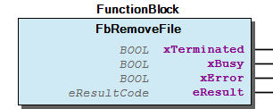
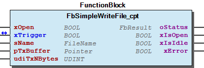
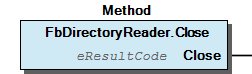
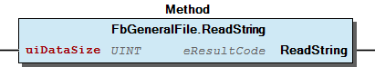
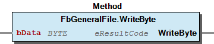

# WagoAppFileDir v1.6.2.1 (WAGO) - Complete Documentation


## 📋 Library Information

- **Company:** WAGO
- **Title:** WagoAppFileDir
- **Version:** 1.6.2.1
- **Categories:** WAGO FunctionalView|Base; WAGO LayerView|App; Application
- **Author:** WAGO / u013972
- **Placeholder:** WagoAppFileDir

### Description ¶


This document is automatically generated. Because of this, the chapter 30 Visualization is not shown in this document. If you are interested in getting to know more about visualization, we refer to the library manager of e!Cockpit.

This library provides access to files and directories on application level. [1]

This document is automatically generated. Because of this, the chapter 30 Visualization is not shown in this document. If you are interested in getting to know more about visualization, we refer to the library manager of e!Cockpit. This library provides access to files and directories on application level. [1]

### Contents: ¶


Contents: - Documentation Index 10 Documentation - WagoAppFileDir Library Documentation Project Information Library Information Function Blocks - FbBehaviourModel_FileDir_ChannelledTrigger (FB) - FbChangeWorkingDirectory (FB) - FbCheckDirectoryExists (FB) - FbCheckFileExists (FB) - FbCopyFile (FB) - FbDirectoryReader (FB) - FbDirectoryReader_cpt (FB) - FbGeneralFile (FB) - FbGeneralFile_Close_mod (FB) - FbGeneralFile_GetPos_mod (FB) - ... and 23 more Methods - FbChangeWorkingDirectory.Start (METH) - FbCheckDirectoryExists.Start (METH) - FbCheckFileExists.Start (METH) - FbCopyFile.Start (METH) - FbDirectoryReader.Close (METH) - FbDirectoryReader.Open (METH) - FbDirectoryReader.Read (METH) - FbGeneralFile.Close (METH) - FbGeneralFile.GetPos (METH) - FbGeneralFile.Open (METH) - ... and 17 more Program Organization Base Components Modular Components Global Variable Lists - LibraryResult (GVL) - ResultItems (GVL) - VersionHistory (GVL) Other Components - 01 File Usage - 01 File Usage - 02 Directory Scanning - 02 Directory Scanning - 03 FileSystem Organization - 04 Resource Information - 05 Working Directory - 10 Compact - 30 Behaviour Models - ParameterList (PARAMS)

### Indices and tables ¶


| [1] | Based on WagoAppFileDir.library, last modified 25.05.2021, 12:46:01. LibDoc 3.5.15.30 |

© WAGO Kontakttechnik GmbH & Co. KG, Germany 2018 – All rights reserved. For the avoidance of doubt, this copyright notice does not only apply to the information above but also and primarily to the described library itself. Please note that third-party products are always mentioned without reference to intellectual property rights, including patents, utility models, designs and trademarks, accordingly the existence of such rights cannot be excluded. WAGO is a registered trademark of WAGO Verwaltungsgesellschaft mbH.

- File and Project Information - Library Reference © WAGO Kontakttechnik GmbH & Co. KG, Germany 2018 – All rights reserved. For the avoidance of doubt, this copyright notice does not only apply to the information above but also and primarily to the described library itself. Please note that third-party products are always mentioned without reference to intellectual property rights, including patents, utility models, designs and trademarks, accordingly the existence of such rights cannot be excluded. WAGO is a registered trademark of WAGO Verwaltungsgesellschaft mbH.

### Documentation Index


## 10 Documentation


- doc10_general (FB) - General Interface of each FB Method oriented Interface - Scheduling Mode - Abortion Result Codes Not implemented functions Path and file notations - Canonical Filenames and Pathnames Prefix - Path - Filename and path components - Character Set - Portability Other Forms of pathes and filenames

## WagoAppFileDir Library Documentation


| Company: | WAGO |
| Title: | WagoAppFileDir |
| Version: | 1.6.2.1 |
| Categories: | WAGO FunctionalView\|Base; WAGO LayerView\|App; Application |
| Author: | WAGO / u013972 |
| Placeholder: | WagoAppFileDir |

### Description


This document is automatically generated. Because of this, the chapter 30 Visualization is not shown in this document. If you are interested in getting to know more about visualization, we refer to the library manager of e!Cockpit.

This library provides access to files and directories on application level. [1]

This document is automatically generated. Because of this, the chapter 30 Visualization is not shown in this document. If you are interested in getting to know more about visualization, we refer to the library manager of e!Cockpit. This library provides access to files and directories on application level. [1]

### Contents:


- 10 Documentation doc10_general (FB) - General Interface of each FB - Result Codes - Not implemented functions - Path and file notations 20 Program Organization Units - 10 Compact - 20 Modular - 30 Base 30 Behaviour Models - FbBehaviourModel_FileDir_ChannelledTrigger (FB) LibraryResult (GVL) ParameterList (PARAMS) ResultItems (GVL) VersionHistory (GVL)

### Indices and tables


| [1] | Based on WagoAppFileDir.library, last modified 25.05.2021, 12:46:01. LibDoc 3.5.15.30 |

© WAGO Kontakttechnik GmbH & Co. KG, Germany 2018 – All rights reserved. For the avoidance of doubt, this copyright notice does not only apply to the information above but also and primarily to the described library itself. Please note that third-party products are always mentioned without reference to intellectual property rights, including patents, utility models, designs and trademarks, accordingly the existence of such rights cannot be excluded. WAGO is a registered trademark of WAGO Verwaltungsgesellschaft mbH.

- File and Project Information - Library Reference © WAGO Kontakttechnik GmbH & Co. KG, Germany 2018 – All rights reserved. For the avoidance of doubt, this copyright notice does not only apply to the information above but also and primarily to the described library itself. Please note that third-party products are always mentioned without reference to intellectual property rights, including patents, utility models, designs and trademarks, accordingly the existence of such rights cannot be excluded. WAGO is a registered trademark of WAGO Verwaltungsgesellschaft mbH.

### Project Information


## File and Project Information


| Scope | Name | Type | Content |
| --- | --- | --- | --- |
| FileHeader | libraryFile | string | WagoAppFileDir.library |
| contentFile | WagoAppFileDir_clr.json |
| productName | e!COCKPIT |
| creationDateTime | date | 25.05.2021, 12:46:09 |
| companyName | string | WAGO |
| ProjectInformation | LastModificationDateTime | date | 25.05.2021, 12:46:01 |
| Description | string | See: Description |
| Copyright | © WAGO Kontakttechnik GmbH & Co. KG, Germany 2018 – All rights reserved. |
| Author | WAGO / u013972 |
| AutoResolveUnbound | bool | True |
| Placeholder | string | WagoAppFileDir |
| Company | WAGO |
| DocFormat | reStructuredText |
| Project | WagoAppFileDir |
| DefaultNamespace |  |
| Version | version | 1.6.2.1 |
| Title | string | WagoAppFileDir |
| LibraryCategories | library-category-list | WAGO FunctionalView\|Base; WAGO LayerView\|App; Application |
| CompiledLibraryCompatibilityVersion | string | CODESYS V3.5 SP16 Patch 3 |

### Library Information


## Library Reference


This is a dictionary of all referenced libraries and their name spaces.

This is a dictionary of all referenced libraries and their name spaces.

### WagoSysAsync


#### Library Identification


Placeholder: WagoSysAsync Default Resolution: WagoSysAsync, * (WAGO) Namespace: WagoSysAsync

#### Library Properties


| LinkAllContent: False QualifiedOnly: False | Key: WagoSysAsync SystemLibrary: False | Optional: False |

### WagoSysBehaviourModels


#### Library Identification


Placeholder: WagoSysBehaviourModels Default Resolution: WagoSysBehaviourModels, * (WAGO) Namespace: WagoSysBehaviourModels

#### Library Properties


| LinkAllContent: False Optional: False | QualifiedOnly: False Key: WagoSysBehaviourModels | SystemLibrary: False PublishSymbolsInContainer: True |

### WagoSysErrorBase


#### Library Identification


Placeholder: WagoSysErrorBase Default Resolution: WagoSysErrorBase, * (WAGO) Namespace: WagoSysErrorBase

#### Library Properties


| LinkAllContent: False QualifiedOnly: False | Key: WagoSysErrorBase SystemLibrary: False | Optional: False |

#### Library Parameter


Parameter: RES_LOG_MAX_FILESIZE = 2000 Parameter: RES_LOG_MAX_FILES = 1 Parameter: RES_LOG_MAX_ENTRIES = 200 Parameter: RES_LOG_NAME = ‘WagoAppResultLogger’

### WagoSysFileDir


#### Library Identification


Placeholder: WagoSysFileDir Default Resolution: WagoSysFileDir, * (WAGO) Namespace: WagoSysFileDir

#### Library Properties


| LinkAllContent: False QualifiedOnly: False | Key: WagoSysFileDir SystemLibrary: False | Optional: False |

### WagoSysPlainMem


#### Library Identification


Placeholder: WagoSysPlainMem Default Resolution: WagoSysPlainMem, * (WAGO) Namespace: WagoSysPlainMem

#### Library Properties


| LinkAllContent: False Optional: False | QualifiedOnly: False Key: WagoSysPlainMem | SystemLibrary: False PublishSymbolsInContainer: True |

### WagoSysVersion


#### Library Identification


Name: WagoSysVersion Version: 1.0.0.0 Company: WAGO Namespace: WagoSysVersion

#### Library Properties


| LinkAllContent: False QualifiedOnly: False | Key: WagoSysVersion, 1.0.0.0 (WAGO) SystemLibrary: False | Optional: False |

### WagoTypesCommon


#### Library Identification


Placeholder: WagoTypesCommon Default Resolution: WagoTypesCommon, * (WAGO) Namespace: WagoTypes

#### Library Properties


| LinkAllContent: False Optional: False | QualifiedOnly: False Key: WagoTypesCommon | SystemLibrary: False PublishSymbolsInContainer: True |

### WagoTypesErrorBase


#### Library Identification


Placeholder: WagoTypesErrorBase Default Resolution: WagoTypesErrorBase, * (WAGO) Namespace: WagoTypesErrorBase

#### Library Properties


| LinkAllContent: False QualifiedOnly: False | Key: WagoTypesErrorBase SystemLibrary: False | Optional: False |

### Function Blocks


## FbBehaviourModel_FileDir_ChannelledTrigger (FB)


| Scope | Name | Type | Comment | Inherited from |
| --- | --- | --- | --- | --- |
| Output | oStatus | FbResult | Status object (see WagoSysErrorBase). | FbBehaviourModel_oStatus_Base |
| Input | xOpen | BOOL | Opening and closing of the channel. |  |
| Output | xIsOpen | BOOL | Indicates an open channel. |  |
| xIsIdle | BOOL | Indicates that the channel can be opened. |  |
| xError | BOOL | Indicates that an error has occurred |  |
| Inout | xTrigger | BOOL | Triggers the action. |  |

| protOpen - result codes |
| 0 | Opening of the channel was successfully completed. |
| EAGAIN | Opening still in progress. |
| other | Opening failed. Channel returns to idle state without calling close(). |

| protClose - result codes |
| 0 | Closing of the channel was successfully completed. |
| EAGAIN | Closing still in progress. |
| other | Closing failed for some reason. |

| protRun - result codes |
| 0 | The action has successfully terminated, reset xTxTrigger again. |
| EAGAIN | The action has to be repeated. |
| other | The action has terminated with on error, reset xTxTrigger again. |

Channelled Trigger-model with oStatus .

Graphical Illustration

Function Description

This base model is completely identical to ‘WagoChannelledTrigger’ with the only difference that the trigger variable and the status output are named slightly differently here.

It is composed of two separated sub-modules:

Protected methods

The user of this Model has to re-implement the methods of this interface according to his needs. These methods are PUBLIC for technical reasons only, while semantically they are to be treated as PROTECTED, as is usual for the other models. Do not call them directly.

The property IsInitialCycle which is provided in other models is re-implemented twice for use in the pseudo-protected methods. One is named IsInitialChannelCycle, the other is named IsInitialTriggerCycle. They reflect the states of the corresponding parts.

Result Codes

The expected result codes for the Pseudo-PROTECTED methods are identical to those in the description of the individual components (WagoChannel and WagoTxTrigger):

Attention: The derived child FB has to call SUPER^(xTxTrigger:=xTxTrigger); in its body.

Interface variables Function Channelled Trigger-model with oStatus . Graphical Illustration  Function Description This base model is completely identical to ‘WagoChannelledTrigger’ with the only difference that the trigger variable and the status output are named slightly differently here. It is composed of two separated sub-modules: Channel: This part controls the opening and closing of an associated communication channel. The description of WagoChannel applies to this part. Please note that any parameters for opening the channel (such as filenames, ip-addresses, COM-ports, etc) only apply to FBs which are derived from this model, and not to this base model itself. Trigger: This part controls the transmission of data. The description of WagoTxTrigger directly applies to it. The TxTrigger part is only active while the Channel -Part is open. Otherwise the main runner is not called. Protected methods The user of this Model has to re-implement the methods of this interface according to his needs. These methods are PUBLIC for technical reasons only, while semantically they are to be treated as PROTECTED, as is usual for the other models. Do not call them directly. Properties The property IsInitialCycle which is provided in other models is re-implemented twice for use in the pseudo-protected methods. One is named IsInitialChannelCycle, the other is named IsInitialTriggerCycle. They reflect the states of the corresponding parts. Result Codes The expected result codes for the Pseudo-PROTECTED methods are identical to those in the description of the individual components (WagoChannel and WagoTxTrigger): Attention: The derived child FB has to call SUPER^(xTxTrigger:=xTxTrigger); in its body.

## FbChangeWorkingDirectory (FB)


| Scope | Name | Type | Inherited from |
| --- | --- | --- | --- |
| Output | xTerminated | BOOL | Fb_Template_Async_Base_IF |
| xBusy | BOOL | Fb_Template_Async_Base_IF |
| xError | BOOL | Fb_Template_Async_Base_IF |
| eResult | eResultCode | Fb_Template_Async_Base_IF |

| Result Codes |
| 0 | Success |
| ENOENT | The desired directory does not exist and xForce is not set. |
| ENOSYS | This functionality is not supported by the target hardware. |
| EINVAL | Bad name or prefix |
| EACCES | A component of the path could not be created. |
| ENOTDIR | A component used as a directory in the name is not, in fact, a directory. |
| ENAMETOOLONG | The pathname was too long. (if targets have limitations) |

Changes the current Working Directory to a given path.

Graphical Illustration

Function Description

This FB is started with the method Start() which carries all input parameters. Output values are valid after the output xTerminated is set by this FB. While xBusy is set, further calls of Start() will be rejected.

Interface variables Function Changes the current Working Directory to a given path. Graphical Illustration  Function Description This FB is started with the method Start() which carries all input parameters. Output values are valid after the output xTerminated is set by this FB. While xBusy is set, further calls of Start() will be rejected. - FbChangeWorkingDirectory.Start (METH)

## FbCheckDirectoryExists (FB)


| Scope | Name | Type | Comment | Inherited from |
| --- | --- | --- | --- | --- |
| Output | xTerminated | BOOL |  | Fb_Template_Async_Base_IF |
| xBusy | BOOL |  | Fb_Template_Async_Base_IF |
| xError | BOOL |  | Fb_Template_Async_Base_IF |
| eResult | eResultCode |  | Fb_Template_Async_Base_IF |
| xDoesExist | BOOL | Directory does exist. |  |
| xDoesnotexist | BOOL | Directory does not exist. |  |
| xCannotDecide | BOOL | Cannot be decided. |  |

Checks if a named directory exists or not.

Graphical Illustration

Function Description

The results are provided by the output variables. If the named resource is not a directory but a file, this counts as ‘does not exist’.

No errors are expected.

This FB is started with the method Start() which carries all input parameters. Output values are valid after the output xTerminated is set by this FB. While xBusy is set, further calls of Start() will be rejected.

Interface variables Function Checks if a named directory exists or not. Graphical Illustration  Function Description The results are provided by the output variables. If the named resource is not a directory but a file, this counts as ‘does not exist’. No errors are expected. This FB is started with the method Start() which carries all input parameters. Output values are valid after the output xTerminated is set by this FB. While xBusy is set, further calls of Start() will be rejected. - FbCheckDirectoryExists.Start (METH)

## FbCheckFileExists (FB)


| Scope | Name | Type | Comment | Inherited from |
| --- | --- | --- | --- | --- |
| Output | xTerminated | BOOL |  | Fb_Template_Async_Base_IF |
| xBusy | BOOL |  | Fb_Template_Async_Base_IF |
| xError | BOOL |  | Fb_Template_Async_Base_IF |
| eResult | eResultCode |  | Fb_Template_Async_Base_IF |
| xDoesExist | BOOL | File does exist. |  |
| xDoesnotexist | BOOL | File does not exist. |  |
| xCannotDecide | BOOL | Cannot be decided. |  |

Checks if a named regular file exists or not.

Graphical Illustration

Function Description

The results are provided by the output variables. If the named resource is not a file but a directory, this counts as ‘does not exist’.

No errors are expected.

This FB is started with the method Start() which carries all input parameters. Output values are valid after the output xTerminated is set by this FB. While xBusy is set, further calls of Start() will be rejected.

Interface variables Function Checks if a named regular file exists or not. Graphical Illustration  Function Description The results are provided by the output variables. If the named resource is not a file but a directory, this counts as ‘does not exist’. No errors are expected. This FB is started with the method Start() which carries all input parameters. Output values are valid after the output xTerminated is set by this FB. While xBusy is set, further calls of Start() will be rejected. - FbCheckFileExists.Start (METH)

## FbCopyFile (FB)


| Scope | Name | Type | Inherited from |
| --- | --- | --- | --- |
| Output | xTerminated | BOOL | Fb_Template_Async_Base_IF |
| xBusy | BOOL | Fb_Template_Async_Base_IF |
| xError | BOOL | Fb_Template_Async_Base_IF |
| eResult | eResultCode | Fb_Template_Async_Base_IF |

| Result Codes |
| 0 | Success |
| ENOSYS | This functionality is not supported by the target hardware. |
| EINVAL | Bad Prefix or otherwise invald filename or pathname. |
| ENOENT | The source file does not exist. |
| EISDIR | The source file names a directory, not a file. |
| ENOTDIR | A component of the destination path is, in fact, not a directory. |
| EEXIST | The destination file exists and cannot be overwritten. |
| EACCES | Destination Path cannot be created for some reason. |
| EBUSY | The destination file exists and its removal failed unexpectedly. |
| ENOSPC | The device containing the file has no room for the new directory entry. |

Copies one file to a second location.

Graphical Illustration

Function Description

The ‘sDestinationName’ may denote a file name or a directory name, in which case the name of the file remains the same and only the path changes.

If the new file name needs the creation of parent directories, these will be created.

If the destination file already exists, this function fails with EEXIST unless the xOverwrite flag is set. In that case, this function tries to delete the existing file. If deletion fails, the function will again fail with EEXIST.

This FB is started with the method Start() which carries all input parameters. Output values are valid after the output xTerminated is set by this FB. While xBusy is set, further calls of Start() will be rejected.

Interface variables Function Copies one file to a second location. Graphical Illustration  Function Description The ‘sDestinationName’ may denote a file name or a directory name, in which case the name of the file remains the same and only the path changes. If the new file name needs the creation of parent directories, these will be created. If the destination file already exists, this function fails with EEXIST unless the xOverwrite flag is set. In that case, this function tries to delete the existing file. If deletion fails, the function will again fail with EEXIST. This FB is started with the method Start() which carries all input parameters. Output values are valid after the output xTerminated is set by this FB. While xBusy is set, further calls of Start() will be rejected. - FbCopyFile.Start (METH)

## FbDirectoryReader (FB)


| Scope | Name | Type | Comment | Inherited from |
| --- | --- | --- | --- | --- |
| Output | xTerminated | BOOL |  | Fb_Template_Async_Base_IF |
| xBusy | BOOL |  | Fb_Template_Async_Base_IF |
| xError | BOOL |  | Fb_Template_Async_Base_IF |
| eResult | eResultCode |  | Fb_Template_Async_Base_IF |
| Inout | FileProperties | typFileProperties | Output buffer for file status |  |
| Output | xIsOpen | BOOL | Indicates an open directory |  |
| xEofReached | BOOL | Indicates that no more data is to be read. |  |

| Result Codes |
| 0 | Success |
| EBADF | Directory not open. |
| ENODATA | No data available (end of directory reached). |
| EINVAL | The name is invalid (e.g. wrong prefix). |
| ENOTDIR | The name is not a directory. |

Scans a directory and retrieves informations about its contents.

Graphical Illustration

Function Description

When the last entry has been read or the directory is empty, the following Read() returns ENODATA. Special system entries, such as ‘.’ and ‘..’ are generally skipped. Please note that this FB scans only one hierarchical level of the directory, i.e. the contents of subdirectories are not scanned.

The returned data is returned as typFileProperties .

If some of these properties are not supported by the addressed file system, they carry a reasonable default value. E.g. for non-windows file systems, the xArchive flag will always be FALSE if the file system does not contain such an attribute.

Asynchronous Behaviour:

The methods Open(), Read(), and Close() will return immediately, but they leave their jobs in the asynchronous domain, which is indicated by the output xBusy .

While xBusy is TRUE no further methods must be called.

The termination of the asynchronous execution is indicated by xTerminated . The read data structure, eResult , and other outputs are valid only after xTerminated is TRUE.

Interface variables Function Scans a directory and retrieves informations about its contents. Graphical Illustration  Function Description Usage : 1. Open the directory with the Open() method. 2. Read data with Read() until ENODATA is indicated. 3. Apply Close(). When the last entry has been read or the directory is empty, the following Read() returns ENODATA. Special system entries, such as ‘.’ and ‘..’ are generally skipped. Please note that this FB scans only one hierarchical level of the directory, i.e. the contents of subdirectories are not scanned. The returned data is returned as typFileProperties . If some of these properties are not supported by the addressed file system, they carry a reasonable default value. E.g. for non-windows file systems, the xArchive flag will always be FALSE if the file system does not contain such an attribute. Asynchronous Behaviour: The methods Open(), Read(), and Close() will return immediately, but they leave their jobs in the asynchronous domain, which is indicated by the output xBusy . While xBusy is TRUE no further methods must be called. The termination of the asynchronous execution is indicated by xTerminated . The read data structure, eResult , and other outputs are valid only after xTerminated is TRUE. - FbDirectoryReader.Close (METH) - FbDirectoryReader.Open (METH) - FbDirectoryReader.Read (METH)

## FbDirectoryReader_cpt (FB)


| Scope | Name | Type | Comment | Inherited from |
| --- | --- | --- | --- | --- |
| Output | oStatus | FbResult | Status object (see WagoSysErrorBase). | FbBehaviourModel_oStatus_Base |
| Input | xOpen | BOOL | Opening and closing of the channel. | FbBehaviourModel_FileDir_ChannelledTrigger |
| Output | xIsOpen | BOOL | Indicates an open channel. | FbBehaviourModel_FileDir_ChannelledTrigger |
| xIsIdle | BOOL | Indicates that the channel can be opened. | FbBehaviourModel_FileDir_ChannelledTrigger |
| xError | BOOL | Indicates that an error has occurred | FbBehaviourModel_FileDir_ChannelledTrigger |
| Inout | xTrigger | BOOL | Triggers the action. | FbBehaviourModel_FileDir_ChannelledTrigger |
| Input | sDirname | STRING | Name of the directory which is to be checked. |  |
| Inout | typPropertyBuffer | typFileProperties | Output Buffer for file status. |  |
| Output | xEofReached | BOOL | No more entries to be read |  |

| Result Codes |
| 0 | Success |
| EBADF | Directory not open |
| ENODATA | No data available (end of directory reached). |
| EINVAL | Name is invalid. (e.g. wrong prefix) |
| ENOTDIR | Name is not a directory. |

Reads the contents of a directory sequentially.

Graphical Illustration

Function Description

This FB reads a directory sequentially and delivers the status of each directory entry into a typed buffer space ‘typFileProperties’ .

It implements the behaviour model ‘WagoChannelledTrigger’ , i.e. a transition from FALSE to TRUE at the input xOpen starts the reading process. With the falling edge of xOpen the FB is closed again.

Once the FB is open, each FALSE to TRUE transition will fill the result buffer ‘typPropertyBuffer’ with the properties of the next entry in the directory. System entries as ‘.’ and ‘..’ will be skipped.

A TRUE at the output xEofReached indicates that all entries of a directory have been read. After this point, further xTrigger edges will deliver empty result buffers and the code ENODATA at the status output.

Interface variables Function Reads the contents of a directory sequentially. Graphical Illustration  Function Description This FB reads a directory sequentially and delivers the status of each directory entry into a typed buffer space ‘typFileProperties’ . It implements the behaviour model ‘WagoChannelledTrigger’ , i.e. a transition from FALSE to TRUE at the input xOpen starts the reading process. With the falling edge of xOpen the FB is closed again. Once the FB is open, each FALSE to TRUE transition will fill the result buffer ‘typPropertyBuffer’ with the properties of the next entry in the directory. System entries as ‘.’ and ‘..’ will be skipped. A TRUE at the output xEofReached indicates that all entries of a directory have been read. After this point, further xTrigger edges will deliver empty result buffers and the code ENODATA at the status output.

## FbGeneralFile (FB)


| Scope | Name | Type | Comment | Inherited from |
| --- | --- | --- | --- | --- |
| Output | xTerminated | BOOL |  | Fb_Template_Async_Base_IF |
| xBusy | BOOL |  | Fb_Template_Async_Base_IF |
| xError | BOOL |  | Fb_Template_Async_Base_IF |
| eResult | eResultCode |  | Fb_Template_Async_Base_IF |
| xIsOpen | BOOL | Indicates that the file is open. |  |
| xEofReached | BOOL | Indicates that the end of the file has been reached. |  |
| liGetPos | LINT | Last position of file pointer. |  |
| udiRxNBytes | UDINT | Result of read(): Number of actually read bytes. |  |
| bRead | BYTE | Result of ReadByte(). |  |
| sLine | STRING(255) | Result of ReadString(). |  |

```
TYPE eProgress  // for the state machine
(
  idle := 0,
  opening,
  writing1,
  writing2,
  closing,
  terminated
); END_TYPE

VAR
  Progress : eProgress;      // a state machine
  File     : FbGeneralFile;
END_VAR

File();
CASE Progress OF

idle:
  IF <startcondition> THEN
     File.Open('Filename',FAM_WRITE,0,FALSE);
     progress := opening;
  END_IF

opening:
  IF File.xTerminated THEN
     File.Write(ImportantData,SizeOf(ImportantData));
     progress := writing1;
  END_IF

writing1:
  IF File.xTerminated THEN
     File.Write(MoreData,SizeOf(MoreData);
     progress := writing2;
  END_IF

writing2:
  IF File.xTerminated THEN
     File.Close();
     progress := closing;
  END_IF

closing:
  IF File.xTerminated THEN
     progress := terminated;
  END_IF

END_CASE
```

Base FB for file handling with comprehensive functionality.

Graphical Illustration

Function Description

As all functions are triggered using methods, this FB has no dedicated input variables.

Example: Writing some data into a file

Interface variables Function Base FB for file handling with comprehensive functionality. Graphical Illustration  Function Description As all functions are triggered using methods, this FB has no dedicated input variables. Usage: 1. File operations are initiated by trigger methods Open(), Close(), Write(), etc which also deliver parameters to the FbGeneralFile. 2. When these Functions are called, the underlying functionality is carried out in the background and the trigger methods return immediately. The application has to cyclically observe xTerminated in order to determine whether the triggered functionality has been completed or not. While xBusy is TRUE , all further triggering calls are rejected with EBUSY. 3. Results of the operations are delivered at the outputs of the FB, after xTerminated is set. Example: Writing some data into a file - FbGeneralFile.Close (METH) - FbGeneralFile.GetPos (METH) - FbGeneralFile.Open (METH) - FbGeneralFile.Read (METH) - FbGeneralFile.ReadByte (METH) - FbGeneralFile.ReadString (METH) - FbGeneralFile.Seek (METH) - FbGeneralFile.Write (METH) - FbGeneralFile.WriteByte (METH) - FbGeneralFile.WriteString (METH)

## FbGeneralFile_Close_mod (FB)


| Scope | Name | Type | Comment | Inherited from |
| --- | --- | --- | --- | --- |
| Output | oStatus | FbResult | Status object (see WagoSysErrorBase). | FbBehaviourModel_oStatus_Base |
| Input | xExecute | BOOL | Triggers the execution of the action. | FbBehaviourModel_WagoAppExecute |
| Output | xError | BOOL | Indicates that an error has occurred. | FbBehaviourModel_WagoAppExecute |
| xDone | BOOL | Successful completion of the action. | FbBehaviourModel_WagoAppExecute |
| xBusy | BOOL | Action is still in progress. | FbBehaviourModel_WagoAppExecute |
| Inout | Instance | FbGeneralFile | The file object on which the FBs operate. | FbGeneralFile_Base_mod |
| Output | xIsOpen | BOOL | Indicates that the file object is open. | FbGeneralFile_Base_mod |
| xEofReached | BOOL | No more data to read. | FbGeneralFile_Base_mod |

| Result Codes |
| 0 | Success |
| EBADF | File-FB was not open. |
| ENOSYS | The desired function is not implemented. |
| EINPROGRESS | The asynchronous process has been started, but has not yet terminated (temporary). |
| ECANCELED | Execution was terminated prematurely by applying Abort . |
| ETIMEDOUT | Execution terminated prematurely due to Timeout . |

Modular FB for closing a file.

Graphical Illustration

Function Description

This FB implements the behaviour model ‘WagoExecute’ , as explained in more detail in FbGeneralFile_Open_mod (FB) . On a rising edge of the input xExecute the FB closes the file.

Interface variables Function Modular FB for closing a file. Graphical Illustration  Function Description This FB implements the behaviour model ‘WagoExecute’ , as explained in more detail in FbGeneralFile_Open_mod (FB) . On a rising edge of the input xExecute the FB closes the file.

## FbGeneralFile_GetPos_mod (FB)


| Scope | Name | Type | Comment | Inherited from |
| --- | --- | --- | --- | --- |
| Output | oStatus | FbResult | Status object (see WagoSysErrorBase). | FbBehaviourModel_oStatus_Base |
| Input | xExecute | BOOL | Triggers the execution of the action. | FbBehaviourModel_WagoAppExecute |
| Output | xError | BOOL | Indicates that an error has occurred. | FbBehaviourModel_WagoAppExecute |
| xDone | BOOL | Successful completion of the action. | FbBehaviourModel_WagoAppExecute |
| xBusy | BOOL | Action is still in progress. | FbBehaviourModel_WagoAppExecute |
| Inout | Instance | FbGeneralFile | The file object on which the FBs operate. | FbGeneralFile_Base_mod |
| Output | xIsOpen | BOOL | Indicates that the file object is open. | FbGeneralFile_Base_mod |
| xEofReached | BOOL | No more data to read. | FbGeneralFile_Base_mod |
| liPos | LINT | Actual position within the file. |  |

| Result Codes |
| 0 | Success |
| EBADF | The file is not open. |
| EINPROGRESS | The asynchronous process has been started, but has not yet terminated (temporary). |
| ECANCELED | Execution was terminated prematurely by applying Abort . |
| ETIMEDOUT | Execution terminated prematurely due to Time-out. |

Modular FB for retrieving the positition within a file.

Graphical Illustration

Function Description

This FB implements the behaviour model ‘WagoExecute’ , as explained in more detail in FbGeneralFile_Open_mod (FB) .

On a rising edge of the input xExecute the FB retrieves the position of the file pointer. If the position of the file index is invalid or cannot be retrieved, -1 is returned.

Interface variables Function Modular FB for retrieving the positition within a file. Graphical Illustration  Function Description This FB implements the behaviour model ‘WagoExecute’ , as explained in more detail in FbGeneralFile_Open_mod (FB) . On a rising edge of the input xExecute the FB retrieves the position of the file pointer. If the position of the file index is invalid or cannot be retrieved, -1 is returned.

## FbGeneralFile_Open_mod (FB)


| Scope | Name | Type | Comment | Inherited from |
| --- | --- | --- | --- | --- |
| Output | oStatus | FbResult | Status object (see WagoSysErrorBase). | FbBehaviourModel_oStatus_Base |
| Input | xExecute | BOOL | Triggers the execution of the action. | FbBehaviourModel_WagoAppExecute |
| Output | xError | BOOL | Indicates that an error has occurred. | FbBehaviourModel_WagoAppExecute |
| xDone | BOOL | Successful completion of the action. | FbBehaviourModel_WagoAppExecute |
| xBusy | BOOL | Action is still in progress. | FbBehaviourModel_WagoAppExecute |
| Inout | Instance | FbGeneralFile | The file object on which the FBs operate. | FbGeneralFile_Base_mod |
| Output | xIsOpen | BOOL | Indicates that the file object is open. | FbGeneralFile_Base_mod |
| xEofReached | BOOL | No more data to read. | FbGeneralFile_Base_mod |
| Input | sName | FileName | Name of the File |  |
| eAccMode | eFileAccessMode | Access-Mode of the file |  |
| eSyncMode | eFileSyncMode | Synchronization between file system and physical media |  |
| xExclusive | BOOL | Exclusive access (always FALSE). |  |

| Result Codes |
| 0 | Success |
| EINVAL | Invalid Argument (Bad prefix, empty filename or illegal access modes) |
| ENAMETOOLONG | The length of the filename including its complete path is too long. |
| ENOENT | The File does not exist. |
| ENOTDIR | A component of the path is not a directory. |
| EBUSY | The exclusivity-restrictions would be violated. FB has not yet terminated. |
| EPERM | The File could not be opened in the desired access-mode, or exclusivity mode could not be set. |
| EACCES | Other problems while opening the file. |
| EINPROGRESS | The asynchronous process has been started, but has not yet terminated (temporary). |
| ECANCELED | Execution was terminated prematurely by applying Abort . |
| ETIMEDOUT | Execution terminated prematurely due to Timeout . |

Modular FB for opening a file.

Graphical Illustration

Function Description

This FB implements the behaviour model ‘WagoExecute’ .

With the rising edge of xExecute, the file is opened in a mode defined by the input parameters. Please, refer to the section ‘Type Definition’ or to the library WagoTypesCommon for details about file modes. (The input xExclusive prepares this FB for a future feature. It must always be FALSE.)

Modular FBs in this section are designed to each represent each a single operation step with each instance. The ‘xDone’ output of the first instance triggers the execution of the following instance. Thus we finally get a chain of steps which is processed virtually sequentially, as shown in the following example.

Please note that for production code appropriate error handling should be provided which is not shown here.

Chain of modular FBs

The in-out variable ‘Instance’ must be connected to an instance of an FbGeneralFile (FB) . The body of that ‘Instance’ must be operated cyclically, but no further stimulus to this Instance need be applied,because the modular FBs will take care of this internally. All FBs in such a ‘chain’ as indicated in the figure above must be connected to the same ‘Instance’-FB.

Interface variables Function Modular FB for opening a file. Graphical Illustration  Function Description This FB implements the behaviour model ‘WagoExecute’ . With the rising edge of xExecute, the file is opened in a mode defined by the input parameters. Please, refer to the section ‘Type Definition’ or to the library WagoTypesCommon for details about file modes. (The input xExclusive prepares this FB for a future feature. It must always be FALSE.) Modular FBs in this section are designed to each represent each a single operation step with each instance. The ‘xDone’ output of the first instance triggers the execution of the following instance. Thus we finally get a chain of steps which is processed virtually sequentially, as shown in the following example. Please note that for production code appropriate error handling should be provided which is not shown here.  Chain of modular FBs The in-out variable ‘Instance’ must be connected to an instance of an FbGeneralFile (FB) . The body of that ‘Instance’ must be operated cyclically, but no further stimulus to this Instance need be applied,because the modular FBs will take care of this internally. All FBs in such a ‘chain’ as indicated in the figure above must be connected to the same ‘Instance’-FB.

## FbGeneralFile_ReadByte_mod (FB)


| Scope | Name | Type | Comment | Inherited from |
| --- | --- | --- | --- | --- |
| Output | oStatus | FbResult | Status object (see WagoSysErrorBase). | FbBehaviourModel_oStatus_Base |
| Input | xExecute | BOOL | Triggers the execution of the action. | FbBehaviourModel_WagoAppExecute |
| Output | xError | BOOL | Indicates that an error has occurred. | FbBehaviourModel_WagoAppExecute |
| xDone | BOOL | Successful completion of the action. | FbBehaviourModel_WagoAppExecute |
| xBusy | BOOL | Action is still in progress. | FbBehaviourModel_WagoAppExecute |
| Inout | Instance | FbGeneralFile | The file object on which the FBs operate. | FbGeneralFile_Base_mod |
| Output | xIsOpen | BOOL | Indicates that the file object is open. | FbGeneralFile_Base_mod |
| xEofReached | BOOL | No more data to read. | FbGeneralFile_Base_mod |
| bData | BYTE | The single byte which was read. |  |

| Result Codes |
| 0 | Success |
| EBADF | The file is not open for read access. |
| EINPROGRESS | The asynchronous process has been started, but has not yet terminated (temporary). |
| ECANCELED | Execution was terminated prematurely by applying Abort . |
| ETIMEDOUT | Execution terminated prematurely due to time-out. |

Reads a single byte.

Graphical Illustration

Function Description

This FB implements the behaviour model ‘WagoExecute’ , as explained in more detail in FbGeneralFile_Open_mod (FB) . On the rising edge of the input xExecute the FB reads one data byte from the file.

Interface variables Function Reads a single byte. Graphical Illustration  Function Description This FB implements the behaviour model ‘WagoExecute’ , as explained in more detail in FbGeneralFile_Open_mod (FB) . On the rising edge of the input xExecute the FB reads one data byte from the file.

## FbGeneralFile_ReadString_mod (FB)


| Scope | Name | Type | Comment | Inherited from |
| --- | --- | --- | --- | --- |
| Output | oStatus | FbResult | Status object (see WagoSysErrorBase). | FbBehaviourModel_oStatus_Base |
| Input | xExecute | BOOL | Triggers the execution of the action. | FbBehaviourModel_WagoAppExecute |
| Output | xError | BOOL | Indicates that an error has occurred. | FbBehaviourModel_WagoAppExecute |
| xDone | BOOL | Successful completion of the action. | FbBehaviourModel_WagoAppExecute |
| xBusy | BOOL | Action is still in progress. | FbBehaviourModel_WagoAppExecute |
| Inout | Instance | FbGeneralFile | The file object on which the FBs operate. | FbGeneralFile_Base_mod |
| Output | xIsOpen | BOOL | Indicates that the file object is open. | FbGeneralFile_Base_mod |
| xEofReached | BOOL | No more data to read. | FbGeneralFile_Base_mod |
| sLine | STRING(255) | The line of text which was read. |  |

| Result Codes |
| 0 | Success |
| EINVAL | No buffer space given (uiSize=0). |
| ENOSPC | The size of the logical line exceeds the space of the string buffer. |
| EBADF | The file is not open for read access. |
| ENODATA | No further data available. |
| ENOSYS | The desired function is not implemented. |
| EINPROGRESS | The asynchronous process has been started, but has not yet terminated (temporary). |
| ECANCELED | Execution was terminated prematurely by applying Abort``. |
| ETIMEDOUT | Execution terminated prematurely due to time-out. |

Modular FB for reading a single line of text

Graphical Illustration

Function Description

This FB implements the behaviour model ‘WagoExecute’ , as explained in more detail in FbGeneralFile_Open_mod (FB) . On the rising edge of the input xExecute the FB reads a string of bytes from the file until an end-of-line is encountered.

End-of-line is denoted by the byte <LF>, or <CR>, or the combination of both. The end-of-line characters are not part of the output string.

Interface variables Function Modular FB for reading a single line of text Graphical Illustration  Function Description This FB implements the behaviour model ‘WagoExecute’ , as explained in more detail in FbGeneralFile_Open_mod (FB) . On the rising edge of the input xExecute the FB reads a string of bytes from the file until an end-of-line is encountered. End-of-line is denoted by the byte <LF>, or <CR>, or the combination of both. The end-of-line characters are not part of the output string.

## FbGeneralFile_Read_mod (FB)


| Scope | Name | Type | Comment | Inherited from |
| --- | --- | --- | --- | --- |
| Output | oStatus | FbResult | Status object (see WagoSysErrorBase). | FbBehaviourModel_oStatus_Base |
| Input | xExecute | BOOL | Triggers the execution of the action. | FbBehaviourModel_WagoAppExecute |
| Output | xError | BOOL | Indicates that an error has occurred. | FbBehaviourModel_WagoAppExecute |
| xDone | BOOL | Successful completion of the action. | FbBehaviourModel_WagoAppExecute |
| xBusy | BOOL | Action is still in progress. | FbBehaviourModel_WagoAppExecute |
| Inout | Instance | FbGeneralFile | The file object on which the FBs operate. | FbGeneralFile_Base_mod |
| Output | xIsOpen | BOOL | Indicates that the file object is open. | FbGeneralFile_Base_mod |
| xEofReached | BOOL | No more data to read. | FbGeneralFile_Base_mod |
| Input | pRxBuffer | POINTER TO BYTE | Points to a buffer for read data. |  |
| udiRxBufferSize | UDINT | Size of the Buffer |  |
| Output | udiRxNBytes | UDINT | This much data was actually read. |  |

| Result Codes |
| 0 | Success |
| EBADF | The file is not open for read access. |
| EINVAL | Null-Pointer supplied for buffer or zero buffer size was specified. |
| ENODATA | No further data available (expected at the end of the file). |
| EACCES | Other unexpected problems while reading data. |
| ENOSYS | The desired function is not implemented. |
| EINPROGRESS | The asynchronous process has been started, but is not terminated (temporary). |
| ECANCELED | Execution was terminated prematurely by applying Abort . |
| ETIMEDOUT | Execution terminated prematurely due to time-out. |

Modular FB for reading from a file

Graphical Illustration

Function Description

This FB implements the behaviour model ‘WagoExecute’ , as explained in more detail in FbGeneralFile_Open_mod (FB) .

On the rising edge of the input xExecute the FB transfers a number of bytes from the file into the data buffer. The inputs pRxBuffer and udiRxBufferSize denote the location of the buffer and its size, respectively. The output udiRxNBytes indicates the number of bytes actually transferred, which could be less than the requested number if the end of file is reached.

Interface variables Function Modular FB for reading from a file Graphical Illustration  Function Description This FB implements the behaviour model ‘WagoExecute’ , as explained in more detail in FbGeneralFile_Open_mod (FB) . On the rising edge of the input xExecute the FB transfers a number of bytes from the file into the data buffer. The inputs pRxBuffer and udiRxBufferSize denote the location of the buffer and its size, respectively. The output udiRxNBytes indicates the number of bytes actually transferred, which could be less than the requested number if the end of file is reached.

## FbGeneralFile_Seek_mod (FB)


| Scope | Name | Type | Comment | Inherited from |
| --- | --- | --- | --- | --- |
| Output | oStatus | FbResult | Status object (see WagoSysErrorBase). | FbBehaviourModel_oStatus_Base |
| Input | xExecute | BOOL | Triggers the execution of the action. | FbBehaviourModel_WagoAppExecute |
| Output | xError | BOOL | Indicates that an error has occurred. | FbBehaviourModel_WagoAppExecute |
| xDone | BOOL | Successful completion of the action. | FbBehaviourModel_WagoAppExecute |
| xBusy | BOOL | Action is still in progress. | FbBehaviourModel_WagoAppExecute |
| Inout | Instance | FbGeneralFile | The file object on which the FBs operate. | FbGeneralFile_Base_mod |
| Output | xIsOpen | BOOL | Indicates that the file object is open. | FbGeneralFile_Base_mod |
| xEofReached | BOOL | No more data to read. | FbGeneralFile_Base_mod |
| Input | liPos | LINT | Desired relative position. |  |
| whence | eSeekMode | Relative to what? (Start, end or actual position) |  |

| Result Codes |
| 0 | Success |
| EBADF | The file is not open or not seekable. |
| EINVAL | Invalid argument for new position or seek mode ‘whence’. |
| EPERM | The Operation could not be performed as intended becauss of target limitations. |
| EACCES | The desired file position is out of its valid range. |
| ENOSYS | The desired function is not implemented. |
| EINPROGRESS | The asynchronous process has been started, but has not yet terminated (temporary). |
| ECANCELED | Execution was terminated prematurely by applying Abort . |
| ETIMEDOUT | Execution terminated prematurely due to time-out. |

Modular FB for setting the read and write position.

Graphical Illustration

Function Description

This FB implements the behaviour model ‘WagoExecute’ , as explained in more detail in FbGeneralFile_Open_mod (FB) . On the rising edge of the input xExecute the FB sets the file pointer to a new position.

The file pointer is an internal structure which determines the location inside a file from where data is read or where data is written to.

The desired new position is given by the input liPos. This number is either relative to the start of the file, or relative to the current end of the file or relative to the current file pointer position. The input whence (type eSeekMode , defined in WagoTypesCommon) determines which reference is used here.

Interface variables Function Modular FB for setting the read and write position. Graphical Illustration  Function Description This FB implements the behaviour model ‘WagoExecute’ , as explained in more detail in FbGeneralFile_Open_mod (FB) . On the rising edge of the input xExecute the FB sets the file pointer to a new position. The file pointer is an internal structure which determines the location inside a file from where data is read or where data is written to. The desired new position is given by the input liPos. This number is either relative to the start of the file, or relative to the current end of the file or relative to the current file pointer position. The input whence (type eSeekMode , defined in WagoTypesCommon) determines which reference is used here.

## FbGeneralFile_WriteByte_mod (FB)


| Scope | Name | Type | Comment | Inherited from |
| --- | --- | --- | --- | --- |
| Output | oStatus | FbResult | Status object (see WagoSysErrorBase). | FbBehaviourModel_oStatus_Base |
| Input | xExecute | BOOL | Triggers the execution of the action. | FbBehaviourModel_WagoAppExecute |
| Output | xError | BOOL | Indicates that an error has occurred. | FbBehaviourModel_WagoAppExecute |
| xDone | BOOL | Successful completion of the action. | FbBehaviourModel_WagoAppExecute |
| xBusy | BOOL | Action is still in progress. | FbBehaviourModel_WagoAppExecute |
| Inout | Instance | FbGeneralFile | The file object on which the FBs operate. | FbGeneralFile_Base_mod |
| Output | xIsOpen | BOOL | Indicates that the file object is open. | FbGeneralFile_Base_mod |
| xEofReached | BOOL | No more data to read. | FbGeneralFile_Base_mod |
| Input | bData | BYTE | The byte to write. |  |

| Result Codes |
| 0 | Success |
| EBADF | The file is not open for write access. |
| ENOSPC | There was no free space remaining on the device containing the file. |
| EACCES | Write operation failed for some other reason. |
| EINTR | Not all data could be written (e.g. due to internal interruption). |
| ENOSYS | The desired function is not implemented. |
| EINPROGRESS | The asynchronous process has been started, but has not yet terminated (temporary). |
| ECANCELED | Execution was terminated prematurely by applying Abort . |
| ETIMEDOUT | Execution terminated prematurely due to Timeout . |

Modular FB for writing a single byte.

Graphical Illustration

Function Description

This FB implements the behaviour model ‘WagoExecute’ , as explained in more detail in FbGeneralFile_Open_mod (FB) . On the rising edge of the input xExecute the FB writes one data byte to the file.

Interface variables Function Modular FB for writing a single byte. Graphical Illustration  Function Description This FB implements the behaviour model ‘WagoExecute’ , as explained in more detail in FbGeneralFile_Open_mod (FB) . On the rising edge of the input xExecute the FB writes one data byte to the file.

## FbGeneralFile_WriteString_mod (FB)


| Scope | Name | Type | Comment | Inherited from |
| --- | --- | --- | --- | --- |
| Output | oStatus | FbResult | Status object (see WagoSysErrorBase). | FbBehaviourModel_oStatus_Base |
| Input | xExecute | BOOL | Triggers the execution of the action. | FbBehaviourModel_WagoAppExecute |
| Output | xError | BOOL | Indicates that an error has occurred. | FbBehaviourModel_WagoAppExecute |
| xDone | BOOL | Successful completion of the action. | FbBehaviourModel_WagoAppExecute |
| xBusy | BOOL | Action is still in progress. | FbBehaviourModel_WagoAppExecute |
| Inout | Instance | FbGeneralFile | The file object on which the FBs operate. | FbGeneralFile_Base_mod |
| Output | xIsOpen | BOOL | Indicates that the file object is open. | FbGeneralFile_Base_mod |
| xEofReached | BOOL | No more data to read. | FbGeneralFile_Base_mod |
| Input | sData | STRING(255) | The string to write. |  |

| return codes |
| 0 | Success |
| EBADF | The file is not open for write access. |
| ENOSPC | There was no free space remaining on the device containing the file. |
| EACCES | Write operation failed for some other reason. |
| EINTR | Not all data could be written (e.g. due to internal interruption). |
| ENOSYS | The desired function is not implemented. |
| EINPROGRESS | The asynchronous process has been started, but has not yet terminated (temporary). |
| ECANCELED | Execution was terminated prematurely by applying Abort . |
| ETIMEDOUT | Execution terminated prematurely due to Timeout . |

Modular FB for writing data from a string

Graphical Illustration

Function Description

This FB implements the behaviour model ‘WagoExecute’ , as explained in more detail in FbGeneralFile_Open_mod (FB) . On the rising edge of the input xExecute the FB writes a string of bytes to the file. The number of bytes which are to be written is given by the length of the string. This could be any number between 0 and 255.

Note No EOL-indicator will be written unless explicitely contained in the string. The terminating zero is not written to the file either.

Interface variables Function Modular FB for writing data from a string Graphical Illustration  Function Description This FB implements the behaviour model ‘WagoExecute’ , as explained in more detail in FbGeneralFile_Open_mod (FB) . On the rising edge of the input xExecute the FB writes a string of bytes to the file. The number of bytes which are to be written is given by the length of the string. This could be any number between 0 and 255. Note No EOL-indicator will be written unless explicitely contained in the string. The terminating zero is not written to the file either.

## FbGeneralFile_Write_mod (FB)


| Scope | Name | Type | Comment | Inherited from |
| --- | --- | --- | --- | --- |
| Output | oStatus | FbResult | Status object (see WagoSysErrorBase). | FbBehaviourModel_oStatus_Base |
| Input | xExecute | BOOL | Triggers the execution of the action. | FbBehaviourModel_WagoAppExecute |
| Output | xError | BOOL | Indicates that an error has occurred. | FbBehaviourModel_WagoAppExecute |
| xDone | BOOL | Successful completion of the action. | FbBehaviourModel_WagoAppExecute |
| xBusy | BOOL | Action is still in progress. | FbBehaviourModel_WagoAppExecute |
| Inout | Instance | FbGeneralFile | The file object on which the FBs operate. | FbGeneralFile_Base_mod |
| Output | xIsOpen | BOOL | Indicates that the file object is open. | FbGeneralFile_Base_mod |
| xEofReached | BOOL | No more data to read. | FbGeneralFile_Base_mod |
| Input | pTxBuffer | POINTER TO BYTE | Points to the write data. |  |
| udiTxNBytes | UDINT | Amount of the write data. |  |

| Result Codes |
| 0 | Success |
| EBADF | The file is not open for write access. |
| EINVAL | Null-pointer supplied for pTxBuffer. |
| ENOSPC | There was no free space remaining on the device containing the file. |
| EINTR | Not all data could be written (e.g. due to internal interruption). |
| EACCES | Write operation failed for some other reason. |
| ENOSYS | The desired function is not implemented. |
| EINPROGRESS | The asynchronous process has been started, but has not yet terminated (temporary). |
| ECANCELED | Execution was terminated prematurely by applying Abort . |
| ETIMEDOUT | Execution terminated prematurely due to Timeout . |

Modular FB for writing to a file

Graphical Illustration

Function Description

This FB implements the behaviour model ‘WagoExecute’ , as explained in more detail in FbGeneralFile_Open_mod (FB) . On the rising edge of the input Execute the FB writes a number of bytes to the file. The input pTxBuffer represents the location of the data while udiTxNBytes is the number of bytes to be written.

Interface variables Function Modular FB for writing to a file Graphical Illustration  Function Description This FB implements the behaviour model ‘WagoExecute’ , as explained in more detail in FbGeneralFile_Open_mod (FB) . On the rising edge of the input Execute the FB writes a number of bytes to the file. The input pTxBuffer represents the location of the data while udiTxNBytes is the number of bytes to be written.

## FbGetFileProperties (FB)


| Scope | Name | Type | Comment | Inherited from |
| --- | --- | --- | --- | --- |
| Output | xTerminated | BOOL |  | Fb_Template_Async_Base_IF |
| xBusy | BOOL |  | Fb_Template_Async_Base_IF |
| xError | BOOL |  | Fb_Template_Async_Base_IF |
| eResult | eResultCode |  | Fb_Template_Async_Base_IF |
| Inout | FileStatus | typFileProperties | Output Buffer for file Properties. |  |

| Result Codes |
| 0 | Success |
| ENOSYS | This functionality is not supported by the target hardware. |
| ENOENT | The requested file or directory does not exist. |
| EACCES | Other problems while determining the file properties. |

Retrieves the status if a named file or directory.

Graphical Illustration

Function Description

This FB retrieves detailed information about a file or directory. The output is provided as typFileProperties which is defined in WagoTypesCommon.library.

This FB is started with the method Start() which carries all input parameters. Output values are valid after the output xTerminated is set by this FB. While xBusy is set, further calls of Start() will be rejected.

The FB returns one of the codes shown below.

Interface variables Function Retrieves the status if a named file or directory. Graphical Illustration  Function Description This FB retrieves detailed information about a file or directory. The output is provided as typFileProperties which is defined in WagoTypesCommon.library. This FB is started with the method Start() which carries all input parameters. Output values are valid after the output xTerminated is set by this FB. While xBusy is set, further calls of Start() will be rejected. The FB returns one of the codes shown below. - FbGetFileProperties.Start (METH)

## FbGetFreeSpaceInDirectory (FB)


| Scope | Name | Type | Comment | Inherited from |
| --- | --- | --- | --- | --- |
| Output | xTerminated | BOOL |  | Fb_Template_Async_Base_IF |
| xBusy | BOOL |  | Fb_Template_Async_Base_IF |
| xError | BOOL |  | Fb_Template_Async_Base_IF |
| eResult | eResultCode |  | Fb_Template_Async_Base_IF |
| liFreeSpace | LINT | Result: Number of free bytes |  |

| Result Codes |
| 0 | Success |
| ENOSYS | This Function is not implemented. |

Retrieves the number of freely usable bytes in the given directory.

Graphical Illustration

Function Description

Although most PLCs are restricted to below 4 gigabyte file size, a 64-Bit return value is appropriate, because today’s storage media may very well have more space than 4 gigabytes.

This FB is started with the method Start() which carries all input parameters. Output values are valid after the output xTerminated is set by this FB. While xBusy is set, further calls of Start() will be rejected.

Interface variables Function Retrieves the number of freely usable bytes in the given directory. Graphical Illustration  Function Description Note Although most PLCs are restricted to below 4 gigabyte file size, a 64-Bit return value is appropriate, because today’s storage media may very well have more space than 4 gigabytes. This FB is started with the method Start() which carries all input parameters. Output values are valid after the output xTerminated is set by this FB. While xBusy is set, further calls of Start() will be rejected. - FbGetFreeSpaceInDirectory.Start (METH)

## FbGetWorkingDirectory (FB)


| Scope | Name | Type | Comment | Inherited from |
| --- | --- | --- | --- | --- |
| Output | xTerminated | BOOL |  | Fb_Template_Async_Base_IF |
| xBusy | BOOL |  | Fb_Template_Async_Base_IF |
| xError | BOOL |  | Fb_Template_Async_Base_IF |
| eResult | eResultCode |  | Fb_Template_Async_Base_IF |
| sName | Filename | Name of the current Working Directory |  |

Retrieves the name of the current Working Directory.

Graphical Illustration

Function Description

This FB is started with the method Start() which carries all input parameters. Output values are valid after the output xTerminated is set by this FB. While xBusy is set, further calls of Start() will be rejected.

There are no error codes expected.

Interface variables Function Retrieves the name of the current Working Directory. Graphical Illustration  Function Description This FB is started with the method Start() which carries all input parameters. Output values are valid after the output xTerminated is set by this FB. While xBusy is set, further calls of Start() will be rejected. There are no error codes expected. - FbGetWorkingDirectory.Start (METH)

## FbMakeDirectory (FB)


| Scope | Name | Type | Inherited from |
| --- | --- | --- | --- |
| Output | xTerminated | BOOL | Fb_Template_Async_Base_IF |
| xBusy | BOOL | Fb_Template_Async_Base_IF |
| xError | BOOL | Fb_Template_Async_Base_IF |
| eResult | eResultCode | Fb_Template_Async_Base_IF |

| Result Codes |
| 0 | Success |
| ENOSYS | This functionality is not supported by the target hardware. |
| EINVAL | Bad name or prefix |
| EEXIST | The directory already exists. |
| EACCES | A component of the path could not be created. |
| ENOTDIR | A component used as a directory in the name is not, in fact, a directory. |
| ENAMETOOLONG | The name was too long. |
| ENOSPC | The device containing the directory has no room for the new directory. |

Creates a new directory.

Graphical Illustration

Function Description

If the creation of the new directory requires the creation of new parent directories, these will also be created.

This FB is started with the method Start() which carries all input parameters. Output parameters are valid after the output xTerminated is set by this FB. While xBusy is set, further calls of Start() will be rejected.

Interface variables Function Creates a new directory. Graphical Illustration  Function Description If the creation of the new directory requires the creation of new parent directories, these will also be created. This FB is started with the method Start() which carries all input parameters. Output parameters are valid after the output xTerminated is set by this FB. While xBusy is set, further calls of Start() will be rejected. - FbMakeDirectory.Start (METH)

## FbMoveDirectory (FB)


| Scope | Name | Type | Inherited from |
| --- | --- | --- | --- |
| Output | xTerminated | BOOL | Fb_Template_Async_Base_IF |
| xBusy | BOOL | Fb_Template_Async_Base_IF |
| xError | BOOL | Fb_Template_Async_Base_IF |
| eResult | eResultCode | Fb_Template_Async_Base_IF |

| Result Codes |
| 0 | Success |
| EINVAL | Bad prefix or otherwise invalid name |
| ENOTDIR | The resource name or destination name denotes a regular file and not a directory. |
| ENOENT | The directory to be moved does not exist. |
| EACCES | Problems occured while creating the destination directory. |
| EBUSY | The file is in use by some process. |
| ENAMETOOLONG | Oldname or newPath was too long. |
| ENOSPC | The operation failed due to internal resource problems of the file system. |
| ENOSYS | This functionality is not supported by the target hardware. |

Moves a complete directory structure from one location to another.

Graphical Illustration

Function Description

If the new path does not exist, it will be created.

If a directory already exists with the same name, the old directory structure will be overwritten.

This FB is started with the method Start() which carries all input parameters. Output values are valid after the output xTerminated is set by this FB. While xBusy is set, further calls of Start() will be rejected.

Interface variables Function Moves a complete directory structure from one location to another. Graphical Illustration  Function Description If the new path does not exist, it will be created. If a directory already exists with the same name, the old directory structure will be overwritten. This FB is started with the method Start() which carries all input parameters. Output values are valid after the output xTerminated is set by this FB. While xBusy is set, further calls of Start() will be rejected. - FbMoveDirectory.Start (METH)

## FbMoveFile (FB)


| Scope | Name | Type | Inherited from |
| --- | --- | --- | --- |
| Output | xTerminated | BOOL | Fb_Template_Async_Base_IF |
| xBusy | BOOL | Fb_Template_Async_Base_IF |
| xError | BOOL | Fb_Template_Async_Base_IF |
| eResult | eResultCode | Fb_Template_Async_Base_IF |

| Result Codes |
| 0 | Success |
| EINVAL | Bad prefix or otherwise invalid filename |
| EISDIR | The named resource denotes a directory, not a file. |
| ENOTDIR | The target location names an existing regular file. |
| ENOENT | The file to be moved does not exist. |
| EACCES | Other problems while creating the target directory or target file. |
| ENAMETOOLONG | One of the paths/names is too long. |
| ENOSPC | The operation failed due to internal resource problems of the file system. |

Moves a file from one location to another but keeps its name.

Graphical Illustration

Function Description

If the new path does not exist, it will be created. This FB may also move files between different media (‘cross-device’).

This FB is started with the method Start() which carries all input parameters. Output values are valid after the output xTerminated is set by this FB. While xBusy is set, further calls of Start() will be rejected.

This functionality is separated from FbMoveDirectory because the latter implies much more complicated handling for cross-device movements.

Interface variables Function Moves a file from one location to another but keeps its name. Graphical Illustration  Function Description If the new path does not exist, it will be created. This FB may also move files between different media (‘cross-device’). This FB is started with the method Start() which carries all input parameters. Output values are valid after the output xTerminated is set by this FB. While xBusy is set, further calls of Start() will be rejected. Note This functionality is separated from FbMoveDirectory because the latter implies much more complicated handling for cross-device movements. - FbMoveFile.Start (METH)

## FbReadWholeFile_cpt (FB)


| Scope | Name | Type | Comment | Inherited from |
| --- | --- | --- | --- | --- |
| Output | oStatus | FbResult | Status object (see WagoSysErrorBase). | FbBehaviourModel_oStatus_Base |
| Inout | xTrigger | BOOL | Triggers the action and signals termination. | FbBehaviourModel_WagoAppTrigger |
| Output | xError | BOOL | Indicates that an error has occurred. | FbBehaviourModel_WagoAppTrigger |
| xBusy | BOOL | True while not terminated. | FbBehaviourModel_WagoAppTrigger |
| Input | sName | Filename | Name of the file to read |  |
| pRxBuffer | POINTER TO BYTE | Buffer space for the file contents |  |
| udiRxBufferSize | UDINT | Size of the buffer |  |
| Output | udiRxNBytes | UDINT | This much data was actually read |  |
| xEofReached | BOOL | Have we read the whole file? |  |

| Result Codes |
| 0 | Success |
| EINVAL | Invalid Argument (Bad prefix, empty filename or illegal access modes) |
| ENAMETOOLONG | The length of the filename including its complete path is too long. |
| ENOENT | The File does not exist. |
| ENOTDIR | A component of the path is not a directory. |
| EPERM | The File could not be opened in the desired access-mode, or exclusivity mode could not be set. |
| EACCES | Other problems while opening the file. |
| EINPROGRESS | The asynchronous process has been started, but has not yet terminated (temporary). |

Reads a complete file into a buffer.

Graphical Illustration

Function Description

This FB reads a whole file into a buffer.

It implements the behaviour model ‘WagoTrigger’ , i.e. a transition to TRUE on xTrigger triggers the read process. The FB resets xTrigger to FALSE again, after it has finished its read process.

If the file fits into the given buffer, the output udiRxNBytes indicates the size of the file and xEofReached is set to TRUE. If the given buffer is too small, only the beginning of the file is read and the output xEofReached remains FALSE. It is not possible to read file contents successively with this FB.

The status output delivers one of the codes shown below.

Interface variables Function Reads a complete file into a buffer. Graphical Illustration  Function Description This FB reads a whole file into a buffer. It implements the behaviour model ‘WagoTrigger’ , i.e. a transition to TRUE on xTrigger triggers the read process. The FB resets xTrigger to FALSE again, after it has finished its read process. If the file fits into the given buffer, the output udiRxNBytes indicates the size of the file and xEofReached is set to TRUE. If the given buffer is too small, only the beginning of the file is read and the output xEofReached remains FALSE. It is not possible to read file contents successively with this FB. The status output delivers one of the codes shown below.

## FbRemoveDirectory (FB)


| Scope | Name | Type | Inherited from |
| --- | --- | --- | --- |
| Output | xTerminated | BOOL | Fb_Template_Async_Base_IF |
| xBusy | BOOL | Fb_Template_Async_Base_IF |
| xError | BOOL | Fb_Template_Async_Base_IF |
| eResult | eResultCode | Fb_Template_Async_Base_IF |

| Result Codes |
| 0 | Success |
| EINVAL | Bad prefix or otherwise invalid filename |
| ENAMETOOLONG | The length of the path argument or one of its components exceeds the size limit. |
| ENOSYS | This functionality is not supported by the target hardware. |
| EBUSY | The directory to be removed is currently in use by the system. |
| ENOTDIR | A component of path is not a directory. |
| EACCES | Other Problems while deleting components of the directory. |

Removes a directory with all its contents.

Graphical Illustration

Function Description

The directory which is to be removed need not be empty. All its contents will also be removed.

This FB is started with the method Start() which carries all input parameters. Output values are valid after the output xTerminated is set by this FB. While xBusy is set, further calls of Start() will be rejected.

Interface variables Function Removes a directory with all its contents. Graphical Illustration  Function Description The directory which is to be removed need not be empty. All its contents will also be removed. This FB is started with the method Start() which carries all input parameters. Output values are valid after the output xTerminated is set by this FB. While xBusy is set, further calls of Start() will be rejected. - FbRemoveDirectory.Start (METH)

## FbRemoveFile (FB)


| Scope | Name | Type | Inherited from |
| --- | --- | --- | --- |
| Output | xTerminated | BOOL | Fb_Template_Async_Base_IF |
| xBusy | BOOL | Fb_Template_Async_Base_IF |
| xError | BOOL | Fb_Template_Async_Base_IF |
| eResult | eResultCode | Fb_Template_Async_Base_IF |

| Result Codes |
| 0 | Success |
| ENOSYS | This functionality is not supported by the target hardware. |
| EINVAL | Bad prefix or otherwise invalid filename |
| ENOENT | The requested file does not exist. |
| EBUSY | The file cannot be removed because it is being used by the system or another process. |
| EISDIR | The name refers to a directory. |
| ENAMETOOLONG | The name was too long. |
| EPERM | The file cannot be removed due lack of permission. |
| EACCES | Other errors |

Removes a file.

Graphical Illustration

Function Description

It is legal to remove a file which is beeing kept open by another process. When the other process closes its file handle, the subsequently passed data is lost without notice.

Any restrictions about write protection are not honored.

This FB is started with the method Start() which carries all input parameters. Output values are valid after the output xTerminated is set by this FB. While xBusy is set, further calls of Start() will be rejected.

Interface variables Function Removes a file. Graphical Illustration  Function Description It is legal to remove a file which is beeing kept open by another process. When the other process closes its file handle, the subsequently passed data is lost without notice. Any restrictions about write protection are not honored. This FB is started with the method Start() which carries all input parameters. Output values are valid after the output xTerminated is set by this FB. While xBusy is set, further calls of Start() will be rejected. - FbRemoveFile.Start (METH)

## FbRename (FB)


| Scope | Name | Type | Inherited from |
| --- | --- | --- | --- |
| Output | xTerminated | BOOL | Fb_Template_Async_Base_IF |
| xBusy | BOOL | Fb_Template_Async_Base_IF |
| xError | BOOL | Fb_Template_Async_Base_IF |
| eResult | eResultCode | Fb_Template_Async_Base_IF |

| Result Codes |
| 0 | Success |
| EINVAL | Bad prefix or otherwise invalid filename |
| ENOENT | The old path does not exist. |
| ENAMETOOLONG | The old path or new name is too long. |
| ENOSPC | The renaming failed due to internal resource problems of the file system. |
| EEXIST | The new name already exists and cannot be overwritten. |
| EISDIR | Attempt to overwrite an existing directory with a file. |
| ENOTDIR | Attempt to overwrite an existing file with a directory. |
| ENOSYS | This functionality is not supported by the target hardware. |

Renames a file or directory within a given directory structure.

Graphical Illustration

Function Description

The addressed resource (file or directory) is renamed (but not moved within the directory structure).

If a file with the new name already exists, that old file will first be deleted (overwritten), if the xOverwriteEnable-Flag is set. Otherwise this function will fail. Non-empty directories will not be overwritten, because it is very likely that the potentially existing content in the existing dirctory may need special treatment anyway. An existing directory will not be overwritten by a regular file and vice versa.

This FB is started with the method Start() which carries all input parameters. Output values are valid after the output xTerminated is set by this FB. While xBusy is set, further calls of Start() will be rejected.

Interface variables Function Renames a file or directory within a given directory structure. Graphical Illustration  Function Description The addressed resource (file or directory) is renamed (but not moved within the directory structure). If a file with the new name already exists, that old file will first be deleted (overwritten), if the xOverwriteEnable-Flag is set. Otherwise this function will fail. Non-empty directories will not be overwritten, because it is very likely that the potentially existing content in the existing dirctory may need special treatment anyway. An existing directory will not be overwritten by a regular file and vice versa. This FB is started with the method Start() which carries all input parameters. Output values are valid after the output xTerminated is set by this FB. While xBusy is set, further calls of Start() will be rejected. - FbRename.Start (METH)

## FbSetFileProperties (FB)


| Scope | Name | Type | Inherited from |
| --- | --- | --- | --- |
| Output | xTerminated | BOOL | Fb_Template_Async_Base_IF |
| xBusy | BOOL | Fb_Template_Async_Base_IF |
| xError | BOOL | Fb_Template_Async_Base_IF |
| eResult | eResultCode | Fb_Template_Async_Base_IF |

| Result Codes |
| 0 | Success |
| ENOSYS | This functionality is not supported by the target hardware. |
| ENOENT | The file does not exist. |
| EPERM | Attributes cannot be manipulated. |
| EACCES | Attributes should have been manipulated but, in fact, problems occurred. |

Sets or clears the properties or attributes of a file.

Graphical Illustration

Function Description

The properties which are to be changes are passed in a typFileProperties structure.

Typical usage:

This FB is typically fed with the results of FbGgetFileProperty before setting the file properties.

Please note that not all attribute can be changed. e.g.: xDirectory may NOT be changed.

Changeable items are typically:

Not Changeable are:

This FB is started with the method Start() which carries all input parameters. Output values are valid after the output xTerminated is set by this FB. While xBusy is set, further calls of Start() will be rejected.

Interface variables Function Sets or clears the properties or attributes of a file. Graphical Illustration  Function Description The properties which are to be changes are passed in a typFileProperties structure. Typical usage: This FB is typically fed with the results of FbGgetFileProperty before setting the file properties. Please note that not all attribute can be changed. e.g.: xDirectory may NOT be changed. Changeable items are typically: - dtLastModification - xArchive - xHidden - xReadonly - xExclusive Not Changeable are: - sFileName - uliSize - xDirectory This FB is started with the method Start() which carries all input parameters. Output values are valid after the output xTerminated is set by this FB. While xBusy is set, further calls of Start() will be rejected. - FbSetFileProperties.Start (METH)

## FbSimpleReadFile_cpt (FB)


| Scope | Name | Type | Comment | Inherited from |
| --- | --- | --- | --- | --- |
| Output | oStatus | FbResult | Status object (see WagoSysErrorBase). | FbBehaviourModel_oStatus_Base |
| Input | xOpen | BOOL | Opening and closing of the channel. | FbBehaviourModel_FileDir_ChannelledTrigger |
| Output | xIsOpen | BOOL | Indicates an open channel. | FbBehaviourModel_FileDir_ChannelledTrigger |
| xIsIdle | BOOL | Indicates that the channel can be opened. | FbBehaviourModel_FileDir_ChannelledTrigger |
| xError | BOOL | Indicates that an error has occurred | FbBehaviourModel_FileDir_ChannelledTrigger |
| Inout | xTrigger | BOOL | Triggers the action. | FbBehaviourModel_FileDir_ChannelledTrigger |
| Input | sName | STRING | Name of the file |  |
| pRxBuffer | POINTER TO BYTE | Location of the buffer for reading |  |
| udiRxBufferSize | UDINT | Size of the read buffer |  |
| Output | udiRxNBytes | UDINT | This much data was actually read. |  |
| xEofReached | BOOL | End of file was reached during read. |  |

| Result Codes |
| 0 | Success |
| EBADF | The file is not open. |
| ENODATA | No further data available (this error is /expected/). |
| EINVAL | Invalid argument (Bad prefix, empty filename or illegal access modes) |
| ENAMETOOLONG | The length of the filename including its complete path is too long. |
| ENOENT | The File does not exist. |
| ENOTDIR | A component of the path is not a directory. |
| EPERM | The File cold not be opened in the desired access-mode, or exclusivity mode could not be set. |
| EACCES | Other problems. |
| EINPROGRESS | The asynchronous process has been started, but has not yet terminated (temporary). |

Compact FB for reading a binary file.

Graphical Illustration

Function Description

This FB reads a file in consecutive blocks.

It implements the behaviour model ‘WagoChannelledTrigger’ :

While the Input xOpen is TRUE , the file is kept open. This state is reflected by the output xIsOpen .

The output xIsIdle indicates that the FB is ready for opening the file. While xIsIdle is FALSE and xIsOpen is also FALSE , the FB is in some transient state, e.g. in the process of opening or closing a file. xOpen should only be changed from FALSE to TRUE if xIsIdle is TRUE.

With the falling edge of xOpen the file is closed again.

A FALSE to TRUE transition on the input xTrigger initiates a read process from the open file. The inputs pRxBuffer and udiRxBufferSize specify a buffer space for the read data.

The output udiRxNBytes indicates how many bytes are actually read. This is normally the same as udiRxBufferSize, but if the end of the file was reached, it could be less.

The output xEofReached denotes that the end of the file has been reached by the last read process. It is raised to TRUE just after the last byte of the file is read.

Interface variables Function Compact FB for reading a binary file. Graphical Illustration  Function Description This FB reads a file in consecutive blocks. It implements the behaviour model ‘WagoChannelledTrigger’ : While the Input xOpen is TRUE , the file is kept open. This state is reflected by the output xIsOpen . The output xIsIdle indicates that the FB is ready for opening the file. While xIsIdle is FALSE and xIsOpen is also FALSE , the FB is in some transient state, e.g. in the process of opening or closing a file. xOpen should only be changed from FALSE to TRUE if xIsIdle is TRUE. With the falling edge of xOpen the file is closed again. A FALSE to TRUE transition on the input xTrigger initiates a read process from the open file. The inputs pRxBuffer and udiRxBufferSize specify a buffer space for the read data. The output udiRxNBytes indicates how many bytes are actually read. This is normally the same as udiRxBufferSize, but if the end of the file was reached, it could be less. The output xEofReached denotes that the end of the file has been reached by the last read process. It is raised to TRUE just after the last byte of the file is read.

## FbSimpleWriteFile_cpt (FB)


| Scope | Name | Type | Comment | Inherited from |
| --- | --- | --- | --- | --- |
| Output | oStatus | FbResult | Status object (see WagoSysErrorBase). | FbBehaviourModel_oStatus_Base |
| Input | xOpen | BOOL | Opening and closing of the channel. | FbBehaviourModel_FileDir_ChannelledTrigger |
| Output | xIsOpen | BOOL | Indicates an open channel. | FbBehaviourModel_FileDir_ChannelledTrigger |
| xIsIdle | BOOL | Indicates that the channel can be opened. | FbBehaviourModel_FileDir_ChannelledTrigger |
| xError | BOOL | Indicates that an error has occurred | FbBehaviourModel_FileDir_ChannelledTrigger |
| Inout | xTrigger | BOOL | Triggers the action. | FbBehaviourModel_FileDir_ChannelledTrigger |
| Input | sName | FileName | The name of the File |  |
| pTxBuffer | POINTER TO BYTE | Points to the data which is to be written. |  |
| udiTxNBytes | UDINT | Amount of data to write. |  |

| Result Codes |
| 0 | Success |
| EBADF | The file is not open for write access. |
| ENOSPC | There was no free space remaining on the device containing the file. |
| EINTR | Not all data could be written (e.g. due to internal interruption). |
| EINVAL | Invalid Argument (Bad prefix, empty filename or illegal access modes) |
| ENAMETOOLONG | The length of the filename including its complete path is too long. |
| ENOENT | The file could not be created. |
| ENOTDIR | A component of the path is not a directory. |
| EPERM | The File could not be opened in the desired access-mode, or exclusivity mode could not be set. |
| EACCES | Other problems. |
| EINPROGRESS | The asynchronous process has been started, but has not yet terminated (temporary). |

Compact FB for sequentially writing a file.

Graphical Illustration

Function Description

This FB opens a file in write mode and writes content to the file in consecutive blocks.

It implements the behaviour model ‘WagoChannelledTrigger’ : While the Input xOpen is TRUE , the file is kept open in ‘FAM_Write’-mode. If the file existed previously, it will be erased. The open state is reflected by the output ‘xIsOpen’.

The output xIsIdle indicates that the FB is ready for opening the file. While xIsIdle is FALSE and xIsOpen is also FALSE , the FB is in some temporary state, e.g. in the process of opening or closing a file. xOpen should only be changed from FALSE to TRUE if xIsIdle is TRUE .

With the falling edge of xOpen the file is closed again.

A FALSE to TRUE transition on the input ‘xTrigger’ initiates a write process to the open file. The inputs ‘pTxBuffer’ and ‘udiTxNBytes’ specify the location and the amount of the write data.

Interface variables Function Compact FB for sequentially writing a file. Graphical Illustration  Function Description This FB opens a file in write mode and writes content to the file in consecutive blocks. It implements the behaviour model ‘WagoChannelledTrigger’ : While the Input xOpen is TRUE , the file is kept open in ‘FAM_Write’-mode. If the file existed previously, it will be erased. The open state is reflected by the output ‘xIsOpen’. The output xIsIdle indicates that the FB is ready for opening the file. While xIsIdle is FALSE and xIsOpen is also FALSE , the FB is in some temporary state, e.g. in the process of opening or closing a file. xOpen should only be changed from FALSE to TRUE if xIsIdle is TRUE . With the falling edge of xOpen the file is closed again. A FALSE to TRUE transition on the input ‘xTrigger’ initiates a write process to the open file. The inputs ‘pTxBuffer’ and ‘udiTxNBytes’ specify the location and the amount of the write data.

## FbWriteWholeFile_cpt (FB)


| Scope | Name | Type | Comment | Inherited from |
| --- | --- | --- | --- | --- |
| Output | oStatus | FbResult | Status object (see WagoSysErrorBase). | FbBehaviourModel_oStatus_Base |
| Inout | xTrigger | BOOL | Triggers the action and signals termination. | FbBehaviourModel_WagoAppTrigger |
| Output | xError | BOOL | Indicates that an error has occurred. | FbBehaviourModel_WagoAppTrigger |
| xBusy | BOOL | True while not terminated. | FbBehaviourModel_WagoAppTrigger |
| Input | sName | Filename | Name of the file to write. |  |
| pTxBuffer | POINTER TO BYTE | Location of the data to write. |  |
| udiTxNBytes | UDINT | Amount of the data to write. |  |

| Result Codes |
| 0 | Success |
| EINVAL | Invalid Argument (Bad prefix, empty filename or illegal access modes) |
| ENAMETOOLONG | The length of the filename including its complete path is too long. |
| ENOENT | The File could not be opened. |
| ENOTDIR | A component of the path is not a directory. |
| EBUSY | The exclusivity-restrictions would be violated. FB has not yet finished. |
| EPERM | The File could not be opened in the desired access-mode, or exclusivty mode could not be set. |
| ENOSPC | There was no free space remaining on the device containing the file. |
| EINTR | Not all data could be written (e.g. due to internal interruption). |
| EACCES | Write operation failed for some other reason. |

Writes a whole file at once.

Graphical Illustration

Function Description

This FB writes a complete block of data into a file and closes it afterwards. The FB implements the behaviour model ‘WagoTrigger’ , i.e. setting xTrigger to TRUE initiates the whole process. The FB signals the finishing of the write process by setting xTrigger to FALSE again.

The other inputs carry information about the file name and the data.

Interface variables Function Writes a whole file at once. Graphical Illustration  Function Description This FB writes a complete block of data into a file and closes it afterwards. The FB implements the behaviour model ‘WagoTrigger’ , i.e. setting xTrigger to TRUE initiates the whole process. The FB signals the finishing of the write process by setting xTrigger to FALSE again. The other inputs carry information about the file name and the data.

## doc10_general (FB)


This library, WagoAppFileDir, provides real time access to the files and the file system of the PLC.

This library, WagoAppFileDir, provides real time access to the files and the file system of the PLC.

## General Interface of each FB


All functionalities of FBs in the Compact (cpt) and Modular (mod) section are wrapped in FBs which uniformly implement standard WAGO behaviour models, mostly WagoExecute for simple functionalities and the method oriented ones for more complex issues.

All functionalities of FBs in the Compact (cpt) and Modular (mod) section are wrapped in FBs which uniformly implement standard WAGO behaviour models, mostly WagoExecute for simple functionalities and the method oriented ones for more complex issues.

### Method oriented Interface


In the FbGeneralFile (FB) , for example, the xExecute-Input is replaced by a couple of specific trigger methods ‘Open(filename,accesmode,...)’, ‘Close()’, Write(content), Seek(where, whence), ..., which combine specific initializing and triggering in one method.

In the FbGeneralFile (FB) , for example, the xExecute-Input is replaced by a couple of specific trigger methods ‘Open(filename,accesmode,...)’, ‘Close()’, Write(content), Seek(where, whence), ..., which combine specific initializing and triggering in one method.

### Scheduling Mode


The parameter eSchedMode controls the scheduling priority of the FB, as described in WagoSysAsync.

Beside the main intention of this library to decouple long running work from the application task, all FBs can also be run synchronously if wanted, i.e. no other task is spawned and reaction time is minimum. Details of scheduling depend on the target hardware.

For a detailed description of the scheduling modes, please refer to ‘eSchedulingMode’ in WagoTypesCommon.

The parameter eSchedMode controls the scheduling priority of the FB, as described in WagoSysAsync. Beside the main intention of this library to decouple long running work from the application task, all FBs can also be run synchronously if wanted, i.e. no other task is spawned and reaction time is minimum. Details of scheduling depend on the target hardware. For a detailed description of the scheduling modes, please refer to ‘eSchedulingMode’ in WagoTypesCommon.

### Abortion


The functionalities Abort and Timeout provide an interface for cancelling the process prematurely. Please note that the effect of abortion is delayed internally until the aborted process has finished all non-interruptible activites.

The functionalities Abort and Timeout provide an interface for cancelling the process prematurely. Please note that the effect of abortion is delayed internally until the aborted process has finished all non-interruptible activites. 1. Direct abortion: When the applications calls the abort method, the FB will terminate with the errorcode ECANCELLED after it has reached the next point where abortion is possible. 1. Time-out: When applying xExecute , a time-out value is passed to the FB. When the applied amount of time is exceeded, an internal abortion is performed automatically. If ‘0’ is passed to this input, no time-out will take place.

## Result Codes


| eResultCode |
| Posix Name | No. | Semantic |
| OK | 0 | Operation successfully completed, no error (Not Posix but useful). |
| EPERM | 1 | Operation not permitted in this situation. |
| ENOENT | 2 | No such file or directory |
| EBADF | 9 | Bad file number / File not open |
| EAGAIN | 11 | Try again (a subsequent retry of the call might be successful) |
| EACCES | 13 | Permission denied for this resource. |
| EFAULT | 14 | Bad address or bad reference to parameters or values |
| EBUSY | 16 | Device or resource busy and cannot not respond to the desired function. |
| EEXIST | 17 | File or directory exists but is expected to be non-existent. |
| EXDEV | 18 | Cross-device link - an invalid combination of resources |
| ENOTDIR | 20 | Not a directory - the referenced resource should be a proper directory name. |
| EISDIR | 21 | Is a directory - but a regular file was expected. |
| EINVAL | 22 | Invalid argument |
| EFBIG | 27 | File too large - the file size would exceed certain logical limits. |
| ENOSPC | 28 | No space left on device - we are running out of resources. |
| EROFS | 30 | Read-only file system - attempt to modify a RO-file system. |
| ENAMETOOLONG | 36 | File name too long. |
| ENOSYS | 38 | Function not implemented. |
| ENOTEMPTY | 39 | Directory not empty - we assume it should be empty. |
| ENODATA | 61 | No data available - attempt to read beyond end of file or directory. |
| EBADSTATE | 77 | Internal malfunction. |
| ETIMEDOUT | 110 | Execution terminated prematurely due to tTimeout . |
| EINPROGRESS | 115 | The asynchronous process has been started, but has not yet terminated. |
| ECANCELED | 125 | Execution was terminated prematurely by applying xAbort . |

Nearly every method returns a status code eResultCode . On success it is always a ‘0’.

Other functionalities, which 1.) return a single value and 2.) could not potentially fail are coincidentally quite simple and thus are designed as property-getters whenever possible.

There are also a methods which meet both of the above conditions but need additional input parameters or are not assigned to any instance of a function block (e.g. getWorkingDirectory()). These deliver their function result directly.

The list below directly reflects the result codes from POSIX. (operation return status, according to POSIX.1, 1996 edition, corresponding to ‘errno.h’).

Only a small subset (typically lower numbers) is actually used by the functions in this library.

Which subset of these codes is produced, and under which conditions, is defined in the context of each function or method (and stated in the header). Even when the underlying (hidden) hardware layers change their error behaviour, it is guaranteed that the published behaviour and the error codes at application level remain as stated.

The codes which are likely to appear within this library are:

The documentation of each function contains detailed informations about which codes appear under which circumstances.

Nearly every method returns a status code eResultCode . On success it is always a ‘0’. Other functionalities, which 1.) return a single value and 2.) could not potentially fail are coincidentally quite simple and thus are designed as property-getters whenever possible. There are also a methods which meet both of the above conditions but need additional input parameters or are not assigned to any instance of a function block (e.g. getWorkingDirectory()). These deliver their function result directly. The list below directly reflects the result codes from POSIX. (operation return status, according to POSIX.1, 1996 edition, corresponding to ‘errno.h’). Only a small subset (typically lower numbers) is actually used by the functions in this library. Which subset of these codes is produced, and under which conditions, is defined in the context of each function or method (and stated in the header). Even when the underlying (hidden) hardware layers change their error behaviour, it is guaranteed that the published behaviour and the error codes at application level remain as stated. The codes which are likely to appear within this library are: The documentation of each function contains detailed informations about which codes appear under which circumstances.

## Not implemented functions


If the deployed hardware does not support certain functions, the errorcode ENOSYS (38, ‘Function not implemented’) is returned, so applications can retrieve knowledge about whether a function is implemented.

If the deployed hardware does not support certain functions, the errorcode ENOSYS (38, ‘Function not implemented’) is returned, so applications can retrieve knowledge about whether a function is implemented.

## Path and file notations


### Canonical Filenames and Pathnames


The canonical form of a filename is:

prefix could be e.g: - TEMP : A temporary file system which does not survive powercycles - HOME : Data which will survive power cycles - CARD : Files on removable media, such as sd-cards

The canonical form of a filename is: prefix://path/name prefix could be e.g: - TEMP : A temporary file system which does not survive powercycles - HOME : Data which will survive power cycles - CARD : Files on removable media, such as sd-cards

#### Prefix


The prefix will be translated internally into the appropriate hardware specific mount point, e.g. ‘/media/card/’ or ‘F:’ or other names. However, these interal names are hidden from the user in order to help implementing portable applications.

The prefix can be entered in lower case letters as well as in upper case letters (but not mixed). When the system returns a prefix (e.g. as a result of GetWorkingDirectory()), it will always return the nominal form, which is upper case for local media in order to resemble windows ‘drive letters’, while it is lower case for remote drives in order to meet worldwide conventions.

The prefix will be translated internally into the appropriate hardware specific mount point, e.g. ‘/media/card/’ or ‘F:’ or other names. However, these interal names are hidden from the user in order to help implementing portable applications. The prefix can be entered in lower case letters as well as in upper case letters (but not mixed). When the system returns a prefix (e.g. as a result of GetWorkingDirectory()), it will always return the nominal form, which is upper case for local media in order to resemble windows ‘drive letters’, while it is lower case for remote drives in order to meet worldwide conventions.

#### Path


The ‘//path/’ denotes the access path to the desired resource. Canonically it starts with a double slash ‘//’ and ends with the last slash ‘/’. If a path is expected and the last character is not a slash, then that last slash will be appended. If the entered path contains backslashes (‘\’), these will be translated into canonical slashes (‘/’). When the system returns paths, the path components are always separated by slashes (‘/’).

The ‘//path/’ denotes the access path to the desired resource. Canonically it starts with a double slash ‘//’ and ends with the last slash ‘/’. If a path is expected and the last character is not a slash, then that last slash will be appended. If the entered path contains backslashes (‘\’), these will be translated into canonical slashes (‘/’). When the system returns paths, the path components are always separated by slashes (‘/’).

#### Filename and path components


The filenames and pathes may or may not include dots (‘.’) for indicating intended file usage (e.g. ‘report.csv’). Components of filenames may contain zero, one, or more dots. For file usage indication (‘extension’) the substring behind the last dot (if any) is relevant. (‘logfile_1.3.4.43.txt’)

Path components and filenames may not contain slashes or backslashes as part of their names, as these characters are reserved for separation of path components. Filenames or path components must not be empty. This ensures that the combination of two consecutive slashes (‘//’) will never appear at places other then between prefix and path.

The filenames and pathes may or may not include dots (‘.’) for indicating intended file usage (e.g. ‘report.csv’). Components of filenames may contain zero, one, or more dots. For file usage indication (‘extension’) the substring behind the last dot (if any) is relevant. (‘logfile_1.3.4.43.txt’) Path components and filenames may not contain slashes or backslashes as part of their names, as these characters are reserved for separation of path components. Filenames or path components must not be empty. This ensures that the combination of two consecutive slashes (‘//’) will never appear at places other then between prefix and path.

#### Character Set


The usable character set for filename and path components is limited only by the target hardware, which means these components may contain every character except for slashes (‘/’), backslashes (‘\’) and reserved characters 0x00..0x1f.

The library will not check or modify other characters, but these characters might be rejected by the firmware, e.g. when a new file is to be created with characters in the name, which are not supported by the firmware.

This implicit dependency upon the target hardware is known and wanted, because we envisage special situations where filenames with strange characters are required by external IT-components.

The usable character set for filename and path components is limited only by the target hardware, which means these components may contain every character except for slashes (‘/’), backslashes (‘\’) and reserved characters 0x00..0x1f. The library will not check or modify other characters, but these characters might be rejected by the firmware, e.g. when a new file is to be created with characters in the name, which are not supported by the firmware. This implicit dependency upon the target hardware is known and wanted, because we envisage special situations where filenames with strange characters are required by external IT-components.

#### Portability


In order to keep programs portable, however, we strongly recommend restricting the used character set for filenames to the following characters:

When codes in the range [0xa0..0xff] are needed, we highly recommend the use of UTF8-codes, because the use of 8-Bit character planes is a prominent point for portability issues. Codes in the range [0x80..0xbf] may lead to undefined results in other systems if used outside the context of UTF8 codes.

In order to enhance portability, target firmware (or corresponding target specific layers) may convert those characters which would otherwise not be supported into replacement characters (e.g. ‘%20%’ instead of <space>), but this behaviour is not yet specified nor is it guaranteed, so the user cannot rely on it.

In order to keep programs portable, however, we strongly recommend restricting the used character set for filenames to the following characters: [A-Z][a-z][0-9]{‘_’, ‘-‘, ‘.’, ‘+’, ‘~’, ‘=’, ‘(‘, ‘)’ } When codes in the range [0xa0..0xff] are needed, we highly recommend the use of UTF8-codes, because the use of 8-Bit character planes is a prominent point for portability issues. Codes in the range [0x80..0xbf] may lead to undefined results in other systems if used outside the context of UTF8 codes. In order to enhance portability, target firmware (or corresponding target specific layers) may convert those characters which would otherwise not be supported into replacement characters (e.g. ‘%20%’ instead of <space>), but this behaviour is not yet specified nor is it guaranteed, so the user cannot rely on it.

### Other Forms of pathes and filenames


If a filename does not start with a prefix (e.g. ‘CARD:’), then it is assumed that the name denotes either

Please note that the use of system dependant absolute paths leads to portability problems. Thus we strongly recommend using standard prefixes.

If a filename does not start with a prefix (e.g. ‘CARD:’), then it is assumed that the name denotes either - a system dependant absolute path (starting with a slash, e.g. ‘/media/card/log/actual.txt’) which will be passed unconverted to the system or - a relative path (starting with no slash ‘log/actual.txt’) where the working directory will be added for translation. Please note that the use of system dependant absolute paths leads to portability problems. Thus we strongly recommend using standard prefixes.

### Methods


## FbChangeWorkingDirectory.Start (METH)


| Scope | Name | Type | Comment |
| --- | --- | --- | --- |
| Return | Start | eResultCode |  |
| Input | sName | Filename | New path for the working Directory |
| xForce | BOOL | If set: The path will be created, if it does not exist. |

| Result Codes |
| 0 | Successful triggering |
| EBUSY | The action is already in progress so the method call is rejected. |

Initiates the action of the FB.

Graphical Illustration

Function Description

The results are valid as FB outputs after the FB has set xTerminated to TRUE.

Interface variables Function Initiates the action of the FB. Graphical Illustration  Function Description The results are valid as FB outputs after the FB has set xTerminated to TRUE.

## FbCheckDirectoryExists.Start (METH)


| Scope | Name | Type | Comment |
| --- | --- | --- | --- |
| Return | Start | eResultCode |  |
| Input | sFilename | FILENAME | Name of the resource to be checked |

| Result Codes |
| 0 | Successful triggering |
| EBUSY | The action is already in progress so the method call is rejected. |

Initiates the action of the FB.

Graphical Illustration

Function Description

The results are valid as FB outputs after the FB has set xTerminated to TRUE.

Interface variables Function Initiates the action of the FB. Graphical Illustration  Function Description The results are valid as FB outputs after the FB has set xTerminated to TRUE.

## FbCheckFileExists.Start (METH)


| Scope | Name | Type | Comment |
| --- | --- | --- | --- |
| Return | Start | eResultCode |  |
| Input | sFilename | FILENAME | Name of the resource to be checked |

| Result Codes |
| 0 | Successful triggering |
| EBUSY | The action is already in progress so the method call is rejected. |

Initiates the action of the FB.

Graphical Illustration

Function Description

The results are valid as FB outputs after the FB has set xTerminated to TRUE.

Interface variables Function Initiates the action of the FB. Graphical Illustration  Function Description The results are valid as FB outputs after the FB has set xTerminated to TRUE.

## FbCopyFile.Start (METH)


| Scope | Name | Type | Comment |
| --- | --- | --- | --- |
| Return | Start | eResultCode |  |
| Input | sSourceName | FileName | The name of the source file |
| sDestinationName | FileName | The name of the destination directory or file |
| xOverwrite | BOOL | TRUE = overwrite of existing file is ok. |

| Result Codes |
| 0 | Successful triggering |
| EBUSY | The action is already in progress so the method call is rejected. |

Initiates the action of the FB.

Graphical Illustration

Function Description

The results are valid as FB outputs after the FB has set xTerminated to TRUE.

Interface variables Function Initiates the action of the FB. Graphical Illustration  Function Description The results are valid as FB outputs after the FB has set xTerminated to TRUE.

## FbDirectoryReader.Close (METH)


| Scope | Name | Type |
| --- | --- | --- |
| Return | Close | eResultCode |

Closes the directory again.

Graphical Illustration

Function Description

This method returns 0 on Success and EBUSY if the FB is busy with the job of a previously executed method.

Results of the opening process are delivered asynchronously.

Interface variables Function Closes the directory again. Graphical Illustration  Function Description This method returns 0 on Success and EBUSY if the FB is busy with the job of a previously executed method. Results of the opening process are delivered asynchronously.

## FbDirectoryReader.Open (METH)


| Scope | Name | Type | Comment |
| --- | --- | --- | --- |
| Return | Open | eResultCode |  |
| Input | sDirName | FILENAME | Name of the directory |

Opens a directory for reading.

Graphical Illustration

Function Description

The input string sDirName denotes the name of the directory. (It does not matter, if the directory carries a trailing slash or not.)

This method returns 0 on Success and EBUSY if the FB is busy with the job of a a previously executed method.

Results of the opening process are delivered asynchronously.

Interface variables Function Opens a directory for reading. Graphical Illustration  Function Description The input string sDirName denotes the name of the directory. (It does not matter, if the directory carries a trailing slash or not.) This method returns 0 on Success and EBUSY if the FB is busy with the job of a a previously executed method. Results of the opening process are delivered asynchronously.

## FbDirectoryReader.Read (METH)


| Scope | Name | Type |
| --- | --- | --- |
| Return | Read | eResultCode |

Reads one directory entry.

Graphical Illustration

Function Description

This method returns 0 on Success and EBUSY if the FB is busy with the job of a previously executed method.

Results of the opening process are delivered asynchronously as ‘eResult’ output in the FB.

The information about the read directory content is provided in the FB output ‘FileProperties’ as explained in the general FB description.

Interface variables Function Reads one directory entry. Graphical Illustration  Function Description This method returns 0 on Success and EBUSY if the FB is busy with the job of a previously executed method. Results of the opening process are delivered asynchronously as ‘eResult’ output in the FB. The information about the read directory content is provided in the FB output ‘FileProperties’ as explained in the general FB description.

## FbGeneralFile.Close (METH)


| Scope | Name | Type |
| --- | --- | --- |
| Return | Close | eResultCode |

| Name | Access | Type | Semantics |
| eResult | Out | eResultCode | Success (=0) or error cause. |
| xIsOpen | OUT | BOOL | FALSE indicates that the file is not open anymore. |

| Result Codes |
| 0 | Success |
| EBADF | File-FB was not open. |
| ENOSYS | The desired function is not implemented. |
| EINPROGRESS | The asynchronous process has been started, but has not yet terminated (temporary). |
| ECANCELED | Execution was terminated prematurely by applying Abort . |
| ETIMEDOUT | Execution terminated prematurely due to Timeout . |

Closes the File.

Graphical Illustration

Function Description

When data is written to a file, the actual transfer of the data to the real media may be postponed until the FB receives this close() call.

If an FbSysFile is not open, an additional close() does no harm, but it ensures that the FB is closed in every case. Once a file is opened, it should be closed again after all operations are done.

Output after termination:

After termination, the following outputs contain relevant data:

see also: Open()

Interface variables Function Closes the File. Graphical Illustration  Function Description When data is written to a file, the actual transfer of the data to the real media may be postponed until the FB receives this close() call. If an FbSysFile is not open, an additional close() does no harm, but it ensures that the FB is closed in every case. Once a file is opened, it should be closed again after all operations are done. Output after termination: After termination, the following outputs contain relevant data: see also: Open()

## FbGeneralFile.GetPos (METH)


| Scope | Name | Type |
| --- | --- | --- |
| Return | GetPos | eResultCode |

| Name | Access | Type | Semantics |
| eResult | Out | eResultCode | Success (=0) or error cause |
| xIsOpen | Out | BOOL | Indicates that the file is open. |
| xEofReached | Out | BOOL | Indicates that the end of file is reached. |
| liGetPos | Out | LINT | The file pointer position |

| Result Codes |
| 0 | Success |
| EACCES | The file position is out of its valid range. |
| EINPROGRESS | The asynchronous process has been started, but has not yet terminated (temporary). |
| ECANCELED | Execution was terminated prematurely by applying Abort . |
| ETIMEDOUT | Execution terminated prematurely due to Time-out. |

Retrieves the actual position of the file pointer.

Graphical Illustration

Function Description

After termination, the following outputs of the FB are relevant:

The following result codes are expected:

Interface variables Function Retrieves the actual position of the file pointer. Graphical Illustration  Function Description After termination, the following outputs of the FB are relevant: The following result codes are expected:

## FbGeneralFile.Open (METH)


| Scope | Name | Type | Comment |
| --- | --- | --- | --- |
| Return | Open | eResultCode |  |
| Input | sName | FileName | Name of the File |
| eAccMode | eFileAccessMode | Access-mode of the file |
| eSyncMode | eFileSyncMode | Synchronization between FS and physical media |
| xExclusive | BOOL | (must be FALSE) |

| Name | Access | Type | Semantics |
| eResult | Out | eResultCode | Success (=0) or error cause |
| xIsOpen | OUT | BOOL | Indicates that the file is open. |
| xEofReached | OUT | BOOL | Indicates that the end of file is reached. |
| liGetPos | OUT | LINT | File pointer (possibly >0 for FAM_APPEND) |

| Result Codes |
| 0 | Success |
| EINVAL | Invalid Argument (Bad prefix, empty filename or illegal access modes). |
| ENAMETOOLONG | The length of the filename including its complete path is too long. |
| ENOENT | The File was opened for reading but does not exist. |
| ENOTDIR | A component of the path is not a directory. |
| EPERM | The File could not be opened in the desired access-mode, or exclusivity mode could not be set. |
| EACCES | Other problems while opening the file. |
| ENOSYS | The desired function is not implemented. |
| EINPROGRESS | The asynchronous process has been started, but has not yet terminated (temporary). |
| ECANCELED | Execution was terminated prematurely by applying Abort . |
| ETIMEDOUT | Execution terminated prematurely due to time-out. |

Opens a file for reading and / or writing.

Graphical Illustration

Function Description

The method Open() specifies which file is to be accessed and the modalities of the intended access.

Open() must be called first before any other method of this FB can be successfully executed. If any access is attempted to an FbGeneralFile which has not been successfully opened, that method will reply EBADFD (‘Bad file number or file not open’).

After the file operations have been finished, a corresponding Close() method should be called in order to terminate the FB regularly and to release the internal resources.

When Open() is applied to an already open file, the previously opened file will be closed and a regular Open() is performed in the now unassigned FB. (Note that the latter Open() call may fail, so the application might end up with a closed FB after trying to open an already open file FB.)

Note: The result code of the Open() method represents the success of scheduling the open() call itself, but not the success of the open procedure, because the latter is not known at the time of the call. The result code of successfully or unsuccessfully opening a file is represented by the xError-output of the FB after xTerminated has signalled termination.

The File can be opened in different access modes ( eAccMode : eFileAccessMode ). In all writable modes (not FAM_Read), the file will be created if it does not exist.

The third parameter controls the timing of write processes to the physical media ( eSyncMode : eFileSyncMode ).

On success, the FbGeneralFile transits to the state ‘Open’ and further operations (such as write, read, close) may be performed upon this instance.

Opening for exclusive usage:

The input ‘xExclusive’ represents a feature for coordinating the simultaneous access to file resources from different FBs or even diffent tasks. Although it is currently not yet implemented, it is already contained in the interface in order not to have to change the complete interface later.

Until that future release, leave the input ‘xExclusive’ at FALSE wherever it occurs.

Output after termination:

After asynchronous termination of Open() the FB has updated following outputs:

Interface variables Function Opens a file for reading and / or writing. Graphical Illustration  Function Description The method Open() specifies which file is to be accessed and the modalities of the intended access. Open() must be called first before any other method of this FB can be successfully executed. If any access is attempted to an FbGeneralFile which has not been successfully opened, that method will reply EBADFD (‘Bad file number or file not open’). After the file operations have been finished, a corresponding Close() method should be called in order to terminate the FB regularly and to release the internal resources. When Open() is applied to an already open file, the previously opened file will be closed and a regular Open() is performed in the now unassigned FB. (Note that the latter Open() call may fail, so the application might end up with a closed FB after trying to open an already open file FB.) Note: The result code of the Open() method represents the success of scheduling the open() call itself, but not the success of the open procedure, because the latter is not known at the time of the call. The result code of successfully or unsuccessfully opening a file is represented by the xError-output of the FB after xTerminated has signalled termination. The File can be opened in different access modes ( eAccMode : eFileAccessMode ). In all writable modes (not FAM_Read), the file will be created if it does not exist. The third parameter controls the timing of write processes to the physical media ( eSyncMode : eFileSyncMode ). On success, the FbGeneralFile transits to the state ‘Open’ and further operations (such as write, read, close) may be performed upon this instance. Opening for exclusive usage: The input ‘xExclusive’ represents a feature for coordinating the simultaneous access to file resources from different FBs or even diffent tasks. Although it is currently not yet implemented, it is already contained in the interface in order not to have to change the complete interface later. Until that future release, leave the input ‘xExclusive’ at FALSE wherever it occurs. Output after termination: After asynchronous termination of Open() the FB has updated following outputs:

## FbGeneralFile.Read (METH)


| Scope | Name | Type | Comment |
| --- | --- | --- | --- |
| Return | Read | eResultCode |  |
| Input | pRxBuffer | POINTER TO BYTE | Points to a buffer for read data. |
| udiRxBufferSize | UDINT | Size of the Buffer |

| Name | Access | Type | Semantics |
| eResult | Out | eResultCode | Success (=0) or error cause |
| xIsOpen | OUT | BOOL | Indicates that the file is open. |
| xEofReached | OUT | BOOL | Indicates that the end of file has been reached. |
| udiRxNBytes | OUT | UDINT | Actual number of bytes read. |
| liGetPos | OUT | LINT | The file pointer position |

| Result Codes |
| 0 | Success |
| EBADF | The file is not open for read access. |
| EINVAL | Null-Pointer supplied for buffer or zero buffer size was specified. |
| ENODATA | No further data available (this is /expected/). |
| EACCES | Other unexpected problems while reading data. |
| ENOSYS | The desired function is not implemented. |
| EINPROGRESS | The asynchronous process has been started, but has not yet terminated (temporary). |
| ECANCELED | Execution was terminated prematurely by applying Abort . |
| ETIMEDOUT | Execution terminated prematurely due to Timeout . |

Function Description

Reads data from an open file.

Graphical Illustration

Function Description

This method reads data from an open file and delivers it to the buffer which is addressed by ‘pRxBuffer’.

The input udiRxBufferSize denotes the desired amount of data, which is often the same as the buffer size. Normally, exactly this amount of data will be returned, but when the end of the file is encountered, less data will be returned (which is not an erroneous state).

Attention: The number of bytes actually read is not returned via the read() method, because that number is known only after the asynchronous execution. Instead it is returned via the FB output udiRxNBytes , which is valid after xTerminated indicates completion of the job.

If no data bytes could be read, i.e the end of the file is reached, read() will return ENODATA.

Note data can not only be read sequentially but also from arbitrary positions within the file when the seek() method is used.

Output after termination:

After termination, the following outputs of the FB are relevant:

see also: open(), seek()

Interface variables Function Description Reads data from an open file. Graphical Illustration  Function Description This method reads data from an open file and delivers it to the buffer which is addressed by ‘pRxBuffer’. The input udiRxBufferSize denotes the desired amount of data, which is often the same as the buffer size. Normally, exactly this amount of data will be returned, but when the end of the file is encountered, less data will be returned (which is not an erroneous state). Attention: The number of bytes actually read is not returned via the read() method, because that number is known only after the asynchronous execution. Instead it is returned via the FB output udiRxNBytes , which is valid after xTerminated indicates completion of the job. If no data bytes could be read, i.e the end of the file is reached, read() will return ENODATA. Note data can not only be read sequentially but also from arbitrary positions within the file when the seek() method is used. Output after termination: After termination, the following outputs of the FB are relevant: see also: open(), seek()

## FbGeneralFile.ReadByte (METH)


| Scope | Name | Type |
| --- | --- | --- |
| Return | ReadByte | eResultCode |

| Result Codes |
| 0 | Success |
| EBADF | The file is not open for read access. |
| ENOSYS | The desired function is not implemented. |
| EINPROGRESS | The asynchronous process has been started, but has not yet terminated (temporary). |
| ECANCELED | Execution was terminated prematurely by applying Abort . |
| ETIMEDOUT | Execution terminated prematurely due to Time-out. |

Reads a single byte from an open file.

Graphical Illustration

Function Description

If the file is not open or EOF is reached, 0 is returned as data byte.

See also: read()

Interface variables Function Reads a single byte from an open file. Graphical Illustration  Function Description If the file is not open or EOF is reached, 0 is returned as data byte. See also: read()

## FbGeneralFile.ReadString (METH)


| Scope | Name | Type | Comment |
| --- | --- | --- | --- |
| Return | ReadString | eResultCode |  |
| Input | uiDataSize | UINT | Size of the result string. |

| Result Codes |
| 0 | Success |
| EINVAL | No buffer space given (uiSize=0). |
| ENOSPC | The size of the logical line exceeds the space of the string buffer. |
| EBADF | The file is not open for read access. |
| ENODATA | No further data available. |
| ENOSYS | The desired function is not implemented. |
| EINPROGRESS | The asynchronous process has been started, but has not yet terminated (temporary). |
| ECANCELED | Execution was terminated prematurely by applying Abort . |
| ETIMEDOUT | Execution terminated prematurely due to Time-out. |

Reads a line of text from an open text file.

Graphical Illustration

Function Description

This method reads bytes from a file until an end-of-line symbol is encountered and stores the result into the output sLine of the FB.

End-of-line could be <LF>, or a <CR>, or a combination of both - that will be detected automatically. The end-of-line-character(s) will not be included in the result string.

The parameter uiSize denotes the size of the string buffer. When the size of the logical line exceeds the size of the string buffer, the FB delivers ENOSPC. Valid values for uiSize are 1..255. Others will produce EINVAL.

This method is similar to Read(), but the amount of data actually read is represented as the length of the output string and it depends on the actual file contents.

Interface variables Function Reads a line of text from an open text file. Graphical Illustration  Function Description This method reads bytes from a file until an end-of-line symbol is encountered and stores the result into the output sLine of the FB. End-of-line could be <LF>, or a <CR>, or a combination of both - that will be detected automatically. The end-of-line-character(s) will not be included in the result string. The parameter uiSize denotes the size of the string buffer. When the size of the logical line exceeds the size of the string buffer, the FB delivers ENOSPC. Valid values for uiSize are 1..255. Others will produce EINVAL. This method is similar to Read(), but the amount of data actually read is represented as the length of the output string and it depends on the actual file contents.

## FbGeneralFile.Seek (METH)


| Scope | Name | Type | Comment |
| --- | --- | --- | --- |
| Return | Seek | eResultCode |  |
| Input | liPos | LINT | Desired relative position |
| whence | eSeekMode | Relative to what? (Start, end, current position) |

| Name | Access | Type | Semantics |
| eResult | Out | eResultCode | Success (=0) or error cause |
| xIsOpen | OUT | BOOL | Indicates that the file is open. |
| xEofReached | OUT | BOOL | Indicates that the end of file has been reached. |
| liGetPos | OUT | LINT | The file pointer position. |

| Result Codes |
| 0 | Success |
| EBADF | The file is not open or not seekable. |
| EINVAL | Invalid argument for new position or seek mode ‘whence’. |
| EPERM | The Operation could not be performed as intended because of target limitations. |
| EACCES | The desired file position is out of its valid range. |
| ENOSYS | The desired function is not implemented. |
| EINPROGRESS | The asynchronous process has been started, but has not yet terminated (temporary). |
| ECANCELED | Execution was terminated prematurely by applying Abort . |
| ETIMEDOUT | Execution terminated prematurely due to Time-out. |

Sets the filepointer to the desired position.

Graphical Illustration

Function Description

The position of the next read- or write-access to the file will be set to a new value. The desired position is given relative to either the beginning of the file (absolute positioning), to the end of the file (for writing data at the end of the file), or relative to the actual read/write position. That behaviour is controlled by the parameter whence : eSeekMode .

If the file pointer is set beyond the end of the file, the file will be filled up with zeroes on the next write() access. It will not be filled up without a write operation.

If the desired effective file position points to an address before the start of the file, the result of this operation is EACCES and the file pointer remains unchanged.

Output after termination:

After termination, the following outputs of the FB are relevant:

This method returns one of the codes shopwn below.

Known problems

The interface of this method allows for seamless usage on files without any limitations at 2GB or 4GB borders. The implementation of the filesystems in the firmware, however, may be limited to file sizes below 4GB (which is still quite suitable for the majority of applications). In these cases, a seek to an effective position beyond the 4GB-Limit will also return EACCES, because that position cannot be handled by the underlying hardware.

Interface variables Function Sets the filepointer to the desired position. Graphical Illustration  Function Description The position of the next read- or write-access to the file will be set to a new value. The desired position is given relative to either the beginning of the file (absolute positioning), to the end of the file (for writing data at the end of the file), or relative to the actual read/write position. That behaviour is controlled by the parameter whence : eSeekMode . If the file pointer is set beyond the end of the file, the file will be filled up with zeroes on the next write() access. It will not be filled up without a write operation. If the desired effective file position points to an address before the start of the file, the result of this operation is EACCES and the file pointer remains unchanged. Output after termination: After termination, the following outputs of the FB are relevant: This method returns one of the codes shopwn below. Known problems The interface of this method allows for seamless usage on files without any limitations at 2GB or 4GB borders. The implementation of the filesystems in the firmware, however, may be limited to file sizes below 4GB (which is still quite suitable for the majority of applications). In these cases, a seek to an effective position beyond the 4GB-Limit will also return EACCES, because that position cannot be handled by the underlying hardware.

## FbGeneralFile.Write (METH)


| Scope | Name | Type | Comment |
| --- | --- | --- | --- |
| Return | Write | eResultCode |  |
| Input | pTxBuffer | POINTER TO BYTE | Points to the write data. |
| udiTxNBytes | UDINT | Amount of the write data |

| Result Codes |
| 0 | Success |
| EBADF | The file is not open for write access. |
| EINVAL | Null-pointer supplied for pTxBuffer. |
| ENOSPC | There was no free space remaining on the device containing the file. |
| EINTR | Not all data could be written (e.g. due to internal interruption). |
| EACCES | Write operation failed for some other reason. |
| ENOSYS | The desired function is not implemented. |
| EINPROGRESS | The asynchronous process has been started, but is not terminated (temporary). |
| ECANCELED | Execution was terminated prematurely by applying Abort . |
| ETIMEDOUT | Execution terminated prematurely due to Time-out. |

Writes to an open file.

Graphical Illustration

Function Description

The data to be written is specified by a pointer to the location of the transmit buffer and by the size of the data (in bytes). The file must have been opened previously for write access using the open() method.

Note In contrast to the low-level write() function the number of written bytes is not returned here. Either the data is written successfully, or an error code is returned.

see also: open(), close(), read()

Interface variables Function Writes to an open file. Graphical Illustration  Function Description The data to be written is specified by a pointer to the location of the transmit buffer and by the size of the data (in bytes). The file must have been opened previously for write access using the open() method. Note In contrast to the low-level write() function the number of written bytes is not returned here. Either the data is written successfully, or an error code is returned. see also: open(), close(), read()

## FbGeneralFile.WriteByte (METH)


| Scope | Name | Type | Comment |
| --- | --- | --- | --- |
| Return | WriteByte | eResultCode |  |
| Input | bData | BYTE | The byte which is to be written. |

| return codes |
| 0 | Success |
| EBADF | The file is not open for write access. |
| ENOSPC | There was no free space remaining on the device containing the file. |
| EACCES | Write operation failed for some other reason. |
| EINTR | Not all data could be written (e.g. due to internal interruption). |
| ENOSYS | The desired function is not implemented. |
| EINPROGRESS | The asynchronous process has been started, but has not yet terminated (temporary). |
| ECANCELED | Execution was terminated prematurely by applying Abort . |
| ETIMEDOUT | Execution terminated prematurely due to Time-out. |

Writes a single byte to an open file.

Graphical Illustration

Function Description

This method is equivalent to a regular Write() call with a fixed amount of one byte of data.

Interface variables Function Writes a single byte to an open file. Graphical Illustration  Function Description This method is equivalent to a regular Write() call with a fixed amount of one byte of data.

## FbGeneralFile.WriteString (METH)


| Scope | Name | Type | Comment |
| --- | --- | --- | --- |
| Return | WriteString | eResultCode |  |
| Input | sData | STRING(255) | The data to be written |

| return codes |
| 0 | Success |
| EBADF | The file is not open for write access. |
| ENOSPC | There was no free space remaining on the device containing the file. |
| EINVAL | Null-Pointer supplied for data. |
| EACCES | Write operation failed for some other reason. |
| EINTR | Not all data could be written (e.g. due to internal interruption). |
| ENOSYS | The desired function is not implemented. |
| EINPROGRESS | The asynchronous process has been started, but has not yet terminated (temporary). |
| ECANCELED | Execution was terminated prematurely by applying Abort . |
| ETIMEDOUT | Execution terminated prematurely due to Timeout . |

Writes a string to an open file.

Graphical Illustration

Function Description

This is a convenience function for ‘write’, which accepts the data as a string of characters. This method is equivalent to Write() but the size of the data is implicitly given by the string length.

Interface variables Function Writes a string to an open file. Graphical Illustration  Function Description This is a convenience function for ‘write’, which accepts the data as a string of characters. This method is equivalent to Write() but the size of the data is implicitly given by the string length.

## FbGetFileProperties.Start (METH)


| Scope | Name | Type |
| --- | --- | --- |
| Return | Start | eResultCode |
| Input | sFilename | FILENAME |

| Result Codes |
| 0 | Successful triggering |
| EBUSY | The action is already in progress so the method call is rejected. |

Initiates the action of the FB.

Graphical Illustration

Function Description

The results are valid as FB outputs after the FB has set xTerminated to TRUE.

Interface variables Function Initiates the action of the FB. Graphical Illustration  Function Description The results are valid as FB outputs after the FB has set xTerminated to TRUE.

## FbGetFreeSpaceInDirectory.Start (METH)


| Scope | Name | Type | Comment |
| --- | --- | --- | --- |
| Return | Start | eResultCode |  |
| Input | sDirectoryName | FileName | The name of the directory to be investigated. |

| Result Codes |
| 0 | Successful triggering |
| EBUSY | The action is already in progress so the method call is rejected. |

Initiates the action of the FB.

Graphical Illustration

Function Description

The results are valid as FB outputs after the FB has set xTerminated to TRUE.

Interface variables Function Initiates the action of the FB. Graphical Illustration  Function Description The results are valid as FB outputs after the FB has set xTerminated to TRUE.

## FbGetWorkingDirectory.Start (METH)


| Scope | Name | Type |
| --- | --- | --- |
| Return | Start | eResultCode |

| Result Codes |
| 0 | Successful triggering |
| EBUSY | The action is already in progress so the method call is rejected. |

Initiates the action of the FB.

Graphical Illustration

Function Description

The results are valid as FB outputs after the FB has set xTerminated to TRUE.

Interface variables Function Initiates the action of the FB. Graphical Illustration  Function Description The results are valid as FB outputs after the FB has set xTerminated to TRUE.

## FbMakeDirectory.Start (METH)


| Scope | Name | Type | Comment |
| --- | --- | --- | --- |
| Return | Start | eResultCode |  |
| Input | sDirname | FileName | The name of the new directory |

| Result Codes |
| 0 | Successful triggering |
| EBUSY | The action is already in progress so the method call is rejected. |

Initiates the action of the FB.

Graphical Illustration

Function Description

The results are valid as FB outputs after the FB has set xTerminated to TRUE.

Interface variables Function Initiates the action of the FB. Graphical Illustration  Function Description The results are valid as FB outputs after the FB has set xTerminated to TRUE.

## FbMoveDirectory.Start (METH)


| Scope | Name | Type | Comment |
| --- | --- | --- | --- |
| Return | Start | eResultCode |  |
| Input | sOldName | FileName | The name of the directory which is to be moved |
| sNewPath | FileName | The new location |

| Result Codes |
| 0 | Successful triggering |
| EBUSY | The action is already in progress so the method call is rejected. |

Initiates the action of the FB.

Graphical Illustration

Function Description

The results are valid as FB outputs after the FB has set xTerminated to TRUE.

Interface variables Function Initiates the action of the FB. Graphical Illustration  Function Description The results are valid as FB outputs after the FB has set xTerminated to TRUE.

## FbMoveFile.Start (METH)


| Scope | Name | Type | Comment |
| --- | --- | --- | --- |
| Return | Start | eResultCode |  |
| Input | sOldName | FileName | The file which is to be moved |
| sNewPath | FileName | The new location |

| Result Codes |
| 0 | Successful triggering |
| EBUSY | The action is already in progress so the method call is rejected. |

Initiates the action of the FB.

Graphical Illustration

Function Description

The results are valid as FB outputs after the FB has set xTerminated to TRUE.

Interface variables Function Initiates the action of the FB. Graphical Illustration  Function Description The results are valid as FB outputs after the FB has set xTerminated to TRUE.

## FbRemoveDirectory.Start (METH)


| Scope | Name | Type | Comment |
| --- | --- | --- | --- |
| Return | Start | eResultCode |  |
| Input | sDirName | FileName | The name of the directory. |

| Result Codes |
| 0 | Successful triggering |
| EBUSY | The action is already in progress so the method call is rejected. |

Initiates the action of the FB.

Graphical Illustration

Function Description

The results are valid as FB outputs after the FB has set xTerminated to TRUE.

Interface variables Function Initiates the action of the FB. Graphical Illustration  Function Description The results are valid as FB outputs after the FB has set xTerminated to TRUE.

## FbRemoveFile.Start (METH)


| Scope | Name | Type | Comment |
| --- | --- | --- | --- |
| Return | Start | eResultCode |  |
| Input | sName | FileName | The name of the file to be deleted. |

| Result Codes |
| 0 | Successful triggering |
| EBUSY | The action is already in progress so the method call is rejected. |

Initiates the action of the FB.

Graphical Illustration

Function Description

The results are valid as FB outputs after the FB has set xTerminated to TRUE.

Interface variables Function Initiates the action of the FB. Graphical Illustration  Function Description The results are valid as FB outputs after the FB has set xTerminated to TRUE.

## FbRename.Start (METH)


| Scope | Name | Type | Comment |
| --- | --- | --- | --- |
| Return | Start | eResultCode |  |
| Input | sOldPath | FileName | The resource which is to be renamed |
| sNewName | FileName | The new name for the resource |
| xOverwriteEnable | BOOL | Enables overwriting of existing resoures. |

| Result Codes |
| 0 | Successful triggering |
| EBUSY | The action is already in progress so the method call is rejected. |

Initiates the action of the FB.

Graphical Illustration

Function Description

The results are valid as FB outputs after the FB has set xTerminated to TRUE.

Interface variables Function Initiates the action of the FB. Graphical Illustration  Function Description The results are valid as FB outputs after the FB has set xTerminated to TRUE.

## FbSetFileProperties.Start (METH)


| Scope | Name | Type | Comment |
| --- | --- | --- | --- |
| Return | Start | eResultCode |  |
| Input | sFilename | FILENAME | Name of the resource to be manipulated |
| Inout | eNewProperties | typFileProperties | The desired properties of the file |

| Result Codes |
| 0 | Successful triggering |
| EBUSY | The action is already in progress so the method call is rejected. |

Initiates the action of the FB.

Graphical Illustration

Function Description

The results are valid as FB outputs after the FB has set xTerminated to TRUE.

Interface variables Function Initiates the action of the FB. Graphical Illustration  Function Description The results are valid as FB outputs after the FB has set xTerminated to TRUE.

### Program Organization


## 20 Program Organization Units


- 10 Compact 01 File Usage FbReadWholeFile_cpt (FB) - FbSimpleReadFile_cpt (FB) - FbSimpleWriteFile_cpt (FB) - FbWriteWholeFile_cpt (FB) 02 Directory Scanning - FbDirectoryReader_cpt (FB) 20 Modular - FbGeneralFile_Close_mod (FB) - FbGeneralFile_GetPos_mod (FB) - FbGeneralFile_Open_mod (FB) - FbGeneralFile_ReadByte_mod (FB) - FbGeneralFile_ReadString_mod (FB) - FbGeneralFile_Read_mod (FB) - FbGeneralFile_Seek_mod (FB) - FbGeneralFile_WriteByte_mod (FB) - FbGeneralFile_WriteString_mod (FB) - FbGeneralFile_Write_mod (FB) 30 Base - 01 File Usage FbGeneralFile (FB) FbGeneralFile.Close (METH) - FbGeneralFile.GetPos (METH) - FbGeneralFile.Open (METH) - FbGeneralFile.Read (METH) - FbGeneralFile.ReadByte (METH) - FbGeneralFile.ReadString (METH) - FbGeneralFile.Seek (METH) - FbGeneralFile.Write (METH) - FbGeneralFile.WriteByte (METH) - FbGeneralFile.WriteString (METH) 02 Directory Scanning - FbDirectoryReader (FB) FbDirectoryReader.Close (METH) - FbDirectoryReader.Open (METH) - FbDirectoryReader.Read (METH) 03 FileSystem Organization - FbCopyFile (FB) FbCopyFile.Start (METH) FbMakeDirectory (FB) - FbMakeDirectory.Start (METH) FbMoveDirectory (FB) - FbMoveDirectory.Start (METH) FbMoveFile (FB) - FbMoveFile.Start (METH) FbRemoveDirectory (FB) - FbRemoveDirectory.Start (METH) FbRemoveFile (FB) - FbRemoveFile.Start (METH) FbRename (FB) - FbRename.Start (METH) 04 Resource Information - FbCheckDirectoryExists (FB) FbCheckDirectoryExists.Start (METH) FbCheckFileExists (FB) - FbCheckFileExists.Start (METH) FbGetFileProperties (FB) - FbGetFileProperties.Start (METH) FbGetFreeSpaceInDirectory (FB) - FbGetFreeSpaceInDirectory.Start (METH) FbSetFileProperties (FB) - FbSetFileProperties.Start (METH) 05 Working Directory - FbChangeWorkingDirectory (FB) FbChangeWorkingDirectory.Start (METH) FbGetWorkingDirectory (FB) - FbGetWorkingDirectory.Start (METH)

### Base Components


## 30 Base


In this section all the fundamental FBs are collected together. These FBs have a method oriented interface in most cases. They are generally suited to further inheritance to specialized child objects, although this will not be necessary in many cases.

In this section all the fundamental FBs are collected together. These FBs have a method oriented interface in most cases. They are generally suited to further inheritance to specialized child objects, although this will not be necessary in many cases. - 01 File Usage FbGeneralFile (FB) FbGeneralFile.Close (METH) - FbGeneralFile.GetPos (METH) - FbGeneralFile.Open (METH) - FbGeneralFile.Read (METH) - FbGeneralFile.ReadByte (METH) - FbGeneralFile.ReadString (METH) - FbGeneralFile.Seek (METH) - FbGeneralFile.Write (METH) - FbGeneralFile.WriteByte (METH) - FbGeneralFile.WriteString (METH) 02 Directory Scanning - FbDirectoryReader (FB) FbDirectoryReader.Close (METH) - FbDirectoryReader.Open (METH) - FbDirectoryReader.Read (METH) 03 FileSystem Organization - FbCopyFile (FB) FbCopyFile.Start (METH) FbMakeDirectory (FB) - FbMakeDirectory.Start (METH) FbMoveDirectory (FB) - FbMoveDirectory.Start (METH) FbMoveFile (FB) - FbMoveFile.Start (METH) FbRemoveDirectory (FB) - FbRemoveDirectory.Start (METH) FbRemoveFile (FB) - FbRemoveFile.Start (METH) FbRename (FB) - FbRename.Start (METH) 04 Resource Information - FbCheckDirectoryExists (FB) FbCheckDirectoryExists.Start (METH) FbCheckFileExists (FB) - FbCheckFileExists.Start (METH) FbGetFileProperties (FB) - FbGetFileProperties.Start (METH) FbGetFreeSpaceInDirectory (FB) - FbGetFreeSpaceInDirectory.Start (METH) FbSetFileProperties (FB) - FbSetFileProperties.Start (METH) 05 Working Directory - FbChangeWorkingDirectory (FB) FbChangeWorkingDirectory.Start (METH) FbGetWorkingDirectory (FB) - FbGetWorkingDirectory.Start (METH)

### Modular Components


## 20 Modular


Modular Function blocks are the counterpart for the methods of the base FB. In contrast to the latter, their interface is graphically oriented rather than method driven.

All modular FBs in this section have in common:

Modular Function blocks are the counterpart for the methods of the base FB. In contrast to the latter, their interface is graphically oriented rather than method driven. All modular FBs in this section have in common: - the basic interface of the ‘WagoExecute’ behaviour model; - the in-out-reference to the instance-FB; - the output xIsOpen for indicating whether the file is open or not; - the output xEofReached for indicating the end of the file. - FbGeneralFile_Close_mod (FB) - FbGeneralFile_GetPos_mod (FB) - FbGeneralFile_Open_mod (FB) - FbGeneralFile_ReadByte_mod (FB) - FbGeneralFile_ReadString_mod (FB) - FbGeneralFile_Read_mod (FB) - FbGeneralFile_Seek_mod (FB) - FbGeneralFile_WriteByte_mod (FB) - FbGeneralFile_WriteString_mod (FB) - FbGeneralFile_Write_mod (FB)

### Global Variable Lists


## LibraryResult (GVL)


```
VAR
  eMyResult : eResultCode;  // result code which is to be investigated
  oError    : FbResult;     // result object for use in higher levels
END_VAR;

eMyResult := myFunction(...);
Namespace.LibraryResult.Factory.SetResult(eMyResult, oError);
```

Factory for standard result objects

Use this to translate result codes from this library into standard result objects.

(In this example ‘Namespace’ denotes the namespace which is used for including the specific library and ‘myFunction()’ is an example for a general function from this library.)

Factory for standard result objects Use this to translate result codes from this library into standard result objects. Usage: (In this example ‘Namespace’ denotes the namespace which is used for including the specific library and ‘myFunction()’ is an example for a general function from this library.)

## ResultItems (GVL)


Standard result items specific for this library

Note: This is a general mapping of result codes to short standard texts which are appropriate to the usage of these codes in this library.

Typially, each unit (function, method, or function block) in this library uses only a subset of these codes. Please, refer to the documentation of the specific unit for the set of codes which is actualy used and for a detailed explanation of the meaning of a result code in the specifc context.

Standard result items specific for this library Note: This is a general mapping of result codes to short standard texts which are appropriate to the usage of these codes in this library. Typially, each unit (function, method, or function block) in this library uses only a subset of these codes. Please, refer to the documentation of the specific unit for the set of codes which is actualy used and for a detailed explanation of the meaning of a result code in the specifc context.

## VersionHistory (GVL)


| date | version | author | change |
| 25.02.2021 | 1.6.2.1 | u015842 | Docu example in FbGeneralFile corrected |
| 08.01.2019 | 1.6.2.0 | u015842 | Properties: free placeholder added |
| 18.04.2018 | 1.6.1.2 | WAGO / u013972 | Resolve documentation error |
| 13.10.2017 | 1.6.1.1 | WAGO / u013972 | WAT23053: Change the ParameterList.StandardSchedulingMode to AsyncLow |
| 10.03.2016 | 1.6.1.0 | WAGO / u013972 | Publish WagoSysErrorBase |
| 04.03.2016 | 1.6.0.0 | WAGO / u013972 | Replace WagoAppErrorBase with WagoSysErrorBase |
| 29.09.2015 | 1.5.2.0 | WAGO / u013972 | Resolve libraries with placeholders |
| 23.09.2015 | 1.5.1.0 | WAGO / u013972 | Workaround for C0351-Bug |
| 23.06.2015 | 1.5.0.0 | WAGO / u013972 | Release version |

WagoAppFileDir

### Other Components


## 01 File Usage


In this section we find graphically oriented FBs for reading and writing files. If more specific functionality is needed, we recommend using the more comprehensive FBs in the section ‘Base’.

In this section we find graphically oriented FBs for reading and writing files. If more specific functionality is needed, we recommend using the more comprehensive FBs in the section ‘Base’. - FbReadWholeFile_cpt (FB) - FbSimpleReadFile_cpt (FB) - FbSimpleWriteFile_cpt (FB) - FbWriteWholeFile_cpt (FB)

## 01 File Usage


- FbGeneralFile (FB) FbGeneralFile.Close (METH) - FbGeneralFile.GetPos (METH) - FbGeneralFile.Open (METH) - FbGeneralFile.Read (METH) - FbGeneralFile.ReadByte (METH) - FbGeneralFile.ReadString (METH) - FbGeneralFile.Seek (METH) - FbGeneralFile.Write (METH) - FbGeneralFile.WriteByte (METH) - FbGeneralFile.WriteString (METH)

## 02 Directory Scanning ¶


- FbDirectoryReader_cpt (FB)

## 02 Directory Scanning


- FbDirectoryReader (FB) FbDirectoryReader.Close (METH) - FbDirectoryReader.Open (METH) - FbDirectoryReader.Read (METH)

## 03 FileSystem Organization


Operations on whole files or directories are listed in this section.

Operations on whole files or directories are listed in this section. - FbCopyFile (FB) FbCopyFile.Start (METH) FbMakeDirectory (FB) - FbMakeDirectory.Start (METH) FbMoveDirectory (FB) - FbMoveDirectory.Start (METH) FbMoveFile (FB) - FbMoveFile.Start (METH) FbRemoveDirectory (FB) - FbRemoveDirectory.Start (METH) FbRemoveFile (FB) - FbRemoveFile.Start (METH) FbRename (FB) - FbRename.Start (METH)

## 04 Resource Information


In this section we find functionalities for analytical purposes.

In this section we find functionalities for analytical purposes. - FbCheckDirectoryExists (FB) FbCheckDirectoryExists.Start (METH) FbCheckFileExists (FB) - FbCheckFileExists.Start (METH) FbGetFileProperties (FB) - FbGetFileProperties.Start (METH) FbGetFreeSpaceInDirectory (FB) - FbGetFreeSpaceInDirectory.Start (METH) FbSetFileProperties (FB) - FbSetFileProperties.Start (METH)

## 05 Working Directory


Operations concerning the ‘Working Directory’.

Operations concerning the ‘Working Directory’. - FbChangeWorkingDirectory (FB) FbChangeWorkingDirectory.Start (METH) FbGetWorkingDirectory (FB) - FbGetWorkingDirectory.Start (METH)

## 10 Compact


This section contains ‘Compact’-FBs for use in graphical languages. Compact-FBs have a limited interface which leads, in general, to more simplicty in use. When the full set of features is needed, refer to the section ‘Base’ instead.

This section contains ‘Compact’-FBs for use in graphical languages. Compact-FBs have a limited interface which leads, in general, to more simplicty in use. When the full set of features is needed, refer to the section ‘Base’ instead. - 01 File Usage FbReadWholeFile_cpt (FB) - FbSimpleReadFile_cpt (FB) - FbSimpleWriteFile_cpt (FB) - FbWriteWholeFile_cpt (FB) 02 Directory Scanning - FbDirectoryReader_cpt (FB)

## 30 Behaviour Models


Appendix: Behaviour models which are used in this library

Appendix: Behaviour models which are used in this library - FbBehaviourModel_FileDir_ChannelledTrigger (FB)

## ParameterList (PARAMS)


| Scope | Name | Type | Initial | Comment |
| --- | --- | --- | --- | --- |
| Constant | StandardSchedulingMode | eSchedulingMode | eSchedulingMode.AsyncLow | How calls are scheduled. |
| StandardTimeOut | TIME | TIME#10s0ms | Time-out for Asynchronization |