# WagoAppHART v1.7.2.4 (WAGO) - Complete Documentation

### Documentation Index

WagoAppHART

WAGO FunctionalView|Device|IO; WAGO LayerView|App; Application

Wago/u010663

WagoAppHART

This document is automatically generated.

Handles modules 750-482 and 750-484

Based on WagoAppHART.library, last modified 22.02.2023, 10:32:50. LibDoc 4.1.1.0

© WAGO GmbH & Co. KG, Germany 2018 – All rights reserved. For the avoidance of doubt, this copyright notice does not only apply to the information above but also and primarily to the described library itself. Please note that third-party products are always mentioned without reference to intellectual property rights, including patents, utility models, designs and trademarks, accordingly the existence of such rights cannot be excluded. WAGO is a registered trademark of WAGO Verwaltungsgesellschaft mbH.

Company WAGO Title WagoAppHART Version 1.7.2.4 Categories WAGO FunctionalView|Device|IO; WAGO LayerView|App; Application Author Wago/u010663 Placeholder WagoAppHART This document is automatically generated. Handles modules 750-482 and 750-484 - 20 Program Organization Units Data types - POUs 80 Status - Status (GVL) - eStatus (Enum) ParameterList (ParamList) VersionHistory (GVL) - File and Project Information - Library Reference Based on WagoAppHART.library, last modified 22.02.2023, 10:32:50. LibDoc 4.1.1.0 © WAGO GmbH & Co. KG, Germany 2018 – All rights reserved. For the avoidance of doubt, this copyright notice does not only apply to the information above but also and primarily to the described library itself. Please note that third-party products are always mentioned without reference to intellectual property rights, including patents, utility models, designs and trademarks, accordingly the existence of such rights cannot be excluded. WAGO is a registered trademark of WAGO Verwaltungsgesellschaft mbH.

### Project Information

| Scope | Name | Type | Content |
| --- | --- | --- | --- |
| FileHeader | creationDateTime | date | 22.02.2023, 10:32:52 |
| companyName | string | WAGO |
| libraryFile | string | WagoAppHART.library |
| productName | string | e!COCKPIT |
| contentFile | string | doc.clean.json |
| ProjectInformation | AutoResolveUnbound | bool | True |
| ProjectInformation | LastModificationDateTime | 22.02.2023, 10:32:50 |
| ProjectInformation | LibraryCategories | library-category-list | WAGO FunctionalView\|Device\|IO; WAGO LayerView\|App; Application |
| ProjectInformation | Author | string | Wago/u010663 |
| ProjectInformation | Company | string | WAGO |
| ProjectInformation | CompiledLibraryCompatibilityVersion | string | CODESYS V3.5 SP16 Patch 3 |
| ProjectInformation | Copyright | string | © WAGO Kontakttechnik GmbH & Co. KG, Germany 2018 – All rights reserved. |
| ProjectInformation | Description | string | See: Description |
| ProjectInformation | DocFormat | string | reStructuredText |
| ProjectInformation | Placeholder | string | WagoAppHART |
| ProjectInformation | Project | string | WagoAppHART |
| ProjectInformation | Title | string | WagoAppHART |
| ProjectInformation | Version string | string |  |
| ProjectInformation | Version | version | 1.7.2.4 |

### Library Information

| LinkAllContent: False Optional: False | QualifiedOnly: False | SystemLibrary: False |

| LinkAllContent: False Optional: False | QualifiedOnly: True | SystemLibrary: False |

| LinkAllContent: False Optional: False | QualifiedOnly: True | SystemLibrary: False |

| LinkAllContent: False Optional: False | QualifiedOnly: True | SystemLibrary: False |

| LinkAllContent: False Optional: False | QualifiedOnly: False | SystemLibrary: False |

| LinkAllContent: False Optional: False | QualifiedOnly: True | SystemLibrary: False |

| LinkAllContent: False Optional: False | QualifiedOnly: True | SystemLibrary: False |

| LinkAllContent: False Optional: False | QualifiedOnly: True | SystemLibrary: False |

This is a dictionary of all referenced libraries and their name spaces.

This is a dictionary of all referenced libraries and their name spaces. Standard Library Identification : Placeholder: Standard Default Resolution: Standard, * (System) Namespace: Standard Library Properties : WagoAppPlcModbus Library Identification : Placeholder: WagoAppPlcModbus Default Resolution: WagoAppPlcModbus, * (WAGO) Namespace: WagoAppPlcModbus Library Properties : Library Parameter : Parameter: MAX_IDENTIFICATION_MEMBER_LENGTH = 50 Parameter: MAX_IDENTIFICATION_MEMBER_QUANTITY = 40 Parameter: MAX_SERVER_BUFFERSIZE = 4096 Parameter: MB_BEHAVIOUR = eMbBehaviour.SUPPOPT_UNIT_ID_AS_SLAVEADDRESS WagoSysErrorBase Library Identification : Placeholder: WagoSysErrorBase Default Resolution: WagoSysErrorBase, * (WAGO) Namespace: WagoSysErrorBase Library Properties : Library Parameter : Parameter: RES_LOG_MAX_ENTRIES = 200 Parameter: RES_LOG_MAX_FILES = 1 Parameter: RES_LOG_MAX_FILESIZE = 2000 Parameter: RES_LOG_NAME = ‘WagoAppResultLogger’ WagoSysModuleBase Library Identification : Placeholder: WagoSysModuleBase Default Resolution: WagoSysModuleBase, * (WAGO) Namespace: WagoSysModuleBase Library Properties : Library Parameter : Parameter: MAX_MBX_INPUT_SIZE = 47 Parameter: MAX_MBX_OUTPUT_SIZE = 47 Parameter: MAX_MODULE_INPUT_SIZE = 48 Parameter: MAX_MODULE_OUTPUT_SIZE = 48 Parameter: MAX_MODULE_QUANTITY = 250 Parameter: MAX_RUNNABLES = MAX_MODULE_QUANTITY Parameter: MBX_PIPE_SIZE = 1024 Parameter: STARTUP_MODE = eStartUpMode.NONE Parameter: SYSLOG_MBX2_LOGLEVEL = 2#10001 Parameter: SYSLOG_MBX2_MAX_STRING_LEN = 0 Parameter: SYSLOG_SERVER_IP = ‘127.0.0.1’ Parameter: SYSLOG_SERVER_PORT = 514 WagoSysVersion Library Identification : Name: WagoSysVersion Version: 1.0.0.0 Company: WAGO Namespace: WagoSysVersion Library Properties : WagoTypesErrorBase Library Identification : Placeholder: WagoTypesErrorBase Default Resolution: WagoTypesErrorBase, * (WAGO) Namespace: WagoTypesErrorBase Library Properties : WagoTypesModuleBase Library Identification : Placeholder: WagoTypesModuleBase Default Resolution: WagoTypesModuleBase, * (WAGO) Namespace: WagoTypesModuleBase Library Properties : Library Parameter : Parameter: MAX_MBX1_SIZE = 18 Parameter: MAX_MBX_INPUT_SIZE = 47 Parameter: MAX_MBX_OUTPUT_SIZE = 47 Parameter: MAX_MBX_SIZE = 18 Parameter: MAX_MODULE_INPUT_SIZE = 48 Parameter: MAX_MODULE_OUTPUT_SIZE = 48 Parameter: MBX_PIPE_SIZE = 1024 WagoTypesModule_75x_48x Library Identification : Placeholder: WagoTypesModule_75x_48x Default Resolution: WagoTypesModule_75x_48x, * (WAGO) Namespace: WagoTypesModule_75x_48x Library Properties :

### Function Blocks

## FbHART_CMD0 (FB)

| Scope | Name | Type | Comment |
| --- | --- | --- | --- |
| Input | I_Port | WagoTypesModule_75x_48x.I_Module_75x_48x | Access to module |
| bChannel | BYTE | The channel,1 or 2, of the I/O-Module where the HART device is connected. Valid values are 1 and 2. |
| Inout | xTrigger | BOOL | A raising edge will start the execution of the HART command. When finished or after a timeout xTrigger is set to false. |
| Output | xBusy | BOOL | Command execution is busy |
| Output | xError | BOOL | Error occurred |
| Output | oStatus | WagoSysErrorBase.FbResult | Status and error information |
| Output | sStatus | STRING | Detailed status information |
| Output | typData | typHART_CMD0 | Result data |
| Output | dwResponseCode | DWORD |  |

Read unique identifier

Graphical Illustration

Function Description

HART command 0

The function block sends the HART command 0 request to a HART device and processes the response.

CHANNEL_INVALID => Channel out of range 1..2

HART_MODULE_ERROR => Response codes from HART module (see HART specification for details)

HART_SENSOR_ERROR => Response codes from HART sensor (see HART specification for details)

DETAILS_sStatus => Details in output sStatus

Interface variables Function Read unique identifier Graphical Illustration 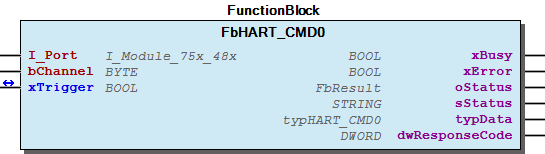 Function Description HART command 0 The function block sends the HART command 0 request to a HART device and processes the response. oStatus: CHANNEL_INVALID => Channel out of range 1..2 HART_MODULE_ERROR => Response codes from HART module (see HART specification for details) HART_SENSOR_ERROR => Response codes from HART sensor (see HART specification for details) DETAILS_sStatus => Details in output sStatus

## FbHART_CMD1 (FB)

| Scope | Name | Type | Comment |
| --- | --- | --- | --- |
| Input | I_Port | WagoTypesModule_75x_48x.I_Module_75x_48x | Access to module |
| bChannel | BYTE | The channel,1 or 2, of the I/O-Module where the HART device is connected. Valid values are 1 and 2. |
| Inout | xTrigger | BOOL | A raising edge will start the execution of the HART command. When finished or after a timeout xTrigger is set to false. |
| Output | xBusy | BOOL | Command execution is busy |
| Output | xError | BOOL | Error occurred |
| Output | oStatus | WagoSysErrorBase.FbResult | Status and error information |
| Output | sStatus | STRING | Detailed status information |
| Output | typData | typHART_CMD1 | Result data |
| Output | dwResponseCode | DWORD | Bytes according to the status information in numerical mode |
| Output | bFieldDeviceStatus | BYTE | Field device status acording to HART protocol specification |
| Output | bHART_ResponseCode | BYTE | Response acording to HART protocol specification |

Read primary variable

Graphical Illustration

Function Description

HART command 1

The function block sends the HART command 1 request to a HART device and processes the response.

CHANNEL_INVALID => Channel out of range 1..2

HART_MODULE_ERROR => Response codes from HART module (see HART specification for details)

HART_SENSOR_ERROR => Response codes from HART sensor (see HART specification for details)

DETAILS_sStatus => Details in output sStatus

Interface variables Function Read primary variable Graphical Illustration 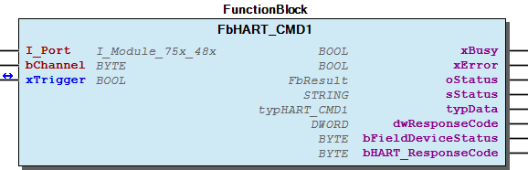 Function Description HART command 1 The function block sends the HART command 1 request to a HART device and processes the response. oStatus: CHANNEL_INVALID => Channel out of range 1..2 HART_MODULE_ERROR => Response codes from HART module (see HART specification for details) HART_SENSOR_ERROR => Response codes from HART sensor (see HART specification for details) DETAILS_sStatus => Details in output sStatus

## FbHART_CMD11 (FB)

| Scope | Name | Type | Comment |
| --- | --- | --- | --- |
| Input | I_Port | WagoTypesModule_75x_48x.I_Module_75x_48x | Access to module |
| bChannel | BYTE | The channel,1 or 2, of the I/O-Module where the HART device is connected (called Index DPV1). Valid values are 1 and 2. |
| sTag | STRING(8) | Unit tag |
| Inout | xTrigger | BOOL | A raising edge will start the execution of the HART command. When finished or after a timeout xTrigger is set to false - Check wError on the falling edge of xTrigger |
| Output | xBusy | BOOL | command execution is busy |
| Output | xError | BOOL | error occurred |
| Output | oStatus | WagoSysErrorBase.FbResult | Status and error information |
| Output | sStatus | STRING | Detailed status information |
| Output | typData | typHART_CMD0 |  |
| Output | dwResponseCode | DWORD | Bytes according to the status information in numerical mode |
| Output | bFieldDeviceStatus | BYTE | Field device status acording to HART protocol specification |
| Output | bHART_ResponseCode | BYTE | Response acording to HART protocol specification |

Read unique identifier associated with input tag

Graphical Illustration

Function Description

HART command 11

The function block sends the HART command 11 request to a HART device and processes the response.

CHANNEL_INVALID => Channel out of range 1..2

HART_MODULE_ERROR => Response codes from HART module (see HART specification for details)

HART_SENSOR_ERROR => Response codes from HART sensor (see HART specification for details)

DETAILS_sStatus => Details in output sStatus

Interface variables Function Read unique identifier associated with input tag Graphical Illustration 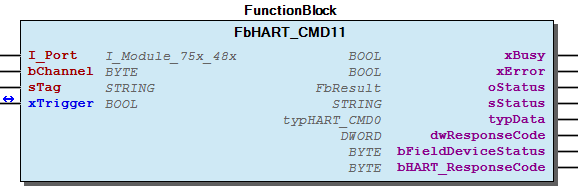 Function Description HART command 11 The function block sends the HART command 11 request to a HART device and processes the response. oStatus: CHANNEL_INVALID => Channel out of range 1..2 HART_MODULE_ERROR => Response codes from HART module (see HART specification for details) HART_SENSOR_ERROR => Response codes from HART sensor (see HART specification for details) DETAILS_sStatus => Details in output sStatus

## FbHART_CMD12 (FB)

| Scope | Name | Type | Comment |
| --- | --- | --- | --- |
| Input | I_Port | WagoTypesModule_75x_48x.I_Module_75x_48x | Access to module |
| bChannel | BYTE | The channel,1 or 2, of the I/O-Module where the HART device is connected (called Index DPV1). Valid values are 1 and 2. |
| Inout | xTrigger | BOOL | A raising edge will start the execution of the HART command. When finished or after a timeout xTrigger is set to false - Check wError on the falling edge of xTrigger |
| Output | xBusy | BOOL | command execution is busy |
| Output | xError | BOOL | error occurred |
| Output | oStatus | WagoSysErrorBase.FbResult | Status and error information |
| Output | sStatus | STRING | Detailed status information |
| Output | sMessage | STRING(24) |  |
| Output | dwResponseCode | DWORD | Bytes according to the status information in numerical mode |
| Output | bFieldDeviceStatus | BYTE | Field device status acording to HART protocol specification |
| Output | bHART_ResponseCode | BYTE | Response acording to HART protocol specification |

Read message

Graphical Illustration

Function Description

HART command 12

The function block sends the HART command 12 request to a HART device and processes the response.

CHANNEL_INVALID => Channel out of range 1..2

HART_MODULE_ERROR => Response codes from HART module (see HART specification for details)

HART_SENSOR_ERROR => Response codes from HART sensor (see HART specification for details)

DETAILS_sStatus => Details in output sStatus

0–23 -> Message (32 characters) -> Type:(A)

16#00000301 => ‘HART_INFO is not part of your project - Add HART_INFO program’ 16#00000302 => ‘Invalid param “bModule” x. Valid values between 1..64’ 16#00000303 => ‘Invalid param “bChannel” y. Valid values between 1..2’ 16#00000305 => ‘No HART sensor connected to module x on channel y’ 16#00000306 => ‘Invalid parameter “bModule” points to a non HART module’ 16#08xxyyzz => ‘Response codes from HART module (see HART specification for details)’ 16#0900xxyy => ‘Response codes from HART sensor (see HART specification for details)’

Interface variables Function Read message Graphical Illustration 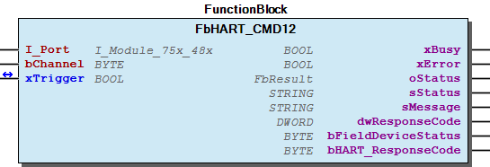 Function Description HART command 12 The function block sends the HART command 12 request to a HART device and processes the response. oStatus: CHANNEL_INVALID => Channel out of range 1..2 HART_MODULE_ERROR => Response codes from HART module (see HART specification for details) HART_SENSOR_ERROR => Response codes from HART sensor (see HART specification for details) DETAILS_sStatus => Details in output sStatus The HART_CMD12 “Read message”. The function block sends a HART command 12 request to a HART device and processes the response. RequestData: None ResponseData: 0–23 -> Message (32 characters) -> Type:(A) dwError: 16#00000301 => ‘HART_INFO is not part of your project - Add HART_INFO program’ 16#00000302 => ‘Invalid param “bModule” x. Valid values between 1..64’ 16#00000303 => ‘Invalid param “bChannel” y. Valid values between 1..2’ 16#00000305 => ‘No HART sensor connected to module x on channel y’ 16#00000306 => ‘Invalid parameter “bModule” points to a non HART module’ 16#08xxyyzz => ‘Response codes from HART module (see HART specification for details)’ 16#0900xxyy => ‘Response codes from HART sensor (see HART specification for details)’

## FbHART_CMD13 (FB)

| Scope | Name | Type | Comment |
| --- | --- | --- | --- |
| Input | I_Port | WagoTypesModule_75x_48x.I_Module_75x_48x | Access to module |
| bChannel | BYTE | The channel,1 or 2, of the I/O-Module where the HART device is connected (called Index DPV1). Valid values are 1 and 2. |
| Inout | xTrigger | BOOL | A raising edge will start the execution of the HART command. When finished or after a timeout xTrigger is set to false - Check wError on the falling edge of xTrigger |
| Output | xBusy | BOOL | command execution is busy |
| Output | xError | BOOL | error occurred |
| Output | oStatus | WagoSysErrorBase.FbResult | Status and error information |
| Output | sStatus | STRING |  |
| Output | typData | typHART_CMD13 |  |
| Output | dwResponseCode | DWORD | Bytes according to the status information in numerical mode |
| Output | bFieldDeviceStatus | BYTE | Field device status acording to HART protocol specification |
| Output | bHART_ResponseCode | BYTE | Response acording to HART protocol specification |

Read tag, descriptor and date

Graphical Illustration

Function Description

HART command 13

The function block sends the HART command 13 request to a HART device and processes the response.

CHANNEL_INVALID => Channel out of range 1..2

HART_MODULE_ERROR => Response codes from HART module (see HART specification for details)

HART_SENSOR_ERROR => Response codes from HART sensor (see HART specification for details)

DETAILS_sStatus => Details in output sStatus

Interface variables Function Read tag, descriptor and date Graphical Illustration  Function Description HART command 13 The function block sends the HART command 13 request to a HART device and processes the response. oStatus: CHANNEL_INVALID => Channel out of range 1..2 HART_MODULE_ERROR => Response codes from HART module (see HART specification for details) HART_SENSOR_ERROR => Response codes from HART sensor (see HART specification for details) DETAILS_sStatus => Details in output sStatus

## FbHART_CMD14 (FB)

| Scope | Name | Type | Comment |
| --- | --- | --- | --- |
| Input | I_Port | WagoTypesModule_75x_48x.I_Module_75x_48x | Access to module |
| bChannel | BYTE | The channel,1 or 2, of the I/O-Module where the HART device is connected (called Index DPV1). Valid values are 1 and 2. |
| Inout | xTrigger | BOOL | A raising edge will start the execution of the HART command. When finished or after a timeout xTrigger is set to false - Check wError on the falling edge of xTrigger |
| Output | xBusy | BOOL | command execution is busy |
| Output | xError | BOOL | error occurred |
| Output | oStatus | WagoSysErrorBase.FbResult | Status and error information |
| Output | sStatus | STRING |  |
| Output | typData | typHART_CMD14 |  |
| Output | dwResponseCode | DWORD | Bytes according to the status information in numerical mode |
| Output | bFieldDeviceStatus | BYTE | Field device status acording to HART protocol specification |
| Output | bHART_ResponseCode | BYTE | Response acording to HART protocol specification |

Read Sensor serial number,Units code for sensor limits and minimum span, Upper sensor limit, Lower sensor limit, Minimum span

Graphical Illustration

Function Description

HART command 14

The function block sends the HART command 14 request to a HART device and processes the response.

CHANNEL_INVALID => Channel out of range 1..2

HART_MODULE_ERROR => Response codes from HART module (see HART specification for details)

HART_SENSOR_ERROR => Response codes from HART sensor (see HART specification for details)

DETAILS_sStatus => Details in output sStatus

Interface variables Function Read Sensor serial number,Units code for sensor limits and minimum span, Upper sensor limit, Lower sensor limit, Minimum span Graphical Illustration 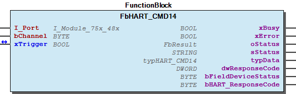 Function Description HART command 14 The function block sends the HART command 14 request to a HART device and processes the response. oStatus: CHANNEL_INVALID => Channel out of range 1..2 HART_MODULE_ERROR => Response codes from HART module (see HART specification for details) HART_SENSOR_ERROR => Response codes from HART sensor (see HART specification for details) DETAILS_sStatus => Details in output sStatus

## FbHART_CMD15 (FB)

| Scope | Name | Type | Comment |
| --- | --- | --- | --- |
| Input | I_Port | WagoTypesModule_75x_48x.I_Module_75x_48x | Access to module |
| bChannel | BYTE | The channel,1 or 2, of the I/O-Module where the HART device is connected (called Index DPV1). Valid values are 1 and 2. |
| Inout | xTrigger | BOOL | A raising edge will start the execution of the HART command. When finished or after a timeout xTrigger is set to false - Check wError on the falling edge of xTrigger |
| Output | xBusy | BOOL | command execution is busy |
| Output | xError | BOOL | error occurred |
| Output | oStatus | WagoSysErrorBase.FbResult | Status and error information |
| Output | sStatus | STRING |  |
| Output | typData | typHART_CMD15 |  |
| Output | dwResponseCode | DWORD | Bytes according to the status information in numerical mode |
| Output | bFieldDeviceStatus | BYTE | Field device status acording to HART protocol specification |
| Output | bHART_ResponseCode | BYTE | Response acording to HART protocol specification |

Read output information

Graphical Illustration

Function Description

HART command 15

The function block sends the HART command 15 request to a HART device and processes the response.

CHANNEL_INVALID => Channel out of range 1..2

HART_MODULE_ERROR => Response codes from HART module (see HART specification for details)

HART_SENSOR_ERROR => Response codes from HART sensor (see HART specification for details)

DETAILS_sStatus => Details in output sStatus

Interface variables Function Read output information Graphical Illustration  Function Description HART command 15 The function block sends the HART command 15 request to a HART device and processes the response. oStatus: CHANNEL_INVALID => Channel out of range 1..2 HART_MODULE_ERROR => Response codes from HART module (see HART specification for details) HART_SENSOR_ERROR => Response codes from HART sensor (see HART specification for details) DETAILS_sStatus => Details in output sStatus

## FbHART_CMD16 (FB)

| Scope | Name | Type | Comment |
| --- | --- | --- | --- |
| Input | I_Port | WagoTypesModule_75x_48x.I_Module_75x_48x | Access to module |
| bChannel | BYTE | The channel,1 or 2, of the I/O-Module where the HART device is connected (called Index DPV1). Valid values are 1 and 2. |
| Inout | xTrigger | BOOL | A raising edge will start the execution of the HART command. When finished or after a timeout xTrigger is set to false - Check wError on the falling edge of xTrigger |
| Output | xBusy | BOOL | command execution is busy |
| Output | xError | BOOL | error occurred |
| Output | oStatus | WagoSysErrorBase.FbResult | Status and error information |
| Output | sStatus | STRING |  |
| Output | dwFinalAssemblyNumber | DWORD |  |
| Output | dwResponseCode | DWORD | Bytes according to the status information in numerical mode |
| Output | bFieldDeviceStatus | BYTE | Field device status acording to HART protocol specification |
| Output | bHART_ResponseCode | BYTE | Response acording to HART protocol specification |

Read final assmbly number

Graphical Illustration

Function Description

HART command 16

The function block sends the HART command 16 request to a HART device and processes the response.

CHANNEL_INVALID => Channel out of range 1..2

HART_MODULE_ERROR => Response codes from HART module (see HART specification for details)

HART_SENSOR_ERROR => Response codes from HART sensor (see HART specification for details)

DETAILS_sStatus => Details in output sStatus

Interface variables Function Read final assmbly number Graphical Illustration 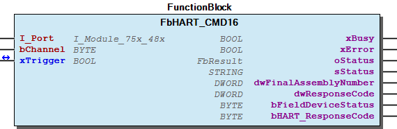 Function Description HART command 16 The function block sends the HART command 16 request to a HART device and processes the response. oStatus: CHANNEL_INVALID => Channel out of range 1..2 HART_MODULE_ERROR => Response codes from HART module (see HART specification for details) HART_SENSOR_ERROR => Response codes from HART sensor (see HART specification for details) DETAILS_sStatus => Details in output sStatus

## FbHART_CMD17 (FB)

| Scope | Name | Type | Comment |
| --- | --- | --- | --- |
| Input | I_Port | WagoTypesModule_75x_48x.I_Module_75x_48x | Access to module |
| bChannel | BYTE | The channel,1 or 2, of the I/O-Module where the HART device is connected (called Index DPV1). Valid values are 1 and 2. |
| sMessage | STRING(24) |  |
| Inout | xTrigger | BOOL | A raising edge will start the execution of the HART command. When finished or after a timeout xTrigger is set to false - Check wError on the falling edge of xTrigger |
| Output | xBusy | BOOL | command execution is busy |
| Output | xError | BOOL | error occurred |
| Output | oStatus | WagoSysErrorBase.FbResult | Status and error information |
| Output | sStatus | STRING |  |
| Output | dwResponseCode | DWORD | Bytes according to the status information in numerical mode |
| Output | bFieldDeviceStatus | BYTE | Field device status acording to HART protocol specification |
| Output | bHART_ResponseCode | BYTE | Response acording to HART protocol specification |

Write message

Graphical Illustration

Function Description

HART command 17

The function block sends the HART command 17 request to a HART device and processes the response.

CHANNEL_INVALID => Channel out of range 1..2

HART_MODULE_ERROR => Response codes from HART module (see HART specification for details)

HART_SENSOR_ERROR => Response codes from HART sensor (see HART specification for details)

DETAILS_sStatus => Details in output sStatus

Interface variables Function Write message Graphical Illustration 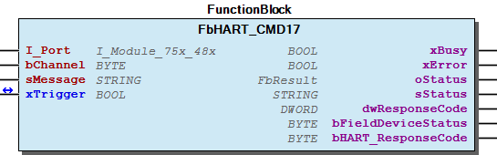 Function Description HART command 17 The function block sends the HART command 17 request to a HART device and processes the response. oStatus: CHANNEL_INVALID => Channel out of range 1..2 HART_MODULE_ERROR => Response codes from HART module (see HART specification for details) HART_SENSOR_ERROR => Response codes from HART sensor (see HART specification for details) DETAILS_sStatus => Details in output sStatus

## FbHART_CMD18 (FB)

| Scope | Name | Type | Comment |
| --- | --- | --- | --- |
| Input | I_Port | WagoTypesModule_75x_48x.I_Module_75x_48x | Access to module |
| bChannel | BYTE | The channel,1 or 2, of the I/O-Module where the HART device is connected (called Index DPV1). Valid values are 1 and 2. |
| typData | typHART_CMD13 |  |
| Inout | xTrigger | BOOL | A raising edge will start the execution of the HART command. When finished or after a timeout xTrigger is set to false - Check wError on the falling edge of xTrigger |
| Output | xBusy | BOOL | command execution is busy |
| Output | xError | BOOL | error occurred |
| Output | oStatus | WagoSysErrorBase.FbResult | Status and error information |
| Output | sStatus | STRING |  |
| Output | dwResponseCode | DWORD | Bytes according to the status information in numerical mode |
| Output | bFieldDeviceStatus | BYTE | Field device status acording to HART protocol specification |
| Output | bHART_ResponseCode | BYTE | Response acording to HART protocol specification |

Write tag, descriptor and date

Graphical Illustration

Function Description

HART command 18

The function block sends the HART command 18 request to a HART device and processes the response.

CHANNEL_INVALID => Channel out of range 1..2

HART_MODULE_ERROR => Response codes from HART module (see HART specification for details)

HART_SENSOR_ERROR => Response codes from HART sensor (see HART specification for details)

DETAILS_sStatus => Details in output sStatus

Interface variables Function Write tag, descriptor and date Graphical Illustration  Function Description HART command 18 The function block sends the HART command 18 request to a HART device and processes the response. oStatus: CHANNEL_INVALID => Channel out of range 1..2 HART_MODULE_ERROR => Response codes from HART module (see HART specification for details) HART_SENSOR_ERROR => Response codes from HART sensor (see HART specification for details) DETAILS_sStatus => Details in output sStatus

## FbHART_CMD19 (FB)

| Scope | Name | Type | Comment |
| --- | --- | --- | --- |
| Input | I_Port | WagoTypesModule_75x_48x.I_Module_75x_48x | Access to module |
| bChannel | BYTE | The channel,1 or 2, of the I/O-Module where the HART device is connected (called Index DPV1). Valid values are 1 and 2. |
| dwFinalAssemblyNumber | DWORD |  |
| Inout | xTrigger | BOOL | A raising edge will start the execution of the HART command. When finished or after a timeout xTrigger is set to false - Check wError on the falling edge of xTrigger |
| Output | xBusy | BOOL | command execution is busy |
| Output | xError | BOOL | error occurred |
| Output | oStatus | WagoSysErrorBase.FbResult | Status and error information |
| Output | sStatus | STRING |  |
| Output | dwResponseCode | DWORD | Bytes according to the status information in numerical mode |
| Output | bFieldDeviceStatus | BYTE | Field device status acording to HART protocol specification |
| Output | bHART_ResponseCode | BYTE | Response acording to HART protocol specification |

Write final assmbly number

Graphical Illustration

Function Description

HART command 19

The function block sends the HART command 19 request to a HART device and processes the response.

CHANNEL_INVALID => Channel out of range 1..2

HART_MODULE_ERROR => Response codes from HART module (see HART specification for details)

HART_SENSOR_ERROR => Response codes from HART sensor (see HART specification for details)

DETAILS_sStatus => Details in output sStatus

Interface variables Function Write final assmbly number Graphical Illustration 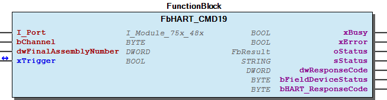 Function Description HART command 19 The function block sends the HART command 19 request to a HART device and processes the response. oStatus: CHANNEL_INVALID => Channel out of range 1..2 HART_MODULE_ERROR => Response codes from HART module (see HART specification for details) HART_SENSOR_ERROR => Response codes from HART sensor (see HART specification for details) DETAILS_sStatus => Details in output sStatus

## FbHART_CMD2 (FB)

| Scope | Name | Type | Comment |
| --- | --- | --- | --- |
| Input | I_Port | WagoTypesModule_75x_48x.I_Module_75x_48x | Access to module |
| bChannel | BYTE | The channel,1 or 2, of the I/O-Module where the HART device is connected (called Index DPV1). Valid values are 1 and 2. |
| Inout | xTrigger | BOOL | A raising edge will start the execution of the HART command. When finished or after a timeout xTrigger is set to false - Check wError on the falling edge of xTrigger |
| Output | xBusy | BOOL | command execution is busy |
| Output | xError | BOOL | error occurred |
| Output | oStatus | WagoSysErrorBase.FbResult | Status and error information |
| Output | sStatus | STRING |  |
| Output | typData | typHART_CMD2 |  |
| Output | dwResponseCode | DWORD | Bytes according to the status information in numerical mode |
| Output | bFieldDeviceStatus | BYTE | Field device status acording to HART protocol specification |
| Output | bHART_ResponseCode | BYTE | Response acording to HART protocol specification |

Read current and percent of range

Graphical Illustration

Function Description

HART command 2

The function block sends the HART command 2 request to a HART device and processes the response.

CHANNEL_INVALID => Channel out of range 1..2

HART_MODULE_ERROR => Response codes from HART module (see HART specification for details)

HART_SENSOR_ERROR => Response codes from HART sensor (see HART specification for details)

DETAILS_sStatus => Details in output sStatus

Interface variables Function Read current and percent of range Graphical Illustration  Function Description HART command 2 The function block sends the HART command 2 request to a HART device and processes the response. oStatus: CHANNEL_INVALID => Channel out of range 1..2 HART_MODULE_ERROR => Response codes from HART module (see HART specification for details) HART_SENSOR_ERROR => Response codes from HART sensor (see HART specification for details) DETAILS_sStatus => Details in output sStatus

## FbHART_CMD3 (FB)

| Scope | Name | Type | Comment |
| --- | --- | --- | --- |
| Input | I_Port | WagoTypesModule_75x_48x.I_Module_75x_48x | Access to module |
| bChannel | BYTE | The channel,1 or 2, of the I/O-Module where the HART device is connected (called Index DPV1). Valid values are 1 and 2. |
| Inout | xTrigger | BOOL | A raising edge will start the execution of the HART command. When finished or after a timeout xTrigger is set to false - Check wError on the falling edge of xTrigger |
| Output | xBusy | BOOL | command execution is busy |
| Output | xError | BOOL | error occurred |
| Output | oStatus | WagoSysErrorBase.FbResult | Status and error information |
| Output | sStatus | STRING |  |
| Output | typData | typHART_CMD3 |  |
| Output | dwResponseCode | DWORD | Bytes according to the status information in numerical mode |
| Output | bFieldDeviceStatus | BYTE | Field device status acording to HART protocol specification |
| Output | bHART_ResponseCode | BYTE | Response acording to HART protocol specification |

Read all variables

Graphical Illustration

Function Description

HART command 3

The function block sends the HART command 3 request to a HART device and processes the response.

CHANNEL_INVALID => Channel out of range 1..2

HART_MODULE_ERROR => Response codes from HART module (see HART specification for details)

HART_SENSOR_ERROR => Response codes from HART sensor (see HART specification for details)

DETAILS_sStatus => Details in output sStatus

Interface variables Function Read all variables Graphical Illustration  Function Description HART command 3 The function block sends the HART command 3 request to a HART device and processes the response. oStatus: CHANNEL_INVALID => Channel out of range 1..2 HART_MODULE_ERROR => Response codes from HART module (see HART specification for details) HART_SENSOR_ERROR => Response codes from HART sensor (see HART specification for details) DETAILS_sStatus => Details in output sStatus

## FbHART_CMD33 (FB)

| Scope | Name | Type | Comment |
| --- | --- | --- | --- |
| Input | I_Port | WagoTypesModule_75x_48x.I_Module_75x_48x | Access to module |
| bChannel | BYTE | The channel,1 or 2, of the I/O-Module where the HART device is connected (called Index DPV1). Valid values are 1 and 2. |
| bVarCodeSlot0 | BYTE | Transmitter var. code for slot 0 |
| bVarCodeSlot1 | BYTE | Transmitter var. code for slot 1 |
| bVarCodeSlot2 | BYTE | Transmitter var. code for slot 2 |
| bVarCodeSlot3 | BYTE | Transmitter var. code for slot 3 |
| Inout | xTrigger | BOOL | A raising edge will start the execution of the HART command. When finished or after a timeout xTrigger is set to false - Check wError on the falling edge of xTrigger |
| Output | xBusy | BOOL | command execution is busy |
| Output | xError | BOOL | error occurred |
| Output | oStatus | WagoSysErrorBase.FbResult | Status and error information |
| Output | sStatus | STRING |  |
| Output | typDataSlot0 | typHART_CMD1 |  |
| Output | typDataSlot1 | typHART_CMD1 |  |
| Output | typDataSlot2 | typHART_CMD1 |  |
| Output | typDataSlot3 | typHART_CMD1 |  |
| Output | dwResponseCode | DWORD | Bytes according to the status information in numerical mode |
| Output | bFieldDeviceStatus | BYTE | Field device status acording to HART protocol specification |
| Output | bHART_ResponseCode | BYTE | Response acording to HART protocol specification |

Read transmitter variables

Graphical Illustration

Function Description

HART command 33

The function block sends the HART command 33 request to a HART device and processes the response.

CHANNEL_INVALID => Channel out of range 1..2

HART_MODULE_ERROR => Response codes from HART module (see HART specification for details)

HART_SENSOR_ERROR => Response codes from HART sensor (see HART specification for details)

DETAILS_sStatus => Details in output sStatus

Interface variables Function Read transmitter variables Graphical Illustration 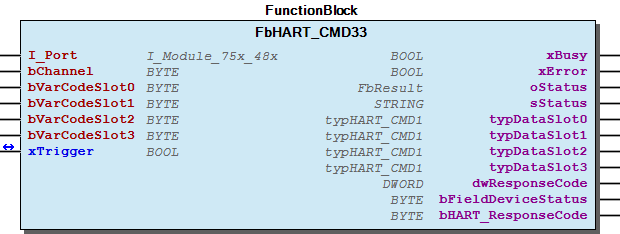 Function Description HART command 33 The function block sends the HART command 33 request to a HART device and processes the response. oStatus: CHANNEL_INVALID => Channel out of range 1..2 HART_MODULE_ERROR => Response codes from HART module (see HART specification for details) HART_SENSOR_ERROR => Response codes from HART sensor (see HART specification for details) DETAILS_sStatus => Details in output sStatus

## FbHART_CMD34 (FB)

| Scope | Name | Type | Comment |
| --- | --- | --- | --- |
| Input | I_Port | WagoTypesModule_75x_48x.I_Module_75x_48x | Access to module |
| bChannel | BYTE | The channel,1 or 2, of the I/O-Module where the HART device is connected (called Index DPV1). Valid values are 1 and 2. |
| rPVDumpingValue | REAL |  |
| Inout | xTrigger | BOOL | A raising edge will start the execution of the HART command. When finished or after a timeout xTrigger is set to false - Check wError on the falling edge of xTrigger |
| Output | xBusy | BOOL | command execution is busy |
| Output | xError | BOOL | error occurred |
| Output | oStatus | WagoSysErrorBase.FbResult | Status and error information |
| Output | sStatus | STRING |  |
| Output | dwResponseCode | DWORD | Bytes according to the status information in numerical mode |
| Output | bFieldDeviceStatus | BYTE | Field device status acording to HART protocol specification |
| Output | bHART_ResponseCode | BYTE | Response acording to HART protocol specification |

Write primary variable damping value

Graphical Illustration

Function Description

HART command 34

The function block sends the HART command 34 request to a HART device and processes the response.

CHANNEL_INVALID => Channel out of range 1..2

HART_MODULE_ERROR => Response codes from HART module (see HART specification for details)

HART_SENSOR_ERROR => Response codes from HART sensor (see HART specification for details)

DETAILS_sStatus => Details in output sStatus

Interface variables Function Write primary variable damping value Graphical Illustration 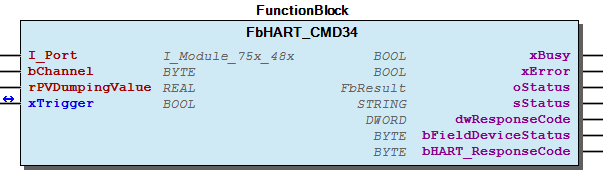 Function Description HART command 34 The function block sends the HART command 34 request to a HART device and processes the response. oStatus: CHANNEL_INVALID => Channel out of range 1..2 HART_MODULE_ERROR => Response codes from HART module (see HART specification for details) HART_SENSOR_ERROR => Response codes from HART sensor (see HART specification for details) DETAILS_sStatus => Details in output sStatus

## FbHART_CMD35 (FB)

| Scope | Name | Type | Comment |
| --- | --- | --- | --- |
| Input | I_Port | WagoTypesModule_75x_48x.I_Module_75x_48x | Access to module |
| bChannel | BYTE | The channel,1 or 2, of the I/O-Module where the HART device is connected (called Index DPV1). Valid values are 1 and 2. |
| typData | typHART_CMD35 |  |
| Inout | xTrigger | BOOL | A raising edge will start the execution of the HART command. When finished or after a timeout xTrigger is set to false - Check wError on the falling edge of xTrigger |
| Output | xBusy | BOOL | command execution is busy |
| Output | xError | BOOL | error occurred |
| Output | oStatus | WagoSysErrorBase.FbResult | Status and error information |
| Output | sStatus | STRING |  |
| Output | dwResponseCode | DWORD | Bytes according to the status information in numerical mode |
| Output | bFieldDeviceStatus | BYTE | Field device status acording to HART protocol specification |
| Output | bHART_ResponseCode | BYTE | Response acording to HART protocol specification |

Write primary variable range values

Graphical Illustration

Function Description

HART command 35

The function block sends the HART command 35 request to a HART device and processes the response.

CHANNEL_INVALID => Channel out of range 1..2

HART_MODULE_ERROR => Response codes from HART module (see HART specification for details)

HART_SENSOR_ERROR => Response codes from HART sensor (see HART specification for details)

DETAILS_sStatus => Details in output sStatus

Interface variables Function Write primary variable range values Graphical Illustration 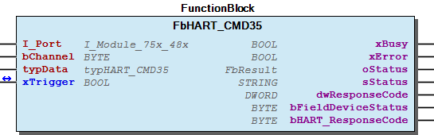 Function Description HART command 35 The function block sends the HART command 35 request to a HART device and processes the response. oStatus: CHANNEL_INVALID => Channel out of range 1..2 HART_MODULE_ERROR => Response codes from HART module (see HART specification for details) HART_SENSOR_ERROR => Response codes from HART sensor (see HART specification for details) DETAILS_sStatus => Details in output sStatus

## FbHART_CMD38 (FB)

| Scope | Name | Type | Comment |
| --- | --- | --- | --- |
| Input | I_Port | WagoTypesModule_75x_48x.I_Module_75x_48x | Access to module |
| bChannel | BYTE | The channel,1 or 2, of the I/O-Module where the HART device is connected (called Index DPV1). Valid values are 1 and 2. |
| Inout | xTrigger | BOOL | A raising edge will start the execution of the HART command. When finished or after a timeout xTrigger is set to false - Check wError on the falling edge of xTrigger |
| Output | xBusy | BOOL | command execution is busy |
| Output | xError | BOOL | error occurred |
| Output | oStatus | WagoSysErrorBase.FbResult | Status and error information |
| Output | sStatus | STRING |  |
| Output | dwResponseCode | DWORD | Bytes according to the status information in numerical mode |
| Output | bFieldDeviceStatus | BYTE | Field device status acording to HART protocol specification |
| Output | bHART_ResponseCode | BYTE | Response acording to HART protocol specification |

Reset configuration changed flag

Graphical Illustration

Function Description

HART command 38

The function block sends the HART command 38 request to a HART device and processes the response.

CHANNEL_INVALID => Channel out of range 1..2

HART_MODULE_ERROR => Response codes from HART module (see HART specification for details)

HART_SENSOR_ERROR => Response codes from HART sensor (see HART specification for details)

DETAILS_sStatus => Details in output sStatus

Interface variables Function Reset configuration changed flag Graphical Illustration 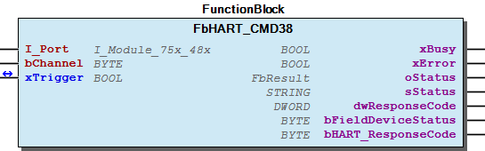 Function Description HART command 38 The function block sends the HART command 38 request to a HART device and processes the response. oStatus: CHANNEL_INVALID => Channel out of range 1..2 HART_MODULE_ERROR => Response codes from HART module (see HART specification for details) HART_SENSOR_ERROR => Response codes from HART sensor (see HART specification for details) DETAILS_sStatus => Details in output sStatus

## FbHART_CMD40 (FB)

| Scope | Name | Type | Comment |
| --- | --- | --- | --- |
| Input | I_Port | WagoTypesModule_75x_48x.I_Module_75x_48x | Access to module |
| bChannel | BYTE | The channel,1 or 2, of the I/O-Module where the HART device is connected (called Index DPV1). Valid values are 1 and 2. |
| Inout | xTrigger | BOOL | A raising edge will start the execution of the HART command. When finished or after a timeout xTrigger is set to false - Check wError on the falling edge of xTrigger |
| Inout | rPVCurrentLevel | REAL | transmit the “fixed PV current level” and returns the actual “fixed PV current level” |
| Output | xBusy | BOOL | command execution is busy |
| Output | xError | BOOL | error occurred |
| Output | oStatus | WagoSysErrorBase.FbResult | Status and error information |
| Output | sStatus | STRING |  |
| Output | dwResponseCode | DWORD | Bytes according to the status information in numerical mode |
| Output | bFieldDeviceStatus | BYTE | Field device status acording to HART protocol specification |
| Output | bHART_ResponseCode | BYTE | Response acording to HART protocol specification |

Enter/Exit primary variable current mode

Graphical Illustration

Function Description

HART command 40

The function block sends the HART command 40 request to a HART device and processes the response.

CHANNEL_INVALID => Channel out of range 1..2

HART_MODULE_ERROR => Response codes from HART module (see HART specification for details)

HART_SENSOR_ERROR => Response codes from HART sensor (see HART specification for details)

DETAILS_sStatus => Details in output sStatus

Interface variables Function Enter/Exit primary variable current mode Graphical Illustration 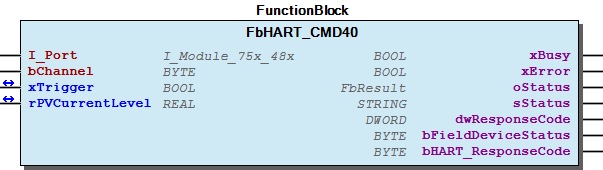 Function Description HART command 40 The function block sends the HART command 40 request to a HART device and processes the response. oStatus: CHANNEL_INVALID => Channel out of range 1..2 HART_MODULE_ERROR => Response codes from HART module (see HART specification for details) HART_SENSOR_ERROR => Response codes from HART sensor (see HART specification for details) DETAILS_sStatus => Details in output sStatus

## FbHART_CMD44 (FB)

| Scope | Name | Type | Comment |
| --- | --- | --- | --- |
| Input | I_Port | WagoTypesModule_75x_48x.I_Module_75x_48x | Access to module |
| bChannel | BYTE | The channel,1 or 2, of the I/O-Module where the HART device is connected (called Index DPV1). Valid values are 1 and 2. |
| bPrimaryVarUnitCode | BYTE | Unit code for primary variable |
| Inout | xTrigger | BOOL | A raising edge will start the execution of the HART command. When finished or after a timeout xTrigger is set to false - Check wError on the falling edge of xTrigger |
| Output | xBusy | BOOL | command execution is busy |
| Output | xError | BOOL | error occurred |
| Output | oStatus | WagoSysErrorBase.FbResult | Status and error information |
| Output | sStatus | STRING |  |
| Output | dwResponseCode | DWORD | Bytes according to the status information in numerical mode |
| Output | bFieldDeviceStatus | BYTE | Field device status acording to HART protocol specification |
| Output | bHART_ResponseCode | BYTE | Response acording to HART protocol specification |

Write primary variable units

Graphical Illustration

Function Description

HART command 44

The function block sends the HART command 44 request to a HART device and processes the response.

CHANNEL_INVALID => Channel out of range 1..2

HART_MODULE_ERROR => Response codes from HART module (see HART specification for details)

HART_SENSOR_ERROR => Response codes from HART sensor (see HART specification for details)

DETAILS_sStatus => Details in output sStatus

Interface variables Function Write primary variable units Graphical Illustration 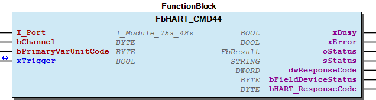 Function Description HART command 44 The function block sends the HART command 44 request to a HART device and processes the response. oStatus: CHANNEL_INVALID => Channel out of range 1..2 HART_MODULE_ERROR => Response codes from HART module (see HART specification for details) HART_SENSOR_ERROR => Response codes from HART sensor (see HART specification for details) DETAILS_sStatus => Details in output sStatus

## FbHART_CMD45 (FB)

| Scope | Name | Type | Comment |
| --- | --- | --- | --- |
| Input | I_Port | WagoTypesModule_75x_48x.I_Module_75x_48x | Access to module |
| bChannel | BYTE | The channel,1 or 2, of the I/O-Module where the HART device is connected (called Index DPV1). Valid values are 1 and 2. |
| rPVMeasuredCurrent | REAL |  |
| Inout | xTrigger | BOOL | A raising edge will start the execution of the HART command. When finished or after a timeout xTrigger is set to false - Check wError on the falling edge of xTrigger |
| Output | xBusy | BOOL | command execution is busy |
| Output | xError | BOOL | error occurred |
| Output | oStatus | WagoSysErrorBase.FbResult | Status and error information |
| Output | sStatus | STRING |  |
| Output | dwResponseCode | DWORD | Bytes according to the status information in numerical mode |
| Output | bFieldDeviceStatus | BYTE | Field device status acording to HART protocol specification |
| Output | bHART_ResponseCode | BYTE | Response acording to HART protocol specification |

Trim primary variable current DAC zero

Graphical Illustration

Function Description

HART command 45

The function block sends the HART command 45 request to a HART device and processes the response.

CHANNEL_INVALID => Channel out of range 1..2

HART_MODULE_ERROR => Response codes from HART module (see HART specification for details)

HART_SENSOR_ERROR => Response codes from HART sensor (see HART specification for details)

DETAILS_sStatus => Details in output sStatus

Interface variables Function Trim primary variable current DAC zero Graphical Illustration  Function Description HART command 45 The function block sends the HART command 45 request to a HART device and processes the response. oStatus: CHANNEL_INVALID => Channel out of range 1..2 HART_MODULE_ERROR => Response codes from HART module (see HART specification for details) HART_SENSOR_ERROR => Response codes from HART sensor (see HART specification for details) DETAILS_sStatus => Details in output sStatus

## FbHART_CMD46 (FB)

| Scope | Name | Type | Comment |
| --- | --- | --- | --- |
| Input | I_Port | WagoTypesModule_75x_48x.I_Module_75x_48x | Access to module |
| bChannel | BYTE | The channel,1 or 2, of the I/O-Module where the HART device is connected (called Index DPV1). Valid values are 1 and 2. |
| rPVMeasuredCurrent | REAL |  |
| Inout | xTrigger | BOOL | A raising edge will start the execution of the HART command. When finished or after a timeout xTrigger is set to false - Check wError on the falling edge of xTrigger |
| Output | xBusy | BOOL | command execution is busy |
| Output | xError | BOOL | error occurred |
| Output | oStatus | WagoSysErrorBase.FbResult | Status and error information |
| Output | sStatus | STRING |  |
| Output | dwResponseCode | DWORD | Bytes according to the status information in numerical mode |
| Output | bFieldDeviceStatus | BYTE | Field device status acording to HART protocol specification |
| Output | bHART_ResponseCode | BYTE | Response acording to HART protocol specification |

Trim primary variable current DAC gain

Graphical Illustration

Function Description

HART command 46

The function block sends the HART command 46 request to a HART device and processes the response.

CHANNEL_INVALID => Channel out of range 1..2

HART_MODULE_ERROR => Response codes from HART module (see HART specification for details)

HART_SENSOR_ERROR => Response codes from HART sensor (see HART specification for details)

DETAILS_sStatus => Details in output sStatus

Interface variables Function Trim primary variable current DAC gain Graphical Illustration  Function Description HART command 46 The function block sends the HART command 46 request to a HART device and processes the response. oStatus: CHANNEL_INVALID => Channel out of range 1..2 HART_MODULE_ERROR => Response codes from HART module (see HART specification for details) HART_SENSOR_ERROR => Response codes from HART sensor (see HART specification for details) DETAILS_sStatus => Details in output sStatus

## FbHART_CMD48 (FB)

| Scope | Name | Type | Comment |
| --- | --- | --- | --- |
| Input | I_Port | WagoTypesModule_75x_48x.I_Module_75x_48x | Access to module |
| bChannel | BYTE | The channel,1 or 2, of the I/O-Module where the HART device is connected (called Index DPV1). Valid values are 1 and 2. |
| Inout | xTrigger | BOOL | A raising edge will start the execution of the HART command. When finished or after a timeout xTrigger is set to false - Check wError on the falling edge of xTrigger |
| Output | xBusy | BOOL | command execution is busy |
| Output | xError | BOOL | error occurred |
| Output | oStatus | WagoSysErrorBase.FbResult | Status and error information |
| Output | sStatus | STRING |  |
| Output | typData | typHART_CMD48 |  |
| Output | dwResponseCode | DWORD | Bytes according to the status information in numerical mode |
| Output | bFieldDeviceStatus | BYTE | Field device status acording to HART protocol specification |
| Output | bHART_ResponseCode | BYTE | Response acording to HART protocol specification |

Read additional device status

Graphical Illustration

Function Description

HART command 48

The function block sends the HART command 48 request to a HART device and processes the response.

CHANNEL_INVALID => Channel out of range 1..2

HART_MODULE_ERROR => Response codes from HART module (see HART specification for details)

HART_SENSOR_ERROR => Response codes from HART sensor (see HART specification for details)

DETAILS_sStatus => Details in output sStatus

Interface variables Function Read additional device status Graphical Illustration 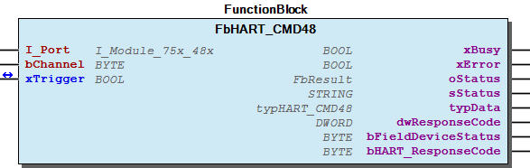 Function Description HART command 48 The function block sends the HART command 48 request to a HART device and processes the response. oStatus: CHANNEL_INVALID => Channel out of range 1..2 HART_MODULE_ERROR => Response codes from HART module (see HART specification for details) HART_SENSOR_ERROR => Response codes from HART sensor (see HART specification for details) DETAILS_sStatus => Details in output sStatus

## FbHART_CMD50 (FB)

| Scope | Name | Type | Comment |
| --- | --- | --- | --- |
| Input | I_Port | WagoTypesModule_75x_48x.I_Module_75x_48x | Access to module |
| bChannel | BYTE | The channel,1 or 2, of the I/O-Module where the HART device is connected (called Index DPV1). Valid values are 1 and 2. |
| Inout | xTrigger | BOOL | A raising edge will start the execution of the HART command. When finished or after a timeout xTrigger is set to false - Check wError on the falling edge of xTrigger |
| Output | xBusy | BOOL | command execution is busy |
| Output | xError | BOOL | error occurred |
| Output | oStatus | WagoSysErrorBase.FbResult | Status and error information |
| Output | sStatus | STRING |  |
| Output | bVarCode_Primary | BYTE | Transmitter var. code for primary variable |
| Output | bVarCode_Secondary | BYTE | Transmitter var. code for secondary variable |
| Output | bVarCode_Tertiary | BYTE | Transmitter var. code for tertiary variable |
| Output | bVarCode_4th | BYTE | Transmitter var. code for 4th variable |
| Output | dwResponseCode | DWORD | Bytes according to the status information in numerical mode |
| Output | bFieldDeviceStatus | BYTE | Field device status acording to HART protocol specification |
| Output | bHART_ResponseCode | BYTE | Response acording to HART protocol specification |

Read dynamic variable assignements

Graphical Illustration

Function Description

HART command 50

The function block sends the HART command 50 request to a HART device and processes the response.

CHANNEL_INVALID => Channel out of range 1..2

HART_MODULE_ERROR => Response codes from HART module (see HART specification for details)

HART_SENSOR_ERROR => Response codes from HART sensor (see HART specification for details)

DETAILS_sStatus => Details in output sStatus

Interface variables Function Read dynamic variable assignements Graphical Illustration 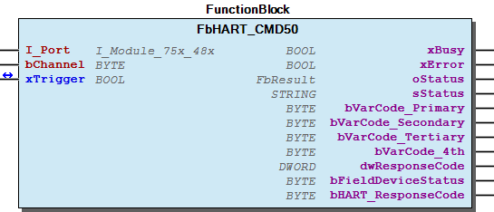 Function Description HART command 50 The function block sends the HART command 50 request to a HART device and processes the response. oStatus: CHANNEL_INVALID => Channel out of range 1..2 HART_MODULE_ERROR => Response codes from HART module (see HART specification for details) HART_SENSOR_ERROR => Response codes from HART sensor (see HART specification for details) DETAILS_sStatus => Details in output sStatus

## FbHART_CMD51 (FB)

| Scope | Name | Type | Comment |
| --- | --- | --- | --- |
| Input | I_Port | WagoTypesModule_75x_48x.I_Module_75x_48x | Access to module |
| bChannel | BYTE | The channel,1 or 2, of the I/O-Module where the HART device is connected (called Index DPV1). Valid values are 1 and 2. |
| bVarCode_Primary | BYTE | Transmitter var. code for primary variable |
| bVarCode_Secondary | BYTE | Transmitter var. code for secondary variable |
| bVarCode_Tertiary | BYTE | Transmitter var. code for tertiary variable |
| bVarCode_4th | BYTE | Transmitter var. code for 4th variable |
| Inout | xTrigger | BOOL | A raising edge will start the execution of the HART command. When finished or after a timeout xTrigger is set to false - Check wError on the falling edge of xTrigger |
| Output | xBusy | BOOL | command execution is busy |
| Output | xError | BOOL | error occurred |
| Output | oStatus | WagoSysErrorBase.FbResult | Status and error information |
| Output | sStatus | STRING |  |
| Output | dwResponseCode | DWORD | Bytes according to the status information in numerical mode |
| Output | bFieldDeviceStatus | BYTE | Field device status acording to HART protocol specification |
| Output | bHART_ResponseCode | BYTE | Response acording to HART protocol specification |

Write dynamic variable assignements

Graphical Illustration

Function Description

HART command 51

The function block sends the HART command 51 request to a HART device and processes the response.

CHANNEL_INVALID => Channel out of range 1..2

HART_MODULE_ERROR => Response codes from HART module (see HART specification for details)

HART_SENSOR_ERROR => Response codes from HART sensor (see HART specification for details)

DETAILS_sStatus => Details in output sStatus

Interface variables Function Write dynamic variable assignements Graphical Illustration 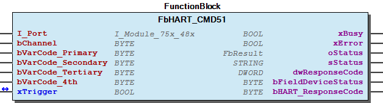 Function Description HART command 51 The function block sends the HART command 51 request to a HART device and processes the response. oStatus: CHANNEL_INVALID => Channel out of range 1..2 HART_MODULE_ERROR => Response codes from HART module (see HART specification for details) HART_SENSOR_ERROR => Response codes from HART sensor (see HART specification for details) DETAILS_sStatus => Details in output sStatus

## FbHART_CMD53 (FB)

| Scope | Name | Type | Comment |
| --- | --- | --- | --- |
| Input | I_Port | WagoTypesModule_75x_48x.I_Module_75x_48x | Access to module |
| bChannel | BYTE | The channel,1 or 2, of the I/O-Module where the HART device is connected (called Index DPV1). Valid values are 1 and 2. |
| bTransmitterVariable | BYTE | Transmitter variable to be set |
| bTransmitterUnitCode | BYTE | Unit code for transmitter variable |
| Inout | xTrigger | BOOL | A raising edge will start the execution of the HART command. When finished or after a timeout xTrigger is set to false - Check wError on the falling edge of xTrigger |
| Output | xBusy | BOOL | command execution is busy |
| Output | xError | BOOL | error occurred |
| Output | oStatus | WagoSysErrorBase.FbResult | Status and error information |
| Output | sStatus | STRING |  |
| Output | dwResponseCode | DWORD | Bytes according to the status information in numerical mode |
| Output | bFieldDeviceStatus | BYTE | Field device status acording to HART protocol specification |
| Output | bHART_ResponseCode | BYTE | Response acording to HART protocol specification |

Write transmitter variable units

Graphical Illustration

Function Description

HART command 53

The function block sends the HART command 53 request to a HART device and processes the response.

CHANNEL_INVALID => Channel out of range 1..2

HART_MODULE_ERROR => Response codes from HART module (see HART specification for details)

HART_SENSOR_ERROR => Response codes from HART sensor (see HART specification for details)

DETAILS_sStatus => Details in output sStatus

Interface variables Function Write transmitter variable units Graphical Illustration 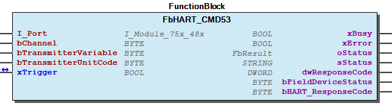 Function Description HART command 53 The function block sends the HART command 53 request to a HART device and processes the response. oStatus: CHANNEL_INVALID => Channel out of range 1..2 HART_MODULE_ERROR => Response codes from HART module (see HART specification for details) HART_SENSOR_ERROR => Response codes from HART sensor (see HART specification for details) DETAILS_sStatus => Details in output sStatus

## FbHART_CMD6 (FB)

| Scope | Name | Type | Comment |
| --- | --- | --- | --- |
| Input | I_Port | WagoTypesModule_75x_48x.I_Module_75x_48x | Access to module |
| bChannel | BYTE | The channel,1 or 2, of the I/O-Module where the HART device is connected (called Index DPV1). Valid values are 1 and 2. |
| bPollingAddress | BYTE | Polling Adress (0–15). Using the polling address structure of the HART protocol, up to 15 devices can be connected in a multidrop network. The analog current of a HART device can be fixed by setting its polling address to a number other than zero. With the HART protocol, each field instrument should be configured with different polling addresses or tag numbers before being connected to a multidrop network—otherwise, the master will not be able to establish communication with the slave devices. |
| Inout | xTrigger | BOOL | A raising edge will start the execution of the HART command. When finished or after a timeout xTrigger is set to false - Check wError on the falling edge of xTrigger |
| Output | xBusy | BOOL | command execution is busy |
| Output | xError | BOOL | error occurred |
| Output | oStatus | WagoSysErrorBase.FbResult | Status and error information |
| Output | sStatus | STRING |  |
| Output | dwResponseCode | DWORD | Bytes according to the status information in numerical mode |
| Output | bFieldDeviceStatus | BYTE | Field device status acording to HART protocol specification |
| Output | bHART_ResponseCode | BYTE | Response acording to HART protocol specification |

Write polling address

Graphical Illustration

Function Description

HART command 6

The function block sends the HART command 6 request to a HART device and processes the response.

CHANNEL_INVALID => Channel out of range 1..2

HART_MODULE_ERROR => Response codes from HART module (see HART specification for details)

HART_SENSOR_ERROR => Response codes from HART sensor (see HART specification for details)

DETAILS_sStatus => Details in output sStatus

Interface variables Function Write polling address Graphical Illustration 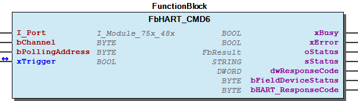 Function Description HART command 6 The function block sends the HART command 6 request to a HART device and processes the response. oStatus: CHANNEL_INVALID => Channel out of range 1..2 HART_MODULE_ERROR => Response codes from HART module (see HART specification for details) HART_SENSOR_ERROR => Response codes from HART sensor (see HART specification for details) DETAILS_sStatus => Details in output sStatus

## FbHART_CMD9 (FB)

| Scope | Name | Type | Comment |
| --- | --- | --- | --- |
| Input | I_Port | WagoTypesModule_75x_48x.I_Module_75x_48x | Access to module |
| bChannel | BYTE | The channel,1 or 2, of the I/O-Module where the HART device is connected (called Index DPV1). Valid values are 1 and 2. |
| Inout | xTrigger | BOOL | A raising edge will start the execution of the HART command. When finished or after a timeout xTrigger is set to false - Check wError on the falling edge of xTrigger |
| Output | xBusy | BOOL | command execution is busy |
| Output | xError | BOOL | error occurred |
| Output | oStatus | WagoSysErrorBase.FbResult | Status and error information |
| Output | sStatus | STRING |  |
| Output | typData | typHART_CMD9 |  |
| Output | dwResponseCode | DWORD | Bytes according to the status information in numerical mode |
| Output | bFieldDeviceStatus | BYTE | Field device status acording to HART protocol specification |
| Output | bHART_ResponseCode | BYTE | Response acording to HART protocol specification |

Read current and percent of range

Graphical Illustration

Function Description

HART command 9

The function block sends the HART command 9 request to a HART device and processes the response.

CHANNEL_INVALID => Channel out of range 1..2

HART_MODULE_ERROR => Response codes from HART module (see HART specification for details)

HART_SENSOR_ERROR => Response codes from HART sensor (see HART specification for details)

DETAILS_sStatus => Details in output sStatus

Interface variables Function Read current and percent of range Graphical Illustration  Function Description HART command 9 The function block sends the HART command 9 request to a HART device and processes the response. oStatus: CHANNEL_INVALID => Channel out of range 1..2 HART_MODULE_ERROR => Response codes from HART module (see HART specification for details) HART_SENSOR_ERROR => Response codes from HART sensor (see HART specification for details) DETAILS_sStatus => Details in output sStatus Some special response values are: - VARIABLE VALUE: “0x7F, 0xA0, 0x00, 0x00” (this is HART NaN); - VARIABLE STATUS: “0x30” (i.e., Status = “Bad” and Limit = “Constant” - UNITS CODE: “250” Not Used; - VARIABLE CLASSIFICATION: “0”, Not Yet Classified

## FbHART_CMDCustom (FB)

| Scope | Name | Type | Comment |
| --- | --- | --- | --- |
| Input | I_Port | WagoTypesModule_75x_48x.I_Module_75x_48x | Access to module |
| bChannel | BYTE | The channel,1 or 2, of the I/O-Module where the HART device is connected (called Index DPV1). Valid values are 1 and 2. |
| bHART_CMD | BYTE | The HARD-Command |
| Inout | xTrigger | BOOL | A raising edge will start the execution of the HART command. When finished or after a timeout xStart is set to false - Check wError on the falling edge of xStart |
| Inout | aData | ARRAY [0..HART_BUFFER_SIZE] OF BYTE | Additional request data and response data after execution |
| Inout | bDataCount | BYTE | Number of additional request informations |
| Output | xBusy | BOOL | Command will be processed |
| Output | xError | BOOL | Error occured |
| Output | oStatus | WagoSysErrorBase.FbResult | Status and error information |
| Output | sStatus | STRING | Status information in text form |
| Output | dwResponseCode | DWORD | Bytes according to the status information in numerical mode |
| Output | bFieldDeviceStatus | BYTE | Field device status acording to HART protocol specification |
| Output | bHART_ResponseCode | BYTE | Response acording to HART protocol specification |

FbHART_CMDCustom allows the execution of any HART command

Graphical Illustration

Function Description

The function block sends a HART command request to a HART device and returns the response as an array of byte. The interpretation of the response is up to the user.

CHANNEL_INVALID => Channel out of range 1..2

HART_MODULE_ERROR => Response codes from HART module (see HART specification for details)

HART_SENSOR_ERROR => Response codes from HART sensor (see HART specification for details)

DETAILS_sStatus => Details in output sStatus

Interface variables Function FbHART_CMDCustom allows the execution of any HART command Graphical Illustration 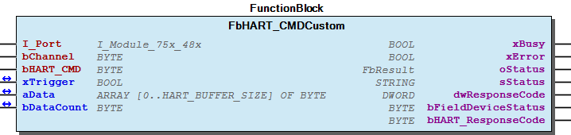 Function Description The function block sends a HART command request to a HART device and returns the response as an array of byte. The interpretation of the response is up to the user. oStatus: CHANNEL_INVALID => Channel out of range 1..2 HART_MODULE_ERROR => Response codes from HART module (see HART specification for details) HART_SENSOR_ERROR => Response codes from HART sensor (see HART specification for details) DETAILS_sStatus => Details in output sStatus

## FbHART_Current (FB)

| Scope | Name | Type | Comment |
| --- | --- | --- | --- |
| Input | xEnable | BOOL |  |
| I_Port | WagoTypesModule_75x_48x.I_Module_75x_48x | Access to module |
| Output | xValid | BOOL | current value valid |
| Output | xBusy | BOOL | current value will be continously updated |
| Output | xError | BOOL | error occurred |
| Output | oStatus | WagoSysErrorBase.FbResult | for future use->status and error information |
| Output | rCurrentChannel_1 | REAL |  |
| Output | rCurrentChannel_2 | REAL |  |
| Output | wCurrent_1 | WORD |  |
| Output | wCurrent_2 | WORD |  |

Calculating current from raw process value

Graphical Illustration

Function Description

Scaling according to:

32765 ==> 20mA

Interface variables Function Calculating current from raw process value Graphical Illustration 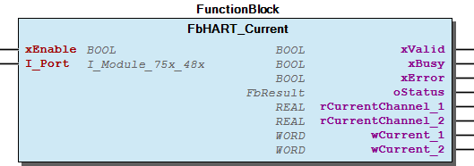 Function Description Scaling according to: 0 ==> 4mA 32765 ==> 20mA

## FbHART_FDT (FB)

| Scope | Name | Type | Initial | Comment |
| --- | --- | --- | --- | --- |
| Input | xEnable | BOOL |  | Enable modbus server, wait for requests |
| tTimeOut | TIME | TIME#45s0ms | Watchdog Timeout |
| wModbusPort | WORD |  | modbus port according to setting within FDT frame application |
| Inout | xTriggerReset | BOOL |  | Reset message counter |
| Output | xValid | BOOL |  | True, after a command received from a FTD-frame has been succesfully performed |
| Output | xBusy | BOOL |  | Function block waiting for command |
| Output | xError | BOOL |  | Error occured |
| Output | oStatus | WagoSysErrorBase.FbResult |  | Status and error information |
| Output | sStatus | STRING |  | For future use |
| Output | bMsgId | BYTE |  | Id of actual processed message from FDT-DTM |
| Output | xModbusServerPortIsOpen | BOOL |  | modbus server port is opened |
| Output | udiConnectedClients | UDINT |  | number of connected clients |

This function block works as a gateway beetween a Wago controller and a HART-FDT-DTM framework.

Graphical Illustration

Function Description

If the block is enabled,its waiting for DPV1-requests. An appropriate DPV1-response will be performed.

Up to 64 moduls will be supported (the largest slot is 64)

Interface variables Function This function block works as a gateway beetween a Wago controller and a HART-FDT-DTM framework. Graphical Illustration 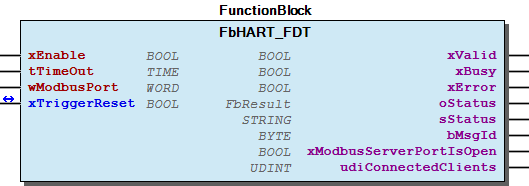 Function Description If the block is enabled,its waiting for DPV1-requests. An appropriate DPV1-response will be performed. Up to 64 moduls will be supported (the largest slot is 64)

### Program Organization

## 20 Program Organization Units

- Data types typHART_2AI (Struct) - typHART_2AI_MODE8 (Struct) - typHART_CMD0 (Struct) - typHART_CMD1 (Struct) - typHART_CMD13 (Struct) - typHART_CMD14 (Struct) - typHART_CMD15 (Struct) - typHART_CMD2 (Struct) - typHART_CMD3 (Struct) - typHART_CMD35 (Struct) - typHART_CMD48 (Struct) - typHART_CMD9 (Struct) - typHART_FDT (Struct) POUs - FbHART_CMD0 (FunctionBlock) - FbHART_CMD1 (FunctionBlock) - FbHART_CMD11 (FunctionBlock) - FbHART_CMD12 (FunctionBlock) - FbHART_CMD13 (FunctionBlock) - FbHART_CMD14 (FunctionBlock) - FbHART_CMD15 (FunctionBlock) - FbHART_CMD16 (FunctionBlock) - FbHART_CMD17 (FunctionBlock) - FbHART_CMD18 (FunctionBlock) - FbHART_CMD19 (FunctionBlock) - FbHART_CMD2 (FunctionBlock) - FbHART_CMD3 (FunctionBlock) - FbHART_CMD33 (FunctionBlock) - FbHART_CMD34 (FunctionBlock) - FbHART_CMD35 (FunctionBlock) - FbHART_CMD38 (FunctionBlock) - FbHART_CMD40 (FunctionBlock) - FbHART_CMD44 (FunctionBlock) - FbHART_CMD45 (FunctionBlock) - FbHART_CMD46 (FunctionBlock) - FbHART_CMD48 (FunctionBlock) - FbHART_CMD50 (FunctionBlock) - FbHART_CMD51 (FunctionBlock) - FbHART_CMD53 (FunctionBlock) - FbHART_CMD6 (FunctionBlock) - FbHART_CMD9 (FunctionBlock) - FbHART_CMDCustom (FunctionBlock) - FbHART_Current (FunctionBlock) - FbHART_FDT (FunctionBlock)

### Global Variable Lists

| Scope | Name | Type |
| --- | --- | --- |
| Constant | StatusHART_48x | ARRAY [0..16] OF WagoTypesErrorBase.typResultItem |

| Value | Level | Description |
| --- | --- | --- |
| eStatus.OK | WagoTypesErrorBase.eSeverity.info | ‘OK’ |
| eStatus.RUNNING | WagoTypesErrorBase.eSeverity.info | ‘Running’ |
| eStatus.MODULE_INVALID | WagoTypesErrorBase.eSeverity.error | ‘ModuleSlotInvalid’ |
| eStatus.CHANNEL_INVALID | WagoTypesErrorBase.eSeverity.error | ‘ChannelInvalid’ |
| eStatus.CFG_INVALID | WagoTypesErrorBase.eSeverity.error | ‘ConfigurationInvalid’ |
| eStatus.NO_SENSOR | WagoTypesErrorBase.eSeverity.error | ‘No sensor conncted to channel’ |
| eStatus.HART_MODULE_ERROR | WagoTypesErrorBase.eSeverity.error | ‘Response from HART module’ |
| eStatus.HART_SENSOR_ERROR | WagoTypesErrorBase.eSeverity.error | ‘Response from HART sensor’ |
| eStatus.DETAILS_sStatus | WagoTypesErrorBase.eSeverity.error | ‘Details in output sStatus’ |
| eStatus.WAIT_HART_CMD | WagoTypesErrorBase.eSeverity.info | ‘Wait for HART command’ |
| eStatus.PENDING | WagoTypesErrorBase.eSeverity.error | ‘Pending->Try Again’ |
| eStatus.MBX1_FAILURE | WagoTypesErrorBase.eSeverity.error | ‘MBX1 error’ |
| eStatus.CMD_ABORTED_BY_CUSTOMER | WagoTypesErrorBase.eSeverity.error | ‘Command aborted by customer’ |
| eStatus.HARTcommandError | WagoTypesErrorBase.eSeverity.error | ‘HART command failed ‘ |

| Name | Type |
| --- | --- |
| Info | ProjectInfo |

| date | version | author | change |
| 16.11.2021 | 1.7.2.4 | u010663 | Additional outputs FbHART_CMDxxx |
| 14.01.2021 | 1.7.2.3 | u010663 | Additional outputs FbHART_CMDCustom |
| 28.08.2020 | 1.7.2.1 | u010663 | Adjustment according to SP15 |
| 07.11.2019 | 1.7.2.0 | u010663 | Add CMD9 |
| 08.01.2019 | 1.7.1.0 | u015842 | Properties: free placeholder added |
| 19.04.2018 | 1.7.0.4 | u010663 | Bugfix CMDx and FDT running at once |
| 06.02.2018 | 1.7.0.3 | u010663 | Bugfix FbHART_FDT |
| 26.01.2018 | 1.7.0.2 | u010663 | Bugfix FbHART_CMDCustom |
| 18.01.2018 | 1.7.0.1 | u010663 | Bugfix CMD3 |
| 05.05.2017 | 1.7.0.0 | u010663 | Released with R5 |
| 03.02.2017 | 1.6.2.0 | u010663 | Additional outsputs(type word) for function block FbHART_Current ->wCurrent_1, wCurrent_2 |
| 05.12.2016 | 1.6.1.1 | u010663 | Support FDT frame configuration ->FbHART_FDT |
| 25.02.2016 | 1.6.0.0 | u010663 | Released with R3 |
| 29.09.2015 | 1.5.0.2 | u010663 | First released version |

Description: Status information

WagoAppHART.library

Release Notes: Configuration using a FDT frame is supported since version 1.6.1.1

Description: Status information WagoAppHART.library Release Notes: Configuration using a FDT frame is supported since version 1.6.1.1

### Other Components

## 80 Status ¶

| Scope | Name | Type | Initial | Comment |
| --- | --- | --- | --- | --- |
| Constant | HART_WATCHDOG_CMD_TIMEOUT | TIME | TIME#15s0ms | Timeout after which a response for a HART command is expected |
| HART_MBX1_TIMEOUT | TIME | TIME#15s0ms | Timeout after which a response for MBX1 is expected |
| HART_RETRIES | BYTE | 4 | Number of retries on communication errors before job is marked as failed |
| ACCEPT_CTRL_POSITIVE_WITHOUT_DATA | BOOL | TRUE | Accept response, even if “positive-without-data” flag set in CRTL byte |
| HART_BUFFER_SIZE | INT | 236 | Defines the max size of transmit/receive buffer for HART- commands |

| Name | Initial | Comment |
| --- | --- | --- |
| OK | 0 | all is well |
| RUNNING | 1 | Command in work |
| TIMEOUT | 2 | Timeout while command execution |
| MODULE_INVALID | 3 | Module out of range 1..255 |
| CHANNEL_INVALID | 4 | channel out of range 1..2 |
| CFG_INVALID | 5 | configuration invalid |
| NO_SENSOR | 6 | no sensor connected to channel |
| HART_MODULE_ERROR | 7 | Response codes from HART module (see HART specification for details) |
| HART_SENSOR_ERROR | 8 | Response codes from HART sensor (see HART specification for details) |
| DETAILS_sStatus | 9 | Error details in output sStatus |
| WAIT_HART_CMD | 10 | Status->wait for HART request from FTD frame |
| PENDING | 11 | Waiting for response |
| MBX1_FAILURE | 12 | MBX 1 error ocurred during communication |
| CMD_ABORTED_BY_CUSTOMER | 13 | variable xTrigger reset by customer and not by function block |
| HARTCOMMANDERROR | 14 | variable xTrigger reset by customer and not by function block |

Description: Status information

- Status (GVL) - eStatus (Enum) - typHART_2AI (Struct) - typHART_2AI_MODE8 (Struct) - typHART_CMD0 (Struct) - typHART_CMD1 (Struct) - typHART_CMD13 (Struct) - typHART_CMD14 (Struct) - typHART_CMD15 (Struct) - typHART_CMD2 (Struct) - typHART_CMD3 (Struct) - typHART_CMD35 (Struct) - typHART_CMD48 (Struct) - typHART_CMD9 (Struct) - typHART_FDT (Struct) - FbHART_CMD0 (FunctionBlock) - FbHART_CMD1 (FunctionBlock) - FbHART_CMD11 (FunctionBlock) - FbHART_CMD12 (FunctionBlock) - FbHART_CMD13 (FunctionBlock) - FbHART_CMD14 (FunctionBlock) - FbHART_CMD15 (FunctionBlock) - FbHART_CMD16 (FunctionBlock) - FbHART_CMD17 (FunctionBlock) - FbHART_CMD18 (FunctionBlock) - FbHART_CMD19 (FunctionBlock) - FbHART_CMD2 (FunctionBlock) - FbHART_CMD3 (FunctionBlock) - FbHART_CMD33 (FunctionBlock) - FbHART_CMD34 (FunctionBlock) - FbHART_CMD35 (FunctionBlock) - FbHART_CMD38 (FunctionBlock) - FbHART_CMD40 (FunctionBlock) - FbHART_CMD44 (FunctionBlock) - FbHART_CMD45 (FunctionBlock) - FbHART_CMD46 (FunctionBlock) - FbHART_CMD48 (FunctionBlock) - FbHART_CMD50 (FunctionBlock) - FbHART_CMD51 (FunctionBlock) - FbHART_CMD53 (FunctionBlock) - FbHART_CMD6 (FunctionBlock) - FbHART_CMD9 (FunctionBlock) - FbHART_CMDCustom (FunctionBlock) - FbHART_Current (FunctionBlock) - FbHART_FDT (FunctionBlock) InOut: InOut: Description: Status information

## typHART_2AI (STRUCT)

| Name | Type | Comment |
| --- | --- | --- |
| bModule | BYTE | Number of HART-module, starting with one - zero means there is no HART module aviable |
| bState | BYTE | State of module: 0-Idle, 1-Ch1-busy, 2-Ch2-busy |
| stCmd0 | ARRAY [1..2] OF typHART_CMD0 | connected HART devices on Channel 1 and 2, retrieved with HART_CMD0 |
| pstHartPAE | POINTER TO typHART_2AI_MODE8 | Pointer to complied HART module in Input process image |
| pstHartPAA | POINTER TO typHART_2AI_MODE8 | Pointer to complied HART module in Output process image |

Description: Represant a HART module 750-482 (2AI 4..20mA HART modul)

InOut: Description: Represant a HART module 750-482 (2AI 4..20mA HART modul)

## typHART_2AI_MODE8 (STRUCT)

| Name | Type | Comment |
| --- | --- | --- |
| bCtlSt | BYTE | Control / Status depending of the direction. Data to the modul = control byte. Data from modul = status byte. |
| bDummy | BYTE | not used |
| abMbx | ARRAY [0..5] OF BYTE | Data of HART Mailbox |
| wAI1 | WORD | Analog input value of channel 1 in input direction. Not used in the output direction |
| wAI2 | WORD | Analog input value of channel 2 in input direction. Not used in the output direction |

Description: Represant the process image of a 750-482 (2AI 4..20mA HART modul) with operating mode number 8 (12 Bytes)

InOut: Description: Represant the process image of a 750-482 (2AI 4..20mA HART modul) with operating mode number 8 (12 Bytes)

## typHART_CMD0 (STRUCT)

| Name | Type | Comment |
| --- | --- | --- |
| bManufacturerId | BYTE | HART device manufacturer ID |
| bTypeManufDevice | BYTE | HART device manufacturer Device Type |
| bPreamblesRequest | BYTE | HART device preambles Requested |
| bCmdRevision | BYTE | HART device command Revision |
| bXmtrRevision | BYTE | HART device transmitter Revision |
| bSwRevision | BYTE | HART device software Revision |
| bHwRevision | BYTE | HART device hardware Revision |
| bFlags | BYTE | HART device flags |
| dwDeviceId | DWORD | HART device ID (HART-ADDRESS-LONG) |

Description: Represants the resultset of a HART CMD0: ‘Read unique identifier’

InOut: Description: Represants the resultset of a HART CMD0: ‘Read unique identifier’

## typHART_CMD1 (STRUCT)

| Name | Type | Comment |
| --- | --- | --- |
| rVarPrimary | REAL | Value of primary HART variable |
| sUnitSymPrimary | STRING(10) | Symbol of Unit |
| sUnitTxtPrimary | STRING(30) | Description of Unit |

Description: Represants the resultset of a HART CMD0: ‘Read unique identifier’

InOut: Description: Represants the resultset of a HART CMD0: ‘Read unique identifier’

## typHART_CMD13 (STRUCT)

| Name | Type | Comment |
| --- | --- | --- |
| sTag | STRING(8) | Unit tag(8 Characters) |
| sDescriptor | STRING(16) | Unit description(16 Characters) |
| dDate | DATE | Unit date |

Also used by HART CMD18: ‘Write tag, descriptor, date’

InOut: Description: Represants the resultset of a HART CMD13: ‘Read tag, descriptor, date’. Also used by HART CMD18: ‘Write tag, descriptor, date’

## typHART_CMD14 (STRUCT)

| Name | Type | Comment |
| --- | --- | --- |
| dwPVSensorSerialNumber | DWORD | Sensors serial number |
| sPVSensorUnitCode | STRING(30) | Units code for sensor limits and minimum span |
| rPVUpperSensorLimit | REAL | Upper sensor limit |
| rPVLowerSensorLimit | REAL | Lower sensor limit |
| rPVMinimalSpan | REAL | Minimum span |

Description: Represants the result set of the HART CMD14

InOut: Description: Represants the result set of the HART CMD14

## typHART_CMD15 (STRUCT)

| Name | Type | Comment |
| --- | --- | --- |
| bAlarmSelectCode | BYTE |  |
| bTxFunctionCode | BYTE |  |
| sPVUnitSym | STRING(10) | Symbol of Unit |
| sPVUnitTxt | STRING(30) | Description of Unit |
| rUpperRangeValue | REAL |  |
| rLowerRangeValue | REAL |  |
| rDampingValue | REAL | seconds |
| bWriteProtectCode | BYTE |  |
| bPrivateLabelCode | BYTE | Private-label describtor code |

Description: Represants the resultset of a HART CMD15: ‘Read output information’

InOut: Description: Represants the resultset of a HART CMD15: ‘Read output information’

## typHART_CMD2 (STRUCT)

| Name | Type | Comment |
| --- | --- | --- |
| rVarCurrent | REAL | Value of current HART variable (mA) |
| rPercentOfRange | REAL | Percent of range |

Description: Represants the resultset of a HART CMD2: ‘Read current and percent of range’

InOut: Description: Represants the resultset of a HART CMD2: ‘Read current and percent of range’

## typHART_CMD3 (STRUCT)

| Name | Type | Comment |
| --- | --- | --- |
| rVarCurrent | REAL | Value of current HART variable (mA) |
| rVarPrimary | REAL | Value of primary HART variable |
| sUnitSymPrimary | STRING(10) | Symbol of Unit |
| sUnitTxtPrimary | STRING(30) | Description of Unit |
| rVarSecondary | REAL | Value of secondary HART variable |
| sUnitSymSecondary | STRING(10) | Symbol of Unit |
| sUnitTxtSecondary | STRING(30) | Description of Unit |
| rVarThird | REAL | Value of third HART variable |
| sUnitSymThird | STRING(10) | Symbol of Unit |
| sUnitTxtThird | STRING(30) | Description of Unit |
| rVarFourth | REAL | Value of fourth HART variable |
| sUnitSymFourth | STRING(10) | Symbol of Unit |
| sUnitTxtFourth | STRING(30) | Description of Unit |

Description: Represants the resultset of a HART CMD3: ‘Read current and four (predefined) dynamic variables’

InOut: Description: Represants the resultset of a HART CMD3: ‘Read current and four (predefined) dynamic variables’

## typHART_CMD35 (STRUCT)

| Name | Type | Comment |
| --- | --- | --- |
| bPvRangeUnitCode | BYTE | UnitCode of primary variable |
| rPvUpperRangeValue | REAL | Upper range of primary variable |
| rPvLowerRangeValue | REAL | Lower range of primary variable |

Description: Represants the request set of the HART CMD35

InOut: Description: Represants the request set of the HART CMD35

## typHART_CMD48 (STRUCT)

| Name | Type | Comment |
| --- | --- | --- |
| abDeviceSpecificStatus | ARRAY [0..5] OF BYTE | Bytes: 0– 5 |
| abOperationalModes | ARRAY [0..1] OF BYTE | Bytes: 6– 7 |
| abAnalogOutputsSaturated | ARRAY [0..2] OF BYTE | Bytes: 8–10 |
| abAnalogOutputsFixed | ARRAY [0..2] OF BYTE | Bytes: 11–13 |
| abTransmitterSpecificStatus | ARRAY [0..10] OF BYTE | Bytes: 14–24 |

Description: Represants the resultset of a HART CMD48: ‘Read additional device status’

InOut: Description: Represants the resultset of a HART CMD48: ‘Read additional device status’

## typHART_CMD9 (STRUCT)

| Name | Type | Comment |
| --- | --- | --- |
| bExtendedFieldDeviceStatus | BYTE | EXTENDED FIELD DEVICE STATUS |
| bCode | BYTE | SLOT X DEV. VARIABLE CODE |
| bClassification | BYTE | SLOT X DEV. VARIABLE CLASSIFICATION |
| bUnitsCode | BYTE | SLOT X DEV. VARIABLE UNITS CODE |
| rValue | REAL | SLOT X DEV. VARIABLE VALUE |
| bStatus | BYTE | SLOT X DEV. VARIABLE STATUS |
| udiDataTimestamp | UDINT | SLOT X DATA TIME STAMP |

Description: Represants the resultset of a HART CMD2: ‘Read current and percent of range’

InOut: Description: Represants the resultset of a HART CMD2: ‘Read current and percent of range’

## typHART_FDT (STRUCT)

| Name | Type | Comment |
| --- | --- | --- |
| bMsgNumber | BYTE | Number of DPV1-Request/Response to process |
| abDpv1Telegram | ARRAY [0..HART_BUFFER_SIZE] OF BYTE | DPV1-Request/Response to process |

Description: Represants the interface for FDT-DTM-Communication

InOut: Description: Represants the interface for FDT-DTM-Communication