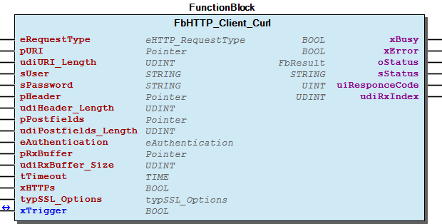
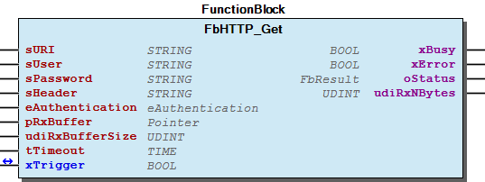
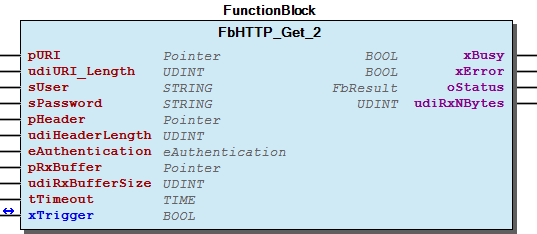
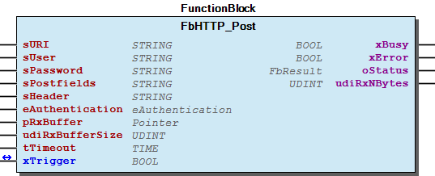
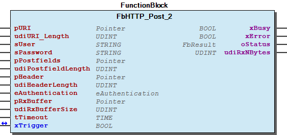
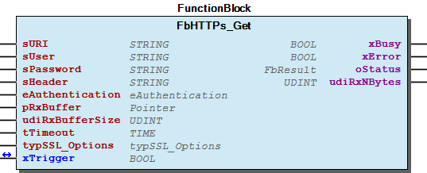
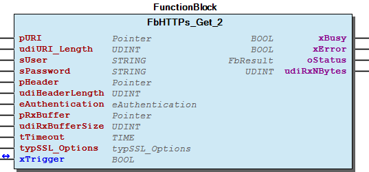
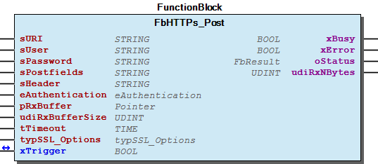
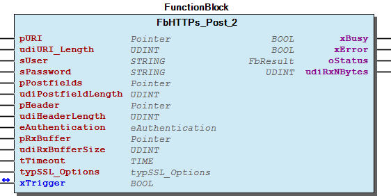

# WagoAppHTTP v1.7.3.5 (WAGO) - Complete Documentation

### Documentation Index

WagoAppHTTP

WAGO FunctionalView|Connectivity; WAGO LayerView|App; Application

Wago/u010663

WagoAppHTTP

This document is automatically generated.

This library provides a simple HTTP-Client

Based on WagoAppHTTP.library, last modified 15.05.2023, 19:05:20. LibDoc 4.1.1.0

© WAGO GmbH & Co. KG, Germany 2018 – All rights reserved. For the avoidance of doubt, this copyright notice does not only apply to the information above but also and primarily to the described library itself. Please note that third-party products are always mentioned without reference to intellectual property rights, including patents, utility models, designs and trademarks, accordingly the existence of such rights cannot be excluded. WAGO is a registered trademark of WAGO Verwaltungsgesellschaft mbH.

Company WAGO Title WagoAppHTTP Version 1.7.3.5 Categories WAGO FunctionalView|Connectivity; WAGO LayerView|App; Application Author Wago/u010663 Placeholder WagoAppHTTP This document is automatically generated. This library provides a simple HTTP-Client - 20 Program Organization Units Advanced - FbHTTP_Get (FunctionBlock) - FbHTTP_Post (FunctionBlock) - FbHTTPs_Get (FunctionBlock) - FbHTTPs_Post (FunctionBlock) - eAuthentication (Enum) 80 Status - Status (GVL) - eStatusHTTP_Curl (Enum) ParameterList (ParamList) VersionHistory (GVL) - File and Project Information - Library Reference Based on WagoAppHTTP.library, last modified 15.05.2023, 19:05:20. LibDoc 4.1.1.0 © WAGO GmbH & Co. KG, Germany 2018 – All rights reserved. For the avoidance of doubt, this copyright notice does not only apply to the information above but also and primarily to the described library itself. Please note that third-party products are always mentioned without reference to intellectual property rights, including patents, utility models, designs and trademarks, accordingly the existence of such rights cannot be excluded. WAGO is a registered trademark of WAGO Verwaltungsgesellschaft mbH.

### Project Information

| Scope | Name | Type | Content |
| --- | --- | --- | --- |
| FileHeader | creationDateTime | date | 15.05.2023, 19:05:21 |
| companyName | string | WAGO |
| libraryFile | string | WagoAppHTTP.library |
| productName | string | e!COCKPIT |
| contentFile | string | doc.clean.json |
| ProjectInformation | AutoResolveUnbound | bool | True |
| ProjectInformation | LastModificationDateTime | 15.05.2023, 19:05:20 |
| ProjectInformation | LibraryCategories | library-category-list | WAGO FunctionalView\|Connectivity; WAGO LayerView\|App; Application |
| ProjectInformation | Author | string | Wago/u010663 |
| ProjectInformation | Company | string | WAGO |
| ProjectInformation | CompiledLibraryCompatibilityVersion | string | CODESYS V3.5 SP16 Patch 3 |
| ProjectInformation | Copyright | string | © WAGO GmbH & Co. KG, Germany 2018 – All rights reserved. |
| ProjectInformation | DefaultNamespace | string |  |
| ProjectInformation | Description | string | See: Description |
| ProjectInformation | DocFormat | string | reStructuredText |
| ProjectInformation | Placeholder | string | WagoAppHTTP |
| ProjectInformation | Project | string | WagoAppHTTP |
| ProjectInformation | Title | string | WagoAppHTTP |
| ProjectInformation | Version | version | 1.7.3.5 |

### Library Information

| LinkAllContent: False Optional: False | QualifiedOnly: False | SystemLibrary: False |

| LinkAllContent: False Optional: False | QualifiedOnly: True | SystemLibrary: False |

| LinkAllContent: False Optional: False | QualifiedOnly: True | SystemLibrary: False |

| LinkAllContent: False Optional: False | QualifiedOnly: False | SystemLibrary: False |

| LinkAllContent: False Optional: False | PublishSymbolsInContainer: True QualifiedOnly: False | SystemLibrary: False |

| LinkAllContent: False Optional: False | QualifiedOnly: True | SystemLibrary: False |

This is a dictionary of all referenced libraries and their name spaces.

This is a dictionary of all referenced libraries and their name spaces. Standard Library Identification : Placeholder: Standard Default Resolution: Standard, * (System) Namespace: Standard Library Properties : WagoSysCurl Library Identification : Placeholder: WagoSysCurl Default Resolution: WagoSysCurl, * (WAGO) Namespace: WagoSysCurl Library Properties : WagoSysErrorBase Library Identification : Placeholder: WagoSysErrorBase Default Resolution: WagoSysErrorBase, * (WAGO) Namespace: WagoSysErrorBase Library Properties : Library Parameter : Parameter: RES_LOG_MAX_ENTRIES = 200 Parameter: RES_LOG_MAX_FILES = 1 Parameter: RES_LOG_MAX_FILESIZE = 2000 Parameter: RES_LOG_NAME = ‘WagoAppResultLogger’ WagoSysVersion Library Identification : Name: WagoSysVersion Version: 1.0.0.0 Company: WAGO Namespace: WagoSysVersion Library Properties : WagoTypesCurl Library Identification : Placeholder: WagoTypesCurl Default Resolution: WagoTypesCurl, * (WAGO) Namespace: WagoTypesCurl Library Properties : WagoTypesErrorBase Library Identification : Placeholder: WagoTypesErrorBase Default Resolution: WagoTypesErrorBase, * (WAGO) Namespace: WagoTypesErrorBase Library Properties :

### Function Blocks

## FbHTTP_Client_Curl (FB)

| Scope | Name | Type | Comment |
| --- | --- | --- | --- |
| Input | eRequestType | eHTTP_RequestType | HEAD, GET, POST or PUT |
| pURI | POINTER TO BYTE | Pointer to the URI, e.g. ADR(MyURI) |
| udiURI_Length | UDINT | Length of URI |
| sUser | STRING(1023) | Authentification if needed by the webserver |
| sPassword | STRING(1023) | Authentification if needed by the webserver |
| pHeader | POINTER TO BYTE | Pointer to the Header, e.g. ADR(MyHeader). Leave empty, if the default settings should be used; |
| udiHeader_Length | UDINT | Length of the header |
| pPostfields | POINTER TO BYTE | Pointer to the Postfield |
| udiPostfields_Length | UDINT | Length of the postfield data |
| eAuthentication | eAuthentication | 0 = none, 1 = basic -> 2 = digest for future use |
| pRxBuffer | POINTER TO DWORD | Pointer to the receive buffer |
| udiRxBuffer_Size | UDINT | receive buffer size |
| tTimeout | TIME | If tTimeout = 0, the timeout is deactivated |
| xHTTPs | BOOL | Use of HTTPs instead of HTTP |
| typSSL_Options | WagoTypesCurl.typSSL_Options | Details in WagoTypesCurl or above |
| Inout | xTrigger | BOOL | perform a request |
| Output | xBusy | BOOL | job in progress |
| Output | xError | BOOL | job finished with error |
| Output | oStatus | WagoSysErrorBase.FbResult | detailed status information |
| Output | sStatus | STRING |  |
| Output | uiResponceCode | UINT |  |
| Output | udiRxIndex | UDINT | Number of Bytes, that have been received by the Post-command |

| Scope | Name | Type | Comment |
| Input | eRequestType | eHTTP_RequestType | HEAD, GET, POST ,PUT or DELETE |
| Input | pURI | POINTER TO BYTE | Pointer to the URI, e.g. ADR(MyURI) |
| Input | udiURI_Length | UDINT | Length of URI |
| Input | sUser | STRING(1023) | Authentification if needed by the webserver |
| Input | sPassword | STRING(1023) | Authentification if needed by the webserver |
| Input | pHeader | POINTER TO BYTE | Pointer to the Header, e.g. ADR(MyHeader). Leave empty, if the default settings should be used; |
| Input | udiHeader_Length | UDINT | Length of the header |
| Input | pPostfields | POINTER TO BYTE | Pointer to the Postfield |
| Input | udiPostfields_Length | UDINT | Length of the postfield data |
| Input | eAuthentication | eAuthentication | 0 = none, 1 = basic, 2 = digest (Option digest not yet supported) |
| Input | pRxBuffer | POINTER TO DWORD | Pointer to the receive buffer |
| Input | udiRxBuffer_Size | UDINT | receive buffer size |
| Input | tTimeout | TIME | If tTimeout = 0, the timeout is deactivated |
| Input | xHTTPs | BOOL | Use of HTTPs instead of HTTP |
| Input | typSSL_Options | WagoTypesCurl.typSSL_Options | Details in WagoTypesCurl or below |
| Input/Output | xTrigger | BOOL | perform a request |
| Output | xBusy | BOOL | job in progress |
| Output | xError | BOOL | job finished with error |
| Output | oStatus | WagoSysErrorBase.FbResult | detailed status information |
| Output | sStatus | STRING |  |
| Output | uiResponceCode | UINT |  |
| Output | udiRxIndex | UDINT | Number of Bytes, that have been received by the Post-command |

Compact function block performing an HTTP(s) request.

Graphical Illustration

Function description

This function block communicate with an HTTP server via HTTP(s) request.

Option digest not yet supported

This input may be used to specify the Header field as defined in RFC7231 example 1:

sHeader:=’Accept: text/plain’

sHeader:=’Content-type: text/html ; charset=UTF-8’

By default the cacert.pem from mozilla.org is used (for more information: http://hg.mozilla.org/releases/mozilla-release/raw-file/default/security/nss/lib/ckfw/builtins/certdata.txt

Use sCA_Cert if you have imported a single server certificate in pem format.

Option xVerifyPeer allows to check the basic certificate information. Option should be false, if no server certificate is available

Option xVerifyHost allows to check the exact identity of the server by means of common name.

Leave `` sClientCert``blank, unless a client certificate is used

Leave sClientCert_Key blank, unless a client certificate is used

Leave sClientCert_KeyPasswd blank, unless a client certificate is used

Interface variables Function* Compact function block performing an HTTP(s) request. Graphical Illustration  Function description This function block communicate with an HTTP server via HTTP(s) request. Input eAuthentication : Option digest not yet supported Input sHeader : This input may be used to specify the Header field as defined in RFC7231 example 1: sHeader:=’Accept: text/plain’ example 2: sHeader:=’Content-type: text/html ; charset=UTF-8’ Input typSSL_Options : Use sCA_Path if you have imported a bundle file like cacert.pem By default the cacert.pem from mozilla.org is used (for more information: http://hg.mozilla.org/releases/mozilla-release/raw-file/default/security/nss/lib/ckfw/builtins/certdata.txt Use sCA_Cert if you have imported a single server certificate in pem format. Option xVerifyPeer allows to check the basic certificate information. Option should be false, if no server certificate is available Option xVerifyHost allows to check the exact identity of the server by means of common name. Leave `` sClientCert``blank, unless a client certificate is used Leave sClientCert_Key blank, unless a client certificate is used Leave sClientCert_KeyPasswd blank, unless a client certificate is used

## FbHTTP_Get (FB)

| Scope | Name | Type | Comment |
| --- | --- | --- | --- |
| Input | sURI | STRING(1023) | e.g.: http://192.168.1.17 |
| sUser | STRING(1023) | Authentification if needed by the webserver |
| sPassword | STRING(1023) | Authentification if needed by the webserver |
| sHeader | STRING(1023) | leave empty, if the default settings should be used |
| eAuthentication | eAuthentication | 0=none, 1=basic ->2=digest future use |
| pRxBuffer | POINTER TO DWORD | Pointer to the receive buffer |
| udiRxBufferSize | UDINT | receive buffer size |
| tTimeout | TIME | If tTimeout = 0, the timeout is deactivated |
| Inout | xTrigger | BOOL | perform a request |
| Output | xBusy | BOOL | job in progress |
| Output | xError | BOOL | job finished with error |
| Output | oStatus | WagoSysErrorBase.FbResult | detailed status information |
| Output | udiRxNBytes | UDINT | Number of Bytes, that have been received by the Get-command |

Compact function block performing a HTTP Get request

Graphical Illustration

Function description

This function block should be used reading data from a webserver. As defined by the standard, it is also possible to transfer a small amount of data to the webserver. In this case the URI must contain the data in an appropriate manner. The size of the URI is limited to 1023 byte.

Input eAuthentication : | Option digest not yet supported

Input sHeader : | This input may be used to specify the Header field as defined in RFC7231 | example 1: | sHeader:=’Accept: text/plain’ | example 2: | sHeader:=’Content-type: text/html ; charset=UTF-8’

Interface variables Function Compact function block performing a HTTP Get request Graphical Illustration  Function description This function block should be used reading data from a webserver. As defined by the standard, it is also possible to transfer a small amount of data to the webserver. In this case the URI must contain the data in an appropriate manner. The size of the URI is limited to 1023 byte. Input eAuthentication : | Option digest not yet supported Input sHeader : | This input may be used to specify the Header field as defined in RFC7231 | example 1: | sHeader:=’Accept: text/plain’ | example 2: | sHeader:=’Content-type: text/html ; charset=UTF-8’

## FbHTTP_Get_2 (FB)

| Scope | Name | Type | Comment |
| --- | --- | --- | --- |
| Input | pURI | POINTER TO BYTE |  |
| udiURI_Length | UDINT | e.g.: http://192.168.1.17 |
| sUser | STRING(1023) | Authentification if needed by the webserver |
| sPassword | STRING(1023) | Authentification if needed by the webserver |
| pHeader | POINTER TO BYTE | leave empty, if the default settings should be used |
| udiHeaderLength | UDINT | Length of the header string |
| eAuthentication | eAuthentication | 0=none, 1=basic ->2=digest future use |
| pRxBuffer | POINTER TO DWORD | Pointer to the receive buffer |
| udiRxBufferSize | UDINT | receive buffer size |
| tTimeout | TIME | If tTimeout = 0, the timeout is deactivated |
| Inout | xTrigger | BOOL | perform a request |
| Output | xBusy | BOOL | job in progress |
| Output | xError | BOOL | job finished with error |
| Output | oStatus | WagoSysErrorBase.FbResult | detailed status information |
| Output | udiRxNBytes | UDINT | Number of Bytes, that have been received by the Get-command |

Compact function block performing a HTTP Get request

Graphical Illustration

Function description

This function block should be used reading data from a webserver. As defined by the standard, it is also possible to transfer a small amount of data to the webserver. In this case the URI must contain the data in an appropriate manner.

Input eAuthentication : | Option digest not yet supported

Input pHeader : | This input may be used to specify the Header field as defined in RFC7231 | example 1: | sHeader:=’Accept: text/plain’ | pHeader:=adr(sHeader); | example 2: | sHeader:=’Content-type: text/html ; charset=UTF-8’ | pHeader:=adr(sHeader);

Interface variables Function Compact function block performing a HTTP Get request Graphical Illustration  Function description This function block should be used reading data from a webserver. As defined by the standard, it is also possible to transfer a small amount of data to the webserver. In this case the URI must contain the data in an appropriate manner. Input eAuthentication : | Option digest not yet supported Input pHeader : | This input may be used to specify the Header field as defined in RFC7231 | example 1: | sHeader:=’Accept: text/plain’ | pHeader:=adr(sHeader); | example 2: | sHeader:=’Content-type: text/html ; charset=UTF-8’ | pHeader:=adr(sHeader);

## FbHTTP_Post (FB)

| Scope | Name | Type | Comment |
| --- | --- | --- | --- |
| Input | sURI | STRING(1023) | e.g.: http://192.168.1.17 |
| sUser | STRING(1023) | Authentification |
| sPassword | STRING(1023) | Authentification |
| sPostfields | STRING(1023) | “name=daniel&project=water” |
| sHeader | STRING(1023) |  |
| eAuthentication | eAuthentication | 0=none, 1=basic ->2=digest future use |
| pRxBuffer | POINTER TO DWORD | Pointer to the receive buffer |
| udiRxBufferSize | UDINT | receive buffer size |
| tTimeout | TIME | If tTimeout = 0, the timeout is deactivated |
| Inout | xTrigger | BOOL | perform a request |
| Output | xBusy | BOOL | job in progress |
| Output | xError | BOOL | job finished with error |
| Output | oStatus | WagoSysErrorBase.FbResult | detailed status information |
| Output | udiRxNBytes | UDINT | Number of Bytes, that have been received by the Get-command |

Compact function block performing a HTTP Post request

Graphical Illustration

Function description

This function block should be used reading data from a webserver by using the HTTP post command.

Input eAuthentication : | Option digest not yet supported

Input sHeader : | This input may be used to specify the Header field as defined in RFC7231 | example 1: | sHeader:=’Accept: text/plain’ | example 2: | sHeader:=’Content-type: text/html ; charset=UTF-8’

Interface variables Function Compact function block performing a HTTP Post request Graphical Illustration  Function description This function block should be used reading data from a webserver by using the HTTP post command. Input eAuthentication : | Option digest not yet supported Input sHeader : | This input may be used to specify the Header field as defined in RFC7231 | example 1: | sHeader:=’Accept: text/plain’ | example 2: | sHeader:=’Content-type: text/html ; charset=UTF-8’

## FbHTTP_Post_2 (FB)

| Scope | Name | Type | Comment |
| --- | --- | --- | --- |
| Input | pURI | POINTER TO BYTE | e.g. adr(MyURI) and URI:=http://192.168.1.17 |
| udiURI_Length | UDINT | length of URI |
| sUser | STRING(1023) | Authentification |
| sPassword | STRING(1023) | Authentification |
| pPostfields | POINTER TO BYTE | e.g. adr(MyPostfield) |
| udiPostfieldLength | UDINT | Length of the postfield data |
| pHeader | POINTER TO BYTE | leave empty, if the default settings should be used |
| udiHeaderLength | UDINT | Length of the header |
| eAuthentication | eAuthentication | 0=none, 1=basic ->2=digest future use |
| pRxBuffer | POINTER TO DWORD | Pointer to the receive buffer |
| udiRxBufferSize | UDINT | receive buffer size |
| tTimeout | TIME | If tTimeout = 0, the timeout is deactivated |
| Inout | xTrigger | BOOL | perform a request |
| Output | xBusy | BOOL | job in progress |
| Output | xError | BOOL | job finished with error |
| Output | oStatus | WagoSysErrorBase.FbResult | detailed status information |
| Output | udiRxNBytes | UDINT | Number of Bytes, that have been received by the Get-command |

Compact function block performing a HTTP Post request

Graphical Illustration

Function description

This function block should be used reading data from a webserver by using the HTTP post command.

Input eAuthentication : | Option digest not yet supported

Input pHeader : | This input may be used to specify the Header field as defined in RFC7231 | example 1: | pHeader:=adr(sHeader); | sHeader:=’Accept: text/plain’ | example 2: | pHeader:=adr(sHeader); | sHeader:=’Content-type: text/html ; charset=UTF-8’

Interface variables Function Compact function block performing a HTTP Post request Graphical Illustration  Function description This function block should be used reading data from a webserver by using the HTTP post command. Input eAuthentication : | Option digest not yet supported Input pHeader : | This input may be used to specify the Header field as defined in RFC7231 | example 1: | pHeader:=adr(sHeader); | sHeader:=’Accept: text/plain’ | example 2: | pHeader:=adr(sHeader); | sHeader:=’Content-type: text/html ; charset=UTF-8’

## FbHTTPs_Get (FB)

| Scope | Name | Type | Initial | Comment |
| --- | --- | --- | --- | --- |
| Input | sURI | STRING(1023) |  | e.g.: https://www.google.de/ |
| sUser | STRING(1023) |  | Authentification if needed by the webserver |
| sPassword | STRING(1023) |  | Authentification if needed by the webserver |
| sHeader | STRING(1023) |  | leave empty, if the default settings should be used |
| eAuthentication | eAuthentication | basic | 0=none, 1=basic ->2=digest future use |
| pRxBuffer | POINTER TO DWORD |  | Pointer to the receive buffer |
| udiRxBufferSize | UDINT |  | Receive buffer size |
| tTimeout | TIME |  | If tTimeout = 0, the timeout is deactivated |
| typSSL_Options | WagoTypesCurl.typSSL_Options |  | Details in WagoTypesCurl or above |
| Inout | xTrigger | BOOL |  | perform a request |
| Output | xBusy | BOOL |  | job in progress |
| Output | xError | BOOL |  | job finished with error |
| Output | oStatus | WagoSysErrorBase.FbResult |  | detailed status information |
| Output | udiRxNBytes | UDINT |  | Number of Bytes, that have been received by the Get-command |

This function block should be used reading data from a webserver by using the HTTP get command.

Graphical Illustration

Function description

This function block should be used reading data from a webserver. As defined by the standard, it is also possible to transfer a small amount of data to the webserver. In this case the URI must contain the data in an appropriate manner. The size of the URI is limited to 1023 byte.

Input eAuthentication : | Option digest not yet supported

Input sHeader : | This input may be used to specify the Header field as defined in RFC7231 | example 1: | sHeader:=’Accept: text/plain’ | example 2: | sHeader:=’Content-type: text/html ; charset=UTF-8’

Input typSSL_Options : Use sCA_Path if you have imported a bundle file like cacert.pem By default the cacert.pem from mozilla.org is used (for more information: http://hg.mozilla.org/releases/mozilla-release/raw-file/default/security/nss/lib/ckfw/builtins/certdata.txt

Use sCA_Cert if you have imported a single server certificate in pem format.

Option xVerifyPeer allows to check the basic certificate information. Option should be false, if no server certificate is available

Option xVerifyHost allows to check the exact identity of the server by means of common name.

Leave `` sClientCert``blank, unless a client certificate is used

Leave sClientCert_Key blank, unless a client certificate is used

Leave sClientCert_KeyPasswd blank, unless a client certificate is used

Interface variables Function This function block should be used reading data from a webserver by using the HTTP get command. Graphical Illustration  Function description This function block should be used reading data from a webserver. As defined by the standard, it is also possible to transfer a small amount of data to the webserver. In this case the URI must contain the data in an appropriate manner. The size of the URI is limited to 1023 byte. Input eAuthentication : | Option digest not yet supported Input sHeader : | This input may be used to specify the Header field as defined in RFC7231 | example 1: | sHeader:=’Accept: text/plain’ | example 2: | sHeader:=’Content-type: text/html ; charset=UTF-8’ Input typSSL_Options : Use sCA_Path if you have imported a bundle file like cacert.pem By default the cacert.pem from mozilla.org is used (for more information: http://hg.mozilla.org/releases/mozilla-release/raw-file/default/security/nss/lib/ckfw/builtins/certdata.txt Use sCA_Cert if you have imported a single server certificate in pem format. Option xVerifyPeer allows to check the basic certificate information. Option should be false, if no server certificate is available Option xVerifyHost allows to check the exact identity of the server by means of common name. Leave `` sClientCert``blank, unless a client certificate is used Leave sClientCert_Key blank, unless a client certificate is used Leave sClientCert_KeyPasswd blank, unless a client certificate is used

## FbHTTPs_Get_2 (FB)

| Scope | Name | Type | Initial | Comment |
| --- | --- | --- | --- | --- |
| Input | pURI | POINTER TO BYTE |  | Pointer to the URI, e.g. ADR(MyURI) |
| udiURI_Length | UDINT |  | Length of URI |
| sUser | STRING(1023) |  | Authentification if needed by the webserver |
| sPassword | STRING(1023) |  | Authentification if needed by the webserver |
| pHeader | POINTER TO BYTE |  | Pointer to the Header, e.g. ADR(MyHeader),leave empty, if the default settings should be used |
| udiHeaderLength | UDINT |  | Length of the header |
| eAuthentication | eAuthentication | basic | 0=none, 1=basic ->2=digest future use |
| pRxBuffer | POINTER TO DWORD |  | Pointer to the receive buffer |
| udiRxBufferSize | UDINT |  | Receive buffer size |
| tTimeout | TIME |  | If tTimeout = 0, the timeout is deactivated |
| typSSL_Options | WagoTypesCurl.typSSL_Options |  | Details in WagoTypesCurl or above |
| Inout | xTrigger | BOOL |  | perform a request |
| Output | xBusy | BOOL |  | job in progress |
| Output | xError | BOOL |  | job finished with error |
| Output | oStatus | WagoSysErrorBase.FbResult |  | detailed status information |
| Output | udiRxNBytes | UDINT |  | Number of Bytes, that have been received by the Get-command |

This function block should be used reading data from a webserver by using the HTTP get command.

Graphical Illustration

Function description

This function block should be used reading data from a webserver. As defined by the standard, it is also possible to transfer a small amount of data to the webserver. In this case the URI must contain the data in an appropriate manner.

Input eAuthentication : | Option digest not yet supported

Input sHeader : | This input may be used to specify the Header field as defined in RFC7231 | example 1: | sHeader:=’Accept: text/plain’ | example 2: | sHeader:=’Content-type: text/html ; charset=UTF-8’

Input typSSL_Options : Use sCA_Path if you have imported a bundle file like cacert.pem By default the cacert.pem from mozilla.org is used (for more information: http://hg.mozilla.org/releases/mozilla-release/raw-file/default/security/nss/lib/ckfw/builtins/certdata.txt

Use sCA_Cert if you have imported a single server certificate in pem format.

Option xVerifyPeer allows to check the basic certificate information. Option should be false, if no server certificate is available

Option xVerifyHost allows to check the exact identity of the server by means of common name.

Leave `` sClientCert``blank, unless a client certificate is used

Leave sClientCert_Key blank, unless a client certificate is used

Leave sClientCert_KeyPasswd blank, unless a client certificate is used

Interface variables Function This function block should be used reading data from a webserver by using the HTTP get command. Graphical Illustration  Function description This function block should be used reading data from a webserver. As defined by the standard, it is also possible to transfer a small amount of data to the webserver. In this case the URI must contain the data in an appropriate manner. Input eAuthentication : | Option digest not yet supported Input sHeader : | This input may be used to specify the Header field as defined in RFC7231 | example 1: | sHeader:=’Accept: text/plain’ | example 2: | sHeader:=’Content-type: text/html ; charset=UTF-8’ Input typSSL_Options : Use sCA_Path if you have imported a bundle file like cacert.pem By default the cacert.pem from mozilla.org is used (for more information: http://hg.mozilla.org/releases/mozilla-release/raw-file/default/security/nss/lib/ckfw/builtins/certdata.txt Use sCA_Cert if you have imported a single server certificate in pem format. Option xVerifyPeer allows to check the basic certificate information. Option should be false, if no server certificate is available Option xVerifyHost allows to check the exact identity of the server by means of common name. Leave `` sClientCert``blank, unless a client certificate is used Leave sClientCert_Key blank, unless a client certificate is used Leave sClientCert_KeyPasswd blank, unless a client certificate is used

## FbHTTPs_Post (FB)

| Scope | Name | Type | Comment |
| --- | --- | --- | --- |
| Input | sURI | STRING(1023) | e.g.: https://www.google.de/ |
| sUser | STRING(1023) | Authentification |
| sPassword | STRING(1023) | Authentification |
| sPostfields | STRING(1023) | “name=daniel&project=water” |
| sHeader | STRING(1023) |  |
| eAuthentication | eAuthentication | 0=none, 1=basic ->2=digest future use |
| pRxBuffer | POINTER TO DWORD | Pointer to the receive buffer |
| udiRxBufferSize | UDINT | receive buffer size |
| tTimeout | TIME | If tTimeout = 0, the timeout is deactivated |
| typSSL_Options | WagoTypesCurl.typSSL_Options | details in WagoTypesCurl |
| Inout | xTrigger | BOOL | perform a request |
| Output | xBusy | BOOL | job in progress |
| Output | xError | BOOL | job finished with error |
| Output | oStatus | WagoSysErrorBase.FbResult | detailed status information |
| Output | udiRxNBytes | UDINT | Number of Bytes, that have been received by the Get-command |

Compact function block performing a HTTP Post request

Graphical Illustration

Function description

This function block should be used reading data from a webserver by using the HTTP post command.

Input eAuthentication : | Option digest not yet supported

Input sHeader : | This input may be used to specify the Header field as defined in RFC7231 | example 1: | sHeader:=’Accept: text/plain’ | example 2: | sHeader:=’Content-type: text/html ; charset=UTF-8’

Input typSSL_Options : Use sCA_Path if you have imported a bundle file like cacert.pem By default the cacert.pem from mozilla.org is used (for more information: http://hg.mozilla.org/releases/mozilla-release/raw-file/default/security/nss/lib/ckfw/builtins/certdata.txt

Use sCA_Cert if you have imported a single server certificate in pem format.

Option xVerifyPeer allows to check the basic certificate information. Option should be false, if no server certificate is available

Option xVerifyHost allows to check the exact identity of the server by means of common name.

Leave `` sClientCert``blank, unless a client certificate is used

Leave sClientCert_Key blank, unless a client certificate is used

Leave sClientCert_KeyPasswd blank, unless a client certificate is used

Interface variables Function Compact function block performing a HTTP Post request Graphical Illustration  Function description This function block should be used reading data from a webserver by using the HTTP post command. Input eAuthentication : | Option digest not yet supported Input sHeader : | This input may be used to specify the Header field as defined in RFC7231 | example 1: | sHeader:=’Accept: text/plain’ | example 2: | sHeader:=’Content-type: text/html ; charset=UTF-8’ Input typSSL_Options : Use sCA_Path if you have imported a bundle file like cacert.pem By default the cacert.pem from mozilla.org is used (for more information: http://hg.mozilla.org/releases/mozilla-release/raw-file/default/security/nss/lib/ckfw/builtins/certdata.txt Use sCA_Cert if you have imported a single server certificate in pem format. Option xVerifyPeer allows to check the basic certificate information. Option should be false, if no server certificate is available Option xVerifyHost allows to check the exact identity of the server by means of common name. Leave `` sClientCert``blank, unless a client certificate is used Leave sClientCert_Key blank, unless a client certificate is used Leave sClientCert_KeyPasswd blank, unless a client certificate is used

## FbHTTPs_Post_2 (FB)

| Scope | Name | Type | Comment |
| --- | --- | --- | --- |
| Input | pURI | POINTER TO BYTE | e.g. adr(MyURI) and URI:=http://192.168.1.17 |
| udiURI_Length | UDINT | length of URI |
| sUser | STRING(1023) | Authentification |
| sPassword | STRING(1023) | Authentification |
| pPostfields | POINTER TO BYTE | e.g. adr(MyPostfield) |
| udiPostfieldLength | UDINT | Length of the postfield data |
| pHeader | POINTER TO BYTE | leave empty, if the default settings should be used |
| udiHeaderLength | UDINT | Length of the header |
| eAuthentication | eAuthentication | 0=none, 1=basic ->2=digest future use |
| pRxBuffer | POINTER TO DWORD | Pointer to the receive buffer |
| udiRxBufferSize | UDINT | receive buffer size |
| tTimeout | TIME | If tTimeout = 0, the timeout is deactivated |
| typSSL_Options | WagoTypesCurl.typSSL_Options | details in WagoTypesCurl |
| Inout | xTrigger | BOOL | perform a request |
| Output | xBusy | BOOL | job in progress |
| Output | xError | BOOL | job finished with error |
| Output | oStatus | WagoSysErrorBase.FbResult | detailed status information |
| Output | udiRxNBytes | UDINT | Number of Bytes, that have been received by the Get-command |

Compact function block performing a HTTP Post request

Graphical Illustration

Function description

This function block should be used reading data from a webserver by using the HTTP post command.

Input eAuthentication : | Option digest not yet supported

Input pHeader : | This input may be used to specify the Header field as defined in RFC7231 | example 1: | pHeader:=adr(sHeader); | sHeader:=’Accept: text/plain’ | example 2: | pHeader:=adr(sHeader); | sHeader:=’Content-type: text/html ; charset=UTF-8’

Input typSSL_Options : Use sCA_Path if you have imported a bundle file like cacert.pem By default the cacert.pem from mozilla.org is used (for more information: http://hg.mozilla.org/releases/mozilla-release/raw-file/default/security/nss/lib/ckfw/builtins/certdata.txt

Use sCA_Cert if you have imported a single server certificate in pem format.

Option xVerifyPeer allows to check the basic certificate information. Option should be false, if no server certificate is available

Option xVerifyHost allows to check the exact identity of the server by means of common name.

Leave `` sClientCert``blank, unless a client certificate is used

Leave sClientCert_Key blank, unless a client certificate is used

Leave sClientCert_KeyPasswd blank, unless a client certificate is used

Interface variables Function Compact function block performing a HTTP Post request Graphical Illustration  Function description This function block should be used reading data from a webserver by using the HTTP post command. Input eAuthentication : | Option digest not yet supported Input pHeader : | This input may be used to specify the Header field as defined in RFC7231 | example 1: | pHeader:=adr(sHeader); | sHeader:=’Accept: text/plain’ | example 2: | pHeader:=adr(sHeader); | sHeader:=’Content-type: text/html ; charset=UTF-8’ Input typSSL_Options : Use sCA_Path if you have imported a bundle file like cacert.pem By default the cacert.pem from mozilla.org is used (for more information: http://hg.mozilla.org/releases/mozilla-release/raw-file/default/security/nss/lib/ckfw/builtins/certdata.txt Use sCA_Cert if you have imported a single server certificate in pem format. Option xVerifyPeer allows to check the basic certificate information. Option should be false, if no server certificate is available Option xVerifyHost allows to check the exact identity of the server by means of common name. Leave `` sClientCert``blank, unless a client certificate is used Leave sClientCert_Key blank, unless a client certificate is used Leave sClientCert_KeyPasswd blank, unless a client certificate is used

### Program Organization

## 20 Program Organization Units

- Advanced FbHTTP_Client_Curl (FunctionBlock) - FbHTTP_Get_2 (FunctionBlock) - FbHTTP_Post_2 (FunctionBlock) - FbHTTPs_Get_2 (FunctionBlock) - FbHTTPs_Post_2 (FunctionBlock) - eHTTP_RequestType (Enum) FbHTTP_Get (FunctionBlock) FbHTTP_Post (FunctionBlock) FbHTTPs_Get (FunctionBlock) FbHTTPs_Post (FunctionBlock) eAuthentication (Enum)

### Global Variable Lists

| Name | Type | Initial |
| --- | --- | --- |
| StatusHTTP_CURL | ARRAY [0..2] OF WagoTypesErrorBase.typResultItem | [STRUCT(ID := eStatusHTTP_CURL.OK, Severity := WagoSysErrorBase.WagoTypes.eSeverity.info, text := ‘OK’), STRUCT(ID := eStatusHTTP_CURL.BAD_HTTP_RESPONSE, Severity := WagoSysErrorBase.WagoTypes.eSeverity.error, text := ‘Error HTTP ‘), STRUCT(ID := eStatusHTTP_CURL.VARIABLE_CODE, Severity := WagoSysErrorBase.WagoTypes.eSeverity.error, text := ‘ ‘)] |

| Name | Type |
| --- | --- |
| Info | ProjectInfo |

| Date | Version | Author | Change |
| 28.02.2023 | 1.7.3.5 | WAGO / u010663 | Add postfield evaluation in DELETE command in FbHTTP_Client_Curl |
| 10.12.2021 | 1.7.3.4 | WAGO / u010663 | Add DELETE command in FbHTTP_Client_Curl |
| 04.06.2020 | 1.7.3.3 | WAGO / u010663 | Bugfix FbHTTP_Client_Curl |
| 09.12.2019 | 1.7.3.2 | WAGO / u010663 | Improvement error codes, e.g. 404 |
| 09.05.2019 | 1.7.3.1 | WAGO / u010663 | New function block FbHTTP_Client_Curl in folder Advanced |
| 08.01.2019 | 1.7.3.0 | WAGO / u015842 | Properties: free placeholder added |
| 03.12.2018 | 1.7.2.0 | WAGO / u010663 | New function blocks in folder Advanced |
| 04.06.2018 | 1.7.1.2 | WAGO / u013972 | Change Placeholder for WagoSysCurl |
| 30.08.2017 | 1.7.1.1 | WAGO / u010663 | Documentation issues |
| 05.04.2017 | 1.7.1.0 | WAGO / u010663 | Size of string inputs increased (1023) |
| 15.12.2016 | 1.7.0.4 | WAGO / u010663 | Bugfix FbHTTPs_Get and FbHTTPs_Post, input typAuthentification renamed |
| 09.12.2016 | 1.7.0.2 | WAGO / u010663 | Add FbHTTPs_Get and FbHTTPs_Post , PFC200,PFC100:requieres FW>8 |
| 19.05.2016 | 1.6.0.1 | WAGO / u010663 | R3 released |

Description Status information

WagoAppHTTP

Release Notes

Version 1.7.2.0 and greater require FW11Patch2 (with ipk tsccurl_0.0.2) or higher

Version 1.7.1.0 and greater require FW10 or higher

HTTPs functionality requieres in case of a PFC200 or PFC100 a firmware greater than 8 Authentification method “Digest-MD5” not yet supported

Description Status information WagoAppHTTP Release Notes Version 1.7.2.0 and greater require FW11Patch2 (with ipk tsccurl_0.0.2) or higher Version 1.7.1.0 and greater require FW10 or higher HTTPs functionality requieres in case of a PFC200 or PFC100 a firmware greater than 8 Authentification method “Digest-MD5” not yet supported

### Other Components

## 80 Status ¶

| Scope | Name | Type | Initial | Comment |
| --- | --- | --- | --- | --- |
| Constant | POSTFIELD_LENGTH | INT | 600 | for future use ->length of the postfield argument |

| Name | Initial |
| --- | --- |
| None | 0 |
| Basic | 1 |
| Digest | 2 |

- Status (GVL) - eStatusHTTP_Curl (Enum) - FbHTTP_Client_Curl (FunctionBlock) - FbHTTP_Get_2 (FunctionBlock) - FbHTTP_Post_2 (FunctionBlock) - FbHTTPs_Get_2 (FunctionBlock) - FbHTTPs_Post_2 (FunctionBlock) - eHTTP_RequestType (Enum) InOut: InOut:

## eHTTP_RequestType (ENUM)

| Name | Initial | Comment |
| --- | --- | --- |
| HEAD | 0 | Send HTTP-HEAD-Request |
| GET | 1 | Send HTTP-GET-Request |
| POST | 2 | Send HTTP-POST-Request |
| PUT | 3 | Send HTTP-PUT-Request |
| DELETE | 4 | Send HTTP-DELETE-Request |

Attributes: qualified_only InOut:

## eStatusHTTP_Curl (ENUM)

| Name | Initial |
| --- | --- |
| OK | 0 |
| BAD_HTTP_RESPONSE | 1 |
| VARIABLE_CODE | 2 |

Description Status information

InOut: Description Status information