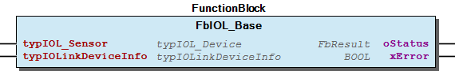
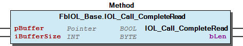
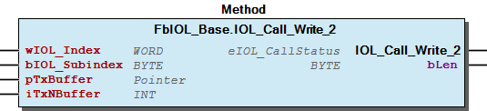
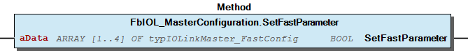

# WagoAppIOLink v1.8.0.12 (WAGO) - Complete Documentation


## 📋 Library Information

- **Company:** WAGO
- **Title:** WagoAppIOLink
- **Version:** 1.8.0.12
- **Categories:** Application; WAGO FunctionalView|Device|IO; WAGO LayerView|App
- **Author:** WAGO/u010663
- **Placeholder:** WagoAppIOLink

### Description ¶


This document is automatically generated.

Handling module 750-657 IO Link master and module 750-1657

The function blocks of this library are NOT thread safe and must be called from one CODESYS task only! Concurrent calls from different tasks may cause loss or corruption of data.

This document is automatically generated. Handling module 750-657 IO Link master and module 750-1657 The function blocks of this library are NOT thread safe and must be called from one CODESYS task only! Concurrent calls from different tasks may cause loss or corruption of data.

### Contents: ¶


Contents: - Documentation Index 10 Documentation - FbIOL_MasterConfiguration_1657.act_error_index (ACT) - WagoAppIOLink Library Documentation Project Information Library Information Function Blocks - FbIOL_Base (FB) - FbIOL_Call (FB) - FbIOL_ConfigurationAndStatus (FB) - FbIOL_M_Configuration (FB) - FbIOL_MasterConfiguration (FB) - FbIOL_MasterConfiguration_1657 (FB) - FbIOL_PortData (FB) - doc10_SystemProperties (FB) Functions - FuCalculatePortSize (FUN) - FuConvertIM0 (FUN) Methods - FbIOL_Base.IOL_Call_CompleteRead (METH) - FbIOL_Base.IOL_Call_CompleteWrite (METH) - FbIOL_Base.IOL_Call_PrepareRead (METH) - FbIOL_Base.IOL_Call_PrepareWrite (METH) - FbIOL_Base.IOL_Call_Read (METH) - FbIOL_Base.IOL_Call_ReadWord (METH) - FbIOL_Base.IOL_Call_Read_2 (METH) - FbIOL_Base.IOL_Call_Write (METH) - FbIOL_Base.IOL_Call_WriteWord (METH) - FbIOL_Base.IOL_Call_Write_2 (METH) - ... and 7 more Program Organization Base Components - FbIOL_Base.Prop_xInDataValid (PROP) - FbIOL_Base.Prop_xMasterConfigured (PROP) Internal Components Global Variable Lists - Status (GVL) - VersionHistory (GVL) Other Components - 30 Visualizations - 750-1657 - 750-1657 - 750-657 - 750-657 - 80 Status - Classic - Data types - GlobalTextList (Text List) - Obsolete - ... and 29 more

### Indices and tables ¶


Based on WagoAppIOLink.library, last modified 29.05.2024, 20:26:36. LibDoc 3.5.16.10

© WAGO GmbH & Co. KG, Germany 2018 – All rights reserved. For the avoidance of doubt, this copyright notice does not only apply to the information above but also and primarily to the described library itself. Please note that third-party products are always mentioned without reference to intellectual property rights, including patents, utility models, designs and trademarks, accordingly the existence of such rights cannot be excluded. WAGO is a registered trademark of WAGO Verwaltungsgesellschaft mbH.

- File and Project Information - Library Reference Based on WagoAppIOLink.library, last modified 29.05.2024, 20:26:36. LibDoc 3.5.16.10 © WAGO GmbH & Co. KG, Germany 2018 – All rights reserved. For the avoidance of doubt, this copyright notice does not only apply to the information above but also and primarily to the described library itself. Please note that third-party products are always mentioned without reference to intellectual property rights, including patents, utility models, designs and trademarks, accordingly the existence of such rights cannot be excluded. WAGO is a registered trademark of WAGO Verwaltungsgesellschaft mbH.

### Documentation Index


## 10 Documentation ¶


- doc10_SystemProperties (FB)

## FbIOL_MasterConfiguration_1657.act_error_index (ACT)


iStep:=90;//error

## WagoAppIOLink Library Documentation


| Company: | WAGO |
| Title: | WagoAppIOLink |
| Version: | 1.8.0.12 |
| Categories: | Application; WAGO FunctionalView\|Device\|IO; WAGO LayerView\|App |
| Author: | WAGO/u010663 |
| Placeholder: | WagoAppIOLink |

### Description


This document is automatically generated.

Handling module 750-657 IO Link master and module 750-1657

The function blocks of this library are NOT thread safe and must be called from one CODESYS task only! Concurrent calls from different tasks may cause loss or corruption of data.

This document is automatically generated. Handling module 750-657 IO Link master and module 750-1657 The function blocks of this library are NOT thread safe and must be called from one CODESYS task only! Concurrent calls from different tasks may cause loss or corruption of data.

### Contents:


- 10 Documentation doc10_SystemProperties (FB) 20 Program Organization Units - 750-1657 - 750-657 - Data types - FbIOL_Base (FB) - FbIOL_Call (FB) - FuConvertIM0 (FUN) 30 Visualizations - 750-1657 - 750-657 80 Status - Status (GVL) - eErrorCode (ENUM) - eStatus (ENUM) 90 Internal - FuCalculatePortSize (FUN) - GlobalTextList (Text List) - TextList_PortMode (Text List) ParameterList_IOLink (PARAMS) VersionHistory (GVL)

### Indices and tables


Based on WagoAppIOLink.library, last modified 29.05.2024, 20:26:36. LibDoc 3.5.16.10

© WAGO GmbH & Co. KG, Germany 2018 – All rights reserved. For the avoidance of doubt, this copyright notice does not only apply to the information above but also and primarily to the described library itself. Please note that third-party products are always mentioned without reference to intellectual property rights, including patents, utility models, designs and trademarks, accordingly the existence of such rights cannot be excluded. WAGO is a registered trademark of WAGO Verwaltungsgesellschaft mbH.

- File and Project Information - Library Reference Based on WagoAppIOLink.library, last modified 29.05.2024, 20:26:36. LibDoc 3.5.16.10 © WAGO GmbH & Co. KG, Germany 2018 – All rights reserved. For the avoidance of doubt, this copyright notice does not only apply to the information above but also and primarily to the described library itself. Please note that third-party products are always mentioned without reference to intellectual property rights, including patents, utility models, designs and trademarks, accordingly the existence of such rights cannot be excluded. WAGO is a registered trademark of WAGO Verwaltungsgesellschaft mbH.

### Project Information


## File and Project Information


| Scope | Name | Type | Content |
| --- | --- | --- | --- |
| FileHeader | libraryFile | string | WagoAppIOLink.library |
| contentFile | doc.clean.json |
| productName | e!COCKPIT |
| creationDateTime | date | 29.05.2024, 20:26:43 |
| companyName | string | WAGO |
| ProjectInformation | LastModificationDateTime | date | 29.05.2024, 20:26:36 |
| Description | string | See: Description |
| Copyright | © WAGO GmbH & Co. KG, Germany 2018 – All rights reserved. |
| Author | WAGO/u010663 |
| AutoResolveUnbound | bool | True |
| Placeholder | string | WagoAppIOLink |
| Company | WAGO |
| DocFormat | reStructuredText |
| Project | WagoAppIOLink |
| DefaultNamespace |  |
| Version | version | 1.8.0.12 |
| ThreadSave | string | False |
| Version string |  |
| Title | WagoAppIOLink |
| LibraryCategories | library-category-list | Application; WAGO FunctionalView\|Device\|IO; WAGO LayerView\|App |
| CompiledLibraryCompatibilityVersion | string | CODESYS V3.5 SP16 Patch 3 |

### Library Information


## Library Reference


| LinkAllContent: False QualifiedOnly: False | SystemLibrary: False | Optional: False |

| LinkAllContent: False QualifiedOnly: False | SystemLibrary: False | Optional: False |

| LinkAllContent: False QualifiedOnly: False | SystemLibrary: False | Optional: False |

| LinkAllContent: False Optional: False | QualifiedOnly: False SystemLibrary: False | PublishSymbolsInContainer: True |

| LinkAllContent: False QualifiedOnly: False | SystemLibrary: True | Optional: False |

| LinkAllContent: False QualifiedOnly: False | SystemLibrary: True | Optional: False |

| LinkAllContent: False QualifiedOnly: False | SystemLibrary: True | Optional: False |

| LinkAllContent: False QualifiedOnly: False | SystemLibrary: True | Optional: False |

| LinkAllContent: False QualifiedOnly: False | SystemLibrary: True | Optional: False |

| LinkAllContent: False QualifiedOnly: False | SystemLibrary: True | Optional: False |

| LinkAllContent: False QualifiedOnly: False | SystemLibrary: True | Optional: False |

| LinkAllContent: False QualifiedOnly: False | SystemLibrary: True | Optional: False |

| LinkAllContent: False QualifiedOnly: False | SystemLibrary: True | Optional: False |

| LinkAllContent: False QualifiedOnly: False | SystemLibrary: True | Optional: False |

| LinkAllContent: False QualifiedOnly: False | SystemLibrary: True | Optional: False |

| LinkAllContent: False Optional: False | QualifiedOnly: False SystemLibrary: True | PublishSymbolsInContainer: True |

| LinkAllContent: False QualifiedOnly: False | SystemLibrary: True | Optional: False |

| LinkAllContent: False QualifiedOnly: False | SystemLibrary: False | Optional: False |

| LinkAllContent: False QualifiedOnly: False | SystemLibrary: False | Optional: False |

| LinkAllContent: False Optional: False | QualifiedOnly: True SystemLibrary: False | PublishSymbolsInContainer: True |

| LinkAllContent: False QualifiedOnly: True | SystemLibrary: False | Optional: False |

| LinkAllContent: False QualifiedOnly: True | SystemLibrary: False | Optional: False |

| LinkAllContent: False QualifiedOnly: False | SystemLibrary: False | Optional: False |

| LinkAllContent: False QualifiedOnly: True | SystemLibrary: False | Optional: False |

This is a dictionary of all referenced libraries and their name spaces.

This is a dictionary of all referenced libraries and their name spaces. Standard Library Identification : Placeholder: Standard Default Resolution: Standard, * (System) Namespace: Standard Library Properties : SysCpuHandling Library Identification : Name: SysCpuHandling Version: newest Company: System Namespace: SysCpuHandling Library Properties : Util Library Identification : Placeholder: Util Default Resolution: Util, * (System) Namespace: Util Library Properties : Library Parameter : Parameter: IBLOCKSIZE = 22800 VisuDialogs Library Identification : Placeholder: VisuDialogs Default Resolution: VisuDialogs, * (System) Namespace: VisuDialogs Library Properties : VisuElem3DPath Library Identification : Placeholder: System_VisuElem3DPath Default Resolution: VisuElem3DPath, 3.5.10.0 (System) Namespace: VisuElem3DPath Library Properties : Library Parameter : Parameter: GC_POINTS_PER_POLYGON = 100 VisuElemCamDisplayer Library Identification : Placeholder: System_VisuElemCamDisplayer Default Resolution: VisuElemCamDisplayer, 3.5.10.0 (System) Namespace: VisuElemCamDisplayer Library Properties : Library Parameter : Parameter: GC_POINTS_PER_CAM = 100 VisuElemMeter Library Identification : Placeholder: System_VisuElemMeter Default Resolution: VisuElemMeter, 3.5.10.0 (System) Namespace: VisuElemMeter Library Properties : VisuElemTextEditor Library Identification : Placeholder: System_VisuElemTextEditor Default Resolution: VisuElemTextEditor, 3.5.10.0 (System) Namespace: VisuElemTextEditor Library Properties : VisuElemTrace Library Identification : Placeholder: System_VisuElemTrace Default Resolution: VisuElemTrace, 3.5.10.0 (System) Namespace: VisuElemTrace Library Properties : VisuElemXYChart Library Identification : Placeholder: System_VisuElemXYChart Default Resolution: VisuElemXYChart, 3.5.16.30 (System) Namespace: VisuElemXYChart Library Properties : VisuElems Library Identification : Placeholder: System_VisuElems Default Resolution: VisuElems, 3.5.10.0 (System) Namespace: VisuElems Library Properties : VisuElemsAlarm Library Identification : Placeholder: System_VisuElemsAlarm Default Resolution: VisuElemsAlarm, 3.5.10.0 (System) Namespace: VisuElemsAlarm Library Properties : VisuElemsDateTime Library Identification : Placeholder: System_VisuElemsDateTime Default Resolution: VisuElemsDateTime, 3.5.10.0 (System) Namespace: VisuElemsDateTime Library Properties : VisuElemsSpecialControls Library Identification : Placeholder: System_VisuElemsSpecialControls Default Resolution: VisuElemsSpecialControls, 3.5.10.0 (System) Namespace: VisuElemsSpecialControls Library Properties : VisuElemsWinControls Library Identification : Placeholder: System_VisuElemsWinControls Default Resolution: VisuElemsWinControls, 3.5.10.0 (System) Namespace: VisuElemsWinControls Library Properties : VisuInputs Library Identification : Placeholder: system_visuinputs Default Resolution: VisuInputs, 3.5.16.30 (System) Namespace: visuinputs Library Properties : VisuNativeControl Library Identification : Placeholder: System_VisuNativeControl Default Resolution: VisuNativeControl, 3.5.10.0 (System) Namespace: VisuNativeControl Library Properties : WagoSysErrorBase Library Identification : Placeholder: WagoSysErrorBase Default Resolution: WagoSysErrorBase, * (WAGO) Namespace: WagoSysErrorBase Library Properties : WagoSysVersion Library Identification : Name: WagoSysVersion Version: 1.0.0.0 Company: WAGO Namespace: WagoSysVersion Library Properties : WagoTypesCommon Library Identification : Placeholder: WagoTypesCommon Default Resolution: WagoTypesCommon, * (WAGO) Namespace: WagoTypes Library Properties : WagoTypesErrorBase Library Identification : Placeholder: WagoTypesErrorBase Default Resolution: WagoTypesErrorBase, * (WAGO) Namespace: WagoTypesErrorBase Library Properties : WagoTypesModuleBase Library Identification : Placeholder: WagoTypesModuleBase Default Resolution: WagoTypesModuleBase, * (WAGO) Namespace: WagoTypesModuleBase Library Properties : Library Parameter : Parameter: MAX_MBX_SIZE = 18 WagoTypesModule_75x_1657 Library Identification : Name: WagoTypesModule_75x_1657 Version: newest Company: WAGO Namespace: WagoTypesModule_75x_1657 Library Properties : WagoTypesModule_75x_657 Library Identification : Name: WagoTypesModule_75x_657 Version: newest Company: WAGO Namespace: WagoTypesModule_75x_657 Library Properties :

### Function Blocks


## FbIOL_Base (FB)


| Scope | Name | Type | Comment |
| --- | --- | --- | --- |
| Input | typIOL_Sensor | typIOL_Device | Access to the module and appropriate IO Link port |
| typIOLinkDeviceInfo | typIOLinkDeviceInfo | only necessary if port in Tx direction is fragmented |
| Output | oStatus | WagoSysErrorBase.FbResult |  |
| xError | BOOL |  |

```
FUNCTION_BLOCK FbGeneral_IOL_Device EXTENDS FbIOL_Base
VAR_INPUT
    wIndex              : WORD;
END_VAR
VAR_IN_OUT
    xReadIndex          : BOOL;
END_VAR
VAR_OUTPUT
    diDistance          : UINT;
    xValid              : BOOL;
    sIndex              : STRING;
END_VAR
VAR
    b1                  : ARRAY[0..81] OF BYTE;
    b2                  : ARRAY[0..81] OF BYTE;
    b3                  : ARRAY[0..81] OF BYTE;
    mylen               : INT;
    pString             : POINTER TO STRING;
END_VAR
```

```
SUPER^();

IF typIOL_Sensor.xMasterConfigured AND udiRxNBytes>0 THEN
    diDistance:=aDeviceInData[2]+256*aDeviceInData[1];
    xValid:=TRUE;
ELSE
    xValid:=FALSE;
END_IF


//Access to the cyclic data from the IOL devices is done by the variables aDeviceInData[0..31] and aDeviceOutData[0..31].

//use for simple application
IF xReadIndex THEN
    IF THIS^.IOL_Call_Read(wIOL_Index:=wIndex , bIOL_Subindex:=0 , pBuffer:=ADR(b1) , iBufferSize:=81 , bLen=>mylen ) THEN
        if myLen>0 then
            pString:=ADR(b1);
            sIndex:=pString^;
            xReadIndex:=FALSE;
        else
            ;//error
        END_IF;
    END_IF
END_IF

//use following methods if continously reading is needed, e.g. three values addressed by wIndex, wIndex+1 and wIndex+2
IF xReadIndex THEN

    CASE state OF
    0:

        IF THIS^.IOL_Call_PrepareRead(wIOL_Index:=wIndex , bIOL_Subindex:=0) THEN
            state:=1;
        END_IF

    1://wait for dataset 1 ->wIndex
        IF THIS^.IOL_Call_CompleteRead(pBuffer:=ADR(b1) , iBufferSize:=TO_INT(SIZEOF(b1)) , bLen=>mylen ) THEN
            pString:=ADR(b1);
            sIndex:=pString^;
            state:=10;
            THIS^.IOL_Call_PrepareRead(wIOL_Index:=wIndex+1 , bIOL_Subindex:=0);//this call, placed exacetly here, will make sure the execution is not interrupted by another instance
        END_IF

    10://wait for dataset 2 ->wIndex+1
        IF THIS^.IOL_Call_CompleteRead(pBuffer:=ADR(b2) , iBufferSize:=TO_INT(SIZEOF(b2)) , bLen=>mylen ) THEN
            pString:=ADR(b2);
            sIndex2:=pString^;
            state:=40;
            THIS^.IOL_Call_PrepareRead(wIOL_Index:=wIndex+2 , bIOL_Subindex:=0);//this call, placed exacetly here, will make sure the execution is not interrupted by another instance
        END_IF

    40://wait for dataset 3 ->wIndex+2
        IF THIS^.IOL_Call_CompleteRead(pBuffer:=ADR(b3) , iBufferSize:=TO_INT(SIZEOF(b3)) , bLen=>mylen ) THEN
            pString:=ADR(b3);
            sIndex3:=pString^;
            xReadIndex:=FALSE;
            state:=0;
        END_IF
    END_CASE
END_IF
```

This function block must be extended for each IO Link device

Graphical Illustration

Graphical Interface of FbIOL_Base

Function Description

This is the basic function block for any IO Link device.

An example may look like:

with the following implementation:

Interface variables Function This function block must be extended for each IO Link device Graphical Illustration  Graphical Interface of FbIOL_Base Function Description This is the basic function block for any IO Link device. An example may look like: with the following implementation: - FbIOL_Base.IOL_Call_Read (METH) - FbIOL_Base.IOL_Call_ReadWord (METH) - FbIOL_Base.IOL_Call_Write (METH) - FbIOL_Base.IOL_Call_WriteWord (METH) - Private FbIOL_Base.IOL_Call_CompleteRead (METH) - FbIOL_Base.IOL_Call_CompleteWrite (METH) - FbIOL_Base.IOL_Call_PrepareRead (METH) - FbIOL_Base.IOL_Call_PrepareWrite (METH) - FbIOL_Base.IOL_Call_Read_2 (METH) - FbIOL_Base.IOL_Call_Write_2 (METH) FbIOL_Base.Prop_xInDataValid (PROP) FbIOL_Base.Prop_xMasterConfigured (PROP)

## FbIOL_Call (FB)


| Scope | Name | Type | Initial | Comment |
| --- | --- | --- | --- | --- |
| Input | I_Port | WagoTypesModule_75x_657.I_Module_75x_657 |  | Access to the module |
| xExecute | BOOL |  | Start execution IOL call command |
| xWriteRead | BOOL |  | False ->read, True ->write |
| bEntity | BYTE |  | 0->configuration data from module,1->device on port 1, 2->device on port 2,etc |
| iFI_Index | INT | 98 | 98->access to IO Link sensors |
| wIOL_Index | WORD |  | IO Link index, eg. 16->name of IO Link manufacturer |
| bIOL_Subindex | BYTE |  | IO Link subindex |
| wLen | WORD |  | Length of data in case of a write command |
| tTimeout | TIME | TIME#500ms | Within this period of time an answer must be received |
| Inout | aIOL_Data | ARRAY [0..255] OF BYTE |  | IOL Data according to command |
| Output | xDone | BOOL |  | Command executed without error |
| xBusy | BOOL |  | Execution of command in progress |
| xError | BOOL |  | Command executed with error |
| oStatus | WagoSysErrorBase.FbResult |  | Status information |
| typError | typIOL_PDU_Error |  | IO Link specific error details,see manual 750-657 for details |
| iLenResponse | INT |  | Number of received data, according to read command |

Perform ISDU Call for IO-Link Devices or read data from master module itself

Graphical Illustration

Graphical Interface of FbIOL_Call

Function Description

Access to IO-Link sensors is done with iFI_Index=98. IO-Link Index and IO-Link Subindex depend on the sensor.

Interface variables Function Perform ISDU Call for IO-Link Devices or read data from master module itself Graphical Illustration  Graphical Interface of FbIOL_Call Function Description Access to IO-Link sensors is done with iFI_Index=98. IO-Link Index and IO-Link Subindex depend on the sensor.

## FbIOL_ConfigurationAndStatus (FB)


| Scope | Name | Type | Initial | Comment |
| --- | --- | --- | --- | --- |
| Input | I_Port | WagoTypesModule_75x_657.I_Module_75x_657 |  | Access to the module |
| xExecute | BOOL |  | Execute configuration command |
| xWriteRead | BOOL |  | False -> read, True -> write |
| xSaveValues | BOOL |  | for future use |
| bSIO_DO | BYTE |  | IO Link digital sensor data to be transmitted |
| dtTime | DT |  | Date and time information for diagnosis time stamping |
| Inout | typConfigData | typIOL_SimpleConfig |  | Configuration data |
| xCheckConfiguration | BOOL |  | for future use |
| xDiagnosisReset | BOOL |  | Reset diagnosis counter and buffer |
| xCommunicationReset | BOOL |  | Reset basic Mbx2 communication |
| Output | xDone | BOOL |  | Confguration command successful executed |
| xBusy | BOOL |  | Configuration in progress |
| xError | BOOL |  | Error occured |
| oStatus | WagoSysErrorBase.FbResult |  | Status information |
| xDoneCheck | BOOL |  | for future use |
| xMatches | BOOL |  | for future use |
| eDiagnosisErrorCode | eErrorCode |  | Details in manual 750-657 |
| bDiagnosisChannelNo | BYTE |  | Diagnosis ->Channel number |
| eDiagnosisMode | eDiagQualMode |  | Diagnosis ->Mode more info manual 750-657 |
| eDiagnosisType | eDiagQualType |  | Diagnosis ->Type more info manual 750-657 |
| wDiagnosisErrorCounter | WORD | 0 | Diagnosis ->Error counter |
| wDiagnosisWarningCounter | WORD | 0 | Diagnosis ->Warning counter |
| wDiagnosisTotalCounter | WORD | 0 | Diagnosis ->Total diagnosis counter |
| bSIO_DI | BYTE |  | IO Link digital sensor data received |
| bGeneral_Info | BYTE |  | General modul info according to status byte 0 in manual from 750-657 |
| bActualModuleSize | BYTE |  | Actual module size [Byte] |

This function block reads the status information. Additionally, it is possible to configure the module.

This function block must be used exactly once for each IO-Link module

Graphical Illustration

Graphical Interface of FbIOL_ConfigurationAndStatus

Function Description

This function block establishes the internal communication to the module immediately after starting the plc program. It takes a fews seconds to finish this initialization phase. Output xBusy indicates this phase while oStatus shows more datailed information. At the end, output xDone will be true for at least one cycle and output oStatus will show OK.

Hint for configuration: If one port is configured as digital output, the size of this port must be 0.

If this function block is used for fieldbus connection, the time STARTUP_WAIT_TIME from the parameter list must be increased to approx. 10 sec.

Visualization

The Input m_Input_IOL1 is of type typIOL_VISU_Main

A variable of type typIOL_VISU_Main must be declared to use this template.

The input m_Input_MBXaux3 is of type FbIOL_ConfigurationAndStatus

Using this template needs an instance of function block FbIOL_ConfigurationAndStatus.

Interface variables Function This function block reads the status information. Additionally, it is possible to configure the module. Note This function block must be used exactly once for each IO-Link module Graphical Illustration  Graphical Interface of FbIOL_ConfigurationAndStatus Function Description This function block establishes the internal communication to the module immediately after starting the plc program. It takes a fews seconds to finish this initialization phase. Output xBusy indicates this phase while oStatus shows more datailed information. At the end, output xDone will be true for at least one cycle and output oStatus will show OK. Hint for configuration: If one port is configured as digital output, the size of this port must be 0. Note If this function block is used for fieldbus connection, the time STARTUP_WAIT_TIME from the parameter list must be increased to approx. 10 sec. Visualization  Note The Input m_Input_IOL1 is of type typIOL_VISU_Main A variable of type typIOL_VISU_Main must be declared to use this template.  Note The input m_Input_MBXaux3 is of type FbIOL_ConfigurationAndStatus Using this template needs an instance of function block FbIOL_ConfigurationAndStatus.

## FbIOL_M_Configuration (FB)


| Scope | Name | Type | Comment |
| --- | --- | --- | --- |
| Input | I_Port | WagoTypesModule_75x_657.I_Module_75x_657 | Access to the module |
| xExecute | BOOL | Execute configuration command |
| xWriteRead | BOOL | False ->read, True ->write |
| Output | xDone | BOOL | Confguration command successful executed |
| xBusy | BOOL | Configuration in progress |
| xError | BOOL | Error occured |
| oStatus | WagoSysErrorBase.FbResult | Status information |
| typError | typIOL_PDU_Error | Error details |
| Inout | typBasicData | typIOL_BasicConfiguration | Configuration data module |
| typPort1Data | typIOL_PortConfiguration | Configuration data port 1 |
| typPort2Data | typIOL_PortConfiguration | Configuration data port 2 |
| typPort3Data | typIOL_PortConfiguration | Configuration data port 3 |
| typPort4Data | typIOL_PortConfiguration | Configuration data port 4 |

Read and write master configuration

Graphical Illustration

Graphical Interface of FbIOL_M_Configuration

Function Description

Read and write master configuration

Visualization

The Input m_Input_IOL1 is of type typIOL_VISU_Expert

Interface variables Function Read and write master configuration Graphical Illustration  Graphical Interface of FbIOL_M_Configuration Function Description Read and write master configuration Visualization  Note The Input m_Input_IOL1 is of type typIOL_VISU_Expert

## FbIOL_MasterConfiguration (FB)


| Scope | Name | Type | Initial | Comment |
| --- | --- | --- | --- | --- |
| Input | xEnable | BOOL |  |  |
| I_Port | WagoTypesModule_75x_657.I_Module_75x_657 |  |  |
| typMode | typIOLinkMasterConfigMode | STRUCT(bMode := AutoConfig) |  |
| aPort | ARRAY [1..4] OF typIOLinkPortConfig |  | device parameters on Port 1..4 |
| bSIO_DO | BYTE |  | IO Link digital sensor data to be transmitted |
| dtTime | DT |  |  |
| Output | xDone | BOOL |  | IO Link Master config is done |
| xBusy | BOOL |  |  |
| xError | BOOL |  |  |
| oStatus | WagoSysErrorBase.FbResult |  |  |
| iActualStep | INT |  | error occured during FB |
| aIOL_DeviceInfo | ARRAY [1..4] OF typIOLinkDeviceInfo |  | IOLink device information like VendorName, ProductName |
| aIOL_Port | ARRAY [1..4] OF typIOL_Device |  | connector for special function block for each sensor |
| bSIO_DI | BYTE |  | IO Link digital sensor data received |
| bGeneral_Info | BYTE |  | General modul info according to status byte 0 in manual from 750-657 |

Provides three different modes for master configuration.

Graphical Illustration

Graphical Interface of FbIOL_MasterConfiguration

Function Description

The general configuration of the master module 750-657 is selected via input typMode .

AutoConfig: The size of each IO-Link port within the master will be configured according to the connected IO-Link sensors. If the size of the IO-Link devices differ from the 18 bytes of the master, the size of each port will automatically be set depending on the number of IO-Link devices, as follows:

UseExternalConfiguration: The size of each port is set manually via input aPort .

Fast: This mode directly starts exchanging IO-Link data with IO-Link devices and requires no configuration. The SetFastParameter method must be called once before executing the function block because it needs information about the different ports. With this method, the size of each channel must be set similarly to the master module configuration. Input `` aData`` of this method is an ARRAY[1..4] of typIOLinkMaster_FastConfig.

Interface variables Function Provides three different modes for master configuration. Graphical Illustration  Graphical Interface of FbIOL_MasterConfiguration Function Description The general configuration of the master module 750-657 is selected via input typMode . AutoConfig: The size of each IO-Link port within the master will be configured according to the connected IO-Link sensors. If the size of the IO-Link devices differ from the 18 bytes of the master, the size of each port will automatically be set depending on the number of IO-Link devices, as follows: 1: portAverage:=15; 2: portAverage:=8; 3: portAverage:=5; 4: portAverage:=4; UseExternalConfiguration: The size of each port is set manually via input aPort . Fast: This mode directly starts exchanging IO-Link data with IO-Link devices and requires no configuration. The SetFastParameter method must be called once before executing the function block because it needs information about the different ports. With this method, the size of each channel must be set similarly to the master module configuration. Input `` aData`` of this method is an ARRAY[1..4] of typIOLinkMaster_FastConfig. - FbIOL_MasterConfiguration.GetDiagnosisBuffer (METH) - FbIOL_MasterConfiguration.SetFastParameter (METH) - FbIOL_MasterConfiguration.act_ReadSensors (ACT)

## FbIOL_MasterConfiguration_1657 (FB)


| Scope | Name | Type | Initial | Comment |
| --- | --- | --- | --- | --- |
| Input | xEnable | BOOL |  |  |
| I_Port | WagoTypesModule_75x_1657.I_Module_75x_1657 |  |  |
| eModeStartUp | eMasterConfigModeStartUp | eMasterConfigModeStartUp.AutoConfig | typMode : typIOLinkMasterConfigMode:=(bMode:=AutoConfig); |
| aPort | ARRAY [1..4] OF typIOLinkPortConfigBasic |  | device parameters on Port 1..4 |
| typValidationAndBackup | ARRAY [1..4] OF typIOL_ValidationAndBackup |  |  |
| bSIO_DO | BYTE |  | IO Link digital sensor data to be transmitted |
| dtTime | DT |  |  |
| Output | xDone | BOOL |  | IO Link Master config is done |
| xBusy | BOOL |  |  |
| xError | BOOL |  |  |
| oStatus | WagoSysErrorBase.FbResult |  |  |
| iActualStep | INT |  | error occured during FB |
| aIOL_DeviceInfo | ARRAY [1..4] OF typIOLinkDeviceInfo |  | IOLink device information like VendorName, ProductName |
| aIOL_Port | ARRAY [1..4] OF typIOL_Device |  | connector for special function block for each sensor |
| bSIO_DI | BYTE |  | IO Link digital sensor data received |
| bGeneral_Info | BYTE |  | General modul info according to status byte 0 in manual from 750-657 |

Provides three different modes for master configuration.

Graphical Illustration

Graphical Interface of FbIOL_MasterConfiguration_1657

Function Description

The general configuration of the master module 750-1657 is selected via input eModeStartUp .

AutoConfig: The size of each IO-Link port within the master will be configured according to the connected IO-Link sensors. Module size 24 is supported in the following manner: If the size of the IO-Link devices differ from the 18 bytes of the master, the size of each port will automatically be set depending on the number of IO-Link devices, as follows:

Module sizes 32,40 and 48 are supported in the following manner: If the size of the IO-Link devices differ from the availing bytes of the master, the size of each port will automatically be set depending on the number of IO-Link devices, as follows:

UseExternalConfiguration: The size of each port is set manually via input aPort .

Fast: This mode directly starts exchanging IO-Link data with IO-Link devices and requires no configuration. The SetFastParameter method must be called once before executing the function block because it needs information about the different ports. With this method, the size of each channel must be set similarly to the master module configuration. Input `` aData`` of this method is an ARRAY[1..4] of typIOLinkMaster_FastConfig.

Two visualization templates are available. tplIOL_Main needs FbIOL_MasterConfiguration_1657.M0.Basic instance as input. tplIOL_Diagnosis needs FbIOL_MasterConfiguration_1657.M0.FbIOL_ConfigurationAndStatus instance as input

Interface variables Function Provides three different modes for master configuration. Graphical Illustration  Graphical Interface of FbIOL_MasterConfiguration_1657 Function Description The general configuration of the master module 750-1657 is selected via input eModeStartUp . AutoConfig: The size of each IO-Link port within the master will be configured according to the connected IO-Link sensors. Module size 24 is supported in the following manner: If the size of the IO-Link devices differ from the 18 bytes of the master, the size of each port will automatically be set depending on the number of IO-Link devices, as follows: 1: portAverage:=15; 2: portAverage:=8; 3: portAverage:=5; 4: portAverage:=4; Module sizes 32,40 and 48 are supported in the following manner: If the size of the IO-Link devices differ from the availing bytes of the master, the size of each port will automatically be set depending on the number of IO-Link devices, as follows: 1: portAverage:=bModuleSize-bAcyclicChannel-2; 2: portAverage:=(bModuleSize-bAcyclicChannel-2)/2;//21; 3: portAverage:=(bModuleSize-bAcyclicChannel-2)/3;//14; 4: portAverage:=(bModuleSize-bAcyclicChannel-2)/4;//10; UseExternalConfiguration: The size of each port is set manually via input aPort . Fast: This mode directly starts exchanging IO-Link data with IO-Link devices and requires no configuration. The SetFastParameter method must be called once before executing the function block because it needs information about the different ports. With this method, the size of each channel must be set similarly to the master module configuration. Input `` aData`` of this method is an ARRAY[1..4] of typIOLinkMaster_FastConfig. Two visualization templates are available. tplIOL_Main needs FbIOL_MasterConfiguration_1657.M0.Basic instance as input. tplIOL_Diagnosis needs FbIOL_MasterConfiguration_1657.M0.FbIOL_ConfigurationAndStatus instance as input - FbIOL_MasterConfiguration_1657.GetDiagnosisBuffer (METH) - FbIOL_MasterConfiguration_1657.SetFastParameter (METH) - FbIOL_MasterConfiguration_1657.act_ReadSensors (ACT) - FbIOL_MasterConfiguration_1657.act_error_index (ACT)

## FbIOL_PortData (FB)


| Scope | Name | Type | Comment |
| --- | --- | --- | --- |
| Input | xEnable | BOOL | Enable function block |
| I_Port | WagoTypesModule_75x_657.I_Module_75x_657 | Access to the module |
| bIO_LinkPort | BYTE | Port 1..4 |
| pTxBuffer | POINTER TO BYTE | Pointer to the area, which should be transmitted, use ADR operator (e.g. ADR(TxData) |
| udiTxNBytes | UDINT | Data count to be transmitted, max 32 Byte |
| pRxBuffer | POINTER TO BYTE | Pointer to the area, where the received data should be stored, use ADR operator (e.g. ADR(RxData) |
| udiRxBufferSize | UDINT | Size of receive Buffer, use SizeOf operator, e.g. SizeOf(RxData) |
| Inout | xTxTrigger | BOOL | Trigger the transmission of data to the sensor, variable will be reset by function block |
| xCommunicationReset | BOOL | reset MBX2 communication in case of fragmented mode |
| Output | xValid | BOOL | Data from sensor is valid |
| xBusy | BOOL | Configuration of the port in progress |
| xError | BOOL | Error occured |
| udiRxNBytes | UDINT | Number of received bytes |
| bRxRefreshCounter | BYTE | Counter for received messages if used with a fragmented port |
| oStatus | WagoSysErrorBase.FbResult | ReadingSettings ->first step during configuration of the channel MBX_NotReady-> second step OK ->process values will be delivered InProgress ->wait to reach step MBX_NotReady |

Process IO-Link data on port 1..4

Graphical Illustration

Graphical Interface of FbIOL_PortData

Function Description

This function block is required for each IO-Link sensor connected to one of the four ports.

Function block FbIOL_ConfigurationAndStatus must be used only once for each IO-Link module.

Once enabled, it takes a few seconds to retrieve the channel configuration. During this period, output xBusy is true. If process values will be received or data can be transmitted, output xValid is True. If the module is configured for internal data bus diagnosics, output xError will display port errors, e.g., if the sensor is disconnected.

Interface variables Function Process IO-Link data on port 1..4 Graphical Illustration  Graphical Interface of FbIOL_PortData Function Description This function block is required for each IO-Link sensor connected to one of the four ports. Note Function block FbIOL_ConfigurationAndStatus must be used only once for each IO-Link module. Once enabled, it takes a few seconds to retrieve the channel configuration. During this period, output xBusy is true. If process values will be received or data can be transmitted, output xValid is True. If the module is configured for internal data bus diagnosics, output xError will display port errors, e.g., if the sensor is disconnected.

## doc10_SystemProperties (FB)


Please check on the Wago homepage for an application note a2019002 providing additional documentation.

For compatibility reason the folder classic contains the former function blocks. Anyway it is recommanded to use the more modern blocks FbIOL_MasterConfiguration and FbIOL_Base .

The following lines describe the classic approach:

Accessing IO-Link sensors or actuators must be done via FbIOL_PortData. Direct access through the process image is forbidden.

Function block FbIOL_ConfigurationAndStatus must be used only once for each IO-Link module

All function blocks which belong to one IO-Link module must be called up in the same program task.

These variables must then be assigend to the appropriate visualization input.

The most simple project may look like:

Please check on the Wago homepage for an application note a2019002 providing additional documentation. For compatibility reason the folder classic contains the former function blocks. Anyway it is recommanded to use the more modern blocks FbIOL_MasterConfiguration and FbIOL_Base . The following lines describe the classic approach: Accessing IO-Link sensors or actuators must be done via FbIOL_PortData. Direct access through the process image is forbidden. Note Function block FbIOL_ConfigurationAndStatus must be used only once for each IO-Link module Note All function blocks which belong to one IO-Link module must be called up in the same program task. Using the visualization templates, it is recommanded to declare two variables like: M0: WagoAppIOLink.typIOL_VISU_Main:=(bModuleSize:=24); M1: WagoAppIOLink.typIOL_VISU_Expert; These variables must then be assigend to the appropriate visualization input. The most simple project may look like: 

### Functions


## FuCalculatePortSize (FUN)


| Scope | Name | Type |
| --- | --- | --- |
| Return | FuCalculatePortSize | ARRAY [1..4] OF typIOLinkAutoCalc |
| Input | bModuleSize | BYTE |
| bAcyclicChannel | BYTE |
| aIn | ARRAY [1..4] OF typIOLinkAutoCalc |

## FuConvertIM0 (FUN)


| Scope | Name | Type |
| --- | --- | --- |
| Return | FuConvertIM0 | typIOL_IM0_v1 |
| Input | aIOL_Data | REFERENCE TO ARRAY [0..255] OF BYTE |

### Methods


## FbIOL_Base.IOL_Call_CompleteRead (METH)


| Scope | Name | Type | Comment |
| --- | --- | --- | --- |
| Return | IOL_Call_CompleteRead | BOOL |  |
| Input | pBuffer | POINTER TO BYTE | Buffer for received data, use ADR operator |
| iBufferSize | INT | Size of receive buffer |
| Output | bLen | BYTE | 0-> error; 1..255-> number of received bytes |

```
//use following methods if continously reading is needed, e.g. three values addressed by wIndex, wIndex+1 and wIndex+2
IF xReadIndex THEN

    CASE state OF
    0:

        IF THIS^.IOL_Call_PrepareRead(wIOL_Index:=wIndex , bIOL_Subindex:=0) THEN
            state:=1;
        END_IF

    1://wait for dataset 1 ->wIndex
        IF THIS^.IOL_Call_CompleteRead(pBuffer:=ADR(b1) , iBufferSize:=TO_INT(SIZEOF(b1)) , bLen=>mylen ) THEN
            pString:=ADR(b1);
            sIndex:=pString^;
            state:=10;
            THIS^.IOL_Call_PrepareRead(wIOL_Index:=wIndex+1 , bIOL_Subindex:=0);//this call, placed exacetly here, will make sure the execution is not interrupted by another instance
        END_IF

    10://wait for dataset 2 ->wIndex+1
        IF THIS^.IOL_Call_CompleteRead(pBuffer:=ADR(b2) , iBufferSize:=TO_INT(SIZEOF(b2)) , bLen=>mylen ) THEN
            pString:=ADR(b2);
            sIndex2:=pString^;
            state:=40;
            THIS^.IOL_Call_PrepareRead(wIOL_Index:=wIndex+2 , bIOL_Subindex:=0);//this call, placed exacetly here, will make sure the execution is not interrupted by another instance
        END_IF

    40://wait for dataset 3 ->wIndex+2
        IF THIS^.IOL_Call_CompleteRead(pBuffer:=ADR(b3) , iBufferSize:=TO_INT(SIZEOF(b3)) , bLen=>mylen ) THEN
            pString:=ADR(b3);
            sIndex3:=pString^;
            xReadIndex:=FALSE;
            state:=0;
        END_IF
    END_CASE
END_IF
```

Finish the process of reading an IO-Link value referenced by index and subindex

Function Description

This method must be executed as the second step of reading an IO-Link value

Graphical Illustration

Graphical Interface of FbIOL_Base.IOL_Call_CompleteRead

Interface variables Function Finish the process of reading an IO-Link value referenced by index and subindex Function Description This method must be executed as the second step of reading an IO-Link value Graphical Illustration  Graphical Interface of FbIOL_Base.IOL_Call_CompleteRead

## FbIOL_Base.IOL_Call_CompleteWrite (METH)


| Scope | Name | Type | Comment |
| --- | --- | --- | --- |
| Return | IOL_Call_CompleteWrite | BOOL |  |
| Output | bLen | BYTE | 0-> error; 1..255-> number of received bytes |

This method waits for the answer according to a write command of an IOL call

Graphical Illustration

Graphical Interface of FbIOL_Base.IOL_Call_CompleteWrite

Interface variables Function This method waits for the answer according to a write command of an IOL call Graphical Illustration  Graphical Interface of FbIOL_Base.IOL_Call_CompleteWrite

## FbIOL_Base.IOL_Call_PrepareRead (METH)


| Scope | Name | Type | Comment |
| --- | --- | --- | --- |
| Return | IOL_Call_PrepareRead | BOOL |  |
| Input | wIOL_Index | WORD | IOL Index |
| bIOL_Subindex | BYTE | IOL Subindex |

The first step of reading an IO Link value referenced by index and subindex

Function Description

Reading an IO-Link value is done in two steps. The first step is executing the method IOL_Call_PrepareRead . Once this method returns with True the second step can be executed, which is the method IOL_Call_CompleteWrite

Graphical Illustration

Graphical Interface of FbIOL_Base.IOL_Call_PrepareRead

Interface variables Function The first step of reading an IO Link value referenced by index and subindex Function Description Reading an IO-Link value is done in two steps. The first step is executing the method IOL_Call_PrepareRead . Once this method returns with True the second step can be executed, which is the method IOL_Call_CompleteWrite Graphical Illustration  Graphical Interface of FbIOL_Base.IOL_Call_PrepareRead

## FbIOL_Base.IOL_Call_PrepareWrite (METH)


| Scope | Name | Type | Comment |
| --- | --- | --- | --- |
| Return | IOL_Call_PrepareWrite | BOOL |  |
| Input | wIOL_Index | WORD | IOL Index |
| bIOL_Subindex | BYTE | IOL Subindex |
| pTxBuffer | POINTER TO BYTE | Data to be written |
| iTxNBuffer | INT | Amount of bytes to be written |

This method allows writing any IO-Link value by performing an IOL call

Graphical Illustration

Graphical Interface of FbIOL_Base.IOL_Call_PrepareWrite

Interface variables Function This method allows writing any IO-Link value by performing an IOL call Graphical Illustration  Graphical Interface of FbIOL_Base.IOL_Call_PrepareWrite

## FbIOL_Base.IOL_Call_Read (METH)


| Scope | Name | Type | Comment |
| --- | --- | --- | --- |
| Return | IOL_Call_Read | BOOL |  |
| Input | wIOL_Index | WORD | IOL Index |
| bIOL_Subindex | BYTE | IOL Subindex |
| pBuffer | POINTER TO BYTE | Buffer for received data, use ADR operator |
| iBufferSize | INT | Size of receive buffer |
| Output | bLen | BYTE | 0-> error; 1..255-> number of received bytes |

This method allows reading any IO-Link value by performing an IOL call

Graphical Illustration

Graphical Interface of FbIOL_Base.IOL_Call_Read

Interface variables Function This method allows reading any IO-Link value by performing an IOL call Graphical Illustration  Graphical Interface of FbIOL_Base.IOL_Call_Read

## FbIOL_Base.IOL_Call_ReadWord (METH)


| Scope | Name | Type | Comment |
| --- | --- | --- | --- |
| Return | IOL_Call_ReadWord | BOOL |  |
| Input | wIOL_Index | WORD | IOL Index |
| bIOL_Subindex | BYTE | IOL Subindex |
| Output | wValue | WORD | Value |
| bLen | BYTE | 0-> error; 2-> OK |

This method allows reading any IO-Link value which is a Word by using an IOL call

Graphical Illustration

Graphical Interface of FbIOL_Base.IOL_Call_ReadWord

Interface variables Function This method allows reading any IO-Link value which is a Word by using an IOL call Graphical Illustration  Graphical Interface of FbIOL_Base.IOL_Call_ReadWord

## FbIOL_Base.IOL_Call_Read_2 (METH)


| Scope | Name | Type | Comment |
| --- | --- | --- | --- |
| Return | IOL_Call_Read_2 | eIOL_CallStatus |  |
| Input | wIOL_Index | WORD | IOL Index |
| bIOL_Subindex | BYTE | IOL Subindex |
| pBuffer | POINTER TO BYTE | Buffer for received data, use ADR operator |
| iBufferSize | INT | Size of receive buffer |
| Output | bLen | BYTE | 0-> error; 1..255-> number of received bytes |

This method allows reading any IO-Link value by performing an IOL call

Graphical Illustration

Graphical Interface of FbIOL_Base.IOL_Call_Read_2

Interface variables Function This method allows reading any IO-Link value by performing an IOL call Graphical Illustration  Graphical Interface of FbIOL_Base.IOL_Call_Read_2

## FbIOL_Base.IOL_Call_Write (METH)


| Scope | Name | Type | Comment |
| --- | --- | --- | --- |
| Return | IOL_Call_Write | BOOL |  |
| Input | wIOL_Index | WORD | IOL Index |
| bIOL_Subindex | BYTE | IOL Subindex |
| pTxBuffer | POINTER TO BYTE | Data to be written |
| iTxNBuffer | INT | Amount of bytes to be written |
| Output | bLen | BYTE | 0-> error; 1..255-> number of bytes that have been written |

This method allows writing any IO-Link value by performing an IOL call

Graphical Illustration

Graphical Interface of FbIOL_Base.IOL_Call_Write

Interface variables Function This method allows writing any IO-Link value by performing an IOL call Graphical Illustration  Graphical Interface of FbIOL_Base.IOL_Call_Write

## FbIOL_Base.IOL_Call_WriteWord (METH)


| Scope | Name | Type | Comment |
| --- | --- | --- | --- |
| Return | IOL_Call_WriteWord | BOOL |  |
| Input | wIOL_Index | WORD | IOL Index |
| bIOL_Subindex | BYTE | IOL Subindex |
| wValue | WORD | Value |
| Output | bLen | BYTE | 0-> error; 2 ->number of bytes that have been written |

This method allows writing any IO-Link value which is a Word by using an IOL call

Graphical Illustration

Graphical Interface of FbIOL_Base.IOL_Call_WriteWord

Interface variables Function This method allows writing any IO-Link value which is a Word by using an IOL call Graphical Illustration  Graphical Interface of FbIOL_Base.IOL_Call_WriteWord

## FbIOL_Base.IOL_Call_Write_2 (METH)


| Scope | Name | Type | Comment |
| --- | --- | --- | --- |
| Return | IOL_Call_Write_2 | eIOL_CallStatus |  |
| Input | wIOL_Index | WORD | IOL Index |
| bIOL_Subindex | BYTE | IOL Subindex |
| pTxBuffer | POINTER TO BYTE | Data to be written |
| iTxNBuffer | INT | Amount of bytes to be written |
| Output | bLen | BYTE | 0-> error; 1..255-> number of bytes that have been written |

This method allows writing any IO-Link value by performing an IOL call

Graphical Illustration

Graphical Interface of FbIOL_Base.IOL_Call_Write_2

Interface variables Function This method allows writing any IO-Link value by performing an IOL call Graphical Illustration  Graphical Interface of FbIOL_Base.IOL_Call_Write_2

## FbIOL_MasterConfiguration.GetDiagnosisBuffer (METH)


| Scope | Name | Type | Initial | Comment |
| --- | --- | --- | --- | --- |
| Return | GetDiagnosisBuffer | BOOL |  |  |
| Input | xEnable | BOOL |  |  |
| Output | wDiagnosisErrorCounter | WORD | 0 | Diagnosis ->Error counter |
| wDiagnosisWarningCounter | WORD | 0 | Diagnosis ->Warning counter |
| wDiagnosisTotalCounter | WORD | 0 | Diagnosis ->Total diagnosis counter |
| Inout | xReset | BOOL |  |  |
| aDiagBuffer | ARRAY [0..IOL_DIAG_BUFFER] OF typDiag |  |  |
| aDiagTimeBuffer | ARRAY [0..IOL_DIAG_BUFFER] OF DATE_AND_TIME |  |  |

This method gives access to the diagnosis buffer

Function Description

The function block FbIOL_MasterConfiguration has an internal buffer collecting diagnosis messages. This method allows reading the buffer as well as resetting the counters. The return value will be true, if access to the buffer is possible and false, if e.g. the function block is not ready and therefore no access to the buffer is possible.

Graphical Illustration

Graphical Interface of FbIOL_MasterConfiguration.GetDiagnosisBuffer

Interface variables Function This method gives access to the diagnosis buffer Function Description The function block FbIOL_MasterConfiguration has an internal buffer collecting diagnosis messages. This method allows reading the buffer as well as resetting the counters. The return value will be true, if access to the buffer is possible and false, if e.g. the function block is not ready and therefore no access to the buffer is possible. Graphical Illustration  Graphical Interface of FbIOL_MasterConfiguration.GetDiagnosisBuffer

## FbIOL_MasterConfiguration.SetFastParameter (METH)


| Scope | Name | Type |
| --- | --- | --- |
| Return | SetFastParameter | BOOL |
| Input | aData | ARRAY [1..4] OF typIOLinkMaster_FastConfig |

This method must be called once if the mode is set to Fast . For each port the appropriate values (settings of the modul 750-567) must be assigned.

Graphical Illustration

Graphical Interface of FbIOL_MasterConfiguration.SetFastParameter

Interface variables Function This method must be called once if the mode is set to Fast . For each port the appropriate values (settings of the modul 750-567) must be assigned. Graphical Illustration  Graphical Interface of FbIOL_MasterConfiguration.SetFastParameter

## FbIOL_MasterConfiguration.act_ReadSensors (ACT)


Wait for IOL-CALL response

Wait for IOL-CALL response

## FbIOL_MasterConfiguration_1657.GetDiagnosisBuffer (METH)


| Scope | Name | Type | Initial | Comment |
| --- | --- | --- | --- | --- |
| Return | GetDiagnosisBuffer | BOOL |  |  |
| Input | xEnable | BOOL |  |  |
| Output | wDiagnosisErrorCounter | WORD | 0 | Diagnosis ->Error counter |
| wDiagnosisWarningCounter | WORD | 0 | Diagnosis ->Warning counter |
| wDiagnosisTotalCounter | WORD | 0 | Diagnosis ->Total diagnosis counter |
| Inout | xReset | BOOL |  |  |
| aDiagBuffer | ARRAY [0..IOL_DIAG_BUFFER] OF typDiag |  |  |
| aDiagTimeBuffer | ARRAY [0..IOL_DIAG_BUFFER] OF DATE_AND_TIME |  |  |

This method gives access to the diagnosis buffer

Function Description

The function block FbIOL_MasterConfiguration has an internal buffer collecting diagnosis messages. This method allows reading the buffer as well as resetting the counters. The return value will be true, if access to the buffer is possible and false, if e.g. the function block is not ready and therefore no access to the buffer is possible.

Graphical Illustration

Graphical Interface of FbIOL_MasterConfiguration_1657.GetDiagnosisBuffer

Interface variables Function This method gives access to the diagnosis buffer Function Description The function block FbIOL_MasterConfiguration has an internal buffer collecting diagnosis messages. This method allows reading the buffer as well as resetting the counters. The return value will be true, if access to the buffer is possible and false, if e.g. the function block is not ready and therefore no access to the buffer is possible. Graphical Illustration  Graphical Interface of FbIOL_MasterConfiguration_1657.GetDiagnosisBuffer

## FbIOL_MasterConfiguration_1657.SetFastParameter (METH)


| Scope | Name | Type |
| --- | --- | --- |
| Return | SetFastParameter | BOOL |
| Input | aData | ARRAY [1..4] OF typIOLinkMaster_FastConfig |
| xMbxDiagnosis | BOOL |
| xKBusDiagnosis | BOOL |

This method must be called once if the mode is set to Fast . For each port the appropriate values (settings of the modul 750-1657) must be assigned.

Graphical Illustration

Graphical Interface of FbIOL_MasterConfiguration_1657.SetFastParameter

Interface variables Function This method must be called once if the mode is set to Fast . For each port the appropriate values (settings of the modul 750-1657) must be assigned. Graphical Illustration  Graphical Interface of FbIOL_MasterConfiguration_1657.SetFastParameter

## FbIOL_MasterConfiguration_1657.act_ReadSensors (ACT)


Wait for IOL-CALL response

Wait for IOL-CALL response

## eMasterConfigModeStartUp (ENUM)


| Name | Initial |
| --- | --- |
| UseExternalConfiguration | 0 |
| AutoConfig | 1 |
| Fast | 2 |

Mechanism how to start the master module

InOut: Mechanism how to start the master module

### Program Organization


## 20 Program Organization Units


- 750-1657 FbIOL_MasterConfiguration_1657 (FB) FbIOL_MasterConfiguration_1657.GetDiagnosisBuffer (METH) - FbIOL_MasterConfiguration_1657.SetFastParameter (METH) - FbIOL_MasterConfiguration_1657.act_ReadSensors (ACT) - FbIOL_MasterConfiguration_1657.act_error_index (ACT) 750-657 - Classic FbIOL_ConfigurationAndStatus (FB) - FbIOL_M_Configuration (FB) - FbIOL_PortData (FB) FbIOL_MasterConfiguration (FB) - FbIOL_MasterConfiguration.GetDiagnosisBuffer (METH) - FbIOL_MasterConfiguration.SetFastParameter (METH) - FbIOL_MasterConfiguration.act_ReadSensors (ACT) Data types - Obsolete typIOL_IM0 (STRUCT) eDiagQualMode (ENUM) eDiagQualType (ENUM) eIOL_CallStatus (ENUM) eIOL_PortMode (ENUM) eMasterConfigModeStartUp (ENUM) typDiag (STRUCT) typDiagQualifier (STRUCT) typIOL_BasicConfiguration (STRUCT) typIOL_Device (STRUCT) typIOL_IM0_v1 (STRUCT) typIOL_IM1 (STRUCT) typIOL_PDU_Error (STRUCT) typIOL_PortConfiguration (STRUCT) typIOL_SimpleConfig (STRUCT) typIOL_VISU_Expert (STRUCT) typIOL_VISU_Main (STRUCT) typIOL_ValidationAndBackup (STRUCT) typIOLinkAutoCalc (STRUCT) typIOLinkDeviceInfo (STRUCT) typIOLinkMasterConfigMode (STRUCT) typIOLinkMaster_FastConfig (STRUCT) typIOLinkPortConfig (STRUCT) typIOLinkPortConfigBasic (STRUCT) typIOLinkPortInfo (STRUCT) FbIOL_Base (FB) - FbIOL_Base.IOL_Call_Read (METH) - FbIOL_Base.IOL_Call_ReadWord (METH) - FbIOL_Base.IOL_Call_Write (METH) - FbIOL_Base.IOL_Call_WriteWord (METH) - Private FbIOL_Base.IOL_Call_CompleteRead (METH) - FbIOL_Base.IOL_Call_CompleteWrite (METH) - FbIOL_Base.IOL_Call_PrepareRead (METH) - FbIOL_Base.IOL_Call_PrepareWrite (METH) - FbIOL_Base.IOL_Call_Read_2 (METH) - FbIOL_Base.IOL_Call_Write_2 (METH) FbIOL_Base.Prop_xInDataValid (PROP) FbIOL_Base.Prop_xMasterConfigured (PROP) FbIOL_Call (FB) FuConvertIM0 (FUN)

### Base Components


## FbIOL_Base.Prop_xInDataValid (PROP) ¶


## FbIOL_Base.Prop_xMasterConfigured (PROP) ¶


### Internal Components


## 90 Internal


- FuCalculatePortSize (FUN) - GlobalTextList (Text List) - TextList_PortMode (Text List)

### Global Variable Lists


## Status (GVL)


| Scope | Name | Type |
| --- | --- | --- |
| Constant | StatusIOL_657 | ARRAY [0..58] OF WagoTypesErrorBase.typResultItem |

| Value | Level | Description |
| --- | --- | --- |
| eStatus.OK | WagoTypes.eSeverity.info | ‘OK’ |
| eStatus.FunctionBlockNotEnabled | WagoTypes.eSeverity.info | ‘FunctionBlockNotEnabled’ |
| eStatus.InProgress | WagoTypes.eSeverity.info | ‘InProgress’ |
| eStatus.Timeout | WagoTypes.eSeverity.error | ‘Timeout’ |
| eStatus.ReadingSettings | WagoTypes.eSeverity.info | ‘ReadingSettings’ |
| eStatus.WritingSettings | WagoTypes.eSeverity.info | ‘WritingSettings’ |
| eStatus.ReadingBasicConfigurationSuccessful | WagoTypes.eSeverity.info | ‘ReadingBasicConfigurationSuccessful’ |
| eStatus.ReadingBasicConfigurationFailed | WagoTypes.eSeverity.error | ‘ReadingBasicConfigurationFailed’ |
| eStatus.ReadingPort_1_ConfigurationSuccessful | WagoTypes.eSeverity.info | ‘ReadingPort_1_ConfigurationSuccessful’ |
| eStatus.ReadingPort_2_ConfigurationSuccessful | WagoTypes.eSeverity.info | ‘ReadingPort_2_ConfigurationSuccessful’ |
| eStatus.ReadingPort_3_ConfigurationSuccessful | WagoTypes.eSeverity.info | ‘ReadingPort_3_ConfigurationSuccessful’ |
| eStatus.ReadingPort_4_ConfigurationSuccessful | WagoTypes.eSeverity.info | ‘ReadingPort_4_ConfigurationSuccessful’ |
| eStatus.WritingBasicConfigurationSuccessful | WagoTypes.eSeverity.info | ‘WritingBasicConfigurationSuccessful’ |
| eStatus.WritingBasicConfigurationFailed | WagoTypes.eSeverity.error | ‘WritingBasicConfigurationFailed’ |
| eStatus.WritingPort_1_ConfigurationSuccessful | WagoTypes.eSeverity.info | ‘WritingPort_1_ConfigurationSuccessful’ |
| eStatus.WritingPort_2_ConfigurationSuccessful | WagoTypes.eSeverity.info | ‘WritingPort_2_ConfigurationSuccessful’ |
| eStatus.WritingPort_3_ConfigurationSuccessful | WagoTypes.eSeverity.info | ‘WritingPort_3_ConfigurationSuccessful’ |
| eStatus.WritingPort_4_ConfigurationSuccessful | WagoTypes.eSeverity.info | ‘WritingPort_4_ConfigurationSuccessful’ |
| eStatus.ReadingPort_1_ConfigurationFailed | WagoTypes.eSeverity.error | ‘ReadingPort_1_ConfigurationFailed’ |
| eStatus.ReadingPort_2_ConfigurationFailed | WagoTypes.eSeverity.error | ‘ReadingPort_2_ConfigurationFailed’ |
| eStatus.ReadingPort_3_ConfigurationFailed | WagoTypes.eSeverity.error | ‘ReadingPort_3_ConfigurationFailed’ |
| eStatus.ReadingPort_4_ConfigurationFailed | WagoTypes.eSeverity.error | ‘ReadingPort_4_ConfigurationFailed’ |
| eStatus.WritingPort_1_ConfigurationFailed | WagoTypes.eSeverity.error | ‘WritingPort_1_ConfigurationFailed’ |
| eStatus.WritingPort_2_ConfigurationFailed | WagoTypes.eSeverity.error | ‘WritingPort_2_ConfigurationFailed’ |
| eStatus.WritingPort_3_ConfigurationFailed | WagoTypes.eSeverity.error | ‘WritingPort_3_ConfigurationFailed’ |
| eStatus.WritingPort_4_ConfigurationFailed | WagoTypes.eSeverity.error | ‘WritingPort_4_ConfigurationFailed’ |
| eStatus.ReadingRegister_9_Failed | WagoTypes.eSeverity.error | ‘ReadingRegister_9_Failed’ |
| eStatus.ReadingRegister_14_Failed | WagoTypes.eSeverity.error | ‘ReadingRegister_14_Failed’ |
| eStatus.ReadingRegister_16_Failed | WagoTypes.eSeverity.error | ‘ReadingRegister_16_Failed’ |
| eStatus.ReadingRegister_63_Failed | WagoTypes.eSeverity.error | ‘ReadingRegister_63_Failed’ |
| eStatus.ModuleInitialize | WagoTypes.eSeverity.info | ‘ModuleInitialize’ |
| eStatus.MBX_NotReady | WagoTypes.eSeverity.info | ‘MBX_NotReady’ |
| eStatus.ModuleMbxSizeTooLarge | WagoTypes.eSeverity.error | ‘ModuleMbxSizeTooLarge’ |
| eStatus.ErrorDetails_Output_typError | WagoTypes.eSeverity.error | ‘ErrorDetails_Output_typError’ |
| eStatus.UndefinedInterface | WagoTypes.eSeverity.error | ‘No interface connected’ |
| eStatus.MBX_WaitForReset | WagoTypes.eSeverity.warning | ‘MBX problem |
| eStatus.PortError | WagoTypes.eSeverity.error | ‘Port error’ |
| eStatus.WritingSizeChannelInputFailed | WagoTypes.eSeverity.error | ‘WritingSizeChannelInputFailed’ |
| eStatus.WritingSizeChannelOutputFailed | WagoTypes.eSeverity.error | ‘WritingSizeChannelOutputFailed’ |
| eStatus.WritingModeChannelFailed | WagoTypes.eSeverity.error | ‘WritingModeChannelFailed’ |
| eStatus.InvalidParameterEntity | WagoTypes.eSeverity.error | ‘InvalidParameterEntity’ |
| eStatus.InvalidParameterFI_Index | WagoTypes.eSeverity.error | ‘InvalidParameterFI_Index’ |
| eStatus.InvalidParameterIOL_Index | WagoTypes.eSeverity.error | ‘InvalidParameterIOL_Index’ |
| eStatus.InvalidParamIOL_M_BasicConfig | WagoTypes.eSeverity.error | ‘InvalidParamIOL_M_BasicConfig’ |
| eStatus.InvalidParamIOL_M_Port1Config | WagoTypes.eSeverity.error | ‘InvalidParamIOL_M_Port1Config’ |
| eStatus.InvalidParamIOL_M_Port2Config | WagoTypes.eSeverity.error | ‘InvalidParamIOL_M_Port2Config’ |
| eStatus.InvalidParamIOL_M_Port3Config | WagoTypes.eSeverity.error | ‘InvalidParamIOL_M_Port3Config’ |
| eStatus.InvalidParamIOL_M_Port4Config | WagoTypes.eSeverity.error | ‘InvalidParamIOL_M_Port4Config’ |
| eStatus.InvalidParameterIOL_Port | WagoTypes.eSeverity.error | ‘InvalidParameterIOL_Port’ |
| eStatus.InvalidParameter_TxNBytes | WagoTypes.eSeverity.error | ‘InvalidParameter_TxNByte’ |
| eStatus.MasterNotYetConfigured | WagoTypes.eSeverity.info | ‘Master not yet configured’ |
| eStatus.ConfigurationInProgress | WagoTypes.eSeverity.info | ‘Configuration in progress’ |
| eStatus.IOLinkComFailure | WagoTypes.eSeverity.error | ‘IO Link communication error’ |
| eStatus.ReceivedDataInvalid | WagoTypes.eSeverity.error | ‘Received data invalid’ |
| eStatus.ReadingPort_1_IOL_IndexFailed | WagoTypes.eSeverity.error | ‘ReadingPort_1_IOL Index Failed’ |
| eStatus.ReadingPort_2_IOL_IndexFailed | WagoTypes.eSeverity.error | ‘ReadingPort_2_IOL Index Failed’ |
| eStatus.ReadingPort_3_IOL_IndexFailed | WagoTypes.eSeverity.error | ‘ReadingPort_3_IOL Index Failed’ |
| eStatus.ReadingPort_4_IOL_IndexFailed | WagoTypes.eSeverity.error | ‘ReadingPort_4_IOL Index Failed’ |
| eStatus.ModuleWrongMode | WagoTypes.eSeverity.error | ‘Module in wrong mode ->Use IO-Check’ |

Description Status information

Description Status information

## VersionHistory (GVL)


| Name | Type |
| --- | --- |
| Info | ProjectInfo |

| date | version | author | change |
| 10.05.2024 | 1.8.0.12 | u010663 | Improve new data type typIOL_IM0_v1 according to IM0, new FuConvertIM0 |
| 03.05.2024 | 1.8.0.11 | u010663 | Clear output aIOL_DeviceInfo FbIOL_MasterConfiguration |
| 02.04.2024 | 1.8.0.10 | u010663 | New data type typIOL_IM0_v1 according to IM0 |
| 25.01.2024 | 1.8.0.9 | u010663 | New status message concerning the extended mode |
| 18.08.2023 | 1.8.0.8 | u010663 | Improvement TMG devcice TC28 |
| 08.08.2023 | 1.8.0.7 | u010663 | Bugfix FbIOL_ConfigurationAndStatus |
| 27.07.2023 | 1.8.0.6 | u010663 | Remove unused libraries, bugfix 750-1657 R2 |
| 15.06.2023 | 1.8.0.5 | u010663 | Bugfix FbIOL_ConfigurationAndStatus |
| 05.06.2023 | 1.8.0.4 | u010663 | Improvement fast mode |
| 01.06.2023 | 1.8.0.3 | u010663 | Bugfix R2 |
| 04.05.2023 | 1.8.0.0 | u010663 | Support module 750-1657 R2 |
| 09.06.2022 | 1.7.0.0 | u010663 | Support module 750-1657 R1 |
| 10.03.2022 | 1.6.4.3 | u010663 | Improvement method IOL_Call_Write (FbIOL_Base) |
| 17.06.2020 | 1.6.4.2 | u010663 | Improvement FbIOL_MasterConfiguration ->Port inspection level |
| 07.01.2020 | 1.6.3.16 | u010663 | Add properties FbIOL_Base |
| 05.12.2019 | 1.6.3.15 | u010663 | Improvement FbIOL_ConfigurationAndStatus |
| 31.10.2019 | 1.6.3.14 | u010663 | Parameterlist improved |
| 28.10.2019 | 1.6.3.13 | u010663 | Improvement FbIOL_Call |
| 07.10.2019 | 1.6.3.12 | u010663 | Improvement FbIOL_Call and FbIOL_ConfigurationAndStatus |
| 02.08.2019 | 1.6.3.11 | u010663 | WagoAppTime eliminated and new input dtTime for FbIOL_MasterConfiguration |
| 11.07.2019 | 1.6.3.9 | u010663 | Improvement FbIOL_ConfigurationAndStatus |
| 26.06.2019 | 1.6.3.8 | u010663 | Improvement FbIOL_Base,FbIOL_MasterConfiguration, new SKIP_KBUS_ERROR |
| 12.06.2019 | 1.6.3.7 | u010663 | Improvement FbIOL_MasterConfiguration |
| 27.05.2019 | 1.6.3.6 | u010663 | Wording revised |
| 26.04.2019 | 1.6.3.5 | u010663 | New parameter ENABLE_DIAG_MBX |
| 05.03.2019 | 1.6.3.4 | u010663 | Improvement Visu text,FbIOL_MasterConfiguration |
| 07.02.2019 | 1.6.3.3 | u010663 | Improvement FuCalculatePortSize |
| 05.02.2019 | 1.6.3.2 | u010663 | Improvement FbIOL_Base |
| 18.01.2019 | 1.6.3.1 | u010663 | Internal new Fb |
| 08.01.2019 | 1.6.3.0 | u015842 | Properties: free placeholder added |
| 04.01.2019 | 1.6.2.0 | u010663 | New functionblock FbIOL_MasterConfiguration |
| 14.11.2018 | 1.6.1.5 | u010663 | New property FbIOL_ConfigurationAndStatus,improvement FbIOL_PortData |
| 17.04.2018 | 1.6.1.3 | u010663 | Bugfix FbIOL_Call |
| 06.03.2018 | 1.6.1.2 | u010663 | Improvement FbIOL_M_Configuration,tplIOL_Expert |
| 26.02.2018 | 1.6.1.1 | u010663 | Bugfix FbIOL_ConfigurationAndStatus Methode FullConfig,tplIOL_Main |
| 18.05.2017 | 1.6.1.0 | u010663 | Bugfix FbIOL_ConfigurationAndStatus |
| 24.04.2017 | 1.6.0.9 | u010663 | Docu issues |
| 01.03.2017 | 1.6.0.8 | u010663 | WagoAppString replaced by Util.lib |
| 05.12.2016 | 1.6.0.6 | u010663 | Bugfix FbIOL_PortData acording to actuators |
| 12.07.2016 | 1.6.0.3 | u010663 | R3 release, Update according to WagoSysModuleBase, Bugfix FbIOL_Call,FbIOL_PortData |
| 01.12.2015 | 1.5.0.8 | u010663 | R2 release |

WagoAppIOLink.library

Release Notes:

Using module 750-1657 needs WagoSysKbusService >=2.0.1.0 Allow Autoreboot needs WagoSysKbusService >=2.0.2.1, WagoSysModuleBase >=2.0.2.0

WagoAppIOLink.library Release Notes: Using module 750-1657 needs WagoSysKbusService >=2.0.1.0 Allow Autoreboot needs WagoSysKbusService >=2.0.2.1, WagoSysModuleBase >=2.0.2.0

### Other Components


## 30 Visualizations ¶


## 750-1657


- FbIOL_MasterConfiguration_1657 (FB) FbIOL_MasterConfiguration_1657.GetDiagnosisBuffer (METH) - FbIOL_MasterConfiguration_1657.SetFastParameter (METH) - FbIOL_MasterConfiguration_1657.act_ReadSensors (ACT) - FbIOL_MasterConfiguration_1657.act_error_index (ACT)

## 750-1657 ¶


## 750-657


- Classic FbIOL_ConfigurationAndStatus (FB) - FbIOL_M_Configuration (FB) - FbIOL_PortData (FB) FbIOL_MasterConfiguration (FB) - FbIOL_MasterConfiguration.GetDiagnosisBuffer (METH) - FbIOL_MasterConfiguration.SetFastParameter (METH) - FbIOL_MasterConfiguration.act_ReadSensors (ACT)

## 750-657 ¶


## 80 Status


- Status (GVL) - eErrorCode (ENUM) - eStatus (ENUM)

## Classic


- FbIOL_ConfigurationAndStatus (FB) - FbIOL_M_Configuration (FB) - FbIOL_PortData (FB)

## Data types


- Obsolete typIOL_IM0 (STRUCT) eDiagQualMode (ENUM) eDiagQualType (ENUM) eIOL_CallStatus (ENUM) eIOL_PortMode (ENUM) eMasterConfigModeStartUp (ENUM) typDiag (STRUCT) typDiagQualifier (STRUCT) typIOL_BasicConfiguration (STRUCT) typIOL_Device (STRUCT) typIOL_IM0_v1 (STRUCT) typIOL_IM1 (STRUCT) typIOL_PDU_Error (STRUCT) typIOL_PortConfiguration (STRUCT) typIOL_SimpleConfig (STRUCT) typIOL_VISU_Expert (STRUCT) typIOL_VISU_Main (STRUCT) typIOL_ValidationAndBackup (STRUCT) typIOLinkAutoCalc (STRUCT) typIOLinkDeviceInfo (STRUCT) typIOLinkMasterConfigMode (STRUCT) typIOLinkMaster_FastConfig (STRUCT) typIOLinkPortConfig (STRUCT) typIOLinkPortConfigBasic (STRUCT) typIOLinkPortInfo (STRUCT)

## GlobalTextList (Text List)


| ID | Default | de |
| --- | --- | --- |
| 133 | `` Read or Write Master Configuration`` | Lesen oder Schreiben der Master Konfiguration |
| 1014 | `` %s`` |  |
| 138 | `` %d`` |  |
| 46 | `` %s`` |  |
| 1257 | `` %x`` |  |
| 544 | `` 0x %x`` |  |
| 940 | `` Com:`` |  |
| 2 | `` Com: %s`` |  |
| 149 | `` Enable Diagnosis`` | Freigabe Diagnose |
| 144 | `` Enable Kbus Diagnosis`` | Freigabe Kbus Diagnose |
| 143 | `` Enable MBX Diagnosis`` | Freigabe MBX Diagnose |
| 55 | `` Feature 1: `` |  |
| 5 | `` Feature 1: %s`` | Feature 1: %s |
| 556 | `` Feature 2:`` |  |
| 6 | `` Feature 2: %s`` | Feature 2: %s |
| 53 | `` Fragmentation`` | Fragmentierung |
| 909 | `` Größe`` |  |
| 526 | `` IOL Revision:`` |  |
| 4 | `` IOL Revision: %s`` | IOL Revision: %s |
| 668 | `` Master Cycle:`` |  |
| 7 | `` Master Cycle: %s`` | Master Cycle: %s |
| 56 | `` Mode:`` |  |
| 3 | `` Number of Channels: %s`` | Anzahl Kanäle: %s |
| 400 | `` Out`` |  |
| 98 | `` Out:`` |  |
| 1008 | `` Port 1 Length Output:`` |  |
| 20 | `` Port 1 Length Output: %s`` | Kanal 1 Länge Ausgang: %s |
| 126 | `` Port 1 Offset Output:`` |  |
| 19 | `` Port 1 Offset Output: %s`` | Kanal 1 Offset Ausgang: %s |
| 190 | `` Port 1Length Input:`` |  |
| 16 | `` Port 1Length Input: %s`` | Kanal 1 Länge Eingang: %s |
| 1101 | `` Port 1Offset Input:`` |  |
| 15 | `` Port 1Offset Input: %s`` | Kanal 1 Offset Eingang: %s |
| 300 | `` Port 2 Length Input:`` |  |
| 18 | `` Port 2 Length Input: %s`` | Kanal 2 Länge Eingang: %s |
| 1130 | `` Port 2 Length Output:`` |  |
| 22 | `` Port 2 Length Output: %s`` | Kanal 2 Länge Ausgang: %s |
| 533 | `` Port 2 Offset Input:`` |  |
| 17 | `` Port 2 Offset Input: %s`` | Kanal 2 Offset Eingang: %s |
| 522 | `` Port 2 Offset Output:`` |  |
| 21 | `` Port 2 Offset Output: %s`` | Kanal 2 Offset Ausgang: %s |
| 722 | `` Port 3 Length Input:`` |  |
| 13 | `` Port 3 Length Input: %s`` | Kanal 3 Länge Eingang: %s |
| 1015 | `` Port 3 Length Output:`` |  |
| 25 | `` Port 3 Length Output: %s`` | Kanal 3 Länge Ausgang: %s |
| 1022 | `` Port 3 Offset Input:`` |  |
| 11 | `` Port 3 Offset Input: %s`` | Kanal 3 Offset Eingang: %s |
| 674 | `` Port 3 Offset Output:`` |  |
| 23 | `` Port 3 Offset Output: %s`` | Kanal 3 Offset Ausgang: %s |
| 1000 | `` Port 4 Length Input:`` |  |
| 14 | `` Port 4 Length Input: %s`` | Kanal 4 Länge Eingang: %s |
| 532 | `` Port 4 Length Output:`` |  |
| 26 | `` Port 4 Length Output: %s`` | Kanal 4 Länge Ausgang: %s |
| 568 | `` Port 4 Offset Input:`` |  |
| 12 | `` Port 4 Offset Input: %s`` | Kanal 4 Offset Eingang: %s |
| 479 | `` Port 4Offset Output:`` |  |
| 24 | `` Port 4Offset Output: %s`` | Kanal 4 Offset Ausgang: %s |
| 401 | `` Segmentation Mode:`` |  |
| 8 | `` Segmentation Mode: %s`` | Fragmentierung: %s |
| 270 | `` SIO Length:`` |  |
| 10 | `` SIO Length: %s`` | SIO Länge: %s |
| 714 | `` SIO Offset:`` |  |
| 9 | `` SIO Offset: %s`` | SIO Offset: %s |
| 466 | `` Size`` |  |
| 845 | `` Size `` |  |
| 64 | `` Size In:`` | Größe In: |
| 65 | `` Size Out:`` | Größe Aus: |
| 45 | %s |  |
| 470 | 0:Deactivated 1:Compatible V1.0 2:Compatible V1.1 3:Compatible V1.1 Backup and Restore 4:Compatible V1.1 restore |  |
| 725 | 0:Deactivated 1:Compatible V1.0 2:Compatible V1.1 3:Compatible V1.1 Backup and Restore 4:Compatible V1.1 Restore |  |
| 54 | 0:Deactivated 1:DI Input 2:DO Output 3:IO Link Sensor | 0: Deaktiviert 1: DI Eingang 2: DO Ausgang 3: IOL Sensor |
| 176 | 0x %x |  |
| 47 | 1=Diagnose enabled | 1=Diagnose freigegeben |
| 148 | Actual diagnosis | Aktuelle Diagnose |
| 96 | busy | Aktiv |
| 142 | Ch. no | Kanal |
| 57 | Channel size in Byte | Kanal Größe in Byte |
| 583 | Compile Date (R63) |  |
| 984 | Compile Date (R63) %s |  |
| 51 | Compile Date (R63) %s | Kompilierung (R63) |
| 30 | Configuration | Konfiguration |
| 72 | Description | Beschreibung |
| 245 | Device ID |  |
| 34 | Device ID 1 |  |
| 35 | Device ID 2 |  |
| 36 | Device ID 3 |  |
| 97 | done | Fertig |
| 66 | error | Fehler |
| 137 | Error counter: %s | Fehler Zähler: %s |
| 70 | Event Code | Kennung |
| 29 | Execute | Ausführen |
| 93 | Execute command | Kommando ausführen |
| 43 | Feature |  |
| 52 | Feedback | Rückmeldung |
| 217 | Geräte ID |  |
| 699 | Hersteller ID |  |
| 107 | HW Version (R16) |  |
| 50 | HW Version (R16) %s |  |
| 242 | In |  |
| 0 | IOL_M_BasicConfiguration |  |
| 1 | IOL_M_PortConfiguration |  |
| 40 | Master CMD |  |
| 139 | Mode | Qualität |
| 67 | Modul |  |
| 205 | n |  |
| 150 | Off : Read configuration On: Write configuration | Aus: Konfiguration lesen Ein: Konfiguration schreiben |
| 146 | Off: Read configuration On: Write configuration | Aus: Konfiguration lesen Ein: Konfiguration schreiben |
| 42 | Parameter Server |  |
| 37 | PD Length In | PD Länge Eing. |
| 38 | PD Length Out | PD Länge Ausg. |
| 58 | Port 1 | Kanal 1 |
| 60 | Port 2 | Kanal 2 |
| 61 | Port 3 | Kanal 3 |
| 62 | Port 4 | Kanal 4 |
| 41 | Port Inspection | Kanal Inspektion |
| 145 | Read or Write | Lesen oder Schreiben |
| 77 | Reset |  |
| 31 | Revision ID |  |
| 39 | Serial No. | Seriennr. |
| 634 | Size |  |
| 44 | Spare | Reserve |
| 625 | SW Index (R9) |  |
| 48 | SW Index (R9) %s |  |
| 410 | SW Version (R14) |  |
| 49 | SW Version (R14) %s |  |
| 141 | Time stamp | Zeitstempel |
| 135 | Total diagnosis counter: %s | Zähler aller Diagnosen: %s |
| 140 | Type | Typ |
| 525 | ValidateBackup |  |
| 164 | Validation, Backup |  |
| 127 | Vendor |  |
| 637 | Vendor ID |  |
| 32 | Vendor ID 1 | Hersteller ID 1 |
| 33 | Vendor ID 2 | Hersteller ID 2 |
| 136 | Warning counter: %s | Warnungs Zähler: %s |

## Obsolete ¶


- typIOL_IM0 (STRUCT)

## ParameterList_IOLink (PARAMS)


| Scope | Name | Type | Initial | Comment |
| --- | --- | --- | --- | --- |
| Constant | IOL_DIAG_BUFFER | INT | 10 | Diagnostic buffer used with FbConfigurationAndStatus |
| STARTUP_WAIT_TIME | TIME | TIME#1s0ms | This value should be 10 s when using the fieldbus |
| REPEAT_COUNTER | INT | 3 | Allow repeated IO_Call |
| ENABLE_DIAG_MBX | BOOL | TRUE | Enable MBX diagnostics FbIOL_MasterConfiguration |
| SKIP_KBUS_ERROR | BOOL | TRUE | TIMEOUT_REFRESHCOUNTER : TIME:=T#1S; ( FbIOL_Base->Watchdog time checking for new data ) |
| WATCHDOG_CALL | TIME | TIME#5s0ms |  |
| MIN_TIMEOUT | TIME | TIME#500ms |  |
| SHOW_IO_CHANNEL_ERROR | BOOL | TRUE | Status byte of IO-Link module will be evaluated |
| MAX_MBX0_SIZE | BYTE | 12 | Module 750-657 supports max 12 Byte, Module 750-1657 supports max 32 Byte |
| ALLOW_AUTOREBBOT_1657 | BOOL | FALSE | True->if modules size doe not match a resize and reboot will take place |
| DO_OPTIMIZE_STEP2 | BOOL | TRUE | Auto calculation port size ->try to be better than just port average |

## Private


- FbIOL_Base.IOL_Call_CompleteRead (METH) - FbIOL_Base.IOL_Call_CompleteWrite (METH) - FbIOL_Base.IOL_Call_PrepareRead (METH) - FbIOL_Base.IOL_Call_PrepareWrite (METH) - FbIOL_Base.IOL_Call_Read_2 (METH) - FbIOL_Base.IOL_Call_Write_2 (METH)

## TextList_PortMode (Text List)


| ID | Default | de |
| --- | --- | --- |
| 0 | Deactivated | Deaktiviert |
| 1 | Input | Eingang |
| 2 | Output | Ausgang |
| 3 | IO Link | IO Link |

## eDiagQualMode (ENUM)


| Name | Initial | Comment |
| --- | --- | --- |
| MBX_NoDiag | 0 | no diagnosis message |
| MBX_DiagSingleShot | 1 | diagnosis message |
| MBX_DiagDisappears | 2 | diagnosis disappears |
| MBX_DiagAppears | 3 | diagnosis appears |

## eDiagQualType (ENUM)


| Name | Initial | Comment |
| --- | --- | --- |
| MBX_DiagType_OK | 0 | OK |
| MBX_DiagNotification | 1 | Diagnosis is a notification |
| MBX_DiagWarning | 2 | Diagnosis is a warning |
| MBX_DiagError | 3 | Diagnosis is an error |

## eErrorCode (ENUM)


| Name | Initial |
| --- | --- |
| No_Error | 0 |
| PDU_checksum_error | 16#8CA2 |
| DeviceLost | 16#8CB0 |
| WrongSensor | 16#8CB2 |
| Retry | 16#8CB3 |
| ShortCircuit | 16#8CB4 |
| PortDeactivated | 16#8CB8 |
| FallbackToDigitalInput | 16#8CB9 |
| PreoperationMode | 16#8CBA |
| Ready | 16#8CBB |
| VendorID_Wrong | 16#8CBC |
| SizeFaulty | 16#8CBD |
| UploadFaulty | 16#8CBE |
| DownloadFaulty | 16#8CBF |
| ConfigurationFaulty | 16#8CC3 |
| QueueFull | 16#8CC6 |
| SegmentToSmall | 16#8CC7 |
| DiagnosisDisabled | 16#8CC8 |
| NewSlave | 16#FF21 |
| DeviceRemoved | 16#FF22 |
| SeeDeviceDescription | 16#FF80 |

Description Error information

InOut: Description Error information

## eIOL_CallStatus (ENUM)


| Name | Initial |
| --- | --- |
| CallOccupied | 0 |
| CallDone | 1 |
| CallError | 2 |
| CallInProgress | 3 |

## eIOL_PortMode (ENUM)


| Name | Initial |
| --- | --- |
| Deactivated | 0 |
| DigitalInput | 1 |
| DigitalOutput | 2 |
| IOL_Sensor | 3 |

## eStatus (ENUM)


| Name | Initial |
| --- | --- |
| OK | 0 |
| FunctionBlockNotEnabled | 1 |
| Timeout | 2 |
| InProgress | 3 |
| ReadingSettings | 4 |
| WritingSettings | 5 |
| ReadingBasicConfigurationSuccessful | 6 |
| ReadingBasicConfigurationFailed | 7 |
| ReadingPort_1_ConfigurationSuccessful | 8 |
| ReadingPort_2_ConfigurationSuccessful | 9 |
| ReadingPort_3_ConfigurationSuccessful | 10 |
| ReadingPort_4_ConfigurationSuccessful | 11 |
| ReadingPort_1_ConfigurationFailed | 12 |
| ReadingPort_2_ConfigurationFailed | 13 |
| ReadingPort_3_ConfigurationFailed | 14 |
| ReadingPort_4_ConfigurationFailed | 15 |
| WritingBasicConfigurationSuccessful | 16 |
| WritingBasicConfigurationFailed | 17 |
| WritingPort_1_ConfigurationSuccessful | 18 |
| WritingPort_2_ConfigurationSuccessful | 19 |
| WritingPort_3_ConfigurationSuccessful | 20 |
| WritingPort_4_ConfigurationSuccessful | 21 |
| WritingPort_1_ConfigurationFailed | 22 |
| WritingPort_2_ConfigurationFailed | 23 |
| WritingPort_3_ConfigurationFailed | 24 |
| WritingPort_4_ConfigurationFailed | 25 |
| ReadingRegister_9_Failed | 26 |
| ReadingRegister_14_Failed | 27 |
| ReadingRegister_16_Failed | 28 |
| ReadingRegister_63_Failed | 29 |
| ModuleInitialize | 30 |
| MBX_NotReady | 31 |
| ModuleMbxSizeTooLarge | 32 |
| ErrorDetails_Output_typError | 33 |
| UndefinedInterface | 34 |
| MBX_WaitForReset | 35 |
| PortError | 36 |
| WritingSizeChannelInputFailed | 37 |
| WritingSizeChannelOutputFailed | 38 |
| WritingModeChannelFailed | 39 |
| InvalidParameterEntity | 40 |
| InvalidParameterFI_Index | 41 |
| InvalidParameterIOL_Index | 42 |
| InvalidParamIOL_M_BasicConfig | 43 |
| InvalidParamIOL_M_Port1Config | 44 |
| InvalidParamIOL_M_Port2Config | 45 |
| InvalidParamIOL_M_Port3Config | 46 |
| InvalidParamIOL_M_Port4Config | 47 |
| InvalidParameterIOL_Port | 48 |
| InvalidParameter_TxNBytes | 49 |
| ConfigurationInProgress | 50 |
| MasterNotYetConfigured | 51 |
| IOLinkComFailure | 52 |
| ReceivedDataInvalid | 53 |
| ReadingPort_1_IOL_IndexFailed | 54 |
| ReadingPort_2_IOL_IndexFailed | 55 |
| ReadingPort_3_IOL_IndexFailed | 56 |
| ReadingPort_4_IOL_IndexFailed | 57 |
| ModuleWrongMode | 58 |

Description Status information

InOut: Description Status information

## typDiag (STRUCT)


| Name | Type |
| --- | --- |
| Service_ID | BYTE |
| EventCode | WORD |
| ChannelNo | BYTE |
| DiagQualifier | typDiagQualifier |
| DiagCodeString | STRING |
| DiagQualModeString | STRING |
| DiagQualTypeString | STRING |
| DiagTime | DT |

## typDiagQualifier (STRUCT)


| Name | Type |
| --- | --- |
| DiagMode | eDiagQualMode |
| DiagTYPE | eDiagQualType |

## typIOL_BasicConfiguration (STRUCT)


| Name | Type |
| --- | --- |
| No_Channel | BYTE |
| Com_Mode | BYTE |
| Master_Max_Cycle | BYTE |
| IOL_Rev | BYTE |
| IOLM_Feature1 | WORD |
| IOLM_Feature2 | WORD |
| IOLM_PAB_STRUCT | ARRAY [0..36] OF BYTE |

## typIOL_Device (STRUCT)


| Name | Type | Comment |
| --- | --- | --- |
| I_MasterPortConfig | WagoTypesModule_75x_657.I_Module_75x_657 |  |
| bPortConnection | BYTE |  |
| xMasterConfigured | BOOL |  |
| eIOL_PortMode | eIOL_PortMode |  |
| xParameterServerEnabled | BOOL |  |
| xError | BOOL | communication error detected by the master module, indicated on byte 0 of process image |
| bRXSize | BYTE |  |
| bTXSize | BYTE |  |
| xFragmented | BOOL |  |
| bRX_Offset | BYTE |  |
| bTX_Offset | BYTE |  |
| sDeviceInfo | STRING |  |
| xEventDetected | BOOL |  |
| refMasterConfiguration | POINTER TO FbIOL_MasterConfiguration_1657 |  |

## typIOL_IM0 (STRUCT)


| Name | Type |
| --- | --- |
| Manufacture_ID | WORD |
| Order_ID | STRING(20) |
| Serial_Number | STRING(16) |
| Hardware_Revision | WORD |
| Software_Revision | DWORD |
| Revision_Counter | WORD |
| Profile_ID | WORD |
| Profile_SP_Type | WORD |
| IM_Version | WORD |
| IM_Supported | WORD |

## typIOL_IM0_v1 (STRUCT)


| Name | Type |
| --- | --- |
| Manufacture_ID | WORD |
| Order_ID | STRING(20) |
| Serial_Number | STRING(16) |
| Hardware_Revision | WORD |
| Software_Revision | ARRAY [0..3] OF BYTE |
| Revision_Counter | WORD |
| Profile_ID | WORD |
| Profile_SP_Type | WORD |
| IM_Version | ARRAY [0..1] OF BYTE |
| IM_Supported | WORD |

## typIOL_IM1 (STRUCT)


| Name | Type |
| --- | --- |
| Manufacturer_specific | ARRAY [0..9] OF BYTE |
| Tag_Function | ARRAY [0..31] OF BYTE |
| Tag_Function1 | ARRAY [0..21] OF BYTE |

## typIOL_PDU_Error (STRUCT)


| Name | Type | Comment |
| --- | --- | --- |
| M_Error_Code | WORD | Details see manual 750-657 chapter 11.1.2.1.4 error messages |
| D_Error_Code | BYTE | Details see manual 750-657 chapter 11.1.2.1.4 error messages |
| D_Add_Error_Code | BYTE | Details see manual 750-657 chapter 11.1.2.1.4 error messages |

## typIOL_PortConfiguration (STRUCT)


| Name | Type |
| --- | --- |
| Port_Configuration | WORD |
| COMP_Data | ARRAY [0..23] OF BYTE |
| Master_CMD | BYTE |
| PortInspectionLevel | BYTE |
| Param_Serv_Modi | BYTE |
| IOLM_Feature1 | WORD |
| IOLM_Feature2 | WORD |
| bValidateBackup | BYTE |

## typIOL_SimpleConfig (STRUCT)


| Name | Type | Comment |
| --- | --- | --- |
| xEnableMbxDiagnosis | BOOL | Enable diagnosis messages by MBX |
| xEnableKbusDiagnosis | BOOL | Enable diagnosis in status byte |
| bSizeChannel_1_Input | BYTE | Port 1 size input |
| bSizeChannel_1_Output | BYTE | Port 1 size output |
| xFragmentedChannel_1 | BOOL | True= fragmented data transmission |
| bModeChannel_1 | BYTE | 0=inactiv,1=DI,2=DO,3=IOL data |
| xEnableDiagnoseChannel_1 | BOOL | True=port 1 diagnosis enabled |
| bSizeChannel_2_Input | BYTE |  |
| bSizeChannel_2_Output | BYTE |  |
| xFragmentedChannel_2 | BOOL |  |
| bModeChannel_2 | BYTE | 0=inactiv,1=DI,2=DO,3=IOL data |
| xEnableDiagnoseChannel_2 | BOOL |  |
| bSizeChannel_3_Input | BYTE |  |
| bSizeChannel_3_Output | BYTE |  |
| xFragmentedChannel_3 | BOOL |  |
| bModeChannel_3 | BYTE | 0=inactiv,1=DI,2=DO,3=IOL data |
| xEnableDiagnoseChannel_3 | BOOL |  |
| bSizeChannel_4_Input | BYTE |  |
| bSizeChannel_4_Output | BYTE |  |
| xFragmentedChannel_4 | BOOL |  |
| bModeChannel_4 | BYTE | 0=inactiv,1=DI,2=DO,3=IOL data |
| xEnableDiagnoseChannel_4 | BOOL |  |
| bValidationChannel_1 | BYTE | 0=deactivated, 1..4 |
| wVendorIdChannel_1 | WORD | Vendor ID |
| dwDeviceIdChannel_1 | DWORD | Device ID |
| bValidationChannel_2 | BYTE | 0=deactivated, 1..4 |
| wVendorIdChannel_2 | WORD | Vendor ID |
| dwDeviceIdChannel_2 | DWORD | Device ID |
| bValidationChannel_3 | BYTE | 0=deactivated, 1..4 |
| wVendorIdChannel_3 | WORD | Vendor ID |
| dwDeviceIdChannel_3 | DWORD | Device ID |
| bValidationChannel_4 | BYTE | 0=deactivated, 1..4 |
| wVendorIdChannel_4 | WORD | Vendor ID |
| dwDeviceIdChannel_4 | DWORD | Device ID |
| wParameter20 | WORD |  |

## typIOL_VISU_Expert (STRUCT)


| Name | Type |
| --- | --- |
| Basic | FbIOL_M_Configuration |
| xWriteRead | BOOL |
| xDone | BOOL |
| xBusy | BOOL |
| xError | BOOL |
| oStatus | WagoSysErrorBase.FbResult |
| sStatus | STRING |
| xExecute | BOOL |
| typBasicData | typIOL_BasicConfiguration |
| typPort1Data | typIOL_PortConfiguration |
| typPort2Data | typIOL_PortConfiguration |
| typPort3Data | typIOL_PortConfiguration |
| typPort4Data | typIOL_PortConfiguration |
| typError | typIOL_PDU_Error |

## typIOL_VISU_Main (STRUCT)


| Name | Type | Initial | Comment |
| --- | --- | --- | --- |
| Basic | FbIOL_ConfigurationAndStatus |  |  |
| xExecute | BOOL |  |  |
| xWriteRead | BOOL |  |  |
| xSaveValues | BOOL |  |  |
| bSIO_DO | BYTE |  |  |
| Configuration | typIOL_SimpleConfig |  |  |
| xCheckConfiguration | BOOL |  |  |
| xCommunicationReset | BOOL |  |  |
| xDiagnosisReset | BOOL |  |  |
| bSizeChannel | BYTE | 2 | Wert wird nicht mehr weiter verwendet |
| bModuleSize | BYTE |  | Wert wird nicht mehr weiter verwendet |
| xDone | BOOL |  | bActualSizeModule : BYTE; aIOL_Event : ARRAY[0..gcIOL_EventBuffer] OF typIOL_Event; |
| xBusy | BOOL |  |  |
| xError | BOOL |  |  |
| oStatus | WagoSysErrorBase.FbResult |  |  |
| xDoneCheck | BOOL |  |  |
| xMatches | BOOL |  |  |
| eErrorCode | eErrorCode |  |  |
| bChannelNo | BYTE |  |  |
| eDiagQualMode | eDiagQualMode |  |  |
| eDiagQualType | eDiagQualType |  |  |
| wErrorCnt | WORD | 0 |  |
| wWarningCnt | WORD | 0 |  |
| wTotalCnt | WORD | 0 |  |
| bSIO_DI | BYTE |  |  |
| bGeneral_Info | BYTE |  |  |
| m_DiagBufferActual | ARRAY [0..0] OF typDiag |  |  |

## typIOL_ValidationAndBackup (STRUCT)


| Name | Type |
| --- | --- |
| bValidationChannel | BYTE |
| wVendorID | WORD |
| aDeviceID | ARRAY [0..2] OF BYTE |

## typIOLinkAutoCalc (STRUCT)


| Name | Type |
| --- | --- |
| bRXSize | BYTE |
| bTXSize | BYTE |
| xFragmented | BOOL |

## typIOLinkDeviceInfo (STRUCT)


| Name | Type | Comment |
| --- | --- | --- |
| iIolPortNumber | INT | IO-Link-Port on Terminal 750-657 |
| sVendorName | STRING | 16 (0x10) |
| sVendorText | STRING | 17 (0x11) |
| sProductName | STRING | 18 (0x12) |
| sProductID | STRING | 19 (0x13) |
| sProductText | STRING | 20 (0x14) |
| sSerialNumber | STRING | 21 (0x15) |
| sHardwareVersion | STRING | 22 (0x16) |
| sFirmwareVersion | STRING | 23 (0x17) |
| iPDInputBitCount | INT | Size of Input-Process-Data in Bits, retrieve with IOL- Call(Index=0, SubIdx=6) |
| iPDOutputBitCount | INT | Size of Output-Process-Data in Bits, retrieve with IOL- Call(Index=0, SubIdx=7) |

## typIOLinkMasterConfigMode (STRUCT)


| Name | Type | Comment |
| --- | --- | --- |
| bMode | eMasterConfigModeStartUp | 0:Use external configuration values |

## typIOLinkMaster_FastConfig (STRUCT)


| Name | Type | Comment |
| --- | --- | --- |
| bRXSize | BYTE | Rx size off IO-Link segment, configuration value of IOL master |
| bTXSize | BYTE | Tx size off IO-Link segment, configuration value of IOL master |
| xFragmented | BOOL | port is fragmented |
| bRX_Offset | BYTE | offset Rx direction |
| bTX_Offset | BYTE | offset Tx direction |
| eIOL_PortMode | eIOL_PortMode |  |
| xEnableDiagnose | BOOL |  |
| bValidation | BYTE | 0=deactivated, 1..4 |
| wVendorId | WORD | Vendor ID |
| dwDeviceId | DWORD | Device ID |
| bRXSizeDevice | BYTE | Rx size off IO-Link device, a property off the device |
| bTXSizeDevice | BYTE | Tx size off IO-Link device, a property off the device |

## typIOLinkPortConfig (STRUCT)


| Name | Type | Comment |
| --- | --- | --- |
| bRXSize | BYTE |  |
| bTXSize | BYTE |  |
| xFragmented | BOOL |  |
| eIOL_PortMode | eIOL_PortMode |  |
| xEnableParameterServer | BOOL |  |
| bPortInspectionLevel | BYTE | since Version 1.6.4.0 |
| bRevisionID | BYTE | since Version 1.6.4.0 |
| wVendorID | WORD | since Version 1.6.4.0 |
| aDeviceID | ARRAY [0..2] OF BYTE | since Version 1.6.4.0 |
| sSerialNumber | STRING(16) | since Version 1.6.4.0 |

## typIOLinkPortConfigBasic (STRUCT)


| Name | Type |
| --- | --- |
| bRXSize | BYTE |
| bTXSize | BYTE |
| xFragmented | BOOL |
| eIOL_PortMode | eIOL_PortMode |

## typIOLinkPortInfo (STRUCT)


| Name | Type |
| --- | --- |
| bRXSize | BYTE |
| bTXSize | BYTE |
| xFragmented | BOOL |
| eIOL_PortMode | eIOL_PortMode |
| xParameterServerEnabled | BOOL |
| xError | BOOL |