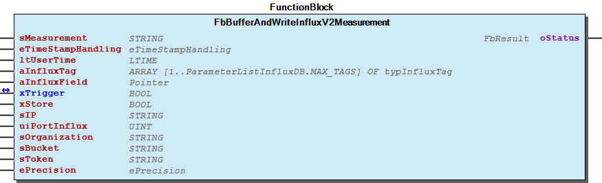
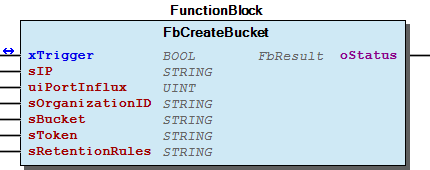
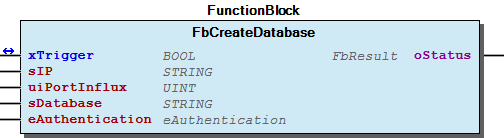
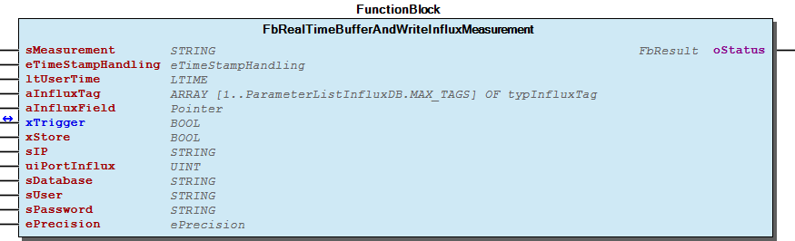
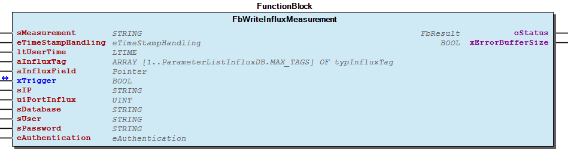
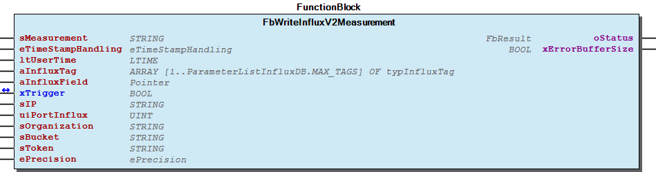

# WagoAppInfluxDB v1.0.2.5 (WAGO) - Complete Documentation


## 📋 Library Information

- **Company:** WAGO
- **Title:** WagoAppInfluxDB
- **Version:** 1.0.2.5
- **Categories:** WAGO BusinessView|Building Automation; WAGO LayerView|App; Application
- **Namespace:** WagoAppInfluxDB
- **Author:** u015842
- **Placeholder:** WagoAppInfluxDB

### Description ¶


This document is automatically generated.

Library for communication to an influx database including creating measurements, fields and tags and writing values with WAGO I/O- System

This document is automatically generated. Library for communication to an influx database including creating measurements, fields and tags and writing values with WAGO I/O- System

### Contents: ¶


Contents: - Documentation Index - Project Information - Library Information - Function Blocks FbBufferAndWriteInfluxMeasurement (FB) - FbBufferAndWriteInfluxV2Measurement (FB) - FbCreateBucket (FB) - FbCreateDatabase (FB) - FbRealTimeBufferAndWriteInfluxMeasurement (FB) - FbRealTimeBufferAndWriteInfluxV2Measurement (FB) - FbWriteInfluxMeasurement (FB) - FbWriteInfluxV2Measurement (FB) Methods - FbBufferAndWriteInfluxMeasurement.StoreToBuffer (METH) - FbBufferAndWriteInfluxMeasurement.typSSL_Options (PROP) - FbBufferAndWriteInfluxMeasurement.xUseHTTPS (PROP) - FbBufferAndWriteInfluxV2Measurement.StoreToBuffer (METH) - FbBufferAndWriteInfluxV2Measurement.Timeout (PROP) - FbBufferAndWriteInfluxV2Measurement.typSSL_Options (PROP) - FbBufferAndWriteInfluxV2Measurement.xUseHTTPS (PROP) - FbRealTimeBufferAndWriteInfluxMeasurement.BufferIsEmpty (PROP) - FbRealTimeBufferAndWriteInfluxMeasurement.StoreToBuffer (METH) - FbRealTimeBufferAndWriteInfluxMeasurement.Timeout (PROP) - ... and 12 more Program Organization Base Components - FbCreateDatabase.typSSL_Options (PROP) - FbCreateDatabase.xUseHTTPS (PROP) Global Variable Lists Other Components - 01 Function blocks - 80 Data types - FbCreateBucket.Timeout (PROP) - FbCreateBucket.typSSL_Options (PROP) - FbCreateBucket.xUseHTTPS (PROP) - GlobalTextList (Text List) - InfluxDB v1.x - InfluxDB v2.0 - ParameterListInfluxDB (PARAMS) - eFieldValueType (ENUM) - ... and 4 more

### Indices and tables ¶


Based on WagoAppInfluxDB.library, last modified 29.05.2024, 21:01:49. LibDoc 3.5.16.10

© WAGO GmbH & Co. KG, Germany 2018 – All rights reserved. For the avoidance of doubt, this copyright notice does not only apply to the information above but also and primarily to the described library itself. Please note that third-party products are always mentioned without reference to intellectual property rights, including patents, utility models, designs and trademarks, accordingly the existence of such rights cannot be excluded. WAGO is a registered trademark of WAGO Verwaltungsgesellschaft mbH.

- File and Project Information - Library Reference Based on WagoAppInfluxDB.library, last modified 29.05.2024, 21:01:49. LibDoc 3.5.16.10 © WAGO GmbH & Co. KG, Germany 2018 – All rights reserved. For the avoidance of doubt, this copyright notice does not only apply to the information above but also and primarily to the described library itself. Please note that third-party products are always mentioned without reference to intellectual property rights, including patents, utility models, designs and trademarks, accordingly the existence of such rights cannot be excluded. WAGO is a registered trademark of WAGO Verwaltungsgesellschaft mbH.

### Documentation Index


## WagoAppInfluxDB Library Documentation


| Company: | WAGO |
| Title: | WagoAppInfluxDB |
| Version: | 1.0.2.5 |
| Categories: | WAGO BusinessView\|Building Automation; WAGO LayerView\|App; Application |
| Namespace: | WagoAppInfluxDB |
| Author: | u015842 |
| Placeholder: | WagoAppInfluxDB |

### Description


This document is automatically generated.

Library for communication to an influx database including creating measurements, fields and tags and writing values with WAGO I/O- System

This document is automatically generated. Library for communication to an influx database including creating measurements, fields and tags and writing values with WAGO I/O- System

### Contents:


- 20 Program Organization Units 01 Function blocks - 80 Data types GlobalTextList (Text List) ParameterListInfluxDB (PARAMS) VersionHistory (GVL)

### Indices and tables


Based on WagoAppInfluxDB.library, last modified 29.05.2024, 21:01:49. LibDoc 3.5.16.10

© WAGO GmbH & Co. KG, Germany 2018 – All rights reserved. For the avoidance of doubt, this copyright notice does not only apply to the information above but also and primarily to the described library itself. Please note that third-party products are always mentioned without reference to intellectual property rights, including patents, utility models, designs and trademarks, accordingly the existence of such rights cannot be excluded. WAGO is a registered trademark of WAGO Verwaltungsgesellschaft mbH.

- File and Project Information - Library Reference Based on WagoAppInfluxDB.library, last modified 29.05.2024, 21:01:49. LibDoc 3.5.16.10 © WAGO GmbH & Co. KG, Germany 2018 – All rights reserved. For the avoidance of doubt, this copyright notice does not only apply to the information above but also and primarily to the described library itself. Please note that third-party products are always mentioned without reference to intellectual property rights, including patents, utility models, designs and trademarks, accordingly the existence of such rights cannot be excluded. WAGO is a registered trademark of WAGO Verwaltungsgesellschaft mbH.

### Project Information


## File and Project Information


| Scope | Name | Type | Content |
| --- | --- | --- | --- |
| FileHeader | libraryFile | string | WagoAppInfluxDB.library |
| contentFile | doc.clean.json |
| productName | e!COCKPIT |
| creationDateTime | date | 29.05.2024, 21:01:50 |
| companyName | string | WAGO |
| ProjectInformation | LastModificationDateTime | date | 29.05.2024, 21:01:49 |
| NoPlaceholder | string |  |
| Description | See: Description |
| Copyright | © WAGO GmbH & Co. KG, Germany 2021 – All rights reserved. |
| Author | u015842 |
| AutoResolveUnbound | bool | True |
| Placeholder | string | WagoAppInfluxDB |
| Company | WAGO |
| DocFormat | reStructuredText |
| Project | WagoAppInfluxDB |
| DefaultNamespace | WagoAppInfluxDB |
| Version | version | 1.0.2.5 |
| Threadsave | string | False |
| Title | WagoAppInfluxDB |
| LibraryCategories | library-category-list | WAGO BusinessView\|Building Automation; WAGO LayerView\|App; Application |
| CompiledLibraryCompatibilityVersion | string | CODESYS V3.5 SP16 Patch 3 |

### Library Information


## Library Reference


| LinkAllContent: False QualifiedOnly: True | SystemLibrary: False | Optional: False |

| LinkAllContent: False QualifiedOnly: True | SystemLibrary: False | Optional: False |

| LinkAllContent: False QualifiedOnly: True | SystemLibrary: False | Optional: False |

| LinkAllContent: False QualifiedOnly: False | SystemLibrary: False | Optional: False |

| LinkAllContent: False QualifiedOnly: False | SystemLibrary: False | Optional: False |

| LinkAllContent: False QualifiedOnly: False | SystemLibrary: False | Optional: False |

| LinkAllContent: False QualifiedOnly: True | SystemLibrary: False | Optional: False |

| LinkAllContent: False QualifiedOnly: False | SystemLibrary: False | Optional: False |

| LinkAllContent: False QualifiedOnly: False | SystemLibrary: False | Optional: False |

| LinkAllContent: False QualifiedOnly: False | SystemLibrary: False | Optional: False |

| LinkAllContent: False QualifiedOnly: False | SystemLibrary: False | Optional: False |

| LinkAllContent: False QualifiedOnly: False | SystemLibrary: False | Optional: False |

This is a dictionary of all referenced libraries and their name spaces.

This is a dictionary of all referenced libraries and their name spaces. CAA Behaviour Model Library Identification : Placeholder: CAA Behaviour Model Default Resolution: CAA Behaviour Model, * (CAA Technical Workgroup) Namespace: CBM Library Properties : CAA FB Factory Library Identification : Placeholder: CAA FB Factory Default Resolution: CAA FB Factory, * (CAA Technical Workgroup) Namespace: FBF Library Properties : CAA Types Extern Library Identification : Placeholder: CAA Types Default Resolution: CAA Types Extern, * (CAA Technical Workgroup) Namespace: CAA Library Properties : Standard Library Identification : Placeholder: Standard Default Resolution: Standard, * (System) Namespace: Standard Library Properties : SysProcess Library Identification : Name: SysProcess Version: newest Company: System Namespace: SysProcess Library Properties : SysTypes2 Interfaces Library Identification : Name: SysTypes2 Interfaces Version: newest Company: System Namespace: SysTypes Library Properties : VisuSymbols Library Identification : Placeholder: VisuSymbols Default Resolution: VisuSymbols, * (System) Namespace: VisuSymbols Library Properties : WagoAppFileDir Library Identification : Placeholder: WagoAppFileDir Default Resolution: WagoAppFileDir, * (WAGO) Namespace: WagoAppFileDir Library Properties : Library Parameter : Parameter: STANDARDSCHEDULINGMODE = eSchedulingMode.AsyncLow Parameter: STANDARDTIMEOUT = TIME#10s0ms WagoAppHTTP Library Identification : Placeholder: WagoAppHTTP Default Resolution: WagoAppHTTP, * (WAGO) Namespace: WagoAppHTTP Library Properties : WagoAppString Library Identification : Placeholder: WagoAppString Default Resolution: WagoAppString, * (WAGO) Namespace: WagoAppString Library Properties : Library Parameter : Parameter: MAX_STRING_LENGTH = 255 WagoAppTime Library Identification : Placeholder: WagoAppTime Default Resolution: WagoAppTime, * (WAGO) Namespace: WagoAppTime Library Properties : WagoSysVersion Library Identification : Name: WagoSysVersion Version: 1.0.0.0 Company: WAGO Namespace: WagoSysVersion Library Properties :

### Function Blocks


## FbBufferAndWriteInfluxMeasurement (FB)


| Scope | Name | Type | Comment | Inherited from |
| --- | --- | --- | --- | --- |
| Input | sMeasurement | STRING | Name of the measurement | FbInfluxMeasurement |
| eTimeStampHandling | eTimeStampHandling | Specifies the written time stamp. Time stamp is written in nanosecond. | FbInfluxMeasurement |
| ltUserTime | LTIME | User time in nanosecond for entries. Only used with ‘eTimeStampHandling’ = UserTime. | FbInfluxMeasurement |
| aInfluxTag | ARRAY [1..ParameterListInfluxDB.MAX_TAGS] OF typInfluxTag | Optional tag for all written fields; e.g. Controller host or IP address | FbInfluxMeasurement |
| aInfluxField | POINTER TO typInfluxField | Fields for the measurement. Size is defined by user ARRAY size. | FbInfluxMeasurement |
| Inout | xTrigger | BOOL | Triggers writing all field values. Resets automatically when action is done. |  |
| Input | xStore | BOOL | Positive edge stores all field values to buffer. |  |
| sIP | STRING(50) | IP or URL of Influx server. e.g. ‘192.168.1.2’ |  |
| uiPortInflux | UINT | Port of Influx server. e.g. 8086 |  |
| sDatabase | STRING(51) | Name of influx database (must be created once e.g. with FbCreateDatabase ) |  |
| sUser | STRING(21) | Optional: user name to write in Influx database. |  |
| sPassword | STRING(100) | Optional: password for user to write in Influx database. |  |
| ePrecision | ePrecision | Time precision of send data. Can not be changed in one buffer packet to send. |  |
| Output | oStatus | WagoSysErrorBase.FbResult | Status information from HTTP/HTTPS function block |  |

```
VAR
    oMyMeasurement  : WagoAppInfluxDB.FbBufferAndWriteInfluxMeasurement;
    xStore          : BOOL; //Positive Edge stores values to buffer. Sending values automatically, when buffer is full.
    xTrigger        : BOOL; //internal trigger of influx function block
    sIP             : STRING(16):='192.168.1.212';  //IP of Influx database
    uiPortInflux    : UINT:=8086;       //Port of Inlfux database
    sMeasurement    : STRING:='MyMeasurement'; //Name of the measurement
    sDatabase       : STRING(51) := 'TestDB';   //Name of database
    eTimeStamp      : WagoAppInfluxDB.eTimeStampHandling := WagoAppInfluxDB.eTimeStampHandling.ServerTime;  //server time
    aInfluxTag      : ARRAY [1..WagoAppInfluxDB.ParameterListInfluxDB.MAX_TAGS] OF typInfluxTag := [(sKey := 'Station', sValue := 'Station_01'), 2(())];
    aInfluxField    : ARRAY [1..4] OF WagoAppInfluxDB.typInfluxField := [(sKey := 'Voltage'), (sKey := 'Current'), (sKey := 'Alarm', eType := EFIELDVALUETYPE.eFVT_BOOL), (sKey := 'AlarmText', eType := EFIELDVALUETYPE.eFVT_STRING)];
    rVoltage        : REAL; //Value for database
    rCurrent        : REAL; //Value for database
    xAlarm          : BOOL; //Value for database
    sAlarmText      : STRING;   //Value for database
    oStatus         : WagoSysErrorBase.FbResult;    //Status information from HTTP/HTTPS function block
END_VAR
//store values to buffer. sending will be set automatically.
IF xStore THEN
    aInfluxField[1].sValue:=REAL_TO_STRING(rVoltage);
    aInfluxField[2].sValue:=REAL_TO_STRING(rCurrent);
    aInfluxField[3].sValue:=BOOL_TO_STRING(xAlarm);
    aInfluxField[4].sValue:=sAlarmText;
    xTrigger:=TRUE;
END_IF
//call function block
oMyMeasurement(
    sMeasurement:= sMeasurement,
    eTimeStampHandling:= eTimeStamp,
    ltUserTime:= ,
    aInfluxTag:= aInfluxTag,
    aInfluxField:= aInfluxField,
    xTrigger:= xTrigger,
    xStore:= xStore,
    sIP:= sIP,
    uiPortInflux:= uiPortInflux,
    sDatabase:= sDatabase,
    sUser:= ,
    sPassword:= ,
    oStatus=> oStatus,
    xErrorBufferSize=> );
```

This function block buffers multiple fields of one measurement and including possible tags and send it in an InfluxDB v1.x with HTTP POST commands.

Graphical Illustration

Graphical Interface of FbBufferAndWriteInfluxMeasurement

Function description

The complete buffer is send, when it is full. If the current values can not be buffered completely, the previous values will be send first and the current values get buffered after sending is ready.

The buffer size for the POST command is defined in the ParameterList and can be changed by user. It is preffered to extend the buffer size instead of sending more POSTs.

Empty keys and values in Tags and Fields will be ignored.

The function block also supports HTTPS by using the properties xUseHTTPS and typSSL_Options .

Interface variables Function This function block buffers multiple fields of one measurement and including possible tags and send it in an InfluxDB v1.x with HTTP POST commands. Graphical Illustration  Graphical Interface of FbBufferAndWriteInfluxMeasurement Function description The complete buffer is send, when it is full. If the current values can not be buffered completely, the previous values will be send first and the current values get buffered after sending is ready. Note The buffer size for the POST command is defined in the ParameterList and can be changed by user. It is preffered to extend the buffer size instead of sending more POSTs. Example: Note Empty keys and values in Tags and Fields will be ignored. Note The function block also supports HTTPS by using the properties xUseHTTPS and typSSL_Options . - FbBufferAndWriteInfluxMeasurement.StoreToBuffer (METH) - FbBufferAndWriteInfluxMeasurement.typSSL_Options (PROP) - FbBufferAndWriteInfluxMeasurement.xUseHTTPS (PROP)

## FbBufferAndWriteInfluxV2Measurement (FB)


| Scope | Name | Type | Comment | Inherited from |
| --- | --- | --- | --- | --- |
| Input | sMeasurement | STRING | Name of the measurement | FbInfluxMeasurement |
| eTimeStampHandling | eTimeStampHandling | Specifies the written time stamp. Time stamp is written in nanosecond. | FbInfluxMeasurement |
| ltUserTime | LTIME | User time in nanosecond for entries. Only used with ‘eTimeStampHandling’ = UserTime. | FbInfluxMeasurement |
| aInfluxTag | ARRAY [1..ParameterListInfluxDB.MAX_TAGS] OF typInfluxTag | Optional tag for all written fields; e.g. Controller host or IP address | FbInfluxMeasurement |
| aInfluxField | POINTER TO typInfluxField | Fields for the measurement. Size is defined by user ARRAY size. | FbInfluxMeasurement |
| Inout | xTrigger | BOOL | Trigger sending all field values. Resets when action is done. Can be triggered manually. |  |
| Input | xStore | BOOL | Positive edge stores all field values to buffer. |  |
| sIP | STRING(50) | IP or URL of Influx server. e.g. ‘192.168.1.2’ |  |
| uiPortInflux | UINT | Port of Influx server. e.g. 8086 |  |
| sOrganization | STRING | The destination organization for writes. e.g. “YOUR_ORG” |  |
| sBucket | STRING | The destination bucket for writes. e.g. “YOUR_BUCKET” |  |
| sToken | STRING(255) | Authentication token. A token belongs to an organization and identifies InfluxDB permissions within the organization. |  |
| ePrecision | ePrecision | Time precision of send data. Can not be changed in one buffer packet to send. |  |
| Output | oStatus | WagoSysErrorBase.FbResult | Status information from HTTP/HTTPS function block |  |

```
VAR
    oMyMeasurement  : WagoAppInfluxDB.FbBufferAndWriteInfluxV2Measurement;
    xStore          : BOOL; //Positive Edge stores values to buffer. Sending values automatically, when buffer is full.
    xTrigger        : BOOL; //internal trigger of influx function block
    sIP             : STRING(16) :='192.168.1.212'; //IP of Influx database
    uiPortInflux    : UINT :=8086;      //Port of Inlfux database
    sMeasurement    : STRING :='MyMeasurement'; //Name of the measurement
    sOrganization   : STRING := 'MyOrganization';   //Name of destination organization.
    sBucket         : STRING := 'MyBucket'; //Name of destination bucket.
    sToken          : STRING(255) := 'M0f6d9VpzTUU3vaTBK0qHDlU2Wsuw-iJmNc8rLURENjnEJkR165h-6SsgpWIwUDgW92eVjUz61HU4ICAuWZb6w==';    //Token
    ePrecision      : WagoAppInfluxDB.ePrecision := WagoAppInfluxDB.ePrecision.Millisecond; //presicion in millisecond
    eTimeStamp      : WagoAppInfluxDB.eTimeStampHandling := WagoAppInfluxDB.eTimeStampHandling.SystemTime;  //controller system time
    aInfluxTag      : ARRAY [1..WagoAppInfluxDB.ParameterListInfluxDB.MAX_TAGS] OF typInfluxTag := [(sKey := 'Station', sValue := 'Station_01'), 2(())];
    aInfluxField    : ARRAY [1..4] OF WagoAppInfluxDB.typInfluxField := [(sKey := 'Voltage'), (sKey := 'Current'), (sKey := 'Alarm', eType := EFIELDVALUETYPE.eFVT_BOOL), (sKey := 'AlarmText', eType := EFIELDVALUETYPE.eFVT_STRING)];
    rVoltage        : REAL; //Value for database
    rCurrent        : REAL; //Value for database
    xAlarm          : BOOL; //Value for database
    sAlarmText      : STRING;   //Value for database
    oStatus         : WagoSysErrorBase.FbResult;    //Status information from HTTP/HTTPS function block
END_VAR
//store values to buffer. sending will be set automatically.
IF xStore THEN
    aInfluxField[1].sValue:=REAL_TO_STRING(rVoltage);
    aInfluxField[2].sValue:=REAL_TO_STRING(rCurrent);
    aInfluxField[3].sValue:=BOOL_TO_STRING(xAlarm);
    aInfluxField[4].sValue:=sAlarmText;
END_IF
//call function block
oMyMeasurement(
    sMeasurement:= sMeasurement,
    eTimeStampHandling:= eTimeStamp,
    aInfluxTag:= aInfluxTag,
    aInfluxField:= aInfluxField,
    xTrigger:= xTrigger,
    xStore:= xStore,
    sIP:= sIP,
    uiPortInflux:= uiPortInflux,
    sOrganization:= sOrganization,
    sBucket:= sBucket,
    sToken:= sToken,
    ePrecision  := ePrecision,
    oStatus=> oStatus);
```

This function block buffers multiple fields of one measurement and including possible tags and send it in an InfluxDB v2.0 with HTTP POST commands.

Graphical Illustration

Graphical Interface of FbBufferAndWriteInfluxV2Measurement

Function description

The complete buffer is send, when it is full. If the current values can not be buffered completely, the previous values will be send first and the current values get buffered after sending is ready.

The buffer size for the POST command is defined in the ParameterList and can be changed by user. It is preffered to extend the buffer size instead of sending more POSTs.

Empty keys and values in Tags and Fields will be ignored.

The function block also supports HTTPS by using the properties xUseHTTPS and typSSL_Options .

Interface variables Function This function block buffers multiple fields of one measurement and including possible tags and send it in an InfluxDB v2.0 with HTTP POST commands. Graphical Illustration  Graphical Interface of FbBufferAndWriteInfluxV2Measurement Function description The complete buffer is send, when it is full. If the current values can not be buffered completely, the previous values will be send first and the current values get buffered after sending is ready. Note The buffer size for the POST command is defined in the ParameterList and can be changed by user. It is preffered to extend the buffer size instead of sending more POSTs. Example: Note Empty keys and values in Tags and Fields will be ignored. Note The function block also supports HTTPS by using the properties xUseHTTPS and typSSL_Options . - FbBufferAndWriteInfluxV2Measurement.StoreToBuffer (METH) - FbBufferAndWriteInfluxV2Measurement.Timeout (PROP) - FbBufferAndWriteInfluxV2Measurement.typSSL_Options (PROP) - FbBufferAndWriteInfluxV2Measurement.xUseHTTPS (PROP)

## FbCreateBucket (FB)


| Scope | Name | Type | Comment |
| --- | --- | --- | --- |
| Inout | xTrigger | BOOL | Triggers writing all field values. Resets automatically when action is done. |
| Input | sIP | STRING(50) | IP or URL of Influx server. e.g. ‘192.168.1.2’ |
| uiPortInflux | UINT | Port of Influx server. e.g. 8086, ignored if 0. e.g. for cloud connection |
| sOrganizationID | STRING | The destination organization ID, not organization name. |
| sBucket | STRING | The bucket name to be created. e.g. “YOUR_BUCKET” |
| sToken | STRING(255) | Authentication token. A token belongs to an organization and identifies InfluxDB permissions within the organization. |
| sRetentionRules | STRING(255) | The retention rules. Empty (recommanded) leads to “no expire”. Otherwise JSON-Format is necessary, see InfluxDB documentation |
| Output | oStatus | WagoSysErrorBase.FbResult | Status information from HTTP/HTTPS function block |

```
VAR
    sRetentionRules : STRING := '{$r$n"everySeconds": 86400,$r$n"shardGroupDurationSeconds": 0,$r$n"type": "expire"$r$n}';  //data will be kept 1 day (86400 seconds) in database
END_VAR
```

This function block creates a bucket in an influx V2.x database. This needs to be done once before any measurement can be written into the bucket.

Graphical Illustration

Graphical Interface of FbCreateBucket

Function description

With empty input sRetentionRules the bucket will be created without retentionRules so the data never expires.

Example for sRetentionRules declaration:

Interface variables Function This function block creates a bucket in an influx V2.x database. This needs to be done once before any measurement can be written into the bucket. Graphical Illustration  Graphical Interface of FbCreateBucket Function description With empty input sRetentionRules the bucket will be created without retentionRules so the data never expires. Example for sRetentionRules declaration: - FbCreateBucket.Timeout (PROP) - FbCreateBucket.typSSL_Options (PROP) - FbCreateBucket.xUseHTTPS (PROP)

## FbCreateDatabase (FB)


| Scope | Name | Type | Initial | Comment |
| --- | --- | --- | --- | --- |
| Inout | xTrigger | BOOL |  | Triggers creating database. Resets automatically when action is done. |
| Input | sIP | STRING(50) |  | IP or URL of Influx server |
| uiPortInflux | UINT |  | Port of Influx server |
| sDatabase | STRING(51) |  | Name of influx database (must be created once) |
| eAuthentication | WagoAppHTTP.eAuthentication | WagoAppHTTP.eAuthentication.None | 0=none, 1=basic ->2=digest future use |
| Output | oStatus | WagoSysErrorBase.FbResult |  | Status information from HTTP/HTTPS function block |

This function block creates a database in an influx database. This needs to be done once before any measurement can be written into the database.

Graphical Illustration

Graphical Interface of FbCreateDatabase

Interface variables Function This function block creates a database in an influx database. This needs to be done once before any measurement can be written into the database. Graphical Illustration  Graphical Interface of FbCreateDatabase - FbCreateDatabase.typSSL_Options (PROP) - FbCreateDatabase.xUseHTTPS (PROP)

## FbRealTimeBufferAndWriteInfluxMeasurement (FB)


| Scope | Name | Type | Comment | Inherited from |
| --- | --- | --- | --- | --- |
| Input | sMeasurement | STRING | Name of the measurement | FbInfluxMeasurement |
| eTimeStampHandling | eTimeStampHandling | Specifies the written time stamp. Time stamp is written in nanosecond. | FbInfluxMeasurement |
| ltUserTime | LTIME | User time in nanosecond for entries. Only used with ‘eTimeStampHandling’ = UserTime. | FbInfluxMeasurement |
| aInfluxTag | ARRAY [1..ParameterListInfluxDB.MAX_TAGS] OF typInfluxTag | Optional tag for all written fields; e.g. Controller host or IP address | FbInfluxMeasurement |
| aInfluxField | POINTER TO typInfluxField | Fields for the measurement. Size is defined by user ARRAY size. | FbInfluxMeasurement |
| Inout | xTrigger | BOOL | Triggers writing all field values. Resets automatically when action is done. |  |
| Input | xStore | BOOL | Positive edge stores all field values to buffer. |  |
| sIP | STRING(50) | IP or URL of Influx server. e.g. ‘192.168.1.2’ |  |
| uiPortInflux | UINT | Port of Influx server. e.g. 8086 |  |
| sDatabase | STRING(51) | Name of influx database (must be created once e.g. with FbCreateDatabase ) |  |
| sUser | STRING(21) | Optional: user name to write in Influx database. |  |
| sPassword | STRING(100) | Optional: password for user to write in Influx database. |  |
| ePrecision | ePrecision | Time precision of send data. Can not be changed in one buffer packet to send. |  |
| Output | oStatus | WagoSysErrorBase.FbResult | Status information from HTTP/HTTPS function block |  |

```
VAR
    oMyMeasurement  : WagoAppInfluxDB.FbBufferAndWriteInfluxMeasurement;
    xStore          : BOOL; //Positive Edge stores values to buffer. Sending values automatically, when buffer is full.
    xTrigger        : BOOL; //internal trigger of influx function block
    sIP             : STRING(16):='192.168.1.212';  //IP of Influx database
    uiPortInflux    : UINT:=8086;       //Port of Inlfux database
    sMeasurement    : STRING:='MyMeasurement'; //Name of the measurement
    sDatabase       : STRING(51) := 'TestDB';   //Name of database
    eTimeStamp      : WagoAppInfluxDB.eTimeStampHandling := WagoAppInfluxDB.eTimeStampHandling.ServerTime;  //server time
    aInfluxTag      : ARRAY [1..WagoAppInfluxDB.ParameterListInfluxDB.MAX_TAGS] OF typInfluxTag := [(sKey := 'Station', sValue := 'Station_01'), 2(())];
    aInfluxField    : ARRAY [1..4] OF WagoAppInfluxDB.typInfluxField := [(sKey := 'Voltage'), (sKey := 'Current'), (sKey := 'Alarm', eType := EFIELDVALUETYPE.eFVT_BOOL), (sKey := 'AlarmText', eType := EFIELDVALUETYPE.eFVT_STRING)];
    rVoltage        : REAL; //Value for database
    rCurrent        : REAL; //Value for database
    xAlarm          : BOOL; //Value for database
    sAlarmText      : STRING;   //Value for database
    oStatus         : WagoSysErrorBase.FbResult;    //Status information from HTTP/HTTPS function block
END_VAR
//store values to buffer. sending will be set automatically.
IF xStore THEN
    aInfluxField[1].sValue:=REAL_TO_STRING(rVoltage);
    aInfluxField[2].sValue:=REAL_TO_STRING(rCurrent);
    aInfluxField[3].sValue:=BOOL_TO_STRING(xAlarm);
    aInfluxField[4].sValue:=sAlarmText;
END_IF
//call function block
oMyMeasurement(
    sMeasurement:= sMeasurement,
    eTimeStampHandling:= eTimeStamp,
    ltUserTime:= ,
    aInfluxTag:= aInfluxTag,
    aInfluxField:= aInfluxField,
    xTrigger:= xTrigger, //send all stored data, also when buffer is not full
    xStore:= xStore,
    sIP:= sIP,
    uiPortInflux:= uiPortInflux,
    sDatabase:= sDatabase,
    sUser:= ,
    sPassword:= ,
    oStatus=> oStatus,
    xErrorBufferSize=> );
```

This function block buffers in real time multiple fields of one measurement and including possible tags and send it in an InfluxDB v1.x with HTTP POST commands.

Graphical Illustration

Graphical Interface of FbRealTimeBufferAndWriteInfluxMeasurement

Function description

The complete buffer is send, when it is full. Buffering can be done even when sending is in progress.

The buffer size for the POST command is defined in the ParameterList and can be changed by user. It is preffered to extend the buffer size instead of sending more POSTs.

This function block allocates more than double of the parameterized buffer size.

Buffering while sending progress is in action (xTrigger) is possible as far as there are not more data to buffer than the buffer size. If the buffer is to small and sending progress is still active there will may be data loss.

Empty keys and values in Tags and Fields will be ignored.

The function block also supports HTTPS by using the properties xUseHTTPS and typSSL_Options .

Interface variables Function This function block buffers in real time multiple fields of one measurement and including possible tags and send it in an InfluxDB v1.x with HTTP POST commands. Graphical Illustration  Graphical Interface of FbRealTimeBufferAndWriteInfluxMeasurement Function description The complete buffer is send, when it is full. Buffering can be done even when sending is in progress. Note The buffer size for the POST command is defined in the ParameterList and can be changed by user. It is preffered to extend the buffer size instead of sending more POSTs. Note This function block allocates more than double of the parameterized buffer size. Note Buffering while sending progress is in action (xTrigger) is possible as far as there are not more data to buffer than the buffer size. If the buffer is to small and sending progress is still active there will may be data loss. Example: Note Empty keys and values in Tags and Fields will be ignored. Note The function block also supports HTTPS by using the properties xUseHTTPS and typSSL_Options . - FbRealTimeBufferAndWriteInfluxMeasurement.BufferIsEmpty (PROP) - FbRealTimeBufferAndWriteInfluxMeasurement.StoreToBuffer (METH) - FbRealTimeBufferAndWriteInfluxMeasurement.Timeout (PROP) - FbRealTimeBufferAndWriteInfluxMeasurement.typSSL_Options (PROP) - FbRealTimeBufferAndWriteInfluxMeasurement.xUseHTTPS (PROP)

## FbRealTimeBufferAndWriteInfluxV2Measurement (FB)


| Scope | Name | Type | Comment | Inherited from |
| --- | --- | --- | --- | --- |
| Input | sMeasurement | STRING | Name of the measurement | FbInfluxMeasurement |
| eTimeStampHandling | eTimeStampHandling | Specifies the written time stamp. Time stamp is written in nanosecond. | FbInfluxMeasurement |
| ltUserTime | LTIME | User time in nanosecond for entries. Only used with ‘eTimeStampHandling’ = UserTime. | FbInfluxMeasurement |
| aInfluxTag | ARRAY [1..ParameterListInfluxDB.MAX_TAGS] OF typInfluxTag | Optional tag for all written fields; e.g. Controller host or IP address | FbInfluxMeasurement |
| aInfluxField | POINTER TO typInfluxField | Fields for the measurement. Size is defined by user ARRAY size. | FbInfluxMeasurement |
| Inout | xTrigger | BOOL | Trigger sending all field values. Resets when action is done. Can be triggered manually. |  |
| Input | xStore | BOOL | Positive edge stores all field values to buffer. |  |
| sIP | STRING(50) | IP or URL of Influx server. e.g. ‘192.168.1.2’ |  |
| uiPortInflux | UINT | Port of Influx server. e.g. 8086 |  |
| sOrganization | STRING | The destination organization for writes. e.g. “YOUR_ORG” |  |
| sBucket | STRING | The destination bucket for writes. e.g. “YOUR_BUCKET” |  |
| sToken | STRING(255) | Authentication token. A token belongs to an organization and identifies InfluxDB permissions within the organization. |  |
| ePrecision | ePrecision | Time precision of send data. Can not be changed in one buffer packet to send. |  |
| Output | oStatus | WagoSysErrorBase.FbResult | Status information from HTTP/HTTPS function block |  |

```
VAR
    oMyMeasurement  : WagoAppInfluxDB.FbBufferAndWriteInfluxV2Measurement;
    xStore          : BOOL; //Positive Edge stores values to buffer. Sending values automatically, when buffer is full.
    xTrigger        : BOOL; //internal trigger of influx function block
    sIP             : STRING(16) :='192.168.1.212'; //IP of Influx database
    uiPortInflux    : UINT :=8086;      //Port of Inlfux database
    sMeasurement    : STRING :='MyMeasurement'; //Name of the measurement
    sOrganization   : STRING := 'MyOrganization';   //Name of destination organization.
    sBucket         : STRING := 'MyBucket'; //Name of destination bucket.
    sToken          : STRING(255) := 'M0f6d9VpzTUU3vaTBK0qHDlU2Wsuw-iJmNc8rLURENjnEJkR165h-6SsgpWIwUDgW92eVjUz61HU4ICAuWZb6w==';    //Token
    ePrecision      : WagoAppInfluxDB.ePrecision := WagoAppInfluxDB.ePrecision.Millisecond; //presicion in millisecond
    eTimeStamp      : WagoAppInfluxDB.eTimeStampHandling := WagoAppInfluxDB.eTimeStampHandling.SystemTime;  //controller system time
    aInfluxTag      : ARRAY [1..WagoAppInfluxDB.ParameterListInfluxDB.MAX_TAGS] OF typInfluxTag := [(sKey := 'Station', sValue := 'Station_01'), 2(())];
    aInfluxField    : ARRAY [1..4] OF WagoAppInfluxDB.typInfluxField := [(sKey := 'Voltage'), (sKey := 'Current'), (sKey := 'Alarm', eType := EFIELDVALUETYPE.eFVT_BOOL), (sKey := 'AlarmText', eType := EFIELDVALUETYPE.eFVT_STRING)];
    rVoltage        : REAL; //Value for database
    rCurrent        : REAL; //Value for database
    xAlarm          : BOOL; //Value for database
    sAlarmText      : STRING;   //Value for database
    oStatus         : WagoSysErrorBase.FbResult;    //Status information from HTTP/HTTPS function block
END_VAR
//store values to buffer. sending will be set automatically.
IF xStore THEN
    aInfluxField[1].sValue:=REAL_TO_STRING(rVoltage);
    aInfluxField[2].sValue:=REAL_TO_STRING(rCurrent);
    aInfluxField[3].sValue:=BOOL_TO_STRING(xAlarm);
    aInfluxField[4].sValue:=sAlarmText;
END_IF
//call function block
oMyMeasurement(
    sMeasurement:= sMeasurement,
    eTimeStampHandling:= eTimeStamp,
    aInfluxTag:= aInfluxTag,
    aInfluxField:= aInfluxField,
    xTrigger:= xTrigger, //send all stored data, also when buffer is not full
    xStore:= xStore,
    sIP:= sIP,
    uiPortInflux:= uiPortInflux,
    sOrganization:= sOrganization,
    sBucket:= sBucket,
    sToken:= sToken,
    ePrecision  := ePrecision,
    oStatus=> oStatus);
```

This function block buffers in real time multiple fields of one measurement and including possible tags and send it in an InfluxDB v2.0 with HTTP POST commands.

Graphical Illustration

Graphical Interface of FbRealTimeBufferAndWriteInfluxV2Measurement

Function description

The complete buffer is send, when it is full. Buffering can be done even when sending is in progress.

The buffer size for the POST command is defined in the ParameterList and can be changed by user. It is preffered to extend the buffer size instead of sending more POSTs.

This function block allocates more than double of the parameterized buffer size.

Buffering while sending progress is in action (xTrigger) is possible as far as there are not more data to buffer than the buffer size. If the buffer is to small and sending progress is still active there will may be data loss.

Empty keys and values in Tags and Fields will be ignored.

The function block also supports HTTPS by using the properties xUseHTTPS and typSSL_Options .

Interface variables Function This function block buffers in real time multiple fields of one measurement and including possible tags and send it in an InfluxDB v2.0 with HTTP POST commands. Graphical Illustration  Graphical Interface of FbRealTimeBufferAndWriteInfluxV2Measurement Function description The complete buffer is send, when it is full. Buffering can be done even when sending is in progress. Note The buffer size for the POST command is defined in the ParameterList and can be changed by user. It is preffered to extend the buffer size instead of sending more POSTs. Note This function block allocates more than double of the parameterized buffer size. Note Buffering while sending progress is in action (xTrigger) is possible as far as there are not more data to buffer than the buffer size. If the buffer is to small and sending progress is still active there will may be data loss. Example: Note Empty keys and values in Tags and Fields will be ignored. Note The function block also supports HTTPS by using the properties xUseHTTPS and typSSL_Options . - FbRealTimeBufferAndWriteInfluxV2Measurement.BufferIsEmpty (PROP) - FbRealTimeBufferAndWriteInfluxV2Measurement.StoreToBuffer (METH) - FbRealTimeBufferAndWriteInfluxV2Measurement.Timeout (PROP) - FbRealTimeBufferAndWriteInfluxV2Measurement.typSSL_Options (PROP) - FbRealTimeBufferAndWriteInfluxV2Measurement.xUseHTTPS (PROP)

## FbWriteInfluxMeasurement (FB)


| Scope | Name | Type | Initial | Comment | Inherited from |
| --- | --- | --- | --- | --- | --- |
| Input | sMeasurement | STRING |  | Name of the measurement | FbInfluxMeasurement |
| eTimeStampHandling | eTimeStampHandling |  | Specifies the written time stamp. Time stamp is written in nanosecond. | FbInfluxMeasurement |
| ltUserTime | LTIME |  | User time in nanosecond for entries. Only used with ‘eTimeStampHandling’ = UserTime. | FbInfluxMeasurement |
| aInfluxTag | ARRAY [1..ParameterListInfluxDB.MAX_TAGS] OF typInfluxTag |  | Optional tag for all written fields; e.g. Controller host or IP address | FbInfluxMeasurement |
| aInfluxField | POINTER TO typInfluxField |  | Fields for the measurement. Size is defined by user ARRAY size. | FbInfluxMeasurement |
| Inout | xTrigger | BOOL |  | Triggers writing all field values. Resets automatically when action is done. |  |
| Input | sIP | STRING(50) |  | IP or URL of Influx server. e.g. ‘192.168.1.2’ |  |
| uiPortInflux | UINT |  | Port of Influx server. e.g. 8086 |  |
| sDatabase | STRING(51) |  | Name of influx database (must be created once e.g. with FbCreateDatabase ) |  |
| sUser | STRING(21) |  | Optional: user name to write in Influx database. |  |
| sPassword | STRING(100) |  | Optional: password for user to write in Influx database. |  |
| eAuthentication | WagoAppHTTP.eAuthentication | WagoAppHTTP.eAuthentication.None | obsolet input. 0=none, 1=basic ->2=digest future use |  |
| Output | oStatus | WagoSysErrorBase.FbResult |  | Status information from HTTP/HTTPS function block |  |
| xErrorBufferSize | BOOL |  | Displays Buffer size is to small to write a single field. |  |

```
VAR
    oMyMeasurement  : WagoAppInfluxDB.FbWriteInfluxMeasurement;
    xWrite          : BOOL; //TRUE triggers writing process with current variables
    xTrigger        : BOOL; //internal trigger of influx function block
    sIP             : STRING(16):='192.168.1.212';  //IP of Influx database
    uiPortInflux    : UINT:=8086;       //Port of Inlfux database
    sMeasurement    : STRING:='MyMeasurement'; //Name of the measurement
    sDatabase       : STRING(51) := 'TestDB';   //Name of database
    eTimeStamp      : WagoAppInfluxDB.eTimeStampHandling := WagoAppInfluxDB.eTimeStampHandling.ServerTime;  //server time
    aInfluxTag      : ARRAY [1..WagoAppInfluxDB.ParameterListInfluxDB.MAX_TAGS] OF typInfluxTag := [(sKey := 'Station', sValue := 'Station_01'), 2(())];
    aInfluxField    : ARRAY [1..4] OF WagoAppInfluxDB.typInfluxField := [(sKey := 'Voltage'), (sKey := 'Current'), (sKey := 'Alarm', eType := EFIELDVALUETYPE.eFVT_BOOL), (sKey := 'AlarmText', eType := EFIELDVALUETYPE.eFVT_STRING)];
    rVoltage        : REAL; //Value for database
    rCurrent        : REAL; //Value for database
    xAlarm          : BOOL; //Value for database
    sAlarmText      : STRING;   //Value for database
    oStatus         : WagoSysErrorBase.FbResult;    //Status information from HTTP/HTTPS function block
END_VAR

//start writing and set values
IF xWrite THEN
    xWrite:=FALSE;
    xTrigger:=TRUE;
    aInfluxField[1].sValue:=REAL_TO_STRING(rVoltage);
    aInfluxField[2].sValue:=REAL_TO_STRING(rCurrent);
    aInfluxField[3].sValue:=BOOL_TO_STRING(xAlarm);
    aInfluxField[4].sValue:=sAlarmText;
    xTrigger:=TRUE;
END_IF
//call function block
oMyMeasurement(
    sMeasurement:= sMeasurement,
    eTimeStampHandling:= eTimeStamp,
    ltUserTime:= ,
    aInfluxTag:= aInfluxTag,
    aInfluxField:= aInfluxField,
    xTrigger:= xTrigger,
    sIP:= sIP,
    uiPortInflux:= uiPortInflux,
    sDatabase:= sDatabase,
    sUser:= ,
    sPassword:= ,
    eAuthentication:= ,
    oStatus=> oStatus,
    xErrorBufferSize=> );
```

This function block writes multiple fields of one measurement including possible tags in an InfluxDB v1.x with HTTP POST commands.

Graphical Illustration

Graphical Interface of FbWriteInfluxMeasurement

Function description

The POST command is buffered internally and than send to the database. If the buffer is to small to transmit all fields at once, it will sends the remaining fields with a following command automatically. The system time stamp is not equal in that case.

The buffer size for the POST command is defined in the ParameterList and can be changed by user. It is preffered to extend the buffer size instead of sending more POSTs.

Empty keys and values in Tags and Fields will be ignored.

The function block also supports HTTPS by using the properties xUseHTTPS and typSSL_Options .

Interface variables Function This function block writes multiple fields of one measurement including possible tags in an InfluxDB v1.x with HTTP POST commands. Graphical Illustration  Graphical Interface of FbWriteInfluxMeasurement Function description Example: The POST command is buffered internally and than send to the database. If the buffer is to small to transmit all fields at once, it will sends the remaining fields with a following command automatically. The system time stamp is not equal in that case. Note The buffer size for the POST command is defined in the ParameterList and can be changed by user. It is preffered to extend the buffer size instead of sending more POSTs. Note Empty keys and values in Tags and Fields will be ignored. Note The function block also supports HTTPS by using the properties xUseHTTPS and typSSL_Options . - FbWriteInfluxMeasurement.typSSL_Options (PROP) - FbWriteInfluxMeasurement.xUseHTTPS (PROP)

## FbWriteInfluxV2Measurement (FB)


| Scope | Name | Type | Comment | Inherited from |
| --- | --- | --- | --- | --- |
| Input | sMeasurement | STRING | Name of the measurement | FbInfluxMeasurement |
| eTimeStampHandling | eTimeStampHandling | Specifies the written time stamp. Time stamp is written in nanosecond. | FbInfluxMeasurement |
| ltUserTime | LTIME | User time in nanosecond for entries. Only used with ‘eTimeStampHandling’ = UserTime. | FbInfluxMeasurement |
| aInfluxTag | ARRAY [1..ParameterListInfluxDB.MAX_TAGS] OF typInfluxTag | Optional tag for all written fields; e.g. Controller host or IP address | FbInfluxMeasurement |
| aInfluxField | POINTER TO typInfluxField | Fields for the measurement. Size is defined by user ARRAY size. | FbInfluxMeasurement |
| Inout | xTrigger | BOOL | Triggers writing all field values. Resets automatically when action is done. |  |
| Input | sIP | STRING(50) | IP or URL of Influx server. e.g. ‘192.168.1.2’ |  |
| uiPortInflux | UINT | Port of Influx server. e.g. 8086, ignored if 0. e.g. for cloud connection |  |
| sOrganization | STRING | The destination organization for writes. e.g. “YOUR_ORG” |  |
| sBucket | STRING | The destination bucket for writes. e.g. “YOUR_BUCKET” |  |
| sToken | STRING(255) | Authentication token. A token belongs to an organization and identifies InfluxDB permissions within the organization. |  |
| ePrecision | ePrecision | Time precision of send data. |  |
| Output | oStatus | WagoSysErrorBase.FbResult | Status information from HTTP/HTTPS function block |  |
| xErrorBufferSize | BOOL | Displays Buffer size is to small to write a single field. |  |

```
VAR
    oMyMeasurement  : WagoAppInfluxDB.FbWriteInfluxV2Measurement;
    xWrite          : BOOL; //TRUE triggers writing process with current variables
    xTrigger        : BOOL; //internal trigger of influx function block
    sIP             : STRING(16):='192.168.1.212';  //IP of Influx database
    uiPortInflux    : UINT:=8086;       //Port of Inlfux database
    sMeasurement    : STRING:='MyMeasurement'; //Name of the measurement
    sOrganization   : STRING := 'MyOrganization';   //Name of destination organization.
    sBucket         : STRING := 'MyBucket'; //Name of destination bucket.
    sToken          : STRING(255) := 'M0f6d9VpzTUU3vaTBK0qHDlU2Wsuw-iJmNc8rLURENjnEJkR165h-6SsgpWIwUDgW92eVjUz61HU4ICAuWZb6w==';    //Token
    ePrecision      : WagoAppInfluxDB.ePrecision  := WagoAppInfluxDB.ePrecision.Millisecond;    //presicion in millisecond
    eTimeStamp      : WagoAppInfluxDB.eTimeStampHandling := WagoAppInfluxDB.eTimeStampHandling.SystemTime;  //controller system time
    aInfluxTag      : ARRAY [1..WagoAppInfluxDB.ParameterListInfluxDB.MAX_TAGS] OF typInfluxTag := [(sKey := 'Station', sValue := 'Station_01'), 2(())];
    aInfluxField    : ARRAY [1..4] OF WagoAppInfluxDB.typInfluxField := [(sKey := 'Voltage'), (sKey := 'Current'), (sKey := 'Alarm', eType := EFIELDVALUETYPE.eFVT_BOOL), (sKey := 'AlarmText', eType := EFIELDVALUETYPE.eFVT_STRING)];
    rVoltage        : REAL; //Value for database
    rCurrent        : REAL; //Value for database
    xAlarm          : BOOL; //Value for database
    sAlarmText      : STRING;   //Value for database
    oStatus         : WagoSysErrorBase.FbResult;    //Status information from HTTP/HTTPS function block
END_VAR
//start writing and set values
IF xWrite THEN
    aInfluxField[1].sValue:=REAL_TO_STRING(rVoltage);
    aInfluxField[2].sValue:=REAL_TO_STRING(rCurrent);
    aInfluxField[3].sValue:=BOOL_TO_STRING(xAlarm);
    aInfluxField[4].sValue:=sAlarmText;
    xTrigger:=TRUE;
END_IF
//call function block
oMyMeasurement(
    sMeasurement:= sMeasurement,
    eTimeStampHandling:= eTimeStamp,
    ltUserTime:= ,
    aInfluxTag:= aInfluxTag,
    aInfluxField:= aInfluxField,
    xTrigger:= xTrigger,
    sIP:= sIP,
    uiPortInflux:= uiPortInflux,
    sOrganization:= sOrganization,
    sBucket:= sBucket,
    sToken:= sToken,
    ePrecision  := ePrecision,
    oStatus=> oStatus,
    xErrorBufferSize=> );
```

This function block writes multiple fields of one measurement including possible tags in an InfluxDB v2.0 with HTTP POST commands.

Graphical Illustration

Graphical Interface of FbWriteInfluxV2Measurement

Function description

The POST command is buffered internally and than send to the database. If the buffer is to small to transmit all fields at once, it will sends the remaining fields with a following command automatically. The system time stamp is not equal in that case.

The buffer size for the POST command is defined in the ParameterList and can be changed by user. It is preffered to extend the buffer size instead of sending more POSTs.

Empty keys and values in Tags and Fields will be ignored.

The function block also supports HTTPS by using the properties xUseHTTPS and typSSL_Options .

Interface variables Function This function block writes multiple fields of one measurement including possible tags in an InfluxDB v2.0 with HTTP POST commands. Graphical Illustration  Graphical Interface of FbWriteInfluxV2Measurement Function description Example: The POST command is buffered internally and than send to the database. If the buffer is to small to transmit all fields at once, it will sends the remaining fields with a following command automatically. The system time stamp is not equal in that case. Note The buffer size for the POST command is defined in the ParameterList and can be changed by user. It is preffered to extend the buffer size instead of sending more POSTs. Note Empty keys and values in Tags and Fields will be ignored. Note The function block also supports HTTPS by using the properties xUseHTTPS and typSSL_Options . - FbWriteInfluxV2Measurement.Timeout (PROP) - FbWriteInfluxV2Measurement.typSSL_Options (PROP) - FbWriteInfluxV2Measurement.xUseHTTPS (PROP)

### Methods


## FbBufferAndWriteInfluxMeasurement.StoreToBuffer (METH)


| Scope | Name | Type |
| --- | --- | --- |
| Return | StoreToBuffer | BOOL |

## FbBufferAndWriteInfluxMeasurement.typSSL_Options (PROP)


This property is need to be set when using HTTPS commands by setting property xUseHTTPS to TRUE.

This property is need to be set when using HTTPS commands by setting property xUseHTTPS to TRUE.

## FbBufferAndWriteInfluxMeasurement.xUseHTTPS (PROP)


If this Property is set to TRUE, HTTPS commands will be send instead of HTTP commands. Property typSSL_Options need to be filled also in that case.

If this Property is set to TRUE, HTTPS commands will be send instead of HTTP commands. Property typSSL_Options need to be filled also in that case.

## FbBufferAndWriteInfluxV2Measurement.StoreToBuffer (METH)


| Scope | Name | Type |
| --- | --- | --- |
| Return | StoreToBuffer | BOOL |

## FbBufferAndWriteInfluxV2Measurement.Timeout (PROP) ¶


## FbBufferAndWriteInfluxV2Measurement.typSSL_Options (PROP)


This property is need to be set when using HTTPS commands by setting property xUseHTTPS to TRUE.

This property is need to be set when using HTTPS commands by setting property xUseHTTPS to TRUE.

## FbBufferAndWriteInfluxV2Measurement.xUseHTTPS (PROP)


If this Property is set to TRUE, HTTPS commands will be send instead of HTTP commands. Property typSSL_Options need to be filled also in that case.

If this Property is set to TRUE, HTTPS commands will be send instead of HTTP commands. Property typSSL_Options need to be filled also in that case.

## FbRealTimeBufferAndWriteInfluxMeasurement.BufferIsEmpty (PROP)


## FbRealTimeBufferAndWriteInfluxMeasurement.StoreToBuffer (METH)


| Scope | Name | Type |
| --- | --- | --- |
| Return | StoreToBuffer | BOOL |

## FbRealTimeBufferAndWriteInfluxMeasurement.Timeout (PROP)


## FbRealTimeBufferAndWriteInfluxMeasurement.typSSL_Options (PROP)


This property is need to be set when using HTTPS commands by setting property xUseHTTPS to TRUE.

This property is need to be set when using HTTPS commands by setting property xUseHTTPS to TRUE.

## FbRealTimeBufferAndWriteInfluxMeasurement.xUseHTTPS (PROP)


If this Property is set to TRUE, HTTPS commands will be send instead of HTTP commands. Property typSSL_Options need to be filled also in that case.

If this Property is set to TRUE, HTTPS commands will be send instead of HTTP commands. Property typSSL_Options need to be filled also in that case.

## FbRealTimeBufferAndWriteInfluxV2Measurement.BufferIsEmpty (PROP)


## FbRealTimeBufferAndWriteInfluxV2Measurement.StoreToBuffer (METH)


| Scope | Name | Type |
| --- | --- | --- |
| Return | StoreToBuffer | BOOL |

## FbRealTimeBufferAndWriteInfluxV2Measurement.Timeout (PROP)


## FbRealTimeBufferAndWriteInfluxV2Measurement.typSSL_Options (PROP)


This property is need to be set when using HTTPS commands by setting property xUseHTTPS to TRUE.

This property is need to be set when using HTTPS commands by setting property xUseHTTPS to TRUE.

## FbRealTimeBufferAndWriteInfluxV2Measurement.xUseHTTPS (PROP)


If this Property is set to TRUE, HTTPS commands will be send instead of HTTP commands. Property typSSL_Options need to be filled also in that case.

If this Property is set to TRUE, HTTPS commands will be send instead of HTTP commands. Property typSSL_Options need to be filled also in that case.

## FbWriteInfluxMeasurement.typSSL_Options (PROP)


This property is need to be set when using HTTPS commands by setting property xUseHTTPS to TRUE.

This property is need to be set when using HTTPS commands by setting property xUseHTTPS to TRUE.

## FbWriteInfluxMeasurement.xUseHTTPS (PROP)


If this Property is set to TRUE, HTTPS commands will be send instead of HTTP commands. Property typSSL_Options need to be filled also in that case.

If this Property is set to TRUE, HTTPS commands will be send instead of HTTP commands. Property typSSL_Options need to be filled also in that case.

## FbWriteInfluxV2Measurement.Timeout (PROP) ¶


## FbWriteInfluxV2Measurement.typSSL_Options (PROP)


This property is need to be set when using HTTPS commands by setting property xUseHTTPS to TRUE.

This property is need to be set when using HTTPS commands by setting property xUseHTTPS to TRUE.

## FbWriteInfluxV2Measurement.xUseHTTPS (PROP)


If this Property is set to TRUE, HTTPS commands will be send instead of HTTP commands. Property typSSL_Options need to be filled also in that case.

If this Property is set to TRUE, HTTPS commands will be send instead of HTTP commands. Property typSSL_Options need to be filled also in that case.

### Program Organization


## 20 Program Organization Units


- 01 Function blocks InfluxDB v1.x FbBufferAndWriteInfluxMeasurement (FB) FbBufferAndWriteInfluxMeasurement.StoreToBuffer (METH) - FbBufferAndWriteInfluxMeasurement.typSSL_Options (PROP) - FbBufferAndWriteInfluxMeasurement.xUseHTTPS (PROP) FbCreateDatabase (FB) - FbCreateDatabase.typSSL_Options (PROP) - FbCreateDatabase.xUseHTTPS (PROP) FbRealTimeBufferAndWriteInfluxMeasurement (FB) - FbRealTimeBufferAndWriteInfluxMeasurement.BufferIsEmpty (PROP) - FbRealTimeBufferAndWriteInfluxMeasurement.StoreToBuffer (METH) - FbRealTimeBufferAndWriteInfluxMeasurement.Timeout (PROP) - FbRealTimeBufferAndWriteInfluxMeasurement.typSSL_Options (PROP) - FbRealTimeBufferAndWriteInfluxMeasurement.xUseHTTPS (PROP) FbWriteInfluxMeasurement (FB) - FbWriteInfluxMeasurement.typSSL_Options (PROP) - FbWriteInfluxMeasurement.xUseHTTPS (PROP) InfluxDB v2.0 - FbBufferAndWriteInfluxV2Measurement (FB) FbBufferAndWriteInfluxV2Measurement.StoreToBuffer (METH) - FbBufferAndWriteInfluxV2Measurement.Timeout (PROP) - FbBufferAndWriteInfluxV2Measurement.typSSL_Options (PROP) - FbBufferAndWriteInfluxV2Measurement.xUseHTTPS (PROP) FbCreateBucket (FB) - FbCreateBucket.Timeout (PROP) - FbCreateBucket.typSSL_Options (PROP) - FbCreateBucket.xUseHTTPS (PROP) FbRealTimeBufferAndWriteInfluxV2Measurement (FB) - FbRealTimeBufferAndWriteInfluxV2Measurement.BufferIsEmpty (PROP) - FbRealTimeBufferAndWriteInfluxV2Measurement.StoreToBuffer (METH) - FbRealTimeBufferAndWriteInfluxV2Measurement.Timeout (PROP) - FbRealTimeBufferAndWriteInfluxV2Measurement.typSSL_Options (PROP) - FbRealTimeBufferAndWriteInfluxV2Measurement.xUseHTTPS (PROP) FbWriteInfluxV2Measurement (FB) - FbWriteInfluxV2Measurement.Timeout (PROP) - FbWriteInfluxV2Measurement.typSSL_Options (PROP) - FbWriteInfluxV2Measurement.xUseHTTPS (PROP) 80 Data types - eFieldValueType (ENUM) - ePrecision (ENUM) - eTimeStampHandling (ENUM) - typInfluxField (STRUCT) - typInfluxTag (STRUCT)

### Base Components


## FbCreateDatabase.typSSL_Options (PROP) ¶


## FbCreateDatabase.xUseHTTPS (PROP) ¶


### Global Variable Lists


## VersionHistory (GVL)


| Name | Type |
| --- | --- |
| Info | ProjectInfo |

| date | version | author | change |
| 26.02.2024 | 1.0.2.5 | u010663 | Compiled SP16.3 |
| 24.10.2023 | 1.0.2.4 | u0103719 | replace SysTypes Interfaces vis SysTypes2 Interfaces |
| 10.08.2023 | 1.0.2.3 | u015842 | 32- and 64-Bit |
| 24.09.2022 | 1.0.2.2 | u015842 | Bugfix xTrigger in FbRealTimeBufferAndWriteInfluxV2Measurement and FbRealTimeBufferAndWriteInfluxMeasurement |
| 08.07.2022 | 1.0.2.0 | u015842 | FbRealTimeBufferAndWriteInfluxV2Measurement and FbRealTimeBufferAndWriteInfluxMeasurement added |
| 03.05.2022 | 1.0.1.6 | u015842 | Extend input sRetentionRules of FbCreateBucket |
| 09.03.2022 | 1.0.1.5 | u015842 | Extend buffer of FbCreateBucket to ParameterListInfluxDB.CREATE_BUCKET_RECEIVE_BUFFER |
| 25.01.2022 | 1.0.1.4 | u015842 | Bugfix FbBufferAndWriteInfluxMeasurement did not send. |
| 19.01.2022 | 1.0.1.3 | u015842 | FbCreateBucket added |
| 21.12.2021 | 1.0.1.1 | u015842 | InfluxDB V2: support for Inlux Cloud (FbWriteInfluxV2Measurement and FbBufferAndWriteInfluxV2Measurement) |
| 08.11.2021 | 1.0.1.0 | u015842 | InfluxDB V2 supported; new function blocks with buffering and automatic sending for less network traffic. |
| 25.05.2021 | 1.0.0.0 | u015842 | release version |
| 26.04.2021 | 0.9.0.0 | u015842 | first BETA release |

WagoAppInfluxDB.library

Description: Library for communication to an influx database including creating measurements, fields and tags and writing values with WAGO I/O- System

WagoAppInfluxDB.library Description: Library for communication to an influx database including creating measurements, fields and tags and writing values with WAGO I/O- System

### Other Components


## 01 Function blocks


- InfluxDB v1.x FbBufferAndWriteInfluxMeasurement (FB) FbBufferAndWriteInfluxMeasurement.StoreToBuffer (METH) - FbBufferAndWriteInfluxMeasurement.typSSL_Options (PROP) - FbBufferAndWriteInfluxMeasurement.xUseHTTPS (PROP) FbCreateDatabase (FB) - FbCreateDatabase.typSSL_Options (PROP) - FbCreateDatabase.xUseHTTPS (PROP) FbRealTimeBufferAndWriteInfluxMeasurement (FB) - FbRealTimeBufferAndWriteInfluxMeasurement.BufferIsEmpty (PROP) - FbRealTimeBufferAndWriteInfluxMeasurement.StoreToBuffer (METH) - FbRealTimeBufferAndWriteInfluxMeasurement.Timeout (PROP) - FbRealTimeBufferAndWriteInfluxMeasurement.typSSL_Options (PROP) - FbRealTimeBufferAndWriteInfluxMeasurement.xUseHTTPS (PROP) FbWriteInfluxMeasurement (FB) - FbWriteInfluxMeasurement.typSSL_Options (PROP) - FbWriteInfluxMeasurement.xUseHTTPS (PROP) InfluxDB v2.0 - FbBufferAndWriteInfluxV2Measurement (FB) FbBufferAndWriteInfluxV2Measurement.StoreToBuffer (METH) - FbBufferAndWriteInfluxV2Measurement.Timeout (PROP) - FbBufferAndWriteInfluxV2Measurement.typSSL_Options (PROP) - FbBufferAndWriteInfluxV2Measurement.xUseHTTPS (PROP) FbCreateBucket (FB) - FbCreateBucket.Timeout (PROP) - FbCreateBucket.typSSL_Options (PROP) - FbCreateBucket.xUseHTTPS (PROP) FbRealTimeBufferAndWriteInfluxV2Measurement (FB) - FbRealTimeBufferAndWriteInfluxV2Measurement.BufferIsEmpty (PROP) - FbRealTimeBufferAndWriteInfluxV2Measurement.StoreToBuffer (METH) - FbRealTimeBufferAndWriteInfluxV2Measurement.Timeout (PROP) - FbRealTimeBufferAndWriteInfluxV2Measurement.typSSL_Options (PROP) - FbRealTimeBufferAndWriteInfluxV2Measurement.xUseHTTPS (PROP) FbWriteInfluxV2Measurement (FB) - FbWriteInfluxV2Measurement.Timeout (PROP) - FbWriteInfluxV2Measurement.typSSL_Options (PROP) - FbWriteInfluxV2Measurement.xUseHTTPS (PROP)

## 80 Data types


- eFieldValueType (ENUM) - ePrecision (ENUM) - eTimeStampHandling (ENUM) - typInfluxField (STRUCT) - typInfluxTag (STRUCT)

## FbCreateBucket.Timeout (PROP) ¶


## FbCreateBucket.typSSL_Options (PROP)


This property is need to be set when using HTTPS commands by setting property xUseHTTPS to TRUE.

This property is need to be set when using HTTPS commands by setting property xUseHTTPS to TRUE.

## FbCreateBucket.xUseHTTPS (PROP)


If this Property is set to TRUE, HTTPS commands will be send instead of HTTP commands. Property typSSL_Options need to be filled also in that case.

If this Property is set to TRUE, HTTPS commands will be send instead of HTTP commands. Property typSSL_Options need to be filled also in that case.

## GlobalTextList (Text List) ¶


## InfluxDB v1.x


- FbBufferAndWriteInfluxMeasurement (FB) FbBufferAndWriteInfluxMeasurement.StoreToBuffer (METH) - FbBufferAndWriteInfluxMeasurement.typSSL_Options (PROP) - FbBufferAndWriteInfluxMeasurement.xUseHTTPS (PROP) FbCreateDatabase (FB) - FbCreateDatabase.typSSL_Options (PROP) - FbCreateDatabase.xUseHTTPS (PROP) FbRealTimeBufferAndWriteInfluxMeasurement (FB) - FbRealTimeBufferAndWriteInfluxMeasurement.BufferIsEmpty (PROP) - FbRealTimeBufferAndWriteInfluxMeasurement.StoreToBuffer (METH) - FbRealTimeBufferAndWriteInfluxMeasurement.Timeout (PROP) - FbRealTimeBufferAndWriteInfluxMeasurement.typSSL_Options (PROP) - FbRealTimeBufferAndWriteInfluxMeasurement.xUseHTTPS (PROP) FbWriteInfluxMeasurement (FB) - FbWriteInfluxMeasurement.typSSL_Options (PROP) - FbWriteInfluxMeasurement.xUseHTTPS (PROP)

## InfluxDB v2.0


- FbBufferAndWriteInfluxV2Measurement (FB) FbBufferAndWriteInfluxV2Measurement.StoreToBuffer (METH) - FbBufferAndWriteInfluxV2Measurement.Timeout (PROP) - FbBufferAndWriteInfluxV2Measurement.typSSL_Options (PROP) - FbBufferAndWriteInfluxV2Measurement.xUseHTTPS (PROP) FbCreateBucket (FB) - FbCreateBucket.Timeout (PROP) - FbCreateBucket.typSSL_Options (PROP) - FbCreateBucket.xUseHTTPS (PROP) FbRealTimeBufferAndWriteInfluxV2Measurement (FB) - FbRealTimeBufferAndWriteInfluxV2Measurement.BufferIsEmpty (PROP) - FbRealTimeBufferAndWriteInfluxV2Measurement.StoreToBuffer (METH) - FbRealTimeBufferAndWriteInfluxV2Measurement.Timeout (PROP) - FbRealTimeBufferAndWriteInfluxV2Measurement.typSSL_Options (PROP) - FbRealTimeBufferAndWriteInfluxV2Measurement.xUseHTTPS (PROP) FbWriteInfluxV2Measurement (FB) - FbWriteInfluxV2Measurement.Timeout (PROP) - FbWriteInfluxV2Measurement.typSSL_Options (PROP) - FbWriteInfluxV2Measurement.xUseHTTPS (PROP)

## ParameterListInfluxDB (PARAMS)


| Scope | Name | Type | Initial | Comment |
| --- | --- | --- | --- | --- |
| Constant | SPECIAL_CHAR | STRING(1) | ‘’ | excape special chars with |
| BUFFER_SIZE | UDINT | 2048 | buffer size for Fb |
| MAX_TAGS | UINT | 3 | maximum tags per measurement |
| CREATE_BUCKET_RECEIVE_BUFFER | DINT | 1024 | receive buffer size for FbCreateBucket |

## eFieldValueType (ENUM)


| Name | Initial | Comment |
| --- | --- | --- |
| eFVT_FLOAT | 0 | float value (automatic changing: no extension) |
| eFVT_INT | 1 | integer value (automatic changing: ‘i’ extansion) |
| eFVT_BOOL | 2 | boolean value (automatic changing: ‘True’ or ‘False’) |
| eFVT_STRING | 3 | string value (automatic changing: with opening and closing ”) |

Attributes: qualified_only InOut:

## ePrecision (ENUM)


| Name | Initial |
| --- | --- |
| Nanosecond | 0 |
| Microsecond | 1 |
| Millisecond | 2 |
| Second | 3 |

Attributes: qualified_only InOut:

## eTimeStampHandling (ENUM)


| Name | Initial | Comment |
| --- | --- | --- |
| SystemTime | 0 | get automatically system time when writing to database. |
| UserTime | 1 | use the user specified time stamp. |
| ServerTime | 2 | no time stamp send. so server time is used for entries. |

{attribute ‘qualified_only’} {attribute ‘strict’}

InOut: {attribute ‘qualified_only’} {attribute ‘strict’}

## typInfluxField (STRUCT)


| Name | Type | Initial | Comment |
| --- | --- | --- | --- |
| sKey | STRING | ‘’ | Field key. |
| eType | eFieldValueType |  | Field type. |
| sValue | STRING | ‘’ | Field value converted to string. e.g. with TO_STRING() |

## typInfluxTag (STRUCT)


| Name | Type | Initial | Comment |
| --- | --- | --- | --- |
| sKey | STRING | ‘’ | Tag key e.g. ‘IP’ |
| sValue | STRING | ‘’ | Tag value e.g. ‘192.168.168.2’ |