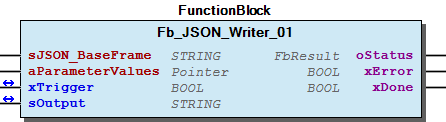

# WagoAppJSON v1.1.0.32 (WAGO) - Complete Documentation


## 📋 Library Information

- **Company:** WAGO
- **Title:** WagoAppJSON
- **Version:** 1.1.0.32
- **Categories:** WAGO FunctionalView; WAGO FunctionalView|Connectivity; WAGO LayerView|App; Application
- **Author:** WAGO / u010663
- **Placeholder:** WagoAppJSON

### Description ¶


This document is automatically generated.

Function block supporting JSON data handling

This document is automatically generated. Function block supporting JSON data handling

### Contents: ¶


Contents: - Documentation Index 10 Documentation - WagoAppJSON Library Documentation Project Information Library Information Function Blocks - FbGetSingleKeyValue (FB) - FbHandleGetSingleKeyValue (FB) - FbJSON_Handler (FB) - FbJSON_Sax_Parser (FB) - FbJsonCreate (FB) - FbJson_Advanced (FB) - FbWrite_ToIEC_ByRule (FB) - Fb_JSON_ParseAndModify (FB) - Fb_JSON_Writer_01 (FB) - Fb_JSON_Writer_02 (FB) - ... and 1 more Methods - FbHandleGetSingleKeyValue.JSON_KeyDetected (METH) - FbHandleGetSingleKeyValue.JSON_ValueDetected (METH) - FbJSON_Handler.JSON_ArrayClosed (METH) - FbJSON_Handler.JSON_ArrayDetected (METH) - FbJSON_Handler.JSON_DataFinished (METH) - FbJSON_Handler.JSON_KeyDetected (METH) - FbJSON_Handler.JSON_NullDetected (METH) - FbJSON_Handler.JSON_ObjectClosed (METH) - FbJSON_Handler.JSON_ObjectDetected (METH) - FbJSON_Handler.JSON_ValueDetected (METH) - ... and 106 more Program Organization Base Components - BaseDataMethods - typRuleBase (STRUCT) Internal Components Global Variable Lists - Status (GVL) - VersionHistory (GVL) Other Components - 10 Main - 20 Advanced - 29 Data types - 30 Sax_Parser - 80 Status - Additional - Array - Basic Data Types - Datentypen - Object 1 Dim. Arrays - ... and 8 more

### Indices and tables ¶


Based on WagoAppJSON.library, last modified 20.09.2024, 21:08:39. LibDoc 3.5.16.10

© WAGO GmbH & Co. KG, Germany 2018 – All rights reserved. For the avoidance of doubt, this copyright notice does not only apply to the information above but also and primarily to the described library itself. Please note that third-party products are always mentioned without reference to intellectual property rights, including patents, utility models, designs and trademarks, accordingly the existence of such rights cannot be excluded. WAGO is a registered trademark of WAGO Verwaltungsgesellschaft mbH.

- File and Project Information - Library Reference Based on WagoAppJSON.library, last modified 20.09.2024, 21:08:39. LibDoc 3.5.16.10 © WAGO GmbH & Co. KG, Germany 2018 – All rights reserved. For the avoidance of doubt, this copyright notice does not only apply to the information above but also and primarily to the described library itself. Please note that third-party products are always mentioned without reference to intellectual property rights, including patents, utility models, designs and trademarks, accordingly the existence of such rights cannot be excluded. WAGO is a registered trademark of WAGO Verwaltungsgesellschaft mbH.

### Documentation Index


## 10 Documentation ¶


- doc10_SystemProperties (FB)

## WagoAppJSON Library Documentation


| Company: | WAGO |
| Title: | WagoAppJSON |
| Version: | 1.1.0.32 |
| Categories: | WAGO FunctionalView; WAGO FunctionalView\|Connectivity; WAGO LayerView\|App; Application |
| Author: | WAGO / u010663 |
| Placeholder: | WagoAppJSON |

### Description


This document is automatically generated.

Function block supporting JSON data handling

This document is automatically generated. Function block supporting JSON data handling

### Contents:


- 10 Documentation doc10_SystemProperties (FB) 20 Program Organization Units - 10 Main - 20 Advanced - 30 Sax_Parser 29 Data types - eJsonRuleType (ENUM) - eType (ENUM) - typAuxiliaries (STRUCT) - typJSON_Pointer (STRUCT) - typRuleBase (STRUCT) 80 Status - Status (GVL) - eStatus (ENUM) 90 Internal - FbHandleGetSingleKeyValue (FB) - eProgress (ENUM) ParameterList (PARAMS) VersionHistory (GVL)

### Indices and tables


Based on WagoAppJSON.library, last modified 20.09.2024, 21:08:39. LibDoc 3.5.16.10

© WAGO GmbH & Co. KG, Germany 2018 – All rights reserved. For the avoidance of doubt, this copyright notice does not only apply to the information above but also and primarily to the described library itself. Please note that third-party products are always mentioned without reference to intellectual property rights, including patents, utility models, designs and trademarks, accordingly the existence of such rights cannot be excluded. WAGO is a registered trademark of WAGO Verwaltungsgesellschaft mbH.

- File and Project Information - Library Reference Based on WagoAppJSON.library, last modified 20.09.2024, 21:08:39. LibDoc 3.5.16.10 © WAGO GmbH & Co. KG, Germany 2018 – All rights reserved. For the avoidance of doubt, this copyright notice does not only apply to the information above but also and primarily to the described library itself. Please note that third-party products are always mentioned without reference to intellectual property rights, including patents, utility models, designs and trademarks, accordingly the existence of such rights cannot be excluded. WAGO is a registered trademark of WAGO Verwaltungsgesellschaft mbH.

### Project Information


## File and Project Information


| Scope | Name | Type | Content |
| --- | --- | --- | --- |
| FileHeader | libraryFile | string | WagoAppJSON.library |
| contentFile | doc.clean.json |
| productName | e!COCKPIT |
| creationDateTime | date | 20.09.2024, 21:08:41 |
| companyName | string | WAGO |
| ProjectInformation | LastModificationDateTime | date | 20.09.2024, 21:08:39 |
| Description | string | See: Description |
| Copyright | © WAGO GmbH & Co. KG, Germany 2018 – All rights reserved. |
| Author | WAGO / u010663 |
| AutoResolveUnbound | bool | True |
| Placeholder | string | WagoAppJSON |
| Company | WAGO |
| DocFormat | reStructuredText |
| Project | WagoAppJSON |
| Version | version | 1.1.0.32 |
| Version string | string |  |
| Title | WagoAppJSON |
| LibraryCategories | library-category-list | WAGO FunctionalView; WAGO FunctionalView\|Connectivity; WAGO LayerView\|App; Application |
| CompiledLibraryCompatibilityVersion | string | CODESYS V3.5 SP16 Patch 3 |

### Library Information


## Library Reference


| LinkAllContent: False QualifiedOnly: False | SystemLibrary: False | Optional: False |

| LinkAllContent: False QualifiedOnly: False | SystemLibrary: False | Optional: False |

| LinkAllContent: False QualifiedOnly: True | SystemLibrary: False | Optional: False |

| LinkAllContent: False QualifiedOnly: False | SystemLibrary: False PublishSymbolsInContainer: True | Optional: False |

| LinkAllContent: False QualifiedOnly: False | SystemLibrary: False | Optional: False |

| LinkAllContent: False QualifiedOnly: False | SystemLibrary: False | Optional: False |

| LinkAllContent: False QualifiedOnly: True | SystemLibrary: False | Optional: False |

| LinkAllContent: False QualifiedOnly: False | SystemLibrary: False | Optional: False |

| LinkAllContent: False Optional: False | QualifiedOnly: False SystemLibrary: False | PublishSymbolsInContainer: True |

This is a dictionary of all referenced libraries and their name spaces.

This is a dictionary of all referenced libraries and their name spaces. SysMem Library Identification : Placeholder: SysMem Default Resolution: SysMem, * (System) Namespace: SysMem Library Properties : WagoAppFileDir Library Identification : Placeholder: WagoAppFileDir Default Resolution: WagoAppFileDir, * (WAGO) Namespace: WagoAppFileDir Library Properties : Library Parameter : Parameter: STANDARDSCHEDULINGMODE = eSchedulingMode.AsyncLow Parameter: STANDARDTIMEOUT = TIME#10s0ms WagoAppString Library Identification : Placeholder: WagoAppString Default Resolution: WagoAppString, * (WAGO) Namespace: WagoAppString Library Properties : WagoSysErrorBase Library Identification : Placeholder: WagoSysErrorBase Default Resolution: WagoSysErrorBase, * (WAGO) Namespace: WagoSysErrorBase Library Properties : Library Parameter : Parameter: RES_LOG_MAX_FILESIZE = 2000 Parameter: RES_LOG_MAX_FILES = 1 Parameter: RES_LOG_MAX_ENTRIES = 200 Parameter: RES_LOG_NAME = ‘WagoAppResultLogger’ WagoSysFileDir Library Identification : Placeholder: WagoSysFileDir Default Resolution: WagoSysFileDir, * (WAGO) Namespace: WagoSysFileDir Library Properties : WagoSysStandard Library Identification : Placeholder: WagoSysStandard Default Resolution: WagoSysStandard, * (WAGO) Namespace: WagoSysStandard Library Properties : WagoSysString Library Identification : Name: WagoSysString Version: newest Company: WAGO Namespace: WagoSysString Library Properties : WagoSysVersion Library Identification : Name: WagoSysVersion Version: 1.0.0.0 Company: WAGO Namespace: WagoSysVersion Library Properties : WagoTypesErrorBase Library Identification : Placeholder: WagoTypesErrorBase Default Resolution: WagoTypesErrorBase, * (WAGO) Namespace: WagoTypesErrorBase Library Properties :

### Function Blocks


## FbGetSingleKeyValue (FB)


| Scope | Name | Type |
| --- | --- | --- |
| Input | sKey | STRING(255) |
| paJsonData | POINTER TO ARRAY [0..JSON_MAX_DATA_LENGTH] OF BYTE |
| udiSizeData | UDINT |
| Output | sValue | STRING(MAX_SINGLE_KEY_VALUE_LENGTH) |

Get a single value defined by a Key from a given JSON string

Graphical Illustration

Graphical Interface of FbGetSingleKeyValue

Function Description

This function block gets the value from a Key value pair within a large JSON string. Only useful, if only one value withhin a large JSON string is important. Otherwise the use of the Sax-Parser is recommended.

Interface variables Function Get a single value defined by a Key from a given JSON string Graphical Illustration  Graphical Interface of FbGetSingleKeyValue Function Description This function block gets the value from a Key value pair within a large JSON string. Only useful, if only one value withhin a large JSON string is important. Otherwise the use of the Sax-Parser is recommended.

## FbHandleGetSingleKeyValue (FB)


| Scope | Name | Type |
| --- | --- | --- |
| Input | sKey | STRING(255) |
| Output | sValue | STRING(MAX_SINGLE_KEY_VALUE_LENGTH) |

Interface variables - FbHandleGetSingleKeyValue.JSON_KeyDetected (METH) - FbHandleGetSingleKeyValue.JSON_ValueDetected (METH)

## FbJSON_Handler (FB)


This function block must be extended by an own function block. The different methods may be used according to the special needs of each application.

Graphical Illustration

Graphical Interface of FbJSON_Handler

Function This function block must be extended by an own function block. The different methods may be used according to the special needs of each application. Graphical Illustration  Graphical Interface of FbJSON_Handler - FbJSON_Handler.JSON_ArrayClosed (METH) - FbJSON_Handler.JSON_ArrayDetected (METH) - FbJSON_Handler.JSON_DataFinished (METH) - FbJSON_Handler.JSON_KeyDetected (METH) - FbJSON_Handler.JSON_NullDetected (METH) - FbJSON_Handler.JSON_ObjectClosed (METH) - FbJSON_Handler.JSON_ObjectDetected (METH) - FbJSON_Handler.JSON_ValueDetected (METH)

## FbJSON_Sax_Parser (FB)


| Scope | Name | Type | Comment |
| --- | --- | --- | --- |
| Input | pData | POINTER TO ARRAY [0..JSON_MAX_DATA_LENGTH] OF BYTE | Use ADR(myJSONData), with the variable “myJSONData” containing the JSON data |
| udiSizeData | UDINT | Size of variable pointed by input pData . |
| sFileName | STRING | Name of a file containing the JSON data |
| Inout | xTrigger | BOOL | Start parsing process |
| Output | oStatus | WagoSysErrorBase.FbResult | Status details |
| xDone | BOOL | Done |
| xError | BOOL | Error occured |
| udiValueCount | UDINT | Counter for detected key value pairs |
| iChunksCompleted | INT | Chunk counter |

```
VAR
        FbMyJSON_Handler_0          : FbMyJSON_Handler;
        myData                      : typMyData;
        FbJSON_Sax_Parser_0         : FbJSON_Sax_Parser(FbMyJSON_Handler_0);

        sTest_2                     : STRING(255):=
                                        '{
                                            "id":"2ab06eaa-6417-41c8-beca-3d2bb92cdd98",
                                             "source":"mockup",
                                            "specversion":"0.2",
                                            "relation":"noData"
                                            }';

        go1                         : BOOL;
        myValueCount                : UDINT;
END_VAR
```

```
IF go1 THEN
    FbJSON_Sax_Parser_0.RegisterParserListener(FbMyJSON_Handler_0);
    FbMyJSON_Handler_0(typMyData:=MyData); //the handler must be called before the parser is activated, input ``typMyData`` must be assigned

    FbJSON_Sax_Parser_0(
    pData:=ADR(sTest_2) ,
    udiSizeData:=SIZEOF(sTest_2) ,
    sFileName:= ,
    xTrigger:=go1 ,
    oStatus=> ,
    xDone=> ,
    xError=> ,
    udiValueCount=>myValueCount ,
    iChunksCompleted=> );
END_IF
```

This function block parses the JSON data.

Graphical Illustration

Graphical Interface of FbJSON_Sax_Parser

Description

This function block allows parsing JSON data either from input pData or from a file assigned to input sFileName . An appropriate JSON handler function block must be programmed to take care of the data.

Use method RegisterParserListener to assign an appropriate JSON handler.

File handling maybe controlled by the parameter JSON_SAX_CHUNK_SIZE .

An example may look like:

Interface variables Function This function block parses the JSON data. Graphical Illustration  Graphical Interface of FbJSON_Sax_Parser Description This function block allows parsing JSON data either from input pData or from a file assigned to input sFileName . An appropriate JSON handler function block must be programmed to take care of the data. Use method RegisterParserListener to assign an appropriate JSON handler. File handling maybe controlled by the parameter JSON_SAX_CHUNK_SIZE . An example may look like: - FbJSON_Sax_Parser.RegisterParserListener (METH)

## FbJsonCreate (FB)


| Scope | Name | Type | Comment |
| --- | --- | --- | --- |
| Input | pData | POINTER TO STRING | Use ADR(myJSONData), with the variable “myJSONData” containing the JSON data |
| udiSizeData | UDINT | Size of variable pointed by input pData . |
| sFilename | STRING |  |
| Inout | xTrigger | BOOL | Activate method |
| Output | xBusy | BOOL | Method active |
| xError | BOOL | Error occured |

```
TYPE typMain:
STRUCT
    EDL_DataBase: typElement;
END_STRUCT
END_TYPE
```

This function block is only for internal use with LIM.

Graphical Illustration

Graphical Interface of FbJsonCreate

Function Description

An IEC variable must be defined by the user. The variable must be of typMain.

Note A type definition is only allowed in derived types or as a basic type but not in both ways at the same time.

Refere to chapter 10 Documentation

Interface variables Function This function block is only for internal use with LIM. Graphical Illustration  Graphical Interface of FbJsonCreate Function Description An IEC variable must be defined by the user. The variable must be of typMain. e.g.: Note A type definition is only allowed in derived types or as a basic type but not in both ways at the same time. Example Refere to chapter 10 Documentation - Additional FbJsonCreate.MyFileClose (METH) - FbJsonCreate.WriteAccessMode (PROP) - FbJsonCreate.addTab (METH) - FbJsonCreate.addText (METH) Array - FbJsonCreate.aArraybBYTE (METH) - FbJsonCreate.aArraydatDATE (METH) - FbJsonCreate.aArraydiDINT (METH) - FbJsonCreate.aArraydtDT (METH) - FbJsonCreate.aArraydwDWORD (METH) - FbJsonCreate.aArrayiINT (METH) - FbJsonCreate.aArrayliLINT (METH) - FbJsonCreate.aArraylrLREAL (METH) - FbJsonCreate.aArrayltLTIME (METH) - FbJsonCreate.aArraylwLWORD (METH) - FbJsonCreate.aArrayrREAL (METH) - FbJsonCreate.aArraysiSINT (METH) - FbJsonCreate.aArraytTIME (METH) - FbJsonCreate.aArraytodTOD (METH) - FbJsonCreate.aArrayudiUDINT (METH) - FbJsonCreate.aArrayuiUINT (METH) - FbJsonCreate.aArrayuliULINT (METH) - FbJsonCreate.aArrayusiUSINT (METH) - FbJsonCreate.aArraywWORD (METH) - FbJsonCreate.aArrayxBOOL (METH) - FbJsonCreate.aCloseArraySTRING (METH) - FbJsonCreate.aOpenArraySTRING (METH) Basic Data Types - FbJsonCreate.bBYTE (METH) - FbJsonCreate.datDATE (METH) - FbJsonCreate.diDINT (METH) - FbJsonCreate.dtDT (METH) - FbJsonCreate.dwDWORD (METH) - FbJsonCreate.iINT (METH) - FbJsonCreate.liLINT (METH) - FbJsonCreate.lrLREAL (METH) - FbJsonCreate.ltLTIME (METH) - FbJsonCreate.lwLWORD (METH) - FbJsonCreate.pSTRING (METH) - FbJsonCreate.rREAL (METH) - FbJsonCreate.siSINT (METH) - FbJsonCreate.tTIME (METH) - FbJsonCreate.todTOD (METH) - FbJsonCreate.udiUDINT (METH) - FbJsonCreate.uiUINT (METH) - FbJsonCreate.uliULINT (METH) - FbJsonCreate.usiUSINT (METH) - FbJsonCreate.wWORD (METH) - FbJsonCreate.xBOOL (METH) Object 1 Dim. Arrays - FbJsonCreate.aObjArraybBYTE (METH) - FbJsonCreate.aObjArraydatDATE (METH) - FbJsonCreate.aObjArraydiDINT (METH) - FbJsonCreate.aObjArraydtDT (METH) - FbJsonCreate.aObjArraydwDWORD (METH) - FbJsonCreate.aObjArrayiINT (METH) - FbJsonCreate.aObjArrayliLINT (METH) - FbJsonCreate.aObjArraylrLREAL (METH) - FbJsonCreate.aObjArrayltLTIME (METH) - FbJsonCreate.aObjArraylwLWORD (METH) - FbJsonCreate.aObjArrayrREAL (METH) - FbJsonCreate.aObjArraysiSINT (METH) - FbJsonCreate.aObjArraytTIME (METH) - FbJsonCreate.aObjArraytodTOD (METH) - FbJsonCreate.aObjArrayudiUDINT (METH) - FbJsonCreate.aObjArrayuiUINT (METH) - FbJsonCreate.aObjArrayuliULINT (METH) - FbJsonCreate.aObjArrayusiUSINT (METH) - FbJsonCreate.aObjArraywWORD (METH) - FbJsonCreate.aObjArrayxBOOL (METH) - FbJsonCreate.aObjCloseArraySTRING (METH) - FbJsonCreate.aObjOpenArraySTRING (METH) Object 2 Dim. Arrays - FbJsonCreate.aObj2DimArraybBYTE (METH) - FbJsonCreate.aObj2DimArraydatDATE (METH) - FbJsonCreate.aObj2DimArraydiDINT (METH) - FbJsonCreate.aObj2DimArraydtDT (METH) - FbJsonCreate.aObj2DimArraydwDWORD (METH) - FbJsonCreate.aObj2DimArrayiINT (METH) - FbJsonCreate.aObj2DimArrayliLINT (METH) - FbJsonCreate.aObj2DimArraylrLREAL (METH) - FbJsonCreate.aObj2DimArrayltLTIME (METH) - FbJsonCreate.aObj2DimArraylwLWORD (METH) - FbJsonCreate.aObj2DimArrayrREAL (METH) - FbJsonCreate.aObj2DimArraysiSINT (METH) - FbJsonCreate.aObj2DimArraytTIME (METH) - FbJsonCreate.aObj2DimArraytodTOD (METH) - FbJsonCreate.aObj2DimArrayudiUDINT (METH) - FbJsonCreate.aObj2DimArrayuiUINT (METH) - FbJsonCreate.aObj2DimArrayuliULINT (METH) - FbJsonCreate.aObj2DimArrayusiUSINT (METH) - FbJsonCreate.aObj2DimArraywWORD (METH) - FbJsonCreate.aObj2DimArrayxBOOL (METH)

## FbJson_Advanced (FB)


| Scope | Name | Type | Comment |
| --- | --- | --- | --- |
| Input | sFilename | STRING |  |
| xRead | BOOL | Import JSON data to Iec variable |
| xWrite | BOOL | Export JSON data from Iec variable |
| Inout | xTrigger | BOOL | Activate method |
| sJSONData | STRING(MAX_JSON_FILE_SIZE) | JSON data |
| Output | xBusy | BOOL | Method active |
| xError | BOOL | Error occured |
| sStatus | STRING | Status information |

```
TYPE typMain:
STRUCT
    EDL_DataBase: typElement;
END_STRUCT
END_TYPE
```

This function block provides the base methods which are needed by the WagoJSON.py python script.

WagoJSON.py will automatically generate a function block FbUserJson to read and write a JSON string into or from an IEC variable.

Graphical Illustration

Graphical Interface of FbJson_Advanced

Function Description

An IEC variable must be defined by the user. The variable must be of typMain.

Note A type definition is only allowed in derived types or as a basic type but not in both ways at the same time.

Refere to chapter 10 Documentation

Interface variables Function This function block provides the base methods which are needed by the WagoJSON.py python script. WagoJSON.py will automatically generate a function block FbUserJson to read and write a JSON string into or from an IEC variable. Graphical Illustration  Graphical Interface of FbJson_Advanced Function Description An IEC variable must be defined by the user. The variable must be of typMain. e.g.: Note A type definition is only allowed in derived types or as a basic type but not in both ways at the same time. Example Refere to chapter 10 Documentation - Datentypen BaseDataMethods FbJson_Advanced.aArrayBool (METH) - FbJson_Advanced.aArrayByte (METH) - FbJson_Advanced.aArrayDword (METH) - FbJson_Advanced.aArrayInt (METH) - FbJson_Advanced.aArrayReal (METH) - FbJson_Advanced.aArrayString (METH) - FbJson_Advanced.aArrayWord (METH) - FbJson_Advanced.aArray_ArrayBool (METH) - FbJson_Advanced.aArray_ArrayByte (METH) - FbJson_Advanced.aArray_ArrayDword (METH) - FbJson_Advanced.aArray_ArrayREAL (METH) - FbJson_Advanced.aArray_ArrayString (METH) - FbJson_Advanced.aArray_ArrayWord (METH) FbJson_Advanced.MyFileClose (METH)

## FbWrite_ToIEC_ByRule (FB)


| Scope | Name | Type | Comment |
| --- | --- | --- | --- |
| Input | sPathBase | STRING | Token name of the array element within the JSON source. Must start with “/”, e.g. /Data_Objects/ |
| pDataIn | POINTER TO ARRAY [0..JSON_MAX_DATA_LENGTH] OF BYTE | Pointer to the JSON source |
| udiSizeDataIn | UDINT | Size of the JSON source |
| pIecVariable | POINTER TO ARRAY [0..3] OF BYTE | Adr(MyData) -> MyData:ARRAY[0..1] OF typCustomData; |
| udiSizeIecVariable | UDINT | Number of bytes in the Iec variable, sizeof(MyData) -> MyData:ARRAY[0..1] OF typCustomData; |
| iArraySizeIecVariable | INT | Number of elements in the array, e.g. 2 -> MyData:ARRAY[0..1] OF typCustomData; |
| Output | oStatus | WagoSysErrorBase.FbResult | Status details |
| xError | BOOL | Error occured |
| iActualArrayRow | INT | Actual processed row |
| Inout | xTrigger | BOOL | Start conversion. Will be reset by the function block |
| Input | aRule | POINTER TO typRuleBase | An array containing the rule |

```
VAR
    MyJsonData:ARRAY[0..1] OF typCustomData;
END_VAR
```

```
{attribute 'pack_mode' := '0'}
TYPE typCustomData :
STRUCT
    t1              :UINT;
    chan            :BYTE;
    rx              :REAL;
    payload         :STRING;
END_STRUCT
END_TYPE
```

```
VAR
    MyJson_string: STRING(5000):='
    {
        "Data_Objects":[
                        { "tmst": 1519935596, "chan": 5, "rfch": 1, "freq": 869525, "stat": 1, "modu": "LORA", "datr": "SF8BW125", "payload":"567"},
                        { "tmst": 1519935777, "chan": 2, "rfch": 5, "freq": 49, "stat": 3, "modu": "RART", "datr": "SF8BW126", "payload": "110a000f00551001"},
                        { "tmst": 1519935779, "chan": 4, "rfch": 99, "freq": 9, "stat": 099, "modu": "R23", "datr": "SF8BW126", "payload": "000f00551444"}
                    ]
    }';

    MyRule:ARRAY[0..7] OF typRuleBase:=[
        (sPath:='tmst',iConvertType:=eDword),
        (sPath:='chan',iConvertType:=eByte),
        (sPath:='rfch',iConvertType:=eByte),
        (sPath:='freq',iConvertType:=eDword),
        (sPath:='stat',iConvertType:=eByte),
        (sPath:='modu',iConvertType:=eString),
        (sPath:='datr',iConvertType:=eString),
        (sPath:='payload',iConvertType:=eString)
    ];

    MyJsonData:ARRAY[0..2] OF typMyCustomData;

END_VAR
```

```
{attribute 'pack_mode' := '0'}
TYPE typMyCustomData :
STRUCT
    tmst            :DWORD;
    chan            :BYTE;
    rfch            :BYTE;
    freq            :DWORD;
    stat            :BYTE;
    modu            :STRING;
    datr            :STRING;
    payload         :STRING;
END_STRUCT
END_TYPE
```

Write a JSON string to a variable defind by the user within the IEC-61131 program

Graphical Illustration

Graphical Interface of FbWrite_ToIEC_ByRule

Function Description

This function block imports JSON data, which is stored as an array, to a codesys variable.

JSON data may look like:

Therefore a variable may be defined as:

To allow the conversion, a rule must be defind:

bTestRule:ARRAY[0..3] OF typRuleBase:=[

Supported data types:

If Input sPathBase is assigned / then no array data is expected rather than just a simple Json string like { "t1": 15199355, "chan": 5, "rx": 1.9, "payload":"567"} . Input iArraySizeIecVariable must be 1 in this case.

Interface variables Function Write a JSON string to a variable defind by the user within the IEC-61131 program Graphical Illustration  Graphical Interface of FbWrite_ToIEC_ByRule Function Description This function block imports JSON data, which is stored as an array, to a codesys variable. JSON data may look like: { “Data_Objects”:[ { “t1”: 1519, “chan”: 5, “rx”: 1.9, “payload”:”567”}, { “t1”: 16786, “chan”: 2, “rx”: 5.1, “payload”: “110a000f00551001”} ] } Therefore a variable may be defined as: with To allow the conversion, a rule must be defind: bTestRule:ARRAY[0..3] OF typRuleBase:=[ (sPath:=’t1’,iConvertType:=eUint), (sPath:=’chan’,iConvertType:=eByte), (sPath:=’rx’,iConvertType:=eReal), (sPath:=’payload’,iConvertType:=eString) ]; Supported data types: eWORD := 0, eBYTE:=1, eBool:=2, eReal:=3, eString:=4, eInt:=5, eTime:=6, eUint:=7, eDword:=8, If Input sPathBase is assigned / then no array data is expected rather than just a simple Json string like { "t1": 15199355, "chan": 5, "rx": 1.9, "payload":"567"} . Input iArraySizeIecVariable must be 1 in this case. Example

## Fb_JSON_ParseAndModify (FB)


| Scope | Name | Type | Comment |
| --- | --- | --- | --- |
| Input | pData | POINTER TO ARRAY [0..JSON_MAX_DATA_LENGTH] OF BYTE | Use ADR(myJSONData), with the variable “myJSONData” containing the JSON data |
| udiSizeData | UDINT | Size of variable pointed by input pData . |
| Output | oStatus | WagoSysErrorBase.FbResult | Status details |
| xError | BOOL | Error occured |
| xDone | BOOL | Done without error |
| diToken | DINT | Number of generated tokens |
| Inout | xTrigger | BOOL | Start parsing the data. Will be reset by function block |

Parse a JSON string and allow reading and modifying JSON values

Graphical Illustration

Graphical Interface of Fb_JSON_ParseAndModify

Function Description

Using this block, needs at least one time running the build up process by using input xTrigger . The method GetValueByPath allows reading a JSON value. The method SetValueByPath allows writing a JSON value.

Interface variables Function Parse a JSON string and allow reading and modifying JSON values Graphical Illustration  Graphical Interface of Fb_JSON_ParseAndModify Function Description Using this block, needs at least one time running the build up process by using input xTrigger . The method GetValueByPath allows reading a JSON value. The method SetValueByPath allows writing a JSON value. - Fb_JSON_ParseAndModify.GetValueByPath (METH) - Fb_JSON_ParseAndModify.SetValueByPath (METH)

## Fb_JSON_Writer_01 (FB)


| Scope | Name | Type | Comment |
| --- | --- | --- | --- |
| Input | sJSON_BaseFrame | STRING(JSON_MAX_STRING) | String containing the general JSON data |
| Output | oStatus | WagoSysErrorBase.FbResult | Status details |
| xError | BOOL | Error occured |
| xDone | BOOL | JSON data generated without error |
| Input | aParameterValues | POINTER TO STRING | An array containing the variable JSON values, start index must be 0 e.g. [0..9] |
| Inout | xTrigger | BOOL | Activate the build process |
| sOutput | STRING(JSON_MAX_STRING) | Result string |

```
//Define a template string, which contains ``#Parameter`` wherever a variable value should be inserted.
VAR
    MyTemplateString:String(JSON_MAX_STRING):='
        {"Menu": {"id": "#Parameter","value": "#Parameter","popup": {"menuitem": [{"value": "#Parameter","onclick": "#Parameter"},{"value": "#Parameter","onclick": "#Parameter"},
        {"value": "#Parameter","onclick": "#Parameter"}]}}}
    ';
// Define a second variable from type array which contains the variable values already converted to a string.
    MyValueArray:ARRAY[0..7] OF STRING:=['CountryCode','DE','4.1','down1','4.2','down2','4.3','down3'];
END_VAR
```

Generate a JSON string from a base template and an array with appropriate JSON values

Graphical Illustration

Graphical Interface of Fb_JSON_Writer_01

Function Description

This function block generates a JSON string sOutput .

All variable values must be replaced by #Parameter to allow inserting the actual values from the input aParameterValues .

Note For each #Parameter a appropriate value must exist within the aParameterValues input.

The following JSON string should be generated:

{“id”: “CountryCode”,

“value”: “DE”,

“popup”: {“menuitem”:

[{“value”: “4.1”,”onclick”: “down1”},

{“value”: “4.2”,”onclick”: “down2”},

{“value”: “4.3”,”onclick”: “down3”}]

Interface variables Function Generate a JSON string from a base template and an array with appropriate JSON values Graphical Illustration  Graphical Interface of Fb_JSON_Writer_01 Function Description This function block generates a JSON string sOutput . All variable values must be replaced by #Parameter to allow inserting the actual values from the input aParameterValues . Note For each #Parameter a appropriate value must exist within the aParameterValues input. Example The following JSON string should be generated: {“Menu”: {“id”: “CountryCode”, “value”: “DE”, “popup”: {“menuitem”: [{“value”: “4.1”,”onclick”: “down1”}, {“value”: “4.2”,”onclick”: “down2”}, {“value”: “4.3”,”onclick”: “down3”}] } } }

## Fb_JSON_Writer_02 (FB)


| Scope | Name | Type | Comment |
| --- | --- | --- | --- |
| Input | sJSON_BaseFrame | STRING(JSON_MAX_STRING) | String containing the general JSON data |
| xDeleteFormattingCharacters | BOOL | delete Tab and CR LF |
| Output | oStatus | WagoSysErrorBase.FbResult | Status details |
| xError | BOOL | Error occured |
| xDone | BOOL | JSON data generated without error |
| Input | aParameterValues | POINTER TO STRING(JSON_MAX_PARAMETER_STRING) | An array containing the variable JSON values, start index must be 0 e.g. [0..9] |
| Inout | xTrigger | BOOL | Activate the build process |
| sOutput | STRING(JSON_MAX_STRING) | Result string |

```
//Define a template string, which contains ``#Parameter`` wherever a variable value should be inserted.
VAR
    MyTemplateString:String(JSON_MAX_STRING):='
        {"Menu": {"id": "#Parameter","value": "#Parameter","popup": {"menuitem": [{"value": "#Parameter","onclick": "#Parameter"},{"value": "#Parameter","onclick": "#Parameter"},
        {"value": "#Parameter","onclick": "#Parameter"}]}}}
    ';
// Define a second variable from type array which contains the variable values already converted to a string.
    MyValueArray:ARRAY[0..7] OF STRING:=['CountryCode','DE','4.1','down1','4.2','down2','4.3','down3'];
END_VAR


Assuming you just want to generate from time to time a different string like:

{"Menu":{"id":"CountryCode","value": "DE","popup": {"menuitem": [{"value": "4.1","onclick": "down1"}]}}}

than the parameter array should look like:

MyValueArray:ARRAY[0..7] OF STRING:=['CountryCode','DE','4.1','down1','##','##','##','##'];
```

Generate a JSON string from a base template and an array with appropriate JSON values Other than Fb_JSON_Writer_01 this block allows some more flexibility by skipping key value pairs from the basic template string.

Graphical Illustration

Graphical Interface of Fb_JSON_Writer_02

Function Description

This function block generates a JSON string sOutput .

All variable values must be replaced by #Parameter to allow inserting the actual values from the input aParameterValues . Additional it is possible to skip key value pairs. Therefor the value in the array aParameterValues must be set to ##. This may be changed in the parameterlist by JSON_SKIP_STRING .

Note For each #Parameter a appropriate value must exist within the aParameterValues input.

The following JSON string should be generated:

{“id”: “CountryCode”,

“value”: “DE”,

“popup”: {“menuitem”:

[{“value”: “4.1”,”onclick”: “down1”},

{“value”: “4.2”,”onclick”: “down2”},

{“value”: “4.3”,”onclick”: “down3”}]

Interface variables Function Generate a JSON string from a base template and an array with appropriate JSON values Other than Fb_JSON_Writer_01 this block allows some more flexibility by skipping key value pairs from the basic template string. Graphical Illustration  Graphical Interface of Fb_JSON_Writer_02 Function Description This function block generates a JSON string sOutput . All variable values must be replaced by #Parameter to allow inserting the actual values from the input aParameterValues . Additional it is possible to skip key value pairs. Therefor the value in the array aParameterValues must be set to ##. This may be changed in the parameterlist by JSON_SKIP_STRING . Note For each #Parameter a appropriate value must exist within the aParameterValues input. Example The following JSON string should be generated: {“Menu”: {“id”: “CountryCode”, “value”: “DE”, “popup”: {“menuitem”: [{“value”: “4.1”,”onclick”: “down1”}, {“value”: “4.2”,”onclick”: “down2”}, {“value”: “4.3”,”onclick”: “down3”}] } } }

## doc10_SystemProperties (FB)


Please check the Wago homepage for an application note a2019003 providing additional documentation.

Please check the Wago homepage for an application note a2019003 providing additional documentation.

### Methods


## FbHandleGetSingleKeyValue.JSON_KeyDetected (METH)


| Scope | Name | Type | Comment |
| --- | --- | --- | --- |
| Input | sJSON_Object | STRING | JSON object detected |

Graphical Illustration

Graphical Interface of FbHandleGetSingleKeyValue.JSON_KeyDetected

Interface variables Function Graphical Illustration  Graphical Interface of FbHandleGetSingleKeyValue.JSON_KeyDetected

## FbHandleGetSingleKeyValue.JSON_ValueDetected (METH)


| Scope | Name | Type | Comment |
| --- | --- | --- | --- |
| Input | sJSON_Value | STRING(JSON_MAX_STRING_SAX) | JSON value detected |

Graphical Illustration

Graphical Interface of FbHandleGetSingleKeyValue.JSON_ValueDetected

Interface variables Function Graphical Illustration  Graphical Interface of FbHandleGetSingleKeyValue.JSON_ValueDetected

## FbJSON_Handler.JSON_ArrayClosed (METH)


Called each time an array close “]” has been evaluated

Graphical Illustration

Graphical Interface of FbJSON_Handler.JSON_ArrayClosed

Function Called each time an array close “]” has been evaluated Graphical Illustration  Graphical Interface of FbJSON_Handler.JSON_ArrayClosed

## FbJSON_Handler.JSON_ArrayDetected (METH)


Called each time an array open “[” has been evaluated

Graphical Illustration

Graphical Interface of FbJSON_Handler.JSON_ArrayDetected

Function Called each time an array open “[” has been evaluated Graphical Illustration  Graphical Interface of FbJSON_Handler.JSON_ArrayDetected

## FbJSON_Handler.JSON_DataFinished (METH)


This method is called after the last byte has been detected

Graphical Illustration

Graphical Interface of FbJSON_Handler.JSON_DataFinished

Function This method is called after the last byte has been detected Graphical Illustration  Graphical Interface of FbJSON_Handler.JSON_DataFinished

## FbJSON_Handler.JSON_KeyDetected (METH)


| Scope | Name | Type | Comment |
| --- | --- | --- | --- |
| Input | sJSON_Object | STRING | JSON key |

Called each time a JSON key has been evaluated

Graphical Illustration

Graphical Interface of FbJSON_Handler.JSON_KeyDetected

Interface variables Function Called each time a JSON key has been evaluated Graphical Illustration  Graphical Interface of FbJSON_Handler.JSON_KeyDetected

## FbJSON_Handler.JSON_NullDetected (METH)


Graphical Illustration

Graphical Interface of FbJSON_Handler.JSON_NullDetected

Function Graphical Illustration  Graphical Interface of FbJSON_Handler.JSON_NullDetected

## FbJSON_Handler.JSON_ObjectClosed (METH)


Called each time an object close “}” has been evaluated

Graphical Illustration

Graphical Interface of FbJSON_Handler.JSON_ObjectClosed

Function Called each time an object close “}” has been evaluated Graphical Illustration  Graphical Interface of FbJSON_Handler.JSON_ObjectClosed

## FbJSON_Handler.JSON_ObjectDetected (METH)


| Scope | Name | Type | Comment |
| --- | --- | --- | --- |
| Input | udiJSON_ObjectCounter | UDINT | JSON object counter |

Called each time an object open “{” has been evaluated

Graphical Illustration

Graphical Interface of FbJSON_Handler.JSON_ObjectDetected

Interface variables Function Called each time an object open “{” has been evaluated Graphical Illustration  Graphical Interface of FbJSON_Handler.JSON_ObjectDetected

## FbJSON_Handler.JSON_ValueDetected (METH)


| Scope | Name | Type | Comment |
| --- | --- | --- | --- |
| Input | sJSON_Value | STRING(JSON_MAX_STRING_SAX) | JSON value |

Called each time a JSON value has been evaluated

Graphical Illustration

Graphical Interface of FbJSON_Handler.JSON_ValueDetected

Interface variables Function Called each time a JSON value has been evaluated Graphical Illustration  Graphical Interface of FbJSON_Handler.JSON_ValueDetected

## FbJSON_Sax_Parser.RegisterParserListener (METH)


| Scope | Name | Type | Comment |
| --- | --- | --- | --- |
| Input | I_ParserListener | I_ParserListener | A function block extended from FbJSON_Handler must be assigned to this input |

Graphical Illustration

Graphical Interface of FbJSON_Sax_Parser.RegisterParserListener

Interface variables Function This method registers a JSON handler to this parser. Graphical Illustration  Graphical Interface of FbJSON_Sax_Parser.RegisterParserListener

## FbJsonCreate.MyFileClose (METH) ¶


## FbJsonCreate.WriteAccessMode (PROP)


default: AM_APPEND_PLUS

default: AM_APPEND_PLUS

## FbJsonCreate.aArraybBYTE (METH)


| Scope | Name | Type |
| --- | --- | --- |
| Input | sArrayName | STRING |
| aValue | POINTER TO BYTE |

## FbJsonCreate.aArraydatDATE (METH)


| Scope | Name | Type |
| --- | --- | --- |
| Input | sArrayName | STRING |
| aValue | POINTER TO DATE |

## FbJsonCreate.aArraydiDINT (METH)


| Scope | Name | Type |
| --- | --- | --- |
| Input | sArrayName | STRING |
| aValue | POINTER TO DINT |

## FbJsonCreate.aArraydtDT (METH)


| Scope | Name | Type |
| --- | --- | --- |
| Input | sArrayName | STRING |
| aValue | POINTER TO DATE_AND_TIME |

## FbJsonCreate.aArraydwDWORD (METH)


| Scope | Name | Type |
| --- | --- | --- |
| Input | sArrayName | STRING |
| aValue | POINTER TO DWORD |

## FbJsonCreate.aArrayiINT (METH)


| Scope | Name | Type |
| --- | --- | --- |
| Input | sArrayName | STRING |
| aValue | POINTER TO INT |

## FbJsonCreate.aArrayliLINT (METH)


| Scope | Name | Type |
| --- | --- | --- |
| Input | sArrayName | STRING |
| aValue | POINTER TO LINT |

## FbJsonCreate.aArraylrLREAL (METH)


| Scope | Name | Type |
| --- | --- | --- |
| Input | sArrayName | STRING |
| aValue | POINTER TO LREAL |

## FbJsonCreate.aArrayltLTIME (METH)


| Scope | Name | Type |
| --- | --- | --- |
| Input | sArrayName | STRING |
| aValue | POINTER TO LTIME |

## FbJsonCreate.aArraylwLWORD (METH)


| Scope | Name | Type |
| --- | --- | --- |
| Input | sArrayName | STRING |
| aValue | POINTER TO LWORD |

## FbJsonCreate.aArrayrREAL (METH)


| Scope | Name | Type |
| --- | --- | --- |
| Input | sArrayName | STRING |
| aValue | POINTER TO REAL |

## FbJsonCreate.aArraysiSINT (METH)


| Scope | Name | Type |
| --- | --- | --- |
| Input | sArrayName | STRING |
| aValue | POINTER TO SINT |

## FbJsonCreate.aArraytTIME (METH)


| Scope | Name | Type |
| --- | --- | --- |
| Input | sArrayName | STRING |
| aValue | POINTER TO TIME |

## FbJsonCreate.aArraytodTOD (METH)


| Scope | Name | Type |
| --- | --- | --- |
| Input | sArrayName | STRING |
| aValue | POINTER TO TIME_OF_DAY |

## FbJsonCreate.aArrayudiUDINT (METH)


| Scope | Name | Type |
| --- | --- | --- |
| Input | sArrayName | STRING |
| aValue | POINTER TO UDINT |

## FbJsonCreate.aArrayuiUINT (METH)


| Scope | Name | Type |
| --- | --- | --- |
| Input | sArrayName | STRING |
| aValue | POINTER TO UINT |

## FbJsonCreate.aArrayuliULINT (METH)


| Scope | Name | Type |
| --- | --- | --- |
| Input | sArrayName | STRING |
| aValue | POINTER TO ULINT |

## FbJsonCreate.aArrayusiUSINT (METH)


| Scope | Name | Type |
| --- | --- | --- |
| Input | sArrayName | STRING |
| aValue | POINTER TO USINT |

## FbJsonCreate.aArraywWORD (METH)


| Scope | Name | Type |
| --- | --- | --- |
| Input | sArrayName | STRING |
| aValue | POINTER TO WORD |

## FbJsonCreate.aArrayxBOOL (METH)


| Scope | Name | Type |
| --- | --- | --- |
| Input | sArrayName | STRING |
| aValue | POINTER TO BOOL |

## FbJsonCreate.aCloseArraySTRING (METH) ¶


## FbJsonCreate.aObj2DimArraybBYTE (METH)


| Scope | Name | Type | Comment |
| --- | --- | --- | --- |
| Input | sArrayName | STRING |  |
| aValue | POINTER TO BYTE | Two-dimensional array |

## FbJsonCreate.aObj2DimArraydatDATE (METH)


| Scope | Name | Type | Comment |
| --- | --- | --- | --- |
| Input | sArrayName | STRING |  |
| aValue | POINTER TO DATE | Two-dimensional array |

## FbJsonCreate.aObj2DimArraydiDINT (METH)


| Scope | Name | Type | Comment |
| --- | --- | --- | --- |
| Input | sArrayName | STRING |  |
| aValue | POINTER TO DINT | Two-dimensional array |

## FbJsonCreate.aObj2DimArraydtDT (METH)


| Scope | Name | Type | Comment |
| --- | --- | --- | --- |
| Input | sArrayName | STRING |  |
| aValue | POINTER TO DATE_AND_TIME | Two-dimensional array |

## FbJsonCreate.aObj2DimArraydwDWORD (METH)


| Scope | Name | Type | Comment |
| --- | --- | --- | --- |
| Input | sArrayName | STRING |  |
| aValue | POINTER TO DWORD | Two-dimensional array |

## FbJsonCreate.aObj2DimArrayiINT (METH)


| Scope | Name | Type | Comment |
| --- | --- | --- | --- |
| Input | sArrayName | STRING |  |
| aValue | POINTER TO INT | Two-dimensional array |

## FbJsonCreate.aObj2DimArrayliLINT (METH)


| Scope | Name | Type | Comment |
| --- | --- | --- | --- |
| Input | sArrayName | STRING |  |
| aValue | POINTER TO LINT | Two-dimensional array |

## FbJsonCreate.aObj2DimArraylrLREAL (METH)


| Scope | Name | Type | Comment |
| --- | --- | --- | --- |
| Input | sArrayName | STRING |  |
| aValue | POINTER TO LREAL | Two-dimensional array |

## FbJsonCreate.aObj2DimArrayltLTIME (METH)


| Scope | Name | Type | Comment |
| --- | --- | --- | --- |
| Input | sArrayName | STRING |  |
| aValue | POINTER TO LTIME | Two-dimensional array |

## FbJsonCreate.aObj2DimArraylwLWORD (METH)


| Scope | Name | Type | Comment |
| --- | --- | --- | --- |
| Input | sArrayName | STRING |  |
| aValue | POINTER TO LWORD | Two-dimensional array |

## FbJsonCreate.aObj2DimArrayrREAL (METH)


| Scope | Name | Type | Comment |
| --- | --- | --- | --- |
| Input | sArrayName | STRING |  |
| aValue | POINTER TO REAL | Two-dimensional array |

## FbJsonCreate.aObj2DimArraysiSINT (METH)


| Scope | Name | Type | Comment |
| --- | --- | --- | --- |
| Input | sArrayName | STRING |  |
| aValue | POINTER TO SINT | Two-dimensional array |

## FbJsonCreate.aObj2DimArraytTIME (METH)


| Scope | Name | Type | Comment |
| --- | --- | --- | --- |
| Input | sArrayName | STRING |  |
| aValue | POINTER TO TIME | Two-dimensional array |

## FbJsonCreate.aObj2DimArraytodTOD (METH)


| Scope | Name | Type | Comment |
| --- | --- | --- | --- |
| Input | sArrayName | STRING |  |
| aValue | POINTER TO TIME_OF_DAY | Two-dimensional array |

## FbJsonCreate.aObj2DimArrayudiUDINT (METH)


| Scope | Name | Type | Comment |
| --- | --- | --- | --- |
| Input | sArrayName | STRING |  |
| aValue | POINTER TO UDINT | Two-dimensional array |

## FbJsonCreate.aObj2DimArrayuiUINT (METH)


| Scope | Name | Type | Comment |
| --- | --- | --- | --- |
| Input | sArrayName | STRING |  |
| aValue | POINTER TO UINT | Two-dimensional array |

## FbJsonCreate.aObj2DimArrayuliULINT (METH)


| Scope | Name | Type | Comment |
| --- | --- | --- | --- |
| Input | sArrayName | STRING |  |
| aValue | POINTER TO ULINT | Two-dimensional array |

## FbJsonCreate.aObj2DimArrayusiUSINT (METH)


| Scope | Name | Type | Comment |
| --- | --- | --- | --- |
| Input | sArrayName | STRING |  |
| aValue | POINTER TO USINT | Two-dimensional array |

## FbJsonCreate.aObj2DimArraywWORD (METH)


| Scope | Name | Type | Comment |
| --- | --- | --- | --- |
| Input | sArrayName | STRING |  |
| aValue | POINTER TO WORD | Two-dimensional array |

## FbJsonCreate.aObj2DimArrayxBOOL (METH)


| Scope | Name | Type | Comment |
| --- | --- | --- | --- |
| Input | sArrayName | STRING |  |
| aValue | POINTER TO BOOL | Two-dimensional array |

## FbJsonCreate.aObjArraybBYTE (METH)


| Scope | Name | Type |
| --- | --- | --- |
| Input | sArrayName | STRING |
| aValue | POINTER TO BYTE |

## FbJsonCreate.aObjArraydatDATE (METH)


| Scope | Name | Type |
| --- | --- | --- |
| Input | sArrayName | STRING |
| aValue | POINTER TO DATE |

## FbJsonCreate.aObjArraydiDINT (METH)


| Scope | Name | Type |
| --- | --- | --- |
| Input | sArrayName | STRING |
| aValue | POINTER TO DINT |

## FbJsonCreate.aObjArraydtDT (METH)


| Scope | Name | Type |
| --- | --- | --- |
| Input | sArrayName | STRING |
| aValue | POINTER TO DATE_AND_TIME |

## FbJsonCreate.aObjArraydwDWORD (METH)


| Scope | Name | Type |
| --- | --- | --- |
| Input | sArrayName | STRING |
| aValue | POINTER TO DWORD |

## FbJsonCreate.aObjArrayiINT (METH)


| Scope | Name | Type |
| --- | --- | --- |
| Input | sArrayName | STRING |
| aValue | POINTER TO INT |

## FbJsonCreate.aObjArrayliLINT (METH)


| Scope | Name | Type |
| --- | --- | --- |
| Input | sArrayName | STRING |
| aValue | POINTER TO LINT |

## FbJsonCreate.aObjArraylrLREAL (METH)


| Scope | Name | Type |
| --- | --- | --- |
| Input | sArrayName | STRING |
| aValue | POINTER TO LREAL |

## FbJsonCreate.aObjArrayltLTIME (METH)


| Scope | Name | Type |
| --- | --- | --- |
| Input | sArrayName | STRING |
| aValue | POINTER TO LTIME |

## FbJsonCreate.aObjArraylwLWORD (METH)


| Scope | Name | Type |
| --- | --- | --- |
| Input | sArrayName | STRING |
| aValue | POINTER TO LWORD |

## FbJsonCreate.aObjArrayrREAL (METH)


| Scope | Name | Type |
| --- | --- | --- |
| Input | sArrayName | STRING |
| aValue | POINTER TO REAL |

## FbJsonCreate.aObjArraysiSINT (METH)


| Scope | Name | Type |
| --- | --- | --- |
| Input | sArrayName | STRING |
| aValue | POINTER TO SINT |

## FbJsonCreate.aObjArraytTIME (METH)


| Scope | Name | Type |
| --- | --- | --- |
| Input | sArrayName | STRING |
| aValue | POINTER TO TIME |

## FbJsonCreate.aObjArraytodTOD (METH)


| Scope | Name | Type |
| --- | --- | --- |
| Input | sArrayName | STRING |
| aValue | POINTER TO TIME_OF_DAY |

## FbJsonCreate.aObjArrayudiUDINT (METH)


| Scope | Name | Type |
| --- | --- | --- |
| Input | sArrayName | STRING |
| aValue | POINTER TO UDINT |

## FbJsonCreate.aObjArrayuiUINT (METH)


| Scope | Name | Type |
| --- | --- | --- |
| Input | sArrayName | STRING |
| aValue | POINTER TO UINT |

## FbJsonCreate.aObjArrayuliULINT (METH)


| Scope | Name | Type |
| --- | --- | --- |
| Input | sArrayName | STRING |
| aValue | POINTER TO ULINT |

## FbJsonCreate.aObjArrayusiUSINT (METH)


| Scope | Name | Type |
| --- | --- | --- |
| Input | sArrayName | STRING |
| aValue | POINTER TO USINT |

## FbJsonCreate.aObjArraywWORD (METH)


| Scope | Name | Type |
| --- | --- | --- |
| Input | sArrayName | STRING |
| aValue | POINTER TO WORD |

## FbJsonCreate.aObjArrayxBOOL (METH)


| Scope | Name | Type |
| --- | --- | --- |
| Input | sArrayName | STRING |
| aValue | POINTER TO BOOL |

## FbJsonCreate.aObjCloseArraySTRING (METH) ¶


## FbJsonCreate.aObjOpenArraySTRING (METH)


| Scope | Name | Type |
| --- | --- | --- |
| Input | sArrayName | STRING |

## FbJsonCreate.aOpenArraySTRING (METH)


| Scope | Name | Type |
| --- | --- | --- |
| Input | sArrayName | STRING |

## FbJsonCreate.addTab (METH) ¶


## FbJsonCreate.addText (METH)


| Scope | Name | Type |
| --- | --- | --- |
| Input | sText | STRING(JSON_MAX_STRING_WRITE) |

## FbJsonCreate.bBYTE (METH)


| Scope | Name | Type |
| --- | --- | --- |
| Input | sVarName | STRING |
| Inout | bValue | BYTE |

## FbJsonCreate.datDATE (METH)


| Scope | Name | Type |
| --- | --- | --- |
| Input | sVarName | STRING |
| Inout | datValue | DATE |

## FbJsonCreate.diDINT (METH)


| Scope | Name | Type |
| --- | --- | --- |
| Input | sVarName | STRING |
| Inout | diValue | DINT |

## FbJsonCreate.dtDT (METH)


| Scope | Name | Type |
| --- | --- | --- |
| Input | sVarName | STRING |
| Inout | dtValue | DT |

## FbJsonCreate.dwDWORD (METH)


| Scope | Name | Type |
| --- | --- | --- |
| Input | sVarName | STRING |
| Inout | dwValue | DWORD |

## FbJsonCreate.iINT (METH)


| Scope | Name | Type |
| --- | --- | --- |
| Input | sVarName | STRING |
| Inout | iValue | INT |

## FbJsonCreate.liLINT (METH)


| Scope | Name | Type |
| --- | --- | --- |
| Input | sVarName | STRING |
| Inout | liValue | LINT |

## FbJsonCreate.lrLREAL (METH)


| Scope | Name | Type |
| --- | --- | --- |
| Input | sVarName | STRING |
| Inout | lrValue | LREAL |

## FbJsonCreate.ltLTIME (METH)


| Scope | Name | Type |
| --- | --- | --- |
| Input | sVarName | STRING |
| Inout | ltValue | LTIME |

## FbJsonCreate.lwLWORD (METH)


| Scope | Name | Type |
| --- | --- | --- |
| Input | sVarName | STRING |
| Inout | lwValue | LWORD |

## FbJsonCreate.pSTRING (METH)


| Scope | Name | Type |
| --- | --- | --- |
| Input | sVarName | STRING |
| pValue | POINTER TO STRING(JSON_MAX_STRING_WRITE) |

## FbJsonCreate.rREAL (METH)


| Scope | Name | Type |
| --- | --- | --- |
| Input | sVarName | STRING |
| Inout | rValue | REAL |

## FbJsonCreate.siSINT (METH)


| Scope | Name | Type |
| --- | --- | --- |
| Input | sVarName | STRING |
| Inout | siValue | SINT |

## FbJsonCreate.tTIME (METH)


| Scope | Name | Type |
| --- | --- | --- |
| Input | sVarName | STRING |
| Inout | tValue | TIME |

## FbJsonCreate.todTOD (METH)


| Scope | Name | Type |
| --- | --- | --- |
| Input | sVarName | STRING |
| Inout | todValue | TOD |

## FbJsonCreate.udiUDINT (METH)


| Scope | Name | Type |
| --- | --- | --- |
| Input | sVarName | STRING |
| Inout | udiValue | UDINT |

## FbJsonCreate.uiUINT (METH)


| Scope | Name | Type |
| --- | --- | --- |
| Input | sVarName | STRING |
| Inout | uiValue | UINT |

## FbJsonCreate.uliULINT (METH)


| Scope | Name | Type |
| --- | --- | --- |
| Input | sVarName | STRING |
| Inout | uliValue | ULINT |

## FbJsonCreate.usiUSINT (METH)


| Scope | Name | Type |
| --- | --- | --- |
| Input | sVarName | STRING |
| Inout | usiValue | USINT |

## FbJsonCreate.wWORD (METH)


| Scope | Name | Type |
| --- | --- | --- |
| Input | sVarName | STRING |
| Inout | wValue | WORD |

## FbJsonCreate.xBOOL (METH)


| Scope | Name | Type |
| --- | --- | --- |
| Input | sVarName | STRING |
| Inout | xValue | BOOL |

## FbJson_Advanced.MyFileClose (METH) ¶


## FbJson_Advanced.aArrayBool (METH)


| Scope | Name | Type | Comment |
| --- | --- | --- | --- |
| Input | sArrayName | STRING |  |
| aBool | POINTER TO BOOL | Array muss bei Null anfangen |

## FbJson_Advanced.aArrayByte (METH)


| Scope | Name | Type | Comment |
| --- | --- | --- | --- |
| Input | sArrayName | STRING |  |
| aByte | POINTER TO BYTE | ARRAY muss bei Null anfangen |

## FbJson_Advanced.aArrayDword (METH)


| Scope | Name | Type | Comment |
| --- | --- | --- | --- |
| Input | sArrayName | STRING |  |
| aDword | POINTER TO DWORD | ARRAY muss bei Null anfangen |

## FbJson_Advanced.aArrayInt (METH)


| Scope | Name | Type | Comment |
| --- | --- | --- | --- |
| Input | sArrayName | STRING |  |
| aInt | POINTER TO INT | ?????? besser mit * arbeiten, Array muss bei Null anfangen |

## FbJson_Advanced.aArrayReal (METH)


| Scope | Name | Type | Comment |
| --- | --- | --- | --- |
| Input | sArrayName | STRING |  |
| aReal | POINTER TO REAL | ?????? besser mit * arbeiten, Array muss bei Null anfangen |

## FbJson_Advanced.aArrayString (METH)


| Scope | Name | Type | Comment |
| --- | --- | --- | --- |
| Input | sArrayName | STRING(JSON_MAX_STRING_RESULT) |  |
| aString | POINTER TO STRING(JSON_MAX_STRING_RESULT) | ARRAY muss bei Null anfangen |

## FbJson_Advanced.aArrayWord (METH)


| Scope | Name | Type | Comment |
| --- | --- | --- | --- |
| Input | sArrayName | STRING |  |
| aWord | POINTER TO WORD | ARRAY muss bei Null anfangen |

## FbJson_Advanced.aArray_ArrayBool (METH)


| Scope | Name | Type | Comment |
| --- | --- | --- | --- |
| Input | sArrayName | STRING |  |
| aBOOL | POINTER TO BOOL | ARRAY muss bei Null anfangen |

## FbJson_Advanced.aArray_ArrayByte (METH)


| Scope | Name | Type | Comment |
| --- | --- | --- | --- |
| Input | sArrayName | STRING |  |
| aByte | POINTER TO BYTE | ARRAY muss bei Null anfangen |

## FbJson_Advanced.aArray_ArrayDword (METH)


| Scope | Name | Type | Comment |
| --- | --- | --- | --- |
| Input | sArrayName | STRING |  |
| aDword | POINTER TO DWORD | ARRAY muss bei Null anfangen |

## FbJson_Advanced.aArray_ArrayREAL (METH)


| Scope | Name | Type | Comment |
| --- | --- | --- | --- |
| Input | sArrayName | STRING |  |
| aREAL | POINTER TO REAL | ARRAY muss bei Null anfangen |

## FbJson_Advanced.aArray_ArrayString (METH)


| Scope | Name | Type | Comment |
| --- | --- | --- | --- |
| Input | sArrayName | STRING(JSON_MAX_STRING_RESULT) |  |
| aString | POINTER TO STRING(JSON_MAX_STRING_RESULT) | ARRAY muss bei Null anfangen |

## FbJson_Advanced.aArray_ArrayWord (METH)


| Scope | Name | Type | Comment |
| --- | --- | --- | --- |
| Input | sArrayName | STRING |  |
| aWord | POINTER TO WORD | ARRAY muss bei Null anfangen |

## Fb_JSON_ParseAndModify.GetValueByPath (METH)


| Scope | Name | Type | Comment |
| --- | --- | --- | --- |
| Return | GetValueByPath | typJSON_Pointer |  |
| Input | sPointer | STRING(SIZE_JSON_POINTER) | String that contains the JSON Pointer |
| Inout | xTrigger | BOOL | Activate methode |

| sPointer | sValue | eType | eReturn |
| --- | --- | --- | --- |
| /Vendor | ‘WAGO’ | JSON_STRING | JSON_SUCCESS |
| /VendorID | ‘null’ | JSON_NULL | JSON_SUCCESS |
| /Product/0/CpuMHz | ‘600’ | JSON_NUMBER | JSON_SUCCESS |
| /Product/0/SdCard | ‘true’ | JSON_BOOL | JSON_SUCCESS |
| /Product/0/Fieldbus/1 | ‘Modbus’ | JSON_STRING | JSON_SUCCESS |
| /Product/0/Fieldbus/0 | ‘Profibus’ | JSON_STRING | JSON_SUCCESS |
| /Product/1/Fieldbus/1 | ‘CanOpen’ | JSON_STRING | JSON_SUCCESS |
| /Product/1/Fieldbus/0 | ‘Modbus’ | JSON_STRING | JSON_SUCCESS |
| / | ‘ERROR:..’ | JSON_INVALID | JSON_ERROR_INVALIDPOINTER |
| /Product/99/CpuMHz | ‘ERROR:..’ | JSON_INVALID | JSON_ERROR_BOUND |

```
json_string2: STRING(400):='{
    "Vendor" : "WAGO",}
    "VendorID": null,
    "Product" : [
                    {"Ordernumber": "750-8204", "CpuMHz": 600,"Fieldbus": ["CanOpen","Modbus"],"SdCard": true},
                    {"Ordernumber": "750-8206", "CpuMHz": 600,"Fieldbus": ["Profibus","CanOpen","Modbus"],"SdCard": true}
                ]
}';
```

This method allows reading a JSON value identified by sPointer according to JSON pointer syntax (RFC6901):

Graphical Illustration

Graphical Interface of Fb_JSON_ParseAndModify.GetValueByPath

Function Description

Example JSON string:

Pointer examples and corresponding return values:

Interface variables Function This method allows reading a JSON value identified by sPointer according to JSON pointer syntax (RFC6901): Graphical Illustration  Graphical Interface of Fb_JSON_ParseAndModify.GetValueByPath Function Description Example JSON string: Pointer examples and corresponding return values:

## Fb_JSON_ParseAndModify.SetValueByPath (METH)


| Scope | Name | Type | Comment |
| --- | --- | --- | --- |
| Return | SetValueByPath | typJSON_Pointer |  |
| Input | sPointer | STRING(SIZE_JSON_POINTER) | String that contains the JSON Pointer |
| sValue | STRING | Value, already converted to string |
| Inout | xTrigger | BOOL | Activate methode |

This method allows writing a JSON value identified by sPointer according to JSON pointer syntax (RFC6901):

Graphical Illustration

Graphical Interface of Fb_JSON_ParseAndModify.SetValueByPath

Interface variables Function This method allows writing a JSON value identified by sPointer according to JSON pointer syntax (RFC6901): Graphical Illustration  Graphical Interface of Fb_JSON_ParseAndModify.SetValueByPath

### Program Organization


## 20 Program Organization Units


- 10 Main FbGetSingleKeyValue (FB) - FbWrite_ToIEC_ByRule (FB) - Fb_JSON_ParseAndModify (FB) Fb_JSON_ParseAndModify.GetValueByPath (METH) - Fb_JSON_ParseAndModify.SetValueByPath (METH) Fb_JSON_Writer_01 (FB) Fb_JSON_Writer_02 (FB) 20 Advanced - FbJsonCreate (FB) Additional FbJsonCreate.MyFileClose (METH) - FbJsonCreate.WriteAccessMode (PROP) - FbJsonCreate.addTab (METH) - FbJsonCreate.addText (METH) Array - FbJsonCreate.aArraybBYTE (METH) - FbJsonCreate.aArraydatDATE (METH) - FbJsonCreate.aArraydiDINT (METH) - FbJsonCreate.aArraydtDT (METH) - FbJsonCreate.aArraydwDWORD (METH) - FbJsonCreate.aArrayiINT (METH) - FbJsonCreate.aArrayliLINT (METH) - FbJsonCreate.aArraylrLREAL (METH) - FbJsonCreate.aArrayltLTIME (METH) - FbJsonCreate.aArraylwLWORD (METH) - FbJsonCreate.aArrayrREAL (METH) - FbJsonCreate.aArraysiSINT (METH) - FbJsonCreate.aArraytTIME (METH) - FbJsonCreate.aArraytodTOD (METH) - FbJsonCreate.aArrayudiUDINT (METH) - FbJsonCreate.aArrayuiUINT (METH) - FbJsonCreate.aArrayuliULINT (METH) - FbJsonCreate.aArrayusiUSINT (METH) - FbJsonCreate.aArraywWORD (METH) - FbJsonCreate.aArrayxBOOL (METH) - FbJsonCreate.aCloseArraySTRING (METH) - FbJsonCreate.aOpenArraySTRING (METH) Basic Data Types - FbJsonCreate.bBYTE (METH) - FbJsonCreate.datDATE (METH) - FbJsonCreate.diDINT (METH) - FbJsonCreate.dtDT (METH) - FbJsonCreate.dwDWORD (METH) - FbJsonCreate.iINT (METH) - FbJsonCreate.liLINT (METH) - FbJsonCreate.lrLREAL (METH) - FbJsonCreate.ltLTIME (METH) - FbJsonCreate.lwLWORD (METH) - FbJsonCreate.pSTRING (METH) - FbJsonCreate.rREAL (METH) - FbJsonCreate.siSINT (METH) - FbJsonCreate.tTIME (METH) - FbJsonCreate.todTOD (METH) - FbJsonCreate.udiUDINT (METH) - FbJsonCreate.uiUINT (METH) - FbJsonCreate.uliULINT (METH) - FbJsonCreate.usiUSINT (METH) - FbJsonCreate.wWORD (METH) - FbJsonCreate.xBOOL (METH) Object 1 Dim. Arrays - FbJsonCreate.aObjArraybBYTE (METH) - FbJsonCreate.aObjArraydatDATE (METH) - FbJsonCreate.aObjArraydiDINT (METH) - FbJsonCreate.aObjArraydtDT (METH) - FbJsonCreate.aObjArraydwDWORD (METH) - FbJsonCreate.aObjArrayiINT (METH) - FbJsonCreate.aObjArrayliLINT (METH) - FbJsonCreate.aObjArraylrLREAL (METH) - FbJsonCreate.aObjArrayltLTIME (METH) - FbJsonCreate.aObjArraylwLWORD (METH) - FbJsonCreate.aObjArrayrREAL (METH) - FbJsonCreate.aObjArraysiSINT (METH) - FbJsonCreate.aObjArraytTIME (METH) - FbJsonCreate.aObjArraytodTOD (METH) - FbJsonCreate.aObjArrayudiUDINT (METH) - FbJsonCreate.aObjArrayuiUINT (METH) - FbJsonCreate.aObjArrayuliULINT (METH) - FbJsonCreate.aObjArrayusiUSINT (METH) - FbJsonCreate.aObjArraywWORD (METH) - FbJsonCreate.aObjArrayxBOOL (METH) - FbJsonCreate.aObjCloseArraySTRING (METH) - FbJsonCreate.aObjOpenArraySTRING (METH) Object 2 Dim. Arrays - FbJsonCreate.aObj2DimArraybBYTE (METH) - FbJsonCreate.aObj2DimArraydatDATE (METH) - FbJsonCreate.aObj2DimArraydiDINT (METH) - FbJsonCreate.aObj2DimArraydtDT (METH) - FbJsonCreate.aObj2DimArraydwDWORD (METH) - FbJsonCreate.aObj2DimArrayiINT (METH) - FbJsonCreate.aObj2DimArrayliLINT (METH) - FbJsonCreate.aObj2DimArraylrLREAL (METH) - FbJsonCreate.aObj2DimArrayltLTIME (METH) - FbJsonCreate.aObj2DimArraylwLWORD (METH) - FbJsonCreate.aObj2DimArrayrREAL (METH) - FbJsonCreate.aObj2DimArraysiSINT (METH) - FbJsonCreate.aObj2DimArraytTIME (METH) - FbJsonCreate.aObj2DimArraytodTOD (METH) - FbJsonCreate.aObj2DimArrayudiUDINT (METH) - FbJsonCreate.aObj2DimArrayuiUINT (METH) - FbJsonCreate.aObj2DimArrayuliULINT (METH) - FbJsonCreate.aObj2DimArrayusiUSINT (METH) - FbJsonCreate.aObj2DimArraywWORD (METH) - FbJsonCreate.aObj2DimArrayxBOOL (METH) FbJson_Advanced (FB) - Datentypen BaseDataMethods FbJson_Advanced.aArrayBool (METH) - FbJson_Advanced.aArrayByte (METH) - FbJson_Advanced.aArrayDword (METH) - FbJson_Advanced.aArrayInt (METH) - FbJson_Advanced.aArrayReal (METH) - FbJson_Advanced.aArrayString (METH) - FbJson_Advanced.aArrayWord (METH) - FbJson_Advanced.aArray_ArrayBool (METH) - FbJson_Advanced.aArray_ArrayByte (METH) - FbJson_Advanced.aArray_ArrayDword (METH) - FbJson_Advanced.aArray_ArrayREAL (METH) - FbJson_Advanced.aArray_ArrayString (METH) - FbJson_Advanced.aArray_ArrayWord (METH) FbJson_Advanced.MyFileClose (METH) 30 Sax_Parser - FbJSON_Handler (FB) FbJSON_Handler.JSON_ArrayClosed (METH) - FbJSON_Handler.JSON_ArrayDetected (METH) - FbJSON_Handler.JSON_DataFinished (METH) - FbJSON_Handler.JSON_KeyDetected (METH) - FbJSON_Handler.JSON_NullDetected (METH) - FbJSON_Handler.JSON_ObjectClosed (METH) - FbJSON_Handler.JSON_ObjectDetected (METH) - FbJSON_Handler.JSON_ValueDetected (METH) FbJSON_Sax_Parser (FB) - FbJSON_Sax_Parser.RegisterParserListener (METH)

### Base Components


## BaseDataMethods


- FbJson_Advanced.aArrayBool (METH) - FbJson_Advanced.aArrayByte (METH) - FbJson_Advanced.aArrayDword (METH) - FbJson_Advanced.aArrayInt (METH) - FbJson_Advanced.aArrayReal (METH) - FbJson_Advanced.aArrayString (METH) - FbJson_Advanced.aArrayWord (METH) - FbJson_Advanced.aArray_ArrayBool (METH) - FbJson_Advanced.aArray_ArrayByte (METH) - FbJson_Advanced.aArray_ArrayDword (METH) - FbJson_Advanced.aArray_ArrayREAL (METH) - FbJson_Advanced.aArray_ArrayString (METH) - FbJson_Advanced.aArray_ArrayWord (METH)

## typRuleBase (STRUCT)


| Name | Type |
| --- | --- |
| sPath | STRING(255) |
| iConvertType | eJsonRuleType |

### Internal Components


## 90 Internal


- FbHandleGetSingleKeyValue (FB) FbHandleGetSingleKeyValue.JSON_KeyDetected (METH) - FbHandleGetSingleKeyValue.JSON_ValueDetected (METH) eProgress (ENUM)

### Global Variable Lists


## Status (GVL)


| Scope | Name | Type |
| --- | --- | --- |
| Constant | StatusJSON | ARRAY [0..18] OF WagoTypesErrorBase.typResultItem |

| Value | Level | Description |
| --- | --- | --- |
| eStatus.OK | WagoSysErrorBase.WagoTypes.eSeverity.info | ‘OK’ |
| eStatus.JSON_ERROR_NOMEM | WagoSysErrorBase.WagoTypes.eSeverity.error | ‘Not enough tokens were provided ->constant JSON_MAX_TOKEN_COUNT too small’ |
| eStatus.JSON_ERROR_INVAL | WagoSysErrorBase.WagoTypes.eSeverity.error | ‘Invalid character inside JSON String’ |
| eStatus.JSON_ERROR_PART | WagoSysErrorBase.WagoTypes.eSeverity.error | ‘The string is not a full JSON packet |
| eStatus.JSON_ERROR_PARAMETER | WagoSysErrorBase.WagoTypes.eSeverity.error | ‘Invalid input parameter’ |
| eStatus.JSON_ERROR_START | WagoSysErrorBase.WagoTypes.eSeverity.error | ‘JSON pointer should start with /’ |
| eStatus.JSON_ERROR_SYNTAX | WagoSysErrorBase.WagoTypes.eSeverity.error | ‘Invalid JSON pointer syntax’ |
| eStatus.JSON_ERROR_INVALIDPOINTER | WagoSysErrorBase.WagoTypes.eSeverity.error | ‘JSON pointer should reference an existing JSON value’ |
| eStatus.JSON_ERROR_LEADINGZERO | WagoSysErrorBase.WagoTypes.eSeverity.error | ‘Array index should not contain leading zeros’ |
| eStatus.JSON_ERROR_MAXINDEX | WagoSysErrorBase.WagoTypes.eSeverity.error | ‘Function supports a maximum of 65535 array indexes’ |
| eStatus.JSON_ERROR_BOUND | WagoSysErrorBase.WagoTypes.eSeverity.error | ‘Array index exceeds upper bound! Valid indexes: 0..MAX’ |
| eStatus.JSON_ERROR_NOSINGLE | WagoSysErrorBase.WagoTypes.eSeverity.error | ‘JSON pointer should reference a single JSON value’ |
| eStatus.JSON_ERROR_FATAL | WagoSysErrorBase.WagoTypes.eSeverity.error | ‘Something went completely wrong’ |
| eStatus.JSON_ERROR_PARSER | WagoSysErrorBase.WagoTypes.eSeverity.error | ‘Parser not yet initialized’ |
| eStatus.JSON_ERROR_ARRAY_PATH | WagoSysErrorBase.WagoTypes.eSeverity.error | ‘Constant JSON_MAX_ARRAY_SIZE too small’ |
| eStatus.JSON_ERROR_FILE_CLOSE | WagoSysErrorBase.WagoTypes.eSeverity.error | ‘File close failed’ |
| eStatus.JSON_ERROR_FILE_OPEN | WagoSysErrorBase.WagoTypes.eSeverity.error | ‘File open failed’ |
| eStatus.JSON_ERROR_NO_PARSER_REGISTERED | WagoSysErrorBase.WagoTypes.eSeverity.error | ‘No parser registered |
| eStatus.JSON_ERROR_NO_MORE_DATA | WagoSysErrorBase.WagoTypes.eSeverity.error | ‘No enough input data |

Description Status information

Description Status information

## VersionHistory (GVL)


| Name | Type |
| --- | --- |
| Info | ProjectInfo |

| date | version | author | change |
| 09.09.2024 | 1.1.0.32 | u010663 | Bugfix FuJSON_Parse |
| 30.05.2024 | 1.1.0.31 | u0104455 | Added c-comments to beeing ignored by parser |
| 24.04.2024 | 1.1.0.30 | u010663 | Improvement string handling |
| 02.08.2023 | 1.1.0.29 | u010663 | Improvement 64-bit |
| 13.04.2021 | 1.1.0.28 | u015842 | Bugfix FbJSON_Sax_Parser |
| 09.03.2023 | 1.1.0.27 | u010663 | Improvement FbWrite_ToIEC_ByRule,Bugfix FuJSON_Parse with null as last value of an object |
| 18.10.2022 | 1.1.0.26 | u010663 | Bugfix FuJSON_Parse |
| 10.08.2022 | 1.1.0.25 | u010663 | Improvement FbJsonCreate string size, new parameter |
| 02.08.2022 | 1.1.0.24 | u010663 | New Parameter CHECK_NEED_FOR_MASKING |
| 29.07.2022 | 1.1.0.23 | u010663 | FbJsonCreate Method pString erweitert ->Masking added |
| 12.05.2022 | 1.1.0.22 | u010663 | Improvement Fb_JSON_Writer_01 |
| 08.02.2022 | 1.1.0.20 | u010663 | Improvement FbWrite_ToIEC_ByRule,FbJSON_Sax_Parser |
| 21.01.2022 | 1.1.0.19 | u010663 | Additional FbGetSingleKey |
| 06.12.2021 | 1.1.0.18 | u015842 | FbJsonCreate Method Sub_flexible added for dynamic count of last characters |
| 07.10.2021 | 1.1.0.17 | u010663 | Additional FbJsonCreate |
| 02.08.2021 | 1.1.0.16 | u010663 | UTF-8 coding ÖÄÜ ->Parameterlist JSON_SAX_UTF8_ENABLED |
| 09.07.2021 | 1.1.0.15 | u010663 | FbJson_Advanced ->AM_WRITE_PLUS instead of AM_APPEND_PLUS |
| 09.06.2021 | 1.1.0.14 | u010663 | Bugfix Method JSON_ValueDetected |
| 27.01.2021 | 1.1.0.13 | u010663 | Improve Fb_JSON_Writer_02 |
| 22.12.2020 | 1.1.0.12 | u010663 | Additional Fb_JSON_Writer_02 |
| 04.08.2020 | 1.1.0.11 | u010663 | Method JSON_ValueDetected new string length JSON_MAX_STRING_SAX |
| 24.06.2020 | 1.1.0.10 | u010663 | Status attribute qualified only set |
| 15.06.2020 | 1.1.0.9 | u010663 | Internal improvement |
| 04.06.2020 | 1.1.0.7 | u010663 | Bugfix FbJson_Advanced |
| 02.06.2020 | 1.1.0.6 | u010663 | Bugfix FbJson_Advanced |
| 16.04.2020 | 1.1.0.5 | u010663 | Add two dimensional arrays in FbJson_Advanced |
| 16.04.2020 | 1.1.0.2 | u010663 | Improve robustness FbJson_Advanced |
| 09.04.2020 | 1.1.0.1 | u010663 | Enhancement data type null |
| 08.04.2020 | 1.1.0.0 | u010663 | Enhancement FbJson_Advanced, FbJSON_Sax_Parser |
| 31.03.2020 | 1.0.2.3 | u010663 | Bugfix FbJson_Advanced |
| 20.01.2020 | 1.0.2.2 | u010663 | Bugfix FbJSON_Sax_Parser |
| 10.12.2019 | 1.0.2.1 | u010663 | Documentation improved |
| 03.04.2019 | 1.0.2.0 | u010663 | New FbJSON_Sax_Parser |
| 04.03.2019 | 1.0.1.3 | u010663 | Documentation issues FbWrite_ToIEC_ByRule |
| 11.02.2019 | 1.0.1.2 | u010663 | Improve documentaion function block Fb_Json_Writer_01 |
| 07.01.2019 | 1.0.0.0 | u010663 | Release |

WagoAppJSON.library

Release Notes:

WagoAppJSON.library Release Notes:

### Other Components


## 10 Main


- FbGetSingleKeyValue (FB) - FbWrite_ToIEC_ByRule (FB) - Fb_JSON_ParseAndModify (FB) Fb_JSON_ParseAndModify.GetValueByPath (METH) - Fb_JSON_ParseAndModify.SetValueByPath (METH) Fb_JSON_Writer_01 (FB) Fb_JSON_Writer_02 (FB)

## 20 Advanced


- FbJsonCreate (FB) Additional FbJsonCreate.MyFileClose (METH) - FbJsonCreate.WriteAccessMode (PROP) - FbJsonCreate.addTab (METH) - FbJsonCreate.addText (METH) Array - FbJsonCreate.aArraybBYTE (METH) - FbJsonCreate.aArraydatDATE (METH) - FbJsonCreate.aArraydiDINT (METH) - FbJsonCreate.aArraydtDT (METH) - FbJsonCreate.aArraydwDWORD (METH) - FbJsonCreate.aArrayiINT (METH) - FbJsonCreate.aArrayliLINT (METH) - FbJsonCreate.aArraylrLREAL (METH) - FbJsonCreate.aArrayltLTIME (METH) - FbJsonCreate.aArraylwLWORD (METH) - FbJsonCreate.aArrayrREAL (METH) - FbJsonCreate.aArraysiSINT (METH) - FbJsonCreate.aArraytTIME (METH) - FbJsonCreate.aArraytodTOD (METH) - FbJsonCreate.aArrayudiUDINT (METH) - FbJsonCreate.aArrayuiUINT (METH) - FbJsonCreate.aArrayuliULINT (METH) - FbJsonCreate.aArrayusiUSINT (METH) - FbJsonCreate.aArraywWORD (METH) - FbJsonCreate.aArrayxBOOL (METH) - FbJsonCreate.aCloseArraySTRING (METH) - FbJsonCreate.aOpenArraySTRING (METH) Basic Data Types - FbJsonCreate.bBYTE (METH) - FbJsonCreate.datDATE (METH) - FbJsonCreate.diDINT (METH) - FbJsonCreate.dtDT (METH) - FbJsonCreate.dwDWORD (METH) - FbJsonCreate.iINT (METH) - FbJsonCreate.liLINT (METH) - FbJsonCreate.lrLREAL (METH) - FbJsonCreate.ltLTIME (METH) - FbJsonCreate.lwLWORD (METH) - FbJsonCreate.pSTRING (METH) - FbJsonCreate.rREAL (METH) - FbJsonCreate.siSINT (METH) - FbJsonCreate.tTIME (METH) - FbJsonCreate.todTOD (METH) - FbJsonCreate.udiUDINT (METH) - FbJsonCreate.uiUINT (METH) - FbJsonCreate.uliULINT (METH) - FbJsonCreate.usiUSINT (METH) - FbJsonCreate.wWORD (METH) - FbJsonCreate.xBOOL (METH) Object 1 Dim. Arrays - FbJsonCreate.aObjArraybBYTE (METH) - FbJsonCreate.aObjArraydatDATE (METH) - FbJsonCreate.aObjArraydiDINT (METH) - FbJsonCreate.aObjArraydtDT (METH) - FbJsonCreate.aObjArraydwDWORD (METH) - FbJsonCreate.aObjArrayiINT (METH) - FbJsonCreate.aObjArrayliLINT (METH) - FbJsonCreate.aObjArraylrLREAL (METH) - FbJsonCreate.aObjArrayltLTIME (METH) - FbJsonCreate.aObjArraylwLWORD (METH) - FbJsonCreate.aObjArrayrREAL (METH) - FbJsonCreate.aObjArraysiSINT (METH) - FbJsonCreate.aObjArraytTIME (METH) - FbJsonCreate.aObjArraytodTOD (METH) - FbJsonCreate.aObjArrayudiUDINT (METH) - FbJsonCreate.aObjArrayuiUINT (METH) - FbJsonCreate.aObjArrayuliULINT (METH) - FbJsonCreate.aObjArrayusiUSINT (METH) - FbJsonCreate.aObjArraywWORD (METH) - FbJsonCreate.aObjArrayxBOOL (METH) - FbJsonCreate.aObjCloseArraySTRING (METH) - FbJsonCreate.aObjOpenArraySTRING (METH) Object 2 Dim. Arrays - FbJsonCreate.aObj2DimArraybBYTE (METH) - FbJsonCreate.aObj2DimArraydatDATE (METH) - FbJsonCreate.aObj2DimArraydiDINT (METH) - FbJsonCreate.aObj2DimArraydtDT (METH) - FbJsonCreate.aObj2DimArraydwDWORD (METH) - FbJsonCreate.aObj2DimArrayiINT (METH) - FbJsonCreate.aObj2DimArrayliLINT (METH) - FbJsonCreate.aObj2DimArraylrLREAL (METH) - FbJsonCreate.aObj2DimArrayltLTIME (METH) - FbJsonCreate.aObj2DimArraylwLWORD (METH) - FbJsonCreate.aObj2DimArrayrREAL (METH) - FbJsonCreate.aObj2DimArraysiSINT (METH) - FbJsonCreate.aObj2DimArraytTIME (METH) - FbJsonCreate.aObj2DimArraytodTOD (METH) - FbJsonCreate.aObj2DimArrayudiUDINT (METH) - FbJsonCreate.aObj2DimArrayuiUINT (METH) - FbJsonCreate.aObj2DimArrayuliULINT (METH) - FbJsonCreate.aObj2DimArrayusiUSINT (METH) - FbJsonCreate.aObj2DimArraywWORD (METH) - FbJsonCreate.aObj2DimArrayxBOOL (METH) FbJson_Advanced (FB) - Datentypen BaseDataMethods FbJson_Advanced.aArrayBool (METH) - FbJson_Advanced.aArrayByte (METH) - FbJson_Advanced.aArrayDword (METH) - FbJson_Advanced.aArrayInt (METH) - FbJson_Advanced.aArrayReal (METH) - FbJson_Advanced.aArrayString (METH) - FbJson_Advanced.aArrayWord (METH) - FbJson_Advanced.aArray_ArrayBool (METH) - FbJson_Advanced.aArray_ArrayByte (METH) - FbJson_Advanced.aArray_ArrayDword (METH) - FbJson_Advanced.aArray_ArrayREAL (METH) - FbJson_Advanced.aArray_ArrayString (METH) - FbJson_Advanced.aArray_ArrayWord (METH) FbJson_Advanced.MyFileClose (METH)

## 29 Data types


- eJsonRuleType (ENUM) - eType (ENUM) - typAuxiliaries (STRUCT) - typJSON_Pointer (STRUCT) - typRuleBase (STRUCT)

## 30 Sax_Parser


- FbJSON_Handler (FB) FbJSON_Handler.JSON_ArrayClosed (METH) - FbJSON_Handler.JSON_ArrayDetected (METH) - FbJSON_Handler.JSON_DataFinished (METH) - FbJSON_Handler.JSON_KeyDetected (METH) - FbJSON_Handler.JSON_NullDetected (METH) - FbJSON_Handler.JSON_ObjectClosed (METH) - FbJSON_Handler.JSON_ObjectDetected (METH) - FbJSON_Handler.JSON_ValueDetected (METH) FbJSON_Sax_Parser (FB) - FbJSON_Sax_Parser.RegisterParserListener (METH)

## 80 Status ¶


- Status (GVL) - eStatus (ENUM)

## Additional


- FbJsonCreate.MyFileClose (METH) - FbJsonCreate.WriteAccessMode (PROP) - FbJsonCreate.addTab (METH) - FbJsonCreate.addText (METH)

## Array


- FbJsonCreate.aArraybBYTE (METH) - FbJsonCreate.aArraydatDATE (METH) - FbJsonCreate.aArraydiDINT (METH) - FbJsonCreate.aArraydtDT (METH) - FbJsonCreate.aArraydwDWORD (METH) - FbJsonCreate.aArrayiINT (METH) - FbJsonCreate.aArrayliLINT (METH) - FbJsonCreate.aArraylrLREAL (METH) - FbJsonCreate.aArrayltLTIME (METH) - FbJsonCreate.aArraylwLWORD (METH) - FbJsonCreate.aArrayrREAL (METH) - FbJsonCreate.aArraysiSINT (METH) - FbJsonCreate.aArraytTIME (METH) - FbJsonCreate.aArraytodTOD (METH) - FbJsonCreate.aArrayudiUDINT (METH) - FbJsonCreate.aArrayuiUINT (METH) - FbJsonCreate.aArrayuliULINT (METH) - FbJsonCreate.aArrayusiUSINT (METH) - FbJsonCreate.aArraywWORD (METH) - FbJsonCreate.aArrayxBOOL (METH) - FbJsonCreate.aCloseArraySTRING (METH) - FbJsonCreate.aOpenArraySTRING (METH)

## Basic Data Types


- FbJsonCreate.bBYTE (METH) - FbJsonCreate.datDATE (METH) - FbJsonCreate.diDINT (METH) - FbJsonCreate.dtDT (METH) - FbJsonCreate.dwDWORD (METH) - FbJsonCreate.iINT (METH) - FbJsonCreate.liLINT (METH) - FbJsonCreate.lrLREAL (METH) - FbJsonCreate.ltLTIME (METH) - FbJsonCreate.lwLWORD (METH) - FbJsonCreate.pSTRING (METH) - FbJsonCreate.rREAL (METH) - FbJsonCreate.siSINT (METH) - FbJsonCreate.tTIME (METH) - FbJsonCreate.todTOD (METH) - FbJsonCreate.udiUDINT (METH) - FbJsonCreate.uiUINT (METH) - FbJsonCreate.uliULINT (METH) - FbJsonCreate.usiUSINT (METH) - FbJsonCreate.wWORD (METH) - FbJsonCreate.xBOOL (METH)

## Datentypen


- BaseDataMethods FbJson_Advanced.aArrayBool (METH) - FbJson_Advanced.aArrayByte (METH) - FbJson_Advanced.aArrayDword (METH) - FbJson_Advanced.aArrayInt (METH) - FbJson_Advanced.aArrayReal (METH) - FbJson_Advanced.aArrayString (METH) - FbJson_Advanced.aArrayWord (METH) - FbJson_Advanced.aArray_ArrayBool (METH) - FbJson_Advanced.aArray_ArrayByte (METH) - FbJson_Advanced.aArray_ArrayDword (METH) - FbJson_Advanced.aArray_ArrayREAL (METH) - FbJson_Advanced.aArray_ArrayString (METH) - FbJson_Advanced.aArray_ArrayWord (METH)

## Object 1 Dim. Arrays


- FbJsonCreate.aObjArraybBYTE (METH) - FbJsonCreate.aObjArraydatDATE (METH) - FbJsonCreate.aObjArraydiDINT (METH) - FbJsonCreate.aObjArraydtDT (METH) - FbJsonCreate.aObjArraydwDWORD (METH) - FbJsonCreate.aObjArrayiINT (METH) - FbJsonCreate.aObjArrayliLINT (METH) - FbJsonCreate.aObjArraylrLREAL (METH) - FbJsonCreate.aObjArrayltLTIME (METH) - FbJsonCreate.aObjArraylwLWORD (METH) - FbJsonCreate.aObjArrayrREAL (METH) - FbJsonCreate.aObjArraysiSINT (METH) - FbJsonCreate.aObjArraytTIME (METH) - FbJsonCreate.aObjArraytodTOD (METH) - FbJsonCreate.aObjArrayudiUDINT (METH) - FbJsonCreate.aObjArrayuiUINT (METH) - FbJsonCreate.aObjArrayuliULINT (METH) - FbJsonCreate.aObjArrayusiUSINT (METH) - FbJsonCreate.aObjArraywWORD (METH) - FbJsonCreate.aObjArrayxBOOL (METH) - FbJsonCreate.aObjCloseArraySTRING (METH) - FbJsonCreate.aObjOpenArraySTRING (METH)

## Object 2 Dim. Arrays


- FbJsonCreate.aObj2DimArraybBYTE (METH) - FbJsonCreate.aObj2DimArraydatDATE (METH) - FbJsonCreate.aObj2DimArraydiDINT (METH) - FbJsonCreate.aObj2DimArraydtDT (METH) - FbJsonCreate.aObj2DimArraydwDWORD (METH) - FbJsonCreate.aObj2DimArrayiINT (METH) - FbJsonCreate.aObj2DimArrayliLINT (METH) - FbJsonCreate.aObj2DimArraylrLREAL (METH) - FbJsonCreate.aObj2DimArrayltLTIME (METH) - FbJsonCreate.aObj2DimArraylwLWORD (METH) - FbJsonCreate.aObj2DimArrayrREAL (METH) - FbJsonCreate.aObj2DimArraysiSINT (METH) - FbJsonCreate.aObj2DimArraytTIME (METH) - FbJsonCreate.aObj2DimArraytodTOD (METH) - FbJsonCreate.aObj2DimArrayudiUDINT (METH) - FbJsonCreate.aObj2DimArrayuiUINT (METH) - FbJsonCreate.aObj2DimArrayuliULINT (METH) - FbJsonCreate.aObj2DimArrayusiUSINT (METH) - FbJsonCreate.aObj2DimArraywWORD (METH) - FbJsonCreate.aObj2DimArrayxBOOL (METH)

## ParameterList (PARAMS)


| Scope | Name | Type | Initial | Comment |
| --- | --- | --- | --- | --- |
| Constant | JSON_MAX_DATA_LENGTH | UDINT | 65535 | used by Fb_JSON_ParseAndModify and FbJSON_Sax_Parser to define the size of JSON data |
| JSON_MAX_TOKEN_COUNT | UDINT | 100 | used by Fb_JSON_ParseAndModify to define the maximum number of token |
| SIZE_JSON_POINTER | INT | 255 | used by Fb_JSON_ParseAndModify to define the size of a JSON pointer string |
| JSON_MAX_STRING | UDINT | 2000 | used by Fb_JSON_Writer_01 |
| JSON_REPLACE_STRING | STRING | ‘#Parameter’ | used by Fb_JSON_Writer_01 |
| JSON_MAX_ARRAY_SIZE | INT | 170 | used by GetValueByArrayPath |
| MAX_JSON_FILE_SIZE | UDINT | 6000 | used by FbUserJson and FbJson_Advanced |
| MAX_ARRAY_ELEMENTS_CUSTOM | INT | 26 | used by FbWrite_ToIec_ByRule |
| JSON_MAX_STRING_SAX | INT | 2000 | used by FbJSON_Sax_Parser |
| JSON_NAME_ARRAY_BY_INDEX_SAX | BOOL | FALSE | used by FbJSON_Sax_Parser to differentiate the export format of the base array |
| JSON_POINTER_RESULT | INT | 255 | used by Fb_JSON_ParseAndModify to define the size of a JSON string result |
| JSON_SAX_CHUNK_SIZE | UDINT | 10000 | Used by FbJSON_Sax_Parser to define the amount of data parsed by one read operation |
| JSON_ADVANCED_CHUNK_SIZE_IMPORT | UDINT | 50000 | Used by FbJSON_Advanced to define the amount of data imported each time (not less than 35000) |
| JSON_ADVANCED_CHUNK_SIZE_EXPORT | UDINT | 50000 | Used by FbJSON_Advanced to define the amount of data written to the file in one operation |
| JSON_MAX_STRING_RESULT | UDINT | 80 | used by FbJson_Advanced |
| JSON_SKIP_STRING | STRING | ‘##’ | used by Fb_JSON_Writer_02 |
| JSON_MAX_PARAMETER_STRING | UDINT | 80 | used by Fb_JSON_Writer_02 |
| JSON_SAX_UTF8_ENABLED | BOOL | FALSE | used by FbJSON_Sax_Parser to allow UTF-8 coding instead of Ascii coding (only ÄÖÜäöüß) |
| MAX_SINGLE_KEY_VALUE_LENGTH | INT | 255 | used by FbGetSingleKeyValue |
| CHECK_NEED_FOR_MASKING | BOOL | TRUE | usd by FbJsonCreate |
| JSON_MAX_STRING_WRITE | UDINT | 255 | used by FbJsonCreate |

## eJsonRuleType (ENUM)


| Name | Initial |
| --- | --- |
| eWORD | 0 |
| eBYTE | 1 |
| eBool | 2 |
| eReal | 3 |
| eString | 4 |
| eInt | 5 |
| eTime | 6 |
| eUint | 7 |
| eDWORD | 8 |
| eLint | 9 |
| eString10 | 100 |

## eProgress (ENUM)


| Name | Initial |
| --- | --- |
| idle | 0 |
| opening |  |
| reading1 |  |
| reading2 |  |
| parsing |  |
| closing |  |
| terminated |  |
| done |  |

Attributes: qualified_only InOut:

## eStatus (ENUM)


| Name | Initial | Comment |
| --- | --- | --- |
| OK | 0 | Operation successfully executed |
| JSON_ERROR_NOMEM | 1 | ERROR: Not enough tokens were provided |
| JSON_ERROR_INVAL | 2 | ERROR: Invalid character inside JSON String |
| JSON_ERROR_PART | 3 | ERROR: The string is not a full JSON packet, more bytes expected |
| JSON_ERROR_PARAMETER | 4 | ERROR: Invalid input parameter! |
| JSON_ERROR_START | 5 | ERROR: JSON pointer should start with / |
| JSON_ERROR_SYNTAX | 6 | ERROR: Invalid JSON pointer syntax! |
| JSON_ERROR_INVALIDPOINTER | 7 | ERROR: JSON pointer should reference an existing JSON value! |
| JSON_ERROR_LEADINGZERO | 8 | ERROR: Array index should not contain leading zeros! |
| JSON_ERROR_MAXINDEX | 9 | ERROR: Function supports a maximum of 65535 array indexes |
| JSON_ERROR_BOUND | 10 | ERROR: Array index exceeds upper bound! Valid indexes: 0..MAX |
| JSON_ERROR_NOSINGLE | 11 | ERROR: JSON pointer should reference a single JSON value! |
| JSON_ERROR_FATAL | 12 | ERROR: Something went completely wrong! |
| JSON_ERROR_PARSER | 20 | ERROR: Parser not yet initialized |
| JSON_ERROR_ARRAY_PATH | 21 | ERROR: Constant JSON_MAX_ARRAY_SIZE too small |
| JSON_ERROR_FILE_CLOSE | 22 | ERROR: File close failed |
| JSON_ERROR_FILE_OPEN | 23 | ERROR: File open failed |
| JSON_ERROR_NO_PARSER_REGISTERED | 24 | ERROR: no parser registered |
| JSON_ERROR_NO_MORE_DATA | 25 | ERROR: Not enough input data available |

Description Status information

Attributes: qualified_only InOut: Description Status information

## eType (ENUM)


| Name | Initial |
| --- | --- |
| JSON_INVALID | -1 |
| JSON_UNDEFINED | 0 |
| JSON_OBJECT | 1 |
| JSON_ARRAY | 2 |
| JSON_STRING | 3 |
| JSON_NUMBER | 4 |
| JSON_BOOL | 5 |
| JSON_NULL | 6 |

## typAuxiliaries (STRUCT)


| Name | Type |
| --- | --- |
| aWerte | ARRAY [0..JSON_MAX_STRING_SAX] OF BYTE |
| n | INT |
| SkipNextComma | BOOL |
| auxValueInWork | BOOL |
| auxReverseSolidusDetected | BOOL |
| auxJSONString | BOOL |
| udiValueCount | UDINT |
| udiJSON_ObjectCounter | UDINT |
| xThisIsComment | BOOL |

## typJSON_Pointer (STRUCT)


| Name | Type | Comment |
| --- | --- | --- |
| eReturn | eResult | 0 = Values are valid, <0 = Values invalid |
| eType | eType | Type of sValue: JSON_STRING, JSON_NUMBER, JSON_BOOL, JSON_NULL or JSON_INVALID in case of error |
| sValue | STRING(JSON_POINTER_RESULT) | Value or Error message |