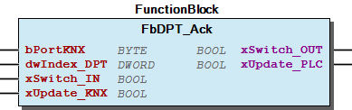
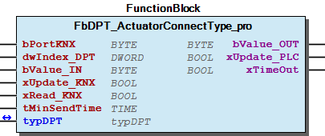

# WagoAppKNX v1.0.5.2 (WAGO) - Complete Documentation

## 📋 Library Information

- **Company:** WAGO
- **Title:** WagoAppKNX
- **Version:** 1.0.5.2
- **Categories:** WAGO BusinessView|Building Automation; WAGO LayerView|App; Application
- **Namespace:** WagoAppKNX
- **Author:** WAGO / u010188
- **Placeholder:** WagoAppKNX

### Description ¶

This document is automatically generated.

Library for KNX module 753-646

The function blocks of this library are NOT thread safe and must be called from one CODESYS task only! Concurrent calls from different tasks may cause loss or corruption of data.

This document is automatically generated. Library for KNX module 753-646 The function blocks of this library are NOT thread safe and must be called from one CODESYS task only! Concurrent calls from different tasks may cause loss or corruption of data.

### Contents: ¶

Contents: - Documentation Index 10 Documentation - WagoAppKNX Library Documentation Project Information Library Information Function Blocks - FbBinaryInput_1Button_Dimming (FB) - FbBinaryInput_1Button_Sunblind (FB) - FbBinaryInput_2Button_Dimming (FB) - FbBinaryInput_2Button_Sunblind (FB) - FbDPT_1_Bit (FB) - FbDPT_1_Byte (FB) - FbDPT_2_Bit (FB) - FbDPT_2_Byte (FB) - FbDPT_4_Bit (FB) - FbDPT_4_Byte (FB) - ... and 177 more Functions - Fu2BYTE_to_Real (FUN) - FuFiltertable_Checksum (FUN) - FuPhyAddress (FUN) - FuReal_to_2BYTE (FUN) - Fu_TimeToString (FUN) Methods Program Organization Function Groups Internal Components Global Variable Lists - Globale_Variablen (GVL) - Status (GVL) - VersionHistory (GVL) Other Components - 001.* 1_Bit - 002.* 1_Bit_controlled - 003.* 3_Bit_controlled - 004.* character - 005.* 1_Byte_unsigned - 006.* 1_Byte_signed - 007.* 2_Byte_unsigned - 008.* 2_Byte_signed - 009.* 2_Byte_float - 01 Binary Input - ... and 164 more

### Indices and tables ¶

Based on WagoAppKNX.library, last modified 29.05.2024, 20:20:46. LibDoc 3.5.16.10

© WAGO GmbH & Co. KG, Germany 2018 – All rights reserved. For the avoidance of doubt, this copyright notice does not only apply to the information above but also and primarily to the described library itself. Please note that third-party products are always mentioned without reference to intellectual property rights, including patents, utility models, designs and trademarks, accordingly the existence of such rights cannot be excluded. WAGO is a registered trademark of WAGO Verwaltungsgesellschaft mbH.

- File and Project Information - Library Reference Based on WagoAppKNX.library, last modified 29.05.2024, 20:20:46. LibDoc 3.5.16.10 © WAGO GmbH & Co. KG, Germany 2018 – All rights reserved. For the avoidance of doubt, this copyright notice does not only apply to the information above but also and primarily to the described library itself. Please note that third-party products are always mentioned without reference to intellectual property rights, including patents, utility models, designs and trademarks, accordingly the existence of such rights cannot be excluded. WAGO is a registered trademark of WAGO Verwaltungsgesellschaft mbH.

### Documentation Index

## 10 Documentation

- doc01_Foreword (FB) - doc10_DPT_Notations_and_Format (FB) - doc20_Prefix_of_DPT_Instance_Name (FB)

## WagoAppKNX Library Documentation

| Company: | WAGO |
| Title: | WagoAppKNX |
| Version: | 1.0.5.2 |
| Categories: | WAGO BusinessView\|Building Automation; WAGO LayerView\|App; Application |
| Namespace: | WagoAppKNX |
| Author: | WAGO / u010188 |
| Placeholder: | WagoAppKNX |

### Description

This document is automatically generated.

Library for KNX module 753-646

The function blocks of this library are NOT thread safe and must be called from one CODESYS task only! Concurrent calls from different tasks may cause loss or corruption of data.

This document is automatically generated. Library for KNX module 753-646 The function blocks of this library are NOT thread safe and must be called from one CODESYS task only! Concurrent calls from different tasks may cause loss or corruption of data.

### Contents:

- 10 Documentation doc01_Foreword (FB) - doc10_DPT_Notations_and_Format (FB) - doc20_Prefix_of_DPT_Instance_Name (FB) 20 Program Organization Units - 01 Communication - 02 DPT Function Blocks - 10 Applications - 80 Data types - Globale_Variablen (GVL) 30 Visualizations - 10 KNX Applications 80 Status - Status (GVL) - eStatus (ENUM) 90 Internal - 10 KNX Applications - Auxiliary Functions - Conversion GlobalTextList (Text List) ParameterList (PARAMS) VersionHistory (GVL)

### Indices and tables

Based on WagoAppKNX.library, last modified 29.05.2024, 20:20:46. LibDoc 3.5.16.10

© WAGO GmbH & Co. KG, Germany 2018 – All rights reserved. For the avoidance of doubt, this copyright notice does not only apply to the information above but also and primarily to the described library itself. Please note that third-party products are always mentioned without reference to intellectual property rights, including patents, utility models, designs and trademarks, accordingly the existence of such rights cannot be excluded. WAGO is a registered trademark of WAGO Verwaltungsgesellschaft mbH.

- File and Project Information - Library Reference Based on WagoAppKNX.library, last modified 29.05.2024, 20:20:46. LibDoc 3.5.16.10 © WAGO GmbH & Co. KG, Germany 2018 – All rights reserved. For the avoidance of doubt, this copyright notice does not only apply to the information above but also and primarily to the described library itself. Please note that third-party products are always mentioned without reference to intellectual property rights, including patents, utility models, designs and trademarks, accordingly the existence of such rights cannot be excluded. WAGO is a registered trademark of WAGO Verwaltungsgesellschaft mbH.

### Project Information

## File and Project Information

| Scope | Name | Type | Content |
| --- | --- | --- | --- |
| FileHeader | libraryFile | string | WagoAppKNX.library |
| contentFile | doc.clean.json |
| productName | e!COCKPIT |
| creationDateTime | date | 29.05.2024, 20:20:58 |
| companyName | string | WAGO |
| ProjectInformation | LastModificationDateTime | date | 29.05.2024, 20:20:46 |
| Description | string | See: Description |
| Copyright | © WAGO Kontakttechnik GmbH & Co. KG, Germany 2018 – All rights reserved. |
| Author | WAGO / u010188 |
| AutoResolveUnbound | bool | True |
| Placeholder | string | WagoAppKNX |
| Company | WAGO |
| DocFormat | reStructuredText |
| Project | WagoAppKNX |
| DefaultNamespace | WagoAppKNX |
| Version | version | 1.0.5.2 |
| ThreadSave | string | False |
| Title | WagoAppKNX |
| LibraryCategories | library-category-list | WAGO BusinessView\|Building Automation; WAGO LayerView\|App; Application |
| CompiledLibraryCompatibilityVersion | string | CODESYS V3.5 SP16 Patch 3 |

### Library Information

## Library Reference

| LinkAllContent: False QualifiedOnly: False | SystemLibrary: False | Optional: False |

| LinkAllContent: False QualifiedOnly: False | SystemLibrary: False | Optional: False |

| LinkAllContent: False QualifiedOnly: False | SystemLibrary: True | Optional: False |

| LinkAllContent: False QualifiedOnly: False | SystemLibrary: True | Optional: False |

| LinkAllContent: False QualifiedOnly: False | SystemLibrary: True | Optional: False |

| LinkAllContent: False QualifiedOnly: False | SystemLibrary: True | Optional: False |

| LinkAllContent: False QualifiedOnly: False | SystemLibrary: True | Optional: False |

| LinkAllContent: False QualifiedOnly: False | SystemLibrary: True | Optional: False |

| LinkAllContent: False QualifiedOnly: False | SystemLibrary: True | Optional: False |

| LinkAllContent: False QualifiedOnly: False | SystemLibrary: True | Optional: False |

| LinkAllContent: False QualifiedOnly: False | SystemLibrary: True | Optional: False |

| LinkAllContent: False QualifiedOnly: False | SystemLibrary: True | Optional: False |

| LinkAllContent: False QualifiedOnly: False | SystemLibrary: True | Optional: False |

| LinkAllContent: False Optional: False | QualifiedOnly: False SystemLibrary: True | PublishSymbolsInContainer: True |

| LinkAllContent: False QualifiedOnly: False | SystemLibrary: True | Optional: False |

| LinkAllContent: False QualifiedOnly: True | SystemLibrary: False | Optional: False |

| LinkAllContent: False QualifiedOnly: False | SystemLibrary: False | Optional: False |

| LinkAllContent: False QualifiedOnly: False | SystemLibrary: False | Optional: False |

| LinkAllContent: False QualifiedOnly: False | SystemLibrary: False | Optional: False |

| LinkAllContent: False QualifiedOnly: False | SystemLibrary: False | Optional: False |

| LinkAllContent: False QualifiedOnly: False | SystemLibrary: False | Optional: False |

| LinkAllContent: False QualifiedOnly: False | SystemLibrary: False | Optional: False |

| LinkAllContent: False QualifiedOnly: False | SystemLibrary: False | Optional: False |

This is a dictionary of all referenced libraries and their name spaces.

This is a dictionary of all referenced libraries and their name spaces. Standard Library Identification : Placeholder: Standard Default Resolution: Standard, * (System) Namespace: Standard Library Properties : VisuDialogs Library Identification : Placeholder: VisuDialogs Default Resolution: VisuDialogs, * (System) Namespace: VisuDialogs Library Properties : VisuElem3DPath Library Identification : Placeholder: System_VisuElem3DPath Default Resolution: VisuElem3DPath, 3.5.10.0 (System) Namespace: VisuElem3DPath Library Properties : Library Parameter : Parameter: GC_POINTS_PER_POLYGON = 100 VisuElemCamDisplayer Library Identification : Placeholder: System_VisuElemCamDisplayer Default Resolution: VisuElemCamDisplayer, 3.5.10.0 (System) Namespace: VisuElemCamDisplayer Library Properties : Library Parameter : Parameter: GC_POINTS_PER_CAM = 100 VisuElemMeter Library Identification : Placeholder: System_VisuElemMeter Default Resolution: VisuElemMeter, 3.5.10.0 (System) Namespace: VisuElemMeter Library Properties : VisuElemTextEditor Library Identification : Placeholder: System_VisuElemTextEditor Default Resolution: VisuElemTextEditor, 3.5.10.0 (System) Namespace: VisuElemTextEditor Library Properties : VisuElemTrace Library Identification : Placeholder: System_VisuElemTrace Default Resolution: VisuElemTrace, 3.5.10.0 (System) Namespace: VisuElemTrace Library Properties : VisuElemXYChart Library Identification : Placeholder: System_VisuElemXYChart Default Resolution: VisuElemXYChart, 3.5.16.30 (System) Namespace: VisuElemXYChart Library Properties : VisuElems Library Identification : Placeholder: System_VisuElems Default Resolution: VisuElems, 3.5.10.0 (System) Namespace: VisuElems Library Properties : VisuElemsAlarm Library Identification : Placeholder: System_VisuElemsAlarm Default Resolution: VisuElemsAlarm, 3.5.10.0 (System) Namespace: VisuElemsAlarm Library Properties : VisuElemsDateTime Library Identification : Placeholder: System_VisuElemsDateTime Default Resolution: VisuElemsDateTime, 3.5.10.0 (System) Namespace: VisuElemsDateTime Library Properties : VisuElemsSpecialControls Library Identification : Placeholder: System_VisuElemsSpecialControls Default Resolution: VisuElemsSpecialControls, 3.5.10.0 (System) Namespace: VisuElemsSpecialControls Library Properties : VisuElemsWinControls Library Identification : Placeholder: System_VisuElemsWinControls Default Resolution: VisuElemsWinControls, 3.5.10.0 (System) Namespace: VisuElemsWinControls Library Properties : VisuInputs Library Identification : Placeholder: system_visuinputs Default Resolution: VisuInputs, 3.5.16.30 (System) Namespace: visuinputs Library Properties : VisuNativeControl Library Identification : Placeholder: System_VisuNativeControl Default Resolution: VisuNativeControl, 3.5.10.0 (System) Namespace: VisuNativeControl Library Properties : VisuSymbols Library Identification : Placeholder: VisuSymbols Default Resolution: VisuSymbols, * (System) Namespace: VisuSymbols Library Properties : WagoAppBuilding Library Identification : Placeholder: WagoAppBuilding Default Resolution: WagoAppBuilding, * (WAGO) Namespace: WagoAppBuilding Library Properties : WagoAppDALI Library Identification : Placeholder: WagoAppDALI Default Resolution: WagoAppDALI, * (WAGO) Namespace: WagoAppDALI Library Properties : Library Parameter : Parameter: MAX_RX_BUFFER = 300 Parameter: XALLOWCOMMANDSDURINGADRESSING = FALSE Parameter: MAX_MODULES = 25 WagoSysErrorBase Library Identification : Placeholder: WagoSysErrorBase Default Resolution: WagoSysErrorBase, * (WAGO) Namespace: WagoSysErrorBase Library Properties : WagoSysPlainMem Library Identification : Placeholder: WagoSysPlainMem Default Resolution: WagoSysPlainMem, * (WAGO) Namespace: WagoSysPlainMem Library Properties : WagoSysVersion Library Identification : Name: WagoSysVersion Version: 1.0.0.0 Company: WAGO Namespace: WagoSysVersion Library Properties : WagoTypesModule_753_646 Library Identification : Placeholder: WagoTypesModule_753_646 Default Resolution: WagoTypesModule_753_646, * (WAGO) Namespace: WagoTypesModule_753_646 Library Properties : WagoVisuIcons Library Identification : Placeholder: WagoVisuIcons Default Resolution: WagoVisuIcons, * (WAGO) Namespace: WagoVisuIcons Library Properties :

### Function Blocks

## FbBinaryInput_1Button_Dimming (FB)

| Scope | Name | Type | Initial | Comment |
| --- | --- | --- | --- | --- |
| Input | bPortKNX | BYTE | 1 | Specifies which KNX module is to be addressed at the controller. Counting is from left to right. |
| dwIndex_DPT | DWORD |  | Index of Instance DPT function block |
| xDimmUP_DOWN | BOOL |  | Dimm up/down signal |
| tShortSwitch | TIME | TIME#500ms | Defines the maximum actuation time for a short button press. If the input is pressed longer, the signal will be interpreted as a long button press. |

| Communication Object: | Function: | DPT ID: | DPT |
| --- | --- | --- | --- |
| uuu.vvv._01_OUT_Switch | Switching ON/OFF | 1.001 | DPT_Switch |
| uuu.vvv._02_OUT_Dimming | Dimming UP/DOWN | 3.007 | DPT_Control_Dimming |

The FbBinaryInput_1Button_Dimming function block serves as a dimming sensor and can control an external KNX dimming actuator via a binary input signal (switch).

Graphical Illustration:

Function description

bPortKNX gets the same number as the KNX master has on bPortKNX . The DPT function blocks are addressed by numbering at the dwIndex_DPT input. The instance names are given a specific prefix that is structured as follows prefix of instance name

General notes:

This function block may only be used with the FbKNX_Master function block from the WagoAppKNX library.

The following communication objects are created using the WAGO-ETS plug-in:

The prefix uuu. is determined by the program name (e.g. PLC_PRG). The prefix vvv. is determined by the entity name of the function block.

Interface variables Function: The FbBinaryInput_1Button_Dimming function block serves as a dimming sensor and can control an external KNX dimming actuator via a binary input signal (switch). Graphical Illustration:  Function description bPortKNX gets the same number as the KNX master has on bPortKNX . The DPT function blocks are addressed by numbering at the dwIndex_DPT input. The instance names are given a specific prefix that is structured as follows prefix of instance name General notes: Note This function block may only be used with the FbKNX_Master function block from the WagoAppKNX library. The following communication objects are created using the WAGO-ETS plug-in: The prefix uuu. is determined by the program name (e.g. PLC_PRG). The prefix vvv. is determined by the entity name of the function block.

## FbBinaryInput_1Button_Sunblind (FB)

| Scope | Name | Type | Initial | Comment |
| --- | --- | --- | --- | --- |
| Input | bPortKNX | BYTE | 1 | Specifies which KNX module is to be addressed at the controller. Counting is from left to right. |
| dwIndex_DPT | DWORD |  | Index of Instance DPT function block |
| xMoveUP_DOWN | BOOL |  | Move up/down signal |
| tShortSwitch | TIME | TIME#500ms | Defines the maximum actuation time for a short button press. If the input is pressed longer, the signal will be interpreted as a long button press. |

| Communication Object: | Function: | DPT ID: | DPT |
| --- | --- | --- | --- |
| uuu.vvv._01_OUT_Movement | Blind UP/DOWN | 1.008 | DPT_Switch |
| uuu.vvv._02_OUT_Stop_Step | Slat ADJUSTMENT/STOP | 1.008 | DPT_Control_Dimming |

Graphical Illustration:

Function description

bPortKNX gets the same number as the KNX master has on bPortKNX . The DPT function blocks are addressed by numbering at the dwIndex_DPT input. The instance names are given a specific prefix that is structured as follows prefix of instance name

General notes:

This function block may only be used with the FbKNX_Master function block from the WagoAppKNX library.

The following communication objects are created using the WAGO-ETS plug-in:

The prefix uuu. is determined by the program name (e.g. PLC_PRG). The prefix vvv. is determined by the entity name of the function block.

Interface variables Function: The FbBinaryInput_1Button_Sunblind function block serves as a sunblind sensor and can control an external KNX sunblind actuator via a binary input signal (switch). bPortKNX gets the same number as the KNX master has on bPortKNX . Graphical Illustration:  Function description bPortKNX gets the same number as the KNX master has on bPortKNX . The DPT function blocks are addressed by numbering at the dwIndex_DPT input. The instance names are given a specific prefix that is structured as follows prefix of instance name General notes: Note This function block may only be used with the FbKNX_Master function block from the WagoAppKNX library. The following communication objects are created using the WAGO-ETS plug-in: The prefix uuu. is determined by the program name (e.g. PLC_PRG). The prefix vvv. is determined by the entity name of the function block.

## FbBinaryInput_2Button_Dimming (FB)

| Scope | Name | Type | Initial | Comment |
| --- | --- | --- | --- | --- |
| Input | bPortKNX | BYTE | 1 | Specifies which KNX module is to be addressed at the controller. Counting is from left to right. |
| dwIndex_DPT | DWORD |  | Index of Instance DPT function block |
| xDimmUP | BOOL |  | Dimm up input signal |
| xDimmDOWN | BOOL |  | Dimm down input signal |
| tShortSwitch | TIME | TIME#500ms | Defines the maximum actuation time for a short button press. If the input is pressed longer, the signal will be interpreted as a long button press. |

| Communication Object: | Function: | DPT ID: | DPT |
| --- | --- | --- | --- |
| uuu.vvv._01_OUT_Switch | Switching ON/OFF | 1.001 | DPT_Switch |
| uuu.vvv._02_OUT_Dimming | Dimming UP/DOWN | 3.007 | DPT_Control_Dimming |

Graphical Illustration:

Function description

bPortKNX gets the same number as the KNX master has on bPortKNX . The DPT function blocks are addressed by numbering at the dwIndex_DPT input. The instance names are given a specific prefix that is structured as follows prefix of instance name

General notes:

This function block may only be used with the FbKNX_Master function block from the WagoAppKNX library.

The following communication objects are created using the WAGO-ETS plug-in:

The prefix uuu. is determined by the program name (e.g. PLC_PRG). The prefix vvv. is determined by the entity name of the function block.

Interface variables Function: The FbBinaryInput_2Button_Dimming function block serves as a dimming sensor and can control an external KNX dimming actuator via two binary input signals (switches). bPortKNX gets the same number as the KNX master has on bPortKNX . Graphical Illustration:  Function description bPortKNX gets the same number as the KNX master has on bPortKNX . The DPT function blocks are addressed by numbering at the dwIndex_DPT input. The instance names are given a specific prefix that is structured as follows prefix of instance name General notes: Note This function block may only be used with the FbKNX_Master function block from the WagoAppKNX library. The following communication objects are created using the WAGO-ETS plug-in: The prefix uuu. is determined by the program name (e.g. PLC_PRG). The prefix vvv. is determined by the entity name of the function block.

## FbBinaryInput_2Button_Sunblind (FB)

| Scope | Name | Type | Initial | Comment |
| --- | --- | --- | --- | --- |
| Input | bPortKNX | BYTE | 1 | Specifies which KNX module is to be addressed at the controller. Counting is from left to right. |
| dwIndex_DPT | DWORD |  | Index of Instance DPT function block |
| xMove_UP | BOOL |  | Move up signal |
| xMove_DOWN | BOOL |  | Move down signal |
| tShortSwitch | TIME | TIME#500ms | Defines the maximum actuation time for a short button press. If the input is pressed longer, the signal will be interpreted as a long button press. |

| Communication Object: | Function: | DPT ID: | DPT |
| --- | --- | --- | --- |
| uuu.vvv._01_OUT_Movement | Blind UP/DOWN | 1.008 | DPT_Switch |
| uuu.vvv._02_OUT_Stop_Step | Slat ADJUSTMENT/STOP | 1.008 | DPT_Control_Dimming |

The FbBinaryInput_2Button_Sunblind function block serves as a sunblind sensor and can control an external KNX sunblind actuator via two binary input signals (switches)

Graphical Illustration:

Function description

bPortKNX gets the same number as the KNX master has on bPortKNX . The DPT function blocks are addressed by numbering at the dwIndex_DPT input. The instance names are given a specific prefix that is structured as follows prefix of instance name

General notes:

This function block may only be used with the FbKNX_Master function block from the WagoAppKNX library.

The following communication objects are created using the WAGO-ETS plug-in:

The prefix uuu. is determined by the program name (e.g. PLC_PRG). The prefix vvv. is determined by the entity name of the function block.

Interface variables Function: The FbBinaryInput_2Button_Sunblind function block serves as a sunblind sensor and can control an external KNX sunblind actuator via two binary input signals (switches) Graphical Illustration:  Function description bPortKNX gets the same number as the KNX master has on bPortKNX . The DPT function blocks are addressed by numbering at the dwIndex_DPT input. The instance names are given a specific prefix that is structured as follows prefix of instance name General notes: Note This function block may only be used with the FbKNX_Master function block from the WagoAppKNX library. The following communication objects are created using the WAGO-ETS plug-in: The prefix uuu. is determined by the program name (e.g. PLC_PRG). The prefix vvv. is determined by the entity name of the function block.

## FbDPT_1_Bit (FB)

| Scope | Name | Type | Initial | Comment |
| --- | --- | --- | --- | --- |
| Input | bPortKNX | BYTE | 1 | Specifies which KNX module is to be addressed at the controller. Counting is from left to right. |
| dwIndex_DPT | DWORD |  | Index of Instance DPT function block |
| xIN_Bit0 | BOOL |  | Input switching signal |
| xUpdate_KNX | BOOL |  | Force telegram update |
| xRead_KNX | BOOL |  | Trigger command read value |
| tMinSendTime | TIME |  | Parameter value for MinSendTime |
| Inout | typDPT | typDPT |  | KNX object value as RAW DATA for potential saving as RETAIN variable. |
| Output | xOUT_Bit0 | BOOL |  | Output switching signal |
| xUpdate_PLC | BOOL |  | Update received. The variable will then switch to TRUE for one program cycle |
| xTimeOut | BOOL |  | Timeout detection |

This function block is used for data exchange with a KNX object of format 1-Bit Each function block represents a KNX DPT (Data Point Type) and appears in the ETS later as a communication object.

The DPT function blocks are addressed by numbering at the dwIndex_DPT input. The instance names are given a specific prefix that is structured as follows prefix of instance name

This function block can read the actual value of KNX and it is possible to set a minimal time between two telegrams.

It is not verified that the prefix of the instance name (see doc20_Prefix_of_DPT_Instance_Name ) matches the function block assignment at input dwIndex_DPT . If they do not match, inconsistent data is generated.

Graphical Illustration

Function description

The function block can be used either for sending or receiving object values. bPortKNX gets the same number as the KNX master has on bPortKNX .

Sending: A value change at input “xIN_Bit0” causes a telegram to be transmitted to the KNX module/controller. Sending can also be forced by a rising edge present at the “xUpdate_KNX” input. The minimum time interval for sending telegrams can be defined for the function block using the parameter “tMinSendTime”. The volume of telegram traffic can be reduced by frequently changing signals. A rising edge at the “xRead_KNX” input causes a read telegram to be triggered by the transmitting group address.

Receiving: If the function block is used for receiving data (output), the data received from the module/controller is signaled at the “xOUT_Bit0” output. The non-scaled values for the received data are provided as a “typDPT” IN_OUT variable. This offers the user the possibility of also saving the values as a RETAIN variable, allowing the output values to be retained after a controller reset. The output values “abOUT” are also retained after resetting the controller. A telegram update, initiated by a KNX group address, is signaled at output “xUpdate_PLC”. The variable will then switch to TRUE for one program cycle. With timeout monitoring activated for a KNX object (KNX plug-in setting), violation (exceeding) of the monitoring time is indicated by a signal at output “xTimeOut”.

Interface variables Function This function block is used for data exchange with a KNX object of format 1-Bit Each function block represents a KNX DPT (Data Point Type) and appears in the ETS later as a communication object. The DPT function blocks are addressed by numbering at the dwIndex_DPT input. The instance names are given a specific prefix that is structured as follows prefix of instance name This function block can read the actual value of KNX and it is possible to set a minimal time between two telegrams. Note It is not verified that the prefix of the instance name (see doc20_Prefix_of_DPT_Instance_Name ) matches the function block assignment at input dwIndex_DPT . If they do not match, inconsistent data is generated. Graphical Illustration  Function description The function block can be used either for sending or receiving object values. bPortKNX gets the same number as the KNX master has on bPortKNX . Sending: A value change at input “xIN_Bit0” causes a telegram to be transmitted to the KNX module/controller. Sending can also be forced by a rising edge present at the “xUpdate_KNX” input. The minimum time interval for sending telegrams can be defined for the function block using the parameter “tMinSendTime”. The volume of telegram traffic can be reduced by frequently changing signals. A rising edge at the “xRead_KNX” input causes a read telegram to be triggered by the transmitting group address. Receiving: If the function block is used for receiving data (output), the data received from the module/controller is signaled at the “xOUT_Bit0” output. The non-scaled values for the received data are provided as a “typDPT” IN_OUT variable. This offers the user the possibility of also saving the values as a RETAIN variable, allowing the output values to be retained after a controller reset. The output values “abOUT” are also retained after resetting the controller. A telegram update, initiated by a KNX group address, is signaled at output “xUpdate_PLC”. The variable will then switch to TRUE for one program cycle. With timeout monitoring activated for a KNX object (KNX plug-in setting), violation (exceeding) of the monitoring time is indicated by a signal at output “xTimeOut”.

## FbDPT_1_Byte (FB)

| Scope | Name | Type | Initial | Comment |
| --- | --- | --- | --- | --- |
| Input | bPortKNX | BYTE | 1 | Specifies which KNX module is to be addressed at the controller. Counting is from left to right. |
| dwIndex_DPT | DWORD |  | Index of Instance DPT function block |
| bIN | BYTE |  | Input signal |
| xUpdate_KNX | BOOL |  | Force telegram update |
| xRead_KNX | BOOL |  | Trigger command read value |
| tMinSendTime | TIME |  | Parameter value for MinSendTime |
| Inout | typDPT | typDPT |  | KNX object value as RAW DATA for potential saving as RETAIN variable. |
| Output | bOUT | BYTE |  | Output signal |
| xUpdate_PLC | BOOL |  | Update received. The variable will then switch to TRUE for one program cycle |
| xTimeOut | BOOL |  | Timeout detection |

This function block is used for data exchange with a KNX object of format 1-Byte Each function block represents a KNX DPT (Data Point Type) and appears in the ETS later as a communication object.

The DPT function blocks are addressed by numbering at the dwIndex_DPT input. The instance names are given a specific prefix that is structured as follows prefix of instance name

This function block can read the actual value of KNX and it is possible to set a minimal time between two telegrams.

It is not verified that the prefix of the instance name (see doc20_Prefix_of_DPT_Instance_Name ) matches the function block assignment at input dwIndex_DPT . If they do not match, inconsistent data is generated.

Graphical Illustration

Function description

The function block can be used either for sending or receiving object values. bPortKNX gets the same number as the KNX master has on bPortKNX .

Sending: A value change at input “bIN” causes a telegram to be transmitted to the KNX module/controller. Sending can also be forced by a rising edge present at the “xUpdate_KNX” input. The minimum time interval for sending telegrams can be defined for the function block using the parameter “tMinSendTime”. The volume of telegram traffic can be reduced by frequently changing signals. A rising edge at the “xRead_KNX” input causes a read telegram to be triggered by the transmitting group address.

Receiving: If the function block is used for receiving data (output), the data received from the module/controller is signaled at the “bOUT” output. The non-scaled values for the received data are provided as a “typDPT” IN_OUT variable. This offers the user the possibility of also saving the values as a RETAIN variable, allowing the output values to be retained after a controller reset. The output values “abOUT” are also retained after resetting the controller. A telegram update, initiated by a KNX group address, is signaled at output “xUpdate_PLC”. The variable will then switch to TRUE for one program cycle. With timeout monitoring activated for a KNX object (KNX plug-in setting), violation (exceeding) of the monitoring time is indicated by a signal at output “xTimeOut”.

Interface variables Function This function block is used for data exchange with a KNX object of format 1-Byte Each function block represents a KNX DPT (Data Point Type) and appears in the ETS later as a communication object. The DPT function blocks are addressed by numbering at the dwIndex_DPT input. The instance names are given a specific prefix that is structured as follows prefix of instance name This function block can read the actual value of KNX and it is possible to set a minimal time between two telegrams. Note It is not verified that the prefix of the instance name (see doc20_Prefix_of_DPT_Instance_Name ) matches the function block assignment at input dwIndex_DPT . If they do not match, inconsistent data is generated. Graphical Illustration  Function description The function block can be used either for sending or receiving object values. bPortKNX gets the same number as the KNX master has on bPortKNX . Sending: A value change at input “bIN” causes a telegram to be transmitted to the KNX module/controller. Sending can also be forced by a rising edge present at the “xUpdate_KNX” input. The minimum time interval for sending telegrams can be defined for the function block using the parameter “tMinSendTime”. The volume of telegram traffic can be reduced by frequently changing signals. A rising edge at the “xRead_KNX” input causes a read telegram to be triggered by the transmitting group address. Receiving: If the function block is used for receiving data (output), the data received from the module/controller is signaled at the “bOUT” output. The non-scaled values for the received data are provided as a “typDPT” IN_OUT variable. This offers the user the possibility of also saving the values as a RETAIN variable, allowing the output values to be retained after a controller reset. The output values “abOUT” are also retained after resetting the controller. A telegram update, initiated by a KNX group address, is signaled at output “xUpdate_PLC”. The variable will then switch to TRUE for one program cycle. With timeout monitoring activated for a KNX object (KNX plug-in setting), violation (exceeding) of the monitoring time is indicated by a signal at output “xTimeOut”.

## FbDPT_2_Bit (FB)

| Scope | Name | Type | Initial | Comment |
| --- | --- | --- | --- | --- |
| Input | bPortKNX | BYTE | 1 | Specifies which KNX module is to be addressed at the controller. Counting is from left to right. |
| dwIndex_DPT | DWORD |  | Index of Instance DPT function block |
| xIN_Bit0 | BOOL |  | Input signal |
| xIN_Bit1 | BOOL |  | Controlled modus |
| xUpdate_KNX | BOOL |  | Force telegram update |
| xRead_KNX | BOOL |  | Trigger command read value |
| tMinSendTime | TIME |  | Parameter value for MinSendTime |
| Inout | typDPT | typDPT |  | KNX object value as RAW DATA for potential saving as RETAIN variable. |
| Output | xOUT_Bit0 | BOOL |  | Output signal*) |
| xOUT_Bit1 | BOOL |  | Controlled modus*) |
| xUpdate_PLC | BOOL |  | Update received. The variable will then switch to TRUE for one program cycle |
| xTimeOut | BOOL |  | Timeout detection |

This function block is used for data exchange with a KNX object of format 2-Bit Each function block represents a KNX DPT (Data Point Type) and appears in the ETS later as a communication object.

The DPT function blocks are addressed by numbering at the dwIndex_DPT input. The instance names are given a specific prefix that is structured as follows prefix of instance name

This function block can read the actual value of KNX and it is possible to set a minimal time between two telegrams.

It is not verified that the prefix of the instance name (see doc20_Prefix_of_DPT_Instance_Name ) matches the function block assignment at input dwIndex_DPT . If they do not match, inconsistent data is generated.

Graphical Illustration

Function description

The function block can be used either for sending or receiving object values. bPortKNX gets the same number as the KNX master has on bPortKNX .

Sending: A value change at the inputs causes a telegram to be transmitted to the KNX module/controller. Sending can also be forced by a rising edge present at the “xUpdate_KNX” input. The minimum time interval for sending telegrams can be defined for the function block using the parameter “tMinSendTime”. The volume of telegram traffic can be reduced by frequently changing signals. A rising edge at the “xRead_KNX” input causes a read telegram to be triggered by the transmitting group address.

Receiving: If the function block is used for receiving data (output), the data received from the module/controller is signaled at the outputs. The non-scaled values for the received data are provided as a “typDPT” IN_OUT variable. This offers the user the possibility of also saving the values as a RETAIN variable, allowing the output values to be retained after a controller reset. The output values “abOUT” are also retained after resetting the controller. A telegram update, initiated by a KNX group address, is signaled at output “xUpdate_PLC”. The variable will then switch to TRUE for one program cycle. With timeout monitoring activated for a KNX object (KNX plug-in setting), violation (exceeding) of the monitoring time is indicated by a signal at output “xTimeOut”.

Interface variables Function This function block is used for data exchange with a KNX object of format 2-Bit Each function block represents a KNX DPT (Data Point Type) and appears in the ETS later as a communication object. The DPT function blocks are addressed by numbering at the dwIndex_DPT input. The instance names are given a specific prefix that is structured as follows prefix of instance name This function block can read the actual value of KNX and it is possible to set a minimal time between two telegrams. Note It is not verified that the prefix of the instance name (see doc20_Prefix_of_DPT_Instance_Name ) matches the function block assignment at input dwIndex_DPT . If they do not match, inconsistent data is generated. Graphical Illustration  Function description The function block can be used either for sending or receiving object values. bPortKNX gets the same number as the KNX master has on bPortKNX . Sending: A value change at the inputs causes a telegram to be transmitted to the KNX module/controller. Sending can also be forced by a rising edge present at the “xUpdate_KNX” input. The minimum time interval for sending telegrams can be defined for the function block using the parameter “tMinSendTime”. The volume of telegram traffic can be reduced by frequently changing signals. A rising edge at the “xRead_KNX” input causes a read telegram to be triggered by the transmitting group address. Receiving: If the function block is used for receiving data (output), the data received from the module/controller is signaled at the outputs. The non-scaled values for the received data are provided as a “typDPT” IN_OUT variable. This offers the user the possibility of also saving the values as a RETAIN variable, allowing the output values to be retained after a controller reset. The output values “abOUT” are also retained after resetting the controller. A telegram update, initiated by a KNX group address, is signaled at output “xUpdate_PLC”. The variable will then switch to TRUE for one program cycle. With timeout monitoring activated for a KNX object (KNX plug-in setting), violation (exceeding) of the monitoring time is indicated by a signal at output “xTimeOut”.

## FbDPT_2_Byte (FB)

| Scope | Name | Type | Initial | Comment |
| --- | --- | --- | --- | --- |
| Input | bPortKNX | BYTE | 1 | Specifies which KNX module is to be addressed at the controller. Counting is from left to right. |
| dwIndex_DPT | DWORD |  | Index of Instance DPT function block |
| abIN | ARRAY [0..1] OF BYTE |  | Input signal |
| xUpdate_KNX | BOOL |  | Force telegram update |
| xRead_KNX | BOOL |  | Trigger command read value |
| tMinSendTime | TIME |  | Parameter value for MinSendTime |
| Inout | typDPT | typDPT |  | KNX object value as RAW DATA for potential saving as RETAIN variable. |
| Output | abOUT | ARRAY [0..1] OF BYTE |  | Output signal |
| xUpdate_PLC | BOOL |  | Update received. The variable will then switch to TRUE for one program cycle |
| xTimeOut | BOOL |  | Timeout detection |

This function block is used for data exchange with a KNX object of format 2-Byte Each function block represents a KNX DPT (Data Point Type) and appears in the ETS later as a communication object.

The DPT function blocks are addressed by numbering at the dwIndex_DPT input. The instance names are given a specific prefix that is structured as follows prefix of instance name

This function block can read the actual value of KNX and it is possible to set a minimal time between two telegrams.

It is not verified that the prefix of the instance name (see doc20_Prefix_of_DPT_Instance_Name ) matches the function block assignment at input dwIndex_DPT . If they do not match, inconsistent data is generated.

Graphical Illustration

Function description

The function block can be used either for sending or receiving object values. bPortKNX gets the same number as the KNX master has on bPortKNX .

Sending: A value change at input “abIN” causes a telegram to be transmitted to the KNX module/controller. Sending can also be forced by a rising edge present at the “xUpdate_KNX” input. The minimum time interval for sending telegrams can be defined for the function block using the parameter “tMinSendTime”. The volume of telegram traffic can be reduced by frequently changing signals. A rising edge at the “xRead_KNX” input causes a read telegram to be triggered by the transmitting group address.

Receiving: If the function block is used for receiving data (output), the data received from the module/controller is signaled at the “abOUT” output. The non-scaled values for the received data are provided as a “typDPT” IN_OUT variable. This offers the user the possibility of also saving the values as a RETAIN variable, allowing the output values to be retained after a controller reset. The output values “abOUT” are also retained after resetting the controller. A telegram update, initiated by a KNX group address, is signaled at output “xUpdate_PLC”. The variable will then switch to TRUE for one program cycle. With timeout monitoring activated for a KNX object (KNX plug-in setting), violation (exceeding) of the monitoring time is indicated by a signal at output “xTimeOut”.

Interface variables Function This function block is used for data exchange with a KNX object of format 2-Byte Each function block represents a KNX DPT (Data Point Type) and appears in the ETS later as a communication object. The DPT function blocks are addressed by numbering at the dwIndex_DPT input. The instance names are given a specific prefix that is structured as follows prefix of instance name This function block can read the actual value of KNX and it is possible to set a minimal time between two telegrams. Note It is not verified that the prefix of the instance name (see doc20_Prefix_of_DPT_Instance_Name ) matches the function block assignment at input dwIndex_DPT . If they do not match, inconsistent data is generated. Graphical Illustration  Function description The function block can be used either for sending or receiving object values. bPortKNX gets the same number as the KNX master has on bPortKNX . Sending: A value change at input “abIN” causes a telegram to be transmitted to the KNX module/controller. Sending can also be forced by a rising edge present at the “xUpdate_KNX” input. The minimum time interval for sending telegrams can be defined for the function block using the parameter “tMinSendTime”. The volume of telegram traffic can be reduced by frequently changing signals. A rising edge at the “xRead_KNX” input causes a read telegram to be triggered by the transmitting group address. Receiving: If the function block is used for receiving data (output), the data received from the module/controller is signaled at the “abOUT” output. The non-scaled values for the received data are provided as a “typDPT” IN_OUT variable. This offers the user the possibility of also saving the values as a RETAIN variable, allowing the output values to be retained after a controller reset. The output values “abOUT” are also retained after resetting the controller. A telegram update, initiated by a KNX group address, is signaled at output “xUpdate_PLC”. The variable will then switch to TRUE for one program cycle. With timeout monitoring activated for a KNX object (KNX plug-in setting), violation (exceeding) of the monitoring time is indicated by a signal at output “xTimeOut”.

## FbDPT_4_Bit (FB)

| Scope | Name | Type | Initial | Comment |
| --- | --- | --- | --- | --- |
| Input | bPortKNX | BYTE | 1 | Specifies which KNX module is to be addressed at the controller. Counting is from left to right. |
| dwIndex_DPT | DWORD |  | Index of Instance DPT function block |
| bIN | BYTE |  | Input signal max range 0 to 15 |
| xUpdate_KNX | BOOL |  | Force telegram update |
| xRead_KNX | BOOL |  | Trigger command read value |
| tMinSendTime | TIME |  | Parameter value for MinSendTime |
| Inout | typDPT | typDPT |  | KNX object value as RAW DATA for potential saving as RETAIN variable. |
| Output | bOUT | BYTE |  | Output signal max range 0 to 15 |
| xUpdate_PLC | BOOL |  | Update received. The variable will then switch to TRUE for one program cycle |
| xTimeOut | BOOL |  | Timeout detection |

This function block is used for data exchange with a KNX object of format 4-Bit Each function block represents a KNX DPT (Data Point Type) and appears in the ETS later as a communication object. The DPT function blocks are addressed by numbering at the dwIndex_DPT input. The instance names are given a specific prefix that is structured as follows prefix of instance name

This function block can read the actual value of KNX and it is possible to set a minimal time between two telegrams.

It is not verified that the prefix of the instance name (see doc20_Prefix_of_DPT_Instance_Name ) matches the function block assignment at input dwIndex_DPT . If they do not match, inconsistent data is generated.

Graphical Illustration

Function description

The function block can be used either for sending or receiving object values. bPortKNX gets the same number as the KNX master has on bPortKNX .

Sending: A value change at input “bIN” causes a telegram to be transmitted to the KNX module/controller. Sending can also be forced by a rising edge present at the “xUpdate_KNX” input. The minimum time interval for sending telegrams can be defined for the function block using the parameter “tMinSendTime”. The volume of telegram traffic can be reduced by frequently changing signals. A rising edge at the “xRead_KNX” input causes a read telegram to be triggered by the transmitting group address.

Receiving: If the function block is used for receiving data (output), the data received from the module/controller is signaled at the “bOUT” output. The non-scaled values for the received data are provided as a “typDPT” IN_OUT variable. This offers the user the possibility of also saving the values as a RETAIN variable, allowing the output values to be retained after a controller reset. The output values “abOUT” are also retained after resetting the controller. A telegram update, initiated by a KNX group address, is signaled at output “xUpdate_PLC”. The variable will then switch to TRUE for one program cycle. With timeout monitoring activated for a KNX object (KNX plug-in setting), violation (exceeding) of the monitoring time is indicated by a signal at output “xTimeOut”.

Interface variables Function This function block is used for data exchange with a KNX object of format 4-Bit Each function block represents a KNX DPT (Data Point Type) and appears in the ETS later as a communication object. The DPT function blocks are addressed by numbering at the dwIndex_DPT input. The instance names are given a specific prefix that is structured as follows prefix of instance name This function block can read the actual value of KNX and it is possible to set a minimal time between two telegrams. Note It is not verified that the prefix of the instance name (see doc20_Prefix_of_DPT_Instance_Name ) matches the function block assignment at input dwIndex_DPT . If they do not match, inconsistent data is generated. Graphical Illustration  Function description The function block can be used either for sending or receiving object values. bPortKNX gets the same number as the KNX master has on bPortKNX . Sending: A value change at input “bIN” causes a telegram to be transmitted to the KNX module/controller. Sending can also be forced by a rising edge present at the “xUpdate_KNX” input. The minimum time interval for sending telegrams can be defined for the function block using the parameter “tMinSendTime”. The volume of telegram traffic can be reduced by frequently changing signals. A rising edge at the “xRead_KNX” input causes a read telegram to be triggered by the transmitting group address. Receiving: If the function block is used for receiving data (output), the data received from the module/controller is signaled at the “bOUT” output. The non-scaled values for the received data are provided as a “typDPT” IN_OUT variable. This offers the user the possibility of also saving the values as a RETAIN variable, allowing the output values to be retained after a controller reset. The output values “abOUT” are also retained after resetting the controller. A telegram update, initiated by a KNX group address, is signaled at output “xUpdate_PLC”. The variable will then switch to TRUE for one program cycle. With timeout monitoring activated for a KNX object (KNX plug-in setting), violation (exceeding) of the monitoring time is indicated by a signal at output “xTimeOut”.

## FbDPT_4_Byte (FB)

| Scope | Name | Type | Initial | Comment |
| --- | --- | --- | --- | --- |
| Input | bPortKNX | BYTE | 1 | Specifies which KNX module is to be addressed at the controller. Counting is from left to right. |
| dwIndex_DPT | DWORD |  | Index of Instance DPT function block |
| abIN | ARRAY [0..3] OF BYTE |  | Input signal |
| xUpdate_KNX | BOOL |  | Force telegram update |
| xRead_KNX | BOOL |  | Trigger command read value |
| tMinSendTime | TIME |  | Parameter value for MinSendTime |
| Inout | typDPT | typDPT |  | KNX object value as RAW DATA for potential saving as RETAIN variable. |
| Output | abOUT | ARRAY [0..3] OF BYTE |  | Output signal |
| xUpdate_PLC | BOOL |  | Update received. The variable will then switch to TRUE for one program cycle |
| xTimeOut | BOOL |  | Timeout detection |

This function block is used for data exchange with a KNX object of format 4-Byte Each function block represents a KNX DPT (Data Point Type) and appears in the ETS later as a communication object.

The DPT function blocks are addressed by numbering at the dwIndex_DPT input. The instance names are given a specific prefix that is structured as follows prefix of instance name

This function block can read the actual value of KNX and it is possible to set a minimal time between two telegrams.

It is not verified that the prefix of the instance name (see doc20_Prefix_of_DPT_Instance_Name ) matches the function block assignment at input dwIndex_DPT . If they do not match, inconsistent data is generated.

Graphical Illustration

Function description

The function block can be used either for sending or receiving object values. bPortKNX gets the same number as the KNX master has on bPortKNX .

Sending: A value change at input “abIN” causes a telegram to be transmitted to the KNX module/controller. Sending can also be forced by a rising edge present at the “xUpdate_KNX” input. The minimum time interval for sending telegrams can be defined for the function block using the parameter “tMinSendTime”. The volume of telegram traffic can be reduced by frequently changing signals. A rising edge at the “xRead_KNX” input causes a read telegram to be triggered by the transmitting group address.

Receiving: If the function block is used for receiving data (output), the data received from the module/controller is signaled at the “abOUT” output. The non-scaled values for the received data are provided as a “typDPT” IN_OUT variable. This offers the user the possibility of also saving the values as a RETAIN variable, allowing the output values to be retained after a controller reset. The output values “abOUT” are also retained after resetting the controller. A telegram update, initiated by a KNX group address, is signaled at output “xUpdate_PLC”. The variable will then switch to TRUE for one program cycle. With timeout monitoring activated for a KNX object (KNX plug-in setting), violation (exceeding) of the monitoring time is indicated by a signal at output “xTimeOut”.

Interface variables Function This function block is used for data exchange with a KNX object of format 4-Byte Each function block represents a KNX DPT (Data Point Type) and appears in the ETS later as a communication object. The DPT function blocks are addressed by numbering at the dwIndex_DPT input. The instance names are given a specific prefix that is structured as follows prefix of instance name This function block can read the actual value of KNX and it is possible to set a minimal time between two telegrams. Note It is not verified that the prefix of the instance name (see doc20_Prefix_of_DPT_Instance_Name ) matches the function block assignment at input dwIndex_DPT . If they do not match, inconsistent data is generated. Graphical Illustration  Function description The function block can be used either for sending or receiving object values. bPortKNX gets the same number as the KNX master has on bPortKNX . Sending: A value change at input “abIN” causes a telegram to be transmitted to the KNX module/controller. Sending can also be forced by a rising edge present at the “xUpdate_KNX” input. The minimum time interval for sending telegrams can be defined for the function block using the parameter “tMinSendTime”. The volume of telegram traffic can be reduced by frequently changing signals. A rising edge at the “xRead_KNX” input causes a read telegram to be triggered by the transmitting group address. Receiving: If the function block is used for receiving data (output), the data received from the module/controller is signaled at the “abOUT” output. The non-scaled values for the received data are provided as a “typDPT” IN_OUT variable. This offers the user the possibility of also saving the values as a RETAIN variable, allowing the output values to be retained after a controller reset. The output values “abOUT” are also retained after resetting the controller. A telegram update, initiated by a KNX group address, is signaled at output “xUpdate_PLC”. The variable will then switch to TRUE for one program cycle. With timeout monitoring activated for a KNX object (KNX plug-in setting), violation (exceeding) of the monitoring time is indicated by a signal at output “xTimeOut”.

## FbDPT_6_Byte (FB)

| Scope | Name | Type | Initial | Comment |
| --- | --- | --- | --- | --- |
| Input | bPortKNX | BYTE | 1 | Specifies which KNX module is to be addressed at the controller. Counting is from left to right. |
| dwIndex_DPT | DWORD |  | Index of Instance DPT function block |
| abIN | ARRAY [0..5] OF BYTE |  | Input signal |
| xUpdate_KNX | BOOL |  | Force telegram update |
| xRead_KNX | BOOL |  | Trigger command read value |
| tMinSendTime | TIME |  | Parameter value for MinSendTime |
| Inout | typDPT | typDPT |  | KNX object value as RAW DATA for potential saving as RETAIN variable. |
| Output | abOUT | ARRAY [0..5] OF BYTE |  | Output signal |
| xUpdate_PLC | BOOL |  | Update received. The variable will then switch to TRUE for one program cycle |
| xTimeOut | BOOL |  | Timeout detection |

This function block is used for data exchange with a KNX object of format 6-Byte

The DPT function blocks are addressed by numbering at the dwIndex_DPT input. The instance names are given a specific prefix that is structured as follows prefix of instance name

This function block can read the actual value of KNX and it is possible to set a minimal time between two telegrams.

It is not verified that the prefix of the instance name (see doc20_Prefix_of_DPT_Instance_Name ) matches the function block assignment at input dwIndex_DPT . If they do not match, inconsistent data is generated.

Graphical Illustration

Function description

The function block can be used either for sending or receiving object values. bPortKNX gets the same number as the KNX master has on bPortKNX .

Sending: A value change at input “abIN” causes a telegram to be transmitted to the KNX module/controller. Sending can also be forced by a rising edge present at the “xUpdate_KNX” input. The minimum time interval for sending telegrams can be defined for the function block using the parameter “tMinSendTime”. The volume of telegram traffic can be reduced by frequently changing signals. A rising edge at the “xRead_KNX” input causes a read telegram to be triggered by the transmitting group address.

Receiving: If the function block is used for receiving data (output), the data received from the module/controller is signaled at the “abOUT” output. The non-scaled values for the received data are provided as a “typDPT” IN_OUT variable. This offers the user the possibility of also saving the values as a RETAIN variable, allowing the output values to be retained after a controller reset. The output values “abOUT” are also retained after resetting the controller. A telegram update, initiated by a KNX group address, is signaled at output “xUpdate_PLC”. The variable will then switch to TRUE for one program cycle. With timeout monitoring activated for a KNX object (KNX plug-in setting), violation (exceeding) of the monitoring time is indicated by a signal at output “xTimeOut”.

Interface variables Function This function block is used for data exchange with a KNX object of format 6-Byte The DPT function blocks are addressed by numbering at the dwIndex_DPT input. The instance names are given a specific prefix that is structured as follows prefix of instance name This function block can read the actual value of KNX and it is possible to set a minimal time between two telegrams. Note It is not verified that the prefix of the instance name (see doc20_Prefix_of_DPT_Instance_Name ) matches the function block assignment at input dwIndex_DPT . If they do not match, inconsistent data is generated. Graphical Illustration  Function description The function block can be used either for sending or receiving object values. bPortKNX gets the same number as the KNX master has on bPortKNX . Sending: A value change at input “abIN” causes a telegram to be transmitted to the KNX module/controller. Sending can also be forced by a rising edge present at the “xUpdate_KNX” input. The minimum time interval for sending telegrams can be defined for the function block using the parameter “tMinSendTime”. The volume of telegram traffic can be reduced by frequently changing signals. A rising edge at the “xRead_KNX” input causes a read telegram to be triggered by the transmitting group address. Receiving: If the function block is used for receiving data (output), the data received from the module/controller is signaled at the “abOUT” output. The non-scaled values for the received data are provided as a “typDPT” IN_OUT variable. This offers the user the possibility of also saving the values as a RETAIN variable, allowing the output values to be retained after a controller reset. The output values “abOUT” are also retained after resetting the controller. A telegram update, initiated by a KNX group address, is signaled at output “xUpdate_PLC”. The variable will then switch to TRUE for one program cycle. With timeout monitoring activated for a KNX object (KNX plug-in setting), violation (exceeding) of the monitoring time is indicated by a signal at output “xTimeOut”.

## FbDPT_8_Byte (FB)

| Scope | Name | Type | Initial | Comment |
| --- | --- | --- | --- | --- |
| Input | bPortKNX | BYTE | 1 | Specifies which KNX module is to be addressed at the controller. Counting is from left to right. |
| dwIndex_DPT | DWORD |  | Index of Instance DPT function block |
| abIN | ARRAY [0..7] OF BYTE |  | Input signal |
| xUpdate_KNX | BOOL |  | Force telegram update |
| xRead_KNX | BOOL |  | Trigger command read value |
| tMinSendTime | TIME |  | Parameter value for MinSendTime |
| Inout | typDPT | typDPT |  | KNX object value as RAW DATA for potential saving as RETAIN variable. |
| Output | abOUT | ARRAY [0..7] OF BYTE |  | Output signal |
| xUpdate_PLC | BOOL |  | Update received. The variable will then switch to TRUE for one program cycle |
| xTimeOut | BOOL |  | Timeout detection |

This function block is used for data exchange with a KNX object of format 6-Byte

The DPT function blocks are addressed by numbering at the dwIndex_DPT input. The instance names are given a specific prefix that is structured as follows prefix of instance name

This function block can read the actual value of KNX and it is possible to set a minimal time between two telegrams.

It is not verified that the prefix of the instance name (see doc20_Prefix_of_DPT_Instance_Name ) matches the function block assignment at input dwIndex_DPT . If they do not match, inconsistent data is generated.

Graphical Illustration

Function description

The function block can be used either for sending or receiving object values. bPortKNX gets the same number as the KNX master has on bPortKNX .

Sending: A value change at input “abIN” causes a telegram to be transmitted to the KNX module/controller. Sending can also be forced by a rising edge present at the “xUpdate_KNX” input. The minimum time interval for sending telegrams can be defined for the function block using the parameter “tMinSendTime”. The volume of telegram traffic can be reduced by frequently changing signals. A rising edge at the “xRead_KNX” input causes a read telegram to be triggered by the transmitting group address.

Receiving: If the function block is used for receiving data (output), the data received from the module/controller is signaled at the “abOUT” output. The non-scaled values for the received data are provided as a “typDPT” IN_OUT variable. This offers the user the possibility of also saving the values as a RETAIN variable, allowing the output values to be retained after a controller reset. The output values “abOUT” are also retained after resetting the controller. A telegram update, initiated by a KNX group address, is signaled at output “xUpdate_PLC”. The variable will then switch to TRUE for one program cycle. With timeout monitoring activated for a KNX object (KNX plug-in setting), violation (exceeding) of the monitoring time is indicated by a signal at output “xTimeOut”.

Interface variables Function This function block is used for data exchange with a KNX object of format 6-Byte The DPT function blocks are addressed by numbering at the dwIndex_DPT input. The instance names are given a specific prefix that is structured as follows prefix of instance name This function block can read the actual value of KNX and it is possible to set a minimal time between two telegrams. Note It is not verified that the prefix of the instance name (see doc20_Prefix_of_DPT_Instance_Name ) matches the function block assignment at input dwIndex_DPT . If they do not match, inconsistent data is generated. Graphical Illustration  Function description The function block can be used either for sending or receiving object values. bPortKNX gets the same number as the KNX master has on bPortKNX . Sending: A value change at input “abIN” causes a telegram to be transmitted to the KNX module/controller. Sending can also be forced by a rising edge present at the “xUpdate_KNX” input. The minimum time interval for sending telegrams can be defined for the function block using the parameter “tMinSendTime”. The volume of telegram traffic can be reduced by frequently changing signals. A rising edge at the “xRead_KNX” input causes a read telegram to be triggered by the transmitting group address. Receiving: If the function block is used for receiving data (output), the data received from the module/controller is signaled at the “abOUT” output. The non-scaled values for the received data are provided as a “typDPT” IN_OUT variable. This offers the user the possibility of also saving the values as a RETAIN variable, allowing the output values to be retained after a controller reset. The output values “abOUT” are also retained after resetting the controller. A telegram update, initiated by a KNX group address, is signaled at output “xUpdate_PLC”. The variable will then switch to TRUE for one program cycle. With timeout monitoring activated for a KNX object (KNX plug-in setting), violation (exceeding) of the monitoring time is indicated by a signal at output “xTimeOut”.

## FbDPT_Ack (FB)

| Scope | Name | Type | Initial | Comment | Inherited from |
| --- | --- | --- | --- | --- | --- |
| Input | bPortKNX | BYTE | 1 | Specifies which KNX module is to be addressed at the controller. Counting is from left to right. | FbDPT_ID_1 |
| dwIndex_DPT | DWORD |  | Index of Instance DPT function block | FbDPT_ID_1 |
| xSwitch_IN | BOOL |  | Input switching signal | FbDPT_ID_1 |
| xUpdate_KNX | BOOL |  | Force telegram update | FbDPT_ID_1 |
| Output | xSwitch_OUT | BOOL |  | Output switching signal | FbDPT_ID_1 |
| xUpdate_PLC | BOOL |  | Update received. The variable will then switch to TRUE for one program cycle | FbDPT_ID_1 |

This function block is used for data exchange with a KNX object of format B1 ( doc10_DPT_Notations_and_Format ) Each function block represents a KNX DPT (Data Point Type) and appears in the ETS later as a communication object.

The DPT function blocks are addressed by numbering at the dwIndex_DPT input. The instance names are given a specific prefix that is structured as follows prefix of instance name

It is not verified that the prefix of the instance name (see doc20_Prefix_of_DPT_Instance_Name ) matches the function block assignment at input dwIndex_DPT . If they do not match, inconsistent data is generated.

Graphical Illustration

Function description

The function block can be used either for sending or receiving object values. bPortKNX gets the same number as the KNX master has on bPortKNX .

A value change at input xSwitch_IN causes a telegram to be transmitted to the KNX module/controller. Sending can also be forced by a rising edge present at the xUpdate_KNX input.

If the function block is used for receiving data (output), the data received from the module/controller is signaled at the xSwitch_OUT output. The non-scaled values for the received data are provided as a typDPT IN_OUT variable. This offers the user the possibility of also saving the values as a RETAIN variable, allowing the output values to be retained after a controller reset. The xSwitch_OUT output values are also retained after resetting the controller. A telegram update, initiated by a KNX group address, is signaled at output xUpdate_PLC . The variable will then switch to TRUE for one program cycle.

Interface variables Function This function block is used for data exchange with a KNX object of format B1 ( doc10_DPT_Notations_and_Format ) Each function block represents a KNX DPT (Data Point Type) and appears in the ETS later as a communication object. The DPT function blocks are addressed by numbering at the dwIndex_DPT input. The instance names are given a specific prefix that is structured as follows prefix of instance name Note It is not verified that the prefix of the instance name (see doc20_Prefix_of_DPT_Instance_Name ) matches the function block assignment at input dwIndex_DPT . If they do not match, inconsistent data is generated. Graphical Illustration  Function description The function block can be used either for sending or receiving object values. bPortKNX gets the same number as the KNX master has on bPortKNX . Sending: A value change at input xSwitch_IN causes a telegram to be transmitted to the KNX module/controller. Sending can also be forced by a rising edge present at the xUpdate_KNX input. Receiving: If the function block is used for receiving data (output), the data received from the module/controller is signaled at the xSwitch_OUT output. The non-scaled values for the received data are provided as a typDPT IN_OUT variable. This offers the user the possibility of also saving the values as a RETAIN variable, allowing the output values to be retained after a controller reset. The xSwitch_OUT output values are also retained after resetting the controller. A telegram update, initiated by a KNX group address, is signaled at output xUpdate_PLC . The variable will then switch to TRUE for one program cycle.

## FbDPT_Ack_pro (FB)

| Scope | Name | Type | Initial | Comment | Inherited from |
| --- | --- | --- | --- | --- | --- |
| Input | bPortKNX | BYTE | 1 | Specifies which KNX module is to be addressed at the controller. Counting is from left to right. | FbDPT_ID_1_ext |
| dwIndex_DPT | DWORD |  | Index of Instance DPT function block | FbDPT_ID_1_ext |
| xSwitch_IN | BOOL |  | Input switching signal | FbDPT_ID_1_ext |
| xUpdate_KNX | BOOL |  | Force telegram update | FbDPT_ID_1_ext |
| xRead_KNX | BOOL |  | Trigger command read value | FbDPT_ID_1_ext |
| tMinSendTime | TIME |  | Parameter value for MinSendTime | FbDPT_ID_1_ext |
| Inout | typDPT | typDPT |  | KNX object value as RAW DATA for potential saving as RETAIN variable. | FbDPT_ID_1_ext |
| Output | xSwitch_OUT | BOOL |  | Output switching signal | FbDPT_ID_1_ext |
| xUpdate_PLC | BOOL |  | Update received. The variable will then switch to TRUE for one program cycle | FbDPT_ID_1_ext |
| xTimeOut | BOOL |  | Timeout detection | FbDPT_ID_1_ext |

This function block is used for data exchange with a KNX object of format B1 ( doc10_DPT_Notations_and_Format ) Each function block represents a KNX DPT (Data Point Type) and appears in the ETS later as a communication object.

The DPT function blocks are addressed by numbering at the dwIndex_DPT input. The instance names are given a specific prefix that is structured as follows prefix of instance name

The difference to FbDPT_Ack is that this function block can read the actual value of KNX and it is possible to set a minimal time between two telegrams.

It is not verified that the prefix of the instance name (see doc20_Prefix_of_DPT_Instance_Name ) matches the function block assignment at input dwIndex_DPT . If they do not match, inconsistent data is generated.

Graphical Illustration

Function description

The function block can be used either for sending or receiving object values. bPortKNX gets the same number as the KNX master has on bPortKNX .

A value change at input xSwitch_IN causes a telegram to be transmitted to the KNX module/controller. If the input signal xControl_IN is also set, the output telegram is sent by prompting. Sending can also be forced by a rising edge present at the xUpdate_KNX input. The minimum time interval for sending telegrams can be defined for the function block using the parameter tMinSendTime . The volume of telegram traffic can be reduced with frequently changing signals. A rising edge at the xRead_KNX input causes a read telegram to be triggered by the transmitting group address.

If the function block is used for receiving data (output), the data received from the module/controller is signaled at the xSwitch_OUT output. Prompting is active when the xControl_OUT output is set. The non-scaled values for the received data are provided as a typDPT IN_OUT variable. This offers the user the possibility of also saving the values as a RETAIN variable, allowing the output values to be retained after a controller reset. The xSwitch_OUT output values are also retained after resetting the controller. A telegram update, initiated by a KNX group address, is signaled at output xUpdate_PLC . The variable will then switch to TRUE for one program cycle. With timeout monitoring activated for a KNX object (KNX plug-in setting), violation (exceeding) of the monitoring time is indicated by a signal at output xTimeOut .

Interface variables Function This function block is used for data exchange with a KNX object of format B1 ( doc10_DPT_Notations_and_Format ) Each function block represents a KNX DPT (Data Point Type) and appears in the ETS later as a communication object. The DPT function blocks are addressed by numbering at the dwIndex_DPT input. The instance names are given a specific prefix that is structured as follows prefix of instance name The difference to FbDPT_Ack is that this function block can read the actual value of KNX and it is possible to set a minimal time between two telegrams. Note It is not verified that the prefix of the instance name (see doc20_Prefix_of_DPT_Instance_Name ) matches the function block assignment at input dwIndex_DPT . If they do not match, inconsistent data is generated. Graphical Illustration  Function description The function block can be used either for sending or receiving object values. bPortKNX gets the same number as the KNX master has on bPortKNX . Sending: A value change at input xSwitch_IN causes a telegram to be transmitted to the KNX module/controller. If the input signal xControl_IN is also set, the output telegram is sent by prompting. Sending can also be forced by a rising edge present at the xUpdate_KNX input. The minimum time interval for sending telegrams can be defined for the function block using the parameter tMinSendTime . The volume of telegram traffic can be reduced with frequently changing signals. A rising edge at the xRead_KNX input causes a read telegram to be triggered by the transmitting group address. Receiving: If the function block is used for receiving data (output), the data received from the module/controller is signaled at the xSwitch_OUT output. Prompting is active when the xControl_OUT output is set. The non-scaled values for the received data are provided as a typDPT IN_OUT variable. This offers the user the possibility of also saving the values as a RETAIN variable, allowing the output values to be retained after a controller reset. The xSwitch_OUT output values are also retained after resetting the controller. A telegram update, initiated by a KNX group address, is signaled at output xUpdate_PLC . The variable will then switch to TRUE for one program cycle. With timeout monitoring activated for a KNX object (KNX plug-in setting), violation (exceeding) of the monitoring time is indicated by a signal at output xTimeOut .

## FbDPT_ActiveEnergy (FB)

| Scope | Name | Type | Initial | Comment |
| --- | --- | --- | --- | --- |
| Input | bPortKNX | BYTE | 1 | Specifies which KNX module is to be addressed at the controller. Counting is from left to right. |
| dwIndex_DPT | DWORD |  | Index of Instance DPT function block |
| diValue_IN | DINT |  | Input value |
| xUpdate_KNX | BOOL |  | Force telegramm update |
| Output | diValue_OUT | DINT |  | Output value |
| xUpdate_PLC | BOOL |  | Update received. The variable will then switch to TRUE for one program cycle |

This function block is used for data exchange with a KNX object of format V32 ( doc10_DPT_Notations_and_Format ) Each function block represents a KNX DPT (Data Point Type) and appears in the ETS later as a communication object.

The DPT function blocks are addressed by numbering at the dwIndex_DPT input. The instance names are given a specific prefix that is structured as follows prefix of instance name

It is not verified that the prefix of the instance name (see doc20_Prefix_of_DPT_Instance_Name ) matches the function block assignment at input dwIndex_DPT . If they do not match, inconsistent data is generated.

Graphical Illustration

Function description

The function block can be used either for sending or receiving object values. bPortKNX gets the same number as the KNX master has on bPortKNX .

A value change at input diValue_IN causes a telegram to be transmitted to the KNX module/controller. Sending can also be forced by a rising edge present at the xUpdate_KNX input. The parameter bSendOnDelta indicates the amount by which the input value diValue_IN must change before an update is initiated within the network. The sending frequency can be limited in this manner.

If the function block is used for receiving data (output), the data received from the module/controller is signaled at the diValue_OUT output. The non-scaled values for the received data are provided as a typDPT IN_OUT variable. This offers the user the possibility of also saving the values as a RETAIN variable, allowing the output values to be retained after a controller reset. The output values are also retained after resetting the controller. A telegram update, initiated by a KNX group address, is signaled at output xUpdate_PLC . The variable will then switch to TRUE for one program cycle. With timeout monitoring activated for a KNX object (KNX plug-in setting), violation (exceeding) of the monitoring time is indicated by a signal at output xTimeOut .

Interface variables Function This function block is used for data exchange with a KNX object of format V32 ( doc10_DPT_Notations_and_Format ) Each function block represents a KNX DPT (Data Point Type) and appears in the ETS later as a communication object. The DPT function blocks are addressed by numbering at the dwIndex_DPT input. The instance names are given a specific prefix that is structured as follows prefix of instance name Note It is not verified that the prefix of the instance name (see doc20_Prefix_of_DPT_Instance_Name ) matches the function block assignment at input dwIndex_DPT . If they do not match, inconsistent data is generated. Graphical Illustration  Function description The function block can be used either for sending or receiving object values. bPortKNX gets the same number as the KNX master has on bPortKNX . Sending: A value change at input diValue_IN causes a telegram to be transmitted to the KNX module/controller. Sending can also be forced by a rising edge present at the xUpdate_KNX input. The parameter bSendOnDelta indicates the amount by which the input value diValue_IN must change before an update is initiated within the network. The sending frequency can be limited in this manner. Receiving: If the function block is used for receiving data (output), the data received from the module/controller is signaled at the diValue_OUT output. The non-scaled values for the received data are provided as a typDPT IN_OUT variable. This offers the user the possibility of also saving the values as a RETAIN variable, allowing the output values to be retained after a controller reset. The output values are also retained after resetting the controller. A telegram update, initiated by a KNX group address, is signaled at output xUpdate_PLC . The variable will then switch to TRUE for one program cycle. With timeout monitoring activated for a KNX object (KNX plug-in setting), violation (exceeding) of the monitoring time is indicated by a signal at output xTimeOut .

## FbDPT_ActiveEnergy_V64_pro (FB)

| Scope | Name | Type | Initial | Comment |
| --- | --- | --- | --- | --- |
| Input | bPortKNX | BYTE | 1 | Specifies which KNX module is to be addressed at the controller. Counting is from left to right. |
| dwIndex_DPT | DWORD |  | Index of Instance DPT function block |
| abValue_IN | ARRAY [0..7] OF BYTE |  | Input signal , Byte 0 = MSB, Byte 7 = LSB |
| xUpdate_KNX | BOOL |  | Force telegram update |
| xRead_KNX | BOOL |  | Trigger command read value |
| tMinSendTime | TIME | TIME#50ms | Parameter value for MinSendTime |
| Inout | typDPT | typDPT |  | KNX object value as RAW DATA for potential saving as RETAIN variable. |
| Output | abValue_OUT | ARRAY [0..7] OF BYTE |  | Input signal , Byte 0 = MSB, Byte 7 = LSB |
| xUpdate_PLC | BOOL |  | Update received. The variable will then switch to TRUE for one program cycle |
| xTimeOut | BOOL |  | Timeout message |

This function block is used for data exchange with a KNX object of format N3N5r2N6r2N6 ( doc10_DPT_Notations_and_Format ) Each function block represents a KNX DPT (Data Point Type) and appears in the ETS later as a communication object.

The DPT function blocks are addressed by numbering at the dwIndex_DPT input. The instance names are given a specific prefix that is structured as follows prefix of instance name

This function block can read the actual value of KNX and it is possible to set a minimal time between two telegrams.

It is not verified that the prefix of the instance name (see doc20_Prefix_of_DPT_Instance_Name ) matches the function block assignment at input dwIndex_DPT . If they do not match, inconsistent data is generated.

Graphical Illustration

Function description

The function block can be used either for sending or receiving object values. bPortKNX gets the same number as the KNX master has on bPortKNX .

A value change at input abValue_IN causes a telegram to be transmitted to the KNX module/controller. Sending can also be forced by a rising edge present at the xUpdate_KNX input. The minimum time interval for sending telegrams can be defined for the function block using the parameter tMinSendTime . The volume of telegram traffic can be reduced by frequently changing signals. A rising edge at the xRead_KNX input causes a read telegram to be triggered by the transmitting group address.

If the function block is used for receiving data (output), the data received from the module/controller is signaled at the abValue_OUT output. The non-scaled values for the received data are provided as a typDPT IN_OUT variable. This offers the user the possibility of also saving the values as a RETAIN variable, allowing the output values to be retained after a controller reset. The output values abOUT are also retained after resetting the controller. A telegram update, initiated by a KNX group address, is signaled at output xUpdate_PLC . The variable will then switch to TRUE for one program cycle. With timeout monitoring activated for a KNX object (KNX plug-in setting), violation (exceeding) of the monitoring time is indicated by a signal at output xTimeOut .

Interface variables Function This function block is used for data exchange with a KNX object of format N3N5r2N6r2N6 ( doc10_DPT_Notations_and_Format ) Each function block represents a KNX DPT (Data Point Type) and appears in the ETS later as a communication object. The DPT function blocks are addressed by numbering at the dwIndex_DPT input. The instance names are given a specific prefix that is structured as follows prefix of instance name This function block can read the actual value of KNX and it is possible to set a minimal time between two telegrams. Note It is not verified that the prefix of the instance name (see doc20_Prefix_of_DPT_Instance_Name ) matches the function block assignment at input dwIndex_DPT . If they do not match, inconsistent data is generated. Graphical Illustration  Function description The function block can be used either for sending or receiving object values. bPortKNX gets the same number as the KNX master has on bPortKNX . Sending: A value change at input abValue_IN causes a telegram to be transmitted to the KNX module/controller. Sending can also be forced by a rising edge present at the xUpdate_KNX input. The minimum time interval for sending telegrams can be defined for the function block using the parameter tMinSendTime . The volume of telegram traffic can be reduced by frequently changing signals. A rising edge at the xRead_KNX input causes a read telegram to be triggered by the transmitting group address. Receiving: If the function block is used for receiving data (output), the data received from the module/controller is signaled at the abValue_OUT output. The non-scaled values for the received data are provided as a typDPT IN_OUT variable. This offers the user the possibility of also saving the values as a RETAIN variable, allowing the output values to be retained after a controller reset. The output values abOUT are also retained after resetting the controller. A telegram update, initiated by a KNX group address, is signaled at output xUpdate_PLC . The variable will then switch to TRUE for one program cycle. With timeout monitoring activated for a KNX object (KNX plug-in setting), violation (exceeding) of the monitoring time is indicated by a signal at output xTimeOut .

## FbDPT_ActiveEnergy_pro (FB)

| Scope | Name | Type | Initial | Comment |
| --- | --- | --- | --- | --- |
| Input | bPortKNX | BYTE | 1 | Specifies which KNX module is to be addressed at the controller. Counting is from left to right. |
| dwIndex_DPT | DWORD |  | Index of Instance DPT function block |
| diValue_IN | DINT |  | Input value |
| xUpdate_KNX | BOOL |  | Force telegram update |
| xRead_KNX | BOOL |  | Trigger command read value |
| tMinSendTime | TIME |  | Parameter value for MinSendTime |
| bSendOnDelta | BYTE |  | Hysteresis for sending conditions |
| Inout | typDPT | typDPT |  | KNX object value as RAW DATA for potential saving as RETAIN variable. |
| Output | diValue_OUT | DINT |  | Output value |
| xUpdate_PLC | BOOL |  | Update received. The variable will then switch to TRUE for one program cycle |
| xTimeOut | BOOL |  | Timeout message |

This function block is used for data exchange with a KNX object of format V32 ( doc10_DPT_Notations_and_Format ) Each function block represents a KNX DPT (Data Point Type) and appears in the ETS later as a communication object.

The DPT function blocks are addressed by numbering at the dwIndex_DPT input. The instance names are given a specific prefix that is structured as follows prefix of instance name

The difference to FbDPT_ActiveEnergy is that this function block can read the actual value of KNX and it is possible to set a minimal time between two telegrams.

It is not verified that the prefix of the instance name (see doc20_Prefix_of_DPT_Instance_Name ) matches the function block assignment at input dwIndex_DPT . If they do not match, inconsistent data is generated.

Graphical Illustration

Function description

The function block can be used either for sending or receiving object values. bPortKNX gets the same number as the KNX master has on bPortKNX .

A value change at input diValue_IN causes a telegram to be transmitted to the KNX module/controller. Sending can also be forced by a rising edge present at the xUpdate_KNX input. The parameter bSendOnDelta indicates the amount by which the input value diValue_IN must change before an update is initiated within the network. The sending frequency can be limited in this manner. The minimum time interval for sending telegrams can be defined for the function block using the parameter tMinSendTime . The volume of telegram traffic can be reduced with frequently changing signals. A rising edge at the xRead_KNX input causes a read telegram to be triggered by the transmitting group address.

If the function block is used for receiving data (output), the data received from the module/controller is signaled at the diValue_OUT output. The non-scaled values for the received data are provided as a typDPT IN_OUT variable. This offers the user the possibility of also saving the values as a RETAIN variable, allowing the output values to be retained after a controller reset. The output values are also retained after resetting the controller. A telegram update, initiated by a KNX group address, is signaled at output xUpdate_PLC . The variable will then switch to TRUE for one program cycle. With timeout monitoring activated for a KNX object (KNX plug-in setting), violation (exceeding) of the monitoring time is indicated by a signal at output xTimeOut .

Interface variables Function This function block is used for data exchange with a KNX object of format V32 ( doc10_DPT_Notations_and_Format ) Each function block represents a KNX DPT (Data Point Type) and appears in the ETS later as a communication object. The DPT function blocks are addressed by numbering at the dwIndex_DPT input. The instance names are given a specific prefix that is structured as follows prefix of instance name The difference to FbDPT_ActiveEnergy is that this function block can read the actual value of KNX and it is possible to set a minimal time between two telegrams. Note It is not verified that the prefix of the instance name (see doc20_Prefix_of_DPT_Instance_Name ) matches the function block assignment at input dwIndex_DPT . If they do not match, inconsistent data is generated. Graphical Illustration  Function description The function block can be used either for sending or receiving object values. bPortKNX gets the same number as the KNX master has on bPortKNX . Sending: A value change at input diValue_IN causes a telegram to be transmitted to the KNX module/controller. Sending can also be forced by a rising edge present at the xUpdate_KNX input. The parameter bSendOnDelta indicates the amount by which the input value diValue_IN must change before an update is initiated within the network. The sending frequency can be limited in this manner. The minimum time interval for sending telegrams can be defined for the function block using the parameter tMinSendTime . The volume of telegram traffic can be reduced with frequently changing signals. A rising edge at the xRead_KNX input causes a read telegram to be triggered by the transmitting group address. Receiving: If the function block is used for receiving data (output), the data received from the module/controller is signaled at the diValue_OUT output. The non-scaled values for the received data are provided as a typDPT IN_OUT variable. This offers the user the possibility of also saving the values as a RETAIN variable, allowing the output values to be retained after a controller reset. The output values are also retained after resetting the controller. A telegram update, initiated by a KNX group address, is signaled at output xUpdate_PLC . The variable will then switch to TRUE for one program cycle. With timeout monitoring activated for a KNX object (KNX plug-in setting), violation (exceeding) of the monitoring time is indicated by a signal at output xTimeOut .

## FbDPT_ActuatorConnectType_pro (FB)

| Scope | Name | Type | Initial | Comment |
| --- | --- | --- | --- | --- |
| Input | bPortKNX | BYTE | 1 | Specifies which KNX module is to be addressed at the controller. Counting is from left to right. |
| dwIndex_DPT | DWORD |  | Index of Instance DPT function block |
| bValue_IN | BYTE |  | Input signal |
| xUpdate_KNX | BOOL |  | Force telegram update |
| xRead_KNX | BOOL |  | Trigger command read value |
| tMinSendTime | TIME | TIME#50ms | Parameter value for MinSendTime |
| Inout | typDPT | typDPT |  | KNX object value as RAW DATA for potential saving as RETAIN variable. |
| Output | bValue_OUT | BYTE |  | Output signal |
| xUpdate_PLC | BOOL |  | Update received. The variable will then switch to TRUE for one program cycle |
| xTimeOut | BOOL |  | Timeout message |

This function block is used for data exchange with a KNX object of format N3N5r2N6r2N6 ( doc10_DPT_Notations_and_Format ) Each function block represents a KNX DPT (Data Point Type) and appears in the ETS later as a communication object.

The DPT function blocks are addressed by numbering at the dwIndex_DPT input. The instance names are given a specific prefix that is structured as follows prefix of instance name

This function block can read the actual value of KNX and it is possible to set a minimal time between two telegrams.

It is not verified that the prefix of the instance name (see doc20_Prefix_of_DPT_Instance_Name ) matches the function block assignment at input dwIndex_DPT . If they do not match, inconsistent data is generated.

Graphical Illustration

Function description

The function block can be used either for sending or receiving object values. bPortKNX gets the same number as the KNX master has on bPortKNX .

A value change at input bValue_IN causes a telegram to be transmitted to the KNX module/controller. Sending can also be forced by a rising edge present at the xUpdate_KNX input. The minimum time interval for sending telegrams can be defined for the function block using the parameter tMinSendTime . The volume of telegram traffic can be reduced with frequently changing signals. A rising edge at the xRead_KNX input causes a read telegram to be triggered by the transmitting group address.

If the function block is used for receiving data (output), the data received from the module/controller is signaled at the bValue_OUT output. The non-scaled values for the received data are provided as a typDPT IN_OUT variable. This offers the user the possibility of also saving the values as a RETAIN variable, allowing the output values to be retained after a controller reset. The output values are also retained after resetting the controller. A telegram update, initiated by a KNX group address, is signaled at output xUpdate_PLC . The variable will then switch to TRUE for one program cycle. With timeout monitoring activated for a KNX object (KNX plug-in setting), violation (exceeding) of the monitoring time is indicated by a signal at output xTimeOut .

Interface variables Function This function block is used for data exchange with a KNX object of format N3N5r2N6r2N6 ( doc10_DPT_Notations_and_Format ) Each function block represents a KNX DPT (Data Point Type) and appears in the ETS later as a communication object. The DPT function blocks are addressed by numbering at the dwIndex_DPT input. The instance names are given a specific prefix that is structured as follows prefix of instance name This function block can read the actual value of KNX and it is possible to set a minimal time between two telegrams. Note It is not verified that the prefix of the instance name (see doc20_Prefix_of_DPT_Instance_Name ) matches the function block assignment at input dwIndex_DPT . If they do not match, inconsistent data is generated. Graphical Illustration  Function description The function block can be used either for sending or receiving object values. bPortKNX gets the same number as the KNX master has on bPortKNX . Sending: A value change at input bValue_IN causes a telegram to be transmitted to the KNX module/controller. Sending can also be forced by a rising edge present at the xUpdate_KNX input. The minimum time interval for sending telegrams can be defined for the function block using the parameter tMinSendTime . The volume of telegram traffic can be reduced with frequently changing signals. A rising edge at the xRead_KNX input causes a read telegram to be triggered by the transmitting group address. Receiving: If the function block is used for receiving data (output), the data received from the module/controller is signaled at the bValue_OUT output. The non-scaled values for the received data are provided as a typDPT IN_OUT variable. This offers the user the possibility of also saving the values as a RETAIN variable, allowing the output values to be retained after a controller reset. The output values are also retained after resetting the controller. A telegram update, initiated by a KNX group address, is signaled at output xUpdate_PLC . The variable will then switch to TRUE for one program cycle. With timeout monitoring activated for a KNX object (KNX plug-in setting), violation (exceeding) of the monitoring time is indicated by a signal at output xTimeOut .

## FbDPT_Angle (FB)

| Scope | Name | Type | Initial | Comment |
| --- | --- | --- | --- | --- |
| Input | bPortKNX | BYTE | 1 | Specifies which KNX module is to be addressed at the controller. Counting is from left to right. |
| dwIndex_DPT | DWORD |  | Index of Instance DPT function block |
| rValue_IN | REAL |  | Input value / resulution 0.4% |
| xUpdate_KNX | BOOL |  | Force telegram update |
| Output | rValue_OUT | REAL |  | Output value / resulution 0.4% |
| xUpdate_PLC | BOOL |  | Update received. The variable will then switch to TRUE for one program cycle |

This function block is used for data exchange with a KNX object of format U8 ( doc10_DPT_Notations_and_Format ) Each function block represents a KNX DPT (Data Point Type) and appears in the ETS later as a communication object.

The DPT function blocks are addressed by numbering at the dwIndex_DPT input. The instance names are given a specific prefix that is structured as follows prefix of instance name

It is not verified that the prefix of the instance name (see doc20_Prefix_of_DPT_Instance_Name ) matches the function block assignment at input dwIndex_DPT . If they do not match, inconsistent data is generated.

Graphical Illustration

Function description

The function block can be used either for sending or receiving object values. bPortKNX gets the same number as the KNX master has on bPortKNX .

A value change at input rValue_IN causes a telegram to be transmitted to the KNX module/controller. Sending can also be forced by a rising edge present at the xUpdate_KNX input. The parameter rSendOnDelta or bSendOnDelta indicates the amount by which the input value rValue_IN must change before an update is initiated within the network. The sending frequency can be limited in this manner.

If the function block is used for receiving data (output), the data received from the module/controller is signaled at the rValue_OUT output. The non-scaled values for the received data are provided as a typDPT IN_OUT variable. This offers the user the possibility of also saving the values as a RETAIN variable, allowing the output values to be retained after a controller reset. The output values are also retained after resetting the controller. A telegram update, initiated by a KNX group address, is signaled at output xUpdate_PLC . The variable will then switch to TRUE for one program cycle. With timeout monitoring activated for a KNX object (KNX plug-in setting), violation (exceeding) of the monitoring time is indicated by a signal at output xTimeOut .

Interface variables Function This function block is used for data exchange with a KNX object of format U8 ( doc10_DPT_Notations_and_Format ) Each function block represents a KNX DPT (Data Point Type) and appears in the ETS later as a communication object. The DPT function blocks are addressed by numbering at the dwIndex_DPT input. The instance names are given a specific prefix that is structured as follows prefix of instance name Note It is not verified that the prefix of the instance name (see doc20_Prefix_of_DPT_Instance_Name ) matches the function block assignment at input dwIndex_DPT . If they do not match, inconsistent data is generated. Graphical Illustration  Function description The function block can be used either for sending or receiving object values. bPortKNX gets the same number as the KNX master has on bPortKNX . Sending: A value change at input rValue_IN causes a telegram to be transmitted to the KNX module/controller. Sending can also be forced by a rising edge present at the xUpdate_KNX input. The parameter rSendOnDelta or bSendOnDelta indicates the amount by which the input value rValue_IN must change before an update is initiated within the network. The sending frequency can be limited in this manner. Receiving: If the function block is used for receiving data (output), the data received from the module/controller is signaled at the rValue_OUT output. The non-scaled values for the received data are provided as a typDPT IN_OUT variable. This offers the user the possibility of also saving the values as a RETAIN variable, allowing the output values to be retained after a controller reset. The output values are also retained after resetting the controller. A telegram update, initiated by a KNX group address, is signaled at output xUpdate_PLC . The variable will then switch to TRUE for one program cycle. With timeout monitoring activated for a KNX object (KNX plug-in setting), violation (exceeding) of the monitoring time is indicated by a signal at output xTimeOut .

## FbDPT_Angle_pro (FB)

| Scope | Name | Type | Initial | Comment |
| --- | --- | --- | --- | --- |
| Input | bPortKNX | BYTE | 1 | Specifies which KNX module is to be addressed at the controller. Counting is from left to right. |
| dwIndex_DPT | DWORD |  | Index of Instance DPT function block |
| rValue_IN | REAL |  | Input value / resulution 1.4° |
| xUpdate_KNX | BOOL |  | Force telegram update |
| xRead_KNX | BOOL |  | Trigger command read value |
| tMinSendTime | TIME |  | Parameter value for MinSendTime |
| rSendOnDelta | REAL |  | Hysteresis for sending conditions / resulution 1.4° |
| Inout | typDPT | typDPT |  | KNX object value as RAW DATA for potential saving as RETAIN variable. |
| Output | rValue_OUT | REAL |  | Output value / resulution 1.4° |
| xUpdate_PLC | BOOL |  | Update received. The variable will then switch to TRUE for one program cycle |
| xTimeOut | BOOL |  | Timeout message |

This function block is used for data exchange with a KNX object of format U8 ( doc10_DPT_Notations_and_Format ) Each function block represents a KNX DPT (Data Point Type) and appears in the ETS later as a communication object.

The DPT function blocks are addressed by numbering at the dwIndex_DPT input. The instance names are given a specific prefix that is structured as follows prefix of instance name

The difference to FbDPT_Angle is that this function block can read the actual value of KNX and it is possible to set a minimal time between two telegrams.

It is not verified that the prefix of the instance name (see doc20_Prefix_of_DPT_Instance_Name ) matches the function block assignment at input dwIndex_DPT . If they do not match, inconsistent data is generated.

Graphical Illustration

Function description

The function block can be used either for sending or receiving object values. bPortKNX gets the same number as the KNX master has on bPortKNX .

A value change at input rValue_IN or bValue_IN causes a telegram to be transmitted to the KNX module/controller. Sending can also be forced by a rising edge present at the xUpdate_KNX input. The parameter rSendOnDelta or bSendOnDelta indicates the amount by which the input value rValue_IN must change before an update is initiated within the network. The sending frequency can be limited in this manner. The minimum time interval for sending telegrams can be defined for the function block using the parameter tMinSendTime . The volume of telegram traffic can be reduced by frequently changing signals. A rising edge at the xRead_KNX input causes a read telegram to be triggered by the transmitting group address.

If the function block is used for receiving data (output), the data received from the module/controller is signaled at the rValue_OUT or bValue_OUT output. The non-scaled values for the received data are provided as a typDPT IN_OUT variable. This offers the user the possibility of also saving the values as a RETAIN variable, allowing the output values to be retained after a controller reset. The output values are also retained after resetting the controller. A telegram update, initiated by a KNX group address, is signaled at output xUpdate_PLC . The variable will then switch to TRUE for one program cycle. With timeout monitoring activated for a KNX object (KNX plug-in setting), violation (exceeding) of the monitoring time is indicated by a signal at output xTimeOut .

Interface variables Function This function block is used for data exchange with a KNX object of format U8 ( doc10_DPT_Notations_and_Format ) Each function block represents a KNX DPT (Data Point Type) and appears in the ETS later as a communication object. The DPT function blocks are addressed by numbering at the dwIndex_DPT input. The instance names are given a specific prefix that is structured as follows prefix of instance name The difference to FbDPT_Angle is that this function block can read the actual value of KNX and it is possible to set a minimal time between two telegrams. Note It is not verified that the prefix of the instance name (see doc20_Prefix_of_DPT_Instance_Name ) matches the function block assignment at input dwIndex_DPT . If they do not match, inconsistent data is generated. Graphical Illustration  Function description The function block can be used either for sending or receiving object values. bPortKNX gets the same number as the KNX master has on bPortKNX . Sending: A value change at input rValue_IN or bValue_IN causes a telegram to be transmitted to the KNX module/controller. Sending can also be forced by a rising edge present at the xUpdate_KNX input. The parameter rSendOnDelta or bSendOnDelta indicates the amount by which the input value rValue_IN must change before an update is initiated within the network. The sending frequency can be limited in this manner. The minimum time interval for sending telegrams can be defined for the function block using the parameter tMinSendTime . The volume of telegram traffic can be reduced by frequently changing signals. A rising edge at the xRead_KNX input causes a read telegram to be triggered by the transmitting group address. Receiving: If the function block is used for receiving data (output), the data received from the module/controller is signaled at the rValue_OUT or bValue_OUT output. The non-scaled values for the received data are provided as a typDPT IN_OUT variable. This offers the user the possibility of also saving the values as a RETAIN variable, allowing the output values to be retained after a controller reset. The output values are also retained after resetting the controller. A telegram update, initiated by a KNX group address, is signaled at output xUpdate_PLC . The variable will then switch to TRUE for one program cycle. With timeout monitoring activated for a KNX object (KNX plug-in setting), violation (exceeding) of the monitoring time is indicated by a signal at output xTimeOut .

## FbDPT_ApparantEnergy (FB)

| Scope | Name | Type | Initial | Comment |
| --- | --- | --- | --- | --- |
| Input | bPortKNX | BYTE | 1 | Specifies which KNX module is to be addressed at the controller. Counting is from left to right. |
| dwIndex_DPT | DWORD |  | Index of Instance DPT function block |
| diValue_IN | DINT |  | Input value |
| xUpdate_KNX | BOOL |  | Force telegramm update |
| Output | diValue_OUT | DINT |  | Output value |
| xUpdate_PLC | BOOL |  | Update received. The variable will then switch to TRUE for one program cycle |

This function block is used for data exchange with a KNX object of format V32 ( doc10_DPT_Notations_and_Format ) Each function block represents a KNX DPT (Data Point Type) and appears in the ETS later as a communication object.

The DPT function blocks are addressed by numbering at the dwIndex_DPT input. The instance names are given a specific prefix that is structured as follows prefix of instance name

It is not verified that the prefix of the instance name (see doc20_Prefix_of_DPT_Instance_Name ) matches the function block assignment at input dwIndex_DPT . If they do not match, inconsistent data is generated.

Graphical Illustration

Function description

The function block can be used either for sending or receiving object values. bPortKNX gets the same number as the KNX master has on bPortKNX .

A value change at input diValue_IN causes a telegram to be transmitted to the KNX module/controller. Sending can also be forced by a rising edge present at the xUpdate_KNX input. The parameter bSendOnDelta indicates the amount by which the input value diValue_IN must change before an update is initiated within the network. The sending frequency can be limited in this manner.

If the function block is used for receiving data (output), the data received from the module/controller is signaled at the diValue_OUT output. The non-scaled values for the received data are provided as a typDPT IN_OUT variable. This offers the user the possibility of also saving the values as a RETAIN variable, allowing the output values to be retained after a controller reset. The output values are also retained after resetting the controller. A telegram update, initiated by a KNX group address, is signaled at output xUpdate_PLC . The variable will then switch to TRUE for one program cycle. With timeout monitoring activated for a KNX object (KNX plug-in setting), violation (exceeding) of the monitoring time is indicated by a signal at output xTimeOut .

Interface variables Function This function block is used for data exchange with a KNX object of format V32 ( doc10_DPT_Notations_and_Format ) Each function block represents a KNX DPT (Data Point Type) and appears in the ETS later as a communication object. The DPT function blocks are addressed by numbering at the dwIndex_DPT input. The instance names are given a specific prefix that is structured as follows prefix of instance name Note It is not verified that the prefix of the instance name (see doc20_Prefix_of_DPT_Instance_Name ) matches the function block assignment at input dwIndex_DPT . If they do not match, inconsistent data is generated. Graphical Illustration  Function description The function block can be used either for sending or receiving object values. bPortKNX gets the same number as the KNX master has on bPortKNX . Sending: A value change at input diValue_IN causes a telegram to be transmitted to the KNX module/controller. Sending can also be forced by a rising edge present at the xUpdate_KNX input. The parameter bSendOnDelta indicates the amount by which the input value diValue_IN must change before an update is initiated within the network. The sending frequency can be limited in this manner. Receiving: If the function block is used for receiving data (output), the data received from the module/controller is signaled at the diValue_OUT output. The non-scaled values for the received data are provided as a typDPT IN_OUT variable. This offers the user the possibility of also saving the values as a RETAIN variable, allowing the output values to be retained after a controller reset. The output values are also retained after resetting the controller. A telegram update, initiated by a KNX group address, is signaled at output xUpdate_PLC . The variable will then switch to TRUE for one program cycle. With timeout monitoring activated for a KNX object (KNX plug-in setting), violation (exceeding) of the monitoring time is indicated by a signal at output xTimeOut .

## FbDPT_ApparantEnergy_V64_pro (FB)

| Scope | Name | Type | Initial | Comment |
| --- | --- | --- | --- | --- |
| Input | bPortKNX | BYTE | 1 | Specifies which KNX module is to be addressed at the controller. Counting is from left to right. |
| dwIndex_DPT | DWORD |  | Index of Instance DPT function block |
| abValue_IN | ARRAY [0..7] OF BYTE |  | Input signal , Byte 0 = MSB, Byte 7 = LSB |
| xUpdate_KNX | BOOL |  | Force telegram update |
| xRead_KNX | BOOL |  | Trigger command read value |
| tMinSendTime | TIME | TIME#50ms | Parameter value for MinSendTime |
| Inout | typDPT | typDPT |  | KNX object value as RAW DATA for potential saving as RETAIN variable. |
| Output | abValue_OUT | ARRAY [0..7] OF BYTE |  | Input signal , Byte 0 = MSB, Byte 7 = LSB |
| xUpdate_PLC | BOOL |  | Update received. The variable will then switch to TRUE for one program cycle |
| xTimeOut | BOOL |  | Timeout message |

This function block is used for data exchange with a KNX object of format N3N5r2N6r2N6 ( doc10_DPT_Notations_and_Format ) Each function block represents a KNX DPT (Data Point Type) and appears in the ETS later as a communication object.

The DPT function blocks are addressed by numbering at the dwIndex_DPT input. The instance names are given a specific prefix that is structured as follows prefix of instance name

This function block can read the actual value of KNX and it is possible to set a minimal time between two telegrams.

It is not verified that the prefix of the instance name (see doc20_Prefix_of_DPT_Instance_Name ) matches the function block assignment at input dwIndex_DPT . If they do not match, inconsistent data is generated.

Graphical Illustration

Function description

The function block can be used either for sending or receiving object values. bPortKNX gets the same number as the KNX master has on bPortKNX .

A value change at input abValue_IN causes a telegram to be transmitted to the KNX module/controller. Sending can also be forced by a rising edge present at the xUpdate_KNX input. The minimum time interval for sending telegrams can be defined for the function block using the parameter tMinSendTime . The volume of telegram traffic can be reduced by frequently changing signals. A rising edge at the xRead_KNX input causes a read telegram to be triggered by the transmitting group address.

If the function block is used for receiving data (output), the data received from the module/controller is signaled at the abValue_OUT output. The non-scaled values for the received data are provided as a typDPT IN_OUT variable. This offers the user the possibility of also saving the values as a RETAIN variable, allowing the output values to be retained after a controller reset. The output values abOUT are also retained after resetting the controller. A telegram update, initiated by a KNX group address, is signaled at output xUpdate_PLC . The variable will then switch to TRUE for one program cycle. With timeout monitoring activated for a KNX object (KNX plug-in setting), violation (exceeding) of the monitoring time is indicated by a signal at output xTimeOut .

Interface variables Function This function block is used for data exchange with a KNX object of format N3N5r2N6r2N6 ( doc10_DPT_Notations_and_Format ) Each function block represents a KNX DPT (Data Point Type) and appears in the ETS later as a communication object. The DPT function blocks are addressed by numbering at the dwIndex_DPT input. The instance names are given a specific prefix that is structured as follows prefix of instance name This function block can read the actual value of KNX and it is possible to set a minimal time between two telegrams. Note It is not verified that the prefix of the instance name (see doc20_Prefix_of_DPT_Instance_Name ) matches the function block assignment at input dwIndex_DPT . If they do not match, inconsistent data is generated. Graphical Illustration  Function description The function block can be used either for sending or receiving object values. bPortKNX gets the same number as the KNX master has on bPortKNX . Sending: A value change at input abValue_IN causes a telegram to be transmitted to the KNX module/controller. Sending can also be forced by a rising edge present at the xUpdate_KNX input. The minimum time interval for sending telegrams can be defined for the function block using the parameter tMinSendTime . The volume of telegram traffic can be reduced by frequently changing signals. A rising edge at the xRead_KNX input causes a read telegram to be triggered by the transmitting group address. Receiving: If the function block is used for receiving data (output), the data received from the module/controller is signaled at the abValue_OUT output. The non-scaled values for the received data are provided as a typDPT IN_OUT variable. This offers the user the possibility of also saving the values as a RETAIN variable, allowing the output values to be retained after a controller reset. The output values abOUT are also retained after resetting the controller. A telegram update, initiated by a KNX group address, is signaled at output xUpdate_PLC . The variable will then switch to TRUE for one program cycle. With timeout monitoring activated for a KNX object (KNX plug-in setting), violation (exceeding) of the monitoring time is indicated by a signal at output xTimeOut .

## FbDPT_ApparantEnergy_kVAh (FB)

| Scope | Name | Type | Initial | Comment |
| --- | --- | --- | --- | --- |
| Input | bPortKNX | BYTE | 1 | Specifies which KNX module is to be addressed at the controller. Counting is from left to right. |
| dwIndex_DPT | DWORD |  | Index of Instance DPT function block |
| diValue_IN | DINT |  | Input value |
| xUpdate_KNX | BOOL |  | Force telegramm update |
| Output | diValue_OUT | DINT |  | Output value |
| xUpdate_PLC | BOOL |  | Update received. The variable will then switch to TRUE for one program cycle |

This function block is used for data exchange with a KNX object of format V32 ( doc10_DPT_Notations_and_Format ) Each function block represents a KNX DPT (Data Point Type) and appears in the ETS later as a communication object.

The DPT function blocks are addressed by numbering at the dwIndex_DPT input. The instance names are given a specific prefix that is structured as follows prefix of instance name

It is not verified that the prefix of the instance name (see doc20_Prefix_of_DPT_Instance_Name ) matches the function block assignment at input dwIndex_DPT . If they do not match, inconsistent data is generated.

Graphical Illustration

Function description

The function block can be used either for sending or receiving object values. bPortKNX gets the same number as the KNX master has on bPortKNX .

A value change at input diValue_IN causes a telegram to be transmitted to the KNX module/controller. Sending can also be forced by a rising edge present at the xUpdate_KNX input. The parameter bSendOnDelta indicates the amount by which the input value diValue_IN must change before an update is initiated within the network. The sending frequency can be limited in this manner.

If the function block is used for receiving data (output), the data received from the module/controller is signaled at the diValue_OUT output. The non-scaled values for the received data are provided as a typDPT IN_OUT variable. This offers the user the possibility of also saving the values as a RETAIN variable, allowing the output values to be retained after a controller reset. The output values are also retained after resetting the controller. A telegram update, initiated by a KNX group address, is signaled at output xUpdate_PLC . The variable will then switch to TRUE for one program cycle. With timeout monitoring activated for a KNX object (KNX plug-in setting), violation (exceeding) of the monitoring time is indicated by a signal at output xTimeOut .

Interface variables Function This function block is used for data exchange with a KNX object of format V32 ( doc10_DPT_Notations_and_Format ) Each function block represents a KNX DPT (Data Point Type) and appears in the ETS later as a communication object. The DPT function blocks are addressed by numbering at the dwIndex_DPT input. The instance names are given a specific prefix that is structured as follows prefix of instance name Note It is not verified that the prefix of the instance name (see doc20_Prefix_of_DPT_Instance_Name ) matches the function block assignment at input dwIndex_DPT . If they do not match, inconsistent data is generated. Graphical Illustration  Function description The function block can be used either for sending or receiving object values. bPortKNX gets the same number as the KNX master has on bPortKNX . Sending: A value change at input diValue_IN causes a telegram to be transmitted to the KNX module/controller. Sending can also be forced by a rising edge present at the xUpdate_KNX input. The parameter bSendOnDelta indicates the amount by which the input value diValue_IN must change before an update is initiated within the network. The sending frequency can be limited in this manner. Receiving: If the function block is used for receiving data (output), the data received from the module/controller is signaled at the diValue_OUT output. The non-scaled values for the received data are provided as a typDPT IN_OUT variable. This offers the user the possibility of also saving the values as a RETAIN variable, allowing the output values to be retained after a controller reset. The output values are also retained after resetting the controller. A telegram update, initiated by a KNX group address, is signaled at output xUpdate_PLC . The variable will then switch to TRUE for one program cycle. With timeout monitoring activated for a KNX object (KNX plug-in setting), violation (exceeding) of the monitoring time is indicated by a signal at output xTimeOut .

## FbDPT_ApparantEnergy_kVAh_pro (FB)

| Scope | Name | Type | Initial | Comment |
| --- | --- | --- | --- | --- |
| Input | bPortKNX | BYTE | 1 | Specifies which KNX module is to be addressed at the controller. Counting is from left to right. |
| dwIndex_DPT | DWORD |  | Index of Instance DPT function block |
| diValue_IN | DINT |  | Input value |
| xUpdate_KNX | BOOL |  | Force telegram update |
| xRead_KNX | BOOL |  | Trigger command read value |
| tMinSendTime | TIME |  | Parameter value for MinSendTime |
| bSendOnDelta | BYTE |  | Hysteresis for sending conditions |
| Inout | typDPT | typDPT |  | KNX object value as RAW DATA for potential saving as RETAIN variable. |
| Output | diValue_OUT | DINT |  | Output value |
| xUpdate_PLC | BOOL |  | Update received. The variable will then switch to TRUE for one program cycle |
| xTimeOut | BOOL |  | Timeout message |

This function block is used for data exchange with a KNX object of format V32 ( doc10_DPT_Notations_and_Format ) Each function block represents a KNX DPT (Data Point Type) and appears in the ETS later as a communication object.

The DPT function blocks are addressed by numbering at the dwIndex_DPT input. The instance names are given a specific prefix that is structured as follows prefix of instance name

The difference to FbDPT_ApparantEnergy_kVAh is that this function block can read the actual value of KNX and it is possible to set a minimal time between two telegrams.

It is not verified that the prefix of the instance name (see doc20_Prefix_of_DPT_Instance_Name ) matches the function block assignment at input dwIndex_DPT . If they do not match, inconsistent data is generated.

Graphical Illustration

Function description

The function block can be used either for sending or receiving object values. bPortKNX gets the same number as the KNX master has on bPortKNX .

A value change at input diValue_IN causes a telegram to be transmitted to the KNX module/controller. Sending can also be forced by a rising edge present at the xUpdate_KNX input. The parameter bSendOnDelta indicates the amount by which the input value diValue_IN must change before an update is initiated within the network. The sending frequency can be limited in this manner. The minimum time interval for sending telegrams can be defined for the function block using the parameter tMinSendTime . The volume of telegram traffic can be reduced with frequently changing signals. A rising edge at the xRead_KNX input causes a read telegram to be triggered by the transmitting group address.

If the function block is used for receiving data (output), the data received from the module/controller is signaled at the diValue_OUT output. The non-scaled values for the received data are provided as a typDPT IN_OUT variable. This offers the user the possibility of also saving the values as a RETAIN variable, allowing the output values to be retained after a controller reset. The output values are also retained after resetting the controller. A telegram update, initiated by a KNX group address, is signaled at output xUpdate_PLC . The variable will then switch to TRUE for one program cycle. With timeout monitoring activated for a KNX object (KNX plug-in setting), violation (exceeding) of the monitoring time is indicated by a signal at output xTimeOut .

Interface variables Function This function block is used for data exchange with a KNX object of format V32 ( doc10_DPT_Notations_and_Format ) Each function block represents a KNX DPT (Data Point Type) and appears in the ETS later as a communication object. The DPT function blocks are addressed by numbering at the dwIndex_DPT input. The instance names are given a specific prefix that is structured as follows prefix of instance name The difference to FbDPT_ApparantEnergy_kVAh is that this function block can read the actual value of KNX and it is possible to set a minimal time between two telegrams. Note It is not verified that the prefix of the instance name (see doc20_Prefix_of_DPT_Instance_Name ) matches the function block assignment at input dwIndex_DPT . If they do not match, inconsistent data is generated. Graphical Illustration  Function description The function block can be used either for sending or receiving object values. bPortKNX gets the same number as the KNX master has on bPortKNX . Sending: A value change at input diValue_IN causes a telegram to be transmitted to the KNX module/controller. Sending can also be forced by a rising edge present at the xUpdate_KNX input. The parameter bSendOnDelta indicates the amount by which the input value diValue_IN must change before an update is initiated within the network. The sending frequency can be limited in this manner. The minimum time interval for sending telegrams can be defined for the function block using the parameter tMinSendTime . The volume of telegram traffic can be reduced with frequently changing signals. A rising edge at the xRead_KNX input causes a read telegram to be triggered by the transmitting group address. Receiving: If the function block is used for receiving data (output), the data received from the module/controller is signaled at the diValue_OUT output. The non-scaled values for the received data are provided as a typDPT IN_OUT variable. This offers the user the possibility of also saving the values as a RETAIN variable, allowing the output values to be retained after a controller reset. The output values are also retained after resetting the controller. A telegram update, initiated by a KNX group address, is signaled at output xUpdate_PLC . The variable will then switch to TRUE for one program cycle. With timeout monitoring activated for a KNX object (KNX plug-in setting), violation (exceeding) of the monitoring time is indicated by a signal at output xTimeOut .

## FbDPT_ApparantEnergy_pro (FB)

| Scope | Name | Type | Initial | Comment |
| --- | --- | --- | --- | --- |
| Input | bPortKNX | BYTE | 1 | Specifies which KNX module is to be addressed at the controller. Counting is from left to right. |
| dwIndex_DPT | DWORD |  | Index of Instance DPT function block |
| diValue_IN | DINT |  | Input value |
| xUpdate_KNX | BOOL |  | Force telegram update |
| xRead_KNX | BOOL |  | Trigger command read value |
| tMinSendTime | TIME |  | Parameter value for MinSendTime |
| bSendOnDelta | BYTE |  | Hysteresis for sending conditions |
| Inout | typDPT | typDPT |  | KNX object value as RAW DATA for potential saving as RETAIN variable. |
| Output | diValue_OUT | DINT |  | Output value |
| xUpdate_PLC | BOOL |  | Update received. The variable will then switch to TRUE for one program cycle |
| xTimeOut | BOOL |  | Timeout message |

This function block is used for data exchange with a KNX object of format V32 ( doc10_DPT_Notations_and_Format ) Each function block represents a KNX DPT (Data Point Type) and appears in the ETS later as a communication object.

The DPT function blocks are addressed by numbering at the dwIndex_DPT input. The instance names are given a specific prefix that is structured as follows prefix of instance name

The difference to FbDPT_ApparantEnergy is that this function block can read the actual value of KNX and it is possible to set a minimal time between two telegrams.

It is not verified that the prefix of the instance name (see doc20_Prefix_of_DPT_Instance_Name ) matches the function block assignment at input dwIndex_DPT . If they do not match, inconsistent data is generated.

Graphical Illustration

Function description

The function block can be used either for sending or receiving object values. bPortKNX gets the same number as the KNX master has on bPortKNX .

A value change at input diValue_IN causes a telegram to be transmitted to the KNX module/controller. Sending can also be forced by a rising edge present at the xUpdate_KNX input. The parameter bSendOnDelta indicates the amount by which the input value diValue_IN must change before an update is initiated within the network. The sending frequency can be limited in this manner. The minimum time interval for sending telegrams can be defined for the function block using the parameter tMinSendTime . The volume of telegram traffic can be reduced with frequently changing signals. A rising edge at the xRead_KNX input causes a read telegram to be triggered by the transmitting group address.

If the function block is used for receiving data (output), the data received from the module/controller is signaled at the diValue_OUT output. The non-scaled values for the received data are provided as a typDPT IN_OUT variable. This offers the user the possibility of also saving the values as a RETAIN variable, allowing the output values to be retained after a controller reset. The output values are also retained after resetting the controller. A telegram update, initiated by a KNX group address, is signaled at output xUpdate_PLC . The variable will then switch to TRUE for one program cycle. With timeout monitoring activated for a KNX object (KNX plug-in setting), violation (exceeding) of the monitoring time is indicated by a signal at output xTimeOut .

Interface variables Function This function block is used for data exchange with a KNX object of format V32 ( doc10_DPT_Notations_and_Format ) Each function block represents a KNX DPT (Data Point Type) and appears in the ETS later as a communication object. The DPT function blocks are addressed by numbering at the dwIndex_DPT input. The instance names are given a specific prefix that is structured as follows prefix of instance name The difference to FbDPT_ApparantEnergy is that this function block can read the actual value of KNX and it is possible to set a minimal time between two telegrams. Note It is not verified that the prefix of the instance name (see doc20_Prefix_of_DPT_Instance_Name ) matches the function block assignment at input dwIndex_DPT . If they do not match, inconsistent data is generated. Graphical Illustration  Function description The function block can be used either for sending or receiving object values. bPortKNX gets the same number as the KNX master has on bPortKNX . Sending: A value change at input diValue_IN causes a telegram to be transmitted to the KNX module/controller. Sending can also be forced by a rising edge present at the xUpdate_KNX input. The parameter bSendOnDelta indicates the amount by which the input value diValue_IN must change before an update is initiated within the network. The sending frequency can be limited in this manner. The minimum time interval for sending telegrams can be defined for the function block using the parameter tMinSendTime . The volume of telegram traffic can be reduced with frequently changing signals. A rising edge at the xRead_KNX input causes a read telegram to be triggered by the transmitting group address. Receiving: If the function block is used for receiving data (output), the data received from the module/controller is signaled at the diValue_OUT output. The non-scaled values for the received data are provided as a typDPT IN_OUT variable. This offers the user the possibility of also saving the values as a RETAIN variable, allowing the output values to be retained after a controller reset. The output values are also retained after resetting the controller. A telegram update, initiated by a KNX group address, is signaled at output xUpdate_PLC . The variable will then switch to TRUE for one program cycle. With timeout monitoring activated for a KNX object (KNX plug-in setting), violation (exceeding) of the monitoring time is indicated by a signal at output xTimeOut .

## FbDPT_Beaufort_Wind_Force_Scale_pro (FB)

| Scope | Name | Type | Initial | Comment |
| --- | --- | --- | --- | --- |
| Input | bPortKNX | BYTE | 1 | Specifies which KNX module is to be addressed at the controller. Counting is from left to right. |
| dwIndex_DPT | DWORD |  | Index of Instance DPT function block |
| bValue_IN | BYTE |  | Input signal |
| xUpdate_KNX | BOOL |  | Force telegram update |
| xRead_KNX | BOOL |  | Trigger command read value |
| tMinSendTime | TIME | TIME#50ms | Parameter value for MinSendTime |
| Inout | typDPT | typDPT |  | KNX object value as RAW DATA for potential saving as RETAIN variable. |
| Output | bValue_OUT | BYTE |  | Output signal |
| xUpdate_PLC | BOOL |  | Update received. The variable will then switch to TRUE for one program cycle |
| xTimeOut | BOOL |  | Timeout message |

This function block is used for data exchange with a KNX object of format N3N5r2N6r2N6 ( doc10_DPT_Notations_and_Format ) Each function block represents a KNX DPT (Data Point Type) and appears in the ETS later as a communication object.

The DPT function blocks are addressed by numbering at the dwIndex_DPT input. The instance names are given a specific prefix that is structured as follows prefix of instance name

This function block can read the actual value of KNX and it is possible to set a minimal time between two telegrams.

It is not verified that the prefix of the instance name (see doc20_Prefix_of_DPT_Instance_Name ) matches the function block assignment at input dwIndex_DPT . If they do not match, inconsistent data is generated.

Graphical Illustration

Function description

The function block can be used either for sending or receiving object values. bPortKNX gets the same number as the KNX master has on bPortKNX .

A value change at input bValue_IN causes a telegram to be transmitted to the KNX module/controller. Sending can also be forced by a rising edge present at the xUpdate_KNX input. The minimum time interval for sending telegrams can be defined for the function block using the parameter tMinSendTime . The volume of telegram traffic can be reduced with frequently changing signals. A rising edge at the xRead_KNX input causes a read telegram to be triggered by the transmitting group address.

If the function block is used for receiving data (output), the data received from the module/controller is signaled at the bValue_OUT output. The non-scaled values for the received data are provided as a typDPT IN_OUT variable. This offers the user the possibility of also saving the values as a RETAIN variable, allowing the output values to be retained after a controller reset. The output values are also retained after resetting the controller. A telegram update, initiated by a KNX group address, is signaled at output xUpdate_PLC . The variable will then switch to TRUE for one program cycle. With timeout monitoring activated for a KNX object (KNX plug-in setting), violation (exceeding) of the monitoring time is indicated by a signal at output xTimeOut .

Interface variables Function This function block is used for data exchange with a KNX object of format N3N5r2N6r2N6 ( doc10_DPT_Notations_and_Format ) Each function block represents a KNX DPT (Data Point Type) and appears in the ETS later as a communication object. The DPT function blocks are addressed by numbering at the dwIndex_DPT input. The instance names are given a specific prefix that is structured as follows prefix of instance name This function block can read the actual value of KNX and it is possible to set a minimal time between two telegrams. Note It is not verified that the prefix of the instance name (see doc20_Prefix_of_DPT_Instance_Name ) matches the function block assignment at input dwIndex_DPT . If they do not match, inconsistent data is generated. Graphical Illustration  Function description The function block can be used either for sending or receiving object values. bPortKNX gets the same number as the KNX master has on bPortKNX . Sending: A value change at input bValue_IN causes a telegram to be transmitted to the KNX module/controller. Sending can also be forced by a rising edge present at the xUpdate_KNX input. The minimum time interval for sending telegrams can be defined for the function block using the parameter tMinSendTime . The volume of telegram traffic can be reduced with frequently changing signals. A rising edge at the xRead_KNX input causes a read telegram to be triggered by the transmitting group address. Receiving: If the function block is used for receiving data (output), the data received from the module/controller is signaled at the bValue_OUT output. The non-scaled values for the received data are provided as a typDPT IN_OUT variable. This offers the user the possibility of also saving the values as a RETAIN variable, allowing the output values to be retained after a controller reset. The output values are also retained after resetting the controller. A telegram update, initiated by a KNX group address, is signaled at output xUpdate_PLC . The variable will then switch to TRUE for one program cycle. With timeout monitoring activated for a KNX object (KNX plug-in setting), violation (exceeding) of the monitoring time is indicated by a signal at output xTimeOut .

## FbDPT_Bool (FB)

| Scope | Name | Type | Initial | Comment | Inherited from |
| --- | --- | --- | --- | --- | --- |
| Input | bPortKNX | BYTE | 1 | Specifies which KNX module is to be addressed at the controller. Counting is from left to right. | FbDPT_ID_1 |
| dwIndex_DPT | DWORD |  | Index of Instance DPT function block | FbDPT_ID_1 |
| xSwitch_IN | BOOL |  | Input switching signal | FbDPT_ID_1 |
| xUpdate_KNX | BOOL |  | Force telegram update | FbDPT_ID_1 |
| Output | xSwitch_OUT | BOOL |  | Output switching signal | FbDPT_ID_1 |
| xUpdate_PLC | BOOL |  | Update received. The variable will then switch to TRUE for one program cycle | FbDPT_ID_1 |

This function block is used for data exchange with a KNX object of format B1 ( doc10_DPT_Notations_and_Format ) Each function block represents a KNX DPT (Data Point Type) and appears in the ETS later as a communication object.

The DPT function blocks are addressed by numbering at the dwIndex_DPT input. The instance names are given a specific prefix that is structured as follows prefix of instance name

It is not verified that the prefix of the instance name (see doc20_Prefix_of_DPT_Instance_Name ) matches the function block assignment at input dwIndex_DPT . If they do not match, inconsistent data is generated.

Graphical Illustration

Function description

The function block can be used either for sending or receiving object values. bPortKNX gets the same number as the KNX master has on bPortKNX .

A value change at input xSwitch_IN causes a telegram to be transmitted to the KNX module/controller. Sending can also be forced by a rising edge present at the xUpdate_KNX input.

If the function block is used for receiving data (output), the data received from the module/controller is signaled at the xSwitch_OUT output. The non-scaled values for the received data are provided as a typDPT IN_OUT variable. This offers the user the possibility of also saving the values as a RETAIN variable, allowing the output values to be retained after a controller reset. The xSwitch_OUT output values are also retained after resetting the controller. A telegram update, initiated by a KNX group address, is signaled at output xUpdate_PLC . The variable will then switch to TRUE for one program cycle.

Interface variables Function This function block is used for data exchange with a KNX object of format B1 ( doc10_DPT_Notations_and_Format ) Each function block represents a KNX DPT (Data Point Type) and appears in the ETS later as a communication object. The DPT function blocks are addressed by numbering at the dwIndex_DPT input. The instance names are given a specific prefix that is structured as follows prefix of instance name Note It is not verified that the prefix of the instance name (see doc20_Prefix_of_DPT_Instance_Name ) matches the function block assignment at input dwIndex_DPT . If they do not match, inconsistent data is generated. Graphical Illustration  Function description The function block can be used either for sending or receiving object values. bPortKNX gets the same number as the KNX master has on bPortKNX . Sending: A value change at input xSwitch_IN causes a telegram to be transmitted to the KNX module/controller. Sending can also be forced by a rising edge present at the xUpdate_KNX input. Receiving: If the function block is used for receiving data (output), the data received from the module/controller is signaled at the xSwitch_OUT output. The non-scaled values for the received data are provided as a typDPT IN_OUT variable. This offers the user the possibility of also saving the values as a RETAIN variable, allowing the output values to be retained after a controller reset. The xSwitch_OUT output values are also retained after resetting the controller. A telegram update, initiated by a KNX group address, is signaled at output xUpdate_PLC . The variable will then switch to TRUE for one program cycle.

## FbDPT_Bool_Control (FB)

| Scope | Name | Type | Initial | Comment | Inherited from |
| --- | --- | --- | --- | --- | --- |
| Input | bPortKNX | BYTE | 1 | Specifies which KNX module is to be addressed at the controller. Counting is from left to right. | FbDPT_ID_2 |
| dwIndex_DPT | DWORD |  | Index of Instance DPT function block | FbDPT_ID_2 |
| xSwitch_IN | BOOL |  | Input switching signal | FbDPT_ID_2 |
| xControl_IN | BOOL |  | Input signal override | FbDPT_ID_2 |
| xUpdate_KNX | BOOL |  | Force telegram update | FbDPT_ID_2 |
| Output | xSwitch_OUT | BOOL |  | Output switching signal | FbDPT_ID_2 |
| xControl_OUT | BOOL |  | Output signal override | FbDPT_ID_2 |
| xUpdate_PLC | BOOL |  | Update received. The variable will then switch to TRUE for one program cycle | FbDPT_ID_2 |

This function block is used for data exchange with a KNX object of format B1 ( doc10_DPT_Notations_and_Format ) Each function block represents a KNX DPT (Data Point Type) and appears in the ETS later as a communication object.

The DPT function blocks are addressed by numbering at the dwIndex_DPT input. The instance names are given a specific prefix that is structured as follows prefix of instance name

It is not verified that the prefix of the instance name (see doc20_Prefix_of_DPT_Instance_Name ) matches the function block assignment at input dwIndex_DPT . If they do not match, inconsistent data is generated.

Graphical Illustration

Function description

The function block can be used either for sending or receiving object values. bPortKNX gets the same number as the KNX master has on bPortKNX .

A value change at input xSwitch_IN causes a telegram to be transmitted to the KNX module/controller. If the input signal xControl_IN is also set, the output telegram is sent by prompting. Sending can also be forced by a rising edge present at the xUpdate_KNX input.

If the function block is used for receiving data (output), the data received from the module/controller is signaled at the xSwitch_OUT output. Prompting is active when the xControl_OUT output is set. The non-scaled values for the received data are provided as a typDPT IN_OUT variable. This offers the user the possibility of also saving the values as a RETAIN variable, allowing the output values to be retained after a controller reset. The xSwitch_OUT output values are also retained after resetting the controller. A telegram update, initiated by a KNX group address, is signaled at output xUpdate_PLC . The variable will then switch to TRUE for one program cycle. With timeout monitoring activated for a KNX object (KNX plug-in setting), violation (exceeding) of the monitoring time is indicated by a signal at output xTimeOut .

Interface variables Function This function block is used for data exchange with a KNX object of format B1 ( doc10_DPT_Notations_and_Format ) Each function block represents a KNX DPT (Data Point Type) and appears in the ETS later as a communication object. The DPT function blocks are addressed by numbering at the dwIndex_DPT input. The instance names are given a specific prefix that is structured as follows prefix of instance name Note It is not verified that the prefix of the instance name (see doc20_Prefix_of_DPT_Instance_Name ) matches the function block assignment at input dwIndex_DPT . If they do not match, inconsistent data is generated. Graphical Illustration  Function description The function block can be used either for sending or receiving object values. bPortKNX gets the same number as the KNX master has on bPortKNX . Sending: A value change at input xSwitch_IN causes a telegram to be transmitted to the KNX module/controller. If the input signal xControl_IN is also set, the output telegram is sent by prompting. Sending can also be forced by a rising edge present at the xUpdate_KNX input. Receiving: If the function block is used for receiving data (output), the data received from the module/controller is signaled at the xSwitch_OUT output. Prompting is active when the xControl_OUT output is set. The non-scaled values for the received data are provided as a typDPT IN_OUT variable. This offers the user the possibility of also saving the values as a RETAIN variable, allowing the output values to be retained after a controller reset. The xSwitch_OUT output values are also retained after resetting the controller. A telegram update, initiated by a KNX group address, is signaled at output xUpdate_PLC . The variable will then switch to TRUE for one program cycle. With timeout monitoring activated for a KNX object (KNX plug-in setting), violation (exceeding) of the monitoring time is indicated by a signal at output xTimeOut .

## FbDPT_Bool_Control_pro (FB)

| Scope | Name | Type | Initial | Comment | Inherited from |
| --- | --- | --- | --- | --- | --- |
| Input | bPortKNX | BYTE | 1 | Specifies which KNX module is to be addressed at the controller. Counting is from left to right. | FbDPT_ID_2_ext |
| dwIndex_DPT | DWORD |  | Index of Instance DPT function block | FbDPT_ID_2_ext |
| xSwitch_IN | BOOL |  | Input switching signal | FbDPT_ID_2_ext |
| xControl_IN | BOOL |  | Input signal override | FbDPT_ID_2_ext |
| xUpdate_KNX | BOOL |  | Force telegram update | FbDPT_ID_2_ext |
| xRead_KNX | BOOL |  | Trigger command read value | FbDPT_ID_2_ext |
| tMinSendTime | TIME | TIME#40ms | Parameter value for MinSendTime | FbDPT_ID_2_ext |
| Inout | typDPT | typDPT |  | KNX object value as RAW DATA for potential saving as RETAIN variable. | FbDPT_ID_2_ext |
| Output | xSwitch_OUT | BOOL |  | Output switching signal | FbDPT_ID_2_ext |
| xControl_OUT | BOOL |  | Output signal override | FbDPT_ID_2_ext |
| xUpdate_PLC | BOOL |  | Update received. The variable will then switch to TRUE for one program cycle | FbDPT_ID_2_ext |
| xTimeOut | BOOL |  | Timeout detection | FbDPT_ID_2_ext |

This function block is used for data exchange with a KNX object of format B1 ( doc10_DPT_Notations_and_Format ) Each function block represents a KNX DPT (Data Point Type) and appears in the ETS later as a communication object.

The DPT function blocks are addressed by numbering at the dwIndex_DPT input. The instance names are given a specific prefix that is structured as follows prefix of instance name

The difference to FbDPT_Bool_Control is that this function block can read the actual value of KNX and it is possible to set a minimal time between two telegrams.

It is not verified that the prefix of the instance name (see doc20_Prefix_of_DPT_Instance_Name ) matches the function block assignment at input dwIndex_DPT . If they do not match, inconsistent data is generated.

Graphical Illustration

Function description

The function block can be used either for sending or receiving object values. bPortKNX gets the same number as the KNX master has on bPortKNX .

A value change at input xSwitch_IN causes a telegram to be transmitted to the KNX module/controller. If the input signal xControl_IN is also set, the output telegram is sent by prompting. Sending can also be forced by a rising edge present at the xUpdate_KNX input. The minimum time interval for sending telegrams can be defined for the function block using the parameter tMinSendTime . The volume of telegram traffic can be reduced with frequently changing signals. A rising edge at the xRead_KNX input causes a read telegram to be triggered by the transmitting group address.

If the function block is used for receiving data (output), the data received from the module/controller is signaled at the xSwitch_OUT output. Prompting is active when the xControl_OUT output is set. The non-scaled values for the received data are provided as a typDPT IN_OUT variable. This offers the user the possibility of also saving the values as a RETAIN variable, allowing the output values to be retained after a controller reset. The xSwitch_OUT output values are also retained after resetting the controller. A telegram update, initiated by a KNX group address, is signaled at output xUpdate_PLC . The variable will then switch to TRUE for one program cycle. With timeout monitoring activated for a KNX object (KNX plug-in setting), violation (exceeding) of the monitoring time is indicated by a signal at output xTimeOut .

Interface variables Function This function block is used for data exchange with a KNX object of format B1 ( doc10_DPT_Notations_and_Format ) Each function block represents a KNX DPT (Data Point Type) and appears in the ETS later as a communication object. The DPT function blocks are addressed by numbering at the dwIndex_DPT input. The instance names are given a specific prefix that is structured as follows prefix of instance name The difference to FbDPT_Bool_Control is that this function block can read the actual value of KNX and it is possible to set a minimal time between two telegrams. Note It is not verified that the prefix of the instance name (see doc20_Prefix_of_DPT_Instance_Name ) matches the function block assignment at input dwIndex_DPT . If they do not match, inconsistent data is generated. Graphical Illustration  Function description The function block can be used either for sending or receiving object values. bPortKNX gets the same number as the KNX master has on bPortKNX . Sending: A value change at input xSwitch_IN causes a telegram to be transmitted to the KNX module/controller. If the input signal xControl_IN is also set, the output telegram is sent by prompting. Sending can also be forced by a rising edge present at the xUpdate_KNX input. The minimum time interval for sending telegrams can be defined for the function block using the parameter tMinSendTime . The volume of telegram traffic can be reduced with frequently changing signals. A rising edge at the xRead_KNX input causes a read telegram to be triggered by the transmitting group address. Receiving: If the function block is used for receiving data (output), the data received from the module/controller is signaled at the xSwitch_OUT output. Prompting is active when the xControl_OUT output is set. The non-scaled values for the received data are provided as a typDPT IN_OUT variable. This offers the user the possibility of also saving the values as a RETAIN variable, allowing the output values to be retained after a controller reset. The xSwitch_OUT output values are also retained after resetting the controller. A telegram update, initiated by a KNX group address, is signaled at output xUpdate_PLC . The variable will then switch to TRUE for one program cycle. With timeout monitoring activated for a KNX object (KNX plug-in setting), violation (exceeding) of the monitoring time is indicated by a signal at output xTimeOut .

## FbDPT_Bool_pro (FB)

| Scope | Name | Type | Initial | Comment | Inherited from |
| --- | --- | --- | --- | --- | --- |
| Input | bPortKNX | BYTE | 1 | Specifies which KNX module is to be addressed at the controller. Counting is from left to right. | FbDPT_ID_1_ext |
| dwIndex_DPT | DWORD |  | Index of Instance DPT function block | FbDPT_ID_1_ext |
| xSwitch_IN | BOOL |  | Input switching signal | FbDPT_ID_1_ext |
| xUpdate_KNX | BOOL |  | Force telegram update | FbDPT_ID_1_ext |
| xRead_KNX | BOOL |  | Trigger command read value | FbDPT_ID_1_ext |
| tMinSendTime | TIME |  | Parameter value for MinSendTime | FbDPT_ID_1_ext |
| Inout | typDPT | typDPT |  | KNX object value as RAW DATA for potential saving as RETAIN variable. | FbDPT_ID_1_ext |
| Output | xSwitch_OUT | BOOL |  | Output switching signal | FbDPT_ID_1_ext |
| xUpdate_PLC | BOOL |  | Update received. The variable will then switch to TRUE for one program cycle | FbDPT_ID_1_ext |
| xTimeOut | BOOL |  | Timeout detection | FbDPT_ID_1_ext |

This function block is used for data exchange with a KNX object of format B1 ( doc10_DPT_Notations_and_Format ) Each function block represents a KNX DPT (Data Point Type) and appears in the ETS later as a communication object.

The DPT function blocks are addressed by numbering at the dwIndex_DPT input. The instance names are given a specific prefix that is structured as follows prefix of instance name

The difference to FbDPT_Bool is that this function block can read the actual value of KNX and it is possible to set a minimal time between two telegrams.

It is not verified that the prefix of the instance name (see doc20_Prefix_of_DPT_Instance_Name ) matches the function block assignment at input dwIndex_DPT . If they do not match, inconsistent data is generated.

Graphical Illustration

Function description

The function block can be used either for sending or receiving object values. bPortKNX gets the same number as the KNX master has on bPortKNX .

A value change at input xSwitch_IN causes a telegram to be transmitted to the KNX module/controller. If the input signal xControl_IN is also set, the output telegram is sent by prompting. Sending can also be forced by a rising edge present at the xUpdate_KNX input. The minimum time interval for sending telegrams can be defined for the function block using the parameter tMinSendTime . The volume of telegram traffic can be reduced with frequently changing signals. A rising edge at the xRead_KNX input causes a read telegram to be triggered by the transmitting group address.

If the function block is used for receiving data (output), the data received from the module/controller is signaled at the xSwitch_OUT output. Prompting is active when the xControl_OUT output is set. The non-scaled values for the received data are provided as a typDPT IN_OUT variable. This offers the user the possibility of also saving the values as a RETAIN variable, allowing the output values to be retained after a controller reset. The xSwitch_OUT output values are also retained after resetting the controller. A telegram update, initiated by a KNX group address, is signaled at output xUpdate_PLC . The variable will then switch to TRUE for one program cycle. With timeout monitoring activated for a KNX object (KNX plug-in setting), violation (exceeding) of the monitoring time is indicated by a signal at output xTimeOut .

Interface variables Function This function block is used for data exchange with a KNX object of format B1 ( doc10_DPT_Notations_and_Format ) Each function block represents a KNX DPT (Data Point Type) and appears in the ETS later as a communication object. The DPT function blocks are addressed by numbering at the dwIndex_DPT input. The instance names are given a specific prefix that is structured as follows prefix of instance name The difference to FbDPT_Bool is that this function block can read the actual value of KNX and it is possible to set a minimal time between two telegrams. Note It is not verified that the prefix of the instance name (see doc20_Prefix_of_DPT_Instance_Name ) matches the function block assignment at input dwIndex_DPT . If they do not match, inconsistent data is generated. Graphical Illustration  Function description The function block can be used either for sending or receiving object values. bPortKNX gets the same number as the KNX master has on bPortKNX . Sending: A value change at input xSwitch_IN causes a telegram to be transmitted to the KNX module/controller. If the input signal xControl_IN is also set, the output telegram is sent by prompting. Sending can also be forced by a rising edge present at the xUpdate_KNX input. The minimum time interval for sending telegrams can be defined for the function block using the parameter tMinSendTime . The volume of telegram traffic can be reduced with frequently changing signals. A rising edge at the xRead_KNX input causes a read telegram to be triggered by the transmitting group address. Receiving: If the function block is used for receiving data (output), the data received from the module/controller is signaled at the xSwitch_OUT output. Prompting is active when the xControl_OUT output is set. The non-scaled values for the received data are provided as a typDPT IN_OUT variable. This offers the user the possibility of also saving the values as a RETAIN variable, allowing the output values to be retained after a controller reset. The xSwitch_OUT output values are also retained after resetting the controller. A telegram update, initiated by a KNX group address, is signaled at output xUpdate_PLC . The variable will then switch to TRUE for one program cycle. With timeout monitoring activated for a KNX object (KNX plug-in setting), violation (exceeding) of the monitoring time is indicated by a signal at output xTimeOut .

## FbDPT_BuildingMode_pro (FB)

| Scope | Name | Type | Initial | Comment |
| --- | --- | --- | --- | --- |
| Input | bPortKNX | BYTE | 1 | Specifies which KNX module is to be addressed at the controller. Counting is from left to right. |
| dwIndex_DPT | DWORD |  | Index of Instance DPT function block |
| bValue_IN | BYTE |  | Input signal |
| xUpdate_KNX | BOOL |  | Force telegram update |
| xRead_KNX | BOOL |  | Trigger command read value |
| tMinSendTime | TIME | TIME#50ms | Parameter value for MinSendTime |
| Inout | typDPT | typDPT |  | KNX object value as RAW DATA for potential saving as RETAIN variable. |
| Output | bValue_OUT | BYTE |  | Output signal |
| xUpdate_PLC | BOOL |  | Update received. The variable will then switch to TRUE for one program cycle |
| xTimeOut | BOOL |  | Timeout message |

This function block is used for data exchange with a KNX object of format N3N5r2N6r2N6 ( doc10_DPT_Notations_and_Format ) Each function block represents a KNX DPT (Data Point Type) and appears in the ETS later as a communication object.

The DPT function blocks are addressed by numbering at the dwIndex_DPT input. The instance names are given a specific prefix that is structured as follows prefix of instance name

This function block can read the actual value of KNX and it is possible to set a minimal time between two telegrams.

It is not verified that the prefix of the instance name (see doc20_Prefix_of_DPT_Instance_Name ) matches the function block assignment at input dwIndex_DPT . If they do not match, inconsistent data is generated.

Graphical Illustration

Function description

The function block can be used either for sending or receiving object values. bPortKNX gets the same number as the KNX master has on bPortKNX .

A value change at input bValue_IN causes a telegram to be transmitted to the KNX module/controller. Sending can also be forced by a rising edge present at the xUpdate_KNX input. The minimum time interval for sending telegrams can be defined for the function block using the parameter tMinSendTime . The volume of telegram traffic can be reduced with frequently changing signals. A rising edge at the xRead_KNX input causes a read telegram to be triggered by the transmitting group address.

If the function block is used for receiving data (output), the data received from the module/controller is signaled at the bValue_OUT output. The non-scaled values for the received data are provided as a typDPT IN_OUT variable. This offers the user the possibility of also saving the values as a RETAIN variable, allowing the output values to be retained after a controller reset. The output values are also retained after resetting the controller. A telegram update, initiated by a KNX group address, is signaled at output xUpdate_PLC . The variable will then switch to TRUE for one program cycle. With timeout monitoring activated for a KNX object (KNX plug-in setting), violation (exceeding) of the monitoring time is indicated by a signal at output xTimeOut .

Interface variables Function This function block is used for data exchange with a KNX object of format N3N5r2N6r2N6 ( doc10_DPT_Notations_and_Format ) Each function block represents a KNX DPT (Data Point Type) and appears in the ETS later as a communication object. The DPT function blocks are addressed by numbering at the dwIndex_DPT input. The instance names are given a specific prefix that is structured as follows prefix of instance name This function block can read the actual value of KNX and it is possible to set a minimal time between two telegrams. Note It is not verified that the prefix of the instance name (see doc20_Prefix_of_DPT_Instance_Name ) matches the function block assignment at input dwIndex_DPT . If they do not match, inconsistent data is generated. Graphical Illustration  Function description The function block can be used either for sending or receiving object values. bPortKNX gets the same number as the KNX master has on bPortKNX . Sending: A value change at input bValue_IN causes a telegram to be transmitted to the KNX module/controller. Sending can also be forced by a rising edge present at the xUpdate_KNX input. The minimum time interval for sending telegrams can be defined for the function block using the parameter tMinSendTime . The volume of telegram traffic can be reduced with frequently changing signals. A rising edge at the xRead_KNX input causes a read telegram to be triggered by the transmitting group address. Receiving: If the function block is used for receiving data (output), the data received from the module/controller is signaled at the bValue_OUT output. The non-scaled values for the received data are provided as a typDPT IN_OUT variable. This offers the user the possibility of also saving the values as a RETAIN variable, allowing the output values to be retained after a controller reset. The output values are also retained after resetting the controller. A telegram update, initiated by a KNX group address, is signaled at output xUpdate_PLC . The variable will then switch to TRUE for one program cycle. With timeout monitoring activated for a KNX object (KNX plug-in setting), violation (exceeding) of the monitoring time is indicated by a signal at output xTimeOut .

## FbDPT_Char_8859_1_pro (FB)

| Scope | Name | Type | Initial | Comment |
| --- | --- | --- | --- | --- |
| Input | bPortKNX | BYTE | 1 | Specifies which KNX module is to be addressed at the controller. Counting is from left to right. |
| dwIndex_DPT | DWORD |  | Index of Instance DPT function block |
| stChar_IN | STRING(1) |  | Input Character*) |
| xUpdate_KNX | BOOL |  | Force telegram update |
| xRead_KNX | BOOL |  | Trigger command read value |
| tMinSendTime | TIME |  | Parameter value for MinSendTime |
| Inout | typDPT | typDPT |  | KNX object value as RAW DATA for potential saving as RETAIN variable. |
| Output | stChar_OUT | STRING(1) |  | Output Character*) |
| xUpdate_PLC | BOOL |  | Update received. The variable will then switch to TRUE for one program cycle |
| xTimeOut | BOOL |  | Timeout message |

This function block is used for data exchange with a KNX object of format A8 ( doc10_DPT_Notations_and_Format ) Each function block represents a KNX DPT (Data Point Type) and appears in the ETS later as a communication object.

The DPT function blocks are addressed by numbering at the dwIndex_DPT input. The instance names are given a specific prefix that is structured as follows prefix of instance name

It is not verified that the prefix of the instance name (see doc20_Prefix_of_DPT_Instance_Name ) matches the function block assignment at input dwIndex_DPT . If they do not match, inconsistent data is generated.

Graphical Illustration

Function description

The function block can be used either for sending or receiving object values. bPortKNX gets the same number as the KNX master has on bPortKNX .

A value change at input stChar_IN causes a telegram to be transmitted to the KNX module/controller. Sending can also be forced by a rising edge present at the xUpdate_KNX input. The minimum time interval for sending telegrams can be defined for the function block using the parameter tMinSendTime . The volume of telegram traffic can be reduced with frequently changing signals. A rising edge at the xRead_KNX input causes a read telegram to be triggered by the transmitting group address.

If the function block is used for receiving data (output), the data received from the module/controller is signaled at the stChar_OUT output. The non-scaled values for the received data are provided as a typDPT IN_OUT variable. This offers the user the possibility of also saving the values as a RETAIN variable, allowing the output values to be retained after a controller reset. The output values are also retained after resetting the controller. A telegram update, initiated by a KNX group address, is signaled at output xUpdate_PLC . The variable will then switch to TRUE for one program cycle. With timeout monitoring activated for a KNX object (KNX plug-in setting), violation (exceeding) of the monitoring time is indicated by a signal at output xTimeOut . The above description applies to the following DPTs:

Interface variables Function This function block is used for data exchange with a KNX object of format A8 ( doc10_DPT_Notations_and_Format ) Each function block represents a KNX DPT (Data Point Type) and appears in the ETS later as a communication object. The DPT function blocks are addressed by numbering at the dwIndex_DPT input. The instance names are given a specific prefix that is structured as follows prefix of instance name Note It is not verified that the prefix of the instance name (see doc20_Prefix_of_DPT_Instance_Name ) matches the function block assignment at input dwIndex_DPT . If they do not match, inconsistent data is generated. Graphical Illustration  Function description The function block can be used either for sending or receiving object values. bPortKNX gets the same number as the KNX master has on bPortKNX . Sending: A value change at input stChar_IN causes a telegram to be transmitted to the KNX module/controller. Sending can also be forced by a rising edge present at the xUpdate_KNX input. The minimum time interval for sending telegrams can be defined for the function block using the parameter tMinSendTime . The volume of telegram traffic can be reduced with frequently changing signals. A rising edge at the xRead_KNX input causes a read telegram to be triggered by the transmitting group address. Receiving: If the function block is used for receiving data (output), the data received from the module/controller is signaled at the stChar_OUT output. The non-scaled values for the received data are provided as a typDPT IN_OUT variable. This offers the user the possibility of also saving the values as a RETAIN variable, allowing the output values to be retained after a controller reset. The output values are also retained after resetting the controller. A telegram update, initiated by a KNX group address, is signaled at output xUpdate_PLC . The variable will then switch to TRUE for one program cycle. With timeout monitoring activated for a KNX object (KNX plug-in setting), violation (exceeding) of the monitoring time is indicated by a signal at output xTimeOut . The above description applies to the following DPTs: 

## FbDPT_Char_ASCII_pro (FB)

| Scope | Name | Type | Initial | Comment |
| --- | --- | --- | --- | --- |
| Input | bPortKNX | BYTE | 1 | Specifies which KNX module is to be addressed at the controller. Counting is from left to right. |
| dwIndex_DPT | DWORD |  | Index of Instance DPT function block |
| stChar_IN | STRING(1) |  | Input Character*) |
| xUpdate_KNX | BOOL |  | Force telegram update |
| xRead_KNX | BOOL |  | Trigger command read value |
| tMinSendTime | TIME |  | Parameter value for MinSendTime |
| Inout | typDPT | typDPT |  | KNX object value as RAW DATA for potential saving as RETAIN variable. |
| Output | stChar_OUT | STRING(1) |  | Output Character*) |
| xUpdate_PLC | BOOL |  | Update received. The variable will then switch to TRUE for one program cycle |
| xTimeOut | BOOL |  | Timeout message |

This function block is used for data exchange with a KNX object of format A8 ( doc10_DPT_Notations_and_Format ) Each function block represents a KNX DPT (Data Point Type) and appears in the ETS later as a communication object.

The DPT function blocks are addressed by numbering at the dwIndex_DPT input. The instance names are given a specific prefix that is structured as follows prefix of instance name

It is not verified that the prefix of the instance name (see doc20_Prefix_of_DPT_Instance_Name ) matches the function block assignment at input dwIndex_DPT . If they do not match, inconsistent data is generated.

Graphical Illustration

Function description

The function block can be used either for sending or receiving object values. bPortKNX gets the same number as the KNX master has on bPortKNX .

A value change at input stChar_IN causes a telegram to be transmitted to the KNX module/controller. Sending can also be forced by a rising edge present at the xUpdate_KNX input. The minimum time interval for sending telegrams can be defined for the function block using the parameter tMinSendTime . The volume of telegram traffic can be reduced with frequently changing signals. A rising edge at the xRead_KNX input causes a read telegram to be triggered by the transmitting group address.

If the function block is used for receiving data (output), the data received from the module/controller is signaled at the stChar_OUT output. The non-scaled values for the received data are provided as a typDPT IN_OUT variable. This offers the user the possibility of also saving the values as a RETAIN variable, allowing the output values to be retained after a controller reset. The output values are also retained after resetting the controller. A telegram update, initiated by a KNX group address, is signaled at output xUpdate_PLC . The variable will then switch to TRUE for one program cycle. With timeout monitoring activated for a KNX object (KNX plug-in setting), violation (exceeding) of the monitoring time is indicated by a signal at output xTimeOut . The above description applies to the following DPTs:

Interface variables Function This function block is used for data exchange with a KNX object of format A8 ( doc10_DPT_Notations_and_Format ) Each function block represents a KNX DPT (Data Point Type) and appears in the ETS later as a communication object. The DPT function blocks are addressed by numbering at the dwIndex_DPT input. The instance names are given a specific prefix that is structured as follows prefix of instance name Note It is not verified that the prefix of the instance name (see doc20_Prefix_of_DPT_Instance_Name ) matches the function block assignment at input dwIndex_DPT . If they do not match, inconsistent data is generated. Graphical Illustration  Function description The function block can be used either for sending or receiving object values. bPortKNX gets the same number as the KNX master has on bPortKNX . Sending: A value change at input stChar_IN causes a telegram to be transmitted to the KNX module/controller. Sending can also be forced by a rising edge present at the xUpdate_KNX input. The minimum time interval for sending telegrams can be defined for the function block using the parameter tMinSendTime . The volume of telegram traffic can be reduced with frequently changing signals. A rising edge at the xRead_KNX input causes a read telegram to be triggered by the transmitting group address. Receiving: If the function block is used for receiving data (output), the data received from the module/controller is signaled at the stChar_OUT output. The non-scaled values for the received data are provided as a typDPT IN_OUT variable. This offers the user the possibility of also saving the values as a RETAIN variable, allowing the output values to be retained after a controller reset. The output values are also retained after resetting the controller. A telegram update, initiated by a KNX group address, is signaled at output xUpdate_PLC . The variable will then switch to TRUE for one program cycle. With timeout monitoring activated for a KNX object (KNX plug-in setting), violation (exceeding) of the monitoring time is indicated by a signal at output xTimeOut . The above description applies to the following DPTs: 

## FbDPT_Colour_RGB_pro (FB)

| Scope | Name | Type | Initial | Comment |
| --- | --- | --- | --- | --- |
| Input | bPortKNX | BYTE | 1 | Specifies which KNX module is to be addressed at the controller. Counting is from left to right. |
| dwIndex_DPT | DWORD |  | Index of Instance DPT function block |
| bRed_IN | BYTE |  | Value Red |
| bGreen_IN | BYTE |  | Value Green |
| bBlue_IN | BYTE |  | Value Blue |
| xUpdate_KNX | BOOL |  | Force telegramm update |
| xRead_KNX | BOOL |  | Trigger command read value |
| tMinSendTime | TIME | TIME#40ms | MinSendTime telegram update |
| Inout | typDPT | typDPT |  | KNX object value as RAW DATA for potential saving as RETAIN variable. |
| Output | bRed_OUT | BYTE |  | Value Red |
| bGreen_OUT | BYTE |  | Value Green |
| bBlue_OUT | BYTE |  | Value Blue |
| xUpdate_PLC | BOOL |  | Update received. The variable will then switch to TRUE for one program cycle |
| xTimeOut | BOOL |  | Timeout message |

This function block is used for data exchange with a KNX object of format U8U8U8 ( doc10_DPT_Notations_and_Format ) Each function block represents a KNX DPT (Data Point Type) and appears in the ETS later as a communication object.

The DPT function blocks are addressed by numbering at the dwIndex_DPT input. The instance names are given a specific prefix that is structured as follows prefix of instance name

This function block can read the actual value of KNX and it is possible to set a minimal time between two telegrams.

It is not verified that the prefix of the instance name (see doc20_Prefix_of_DPT_Instance_Name ) matches the function block assignment at input dwIndex_DPT . If they do not match, inconsistent data is generated.

Graphical Illustration

Function description

The function block can be used either for sending or receiving object values. bPortKNX gets the same number as the KNX master has on bPortKNX .

A value change at inputs bRed_IN , bGreen_IN or bBlue_IN causes a telegram to be transmitted to the KNX module/controller. Sending can also be forced by a rising edge present at the xUpdate_KNX input. The minimum time interval for sending telegrams can be defined for the function block using the parameter tMinSendTime . The volume of telegram traffic can be reduced with frequently changing signals. A rising edge at the xRead_KNX input causes a read telegram to be triggered by the transmitting group address.

If the function block is used for receiving data (output), the data received from the module/controller is signaled at the bRed_OUT , bGreen_OUT or bBlue_OUT outputs. The non-scaled values for the received data are provided as a typDPT IN_OUT variable. This offers the user the possibility of also saving the values as a RETAIN variable, allowing the output values to be retained after a controller reset. The output values are also retained after resetting the controller. A telegram update, initiated by a KNX group address, is signaled at output xUpdate_PLC . The variable will then switch to TRUE for one program cycle. With timeout monitoring activated for a KNX object (KNX plug-in setting), violation (exceeding) of the monitoring time is indicated by a signal at output xTimeOut .

Interface variables Function This function block is used for data exchange with a KNX object of format U8U8U8 ( doc10_DPT_Notations_and_Format ) Each function block represents a KNX DPT (Data Point Type) and appears in the ETS later as a communication object. The DPT function blocks are addressed by numbering at the dwIndex_DPT input. The instance names are given a specific prefix that is structured as follows prefix of instance name This function block can read the actual value of KNX and it is possible to set a minimal time between two telegrams. Note It is not verified that the prefix of the instance name (see doc20_Prefix_of_DPT_Instance_Name ) matches the function block assignment at input dwIndex_DPT . If they do not match, inconsistent data is generated. Graphical Illustration  Function description The function block can be used either for sending or receiving object values. bPortKNX gets the same number as the KNX master has on bPortKNX . Sending: A value change at inputs bRed_IN , bGreen_IN or bBlue_IN causes a telegram to be transmitted to the KNX module/controller. Sending can also be forced by a rising edge present at the xUpdate_KNX input. The minimum time interval for sending telegrams can be defined for the function block using the parameter tMinSendTime . The volume of telegram traffic can be reduced with frequently changing signals. A rising edge at the xRead_KNX input causes a read telegram to be triggered by the transmitting group address. Receiving: If the function block is used for receiving data (output), the data received from the module/controller is signaled at the bRed_OUT , bGreen_OUT or bBlue_OUT outputs. The non-scaled values for the received data are provided as a typDPT IN_OUT variable. This offers the user the possibility of also saving the values as a RETAIN variable, allowing the output values to be retained after a controller reset. The output values are also retained after resetting the controller. A telegram update, initiated by a KNX group address, is signaled at output xUpdate_PLC . The variable will then switch to TRUE for one program cycle. With timeout monitoring activated for a KNX object (KNX plug-in setting), violation (exceeding) of the monitoring time is indicated by a signal at output xTimeOut .

## FbDPT_CombinedInfoOnOff_pro (FB)

| Scope | Name | Type | Initial | Comment |
| --- | --- | --- | --- | --- |
| Input | bPortKNX | BYTE | 1 | Specifies which KNX module is to be addressed at the controller. Counting is from left to right. |
| dwIndex_DPT | DWORD |  | Index of Instance DPT function block |
| wSwitch_IN | WORD |  | Input signal Switches |
| wMask_IN | WORD |  | Input signal Masks |
| xUpdate_KNX | BOOL |  | Force telegram update |
| xRead_KNX | BOOL |  | Trigger command read value |
| tMinSendTime | TIME |  | Parameter value for MinSendTime |
| Inout | typDPT | typDPT |  | KNX object value as RAW DATA for potential saving as RETAIN variable. |
| Output | wSwitch_OUT | WORD |  | Output signal Switches |
| wMask_OUT | WORD |  | Output signal Masks |
| xUpdate_PLC | BOOL |  | Update received. The variable will then switch to TRUE for one program cycle |
| xTimeOut | BOOL |  | Timeout message |

This function block is used for data exchange with a KNX object of format N3N5r2N6r2N6 ( doc10_DPT_Notations_and_Format ) Each function block represents a KNX DPT (Data Point Type) and appears in the ETS later as a communication object.

The DPT function blocks are addressed by numbering at the dwIndex_DPT input. The instance names are given a specific prefix that is structured as follows prefix of instance name

It is not verified that the prefix of the instance name (see doc20_Prefix_of_DPT_Instance_Name ) matches the function block assignment at input dwIndex_DPT . If they do not match, inconsistent data is generated.

Graphical Illustration

Function description

The function block can be used either for sending or receiving object values. bPortKNX gets the same number as the KNX master has on bPortKNX .

A value change at the inputs causes a telegram to be transmitted to the KNX module/controller. Sending can also be forced by a rising edge present at the xUpdate_KNX input. The minimum time interval for sending telegrams can be defined for the function block using the parameter tMinSendTime . The volume of telegram traffic can be reduced with frequently changing signals. A rising edge at the xRead_KNX input causes a read telegram to be triggered by the transmitting group address.

If the function block is used for receiving data (output), the data received from the module/controller is signaled at the outputs. The non-scaled values for the received data are provided as a typDPT IN_OUT variable. This offers the user the possibility of also saving the values as a RETAIN variable, allowing the output values to be retained after a controller reset. The output values are also retained after resetting the controller. A telegram update, initiated by a KNX group address, is signaled at output xUpdate_PLC . The variable will then switch to TRUE for one program cycle. With timeout monitoring activated for a KNX object (KNX plug-in setting), violation (exceeding) of the monitoring time is indicated by a signal at output xTimeOut .

Interface variables Function This function block is used for data exchange with a KNX object of format N3N5r2N6r2N6 ( doc10_DPT_Notations_and_Format ) Each function block represents a KNX DPT (Data Point Type) and appears in the ETS later as a communication object. The DPT function blocks are addressed by numbering at the dwIndex_DPT input. The instance names are given a specific prefix that is structured as follows prefix of instance name Note It is not verified that the prefix of the instance name (see doc20_Prefix_of_DPT_Instance_Name ) matches the function block assignment at input dwIndex_DPT . If they do not match, inconsistent data is generated. Graphical Illustration  Function description The function block can be used either for sending or receiving object values. bPortKNX gets the same number as the KNX master has on bPortKNX . Sending: A value change at the inputs causes a telegram to be transmitted to the KNX module/controller. Sending can also be forced by a rising edge present at the xUpdate_KNX input. The minimum time interval for sending telegrams can be defined for the function block using the parameter tMinSendTime . The volume of telegram traffic can be reduced with frequently changing signals. A rising edge at the xRead_KNX input causes a read telegram to be triggered by the transmitting group address. Receiving: If the function block is used for receiving data (output), the data received from the module/controller is signaled at the outputs. The non-scaled values for the received data are provided as a typDPT IN_OUT variable. This offers the user the possibility of also saving the values as a RETAIN variable, allowing the output values to be retained after a controller reset. The output values are also retained after resetting the controller. A telegram update, initiated by a KNX group address, is signaled at output xUpdate_PLC . The variable will then switch to TRUE for one program cycle. With timeout monitoring activated for a KNX object (KNX plug-in setting), violation (exceeding) of the monitoring time is indicated by a signal at output xTimeOut .

## FbDPT_Control_Dimming (FB)

| Scope | Name | Type | Initial | Comment |
| --- | --- | --- | --- | --- |
| Input | bPortKNX | BYTE | 1 | Specifies which KNX module is to be addressed at the controller. Counting is from left to right. |
| dwIndex_DPT | DWORD |  | Index of Instance DPT function block |
| xControl_IN | BOOL |  | 1=UP, 0 =DOWN / dimm direction |
| bValue_IN | BYTE |  | 0=Stopp, 1 =100%, 7=1% / Dimm step |
| xUpdate_KNX | BOOL |  | Force telegramm update |
| Output | xControl_OUT | BOOL |  | 1=UP, 0 =DOWN / dimm direction |
| bValue_OUT | BYTE |  | 0=Stop, 1 =100%, 7=1% / Dimm step |
| xUpdate_PLC | BOOL |  | Update received. The variable will then switch to TRUE for one program cycle |

This function block is used for data exchange with a KNX object of format B1U3 ( doc10_DPT_Notations_and_Format ) Each function block represents a KNX DPT (Data Point Type) and appears in the ETS later as a communication object.

The DPT function blocks are addressed by numbering at the dwIndex_DPT input. The instance names are given a specific prefix that is structured as follows prefix of instance name

It is not verified that the prefix of the instance name (see doc20_Prefix_of_DPT_Instance_Name ) matches the function block assignment at input dwIndex_DPT . If they do not match, inconsistent data is generated.

Graphical Illustration

Function description

The function block can be used either for sending or receiving object values. bPortKNX gets the same number as the KNX master has on bPortKNX .

A value change at inputs xControl_IN or bValue_IN causes a telegram to be transmitted to the KNX module/controller. Sending can also be forced by a rising edge present at the xUpdate_KNX input.

If the function block is used for receiving data (output), the data received from the module/controller is signaled at the xControl_OUT or bValue_OUT output. The non-scaled values for the received data are provided as a typDPT IN_OUT variable. This offers the user the possibility of also saving the values as a RETAIN variable, allowing the output values to be retained after a controller reset. The output values are also retained after resetting the controller. A telegram update, initiated by a KNX group address, is signaled at output xUpdate_PLC . The variable will then switch to TRUE for one program cycle. With timeout monitoring activated for a KNX object (KNX plug-in setting), violation (exceeding) of the monitoring time is indicated by a signal at output xTimeOut .

Interface variables Function This function block is used for data exchange with a KNX object of format B1U3 ( doc10_DPT_Notations_and_Format ) Each function block represents a KNX DPT (Data Point Type) and appears in the ETS later as a communication object. The DPT function blocks are addressed by numbering at the dwIndex_DPT input. The instance names are given a specific prefix that is structured as follows prefix of instance name Note It is not verified that the prefix of the instance name (see doc20_Prefix_of_DPT_Instance_Name ) matches the function block assignment at input dwIndex_DPT . If they do not match, inconsistent data is generated. Graphical Illustration  Function description The function block can be used either for sending or receiving object values. bPortKNX gets the same number as the KNX master has on bPortKNX . Sending: A value change at inputs xControl_IN or bValue_IN causes a telegram to be transmitted to the KNX module/controller. Sending can also be forced by a rising edge present at the xUpdate_KNX input. Receiving: If the function block is used for receiving data (output), the data received from the module/controller is signaled at the xControl_OUT or bValue_OUT output. The non-scaled values for the received data are provided as a typDPT IN_OUT variable. This offers the user the possibility of also saving the values as a RETAIN variable, allowing the output values to be retained after a controller reset. The output values are also retained after resetting the controller. A telegram update, initiated by a KNX group address, is signaled at output xUpdate_PLC . The variable will then switch to TRUE for one program cycle. With timeout monitoring activated for a KNX object (KNX plug-in setting), violation (exceeding) of the monitoring time is indicated by a signal at output xTimeOut .

## FbDPT_Control_Dimming_pro (FB)

| Scope | Name | Type | Initial | Comment |
| --- | --- | --- | --- | --- |
| Input | bPortKNX | BYTE | 1 | Specifies which KNX module is to be addressed at the controller. Counting is from left to right. |
| dwIndex_DPT | DWORD |  | Index of Instance DPT function block |
| xControl_IN | BOOL |  | 1=UP, 0 =DOWN / dimm direction |
| bValue_IN | BYTE |  | 0=Stopp, 1 =100%, 7=1% / Dimm step |
| xUpdate_KNX | BOOL |  | Force telegram update |
| xRead_KNX | BOOL |  | Trigger command read value |
| tMinSendTime | TIME |  | Parameter value for MinSendTime |
| Inout | typDPT | typDPT |  | KNX object value as RAW DATA for potential saving as RETAIN variable. |
| Output | xControl_OUT | BOOL |  | 1=UP, 0 =DOWN / dimm direction |
| bValue_OUT | BYTE |  | 0=Stop, 1 =100%, 7=1% / Dimm step |
| xUpdate_PLC | BOOL |  | Update received. The variable will then switch to TRUE for one program cycle |
| xTimeOut | BOOL |  | Timeout message |

This function block is used for data exchange with a KNX object of format B1U3 ( doc10_DPT_Notations_and_Format ) Each function block represents a KNX DPT (Data Point Type) and appears in the ETS later as a communication object.

The DPT function blocks are addressed by numbering at the dwIndex_DPT input. The instance names are given a specific prefix that is structured as follows prefix of instance name

The difference to FbDPT_Control_Dimming is that this function block can read the actual value of KNX and it is possible to set a minimal time between two telegrams.

It is not verified that the prefix of the instance name (see doc20_Prefix_of_DPT_Instance_Name ) matches the function block assignment at input dwIndex_DPT . If they do not match, inconsistent data is generated.

Graphical Illustration

Function description

The function block can be used either for sending or receiving object values. bPortKNX gets the same number as the KNX master has on bPortKNX .

A value change at inputs xControl_IN or bValue_IN causes a telegram to be transmitted to the KNX module/controller. Sending can also be forced by a rising edge present at the xUpdate_KNX input. The minimum time interval for sending telegrams can be defined for the function block using the parameter tMinSendTime . The volume of telegram traffic can be reduced with frequently changing signals. A rising edge at the xRead_KNX input causes a read telegram to be triggered by the transmitting group address.

If the function block is used for receiving data (output), the data received from the module/controller is signaled at the xControl_OUT or bValue_OUT output. The non-scaled values for the received data are provided as a typDPT IN_OUT variable. This offers the user the possibility of also saving the values as a RETAIN variable, allowing the output values to be retained after a controller reset. The output values are also retained after resetting the controller. A telegram update, initiated by a KNX group address, is signaled at output xUpdate_PLC . The variable will then switch to TRUE for one program cycle. With timeout monitoring activated for a KNX object (KNX plug-in setting), violation (exceeding) of the monitoring time is indicated by a signal at output xTimeOut .

Interface variables Function This function block is used for data exchange with a KNX object of format B1U3 ( doc10_DPT_Notations_and_Format ) Each function block represents a KNX DPT (Data Point Type) and appears in the ETS later as a communication object. The DPT function blocks are addressed by numbering at the dwIndex_DPT input. The instance names are given a specific prefix that is structured as follows prefix of instance name The difference to FbDPT_Control_Dimming is that this function block can read the actual value of KNX and it is possible to set a minimal time between two telegrams. Note It is not verified that the prefix of the instance name (see doc20_Prefix_of_DPT_Instance_Name ) matches the function block assignment at input dwIndex_DPT . If they do not match, inconsistent data is generated. Graphical Illustration  Function description The function block can be used either for sending or receiving object values. bPortKNX gets the same number as the KNX master has on bPortKNX . Sending: A value change at inputs xControl_IN or bValue_IN causes a telegram to be transmitted to the KNX module/controller. Sending can also be forced by a rising edge present at the xUpdate_KNX input. The minimum time interval for sending telegrams can be defined for the function block using the parameter tMinSendTime . The volume of telegram traffic can be reduced with frequently changing signals. A rising edge at the xRead_KNX input causes a read telegram to be triggered by the transmitting group address. Receiving: If the function block is used for receiving data (output), the data received from the module/controller is signaled at the xControl_OUT or bValue_OUT output. The non-scaled values for the received data are provided as a typDPT IN_OUT variable. This offers the user the possibility of also saving the values as a RETAIN variable, allowing the output values to be retained after a controller reset. The output values are also retained after resetting the controller. A telegram update, initiated by a KNX group address, is signaled at output xUpdate_PLC . The variable will then switch to TRUE for one program cycle. With timeout monitoring activated for a KNX object (KNX plug-in setting), violation (exceeding) of the monitoring time is indicated by a signal at output xTimeOut .

## FbDPT_DateTime_pro (FB)

| Scope | Name | Type | Initial | Comment |
| --- | --- | --- | --- | --- |
| Input | bPortKNX | BYTE | 1 | Specifies which KNX module is to be addressed at the controller. Counting is from left to right. |
| dwIndex_DPT | DWORD |  | Index of Instance DPT function block |
| bYear_IN | BYTE |  | Year (Offset to 1900 ==> 0=1900 ; 255=2155) |
| bMonth_IN | BYTE |  | Month |
| bDayOfMonth_IN | BYTE |  | Day |
| bDayOfWeek_IN | BYTE |  | DayOfWeek 1=Monday, 7=Sunday |
| bHourofDay_IN | BYTE |  | Hour |
| bMinute_IN | BYTE |  | Minute |
| bSecond_IN | BYTE |  | Second |
| xF_IN | BOOL |  | Fault |
| xWD_IN | BOOL |  | Working Day |
| xNWD_IN | BOOL |  | No WD |
| xNY_IN | BOOL |  | No Year |
| xND_IN | BOOL |  | No Day |
| xNDOW_IN | BOOL |  | No Day of Week |
| xNT_IN | BOOL |  | No Time |
| xSUTI_IN | BOOL |  | Standard Summer Time |
| xCLQ_IN | BOOL |  | Quality of Clock |
| xUpdate_KNX | BOOL |  | Force telegram update |
| xRead_KNX | BOOL |  | Trigger command read value |
| tMinSendTime | TIME |  | Parameter value for MinSendTime |
| Inout | typDPT | typDPT |  | KNX object value as RAW DATA for potential saving as RETAIN variable. |
| Output | bYear_OUT | BYTE |  | Year (Offset to 1900 ==> 0=1900 ; 255=2155) |
| bMonth_OUT | BYTE |  | Month |
| bDayOfMonth_OUT | BYTE |  | Day |
| bDayOfWeek_OUT | BYTE |  | DayOfWeek 1=Monday, 7=Sunday |
| bHourofDay_OUT | BYTE |  | Hour |
| bMinute_OUT | BYTE |  | Minute |
| bSecond_OUT | BYTE |  | Second |
| xF_OUT | BOOL |  | Fault |
| xWD_OUT | BOOL |  | Working Day |
| xNWD_OUT | BOOL |  | No WD |
| xNY_OUT | BOOL |  | No Year |
| xND_OUT | BOOL |  | No Day |
| xNDOW_OUT | BOOL |  | No Day of Week |
| xNT_OUT | BOOL |  | No Time |
| xSUTI_OUT | BOOL |  | Standard Summer Time |
| xCLQ_OUT | BOOL |  | Quality of Clock |
| xUpdate_PLC | BOOL |  | Update received. The variable will then switch to TRUE for one program cycle |
| xTimeOut | BOOL |  | Timeout message |

This function block is used for data exchange with a KNX object of format N3N5r2N6r2N6 ( doc10_DPT_Notations_and_Format ) Each function block represents a KNX DPT (Data Point Type) and appears in the ETS later as a communication object.

The DPT function blocks are addressed by numbering at the dwIndex_DPT input. The instance names are given a specific prefix that is structured as follows prefix of instance name

This function block can read the actual value of KNX and it is possible to set a minimal time between two telegrams.

It is not verified that the prefix of the instance name (see doc20_Prefix_of_DPT_Instance_Name ) matches the function block assignment at input dwIndex_DPT . If they do not match, inconsistent data is generated.

Graphical Illustration

Function description

The function block can be used either for sending or receiving object values. bPortKNX gets the same number as the KNX master has on bPortKNX .

A value change at the inputs causes a telegram to be transmitted to the KNX module/controller. Sending can also be forced by a rising edge present at the xUpdate_KNX input. The minimum time interval for sending telegrams can be defined for the function block using the parameter tMinSendTime . The volume of telegram traffic can be reduced with frequently changing signals. A rising edge at the xRead_KNX input causes a read telegram to be triggered by the transmitting group address.

If the function block is used for receiving data (output), the data received from the module/controller is signaled at the outputs. The non-scaled values for the received data are provided as a typDPT IN_OUT variable. This offers the user the possibility of also saving the values as a RETAIN variable, allowing the output values to be retained after a controller reset. The output values are also retained after resetting the controller. A telegram update, initiated by a KNX group address, is signaled at output xUpdate_PLC . The variable will then switch to TRUE for one program cycle. With timeout monitoring activated for a KNX object (KNX plug-in setting), violation (exceeding) of the monitoring time is indicated by a signal at output xTimeOut .

Interface variables Function This function block is used for data exchange with a KNX object of format N3N5r2N6r2N6 ( doc10_DPT_Notations_and_Format ) Each function block represents a KNX DPT (Data Point Type) and appears in the ETS later as a communication object. The DPT function blocks are addressed by numbering at the dwIndex_DPT input. The instance names are given a specific prefix that is structured as follows prefix of instance name This function block can read the actual value of KNX and it is possible to set a minimal time between two telegrams. Note It is not verified that the prefix of the instance name (see doc20_Prefix_of_DPT_Instance_Name ) matches the function block assignment at input dwIndex_DPT . If they do not match, inconsistent data is generated. Graphical Illustration  Function description The function block can be used either for sending or receiving object values. bPortKNX gets the same number as the KNX master has on bPortKNX . Sending: A value change at the inputs causes a telegram to be transmitted to the KNX module/controller. Sending can also be forced by a rising edge present at the xUpdate_KNX input. The minimum time interval for sending telegrams can be defined for the function block using the parameter tMinSendTime . The volume of telegram traffic can be reduced with frequently changing signals. A rising edge at the xRead_KNX input causes a read telegram to be triggered by the transmitting group address. Receiving: If the function block is used for receiving data (output), the data received from the module/controller is signaled at the outputs. The non-scaled values for the received data are provided as a typDPT IN_OUT variable. This offers the user the possibility of also saving the values as a RETAIN variable, allowing the output values to be retained after a controller reset. The output values are also retained after resetting the controller. A telegram update, initiated by a KNX group address, is signaled at output xUpdate_PLC . The variable will then switch to TRUE for one program cycle. With timeout monitoring activated for a KNX object (KNX plug-in setting), violation (exceeding) of the monitoring time is indicated by a signal at output xTimeOut .

## FbDPT_Date_pro (FB)

| Scope | Name | Type | Initial | Comment |
| --- | --- | --- | --- | --- |
| Input | bPortKNX | BYTE | 1 | Specifies which KNX module is to be addressed at the controller. Counting is from left to right. |
| dwIndex_DPT | DWORD |  | Index of Instance DPT function block |
| bDayOfMonth_IN | BYTE |  | Day |
| bMonth_IN | BYTE |  | Month |
| bYear_IN | BYTE |  | Year |
| xUpdate_KNX | BOOL |  | Force telegram update |
| xRead_KNX | BOOL |  | Trigger command read value |
| tMinSendTime | TIME |  | Parameter value for MinSendTime |
| Inout | typDPT | typDPT |  | KNX object value as RAW DATA for potential saving as RETAIN variable. |
| Output | bDayOfMonth_OUT | BYTE |  | Day of month |
| bMonth_OUT | BYTE |  | Month |
| bYear_OUT | BYTE |  | Year |
| xUpdate_PLC | BOOL |  | Update received. The variable will then switch to TRUE for one program cycle |
| xTimeOut | BOOL |  | Timeout message |

This function block is used for data exchange with a KNX object of format r3U5r4U4r1U7 ( doc10_DPT_Notations_and_Format ) Each function block represents a KNX DPT (Data Point Type) and appears in the ETS later as a communication object.

The DPT function blocks are addressed by numbering at the dwIndex_DPT input. The instance names are given a specific prefix that is structured as follows prefix of instance name

This function block can read the actual value of KNX and it is possible to set a minimal time between two telegrams.

It is not verified that the prefix of the instance name (see doc20_Prefix_of_DPT_Instance_Name ) matches the function block assignment at input dwIndex_DPT . If they do not match, inconsistent data is generated.

Graphical Illustration

Function description

The function block can be used either for sending or receiving object values. bPortKNX gets the same number as the KNX master has on bPortKNX .

A value change at inputs bDayOfMonth_IN , bMonth_IN or bYear_IN causes a telegram to be transmitted to the KNX module/controller. Sending can also be forced by a rising edge present at the xUpdate_KNX input. The minimum time interval for sending telegrams can be defined for the function block using the parameter tMinSendTime . The volume of telegram traffic can be reduced with frequently changing signals. A rising edge at the xRead_KNX input causes a read telegram to be triggered by the transmitting group address.

If the function block is used for receiving data (output), the data received from the module/controller is signaled at the bDayOfMonth_OUT , bMonth_OUT and bYear_OUT outputs. The non-scaled values for the received data are provided as a typDPT IN_OUT variable. This offers the user the possibility of also saving the values as a RETAIN variable, allowing the output values to be retained after a controller reset. The output values are also retained after resetting the controller. A telegram update, initiated by a KNX group address, is signaled at output xUpdate_PLC . The variable will then switch to TRUE for one program cycle. With timeout monitoring activated for a KNX object (KNX plug-in setting), violation (exceeding) of the monitoring time is indicated by a signal at output xTimeOut .

bYear = 0 ==> Year 2000

bYear = 4 ==> Year 2004

bYear = 99 ==> Year 1999

The following interpretation applies for the value bYear . If bYear ≥ 90 ==> 20th century If bYear < 90 ==> 21st century

Interface variables Function This function block is used for data exchange with a KNX object of format r3U5r4U4r1U7 ( doc10_DPT_Notations_and_Format ) Each function block represents a KNX DPT (Data Point Type) and appears in the ETS later as a communication object. The DPT function blocks are addressed by numbering at the dwIndex_DPT input. The instance names are given a specific prefix that is structured as follows prefix of instance name This function block can read the actual value of KNX and it is possible to set a minimal time between two telegrams. Note It is not verified that the prefix of the instance name (see doc20_Prefix_of_DPT_Instance_Name ) matches the function block assignment at input dwIndex_DPT . If they do not match, inconsistent data is generated. Graphical Illustration  Function description The function block can be used either for sending or receiving object values. bPortKNX gets the same number as the KNX master has on bPortKNX . Sending: A value change at inputs bDayOfMonth_IN , bMonth_IN or bYear_IN causes a telegram to be transmitted to the KNX module/controller. Sending can also be forced by a rising edge present at the xUpdate_KNX input. The minimum time interval for sending telegrams can be defined for the function block using the parameter tMinSendTime . The volume of telegram traffic can be reduced with frequently changing signals. A rising edge at the xRead_KNX input causes a read telegram to be triggered by the transmitting group address. Receiving: If the function block is used for receiving data (output), the data received from the module/controller is signaled at the bDayOfMonth_OUT , bMonth_OUT and bYear_OUT outputs. The non-scaled values for the received data are provided as a typDPT IN_OUT variable. This offers the user the possibility of also saving the values as a RETAIN variable, allowing the output values to be retained after a controller reset. The output values are also retained after resetting the controller. A telegram update, initiated by a KNX group address, is signaled at output xUpdate_PLC . The variable will then switch to TRUE for one program cycle. With timeout monitoring activated for a KNX object (KNX plug-in setting), violation (exceeding) of the monitoring time is indicated by a signal at output xTimeOut . Example: bYear = 0 ==> Year 2000 bYear = 4 ==> Year 2004 bYear = 99 ==> Year 1999 Note The following interpretation applies for the value bYear . If bYear ≥ 90 ==> 20th century If bYear < 90 ==> 21st century

## FbDPT_DeltaTime100Msec (FB)

| Scope | Name | Type | Initial | Comment |
| --- | --- | --- | --- | --- |
| Input | bPortKNX | BYTE | 1 | Specifies which KNX module is to be addressed at the controller. Counting is from left to right. |
| dwIndex_DPT | DWORD |  | Index of Instance DPT function block |
| rValue_IN | REAL |  | Input value |
| xUpdate_KNX | BOOL |  | Force telegramm update |
| Output | rValue_OUT | REAL |  | Output value |
| xUpdate_PLC | BOOL |  | Update received. The variable will then switch to TRUE for one program cycle |

This function block is used for data exchange with a KNX object of format V16 ( doc10_DPT_Notations_and_Format )

The DPT function blocks are addressed by numbering at the dwIndex_DPT input. The instance names are given a specific prefix that is structured as follows prefix of instance name

It is not verified that the prefix of the instance name (see doc20_Prefix_of_DPT_Instance_Name ) matches the function block assignment at input dwIndex_DPT . If they do not match, inconsistent data is generated.

Graphical Illustration

Function description

The function block can be used either for sending or receiving object values. bPortKNX gets the same number as the KNX master has on bPortKNX .

A value change at input iValue_IN causes a telegram to be transmitted to the KNX module/controller. Sending can also be forced by a rising edge present at the xUpdate_KNX input. The parameter bSendOnDelta indicates the amount by which the input value iValue_IN must change before an update is initiated within the network. The sending frequency can be limited in this manner.

If the function block is used for receiving data (output), the data received from the module/controller is signaled at the iValue_OUT output. The non-scaled values for the received data are provided as a typDPT IN_OUT variable. This offers the user the possibility of also saving the values as a RETAIN variable, allowing the output values to be retained after a controller reset. The output values are also retained after resetting the controller. A telegram update, initiated by a KNX group address, is signaled at output xUpdate_PLC . The variable will then switch to TRUE for one program cycle. With timeout monitoring activated for a KNX object (KNX plug-in setting), violation (exceeding) of the monitoring time is indicated by a signal at output xTimeOut .

Interface variables Function This function block is used for data exchange with a KNX object of format V16 ( doc10_DPT_Notations_and_Format ) The DPT function blocks are addressed by numbering at the dwIndex_DPT input. The instance names are given a specific prefix that is structured as follows prefix of instance name Note It is not verified that the prefix of the instance name (see doc20_Prefix_of_DPT_Instance_Name ) matches the function block assignment at input dwIndex_DPT . If they do not match, inconsistent data is generated. Graphical Illustration  Function description The function block can be used either for sending or receiving object values. bPortKNX gets the same number as the KNX master has on bPortKNX . Sending: A value change at input iValue_IN causes a telegram to be transmitted to the KNX module/controller. Sending can also be forced by a rising edge present at the xUpdate_KNX input. The parameter bSendOnDelta indicates the amount by which the input value iValue_IN must change before an update is initiated within the network. The sending frequency can be limited in this manner. Receiving: If the function block is used for receiving data (output), the data received from the module/controller is signaled at the iValue_OUT output. The non-scaled values for the received data are provided as a typDPT IN_OUT variable. This offers the user the possibility of also saving the values as a RETAIN variable, allowing the output values to be retained after a controller reset. The output values are also retained after resetting the controller. A telegram update, initiated by a KNX group address, is signaled at output xUpdate_PLC . The variable will then switch to TRUE for one program cycle. With timeout monitoring activated for a KNX object (KNX plug-in setting), violation (exceeding) of the monitoring time is indicated by a signal at output xTimeOut .

## FbDPT_DeltaTime100Msec_pro (FB)

| Scope | Name | Type | Initial | Comment |
| --- | --- | --- | --- | --- |
| Input | bPortKNX | BYTE | 1 | Specifies which KNX module is to be addressed at the controller. Counting is from left to right. |
| dwIndex_DPT | DWORD |  | Index of Instance DPT function block |
| rValue_IN | REAL |  | Input value |
| xUpdate_KNX | BOOL |  | Force telegram update |
| xRead_KNX | BOOL |  | Trigger command read value |
| tMinSendTime | TIME |  | Parameter value for MinSendTime |
| rSendOnDelta | REAL |  | Hysteresis for sending conditions |
| Inout | typDPT | typDPT |  | KNX object value as RAW DATA for potential saving as RETAIN variable. |
| Output | rValue_OUT | REAL |  | Output value |
| xUpdate_PLC | BOOL |  | Update received. The variable will then switch to TRUE for one program cycle |
| xTimeOut | BOOL |  | Timeout message |

This function block is used for data exchange with a KNX object of format V16 ( doc10_DPT_Notations_and_Format ) Each function block represents a KNX DPT (Data Point Type) and appears in the ETS later as a communication object.

The DPT function blocks are addressed by numbering at the dwIndex_DPT input. The instance names are given a specific prefix that is structured as follows prefix of instance name

The difference to FbDPT_DeltaTime100Msec is that this function block can read the actual value of KNX and it is possible to set a minimal time between two telegrams.

It is not verified that the prefix of the instance name (see doc20_Prefix_of_DPT_Instance_Name ) matches the function block assignment at input dwIndex_DPT . If they do not match, inconsistent data is generated.

Graphical Illustration

Function description

The function block can be used either for sending or receiving object values. bPortKNX gets the same number as the KNX master has on bPortKNX .

A value change at input iValue_IN causes a telegram to be transmitted to the KNX module/controller. Sending can also be forced by a rising edge present at the xUpdate_KNX input. The parameter bSendOnDelta indicates the amount by which the input value iValue_IN must change before an update is initiated within the network. The sending frequency can be limited in this manner. The minimum time interval for sending telegrams can be defined for the function block using the parameter tMinSendTime . The volume of telegram traffic can be reduced with frequently changing signals. A rising edge at the xRead_KNX input causes a read telegram to be triggered by the transmitting group address.

If the function block is used for receiving data (output), the data received from the module/controller is signaled at the iValue_OUT output. The non-scaled values for the received data are provided as a typDPT IN_OUT variable. This offers the user the possibility of also saving the values as a RETAIN variable, allowing the output values to be retained after a controller reset. The output values are also retained after resetting the controller. A telegram update, initiated by a KNX group address, is signaled at output xUpdate_PLC . The variable will then switch to TRUE for one program cycle. With timeout monitoring activated for a KNX object (KNX plug-in setting), violation (exceeding) of the monitoring time is indicated by a signal at output xTimeOut .

Interface variables Function This function block is used for data exchange with a KNX object of format V16 ( doc10_DPT_Notations_and_Format ) Each function block represents a KNX DPT (Data Point Type) and appears in the ETS later as a communication object. The DPT function blocks are addressed by numbering at the dwIndex_DPT input. The instance names are given a specific prefix that is structured as follows prefix of instance name The difference to FbDPT_DeltaTime100Msec is that this function block can read the actual value of KNX and it is possible to set a minimal time between two telegrams. Note It is not verified that the prefix of the instance name (see doc20_Prefix_of_DPT_Instance_Name ) matches the function block assignment at input dwIndex_DPT . If they do not match, inconsistent data is generated. Graphical Illustration  Function description The function block can be used either for sending or receiving object values. bPortKNX gets the same number as the KNX master has on bPortKNX . Sending: A value change at input iValue_IN causes a telegram to be transmitted to the KNX module/controller. Sending can also be forced by a rising edge present at the xUpdate_KNX input. The parameter bSendOnDelta indicates the amount by which the input value iValue_IN must change before an update is initiated within the network. The sending frequency can be limited in this manner. The minimum time interval for sending telegrams can be defined for the function block using the parameter tMinSendTime . The volume of telegram traffic can be reduced with frequently changing signals. A rising edge at the xRead_KNX input causes a read telegram to be triggered by the transmitting group address. Receiving: If the function block is used for receiving data (output), the data received from the module/controller is signaled at the iValue_OUT output. The non-scaled values for the received data are provided as a typDPT IN_OUT variable. This offers the user the possibility of also saving the values as a RETAIN variable, allowing the output values to be retained after a controller reset. The output values are also retained after resetting the controller. A telegram update, initiated by a KNX group address, is signaled at output xUpdate_PLC . The variable will then switch to TRUE for one program cycle. With timeout monitoring activated for a KNX object (KNX plug-in setting), violation (exceeding) of the monitoring time is indicated by a signal at output xTimeOut .

## FbDPT_DeltaTime10Msec (FB)

| Scope | Name | Type | Initial | Comment |
| --- | --- | --- | --- | --- |
| Input | bPortKNX | BYTE | 1 | Specifies which KNX module is to be addressed at the controller. Counting is from left to right. |
| dwIndex_DPT | DWORD |  | Index of Instance DPT function block |
| rValue_IN | REAL |  | Input value |
| xUpdate_KNX | BOOL |  | Force telegramm update |
| Output | rValue_OUT | REAL |  | Output value |
| xUpdate_PLC | BOOL |  | Update received. The variable will then switch to TRUE for one program cycle |

This function block is used for data exchange with a KNX object of format V16 ( doc10_DPT_Notations_and_Format )

The DPT function blocks are addressed by numbering at the dwIndex_DPT input. The instance names are given a specific prefix that is structured as follows prefix of instance name

It is not verified that the prefix of the instance name (see doc20_Prefix_of_DPT_Instance_Name ) matches the function block assignment at input dwIndex_DPT . If they do not match, inconsistent data is generated.

Graphical Illustration

Function description

The function block can be used either for sending or receiving object values. bPortKNX gets the same number as the KNX master has on bPortKNX .

A value change at input iValue_IN causes a telegram to be transmitted to the KNX module/controller. Sending can also be forced by a rising edge present at the xUpdate_KNX input. The parameter bSendOnDelta indicates the amount by which the input value iValue_IN must change before an update is initiated within the network. The sending frequency can be limited in this manner.

If the function block is used for receiving data (output), the data received from the module/controller is signaled at the iValue_OUT output. The non-scaled values for the received data are provided as a typDPT IN_OUT variable. This offers the user the possibility of also saving the values as a RETAIN variable, allowing the output values to be retained after a controller reset. The output values are also retained after resetting the controller. A telegram update, initiated by a KNX group address, is signaled at output xUpdate_PLC . The variable will then switch to TRUE for one program cycle. With timeout monitoring activated for a KNX object (KNX plug-in setting), violation (exceeding) of the monitoring time is indicated by a signal at output xTimeOut .

Interface variables Function This function block is used for data exchange with a KNX object of format V16 ( doc10_DPT_Notations_and_Format ) The DPT function blocks are addressed by numbering at the dwIndex_DPT input. The instance names are given a specific prefix that is structured as follows prefix of instance name Note It is not verified that the prefix of the instance name (see doc20_Prefix_of_DPT_Instance_Name ) matches the function block assignment at input dwIndex_DPT . If they do not match, inconsistent data is generated. Graphical Illustration  Function description The function block can be used either for sending or receiving object values. bPortKNX gets the same number as the KNX master has on bPortKNX . Sending: A value change at input iValue_IN causes a telegram to be transmitted to the KNX module/controller. Sending can also be forced by a rising edge present at the xUpdate_KNX input. The parameter bSendOnDelta indicates the amount by which the input value iValue_IN must change before an update is initiated within the network. The sending frequency can be limited in this manner. Receiving: If the function block is used for receiving data (output), the data received from the module/controller is signaled at the iValue_OUT output. The non-scaled values for the received data are provided as a typDPT IN_OUT variable. This offers the user the possibility of also saving the values as a RETAIN variable, allowing the output values to be retained after a controller reset. The output values are also retained after resetting the controller. A telegram update, initiated by a KNX group address, is signaled at output xUpdate_PLC . The variable will then switch to TRUE for one program cycle. With timeout monitoring activated for a KNX object (KNX plug-in setting), violation (exceeding) of the monitoring time is indicated by a signal at output xTimeOut .

## FbDPT_DeltaTime10Msec_pro (FB)

| Scope | Name | Type | Initial | Comment |
| --- | --- | --- | --- | --- |
| Input | bPortKNX | BYTE | 1 | Specifies which KNX module is to be addressed at the controller. Counting is from left to right. |
| dwIndex_DPT | DWORD |  | Index of Instance DPT function block |
| rValue_IN | REAL |  | Input value |
| xUpdate_KNX | BOOL |  | Force telegram update |
| xRead_KNX | BOOL |  | Trigger command read value |
| tMinSendTime | TIME |  | Parameter value for MinSendTime |
| rSendOnDelta | REAL |  | Hysteresis for sending conditions |
| Inout | typDPT | typDPT |  | KNX object value as RAW DATA for potential saving as RETAIN variable. |
| Output | rValue_OUT | REAL |  | Output value |
| xUpdate_PLC | BOOL |  | Update received. The variable will then switch to TRUE for one program cycle |
| xTimeOut | BOOL |  | Timeout message |

This function block is used for data exchange with a KNX object of format V16 ( doc10_DPT_Notations_and_Format ) Each function block represents a KNX DPT (Data Point Type) and appears in the ETS later as a communication object.

The DPT function blocks are addressed by numbering at the dwIndex_DPT input. The instance names are given a specific prefix that is structured as follows prefix of instance name

The difference to FbDPT_DeltaTime10Msec is that this function block can read the actual value of KNX and it is possible to set a minimal time between two telegrams.

It is not verified that the prefix of the instance name (see doc20_Prefix_of_DPT_Instance_Name ) matches the function block assignment at input dwIndex_DPT . If they do not match, inconsistent data is generated.

Graphical Illustration

Function description

The function block can be used either for sending or receiving object values. bPortKNX gets the same number as the KNX master has on bPortKNX .

A value change at input iValue_IN causes a telegram to be transmitted to the KNX module/controller. Sending can also be forced by a rising edge present at the xUpdate_KNX input. The parameter bSendOnDelta indicates the amount by which the input value iValue_IN must change before an update is initiated within the network. The sending frequency can be limited in this manner. The minimum time interval for sending telegrams can be defined for the function block using the parameter tMinSendTime . The volume of telegram traffic can be reduced with frequently changing signals. A rising edge at the xRead_KNX input causes a read telegram to be triggered by the transmitting group address.

If the function block is used for receiving data (output), the data received from the module/controller is signaled at the iValue_OUT output. The non-scaled values for the received data are provided as a typDPT IN_OUT variable. This offers the user the possibility of also saving the values as a RETAIN variable, allowing the output values to be retained after a controller reset. The output values are also retained after resetting the controller. A telegram update, initiated by a KNX group address, is signaled at output xUpdate_PLC . The variable will then switch to TRUE for one program cycle. With timeout monitoring activated for a KNX object (KNX plug-in setting), violation (exceeding) of the monitoring time is indicated by a signal at output xTimeOut .

Interface variables Function This function block is used for data exchange with a KNX object of format V16 ( doc10_DPT_Notations_and_Format ) Each function block represents a KNX DPT (Data Point Type) and appears in the ETS later as a communication object. The DPT function blocks are addressed by numbering at the dwIndex_DPT input. The instance names are given a specific prefix that is structured as follows prefix of instance name The difference to FbDPT_DeltaTime10Msec is that this function block can read the actual value of KNX and it is possible to set a minimal time between two telegrams. Note It is not verified that the prefix of the instance name (see doc20_Prefix_of_DPT_Instance_Name ) matches the function block assignment at input dwIndex_DPT . If they do not match, inconsistent data is generated. Graphical Illustration  Function description The function block can be used either for sending or receiving object values. bPortKNX gets the same number as the KNX master has on bPortKNX . Sending: A value change at input iValue_IN causes a telegram to be transmitted to the KNX module/controller. Sending can also be forced by a rising edge present at the xUpdate_KNX input. The parameter bSendOnDelta indicates the amount by which the input value iValue_IN must change before an update is initiated within the network. The sending frequency can be limited in this manner. The minimum time interval for sending telegrams can be defined for the function block using the parameter tMinSendTime . The volume of telegram traffic can be reduced with frequently changing signals. A rising edge at the xRead_KNX input causes a read telegram to be triggered by the transmitting group address. Receiving: If the function block is used for receiving data (output), the data received from the module/controller is signaled at the iValue_OUT output. The non-scaled values for the received data are provided as a typDPT IN_OUT variable. This offers the user the possibility of also saving the values as a RETAIN variable, allowing the output values to be retained after a controller reset. The output values are also retained after resetting the controller. A telegram update, initiated by a KNX group address, is signaled at output xUpdate_PLC . The variable will then switch to TRUE for one program cycle. With timeout monitoring activated for a KNX object (KNX plug-in setting), violation (exceeding) of the monitoring time is indicated by a signal at output xTimeOut .

## FbDPT_DeltaTimeHrs (FB)

| Scope | Name | Type | Initial | Comment |
| --- | --- | --- | --- | --- |
| Input | bPortKNX | BYTE | 1 | Specifies which KNX module is to be addressed at the controller. Counting is from left to right. |
| dwIndex_DPT | DWORD |  | Index of Instance DPT function block |
| iValue_IN | INT |  | Input value |
| xUpdate_KNX | BOOL |  | Force telegramm update |
| Output | iValue_OUT | INT |  | Output value |
| xUpdate_PLC | BOOL |  | Update received. The variable will then switch to TRUE for one program cycle |

This function block is used for data exchange with a KNX object of format V16 ( doc10_DPT_Notations_and_Format )

The DPT function blocks are addressed by numbering at the dwIndex_DPT input. The instance names are given a specific prefix that is structured as follows prefix of instance name

It is not verified that the prefix of the instance name (see doc20_Prefix_of_DPT_Instance_Name ) matches the function block assignment at input dwIndex_DPT . If they do not match, inconsistent data is generated.

Graphical Illustration

Function description

The function block can be used either for sending or receiving object values. bPortKNX gets the same number as the KNX master has on bPortKNX .

A value change at input iValue_IN causes a telegram to be transmitted to the KNX module/controller. Sending can also be forced by a rising edge present at the xUpdate_KNX input. The parameter bSendOnDelta indicates the amount by which the input value iValue_IN must change before an update is initiated within the network. The sending frequency can be limited in this manner.

If the function block is used for receiving data (output), the data received from the module/controller is signaled at the iValue_OUT output. The non-scaled values for the received data are provided as a typDPT IN_OUT variable. This offers the user the possibility of also saving the values as a RETAIN variable, allowing the output values to be retained after a controller reset. The output values are also retained after resetting the controller. A telegram update, initiated by a KNX group address, is signaled at output xUpdate_PLC . The variable will then switch to TRUE for one program cycle. With timeout monitoring activated for a KNX object (KNX plug-in setting), violation (exceeding) of the monitoring time is indicated by a signal at output xTimeOut .

Interface variables Function This function block is used for data exchange with a KNX object of format V16 ( doc10_DPT_Notations_and_Format ) The DPT function blocks are addressed by numbering at the dwIndex_DPT input. The instance names are given a specific prefix that is structured as follows prefix of instance name Note It is not verified that the prefix of the instance name (see doc20_Prefix_of_DPT_Instance_Name ) matches the function block assignment at input dwIndex_DPT . If they do not match, inconsistent data is generated. Graphical Illustration  Function description The function block can be used either for sending or receiving object values. bPortKNX gets the same number as the KNX master has on bPortKNX . Sending: A value change at input iValue_IN causes a telegram to be transmitted to the KNX module/controller. Sending can also be forced by a rising edge present at the xUpdate_KNX input. The parameter bSendOnDelta indicates the amount by which the input value iValue_IN must change before an update is initiated within the network. The sending frequency can be limited in this manner. Receiving: If the function block is used for receiving data (output), the data received from the module/controller is signaled at the iValue_OUT output. The non-scaled values for the received data are provided as a typDPT IN_OUT variable. This offers the user the possibility of also saving the values as a RETAIN variable, allowing the output values to be retained after a controller reset. The output values are also retained after resetting the controller. A telegram update, initiated by a KNX group address, is signaled at output xUpdate_PLC . The variable will then switch to TRUE for one program cycle. With timeout monitoring activated for a KNX object (KNX plug-in setting), violation (exceeding) of the monitoring time is indicated by a signal at output xTimeOut .

## FbDPT_DeltaTimeHrs_pro (FB)

| Scope | Name | Type | Initial | Comment |
| --- | --- | --- | --- | --- |
| Input | bPortKNX | BYTE | 1 | Specifies which KNX module is to be addressed at the controller. Counting is from left to right. |
| dwIndex_DPT | DWORD |  | Index of Instance DPT function block |
| iValue_IN | INT |  | Input value |
| xUpdate_KNX | BOOL |  | Force telegram update |
| xRead_KNX | BOOL |  | Trigger command read value |
| tMinSendTime | TIME |  | Parameter value for MinSendTime |
| bSendOnDelta | BYTE |  | Hysteresis for sending conditions |
| Inout | typDPT | typDPT |  | KNX object value as RAW DATA for potential saving as RETAIN variable. |
| Output | iValue_OUT | INT |  | Output value |
| xUpdate_PLC | BOOL |  | Update received. The variable will then switch to TRUE for one program cycle |
| xTimeOut | BOOL |  | Timeout message |

This function block is used for data exchange with a KNX object of format V16 ( doc10_DPT_Notations_and_Format ) Each function block represents a KNX DPT (Data Point Type) and appears in the ETS later as a communication object.

The DPT function blocks are addressed by numbering at the dwIndex_DPT input. The instance names are given a specific prefix that is structured as follows prefix of instance name

The difference to FbDPT_DeltaTimeHrs is that this function block can read the actual value of KNX and it is possible to set a minimal time between two telegrams.

It is not verified that the prefix of the instance name (see doc20_Prefix_of_DPT_Instance_Name ) matches the function block assignment at input dwIndex_DPT . If they do not match, inconsistent data is generated.

Graphical Illustration

Function description

The function block can be used either for sending or receiving object values. bPortKNX gets the same number as the KNX master has on bPortKNX .

A value change at input iValue_IN causes a telegram to be transmitted to the KNX module/controller. Sending can also be forced by a rising edge present at the xUpdate_KNX input. The parameter bSendOnDelta indicates the amount by which the input value iValue_IN must change before an update is initiated within the network. The sending frequency can be limited in this manner. The minimum time interval for sending telegrams can be defined for the function block using the parameter tMinSendTime . The volume of telegram traffic can be reduced with frequently changing signals. A rising edge at the xRead_KNX input causes a read telegram to be triggered by the transmitting group address.

If the function block is used for receiving data (output), the data received from the module/controller is signaled at the iValue_OUT output. The non-scaled values for the received data are provided as a typDPT IN_OUT variable. This offers the user the possibility of also saving the values as a RETAIN variable, allowing the output values to be retained after a controller reset. The output values are also retained after resetting the controller. A telegram update, initiated by a KNX group address, is signaled at output xUpdate_PLC . The variable will then switch to TRUE for one program cycle. With timeout monitoring activated for a KNX object (KNX plug-in setting), violation (exceeding) of the monitoring time is indicated by a signal at output xTimeOut .

Interface variables Function This function block is used for data exchange with a KNX object of format V16 ( doc10_DPT_Notations_and_Format ) Each function block represents a KNX DPT (Data Point Type) and appears in the ETS later as a communication object. The DPT function blocks are addressed by numbering at the dwIndex_DPT input. The instance names are given a specific prefix that is structured as follows prefix of instance name The difference to FbDPT_DeltaTimeHrs is that this function block can read the actual value of KNX and it is possible to set a minimal time between two telegrams. Note It is not verified that the prefix of the instance name (see doc20_Prefix_of_DPT_Instance_Name ) matches the function block assignment at input dwIndex_DPT . If they do not match, inconsistent data is generated. Graphical Illustration  Function description The function block can be used either for sending or receiving object values. bPortKNX gets the same number as the KNX master has on bPortKNX . Sending: A value change at input iValue_IN causes a telegram to be transmitted to the KNX module/controller. Sending can also be forced by a rising edge present at the xUpdate_KNX input. The parameter bSendOnDelta indicates the amount by which the input value iValue_IN must change before an update is initiated within the network. The sending frequency can be limited in this manner. The minimum time interval for sending telegrams can be defined for the function block using the parameter tMinSendTime . The volume of telegram traffic can be reduced with frequently changing signals. A rising edge at the xRead_KNX input causes a read telegram to be triggered by the transmitting group address. Receiving: If the function block is used for receiving data (output), the data received from the module/controller is signaled at the iValue_OUT output. The non-scaled values for the received data are provided as a typDPT IN_OUT variable. This offers the user the possibility of also saving the values as a RETAIN variable, allowing the output values to be retained after a controller reset. The output values are also retained after resetting the controller. A telegram update, initiated by a KNX group address, is signaled at output xUpdate_PLC . The variable will then switch to TRUE for one program cycle. With timeout monitoring activated for a KNX object (KNX plug-in setting), violation (exceeding) of the monitoring time is indicated by a signal at output xTimeOut .

## FbDPT_DeltaTimeMin (FB)

| Scope | Name | Type | Initial | Comment |
| --- | --- | --- | --- | --- |
| Input | bPortKNX | BYTE | 1 | Specifies which KNX module is to be addressed at the controller. Counting is from left to right. |
| dwIndex_DPT | DWORD |  | Index of Instance DPT function block |
| iValue_IN | INT |  | Input value |
| xUpdate_KNX | BOOL |  | Force telegramm update |
| Output | iValue_OUT | INT |  | Output value |
| xUpdate_PLC | BOOL |  | Update received. The variable will then switch to TRUE for one program cycle |

This function block is used for data exchange with a KNX object of format V16 ( doc10_DPT_Notations_and_Format )

The DPT function blocks are addressed by numbering at the dwIndex_DPT input. The instance names are given a specific prefix that is structured as follows prefix of instance name

It is not verified that the prefix of the instance name (see doc20_Prefix_of_DPT_Instance_Name ) matches the function block assignment at input dwIndex_DPT . If they do not match, inconsistent data is generated.

Graphical Illustration

Function description

The function block can be used either for sending or receiving object values. bPortKNX gets the same number as the KNX master has on bPortKNX .

A value change at input iValue_IN causes a telegram to be transmitted to the KNX module/controller. Sending can also be forced by a rising edge present at the xUpdate_KNX input. The parameter bSendOnDelta indicates the amount by which the input value iValue_IN must change before an update is initiated within the network. The sending frequency can be limited in this manner.

If the function block is used for receiving data (output), the data received from the module/controller is signaled at the iValue_OUT output. The non-scaled values for the received data are provided as a typDPT IN_OUT variable. This offers the user the possibility of also saving the values as a RETAIN variable, allowing the output values to be retained after a controller reset. The output values are also retained after resetting the controller. A telegram update, initiated by a KNX group address, is signaled at output xUpdate_PLC . The variable will then switch to TRUE for one program cycle. With timeout monitoring activated for a KNX object (KNX plug-in setting), violation (exceeding) of the monitoring time is indicated by a signal at output xTimeOut .

Interface variables Function This function block is used for data exchange with a KNX object of format V16 ( doc10_DPT_Notations_and_Format ) The DPT function blocks are addressed by numbering at the dwIndex_DPT input. The instance names are given a specific prefix that is structured as follows prefix of instance name Note It is not verified that the prefix of the instance name (see doc20_Prefix_of_DPT_Instance_Name ) matches the function block assignment at input dwIndex_DPT . If they do not match, inconsistent data is generated. Graphical Illustration  Function description The function block can be used either for sending or receiving object values. bPortKNX gets the same number as the KNX master has on bPortKNX . Sending: A value change at input iValue_IN causes a telegram to be transmitted to the KNX module/controller. Sending can also be forced by a rising edge present at the xUpdate_KNX input. The parameter bSendOnDelta indicates the amount by which the input value iValue_IN must change before an update is initiated within the network. The sending frequency can be limited in this manner. Receiving: If the function block is used for receiving data (output), the data received from the module/controller is signaled at the iValue_OUT output. The non-scaled values for the received data are provided as a typDPT IN_OUT variable. This offers the user the possibility of also saving the values as a RETAIN variable, allowing the output values to be retained after a controller reset. The output values are also retained after resetting the controller. A telegram update, initiated by a KNX group address, is signaled at output xUpdate_PLC . The variable will then switch to TRUE for one program cycle. With timeout monitoring activated for a KNX object (KNX plug-in setting), violation (exceeding) of the monitoring time is indicated by a signal at output xTimeOut .

## FbDPT_DeltaTimeMin_pro (FB)

| Scope | Name | Type | Initial | Comment |
| --- | --- | --- | --- | --- |
| Input | bPortKNX | BYTE | 1 | Specifies which KNX module is to be addressed at the controller. Counting is from left to right. |
| dwIndex_DPT | DWORD |  | Index of Instance DPT function block |
| iValue_IN | INT |  | Input value |
| xUpdate_KNX | BOOL |  | Force telegram update |
| xRead_KNX | BOOL |  | Trigger command read value |
| tMinSendTime | TIME |  | Parameter value for MinSendTime |
| bSendOnDelta | BYTE |  | Hysteresis for sending conditions |
| Inout | typDPT | typDPT |  | KNX object value as RAW DATA for potential saving as RETAIN variable. |
| Output | iValue_OUT | INT |  | Output value |
| xUpdate_PLC | BOOL |  | Update received. The variable will then switch to TRUE for one program cycle |
| xTimeOut | BOOL |  | Timeout message |

This function block is used for data exchange with a KNX object of format V16 ( doc10_DPT_Notations_and_Format ) Each function block represents a KNX DPT (Data Point Type) and appears in the ETS later as a communication object.

The DPT function blocks are addressed by numbering at the dwIndex_DPT input. The instance names are given a specific prefix that is structured as follows prefix of instance name

The difference to FbDPT_DeltaTimeMin is that this function block can read the actual value of KNX and it is possible to set a minimal time between two telegrams.

It is not verified that the prefix of the instance name (see doc20_Prefix_of_DPT_Instance_Name ) matches the function block assignment at input dwIndex_DPT . If they do not match, inconsistent data is generated.

Graphical Illustration

Function description

The function block can be used either for sending or receiving object values. bPortKNX gets the same number as the KNX master has on bPortKNX .

A value change at input iValue_IN causes a telegram to be transmitted to the KNX module/controller. Sending can also be forced by a rising edge present at the xUpdate_KNX input. The parameter bSendOnDelta indicates the amount by which the input value iValue_IN must change before an update is initiated within the network. The sending frequency can be limited in this manner. The minimum time interval for sending telegrams can be defined for the function block using the parameter tMinSendTime . The volume of telegram traffic can be reduced with frequently changing signals. A rising edge at the xRead_KNX input causes a read telegram to be triggered by the transmitting group address.

If the function block is used for receiving data (output), the data received from the module/controller is signaled at the iValue_OUT output. The non-scaled values for the received data are provided as a typDPT IN_OUT variable. This offers the user the possibility of also saving the values as a RETAIN variable, allowing the output values to be retained after a controller reset. The output values are also retained after resetting the controller. A telegram update, initiated by a KNX group address, is signaled at output xUpdate_PLC . The variable will then switch to TRUE for one program cycle. With timeout monitoring activated for a KNX object (KNX plug-in setting), violation (exceeding) of the monitoring time is indicated by a signal at output xTimeOut .

Interface variables Function This function block is used for data exchange with a KNX object of format V16 ( doc10_DPT_Notations_and_Format ) Each function block represents a KNX DPT (Data Point Type) and appears in the ETS later as a communication object. The DPT function blocks are addressed by numbering at the dwIndex_DPT input. The instance names are given a specific prefix that is structured as follows prefix of instance name The difference to FbDPT_DeltaTimeMin is that this function block can read the actual value of KNX and it is possible to set a minimal time between two telegrams. Note It is not verified that the prefix of the instance name (see doc20_Prefix_of_DPT_Instance_Name ) matches the function block assignment at input dwIndex_DPT . If they do not match, inconsistent data is generated. Graphical Illustration  Function description The function block can be used either for sending or receiving object values. bPortKNX gets the same number as the KNX master has on bPortKNX . Sending: A value change at input iValue_IN causes a telegram to be transmitted to the KNX module/controller. Sending can also be forced by a rising edge present at the xUpdate_KNX input. The parameter bSendOnDelta indicates the amount by which the input value iValue_IN must change before an update is initiated within the network. The sending frequency can be limited in this manner. The minimum time interval for sending telegrams can be defined for the function block using the parameter tMinSendTime . The volume of telegram traffic can be reduced with frequently changing signals. A rising edge at the xRead_KNX input causes a read telegram to be triggered by the transmitting group address. Receiving: If the function block is used for receiving data (output), the data received from the module/controller is signaled at the iValue_OUT output. The non-scaled values for the received data are provided as a typDPT IN_OUT variable. This offers the user the possibility of also saving the values as a RETAIN variable, allowing the output values to be retained after a controller reset. The output values are also retained after resetting the controller. A telegram update, initiated by a KNX group address, is signaled at output xUpdate_PLC . The variable will then switch to TRUE for one program cycle. With timeout monitoring activated for a KNX object (KNX plug-in setting), violation (exceeding) of the monitoring time is indicated by a signal at output xTimeOut .

## FbDPT_DeltaTimeMsec (FB)

| Scope | Name | Type | Initial | Comment |
| --- | --- | --- | --- | --- |
| Input | bPortKNX | BYTE | 1 | Specifies which KNX module is to be addressed at the controller. Counting is from left to right. |
| dwIndex_DPT | DWORD |  | Index of Instance DPT function block |
| iValue_IN | INT |  | Input value |
| xUpdate_KNX | BOOL |  | Force telegramm update |
| Output | iValue_OUT | INT |  | Output value |
| xUpdate_PLC | BOOL |  | Update received. The variable will then switch to TRUE for one program cycle |

This function block is used for data exchange with a KNX object of format V16 ( doc10_DPT_Notations_and_Format )

The DPT function blocks are addressed by numbering at the dwIndex_DPT input. The instance names are given a specific prefix that is structured as follows prefix of instance name

It is not verified that the prefix of the instance name (see doc20_Prefix_of_DPT_Instance_Name ) matches the function block assignment at input dwIndex_DPT . If they do not match, inconsistent data is generated.

Graphical Illustration

Function description

The function block can be used either for sending or receiving object values. bPortKNX gets the same number as the KNX master has on bPortKNX .

A value change at input iValue_IN causes a telegram to be transmitted to the KNX module/controller. Sending can also be forced by a rising edge present at the xUpdate_KNX input. The parameter bSendOnDelta indicates the amount by which the input value iValue_IN must change before an update is initiated within the network. The sending frequency can be limited in this manner.

If the function block is used for receiving data (output), the data received from the module/controller is signaled at the iValue_OUT output. The non-scaled values for the received data are provided as a typDPT IN_OUT variable. This offers the user the possibility of also saving the values as a RETAIN variable, allowing the output values to be retained after a controller reset. The output values are also retained after resetting the controller. A telegram update, initiated by a KNX group address, is signaled at output xUpdate_PLC . The variable will then switch to TRUE for one program cycle. With timeout monitoring activated for a KNX object (KNX plug-in setting), violation (exceeding) of the monitoring time is indicated by a signal at output xTimeOut .

Interface variables Function This function block is used for data exchange with a KNX object of format V16 ( doc10_DPT_Notations_and_Format ) The DPT function blocks are addressed by numbering at the dwIndex_DPT input. The instance names are given a specific prefix that is structured as follows prefix of instance name Note It is not verified that the prefix of the instance name (see doc20_Prefix_of_DPT_Instance_Name ) matches the function block assignment at input dwIndex_DPT . If they do not match, inconsistent data is generated. Graphical Illustration  Function description The function block can be used either for sending or receiving object values. bPortKNX gets the same number as the KNX master has on bPortKNX . Sending: A value change at input iValue_IN causes a telegram to be transmitted to the KNX module/controller. Sending can also be forced by a rising edge present at the xUpdate_KNX input. The parameter bSendOnDelta indicates the amount by which the input value iValue_IN must change before an update is initiated within the network. The sending frequency can be limited in this manner. Receiving: If the function block is used for receiving data (output), the data received from the module/controller is signaled at the iValue_OUT output. The non-scaled values for the received data are provided as a typDPT IN_OUT variable. This offers the user the possibility of also saving the values as a RETAIN variable, allowing the output values to be retained after a controller reset. The output values are also retained after resetting the controller. A telegram update, initiated by a KNX group address, is signaled at output xUpdate_PLC . The variable will then switch to TRUE for one program cycle. With timeout monitoring activated for a KNX object (KNX plug-in setting), violation (exceeding) of the monitoring time is indicated by a signal at output xTimeOut .

## FbDPT_DeltaTimeMsec_pro (FB)

| Scope | Name | Type | Initial | Comment |
| --- | --- | --- | --- | --- |
| Input | bPortKNX | BYTE | 1 | Specifies which KNX module is to be addressed at the controller. Counting is from left to right. |
| dwIndex_DPT | DWORD |  | Index of Instance DPT function block |
| iValue_IN | INT |  | Input value |
| xUpdate_KNX | BOOL |  | Force telegram update |
| xRead_KNX | BOOL |  | Trigger command read value |
| tMinSendTime | TIME |  | Parameter value for MinSendTime |
| bSendOnDelta | BYTE |  | Hysteresis for sending conditions |
| Inout | typDPT | typDPT |  | KNX object value as RAW DATA for potential saving as RETAIN variable. |
| Output | iValue_OUT | INT |  | Output value |
| xUpdate_PLC | BOOL |  | Update received. The variable will then switch to TRUE for one program cycle |
| xTimeOut | BOOL |  | Timeout message |

This function block is used for data exchange with a KNX object of format V16 ( doc10_DPT_Notations_and_Format ) Each function block represents a KNX DPT (Data Point Type) and appears in the ETS later as a communication object.

The DPT function blocks are addressed by numbering at the dwIndex_DPT input. The instance names are given a specific prefix that is structured as follows prefix of instance name

The difference to FbDPT_DeltaTimeMsec is that this function block can read the actual value of KNX and it is possible to set a minimal time between two telegrams.

It is not verified that the prefix of the instance name (see doc20_Prefix_of_DPT_Instance_Name ) matches the function block assignment at input dwIndex_DPT . If they do not match, inconsistent data is generated.

Graphical Illustration

Function description

The function block can be used either for sending or receiving object values. bPortKNX gets the same number as the KNX master has on bPortKNX .

A value change at input iValue_IN causes a telegram to be transmitted to the KNX module/controller. Sending can also be forced by a rising edge present at the xUpdate_KNX input. The parameter bSendOnDelta indicates the amount by which the input value iValue_IN must change before an update is initiated within the network. The sending frequency can be limited in this manner. The minimum time interval for sending telegrams can be defined for the function block using the parameter tMinSendTime . The volume of telegram traffic can be reduced with frequently changing signals. A rising edge at the xRead_KNX input causes a read telegram to be triggered by the transmitting group address.

If the function block is used for receiving data (output), the data received from the module/controller is signaled at the iValue_OUT output. The non-scaled values for the received data are provided as a typDPT IN_OUT variable. This offers the user the possibility of also saving the values as a RETAIN variable, allowing the output values to be retained after a controller reset. The output values are also retained after resetting the controller. A telegram update, initiated by a KNX group address, is signaled at output xUpdate_PLC . The variable will then switch to TRUE for one program cycle. With timeout monitoring activated for a KNX object (KNX plug-in setting), violation (exceeding) of the monitoring time is indicated by a signal at output xTimeOut .

Interface variables Function This function block is used for data exchange with a KNX object of format V16 ( doc10_DPT_Notations_and_Format ) Each function block represents a KNX DPT (Data Point Type) and appears in the ETS later as a communication object. The DPT function blocks are addressed by numbering at the dwIndex_DPT input. The instance names are given a specific prefix that is structured as follows prefix of instance name The difference to FbDPT_DeltaTimeMsec is that this function block can read the actual value of KNX and it is possible to set a minimal time between two telegrams. Note It is not verified that the prefix of the instance name (see doc20_Prefix_of_DPT_Instance_Name ) matches the function block assignment at input dwIndex_DPT . If they do not match, inconsistent data is generated. Graphical Illustration  Function description The function block can be used either for sending or receiving object values. bPortKNX gets the same number as the KNX master has on bPortKNX . Sending: A value change at input iValue_IN causes a telegram to be transmitted to the KNX module/controller. Sending can also be forced by a rising edge present at the xUpdate_KNX input. The parameter bSendOnDelta indicates the amount by which the input value iValue_IN must change before an update is initiated within the network. The sending frequency can be limited in this manner. The minimum time interval for sending telegrams can be defined for the function block using the parameter tMinSendTime . The volume of telegram traffic can be reduced with frequently changing signals. A rising edge at the xRead_KNX input causes a read telegram to be triggered by the transmitting group address. Receiving: If the function block is used for receiving data (output), the data received from the module/controller is signaled at the iValue_OUT output. The non-scaled values for the received data are provided as a typDPT IN_OUT variable. This offers the user the possibility of also saving the values as a RETAIN variable, allowing the output values to be retained after a controller reset. The output values are also retained after resetting the controller. A telegram update, initiated by a KNX group address, is signaled at output xUpdate_PLC . The variable will then switch to TRUE for one program cycle. With timeout monitoring activated for a KNX object (KNX plug-in setting), violation (exceeding) of the monitoring time is indicated by a signal at output xTimeOut .

## FbDPT_DeltaTimeSec (FB)

| Scope | Name | Type | Initial | Comment |
| --- | --- | --- | --- | --- |
| Input | bPortKNX | BYTE | 1 | Specifies which KNX module is to be addressed at the controller. Counting is from left to right. |
| dwIndex_DPT | DWORD |  | Index of Instance DPT function block |
| iValue_IN | INT |  | Input value |
| xUpdate_KNX | BOOL |  | Force telegramm update |
| Output | iValue_OUT | INT |  | Output value |
| xUpdate_PLC | BOOL |  | Update received. The variable will then switch to TRUE for one program cycle |

This function block is used for data exchange with a KNX object of format V16 ( doc10_DPT_Notations_and_Format )

The DPT function blocks are addressed by numbering at the dwIndex_DPT input. The instance names are given a specific prefix that is structured as follows prefix of instance name

It is not verified that the prefix of the instance name (see doc20_Prefix_of_DPT_Instance_Name ) matches the function block assignment at input dwIndex_DPT . If they do not match, inconsistent data is generated.

Graphical Illustration

Function description

The function block can be used either for sending or receiving object values. bPortKNX gets the same number as the KNX master has on bPortKNX .

A value change at input iValue_IN causes a telegram to be transmitted to the KNX module/controller. Sending can also be forced by a rising edge present at the xUpdate_KNX input. The parameter bSendOnDelta indicates the amount by which the input value iValue_IN must change before an update is initiated within the network. The sending frequency can be limited in this manner.

If the function block is used for receiving data (output), the data received from the module/controller is signaled at the iValue_OUT output. The non-scaled values for the received data are provided as a typDPT IN_OUT variable. This offers the user the possibility of also saving the values as a RETAIN variable, allowing the output values to be retained after a controller reset. The output values are also retained after resetting the controller. A telegram update, initiated by a KNX group address, is signaled at output xUpdate_PLC . The variable will then switch to TRUE for one program cycle. With timeout monitoring activated for a KNX object (KNX plug-in setting), violation (exceeding) of the monitoring time is indicated by a signal at output xTimeOut .

Interface variables Function This function block is used for data exchange with a KNX object of format V16 ( doc10_DPT_Notations_and_Format ) The DPT function blocks are addressed by numbering at the dwIndex_DPT input. The instance names are given a specific prefix that is structured as follows prefix of instance name Note It is not verified that the prefix of the instance name (see doc20_Prefix_of_DPT_Instance_Name ) matches the function block assignment at input dwIndex_DPT . If they do not match, inconsistent data is generated. Graphical Illustration  Function description The function block can be used either for sending or receiving object values. bPortKNX gets the same number as the KNX master has on bPortKNX . Sending: A value change at input iValue_IN causes a telegram to be transmitted to the KNX module/controller. Sending can also be forced by a rising edge present at the xUpdate_KNX input. The parameter bSendOnDelta indicates the amount by which the input value iValue_IN must change before an update is initiated within the network. The sending frequency can be limited in this manner. Receiving: If the function block is used for receiving data (output), the data received from the module/controller is signaled at the iValue_OUT output. The non-scaled values for the received data are provided as a typDPT IN_OUT variable. This offers the user the possibility of also saving the values as a RETAIN variable, allowing the output values to be retained after a controller reset. The output values are also retained after resetting the controller. A telegram update, initiated by a KNX group address, is signaled at output xUpdate_PLC . The variable will then switch to TRUE for one program cycle. With timeout monitoring activated for a KNX object (KNX plug-in setting), violation (exceeding) of the monitoring time is indicated by a signal at output xTimeOut .

## FbDPT_DeltaTimeSec_pro (FB)

| Scope | Name | Type | Initial | Comment |
| --- | --- | --- | --- | --- |
| Input | bPortKNX | BYTE | 1 | Specifies which KNX module is to be addressed at the controller. Counting is from left to right. |
| dwIndex_DPT | DWORD |  | Index of Instance DPT function block |
| iValue_IN | INT |  | Input value |
| xUpdate_KNX | BOOL |  | Force telegram update |
| xRead_KNX | BOOL |  | Trigger command read value |
| tMinSendTime | TIME |  | Parameter value for MinSendTime |
| bSendOnDelta | BYTE |  | Hysteresis for sending conditions |
| Inout | typDPT | typDPT |  | KNX object value as RAW DATA for potential saving as RETAIN variable. |
| Output | iValue_OUT | INT |  | Output value |
| xUpdate_PLC | BOOL |  | Update received. The variable will then switch to TRUE for one program cycle |
| xTimeOut | BOOL |  | Timeout message |

This function block is used for data exchange with a KNX object of format V16 ( doc10_DPT_Notations_and_Format ) Each function block represents a KNX DPT (Data Point Type) and appears in the ETS later as a communication object.

The DPT function blocks are addressed by numbering at the dwIndex_DPT input. The instance names are given a specific prefix that is structured as follows prefix of instance name

The difference to FbDPT_DeltaTimeSec is that this function block can read the actual value of KNX and it is possible to set a minimal time between two telegrams.

It is not verified that the prefix of the instance name (see doc20_Prefix_of_DPT_Instance_Name ) matches the function block assignment at input dwIndex_DPT . If they do not match, inconsistent data is generated.

Graphical Illustration

Function description

The function block can be used either for sending or receiving object values. bPortKNX gets the same number as the KNX master has on bPortKNX .

A value change at input iValue_IN causes a telegram to be transmitted to the KNX module/controller. Sending can also be forced by a rising edge present at the xUpdate_KNX input. The parameter bSendOnDelta indicates the amount by which the input value iValue_IN must change before an update is initiated within the network. The sending frequency can be limited in this manner. The minimum time interval for sending telegrams can be defined for the function block using the parameter tMinSendTime . The volume of telegram traffic can be reduced with frequently changing signals. A rising edge at the xRead_KNX input causes a read telegram to be triggered by the transmitting group address.

If the function block is used for receiving data (output), the data received from the module/controller is signaled at the iValue_OUT output. The non-scaled values for the received data are provided as a typDPT IN_OUT variable. This offers the user the possibility of also saving the values as a RETAIN variable, allowing the output values to be retained after a controller reset. The output values are also retained after resetting the controller. A telegram update, initiated by a KNX group address, is signaled at output xUpdate_PLC . The variable will then switch to TRUE for one program cycle. With timeout monitoring activated for a KNX object (KNX plug-in setting), violation (exceeding) of the monitoring time is indicated by a signal at output xTimeOut .

Interface variables Function This function block is used for data exchange with a KNX object of format V16 ( doc10_DPT_Notations_and_Format ) Each function block represents a KNX DPT (Data Point Type) and appears in the ETS later as a communication object. The DPT function blocks are addressed by numbering at the dwIndex_DPT input. The instance names are given a specific prefix that is structured as follows prefix of instance name The difference to FbDPT_DeltaTimeSec is that this function block can read the actual value of KNX and it is possible to set a minimal time between two telegrams. Note It is not verified that the prefix of the instance name (see doc20_Prefix_of_DPT_Instance_Name ) matches the function block assignment at input dwIndex_DPT . If they do not match, inconsistent data is generated. Graphical Illustration  Function description The function block can be used either for sending or receiving object values. bPortKNX gets the same number as the KNX master has on bPortKNX . Sending: A value change at input iValue_IN causes a telegram to be transmitted to the KNX module/controller. Sending can also be forced by a rising edge present at the xUpdate_KNX input. The parameter bSendOnDelta indicates the amount by which the input value iValue_IN must change before an update is initiated within the network. The sending frequency can be limited in this manner. The minimum time interval for sending telegrams can be defined for the function block using the parameter tMinSendTime . The volume of telegram traffic can be reduced with frequently changing signals. A rising edge at the xRead_KNX input causes a read telegram to be triggered by the transmitting group address. Receiving: If the function block is used for receiving data (output), the data received from the module/controller is signaled at the iValue_OUT output. The non-scaled values for the received data are provided as a typDPT IN_OUT variable. This offers the user the possibility of also saving the values as a RETAIN variable, allowing the output values to be retained after a controller reset. The output values are also retained after resetting the controller. A telegram update, initiated by a KNX group address, is signaled at output xUpdate_PLC . The variable will then switch to TRUE for one program cycle. With timeout monitoring activated for a KNX object (KNX plug-in setting), violation (exceeding) of the monitoring time is indicated by a signal at output xTimeOut .

## FbDPT_Enable (FB)

| Scope | Name | Type | Initial | Comment | Inherited from |
| --- | --- | --- | --- | --- | --- |
| Input | bPortKNX | BYTE | 1 | Specifies which KNX module is to be addressed at the controller. Counting is from left to right. | FbDPT_ID_1 |
| dwIndex_DPT | DWORD |  | Index of Instance DPT function block | FbDPT_ID_1 |
| xSwitch_IN | BOOL |  | Input switching signal | FbDPT_ID_1 |
| xUpdate_KNX | BOOL |  | Force telegram update | FbDPT_ID_1 |
| Output | xSwitch_OUT | BOOL |  | Output switching signal | FbDPT_ID_1 |
| xUpdate_PLC | BOOL |  | Update received. The variable will then switch to TRUE for one program cycle | FbDPT_ID_1 |

This function block is used for data exchange with a KNX object of format B1 ( doc10_DPT_Notations_and_Format ) Each function block represents a KNX DPT (Data Point Type) and appears in the ETS later as a communication object.

The DPT function blocks are addressed by numbering at the dwIndex_DPT input. The instance names are given a specific prefix that is structured as follows prefix of instance name

It is not verified that the prefix of the instance name (see doc20_Prefix_of_DPT_Instance_Name ) matches the function block assignment at input dwIndex_DPT . If they do not match, inconsistent data is generated.

Graphical Illustration

Function description

The function block can be used either for sending or receiving object values. bPortKNX gets the same number as the KNX master has on bPortKNX .

A value change at input xSwitch_IN causes a telegram to be transmitted to the KNX module/controller. Sending can also be forced by a rising edge present at the xUpdate_KNX input.

If the function block is used for receiving data (output), the data received from the module/controller is signaled at the xSwitch_OUT output. The non-scaled values for the received data are provided as a typDPT IN_OUT variable. This offers the user the possibility of also saving the values as a RETAIN variable, allowing the output values to be retained after a controller reset. The xSwitch_OUT output values are also retained after resetting the controller. A telegram update, initiated by a KNX group address, is signaled at output xUpdate_PLC . The variable will then switch to TRUE for one program cycle.

Interface variables Function This function block is used for data exchange with a KNX object of format B1 ( doc10_DPT_Notations_and_Format ) Each function block represents a KNX DPT (Data Point Type) and appears in the ETS later as a communication object. The DPT function blocks are addressed by numbering at the dwIndex_DPT input. The instance names are given a specific prefix that is structured as follows prefix of instance name Note It is not verified that the prefix of the instance name (see doc20_Prefix_of_DPT_Instance_Name ) matches the function block assignment at input dwIndex_DPT . If they do not match, inconsistent data is generated. Graphical Illustration  Function description The function block can be used either for sending or receiving object values. bPortKNX gets the same number as the KNX master has on bPortKNX . Sending: A value change at input xSwitch_IN causes a telegram to be transmitted to the KNX module/controller. Sending can also be forced by a rising edge present at the xUpdate_KNX input. Receiving: If the function block is used for receiving data (output), the data received from the module/controller is signaled at the xSwitch_OUT output. The non-scaled values for the received data are provided as a typDPT IN_OUT variable. This offers the user the possibility of also saving the values as a RETAIN variable, allowing the output values to be retained after a controller reset. The xSwitch_OUT output values are also retained after resetting the controller. A telegram update, initiated by a KNX group address, is signaled at output xUpdate_PLC . The variable will then switch to TRUE for one program cycle.

## FbDPT_Enable_pro (FB)

| Scope | Name | Type | Initial | Comment | Inherited from |
| --- | --- | --- | --- | --- | --- |
| Input | bPortKNX | BYTE | 1 | Specifies which KNX module is to be addressed at the controller. Counting is from left to right. | FbDPT_ID_1_ext |
| dwIndex_DPT | DWORD |  | Index of Instance DPT function block | FbDPT_ID_1_ext |
| xSwitch_IN | BOOL |  | Input switching signal | FbDPT_ID_1_ext |
| xUpdate_KNX | BOOL |  | Force telegram update | FbDPT_ID_1_ext |
| xRead_KNX | BOOL |  | Trigger command read value | FbDPT_ID_1_ext |
| tMinSendTime | TIME |  | Parameter value for MinSendTime | FbDPT_ID_1_ext |
| Inout | typDPT | typDPT |  | KNX object value as RAW DATA for potential saving as RETAIN variable. | FbDPT_ID_1_ext |
| Output | xSwitch_OUT | BOOL |  | Output switching signal | FbDPT_ID_1_ext |
| xUpdate_PLC | BOOL |  | Update received. The variable will then switch to TRUE for one program cycle | FbDPT_ID_1_ext |
| xTimeOut | BOOL |  | Timeout detection | FbDPT_ID_1_ext |

This function block is used for data exchange with a KNX object of format B1 ( doc10_DPT_Notations_and_Format ) Each function block represents a KNX DPT (Data Point Type) and appears in the ETS later as a communication object.

The DPT function blocks are addressed by numbering at the dwIndex_DPT input. The instance names are given a specific prefix that is structured as follows prefix of instance name

The difference to FbDPT_Enable is that this function block can read the actual value of KNX and it is possible to set a minimal time between two telegrams.

It is not verified that the prefix of the instance name (see doc20_Prefix_of_DPT_Instance_Name ) matches the function block assignment at input dwIndex_DPT . If they do not match, inconsistent data is generated.

Graphical Illustration

Function description

The function block can be used either for sending or receiving object values. bPortKNX gets the same number as the KNX master has on bPortKNX .

A value change at input xSwitch_IN causes a telegram to be transmitted to the KNX module/controller. If the input signal xControl_IN is also set, the output telegram is sent by prompting. Sending can also be forced by a rising edge present at the xUpdate_KNX input. The minimum time interval for sending telegrams can be defined for the function block using the parameter tMinSendTime . The volume of telegram traffic can be reduced with frequently changing signals. A rising edge at the xRead_KNX input causes a read telegram to be triggered by the transmitting group address.

If the function block is used for receiving data (output), the data received from the module/controller is signaled at the xSwitch_OUT output. Prompting is active when the xControl_OUT output is set. The non-scaled values for the received data are provided as a typDPT IN_OUT variable. This offers the user the possibility of also saving the values as a RETAIN variable, allowing the output values to be retained after a controller reset. The xSwitch_OUT output values are also retained after resetting the controller. A telegram update, initiated by a KNX group address, is signaled at output xUpdate_PLC . The variable will then switch to TRUE for one program cycle. With timeout monitoring activated for a KNX object (KNX plug-in setting), violation (exceeding) of the monitoring time is indicated by a signal at output xTimeOut .

Interface variables Function This function block is used for data exchange with a KNX object of format B1 ( doc10_DPT_Notations_and_Format ) Each function block represents a KNX DPT (Data Point Type) and appears in the ETS later as a communication object. The DPT function blocks are addressed by numbering at the dwIndex_DPT input. The instance names are given a specific prefix that is structured as follows prefix of instance name The difference to FbDPT_Enable is that this function block can read the actual value of KNX and it is possible to set a minimal time between two telegrams. Note It is not verified that the prefix of the instance name (see doc20_Prefix_of_DPT_Instance_Name ) matches the function block assignment at input dwIndex_DPT . If they do not match, inconsistent data is generated. Graphical Illustration  Function description The function block can be used either for sending or receiving object values. bPortKNX gets the same number as the KNX master has on bPortKNX . Sending: A value change at input xSwitch_IN causes a telegram to be transmitted to the KNX module/controller. If the input signal xControl_IN is also set, the output telegram is sent by prompting. Sending can also be forced by a rising edge present at the xUpdate_KNX input. The minimum time interval for sending telegrams can be defined for the function block using the parameter tMinSendTime . The volume of telegram traffic can be reduced with frequently changing signals. A rising edge at the xRead_KNX input causes a read telegram to be triggered by the transmitting group address. Receiving: If the function block is used for receiving data (output), the data received from the module/controller is signaled at the xSwitch_OUT output. Prompting is active when the xControl_OUT output is set. The non-scaled values for the received data are provided as a typDPT IN_OUT variable. This offers the user the possibility of also saving the values as a RETAIN variable, allowing the output values to be retained after a controller reset. The xSwitch_OUT output values are also retained after resetting the controller. A telegram update, initiated by a KNX group address, is signaled at output xUpdate_PLC . The variable will then switch to TRUE for one program cycle. With timeout monitoring activated for a KNX object (KNX plug-in setting), violation (exceeding) of the monitoring time is indicated by a signal at output xTimeOut .

## FbDPT_FlowRate_m3_h (FB)

| Scope | Name | Type | Initial | Comment |
| --- | --- | --- | --- | --- |
| Input | bPortKNX | BYTE | 1 | Specifies which KNX module is to be addressed at the controller. Counting is from left to right. |
| dwIndex_DPT | DWORD |  | Index of Instance DPT function block |
| rValue_IN | REAL |  | Input value |
| xUpdate_KNX | BOOL |  | Force telegramm update |
| Output | rValue_OUT | REAL |  | Output value |
| xUpdate_PLC | BOOL |  | Update received. The variable will then switch to TRUE for one program cycle |

This function block is used for data exchange with a KNX object of format V32 ( doc10_DPT_Notations_and_Format ) Each function block represents a KNX DPT (Data Point Type) and appears in the ETS later as a communication object.

The DPT function blocks are addressed by numbering at the dwIndex_DPT input. The instance names are given a specific prefix that is structured as follows prefix of instance name

It is not verified that the prefix of the instance name (see doc20_Prefix_of_DPT_Instance_Name ) matches the function block assignment at input dwIndex_DPT . If they do not match, inconsistent data is generated.

Graphical Illustration

Function description

The function block can be used either for sending or receiving object values. bPortKNX gets the same number as the KNX master has on bPortKNX .

A value change at input diValue_IN causes a telegram to be transmitted to the KNX module/controller. Sending can also be forced by a rising edge present at the xUpdate_KNX input. The parameter bSendOnDelta indicates the amount by which the input value diValue_IN must change before an update is initiated within the network. The sending frequency can be limited in this manner.

If the function block is used for receiving data (output), the data received from the module/controller is signaled at the diValue_OUT output. The non-scaled values for the received data are provided as a typDPT IN_OUT variable. This offers the user the possibility of also saving the values as a RETAIN variable, allowing the output values to be retained after a controller reset. The output values are also retained after resetting the controller. A telegram update, initiated by a KNX group address, is signaled at output xUpdate_PLC . The variable will then switch to TRUE for one program cycle. With timeout monitoring activated for a KNX object (KNX plug-in setting), violation (exceeding) of the monitoring time is indicated by a signal at output xTimeOut .

Interface variables Function This function block is used for data exchange with a KNX object of format V32 ( doc10_DPT_Notations_and_Format ) Each function block represents a KNX DPT (Data Point Type) and appears in the ETS later as a communication object. The DPT function blocks are addressed by numbering at the dwIndex_DPT input. The instance names are given a specific prefix that is structured as follows prefix of instance name Note It is not verified that the prefix of the instance name (see doc20_Prefix_of_DPT_Instance_Name ) matches the function block assignment at input dwIndex_DPT . If they do not match, inconsistent data is generated. Graphical Illustration  Function description The function block can be used either for sending or receiving object values. bPortKNX gets the same number as the KNX master has on bPortKNX . Sending: A value change at input diValue_IN causes a telegram to be transmitted to the KNX module/controller. Sending can also be forced by a rising edge present at the xUpdate_KNX input. The parameter bSendOnDelta indicates the amount by which the input value diValue_IN must change before an update is initiated within the network. The sending frequency can be limited in this manner. Receiving: If the function block is used for receiving data (output), the data received from the module/controller is signaled at the diValue_OUT output. The non-scaled values for the received data are provided as a typDPT IN_OUT variable. This offers the user the possibility of also saving the values as a RETAIN variable, allowing the output values to be retained after a controller reset. The output values are also retained after resetting the controller. A telegram update, initiated by a KNX group address, is signaled at output xUpdate_PLC . The variable will then switch to TRUE for one program cycle. With timeout monitoring activated for a KNX object (KNX plug-in setting), violation (exceeding) of the monitoring time is indicated by a signal at output xTimeOut .

## FbDPT_FlowRate_m3_h_pro (FB)

| Scope | Name | Type | Initial | Comment |
| --- | --- | --- | --- | --- |
| Input | bPortKNX | BYTE | 1 | Specifies which KNX module is to be addressed at the controller. Counting is from left to right. |
| dwIndex_DPT | DWORD |  | Index of Instance DPT function block |
| rValue_IN | REAL |  | Input value |
| xUpdate_KNX | BOOL |  | Force telegram update |
| xRead_KNX | BOOL |  | Trigger command read value |
| tMinSendTime | TIME |  | Parameter value for MinSendTime |
| bSendOnDelta | BYTE |  | Hysteresis for sending conditions |
| Inout | typDPT | typDPT |  | KNX object value as RAW DATA for potential saving as RETAIN variable. |
| Output | rValue_OUT | REAL |  | Output value |
| xUpdate_PLC | BOOL |  | Update received. The variable will then switch to TRUE for one program cycle |
| xTimeOut | BOOL |  | Timeout message |

This function block is used for data exchange with a KNX object of format V32 ( doc10_DPT_Notations_and_Format ) Each function block represents a KNX DPT (Data Point Type) and appears in the ETS later as a communication object.

The DPT function blocks are addressed by numbering at the dwIndex_DPT input. The instance names are given a specific prefix that is structured as follows prefix of instance name

The difference to FbDPT_FlowRate_m3_h is that this function block can read the actual value of KNX and it is possible to set a minimal time between two telegrams.

It is not verified that the prefix of the instance name (see doc20_Prefix_of_DPT_Instance_Name ) matches the function block assignment at input dwIndex_DPT . If they do not match, inconsistent data is generated.

Graphical Illustration

Function description

The function block can be used either for sending or receiving object values. bPortKNX gets the same number as the KNX master has on bPortKNX .

A value change at input diValue_IN causes a telegram to be transmitted to the KNX module/controller. Sending can also be forced by a rising edge present at the xUpdate_KNX input. The parameter bSendOnDelta indicates the amount by which the input value diValue_IN must change before an update is initiated within the network. The sending frequency can be limited in this manner. The minimum time interval for sending telegrams can be defined for the function block using the parameter tMinSendTime . The volume of telegram traffic can be reduced with frequently changing signals. A rising edge at the xRead_KNX input causes a read telegram to be triggered by the transmitting group address.

If the function block is used for receiving data (output), the data received from the module/controller is signaled at the diValue_OUT output. The non-scaled values for the received data are provided as a typDPT IN_OUT variable. This offers the user the possibility of also saving the values as a RETAIN variable, allowing the output values to be retained after a controller reset. The output values are also retained after resetting the controller. A telegram update, initiated by a KNX group address, is signaled at output xUpdate_PLC . The variable will then switch to TRUE for one program cycle. With timeout monitoring activated for a KNX object (KNX plug-in setting), violation (exceeding) of the monitoring time is indicated by a signal at output xTimeOut .

Interface variables Function This function block is used for data exchange with a KNX object of format V32 ( doc10_DPT_Notations_and_Format ) Each function block represents a KNX DPT (Data Point Type) and appears in the ETS later as a communication object. The DPT function blocks are addressed by numbering at the dwIndex_DPT input. The instance names are given a specific prefix that is structured as follows prefix of instance name The difference to FbDPT_FlowRate_m3_h is that this function block can read the actual value of KNX and it is possible to set a minimal time between two telegrams. Note It is not verified that the prefix of the instance name (see doc20_Prefix_of_DPT_Instance_Name ) matches the function block assignment at input dwIndex_DPT . If they do not match, inconsistent data is generated. Graphical Illustration  Function description The function block can be used either for sending or receiving object values. bPortKNX gets the same number as the KNX master has on bPortKNX . Sending: A value change at input diValue_IN causes a telegram to be transmitted to the KNX module/controller. Sending can also be forced by a rising edge present at the xUpdate_KNX input. The parameter bSendOnDelta indicates the amount by which the input value diValue_IN must change before an update is initiated within the network. The sending frequency can be limited in this manner. The minimum time interval for sending telegrams can be defined for the function block using the parameter tMinSendTime . The volume of telegram traffic can be reduced with frequently changing signals. A rising edge at the xRead_KNX input causes a read telegram to be triggered by the transmitting group address. Receiving: If the function block is used for receiving data (output), the data received from the module/controller is signaled at the diValue_OUT output. The non-scaled values for the received data are provided as a typDPT IN_OUT variable. This offers the user the possibility of also saving the values as a RETAIN variable, allowing the output values to be retained after a controller reset. The output values are also retained after resetting the controller. A telegram update, initiated by a KNX group address, is signaled at output xUpdate_PLC . The variable will then switch to TRUE for one program cycle. With timeout monitoring activated for a KNX object (KNX plug-in setting), violation (exceeding) of the monitoring time is indicated by a signal at output xTimeOut .

## FbDPT_HVACMode_pro (FB)

| Scope | Name | Type | Initial | Comment |
| --- | --- | --- | --- | --- |
| Input | bPortKNX | BYTE | 1 | Specifies which KNX module is to be addressed at the controller. Counting is from left to right. |
| dwIndex_DPT | DWORD |  | Index of Instance DPT function block |
| bValue_IN | BYTE |  | Input signal |
| xUpdate_KNX | BOOL |  | Force telegram update |
| xRead_KNX | BOOL |  | Trigger command read value |
| tMinSendTime | TIME | TIME#50ms | Parameter value for MinSendTime |
| Inout | typDPT | typDPT |  | KNX object value as RAW DATA for potential saving as RETAIN variable. |
| Output | bValue_OUT | BYTE |  | Output signal |
| xUpdate_PLC | BOOL |  | Update received. The variable will then switch to TRUE for one program cycle |
| xTimeOut | BOOL |  | Timeout message |

This function block is used for data exchange with a KNX object of format N3N5r2N6r2N6 ( doc10_DPT_Notations_and_Format ) Each function block represents a KNX DPT (Data Point Type) and appears in the ETS later as a communication object.

The DPT function blocks are addressed by numbering at the dwIndex_DPT input. The instance names are given a specific prefix that is structured as follows prefix of instance name

This function block can read the actual value of KNX and it is possible to set a minimal time between two telegrams.

It is not verified that the prefix of the instance name (see doc20_Prefix_of_DPT_Instance_Name ) matches the function block assignment at input dwIndex_DPT . If they do not match, inconsistent data is generated.

Graphical Illustration

Function description

The function block can be used either for sending or receiving object values. bPortKNX gets the same number as the KNX master has on bPortKNX .

A value change at input bValue_IN causes a telegram to be transmitted to the KNX module/controller. Sending can also be forced by a rising edge present at the xUpdate_KNX input. The minimum time interval for sending telegrams can be defined for the function block using the parameter tMinSendTime . The volume of telegram traffic can be reduced with frequently changing signals. A rising edge at the xRead_KNX input causes a read telegram to be triggered by the transmitting group address.

If the function block is used for receiving data (output), the data received from the module/controller is signaled at the bValue_OUT output. The non-scaled values for the received data are provided as a typDPT IN_OUT variable. This offers the user the possibility of also saving the values as a RETAIN variable, allowing the output values to be retained after a controller reset. The output values are also retained after resetting the controller. A telegram update, initiated by a KNX group address, is signaled at output xUpdate_PLC . The variable will then switch to TRUE for one program cycle. With timeout monitoring activated for a KNX object (KNX plug-in setting), violation (exceeding) of the monitoring time is indicated by a signal at output xTimeOut .

Interface variables Function This function block is used for data exchange with a KNX object of format N3N5r2N6r2N6 ( doc10_DPT_Notations_and_Format ) Each function block represents a KNX DPT (Data Point Type) and appears in the ETS later as a communication object. The DPT function blocks are addressed by numbering at the dwIndex_DPT input. The instance names are given a specific prefix that is structured as follows prefix of instance name This function block can read the actual value of KNX and it is possible to set a minimal time between two telegrams. Note It is not verified that the prefix of the instance name (see doc20_Prefix_of_DPT_Instance_Name ) matches the function block assignment at input dwIndex_DPT . If they do not match, inconsistent data is generated. Graphical Illustration  Function description The function block can be used either for sending or receiving object values. bPortKNX gets the same number as the KNX master has on bPortKNX . Sending: A value change at input bValue_IN causes a telegram to be transmitted to the KNX module/controller. Sending can also be forced by a rising edge present at the xUpdate_KNX input. The minimum time interval for sending telegrams can be defined for the function block using the parameter tMinSendTime . The volume of telegram traffic can be reduced with frequently changing signals. A rising edge at the xRead_KNX input causes a read telegram to be triggered by the transmitting group address. Receiving: If the function block is used for receiving data (output), the data received from the module/controller is signaled at the bValue_OUT output. The non-scaled values for the received data are provided as a typDPT IN_OUT variable. This offers the user the possibility of also saving the values as a RETAIN variable, allowing the output values to be retained after a controller reset. The output values are also retained after resetting the controller. A telegram update, initiated by a KNX group address, is signaled at output xUpdate_PLC . The variable will then switch to TRUE for one program cycle. With timeout monitoring activated for a KNX object (KNX plug-in setting), violation (exceeding) of the monitoring time is indicated by a signal at output xTimeOut .

## FbDPT_LanguageCodeAlpha2_ASCII_pro (FB)

| Scope | Name | Type | Initial | Comment |
| --- | --- | --- | --- | --- |
| Input | bPortKNX | BYTE | 1 | Specifies which KNX module is to be addressed at the controller. Counting is from left to right. |
| dwIndex_DPT | DWORD |  | Index of Instance DPT function block |
| stLanguageCode_IN | STRING(2) |  | Input Character |
| xUpdate_KNX | BOOL |  | Force telegram update |
| xRead_KNX | BOOL |  | Trigger command read value |
| tMinSendTime | TIME | TIME#50ms | Parameter value for MinSendTime |
| Inout | typDPT | typDPT |  | KNX object value as RAW DATA for potential saving as RETAIN variable. |
| Output | stLanguageCode_OUT | STRING(2) |  | Output Character |
| xUpdate_PLC | BOOL |  | Update received. The variable will then switch to TRUE for one program cycle |
| xTimeOut | BOOL |  | Timeout message |

This function block is used for data exchange with a KNX object of format N3N5r2N6r2N6 ( doc10_DPT_Notations_and_Format ) Each function block represents a KNX DPT (Data Point Type) and appears in the ETS later as a communication object.

The DPT function blocks are addressed by numbering at the dwIndex_DPT input. The instance names are given a specific prefix that is structured as follows prefix of instance name

This function block can read the actual value of KNX and it is possible to set a minimal time between two telegrams.

It is not verified that the prefix of the instance name (see doc20_Prefix_of_DPT_Instance_Name ) matches the function block assignment at input dwIndex_DPT . If they do not match, inconsistent data is generated.

Graphical Illustration

Function description

The function block can be used either for sending or receiving object values. bPortKNX gets the same number as the KNX master has on bPortKNX .

A value change at input stLanguageCode_IN causes a telegram to be transmitted to the KNX module/controller. Sending can also be forced by a rising edge present at the xUpdate_KNX input. The minimum time interval for sending telegrams can be defined for the function block using the parameter tMinSendTime . The volume of telegram traffic can be reduced with frequently changing signals. A rising edge at the xRead_KNX input causes a read telegram to be triggered by the transmitting group address.

If the function block is used for receiving data (output), the data received from the module/controller is signaled at the stLanguageCode_OUT output. The non-scaled values for the received data are provided as a typDPT IN_OUT variable. This offers the user the possibility of also saving the values as a RETAIN variable, allowing the output values to be retained after a controller reset. The output values are also retained after resetting the controller. A telegram update, initiated by a KNX group address, is signaled at output xUpdate_PLC . The variable will then switch to TRUE for one program cycle. With timeout monitoring activated for a KNX object (KNX plug-in setting), violation (exceeding) of the monitoring time is indicated by a signal at output xTimeOut .

Interface variables Function This function block is used for data exchange with a KNX object of format N3N5r2N6r2N6 ( doc10_DPT_Notations_and_Format ) Each function block represents a KNX DPT (Data Point Type) and appears in the ETS later as a communication object. The DPT function blocks are addressed by numbering at the dwIndex_DPT input. The instance names are given a specific prefix that is structured as follows prefix of instance name This function block can read the actual value of KNX and it is possible to set a minimal time between two telegrams. Note It is not verified that the prefix of the instance name (see doc20_Prefix_of_DPT_Instance_Name ) matches the function block assignment at input dwIndex_DPT . If they do not match, inconsistent data is generated. Graphical Illustration  Function description The function block can be used either for sending or receiving object values. bPortKNX gets the same number as the KNX master has on bPortKNX . Sending: A value change at input stLanguageCode_IN causes a telegram to be transmitted to the KNX module/controller. Sending can also be forced by a rising edge present at the xUpdate_KNX input. The minimum time interval for sending telegrams can be defined for the function block using the parameter tMinSendTime . The volume of telegram traffic can be reduced with frequently changing signals. A rising edge at the xRead_KNX input causes a read telegram to be triggered by the transmitting group address. Receiving: If the function block is used for receiving data (output), the data received from the module/controller is signaled at the stLanguageCode_OUT output. The non-scaled values for the received data are provided as a typDPT IN_OUT variable. This offers the user the possibility of also saving the values as a RETAIN variable, allowing the output values to be retained after a controller reset. The output values are also retained after resetting the controller. A telegram update, initiated by a KNX group address, is signaled at output xUpdate_PLC . The variable will then switch to TRUE for one program cycle. With timeout monitoring activated for a KNX object (KNX plug-in setting), violation (exceeding) of the monitoring time is indicated by a signal at output xTimeOut .

## FbDPT_OccMode_pro (FB)

| Scope | Name | Type | Initial | Comment |
| --- | --- | --- | --- | --- |
| Input | bPortKNX | BYTE | 1 | Specifies which KNX module is to be addressed at the controller. Counting is from left to right. |
| dwIndex_DPT | DWORD |  | Index of Instance DPT function block |
| bValue_IN | BYTE |  | Input signal |
| xUpdate_KNX | BOOL |  | Force telegram update |
| xRead_KNX | BOOL |  | Trigger command read value |
| tMinSendTime | TIME | TIME#50ms | Parameter value for MinSendTime |
| Inout | typDPT | typDPT |  | KNX object value as RAW DATA for potential saving as RETAIN variable. |
| Output | bValue_OUT | BYTE |  | Output signal |
| xUpdate_PLC | BOOL |  | Update received. The variable will then switch to TRUE for one program cycle |
| xTimeOut | BOOL |  | Timeout message |

This function block is used for data exchange with a KNX object of format N3N5r2N6r2N6 ( doc10_DPT_Notations_and_Format ) Each function block represents a KNX DPT (Data Point Type) and appears in the ETS later as a communication object.

The DPT function blocks are addressed by numbering at the dwIndex_DPT input. The instance names are given a specific prefix that is structured as follows prefix of instance name

This function block can read the actual value of KNX and it is possible to set a minimal time between two telegrams.

It is not verified that the prefix of the instance name (see doc20_Prefix_of_DPT_Instance_Name ) matches the function block assignment at input dwIndex_DPT . If they do not match, inconsistent data is generated.

Graphical Illustration

Function description

The function block can be used either for sending or receiving object values. bPortKNX gets the same number as the KNX master has on bPortKNX .

A value change at input bValue_IN causes a telegram to be transmitted to the KNX module/controller. Sending can also be forced by a rising edge present at the xUpdate_KNX input. The minimum time interval for sending telegrams can be defined for the function block using the parameter tMinSendTime . The volume of telegram traffic can be reduced with frequently changing signals. A rising edge at the xRead_KNX input causes a read telegram to be triggered by the transmitting group address.

If the function block is used for receiving data (output), the data received from the module/controller is signaled at the bValue_OUT output. The non-scaled values for the received data are provided as a typDPT IN_OUT variable. This offers the user the possibility of also saving the values as a RETAIN variable, allowing the output values to be retained after a controller reset. The output values are also retained after resetting the controller. A telegram update, initiated by a KNX group address, is signaled at output xUpdate_PLC . The variable will then switch to TRUE for one program cycle. With timeout monitoring activated for a KNX object (KNX plug-in setting), violation (exceeding) of the monitoring time is indicated by a signal at output xTimeOut .

Interface variables Function This function block is used for data exchange with a KNX object of format N3N5r2N6r2N6 ( doc10_DPT_Notations_and_Format ) Each function block represents a KNX DPT (Data Point Type) and appears in the ETS later as a communication object. The DPT function blocks are addressed by numbering at the dwIndex_DPT input. The instance names are given a specific prefix that is structured as follows prefix of instance name This function block can read the actual value of KNX and it is possible to set a minimal time between two telegrams. Note It is not verified that the prefix of the instance name (see doc20_Prefix_of_DPT_Instance_Name ) matches the function block assignment at input dwIndex_DPT . If they do not match, inconsistent data is generated. Graphical Illustration  Function description The function block can be used either for sending or receiving object values. bPortKNX gets the same number as the KNX master has on bPortKNX . Sending: A value change at input bValue_IN causes a telegram to be transmitted to the KNX module/controller. Sending can also be forced by a rising edge present at the xUpdate_KNX input. The minimum time interval for sending telegrams can be defined for the function block using the parameter tMinSendTime . The volume of telegram traffic can be reduced with frequently changing signals. A rising edge at the xRead_KNX input causes a read telegram to be triggered by the transmitting group address. Receiving: If the function block is used for receiving data (output), the data received from the module/controller is signaled at the bValue_OUT output. The non-scaled values for the received data are provided as a typDPT IN_OUT variable. This offers the user the possibility of also saving the values as a RETAIN variable, allowing the output values to be retained after a controller reset. The output values are also retained after resetting the controller. A telegram update, initiated by a KNX group address, is signaled at output xUpdate_PLC . The variable will then switch to TRUE for one program cycle. With timeout monitoring activated for a KNX object (KNX plug-in setting), violation (exceeding) of the monitoring time is indicated by a signal at output xTimeOut .

## FbDPT_Occupancy (FB)

| Scope | Name | Type | Initial | Comment | Inherited from |
| --- | --- | --- | --- | --- | --- |
| Input | bPortKNX | BYTE | 1 | Specifies which KNX module is to be addressed at the controller. Counting is from left to right. | FbDPT_ID_1 |
| dwIndex_DPT | DWORD |  | Index of Instance DPT function block | FbDPT_ID_1 |
| xSwitch_IN | BOOL |  | Input switching signal | FbDPT_ID_1 |
| xUpdate_KNX | BOOL |  | Force telegram update | FbDPT_ID_1 |
| Output | xSwitch_OUT | BOOL |  | Output switching signal | FbDPT_ID_1 |
| xUpdate_PLC | BOOL |  | Update received. The variable will then switch to TRUE for one program cycle | FbDPT_ID_1 |

This function block is used for data exchange with a KNX object of format B1 ( doc10_DPT_Notations_and_Format ) Each function block represents a KNX DPT (Data Point Type) and appears in the ETS later as a communication object.

The DPT function blocks are addressed by numbering at the dwIndex_DPT input. The instance names are given a specific prefix that is structured as follows prefix of instance name

It is not verified that the prefix of the instance name (see doc20_Prefix_of_DPT_Instance_Name ) matches the function block assignment at input dwIndex_DPT . If they do not match, inconsistent data is generated.

Graphical Illustration

Function description

The function block can be used either for sending or receiving object values. bPortKNX gets the same number as the KNX master has on bPortKNX .

A value change at input xSwitch_IN causes a telegram to be transmitted to the KNX module/controller. Sending can also be forced by a rising edge present at the xUpdate_KNX input.

If the function block is used for receiving data (output), the data received from the module/controller is signaled at the xSwitch_OUT output. The non-scaled values for the received data are provided as a typDPT IN_OUT variable. This offers the user the possibility of also saving the values as a RETAIN variable, allowing the output values to be retained after a controller reset. The xSwitch_OUT output values are also retained after resetting the controller. A telegram update, initiated by a KNX group address, is signaled at output xUpdate_PLC . The variable will then switch to TRUE for one program cycle.

Interface variables Function This function block is used for data exchange with a KNX object of format B1 ( doc10_DPT_Notations_and_Format ) Each function block represents a KNX DPT (Data Point Type) and appears in the ETS later as a communication object. The DPT function blocks are addressed by numbering at the dwIndex_DPT input. The instance names are given a specific prefix that is structured as follows prefix of instance name Note It is not verified that the prefix of the instance name (see doc20_Prefix_of_DPT_Instance_Name ) matches the function block assignment at input dwIndex_DPT . If they do not match, inconsistent data is generated. Graphical Illustration  Function description The function block can be used either for sending or receiving object values. bPortKNX gets the same number as the KNX master has on bPortKNX . Sending: A value change at input xSwitch_IN causes a telegram to be transmitted to the KNX module/controller. Sending can also be forced by a rising edge present at the xUpdate_KNX input. Receiving: If the function block is used for receiving data (output), the data received from the module/controller is signaled at the xSwitch_OUT output. The non-scaled values for the received data are provided as a typDPT IN_OUT variable. This offers the user the possibility of also saving the values as a RETAIN variable, allowing the output values to be retained after a controller reset. The xSwitch_OUT output values are also retained after resetting the controller. A telegram update, initiated by a KNX group address, is signaled at output xUpdate_PLC . The variable will then switch to TRUE for one program cycle.

## FbDPT_Occupancy_pro (FB)

| Scope | Name | Type | Initial | Comment | Inherited from |
| --- | --- | --- | --- | --- | --- |
| Input | bPortKNX | BYTE | 1 | Specifies which KNX module is to be addressed at the controller. Counting is from left to right. | FbDPT_ID_1_ext |
| dwIndex_DPT | DWORD |  | Index of Instance DPT function block | FbDPT_ID_1_ext |
| xSwitch_IN | BOOL |  | Input switching signal | FbDPT_ID_1_ext |
| xUpdate_KNX | BOOL |  | Force telegram update | FbDPT_ID_1_ext |
| xRead_KNX | BOOL |  | Trigger command read value | FbDPT_ID_1_ext |
| tMinSendTime | TIME |  | Parameter value for MinSendTime | FbDPT_ID_1_ext |
| Inout | typDPT | typDPT |  | KNX object value as RAW DATA for potential saving as RETAIN variable. | FbDPT_ID_1_ext |
| Output | xSwitch_OUT | BOOL |  | Output switching signal | FbDPT_ID_1_ext |
| xUpdate_PLC | BOOL |  | Update received. The variable will then switch to TRUE for one program cycle | FbDPT_ID_1_ext |
| xTimeOut | BOOL |  | Timeout detection | FbDPT_ID_1_ext |

This function block is used for data exchange with a KNX object of format B1 ( doc10_DPT_Notations_and_Format ) Each function block represents a KNX DPT (Data Point Type) and appears in the ETS later as a communication object.

The DPT function blocks are addressed by numbering at the dwIndex_DPT input. The instance names are given a specific prefix that is structured as follows prefix of instance name

The difference to FbDPT_Occupancy is that this function block can read the actual value of KNX and it is possible to set a minimal time between two telegrams.

It is not verified that the prefix of the instance name (see doc20_Prefix_of_DPT_Instance_Name ) matches the function block assignment at input dwIndex_DPT . If they do not match, inconsistent data is generated.

Graphical Illustration

Function description

The function block can be used either for sending or receiving object values. bPortKNX gets the same number as the KNX master has on bPortKNX .

A value change at input xSwitch_IN causes a telegram to be transmitted to the KNX module/controller. If the input signal xControl_IN is also set, the output telegram is sent by prompting. Sending can also be forced by a rising edge present at the xUpdate_KNX input. The minimum time interval for sending telegrams can be defined for the function block using the parameter tMinSendTime . The volume of telegram traffic can be reduced with frequently changing signals. A rising edge at the xRead_KNX input causes a read telegram to be triggered by the transmitting group address.

If the function block is used for receiving data (output), the data received from the module/controller is signaled at the xSwitch_OUT output. Prompting is active when the xControl_OUT output is set. The non-scaled values for the received data are provided as a typDPT IN_OUT variable. This offers the user the possibility of also saving the values as a RETAIN variable, allowing the output values to be retained after a controller reset. The xSwitch_OUT output values are also retained after resetting the controller. A telegram update, initiated by a KNX group address, is signaled at output xUpdate_PLC . The variable will then switch to TRUE for one program cycle. With timeout monitoring activated for a KNX object (KNX plug-in setting), violation (exceeding) of the monitoring time is indicated by a signal at output xTimeOut .

Interface variables Function This function block is used for data exchange with a KNX object of format B1 ( doc10_DPT_Notations_and_Format ) Each function block represents a KNX DPT (Data Point Type) and appears in the ETS later as a communication object. The DPT function blocks are addressed by numbering at the dwIndex_DPT input. The instance names are given a specific prefix that is structured as follows prefix of instance name The difference to FbDPT_Occupancy is that this function block can read the actual value of KNX and it is possible to set a minimal time between two telegrams. Note It is not verified that the prefix of the instance name (see doc20_Prefix_of_DPT_Instance_Name ) matches the function block assignment at input dwIndex_DPT . If they do not match, inconsistent data is generated. Graphical Illustration  Function description The function block can be used either for sending or receiving object values. bPortKNX gets the same number as the KNX master has on bPortKNX . Sending: A value change at input xSwitch_IN causes a telegram to be transmitted to the KNX module/controller. If the input signal xControl_IN is also set, the output telegram is sent by prompting. Sending can also be forced by a rising edge present at the xUpdate_KNX input. The minimum time interval for sending telegrams can be defined for the function block using the parameter tMinSendTime . The volume of telegram traffic can be reduced with frequently changing signals. A rising edge at the xRead_KNX input causes a read telegram to be triggered by the transmitting group address. Receiving: If the function block is used for receiving data (output), the data received from the module/controller is signaled at the xSwitch_OUT output. Prompting is active when the xControl_OUT output is set. The non-scaled values for the received data are provided as a typDPT IN_OUT variable. This offers the user the possibility of also saving the values as a RETAIN variable, allowing the output values to be retained after a controller reset. The xSwitch_OUT output values are also retained after resetting the controller. A telegram update, initiated by a KNX group address, is signaled at output xUpdate_PLC . The variable will then switch to TRUE for one program cycle. With timeout monitoring activated for a KNX object (KNX plug-in setting), violation (exceeding) of the monitoring time is indicated by a signal at output xTimeOut .

## FbDPT_OpenClose (FB)

| Scope | Name | Type | Initial | Comment | Inherited from |
| --- | --- | --- | --- | --- | --- |
| Input | bPortKNX | BYTE | 1 | Specifies which KNX module is to be addressed at the controller. Counting is from left to right. | FbDPT_ID_1 |
| dwIndex_DPT | DWORD |  | Index of Instance DPT function block | FbDPT_ID_1 |
| xSwitch_IN | BOOL |  | Input switching signal | FbDPT_ID_1 |
| xUpdate_KNX | BOOL |  | Force telegram update | FbDPT_ID_1 |
| Output | xSwitch_OUT | BOOL |  | Output switching signal | FbDPT_ID_1 |
| xUpdate_PLC | BOOL |  | Update received. The variable will then switch to TRUE for one program cycle | FbDPT_ID_1 |

This function block is used for data exchange with a KNX object of format B1 ( doc10_DPT_Notations_and_Format ) Each function block represents a KNX DPT (Data Point Type) and appears in the ETS later as a communication object.

The DPT function blocks are addressed by numbering at the dwIndex_DPT input. The instance names are given a specific prefix that is structured as follows prefix of instance name

It is not verified that the prefix of the instance name (see doc20_Prefix_of_DPT_Instance_Name ) matches the function block assignment at input dwIndex_DPT . If they do not match, inconsistent data is generated.

Graphical Illustration

Function description

The function block can be used either for sending or receiving object values. bPortKNX gets the same number as the KNX master has on bPortKNX .

A value change at input xSwitch_IN causes a telegram to be transmitted to the KNX module/controller. Sending can also be forced by a rising edge present at the xUpdate_KNX input.

If the function block is used for receiving data (output), the data received from the module/controller is signaled at the xSwitch_OUT output. The non-scaled values for the received data are provided as a typDPT IN_OUT variable. This offers the user the possibility of also saving the values as a RETAIN variable, allowing the output values to be retained after a controller reset. The xSwitch_OUT output values are also retained after resetting the controller. A telegram update, initiated by a KNX group address, is signaled at output xUpdate_PLC . The variable will then switch to TRUE for one program cycle.

Interface variables Function This function block is used for data exchange with a KNX object of format B1 ( doc10_DPT_Notations_and_Format ) Each function block represents a KNX DPT (Data Point Type) and appears in the ETS later as a communication object. The DPT function blocks are addressed by numbering at the dwIndex_DPT input. The instance names are given a specific prefix that is structured as follows prefix of instance name Note It is not verified that the prefix of the instance name (see doc20_Prefix_of_DPT_Instance_Name ) matches the function block assignment at input dwIndex_DPT . If they do not match, inconsistent data is generated. Graphical Illustration  Function description The function block can be used either for sending or receiving object values. bPortKNX gets the same number as the KNX master has on bPortKNX . Sending: A value change at input xSwitch_IN causes a telegram to be transmitted to the KNX module/controller. Sending can also be forced by a rising edge present at the xUpdate_KNX input. Receiving: If the function block is used for receiving data (output), the data received from the module/controller is signaled at the xSwitch_OUT output. The non-scaled values for the received data are provided as a typDPT IN_OUT variable. This offers the user the possibility of also saving the values as a RETAIN variable, allowing the output values to be retained after a controller reset. The xSwitch_OUT output values are also retained after resetting the controller. A telegram update, initiated by a KNX group address, is signaled at output xUpdate_PLC . The variable will then switch to TRUE for one program cycle.

## FbDPT_OpenClose_pro (FB)

| Scope | Name | Type | Initial | Comment | Inherited from |
| --- | --- | --- | --- | --- | --- |
| Input | bPortKNX | BYTE | 1 | Specifies which KNX module is to be addressed at the controller. Counting is from left to right. | FbDPT_ID_1_ext |
| dwIndex_DPT | DWORD |  | Index of Instance DPT function block | FbDPT_ID_1_ext |
| xSwitch_IN | BOOL |  | Input switching signal | FbDPT_ID_1_ext |
| xUpdate_KNX | BOOL |  | Force telegram update | FbDPT_ID_1_ext |
| xRead_KNX | BOOL |  | Trigger command read value | FbDPT_ID_1_ext |
| tMinSendTime | TIME |  | Parameter value for MinSendTime | FbDPT_ID_1_ext |
| Inout | typDPT | typDPT |  | KNX object value as RAW DATA for potential saving as RETAIN variable. | FbDPT_ID_1_ext |
| Output | xSwitch_OUT | BOOL |  | Output switching signal | FbDPT_ID_1_ext |
| xUpdate_PLC | BOOL |  | Update received. The variable will then switch to TRUE for one program cycle | FbDPT_ID_1_ext |
| xTimeOut | BOOL |  | Timeout detection | FbDPT_ID_1_ext |

This function block is used for data exchange with a KNX object of format B1 ( doc10_DPT_Notations_and_Format ) Each function block represents a KNX DPT (Data Point Type) and appears in the ETS later as a communication object.

The DPT function blocks are addressed by numbering at the dwIndex_DPT input. The instance names are given a specific prefix that is structured as follows prefix of instance name

The difference to FbDPT_OpenClose is that this function block can read the actual value of KNX and it is possible to set a minimal time between two telegrams.

It is not verified that the prefix of the instance name (see doc20_Prefix_of_DPT_Instance_Name ) matches the function block assignment at input dwIndex_DPT . If they do not match, inconsistent data is generated.

Graphical Illustration

Function description

The function block can be used either for sending or receiving object values. bPortKNX gets the same number as the KNX master has on bPortKNX .

A value change at input xSwitch_IN causes a telegram to be transmitted to the KNX module/controller. If the input signal xControl_IN is also set, the output telegram is sent by prompting. Sending can also be forced by a rising edge present at the xUpdate_KNX input. The minimum time interval for sending telegrams can be defined for the function block using the parameter tMinSendTime . The volume of telegram traffic can be reduced with frequently changing signals. A rising edge at the xRead_KNX input causes a read telegram to be triggered by the transmitting group address.

If the function block is used for receiving data (output), the data received from the module/controller is signaled at the xSwitch_OUT output. Prompting is active when the xControl_OUT output is set. The non-scaled values for the received data are provided as a typDPT IN_OUT variable. This offers the user the possibility of also saving the values as a RETAIN variable, allowing the output values to be retained after a controller reset. The xSwitch_OUT output values are also retained after resetting the controller. A telegram update, initiated by a KNX group address, is signaled at output xUpdate_PLC . The variable will then switch to TRUE for one program cycle. With timeout monitoring activated for a KNX object (KNX plug-in setting), violation (exceeding) of the monitoring time is indicated by a signal at output xTimeOut .

Interface variables Function This function block is used for data exchange with a KNX object of format B1 ( doc10_DPT_Notations_and_Format ) Each function block represents a KNX DPT (Data Point Type) and appears in the ETS later as a communication object. The DPT function blocks are addressed by numbering at the dwIndex_DPT input. The instance names are given a specific prefix that is structured as follows prefix of instance name The difference to FbDPT_OpenClose is that this function block can read the actual value of KNX and it is possible to set a minimal time between two telegrams. Note It is not verified that the prefix of the instance name (see doc20_Prefix_of_DPT_Instance_Name ) matches the function block assignment at input dwIndex_DPT . If they do not match, inconsistent data is generated. Graphical Illustration  Function description The function block can be used either for sending or receiving object values. bPortKNX gets the same number as the KNX master has on bPortKNX . Sending: A value change at input xSwitch_IN causes a telegram to be transmitted to the KNX module/controller. If the input signal xControl_IN is also set, the output telegram is sent by prompting. Sending can also be forced by a rising edge present at the xUpdate_KNX input. The minimum time interval for sending telegrams can be defined for the function block using the parameter tMinSendTime . The volume of telegram traffic can be reduced with frequently changing signals. A rising edge at the xRead_KNX input causes a read telegram to be triggered by the transmitting group address. Receiving: If the function block is used for receiving data (output), the data received from the module/controller is signaled at the xSwitch_OUT output. Prompting is active when the xControl_OUT output is set. The non-scaled values for the received data are provided as a typDPT IN_OUT variable. This offers the user the possibility of also saving the values as a RETAIN variable, allowing the output values to be retained after a controller reset. The xSwitch_OUT output values are also retained after resetting the controller. A telegram update, initiated by a KNX group address, is signaled at output xUpdate_PLC . The variable will then switch to TRUE for one program cycle. With timeout monitoring activated for a KNX object (KNX plug-in setting), violation (exceeding) of the monitoring time is indicated by a signal at output xTimeOut .

## FbDPT_Percent_V16 (FB)

| Scope | Name | Type | Initial | Comment |
| --- | --- | --- | --- | --- |
| Input | bPortKNX | BYTE | 1 | Specifies which KNX module is to be addressed at the controller. Counting is from left to right. |
| dwIndex_DPT | DWORD |  | Index of Instance DPT function block |
| rValue_IN | REAL |  | Input value |
| xUpdate_KNX | BOOL |  | Force telegramm update |
| Output | rValue_OUT | REAL |  | Output value |
| xUpdate_PLC | BOOL |  | Update received. The variable will then switch to TRUE for one program cycle |

This function block is used for data exchange with a KNX object of format V16 ( doc10_DPT_Notations_and_Format )

The DPT function blocks are addressed by numbering at the dwIndex_DPT input. The instance names are given a specific prefix that is structured as follows prefix of instance name

It is not verified that the prefix of the instance name (see doc20_Prefix_of_DPT_Instance_Name ) matches the function block assignment at input dwIndex_DPT . If they do not match, inconsistent data is generated.

Graphical Illustration

Function description

The function block can be used either for sending or receiving object values. bPortKNX gets the same number as the KNX master has on bPortKNX .

A value change at input iValue_IN causes a telegram to be transmitted to the KNX module/controller. Sending can also be forced by a rising edge present at the xUpdate_KNX input. The parameter bSendOnDelta indicates the amount by which the input value iValue_IN must change before an update is initiated within the network. The sending frequency can be limited in this manner.

If the function block is used for receiving data (output), the data received from the module/controller is signaled at the iValue_OUT output. The non-scaled values for the received data are provided as a typDPT IN_OUT variable. This offers the user the possibility of also saving the values as a RETAIN variable, allowing the output values to be retained after a controller reset. The output values are also retained after resetting the controller. A telegram update, initiated by a KNX group address, is signaled at output xUpdate_PLC . The variable will then switch to TRUE for one program cycle. With timeout monitoring activated for a KNX object (KNX plug-in setting), violation (exceeding) of the monitoring time is indicated by a signal at output xTimeOut .

Interface variables Function This function block is used for data exchange with a KNX object of format V16 ( doc10_DPT_Notations_and_Format ) The DPT function blocks are addressed by numbering at the dwIndex_DPT input. The instance names are given a specific prefix that is structured as follows prefix of instance name Note It is not verified that the prefix of the instance name (see doc20_Prefix_of_DPT_Instance_Name ) matches the function block assignment at input dwIndex_DPT . If they do not match, inconsistent data is generated. Graphical Illustration  Function description The function block can be used either for sending or receiving object values. bPortKNX gets the same number as the KNX master has on bPortKNX . Sending: A value change at input iValue_IN causes a telegram to be transmitted to the KNX module/controller. Sending can also be forced by a rising edge present at the xUpdate_KNX input. The parameter bSendOnDelta indicates the amount by which the input value iValue_IN must change before an update is initiated within the network. The sending frequency can be limited in this manner. Receiving: If the function block is used for receiving data (output), the data received from the module/controller is signaled at the iValue_OUT output. The non-scaled values for the received data are provided as a typDPT IN_OUT variable. This offers the user the possibility of also saving the values as a RETAIN variable, allowing the output values to be retained after a controller reset. The output values are also retained after resetting the controller. A telegram update, initiated by a KNX group address, is signaled at output xUpdate_PLC . The variable will then switch to TRUE for one program cycle. With timeout monitoring activated for a KNX object (KNX plug-in setting), violation (exceeding) of the monitoring time is indicated by a signal at output xTimeOut .

## FbDPT_Percent_V16_pro (FB)

| Scope | Name | Type | Initial | Comment |
| --- | --- | --- | --- | --- |
| Input | bPortKNX | BYTE | 1 | Specifies which KNX module is to be addressed at the controller. Counting is from left to right. |
| dwIndex_DPT | DWORD |  | Index of Instance DPT function block |
| rValue_IN | REAL |  | Input value |
| xUpdate_KNX | BOOL |  | Force telegram update |
| xRead_KNX | BOOL |  | Trigger command read value |
| tMinSendTime | TIME |  | Parameter value for MinSendTime |
| rSendOnDelta | REAL |  | Hysteresis for sending conditions |
| Inout | typDPT | typDPT |  | KNX object value as RAW DATA for potential saving as RETAIN variable. |
| Output | rValue_OUT | REAL |  | Output value |
| xUpdate_PLC | BOOL |  | Update received. The variable will then switch to TRUE for one program cycle |
| xTimeOut | BOOL |  | Timeout message |

This function block is used for data exchange with a KNX object of format V16 ( doc10_DPT_Notations_and_Format ) Each function block represents a KNX DPT (Data Point Type) and appears in the ETS later as a communication object.

The DPT function blocks are addressed by numbering at the dwIndex_DPT input. The instance names are given a specific prefix that is structured as follows prefix of instance name

The difference to FbDPT_Percent_V16 is that this function block can read the actual value of KNX and it is possible to set a minimal time between two telegrams.

It is not verified that the prefix of the instance name (see doc20_Prefix_of_DPT_Instance_Name ) matches the function block assignment at input dwIndex_DPT . If they do not match, inconsistent data is generated.

Graphical Illustration

Function description

The function block can be used either for sending or receiving object values. bPortKNX gets the same number as the KNX master has on bPortKNX .

A value change at input iValue_IN causes a telegram to be transmitted to the KNX module/controller. Sending can also be forced by a rising edge present at the xUpdate_KNX input. The parameter bSendOnDelta indicates the amount by which the input value iValue_IN must change before an update is initiated within the network. The sending frequency can be limited in this manner. The minimum time interval for sending telegrams can be defined for the function block using the parameter tMinSendTime . The volume of telegram traffic can be reduced with frequently changing signals. A rising edge at the xRead_KNX input causes a read telegram to be triggered by the transmitting group address.

If the function block is used for receiving data (output), the data received from the module/controller is signaled at the iValue_OUT output. The non-scaled values for the received data are provided as a typDPT IN_OUT variable. This offers the user the possibility of also saving the values as a RETAIN variable, allowing the output values to be retained after a controller reset. The output values are also retained after resetting the controller. A telegram update, initiated by a KNX group address, is signaled at output xUpdate_PLC . The variable will then switch to TRUE for one program cycle. With timeout monitoring activated for a KNX object (KNX plug-in setting), violation (exceeding) of the monitoring time is indicated by a signal at output xTimeOut .

Interface variables Function This function block is used for data exchange with a KNX object of format V16 ( doc10_DPT_Notations_and_Format ) Each function block represents a KNX DPT (Data Point Type) and appears in the ETS later as a communication object. The DPT function blocks are addressed by numbering at the dwIndex_DPT input. The instance names are given a specific prefix that is structured as follows prefix of instance name The difference to FbDPT_Percent_V16 is that this function block can read the actual value of KNX and it is possible to set a minimal time between two telegrams. Note It is not verified that the prefix of the instance name (see doc20_Prefix_of_DPT_Instance_Name ) matches the function block assignment at input dwIndex_DPT . If they do not match, inconsistent data is generated. Graphical Illustration  Function description The function block can be used either for sending or receiving object values. bPortKNX gets the same number as the KNX master has on bPortKNX . Sending: A value change at input iValue_IN causes a telegram to be transmitted to the KNX module/controller. Sending can also be forced by a rising edge present at the xUpdate_KNX input. The parameter bSendOnDelta indicates the amount by which the input value iValue_IN must change before an update is initiated within the network. The sending frequency can be limited in this manner. The minimum time interval for sending telegrams can be defined for the function block using the parameter tMinSendTime . The volume of telegram traffic can be reduced with frequently changing signals. A rising edge at the xRead_KNX input causes a read telegram to be triggered by the transmitting group address. Receiving: If the function block is used for receiving data (output), the data received from the module/controller is signaled at the iValue_OUT output. The non-scaled values for the received data are provided as a typDPT IN_OUT variable. This offers the user the possibility of also saving the values as a RETAIN variable, allowing the output values to be retained after a controller reset. The output values are also retained after resetting the controller. A telegram update, initiated by a KNX group address, is signaled at output xUpdate_PLC . The variable will then switch to TRUE for one program cycle. With timeout monitoring activated for a KNX object (KNX plug-in setting), violation (exceeding) of the monitoring time is indicated by a signal at output xTimeOut .

## FbDPT_Percent_V8 (FB)

| Scope | Name | Type | Initial | Comment |
| --- | --- | --- | --- | --- |
| Input | bPortKNX | BYTE | 1 | Specifies which KNX module is to be addressed at the controller. Counting is from left to right. |
| dwIndex_DPT | DWORD |  | Index of Instance DPT function block |
| siValue_IN | SINT |  | Input value |
| xUpdate_KNX | BOOL |  | Force telegram update |
| Output | siValue_OUT | SINT |  | Output value |
| xUpdate_PLC | BOOL |  | Update received. The variable will then switch to TRUE for one program cycle |

This function block is used for data exchange with a KNX object of format V8 ( doc10_DPT_Notations_and_Format ) Each function block represents a KNX DPT (Data Point Type) and appears in the ETS later as a communication object.

The DPT function blocks are addressed by numbering at the dwIndex_DPT input. The instance names are given a specific prefix that is structured as follows prefix of instance name

It is not verified that the prefix of the instance name (see doc20_Prefix_of_DPT_Instance_Name ) matches the function block assignment at input dwIndex_DPT . If they do not match, inconsistent data is generated.

Graphical Illustration

Function description

The function block can be used either for sending or receiving object values. bPortKNX gets the same number as the KNX master has on bPortKNX .

A value change at input siValue_IN causes a telegram to be transmitted to the KNX module/controller. Sending can also be forced by a rising edge present at the xUpdate_KNX input. The parameter bSendOnDelta indicates the amount by which the input value siValue_IN must change before an update is initiated within the network. The sending frequency can be limited in this manner.

If the function block is used for receiving data (output), the data received from the module/controller is signaled at the siValue_OUT output. The non-scaled values for the received data are provided as a typDPT IN_OUT variable. This offers the user the possibility of also saving the values as a RETAIN variable, allowing the output values to be retained after a controller reset. The output values are also retained after resetting the controller. A telegram update, initiated by a KNX group address, is signaled at output xUpdate_PLC . The variable will then switch to TRUE for one program cycle. With timeout monitoring activated for a KNX object (KNX plug-in setting), violation (exceeding) of the monitoring time is indicated by a signal at output xTimeOut .

Interface variables Function This function block is used for data exchange with a KNX object of format V8 ( doc10_DPT_Notations_and_Format ) Each function block represents a KNX DPT (Data Point Type) and appears in the ETS later as a communication object. The DPT function blocks are addressed by numbering at the dwIndex_DPT input. The instance names are given a specific prefix that is structured as follows prefix of instance name Note It is not verified that the prefix of the instance name (see doc20_Prefix_of_DPT_Instance_Name ) matches the function block assignment at input dwIndex_DPT . If they do not match, inconsistent data is generated. Graphical Illustration  Function description The function block can be used either for sending or receiving object values. bPortKNX gets the same number as the KNX master has on bPortKNX . Sending: A value change at input siValue_IN causes a telegram to be transmitted to the KNX module/controller. Sending can also be forced by a rising edge present at the xUpdate_KNX input. The parameter bSendOnDelta indicates the amount by which the input value siValue_IN must change before an update is initiated within the network. The sending frequency can be limited in this manner. Receiving: If the function block is used for receiving data (output), the data received from the module/controller is signaled at the siValue_OUT output. The non-scaled values for the received data are provided as a typDPT IN_OUT variable. This offers the user the possibility of also saving the values as a RETAIN variable, allowing the output values to be retained after a controller reset. The output values are also retained after resetting the controller. A telegram update, initiated by a KNX group address, is signaled at output xUpdate_PLC . The variable will then switch to TRUE for one program cycle. With timeout monitoring activated for a KNX object (KNX plug-in setting), violation (exceeding) of the monitoring time is indicated by a signal at output xTimeOut .

## FbDPT_Percent_V8_pro (FB)

| Scope | Name | Type | Initial | Comment |
| --- | --- | --- | --- | --- |
| Input | bPortKNX | BYTE | 1 | Specifies which KNX module is to be addressed at the controller. Counting is from left to right. |
| dwIndex_DPT | DWORD |  | Index of Instance DPT function block |
| siValue_IN | SINT |  | Input value |
| xUpdate_KNX | BOOL |  | Force telegram update |
| xRead_KNX | BOOL |  | Trigger command read value |
| tMinSendTime | TIME |  | Parameter value for MinSendTime |
| bSendOnDelta | BYTE |  | Hysteresis for sending conditions |
| Inout | typDPT | typDPT |  | KNX object value as RAW DATA for potential saving as RETAIN variable. |
| Output | siValue_OUT | SINT |  | Output value |
| xUpdate_PLC | BOOL |  | Update received. The variable will then switch to TRUE for one program cycle |
| xTimeOut | BOOL |  | Timeout message |

This function block is used for data exchange with a KNX object of format V8 ( doc10_DPT_Notations_and_Format ) Each function block represents a KNX DPT (Data Point Type) and appears in the ETS later as a communication object.

The DPT function blocks are addressed by numbering at the dwIndex_DPT input. The instance names are given a specific prefix that is structured as follows prefix of instance name

The difference to FbDPT_Percent_V8 is that this function block can read the actual value of KNX and it is possible to set a minimal time between two telegrams.

It is not verified that the prefix of the instance name (see doc20_Prefix_of_DPT_Instance_Name ) matches the function block assignment at input dwIndex_DPT . If they do not match, inconsistent data is generated.

Graphical Illustration

Function description

The function block can be used either for sending or receiving object values. bPortKNX gets the same number as the KNX master has on bPortKNX .

A value change at input siValue_IN causes a telegram to be transmitted to the KNX module/controller. Sending can also be forced by a rising edge present at the xUpdate_KNX input. The parameter bSendOnDelta indicates the amount by which the input value siValue_IN must change before an update is initiated within the network. The sending frequency can be limited in this manner. The minimum time interval for sending telegrams can be defined for the function block using the parameter tMinSendTime . The volume of telegram traffic can be reduced by frequently changing signals. A rising edge at the xRead_KNX input causes a read telegram to be triggered by the transmitting group address.

If the function block is used for receiving data (output), the data received from the module/controller is signaled at the siValue_OUT output. The non-scaled values for the received data are provided as a typDPT IN_OUT variable. This offers the user the possibility of also saving the values as a RETAIN variable, allowing the output values to be retained after a controller reset. The output values are also retained after resetting the controller. A telegram update, initiated by a KNX group address, is signaled at output xUpdate_PLC . The variable will then switch to TRUE for one program cycle. With timeout monitoring activated for a KNX object (KNX plug-in setting), violation (exceeding) of the monitoring time is indicated by a signal at output xTimeOut .

Interface variables Function This function block is used for data exchange with a KNX object of format V8 ( doc10_DPT_Notations_and_Format ) Each function block represents a KNX DPT (Data Point Type) and appears in the ETS later as a communication object. The DPT function blocks are addressed by numbering at the dwIndex_DPT input. The instance names are given a specific prefix that is structured as follows prefix of instance name The difference to FbDPT_Percent_V8 is that this function block can read the actual value of KNX and it is possible to set a minimal time between two telegrams. Note It is not verified that the prefix of the instance name (see doc20_Prefix_of_DPT_Instance_Name ) matches the function block assignment at input dwIndex_DPT . If they do not match, inconsistent data is generated. Graphical Illustration  Function description The function block can be used either for sending or receiving object values. bPortKNX gets the same number as the KNX master has on bPortKNX . Sending: A value change at input siValue_IN causes a telegram to be transmitted to the KNX module/controller. Sending can also be forced by a rising edge present at the xUpdate_KNX input. The parameter bSendOnDelta indicates the amount by which the input value siValue_IN must change before an update is initiated within the network. The sending frequency can be limited in this manner. The minimum time interval for sending telegrams can be defined for the function block using the parameter tMinSendTime . The volume of telegram traffic can be reduced by frequently changing signals. A rising edge at the xRead_KNX input causes a read telegram to be triggered by the transmitting group address. Receiving: If the function block is used for receiving data (output), the data received from the module/controller is signaled at the siValue_OUT output. The non-scaled values for the received data are provided as a typDPT IN_OUT variable. This offers the user the possibility of also saving the values as a RETAIN variable, allowing the output values to be retained after a controller reset. The output values are also retained after resetting the controller. A telegram update, initiated by a KNX group address, is signaled at output xUpdate_PLC . The variable will then switch to TRUE for one program cycle. With timeout monitoring activated for a KNX object (KNX plug-in setting), violation (exceeding) of the monitoring time is indicated by a signal at output xTimeOut .

## FbDPT_Rain_Amount (FB)

| Scope | Name | Type | Initial | Comment | Inherited from |
| --- | --- | --- | --- | --- | --- |
| Input | bPortKNX | BYTE | 1 | Specifies which KNX module is to be addressed at the controller. Counting is from left to right. | FbDPT_ID_9 |
| dwIndex_DPT | DWORD |  | Index of Instance DPT function block | FbDPT_ID_9 |
| rValue_IN | REAL |  | Input signal | FbDPT_ID_9 |
| xUpdate_KNX | BOOL |  | Force telegram update | FbDPT_ID_9 |
| Output | rValue_OUT | REAL |  | Output signal | FbDPT_ID_9 |
| xUpdate_PLC | BOOL |  | Update received. The variable will then switch to TRUE for one program cycle | FbDPT_ID_9 |

This function block is used for data exchange with a KNX object of format F16 ( doc10_DPT_Notations_and_Format ) Each function block represents a KNX DPT (Data Point Type) and appears in the ETS later as a communication object.

The DPT function blocks are addressed by numbering at the dwIndex_DPT input. The instance names are given a specific prefix that is structured as follows prefix of instance name

It is not verified that the prefix of the instance name (see doc20_Prefix_of_DPT_Instance_Name ) matches the function block assignment at input dwIndex_DPT . If they do not match, inconsistent data is generated.

Graphical Illustration

Function description

The function block can be used either for sending or receiving object values. bPortKNX gets the same number as the KNX master has on bPortKNX .

A value change at input rValue_IN causes a telegram to be transmitted to the KNX module/controller. Sending can also be forced by a rising edge present at the xUpdate_KNX input. The parameter rSendOnDelta indicates the amount by which the input value rValue_IN must change before an update is initiated within the network. The sending frequency can be limited in this manner.

If the function block is used for receiving data (output), the data received from the module/controller is signaled at the rValue_OUT output. The non-scaled values for the received data are provided as a typDPT IN_OUT variable. This offers the user the possibility of also saving the values as a RETAIN variable, allowing the output values to be retained after a controller reset. The output values are also retained after resetting the controller. A telegram update, initiated by a KNX group address, is signaled at output xUpdate_PLC . The variable will then switch to TRUE for one program cycle. With timeout monitoring activated for a KNX object (KNX plug-in setting), violation (exceeding) of the monitoring time is indicated by a signal at output xTimeOut .

Interface variables Function This function block is used for data exchange with a KNX object of format F16 ( doc10_DPT_Notations_and_Format ) Each function block represents a KNX DPT (Data Point Type) and appears in the ETS later as a communication object. The DPT function blocks are addressed by numbering at the dwIndex_DPT input. The instance names are given a specific prefix that is structured as follows prefix of instance name Note It is not verified that the prefix of the instance name (see doc20_Prefix_of_DPT_Instance_Name ) matches the function block assignment at input dwIndex_DPT . If they do not match, inconsistent data is generated. Graphical Illustration  Function description The function block can be used either for sending or receiving object values. bPortKNX gets the same number as the KNX master has on bPortKNX . Sending: A value change at input rValue_IN causes a telegram to be transmitted to the KNX module/controller. Sending can also be forced by a rising edge present at the xUpdate_KNX input. The parameter rSendOnDelta indicates the amount by which the input value rValue_IN must change before an update is initiated within the network. The sending frequency can be limited in this manner. Receiving: If the function block is used for receiving data (output), the data received from the module/controller is signaled at the rValue_OUT output. The non-scaled values for the received data are provided as a typDPT IN_OUT variable. This offers the user the possibility of also saving the values as a RETAIN variable, allowing the output values to be retained after a controller reset. The output values are also retained after resetting the controller. A telegram update, initiated by a KNX group address, is signaled at output xUpdate_PLC . The variable will then switch to TRUE for one program cycle. With timeout monitoring activated for a KNX object (KNX plug-in setting), violation (exceeding) of the monitoring time is indicated by a signal at output xTimeOut .

## FbDPT_Rain_Amount_pro (FB)

| Scope | Name | Type | Initial | Comment | Inherited from |
| --- | --- | --- | --- | --- | --- |
| Input | bPortKNX | BYTE | 1 | Specifies which KNX module is to be addressed at the controller. Counting is from left to right. | FbDPT_ID_9_ext |
| dwIndex_DPT | DWORD |  | Index of Instance DPT function block | FbDPT_ID_9_ext |
| rValue_IN | REAL |  | Input signal | FbDPT_ID_9_ext |
| xUpdate_KNX | BOOL |  | Force telegram update | FbDPT_ID_9_ext |
| xRead_KNX | BOOL |  | Trigger command read value | FbDPT_ID_9_ext |
| tMinSendTime | TIME | TIME#50ms | Parameter value for MinSendTime | FbDPT_ID_9_ext |
| rSendOnDelta | REAL |  | Hysteresis for sending conditions | FbDPT_ID_9_ext |
| Inout | typDPT | typDPT |  | KNX object value as RAW DATA for potential saving as RETAIN variable. | FbDPT_ID_9_ext |
| Output | rValue_OUT | REAL |  | Output signal | FbDPT_ID_9_ext |
| xUpdate_PLC | BOOL |  | Update received. The variable will then switch to TRUE for one program cycle | FbDPT_ID_9_ext |
| xTimeOut | BOOL |  | Timeout message | FbDPT_ID_9_ext |

This function block is used for data exchange with a KNX object of format F16 ( doc10_DPT_Notations_and_Format )

The DPT function blocks are addressed by numbering at the dwIndex_DPT input. The instance names are given a specific prefix that is structured as follows prefix of instance name

The difference to FbDPT_Rain_Amount is that this function block can read the actual value of KNX and it is possible to set a minimal time between two telegrams.

It is not verified that the prefix of the instance name (see doc20_Prefix_of_DPT_Instance_Name ) matches the function block assignment at input dwIndex_DPT . If they do not match, inconsistent data is generated.

Graphical Illustration

Function description

The function block can be used either for sending or receiving object values. bPortKNX gets the same number as the KNX master has on bPortKNX .

A value change at input rValue_IN causes a telegram to be transmitted to the KNX module/controller. Sending can also be forced by a rising edge present at the xUpdate_KNX input. The parameter rSendOnDelta indicates the amount by which the input value rValue_IN must change before an update is initiated within the network. The sending frequency can be limited in this manner. The minimum time interval for sending telegrams can be defined for the function block using the parameter tMinSendTime . The volume of telegram traffic can be reduced with frequently changing signals. A rising edge at the xRead_KNX input causes a read telegram to be triggered by the transmitting group address.

If the function block is used for receiving data (output), the data received from the module/controller is signaled at the rValue_OUT output. The non-scaled values for the received data are provided as a typDPT IN_OUT variable. This offers the user the possibility of also saving the values as a RETAIN variable, allowing the output values to be retained after a controller reset. The output values are also retained after resetting the controller. A telegram update, initiated by a KNX group address, is signaled at output xUpdate_PLC . The variable will then switch to TRUE for one program cycle. With timeout monitoring activated for a KNX object (KNX plug-in setting), violation (exceeding) of the monitoring time is indicated by a signal at output xTimeOut .

Interface variables Function This function block is used for data exchange with a KNX object of format F16 ( doc10_DPT_Notations_and_Format ) The DPT function blocks are addressed by numbering at the dwIndex_DPT input. The instance names are given a specific prefix that is structured as follows prefix of instance name The difference to FbDPT_Rain_Amount is that this function block can read the actual value of KNX and it is possible to set a minimal time between two telegrams. Note It is not verified that the prefix of the instance name (see doc20_Prefix_of_DPT_Instance_Name ) matches the function block assignment at input dwIndex_DPT . If they do not match, inconsistent data is generated. Graphical Illustration  Function description The function block can be used either for sending or receiving object values. bPortKNX gets the same number as the KNX master has on bPortKNX . Sending: A value change at input rValue_IN causes a telegram to be transmitted to the KNX module/controller. Sending can also be forced by a rising edge present at the xUpdate_KNX input. The parameter rSendOnDelta indicates the amount by which the input value rValue_IN must change before an update is initiated within the network. The sending frequency can be limited in this manner. The minimum time interval for sending telegrams can be defined for the function block using the parameter tMinSendTime . The volume of telegram traffic can be reduced with frequently changing signals. A rising edge at the xRead_KNX input causes a read telegram to be triggered by the transmitting group address. Receiving: If the function block is used for receiving data (output), the data received from the module/controller is signaled at the rValue_OUT output. The non-scaled values for the received data are provided as a typDPT IN_OUT variable. This offers the user the possibility of also saving the values as a RETAIN variable, allowing the output values to be retained after a controller reset. The output values are also retained after resetting the controller. A telegram update, initiated by a KNX group address, is signaled at output xUpdate_PLC . The variable will then switch to TRUE for one program cycle. With timeout monitoring activated for a KNX object (KNX plug-in setting), violation (exceeding) of the monitoring time is indicated by a signal at output xTimeOut .

## FbDPT_ReactiveEnergy (FB)

| Scope | Name | Type | Initial | Comment |
| --- | --- | --- | --- | --- |
| Input | bPortKNX | BYTE | 1 | Specifies which KNX module is to be addressed at the controller. Counting is from left to right. |
| dwIndex_DPT | DWORD |  | Index of Instance DPT function block |
| diValue_IN | DINT |  | Input value |
| xUpdate_KNX | BOOL |  | Force telegramm update |
| Output | diValue_OUT | DINT |  | Output value |
| xUpdate_PLC | BOOL |  | Update received. The variable will then switch to TRUE for one program cycle |

This function block is used for data exchange with a KNX object of format V32 ( doc10_DPT_Notations_and_Format ) Each function block represents a KNX DPT (Data Point Type) and appears in the ETS later as a communication object.

The DPT function blocks are addressed by numbering at the dwIndex_DPT input. The instance names are given a specific prefix that is structured as follows prefix of instance name

It is not verified that the prefix of the instance name (see doc20_Prefix_of_DPT_Instance_Name ) matches the function block assignment at input dwIndex_DPT . If they do not match, inconsistent data is generated.

Graphical Illustration

Function description

The function block can be used either for sending or receiving object values. bPortKNX gets the same number as the KNX master has on bPortKNX .

A value change at input diValue_IN causes a telegram to be transmitted to the KNX module/controller. Sending can also be forced by a rising edge present at the xUpdate_KNX input. The parameter bSendOnDelta indicates the amount by which the input value diValue_IN must change before an update is initiated within the network. The sending frequency can be limited in this manner.

If the function block is used for receiving data (output), the data received from the module/controller is signaled at the diValue_OUT output. The non-scaled values for the received data are provided as a typDPT IN_OUT variable. This offers the user the possibility of also saving the values as a RETAIN variable, allowing the output values to be retained after a controller reset. The output values are also retained after resetting the controller. A telegram update, initiated by a KNX group address, is signaled at output xUpdate_PLC . The variable will then switch to TRUE for one program cycle. With timeout monitoring activated for a KNX object (KNX plug-in setting), violation (exceeding) of the monitoring time is indicated by a signal at output xTimeOut .

Interface variables Function This function block is used for data exchange with a KNX object of format V32 ( doc10_DPT_Notations_and_Format ) Each function block represents a KNX DPT (Data Point Type) and appears in the ETS later as a communication object. The DPT function blocks are addressed by numbering at the dwIndex_DPT input. The instance names are given a specific prefix that is structured as follows prefix of instance name Note It is not verified that the prefix of the instance name (see doc20_Prefix_of_DPT_Instance_Name ) matches the function block assignment at input dwIndex_DPT . If they do not match, inconsistent data is generated. Graphical Illustration  Function description The function block can be used either for sending or receiving object values. bPortKNX gets the same number as the KNX master has on bPortKNX . Sending: A value change at input diValue_IN causes a telegram to be transmitted to the KNX module/controller. Sending can also be forced by a rising edge present at the xUpdate_KNX input. The parameter bSendOnDelta indicates the amount by which the input value diValue_IN must change before an update is initiated within the network. The sending frequency can be limited in this manner. Receiving: If the function block is used for receiving data (output), the data received from the module/controller is signaled at the diValue_OUT output. The non-scaled values for the received data are provided as a typDPT IN_OUT variable. This offers the user the possibility of also saving the values as a RETAIN variable, allowing the output values to be retained after a controller reset. The output values are also retained after resetting the controller. A telegram update, initiated by a KNX group address, is signaled at output xUpdate_PLC . The variable will then switch to TRUE for one program cycle. With timeout monitoring activated for a KNX object (KNX plug-in setting), violation (exceeding) of the monitoring time is indicated by a signal at output xTimeOut .

## FbDPT_ReactiveEnergy_V64_pro (FB)

| Scope | Name | Type | Initial | Comment |
| --- | --- | --- | --- | --- |
| Input | bPortKNX | BYTE | 1 | Specifies which KNX module is to be addressed at the controller. Counting is from left to right. |
| dwIndex_DPT | DWORD |  | Index of Instance DPT function block |
| abValue_IN | ARRAY [0..7] OF BYTE |  | Input signal , Byte 0 = MSB, Byte 7 = LSB |
| xUpdate_KNX | BOOL |  | Force telegram update |
| xRead_KNX | BOOL |  | Trigger command read value |
| tMinSendTime | TIME | TIME#50ms | Parameter value for MinSendTime |
| Inout | typDPT | typDPT |  | KNX object value as RAW DATA for potential saving as RETAIN variable. |
| Output | abValue_OUT | ARRAY [0..7] OF BYTE |  | Input signal , Byte 0 = MSB, Byte 7 = LSB |
| xUpdate_PLC | BOOL |  | Update received. The variable will then switch to TRUE for one program cycle |
| xTimeOut | BOOL |  | Timeout message |

This function block is used for data exchange with a KNX object of format N3N5r2N6r2N6 ( doc10_DPT_Notations_and_Format ) Each function block represents a KNX DPT (Data Point Type) and appears in the ETS later as a communication object.

The DPT function blocks are addressed by numbering at the dwIndex_DPT input. The instance names are given a specific prefix that is structured as follows prefix of instance name

This function block can read the actual value of KNX and it is possible to set a minimal time between two telegrams.

It is not verified that the prefix of the instance name (see doc20_Prefix_of_DPT_Instance_Name ) matches the function block assignment at input dwIndex_DPT . If they do not match, inconsistent data is generated.

Graphical Illustration

Function description

The function block can be used either for sending or receiving object values. bPortKNX gets the same number as the KNX master has on bPortKNX .

A value change at input abValue_IN causes a telegram to be transmitted to the KNX module/controller. Sending can also be forced by a rising edge present at the xUpdate_KNX input. The minimum time interval for sending telegrams can be defined for the function block using the parameter tMinSendTime . The volume of telegram traffic can be reduced by frequently changing signals. A rising edge at the xRead_KNX input causes a read telegram to be triggered by the transmitting group address.

If the function block is used for receiving data (output), the data received from the module/controller is signaled at the abValue_OUT output. The non-scaled values for the received data are provided as a typDPT IN_OUT variable. This offers the user the possibility of also saving the values as a RETAIN variable, allowing the output values to be retained after a controller reset. The output values abOUT are also retained after resetting the controller. A telegram update, initiated by a KNX group address, is signaled at output xUpdate_PLC . The variable will then switch to TRUE for one program cycle. With timeout monitoring activated for a KNX object (KNX plug-in setting), violation (exceeding) of the monitoring time is indicated by a signal at output xTimeOut .

Interface variables Function This function block is used for data exchange with a KNX object of format N3N5r2N6r2N6 ( doc10_DPT_Notations_and_Format ) Each function block represents a KNX DPT (Data Point Type) and appears in the ETS later as a communication object. The DPT function blocks are addressed by numbering at the dwIndex_DPT input. The instance names are given a specific prefix that is structured as follows prefix of instance name This function block can read the actual value of KNX and it is possible to set a minimal time between two telegrams. Note It is not verified that the prefix of the instance name (see doc20_Prefix_of_DPT_Instance_Name ) matches the function block assignment at input dwIndex_DPT . If they do not match, inconsistent data is generated. Graphical Illustration  Function description The function block can be used either for sending or receiving object values. bPortKNX gets the same number as the KNX master has on bPortKNX . Sending: A value change at input abValue_IN causes a telegram to be transmitted to the KNX module/controller. Sending can also be forced by a rising edge present at the xUpdate_KNX input. The minimum time interval for sending telegrams can be defined for the function block using the parameter tMinSendTime . The volume of telegram traffic can be reduced by frequently changing signals. A rising edge at the xRead_KNX input causes a read telegram to be triggered by the transmitting group address. Receiving: If the function block is used for receiving data (output), the data received from the module/controller is signaled at the abValue_OUT output. The non-scaled values for the received data are provided as a typDPT IN_OUT variable. This offers the user the possibility of also saving the values as a RETAIN variable, allowing the output values to be retained after a controller reset. The output values abOUT are also retained after resetting the controller. A telegram update, initiated by a KNX group address, is signaled at output xUpdate_PLC . The variable will then switch to TRUE for one program cycle. With timeout monitoring activated for a KNX object (KNX plug-in setting), violation (exceeding) of the monitoring time is indicated by a signal at output xTimeOut .

## FbDPT_ReactiveEnergy_kVARh (FB)

| Scope | Name | Type | Initial | Comment |
| --- | --- | --- | --- | --- |
| Input | bPortKNX | BYTE | 1 | Specifies which KNX module is to be addressed at the controller. Counting is from left to right. |
| dwIndex_DPT | DWORD |  | Index of Instance DPT function block |
| diValue_IN | DINT |  | Input value |
| xUpdate_KNX | BOOL |  | Force telegramm update |
| Output | diValue_OUT | DINT |  | Output value |
| xUpdate_PLC | BOOL |  | Update received. The variable will then switch to TRUE for one program cycle |

This function block is used for data exchange with a KNX object of format V32 ( doc10_DPT_Notations_and_Format ) Each function block represents a KNX DPT (Data Point Type) and appears in the ETS later as a communication object.

The DPT function blocks are addressed by numbering at the dwIndex_DPT input. The instance names are given a specific prefix that is structured as follows prefix of instance name

It is not verified that the prefix of the instance name (see doc20_Prefix_of_DPT_Instance_Name ) matches the function block assignment at input dwIndex_DPT . If they do not match, inconsistent data is generated.

Graphical Illustration

Function description

The function block can be used either for sending or receiving object values. bPortKNX gets the same number as the KNX master has on bPortKNX .

A value change at input diValue_IN causes a telegram to be transmitted to the KNX module/controller. Sending can also be forced by a rising edge present at the xUpdate_KNX input. The parameter bSendOnDelta indicates the amount by which the input value diValue_IN must change before an update is initiated within the network. The sending frequency can be limited in this manner.

If the function block is used for receiving data (output), the data received from the module/controller is signaled at the diValue_OUT output. The non-scaled values for the received data are provided as a typDPT IN_OUT variable. This offers the user the possibility of also saving the values as a RETAIN variable, allowing the output values to be retained after a controller reset. The output values are also retained after resetting the controller. A telegram update, initiated by a KNX group address, is signaled at output xUpdate_PLC . The variable will then switch to TRUE for one program cycle. With timeout monitoring activated for a KNX object (KNX plug-in setting), violation (exceeding) of the monitoring time is indicated by a signal at output xTimeOut .

Interface variables Function This function block is used for data exchange with a KNX object of format V32 ( doc10_DPT_Notations_and_Format ) Each function block represents a KNX DPT (Data Point Type) and appears in the ETS later as a communication object. The DPT function blocks are addressed by numbering at the dwIndex_DPT input. The instance names are given a specific prefix that is structured as follows prefix of instance name Note It is not verified that the prefix of the instance name (see doc20_Prefix_of_DPT_Instance_Name ) matches the function block assignment at input dwIndex_DPT . If they do not match, inconsistent data is generated. Graphical Illustration  Function description The function block can be used either for sending or receiving object values. bPortKNX gets the same number as the KNX master has on bPortKNX . Sending: A value change at input diValue_IN causes a telegram to be transmitted to the KNX module/controller. Sending can also be forced by a rising edge present at the xUpdate_KNX input. The parameter bSendOnDelta indicates the amount by which the input value diValue_IN must change before an update is initiated within the network. The sending frequency can be limited in this manner. Receiving: If the function block is used for receiving data (output), the data received from the module/controller is signaled at the diValue_OUT output. The non-scaled values for the received data are provided as a typDPT IN_OUT variable. This offers the user the possibility of also saving the values as a RETAIN variable, allowing the output values to be retained after a controller reset. The output values are also retained after resetting the controller. A telegram update, initiated by a KNX group address, is signaled at output xUpdate_PLC . The variable will then switch to TRUE for one program cycle. With timeout monitoring activated for a KNX object (KNX plug-in setting), violation (exceeding) of the monitoring time is indicated by a signal at output xTimeOut .

## FbDPT_ReactiveEnergy_kVARh_pro (FB)

| Scope | Name | Type | Initial | Comment |
| --- | --- | --- | --- | --- |
| Input | bPortKNX | BYTE | 1 | Specifies which KNX module is to be addressed at the controller. Counting is from left to right. |
| dwIndex_DPT | DWORD |  | Index of Instance DPT function block |
| diValue_IN | DINT |  | Input value |
| xUpdate_KNX | BOOL |  | Force telegram update |
| xRead_KNX | BOOL |  | Trigger command read value |
| tMinSendTime | TIME |  | Parameter value for MinSendTime |
| bSendOnDelta | BYTE |  | Hysteresis for sending conditions |
| Inout | typDPT | typDPT |  | KNX object value as RAW DATA for potential saving as RETAIN variable. |
| Output | diValue_OUT | DINT |  | Output value |
| xUpdate_PLC | BOOL |  | Update received. The variable will then switch to TRUE for one program cycle |
| xTimeOut | BOOL |  | Timeout message |

This function block is used for data exchange with a KNX object of format V32 ( doc10_DPT_Notations_and_Format ) Each function block represents a KNX DPT (Data Point Type) and appears in the ETS later as a communication object.

The DPT function blocks are addressed by numbering at the dwIndex_DPT input. The instance names are given a specific prefix that is structured as follows prefix of instance name

The difference to FbDPT_ReactiveEnergy_kVARh is that this function block can read the actual value of KNX and it is possible to set a minimal time between two telegrams.

It is not verified that the prefix of the instance name (see doc20_Prefix_of_DPT_Instance_Name ) matches the function block assignment at input dwIndex_DPT . If they do not match, inconsistent data is generated.

Graphical Illustration

Function description

The function block can be used either for sending or receiving object values. bPortKNX gets the same number as the KNX master has on bPortKNX .

A value change at input diValue_IN causes a telegram to be transmitted to the KNX module/controller. Sending can also be forced by a rising edge present at the xUpdate_KNX input. The parameter bSendOnDelta indicates the amount by which the input value diValue_IN must change before an update is initiated within the network. The sending frequency can be limited in this manner. The minimum time interval for sending telegrams can be defined for the function block using the parameter tMinSendTime . The volume of telegram traffic can be reduced with frequently changing signals. A rising edge at the xRead_KNX input causes a read telegram to be triggered by the transmitting group address.

If the function block is used for receiving data (output), the data received from the module/controller is signaled at the diValue_OUT output. The non-scaled values for the received data are provided as a typDPT IN_OUT variable. This offers the user the possibility of also saving the values as a RETAIN variable, allowing the output values to be retained after a controller reset. The output values are also retained after resetting the controller. A telegram update, initiated by a KNX group address, is signaled at output xUpdate_PLC . The variable will then switch to TRUE for one program cycle. With timeout monitoring activated for a KNX object (KNX plug-in setting), violation (exceeding) of the monitoring time is indicated by a signal at output xTimeOut .

Interface variables Function This function block is used for data exchange with a KNX object of format V32 ( doc10_DPT_Notations_and_Format ) Each function block represents a KNX DPT (Data Point Type) and appears in the ETS later as a communication object. The DPT function blocks are addressed by numbering at the dwIndex_DPT input. The instance names are given a specific prefix that is structured as follows prefix of instance name The difference to FbDPT_ReactiveEnergy_kVARh is that this function block can read the actual value of KNX and it is possible to set a minimal time between two telegrams. Note It is not verified that the prefix of the instance name (see doc20_Prefix_of_DPT_Instance_Name ) matches the function block assignment at input dwIndex_DPT . If they do not match, inconsistent data is generated. Graphical Illustration  Function description The function block can be used either for sending or receiving object values. bPortKNX gets the same number as the KNX master has on bPortKNX . Sending: A value change at input diValue_IN causes a telegram to be transmitted to the KNX module/controller. Sending can also be forced by a rising edge present at the xUpdate_KNX input. The parameter bSendOnDelta indicates the amount by which the input value diValue_IN must change before an update is initiated within the network. The sending frequency can be limited in this manner. The minimum time interval for sending telegrams can be defined for the function block using the parameter tMinSendTime . The volume of telegram traffic can be reduced with frequently changing signals. A rising edge at the xRead_KNX input causes a read telegram to be triggered by the transmitting group address. Receiving: If the function block is used for receiving data (output), the data received from the module/controller is signaled at the diValue_OUT output. The non-scaled values for the received data are provided as a typDPT IN_OUT variable. This offers the user the possibility of also saving the values as a RETAIN variable, allowing the output values to be retained after a controller reset. The output values are also retained after resetting the controller. A telegram update, initiated by a KNX group address, is signaled at output xUpdate_PLC . The variable will then switch to TRUE for one program cycle. With timeout monitoring activated for a KNX object (KNX plug-in setting), violation (exceeding) of the monitoring time is indicated by a signal at output xTimeOut .

## FbDPT_ReactiveEnergy_pro (FB)

| Scope | Name | Type | Initial | Comment |
| --- | --- | --- | --- | --- |
| Input | bPortKNX | BYTE | 1 | Specifies which KNX module is to be addressed at the controller. Counting is from left to right. |
| dwIndex_DPT | DWORD |  | Index of Instance DPT function block |
| diValue_IN | DINT |  | Input value |
| xUpdate_KNX | BOOL |  | Force telegram update |
| xRead_KNX | BOOL |  | Trigger command read value |
| tMinSendTime | TIME |  | Parameter value for MinSendTime |
| bSendOnDelta | BYTE |  | Hysteresis for sending conditions |
| Inout | typDPT | typDPT |  | KNX object value as RAW DATA for potential saving as RETAIN variable. |
| Output | diValue_OUT | DINT |  | Output value |
| xUpdate_PLC | BOOL |  | Update received. The variable will then switch to TRUE for one program cycle |
| xTimeOut | BOOL |  | Timeout message |

This function block is used for data exchange with a KNX object of format V32 ( doc10_DPT_Notations_and_Format ) Each function block represents a KNX DPT (Data Point Type) and appears in the ETS later as a communication object.

The DPT function blocks are addressed by numbering at the dwIndex_DPT input. The instance names are given a specific prefix that is structured as follows prefix of instance name

The difference to FbDPT_ReactiveEnergy is that this function block can read the actual value of KNX and it is possible to set a minimal time between two telegrams.

It is not verified that the prefix of the instance name (see doc20_Prefix_of_DPT_Instance_Name ) matches the function block assignment at input dwIndex_DPT . If they do not match, inconsistent data is generated.

Graphical Illustration

Function description

The function block can be used either for sending or receiving object values. bPortKNX gets the same number as the KNX master has on bPortKNX .

A value change at input diValue_IN causes a telegram to be transmitted to the KNX module/controller. Sending can also be forced by a rising edge present at the xUpdate_KNX input. The parameter bSendOnDelta indicates the amount by which the input value diValue_IN must change before an update is initiated within the network. The sending frequency can be limited in this manner. The minimum time interval for sending telegrams can be defined for the function block using the parameter tMinSendTime . The volume of telegram traffic can be reduced with frequently changing signals. A rising edge at the xRead_KNX input causes a read telegram to be triggered by the transmitting group address.

If the function block is used for receiving data (output), the data received from the module/controller is signaled at the diValue_OUT output. The non-scaled values for the received data are provided as a typDPT IN_OUT variable. This offers the user the possibility of also saving the values as a RETAIN variable, allowing the output values to be retained after a controller reset. The output values are also retained after resetting the controller. A telegram update, initiated by a KNX group address, is signaled at output xUpdate_PLC . The variable will then switch to TRUE for one program cycle. With timeout monitoring activated for a KNX object (KNX plug-in setting), violation (exceeding) of the monitoring time is indicated by a signal at output xTimeOut .

Interface variables Function This function block is used for data exchange with a KNX object of format V32 ( doc10_DPT_Notations_and_Format ) Each function block represents a KNX DPT (Data Point Type) and appears in the ETS later as a communication object. The DPT function blocks are addressed by numbering at the dwIndex_DPT input. The instance names are given a specific prefix that is structured as follows prefix of instance name The difference to FbDPT_ReactiveEnergy is that this function block can read the actual value of KNX and it is possible to set a minimal time between two telegrams. Note It is not verified that the prefix of the instance name (see doc20_Prefix_of_DPT_Instance_Name ) matches the function block assignment at input dwIndex_DPT . If they do not match, inconsistent data is generated. Graphical Illustration  Function description The function block can be used either for sending or receiving object values. bPortKNX gets the same number as the KNX master has on bPortKNX . Sending: A value change at input diValue_IN causes a telegram to be transmitted to the KNX module/controller. Sending can also be forced by a rising edge present at the xUpdate_KNX input. The parameter bSendOnDelta indicates the amount by which the input value diValue_IN must change before an update is initiated within the network. The sending frequency can be limited in this manner. The minimum time interval for sending telegrams can be defined for the function block using the parameter tMinSendTime . The volume of telegram traffic can be reduced with frequently changing signals. A rising edge at the xRead_KNX input causes a read telegram to be triggered by the transmitting group address. Receiving: If the function block is used for receiving data (output), the data received from the module/controller is signaled at the diValue_OUT output. The non-scaled values for the received data are provided as a typDPT IN_OUT variable. This offers the user the possibility of also saving the values as a RETAIN variable, allowing the output values to be retained after a controller reset. The output values are also retained after resetting the controller. A telegram update, initiated by a KNX group address, is signaled at output xUpdate_PLC . The variable will then switch to TRUE for one program cycle. With timeout monitoring activated for a KNX object (KNX plug-in setting), violation (exceeding) of the monitoring time is indicated by a signal at output xTimeOut .

## FbDPT_Reset (FB)

| Scope | Name | Type | Initial | Comment | Inherited from |
| --- | --- | --- | --- | --- | --- |
| Input | bPortKNX | BYTE | 1 | Specifies which KNX module is to be addressed at the controller. Counting is from left to right. | FbDPT_ID_1 |
| dwIndex_DPT | DWORD |  | Index of Instance DPT function block | FbDPT_ID_1 |
| xSwitch_IN | BOOL |  | Input switching signal | FbDPT_ID_1 |
| xUpdate_KNX | BOOL |  | Force telegram update | FbDPT_ID_1 |
| Output | xSwitch_OUT | BOOL |  | Output switching signal | FbDPT_ID_1 |
| xUpdate_PLC | BOOL |  | Update received. The variable will then switch to TRUE for one program cycle | FbDPT_ID_1 |

This function block is used for data exchange with a KNX object of format B1 ( doc10_DPT_Notations_and_Format ) Each function block represents a KNX DPT (Data Point Type) and appears in the ETS later as a communication object.

The DPT function blocks are addressed by numbering at the dwIndex_DPT input. The instance names are given a specific prefix that is structured as follows prefix of instance name

It is not verified that the prefix of the instance name (see doc20_Prefix_of_DPT_Instance_Name ) matches the function block assignment at input dwIndex_DPT . If they do not match, inconsistent data is generated.

Graphical Illustration

Function description

The function block can be used either for sending or receiving object values. bPortKNX gets the same number as the KNX master has on bPortKNX .

A value change at input xSwitch_IN causes a telegram to be transmitted to the KNX module/controller. Sending can also be forced by a rising edge present at the xUpdate_KNX input.

If the function block is used for receiving data (output), the data received from the module/controller is signaled at the xSwitch_OUT output. The non-scaled values for the received data are provided as a typDPT IN_OUT variable. This offers the user the possibility of also saving the values as a RETAIN variable, allowing the output values to be retained after a controller reset. The xSwitch_OUT output values are also retained after resetting the controller. A telegram update, initiated by a KNX group address, is signaled at output xUpdate_PLC . The variable will then switch to TRUE for one program cycle.

Interface variables Function This function block is used for data exchange with a KNX object of format B1 ( doc10_DPT_Notations_and_Format ) Each function block represents a KNX DPT (Data Point Type) and appears in the ETS later as a communication object. The DPT function blocks are addressed by numbering at the dwIndex_DPT input. The instance names are given a specific prefix that is structured as follows prefix of instance name Note It is not verified that the prefix of the instance name (see doc20_Prefix_of_DPT_Instance_Name ) matches the function block assignment at input dwIndex_DPT . If they do not match, inconsistent data is generated. Graphical Illustration  Function description The function block can be used either for sending or receiving object values. bPortKNX gets the same number as the KNX master has on bPortKNX . Sending: A value change at input xSwitch_IN causes a telegram to be transmitted to the KNX module/controller. Sending can also be forced by a rising edge present at the xUpdate_KNX input. Receiving: If the function block is used for receiving data (output), the data received from the module/controller is signaled at the xSwitch_OUT output. The non-scaled values for the received data are provided as a typDPT IN_OUT variable. This offers the user the possibility of also saving the values as a RETAIN variable, allowing the output values to be retained after a controller reset. The xSwitch_OUT output values are also retained after resetting the controller. A telegram update, initiated by a KNX group address, is signaled at output xUpdate_PLC . The variable will then switch to TRUE for one program cycle.

## FbDPT_Reset_pro (FB)

| Scope | Name | Type | Initial | Comment | Inherited from |
| --- | --- | --- | --- | --- | --- |
| Input | bPortKNX | BYTE | 1 | Specifies which KNX module is to be addressed at the controller. Counting is from left to right. | FbDPT_ID_1_ext |
| dwIndex_DPT | DWORD |  | Index of Instance DPT function block | FbDPT_ID_1_ext |
| xSwitch_IN | BOOL |  | Input switching signal | FbDPT_ID_1_ext |
| xUpdate_KNX | BOOL |  | Force telegram update | FbDPT_ID_1_ext |
| xRead_KNX | BOOL |  | Trigger command read value | FbDPT_ID_1_ext |
| tMinSendTime | TIME |  | Parameter value for MinSendTime | FbDPT_ID_1_ext |
| Inout | typDPT | typDPT |  | KNX object value as RAW DATA for potential saving as RETAIN variable. | FbDPT_ID_1_ext |
| Output | xSwitch_OUT | BOOL |  | Output switching signal | FbDPT_ID_1_ext |
| xUpdate_PLC | BOOL |  | Update received. The variable will then switch to TRUE for one program cycle | FbDPT_ID_1_ext |
| xTimeOut | BOOL |  | Timeout detection | FbDPT_ID_1_ext |

This function block is used for data exchange with a KNX object of format B1 ( doc10_DPT_Notations_and_Format ) Each function block represents a KNX DPT (Data Point Type) and appears in the ETS later as a communication object.

The DPT function blocks are addressed by numbering at the dwIndex_DPT input. The instance names are given a specific prefix that is structured as follows prefix of instance name

The difference to FbDPT_Reset is that this function block can read the actual value of KNX and it is possible to set a minimal time between two telegrams.

It is not verified that the prefix of the instance name (see doc20_Prefix_of_DPT_Instance_Name ) matches the function block assignment at input dwIndex_DPT . If they do not match, inconsistent data is generated.

Graphical Illustration

Function description

The function block can be used either for sending or receiving object values. bPortKNX gets the same number as the KNX master has on bPortKNX .

A value change at input xSwitch_IN causes a telegram to be transmitted to the KNX module/controller. If the input signal xControl_IN is also set, the output telegram is sent by prompting. Sending can also be forced by a rising edge present at the xUpdate_KNX input. The minimum time interval for sending telegrams can be defined for the function block using the parameter tMinSendTime . The volume of telegram traffic can be reduced with frequently changing signals. A rising edge at the xRead_KNX input causes a read telegram to be triggered by the transmitting group address.

If the function block is used for receiving data (output), the data received from the module/controller is signaled at the xSwitch_OUT output. Prompting is active when the xControl_OUT output is set. The non-scaled values for the received data are provided as a typDPT IN_OUT variable. This offers the user the possibility of also saving the values as a RETAIN variable, allowing the output values to be retained after a controller reset. The xSwitch_OUT output values are also retained after resetting the controller. A telegram update, initiated by a KNX group address, is signaled at output xUpdate_PLC . The variable will then switch to TRUE for one program cycle. With timeout monitoring activated for a KNX object (KNX plug-in setting), violation (exceeding) of the monitoring time is indicated by a signal at output xTimeOut .

Interface variables Function This function block is used for data exchange with a KNX object of format B1 ( doc10_DPT_Notations_and_Format ) Each function block represents a KNX DPT (Data Point Type) and appears in the ETS later as a communication object. The DPT function blocks are addressed by numbering at the dwIndex_DPT input. The instance names are given a specific prefix that is structured as follows prefix of instance name The difference to FbDPT_Reset is that this function block can read the actual value of KNX and it is possible to set a minimal time between two telegrams. Note It is not verified that the prefix of the instance name (see doc20_Prefix_of_DPT_Instance_Name ) matches the function block assignment at input dwIndex_DPT . If they do not match, inconsistent data is generated. Graphical Illustration  Function description The function block can be used either for sending or receiving object values. bPortKNX gets the same number as the KNX master has on bPortKNX . Sending: A value change at input xSwitch_IN causes a telegram to be transmitted to the KNX module/controller. If the input signal xControl_IN is also set, the output telegram is sent by prompting. Sending can also be forced by a rising edge present at the xUpdate_KNX input. The minimum time interval for sending telegrams can be defined for the function block using the parameter tMinSendTime . The volume of telegram traffic can be reduced with frequently changing signals. A rising edge at the xRead_KNX input causes a read telegram to be triggered by the transmitting group address. Receiving: If the function block is used for receiving data (output), the data received from the module/controller is signaled at the xSwitch_OUT output. Prompting is active when the xControl_OUT output is set. The non-scaled values for the received data are provided as a typDPT IN_OUT variable. This offers the user the possibility of also saving the values as a RETAIN variable, allowing the output values to be retained after a controller reset. The xSwitch_OUT output values are also retained after resetting the controller. A telegram update, initiated by a KNX group address, is signaled at output xUpdate_PLC . The variable will then switch to TRUE for one program cycle. With timeout monitoring activated for a KNX object (KNX plug-in setting), violation (exceeding) of the monitoring time is indicated by a signal at output xTimeOut .

## FbDPT_Scaling (FB)

| Scope | Name | Type | Initial | Comment |
| --- | --- | --- | --- | --- |
| Input | bPortKNX | BYTE | 1 | Specifies which KNX module is to be addressed at the controller. Counting is from left to right. |
| dwIndex_DPT | DWORD |  | Index of Instance DPT function block |
| rValue_IN | REAL |  | Input value resulution 0.4% |
| xUpdate_KNX | BOOL |  | Force telegram update |
| Output | rValue_OUT | REAL |  | Output value resulution 0.4% |
| xUpdate_PLC | BOOL |  | Update received. The variable will then switch to TRUE for one program cycle |

This function block is used for data exchange with a KNX object of format U8 ( doc10_DPT_Notations_and_Format ) Each function block represents a KNX DPT (Data Point Type) and appears in the ETS later as a communication object.

The DPT function blocks are addressed by numbering at the dwIndex_DPT input. The instance names are given a specific prefix that is structured as follows prefix of instance name

It is not verified that the prefix of the instance name (see doc20_Prefix_of_DPT_Instance_Name ) matches the function block assignment at input dwIndex_DPT . If they do not match, inconsistent data is generated.

Graphical Illustration

Function description

The function block can be used either for sending or receiving object values. bPortKNX gets the same number as the KNX master has on bPortKNX .

A value change at input rValue_IN causes a telegram to be transmitted to the KNX module/controller. Sending can also be forced by a rising edge present at the xUpdate_KNX input. The parameter rSendOnDelta or bSendOnDelta indicates the amount by which the input value rValue_IN must change before an update is initiated within the network. The sending frequency can be limited in this manner.

If the function block is used for receiving data (output), the data received from the module/controller is signaled at the rValue_OUT output. The non-scaled values for the received data are provided as a typDPT IN_OUT variable. This offers the user the possibility of also saving the values as a RETAIN variable, allowing the output values to be retained after a controller reset. The output values are also retained after resetting the controller. A telegram update, initiated by a KNX group address, is signaled at output xUpdate_PLC . The variable will then switch to TRUE for one program cycle. With timeout monitoring activated for a KNX object (KNX plug-in setting), violation (exceeding) of the monitoring time is indicated by a signal at output xTimeOut .

Interface variables Function This function block is used for data exchange with a KNX object of format U8 ( doc10_DPT_Notations_and_Format ) Each function block represents a KNX DPT (Data Point Type) and appears in the ETS later as a communication object. The DPT function blocks are addressed by numbering at the dwIndex_DPT input. The instance names are given a specific prefix that is structured as follows prefix of instance name Note It is not verified that the prefix of the instance name (see doc20_Prefix_of_DPT_Instance_Name ) matches the function block assignment at input dwIndex_DPT . If they do not match, inconsistent data is generated. Graphical Illustration  Function description The function block can be used either for sending or receiving object values. bPortKNX gets the same number as the KNX master has on bPortKNX . Sending: A value change at input rValue_IN causes a telegram to be transmitted to the KNX module/controller. Sending can also be forced by a rising edge present at the xUpdate_KNX input. The parameter rSendOnDelta or bSendOnDelta indicates the amount by which the input value rValue_IN must change before an update is initiated within the network. The sending frequency can be limited in this manner. Receiving: If the function block is used for receiving data (output), the data received from the module/controller is signaled at the rValue_OUT output. The non-scaled values for the received data are provided as a typDPT IN_OUT variable. This offers the user the possibility of also saving the values as a RETAIN variable, allowing the output values to be retained after a controller reset. The output values are also retained after resetting the controller. A telegram update, initiated by a KNX group address, is signaled at output xUpdate_PLC . The variable will then switch to TRUE for one program cycle. With timeout monitoring activated for a KNX object (KNX plug-in setting), violation (exceeding) of the monitoring time is indicated by a signal at output xTimeOut .

## FbDPT_Scaling_pro (FB)

| Scope | Name | Type | Initial | Comment |
| --- | --- | --- | --- | --- |
| Input | bPortKNX | BYTE | 1 | Specifies which KNX module is to be addressed at the controller. Counting is from left to right. |
| dwIndex_DPT | DWORD |  | Index of Instance DPT function block |
| rValue_IN | REAL |  | Input value resulution 0.4% |
| xUpdate_KNX | BOOL |  | Force telegram update |
| xRead_KNX | BOOL |  | Trigger command read value |
| tMinSendTime | TIME |  | Parameter value for MinSendTime |
| rSendOnDelta | REAL |  | Hysteresis for sending conditions*) |
| Inout | typDPT | typDPT |  | KNX object value as RAW DATA for potential saving as RETAIN variable. |
| Output | rValue_OUT | REAL |  | Output value resulution 0.4% |
| xUpdate_PLC | BOOL |  | Update received. The variable will then switch to TRUE for one program cycle |
| xTimeOut | BOOL |  | Timeout message |

This function block is used for data exchange with a KNX object of format U8 ( doc10_DPT_Notations_and_Format ) Each function block represents a KNX DPT (Data Point Type) and appears in the ETS later as a communication object.

The DPT function blocks are addressed by numbering at the dwIndex_DPT input. The instance names are given a specific prefix that is structured as follows prefix of instance name

The difference to FbDPT_Scaling is that this function block can read the actual value of KNX and it is possible to set a minimal time between two telegrams.

It is not verified that the prefix of the instance name (see doc20_Prefix_of_DPT_Instance_Name ) matches the function block assignment at input dwIndex_DPT . If they do not match, inconsistent data is generated.

Graphical Illustration

Function description

The function block can be used either for sending or receiving object values. bPortKNX gets the same number as the KNX master has on bPortKNX .

A value change at input rValue_IN or bValue_IN causes a telegram to be transmitted to the KNX module/controller. Sending can also be forced by a rising edge present at the xUpdate_KNX input. The parameter rSendOnDelta or bSendOnDelta indicates the amount by which the input value rValue_IN must change before an update is initiated within the network. The sending frequency can be limited in this manner. The minimum time interval for sending telegrams can be defined for the function block using the parameter tMinSendTime . The volume of telegram traffic can be reduced by frequently changing signals. A rising edge at the xRead_KNX input causes a read telegram to be triggered by the transmitting group address.

If the function block is used for receiving data (output), the data received from the module/controller is signaled at the rValue_OUT or bValue_OUT output. The non-scaled values for the received data are provided as a typDPT IN_OUT variable. This offers the user the possibility of also saving the values as a RETAIN variable, allowing the output values to be retained after a controller reset. The output values are also retained after resetting the controller. A telegram update, initiated by a KNX group address, is signaled at output xUpdate_PLC . The variable will then switch to TRUE for one program cycle. With timeout monitoring activated for a KNX object (KNX plug-in setting), violation (exceeding) of the monitoring time is indicated by a signal at output xTimeOut .

Interface variables Function This function block is used for data exchange with a KNX object of format U8 ( doc10_DPT_Notations_and_Format ) Each function block represents a KNX DPT (Data Point Type) and appears in the ETS later as a communication object. The DPT function blocks are addressed by numbering at the dwIndex_DPT input. The instance names are given a specific prefix that is structured as follows prefix of instance name The difference to FbDPT_Scaling is that this function block can read the actual value of KNX and it is possible to set a minimal time between two telegrams. Note It is not verified that the prefix of the instance name (see doc20_Prefix_of_DPT_Instance_Name ) matches the function block assignment at input dwIndex_DPT . If they do not match, inconsistent data is generated. Graphical Illustration  Function description The function block can be used either for sending or receiving object values. bPortKNX gets the same number as the KNX master has on bPortKNX . Sending: A value change at input rValue_IN or bValue_IN causes a telegram to be transmitted to the KNX module/controller. Sending can also be forced by a rising edge present at the xUpdate_KNX input. The parameter rSendOnDelta or bSendOnDelta indicates the amount by which the input value rValue_IN must change before an update is initiated within the network. The sending frequency can be limited in this manner. The minimum time interval for sending telegrams can be defined for the function block using the parameter tMinSendTime . The volume of telegram traffic can be reduced by frequently changing signals. A rising edge at the xRead_KNX input causes a read telegram to be triggered by the transmitting group address. Receiving: If the function block is used for receiving data (output), the data received from the module/controller is signaled at the rValue_OUT or bValue_OUT output. The non-scaled values for the received data are provided as a typDPT IN_OUT variable. This offers the user the possibility of also saving the values as a RETAIN variable, allowing the output values to be retained after a controller reset. The output values are also retained after resetting the controller. A telegram update, initiated by a KNX group address, is signaled at output xUpdate_PLC . The variable will then switch to TRUE for one program cycle. With timeout monitoring activated for a KNX object (KNX plug-in setting), violation (exceeding) of the monitoring time is indicated by a signal at output xTimeOut .

## FbDPT_SceneControl (FB)

| Scope | Name | Type | Initial | Comment |
| --- | --- | --- | --- | --- |
| Input | bPortKNX | BYTE | 1 | Specifies which KNX module is to be addressed at the controller. Counting is from left to right. |
| dwIndex_DPT | DWORD |  | Index of Instance DPT function block |
| xLearn_IN | BOOL |  | Learn the scene corresponding SceneNo. |
| bSceneNo_IN | BYTE | 1 | Scene No. Range 1-64 |
| xUpdate_KNX | BOOL |  | Force telegramm update |
| Output | xLearn_OUT | BOOL |  | Learn the scene corresponding SceneNo. |
| bSceneNo_OUT | BYTE | 1 | Scene No. Range 1-64 |
| xUpdate_PLC | BOOL |  | Update received. The variable will then switch to TRUE for one program cycle |

Function This function block is used for data exchange with a KNX object of format B1r1U6 ( doc10_DPT_Notations_and_Format ) Each function block represents a KNX DPT (Data Point Type) and appears in the ETS later as a communication object.

The DPT function blocks are addressed by numbering at the dwIndex_DPT input. The instance names are given a specific prefix that is structured as follows prefix of instance name

It is not verified that the prefix of the instance name (see doc20_Prefix_of_DPT_Instance_Name ) matches the function block assignment at input dwIndex_DPT . If they do not match, inconsistent data is generated.

Graphical Illustration

Function description

The function block can be used either for sending or receiving object values. bPortKNX gets the same number as the KNX master has on bPortKNX .

A value change at input bSceneNo_IN causes a telegram to be transmitted to the KNX module/controller. Sending can also be forced by a rising edge present at the xUpdate_KNX input. The minimum time interval for sending telegrams can be defined for the function block using the parameter tMinSendTime . The volume of telegram traffic can be reduced with frequently changing signals. A rising edge at the xRead_KNX input causes a read telegram to be triggered by the transmitting group address.

If the function block is used for receiving data (output), the data received from the module/controller is signaled at the bSceneNo_OUT output. The non-scaled values for the received data are provided as a typDPT IN_OUT variable. This offers the user the possibility of also saving the values as a RETAIN variable, allowing the output values to be retained after a controller reset. The output values are also retained after resetting the controller. A telegram update, initiated by a KNX group address, is signaled at output xUpdate_PLC . The variable will then switch to TRUE for one program cycle. With timeout monitoring activated for a KNX object (KNX plug-in setting), violation (exceeding) of the monitoring time is indicated by a signal at output xTimeOut .

Interface variables Function This function block is used for data exchange with a KNX object of format B1r1U6 ( doc10_DPT_Notations_and_Format ) Each function block represents a KNX DPT (Data Point Type) and appears in the ETS later as a communication object. The DPT function blocks are addressed by numbering at the dwIndex_DPT input. The instance names are given a specific prefix that is structured as follows prefix of instance name Note It is not verified that the prefix of the instance name (see doc20_Prefix_of_DPT_Instance_Name ) matches the function block assignment at input dwIndex_DPT . If they do not match, inconsistent data is generated. Graphical Illustration  Function description The function block can be used either for sending or receiving object values. bPortKNX gets the same number as the KNX master has on bPortKNX . Sending: A value change at input bSceneNo_IN causes a telegram to be transmitted to the KNX module/controller. Sending can also be forced by a rising edge present at the xUpdate_KNX input. The minimum time interval for sending telegrams can be defined for the function block using the parameter tMinSendTime . The volume of telegram traffic can be reduced with frequently changing signals. A rising edge at the xRead_KNX input causes a read telegram to be triggered by the transmitting group address. Receiving: If the function block is used for receiving data (output), the data received from the module/controller is signaled at the bSceneNo_OUT output. The non-scaled values for the received data are provided as a typDPT IN_OUT variable. This offers the user the possibility of also saving the values as a RETAIN variable, allowing the output values to be retained after a controller reset. The output values are also retained after resetting the controller. A telegram update, initiated by a KNX group address, is signaled at output xUpdate_PLC . The variable will then switch to TRUE for one program cycle. With timeout monitoring activated for a KNX object (KNX plug-in setting), violation (exceeding) of the monitoring time is indicated by a signal at output xTimeOut .

## FbDPT_SceneControl_pro (FB)

| Scope | Name | Type | Initial | Comment |
| --- | --- | --- | --- | --- |
| Input | bPortKNX | BYTE | 1 | Specifies which KNX module is to be addressed at the controller. Counting is from left to right. |
| dwIndex_DPT | DWORD |  | Index of Instance DPT function block |
| xLearn_IN | BOOL |  | Learn the scene corresponding SceneNo. |
| bSceneNo_IN | BYTE | 1 | Scene No. Range 1-64 |
| xUpdate_KNX | BOOL |  | Force telegramm update |
| xRead_KNX | BOOL |  | Trigger command read value |
| tMinSendTime | TIME | TIME#40ms | MinSendTime telegram update |
| Inout | typDPT | typDPT |  | KNX object value as RAW DATA for potential saving as RETAIN variable. |
| Output | xLearn_OUT | BOOL |  | Learn the scene corresponding SceneNo. |
| bSceneNo_OUT | BYTE | 1 | Scene No. Range 1-64 |
| xUpdate_PLC | BOOL |  | Update received. The variable will then switch to TRUE for one program cycle |
| xTimeOut | BOOL |  | Timeout message |

This function block is used for data exchange with a KNX object of format B1r1U6 ( doc10_DPT_Notations_and_Format ) Each function block represents a KNX DPT (Data Point Type) and appears in the ETS later as a communication object.

The DPT function blocks are addressed by numbering at the dwIndex_DPT input. The instance names are given a specific prefix that is structured as follows prefix of instance name

The difference to FbDPT_SceneControl is that this function block can read the actual value of KNX and it is possible to set a minimal time between two telegrams.

It is not verified that the prefix of the instance name (see doc20_Prefix_of_DPT_Instance_Name ) matches the function block assignment at input dwIndex_DPT . If they do not match, inconsistent data is generated.

Graphical Illustration

Function description

The function block can be used either for sending or receiving object values. bPortKNX gets the same number as the KNX master has on bPortKNX .

A value change at input bSceneNo_IN causes a telegram to be transmitted to the KNX module/controller. Sending can also be forced by a rising edge present at the xUpdate_KNX input. The minimum time interval for sending telegrams can be defined for the function block using the parameter tMinSendTime . The volume of telegram traffic can be reduced with frequently changing signals. A rising edge at the xRead_KNX input causes a read telegram to be triggered by the transmitting group address.

If the function block is used for receiving data (output), the data received from the module/controller is signaled at the bSceneNo_OUT output. The non-scaled values for the received data are provided as a typDPT IN_OUT variable. This offers the user the possibility of also saving the values as a RETAIN variable, allowing the output values to be retained after a controller reset. The output values are also retained after resetting the controller. A telegram update, initiated by a KNX group address, is signaled at output xUpdate_PLC . The variable will then switch to TRUE for one program cycle. With timeout monitoring activated for a KNX object (KNX plug-in setting), violation (exceeding) of the monitoring time is indicated by a signal at output xTimeOut .

Interface variables Function This function block is used for data exchange with a KNX object of format B1r1U6 ( doc10_DPT_Notations_and_Format ) Each function block represents a KNX DPT (Data Point Type) and appears in the ETS later as a communication object. The DPT function blocks are addressed by numbering at the dwIndex_DPT input. The instance names are given a specific prefix that is structured as follows prefix of instance name The difference to FbDPT_SceneControl is that this function block can read the actual value of KNX and it is possible to set a minimal time between two telegrams. Note It is not verified that the prefix of the instance name (see doc20_Prefix_of_DPT_Instance_Name ) matches the function block assignment at input dwIndex_DPT . If they do not match, inconsistent data is generated. Graphical Illustration  Function description The function block can be used either for sending or receiving object values. bPortKNX gets the same number as the KNX master has on bPortKNX . Sending: A value change at input bSceneNo_IN causes a telegram to be transmitted to the KNX module/controller. Sending can also be forced by a rising edge present at the xUpdate_KNX input. The minimum time interval for sending telegrams can be defined for the function block using the parameter tMinSendTime . The volume of telegram traffic can be reduced with frequently changing signals. A rising edge at the xRead_KNX input causes a read telegram to be triggered by the transmitting group address. Receiving: If the function block is used for receiving data (output), the data received from the module/controller is signaled at the bSceneNo_OUT output. The non-scaled values for the received data are provided as a typDPT IN_OUT variable. This offers the user the possibility of also saving the values as a RETAIN variable, allowing the output values to be retained after a controller reset. The output values are also retained after resetting the controller. A telegram update, initiated by a KNX group address, is signaled at output xUpdate_PLC . The variable will then switch to TRUE for one program cycle. With timeout monitoring activated for a KNX object (KNX plug-in setting), violation (exceeding) of the monitoring time is indicated by a signal at output xTimeOut .

## FbDPT_SceneInfo_pro (FB)

| Scope | Name | Type | Initial | Comment |
| --- | --- | --- | --- | --- |
| Input | bPortKNX | BYTE | 1 | Specifies which KNX module is to be addressed at the controller. Counting is from left to right. |
| dwIndex_DPT | DWORD |  | Index of Instance DPT function block |
| bValue_IN | BYTE |  | Input signal |
| xSceneActiv_IN | BOOL |  | Scene is activ/inactiv |
| xUpdate_KNX | BOOL |  | Force telegram update |
| xRead_KNX | BOOL |  | Trigger command read value |
| tMinSendTime | TIME |  | Parameter value for MinSendTime |
| Inout | typDPT | typDPT |  | KNX object value as RAW DATA for potential saving as RETAIN variable. |
| Output | bValue_OUT | BYTE |  | Output signal |
| xSceneActiv_OUT | BOOL |  | Scene is activ/inactiv |
| xUpdate_PLC | BOOL |  | Update received. The variable will then switch to TRUE for one program cycle |
| xTimeOut | BOOL |  | Timeout message |

This function block is used for data exchange with a KNX object of format N3N5r2N6r2N6 ( doc10_DPT_Notations_and_Format ) Each function block represents a KNX DPT (Data Point Type) and appears in the ETS later as a communication object.

The DPT function blocks are addressed by numbering at the dwIndex_DPT input. The instance names are given a specific prefix that is structured as follows prefix of instance name

This function block can read the actual value of KNX and it is possible to set a minimal time between two telegrams.

It is not verified that the prefix of the instance name (see doc20_Prefix_of_DPT_Instance_Name ) matches the function block assignment at input dwIndex_DPT . If they do not match, inconsistent data is generated.

Graphical Illustration

Function description

The function block can be used either for sending or receiving object values. bPortKNX gets the same number as the KNX master has on bPortKNX .

A value change at input bValue_IN causes a telegram to be transmitted to the KNX module/controller. Sending can also be forced by a rising edge present at the xUpdate_KNX input. The minimum time interval for sending telegrams can be defined for the function block using the parameter tMinSendTime . The volume of telegram traffic can be reduced with frequently changing signals. A rising edge at the xRead_KNX input causes a read telegram to be triggered by the transmitting group address.

If the function block is used for receiving data (output), the data received from the module/controller is signaled at the bValue_OUT output. The non-scaled values for the received data are provided as a typDPT IN_OUT variable. This offers the user the possibility of also saving the values as a RETAIN variable, allowing the output values to be retained after a controller reset. The output values are also retained after resetting the controller. A telegram update, initiated by a KNX group address, is signaled at output xUpdate_PLC . The variable will then switch to TRUE for one program cycle. With timeout monitoring activated for a KNX object (KNX plug-in setting), violation (exceeding) of the monitoring time is indicated by a signal at output xTimeOut .

Interface variables Function This function block is used for data exchange with a KNX object of format N3N5r2N6r2N6 ( doc10_DPT_Notations_and_Format ) Each function block represents a KNX DPT (Data Point Type) and appears in the ETS later as a communication object. The DPT function blocks are addressed by numbering at the dwIndex_DPT input. The instance names are given a specific prefix that is structured as follows prefix of instance name This function block can read the actual value of KNX and it is possible to set a minimal time between two telegrams. Note It is not verified that the prefix of the instance name (see doc20_Prefix_of_DPT_Instance_Name ) matches the function block assignment at input dwIndex_DPT . If they do not match, inconsistent data is generated. Graphical Illustration  Function description The function block can be used either for sending or receiving object values. bPortKNX gets the same number as the KNX master has on bPortKNX . Sending: A value change at input bValue_IN causes a telegram to be transmitted to the KNX module/controller. Sending can also be forced by a rising edge present at the xUpdate_KNX input. The minimum time interval for sending telegrams can be defined for the function block using the parameter tMinSendTime . The volume of telegram traffic can be reduced with frequently changing signals. A rising edge at the xRead_KNX input causes a read telegram to be triggered by the transmitting group address. Receiving: If the function block is used for receiving data (output), the data received from the module/controller is signaled at the bValue_OUT output. The non-scaled values for the received data are provided as a typDPT IN_OUT variable. This offers the user the possibility of also saving the values as a RETAIN variable, allowing the output values to be retained after a controller reset. The output values are also retained after resetting the controller. A telegram update, initiated by a KNX group address, is signaled at output xUpdate_PLC . The variable will then switch to TRUE for one program cycle. With timeout monitoring activated for a KNX object (KNX plug-in setting), violation (exceeding) of the monitoring time is indicated by a signal at output xTimeOut .

## FbDPT_SceneNumber (FB)

| Scope | Name | Type | Initial | Comment |
| --- | --- | --- | --- | --- |
| Input | bPortKNX | BYTE | 1 | Specifies which KNX module is to be addressed at the controller. Counting is from left to right. |
| dwIndex_DPT | DWORD |  | Index of Instance DPT function block |
| bValue_IN | BYTE |  | Input value |
| xUpdate_KNX | BOOL |  | Force telegram update |
| Output | bValue_OUT | BYTE |  | Output value / resulution 0.4% |
| xUpdate_PLC | BOOL |  | Update received. The variable will then switch to TRUE for one program cycle |

This function block is used for data exchange with a KNX object of format U8 ( doc10_DPT_Notations_and_Format ) Each function block represents a KNX DPT (Data Point Type) and appears in the ETS later as a communication object.

The DPT function blocks are addressed by numbering at the dwIndex_DPT input. The instance names are given a specific prefix that is structured as follows prefix of instance name

It is not verified that the prefix of the instance name (see doc20_Prefix_of_DPT_Instance_Name ) matches the function block assignment at input dwIndex_DPT . If they do not match, inconsistent data is generated.

Graphical Illustration

Function description

The function block can be used either for sending or receiving object values. bPortKNX gets the same number as the KNX master has on bPortKNX .

A value change at input bValue_IN causes a telegram to be transmitted to the KNX module/controller. Sending can also be forced by a rising edge present at the xUpdate_KNX input.

If the function block is used for receiving data (output), the data received from the module/controller is signaled at the bValue_OUT output. The non-scaled values for the received data are provided as a typDPT IN_OUT variable. This offers the user the possibility of also saving the values as a RETAIN variable, allowing the output values to be retained after a controller reset. The output values are also retained after resetting the controller. A telegram update, initiated by a KNX group address, is signaled at output xUpdate_PLC . The variable will then switch to TRUE for one program cycle. With timeout monitoring activated for a KNX object (KNX plug-in setting), violation (exceeding) of the monitoring time is indicated by a signal at output xTimeOut .

Interface variables Function This function block is used for data exchange with a KNX object of format U8 ( doc10_DPT_Notations_and_Format ) Each function block represents a KNX DPT (Data Point Type) and appears in the ETS later as a communication object. The DPT function blocks are addressed by numbering at the dwIndex_DPT input. The instance names are given a specific prefix that is structured as follows prefix of instance name Note It is not verified that the prefix of the instance name (see doc20_Prefix_of_DPT_Instance_Name ) matches the function block assignment at input dwIndex_DPT . If they do not match, inconsistent data is generated. Graphical Illustration  Function description The function block can be used either for sending or receiving object values. bPortKNX gets the same number as the KNX master has on bPortKNX . Sending: A value change at input bValue_IN causes a telegram to be transmitted to the KNX module/controller. Sending can also be forced by a rising edge present at the xUpdate_KNX input. Receiving: If the function block is used for receiving data (output), the data received from the module/controller is signaled at the bValue_OUT output. The non-scaled values for the received data are provided as a typDPT IN_OUT variable. This offers the user the possibility of also saving the values as a RETAIN variable, allowing the output values to be retained after a controller reset. The output values are also retained after resetting the controller. A telegram update, initiated by a KNX group address, is signaled at output xUpdate_PLC . The variable will then switch to TRUE for one program cycle. With timeout monitoring activated for a KNX object (KNX plug-in setting), violation (exceeding) of the monitoring time is indicated by a signal at output xTimeOut .

## FbDPT_SceneNumber_pro (FB)

| Scope | Name | Type | Initial | Comment |
| --- | --- | --- | --- | --- |
| Input | bPortKNX | BYTE | 1 | Specifies which KNX module is to be addressed at the controller. Counting is from left to right. |
| dwIndex_DPT | DWORD |  | Index of Instance DPT function block |
| bValue_IN | BYTE |  | Input value / resulution 1.4° |
| xUpdate_KNX | BOOL |  | Force telegram update |
| xRead_KNX | BOOL |  | Trigger command read value |
| tMinSendTime | TIME |  | Parameter value for MinSendTime |
| bSendOnDelta | BYTE |  | Hysteresis for sending conditions / resulution 1.4° |
| Inout | typDPT | typDPT |  | KNX object value as RAW DATA for potential saving as RETAIN variable. |
| Output | bValue_OUT | BYTE |  | Output value |
| xUpdate_PLC | BOOL |  | Update received. The variable will then switch to TRUE for one program cycle |
| xTimeOut | BOOL |  | Timeout message |

This function block is used for data exchange with a KNX object of format U8 ( doc10_DPT_Notations_and_Format ) Each function block represents a KNX DPT (Data Point Type) and appears in the ETS later as a communication object.

The DPT function blocks are addressed by numbering at the dwIndex_DPT input. The instance names are given a specific prefix that is structured as follows prefix of instance name

The difference to FbDPT_SceneNumber is that this function block can read the actual value of KNX and it is possible to set a minimal time between two telegrams.

It is not verified that the prefix of the instance name (see doc20_Prefix_of_DPT_Instance_Name ) matches the function block assignment at input dwIndex_DPT . If they do not match, inconsistent data is generated.

Graphical Illustration

Function description

The function block can be used either for sending or receiving object values. bPortKNX gets the same number as the KNX master has on bPortKNX .

A value change at input bValue_IN causes a telegram to be transmitted to the KNX module/controller. Sending can also be forced by a rising edge present at the xUpdate_KNX input. The parameter bSendOnDelta indicates the amount by which the input value bValue_IN must change before an update is initiated within the network. The sending frequency can be limited in this manner. The minimum time interval for sending telegrams can be defined for the function block using the parameter tMinSendTime . The volume of telegram traffic can be reduced with frequently changing signals. A rising edge at the xRead_KNX input causes a read telegram to be triggered by the transmitting group address.

If the function block is used for receiving data (output), the data received from the module/controller is signaled at the bValue_OUT output. The non-scaled values for the received data are provided as a typDPT IN_OUT variable. This offers the user the possibility of also saving the values as a RETAIN variable, allowing the output values to be retained after a controller reset. The output values are also retained after resetting the controller. A telegram update, initiated by a KNX group address, is signaled at output xUpdate_PLC . The variable will then switch to TRUE for one program cycle. With timeout monitoring activated for a KNX object (KNX plug-in setting), violation (exceeding) of the monitoring time is indicated by a signal at output xTimeOut .

Interface variables Function This function block is used for data exchange with a KNX object of format U8 ( doc10_DPT_Notations_and_Format ) Each function block represents a KNX DPT (Data Point Type) and appears in the ETS later as a communication object. The DPT function blocks are addressed by numbering at the dwIndex_DPT input. The instance names are given a specific prefix that is structured as follows prefix of instance name The difference to FbDPT_SceneNumber is that this function block can read the actual value of KNX and it is possible to set a minimal time between two telegrams. Note It is not verified that the prefix of the instance name (see doc20_Prefix_of_DPT_Instance_Name ) matches the function block assignment at input dwIndex_DPT . If they do not match, inconsistent data is generated. Graphical Illustration  Function description The function block can be used either for sending or receiving object values. bPortKNX gets the same number as the KNX master has on bPortKNX . Sending: A value change at input bValue_IN causes a telegram to be transmitted to the KNX module/controller. Sending can also be forced by a rising edge present at the xUpdate_KNX input. The parameter bSendOnDelta indicates the amount by which the input value bValue_IN must change before an update is initiated within the network. The sending frequency can be limited in this manner. The minimum time interval for sending telegrams can be defined for the function block using the parameter tMinSendTime . The volume of telegram traffic can be reduced with frequently changing signals. A rising edge at the xRead_KNX input causes a read telegram to be triggered by the transmitting group address. Receiving: If the function block is used for receiving data (output), the data received from the module/controller is signaled at the bValue_OUT output. The non-scaled values for the received data are provided as a typDPT IN_OUT variable. This offers the user the possibility of also saving the values as a RETAIN variable, allowing the output values to be retained after a controller reset. The output values are also retained after resetting the controller. A telegram update, initiated by a KNX group address, is signaled at output xUpdate_PLC . The variable will then switch to TRUE for one program cycle. With timeout monitoring activated for a KNX object (KNX plug-in setting), violation (exceeding) of the monitoring time is indicated by a signal at output xTimeOut .

## FbDPT_SensorSelect_pro (FB)

| Scope | Name | Type | Initial | Comment |
| --- | --- | --- | --- | --- |
| Input | bPortKNX | BYTE | 1 | Specifies which KNX module is to be addressed at the controller. Counting is from left to right. |
| dwIndex_DPT | DWORD |  | Index of Instance DPT function block |
| bValue_IN | BYTE |  | Input signal |
| xUpdate_KNX | BOOL |  | Force telegram update |
| xRead_KNX | BOOL |  | Trigger command read value |
| tMinSendTime | TIME | TIME#50ms | Parameter value for MinSendTime |
| Inout | typDPT | typDPT |  | KNX object value as RAW DATA for potential saving as RETAIN variable. |
| Output | bValue_OUT | BYTE |  | Output signal |
| xUpdate_PLC | BOOL |  | Update received. The variable will then switch to TRUE for one program cycle |
| xTimeOut | BOOL |  | Timeout message |

This function block is used for data exchange with a KNX object of format N3N5r2N6r2N6 ( doc10_DPT_Notations_and_Format ) Each function block represents a KNX DPT (Data Point Type) and appears in the ETS later as a communication object.

The DPT function blocks are addressed by numbering at the dwIndex_DPT input. The instance names are given a specific prefix that is structured as follows prefix of instance name

This function block can read the actual value of KNX and it is possible to set a minimal time between two telegrams.

It is not verified that the prefix of the instance name (see doc20_Prefix_of_DPT_Instance_Name ) matches the function block assignment at input dwIndex_DPT . If they do not match, inconsistent data is generated.

Graphical Illustration

Function description

The function block can be used either for sending or receiving object values. bPortKNX gets the same number as the KNX master has on bPortKNX .

A value change at input bValue_IN causes a telegram to be transmitted to the KNX module/controller. Sending can also be forced by a rising edge present at the xUpdate_KNX input. The minimum time interval for sending telegrams can be defined for the function block using the parameter tMinSendTime . The volume of telegram traffic can be reduced with frequently changing signals. A rising edge at the xRead_KNX input causes a read telegram to be triggered by the transmitting group address.

If the function block is used for receiving data (output), the data received from the module/controller is signaled at the bValue_OUT output. The non-scaled values for the received data are provided as a typDPT IN_OUT variable. This offers the user the possibility of also saving the values as a RETAIN variable, allowing the output values to be retained after a controller reset. The output values are also retained after resetting the controller. A telegram update, initiated by a KNX group address, is signaled at output xUpdate_PLC . The variable will then switch to TRUE for one program cycle. With timeout monitoring activated for a KNX object (KNX plug-in setting), violation (exceeding) of the monitoring time is indicated by a signal at output xTimeOut .

Interface variables Function This function block is used for data exchange with a KNX object of format N3N5r2N6r2N6 ( doc10_DPT_Notations_and_Format ) Each function block represents a KNX DPT (Data Point Type) and appears in the ETS later as a communication object. The DPT function blocks are addressed by numbering at the dwIndex_DPT input. The instance names are given a specific prefix that is structured as follows prefix of instance name This function block can read the actual value of KNX and it is possible to set a minimal time between two telegrams. Note It is not verified that the prefix of the instance name (see doc20_Prefix_of_DPT_Instance_Name ) matches the function block assignment at input dwIndex_DPT . If they do not match, inconsistent data is generated. Graphical Illustration  Function description The function block can be used either for sending or receiving object values. bPortKNX gets the same number as the KNX master has on bPortKNX . Sending: A value change at input bValue_IN causes a telegram to be transmitted to the KNX module/controller. Sending can also be forced by a rising edge present at the xUpdate_KNX input. The minimum time interval for sending telegrams can be defined for the function block using the parameter tMinSendTime . The volume of telegram traffic can be reduced with frequently changing signals. A rising edge at the xRead_KNX input causes a read telegram to be triggered by the transmitting group address. Receiving: If the function block is used for receiving data (output), the data received from the module/controller is signaled at the bValue_OUT output. The non-scaled values for the received data are provided as a typDPT IN_OUT variable. This offers the user the possibility of also saving the values as a RETAIN variable, allowing the output values to be retained after a controller reset. The output values are also retained after resetting the controller. A telegram update, initiated by a KNX group address, is signaled at output xUpdate_PLC . The variable will then switch to TRUE for one program cycle. With timeout monitoring activated for a KNX object (KNX plug-in setting), violation (exceeding) of the monitoring time is indicated by a signal at output xTimeOut .

## FbDPT_Start (FB)

| Scope | Name | Type | Initial | Comment | Inherited from |
| --- | --- | --- | --- | --- | --- |
| Input | bPortKNX | BYTE | 1 | Specifies which KNX module is to be addressed at the controller. Counting is from left to right. | FbDPT_ID_1 |
| dwIndex_DPT | DWORD |  | Index of Instance DPT function block | FbDPT_ID_1 |
| xSwitch_IN | BOOL |  | Input switching signal | FbDPT_ID_1 |
| xUpdate_KNX | BOOL |  | Force telegram update | FbDPT_ID_1 |
| Output | xSwitch_OUT | BOOL |  | Output switching signal | FbDPT_ID_1 |
| xUpdate_PLC | BOOL |  | Update received. The variable will then switch to TRUE for one program cycle | FbDPT_ID_1 |

This function block is used for data exchange with a KNX object of format B1 ( doc10_DPT_Notations_and_Format ) Each function block represents a KNX DPT (Data Point Type) and appears in the ETS later as a communication object.

The DPT function blocks are addressed by numbering at the dwIndex_DPT input. The instance names are given a specific prefix that is structured as follows prefix of instance name

It is not verified that the prefix of the instance name (see doc20_Prefix_of_DPT_Instance_Name ) matches the function block assignment at input dwIndex_DPT . If they do not match, inconsistent data is generated.

Graphical Illustration

Function description

The function block can be used either for sending or receiving object values. bPortKNX gets the same number as the KNX master has on bPortKNX .

A value change at input xSwitch_IN causes a telegram to be transmitted to the KNX module/controller. Sending can also be forced by a rising edge present at the xUpdate_KNX input.

If the function block is used for receiving data (output), the data received from the module/controller is signaled at the xSwitch_OUT output. The non-scaled values for the received data are provided as a typDPT IN_OUT variable. This offers the user the possibility of also saving the values as a RETAIN variable, allowing the output values to be retained after a controller reset. The xSwitch_OUT output values are also retained after resetting the controller. A telegram update, initiated by a KNX group address, is signaled at output xUpdate_PLC . The variable will then switch to TRUE for one program cycle.

Interface variables Function This function block is used for data exchange with a KNX object of format B1 ( doc10_DPT_Notations_and_Format ) Each function block represents a KNX DPT (Data Point Type) and appears in the ETS later as a communication object. The DPT function blocks are addressed by numbering at the dwIndex_DPT input. The instance names are given a specific prefix that is structured as follows prefix of instance name Note It is not verified that the prefix of the instance name (see doc20_Prefix_of_DPT_Instance_Name ) matches the function block assignment at input dwIndex_DPT . If they do not match, inconsistent data is generated. Graphical Illustration  Function description The function block can be used either for sending or receiving object values. bPortKNX gets the same number as the KNX master has on bPortKNX . Sending: A value change at input xSwitch_IN causes a telegram to be transmitted to the KNX module/controller. Sending can also be forced by a rising edge present at the xUpdate_KNX input. Receiving: If the function block is used for receiving data (output), the data received from the module/controller is signaled at the xSwitch_OUT output. The non-scaled values for the received data are provided as a typDPT IN_OUT variable. This offers the user the possibility of also saving the values as a RETAIN variable, allowing the output values to be retained after a controller reset. The xSwitch_OUT output values are also retained after resetting the controller. A telegram update, initiated by a KNX group address, is signaled at output xUpdate_PLC . The variable will then switch to TRUE for one program cycle.

## FbDPT_Start_pro (FB)

| Scope | Name | Type | Initial | Comment | Inherited from |
| --- | --- | --- | --- | --- | --- |
| Input | bPortKNX | BYTE | 1 | Specifies which KNX module is to be addressed at the controller. Counting is from left to right. | FbDPT_ID_1_ext |
| dwIndex_DPT | DWORD |  | Index of Instance DPT function block | FbDPT_ID_1_ext |
| xSwitch_IN | BOOL |  | Input switching signal | FbDPT_ID_1_ext |
| xUpdate_KNX | BOOL |  | Force telegram update | FbDPT_ID_1_ext |
| xRead_KNX | BOOL |  | Trigger command read value | FbDPT_ID_1_ext |
| tMinSendTime | TIME |  | Parameter value for MinSendTime | FbDPT_ID_1_ext |
| Inout | typDPT | typDPT |  | KNX object value as RAW DATA for potential saving as RETAIN variable. | FbDPT_ID_1_ext |
| Output | xSwitch_OUT | BOOL |  | Output switching signal | FbDPT_ID_1_ext |
| xUpdate_PLC | BOOL |  | Update received. The variable will then switch to TRUE for one program cycle | FbDPT_ID_1_ext |
| xTimeOut | BOOL |  | Timeout detection | FbDPT_ID_1_ext |

This function block is used for data exchange with a KNX object of format B1 ( doc10_DPT_Notations_and_Format ) Each function block represents a KNX DPT (Data Point Type) and appears in the ETS later as a communication object.

The DPT function blocks are addressed by numbering at the dwIndex_DPT input. The instance names are given a specific prefix that is structured as follows prefix of instance name

The difference to FbDPT_Start is that this function block can read the actual value of KNX and it is possible to set a minimal time between two telegrams.

It is not verified that the prefix of the instance name (see doc20_Prefix_of_DPT_Instance_Name ) matches the function block assignment at input dwIndex_DPT . If they do not match, inconsistent data is generated.

Graphical Illustration

Function description

The function block can be used either for sending or receiving object values. bPortKNX gets the same number as the KNX master has on bPortKNX .

A value change at input xSwitch_IN causes a telegram to be transmitted to the KNX module/controller. If the input signal xControl_IN is also set, the output telegram is sent by prompting. Sending can also be forced by a rising edge present at the xUpdate_KNX input. The minimum time interval for sending telegrams can be defined for the function block using the parameter tMinSendTime . The volume of telegram traffic can be reduced with frequently changing signals. A rising edge at the xRead_KNX input causes a read telegram to be triggered by the transmitting group address.

If the function block is used for receiving data (output), the data received from the module/controller is signaled at the xSwitch_OUT output. Prompting is active when the xControl_OUT output is set. The non-scaled values for the received data are provided as a typDPT IN_OUT variable. This offers the user the possibility of also saving the values as a RETAIN variable, allowing the output values to be retained after a controller reset. The xSwitch_OUT output values are also retained after resetting the controller. A telegram update, initiated by a KNX group address, is signaled at output xUpdate_PLC . The variable will then switch to TRUE for one program cycle. With timeout monitoring activated for a KNX object (KNX plug-in setting), violation (exceeding) of the monitoring time is indicated by a signal at output xTimeOut .

Interface variables Function This function block is used for data exchange with a KNX object of format B1 ( doc10_DPT_Notations_and_Format ) Each function block represents a KNX DPT (Data Point Type) and appears in the ETS later as a communication object. The DPT function blocks are addressed by numbering at the dwIndex_DPT input. The instance names are given a specific prefix that is structured as follows prefix of instance name The difference to FbDPT_Start is that this function block can read the actual value of KNX and it is possible to set a minimal time between two telegrams. Note It is not verified that the prefix of the instance name (see doc20_Prefix_of_DPT_Instance_Name ) matches the function block assignment at input dwIndex_DPT . If they do not match, inconsistent data is generated. Graphical Illustration  Function description The function block can be used either for sending or receiving object values. bPortKNX gets the same number as the KNX master has on bPortKNX . Sending: A value change at input xSwitch_IN causes a telegram to be transmitted to the KNX module/controller. If the input signal xControl_IN is also set, the output telegram is sent by prompting. Sending can also be forced by a rising edge present at the xUpdate_KNX input. The minimum time interval for sending telegrams can be defined for the function block using the parameter tMinSendTime . The volume of telegram traffic can be reduced with frequently changing signals. A rising edge at the xRead_KNX input causes a read telegram to be triggered by the transmitting group address. Receiving: If the function block is used for receiving data (output), the data received from the module/controller is signaled at the xSwitch_OUT output. Prompting is active when the xControl_OUT output is set. The non-scaled values for the received data are provided as a typDPT IN_OUT variable. This offers the user the possibility of also saving the values as a RETAIN variable, allowing the output values to be retained after a controller reset. The xSwitch_OUT output values are also retained after resetting the controller. A telegram update, initiated by a KNX group address, is signaled at output xUpdate_PLC . The variable will then switch to TRUE for one program cycle. With timeout monitoring activated for a KNX object (KNX plug-in setting), violation (exceeding) of the monitoring time is indicated by a signal at output xTimeOut .

## FbDPT_State (FB)

| Scope | Name | Type | Initial | Comment | Inherited from |
| --- | --- | --- | --- | --- | --- |
| Input | bPortKNX | BYTE | 1 | Specifies which KNX module is to be addressed at the controller. Counting is from left to right. | FbDPT_ID_1 |
| dwIndex_DPT | DWORD |  | Index of Instance DPT function block | FbDPT_ID_1 |
| xSwitch_IN | BOOL |  | Input switching signal | FbDPT_ID_1 |
| xUpdate_KNX | BOOL |  | Force telegram update | FbDPT_ID_1 |
| Output | xSwitch_OUT | BOOL |  | Output switching signal | FbDPT_ID_1 |
| xUpdate_PLC | BOOL |  | Update received. The variable will then switch to TRUE for one program cycle | FbDPT_ID_1 |

This function block is used for data exchange with a KNX object of format B1 ( doc10_DPT_Notations_and_Format ) Each function block represents a KNX DPT (Data Point Type) and appears in the ETS later as a communication object.

The DPT function blocks are addressed by numbering at the dwIndex_DPT input. The instance names are given a specific prefix that is structured as follows prefix of instance name

It is not verified that the prefix of the instance name (see doc20_Prefix_of_DPT_Instance_Name ) matches the function block assignment at input dwIndex_DPT . If they do not match, inconsistent data is generated.

Graphical Illustration

Function description

The function block can be used either for sending or receiving object values. bPortKNX gets the same number as the KNX master has on bPortKNX .

A value change at input xSwitch_IN causes a telegram to be transmitted to the KNX module/controller. Sending can also be forced by a rising edge present at the xUpdate_KNX input.

If the function block is used for receiving data (output), the data received from the module/controller is signaled at the xSwitch_OUT output. The non-scaled values for the received data are provided as a typDPT IN_OUT variable. This offers the user the possibility of also saving the values as a RETAIN variable, allowing the output values to be retained after a controller reset. The xSwitch_OUT output values are also retained after resetting the controller. A telegram update, initiated by a KNX group address, is signaled at output xUpdate_PLC . The variable will then switch to TRUE for one program cycle.

Interface variables Function This function block is used for data exchange with a KNX object of format B1 ( doc10_DPT_Notations_and_Format ) Each function block represents a KNX DPT (Data Point Type) and appears in the ETS later as a communication object. The DPT function blocks are addressed by numbering at the dwIndex_DPT input. The instance names are given a specific prefix that is structured as follows prefix of instance name Note It is not verified that the prefix of the instance name (see doc20_Prefix_of_DPT_Instance_Name ) matches the function block assignment at input dwIndex_DPT . If they do not match, inconsistent data is generated. Graphical Illustration  Function description The function block can be used either for sending or receiving object values. bPortKNX gets the same number as the KNX master has on bPortKNX . Sending: A value change at input xSwitch_IN causes a telegram to be transmitted to the KNX module/controller. Sending can also be forced by a rising edge present at the xUpdate_KNX input. Receiving: If the function block is used for receiving data (output), the data received from the module/controller is signaled at the xSwitch_OUT output. The non-scaled values for the received data are provided as a typDPT IN_OUT variable. This offers the user the possibility of also saving the values as a RETAIN variable, allowing the output values to be retained after a controller reset. The xSwitch_OUT output values are also retained after resetting the controller. A telegram update, initiated by a KNX group address, is signaled at output xUpdate_PLC . The variable will then switch to TRUE for one program cycle.

## FbDPT_State_pro (FB)

| Scope | Name | Type | Initial | Comment | Inherited from |
| --- | --- | --- | --- | --- | --- |
| Input | bPortKNX | BYTE | 1 | Specifies which KNX module is to be addressed at the controller. Counting is from left to right. | FbDPT_ID_1_ext |
| dwIndex_DPT | DWORD |  | Index of Instance DPT function block | FbDPT_ID_1_ext |
| xSwitch_IN | BOOL |  | Input switching signal | FbDPT_ID_1_ext |
| xUpdate_KNX | BOOL |  | Force telegram update | FbDPT_ID_1_ext |
| xRead_KNX | BOOL |  | Trigger command read value | FbDPT_ID_1_ext |
| tMinSendTime | TIME |  | Parameter value for MinSendTime | FbDPT_ID_1_ext |
| Inout | typDPT | typDPT |  | KNX object value as RAW DATA for potential saving as RETAIN variable. | FbDPT_ID_1_ext |
| Output | xSwitch_OUT | BOOL |  | Output switching signal | FbDPT_ID_1_ext |
| xUpdate_PLC | BOOL |  | Update received. The variable will then switch to TRUE for one program cycle | FbDPT_ID_1_ext |
| xTimeOut | BOOL |  | Timeout detection | FbDPT_ID_1_ext |

This function block is used for data exchange with a KNX object of format B1 ( doc10_DPT_Notations_and_Format ) Each function block represents a KNX DPT (Data Point Type) and appears in the ETS later as a communication object.

The DPT function blocks are addressed by numbering at the dwIndex_DPT input. The instance names are given a specific prefix that is structured as follows prefix of instance name

The difference to FbDPT_State is that this function block can read the actual value of KNX and it is possible to set a minimal time between two telegrams.

It is not verified that the prefix of the instance name (see doc20_Prefix_of_DPT_Instance_Name ) matches the function block assignment at input dwIndex_DPT . If they do not match, inconsistent data is generated.

Graphical Illustration

Function description

The function block can be used either for sending or receiving object values. bPortKNX gets the same number as the KNX master has on bPortKNX .

A value change at input xSwitch_IN causes a telegram to be transmitted to the KNX module/controller. If the input signal xControl_IN is also set, the output telegram is sent by prompting. Sending can also be forced by a rising edge present at the xUpdate_KNX input. The minimum time interval for sending telegrams can be defined for the function block using the parameter tMinSendTime . The volume of telegram traffic can be reduced with frequently changing signals. A rising edge at the xRead_KNX input causes a read telegram to be triggered by the transmitting group address.

If the function block is used for receiving data (output), the data received from the module/controller is signaled at the xSwitch_OUT output. Prompting is active when the xControl_OUT output is set. The non-scaled values for the received data are provided as a typDPT IN_OUT variable. This offers the user the possibility of also saving the values as a RETAIN variable, allowing the output values to be retained after a controller reset. The xSwitch_OUT output values are also retained after resetting the controller. A telegram update, initiated by a KNX group address, is signaled at output xUpdate_PLC . The variable will then switch to TRUE for one program cycle. With timeout monitoring activated for a KNX object (KNX plug-in setting), violation (exceeding) of the monitoring time is indicated by a signal at output xTimeOut .

Interface variables Function This function block is used for data exchange with a KNX object of format B1 ( doc10_DPT_Notations_and_Format ) Each function block represents a KNX DPT (Data Point Type) and appears in the ETS later as a communication object. The DPT function blocks are addressed by numbering at the dwIndex_DPT input. The instance names are given a specific prefix that is structured as follows prefix of instance name The difference to FbDPT_State is that this function block can read the actual value of KNX and it is possible to set a minimal time between two telegrams. Note It is not verified that the prefix of the instance name (see doc20_Prefix_of_DPT_Instance_Name ) matches the function block assignment at input dwIndex_DPT . If they do not match, inconsistent data is generated. Graphical Illustration  Function description The function block can be used either for sending or receiving object values. bPortKNX gets the same number as the KNX master has on bPortKNX . Sending: A value change at input xSwitch_IN causes a telegram to be transmitted to the KNX module/controller. If the input signal xControl_IN is also set, the output telegram is sent by prompting. Sending can also be forced by a rising edge present at the xUpdate_KNX input. The minimum time interval for sending telegrams can be defined for the function block using the parameter tMinSendTime . The volume of telegram traffic can be reduced with frequently changing signals. A rising edge at the xRead_KNX input causes a read telegram to be triggered by the transmitting group address. Receiving: If the function block is used for receiving data (output), the data received from the module/controller is signaled at the xSwitch_OUT output. Prompting is active when the xControl_OUT output is set. The non-scaled values for the received data are provided as a typDPT IN_OUT variable. This offers the user the possibility of also saving the values as a RETAIN variable, allowing the output values to be retained after a controller reset. The xSwitch_OUT output values are also retained after resetting the controller. A telegram update, initiated by a KNX group address, is signaled at output xUpdate_PLC . The variable will then switch to TRUE for one program cycle. With timeout monitoring activated for a KNX object (KNX plug-in setting), violation (exceeding) of the monitoring time is indicated by a signal at output xTimeOut .

## FbDPT_StatusGen_pro (FB)

| Scope | Name | Type | Initial | Comment |
| --- | --- | --- | --- | --- |
| Input | bPortKNX | BYTE | 1 | Specifies which KNX module is to be addressed at the controller. Counting is from left to right. |
| dwIndex_DPT | DWORD |  | Index of Instance DPT function block |
| bValue_IN | BYTE |  | Input signal |
| xUpdate_KNX | BOOL |  | Force telegram update |
| xRead_KNX | BOOL |  | Trigger command read value |
| tMinSendTime | TIME |  | Parameter value for MinSendTime |
| Inout | typDPT | typDPT |  | KNX object value as RAW DATA for potential saving as RETAIN variable. |
| Output | bValue_OUT | BYTE |  | Output signal |
| xUpdate_PLC | BOOL |  | Update received. The variable will then switch to TRUE for one program cycle |
| xTimeOut | BOOL |  | Timeout message |

This function block is used for data exchange with a KNX object of format N3N5r2N6r2N6 ( doc10_DPT_Notations_and_Format ) Each function block represents a KNX DPT (Data Point Type) and appears in the ETS later as a communication object.

The DPT function blocks are addressed by numbering at the dwIndex_DPT input. The instance names are given a specific prefix that is structured as follows prefix of instance name

This function block can read the actual value of KNX and it is possible to set a minimal time between two telegrams.

It is not verified that the prefix of the instance name (see doc20_Prefix_of_DPT_Instance_Name ) matches the function block assignment at input dwIndex_DPT . If they do not match, inconsistent data is generated.

Graphical Illustration

Function description

The function block can be used either for sending or receiving object values. bPortKNX gets the same number as the KNX master has on bPortKNX .

A value change at input bValue_IN causes a telegram to be transmitted to the KNX module/controller. Sending can also be forced by a rising edge present at the xUpdate_KNX input. The minimum time interval for sending telegrams can be defined for the function block using the parameter tMinSendTime . The volume of telegram traffic can be reduced with frequently changing signals. A rising edge at the xRead_KNX input causes a read telegram to be triggered by the transmitting group address.

If the function block is used for receiving data (output), the data received from the module/controller is signaled at the bValue_OUT output. The non-scaled values for the received data are provided as a typDPT IN_OUT variable. This offers the user the possibility of also saving the values as a RETAIN variable, allowing the output values to be retained after a controller reset. The output values are also retained after resetting the controller. A telegram update, initiated by a KNX group address, is signaled at output xUpdate_PLC . The variable will then switch to TRUE for one program cycle. With timeout monitoring activated for a KNX object (KNX plug-in setting), violation (exceeding) of the monitoring time is indicated by a signal at output xTimeOut .

Interface variables Function This function block is used for data exchange with a KNX object of format N3N5r2N6r2N6 ( doc10_DPT_Notations_and_Format ) Each function block represents a KNX DPT (Data Point Type) and appears in the ETS later as a communication object. The DPT function blocks are addressed by numbering at the dwIndex_DPT input. The instance names are given a specific prefix that is structured as follows prefix of instance name This function block can read the actual value of KNX and it is possible to set a minimal time between two telegrams. Note It is not verified that the prefix of the instance name (see doc20_Prefix_of_DPT_Instance_Name ) matches the function block assignment at input dwIndex_DPT . If they do not match, inconsistent data is generated. Graphical Illustration  Function description The function block can be used either for sending or receiving object values. bPortKNX gets the same number as the KNX master has on bPortKNX . Sending: A value change at input bValue_IN causes a telegram to be transmitted to the KNX module/controller. Sending can also be forced by a rising edge present at the xUpdate_KNX input. The minimum time interval for sending telegrams can be defined for the function block using the parameter tMinSendTime . The volume of telegram traffic can be reduced with frequently changing signals. A rising edge at the xRead_KNX input causes a read telegram to be triggered by the transmitting group address. Receiving: If the function block is used for receiving data (output), the data received from the module/controller is signaled at the bValue_OUT output. The non-scaled values for the received data are provided as a typDPT IN_OUT variable. This offers the user the possibility of also saving the values as a RETAIN variable, allowing the output values to be retained after a controller reset. The output values are also retained after resetting the controller. A telegram update, initiated by a KNX group address, is signaled at output xUpdate_PLC . The variable will then switch to TRUE for one program cycle. With timeout monitoring activated for a KNX object (KNX plug-in setting), violation (exceeding) of the monitoring time is indicated by a signal at output xTimeOut .

## FbDPT_Step (FB)

| Scope | Name | Type | Initial | Comment | Inherited from |
| --- | --- | --- | --- | --- | --- |
| Input | bPortKNX | BYTE | 1 | Specifies which KNX module is to be addressed at the controller. Counting is from left to right. | FbDPT_ID_1 |
| dwIndex_DPT | DWORD |  | Index of Instance DPT function block | FbDPT_ID_1 |
| xSwitch_IN | BOOL |  | Input switching signal | FbDPT_ID_1 |
| xUpdate_KNX | BOOL |  | Force telegram update | FbDPT_ID_1 |
| Output | xSwitch_OUT | BOOL |  | Output switching signal | FbDPT_ID_1 |
| xUpdate_PLC | BOOL |  | Update received. The variable will then switch to TRUE for one program cycle | FbDPT_ID_1 |

This function block is used for data exchange with a KNX object of format B1 ( doc10_DPT_Notations_and_Format ) Each function block represents a KNX DPT (Data Point Type) and appears in the ETS later as a communication object.

The DPT function blocks are addressed by numbering at the dwIndex_DPT input. The instance names are given a specific prefix that is structured as follows prefix of instance name

It is not verified that the prefix of the instance name (see doc20_Prefix_of_DPT_Instance_Name ) matches the function block assignment at input dwIndex_DPT . If they do not match, inconsistent data is generated.

Graphical Illustration

Function description

The function block can be used either for sending or receiving object values. bPortKNX gets the same number as the KNX master has on bPortKNX .

A value change at input xSwitch_IN causes a telegram to be transmitted to the KNX module/controller. Sending can also be forced by a rising edge present at the xUpdate_KNX input.

If the function block is used for receiving data (output), the data received from the module/controller is signaled at the xSwitch_OUT output. The non-scaled values for the received data are provided as a typDPT IN_OUT variable. This offers the user the possibility of also saving the values as a RETAIN variable, allowing the output values to be retained after a controller reset. The xSwitch_OUT output values are also retained after resetting the controller. A telegram update, initiated by a KNX group address, is signaled at output xUpdate_PLC . The variable will then switch to TRUE for one program cycle.

Interface variables Function This function block is used for data exchange with a KNX object of format B1 ( doc10_DPT_Notations_and_Format ) Each function block represents a KNX DPT (Data Point Type) and appears in the ETS later as a communication object. The DPT function blocks are addressed by numbering at the dwIndex_DPT input. The instance names are given a specific prefix that is structured as follows prefix of instance name Note It is not verified that the prefix of the instance name (see doc20_Prefix_of_DPT_Instance_Name ) matches the function block assignment at input dwIndex_DPT . If they do not match, inconsistent data is generated. Graphical Illustration  Function description The function block can be used either for sending or receiving object values. bPortKNX gets the same number as the KNX master has on bPortKNX . Sending: A value change at input xSwitch_IN causes a telegram to be transmitted to the KNX module/controller. Sending can also be forced by a rising edge present at the xUpdate_KNX input. Receiving: If the function block is used for receiving data (output), the data received from the module/controller is signaled at the xSwitch_OUT output. The non-scaled values for the received data are provided as a typDPT IN_OUT variable. This offers the user the possibility of also saving the values as a RETAIN variable, allowing the output values to be retained after a controller reset. The xSwitch_OUT output values are also retained after resetting the controller. A telegram update, initiated by a KNX group address, is signaled at output xUpdate_PLC . The variable will then switch to TRUE for one program cycle.

## FbDPT_Step_pro (FB)

| Scope | Name | Type | Initial | Comment | Inherited from |
| --- | --- | --- | --- | --- | --- |
| Input | bPortKNX | BYTE | 1 | Specifies which KNX module is to be addressed at the controller. Counting is from left to right. | FbDPT_ID_1_ext |
| dwIndex_DPT | DWORD |  | Index of Instance DPT function block | FbDPT_ID_1_ext |
| xSwitch_IN | BOOL |  | Input switching signal | FbDPT_ID_1_ext |
| xUpdate_KNX | BOOL |  | Force telegram update | FbDPT_ID_1_ext |
| xRead_KNX | BOOL |  | Trigger command read value | FbDPT_ID_1_ext |
| tMinSendTime | TIME |  | Parameter value for MinSendTime | FbDPT_ID_1_ext |
| Inout | typDPT | typDPT |  | KNX object value as RAW DATA for potential saving as RETAIN variable. | FbDPT_ID_1_ext |
| Output | xSwitch_OUT | BOOL |  | Output switching signal | FbDPT_ID_1_ext |
| xUpdate_PLC | BOOL |  | Update received. The variable will then switch to TRUE for one program cycle | FbDPT_ID_1_ext |
| xTimeOut | BOOL |  | Timeout detection | FbDPT_ID_1_ext |

This function block is used for data exchange with a KNX object of format B1 ( doc10_DPT_Notations_and_Format ) Each function block represents a KNX DPT (Data Point Type) and appears in the ETS later as a communication object.

The DPT function blocks are addressed by numbering at the dwIndex_DPT input. The instance names are given a specific prefix that is structured as follows prefix of instance name

The difference to FbDPT_Step is that this function block can read the actual value of KNX and it is possible to set a minimal time between two telegrams.

It is not verified that the prefix of the instance name (see doc20_Prefix_of_DPT_Instance_Name ) matches the function block assignment at input dwIndex_DPT . If they do not match, inconsistent data is generated.

Graphical Illustration

Function description

The function block can be used either for sending or receiving object values. bPortKNX gets the same number as the KNX master has on bPortKNX .

A value change at input xSwitch_IN causes a telegram to be transmitted to the KNX module/controller. If the input signal xControl_IN is also set, the output telegram is sent by prompting. Sending can also be forced by a rising edge present at the xUpdate_KNX input. The minimum time interval for sending telegrams can be defined for the function block using the parameter tMinSendTime . The volume of telegram traffic can be reduced with frequently changing signals. A rising edge at the xRead_KNX input causes a read telegram to be triggered by the transmitting group address.

If the function block is used for receiving data (output), the data received from the module/controller is signaled at the xSwitch_OUT output. Prompting is active when the xControl_OUT output is set. The non-scaled values for the received data are provided as a typDPT IN_OUT variable. This offers the user the possibility of also saving the values as a RETAIN variable, allowing the output values to be retained after a controller reset. The xSwitch_OUT output values are also retained after resetting the controller. A telegram update, initiated by a KNX group address, is signaled at output xUpdate_PLC . The variable will then switch to TRUE for one program cycle. With timeout monitoring activated for a KNX object (KNX plug-in setting), violation (exceeding) of the monitoring time is indicated by a signal at output xTimeOut .

Interface variables Function This function block is used for data exchange with a KNX object of format B1 ( doc10_DPT_Notations_and_Format ) Each function block represents a KNX DPT (Data Point Type) and appears in the ETS later as a communication object. The DPT function blocks are addressed by numbering at the dwIndex_DPT input. The instance names are given a specific prefix that is structured as follows prefix of instance name The difference to FbDPT_Step is that this function block can read the actual value of KNX and it is possible to set a minimal time between two telegrams. Note It is not verified that the prefix of the instance name (see doc20_Prefix_of_DPT_Instance_Name ) matches the function block assignment at input dwIndex_DPT . If they do not match, inconsistent data is generated. Graphical Illustration  Function description The function block can be used either for sending or receiving object values. bPortKNX gets the same number as the KNX master has on bPortKNX . Sending: A value change at input xSwitch_IN causes a telegram to be transmitted to the KNX module/controller. If the input signal xControl_IN is also set, the output telegram is sent by prompting. Sending can also be forced by a rising edge present at the xUpdate_KNX input. The minimum time interval for sending telegrams can be defined for the function block using the parameter tMinSendTime . The volume of telegram traffic can be reduced with frequently changing signals. A rising edge at the xRead_KNX input causes a read telegram to be triggered by the transmitting group address. Receiving: If the function block is used for receiving data (output), the data received from the module/controller is signaled at the xSwitch_OUT output. Prompting is active when the xControl_OUT output is set. The non-scaled values for the received data are provided as a typDPT IN_OUT variable. This offers the user the possibility of also saving the values as a RETAIN variable, allowing the output values to be retained after a controller reset. The xSwitch_OUT output values are also retained after resetting the controller. A telegram update, initiated by a KNX group address, is signaled at output xUpdate_PLC . The variable will then switch to TRUE for one program cycle. With timeout monitoring activated for a KNX object (KNX plug-in setting), violation (exceeding) of the monitoring time is indicated by a signal at output xTimeOut .

## FbDPT_String_ASCII_pro (FB)

| Scope | Name | Type | Initial | Comment |
| --- | --- | --- | --- | --- |
| Input | bPortKNX | BYTE | 1 | Specifies which KNX module is to be addressed at the controller. Counting is from left to right. |
| dwIndex_DPT | DWORD |  | Index of Instance DPT function block |
| stString_IN | STRING(14) |  | Input String |
| xUpdate_KNX | BOOL |  | Force telegram update |
| xRead_KNX | BOOL |  | Trigger command read value |
| tMinSendTime | TIME |  | Parameter value for MinSendTime |
| Inout | typDPT | typDPT |  | KNX object value as RAW DATA for potential saving as RETAIN variable. |
| Output | stString_OUT | STRING(14) |  | Output String |
| xUpdate_PLC | BOOL |  | Update received. The variable will then switch to TRUE for one program cycle |
| xTimeOut | BOOL |  | Timeout message |

This function block is used for data exchange with a KNX object of format A112 ( doc10_DPT_Notations_and_Format ) Each function block represents a KNX DPT (Data Point Type) and appears in the ETS later as a communication object.

The DPT function blocks are addressed by numbering at the dwIndex_DPT input. The instance names are given a specific prefix that is structured as follows prefix of instance name

This function block can read the actual value of KNX and it is possible to set a minimal time between two telegrams.

It is not verified that the prefix of the instance name (see doc20_Prefix_of_DPT_Instance_Name ) matches the function block assignment at input dwIndex_DPT . If they do not match, inconsistent data is generated.

Graphical Illustration

Function description

The function block can be used either for sending or receiving object values. bPortKNX gets the same number as the KNX master has on bPortKNX .

A value change at input stString_IN causes a telegram to be transmitted to the KNX module/controller. Sending can also be forced by a rising edge present at the xUpdate_KNX input. The minimum time interval for sending telegrams can be defined for the function block using the parameter tMinSendTime . The volume of telegram traffic can be reduced with frequently changing signals. A rising edge at the xRead_KNX input causes a read telegram to be triggered by the transmitting group address.

If the function block is used for receiving data (output), the data received from the module/controller is signaled at the stString_OUT output. The non-scaled values for the received data are provided as a typDPT IN_OUT variable. This offers the user the possibility of also saving the values as a RETAIN variable, allowing the output values to be retained after a controller reset. The output values are also retained after resetting the controller. A telegram update, initiated by a KNX group address, is signaled at output xUpdate_PLC . The variable will then switch to TRUE for one program cycle. With timeout monitoring activated for a KNX object (KNX plug-in setting), violation (exceeding) of the monitoring time is indicated by a signal at output xTimeOut .

Interface variables Function This function block is used for data exchange with a KNX object of format A112 ( doc10_DPT_Notations_and_Format ) Each function block represents a KNX DPT (Data Point Type) and appears in the ETS later as a communication object. The DPT function blocks are addressed by numbering at the dwIndex_DPT input. The instance names are given a specific prefix that is structured as follows prefix of instance name This function block can read the actual value of KNX and it is possible to set a minimal time between two telegrams. Note It is not verified that the prefix of the instance name (see doc20_Prefix_of_DPT_Instance_Name ) matches the function block assignment at input dwIndex_DPT . If they do not match, inconsistent data is generated. Graphical Illustration  Function description The function block can be used either for sending or receiving object values. bPortKNX gets the same number as the KNX master has on bPortKNX . Sending: A value change at input stString_IN causes a telegram to be transmitted to the KNX module/controller. Sending can also be forced by a rising edge present at the xUpdate_KNX input. The minimum time interval for sending telegrams can be defined for the function block using the parameter tMinSendTime . The volume of telegram traffic can be reduced with frequently changing signals. A rising edge at the xRead_KNX input causes a read telegram to be triggered by the transmitting group address. Receiving: If the function block is used for receiving data (output), the data received from the module/controller is signaled at the stString_OUT output. The non-scaled values for the received data are provided as a typDPT IN_OUT variable. This offers the user the possibility of also saving the values as a RETAIN variable, allowing the output values to be retained after a controller reset. The output values are also retained after resetting the controller. A telegram update, initiated by a KNX group address, is signaled at output xUpdate_PLC . The variable will then switch to TRUE for one program cycle. With timeout monitoring activated for a KNX object (KNX plug-in setting), violation (exceeding) of the monitoring time is indicated by a signal at output xTimeOut .

## FbDPT_Switch (FB)

| Scope | Name | Type | Initial | Comment | Inherited from |
| --- | --- | --- | --- | --- | --- |
| Input | bPortKNX | BYTE | 1 | Specifies which KNX module is to be addressed at the controller. Counting is from left to right. | FbDPT_ID_1 |
| dwIndex_DPT | DWORD |  | Index of Instance DPT function block | FbDPT_ID_1 |
| xSwitch_IN | BOOL |  | Input switching signal | FbDPT_ID_1 |
| xUpdate_KNX | BOOL |  | Force telegram update | FbDPT_ID_1 |
| Output | xSwitch_OUT | BOOL |  | Output switching signal | FbDPT_ID_1 |
| xUpdate_PLC | BOOL |  | Update received. The variable will then switch to TRUE for one program cycle | FbDPT_ID_1 |

This function block is used for data exchange with a KNX object of format B1 ( doc10_DPT_Notations_and_Format ) Each function block represents a KNX DPT (Data Point Type) and appears in the ETS later as a communication object.

The DPT function blocks are addressed by numbering at the dwIndex_DPT input. The instance names are given a specific prefix that is structured as follows prefix of instance name

It is not verified that the prefix of the instance name (see doc20_Prefix_of_DPT_Instance_Name ) matches the function block assignment at input dwIndex_DPT . If they do not match, inconsistent data is generated.

Graphical Illustration

Function description

The function block can be used either for sending or receiving object values. bPortKNX gets the same number as the KNX master has on bPortKNX .

A value change at input xSwitch_IN causes a telegram to be transmitted to the KNX module/controller. Sending can also be forced by a rising edge present at the xUpdate_KNX input.

If the function block is used for receiving data (output), the data received from the module/controller is signaled at the xSwitch_OUT output. The non-scaled values for the received data are provided as a typDPT IN_OUT variable. This offers the user the possibility of also saving the values as a RETAIN variable, allowing the output values to be retained after a controller reset. The xSwitch_OUT output values are also retained after resetting the controller. A telegram update, initiated by a KNX group address, is signaled at output xUpdate_PLC . The variable will then switch to TRUE for one program cycle.

Interface variables Function This function block is used for data exchange with a KNX object of format B1 ( doc10_DPT_Notations_and_Format ) Each function block represents a KNX DPT (Data Point Type) and appears in the ETS later as a communication object. The DPT function blocks are addressed by numbering at the dwIndex_DPT input. The instance names are given a specific prefix that is structured as follows prefix of instance name Note It is not verified that the prefix of the instance name (see doc20_Prefix_of_DPT_Instance_Name ) matches the function block assignment at input dwIndex_DPT . If they do not match, inconsistent data is generated. Graphical Illustration  Function description The function block can be used either for sending or receiving object values. bPortKNX gets the same number as the KNX master has on bPortKNX . Sending: A value change at input xSwitch_IN causes a telegram to be transmitted to the KNX module/controller. Sending can also be forced by a rising edge present at the xUpdate_KNX input. Receiving: If the function block is used for receiving data (output), the data received from the module/controller is signaled at the xSwitch_OUT output. The non-scaled values for the received data are provided as a typDPT IN_OUT variable. This offers the user the possibility of also saving the values as a RETAIN variable, allowing the output values to be retained after a controller reset. The xSwitch_OUT output values are also retained after resetting the controller. A telegram update, initiated by a KNX group address, is signaled at output xUpdate_PLC . The variable will then switch to TRUE for one program cycle.

## FbDPT_Switch_Control (FB)

| Scope | Name | Type | Initial | Comment | Inherited from |
| --- | --- | --- | --- | --- | --- |
| Input | bPortKNX | BYTE | 1 | Specifies which KNX module is to be addressed at the controller. Counting is from left to right. | FbDPT_ID_2 |
| dwIndex_DPT | DWORD |  | Index of Instance DPT function block | FbDPT_ID_2 |
| xSwitch_IN | BOOL |  | Input switching signal | FbDPT_ID_2 |
| xControl_IN | BOOL |  | Input signal override | FbDPT_ID_2 |
| xUpdate_KNX | BOOL |  | Force telegram update | FbDPT_ID_2 |
| Output | xSwitch_OUT | BOOL |  | Output switching signal | FbDPT_ID_2 |
| xControl_OUT | BOOL |  | Output signal override | FbDPT_ID_2 |
| xUpdate_PLC | BOOL |  | Update received. The variable will then switch to TRUE for one program cycle | FbDPT_ID_2 |

This function block is used for data exchange with a KNX object of format B1 ( doc10_DPT_Notations_and_Format ) Each function block represents a KNX DPT (Data Point Type) and appears in the ETS later as a communication object.

The DPT function blocks are addressed by numbering at the dwIndex_DPT input. The instance names are given a specific prefix that is structured as follows prefix of instance name

It is not verified that the prefix of the instance name (see doc20_Prefix_of_DPT_Instance_Name ) matches the function block assignment at input dwIndex_DPT . If they do not match, inconsistent data is generated.

Graphical Illustration

Function description

The function block can be used either for sending or receiving object values. bPortKNX gets the same number as the KNX master has on bPortKNX .

A value change at input xSwitch_IN causes a telegram to be transmitted to the KNX module/controller. If the input signal xControl_IN is also set, the output telegram is sent by prompting. Sending can also be forced by a rising edge present at the xUpdate_KNX input.

If the function block is used for receiving data (output), the data received from the module/controller is signaled at the xSwitch_OUT output. Prompting is active when the xControl_OUT output is set. The non-scaled values for the received data are provided as a typDPT IN_OUT variable. This offers the user the possibility of also saving the values as a RETAIN variable, allowing the output values to be retained after a controller reset. The xSwitch_OUT output values are also retained after resetting the controller. A telegram update, initiated by a KNX group address, is signaled at output xUpdate_PLC . The variable will then switch to TRUE for one program cycle. With timeout monitoring activated for a KNX object (KNX plug-in setting), violation (exceeding) of the monitoring time is indicated by a signal at output xTimeOut .

Interface variables Function This function block is used for data exchange with a KNX object of format B1 ( doc10_DPT_Notations_and_Format ) Each function block represents a KNX DPT (Data Point Type) and appears in the ETS later as a communication object. The DPT function blocks are addressed by numbering at the dwIndex_DPT input. The instance names are given a specific prefix that is structured as follows prefix of instance name Note It is not verified that the prefix of the instance name (see doc20_Prefix_of_DPT_Instance_Name ) matches the function block assignment at input dwIndex_DPT . If they do not match, inconsistent data is generated. Graphical Illustration  Function description The function block can be used either for sending or receiving object values. bPortKNX gets the same number as the KNX master has on bPortKNX . Sending: A value change at input xSwitch_IN causes a telegram to be transmitted to the KNX module/controller. If the input signal xControl_IN is also set, the output telegram is sent by prompting. Sending can also be forced by a rising edge present at the xUpdate_KNX input. Receiving: If the function block is used for receiving data (output), the data received from the module/controller is signaled at the xSwitch_OUT output. Prompting is active when the xControl_OUT output is set. The non-scaled values for the received data are provided as a typDPT IN_OUT variable. This offers the user the possibility of also saving the values as a RETAIN variable, allowing the output values to be retained after a controller reset. The xSwitch_OUT output values are also retained after resetting the controller. A telegram update, initiated by a KNX group address, is signaled at output xUpdate_PLC . The variable will then switch to TRUE for one program cycle. With timeout monitoring activated for a KNX object (KNX plug-in setting), violation (exceeding) of the monitoring time is indicated by a signal at output xTimeOut .

## FbDPT_Switch_Control_pro (FB)

| Scope | Name | Type | Initial | Comment | Inherited from |
| --- | --- | --- | --- | --- | --- |
| Input | bPortKNX | BYTE | 1 | Specifies which KNX module is to be addressed at the controller. Counting is from left to right. | FbDPT_ID_2_ext |
| dwIndex_DPT | DWORD |  | Index of Instance DPT function block | FbDPT_ID_2_ext |
| xSwitch_IN | BOOL |  | Input switching signal | FbDPT_ID_2_ext |
| xControl_IN | BOOL |  | Input signal override | FbDPT_ID_2_ext |
| xUpdate_KNX | BOOL |  | Force telegram update | FbDPT_ID_2_ext |
| xRead_KNX | BOOL |  | Trigger command read value | FbDPT_ID_2_ext |
| tMinSendTime | TIME | TIME#40ms | Parameter value for MinSendTime | FbDPT_ID_2_ext |
| Inout | typDPT | typDPT |  | KNX object value as RAW DATA for potential saving as RETAIN variable. | FbDPT_ID_2_ext |
| Output | xSwitch_OUT | BOOL |  | Output switching signal | FbDPT_ID_2_ext |
| xControl_OUT | BOOL |  | Output signal override | FbDPT_ID_2_ext |
| xUpdate_PLC | BOOL |  | Update received. The variable will then switch to TRUE for one program cycle | FbDPT_ID_2_ext |
| xTimeOut | BOOL |  | Timeout detection | FbDPT_ID_2_ext |

This function block is used for data exchange with a KNX object of format B1 ( doc10_DPT_Notations_and_Format ) Each function block represents a KNX DPT (Data Point Type) and appears in the ETS later as a communication object.

The DPT function blocks are addressed by numbering at the dwIndex_DPT input. The instance names are given a specific prefix that is structured as follows prefix of instance name

The difference to FbDPT_Switch_Control is that this function block can read the actual value of KNX and it is possible to set a minimal time between two telegrams.

It is not verified that the prefix of the instance name (see doc20_Prefix_of_DPT_Instance_Name ) matches the function block assignment at input dwIndex_DPT . If they do not match, inconsistent data is generated.

Graphical Illustration

Function description

The function block can be used either for sending or receiving object values. bPortKNX gets the same number as the KNX master has on bPortKNX .

A value change at input xSwitch_IN causes a telegram to be transmitted to the KNX module/controller. If the input signal xControl_IN is also set, the output telegram is sent by prompting. Sending can also be forced by a rising edge present at the xUpdate_KNX input. The minimum time interval for sending telegrams can be defined for the function block using the parameter tMinSendTime . The volume of telegram traffic can be reduced with frequently changing signals. A rising edge at the xRead_KNX input causes a read telegram to be triggered by the transmitting group address.

If the function block is used for receiving data (output), the data received from the module/controller is signaled at the xSwitch_OUT output. Prompting is active when the xControl_OUT output is set. The non-scaled values for the received data are provided as a typDPT IN_OUT variable. This offers the user the possibility of also saving the values as a RETAIN variable, allowing the output values to be retained after a controller reset. The xSwitch_OUT output values are also retained after resetting the controller. A telegram update, initiated by a KNX group address, is signaled at output xUpdate_PLC . The variable will then switch to TRUE for one program cycle. With timeout monitoring activated for a KNX object (KNX plug-in setting), violation (exceeding) of the monitoring time is indicated by a signal at output xTimeOut .

Interface variables Function This function block is used for data exchange with a KNX object of format B1 ( doc10_DPT_Notations_and_Format ) Each function block represents a KNX DPT (Data Point Type) and appears in the ETS later as a communication object. The DPT function blocks are addressed by numbering at the dwIndex_DPT input. The instance names are given a specific prefix that is structured as follows prefix of instance name The difference to FbDPT_Switch_Control is that this function block can read the actual value of KNX and it is possible to set a minimal time between two telegrams. Note It is not verified that the prefix of the instance name (see doc20_Prefix_of_DPT_Instance_Name ) matches the function block assignment at input dwIndex_DPT . If they do not match, inconsistent data is generated. Graphical Illustration  Function description The function block can be used either for sending or receiving object values. bPortKNX gets the same number as the KNX master has on bPortKNX . Sending: A value change at input xSwitch_IN causes a telegram to be transmitted to the KNX module/controller. If the input signal xControl_IN is also set, the output telegram is sent by prompting. Sending can also be forced by a rising edge present at the xUpdate_KNX input. The minimum time interval for sending telegrams can be defined for the function block using the parameter tMinSendTime . The volume of telegram traffic can be reduced with frequently changing signals. A rising edge at the xRead_KNX input causes a read telegram to be triggered by the transmitting group address. Receiving: If the function block is used for receiving data (output), the data received from the module/controller is signaled at the xSwitch_OUT output. Prompting is active when the xControl_OUT output is set. The non-scaled values for the received data are provided as a typDPT IN_OUT variable. This offers the user the possibility of also saving the values as a RETAIN variable, allowing the output values to be retained after a controller reset. The xSwitch_OUT output values are also retained after resetting the controller. A telegram update, initiated by a KNX group address, is signaled at output xUpdate_PLC . The variable will then switch to TRUE for one program cycle. With timeout monitoring activated for a KNX object (KNX plug-in setting), violation (exceeding) of the monitoring time is indicated by a signal at output xTimeOut .

## FbDPT_Switch_pro (FB)

| Scope | Name | Type | Initial | Comment | Inherited from |
| --- | --- | --- | --- | --- | --- |
| Input | bPortKNX | BYTE | 1 | Specifies which KNX module is to be addressed at the controller. Counting is from left to right. | FbDPT_ID_1_ext |
| dwIndex_DPT | DWORD |  | Index of Instance DPT function block | FbDPT_ID_1_ext |
| xSwitch_IN | BOOL |  | Input switching signal | FbDPT_ID_1_ext |
| xUpdate_KNX | BOOL |  | Force telegram update | FbDPT_ID_1_ext |
| xRead_KNX | BOOL |  | Trigger command read value | FbDPT_ID_1_ext |
| tMinSendTime | TIME |  | Parameter value for MinSendTime | FbDPT_ID_1_ext |
| Inout | typDPT | typDPT |  | KNX object value as RAW DATA for potential saving as RETAIN variable. | FbDPT_ID_1_ext |
| Output | xSwitch_OUT | BOOL |  | Output switching signal | FbDPT_ID_1_ext |
| xUpdate_PLC | BOOL |  | Update received. The variable will then switch to TRUE for one program cycle | FbDPT_ID_1_ext |
| xTimeOut | BOOL |  | Timeout detection | FbDPT_ID_1_ext |

This function block is used for data exchange with a KNX object of format B1 ( doc10_DPT_Notations_and_Format ) Each function block represents a KNX DPT (Data Point Type) and appears in the ETS later as a communication object.

The DPT function blocks are addressed by numbering at the dwIndex_DPT input. The instance names are given a specific prefix that is structured as follows prefix of instance name

The difference to FbDPT_Switch is that this function block can read the actual value of KNX and it is possible to set a minimal time between two telegrams.

It is not verified that the prefix of the instance name (see doc20_Prefix_of_DPT_Instance_Name ) matches the function block assignment at input dwIndex_DPT . If they do not match, inconsistent data is generated.

Graphical Illustration

Function description

The function block can be used either for sending or receiving object values. bPortKNX gets the same number as the KNX master has on bPortKNX .

A value change at input xSwitch_IN causes a telegram to be transmitted to the KNX module/controller. If the input signal xControl_IN is also set, the output telegram is sent by prompting. Sending can also be forced by a rising edge present at the xUpdate_KNX input. The minimum time interval for sending telegrams can be defined for the function block using the parameter tMinSendTime . The volume of telegram traffic can be reduced with frequently changing signals. A rising edge at the xRead_KNX input causes a read telegram to be triggered by the transmitting group address.

If the function block is used for receiving data (output), the data received from the module/controller is signaled at the xSwitch_OUT output. Prompting is active when the xControl_OUT output is set. The non-scaled values for the received data are provided as a typDPT IN_OUT variable. This offers the user the possibility of also saving the values as a RETAIN variable, allowing the output values to be retained after a controller reset. The xSwitch_OUT output values are also retained after resetting the controller. A telegram update, initiated by a KNX group address, is signaled at output xUpdate_PLC . The variable will then switch to TRUE for one program cycle. With timeout monitoring activated for a KNX object (KNX plug-in setting), violation (exceeding) of the monitoring time is indicated by a signal at output xTimeOut .

Interface variables Function This function block is used for data exchange with a KNX object of format B1 ( doc10_DPT_Notations_and_Format ) Each function block represents a KNX DPT (Data Point Type) and appears in the ETS later as a communication object. The DPT function blocks are addressed by numbering at the dwIndex_DPT input. The instance names are given a specific prefix that is structured as follows prefix of instance name The difference to FbDPT_Switch is that this function block can read the actual value of KNX and it is possible to set a minimal time between two telegrams. Note It is not verified that the prefix of the instance name (see doc20_Prefix_of_DPT_Instance_Name ) matches the function block assignment at input dwIndex_DPT . If they do not match, inconsistent data is generated. Graphical Illustration  Function description The function block can be used either for sending or receiving object values. bPortKNX gets the same number as the KNX master has on bPortKNX . Sending: A value change at input xSwitch_IN causes a telegram to be transmitted to the KNX module/controller. If the input signal xControl_IN is also set, the output telegram is sent by prompting. Sending can also be forced by a rising edge present at the xUpdate_KNX input. The minimum time interval for sending telegrams can be defined for the function block using the parameter tMinSendTime . The volume of telegram traffic can be reduced with frequently changing signals. A rising edge at the xRead_KNX input causes a read telegram to be triggered by the transmitting group address. Receiving: If the function block is used for receiving data (output), the data received from the module/controller is signaled at the xSwitch_OUT output. Prompting is active when the xControl_OUT output is set. The non-scaled values for the received data are provided as a typDPT IN_OUT variable. This offers the user the possibility of also saving the values as a RETAIN variable, allowing the output values to be retained after a controller reset. The xSwitch_OUT output values are also retained after resetting the controller. A telegram update, initiated by a KNX group address, is signaled at output xUpdate_PLC . The variable will then switch to TRUE for one program cycle. With timeout monitoring activated for a KNX object (KNX plug-in setting), violation (exceeding) of the monitoring time is indicated by a signal at output xTimeOut .

## FbDPT_Tariff (FB)

| Scope | Name | Type | Initial | Comment |
| --- | --- | --- | --- | --- |
| Input | bPortKNX | BYTE | 1 | Specifies which KNX module is to be addressed at the controller. Counting is from left to right. |
| dwIndex_DPT | DWORD |  | Index of Instance DPT function block |
| bValue_IN | BYTE |  | Input value |
| xUpdate_KNX | BOOL |  | Force telegram update |
| Output | bValue_OUT | BYTE |  | Output value |
| xUpdate_PLC | BOOL |  | Update received. The variable will then switch to TRUE for one program cycle |

This function block is used for data exchange with a KNX object of format U8 ( doc10_DPT_Notations_and_Format ) Each function block represents a KNX DPT (Data Point Type) and appears in the ETS later as a communication object.

The DPT function blocks are addressed by numbering at the dwIndex_DPT input. The instance names are given a specific prefix that is structured as follows prefix of instance name

It is not verified that the prefix of the instance name (see doc20_Prefix_of_DPT_Instance_Name ) matches the function block assignment at input dwIndex_DPT . If they do not match, inconsistent data is generated.

Graphical Illustration

Function description

The function block can be used either for sending or receiving object values. bPortKNX gets the same number as the KNX master has on bPortKNX .

A value change at input bValue_IN causes a telegram to be transmitted to the KNX module/controller. Sending can also be forced by a rising edge present at the xUpdate_KNX input. The parameter rSendOnDelta or bSendOnDelta indicates the amount by which the input value rValue_IN must change before an update is initiated within the network. The sending frequency can be limited in this manner.

If the function block is used for receiving data (output), the data received from the module/controller is signaled at the bValue_OUT output. The non-scaled values for the received data are provided as a typDPT IN_OUT variable. This offers the user the possibility of also saving the values as a RETAIN variable, allowing the output values to be retained after a controller reset. The output values are also retained after resetting the controller. A telegram update, initiated by a KNX group address, is signaled at output xUpdate_PLC . The variable will then switch to TRUE for one program cycle. With timeout monitoring activated for a KNX object (KNX plug-in setting), violation (exceeding) of the monitoring time is indicated by a signal at output xTimeOut .

Interface variables Function This function block is used for data exchange with a KNX object of format U8 ( doc10_DPT_Notations_and_Format ) Each function block represents a KNX DPT (Data Point Type) and appears in the ETS later as a communication object. The DPT function blocks are addressed by numbering at the dwIndex_DPT input. The instance names are given a specific prefix that is structured as follows prefix of instance name Note It is not verified that the prefix of the instance name (see doc20_Prefix_of_DPT_Instance_Name ) matches the function block assignment at input dwIndex_DPT . If they do not match, inconsistent data is generated. Graphical Illustration  Function description The function block can be used either for sending or receiving object values. bPortKNX gets the same number as the KNX master has on bPortKNX . Sending: A value change at input bValue_IN causes a telegram to be transmitted to the KNX module/controller. Sending can also be forced by a rising edge present at the xUpdate_KNX input. The parameter rSendOnDelta or bSendOnDelta indicates the amount by which the input value rValue_IN must change before an update is initiated within the network. The sending frequency can be limited in this manner. Receiving: If the function block is used for receiving data (output), the data received from the module/controller is signaled at the bValue_OUT output. The non-scaled values for the received data are provided as a typDPT IN_OUT variable. This offers the user the possibility of also saving the values as a RETAIN variable, allowing the output values to be retained after a controller reset. The output values are also retained after resetting the controller. A telegram update, initiated by a KNX group address, is signaled at output xUpdate_PLC . The variable will then switch to TRUE for one program cycle. With timeout monitoring activated for a KNX object (KNX plug-in setting), violation (exceeding) of the monitoring time is indicated by a signal at output xTimeOut .

## FbDPT_Tariff_pro (FB)

| Scope | Name | Type | Initial | Comment |
| --- | --- | --- | --- | --- |
| Input | bPortKNX | BYTE | 1 | Specifies which KNX module is to be addressed at the controller. Counting is from left to right. |
| dwIndex_DPT | DWORD |  | Index of Instance DPT function block |
| bValue_IN | BYTE |  | Input value |
| xUpdate_KNX | BOOL |  | Force telegram update |
| xRead_KNX | BOOL |  | Trigger command read value |
| tMinSendTime | TIME |  | Parameter value for MinSendTime |
| bSendOnDelta | BYTE |  | Hysteresis for sending conditions |
| Inout | typDPT | typDPT |  | KNX object value as RAW DATA for potential saving as RETAIN variable. |
| Output | bValue_OUT | BYTE |  | Output value |
| xUpdate_PLC | BOOL |  | Update received. The variable will then switch to TRUE for one program cycle |
| xTimeOut | BOOL |  | Timeout message |

This function block is used for data exchange with a KNX object of format U8 ( doc10_DPT_Notations_and_Format ) Each function block represents a KNX DPT (Data Point Type) and appears in the ETS later as a communication object.

The DPT function blocks are addressed by numbering at the dwIndex_DPT input. The instance names are given a specific prefix that is structured as follows prefix of instance name

The difference to FbDPT_Tariff is that this function block can read the actual value of KNX and it is possible to set a minimal time between two telegrams.

It is not verified that the prefix of the instance name (see doc20_Prefix_of_DPT_Instance_Name ) matches the function block assignment at input dwIndex_DPT . If they do not match, inconsistent data is generated.

Graphical Illustration

Function description

The function block can be used either for sending or receiving object values. bPortKNX gets the same number as the KNX master has on bPortKNX .

A value change at input rValue_IN or bValue_IN causes a telegram to be transmitted to the KNX module/controller. Sending can also be forced by a rising edge present at the xUpdate_KNX input. The parameter rSendOnDelta or bSendOnDelta indicates the amount by which the input value rValue_IN must change before an update is initiated within the network. The sending frequency can be limited in this manner. The minimum time interval for sending telegrams can be defined for the function block using the parameter tMinSendTime . The volume of telegram traffic can be reduced by frequently changing signals. A rising edge at the xRead_KNX input causes a read telegram to be triggered by the transmitting group address.

If the function block is used for receiving data (output), the data received from the module/controller is signaled at the rValue_OUT or bValue_OUT output. The non-scaled values for the received data are provided as a typDPT IN_OUT variable. This offers the user the possibility of also saving the values as a RETAIN variable, allowing the output values to be retained after a controller reset. The output values are also retained after resetting the controller. A telegram update, initiated by a KNX group address, is signaled at output xUpdate_PLC . The variable will then switch to TRUE for one program cycle. With timeout monitoring activated for a KNX object (KNX plug-in setting), violation (exceeding) of the monitoring time is indicated by a signal at output xTimeOut .

Interface variables Function This function block is used for data exchange with a KNX object of format U8 ( doc10_DPT_Notations_and_Format ) Each function block represents a KNX DPT (Data Point Type) and appears in the ETS later as a communication object. The DPT function blocks are addressed by numbering at the dwIndex_DPT input. The instance names are given a specific prefix that is structured as follows prefix of instance name The difference to FbDPT_Tariff is that this function block can read the actual value of KNX and it is possible to set a minimal time between two telegrams. Note It is not verified that the prefix of the instance name (see doc20_Prefix_of_DPT_Instance_Name ) matches the function block assignment at input dwIndex_DPT . If they do not match, inconsistent data is generated. Graphical Illustration  Function description The function block can be used either for sending or receiving object values. bPortKNX gets the same number as the KNX master has on bPortKNX . Sending: A value change at input rValue_IN or bValue_IN causes a telegram to be transmitted to the KNX module/controller. Sending can also be forced by a rising edge present at the xUpdate_KNX input. The parameter rSendOnDelta or bSendOnDelta indicates the amount by which the input value rValue_IN must change before an update is initiated within the network. The sending frequency can be limited in this manner. The minimum time interval for sending telegrams can be defined for the function block using the parameter tMinSendTime . The volume of telegram traffic can be reduced by frequently changing signals. A rising edge at the xRead_KNX input causes a read telegram to be triggered by the transmitting group address. Receiving: If the function block is used for receiving data (output), the data received from the module/controller is signaled at the rValue_OUT or bValue_OUT output. The non-scaled values for the received data are provided as a typDPT IN_OUT variable. This offers the user the possibility of also saving the values as a RETAIN variable, allowing the output values to be retained after a controller reset. The output values are also retained after resetting the controller. A telegram update, initiated by a KNX group address, is signaled at output xUpdate_PLC . The variable will then switch to TRUE for one program cycle. With timeout monitoring activated for a KNX object (KNX plug-in setting), violation (exceeding) of the monitoring time is indicated by a signal at output xTimeOut .

## FbDPT_TimeOfDay_pro (FB)

| Scope | Name | Type | Initial | Comment |
| --- | --- | --- | --- | --- |
| Input | bPortKNX | BYTE | 1 | Specifies which KNX module is to be addressed at the controller. Counting is from left to right. |
| dwIndex_DPT | DWORD |  | Index of Instance DPT function block |
| bDayOfWeek_IN | BYTE |  | DayOfWeek 1=Monday, 7=Sunday |
| bHour_IN | BYTE |  | Hours |
| bMinute_IN | BYTE |  | Minutes |
| bSecond_IN | BYTE |  | Seconds |
| xUpdate_KNX | BOOL |  | Force telegram update |
| xRead_KNX | BOOL |  | Trigger command read value |
| tMinSendTime | TIME |  | Parameter value for MinSendTime |
| Inout | typDPT | typDPT |  | KNX object value as RAW DATA for potential saving as RETAIN variable. |
| Output | bDayOfWeek_OUT | BYTE |  | DayOfWeek 1=Monday, 7=Sunday |
| bHour_OUT | BYTE |  | Hours |
| bMinute_OUT | BYTE |  | Minutes |
| bSecond_OUT | BYTE |  | Seconds |
| xUpdate_PLC | BOOL |  | Update received. The variable will then switch to TRUE for one program cycle |
| xTimeOut | BOOL |  | Timeout message |

This function block is used for data exchange with a KNX object of format N3N5r2N6r2N6 ( doc10_DPT_Notations_and_Format ) Each function block represents a KNX DPT (Data Point Type) and appears in the ETS later as a communication object.

The DPT function blocks are addressed by numbering at the dwIndex_DPT input. The instance names are given a specific prefix that is structured as follows prefix of instance name

This function block can read the actual value of KNX and it is possible to set a minimal time between two telegrams.

It is not verified that the prefix of the instance name (see doc20_Prefix_of_DPT_Instance_Name ) matches the function block assignment at input dwIndex_DPT . If they do not match, inconsistent data is generated.

Graphical Illustration

Function description

The function block can be used either for sending or receiving object values. bPortKNX gets the same number as the KNX master has on bPortKNX .

A value change at inputs bDayOfWeek_IN , bHour_IN , bMinute_IN or bSecond_IN causes a telegram to be transmitted to the KNX module/controller. Sending can also be forced by a rising edge present at the xUpdate_KNX input. The minimum time interval for sending telegrams can be defined for the function block using the parameter tMinSendTime . The volume of telegram traffic can be reduced with frequently changing signals. A rising edge at the xRead_KNX input causes a read telegram to be triggered by the transmitting group address.

If the function block is used for receiving data (output), the data received from the module/controller is signaled at the bDayOfWeek_OUT , bHour_OUT , bMinute_OUT and bSecond_OUT outputs. The non-scaled values for the received data are provided as a typDPT IN_OUT variable. This offers the user the possibility of also saving the values as a RETAIN variable, allowing the output values to be retained after a controller reset. The output values are also retained after resetting the controller. A telegram update, initiated by a KNX group address, is signaled at output xUpdate_PLC . The variable will then switch to TRUE for one program cycle. With timeout monitoring activated for a KNX object (KNX plug-in setting), violation (exceeding) of the monitoring time is indicated by a signal at output xTimeOut .

Interface variables Function This function block is used for data exchange with a KNX object of format N3N5r2N6r2N6 ( doc10_DPT_Notations_and_Format ) Each function block represents a KNX DPT (Data Point Type) and appears in the ETS later as a communication object. The DPT function blocks are addressed by numbering at the dwIndex_DPT input. The instance names are given a specific prefix that is structured as follows prefix of instance name This function block can read the actual value of KNX and it is possible to set a minimal time between two telegrams. Note It is not verified that the prefix of the instance name (see doc20_Prefix_of_DPT_Instance_Name ) matches the function block assignment at input dwIndex_DPT . If they do not match, inconsistent data is generated. Graphical Illustration  Function description The function block can be used either for sending or receiving object values. bPortKNX gets the same number as the KNX master has on bPortKNX . Sending: A value change at inputs bDayOfWeek_IN , bHour_IN , bMinute_IN or bSecond_IN causes a telegram to be transmitted to the KNX module/controller. Sending can also be forced by a rising edge present at the xUpdate_KNX input. The minimum time interval for sending telegrams can be defined for the function block using the parameter tMinSendTime . The volume of telegram traffic can be reduced with frequently changing signals. A rising edge at the xRead_KNX input causes a read telegram to be triggered by the transmitting group address. Receiving: If the function block is used for receiving data (output), the data received from the module/controller is signaled at the bDayOfWeek_OUT , bHour_OUT , bMinute_OUT and bSecond_OUT outputs. The non-scaled values for the received data are provided as a typDPT IN_OUT variable. This offers the user the possibility of also saving the values as a RETAIN variable, allowing the output values to be retained after a controller reset. The output values are also retained after resetting the controller. A telegram update, initiated by a KNX group address, is signaled at output xUpdate_PLC . The variable will then switch to TRUE for one program cycle. With timeout monitoring activated for a KNX object (KNX plug-in setting), violation (exceeding) of the monitoring time is indicated by a signal at output xTimeOut .

## FbDPT_TimePeriod100Msec (FB)

| Scope | Name | Type | Initial | Comment |
| --- | --- | --- | --- | --- |
| Input | bPortKNX | BYTE | 1 | Specifies which KNX module is to be addressed at the controller. Counting is from left to right. |
| dwIndex_DPT | DWORD |  | Index of Instance DPT function block |
| rValue_IN | REAL |  | Input value |
| xUpdate_KNX | BOOL |  | Force telegram update |
| Output | rValue_OUT | REAL |  | Output value |
| xUpdate_PLC | BOOL |  | Update received. The variable will then switch to TRUE for one program cycle |

This function block is used for data exchange with a KNX object of format U16 ( doc10_DPT_Notations_and_Format ) Each function block represents a KNX DPT (Data Point Type) and appears in the ETS later as a communication object.

The DPT function blocks are addressed by numbering at the dwIndex_DPT input. The instance names are given a specific prefix that is structured as follows prefix of instance name

It is not verified that the prefix of the instance name (see doc20_Prefix_of_DPT_Instance_Name ) matches the function block assignment at input dwIndex_DPT . If they do not match, inconsistent data is generated.

Graphical Illustration

Function description

The function block can be used either for sending or receiving object values. bPortKNX gets the same number as the KNX master has on bPortKNX .

A value change at input wValue_IN causes a telegram to be transmitted to the KNX module/controller. Sending can also be forced by a rising edge present at the xUpdate_KNX input. The parameter wSendOnDelta indicates the amount by which the input value wValue_IN must change before an update is initiated within the network. The sending frequency can be limited in this manner.

If the function block is used for receiving data (output), the data received from the module/controller is signaled at the wValue_OUT output. The non-scaled values for the received data are provided as a typDPT IN_OUT variable. This offers the user the possibility of also saving the values as a RETAIN variable, allowing the output values to be retained after a controller reset. The output values are also retained after resetting the controller. A telegram update, initiated by a KNX group address, is signaled at output xUpdate_PLC . The variable will then switch to TRUE for one program cycle. With timeout monitoring activated for a KNX object (KNX plug-in setting), violation (exceeding) of the monitoring time is indicated by a signal at output xTimeOut .

Interface variables Function This function block is used for data exchange with a KNX object of format U16 ( doc10_DPT_Notations_and_Format ) Each function block represents a KNX DPT (Data Point Type) and appears in the ETS later as a communication object. The DPT function blocks are addressed by numbering at the dwIndex_DPT input. The instance names are given a specific prefix that is structured as follows prefix of instance name Note It is not verified that the prefix of the instance name (see doc20_Prefix_of_DPT_Instance_Name ) matches the function block assignment at input dwIndex_DPT . If they do not match, inconsistent data is generated. Graphical Illustration  Function description The function block can be used either for sending or receiving object values. bPortKNX gets the same number as the KNX master has on bPortKNX . Sending: A value change at input wValue_IN causes a telegram to be transmitted to the KNX module/controller. Sending can also be forced by a rising edge present at the xUpdate_KNX input. The parameter wSendOnDelta indicates the amount by which the input value wValue_IN must change before an update is initiated within the network. The sending frequency can be limited in this manner. Receiving: If the function block is used for receiving data (output), the data received from the module/controller is signaled at the wValue_OUT output. The non-scaled values for the received data are provided as a typDPT IN_OUT variable. This offers the user the possibility of also saving the values as a RETAIN variable, allowing the output values to be retained after a controller reset. The output values are also retained after resetting the controller. A telegram update, initiated by a KNX group address, is signaled at output xUpdate_PLC . The variable will then switch to TRUE for one program cycle. With timeout monitoring activated for a KNX object (KNX plug-in setting), violation (exceeding) of the monitoring time is indicated by a signal at output xTimeOut .

## FbDPT_TimePeriod100Msec_pro (FB)

| Scope | Name | Type | Initial | Comment |
| --- | --- | --- | --- | --- |
| Input | bPortKNX | BYTE | 1 | Specifies which KNX module is to be addressed at the controller. Counting is from left to right. |
| dwIndex_DPT | DWORD |  | Index of Instance DPT function block |
| rValue_IN | REAL |  | Input value |
| xUpdate_KNX | BOOL |  | Force telegram update |
| xRead_KNX | BOOL |  | Trigger command read value |
| tMinSendTime | TIME |  | Parameter value for MinSendTime |
| rSendOnDelta | REAL |  | Hysteresis for sending conditions |
| Inout | typDPT | typDPT |  | KNX object value as RAW DATA for potential saving as RETAIN variable. |
| Output | rValue_OUT | REAL |  | Output value |
| xUpdate_PLC | BOOL |  | Update received. The variable will then switch to TRUE for one program cycle |
| xTimeOut | BOOL |  | Timeout message |

This function block is used for data exchange with a KNX object of format U16 ( doc10_DPT_Notations_and_Format ) Each function block represents a KNX DPT (Data Point Type) and appears in the ETS later as a communication object.

The DPT function blocks are addressed by numbering at the dwIndex_DPT input. The instance names are given a specific prefix that is structured as follows prefix of instance name

The difference to FbDPT_TimePeriod100Msec is that this function block can read the actual value of KNX and it is possible to set a minimal time between two telegrams.

It is not verified that the prefix of the instance name (see doc20_Prefix_of_DPT_Instance_Name ) matches the function block assignment at input dwIndex_DPT . If they do not match, inconsistent data is generated.

Graphical Illustration

Function description

The function block can be used either for sending or receiving object values. bPortKNX gets the same number as the KNX master has on bPortKNX .

A value change at input wValue_IN causes a telegram to be transmitted to the KNX module/controller. Sending can also be forced by a rising edge present at the xUpdate_KNX input. The parameter wSendOnDelta indicates the amount by which the input value wValue_IN must change before an update is initiated within the network. The sending frequency can be limited in this manner. The minimum time interval for sending telegrams can be defined for the function block using the parameter tMinSendTime . The volume of telegram traffic can be reduced with frequently changing signals. A rising edge at the xRead_KNX input causes a read telegram to be triggered by the transmitting group address.

If the function block is used for receiving data (output), the data received from the module/controller is signaled at the wValue_OUT output. The non-scaled values for the received data are provided as a typDPT IN_OUT variable. This offers the user the possibility of also saving the values as a RETAIN variable, allowing the output values to be retained after a controller reset. The output values are also retained after resetting the controller. A telegram update, initiated by a KNX group address, is signaled at output xUpdate_PLC . The variable will then switch to TRUE for one program cycle. With timeout monitoring activated for a KNX object (KNX plug-in setting), violation (exceeding) of the monitoring time is indicated by a signal at output xTimeOut .

Interface variables Function This function block is used for data exchange with a KNX object of format U16 ( doc10_DPT_Notations_and_Format ) Each function block represents a KNX DPT (Data Point Type) and appears in the ETS later as a communication object. The DPT function blocks are addressed by numbering at the dwIndex_DPT input. The instance names are given a specific prefix that is structured as follows prefix of instance name The difference to FbDPT_TimePeriod100Msec is that this function block can read the actual value of KNX and it is possible to set a minimal time between two telegrams. Note It is not verified that the prefix of the instance name (see doc20_Prefix_of_DPT_Instance_Name ) matches the function block assignment at input dwIndex_DPT . If they do not match, inconsistent data is generated. Graphical Illustration  Function description The function block can be used either for sending or receiving object values. bPortKNX gets the same number as the KNX master has on bPortKNX . Sending: A value change at input wValue_IN causes a telegram to be transmitted to the KNX module/controller. Sending can also be forced by a rising edge present at the xUpdate_KNX input. The parameter wSendOnDelta indicates the amount by which the input value wValue_IN must change before an update is initiated within the network. The sending frequency can be limited in this manner. The minimum time interval for sending telegrams can be defined for the function block using the parameter tMinSendTime . The volume of telegram traffic can be reduced with frequently changing signals. A rising edge at the xRead_KNX input causes a read telegram to be triggered by the transmitting group address. Receiving: If the function block is used for receiving data (output), the data received from the module/controller is signaled at the wValue_OUT output. The non-scaled values for the received data are provided as a typDPT IN_OUT variable. This offers the user the possibility of also saving the values as a RETAIN variable, allowing the output values to be retained after a controller reset. The output values are also retained after resetting the controller. A telegram update, initiated by a KNX group address, is signaled at output xUpdate_PLC . The variable will then switch to TRUE for one program cycle. With timeout monitoring activated for a KNX object (KNX plug-in setting), violation (exceeding) of the monitoring time is indicated by a signal at output xTimeOut .

## FbDPT_TimePeriod10Msec (FB)

| Scope | Name | Type | Initial | Comment |
| --- | --- | --- | --- | --- |
| Input | bPortKNX | BYTE | 1 | Specifies which KNX module is to be addressed at the controller. Counting is from left to right. |
| dwIndex_DPT | DWORD |  | Index of Instance DPT function block |
| rValue_IN | REAL |  | Input value |
| xUpdate_KNX | BOOL |  | Force telegram update |
| Output | rValue_OUT | REAL |  | Output value |
| xUpdate_PLC | BOOL |  | Update received. The variable will then switch to TRUE for one program cycle |

This function block is used for data exchange with a KNX object of format U16 ( doc10_DPT_Notations_and_Format ) Each function block represents a KNX DPT (Data Point Type) and appears in the ETS later as a communication object.

The DPT function blocks are addressed by numbering at the dwIndex_DPT input. The instance names are given a specific prefix that is structured as follows prefix of instance name

It is not verified that the prefix of the instance name (see doc20_Prefix_of_DPT_Instance_Name ) matches the function block assignment at input dwIndex_DPT . If they do not match, inconsistent data is generated.

Graphical Illustration

Function description

The function block can be used either for sending or receiving object values. bPortKNX gets the same number as the KNX master has on bPortKNX .

A value change at input wValue_IN causes a telegram to be transmitted to the KNX module/controller. Sending can also be forced by a rising edge present at the xUpdate_KNX input. The parameter wSendOnDelta indicates the amount by which the input value wValue_IN must change before an update is initiated within the network. The sending frequency can be limited in this manner.

If the function block is used for receiving data (output), the data received from the module/controller is signaled at the wValue_OUT output. The non-scaled values for the received data are provided as a typDPT IN_OUT variable. This offers the user the possibility of also saving the values as a RETAIN variable, allowing the output values to be retained after a controller reset. The output values are also retained after resetting the controller. A telegram update, initiated by a KNX group address, is signaled at output xUpdate_PLC . The variable will then switch to TRUE for one program cycle. With timeout monitoring activated for a KNX object (KNX plug-in setting), violation (exceeding) of the monitoring time is indicated by a signal at output xTimeOut .

Interface variables Function This function block is used for data exchange with a KNX object of format U16 ( doc10_DPT_Notations_and_Format ) Each function block represents a KNX DPT (Data Point Type) and appears in the ETS later as a communication object. The DPT function blocks are addressed by numbering at the dwIndex_DPT input. The instance names are given a specific prefix that is structured as follows prefix of instance name Note It is not verified that the prefix of the instance name (see doc20_Prefix_of_DPT_Instance_Name ) matches the function block assignment at input dwIndex_DPT . If they do not match, inconsistent data is generated. Graphical Illustration  Function description The function block can be used either for sending or receiving object values. bPortKNX gets the same number as the KNX master has on bPortKNX . Sending: A value change at input wValue_IN causes a telegram to be transmitted to the KNX module/controller. Sending can also be forced by a rising edge present at the xUpdate_KNX input. The parameter wSendOnDelta indicates the amount by which the input value wValue_IN must change before an update is initiated within the network. The sending frequency can be limited in this manner. Receiving: If the function block is used for receiving data (output), the data received from the module/controller is signaled at the wValue_OUT output. The non-scaled values for the received data are provided as a typDPT IN_OUT variable. This offers the user the possibility of also saving the values as a RETAIN variable, allowing the output values to be retained after a controller reset. The output values are also retained after resetting the controller. A telegram update, initiated by a KNX group address, is signaled at output xUpdate_PLC . The variable will then switch to TRUE for one program cycle. With timeout monitoring activated for a KNX object (KNX plug-in setting), violation (exceeding) of the monitoring time is indicated by a signal at output xTimeOut .

## FbDPT_TimePeriod10Msec_pro (FB)

| Scope | Name | Type | Initial | Comment |
| --- | --- | --- | --- | --- |
| Input | bPortKNX | BYTE | 1 | Specifies which KNX module is to be addressed at the controller. Counting is from left to right. |
| dwIndex_DPT | DWORD |  | Index of Instance DPT function block |
| rValue_IN | REAL |  | Input value |
| xUpdate_KNX | BOOL |  | Force telegram update |
| xRead_KNX | BOOL |  | Trigger command read value |
| tMinSendTime | TIME |  | Parameter value for MinSendTime |
| rSendOnDelta | REAL |  | Hysteresis for sending conditions |
| Inout | typDPT | typDPT |  | KNX object value as RAW DATA for potential saving as RETAIN variable. |
| Output | rValue_OUT | REAL |  | Output value |
| xUpdate_PLC | BOOL |  | Update received. The variable will then switch to TRUE for one program cycle |
| xTimeOut | BOOL |  | Timeout message |

This function block is used for data exchange with a KNX object of format U16 ( doc10_DPT_Notations_and_Format ) Each function block represents a KNX DPT (Data Point Type) and appears in the ETS later as a communication object.

The DPT function blocks are addressed by numbering at the dwIndex_DPT input. The instance names are given a specific prefix that is structured as follows prefix of instance name

The difference to FbDPT_TimePeriod10Msec is that this function block can read the actual value of KNX and it is possible to set a minimal time between two telegrams.

It is not verified that the prefix of the instance name (see doc20_Prefix_of_DPT_Instance_Name ) matches the function block assignment at input dwIndex_DPT . If they do not match, inconsistent data is generated.

Graphical Illustration

Function description

The function block can be used either for sending or receiving object values. bPortKNX gets the same number as the KNX master has on bPortKNX .

A value change at input wValue_IN causes a telegram to be transmitted to the KNX module/controller. Sending can also be forced by a rising edge present at the xUpdate_KNX input. The parameter wSendOnDelta indicates the amount by which the input value wValue_IN must change before an update is initiated within the network. The sending frequency can be limited in this manner. The minimum time interval for sending telegrams can be defined for the function block using the parameter tMinSendTime . The volume of telegram traffic can be reduced with frequently changing signals. A rising edge at the xRead_KNX input causes a read telegram to be triggered by the transmitting group address.

If the function block is used for receiving data (output), the data received from the module/controller is signaled at the wValue_OUT output. The non-scaled values for the received data are provided as a typDPT IN_OUT variable. This offers the user the possibility of also saving the values as a RETAIN variable, allowing the output values to be retained after a controller reset. The output values are also retained after resetting the controller. A telegram update, initiated by a KNX group address, is signaled at output xUpdate_PLC . The variable will then switch to TRUE for one program cycle. With timeout monitoring activated for a KNX object (KNX plug-in setting), violation (exceeding) of the monitoring time is indicated by a signal at output xTimeOut .

Interface variables Function This function block is used for data exchange with a KNX object of format U16 ( doc10_DPT_Notations_and_Format ) Each function block represents a KNX DPT (Data Point Type) and appears in the ETS later as a communication object. The DPT function blocks are addressed by numbering at the dwIndex_DPT input. The instance names are given a specific prefix that is structured as follows prefix of instance name The difference to FbDPT_TimePeriod10Msec is that this function block can read the actual value of KNX and it is possible to set a minimal time between two telegrams. Note It is not verified that the prefix of the instance name (see doc20_Prefix_of_DPT_Instance_Name ) matches the function block assignment at input dwIndex_DPT . If they do not match, inconsistent data is generated. Graphical Illustration  Function description The function block can be used either for sending or receiving object values. bPortKNX gets the same number as the KNX master has on bPortKNX . Sending: A value change at input wValue_IN causes a telegram to be transmitted to the KNX module/controller. Sending can also be forced by a rising edge present at the xUpdate_KNX input. The parameter wSendOnDelta indicates the amount by which the input value wValue_IN must change before an update is initiated within the network. The sending frequency can be limited in this manner. The minimum time interval for sending telegrams can be defined for the function block using the parameter tMinSendTime . The volume of telegram traffic can be reduced with frequently changing signals. A rising edge at the xRead_KNX input causes a read telegram to be triggered by the transmitting group address. Receiving: If the function block is used for receiving data (output), the data received from the module/controller is signaled at the wValue_OUT output. The non-scaled values for the received data are provided as a typDPT IN_OUT variable. This offers the user the possibility of also saving the values as a RETAIN variable, allowing the output values to be retained after a controller reset. The output values are also retained after resetting the controller. A telegram update, initiated by a KNX group address, is signaled at output xUpdate_PLC . The variable will then switch to TRUE for one program cycle. With timeout monitoring activated for a KNX object (KNX plug-in setting), violation (exceeding) of the monitoring time is indicated by a signal at output xTimeOut .

## FbDPT_TimePeriodHrs (FB)

| Scope | Name | Type | Initial | Comment |
| --- | --- | --- | --- | --- |
| Input | bPortKNX | BYTE | 1 | Specifies which KNX module is to be addressed at the controller. Counting is from left to right. |
| dwIndex_DPT | DWORD |  | Index of Instance DPT function block |
| wValue_IN | WORD |  | Input value |
| xUpdate_KNX | BOOL |  | Force telegram update |
| Output | wValue_OUT | WORD |  | Output value |
| xUpdate_PLC | BOOL |  | Update received. The variable will then switch to TRUE for one program cycle |

This function block is used for data exchange with a KNX object of format U16 ( doc10_DPT_Notations_and_Format ) Each function block represents a KNX DPT (Data Point Type) and appears in the ETS later as a communication object.

The DPT function blocks are addressed by numbering at the dwIndex_DPT input. The instance names are given a specific prefix that is structured as follows prefix of instance name

It is not verified that the prefix of the instance name (see doc20_Prefix_of_DPT_Instance_Name ) matches the function block assignment at input dwIndex_DPT . If they do not match, inconsistent data is generated.

Graphical Illustration

Function description

The function block can be used either for sending or receiving object values. bPortKNX gets the same number as the KNX master has on bPortKNX .

A value change at input wValue_IN causes a telegram to be transmitted to the KNX module/controller. Sending can also be forced by a rising edge present at the xUpdate_KNX input. The parameter wSendOnDelta indicates the amount by which the input value wValue_IN must change before an update is initiated within the network. The sending frequency can be limited in this manner.

If the function block is used for receiving data (output), the data received from the module/controller is signaled at the wValue_OUT output. The non-scaled values for the received data are provided as a typDPT IN_OUT variable. This offers the user the possibility of also saving the values as a RETAIN variable, allowing the output values to be retained after a controller reset. The output values are also retained after resetting the controller. A telegram update, initiated by a KNX group address, is signaled at output xUpdate_PLC . The variable will then switch to TRUE for one program cycle. With timeout monitoring activated for a KNX object (KNX plug-in setting), violation (exceeding) of the monitoring time is indicated by a signal at output xTimeOut .

Interface variables Function This function block is used for data exchange with a KNX object of format U16 ( doc10_DPT_Notations_and_Format ) Each function block represents a KNX DPT (Data Point Type) and appears in the ETS later as a communication object. The DPT function blocks are addressed by numbering at the dwIndex_DPT input. The instance names are given a specific prefix that is structured as follows prefix of instance name Note It is not verified that the prefix of the instance name (see doc20_Prefix_of_DPT_Instance_Name ) matches the function block assignment at input dwIndex_DPT . If they do not match, inconsistent data is generated. Graphical Illustration  Function description The function block can be used either for sending or receiving object values. bPortKNX gets the same number as the KNX master has on bPortKNX . Sending: A value change at input wValue_IN causes a telegram to be transmitted to the KNX module/controller. Sending can also be forced by a rising edge present at the xUpdate_KNX input. The parameter wSendOnDelta indicates the amount by which the input value wValue_IN must change before an update is initiated within the network. The sending frequency can be limited in this manner. Receiving: If the function block is used for receiving data (output), the data received from the module/controller is signaled at the wValue_OUT output. The non-scaled values for the received data are provided as a typDPT IN_OUT variable. This offers the user the possibility of also saving the values as a RETAIN variable, allowing the output values to be retained after a controller reset. The output values are also retained after resetting the controller. A telegram update, initiated by a KNX group address, is signaled at output xUpdate_PLC . The variable will then switch to TRUE for one program cycle. With timeout monitoring activated for a KNX object (KNX plug-in setting), violation (exceeding) of the monitoring time is indicated by a signal at output xTimeOut .

## FbDPT_TimePeriodHrs_pro (FB)

| Scope | Name | Type | Initial | Comment |
| --- | --- | --- | --- | --- |
| Input | bPortKNX | BYTE | 1 | Specifies which KNX module is to be addressed at the controller. Counting is from left to right. |
| dwIndex_DPT | DWORD |  | Index of Instance DPT function block |
| wValue_IN | WORD |  | Input value |
| xUpdate_KNX | BOOL |  | Force telegram update |
| xRead_KNX | BOOL |  | Trigger command read value |
| tMinSendTime | TIME |  | Parameter value for MinSendTime |
| wSendOnDelta | WORD |  | Hysteresis for sending conditions |
| Inout | typDPT | typDPT |  | KNX object value as RAW DATA for potential saving as RETAIN variable. |
| Output | wValue_OUT | WORD |  | Output value |
| xUpdate_PLC | BOOL |  | Update received. The variable will then switch to TRUE for one program cycle |
| xTimeOut | BOOL |  | Timeout message |

This function block is used for data exchange with a KNX object of format U16 ( doc10_DPT_Notations_and_Format ) Each function block represents a KNX DPT (Data Point Type) and appears in the ETS later as a communication object.

The DPT function blocks are addressed by numbering at the dwIndex_DPT input. The instance names are given a specific prefix that is structured as follows prefix of instance name

The difference to FbDPT_TimePeriodHrs is that this function block can read the actual value of KNX and it is possible to set a minimal time between two telegrams.

It is not verified that the prefix of the instance name (see doc20_Prefix_of_DPT_Instance_Name ) matches the function block assignment at input dwIndex_DPT . If they do not match, inconsistent data is generated.

Graphical Illustration

Function description

The function block can be used either for sending or receiving object values. bPortKNX gets the same number as the KNX master has on bPortKNX .

A value change at input wValue_IN causes a telegram to be transmitted to the KNX module/controller. Sending can also be forced by a rising edge present at the xUpdate_KNX input. The parameter wSendOnDelta indicates the amount by which the input value wValue_IN must change before an update is initiated within the network. The sending frequency can be limited in this manner. The minimum time interval for sending telegrams can be defined for the function block using the parameter tMinSendTime . The volume of telegram traffic can be reduced with frequently changing signals. A rising edge at the xRead_KNX input causes a read telegram to be triggered by the transmitting group address.

If the function block is used for receiving data (output), the data received from the module/controller is signaled at the wValue_OUT output. The non-scaled values for the received data are provided as a typDPT IN_OUT variable. This offers the user the possibility of also saving the values as a RETAIN variable, allowing the output values to be retained after a controller reset. The output values are also retained after resetting the controller. A telegram update, initiated by a KNX group address, is signaled at output xUpdate_PLC . The variable will then switch to TRUE for one program cycle. With timeout monitoring activated for a KNX object (KNX plug-in setting), violation (exceeding) of the monitoring time is indicated by a signal at output xTimeOut .

Interface variables Function This function block is used for data exchange with a KNX object of format U16 ( doc10_DPT_Notations_and_Format ) Each function block represents a KNX DPT (Data Point Type) and appears in the ETS later as a communication object. The DPT function blocks are addressed by numbering at the dwIndex_DPT input. The instance names are given a specific prefix that is structured as follows prefix of instance name The difference to FbDPT_TimePeriodHrs is that this function block can read the actual value of KNX and it is possible to set a minimal time between two telegrams. Note It is not verified that the prefix of the instance name (see doc20_Prefix_of_DPT_Instance_Name ) matches the function block assignment at input dwIndex_DPT . If they do not match, inconsistent data is generated. Graphical Illustration  Function description The function block can be used either for sending or receiving object values. bPortKNX gets the same number as the KNX master has on bPortKNX . Sending: A value change at input wValue_IN causes a telegram to be transmitted to the KNX module/controller. Sending can also be forced by a rising edge present at the xUpdate_KNX input. The parameter wSendOnDelta indicates the amount by which the input value wValue_IN must change before an update is initiated within the network. The sending frequency can be limited in this manner. The minimum time interval for sending telegrams can be defined for the function block using the parameter tMinSendTime . The volume of telegram traffic can be reduced with frequently changing signals. A rising edge at the xRead_KNX input causes a read telegram to be triggered by the transmitting group address. Receiving: If the function block is used for receiving data (output), the data received from the module/controller is signaled at the wValue_OUT output. The non-scaled values for the received data are provided as a typDPT IN_OUT variable. This offers the user the possibility of also saving the values as a RETAIN variable, allowing the output values to be retained after a controller reset. The output values are also retained after resetting the controller. A telegram update, initiated by a KNX group address, is signaled at output xUpdate_PLC . The variable will then switch to TRUE for one program cycle. With timeout monitoring activated for a KNX object (KNX plug-in setting), violation (exceeding) of the monitoring time is indicated by a signal at output xTimeOut .

## FbDPT_TimePeriodMin (FB)

| Scope | Name | Type | Initial | Comment |
| --- | --- | --- | --- | --- |
| Input | bPortKNX | BYTE | 1 | Specifies which KNX module is to be addressed at the controller. Counting is from left to right. |
| dwIndex_DPT | DWORD |  | Index of Instance DPT function block |
| wValue_IN | WORD |  | Input value |
| xUpdate_KNX | BOOL |  | Force telegram update |
| Output | wValue_OUT | WORD |  | Output value |
| xUpdate_PLC | BOOL |  | Update received. The variable will then switch to TRUE for one program cycle |

This function block is used for data exchange with a KNX object of format U16 ( doc10_DPT_Notations_and_Format ) Each function block represents a KNX DPT (Data Point Type) and appears in the ETS later as a communication object.

The DPT function blocks are addressed by numbering at the dwIndex_DPT input. The instance names are given a specific prefix that is structured as follows prefix of instance name

It is not verified that the prefix of the instance name (see doc20_Prefix_of_DPT_Instance_Name ) matches the function block assignment at input dwIndex_DPT . If they do not match, inconsistent data is generated.

Graphical Illustration

Function description

The function block can be used either for sending or receiving object values. bPortKNX gets the same number as the KNX master has on bPortKNX .

A value change at input wValue_IN causes a telegram to be transmitted to the KNX module/controller. Sending can also be forced by a rising edge present at the xUpdate_KNX input. The parameter wSendOnDelta indicates the amount by which the input value wValue_IN must change before an update is initiated within the network. The sending frequency can be limited in this manner.

If the function block is used for receiving data (output), the data received from the module/controller is signaled at the wValue_OUT output. The non-scaled values for the received data are provided as a typDPT IN_OUT variable. This offers the user the possibility of also saving the values as a RETAIN variable, allowing the output values to be retained after a controller reset. The output values are also retained after resetting the controller. A telegram update, initiated by a KNX group address, is signaled at output xUpdate_PLC . The variable will then switch to TRUE for one program cycle. With timeout monitoring activated for a KNX object (KNX plug-in setting), violation (exceeding) of the monitoring time is indicated by a signal at output xTimeOut .

Interface variables Function This function block is used for data exchange with a KNX object of format U16 ( doc10_DPT_Notations_and_Format ) Each function block represents a KNX DPT (Data Point Type) and appears in the ETS later as a communication object. The DPT function blocks are addressed by numbering at the dwIndex_DPT input. The instance names are given a specific prefix that is structured as follows prefix of instance name Note It is not verified that the prefix of the instance name (see doc20_Prefix_of_DPT_Instance_Name ) matches the function block assignment at input dwIndex_DPT . If they do not match, inconsistent data is generated. Graphical Illustration  Function description The function block can be used either for sending or receiving object values. bPortKNX gets the same number as the KNX master has on bPortKNX . Sending: A value change at input wValue_IN causes a telegram to be transmitted to the KNX module/controller. Sending can also be forced by a rising edge present at the xUpdate_KNX input. The parameter wSendOnDelta indicates the amount by which the input value wValue_IN must change before an update is initiated within the network. The sending frequency can be limited in this manner. Receiving: If the function block is used for receiving data (output), the data received from the module/controller is signaled at the wValue_OUT output. The non-scaled values for the received data are provided as a typDPT IN_OUT variable. This offers the user the possibility of also saving the values as a RETAIN variable, allowing the output values to be retained after a controller reset. The output values are also retained after resetting the controller. A telegram update, initiated by a KNX group address, is signaled at output xUpdate_PLC . The variable will then switch to TRUE for one program cycle. With timeout monitoring activated for a KNX object (KNX plug-in setting), violation (exceeding) of the monitoring time is indicated by a signal at output xTimeOut .

## FbDPT_TimePeriodMin_pro (FB)

| Scope | Name | Type | Initial | Comment |
| --- | --- | --- | --- | --- |
| Input | bPortKNX | BYTE | 1 | Specifies which KNX module is to be addressed at the controller. Counting is from left to right. |
| dwIndex_DPT | DWORD |  | Index of Instance DPT function block |
| wValue_IN | WORD |  | Input value |
| xUpdate_KNX | BOOL |  | Force telegram update |
| xRead_KNX | BOOL |  | Trigger command read value |
| tMinSendTime | TIME |  | Parameter value for MinSendTime |
| wSendOnDelta | WORD |  | Hysteresis for sending conditions |
| Inout | typDPT | typDPT |  | KNX object value as RAW DATA for potential saving as RETAIN variable. |
| Output | wValue_OUT | WORD |  | Output value |
| xUpdate_PLC | BOOL |  | Update received. The variable will then switch to TRUE for one program cycle |
| xTimeOut | BOOL |  | Timeout message |

This function block is used for data exchange with a KNX object of format U16 ( doc10_DPT_Notations_and_Format ) Each function block represents a KNX DPT (Data Point Type) and appears in the ETS later as a communication object.

The DPT function blocks are addressed by numbering at the dwIndex_DPT input. The instance names are given a specific prefix that is structured as follows prefix of instance name

The difference to FbDPT_TimePeriodMin is that this function block can read the actual value of KNX and it is possible to set a minimal time between two telegrams.

It is not verified that the prefix of the instance name (see doc20_Prefix_of_DPT_Instance_Name ) matches the function block assignment at input dwIndex_DPT . If they do not match, inconsistent data is generated.

Graphical Illustration

Function description

The function block can be used either for sending or receiving object values. bPortKNX gets the same number as the KNX master has on bPortKNX .

A value change at input wValue_IN causes a telegram to be transmitted to the KNX module/controller. Sending can also be forced by a rising edge present at the xUpdate_KNX input. The parameter wSendOnDelta indicates the amount by which the input value wValue_IN must change before an update is initiated within the network. The sending frequency can be limited in this manner. The minimum time interval for sending telegrams can be defined for the function block using the parameter tMinSendTime . The volume of telegram traffic can be reduced with frequently changing signals. A rising edge at the xRead_KNX input causes a read telegram to be triggered by the transmitting group address.

If the function block is used for receiving data (output), the data received from the module/controller is signaled at the wValue_OUT output. The non-scaled values for the received data are provided as a typDPT IN_OUT variable. This offers the user the possibility of also saving the values as a RETAIN variable, allowing the output values to be retained after a controller reset. The output values are also retained after resetting the controller. A telegram update, initiated by a KNX group address, is signaled at output xUpdate_PLC . The variable will then switch to TRUE for one program cycle. With timeout monitoring activated for a KNX object (KNX plug-in setting), violation (exceeding) of the monitoring time is indicated by a signal at output xTimeOut .

Interface variables Function This function block is used for data exchange with a KNX object of format U16 ( doc10_DPT_Notations_and_Format ) Each function block represents a KNX DPT (Data Point Type) and appears in the ETS later as a communication object. The DPT function blocks are addressed by numbering at the dwIndex_DPT input. The instance names are given a specific prefix that is structured as follows prefix of instance name The difference to FbDPT_TimePeriodMin is that this function block can read the actual value of KNX and it is possible to set a minimal time between two telegrams. Note It is not verified that the prefix of the instance name (see doc20_Prefix_of_DPT_Instance_Name ) matches the function block assignment at input dwIndex_DPT . If they do not match, inconsistent data is generated. Graphical Illustration  Function description The function block can be used either for sending or receiving object values. bPortKNX gets the same number as the KNX master has on bPortKNX . Sending: A value change at input wValue_IN causes a telegram to be transmitted to the KNX module/controller. Sending can also be forced by a rising edge present at the xUpdate_KNX input. The parameter wSendOnDelta indicates the amount by which the input value wValue_IN must change before an update is initiated within the network. The sending frequency can be limited in this manner. The minimum time interval for sending telegrams can be defined for the function block using the parameter tMinSendTime . The volume of telegram traffic can be reduced with frequently changing signals. A rising edge at the xRead_KNX input causes a read telegram to be triggered by the transmitting group address. Receiving: If the function block is used for receiving data (output), the data received from the module/controller is signaled at the wValue_OUT output. The non-scaled values for the received data are provided as a typDPT IN_OUT variable. This offers the user the possibility of also saving the values as a RETAIN variable, allowing the output values to be retained after a controller reset. The output values are also retained after resetting the controller. A telegram update, initiated by a KNX group address, is signaled at output xUpdate_PLC . The variable will then switch to TRUE for one program cycle. With timeout monitoring activated for a KNX object (KNX plug-in setting), violation (exceeding) of the monitoring time is indicated by a signal at output xTimeOut .

## FbDPT_TimePeriodMsec (FB)

| Scope | Name | Type | Initial | Comment |
| --- | --- | --- | --- | --- |
| Input | bPortKNX | BYTE | 1 | Specifies which KNX module is to be addressed at the controller. Counting is from left to right. |
| dwIndex_DPT | DWORD |  | Index of Instance DPT function block |
| wValue_IN | WORD |  | Input value |
| xUpdate_KNX | BOOL |  | Force telegram update |
| Output | wValue_OUT | WORD |  | Output value |
| xUpdate_PLC | BOOL |  | Update received. The variable will then switch to TRUE for one program cycle |

This function block is used for data exchange with a KNX object of format U16 ( doc10_DPT_Notations_and_Format ) Each function block represents a KNX DPT (Data Point Type) and appears in the ETS later as a communication object.

The DPT function blocks are addressed by numbering at the dwIndex_DPT input. The instance names are given a specific prefix that is structured as follows prefix of instance name

It is not verified that the prefix of the instance name (see doc20_Prefix_of_DPT_Instance_Name ) matches the function block assignment at input dwIndex_DPT . If they do not match, inconsistent data is generated.

Graphical Illustration

Function description

The function block can be used either for sending or receiving object values. bPortKNX gets the same number as the KNX master has on bPortKNX .

A value change at input wValue_IN causes a telegram to be transmitted to the KNX module/controller. Sending can also be forced by a rising edge present at the xUpdate_KNX input. The parameter wSendOnDelta indicates the amount by which the input value wValue_IN must change before an update is initiated within the network. The sending frequency can be limited in this manner.

If the function block is used for receiving data (output), the data received from the module/controller is signaled at the wValue_OUT output. The non-scaled values for the received data are provided as a typDPT IN_OUT variable. This offers the user the possibility of also saving the values as a RETAIN variable, allowing the output values to be retained after a controller reset. The output values are also retained after resetting the controller. A telegram update, initiated by a KNX group address, is signaled at output xUpdate_PLC . The variable will then switch to TRUE for one program cycle. With timeout monitoring activated for a KNX object (KNX plug-in setting), violation (exceeding) of the monitoring time is indicated by a signal at output xTimeOut .

Interface variables Function This function block is used for data exchange with a KNX object of format U16 ( doc10_DPT_Notations_and_Format ) Each function block represents a KNX DPT (Data Point Type) and appears in the ETS later as a communication object. The DPT function blocks are addressed by numbering at the dwIndex_DPT input. The instance names are given a specific prefix that is structured as follows prefix of instance name Note It is not verified that the prefix of the instance name (see doc20_Prefix_of_DPT_Instance_Name ) matches the function block assignment at input dwIndex_DPT . If they do not match, inconsistent data is generated. Graphical Illustration  Function description The function block can be used either for sending or receiving object values. bPortKNX gets the same number as the KNX master has on bPortKNX . Sending: A value change at input wValue_IN causes a telegram to be transmitted to the KNX module/controller. Sending can also be forced by a rising edge present at the xUpdate_KNX input. The parameter wSendOnDelta indicates the amount by which the input value wValue_IN must change before an update is initiated within the network. The sending frequency can be limited in this manner. Receiving: If the function block is used for receiving data (output), the data received from the module/controller is signaled at the wValue_OUT output. The non-scaled values for the received data are provided as a typDPT IN_OUT variable. This offers the user the possibility of also saving the values as a RETAIN variable, allowing the output values to be retained after a controller reset. The output values are also retained after resetting the controller. A telegram update, initiated by a KNX group address, is signaled at output xUpdate_PLC . The variable will then switch to TRUE for one program cycle. With timeout monitoring activated for a KNX object (KNX plug-in setting), violation (exceeding) of the monitoring time is indicated by a signal at output xTimeOut .

## FbDPT_TimePeriodMsec_pro (FB)

| Scope | Name | Type | Initial | Comment |
| --- | --- | --- | --- | --- |
| Input | bPortKNX | BYTE | 1 | Specifies which KNX module is to be addressed at the controller. Counting is from left to right. |
| dwIndex_DPT | DWORD |  | Index of Instance DPT function block |
| wValue_IN | WORD |  | Input value |
| xUpdate_KNX | BOOL |  | Force telegram update |
| xRead_KNX | BOOL |  | Trigger command read value |
| tMinSendTime | TIME |  | Parameter value for MinSendTime |
| wSendOnDelta | WORD |  | Hysteresis for sending conditions |
| Inout | typDPT | typDPT |  | KNX object value as RAW DATA for potential saving as RETAIN variable. |
| Output | wValue_OUT | WORD |  | Output value |
| xUpdate_PLC | BOOL |  | Update received. The variable will then switch to TRUE for one program cycle |
| xTimeOut | BOOL |  | Timeout message |

This function block is used for data exchange with a KNX object of format U16 ( doc10_DPT_Notations_and_Format ) Each function block represents a KNX DPT (Data Point Type) and appears in the ETS later as a communication object.

The DPT function blocks are addressed by numbering at the dwIndex_DPT input. The instance names are given a specific prefix that is structured as follows prefix of instance name

The difference to FbDPT_TimePeriodMsec is that this function block can read the actual value of KNX and it is possible to set a minimal time between two telegrams.

It is not verified that the prefix of the instance name (see doc20_Prefix_of_DPT_Instance_Name ) matches the function block assignment at input dwIndex_DPT . If they do not match, inconsistent data is generated.

Graphical Illustration

Function description

The function block can be used either for sending or receiving object values. bPortKNX gets the same number as the KNX master has on bPortKNX .

A value change at input wValue_IN causes a telegram to be transmitted to the KNX module/controller. Sending can also be forced by a rising edge present at the xUpdate_KNX input. The parameter wSendOnDelta indicates the amount by which the input value wValue_IN must change before an update is initiated within the network. The sending frequency can be limited in this manner. The minimum time interval for sending telegrams can be defined for the function block using the parameter tMinSendTime . The volume of telegram traffic can be reduced with frequently changing signals. A rising edge at the xRead_KNX input causes a read telegram to be triggered by the transmitting group address.

If the function block is used for receiving data (output), the data received from the module/controller is signaled at the wValue_OUT output. The non-scaled values for the received data are provided as a typDPT IN_OUT variable. This offers the user the possibility of also saving the values as a RETAIN variable, allowing the output values to be retained after a controller reset. The output values are also retained after resetting the controller. A telegram update, initiated by a KNX group address, is signaled at output xUpdate_PLC . The variable will then switch to TRUE for one program cycle. With timeout monitoring activated for a KNX object (KNX plug-in setting), violation (exceeding) of the monitoring time is indicated by a signal at output xTimeOut .

Interface variables Function This function block is used for data exchange with a KNX object of format U16 ( doc10_DPT_Notations_and_Format ) Each function block represents a KNX DPT (Data Point Type) and appears in the ETS later as a communication object. The DPT function blocks are addressed by numbering at the dwIndex_DPT input. The instance names are given a specific prefix that is structured as follows prefix of instance name The difference to FbDPT_TimePeriodMsec is that this function block can read the actual value of KNX and it is possible to set a minimal time between two telegrams. Note It is not verified that the prefix of the instance name (see doc20_Prefix_of_DPT_Instance_Name ) matches the function block assignment at input dwIndex_DPT . If they do not match, inconsistent data is generated. Graphical Illustration  Function description The function block can be used either for sending or receiving object values. bPortKNX gets the same number as the KNX master has on bPortKNX . Sending: A value change at input wValue_IN causes a telegram to be transmitted to the KNX module/controller. Sending can also be forced by a rising edge present at the xUpdate_KNX input. The parameter wSendOnDelta indicates the amount by which the input value wValue_IN must change before an update is initiated within the network. The sending frequency can be limited in this manner. The minimum time interval for sending telegrams can be defined for the function block using the parameter tMinSendTime . The volume of telegram traffic can be reduced with frequently changing signals. A rising edge at the xRead_KNX input causes a read telegram to be triggered by the transmitting group address. Receiving: If the function block is used for receiving data (output), the data received from the module/controller is signaled at the wValue_OUT output. The non-scaled values for the received data are provided as a typDPT IN_OUT variable. This offers the user the possibility of also saving the values as a RETAIN variable, allowing the output values to be retained after a controller reset. The output values are also retained after resetting the controller. A telegram update, initiated by a KNX group address, is signaled at output xUpdate_PLC . The variable will then switch to TRUE for one program cycle. With timeout monitoring activated for a KNX object (KNX plug-in setting), violation (exceeding) of the monitoring time is indicated by a signal at output xTimeOut .

## FbDPT_TimePeriodSec (FB)

| Scope | Name | Type | Initial | Comment |
| --- | --- | --- | --- | --- |
| Input | bPortKNX | BYTE | 1 | Specifies which KNX module is to be addressed at the controller. Counting is from left to right. |
| dwIndex_DPT | DWORD |  | Index of Instance DPT function block |
| wValue_IN | WORD |  | Input value |
| xUpdate_KNX | BOOL |  | Force telegram update |
| Output | wValue_OUT | WORD |  | Output value |
| xUpdate_PLC | BOOL |  | Update received. The variable will then switch to TRUE for one program cycle |

This function block is used for data exchange with a KNX object of format U16 ( doc10_DPT_Notations_and_Format ) Each function block represents a KNX DPT (Data Point Type) and appears in the ETS later as a communication object.

The DPT function blocks are addressed by numbering at the dwIndex_DPT input. The instance names are given a specific prefix that is structured as follows prefix of instance name

It is not verified that the prefix of the instance name (see doc20_Prefix_of_DPT_Instance_Name ) matches the function block assignment at input dwIndex_DPT . If they do not match, inconsistent data is generated.

Graphical Illustration

Function description

The function block can be used either for sending or receiving object values. bPortKNX gets the same number as the KNX master has on bPortKNX .

A value change at input wValue_IN causes a telegram to be transmitted to the KNX module/controller. Sending can also be forced by a rising edge present at the xUpdate_KNX input. The parameter wSendOnDelta indicates the amount by which the input value wValue_IN must change before an update is initiated within the network. The sending frequency can be limited in this manner.

If the function block is used for receiving data (output), the data received from the module/controller is signaled at the wValue_OUT output. The non-scaled values for the received data are provided as a typDPT IN_OUT variable. This offers the user the possibility of also saving the values as a RETAIN variable, allowing the output values to be retained after a controller reset. The output values are also retained after resetting the controller. A telegram update, initiated by a KNX group address, is signaled at output xUpdate_PLC . The variable will then switch to TRUE for one program cycle. With timeout monitoring activated for a KNX object (KNX plug-in setting), violation (exceeding) of the monitoring time is indicated by a signal at output xTimeOut .

Interface variables Function This function block is used for data exchange with a KNX object of format U16 ( doc10_DPT_Notations_and_Format ) Each function block represents a KNX DPT (Data Point Type) and appears in the ETS later as a communication object. The DPT function blocks are addressed by numbering at the dwIndex_DPT input. The instance names are given a specific prefix that is structured as follows prefix of instance name Note It is not verified that the prefix of the instance name (see doc20_Prefix_of_DPT_Instance_Name ) matches the function block assignment at input dwIndex_DPT . If they do not match, inconsistent data is generated. Graphical Illustration  Function description The function block can be used either for sending or receiving object values. bPortKNX gets the same number as the KNX master has on bPortKNX . Sending: A value change at input wValue_IN causes a telegram to be transmitted to the KNX module/controller. Sending can also be forced by a rising edge present at the xUpdate_KNX input. The parameter wSendOnDelta indicates the amount by which the input value wValue_IN must change before an update is initiated within the network. The sending frequency can be limited in this manner. Receiving: If the function block is used for receiving data (output), the data received from the module/controller is signaled at the wValue_OUT output. The non-scaled values for the received data are provided as a typDPT IN_OUT variable. This offers the user the possibility of also saving the values as a RETAIN variable, allowing the output values to be retained after a controller reset. The output values are also retained after resetting the controller. A telegram update, initiated by a KNX group address, is signaled at output xUpdate_PLC . The variable will then switch to TRUE for one program cycle. With timeout monitoring activated for a KNX object (KNX plug-in setting), violation (exceeding) of the monitoring time is indicated by a signal at output xTimeOut .

## FbDPT_TimePeriodSec_pro (FB)

| Scope | Name | Type | Initial | Comment |
| --- | --- | --- | --- | --- |
| Input | bPortKNX | BYTE | 1 | Specifies which KNX module is to be addressed at the controller. Counting is from left to right. |
| dwIndex_DPT | DWORD |  | Index of Instance DPT function block |
| wValue_IN | WORD |  | Input value |
| xUpdate_KNX | BOOL |  | Force telegram update |
| xRead_KNX | BOOL |  | Trigger command read value |
| tMinSendTime | TIME |  | Parameter value for MinSendTime |
| wSendOnDelta | WORD |  | Hysteresis for sending conditions |
| Inout | typDPT | typDPT |  | KNX object value as RAW DATA for potential saving as RETAIN variable. |
| Output | wValue_OUT | WORD |  | Output value |
| xUpdate_PLC | BOOL |  | Update received. The variable will then switch to TRUE for one program cycle |
| xTimeOut | BOOL |  | Timeout message |

This function block is used for data exchange with a KNX object of format U16 ( doc10_DPT_Notations_and_Format ) Each function block represents a KNX DPT (Data Point Type) and appears in the ETS later as a communication object.

The DPT function blocks are addressed by numbering at the dwIndex_DPT input. The instance names are given a specific prefix that is structured as follows prefix of instance name

The difference to FbDPT_TimePeriodSec is that this function block can read the actual value of KNX and it is possible to set a minimal time between two telegrams.

It is not verified that the prefix of the instance name (see doc20_Prefix_of_DPT_Instance_Name ) matches the function block assignment at input dwIndex_DPT . If they do not match, inconsistent data is generated.

Graphical Illustration

Function description

The function block can be used either for sending or receiving object values. bPortKNX gets the same number as the KNX master has on bPortKNX .

A value change at input wValue_IN causes a telegram to be transmitted to the KNX module/controller. Sending can also be forced by a rising edge present at the xUpdate_KNX input. The parameter wSendOnDelta indicates the amount by which the input value wValue_IN must change before an update is initiated within the network. The sending frequency can be limited in this manner. The minimum time interval for sending telegrams can be defined for the function block using the parameter tMinSendTime . The volume of telegram traffic can be reduced with frequently changing signals. A rising edge at the xRead_KNX input causes a read telegram to be triggered by the transmitting group address.

If the function block is used for receiving data (output), the data received from the module/controller is signaled at the wValue_OUT output. The non-scaled values for the received data are provided as a typDPT IN_OUT variable. This offers the user the possibility of also saving the values as a RETAIN variable, allowing the output values to be retained after a controller reset. The output values are also retained after resetting the controller. A telegram update, initiated by a KNX group address, is signaled at output xUpdate_PLC . The variable will then switch to TRUE for one program cycle. With timeout monitoring activated for a KNX object (KNX plug-in setting), violation (exceeding) of the monitoring time is indicated by a signal at output xTimeOut .

Interface variables Function This function block is used for data exchange with a KNX object of format U16 ( doc10_DPT_Notations_and_Format ) Each function block represents a KNX DPT (Data Point Type) and appears in the ETS later as a communication object. The DPT function blocks are addressed by numbering at the dwIndex_DPT input. The instance names are given a specific prefix that is structured as follows prefix of instance name The difference to FbDPT_TimePeriodSec is that this function block can read the actual value of KNX and it is possible to set a minimal time between two telegrams. Note It is not verified that the prefix of the instance name (see doc20_Prefix_of_DPT_Instance_Name ) matches the function block assignment at input dwIndex_DPT . If they do not match, inconsistent data is generated. Graphical Illustration  Function description The function block can be used either for sending or receiving object values. bPortKNX gets the same number as the KNX master has on bPortKNX . Sending: A value change at input wValue_IN causes a telegram to be transmitted to the KNX module/controller. Sending can also be forced by a rising edge present at the xUpdate_KNX input. The parameter wSendOnDelta indicates the amount by which the input value wValue_IN must change before an update is initiated within the network. The sending frequency can be limited in this manner. The minimum time interval for sending telegrams can be defined for the function block using the parameter tMinSendTime . The volume of telegram traffic can be reduced with frequently changing signals. A rising edge at the xRead_KNX input causes a read telegram to be triggered by the transmitting group address. Receiving: If the function block is used for receiving data (output), the data received from the module/controller is signaled at the wValue_OUT output. The non-scaled values for the received data are provided as a typDPT IN_OUT variable. This offers the user the possibility of also saving the values as a RETAIN variable, allowing the output values to be retained after a controller reset. The output values are also retained after resetting the controller. A telegram update, initiated by a KNX group address, is signaled at output xUpdate_PLC . The variable will then switch to TRUE for one program cycle. With timeout monitoring activated for a KNX object (KNX plug-in setting), violation (exceeding) of the monitoring time is indicated by a signal at output xTimeOut .

## FbDPT_Trigger (FB)

| Scope | Name | Type | Initial | Comment | Inherited from |
| --- | --- | --- | --- | --- | --- |
| Input | bPortKNX | BYTE | 1 | Specifies which KNX module is to be addressed at the controller. Counting is from left to right. | FbDPT_ID_1 |
| dwIndex_DPT | DWORD |  | Index of Instance DPT function block | FbDPT_ID_1 |
| xSwitch_IN | BOOL |  | Input switching signal | FbDPT_ID_1 |
| xUpdate_KNX | BOOL |  | Force telegram update | FbDPT_ID_1 |
| Output | xSwitch_OUT | BOOL |  | Output switching signal | FbDPT_ID_1 |
| xUpdate_PLC | BOOL |  | Update received. The variable will then switch to TRUE for one program cycle | FbDPT_ID_1 |

This function block is used for data exchange with a KNX object of format B1 ( doc10_DPT_Notations_and_Format ) Each function block represents a KNX DPT (Data Point Type) and appears in the ETS later as a communication object.

The DPT function blocks are addressed by numbering at the dwIndex_DPT input. The instance names are given a specific prefix that is structured as follows prefix of instance name

It is not verified that the prefix of the instance name (see doc20_Prefix_of_DPT_Instance_Name ) matches the function block assignment at input dwIndex_DPT . If they do not match, inconsistent data is generated.

Graphical Illustration

Function description

The function block can be used either for sending or receiving object values. bPortKNX gets the same number as the KNX master has on bPortKNX .

A value change at input xSwitch_IN causes a telegram to be transmitted to the KNX module/controller. Sending can also be forced by a rising edge present at the xUpdate_KNX input.

If the function block is used for receiving data (output), the data received from the module/controller is signaled at the xSwitch_OUT output. The non-scaled values for the received data are provided as a typDPT IN_OUT variable. This offers the user the possibility of also saving the values as a RETAIN variable, allowing the output values to be retained after a controller reset. The xSwitch_OUT output values are also retained after resetting the controller. A telegram update, initiated by a KNX group address, is signaled at output xUpdate_PLC . The variable will then switch to TRUE for one program cycle.

Interface variables Function This function block is used for data exchange with a KNX object of format B1 ( doc10_DPT_Notations_and_Format ) Each function block represents a KNX DPT (Data Point Type) and appears in the ETS later as a communication object. The DPT function blocks are addressed by numbering at the dwIndex_DPT input. The instance names are given a specific prefix that is structured as follows prefix of instance name Note It is not verified that the prefix of the instance name (see doc20_Prefix_of_DPT_Instance_Name ) matches the function block assignment at input dwIndex_DPT . If they do not match, inconsistent data is generated. Graphical Illustration  Function description The function block can be used either for sending or receiving object values. bPortKNX gets the same number as the KNX master has on bPortKNX . Sending: A value change at input xSwitch_IN causes a telegram to be transmitted to the KNX module/controller. Sending can also be forced by a rising edge present at the xUpdate_KNX input. Receiving: If the function block is used for receiving data (output), the data received from the module/controller is signaled at the xSwitch_OUT output. The non-scaled values for the received data are provided as a typDPT IN_OUT variable. This offers the user the possibility of also saving the values as a RETAIN variable, allowing the output values to be retained after a controller reset. The xSwitch_OUT output values are also retained after resetting the controller. A telegram update, initiated by a KNX group address, is signaled at output xUpdate_PLC . The variable will then switch to TRUE for one program cycle.

## FbDPT_Trigger_pro (FB)

| Scope | Name | Type | Initial | Comment | Inherited from |
| --- | --- | --- | --- | --- | --- |
| Input | bPortKNX | BYTE | 1 | Specifies which KNX module is to be addressed at the controller. Counting is from left to right. | FbDPT_ID_1_ext |
| dwIndex_DPT | DWORD |  | Index of Instance DPT function block | FbDPT_ID_1_ext |
| xSwitch_IN | BOOL |  | Input switching signal | FbDPT_ID_1_ext |
| xUpdate_KNX | BOOL |  | Force telegram update | FbDPT_ID_1_ext |
| xRead_KNX | BOOL |  | Trigger command read value | FbDPT_ID_1_ext |
| tMinSendTime | TIME |  | Parameter value for MinSendTime | FbDPT_ID_1_ext |
| Inout | typDPT | typDPT |  | KNX object value as RAW DATA for potential saving as RETAIN variable. | FbDPT_ID_1_ext |
| Output | xSwitch_OUT | BOOL |  | Output switching signal | FbDPT_ID_1_ext |
| xUpdate_PLC | BOOL |  | Update received. The variable will then switch to TRUE for one program cycle | FbDPT_ID_1_ext |
| xTimeOut | BOOL |  | Timeout detection | FbDPT_ID_1_ext |

This function block is used for data exchange with a KNX object of format B1 ( doc10_DPT_Notations_and_Format ) Each function block represents a KNX DPT (Data Point Type) and appears in the ETS later as a communication object.

The DPT function blocks are addressed by numbering at the dwIndex_DPT input. The instance names are given a specific prefix that is structured as follows prefix of instance name

The difference to FbDPT_Trigger is that this function block can read the actual value of KNX and it is possible to set a minimal time between two telegrams.

It is not verified that the prefix of the instance name (see doc20_Prefix_of_DPT_Instance_Name ) matches the function block assignment at input dwIndex_DPT . If they do not match, inconsistent data is generated.

Graphical Illustration

Function description

The function block can be used either for sending or receiving object values. bPortKNX gets the same number as the KNX master has on bPortKNX .

A value change at input xSwitch_IN causes a telegram to be transmitted to the KNX module/controller. If the input signal xControl_IN is also set, the output telegram is sent by prompting. Sending can also be forced by a rising edge present at the xUpdate_KNX input. The minimum time interval for sending telegrams can be defined for the function block using the parameter tMinSendTime . The volume of telegram traffic can be reduced with frequently changing signals. A rising edge at the xRead_KNX input causes a read telegram to be triggered by the transmitting group address.

If the function block is used for receiving data (output), the data received from the module/controller is signaled at the xSwitch_OUT output. Prompting is active when the xControl_OUT output is set. The non-scaled values for the received data are provided as a typDPT IN_OUT variable. This offers the user the possibility of also saving the values as a RETAIN variable, allowing the output values to be retained after a controller reset. The xSwitch_OUT output values are also retained after resetting the controller. A telegram update, initiated by a KNX group address, is signaled at output xUpdate_PLC . The variable will then switch to TRUE for one program cycle. With timeout monitoring activated for a KNX object (KNX plug-in setting), violation (exceeding) of the monitoring time is indicated by a signal at output xTimeOut .

Interface variables Function This function block is used for data exchange with a KNX object of format B1 ( doc10_DPT_Notations_and_Format ) Each function block represents a KNX DPT (Data Point Type) and appears in the ETS later as a communication object. The DPT function blocks are addressed by numbering at the dwIndex_DPT input. The instance names are given a specific prefix that is structured as follows prefix of instance name The difference to FbDPT_Trigger is that this function block can read the actual value of KNX and it is possible to set a minimal time between two telegrams. Note It is not verified that the prefix of the instance name (see doc20_Prefix_of_DPT_Instance_Name ) matches the function block assignment at input dwIndex_DPT . If they do not match, inconsistent data is generated. Graphical Illustration  Function description The function block can be used either for sending or receiving object values. bPortKNX gets the same number as the KNX master has on bPortKNX . Sending: A value change at input xSwitch_IN causes a telegram to be transmitted to the KNX module/controller. If the input signal xControl_IN is also set, the output telegram is sent by prompting. Sending can also be forced by a rising edge present at the xUpdate_KNX input. The minimum time interval for sending telegrams can be defined for the function block using the parameter tMinSendTime . The volume of telegram traffic can be reduced with frequently changing signals. A rising edge at the xRead_KNX input causes a read telegram to be triggered by the transmitting group address. Receiving: If the function block is used for receiving data (output), the data received from the module/controller is signaled at the xSwitch_OUT output. Prompting is active when the xControl_OUT output is set. The non-scaled values for the received data are provided as a typDPT IN_OUT variable. This offers the user the possibility of also saving the values as a RETAIN variable, allowing the output values to be retained after a controller reset. The xSwitch_OUT output values are also retained after resetting the controller. A telegram update, initiated by a KNX group address, is signaled at output xUpdate_PLC . The variable will then switch to TRUE for one program cycle. With timeout monitoring activated for a KNX object (KNX plug-in setting), violation (exceeding) of the monitoring time is indicated by a signal at output xTimeOut .

## FbDPT_UpDown (FB)

| Scope | Name | Type | Initial | Comment | Inherited from |
| --- | --- | --- | --- | --- | --- |
| Input | bPortKNX | BYTE | 1 | Specifies which KNX module is to be addressed at the controller. Counting is from left to right. | FbDPT_ID_1 |
| dwIndex_DPT | DWORD |  | Index of Instance DPT function block | FbDPT_ID_1 |
| xSwitch_IN | BOOL |  | Input switching signal | FbDPT_ID_1 |
| xUpdate_KNX | BOOL |  | Force telegram update | FbDPT_ID_1 |
| Output | xSwitch_OUT | BOOL |  | Output switching signal | FbDPT_ID_1 |
| xUpdate_PLC | BOOL |  | Update received. The variable will then switch to TRUE for one program cycle | FbDPT_ID_1 |

This function block is used for data exchange with a KNX object of format B1 ( doc10_DPT_Notations_and_Format ) Each function block represents a KNX DPT (Data Point Type) and appears in the ETS later as a communication object.

The DPT function blocks are addressed by numbering at the dwIndex_DPT input. The instance names are given a specific prefix that is structured as follows prefix of instance name

It is not verified that the prefix of the instance name (see doc20_Prefix_of_DPT_Instance_Name ) matches the function block assignment at input dwIndex_DPT . If they do not match, inconsistent data is generated.

Graphical Illustration

Function description

The function block can be used either for sending or receiving object values. bPortKNX gets the same number as the KNX master has on bPortKNX .

A value change at input xSwitch_IN causes a telegram to be transmitted to the KNX module/controller. Sending can also be forced by a rising edge present at the xUpdate_KNX input.

If the function block is used for receiving data (output), the data received from the module/controller is signaled at the xSwitch_OUT output. The non-scaled values for the received data are provided as a typDPT IN_OUT variable. This offers the user the possibility of also saving the values as a RETAIN variable, allowing the output values to be retained after a controller reset. The xSwitch_OUT output values are also retained after resetting the controller. A telegram update, initiated by a KNX group address, is signaled at output xUpdate_PLC . The variable will then switch to TRUE for one program cycle.

Interface variables Function This function block is used for data exchange with a KNX object of format B1 ( doc10_DPT_Notations_and_Format ) Each function block represents a KNX DPT (Data Point Type) and appears in the ETS later as a communication object. The DPT function blocks are addressed by numbering at the dwIndex_DPT input. The instance names are given a specific prefix that is structured as follows prefix of instance name Note It is not verified that the prefix of the instance name (see doc20_Prefix_of_DPT_Instance_Name ) matches the function block assignment at input dwIndex_DPT . If they do not match, inconsistent data is generated. Graphical Illustration  Function description The function block can be used either for sending or receiving object values. bPortKNX gets the same number as the KNX master has on bPortKNX . Sending: A value change at input xSwitch_IN causes a telegram to be transmitted to the KNX module/controller. Sending can also be forced by a rising edge present at the xUpdate_KNX input. Receiving: If the function block is used for receiving data (output), the data received from the module/controller is signaled at the xSwitch_OUT output. The non-scaled values for the received data are provided as a typDPT IN_OUT variable. This offers the user the possibility of also saving the values as a RETAIN variable, allowing the output values to be retained after a controller reset. The xSwitch_OUT output values are also retained after resetting the controller. A telegram update, initiated by a KNX group address, is signaled at output xUpdate_PLC . The variable will then switch to TRUE for one program cycle.

## FbDPT_UpDown_pro (FB)

| Scope | Name | Type | Initial | Comment | Inherited from |
| --- | --- | --- | --- | --- | --- |
| Input | bPortKNX | BYTE | 1 | Specifies which KNX module is to be addressed at the controller. Counting is from left to right. | FbDPT_ID_1_ext |
| dwIndex_DPT | DWORD |  | Index of Instance DPT function block | FbDPT_ID_1_ext |
| xSwitch_IN | BOOL |  | Input switching signal | FbDPT_ID_1_ext |
| xUpdate_KNX | BOOL |  | Force telegram update | FbDPT_ID_1_ext |
| xRead_KNX | BOOL |  | Trigger command read value | FbDPT_ID_1_ext |
| tMinSendTime | TIME |  | Parameter value for MinSendTime | FbDPT_ID_1_ext |
| Inout | typDPT | typDPT |  | KNX object value as RAW DATA for potential saving as RETAIN variable. | FbDPT_ID_1_ext |
| Output | xSwitch_OUT | BOOL |  | Output switching signal | FbDPT_ID_1_ext |
| xUpdate_PLC | BOOL |  | Update received. The variable will then switch to TRUE for one program cycle | FbDPT_ID_1_ext |
| xTimeOut | BOOL |  | Timeout detection | FbDPT_ID_1_ext |

This function block is used for data exchange with a KNX object of format B1 ( doc10_DPT_Notations_and_Format ) Each function block represents a KNX DPT (Data Point Type) and appears in the ETS later as a communication object.

The DPT function blocks are addressed by numbering at the dwIndex_DPT input. The instance names are given a specific prefix that is structured as follows prefix of instance name

The difference to FbDPT_UpDown is that this function block can read the actual value of KNX and it is possible to set a minimal time between two telegrams.

It is not verified that the prefix of the instance name (see doc20_Prefix_of_DPT_Instance_Name ) matches the function block assignment at input dwIndex_DPT . If they do not match, inconsistent data is generated.

Graphical Illustration

Function description

The function block can be used either for sending or receiving object values. bPortKNX gets the same number as the KNX master has on bPortKNX .

A value change at input xSwitch_IN causes a telegram to be transmitted to the KNX module/controller. If the input signal xControl_IN is also set, the output telegram is sent by prompting. Sending can also be forced by a rising edge present at the xUpdate_KNX input. The minimum time interval for sending telegrams can be defined for the function block using the parameter tMinSendTime . The volume of telegram traffic can be reduced with frequently changing signals. A rising edge at the xRead_KNX input causes a read telegram to be triggered by the transmitting group address.

If the function block is used for receiving data (output), the data received from the module/controller is signaled at the xSwitch_OUT output. Prompting is active when the xControl_OUT output is set. The non-scaled values for the received data are provided as a typDPT IN_OUT variable. This offers the user the possibility of also saving the values as a RETAIN variable, allowing the output values to be retained after a controller reset. The xSwitch_OUT output values are also retained after resetting the controller. A telegram update, initiated by a KNX group address, is signaled at output xUpdate_PLC . The variable will then switch to TRUE for one program cycle. With timeout monitoring activated for a KNX object (KNX plug-in setting), violation (exceeding) of the monitoring time is indicated by a signal at output xTimeOut .

Interface variables Function This function block is used for data exchange with a KNX object of format B1 ( doc10_DPT_Notations_and_Format ) Each function block represents a KNX DPT (Data Point Type) and appears in the ETS later as a communication object. The DPT function blocks are addressed by numbering at the dwIndex_DPT input. The instance names are given a specific prefix that is structured as follows prefix of instance name The difference to FbDPT_UpDown is that this function block can read the actual value of KNX and it is possible to set a minimal time between two telegrams. Note It is not verified that the prefix of the instance name (see doc20_Prefix_of_DPT_Instance_Name ) matches the function block assignment at input dwIndex_DPT . If they do not match, inconsistent data is generated. Graphical Illustration  Function description The function block can be used either for sending or receiving object values. bPortKNX gets the same number as the KNX master has on bPortKNX . Sending: A value change at input xSwitch_IN causes a telegram to be transmitted to the KNX module/controller. If the input signal xControl_IN is also set, the output telegram is sent by prompting. Sending can also be forced by a rising edge present at the xUpdate_KNX input. The minimum time interval for sending telegrams can be defined for the function block using the parameter tMinSendTime . The volume of telegram traffic can be reduced with frequently changing signals. A rising edge at the xRead_KNX input causes a read telegram to be triggered by the transmitting group address. Receiving: If the function block is used for receiving data (output), the data received from the module/controller is signaled at the xSwitch_OUT output. Prompting is active when the xControl_OUT output is set. The non-scaled values for the received data are provided as a typDPT IN_OUT variable. This offers the user the possibility of also saving the values as a RETAIN variable, allowing the output values to be retained after a controller reset. The xSwitch_OUT output values are also retained after resetting the controller. A telegram update, initiated by a KNX group address, is signaled at output xUpdate_PLC . The variable will then switch to TRUE for one program cycle. With timeout monitoring activated for a KNX object (KNX plug-in setting), violation (exceeding) of the monitoring time is indicated by a signal at output xTimeOut .

## FbDPT_Value_1_Count (FB)

| Scope | Name | Type | Initial | Comment |
| --- | --- | --- | --- | --- |
| Input | bPortKNX | BYTE | 1 | Specifies which KNX module is to be addressed at the controller. Counting is from left to right. |
| dwIndex_DPT | DWORD |  | Index of Instance DPT function block |
| siValue_IN | SINT |  | Input value |
| xUpdate_KNX | BOOL |  | Force telegram update |
| Output | siValue_OUT | SINT |  | Output value |
| xUpdate_PLC | BOOL |  | Update received. The variable will then switch to TRUE for one program cycle |

This function block is used for data exchange with a KNX object of format V8 ( doc10_DPT_Notations_and_Format ) Each function block represents a KNX DPT (Data Point Type) and appears in the ETS later as a communication object.

The DPT function blocks are addressed by numbering at the dwIndex_DPT input. The instance names are given a specific prefix that is structured as follows prefix of instance name

It is not verified that the prefix of the instance name (see doc20_Prefix_of_DPT_Instance_Name ) matches the function block assignment at input dwIndex_DPT . If they do not match, inconsistent data is generated.

Graphical Illustration

Function description

The function block can be used either for sending or receiving object values. bPortKNX gets the same number as the KNX master has on bPortKNX .

A value change at input siValue_IN causes a telegram to be transmitted to the KNX module/controller. Sending can also be forced by a rising edge present at the xUpdate_KNX input. The parameter bSendOnDelta indicates the amount by which the input value siValue_IN must change before an update is initiated within the network. The sending frequency can be limited in this manner.

If the function block is used for receiving data (output), the data received from the module/controller is signaled at the siValue_OUT output. The non-scaled values for the received data are provided as a typDPT IN_OUT variable. This offers the user the possibility of also saving the values as a RETAIN variable, allowing the output values to be retained after a controller reset. The output values are also retained after resetting the controller. A telegram update, initiated by a KNX group address, is signaled at output xUpdate_PLC . The variable will then switch to TRUE for one program cycle. With timeout monitoring activated for a KNX object (KNX plug-in setting), violation (exceeding) of the monitoring time is indicated by a signal at output xTimeOut .

Interface variables Function This function block is used for data exchange with a KNX object of format V8 ( doc10_DPT_Notations_and_Format ) Each function block represents a KNX DPT (Data Point Type) and appears in the ETS later as a communication object. The DPT function blocks are addressed by numbering at the dwIndex_DPT input. The instance names are given a specific prefix that is structured as follows prefix of instance name Note It is not verified that the prefix of the instance name (see doc20_Prefix_of_DPT_Instance_Name ) matches the function block assignment at input dwIndex_DPT . If they do not match, inconsistent data is generated. Graphical Illustration  Function description The function block can be used either for sending or receiving object values. bPortKNX gets the same number as the KNX master has on bPortKNX . Sending: A value change at input siValue_IN causes a telegram to be transmitted to the KNX module/controller. Sending can also be forced by a rising edge present at the xUpdate_KNX input. The parameter bSendOnDelta indicates the amount by which the input value siValue_IN must change before an update is initiated within the network. The sending frequency can be limited in this manner. Receiving: If the function block is used for receiving data (output), the data received from the module/controller is signaled at the siValue_OUT output. The non-scaled values for the received data are provided as a typDPT IN_OUT variable. This offers the user the possibility of also saving the values as a RETAIN variable, allowing the output values to be retained after a controller reset. The output values are also retained after resetting the controller. A telegram update, initiated by a KNX group address, is signaled at output xUpdate_PLC . The variable will then switch to TRUE for one program cycle. With timeout monitoring activated for a KNX object (KNX plug-in setting), violation (exceeding) of the monitoring time is indicated by a signal at output xTimeOut .

## FbDPT_Value_1_Count_pro (FB)

| Scope | Name | Type | Initial | Comment |
| --- | --- | --- | --- | --- |
| Input | bPortKNX | BYTE | 1 | Specifies which KNX module is to be addressed at the controller. Counting is from left to right. |
| dwIndex_DPT | DWORD |  | Index of Instance DPT function block |
| siValue_IN | SINT |  | Input value |
| xUpdate_KNX | BOOL |  | Force telegram update |
| xRead_KNX | BOOL |  | Trigger command read value |
| tMinSendTime | TIME |  | Parameter value for MinSendTime |
| bSendOnDelta | BYTE |  | Hysteresis for sending conditions |
| Inout | typDPT | typDPT |  | KNX object value as RAW DATA for potential saving as RETAIN variable. |
| Output | siValue_OUT | SINT |  | Output value |
| xUpdate_PLC | BOOL |  | Update received. The variable will then switch to TRUE for one program cycle |
| xTimeOut | BOOL |  | Timeout message |

This function block is used for data exchange with a KNX object of format V8 ( doc10_DPT_Notations_and_Format ) Each function block represents a KNX DPT (Data Point Type) and appears in the ETS later as a communication object.

The DPT function blocks are addressed by numbering at the dwIndex_DPT input. The instance names are given a specific prefix that is structured as follows prefix of instance name

The difference to FbDPT_Value_1_Count is that this function block can read the actual value of KNX and it is possible to set a minimal time between two telegrams.

It is not verified that the prefix of the instance name (see doc20_Prefix_of_DPT_Instance_Name ) matches the function block assignment at input dwIndex_DPT . If they do not match, inconsistent data is generated.

Graphical Illustration

Function description

The function block can be used either for sending or receiving object values. bPortKNX gets the same number as the KNX master has on bPortKNX .

A value change at input siValue_IN causes a telegram to be transmitted to the KNX module/controller. Sending can also be forced by a rising edge present at the xUpdate_KNX input. The parameter bSendOnDelta indicates the amount by which the input value siValue_IN must change before an update is initiated within the network. The sending frequency can be limited in this manner. The minimum time interval for sending telegrams can be defined for the function block using the parameter tMinSendTime . The volume of telegram traffic can be reduced by frequently changing signals. A rising edge at the xRead_KNX input causes a read telegram to be triggered by the transmitting group address.

If the function block is used for receiving data (output), the data received from the module/controller is signaled at the siValue_OUT output. The non-scaled values for the received data are provided as a typDPT IN_OUT variable. This offers the user the possibility of also saving the values as a RETAIN variable, allowing the output values to be retained after a controller reset. The output values are also retained after resetting the controller. A telegram update, initiated by a KNX group address, is signaled at output xUpdate_PLC . The variable will then switch to TRUE for one program cycle. With timeout monitoring activated for a KNX object (KNX plug-in setting), violation (exceeding) of the monitoring time is indicated by a signal at output xTimeOut .

Interface variables Function This function block is used for data exchange with a KNX object of format V8 ( doc10_DPT_Notations_and_Format ) Each function block represents a KNX DPT (Data Point Type) and appears in the ETS later as a communication object. The DPT function blocks are addressed by numbering at the dwIndex_DPT input. The instance names are given a specific prefix that is structured as follows prefix of instance name The difference to FbDPT_Value_1_Count is that this function block can read the actual value of KNX and it is possible to set a minimal time between two telegrams. Note It is not verified that the prefix of the instance name (see doc20_Prefix_of_DPT_Instance_Name ) matches the function block assignment at input dwIndex_DPT . If they do not match, inconsistent data is generated. Graphical Illustration  Function description The function block can be used either for sending or receiving object values. bPortKNX gets the same number as the KNX master has on bPortKNX . Sending: A value change at input siValue_IN causes a telegram to be transmitted to the KNX module/controller. Sending can also be forced by a rising edge present at the xUpdate_KNX input. The parameter bSendOnDelta indicates the amount by which the input value siValue_IN must change before an update is initiated within the network. The sending frequency can be limited in this manner. The minimum time interval for sending telegrams can be defined for the function block using the parameter tMinSendTime . The volume of telegram traffic can be reduced by frequently changing signals. A rising edge at the xRead_KNX input causes a read telegram to be triggered by the transmitting group address. Receiving: If the function block is used for receiving data (output), the data received from the module/controller is signaled at the siValue_OUT output. The non-scaled values for the received data are provided as a typDPT IN_OUT variable. This offers the user the possibility of also saving the values as a RETAIN variable, allowing the output values to be retained after a controller reset. The output values are also retained after resetting the controller. A telegram update, initiated by a KNX group address, is signaled at output xUpdate_PLC . The variable will then switch to TRUE for one program cycle. With timeout monitoring activated for a KNX object (KNX plug-in setting), violation (exceeding) of the monitoring time is indicated by a signal at output xTimeOut .

## FbDPT_Value_1_Ucount (FB)

| Scope | Name | Type | Initial | Comment |
| --- | --- | --- | --- | --- |
| Input | bPortKNX | BYTE | 1 | Specifies which KNX module is to be addressed at the controller. Counting is from left to right. |
| dwIndex_DPT | DWORD |  | Index of Instance DPT function block |
| bValue_IN | BYTE |  | Input value |
| xUpdate_KNX | BOOL |  | Force telegram update |
| Output | bValue_OUT | BYTE |  | Output value |
| xUpdate_PLC | BOOL |  | Update received. The variable will then switch to TRUE for one program cycle |

This function block is used for data exchange with a KNX object of format U8 ( doc10_DPT_Notations_and_Format ) Each function block represents a KNX DPT (Data Point Type) and appears in the ETS later as a communication object.

The DPT function blocks are addressed by numbering at the dwIndex_DPT input. The instance names are given a specific prefix that is structured as follows prefix of instance name

It is not verified that the prefix of the instance name (see doc20_Prefix_of_DPT_Instance_Name ) matches the function block assignment at input dwIndex_DPT . If they do not match, inconsistent data is generated.

Graphical Illustration

Function description

The function block can be used either for sending or receiving object values. bPortKNX gets the same number as the KNX master has on bPortKNX .

A value change at input bValue_IN causes a telegram to be transmitted to the KNX module/controller. Sending can also be forced by a rising edge present at the xUpdate_KNX input. The parameter rSendOnDelta or bSendOnDelta indicates the amount by which the input value rValue_IN must change before an update is initiated within the network. The sending frequency can be limited in this manner.

If the function block is used for receiving data (output), the data received from the module/controller is signaled at the bValue_OUT output. The non-scaled values for the received data are provided as a typDPT IN_OUT variable. This offers the user the possibility of also saving the values as a RETAIN variable, allowing the output values to be retained after a controller reset. The output values are also retained after resetting the controller. A telegram update, initiated by a KNX group address, is signaled at output xUpdate_PLC . The variable will then switch to TRUE for one program cycle. With timeout monitoring activated for a KNX object (KNX plug-in setting), violation (exceeding) of the monitoring time is indicated by a signal at output xTimeOut .

Interface variables Function This function block is used for data exchange with a KNX object of format U8 ( doc10_DPT_Notations_and_Format ) Each function block represents a KNX DPT (Data Point Type) and appears in the ETS later as a communication object. The DPT function blocks are addressed by numbering at the dwIndex_DPT input. The instance names are given a specific prefix that is structured as follows prefix of instance name Note It is not verified that the prefix of the instance name (see doc20_Prefix_of_DPT_Instance_Name ) matches the function block assignment at input dwIndex_DPT . If they do not match, inconsistent data is generated. Graphical Illustration  Function description The function block can be used either for sending or receiving object values. bPortKNX gets the same number as the KNX master has on bPortKNX . Sending: A value change at input bValue_IN causes a telegram to be transmitted to the KNX module/controller. Sending can also be forced by a rising edge present at the xUpdate_KNX input. The parameter rSendOnDelta or bSendOnDelta indicates the amount by which the input value rValue_IN must change before an update is initiated within the network. The sending frequency can be limited in this manner. Receiving: If the function block is used for receiving data (output), the data received from the module/controller is signaled at the bValue_OUT output. The non-scaled values for the received data are provided as a typDPT IN_OUT variable. This offers the user the possibility of also saving the values as a RETAIN variable, allowing the output values to be retained after a controller reset. The output values are also retained after resetting the controller. A telegram update, initiated by a KNX group address, is signaled at output xUpdate_PLC . The variable will then switch to TRUE for one program cycle. With timeout monitoring activated for a KNX object (KNX plug-in setting), violation (exceeding) of the monitoring time is indicated by a signal at output xTimeOut .

## FbDPT_Value_1_Ucount_pro (FB)

| Scope | Name | Type | Initial | Comment |
| --- | --- | --- | --- | --- |
| Input | bPortKNX | BYTE | 1 | Specifies which KNX module is to be addressed at the controller. Counting is from left to right. |
| dwIndex_DPT | DWORD |  | Index of Instance DPT function block |
| bValue_IN | BYTE |  | Input value |
| xUpdate_KNX | BOOL |  | Force telegram update |
| xRead_KNX | BOOL |  | Trigger command read value |
| tMinSendTime | TIME |  | Parameter value for MinSendTime |
| bSendOnDelta | BYTE |  | Hysteresis for sending conditions |
| Inout | typDPT | typDPT |  | KNX object value as RAW DATA for potential saving as RETAIN variable. |
| Output | bValue_OUT | BYTE |  | Output value |
| xUpdate_PLC | BOOL |  | Update received. The variable will then switch to TRUE for one program cycle |
| xTimeOut | BOOL |  | Timeout message |

This function block is used for data exchange with a KNX object of format U8 ( doc10_DPT_Notations_and_Format ) Each function block represents a KNX DPT (Data Point Type) and appears in the ETS later as a communication object.

The DPT function blocks are addressed by numbering at the dwIndex_DPT input. The instance names are given a specific prefix that is structured as follows prefix of instance name

The difference to FbDPT_Value_1_Ucount is that this function block can read the actual value of KNX and it is possible to set a minimal time between two telegrams.

It is not verified that the prefix of the instance name (see doc20_Prefix_of_DPT_Instance_Name ) matches the function block assignment at input dwIndex_DPT . If they do not match, inconsistent data is generated.

Graphical Illustration

Function description

The function block can be used either for sending or receiving object values. bPortKNX gets the same number as the KNX master has on bPortKNX .

A value change at input rValue_IN or bValue_IN causes a telegram to be transmitted to the KNX module/controller. Sending can also be forced by a rising edge present at the xUpdate_KNX input. The parameter rSendOnDelta or bSendOnDelta indicates the amount by which the input value rValue_IN must change before an update is initiated within the network. The sending frequency can be limited in this manner. The minimum time interval for sending telegrams can be defined for the function block using the parameter tMinSendTime . The volume of telegram traffic can be reduced by frequently changing signals. A rising edge at the xRead_KNX input causes a read telegram to be triggered by the transmitting group address.

If the function block is used for receiving data (output), the data received from the module/controller is signaled at the rValue_OUT or bValue_OUT output. The non-scaled values for the received data are provided as a typDPT IN_OUT variable. This offers the user the possibility of also saving the values as a RETAIN variable, allowing the output values to be retained after a controller reset. The output values are also retained after resetting the controller. A telegram update, initiated by a KNX group address, is signaled at output xUpdate_PLC . The variable will then switch to TRUE for one program cycle. With timeout monitoring activated for a KNX object (KNX plug-in setting), violation (exceeding) of the monitoring time is indicated by a signal at output xTimeOut .

Interface variables Function This function block is used for data exchange with a KNX object of format U8 ( doc10_DPT_Notations_and_Format ) Each function block represents a KNX DPT (Data Point Type) and appears in the ETS later as a communication object. The DPT function blocks are addressed by numbering at the dwIndex_DPT input. The instance names are given a specific prefix that is structured as follows prefix of instance name The difference to FbDPT_Value_1_Ucount is that this function block can read the actual value of KNX and it is possible to set a minimal time between two telegrams. Note It is not verified that the prefix of the instance name (see doc20_Prefix_of_DPT_Instance_Name ) matches the function block assignment at input dwIndex_DPT . If they do not match, inconsistent data is generated. Graphical Illustration  Function description The function block can be used either for sending or receiving object values. bPortKNX gets the same number as the KNX master has on bPortKNX . Sending: A value change at input rValue_IN or bValue_IN causes a telegram to be transmitted to the KNX module/controller. Sending can also be forced by a rising edge present at the xUpdate_KNX input. The parameter rSendOnDelta or bSendOnDelta indicates the amount by which the input value rValue_IN must change before an update is initiated within the network. The sending frequency can be limited in this manner. The minimum time interval for sending telegrams can be defined for the function block using the parameter tMinSendTime . The volume of telegram traffic can be reduced by frequently changing signals. A rising edge at the xRead_KNX input causes a read telegram to be triggered by the transmitting group address. Receiving: If the function block is used for receiving data (output), the data received from the module/controller is signaled at the rValue_OUT or bValue_OUT output. The non-scaled values for the received data are provided as a typDPT IN_OUT variable. This offers the user the possibility of also saving the values as a RETAIN variable, allowing the output values to be retained after a controller reset. The output values are also retained after resetting the controller. A telegram update, initiated by a KNX group address, is signaled at output xUpdate_PLC . The variable will then switch to TRUE for one program cycle. With timeout monitoring activated for a KNX object (KNX plug-in setting), violation (exceeding) of the monitoring time is indicated by a signal at output xTimeOut .

## FbDPT_Value_2_Count (FB)

| Scope | Name | Type | Initial | Comment |
| --- | --- | --- | --- | --- |
| Input | bPortKNX | BYTE | 1 | Specifies which KNX module is to be addressed at the controller. Counting is from left to right. |
| dwIndex_DPT | DWORD |  | Index of Instance DPT function block |
| iValue_IN | INT |  | Input value |
| xUpdate_KNX | BOOL |  | Force telegramm update |
| Output | iValue_OUT | INT |  | Output value |
| xUpdate_PLC | BOOL |  | Update received. The variable will then switch to TRUE for one program cycle |

This function block is used for data exchange with a KNX object of format V16 ( doc10_DPT_Notations_and_Format )

The DPT function blocks are addressed by numbering at the dwIndex_DPT input. The instance names are given a specific prefix that is structured as follows prefix of instance name

It is not verified that the prefix of the instance name (see doc20_Prefix_of_DPT_Instance_Name ) matches the function block assignment at input dwIndex_DPT . If they do not match, inconsistent data is generated.

Graphical Illustration

Function description

The function block can be used either for sending or receiving object values. bPortKNX gets the same number as the KNX master has on bPortKNX .

A value change at input iValue_IN causes a telegram to be transmitted to the KNX module/controller. Sending can also be forced by a rising edge present at the xUpdate_KNX input. The parameter bSendOnDelta indicates the amount by which the input value iValue_IN must change before an update is initiated within the network. The sending frequency can be limited in this manner.

If the function block is used for receiving data (output), the data received from the module/controller is signaled at the iValue_OUT output. The non-scaled values for the received data are provided as a typDPT IN_OUT variable. This offers the user the possibility of also saving the values as a RETAIN variable, allowing the output values to be retained after a controller reset. The output values are also retained after resetting the controller. A telegram update, initiated by a KNX group address, is signaled at output xUpdate_PLC . The variable will then switch to TRUE for one program cycle. With timeout monitoring activated for a KNX object (KNX plug-in setting), violation (exceeding) of the monitoring time is indicated by a signal at output xTimeOut .

Interface variables Function This function block is used for data exchange with a KNX object of format V16 ( doc10_DPT_Notations_and_Format ) The DPT function blocks are addressed by numbering at the dwIndex_DPT input. The instance names are given a specific prefix that is structured as follows prefix of instance name Note It is not verified that the prefix of the instance name (see doc20_Prefix_of_DPT_Instance_Name ) matches the function block assignment at input dwIndex_DPT . If they do not match, inconsistent data is generated. Graphical Illustration  Function description The function block can be used either for sending or receiving object values. bPortKNX gets the same number as the KNX master has on bPortKNX . Sending: A value change at input iValue_IN causes a telegram to be transmitted to the KNX module/controller. Sending can also be forced by a rising edge present at the xUpdate_KNX input. The parameter bSendOnDelta indicates the amount by which the input value iValue_IN must change before an update is initiated within the network. The sending frequency can be limited in this manner. Receiving: If the function block is used for receiving data (output), the data received from the module/controller is signaled at the iValue_OUT output. The non-scaled values for the received data are provided as a typDPT IN_OUT variable. This offers the user the possibility of also saving the values as a RETAIN variable, allowing the output values to be retained after a controller reset. The output values are also retained after resetting the controller. A telegram update, initiated by a KNX group address, is signaled at output xUpdate_PLC . The variable will then switch to TRUE for one program cycle. With timeout monitoring activated for a KNX object (KNX plug-in setting), violation (exceeding) of the monitoring time is indicated by a signal at output xTimeOut .

## FbDPT_Value_2_Count_pro (FB)

| Scope | Name | Type | Initial | Comment |
| --- | --- | --- | --- | --- |
| Input | bPortKNX | BYTE | 1 | Specifies which KNX module is to be addressed at the controller. Counting is from left to right. |
| dwIndex_DPT | DWORD |  | Index of Instance DPT function block |
| iValue_IN | INT |  | Input value |
| xUpdate_KNX | BOOL |  | Force telegram update |
| xRead_KNX | BOOL |  | Trigger command read value |
| tMinSendTime | TIME |  | Parameter value for MinSendTime |
| bSendOnDelta | BYTE |  | Hysteresis for sending conditions |
| Inout | typDPT | typDPT |  | KNX object value as RAW DATA for potential saving as RETAIN variable. |
| Output | iValue_OUT | INT |  | Output value |
| xUpdate_PLC | BOOL |  | Update received. The variable will then switch to TRUE for one program cycle |
| xTimeOut | BOOL |  | Timeout message |

This function block is used for data exchange with a KNX object of format V16 ( doc10_DPT_Notations_and_Format ) Each function block represents a KNX DPT (Data Point Type) and appears in the ETS later as a communication object.

The DPT function blocks are addressed by numbering at the dwIndex_DPT input. The instance names are given a specific prefix that is structured as follows prefix of instance name

The difference to FbDPT_Value_2_Count is that this function block can read the actual value of KNX and it is possible to set a minimal time between two telegrams.

It is not verified that the prefix of the instance name (see doc20_Prefix_of_DPT_Instance_Name ) matches the function block assignment at input dwIndex_DPT . If they do not match, inconsistent data is generated.

Graphical Illustration

Function description

The function block can be used either for sending or receiving object values. bPortKNX gets the same number as the KNX master has on bPortKNX .

A value change at input iValue_IN causes a telegram to be transmitted to the KNX module/controller. Sending can also be forced by a rising edge present at the xUpdate_KNX input. The parameter bSendOnDelta indicates the amount by which the input value iValue_IN must change before an update is initiated within the network. The sending frequency can be limited in this manner. The minimum time interval for sending telegrams can be defined for the function block using the parameter tMinSendTime . The volume of telegram traffic can be reduced with frequently changing signals. A rising edge at the xRead_KNX input causes a read telegram to be triggered by the transmitting group address.

If the function block is used for receiving data (output), the data received from the module/controller is signaled at the iValue_OUT output. The non-scaled values for the received data are provided as a typDPT IN_OUT variable. This offers the user the possibility of also saving the values as a RETAIN variable, allowing the output values to be retained after a controller reset. The output values are also retained after resetting the controller. A telegram update, initiated by a KNX group address, is signaled at output xUpdate_PLC . The variable will then switch to TRUE for one program cycle. With timeout monitoring activated for a KNX object (KNX plug-in setting), violation (exceeding) of the monitoring time is indicated by a signal at output xTimeOut .

Interface variables Function This function block is used for data exchange with a KNX object of format V16 ( doc10_DPT_Notations_and_Format ) Each function block represents a KNX DPT (Data Point Type) and appears in the ETS later as a communication object. The DPT function blocks are addressed by numbering at the dwIndex_DPT input. The instance names are given a specific prefix that is structured as follows prefix of instance name The difference to FbDPT_Value_2_Count is that this function block can read the actual value of KNX and it is possible to set a minimal time between two telegrams. Note It is not verified that the prefix of the instance name (see doc20_Prefix_of_DPT_Instance_Name ) matches the function block assignment at input dwIndex_DPT . If they do not match, inconsistent data is generated. Graphical Illustration  Function description The function block can be used either for sending or receiving object values. bPortKNX gets the same number as the KNX master has on bPortKNX . Sending: A value change at input iValue_IN causes a telegram to be transmitted to the KNX module/controller. Sending can also be forced by a rising edge present at the xUpdate_KNX input. The parameter bSendOnDelta indicates the amount by which the input value iValue_IN must change before an update is initiated within the network. The sending frequency can be limited in this manner. The minimum time interval for sending telegrams can be defined for the function block using the parameter tMinSendTime . The volume of telegram traffic can be reduced with frequently changing signals. A rising edge at the xRead_KNX input causes a read telegram to be triggered by the transmitting group address. Receiving: If the function block is used for receiving data (output), the data received from the module/controller is signaled at the iValue_OUT output. The non-scaled values for the received data are provided as a typDPT IN_OUT variable. This offers the user the possibility of also saving the values as a RETAIN variable, allowing the output values to be retained after a controller reset. The output values are also retained after resetting the controller. A telegram update, initiated by a KNX group address, is signaled at output xUpdate_PLC . The variable will then switch to TRUE for one program cycle. With timeout monitoring activated for a KNX object (KNX plug-in setting), violation (exceeding) of the monitoring time is indicated by a signal at output xTimeOut .

## FbDPT_Value_2_Ucount (FB)

| Scope | Name | Type | Initial | Comment |
| --- | --- | --- | --- | --- |
| Input | bPortKNX | BYTE | 1 | Specifies which KNX module is to be addressed at the controller. Counting is from left to right. |
| dwIndex_DPT | DWORD |  | Index of Instance DPT function block |
| wValue_IN | WORD |  | Input value |
| xUpdate_KNX | BOOL |  | Force telegram update |
| Output | wValue_OUT | WORD |  | Output value |
| xUpdate_PLC | BOOL |  | Update received. The variable will then switch to TRUE for one program cycle |

This function block is used for data exchange with a KNX object of format U16 ( doc10_DPT_Notations_and_Format ) Each function block represents a KNX DPT (Data Point Type) and appears in the ETS later as a communication object.

The DPT function blocks are addressed by numbering at the dwIndex_DPT input. The instance names are given a specific prefix that is structured as follows prefix of instance name

It is not verified that the prefix of the instance name (see doc20_Prefix_of_DPT_Instance_Name ) matches the function block assignment at input dwIndex_DPT . If they do not match, inconsistent data is generated.

Graphical Illustration

Function description

The function block can be used either for sending or receiving object values. bPortKNX gets the same number as the KNX master has on bPortKNX .

A value change at input wValue_IN causes a telegram to be transmitted to the KNX module/controller. Sending can also be forced by a rising edge present at the xUpdate_KNX input. The parameter wSendOnDelta indicates the amount by which the input value wValue_IN must change before an update is initiated within the network. The sending frequency can be limited in this manner.

If the function block is used for receiving data (output), the data received from the module/controller is signaled at the wValue_OUT output. The non-scaled values for the received data are provided as a typDPT IN_OUT variable. This offers the user the possibility of also saving the values as a RETAIN variable, allowing the output values to be retained after a controller reset. The output values are also retained after resetting the controller. A telegram update, initiated by a KNX group address, is signaled at output xUpdate_PLC . The variable will then switch to TRUE for one program cycle. With timeout monitoring activated for a KNX object (KNX plug-in setting), violation (exceeding) of the monitoring time is indicated by a signal at output xTimeOut .

Interface variables Function This function block is used for data exchange with a KNX object of format U16 ( doc10_DPT_Notations_and_Format ) Each function block represents a KNX DPT (Data Point Type) and appears in the ETS later as a communication object. The DPT function blocks are addressed by numbering at the dwIndex_DPT input. The instance names are given a specific prefix that is structured as follows prefix of instance name Note It is not verified that the prefix of the instance name (see doc20_Prefix_of_DPT_Instance_Name ) matches the function block assignment at input dwIndex_DPT . If they do not match, inconsistent data is generated. Graphical Illustration  Function description The function block can be used either for sending or receiving object values. bPortKNX gets the same number as the KNX master has on bPortKNX . Sending: A value change at input wValue_IN causes a telegram to be transmitted to the KNX module/controller. Sending can also be forced by a rising edge present at the xUpdate_KNX input. The parameter wSendOnDelta indicates the amount by which the input value wValue_IN must change before an update is initiated within the network. The sending frequency can be limited in this manner. Receiving: If the function block is used for receiving data (output), the data received from the module/controller is signaled at the wValue_OUT output. The non-scaled values for the received data are provided as a typDPT IN_OUT variable. This offers the user the possibility of also saving the values as a RETAIN variable, allowing the output values to be retained after a controller reset. The output values are also retained after resetting the controller. A telegram update, initiated by a KNX group address, is signaled at output xUpdate_PLC . The variable will then switch to TRUE for one program cycle. With timeout monitoring activated for a KNX object (KNX plug-in setting), violation (exceeding) of the monitoring time is indicated by a signal at output xTimeOut .

## FbDPT_Value_2_Ucount_pro (FB)

| Scope | Name | Type | Initial | Comment |
| --- | --- | --- | --- | --- |
| Input | bPortKNX | BYTE | 1 | Specifies which KNX module is to be addressed at the controller. Counting is from left to right. |
| dwIndex_DPT | DWORD |  | Index of Instance DPT function block |
| wValue_IN | WORD |  | Input value |
| xUpdate_KNX | BOOL |  | Force telegram update |
| xRead_KNX | BOOL |  | Trigger command read value |
| tMinSendTime | TIME |  | Parameter value for MinSendTime |
| wSendOnDelta | WORD |  | Hysteresis for sending conditions |
| Inout | typDPT | typDPT |  | KNX object value as RAW DATA for potential saving as RETAIN variable. |
| Output | wValue_OUT | WORD |  | Output value |
| xUpdate_PLC | BOOL |  | Update received. The variable will then switch to TRUE for one program cycle |
| xTimeOut | BOOL |  | Timeout message |

This function block is used for data exchange with a KNX object of format U16 ( doc10_DPT_Notations_and_Format ) Each function block represents a KNX DPT (Data Point Type) and appears in the ETS later as a communication object.

The DPT function blocks are addressed by numbering at the dwIndex_DPT input. The instance names are given a specific prefix that is structured as follows prefix of instance name

The difference to FbDPT_Value_2_Ucount is that this function block can read the actual value of KNX and it is possible to set a minimal time between two telegrams.

It is not verified that the prefix of the instance name (see doc20_Prefix_of_DPT_Instance_Name ) matches the function block assignment at input dwIndex_DPT . If they do not match, inconsistent data is generated.

Graphical Illustration

Function description

The function block can be used either for sending or receiving object values. bPortKNX gets the same number as the KNX master has on bPortKNX .

A value change at input wValue_IN causes a telegram to be transmitted to the KNX module/controller. Sending can also be forced by a rising edge present at the xUpdate_KNX input. The parameter wSendOnDelta indicates the amount by which the input value wValue_IN must change before an update is initiated within the network. The sending frequency can be limited in this manner. The minimum time interval for sending telegrams can be defined for the function block using the parameter tMinSendTime . The volume of telegram traffic can be reduced with frequently changing signals. A rising edge at the xRead_KNX input causes a read telegram to be triggered by the transmitting group address.

If the function block is used for receiving data (output), the data received from the module/controller is signaled at the wValue_OUT output. The non-scaled values for the received data are provided as a typDPT IN_OUT variable. This offers the user the possibility of also saving the values as a RETAIN variable, allowing the output values to be retained after a controller reset. The output values are also retained after resetting the controller. A telegram update, initiated by a KNX group address, is signaled at output xUpdate_PLC . The variable will then switch to TRUE for one program cycle. With timeout monitoring activated for a KNX object (KNX plug-in setting), violation (exceeding) of the monitoring time is indicated by a signal at output xTimeOut .

Interface variables Function This function block is used for data exchange with a KNX object of format U16 ( doc10_DPT_Notations_and_Format ) Each function block represents a KNX DPT (Data Point Type) and appears in the ETS later as a communication object. The DPT function blocks are addressed by numbering at the dwIndex_DPT input. The instance names are given a specific prefix that is structured as follows prefix of instance name The difference to FbDPT_Value_2_Ucount is that this function block can read the actual value of KNX and it is possible to set a minimal time between two telegrams. Note It is not verified that the prefix of the instance name (see doc20_Prefix_of_DPT_Instance_Name ) matches the function block assignment at input dwIndex_DPT . If they do not match, inconsistent data is generated. Graphical Illustration  Function description The function block can be used either for sending or receiving object values. bPortKNX gets the same number as the KNX master has on bPortKNX . Sending: A value change at input wValue_IN causes a telegram to be transmitted to the KNX module/controller. Sending can also be forced by a rising edge present at the xUpdate_KNX input. The parameter wSendOnDelta indicates the amount by which the input value wValue_IN must change before an update is initiated within the network. The sending frequency can be limited in this manner. The minimum time interval for sending telegrams can be defined for the function block using the parameter tMinSendTime . The volume of telegram traffic can be reduced with frequently changing signals. A rising edge at the xRead_KNX input causes a read telegram to be triggered by the transmitting group address. Receiving: If the function block is used for receiving data (output), the data received from the module/controller is signaled at the wValue_OUT output. The non-scaled values for the received data are provided as a typDPT IN_OUT variable. This offers the user the possibility of also saving the values as a RETAIN variable, allowing the output values to be retained after a controller reset. The output values are also retained after resetting the controller. A telegram update, initiated by a KNX group address, is signaled at output xUpdate_PLC . The variable will then switch to TRUE for one program cycle. With timeout monitoring activated for a KNX object (KNX plug-in setting), violation (exceeding) of the monitoring time is indicated by a signal at output xTimeOut .

## FbDPT_Value_4_Count (FB)

| Scope | Name | Type | Initial | Comment |
| --- | --- | --- | --- | --- |
| Input | bPortKNX | BYTE | 1 | Specifies which KNX module is to be addressed at the controller. Counting is from left to right. |
| dwIndex_DPT | DWORD |  | Index of Instance DPT function block |
| diValue_IN | DINT |  | Input value |
| xUpdate_KNX | BOOL |  | Force telegramm update |
| Output | diValue_OUT | DINT |  | Output value |
| xUpdate_PLC | BOOL |  | Update received. The variable will then switch to TRUE for one program cycle |

This function block is used for data exchange with a KNX object of format V32 ( doc10_DPT_Notations_and_Format ) Each function block represents a KNX DPT (Data Point Type) and appears in the ETS later as a communication object.

The DPT function blocks are addressed by numbering at the dwIndex_DPT input. The instance names are given a specific prefix that is structured as follows prefix of instance name

It is not verified that the prefix of the instance name (see doc20_Prefix_of_DPT_Instance_Name ) matches the function block assignment at input dwIndex_DPT . If they do not match, inconsistent data is generated.

Graphical Illustration

Function description

The function block can be used either for sending or receiving object values. bPortKNX gets the same number as the KNX master has on bPortKNX .

A value change at input diValue_IN causes a telegram to be transmitted to the KNX module/controller. Sending can also be forced by a rising edge present at the xUpdate_KNX input. The parameter bSendOnDelta indicates the amount by which the input value diValue_IN must change before an update is initiated within the network. The sending frequency can be limited in this manner.

If the function block is used for receiving data (output), the data received from the module/controller is signaled at the diValue_OUT output. The non-scaled values for the received data are provided as a typDPT IN_OUT variable. This offers the user the possibility of also saving the values as a RETAIN variable, allowing the output values to be retained after a controller reset. The output values are also retained after resetting the controller. A telegram update, initiated by a KNX group address, is signaled at output xUpdate_PLC . The variable will then switch to TRUE for one program cycle. With timeout monitoring activated for a KNX object (KNX plug-in setting), violation (exceeding) of the monitoring time is indicated by a signal at output xTimeOut .

Interface variables Function This function block is used for data exchange with a KNX object of format V32 ( doc10_DPT_Notations_and_Format ) Each function block represents a KNX DPT (Data Point Type) and appears in the ETS later as a communication object. The DPT function blocks are addressed by numbering at the dwIndex_DPT input. The instance names are given a specific prefix that is structured as follows prefix of instance name Note It is not verified that the prefix of the instance name (see doc20_Prefix_of_DPT_Instance_Name ) matches the function block assignment at input dwIndex_DPT . If they do not match, inconsistent data is generated. Graphical Illustration  Function description The function block can be used either for sending or receiving object values. bPortKNX gets the same number as the KNX master has on bPortKNX . Sending: A value change at input diValue_IN causes a telegram to be transmitted to the KNX module/controller. Sending can also be forced by a rising edge present at the xUpdate_KNX input. The parameter bSendOnDelta indicates the amount by which the input value diValue_IN must change before an update is initiated within the network. The sending frequency can be limited in this manner. Receiving: If the function block is used for receiving data (output), the data received from the module/controller is signaled at the diValue_OUT output. The non-scaled values for the received data are provided as a typDPT IN_OUT variable. This offers the user the possibility of also saving the values as a RETAIN variable, allowing the output values to be retained after a controller reset. The output values are also retained after resetting the controller. A telegram update, initiated by a KNX group address, is signaled at output xUpdate_PLC . The variable will then switch to TRUE for one program cycle. With timeout monitoring activated for a KNX object (KNX plug-in setting), violation (exceeding) of the monitoring time is indicated by a signal at output xTimeOut .

## FbDPT_Value_4_Count_pro (FB)

| Scope | Name | Type | Initial | Comment |
| --- | --- | --- | --- | --- |
| Input | bPortKNX | BYTE | 1 | Specifies which KNX module is to be addressed at the controller. Counting is from left to right. |
| dwIndex_DPT | DWORD |  | Index of Instance DPT function block |
| diValue_IN | DINT |  | Input value |
| xUpdate_KNX | BOOL |  | Force telegram update |
| xRead_KNX | BOOL |  | Trigger command read value |
| tMinSendTime | TIME |  | Parameter value for MinSendTime |
| bSendOnDelta | BYTE |  | Hysteresis for sending conditions |
| Inout | typDPT | typDPT |  | KNX object value as RAW DATA for potential saving as RETAIN variable. |
| Output | diValue_OUT | DINT |  | Output value |
| xUpdate_PLC | BOOL |  | Update received. The variable will then switch to TRUE for one program cycle |
| xTimeOut | BOOL |  | Timeout message |

This function block is used for data exchange with a KNX object of format V32 ( doc10_DPT_Notations_and_Format ) Each function block represents a KNX DPT (Data Point Type) and appears in the ETS later as a communication object.

The DPT function blocks are addressed by numbering at the dwIndex_DPT input. The instance names are given a specific prefix that is structured as follows prefix of instance name

The difference to FbDPT_Value_4_Count is that this function block can read the actual value of KNX and it is possible to set a minimal time between two telegrams.

It is not verified that the prefix of the instance name (see doc20_Prefix_of_DPT_Instance_Name ) matches the function block assignment at input dwIndex_DPT . If they do not match, inconsistent data is generated.

Graphical Illustration

Function description

The function block can be used either for sending or receiving object values. bPortKNX gets the same number as the KNX master has on bPortKNX .

A value change at input diValue_IN causes a telegram to be transmitted to the KNX module/controller. Sending can also be forced by a rising edge present at the xUpdate_KNX input. The parameter bSendOnDelta indicates the amount by which the input value diValue_IN must change before an update is initiated within the network. The sending frequency can be limited in this manner. The minimum time interval for sending telegrams can be defined for the function block using the parameter tMinSendTime . The volume of telegram traffic can be reduced with frequently changing signals. A rising edge at the xRead_KNX input causes a read telegram to be triggered by the transmitting group address.

If the function block is used for receiving data (output), the data received from the module/controller is signaled at the diValue_OUT output. The non-scaled values for the received data are provided as a typDPT IN_OUT variable. This offers the user the possibility of also saving the values as a RETAIN variable, allowing the output values to be retained after a controller reset. The output values are also retained after resetting the controller. A telegram update, initiated by a KNX group address, is signaled at output xUpdate_PLC . The variable will then switch to TRUE for one program cycle. With timeout monitoring activated for a KNX object (KNX plug-in setting), violation (exceeding) of the monitoring time is indicated by a signal at output xTimeOut .

Interface variables Function This function block is used for data exchange with a KNX object of format V32 ( doc10_DPT_Notations_and_Format ) Each function block represents a KNX DPT (Data Point Type) and appears in the ETS later as a communication object. The DPT function blocks are addressed by numbering at the dwIndex_DPT input. The instance names are given a specific prefix that is structured as follows prefix of instance name The difference to FbDPT_Value_4_Count is that this function block can read the actual value of KNX and it is possible to set a minimal time between two telegrams. Note It is not verified that the prefix of the instance name (see doc20_Prefix_of_DPT_Instance_Name ) matches the function block assignment at input dwIndex_DPT . If they do not match, inconsistent data is generated. Graphical Illustration  Function description The function block can be used either for sending or receiving object values. bPortKNX gets the same number as the KNX master has on bPortKNX . Sending: A value change at input diValue_IN causes a telegram to be transmitted to the KNX module/controller. Sending can also be forced by a rising edge present at the xUpdate_KNX input. The parameter bSendOnDelta indicates the amount by which the input value diValue_IN must change before an update is initiated within the network. The sending frequency can be limited in this manner. The minimum time interval for sending telegrams can be defined for the function block using the parameter tMinSendTime . The volume of telegram traffic can be reduced with frequently changing signals. A rising edge at the xRead_KNX input causes a read telegram to be triggered by the transmitting group address. Receiving: If the function block is used for receiving data (output), the data received from the module/controller is signaled at the diValue_OUT output. The non-scaled values for the received data are provided as a typDPT IN_OUT variable. This offers the user the possibility of also saving the values as a RETAIN variable, allowing the output values to be retained after a controller reset. The output values are also retained after resetting the controller. A telegram update, initiated by a KNX group address, is signaled at output xUpdate_PLC . The variable will then switch to TRUE for one program cycle. With timeout monitoring activated for a KNX object (KNX plug-in setting), violation (exceeding) of the monitoring time is indicated by a signal at output xTimeOut .

## FbDPT_Value_4_Ucount (FB)

| Scope | Name | Type | Initial | Comment |
| --- | --- | --- | --- | --- |
| Input | bPortKNX | BYTE | 1 | Specifies which KNX module is to be addressed at the controller. Counting is from left to right. |
| dwIndex_DPT | DWORD |  | Index of Instance DPT function block |
| dwValue_IN | DWORD |  | Input value |
| xUpdate_KNX | BOOL |  | Force telegram update |
| Output | dwValue_OUT | DWORD |  | Output value |
| xUpdate_PLC | BOOL |  | Update received. The variable will then switch to TRUE for one program cycle |

This function block is used for data exchange with a KNX object of format U32 ( doc10_DPT_Notations_and_Format ) Each function block represents a KNX DPT (Data Point Type) and appears in the ETS later as a communication object.

The DPT function blocks are addressed by numbering at the dwIndex_DPT input. The instance names are given a specific prefix that is structured as follows prefix of instance name

It is not verified that the prefix of the instance name (see doc20_Prefix_of_DPT_Instance_Name ) matches the function block assignment at input dwIndex_DPT . If they do not match, inconsistent data is generated.

Graphical Illustration

Function description

The function block can be used either for sending or receiving object values. bPortKNX gets the same number as the KNX master has on bPortKNX .

A value change at input dwValue_IN causes a telegram to be transmitted to the KNX module/controller. Sending can also be forced by a rising edge present at the xUpdate_KNX input. The parameter bSendOnDelta indicates the amount by which the input value dwValue_IN must change before an update is initiated within the network. The sending frequency can be limited in this manner.

If the function block is used for receiving data (output), the data received from the module/controller is signaled at the dwValue_OUT output. The non-scaled values for the received data are provided as a typDPT IN_OUT variable. This offers the user the possibility of also saving the values as a RETAIN variable, allowing the output values to be retained after a controller reset. The output values are also retained after resetting the controller. A telegram update, initiated by a KNX group address, is signaled at output xUpdate_PLC . The variable will then switch to TRUE for one program cycle. With timeout monitoring activated for a KNX object (KNX plug-in setting), violation

Interface variables Function This function block is used for data exchange with a KNX object of format U32 ( doc10_DPT_Notations_and_Format ) Each function block represents a KNX DPT (Data Point Type) and appears in the ETS later as a communication object. The DPT function blocks are addressed by numbering at the dwIndex_DPT input. The instance names are given a specific prefix that is structured as follows prefix of instance name Note It is not verified that the prefix of the instance name (see doc20_Prefix_of_DPT_Instance_Name ) matches the function block assignment at input dwIndex_DPT . If they do not match, inconsistent data is generated. Graphical Illustration  Function description The function block can be used either for sending or receiving object values. bPortKNX gets the same number as the KNX master has on bPortKNX . Sending: A value change at input dwValue_IN causes a telegram to be transmitted to the KNX module/controller. Sending can also be forced by a rising edge present at the xUpdate_KNX input. The parameter bSendOnDelta indicates the amount by which the input value dwValue_IN must change before an update is initiated within the network. The sending frequency can be limited in this manner. Receiving: If the function block is used for receiving data (output), the data received from the module/controller is signaled at the dwValue_OUT output. The non-scaled values for the received data are provided as a typDPT IN_OUT variable. This offers the user the possibility of also saving the values as a RETAIN variable, allowing the output values to be retained after a controller reset. The output values are also retained after resetting the controller. A telegram update, initiated by a KNX group address, is signaled at output xUpdate_PLC . The variable will then switch to TRUE for one program cycle. With timeout monitoring activated for a KNX object (KNX plug-in setting), violation

## FbDPT_Value_4_Ucount_pro (FB)

| Scope | Name | Type | Initial | Comment |
| --- | --- | --- | --- | --- |
| Input | bPortKNX | BYTE | 1 | Specifies which KNX module is to be addressed at the controller. Counting is from left to right. |
| dwIndex_DPT | DWORD |  | Index of Instance DPT function block |
| dwValue_IN | DWORD |  | Input value |
| xUpdate_KNX | BOOL |  | Force telegram update |
| xRead_KNX | BOOL |  | Trigger command read value |
| tMinSendTime | TIME |  | Parameter value for MinSendTime |
| bSendOnDelta | BYTE |  | Hysteresis for sending conditions |
| Inout | typDPT | typDPT |  | KNX object value as RAW DATA for potential saving as RETAIN variable. |
| Output | dwValue_OUT | DWORD |  | Output value |
| xUpdate_PLC | BOOL |  | Update received. The variable will then switch to TRUE for one program cycle |
| xTimeOut | BOOL |  | Timeout message |

This function block is used for data exchange with a KNX object of format U32 ( doc10_DPT_Notations_and_Format ) Each function block represents a KNX DPT (Data Point Type) and appears in the ETS later as a communication object.

The DPT function blocks are addressed by numbering at the dwIndex_DPT input. The instance names are given a specific prefix that is structured as follows prefix of instance name

The difference to FbDPT_Value_4_Ucount is that this function block can read the actual value of KNX and it is possible to set a minimal time between two telegrams.

It is not verified that the prefix of the instance name (see doc20_Prefix_of_DPT_Instance_Name ) matches the function block assignment at input dwIndex_DPT . If they do not match, inconsistent data is generated.

Graphical Illustration

Function description

The function block can be used either for sending or receiving object values. bPortKNX gets the same number as the KNX master has on bPortKNX .

A value change at input dwValue_IN causes a telegram to be transmitted to the KNX module/controller. Sending can also be forced by a rising edge present at the xUpdate_KNX input. The parameter bSendOnDelta indicates the amount by which the input value dwValue_IN must change before an update is initiated within the network. The sending frequency can be limited in this manner. The minimum time interval for sending telegrams can be defined for the function block using the parameter tMinSendTime . The volume of telegram traffic can be reduced with frequently changing signals. A rising edge at the xRead_KNX input causes a read telegram to be triggered by the transmitting group address.

If the function block is used for receiving data (output), the data received from the module/controller is signaled at the dwValue_OUT output. The non-scaled values for the received data are provided as a typDPT IN_OUT variable. This offers the user the possibility of also saving the values as a RETAIN variable, allowing the output values to be retained after a controller reset. The output values are also retained after resetting the controller. A telegram update, initiated by a KNX group address, is signaled at output xUpdate_PLC . The variable will then switch to TRUE for one program cycle. With timeout monitoring activated for a KNX object (KNX plug-in setting), violation

Interface variables Function This function block is used for data exchange with a KNX object of format U32 ( doc10_DPT_Notations_and_Format ) Each function block represents a KNX DPT (Data Point Type) and appears in the ETS later as a communication object. The DPT function blocks are addressed by numbering at the dwIndex_DPT input. The instance names are given a specific prefix that is structured as follows prefix of instance name The difference to FbDPT_Value_4_Ucount is that this function block can read the actual value of KNX and it is possible to set a minimal time between two telegrams. Note It is not verified that the prefix of the instance name (see doc20_Prefix_of_DPT_Instance_Name ) matches the function block assignment at input dwIndex_DPT . If they do not match, inconsistent data is generated. Graphical Illustration  Function description The function block can be used either for sending or receiving object values. bPortKNX gets the same number as the KNX master has on bPortKNX . Sending: A value change at input dwValue_IN causes a telegram to be transmitted to the KNX module/controller. Sending can also be forced by a rising edge present at the xUpdate_KNX input. The parameter bSendOnDelta indicates the amount by which the input value dwValue_IN must change before an update is initiated within the network. The sending frequency can be limited in this manner. The minimum time interval for sending telegrams can be defined for the function block using the parameter tMinSendTime . The volume of telegram traffic can be reduced with frequently changing signals. A rising edge at the xRead_KNX input causes a read telegram to be triggered by the transmitting group address. Receiving: If the function block is used for receiving data (output), the data received from the module/controller is signaled at the dwValue_OUT output. The non-scaled values for the received data are provided as a typDPT IN_OUT variable. This offers the user the possibility of also saving the values as a RETAIN variable, allowing the output values to be retained after a controller reset. The output values are also retained after resetting the controller. A telegram update, initiated by a KNX group address, is signaled at output xUpdate_PLC . The variable will then switch to TRUE for one program cycle. With timeout monitoring activated for a KNX object (KNX plug-in setting), violation

## FbDPT_Value_Absolute_Temperature (FB)

| Scope | Name | Type | Initial | Comment | Inherited from |
| --- | --- | --- | --- | --- | --- |
| Input | bPortKNX | BYTE | 1 | Specifies which KNX module is to be addressed at the controller. Counting is from left to right. | FbDPT_ID_14 |
| dwIndex_DPT | DWORD |  | Index of Instance DPT function block | FbDPT_ID_14 |
| rValue_IN | REAL |  | Input signal | FbDPT_ID_14 |
| xUpdate_KNX | BOOL |  | Force telegram update | FbDPT_ID_14 |
| Output | rValue_OUT | REAL |  | Output signal | FbDPT_ID_14 |
| xUpdate_PLC | BOOL |  | Update received. The variable will then switch to TRUE for one program cycle | FbDPT_ID_14 |

This function block is used for data exchange with a KNX object of format F32 ( doc10_DPT_Notations_and_Format ) Each function block represents a KNX DPT (Data Point Type) and appears in the ETS later as a communication object.

The DPT function blocks are addressed by numbering at the dwIndex_DPT input. The instance names are given a specific prefix that is structured as follows prefix of instance name

It is not verified that the prefix of the instance name (see doc20_Prefix_of_DPT_Instance_Name ) matches the function block assignment at input dwIndex_DPT . If they do not match, inconsistent data is generated.

Graphical Illustration

Function description

The function block can be used either for sending or receiving object values. bPortKNX gets the same number as the KNX master has on bPortKNX .

A value change at input rValue_IN causes a telegram to be transmitted to the KNX module/controller. Sending can also be forced by a rising edge present at the xUpdate_KNX input. The parameter rSendOnDelta indicates the amount by which the input value rValue_IN must change before an update is initiated within the network. The sending frequency can be limited in this manner.

If the function block is used for receiving data (output), the data received from the module/controller is signaled at the rValue_OUT output. The non-scaled values for the received data are provided as a typDPT IN_OUT variable. This offers the user the possibility of also saving the values as a RETAIN variable, allowing the output values to be retained after a controller reset. The output values are also retained after resetting the controller. A telegram update, initiated by a KNX group address, is signaled at output xUpdate_PLC . The variable will then switch to TRUE for one program cycle. With timeout monitoring activated for a KNX object (KNX plug-in setting), violation (exceeding) of the monitoring time is indicated by a signal at output xTimeOut .

Interface variables Function This function block is used for data exchange with a KNX object of format F32 ( doc10_DPT_Notations_and_Format ) Each function block represents a KNX DPT (Data Point Type) and appears in the ETS later as a communication object. The DPT function blocks are addressed by numbering at the dwIndex_DPT input. The instance names are given a specific prefix that is structured as follows prefix of instance name Note It is not verified that the prefix of the instance name (see doc20_Prefix_of_DPT_Instance_Name ) matches the function block assignment at input dwIndex_DPT . If they do not match, inconsistent data is generated. Graphical Illustration  Function description The function block can be used either for sending or receiving object values. bPortKNX gets the same number as the KNX master has on bPortKNX . Sending: A value change at input rValue_IN causes a telegram to be transmitted to the KNX module/controller. Sending can also be forced by a rising edge present at the xUpdate_KNX input. The parameter rSendOnDelta indicates the amount by which the input value rValue_IN must change before an update is initiated within the network. The sending frequency can be limited in this manner. Receiving: If the function block is used for receiving data (output), the data received from the module/controller is signaled at the rValue_OUT output. The non-scaled values for the received data are provided as a typDPT IN_OUT variable. This offers the user the possibility of also saving the values as a RETAIN variable, allowing the output values to be retained after a controller reset. The output values are also retained after resetting the controller. A telegram update, initiated by a KNX group address, is signaled at output xUpdate_PLC . The variable will then switch to TRUE for one program cycle. With timeout monitoring activated for a KNX object (KNX plug-in setting), violation (exceeding) of the monitoring time is indicated by a signal at output xTimeOut .

## FbDPT_Value_Absolute_Temperature_pro (FB)

| Scope | Name | Type | Initial | Comment | Inherited from |
| --- | --- | --- | --- | --- | --- |
| Input | bPortKNX | BYTE | 1 | Specifies which KNX module is to be addressed at the controller. Counting is from left to right. | FbDPT_ID_14_ext |
| dwIndex_DPT | DWORD |  | Index of Instance DPT function block | FbDPT_ID_14_ext |
| rValue_IN | REAL |  | Input signal | FbDPT_ID_14_ext |
| xUpdate_KNX | BOOL |  | Force telegram update | FbDPT_ID_14_ext |
| xRead_KNX | BOOL |  | Trigger command read value | FbDPT_ID_14_ext |
| rSendOnDelta | REAL | 0.5 | Hysteresis for network update | FbDPT_ID_14_ext |
| tMinSendTime | TIME | TIME#40ms | Parameter value for MinSendTime | FbDPT_ID_14_ext |
| Inout | typDPT | typDPT |  | KNX object value as RAW DATA for potential saving as RETAIN variable. | FbDPT_ID_14_ext |
| Output | rValue_OUT | REAL |  | Output signal | FbDPT_ID_14_ext |
| xUpdate_PLC | BOOL |  | Update received. The variable will then switch to TRUE for one program cycle | FbDPT_ID_14_ext |
| xTimeOut | BOOL |  | Timeout detection | FbDPT_ID_14_ext |

This function block is used for data exchange with a KNX object of format F32 ( doc10_DPT_Notations_and_Format ) Each function block represents a KNX DPT (Data Point Type) and appears in the ETS later as a communication object.

The DPT function blocks are addressed by numbering at the dwIndex_DPT input. The instance names are given a specific prefix that is structured as follows prefix of instance name

The difference to FbDPT_Value_Absolute_Temperature is that this function block can read the actual value of KNX and it is possible to set a minimal time between two telegrams.

It is not verified that the prefix of the instance name (see doc20_Prefix_of_DPT_Instance_Name ) matches the function block assignment at input dwIndex_DPT . If they do not match, inconsistent data is generated.

Graphical Illustration

Function description

The function block can be used either for sending or receiving object values. bPortKNX gets the same number as the KNX master has on bPortKNX .

A value change at input rValue_IN causes a telegram to be transmitted to the KNX module/controller. Sending can also be forced by a rising edge present at the xUpdate_KNX input. The parameter rSendOnDelta indicates the amount by which the input value rValue_IN must change before an update is initiated within the network. The sending frequency can be limited in this manner. The minimum time interval for sending telegrams can be defined for the function block using the parameter tMinSendTime . The volume of telegram traffic can be reduced with frequently changing signals. A rising edge at the xRead_KNX input causes a read telegram to be triggered by the transmitting group address.

If the function block is used for receiving data (output), the data received from the module/controller is signaled at the rValue_OUT output. The non-scaled values for the received data are provided as a typDPT IN_OUT variable. This offers the user the possibility of also saving the values as a RETAIN variable, allowing the output values to be retained after a controller reset. The output values are also retained after resetting the controller. A telegram update, initiated by a KNX group address, is signaled at output xUpdate_PLC . The variable will then switch to TRUE for one program cycle. With timeout monitoring activated for a KNX object (KNX plug-in setting), violation (exceeding) of the monitoring time is indicated by a signal at output xTimeOut .

Interface variables Function This function block is used for data exchange with a KNX object of format F32 ( doc10_DPT_Notations_and_Format ) Each function block represents a KNX DPT (Data Point Type) and appears in the ETS later as a communication object. The DPT function blocks are addressed by numbering at the dwIndex_DPT input. The instance names are given a specific prefix that is structured as follows prefix of instance name The difference to FbDPT_Value_Absolute_Temperature is that this function block can read the actual value of KNX and it is possible to set a minimal time between two telegrams. Note It is not verified that the prefix of the instance name (see doc20_Prefix_of_DPT_Instance_Name ) matches the function block assignment at input dwIndex_DPT . If they do not match, inconsistent data is generated. Graphical Illustration  Function description The function block can be used either for sending or receiving object values. bPortKNX gets the same number as the KNX master has on bPortKNX . Sending: A value change at input rValue_IN causes a telegram to be transmitted to the KNX module/controller. Sending can also be forced by a rising edge present at the xUpdate_KNX input. The parameter rSendOnDelta indicates the amount by which the input value rValue_IN must change before an update is initiated within the network. The sending frequency can be limited in this manner. The minimum time interval for sending telegrams can be defined for the function block using the parameter tMinSendTime . The volume of telegram traffic can be reduced with frequently changing signals. A rising edge at the xRead_KNX input causes a read telegram to be triggered by the transmitting group address. Receiving: If the function block is used for receiving data (output), the data received from the module/controller is signaled at the rValue_OUT output. The non-scaled values for the received data are provided as a typDPT IN_OUT variable. This offers the user the possibility of also saving the values as a RETAIN variable, allowing the output values to be retained after a controller reset. The output values are also retained after resetting the controller. A telegram update, initiated by a KNX group address, is signaled at output xUpdate_PLC . The variable will then switch to TRUE for one program cycle. With timeout monitoring activated for a KNX object (KNX plug-in setting), violation (exceeding) of the monitoring time is indicated by a signal at output xTimeOut .

## FbDPT_Value_AirQuality (FB)

| Scope | Name | Type | Initial | Comment | Inherited from |
| --- | --- | --- | --- | --- | --- |
| Input | bPortKNX | BYTE | 1 | Specifies which KNX module is to be addressed at the controller. Counting is from left to right. | FbDPT_ID_9 |
| dwIndex_DPT | DWORD |  | Index of Instance DPT function block | FbDPT_ID_9 |
| rValue_IN | REAL |  | Input signal | FbDPT_ID_9 |
| xUpdate_KNX | BOOL |  | Force telegram update | FbDPT_ID_9 |
| Output | rValue_OUT | REAL |  | Output signal | FbDPT_ID_9 |
| xUpdate_PLC | BOOL |  | Update received. The variable will then switch to TRUE for one program cycle | FbDPT_ID_9 |

This function block is used for data exchange with a KNX object of format F16 ( doc10_DPT_Notations_and_Format ) Each function block represents a KNX DPT (Data Point Type) and appears in the ETS later as a communication object.

The DPT function blocks are addressed by numbering at the dwIndex_DPT input. The instance names are given a specific prefix that is structured as follows prefix of instance name

It is not verified that the prefix of the instance name (see doc20_Prefix_of_DPT_Instance_Name ) matches the function block assignment at input dwIndex_DPT . If they do not match, inconsistent data is generated.

Graphical Illustration

Function description

The function block can be used either for sending or receiving object values. bPortKNX gets the same number as the KNX master has on bPortKNX .

A value change at input rValue_IN causes a telegram to be transmitted to the KNX module/controller. Sending can also be forced by a rising edge present at the xUpdate_KNX input. The parameter rSendOnDelta indicates the amount by which the input value rValue_IN must change before an update is initiated within the network. The sending frequency can be limited in this manner.

If the function block is used for receiving data (output), the data received from the module/controller is signaled at the rValue_OUT output. The non-scaled values for the received data are provided as a typDPT IN_OUT variable. This offers the user the possibility of also saving the values as a RETAIN variable, allowing the output values to be retained after a controller reset. The output values are also retained after resetting the controller. A telegram update, initiated by a KNX group address, is signaled at output xUpdate_PLC . The variable will then switch to TRUE for one program cycle. With timeout monitoring activated for a KNX object (KNX plug-in setting), violation (exceeding) of the monitoring time is indicated by a signal at output xTimeOut .

Interface variables Function This function block is used for data exchange with a KNX object of format F16 ( doc10_DPT_Notations_and_Format ) Each function block represents a KNX DPT (Data Point Type) and appears in the ETS later as a communication object. The DPT function blocks are addressed by numbering at the dwIndex_DPT input. The instance names are given a specific prefix that is structured as follows prefix of instance name Note It is not verified that the prefix of the instance name (see doc20_Prefix_of_DPT_Instance_Name ) matches the function block assignment at input dwIndex_DPT . If they do not match, inconsistent data is generated. Graphical Illustration  Function description The function block can be used either for sending or receiving object values. bPortKNX gets the same number as the KNX master has on bPortKNX . Sending: A value change at input rValue_IN causes a telegram to be transmitted to the KNX module/controller. Sending can also be forced by a rising edge present at the xUpdate_KNX input. The parameter rSendOnDelta indicates the amount by which the input value rValue_IN must change before an update is initiated within the network. The sending frequency can be limited in this manner. Receiving: If the function block is used for receiving data (output), the data received from the module/controller is signaled at the rValue_OUT output. The non-scaled values for the received data are provided as a typDPT IN_OUT variable. This offers the user the possibility of also saving the values as a RETAIN variable, allowing the output values to be retained after a controller reset. The output values are also retained after resetting the controller. A telegram update, initiated by a KNX group address, is signaled at output xUpdate_PLC . The variable will then switch to TRUE for one program cycle. With timeout monitoring activated for a KNX object (KNX plug-in setting), violation (exceeding) of the monitoring time is indicated by a signal at output xTimeOut .

## FbDPT_Value_AirQuality_pro (FB)

| Scope | Name | Type | Initial | Comment | Inherited from |
| --- | --- | --- | --- | --- | --- |
| Input | bPortKNX | BYTE | 1 | Specifies which KNX module is to be addressed at the controller. Counting is from left to right. | FbDPT_ID_9_ext |
| dwIndex_DPT | DWORD |  | Index of Instance DPT function block | FbDPT_ID_9_ext |
| rValue_IN | REAL |  | Input signal | FbDPT_ID_9_ext |
| xUpdate_KNX | BOOL |  | Force telegram update | FbDPT_ID_9_ext |
| xRead_KNX | BOOL |  | Trigger command read value | FbDPT_ID_9_ext |
| tMinSendTime | TIME | TIME#50ms | Parameter value for MinSendTime | FbDPT_ID_9_ext |
| rSendOnDelta | REAL |  | Hysteresis for sending conditions | FbDPT_ID_9_ext |
| Inout | typDPT | typDPT |  | KNX object value as RAW DATA for potential saving as RETAIN variable. | FbDPT_ID_9_ext |
| Output | rValue_OUT | REAL |  | Output signal | FbDPT_ID_9_ext |
| xUpdate_PLC | BOOL |  | Update received. The variable will then switch to TRUE for one program cycle | FbDPT_ID_9_ext |
| xTimeOut | BOOL |  | Timeout message | FbDPT_ID_9_ext |

This function block is used for data exchange with a KNX object of format F16 ( doc10_DPT_Notations_and_Format ) Each function block represents a KNX DPT (Data Point Type) and appears in the ETS later as a communication object. The DPT function blocks are addressed by numbering at the dwIndex_DPT input. The instance names are given a specific prefix that is structured as follows prefix of instance name

The difference to FbDPT_Value_AirQuality is that this function block can read the actual value of KNX and it is possible to set a minimal time between two telegrams.

It is not verified that the prefix of the instance name (see doc20_Prefix_of_DPT_Instance_Name ) matches the function block assignment at input dwIndex_DPT . If they do not match, inconsistent data is generated.

Graphical Illustration

Function description

The function block can be used either for sending or receiving object values. bPortKNX gets the same number as the KNX master has on bPortKNX .

A value change at input rValue_IN causes a telegram to be transmitted to the KNX module/controller. Sending can also be forced by a rising edge present at the xUpdate_KNX input. The parameter rSendOnDelta indicates the amount by which the input value rValue_IN must change before an update is initiated within the network. The sending frequency can be limited in this manner. The minimum time interval for sending telegrams can be defined for the function block using the parameter tMinSendTime . The volume of telegram traffic can be reduced with frequently changing signals. A rising edge at the xRead_KNX input causes a read telegram to be triggered by the transmitting group address.

If the function block is used for receiving data (output), the data received from the module/controller is signaled at the rValue_OUT output. The non-scaled values for the received data are provided as a typDPT IN_OUT variable. This offers the user the possibility of also saving the values as a RETAIN variable, allowing the output values to be retained after a controller reset. The output values are also retained after resetting the controller. A telegram update, initiated by a KNX group address, is signaled at output xUpdate_PLC . The variable will then switch to TRUE for one program cycle. With timeout monitoring activated for a KNX object (KNX plug-in setting), violation (exceeding) of the monitoring time is indicated by a signal at output xTimeOut .

Interface variables Function This function block is used for data exchange with a KNX object of format F16 ( doc10_DPT_Notations_and_Format ) Each function block represents a KNX DPT (Data Point Type) and appears in the ETS later as a communication object. The DPT function blocks are addressed by numbering at the dwIndex_DPT input. The instance names are given a specific prefix that is structured as follows prefix of instance name The difference to FbDPT_Value_AirQuality is that this function block can read the actual value of KNX and it is possible to set a minimal time between two telegrams. Note It is not verified that the prefix of the instance name (see doc20_Prefix_of_DPT_Instance_Name ) matches the function block assignment at input dwIndex_DPT . If they do not match, inconsistent data is generated. Graphical Illustration  Function description The function block can be used either for sending or receiving object values. bPortKNX gets the same number as the KNX master has on bPortKNX . Sending: A value change at input rValue_IN causes a telegram to be transmitted to the KNX module/controller. Sending can also be forced by a rising edge present at the xUpdate_KNX input. The parameter rSendOnDelta indicates the amount by which the input value rValue_IN must change before an update is initiated within the network. The sending frequency can be limited in this manner. The minimum time interval for sending telegrams can be defined for the function block using the parameter tMinSendTime . The volume of telegram traffic can be reduced with frequently changing signals. A rising edge at the xRead_KNX input causes a read telegram to be triggered by the transmitting group address. Receiving: If the function block is used for receiving data (output), the data received from the module/controller is signaled at the rValue_OUT output. The non-scaled values for the received data are provided as a typDPT IN_OUT variable. This offers the user the possibility of also saving the values as a RETAIN variable, allowing the output values to be retained after a controller reset. The output values are also retained after resetting the controller. A telegram update, initiated by a KNX group address, is signaled at output xUpdate_PLC . The variable will then switch to TRUE for one program cycle. With timeout monitoring activated for a KNX object (KNX plug-in setting), violation (exceeding) of the monitoring time is indicated by a signal at output xTimeOut .

## FbDPT_Value_Common_Temperature (FB)

| Scope | Name | Type | Initial | Comment | Inherited from |
| --- | --- | --- | --- | --- | --- |
| Input | bPortKNX | BYTE | 1 | Specifies which KNX module is to be addressed at the controller. Counting is from left to right. | FbDPT_ID_14 |
| dwIndex_DPT | DWORD |  | Index of Instance DPT function block | FbDPT_ID_14 |
| rValue_IN | REAL |  | Input signal | FbDPT_ID_14 |
| xUpdate_KNX | BOOL |  | Force telegram update | FbDPT_ID_14 |
| Output | rValue_OUT | REAL |  | Output signal | FbDPT_ID_14 |
| xUpdate_PLC | BOOL |  | Update received. The variable will then switch to TRUE for one program cycle | FbDPT_ID_14 |

This function block is used for data exchange with a KNX object of format F32 ( doc10_DPT_Notations_and_Format ) Each function block represents a KNX DPT (Data Point Type) and appears in the ETS later as a communication object.

The DPT function blocks are addressed by numbering at the dwIndex_DPT input. The instance names are given a specific prefix that is structured as follows prefix of instance name

It is not verified that the prefix of the instance name (see doc20_Prefix_of_DPT_Instance_Name ) matches the function block assignment at input dwIndex_DPT . If they do not match, inconsistent data is generated.

Graphical Illustration

Function description

The function block can be used either for sending or receiving object values. bPortKNX gets the same number as the KNX master has on bPortKNX .

A value change at input rValue_IN causes a telegram to be transmitted to the KNX module/controller. Sending can also be forced by a rising edge present at the xUpdate_KNX input. The parameter rSendOnDelta indicates the amount by which the input value rValue_IN must change before an update is initiated within the network. The sending frequency can be limited in this manner.

If the function block is used for receiving data (output), the data received from the module/controller is signaled at the rValue_OUT output. The non-scaled values for the received data are provided as a typDPT IN_OUT variable. This offers the user the possibility of also saving the values as a RETAIN variable, allowing the output values to be retained after a controller reset. The output values are also retained after resetting the controller. A telegram update, initiated by a KNX group address, is signaled at output xUpdate_PLC . The variable will then switch to TRUE for one program cycle. With timeout monitoring activated for a KNX object (KNX plug-in setting), violation (exceeding) of the monitoring time is indicated by a signal at output xTimeOut .

Interface variables Function This function block is used for data exchange with a KNX object of format F32 ( doc10_DPT_Notations_and_Format ) Each function block represents a KNX DPT (Data Point Type) and appears in the ETS later as a communication object. The DPT function blocks are addressed by numbering at the dwIndex_DPT input. The instance names are given a specific prefix that is structured as follows prefix of instance name Note It is not verified that the prefix of the instance name (see doc20_Prefix_of_DPT_Instance_Name ) matches the function block assignment at input dwIndex_DPT . If they do not match, inconsistent data is generated. Graphical Illustration  Function description The function block can be used either for sending or receiving object values. bPortKNX gets the same number as the KNX master has on bPortKNX . Sending: A value change at input rValue_IN causes a telegram to be transmitted to the KNX module/controller. Sending can also be forced by a rising edge present at the xUpdate_KNX input. The parameter rSendOnDelta indicates the amount by which the input value rValue_IN must change before an update is initiated within the network. The sending frequency can be limited in this manner. Receiving: If the function block is used for receiving data (output), the data received from the module/controller is signaled at the rValue_OUT output. The non-scaled values for the received data are provided as a typDPT IN_OUT variable. This offers the user the possibility of also saving the values as a RETAIN variable, allowing the output values to be retained after a controller reset. The output values are also retained after resetting the controller. A telegram update, initiated by a KNX group address, is signaled at output xUpdate_PLC . The variable will then switch to TRUE for one program cycle. With timeout monitoring activated for a KNX object (KNX plug-in setting), violation (exceeding) of the monitoring time is indicated by a signal at output xTimeOut .

## FbDPT_Value_Common_Temperature_pro (FB)

| Scope | Name | Type | Initial | Comment | Inherited from |
| --- | --- | --- | --- | --- | --- |
| Input | bPortKNX | BYTE | 1 | Specifies which KNX module is to be addressed at the controller. Counting is from left to right. | FbDPT_ID_14_ext |
| dwIndex_DPT | DWORD |  | Index of Instance DPT function block | FbDPT_ID_14_ext |
| rValue_IN | REAL |  | Input signal | FbDPT_ID_14_ext |
| xUpdate_KNX | BOOL |  | Force telegram update | FbDPT_ID_14_ext |
| xRead_KNX | BOOL |  | Trigger command read value | FbDPT_ID_14_ext |
| rSendOnDelta | REAL | 0.5 | Hysteresis for network update | FbDPT_ID_14_ext |
| tMinSendTime | TIME | TIME#40ms | Parameter value for MinSendTime | FbDPT_ID_14_ext |
| Inout | typDPT | typDPT |  | KNX object value as RAW DATA for potential saving as RETAIN variable. | FbDPT_ID_14_ext |
| Output | rValue_OUT | REAL |  | Output signal | FbDPT_ID_14_ext |
| xUpdate_PLC | BOOL |  | Update received. The variable will then switch to TRUE for one program cycle | FbDPT_ID_14_ext |
| xTimeOut | BOOL |  | Timeout detection | FbDPT_ID_14_ext |

This function block is used for data exchange with a KNX object of format F32 ( doc10_DPT_Notations_and_Format ) Each function block represents a KNX DPT (Data Point Type) and appears in the ETS later as a communication object.

The DPT function blocks are addressed by numbering at the dwIndex_DPT input. The instance names are given a specific prefix that is structured as follows prefix of instance name

The difference to FbDPT_Value_Common_Temperature is that this function block can read the actual value of KNX and it is possible to set a minimal time between two telegrams.

It is not verified that the prefix of the instance name (see doc20_Prefix_of_DPT_Instance_Name ) matches the function block assignment at input dwIndex_DPT . If they do not match, inconsistent data is generated.

Graphical Illustration

Function description

The function block can be used either for sending or receiving object values. bPortKNX gets the same number as the KNX master has on bPortKNX .

A value change at input rValue_IN causes a telegram to be transmitted to the KNX module/controller. Sending can also be forced by a rising edge present at the xUpdate_KNX input. The parameter rSendOnDelta indicates the amount by which the input value rValue_IN must change before an update is initiated within the network. The sending frequency can be limited in this manner. The minimum time interval for sending telegrams can be defined for the function block using the parameter tMinSendTime . The volume of telegram traffic can be reduced with frequently changing signals. A rising edge at the xRead_KNX input causes a read telegram to be triggered by the transmitting group address.

If the function block is used for receiving data (output), the data received from the module/controller is signaled at the rValue_OUT output. The non-scaled values for the received data are provided as a typDPT IN_OUT variable. This offers the user the possibility of also saving the values as a RETAIN variable, allowing the output values to be retained after a controller reset. The output values are also retained after resetting the controller. A telegram update, initiated by a KNX group address, is signaled at output xUpdate_PLC . The variable will then switch to TRUE for one program cycle. With timeout monitoring activated for a KNX object (KNX plug-in setting), violation (exceeding) of the monitoring time is indicated by a signal at output xTimeOut .

Interface variables Function This function block is used for data exchange with a KNX object of format F32 ( doc10_DPT_Notations_and_Format ) Each function block represents a KNX DPT (Data Point Type) and appears in the ETS later as a communication object. The DPT function blocks are addressed by numbering at the dwIndex_DPT input. The instance names are given a specific prefix that is structured as follows prefix of instance name The difference to FbDPT_Value_Common_Temperature is that this function block can read the actual value of KNX and it is possible to set a minimal time between two telegrams. Note It is not verified that the prefix of the instance name (see doc20_Prefix_of_DPT_Instance_Name ) matches the function block assignment at input dwIndex_DPT . If they do not match, inconsistent data is generated. Graphical Illustration  Function description The function block can be used either for sending or receiving object values. bPortKNX gets the same number as the KNX master has on bPortKNX . Sending: A value change at input rValue_IN causes a telegram to be transmitted to the KNX module/controller. Sending can also be forced by a rising edge present at the xUpdate_KNX input. The parameter rSendOnDelta indicates the amount by which the input value rValue_IN must change before an update is initiated within the network. The sending frequency can be limited in this manner. The minimum time interval for sending telegrams can be defined for the function block using the parameter tMinSendTime . The volume of telegram traffic can be reduced with frequently changing signals. A rising edge at the xRead_KNX input causes a read telegram to be triggered by the transmitting group address. Receiving: If the function block is used for receiving data (output), the data received from the module/controller is signaled at the rValue_OUT output. The non-scaled values for the received data are provided as a typDPT IN_OUT variable. This offers the user the possibility of also saving the values as a RETAIN variable, allowing the output values to be retained after a controller reset. The output values are also retained after resetting the controller. A telegram update, initiated by a KNX group address, is signaled at output xUpdate_PLC . The variable will then switch to TRUE for one program cycle. With timeout monitoring activated for a KNX object (KNX plug-in setting), violation (exceeding) of the monitoring time is indicated by a signal at output xTimeOut .

## FbDPT_Value_Energy (FB)

| Scope | Name | Type | Initial | Comment | Inherited from |
| --- | --- | --- | --- | --- | --- |
| Input | bPortKNX | BYTE | 1 | Specifies which KNX module is to be addressed at the controller. Counting is from left to right. | FbDPT_ID_14 |
| dwIndex_DPT | DWORD |  | Index of Instance DPT function block | FbDPT_ID_14 |
| rValue_IN | REAL |  | Input signal | FbDPT_ID_14 |
| xUpdate_KNX | BOOL |  | Force telegram update | FbDPT_ID_14 |
| Output | rValue_OUT | REAL |  | Output signal | FbDPT_ID_14 |
| xUpdate_PLC | BOOL |  | Update received. The variable will then switch to TRUE for one program cycle | FbDPT_ID_14 |

This function block is used for data exchange with a KNX object of format F32 ( doc10_DPT_Notations_and_Format ) Each function block represents a KNX DPT (Data Point Type) and appears in the ETS later as a communication object.

The DPT function blocks are addressed by numbering at the dwIndex_DPT input. The instance names are given a specific prefix that is structured as follows prefix of instance name

It is not verified that the prefix of the instance name (see doc20_Prefix_of_DPT_Instance_Name ) matches the function block assignment at input dwIndex_DPT . If they do not match, inconsistent data is generated.

Graphical Illustration

Function description

The function block can be used either for sending or receiving object values. bPortKNX gets the same number as the KNX master has on bPortKNX .

A value change at input rValue_IN causes a telegram to be transmitted to the KNX module/controller. Sending can also be forced by a rising edge present at the xUpdate_KNX input. The parameter rSendOnDelta indicates the amount by which the input value rValue_IN must change before an update is initiated within the network. The sending frequency can be limited in this manner.

If the function block is used for receiving data (output), the data received from the module/controller is signaled at the rValue_OUT output. The non-scaled values for the received data are provided as a typDPT IN_OUT variable. This offers the user the possibility of also saving the values as a RETAIN variable, allowing the output values to be retained after a controller reset. The output values are also retained after resetting the controller. A telegram update, initiated by a KNX group address, is signaled at output xUpdate_PLC . The variable will then switch to TRUE for one program cycle. With timeout monitoring activated for a KNX object (KNX plug-in setting), violation (exceeding) of the monitoring time is indicated by a signal at output xTimeOut .

Interface variables Function This function block is used for data exchange with a KNX object of format F32 ( doc10_DPT_Notations_and_Format ) Each function block represents a KNX DPT (Data Point Type) and appears in the ETS later as a communication object. The DPT function blocks are addressed by numbering at the dwIndex_DPT input. The instance names are given a specific prefix that is structured as follows prefix of instance name Note It is not verified that the prefix of the instance name (see doc20_Prefix_of_DPT_Instance_Name ) matches the function block assignment at input dwIndex_DPT . If they do not match, inconsistent data is generated. Graphical Illustration  Function description The function block can be used either for sending or receiving object values. bPortKNX gets the same number as the KNX master has on bPortKNX . Sending: A value change at input rValue_IN causes a telegram to be transmitted to the KNX module/controller. Sending can also be forced by a rising edge present at the xUpdate_KNX input. The parameter rSendOnDelta indicates the amount by which the input value rValue_IN must change before an update is initiated within the network. The sending frequency can be limited in this manner. Receiving: If the function block is used for receiving data (output), the data received from the module/controller is signaled at the rValue_OUT output. The non-scaled values for the received data are provided as a typDPT IN_OUT variable. This offers the user the possibility of also saving the values as a RETAIN variable, allowing the output values to be retained after a controller reset. The output values are also retained after resetting the controller. A telegram update, initiated by a KNX group address, is signaled at output xUpdate_PLC . The variable will then switch to TRUE for one program cycle. With timeout monitoring activated for a KNX object (KNX plug-in setting), violation (exceeding) of the monitoring time is indicated by a signal at output xTimeOut .

## FbDPT_Value_Energy_pro (FB)

| Scope | Name | Type | Initial | Comment | Inherited from |
| --- | --- | --- | --- | --- | --- |
| Input | bPortKNX | BYTE | 1 | Specifies which KNX module is to be addressed at the controller. Counting is from left to right. | FbDPT_ID_14_ext |
| dwIndex_DPT | DWORD |  | Index of Instance DPT function block | FbDPT_ID_14_ext |
| rValue_IN | REAL |  | Input signal | FbDPT_ID_14_ext |
| xUpdate_KNX | BOOL |  | Force telegram update | FbDPT_ID_14_ext |
| xRead_KNX | BOOL |  | Trigger command read value | FbDPT_ID_14_ext |
| rSendOnDelta | REAL | 0.5 | Hysteresis for network update | FbDPT_ID_14_ext |
| tMinSendTime | TIME | TIME#40ms | Parameter value for MinSendTime | FbDPT_ID_14_ext |
| Inout | typDPT | typDPT |  | KNX object value as RAW DATA for potential saving as RETAIN variable. | FbDPT_ID_14_ext |
| Output | rValue_OUT | REAL |  | Output signal | FbDPT_ID_14_ext |
| xUpdate_PLC | BOOL |  | Update received. The variable will then switch to TRUE for one program cycle | FbDPT_ID_14_ext |
| xTimeOut | BOOL |  | Timeout detection | FbDPT_ID_14_ext |

This function block is used for data exchange with a KNX object of format F32 ( doc10_DPT_Notations_and_Format ) Each function block represents a KNX DPT (Data Point Type) and appears in the ETS later as a communication object.

The DPT function blocks are addressed by numbering at the dwIndex_DPT input. The instance names are given a specific prefix that is structured as follows prefix of instance name

The difference to FbDPT_Value_Energy is that this function block can read the actual value of KNX and it is possible to set a minimal time between two telegrams.

It is not verified that the prefix of the instance name (see doc20_Prefix_of_DPT_Instance_Name ) matches the function block assignment at input dwIndex_DPT . If they do not match, inconsistent data is generated.

Graphical Illustration

Function description

The function block can be used either for sending or receiving object values. bPortKNX gets the same number as the KNX master has on bPortKNX .

A value change at input rValue_IN causes a telegram to be transmitted to the KNX module/controller. Sending can also be forced by a rising edge present at the xUpdate_KNX input. The parameter rSendOnDelta indicates the amount by which the input value rValue_IN must change before an update is initiated within the network. The sending frequency can be limited in this manner. The minimum time interval for sending telegrams can be defined for the function block using the parameter tMinSendTime . The volume of telegram traffic can be reduced with frequently changing signals. A rising edge at the xRead_KNX input causes a read telegram to be triggered by the transmitting group address.

If the function block is used for receiving data (output), the data received from the module/controller is signaled at the rValue_OUT output. The non-scaled values for the received data are provided as a typDPT IN_OUT variable. This offers the user the possibility of also saving the values as a RETAIN variable, allowing the output values to be retained after a controller reset. The output values are also retained after resetting the controller. A telegram update, initiated by a KNX group address, is signaled at output xUpdate_PLC . The variable will then switch to TRUE for one program cycle. With timeout monitoring activated for a KNX object (KNX plug-in setting), violation (exceeding) of the monitoring time is indicated by a signal at output xTimeOut .

Interface variables Function This function block is used for data exchange with a KNX object of format F32 ( doc10_DPT_Notations_and_Format ) Each function block represents a KNX DPT (Data Point Type) and appears in the ETS later as a communication object. The DPT function blocks are addressed by numbering at the dwIndex_DPT input. The instance names are given a specific prefix that is structured as follows prefix of instance name The difference to FbDPT_Value_Energy is that this function block can read the actual value of KNX and it is possible to set a minimal time between two telegrams. Note It is not verified that the prefix of the instance name (see doc20_Prefix_of_DPT_Instance_Name ) matches the function block assignment at input dwIndex_DPT . If they do not match, inconsistent data is generated. Graphical Illustration  Function description The function block can be used either for sending or receiving object values. bPortKNX gets the same number as the KNX master has on bPortKNX . Sending: A value change at input rValue_IN causes a telegram to be transmitted to the KNX module/controller. Sending can also be forced by a rising edge present at the xUpdate_KNX input. The parameter rSendOnDelta indicates the amount by which the input value rValue_IN must change before an update is initiated within the network. The sending frequency can be limited in this manner. The minimum time interval for sending telegrams can be defined for the function block using the parameter tMinSendTime . The volume of telegram traffic can be reduced with frequently changing signals. A rising edge at the xRead_KNX input causes a read telegram to be triggered by the transmitting group address. Receiving: If the function block is used for receiving data (output), the data received from the module/controller is signaled at the rValue_OUT output. The non-scaled values for the received data are provided as a typDPT IN_OUT variable. This offers the user the possibility of also saving the values as a RETAIN variable, allowing the output values to be retained after a controller reset. The output values are also retained after resetting the controller. A telegram update, initiated by a KNX group address, is signaled at output xUpdate_PLC . The variable will then switch to TRUE for one program cycle. With timeout monitoring activated for a KNX object (KNX plug-in setting), violation (exceeding) of the monitoring time is indicated by a signal at output xTimeOut .

## FbDPT_Value_Humidity (FB)

| Scope | Name | Type | Initial | Comment | Inherited from |
| --- | --- | --- | --- | --- | --- |
| Input | bPortKNX | BYTE | 1 | Specifies which KNX module is to be addressed at the controller. Counting is from left to right. | FbDPT_ID_9 |
| dwIndex_DPT | DWORD |  | Index of Instance DPT function block | FbDPT_ID_9 |
| rValue_IN | REAL |  | Input signal | FbDPT_ID_9 |
| xUpdate_KNX | BOOL |  | Force telegram update | FbDPT_ID_9 |
| Output | rValue_OUT | REAL |  | Output signal | FbDPT_ID_9 |
| xUpdate_PLC | BOOL |  | Update received. The variable will then switch to TRUE for one program cycle | FbDPT_ID_9 |

This function block is used for data exchange with a KNX object of format F16 ( doc10_DPT_Notations_and_Format ) Each function block represents a KNX DPT (Data Point Type) and appears in the ETS later as a communication object.

The DPT function blocks are addressed by numbering at the dwIndex_DPT input. The instance names are given a specific prefix that is structured as follows prefix of instance name

It is not verified that the prefix of the instance name (see doc20_Prefix_of_DPT_Instance_Name ) matches the function block assignment at input dwIndex_DPT . If they do not match, inconsistent data is generated.

Graphical Illustration

Function description

The function block can be used either for sending or receiving object values. bPortKNX gets the same number as the KNX master has on bPortKNX .

A value change at input rValue_IN causes a telegram to be transmitted to the KNX module/controller. Sending can also be forced by a rising edge present at the xUpdate_KNX input. The parameter rSendOnDelta indicates the amount by which the input value rValue_IN must change before an update is initiated within the network. The sending frequency can be limited in this manner.

If the function block is used for receiving data (output), the data received from the module/controller is signaled at the rValue_OUT output. The non-scaled values for the received data are provided as a typDPT IN_OUT variable. This offers the user the possibility of also saving the values as a RETAIN variable, allowing the output values to be retained after a controller reset. The output values are also retained after resetting the controller. A telegram update, initiated by a KNX group address, is signaled at output xUpdate_PLC . The variable will then switch to TRUE for one program cycle. With timeout monitoring activated for a KNX object (KNX plug-in setting), violation (exceeding) of the monitoring time is indicated by a signal at output xTimeOut .

Interface variables Function This function block is used for data exchange with a KNX object of format F16 ( doc10_DPT_Notations_and_Format ) Each function block represents a KNX DPT (Data Point Type) and appears in the ETS later as a communication object. The DPT function blocks are addressed by numbering at the dwIndex_DPT input. The instance names are given a specific prefix that is structured as follows prefix of instance name Note It is not verified that the prefix of the instance name (see doc20_Prefix_of_DPT_Instance_Name ) matches the function block assignment at input dwIndex_DPT . If they do not match, inconsistent data is generated. Graphical Illustration  Function description The function block can be used either for sending or receiving object values. bPortKNX gets the same number as the KNX master has on bPortKNX . Sending: A value change at input rValue_IN causes a telegram to be transmitted to the KNX module/controller. Sending can also be forced by a rising edge present at the xUpdate_KNX input. The parameter rSendOnDelta indicates the amount by which the input value rValue_IN must change before an update is initiated within the network. The sending frequency can be limited in this manner. Receiving: If the function block is used for receiving data (output), the data received from the module/controller is signaled at the rValue_OUT output. The non-scaled values for the received data are provided as a typDPT IN_OUT variable. This offers the user the possibility of also saving the values as a RETAIN variable, allowing the output values to be retained after a controller reset. The output values are also retained after resetting the controller. A telegram update, initiated by a KNX group address, is signaled at output xUpdate_PLC . The variable will then switch to TRUE for one program cycle. With timeout monitoring activated for a KNX object (KNX plug-in setting), violation (exceeding) of the monitoring time is indicated by a signal at output xTimeOut .

## FbDPT_Value_Humidity_pro (FB)

| Scope | Name | Type | Initial | Comment | Inherited from |
| --- | --- | --- | --- | --- | --- |
| Input | bPortKNX | BYTE | 1 | Specifies which KNX module is to be addressed at the controller. Counting is from left to right. | FbDPT_ID_9_ext |
| dwIndex_DPT | DWORD |  | Index of Instance DPT function block | FbDPT_ID_9_ext |
| rValue_IN | REAL |  | Input signal | FbDPT_ID_9_ext |
| xUpdate_KNX | BOOL |  | Force telegram update | FbDPT_ID_9_ext |
| xRead_KNX | BOOL |  | Trigger command read value | FbDPT_ID_9_ext |
| tMinSendTime | TIME | TIME#50ms | Parameter value for MinSendTime | FbDPT_ID_9_ext |
| rSendOnDelta | REAL |  | Hysteresis for sending conditions | FbDPT_ID_9_ext |
| Inout | typDPT | typDPT |  | KNX object value as RAW DATA for potential saving as RETAIN variable. | FbDPT_ID_9_ext |
| Output | rValue_OUT | REAL |  | Output signal | FbDPT_ID_9_ext |
| xUpdate_PLC | BOOL |  | Update received. The variable will then switch to TRUE for one program cycle | FbDPT_ID_9_ext |
| xTimeOut | BOOL |  | Timeout message | FbDPT_ID_9_ext |

This function block is used for data exchange with a KNX object of format F16 ( doc10_DPT_Notations_and_Format )

The DPT function blocks are addressed by numbering at the dwIndex_DPT input. The instance names are given a specific prefix that is structured as follows prefix of instance name

The difference to FbDPT_Value_Humidity is that this function block can read the actual value of KNX and it is possible to set a minimal time between two telegrams.

It is not verified that the prefix of the instance name (see doc20_Prefix_of_DPT_Instance_Name ) matches the function block assignment at input dwIndex_DPT . If they do not match, inconsistent data is generated.

Graphical Illustration

Function description

The function block can be used either for sending or receiving object values. bPortKNX gets the same number as the KNX master has on bPortKNX .

A value change at input rValue_IN causes a telegram to be transmitted to the KNX module/controller. Sending can also be forced by a rising edge present at the xUpdate_KNX input. The parameter rSendOnDelta indicates the amount by which the input value rValue_IN must change before an update is initiated within the network. The sending frequency can be limited in this manner. The minimum time interval for sending telegrams can be defined for the function block using the parameter tMinSendTime . The volume of telegram traffic can be reduced with frequently changing signals. A rising edge at the xRead_KNX input causes a read telegram to be triggered by the transmitting group address.

If the function block is used for receiving data (output), the data received from the module/controller is signaled at the rValue_OUT output. The non-scaled values for the received data are provided as a typDPT IN_OUT variable. This offers the user the possibility of also saving the values as a RETAIN variable, allowing the output values to be retained after a controller reset. The output values are also retained after resetting the controller. A telegram update, initiated by a KNX group address, is signaled at output xUpdate_PLC . The variable will then switch to TRUE for one program cycle. With timeout monitoring activated for a KNX object (KNX plug-in setting), violation (exceeding) of the monitoring time is indicated by a signal at output xTimeOut .

Interface variables Function This function block is used for data exchange with a KNX object of format F16 ( doc10_DPT_Notations_and_Format ) The DPT function blocks are addressed by numbering at the dwIndex_DPT input. The instance names are given a specific prefix that is structured as follows prefix of instance name The difference to FbDPT_Value_Humidity is that this function block can read the actual value of KNX and it is possible to set a minimal time between two telegrams. Note It is not verified that the prefix of the instance name (see doc20_Prefix_of_DPT_Instance_Name ) matches the function block assignment at input dwIndex_DPT . If they do not match, inconsistent data is generated. Graphical Illustration  Function description The function block can be used either for sending or receiving object values. bPortKNX gets the same number as the KNX master has on bPortKNX . Sending: A value change at input rValue_IN causes a telegram to be transmitted to the KNX module/controller. Sending can also be forced by a rising edge present at the xUpdate_KNX input. The parameter rSendOnDelta indicates the amount by which the input value rValue_IN must change before an update is initiated within the network. The sending frequency can be limited in this manner. The minimum time interval for sending telegrams can be defined for the function block using the parameter tMinSendTime . The volume of telegram traffic can be reduced with frequently changing signals. A rising edge at the xRead_KNX input causes a read telegram to be triggered by the transmitting group address. Receiving: If the function block is used for receiving data (output), the data received from the module/controller is signaled at the rValue_OUT output. The non-scaled values for the received data are provided as a typDPT IN_OUT variable. This offers the user the possibility of also saving the values as a RETAIN variable, allowing the output values to be retained after a controller reset. The output values are also retained after resetting the controller. A telegram update, initiated by a KNX group address, is signaled at output xUpdate_PLC . The variable will then switch to TRUE for one program cycle. With timeout monitoring activated for a KNX object (KNX plug-in setting), violation (exceeding) of the monitoring time is indicated by a signal at output xTimeOut .

## FbDPT_Value_Lux (FB)

| Scope | Name | Type | Initial | Comment | Inherited from |
| --- | --- | --- | --- | --- | --- |
| Input | bPortKNX | BYTE | 1 | Specifies which KNX module is to be addressed at the controller. Counting is from left to right. | FbDPT_ID_9 |
| dwIndex_DPT | DWORD |  | Index of Instance DPT function block | FbDPT_ID_9 |
| rValue_IN | REAL |  | Input signal | FbDPT_ID_9 |
| xUpdate_KNX | BOOL |  | Force telegram update | FbDPT_ID_9 |
| Output | rValue_OUT | REAL |  | Output signal | FbDPT_ID_9 |
| xUpdate_PLC | BOOL |  | Update received. The variable will then switch to TRUE for one program cycle | FbDPT_ID_9 |

This function block is used for data exchange with a KNX object of format F16 ( doc10_DPT_Notations_and_Format ) Each function block represents a KNX DPT (Data Point Type) and appears in the ETS later as a communication object.

The DPT function blocks are addressed by numbering at the dwIndex_DPT input. The instance names are given a specific prefix that is structured as follows prefix of instance name

It is not verified that the prefix of the instance name (see doc20_Prefix_of_DPT_Instance_Name ) matches the function block assignment at input dwIndex_DPT . If they do not match, inconsistent data is generated.

Graphical Illustration

Function description

The function block can be used either for sending or receiving object values. bPortKNX gets the same number as the KNX master has on bPortKNX .

A value change at input rValue_IN causes a telegram to be transmitted to the KNX module/controller. Sending can also be forced by a rising edge present at the xUpdate_KNX input. The parameter rSendOnDelta indicates the amount by which the input value rValue_IN must change before an update is initiated within the network. The sending frequency can be limited in this manner.

If the function block is used for receiving data (output), the data received from the module/controller is signaled at the rValue_OUT output. The non-scaled values for the received data are provided as a typDPT IN_OUT variable. This offers the user the possibility of also saving the values as a RETAIN variable, allowing the output values to be retained after a controller reset. The output values are also retained after resetting the controller. A telegram update, initiated by a KNX group address, is signaled at output xUpdate_PLC . The variable will then switch to TRUE for one program cycle. With timeout monitoring activated for a KNX object (KNX plug-in setting), violation (exceeding) of the monitoring time is indicated by a signal at output xTimeOut .

Interface variables Function This function block is used for data exchange with a KNX object of format F16 ( doc10_DPT_Notations_and_Format ) Each function block represents a KNX DPT (Data Point Type) and appears in the ETS later as a communication object. The DPT function blocks are addressed by numbering at the dwIndex_DPT input. The instance names are given a specific prefix that is structured as follows prefix of instance name Note It is not verified that the prefix of the instance name (see doc20_Prefix_of_DPT_Instance_Name ) matches the function block assignment at input dwIndex_DPT . If they do not match, inconsistent data is generated. Graphical Illustration  Function description The function block can be used either for sending or receiving object values. bPortKNX gets the same number as the KNX master has on bPortKNX . Sending: A value change at input rValue_IN causes a telegram to be transmitted to the KNX module/controller. Sending can also be forced by a rising edge present at the xUpdate_KNX input. The parameter rSendOnDelta indicates the amount by which the input value rValue_IN must change before an update is initiated within the network. The sending frequency can be limited in this manner. Receiving: If the function block is used for receiving data (output), the data received from the module/controller is signaled at the rValue_OUT output. The non-scaled values for the received data are provided as a typDPT IN_OUT variable. This offers the user the possibility of also saving the values as a RETAIN variable, allowing the output values to be retained after a controller reset. The output values are also retained after resetting the controller. A telegram update, initiated by a KNX group address, is signaled at output xUpdate_PLC . The variable will then switch to TRUE for one program cycle. With timeout monitoring activated for a KNX object (KNX plug-in setting), violation (exceeding) of the monitoring time is indicated by a signal at output xTimeOut .

## FbDPT_Value_Lux_pro (FB)

| Scope | Name | Type | Initial | Comment | Inherited from |
| --- | --- | --- | --- | --- | --- |
| Input | bPortKNX | BYTE | 1 | Specifies which KNX module is to be addressed at the controller. Counting is from left to right. | FbDPT_ID_9_ext |
| dwIndex_DPT | DWORD |  | Index of Instance DPT function block | FbDPT_ID_9_ext |
| rValue_IN | REAL |  | Input signal | FbDPT_ID_9_ext |
| xUpdate_KNX | BOOL |  | Force telegram update | FbDPT_ID_9_ext |
| xRead_KNX | BOOL |  | Trigger command read value | FbDPT_ID_9_ext |
| tMinSendTime | TIME | TIME#50ms | Parameter value for MinSendTime | FbDPT_ID_9_ext |
| rSendOnDelta | REAL |  | Hysteresis for sending conditions | FbDPT_ID_9_ext |
| Inout | typDPT | typDPT |  | KNX object value as RAW DATA for potential saving as RETAIN variable. | FbDPT_ID_9_ext |
| Output | rValue_OUT | REAL |  | Output signal | FbDPT_ID_9_ext |
| xUpdate_PLC | BOOL |  | Update received. The variable will then switch to TRUE for one program cycle | FbDPT_ID_9_ext |
| xTimeOut | BOOL |  | Timeout message | FbDPT_ID_9_ext |

This function block is used for data exchange with a KNX object of format F16 ( doc10_DPT_Notations_and_Format ) Each function block represents a KNX DPT (Data Point Type) and appears in the ETS later as a communication object.

The DPT function blocks are addressed by numbering at the dwIndex_DPT input. The instance names are given a specific prefix that is structured as follows prefix of instance name

The difference to FbDPT_Value_Lux is that this function block can read the actual value of KNX and it is possible to set a minimal time between two telegrams.

It is not verified that the prefix of the instance name (see doc20_Prefix_of_DPT_Instance_Name ) matches the function block assignment at input dwIndex_DPT . If they do not match, inconsistent data is generated.

Graphical Illustration

Function description

The function block can be used either for sending or receiving object values. bPortKNX gets the same number as the KNX master has on bPortKNX .

A value change at input rValue_IN causes a telegram to be transmitted to the KNX module/controller. Sending can also be forced by a rising edge present at the xUpdate_KNX input. The parameter rSendOnDelta indicates the amount by which the input value rValue_IN must change before an update is initiated within the network. The sending frequency can be limited in this manner. The minimum time interval for sending telegrams can be defined for the function block using the parameter tMinSendTime . The volume of telegram traffic can be reduced with frequently changing signals. A rising edge at the xRead_KNX input causes a read telegram to be triggered by the transmitting group address.

If the function block is used for receiving data (output), the data received from the module/controller is signaled at the rValue_OUT output. The non-scaled values for the received data are provided as a typDPT IN_OUT variable. This offers the user the possibility of also saving the values as a RETAIN variable, allowing the output values to be retained after a controller reset. The output values are also retained after resetting the controller. A telegram update, initiated by a KNX group address, is signaled at output xUpdate_PLC . The variable will then switch to TRUE for one program cycle. With timeout monitoring activated for a KNX object (KNX plug-in setting), violation (exceeding) of the monitoring time is indicated by a signal at output xTimeOut .

Interface variables Function This function block is used for data exchange with a KNX object of format F16 ( doc10_DPT_Notations_and_Format ) Each function block represents a KNX DPT (Data Point Type) and appears in the ETS later as a communication object. The DPT function blocks are addressed by numbering at the dwIndex_DPT input. The instance names are given a specific prefix that is structured as follows prefix of instance name The difference to FbDPT_Value_Lux is that this function block can read the actual value of KNX and it is possible to set a minimal time between two telegrams. Note It is not verified that the prefix of the instance name (see doc20_Prefix_of_DPT_Instance_Name ) matches the function block assignment at input dwIndex_DPT . If they do not match, inconsistent data is generated. Graphical Illustration  Function description The function block can be used either for sending or receiving object values. bPortKNX gets the same number as the KNX master has on bPortKNX . Sending: A value change at input rValue_IN causes a telegram to be transmitted to the KNX module/controller. Sending can also be forced by a rising edge present at the xUpdate_KNX input. The parameter rSendOnDelta indicates the amount by which the input value rValue_IN must change before an update is initiated within the network. The sending frequency can be limited in this manner. The minimum time interval for sending telegrams can be defined for the function block using the parameter tMinSendTime . The volume of telegram traffic can be reduced with frequently changing signals. A rising edge at the xRead_KNX input causes a read telegram to be triggered by the transmitting group address. Receiving: If the function block is used for receiving data (output), the data received from the module/controller is signaled at the rValue_OUT output. The non-scaled values for the received data are provided as a typDPT IN_OUT variable. This offers the user the possibility of also saving the values as a RETAIN variable, allowing the output values to be retained after a controller reset. The output values are also retained after resetting the controller. A telegram update, initiated by a KNX group address, is signaled at output xUpdate_PLC . The variable will then switch to TRUE for one program cycle. With timeout monitoring activated for a KNX object (KNX plug-in setting), violation (exceeding) of the monitoring time is indicated by a signal at output xTimeOut .

## FbDPT_Value_Power (FB)

| Scope | Name | Type | Initial | Comment | Inherited from |
| --- | --- | --- | --- | --- | --- |
| Input | bPortKNX | BYTE | 1 | Specifies which KNX module is to be addressed at the controller. Counting is from left to right. | FbDPT_ID_14 |
| dwIndex_DPT | DWORD |  | Index of Instance DPT function block | FbDPT_ID_14 |
| rValue_IN | REAL |  | Input signal | FbDPT_ID_14 |
| xUpdate_KNX | BOOL |  | Force telegram update | FbDPT_ID_14 |
| Output | rValue_OUT | REAL |  | Output signal | FbDPT_ID_14 |
| xUpdate_PLC | BOOL |  | Update received. The variable will then switch to TRUE for one program cycle | FbDPT_ID_14 |

This function block is used for data exchange with a KNX object of format F32 ( doc10_DPT_Notations_and_Format ) Each function block represents a KNX DPT (Data Point Type) and appears in the ETS later as a communication object.

The DPT function blocks are addressed by numbering at the dwIndex_DPT input. The instance names are given a specific prefix that is structured as follows prefix of instance name

It is not verified that the prefix of the instance name (see doc20_Prefix_of_DPT_Instance_Name ) matches the function block assignment at input dwIndex_DPT . If they do not match, inconsistent data is generated.

Graphical Illustration

Function description

The function block can be used either for sending or receiving object values. bPortKNX gets the same number as the KNX master has on bPortKNX .

A value change at input rValue_IN causes a telegram to be transmitted to the KNX module/controller. Sending can also be forced by a rising edge present at the xUpdate_KNX input. The parameter rSendOnDelta indicates the amount by which the input value rValue_IN must change before an update is initiated within the network. The sending frequency can be limited in this manner.

If the function block is used for receiving data (output), the data received from the module/controller is signaled at the rValue_OUT output. The non-scaled values for the received data are provided as a typDPT IN_OUT variable. This offers the user the possibility of also saving the values as a RETAIN variable, allowing the output values to be retained after a controller reset. The output values are also retained after resetting the controller. A telegram update, initiated by a KNX group address, is signaled at output xUpdate_PLC . The variable will then switch to TRUE for one program cycle. With timeout monitoring activated for a KNX object (KNX plug-in setting), violation (exceeding) of the monitoring time is indicated by a signal at output xTimeOut .

Interface variables Function This function block is used for data exchange with a KNX object of format F32 ( doc10_DPT_Notations_and_Format ) Each function block represents a KNX DPT (Data Point Type) and appears in the ETS later as a communication object. The DPT function blocks are addressed by numbering at the dwIndex_DPT input. The instance names are given a specific prefix that is structured as follows prefix of instance name Note It is not verified that the prefix of the instance name (see doc20_Prefix_of_DPT_Instance_Name ) matches the function block assignment at input dwIndex_DPT . If they do not match, inconsistent data is generated. Graphical Illustration  Function description The function block can be used either for sending or receiving object values. bPortKNX gets the same number as the KNX master has on bPortKNX . Sending: A value change at input rValue_IN causes a telegram to be transmitted to the KNX module/controller. Sending can also be forced by a rising edge present at the xUpdate_KNX input. The parameter rSendOnDelta indicates the amount by which the input value rValue_IN must change before an update is initiated within the network. The sending frequency can be limited in this manner. Receiving: If the function block is used for receiving data (output), the data received from the module/controller is signaled at the rValue_OUT output. The non-scaled values for the received data are provided as a typDPT IN_OUT variable. This offers the user the possibility of also saving the values as a RETAIN variable, allowing the output values to be retained after a controller reset. The output values are also retained after resetting the controller. A telegram update, initiated by a KNX group address, is signaled at output xUpdate_PLC . The variable will then switch to TRUE for one program cycle. With timeout monitoring activated for a KNX object (KNX plug-in setting), violation (exceeding) of the monitoring time is indicated by a signal at output xTimeOut .

## FbDPT_Value_Power_pro (FB)

| Scope | Name | Type | Initial | Comment | Inherited from |
| --- | --- | --- | --- | --- | --- |
| Input | bPortKNX | BYTE | 1 | Specifies which KNX module is to be addressed at the controller. Counting is from left to right. | FbDPT_ID_14_ext |
| dwIndex_DPT | DWORD |  | Index of Instance DPT function block | FbDPT_ID_14_ext |
| rValue_IN | REAL |  | Input signal | FbDPT_ID_14_ext |
| xUpdate_KNX | BOOL |  | Force telegram update | FbDPT_ID_14_ext |
| xRead_KNX | BOOL |  | Trigger command read value | FbDPT_ID_14_ext |
| rSendOnDelta | REAL | 0.5 | Hysteresis for network update | FbDPT_ID_14_ext |
| tMinSendTime | TIME | TIME#40ms | Parameter value for MinSendTime | FbDPT_ID_14_ext |
| Inout | typDPT | typDPT |  | KNX object value as RAW DATA for potential saving as RETAIN variable. | FbDPT_ID_14_ext |
| Output | rValue_OUT | REAL |  | Output signal | FbDPT_ID_14_ext |
| xUpdate_PLC | BOOL |  | Update received. The variable will then switch to TRUE for one program cycle | FbDPT_ID_14_ext |
| xTimeOut | BOOL |  | Timeout detection | FbDPT_ID_14_ext |

This function block is used for data exchange with a KNX object of format F32 ( doc10_DPT_Notations_and_Format ) Each function block represents a KNX DPT (Data Point Type) and appears in the ETS later as a communication object.

The DPT function blocks are addressed by numbering at the dwIndex_DPT input. The instance names are given a specific prefix that is structured as follows prefix of instance name

The difference to FbDPT_Value_Power is that this function block can read the actual value of KNX and it is possible to set a minimal time between two telegrams.

It is not verified that the prefix of the instance name (see doc20_Prefix_of_DPT_Instance_Name ) matches the function block assignment at input dwIndex_DPT . If they do not match, inconsistent data is generated.

Graphical Illustration

Function description

The function block can be used either for sending or receiving object values. bPortKNX gets the same number as the KNX master has on bPortKNX .

A value change at input rValue_IN causes a telegram to be transmitted to the KNX module/controller. Sending can also be forced by a rising edge present at the xUpdate_KNX input. The parameter rSendOnDelta indicates the amount by which the input value rValue_IN must change before an update is initiated within the network. The sending frequency can be limited in this manner. The minimum time interval for sending telegrams can be defined for the function block using the parameter tMinSendTime . The volume of telegram traffic can be reduced with frequently changing signals. A rising edge at the xRead_KNX input causes a read telegram to be triggered by the transmitting group address.

If the function block is used for receiving data (output), the data received from the module/controller is signaled at the rValue_OUT output. The non-scaled values for the received data are provided as a typDPT IN_OUT variable. This offers the user the possibility of also saving the values as a RETAIN variable, allowing the output values to be retained after a controller reset. The output values are also retained after resetting the controller. A telegram update, initiated by a KNX group address, is signaled at output xUpdate_PLC . The variable will then switch to TRUE for one program cycle. With timeout monitoring activated for a KNX object (KNX plug-in setting), violation (exceeding) of the monitoring time is indicated by a signal at output xTimeOut .

Interface variables Function This function block is used for data exchange with a KNX object of format F32 ( doc10_DPT_Notations_and_Format ) Each function block represents a KNX DPT (Data Point Type) and appears in the ETS later as a communication object. The DPT function blocks are addressed by numbering at the dwIndex_DPT input. The instance names are given a specific prefix that is structured as follows prefix of instance name The difference to FbDPT_Value_Power is that this function block can read the actual value of KNX and it is possible to set a minimal time between two telegrams. Note It is not verified that the prefix of the instance name (see doc20_Prefix_of_DPT_Instance_Name ) matches the function block assignment at input dwIndex_DPT . If they do not match, inconsistent data is generated. Graphical Illustration  Function description The function block can be used either for sending or receiving object values. bPortKNX gets the same number as the KNX master has on bPortKNX . Sending: A value change at input rValue_IN causes a telegram to be transmitted to the KNX module/controller. Sending can also be forced by a rising edge present at the xUpdate_KNX input. The parameter rSendOnDelta indicates the amount by which the input value rValue_IN must change before an update is initiated within the network. The sending frequency can be limited in this manner. The minimum time interval for sending telegrams can be defined for the function block using the parameter tMinSendTime . The volume of telegram traffic can be reduced with frequently changing signals. A rising edge at the xRead_KNX input causes a read telegram to be triggered by the transmitting group address. Receiving: If the function block is used for receiving data (output), the data received from the module/controller is signaled at the rValue_OUT output. The non-scaled values for the received data are provided as a typDPT IN_OUT variable. This offers the user the possibility of also saving the values as a RETAIN variable, allowing the output values to be retained after a controller reset. The output values are also retained after resetting the controller. A telegram update, initiated by a KNX group address, is signaled at output xUpdate_PLC . The variable will then switch to TRUE for one program cycle. With timeout monitoring activated for a KNX object (KNX plug-in setting), violation (exceeding) of the monitoring time is indicated by a signal at output xTimeOut .

## FbDPT_Value_Pres (FB)

| Scope | Name | Type | Initial | Comment | Inherited from |
| --- | --- | --- | --- | --- | --- |
| Input | bPortKNX | BYTE | 1 | Specifies which KNX module is to be addressed at the controller. Counting is from left to right. | FbDPT_ID_9 |
| dwIndex_DPT | DWORD |  | Index of Instance DPT function block | FbDPT_ID_9 |
| rValue_IN | REAL |  | Input signal | FbDPT_ID_9 |
| xUpdate_KNX | BOOL |  | Force telegram update | FbDPT_ID_9 |
| Output | rValue_OUT | REAL |  | Output signal | FbDPT_ID_9 |
| xUpdate_PLC | BOOL |  | Update received. The variable will then switch to TRUE for one program cycle | FbDPT_ID_9 |

This function block is used for data exchange with a KNX object of format F16 ( doc10_DPT_Notations_and_Format ) Each function block represents a KNX DPT (Data Point Type) and appears in the ETS later as a communication object.

The DPT function blocks are addressed by numbering at the dwIndex_DPT input. The instance names are given a specific prefix that is structured as follows prefix of instance name

It is not verified that the prefix of the instance name (see doc20_Prefix_of_DPT_Instance_Name ) matches the function block assignment at input dwIndex_DPT . If they do not match, inconsistent data is generated.

Graphical Illustration

Function description

The function block can be used either for sending or receiving object values. bPortKNX gets the same number as the KNX master has on bPortKNX .

A value change at input rValue_IN causes a telegram to be transmitted to the KNX module/controller. Sending can also be forced by a rising edge present at the xUpdate_KNX input. The parameter rSendOnDelta indicates the amount by which the input value rValue_IN must change before an update is initiated within the network. The sending frequency can be limited in this manner.

If the function block is used for receiving data (output), the data received from the module/controller is signaled at the rValue_OUT output. The non-scaled values for the received data are provided as a typDPT IN_OUT variable. This offers the user the possibility of also saving the values as a RETAIN variable, allowing the output values to be retained after a controller reset. The output values are also retained after resetting the controller. A telegram update, initiated by a KNX group address, is signaled at output xUpdate_PLC . The variable will then switch to TRUE for one program cycle. With timeout monitoring activated for a KNX object (KNX plug-in setting), violation (exceeding) of the monitoring time is indicated by a signal at output xTimeOut .

Interface variables Function This function block is used for data exchange with a KNX object of format F16 ( doc10_DPT_Notations_and_Format ) Each function block represents a KNX DPT (Data Point Type) and appears in the ETS later as a communication object. The DPT function blocks are addressed by numbering at the dwIndex_DPT input. The instance names are given a specific prefix that is structured as follows prefix of instance name Note It is not verified that the prefix of the instance name (see doc20_Prefix_of_DPT_Instance_Name ) matches the function block assignment at input dwIndex_DPT . If they do not match, inconsistent data is generated. Graphical Illustration  Function description The function block can be used either for sending or receiving object values. bPortKNX gets the same number as the KNX master has on bPortKNX . Sending: A value change at input rValue_IN causes a telegram to be transmitted to the KNX module/controller. Sending can also be forced by a rising edge present at the xUpdate_KNX input. The parameter rSendOnDelta indicates the amount by which the input value rValue_IN must change before an update is initiated within the network. The sending frequency can be limited in this manner. Receiving: If the function block is used for receiving data (output), the data received from the module/controller is signaled at the rValue_OUT output. The non-scaled values for the received data are provided as a typDPT IN_OUT variable. This offers the user the possibility of also saving the values as a RETAIN variable, allowing the output values to be retained after a controller reset. The output values are also retained after resetting the controller. A telegram update, initiated by a KNX group address, is signaled at output xUpdate_PLC . The variable will then switch to TRUE for one program cycle. With timeout monitoring activated for a KNX object (KNX plug-in setting), violation (exceeding) of the monitoring time is indicated by a signal at output xTimeOut .

## FbDPT_Value_Pres_pro (FB)

| Scope | Name | Type | Initial | Comment | Inherited from |
| --- | --- | --- | --- | --- | --- |
| Input | bPortKNX | BYTE | 1 | Specifies which KNX module is to be addressed at the controller. Counting is from left to right. | FbDPT_ID_9_ext |
| dwIndex_DPT | DWORD |  | Index of Instance DPT function block | FbDPT_ID_9_ext |
| rValue_IN | REAL |  | Input signal | FbDPT_ID_9_ext |
| xUpdate_KNX | BOOL |  | Force telegram update | FbDPT_ID_9_ext |
| xRead_KNX | BOOL |  | Trigger command read value | FbDPT_ID_9_ext |
| tMinSendTime | TIME | TIME#50ms | Parameter value for MinSendTime | FbDPT_ID_9_ext |
| rSendOnDelta | REAL |  | Hysteresis for sending conditions | FbDPT_ID_9_ext |
| Inout | typDPT | typDPT |  | KNX object value as RAW DATA for potential saving as RETAIN variable. | FbDPT_ID_9_ext |
| Output | rValue_OUT | REAL |  | Output signal | FbDPT_ID_9_ext |
| xUpdate_PLC | BOOL |  | Update received. The variable will then switch to TRUE for one program cycle | FbDPT_ID_9_ext |
| xTimeOut | BOOL |  | Timeout message | FbDPT_ID_9_ext |

This function block is used for data exchange with a KNX object of format F16 ( doc10_DPT_Notations_and_Format )

The DPT function blocks are addressed by numbering at the dwIndex_DPT input. The instance names are given a specific prefix that is structured as follows prefix of instance name

The difference to FbDPT_Value_Pres is that this function block can read the actual value of KNX and it is possible to set a minimal time between two telegrams.

It is not verified that the prefix of the instance name (see doc20_Prefix_of_DPT_Instance_Name ) matches the function block assignment at input dwIndex_DPT . If they do not match, inconsistent data is generated.

Graphical Illustration

Function description

The function block can be used either for sending or receiving object values. bPortKNX gets the same number as the KNX master has on bPortKNX .

A value change at input rValue_IN causes a telegram to be transmitted to the KNX module/controller. Sending can also be forced by a rising edge present at the xUpdate_KNX input. The parameter rSendOnDelta indicates the amount by which the input value rValue_IN must change before an update is initiated within the network. The sending frequency can be limited in this manner. The minimum time interval for sending telegrams can be defined for the function block using the parameter tMinSendTime . The volume of telegram traffic can be reduced with frequently changing signals. A rising edge at the xRead_KNX input causes a read telegram to be triggered by the transmitting group address.

If the function block is used for receiving data (output), the data received from the module/controller is signaled at the rValue_OUT output. The non-scaled values for the received data are provided as a typDPT IN_OUT variable. This offers the user the possibility of also saving the values as a RETAIN variable, allowing the output values to be retained after a controller reset. The output values are also retained after resetting the controller. A telegram update, initiated by a KNX group address, is signaled at output xUpdate_PLC . The variable will then switch to TRUE for one program cycle. With timeout monitoring activated for a KNX object (KNX plug-in setting), violation (exceeding) of the monitoring time is indicated by a signal at output xTimeOut .

Interface variables Function This function block is used for data exchange with a KNX object of format F16 ( doc10_DPT_Notations_and_Format ) The DPT function blocks are addressed by numbering at the dwIndex_DPT input. The instance names are given a specific prefix that is structured as follows prefix of instance name The difference to FbDPT_Value_Pres is that this function block can read the actual value of KNX and it is possible to set a minimal time between two telegrams. Note It is not verified that the prefix of the instance name (see doc20_Prefix_of_DPT_Instance_Name ) matches the function block assignment at input dwIndex_DPT . If they do not match, inconsistent data is generated. Graphical Illustration  Function description The function block can be used either for sending or receiving object values. bPortKNX gets the same number as the KNX master has on bPortKNX . Sending: A value change at input rValue_IN causes a telegram to be transmitted to the KNX module/controller. Sending can also be forced by a rising edge present at the xUpdate_KNX input. The parameter rSendOnDelta indicates the amount by which the input value rValue_IN must change before an update is initiated within the network. The sending frequency can be limited in this manner. The minimum time interval for sending telegrams can be defined for the function block using the parameter tMinSendTime . The volume of telegram traffic can be reduced with frequently changing signals. A rising edge at the xRead_KNX input causes a read telegram to be triggered by the transmitting group address. Receiving: If the function block is used for receiving data (output), the data received from the module/controller is signaled at the rValue_OUT output. The non-scaled values for the received data are provided as a typDPT IN_OUT variable. This offers the user the possibility of also saving the values as a RETAIN variable, allowing the output values to be retained after a controller reset. The output values are also retained after resetting the controller. A telegram update, initiated by a KNX group address, is signaled at output xUpdate_PLC . The variable will then switch to TRUE for one program cycle. With timeout monitoring activated for a KNX object (KNX plug-in setting), violation (exceeding) of the monitoring time is indicated by a signal at output xTimeOut .

## FbDPT_Value_Temp (FB)

| Scope | Name | Type | Initial | Comment | Inherited from |
| --- | --- | --- | --- | --- | --- |
| Input | bPortKNX | BYTE | 1 | Specifies which KNX module is to be addressed at the controller. Counting is from left to right. | FbDPT_ID_9 |
| dwIndex_DPT | DWORD |  | Index of Instance DPT function block | FbDPT_ID_9 |
| rValue_IN | REAL |  | Input signal | FbDPT_ID_9 |
| xUpdate_KNX | BOOL |  | Force telegram update | FbDPT_ID_9 |
| Output | rValue_OUT | REAL |  | Output signal | FbDPT_ID_9 |
| xUpdate_PLC | BOOL |  | Update received. The variable will then switch to TRUE for one program cycle | FbDPT_ID_9 |

This function block is used for data exchange with a KNX object of format F16 ( doc10_DPT_Notations_and_Format ) Each function block represents a KNX DPT (Data Point Type) and appears in the ETS later as a communication object.

The DPT function blocks are addressed by numbering at the dwIndex_DPT input. The instance names are given a specific prefix that is structured as follows prefix of instance name

It is not verified that the prefix of the instance name (see doc20_Prefix_of_DPT_Instance_Name ) matches the function block assignment at input dwIndex_DPT . If they do not match, inconsistent data is generated.

Graphical Illustration

Function description

The function block can be used either for sending or receiving object values. bPortKNX gets the same number as the KNX master has on bPortKNX .

A value change at input rValue_IN causes a telegram to be transmitted to the KNX module/controller. Sending can also be forced by a rising edge present at the xUpdate_KNX input. The parameter rSendOnDelta indicates the amount by which the input value rValue_IN must change before an update is initiated within the network. The sending frequency can be limited in this manner.

If the function block is used for receiving data (output), the data received from the module/controller is signaled at the rValue_OUT output. The non-scaled values for the received data are provided as a typDPT IN_OUT variable. This offers the user the possibility of also saving the values as a RETAIN variable, allowing the output values to be retained after a controller reset. The output values are also retained after resetting the controller. A telegram update, initiated by a KNX group address, is signaled at output xUpdate_PLC . The variable will then switch to TRUE for one program cycle. With timeout monitoring activated for a KNX object (KNX plug-in setting), violation (exceeding) of the monitoring time is indicated by a signal at output xTimeOut .

Interface variables Function This function block is used for data exchange with a KNX object of format F16 ( doc10_DPT_Notations_and_Format ) Each function block represents a KNX DPT (Data Point Type) and appears in the ETS later as a communication object. The DPT function blocks are addressed by numbering at the dwIndex_DPT input. The instance names are given a specific prefix that is structured as follows prefix of instance name Note It is not verified that the prefix of the instance name (see doc20_Prefix_of_DPT_Instance_Name ) matches the function block assignment at input dwIndex_DPT . If they do not match, inconsistent data is generated. Graphical Illustration  Function description The function block can be used either for sending or receiving object values. bPortKNX gets the same number as the KNX master has on bPortKNX . Sending: A value change at input rValue_IN causes a telegram to be transmitted to the KNX module/controller. Sending can also be forced by a rising edge present at the xUpdate_KNX input. The parameter rSendOnDelta indicates the amount by which the input value rValue_IN must change before an update is initiated within the network. The sending frequency can be limited in this manner. Receiving: If the function block is used for receiving data (output), the data received from the module/controller is signaled at the rValue_OUT output. The non-scaled values for the received data are provided as a typDPT IN_OUT variable. This offers the user the possibility of also saving the values as a RETAIN variable, allowing the output values to be retained after a controller reset. The output values are also retained after resetting the controller. A telegram update, initiated by a KNX group address, is signaled at output xUpdate_PLC . The variable will then switch to TRUE for one program cycle. With timeout monitoring activated for a KNX object (KNX plug-in setting), violation (exceeding) of the monitoring time is indicated by a signal at output xTimeOut .

## FbDPT_Value_Temp_F (FB)

| Scope | Name | Type | Initial | Comment | Inherited from |
| --- | --- | --- | --- | --- | --- |
| Input | bPortKNX | BYTE | 1 | Specifies which KNX module is to be addressed at the controller. Counting is from left to right. | FbDPT_ID_9 |
| dwIndex_DPT | DWORD |  | Index of Instance DPT function block | FbDPT_ID_9 |
| rValue_IN | REAL |  | Input signal | FbDPT_ID_9 |
| xUpdate_KNX | BOOL |  | Force telegram update | FbDPT_ID_9 |
| Output | rValue_OUT | REAL |  | Output signal | FbDPT_ID_9 |
| xUpdate_PLC | BOOL |  | Update received. The variable will then switch to TRUE for one program cycle | FbDPT_ID_9 |

This function block is used for data exchange with a KNX object of format F16 ( doc10_DPT_Notations_and_Format ) Each function block represents a KNX DPT (Data Point Type) and appears in the ETS later as a communication object.

The DPT function blocks are addressed by numbering at the dwIndex_DPT input. The instance names are given a specific prefix that is structured as follows prefix of instance name

It is not verified that the prefix of the instance name (see doc20_Prefix_of_DPT_Instance_Name ) matches the function block assignment at input dwIndex_DPT . If they do not match, inconsistent data is generated.

Graphical Illustration

Function description

The function block can be used either for sending or receiving object values. bPortKNX gets the same number as the KNX master has on bPortKNX .

A value change at input rValue_IN causes a telegram to be transmitted to the KNX module/controller. Sending can also be forced by a rising edge present at the xUpdate_KNX input. The parameter rSendOnDelta indicates the amount by which the input value rValue_IN must change before an update is initiated within the network. The sending frequency can be limited in this manner.

If the function block is used for receiving data (output), the data received from the module/controller is signaled at the rValue_OUT output. The non-scaled values for the received data are provided as a typDPT IN_OUT variable. This offers the user the possibility of also saving the values as a RETAIN variable, allowing the output values to be retained after a controller reset. The output values are also retained after resetting the controller. A telegram update, initiated by a KNX group address, is signaled at output xUpdate_PLC . The variable will then switch to TRUE for one program cycle. With timeout monitoring activated for a KNX object (KNX plug-in setting), violation (exceeding) of the monitoring time is indicated by a signal at output xTimeOut .

Interface variables Function This function block is used for data exchange with a KNX object of format F16 ( doc10_DPT_Notations_and_Format ) Each function block represents a KNX DPT (Data Point Type) and appears in the ETS later as a communication object. The DPT function blocks are addressed by numbering at the dwIndex_DPT input. The instance names are given a specific prefix that is structured as follows prefix of instance name Note It is not verified that the prefix of the instance name (see doc20_Prefix_of_DPT_Instance_Name ) matches the function block assignment at input dwIndex_DPT . If they do not match, inconsistent data is generated. Graphical Illustration  Function description The function block can be used either for sending or receiving object values. bPortKNX gets the same number as the KNX master has on bPortKNX . Sending: A value change at input rValue_IN causes a telegram to be transmitted to the KNX module/controller. Sending can also be forced by a rising edge present at the xUpdate_KNX input. The parameter rSendOnDelta indicates the amount by which the input value rValue_IN must change before an update is initiated within the network. The sending frequency can be limited in this manner. Receiving: If the function block is used for receiving data (output), the data received from the module/controller is signaled at the rValue_OUT output. The non-scaled values for the received data are provided as a typDPT IN_OUT variable. This offers the user the possibility of also saving the values as a RETAIN variable, allowing the output values to be retained after a controller reset. The output values are also retained after resetting the controller. A telegram update, initiated by a KNX group address, is signaled at output xUpdate_PLC . The variable will then switch to TRUE for one program cycle. With timeout monitoring activated for a KNX object (KNX plug-in setting), violation (exceeding) of the monitoring time is indicated by a signal at output xTimeOut .

## FbDPT_Value_Temp_F_pro (FB)

| Scope | Name | Type | Initial | Comment | Inherited from |
| --- | --- | --- | --- | --- | --- |
| Input | bPortKNX | BYTE | 1 | Specifies which KNX module is to be addressed at the controller. Counting is from left to right. | FbDPT_ID_9_ext |
| dwIndex_DPT | DWORD |  | Index of Instance DPT function block | FbDPT_ID_9_ext |
| rValue_IN | REAL |  | Input signal | FbDPT_ID_9_ext |
| xUpdate_KNX | BOOL |  | Force telegram update | FbDPT_ID_9_ext |
| xRead_KNX | BOOL |  | Trigger command read value | FbDPT_ID_9_ext |
| tMinSendTime | TIME | TIME#50ms | Parameter value for MinSendTime | FbDPT_ID_9_ext |
| rSendOnDelta | REAL |  | Hysteresis for sending conditions | FbDPT_ID_9_ext |
| Inout | typDPT | typDPT |  | KNX object value as RAW DATA for potential saving as RETAIN variable. | FbDPT_ID_9_ext |
| Output | rValue_OUT | REAL |  | Output signal | FbDPT_ID_9_ext |
| xUpdate_PLC | BOOL |  | Update received. The variable will then switch to TRUE for one program cycle | FbDPT_ID_9_ext |
| xTimeOut | BOOL |  | Timeout message | FbDPT_ID_9_ext |

This function block is used for data exchange with a KNX object of format F16 ( doc10_DPT_Notations_and_Format )

The DPT function blocks are addressed by numbering at the dwIndex_DPT input. The instance names are given a specific prefix that is structured as follows prefix of instance name

The difference to FbDPT_Value_Temp_F is that this function block can read the actual value of KNX and it is possible to set a minimal time between two telegrams.

It is not verified that the prefix of the instance name (see doc20_Prefix_of_DPT_Instance_Name ) matches the function block assignment at input dwIndex_DPT . If they do not match, inconsistent data is generated.

Graphical Illustration

Function description

The function block can be used either for sending or receiving object values. bPortKNX gets the same number as the KNX master has on bPortKNX .

A value change at input rValue_IN causes a telegram to be transmitted to the KNX module/controller. Sending can also be forced by a rising edge present at the xUpdate_KNX input. The parameter rSendOnDelta indicates the amount by which the input value rValue_IN must change before an update is initiated within the network. The sending frequency can be limited in this manner. The minimum time interval for sending telegrams can be defined for the function block using the parameter tMinSendTime . The volume of telegram traffic can be reduced with frequently changing signals. A rising edge at the xRead_KNX input causes a read telegram to be triggered by the transmitting group address.

If the function block is used for receiving data (output), the data received from the module/controller is signaled at the rValue_OUT output. The non-scaled values for the received data are provided as a typDPT IN_OUT variable. This offers the user the possibility of also saving the values as a RETAIN variable, allowing the output values to be retained after a controller reset. The output values are also retained after resetting the controller. A telegram update, initiated by a KNX group address, is signaled at output xUpdate_PLC . The variable will then switch to TRUE for one program cycle. With timeout monitoring activated for a KNX object (KNX plug-in setting), violation (exceeding) of the monitoring time is indicated by a signal at output xTimeOut .

Interface variables Function This function block is used for data exchange with a KNX object of format F16 ( doc10_DPT_Notations_and_Format ) The DPT function blocks are addressed by numbering at the dwIndex_DPT input. The instance names are given a specific prefix that is structured as follows prefix of instance name The difference to FbDPT_Value_Temp_F is that this function block can read the actual value of KNX and it is possible to set a minimal time between two telegrams. Note It is not verified that the prefix of the instance name (see doc20_Prefix_of_DPT_Instance_Name ) matches the function block assignment at input dwIndex_DPT . If they do not match, inconsistent data is generated. Graphical Illustration  Function description The function block can be used either for sending or receiving object values. bPortKNX gets the same number as the KNX master has on bPortKNX . Sending: A value change at input rValue_IN causes a telegram to be transmitted to the KNX module/controller. Sending can also be forced by a rising edge present at the xUpdate_KNX input. The parameter rSendOnDelta indicates the amount by which the input value rValue_IN must change before an update is initiated within the network. The sending frequency can be limited in this manner. The minimum time interval for sending telegrams can be defined for the function block using the parameter tMinSendTime . The volume of telegram traffic can be reduced with frequently changing signals. A rising edge at the xRead_KNX input causes a read telegram to be triggered by the transmitting group address. Receiving: If the function block is used for receiving data (output), the data received from the module/controller is signaled at the rValue_OUT output. The non-scaled values for the received data are provided as a typDPT IN_OUT variable. This offers the user the possibility of also saving the values as a RETAIN variable, allowing the output values to be retained after a controller reset. The output values are also retained after resetting the controller. A telegram update, initiated by a KNX group address, is signaled at output xUpdate_PLC . The variable will then switch to TRUE for one program cycle. With timeout monitoring activated for a KNX object (KNX plug-in setting), violation (exceeding) of the monitoring time is indicated by a signal at output xTimeOut .

## FbDPT_Value_Temp_pro (FB)

| Scope | Name | Type | Initial | Comment | Inherited from |
| --- | --- | --- | --- | --- | --- |
| Input | bPortKNX | BYTE | 1 | Specifies which KNX module is to be addressed at the controller. Counting is from left to right. | FbDPT_ID_9_ext |
| dwIndex_DPT | DWORD |  | Index of Instance DPT function block | FbDPT_ID_9_ext |
| rValue_IN | REAL |  | Input signal | FbDPT_ID_9_ext |
| xUpdate_KNX | BOOL |  | Force telegram update | FbDPT_ID_9_ext |
| xRead_KNX | BOOL |  | Trigger command read value | FbDPT_ID_9_ext |
| tMinSendTime | TIME | TIME#50ms | Parameter value for MinSendTime | FbDPT_ID_9_ext |
| rSendOnDelta | REAL |  | Hysteresis for sending conditions | FbDPT_ID_9_ext |
| Inout | typDPT | typDPT |  | KNX object value as RAW DATA for potential saving as RETAIN variable. | FbDPT_ID_9_ext |
| Output | rValue_OUT | REAL |  | Output signal | FbDPT_ID_9_ext |
| xUpdate_PLC | BOOL |  | Update received. The variable will then switch to TRUE for one program cycle | FbDPT_ID_9_ext |
| xTimeOut | BOOL |  | Timeout message | FbDPT_ID_9_ext |

This function block is used for data exchange with a KNX object of format F16 ( doc10_DPT_Notations_and_Format )

The DPT function blocks are addressed by numbering at the dwIndex_DPT input. The instance names are given a specific prefix that is structured as follows prefix of instance name

The difference to FbDPT_Value_Temp is that this function block can read the actual value of KNX and it is possible to set a minimal time between two telegrams.

It is not verified that the prefix of the instance name (see doc20_Prefix_of_DPT_Instance_Name ) matches the function block assignment at input dwIndex_DPT . If they do not match, inconsistent data is generated.

Graphical Illustration

Function description

The function block can be used either for sending or receiving object values. bPortKNX gets the same number as the KNX master has on bPortKNX .

A value change at input rValue_IN causes a telegram to be transmitted to the KNX module/controller. Sending can also be forced by a rising edge present at the xUpdate_KNX input. The parameter rSendOnDelta indicates the amount by which the input value rValue_IN must change before an update is initiated within the network. The sending frequency can be limited in this manner. The minimum time interval for sending telegrams can be defined for the function block using the parameter tMinSendTime . The volume of telegram traffic can be reduced with frequently changing signals. A rising edge at the xRead_KNX input causes a read telegram to be triggered by the transmitting group address.

If the function block is used for receiving data (output), the data received from the module/controller is signaled at the rValue_OUT output. The non-scaled values for the received data are provided as a typDPT IN_OUT variable. This offers the user the possibility of also saving the values as a RETAIN variable, allowing the output values to be retained after a controller reset. The output values are also retained after resetting the controller. A telegram update, initiated by a KNX group address, is signaled at output xUpdate_PLC . The variable will then switch to TRUE for one program cycle. With timeout monitoring activated for a KNX object (KNX plug-in setting), violation (exceeding) of the monitoring time is indicated by a signal at output xTimeOut .

Interface variables Function This function block is used for data exchange with a KNX object of format F16 ( doc10_DPT_Notations_and_Format ) The DPT function blocks are addressed by numbering at the dwIndex_DPT input. The instance names are given a specific prefix that is structured as follows prefix of instance name The difference to FbDPT_Value_Temp is that this function block can read the actual value of KNX and it is possible to set a minimal time between two telegrams. Note It is not verified that the prefix of the instance name (see doc20_Prefix_of_DPT_Instance_Name ) matches the function block assignment at input dwIndex_DPT . If they do not match, inconsistent data is generated. Graphical Illustration  Function description The function block can be used either for sending or receiving object values. bPortKNX gets the same number as the KNX master has on bPortKNX . Sending: A value change at input rValue_IN causes a telegram to be transmitted to the KNX module/controller. Sending can also be forced by a rising edge present at the xUpdate_KNX input. The parameter rSendOnDelta indicates the amount by which the input value rValue_IN must change before an update is initiated within the network. The sending frequency can be limited in this manner. The minimum time interval for sending telegrams can be defined for the function block using the parameter tMinSendTime . The volume of telegram traffic can be reduced with frequently changing signals. A rising edge at the xRead_KNX input causes a read telegram to be triggered by the transmitting group address. Receiving: If the function block is used for receiving data (output), the data received from the module/controller is signaled at the rValue_OUT output. The non-scaled values for the received data are provided as a typDPT IN_OUT variable. This offers the user the possibility of also saving the values as a RETAIN variable, allowing the output values to be retained after a controller reset. The output values are also retained after resetting the controller. A telegram update, initiated by a KNX group address, is signaled at output xUpdate_PLC . The variable will then switch to TRUE for one program cycle. With timeout monitoring activated for a KNX object (KNX plug-in setting), violation (exceeding) of the monitoring time is indicated by a signal at output xTimeOut .

## FbDPT_Value_Tempa (FB)

| Scope | Name | Type | Initial | Comment | Inherited from |
| --- | --- | --- | --- | --- | --- |
| Input | bPortKNX | BYTE | 1 | Specifies which KNX module is to be addressed at the controller. Counting is from left to right. | FbDPT_ID_9 |
| dwIndex_DPT | DWORD |  | Index of Instance DPT function block | FbDPT_ID_9 |
| rValue_IN | REAL |  | Input signal | FbDPT_ID_9 |
| xUpdate_KNX | BOOL |  | Force telegram update | FbDPT_ID_9 |
| Output | rValue_OUT | REAL |  | Output signal | FbDPT_ID_9 |
| xUpdate_PLC | BOOL |  | Update received. The variable will then switch to TRUE for one program cycle | FbDPT_ID_9 |

This function block is used for data exchange with a KNX object of format F16 ( doc10_DPT_Notations_and_Format ) Each function block represents a KNX DPT (Data Point Type) and appears in the ETS later as a communication object.

The DPT function blocks are addressed by numbering at the dwIndex_DPT input. The instance names are given a specific prefix that is structured as follows prefix of instance name

It is not verified that the prefix of the instance name (see doc20_Prefix_of_DPT_Instance_Name ) matches the function block assignment at input dwIndex_DPT . If they do not match, inconsistent data is generated.

Graphical Illustration

Function description

The function block can be used either for sending or receiving object values. bPortKNX gets the same number as the KNX master has on bPortKNX .

A value change at input rValue_IN causes a telegram to be transmitted to the KNX module/controller. Sending can also be forced by a rising edge present at the xUpdate_KNX input. The parameter rSendOnDelta indicates the amount by which the input value rValue_IN must change before an update is initiated within the network. The sending frequency can be limited in this manner.

If the function block is used for receiving data (output), the data received from the module/controller is signaled at the rValue_OUT output. The non-scaled values for the received data are provided as a typDPT IN_OUT variable. This offers the user the possibility of also saving the values as a RETAIN variable, allowing the output values to be retained after a controller reset. The output values are also retained after resetting the controller. A telegram update, initiated by a KNX group address, is signaled at output xUpdate_PLC . The variable will then switch to TRUE for one program cycle. With timeout monitoring activated for a KNX object (KNX plug-in setting), violation (exceeding) of the monitoring time is indicated by a signal at output xTimeOut .

Interface variables Function This function block is used for data exchange with a KNX object of format F16 ( doc10_DPT_Notations_and_Format ) Each function block represents a KNX DPT (Data Point Type) and appears in the ETS later as a communication object. The DPT function blocks are addressed by numbering at the dwIndex_DPT input. The instance names are given a specific prefix that is structured as follows prefix of instance name Note It is not verified that the prefix of the instance name (see doc20_Prefix_of_DPT_Instance_Name ) matches the function block assignment at input dwIndex_DPT . If they do not match, inconsistent data is generated. Graphical Illustration  Function description The function block can be used either for sending or receiving object values. bPortKNX gets the same number as the KNX master has on bPortKNX . Sending: A value change at input rValue_IN causes a telegram to be transmitted to the KNX module/controller. Sending can also be forced by a rising edge present at the xUpdate_KNX input. The parameter rSendOnDelta indicates the amount by which the input value rValue_IN must change before an update is initiated within the network. The sending frequency can be limited in this manner. Receiving: If the function block is used for receiving data (output), the data received from the module/controller is signaled at the rValue_OUT output. The non-scaled values for the received data are provided as a typDPT IN_OUT variable. This offers the user the possibility of also saving the values as a RETAIN variable, allowing the output values to be retained after a controller reset. The output values are also retained after resetting the controller. A telegram update, initiated by a KNX group address, is signaled at output xUpdate_PLC . The variable will then switch to TRUE for one program cycle. With timeout monitoring activated for a KNX object (KNX plug-in setting), violation (exceeding) of the monitoring time is indicated by a signal at output xTimeOut .

## FbDPT_Value_Tempa_pro (FB)

| Scope | Name | Type | Initial | Comment | Inherited from |
| --- | --- | --- | --- | --- | --- |
| Input | bPortKNX | BYTE | 1 | Specifies which KNX module is to be addressed at the controller. Counting is from left to right. | FbDPT_ID_9_ext |
| dwIndex_DPT | DWORD |  | Index of Instance DPT function block | FbDPT_ID_9_ext |
| rValue_IN | REAL |  | Input signal | FbDPT_ID_9_ext |
| xUpdate_KNX | BOOL |  | Force telegram update | FbDPT_ID_9_ext |
| xRead_KNX | BOOL |  | Trigger command read value | FbDPT_ID_9_ext |
| tMinSendTime | TIME | TIME#50ms | Parameter value for MinSendTime | FbDPT_ID_9_ext |
| rSendOnDelta | REAL |  | Hysteresis for sending conditions | FbDPT_ID_9_ext |
| Inout | typDPT | typDPT |  | KNX object value as RAW DATA for potential saving as RETAIN variable. | FbDPT_ID_9_ext |
| Output | rValue_OUT | REAL |  | Output signal | FbDPT_ID_9_ext |
| xUpdate_PLC | BOOL |  | Update received. The variable will then switch to TRUE for one program cycle | FbDPT_ID_9_ext |
| xTimeOut | BOOL |  | Timeout message | FbDPT_ID_9_ext |

This function block is used for data exchange with a KNX object of format F16 ( doc10_DPT_Notations_and_Format )

The DPT function blocks are addressed by numbering at the dwIndex_DPT input. The instance names are given a specific prefix that is structured as follows prefix of instance name

The difference to FbDPT_Value_Tempa is that this function block can read the actual value of KNX and it is possible to set a minimal time between two telegrams.

It is not verified that the prefix of the instance name (see doc20_Prefix_of_DPT_Instance_Name ) matches the function block assignment at input dwIndex_DPT . If they do not match, inconsistent data is generated.

Graphical Illustration

Function description

The function block can be used either for sending or receiving object values. bPortKNX gets the same number as the KNX master has on bPortKNX .

A value change at input rValue_IN causes a telegram to be transmitted to the KNX module/controller. Sending can also be forced by a rising edge present at the xUpdate_KNX input. The parameter rSendOnDelta indicates the amount by which the input value rValue_IN must change before an update is initiated within the network. The sending frequency can be limited in this manner. The minimum time interval for sending telegrams can be defined for the function block using the parameter tMinSendTime . The volume of telegram traffic can be reduced with frequently changing signals. A rising edge at the xRead_KNX input causes a read telegram to be triggered by the transmitting group address.

If the function block is used for receiving data (output), the data received from the module/controller is signaled at the rValue_OUT output. The non-scaled values for the received data are provided as a typDPT IN_OUT variable. This offers the user the possibility of also saving the values as a RETAIN variable, allowing the output values to be retained after a controller reset. The output values are also retained after resetting the controller. A telegram update, initiated by a KNX group address, is signaled at output xUpdate_PLC . The variable will then switch to TRUE for one program cycle. With timeout monitoring activated for a KNX object (KNX plug-in setting), violation (exceeding) of the monitoring time is indicated by a signal at output xTimeOut .

Interface variables Function This function block is used for data exchange with a KNX object of format F16 ( doc10_DPT_Notations_and_Format ) The DPT function blocks are addressed by numbering at the dwIndex_DPT input. The instance names are given a specific prefix that is structured as follows prefix of instance name The difference to FbDPT_Value_Tempa is that this function block can read the actual value of KNX and it is possible to set a minimal time between two telegrams. Note It is not verified that the prefix of the instance name (see doc20_Prefix_of_DPT_Instance_Name ) matches the function block assignment at input dwIndex_DPT . If they do not match, inconsistent data is generated. Graphical Illustration  Function description The function block can be used either for sending or receiving object values. bPortKNX gets the same number as the KNX master has on bPortKNX . Sending: A value change at input rValue_IN causes a telegram to be transmitted to the KNX module/controller. Sending can also be forced by a rising edge present at the xUpdate_KNX input. The parameter rSendOnDelta indicates the amount by which the input value rValue_IN must change before an update is initiated within the network. The sending frequency can be limited in this manner. The minimum time interval for sending telegrams can be defined for the function block using the parameter tMinSendTime . The volume of telegram traffic can be reduced with frequently changing signals. A rising edge at the xRead_KNX input causes a read telegram to be triggered by the transmitting group address. Receiving: If the function block is used for receiving data (output), the data received from the module/controller is signaled at the rValue_OUT output. The non-scaled values for the received data are provided as a typDPT IN_OUT variable. This offers the user the possibility of also saving the values as a RETAIN variable, allowing the output values to be retained after a controller reset. The output values are also retained after resetting the controller. A telegram update, initiated by a KNX group address, is signaled at output xUpdate_PLC . The variable will then switch to TRUE for one program cycle. With timeout monitoring activated for a KNX object (KNX plug-in setting), violation (exceeding) of the monitoring time is indicated by a signal at output xTimeOut .

## FbDPT_Value_Tempd (FB)

| Scope | Name | Type | Initial | Comment | Inherited from |
| --- | --- | --- | --- | --- | --- |
| Input | bPortKNX | BYTE | 1 | Specifies which KNX module is to be addressed at the controller. Counting is from left to right. | FbDPT_ID_9 |
| dwIndex_DPT | DWORD |  | Index of Instance DPT function block | FbDPT_ID_9 |
| rValue_IN | REAL |  | Input signal | FbDPT_ID_9 |
| xUpdate_KNX | BOOL |  | Force telegram update | FbDPT_ID_9 |
| Output | rValue_OUT | REAL |  | Output signal | FbDPT_ID_9 |
| xUpdate_PLC | BOOL |  | Update received. The variable will then switch to TRUE for one program cycle | FbDPT_ID_9 |

This function block is used for data exchange with a KNX object of format F16 ( doc10_DPT_Notations_and_Format ) Each function block represents a KNX DPT (Data Point Type) and appears in the ETS later as a communication object.

The DPT function blocks are addressed by numbering at the dwIndex_DPT input. The instance names are given a specific prefix that is structured as follows prefix of instance name

It is not verified that the prefix of the instance name (see doc20_Prefix_of_DPT_Instance_Name ) matches the function block assignment at input dwIndex_DPT . If they do not match, inconsistent data is generated.

Graphical Illustration

Function description

The function block can be used either for sending or receiving object values. bPortKNX gets the same number as the KNX master has on bPortKNX .

A value change at input rValue_IN causes a telegram to be transmitted to the KNX module/controller. Sending can also be forced by a rising edge present at the xUpdate_KNX input. The parameter rSendOnDelta indicates the amount by which the input value rValue_IN must change before an update is initiated within the network. The sending frequency can be limited in this manner.

If the function block is used for receiving data (output), the data received from the module/controller is signaled at the rValue_OUT output. The non-scaled values for the received data are provided as a typDPT IN_OUT variable. This offers the user the possibility of also saving the values as a RETAIN variable, allowing the output values to be retained after a controller reset. The output values are also retained after resetting the controller. A telegram update, initiated by a KNX group address, is signaled at output xUpdate_PLC . The variable will then switch to TRUE for one program cycle. With timeout monitoring activated for a KNX object (KNX plug-in setting), violation (exceeding) of the monitoring time is indicated by a signal at output xTimeOut .

Interface variables Function This function block is used for data exchange with a KNX object of format F16 ( doc10_DPT_Notations_and_Format ) Each function block represents a KNX DPT (Data Point Type) and appears in the ETS later as a communication object. The DPT function blocks are addressed by numbering at the dwIndex_DPT input. The instance names are given a specific prefix that is structured as follows prefix of instance name Note It is not verified that the prefix of the instance name (see doc20_Prefix_of_DPT_Instance_Name ) matches the function block assignment at input dwIndex_DPT . If they do not match, inconsistent data is generated. Graphical Illustration  Function description The function block can be used either for sending or receiving object values. bPortKNX gets the same number as the KNX master has on bPortKNX . Sending: A value change at input rValue_IN causes a telegram to be transmitted to the KNX module/controller. Sending can also be forced by a rising edge present at the xUpdate_KNX input. The parameter rSendOnDelta indicates the amount by which the input value rValue_IN must change before an update is initiated within the network. The sending frequency can be limited in this manner. Receiving: If the function block is used for receiving data (output), the data received from the module/controller is signaled at the rValue_OUT output. The non-scaled values for the received data are provided as a typDPT IN_OUT variable. This offers the user the possibility of also saving the values as a RETAIN variable, allowing the output values to be retained after a controller reset. The output values are also retained after resetting the controller. A telegram update, initiated by a KNX group address, is signaled at output xUpdate_PLC . The variable will then switch to TRUE for one program cycle. With timeout monitoring activated for a KNX object (KNX plug-in setting), violation (exceeding) of the monitoring time is indicated by a signal at output xTimeOut .

## FbDPT_Value_Tempd_pro (FB)

| Scope | Name | Type | Initial | Comment | Inherited from |
| --- | --- | --- | --- | --- | --- |
| Input | bPortKNX | BYTE | 1 | Specifies which KNX module is to be addressed at the controller. Counting is from left to right. | FbDPT_ID_9_ext |
| dwIndex_DPT | DWORD |  | Index of Instance DPT function block | FbDPT_ID_9_ext |
| rValue_IN | REAL |  | Input signal | FbDPT_ID_9_ext |
| xUpdate_KNX | BOOL |  | Force telegram update | FbDPT_ID_9_ext |
| xRead_KNX | BOOL |  | Trigger command read value | FbDPT_ID_9_ext |
| tMinSendTime | TIME | TIME#50ms | Parameter value for MinSendTime | FbDPT_ID_9_ext |
| rSendOnDelta | REAL |  | Hysteresis for sending conditions | FbDPT_ID_9_ext |
| Inout | typDPT | typDPT |  | KNX object value as RAW DATA for potential saving as RETAIN variable. | FbDPT_ID_9_ext |
| Output | rValue_OUT | REAL |  | Output signal | FbDPT_ID_9_ext |
| xUpdate_PLC | BOOL |  | Update received. The variable will then switch to TRUE for one program cycle | FbDPT_ID_9_ext |
| xTimeOut | BOOL |  | Timeout message | FbDPT_ID_9_ext |

This function block is used for data exchange with a KNX object of format F16 ( doc10_DPT_Notations_and_Format )

The DPT function blocks are addressed by numbering at the dwIndex_DPT input. The instance names are given a specific prefix that is structured as follows prefix of instance name

The difference to FbDPT_Value_Tempd is that this function block can read the actual value of KNX and it is possible to set a minimal time between two telegrams.

It is not verified that the prefix of the instance name (see doc20_Prefix_of_DPT_Instance_Name ) matches the function block assignment at input dwIndex_DPT . If they do not match, inconsistent data is generated.

Graphical Illustration

Function description

The function block can be used either for sending or receiving object values. bPortKNX gets the same number as the KNX master has on bPortKNX .

A value change at input rValue_IN causes a telegram to be transmitted to the KNX module/controller. Sending can also be forced by a rising edge present at the xUpdate_KNX input. The parameter rSendOnDelta indicates the amount by which the input value rValue_IN must change before an update is initiated within the network. The sending frequency can be limited in this manner. The minimum time interval for sending telegrams can be defined for the function block using the parameter tMinSendTime . The volume of telegram traffic can be reduced with frequently changing signals. A rising edge at the xRead_KNX input causes a read telegram to be triggered by the transmitting group address.

If the function block is used for receiving data (output), the data received from the module/controller is signaled at the rValue_OUT output. The non-scaled values for the received data are provided as a typDPT IN_OUT variable. This offers the user the possibility of also saving the values as a RETAIN variable, allowing the output values to be retained after a controller reset. The output values are also retained after resetting the controller. A telegram update, initiated by a KNX group address, is signaled at output xUpdate_PLC . The variable will then switch to TRUE for one program cycle. With timeout monitoring activated for a KNX object (KNX plug-in setting), violation (exceeding) of the monitoring time is indicated by a signal at output xTimeOut .

Interface variables Function This function block is used for data exchange with a KNX object of format F16 ( doc10_DPT_Notations_and_Format ) The DPT function blocks are addressed by numbering at the dwIndex_DPT input. The instance names are given a specific prefix that is structured as follows prefix of instance name The difference to FbDPT_Value_Tempd is that this function block can read the actual value of KNX and it is possible to set a minimal time between two telegrams. Note It is not verified that the prefix of the instance name (see doc20_Prefix_of_DPT_Instance_Name ) matches the function block assignment at input dwIndex_DPT . If they do not match, inconsistent data is generated. Graphical Illustration  Function description The function block can be used either for sending or receiving object values. bPortKNX gets the same number as the KNX master has on bPortKNX . Sending: A value change at input rValue_IN causes a telegram to be transmitted to the KNX module/controller. Sending can also be forced by a rising edge present at the xUpdate_KNX input. The parameter rSendOnDelta indicates the amount by which the input value rValue_IN must change before an update is initiated within the network. The sending frequency can be limited in this manner. The minimum time interval for sending telegrams can be defined for the function block using the parameter tMinSendTime . The volume of telegram traffic can be reduced with frequently changing signals. A rising edge at the xRead_KNX input causes a read telegram to be triggered by the transmitting group address. Receiving: If the function block is used for receiving data (output), the data received from the module/controller is signaled at the rValue_OUT output. The non-scaled values for the received data are provided as a typDPT IN_OUT variable. This offers the user the possibility of also saving the values as a RETAIN variable, allowing the output values to be retained after a controller reset. The output values are also retained after resetting the controller. A telegram update, initiated by a KNX group address, is signaled at output xUpdate_PLC . The variable will then switch to TRUE for one program cycle. With timeout monitoring activated for a KNX object (KNX plug-in setting), violation (exceeding) of the monitoring time is indicated by a signal at output xTimeOut .

## FbDPT_Value_Time1 (FB)

| Scope | Name | Type | Initial | Comment | Inherited from |
| --- | --- | --- | --- | --- | --- |
| Input | bPortKNX | BYTE | 1 | Specifies which KNX module is to be addressed at the controller. Counting is from left to right. | FbDPT_ID_9 |
| dwIndex_DPT | DWORD |  | Index of Instance DPT function block | FbDPT_ID_9 |
| rValue_IN | REAL |  | Input signal | FbDPT_ID_9 |
| xUpdate_KNX | BOOL |  | Force telegram update | FbDPT_ID_9 |
| Output | rValue_OUT | REAL |  | Output signal | FbDPT_ID_9 |
| xUpdate_PLC | BOOL |  | Update received. The variable will then switch to TRUE for one program cycle | FbDPT_ID_9 |

This function block is used for data exchange with a KNX object of format F16 ( doc10_DPT_Notations_and_Format ) Each function block represents a KNX DPT (Data Point Type) and appears in the ETS later as a communication object.

The DPT function blocks are addressed by numbering at the dwIndex_DPT input. The instance names are given a specific prefix that is structured as follows prefix of instance name

It is not verified that the prefix of the instance name (see doc20_Prefix_of_DPT_Instance_Name ) matches the function block assignment at input dwIndex_DPT . If they do not match, inconsistent data is generated.

Graphical Illustration

Function description

The function block can be used either for sending or receiving object values. bPortKNX gets the same number as the KNX master has on bPortKNX .

A value change at input rValue_IN causes a telegram to be transmitted to the KNX module/controller. Sending can also be forced by a rising edge present at the xUpdate_KNX input. The parameter rSendOnDelta indicates the amount by which the input value rValue_IN must change before an update is initiated within the network. The sending frequency can be limited in this manner.

If the function block is used for receiving data (output), the data received from the module/controller is signaled at the rValue_OUT output. The non-scaled values for the received data are provided as a typDPT IN_OUT variable. This offers the user the possibility of also saving the values as a RETAIN variable, allowing the output values to be retained after a controller reset. The output values are also retained after resetting the controller. A telegram update, initiated by a KNX group address, is signaled at output xUpdate_PLC . The variable will then switch to TRUE for one program cycle. With timeout monitoring activated for a KNX object (KNX plug-in setting), violation (exceeding) of the monitoring time is indicated by a signal at output xTimeOut .

Interface variables Function This function block is used for data exchange with a KNX object of format F16 ( doc10_DPT_Notations_and_Format ) Each function block represents a KNX DPT (Data Point Type) and appears in the ETS later as a communication object. The DPT function blocks are addressed by numbering at the dwIndex_DPT input. The instance names are given a specific prefix that is structured as follows prefix of instance name Note It is not verified that the prefix of the instance name (see doc20_Prefix_of_DPT_Instance_Name ) matches the function block assignment at input dwIndex_DPT . If they do not match, inconsistent data is generated. Graphical Illustration  Function description The function block can be used either for sending or receiving object values. bPortKNX gets the same number as the KNX master has on bPortKNX . Sending: A value change at input rValue_IN causes a telegram to be transmitted to the KNX module/controller. Sending can also be forced by a rising edge present at the xUpdate_KNX input. The parameter rSendOnDelta indicates the amount by which the input value rValue_IN must change before an update is initiated within the network. The sending frequency can be limited in this manner. Receiving: If the function block is used for receiving data (output), the data received from the module/controller is signaled at the rValue_OUT output. The non-scaled values for the received data are provided as a typDPT IN_OUT variable. This offers the user the possibility of also saving the values as a RETAIN variable, allowing the output values to be retained after a controller reset. The output values are also retained after resetting the controller. A telegram update, initiated by a KNX group address, is signaled at output xUpdate_PLC . The variable will then switch to TRUE for one program cycle. With timeout monitoring activated for a KNX object (KNX plug-in setting), violation (exceeding) of the monitoring time is indicated by a signal at output xTimeOut .

## FbDPT_Value_Time1_pro (FB)

| Scope | Name | Type | Initial | Comment | Inherited from |
| --- | --- | --- | --- | --- | --- |
| Input | bPortKNX | BYTE | 1 | Specifies which KNX module is to be addressed at the controller. Counting is from left to right. | FbDPT_ID_9_ext |
| dwIndex_DPT | DWORD |  | Index of Instance DPT function block | FbDPT_ID_9_ext |
| rValue_IN | REAL |  | Input signal | FbDPT_ID_9_ext |
| xUpdate_KNX | BOOL |  | Force telegram update | FbDPT_ID_9_ext |
| xRead_KNX | BOOL |  | Trigger command read value | FbDPT_ID_9_ext |
| tMinSendTime | TIME | TIME#50ms | Parameter value for MinSendTime | FbDPT_ID_9_ext |
| rSendOnDelta | REAL |  | Hysteresis for sending conditions | FbDPT_ID_9_ext |
| Inout | typDPT | typDPT |  | KNX object value as RAW DATA for potential saving as RETAIN variable. | FbDPT_ID_9_ext |
| Output | rValue_OUT | REAL |  | Output signal | FbDPT_ID_9_ext |
| xUpdate_PLC | BOOL |  | Update received. The variable will then switch to TRUE for one program cycle | FbDPT_ID_9_ext |
| xTimeOut | BOOL |  | Timeout message | FbDPT_ID_9_ext |

This function block is used for data exchange with a KNX object of format F16 ( doc10_DPT_Notations_and_Format )

The DPT function blocks are addressed by numbering at the dwIndex_DPT input. The instance names are given a specific prefix that is structured as follows prefix of instance name

The difference to FbDPT_Value_Time1 is that this function block can read the actual value of KNX and it is possible to set a minimal time between two telegrams.

It is not verified that the prefix of the instance name (see doc20_Prefix_of_DPT_Instance_Name ) matches the function block assignment at input dwIndex_DPT . If they do not match, inconsistent data is generated.

Graphical Illustration

Function description

The function block can be used either for sending or receiving object values. bPortKNX gets the same number as the KNX master has on bPortKNX .

A value change at input rValue_IN causes a telegram to be transmitted to the KNX module/controller. Sending can also be forced by a rising edge present at the xUpdate_KNX input. The parameter rSendOnDelta indicates the amount by which the input value rValue_IN must change before an update is initiated within the network. The sending frequency can be limited in this manner. The minimum time interval for sending telegrams can be defined for the function block using the parameter tMinSendTime . The volume of telegram traffic can be reduced with frequently changing signals. A rising edge at the xRead_KNX input causes a read telegram to be triggered by the transmitting group address.

If the function block is used for receiving data (output), the data received from the module/controller is signaled at the rValue_OUT output. The non-scaled values for the received data are provided as a typDPT IN_OUT variable. This offers the user the possibility of also saving the values as a RETAIN variable, allowing the output values to be retained after a controller reset. The output values are also retained after resetting the controller. A telegram update, initiated by a KNX group address, is signaled at output xUpdate_PLC . The variable will then switch to TRUE for one program cycle. With timeout monitoring activated for a KNX object (KNX plug-in setting), violation (exceeding) of the monitoring time is indicated by a signal at output xTimeOut .

Interface variables Function This function block is used for data exchange with a KNX object of format F16 ( doc10_DPT_Notations_and_Format ) The DPT function blocks are addressed by numbering at the dwIndex_DPT input. The instance names are given a specific prefix that is structured as follows prefix of instance name The difference to FbDPT_Value_Time1 is that this function block can read the actual value of KNX and it is possible to set a minimal time between two telegrams. Note It is not verified that the prefix of the instance name (see doc20_Prefix_of_DPT_Instance_Name ) matches the function block assignment at input dwIndex_DPT . If they do not match, inconsistent data is generated. Graphical Illustration  Function description The function block can be used either for sending or receiving object values. bPortKNX gets the same number as the KNX master has on bPortKNX . Sending: A value change at input rValue_IN causes a telegram to be transmitted to the KNX module/controller. Sending can also be forced by a rising edge present at the xUpdate_KNX input. The parameter rSendOnDelta indicates the amount by which the input value rValue_IN must change before an update is initiated within the network. The sending frequency can be limited in this manner. The minimum time interval for sending telegrams can be defined for the function block using the parameter tMinSendTime . The volume of telegram traffic can be reduced with frequently changing signals. A rising edge at the xRead_KNX input causes a read telegram to be triggered by the transmitting group address. Receiving: If the function block is used for receiving data (output), the data received from the module/controller is signaled at the rValue_OUT output. The non-scaled values for the received data are provided as a typDPT IN_OUT variable. This offers the user the possibility of also saving the values as a RETAIN variable, allowing the output values to be retained after a controller reset. The output values are also retained after resetting the controller. A telegram update, initiated by a KNX group address, is signaled at output xUpdate_PLC . The variable will then switch to TRUE for one program cycle. With timeout monitoring activated for a KNX object (KNX plug-in setting), violation (exceeding) of the monitoring time is indicated by a signal at output xTimeOut .

## FbDPT_Value_Time2 (FB)

| Scope | Name | Type | Initial | Comment | Inherited from |
| --- | --- | --- | --- | --- | --- |
| Input | bPortKNX | BYTE | 1 | Specifies which KNX module is to be addressed at the controller. Counting is from left to right. | FbDPT_ID_9 |
| dwIndex_DPT | DWORD |  | Index of Instance DPT function block | FbDPT_ID_9 |
| rValue_IN | REAL |  | Input signal | FbDPT_ID_9 |
| xUpdate_KNX | BOOL |  | Force telegram update | FbDPT_ID_9 |
| Output | rValue_OUT | REAL |  | Output signal | FbDPT_ID_9 |
| xUpdate_PLC | BOOL |  | Update received. The variable will then switch to TRUE for one program cycle | FbDPT_ID_9 |

This function block is used for data exchange with a KNX object of format F16 ( doc10_DPT_Notations_and_Format ) Each function block represents a KNX DPT (Data Point Type) and appears in the ETS later as a communication object.

The DPT function blocks are addressed by numbering at the dwIndex_DPT input. The instance names are given a specific prefix that is structured as follows prefix of instance name

It is not verified that the prefix of the instance name (see doc20_Prefix_of_DPT_Instance_Name ) matches the function block assignment at input dwIndex_DPT . If they do not match, inconsistent data is generated.

Graphical Illustration

Function description

The function block can be used either for sending or receiving object values. bPortKNX gets the same number as the KNX master has on bPortKNX .

A value change at input rValue_IN causes a telegram to be transmitted to the KNX module/controller. Sending can also be forced by a rising edge present at the xUpdate_KNX input. The parameter rSendOnDelta indicates the amount by which the input value rValue_IN must change before an update is initiated within the network. The sending frequency can be limited in this manner.

If the function block is used for receiving data (output), the data received from the module/controller is signaled at the rValue_OUT output. The non-scaled values for the received data are provided as a typDPT IN_OUT variable. This offers the user the possibility of also saving the values as a RETAIN variable, allowing the output values to be retained after a controller reset. The output values are also retained after resetting the controller. A telegram update, initiated by a KNX group address, is signaled at output xUpdate_PLC . The variable will then switch to TRUE for one program cycle. With timeout monitoring activated for a KNX object (KNX plug-in setting), violation (exceeding) of the monitoring time is indicated by a signal at output xTimeOut .

Interface variables Function This function block is used for data exchange with a KNX object of format F16 ( doc10_DPT_Notations_and_Format ) Each function block represents a KNX DPT (Data Point Type) and appears in the ETS later as a communication object. The DPT function blocks are addressed by numbering at the dwIndex_DPT input. The instance names are given a specific prefix that is structured as follows prefix of instance name Note It is not verified that the prefix of the instance name (see doc20_Prefix_of_DPT_Instance_Name ) matches the function block assignment at input dwIndex_DPT . If they do not match, inconsistent data is generated. Graphical Illustration  Function description The function block can be used either for sending or receiving object values. bPortKNX gets the same number as the KNX master has on bPortKNX . Sending: A value change at input rValue_IN causes a telegram to be transmitted to the KNX module/controller. Sending can also be forced by a rising edge present at the xUpdate_KNX input. The parameter rSendOnDelta indicates the amount by which the input value rValue_IN must change before an update is initiated within the network. The sending frequency can be limited in this manner. Receiving: If the function block is used for receiving data (output), the data received from the module/controller is signaled at the rValue_OUT output. The non-scaled values for the received data are provided as a typDPT IN_OUT variable. This offers the user the possibility of also saving the values as a RETAIN variable, allowing the output values to be retained after a controller reset. The output values are also retained after resetting the controller. A telegram update, initiated by a KNX group address, is signaled at output xUpdate_PLC . The variable will then switch to TRUE for one program cycle. With timeout monitoring activated for a KNX object (KNX plug-in setting), violation (exceeding) of the monitoring time is indicated by a signal at output xTimeOut .

## FbDPT_Value_Time2_pro (FB)

| Scope | Name | Type | Initial | Comment | Inherited from |
| --- | --- | --- | --- | --- | --- |
| Input | bPortKNX | BYTE | 1 | Specifies which KNX module is to be addressed at the controller. Counting is from left to right. | FbDPT_ID_9_ext |
| dwIndex_DPT | DWORD |  | Index of Instance DPT function block | FbDPT_ID_9_ext |
| rValue_IN | REAL |  | Input signal | FbDPT_ID_9_ext |
| xUpdate_KNX | BOOL |  | Force telegram update | FbDPT_ID_9_ext |
| xRead_KNX | BOOL |  | Trigger command read value | FbDPT_ID_9_ext |
| tMinSendTime | TIME | TIME#50ms | Parameter value for MinSendTime | FbDPT_ID_9_ext |
| rSendOnDelta | REAL |  | Hysteresis for sending conditions | FbDPT_ID_9_ext |
| Inout | typDPT | typDPT |  | KNX object value as RAW DATA for potential saving as RETAIN variable. | FbDPT_ID_9_ext |
| Output | rValue_OUT | REAL |  | Output signal | FbDPT_ID_9_ext |
| xUpdate_PLC | BOOL |  | Update received. The variable will then switch to TRUE for one program cycle | FbDPT_ID_9_ext |
| xTimeOut | BOOL |  | Timeout message | FbDPT_ID_9_ext |

This function block is used for data exchange with a KNX object of format F16 ( doc10_DPT_Notations_and_Format )

The DPT function blocks are addressed by numbering at the dwIndex_DPT input. The instance names are given a specific prefix that is structured as follows prefix of instance name

The difference to FbDPT_Value_Time2 is that this function block can read the actual value of KNX and it is possible to set a minimal time between two telegrams.

It is not verified that the prefix of the instance name (see doc20_Prefix_of_DPT_Instance_Name ) matches the function block assignment at input dwIndex_DPT . If they do not match, inconsistent data is generated.

Graphical Illustration

Function description

The function block can be used either for sending or receiving object values. bPortKNX gets the same number as the KNX master has on bPortKNX .

A value change at input rValue_IN causes a telegram to be transmitted to the KNX module/controller. Sending can also be forced by a rising edge present at the xUpdate_KNX input. The parameter rSendOnDelta indicates the amount by which the input value rValue_IN must change before an update is initiated within the network. The sending frequency can be limited in this manner. The minimum time interval for sending telegrams can be defined for the function block using the parameter tMinSendTime . The volume of telegram traffic can be reduced with frequently changing signals. A rising edge at the xRead_KNX input causes a read telegram to be triggered by the transmitting group address.

If the function block is used for receiving data (output), the data received from the module/controller is signaled at the rValue_OUT output. The non-scaled values for the received data are provided as a typDPT IN_OUT variable. This offers the user the possibility of also saving the values as a RETAIN variable, allowing the output values to be retained after a controller reset. The output values are also retained after resetting the controller. A telegram update, initiated by a KNX group address, is signaled at output xUpdate_PLC . The variable will then switch to TRUE for one program cycle. With timeout monitoring activated for a KNX object (KNX plug-in setting), violation (exceeding) of the monitoring time is indicated by a signal at output xTimeOut .

Interface variables Function This function block is used for data exchange with a KNX object of format F16 ( doc10_DPT_Notations_and_Format ) The DPT function blocks are addressed by numbering at the dwIndex_DPT input. The instance names are given a specific prefix that is structured as follows prefix of instance name The difference to FbDPT_Value_Time2 is that this function block can read the actual value of KNX and it is possible to set a minimal time between two telegrams. Note It is not verified that the prefix of the instance name (see doc20_Prefix_of_DPT_Instance_Name ) matches the function block assignment at input dwIndex_DPT . If they do not match, inconsistent data is generated. Graphical Illustration  Function description The function block can be used either for sending or receiving object values. bPortKNX gets the same number as the KNX master has on bPortKNX . Sending: A value change at input rValue_IN causes a telegram to be transmitted to the KNX module/controller. Sending can also be forced by a rising edge present at the xUpdate_KNX input. The parameter rSendOnDelta indicates the amount by which the input value rValue_IN must change before an update is initiated within the network. The sending frequency can be limited in this manner. The minimum time interval for sending telegrams can be defined for the function block using the parameter tMinSendTime . The volume of telegram traffic can be reduced with frequently changing signals. A rising edge at the xRead_KNX input causes a read telegram to be triggered by the transmitting group address. Receiving: If the function block is used for receiving data (output), the data received from the module/controller is signaled at the rValue_OUT output. The non-scaled values for the received data are provided as a typDPT IN_OUT variable. This offers the user the possibility of also saving the values as a RETAIN variable, allowing the output values to be retained after a controller reset. The output values are also retained after resetting the controller. A telegram update, initiated by a KNX group address, is signaled at output xUpdate_PLC . The variable will then switch to TRUE for one program cycle. With timeout monitoring activated for a KNX object (KNX plug-in setting), violation (exceeding) of the monitoring time is indicated by a signal at output xTimeOut .

## FbDPT_Value_Volt (FB)

| Scope | Name | Type | Initial | Comment | Inherited from |
| --- | --- | --- | --- | --- | --- |
| Input | bPortKNX | BYTE | 1 | Specifies which KNX module is to be addressed at the controller. Counting is from left to right. | FbDPT_ID_9 |
| dwIndex_DPT | DWORD |  | Index of Instance DPT function block | FbDPT_ID_9 |
| rValue_IN | REAL |  | Input signal | FbDPT_ID_9 |
| xUpdate_KNX | BOOL |  | Force telegram update | FbDPT_ID_9 |
| Output | rValue_OUT | REAL |  | Output signal | FbDPT_ID_9 |
| xUpdate_PLC | BOOL |  | Update received. The variable will then switch to TRUE for one program cycle | FbDPT_ID_9 |

This function block is used for data exchange with a KNX object of format F16 ( doc10_DPT_Notations_and_Format ) Each function block represents a KNX DPT (Data Point Type) and appears in the ETS later as a communication object.

The DPT function blocks are addressed by numbering at the dwIndex_DPT input. The instance names are given a specific prefix that is structured as follows prefix of instance name

It is not verified that the prefix of the instance name (see doc20_Prefix_of_DPT_Instance_Name ) matches the function block assignment at input dwIndex_DPT . If they do not match, inconsistent data is generated.

Graphical Illustration

Function description

The function block can be used either for sending or receiving object values. bPortKNX gets the same number as the KNX master has on bPortKNX .

A value change at input rValue_IN causes a telegram to be transmitted to the KNX module/controller. Sending can also be forced by a rising edge present at the xUpdate_KNX input. The parameter rSendOnDelta indicates the amount by which the input value rValue_IN must change before an update is initiated within the network. The sending frequency can be limited in this manner.

If the function block is used for receiving data (output), the data received from the module/controller is signaled at the rValue_OUT output. The non-scaled values for the received data are provided as a typDPT IN_OUT variable. This offers the user the possibility of also saving the values as a RETAIN variable, allowing the output values to be retained after a controller reset. The output values are also retained after resetting the controller. A telegram update, initiated by a KNX group address, is signaled at output xUpdate_PLC . The variable will then switch to TRUE for one program cycle. With timeout monitoring activated for a KNX object (KNX plug-in setting), violation (exceeding) of the monitoring time is indicated by a signal at output xTimeOut .

Interface variables Function This function block is used for data exchange with a KNX object of format F16 ( doc10_DPT_Notations_and_Format ) Each function block represents a KNX DPT (Data Point Type) and appears in the ETS later as a communication object. The DPT function blocks are addressed by numbering at the dwIndex_DPT input. The instance names are given a specific prefix that is structured as follows prefix of instance name Note It is not verified that the prefix of the instance name (see doc20_Prefix_of_DPT_Instance_Name ) matches the function block assignment at input dwIndex_DPT . If they do not match, inconsistent data is generated. Graphical Illustration  Function description The function block can be used either for sending or receiving object values. bPortKNX gets the same number as the KNX master has on bPortKNX . Sending: A value change at input rValue_IN causes a telegram to be transmitted to the KNX module/controller. Sending can also be forced by a rising edge present at the xUpdate_KNX input. The parameter rSendOnDelta indicates the amount by which the input value rValue_IN must change before an update is initiated within the network. The sending frequency can be limited in this manner. Receiving: If the function block is used for receiving data (output), the data received from the module/controller is signaled at the rValue_OUT output. The non-scaled values for the received data are provided as a typDPT IN_OUT variable. This offers the user the possibility of also saving the values as a RETAIN variable, allowing the output values to be retained after a controller reset. The output values are also retained after resetting the controller. A telegram update, initiated by a KNX group address, is signaled at output xUpdate_PLC . The variable will then switch to TRUE for one program cycle. With timeout monitoring activated for a KNX object (KNX plug-in setting), violation (exceeding) of the monitoring time is indicated by a signal at output xTimeOut .

## FbDPT_Value_Volt_pro (FB)

| Scope | Name | Type | Initial | Comment | Inherited from |
| --- | --- | --- | --- | --- | --- |
| Input | bPortKNX | BYTE | 1 | Specifies which KNX module is to be addressed at the controller. Counting is from left to right. | FbDPT_ID_9_ext |
| dwIndex_DPT | DWORD |  | Index of Instance DPT function block | FbDPT_ID_9_ext |
| rValue_IN | REAL |  | Input signal | FbDPT_ID_9_ext |
| xUpdate_KNX | BOOL |  | Force telegram update | FbDPT_ID_9_ext |
| xRead_KNX | BOOL |  | Trigger command read value | FbDPT_ID_9_ext |
| tMinSendTime | TIME | TIME#50ms | Parameter value for MinSendTime | FbDPT_ID_9_ext |
| rSendOnDelta | REAL |  | Hysteresis for sending conditions | FbDPT_ID_9_ext |
| Inout | typDPT | typDPT |  | KNX object value as RAW DATA for potential saving as RETAIN variable. | FbDPT_ID_9_ext |
| Output | rValue_OUT | REAL |  | Output signal | FbDPT_ID_9_ext |
| xUpdate_PLC | BOOL |  | Update received. The variable will then switch to TRUE for one program cycle | FbDPT_ID_9_ext |
| xTimeOut | BOOL |  | Timeout message | FbDPT_ID_9_ext |

This function block is used for data exchange with a KNX object of format F16 ( doc10_DPT_Notations_and_Format )

The DPT function blocks are addressed by numbering at the dwIndex_DPT input. The instance names are given a specific prefix that is structured as follows prefix of instance name

The difference to FbDPT_Value_Volt is that this function block can read the actual value of KNX and it is possible to set a minimal time between two telegrams.

It is not verified that the prefix of the instance name (see doc20_Prefix_of_DPT_Instance_Name ) matches the function block assignment at input dwIndex_DPT . If they do not match, inconsistent data is generated.

Graphical Illustration

Function description

The function block can be used either for sending or receiving object values. bPortKNX gets the same number as the KNX master has on bPortKNX .

A value change at input rValue_IN causes a telegram to be transmitted to the KNX module/controller. Sending can also be forced by a rising edge present at the xUpdate_KNX input. The parameter rSendOnDelta indicates the amount by which the input value rValue_IN must change before an update is initiated within the network. The sending frequency can be limited in this manner. The minimum time interval for sending telegrams can be defined for the function block using the parameter tMinSendTime . The volume of telegram traffic can be reduced with frequently changing signals. A rising edge at the xRead_KNX input causes a read telegram to be triggered by the transmitting group address.

If the function block is used for receiving data (output), the data received from the module/controller is signaled at the rValue_OUT output. The non-scaled values for the received data are provided as a typDPT IN_OUT variable. This offers the user the possibility of also saving the values as a RETAIN variable, allowing the output values to be retained after a controller reset. The output values are also retained after resetting the controller. A telegram update, initiated by a KNX group address, is signaled at output xUpdate_PLC . The variable will then switch to TRUE for one program cycle. With timeout monitoring activated for a KNX object (KNX plug-in setting), violation (exceeding) of the monitoring time is indicated by a signal at output xTimeOut .

Interface variables Function This function block is used for data exchange with a KNX object of format F16 ( doc10_DPT_Notations_and_Format ) The DPT function blocks are addressed by numbering at the dwIndex_DPT input. The instance names are given a specific prefix that is structured as follows prefix of instance name The difference to FbDPT_Value_Volt is that this function block can read the actual value of KNX and it is possible to set a minimal time between two telegrams. Note It is not verified that the prefix of the instance name (see doc20_Prefix_of_DPT_Instance_Name ) matches the function block assignment at input dwIndex_DPT . If they do not match, inconsistent data is generated. Graphical Illustration  Function description The function block can be used either for sending or receiving object values. bPortKNX gets the same number as the KNX master has on bPortKNX . Sending: A value change at input rValue_IN causes a telegram to be transmitted to the KNX module/controller. Sending can also be forced by a rising edge present at the xUpdate_KNX input. The parameter rSendOnDelta indicates the amount by which the input value rValue_IN must change before an update is initiated within the network. The sending frequency can be limited in this manner. The minimum time interval for sending telegrams can be defined for the function block using the parameter tMinSendTime . The volume of telegram traffic can be reduced with frequently changing signals. A rising edge at the xRead_KNX input causes a read telegram to be triggered by the transmitting group address. Receiving: If the function block is used for receiving data (output), the data received from the module/controller is signaled at the rValue_OUT output. The non-scaled values for the received data are provided as a typDPT IN_OUT variable. This offers the user the possibility of also saving the values as a RETAIN variable, allowing the output values to be retained after a controller reset. The output values are also retained after resetting the controller. A telegram update, initiated by a KNX group address, is signaled at output xUpdate_PLC . The variable will then switch to TRUE for one program cycle. With timeout monitoring activated for a KNX object (KNX plug-in setting), violation (exceeding) of the monitoring time is indicated by a signal at output xTimeOut .

## FbDPT_Value_Wsp (FB)

| Scope | Name | Type | Initial | Comment | Inherited from |
| --- | --- | --- | --- | --- | --- |
| Input | bPortKNX | BYTE | 1 | Specifies which KNX module is to be addressed at the controller. Counting is from left to right. | FbDPT_ID_9 |
| dwIndex_DPT | DWORD |  | Index of Instance DPT function block | FbDPT_ID_9 |
| rValue_IN | REAL |  | Input signal | FbDPT_ID_9 |
| xUpdate_KNX | BOOL |  | Force telegram update | FbDPT_ID_9 |
| Output | rValue_OUT | REAL |  | Output signal | FbDPT_ID_9 |
| xUpdate_PLC | BOOL |  | Update received. The variable will then switch to TRUE for one program cycle | FbDPT_ID_9 |

This function block is used for data exchange with a KNX object of format F16 ( doc10_DPT_Notations_and_Format ) Each function block represents a KNX DPT (Data Point Type) and appears in the ETS later as a communication object.

The DPT function blocks are addressed by numbering at the dwIndex_DPT input. The instance names are given a specific prefix that is structured as follows prefix of instance name

It is not verified that the prefix of the instance name (see doc20_Prefix_of_DPT_Instance_Name ) matches the function block assignment at input dwIndex_DPT . If they do not match, inconsistent data is generated.

Graphical Illustration

Function description

The function block can be used either for sending or receiving object values. bPortKNX gets the same number as the KNX master has on bPortKNX .

A value change at input rValue_IN causes a telegram to be transmitted to the KNX module/controller. Sending can also be forced by a rising edge present at the xUpdate_KNX input. The parameter rSendOnDelta indicates the amount by which the input value rValue_IN must change before an update is initiated within the network. The sending frequency can be limited in this manner.

If the function block is used for receiving data (output), the data received from the module/controller is signaled at the rValue_OUT output. The non-scaled values for the received data are provided as a typDPT IN_OUT variable. This offers the user the possibility of also saving the values as a RETAIN variable, allowing the output values to be retained after a controller reset. The output values are also retained after resetting the controller. A telegram update, initiated by a KNX group address, is signaled at output xUpdate_PLC . The variable will then switch to TRUE for one program cycle. With timeout monitoring activated for a KNX object (KNX plug-in setting), violation (exceeding) of the monitoring time is indicated by a signal at output xTimeOut .

Interface variables Function This function block is used for data exchange with a KNX object of format F16 ( doc10_DPT_Notations_and_Format ) Each function block represents a KNX DPT (Data Point Type) and appears in the ETS later as a communication object. The DPT function blocks are addressed by numbering at the dwIndex_DPT input. The instance names are given a specific prefix that is structured as follows prefix of instance name Note It is not verified that the prefix of the instance name (see doc20_Prefix_of_DPT_Instance_Name ) matches the function block assignment at input dwIndex_DPT . If they do not match, inconsistent data is generated. Graphical Illustration  Function description The function block can be used either for sending or receiving object values. bPortKNX gets the same number as the KNX master has on bPortKNX . Sending: A value change at input rValue_IN causes a telegram to be transmitted to the KNX module/controller. Sending can also be forced by a rising edge present at the xUpdate_KNX input. The parameter rSendOnDelta indicates the amount by which the input value rValue_IN must change before an update is initiated within the network. The sending frequency can be limited in this manner. Receiving: If the function block is used for receiving data (output), the data received from the module/controller is signaled at the rValue_OUT output. The non-scaled values for the received data are provided as a typDPT IN_OUT variable. This offers the user the possibility of also saving the values as a RETAIN variable, allowing the output values to be retained after a controller reset. The output values are also retained after resetting the controller. A telegram update, initiated by a KNX group address, is signaled at output xUpdate_PLC . The variable will then switch to TRUE for one program cycle. With timeout monitoring activated for a KNX object (KNX plug-in setting), violation (exceeding) of the monitoring time is indicated by a signal at output xTimeOut .

## FbDPT_Value_Wsp_kmh (FB)

| Scope | Name | Type | Initial | Comment | Inherited from |
| --- | --- | --- | --- | --- | --- |
| Input | bPortKNX | BYTE | 1 | Specifies which KNX module is to be addressed at the controller. Counting is from left to right. | FbDPT_ID_9 |
| dwIndex_DPT | DWORD |  | Index of Instance DPT function block | FbDPT_ID_9 |
| rValue_IN | REAL |  | Input signal | FbDPT_ID_9 |
| xUpdate_KNX | BOOL |  | Force telegram update | FbDPT_ID_9 |
| Output | rValue_OUT | REAL |  | Output signal | FbDPT_ID_9 |
| xUpdate_PLC | BOOL |  | Update received. The variable will then switch to TRUE for one program cycle | FbDPT_ID_9 |

This function block is used for data exchange with a KNX object of format F16 ( doc10_DPT_Notations_and_Format ) Each function block represents a KNX DPT (Data Point Type) and appears in the ETS later as a communication object.

The DPT function blocks are addressed by numbering at the dwIndex_DPT input. The instance names are given a specific prefix that is structured as follows prefix of instance name

It is not verified that the prefix of the instance name (see doc20_Prefix_of_DPT_Instance_Name ) matches the function block assignment at input dwIndex_DPT . If they do not match, inconsistent data is generated.

Graphical Illustration

Function description

The function block can be used either for sending or receiving object values. bPortKNX gets the same number as the KNX master has on bPortKNX .

A value change at input rValue_IN causes a telegram to be transmitted to the KNX module/controller. Sending can also be forced by a rising edge present at the xUpdate_KNX input. The parameter rSendOnDelta indicates the amount by which the input value rValue_IN must change before an update is initiated within the network. The sending frequency can be limited in this manner.

If the function block is used for receiving data (output), the data received from the module/controller is signaled at the rValue_OUT output. The non-scaled values for the received data are provided as a typDPT IN_OUT variable. This offers the user the possibility of also saving the values as a RETAIN variable, allowing the output values to be retained after a controller reset. The output values are also retained after resetting the controller. A telegram update, initiated by a KNX group address, is signaled at output xUpdate_PLC . The variable will then switch to TRUE for one program cycle. With timeout monitoring activated for a KNX object (KNX plug-in setting), violation (exceeding) of the monitoring time is indicated by a signal at output xTimeOut .

Interface variables Function This function block is used for data exchange with a KNX object of format F16 ( doc10_DPT_Notations_and_Format ) Each function block represents a KNX DPT (Data Point Type) and appears in the ETS later as a communication object. The DPT function blocks are addressed by numbering at the dwIndex_DPT input. The instance names are given a specific prefix that is structured as follows prefix of instance name Note It is not verified that the prefix of the instance name (see doc20_Prefix_of_DPT_Instance_Name ) matches the function block assignment at input dwIndex_DPT . If they do not match, inconsistent data is generated. Graphical Illustration  Function description The function block can be used either for sending or receiving object values. bPortKNX gets the same number as the KNX master has on bPortKNX . Sending: A value change at input rValue_IN causes a telegram to be transmitted to the KNX module/controller. Sending can also be forced by a rising edge present at the xUpdate_KNX input. The parameter rSendOnDelta indicates the amount by which the input value rValue_IN must change before an update is initiated within the network. The sending frequency can be limited in this manner. Receiving: If the function block is used for receiving data (output), the data received from the module/controller is signaled at the rValue_OUT output. The non-scaled values for the received data are provided as a typDPT IN_OUT variable. This offers the user the possibility of also saving the values as a RETAIN variable, allowing the output values to be retained after a controller reset. The output values are also retained after resetting the controller. A telegram update, initiated by a KNX group address, is signaled at output xUpdate_PLC . The variable will then switch to TRUE for one program cycle. With timeout monitoring activated for a KNX object (KNX plug-in setting), violation (exceeding) of the monitoring time is indicated by a signal at output xTimeOut .

## FbDPT_Value_Wsp_kmh_pro (FB)

| Scope | Name | Type | Initial | Comment | Inherited from |
| --- | --- | --- | --- | --- | --- |
| Input | bPortKNX | BYTE | 1 | Specifies which KNX module is to be addressed at the controller. Counting is from left to right. | FbDPT_ID_9_ext |
| dwIndex_DPT | DWORD |  | Index of Instance DPT function block | FbDPT_ID_9_ext |
| rValue_IN | REAL |  | Input signal | FbDPT_ID_9_ext |
| xUpdate_KNX | BOOL |  | Force telegram update | FbDPT_ID_9_ext |
| xRead_KNX | BOOL |  | Trigger command read value | FbDPT_ID_9_ext |
| tMinSendTime | TIME | TIME#50ms | Parameter value for MinSendTime | FbDPT_ID_9_ext |
| rSendOnDelta | REAL |  | Hysteresis for sending conditions | FbDPT_ID_9_ext |
| Inout | typDPT | typDPT |  | KNX object value as RAW DATA for potential saving as RETAIN variable. | FbDPT_ID_9_ext |
| Output | rValue_OUT | REAL |  | Output signal | FbDPT_ID_9_ext |
| xUpdate_PLC | BOOL |  | Update received. The variable will then switch to TRUE for one program cycle | FbDPT_ID_9_ext |
| xTimeOut | BOOL |  | Timeout message | FbDPT_ID_9_ext |

This function block is used for data exchange with a KNX object of format F16 ( doc10_DPT_Notations_and_Format )

The DPT function blocks are addressed by numbering at the dwIndex_DPT input. The instance names are given a specific prefix that is structured as follows prefix of instance name

The difference to FbDPT_Value_Wsp_kmh is that this function block can read the actual value of KNX and it is possible to set a minimal time between two telegrams.

It is not verified that the prefix of the instance name (see doc20_Prefix_of_DPT_Instance_Name ) matches the function block assignment at input dwIndex_DPT . If they do not match, inconsistent data is generated.

Graphical Illustration

Function description

The function block can be used either for sending or receiving object values. bPortKNX gets the same number as the KNX master has on bPortKNX .

A value change at input rValue_IN causes a telegram to be transmitted to the KNX module/controller. Sending can also be forced by a rising edge present at the xUpdate_KNX input. The parameter rSendOnDelta indicates the amount by which the input value rValue_IN must change before an update is initiated within the network. The sending frequency can be limited in this manner. The minimum time interval for sending telegrams can be defined for the function block using the parameter tMinSendTime . The volume of telegram traffic can be reduced with frequently changing signals. A rising edge at the xRead_KNX input causes a read telegram to be triggered by the transmitting group address.

If the function block is used for receiving data (output), the data received from the module/controller is signaled at the rValue_OUT output. The non-scaled values for the received data are provided as a typDPT IN_OUT variable. This offers the user the possibility of also saving the values as a RETAIN variable, allowing the output values to be retained after a controller reset. The output values are also retained after resetting the controller. A telegram update, initiated by a KNX group address, is signaled at output xUpdate_PLC . The variable will then switch to TRUE for one program cycle. With timeout monitoring activated for a KNX object (KNX plug-in setting), violation (exceeding) of the monitoring time is indicated by a signal at output xTimeOut .

Interface variables Function This function block is used for data exchange with a KNX object of format F16 ( doc10_DPT_Notations_and_Format ) The DPT function blocks are addressed by numbering at the dwIndex_DPT input. The instance names are given a specific prefix that is structured as follows prefix of instance name The difference to FbDPT_Value_Wsp_kmh is that this function block can read the actual value of KNX and it is possible to set a minimal time between two telegrams. Note It is not verified that the prefix of the instance name (see doc20_Prefix_of_DPT_Instance_Name ) matches the function block assignment at input dwIndex_DPT . If they do not match, inconsistent data is generated. Graphical Illustration  Function description The function block can be used either for sending or receiving object values. bPortKNX gets the same number as the KNX master has on bPortKNX . Sending: A value change at input rValue_IN causes a telegram to be transmitted to the KNX module/controller. Sending can also be forced by a rising edge present at the xUpdate_KNX input. The parameter rSendOnDelta indicates the amount by which the input value rValue_IN must change before an update is initiated within the network. The sending frequency can be limited in this manner. The minimum time interval for sending telegrams can be defined for the function block using the parameter tMinSendTime . The volume of telegram traffic can be reduced with frequently changing signals. A rising edge at the xRead_KNX input causes a read telegram to be triggered by the transmitting group address. Receiving: If the function block is used for receiving data (output), the data received from the module/controller is signaled at the rValue_OUT output. The non-scaled values for the received data are provided as a typDPT IN_OUT variable. This offers the user the possibility of also saving the values as a RETAIN variable, allowing the output values to be retained after a controller reset. The output values are also retained after resetting the controller. A telegram update, initiated by a KNX group address, is signaled at output xUpdate_PLC . The variable will then switch to TRUE for one program cycle. With timeout monitoring activated for a KNX object (KNX plug-in setting), violation (exceeding) of the monitoring time is indicated by a signal at output xTimeOut .

## FbDPT_Value_Wsp_pro (FB)

| Scope | Name | Type | Initial | Comment | Inherited from |
| --- | --- | --- | --- | --- | --- |
| Input | bPortKNX | BYTE | 1 | Specifies which KNX module is to be addressed at the controller. Counting is from left to right. | FbDPT_ID_9_ext |
| dwIndex_DPT | DWORD |  | Index of Instance DPT function block | FbDPT_ID_9_ext |
| rValue_IN | REAL |  | Input signal | FbDPT_ID_9_ext |
| xUpdate_KNX | BOOL |  | Force telegram update | FbDPT_ID_9_ext |
| xRead_KNX | BOOL |  | Trigger command read value | FbDPT_ID_9_ext |
| tMinSendTime | TIME | TIME#50ms | Parameter value for MinSendTime | FbDPT_ID_9_ext |
| rSendOnDelta | REAL |  | Hysteresis for sending conditions | FbDPT_ID_9_ext |
| Inout | typDPT | typDPT |  | KNX object value as RAW DATA for potential saving as RETAIN variable. | FbDPT_ID_9_ext |
| Output | rValue_OUT | REAL |  | Output signal | FbDPT_ID_9_ext |
| xUpdate_PLC | BOOL |  | Update received. The variable will then switch to TRUE for one program cycle | FbDPT_ID_9_ext |
| xTimeOut | BOOL |  | Timeout message | FbDPT_ID_9_ext |

This function block is used for data exchange with a KNX object of format F16 ( doc10_DPT_Notations_and_Format )

The DPT function blocks are addressed by numbering at the dwIndex_DPT input. The instance names are given a specific prefix that is structured as follows prefix of instance name

The difference to FbDPT_Value_Wsp is that this function block can read the actual value of KNX and it is possible to set a minimal time between two telegrams.

It is not verified that the prefix of the instance name (see doc20_Prefix_of_DPT_Instance_Name ) matches the function block assignment at input dwIndex_DPT . If they do not match, inconsistent data is generated.

Graphical Illustration

Function description

The function block can be used either for sending or receiving object values. bPortKNX gets the same number as the KNX master has on bPortKNX .

A value change at input rValue_IN causes a telegram to be transmitted to the KNX module/controller. Sending can also be forced by a rising edge present at the xUpdate_KNX input. The parameter rSendOnDelta indicates the amount by which the input value rValue_IN must change before an update is initiated within the network. The sending frequency can be limited in this manner. The minimum time interval for sending telegrams can be defined for the function block using the parameter tMinSendTime . The volume of telegram traffic can be reduced with frequently changing signals. A rising edge at the xRead_KNX input causes a read telegram to be triggered by the transmitting group address.

If the function block is used for receiving data (output), the data received from the module/controller is signaled at the rValue_OUT output. The non-scaled values for the received data are provided as a typDPT IN_OUT variable. This offers the user the possibility of also saving the values as a RETAIN variable, allowing the output values to be retained after a controller reset. The output values are also retained after resetting the controller. A telegram update, initiated by a KNX group address, is signaled at output xUpdate_PLC . The variable will then switch to TRUE for one program cycle. With timeout monitoring activated for a KNX object (KNX plug-in setting), violation (exceeding) of the monitoring time is indicated by a signal at output xTimeOut .

Interface variables Function This function block is used for data exchange with a KNX object of format F16 ( doc10_DPT_Notations_and_Format ) The DPT function blocks are addressed by numbering at the dwIndex_DPT input. The instance names are given a specific prefix that is structured as follows prefix of instance name The difference to FbDPT_Value_Wsp is that this function block can read the actual value of KNX and it is possible to set a minimal time between two telegrams. Note It is not verified that the prefix of the instance name (see doc20_Prefix_of_DPT_Instance_Name ) matches the function block assignment at input dwIndex_DPT . If they do not match, inconsistent data is generated. Graphical Illustration  Function description The function block can be used either for sending or receiving object values. bPortKNX gets the same number as the KNX master has on bPortKNX . Sending: A value change at input rValue_IN causes a telegram to be transmitted to the KNX module/controller. Sending can also be forced by a rising edge present at the xUpdate_KNX input. The parameter rSendOnDelta indicates the amount by which the input value rValue_IN must change before an update is initiated within the network. The sending frequency can be limited in this manner. The minimum time interval for sending telegrams can be defined for the function block using the parameter tMinSendTime . The volume of telegram traffic can be reduced with frequently changing signals. A rising edge at the xRead_KNX input causes a read telegram to be triggered by the transmitting group address. Receiving: If the function block is used for receiving data (output), the data received from the module/controller is signaled at the rValue_OUT output. The non-scaled values for the received data are provided as a typDPT IN_OUT variable. This offers the user the possibility of also saving the values as a RETAIN variable, allowing the output values to be retained after a controller reset. The output values are also retained after resetting the controller. A telegram update, initiated by a KNX group address, is signaled at output xUpdate_PLC . The variable will then switch to TRUE for one program cycle. With timeout monitoring activated for a KNX object (KNX plug-in setting), violation (exceeding) of the monitoring time is indicated by a signal at output xTimeOut .

## FbDPT_Window_Door (FB)

| Scope | Name | Type | Initial | Comment | Inherited from |
| --- | --- | --- | --- | --- | --- |
| Input | bPortKNX | BYTE | 1 | Specifies which KNX module is to be addressed at the controller. Counting is from left to right. | FbDPT_ID_1 |
| dwIndex_DPT | DWORD |  | Index of Instance DPT function block | FbDPT_ID_1 |
| xSwitch_IN | BOOL |  | Input switching signal | FbDPT_ID_1 |
| xUpdate_KNX | BOOL |  | Force telegram update | FbDPT_ID_1 |
| Output | xSwitch_OUT | BOOL |  | Output switching signal | FbDPT_ID_1 |
| xUpdate_PLC | BOOL |  | Update received. The variable will then switch to TRUE for one program cycle | FbDPT_ID_1 |

This function block is used for data exchange with a KNX object of format B1 ( doc10_DPT_Notations_and_Format ) Each function block represents a KNX DPT (Data Point Type) and appears in the ETS later as a communication object.

The DPT function blocks are addressed by numbering at the dwIndex_DPT input. The instance names are given a specific prefix that is structured as follows prefix of instance name

It is not verified that the prefix of the instance name (see doc20_Prefix_of_DPT_Instance_Name ) matches the function block assignment at input dwIndex_DPT . If they do not match, inconsistent data is generated.

Graphical Illustration

Function description

The function block can be used either for sending or receiving object values. bPortKNX gets the same number as the KNX master has on bPortKNX .

A value change at input xSwitch_IN causes a telegram to be transmitted to the KNX module/controller. Sending can also be forced by a rising edge present at the xUpdate_KNX input.

If the function block is used for receiving data (output), the data received from the module/controller is signaled at the xSwitch_OUT output. The non-scaled values for the received data are provided as a typDPT IN_OUT variable. This offers the user the possibility of also saving the values as a RETAIN variable, allowing the output values to be retained after a controller reset. The xSwitch_OUT output values are also retained after resetting the controller. A telegram update, initiated by a KNX group address, is signaled at output xUpdate_PLC . The variable will then switch to TRUE for one program cycle.

Interface variables Function This function block is used for data exchange with a KNX object of format B1 ( doc10_DPT_Notations_and_Format ) Each function block represents a KNX DPT (Data Point Type) and appears in the ETS later as a communication object. The DPT function blocks are addressed by numbering at the dwIndex_DPT input. The instance names are given a specific prefix that is structured as follows prefix of instance name Note It is not verified that the prefix of the instance name (see doc20_Prefix_of_DPT_Instance_Name ) matches the function block assignment at input dwIndex_DPT . If they do not match, inconsistent data is generated. Graphical Illustration  Function description The function block can be used either for sending or receiving object values. bPortKNX gets the same number as the KNX master has on bPortKNX . Sending: A value change at input xSwitch_IN causes a telegram to be transmitted to the KNX module/controller. Sending can also be forced by a rising edge present at the xUpdate_KNX input. Receiving: If the function block is used for receiving data (output), the data received from the module/controller is signaled at the xSwitch_OUT output. The non-scaled values for the received data are provided as a typDPT IN_OUT variable. This offers the user the possibility of also saving the values as a RETAIN variable, allowing the output values to be retained after a controller reset. The xSwitch_OUT output values are also retained after resetting the controller. A telegram update, initiated by a KNX group address, is signaled at output xUpdate_PLC . The variable will then switch to TRUE for one program cycle.

## FbDPT_Window_Door_pro (FB)

| Scope | Name | Type | Initial | Comment | Inherited from |
| --- | --- | --- | --- | --- | --- |
| Input | bPortKNX | BYTE | 1 | Specifies which KNX module is to be addressed at the controller. Counting is from left to right. | FbDPT_ID_1_ext |
| dwIndex_DPT | DWORD |  | Index of Instance DPT function block | FbDPT_ID_1_ext |
| xSwitch_IN | BOOL |  | Input switching signal | FbDPT_ID_1_ext |
| xUpdate_KNX | BOOL |  | Force telegram update | FbDPT_ID_1_ext |
| xRead_KNX | BOOL |  | Trigger command read value | FbDPT_ID_1_ext |
| tMinSendTime | TIME |  | Parameter value for MinSendTime | FbDPT_ID_1_ext |
| Inout | typDPT | typDPT |  | KNX object value as RAW DATA for potential saving as RETAIN variable. | FbDPT_ID_1_ext |
| Output | xSwitch_OUT | BOOL |  | Output switching signal | FbDPT_ID_1_ext |
| xUpdate_PLC | BOOL |  | Update received. The variable will then switch to TRUE for one program cycle | FbDPT_ID_1_ext |
| xTimeOut | BOOL |  | Timeout detection | FbDPT_ID_1_ext |

This function block is used for data exchange with a KNX object of format B1 ( doc10_DPT_Notations_and_Format ) Each function block represents a KNX DPT (Data Point Type) and appears in the ETS later as a communication object.

The DPT function blocks are addressed by numbering at the dwIndex_DPT input. The instance names are given a specific prefix that is structured as follows prefix of instance name

The difference to FbDPT_Window_Door is that this function block can read the actual value of KNX and it is possible to set a minimal time between two telegrams.

It is not verified that the prefix of the instance name (see doc20_Prefix_of_DPT_Instance_Name ) matches the function block assignment at input dwIndex_DPT . If they do not match, inconsistent data is generated.

Graphical Illustration

Function description

The function block can be used either for sending or receiving object values. bPortKNX gets the same number as the KNX master has on bPortKNX .

A value change at input xSwitch_IN causes a telegram to be transmitted to the KNX module/controller. If the input signal xControl_IN is also set, the output telegram is sent by prompting. Sending can also be forced by a rising edge present at the xUpdate_KNX input. The minimum time interval for sending telegrams can be defined for the function block using the parameter tMinSendTime . The volume of telegram traffic can be reduced with frequently changing signals. A rising edge at the xRead_KNX input causes a read telegram to be triggered by the transmitting group address.

If the function block is used for receiving data (output), the data received from the module/controller is signaled at the xSwitch_OUT output. Prompting is active when the xControl_OUT output is set. The non-scaled values for the received data are provided as a typDPT IN_OUT variable. This offers the user the possibility of also saving the values as a RETAIN variable, allowing the output values to be retained after a controller reset. The xSwitch_OUT output values are also retained after resetting the controller. A telegram update, initiated by a KNX group address, is signaled at output xUpdate_PLC . The variable will then switch to TRUE for one program cycle. With timeout monitoring activated for a KNX object (KNX plug-in setting), violation (exceeding) of the monitoring time is indicated by a signal at output xTimeOut .

Interface variables Function This function block is used for data exchange with a KNX object of format B1 ( doc10_DPT_Notations_and_Format ) Each function block represents a KNX DPT (Data Point Type) and appears in the ETS later as a communication object. The DPT function blocks are addressed by numbering at the dwIndex_DPT input. The instance names are given a specific prefix that is structured as follows prefix of instance name The difference to FbDPT_Window_Door is that this function block can read the actual value of KNX and it is possible to set a minimal time between two telegrams. Note It is not verified that the prefix of the instance name (see doc20_Prefix_of_DPT_Instance_Name ) matches the function block assignment at input dwIndex_DPT . If they do not match, inconsistent data is generated. Graphical Illustration  Function description The function block can be used either for sending or receiving object values. bPortKNX gets the same number as the KNX master has on bPortKNX . Sending: A value change at input xSwitch_IN causes a telegram to be transmitted to the KNX module/controller. If the input signal xControl_IN is also set, the output telegram is sent by prompting. Sending can also be forced by a rising edge present at the xUpdate_KNX input. The minimum time interval for sending telegrams can be defined for the function block using the parameter tMinSendTime . The volume of telegram traffic can be reduced with frequently changing signals. A rising edge at the xRead_KNX input causes a read telegram to be triggered by the transmitting group address. Receiving: If the function block is used for receiving data (output), the data received from the module/controller is signaled at the xSwitch_OUT output. Prompting is active when the xControl_OUT output is set. The non-scaled values for the received data are provided as a typDPT IN_OUT variable. This offers the user the possibility of also saving the values as a RETAIN variable, allowing the output values to be retained after a controller reset. The xSwitch_OUT output values are also retained after resetting the controller. A telegram update, initiated by a KNX group address, is signaled at output xUpdate_PLC . The variable will then switch to TRUE for one program cycle. With timeout monitoring activated for a KNX object (KNX plug-in setting), violation (exceeding) of the monitoring time is indicated by a signal at output xTimeOut .

## FbDimmSignal (FB)

| Scope | Name | Type | Initial | Comment |
| --- | --- | --- | --- | --- |
| Input | bPortKNX | BYTE | 1 | Specifies which KNX module is to be addressed at the controller. Counting is from left to right. |
| dwIndex_DPT | DWORD |  | Index of Instance DPT function block |
| Output | xDimmUp | BOOL |  | Dimm up signal |
| xDimmDown | BOOL |  | Dimm down signal |

| Communication Object: | Function: | DPT ID: | DPT |
| --- | --- | --- | --- |
| uuu.vvv._01_IN_Switch | Switching ON/OFF | 1.001 | DPT_Switch |
| uuu.vvv._02_IN_Dimm | Dimming UP/DOWN | 3.007 | DPT_Control_Dimming |

The FbDimmSignal function block converts received KNX dim telegrams in binary output signals.

Graphical Illustration:

Function description

bPortKNX gets the same number as the KNX master has on bPortKNX . The DPT function blocks are addressed by numbering at the dwIndex_DPT input. The instance names are given a specific prefix that is structured as follows prefix of instance name

General notes:

This function block may only be used with the FbKNX_Master function block from the WagoAppKNX library.

The following communication objects are created using the WAGO-ETS plug-in:

The prefix uuu. is determined by the program name (e.g. PLC_PRG). The prefix vvv. is determined by the entity name of the function block.

Interface variables Function: The FbDimmSignal function block converts received KNX dim telegrams in binary output signals. Graphical Illustration:  Function description bPortKNX gets the same number as the KNX master has on bPortKNX . The DPT function blocks are addressed by numbering at the dwIndex_DPT input. The instance names are given a specific prefix that is structured as follows prefix of instance name General notes: Note This function block may only be used with the FbKNX_Master function block from the WagoAppKNX library. The following communication objects are created using the WAGO-ETS plug-in: The prefix uuu. is determined by the program name (e.g. PLC_PRG). The prefix vvv. is determined by the entity name of the function block.

## FbDimming_BinaryInput1Button (FB)

| Scope | Name | Type | Initial | Comment |
| --- | --- | --- | --- | --- |
| Input | xSwitchDimmUp_DOWN | BOOL |  |  |
| tShortSwitch | TIME | TIME#500ms | Defines the maximum actuation time for a short button press. If the input is pressed longer, the signal will be interpreted as a long button press. |
| Output | xSwitchOnDimmUp | BOOL |  |  |
| xSwitchOffDimmDown | BOOL |  |  |
| xDimmingActive | BOOL |  |  |

## FbKNX_BinaryInput_Switch_1 (FB)

| Scope | Name | Type | Initial | Comment |
| --- | --- | --- | --- | --- |
| Input | bPortKNX | BYTE | 1 | Specifies which KNX module is to be addressed at the controller. Counting is from left to right. |
| dwIndex_DPT | DWORD |  | Index of Instance DPT function block |
| xInput | BOOL |  | Input signal |
| Inout | typBI_1 | typBI_1 |  | Contains several configuration parameters |
| typBinaryInputVisu | typBinaryInputVisu |  | Contains parameters for the Visualization. Structure needs to be connected to the _01_BinaryInput Visualization template. Internal use only |

The FbKNX_BinaryInput_Switch_1 function block serves as a one-point switching sensor and can control an external KNX switch actuator via a binary input signal (switch).

The DPT function blocks are addressed by numbering at the dwIndex_DPT input. The instance names are given a specific prefix that is structured as follows prefix of instance name

Graphical Illustration:

Function description

bPortKNX gets the same number as the KNX master has on bPortKNX . The DPT function blocks are addressed by numbering at the dwIndex_DPT input. The instance names are given a specific prefix that is structured as follows prefix of instance name

General notes:

This function block may only be used with the FbKNX_Master function block from the WagoAppKNX library.

The variable at input typBI_1 contains all the parameter data for this function block. This variable should be saved as VAR RETAIN PERSISTENT. Otherwise, the data will be lost after a reset or program download.

Visualization: This library provides a visualization object for the configuration of this function block with the name BinaryInput .

Interface variables Function: The FbKNX_BinaryInput_Switch_1 function block serves as a one-point switching sensor and can control an external KNX switch actuator via a binary input signal (switch). The DPT function blocks are addressed by numbering at the dwIndex_DPT input. The instance names are given a specific prefix that is structured as follows prefix of instance name Graphical Illustration:  Function description bPortKNX gets the same number as the KNX master has on bPortKNX . The DPT function blocks are addressed by numbering at the dwIndex_DPT input. The instance names are given a specific prefix that is structured as follows prefix of instance name General notes: Note This function block may only be used with the FbKNX_Master function block from the WagoAppKNX library. Note The variable at input typBI_1 contains all the parameter data for this function block. This variable should be saved as VAR RETAIN PERSISTENT. Otherwise, the data will be lost after a reset or program download. Visualization: This library provides a visualization object for the configuration of this function block with the name BinaryInput . 

## FbKNX_BinaryInput_Switch_16 (FB)

| Scope | Name | Type | Initial | Comment |
| --- | --- | --- | --- | --- |
| Input | bPortKNX | BYTE | 1 | Specifies which KNX module is to be addressed at the controller. Counting is from left to right. |
| dwIndex_DPT | DWORD |  | Index of Instance DPT function block |
| xInput_0 | BOOL |  | Input signal 1 |
| xInput_1 | BOOL |  | Input signal 2 |
| xInput_2 | BOOL |  | Input signal 3 |
| xInput_3 | BOOL |  | Input signal 4 |
| xInput_4 | BOOL |  | Input signal 5 |
| xInput_5 | BOOL |  | Input signal 6 |
| xInput_6 | BOOL |  | Input signal 7 |
| xInput_7 | BOOL |  | Input signal 8 |
| xInput_8 | BOOL |  | Input signal 9 |
| xInput_9 | BOOL |  | Input signal 10 |
| xInput_10 | BOOL |  | Input signal 11 |
| xInput_11 | BOOL |  | Input signal 12 |
| xInput_12 | BOOL |  | Input signal 13 |
| xInput_13 | BOOL |  | Input signal 14 |
| xInput_14 | BOOL |  | Input signal 15 |
| xInput_15 | BOOL |  | Input signal 16 |
| Inout | typBI_16 | typBI_16 |  | Contains several configuration parameters |
| typBinaryInputVisu | typBinaryInputVisu |  | Contains parameters for the Visualization. Structure needs to be connected to the _01_BinaryInput Visualization template. Internal use only |

| Communication Object: | Function: | DPT ID: | DPT |
| --- | --- | --- | --- |
| uuu.vvv._01_OUT_Switch[x] | Switching ON/OFF | 1.001 | DPT_Switch |

The FbKNX_BinaryInput_Switch_16 function block serves as a sixteen-point switching sensor and can control an external KNX switch actuator via a binary input signal (switch).

Graphical Illustration:

Function description

bPortKNX gets the same number as the KNX master has on bPortKNX . The DPT function blocks are addressed by numbering at the dwIndex_DPT input. The instance names are given a specific prefix that is structured as follows prefix of instance name

General notes:

This function block may only be used with the FbKNX_Master function block from the WagoAppKNX library.

The variable at input typBI_16 contains all the parameter data for this function block. This variable should be saved as VAR RETAIN PERSISTENT. Otherwise, the data will be lost after a reset or program download.

The following communication objects are created using the WAGO-ETS plug-in:

The prefix uuu. is determined by the program name (e.g. PLC_PRG). The prefix vvv. is determined by the entity name of the function block. The variable [x] is determined by the channel number (0-15) of the function block.

Visualization: This library provides a visualization object for the configuration of this function block with the name BinaryInput .

Interface variables Function: The FbKNX_BinaryInput_Switch_16 function block serves as a sixteen-point switching sensor and can control an external KNX switch actuator via a binary input signal (switch). Graphical Illustration:  Function description bPortKNX gets the same number as the KNX master has on bPortKNX . The DPT function blocks are addressed by numbering at the dwIndex_DPT input. The instance names are given a specific prefix that is structured as follows prefix of instance name General notes: Note This function block may only be used with the FbKNX_Master function block from the WagoAppKNX library. Note The variable at input typBI_16 contains all the parameter data for this function block. This variable should be saved as VAR RETAIN PERSISTENT. Otherwise, the data will be lost after a reset or program download. Note The following communication objects are created using the WAGO-ETS plug-in: The prefix uuu. is determined by the program name (e.g. PLC_PRG). The prefix vvv. is determined by the entity name of the function block. The variable [x] is determined by the channel number (0-15) of the function block. Visualization: This library provides a visualization object for the configuration of this function block with the name BinaryInput . 

## FbKNX_BinaryInput_Switch_8 (FB)

| Scope | Name | Type | Initial | Comment |
| --- | --- | --- | --- | --- |
| Input | bPortKNX | BYTE | 1 | Specifies which KNX module is to be addressed at the controller. Counting is from left to right. |
| dwIndex_DPT | DWORD |  | Index of Instance DPT function block |
| xInput_0 | BOOL |  | Input signal 1 |
| xInput_1 | BOOL |  | Input signal 2 |
| xInput_2 | BOOL |  | Input signal 3 |
| xInput_3 | BOOL |  | Input signal 4 |
| xInput_4 | BOOL |  | Input signal 5 |
| xInput_5 | BOOL |  | Input signal 6 |
| xInput_6 | BOOL |  | Input signal 7 |
| xInput_7 | BOOL |  | Input signal 8 |
| Inout | typBI_8 | typBI_8 |  | Contains several configuration parameters |
| typBinaryInputVisu | typBinaryInputVisu |  | Contains parameters for the Visualization. Structure needs to be connected to the _01_BinaryInput Visualization template. Internal use only |

| Communication Object: | Function: | DPT ID: | DPT |
| --- | --- | --- | --- |
| uuu.vvv._01_OUT_Switch[x] | Switching ON/OFF | 1.001 | DPT_Switch |

The FbKNX_BinaryInput_Switch_8 function block serves as a eight-point switching sensor and can control an external KNX switch actuator via a binary input signal (switch).

Function description

bPortKNX gets the same number as the KNX master has on bPortKNX . The DPT function blocks are addressed by numbering at the dwIndex_DPT input. The instance names are given a specific prefix that is structured as follows prefix of instance name

General notes:

This function block may only be used with the FbKNX_Master function block from the WagoAppKNX library.

The variable at input typBI_8 contains all the parameter data for this function block. This variable should be saved as VAR RETAIN PERSISTENT. Otherwise, the data will be lost after a reset or program download.

The following communication objects are created using the WAGO-ETS plug-in:

The prefix uuu. is determined by the program name (e.g. PLC_PRG). The prefix vvv. is determined by the entity name of the function block. The variable [x] is determined by the channel number (0-7) of the function block.

Visualization: This library provides a visualization object for the configuration of this function block with the name BinaryInput .

Interface variables Function: The FbKNX_BinaryInput_Switch_8 function block serves as a eight-point switching sensor and can control an external KNX switch actuator via a binary input signal (switch).  Function description bPortKNX gets the same number as the KNX master has on bPortKNX . The DPT function blocks are addressed by numbering at the dwIndex_DPT input. The instance names are given a specific prefix that is structured as follows prefix of instance name General notes: Note This function block may only be used with the FbKNX_Master function block from the WagoAppKNX library. Note The variable at input typBI_8 contains all the parameter data for this function block. This variable should be saved as VAR RETAIN PERSISTENT. Otherwise, the data will be lost after a reset or program download. Note The following communication objects are created using the WAGO-ETS plug-in: The prefix uuu. is determined by the program name (e.g. PLC_PRG). The prefix vvv. is determined by the entity name of the function block. The variable [x] is determined by the channel number (0-7) of the function block. Visualization: This library provides a visualization object for the configuration of this function block with the name BinaryInput . 

## FbKNX_Dali_753_647_Dimm (FB)

| Scope | Name | Type | Initial | Comment |
| --- | --- | --- | --- | --- |
| Input | bPortKNX | BYTE | 1 | Specifies which KNX module is to be addressed at the controller. Counting is from left to right. |
| dwIndex_DPT | DWORD |  | Index of Instance DPT function block |
| xOnAndStepUp | BOOL |  | Switch on (short press) or dim up (long press) |
| xOffAndStepDown | BOOL |  | Switch off (short press) or dim down (long press) |
| typBallast | WagoAppDALI.typBallast |  | Definition which control gears will be addressed. |
| typConfigDimmer | WagoAppDALI.typDimDoubleButton |  | Setting parameter for the dimmer |
| Output | rActualLevel | REAL |  | The rActualLevel output displays the current dimming level [%] of the selected short address or group. |

| Communication Object: | Function: | DPT ID: | DPT |
| --- | --- | --- | --- |
| uuu.vvv._01_IN_DimmSignal | Dimm ON/OFF | 3.007 | DPT_Control_Dimming |
| uuu.vvv._02_IN_SwitchSignal | Switching ON/OFF | 1.001 | DPT_Switch |
| uuu.vvv._03_IN_DimmSignal | Dimm value | 5.001 | DPT_Scaling |
| uuu.vvv._04_OUT_DimmValue | Feedback Dimm value | 5.001 | DPT_Scaling_pro |

The FbKNX_Dali_753_647_Dimm function block is used as KNX/DALI dimmer and converts received KNX telegrams into corresponding control commands.

Graphical Illustration:

Function description

bPortKNX gets the same number as the KNX master has on bPortKNX . The DPT function blocks are addressed by numbering at the dwIndex_DPT input. The instance names are given a specific prefix that is structured as follows prefix of instance name

General notes:

This function block may only be used with the FbKNX_Master function block from the WagoAppKNX library.

The following communication objects are created using the WAGO-ETS plug-in:

The prefix uuu. is determined by the program name (e.g. PLC_PRG). The prefix vvv. is determined by the entity name of the function block.

Interface variables Function: The FbKNX_Dali_753_647_Dimm function block is used as KNX/DALI dimmer and converts received KNX telegrams into corresponding control commands. Graphical Illustration:  Function description bPortKNX gets the same number as the KNX master has on bPortKNX . The DPT function blocks are addressed by numbering at the dwIndex_DPT input. The instance names are given a specific prefix that is structured as follows prefix of instance name General notes: Note This function block may only be used with the FbKNX_Master function block from the WagoAppKNX library. The following communication objects are created using the WAGO-ETS plug-in: The prefix uuu. is determined by the program name (e.g. PLC_PRG). The prefix vvv. is determined by the entity name of the function block.

## FbKNX_DimmSwitch_Evaluation (FB)

| Scope | Name | Type | Initial |
| --- | --- | --- | --- |
| Input | ptFbDPT_Switch_pro | POINTER TO FbDPT_Switch_pro |  |
| ptFbDPT_Control_Dimming_pro | POINTER TO FbDPT_Control_Dimming_pro |  |
| tPt | TIME | TIME#100ms |
| Output | xDimUp | BOOL |  |
| xDimDown | BOOL |  |
| xOn | BOOL |  |
| xOff | BOOL |  |
| xSwitchOverTime | BOOL |  |

## FbKNX_Dimm_actuator_1 (FB)

| Scope | Name | Type | Initial | Comment |
| --- | --- | --- | --- | --- |
| Input | bPortKNX | BYTE | 1 | Specifies which KNX module is to be addressed at the controller. Counting is from left to right. |
| dwIndex_DPT | DWORD |  | Index of Instance DPT function block |
| xPushbutton_UP | BOOL |  | Up signal |
| xPushbutton_DOWN | BOOL |  | Down signal |
| xCentral_On | BOOL |  | Central on signal |
| xCentral_Off | BOOL |  | Central off signal |
| Output | xSwitch_state | BOOL |  | Output switch state |
| wDimm_value | WORD |  | Output dimm value |
| Inout | typDA_1 | typDA_1 |  | Contains several configuration parameters |
| typDimmChannelVisu | typDimmChannelVisu |  | Contains parameters for the Visualization. Structure needs to be connected to the _01_Dimming_actuator Visualization template. Internal use only |

| Communication Object: | Function: | DPT ID: | DPT |
| --- | --- | --- | --- |
| uuu.vvv._01_IN_Switch[0] | Switching ON/OFF | 1.001 | DPT_Switch |
| uuu.vvv._02_IN_Dimm[0] | Dimming UP/DOWN | 3.007 | DPT_Control_Dimming |
| uuu.vvv._03_IN_Dimm_value[0] | Dimming value | 5.001 | DPT_Scaling |
| uuu.vvv._04_IN_Central_ON_OFF | Central ON/OFF | 1.001 | DPT_Switch |
| uuu.vvv._05_OUT_SwitchFeedback[0] | Status ON/OFF | 1.001 | DPT_Switch |
| uuu.vvv._06_OUT_DimmFeedback[0] | Feedback dimmlevel | 5.001 | DPT_Scaling |

The FbKNX_Dimm_actuator_1 function block serves as a one-point KNX dimming actuator and can be controlled using corresponding KNX communication objects.

Graphical Illustration:

Function description

bPortKNX gets the same number as the KNX master has on bPortKNX . The DPT function blocks are addressed by numbering at the dwIndex_DPT input. The instance names are given a specific prefix that is structured as follows prefix of instance name

General notes:

This function block may only be used with the FbKNX_Master function block from the WagoAppKNX library.

The variable at input typDA_1 contains all the parameter data required for configuration of the dimming actuator. This variable should be saved as VAR RETAIN PERSISTENT. Otherwise, the data will be lost after a reset or program download.

The following communication objects are created using the WAGO-ETS plug-in:

The prefix uuu. is determined by the program name (e.g. PLC_PRG). The prefix vvv. is determined by the entity name of the function block.

Visualization:

This library provides a visualization object for the configuration of this function block with the name DimmingActuator .

Interface variables Function: The FbKNX_Dimm_actuator_1 function block serves as a one-point KNX dimming actuator and can be controlled using corresponding KNX communication objects. Graphical Illustration:  Function description bPortKNX gets the same number as the KNX master has on bPortKNX . The DPT function blocks are addressed by numbering at the dwIndex_DPT input. The instance names are given a specific prefix that is structured as follows prefix of instance name General notes: Note This function block may only be used with the FbKNX_Master function block from the WagoAppKNX library. Note The variable at input typDA_1 contains all the parameter data required for configuration of the dimming actuator. This variable should be saved as VAR RETAIN PERSISTENT. Otherwise, the data will be lost after a reset or program download. The following communication objects are created using the WAGO-ETS plug-in: The prefix uuu. is determined by the program name (e.g. PLC_PRG). The prefix vvv. is determined by the entity name of the function block. Visualization: This library provides a visualization object for the configuration of this function block with the name DimmingActuator . 

## FbKNX_Dimm_actuator_16 (FB)

| Scope | Name | Type | Initial | Comment |
| --- | --- | --- | --- | --- |
| Input | bPortKNX | BYTE | 1 | Specifies which KNX module is to be addressed at the controller. Counting is from left to right. |
| dwIndex_DPT | DWORD |  | Index of Instance DPT function block |
| xPushbutton_UP_0 | BOOL |  | Up signal channel 1 |
| xPushbutton_DOWN_0 | BOOL |  | Down signal channel 1 |
| xPushbutton_UP_1 | BOOL |  | Up signal channel 2 |
| xPushbutton_DOWN_1 | BOOL |  | Down signal channel 2 |
| xPushbutton_UP_2 | BOOL |  | Up signal channel 3 |
| xPushbutton_DOWN_2 | BOOL |  | Down signal channel 3 |
| xPushbutton_UP_3 | BOOL |  | Up signal channel 4 |
| xPushbutton_DOWN_3 | BOOL |  | Down signal channel 4 |
| xPushbutton_UP_4 | BOOL |  | Up signal channel 5 |
| xPushbutton_DOWN_4 | BOOL |  | Down signal channel 5 |
| xPushbutton_UP_5 | BOOL |  | Up signal channel 6 |
| xPushbutton_DOWN_5 | BOOL |  | Down signal channel 6 |
| xPushbutton_UP_6 | BOOL |  | Up signal channel 7 |
| xPushbutton_DOWN_6 | BOOL |  | Down signal channel 7 |
| xPushbutton_UP_7 | BOOL |  | Up signal channel 8 |
| xPushbutton_DOWN_7 | BOOL |  | Down signal channel 8 |
| xPushbutton_UP_8 | BOOL |  | Up signal channel 9 |
| xPushbutton_DOWN_8 | BOOL |  | Down signal channel 9 |
| xPushbutton_UP_9 | BOOL |  | Up signal channel 10 |
| xPushbutton_DOWN_9 | BOOL |  | Down signal channel 10 |
| xPushbutton_UP_10 | BOOL |  | Up signal channel 11 |
| xPushbutton_DOWN_10 | BOOL |  | Down signal channel 11 |
| xPushbutton_UP_11 | BOOL |  | Up signal channel 12 |
| xPushbutton_DOWN_11 | BOOL |  | Down signal channel 12 |
| xPushbutton_UP_12 | BOOL |  | Up signal channel 13 |
| xPushbutton_DOWN_12 | BOOL |  | Down signal channel 13 |
| xPushbutton_UP_13 | BOOL |  | Up signal channel 14 |
| xPushbutton_DOWN_13 | BOOL |  | Down signal channel 14 |
| xPushbutton_UP_14 | BOOL |  | Up signal channel 15 |
| xPushbutton_DOWN_14 | BOOL |  | Down signal channel 15 |
| xPushbutton_UP_15 | BOOL |  | Up signal channel 16 |
| xPushbutton_DOWN_15 | BOOL |  | Down signal channel 16 |
| Output | xSwitch_state_0 | BOOL |  | Output switch state channel 1 |
| xSwitch_state_1 | BOOL |  | Output switch state channel 2 |
| xSwitch_state_2 | BOOL |  | Output switch state channel 3 |
| xSwitch_state_3 | BOOL |  | Output switch state channel 4 |
| xSwitch_state_4 | BOOL |  | Output switch state channel 5 |
| xSwitch_state_5 | BOOL |  | Output switch state channel 6 |
| xSwitch_state_6 | BOOL |  | Output switch state channel 7 |
| xSwitch_state_7 | BOOL |  | Output switch state channel 8 |
| xSwitch_state_8 | BOOL |  | Output switch state channel 9 |
| xSwitch_state_9 | BOOL |  | Output switch state channel 10 |
| xSwitch_state_10 | BOOL |  | Output switch state channel 11 |
| xSwitch_state_11 | BOOL |  | Output switch state channel 12 |
| xSwitch_state_12 | BOOL |  | Output switch state channel 13 |
| xSwitch_state_13 | BOOL |  | Output switch state channel 14 |
| xSwitch_state_14 | BOOL |  | Output switch state channel 15 |
| xSwitch_state_15 | BOOL |  | Output switch state channel 16 |
| wDimm_value_0 | WORD |  | Output dimm value channel 1 |
| wDimm_value_1 | WORD |  | Output dimm value channel 2 |
| wDimm_value_2 | WORD |  | Output dimm value channel 3 |
| wDimm_value_3 | WORD |  | Output dimm value channel 4 |
| wDimm_value_4 | WORD |  | Output dimm value channel 5 |
| wDimm_value_5 | WORD |  | Output dimm value channel 6 |
| wDimm_value_6 | WORD |  | Output dimm value channel 7 |
| wDimm_value_7 | WORD |  | Output dimm value channel 8 |
| wDimm_value_8 | WORD |  | Output dimm value channel 9 |
| wDimm_value_9 | WORD |  | Output dimm value channel 10 |
| wDimm_value_10 | WORD |  | Output dimm value channel 11 |
| wDimm_value_11 | WORD |  | Output dimm value channel 12 |
| wDimm_value_12 | WORD |  | Output dimm value channel 13 |
| wDimm_value_13 | WORD |  | Output dimm value channel 14 |
| wDimm_value_14 | WORD |  | Output dimm value channel 15 |
| wDimm_value_15 | WORD |  | Output dimm value channel 16 |
| Inout | typDA_16 | typDA_16 |  | Contains several configuration parameters |
| typDimmChannelVisu | typDimmChannelVisu |  | Contains parameters for the Visualization. Structure needs to be connected to the _01_Dimming_actuator Visualization template. Internal use only |

| Communication Object: | Function: | DPT ID: | DPT |
| --- | --- | --- | --- |
| uuu.vvv._01_IN_Switch[x] | Switching ON/OFF | 1.001 | DPT_Switch |
| uuu.vvv._02_IN_Dimm[x] | Dimming UP/DOWN | 3.007 | DPT_Control_Dimming |
| uuu.vvv._03_IN_Dimm_value[x] | Dimming value | 5.001 | DPT_Scaling |
| uuu.vvv._04_IN_Central_ON_OFF | Central ON/OFF | 1.001 | DPT_Switch |
| uuu.vvv._05_OUT_SwitchFeedback[x] | Status ON/OFF | 1.001 | DPT_Switch |
| uuu.vvv._06_OUT_DimmFeedback[x] | Feedback dimmlevel | 5.001 | DPT_Scaling |

The FbKNX_Dimm_actuator_16 function block serves as a sixteen-point KNX dimming actuator and can be controlled using corresponding KNX communication objects.

Graphical Illustration:

Function description

bPortKNX gets the same number as the KNX master has on bPortKNX . The DPT function blocks are addressed by numbering at the dwIndex_DPT input. The instance names are given a specific prefix that is structured as follows prefix of instance name

General notes:

This function block may only be used with the FbKNX_Master function block from the WagoAppKNX library.

The variable at input typDA_16 contains all the parameter data required for configuration of the dimming actuator. This variable should be saved as VAR RETAIN PERSISTENT. Otherwise, the data will be lost after a reset or program download.

The following communication objects are created using the WAGO-ETS plug-in:

The prefix uuu. is determined by the program name (e.g. PLC_PRG). The prefix vvv. is determined by the entity name of the function block. The variable [x] is determined by the channel number (0-15) of the function block.

Visualization: This library provides a visualization object for the configuration of this function block with the name DimmingActuator .

Interface variables Function: The FbKNX_Dimm_actuator_16 function block serves as a sixteen-point KNX dimming actuator and can be controlled using corresponding KNX communication objects. Graphical Illustration:  Function description bPortKNX gets the same number as the KNX master has on bPortKNX . The DPT function blocks are addressed by numbering at the dwIndex_DPT input. The instance names are given a specific prefix that is structured as follows prefix of instance name General notes: Note This function block may only be used with the FbKNX_Master function block from the WagoAppKNX library. Note The variable at input typDA_16 contains all the parameter data required for configuration of the dimming actuator. This variable should be saved as VAR RETAIN PERSISTENT. Otherwise, the data will be lost after a reset or program download. The following communication objects are created using the WAGO-ETS plug-in: The prefix uuu. is determined by the program name (e.g. PLC_PRG). The prefix vvv. is determined by the entity name of the function block. The variable [x] is determined by the channel number (0-15) of the function block. Visualization: This library provides a visualization object for the configuration of this function block with the name DimmingActuator . 

## FbKNX_Dimm_actuator_8 (FB)

| Scope | Name | Type | Initial | Comment |
| --- | --- | --- | --- | --- |
| Input | bPortKNX | BYTE | 1 | Specifies which KNX module is to be addressed at the controller. Counting is from left to right. |
| dwIndex_DPT | DWORD |  | Index of Instance DPT function block |
| xPushbutton_UP_0 | BOOL |  | Up signal channel 1 |
| xPushbutton_DOWN_0 | BOOL |  | Down signal channel 1 |
| xPushbutton_UP_1 | BOOL |  | Up signal channel 2 |
| xPushbutton_DOWN_1 | BOOL |  | Down signal channel 2 |
| xPushbutton_UP_2 | BOOL |  | Up signal channel 3 |
| xPushbutton_DOWN_2 | BOOL |  | Down signal channel 3 |
| xPushbutton_UP_3 | BOOL |  | Up signal channel 4 |
| xPushbutton_DOWN_3 | BOOL |  | Down signal channel 4 |
| xPushbutton_UP_4 | BOOL |  | Up signal channel 5 |
| xPushbutton_DOWN_4 | BOOL |  | Down signal channel 5 |
| xPushbutton_UP_5 | BOOL |  | Up signal channel 6 |
| xPushbutton_DOWN_5 | BOOL |  | Down signal channel 6 |
| xPushbutton_UP_6 | BOOL |  | Up signal channel 7 |
| xPushbutton_DOWN_6 | BOOL |  | Down signal channel 7 |
| xPushbutton_UP_7 | BOOL |  | Up signal channel 8 |
| xPushbutton_DOWN_7 | BOOL |  | Down signal channel 8 |
| Output | xSwitch_state_0 | BOOL |  | Output switch state channel 1 |
| xSwitch_state_1 | BOOL |  | Output switch state channel 2 |
| xSwitch_state_2 | BOOL |  | Output switch state channel 3 |
| xSwitch_state_3 | BOOL |  | Output switch state channel 4 |
| xSwitch_state_4 | BOOL |  | Output switch state channel 5 |
| xSwitch_state_5 | BOOL |  | Output switch state channel 6 |
| xSwitch_state_6 | BOOL |  | Output switch state channel 7 |
| xSwitch_state_7 | BOOL |  | Output switch state channel 8 |
| wDimm_value_0 | WORD |  | Output dimm value channel 1 |
| wDimm_value_1 | WORD |  | Output dimm value channel 2 |
| wDimm_value_2 | WORD |  | Output dimm value channel 3 |
| wDimm_value_3 | WORD |  | Output dimm value channel 4 |
| wDimm_value_4 | WORD |  | Output dimm value channel 5 |
| wDimm_value_5 | WORD |  | Output dimm value channel 6 |
| wDimm_value_6 | WORD |  | Output dimm value channel 7 |
| wDimm_value_7 | WORD |  | Output dimm value channel 8 |
| Inout | typDA_8 | typDA_8 |  | Contains several configuration parameters |
| typDimmChannelVisu | typDimmChannelVisu |  | Contains parameters for the Visualization. Structure needs to be connected to the _01_Dimming_actuator Visualization template. Internal use only |

| Communication Object: | Function: | DPT ID: | DPT |
| --- | --- | --- | --- |
| uuu.vvv._01_IN_Switch[x] | Switching ON/OFF | 1.001 | DPT_Switch |
| uuu.vvv._02_IN_Dimm[x] | Dimming UP/DOWN | 3.007 | DPT_Control_Dimming |
| uuu.vvv._03_IN_Dimm_value[x] | Dimming value | 5.001 | DPT_Scaling |
| uuu.vvv._04_IN_Central_ON_OFF | Central ON/OFF | 1.001 | DPT_Switch |
| uuu.vvv._05_OUT_SwitchFeedback[x] | Status ON/OFF | 1.001 | DPT_Switch |
| uuu.vvv._06_OUT_DimmFeedback[x] | Feedback dimmlevel | 5.001 | DPT_Scaling |

The FbKNX_Dimm_actuator_8 function block serves as a eight-point KNX dimming actuator and can be controlled using corresponding KNX communication objects.

Graphical Illustration:

Function description

bPortKNX gets the same number as the KNX master has on bPortKNX . The DPT function blocks are addressed by numbering at the dwIndex_DPT input. The instance names are given a specific prefix that is structured as follows prefix of instance name

General notes:

This function block may only be used with the FbKNX_Master function block from the WagoAppKNX library.

The variable at input typDA_8 contains all the parameter data required for configuration of the dimming actuator. This variable should be saved as VAR RETAIN PERSISTENT. Otherwise, the data will be lost after a reset or program download.

The following communication objects are created using the WAGO-ETS plug-in:

The prefix uuu. is determined by the program name (e.g. PLC_PRG). The prefix vvv. is determined by the entity name of the function block. The variable [x] is determined by the channel number (0-7) of the function block.

Visualization: This library provides a visualization object for the configuration of this function block with the name DimmingActuator .

Interface variables Function: The FbKNX_Dimm_actuator_8 function block serves as a eight-point KNX dimming actuator and can be controlled using corresponding KNX communication objects. Graphical Illustration:  Function description bPortKNX gets the same number as the KNX master has on bPortKNX . The DPT function blocks are addressed by numbering at the dwIndex_DPT input. The instance names are given a specific prefix that is structured as follows prefix of instance name General notes: Note This function block may only be used with the FbKNX_Master function block from the WagoAppKNX library. Note The variable at input typDA_8 contains all the parameter data required for configuration of the dimming actuator. This variable should be saved as VAR RETAIN PERSISTENT. Otherwise, the data will be lost after a reset or program download. The following communication objects are created using the WAGO-ETS plug-in: The prefix uuu. is determined by the program name (e.g. PLC_PRG). The prefix vvv. is determined by the entity name of the function block. The variable [x] is determined by the channel number (0-7) of the function block. Visualization: This library provides a visualization object for the configuration of this function block with the name DimmingActuator . 

## FbKNX_Master (FB)

| Scope | Name | Type | Initial | Comment |
| --- | --- | --- | --- | --- |
| Input | I_Port | WagoTypesModule_753_646.I_Module_753_646 |  | Interface to the 753-646 module |
| bPortKNX | BYTE | 1 | Specifies which KNX module is to be addressed at the controller. Counting is from left to right. |
| Output | oStatus | WagoSysErrorBase.FbResult |  | Status object. (Listed in Status ) The content of the error object could be displayed via the FbShowResult from the WagoSysErrorBase library. |
| sStatus | STRING |  | Status description as string (Listed in Status ) |
| xProgMode | BOOL |  | Module in programming mode |
| wCountFbDPT | WORD |  | Number of assigned KNX function blocks |

The function block is necessary for the interface to the KNX module 753-646. All other function blocks communicate with the KNX-Master module via this function block.

Graphical Illustration:

Function description

This function block detects all queued commands of the other KNX function blocks in the program and initiates their execution.

bPortKNX must be connect to the other function blocks. I_Port must be connected with the serial interface for example: IoConfig_Globals.KNX_EIB_TP1_Interface

This function block may be used only once per KNX module 753-646.

General notes:

The FbKNX_Master function block should be called in the program sequence before all other KNX function blocks.

All KNX function blocks must be called up in cycles within the same program task.

Interface variables Function: The function block is necessary for the interface to the KNX module 753-646. All other function blocks communicate with the KNX-Master module via this function block. Graphical Illustration:  Function description This function block detects all queued commands of the other KNX function blocks in the program and initiates their execution. bPortKNX must be connect to the other function blocks. I_Port must be connected with the serial interface for example: IoConfig_Globals.KNX_EIB_TP1_Interface Note This function block may be used only once per KNX module 753-646. General notes: Note The FbKNX_Master function block should be called in the program sequence before all other KNX function blocks. Note All KNX function blocks must be called up in cycles within the same program task.

## FbKNX_Sunblind_actuator_1 (FB)

| Scope | Name | Type | Initial | Comment |
| --- | --- | --- | --- | --- |
| Input | bPortKNX | BYTE | 1 | Specifies which KNX module is to be addressed at the controller. Counting is from left to right. |
| dwindex_DPT | DWORD |  | Index of Instance DPT function block |
| xPushbutton_UP | BOOL |  | Up signal |
| xPushbutton_DOWN | BOOL |  | Down signal |
| xCentral_Up | BOOL |  | Central up signal |
| xCentral_Down | BOOL |  | Central down signal |
| xSun_East | BOOL |  | Sun protection east signal |
| xSun_South | BOOL |  | Sun protection south signal |
| xSun_West | BOOL |  | Sun protection west signal |
| xSafetyPosition | BOOL |  | Move to safety position signal |
| Output | xUP | BOOL |  | Output up signal |
| xDOWN | BOOL |  | Output down signal |
| Inout | typBA_1 | typBA_1 |  | Contains several configuration parameters |
| typSunblindChannelVisu | typSunblindChannelVisu |  | Contains parameters for the Visualization. Structure needs to be connected to the _04_Sunblind_actuator Visualization template. Internal use only |

| Communication Object: | Function: | DPT ID: | DPT |
| --- | --- | --- | --- |
| uuu.vvv._01_IN_Movement[0] | Moving UP/DOWN | 1.008 | DPT_UpDown |
| uuu.vvv._02_IN_Stop_Step[0] | STOP/STEP | 1.008 | DPT_UpDown |
| uuu.vvv._03_IN_SetPosition[0] | Set position | 1.001 | DPT_Switch |
| uuu.vvv._04_IN_MaintenancePosition[0] | Maintenance Position | 1.001 | DPT_Switch |
| uuu.vvv._05_IN_LockPosition[0] | Lock position | 1.001 | DPT_Switch |
| uuu.vvv._06_OUT_Feedback_Pos | Feedback position | 5.001 | DPT_Scaling |
| uuu.vvv._07_OUT_Feedback_Lamella | Feedback lamella | 5.001 | DPT_Scaling |

The function block FbKNX_Sunblind_actuator_1 serves as a one-point KNX sunblind actuator and can be controlled using corresponding KNX communication objects.

Graphical Illustration:

Function description

bPortKNX gets the same number as the KNX master has on bPortKNX . The DPT function blocks are addressed by numbering at the dwIndex_DPT input. The instance names are given a specific prefix that is structured as follows prefix of instance name

General notes:

This function block may only be used with the FbKNX_Master function block from the WagoAppKNX library.

The variable at input typBA_1 contains all the parameter data required for configuration of the sunblind actuator. This variable should be saved as VAR RETAIN PERSISTENT. Otherwise, the data will be lost after a reset or program download.

The following communication objects are created using the WAGO-ETS plug-in:

The prefix uuu. is determined by the program name (e.g. PLC_PRG). The prefix vvv. is determined by the entity name of the function block.

Visualization: This library provides a visualization object for the configuration of this function block with the name SunblindActuator .

Interface variables Function: The function block FbKNX_Sunblind_actuator_1 serves as a one-point KNX sunblind actuator and can be controlled using corresponding KNX communication objects. Graphical Illustration:  Function description bPortKNX gets the same number as the KNX master has on bPortKNX . The DPT function blocks are addressed by numbering at the dwIndex_DPT input. The instance names are given a specific prefix that is structured as follows prefix of instance name General notes: Note This function block may only be used with the FbKNX_Master function block from the WagoAppKNX library. Note The variable at input typBA_1 contains all the parameter data required for configuration of the sunblind actuator. This variable should be saved as VAR RETAIN PERSISTENT. Otherwise, the data will be lost after a reset or program download. The following communication objects are created using the WAGO-ETS plug-in: The prefix uuu. is determined by the program name (e.g. PLC_PRG). The prefix vvv. is determined by the entity name of the function block. Visualization: This library provides a visualization object for the configuration of this function block with the name SunblindActuator . 

## FbKNX_Sunblind_actuator_16 (FB)

| Scope | Name | Type | Initial | Comment |
| --- | --- | --- | --- | --- |
| Input | bPortKNX | BYTE | 1 | Specifies which KNX module is to be addressed at the controller. Counting is from left to right. |
| dwindex_DPT | DWORD |  | Index of Instance DPT function block |
| xPushbutton_UP_0 | BOOL |  | Up signal channel 1 |
| xPushbutton_DOWN_0 | BOOL |  | Down signal channel 1 |
| xPushbutton_UP_1 | BOOL |  | Up signal channel 2 |
| xPushbutton_DOWN_1 | BOOL |  | Down signal channel 2 |
| xPushbutton_UP_2 | BOOL |  | Up signal channel 3 |
| xPushbutton_DOWN_2 | BOOL |  | Down signal channel 3 |
| xPushbutton_UP_3 | BOOL |  | Up signal channel 4 |
| xPushbutton_DOWN_3 | BOOL |  | Down signal channel 4 |
| xPushbutton_UP_4 | BOOL |  | Up signal channel 5 |
| xPushbutton_DOWN_4 | BOOL |  | Down signal channel 5 |
| xPushbutton_UP_5 | BOOL |  | Up signal channel 6 |
| xPushbutton_DOWN_5 | BOOL |  | Down signal channel 6 |
| xPushbutton_UP_6 | BOOL |  | Up signal channel 7 |
| xPushbutton_DOWN_6 | BOOL |  | Down signal channel 7 |
| xPushbutton_UP_7 | BOOL |  | Up signal channel 8 |
| xPushbutton_DOWN_7 | BOOL |  | Down signal channel 8 |
| xPushbutton_UP_8 | BOOL |  | Up signal channel 9 |
| xPushbutton_DOWN_8 | BOOL |  | Down signal channel 9 |
| xPushbutton_UP_9 | BOOL |  | Up signal channel 10 |
| xPushbutton_DOWN_9 | BOOL |  | Down signal channel 10 |
| xPushbutton_UP_10 | BOOL |  | Up signal channel 11 |
| xPushbutton_DOWN_10 | BOOL |  | Down signal channel 11 |
| xPushbutton_UP_11 | BOOL |  | Up signal channel 12 |
| xPushbutton_DOWN_11 | BOOL |  | Down signal channel 12 |
| xPushbutton_UP_12 | BOOL |  | Up signal channel 13 |
| xPushbutton_DOWN_12 | BOOL |  | Down signal channel 13 |
| xPushbutton_UP_13 | BOOL |  | Up signal channel 14 |
| xPushbutton_DOWN_13 | BOOL |  | Down signal channel 13 |
| xPushbutton_UP_14 | BOOL |  | Up signal channel 15 |
| xPushbutton_DOWN_14 | BOOL |  | Down signal channel 15 |
| xPushbutton_UP_15 | BOOL |  | Up signal channel 16 |
| xPushbutton_DOWN_15 | BOOL |  | Down signal channel 16 |
| Output | xUP_0 | BOOL |  | Output up signal channel 1 |
| xDOWN_0 | BOOL |  | Output down signal channel 1 |
| xUP_1 | BOOL |  | Output up signal channel 2 |
| xDOWN_1 | BOOL |  | Output down signal channel 2 |
| xUP_2 | BOOL |  | Output up signal channel 3 |
| xDOWN_2 | BOOL |  | Dutput down signal channel 3 |
| xUP_3 | BOOL |  | Output up signal channel 4 |
| xDOWN_3 | BOOL |  | Output down signal channel 4 |
| xUP_4 | BOOL |  | Output up signal channel 5 |
| xDOWN_4 | BOOL |  | Output down signal channel 5 |
| xUP_5 | BOOL |  | Output up signal channel 6 |
| xDOWN_5 | BOOL |  | Output down signal channel 6 |
| xUP_6 | BOOL |  | Output up signal channel 7 |
| xDOWN_6 | BOOL |  | Output down signal channel 7 |
| xUP_7 | BOOL |  | Output up signal channel 8 |
| xDOWN_7 | BOOL |  | Output down signal channel 8 |
| xUP_8 | BOOL |  | Output up signal channel 9 |
| xDOWN_8 | BOOL |  | Output down signal channel 9 |
| xUP_9 | BOOL |  | Output up signal channel 10 |
| xDOWN_9 | BOOL |  | Output down signal channel 10 |
| xUP_10 | BOOL |  | Output up signal channel 11 |
| xDOWN_10 | BOOL |  | Output down signal channel 11 |
| xUP_11 | BOOL |  | Output up signal channel 12 |
| xDOWN_11 | BOOL |  | Output down signal channel 12 |
| xUP_12 | BOOL |  | Output up signal channel 13 |
| xDOWN_12 | BOOL |  | Output down signal channel 13 |
| xUP_13 | BOOL |  | Output up signal channel 14 |
| xDOWN_13 | BOOL |  | Output down signal channel 14 |
| xUP_14 | BOOL |  | Output up signal channel 15 |
| xDOWN_14 | BOOL |  | Output down signal channel 15 |
| xUP_15 | BOOL |  | Output up signal channel 16 |
| xDOWN_15 | BOOL |  | Output down signal channel 16 |
| Inout | typBA_16 | typBA_16 |  | Contains several configuration parameters |
| typSunblindChannelVisu | typSunblindChannelVisu |  | Contains parameters for the Visualization. Structure needs to be connected to the _04_Sunblind_actuator Visualization template. Internal use only |

| Communication Object: | Function: | DPT ID: | DPT |
| --- | --- | --- | --- |
| uuu.vvv._01_IN_Movement[x] | Moving UP/DOWN | 1.008 | DPT_UpDown |
| uuu.vvv._02_IN_Stop_Step[x] | STOP/STEP | 1.008 | DPT_UpDown |
| uuu.vvv._03_IN_SetPosition[x] | Set position | 1.001 | DPT_Switch |
| uuu.vvv._04_IN_MaintenancePosition[x] | Maintenance Position | 1.001 | DPT_Switch |
| uuu.vvv._05_IN_LockPosition[x] | Lock position | 1.001 | DPT_Switch |
| uuu.vvv._06_IN_Central_UP_DOWN | Central UP/DOWN | 1.008 | DPT_UpDown |
| uuu.vvv._07_IN_Sun_South | Sun protection South | 1.001 | DPT_Switch |
| uuu.vvv._08_IN_Sun_East | Sun protection East | 1.001 | DPT_Switch |
| uuu.vvv._09_IN_Sun_West | Sun protection West | 1.001 | DPT_Switch |
| uuu.vvv._10_IN_SafetyPosition | Safety position | 1.001 | DPT_Switch |
| uuu.vvv._11_OUT_Feedback_Pos[x] | Feedback position | 5.001 | DPT_Scaling |
| uuu.vvv._12_OUT_Feedback_Lamella[x] | Feedback Lamella | 5.001 | DPT_Scaling |

The function block FbKNX_Sunblind_actuator_16 serves as a sixteen-point KNX sunblind actuator and can be controlled using corresponding KNX communication objects.

Graphical Illustration:

Function description

bPortKNX gets the same number as the KNX master has on bPortKNX . The DPT function blocks are addressed by numbering at the dwIndex_DPT input. The instance names are given a specific prefix that is structured as follows prefix of instance name

General notes:

This function block may only be used with the FbKNX_Master function block from the WagoAppKNX library.

The variable at input typBA_16 contains all the parameter data required for configuration of the sunblind actuator. This variable should be saved as VAR RETAIN PERSISTENT. Otherwise, the data will be lost after a reset or program download.

The following communication objects are created using the WAGO-ETS plug-in:

The prefix uuu. is determined by the program name (e.g. PLC_PRG). The prefix vvv. is determined by the entity name of the function block. The variable [x] is determined by the channel number (0-15) of the function block.

Visualization: This library provides a visualization object for the configuration of this function block with the name SunblindActuator .

Interface variables Function: The function block FbKNX_Sunblind_actuator_16 serves as a sixteen-point KNX sunblind actuator and can be controlled using corresponding KNX communication objects. Graphical Illustration:  Function description bPortKNX gets the same number as the KNX master has on bPortKNX . The DPT function blocks are addressed by numbering at the dwIndex_DPT input. The instance names are given a specific prefix that is structured as follows prefix of instance name General notes: Note This function block may only be used with the FbKNX_Master function block from the WagoAppKNX library. Note The variable at input typBA_16 contains all the parameter data required for configuration of the sunblind actuator. This variable should be saved as VAR RETAIN PERSISTENT. Otherwise, the data will be lost after a reset or program download. The following communication objects are created using the WAGO-ETS plug-in: The prefix uuu. is determined by the program name (e.g. PLC_PRG). The prefix vvv. is determined by the entity name of the function block. The variable [x] is determined by the channel number (0-15) of the function block. Visualization: This library provides a visualization object for the configuration of this function block with the name SunblindActuator . 

## FbKNX_Sunblind_actuator_8 (FB)

| Scope | Name | Type | Initial | Comment |
| --- | --- | --- | --- | --- |
| Input | bPortKNX | BYTE | 1 | Specifies which KNX module is to be addressed at the controller. Counting is from left to right. |
| dwindex_DPT | DWORD |  | Index of Instance DPT function block |
| xPushbutton_UP_0 | BOOL |  | Up signal channel 1 |
| xPushbutton_DOWN_0 | BOOL |  | Down signal channel 1 |
| xPushbutton_UP_1 | BOOL |  | Up signal channel 2 |
| xPushbutton_DOWN_1 | BOOL |  | Down signal channel 2 |
| xPushbutton_UP_2 | BOOL |  | Up signal channel 3 |
| xPushbutton_DOWN_2 | BOOL |  | Down signal channel 3 |
| xPushbutton_UP_3 | BOOL |  | Up signal channel 4 |
| xPushbutton_DOWN_3 | BOOL |  | Down signal channel 4 |
| xPushbutton_UP_4 | BOOL |  | Up signal channel 5 |
| xPushbutton_DOWN_4 | BOOL |  | Down signal channel 5 |
| xPushbutton_UP_5 | BOOL |  | Up signal channel 6 |
| xPushbutton_DOWN_5 | BOOL |  | Down signal channel 6 |
| xPushbutton_UP_6 | BOOL |  | Up signal channel 7 |
| xPushbutton_DOWN_6 | BOOL |  | Down signal channel 7 |
| xPushbutton_UP_7 | BOOL |  | Up signal channel 8 |
| xPushbutton_DOWN_7 | BOOL |  | Down signal channel 8 |
| Output | xUP_0 | BOOL |  | Output up signal channel 1 |
| xDOWN_0 | BOOL |  | Output down signal channel 1 |
| xUP_1 | BOOL |  | Output up signal channel 2 |
| xDOWN_1 | BOOL |  | Output down signal channel 2 |
| xUP_2 | BOOL |  | Output up signal channel 3 |
| xDOWN_2 | BOOL |  | Output down signal channel 3 |
| xUP_3 | BOOL |  | Output up signal channel 4 |
| xDOWN_3 | BOOL |  | Output down signal channel 4 |
| xUP_4 | BOOL |  | Output up signal channel 5 |
| xDOWN_4 | BOOL |  | Output down signal channel 5 |
| xUP_5 | BOOL |  | Output up signal channel 6 |
| xDOWN_5 | BOOL |  | Output down signal channel 6 |
| xUP_6 | BOOL |  | Output up signal channel 7 |
| xDOWN_6 | BOOL |  | Output down signal channel 7 |
| xUP_7 | BOOL |  | Output up signal channel 8 |
| xDOWN_7 | BOOL |  | Output down signal channel 8 |
| Inout | typBA_8 | typBA_8 |  | Contains several configuration parameters |
| typSunblindChannelVisu | typSunblindChannelVisu |  | Contains parameters for the Visualization. Structure needs to be connected to the _04_Sunblind_actuator Visualization template. Internal use only |

| Communication Object: | Function: | DPT ID: | DPT |
| --- | --- | --- | --- |
| uuu.vvv._01_IN_Movement[x] | Moving UP/DOWN | 1.008 | DPT_UpDown |
| uuu.vvv._02_IN_Stop_Step[x] | STOP/STEP | 1.008 | DPT_UpDown |
| uuu.vvv._03_IN_SetPosition[x] | Set position | 1.001 | DPT_Switch |
| uuu.vvv._04_IN_MaintenancePosition[x] | Maintenance Position | 1.001 | DPT_Switch |
| uuu.vvv._05_IN_LockPosition[x] | Lock position | 1.001 | DPT_Switch |
| uuu.vvv._06_IN_Central_UP_DOWN | Central UP/DOWN | 1.008 | DPT_UpDown |
| uuu.vvv._07_IN_Sun_South | Sun protection South | 1.001 | DPT_Switch |
| uuu.vvv._08_IN_Sun_East | Sun protection East | 1.001 | DPT_Switch |
| uuu.vvv._09_IN_Sun_West | Sun protection West | 1.001 | DPT_Switch |
| uuu.vvv._10_IN_SafetyPosition | Safety position | 1.001 | DPT_Switch |
| uuu.vvv._11_OUT_Feedback_Pos[x] | Feedback position | 5.001 | DPT_Scaling |
| uuu.vvv._12_OUT_Feedback_Lamella[x] | Feedback lamella | 5.001 | DPT_Scaling |

The function block FbKNX_Sunblind_actuator_8 serves as a eight-point KNX sunblind actuator and can be controlled using corresponding KNX communication objects.

Graphical Illustration:

Function description

bPortKNX gets the same number as the KNX master has on bPortKNX . The DPT function blocks are addressed by numbering at the dwIndex_DPT input. The instance names are given a specific prefix that is structured as follows prefix of instance name

General notes:

This function block may only be used with the FbKNX_Master function block from the WagoAppKNX library.

The variable at input typBA_8 contains all the parameter data required for configuration of the sunblind actuator. This variable should be saved as VAR RETAIN PERSISTENT. Otherwise, the data will be lost after a reset or program download.

The following communication objects are created using the WAGO-ETS plug-in:

The prefix uuu. is determined by the program name (e.g. PLC_PRG). The prefix vvv. is determined by the entity name of the function block. The variable [x] is determined by the channel number (0-7) of the function block.

Visualization: This library provides a visualization object for the configuration of this function block with the name SunblindActuator .

Interface variables Function: The function block FbKNX_Sunblind_actuator_8 serves as a eight-point KNX sunblind actuator and can be controlled using corresponding KNX communication objects. Graphical Illustration:  Function description bPortKNX gets the same number as the KNX master has on bPortKNX . The DPT function blocks are addressed by numbering at the dwIndex_DPT input. The instance names are given a specific prefix that is structured as follows prefix of instance name General notes: Note This function block may only be used with the FbKNX_Master function block from the WagoAppKNX library. Note The variable at input typBA_8 contains all the parameter data required for configuration of the sunblind actuator. This variable should be saved as VAR RETAIN PERSISTENT. Otherwise, the data will be lost after a reset or program download. The following communication objects are created using the WAGO-ETS plug-in: The prefix uuu. is determined by the program name (e.g. PLC_PRG). The prefix vvv. is determined by the entity name of the function block. The variable [x] is determined by the channel number (0-7) of the function block. Visualization: This library provides a visualization object for the configuration of this function block with the name SunblindActuator . 

## FbKNX_Switch_actuator_1 (FB)

| Scope | Name | Type | Initial | Comment |
| --- | --- | --- | --- | --- |
| Input | bPortKNX | BYTE | 1 | Specifies which KNX module is to be addressed at the controller. Counting is from left to right. |
| dwIndex_DPT | DWORD |  | Index of Instance DPT function block |
| xCentral_On | BOOL |  | Central on signal |
| xCentral_Off | BOOL |  | Central off signal |
| xPushbutton_ON | BOOL |  | On signal |
| xPushbutton_OFF | BOOL |  | Off signal |
| Output | xSwitch | BOOL |  | Output switch state |
| Inout | typSA_1 | typSA_1 |  | Contains several configuration parameters |
| typSwitchChannelVisu | typSwitchChannelVisu |  | Contains parameters for the Visualization. Structure needs to be connected to the _05_Switch_actuator Visualization template. Internal use only |

| Communication Object: | Function: | DPT ID: | DPT |
| --- | --- | --- | --- |
| uuu.vvv._01_IN_Switch[0] | Switching ON/OFF | 1.001 | DPT_Switch |
| uuu.vvv._02_IN_Feedback[0] | Feedback ON/OFF | 1.001 | DPT_Switch |

The function block FbKNX_Switch_actuator_1 serves as a one-point KNX switching actuator and can be controlled using corresponding KNX communication objects.

Graphical Illustration:

Function description

bPortKNX gets the same number as the KNX master has on bPortKNX . The DPT function blocks are addressed by numbering at the dwIndex_DPT input. The instance names are given a specific prefix that is structured as follows prefix of instance name

General notes:

This function block may only be used with the FbKNX_Master function block from the WagoAppKNX library.

The variable at input typSA_1 contains all the parameter data required for configuration of the switch actuator. This variable should be saved as VAR RETAIN PERSISTENT. Otherwise, the data will be lost after a reset or program download.

The following communication objects are created using the WAGO-ETS plug-in:

The prefix uuu. is determined by the program name (e.g. PLC_PRG). The prefix vvv. is determined by the entity name of the function block.

Visualization: This library provides a visualization object for the configuration of this function block with the name SwitchActuator .

Interface variables Function: The function block FbKNX_Switch_actuator_1 serves as a one-point KNX switching actuator and can be controlled using corresponding KNX communication objects. Graphical Illustration:  Function description bPortKNX gets the same number as the KNX master has on bPortKNX . The DPT function blocks are addressed by numbering at the dwIndex_DPT input. The instance names are given a specific prefix that is structured as follows prefix of instance name General notes: Note This function block may only be used with the FbKNX_Master function block from the WagoAppKNX library. Note The variable at input typSA_1 contains all the parameter data required for configuration of the switch actuator. This variable should be saved as VAR RETAIN PERSISTENT. Otherwise, the data will be lost after a reset or program download. The following communication objects are created using the WAGO-ETS plug-in: The prefix uuu. is determined by the program name (e.g. PLC_PRG). The prefix vvv. is determined by the entity name of the function block. Visualization: This library provides a visualization object for the configuration of this function block with the name SwitchActuator . 

## FbKNX_Switch_actuator_16 (FB)

| Scope | Name | Type | Initial | Comment |
| --- | --- | --- | --- | --- |
| Input | bPortKNX | BYTE | 1 | Specifies which KNX module is to be addressed at the controller. Counting is from left to right. |
| dwIndex_DPT | DWORD |  | Index of Instance DPT function block |
| xPushbutton_ON_0 | BOOL |  | On signal channel 1 |
| xPushbutton_OFF_0 | BOOL |  | Off signal channel 1 |
| xPushbutton_ON_1 | BOOL |  | On signal channel 2 |
| xPushbutton_OFF_1 | BOOL |  | Off signal channel 2 |
| xPushbutton_ON_2 | BOOL |  | On signal channel 3 |
| xPushbutton_OFF_2 | BOOL |  | Off signal channel 3 |
| xPushbutton_ON_3 | BOOL |  | On signal channel 4 |
| xPushbutton_OFF_3 | BOOL |  | Off signal channel 4 |
| xPushbutton_ON_4 | BOOL |  | On signal channel 5 |
| xPushbutton_OFF_4 | BOOL |  | Off signal channel 5 |
| xPushbutton_ON_5 | BOOL |  | On signal channel 6 |
| xPushbutton_OFF_5 | BOOL |  | Off signal channel 6 |
| xPushbutton_ON_6 | BOOL |  | On signal channel 7 |
| xPushbutton_OFF_6 | BOOL |  | Off signal channel 7 |
| xPushbutton_ON_7 | BOOL |  | On signal channel 8 |
| xPushbutton_OFF_7 | BOOL |  | Off signal channel 8 |
| xPushbutton_ON_8 | BOOL |  | On signal channel 9 |
| xPushbutton_OFF_8 | BOOL |  | Off signal channel 9 |
| xPushbutton_ON_9 | BOOL |  | On signal channel 10 |
| xPushbutton_OFF_9 | BOOL |  | Off signal channel 10 |
| xPushbutton_ON_10 | BOOL |  | On signal channel 11 |
| xPushbutton_OFF_10 | BOOL |  | Off signal channel 11 |
| xPushbutton_ON_11 | BOOL |  | On signal channel 12 |
| xPushbutton_OFF_11 | BOOL |  | Off signal channel 12 |
| xPushbutton_ON_12 | BOOL |  | On signal channel 13 |
| xPushbutton_OFF_12 | BOOL |  | Off signal channel 13 |
| xPushbutton_ON_13 | BOOL |  | On signal channel 14 |
| xPushbutton_OFF_13 | BOOL |  | Off signal channel 14 |
| xPushbutton_ON_14 | BOOL |  | On signal channel 15 |
| xPushbutton_OFF_14 | BOOL |  | Off signal channel 15 |
| xPushbutton_ON_15 | BOOL |  | On signal channel 16 |
| xPushbutton_OFF_15 | BOOL |  | Off signal channel 16 |
| Output | xSwitch_0 | BOOL |  | Output switch state channel 1 |
| xSwitch_1 | BOOL |  | Output switch state channel 2 |
| xSwitch_2 | BOOL |  | Output switch state channel 3 |
| xSwitch_3 | BOOL |  | Output switch state channel 4 |
| xSwitch_4 | BOOL |  | Output switch state channel 5 |
| xSwitch_5 | BOOL |  | Output switch state channel 6 |
| xSwitch_6 | BOOL |  | Output switch state channel 7 |
| xSwitch_7 | BOOL |  | Output switch state channel 8 |
| xSwitch_8 | BOOL |  | Output switch state channel 9 |
| xSwitch_9 | BOOL |  | Output switch state channel 10 |
| xSwitch_10 | BOOL |  | Output switch state channel 11 |
| xSwitch_11 | BOOL |  | Output switch state channel 12 |
| xSwitch_12 | BOOL |  | Output switch state channel 13 |
| xSwitch_13 | BOOL |  | Output switch state channel 14 |
| xSwitch_14 | BOOL |  | Output switch state channel 15 |
| xSwitch_15 | BOOL |  | Output switch state channel 16 |
| Inout | typSA_16 | typSA_16 |  | Contains several configuration parameters |
| typSwitchChannelVisu | typSwitchChannelVisu |  | Contains parameters for the Visualization. Structure needs to be connected to the _05_Switch_actuator Visualization template. Internal use only |

| Communication Object: | Function: | DPT ID: | DPT |
| --- | --- | --- | --- |
| uuu.vvv._01_IN_Central_ON_OFF | Central ON/OFF | 1.001 | DPT_Switch |
| uuu.vvv._02_IN_Switch[x] | Switch ON/OFF | 1.001 | DPT_Switch |
| uuu.vvv._03_IN_Feedback[x] | Feedback ON/OFF | 1.001 | DPT_Switch |

The function block FbKNX_Switch_actuator_16 serves as a sixteen-point KNX switching actuator and can be controlled using corresponding KNX communication objects.

Graphical Illustration:

Function description

bPortKNX gets the same number as the KNX master has on bPortKNX . The DPT function blocks are addressed by numbering at the dwIndex_DPT input. The instance names are given a specific prefix that is structured as follows prefix of instance name

General notes:

This function block may only be used with the FbKNX_Master function block from the WagoAppKNX library.

The variable at input typSA_16 contains all the parameter data required for configuration of the switch actuator. This variable should be saved as VAR RETAIN PERSISTENT. Otherwise, the data will be lost after a reset or program download.

The following communication objects are created using the WAGO-ETS plug-in:

The prefix uuu. is determined by the program name (e.g. PLC_PRG). The prefix vvv. is determined by the entity name of the function block. The variable [x] is determined by the channel number (0-15) of the function block.

Visualization: This library provides a visualization object for the configuration of this function block with the name SwitchActuator .

Interface variables Function: The function block FbKNX_Switch_actuator_16 serves as a sixteen-point KNX switching actuator and can be controlled using corresponding KNX communication objects. Graphical Illustration:  Function description bPortKNX gets the same number as the KNX master has on bPortKNX . The DPT function blocks are addressed by numbering at the dwIndex_DPT input. The instance names are given a specific prefix that is structured as follows prefix of instance name General notes: Note This function block may only be used with the FbKNX_Master function block from the WagoAppKNX library. Note The variable at input typSA_16 contains all the parameter data required for configuration of the switch actuator. This variable should be saved as VAR RETAIN PERSISTENT. Otherwise, the data will be lost after a reset or program download. The following communication objects are created using the WAGO-ETS plug-in: The prefix uuu. is determined by the program name (e.g. PLC_PRG). The prefix vvv. is determined by the entity name of the function block. The variable [x] is determined by the channel number (0-15) of the function block. Visualization: This library provides a visualization object for the configuration of this function block with the name SwitchActuator . 

## FbKNX_Switch_actuator_8 (FB)

| Scope | Name | Type | Initial | Comment |
| --- | --- | --- | --- | --- |
| Input | bPortKNX | BYTE | 1 | Specifies which KNX module is to be addressed at the controller. Counting is from left to right. |
| dwIndex_DPT | DWORD |  | Index of Instance DPT function block |
| xPushbutton_ON_0 | BOOL |  | On signal channel 1 |
| xPushbutton_OFF_0 | BOOL |  | Off signal channel 1 |
| xPushbutton_ON_1 | BOOL |  | On signal channel 2 |
| xPushbutton_OFF_1 | BOOL |  | Off signal channel 2 |
| xPushbutton_ON_2 | BOOL |  | On signal channel 3 |
| xPushbutton_OFF_2 | BOOL |  | Off signal channel 3 |
| xPushbutton_ON_3 | BOOL |  | On signal channel 4 |
| xPushbutton_OFF_3 | BOOL |  | Off signal channel 4 |
| xPushbutton_ON_4 | BOOL |  | On signal channel 5 |
| xPushbutton_OFF_4 | BOOL |  | Off signal channel 5 |
| xPushbutton_ON_5 | BOOL |  | On signal channel 6 |
| xPushbutton_OFF_5 | BOOL |  | Off signal channel 6 |
| xPushbutton_ON_6 | BOOL |  | On signal channel 7 |
| xPushbutton_OFF_6 | BOOL |  | Off signal channel 7 |
| xPushbutton_ON_7 | BOOL |  | On signal channel 8 |
| xPushbutton_OFF_7 | BOOL |  | Off signal channel 8 |
| Output | xSwitch_0 | BOOL |  | Output switch state channel 1 |
| xSwitch_1 | BOOL |  | Output switch state channel 2 |
| xSwitch_2 | BOOL |  | Output switch state channel 3 |
| xSwitch_3 | BOOL |  | Output switch state channel 4 |
| xSwitch_4 | BOOL |  | Output switch state channel 5 |
| xSwitch_5 | BOOL |  | Output switch state channel 6 |
| xSwitch_6 | BOOL |  | Output switch state channel 7 |
| xSwitch_7 | BOOL |  | Output switch state channel 8 |
| Inout | typSA_8 | typSA_8 |  | Contains several configuration parameters |
| typSwitchChannelVisu | typSwitchChannelVisu |  | Contains parameters for the Visualization. Structure needs to be connected to the _05_Switch_actuator Visualization template. Internal use only |

| Communication Object: | Function: | DPT ID: | DPT |
| --- | --- | --- | --- |
| uuu.vvv._01_IN_Central_ON_OFF | Central ON/OFF | 1.001 | DPT_Switch |
| uuu.vvv._02_IN_Switch[x] | Switch ON/OFF | 1.001 | DPT_Switch |
| uuu.vvv._03_IN_Feedback[x] | Feedback ON/OFF | 1.001 | DPT_Switch |

The function block FbKNX_Switch_actuator_8 serves as a eight-point KNX switching actuator and can be controlled using corresponding KNX communication objects.

Graphical Illustration:

Function description

bPortKNX gets the same number as the KNX master has on bPortKNX . The DPT function blocks are addressed by numbering at the dwIndex_DPT input. The instance names are given a specific prefix that is structured as follows prefix of instance name

General notes:

This function block may only be used with the FbKNX_Master function block from the WagoAppKNX library.

The variable at input typSA_8 contains all the parameter data required for configuration of the switch actuator. This variable should be saved as VAR RETAIN PERSISTENT. Otherwise, the data will be lost after a reset or program download.

The following communication objects are created using the WAGO-ETS plug-in:

The prefix uuu. is determined by the program name (e.g. PLC_PRG). The prefix vvv. is determined by the entity name of the function block. The variable [x] is determined by the channel number (0-7) of the function block.

Visualization: This library provides a visualization object for the configuration of this function block with the name SwitchActuator .

Interface variables Function: The function block FbKNX_Switch_actuator_8 serves as a eight-point KNX switching actuator and can be controlled using corresponding KNX communication objects. Graphical Illustration:  Function description bPortKNX gets the same number as the KNX master has on bPortKNX . The DPT function blocks are addressed by numbering at the dwIndex_DPT input. The instance names are given a specific prefix that is structured as follows prefix of instance name General notes: Note This function block may only be used with the FbKNX_Master function block from the WagoAppKNX library. Note The variable at input typSA_8 contains all the parameter data required for configuration of the switch actuator. This variable should be saved as VAR RETAIN PERSISTENT. Otherwise, the data will be lost after a reset or program download. The following communication objects are created using the WAGO-ETS plug-in: The prefix uuu. is determined by the program name (e.g. PLC_PRG). The prefix vvv. is determined by the entity name of the function block. The variable [x] is determined by the channel number (0-7) of the function block. Visualization: This library provides a visualization object for the configuration of this function block with the name SwitchActuator . 

## FbKNX_TimeStamp_DPTDateTime (FB)

| Scope | Name | Type | Initial | Comment |
| --- | --- | --- | --- | --- |
| Input | bPortKNX | BYTE | 1 | Specifies which KNX module is to be addressed at the controller. Counting is from left to right. |
| dwindex_DPT | DWORD |  | Index of Instance DPT function block |
| dtActualTime | DT |  | Actual time |
| xUpdate_KNX | BOOL |  | Force telegram update |

| Communication Object: | Function: | DPT ID: | DPT |
| --- | --- | --- | --- |
| uuu.vvv._01_OUT_DateTime | DATE/TIME | 19.001 | DPT_DateTime |

The FbKNX_TimeStamp_DPTDateTime function block is used for transmission of the time and sends one DateTime-telegram to the KNX fieldbus.

Graphical Illustration:

Function description

bPortKNX gets the same number as the KNX master has on bPortKNX . The DPT function blocks are addressed by numbering at the dwIndex_DPT input. The instance names are given a specific prefix that is structured as follows prefix of instance name

General notes:

This function block may only be used with the FbKNX_Master function block from the WagoAppKNX library.

The following communication objects are created using the WAGO-ETS plug-in:

The prefix uuu. is determined by the program name (e.g. PLC_PRG). The prefix vvv. is determined by the entity name of the function block.

Interface variables Function: The FbKNX_TimeStamp_DPTDateTime function block is used for transmission of the time and sends one DateTime-telegram to the KNX fieldbus. Graphical Illustration:  Function description bPortKNX gets the same number as the KNX master has on bPortKNX . The DPT function blocks are addressed by numbering at the dwIndex_DPT input. The instance names are given a specific prefix that is structured as follows prefix of instance name General notes: Note This function block may only be used with the FbKNX_Master function block from the WagoAppKNX library. The following communication objects are created using the WAGO-ETS plug-in: The prefix uuu. is determined by the program name (e.g. PLC_PRG). The prefix vvv. is determined by the entity name of the function block.

## FbKNX_TimeStamp_DPTTime_and_DPTDate (FB)

| Scope | Name | Type | Initial | Comment |
| --- | --- | --- | --- | --- |
| Input | bPortKNX | BYTE | 1 | Specifies which KNX module is to be addressed at the controller. Counting is from left to right. |
| dwindex_DPT | DWORD |  | Index of Instance DPT function block |
| dtActualTime | DT |  | Actual Date and Time |
| xUpdate_KNX | BOOL |  | Force telegramm update |

| Communication Object: | Function: | DPT ID: | DPT |
| --- | --- | --- | --- |
| uuu.vvv._01_OUT_Date | DATE | 11.001 | DPT_Date |
| uuu.vvv._02_OUT_TimeOfDay | TIME | 10.001 | DPT_TimeOfDay |

The FbKNX_TimeStamp_DPTTime_and_DPTDate function block is used for transmission of the time and sends separate date and time telegrams to the KNX fieldbus.

Graphical Illustration:

Function description

bPortKNX gets the same number as the KNX master has on bPortKNX . The DPT function blocks are addressed by numbering at the dwIndex_DPT input. The instance names are given a specific prefix that is structured as follows prefix of instance name

General notes:

This function block may only be used with the FbKNX_Master function block from the WagoAppKNX library.

The following communication objects are created using the WAGO-ETS plug-in:

The prefix uuu. is determined by the program name (e.g. PLC_PRG). The prefix vvv. is determined by the entity name of the function block.

Interface variables Function: The FbKNX_TimeStamp_DPTTime_and_DPTDate function block is used for transmission of the time and sends separate date and time telegrams to the KNX fieldbus. Graphical Illustration:  Function description bPortKNX gets the same number as the KNX master has on bPortKNX . The DPT function blocks are addressed by numbering at the dwIndex_DPT input. The instance names are given a specific prefix that is structured as follows prefix of instance name General notes: Note This function block may only be used with the FbKNX_Master function block from the WagoAppKNX library. The following communication objects are created using the WAGO-ETS plug-in: The prefix uuu. is determined by the program name (e.g. PLC_PRG). The prefix vvv. is determined by the entity name of the function block.

## FbMoveSignal (FB)

| Scope | Name | Type | Initial | Comment |
| --- | --- | --- | --- | --- |
| Input | bPortKNX | BYTE | 1 | Specifies which KNX module is to be addressed at the controller. Counting is from left to right. |
| dwIndex_DPT | DWORD |  | Index of Instance DPT function block |
| Output | xUp | BOOL |  | Move/Step up signal |
| xDown | BOOL |  | Move/Step down signal |

| Communication Object: | Function: | DPT ID: | DPT |
| --- | --- | --- | --- |
| uuu.vvv._01_IN_Movement | Movement UP/DOWN | 1.008 | DPT_UpDown |
| uuu.vvv._02_IN_Stop_Step | STOP/STEP command | 1.008 | DPT_UpDown |

The FbMoveSignal function block converts received KNX movement telegrams in binary output signals.

Graphical Illustration:

Function description

bPortKNX gets the same number as the KNX master has on bPortKNX . The DPT function blocks are addressed by numbering at the dwIndex_DPT input. The instance names are given a specific prefix that is structured as follows prefix of instance name

General notes:

This function block may only be used with the FbKNX_Master function block from the WagoAppKNX library.

The following communication objects are created using the WAGO-ETS plug-in:

The prefix uuu. is determined by the program name (e.g. PLC_PRG). The prefix vvv. is determined by the entity name of the function block.

Interface variables Function: The FbMoveSignal function block converts received KNX movement telegrams in binary output signals. Graphical Illustration:  Function description bPortKNX gets the same number as the KNX master has on bPortKNX . The DPT function blocks are addressed by numbering at the dwIndex_DPT input. The instance names are given a specific prefix that is structured as follows prefix of instance name General notes: Note This function block may only be used with the FbKNX_Master function block from the WagoAppKNX library. The following communication objects are created using the WAGO-ETS plug-in: The prefix uuu. is determined by the program name (e.g. PLC_PRG). The prefix vvv. is determined by the entity name of the function block.

## FbSunshade_BinaryInput1Button (FB)

| Scope | Name | Type | Initial | Comment |
| --- | --- | --- | --- | --- |
| Input | xMoveUP_DOWN | BOOL |  | Move up/down signal |
| tShortSwitch | TIME | TIME#500ms | Defines the maximum actuation time for a short button press. If the input is pressed longer, the signal will be interpreted as a long button press. |
| Output | xUp | BOOL |  | Output signal |
| xDown | BOOL |  | Output signal |

## FbSwitching_BinaryInput1Button (FB)

| Scope | Name | Type | Comment |
| --- | --- | --- | --- |
| Input | xSwitchON_OFF | BOOL | Move up/down signal |
| Output | xON | BOOL | Output signal |
| xOFF | BOOL | Output signal |

## doc01_Foreword (FB)

This document, including all figures and illustrations contained therein, is subject to copyright. Any use of this document that infringes upon the copyright provisions stipulated herein is prohibited. Reproduction, translation, electronic and phototechnical filing/archiving (e.g., photocopying), as well as any amendments require the written consent of WAGO Kontakttechnik GmbH & Co. KG, Minden, Germany. Non-observance will entail the right of claims for damages.

WAGO Kontakttechnik GmbH & Co. KG reserves the right to make any alterations or modifications that serve to increase the efficiency of technical progress. WAGO Kontakttechnik GmbH & Co. KG owns all rights arising from granting patents or from the legal protection of utility patents. Third-party products are always mentioned without any reference to patent rights. Thus, the existence of such rights cannot be excluded.

Personnel Qualification

The use of the product described in this document is exclusively geared to specialists having qualifications in PLC programming, electrical specialists or persons instructed by electrical specialists who are also familiar with the appropriate current standards. WAGO Kontakttechnik GmbH & Co. KG assumes no liability resulting from improper action and damage to WAGO products and third-party products due to non-observance of the information contained in this document.

Intended Use

For each individual application, the components are supplied from the factory with a dedicated hardware and software configuration. Modifications are only admitted within the framework of the possibilities documented in this document. All other changes to the hardware and/or software and the non-conforming use of the components entail the exclusion of liability on part of WAGO Kontakttechnik GmbH & Co. KG.

Please direct any requirements pertaining to a modified and/or new hardware or software configuration directly to WAGO Kontakttechnik GmbH & Co. KG.

Scope of Applicability

This application note is based on the _stated hardware and software from the specific manufacturer, as well as the associated documentation. This application note is therefore only valid for the described installation. New hardware and software versions may need to be handled differently.

Please note the detailed description in the specific manuals.

Copyright This document, including all figures and illustrations contained therein, is subject to copyright. Any use of this document that infringes upon the copyright provisions stipulated herein is prohibited. Reproduction, translation, electronic and phototechnical filing/archiving (e.g., photocopying), as well as any amendments require the written consent of WAGO Kontakttechnik GmbH & Co. KG, Minden, Germany. Non-observance will entail the right of claims for damages. WAGO Kontakttechnik GmbH & Co. KG reserves the right to make any alterations or modifications that serve to increase the efficiency of technical progress. WAGO Kontakttechnik GmbH & Co. KG owns all rights arising from granting patents or from the legal protection of utility patents. Third-party products are always mentioned without any reference to patent rights. Thus, the existence of such rights cannot be excluded. Personnel Qualification The use of the product described in this document is exclusively geared to specialists having qualifications in PLC programming, electrical specialists or persons instructed by electrical specialists who are also familiar with the appropriate current standards. WAGO Kontakttechnik GmbH & Co. KG assumes no liability resulting from improper action and damage to WAGO products and third-party products due to non-observance of the information contained in this document. Intended Use For each individual application, the components are supplied from the factory with a dedicated hardware and software configuration. Modifications are only admitted within the framework of the possibilities documented in this document. All other changes to the hardware and/or software and the non-conforming use of the components entail the exclusion of liability on part of WAGO Kontakttechnik GmbH & Co. KG. Please direct any requirements pertaining to a modified and/or new hardware or software configuration directly to WAGO Kontakttechnik GmbH & Co. KG. Scope of Applicability This application note is based on the _stated hardware and software from the specific manufacturer, as well as the associated documentation. This application note is therefore only valid for the described installation. New hardware and software versions may need to be handled differently. Please note the detailed description in the specific manuals.

## doc10_DPT_Notations_and_Format (FB)

| Symbol | Field |
| --- | --- |
| A | Character |
| A[n] | String of n characters |
| B | Boolean / Bit set |
| C | Control |
| F | Floating point value |
| N | eNumeration |
| r | Reserved bit or field |
| U | Unsigned value |
| V | 2’s Complement signed value |

DPT Notations and format

DPT overview

DTP-ID/ Format/ DTP-Name

The function blocks in file 999.* Generic FBs or the FbDPT_ID_generic can be used to generate special DTPs which are not implemented in the file 02 DPT Function Blocks .

DPT Notations and format DPT overview DTP-ID/ Format/ DTP-Name - 1.001 B1 DPT_Switch - 1.002 B1 DPT_Bool - 1.003 B1 DPT_Enable - 1.004 B1 DPT_Ramp - 1.005 B1 DPT_Alarm - 1.006 B1 DPT_BinaryValue - 1.007 B1 DPT_Step - 1.008 B1 DPT_UpDown - 1.009 B1 DPT_OpenClose - 1.010 B1 DPT_Start - 1.011 B1 DPT_State - 1.012 B1 DPT_Invert - 1.013 B1 DPT_DimSendStyle - 1.014 B1 DPT_InputSource - 1.015 B1 DPT_Reset - 1.016 B1 DPT_Ack - 1.017 B1 DPT_Trigger - 1.018 B1 DPT_Occupancy - 1.019 B1 DPT_Window_Door - 1.021 B1 DPT_LogicalFunction - 1.022 B1 DPT_Scene_AB - 1.023 B1 DPT_ShutterBlinds_Mode - 1.100 B1 DPT_Heat/Cool - 2.001 B2 DPT_Switch_Control - 2.002 B2 DPT_Bool_Control - 2.003 B2 DPT_Enable_Control - 2.004 B2 DPT_Ramp_Control - 2.005 B2 DPT_Alarm_Control - 2.006 B2 DPT_BinaryValue_Control - 2.007 B2 DPT_Step_Control - 2.008 B2 DPT_Direction1_Control - 2.009 B2 DPT_Direction2_Control - 2.010 B2 DPT_Start_Control - 2.011 B2 DPT_State_Control - 2.012 B2 DPT_Invert_Control - 3.007 B1U3 DPT_Control_Dimming - 3.008 B1U3 DPT_Control_Blinds - 4.001 A8 DPT_Char_ASCII - 4.002 A8 DPT_Char_8859_1 - 5.001 U8 DPT_Scaling - 5.003 U8 DPT_Angle - 5.004 U8 DPT_Percent_U8 - 5.005 U8 DPT_DecimalFactor - 5.006 U8 DPT_Tariff - 5.010 U8 DPT_Value_1_Ucount - 6.001 V8 DPT_Percent_V8 - 6.010 V8 DPT_Value_1_Count - 6.020 B5N3 DPT_Status_Mode3 - 7.001 U16 DPT_Value_2_Ucount - 7.002 U16 DPT_TimePeriodMsec - 7.003 U16 DPT_TimePeriod10MSec - 7.004 U16 DPT_TimePeriod100MSec - 7.005 U16 DPT_TimePeriodSec - 7.006 U16 DPT_TimePeriodMin - 7.007 U16 DPT_TimePeriodHrs - 7.010 U16 DPT_PropDataType - 7.011 U16 DPT_Length_mm - 7.012 U16 DPT_UElCurrentmA - 7.013 U16 DPT_Brightness - 8.001 V16 DPT_Value_2_Count - 8.002 V16 DPT_DeltaTimeMsec - 8.003 V16 DPT_DeltaTime10MSec - 8.004 V16 DPT_DeltaTime100MSec - 8.005 V16 DPT_DeltaTimeSec - 8.006 V16 DPT_DeltaTimeMin - 8.007 V16 DPT_DeltaTimeHrs - 8.010 V16 DPT_Percent_V16 - 8.011 V16 DPT_Rotation_Angle - 9.001 F16 DPT_Value_Temp - 9.002 F16 DPT_Value_Tempd - 9.003 F16 DPT_Value_Tempa - 9.004 F16 DPT_Value_Lux - 9.005 F16 DPT_Value_Wsp - 9.006 F16 DPT_Value_Pres - 9.007 F16 DPT_Value_Humidity - 9.008 F16 DPT_Value_AirQuality - 9.010 F16 DPT_Value_Time1 - 9.011 F16 DPT_Value_Time2 - 9.020 F16 DPT_Value_Volt - 9.021 F16 DPT_Value_Curr - 9.022 F16 DPT_PowerDensity - 9.023 F16 DPT_KelvinPerPercent - 9.024 F16 DPT_Power - 9.025 F16 DPT_Value_Volume_Flow - 9.026 F16 DPT_Rain_Amount - 9.027 F16 DPT_Value_Temp_F - 9.028 F16 DPT_Value_Wsp_kmh - 10.001 N3N5r2N6r2N6 DPT_TimeOfDay - 11.001 r3N5r4N4r1U7 DPT_Date - 12.001 U32 DPT_Value_4_Ucount - 13.001 V32 DPT_Value_4_Count - 13.010 V32 DPT_ActiveEnergy - 13.011 V32 DPT_ApparantEnergy - 13.012 V32 DPT_ReactiveEnergy - 13.013 V32 DPT_ActiveEnergy_kWh - 13.014 V32 DPT_ApparantEnergy_kVAh - 13.015 V32 DPT_ReactiveEnergy_kVARh - 13.100 V32 DPT_LongDeltaTimeSec - 14.000 F32 DPT_Value_Acceleration - 14.001 F32 DPT_Value_Acceleration_Angular - 14.002 F32 DPT_Value_Activation_Energy - 14.003 F32 DPT_Value_Activity - 14.004 F32 DPT_Value_Mol - 14.005 F32 DPT_Value_Amplitude - 14.006 F32 DPT_Value_AngleRad - 14.007 F32 DPT_Value_AngleDeg - 14.008 F32 DPT_Value_Angular_Momentum - 14.009 F32 DPT_Value_Angular_Velocity - 14.010 F32 DPT_Value_Area - 14.011 F32 DPT_Value_Capacitance - 14.012 F32 DPT_Value_Charge_DensitySurface - 14.013 F32 DPT_Value_Charge_DensityVolume - 14.014 F32 DPT_Value_Compressibility - 14.015 F32 DPT_Value_Conductance - 14.016 F32 DPT_Value_Electrical_Conductivity - 14.017 F32 DPT_Value_Density - 14.018 F32 DPT_Value_Electric_Charge - 14.019 F32 DPT_Value_Electric_Current - 14.020 F32 DPT_Value_Electric_CurrentDensity - 14.021 F32 DPT_Value_Electric_DipoleMoment - 14.022 F32 DPT_Value_Electric_Displacement - 14.023 F32 DPT_Value_Electric_FieldStrength - 14.024 F32 DPT_Value_Electric_Flux - 14.025 F32 DPT_Value_Electric_FluxDensity - 14.026 F32 DPT_Value_Electric_Polarization - 14.027 F32 DPT_Value_Electric_Potential - 14.028 F32 DPT_Value_Electric_PotentialDifference - 14.029 F32 DPT_Value_ElectromagneticMoment - 14.030 F32 DPT_Value_Electromotive_Force - 14.031 F32 DPT_Value_Energy - 14.032 F32 DPT_Value_Force - 14.033 F32 DPT_Value_Frequency - 14.034 F32 DPT_Value_Angular_Frequency - 14.035 F32 DPT_Value_Heat_Capacity - 14.036 F32 DPT_Value_Heat_FlowRate - 14.037 F32 DPT_Value_Heat_Quantity - 14.038 F32 DPT_Value_Impedance - 14.039 F32 DPT_Value_Length - 14.040 F32 DPT_Value_Light_Quantity - 14.041 F32 DPT_Value_Luminance - 14.042 F32 DPT_Value_Luminous_Flux - 14.043 F32 DPT_Value_Luminous_Intensity - 14.044 F32 DPT_Value_Magnetic_FieldStrength - 14.045 F32 DPT_Value_Magnetic_Flux - 14.046 F32 DPT_Value_Magnetic_FluxDensity - 14.047 F32 DPT_Value_Magnetic_Moment - 14.048 F32 DPT_Value_Magnetic_Polarization - 14.049 F32 DPT_Value_Magnetization - 14.050 F32 DPT_Value_MagnetomotiveForce - 14.051 F32 DPT_Value_Mass - 14.052 F32 DPT_Value_MassFlux - 14.053 F32 DPT_Value_Momentum - 14.054 F32 DPT_Value_Phase_AngleRad - 14.055 F32 DPT_Value_Phase_AngleDeg - 14.056 F32 DPT_Value_Power - 14.057 F32 DPT_Value_Power_Factor - 14.058 F32 DPT_Value_Pressure - 14.059 F32 DPT_Value_Reactance - 14.060 F32 DPT_Value_Resistance - 14.061 F32 DPT_Value_Resistivity - 14.062 F32 DPT_Value_SelfInductance - 14.063 F32 DPT_Value_SolidAngle - 14.064 F32 DPT_Value_Sound_Intensity - 14.065 F32 DPT_Value_Speed - 14.066 F32 DPT_Value_Stress - 14.067 F32 DPT_Value_Surface_Tension - 14.068 F32 DPT_Value_Common_Temperature - 14.069 F32 DPT_Value_Absolute_Temperature - 14.070 F32 DPT_Value_TemperatureDifference - 14.071 F32 DPT_Value_Thermal_Capacity - 14.072 F32 DPT_Value_Thermal_Conductivity - 14.073 F32 DPT_Value_ThermoelectricPower - 14.074 F32 DPT_Value_Time - 14.075 F32 DPT_Value_Torque - 14.076 F32 DPT_Value_Volume - 14.077 F32 DPT_Value_Volume_Flux - 14.078 F32 DPT_Value_Weight - 14.079 F32 DPT_Value_Work - 15.000 U4U4U4U4U4U4B4N4 DPT_Access_Data - 16.000 A112 DPT_String_ASCII - 16.001 A112 DPT_String_8859_1 - 17.001 r2U6 DPT_SceneNumber - 18.001 B1r1U6 DPT_SceneControl - 19.001 U8[r4U4][r3U5][U3U5][r2U6][r2U6]B16 DPT_DateTime - 20.001 N8 DPT_SCLOMode - 20.002 N8 DPT_BuildingMode - 20.003 N8 DPT_OccMode - 20.004 N8 DPT_Priority - 20.005 N8 DPT_LightApplicationMode - 20.006 N8 DPT_ApplicationArea - 20.007 N8 DPT_AlarmClassType - 20.008 N8 DPT_PSUMode - 20.011 N8 DPT_ErrorClass_System - 20.012 N8 DPT_ErrorClass_HVAC - 20.013 N8 DPT_Time_Delay - 20.014 N8 DPT_Beaufort_Wind_Force_Scale - 20.017 N8 DPT_SensorSelect - 20.100 N8 DPT_FuelType - 20.101 N8 DPT_BurnerType - 20.102 N8 DPT_HVACMode - 20.103 N8 DPT_DHWMode - 20.104 N8 DPT_LoadPriority - 20.105 N8 DPT_HVACContrMode - 20.106 N8 DPT_HVACEmergMode - 20.107 N8 DPT_ChangeoverMode - 20.108 N8 DPT_ValveMode - 20.109 N8 DPT_DamperMode - 20.110 N8 DPT_HeaterMode - 20.111 N8 DPT_FanMode - 20.112 N8 DPT_MasterSlaveMode - 20.113 N8 DPT_StatusRoomSetp - 20.600 N8 DPT_Behaviour_Lock_Unlock - 20.601 N8 DPT_Behaviour_Bus_Power_Up_Down - 20.1000 N8 DPT_CommMode - 20.1001 N8 DPT_AddInfoTypes - 20.1002 N8 DPT_RF_ModeSelect - 20.1003 N8 DPT_RF_FilterSelect - 21.001 B8 DPT_StatusGen - 21.002 B8 DPT_Device_Control - 21.100 B8 DPT_ForceSign - 21.101 B8 DPT_ForceSignCool - 21.102 B8 DPT_StatusRHC - 21.103 B8 DPT_StatusSDHWC - 21.104 B8 DPT_FuelTypeSet - 21.105 B8 DPT_StatusRCC - 21.106 B8 DPT_StatusAHU - 21.1000 B8 DPT_RF_ModeInfo - 21.1001 B8 DPT_RF_FilterInfo - 21.1010 B8 DPT_Channel_Activation_8 - 22.100 B16 DPT_StatusDHWC - 22.101 B16 DPT_StatusRHCC - 22.1000 B16 DPT_Media - 22.1010 B16 DPT_Channel_Activation_16 - 23.001 N2 DPT_OnOff_Action - 23.002 N2 DPT_Alarm_Reaction - 23.003 N2 DPT_UpDown_Action - 23.102 N2 DPT_HVAC_PB_Action - 24.001 A[n] DPT_VarString_8859_1 - 25.1000 U4U4 DPT_DoubleNibble - 26.001 r1b1U6 DPT_SceneInfo - 27.001 B32 DPT_CombinedInfoOnOff - 28.001 A[n] DPT_UTF-8 - 29.010 V64 DPT_ActiveEnergy_V64 - 29.011 V64 DPT_ApparantEnergy_V64 - 29.012 V64 DPT_ReactiveEnergy_V64 - 30.1010 B24 DPT_Channel_Activation_24 - 31.101 N3 DPT_PB_Action_HVAC_Extended - 200.100 B1Z8 DPT_Heat/Cool_Z - 200.101 B1Z8 DPT_BinaryValue_Z - 201.100 N8Z8 DPT_HVACMode_Z - 201.102 N8Z8 DPT_DHWMode_Z - 201.104 N8Z8 DPT_HVACContrMode_Z - 201.105 N8Z8 DPT_EnablH/Cstage_Z DPT_EnablH/CStage - 201.107 N8Z8 DPT_BuildingMode_Z - 201.108 N8Z8 DPT_OccMode_Z - 201.109 N8Z8 DPT_HVACEmergMode_Z - 202.001 U8Z8 DPT_RelValue_Z - 202.002 U8Z8 DPT_UCountValue8_Z - 203.002 U16Z8 DPT_TimePeriodMsec_Z - 203.003 U16Z8 DPT_TimePeriod10Msec_Z - 203.004 U16Z8 DPT_TimePeriod100Msec_Z - 203.005 U16Z8 DPT_TimePeriodSec_Z - 203.006 U16Z8 DPT_TimePeriodMin_Z - 203.007 U16Z8 DPT_TimePeriodHrs_Z - 203.011 U16Z8 DPT_UFlowRateLiter/h_Z - 203.012 U16Z8 DPT_UCountValue16_Z - 203.013 U16Z8 DPT_UElCurrentµA_Z - 203.014 U16Z8 DPT_PowerKW_Z - 203.015 U16Z8 DPT_AtmPressureAbs_Z - 203.017 U16Z8 DPT_PercentU16_Z - 203.100 U16Z8 DPT_HVACAirQual_Z - 203.101 U16Z8 DPT_WindSpeed_Z DPT_WindSpeed - 203.102 U16Z8 DPT_SunIntensity_Z - 203.104 U16Z8 DPT_HVACAirFlowAbs_Z - 204.001 V8Z8 DPT_RelSignedValue_Z - 205.002 V16Z8 DPT_DeltaTimeMsec_Z - 205.003 V16Z8 DPT_DeltaTime10Msec_Z - 205.004 V16Z8 DPT_DeltaTime100Msec_Z - 205.005 V16Z8 DPT_DeltaTimeSec_Z - 205.006 V16Z8 DPT_DeltaTimeMin_Z - 205.007 V16Z8 DPT_DeltaTimeHrs_Z - 205.100 V16Z8 DPT_TempHVACAbs_Z - 205.101 V16Z8 DPT_TempHVACRel_Z - 205.102 V16Z8 DPT_HVACAirFlowRel_Z - 206.100 U16N8 DPT_HVACModeNext - 206.102 U16N8 DPT_DHWModeNext - 206.104 U16N8 DPT_OccModeNext - 206.105 U16N8 DPT_BuildingModeNext - 207.100 U8B8 DPT_StatusBUC - 207.101 U8B8 DPT_LockSign - 207.102 U8B8 DPT_ValueDemBOC - 207.104 U8B8 DPT_ActPosDemAbs - 207.105 U8B8 DPT_StatusAct - 209.100 V16B8 DPT_StatusHPM - 209.101 V16B8 DPT_TempRoomDemAbs - 209.102 V16B8 DPT_StatusCPM - 209.103 V16B8 DPT_StatusWTC - 210.100 V16B16 DPT_TempFlowWaterDemAbs - 211.100 U8N8 DPT_EnergyDemWater - 212.100 V16V16V16 DPT_TempRoomSetpSetShift[3] - 212.101 V16V16V16 DPT_TempRoomSetpSet[3] - 213.100 V16V16V16V16 DPT_TempRoomSetpSet[4] - 213.101 V16V16V16V16 DPT_TempDHWSetpSet[4] - 213.102 V16V16V16V16 DPT_TempRoomSetpSetShift[4] - 214.100 V16U8B8 DPT_PowerFlowWaterDemHPM - 214.101 V16U8B8 DPT_PowerFlowWaterDemCPM - 215.100 V16U8B16 DPT_StatusBOC - 215.101 V16U8B16 DPT_StatusCC - 216.100 U16U8N8B8 DPT_SpecHeatProd - 217.001 U5U5U6 DPT_Version - 218.001 V32Z8 DPT_VolumeLiter_Z - 219.001 U8N8N8N8B8B8 DPT_AlarmInfo - 220.100 U16V16 DPT_TempHVACAbsNext - 221.001 N16U32 DPT_SerNum - 222.100 F16F16F16 DPT_TempRoomSetpSetF16[3] - 222.101 F16F16F16 DPT_TempRoomSetpSetShiftF16[3] - 223.100 V8N8N8 DPT_EnergyDemAir - 224.100 V16V16N8N8 DPT_TempSupply AirSetpSet - 225.001 U16U8 DPT_ScalingSpeed - 225.002 U16U8 DPT_Scaling_Step_Time - 229.001 V32N8Z8 DPT_MeteringValue - 230.1000 U16U32U8N8 DPT_MBus_Address - 231.001 A8A8A8A8 DPT_Locale_ASCII - 232.600 U8U8U8 DPT_Colour_RGB - 234.001 A8A8 DPT_LanguageCodeAlpha2_ASCII - 234.002 A8A8 DPT_RegionCodeAlpha2_ASCII The function blocks in file 999.* Generic FBs or the FbDPT_ID_generic can be used to generate special DTPs which are not implemented in the file 02 DPT Function Blocks .

## doc20_Prefix_of_DPT_Instance_Name (FB)

Base DPT function block

The DPT function blocks are addressed by numbering at the dwIndex_DPT input. The instance names are given a specific prefix that is structured as follows:

M1_002_UpDown1 is the second DPT block programmed for the first module .

Base Function Block as Array Declaration

M1_003_ArraySwitch is a DPT block array. The assignment of the `` dwIndex_DPT``input for the array index [0] and [1] is displayed below:

Base Function Block as Nested Block

If multiple DPT blocks are nested in one macro, the macro’s tag must be assigned as described for Base DPT function block (see above). The instance names inside the macro are given a specific prefix that is structured as follows:

The M1_004_Nested_Switch function block is a macro with DPT blocks. The assignment of the dwIndex_DPT input for some internal blocks is displayed below:

Base DPT function block The DPT function blocks are addressed by numbering at the dwIndex_DPT input. The instance names are given a specific prefix that is structured as follows: Example: M1_002_UpDown1 is the second DPT block programmed for the first module .  Base Function Block as Array Declaration If the DPT blocks are declared as an array, the following algorithm must be followed for assigning the dwIndex_DPT input: dwIndex_DPT = FBindex * 1000 + ArrayIndex Example: M1_003_ArraySwitch is a DPT block array. The assignment of the `` dwIndex_DPT``input for the array index [0] and [1] is displayed below:  Base Function Block as Nested Block If multiple DPT blocks are nested in one macro, the macro’s tag must be assigned as described for Base DPT function block (see above). The instance names inside the macro are given a specific prefix that is structured as follows: _zz_FBName _zz internal FB index of the DPT function block. The internal FB index numbers for the DPT blocks of the respective module are consecutive and have two digits. Within the macro, the DPT block used must follow the algorithm below for assigning the dwIndex_DPT input: dwIndex_DPT = index macro block * 1,000,000 + inner block index * 1000 + array index Example: The M1_004_Nested_Switch function block is a macro with DPT blocks. The assignment of the dwIndex_DPT input for some internal blocks is displayed below:  

### Functions

## Fu2BYTE_to_Real (FUN)

| Scope | Name | Type |
| --- | --- | --- |
| Return | Fu2BYTE_to_Real | REAL |
| Input | bBYTE_0 | BYTE |
| bBYTE_1 | BYTE |

## FuFiltertable_Checksum (FUN)

| Scope | Name | Type | Initial | Comment |
| --- | --- | --- | --- | --- |
| Return | FuFiltertable_Checksum | BOOL |  |  |
| Input | bKNX_Master | BYTE | 1 | Index of KNX module 753-646 |
| arAddress | ARRAY [0..255, 0..31] OF BYTE |  |  |

## FuPhyAddress (FUN)

| Scope | Name | Type | Comment |
| --- | --- | --- | --- |
| Return | FuPhyAddress | WORD |  |
| Input | stPhyAddress | STRING(8) | physikalische KNX-Adresse |

## FuReal_to_2BYTE (FUN)

| Scope | Name | Type |
| --- | --- | --- |
| Return | FuReal_to_2BYTE | ARRAY [0..1] OF BYTE |
| Input | rValue | REAL |

## Fu_TimeToString (FUN)

| Scope | Name | Type |
| --- | --- | --- |
| Return | Fu_TimeToString | STRING |
| Input | tTime | TIME |

### Methods

## ResetMode (Text List)

| ID | Default | de | en |
| --- | --- | --- | --- |
| 0 | Retain | Wie vor Reset | Retain |
| 1 | On | An | On |
| 2 | Off | Aus | Off |

### Program Organization

## 20 Program Organization Units

- 01 Communication FbKNX_Master (FB) 02 DPT Function Blocks - 001.* 1_Bit 01_standard FbDPT_Ack (FB) - FbDPT_Bool (FB) - FbDPT_Enable (FB) - FbDPT_Occupancy (FB) - FbDPT_OpenClose (FB) - FbDPT_Reset (FB) - FbDPT_Start (FB) - FbDPT_State (FB) - FbDPT_Step (FB) - FbDPT_Switch (FB) - FbDPT_Trigger (FB) - FbDPT_UpDown (FB) - FbDPT_Window_Door (FB) 02_extended - FbDPT_Ack_pro (FB) - FbDPT_Bool_pro (FB) - FbDPT_Enable_pro (FB) - FbDPT_Occupancy_pro (FB) - FbDPT_OpenClose_pro (FB) - FbDPT_Reset_pro (FB) - FbDPT_Start_pro (FB) - FbDPT_State_pro (FB) - FbDPT_Step_pro (FB) - FbDPT_Switch_pro (FB) - FbDPT_Trigger_pro (FB) - FbDPT_UpDown_pro (FB) - FbDPT_Window_Door_pro (FB) 002.* 1_Bit_controlled - 01_standard FbDPT_Bool_Control (FB) - FbDPT_Switch_Control (FB) 02_extended - FbDPT_Bool_Control_pro (FB) - FbDPT_Switch_Control_pro (FB) 003.* 3_Bit_controlled - 01_standard FbDPT_Control_Dimming (FB) 02_extended - FbDPT_Control_Dimming_pro (FB) 004.* character - FbDPT_Char_8859_1_pro (FB) - FbDPT_Char_ASCII_pro (FB) 005.* 1_Byte_unsigned - 01_standard FbDPT_Angle (FB) - FbDPT_Scaling (FB) - FbDPT_Tariff (FB) - FbDPT_Value_1_Ucount (FB) 02_extended - FbDPT_Angle_pro (FB) - FbDPT_Scaling_pro (FB) - FbDPT_Tariff_pro (FB) - FbDPT_Value_1_Ucount_pro (FB) 006.* 1_Byte_signed - 01_standard FbDPT_Percent_V8 (FB) - FbDPT_Value_1_Count (FB) 02_extended - FbDPT_Percent_V8_pro (FB) - FbDPT_Value_1_Count_pro (FB) 007.* 2_Byte_unsigned - 01_standard FbDPT_TimePeriod100Msec (FB) - FbDPT_TimePeriod10Msec (FB) - FbDPT_TimePeriodHrs (FB) - FbDPT_TimePeriodMin (FB) - FbDPT_TimePeriodMsec (FB) - FbDPT_TimePeriodSec (FB) - FbDPT_Value_2_Ucount (FB) 02_extended - FbDPT_TimePeriod100Msec_pro (FB) - FbDPT_TimePeriod10Msec_pro (FB) - FbDPT_TimePeriodHrs_pro (FB) - FbDPT_TimePeriodMin_pro (FB) - FbDPT_TimePeriodMsec_pro (FB) - FbDPT_TimePeriodSec_pro (FB) - FbDPT_Value_2_Ucount_pro (FB) 008.* 2_Byte_signed - 01_standard FbDPT_DeltaTime100Msec (FB) - FbDPT_DeltaTime10Msec (FB) - FbDPT_DeltaTimeHrs (FB) - FbDPT_DeltaTimeMin (FB) - FbDPT_DeltaTimeMsec (FB) - FbDPT_DeltaTimeSec (FB) - FbDPT_Percent_V16 (FB) - FbDPT_Value_2_Count (FB) 02_extended - FbDPT_DeltaTime100Msec_pro (FB) - FbDPT_DeltaTime10Msec_pro (FB) - FbDPT_DeltaTimeHrs_pro (FB) - FbDPT_DeltaTimeMin_pro (FB) - FbDPT_DeltaTimeMsec_pro (FB) - FbDPT_DeltaTimeSec_pro (FB) - FbDPT_Percent_V16_pro (FB) - FbDPT_Value_2_Count_pro (FB) 009.* 2_Byte_float - 01_standard FbDPT_Rain_Amount (FB) - FbDPT_Value_AirQuality (FB) - FbDPT_Value_Humidity (FB) - FbDPT_Value_Lux (FB) - FbDPT_Value_Pres (FB) - FbDPT_Value_Temp (FB) - FbDPT_Value_Temp_F (FB) - FbDPT_Value_Tempa (FB) - FbDPT_Value_Tempd (FB) - FbDPT_Value_Time1 (FB) - FbDPT_Value_Time2 (FB) - FbDPT_Value_Volt (FB) - FbDPT_Value_Wsp (FB) - FbDPT_Value_Wsp_kmh (FB) 02_extended - FbDPT_Rain_Amount_pro (FB) - FbDPT_Value_AirQuality_pro (FB) - FbDPT_Value_Humidity_pro (FB) - FbDPT_Value_Lux_pro (FB) - FbDPT_Value_Pres_pro (FB) - FbDPT_Value_Temp_F_pro (FB) - FbDPT_Value_Temp_pro (FB) - FbDPT_Value_Tempa_pro (FB) - FbDPT_Value_Tempd_pro (FB) - FbDPT_Value_Time1_pro (FB) - FbDPT_Value_Time2_pro (FB) - FbDPT_Value_Volt_pro (FB) - FbDPT_Value_Wsp_kmh_pro (FB) - FbDPT_Value_Wsp_pro (FB) 010.* TimeOfDay - FbDPT_TimeOfDay_pro (FB) 011.* Date - FbDPT_Date_pro (FB) 012.* 4_Byte_unsigned - 01_standard FbDPT_Value_4_Ucount (FB) 02_extended - FbDPT_Value_4_Ucount_pro (FB) 013.* 4_Byte_signed - 01_standard FbDPT_ActiveEnergy (FB) - FbDPT_ApparantEnergy (FB) - FbDPT_ApparantEnergy_kVAh (FB) - FbDPT_FlowRate_m3_h (FB) - FbDPT_ReactiveEnergy (FB) - FbDPT_ReactiveEnergy_kVARh (FB) - FbDPT_Value_4_Count (FB) 02_extended - FbDPT_ActiveEnergy_pro (FB) - FbDPT_ApparantEnergy_kVAh_pro (FB) - FbDPT_ApparantEnergy_pro (FB) - FbDPT_FlowRate_m3_h_pro (FB) - FbDPT_ReactiveEnergy_kVARh_pro (FB) - FbDPT_ReactiveEnergy_pro (FB) - FbDPT_Value_4_Count_pro (FB) 014.* 4_Byte_float - 01_standard FbDPT_Value_Absolute_Temperature (FB) - FbDPT_Value_Common_Temperature (FB) - FbDPT_Value_Energy (FB) - FbDPT_Value_Power (FB) 02_extended - FbDPT_Value_Absolute_Temperature_pro (FB) - FbDPT_Value_Common_Temperature_pro (FB) - FbDPT_Value_Energy_pro (FB) - FbDPT_Value_Power_pro (FB) 016.* String_14_Byte - FbDPT_String_ASCII_pro (FB) 017. * SceneNumber - 01_standard FbDPT_SceneNumber (FB) 02_extended - FbDPT_SceneNumber_pro (FB) 018.* SceneControl - 01_standard FbDPT_SceneControl (FB) 02_extended - FbDPT_SceneControl_pro (FB) 019. * DateTime - 02_extended FbDPT_DateTime_pro (FB) 020. * 1_Byte_ENUM - 02_extended FbDPT_ActuatorConnectType_pro (FB) - FbDPT_Beaufort_Wind_Force_Scale_pro (FB) - FbDPT_BuildingMode_pro (FB) - FbDPT_HVACMode_pro (FB) - FbDPT_OccMode_pro (FB) - FbDPT_SensorSelect_pro (FB) 021. * GeneralStatus - 02_extended FbDPT_StatusGen_pro (FB) 026. * SceneInfo - 02_extended FbDPT_SceneInfo_pro (FB) 027. * Combined_Info_On_Off - 02_extended FbDPT_CombinedInfoOnOff_pro (FB) 029. * Electrical_Energy - 02_extended FbDPT_ActiveEnergy_V64_pro (FB) - FbDPT_ApparantEnergy_V64_pro (FB) - FbDPT_ReactiveEnergy_V64_pro (FB) 232.* 3_Byte_Colour - FbDPT_Colour_RGB_pro (FB) 234. * CodeAlpha2_ASCII - FbDPT_LanguageCodeAlpha2_ASCII_pro (FB) 999.* Generic FBs - 1_Bit FbDPT_1_Bit (FB) 1_Bit_controlled - FbDPT_2_Bit (FB) 1_Byte - FbDPT_1_Byte (FB) 2_Byte - FbDPT_2_Byte (FB) 3_Bit_controlled - FbDPT_4_Bit (FB) 4_Byte - FbDPT_4_Byte (FB) 6_Byte - FbDPT_6_Byte (FB) 8_Byte - FbDPT_8_Byte (FB) 10 Applications - 01 Binary Input Dimming FbBinaryInput_1Button_Dimming (FB) - FbBinaryInput_2Button_Dimming (FB) Sunblind - FbBinaryInput_1Button_Sunblind (FB) - FbBinaryInput_2Button_Sunblind (FB) Switch - 01-Fold FbKNX_BinaryInput_Switch_1 (FB) 08-Fold - FbKNX_BinaryInput_Switch_8 (FB) 16-Fold - FbKNX_BinaryInput_Switch_16 (FB) 02 Dimming Actuator - 01-fold FbKNX_Dimm_actuator_1 (FB) 08-fold - FbKNX_Dimm_actuator_8 (FB) 16-fold - FbKNX_Dimm_actuator_16 (FB) DALI - FbKNX_Dali_753_647_Dimm (FB) 03 Sunblind Actuator - 01-fold FbKNX_Sunblind_actuator_1 (FB) 08-fold - FbKNX_Sunblind_actuator_8 (FB) 16-fold - FbKNX_Sunblind_actuator_16 (FB) 04 Switch Actuator - 01-fold FbKNX_Switch_actuator_1 (FB) 08-fold - FbKNX_Switch_actuator_8 (FB) 16-fold - FbKNX_Switch_actuator_16 (FB) 05 Timestamp - FbKNX_TimeStamp_DPTDateTime (FB) - FbKNX_TimeStamp_DPTTime_and_DPTDate (FB) 06 Button conversion - FbDimmSignal (FB) - FbMoveSignal (FB) 80 Data types - 10 KNX Applications 01 Binary Input Switch 01-Fold typBI_1 (STRUCT) 08-Fold - typBI_8 (STRUCT) 16-Fold - typBI_16 (STRUCT) typBinaryInputVisu (STRUCT) 02 Dimming Actuator - 01-Fold typDA_1 (STRUCT) 08-Fold - typDA_8 (STRUCT) 16-Fold - typDA_16 (STRUCT) typDimmChannelVisu (STRUCT) 03 Sunblind Actuator - 01-fold typBA_1 (STRUCT) 08-fold - typBA_8 (STRUCT) 16-fold - typBA_16 (STRUCT) typSunblindChannelVisu (STRUCT) 04 Switch Actuator - 01-fold typSA_1 (STRUCT) 08-fold - typSA_8 (STRUCT) 16-fold - typSA_16 (STRUCT) typSwitchChannelVisu (STRUCT) typDPT (STRUCT) typKNX (STRUCT) Globale_Variablen (GVL)

### Function Groups

## Auxiliary Functions ¶

- FuFiltertable_Checksum (FUN)

### Internal Components

## 90 Internal

- 10 KNX Applications 01 TimeConverter Fu_TimeToString (FUN) 03 KNX Evaluation - FbKNX_DimmSwitch_Evaluation (FB) 04 1-/2-Rocker Button - FbDimming_BinaryInput1Button (FB) - FbSunshade_BinaryInput1Button (FB) - FbSwitching_BinaryInput1Button (FB) 30 Visualizations - 01 Binary Input Templates - TextLists BinarySwitching (Text List) - EdgeState (Text List) - Language (Text List) 02 Dimming_Actuator - Templates 03 Sunblind_actuator - Templates - TextLists ButtonSelection (Text List) - SunblindDirection (Text List) 04 Switch_actuator - Templates - TextLists ResetMode (Text List) - SwitchFunction (Text List) VisuTemplates - Elements - ImagePool_1 (Image Pool) 80 Data types - 01 BinaryInput Switch typBinaryInput (STRUCT) 02 Dimming_actuator - typDimmChannel (STRUCT) 03 Sunblind_actuator - typSunblindChannel (STRUCT) 04 Switch_actuator - typSwitchChannel (STRUCT) Auxiliary Functions - FuFiltertable_Checksum (FUN) Conversion - Fu2BYTE_to_Real (FUN) - FuPhyAddress (FUN) - FuReal_to_2BYTE (FUN)

### Global Variable Lists

## Globale_Variablen (GVL)

| Name | Type | Comment |
| --- | --- | --- |
| g_atypKNX | ARRAY [1..gcMAX_KNX_Master] OF typKNX | KNX transmit and receive data (internal) |
| g_typKNX_TP_data | ARRAY [1..gcMAX_KNX_Master] OF typKNX_TP_data |  |

## Status (GVL)

| Scope | Name | Type |
| --- | --- | --- |
| Constant | gc_Status | ARRAY [0..14] OF WagoTypesErrorBase.typResultItem |

| Value | Level | Description |
| --- | --- | --- |
| eStatus.KNX_NOT_INIT | WagoTypesErrorBase.WagoTypes.eSeverity.info | ‘KNX moduel 753-646 cound not be initilized’ |
| eStatus.KNX_OK | WagoTypesErrorBase.WagoTypes.eSeverity.none | ‘OK’ |
| eStatus.KNX_TX_CHECKSUM | WagoTypesErrorBase.WagoTypes.eSeverity.info | ‘Cecksum transmitted’ |
| eStatus.KNX_NO_DEVICE_MODUS | WagoTypesErrorBase.WagoTypes.eSeverity.error | ‘Switch over in device mode failed’ |
| eStatus.KNX_TimeOutSend | WagoTypesErrorBase.WagoTypes.eSeverity.error | ‘Timeout sending message’ |
| eStatus.KNX_TimeOutReceive | WagoTypesErrorBase.WagoTypes.eSeverity.error | ‘Timeour receiving message’ |
| eStatus.KNX_TimeOutSYNC | WagoTypesErrorBase.WagoTypes.eSeverity.error | ‘Timout module synchronisation’ |
| eStatus.KNX_COM_ERROR | WagoTypesErrorBase.WagoTypes.eSeverity.error | ‘Invalid port’ |
| eStatus.KNX_POWER_FAILURE | WagoTypesErrorBase.WagoTypes.eSeverity.error | ‘No power supply’ |
| eStatus.KNX_ERROR_MODULE | WagoTypesErrorBase.WagoTypes.eSeverity.error | ‘General failure KNX module’ |
| eStatus.KNX_SYNC | WagoTypesErrorBase.WagoTypes.eSeverity.info | ‘Synchronisation in progress’ |
| eStatus.KNX_CONFIG_FAILURE | WagoTypesErrorBase.WagoTypes.eSeverity.error | ‘Configuration failure’ |
| eStatus.KNX_UNDIFINED_INTERFACE | WagoTypesErrorBase.WagoTypes.eSeverity.error | ‘No interface connected’ |
| eStatus.KNX_PYS_ADDRESS_INVALID | WagoTypesErrorBase.WagoTypes.eSeverity.error | ‘Physical address invalid’ |
| eStatus.KNX_CONFIG_FILTER_TABLE | WagoTypesErrorBase.WagoTypes.eSeverity.info | ‘Filter table configuration in progress’ |

## VersionHistory (GVL)

| Name | Type | Initial |
| --- | --- | --- |
| Info | WagoSysVersion.ProjectInfo |  |
| gc_Version | STRING(11) | ‘1.0.5.2’ |

| date | version | author | change |
| 26.02.2024 | 1.0.5.2 | u010663 | compiled SP16.3 |
| 09.08.2023 | 1.0.5.1 | u010188 | adaptation to 64 bit |
| 16.01.2023 | 1.0.5.0 | u010188 | Remove KNX Transparent Mode feature |
| 10.08.2022 | 1.0.4.11 | u010188 | Bugfix Placeholder VisuDialogs |
| 09.03.2022 | 1.0.4.10 | u010188 | Bugfix FbDPT_HVACMode_pro / scaling corrected |
| 27.01.2022 | 1.0.4.9 | u010188 | Bugfix FbDPT_DateTime_pro / scaling of bDayOfMonth_OUT corrected |
| 27.10.2021 | 1.0.4.8 | u015842 | added DPTs: 20.102 DPT_HVACMode |
| 12.02.2021 | 1.0.4.7 | u010188 | Improvement check wrong user configuration / solved problem import symbol configuration with FbKNX_Dali_753_647_Dimm |
| 28.04.2020 | 1.0.4.6 | u015652 | Library WagoVisuIcons added. |
| 06.03.2020 | 1.0.4.5 | u015652 | FbKNX_Dali_753_647_Dimm: Add new DTP communication object to set the dim value. |
| 05.02.2020 | 1.0.4.4 | u015652 | Documentation update |
| 31.07.2019 | 1.0.4.3 | u015652 | Documentation update, TimeSelection rename |
| 09.05.2019 | 1.0.4.2 | u010188 | Bugfix Transparent mode - send DPTs >= 1 BYTE |
| 10.04.2019 | 1.0.4.1 | u015842 | added DPTs: 1.011 DPT_State, 1.007 DPT_Step |
| 08.01.2019 | 1.0.4.0 | u015842 | Properties: free placeholder added |
| 15.06.2018 | 1.0.3.0 | u015652 | Release KNX Application added |
| 25.04.2018 | 1.0.2.7 | u010545 | Update documentation |
| 28.11.2017 | 1.0.2.6 | u010188 | Timing improvement for receiving KNX signals |
| 10.10.2017 | 1.0.2.5 | u010188 | Bugfix startup behaviour transparent mode |
| 15.09.2017 | 1.0.2.3 | u010188 | Release additional DPTs available |
| 10.07.2017 | 1.0.1.2 | u010188 | Release Transparent mode added |
| 03.01.2017 | 1.0.0.2 | u010188 | Release |

### Other Components

## 001.* 1_Bit

- 01_standard FbDPT_Ack (FB) - FbDPT_Bool (FB) - FbDPT_Enable (FB) - FbDPT_Occupancy (FB) - FbDPT_OpenClose (FB) - FbDPT_Reset (FB) - FbDPT_Start (FB) - FbDPT_State (FB) - FbDPT_Step (FB) - FbDPT_Switch (FB) - FbDPT_Trigger (FB) - FbDPT_UpDown (FB) - FbDPT_Window_Door (FB) 02_extended - FbDPT_Ack_pro (FB) - FbDPT_Bool_pro (FB) - FbDPT_Enable_pro (FB) - FbDPT_Occupancy_pro (FB) - FbDPT_OpenClose_pro (FB) - FbDPT_Reset_pro (FB) - FbDPT_Start_pro (FB) - FbDPT_State_pro (FB) - FbDPT_Step_pro (FB) - FbDPT_Switch_pro (FB) - FbDPT_Trigger_pro (FB) - FbDPT_UpDown_pro (FB) - FbDPT_Window_Door_pro (FB)

## 002.* 1_Bit_controlled

- 01_standard FbDPT_Bool_Control (FB) - FbDPT_Switch_Control (FB) 02_extended - FbDPT_Bool_Control_pro (FB) - FbDPT_Switch_Control_pro (FB)

## 003.* 3_Bit_controlled

- 01_standard FbDPT_Control_Dimming (FB) 02_extended - FbDPT_Control_Dimming_pro (FB)

## 004.* character

- FbDPT_Char_8859_1_pro (FB) - FbDPT_Char_ASCII_pro (FB)

## 005.* 1_Byte_unsigned

- 01_standard FbDPT_Angle (FB) - FbDPT_Scaling (FB) - FbDPT_Tariff (FB) - FbDPT_Value_1_Ucount (FB) 02_extended - FbDPT_Angle_pro (FB) - FbDPT_Scaling_pro (FB) - FbDPT_Tariff_pro (FB) - FbDPT_Value_1_Ucount_pro (FB)

## 006.* 1_Byte_signed

- 01_standard FbDPT_Percent_V8 (FB) - FbDPT_Value_1_Count (FB) 02_extended - FbDPT_Percent_V8_pro (FB) - FbDPT_Value_1_Count_pro (FB)

## 007.* 2_Byte_unsigned

- 01_standard FbDPT_TimePeriod100Msec (FB) - FbDPT_TimePeriod10Msec (FB) - FbDPT_TimePeriodHrs (FB) - FbDPT_TimePeriodMin (FB) - FbDPT_TimePeriodMsec (FB) - FbDPT_TimePeriodSec (FB) - FbDPT_Value_2_Ucount (FB) 02_extended - FbDPT_TimePeriod100Msec_pro (FB) - FbDPT_TimePeriod10Msec_pro (FB) - FbDPT_TimePeriodHrs_pro (FB) - FbDPT_TimePeriodMin_pro (FB) - FbDPT_TimePeriodMsec_pro (FB) - FbDPT_TimePeriodSec_pro (FB) - FbDPT_Value_2_Ucount_pro (FB)

## 008.* 2_Byte_signed

- 01_standard FbDPT_DeltaTime100Msec (FB) - FbDPT_DeltaTime10Msec (FB) - FbDPT_DeltaTimeHrs (FB) - FbDPT_DeltaTimeMin (FB) - FbDPT_DeltaTimeMsec (FB) - FbDPT_DeltaTimeSec (FB) - FbDPT_Percent_V16 (FB) - FbDPT_Value_2_Count (FB) 02_extended - FbDPT_DeltaTime100Msec_pro (FB) - FbDPT_DeltaTime10Msec_pro (FB) - FbDPT_DeltaTimeHrs_pro (FB) - FbDPT_DeltaTimeMin_pro (FB) - FbDPT_DeltaTimeMsec_pro (FB) - FbDPT_DeltaTimeSec_pro (FB) - FbDPT_Percent_V16_pro (FB) - FbDPT_Value_2_Count_pro (FB)

## 009.* 2_Byte_float

- 01_standard FbDPT_Rain_Amount (FB) - FbDPT_Value_AirQuality (FB) - FbDPT_Value_Humidity (FB) - FbDPT_Value_Lux (FB) - FbDPT_Value_Pres (FB) - FbDPT_Value_Temp (FB) - FbDPT_Value_Temp_F (FB) - FbDPT_Value_Tempa (FB) - FbDPT_Value_Tempd (FB) - FbDPT_Value_Time1 (FB) - FbDPT_Value_Time2 (FB) - FbDPT_Value_Volt (FB) - FbDPT_Value_Wsp (FB) - FbDPT_Value_Wsp_kmh (FB) 02_extended - FbDPT_Rain_Amount_pro (FB) - FbDPT_Value_AirQuality_pro (FB) - FbDPT_Value_Humidity_pro (FB) - FbDPT_Value_Lux_pro (FB) - FbDPT_Value_Pres_pro (FB) - FbDPT_Value_Temp_F_pro (FB) - FbDPT_Value_Temp_pro (FB) - FbDPT_Value_Tempa_pro (FB) - FbDPT_Value_Tempd_pro (FB) - FbDPT_Value_Time1_pro (FB) - FbDPT_Value_Time2_pro (FB) - FbDPT_Value_Volt_pro (FB) - FbDPT_Value_Wsp_kmh_pro (FB) - FbDPT_Value_Wsp_pro (FB)

## 01 Binary Input ¶

## 01 Binary Input

- Switch 01-Fold typBI_1 (STRUCT) 08-Fold - typBI_8 (STRUCT) 16-Fold - typBI_16 (STRUCT) typBinaryInputVisu (STRUCT)

## 01 Binary Input

- Templates - TextLists BinarySwitching (Text List) - EdgeState (Text List) - Language (Text List)

## 01 Binary Input

- Dimming FbBinaryInput_1Button_Dimming (FB) - FbBinaryInput_2Button_Dimming (FB) Sunblind - FbBinaryInput_1Button_Sunblind (FB) - FbBinaryInput_2Button_Sunblind (FB) Switch - 01-Fold FbKNX_BinaryInput_Switch_1 (FB) 08-Fold - FbKNX_BinaryInput_Switch_8 (FB) 16-Fold - FbKNX_BinaryInput_Switch_16 (FB)

## 01 BinaryInput ¶

- Switch typBinaryInput (STRUCT)

## 01 Communication ¶

## 01 TimeConverter ¶

- Fu_TimeToString (FUN)

## 01-Fold ¶

## 01-Fold ¶

- FbKNX_BinaryInput_Switch_1 (FB)

## 01-Fold ¶

## 01-fold ¶

- FbKNX_Dimm_actuator_1 (FB)

## 01-fold ¶

## 01-fold ¶

- FbKNX_Sunblind_actuator_1 (FB)

## 01-fold ¶

- FbKNX_Switch_actuator_1 (FB)

## 01-fold ¶

## 010.* TimeOfDay ¶

- FbDPT_TimeOfDay_pro (FB)

## 011.* Date ¶

- FbDPT_Date_pro (FB)

## 012.* 4_Byte_unsigned

- 01_standard FbDPT_Value_4_Ucount (FB) 02_extended - FbDPT_Value_4_Ucount_pro (FB)

## 013.* 4_Byte_signed

- 01_standard FbDPT_ActiveEnergy (FB) - FbDPT_ApparantEnergy (FB) - FbDPT_ApparantEnergy_kVAh (FB) - FbDPT_FlowRate_m3_h (FB) - FbDPT_ReactiveEnergy (FB) - FbDPT_ReactiveEnergy_kVARh (FB) - FbDPT_Value_4_Count (FB) 02_extended - FbDPT_ActiveEnergy_pro (FB) - FbDPT_ApparantEnergy_kVAh_pro (FB) - FbDPT_ApparantEnergy_pro (FB) - FbDPT_FlowRate_m3_h_pro (FB) - FbDPT_ReactiveEnergy_kVARh_pro (FB) - FbDPT_ReactiveEnergy_pro (FB) - FbDPT_Value_4_Count_pro (FB)

## 014.* 4_Byte_float

- 01_standard FbDPT_Value_Absolute_Temperature (FB) - FbDPT_Value_Common_Temperature (FB) - FbDPT_Value_Energy (FB) - FbDPT_Value_Power (FB) 02_extended - FbDPT_Value_Absolute_Temperature_pro (FB) - FbDPT_Value_Common_Temperature_pro (FB) - FbDPT_Value_Energy_pro (FB) - FbDPT_Value_Power_pro (FB)

## 016.* String_14_Byte ¶

- FbDPT_String_ASCII_pro (FB)

## 017. * SceneNumber

- 01_standard FbDPT_SceneNumber (FB) 02_extended - FbDPT_SceneNumber_pro (FB)

## 018.* SceneControl

- 01_standard FbDPT_SceneControl (FB) 02_extended - FbDPT_SceneControl_pro (FB)

## 019. * DateTime

- 02_extended FbDPT_DateTime_pro (FB)

## 01_standard

- FbDPT_TimePeriod100Msec (FB) - FbDPT_TimePeriod10Msec (FB) - FbDPT_TimePeriodHrs (FB) - FbDPT_TimePeriodMin (FB) - FbDPT_TimePeriodMsec (FB) - FbDPT_TimePeriodSec (FB) - FbDPT_Value_2_Ucount (FB)

## 01_standard

- FbDPT_Angle (FB) - FbDPT_Scaling (FB) - FbDPT_Tariff (FB) - FbDPT_Value_1_Ucount (FB)

## 01_standard ¶

- FbDPT_Value_4_Ucount (FB)

## 01_standard

- FbDPT_Value_Absolute_Temperature (FB) - FbDPT_Value_Common_Temperature (FB) - FbDPT_Value_Energy (FB) - FbDPT_Value_Power (FB)

## 01_standard

- FbDPT_Ack (FB) - FbDPT_Bool (FB) - FbDPT_Enable (FB) - FbDPT_Occupancy (FB) - FbDPT_OpenClose (FB) - FbDPT_Reset (FB) - FbDPT_Start (FB) - FbDPT_State (FB) - FbDPT_Step (FB) - FbDPT_Switch (FB) - FbDPT_Trigger (FB) - FbDPT_UpDown (FB) - FbDPT_Window_Door (FB)

## 01_standard ¶

- FbDPT_SceneNumber (FB)

## 01_standard

- FbDPT_ActiveEnergy (FB) - FbDPT_ApparantEnergy (FB) - FbDPT_ApparantEnergy_kVAh (FB) - FbDPT_FlowRate_m3_h (FB) - FbDPT_ReactiveEnergy (FB) - FbDPT_ReactiveEnergy_kVARh (FB) - FbDPT_Value_4_Count (FB)

## 01_standard

- FbDPT_Percent_V8 (FB) - FbDPT_Value_1_Count (FB)

## 01_standard ¶

- FbDPT_SceneControl (FB)

## 01_standard

- FbDPT_DeltaTime100Msec (FB) - FbDPT_DeltaTime10Msec (FB) - FbDPT_DeltaTimeHrs (FB) - FbDPT_DeltaTimeMin (FB) - FbDPT_DeltaTimeMsec (FB) - FbDPT_DeltaTimeSec (FB) - FbDPT_Percent_V16 (FB) - FbDPT_Value_2_Count (FB)

## 01_standard ¶

- FbDPT_Control_Dimming (FB)

## 01_standard

- FbDPT_Bool_Control (FB) - FbDPT_Switch_Control (FB)

## 01_standard

- FbDPT_Rain_Amount (FB) - FbDPT_Value_AirQuality (FB) - FbDPT_Value_Humidity (FB) - FbDPT_Value_Lux (FB) - FbDPT_Value_Pres (FB) - FbDPT_Value_Temp (FB) - FbDPT_Value_Temp_F (FB) - FbDPT_Value_Tempa (FB) - FbDPT_Value_Tempd (FB) - FbDPT_Value_Time1 (FB) - FbDPT_Value_Time2 (FB) - FbDPT_Value_Volt (FB) - FbDPT_Value_Wsp (FB) - FbDPT_Value_Wsp_kmh (FB)

## 02 DPT Function Blocks

- 001.* 1_Bit 01_standard FbDPT_Ack (FB) - FbDPT_Bool (FB) - FbDPT_Enable (FB) - FbDPT_Occupancy (FB) - FbDPT_OpenClose (FB) - FbDPT_Reset (FB) - FbDPT_Start (FB) - FbDPT_State (FB) - FbDPT_Step (FB) - FbDPT_Switch (FB) - FbDPT_Trigger (FB) - FbDPT_UpDown (FB) - FbDPT_Window_Door (FB) 02_extended - FbDPT_Ack_pro (FB) - FbDPT_Bool_pro (FB) - FbDPT_Enable_pro (FB) - FbDPT_Occupancy_pro (FB) - FbDPT_OpenClose_pro (FB) - FbDPT_Reset_pro (FB) - FbDPT_Start_pro (FB) - FbDPT_State_pro (FB) - FbDPT_Step_pro (FB) - FbDPT_Switch_pro (FB) - FbDPT_Trigger_pro (FB) - FbDPT_UpDown_pro (FB) - FbDPT_Window_Door_pro (FB) 002.* 1_Bit_controlled - 01_standard FbDPT_Bool_Control (FB) - FbDPT_Switch_Control (FB) 02_extended - FbDPT_Bool_Control_pro (FB) - FbDPT_Switch_Control_pro (FB) 003.* 3_Bit_controlled - 01_standard FbDPT_Control_Dimming (FB) 02_extended - FbDPT_Control_Dimming_pro (FB) 004.* character - FbDPT_Char_8859_1_pro (FB) - FbDPT_Char_ASCII_pro (FB) 005.* 1_Byte_unsigned - 01_standard FbDPT_Angle (FB) - FbDPT_Scaling (FB) - FbDPT_Tariff (FB) - FbDPT_Value_1_Ucount (FB) 02_extended - FbDPT_Angle_pro (FB) - FbDPT_Scaling_pro (FB) - FbDPT_Tariff_pro (FB) - FbDPT_Value_1_Ucount_pro (FB) 006.* 1_Byte_signed - 01_standard FbDPT_Percent_V8 (FB) - FbDPT_Value_1_Count (FB) 02_extended - FbDPT_Percent_V8_pro (FB) - FbDPT_Value_1_Count_pro (FB) 007.* 2_Byte_unsigned - 01_standard FbDPT_TimePeriod100Msec (FB) - FbDPT_TimePeriod10Msec (FB) - FbDPT_TimePeriodHrs (FB) - FbDPT_TimePeriodMin (FB) - FbDPT_TimePeriodMsec (FB) - FbDPT_TimePeriodSec (FB) - FbDPT_Value_2_Ucount (FB) 02_extended - FbDPT_TimePeriod100Msec_pro (FB) - FbDPT_TimePeriod10Msec_pro (FB) - FbDPT_TimePeriodHrs_pro (FB) - FbDPT_TimePeriodMin_pro (FB) - FbDPT_TimePeriodMsec_pro (FB) - FbDPT_TimePeriodSec_pro (FB) - FbDPT_Value_2_Ucount_pro (FB) 008.* 2_Byte_signed - 01_standard FbDPT_DeltaTime100Msec (FB) - FbDPT_DeltaTime10Msec (FB) - FbDPT_DeltaTimeHrs (FB) - FbDPT_DeltaTimeMin (FB) - FbDPT_DeltaTimeMsec (FB) - FbDPT_DeltaTimeSec (FB) - FbDPT_Percent_V16 (FB) - FbDPT_Value_2_Count (FB) 02_extended - FbDPT_DeltaTime100Msec_pro (FB) - FbDPT_DeltaTime10Msec_pro (FB) - FbDPT_DeltaTimeHrs_pro (FB) - FbDPT_DeltaTimeMin_pro (FB) - FbDPT_DeltaTimeMsec_pro (FB) - FbDPT_DeltaTimeSec_pro (FB) - FbDPT_Percent_V16_pro (FB) - FbDPT_Value_2_Count_pro (FB) 009.* 2_Byte_float - 01_standard FbDPT_Rain_Amount (FB) - FbDPT_Value_AirQuality (FB) - FbDPT_Value_Humidity (FB) - FbDPT_Value_Lux (FB) - FbDPT_Value_Pres (FB) - FbDPT_Value_Temp (FB) - FbDPT_Value_Temp_F (FB) - FbDPT_Value_Tempa (FB) - FbDPT_Value_Tempd (FB) - FbDPT_Value_Time1 (FB) - FbDPT_Value_Time2 (FB) - FbDPT_Value_Volt (FB) - FbDPT_Value_Wsp (FB) - FbDPT_Value_Wsp_kmh (FB) 02_extended - FbDPT_Rain_Amount_pro (FB) - FbDPT_Value_AirQuality_pro (FB) - FbDPT_Value_Humidity_pro (FB) - FbDPT_Value_Lux_pro (FB) - FbDPT_Value_Pres_pro (FB) - FbDPT_Value_Temp_F_pro (FB) - FbDPT_Value_Temp_pro (FB) - FbDPT_Value_Tempa_pro (FB) - FbDPT_Value_Tempd_pro (FB) - FbDPT_Value_Time1_pro (FB) - FbDPT_Value_Time2_pro (FB) - FbDPT_Value_Volt_pro (FB) - FbDPT_Value_Wsp_kmh_pro (FB) - FbDPT_Value_Wsp_pro (FB) 010.* TimeOfDay - FbDPT_TimeOfDay_pro (FB) 011.* Date - FbDPT_Date_pro (FB) 012.* 4_Byte_unsigned - 01_standard FbDPT_Value_4_Ucount (FB) 02_extended - FbDPT_Value_4_Ucount_pro (FB) 013.* 4_Byte_signed - 01_standard FbDPT_ActiveEnergy (FB) - FbDPT_ApparantEnergy (FB) - FbDPT_ApparantEnergy_kVAh (FB) - FbDPT_FlowRate_m3_h (FB) - FbDPT_ReactiveEnergy (FB) - FbDPT_ReactiveEnergy_kVARh (FB) - FbDPT_Value_4_Count (FB) 02_extended - FbDPT_ActiveEnergy_pro (FB) - FbDPT_ApparantEnergy_kVAh_pro (FB) - FbDPT_ApparantEnergy_pro (FB) - FbDPT_FlowRate_m3_h_pro (FB) - FbDPT_ReactiveEnergy_kVARh_pro (FB) - FbDPT_ReactiveEnergy_pro (FB) - FbDPT_Value_4_Count_pro (FB) 014.* 4_Byte_float - 01_standard FbDPT_Value_Absolute_Temperature (FB) - FbDPT_Value_Common_Temperature (FB) - FbDPT_Value_Energy (FB) - FbDPT_Value_Power (FB) 02_extended - FbDPT_Value_Absolute_Temperature_pro (FB) - FbDPT_Value_Common_Temperature_pro (FB) - FbDPT_Value_Energy_pro (FB) - FbDPT_Value_Power_pro (FB) 016.* String_14_Byte - FbDPT_String_ASCII_pro (FB) 017. * SceneNumber - 01_standard FbDPT_SceneNumber (FB) 02_extended - FbDPT_SceneNumber_pro (FB) 018.* SceneControl - 01_standard FbDPT_SceneControl (FB) 02_extended - FbDPT_SceneControl_pro (FB) 019. * DateTime - 02_extended FbDPT_DateTime_pro (FB) 020. * 1_Byte_ENUM - 02_extended FbDPT_ActuatorConnectType_pro (FB) - FbDPT_Beaufort_Wind_Force_Scale_pro (FB) - FbDPT_BuildingMode_pro (FB) - FbDPT_HVACMode_pro (FB) - FbDPT_OccMode_pro (FB) - FbDPT_SensorSelect_pro (FB) 021. * GeneralStatus - 02_extended FbDPT_StatusGen_pro (FB) 026. * SceneInfo - 02_extended FbDPT_SceneInfo_pro (FB) 027. * Combined_Info_On_Off - 02_extended FbDPT_CombinedInfoOnOff_pro (FB) 029. * Electrical_Energy - 02_extended FbDPT_ActiveEnergy_V64_pro (FB) - FbDPT_ApparantEnergy_V64_pro (FB) - FbDPT_ReactiveEnergy_V64_pro (FB) 232.* 3_Byte_Colour - FbDPT_Colour_RGB_pro (FB) 234. * CodeAlpha2_ASCII - FbDPT_LanguageCodeAlpha2_ASCII_pro (FB) 999.* Generic FBs - 1_Bit FbDPT_1_Bit (FB) 1_Bit_controlled - FbDPT_2_Bit (FB) 1_Byte - FbDPT_1_Byte (FB) 2_Byte - FbDPT_2_Byte (FB) 3_Bit_controlled - FbDPT_4_Bit (FB) 4_Byte - FbDPT_4_Byte (FB) 6_Byte - FbDPT_6_Byte (FB) 8_Byte - FbDPT_8_Byte (FB)

## 02 Dimming Actuator ¶

## 02 Dimming Actuator

- 01-Fold typDA_1 (STRUCT) 08-Fold - typDA_8 (STRUCT) 16-Fold - typDA_16 (STRUCT) typDimmChannelVisu (STRUCT)

## 02 Dimming Actuator

- 01-fold FbKNX_Dimm_actuator_1 (FB) 08-fold - FbKNX_Dimm_actuator_8 (FB) 16-fold - FbKNX_Dimm_actuator_16 (FB) DALI - FbKNX_Dali_753_647_Dimm (FB)

## 02 Dimming_Actuator ¶

## 02 Dimming_actuator ¶

- typDimmChannel (STRUCT)

## 020. * 1_Byte_ENUM

- 02_extended FbDPT_ActuatorConnectType_pro (FB) - FbDPT_Beaufort_Wind_Force_Scale_pro (FB) - FbDPT_BuildingMode_pro (FB) - FbDPT_HVACMode_pro (FB) - FbDPT_OccMode_pro (FB) - FbDPT_SensorSelect_pro (FB)

## 021. * GeneralStatus

- 02_extended FbDPT_StatusGen_pro (FB)

## 026. * SceneInfo

- 02_extended FbDPT_SceneInfo_pro (FB)

## 027. * Combined_Info_On_Off

- 02_extended FbDPT_CombinedInfoOnOff_pro (FB)

## 029. * Electrical_Energy

- 02_extended FbDPT_ActiveEnergy_V64_pro (FB) - FbDPT_ApparantEnergy_V64_pro (FB) - FbDPT_ReactiveEnergy_V64_pro (FB)

## 02_extended

- FbDPT_Bool_Control_pro (FB) - FbDPT_Switch_Control_pro (FB)

## 02_extended

- FbDPT_Ack_pro (FB) - FbDPT_Bool_pro (FB) - FbDPT_Enable_pro (FB) - FbDPT_Occupancy_pro (FB) - FbDPT_OpenClose_pro (FB) - FbDPT_Reset_pro (FB) - FbDPT_Start_pro (FB) - FbDPT_State_pro (FB) - FbDPT_Step_pro (FB) - FbDPT_Switch_pro (FB) - FbDPT_Trigger_pro (FB) - FbDPT_UpDown_pro (FB) - FbDPT_Window_Door_pro (FB)

## 02_extended ¶

- FbDPT_SceneNumber_pro (FB)

## 02_extended

- FbDPT_ActiveEnergy_V64_pro (FB) - FbDPT_ApparantEnergy_V64_pro (FB) - FbDPT_ReactiveEnergy_V64_pro (FB)

## 02_extended

- FbDPT_TimePeriod100Msec_pro (FB) - FbDPT_TimePeriod10Msec_pro (FB) - FbDPT_TimePeriodHrs_pro (FB) - FbDPT_TimePeriodMin_pro (FB) - FbDPT_TimePeriodMsec_pro (FB) - FbDPT_TimePeriodSec_pro (FB) - FbDPT_Value_2_Ucount_pro (FB)

## 02_extended ¶

- FbDPT_Control_Dimming_pro (FB)

## 02_extended ¶

- FbDPT_StatusGen_pro (FB)

## 02_extended

- FbDPT_Angle_pro (FB) - FbDPT_Scaling_pro (FB) - FbDPT_Tariff_pro (FB) - FbDPT_Value_1_Ucount_pro (FB)

## 02_extended ¶

- FbDPT_DateTime_pro (FB)

## 02_extended

- FbDPT_Value_Absolute_Temperature_pro (FB) - FbDPT_Value_Common_Temperature_pro (FB) - FbDPT_Value_Energy_pro (FB) - FbDPT_Value_Power_pro (FB)

## 02_extended

- FbDPT_ActuatorConnectType_pro (FB) - FbDPT_Beaufort_Wind_Force_Scale_pro (FB) - FbDPT_BuildingMode_pro (FB) - FbDPT_HVACMode_pro (FB) - FbDPT_OccMode_pro (FB) - FbDPT_SensorSelect_pro (FB)

## 02_extended ¶

- FbDPT_CombinedInfoOnOff_pro (FB)

## 02_extended

- FbDPT_Rain_Amount_pro (FB) - FbDPT_Value_AirQuality_pro (FB) - FbDPT_Value_Humidity_pro (FB) - FbDPT_Value_Lux_pro (FB) - FbDPT_Value_Pres_pro (FB) - FbDPT_Value_Temp_F_pro (FB) - FbDPT_Value_Temp_pro (FB) - FbDPT_Value_Tempa_pro (FB) - FbDPT_Value_Tempd_pro (FB) - FbDPT_Value_Time1_pro (FB) - FbDPT_Value_Time2_pro (FB) - FbDPT_Value_Volt_pro (FB) - FbDPT_Value_Wsp_kmh_pro (FB) - FbDPT_Value_Wsp_pro (FB)

## 02_extended

- FbDPT_Percent_V8_pro (FB) - FbDPT_Value_1_Count_pro (FB)

## 02_extended ¶

- FbDPT_SceneInfo_pro (FB)

## 02_extended

- FbDPT_ActiveEnergy_pro (FB) - FbDPT_ApparantEnergy_kVAh_pro (FB) - FbDPT_ApparantEnergy_pro (FB) - FbDPT_FlowRate_m3_h_pro (FB) - FbDPT_ReactiveEnergy_kVARh_pro (FB) - FbDPT_ReactiveEnergy_pro (FB) - FbDPT_Value_4_Count_pro (FB)

## 02_extended ¶

- FbDPT_Value_4_Ucount_pro (FB)

## 02_extended

- FbDPT_DeltaTime100Msec_pro (FB) - FbDPT_DeltaTime10Msec_pro (FB) - FbDPT_DeltaTimeHrs_pro (FB) - FbDPT_DeltaTimeMin_pro (FB) - FbDPT_DeltaTimeMsec_pro (FB) - FbDPT_DeltaTimeSec_pro (FB) - FbDPT_Percent_V16_pro (FB) - FbDPT_Value_2_Count_pro (FB)

## 02_extended ¶

- FbDPT_SceneControl_pro (FB)

## 03 KNX Evaluation

- FbKNX_DimmSwitch_Evaluation (FB)

## 03 Sunblind Actuator ¶

## 03 Sunblind Actuator

- 01-fold typBA_1 (STRUCT) 08-fold - typBA_8 (STRUCT) 16-fold - typBA_16 (STRUCT) typSunblindChannelVisu (STRUCT)

## 03 Sunblind Actuator

- 01-fold FbKNX_Sunblind_actuator_1 (FB) 08-fold - FbKNX_Sunblind_actuator_8 (FB) 16-fold - FbKNX_Sunblind_actuator_16 (FB)

## 03 Sunblind_actuator

- Templates - TextLists ButtonSelection (Text List) - SunblindDirection (Text List)

## 03 Sunblind_actuator ¶

- typSunblindChannel (STRUCT)

## 04 1-/2-Rocker Button

- FbDimming_BinaryInput1Button (FB) - FbSunshade_BinaryInput1Button (FB) - FbSwitching_BinaryInput1Button (FB)

## 04 Switch Actuator

- 01-fold typSA_1 (STRUCT) 08-fold - typSA_8 (STRUCT) 16-fold - typSA_16 (STRUCT) typSwitchChannelVisu (STRUCT)

## 04 Switch Actuator

- 01-fold FbKNX_Switch_actuator_1 (FB) 08-fold - FbKNX_Switch_actuator_8 (FB) 16-fold - FbKNX_Switch_actuator_16 (FB)

## 04 Switch Actuator ¶

## 04 Switch_actuator

- Templates - TextLists ResetMode (Text List) - SwitchFunction (Text List)

## 04 Switch_actuator ¶

- typSwitchChannel (STRUCT)

## 05 Timestamp

- FbKNX_TimeStamp_DPTDateTime (FB) - FbKNX_TimeStamp_DPTTime_and_DPTDate (FB)

## 06 Button conversion

- FbDimmSignal (FB) - FbMoveSignal (FB)

## 08-Fold ¶

## 08-Fold ¶

## 08-Fold ¶

- FbKNX_BinaryInput_Switch_8 (FB)

## 08-fold ¶

- FbKNX_Dimm_actuator_8 (FB)

## 08-fold ¶

## 08-fold ¶

- FbKNX_Sunblind_actuator_8 (FB)

## 08-fold ¶

## 08-fold ¶

- FbKNX_Switch_actuator_8 (FB)

## 10 Applications

- 01 Binary Input Dimming FbBinaryInput_1Button_Dimming (FB) - FbBinaryInput_2Button_Dimming (FB) Sunblind - FbBinaryInput_1Button_Sunblind (FB) - FbBinaryInput_2Button_Sunblind (FB) Switch - 01-Fold FbKNX_BinaryInput_Switch_1 (FB) 08-Fold - FbKNX_BinaryInput_Switch_8 (FB) 16-Fold - FbKNX_BinaryInput_Switch_16 (FB) 02 Dimming Actuator - 01-fold FbKNX_Dimm_actuator_1 (FB) 08-fold - FbKNX_Dimm_actuator_8 (FB) 16-fold - FbKNX_Dimm_actuator_16 (FB) DALI - FbKNX_Dali_753_647_Dimm (FB) 03 Sunblind Actuator - 01-fold FbKNX_Sunblind_actuator_1 (FB) 08-fold - FbKNX_Sunblind_actuator_8 (FB) 16-fold - FbKNX_Sunblind_actuator_16 (FB) 04 Switch Actuator - 01-fold FbKNX_Switch_actuator_1 (FB) 08-fold - FbKNX_Switch_actuator_8 (FB) 16-fold - FbKNX_Switch_actuator_16 (FB) 05 Timestamp - FbKNX_TimeStamp_DPTDateTime (FB) - FbKNX_TimeStamp_DPTTime_and_DPTDate (FB) 06 Button conversion - FbDimmSignal (FB) - FbMoveSignal (FB)

## 10 KNX Applications

- 01 Binary Input Switch 01-Fold typBI_1 (STRUCT) 08-Fold - typBI_8 (STRUCT) 16-Fold - typBI_16 (STRUCT) typBinaryInputVisu (STRUCT) 02 Dimming Actuator - 01-Fold typDA_1 (STRUCT) 08-Fold - typDA_8 (STRUCT) 16-Fold - typDA_16 (STRUCT) typDimmChannelVisu (STRUCT) 03 Sunblind Actuator - 01-fold typBA_1 (STRUCT) 08-fold - typBA_8 (STRUCT) 16-fold - typBA_16 (STRUCT) typSunblindChannelVisu (STRUCT) 04 Switch Actuator - 01-fold typSA_1 (STRUCT) 08-fold - typSA_8 (STRUCT) 16-fold - typSA_16 (STRUCT) typSwitchChannelVisu (STRUCT)

## 10 KNX Applications

- 01 TimeConverter Fu_TimeToString (FUN) 03 KNX Evaluation - FbKNX_DimmSwitch_Evaluation (FB) 04 1-/2-Rocker Button - FbDimming_BinaryInput1Button (FB) - FbSunshade_BinaryInput1Button (FB) - FbSwitching_BinaryInput1Button (FB) 30 Visualizations - 01 Binary Input Templates - TextLists BinarySwitching (Text List) - EdgeState (Text List) - Language (Text List) 02 Dimming_Actuator - Templates 03 Sunblind_actuator - Templates - TextLists ButtonSelection (Text List) - SunblindDirection (Text List) 04 Switch_actuator - Templates - TextLists ResetMode (Text List) - SwitchFunction (Text List) VisuTemplates - Elements - ImagePool_1 (Image Pool) 80 Data types - 01 BinaryInput Switch typBinaryInput (STRUCT) 02 Dimming_actuator - typDimmChannel (STRUCT) 03 Sunblind_actuator - typSunblindChannel (STRUCT) 04 Switch_actuator - typSwitchChannel (STRUCT)

## 10 KNX Applications

- 01 Binary Input - 02 Dimming Actuator - 03 Sunblind Actuator - 04 Switch Actuator

## 16-Fold ¶

## 16-Fold ¶

- FbKNX_BinaryInput_Switch_16 (FB)

## 16-Fold ¶

## 16-fold ¶

- FbKNX_Switch_actuator_16 (FB)

## 16-fold ¶

- FbKNX_Sunblind_actuator_16 (FB)

## 16-fold ¶

## 16-fold ¶

- FbKNX_Dimm_actuator_16 (FB)

## 16-fold ¶

## 1_Bit ¶

## 1_Bit_controlled ¶

## 1_Byte ¶

## 232.* 3_Byte_Colour ¶

- FbDPT_Colour_RGB_pro (FB)

## 234. * CodeAlpha2_ASCII

- FbDPT_LanguageCodeAlpha2_ASCII_pro (FB)

## 2_Byte ¶

## 30 Visualizations

- 10 KNX Applications 01 Binary Input - 02 Dimming Actuator - 03 Sunblind Actuator - 04 Switch Actuator

## 30 Visualizations

- 01 Binary Input Templates - TextLists BinarySwitching (Text List) - EdgeState (Text List) - Language (Text List) 02 Dimming_Actuator - Templates 03 Sunblind_actuator - Templates - TextLists ButtonSelection (Text List) - SunblindDirection (Text List) 04 Switch_actuator - Templates - TextLists ResetMode (Text List) - SwitchFunction (Text List) VisuTemplates - Elements - ImagePool_1 (Image Pool)

## 3_Bit_controlled ¶

## 4_Byte ¶

## 6_Byte ¶

## 80 Data types

- 10 KNX Applications 01 Binary Input Switch 01-Fold typBI_1 (STRUCT) 08-Fold - typBI_8 (STRUCT) 16-Fold - typBI_16 (STRUCT) typBinaryInputVisu (STRUCT) 02 Dimming Actuator - 01-Fold typDA_1 (STRUCT) 08-Fold - typDA_8 (STRUCT) 16-Fold - typDA_16 (STRUCT) typDimmChannelVisu (STRUCT) 03 Sunblind Actuator - 01-fold typBA_1 (STRUCT) 08-fold - typBA_8 (STRUCT) 16-fold - typBA_16 (STRUCT) typSunblindChannelVisu (STRUCT) 04 Switch Actuator - 01-fold typSA_1 (STRUCT) 08-fold - typSA_8 (STRUCT) 16-fold - typSA_16 (STRUCT) typSwitchChannelVisu (STRUCT) typDPT (STRUCT) typKNX (STRUCT)

## 80 Data types

- 01 BinaryInput Switch typBinaryInput (STRUCT) 02 Dimming_actuator - typDimmChannel (STRUCT) 03 Sunblind_actuator - typSunblindChannel (STRUCT) 04 Switch_actuator - typSwitchChannel (STRUCT)

## 80 Status ¶

- Status (GVL) - eStatus (ENUM)

## 8_Byte ¶

## 999.* Generic FBs

- 1_Bit FbDPT_1_Bit (FB) 1_Bit_controlled - FbDPT_2_Bit (FB) 1_Byte - FbDPT_1_Byte (FB) 2_Byte - FbDPT_2_Byte (FB) 3_Bit_controlled - FbDPT_4_Bit (FB) 4_Byte - FbDPT_4_Byte (FB) 6_Byte - FbDPT_6_Byte (FB) 8_Byte - FbDPT_8_Byte (FB)

## BinarySwitching (Text List)

| ID | Default | de | en |
| --- | --- | --- | --- |
| 0 | Rising: On - Falling: Off | Steigend: Ein - Fallend: Aus | Rising: On - Falling: Off |
| 1 | Rising: On - Falling: None | Steigend: Ein - Fallend: xxx | Rising: On - Falling: None |
| 2 | Rising: None - Falling: Off | Steigend: xxx - Fallend: Aus | Rising: None - Falling: Off |
| 3 | Rising: Off - Falling: None | Steigend: Aus - Fallend: xxx | Rising: Off - Falling: None |
| 4 | Rising: None - Falling: On | Steigend: xxx - Fallend: Ein | Rising: None - Falling: On |
| 5 | Rising: Off - Falling: On | Steigend: Aus - Fallend: Ein | Rising: Off - Falling: On |
| 6 | Rising: Toggle - Falling: None | Steigend: Wechsel - Fallend: xxx | Rising: Toggle - Falling: None |
| 7 | Rising: None - Falling: Toggle | Steigend: xxx - Fallend: Wechsel | Rising: None - Falling: Toggle |
| 8 | Rising: Toggle - Falling: Toggle | Steigend: Wechsel - Fallend: Wechsel | Rising: Toggle - Falling: Toggle |

## ButtonSelection (Text List)

| ID | Default | de | en |
| --- | --- | --- | --- |
| 0 | 2 Rocker Button | 2-Fach Taster | 2 Rocker Button |
| 1 | 1 Rocker Button | 1-Fach Taster | 1 Rocker Button |

## Conversion

- Fu2BYTE_to_Real (FUN) - FuPhyAddress (FUN) - FuReal_to_2BYTE (FUN)

## DALI ¶

- FbKNX_Dali_753_647_Dimm (FB)

## Dimming

- FbBinaryInput_1Button_Dimming (FB) - FbBinaryInput_2Button_Dimming (FB)

## EdgeState (Text List)

| ID | Default | de | en |
| --- | --- | --- | --- |
| 0 | None | – | None |
| 1 | On | Ein | On |
| 2 | Off | Aus | Off |
| 3 | Toggle | Wechsel | Toggle |

## Elements ¶

## GlobalTextList (Text List)

| ID | Default | de |
| --- | --- | --- |
| 595 | %.0f | %.0f |
| 92 | %0.2d | %0.2d |
| 97 | %0.3d | %0.3d |
| 130 | %3.1f %% | %3.1f %% |
| 967 | %s | %s |
| 938 | %s %% | %s %% |
| 99 | . | . |
| 93 | : | : |
| 343 | Activate manual mode | Manuellen Modus aktivieren |
| 606 | Actual light level | Aktuelle Lichtstärke |
| 129 | Actual position blind | Aktuelle Jalousieposition |
| 128 | Actual position lamella | Aktuelle Lamellenposition |
| 348 | Automatic | Automatik |
| 966 | Basic settings | Basiseinstellungen |
| 350 | Binary input switch - %s | Binäreingangsschalter - %s |
| 940 | Blind position | Jalousieposition |
| 90 | Cancel | Abbrechen |
| 968 | Channel name | Kanalname |
| 897 | Channel selection | Kanalauswahl |
| 342 | Configuration | Konfiguration |
| 842 | DE | DE |
| 900 | Default | Standard |
| 971 | DI configuration | DI Konfiguration |
| 599 | Dimm period | Dimmperiode |
| 593 | Dimmer configuration | Dimmerkonfiguration |
| 607 | Dimming actuator - %s | Dimmaktor - %s |
| 600 | Dimming adaption | Dimmadaptierung |
| 941 | Direction assignment | Richtungszuweisung |
| 341 | Down | Ab |
| 574 | Downward movement time | Zeit Abwärtsbewegung |
| 841 | EN | EN |
| 345 | Feedback | Rückmeldung |
| 605 | Feedback dimmer | Dimmerrückmeldung |
| 949 | Feedback sunshade | Dimmersonnenblende |
| 969 | Function | Funktion |
| 94 | Hour | Stunde |
| 939 | Lamella position | Lamellenposition |
| 575 | Lamella running time | Lamellenlaufzeit |
| 932 | Lamella Steps | Lamellenstufen |
| 944 | Lock position | Sperrposition |
| 946 | Maintenance position | Wartungsposition |
| 349 | Manual | Manuell |
| 126 | Manual override active | Handübersteuerung aktiv |
| 935 | Manual override time | Handübersteuerung Zeit |
| 596 | Maximum light value | Maximaler Helligkeitswert |
| 98 | Milli- seconds | Milli- sekunden |
| 601 | Minimum light value as off | Min. Helligkeit als Ausschaltwert |
| 597 | Minumum light value | Minimaler Helligkeitswert |
| 96 | Minute | Minute |
| 933 | Move up after shadow signal | Auf nach Beschattungssignal |
| 608 | No | Nein |
| 734 | Off | Aus |
| 326 | Off-delay | Ausschaltverzögerung |
| 89 | OK | OK |
| 733 | On | Ein |
| 950 | On / Off | Ein / Aus |
| 327 | On-delay | Einschaltverzögerung |
| 602 | Only dimming | Nur dimmen |
| 503 | Operation | Betrieb |
| 347 | Operation mode | Betriebsmodus |
| 972 | Parameter | Parameter |
| 898 | Parameters | Parameter |
| 576 | Pause at change of direction | Halte bei Richtungswechsel |
| 736 | Read | Lesen |
| 325 | Receive Central On / Off commands | Empfange zentrale Ein-/Aus-Befehle |
| 934 | Receive Central Up / Down commands | Empfange zentrale Auf-/Ab-Befehle |
| 943 | Reset manual override | Reset Handübersteuerung |
| 330 | Reset mode | Reset Modus |
| 591 | Reset to default settings? | Auf Standarteinstellungen zurücksetzen? |
| 329 | Retrigger Stairwelllight | Neuauslösung Treppenhauslicht |
| 127 | Safety Position | Sicherheitsposition |
| 95 | Seconds | Sekunden |
| 344 | Sending interval | Sendeintervall |
| 735 | Set | Setzen |
| 947 | Set Maintenance position | Wartungsposition setzen |
| 942 | Set Position | Soll-Position |
| 945 | Set position | Setze Position |
| 936 | Short push press time | Kurztastzeit |
| 931 | Slat adjustment time | Lamellenjustierzeit |
| 346 | Status input | Statuseingang |
| 604 | Step down and switch off | Herunterdimmen und ausschalten |
| 598 | Store the last dimming value | Speicher letzten Dimmwert |
| 937 | Sun protection automatic | Sonnenschutzautomatik |
| 948 | Sunblind actuator - %s | Sonnenschutzstellglied - %s |
| 572 | Sunshade configuration | Sonnenschutz Konfiguration |
| 331 | Switch actuator - %s | Schaltaktor - %s |
| 603 | Switch on and step up | Hochdimmen und einschalten |
| 594 | Switch on light value | Einschaltwert Helligkeit |
| 970 | Switch state | Schaltstatus |
| 328 | Switch-off pre-warning | Ausschalt-Vorwarnung |
| 899 | Switching | Schalten |
| 37 | TEXT | TEXT |
| 91 | Time settings | Zeiteinstellungen |
| 984 | Unsaved changes present! | Ungespeicherte Einstellungen vorhanden |
| 340 | Up | Auf |
| 573 | Upward movement time | Zeit Aufwärtsbewegung |
| 646 | WagoAppKNX_Applications V %s | WagoAppKNX_Applications V %s |
| 737 | Write | Schreiben |
| 592 | Yes | Ja |

## ImagePool_1 (Image Pool)

| ID | File name | Image | Link type |
| --- | --- | --- | --- |
| LOGO | WAGO Logo ab 2016_RGB.png |  | Embedded |

## Language (Text List)

| ID | Default | de | en |
| --- | --- | --- | --- |
| 2 | German | Deutsch | German |
| 1 | English | Englisch | English |

## ParameterList (PARAMS)

| Scope | Name | Type | Initial | Comment |
| --- | --- | --- | --- | --- |
| Constant | gcMAX_KNX_Master | BYTE | 5 | max number of KNX communication lines |
| gcMAX_KNX_Instance | WORD | 350 | max number of KNX instances |

## Sunblind

- FbBinaryInput_1Button_Sunblind (FB) - FbBinaryInput_2Button_Sunblind (FB)

## SunblindDirection (Text List)

| ID | Default | de | en |
| --- | --- | --- | --- |
| 0 | None | Keine | None |
| 1 | South | Sued | South |
| 2 | West | West | West |
| 3 | East | Ost | East |
| 4 | South and/or East | Sued oder West | South and/or East |
| 5 | South and/or West | Sued oder West | South and/or West |

## Switch ¶

- typBinaryInput (STRUCT)

## Switch

- 01-Fold FbKNX_BinaryInput_Switch_1 (FB) 08-Fold - FbKNX_BinaryInput_Switch_8 (FB) 16-Fold - FbKNX_BinaryInput_Switch_16 (FB)

## Switch

- 01-Fold typBI_1 (STRUCT) 08-Fold - typBI_8 (STRUCT) 16-Fold - typBI_16 (STRUCT) typBinaryInputVisu (STRUCT)

## SwitchFunction (Text List)

| ID | Default | de | en |
| --- | --- | --- | --- |
| 0 | Switch | Schalter | Switch |
| 1 | Stairwell function | Treppenhausfunktion | Stairwell function |
| 2 | On delay | Einschaltverzoegerung | On delay |
| 3 | Off delay | Ausschaltverzoegerung | Off delay |
| 4 | On/Off delay | Ein-/Ausschaltverzoegerung | On/Off delay |

## Templates ¶

## Templates ¶

## Templates ¶

## Templates ¶

## TextLists

- ResetMode (Text List) - SwitchFunction (Text List)

## TextLists

- ButtonSelection (Text List) - SunblindDirection (Text List)

## TextLists

- BinarySwitching (Text List) - EdgeState (Text List) - Language (Text List)

## VisuTemplates ¶

- Elements - ImagePool_1 (Image Pool)

## eStatus (ENUM)

| Name | Initial | Comment |
| --- | --- | --- |
| KNX_NOT_INIT | 0 | KNX module 753-646 coundn’t be initilized |
| KNX_OK | 1 | OK |
| KNX_TX_CHECKSUM | 2 | Cecksum transmitted |
| KNX_NO_DEVICE_MODUS | 3 | Switch over in device mode failed |
| KNX_TimeOutSend | 4 | Timeout sending message |
| KNX_TimeOutReceive | 5 | Timeout receiving message |
| KNX_TimeOutSYNC | 6 | Timout module synchronisation |
| KNX_COM_ERROR | 7 | Invalid port |
| KNX_POWER_FAILURE | 8 | No power supply |
| KNX_ERROR_MODULE | 9 | General failure KNX module |
| KNX_SYNC | 10 | Synchronisation in progress |
| KNX_CONFIG_FAILURE | 11 | Configuration failure |
| KNX_UNDIFINED_INTERFACE | 12 | (error) No interface connected |
| KNX_PYS_ADDRESS_INVALID | 13 | Physical address invalid |
| KNX_CONFIG_FILTER_TABLE | 14 | Filter table configuration in progress |

## typBA_1 (STRUCT)

| Name | Type | Initial |
| --- | --- | --- |
| typSunblindChannel | typSunblindChannel |  |
| asLabel | ARRAY [0..0] OF STRING(17) | [‘Sunblind 1’] |

## typBA_16 (STRUCT)

| Name | Type | Initial |
| --- | --- | --- |
| Grp | ARRAY [0..16] OF typSunblindChannel |  |
| asLabel | ARRAY [0..15] OF STRING(17) | [‘Sunblind 1’, ‘Sunblind 2’, ‘Sunblind 3’, ‘Sunblind 4’, ‘Sunblind 5’, ‘Sunblind 6’, ‘Sunblind 7’, ‘Sunblind 8’, ‘Sunblind 9’, ‘Sunblind 10’, ‘Sunblind 11’, ‘Sunblind 12’, ‘Sunblind 13’, ‘Sunblind 14’, ‘Sunblind 15’, ‘Sunblind 16’] |

## typBA_8 (STRUCT)

| Name | Type | Initial |
| --- | --- | --- |
| Grp | ARRAY [0..7] OF typSunblindChannel |  |
| asLabel | ARRAY [0..7] OF STRING(17) | [‘Sunblind 1’, ‘Sunblind 2’, ‘Sunblind 3’, ‘Sunblind 4’, ‘Sunblind 5’, ‘Sunblind 6’, ‘Sunblind 7’, ‘Sunblind 8’] |

## typBI_1 (STRUCT)

| Name | Type | Initial | Comment |
| --- | --- | --- | --- |
| typBinaryInput | typBinaryInput |  | Configuration parameters |
| asLabel | ARRAY [0..0] OF STRING(17) | [‘Channel 1’] | Channel descriptions |

## typBI_16 (STRUCT)

| Name | Type | Initial | Comment |
| --- | --- | --- | --- |
| Grp | ARRAY [0..15] OF typBinaryInput |  | Configuration parameters |
| asLabel | ARRAY [0..15] OF STRING(17) | [‘Channel 1’, ‘Channel 2’, ‘Channel 3’, ‘Channel 4’, ‘Channel 5’, ‘Channel 6’, ‘Channel 7’, ‘Channel 8’, ‘Channel 9’, ‘Channel 10’, ‘Channel 11’, ‘Channel 12’, ‘Channel 13’, ‘Channel 14’, ‘Channel 15’, ‘Channel 16’] | Channel descriptions |

## typBI_8 (STRUCT)

| Name | Type | Initial | Comment |
| --- | --- | --- | --- |
| Grp | ARRAY [0..7] OF typBinaryInput |  | Configuration parameters |
| asLabel | ARRAY [0..7] OF STRING(17) | [‘Channel 1’, ‘Channel 2’, ‘Channel 3’, ‘Channel 4’, ‘Channel 5’, ‘Channel 6’, ‘Channel 7’, ‘Channel 8’] | Channel descriptions |

## typBinaryInput (STRUCT)

| Name | Type | Comment |
| --- | --- | --- |
| bBinarySwitchFunction | BYTE | Selected switch function |
| xManualMode | BOOL | Manual mode activated |
| xManualOverride | BOOL | Manual override active |
| xStatus | BOOL | Actual switch state of the channel |
| tCycleTime | TIME | Sending intervall |
| tShortSwitch | TIME | Defines the maximum actuation time for a short button press. If the input is pressed longer, the signal will be interpreted as a long button press. |
| InitPersistent | BOOL | Internal use, to set the default values. |

## typBinaryInputVisu (STRUCT)

| Name | Type | Initial | Comment |
| --- | --- | --- | --- |
| Anzahl_Visu | INT |  | Internal use only - Visualization |
| m1 | INT | 0 | Internal use only - Visualization |
| bBinarySwitchFunction | BYTE |  | Internal use only - Visualization |
| asLabel | ARRAY [0..15] OF STRING(17) |  | Internal use only - Visualization |
| xDelete | BOOL | FALSE | Internal use only - Visualization |
| xWrite | BOOL | FALSE | Internal use only - Visualization |
| xSetDefault | BOOL | FALSE | Internal use only - Visualization |
| xShowBanner | BOOL | FALSE | Internal use only - Visualization |
| bStateRisingEdge | BYTE |  | Internal use only - Visualization |
| bStateFallingEdge | BYTE |  | Internal use only - Visualization |
| xStatus | BOOL |  | Internal use only - Visualization |
| xManualMode | BOOL |  | Internal use only - Visualization |
| xManualOverride | BOOL |  | Internal use only - Visualization |
| tCycleTime | TIME |  | Internal use only - Visualization |
| tShortSwitchTime | TIME |  | Internal use only - Visualization |

## typDA_1 (STRUCT)

| Name | Type | Initial | Comment |
| --- | --- | --- | --- |
| typDimmChannel | typDimmChannel |  | Configuration parameters |
| asLabel | ARRAY [0..0] OF STRING(17) | [‘Channel 1’] | Channel descriptions |

## typDA_16 (STRUCT)

| Name | Type | Initial | Comment |
| --- | --- | --- | --- |
| Grp | ARRAY [0..15] OF typDimmChannel |  | Configuration parameters |
| asLabel | ARRAY [0..15] OF STRING(17) | [‘Channel 1’, ‘Channel 2’, ‘Channel 3’, ‘Channel 4’, ‘Channel 5’, ‘Channel 6’, ‘Channel 7’, ‘Channel 8’, ‘Channel 9’, ‘Channel 10’, ‘Channel 11’, ‘Channel 12’, ‘Channel 13’, ‘Channel 14’, ‘Channel 15’, ‘Channel 16’] | Channel descriptions |

## typDA_8 (STRUCT)

| Name | Type | Initial | Comment |
| --- | --- | --- | --- |
| Grp | ARRAY [0..7] OF typDimmChannel |  | Configuration parameters |
| asLabel | ARRAY [0..7] OF STRING(17) | [‘Channel 1’, ‘Channel 2’, ‘Channel 3’, ‘Channel 4’, ‘Channel 5’, ‘Channel 6’, ‘Channel 7’, ‘Channel 8’] | Channel descriptions |

## typDPT (STRUCT)

| Name | Type |
| --- | --- |
| arDPT | ARRAY [0..14] OF BYTE |

## typDimmChannel (STRUCT)

| Name | Type | Initial | Comment |
| --- | --- | --- | --- |
| bResetMode | BYTE | 0 | Reset mode after voltage recover: 0=RETAIN, 1=ON, 2=OFF |
| xMemoOFF | BOOL |  | Feedback memory function is turned off |
| xCentral_ON_OFF | BOOL |  | Evaluate central on/off signal |
| rRecoveryValue | REAL |  | Maps the percentage switching behaviour after voltage recovery |
| typConfigDim | WagoAppBuilding.typConfigDim |  | Configuration parameters |
| InitPersistent | BOOL |  | Internal use, to set the default values. |
| bButtonMode | BYTE | 0 | NEW |

## typDimmChannelVisu (STRUCT)

| Name | Type | Initial | Comment |
| --- | --- | --- | --- |
| asLabel | ARRAY [0..15] OF STRING(17) |  | Internal use only - Visualization |
| bResetMode | BYTE | 0 | Internal use only - Visualization |
| InitPersistent | BOOL |  | Internal use only - Visualization |
| rActualDimmLevel | REAL |  | Internal use only - Visualization |
| Anzahl_Visu | INT |  | Internal use only - Visualization |
| m1 | INT | 0 | Internal use only - Visualization |
| xMemo | BOOL |  | Internal use only - Visualization |
| xCentral_ON_OFF | BOOL |  | Internal use only - Visualization |
| xDelete | BOOL |  | Internal use only - Visualization |
| xWrite | BOOL |  | Internal use only - Visualization |
| xOn_Visu | BOOL | FALSE | Internal use only - Visualization |
| xOff_Visu | BOOL | FALSE | Internal use only - Visualization |
| xSetDefault | BOOL | FALSE | Internal use only - Visualization |
| xShowBanner | BOOL | FALSE | Internal use only - Visualization |
| typConfigDim | typConfigDim |  | Internal use only - Visualization |
| bButtonMode | BYTE | 1 | Internal use only - Visualization |

## typKNX (STRUCT)

| Name | Type | Comment |
| --- | --- | --- |
| dwCRC | DWORD | Checksum via addresses |
| bHW_type | BYTE | Indicates the actual operating mode 1=753-646 module master / 4=753-646 module master tansparent mode |
| xAddress_V2 | BOOL | DPT Addressing with fixed addresses |
| xSyncReady | BOOL | Synchronization completed |
| bDPT_ID | BYTE | DPT Type of the sending Slaves |
| wNumber | WORD | Number of linked slave modules |
| wCurrent_Pos | WORD | Number of slave currently being queried |
| dwSendAddr | DWORD | Reference address for variable to be sent |
| dwReceAddr | DWORD | Address of DPT variables being received |
| xBusy | BOOL | Master is busy |
| xNewData | BOOL | Flag of new data from module |
| xSendOnReset | BOOL | Initiate SendOnReset |
| bBytesToSend | BYTE | Number of bytes to be sent |
| arDATA_OUT | ARRAY [0..14] OF BYTE | Data array for output user data |
| arDATA_IN | ARRAY [0..14] OF BYTE | Data array for input user data |

## typSA_1 (STRUCT)

| Name | Type | Initial |
| --- | --- | --- |
| typSwitchChannel | typSwitchChannel |  |
| asLabel | ARRAY [0..0] OF STRING(17) | [‘Channel 1’] |

## typSA_16 (STRUCT)

| Name | Type | Initial |
| --- | --- | --- |
| Grp | ARRAY [0..15] OF typSwitchChannel |  |
| asLabel | ARRAY [0..15] OF STRING(17) | [‘Channel 1’, ‘Channel 2’, ‘Channel 3’, ‘Channel 4’, ‘Channel 5’, ‘Channel 6’, ‘Channel 7’, ‘Channel 8’, ‘Channel 9’, ‘Channel 10’, ‘Channel 11’, ‘Channel 12’, ‘Channel 13’, ‘Channel 14’, ‘Channel 15’, ‘Channel 16’] |

## typSA_8 (STRUCT)

| Name | Type | Initial |
| --- | --- | --- |
| Grp | ARRAY [0..7] OF typSwitchChannel |  |
| asLabel | ARRAY [0..7] OF STRING(17) | [‘Channel 1’, ‘Channel 2’, ‘Channel 3’, ‘Channel 4’, ‘Channel 5’, ‘Channel 6’, ‘Channel 7’, ‘Channel 8’] |

## typSunblindChannel (STRUCT)

| Name | Type | Initial | Comment |
| --- | --- | --- | --- |
| bSunDirection | BYTE | 0 | Selected sun direction for sunshade automatic: None = 0; South = 1; West = 2; East = 3; |
| xCentralUPDown | BOOL |  | Evaluate central on/off signal |
| typSunshadePosition | WagoAppBuilding.typSunshadePosition |  | Current positions of the sunshade |
| typAutomaticSunshade | WagoAppBuilding.typSunshade |  | Command to move sunshade to automatic position |
| typMaintenanceSunshade | WagoAppBuilding.typSunshade |  | Command to move sunshade to maintenance position and locks it |
| typSetSunshade | WagoAppBuilding.typSunshade |  | Command to move sunshade to manual set position |
| typConfigSunshade | WagoAppBuilding.typConfigSunshade |  | configuration parameters |
| xLockPosition | BOOL |  | Used to interlock the sunshade. Active motion commands are not canceled. |
| xOverride | BOOL |  | Signals that the automatic sunshade function is overridden by manual commands. The output remains on TRUE for the manual override time. |
| xResetOverride | BOOL |  | A positive edge resets the manual override instantlly. It sets the priority ti 4 and allows automatic commands to controll sunshade. |
| InitPersistent | BOOL |  | Internal use, to set the default values. |
| bButtonMode | BYTE | 0 | NEW |

## typSunblindChannelVisu (STRUCT)

| Name | Type | Initial | Comment |
| --- | --- | --- | --- |
| asLabel | ARRAY [0..15] OF STRING(17) |  | Internal use only - Visualization |
| bSunDirection | BYTE | 0 | Internal use only - Visualization |
| xCentralUPDown | BOOL |  | Internal use only - Visualization |
| rPosBlind | REAL |  | Internal use only - Visualization |
| rPosLamella | REAL |  | Internal use only - Visualization |
| xStatusUp | BOOL |  | Internal use only - Visualization |
| xStatusDown | BOOL |  | Internal use only - Visualization |
| typAutomaticSunshade | typSunshade |  | Internal use only - Visualization |
| typMaintenanceSunshade | typSunshade |  | Internal use only - Visualization |
| typSetSunshade | typSunshade |  | Internal use only - Visualization |
| typConfigSunshade | typConfigSunshade |  | Internal use only - Visualization |
| Anzahl_Visu | INT |  | Internal use only - Visualization |
| m1 | INT | 0 | Internal use only - Visualization |
| xDelete | BOOL |  | Internal use only - Visualization |
| xWrite | BOOL |  | Internal use only - Visualization |
| xOverride | BOOL |  | Internal use only - Visualization |
| xResetOverride | BOOL | FALSE | Internal use only - Visualization |
| xUP_Visu | BOOL | FALSE | Internal use only - Visualization |
| xDOWN_Visu | BOOL | FALSE | Internal use only - Visualization |
| xSetDefault | BOOL | FALSE | Internal use only - Visualization |
| xShowBanner | BOOL | FALSE | Internal use only - Visualization |
| xSafetyPosition | BOOL |  | Internal use only - Visualization |
| axSetMaintenance | ARRAY [0..15] OF BOOL |  | Internal use only - Visualization |
| axSetPosition | ARRAY [0..15] OF BOOL |  | Internal use only - Visualization |
| axLockBlind | ARRAY [0..15] OF BOOL |  | Internal use only - Visualization |
| bButtonMode | BYTE | 0 | Internal use only - Visualization |

## typSwitchChannel (STRUCT)

| Name | Type | Initial | Comment |
| --- | --- | --- | --- |
| bSwitchFunction | BYTE | 0 | Selected switch function: 0=Switch, 1=Stairwell_function, 2=ON_Delay, 3=OFF_Delay, 4=ON_OFF_Delay |
| bResetMode | BYTE | 0 | Reset mode after voltage recover: 0=RETAIN, 1=ON, 2=OFF |
| tOnDelay | TIME | TIME#5s0ms | Switch on delay time |
| tOffDelay | TIME | TIME#30s0ms | Switch off delay time |
| xNoRetrigger | BOOL | FALSE | Signals if the stairwell retrigger-function is deactivated |
| xPre_Warning | BOOL | TRUE | Activates pre-warning for stairwell function |
| xSwitchState | BOOL |  | Actual switch state of the channel |
| xCentral_ON_OFF | BOOL |  | Evaluate central on/off signal |
| InitPersistent | BOOL |  | Internal use, to set the default values. |
| bButtonMode | BYTE | 0 | NEW |

## typSwitchChannelVisu (STRUCT)

| Name | Type | Initial | Comment |
| --- | --- | --- | --- |
| asLabel | ARRAY [0..15] OF STRING(17) |  | Internal use only - Visualization |
| bSwitchFunction | BYTE | 0 | Internal use only - Visualization |
| bResetMode | BYTE | 0 | Internal use only - Visualization |
| tOnDelay | TIME |  | Internal use only - Visualization |
| tOffDelay | TIME |  | Internal use only - Visualization |
| xRetrigger | BOOL | FALSE | Internal use only - Visualization |
| xPre_Warning | BOOL | TRUE | Internal use only - Visualization |
| xSwitchState | BOOL |  | Internal use only - Visualization |
| xCentral_ON_OFF | BOOL |  | Internal use only - Visualization |
| Anzahl_Visu | INT |  | Internal use only - Visualization |
| m1 | INT | 0 | Internal use only - Visualization |
| xWrite | BOOL | FALSE | Internal use only - Visualization |
| xDelete | BOOL | FALSE | Internal use only - Visualization |
| xSetDefault | BOOL | FALSE | Internal use only - Visualization |
| xOn_Visu | BOOL | FALSE | Internal use only - Visualization |
| xOff_Visu | BOOL | FALSE | Internal use only - Visualization |
| xCentralOn_Visu | BOOL | FALSE | Internal use only - Visualization |
| xCentralOff_Visu | BOOL | FALSE | Internal use only - Visualization |
| xShowBanner | BOOL | FALSE | Internal use only - Visualization |
| bButtonMode | BYTE | 0 | Internal use only - Visualization |