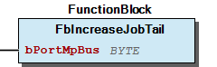
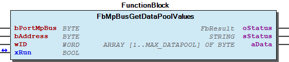

# WagoAppMP_Bus v1.1.4.4 (WAGO) - Complete Documentation

## 📋 Library Information

- **Company:** WAGO
- **Title:** WagoAppMP_Bus
- **Version:** 1.1.4.4
- **Categories:** WAGO BusinessView|Building Automation; WAGO LayerView|App; Application
- **Namespace:** WagoAppMP_Bus
- **Author:** WAGO / u015842
- **Placeholder:** WagoAppMP_Bus

### Description ¶

This document is automatically generated.

MP Bus library

This document is automatically generated. MP Bus library

### Contents: ¶

Contents: - Documentation Index 10 Documentation - WagoAppMP_Bus Library Documentation Project Information Library Information Function Blocks - FbAddJob2List (FB) - FbIncreaseJobTail (FB) - FbMpBus22Rxxx_19_1 (FB) - FbMpBusActuator (FB) - FbMpBusAddressing (FB) - FbMpBusCommand (FB) - FbMpBusConfigDataPoolValues (FB) - FbMpBusDamperAndLinearActuator (FB) - FbMpBusDamperAndValveActuator_MPL (FB) - FbMpBusDataPoolValues (FB) - ... and 29 more Functions - FuBytes2Word (FUN) - FuMakeStartByte (FUN) - FuWord2Dword (FUN) - Fu_NI1000 (FUN) - Fu_NI1000_LuS (FUN) - Fu_NTC10K (FUN) - Fu_NTC5K (FUN) - Fu_PT1000 (FUN) Methods - FbMpBusAddressing.setClassname (METH) - FbMpBusAddressing.setStatusObject (METH) - FbMpBusCommand.setClassname (METH) - FbMpBusCommand.setStatusObject (METH) - FbMpBusDataPoolValues.setClassname (METH) - FbMpBusDataPoolValues.setStatusObject (METH) - FbMpBusDevice.setClassname (METH) - FbMpBusDevice.setStatusObject (METH) - FbMpBusGenericDataTransfer.setClassname (METH) - FbMpBusGenericDataTransfer.setStatusObject (METH) - ... and 5 more Program Organization Base Components Internal Components Global Variable Lists - GlobalVariables (GVL) - Status (GVL) - VersionHistory (GVL) Other Components - 00 Administration - 00 Administration - 00 Administration - 00 Administration - 00 Administration - 00 Administration - 01 Communication - 01 Communication - 01 Communication - 01 Communication / Kommunikation - ... and 46 more

### Indices and tables ¶

Based on WagoAppMP_Bus.library, last modified 29.05.2024, 20:20:04. LibDoc 3.5.16.10

© WAGO GmbH & Co. KG, Germany 2018 – All rights reserved. For the avoidance of doubt, this copyright notice does not only apply to the information above but also and primarily to the described library itself. Please note that third-party products are always mentioned without reference to intellectual property rights, including patents, utility models, designs and trademarks, accordingly the existence of such rights cannot be excluded. WAGO is a registered trademark of WAGO Verwaltungsgesellschaft mbH.

- File and Project Information - Library Reference Based on WagoAppMP_Bus.library, last modified 29.05.2024, 20:20:04. LibDoc 3.5.16.10 © WAGO GmbH & Co. KG, Germany 2018 – All rights reserved. For the avoidance of doubt, this copyright notice does not only apply to the information above but also and primarily to the described library itself. Please note that third-party products are always mentioned without reference to intellectual property rights, including patents, utility models, designs and trademarks, accordingly the existence of such rights cannot be excluded. WAGO is a registered trademark of WAGO Verwaltungsgesellschaft mbH.

### Documentation Index

## 10 Documentation

To ensure fast installation and start-up of the units, we strongly recommend that the following information and explanations are carefully read and adhered to.

To ensure fast installation and start-up of the units, we strongly recommend that the following information and explanations are carefully read and adhered to. - doc01_Foreword (FB)

## WagoAppMP_Bus Library Documentation

| Company: | WAGO |
| Title: | WagoAppMP_Bus |
| Version: | 1.1.4.4 |
| Categories: | WAGO BusinessView\|Building Automation; WAGO LayerView\|App; Application |
| Namespace: | WagoAppMP_Bus |
| Author: | WAGO / u015842 |
| Placeholder: | WagoAppMP_Bus |

### Description

This document is automatically generated.

MP Bus library

This document is automatically generated. MP Bus library

### Contents:

- 10 Documentation doc01_Foreword (FB) 20 Program Organization Units - 01 Communication / Kommunikation - 02 Actuators / Stellantriebe - 03 Sensors / Sensoren - 04 Raw Data - 05 Conversion / Konvertierungen - 80 Data types - 82 Base 80 Status - Status (GVL) - eStatus (ENUM) 90 Internal - 01 Communication - 02 Tool - 80 Data types GlobalVariables (GVL) ParameterList (PARAMS) VersionHistory (GVL)

### Indices and tables

Based on WagoAppMP_Bus.library, last modified 29.05.2024, 20:20:04. LibDoc 3.5.16.10

© WAGO GmbH & Co. KG, Germany 2018 – All rights reserved. For the avoidance of doubt, this copyright notice does not only apply to the information above but also and primarily to the described library itself. Please note that third-party products are always mentioned without reference to intellectual property rights, including patents, utility models, designs and trademarks, accordingly the existence of such rights cannot be excluded. WAGO is a registered trademark of WAGO Verwaltungsgesellschaft mbH.

- File and Project Information - Library Reference Based on WagoAppMP_Bus.library, last modified 29.05.2024, 20:20:04. LibDoc 3.5.16.10 © WAGO GmbH & Co. KG, Germany 2018 – All rights reserved. For the avoidance of doubt, this copyright notice does not only apply to the information above but also and primarily to the described library itself. Please note that third-party products are always mentioned without reference to intellectual property rights, including patents, utility models, designs and trademarks, accordingly the existence of such rights cannot be excluded. WAGO is a registered trademark of WAGO Verwaltungsgesellschaft mbH.

### Project Information

## File and Project Information

| Scope | Name | Type | Content |
| --- | --- | --- | --- |
| FileHeader | libraryFile | string | WagoAppMP_Bus.library |
| contentFile | doc.clean.json |
| productName | e!COCKPIT |
| creationDateTime | date | 29.05.2024, 20:20:06 |
| companyName | string | WAGO |
| ProjectInformation | LastModificationDateTime | date | 29.05.2024, 20:20:04 |
| Description | string | See: Description |
| Copyright | © WAGO Kontakttechnik GmbH & Co. KG, Germany 2018 – All rights reserved. |
| Author | WAGO / u015842 |
| AutoResolveUnbound | bool | True |
| Placeholder | string | WagoAppMP_Bus |
| Company | WAGO |
| DocFormat | reStructuredText |
| Project | WagoAppMP_Bus |
| DefaultNamespace | WagoAppMP_Bus |
| Version | version | 1.1.4.4 |
| Title | string | WagoAppMP_Bus |
| LibraryCategories | library-category-list | WAGO BusinessView\|Building Automation; WAGO LayerView\|App; Application |
| CompiledLibraryCompatibilityVersion | string | CODESYS V3.5 SP16 Patch 3 |

### Library Information

## Library Reference

| LinkAllContent: False QualifiedOnly: False | SystemLibrary: False | Optional: False |

| LinkAllContent: False QualifiedOnly: False | SystemLibrary: False | Optional: False |

| LinkAllContent: False QualifiedOnly: False | SystemLibrary: False | Optional: False |

| LinkAllContent: False QualifiedOnly: False | SystemLibrary: False | Optional: False |

| LinkAllContent: False QualifiedOnly: True | SystemLibrary: False | Optional: False |

| LinkAllContent: False QualifiedOnly: False | SystemLibrary: False | Optional: False |

| LinkAllContent: False QualifiedOnly: False | SystemLibrary: False | Optional: False |

This is a dictionary of all referenced libraries and their name spaces.

This is a dictionary of all referenced libraries and their name spaces. Standard Library Identification : Placeholder: Standard Default Resolution: Standard, 3.5.7.0 (System) Namespace: Standard Library Properties : WagoSysErrorBase Library Identification : Placeholder: WagoSysErrorBase Default Resolution: WagoSysErrorBase, * (WAGO) Namespace: WagoSysErrorBase Library Properties : WagoSysPlainMem Library Identification : Placeholder: WagoSysPlainMem Default Resolution: WagoSysPlainMem, * (WAGO) Namespace: WagoSysPlainMem Library Properties : WagoSysVersion Library Identification : Name: WagoSysVersion Version: 1.0.0.0 Company: WAGO Namespace: WagoSysVersion Library Properties : WagoTypesErrorBase Library Identification : Placeholder: WagoTypesErrorBase Default Resolution: WagoTypesErrorBase, * (WAGO) Namespace: WagoTypesErrorBase Library Properties : WagoTypesModuleBase Library Identification : Placeholder: WagoTypesModuleBase Default Resolution: WagoTypesModuleBase, * (WAGO) Namespace: WagoTypesModuleBase Library Properties : WagoTypesModule_750_643 Library Identification : Placeholder: WagoTypesModule_750_643 Default Resolution: WagoTypesModule_750_643, * (WAGO) Namespace: WagoTypesModule_750_643 Library Properties :

### Function Blocks

## FbAddJob2List (FB)

| Scope | Name | Type | Initial | Comment |
| --- | --- | --- | --- | --- |
| Input | bPortMpBus | BYTE | 1 | Master number assignment - At this input you have to define the number of the master module you want to use for communication. The maximum number of master modules is defined at gp_MAX_MASTER in the ParameterList . |
| bMsgCode | BYTE |  |  |
| bMpStartByte | BYTE |  |  |
| bMpCmd | BYTE |  |  |
| bMpData1 | BYTE |  |  |
| bMpData2 | BYTE |  |  |
| bMpData3 | BYTE |  |  |
| bMpData4 | BYTE |  |  |
| bMpData5 | BYTE |  |  |
| bMpData6 | BYTE |  |  |
| Output | bJobNr | BYTE |  |  |

Mp bus auxillary function

Graphical Illustration

Interface variables Function* Mp bus auxillary function Graphical Illustration 

## FbIncreaseJobTail (FB)

| Scope | Name | Type | Initial | Comment |
| --- | --- | --- | --- | --- |
| Input | bPortMpBus | BYTE | 1 | Master number assignment - At this input you have to define the number of the master module you want to use for communication. The maximum number of master modules is defined at gp_MAX_MASTER in the ParameterList . |

Mp bus auxillary function

Graphical Illustration

Interface variables Function* Mp bus auxillary function Graphical Illustration 

## FbMpBus22Rxxx_19_1 (FB)

| Scope | Name | Type | Initial | Comment | Inherited from |
| --- | --- | --- | --- | --- | --- |
| Input | xEnable | BOOL |  | A TRUE signal at this input enable the function block | FbMpBusDevice |
| bPortMpBus | BYTE | 1 | Master number assignment - At this input you have to define the number of the master module you want to use for communication. The maximum number of master modules is defined at gp_MAX_MASTER in the ParameterList . | FbMpBusDevice |
| bAddress | BYTE |  | Slave address value range 1 – 8 | FbMpBusDevice |
| tCycleTime | TIME | TIME#5s0ms | Time for cyclical query of the drive. Value range t#1s – t#60s. | FbMpBusDevice |
| Output | oStatus | WagoSysErrorBase.FbResult |  | Status object. (Listed in Status ) The content of the error object could be displayed via the FbShowResult from the WagoSysErrorBase library. | FbMpBusDevice |
| sStatus | STRING |  | Status description as string (Listed in Status ) | FbMpBusDevice |
| xReady | BOOL | TRUE | TRUE: Module is ready for operation. ; FALSE: Ongoing operation or no communication. | FbMpBusDevice |
| Inout | typConfig22Rxxx_19_1 | typConfig22Rxxx_19_1 |  | Config parameters of the room sensor |  |
| Output | rTemperature | REAL |  | Actual room temperature |  |
| rRelativeHumidity | REAL |  | Actual room humidity |  |
| rCO2 | REAL |  | Actual CO2 concentration of the room |  |
| rDewPointTemp | REAL |  | Actual dew point of the room |  |
| xDigitalInput | BOOL |  | Status of the digital input of the room sensor |  |
| xTemperatureSensorFault | BOOL |  | Temperature sensor fault on the room sensor |  |
| xHumiditySensorFault | BOOL |  | Humidity sensor fault on the room sensor |  |
| xCO2_SensorFault | BOOL |  | CO2 sensor fault on the room sensor |  |

The function block is to communicate with the room sensor 22R...-19-1.

The room sensor can be addressed with the Belimo Assistant App.

Graphical Illustration

Function description

To address the function block to the required MP-Bus module, the corresponding module index must be entered as a constant at the bModule_750_643 input. The controller detects the connected MP-Bus modules independently and counts them starting with 1 from the left. A rising edge at the xEnable input starts the transmission and query process at the drive addressed via the bAddress input. If the xEnable input signal is permanently switched to the TRUE signal, then communication occurs cyclically. The tCycleTime input parameter determines the cycle time. The sensor can be configured with „typConfig22Rxxx_19_1`` . The temperature value read is displayed at the rTemperature output. The current humidity, CO2, and dew point of the room are indicated at the rRelativeHumidity , rCO2 , and „rDewPointTemp`` outputs respectively. „xDigitalInput`` displays tha ctual status oft he digital input oft he room sensor.

Three possible error states of the combination sensor are indicated at the outputs:

The xReady output signal indicates whether the function block has completed the transmission process or if it is still actively connected to one of the slaves. Communication errors with the drive in question are displayed at the bfeedback output.

For sensors before May 2022!

Interface variables Function The function block is to communicate with the room sensor 22R...-19-1. The room sensor can be addressed with the Belimo Assistant App. Graphical Illustration  Function description To address the function block to the required MP-Bus module, the corresponding module index must be entered as a constant at the bModule_750_643 input. The controller detects the connected MP-Bus modules independently and counts them starting with 1 from the left. A rising edge at the xEnable input starts the transmission and query process at the drive addressed via the bAddress input. If the xEnable input signal is permanently switched to the TRUE signal, then communication occurs cyclically. The tCycleTime input parameter determines the cycle time. The sensor can be configured with „typConfig22Rxxx_19_1`` . The temperature value read is displayed at the rTemperature output. The current humidity, CO2, and dew point of the room are indicated at the rRelativeHumidity , rCO2 , and „rDewPointTemp`` outputs respectively. „xDigitalInput`` displays tha ctual status oft he digital input oft he room sensor. Three possible error states of the combination sensor are indicated at the outputs: - xTemperatureSensorFault indicates that the temperature sensor is defective or unavailable. - xHumiditySensorFault indicates that the humidity sensor is defective/unavailable. - xCO2_SensorFault indicates that the CO2 sensor is defective/unavailable. The xReady output signal indicates whether the function block has completed the transmission process or if it is still actively connected to one of the slaves. Communication errors with the drive in question are displayed at the bfeedback output. For sensors before May 2022!

## FbMpBusActuator (FB)

| Scope | Name | Type | Initial | Comment | Inherited from |
| --- | --- | --- | --- | --- | --- |
| Input | xEnable | BOOL |  | A TRUE signal at this input enable the function block | FbMpBusDevice |
| bPortMpBus | BYTE | 1 | Master number assignment - At this input you have to define the number of the master module you want to use for communication. The maximum number of master modules is defined at gp_MAX_MASTER in the ParameterList . | FbMpBusDevice |
| bAddress | BYTE |  | Slave address value range 1 – 8 | FbMpBusDevice |
| tCycleTime | TIME | TIME#5s0ms | Time for cyclical query of the drive. Value range t#1s – t#60s. | FbMpBusDevice |
| Output | oStatus | WagoSysErrorBase.FbResult |  | Status object. (Listed in Status ) The content of the error object could be displayed via the FbShowResult from the WagoSysErrorBase library. | FbMpBusDevice |
| sStatus | STRING |  | Status description as string (Listed in Status ) | FbMpBusDevice |
| xReady | BOOL | TRUE | TRUE: Module is ready for operation. ; FALSE: Ongoing operation or no communication. | FbMpBusDevice |

Base class for MP-Bus actuator

Graphical Illustration

Interface variables Function Base class for MP-Bus actuator Graphical Illustration 

## FbMpBusAddressing (FB)

| Scope | Name | Type | Initial | Comment |
| --- | --- | --- | --- | --- |
| Input | bPortMpBus | BYTE | 1 | Master assignment number. Range 1 to gp_MaxMaster. |
| bAddress | BYTE |  | Slave address |
| xSet | BOOL |  | A rising edge at this input starts the addressing via the input of the serial number. |
| xGetSerialNo | BOOL |  | A rising edge at this input initiates reading of the serial number. |
| typINSerialNo | typSerialNo |  | Serial number of the slave to be addressed. The serial number consists of the following parts: |
| tMaxLearnTime | TIME | TIME#2m0s0ms | Maximum duration of the learning mode. |
| Inout | xLearn | BOOL |  | learning mode. Then trigger the signal at the MP-bus drive for sending the device ID (see operating instructions for the drives). If the address assignment was successful, the input will be reset by the function block. |
| Output | oStatus | WagoSysErrorBase.FbResult |  | Status object. (Listed in Status ) The content of the error object could be displayed via the FbShowResult from the WagoAppErrorBase library. |
| sStatus | STRING |  | Status description as string (Listed in Status ) |
| xReady | BOOL |  | TRUE: Module is ready for operation. ; FALSE: Ongoing operation or no communication. |
| typOUTSerialNo | typSerialNo |  | Output of the serial number received |

Function By using this function block, the connected MP-bus drive can be assigned with a unique MP-bus address.

Graphical Illustration

Function description

The addressing can be performed in two different ways:

Type 1: semi-automatic addressing by activating the service pin: The desired MP participant address is entered at the ‘’bAddress’’ input. Switch the ‘’xLearn’’ input to the TRUE signal, so that the function block goes into learning mode. Then trigger the signal at the MP-bus drive for sending the device ID (see operating instructions for the drives). If the address assignment was successful, the ‘’xLearn’’ input will be reset by the function block. If no service pin is activated at one of the connected drives within the parameterizable time ‘’tMaxLearnTime’’ or if communication is interrupted, the learning mode is automatically interrupted and an error message is shown at the status object.

Type 2: addressing via manual entry of the serial number: The desired MP-bus address is entered at the ‘’bAddress’’ input. The serial number of the drive to be addressed is entered at the ‘’typINSerialNumber’’ input (serial number is on the drive’s name plate). A rising edge at the ‘’xSet’’ input triggers the command for addressing the drive via the specified serial number. If the command is not correctly acknowledged by the slave, an error message is shown at status object. A rising edge at the ‘’GetSerialNo’’ input starts the query command for the serial number. The query is directed at the drive with the address specified at the input ‘’bAddress’‘. The queried serial number is displayed at the ‘’typOUTSerialNo’’ output.

The address assignment is also possible using a BELIMO MFT parameterizing device (MFT-H hand-held device or MFT-P PC tool).

Interface variables Function By using this function block, the connected MP-bus drive can be assigned with a unique MP-bus address. Graphical Illustration  Function description The addressing can be performed in two different ways: Type 1: semi-automatic addressing by activating the service pin: The desired MP participant address is entered at the ‘’bAddress’’ input. Switch the ‘’xLearn’’ input to the TRUE signal, so that the function block goes into learning mode. Then trigger the signal at the MP-bus drive for sending the device ID (see operating instructions for the drives). If the address assignment was successful, the ‘’xLearn’’ input will be reset by the function block. If no service pin is activated at one of the connected drives within the parameterizable time ‘’tMaxLearnTime’’ or if communication is interrupted, the learning mode is automatically interrupted and an error message is shown at the status object. Type 2: addressing via manual entry of the serial number: The desired MP-bus address is entered at the ‘’bAddress’’ input. The serial number of the drive to be addressed is entered at the ‘’typINSerialNumber’’ input (serial number is on the drive’s name plate). A rising edge at the ‘’xSet’’ input triggers the command for addressing the drive via the specified serial number. If the command is not correctly acknowledged by the slave, an error message is shown at status object. A rising edge at the ‘’GetSerialNo’’ input starts the query command for the serial number. The query is directed at the drive with the address specified at the input ‘’bAddress’‘. The queried serial number is displayed at the ‘’typOUTSerialNo’’ output. Note The address assignment is also possible using a BELIMO MFT parameterizing device (MFT-H hand-held device or MFT-P PC tool). - 00 Administration FbMpBusAddressing.setClassname (METH) 80 Status - FbMpBusAddressing.setStatusObject (METH)

## FbMpBusCommand (FB)

| Scope | Name | Type | Initial | Comment |
| --- | --- | --- | --- | --- |
| Input | bPortMpBus | BYTE | 1 | Master number assignment - At this input you have to define the number of the master module you want to use for communication. The maximum number of master modules is defined at gp_MAX_MASTER in the ParameterList . |
| bAddress | BYTE |  | Device address value range 1 - 8 |
| bCMD | BYTE |  | MP bus command |
| abMpData | ARRAY [1..6] OF BYTE |  | Mp Data bytes |
| bLen | BYTE |  | Number of MpData bytes. Max 6 bytes |
| Inout | xRun | BOOL |  | TRUE signal on this input starts the transmission process. |
| Output | oStatus | WagoSysErrorBase.FbResult |  | Status object. (Listed in Status ) The content of the error object could be displayed via the FbShowResult from the WagoSysErrorBase library. |
| sStatus | STRING |  | Status description as string (Listed in Status ) |
| aData | ARRAY [1..7] OF BYTE |  | Read bytes |

This function block is used to send single MP commands.

Graphical Illustration

Function description

Not supported command(bCMD):

May not support third party MP Commands.

Interface variables Function This function block is used to send single MP commands. 1. Up to 7 read bytes. (aData). 2. Up to 6 send bytes (aMpData). Graphical Illustration  Function description Not supported command(bCMD): 1. CMD_SET_DATA (To set data to the data pool) 2. CMD_GET_DATA (To read data from the data pool ) 3. CMD_SET_NEXTBLOCK (To set long data to the data pool ) 4. CMD_GET_NEXTBLOCK (To read long data from the data pool ) Note May not support third party MP Commands. - 00 Administration FbMpBusCommand.setClassname (METH) 80 Status - FbMpBusCommand.setStatusObject (METH)

## FbMpBusConfigDataPoolValues (FB)

| Scope | Name | Type | Comment | Inherited from |
| --- | --- | --- | --- | --- |
| Input | bPortMpBus | BYTE | Master number assignment - At this input you have to define the number of the master module you want to use for communication. The maximum number of master modules is defined at gp_MAX_MASTER in the ParameterList . | FbMpBusDataPoolValues |
| bAddress | BYTE | Device address value range 1 - 8 (16) | FbMpBusDataPoolValues |
| wID | WORD | ID of the data pool | FbMpBusDataPoolValues |
| Output | oStatus | WagoSysErrorBase.FbResult | Status object. (Listed in Status ) The content of the error object could be displayed via the FbShowResult from the WagoSysErrorBase library. | FbMpBusDataPoolValues |
| sStatus | STRING | Status description as string (Listed in Status ) | FbMpBusDataPoolValues |
| Input | dwPassword | DWORD | Device Password |  |
| bSize | BYTE | Size of Config data bytes |  |
| aData | ARRAY [1..MAX_DATAPOOL] OF BYTE | configuration data |  |
| Inout | xRun | BOOL | TRUE signal on this input starts the process and reset automatically when finished |  |

The function block is to configure data-pool values. The configuration data is password protected.

Graphical Illustration

Function description

The configuration data are stored in a so-called Data-Pool-Values data register. Each data register is designated with an identification number, which must be specified during the write process using the wID input. The size of the data register to be written is specified at the bSize input. Writing the configuration data is password protected. The password can be entered at the dwPassword input in order to enable access for writing the configuration data. The release is carried out by the MP-Log-in command.

Example: The upper limit of the flow rate (Vmax) of the P6065W800EV-BAC control ball valve is configured (see figure below). The control ball valve has the address 4 and the preset password is 16#0000 .

The following specifications are required to execute the configuration: bAddress = 4 wID = 101 dwPassword = 16#0000

The abDataPool contains the write data bytes. An array index is available for each data storage value. Since the upper limit value is the size of 2 bytes, only the first two elements of the array are registered and the bSize input is specified with the value 2 . abDataPool[1] = Limiting value high byte abDataPool[2] = Limiting value low byte

By setting the xSet to TRUE , the configuration on the device addressed via the bAddress input starts. If the configuration is successful or is aborted, then the xConfig input is reset by the module. The configuration is carried out by MP_Set_Data and MP_Set_NextBlock commands at the corresponding data register. The xReady output signal indicates whether the function block has completed the transmission process or if it is still actively connected to one of the slaves.

Interface variables Function The function block is to configure data-pool values. The configuration data is password protected. Graphical Illustration  Function description The configuration data are stored in a so-called Data-Pool-Values data register. Each data register is designated with an identification number, which must be specified during the write process using the wID input. The size of the data register to be written is specified at the bSize input. Writing the configuration data is password protected. The password can be entered at the dwPassword input in order to enable access for writing the configuration data. The release is carried out by the MP-Log-in command. Example: The upper limit of the flow rate (Vmax) of the P6065W800EV-BAC control ball valve is configured (see figure below). The control ball valve has the address 4 and the preset password is 16#0000 .  The following specifications are required to execute the configuration: bAddress = 4 wID = 101 dwPassword = 16#0000 The abDataPool contains the write data bytes. An array index is available for each data storage value. Since the upper limit value is the size of 2 bytes, only the first two elements of the array are registered and the bSize input is specified with the value 2 . abDataPool[1] = Limiting value high byte abDataPool[2] = Limiting value low byte By setting the xSet to TRUE , the configuration on the device addressed via the bAddress input starts. If the configuration is successful or is aborted, then the xConfig input is reset by the module. The configuration is carried out by MP_Set_Data and MP_Set_NextBlock commands at the corresponding data register. The xReady output signal indicates whether the function block has completed the transmission process or if it is still actively connected to one of the slaves.

## FbMpBusDamperAndLinearActuator (FB)

| Scope | Name | Type | Initial | Comment | Inherited from |
| --- | --- | --- | --- | --- | --- |
| Input | xEnable | BOOL |  | A TRUE signal at this input enable the function block | FbMpBusDevice |
| bPortMpBus | BYTE | 1 | Master number assignment - At this input you have to define the number of the master module you want to use for communication. The maximum number of master modules is defined at gp_MAX_MASTER in the ParameterList . | FbMpBusDevice |
| bAddress | BYTE |  | Slave address value range 1 – 8 | FbMpBusDevice |
| tCycleTime | TIME | TIME#5s0ms | Time for cyclical query of the drive. Value range t#1s – t#60s. | FbMpBusDevice |
| Output | oStatus | WagoSysErrorBase.FbResult |  | Status object. (Listed in Status ) The content of the error object could be displayed via the FbShowResult from the WagoSysErrorBase library. | FbMpBusDevice |
| sStatus | STRING |  | Status description as string (Listed in Status ) | FbMpBusDevice |
| xReady | BOOL | TRUE | TRUE: Module is ready for operation. ; FALSE: Ongoing operation or no communication. | FbMpBusDevice |
| Input | rPosition | REAL |  | Control input Value range 0 – 100 [%] |  |
| bSensorType | BYTE |  | Sensor selection |  |
| xReset | BOOL |  | A rising edge resets the error message from the MP-bus drive |  |
| Output | rOutPosition | REAL |  | Actual position of the drive [%] |  |
| wSensorValue | WORD |  | Output signal of the sensor [raw value] |  |
| xControlRangeIncreased | BOOL |  | Message control range increased |  |
| xMecanicalOverload | BOOL |  | Message mechanical overload |  |
| xActuatorHunting | BOOL |  | drive oscillates here and there |  |
| xSensorError | BOOL |  | sensor signal is outside of the value range. |  |

This function block serves to query and control the rotary damper and linear actuator with MP-bus interface from BELIMO (e.g. NM, AM, GM, LF, AF, NV, AV, NVS, AVS).

Graphical Illustration

Function description

This module serves to query and control the rotary damper and linear actuator with MP-bus interface from BELIMO (e.g., NM, AM, GM, LF, AF, NV, AV, NVS, AVS). A rising edge at the xEnable input starts the transmission and query process at the drive addressed via the bAddress input. If the input signal xEnable is permanently switched to the TRUE signal, then communication occurs cyclically. The tCycleTime input parameter determines the cycle time. The setpoint for the rotational angle of the damper or for the stroke of the valve drive is specified by the rPosition input value and sent to the drive. The current position of the drive is read by the function block and provided at the rOutPosition output. Since most MP-Bus drives support the connection to multiple types of sensors, the sensor type must be communicated to the module via the bSensorType input. The sensor value read is displayed at the wSensorValue output. The switch status (sensor type 1) is evaluated as follows:

1 : open 0 : closed

For active sensors (0 – 32 V), the measurement value is depicted as follows:

The following auxiliary functions can be used for temperature sensors:

Fu_Ni1000 (-25 … 95 °C) Fu_Ni1000_LuS (-30 … 115 °C) Fu_NTC5K (-20 … 145 °C) Fu_Pt1000 (-35 … 155 °C)

The output signal xReady indicates whether the function block has completed the transmission process or if it is still connected to one of the slaves. Communication errors with the drive in question are displayed at the bfeedback output. If the module detects a fault (e.g., range exceeded) of the sensor signal, then the xSensorError output signal is set to the TRUE signal.

A rising edge at the xReset input resets the error messages.

The xActuatorHunting error message can only be permanently cleared by resetting the internal operating hours counter for the drive. This reset is possible if the relationship between runtime and total operating time does not exceed a particular value.

Interface variables Function This function block serves to query and control the rotary damper and linear actuator with MP-bus interface from BELIMO (e.g. NM, AM, GM, LF, AF, NV, AV, NVS, AVS). Graphical Illustration  Function description This module serves to query and control the rotary damper and linear actuator with MP-bus interface from BELIMO (e.g., NM, AM, GM, LF, AF, NV, AV, NVS, AVS). A rising edge at the xEnable input starts the transmission and query process at the drive addressed via the bAddress input. If the input signal xEnable is permanently switched to the TRUE signal, then communication occurs cyclically. The tCycleTime input parameter determines the cycle time. The setpoint for the rotational angle of the damper or for the stroke of the valve drive is specified by the rPosition input value and sent to the drive. The current position of the drive is read by the function block and provided at the rOutPosition output. Since most MP-Bus drives support the connection to multiple types of sensors, the sensor type must be communicated to the module via the bSensorType input. The sensor value read is displayed at the wSensorValue output. The switch status (sensor type 1) is evaluated as follows: 1 : open 0 : closed For active sensors (0 – 32 V), the measurement value is depicted as follows: wSensorValue 0 – 32000 mV. The following auxiliary functions can be used for temperature sensors: Fu_Ni1000 (-25 … 95 °C) Fu_Ni1000_LuS (-30 … 115 °C) Fu_NTC5K (-20 … 145 °C) Fu_Pt1000 (-35 … 155 °C) The output signal xReady indicates whether the function block has completed the transmission process or if it is still connected to one of the slaves. Communication errors with the drive in question are displayed at the bfeedback output. If the module detects a fault (e.g., range exceeded) of the sensor signal, then the xSensorError output signal is set to the TRUE signal. Three possible error states of the actuator are indicated via separate outputs at the function module. These concern the following errors: - TRUE signal at the xControlRangeIncreased output indicates that the control range of the drive has increased or that the end position has been exceeded. - TRUE signal at the MechanicalOverload output means that the required target position could not be reached, e.g., due to mechanical overload. - TRUE signal at the xActuatorHunting output indicates that there are control oscillations. In this state, the control signal of the drive oscillates back and forth. A rising edge at the xReset input resets the error messages. Note The xActuatorHunting error message can only be permanently cleared by resetting the internal operating hours counter for the drive. This reset is possible if the relationship between runtime and total operating time does not exceed a particular value.

## FbMpBusDamperAndValveActuator_MPL (FB)

| Scope | Name | Type | Initial | Comment | Inherited from |
| --- | --- | --- | --- | --- | --- |
| Input | xEnable | BOOL |  | A TRUE signal at this input enable the function block | FbMpBusDevice |
| bPortMpBus | BYTE | 1 | Master number assignment - At this input you have to define the number of the master module you want to use for communication. The maximum number of master modules is defined at gp_MAX_MASTER in the ParameterList . | FbMpBusDevice |
| bAddress | BYTE |  | Slave address value range 1 – 8 | FbMpBusDevice |
| tCycleTime | TIME | TIME#5s0ms | Time for cyclical query of the drive. Value range t#1s – t#60s. | FbMpBusDevice |
| Output | oStatus | WagoSysErrorBase.FbResult |  | Status object. (Listed in Status ) The content of the error object could be displayed via the FbShowResult from the WagoSysErrorBase library. | FbMpBusDevice |
| sStatus | STRING |  | Status description as string (Listed in Status ) | FbMpBusDevice |
| xReady | BOOL | TRUE | TRUE: Module is ready for operation. ; FALSE: Ongoing operation or no communication. | FbMpBusDevice |
| Input | rPosition | REAL |  | Position in % |  |
| Output | rOutPosition | REAL |  | Actual position drive in % |  |

This function block serves to query and control the rotary drive zone using the MP-bus interface from BELIMO (e.g. CQ24A).

Graphical Illustration

Function description

A rising edge at the xEnable input starts the transmission and query process at the drive addressed via the bAddress input. If the xEnable input signal is permanently switched to the TRUE signal, then communication occurs cyclically. The tCycleTime input parameter determines the cycle time. The setpoint for the rotational angle is specified by the rPosition input value and sent to the drive. The current position of the drive is read by the function block and provided at the rOutPosition output. The output signal xReady indicates whether the function block has completed the transmission process or if it is still connected to one of the slaves.

When using MPL valve actuators exclusively, up to 16 of the devices can be operated on the MP-Bus Master (750-643).

Interface variables Function This function block serves to query and control the rotary drive zone using the MP-bus interface from BELIMO (e.g. CQ24A). Graphical Illustration  Function description A rising edge at the xEnable input starts the transmission and query process at the drive addressed via the bAddress input. If the xEnable input signal is permanently switched to the TRUE signal, then communication occurs cyclically. The tCycleTime input parameter determines the cycle time. The setpoint for the rotational angle is specified by the rPosition input value and sent to the drive. The current position of the drive is read by the function block and provided at the rOutPosition output. The output signal xReady indicates whether the function block has completed the transmission process or if it is still connected to one of the slaves. Note When using MPL valve actuators exclusively, up to 16 of the devices can be operated on the MP-Bus Master (750-643).

## FbMpBusDataPoolValues (FB)

| Scope | Name | Type | Comment |
| --- | --- | --- | --- |
| Input | bPortMpBus | BYTE | Master number assignment - At this input you have to define the number of the master module you want to use for communication. The maximum number of master modules is defined at gp_MAX_MASTER in the ParameterList . |
| bAddress | BYTE | Device address value range 1 - 8 (16) |
| wID | WORD | ID of the data pool |
| Output | oStatus | WagoSysErrorBase.FbResult | Status object. (Listed in Status ) The content of the error object could be displayed via the FbShowResult from the WagoSysErrorBase library. |
| sStatus | STRING | Status description as string (Listed in Status ) |

Base class for data pool device

Graphical Illustration

Interface variables Function Base class for data pool device Graphical Illustration  - 00 Administration FbMpBusDataPoolValues.setClassname (METH) 80 Status - FbMpBusDataPoolValues.setStatusObject (METH)

## FbMpBusDevice (FB)

| Scope | Name | Type | Initial | Comment |
| --- | --- | --- | --- | --- |
| Input | xEnable | BOOL |  | A TRUE signal at this input enable the function block |
| bPortMpBus | BYTE | 1 | Master number assignment - At this input you have to define the number of the master module you want to use for communication. The maximum number of master modules is defined at gp_MAX_MASTER in the ParameterList . |
| bAddress | BYTE |  | Slave address value range 1 – 8 |
| tCycleTime | TIME | TIME#5s0ms | Time for cyclical query of the drive. Value range t#1s – t#60s. |
| Output | oStatus | WagoSysErrorBase.FbResult |  | Status object. (Listed in Status ) The content of the error object could be displayed via the FbShowResult from the WagoSysErrorBase library. |
| sStatus | STRING |  | Status description as string (Listed in Status ) |
| xReady | BOOL | TRUE | TRUE: Module is ready for operation. ; FALSE: Ongoing operation or no communication. |

Base class for a MP-Bus device

Graphical Illustration

Interface variables Function Base class for a MP-Bus device Graphical Illustration  - 00 Administration FbMpBusDevice.setClassname (METH) 80 Status - FbMpBusDevice.setStatusObject (METH)

## FbMpBusEPIV_2way_valve (FB)

| Scope | Name | Type | Initial | Comment | Inherited from |
| --- | --- | --- | --- | --- | --- |
| Input | xEnable | BOOL |  | A TRUE signal at this input enable the function block | FbMpBusDevice |
| bPortMpBus | BYTE | 1 | Master number assignment - At this input you have to define the number of the master module you want to use for communication. The maximum number of master modules is defined at gp_MAX_MASTER in the ParameterList . | FbMpBusDevice |
| bAddress | BYTE |  | Slave address value range 1 – 8 | FbMpBusDevice |
| tCycleTime | TIME | TIME#5s0ms | Time for cyclical query of the drive. Value range t#1s – t#60s. | FbMpBusDevice |
| Output | oStatus | WagoSysErrorBase.FbResult |  | Status object. (Listed in Status ) The content of the error object could be displayed via the FbShowResult from the WagoSysErrorBase library. | FbMpBusDevice |
| sStatus | STRING |  | Status description as string (Listed in Status ) | FbMpBusDevice |
| xReady | BOOL | TRUE | TRUE: Module is ready for operation. ; FALSE: Ongoing operation or no communication. | FbMpBusDevice |
| Input | rSetRelativeSetpoint | REAL |  | Set relative setpoint in % |  |
| bSetOverride | BYTE |  | Override control : 0= Auto: no manual override, 1= Open valve , 2= Close valve , 3= Min Flow 4= - 5= Max Flow 6= Nom Flow 7= - 8= - 9= - 10= Motor Stop |  |
| Output | rRelativePosition | REAL |  | Valve position [%] |  |
| rAbsolutePosition | REAL |  | Valve opening angle [°] |  |
| wSensorValue | WORD |  | Current value of sensor 1, depending on the setting of the Sensor 1 Type [mV or Ohm] |  |
| rRelativeFlow | REAL |  | Relative Volumetric Flow [%] |  |
| rAbsoluteFlow | REAL |  | Absolute Volumetric Flow [l/min] |  |
| rGlycolConcentration | REAL |  | Glycol Concentration [%] |  |
| rTemperature | REAL |  | Temperature (integrated) [°C] |  |
| rTotalVolume | REAL |  | Total Volume [m3] |  |
| wServiceInfo | WORD |  | Malfunction and Service Information Bit00 (1) = No communication to actuator Bit01 (2) = Gear disengaged Bit02 (4) = Actuator cannot move Bit03 (8) = Reverse flow Bit04 (16) = Flow setpoint not reached Bit05 (32) = Flow with closed valve Bit06 (64) = Actual flow > Vnom Bit07 (128) = Flow measurement error Bit08 (256) = - Bit09 (512) = Integrated temperature error Bit10 (1024) = - Bit11 (2048) = Freeze warning Bit12 (4096) = Glycol detected Bit13 (8192) = Bus watchdog triggered |  |
| rSetpointAnalog | REAL |  | Shows the setpoint in % if the actuator is controlled by analog signal |  |

| Product Model Number | Remark |
| --- | --- |
| EP...R2+(K)BAC | Version 4, DN 15...50 |

This function block serves to query and control the Belimo energy valve with thermal energy meter (TEM) This description is valid for models:

Graphical Illustration

Function description

A rising edge at the xEnable input starts the transmission and query process at the 2-way PI-Valve addressed via the bAddress input. If the input signal xEnable is permanently switched to the TRUE signal, then communication occurs cyclically. The tCycleTime input parameter determines the cycle time. The 2-way PI-Valve can be controlled in manual operation at bSetOverride input. The current control signal can be over-ridden using manual operation. The value range for bSetOverride is documented in the data sheet (Data Pool Values) of the BELIMO drive.

The xReady output signal indicates whether the function block has completed the transmission process or if it is still actively connected to one of the slaves.

Interface variables Function This function block serves to query and control the Belimo energy valve with thermal energy meter (TEM) This description is valid for models: Graphical Illustration  Function description A rising edge at the xEnable input starts the transmission and query process at the 2-way PI-Valve addressed via the bAddress input. If the input signal xEnable is permanently switched to the TRUE signal, then communication occurs cyclically. The tCycleTime input parameter determines the cycle time. The 2-way PI-Valve can be controlled in manual operation at bSetOverride input. The current control signal can be over-ridden using manual operation. The value range for bSetOverride is documented in the data sheet (Data Pool Values) of the BELIMO drive. The following values can be used: - bSetOverride =``0`` -> None: Auto no manual override. - bSetOverride =``1`` -> Open Valve - bSetOverride =``2`` -> Close Valve - bSetOverride =``3`` -> Min Flow - bSetOverride =``4`` -> – - bSetOverride =``5`` -> Max Flow - bSetOverride =``6`` -> Nom Flow - bSetOverride =``7`` -> – - bSetOverride =``8`` -> – - bSetOverride =``9`` -> – - bSetOverride =``10`` -> Motor Stop The xReady output signal indicates whether the function block has completed the transmission process or if it is still actively connected to one of the slaves.

## FbMpBusEPIV_6way_valve (FB)

| Scope | Name | Type | Initial | Comment | Inherited from |
| --- | --- | --- | --- | --- | --- |
| Input | xEnable | BOOL |  | A TRUE signal at this input enable the function block | FbMpBusDevice |
| bPortMpBus | BYTE | 1 | Master number assignment - At this input you have to define the number of the master module you want to use for communication. The maximum number of master modules is defined at gp_MAX_MASTER in the ParameterList . | FbMpBusDevice |
| bAddress | BYTE |  | Slave address value range 1 – 8 | FbMpBusDevice |
| tCycleTime | TIME | TIME#5s0ms | Time for cyclical query of the drive. Value range t#1s – t#60s. | FbMpBusDevice |
| Output | oStatus | WagoSysErrorBase.FbResult |  | Status object. (Listed in Status ) The content of the error object could be displayed via the FbShowResult from the WagoSysErrorBase library. | FbMpBusDevice |
| sStatus | STRING |  | Status description as string (Listed in Status ) | FbMpBusDevice |
| xReady | BOOL | TRUE | TRUE: Module is ready for operation. ; FALSE: Ongoing operation or no communication. | FbMpBusDevice |
| Input | rSetRelativeSetpoint | REAL |  | Setpoint in % |  |
| bSetOverride | BYTE |  | override control 0 = None, 1 = Seq1Open (FbPos: 0%), 2 = Seq2_Open (FbPos: 100%), 3 = Close (FbPos: 50%), 4 = Seq1Vmax, 5 = Seq2Vmax |  |
| xReadConfig | BOOL |  | Rising edge reads configuration |  |
| xWriteConfig | BOOL |  | Rising edge writes configuration |  |
| Output | rAbsolutePosition | REAL |  | Absolute Position [°] |  |
| rRelativePosition | REAL |  | Relative Position [%] |  |
| rAbsoluteFlow | REAL |  | Absolute Flow [l/h] |  |
| rRelativeFlow | REAL |  | Relative Flow [%] |  |
| rAbsolute_Vnom | REAL |  | Absolute Vnom [l/h] |  |
| wServiceInfo | WORD |  | Bit00 (1) = Bit01 (2) = Bit02 (4) = Error flow Sensor Bit03 (8) = Actuator can’t move Bit04 (16) = Flow with closed valve Bit05 (32) = Airbubbles Bit06 (64) = Flow not reached Bit07 (128) = Bit08 (256) = Bit09 (512) = Gear disengaged Bit10 (1024) = Bit11 (2048) = |  |
| bActiveSequence | BYTE |  | Active Sequence |  |
| Inout | typConfigParameters | typConfigEPIV_6way_valve |  | Configuration parameters |  |

The function block is used for Electronic pressure independent 6-way characterised control valves using the MP-bus interface from BELIMO (e.g. Typ EP015R-R6+BAC).

Graphical Illustration

Function description

A rising edge at the xEnable input starts the transmission and query process at the zone valve addressed at the bAddress input. If the input signal xEnable is permanently switched to the TRUE signal, then communication occurs cyclically. The tCycleTime input parameter determines the cycle time. The relative setpoint is specified at the rSetRelativeSetpoint input. Manual override is possible by the value at the bSetOverride input. The value range for bSetOverride is documented in the data sheet (Data Pool Values) of the BELIMO drive.

A rising edge at the xReadConfig input causes a readout of the configuration parameters. The read values are written to the linked variable at the typConfigEPIV_6way_valve input. The values of the configuration parameters are written to the zone valve by a rising edge at the xWriteConfig input. The module returns the following return values for the zone valve:

The xReady output signal indicates whether the function block has completed the transmission process or if it is still actively connected to one of the slaves.

Interface variables Function The function block is used for Electronic pressure independent 6-way characterised control valves using the MP-bus interface from BELIMO (e.g. Typ EP015R-R6+BAC). Graphical Illustration  Function description A rising edge at the xEnable input starts the transmission and query process at the zone valve addressed at the bAddress input. If the input signal xEnable is permanently switched to the TRUE signal, then communication occurs cyclically. The tCycleTime input parameter determines the cycle time. The relative setpoint is specified at the rSetRelativeSetpoint input. Manual override is possible by the value at the bSetOverride input. The value range for bSetOverride is documented in the data sheet (Data Pool Values) of the BELIMO drive. The following values can be used: - bSetOverride =``0`` -> Auto: no manual override. - bSetOverride =``1`` -> Sequence 1 valve opened (Pos. 0 %) - bSetOverride =``2`` -> Sequence 2 valve opened (Pos. 100 %) - bSetOverride =``3`` -> Valve closed (Pos. 50 %) - bSetOverride =``4`` -> Sequence 1 Vmax - bSetOverride =``5`` -> Sequence 2 Vmax A rising edge at the xReadConfig input causes a readout of the configuration parameters. The read values are written to the linked variable at the typConfigEPIV_6way_valve input. The values of the configuration parameters are written to the zone valve by a rising edge at the xWriteConfig input. The module returns the following return values for the zone valve: - Absolute position of the drive in [°] ( rAbsolutePosition ) - Relative position of the drive in [%] ( rRelativePosition ) - Relative flow rate in [%] from Vmax (Vmax1 or Vmax2) ( rRelativeFlow ) - Nominal volume in [l/h] ( rAbsolute_Vnom ) - Status information of the zone valve ( wServiceInfo ) - Display of the active sequence ( bActiveSequence ) The xReady output signal indicates whether the function block has completed the transmission process or if it is still actively connected to one of the slaves.

## FbMpBusEnergyValve (FB)

| Scope | Name | Type | Initial | Comment | Inherited from |
| --- | --- | --- | --- | --- | --- |
| Input | xEnable | BOOL |  | A TRUE signal at this input enable the function block | FbMpBusDevice |
| bPortMpBus | BYTE | 1 | Master number assignment - At this input you have to define the number of the master module you want to use for communication. The maximum number of master modules is defined at gp_MAX_MASTER in the ParameterList . | FbMpBusDevice |
| bAddress | BYTE |  | Slave address value range 1 – 8 | FbMpBusDevice |
| tCycleTime | TIME | TIME#5s0ms | Time for cyclical query of the drive. Value range t#1s – t#60s. | FbMpBusDevice |
| Output | oStatus | WagoSysErrorBase.FbResult |  | Status object. (Listed in Status ) The content of the error object could be displayed via the FbShowResult from the WagoSysErrorBase library. | FbMpBusDevice |
| sStatus | STRING |  | Status description as string (Listed in Status ) | FbMpBusDevice |
| xReady | BOOL | TRUE | TRUE: Module is ready for operation. ; FALSE: Ongoing operation or no communication. | FbMpBusDevice |
| Input | rSetRelativeSetpoint | REAL |  | Set relative setpoint in % |  |
| bSetOverride | BYTE |  | Override control : 1= Auto: no manual override, 2= Open: valve is closed, 3= Open: valve is opened completely, 6= Stop: the drive continues in the current position |  |
| Output | rRelativeSetpoint | REAL |  | Actual value [%] |  |
| bOverride | BYTE |  | Override operation |  |
| rRelativePosition | REAL |  | Valve position [%] |  |
| rAbsolutePosition | REAL |  | Valve opening angle [°] |  |
| rRelativeFlow | REAL |  | Flow rate difference [%] |  |
| rAbsoluteFlow | REAL |  | Flow rate [l/min] |  |
| rTemperature1 | REAL |  | Return temperature [°C] |  |
| rTemperature2 | REAL |  | Supply temperature [°C] |  |
| rDeltaTemperature | REAL |  | Temperature difference [°C] |  |
| rPower | REAL |  | Output [kW] |  |
| rCoolingEnergy | REAL |  | Cooling energy [kWh] |  |
| rHeatingEnergy | REAL |  | Heating energy [kWh] |  |
| xTemperatureSensorT1_Error | BOOL |  | Return temperature sensor unavailable/short circuit/broken |  |
| xTemperatureSensorT2_Error | BOOL |  | Supply temperature sensor unavailable/short circuit/broken |  |
| xFlowSensorError | BOOL |  | Flow sensor error |  |
| xMechanicalOverload | BOOL |  | Mechanical overload |  |

| Product Model Number | Remark |
| --- | --- |
| EV...R+(K)BAC | Version 3, DN 15...50 |
| EV...R3+BAC | 3-way EV |
| EV...F+(K)BAC | DN 65...150 |

This function block serves to query and control the control ball valve using the MP-bus interface from BELIMO (e.g. EV...R+(K)BAC, EV...R3+BAC or EV..F+(K)BAC ).

Graphical Illustration

Function description

A rising edge at the xEnable input starts the transmission and query process at the control ball valve addressed via the bAddress input. If the input signal xEnable is permanently switched to the TRUE signal, then communication occurs cyclically. The tCycleTime input parameter determines the cycle time. The setpoint for the rotational angle or for the flow rate is specified by the rSetRelativeSetpoint input value and sent to the control ball valve. The actual position of the control ball valve is read by the function block and provided at the rRelativePosition output. The rAbsolutePosition output shows the current opening angle of the valve. The flow rate of the valve can be read at the rAbsoluteFlow output. The rAbsoluteFlow output shows the flow rate difference as a percentage value. The control ball valve can be controlled in manual operation at bSetOverride input. The current control signal can be over-ridden using manual operation. The value range for bSetOverride is documented in the data sheet (Data Pool Values) of the BELIMO drive.

The rDeltaTemperature output indicates the temperature difference between the return temperature rTemperature1 and the supply temperature rTemperature2 . The power consumed is indicated at the rPower output. The heating/cooling energy consumed is indicated at the rHeatingEnergy or the rCoolingEnergy output. Displays of the current error messages are indicated at the xTemperatureSensorT1_Error , xTemperatureSensorT2_Error , xFlowSensorError and xMechanicalOverload outputs. The xReady output signal indicates whether the function block has completed the transmission process or if it is still actively connected to one of the slaves.

Interface variables Function This function block serves to query and control the control ball valve using the MP-bus interface from BELIMO (e.g. EV...R+(K)BAC, EV...R3+BAC or EV..F+(K)BAC ). Graphical Illustration  Function description A rising edge at the xEnable input starts the transmission and query process at the control ball valve addressed via the bAddress input. If the input signal xEnable is permanently switched to the TRUE signal, then communication occurs cyclically. The tCycleTime input parameter determines the cycle time. The setpoint for the rotational angle or for the flow rate is specified by the rSetRelativeSetpoint input value and sent to the control ball valve. The actual position of the control ball valve is read by the function block and provided at the rRelativePosition output. The rAbsolutePosition output shows the current opening angle of the valve. The flow rate of the valve can be read at the rAbsoluteFlow output. The rAbsoluteFlow output shows the flow rate difference as a percentage value. The control ball valve can be controlled in manual operation at bSetOverride input. The current control signal can be over-ridden using manual operation. The value range for bSetOverride is documented in the data sheet (Data Pool Values) of the BELIMO drive. Example: - bSetOverride =``1`` -> Auto: no manual override. - bSetOverride =``2`` -> Open: valve is closed. - bSetOverride =``3`` -> Open: valve is opened completely. - bSetOverride =``6`` -> Stop: the drive continues in the current position. The rDeltaTemperature output indicates the temperature difference between the return temperature rTemperature1 and the supply temperature rTemperature2 . The power consumed is indicated at the rPower output. The heating/cooling energy consumed is indicated at the rHeatingEnergy or the rCoolingEnergy output. Displays of the current error messages are indicated at the xTemperatureSensorT1_Error , xTemperatureSensorT2_Error , xFlowSensorError and xMechanicalOverload outputs. The xReady output signal indicates whether the function block has completed the transmission process or if it is still actively connected to one of the slaves.

## FbMpBusEnergyValve_TEM (FB)

| Scope | Name | Type | Initial | Comment | Inherited from |
| --- | --- | --- | --- | --- | --- |
| Input | xEnable | BOOL |  | A TRUE signal at this input enable the function block | FbMpBusDevice |
| bPortMpBus | BYTE | 1 | Master number assignment - At this input you have to define the number of the master module you want to use for communication. The maximum number of master modules is defined at gp_MAX_MASTER in the ParameterList . | FbMpBusDevice |
| bAddress | BYTE |  | Slave address value range 1 – 8 | FbMpBusDevice |
| tCycleTime | TIME | TIME#5s0ms | Time for cyclical query of the drive. Value range t#1s – t#60s. | FbMpBusDevice |
| Output | oStatus | WagoSysErrorBase.FbResult |  | Status object. (Listed in Status ) The content of the error object could be displayed via the FbShowResult from the WagoSysErrorBase library. | FbMpBusDevice |
| sStatus | STRING |  | Status description as string (Listed in Status ) | FbMpBusDevice |
| xReady | BOOL | TRUE | TRUE: Module is ready for operation. ; FALSE: Ongoing operation or no communication. | FbMpBusDevice |
| Input | rSetRelativeSetpoint | REAL |  | Set relative setpoint in % |  |
| bSetOverride | BYTE |  | Override control : 0= Auto: no manual override, 1= Open valve , 2= Close valve , 3= Min Flow 4= - 5= Max Flow 6= Nom Flow 7= - 8= - 9= - 10= Motor Stop |  |
| Output | rRelativePosition | REAL |  | Valve position [%] |  |
| rAbsolutePosition | REAL |  | Valve opening angle [°] |  |
| wSensorValue | WORD |  | Current value of sensor 1, depending on the setting of the Sensor 1 Type [mV or Ohm] |  |
| rRelativeFlow | REAL |  | Relative Volumetric Flow [%] |  |
| rAbsoluteFlow | REAL |  | Absolute Volumetric Flow [l/min] |  |
| rGlycolConcentration | REAL |  | Glycol Concentration [%] |  |
| rTemperature1 | REAL |  | Temperature 1 (remote) [°C] |  |
| rTemperature2 | REAL |  | Temperature 2 (integrated) [°C] |  |
| rDeltaTemperature | REAL |  | Temperature difference [K] |  |
| rRelativePower | REAL |  | Relative Power related to nominal Power [%] |  |
| rAbsoluteCoolingPower | REAL |  | Absolute Cooling Power [kW] |  |
| rAbsoluteHeatingPower | REAL |  | Absolute Heating Power [kW] |  |
| rTotalVolume | REAL |  | Total Volume [m3] |  |
| rCoolingEnergy | REAL |  | Cooling Energy [kWh] |  |
| rHeatingEnergy | REAL |  | Heating Energy [kWh] |  |
| wServiceInfo | WORD |  | Malfunction and Service Information Bit00 (1) = No communication to actuator Bit01 (2) = Gear disengaged Bit02 (4) = Actuator cannot move Bit03 (8) = Reverse flow Bit04 (16) = Flow setpoint not reached Bit05 (32) = Flow with closed valve Bit06 (64) = Actual flow > Vnom Bit07 (128) = Flow measurement error Bit08 (256) = Remote temperature error Bit09 (512) = Integrated temperature error Bit10 (1024) = Comm. to sensor interrupted Bit11 (2048) = Freeze warning Bit12 (4096) = Glycol detected Bit13 (8192) = Power setpoint not reached |  |
| rSetpointAnalog | REAL |  | Shows the setpoint in % if the actuator is controlled by analog signal |  |

| Product Model Number | Remark |
| --- | --- |
| EV...R2+(K)BAC | Version 4, DN 15...50 |
| EV...R2+MID | Version 4, DN 15...50 |

This function block serves to query and control the Belimo energy valve with thermal energy meter (TEM) This description is valid for models:

Graphical Illustration

Function description

A rising edge at the xEnable input starts the transmission and query process at the energy valve addressed via the bAddress input. If the input signal xEnable is permanently switched to the TRUE signal, then communication occurs cyclically. The tCycleTime input parameter determines the cycle time. The energy valve can be controlled in manual operation at bSetOverride input. The current control signal can be over-ridden using manual operation. The value range for bSetOverride is documented in the data sheet (Data Pool Values) of the BELIMO drive.

The xReady output signal indicates whether the function block has completed the transmission process or if it is still actively connected to one of the slaves.

Interface variables Function This function block serves to query and control the Belimo energy valve with thermal energy meter (TEM) This description is valid for models: Graphical Illustration  Function description A rising edge at the xEnable input starts the transmission and query process at the energy valve addressed via the bAddress input. If the input signal xEnable is permanently switched to the TRUE signal, then communication occurs cyclically. The tCycleTime input parameter determines the cycle time. The energy valve can be controlled in manual operation at bSetOverride input. The current control signal can be over-ridden using manual operation. The value range for bSetOverride is documented in the data sheet (Data Pool Values) of the BELIMO drive. The following values can be used: - bSetOverride =``0`` -> None: Auto no manual override. - bSetOverride =``1`` -> Open Valve - bSetOverride =``2`` -> Close Valve - bSetOverride =``3`` -> Min Flow - bSetOverride =``4`` -> – - bSetOverride =``5`` -> Max Flow - bSetOverride =``6`` -> Nom Flow - bSetOverride =``7`` -> – - bSetOverride =``8`` -> – - bSetOverride =``9`` -> – - bSetOverride =``10`` -> Motor Stop The xReady output signal indicates whether the function block has completed the transmission process or if it is still actively connected to one of the slaves.

## FbMpBusFlowMeter (FB)

| Scope | Name | Type | Initial | Comment | Inherited from |
| --- | --- | --- | --- | --- | --- |
| Input | xEnable | BOOL |  | A TRUE signal at this input enable the function block | FbMpBusDevice |
| bPortMpBus | BYTE | 1 | Master number assignment - At this input you have to define the number of the master module you want to use for communication. The maximum number of master modules is defined at gp_MAX_MASTER in the ParameterList . | FbMpBusDevice |
| bAddress | BYTE |  | Slave address value range 1 – 8 | FbMpBusDevice |
| tCycleTime | TIME | TIME#5s0ms | Time for cyclical query of the drive. Value range t#1s – t#60s. | FbMpBusDevice |
| Output | oStatus | WagoSysErrorBase.FbResult |  | Status object. (Listed in Status ) The content of the error object could be displayed via the FbShowResult from the WagoSysErrorBase library. | FbMpBusDevice |
| sStatus | STRING |  | Status description as string (Listed in Status ) | FbMpBusDevice |
| xReady | BOOL | TRUE | TRUE: Module is ready for operation. ; FALSE: Ongoing operation or no communication. | FbMpBusDevice |
| wSensorValue | WORD |  | Current value of sensor 1, depending on the setting of the Sensor 1 Type [mV] |  |
| rRelativeFlow | REAL |  | Relative Volumetric Flow [%] |  |
| rAbsoluteFlow | REAL |  | Absolute Volumetric Flow [l/min] |  |
| rGlycolConcentration | REAL |  | Glycol Concentration [%] |  |
| rTemperature | REAL |  | Temperature (integrated) [°C] |  |
| rTotalVolume | REAL |  | Total Volume [m3] |  |
| wServiceInfo | WORD |  | Malfunction and Service Information Bit00 (1) = No communication to actuator Bit01 (2) = Gear disengaged Bit02 (4) = Actuator cannot move Bit03 (8) = Reverse flow Bit04 (16) = Flow setpoint not reached Bit05 (32) = Flow with closed valve Bit06 (64) = Actual flow > Vnom Bit07 (128) = Flow measurement error Bit08 (256) = - Bit09 (512) = Integrated temperature error Bit10 (1024) = - Bit11 (2048) = Freeze warning Bit12 (4096) = Glycol detected Bit13 (8192) = Bus watchdog triggered |  |

| Product Model Number | Remark |
| --- | --- |
| 22PF... | Version 4, DN 15...50 |

This function block serves to query the Belimo flow meter (FM) This description is valid for models:

Graphical Illustration

Function description

A rising edge at the xEnable input starts the query process at the flow meter addressed via the bAddress input. If the input signal xEnable is permanently switched to the TRUE signal, then communication occurs cyclically. The tCycleTime input parameter determines the cycle time.

The xReady output signal indicates whether the function block has completed the transmission process or if it is still actively connected to one of the slaves.

Interface variables Function This function block serves to query the Belimo flow meter (FM) This description is valid for models: Graphical Illustration  Function description A rising edge at the xEnable input starts the query process at the flow meter addressed via the bAddress input. If the input signal xEnable is permanently switched to the TRUE signal, then communication occurs cyclically. The tCycleTime input parameter determines the cycle time. The xReady output signal indicates whether the function block has completed the transmission process or if it is still actively connected to one of the slaves.

## FbMpBusGenericDataTransfer (FB)

| Scope | Name | Type | Comment |
| --- | --- | --- | --- |
| Input | bPortMpBus | BYTE | Master number assignment - At this input you have to define the number of the master module you want to use for communication. The maximum number of master modules is defined at gp_MAX_MASTER in the ParameterList . |
| bAddress | BYTE | Device address value range 1 - 8 |
| wStartAddress | WORD | Start address of the memory |
| bNumberOfBytes | BYTE | Number of bytes to be read, max 7 bytes |
| Output | oStatus | WagoSysErrorBase.FbResult | Status object. (Listed in Status ) The content of the error object could be displayed via the FbShowResult from the WagoSysErrorBase library. |
| sStatus | STRING | Status description as string (Listed in Status ) |

Base class for generic data transfer

Graphical Illustration

Interface variables Function Base class for generic data transfer Graphical Illustration  - 00 Administration FbMpBusGenericDataTransfer.setClassname (METH) 80 Status - FbMpBusGenericDataTransfer.setStatusObject (METH)

## FbMpBusGetDataPoolValues (FB)

| Scope | Name | Type | Comment | Inherited from |
| --- | --- | --- | --- | --- |
| Input | bPortMpBus | BYTE | Master number assignment - At this input you have to define the number of the master module you want to use for communication. The maximum number of master modules is defined at gp_MAX_MASTER in the ParameterList . | FbMpBusDataPoolValues |
| bAddress | BYTE | Device address value range 1 - 8 (16) | FbMpBusDataPoolValues |
| wID | WORD | ID of the data pool | FbMpBusDataPoolValues |
| Output | oStatus | WagoSysErrorBase.FbResult | Status object. (Listed in Status ) The content of the error object could be displayed via the FbShowResult from the WagoSysErrorBase library. | FbMpBusDataPoolValues |
| sStatus | STRING | Status description as string (Listed in Status ) | FbMpBusDataPoolValues |
| Inout | xRun | BOOL | TRUE signal on this input starts the process and reset automatically when finished |  |
| Output | aData | ARRAY [1..MAX_DATAPOOL] OF BYTE | received data |  |

The function block is to get data-pool values.

Graphical Illustration

Function description

The process/configuration data are stored in a so-called Data-Pool-Values data register. Each data register is designated with an identification number, which must be specified for each query at the wID input. Setting the xGet variable to TRUE starts the query process at the device addressed using the bAddress input. If the query process is successful or is aborted, then the xGet input is reset by the module. The query process is carried out by the MP_Get_Data and the MP_Get_NextBlock commands at the corresponding data register.

Example: The temperature of the MS24A-R08-MPX room sensor is queried (see figure below). The room sensor has the address 3.

The following specifications are required to execute the query process: bAddress = 3 wID = 14

The abDataPool array contains the data to be read. An array index is available for each data storage value. Since the temperature value is the size of 2 bytes, then only the first two elements of the array are evaluated. abDataPool[1] = Temperature value high byte abDataPool[2] = Temperature value low byte

The xReady output signal indicates whether the function block has completed the transmission process or if it is still actively connected to one of the slaves.

Interface variables Function The function block is to get data-pool values. Graphical Illustration  Function description The process/configuration data are stored in a so-called Data-Pool-Values data register. Each data register is designated with an identification number, which must be specified for each query at the wID input. Setting the xGet variable to TRUE starts the query process at the device addressed using the bAddress input. If the query process is successful or is aborted, then the xGet input is reset by the module. The query process is carried out by the MP_Get_Data and the MP_Get_NextBlock commands at the corresponding data register. Example: The temperature of the MS24A-R08-MPX room sensor is queried (see figure below). The room sensor has the address 3.  The following specifications are required to execute the query process: bAddress = 3 wID = 14 The abDataPool array contains the data to be read. An array index is available for each data storage value. Since the temperature value is the size of 2 bytes, then only the first two elements of the array are evaluated. abDataPool[1] = Temperature value high byte abDataPool[2] = Temperature value low byte The xReady output signal indicates whether the function block has completed the transmission process or if it is still actively connected to one of the slaves.

## FbMpBusHandler (FB)

| Scope | Name | Type | Initial | Comment |
| --- | --- | --- | --- | --- |
| Input | I_Port | WagoTypesModule_750_643.I_Module_750_643 |  | MP-Bus module |
| bPortMpBus | BYTE | 1 | Master number assignment - At this input you have to define the number of the master module you want to use for communication. The maximum number of master modules is defined at gp_MAX_MASTER in the ParameterList . |
| Output | uiFeedback | UINT |  | Feedback |

Mp bus handler

Graphical Illustration

Interface variables Function* Mp bus handler Graphical Illustration 

## FbMpBusPTH_Sensor (FB)

| Scope | Name | Type | Initial | Comment | Inherited from |
| --- | --- | --- | --- | --- | --- |
| Input | xEnable | BOOL |  | A TRUE signal at this input enable the function block | FbMpBusDevice |
| bPortMpBus | BYTE | 1 | Master number assignment - At this input you have to define the number of the master module you want to use for communication. The maximum number of master modules is defined at gp_MAX_MASTER in the ParameterList . | FbMpBusDevice |
| bAddress | BYTE |  | Slave address value range 1 – 8 | FbMpBusDevice |
| tCycleTime | TIME | TIME#5s0ms | Time for cyclical query of the drive. Value range t#1s – t#60s. | FbMpBusDevice |
| Output | oStatus | WagoSysErrorBase.FbResult |  | Status object. (Listed in Status ) The content of the error object could be displayed via the FbShowResult from the WagoSysErrorBase library. | FbMpBusDevice |
| sStatus | STRING |  | Status description as string (Listed in Status ) | FbMpBusDevice |
| xReady | BOOL | TRUE | TRUE: Module is ready for operation. ; FALSE: Ongoing operation or no communication. | FbMpBusDevice |
| Input | bSensorType | BYTE |  | Selection of the sensor type used at the Y input:0 = voltage (0.001 V)1 = resistance (0.1 Ohm)2 = switch contact |  |
| Output | rTemperature | REAL |  | Output of the temperature [°C] |  |
| rDifferentialPressure | REAL |  | Output of the differential pressure [Pa] |  |
| rHumidity | REAL |  | Output of the humidity in [%] |  |
| wSensorValue | WORD |  | Output signal of the sensor [raw value] |  |
| xMaintenance | BOOL |  | Maintenance flag |  |
| xSensorError | BOOL |  | Fault message (sensor defective) |  |
| xErrorHumidity | BOOL |  | Sensor (temperature/humidity) defective |  |
| xErrorPressure | BOOL |  | AD converter pressure defective |  |
| xErrorY_Input | BOOL |  | AD converter Y input defective |  |

This function block serves to query a PTH combination sensor for differential pressure, temperature, and humidity measurements

Graphical Illustration

Function description

A rising edge at the xEnable input starts the transmission and query process at the drive addressed via the bAddress input. If the xEnable input signal is permanently switched to the TRUE signal, then communication occurs cyclically. The tCycleTime input parameter determines the cycle time.

Since the PTH sensor supports connection to multiple types of sensors, the sensor type must be communicated to the module via the bSensorType input.

0 = Y input measures voltage (in 0.001 V) 1 = Y input measures resistance (in 0.1 Ohm) 2 = Y input for switch contact option

The sensor value read is displayed at the wSensorValue output. The xReady output signal indicates whether the function block has completed the transmission process or if it is still actively connected to one of the slaves. Communication errors with the drive in question are displayed at the bfeedback output. The current temperature, humidity and differential pressure of the PTH Combination Sensor are displayed at the rTemperature , rHumidity and rDifferentialPressure output.

Five possible error states of the sensor are indicated at the outputs:

Interface variables Function This function block serves to query a PTH combination sensor for differential pressure, temperature, and humidity measurements Graphical Illustration  Function description A rising edge at the xEnable input starts the transmission and query process at the drive addressed via the bAddress input. If the xEnable input signal is permanently switched to the TRUE signal, then communication occurs cyclically. The tCycleTime input parameter determines the cycle time. Since the PTH sensor supports connection to multiple types of sensors, the sensor type must be communicated to the module via the bSensorType input. 0 = Y input measures voltage (in 0.001 V) 1 = Y input measures resistance (in 0.1 Ohm) 2 = Y input for switch contact option The sensor value read is displayed at the wSensorValue output. The xReady output signal indicates whether the function block has completed the transmission process or if it is still actively connected to one of the slaves. Communication errors with the drive in question are displayed at the bfeedback output. The current temperature, humidity and differential pressure of the PTH Combination Sensor are displayed at the rTemperature , rHumidity and rDifferentialPressure output. Five possible error states of the sensor are indicated at the outputs: - xMaintenance indicates a maintenance message from the sensor. - xSensorError means that the sensor is defective. - xErrorHumidity indicates that the temperature/humidity sensor is defective. - xErrorPressure indicates that the AD converter of the pressure sensor is defective. - xErrorY_Input indicates that the AD converter of the Y input is defective.

## FbMpBusP_Sensor (FB)

| Scope | Name | Type | Initial | Comment | Inherited from |
| --- | --- | --- | --- | --- | --- |
| Input | xEnable | BOOL |  | A TRUE signal at this input enable the function block | FbMpBusDevice |
| bPortMpBus | BYTE | 1 | Master number assignment - At this input you have to define the number of the master module you want to use for communication. The maximum number of master modules is defined at gp_MAX_MASTER in the ParameterList . | FbMpBusDevice |
| bAddress | BYTE |  | Slave address value range 1 – 8 | FbMpBusDevice |
| tCycleTime | TIME | TIME#5s0ms | Time for cyclical query of the drive. Value range t#1s – t#60s. | FbMpBusDevice |
| Output | oStatus | WagoSysErrorBase.FbResult |  | Status object. (Listed in Status ) The content of the error object could be displayed via the FbShowResult from the WagoSysErrorBase library. | FbMpBusDevice |
| sStatus | STRING |  | Status description as string (Listed in Status ) | FbMpBusDevice |
| xReady | BOOL | TRUE | TRUE: Module is ready for operation. ; FALSE: Ongoing operation or no communication. | FbMpBusDevice |
| Input | bSensorType | BYTE |  | Selection of the sensor type used at the Y input:0 = voltage (0.001 V)1 = resistance (0.1 Ohm)2 = switch contact |  |
| Output | rDifferentialPressure | REAL |  | Output of the differential pressure [Pa] |  |
| wSensorValue | WORD |  | Output signal of the sensor [raw value] |  |
| xMaintenance | BOOL |  | Maintenance flag |  |
| xSensorError | BOOL |  | Fault message (sensor defective) |  |
| xErrorPressure | BOOL |  | AD converter pressure defective |  |
| xErrorY_Input | BOOL |  | AD converter Y input defective |  |

This function block serves to query a P sensor for measurements of differential pressure.

Graphical Illustration

Function description

A rising edge at the xEnable input starts the transmission and query process at the drive addressed via the bAddress input. If the xEnable input signal is permanently switched to the TRUE signal, then communication occurs cyclically. The tCycleTime input parameter determines the cycle time.

Since the pressure sensor supports connection to multiple types of sensors, the sensor type must be communicated to the module via the bSensorType input.

0 = Y input measures voltage (in 0.001 V) 1 = Y input measures resistance (in 0.1 Ohm) 2 = Y input for switch contact option

The sensor value read is displayed at the wSensorValue output. The differential pressure at the P-sensor is displayed at the rDifferentialPressure output.

Five possible error states of the sensor are indicated at the outputs: - xMaintenance indicates a maintenance message from the sensor. - xSensorError means that the sensor is defective. - xErrorHumidity indicates that the temperature/humidity sensor is defective. - xErrorPressure indicates that the AD converter of the pressure sensor is defective. - xErrorY_Input indicates that the AD converter of the Y input is defective.

The xReady output signal indicates whether the function block has completed the transmission process or if it is still actively connected to one of the slaves.

Interface variables Function This function block serves to query a P sensor for measurements of differential pressure. Graphical Illustration  Function description A rising edge at the xEnable input starts the transmission and query process at the drive addressed via the bAddress input. If the xEnable input signal is permanently switched to the TRUE signal, then communication occurs cyclically. The tCycleTime input parameter determines the cycle time. Since the pressure sensor supports connection to multiple types of sensors, the sensor type must be communicated to the module via the bSensorType input. 0 = Y input measures voltage (in 0.001 V) 1 = Y input measures resistance (in 0.1 Ohm) 2 = Y input for switch contact option The sensor value read is displayed at the wSensorValue output. The differential pressure at the P-sensor is displayed at the rDifferentialPressure output. Five possible error states of the sensor are indicated at the outputs: - xMaintenance indicates a maintenance message from the sensor. - xSensorError means that the sensor is defective. - xErrorHumidity indicates that the temperature/humidity sensor is defective. - xErrorPressure indicates that the AD converter of the pressure sensor is defective. - xErrorY_Input indicates that the AD converter of the Y input is defective. The xReady output signal indicates whether the function block has completed the transmission process or if it is still actively connected to one of the slaves.

## FbMpBusRoomSensor (FB)

| Scope | Name | Type | Initial | Comment | Inherited from |
| --- | --- | --- | --- | --- | --- |
| Input | xEnable | BOOL |  | A TRUE signal at this input enable the function block | FbMpBusDevice |
| bPortMpBus | BYTE | 1 | Master number assignment - At this input you have to define the number of the master module you want to use for communication. The maximum number of master modules is defined at gp_MAX_MASTER in the ParameterList . | FbMpBusDevice |
| bAddress | BYTE |  | Slave address value range 1 – 8 | FbMpBusDevice |
| tCycleTime | TIME | TIME#5s0ms | Time for cyclical query of the drive. Value range t#1s – t#60s. | FbMpBusDevice |
| Output | oStatus | WagoSysErrorBase.FbResult |  | Status object. (Listed in Status ) The content of the error object could be displayed via the FbShowResult from the WagoSysErrorBase library. | FbMpBusDevice |
| sStatus | STRING |  | Status description as string (Listed in Status ) | FbMpBusDevice |
| xReady | BOOL | TRUE | TRUE: Module is ready for operation. ; FALSE: Ongoing operation or no communication. | FbMpBusDevice |
| Input | xShowTemperature_F | BOOL |  | show ouput rTemperature in [°F] |  |
| Output | rTemperature | REAL |  | Temperature |  |
| rRelativeHumidity | REAL |  | Relative humidity in [%] |  |
| rCO2 | REAL |  | CO2 content in [ppm] |  |
| rVOC | REAL |  | VOC content in pseudo [ppm] |  |
| bFlushStatus | BYTE |  | Flush status: VOC gradient threshold exceeded |  |
| rAnalogInput | REAL |  | Analog input in [mV] |  |
| xDigitalInput | BOOL |  | Digital input |  |
| xTemperatureSensorFault | BOOL |  | Temperature sensor fault |  |
| xHumiditySensorFault | BOOL |  | Humidity sensor fault |  |
| xCO2_SensorFault | BOOL |  | CO2 sensor fault |  |
| xVOC_SensorFault | BOOL |  | VOC sensor fault |  |

The function block is to get value from a room sensor which supports MP data pool functional profiles. This module serves to query a room-combination sensor with an MP-bus interface from BELIMO (e.g., MS24A-Rxx-MPX) for measuring temperature, humidity, CO2, and VOC.

Graphical Illustration

Function description

To address the function block to the required MP-Bus module, the corresponding module index must be entered as a constant at the bModule_750_643 input. The controller detects the connected MP-Bus modules independently and counts them starting with 1 from the left. A rising edge at the xEnable input starts the transmission and query process at the drive addressed via the bAddress input. If the xEnable input signal is permanently switched to the TRUE signal, then communication occurs cyclically. The tCycleTime input parameter determines the cycle time.

The temperature value read is displayed at the rTemperature output. If the xShowTemperature_F input is set to TRUE, then the temperature is output in °F. Otherwise, the temperature value is displayed in °C. The current humidity, CO2, and VOC measurements, and the air quality are indicated at the rRelativeHumidity , rCO2 , rVOC and bFlushStatus outputs respectively.

The xReady output signal indicates whether the function block has completed the transmission process or if it is still actively connected to one of the slaves.

Interface variables Function The function block is to get value from a room sensor which supports MP data pool functional profiles. This module serves to query a room-combination sensor with an MP-bus interface from BELIMO (e.g., MS24A-Rxx-MPX) for measuring temperature, humidity, CO2, and VOC. Graphical Illustration  Function description To address the function block to the required MP-Bus module, the corresponding module index must be entered as a constant at the bModule_750_643 input. The controller detects the connected MP-Bus modules independently and counts them starting with 1 from the left. A rising edge at the xEnable input starts the transmission and query process at the drive addressed via the bAddress input. If the xEnable input signal is permanently switched to the TRUE signal, then communication occurs cyclically. The tCycleTime input parameter determines the cycle time. The temperature value read is displayed at the rTemperature output. If the xShowTemperature_F input is set to TRUE, then the temperature is output in °F. Otherwise, the temperature value is displayed in °C. The current humidity, CO2, and VOC measurements, and the air quality are indicated at the rRelativeHumidity , rCO2 , rVOC and bFlushStatus outputs respectively. Four possible error states of the combination sensor are indicated at the outputs: - xTemperatureSensorFault indicates that the temperature sensor is defective or unavailable. - xHumiditySensorFault indicates that the humidity sensor is defective/unavailable. - xCO2_SensorFault indicates that the CO2 sensor is defective/unavailable. - xVOC_SensorFault indicates that the VOC sensor is defective/unavailable. The xReady output signal indicates whether the function block has completed the transmission process or if it is still actively connected to one of the slaves.

## FbMpBusSensor (FB)

| Scope | Name | Type | Initial | Comment | Inherited from |
| --- | --- | --- | --- | --- | --- |
| Input | xEnable | BOOL |  | A TRUE signal at this input enable the function block | FbMpBusDevice |
| bPortMpBus | BYTE | 1 | Master number assignment - At this input you have to define the number of the master module you want to use for communication. The maximum number of master modules is defined at gp_MAX_MASTER in the ParameterList . | FbMpBusDevice |
| bAddress | BYTE |  | Slave address value range 1 – 8 | FbMpBusDevice |
| tCycleTime | TIME | TIME#5s0ms | Time for cyclical query of the drive. Value range t#1s – t#60s. | FbMpBusDevice |
| Output | oStatus | WagoSysErrorBase.FbResult |  | Status object. (Listed in Status ) The content of the error object could be displayed via the FbShowResult from the WagoSysErrorBase library. | FbMpBusDevice |
| sStatus | STRING |  | Status description as string (Listed in Status ) | FbMpBusDevice |
| xReady | BOOL | TRUE | TRUE: Module is ready for operation. ; FALSE: Ongoing operation or no communication. | FbMpBusDevice |

Base class for a MP-Bus sensor

Graphical Illustration

Interface variables Function Base class for a MP-Bus sensor Graphical Illustration 

## FbMpBusSetDataPoolValues (FB)

| Scope | Name | Type | Comment | Inherited from |
| --- | --- | --- | --- | --- |
| Input | bPortMpBus | BYTE | Master number assignment - At this input you have to define the number of the master module you want to use for communication. The maximum number of master modules is defined at gp_MAX_MASTER in the ParameterList . | FbMpBusDataPoolValues |
| bAddress | BYTE | Device address value range 1 - 8 (16) | FbMpBusDataPoolValues |
| wID | WORD | ID of the data pool | FbMpBusDataPoolValues |
| Output | oStatus | WagoSysErrorBase.FbResult | Status object. (Listed in Status ) The content of the error object could be displayed via the FbShowResult from the WagoSysErrorBase library. | FbMpBusDataPoolValues |
| sStatus | STRING | Status description as string (Listed in Status ) | FbMpBusDataPoolValues |
| Input | bSize | BYTE | Number of data bytes to send |  |
| aData | ARRAY [1..MAX_DATAPOOL] OF BYTE | Input data |  |
| Inout | xRun | BOOL | TRUE signal on this input starts the process and reset automatically when finished |  |

The function block is to set data-pool values

Graphical Illustration

Function description

The process data are stored in a so-called Data-Pool-Values data register. Each data register is designated by an identification number, which must be specified during writing by using the wID input. The size of the data register to be written is specified at the bSize input.

Example: The setpoint of the P6065W800EV-BAC control ball valve is written (see figure below). The control ball valve has the address 4.

The following specifications are required to execute the write process: bAddress = 4 wID = 20

The abDataPool contains the write data bytes. An array index is available for each data storage value. Since the target value is the size of 2 bytes, then only the first two elements of the array are registered and the bSize input is specified with the value 2 . abDataPool[1] = setpoint high byte abDataPool[2] = setpoint low byte

Setting the xSet variable to TRUE starts the write process at the device addressed using the bAddress input. If the write process is successful or is aborted, then the xSet input is reset by the module. The write process is carried out by MP_Set_Data and MP_Set_NextBlock commands at the corresponding data register. The xReady output signal indicates whether the function block has completed the transmission process or if it is still actively connected to one of the slaves.

Interface variables Function The function block is to set data-pool values Graphical Illustration  Function description The process data are stored in a so-called Data-Pool-Values data register. Each data register is designated by an identification number, which must be specified during writing by using the wID input. The size of the data register to be written is specified at the bSize input. Example: The setpoint of the P6065W800EV-BAC control ball valve is written (see figure below). The control ball valve has the address 4.  The following specifications are required to execute the write process: bAddress = 4 wID = 20 The abDataPool contains the write data bytes. An array index is available for each data storage value. Since the target value is the size of 2 bytes, then only the first two elements of the array are registered and the bSize input is specified with the value 2 . abDataPool[1] = setpoint high byte abDataPool[2] = setpoint low byte Setting the xSet variable to TRUE starts the write process at the device addressed using the bAddress input. If the write process is successful or is aborted, then the xSet input is reset by the module. The write process is carried out by MP_Set_Data and MP_Set_NextBlock commands at the corresponding data register. The xReady output signal indicates whether the function block has completed the transmission process or if it is still actively connected to one of the slaves.

## FbMpBusSmokeDamper (FB)

| Scope | Name | Type | Initial | Comment | Inherited from |
| --- | --- | --- | --- | --- | --- |
| Input | xEnable | BOOL |  | A TRUE signal at this input enable the function block | FbMpBusDevice |
| bPortMpBus | BYTE | 1 | Master number assignment - At this input you have to define the number of the master module you want to use for communication. The maximum number of master modules is defined at gp_MAX_MASTER in the ParameterList . | FbMpBusDevice |
| bAddress | BYTE |  | Slave address value range 1 – 8 | FbMpBusDevice |
| tCycleTime | TIME | TIME#5s0ms | Time for cyclical query of the drive. Value range t#1s – t#60s. | FbMpBusDevice |
| Output | oStatus | WagoSysErrorBase.FbResult |  | Status object. (Listed in Status ) The content of the error object could be displayed via the FbShowResult from the WagoSysErrorBase library. | FbMpBusDevice |
| sStatus | STRING |  | Status description as string (Listed in Status ) | FbMpBusDevice |
| xReady | BOOL | TRUE | TRUE: Module is ready for operation. ; FALSE: Ongoing operation or no communication. | FbMpBusDevice |
| Input | xOpenDamper | BOOL |  | Signal for opening and closing the fire protection damper: FALSE = closed, TRUE = open |  |
| xTest | BOOL |  | Start of the fire protection test run. |  |
| xReset | BOOL |  | A rising edge resets the initial error message. |  |
| Output | xOpen | BOOL |  | The fire protection damper is open |  |
| xClose | BOOL |  | The fire protection damper is closed |  |
| xDamperTest | BOOL |  | Test run fire protection damper active |  |
| xControlRangeIncreased | BOOL |  | Error message: Control range increased. The stored control angle was exceeded by more than 10%. |  |
| xMecanicalOverload | BOOL |  | Error message: mechanical overload |  |
| xErrorDamperTest | BOOL |  | Damper error detected during periodic test of the fire protection damper. |  |
| xDuctTemperature | BOOL |  | Internal duct temperature (72°C) has been exceeded. |  |
| xSmokeDetectorAlarm | BOOL |  | External smoke sensor has triggered alarm |  |
| xSafetyRelMalfunction | BOOL |  | Safety-relevant fault |  |

This function block handles the query and control of the BELIMO smoke and fire protection drives with spring return (e.g. BF24TL).

Graphical Illustration

Function description

A rising edge at the xEnable input starts the transmission and query process at the drive addressed via the bAddress input. If the xEnable input signal is permanently switched to the TRUE signal, then communication occurs cyclically. The tCycleTime input parameter determines the cycle time. The xOpenDamper input signal controls the opening and closing of the fire protection damper. The TRUE signal at the xOpenDamper input causes the drive to open the damper by means of the override function. In this case, the drive runs until it reaches the adapted end position or Override 100 % (runtime 140 s).

Due to an increasing slope on the input xTest, the fire protection damper test run is carried out. The test includes passing through the entire angle range of the damper from the lower to the upper end stop. If the damper does not reach the end position within a nominal runtime, a xMechanicalOverload error message appears. Via the output xDamperTest there is an indication of whether the fire protection damper test run is currently active. The xOpen and xClose outputs indicate whether the drive is in the open or closed position. The xReady output signal indicates whether the function block has completed the transmission process or if it is still actively connected to one of the slaves. Communication errors with the drive in question are displayed at the bfeedback output.

A rising edge at the xReset input resets the error messages.

Interface variables Function This function block handles the query and control of the BELIMO smoke and fire protection drives with spring return (e.g. BF24TL). Graphical Illustration  Function description A rising edge at the xEnable input starts the transmission and query process at the drive addressed via the bAddress input. If the xEnable input signal is permanently switched to the TRUE signal, then communication occurs cyclically. The tCycleTime input parameter determines the cycle time. The xOpenDamper input signal controls the opening and closing of the fire protection damper. The TRUE signal at the xOpenDamper input causes the drive to open the damper by means of the override function. In this case, the drive runs until it reaches the adapted end position or Override 100 % (runtime 140 s). Due to an increasing slope on the input xTest, the fire protection damper test run is carried out. The test includes passing through the entire angle range of the damper from the lower to the upper end stop. If the damper does not reach the end position within a nominal runtime, a xMechanicalOverload error message appears. Via the output xDamperTest there is an indication of whether the fire protection damper test run is currently active. The xOpen and xClose outputs indicate whether the drive is in the open or closed position. The xReady output signal indicates whether the function block has completed the transmission process or if it is still actively connected to one of the slaves. Communication errors with the drive in question are displayed at the bfeedback output. A rising edge at the xReset input resets the error messages.

## FbMpBusTHC24 (FB)

| Scope | Name | Type | Initial | Comment | Inherited from |
| --- | --- | --- | --- | --- | --- |
| Input | xEnable | BOOL |  | A TRUE signal at this input enable the function block | FbMpBusDevice |
| bPortMpBus | BYTE | 1 | Master number assignment - At this input you have to define the number of the master module you want to use for communication. The maximum number of master modules is defined at gp_MAX_MASTER in the ParameterList . | FbMpBusDevice |
| bAddress | BYTE |  | Slave address value range 1 – 8 | FbMpBusDevice |
| tCycleTime | TIME | TIME#5s0ms | Time for cyclical query of the drive. Value range t#1s – t#60s. | FbMpBusDevice |
| Output | oStatus | WagoSysErrorBase.FbResult |  | Status object. (Listed in Status ) The content of the error object could be displayed via the FbShowResult from the WagoSysErrorBase library. | FbMpBusDevice |
| sStatus | STRING |  | Status description as string (Listed in Status ) | FbMpBusDevice |
| xReady | BOOL | TRUE | TRUE: Module is ready for operation. ; FALSE: Ongoing operation or no communication. | FbMpBusDevice |
| Input | xSafe_Work_Pos_1 | BOOL |  | Safe work position 1 |  |
| xTestReset_1 | BOOL |  | Reset test 1 |  |
| xSafe_Work_Pos_2 | BOOL |  | Safe work position 2 |  |
| xTestReset_2 | BOOL |  | Reset test 2 |  |
| xSafe_Work_Pos_3 | BOOL |  | Safe work position 3 |  |
| xTestReset_3 | BOOL |  | Reset test 2 |  |
| xSafe_Work_Pos_4 | BOOL |  | Safe work position 4 |  |
| xTestReset_4 | BOOL |  | Reset test 4 |  |
| xRelay_1 | BOOL |  | Relay 1 |  |
| xRelay_2 | BOOL |  | Relay 2 |  |
| Output | xSafe_Pos_1 | BOOL |  | Safe position 1 |  |
| xWork_Pos_1 | BOOL |  | Work position 1 |  |
| bDiagnostic_1 | BYTE |  | 0=OK; 1=Malfunction; 2=Thermo fault; 3=Smoke detector fault |  |
| xSafe_Pos_2 | BOOL |  | Safe position 2 |  |
| xWork_Pos_2 | BOOL |  | Work position 2 |  |
| bDiagnostic_2 | BYTE |  | 0=OK; 1=Malfunction; 2=Thermo fault; 3=Smoke detector fault |  |
| xSafe_Pos_3 | BOOL |  | Safe position 3 |  |
| xWork_Pos_3 | BOOL |  | Work position 3 |  |
| bDiagnostic_3 | BYTE |  | 0=OK; 1=Malfunction; 2=Thermo fault; 3=Smoke detector fault |  |
| xSafe_Pos_4 | BOOL |  | Safe position 4 |  |
| xWork_Pos_4 | BOOL |  | Work position 4 |  |
| bDiagnostic_4 | BYTE |  | 0=OK; 1=Malfunction; 2=Thermo fault; 3=Smoke detector fault |  |
| xFeedbRelay1 | BOOL |  | Relay feedback 1 |  |
| xFeedbRelay2 | BOOL |  | Relay feedback 2 |  |
| xDigital_Input | BOOL |  | Digital input |  |

This function block handles the query and control of the BELIMO fire control and smoke exhaust control THC24.

Graphical Illustration

Interface variables Function This function block handles the query and control of the BELIMO fire control and smoke exhaust control THC24. Graphical Illustration 

## FbMpBusThermalEnergyMeter (FB)

| Scope | Name | Type | Initial | Comment | Inherited from |
| --- | --- | --- | --- | --- | --- |
| Input | xEnable | BOOL |  | A TRUE signal at this input enable the function block | FbMpBusDevice |
| bPortMpBus | BYTE | 1 | Master number assignment - At this input you have to define the number of the master module you want to use for communication. The maximum number of master modules is defined at gp_MAX_MASTER in the ParameterList . | FbMpBusDevice |
| bAddress | BYTE |  | Slave address value range 1 – 8 | FbMpBusDevice |
| tCycleTime | TIME | TIME#5s0ms | Time for cyclical query of the drive. Value range t#1s – t#60s. | FbMpBusDevice |
| Output | oStatus | WagoSysErrorBase.FbResult |  | Status object. (Listed in Status ) The content of the error object could be displayed via the FbShowResult from the WagoSysErrorBase library. | FbMpBusDevice |
| sStatus | STRING |  | Status description as string (Listed in Status ) | FbMpBusDevice |
| xReady | BOOL | TRUE | TRUE: Module is ready for operation. ; FALSE: Ongoing operation or no communication. | FbMpBusDevice |
| wSensorValue | WORD |  | Current value of sensor 1, depending on the setting of the Sensor 1 Type [mV or Ohm] |  |
| rRelativeFlow | REAL |  | Relative Volumetric Flow [%] |  |
| rAbsoluteFlow | REAL |  | Absolute Volumetric Flow [l/min] |  |
| rGlycolConcentration | REAL |  | Glycol Concentration [%] |  |
| rTemperature1 | REAL |  | Temperature 1 (remote) [°C] |  |
| rTemperature2 | REAL |  | Temperature 2 (integrated) [°C] |  |
| rDeltaTemperature | REAL |  | Delta Temperature [K] |  |
| rAbsoluteCoolingPower | REAL |  | Absolute Cooling Power [kW] |  |
| rAbsoluteHeatingPower | REAL |  | Absolute Heating Power [kW] |  |
| rTotalVolume | REAL |  | Total Volume [m3] |  |
| rCoolingEnergy | REAL |  | Cooling energy [kWh] |  |
| rHeatingEnergy | REAL |  | Heating energy [kWh] |  |
| wServiceInfo | WORD |  | Malfunction and Service Information Bit00 (1) = - Bit01 (2) = - Bit02 (4) = - Bit03 (8) = Reverse flow Bit04 (16) = Bit05 (32) = Bit06 (64) = Actual flow > Vnom Bit07 (128) = Flow measurement error Bit08 (256) = Remote temperature error Bit09 (512) = Integrated temperature error Bit10 (1024) = Comm. to sensor interrupted Bit11 (2048) = Freeze warning Bit12 (4096) = Glycol detected Bit13 (8192) = - |  |

This function block serves to query the Belimo Thermal Energy Meter This description is valid for models 22PE-...,22PEM-...

Graphical Illustration

Function description

A rising edge at the xEnable input starts the transmission and query process at the thermal energy meter addressed via the bAddress input. If the input signal xEnable is permanently switched to the TRUE signal, then communication occurs cyclically. The tCycleTime input parameter determines the cycle time. The energy valve can be controlled in manual operation at bSetOverride input. The current control signal can be over-ridden using manual operation. The value range for bSetOverride is documented in the data sheet (Data Pool Values) of the BELIMO drive. The xReady output signal indicates whether the function block has completed the transmission process or if it is still actively connected to one of the slaves.

Interface variables Function This function block serves to query the Belimo Thermal Energy Meter This description is valid for models 22PE-...,22PEM-... Graphical Illustration  Function description A rising edge at the xEnable input starts the transmission and query process at the thermal energy meter addressed via the bAddress input. If the input signal xEnable is permanently switched to the TRUE signal, then communication occurs cyclically. The tCycleTime input parameter determines the cycle time. The energy valve can be controlled in manual operation at bSetOverride input. The current control signal can be over-ridden using manual operation. The value range for bSetOverride is documented in the data sheet (Data Pool Values) of the BELIMO drive. The xReady output signal indicates whether the function block has completed the transmission process or if it is still actively connected to one of the slaves.

## FbMpBusUST3 (FB)

| Scope | Name | Type | Initial | Comment | Inherited from |
| --- | --- | --- | --- | --- | --- |
| Input | xEnable | BOOL |  | A TRUE signal at this input enable the function block | FbMpBusDevice |
| bPortMpBus | BYTE | 1 | Master number assignment - At this input you have to define the number of the master module you want to use for communication. The maximum number of master modules is defined at gp_MAX_MASTER in the ParameterList . | FbMpBusDevice |
| bAddress | BYTE |  | Slave address value range 1 – 8 | FbMpBusDevice |
| tCycleTime | TIME | TIME#5s0ms | Time for cyclical query of the drive. Value range t#1s – t#60s. | FbMpBusDevice |
| Output | oStatus | WagoSysErrorBase.FbResult |  | Status object. (Listed in Status ) The content of the error object could be displayed via the FbShowResult from the WagoSysErrorBase library. | FbMpBusDevice |
| sStatus | STRING |  | Status description as string (Listed in Status ) | FbMpBusDevice |
| xReady | BOOL | TRUE | TRUE: Module is ready for operation. ; FALSE: Ongoing operation or no communication. | FbMpBusDevice |
| Input | rOutputVoltage | REAL |  | Target voltage analog output 1 [V] |  |
| xDigitalOutput1 | BOOL |  | Relay output 1 |  |
| xDigitalOutput2 | BOOL |  | Relay output 2 |  |
| xDigitalOutput3 | BOOL |  | Relay output 3 |  |
| bSetMeasurementRange | BYTE | 255 | Definition of the measurement ranges |  |
| Output | xDigitalInput1 | BOOL |  | Status digital input 1 |  |
| xDigitalInput2 | BOOL |  | Status digital input 2 |  |
| xDigitalInput3 | BOOL |  | Status digital input 3 |  |
| rInputVoltage1 | REAL |  | Voltage analog input 1 [V] |  |
| rInputVoltage2 | REAL |  | Voltage analog input 2 [V] |  |
| rInputVoltage3 | REAL |  | Voltage analog input 3 [V] |  |
| rResistorValue | REAL |  | Resistance value analog input 2 [Ω] |  |
| bMeasurementRange | BYTE |  | Display of the defined measurement ranges |  |

This module serves to communicate with the UST-3 signal transmitter.

Graphical Illustration

Function description

A rising edge at the xEnable input starts the transmission and query process at the drive addressed via the bAddress input. If the xEnable input signal is permanently switched to the TRUE signal, then communication occurs cyclically. The tCycleTime input parameter determines the cycle time. The rOutputVoltage input specifies the voltage for the analog output. The three relays at the UST-3 device can be controlled using the xDigitalOutput1 , xDigitalOutput2 and xDigitalOutput3 inputs.

Since the UST3 signal transmitter supports different measurement ranges, the measurement range of the analog inputs is defined via the bSetMeasurementRange input and for checking it is displayed at the bMeasurementRange output.

Bit 0 = 0 -> Voltage analog channel 1 (0 … 11 V) Bit 0 = 1 -> Voltage analog channel 1 (0 … 3 V) Bit 1 = 0 -> Voltage analog channel 2 (0 … 11 V) Bit 1 = 1 -> Voltage analog channel 2 (0 … 3 V) Bit 3.2 = 01 -> Resistance value range (0 … 5 kOhm) Bit 3.2 = 00 -> Resistance value range (0 … 20 kOhm) Bit 3.2 = 10 -> Resistance value range (0 … 262 kOhm) Bit 4 = 0 -> Voltage analog channel 3 (0 … 11 V) Bit 4 = 1 -> Voltage analog channel 3 (0 … 3 V) Bit 7 = 0 -> no resistance measurement Bit 7 = 1 -> voltage source for resistance measurement

The xReady output signal indicates whether the function block has completed the transmission process or if it is still actively connected to one of the slaves. Communication errors with the drive in question are displayed at the bfeedback output.

The status or measurement values for the digital and analog inputs are displayed at the xDigitalInput1 , xDigitalInput2 , xDigitalInput3 , rInputVoltage1 , rInputVoltage2 , rInputVoltage3 and rResistorValue outputs respectively.

Interface variables Function This module serves to communicate with the UST-3 signal transmitter. Graphical Illustration  Function description A rising edge at the xEnable input starts the transmission and query process at the drive addressed via the bAddress input. If the xEnable input signal is permanently switched to the TRUE signal, then communication occurs cyclically. The tCycleTime input parameter determines the cycle time. The rOutputVoltage input specifies the voltage for the analog output. The three relays at the UST-3 device can be controlled using the xDigitalOutput1 , xDigitalOutput2 and xDigitalOutput3 inputs. Since the UST3 signal transmitter supports different measurement ranges, the measurement range of the analog inputs is defined via the bSetMeasurementRange input and for checking it is displayed at the bMeasurementRange output. Bit 0 = 0 -> Voltage analog channel 1 (0 … 11 V) Bit 0 = 1 -> Voltage analog channel 1 (0 … 3 V) Bit 1 = 0 -> Voltage analog channel 2 (0 … 11 V) Bit 1 = 1 -> Voltage analog channel 2 (0 … 3 V) Bit 3.2 = 01 -> Resistance value range (0 … 5 kOhm) Bit 3.2 = 00 -> Resistance value range (0 … 20 kOhm) Bit 3.2 = 10 -> Resistance value range (0 … 262 kOhm) Bit 4 = 0 -> Voltage analog channel 3 (0 … 11 V) Bit 4 = 1 -> Voltage analog channel 3 (0 … 3 V) Bit 7 = 0 -> no resistance measurement Bit 7 = 1 -> voltage source for resistance measurement The xReady output signal indicates whether the function block has completed the transmission process or if it is still actively connected to one of the slaves. Communication errors with the drive in question are displayed at the bfeedback output. The status or measurement values for the digital and analog inputs are displayed at the xDigitalInput1 , xDigitalInput2 , xDigitalInput3 , rInputVoltage1 , rInputVoltage2 , rInputVoltage3 and rResistorValue outputs respectively.

## FbMpBusUST5 (FB)

| Scope | Name | Type | Initial | Comment | Inherited from |
| --- | --- | --- | --- | --- | --- |
| Input | xEnable | BOOL |  | A TRUE signal at this input enable the function block | FbMpBusDevice |
| bPortMpBus | BYTE | 1 | Master number assignment - At this input you have to define the number of the master module you want to use for communication. The maximum number of master modules is defined at gp_MAX_MASTER in the ParameterList . | FbMpBusDevice |
| bAddress | BYTE |  | Slave address value range 1 – 8 | FbMpBusDevice |
| tCycleTime | TIME | TIME#5s0ms | Time for cyclical query of the drive. Value range t#1s – t#60s. | FbMpBusDevice |
| Output | oStatus | WagoSysErrorBase.FbResult |  | Status object. (Listed in Status ) The content of the error object could be displayed via the FbShowResult from the WagoSysErrorBase library. | FbMpBusDevice |
| sStatus | STRING |  | Status description as string (Listed in Status ) | FbMpBusDevice |
| xReady | BOOL | TRUE | TRUE: Module is ready for operation. ; FALSE: Ongoing operation or no communication. | FbMpBusDevice |
| Input | xDigitalOutput1 | BOOL |  | Relay output 1 |  |
| xDigitalOutput2 | BOOL |  | Relay output 2 |  |
| xDigitalOutput3 | BOOL |  | Relay output 3 |  |
| rAnalogOutputVoltage1 | REAL |  | Set Analog output voltage Ao1, 0-10V |  |
| rAnalogOutputVoltage2 | REAL |  | Set Analog output voltage Ao2, 0-10V |  |
| bSetMeasurementType | BYTE |  | Set Measurement type and range of the inputs ADi1, ADi2 and ADi3 |  |
| Output | bError_UST5 | BYTE |  | UST5 error |  |
| xDigitalInput1 | BOOL |  | Value on the digital input Do1 |  |
| xDigitalInput2 | BOOL |  | Value on the digital input Do2 |  |
| xDigitalInput3 | BOOL |  | Value on the digital input Do3 |  |
| xDigitalInput4 | BOOL |  | Value on the digital input Do4 |  |
| xDigitalInput5 | BOOL |  | Value on the digital input Do5 |  |
| rInput_ADi1 | REAL |  | Value on Input ADi1 |  |
| rInput_ADi2 | REAL |  | Value on Input ADi2 |  |
| rInput_ADi3 | REAL |  | Value on Input ADi3 |  |
| bMeasurementType | BYTE |  | Type of measurement at input ADi3 to ADi3 |  |

This module serves to communicate with the UST-5 signal transmitter.

Graphical Illustration

Function description

A rising edge at the xEnable input starts the transmission and query process at the drive addressed via the bAddress input. If the xEnable input signal is permanently switched to the TRUE signal, then communication occurs cyclically. The tCycleTime input parameter determines the cycle time. To address the function block to the required MP-Bus module, the corresponding module index must be entered as a constant at the bModule_750_643 input. The controller detects the connected MP-Bus modules independently and counts them starting with 1 from the left. The rAnalogOutputVoltage1 and rAnalogOutputVoltage2 inputs specify the voltage for the AO1 and AO2 analog outputs respectively. The three relays (DO1 to DO3) at the UST-5 device can be controlled using the xDigitalOutput1 , xDigitalOutput2 and xDigitalOutput3 inputs.

The status of the digital inputs is displayed at the xDigitalInput1 , xDigitalInput2 , xDigitalInput3 , xDigitalInput4 and xDigitalInput5 outputs. Since the UST5 signal transmitter supports different measurement ranges, the measurement types of the analog inputs (ADi1 to ADi3) are defined via the bSetMeasurementType input and displayed to check for accuracy at the bMeasurementType output.

Bit 0 and Bit 1= 2#00 -> Voltage measurement analog channel ADi1 (value in 1mV) Bit 0 and Bit 1= 2#01 -> Resistance measurement analog channel ADi1 (value in 0.1 Ohm) Bit 0 and Bit 1= 2#10 -> Switch, 0 = open, 1 = closed

The measured value of analog channel ADi1 is displayed at the rInput_ADi1 output.

Bit 2 and Bit 3= 2#00 -> Voltage measurement analog channel ADi2 (value in 1 mV) Bit 2 and Bit 3= 2#01 -> Resistance measurement analog channel ADi2 (value in 0.1 Ohm) Bit 2 and Bit 3= 2#10 -> Switch, 0 = open, 1 = closed

The measured value of analog channel ADi2 is displayed at the rInput_ADi2 output.

Bit 4 and Bit 5= 2#00 -> Voltage measurement analog channel ADi3 (value in 1 mV) Bit 4 and Bit 5= 2#01 -> Resistance measurement analog channel ADi3 (value in 0.1 Ohm) Bit 4 and Bit 5= 2#10 -> Switch, 0 = open, 1 = closed

The measured value of analog channel ADi3 is displayed at the rInput_ADi3 output.

Channel ADi1 specifies the voltage measurement and Channel ADi2 yields the resistance measurement. Channel Adi3 is a switch. The bSetMeasurementType input thus has the value 2#00100100 = 16#24 .

The output xReady indicates whether the function block has completed the transmission process or if it is still connected to one of the slaves. Communication errors with the drive in question are displayed at the bfeedback output.

Interface variables Function This module serves to communicate with the UST-5 signal transmitter. Graphical Illustration  Function description A rising edge at the xEnable input starts the transmission and query process at the drive addressed via the bAddress input. If the xEnable input signal is permanently switched to the TRUE signal, then communication occurs cyclically. The tCycleTime input parameter determines the cycle time. To address the function block to the required MP-Bus module, the corresponding module index must be entered as a constant at the bModule_750_643 input. The controller detects the connected MP-Bus modules independently and counts them starting with 1 from the left. The rAnalogOutputVoltage1 and rAnalogOutputVoltage2 inputs specify the voltage for the AO1 and AO2 analog outputs respectively. The three relays (DO1 to DO3) at the UST-5 device can be controlled using the xDigitalOutput1 , xDigitalOutput2 and xDigitalOutput3 inputs. The status of the digital inputs is displayed at the xDigitalInput1 , xDigitalInput2 , xDigitalInput3 , xDigitalInput4 and xDigitalInput5 outputs. Since the UST5 signal transmitter supports different measurement ranges, the measurement types of the analog inputs (ADi1 to ADi3) are defined via the bSetMeasurementType input and displayed to check for accuracy at the bMeasurementType output. Bit 0 and Bit 1= 2#00 -> Voltage measurement analog channel ADi1 (value in 1mV) Bit 0 and Bit 1= 2#01 -> Resistance measurement analog channel ADi1 (value in 0.1 Ohm) Bit 0 and Bit 1= 2#10 -> Switch, 0 = open, 1 = closed The measured value of analog channel ADi1 is displayed at the rInput_ADi1 output. Bit 2 and Bit 3= 2#00 -> Voltage measurement analog channel ADi2 (value in 1 mV) Bit 2 and Bit 3= 2#01 -> Resistance measurement analog channel ADi2 (value in 0.1 Ohm) Bit 2 and Bit 3= 2#10 -> Switch, 0 = open, 1 = closed The measured value of analog channel ADi2 is displayed at the rInput_ADi2 output. Bit 4 and Bit 5= 2#00 -> Voltage measurement analog channel ADi3 (value in 1 mV) Bit 4 and Bit 5= 2#01 -> Resistance measurement analog channel ADi3 (value in 0.1 Ohm) Bit 4 and Bit 5= 2#10 -> Switch, 0 = open, 1 = closed The measured value of analog channel ADi3 is displayed at the rInput_ADi3 output. Example: Channel ADi1 specifies the voltage measurement and Channel ADi2 yields the resistance measurement. Channel Adi3 is a switch. The bSetMeasurementType input thus has the value 2#00100100 = 16#24 . The output xReady indicates whether the function block has completed the transmission process or if it is still connected to one of the slaves. Communication errors with the drive in question are displayed at the bfeedback output.

## FbMpBusVAV_Universal (FB)

| Scope | Name | Type | Initial | Comment | Inherited from |
| --- | --- | --- | --- | --- | --- |
| Input | xEnable | BOOL |  | A TRUE signal at this input enable the function block | FbMpBusDevice |
| bPortMpBus | BYTE | 1 | Master number assignment - At this input you have to define the number of the master module you want to use for communication. The maximum number of master modules is defined at gp_MAX_MASTER in the ParameterList . | FbMpBusDevice |
| bAddress | BYTE |  | Slave address value range 1 – 8 | FbMpBusDevice |
| tCycleTime | TIME | TIME#5s0ms | Time for cyclical query of the drive. Value range t#1s – t#60s. | FbMpBusDevice |
| Output | oStatus | WagoSysErrorBase.FbResult |  | Status object. (Listed in Status ) The content of the error object could be displayed via the FbShowResult from the WagoSysErrorBase library. | FbMpBusDevice |
| sStatus | STRING |  | Status description as string (Listed in Status ) | FbMpBusDevice |
| xReady | BOOL | TRUE | TRUE: Module is ready for operation. ; FALSE: Ongoing operation or no communication. | FbMpBusDevice |
| Input | rSetpoint | REAL |  | The setpoint [0..100%] refers to the demanded flow, pressure or damper position according to the selected application and control mode. It is scaled between Min and Max limits |  |
| bSetOverride | BYTE |  | Override control : 0= None (Automatic), 1= Open , 2= Close, 3= Max, 4= Min, 5= - , 6= Motor Stop, 7=Vnom/Pnom |  |
| xReadConfig | BOOL |  | Rising edge reads configuration |  |
| xWriteConfig | BOOL |  | Rising edge writes configuration |  |
| Output | rRelativePosition | REAL |  | Actual position value [%]. If the selected application mode does not support a local actuator (Flow measurement, Room Pressure Cascade), the output is not active |  |
| rRelativeVolumetricFlow | REAL |  | Relative Volumetric Flow [0..100%]. Related to the “Nominal volumetric flow in m3/h” |  |
| rAbsoluteVolumetricFlow | REAL |  | Absolute Volumetric Flow [m3/h]. If the selected application does not support flow measurement (pressure control, room pressure control), the entry is inactive (= 65‘535) |  |
| wSensorValue | WORD |  | Current value of sensor 1, depending on the setting of the Sensor 1 Type [mV or Ohm] |  |
| rRelativeDeltaPressure | REAL |  | Relative Delta Pressure [%]. Related to the “Nominal differential pressure in Pa |  |
| rAbsoluteDeltaPressure | REAL |  | Absolute Delta Pressure [Pa] |  |
| wServiceInfo | WORD |  | Malfunction and Service Information Bit00 (1) = Bit01 (2) = Bit02 (4) = Bit03 (8) = Bit04 (16) = Error dP Sensor Bit05 (32) = Reverse Airflow detected Bit06 (64) = Airflow not reached Bit07 (128) = Flow in closed position Bit08 (256) = Internal activity Bit09 (512) = Gear disengaged Bit10 (1024) = Bus watchdog triggered Bit11 (2048) = Actuator doesn’t fit to application Bit12 (4096) = Pres. Sensor wrong connected Bit13 (8192) = Pressure Sensor not reached Bit14 (16384) = Error dP Sensor out of Range |  |
| Inout | typConfigParameters | typConfigVAV_Universal |  | Configuration parameters |  |

This function block handles the query and control of the BELIMO VAV Universal actuators (e.g.VRU-D3, VRU-M1, VRU-M1R).

Graphical Illustration

Function description A rising edge at the xEnable input starts the transmission and query process at the zone valve addressed at the bAddress input. If the input signal xEnable is permanently switched to the TRUE signal, then communication occurs cyclically. The tCycleTime input parameter determines the cycle time. A rising edge at the xReadConfig input causes a readout of the configuration parameters. The read values are written to the linked variable at the typConfigParameters input. The values of the configuration parameters are written to the zone valve by a rising edge at the xWriteConfig input. The xReady output signal indicates whether the function block has completed the transmission process or if it is still actively connected to one of the slaves.

Interface variables Function This function block handles the query and control of the BELIMO VAV Universal actuators (e.g.VRU-D3, VRU-M1, VRU-M1R). Graphical Illustration  Function description A rising edge at the xEnable input starts the transmission and query process at the zone valve addressed at the bAddress input. If the input signal xEnable is permanently switched to the TRUE signal, then communication occurs cyclically. The tCycleTime input parameter determines the cycle time. A rising edge at the xReadConfig input causes a readout of the configuration parameters. The read values are written to the linked variable at the typConfigParameters input. The values of the configuration parameters are written to the zone valve by a rising edge at the xWriteConfig input. The xReady output signal indicates whether the function block has completed the transmission process or if it is still actively connected to one of the slaves.

## FbMpBusVav (FB)

| Scope | Name | Type | Initial | Comment | Inherited from |
| --- | --- | --- | --- | --- | --- |
| Input | xEnable | BOOL |  | A TRUE signal at this input enable the function block | FbMpBusDevice |
| bPortMpBus | BYTE | 1 | Master number assignment - At this input you have to define the number of the master module you want to use for communication. The maximum number of master modules is defined at gp_MAX_MASTER in the ParameterList . | FbMpBusDevice |
| bAddress | BYTE |  | Slave address value range 1 – 8 | FbMpBusDevice |
| tCycleTime | TIME | TIME#5s0ms | Time for cyclical query of the drive. Value range t#1s – t#60s. | FbMpBusDevice |
| Output | oStatus | WagoSysErrorBase.FbResult |  | Status object. (Listed in Status ) The content of the error object could be displayed via the FbShowResult from the WagoSysErrorBase library. | FbMpBusDevice |
| sStatus | STRING |  | Status description as string (Listed in Status ) | FbMpBusDevice |
| xReady | BOOL | TRUE | TRUE: Module is ready for operation. ; FALSE: Ongoing operation or no communication. | FbMpBusDevice |
| Input | rAirVolume | REAL |  | Input target value volume flow Value range 0 – 100 [%] |  |
| rMinAirVolume | REAL |  | Minimum limit volume flow Value range 0 – 100 [%] OF Vmax |  |
| rMaxAirVolume | REAL | 30 | Maximum limit volume flow Value range 20 – 100 [%] of Vnom (nominal volume flow) Default setting = 20 |  |
| xSet | BOOL |  | A rising edge triggers the transmission of the parameter values for Vmin and Vmax. |  |
| xRead | BOOL |  | A rising edge triggers the reading of the parameter values. |  |
| bSensorType | BYTE |  | The parameter value at this input specifies the sensor type used: 0 = no sensor connected, 1 = switch (0/1), 2 = active sensor signal 0 to 32 V, 3 = PT1000, 850 – 1600 Ohm, 4 = Ni1000, 850 – 1600 Ohm, 5 = Ni1000 L&S, 850 – 1600 Ohm, 6 = NTC, 100 – 60000 Ohm |  |
| xManualOpen | BOOL |  | Override control OPEN. Manual control of the drive position OPEN |  |
| xManualClose | BOOL |  | Override control CLOSED. Manual control of the drive position CLOSED |  |
| xReset | BOOL |  | A rising edge resets the error message from the MP-bus drive. |  |
| Output | rOutPosition | REAL |  | Actual position of the drive [%] |  |
| rOutAirVolume_perc | REAL |  | Actual value volume flow [%] |  |
| rOutAirVolume_m3_h | REAL |  | Current volume flow [m³/h] |  |
| wSensorValue | WORD |  | Output signal of the sensor [mVolt]. Value range 0 – 32000 |  |
| rVmin | REAL |  | Feedback parameter. Minimum volume flow [%] |  |
| rVmax | REAL |  | Feedback parameter. Maximum volume flow [%] |  |
| xControlRangeIncreased | BOOL |  | Error message control range increased. The stored control angle was exceeded by more than 10%. |  |
| xMecanicalOverload | BOOL |  | Error message mechanical overload |  |
| xActuatorHunting | BOOL |  | Error in regulation behavior. Drive oscillates back and forth |  |
| xSensorError | BOOL |  | Error, sensor signal is outside of the value range. |  |

This function block handles the query and control of the BELIMO VAV control (e.g.NMV-D2M, VRP-M). The function block also handles the query and control 2-way valves (e.g. Typ EP015R+MP).

Graphical Illustration

Function description

A rising edge at the xEnable input starts the transmission and query process at the drive addressed via the bAddress input. If the input signal xEnable is permanently switched to the TRUE signal, then communication occurs cyclically. The tCycleTime input parameter determines the cycle time. The setpoint for the volume quantity is specified via the value of the rAirVolume input. The volume flow quantity can be limited using the two input parameters rMinAirVolume (Vmin) and rMaxAirVolume (Vmax). The minimum limitation Vmin is specified depending on the value of the maximum limitation Vmax . The value for the maximum limitation is specified depending on the nominal volume flow (Vnom). The nominal volume flow is specified by the box manufacturer. A rising edge signal at the xSet input causes the transmission of the rMinAirVolume and rMaxAirVolume values to the drive. A rising edge at the xRead input causes the reading of these values from the drive. They are available at the module as output variables rVmin and rVmax . The current position of the drive rOutPosition and the actual value of the volume flow in percent rOutAirVolume_perc (with respect to the nominal volume of the volume flow regulator) are read out of the function block and displayed. Another important variable that is read out of the drive regulator is the current volume flow in m³/h rOutAirVolume_m3_h . This value depends on the nominal volume flow, which is stored in the device as a parameter. Since most BELIMO drives support connection to multiple types of sensors, the sensor type must be communicated to the module via the bSensorType input. The sensor value read is displayed at the wSensorValue output.

The switch status (sensor type 1) is evaluated as follows:

1 : open 0 : closed

The following auxiliary functions can be used for temperature sensors:

Fu_Ni1000 (-25 … 95 °C) Fu_NiI1000_LuS (-30 … 115 °C) Fu_NTC5K (-20 … 145 °C) Fu_Pt1000 (-35 … 155 °C)

The xReady output signal indicates whether the function block has completed the transmission process or if it is still actively connected to one of the slaves. Communication errors with the drive in question are displayed at the bfeedback output. If the module detects a fault (e.g., range exceeded) of the sensor signal, then the xSensorError output signal is set to the TRUE signal. A rising edge at the xReset input resets the error messages. It is possible to override the input setpoint for the volume flow using the xManualOpen and xManualClose input signals and to move the drive into the open or closed position using the so-called override control.

Interface variables Function This function block handles the query and control of the BELIMO VAV control (e.g.NMV-D2M, VRP-M). The function block also handles the query and control 2-way valves (e.g. Typ EP015R+MP). Graphical Illustration  Function description A rising edge at the xEnable input starts the transmission and query process at the drive addressed via the bAddress input. If the input signal xEnable is permanently switched to the TRUE signal, then communication occurs cyclically. The tCycleTime input parameter determines the cycle time. The setpoint for the volume quantity is specified via the value of the rAirVolume input. The volume flow quantity can be limited using the two input parameters rMinAirVolume (Vmin) and rMaxAirVolume (Vmax). The minimum limitation Vmin is specified depending on the value of the maximum limitation Vmax . The value for the maximum limitation is specified depending on the nominal volume flow (Vnom). The nominal volume flow is specified by the box manufacturer. A rising edge signal at the xSet input causes the transmission of the rMinAirVolume and rMaxAirVolume values to the drive. A rising edge at the xRead input causes the reading of these values from the drive. They are available at the module as output variables rVmin and rVmax . The current position of the drive rOutPosition and the actual value of the volume flow in percent rOutAirVolume_perc (with respect to the nominal volume of the volume flow regulator) are read out of the function block and displayed. Another important variable that is read out of the drive regulator is the current volume flow in m³/h rOutAirVolume_m3_h . This value depends on the nominal volume flow, which is stored in the device as a parameter. Since most BELIMO drives support connection to multiple types of sensors, the sensor type must be communicated to the module via the bSensorType input. The sensor value read is displayed at the wSensorValue output. The switch status (sensor type 1) is evaluated as follows: 1 : open 0 : closed For active sensors (0 … 32 V), the measurement value is depicted as follows: wSensorValue 0 … 32000 mV. The following auxiliary functions can be used for temperature sensors: Fu_Ni1000 (-25 … 95 °C) Fu_NiI1000_LuS (-30 … 115 °C) Fu_NTC5K (-20 … 145 °C) Fu_Pt1000 (-35 … 155 °C) Three possible error states of the actuator are indicated via separate outputs at the function module. These concern the following errors: - TRUE signal at the xControlRangeIncreased output indicates that the control range of the drive has increased or that the end position has been exceeded. - TRUE signal at the xMechanicalOverload output means that the required target position could not be reached, e.g., due to mechanical overload. - TRUE signal at the xActuatorHunting output indicates that there are control oscillations. In this state, the control signal of the drive oscillates back and forth. The xReady output signal indicates whether the function block has completed the transmission process or if it is still actively connected to one of the slaves. Communication errors with the drive in question are displayed at the bfeedback output. If the module detects a fault (e.g., range exceeded) of the sensor signal, then the xSensorError output signal is set to the TRUE signal. A rising edge at the xReset input resets the error messages. It is possible to override the input setpoint for the volume flow using the xManualOpen and xManualClose input signals and to move the drive into the open or closed position using the so-called override control.

## FbMpBusWindow (FB)

| Scope | Name | Type | Initial | Comment | Inherited from |
| --- | --- | --- | --- | --- | --- |
| Input | xEnable | BOOL |  | A TRUE signal at this input enable the function block | FbMpBusDevice |
| bPortMpBus | BYTE | 1 | Master number assignment - At this input you have to define the number of the master module you want to use for communication. The maximum number of master modules is defined at gp_MAX_MASTER in the ParameterList . | FbMpBusDevice |
| bAddress | BYTE |  | Slave address value range 1 – 8 | FbMpBusDevice |
| tCycleTime | TIME | TIME#5s0ms | Time for cyclical query of the drive. Value range t#1s – t#60s. | FbMpBusDevice |
| Output | oStatus | WagoSysErrorBase.FbResult |  | Status object. (Listed in Status ) The content of the error object could be displayed via the FbShowResult from the WagoSysErrorBase library. | FbMpBusDevice |
| sStatus | STRING |  | Status description as string (Listed in Status ) | FbMpBusDevice |
| xReady | BOOL | TRUE | TRUE: Module is ready for operation. ; FALSE: Ongoing operation or no communication. | FbMpBusDevice |
| Input | xManual | BOOL |  | If TRUE, then the bAutomaticMode input applies.If FALSE, then the rPosition input applies. |  |
| rPosition | REAL |  | Position for override control [%] (sensors off). Possible positions: 0, 10, 20, 40, 60, 80, and 100% |  |
| bAutomaticMode | BYTE |  | Automatic mode (sensors on): 0: fully automated, 1: closed, 2: low ventilation, 3: medium ventilation, 4: high ventilation, 5: open |  |
| xExtManualOperation | BOOL |  | Activate external operation. TRUE = manual operation possible |  |
| Output | rOutPosition | REAL |  | Actual position of the drive [%]. Possible positions: 0, 10, 20, 40, 60, 80, and 100% |  |
| xMechanicalOverload | BOOL |  | Error message drive blocked |  |
| xInititialise | BOOL |  | Initialization or unlocking triggered |  |
| xUnlockPosition | BOOL |  | Device in unlock position |  |
| xElectronicError | BOOL |  | Electronic error |  |

This function block serves to control the FLS window ventilation system.

Graphical Illustration

Function description

A rising edge at the xEnable input starts the transmission and query process at the drive addressed via the bAddress input. If the xEnable input signal is permanently switched to the TRUE signal, then communication occurs cyclically. The tCycleTime input parameter determines the cycle time. The xManual input is used to distinguish between automatic mode and override. If xManual = TRUE, the control value for bAutomaticMode is used; otherwise, the value for rPosition is used. During override, the sensor (rain sensor) is deactivated via rPosition .

Setpoints for the override:

0…0.9 % → closed 1…10.9 % → gap opening 11...29.9 % → 20 % open 30...49.9 % → 40 % open 50...69.9 % → 60 % open 70...89.9 % → 80 % open 90...100 % → 100 % open

Automatic mode: 0: fully automated 1: closed 2: low ventilation 3: medium ventilation 4: high ventilation 5: open

The operation of manual switches or remote controls is enabled using the xExtManualOperation input. To address the function block to the required MP-Bus module, the corresponding module index must be entered as a constant at the bModule_750_643 input. The controller detects the connected MP-Bus modules independently and counts them starting with 1 from the left. The xReady output signal indicates whether the function block has completed the transmission process or if it is still actively connected to one of the slaves. Communication errors with the drive in question are displayed at the bfeedback output. The current position of the drive is read by the function block and provided at the rOutPosition output.

Interface variables Function This function block serves to control the FLS window ventilation system. Graphical Illustration  Function description A rising edge at the xEnable input starts the transmission and query process at the drive addressed via the bAddress input. If the xEnable input signal is permanently switched to the TRUE signal, then communication occurs cyclically. The tCycleTime input parameter determines the cycle time. The xManual input is used to distinguish between automatic mode and override. If xManual = TRUE, the control value for bAutomaticMode is used; otherwise, the value for rPosition is used. During override, the sensor (rain sensor) is deactivated via rPosition . Setpoints for the override: 0…0.9 % → closed 1…10.9 % → gap opening 11...29.9 % → 20 % open 30...49.9 % → 40 % open 50...69.9 % → 60 % open 70...89.9 % → 80 % open 90...100 % → 100 % open Automatic mode: 0: fully automated 1: closed 2: low ventilation 3: medium ventilation 4: high ventilation 5: open The operation of manual switches or remote controls is enabled using the xExtManualOperation input. To address the function block to the required MP-Bus module, the corresponding module index must be entered as a constant at the bModule_750_643 input. The controller detects the connected MP-Bus modules independently and counts them starting with 1 from the left. The xReady output signal indicates whether the function block has completed the transmission process or if it is still actively connected to one of the slaves. Communication errors with the drive in question are displayed at the bfeedback output. The current position of the drive is read by the function block and provided at the rOutPosition output. Four possible error states of the FLS are indicated at the function module via separate outputs. These include the following errors: - TRUE signal at the xMechanicalOverload output means that the required target position could not be reached, e.g., due to blockage of the window. - Signal TRUE at the xInitialise output indicates that the initialization or unlocking was triggered. - TRUE signal at the xUnlockPosition output indicates that the FLS is in the unlock position. - Signal TRUE at the xElectronicError output means that there is an electronic error and that the drive must be reprogrammed or replaced.

## FbMpBus_PEEK (FB)

| Scope | Name | Type | Comment | Inherited from |
| --- | --- | --- | --- | --- |
| Input | bPortMpBus | BYTE | Master number assignment - At this input you have to define the number of the master module you want to use for communication. The maximum number of master modules is defined at gp_MAX_MASTER in the ParameterList . | FbMpBusGenericDataTransfer |
| bAddress | BYTE | Device address value range 1 - 8 | FbMpBusGenericDataTransfer |
| wStartAddress | WORD | Start address of the memory | FbMpBusGenericDataTransfer |
| bNumberOfBytes | BYTE | Number of bytes to be read, max 7 bytes | FbMpBusGenericDataTransfer |
| Output | oStatus | WagoSysErrorBase.FbResult | Status object. (Listed in Status ) The content of the error object could be displayed via the FbShowResult from the WagoSysErrorBase library. | FbMpBusGenericDataTransfer |
| sStatus | STRING | Status description as string (Listed in Status ) | FbMpBusGenericDataTransfer |
| Inout | xRun | BOOL | TRUE signal on this input starts the process and reset automatically when finished |  |
| Output | aData | ARRAY [1..7] OF BYTE | PEEK data |  |

Function The function block is to get value via MP_PEEK command

Graphical Illustration

Interface variables Function The function block is to get value via MP_PEEK command Graphical Illustration 

## FbMpBus_POKE (FB)

| Scope | Name | Type | Comment | Inherited from |
| --- | --- | --- | --- | --- |
| Input | bPortMpBus | BYTE | Master number assignment - At this input you have to define the number of the master module you want to use for communication. The maximum number of master modules is defined at gp_MAX_MASTER in the ParameterList . | FbMpBusGenericDataTransfer |
| bAddress | BYTE | Device address value range 1 - 8 | FbMpBusGenericDataTransfer |
| wStartAddress | WORD | Start address of the memory | FbMpBusGenericDataTransfer |
| bNumberOfBytes | BYTE | Number of bytes to be read, max 7 bytes | FbMpBusGenericDataTransfer |
| Output | oStatus | WagoSysErrorBase.FbResult | Status object. (Listed in Status ) The content of the error object could be displayed via the FbShowResult from the WagoSysErrorBase library. | FbMpBusGenericDataTransfer |
| sStatus | STRING | Status description as string (Listed in Status ) | FbMpBusGenericDataTransfer |
| Input | aData | ARRAY [1..4] OF BYTE | POKE data |  |
| Inout | xRun | BOOL | TRUE signal on this input starts the process and reset automatically when finished |  |

Function The function block is to set value via MP_POKE command

Graphical Illustration

Interface variables Function The function block is to set value via MP_POKE command Graphical Illustration 

## FbMpBus_x_22RTx_19xxx_1 (FB)

| Scope | Name | Type | Initial | Comment | Inherited from |
| --- | --- | --- | --- | --- | --- |
| Input | xEnable | BOOL |  | A TRUE signal at this input enable the function block | FbMpBusDevice |
| bPortMpBus | BYTE | 1 | Master number assignment - At this input you have to define the number of the master module you want to use for communication. The maximum number of master modules is defined at gp_MAX_MASTER in the ParameterList . | FbMpBusDevice |
| bAddress | BYTE |  | Slave address value range 1 – 8 | FbMpBusDevice |
| tCycleTime | TIME | TIME#5s0ms | Time for cyclical query of the drive. Value range t#1s – t#60s. | FbMpBusDevice |
| Output | oStatus | WagoSysErrorBase.FbResult |  | Status object. (Listed in Status ) The content of the error object could be displayed via the FbShowResult from the WagoSysErrorBase library. | FbMpBusDevice |
| sStatus | STRING |  | Status description as string (Listed in Status ) | FbMpBusDevice |
| xReady | BOOL | TRUE | TRUE: Module is ready for operation. ; FALSE: Ongoing operation or no communication. | FbMpBusDevice |
| Input | xDisplayWarningIcon | BOOL | FALSE | Display Warning icon True=Visible, False=No, ID= 38 |  |
| xDisplayWindowIcon | BOOL | FALSE | Display Window icon True=Visible, False=No, ID= 39 |  |
| Inout | rRoomTempSetpoint | REAL |  | Room temperature setpoint [°C], ID= 70 |  |
| rVentilationStage | REAL |  | Ventilation stage [%], ID= 71 |  |
| bSystemOperationMode | BYTE |  | Set HVAC building operation mode, 0= Protection, 1= Comfort, 2= Eco Mode, 3= Boost Mode, ID= 72 |  |
| xVentControlModeAuto | BOOL |  | Ventilation stage control mode, True= Manual ventilation stages control, False= Automatic ventilation stages control, ID= 73 |  |
| Input | bHeatingCoolingApplicationStatus | BYTE | 0 | Appearance of heating or cooling icons on the display, 0= None, 1= Heating, 2= Cooling, ID= 74 |  |
| xEnableLocalAdjustment | BOOL | TRUE | Enable local adjustment, False= Disabled, True= Enable, ID= 77 |  |
| Inout | rRelativeRoomTempSetpoint | REAL |  | Relative room temp. setpoint [°C], ID= 80 |  |
| typConfig_x_22RTx_19xxx_1 | typConfig_x_22RTx_19xxx_1 |  | Config parameters of the room sensor or room operation unit |  |
| Output | rTemperature | REAL |  | Actual room temperature |  |
| rRelativeHumidity | REAL |  | Actual room humidity |  |
| rCO2 | REAL |  | Actual CO2 concentration of the room |  |
| rDewPointTemp | REAL |  | Actual dew point of the room |  |
| xTemperatureSensorFault | BOOL |  | Temperature sensor fault on the rs/rou |  |
| xHumiditySensorFault | BOOL |  | Humidity sensor fault on the rs/rou |  |
| xCO2_SensorFault | BOOL |  | CO2 sensor fault on the rs/rou |  |
| xDewpointCalculationError | BOOL |  | Dewpoint calculation erroron the rs/rou |  |
| bAirQualityStatus | BYTE |  | 0= Air Quality Off, 1= Air Quality Ok, 2= Air Quality Warning, 3= Air Quality Alarm |  |

The function block is to communicate with the room sensor and room opearation units x_22RTx_19xxx_1 (from May 2022).

The room sensor can be addressed and configured with the Belimo Assistant App.

Graphical Illustration

Function description

To address the function block to the required MP-Bus module, the corresponding module index must be entered as a constant at the bModule_750_643 input. The controller automatically recognizes the connected MP-Bus modules and counts them from the left, starting with 1. A rising edge at the “xEnable” input starts the transmission and query process on the drive addressed via the “bAddress” input. If the “xEnable” input signal is permanently switched to the TRUE signal, communication takes place cyclically. The “tCycleTime” input parameter determines the cycle time. The sensor can be configured with “typConfig_x_22RTx_19xxx_1``. - “xROU”: True: P-22RTH-1900A-1, P-22RTM-1900A-1,

False: 22RTM-19-1, 22RTH-19-1, 22RTM-19-1 (from May 2022)

With the help of the in-out variable “typProcess_x_22RTx_19xxx_1” the process values ​​can be read out and also changed. The process values ​​are written to the device via cov.

The read temperature value is displayed at the “rTemperature” output. The current humidity, the CO2 and the dew point of the room are displayed at the “rRelativeHumidity”, “rCO2” and “rDewPointTemp” outputs.

Four possible error states of the combination sensor are displayed at the outputs:

The “xReady” output signal indicates whether the function block has completed the sending or reading process or is still actively trying to communicate with the set slave. Communication errors and other errors with the configured slave are displayed at the “sStatus” output.

When using x_22RTx_19xxx_1 sensors exclusively, up to 16 of the devices can be operated on the MP-Bus Master (750-643).

Interface variables Function The function block is to communicate with the room sensor and room opearation units x_22RTx_19xxx_1 (from May 2022). The room sensor can be addressed and configured with the Belimo Assistant App. Graphical Illustration  Function description To address the function block to the required MP-Bus module, the corresponding module index must be entered as a constant at the bModule_750_643 input. The controller automatically recognizes the connected MP-Bus modules and counts them from the left, starting with 1. A rising edge at the “xEnable†input starts the transmission and query process on the drive addressed via the “bAddress†input. If the “xEnable†input signal is permanently switched to the TRUE signal, communication takes place cyclically. The “tCycleTime†input parameter determines the cycle time. The sensor can be configured with “typConfig_x_22RTx_19xxx_1``. - “xROUâ€: True: P-22RTH-1900A-1, P-22RTM-1900A-1, P-22RT-1900D-1, P-22RTH-1900D-1, P-22RTM-1900D-1; False: 22RTM-19-1, 22RTH-19-1, 22RTM-19-1 (from May 2022) - “bSensorTypeâ€: 5= RT, 6= RTH, 7= RTM With the help of the in-out variable “typProcess_x_22RTx_19xxx_1†the process values ​​can be read out and also changed. The process values ​​are written to the device via cov. The read temperature value is displayed at the “rTemperature†output. The current humidity, the CO2 and the dew point of the room are displayed at the “rRelativeHumidityâ€, “rCO2†and “rDewPointTemp†outputs. Four possible error states of the combination sensor are displayed at the outputs: - “xTemperatureSensorFault†indicates that the temperature sensor is defective or not available. - “xHumiditySensorFault†indicates that the humidity sensor is faulty/unavailable. - “xCO2_SensorFault†indicates that the CO2 sensor is faulty/unavailable. - “xDewpointCalculationError†Dew point calculation error The “xReady†output signal indicates whether the function block has completed the sending or reading process or is still actively trying to communicate with the set slave. Communication errors and other errors with the configured slave are displayed at the “sStatus†output. Note When using x_22RTx_19xxx_1 sensors exclusively, up to 16 of the devices can be operated on the MP-Bus Master (750-643).

## FbMpbusCommunication (FB)

| Scope | Name | Type | Initial | Comment |
| --- | --- | --- | --- | --- |
| Input | I_Port | WagoTypesModule_750_643.I_Module_750_643 |  | MP-Bus module |
| bPortMpBus | BYTE | 1 | Master assignment number. Range 1 to gp_MaxMaster. |
| Output | oStatus | WagoSysErrorBase.FbResult |  | Status object. (Listed in Status ) The content of the error object could be displayed via the FbShowResult from the WagoSysErrorBase library. |
| sStatus | STRING |  | Status description as string (Listed in Status ) |

Base class for MP-Bus communication block

Graphical Illustration

Interface variables Function Base class for MP-Bus communication block Graphical Illustration  - 00 Administration FbMpbusCommunication.setClassname (METH) 01 Flag - FbMpbusCommunication.isInvalidPort (METH) - FbMpbusCommunication.isInvalidPort_ID (METH) 80 Status - FbMpbusCommunication.setStatusObject (METH)

## FbMpbusMaster (FB)

| Scope | Name | Type | Initial | Comment | Inherited from |
| --- | --- | --- | --- | --- | --- |
| Input | I_Port | WagoTypesModule_750_643.I_Module_750_643 |  | MP-Bus module | FbMpbusCommunication |
| bPortMpBus | BYTE | 1 | Master assignment number. Range 1 to gp_MaxMaster. | FbMpbusCommunication |
| Output | oStatus | WagoSysErrorBase.FbResult |  | Status object. (Listed in Status ) The content of the error object could be displayed via the FbShowResult from the WagoSysErrorBase library. | FbMpbusCommunication |
| sStatus | STRING |  | Status description as string (Listed in Status ) | FbMpbusCommunication |

Master function block for communicating with WAGO MP-Bus Module 750-643.

Graphical Illustration

Function description

I_Port must be connected with the serial interface for example: IoConfig_Globals.MP_Bus_Master bPortMPBus must be connect to the other function blocks.

This function block may be used only once per MP-bus master module.

Interface variables Function Master function block for communicating with WAGO MP-Bus Module 750-643. Graphical Illustration  Function description The controller independently detects the connected MP-bus master modules and data is synchronise via the Interface I_Port. I_Port must be connected with the serial interface for example: IoConfig_Globals.MP_Bus_Master bPortMPBus must be connect to the other function blocks. Note This function block may be used only once per MP-bus master module. - 01 Handler FbMpbusMaster.Handler (METH)

## FbWord2Bytes (FB)

| Scope | Name | Type |
| --- | --- | --- |
| Input | wValue | WORD |
| Output | bHB | BYTE |
| bLB | BYTE |

Mp bus auxillary function

Graphical Illustration

Interface variables Function* Mp bus auxillary function Graphical Illustration 

## doc01_Foreword (FB)

This document, including all figures and illustrations contained therein, is subject to copyright. Any use of this document that infringes upon the copyright provisions stipulated herein is prohibited. Reproduction, translation, electronic and phototechnical filing/archiving (e.g., photocopying), as well as any amendments require the written consent of WAGO Kontakttechnik GmbH & Co. KG, Minden, Germany. Non-observance will entail the right of claims for damages.

WAGO Kontakttechnik GmbH & Co. KG reserves the right to make any alterations or modifications that serve to increase the efficiency of technical progress. WAGO Kontakttechnik GmbH & Co. KG owns all rights arising from granting patents or from the legal protection of utility patents. Third-party products are always mentioned without any reference to patent rights. Thus, the existence of such rights cannot be excluded.

Personnel Qualification

The use of the product described in this document is exclusively geared to specialists having qualifications in PLC programming, electrical specialists or persons instructed by electrical specialists who are also familiar with the appropriate current standards. WAGO Kontakttechnik GmbH & Co. KG assumes no liability resulting from improper action and damage to WAGO products and third-party products due to non-observance of the information contained in this document.

Intended Use

For each individual application, the components are supplied from the factory with a dedicated hardware and software configuration. Modifications are only admitted within the framework of the possibilities documented in this document. All other changes to the hardware and/or software and the non-conforming use of the components entail the exclusion of liability on part of WAGO Kontakttechnik GmbH & Co. KG.

Please direct any requirements pertaining to a modified and/or new hardware or software configuration directly to WAGO Kontakttechnik GmbH & Co. KG.

Scope of Applicability

This application note is based on the _stated hardware and software from the specific manufacturer, as well as the associated documentation. This application note is therefore only valid for the described installation. New hardware and software versions may need to be handled differently.

Please note the detailed description in the specific manuals.

Copyright This document, including all figures and illustrations contained therein, is subject to copyright. Any use of this document that infringes upon the copyright provisions stipulated herein is prohibited. Reproduction, translation, electronic and phototechnical filing/archiving (e.g., photocopying), as well as any amendments require the written consent of WAGO Kontakttechnik GmbH & Co. KG, Minden, Germany. Non-observance will entail the right of claims for damages. WAGO Kontakttechnik GmbH & Co. KG reserves the right to make any alterations or modifications that serve to increase the efficiency of technical progress. WAGO Kontakttechnik GmbH & Co. KG owns all rights arising from granting patents or from the legal protection of utility patents. Third-party products are always mentioned without any reference to patent rights. Thus, the existence of such rights cannot be excluded. Personnel Qualification The use of the product described in this document is exclusively geared to specialists having qualifications in PLC programming, electrical specialists or persons instructed by electrical specialists who are also familiar with the appropriate current standards. WAGO Kontakttechnik GmbH & Co. KG assumes no liability resulting from improper action and damage to WAGO products and third-party products due to non-observance of the information contained in this document. Intended Use For each individual application, the components are supplied from the factory with a dedicated hardware and software configuration. Modifications are only admitted within the framework of the possibilities documented in this document. All other changes to the hardware and/or software and the non-conforming use of the components entail the exclusion of liability on part of WAGO Kontakttechnik GmbH & Co. KG. Please direct any requirements pertaining to a modified and/or new hardware or software configuration directly to WAGO Kontakttechnik GmbH & Co. KG. Scope of Applicability This application note is based on the _stated hardware and software from the specific manufacturer, as well as the associated documentation. This application note is therefore only valid for the described installation. New hardware and software versions may need to be handled differently. Please note the detailed description in the specific manuals.

### Functions

## FuBytes2Word (FUN)

| Scope | Name | Type |
| --- | --- | --- |
| Return | FuBytes2Word | WORD |
| Input | bHB | BYTE |
| bLB | BYTE |

Mp bus auxillary function

Graphical Illustration

Interface variables Function* Mp bus auxillary function Graphical Illustration 

## FuMakeStartByte (FUN)

| Scope | Name | Type |
| --- | --- | --- |
| Return | FuMakeStartByte | BYTE |
| Input | bAddr | BYTE |
| bLen | BYTE |

Mp bus auxillary function

Graphical Illustration

Interface variables Function* Mp bus auxillary function Graphical Illustration 

## FuWord2Dword (FUN)

| Scope | Name | Type |
| --- | --- | --- |
| Return | FuWord2Dword | DWORD |
| Input | wHW | WORD |
| wLW | WORD |

Mp bus auxillary function

Graphical Illustration

Interface variables Function* Mp bus auxillary function Graphical Illustration 

## Fu_NI1000 (FUN)

| Scope | Name | Type | Comment |
| --- | --- | --- | --- |
| Return | Fu_NI1000 | REAL |  |
| Input | wOhm | WORD | Measured value of the connected resistance sensors |

| Resistance (Ohm) | Temperature (°C) |
| 867 | -25 |
| 893 | -20 |
| 919 | -15 |
| 946 | -10 |
| 951 | -9 |
| 957 | -8 |
| 962 | -7 |
| 967 | -6 |
| 972 | -5 |
| 978 | -4 |
| 984 | -3 |
| 989 | -2 |
| 995 | -1 |
| 1000 | 0 |
| 1005 | 1 |
| 1011 | 2 |
| 1017 | 3 |
| 1022 | 4 |
| 1028 | 5 |
| 1033 | 6 |
| 1039 | 7 |
| 1044 | 8 |
| 1050 | 9 |
| 1056 | 10 |
| 1061 | 11 |
| 1067 | 12 |
| 1072 | 13 |
| 1078 | 14 |
| 1084 | 15 |
| 1089 | 16 |
| 1095 | 17 |
| 1101 | 18 |
| 1107 | 19 |
| 1112 | 20 |
| 1118 | 21 |
| 1124 | 22 |
| 1130 | 23 |
| 1135 | 24 |
| 1141 | 25 |
| 1147 | 26 |
| 1153 | 27 |
| 1159 | 28 |
| 1165 | 29 |
| 1171 | 30 |
| 1176 | 31 |
| 1182 | 32 |
| 1188 | 33 |
| 1194 | 34 |
| 1200 | 35 |
| 1206 | 36 |
| 1212 | 37 |
| 1218 | 38 |
| 1227 | 39 |
| 1230 | 40 |
| 1260 | 45 |
| 1291 | 50 |
| 1322 | 55 |
| 1353 | 60 |
| 1385 | 65 |
| 1417 | 70 |
| 1450 | 75 |
| 1483 | 80 |
| 1516 | 85 |
| 1549 | 90 |
| 1583 | 95 |

Auxillary function for calculating a temperature value according to the Ni1000 DIN 43760 table. The wSensorValue output of the MP-Bus function modules supplies the current resistance of the temperature sensor. This function serves to convert the measured resistance value into a temperature value.

Graphical Illustration

Function description

If the wSensorValue output is linked to the wOhm input, then the corresponding function converts the resistance value into a temperature value.

Interface variables Function Auxillary function for calculating a temperature value according to the Ni1000 DIN 43760 table. The wSensorValue output of the MP-Bus function modules supplies the current resistance of the temperature sensor. This function serves to convert the measured resistance value into a temperature value. Graphical Illustration  Function description If the wSensorValue output is linked to the wOhm input, then the corresponding function converts the resistance value into a temperature value.

## Fu_NI1000_LuS (FUN)

| Scope | Name | Type | Comment |
| --- | --- | --- | --- |
| Return | Fu_NI1000_LuS | REAL |  |
| Input | wOhm | WORD | Measured value of the connected resistance sensors |

| Resistance (Ohm) | Temperature (°C) |
| 872 | -30 |
| 892 | -25 |
| 913 | -20 |
| 935 | -15 |
| 956 | -10 |
| 961 | -9 |
| 965 | -8 |
| 969 | -7 |
| 974 | -6 |
| 978 | -5 |
| 982 | -4 |
| 987 | -3 |
| 991 | -2 |
| 995 | -1 |
| 1000 | 0 |
| 1004 | 1 |
| 1009 | 2 |
| 1013 | 3 |
| 1018 | 4 |
| 1022 | 5 |
| 1027 | 6 |
| 1031 | 7 |
| 1036 | 8 |
| 1040 | 9 |
| 1045 | 10 |
| 1049 | 11 |
| 1054 | 12 |
| 1058 | 13 |
| 1063 | 14 |
| 1068 | 15 |
| 1072 | 16 |
| 1077 | 17 |
| 1081 | 18 |
| 1086 | 19 |
| 1091 | 20 |
| 1095 | 21 |
| 1100 | 22 |
| 1105 | 23 |
| 1109 | 24 |
| 1114 | 25 |
| 1119 | 26 |
| 1123 | 27 |
| 1128 | 28 |
| 1133 | 29 |
| 1138 | 30 |
| 1142 | 31 |
| 1147 | 32 |
| 1152 | 33 |
| 1157 | 34 |
| 1162 | 35 |
| 1166 | 36 |
| 1171 | 37 |
| 1176 | 38 |
| 1181 | 39 |
| 1186 | 40 |
| 1210 | 45 |
| 1235 | 50 |
| 1260 | 55 |
| 1285 | 60 |
| 1311 | 65 |
| 1337 | 70 |
| 1363 | 75 |
| 1390 | 80 |
| 1417 | 85 |
| 1444 | 90 |
| 1472 | 95 |
| 1500 | 100 |
| 1528 | 105 |
| 1557 | 110 |
| 1586 | 115 |

Auxillary function for calculating a temperature value according to the Ni1000 L&S table. The wSensorValue output of the MP-Bus function modules supplies the current resistance of the temperature sensor. This function serves to convert the measured resistance value into a temperature value.

Graphical Illustration

Function description

If the wSensorValue output is linked to the wOhm input, then the corresponding function converts the resistance value into a temperature value.

Interface variables Function Auxillary function for calculating a temperature value according to the Ni1000 L&S table. The wSensorValue output of the MP-Bus function modules supplies the current resistance of the temperature sensor. This function serves to convert the measured resistance value into a temperature value. Graphical Illustration  Function description If the wSensorValue output is linked to the wOhm input, then the corresponding function converts the resistance value into a temperature value.

## Fu_NTC10K (FUN)

| Scope | Name | Type | Comment |
| --- | --- | --- | --- |
| Return | Fu_NTC10K | REAL |  |
| Input | wOhm | WORD | Measured value of the connected resistance sensors |

| Resistance (Ohm) | Temperature (°C) |
| 55534 | -10 |
| 42462 | -5 |
| 32742 | 0 |
| 25451 | 5 |
| 19936 | 10 |
| 15731 | 15 |
| 12500 | 20 |
| 10000 | 25 |
| 8051 | 30 |
| 6522 | 35 |
| 5315 | 40 |
| 4355 | 45 |
| 3589 | 50 |
| 2973 | 55 |
| 2475 | 60 |
| 2071 | 65 |
| 1741 | 70 |
| 1470 | 75 |
| 1247 | 80 |
| 1062 | 85 |
| 908 | 90 |
| 780 | 95 |
| 672 | 100 |
| 582 | 105 |
| 510 | 110 |
| 390 | 120 |
| 300 | 130 |
| 230 | 140 |
| 180 | 150]; |

Auxillary function for calculating a temperature value according to the NTC 10K table. The wSensorValue output of the MP-Bus function modules supplies the current resistance of the temperature sensor. This function serves to convert the measured resistance value into a temperature value.

Graphical Illustration

Function description

If the wSensorValue output is linked to the wOhm input, then the corresponding function converts the resistance value into a temperature value.

Interface variables Function Auxillary function for calculating a temperature value according to the NTC 10K table. The wSensorValue output of the MP-Bus function modules supplies the current resistance of the temperature sensor. This function serves to convert the measured resistance value into a temperature value. Graphical Illustration  Function description If the wSensorValue output is linked to the wOhm input, then the corresponding function converts the resistance value into a temperature value.

## Fu_NTC5K (FUN)

| Scope | Name | Type | Comment |
| --- | --- | --- | --- |
| Return | Fu_NTC5K | REAL |  |
| Input | wOhm | WORD | Measured value of the connected resistance sensors |

| Resistance (Ohm) | Temperature (°C) |
| 48555 | -20 |
| 36497 | -15 |
| 27680 | -10 |
| 21172 | -5 |
| 16325 | 0 |
| 12693 | 5 |
| 9947 | 10 |
| 7854 | 15 |
| 6245 | 20 |
| 5000 | 25 |
| 4029 | 30 |
| 3267 | 35 |
| 2664 | 40 |
| 2185 | 45 |
| 1801 | 50 |
| 1493 | 55 |
| 1243 | 60 |
| 1041 | 65 |
| 875 | 70 |
| 740 | 75 |
| 628 | 80 |
| 535 | 85 |
| 458 | 90 |
| 393 | 95 |
| 339 | 100 |
| 294 | 105 |
| 255 | 110 |
| 223 | 115 |
| 195 | 120 |
| 171 | 125 |
| 151 | 130 |
| 133 | 135 |
| 118 | 140 |
| 104 | 145 |

Auxillary function for calculating a temperature value according to the NTC 5K table. The wSensorValue output of the MP-Bus function modules supplies the current resistance of the temperature sensor. This function serves to convert the measured resistance value into a temperature value.

Graphical Illustration

Function description

If the wSensorValue output is linked to the wOhm input, then the corresponding function converts the resistance value into a temperature value.

Interface variables Function Auxillary function for calculating a temperature value according to the NTC 5K table. The wSensorValue output of the MP-Bus function modules supplies the current resistance of the temperature sensor. This function serves to convert the measured resistance value into a temperature value. Graphical Illustration  Function description If the wSensorValue output is linked to the wOhm input, then the corresponding function converts the resistance value into a temperature value.

## Fu_PT1000 (FUN)

| Scope | Name | Type | Comment |
| --- | --- | --- | --- |
| Return | Fu_PT1000 | REAL |  |
| Input | wOhm | WORD | Measured value of the connected resistance sensors |

| Resistance (Ohm) | Temperature (°C) |
| 867 | -25 |
| 893 | -20 |
| 919 | -15 |
| 946 | -10 |
| 951 | -9 |
| 957 | -8 |
| 962 | -7 |
| 967 | -6 |
| 972 | -5 |
| 978 | -4 |
| 984 | -3 |
| 989 | -2 |
| 995 | -1 |
| 1000 | 0 |
| 1005 | 1 |
| 1011 | 2 |
| 1017 | 3 |
| 1022 | 4 |
| 1028 | 5 |
| 1033 | 6 |
| 1039 | 7 |
| 1044 | 8 |
| 1050 | 9 |
| 1056 | 10 |
| 1061 | 11 |
| 1067 | 12 |
| 1072 | 13 |
| 1078 | 14 |
| 1084 | 15 |
| 1089 | 16 |
| 1095 | 17 |
| 1101 | 18 |
| 1107 | 19 |
| 1112 | 20 |
| 1118 | 21 |
| 1124 | 22 |
| 1130 | 23 |
| 1135 | 24 |
| 1141 | 25 |
| 1147 | 26 |
| 1153 | 27 |
| 1159 | 28 |
| 1165 | 29 |
| 1171 | 30 |
| 1176 | 31 |
| 1182 | 32 |
| 1188 | 33 |
| 1194 | 34 |
| 1200 | 35 |
| 1206 | 36 |
| 1212 | 37 |
| 1218 | 38 |
| 1227 | 39 |
| 1230 | 40 |
| 1260 | 45 |
| 1291 | 50 |
| 1322 | 55 |
| 1353 | 60 |
| 1385 | 65 |
| 1417 | 70 |
| 1450 | 75 |
| 1483 | 80 |
| 1516 | 85 |
| 1549 | 90 |
| 1583 | 95 |

Auxillary function for calculating a temperature value according to the Pt1000 Table (similar to DIN EN 60751 table). The wSensorValue output of the MP-Bus function modules supplies the current resistance of the temperature sensor. This function serves to convert the measured resistance value into a temperature value.

Graphical Illustration

Function description

If the wSensorValue output is linked to the wOhm input, then the corresponding function converts the resistance value into a temperature value.

Interface variables Function Auxillary function for calculating a temperature value according to the Pt1000 Table (similar to DIN EN 60751 table). The wSensorValue output of the MP-Bus function modules supplies the current resistance of the temperature sensor. This function serves to convert the measured resistance value into a temperature value. Graphical Illustration  Function description If the wSensorValue output is linked to the wOhm input, then the corresponding function converts the resistance value into a temperature value.

### Methods

## FbMpBusAddressing.setClassname (METH)

| Scope | Name | Type |
| --- | --- | --- |
| Input | sName | STRING |

setting class name

Interface variables setting class name

## FbMpBusAddressing.setStatusObject (METH)

| Scope | Name | Type | Comment |
| --- | --- | --- | --- |
| Input | uiID | UINT | result ID |

setting result object

Interface variables setting result object

## FbMpBusCommand.setClassname (METH)

| Scope | Name | Type |
| --- | --- | --- |
| Input | sName | STRING |

setting class name

Interface variables setting class name

## FbMpBusCommand.setStatusObject (METH)

| Scope | Name | Type | Comment |
| --- | --- | --- | --- |
| Input | uiID | UINT | result ID |

set oStatus and sStatus output

Interface variables set oStatus and sStatus output

## FbMpBusDataPoolValues.setClassname (METH)

| Scope | Name | Type |
| --- | --- | --- |
| Input | sName | STRING |

setting class name

Interface variables setting class name

## FbMpBusDataPoolValues.setStatusObject (METH)

| Scope | Name | Type | Comment |
| --- | --- | --- | --- |
| Input | uiID | UINT | result ID |

set oStatus and sStatus output

Interface variables set oStatus and sStatus output

## FbMpBusDevice.setClassname (METH)

| Scope | Name | Type |
| --- | --- | --- |
| Input | sName | STRING |

set class name

Interface variables set class name

## FbMpBusDevice.setStatusObject (METH)

| Scope | Name | Type | Comment |
| --- | --- | --- | --- |
| Input | uiID | UINT | result ID |

set oStatus and sStatus output

Interface variables set oStatus and sStatus output

## FbMpBusGenericDataTransfer.setClassname (METH)

| Scope | Name | Type |
| --- | --- | --- |
| Input | sName | STRING |

setting class name

Interface variables setting class name

## FbMpBusGenericDataTransfer.setStatusObject (METH)

| Scope | Name | Type | Comment |
| --- | --- | --- | --- |
| Input | uiID | UINT | result ID |

set oStatus and sStatus output

Interface variables set oStatus and sStatus output

## FbMpbusCommunication.isInvalidPort (METH)

| Scope | Name | Type |
| --- | --- | --- |
| Return | isInvalidPort | BOOL |

## FbMpbusCommunication.isInvalidPort_ID (METH)

| Scope | Name | Type |
| --- | --- | --- |
| Return | isInvalidPort_ID | BOOL |

## FbMpbusCommunication.setClassname (METH)

| Scope | Name | Type |
| --- | --- | --- |
| Input | sName | STRING |

setting class name

Interface variables setting class name

## FbMpbusCommunication.setStatusObject (METH)

| Scope | Name | Type | Comment |
| --- | --- | --- | --- |
| Input | uiID | UINT | result ID |

setting result object

Interface variables setting result object

## FbMpbusMaster.Handler (METH)

| Scope | Name | Type | Initial | Comment |
| --- | --- | --- | --- | --- |
| Return | Handler | eStatus |  |  |
| Input | I_Port | WagoTypesModule_750_643.I_Module_750_643 |  | MP-Bus module |
| bPortMpBus | BYTE | 1 | Master number assignment - At this input you have to define the number of the master module you want to use for communication. The maximum number of master modules is defined at gp_MAX_MASTER in the ParameterList . |

### Program Organization

## 20 Program Organization Units

- 01 Communication / Kommunikation 01 Master FbMpbusMaster (FB) 01 Handler FbMpbusMaster.Handler (METH) 02 Addressing - FbMpBusAddressing (FB) 00 Administration FbMpBusAddressing.setClassname (METH) 80 Status - FbMpBusAddressing.setStatusObject (METH) 02 Actuators / Stellantriebe - FbMpBusDamperAndLinearActuator (FB) - FbMpBusDamperAndValveActuator_MPL (FB) - FbMpBusEPIV_2way_valve (FB) - FbMpBusEPIV_6way_valve (FB) - FbMpBusEnergyValve (FB) - FbMpBusEnergyValve_TEM (FB) - FbMpBusSmokeDamper (FB) - FbMpBusTHC24 (FB) - FbMpBusVAV_Universal (FB) - FbMpBusVav (FB) - FbMpBusWindow (FB) 03 Sensors / Sensoren - FbMpBus22Rxxx_19_1 (FB) - FbMpBusFlowMeter (FB) - FbMpBusPTH_Sensor (FB) - FbMpBusP_Sensor (FB) - FbMpBusRoomSensor (FB) - FbMpBusThermalEnergyMeter (FB) - FbMpBusUST3 (FB) - FbMpBusUST5 (FB) - FbMpBus_x_22RTx_19xxx_1 (FB) 04 Raw Data - 01 Data-Pool values Configuration Data FbMpBusConfigDataPoolValues (FB) Process Data - FbMpBusGetDataPoolValues (FB) - FbMpBusSetDataPoolValues (FB) 02 PEEK and POKE - FbMpBus_PEEK (FB) - FbMpBus_POKE (FB) 03 Command - FbMpBusCommand (FB) 00 Administration FbMpBusCommand.setClassname (METH) 80 Status - FbMpBusCommand.setStatusObject (METH) 05 Conversion / Konvertierungen - Fu_NI1000 (FUN) - Fu_NI1000_LuS (FUN) - Fu_NTC10K (FUN) - Fu_NTC5K (FUN) - Fu_PT1000 (FUN) 80 Data types - 01 Communication eMpBusCommand (ENUM) - eMpBusMacro (ENUM) - eMpBusMesssageCode (ENUM) - unTwosComplement (UNION) 02 Addressing - typSerialNo (STRUCT) 03 Configuration - typConfig22Rxxx_19_1 (STRUCT) - typConfigEPIV_6way_valve (STRUCT) - typConfigVAV_Universal (STRUCT) - typConfig_x_22RTx_19xxx_1 (STRUCT) 82 Base - 01 Communication FbMpbusCommunication (FB) 00 Administration FbMpbusCommunication.setClassname (METH) 01 Flag - FbMpbusCommunication.isInvalidPort (METH) - FbMpbusCommunication.isInvalidPort_ID (METH) 80 Status - FbMpbusCommunication.setStatusObject (METH) 02 Device - FbMpBusDevice (FB) 00 Administration FbMpBusDevice.setClassname (METH) 80 Status - FbMpBusDevice.setStatusObject (METH) 03 Actuator - FbMpBusActuator (FB) 04 Sensor - FbMpBusSensor (FB) 05 Data pool - FbMpBusDataPoolValues (FB) 00 Administration FbMpBusDataPoolValues.setClassname (METH) 80 Status - FbMpBusDataPoolValues.setStatusObject (METH) 06 Generic data transfer - FbMpBusGenericDataTransfer (FB) 00 Administration FbMpBusGenericDataTransfer.setClassname (METH) 80 Status - FbMpBusGenericDataTransfer.setStatusObject (METH)

### Base Components

## 82 Base

- 01 Communication FbMpbusCommunication (FB) 00 Administration FbMpbusCommunication.setClassname (METH) 01 Flag - FbMpbusCommunication.isInvalidPort (METH) - FbMpbusCommunication.isInvalidPort_ID (METH) 80 Status - FbMpbusCommunication.setStatusObject (METH) 02 Device - FbMpBusDevice (FB) 00 Administration FbMpBusDevice.setClassname (METH) 80 Status - FbMpBusDevice.setStatusObject (METH) 03 Actuator - FbMpBusActuator (FB) 04 Sensor - FbMpBusSensor (FB) 05 Data pool - FbMpBusDataPoolValues (FB) 00 Administration FbMpBusDataPoolValues.setClassname (METH) 80 Status - FbMpBusDataPoolValues.setStatusObject (METH) 06 Generic data transfer - FbMpBusGenericDataTransfer (FB) 00 Administration FbMpBusGenericDataTransfer.setClassname (METH) 80 Status - FbMpBusGenericDataTransfer.setStatusObject (METH)

### Internal Components

## 90 Internal

- 01 Communication FbMpBusHandler (FB) 02 Tool - FbAddJob2List (FB) - FbIncreaseJobTail (FB) - FbWord2Bytes (FB) - FuBytes2Word (FUN) - FuMakeStartByte (FUN) - FuWord2Dword (FUN) 80 Data types - typInternIN (STRUCT) - typInternOUT (STRUCT) - typMpBus (STRUCT) - typMpBusListEntry (STRUCT) - typTempPair (STRUCT)

### Global Variable Lists

## GlobalVariables (GVL)

| Name | Type | Initial | Comment |
| --- | --- | --- | --- |
| g_MpBusData | ARRAY [1..MAX_MODULES] OF typMpBus |  |  |
| g_JOB_LIST_FULL | BYTE | 0 | Internal only |

## Status (GVL)

| Scope | Name | Type |
| --- | --- | --- |
| Constant | gc_Status | ARRAY [0..20] OF WagoTypesErrorBase.typResultItem |

| Value | Level | Description |
| --- | --- | --- |
| eStatus.Ok | WagoTypesErrorBase.WagoTypes.eSeverity.none | ‘OK’ |
| eStatus.MPBUS_ERR_EXT_MASTER | WagoTypesErrorBase.WagoTypes.eSeverity.error | ‘External master active (priority of message 252)’ |
| eStatus.MPBUS_ERR_NO_24V | WagoTypesErrorBase.WagoTypes.eSeverity.error | ‘No Power supply’ |
| eStatus.MPBUS_ERR_TIMEOUT_F2K | WagoTypesErrorBase.WagoTypes.eSeverity.error | ‘Timeout module communication (no response from the module)’ |
| eStatus.MPBUS_ERR_TIMEOUT_LEARN | WagoTypesErrorBase.WagoTypes.eSeverity.error | ‘Timeout for learning mode (from the function block)’ |
| eStatus.MPBUS_ERR_RSP_K2F | WagoTypesErrorBase.WagoTypes.eSeverity.error | ‘Transaction error’ |
| eStatus.MPBUS_ERR_SENSOR_NOT_VALID | WagoTypesErrorBase.WagoTypes.eSeverity.error | ‘Invalid sensor (e.g. bSensorType = 8 for FbMpBusVav)’ |
| eStatus.MPBUS_ERR_ADR_NOT_VALID | WagoTypesErrorBase.WagoTypes.eSeverity.error | ‘Invalid address (less than 1 or greater than 8)’ |
| eStatus.MPBUS_ERR_LIST_FULL | WagoTypesErrorBase.WagoTypes.eSeverity.error | ‘Ring storage is full (job list full)’ |
| eStatus.MPBUS_ERR_ADR_VALID | WagoTypesErrorBase.WagoTypes.eSeverity.error | ‘Address already exists’ |
| eStatus.MPBUS_ERR_VOLTAGE_LEVEL | WagoTypesErrorBase.WagoTypes.eSeverity.error | ‘Measurement voltage UST3 incorrect (5 V -> 11 V)’ |
| eStatus.MPBUS_ERR_MODULE_INDICATION | WagoTypesErrorBase.WagoTypes.eSeverity.error | ‘MP-bus master module was not recognized in process image’ |
| eStatus.MPBUS_ERR_INVALID_PORT | WagoTypesErrorBase.WagoTypes.eSeverity.error | ‘Invalid port’ |
| eStatus.MPBUS_ERR_INVALID_PORT_ID | WagoTypesErrorBase.WagoTypes.eSeverity.info | ‘Invalid port ID’ |
| eStatus.MPBUS_ERR_BUSY | WagoTypesErrorBase.WagoTypes.eSeverity.error | ‘Busy’ |
| eStatus.MPBUS_ERR_TIMEOUT | WagoTypesErrorBase.WagoTypes.eSeverity.error | ‘Timeout in learing mode (from module)’ |
| eStatus.MPBUS_ERR_BUS | WagoTypesErrorBase.WagoTypes.eSeverity.error | ‘Bus error’ |
| eStatus.MPBUS_ERR_MODULE | WagoTypesErrorBase.WagoTypes.eSeverity.error | ‘Module error’ |
| eStatus.MPBUS_ERR_RECEIVE | WagoTypesErrorBase.WagoTypes.eSeverity.error | ‘Receive error’ |
| eStatus.MPBUS_ERR_TRANSMISSION | WagoTypesErrorBase.WagoTypes.eSeverity.error | ‘Transmission error’ |

## VersionHistory (GVL)

| Name | Type |
| --- | --- |
| Info | WagoSysVersion.ProjectInfo |

| date | version | author | change |
| 28.02.2024 | 1.1.4.4 | u010663 | Compiled SP16.3 |
| 06.09.2023 | 1.1.4.3 | u0105598 | WAT-35902 FbMPBusAddressing Status had proble |
| 14.08.2023 | 1.1.4.2 | u0105598 | 32- & 64-Bit |
| 05.05.2023 | 1.1.4.1 | u0105598 | Changed: sLicense:=’WAGO’ to ,sLicense:=’’ for CtrlX Controlers |
| 31.10.2022 | 1.1.4.0 | u0105598 | Add new function block and Structs: FbMpBus_x_22RTx_19xxx_1, FbMpBusFlowMeter, FbMpBusEPIV_2way_valve, typConfig_x_22RTx_19xxx_1 |
| 20.01.2022 | 1.1.3.0 | u010188 | Add new function blocks FbMpBusVAV_Universal, FbMpBusEnergyValve_TEM and FbMpBusThermalEnergyMeter |
| 17.01.2022 | 1.1.2.7 | u015842 | Bugfix: Module errors added to status list. |
| 07.12.2021 | 1.1.2.6 | u015842 | Bugfix: Error handling of FbMpBus22Rxxx_19_1 and FbMpBusRoomSensor |
| 08.04.2021 | 1.1.2.5 | u015842 | Bugfix: MPL and addressing supports up to 16 addresses |
| 05.03.2021 | 1.1.2.4 | u010188 | Changed error behaviour in FbMpBusCommand |
| 10.02.2020 | 1.1.2.3 | u015652 | Documentation update |
| 14.11.2019 | 1.1.2.2 | u015842 | Extended doku of FbMpBusVav with 2 way valves. |
| 30.10.2019 | 1.1.2.1 | u015652 | Add new function blocks FbMpBus22Rxxx_19_1 |
| 08.01.2019 | 1.1.2.0 | u015842 | Properties: free placeholder added |
| 25.04.2018 | 1.1.1.4 | U010545 | Update documentation |
| 21.11.2017 | 1.1.1.3 | U010188 | Add new output value rAbsoluteFlow in FbMpBusEPIV_6way_valve |
| 04.10.2017 | 1.0.1.3 | U010188 | Add new function blocks FbMpBusEPIV_6way_valve and Fu_NTC10K |
| 08.09.2017 | 1.0.0.2 | U15842 | e!Cockpit 1.3 Patch 2 |
| 13.04.2017 | 1.0.0.1 | U14521 | e!Cockpit 1.3 Patch 1 |
| 27.10.2016 | 1.0.0.0 | U14521 | e!Cockpit 1.3 |

WagoAppMP_Bus.library

WagoAppMP_Bus.library

### Other Components

## 00 Administration

- FbMpBusDevice.setClassname (METH)

## 00 Administration

- FbMpbusCommunication.setClassname (METH)

## 00 Administration

- FbMpBusDataPoolValues.setClassname (METH)

## 00 Administration

- FbMpBusCommand.setClassname (METH)

## 00 Administration

- FbMpBusAddressing.setClassname (METH)

## 00 Administration

- FbMpBusGenericDataTransfer.setClassname (METH)

## 01 Communication ¶

- FbMpBusHandler (FB)

## 01 Communication

- eMpBusCommand (ENUM) - eMpBusMacro (ENUM) - eMpBusMesssageCode (ENUM) - unTwosComplement (UNION)

## 01 Communication

- FbMpbusCommunication (FB) 00 Administration FbMpbusCommunication.setClassname (METH) 01 Flag - FbMpbusCommunication.isInvalidPort (METH) - FbMpbusCommunication.isInvalidPort_ID (METH) 80 Status - FbMpbusCommunication.setStatusObject (METH)

## 01 Communication / Kommunikation

- 01 Master FbMpbusMaster (FB) 01 Handler FbMpbusMaster.Handler (METH) 02 Addressing - FbMpBusAddressing (FB) 00 Administration FbMpBusAddressing.setClassname (METH) 80 Status - FbMpBusAddressing.setStatusObject (METH)

## 01 Data-Pool values

- Configuration Data FbMpBusConfigDataPoolValues (FB) Process Data - FbMpBusGetDataPoolValues (FB) - FbMpBusSetDataPoolValues (FB)

## 01 Flag

- FbMpbusCommunication.isInvalidPort (METH) - FbMpbusCommunication.isInvalidPort_ID (METH)

## 01 Handler ¶

- FbMpbusMaster.Handler (METH)

## 01 Master

- FbMpbusMaster (FB) 01 Handler FbMpbusMaster.Handler (METH)

## 02 Actuators / Stellantriebe

- FbMpBusDamperAndLinearActuator (FB) - FbMpBusDamperAndValveActuator_MPL (FB) - FbMpBusEPIV_2way_valve (FB) - FbMpBusEPIV_6way_valve (FB) - FbMpBusEnergyValve (FB) - FbMpBusEnergyValve_TEM (FB) - FbMpBusSmokeDamper (FB) - FbMpBusTHC24 (FB) - FbMpBusVAV_Universal (FB) - FbMpBusVav (FB) - FbMpBusWindow (FB)

## 02 Addressing

- FbMpBusAddressing (FB) 00 Administration FbMpBusAddressing.setClassname (METH) 80 Status - FbMpBusAddressing.setStatusObject (METH)

## 02 Addressing ¶

- typSerialNo (STRUCT)

## 02 Device

- FbMpBusDevice (FB) 00 Administration FbMpBusDevice.setClassname (METH) 80 Status - FbMpBusDevice.setStatusObject (METH)

## 02 PEEK and POKE

- FbMpBus_PEEK (FB) - FbMpBus_POKE (FB)

## 02 Tool

- FbAddJob2List (FB) - FbIncreaseJobTail (FB) - FbWord2Bytes (FB) - FuBytes2Word (FUN) - FuMakeStartByte (FUN) - FuWord2Dword (FUN)

## 03 Actuator ¶

- FbMpBusActuator (FB)

## 03 Command

- FbMpBusCommand (FB) 00 Administration FbMpBusCommand.setClassname (METH) 80 Status - FbMpBusCommand.setStatusObject (METH)

## 03 Configuration

- typConfig22Rxxx_19_1 (STRUCT) - typConfigEPIV_6way_valve (STRUCT) - typConfigVAV_Universal (STRUCT) - typConfig_x_22RTx_19xxx_1 (STRUCT)

## 03 Sensors / Sensoren

- FbMpBus22Rxxx_19_1 (FB) - FbMpBusFlowMeter (FB) - FbMpBusPTH_Sensor (FB) - FbMpBusP_Sensor (FB) - FbMpBusRoomSensor (FB) - FbMpBusThermalEnergyMeter (FB) - FbMpBusUST3 (FB) - FbMpBusUST5 (FB) - FbMpBus_x_22RTx_19xxx_1 (FB)

## 04 Raw Data

- 01 Data-Pool values Configuration Data FbMpBusConfigDataPoolValues (FB) Process Data - FbMpBusGetDataPoolValues (FB) - FbMpBusSetDataPoolValues (FB) 02 PEEK and POKE - FbMpBus_PEEK (FB) - FbMpBus_POKE (FB) 03 Command - FbMpBusCommand (FB) 00 Administration FbMpBusCommand.setClassname (METH) 80 Status - FbMpBusCommand.setStatusObject (METH)

## 04 Sensor ¶

## 05 Conversion / Konvertierungen

- Fu_NI1000 (FUN) - Fu_NI1000_LuS (FUN) - Fu_NTC10K (FUN) - Fu_NTC5K (FUN) - Fu_PT1000 (FUN)

## 05 Data pool

- FbMpBusDataPoolValues (FB) 00 Administration FbMpBusDataPoolValues.setClassname (METH) 80 Status - FbMpBusDataPoolValues.setStatusObject (METH)

## 06 Generic data transfer

- FbMpBusGenericDataTransfer (FB) 00 Administration FbMpBusGenericDataTransfer.setClassname (METH) 80 Status - FbMpBusGenericDataTransfer.setStatusObject (METH)

## 80 Data types

- typInternIN (STRUCT) - typInternOUT (STRUCT) - typMpBus (STRUCT) - typMpBusListEntry (STRUCT) - typTempPair (STRUCT)

## 80 Data types

- 01 Communication eMpBusCommand (ENUM) - eMpBusMacro (ENUM) - eMpBusMesssageCode (ENUM) - unTwosComplement (UNION) 02 Addressing - typSerialNo (STRUCT) 03 Configuration - typConfig22Rxxx_19_1 (STRUCT) - typConfigEPIV_6way_valve (STRUCT) - typConfigVAV_Universal (STRUCT) - typConfig_x_22RTx_19xxx_1 (STRUCT)

## 80 Status

- FbMpBusGenericDataTransfer.setStatusObject (METH)

## 80 Status ¶

- FbMpBusCommand.setStatusObject (METH)

## 80 Status

- FbMpBusDataPoolValues.setStatusObject (METH)

## 80 Status

- FbMpbusCommunication.setStatusObject (METH)

## 80 Status

- FbMpBusAddressing.setStatusObject (METH)

## 80 Status ¶

- FbMpBusDevice.setStatusObject (METH)

## 80 Status ¶

- Status (GVL) - eStatus (ENUM)

## Configuration Data

- FbMpBusConfigDataPoolValues (FB)

## ParameterList (PARAMS)

| Scope | Name | Type | Initial | Comment |
| --- | --- | --- | --- | --- |
| Constant | MAX_MODULES | BYTE | 25 | Maximum number of modules |
| MAX_DATAPOOL | BYTE | 30 | Maximum data pool |
| JOB_MAX | BYTE | 60 | Job buffer |

## Process Data

- FbMpBusGetDataPoolValues (FB) - FbMpBusSetDataPoolValues (FB)

## eMpBusCommand (ENUM)

| Name | Initial | Comment |
| --- | --- | --- |
| CMD_MP_PEEK | 1 | PEEK-command |
| CMD_MP_POKE | 2 | POKE-command |
| CMD_AD_CONVERT | 4 | Get Sensor value |
| CMD_GET_STATE | 10 | Get status |
| CMD_GET_MP_ADDRESS | 13 | Get MP Address |
| CMD_SET_FORCED_CTRL | 14 | Set forced control |
| CMD_GET_MALF_STATE | 26 | Get malfunction state bit |
| CMD_GET_SWITCH | 28 | Get switch state |
| CMD_RESET_MALF_STATE | 29 | Reset malfunction state bit |
| CMD_GET_V_MINMAX | 30 | Get MINMAX parameter volume flow) |
| CMD_SET_V_MINMAX | 31 | Set MINMAX parameter volume flow) |
| CMD_SET_RELATIVE | 37 | Set relative position |
| CMD_GET_RELATIVE | 41 | Get relative position |
| CMD_GET_SNR | 50 | Get serial number |
| CMD_GET_VRELATIVE | 57 | Get Relative volume |
| CMD_GET_V_MINMIDMAX | 59 | Get MINMIDMAX parameter volume flow) |
| CMD_SET_V_MINMIDMAX | 61 | Set MINMIDMAX parameter volume flow) |
| CMD_GET_FORCED_CTRL | 75 | Get forced control |
| CMD_MP_LOGIN | 78 | MP Login |
| CMD_START_TEST | 86 | Start test for fire damper |
| CMD_SET_DATA | 110 | Set data to the data pool |
| CMD_GET_DATA | 111 | Get data from the data pool |
| CMD_SET_NEXTBLOCK | 112 | Set next block data of the data pool |
| CMD_GET_NEXTBLOCK | 113 | Get next block data of the data pool |

MP-Bus commands list

InOut: MP-Bus commands list

## eMpBusMacro (ENUM)

| Name | Initial | Comment |
| --- | --- | --- |
| MACRO_LEARN_ADR | 1 | Macro code for addressing by activating learn mode |
| MACRO_NORMAL_ADR | 2 | Macro code for addressing by giving serial number |

MP-Bus macro

## eMpBusMesssageCode (ENUM)

| Name | Initial | Comment |
| --- | --- | --- |
| MSG_NULL | 0 | NULL |
| MSG_INIT | 1 | Initiate MP-Bus driver |
| MSG_TEST | 2 | Test for transparent Communication |
| MSG_COM_T0 | 3 | Send query. MP-Bus Communication for Broadcast Telegramm |
| MSG_COM_T1 | 4 | Send query for Request-Response-Telegramm (raw MP Telegramm as Reply |
| MSG_COM_T2 | 5 | Send query for Request-Response-Telegramm (MasterCmd + MP Telegramm as Reply |
| MSG_FM | 6 | Recall Function macros |

MP-Bus message code list

InOut: MP-Bus message code list

## eStatus (ENUM)

| Name | Initial | Comment |
| --- | --- | --- |
| OK | 0 | Ok |
| MPBUS_ERR_EXT_MASTER | 1 | External master active (priority of message 252) |
| MPBUS_ERR_NO_24V | 2 | No Power supply |
| MPBUS_ERR_TIMEOUT_F2K | 3 | Timeout reached for module communication |
| MPBUS_ERR_TIMEOUT_LEARN | 4 | Timeout during Learn mode |
| MPBUS_ERR_RSP_K2F | 5 | Unexpected reply Module to FBK |
| MPBUS_ERR_SENSOR_NOT_VALID | 6 | Invalid sensor type |
| MPBUS_ERR_ADR_NOT_VALID | 7 | Invalid address |
| MPBUS_ERR_LIST_FULL | 8 | Ring storage is full (job list full) |
| MPBUS_ERR_ADR_VALID | 9 | Address already exists |
| MPBUS_ERR_VOLTAGE_LEVEL | 10 | Measurement voltage UST3 incorrect (5 V -> 11 V) |
| MPBUS_ERR_MODULE_INDICATION | 11 | No module found on the k-bus |
| MPBUS_ERR_INVALID_PORT | 12 | Invalid port |
| MPBUS_ERR_INVALID_PORT_ID | 13 | Invalid port ID |
| MPBUS_ERR_BUSY | 14 | Busy |
| MPBUS_ERR_TIMEOUT | 250 | Timeout in learing mode (from module) |
| MPBUS_ERR_BUS | 251 | Bus error |
| MPBUS_ERR_MODULE | 253 | Module error |
| MPBUS_ERR_RECEIVE | 254 | Receive error |
| MPBUS_ERR_TRANSMISSION | 255 | Transmission error |

## typConfig22Rxxx_19_1 (STRUCT)

| Name | Type | Initial | Comment |
| --- | --- | --- | --- |
| rOffsetTemperature | REAL | 0 | Offset for room temperature |
| rOffsetHumidity | REAL | 0 | Offset for room humidity |
| rOffsetCO2 | REAL | 0 | Offset for room CO2 |
| rOffsetDewPointTemp | REAL | 0 | Offset for room dew point temperature |
| bUnitTemperature | BYTE | 0 | Unit for the temeprature. 0=°C, 1=°F |
| bSensorType | BYTE | 4 | Profile type of the sensor. (2= 22RT-19-1, 3= 22RH-19-1, 4= 22RTM-19-1) |
| xReadConfig | BOOL |  | Read the configuration parameters of the room sensor |
| xWriteConfig | BOOL |  | Write the configuration parameters of the room sensor |

## typConfigEPIV_6way_valve (STRUCT)

| Name | Type |
| --- | --- |
| rVmax_Seq_1 | REAL |
| rVmax_Seq_2 | REAL |

## typConfigVAV_Universal (STRUCT)

| Name | Type | Initial | Comment |
| --- | --- | --- | --- |
| rMin | REAL |  | The min setpoint [0..rMax] is related to the nominal flow, nominal differential pressure or to the adapted mechanical range of the actuator according to the application and control mode |
| rMax | REAL | 100 | The max setpoint [20..100%] is related to the nominal flow, nominal differential pressure or to the adapted mechanical range of the actuator according to the application and control mode |

## typConfig_x_22RTx_19xxx_1 (STRUCT)

| Name | Type | Initial | Comment |
| --- | --- | --- | --- |
| rOffsetTemperature | REAL | 0 | Offset for room temperature, ID= 110 |
| rOffsetHumidity | REAL | 0 | Offset for room humidity, ID= 111 |
| rOffsetCO2 | REAL | 0 | Offset for room CO2, ID= 112 |
| wCO2LimitGood | WORD | 1000 | CO2 limit “Good” [ppm], ID= 126 |
| wCO2LimitModerate | WORD | 1500 | CO2 limit “Moderate” [ppm], ID= 127 |
| xAirQualityIndication | BOOL | TRUE | Air quality indication True=Enable, False= Disable CO2 traffic light, ID= 128 |
| bUnitTemperature | BYTE | 0 | Unit for the temeprature on the Display 0= °C, 1= -, 2= °F, ID= 154 |
| xDisplayBackgroundColor | BOOL | FALSE | Display background color False=Black on White, True= White on Black, ID= 200 |
| xDisplayRoomTemperature | BOOL | TRUE | Display room temperature True=Visible, False=Invisible, ID= 201 |
| xDisplayRelativeHumidity | BOOL | TRUE | Display relative humidity True=Visible, False=No, ID= 202 |
| xDisplayCO2Value | BOOL | TRUE | Display CO2 value True=Visible, False=No, ID= 203 |
| xDisplayHeatingCoolingIcon | BOOL | FALSE | Display heating/cooling icon True=Visible, False=No, ID= 204 |
| xDisplayWarningIconFunction | BOOL | FALSE | Display Warning icon function True=Visible, False=No, ID= 205 |
| xDisplayWindowIconFunction | BOOL | FALSE | Display Window icon function True=Visible, False=No, ID= 206 |
| bTemperatureDisplayMode | BYTE | 2 | Temperature display mode 0= Invisible, 1= Actual room temperature, 2= Room temperature setpoint, ID= 208 |
| xDisplayVentilationStages | BOOL | FALSE | Display Window icon function True=Visible, False=No, ID= 209 |
| bEcoButtonMode | BYTE | 0 | Eco button mode 0= Invisible, 1= Status (no user interaction), 2= Setpoint, ID= 210 |
| xDisplayBoostButton | BOOL | FALSE | Display Boost button True=Visible, False=No, ID= 211 |
| bOnOffButtonMode | BYTE | 0 | On/Off button mode 0= Invisible, 1= Status (no user interaction), 2= Setpoint, ID= 212 |
| xTempSetpointTypeRelative | BOOL | FALSE | Temperature setpoint type True=Relative, False=Absolut, ID= 220 |
| rDefaultRoomTempSetpoint | REAL | 22 | Default room temp. setpoint [°C], ID= 221 |
| bTempSetpointRange | BYTE | 3 | Temperature setpoint range [°C], ID= 222 |
| bVentilationStageConfiguration | BYTE | 4 | Eco button mode 0= -, 1= -, 2= 3 Stages, 3= 4 Stages, 3= 7 Stages, ID= 223 |
| xVentilationControlModeHybrid | BOOL | FALSE | Ventilation control mode True=Hybrid control mode, setpoint invisible in auto mode, False= Manual mode only, ID= 224 |
| xROU | BOOL | TRUE | False= RS (Room sensors =22RTx-19-1 From May 2022) \| True= ROU (Room operation units =P-22RTx-1900x-1) |
| bSensorType | BYTE | 7 | Profile type of the sensor. (5= RT, 6= RTH, 7= RTM) |
| xReadConfig | BOOL |  | Read the configuration parameters of the room sensor |
| xWriteConfig | BOOL |  | Write the configuration parameters of the room sensor |

## typInternIN (STRUCT)

| Name | Type | Comment |
| --- | --- | --- |
| bErrorNo | BYTE | Fehlermeldung bei Antwort |
| xNewDatas | BOOL | Flag für neue Daten |
| abMPField | ARRAY [0..9] OF BYTE | Feld für MP Daten |

## typInternOUT (STRUCT)

| Name | Type |
| --- | --- |
| bMsgCode | BYTE |
| abMPField | ARRAY [0..9] OF BYTE |

## typMpBus (STRUCT)

| Name | Type | Initial | Comment |
| --- | --- | --- | --- |
| bJobHead | BYTE | 0 | Zeiger auf zuletzt eingefügten Job |
| bJobTail | BYTE | 0 | Zeiger auf zuletzt ausgeführten Job |
| xJobIsRunning | BOOL | FALSE | Flag für Job ist aktiv |
| xListIsFull | BOOL | FALSE | Flag für vollen Ringspeicher |
| xToggleDA | BOOL |  | Flag zum Togglen des DataAck |
| xLearnTimeout | BOOL |  | wird für die Adressierung gebraucht |
| xTransactionErr | BOOL |  | empfangene Datenstruktur nicht OK |
| bSpontanError | BYTE |  | spontane Fehlermeldung |
| bGenerellError | BYTE |  | Funktionsblockübergreifende Fehlermeldung |
| typEntry | ARRAY [1..JOB_MAX] OF typMpBusListEntry |  | Feld mit Ein-/Ausgangs Pärchen |

## typMpBusListEntry (STRUCT)

| Name | Type | Comment |
| --- | --- | --- |
| typInput | typInternIN | aufgearbeitete Eingangsdaten zu... |
| typOutput | typInternOUT | ...gesendetem Kommando |

## typSerialNo (STRUCT)

| Name | Type |
| --- | --- |
| wYearAndWeek | WORD |
| wDayAndNumber | WORD |
| bTypeID | BYTE |
| bTestStation | BYTE |

## typTempPair (STRUCT)

| Name | Type |
| --- | --- |
| wOhm | WORD |
| rTemperatur | REAL |

## unTwosComplement (UNION)

| Name | Type |
| --- | --- |
| abVar | ARRAY [0..1] OF BYTE |
| iVar | INT |
| wVar | WORD |