# WagoAppM_Bus v1.2.2.8 (WAGO) - Complete Documentation

## 📋 Library Information

- **Company:** WAGO
- **Title:** WagoAppM_Bus
- **Version:** 1.2.2.8
- **Categories:** WAGO BusinessView|Building Automation; WAGO LayerView|App; Application
- **Namespace:** WagoAppM_Bus
- **Author:** WAGO / u015842
- **Placeholder:** WagoAppM_Bus

### Description ¶

This document is automatically generated.

M Bus library

This document is automatically generated. M Bus library

### Contents: ¶

Contents: - Documentation Index 10 Documentation - WagoAppM_Bus Library Documentation Project Information Library Information Function Blocks - FbMBusCommunication (FB) - FbMBusElectricity (FB) - FbMBusGeneral (FB) - FbMBusHeat (FB) - FbMBusMaster (FB) - FbMBusMeter (FB) - FbMBusMultiTel (FB) - FbMBusProtocol (FB) - FbMBusRawData (FB) - FbMBusScanID (FB) - ... and 7 more Functions Methods - FbMBusCommunication.ForwardStatusObject (METH) - FbMBusCommunication.isInvalidPort (METH) - FbMBusCommunication.isInvalidPort_ID (METH) - FbMBusCommunication.setClassname (METH) - FbMBusCommunication.setStatusObject (METH) - FbMBusMeter.ForwardStatusObject (METH) - FbMBusMeter.setClassname (METH) - FbMBusMeter.setStatusObject (METH) - FbMBusProtocol.ForwardStatusObject (METH) - FbMBusProtocol.setClassname (METH) - ... and 5 more Program Organization Base Components Internal Components Global Variable Lists - GlobalVariables (GVL) - Status (GVL) - VersionHistory (GVL) Other Components - 00 Administration - 00 Communication / Kommunikation - 00 Communication / Kommunikation - 01 Communication - 01 Meter / Zaehler - 01 Meter / Zaehler - 01 Parameters - 02 Device - 02 Payload/ Nutzdaten - 03 Protocol - ... and 23 more

### Indices and tables ¶

Based on WagoAppM_Bus.library, last modified 29.05.2024, 20:21:51. LibDoc 3.5.16.10

© WAGO GmbH & Co. KG, Germany 2018 – All rights reserved. For the avoidance of doubt, this copyright notice does not only apply to the information above but also and primarily to the described library itself. Please note that third-party products are always mentioned without reference to intellectual property rights, including patents, utility models, designs and trademarks, accordingly the existence of such rights cannot be excluded. WAGO is a registered trademark of WAGO Verwaltungsgesellschaft mbH.

- File and Project Information - Library Reference Based on WagoAppM_Bus.library, last modified 29.05.2024, 20:21:51. LibDoc 3.5.16.10 © WAGO GmbH & Co. KG, Germany 2018 – All rights reserved. For the avoidance of doubt, this copyright notice does not only apply to the information above but also and primarily to the described library itself. Please note that third-party products are always mentioned without reference to intellectual property rights, including patents, utility models, designs and trademarks, accordingly the existence of such rights cannot be excluded. WAGO is a registered trademark of WAGO Verwaltungsgesellschaft mbH.

### Documentation Index

## 10 Documentation

To ensure fast installation and start-up of the units, we strongly recommend that the following information and explanations are carefully read and adhered to.

To ensure fast installation and start-up of the units, we strongly recommend that the following information and explanations are carefully read and adhered to. - doc01_Foreword (FB)

## WagoAppM_Bus Library Documentation

| Company: | WAGO |
| Title: | WagoAppM_Bus |
| Version: | 1.2.2.8 |
| Categories: | WAGO BusinessView\|Building Automation; WAGO LayerView\|App; Application |
| Namespace: | WagoAppM_Bus |
| Author: | WAGO / u015842 |
| Placeholder: | WagoAppM_Bus |

### Description

This document is automatically generated.

M Bus library

This document is automatically generated. M Bus library

### Contents:

- 10 Documentation doc01_Foreword (FB) 20 Program Organization Units - 00 Communication / Kommunikation - 01 Meter / Zaehler - 02 Payload/ Nutzdaten - 03 Send data / Daten senden - 60 Tools/ Hilfszeug - 70 Command/ Befehle - 80 Data types - 82 Base 80 Status - Status (GVL) - eStatus (ENUM) 90 Internal - 60 Tools/ Hilfszeug - 80 Data types GlobalVariables (GVL) ParameterList (PARAMS) VersionHistory (GVL)

### Indices and tables

Based on WagoAppM_Bus.library, last modified 29.05.2024, 20:21:51. LibDoc 3.5.16.10

© WAGO GmbH & Co. KG, Germany 2018 – All rights reserved. For the avoidance of doubt, this copyright notice does not only apply to the information above but also and primarily to the described library itself. Please note that third-party products are always mentioned without reference to intellectual property rights, including patents, utility models, designs and trademarks, accordingly the existence of such rights cannot be excluded. WAGO is a registered trademark of WAGO Verwaltungsgesellschaft mbH.

- File and Project Information - Library Reference Based on WagoAppM_Bus.library, last modified 29.05.2024, 20:21:51. LibDoc 3.5.16.10 © WAGO GmbH & Co. KG, Germany 2018 – All rights reserved. For the avoidance of doubt, this copyright notice does not only apply to the information above but also and primarily to the described library itself. Please note that third-party products are always mentioned without reference to intellectual property rights, including patents, utility models, designs and trademarks, accordingly the existence of such rights cannot be excluded. WAGO is a registered trademark of WAGO Verwaltungsgesellschaft mbH.

### Project Information

## File and Project Information

| Scope | Name | Type | Content |
| --- | --- | --- | --- |
| FileHeader | libraryFile | string | WagoAppM_Bus.library |
| contentFile | doc.clean.json |
| productName | e!COCKPIT |
| creationDateTime | date | 29.05.2024, 20:21:52 |
| companyName | string | WAGO |
| ProjectInformation | LastModificationDateTime | date | 29.05.2024, 20:21:51 |
| Description | string | See: Description |
| Copyright | © WAGO Kontakttechnik GmbH & Co. KG, Germany 2018 – All rights reserved. |
| Author | WAGO / u015842 |
| AutoResolveUnbound | bool | True |
| Placeholder | string | WagoAppM_Bus |
| Company | WAGO |
| DocFormat | reStructuredText |
| Project | WagoAppM_Bus |
| DefaultNamespace | WagoAppM_Bus |
| Version | version | 1.2.2.8 |
| Threadsave | string | False |
| Title | WagoAppM_Bus |
| LibraryCategories | library-category-list | WAGO BusinessView\|Building Automation; WAGO LayerView\|App; Application |
| CompiledLibraryCompatibilityVersion | string | CODESYS V3.5 SP16 Patch 3 |

### Library Information

## Library Reference

| LinkAllContent: False QualifiedOnly: False | SystemLibrary: False | Optional: False |

| LinkAllContent: False QualifiedOnly: False | SystemLibrary: False | Optional: False |

| LinkAllContent: False Optional: False | QualifiedOnly: False SystemLibrary: False | PublishSymbolsInContainer: True |

| LinkAllContent: False QualifiedOnly: False | SystemLibrary: False | Optional: False |

| LinkAllContent: False QualifiedOnly: False | SystemLibrary: False | Optional: False |

| LinkAllContent: False Optional: False | QualifiedOnly: False SystemLibrary: False | PublishSymbolsInContainer: True |

| LinkAllContent: False QualifiedOnly: False | SystemLibrary: False | Optional: False |

This is a dictionary of all referenced libraries and their name spaces.

This is a dictionary of all referenced libraries and their name spaces. Standard Library Identification : Placeholder: Standard Default Resolution: Standard, * (System) Namespace: Standard Library Properties : WagoAppString Library Identification : Placeholder: WagoAppString Default Resolution: WagoAppString, * (WAGO) Namespace: WagoAppString Library Properties : Library Parameter : Parameter: MAX_STRING_LENGTH = 255 WagoSysErrorBase Library Identification : Placeholder: WagoSysErrorBase Default Resolution: WagoSysErrorBase, * (WAGO) Namespace: WagoSysErrorBase Library Properties : WagoSysLog Library Identification : Placeholder: WagoSysLog Default Resolution: WagoSysLog, * (WAGO) Namespace: WagoSysLog Library Properties : Library Parameter : Parameter: MAX_LOGGER = 100 Parameter: MAX_LOG_CHANNELS = 5 WagoSysVersion Library Identification : Name: WagoSysVersion Version: 1.0.0.0 Company: WAGO Namespace: WagoSysVersion Library Properties : WagoTypesErrorBase Library Identification : Placeholder: WagoTypesErrorBase Default Resolution: WagoTypesErrorBase, * (WAGO) Namespace: WagoTypesErrorBase Library Properties : WagoTypesModule_753_649 Library Identification : Placeholder: WagoTypesModule_753_649 Default Resolution: WagoTypesModule_753_649, * (WAGO) Namespace: WagoTypesModule_753_649 Library Properties :

### Function Blocks

## FbMBusCommunication (FB)

| Scope | Name | Type | Initial | Comment |
| --- | --- | --- | --- | --- |
| Input | I_Port | WagoTypesModule_753_649.I_Module_753_649 |  | M-Bus module |
| bPortMBus | BYTE | 1 | Master assignment number. Range 1 to gp_MaxMaster. |
| Output | oStatus | WagoSysErrorBase.FbResult |  | Status object. (Listed in Status ) The content of the error object could be displayed via the FbShowResult from the WagoSysErrorBase library. |
| sStatus | STRING |  | Status description as string (Listed in Status ) |

Base class for M-Bus communication block

Graphical Illustration

Interface variables Function Base class for M-Bus communication block Graphical Illustration 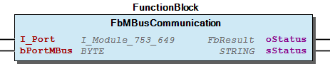 - FbMBusCommunication.ForwardStatusObject (METH) - FbMBusCommunication.isInvalidPort (METH) - FbMBusCommunication.isInvalidPort_ID (METH) - FbMBusCommunication.setClassname (METH) - FbMBusCommunication.setStatusObject (METH)

## FbMBusElectricity (FB)

| Scope | Name | Type | Initial | Comment | Inherited from |
| --- | --- | --- | --- | --- | --- |
| Input | bPortMBus | BYTE | 1 | Master number assignment - At this input you have to define the number of the master module you want to use for communication. The maximum number of master modules is defined at gp_MAX_MASTER in the ParameterList . | FbMBusMeter |
| dwAddress | DWORD | 16#FE | M-Bus primary address (>255=Sec.-Adr.) | FbMBusMeter |
| xSND_NKE | BOOL | TRUE | Send M-Bus normalisation command first | FbMBusMeter |
| Output | oStatus | WagoSysErrorBase.FbResult |  | Status object. (Listed in Status ) The content of the error object could be displayed via the FbShowResult from the WagoSysErrorBase library. | FbMBusMeter |
| sStatus | STRING |  | Status description as string (Listed in Status ) | FbMBusMeter |
| xUpdate | BOOL |  | Update flag | FbMBusMeter |
| Inout | xStart | BOOL |  | Toggle variable for starting to read out the electricity meter. Automatically reset after read-out. |  |
| Output | typMBus_Info | typMBus_Info |  | Fixed meter data (header in data telegram with ID, manufacturer, medium, ..) |  |
| typEnergy | typMBus_Record |  | Electrical energy (value, power of 10, unit) |  |
| typPower | typMBus_Record |  | Electrical power (value, power of 10, unit) |  |
| typVoltage | typMBus_Record |  | Electrical voltage (value, power of 10, unit) |  |
| typCurrent | typMBus_Record |  | Electrical current (value, power of 10, unit) |  |

The function block is used to read out and decode M-Bus electricity meter data. It can only be used in connection with the FbMBusMaster M-Bus communication block.

Graphical Illustration

Function description

bPortMBus must be connect to the Master function blocks. The dwAddress input variable is preset with the primary address (<256) or the secondary address (ID) (>=256) of the meter. If xSND_NKE is set, an M-Bus scaling command is sent to the meter before reading out the data. The command ensures in the case of meters with sequential telegrams, the first (most important) telegram is sent as a reply to the next query. The xStart variable starts the meter readout. If the readout is successful, the function block resets the variable. If the readout fails, the readout is started again. This operation repeats three times by default. The g_MBUS_MAX_REPEAT global variable can be used to assign how many times the operation repeats. If a valid telegram is successfully queried, the xUpdate output is triggered.

To convert the meter readings to the required unit and a REAL type value, the user can use the function described further below. (See FbUnitConverter in file 60 Tools/Hilfszeug )

FbMBusScanID can be used to scan the M-Bus network for devices by their identification number (ID). (See FbMBusScanID in file 60 Tools/Hilfszeug )

Interface variables Function The function block is used to read out and decode M-Bus electricity meter data. It can only be used in connection with the FbMBusMaster M-Bus communication block. Graphical Illustration 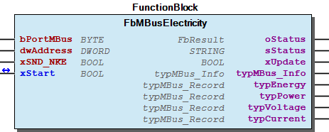 Function description bPortMBus must be connect to the Master function blocks. The dwAddress input variable is preset with the primary address (<256) or the secondary address (ID) (>=256) of the meter. If xSND_NKE is set, an M-Bus scaling command is sent to the meter before reading out the data. The command ensures in the case of meters with sequential telegrams, the first (most important) telegram is sent as a reply to the next query. The xStart variable starts the meter readout. If the readout is successful, the function block resets the variable. If the readout fails, the readout is started again. This operation repeats three times by default. The g_MBUS_MAX_REPEAT global variable can be used to assign how many times the operation repeats. If a valid telegram is successfully queried, the xUpdate output is triggered. Note To convert the meter readings to the required unit and a REAL type value, the user can use the function described further below. (See FbUnitConverter in file 60 Tools/Hilfszeug ) Note FbMBusScanID can be used to scan the M-Bus network for devices by their identification number (ID). (See FbMBusScanID in file 60 Tools/Hilfszeug )

## FbMBusGeneral (FB)

| Scope | Name | Type | Initial | Comment | Inherited from |
| --- | --- | --- | --- | --- | --- |
| Input | bPortMBus | BYTE | 1 | Master number assignment - At this input you have to define the number of the master module you want to use for communication. The maximum number of master modules is defined at gp_MAX_MASTER in the ParameterList . | FbMBusMeter |
| dwAddress | DWORD | 16#FE | M-Bus primary address (>255=Sec.-Adr.) | FbMBusMeter |
| xSND_NKE | BOOL | TRUE | Send M-Bus normalisation command first | FbMBusMeter |
| Output | oStatus | WagoSysErrorBase.FbResult |  | Status object. (Listed in Status ) The content of the error object could be displayed via the FbShowResult from the WagoSysErrorBase library. | FbMBusMeter |
| sStatus | STRING |  | Status description as string (Listed in Status ) | FbMBusMeter |
| xUpdate | BOOL |  | Update flag | FbMBusMeter |
| Inout | xStart | BOOL |  | Toggle variable for starting to read out the electricity meter. Automatically reset after read-out. |  |
| Output | typMBus_Info | typMBus_Info |  | Fixed meter data (header in data telegram with ID, manufacturer, medium, ..) |  |
| typMBus_Record | typMBus_Record |  | Meter reading (value, power of 10, unit) |  |

The function block is used to read out and decode M-Bus meter data, it returns exactly one meter reading It can only be used in connection with the FbMBusMaster M-Bus communication block.

Graphical Illustration

Function description

bPortMBus must be connect to the Master function blocks. The dwAddress input variable is preset with the primary address (<256) or the secondary address (ID) (>=256) of the meter. If xSND_NKE is set, an M-Bus scaling command is sent to the meter before reading out the data. The command ensures in the case of meters with sequential telegrams, the first (most important) telegram is sent as a reply to the next query. The xStart variable starts the meter readout. If the readout is successful, the function block resets the variable. If the readout fails, the readout is started again. This operation repeats three times by default. The g_MBUS_MAX_REPEAT global variable can be used to assign how many times the operation repeats. If a valid telegram is successfully queried, the xUpdate output is triggered.

To convert the meter readings to the required unit and a REAL type value, the user can use the function described further below. (See FbUnitConverter in file 60 Tools/Hilfszeug )

FbMBusScanID can be used to scan the M-Bus network for devices by their identification number (ID). (See FbMBusScanID in file 60 Tools/Hilfszeug )

Interface variables Function The function block is used to read out and decode M-Bus meter data, it returns exactly one meter reading It can only be used in connection with the FbMBusMaster M-Bus communication block. Graphical Illustration 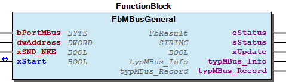 Function description bPortMBus must be connect to the Master function blocks. The dwAddress input variable is preset with the primary address (<256) or the secondary address (ID) (>=256) of the meter. If xSND_NKE is set, an M-Bus scaling command is sent to the meter before reading out the data. The command ensures in the case of meters with sequential telegrams, the first (most important) telegram is sent as a reply to the next query. The xStart variable starts the meter readout. If the readout is successful, the function block resets the variable. If the readout fails, the readout is started again. This operation repeats three times by default. The g_MBUS_MAX_REPEAT global variable can be used to assign how many times the operation repeats. If a valid telegram is successfully queried, the xUpdate output is triggered. Note To convert the meter readings to the required unit and a REAL type value, the user can use the function described further below. (See FbUnitConverter in file 60 Tools/Hilfszeug ) Note FbMBusScanID can be used to scan the M-Bus network for devices by their identification number (ID). (See FbMBusScanID in file 60 Tools/Hilfszeug )

## FbMBusHeat (FB)

| Scope | Name | Type | Initial | Comment | Inherited from |
| --- | --- | --- | --- | --- | --- |
| Input | bPortMBus | BYTE | 1 | Master number assignment - At this input you have to define the number of the master module you want to use for communication. The maximum number of master modules is defined at gp_MAX_MASTER in the ParameterList . | FbMBusMeter |
| dwAddress | DWORD | 16#FE | M-Bus primary address (>255=Sec.-Adr.) | FbMBusMeter |
| xSND_NKE | BOOL | TRUE | Send M-Bus normalisation command first | FbMBusMeter |
| Output | oStatus | WagoSysErrorBase.FbResult |  | Status object. (Listed in Status ) The content of the error object could be displayed via the FbShowResult from the WagoSysErrorBase library. | FbMBusMeter |
| sStatus | STRING |  | Status description as string (Listed in Status ) | FbMBusMeter |
| xUpdate | BOOL |  | Update flag | FbMBusMeter |
| Inout | xStart | BOOL |  | Toggle variable for starting to read out the heat meter. Automatically reset after read-out. |  |
| Output | typMBus_Info | typMBus_Info |  | Fixed meter data (header in data telegram with ID, manufacturer, medium, ..) |  |
| typEnergy | typMBus_Record |  | Energy (value, power of 10, unit) |  |
| typPower | typMBus_Record |  | Power (value, power of 10, unit) |  |
| typVolume | typMBus_Record |  | Volume (value, power of 10, unit) |  |
| typFlow | typMBus_Record |  | Flow (value, power of 10, unit) |  |
| typFTemp | typMBus_Record |  | Inlet temperature (value, power of 10, unit) |  |
| typRTemp | typMBus_Record |  | Outlet temperature (value, power of 10, unit) |  |
| typDTemp | typMBus_Record |  | Temperature difference between inlet and outlet (value, power of 10, unit) |  |

The function block is used to read out and decode M-Bus heat meter data. It can only be used in connection with the M-Bus communication block FbMBusMaster.

Graphical Illustration

Function description

bPortMBus must be connect to the Master function blocks. The dwAddress input variable is preset with the primary address (<256) or the secondary address (ID) (>=256) of the meter. If xSND_NKE is set, an M-Bus scaling command is sent to the meter before reading out the data. The command ensures in the case of meters with sequential telegrams, the first (most important) telegram is sent as a reply to the next query. The xStart variable starts the meter readout. If the readout is successful, the function block resets the variable. If the readout fails, the readout is started again. This operation repeats three times by default. The g_MBUS_MAX_REPEAT global variable can be used to assign how many times the operation repeats. If a valid telegram is successfully queried, the xUpdate output is triggered.

To convert the meter readings to the required unit and a REAL type value, the user can use the function described further below. (See FbUnitConverter in file 60 Tools/Hilfszeug )

FbMBusScanID can be used to scan the M-Bus network for devices by their identification number (ID). (See FbMBusScanID in file 60 Tools/Hilfszeug )

Interface variables Function The function block is used to read out and decode M-Bus heat meter data. It can only be used in connection with the M-Bus communication block FbMBusMaster. Graphical Illustration 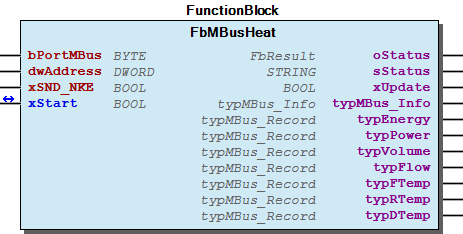 Function description bPortMBus must be connect to the Master function blocks. The dwAddress input variable is preset with the primary address (<256) or the secondary address (ID) (>=256) of the meter. If xSND_NKE is set, an M-Bus scaling command is sent to the meter before reading out the data. The command ensures in the case of meters with sequential telegrams, the first (most important) telegram is sent as a reply to the next query. The xStart variable starts the meter readout. If the readout is successful, the function block resets the variable. If the readout fails, the readout is started again. This operation repeats three times by default. The g_MBUS_MAX_REPEAT global variable can be used to assign how many times the operation repeats. If a valid telegram is successfully queried, the xUpdate output is triggered. Note To convert the meter readings to the required unit and a REAL type value, the user can use the function described further below. (See FbUnitConverter in file 60 Tools/Hilfszeug ) Note FbMBusScanID can be used to scan the M-Bus network for devices by their identification number (ID). (See FbMBusScanID in file 60 Tools/Hilfszeug )

## FbMBusMaster (FB)

| Scope | Name | Type | Initial | Comment | Inherited from |
| --- | --- | --- | --- | --- | --- |
| Input | I_Port | WagoTypesModule_753_649.I_Module_753_649 |  | M-Bus module | FbMBusCommunication |
| bPortMBus | BYTE | 1 | Master assignment number. Range 1 to gp_MaxMaster. | FbMBusCommunication |
| Output | oStatus | WagoSysErrorBase.FbResult |  | Status object. (Listed in Status ) The content of the error object could be displayed via the FbShowResult from the WagoSysErrorBase library. | FbMBusCommunication |
| sStatus | STRING |  | Status description as string (Listed in Status ) | FbMBusCommunication |
| Input | xReset | BOOL |  | Reset |  |

Master function block for communicating with WAGO M-Bus Module 753-649.

Graphical Illustration

Function description

I_Port must be connected with the serial interface for example: IoConfig_Globals.MBus_Master bPortMBus must be connect to the other function blocks.

This function block may be used only once per M-bus module.

Interface variables Function Master function block for communicating with WAGO M-Bus Module 753-649. Graphical Illustration 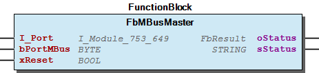 Function description The controller independently detects the connected M-bus master modules and data is synchronise via the Interface I_Port to the other M-bus function blocks. I_Port must be connected with the serial interface for example: IoConfig_Globals.MBus_Master bPortMBus must be connect to the other function blocks. Note This function block may be used only once per M-bus module.

## FbMBusMeter (FB)

| Scope | Name | Type | Initial | Comment |
| --- | --- | --- | --- | --- |
| Input | bPortMBus | BYTE | 1 | Master number assignment - At this input you have to define the number of the master module you want to use for communication. The maximum number of master modules is defined at gp_MAX_MASTER in the ParameterList . |
| dwAddress | DWORD | 16#FE | M-Bus primary address (>255=Sec.-Adr.) |
| xSND_NKE | BOOL | TRUE | Send M-Bus normalisation command first |
| Output | oStatus | WagoSysErrorBase.FbResult |  | Status object. (Listed in Status ) The content of the error object could be displayed via the FbShowResult from the WagoSysErrorBase library. |
| sStatus | STRING |  | Status description as string (Listed in Status ) |
| xUpdate | BOOL |  | Update flag |

Base class for a M-Bus Meter

Graphical Illustration

Interface variables Function Base class for a M-Bus Meter Graphical Illustration 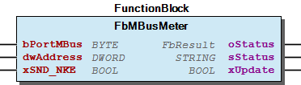 - FbMBusMeter.ForwardStatusObject (METH) - FbMBusMeter.Port_ID (PROP) - FbMBusMeter.setClassname (METH) - FbMBusMeter.setStatusObject (METH)

## FbMBusMultiTel (FB)

| Scope | Name | Type | Initial | Comment | Inherited from |
| --- | --- | --- | --- | --- | --- |
| Input | bPortMBus | BYTE | 1 | Master number assignment - At this input you have to define the number of the master module you want to use for communication. The maximum number of master modules is defined at gp_MAX_MASTER in the ParameterList . | FbMBusMeter |
| dwAddress | DWORD | 16#FE | M-Bus primary address (>255=Sec.-Adr.) | FbMBusMeter |
| xSND_NKE | BOOL | TRUE | Send M-Bus normalisation command first | FbMBusMeter |
| Output | oStatus | WagoSysErrorBase.FbResult |  | Status object. (Listed in Status ) The content of the error object could be displayed via the FbShowResult from the WagoSysErrorBase library. | FbMBusMeter |
| sStatus | STRING |  | Status description as string (Listed in Status ) | FbMBusMeter |
| xUpdate | BOOL |  | Update flag | FbMBusMeter |
| Inout | xStart | BOOL |  | Toggle variable for starting to read out the consumption meter. Automatically reset after read-out. |  |
| Output | typMBus_Info | typMBus_Info |  | Fixed meter data (header in data telegram with ID, manufacturer, medium, ..) |  |
| aMBusRecord | ARRAY [1..MBUS_MAX_DATARECORDS] OF typMBus_Record |  | Byte array with meter reading(value, power of 10, unit) |  |
| bNumberOfRecords | BYTE |  | Number of records |  |

The function block is used to read out and decode the data of a M-Bus multi telegram It can only be used in connection with the M-Bus communication block FbMBusMaster.

Graphical Illustration

Function description

bPortMBus must be connect to the Master function blocks. The dwAddress input variable is preset with the primary address (<256) or the secondary address (ID) (>=256) of the meter. If xSND_NKE is set, an M-Bus scaling command is sent to the meter before reading out the data. The command ensures in the case of meters with sequential telegrams, the first (most important) telegram is sent as a reply to the next query. The xStart variable starts the meter readout. If the readout is successful, the function block resets the variable. If the readout fails, the readout is started again. This operation repeats three times by default. The g_MBUS_MAX_REPEAT global variable can be used to assign how many times the operation repeats. If a valid telegram is successfully queried, the xUpdate output is triggered.

To convert the meter readings to the required unit and a REAL type value, the user can use the function described further below. (See FbUnitConverter in file 60 Tools/Hilfszeug )

FbMBusScanID can be used to scan the M-Bus network for devices by their identification number (ID). (See FbMBusScanID in file 60 Tools/Hilfszeug )

Interface variables Function The function block is used to read out and decode the data of a M-Bus multi telegram It can only be used in connection with the M-Bus communication block FbMBusMaster. Graphical Illustration 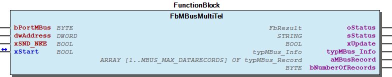 Function description bPortMBus must be connect to the Master function blocks. The dwAddress input variable is preset with the primary address (<256) or the secondary address (ID) (>=256) of the meter. If xSND_NKE is set, an M-Bus scaling command is sent to the meter before reading out the data. The command ensures in the case of meters with sequential telegrams, the first (most important) telegram is sent as a reply to the next query. The xStart variable starts the meter readout. If the readout is successful, the function block resets the variable. If the readout fails, the readout is started again. This operation repeats three times by default. The g_MBUS_MAX_REPEAT global variable can be used to assign how many times the operation repeats. If a valid telegram is successfully queried, the xUpdate output is triggered. Note To convert the meter readings to the required unit and a REAL type value, the user can use the function described further below. (See FbUnitConverter in file 60 Tools/Hilfszeug ) Note FbMBusScanID can be used to scan the M-Bus network for devices by their identification number (ID). (See FbMBusScanID in file 60 Tools/Hilfszeug )

## FbMBusProtocol (FB)

| Scope | Name | Type | Initial | Comment |
| --- | --- | --- | --- | --- |
| Input | bPortMBus | BYTE | 1 | Master number assignment - At this input you have to define the number of the master module you want to use for communication. The maximum number of master modules is defined at gp_MAX_MASTER in the ParameterList . |
| Output | oStatus | WagoSysErrorBase.FbResult |  | Status object. (Listed in Status ) The content of the error object could be displayed via the FbShowResult from the WagoSysErrorBase library. |
| sStatus | STRING |  | Status description as string (Listed in Status ) |
| xUpdate | BOOL |  | Update flag |

Base class for a M-Bus Protocol

Graphical Illustration

Interface variables Function Base class for a M-Bus Protocol Graphical Illustration 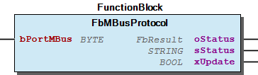 - FbMBusProtocol.ForwardStatusObject (METH) - FbMBusProtocol.Port_ID (PROP) - FbMBusProtocol.setClassname (METH) - FbMBusProtocol.setStatusObject (METH)

## FbMBusRawData (FB)

| Scope | Name | Type | Initial | Comment | Inherited from |
| --- | --- | --- | --- | --- | --- |
| Input | bPortMBus | BYTE | 1 | Master number assignment - At this input you have to define the number of the master module you want to use for communication. The maximum number of master modules is defined at gp_MAX_MASTER in the ParameterList . | FbMBusMeter |
| dwAddress | DWORD | 16#FE | M-Bus primary address (>255=Sec.-Adr.) | FbMBusMeter |
| xSND_NKE | BOOL | TRUE | Send M-Bus normalisation command first | FbMBusMeter |
| Output | oStatus | WagoSysErrorBase.FbResult |  | Status object. (Listed in Status ) The content of the error object could be displayed via the FbShowResult from the WagoSysErrorBase library. | FbMBusMeter |
| sStatus | STRING |  | Status description as string (Listed in Status ) | FbMBusMeter |
| xUpdate | BOOL |  | Update flag | FbMBusMeter |
| Inout | xStart | BOOL |  | Toggle variable for starting to read out the electricity meter. Automatically reset after read-out. |  |
| Output | abData | ARRAY [0..MBUS_MAX_MBUSDATA] OF BYTE |  | Data bytes |  |
| uiLength | UINT |  | Length of payload |  |

The function block is used to read out a M-Bus meter and returns the raw data without analyse in a byte array. Both a byte array with M-Bus raw data and the length of this array are contained in the output variables. It can only be used in connection with the M-Bus communication block FbMBusMaster.

Graphical Illustration

Function description

bPortMBus must be connect to the Master function blocks. The dwAddress input variable is preset with the primary address (<256) or the secondary address (ID) (>=256) of the meter. If xSND_NKE is set, an M-Bus scaling command is sent to the meter before reading out the data. The command ensures in the case of meters with sequential telegrams, the first (most important) telegram is sent as a reply to the next query. The xStart variable starts the meter readout. If the readout is successful, the function block resets the variable. If the readout fails, the readout is started again. This operation repeats three times by default. The g_MBUS_MAX_REPEAT global variable can be used to assign how many times the operation repeats. If a valid telegram is successfully queried, the xUpdate output is triggered.

To convert the meter readings to the required unit and a REAL type value, the user can use the function described further below. (See FbUnitConverter in file 60 Tools/Hilfszeug )

FbMBusScanID can be used to scan the M-Bus network for devices by their identification number (ID). (See FbMBusScanID in file 60 Tools/Hilfszeug )

Example to decode a Mbus raw data telegram:

The header of an data-telegram starts and ends with 16#68.

A-field: Address of the slave.

CI-field: Reason of the telegram: Direction Slave to Master:

After the CI-field the meter datas are sent in a size of 0-252 Bytes.

The telegrams ends with a Checksum and a end character 16#16.

Interface variables Function The function block is used to read out a M-Bus meter and returns the raw data without analyse in a byte array. Both a byte array with M-Bus raw data and the length of this array are contained in the output variables. It can only be used in connection with the M-Bus communication block FbMBusMaster. Graphical Illustration 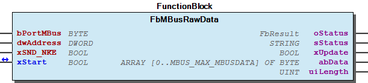 Function description bPortMBus must be connect to the Master function blocks. The dwAddress input variable is preset with the primary address (<256) or the secondary address (ID) (>=256) of the meter. If xSND_NKE is set, an M-Bus scaling command is sent to the meter before reading out the data. The command ensures in the case of meters with sequential telegrams, the first (most important) telegram is sent as a reply to the next query. The xStart variable starts the meter readout. If the readout is successful, the function block resets the variable. If the readout fails, the readout is started again. This operation repeats three times by default. The g_MBUS_MAX_REPEAT global variable can be used to assign how many times the operation repeats. If a valid telegram is successfully queried, the xUpdate output is triggered. Note To convert the meter readings to the required unit and a REAL type value, the user can use the function described further below. (See FbUnitConverter in file 60 Tools/Hilfszeug ) Note FbMBusScanID can be used to scan the M-Bus network for devices by their identification number (ID). (See FbMBusScanID in file 60 Tools/Hilfszeug ) Example to decode a Mbus raw data telegram: The header of an data-telegram starts and ends with 16#68. After the header a C-field (control field) gives information about the function of the telegram. - 16#40= Initialisation of the slaves - 16#53/16#73= Datas which are sent to the slave. - 16#5B/16#7B= Request for datas of class 2 are sent to the slave. (class2= not very important datas) - 16#5A/16#7A= Request for datas of class 1 are sent to the slave. - 16#08/16#18/16#28/16#38= Response of the slave, datas included. A-field: Address of the slave. CI-field: Reason of the telegram: Direction Slave to Master: - 16#70= Error status - 16#71= Alarm status - 16#72/16#76= Datas with a variable data structure - 16#73/16#77= Datas with a fixed data structure After the CI-field the meter datas are sent in a size of 0-252 Bytes. The telegrams ends with a Checksum and a end character 16#16. 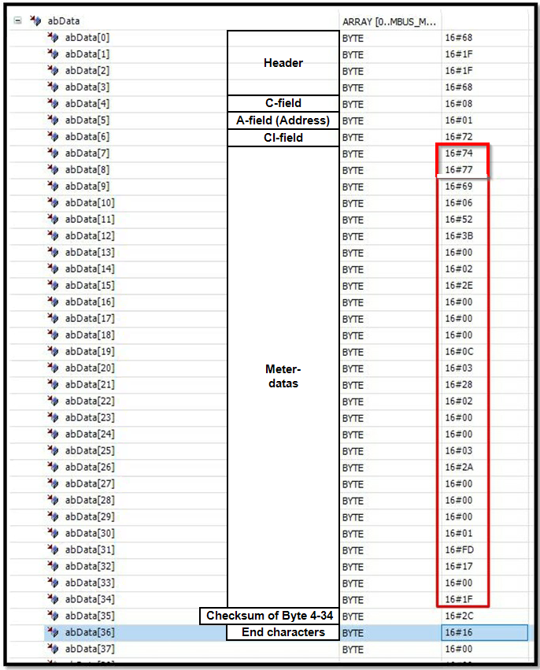

## FbMBusScanID (FB)

| Scope | Name | Type | Initial | Comment |
| --- | --- | --- | --- | --- |
| Input | bPortMBus | BYTE | 1 | Port to MBus Master |
| xSND_NKE | BOOL | TRUE | Send scan request(s) with NKE flag |
| pSyslogLogger | POINTER TO WagoSysLog.FbLogger |  | Feature- Fb to generate Log-Messages |
| Inout | xStart | BOOL |  | Toggle variable for starting the scan function. Automatically reset after read-out. |
| Output | adwAddressID | ARRAY [1..MBUS_MAX_DEVICES_SCAN] OF DWORD |  | MBus client result Secundary address array in hex. If the array is full, the search is terminated. |
| atypMBus_Info | ARRAY [1..MBUS_MAX_DEVICES_SCAN] OF typMBus_Info |  | Meter info datas |
| atypMBus_MultiRec | ARRAY [1..MBUS_MAX_DEVICES_SCAN] OF ARRAY [1..MBUS_MAX_DATARECORDS] OF typMBus_Record |  | Meter datas |
| atypMBus_MultiRecEntries | ARRAY [1..MBUS_MAX_DEVICES_SCAN] OF BYTE |  | Number of records from device |
| usiProgress | USINT |  | Progress of SCAN function [%] |

This function block scans the M-Bus network for devices by their identification number (ID). It can only be used in connection with the M-Bus communication block FbMBusMaster. bPortMBus must be connect to the Master function blocks. With xStart will start the scnning process and will be switched of by the function block if scanning was finished.

Graphical Illustration

Function description

The scanning process will need some time, please wait until xStart is reset to false.

Interface variables Function This function block scans the M-Bus network for devices by their identification number (ID). It can only be used in connection with the M-Bus communication block FbMBusMaster. bPortMBus must be connect to the Master function blocks. With xStart will start the scnning process and will be switched of by the function block if scanning was finished. Graphical Illustration 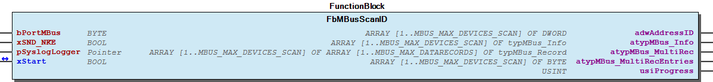 Function description The scanning process will need some time, please wait until xStart is reset to false. - FbMBusScanID.resolveID (METH)

## FbMBusSendData (FB)

| Scope | Name | Type | Initial | Comment |
| --- | --- | --- | --- | --- |
| Input | bPortMBus | BYTE | 1 | Master number assignment - At this input you have to define the number of the master module you want to use for communication. The maximum number of master modules is defined at gp_MAX_MASTER in the ParameterList . |
| dwAddress | DWORD | 16#FE | A-Field: M-Bus primary address (>255 Sec.-Adr.) |
| bC_Field | BYTE | 16#53 | C-Field: MBus C-Feld, default 53H for SND_UD |
| bCI_Field | BYTE | 16#51 | CI-Field, 51H for SND_UD, 50H for Appl.-Reset |
| xSND_NKE | BOOL |  | Send M-Bus normalisation command first |
| aTxPayload | ARRAY [0..MBUS_MAX_MBUSDATA] OF BYTE |  | Tx payload |
| bTxLength | BYTE |  | L-Field: Tx Length |
| Inout | xSend | BOOL |  |  |
| Output | oStatus | WagoSysErrorBase.FbResult |  | Status object. (Listed in Status ) The content of the error object could be displayed via the FbShowResult from the WagoSysErrorBase library. |
| sStatus | STRING |  | Status description as string (Listed in Status ) |

The function block is used to send out datas to an M-Bus meter. It can only be used in connection with the M-Bus communication block FbMBusMaster.

Graphical Illustration

Function description

bPortMBus must be connect to the Master function blocks. The dwAddress input variable is preset with the primary address (<256) or the secondary address (ID) (>=256) of the meter. If xSND_NKE is set, an M-Bus scaling command is sent to the meter before reading out the data. The command ensures in the case of meters with sequential telegrams, the first (most important) telegram is sent as a reply to the next query. The xStart variable starts the meter readout. If the readout is successful, the function block resets the variable. If the readout fails, the readout is started again. This operation repeats three times by default. The g_MBUS_MAX_REPEAT global variable can be used to assign how many times the operation repeats. If a valid telegram is successfully queried, the xUpdate output is triggered.

A data set to be sent appears as follows:

The function block automatically adds a start character (68h), L field, checksum (CS) and stop character (16h).

The bC_Field field is the C field of the M-Bus telegram to be transmitted. The C field has the value 16#53, for example, for send data to slave (or 16#73 when FCB is set). The value of 16#52 (or 16#72 when FCB is set) is used to select a meter with the help of its 8-digit ID (secondary address) on the primary address 253.

The dwAddress input variable is preset with the primary address (<256) or the secondary address (ID) (>=256) of the meter. The meter addressed by means of dwAddress acknowledges the received data record with the individual character 16#E5. If all M-Bus meters on the bus are to receive the data set, then the broadcast address 255 can be used without acknowledgement. In this case, the M-Bus Master Module automatically ensures that no telegrams are repeated and that there is no unnecessary waiting time due to timeouts.

The bCI_Field field is the CI field of the M-Bus telegram to be transmitted. The value of 16#51 signals to the addressed meter that data is to be sent to it from the master. If the value is 16#50, the addressed meter executes the Application Reset command.

The M-Bus data to be transmitted is made available in the axTxPayload input array (User Data). The length of the data is specified at the bTxLength input.

Interface variables Function The function block is used to send out datas to an M-Bus meter. It can only be used in connection with the M-Bus communication block FbMBusMaster. Graphical Illustration 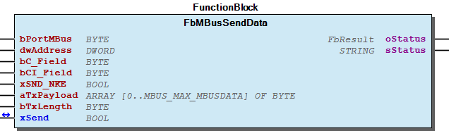 Function description bPortMBus must be connect to the Master function blocks. The dwAddress input variable is preset with the primary address (<256) or the secondary address (ID) (>=256) of the meter. If xSND_NKE is set, an M-Bus scaling command is sent to the meter before reading out the data. The command ensures in the case of meters with sequential telegrams, the first (most important) telegram is sent as a reply to the next query. The xStart variable starts the meter readout. If the readout is successful, the function block resets the variable. If the readout fails, the readout is started again. This operation repeats three times by default. The g_MBUS_MAX_REPEAT global variable can be used to assign how many times the operation repeats. If a valid telegram is successfully queried, the xUpdate output is triggered. Telegram: A data set to be sent appears as follows: 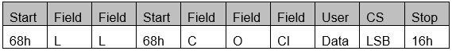 The function block automatically adds a start character (68h), L field, checksum (CS) and stop character (16h). C field: The bC_Field field is the C field of the M-Bus telegram to be transmitted. The C field has the value 16#53, for example, for send data to slave (or 16#73 when FCB is set). The value of 16#52 (or 16#72 when FCB is set) is used to select a meter with the help of its 8-digit ID (secondary address) on the primary address 253. A field: The dwAddress input variable is preset with the primary address (<256) or the secondary address (ID) (>=256) of the meter. The meter addressed by means of dwAddress acknowledges the received data record with the individual character 16#E5. If all M-Bus meters on the bus are to receive the data set, then the broadcast address 255 can be used without acknowledgement. In this case, the M-Bus Master Module automatically ensures that no telegrams are repeated and that there is no unnecessary waiting time due to timeouts. CI field: The bCI_Field field is the CI field of the M-Bus telegram to be transmitted. The value of 16#51 signals to the addressed meter that data is to be sent to it from the master. If the value is 16#50, the addressed meter executes the Application Reset command. User data: The M-Bus data to be transmitted is made available in the axTxPayload input array (User Data). The length of the data is specified at the bTxLength input. - 00 Administration FbMBusSendData.setClassname (METH) 01 Parameters - FbMBusSendData.Port_ID (PROP) 80 Status - FbMBusSendData.ForwardStatusObject (METH) - FbMBusSendData.setStatusObject (METH)

## FbMBusStatus (FB)

| Scope | Name | Type | Initial | Comment | Inherited from |
| --- | --- | --- | --- | --- | --- |
| Input | bPortMBus | BYTE | 1 | Master number assignment - At this input you have to define the number of the master module you want to use for communication. The maximum number of master modules is defined at gp_MAX_MASTER in the ParameterList . | FbMBusProtocol |
| Output | oStatus | WagoSysErrorBase.FbResult |  | Status object. (Listed in Status ) The content of the error object could be displayed via the FbShowResult from the WagoSysErrorBase library. | FbMBusProtocol |
| sStatus | STRING |  | Status description as string (Listed in Status ) | FbMBusProtocol |
| xUpdate | BOOL |  | Update flag | FbMBusProtocol |
| Inout | xStart | BOOL |  | Start |  |
| Output | typMbusStatus | typMbusStatus |  | M-bus status |  |

The function block is used to request the status from the M-Bus module. Query module status (C2M_STATUS_REQ)

Graphical Illustration

Function description

bPortMBus must be connect to the Master function blocks. The xStart variable starts the module request. If the request is successful, the function block resets the variable. If the request fails, the request is started again. This operation repeats three times by default. The g_MBUS_MAX_REPEAT global variable can be used to assign how many times the operation repeats. If the request is successful, the xUpdate output is triggered.

Interface variables Function The function block is used to request the status from the M-Bus module. Query module status (C2M_STATUS_REQ) Graphical Illustration 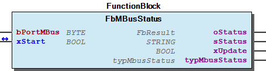 Function description bPortMBus must be connect to the Master function blocks. The xStart variable starts the module request. If the request is successful, the function block resets the variable. If the request fails, the request is started again. This operation repeats three times by default. The g_MBUS_MAX_REPEAT global variable can be used to assign how many times the operation repeats. If the request is successful, the xUpdate output is triggered.

## FbMBusWater (FB)

| Scope | Name | Type | Initial | Comment | Inherited from |
| --- | --- | --- | --- | --- | --- |
| Input | bPortMBus | BYTE | 1 | Master number assignment - At this input you have to define the number of the master module you want to use for communication. The maximum number of master modules is defined at gp_MAX_MASTER in the ParameterList . | FbMBusMeter |
| dwAddress | DWORD | 16#FE | M-Bus primary address (>255=Sec.-Adr.) | FbMBusMeter |
| xSND_NKE | BOOL | TRUE | Send M-Bus normalisation command first | FbMBusMeter |
| Output | oStatus | WagoSysErrorBase.FbResult |  | Status object. (Listed in Status ) The content of the error object could be displayed via the FbShowResult from the WagoSysErrorBase library. | FbMBusMeter |
| sStatus | STRING |  | Status description as string (Listed in Status ) | FbMBusMeter |
| xUpdate | BOOL |  | Update flag | FbMBusMeter |
| Inout | xStart | BOOL |  | Toggle variable for starting to read out the water meter. Automatically reset after read-out. |  |
| Output | typMBus_Info | typMBus_Info |  | Fixed meter data (header in data telegram with ID, manufacturer, medium, ..) |  |
| typVolume | typMBus_Record |  | Volume (value, power of 10, unit) |  |
| typFlow | typMBus_Record |  | Flow (value, power of 10, unit) |  |

The function block is used to read out and decode M-Bus meter data. It can only be used in connection with the FbMBusMaster M-Bus communication block.

Graphical Illustration

Function description

bPortMBus must be connect to the Master function blocks. The dwAddress input variable is preset with the primary address (<256) or the secondary address (ID) (>=256) of the meter. If xSND_NKE is set, an M-Bus scaling command is sent to the meter before reading out the data. The command ensures in the case of meters with sequential telegrams, the first (most important) telegram is sent as a reply to the next query. The xStart variable starts the meter readout. If the readout is successful, the function block resets the variable. If the readout fails, the readout is started again. This operation repeats three times by default. The g_MBUS_MAX_REPEAT global variable can be used to assign how many times the operation repeats. If a valid telegram is successfully queried, the xUpdate output is triggered.

To convert the meter readings to the required unit and a REAL type value, the user can use the function described further below. (See FbUnitConverter in file 60 Tools/Hilfszeug )

FbMBusScanID can be used to scan the M-Bus network for devices by their identification number (ID). (See FbMBusScanID in file 60 Tools/Hilfszeug )

Interface variables Function The function block is used to read out and decode M-Bus meter data. It can only be used in connection with the FbMBusMaster M-Bus communication block. Graphical Illustration 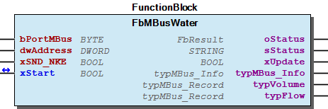 Function description bPortMBus must be connect to the Master function blocks. The dwAddress input variable is preset with the primary address (<256) or the secondary address (ID) (>=256) of the meter. If xSND_NKE is set, an M-Bus scaling command is sent to the meter before reading out the data. The command ensures in the case of meters with sequential telegrams, the first (most important) telegram is sent as a reply to the next query. The xStart variable starts the meter readout. If the readout is successful, the function block resets the variable. If the readout fails, the readout is started again. This operation repeats three times by default. The g_MBUS_MAX_REPEAT global variable can be used to assign how many times the operation repeats. If a valid telegram is successfully queried, the xUpdate output is triggered. Note To convert the meter readings to the required unit and a REAL type value, the user can use the function described further below. (See FbUnitConverter in file 60 Tools/Hilfszeug ) Note FbMBusScanID can be used to scan the M-Bus network for devices by their identification number (ID). (See FbMBusScanID in file 60 Tools/Hilfszeug )

## FbMbusStatistic (FB)

| Scope | Name | Type | Initial | Comment | Inherited from |
| --- | --- | --- | --- | --- | --- |
| Input | bPortMBus | BYTE | 1 | Master number assignment - At this input you have to define the number of the master module you want to use for communication. The maximum number of master modules is defined at gp_MAX_MASTER in the ParameterList . | FbMBusProtocol |
| Output | oStatus | WagoSysErrorBase.FbResult |  | Status object. (Listed in Status ) The content of the error object could be displayed via the FbShowResult from the WagoSysErrorBase library. | FbMBusProtocol |
| sStatus | STRING |  | Status description as string (Listed in Status ) | FbMBusProtocol |
| xUpdate | BOOL |  | Update flag | FbMBusProtocol |
| Input | xStatisticReset | BOOL |  | TRUE-> statistic in the module will be reset |  |
| Inout | xStart | BOOL |  | Start |  |
| Output | typMbusStatistic | typMbusStatistic |  |  |  |

The function block is used to request statistics from the M-Bus module. Query module status (C2M_INIT)

Graphical Illustration

Function description

bPortMBus must be connect to the Master function blocks. The xStart variable starts the module request. If the request is successful, the function block resets the variable. If the xStatisticReset variable is set to TRUE before the request, the module statistics are reset. If the request fails, the request is started again. This operation repeats three times by default. The g_MBUS_MAX_REPEAT global variable can be used to assign how many times the operation repeats. If the request is successful, the xUpdate output is triggered.

Interface variables Function The function block is used to request statistics from the M-Bus module. Query module status (C2M_INIT) Graphical Illustration 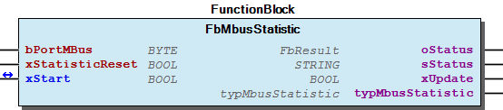 Function description bPortMBus must be connect to the Master function blocks. The xStart variable starts the module request. If the request is successful, the function block resets the variable. If the xStatisticReset variable is set to TRUE before the request, the module statistics are reset. If the request fails, the request is started again. This operation repeats three times by default. The g_MBUS_MAX_REPEAT global variable can be used to assign how many times the operation repeats. If the request is successful, the xUpdate output is triggered.

## FbUnitConverter (FB)

| Scope | Name | Type | Comment |
| --- | --- | --- | --- |
| Inout | typMBus_Record | typMBus_Record | M-Bus data records (value, power of 10, unit) |
| eUnit | eMBusUnit | Unit desired |
| Output | rValue | REAL | Value |
| xError | BOOL | Error flag |

The function block unit converter is used to convert a M-Bus record into different types.

That the converted meter values may have rounding errors due to the REAL format.

It is not possible to convert input values outside the range of >3 999 999 999

Graphical Illustration

Function description

The function block is used to convert an M-Bus typMBRecord data set to a required eUnit target unit and a meter value of the REAL type rValue . xError indicates whether the conversion into the target unit has been performed without error.

Please note that the converted meter values may have rounding errors due to the REAL format. It is not possible to convert input values outside the range of > 3 999 999 999

Interface variables Function The function block unit converter is used to convert a M-Bus record into different types. Note That the converted meter values may have rounding errors due to the REAL format. It is not possible to convert input values outside the range of >3 999 999 999 Graphical Illustration 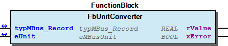 Function description The function block is used to convert an M-Bus typMBRecord data set to a required eUnit target unit and a meter value of the REAL type rValue . xError indicates whether the conversion into the target unit has been performed without error. Note Please note that the converted meter values may have rounding errors due to the REAL format. It is not possible to convert input values outside the range of > 3 999 999 999

## FbUnitConverter_LREAL (FB)

| Scope | Name | Type | Comment |
| --- | --- | --- | --- |
| Inout | typMBus_Record | typMBus_Record | M-Bus data records (value, power of 10, unit) |
| eUnit | eMBusUnit | Unit desired |
| Output | lrValue | LREAL | Value |
| xError | BOOL | Error flag |

The function block unit converter is used to convert a M-Bus record into different types.

Graphical Illustration

Function description

The function block is used to convert an M-Bus typMBRecord data set to a required eUnit target unit and a meter value of the LREAL type lrValue . xError indicates whether the conversion into the target unit has been performed without error.

Interface variables Function The function block unit converter is used to convert a M-Bus record into different types. Graphical Illustration 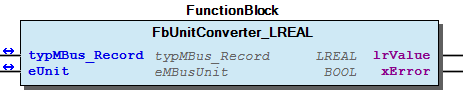 Function description The function block is used to convert an M-Bus typMBRecord data set to a required eUnit target unit and a meter value of the LREAL type lrValue . xError indicates whether the conversion into the target unit has been performed without error.

## doc01_Foreword (FB)

This document, including all figures and illustrations contained therein, is subject to copyright. Any use of this document that infringes upon the copyright provisions stipulated herein is prohibited. Reproduction, translation, electronic and phototechnical filing/archiving (e.g., photocopying), as well as any amendments require the written consent of WAGO Kontakttechnik GmbH & Co. KG, Minden, Germany. Non-observance will entail the right of claims for damages.

WAGO Kontakttechnik GmbH & Co. KG reserves the right to make any alterations or modifications that serve to increase the efficiency of technical progress. WAGO Kontakttechnik GmbH & Co. KG owns all rights arising from granting patents or from the legal protection of utility patents. Third-party products are always mentioned without any reference to patent rights. Thus, the existence of such rights cannot be excluded.

Personnel Qualification

The use of the product described in this document is exclusively geared to specialists having qualifications in PLC programming, electrical specialists or persons instructed by electrical specialists who are also familiar with the appropriate current standards. WAGO Kontakttechnik GmbH & Co. KG assumes no liability resulting from improper action and damage to WAGO products and third-party products due to non-observance of the information contained in this document.

Intended Use

For each individual application, the components are supplied from the factory with a dedicated hardware and software configuration. Modifications are only admitted within the framework of the possibilities documented in this document. All other changes to the hardware and/or software and the non-conforming use of the components entail the exclusion of liability on part of WAGO Kontakttechnik GmbH & Co. KG.

Please direct any requirements pertaining to a modified and/or new hardware or software configuration directly to WAGO Kontakttechnik GmbH & Co. KG.

Scope of Applicability

This application note is based on the _stated hardware and software from the specific manufacturer, as well as the associated documentation. This application note is therefore only valid for the described installation. New hardware and software versions may need to be handled differently.

Please note the detailed description in the specific manuals.

Copyright This document, including all figures and illustrations contained therein, is subject to copyright. Any use of this document that infringes upon the copyright provisions stipulated herein is prohibited. Reproduction, translation, electronic and phototechnical filing/archiving (e.g., photocopying), as well as any amendments require the written consent of WAGO Kontakttechnik GmbH & Co. KG, Minden, Germany. Non-observance will entail the right of claims for damages. WAGO Kontakttechnik GmbH & Co. KG reserves the right to make any alterations or modifications that serve to increase the efficiency of technical progress. WAGO Kontakttechnik GmbH & Co. KG owns all rights arising from granting patents or from the legal protection of utility patents. Third-party products are always mentioned without any reference to patent rights. Thus, the existence of such rights cannot be excluded. Personnel Qualification The use of the product described in this document is exclusively geared to specialists having qualifications in PLC programming, electrical specialists or persons instructed by electrical specialists who are also familiar with the appropriate current standards. WAGO Kontakttechnik GmbH & Co. KG assumes no liability resulting from improper action and damage to WAGO products and third-party products due to non-observance of the information contained in this document. Intended Use For each individual application, the components are supplied from the factory with a dedicated hardware and software configuration. Modifications are only admitted within the framework of the possibilities documented in this document. All other changes to the hardware and/or software and the non-conforming use of the components entail the exclusion of liability on part of WAGO Kontakttechnik GmbH & Co. KG. Please direct any requirements pertaining to a modified and/or new hardware or software configuration directly to WAGO Kontakttechnik GmbH & Co. KG. Scope of Applicability This application note is based on the _stated hardware and software from the specific manufacturer, as well as the associated documentation. This application note is therefore only valid for the described installation. New hardware and software versions may need to be handled differently. Please note the detailed description in the specific manuals.

### Functions

## FuUnitConverter (FUN)

| Scope | Name | Type | Comment |
| --- | --- | --- | --- |
| Return | FuUnitConverter | REAL |  |
| Inout | typMBus_Record | typMBus_Record | M-Bus data records (value, power of 10, unit) |
| eUnit | eMBusUnit | Unit desired |

The function unit converter is used to convert a M-Bus record into different types.

That the converted meter values may have rounding errors due to the REAL format.

It is not possible to convert input values outside the range of >3 999 999 999

Graphical Illustration

Interface variables Function The function unit converter is used to convert a M-Bus record into different types. Note That the converted meter values may have rounding errors due to the REAL format. It is not possible to convert input values outside the range of >3 999 999 999 Graphical Illustration 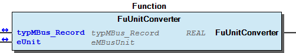

### Methods

## FbMBusCommunication.ForwardStatusObject (METH)

| Scope | Name | Type | Comment |
| --- | --- | --- | --- |
| Input | oStatus | WagoSysErrorBase.FbResult | Status object. (Listed in Status ) The content of the error object could be displayed via the FbShowResult from the WagoSysErrorBase library. |

set oStatus and sStatus output

Interface variables set oStatus and sStatus output

## FbMBusCommunication.isInvalidPort (METH)

| Scope | Name | Type |
| --- | --- | --- |
| Return | isInvalidPort | BOOL |

## FbMBusCommunication.isInvalidPort_ID (METH)

| Scope | Name | Type |
| --- | --- | --- |
| Return | isInvalidPort_ID | BOOL |

## FbMBusCommunication.setClassname (METH)

| Scope | Name | Type |
| --- | --- | --- |
| Input | sName | STRING |

setting class name

Interface variables setting class name

## FbMBusCommunication.setStatusObject (METH)

| Scope | Name | Type | Comment |
| --- | --- | --- | --- |
| Input | uiID | UINT | result ID |

setting result object

Interface variables setting result object

## FbMBusMeter.ForwardStatusObject (METH)

| Scope | Name | Type | Comment |
| --- | --- | --- | --- |
| Input | oStatus | WagoSysErrorBase.FbResult | Status object. (Listed in Status ) The content of the error object could be displayed via the FbShowResult from the WagoSysErrorBase library. |

set oStatus and sStatus output

Interface variables set oStatus and sStatus output

## FbMBusMeter.setClassname (METH)

| Scope | Name | Type |
| --- | --- | --- |
| Input | sName | STRING |

set class name

Interface variables set class name

## FbMBusMeter.setStatusObject (METH)

| Scope | Name | Type | Comment |
| --- | --- | --- | --- |
| Input | uiID | UINT | result ID |

set oStatus and sStatus output

Interface variables set oStatus and sStatus output

## FbMBusProtocol.ForwardStatusObject (METH)

| Scope | Name | Type | Comment |
| --- | --- | --- | --- |
| Input | oStatus | WagoSysErrorBase.FbResult | Status object. (Listed in Status ) The content of the error object could be displayed via the FbShowResult from the WagoSysErrorBase library. |

set oStatus and sStatus output

Interface variables set oStatus and sStatus output

## FbMBusProtocol.setClassname (METH)

| Scope | Name | Type |
| --- | --- | --- |
| Input | sName | STRING |

set class name

Interface variables set class name

## FbMBusProtocol.setStatusObject (METH)

| Scope | Name | Type | Comment |
| --- | --- | --- | --- |
| Input | uiID | UINT | result ID |

set oStatus and sStatus output

Interface variables set oStatus and sStatus output

## FbMBusScanID.resolveID (METH)

| Scope | Name | Type |
| --- | --- | --- |
| Return | resolveID | DWORD |

## FbMBusSendData.ForwardStatusObject (METH)

| Scope | Name | Type | Comment |
| --- | --- | --- | --- |
| Input | oStatus | WagoSysErrorBase.FbResult | Status object. (Listed in Status ) The content of the error object could be displayed via the FbShowResult from the WagoSysErrorBase library. |

set oStatus and sStatus output

Interface variables set oStatus and sStatus output

## FbMBusSendData.setClassname (METH)

| Scope | Name | Type |
| --- | --- | --- |
| Input | sName | STRING |

set class name

Interface variables set class name

## FbMBusSendData.setStatusObject (METH)

| Scope | Name | Type | Comment |
| --- | --- | --- | --- |
| Input | uiID | UINT | result ID |

set oStatus and sStatus output

Interface variables set oStatus and sStatus output

### Program Organization

## 20 Program Organization Units

- 00 Communication / Kommunikation FbMBusMaster (FB) 01 Meter / Zaehler - FbMBusElectricity (FB) - FbMBusHeat (FB) - FbMBusMultiTel (FB) - FbMBusWater (FB) 02 Payload/ Nutzdaten - FbMBusGeneral (FB) - FbMBusRawData (FB) 03 Send data / Daten senden - FbMBusSendData (FB) 00 Administration FbMBusSendData.setClassname (METH) 01 Parameters - FbMBusSendData.Port_ID (PROP) 80 Status - FbMBusSendData.ForwardStatusObject (METH) - FbMBusSendData.setStatusObject (METH) 60 Tools/ Hilfszeug - FbMBusScanID (FB) FbMBusScanID.resolveID (METH) FbUnitConverter (FB) FbUnitConverter_LREAL (FB) 70 Command/ Befehle - FbMBusStatus (FB) - FbMbusStatistic (FB) 80 Data types - 00 Communication / Kommunikation typMBusMbx (STRUCT) 01 Meter / Zaehler - eMBusUnit (ENUM) - typMBus_Info (STRUCT) - typMBus_Record (STRUCT) 70 Command/ Befehle - typMbusStatistic (STRUCT) - typMbusStatus (STRUCT) 82 Base - 01 Communication FbMBusCommunication (FB) FbMBusCommunication.ForwardStatusObject (METH) - FbMBusCommunication.isInvalidPort (METH) - FbMBusCommunication.isInvalidPort_ID (METH) - FbMBusCommunication.setClassname (METH) - FbMBusCommunication.setStatusObject (METH) 02 Device - FbMBusMeter (FB) FbMBusMeter.ForwardStatusObject (METH) - FbMBusMeter.Port_ID (PROP) - FbMBusMeter.setClassname (METH) - FbMBusMeter.setStatusObject (METH) 03 Protocol - FbMBusProtocol (FB) FbMBusProtocol.ForwardStatusObject (METH) - FbMBusProtocol.Port_ID (PROP) - FbMBusProtocol.setClassname (METH) - FbMBusProtocol.setStatusObject (METH)

### Base Components

## 82 Base

- 01 Communication FbMBusCommunication (FB) FbMBusCommunication.ForwardStatusObject (METH) - FbMBusCommunication.isInvalidPort (METH) - FbMBusCommunication.isInvalidPort_ID (METH) - FbMBusCommunication.setClassname (METH) - FbMBusCommunication.setStatusObject (METH) 02 Device - FbMBusMeter (FB) FbMBusMeter.ForwardStatusObject (METH) - FbMBusMeter.Port_ID (PROP) - FbMBusMeter.setClassname (METH) - FbMBusMeter.setStatusObject (METH) 03 Protocol - FbMBusProtocol (FB) FbMBusProtocol.ForwardStatusObject (METH) - FbMBusProtocol.Port_ID (PROP) - FbMBusProtocol.setClassname (METH) - FbMBusProtocol.setStatusObject (METH)

### Internal Components

## 90 Internal

- 60 Tools/ Hilfszeug FuUnitConverter (FUN) 80 Data types - typMbusInit (STRUCT) - typMsgErrorCounter (STRUCT) - typStatusRspErrorCounter (STRUCT)

### Global Variable Lists

## GlobalVariables (GVL)

| Scope | Name | Type | Initial | Comment |
| --- | --- | --- | --- | --- |
|  | g_MBusData | ARRAY [1..MBUS_MAX_MODULES] OF typMBusMbx |  | g_oMBUS_InterfaceLite : ARRAY [1..MBUS_MAX_MODULES] OF MBX_Base; |
| g_MBUS_MAX_REPEAT | BYTE | 3 | Handler setting |
| g_MBUS_MAX_MULTITEL | BYTE | 4 | Maximum multitel telegram |
| g_aMBUS_BAUDRATE | ARRAY [1..MBUS_MAX_MODULES] OF UINT | [MBUS_MAX_MODULES(UINT#2400)] | Baudrate: 300 Baud \| 2400 Baud \| 9600 Baud |
| g_aMBUS_MODULE_BAUDRATE | ARRAY [1..MBUS_MAX_MODULES] OF BYTE | [MBUS_MAX_MODULES(16#1)] | Module Buadrate: 0: 300 Baud, 1: 2400 Baud, 2:9600, 3: Default |
| g_aMBUS_MODULE_UART_INTERFRAME_TIME | ARRAY [1..MBUS_MAX_MODULES] OF BYTE | [MBUS_MAX_MODULES(16#0)] | Module UART interframe time |
| g_aMBUS_MODULE_RSP_TIMEOUT | ARRAY [1..MBUS_MAX_MODULES] OF BYTE | [MBUS_MAX_MODULES(16#0)] | Module Response time |
| g_aMBUS_TIMEOUT | ARRAY [1..MBUS_MAX_MODULES] OF TIME | [MBUS_MAX_MODULES(TIME#5s0ms)] | Time Out value for the communication between PLC and module |
| g_aMBUS_INTER_CMD_TIMEOUT | ARRAY [1..MBUS_MAX_MODULES] OF TIME | [MBUS_MAX_MODULES(TIME#200ms)] | Additional inter command timeout between SELECT / SND_NKE and REQ_UD2 / SND_UD |
| g_aMBUS_SCAN_ID_DELAY | ARRAY [0..1] OF TIME | [TIME#200ms, TIME#3s0ms] | Scan delay for normal and serious response codes selected by g_aMBUS_SCAN_ID_RSP_LONG_DELAY index state |
| g_aMBUS_SCAN_ID_RSP_LONG_DELAY | ARRAY [1..MBUS_MAX_STATUS_ENTRIES] OF BOOL | [FALSE, FALSE, FALSE, FALSE, FALSE, FALSE, FALSE, FALSE, FALSE, FALSE, FALSE, FALSE, FALSE, FALSE, TRUE, FALSE, TRUE, TRUE, FALSE, FALSE, TRUE, FALSE, FALSE, TRUE] |  |
| g_uiMBUS_SCAN_ID_MBUS_FAILURE_RETRY | UINT | 3 | Retry Scan, if M-Bus voltage was not OK |
| Constant | MBUS_MAX_DATARECORDS | BYTE | 36 | Max. Anzahl Daten-Records im Decoder-Output |
| MBUS_MAX_INSTANCE | WORD | 1000 | Maximun number of instance |
| MBUS_ACYCLIC_RX | INT | 1040 | Ressource für den Empfang von fragmentierten Daten des azyklischen Kanals |
| MBUS_ACYCLIC_TX | INT | 1040 | Ressource für das Senden von fragmentierten Daten des azyklischen Kanals |
| MBUS_MBX_WIN_INDEX | BYTE | 2 | MBUS_MAX_RX_BUFFER : WORD:=300; // Receive buffer size mailbox setting for Module FW V0.4.10 |
| MBUS_MBX_WIN_SIZE | BYTE | 22 |  |
| MBUS_SND_NKE | BYTE | 16#69 | CMD: Command byte |
| MBUS_REQ_UD2 | BYTE | 16#71 | MBUS_MODULE_CMD : BYTE:=16#70; |
| MBUS_SND_UD | BYTE | 16#72 |  |
| MBUS_MAX_MBUSDATA | WORD | 261 | Maximum M-bus data length |
| MBUS_MAX_SEND_DATA | UINT | 125 |  |
| MBUS_BAUDRATE_300 | BYTE | 16#0 | Baudrate |
| MBUS_BAUDRATE_2400 | BYTE | 16#1 |  |
| MBUS_BAUDRATE_9600 | BYTE | 16#2 |  |
| MBUS_BAUDRATE_DEFAULT | BYTE | 16#3 |  |
| MBUS_RESET_COMMAND | BYTE | 101 | Status MBUS_MAILBOX_NOT_INIT : BYTE:=108; |
| MBUS_C2M_INIT | BYTE | 16#1 | MBUS_ERROR_MAILBOX : BYTE := 102; Module commands |
| MBUS_C2M_STATUS_REQ | BYTE | 16#2 |  |
| MBUS_M2C_STATUS_RSP | BYTE | 16#3 |  |
| MBUS_C2M_SEND_MSG | BYTE | 16#4 |  |
| MBUS_M2C_REC_MSG | BYTE | 16#5 |  |
| MBUS_M2C_MIRROR_TUNNEL_MSG | BYTE | 16#9A |  |
| MBUS_C2M_STATISTICS_REQ | BYTE | 16#9B |  |
| MBUS_M2C_STATISTICS_RSP | BYTE | 16#9C |  |
| MBUS_C2M_MIRROR_TUNNEL_MSG | BYTE | 16#99 |  |

## Status (GVL)

| Scope | Name | Type |
| --- | --- | --- |
| Constant | gc_Status | ARRAY [0..MBUS_MAX_STATUS_ENTRIES] OF WagoTypesErrorBase.typResultItem |

| Value | Level | Description |
| --- | --- | --- |
| eStatus.OK | WagoTypesErrorBase.WagoTypes.eSeverity.none | ‘OK’ |
| eStatus.MBUS_ERROR_INVALID_PORT | WagoTypesErrorBase.WagoTypes.eSeverity.error | ‘Invalid port’ |
| eStatus.MBUS_ERROR_INVALID_PORT_ID | WagoTypesErrorBase.WagoTypes.eSeverity.error | ‘Invalid port ID’ |
| eStatus.MBUS_ERROR_APP_INVALIDPARAM | WagoTypesErrorBase.WagoTypes.eSeverity.error | ‘App: invalid parameter’ |
| eStatus.MBUS_ERROR_APP_TIMEOUT | WagoTypesErrorBase.WagoTypes.eSeverity.error | ‘App: timeout’ |
| eStatus.MBUS_INFO_APP_BUSY | WagoTypesErrorBase.WagoTypes.eSeverity.info | ‘App: busy’ |
| eStatus.MBUS_ERROR_APP_CRC | WagoTypesErrorBase.WagoTypes.eSeverity.error | ‘App: CRC error’ |
| eStatus.MBUS_ERROR_APP_FRAME | WagoTypesErrorBase.WagoTypes.eSeverity.error | ‘App: frame error’ |
| eStatus.MBUS_ERROR_APP_UNANALYSABLE | WagoTypesErrorBase.WagoTypes.eSeverity.error | ‘App: Value Unalaysable’ |
| eStatus.MBUS_INFO_APP_ACTIVE_SEND | WagoTypesErrorBase.WagoTypes.eSeverity.info | ‘App: Active send’ |
| eStatus.MBUS_ERROR_APP_INVALID_TELEGRAM | WagoTypesErrorBase.WagoTypes.eSeverity.error | ‘App: Invalid telegram’ |
| eStatus.MBUS_INFO_APP_WAITING | WagoTypesErrorBase.WagoTypes.eSeverity.info | ‘App: Waiting’ |
| eStatus.MBUS_ERROR_MSG_RSP_TIMEOUT | WagoTypesErrorBase.WagoTypes.eSeverity.error | ‘Rsp: Timeout’ |
| eStatus.MBUS_ERROR_MSG_PARITY | WagoTypesErrorBase.WagoTypes.eSeverity.error | ‘Rsp: Parity error’ |
| eStatus.MBUS_ERROR_MSG_COLLISION | WagoTypesErrorBase.WagoTypes.eSeverity.error | ‘Rsp: Collision’ |
| eStatus.MBUS_ERROR_MSG_REJECTED | WagoTypesErrorBase.WagoTypes.eSeverity.error | ‘Msg: Rejected’ |
| eStatus.MBUS_ERROR_RSP_SHORTCIRCUIT | WagoTypesErrorBase.WagoTypes.eSeverity.error | ‘Rsp: Short circuit’ |
| eStatus.MBUS_ERROR_RSP_COLLISION | WagoTypesErrorBase.WagoTypes.eSeverity.error | ‘Rsp: Collision’ |
| eStatus.MBUS_ERROR_RSP_MODULE_OVERHEAT | WagoTypesErrorBase.WagoTypes.eSeverity.error | ‘Rsp: Overheat’ |
| eStatus.MBUS_ERROR_RSP_FIELDBUS_ERROR | WagoTypesErrorBase.WagoTypes.eSeverity.error | ‘Rsp: FEC’ |
| eStatus.MBUS_ERROR_RSP_WRONG_VOLTAGE | WagoTypesErrorBase.WagoTypes.eSeverity.error | ‘Rsp: F Volt’ |
| eStatus.MBUS_ERROR_RSP_TELEGRAM_OVERLOAD | WagoTypesErrorBase.WagoTypes.eSeverity.error | ‘Rsp: Overload’ |
| eStatus.MBUS_ERROR_RSP_NOTREADY | WagoTypesErrorBase.WagoTypes.eSeverity.error | ‘Rsp: Not ready’ |
| eStatus.MBUS_ERROR_RSP_BUSVOLTOFF | WagoTypesErrorBase.WagoTypes.eSeverity.error | ‘Rsp: Bus volt off’ |

## VersionHistory (GVL)

| Name | Type |
| --- | --- |
| Info | ProjectInfo |

| date | version | author | change |
| 26.02.2024 | 1.2.2.8 | u010663 | Compiled SP16.3 |
| 24.10.2023 | 1.2.2.7 | u0100662 | Bugfix FbMBusScanID RUN error, if pSyslogLogger handle was not set at instance at xStart=TRUE |
| 09.08.2023 | 1.2.2.6 | u010188 | adaptation to 64 bit |
| 22.02.2023 | 1.2.2.5 | u0100662 | Bugfix FbMBusScanID, Search result improvement |
| 21.03.2022 | 1.2.2.4 | u010188 | Bugfix Library DefaultNamespace missed with WagoSysLog |
| 02.03.2022 | 1.2.2.3 | u018900 | FbMBusDecoder: Bugfix (running variable “PosX” creates an overflow with an internal open loop circuit), changed from type BYTE to type UINT |
| 19.01.2022 | 1.2.2.2 | u015842 | FbMBusMaster: Set oStatus to OK with mailbox reset |
| 14.01.2022 | 1.2.2.1 | u010188 | Improvement interface documentation |
| 12.01.2022 | 1.2.2.0 | u010188 | FbUnitConverter_LREAL added |
| 08.12.2021 | 1.2.1.2 | u015842 | Forward Mailbox status also, when receive error |
| 01.10.2021 | 1.2.1.1 | u0100662 | Fix: FbMBusScanID; Resolve >=3 Devices with nearly same UID with triggered M-Bus voltage error |
| 21.04.2021 | 1.2.1.0 | u010188 | FbMBusDecoder: Unit ‘kvarh’, ‘kVAh’, ‘kVAR’ and ‘kVA’ added, FbUnitConverter: hlph added |
| 04.02.2021 | 1.2.0.6 | u015842 | FbMBusDecoder: Pragma warning disabled for implizit data conversion |
| 19.10.2020 | 1.2.0.5 | u010188 | Bugfix FbUnitConverter: Conversion from m^3/h to l/h wasn’t correct |
| 21.04.2020 | 1.2.0.4 | u015652 | FbMBusDecoder: Loop breaks added in each while-loop. FbMbusCommand: Create new instance if bPort was changed on the Fb. |
| 08.04.2020 | 1.2.0.3 | u015652 | FbMBusHeat: MCal added as a good record. |
| 16.03.2020 | 1.2.0.2 | u015652 | FbMBusDecoder: Unit ‘MCal’ added. |
| 05.02.2020 | 1.2.0.1 | u015652 | Docu update, FbMBusDecoder: Data type of SI and VIFEF changed (USINT to SINT). |
| 20.08.2019 | 1.2.0.0 | u0100662 | FbMBusScanID redesign. |
| 31.07.2019 | 1.1.2.4 | u015652 | g_aMBUS_TIMEOUT increased from 3s to 5s. |
| 28.06.2019 | 1.1.2.3 | u010188 | Bugfix FbMBusSendData: Assignment of bPortMBus corrected |
| 09.04.2019 | 1.1.2.2 | u015652 | Bugfix FbMBusDecoder (WAT 29185), FuUnitConverter changed in FbUnitConverter (Function reinitialized the variables each time) |
| 12.03.2019 | 1.1.2.1 | u015842 | Bugfix Library DefaultNamespace missed with WagoTypesModule_753_649 and WagoAppString |
| 08.01.2019 | 1.1.2.0 | u015842 | Properties: free placeholder added |
| 14.11.2018 | 1.1.1.5 | U010188 | Bugfix FbMBusDecode: UnitCode was missing |
| 25.04.2018 | 1.1.1.4 | U010545 | Update documentation |
| 06.03.2018 | 1.1.1.3 | U010188 | Bugfix FbMBusStatus: ShortCircuit monitoring |
| 29.11.2017 | 1.1.1.2 | U15842 | FbMBusScanID bPortMBus initial 1 |
| 07.11.2017 | 1.1.1.1 | U15842 | FbMBusScanID added |
| 18.04.2017 | 1.0.0.3 | U15842 | e!Cockpit 1.3 Patch 1 |
| 05.01.2017 | 1.0.0.2 | U15842 | e!Cockpit 1.3 |

WagoAppM_Bus.library*

Description: Library for WAGO I/O- System

WagoAppM_Bus.library* Description: Library for WAGO I/O- System

### Other Components

## 00 Administration

- FbMBusSendData.setClassname (METH)

## 00 Communication / Kommunikation

- typMBusMbx (STRUCT)

## 00 Communication / Kommunikation

## 01 Communication

- FbMBusCommunication (FB) FbMBusCommunication.ForwardStatusObject (METH) - FbMBusCommunication.isInvalidPort (METH) - FbMBusCommunication.isInvalidPort_ID (METH) - FbMBusCommunication.setClassname (METH) - FbMBusCommunication.setStatusObject (METH)

## 01 Meter / Zaehler

- eMBusUnit (ENUM) - typMBus_Info (STRUCT) - typMBus_Record (STRUCT)

## 01 Meter / Zaehler

- FbMBusElectricity (FB) - FbMBusHeat (FB) - FbMBusMultiTel (FB) - FbMBusWater (FB)

## 01 Parameters ¶

- FbMBusSendData.Port_ID (PROP)

## 02 Device

- FbMBusMeter (FB) FbMBusMeter.ForwardStatusObject (METH) - FbMBusMeter.Port_ID (PROP) - FbMBusMeter.setClassname (METH) - FbMBusMeter.setStatusObject (METH)

## 02 Payload/ Nutzdaten

- FbMBusGeneral (FB) - FbMBusRawData (FB)

## 03 Protocol

- FbMBusProtocol (FB) FbMBusProtocol.ForwardStatusObject (METH) - FbMBusProtocol.Port_ID (PROP) - FbMBusProtocol.setClassname (METH) - FbMBusProtocol.setStatusObject (METH)

## 03 Send data / Daten senden

- FbMBusSendData (FB) 00 Administration FbMBusSendData.setClassname (METH) 01 Parameters - FbMBusSendData.Port_ID (PROP) 80 Status - FbMBusSendData.ForwardStatusObject (METH) - FbMBusSendData.setStatusObject (METH)

## 60 Tools/ Hilfszeug ¶

- FuUnitConverter (FUN)

## 60 Tools/ Hilfszeug

- FbMBusScanID (FB) FbMBusScanID.resolveID (METH) FbUnitConverter (FB) FbUnitConverter_LREAL (FB)

## 70 Command/ Befehle

- FbMBusStatus (FB) - FbMbusStatistic (FB)

## 70 Command/ Befehle

- typMbusStatistic (STRUCT) - typMbusStatus (STRUCT)

## 80 Data types

- typMbusInit (STRUCT) - typMsgErrorCounter (STRUCT) - typStatusRspErrorCounter (STRUCT)

## 80 Data types

- 00 Communication / Kommunikation typMBusMbx (STRUCT) 01 Meter / Zaehler - eMBusUnit (ENUM) - typMBus_Info (STRUCT) - typMBus_Record (STRUCT) 70 Command/ Befehle - typMbusStatistic (STRUCT) - typMbusStatus (STRUCT)

## 80 Status

- FbMBusSendData.ForwardStatusObject (METH) - FbMBusSendData.setStatusObject (METH)

## 80 Status ¶

- Status (GVL) - eStatus (ENUM)

## FbMBusMeter.Port_ID (PROP) ¶

## FbMBusProtocol.Port_ID (PROP) ¶

## FbMBusSendData.Port_ID (PROP) ¶

## ParameterList (PARAMS)

| Scope | Name | Type | Initial | Comment |
| --- | --- | --- | --- | --- |
| Constant | MBUS_SYSLOG_LOG_LEVEL | USINT | 5 | 0= Disable Syslog writing, The log level must be greater than or equal to the specified level to enable specific logging. |
| MBUS_SYSLOG_LEVEL_SCAN_SETTINGS | USINT | 1 | Log information about backuped and restored settings |
| MBUS_SYSLOG_LEVEL_SCAN_REQ | USINT | 1 | Log scan request UD |
| MBUS_SYSLOG_LEVEL_SCAN_DEVICE | USINT | 1 | Log UD of discovered devices and response with device collision |
| MBUS_SYSLOG_LEVEL_SCAN_RSP | USINT | 3 | Log scan response |
| MBUS_SYSLOG_LEVEL_SCAN_STATEMACHINE | USINT | 4 | Log state changes during scan |
| MBUS_SYSLOG_LEVEL_SCAN_DELAY | USINT | 2 | Log delay information |
| MBUS_SYSLOG_LEVEL_SCAN_BUSY_STATES | USINT | 5 | Log internal results during scan operation of FbMBusMultiTel and FbMbusCommand |
| MBUS_MAX_STATUS_ENTRIES | BYTE | 39 | Maximum status information entries |
| MBUS_MAX_MODULES | BYTE | 10 | Maximum number of modules |
| MBUS_MAX_DEVICES_SCAN | BYTE | 40 | Maximum number of scanned devices |
| MBUS_MAX_RX_BUFFER | WORD | 300 | Receive buffer size |

## eMBusUnit (ENUM)

| Name |
| --- |
| MBus_miW |
| MBus_W |
| MBus_kW |
| MBus_MW |
| MBus_GW |
| MBus_miJps |
| MBus_Jps |
| MBus_kJps |
| MBus_MJps |
| MBus_GJps |
| MBus_miJpmin |
| MBus_Jpmin |
| MBus_kJpmin |
| MBus_MJpmin |
| MBus_GJpmin |
| MBus_miJph |
| MBus_Jph |
| MBus_kJph |
| MBus_MJph |
| MBus_GJph |
| MBus_miWs |
| MBus_Ws |
| MBus_kWs |
| MBus_MWs |
| MBus_GWs |
| MBus_miJ |
| MBus_J |
| MBus_kJ |
| MBus_MJ |
| MBus_GJ |
| MBus_miWmin |
| MBus_Wmin |
| MBus_kWmin |
| MBus_MWmin |
| MBus_GWmin |
| MBus_miWh |
| MBus_Wh |
| MBus_kWh |
| MBus_MWh |
| MBus_GWh |
| MBus_MCal |
| MBus_mil |
| MBus_l |
| MBus_m3 |
| MBus_milps |
| MBus_lps |
| MBus_m3ps |
| MBus_milpmin |
| MBus_lpmin |
| MBus_m3pmin |
| MBus_milph |
| MBus_lph |
| MBus_m3ph |
| MBus_g |
| MBus_kg |
| MBus_gps |
| MBus_kgps |
| MBus_gpmin |
| MBus_kgpmin |
| MBus_gph |
| MBus_kgph |
| MBus_mibar |
| MBus_bar |
| MBus_kbar |
| MBus_miC |
| MBus_C |
| MBus_miK |
| MBus_K |
| MBus_HCA |
| Mbus_none |
| MBus_V |
| MBus_miA |
| MBus_A |
| MBus_pRH |
| MBus_Hz |
| MBus_MCal_ |
| MBus_kvarh |
| MBus_kVAh |
| MBus_kVAR |
| MBus_kVA |
| MBus_hl |
| MBus_hlph |

## eStatus (ENUM)

| Name | Initial | Comment |
| --- | --- | --- |
| OK | 0 | Ok |
| MBUS_ERROR_INVALID_PORT | 1 | Invalid port |
| MBUS_ERROR_INVALID_PORT_ID | 2 | Invalid port ID |
| MBUS_ERROR_APP_INVALIDPARAM | 3 | Invalid parameter |
| MBUS_ERROR_APP_TIMEOUT | 4 | Extend the timeout time, Task cycle mut be between 30-80ms. |
| MBUS_INFO_APP_BUSY | 5 | Application busy |
| MBUS_ERROR_APP_CRC | 6 | Application CRC error |
| MBUS_ERROR_APP_FRAME | 7 | Application frame Error |
| MBUS_ERROR_APP_UNANALYSABLE | 8 | Wrong function block, use FbMBusMultiTel. Extend the timeout time, Task cycle mut be between 30-80ms. |
| MBUS_INFO_APP_ACTIVE_SEND | 9 | Application sends data |
| MBUS_ERROR_APP_INVALID_TELEGRAM | 10 | Extend the timeout time, Task cycle mut be between 30-80ms. |
| MBUS_INFO_APP_WAITING | 11 | Application is waiting |
| MBUS_ERROR_MSG_RSP_TIMEOUT | 12 | Wrong adress. Or secundary adress not in Hex, use 16#xxxxxx. |
| MBUS_ERROR_MSG_PARITY | 13 | Message parity |
| MBUS_ERROR_MSG_COLLISION | 14 | Message collision |
| MBUS_ERROR_MSG_REJECTED | 15 | Message rejected |
| MBUS_ERROR_RSP_SHORTCIRCUIT | 16 | Short circuit on MBus-fieldbus. |
| MBUS_ERROR_RSP_COLLISION | 17 | Telegram collision. |
| MBUS_ERROR_RSP_MODULE_OVERHEAT | 18 | MBus-Module overheat. |
| MBUS_ERROR_RSP_FIELDBUS_ERROR | 19 | MBus-Module: 24V power supply not available. |
| MBUS_ERROR_RSP_WRONG_VOLTAGE | 20 | MBus field power supply wrong. |
| MBUS_ERROR_RSP_TELEGRAM_OVERLOAD | 21 | MBus overload, TO many telegrams. |
| MBUS_ERROR_RSP_NOTREADY | 22 | MBus not ready |
| MBUS_ERROR_RSP_BUSVOLTOFF | 23 | MBus-Module: 24V power supply not available. |

## typMBusMbx (STRUCT)

| Name | Type | Initial | Comment |
| --- | --- | --- | --- |
| dwAddress | DWORD |  | MBus address |
| xSND_NKE | BOOL |  | SND_NKE flag |
| xFCB | BOOL | TRUE | FCB flag |
| xBusy | BOOL |  | Busy flag |
| xStartHandler | BOOL |  | Flag for handler activation |
| xToggle | BOOL |  | Toggle bit |
| bCMD | BYTE |  | MBus command |
| abData | ARRAY [0..MBUS_MAX_MBUSDATA] OF BYTE |  | Data bytes |
| uiLength | UINT |  | Length of payload |
| wInstance | WORD |  | Instance number |
| wInstanceCounter | WORD |  | Instance counter |
| oStatusHandler | WagoSysErrorBase.FbResult |  | Handler status, FbMbusHandlerLite at FbMbusMaster |
| bBaudrate | BYTE | MBUS_BAUDRATE_2400 | 0: 300 Baud, 1: 2400 Baud, 2:9600 |

## typMBus_Info (STRUCT)

| Name | Type |
| --- | --- |
| bPAdr | BYTE |
| sID | STRING(8) |
| sMAN | STRING(3) |
| sMED | STRING(14) |
| bMGen | BYTE |
| bMStatus | BYTE |
| bAllRecords | BYTE |
| bGoodRecords | BYTE |

## typMBus_Record (STRUCT)

| Name | Type |
| --- | --- |
| sValue | STRING(21) |
| sPof10 | STRING(3) |
| sUnit | STRING(7) |
| bSubdevice | BYTE |
| bTariff | BYTE |
| bStorage | BYTE |
| bFunctionNo | BYTE |
| sDescriptor | STRING(23) |
| eEnum_Unit | eMBusUnit |

## typMbusInit (STRUCT)

| Name | Type | Initial | Comment |
| --- | --- | --- | --- |
| bBaudrate | BYTE | MBUS_BAUDRATE_2400 | 0: 300 Baud, 1: 2400 Baud, 2:9600, 3: Default |
| xResetFEC | BOOL |  | Reset Frontend controller (FEC) |
| xMbusVoltageOn | BOOL |  | M-bus voltage on |

## typMbusStatistic (STRUCT)

| Name | Type | Comment |
| --- | --- | --- |
| wTxFrame | WORD | CV: Counter value of transmitted frame |
| wRxFrame | WORD | CV: Counter value of received frame |
| wRejectedTxFrame | WORD | CV: Counter value of rejected transmitted frame |
| dwSumRxFrame | DWORD | Sum of received frame |
| dwSumFullRxFrame | DWORD | Sum of received full frame |
| wResponseTime | WORD | CV: Counter value of response timeout |
| wParityError | WORD | CV: Counter value of parity error |
| wCollision | WORD | CV: Counter value of collision occured |
| wOverload | WORD | CV: Counter value of overloead occured |
| wShortCircuit | WORD | CV: Counter value of short circuit occured |
| wOverheat | WORD | CV: Counter value of overhead occured |
| wTimeoutFEC | WORD | CV: Counter value of timeout error FEC |

## typMbusStatus (STRUCT)

| Name | Type | Comment |
| --- | --- | --- |
| bBaudrate | BYTE | 0: 300 Baud, 1: 2400 Baud, 2:9600, 3: Default |
| xShortCircuit | BOOL | Short circuit |
| xCollision | BOOL | Collision |
| xOverheat | BOOL | Overheat |
| xFailedFEC | BOOL | Failed FEC |
| xInvalidVoltage | BOOL | Invalid voltage |
| xOverload | BOOL | Overload |
| xMbusReady | BOOL | M-bus ready |
| xMbusVoltageOn | BOOL | M-bus voltage on |
| bCableQuality | BYTE | Cable quality |
| rTemperature | REAL | Module temperature |
| uiMarkVoltage | UINT | Mark voltage |
| uiSpaceVoltage | UINT | Space voltage |
| uiPlusVoltageToGround | UINT | Bus plus voltage |
| uiMinusVoltageToGround | UINT | Bus minus voltage |
| bVersionFEC | BYTE | FEC version |

## typMsgErrorCounter (STRUCT)

| Name | Type | Comment |
| --- | --- | --- |
| dwRspTimeout | DWORD | CV: Counter value for response timeout |
| dwParityError | DWORD | CV: Counter value for error parity |
| dwCollision | DWORD | CV: Counter value for collision |
| dwRejected | DWORD | CV: Counter value for rejected transaction |
| dwSndTimeout | DWORD | CV: Counter value for send timeout |
| dwErrorCRC | DWORD | CV: Counter value for CRC error |
| dwFrameError | DWORD | CV: Counter value for M-bus frame error |
| dwInvalidTelegram | DWORD | CV: Counter value for invalid telegram |

## typStatusRspErrorCounter (STRUCT)

| Name | Type | Comment |
| --- | --- | --- |
| dwShortCircuit | DWORD | CV: Counter value for Short circuit |
| dwCollision | DWORD | CV: Counter value for Collision |
| dwOverheat | DWORD | CV: Counter value for Overheat |
| dwFailedFEC | DWORD | CV: Counter value for Failed FEC |
| dwInvalidVoltage | DWORD | CV: Counter value for Invalid voltage |
| dwOverload | DWORD | CV: Counter value for Overload |
| dwMbusNotReady | DWORD | CV: Counter value for error M-bus not ready |
| dwMbusVoltageOff | DWORD | CV: Counter value for error M-bus voltage off |