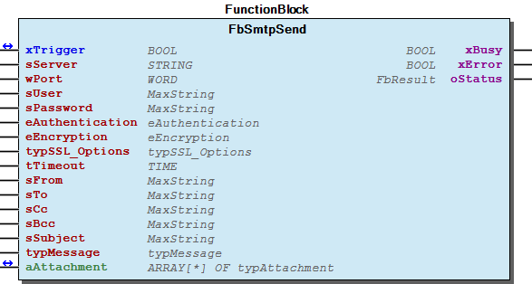
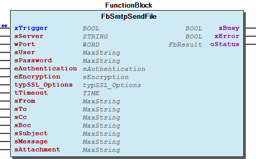
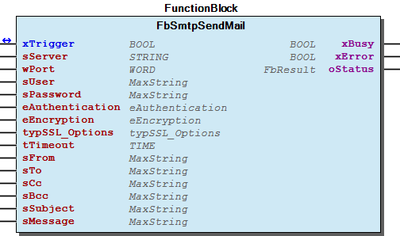
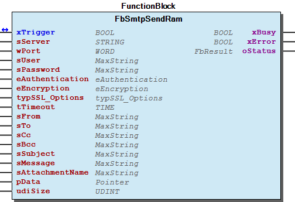

# WagoAppMail v1.1.1.3 (WAGO) - Complete Documentation


## 📋 Library Information

- **Company:** WAGO
- **Title:** WagoAppMail
- **Version:** 1.1.1.3
- **Categories:** Application; WAGO LayerView|App; WAGO FunctionalView|Connectivity
- **Namespace:** WagoAppMail
- **Author:** WAGO / u13773
- **Placeholder:** WagoAppMail

### Description ¶


This document is automatically generated. Because of this, the chapter 30 Visualization is not shown in this document. If you are interested in getting to know more about visualization, we refer to the library manager of e!Cockpit.

This library implements SMTP client functionalities [1]

This document is automatically generated. Because of this, the chapter 30 Visualization is not shown in this document. If you are interested in getting to know more about visualization, we refer to the library manager of e!Cockpit. This library implements SMTP client functionalities [1]

### Contents: ¶


Contents: - Documentation Index - Project Information - Library Information - Function Blocks FbSmtpSend (FB) - FbSmtpSendFile (FB) - FbSmtpSendMail (FB) - FbSmtpSendRam (FB) Program Organization Global Variable Lists - Status (GVL) - VersionHistory (GVL) Other Components - 01 Simple - 02 Advanced - 29 Types - 80 Status - ParameterList (PARAMS) - eAuthentication (ENUM) - eEncryption (ENUM) - eStatusWagoAppMail (ENUM) - typAttachment (STRUCT) - typMessage (STRUCT)

### Indices and tables ¶


| [1] | Based on WagoAppMail.library, last modified 30.06.2022, 20:25:28. LibDoc 3.5.15.30 |

© WAGO Kontakttechnik GmbH & Co. KG, Germany 2018 – All rights reserved. For the avoidance of doubt, this copyright notice does not only apply to the information above but also and primarily to the described library itself. Please note that third-party products are always mentioned without reference to intellectual property rights, including patents, utility models, designs and trademarks, accordingly the existence of such rights cannot be excluded. WAGO is a registered trademark of WAGO Verwaltungsgesellschaft mbH.

- File and Project Information - Library Reference © WAGO Kontakttechnik GmbH & Co. KG, Germany 2018 – All rights reserved. For the avoidance of doubt, this copyright notice does not only apply to the information above but also and primarily to the described library itself. Please note that third-party products are always mentioned without reference to intellectual property rights, including patents, utility models, designs and trademarks, accordingly the existence of such rights cannot be excluded. WAGO is a registered trademark of WAGO Verwaltungsgesellschaft mbH.

### Documentation Index


## WagoAppMail Library Documentation


| Company: | WAGO |
| Title: | WagoAppMail |
| Version: | 1.1.1.3 |
| Categories: | Application; WAGO LayerView\|App; WAGO FunctionalView\|Connectivity |
| Namespace: | WagoAppMail |
| Author: | WAGO / u13773 |
| Placeholder: | WagoAppMail |

### Description


This document is automatically generated. Because of this, the chapter 30 Visualization is not shown in this document. If you are interested in getting to know more about visualization, we refer to the library manager of e!Cockpit.

This library implements SMTP client functionalities [1]

This document is automatically generated. Because of this, the chapter 30 Visualization is not shown in this document. If you are interested in getting to know more about visualization, we refer to the library manager of e!Cockpit. This library implements SMTP client functionalities [1]

### Contents:


- 20 Program Organization Units 01 Simple - 02 Advanced 29 Types - eAuthentication (ENUM) - eEncryption (ENUM) - typAttachment (STRUCT) - typMessage (STRUCT) 80 Status - Status (GVL) - eStatusWagoAppMail (ENUM) ParameterList (PARAMS) VersionHistory (GVL)

### Indices and tables


| [1] | Based on WagoAppMail.library, last modified 30.06.2022, 20:25:28. LibDoc 3.5.15.30 |

© WAGO Kontakttechnik GmbH & Co. KG, Germany 2018 – All rights reserved. For the avoidance of doubt, this copyright notice does not only apply to the information above but also and primarily to the described library itself. Please note that third-party products are always mentioned without reference to intellectual property rights, including patents, utility models, designs and trademarks, accordingly the existence of such rights cannot be excluded. WAGO is a registered trademark of WAGO Verwaltungsgesellschaft mbH.

- File and Project Information - Library Reference © WAGO Kontakttechnik GmbH & Co. KG, Germany 2018 – All rights reserved. For the avoidance of doubt, this copyright notice does not only apply to the information above but also and primarily to the described library itself. Please note that third-party products are always mentioned without reference to intellectual property rights, including patents, utility models, designs and trademarks, accordingly the existence of such rights cannot be excluded. WAGO is a registered trademark of WAGO Verwaltungsgesellschaft mbH.

### Project Information


## File and Project Information


| Scope | Name | Type | Content |
| --- | --- | --- | --- |
| FileHeader | libraryFile | string | WagoAppMail.library |
| contentFile | WagoAppMail_clr.json |
| productName | e!COCKPIT |
| creationDateTime | date | 30.06.2022, 20:25:34 |
| companyName | string | WAGO |
| ProjectInformation | LastModificationDateTime | date | 30.06.2022, 20:25:28 |
| Description | string | See: Description |
| Copyright | © WAGO Kontakttechnik GmbH & Co. KG, Germany 2018 – All rights reserved. |
| Author | WAGO / u13773 |
| AutoResolveUnbound | bool | True |
| Placeholder | string | WagoAppMail |
| Company | WAGO |
| DocFormat | reStructuredText |
| Project | WagoAppMail |
| DefaultNamespace | WagoAppMail |
| Version | version | 1.1.1.3 |
| Title | string | WagoAppMail |
| LibraryCategories | library-category-list | Application; WAGO LayerView\|App; WAGO FunctionalView\|Connectivity |
| CompiledLibraryCompatibilityVersion | string | CODESYS V3.5 SP17 Patch 3 |

### Library Information


## Library Reference


This is a dictionary of all referenced libraries and their name spaces.

This is a dictionary of all referenced libraries and their name spaces.

### Util


#### Library Identification


Placeholder: Util Default Resolution: Util, * (System) Namespace: Util

#### Library Properties


| LinkAllContent: False Optional: False | HideWhenReferencedAsDependency: True QualifiedOnly: True | Key: Util SystemLibrary: False |

#### Library Parameter


Parameter: IBLOCKSIZE = 22800

### WagoAppFileDir


#### Library Identification


Placeholder: WagoAppFileDir Default Resolution: WagoAppFileDir, * (WAGO) Namespace: WagoAppFileDir

#### Library Properties


| LinkAllContent: False QualifiedOnly: False | Key: WagoAppFileDir SystemLibrary: False | Optional: False |

#### Library Parameter


Parameter: STANDARDSCHEDULINGMODE = eSchedulingMode.Background Parameter: STANDARDTIMEOUT = TIME#10s0ms

### WagoAppString


#### Library Identification


Placeholder: WagoAppString Default Resolution: WagoAppString, * (WAGO) Namespace: WagoAppString

#### Library Properties


| LinkAllContent: False QualifiedOnly: False | Key: WagoAppString SystemLibrary: False | Optional: False |

### WagoAppTime


#### Library Identification


Placeholder: WagoAppTime Default Resolution: WagoAppTime, * (WAGO) Namespace: WagoAppTime

#### Library Properties


| LinkAllContent: False QualifiedOnly: False | Key: WagoAppTime SystemLibrary: False | Optional: False |

### WagoSysCurl


#### Library Identification


Placeholder: WagoSysCurl Default Resolution: WagoSysCurl, * (WAGO) Namespace: WagoSysCurl

#### Library Properties


| LinkAllContent: False QualifiedOnly: False | Key: WagoSysCurl SystemLibrary: False | Optional: False |

### WagoSysErrorBase


#### Library Identification


Placeholder: WagoSysErrorBase Default Resolution: WagoSysErrorBase, * (WAGO) Namespace: WagoSysErrorBase

#### Library Properties


| LinkAllContent: False QualifiedOnly: True | Key: WagoSysErrorBase SystemLibrary: False | Optional: False |

#### Library Parameter


Parameter: RES_LOG_MAX_FILESIZE = 2000 Parameter: RES_LOG_MAX_FILES = 1 Parameter: RES_LOG_MAX_ENTRIES = 200 Parameter: RES_LOG_NAME = ‘WagoAppResultLogger’

### WagoSysPlainMem


#### Library Identification


Placeholder: WagoSysPlainMem Default Resolution: WagoSysPlainMem, * (WAGO) Namespace: WagoSysPlainMem

#### Library Properties


| LinkAllContent: False QualifiedOnly: False | Key: WagoSysPlainMem SystemLibrary: False | Optional: False |

### WagoSysVersion


#### Library Identification


Name: WagoSysVersion Version: 1.0.0.0 Company: WAGO Namespace: WagoSysVersion

#### Library Properties


| LinkAllContent: False QualifiedOnly: True | Key: WagoSysVersion, 1.0.0.0 (WAGO) SystemLibrary: False | Optional: False |

### WagoTypesCommon


#### Library Identification


Placeholder: WagoTypesCommon Default Resolution: WagoTypesCommon, * (WAGO) Namespace: WagoTypes

#### Library Properties


| LinkAllContent: False QualifiedOnly: True | Key: WagoTypesCommon SystemLibrary: False | Optional: False |

### WagoTypesCurl


#### Library Identification


Placeholder: WagoTypesCurl Default Resolution: WagoTypesCurl, * (WAGO) Namespace: WagoTypesCurl

#### Library Properties


| LinkAllContent: False QualifiedOnly: False | Key: WagoTypesCurl SystemLibrary: False | Optional: False |

### Function Blocks


## FbSmtpSend (FB)


| Scope | Name | Type | Comment |
| --- | --- | --- | --- |
| Inout | xTrigger | BOOL | Triggers the execution of the action, once the execution is finished it is set to FALSE |
| Output | xBusy | BOOL | Action is still in progress. |
| xError | BOOL | Indicates that an error has occurred. |
| oStatus | WagoSysErrorBase.FbResult | Status object (see WagoSysErrorBase). |
| Input | sServer | STRING | Servername or IP address of SMTP server: e.g. 192.168.1.25 or smtp.gmail.com |
| wPort | WORD | Port number of SMTP server |
| sUser | WagoAppString.MaxString | Username of SMTP account |
| sPassword | WagoAppString.MaxString | Password of SMTP account |
| eAuthentication | eAuthentication | Authentication method |
| eEncryption | eEncryption | Encryption type |
| typSSL_Options | WagoTypesCurl.typSSL_Options | Options for SSL connection (see WagoTypesCurl) |
| tTimeout | TIME | If tTimeout = 0, the timeout is deactivated |
| sFrom | WagoAppString.MaxString | FROM address |
| sTo | WagoAppString.MaxString | TO address(es): Multiple addresses must be separated with semicolon: address1 @ test . org ;address2@test.org |
| sCc | WagoAppString.MaxString | CC address(es): Multiple addresses must be separated with semicolon: address1 @ test . org ;address2@test.org |
| sBcc | WagoAppString.MaxString | BCC address(es): Multiple addresses must be separated with semicolon: address1 @ test . org ;address2@test.org |
| sSubject | WagoAppString.MaxString | Subject text |
| typMessage | typMessage | Message object |
| aAttachment | POINTER TO typAttachment | Array of typAttachment that holds the description of the attachments |

```
VAR
    oSmtpSend           : WagoAppMail.FbSmtpSend;
    xTrigger            : BOOL;
    oStatus             : WagoAppMail.WagoSysErrorBase.FbResult;
    xError              : BOOL;
    xBusy               : BOOL;
    sServer             : STRING := '192.168.1.57';
    wPort               : WORD   := 25;
    sUser               : STRING := 'test1@application.wago';
    sPwd                : STRING := 'wago';
    eAuthentication     : WagoAppMail.eAuthentication := WagoAppMail.eAuthentication.eLOGIN;
    eEncryption         : WagoAppMail.eEncryption := WagoAppMail.eEncryption.eUNENCRYPTED;
    typSSL_Options      : WagoAppMail.WagoTypesCurl.typSSL_Options;
    tTimeout            : TIME;
    sFrom               : STRING := 'test1@application.wago';
    sTo                 : STRING := 'test2@application.wago;test3@application.wago';
    sCc                 : STRING := 'test1@application.wago';
    sBcc                : STRING := '';
    sSubject            : STRING := 'This message is send via WagoAppMail';
    typMessage          : WagoAppMail.typMessage;
    aAttachment         : ARRAY [1..2] OF typAttachment;

    sMyMessage          : STRING := 'Hello world!';
    aData               : ARRAY[1..400] OF BYTE := [78(BYTE#16#30),BYTE#16#0D,BYTE#16#0A,
                                                    78(BYTE#16#31),BYTE#16#0D,BYTE#16#0A,
                                                    78(BYTE#16#32),BYTE#16#0D,BYTE#16#0A,
                                                    78(BYTE#16#33),BYTE#16#0D,BYTE#16#0A,
                                                    78(BYTE#16#34),BYTE#16#0D,BYTE#16#0A];
END_VAR


typMessage.pData        := ADR(sMyMessage);
typMessage.udiSize      := TO_UDINT(LEN(sMyMessage));
typMessage.sContentType := 'text/plain';
typMessage.sCharset     := 'windows-1252';
typMessage.sEncoding    := '8bit';

aAttachment[1].sFilename:= 'LogMessages.txt';
aAttachment[1].sPath    := '/var/log/messages';
aAttachment[1].pData    := 0;
aAttachment[1].udiSize  := 0;

aAttachment[2].sFilename:= 'MyPlcData.txt';
aAttachment[2].sPath    := '';
aAttachment[2].pData    := ADR(aData);
aAttachment[2].udiSize  := SIZEOF(aData);

oSmtpSend(
    xTrigger:= xTrigger,
    oStatus=> oStatus,
    xError=> xError,
    xBusy=> xBusy,
    sServer:= sServer,
    wPort:= wPort,
    sUser:= sUser,
    sPassword:= sPwd,
    eAuthentication:= eAuthentication,
    eEncryption:= eEncryption,
    typSSL_Options:= typSSL_Options,
    tTimeout:=tTimeout,
    sFrom:= sFrom,
    sTo:= sTo,
    sCc:= sCc,
    sBcc:= sBcc,
    sSubject:= sSubject,
    typMessage:= typMessage,
    aAttachment:= aAttachment);
```

Send email messages via encrypted or unencrypted SMTP.

Graphical Illustration

Function description

This function block allows to send email messages via encrypted or unencrypted SMTP. The message body of the email is configureable through the input variable typMessage (STRUCT) . The structure typMessage (STRUCT) allows to configure the data area, size, content-type, character set and encoding of the message body. This may be helpful if it is requiered to send HTML content in the message body (text/html).

The number of attachments is not limited by the function block. Limiting factors are the available space in the tmp-filesystem of the controller and restrictions of the email provider.

Attachments are configureable through the input array typAttachment (STRUCT) . Each element of the array holds an description of an attachment. The attachment may be a file located in the filesystem of the controller or a data array declared inside the e!COCKPIT application.

Transition to TRUE on xTrigger triggers the process to create and send an email message. The function block resets xTrigger to FALSE again after it has finished the process. If something went wrong during the process xTrigger resets to FALSE and xError is set to TRUE . The output xBusy indicates that the function block is still processing the email message.

Interface variables Function Send email messages via encrypted or unencrypted SMTP. Graphical Illustration  Function description This function block allows to send email messages via encrypted or unencrypted SMTP. The message body of the email is configureable through the input variable typMessage (STRUCT) . The structure typMessage (STRUCT) allows to configure the data area, size, content-type, character set and encoding of the message body. This may be helpful if it is requiered to send HTML content in the message body (text/html). The number of attachments is not limited by the function block. Limiting factors are the available space in the tmp-filesystem of the controller and restrictions of the email provider. Attachments are configureable through the input array typAttachment (STRUCT) . Each element of the array holds an description of an attachment. The attachment may be a file located in the filesystem of the controller or a data array declared inside the e!COCKPIT application. Transition to TRUE on xTrigger triggers the process to create and send an email message. The function block resets xTrigger to FALSE again after it has finished the process. If something went wrong during the process xTrigger resets to FALSE and xError is set to TRUE . The output xBusy indicates that the function block is still processing the email message. Example Send an email message with attachments taken from filesystem and from e!COCKPIT data array:

## FbSmtpSendFile (FB)


| Scope | Name | Type | Comment | Inherited from |
| --- | --- | --- | --- | --- |
| Inout | xTrigger | BOOL | Triggers the execution of the action. | FbSmtpSendMail |
| Output | xBusy | BOOL | Action is still in progress. | FbSmtpSendMail |
| xError | BOOL | Indicates that an error has occurred. | FbSmtpSendMail |
| oStatus | WagoSysErrorBase.FbResult | Status object (see WagoSysErrorBase). | FbSmtpSendMail |
| Input | sServer | STRING | Servername or IP address of SMTP server: e.g. 192.168.1.25 or smtp.gmail.com | FbSmtpSendMail |
| wPort | WORD | Port number of SMTP server | FbSmtpSendMail |
| sUser | WagoAppString.MaxString | Username of SMTP account | FbSmtpSendMail |
| sPassword | WagoAppString.MaxString | Password of SMTP account | FbSmtpSendMail |
| eAuthentication | eAuthentication | Authentication method | FbSmtpSendMail |
| eEncryption | eEncryption | Encryption type | FbSmtpSendMail |
| typSSL_Options | WagoTypesCurl.typSSL_Options | Options for SSL connection (see WagoTypesCurl) | FbSmtpSendMail |
| tTimeout | TIME | If tTimeout = 0, the timeout is deactivated | FbSmtpSendMail |
| sFrom | WagoAppString.MaxString | FROM address | FbSmtpSendMail |
| sTo | WagoAppString.MaxString | TO address(es): Multiple addresses must be separated with semicolon: address1 @ test . org ;address2@test.org | FbSmtpSendMail |
| sCc | WagoAppString.MaxString | CC address(es): Multiple addresses must be separated with semicolon: address1 @ test . org ;address2@test.org | FbSmtpSendMail |
| sBcc | WagoAppString.MaxString | BCC address(es): Multiple addresses must be separated with semicolon: address1 @ test . org ;address2@test.org | FbSmtpSendMail |
| sSubject | WagoAppString.MaxString | Subject text | FbSmtpSendMail |
| sMessage | WagoAppString.MaxString | Message text | FbSmtpSendMail |
| sAttachment | WagoAppString.MaxString | Path of file that should be attached: e.g. /var/log/messages |  |

```
VAR
    oSmtpSend           : WagoAppMail.FbSmtpSendFile;
    xTrigger            : BOOL;
    oStatus             : WagoAppMail.WagoSysErrorBase.FbResult;
    xError              : BOOL;
    xBusy               : BOOL;
    sServer             : STRING := '192.168.1.57';
    wPort               : WORD   := 25;
    sUser               : STRING := 'test1@application.wago';
    sPwd                : STRING := 'wago';
    eAuthentication     : WagoAppMail.eAuthentication := WagoAppMail.eAuthentication.eLOGIN;
    eEncryption         : WagoAppMail.eEncryption := WagoAppMail.eEncryption.eUNENCRYPTED;
    typSSL_Options      : WagoAppMail.WagoTypesCurl.typSSL_Options;
    tTimeout            : TIME;
    sFrom               : STRING := 'test1@application.wago';
    sTo                 : STRING := 'test2@application.wago;test3@application.wago';
    sCc                 : STRING := 'test1@application.wago';
    sBcc                : STRING := '';
    sSubject            : STRING := 'This message is send via WagoAppMail';
    sMessage            : STRING := 'This is the message text send via WagoAppMail';
    sAttachment         : STRING := '/Path/To/AttachmentFile';
END_VAR

oSmtpSend(
    xTrigger:= xTrigger,
    oStatus=> oStatus,
    xError=> xError,
    xBusy=> xBusy,
    sServer:= sServer,
    wPort:= wPort,
    sUser:= sUser,
    sPassword:= sPwd,
    eAuthentication:= eAuthentication,
    eEncryption:= eEncryption,
    typSSL_Options:= typSSL_Options,
    ttimeout:=tTimeout,
    sFrom:= sFrom,
    sTo:= sTo,
    sCc:= sCc,
    sBcc:= sBcc,
    sSubject:= sSubject,
    sMessage:= sMessage,
    sAttachment:=sAttachment);
```

Send plain text email messages with attachment from filesystem via encrypted or unencrypted SMTP.

Graphical Illustration

Function description

This function block allows to send email messages with attachment from filesystem via encrypted or unencrypted SMTP. The message body of the email is configureable through the input variable sMessage . The input variable sMessage contains the path to the file that should be attached to the email message

Transition to TRUE on xTrigger triggers the process to create and send an email message. The function block resets xTrigger to FALSE again after it has finished the process. If something went wrong during the process xTrigger resets to FALSE and xError is set to TRUE . The output xBusy indicates that the function block is still processing the email message.

Interface variables Function Send plain text email messages with attachment from filesystem via encrypted or unencrypted SMTP. Graphical Illustration  Function description This function block allows to send email messages with attachment from filesystem via encrypted or unencrypted SMTP. The message body of the email is configureable through the input variable sMessage . The input variable sMessage contains the path to the file that should be attached to the email message Transition to TRUE on xTrigger triggers the process to create and send an email message. The function block resets xTrigger to FALSE again after it has finished the process. If something went wrong during the process xTrigger resets to FALSE and xError is set to TRUE . The output xBusy indicates that the function block is still processing the email message. Example Send a simple plain text email message with attachment from filesystem:

## FbSmtpSendMail (FB)


| Scope | Name | Type | Comment |
| --- | --- | --- | --- |
| Inout | xTrigger | BOOL | Triggers the execution of the action. |
| Output | xBusy | BOOL | Action is still in progress. |
| xError | BOOL | Indicates that an error has occurred. |
| oStatus | WagoSysErrorBase.FbResult | Status object (see WagoSysErrorBase). |
| Input | sServer | STRING | Servername or IP address of SMTP server: e.g. 192.168.1.25 or smtp.gmail.com |
| wPort | WORD | Port number of SMTP server |
| sUser | WagoAppString.MaxString | Username of SMTP account |
| sPassword | WagoAppString.MaxString | Password of SMTP account |
| eAuthentication | eAuthentication | Authentication method |
| eEncryption | eEncryption | Encryption type |
| typSSL_Options | WagoTypesCurl.typSSL_Options | Options for SSL connection (see WagoTypesCurl) |
| tTimeout | TIME | If tTimeout = 0, the timeout is deactivated |
| sFrom | WagoAppString.MaxString | FROM address |
| sTo | WagoAppString.MaxString | TO address(es): Multiple addresses must be separated with semicolon: address1 @ test . org ;address2@test.org |
| sCc | WagoAppString.MaxString | CC address(es): Multiple addresses must be separated with semicolon: address1 @ test . org ;address2@test.org |
| sBcc | WagoAppString.MaxString | BCC address(es): Multiple addresses must be separated with semicolon: address1 @ test . org ;address2@test.org |
| sSubject | WagoAppString.MaxString | Subject text |
| sMessage | WagoAppString.MaxString | Message text |

```
VAR
    oSmtpSend           : WagoAppMail.FbSmtpSendFile;
    xTrigger            : BOOL;
    oStatus             : WagoAppMail.WagoSysErrorBase.FbResult;
    xError              : BOOL;
    xBusy               : BOOL;
    sServer             : STRING := '192.168.1.57';
    wPort               : WORD   := 25;
    sUser               : STRING := 'test1@application.wago';
    sPwd                : STRING := 'wago';
    eAuthentication     : WagoAppMail.eAuthentication := WagoAppMail.eAuthentication.eLOGIN;
    eEncryption         : WagoAppMail.eEncryption := WagoAppMail.eEncryption.eUNENCRYPTED;
    typSSL_Options      : WagoAppMail.WagoTypesCurl.typSSL_Options;
    tTimeout            : TIME;
    sFrom               : STRING := 'test1@application.wago';
    sTo                 : STRING := 'test2@application.wago;test3@application.wago';
    sCc                 : STRING := 'test1@application.wago';
    sBcc                : STRING := '';
    sSubject            : STRING := 'This message is send via WagoAppMail';
    sMessage            : STRING := 'This is the message text send via WagoAppMail';
END_VAR

oSmtpSend(
    xTrigger:= xTrigger,
    oStatus=> oStatus,
    xError=> xError,
    xBusy=> xBusy,
    sServer:= sServer,
    wPort:= wPort,
    sUser:= sUser,
    sPassword:= sPwd,
    eAuthentication:= eAuthentication,
    eEncryption:= eEncryption,
    typSSL_Options:= typSSL_Options,
    tTimeout:=tTimeout,
    sFrom:= sFrom,
    sTo:= sTo,
    sCc:= sCc,
    sBcc:= sBcc,
    sSubject:= sSubject,
    sMessage:= sMessage,
    sAttachment:= sAttachment);
```

Send plain text email messages via encrypted or unencrypted SMTP.

Graphical Illustration

Function description

This function block allows to send email messages via encrypted or unencrypted SMTP. The message body of the email is configureable through the input variable sMessage .

Transition to TRUE on xTrigger triggers the process to create and send an email message. The function block resets xTrigger to FALSE again after it has finished the process. If something went wrong during the process xTrigger resets to FALSE and xError is set to TRUE . The output xBusy indicates that the function block is still processing the email message.

Interface variables Function Send plain text email messages via encrypted or unencrypted SMTP. Graphical Illustration  Function description This function block allows to send email messages via encrypted or unencrypted SMTP. The message body of the email is configureable through the input variable sMessage . Transition to TRUE on xTrigger triggers the process to create and send an email message. The function block resets xTrigger to FALSE again after it has finished the process. If something went wrong during the process xTrigger resets to FALSE and xError is set to TRUE . The output xBusy indicates that the function block is still processing the email message. Example Send a simple plain text email message:

## FbSmtpSendRam (FB)


| Scope | Name | Type | Comment | Inherited from |
| --- | --- | --- | --- | --- |
| Inout | xTrigger | BOOL | Triggers the execution of the action. | FbSmtpSendMail |
| Output | xBusy | BOOL | Action is still in progress. | FbSmtpSendMail |
| xError | BOOL | Indicates that an error has occurred. | FbSmtpSendMail |
| oStatus | WagoSysErrorBase.FbResult | Status object (see WagoSysErrorBase). | FbSmtpSendMail |
| Input | sServer | STRING | Servername or IP address of SMTP server: e.g. 192.168.1.25 or smtp.gmail.com | FbSmtpSendMail |
| wPort | WORD | Port number of SMTP server | FbSmtpSendMail |
| sUser | WagoAppString.MaxString | Username of SMTP account | FbSmtpSendMail |
| sPassword | WagoAppString.MaxString | Password of SMTP account | FbSmtpSendMail |
| eAuthentication | eAuthentication | Authentication method | FbSmtpSendMail |
| eEncryption | eEncryption | Encryption type | FbSmtpSendMail |
| typSSL_Options | WagoTypesCurl.typSSL_Options | Options for SSL connection (see WagoTypesCurl) | FbSmtpSendMail |
| tTimeout | TIME | If tTimeout = 0, the timeout is deactivated | FbSmtpSendMail |
| sFrom | WagoAppString.MaxString | FROM address | FbSmtpSendMail |
| sTo | WagoAppString.MaxString | TO address(es): Multiple addresses must be separated with semicolon: address1 @ test . org ;address2@test.org | FbSmtpSendMail |
| sCc | WagoAppString.MaxString | CC address(es): Multiple addresses must be separated with semicolon: address1 @ test . org ;address2@test.org | FbSmtpSendMail |
| sBcc | WagoAppString.MaxString | BCC address(es): Multiple addresses must be separated with semicolon: address1 @ test . org ;address2@test.org | FbSmtpSendMail |
| sSubject | WagoAppString.MaxString | Subject text | FbSmtpSendMail |
| sMessage | WagoAppString.MaxString | Message text | FbSmtpSendMail |
| sAttachmentName | WagoAppString.MaxString | Name of attachment |  |
| pData | POINTER TO BYTE | Address of the data that should be attached to the email |  |
| udiSize | UDINT | Size of the data that should be attached |  |

```
VAR
    oSmtpSend           : WagoAppMail.FbSmtpSendRam;
    xTrigger            : BOOL;
    oStatus             : WagoAppMail.WagoSysErrorBase.FbResult;
    xError              : BOOL;
    xBusy               : BOOL;
    sServer             : STRING := '192.168.1.57';
    wPort               : WORD   := 25;
    sUser               : STRING := 'test1@application.wago';
    sPwd                : STRING := 'wago';
    eAuthentication     : WagoAppMail.eAuthentication := WagoAppMail.eAuthentication.eLOGIN;
    eEncryption         : WagoAppMail.eEncryption := WagoAppMail.eEncryption.eUNENCRYPTED;
    typSSL_Options      : WagoAppMail.WagoTypesCurl.typSSL_Options;
    tTimeout            : TIME;
    sFrom               : STRING := 'test1@application.wago';
    sTo                 : STRING := 'test2@application.wago;test3@application.wago';
    sCc                 : STRING := 'test1@application.wago';
    sBcc                : STRING := '';
    sSubject            : STRING := 'This message is send via WagoAppMail';
    sMessage            : STRING := 'This is the message text send via WagoAppMail';
    sAttachmentName     : STRING := 'MyAttachment.txt';

    aData               : ARRAY[1..400] OF BYTE := [78(BYTE#16#30),BYTE#16#0D,BYTE#16#0A,
                                                    78(BYTE#16#31),BYTE#16#0D,BYTE#16#0A,
                                                    78(BYTE#16#32),BYTE#16#0D,BYTE#16#0A,
                                                    78(BYTE#16#33),BYTE#16#0D,BYTE#16#0A,
                                                    78(BYTE#16#34),BYTE#16#0D,BYTE#16#0A];


END_VAR

oSmtpSend(
    xTrigger:= xTrigger,
    oStatus=> oStatus,
    xError=> xError,
    xBusy=> xBusy,
    sServer:= sServer,
    wPort:= wPort,
    sUser:= sUser,
    sPassword:= sPwd,
    eAuthentication:= eAuthentication,
    eEncryption:= eEncryption,
    typSSL_Options:= typSSL_Options,
    tTimeout:=tTimeout,
    sFrom:= sFrom,
    sTo:= sTo,
    sCc:= sCc,
    sBcc:= sBcc,
    sSubject:= sSubject,
    sMessage:= sMessage,
    sAttachmentName:=sAttachmentName,
    pData:=ADR(aData),
    udiSize:=SIZEOF(aData));
```

Send plain text email messages with attachment data taken directly from the e!COCKPIT application via encrypted or unencrypted SMTP.

Graphical Illustration

Function description

This function block allows to send plain text email messages with attachment data taken directly from the e!COCKPIT application via encrypted or unencrypted SMTP. The message body of the email is configureable through the input variable sMessage . sAttachmentName determines the name of the attachment in the email message. The inputs pData and udiSize are determining the data that is attached to the email message.

Transition to TRUE on xTrigger triggers the process to create and send an email message. The function block resets xTrigger to FALSE again after it has finished the process. If something went wrong during the process xTrigger resets to FALSE and xError is set to TRUE . The output xBusy indicates that the function block is still processing the email message.

Interface variables Function Send plain text email messages with attachment data taken directly from the e!COCKPIT application via encrypted or unencrypted SMTP. Graphical Illustration  Function description This function block allows to send plain text email messages with attachment data taken directly from the e!COCKPIT application via encrypted or unencrypted SMTP. The message body of the email is configureable through the input variable sMessage . sAttachmentName determines the name of the attachment in the email message. The inputs pData and udiSize are determining the data that is attached to the email message. Transition to TRUE on xTrigger triggers the process to create and send an email message. The function block resets xTrigger to FALSE again after it has finished the process. If something went wrong during the process xTrigger resets to FALSE and xError is set to TRUE . The output xBusy indicates that the function block is still processing the email message. Example Send a simple plain text email message with attachment data taken from data array:

### Program Organization


## 20 Program Organization Units


- 01 Simple FbSmtpSendFile (FB) - FbSmtpSendMail (FB) - FbSmtpSendRam (FB) 02 Advanced - FbSmtpSend (FB)

### Global Variable Lists


## Status (GVL)


| Value | Level | Description |
| --- | --- | --- |
| 0 | WagoSysErrorBase.WagoTypes.eSeverity.none | ‘OK’ |
| 1 | WagoSysErrorBase.WagoTypes.eSeverity.error | ‘No valid message interface available’ |
| 2 | WagoSysErrorBase.WagoTypes.eSeverity.error | ‘Attachment is not available’ |
| 3 | WagoSysErrorBase.WagoTypes.eSeverity.error | ‘Read attachment data has failed’ |

Description: Status Information

Description: Status Information

## VersionHistory (GVL)


| date | version | author | change |
| 05.04.2022 | 1.1.1.3 | u0103719 | rename object type “char” to “eChar” |
| 08.07.2020 | 1.1.1.2 | WAGO / u013773 | Fix handling of multiple recipients |
| 12.07.2019 | 1.1.1.1 | WAGO / u013972 | Changes for new codesys version |
| 08.01.2019 | 1.1.1.0 | u015842 | Properties: free placeholder added |
| 15.05.2018 | 1.1.0.6 | WAGO / u013773 | Add parameter to configure logging |
| 27.04.2018 | 1.1.0.5 | WAGO / u010545 | Update documentation |
| 16.10.2017 | 1.1.0.4 | WAGO / u013773 | Placeholder for WagoAppFileDir modified |
| 05.09.2017 | 1.1.0.3 | WAGO / u013773 | Use CURL_NULL instead of empty string if user/password is not set |
| 07.04.2017 | 1.1.0.2 | WAGO / u013773 | Use local time instead of UTC for time header |
| 07.04.2017 | 1.1.0.1 | WAGO / u013773 | Newline indicator within attachment data block corrected |
| 15.12.2016 | 1.1.0.0 | WAGO / u013773 | Variable names harmonized |
| 16.11.2016 | 1.0.0.0 | WAGO / u013773 | First release |

WagoAppMail.library

Release Notes: Firmware version >= 02.06.xx(09) for PFC100/PFC200 required

Known Bugs:

WagoAppMail.library Release Notes: Firmware version >= 02.06.xx(09) for PFC100/PFC200 required Known Bugs:

### Other Components


## 01 Simple


Straightforward functions blocks to send plain text email messages. Optional support for attachments from filesystem or from data array.

Straightforward functions blocks to send plain text email messages. Optional support for attachments from filesystem or from data array. - FbSmtpSendFile (FB) - FbSmtpSendMail (FB) - FbSmtpSendRam (FB)

## 02 Advanced


Advanced function block to send email messages with configureable message body and attachments.

Advanced function block to send email messages with configureable message body and attachments. - FbSmtpSend (FB)

## 29 Types


- eAuthentication (ENUM) - eEncryption (ENUM) - typAttachment (STRUCT) - typMessage (STRUCT)

## 80 Status ¶


- Status (GVL) - eStatusWagoAppMail (ENUM)

## ParameterList (PARAMS)


| Scope | Name | Type | Initial | Comment |
| --- | --- | --- | --- | --- |
| Constant | DELETE_TEMPFILES | BOOL | TRUE | Configure handling of temporary files generated by FbMessageHandler (Files are located in /tmp) TRUE : Delete temporary files after email is sent FALSE: Do not delete temporary files (Maybe useful for debugging) |
| CURL_LOGGING | BOOL | FALSE | Configure verbose mode and logging of FbCurl TRUE : Enable verbose mode and logging to /var/log/WagoAppMail_Instance_x (Files are not rotated automatically!)’ FALSE: Disable logging |

## eAuthentication (ENUM)


| Name | Initial | Comment |
| --- | --- | --- |
| eAUTOMATIC | 0 | Select authentication method automatically. The function block may select any mechanism supported by the server. This option should be treated with care as it might cause a fall back to a weak security mechanism. |
| eNONE | 1 | No authentication |
| ePLAIN | 2 | Plain |
| eLOGIN | 3 | Login |
| eCRAM_MD5 | 4 | Cram-MD5 |
| eDIGEST_MD5 | 6 | Digest-MD5 |
| eNTLM | 7 | NTLM |

## eEncryption (ENUM)


| Name | Initial | Comment |
| --- | --- | --- |
| eSTARTTLS | 0 | Open an unencrypted TCP connection to the SMTP server and switch to TLS afterwards |
| eSMTPS | 1 | Open an encrypted connection directly |
| eUNENCRYPTED | 2 | No encryption |

## eStatusWagoAppMail (ENUM)


| Name | Initial | Comment |
| --- | --- | --- |
| Ok | 0 | (none) Ok |
| UndefinedInterface | 1 | Interfaces are not defined |
| AttachmentNotAvailable | 2 | Attachment is not available |
| ReadAttachmentFailed | 3 | Read attachment data failed |

## typAttachment (STRUCT)


| Name | Type | Comment |
| --- | --- | --- |
| sFilename | WagoTypes.FileName | This name is used for the attachment in the email message |
| sPath | WagoTypes.FileName | Path of the file that should be attached to the email message: e.g. /var/log/messages |
| pData | POINTER TO BYTE | Pointer to the data that should be attached to the email message. This paramter is only considered if sPath is not set |
| udiSize | UDINT | Size of the data area that is referenced by pData |

```
VAR
    aAttachment : ARRAY [1..5] OF typAttachment :=

                    [
                        //This element attaches the file /home/codesys/data.txt without renaming it.
                        (sFilename:= '',
                         sPath    := '/home/codesys/data.txt',
                         pData    := 0,
                         udiSize  := 0),

                         //This element attaches the file /home/codesys/data.txt and renames it to MyDataFile.dat
                        (sFilename:= 'MyDataFile.dat',
                         sPath    := '/home/codesys/data.txt',
                         pData    := 0,
                         udiSize  := 0),

                         //This element attaches the data referenced by aData and names the file MyDataFile.dat
                        (sFilename:= 'MyDataFile.dat',
                         sPath    := '',
                         pData    := ADR(aData),
                         udiSize  := SIZEOF(aData)),

                         //This element attaches the file /home/codesys/data.txt without renaming it, pData and udiSize are ignored
                        (sFilename:= '',
                         sPath    := '/home/codesys/data.txt',
                         pData    := ADR(aData),
                         udiSize  := SIZEOF(aData)),

                         //This element causes an error, because sFilename must be set for data attachments
                        (sFilename:= '',
                         sPath    := '',
                         pData    := ADR(aData),
                         udiSize  := SIZEOF(aData))
                     ]
END_VAR
```

This structure describes a single attachment element. Each attachment may be a file located in the file system or a data area declared in the e!COCKPIT application.

InOut: This structure describes a single attachment element. Each attachment may be a file located in the file system or a data area declared in the e!COCKPIT application.

## typMessage (STRUCT)


| Name | Type | Initial | Comment |
| --- | --- | --- | --- |
| pData | POINTER TO BYTE |  | Pointer to the data area that holds the message |
| udiSize | UDINT |  | Size of the data area that is referenced by pData |
| sContentType | STRING | ‘text/plain’ | Content-Type of the message |
| sCharset | STRING | ‘windows-1252’ | Charset of the message |
| sEncoding | STRING | ‘8bit’ | Content-Transfer-Encoding of the message |

InOut: This structure describes the message body. It allows to specify the data area and the size of the body data. In addition it is possible to set the header field content-type, character set and encoding. The default header of the message body includes the following parameter: Content-Type: text/plain; charset="windows-1252" Content-Transfer-Encoding: 8bit <Data referenced by pData is inserted here> If the header fields are modified (e.g. text/html instead of text/plain) the message data (pData) has to be provided in the correct form, as the function block simply copies the data to the message without interpreting or encoding.