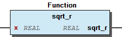

# WagoAppMath v1.1.1.3 (WAGO) - Complete Documentation


## 📋 Library Information

- **Company:** WAGO
- **Title:** WagoAppMath
- **Version:** 1.1.1.3
- **Categories:** WAGO FunctionalView|Standard Algorithms; WAGO LayerView|App; Application
- **Author:** WAGO / u013972
- **Placeholder:** WagoAppMath

### Description ¶


This document is automatically generated. Because of this, the chapter 30 Visualization is not shown in this document. If you are interested in getting to know more about visualization, we refer to the library manager of e!Cockpit.

Mathematical standard routines [1]

This document is automatically generated. Because of this, the chapter 30 Visualization is not shown in this document. If you are interested in getting to know more about visualization, we refer to the library manager of e!Cockpit. Mathematical standard routines [1]

### Contents: ¶


Contents: - Documentation Index 10 Documentation - WagoAppMath Library Documentation Project Information Library Information Function Blocks - doc10_general (FB) - doc92_specifications (FB) Functions - IsInfinite (FUN) - IsNaN (FUN) - abs_L (FUN) - abs_r (FUN) - angleToDegree_L (FUN) - angleToDegree_r (FUN) - angleToRadiant_L (FUN) - angleToRadiant_r (FUN) - arcCos (FUN) - arcSin (FUN) - ... and 54 more Program Organization Global Variable Lists - Constants (GVL) - LibraryResult (GVL) - ResultItems (GVL) - VersionHistory (GVL) Other Components - 01 Commonly Used - 01 Elementary Math - 02 Trignometric - 03 Combinatorics - 04 Miscellaneous - Types and Conversion - angle_t (ALIAS)

### Indices and tables ¶


| [1] | Based on WagoAppMath.library, last modified 25.05.2021, 13:03:47. LibDoc 3.5.15.30 |

© WAGO Kontakttechnik GmbH & Co. KG, Germany 2018 – All rights reserved. For the avoidance of doubt, this copyright notice does not only apply to the information above but also and primarily to the described library itself. Please note that third-party products are always mentioned without reference to intellectual property rights, including patents, utility models, designs and trademarks, accordingly the existence of such rights cannot be excluded. WAGO is a registered trademark of WAGO Verwaltungsgesellschaft mbH.

- File and Project Information - Library Reference © WAGO Kontakttechnik GmbH & Co. KG, Germany 2018 – All rights reserved. For the avoidance of doubt, this copyright notice does not only apply to the information above but also and primarily to the described library itself. Please note that third-party products are always mentioned without reference to intellectual property rights, including patents, utility models, designs and trademarks, accordingly the existence of such rights cannot be excluded. WAGO is a registered trademark of WAGO Verwaltungsgesellschaft mbH.

### Documentation Index


## 10 Documentation


- doc10_general (FB) - Suffixes for result types - Angular types - Abbreviated argument name - doc92_specifications (FB)

## WagoAppMath Library Documentation


| Company: | WAGO |
| Title: | WagoAppMath |
| Version: | 1.1.1.3 |
| Categories: | WAGO FunctionalView\|Standard Algorithms; WAGO LayerView\|App; Application |
| Author: | WAGO / u013972 |
| Placeholder: | WagoAppMath |

### Description


This document is automatically generated. Because of this, the chapter 30 Visualization is not shown in this document. If you are interested in getting to know more about visualization, we refer to the library manager of e!Cockpit.

Mathematical standard routines [1]

This document is automatically generated. Because of this, the chapter 30 Visualization is not shown in this document. If you are interested in getting to know more about visualization, we refer to the library manager of e!Cockpit. Mathematical standard routines [1]

### Contents:


- 10 Documentation doc10_general (FB) - Suffixes for result types - Angular types - Abbreviated argument name - doc92_specifications (FB) 20 Program Organization Units - 01 Elementary Math Constants (GVL) LibraryResult (GVL) ResultItems (GVL) VersionHistory (GVL)

### Indices and tables


| [1] | Based on WagoAppMath.library, last modified 25.05.2021, 13:03:47. LibDoc 3.5.15.30 |

© WAGO Kontakttechnik GmbH & Co. KG, Germany 2018 – All rights reserved. For the avoidance of doubt, this copyright notice does not only apply to the information above but also and primarily to the described library itself. Please note that third-party products are always mentioned without reference to intellectual property rights, including patents, utility models, designs and trademarks, accordingly the existence of such rights cannot be excluded. WAGO is a registered trademark of WAGO Verwaltungsgesellschaft mbH.

- File and Project Information - Library Reference © WAGO Kontakttechnik GmbH & Co. KG, Germany 2018 – All rights reserved. For the avoidance of doubt, this copyright notice does not only apply to the information above but also and primarily to the described library itself. Please note that third-party products are always mentioned without reference to intellectual property rights, including patents, utility models, designs and trademarks, accordingly the existence of such rights cannot be excluded. WAGO is a registered trademark of WAGO Verwaltungsgesellschaft mbH.

### Project Information


## File and Project Information


| Scope | Name | Type | Content |
| --- | --- | --- | --- |
| FileHeader | libraryFile | string | WagoAppMath.library |
| contentFile | WagoAppMath_clr.json |
| productName | e!COCKPIT |
| creationDateTime | date | 25.05.2021, 13:03:54 |
| companyName | string | WAGO |
| ProjectInformation | LastModificationDateTime | date | 25.05.2021, 13:03:47 |
| Description | string | See: Description |
| Copyright | © WAGO Kontakttechnik GmbH & Co. KG, Germany 2018 – All rights reserved. |
| Author | WAGO / u013972 |
| AutoResolveUnbound | bool | True |
| Placeholder | string | WagoAppMath |
| Company | WAGO |
| DocFormat | reStructuredText |
| Project | WagoAppMath |
| DefaultNamespace |  |
| Version | version | 1.1.1.3 |
| Title | string | WagoAppMath |
| LibraryCategories | library-category-list | WAGO FunctionalView\|Standard Algorithms; WAGO LayerView\|App; Application |
| CompiledLibraryCompatibilityVersion | string | CODESYS V3.5 SP16 Patch 3 |

### Library Information


## Library Reference


This is a dictionary of all referenced libraries and their name spaces.

This is a dictionary of all referenced libraries and their name spaces.

### CAA Mathematics


#### Library Identification


Placeholder: CAA Mathematics Default Resolution: CAA Mathematics, * (CAA Technical Workgroup) Namespace: MATH

#### Library Properties


| LinkAllContent: False QualifiedOnly: True | Key: CAA Mathematics SystemLibrary: False | Optional: False |

### FloatingPointUtils


#### Library Identification


Placeholder: FloatingPointUtils Default Resolution: FloatingPointUtils, * (System) Namespace: FPU

#### Library Properties


| LinkAllContent: False QualifiedOnly: True | Key: FloatingPointUtils SystemLibrary: False | Optional: False |

### Standard


#### Library Identification


Placeholder: Standard Default Resolution: Standard, * (System) Namespace: Standard

#### Library Properties


| LinkAllContent: False Optional: False | QualifiedOnly: False Key: Standard | SystemLibrary: False PublishSymbolsInContainer: True |

### Util


#### Library Identification


Placeholder: Util Default Resolution: Util, * (System) Namespace: Util

#### Library Properties


| LinkAllContent: False QualifiedOnly: False | Key: Util SystemLibrary: False | Optional: False |

#### Library Parameter


Parameter: IBLOCKSIZE = 22800

### WagoSysErrorBase


#### Library Identification


Placeholder: WagoSysErrorBase Default Resolution: WagoSysErrorBase, * (WAGO) Namespace: WagoSysErrorBase

#### Library Properties


| LinkAllContent: False QualifiedOnly: False | Key: WagoSysErrorBase SystemLibrary: False | Optional: False |

#### Library Parameter


Parameter: RES_LOG_MAX_FILESIZE = 2000 Parameter: RES_LOG_MAX_FILES = 1 Parameter: RES_LOG_MAX_ENTRIES = 200 Parameter: RES_LOG_NAME = ‘WagoAppResultLogger’

### WagoSysPlainMem


#### Library Identification


Placeholder: WagoSysPlainMem Default Resolution: WagoSysPlainMem, * (WAGO) Namespace: WagoSysPlainMem

#### Library Properties


| LinkAllContent: False Optional: False | QualifiedOnly: False Key: WagoSysPlainMem | SystemLibrary: False PublishSymbolsInContainer: True |

### WagoSysVersion


#### Library Identification


Name: WagoSysVersion Version: 1.0.0.0 Company: WAGO Namespace: WagoSysVersion

#### Library Properties


| LinkAllContent: False QualifiedOnly: False | Key: WagoSysVersion, 1.0.0.0 (WAGO) SystemLibrary: False | Optional: False |

### WagoTypesCommon


#### Library Identification


Placeholder: WagoTypesCommon Default Resolution: WagoTypesCommon, * (WAGO) Namespace: WagoTypes

#### Library Properties


| LinkAllContent: False Optional: False | QualifiedOnly: False Key: WagoTypesCommon | SystemLibrary: False PublishSymbolsInContainer: True |

### Function Blocks


## doc10_general (FB)


This library provides for some elementary mathematiocal functions and functions blocks which are used ubiquitously in application programs.

Some pecularities should be noted in advance:

This library provides for some elementary mathematiocal functions and functions blocks which are used ubiquitously in application programs. Some pecularities should be noted in advance:

## Suffixes for result types


```
lrResult := cbrt_L(x);  // for the cubic-root in LREAL format
rResult  := cbrt_r(x);  // for the cubic-root in REAL format
```

When using numerical floating point functions, the result may be stored in various variable formats, such as REAL, LREAD, or also integer formats. Due to this circumstance, many functions or FB carry a suffix when different versions are provided for different result types.

Note(1): regularly, a small letter suffix is chosen in order not to obscure the main name of the function. For LREAL, however, a capital ‘L’ is chosen, because a small ‘l’ could be mistaken for a capital ‘I’.

Note(2): This distinguishing takes place only for the result, not for the input. This is because inputs are generally typed as the largest sensible type for these cases. When a function is fed with an expression of lesser precision, this could be losslessly converted to the higher precision without any need for a warning - and this is done internally by the compiler.

When using numerical floating point functions, the result may be stored in various variable formats, such as REAL, LREAD, or also integer formats. Due to this circumstance, many functions or FB carry a suffix when different versions are provided for different result types. E.g.: Note(1): regularly, a small letter suffix is chosen in order not to obscure the main name of the function. For LREAL, however, a capital ‘L’ is chosen, because a small ‘l’ could be mistaken for a capital ‘I’. Note(2): This distinguishing takes place only for the result, not for the input. This is because inputs are generally typed as the largest sensible type for these cases. When a function is fed with an expression of lesser precision, this could be losslessly converted to the higher precision without any need for a warning - and this is done internally by the compiler.

## Angular types


```
VAR
  phi       : angle_t := DegreeToAngle(45.0); // tha angle
  rKathete  : REAL    := sin_r(phi)
END_VAR
```

angular inputs or outputs are represented by an internal type ‘angle_t’ - which is typically the native trigonometric floating point type for the given PLC.

Conversion functions are provided to give explicite representations of such an angle in degrees or radians, and to import angles from degree or radians variables.

Note: As trigonometric functions are generally used for transforming betreen cartesian coordinates and polar coordinates (in any kind), this angular type helps to avoid confusion between both systems.

In order to 1. provide a maximum performance for resource-consuming trigonometric functions and 2. avoid confusion between radians, degrees, and other angular representations, angular inputs or outputs are represented by an internal type ‘angle_t’ - which is typically the native trigonometric floating point type for the given PLC. Conversion functions are provided to give explicite representations of such an angle in degrees or radians, and to import angles from degree or radians variables. Note: As trigonometric functions are generally used for transforming betreen cartesian coordinates and polar coordinates (in any kind), this angular type helps to avoid confusion between both systems.

## Abbreviated argument name


Most elementary mathematic functions take exactly one floating point argument and give one result. Because the brevity of the function names themselves, it seemed to be inadequate to use long input names (such as ‘lrInputValue’) for the only input. Instead, the input is just named ‘x’ ( e.g.: arcSin(x) ), as it us usual in mathematical contexts.

Note that this abbreviation applies to elementary function only where the argument name is not mentioned in the call. Function blocks, methods, all other not-so-simple units, and especially all units, where the argument name must be stated for the call, still carry long descriptive names.

Most elementary mathematic functions take exactly one floating point argument and give one result. Because the brevity of the function names themselves, it seemed to be inadequate to use long input names (such as ‘lrInputValue’) for the only input. Instead, the input is just named ‘x’ ( e.g.: arcSin(x) ), as it us usual in mathematical contexts. Note that this abbreviation applies to elementary function only where the argument name is not mentioned in the call. Function blocks, methods, all other not-so-simple units, and especially all units, where the argument name must be stated for the call, still carry long descriptive names.

## doc92_specifications (FB)


This library refers to the following documents and specifications:

This library refers to the following documents and specifications: 1. CAA_Mathematics.library 2. man pages “math.h” and “libm.h” (C99 / Posix) 3. “Numerical Recipes” (William H. Press, Saul Teukolsky, William T. Vetterling und Brian P. Flannery) Cambridge University Press 4. Gnu Scientific Library 5. ANSI/IEEE-Std-754-1985/2008 6. Siehe Util-Biblitohek von 3S.

### Functions


## IsInfinite (FUN)


| Scope | Name | Type |
| --- | --- | --- |
| Return | IsInfinite | BOOL |
| Input | x | LREAL |

Returns TRUE if the argument is not a finite number but NaN, NINFTY, or INFTY.

Graphical Illustration

Interface variables Function* Returns TRUE if the argument is not a finite number but NaN, NINFTY, or INFTY. Graphical Illustration 

## IsNaN (FUN)


| Scope | Name | Type |
| --- | --- | --- |
| Return | IsNaN | BOOL |
| Input | x | LREAL |

Returns TRUE if the argument is NaN.

Graphical Illustration

Interface variables Function* Returns TRUE if the argument is NaN. Graphical Illustration 

## abs_L (FUN)


| Scope | Name | Type | Comment |
| --- | --- | --- | --- |
| Return | abs_L | LREAL |  |
| Input | x | LREAL | Value to obtain magnitude. |

The magnitude value of x (LREAL).

Graphical Illustration

Interface variables Function* The magnitude value of x (LREAL). Graphical Illustration 

## abs_r (FUN)


| Scope | Name | Type | Comment |
| --- | --- | --- | --- |
| Return | abs_r | REAL |  |
| Input | x | REAL | Value to obtain magnitude. |

The magnitude value of x (REAL).

Graphical Illustration

Interface variables Function* The magnitude value of x (REAL). Graphical Illustration 

## angleToDegree_L (FUN)


| Scope | Name | Type | Comment |
| --- | --- | --- | --- |
| Return | angleToDegree_L | LREAL |  |
| Input | phi | angle_t | Value to be converted. |

Converts angle_t to degrees (LREAL).

Graphical Illustration

Interface variables Function* Converts angle_t to degrees (LREAL). Graphical Illustration 

## angleToDegree_r (FUN)


| Scope | Name | Type | Comment |
| --- | --- | --- | --- |
| Return | angleToDegree_r | REAL |  |
| Input | phi | angle_t | Value to be converted. |

Converts angle_t to degrees (REAL).

Graphical Illustration

Interface variables Function* Converts angle_t to degrees (REAL). Graphical Illustration 

## angleToRadiant_L (FUN)


| Scope | Name | Type | Comment |
| --- | --- | --- | --- |
| Return | angleToRadiant_L | LREAL |  |
| Input | phi | angle_t | Value to be converted. |

Converts angle_t to radiant (LREAL).

Graphical Illustration

Interface variables Function* Converts angle_t to radiant (LREAL). Graphical Illustration 

## angleToRadiant_r (FUN)


| Scope | Name | Type | Comment |
| --- | --- | --- | --- |
| Return | angleToRadiant_r | REAL |  |
| Input | phi | angle_t | Value to be converted. |

Converts angle_t to radiant (REAL).

Graphical Illustration

Interface variables Function* Converts angle_t to radiant (REAL). Graphical Illustration 

## arcCos (FUN)


| Scope | Name | Type | Comment |
| --- | --- | --- | --- |
| Return | arcCos | angle_t |  |
| Input | x | LREAL | Value to be converted. |

Arc cosine of the input value (LREAL).

Note the naming of ‘arcCos’ results out of conflicts with the existing IEC operator ‘ACOS’.

Graphical Illustration

Interface variables Function* Arc cosine of the input value (LREAL). Note the naming of ‘arcCos’ results out of conflicts with the existing IEC operator ‘ACOS’. Graphical Illustration 

## arcSin (FUN)


| Scope | Name | Type | Comment |
| --- | --- | --- | --- |
| Return | arcSin | angle_t |  |
| Input | x | LREAL | Value to be converted. |

Arc sine of the input value (LREAL).

Note the naming of ‘arcSin’ results out of conflicts with the existing IEC operator ‘ASIN’.

Graphical Illustration

Interface variables Function* Arc sine of the input value (LREAL). Note the naming of ‘arcSin’ results out of conflicts with the existing IEC operator ‘ASIN’. Graphical Illustration 

## arcTan (FUN)


| Scope | Name | Type | Comment |
| --- | --- | --- | --- |
| Return | arcTan | angle_t |  |
| Input | x | LREAL | Value to be converted. |

Arc tangent of the input value (REAL).

Note the naming of ‘arcTan’ results out of conflicts with the existing IEC operator ‘ATAN’.

Graphical Illustration

Interface variables Function* Arc tangent of the input value (REAL). Note the naming of ‘arcTan’ results out of conflicts with the existing IEC operator ‘ATAN’. Graphical Illustration 

## arcTan2 (FUN)


| Scope | Name | Type | Comment |
| --- | --- | --- | --- |
| Return | arcTan2 | angle_t |  |
| Input | y | LREAL | Value representing the proportion of the y-coordinate. |
| x | LREAL | Value representing the proportion of the x-coordinate. |

Arc tangent of x and y (LREAL).

Graphical Illustration

Function description

To compute the value, the function takes into account the sign of both arguments in order to determine the quadrant.

If an argument is not a number ‘cNaN’ is returned.

If y = x = 0 then ‘cNAN’ is returned.

Interface variables Function* Arc tangent of x and y (LREAL). Graphical Illustration  Function description To compute the value, the function takes into account the sign of both arguments in order to determine the quadrant. If an argument is not a number ‘cNaN’ is returned. If y = x = 0 then ‘cNAN’ is returned.

## binomial (FUN)


| Scope | Name | Type | Comment |
| --- | --- | --- | --- |
| Return | binomial | ULINT |  |
| Input | uliN | ULINT | ‘n’ part from ‘n over k’ |
| uliK | ULINT | ‘k’ part from ‘n over k’ |

Binominal coefficient (‘n over k’).

Note: In literature, the input arguments are denoted as ‘N’ and ‘K’ by standard.

Note: Rule: 0 <= ‘K’ <= ‘N’.

Graphical Illustration

Interface variables Function* Binominal coefficient (‘n over k’). Note: In literature, the input arguments are denoted as ‘N’ and ‘K’ by standard. Note: Rule: 0 <= ‘K’ <= ‘N’. Graphical Illustration 

## cbrt_L (FUN)


| Scope | Name | Type | Comment |
| --- | --- | --- | --- |
| Return | cbrt_L | LREAL |  |
| Input | x | LREAL | Value whose third root is calculated. |

The cubic root of x (LREAL).

Graphical Illustration

Interface variables Function The cubic root of x (LREAL). Graphical Illustration 

## cbrt_r (FUN)


| Scope | Name | Type | Comment |
| --- | --- | --- | --- |
| Return | cbrt_r | REAL |  |
| Input | x | REAL | Value whose third root is calculated. |

The cubic root of x (REAL).

Graphical Illustration

Interface variables Function* The cubic root of x (REAL). Graphical Illustration 

## ceil_L (FUN)


| Scope | Name | Type | Comment |
| --- | --- | --- | --- |
| Return | ceil_L | LREAL |  |
| Input | x | LREAL | Value to round up. |

Rounds x upwards to next integral value (LREAL).

Graphical Illustration

Function description

This function Rounds x with a fraction upwards to next integral value (LREAL).

If the value is integral, the current value is returned.

Interface variables Function* Rounds x upwards to next integral value (LREAL). Graphical Illustration  Function description This function Rounds x with a fraction upwards to next integral value (LREAL). If the value is integral, the current value is returned.

## ceil_r (FUN)


| Scope | Name | Type | Comment |
| --- | --- | --- | --- |
| Return | ceil_r | REAL |  |
| Input | x | REAL | Value to round up. |

The tangent of angle phi (REAL).

Graphical Illustration

Function description

This function Rounds a value with a fraction upwards to next integral value (REAL).

If the value is integral, the current value is returned.

Interface variables Function* The tangent of angle phi (REAL). Graphical Illustration  Function description This function Rounds a value with a fraction upwards to next integral value (REAL). If the value is integral, the current value is returned.

## copySign_L (FUN)


| Scope | Name | Type | Comment |
| --- | --- | --- | --- |
| Return | copySign_L | LREAL |  |
| Input | lrMagnitude | LREAL | Value to obtain magnitude for return value. |
| lrSign | LREAL | Value to obtain sign for return value. |

Returns a value with the magnitude and sign of the input arguments (LREAL).

Graphical Illustration

Function description

This functions returns a value which assembled out the magnitude of the first argument ‘lrMagnitude’ and the sign of the second argument ‘lrSign’.

Interface variables Function* Returns a value with the magnitude and sign of the input arguments (LREAL). Graphical Illustration  Function description This functions returns a value which assembled out the magnitude of the first argument ‘lrMagnitude’ and the sign of the second argument ‘lrSign’.

## copySign_r (FUN)


| Scope | Name | Type | Comment |
| --- | --- | --- | --- |
| Return | copySign_r | REAL |  |
| Input | rMagnitude | REAL | Value to obtain magnitude for return value. |
| rSign | REAL | Value to obtain sign for return value. |

Returns magnitude and sign of the input arguments (REAL).

Graphical Illustration

Function description

This functions returns a value which assembled out the magnitude of the first argument ‘rMagnitude’ and the sign of the second argument ‘rSign’.

Interface variables Function* Returns magnitude and sign of the input arguments (REAL). Graphical Illustration  Function description This functions returns a value which assembled out the magnitude of the first argument ‘rMagnitude’ and the sign of the second argument ‘rSign’.

## cos_L (FUN)


| Scope | Name | Type | Comment |
| --- | --- | --- | --- |
| Return | cos_L | LREAL |  |
| Input | phi | angle_t | Value represents an angle expressed in radians. |

The cosine of angle phi (LREAL).

Graphical Illustration

Interface variables Function* The cosine of angle phi (LREAL). Graphical Illustration 

## cos_r (FUN)


| Scope | Name | Type | Comment |
| --- | --- | --- | --- |
| Return | cos_r | REAL |  |
| Input | phi | angle_t | Value represents an angle expressed in radians. |

The cosine of angle phi (REAL).

Graphical Illustration

Interface variables Function* The cosine of angle phi (REAL). Graphical Illustration 

## cub_L (FUN)


| Scope | Name | Type | Comment |
| --- | --- | --- | --- |
| Return | cub_L | LREAL |  |
| Input | x | LREAL | Value whose is raised by the power of three. |

The cube (third power) of x (LREAL).

Graphical Illustration

Interface variables Function* The cube (third power) of x (LREAL). Graphical Illustration 

## cub_r (FUN)


| Scope | Name | Type | Comment |
| --- | --- | --- | --- |
| Return | cub_r | REAL |  |
| Input | x | REAL | Value whose is raised by the power of three. |

The cube (third power) of x (REAL).

Graphical Illustration

Interface variables Function* The cube (third power) of x (REAL). Graphical Illustration 

## degreeToAngle (FUN)


| Scope | Name | Type | Comment |
| --- | --- | --- | --- |
| Return | degreeToAngle | angle_t |  |
| Input | lrDegrees | LREAL | Value to be converted. |

Converts degrees to angle_t.

Graphical Illustration

Interface variables Function* Converts degrees to angle_t. Graphical Illustration 

## div_L (FUN)


| Scope | Name | Type | Comment |
| --- | --- | --- | --- |
| Return | div_L | LREAL |  |
| Input | lrNominator | LREAL | Dividend - what is to be divided |
| lrDenominator | LREAL | Divisor - by what is divided |

Divides without throwing exceptions (REALs).

Graphical Illustration

Function description

Divides the nominator (dividend) by the denominator (divisor).

If the divisor is zero, this function does not throw exceptions, but instead retuzrns Not-A-Number (NaN). If the divisor is non-zero but the result would be too large otherwise, ‘infinity’ or ‘negative infinity’ is returned.

Interface variables Function* Divides without throwing exceptions (REALs). Graphical Illustration  Function description Divides the nominator (dividend) by the denominator (divisor). If the divisor is zero, this function does not throw exceptions, but instead retuzrns Not-A-Number (NaN). If the divisor is non-zero but the result would be too large otherwise, ‘infinity’ or ‘negative infinity’ is returned.

## div_r (FUN)


| Scope | Name | Type | Comment |
| --- | --- | --- | --- |
| Return | div_r | REAL |  |
| Input | rNominator | REAL | Dividend - what is to be divided |
| rDenominator | REAL | Divisor - by what is divided |

Divides without throwing exceptions (REALs).

Graphical Illustration

Function description

Divides the nominator (dividend) by the denominator (divisor).

If the divisor is zero, this function does not throw exceptions, but instead retuzrns Not-A-Number (NaN). If the divisor is non-zero but the result would be too large otherwise, ‘infinity’ or ‘negative infinity’ is returned.

Interface variables Function* Divides without throwing exceptions (REALs). Graphical Illustration  Function description Divides the nominator (dividend) by the denominator (divisor). If the divisor is zero, this function does not throw exceptions, but instead retuzrns Not-A-Number (NaN). If the divisor is non-zero but the result would be too large otherwise, ‘infinity’ or ‘negative infinity’ is returned.

## exp_L (FUN)


| Scope | Name | Type | Comment |
| --- | --- | --- | --- |
| Return | exp_L | LREAL |  |
| Input | x | LREAL | Value of the exponent. |

The function value of the exponential function of x (LREAL).

If the value of the result exceeds the range of the return type, ‘cINFTY’ is returned.

Graphical Illustration

Interface variables Function* The function value of the exponential function of x (LREAL). If the value of the result exceeds the range of the return type, ‘cINFTY’ is returned. Graphical Illustration 

## exp_r (FUN)


| Scope | Name | Type | Comment |
| --- | --- | --- | --- |
| Return | exp_r | REAL |  |
| Input | x | REAL | Value of the exponent. |

The function value of the exponential function of x (REAL).

If the value of the result exceeds the range of the return type, ‘cINFTY’ is returned.

Graphical Illustration

Interface variables Function* The function value of the exponential function of x (REAL). If the value of the result exceeds the range of the return type, ‘cINFTY’ is returned. Graphical Illustration 

## factorial (FUN)


| Scope | Name | Type | Comment |
| --- | --- | --- | --- |
| Return | factorial | ULINT |  |
| Input | uliNumber | ULINT | Value to create faculty from. |

The factorial product (1*2*3*...*n).

Graphical Illustration

Function description

For a zero as input, one is returned. For Values which exceeds the range of ULINT, the maximal value of is ULINT returned.

Interface variables Function* The factorial product (1*2*3*...*n). Graphical Illustration  Function description For a zero as input, one is returned. For Values which exceeds the range of ULINT, the maximal value of is ULINT returned.

## floor_L (FUN)


| Scope | Name | Type | Comment |
| --- | --- | --- | --- |
| Return | floor_L | LREAL |  |
| Input | x | LREAL | Value to round down. |

Rounds x downwards to next integral value (LREAL).

Graphical Illustration

Function description

This function rounds x with a fraction downwards to next integral value (LREAL).

If the value is integral, the current value is returned.

Interface variables Function* Rounds x downwards to next integral value (LREAL). Graphical Illustration  Function description This function rounds x with a fraction downwards to next integral value (LREAL). If the value is integral, the current value is returned.

## floor_r (FUN)


| Scope | Name | Type | Comment |
| --- | --- | --- | --- |
| Return | floor_r | REAL |  |
| Input | x | REAL | Value to round down. |

Rounds x downwards to next integral value (REAL).

Graphical Illustration

Function description

This function rounds x with a fraction downwards to next integral value (REAL).

If the value is integral, the current value is returned.

Interface variables Function* Rounds x downwards to next integral value (REAL). Graphical Illustration  Function description This function rounds x with a fraction downwards to next integral value (REAL). If the value is integral, the current value is returned.

## fmod_L (FUN)


| Scope | Name | Type | Comment |
| --- | --- | --- | --- |
| Return | fmod_L | LREAL |  |
| Input | lrNumer | LREAL | Value of the numerator. |
| lrDenom | LREAL | Value of the denominator. |

Returns the fraction of the modulus division (LREAL).

If the denominator is zero, the constant ‘cNAN’ is returned.

Returns the fraction of the modulus division (LREAL).

If the denominator is zero, the constant ‘cNAN’ is returned.

Graphical Illustration

Interface variables Returns the fraction of the modulus division (LREAL). If the denominator is zero, the constant ‘cNAN’ is returned. Function Returns the fraction of the modulus division (LREAL). If the denominator is zero, the constant ‘cNAN’ is returned. Graphical Illustration 

## fmod_r (FUN)


| Scope | Name | Type | Comment |
| --- | --- | --- | --- |
| Return | fmod_r | REAL |  |
| Input | rNumer | REAL | Value of the numerator. |
| rDenom | REAL | Value of the denominator. |

Returns the fraction of the modulus division (REAL).

If the denominator is zero, the constant ‘cNAN’ is returned.

Graphical Illustration

Interface variables Function* Returns the fraction of the modulus division (REAL). If the denominator is zero, the constant ‘cNAN’ is returned. Graphical Illustration 

## fpSplit_L (FUN)


| Scope | Name | Type | Initial | Comment |
| --- | --- | --- | --- | --- |
| Input | x | LREAL |  | Value to break into parts. |
| Output | lrIntegral | LREAL |  | Value for integral part. |
| lrFraction | LREAL | 0 | Value for fractional part. |

Breaks x into an integral and a fractional part (LREAL).

Graphical Illustration

Function description

When an argument becomes ‘cINFTY’ or ‘cNAN’. Theses constants are returned for the integral part. The fractional part is set to zero.

Interface variables Function* Breaks x into an integral and a fractional part (LREAL). Graphical Illustration  Function description When an argument becomes ‘cINFTY’ or ‘cNAN’. Theses constants are returned for the integral part. The fractional part is set to zero.

## fpSplit_r (FUN)


| Scope | Name | Type | Comment |
| --- | --- | --- | --- |
| Input | x | REAL | Value to break into parts. |
| Output | rIntegral | REAL | Value for integral part. |
| rFraction | REAL | Value for fractional part. |

Breaks x into an integral and a fractional part (REAL).

Graphical Illustration

Function description

When an argument becomes ‘cINFTY’ or ‘cNAN’. Theses constants are returned for the integral part. The fractional part is set to zero.

Interface variables Function* Breaks x into an integral and a fractional part (REAL). Graphical Illustration  Function description When an argument becomes ‘cINFTY’ or ‘cNAN’. Theses constants are returned for the integral part. The fractional part is set to zero.

## greatestCommonDivisor (FUN)


| Scope | Name | Type | Comment |
| --- | --- | --- | --- |
| Return | greatestCommonDivisor | ULINT |  |
| Input | uliValueA | ULINT | Value A to process for gcd. |
| uliValueB | ULINT | Value B to process for gcd. |

The greatest common divisor (gcd) of both input arguments (ULINT).

Graphical Illustration

Function description

If argument A becomes zero, argument B is set as greatest common divisor.

** Attention ** If ‘uliValueA’>>’uliValueB’ a zero is returned to avoid a runtime error.

Interface variables Function* The greatest common divisor (gcd) of both input arguments (ULINT). Graphical Illustration  Function description If argument A becomes zero, argument B is set as greatest common divisor. ** Attention ** If ‘uliValueA’>>’uliValueB’ a zero is returned to avoid a runtime error.

## isWithinTolerance_L (FUN)


| Scope | Name | Type | Comment |
| --- | --- | --- | --- |
| Return | isWithinTolerance_L | BOOL |  |
| Input | lrArgumentA | LREAL | Value A |
| lrArgumentB | LREAL | Value B |
| lrTolerance | LREAL | Tolerance to compare with. |

Compares the difference of A and B with a tolerance and returns a boolean parameter (LREAL).

Graphical Illustration

Function description

If the difference of A and B is less or equal as the tolerance, True is returned.

If the difference of A and B is larger as the tolerance or an argument becomes ‘Infinity’ or ‘Not a Number’, False is returned as well.

Interface variables Function* Compares the difference of A and B with a tolerance and returns a boolean parameter (LREAL). Graphical Illustration  Function description If the difference of A and B is less or equal as the tolerance, True is returned. If the difference of A and B is larger as the tolerance or an argument becomes ‘Infinity’ or ‘Not a Number’, False is returned as well.

## isWithinTolerance_r (FUN)


| Scope | Name | Type | Comment |
| --- | --- | --- | --- |
| Return | isWithinTolerance_r | BOOL |  |
| Input | rArgumentA | REAL | Value A |
| rArgumentB | REAL | Value B |
| rTolerance | REAL | Tolerance to compare with. |

Compares the difference of A and B with a tolerance and returns a boolean parameter (REAL).

Graphical Illustration

Function description

If the difference of A and B is less or equal as the tolerance, True is returned.

If the difference of A and B is larger as the tolerance or an argument becomes ‘Infinity’ or ‘Not a Number’, False is returned as well.

Interface variables Function* Compares the difference of A and B with a tolerance and returns a boolean parameter (REAL). Graphical Illustration  Function description If the difference of A and B is less or equal as the tolerance, True is returned. If the difference of A and B is larger as the tolerance or an argument becomes ‘Infinity’ or ‘Not a Number’, False is returned as well.

## leastCommonMultiple (FUN)


| Scope | Name | Type | Comment |
| --- | --- | --- | --- |
| Return | leastCommonMultiple | ULINT |  |
| Input | uliValueA | ULINT | Value A to process lcm. |
| uliValueB | ULINT | Value B to process lcm. |

Find the least common multiple (lcm) of both input arguments (LREAL).

Graphical Illustration

Function description

If a multiplication of both arguments exceeds the valid range of numbers, a ‘0’ is returned.

** Attention ** If ‘udiValueA’>>’udiValueB’ a zero is returned to avoid a runtime error.

Interface variables Function* Find the least common multiple (lcm) of both input arguments (LREAL). Graphical Illustration  Function description If a multiplication of both arguments exceeds the valid range of numbers, a ‘0’ is returned. ** Attention ** If ‘udiValueA’>>’udiValueB’ a zero is returned to avoid a runtime error.

## log10_L (FUN)


| Scope | Name | Type | Comment |
| --- | --- | --- | --- |
| Return | log10_L | LREAL |  |
| Input | x | LREAL | Value whose logarithm is calculated. |

The function value of the common logarithm (base-10) of x (LREAL).

If x is negative, the constant ‘cNAN’ is returned. If x is zero, ‘cNINFTY’ is returned.

Graphical Illustration

Interface variables Function* The function value of the common logarithm (base-10) of x (LREAL). If x is negative, the constant ‘cNAN’ is returned. If x is zero, ‘cNINFTY’ is returned. Graphical Illustration 

## log10_r (FUN)


| Scope | Name | Type | Comment |
| --- | --- | --- | --- |
| Return | log10_r | REAL |  |
| Input | x | REAL | Value whose logarithm is calculated. |

The function value of the common logarithm (base-10) of x (REAL).

If x is negative, the constant ‘cNAN’ is returned. If x is zero, ‘cNINFTY’ is returned.

Graphical Illustration

Interface variables Function* The function value of the common logarithm (base-10) of x (REAL). If x is negative, the constant ‘cNAN’ is returned. If x is zero, ‘cNINFTY’ is returned. Graphical Illustration 

## log2_L (FUN)


| Scope | Name | Type | Comment |
| --- | --- | --- | --- |
| Return | log2_L | LREAL |  |
| Input | x | LREAL | Value whose logarithm is calculated. |

The function value of the binary logarithm (base-2) of x (LREAL).

If x is negative, the constant ‘cNAN’ is returned. If x is zero, ‘cNINFTY’ is returned.

Graphical Illustration

Interface variables Function* The function value of the binary logarithm (base-2) of x (LREAL). If x is negative, the constant ‘cNAN’ is returned. If x is zero, ‘cNINFTY’ is returned. Graphical Illustration 

## log2_r (FUN)


| Scope | Name | Type | Comment |
| --- | --- | --- | --- |
| Return | log2_r | REAL |  |
| Input | x | REAL | Value whose logarithm is calculated. |

The function value of the binary logarithm (base-2) of x (REAL).

If x is negative, the constant ‘cNAN’ is returned. If x is zero, ‘cNINFTY’ is returned.

Graphical Illustration

Interface variables Function* The function value of the binary logarithm (base-2) of x (REAL). If x is negative, the constant ‘cNAN’ is returned. If x is zero, ‘cNINFTY’ is returned. Graphical Illustration 

## logN_L (FUN)


| Scope | Name | Type | Comment |
| --- | --- | --- | --- |
| Return | logN_L | LREAL |  |
| Input | x | LREAL | Value whose logarithm is calculated. |

The function value of the natural logarithm of x (LREAL).

If x is negative, the constant ‘cNAN’ is returned. If x is zero, ‘cNINFTY’ is returned.

Graphical Illustration

Interface variables Function* The function value of the natural logarithm of x (LREAL). If x is negative, the constant ‘cNAN’ is returned. If x is zero, ‘cNINFTY’ is returned. Graphical Illustration 

## logN_r (FUN)


| Scope | Name | Type | Comment |
| --- | --- | --- | --- |
| Return | logN_r | REAL |  |
| Input | x | REAL | Value whose logarithm is calculated. |

The function value of the natural logarithm of x (REAL).

If x is negative, the constant ‘cNAN’ is returned. If x is zero, ‘cNINFTY’ is returned.

Graphical Illustration

Interface variables Function* The function value of the natural logarithm of x (REAL). If x is negative, the constant ‘cNAN’ is returned. If x is zero, ‘cNINFTY’ is returned. Graphical Illustration 

## nearest_L (FUN)


| Scope | Name | Type | Comment |
| --- | --- | --- | --- |
| Return | nearest_L | LREAL |  |
| Input | x | LREAL | Value to round either up or down. |

Rounds x to the closest integral value (LREAL).

Graphical Illustration

Interface variables Function* Rounds x to the closest integral value (LREAL). Graphical Illustration 

## nearest_r (FUN)


| Scope | Name | Type | Comment |
| --- | --- | --- | --- |
| Return | nearest_r | REAL |  |
| Input | x | REAL | Value to round either up or down. |

Rounds x to the closest integral value (REAL).

Graphical Illustration

Interface variables Function* Rounds x to the closest integral value (REAL). Graphical Illustration 

## normalizeAngle_Positive (FUN)


| Scope | Name | Type | Comment |
| --- | --- | --- | --- |
| Return | normalizeAngle_Positive | angle_t |  |
| Input | phi | angle_t | Value to be converted. |

Maps the input angle to the range [0 .. FullCircle].

Graphical Illustration

Interface variables Function* Maps the input angle to the range [0 .. FullCircle]. Graphical Illustration 

## normalizeAngle_Signed (FUN)


| Scope | Name | Type | Comment |
| --- | --- | --- | --- |
| Return | normalizeAngle_Signed | angle_t |  |
| Input | phi | angle_t | Value to be converted. |

Maps the input angle to the range [-HalfCircle .. + HalfCircle].

Graphical Illustration

Interface variables Function* Maps the input angle to the range [-HalfCircle .. + HalfCircle]. Graphical Illustration 

## nthroot_L (FUN)


| Scope | Name | Type | Comment |
| --- | --- | --- | --- |
| Return | nthroot_L | LREAL |  |
| Input | lrRadicand | LREAL | Radicand |
| rDegree | REAL | Degree of the root. |

The nth-root of the radicand (LREAL).

If ‘lrRadicand’ is negative, the constant ‘cNAN’ is returned.

Graphical Illustration

Interface variables Function* The nth-root of the radicand (LREAL). If ‘lrRadicand’ is negative, the constant ‘cNAN’ is returned. Graphical Illustration 

## nthroot_r (FUN)


| Scope | Name | Type | Comment |
| --- | --- | --- | --- |
| Return | nthroot_r | REAL |  |
| Input | rRadicand | REAL | Radicand |
| rDegree | REAL | Degree of the root. |

The nth-root of the radicand (REAL).

If ‘rRadicand’ is negative, the constant ‘cNAN’ is returned.

Graphical Illustration

Interface variables Function* The nth-root of the radicand (REAL). If ‘rRadicand’ is negative, the constant ‘cNAN’ is returned. Graphical Illustration 

## pot_L (FUN)


| Scope | Name | Type | Comment |
| --- | --- | --- | --- |
| Return | pot_L | LREAL |  |
| Input | lrExponent | LREAL | Exponent value |

Returns ‘lrExponent’ raised to the power of ten (LREAL).

Graphical Illustration

Interface variables Function* Returns ‘lrExponent’ raised to the power of ten (LREAL). Graphical Illustration 

## pot_r (FUN)


| Scope | Name | Type | Comment |
| --- | --- | --- | --- |
| Return | pot_r | REAL |  |
| Input | rExponent | REAL | Exponent value |

Returns ‘rExponent’ raised to the power of ten (REAL).

Graphical Illustration

Interface variables Function* Returns ‘rExponent’ raised to the power of ten (REAL). Graphical Illustration 

## radiantToAngle (FUN)


| Scope | Name | Type | Comment |
| --- | --- | --- | --- |
| Return | radiantToAngle | angle_t |  |
| Input | lrRadiant | LREAL | Value to be converted. |

Converts radiant to angle_t.

Graphical Illustration

Interface variables Function* Converts radiant to angle_t. Graphical Illustration 

## sign_L (FUN)


| Scope | Name | Type | Comment |
| --- | --- | --- | --- |
| Return | sign_L | LREAL |  |
| Input | lrValue | LREAL | Value to obtain sign from. |

Returns the sign of the input argument (LREAL).

Graphical Illustration

Function description

Possible results: -1,0,+1

If ‘lrValue’ is undefined, the constant ‘cNAN’ is returned.

Interface variables Function* Returns the sign of the input argument (LREAL). Graphical Illustration  Function description Possible results: -1,0,+1 If ‘lrValue’ is undefined, the constant ‘cNAN’ is returned.

## sign_r (FUN)


| Scope | Name | Type | Comment |
| --- | --- | --- | --- |
| Return | sign_r | REAL |  |
| Input | rValue | REAL | Value to obtain sign from. |

Returns the sign of the input argument (REAL).

Graphical Illustration

Function description

Possible results: -1,0,+1

If ‘rValue’ is undefined, the constant ‘cNAN’ is returned.

Interface variables Function* Returns the sign of the input argument (REAL). Graphical Illustration  Function description Possible results: -1,0,+1 If ‘rValue’ is undefined, the constant ‘cNAN’ is returned.

## sin_L (FUN)


| Scope | Name | Type | Comment |
| --- | --- | --- | --- |
| Return | sin_L | LREAL |  |
| Input | phi | angle_t | Value represents an angle expressed in radians. |

The sine of angle phi (LREAL).

Graphical Illustration

Interface variables Function* The sine of angle phi (LREAL). Graphical Illustration 

## sin_r (FUN)


| Scope | Name | Type | Comment |
| --- | --- | --- | --- |
| Return | sin_r | REAL |  |
| Input | phi | angle_t | Value represents an angle expressed in radians. |

The sine of angle phi (REAL).

Graphical Illustration

Interface variables Function* The sine of angle phi (REAL). Graphical Illustration 

## sqr_L (FUN)


| Scope | Name | Type | Comment |
| --- | --- | --- | --- |
| Return | sqr_L | LREAL |  |
| Input | x | LREAL | Value whose is squared. |

The square of x (LREAL).

Graphical Illustration

Interface variables Function* The square of x (LREAL). Graphical Illustration 

## sqr_r (FUN)


| Scope | Name | Type | Comment |
| --- | --- | --- | --- |
| Return | sqr_r | REAL |  |
| Input | x | REAL | Value whose is squared. |

The square of x (REAL).

Graphical Illustration

Interface variables Function* The square of x (REAL). Graphical Illustration 

## sqrt_L (FUN)


| Scope | Name | Type | Comment |
| --- | --- | --- | --- |
| Return | sqrt_L | LREAL |  |
| Input | x | LREAL | Value whose square root is computed. |

The square root of x (LREAL).

If x is negative, the constant ‘cNAN’ is returned.

Graphical Illustration

Interface variables Function* The square root of x (LREAL). If x is negative, the constant ‘cNAN’ is returned. Graphical Illustration 

## sqrt_r (FUN)


| Scope | Name | Type | Comment |
| --- | --- | --- | --- |
| Return | sqrt_r | REAL |  |
| Input | x | REAL | Value whose square root is computed. |

The square root of x (REAL).

If x is negative, the constant ‘cNAN’ is returned.

Graphical Illustration

Interface variables Function* The square root of x (REAL). If x is negative, the constant ‘cNAN’ is returned. Graphical Illustration 

## tan_L (FUN)


| Scope | Name | Type | Comment |
| --- | --- | --- | --- |
| Return | tan_L | LREAL |  |
| Input | phi | angle_t | Value represents an angle expressed in radians. |

The tangent of angle phi (LREAL).

Graphical Illustration

Interface variables Function* The tangent of angle phi (LREAL). Graphical Illustration 

## tan_r (FUN)


| Scope | Name | Type | Comment |
| --- | --- | --- | --- |
| Return | tan_r | REAL |  |
| Input | phi | angle_t | Value represents an angle expressed in radians. |

The tangent of angle phi (REAL).

Graphical Illustration

Interface variables Function* The tangent of angle phi (REAL). Graphical Illustration 

### Program Organization


## 20 Program Organization Units


- 01 Elementary Math 01 Commonly Used cbrt_L (FUN) - cbrt_r (FUN) - cub_L (FUN) - cub_r (FUN) - exp_L (FUN) - exp_r (FUN) - log10_L (FUN) - log10_r (FUN) - log2_L (FUN) - log2_r (FUN) - logN_L (FUN) - logN_r (FUN) - nthroot_L (FUN) - nthroot_r (FUN) - pot_L (FUN) - pot_r (FUN) - sqr_L (FUN) - sqr_r (FUN) - sqrt_L (FUN) - sqrt_r (FUN) 02 Trignometric - Types and Conversion angleToDegree_L (FUN) - angleToDegree_r (FUN) - angleToRadiant_L (FUN) - angleToRadiant_r (FUN) - angle_t (ALIAS) - degreeToAngle (FUN) - normalizeAngle_Positive (FUN) - normalizeAngle_Signed (FUN) - radiantToAngle (FUN) arcCos (FUN) arcSin (FUN) arcTan (FUN) arcTan2 (FUN) cos_L (FUN) cos_r (FUN) sin_L (FUN) sin_r (FUN) tan_L (FUN) tan_r (FUN) 03 Combinatorics - binomial (FUN) - factorial (FUN) - greatestCommonDivisor (FUN) - leastCommonMultiple (FUN) 04 Miscellaneous - IsInfinite (FUN) - IsNaN (FUN) - abs_L (FUN) - abs_r (FUN) - ceil_L (FUN) - ceil_r (FUN) - copySign_L (FUN) - copySign_r (FUN) - div_L (FUN) - div_r (FUN) - floor_L (FUN) - floor_r (FUN) - fmod_L (FUN) - fmod_r (FUN) - fpSplit_L (FUN) - fpSplit_r (FUN) - isWithinTolerance_L (FUN) - isWithinTolerance_r (FUN) - nearest_L (FUN) - nearest_r (FUN) - sign_L (FUN) - sign_r (FUN)

### Global Variable Lists


## Constants (GVL) ¶


## LibraryResult (GVL)


```
VAR
  eMyResult : eResultCode;  // result code whic is to be investigated
  oError    : FbResult;     // result object for use in highe levels.
END_VAR;

eMyResult := myFunction(...);
Namespace.LibraryResult.Factory.SetResult(eMyResult, oError);
```

Factory for standard result objects

Use this to translate result codes from this library into standard result objects.

where ‘Namespace’ denotes the namespace which is used for including the specific library and ‘myFunction()’ is an example for a general function from this library.

Factory for standard result objects Use this to translate result codes from this library into standard result objects. Usage: where ‘Namespace’ denotes the namespace which is used for including the specific library and ‘myFunction()’ is an example for a general function from this library.

## ResultItems (GVL)


Standard result items specific for this library

Note: This is a general mapping of result codes to short standard texts which are appropriate to the usage of these codes in this library.

Typially, each unit (function, method, or function block) in this library uses only a subset of these codes. Please, refer to the documentation of the specific unit for the set of codes which is actualy used and for a detailed explanation of the meaning of a result code in the specifc context.

Note(): This library does not yet use an error codes.

Standard result items specific for this library Note: This is a general mapping of result codes to short standard texts which are appropriate to the usage of these codes in this library. Typially, each unit (function, method, or function block) in this library uses only a subset of these codes. Please, refer to the documentation of the specific unit for the set of codes which is actualy used and for a detailed explanation of the meaning of a result code in the specifc context. Note(): This library does not yet use an error codes.

## VersionHistory (GVL)


| Date | Version | Author | Change |
| 16.09.2019 | 1.1.1.2 | WAGO / u013972 | Correction in documentation |
| 25.03.2019 | 1.1.1.1 | WAGO / u013972 | Resolve libraries as placeholder |
| 08.01.2019 | 1.1.1.0 | u015842 | Properties: free placeholder added |
| 20.20.2017 | 1.1.0.0 | WAGO / u013972 | Remove Controller-Functions |
| 09.03.2016 | 1.0.0.0 | WAGO / u013972 | Release Version |

WagoAppMath

### Other Components


## 01 Commonly Used


- cbrt_L (FUN) - cbrt_r (FUN) - cub_L (FUN) - cub_r (FUN) - exp_L (FUN) - exp_r (FUN) - log10_L (FUN) - log10_r (FUN) - log2_L (FUN) - log2_r (FUN) - logN_L (FUN) - logN_r (FUN) - nthroot_L (FUN) - nthroot_r (FUN) - pot_L (FUN) - pot_r (FUN) - sqr_L (FUN) - sqr_r (FUN) - sqrt_L (FUN) - sqrt_r (FUN)

## 01 Elementary Math


- 01 Commonly Used cbrt_L (FUN) - cbrt_r (FUN) - cub_L (FUN) - cub_r (FUN) - exp_L (FUN) - exp_r (FUN) - log10_L (FUN) - log10_r (FUN) - log2_L (FUN) - log2_r (FUN) - logN_L (FUN) - logN_r (FUN) - nthroot_L (FUN) - nthroot_r (FUN) - pot_L (FUN) - pot_r (FUN) - sqr_L (FUN) - sqr_r (FUN) - sqrt_L (FUN) - sqrt_r (FUN) 02 Trignometric - Types and Conversion angleToDegree_L (FUN) - angleToDegree_r (FUN) - angleToRadiant_L (FUN) - angleToRadiant_r (FUN) - angle_t (ALIAS) - degreeToAngle (FUN) - normalizeAngle_Positive (FUN) - normalizeAngle_Signed (FUN) - radiantToAngle (FUN) arcCos (FUN) arcSin (FUN) arcTan (FUN) arcTan2 (FUN) cos_L (FUN) cos_r (FUN) sin_L (FUN) sin_r (FUN) tan_L (FUN) tan_r (FUN) 03 Combinatorics - binomial (FUN) - factorial (FUN) - greatestCommonDivisor (FUN) - leastCommonMultiple (FUN) 04 Miscellaneous - IsInfinite (FUN) - IsNaN (FUN) - abs_L (FUN) - abs_r (FUN) - ceil_L (FUN) - ceil_r (FUN) - copySign_L (FUN) - copySign_r (FUN) - div_L (FUN) - div_r (FUN) - floor_L (FUN) - floor_r (FUN) - fmod_L (FUN) - fmod_r (FUN) - fpSplit_L (FUN) - fpSplit_r (FUN) - isWithinTolerance_L (FUN) - isWithinTolerance_r (FUN) - nearest_L (FUN) - nearest_r (FUN) - sign_L (FUN) - sign_r (FUN)

## 02 Trignometric


- Types and Conversion angleToDegree_L (FUN) - angleToDegree_r (FUN) - angleToRadiant_L (FUN) - angleToRadiant_r (FUN) - angle_t (ALIAS) - degreeToAngle (FUN) - normalizeAngle_Positive (FUN) - normalizeAngle_Signed (FUN) - radiantToAngle (FUN) arcCos (FUN) arcSin (FUN) arcTan (FUN) arcTan2 (FUN) cos_L (FUN) cos_r (FUN) sin_L (FUN) sin_r (FUN) tan_L (FUN) tan_r (FUN)

## 03 Combinatorics


- binomial (FUN) - factorial (FUN) - greatestCommonDivisor (FUN) - leastCommonMultiple (FUN)

## 04 Miscellaneous


- IsInfinite (FUN) - IsNaN (FUN) - abs_L (FUN) - abs_r (FUN) - ceil_L (FUN) - ceil_r (FUN) - copySign_L (FUN) - copySign_r (FUN) - div_L (FUN) - div_r (FUN) - floor_L (FUN) - floor_r (FUN) - fmod_L (FUN) - fmod_r (FUN) - fpSplit_L (FUN) - fpSplit_r (FUN) - isWithinTolerance_L (FUN) - isWithinTolerance_r (FUN) - nearest_L (FUN) - nearest_r (FUN) - sign_L (FUN) - sign_r (FUN)

## Types and Conversion


Types which has been declared for proper handling of trignometric functions.

Types which has been declared for proper handling of trignometric functions. - angleToDegree_L (FUN) - angleToDegree_r (FUN) - angleToRadiant_L (FUN) - angleToRadiant_r (FUN) - angle_t (ALIAS) - degreeToAngle (FUN) - normalizeAngle_Positive (FUN) - normalizeAngle_Signed (FUN) - radiantToAngle (FUN)

## angle_t (ALIAS)


Represents an angle for internal calculations.

All trigonomentric functions use this alias type for their angle represatation. This internal type happens to be ‘radians in LREAL’, but this may be a subject to changes.

For interfacing with general applications, this library provides conversion functions, which convert the generic angle_t to and from commonly used types, such as:

Represents an angle for internal calculations. All trigonomentric functions use this alias type for their angle represatation. This internal type happens to be ‘radians in LREAL’, but this may be a subject to changes. For interfacing with general applications, this library provides conversion functions, which convert the generic angle_t to and from commonly used types, such as: - degrees (REAL, LREAL, INT) - radians (REAL and LREAL)