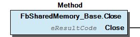
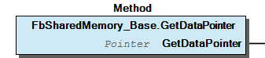
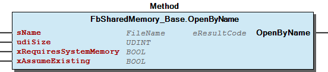
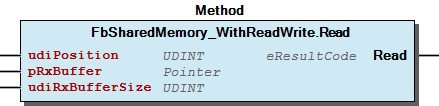
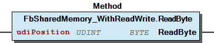
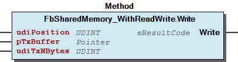
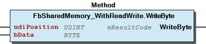
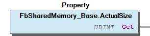
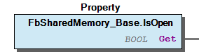

# WagoAppMem v1.6.2.2 (WAGO) - Complete Documentation


## 📋 Library Information

- **Company:** WAGO
- **Title:** WagoAppMem
- **Version:** 1.6.2.2
- **Categories:** WAGO LayerView|App; WAGO FunctionalView|Base; Application
- **Namespace:** WagoAppMem
- **Author:** WAGO / u013972
- **Placeholder:** WagoAppMem

### Description ¶


This document is automatically generated.

Handling application memory and shared memory

This document is automatically generated. Handling application memory and shared memory

### Contents: ¶


Contents: - Documentation Index 10 Documentation - WagoAppMem Library Documentation Project Information Library Information Function Blocks - FbSharedMemory_Base (FB) - FbSharedMemory_WithReadWrite (FB) - doc10_General (FB) Methods - FbSharedMemory_Base.Close (METH) - FbSharedMemory_Base.GetDataPointer (METH) - FbSharedMemory_Base.OpenByName (METH) - FbSharedMemory_WithReadWrite.Read (METH) - FbSharedMemory_WithReadWrite.ReadByte (METH) - FbSharedMemory_WithReadWrite.Write (METH) - FbSharedMemory_WithReadWrite.WriteByte (METH) Program Organization Base Components - FbSharedMemory_Base.ActualSize (PROP) - FbSharedMemory_Base.IsOpen (PROP) Global Variable Lists - LibraryResult (GVL) - ResultItems (GVL) - VersionHistory (GVL) Other Components

### Indices and tables ¶


Based on WagoAppMem.library, last modified 29.05.2024, 19:54:08. LibDoc 3.5.16.10

© WAGO GmbH & Co. KG, Germany 2018 – All rights reserved. For the avoidance of doubt, this copyright notice does not only apply to the information above but also and primarily to the described library itself. Please note that third-party products are always mentioned without reference to intellectual property rights, including patents, utility models, designs and trademarks, accordingly the existence of such rights cannot be excluded. WAGO is a registered trademark of WAGO Verwaltungsgesellschaft mbH.

- File and Project Information - Library Reference Based on WagoAppMem.library, last modified 29.05.2024, 19:54:08. LibDoc 3.5.16.10 © WAGO GmbH & Co. KG, Germany 2018 – All rights reserved. For the avoidance of doubt, this copyright notice does not only apply to the information above but also and primarily to the described library itself. Please note that third-party products are always mentioned without reference to intellectual property rights, including patents, utility models, designs and trademarks, accordingly the existence of such rights cannot be excluded. WAGO is a registered trademark of WAGO Verwaltungsgesellschaft mbH.

### Documentation Index


## 10 Documentation ¶


## WagoAppMem Library Documentation


| Company: | WAGO |
| Title: | WagoAppMem |
| Version: | 1.6.2.2 |
| Categories: | WAGO LayerView\|App; WAGO FunctionalView\|Base; Application |
| Namespace: | WagoAppMem |
| Author: | WAGO / u013972 |
| Placeholder: | WagoAppMem |

### Description


This document is automatically generated.

Handling application memory and shared memory

This document is automatically generated. Handling application memory and shared memory

### Contents:


- 10 Documentation doc10_General (FB) 20 Program Organization Units - Shared Memory LibraryResult (GVL) ResultItems (GVL) VersionHistory (GVL)

### Indices and tables


Based on WagoAppMem.library, last modified 29.05.2024, 19:54:08. LibDoc 3.5.16.10

© WAGO GmbH & Co. KG, Germany 2018 – All rights reserved. For the avoidance of doubt, this copyright notice does not only apply to the information above but also and primarily to the described library itself. Please note that third-party products are always mentioned without reference to intellectual property rights, including patents, utility models, designs and trademarks, accordingly the existence of such rights cannot be excluded. WAGO is a registered trademark of WAGO Verwaltungsgesellschaft mbH.

- File and Project Information - Library Reference Based on WagoAppMem.library, last modified 29.05.2024, 19:54:08. LibDoc 3.5.16.10 © WAGO GmbH & Co. KG, Germany 2018 – All rights reserved. For the avoidance of doubt, this copyright notice does not only apply to the information above but also and primarily to the described library itself. Please note that third-party products are always mentioned without reference to intellectual property rights, including patents, utility models, designs and trademarks, accordingly the existence of such rights cannot be excluded. WAGO is a registered trademark of WAGO Verwaltungsgesellschaft mbH.

### Project Information


## File and Project Information


| Scope | Name | Type | Content |
| --- | --- | --- | --- |
| FileHeader | libraryFile | string | WagoAppMem.library |
| contentFile | doc.clean.json |
| productName | e!COCKPIT |
| creationDateTime | date | 29.05.2024, 19:54:08 |
| companyName | string | WAGO |
| ProjectInformation | LastModificationDateTime | date | 29.05.2024, 19:54:08 |
| Description | string | See: Description |
| Copyright | © WAGO Kontakttechnik GmbH & Co. KG, Germany 2018 – All rights reserved. |
| Author | WAGO / u013972 |
| AutoResolveUnbound | bool | True |
| Placeholder | string | WagoAppMem |
| Company | WAGO |
| DocFormat | reStructuredText |
| Project | WagoAppMem |
| DefaultNamespace | WagoAppMem |
| Version | version | 1.6.2.2 |
| Title | string | WagoAppMem |
| LibraryCategories | library-category-list | WAGO LayerView\|App; WAGO FunctionalView\|Base; Application |
| CompiledLibraryCompatibilityVersion | string | CODESYS V3.5 SP16 Patch 3 |

### Library Information


## Library Reference


| LinkAllContent: False QualifiedOnly: False | SystemLibrary: False | Optional: False |

| LinkAllContent: False Optional: False | QualifiedOnly: False SystemLibrary: False | PublishSymbolsInContainer: True |

| LinkAllContent: False QualifiedOnly: False | SystemLibrary: False | Optional: False |

| LinkAllContent: False Optional: False | QualifiedOnly: False SystemLibrary: False | PublishSymbolsInContainer: True |

| LinkAllContent: False QualifiedOnly: False | SystemLibrary: False | Optional: False |

| LinkAllContent: False QualifiedOnly: False | SystemLibrary: False | Optional: False |

| LinkAllContent: False Optional: False | QualifiedOnly: False SystemLibrary: False | PublishSymbolsInContainer: True |

This is a dictionary of all referenced libraries and their name spaces.

This is a dictionary of all referenced libraries and their name spaces. WagoSysErrorBase Library Identification : Placeholder: WagoSysErrorBase Default Resolution: WagoSysErrorBase, * (WAGO) Namespace: WagoSysErrorBase Library Properties : Library Parameter : Parameter: RES_LOG_MAX_FILESIZE = 2000 Parameter: RES_LOG_MAX_FILES = 1 Parameter: RES_LOG_MAX_ENTRIES = 200 Parameter: RES_LOG_NAME = ‘WagoAppResultLogger’ WagoSysPlainMem Library Identification : Placeholder: WagoSysPlainMem Default Resolution: WagoSysPlainMem, * (WAGO) Namespace: WagoSysPlainMem Library Properties : WagoSysShm_Internal_PFC Library Identification : Placeholder: WagoSysShmInternal Default Resolution: WagoSysShm_Internal_PFC, * (WAGO) Namespace: WagoSysShm_Internal Library Properties : WagoSysStandard Library Identification : Placeholder: WagoSysStandard Default Resolution: WagoSysStandard, * (WAGO) Namespace: WagoSysStandard Library Properties : WagoSysVersion Library Identification : Name: WagoSysVersion Version: 1.0.0.0 Company: WAGO Namespace: WagoSysVersion Library Properties : WagoTypesCommon Library Identification : Placeholder: WagoTypesCommon Default Resolution: WagoTypesCommon, * (WAGO) Namespace: WagoTypes Library Properties : WagoTypesErrorBase Library Identification : Placeholder: WagoTypesErrorBase Default Resolution: WagoTypesErrorBase, * (WAGO) Namespace: WagoTypesErrorBase Library Properties :

### Function Blocks


## FbSharedMemory_Base (FB)


```
///////////////////////////////////////////////////////////////////////////
// This is the structure of the data , which is shared by our applictations
///////////////////////////////////////////////////////////////////////////

TYPE typMySharedStructure :  STRUCT   // just an example without use in reality
     bMyByte  : BYTE;
     MyData   : ARRAY [0 .. 19] OF typOtherStructures;
   END_STRUCT
END_TYPE

///////////////////////////////////////////////////////////////////////////
// For accessing typified data, we extend the shared memory base FB
///////////////////////////////////////////////////////////////////////////

FUNCTION_BLOCK FbMySharedMemory : EXTENDS WagoSysMem.FbSharedMemory_Base;
  PROPERTY pData : POINTER TO typMySharedStructure
    pData := GetDataPointer();   // pData is given a **type**, while DataPointer is not.

///////////////////////////////////////////////////////////////////////////
// We make an instance of our shared memory object and initialize it
///////////////////////////////////////////////////////////////////////////

VAR
  MySHM : FbMySharedMemory
END_VAR

IF MySHM.OpenByname('Name_Of_Shm',SIZE(typMySharedStructure), FALSE, FALSE) THEN
  DoErrorHandling();
  EXIT;
END_IF;

///////////////////////////////////////////////////////////////////////////
// Finaly we use the data anywhere in the application
///////////////////////////////////////////////////////////////////////////

MyShm^.bMyByte    := 42;
InterestingNumber := MyShm^.Mydata[i].ImportantComponent;
```

Provides base access to named shared memory objects.

Graphical Illustration

Function Description

Shared memory objects (‘SHM’) are used for inter process communication (IPC) and can be treated like non-persistent files with non-sequential access.

For usage, the user is supposed to derive his own shared memory object from this base class, e.g. as shown below. The parent FB provides the general means for accessing the data, while the inherited FB just adds code for type-safety of the access. (See the example below and for a broader introduction also the General section.)

In a typical derivation, shared memory is mapped to existing data structures:

Function Provides base access to named shared memory objects. Graphical Illustration  Function Description Shared memory objects (‘SHM’) are used for inter process communication (IPC) and can be treated like non-persistent files with non-sequential access. For usage, the user is supposed to derive his own shared memory object from this base class, e.g. as shown below. The parent FB provides the general means for accessing the data, while the inherited FB just adds code for type-safety of the access. (See the example below and for a broader introduction also the General section.) Note (1): There is no use in instantiating this base class directly, because all means for data access are protected. Create derived FBs instead. Note (2): There is a predefined FB FbSharedMemory_WithReadWrite derived form this base which does provide generic access to its data. Due to its genericity, data access has to take place via byte-positions instead of type definitions, so this is only intended either as fallback for simple data structures, such as single bytes or strings, or as base FB itself for deriving more specific FBs. In a typical derivation, shared memory is mapped to existing data structures: - FbSharedMemory_Base.ActualSize (PROP) - FbSharedMemory_Base.Close (METH) - FbSharedMemory_Base.GetDataPointer (METH) - FbSharedMemory_Base.IsOpen (PROP) - FbSharedMemory_Base.OpenByName (METH)

## FbSharedMemory_WithReadWrite (FB)


Provides rudimentary read-write access to shared memory objects.

Graphical Illustration

Function Description

This function block provides access to named shared memory objects.

This FB is an extension to the base FbSharedMemory function block. It provides read and write access with explicite memory boundary checking.

Functions for opening and closing and getting properties are inherited from FbSharedMemory. New methods are:

(For a conceptional example see the description of the parent class FbSharedMemory_Base .)

Function Provides rudimentary read-write access to shared memory objects. Graphical Illustration  Function Description This function block provides access to named shared memory objects. This FB is an extension to the base FbSharedMemory function block. It provides read and write access with explicite memory boundary checking. Functions for opening and closing and getting properties are inherited from FbSharedMemory. New methods are: - Read() - ReadByte() - Write() - WriteByte() Note: This FB provides just rudimentary methods and protection for data access in simple data structures. For serious structures, it is strongly recommended to derive more specialized FBs in order to obtain type-safety and more convenience. (For a conceptional example see the description of the parent class FbSharedMemory_Base .) - FbSharedMemory_WithReadWrite.Read (METH) - FbSharedMemory_WithReadWrite.ReadByte (METH) - FbSharedMemory_WithReadWrite.Write (METH) - FbSharedMemory_WithReadWrite.WriteByte (METH)

## doc10_General (FB)


```
FB_SHM.read(udiOffset, ADR(bufferVariable), SizeOf(bufferVariable));
FB_SHM.write(udiOffset, ADR(sourceVariable), SizeOf(sourceVariable));
```

```
TYPE typMySharedStructure :  STRUCT   // just an example without use in reality
    iMyInt   : INT;
    xMyFlag  : BOOL;
    MyData   : ARRAY [0 .. 19] OF typOtherStructures;
  END_STRUCT
END_TYPE
```

```
If (FB_MySHM.pData^.xMyFlag) THEN [...] END_IF;
i :=  FB_MySHM.pData^.iMyInt +42;
FB_MySHM.pData^.MyData[6].sHello := Concat('Hallo',sWorld);
```

This library provides functions and FBs for low-level manipulation of raw memory and for handling shared memory. This is divided into the following main groups:

Note: Although it might seem to fit into this context, handling of dynamically allocated memory (e.g. malloc(), free()) is explicitely not a subject to this library.

The first two items are represented in the sub-library ‘WagoSysPlainMem.library’. This library is formally another as this one, but it is automatically included together with ‘WagoAppMem’, so you will not have to bother with extra including.

These functions are also described in this document for the sake of convenience.

Standard Memory Operations

Standard memory operations will be handled technically via a sublibrary named WagoSysPlainMem.library. Documentation will be found in the first instance in that library, but it is also literally included in this library for the sake of convenience. That sublibrary need not be included separately because it will be included with this library automatically.

Shared Memory

This library provides support for safe usage of shared memory, i.e. creating shared memory and mapping data structures upon the raw shared memory.

There are two different ways of accessing shared memory supported by this library:

In contrast to the lower layer SysShm-Interface, the use of fixed addresses for the creation of shared-memory-objects is not supported here. The use of such objects which are created by other components, however, is supported without any restrictions.

This library provides functions and FBs for low-level manipulation of raw memory and for handling shared memory. This is divided into the following main groups: 1. Classical memory manipulation (MemCopy, MemSet) 2. Packing and unpacking, i.e. stuffing bytes into long words etc. 3. Handling shared memory (‘SHM’). Note: Although it might seem to fit into this context, handling of dynamically allocated memory (e.g. malloc(), free()) is explicitely not a subject to this library. The first two items are represented in the sub-library ‘WagoSysPlainMem.library’. This library is formally another as this one, but it is automatically included together with ‘WagoAppMem’, so you will not have to bother with extra including. These functions are also described in this document for the sake of convenience. Standard Memory Operations Standard memory operations will be handled technically via a sublibrary named WagoSysPlainMem.library. Documentation will be found in the first instance in that library, but it is also literally included in this library for the sake of convenience. That sublibrary need not be included separately because it will be included with this library automatically. Shared Memory This library provides support for safe usage of shared memory, i.e. creating shared memory and mapping data structures upon the raw shared memory. There are two different ways of accessing shared memory supported by this library: 1. Procedural addressing via byte offsets: While the advantage of this paradigma consists in a generically controllable procedural access, there are obvious drawbacks for complex data structures. Namely the necessity to keep track of variable offsets and secondly the necessety to provide and update buffer variables in the application. This paradigma is represented by the function block FbSharedMemory_WithReadWrite (FB) . 2. Addressing via structured types. This paradigma starts with a structure definition of the shared memory: Access to the data is done via a typed pointer property (called pData in this example): Advantages of this paradigma are at first the direct access to the shared memory without the need of a buffer variable and at second the automatic book-keeping of the component offsets due to the structurization of the memory block via the type definition. This paradigma requires to derive specific child FBs from the base shared memory FBs in order to provide application specific typed data pointers. ( FbSharedMemory_Base (FB) , FbSharedMemory_WithReadWrite (FB) ) Consequently, the shared memory objects in this library are both designed to serve as base classes for inheritance rather than for direct instantiation. In contrast to the lower layer SysShm-Interface, the use of fixed addresses for the creation of shared-memory-objects is not supported here. The use of such objects which are created by other components, however, is supported without any restrictions.

### Methods


## FbSharedMemory_Base.Close (METH)


| Scope | Name | Type |
| --- | --- | --- |
| Return | Close | eResultCode |

| result codes |
| 0 | Success |
| ENOSYS | This functionality is not supported by the target hardware. |
| EBADF | The object is not open. |

Closes the shared memory object.

Graphical Illustration

Interface variables Function Closes the shared memory object. Graphical Illustration 

## FbSharedMemory_Base.GetDataPointer (METH)


| Scope | Name | Type |
| --- | --- | --- |
| Return | GetDataPointer | POINTER TO BYTE |

Returns the pointer to the shared memory resource.

Graphical Illustration

Function Description

This function returns a null-pointer if the FB is not open.

The pointer is mapped into the address space of the calling application and can be used directly for pointing to structures.

As this FB is designed as inheritance base, this method is marked PROTECTED, because under normal circumstances the user is not supposed to access the SHM directly. Instead, for user access, a derived FB is supposed to be defined which provides a proper user interface for the specific data access and uses the pointer only internally. (See general description )

Interface variables Function Returns the pointer to the shared memory resource. Graphical Illustration  Function Description This function returns a null-pointer if the FB is not open. The pointer is mapped into the address space of the calling application and can be used directly for pointing to structures. Note As this FB is designed as inheritance base, this method is marked PROTECTED, because under normal circumstances the user is not supposed to access the SHM directly. Instead, for user access, a derived FB is supposed to be defined which provides a proper user interface for the specific data access and uses the pointer only internally. (See general description )

## FbSharedMemory_Base.OpenByName (METH)


| Scope | Name | Type | Comment |
| --- | --- | --- | --- |
| Return | OpenByName | eResultCode |  |
| Input | sName | FileName | The global name of the resource |
| udiSize | UDINT | Minimum size of the Object |
| xRequiresSystemMemory | BOOL | Indicates interaction with non-IEC processes. |
| xAssumeExisting | BOOL | Assume that the SHM is created elsewhere. |

| result codes |
| 0 | Success |
| ENOSYS | This functionality is not supported by the target hardware. |
| ENOENT | The shared memory object does not exist and cannot be created. |
| EUNATCH | No memory is attached to the SHM device but a fully initialized SHM was expected. |
| ENOMEM | The requested amount of memory cannot be granted. |
| EINVAL | Invalid Parameter (e.g. name=’’ or size=0) |

Opens the Sharedmemory (‘SHM’) FB for reading and writing.

Graphical Illustration

Function Description

xRequireSystemMemory:

TRUE indicates that the memory is to be shared not only with other IEC-Applications, but also with other independent non-IEC-processes on the PLC. (Visibility to other non IEC-Processes is mandatory.)

If no interaction with non-IEC-processes is intended, FALSE should be passed here. If you do not know that to enter here, FALSE is almost certainly the best choice.

If this property is requested but cannot be granted, the open() call returns ENOSYS when called with this flag set.

Note (1): If this flag is not set, the firmware may chose freely which method for providing shared memory is actually used. I.e. the shared memory is not explicitly protected from other processes, so other processes may or may not have access to this shared memory which was intended for IEC-only sharing. When ported to other hardware or firmware, however, the behaviour might silently switch to strict IEC-only shared memory without any explicit notice.

Note (2): When this flag is set, the call may fail with ENOSYS when the actual target does not support sharing memory between IEC and other different processes.

xAssumeExisting:

If this is set, the FB assumes that the SHM is created by another process. It will not implicitly create the SHM object on opening. Instead, ENOENT is returned if the SHM does not exist at all and EUNATCH is returned if the SHM exists, but is found to be attached in an incompatible way.

This flag is used if an SHM-structure has to be initialized uniquely by one certain creating application. Before that is done any other application is not supposed to use the SHM. Therefore other applications must be prevented from creating the SHM via this flag.

Interface variables Function Opens the Sharedmemory (‘SHM’) FB for reading and writing. Graphical Illustration  Function Description sName: System-wide unique name of the SHM resource. (The type definition is given in WagoTypesCommon, essentially this is a sized string.) If a resource with this name does not exist, it will be created unless the flag xAssumeExisting forbids this. Any strings which are valid as filenames would also be valid as memory identifiers. An empty string will result in EINVAL. udiSize: Required size of the resource. If the requested size cannot be granted, ENOMEM is returned. That may happen either if the resource has to be newly allocated and too little memory is available, or if the resource exists with a smaller size and it cannot be upsized. If a size of 0 or a size of 2 Gigabyte or more is requested, EINVAL is returned. xRequireSystemMemory: TRUE indicates that the memory is to be shared not only with other IEC-Applications, but also with other independent non-IEC-processes on the PLC. (Visibility to other non IEC-Processes is mandatory.) If no interaction with non-IEC-processes is intended, FALSE should be passed here. If you do not know that to enter here, FALSE is almost certainly the best choice. If this property is requested but cannot be granted, the open() call returns ENOSYS when called with this flag set. Note (1): If this flag is not set, the firmware may chose freely which method for providing shared memory is actually used. I.e. the shared memory is not explicitly protected from other processes, so other processes may or may not have access to this shared memory which was intended for IEC-only sharing. When ported to other hardware or firmware, however, the behaviour might silently switch to strict IEC-only shared memory without any explicit notice. Note (2): When this flag is set, the call may fail with ENOSYS when the actual target does not support sharing memory between IEC and other different processes. xAssumeExisting: If this is set, the FB assumes that the SHM is created by another process. It will not implicitly create the SHM object on opening. Instead, ENOENT is returned if the SHM does not exist at all and EUNATCH is returned if the SHM exists, but is found to be attached in an incompatible way. This flag is used if an SHM-structure has to be initialized uniquely by one certain creating application. Before that is done any other application is not supposed to use the SHM. Therefore other applications must be prevented from creating the SHM via this flag.

## FbSharedMemory_WithReadWrite.Read (METH)


| Scope | Name | Type | Comment |
| --- | --- | --- | --- |
| Return | Read | eResultCode |  |
| Input | udiPosition | UDINT | Offset from the zero position in SHM. |
| pRxBuffer | POINTER TO BYTE | Where to put the data |
| udiRxBufferSize | UDINT | How many bytes of data |

| result codes |
| 0 | Success |
| EBADF | The FB is not open. |
| EINVAL | Invalid Parameters: destination address or size is 2 Gigabyte or more. |
| ENOSYS | This functionality is not supported by the target hardware. |
| EFAULT | Adressed memory is out of the range of the shared memory object. |
| EACCES | Other errors |

Reads a block of bytes from the shared memory (‘SHM’).

Graphical Illustration

Function Description

A portion of the data is read from the SHM starting from the position indicated by udiPosition. It is stored locally into the address indicated by pRxBuffer (without any offsets).

udiRxBufferSize denotes the number of bytes which is to be transferred. Please note that this is not the size of the whole buffer, but the size of the substructure which is transferred.

Interface variables Function Reads a block of bytes from the shared memory (‘SHM’). Graphical Illustration  Function Description A portion of the data is read from the SHM starting from the position indicated by udiPosition. It is stored locally into the address indicated by pRxBuffer (without any offsets). udiRxBufferSize denotes the number of bytes which is to be transferred. Please note that this is not the size of the whole buffer, but the size of the substructure which is transferred.

## FbSharedMemory_WithReadWrite.ReadByte (METH)


| Scope | Name | Type | Comment |
| --- | --- | --- | --- |
| Return | ReadByte | BYTE |  |
| Input | udiPosition | UDINT | Offset from the zero position |

```
myResult := Read(udiPosition,pData,1);
```

Reads a single byte from shared memory (‘SHM’).

Graphical Illustration

Function Description

A data byte is read from the SHM from the position indicated by udiPosition.

If an error occurs then simply 0 is returned.

Note: As a consequence of the intentionally shortened interface, no result code is returned here. If full access to proper error handling is required, then use

Interface variables Function Reads a single byte from shared memory (‘SHM’). Graphical Illustration  Function Description A data byte is read from the SHM from the position indicated by udiPosition. If an error occurs then simply 0 is returned. Note: As a consequence of the intentionally shortened interface, no result code is returned here. If full access to proper error handling is required, then use instead.

## FbSharedMemory_WithReadWrite.Write (METH)


| Scope | Name | Type | Comment |
| --- | --- | --- | --- |
| Return | Write | eResultCode |  |
| Input | udiPosition | UDINT | Offset from the zero position in SHM |
| pTxBuffer | POINTER TO BYTE | Where to get the data from |
| udiTxNBytes | UDINT | How many bytes of data |

| result codes |
| 0 | Success |
| EBADF | The FB is not open. |
| EINVAL | Invalid parameter |
| ENOSYS | This functionality is not supported by the target hardware. |
| EFAULT | Adressed memory is out of the range of the shared memory object. |
| EACCES | Other errors |

Writes into a shared memory (‘SHM’) block.

Graphical Illustration

Function Description

A number of udiTxNBytes data bytes are taken from the location to which pTxBuffer points into the local memory and is written to the position in the Shared-Memory-Object, which is indicated by udiPosition .

Please note that pTxBuffer points directly to the first byte which is transferred.

Interface variables Function Writes into a shared memory (‘SHM’) block. Graphical Illustration  Function Description A number of udiTxNBytes data bytes are taken from the location to which pTxBuffer points into the local memory and is written to the position in the Shared-Memory-Object, which is indicated by udiPosition . Please note that pTxBuffer points directly to the first byte which is transferred.

## FbSharedMemory_WithReadWrite.WriteByte (METH)


| Scope | Name | Type | Comment |
| --- | --- | --- | --- |
| Return | WriteByte | eResultCode |  |
| Input | udiPosition | UDINT | Offset from the zero position |
| bData | BYTE | The data byte to write |

| result codes |
| 0 | Success |
| EBADF | The FB is not open. |
| ENOSYS | This functionality is not supported by the target hardware. |
| EFAULT | Adressed memory is out of the range of the shared memory object. |
| EACCES | Other errors |

Writes a single byte to shared memory (‘SHM’).

Graphical Illustration

Interface variables Function Writes a single byte to shared memory (‘SHM’). Graphical Illustration 

### Program Organization


## 20 Program Organization Units


- Shared Memory FbSharedMemory_Base (FB) FbSharedMemory_Base.ActualSize (PROP) - FbSharedMemory_Base.Close (METH) - FbSharedMemory_Base.GetDataPointer (METH) - FbSharedMemory_Base.IsOpen (PROP) - FbSharedMemory_Base.OpenByName (METH) FbSharedMemory_WithReadWrite (FB) - FbSharedMemory_WithReadWrite.Read (METH) - FbSharedMemory_WithReadWrite.ReadByte (METH) - FbSharedMemory_WithReadWrite.Write (METH) - FbSharedMemory_WithReadWrite.WriteByte (METH)

### Base Components


## FbSharedMemory_Base.ActualSize (PROP)


Tells the actual size of shared memory (0 if not open).

Graphical Illustration

Function Tells the actual size of shared memory (0 if not open). Graphical Illustration 

## FbSharedMemory_Base.IsOpen (PROP)


Tells if the shared memory FB is ready for use.

Graphical Illustration

Function Description

TRUE = ready, FALSE = not ready.

Function Tells if the shared memory FB is ready for use. Graphical Illustration  Function Description TRUE = ready, FALSE = not ready.

### Global Variable Lists


## LibraryResult (GVL)


| Name | Type | Comment |
| --- | --- | --- |
| Factory | FbResultFactory | Produces FbResults from given eResultCodes. |

```
VAR
  eMyResult : eResultCode;  // result code which is to be investigated
  oError    : FbResult;     // result object for use in higher levels
END_VAR;

eMyResult := myFunction(...);
Namespace.LibraryResult.Factory.SetResult(eMyResult, oError);
```

Factory for standard result objects

Use this to translate result codes from this library into standard result objects.

(In this example ‘Namespace’ denotes the namespace which is used for including the specific library and ‘myFunction()’ is an example for a general function from this library.)

Factory for standard result objects Use this to translate result codes from this library into standard result objects. Usage: (In this example ‘Namespace’ denotes the namespace which is used for including the specific library and ‘myFunction()’ is an example for a general function from this library.)

## ResultItems (GVL)


| Scope | Name | Type | Initial |
| --- | --- | --- | --- |
| Constant | ERROR | ARRAY [0..13] OF typResultItem | [STRUCT(ID := OK, Severity := eSeverity.none, Text := ‘OK’), STRUCT(ID := ENOSYS, Severity := eSeverity.error, Text := ‘This functionality is not supported by the target hardware.’), STRUCT(ID := ENOENT, Severity := eSeverity.error, Text := ‘The shared memory object does not exist and cannot be created.’), STRUCT(ID := EUNATCH, Severity := eSeverity.error, Text := ‘No memory is attached to the SHM device - but was expected so.’), STRUCT(ID := ENOMEM, Severity := eSeverity.error, Text := ‘The requested amount of memory cannot be granted.’), STRUCT(ID := EINVAL, Severity := eSeverity.error, Text := ‘Invalid parameter (e.g. name=”” or size=0 or others).’), STRUCT(ID := EBADF, Severity := eSeverity.error, Text := ‘FB not opened or iniialized.’), STRUCT(ID := EFAULT, Severity := eSeverity.error, Text := ‘Adressed memory is not in the valid address range.’), STRUCT(ID := EACCES, Severity := eSeverity.error, Text := ‘Permission denied for this resource or other errors.’), STRUCT(ID := EPERM, Severity := eSeverity.error, Text := ‘This operation is not permitted in this situation.’), STRUCT(ID := EAGAIN, Severity := eSeverity.error, Text := ‘Try again (a subsequent retry of the call might be successful).’), STRUCT(ID := EBUSY, Severity := eSeverity.error, Text := ‘Device or resource is busy and cannot respond to the desired function.’), STRUCT(ID := EEXIST, Severity := eSeverity.error, Text := ‘Resource exists but is expected to be non-existent.’), STRUCT(ID := EALREADY, Severity := eSeverity.error, Text := ‘The operation is already in progresss.’)] |

Standard result items specific for this library

Note: This is a general mapping of result codes to short standard texts which are appropriate to the usage of these codes in this library.

Typially, each unit (function, method, or function block) in this library uses only a subset of these codes. Please, refer to the documentation of the specific unit for the set of codes which is actualy used and for a detailed explanation of the meaning of a result code in the specifc context.

Standard result items specific for this library Note: This is a general mapping of result codes to short standard texts which are appropriate to the usage of these codes in this library. Typially, each unit (function, method, or function block) in this library uses only a subset of these codes. Please, refer to the documentation of the specific unit for the set of codes which is actualy used and for a detailed explanation of the meaning of a result code in the specifc context.

## VersionHistory (GVL)


| Name | Type |
| --- | --- |
| Info | ProjectInfo |

| date | version | author | change |
| 22.02.2024 | 1.6.2.2 | WAGO / u010663 | Compiled SP16.3 |
| 18.07.2022 | 1.6.2.1 | WAGO / u013972 | Remove obsoletet FB_Init and FB_Exit methods |
| 08.01.2019 | 1.6.2.0 | u015842 | Properties: free placeholder added |
| 18.04.2018 | 1.6.1.1 | WAGO / u013972 | Resolve documentation errors |
| 10.03.2016 | 1.6.1.0 | WAGO / u013972 | Publish WagoSysErrorBase |
| 04.03.2016 | 1.6.0.0 | WAGO / u013972 | Replace WagoAppErrorBase with WagoSysErrorBase |
| 29.09.2015 | 1.5.2.0 | WAGO / u013972 | Resolve libraries with placeholder |
| 23.09.2015 | 1.5.1.0 | WAGO / u013972 | Workaround for C0351-Bug |
| 23.06.2015 | 1.5.0.0 | WAGO / u013972 | Release version |

### Other Components


## Shared Memory


- FbSharedMemory_Base (FB) FbSharedMemory_Base.ActualSize (PROP) - FbSharedMemory_Base.Close (METH) - FbSharedMemory_Base.GetDataPointer (METH) - FbSharedMemory_Base.IsOpen (PROP) - FbSharedMemory_Base.OpenByName (METH) FbSharedMemory_WithReadWrite (FB) - FbSharedMemory_WithReadWrite.Read (METH) - FbSharedMemory_WithReadWrite.ReadByte (METH) - FbSharedMemory_WithReadWrite.Write (METH) - FbSharedMemory_WithReadWrite.WriteByte (METH)