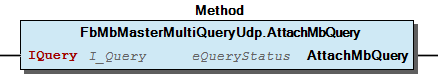

# WagoAppPlcModbus v1.1.5.8 (WAGO) - Complete Documentation


## 📋 Library Information

- **Company:** WAGO
- **Title:** WagoAppPlcModbus
- **Version:** 1.1.5.8
- **Categories:** WAGO LayerView|App; Application; WAGO FunctionalView|Connectivity|Serial
- **Namespace:** WagoAppPlcModbus
- **Author:** WAGO / u010545
- **Placeholder:** WagoAppPlcModbus

### Description ¶


This document is automatically generated.

Modbus functionality for using at the plc

This document is automatically generated. Modbus functionality for using at the plc

### Contents: ¶


Contents: - Documentation Index - Project Information - Library Information - Function Blocks Fb1PortBoolAreaKompositor (FB) - Fb1PortWordAreaKompositor (FB) - Fb2PortBoolAreaKompositor (FB) - Fb2PortModelSwitch (FB) - Fb2PortWordAreaKompositor (FB) - Fb3PortBoolAreaKompositor (FB) - Fb3PortWordAreaKompositor (FB) - Fb4PortBoolAreaKompositor (FB) - Fb4PortModelSwitch (FB) - Fb4PortWordAreaKompositor (FB) - ... and 28 more Methods - FbDanfossWriteRtc.IResponseTime (PROP) - FbDanfossWriteRtc.ISetTime (PROP) - FbDanfossWriteRtc._Monitoring (PROP) - FbDigitalTwinMbSlaveDevice.onError (METH) - FbDigitalTwinMbSlaveDevice.onResponse (METH) - FbDigitalTwinMbSlaveDevice.protAttachMbQuery (METH) - FbFC68.udiStartingAddress (PROP) - FbMbKompositorDataModel.RegisterDataAccessListener (METH) - FbMbKompositorDataModel.isReadAccess (PROP) - FbMbKompositorDataModel.isWriteAccess (PROP) - ... and 24 more Interfaces - I_DanfossTime_ro (ITF) - I_DanfossTime_rw (ITF) - I_DataAccessListener (ITF) - I_DataAccessListenerExtended (ITF) - I_FC65 (ITF) - I_FC68 (ITF) - I_MbAccessInfo (ITF) Program Organization Base Components - 70 Base Function Object - Base Function Object (non-standard FC) - FbIdentifyBaseObject.bConformityLevel (PROP) - FbIdentifyBaseObject.sMajorMinorRevision (PROP) - FbIdentifyBaseObject.sProductCode (PROP) - FbIdentifyBaseObject.sVendorName (PROP) - I_MbBaseFcObjects Internal Components - 90 Internal - Internal Global Variable Lists - ErrorModbus (GVL) - ErrorSocket (GVL) - VersionHistory (GVL) Other Components - 10 Data types - 20 Simple Modbus Master - 30 Simple Modbus Slaves - 40 Advanced Modbus Slaves - 50 Advanced Modbus Master - 60 Identification Objects - 69 Danfoss Object - 80 Status - Area Kompositors - DanfossTime - ... and 62 more

### Indices and tables ¶


Based on WagoAppPlcModbus.library, last modified 20.09.2024, 21:22:35. LibDoc 3.5.16.10

© WAGO GmbH & Co. KG, Germany 2018 – All rights reserved. For the avoidance of doubt, this copyright notice does not only apply to the information above but also and primarily to the described library itself. Please note that third-party products are always mentioned without reference to intellectual property rights, including patents, utility models, designs and trademarks, accordingly the existence of such rights cannot be excluded. WAGO is a registered trademark of WAGO Verwaltungsgesellschaft mbH.

- File and Project Information - Library Reference Based on WagoAppPlcModbus.library, last modified 20.09.2024, 21:22:35. LibDoc 3.5.16.10 © WAGO GmbH & Co. KG, Germany 2018 – All rights reserved. For the avoidance of doubt, this copyright notice does not only apply to the information above but also and primarily to the described library itself. Please note that third-party products are always mentioned without reference to intellectual property rights, including patents, utility models, designs and trademarks, accordingly the existence of such rights cannot be excluded. WAGO is a registered trademark of WAGO Verwaltungsgesellschaft mbH.

### Documentation Index


## WagoAppPlcModbus Library Documentation


| Company: | WAGO |
| Title: | WagoAppPlcModbus |
| Version: | 1.1.5.8 |
| Categories: | WAGO LayerView\|App; Application; WAGO FunctionalView\|Connectivity\|Serial |
| Namespace: | WagoAppPlcModbus |
| Author: | WAGO / u010545 |
| Placeholder: | WagoAppPlcModbus |

### Description


This document is automatically generated.

Modbus functionality for using at the plc

This document is automatically generated. Modbus functionality for using at the plc

### Contents:


- 20 Program Organization Units 10 Data types - 20 Simple Modbus Master - 30 Simple Modbus Slaves - 40 Advanced Modbus Slaves - 50 Advanced Modbus Master - 60 Identification Objects - 69 Danfoss Object - 70 Base Function Object 80 Status - ErrorModbus (GVL) - eErrorModbus (ENUM) - eErrorSocket (ENUM) 90 Internal - ErrorSocket (GVL) - I_MbBaseFcObjects - Slave ParameterAppPlcModbus (PARAMS) VersionHistory (GVL)

### Indices and tables


Based on WagoAppPlcModbus.library, last modified 20.09.2024, 21:22:35. LibDoc 3.5.16.10

© WAGO GmbH & Co. KG, Germany 2018 – All rights reserved. For the avoidance of doubt, this copyright notice does not only apply to the information above but also and primarily to the described library itself. Please note that third-party products are always mentioned without reference to intellectual property rights, including patents, utility models, designs and trademarks, accordingly the existence of such rights cannot be excluded. WAGO is a registered trademark of WAGO Verwaltungsgesellschaft mbH.

- File and Project Information - Library Reference Based on WagoAppPlcModbus.library, last modified 20.09.2024, 21:22:35. LibDoc 3.5.16.10 © WAGO GmbH & Co. KG, Germany 2018 – All rights reserved. For the avoidance of doubt, this copyright notice does not only apply to the information above but also and primarily to the described library itself. Please note that third-party products are always mentioned without reference to intellectual property rights, including patents, utility models, designs and trademarks, accordingly the existence of such rights cannot be excluded. WAGO is a registered trademark of WAGO Verwaltungsgesellschaft mbH.

### Project Information


## File and Project Information


| Scope | Name | Type | Content |
| --- | --- | --- | --- |
| FileHeader | libraryFile | string | WagoAppPlcModbus.library |
| contentFile | doc.clean.json |
| productName | e!COCKPIT |
| creationDateTime | date | 20.09.2024, 21:22:39 |
| companyName | string | WAGO |
| ProjectInformation | LastModificationDateTime | date | 20.09.2024, 21:22:35 |
| Description | string | See: Description |
| Copyright | © WAGO Kontakttechnik GmbH & Co. KG, Germany 2018 – All rights reserved. |
| Author | WAGO / u010545 |
| AutoResolveUnbound | bool | True |
| Placeholder | string | WagoAppPlcModbus |
| Company | WAGO |
| DocFormat | reStructuredText |
| Project | WagoAppPlcModbus |
| DefaultNamespace | WagoAppPlcModbus |
| Version | version | 1.1.5.8 |
| Title | string | WagoAppPlcModbus |
| LibraryCategories | library-category-list | WAGO LayerView\|App; Application; WAGO FunctionalView\|Connectivity\|Serial |
| CompiledLibraryCompatibilityVersion | string | CODESYS V3.5 SP16 Patch 3 |

### Library Information


## Library Reference


| LinkAllContent: False QualifiedOnly: False | SystemLibrary: False | Optional: False |

| LinkAllContent: False QualifiedOnly: False | SystemLibrary: False | Optional: False |

| LinkAllContent: False QualifiedOnly: False | SystemLibrary: False | Optional: False |

| LinkAllContent: False QualifiedOnly: False | SystemLibrary: False | Optional: False |

| LinkAllContent: False QualifiedOnly: False | SystemLibrary: False | Optional: False |

| LinkAllContent: False QualifiedOnly: False | SystemLibrary: False | Optional: False |

| LinkAllContent: False QualifiedOnly: False | SystemLibrary: False | Optional: False |

| LinkAllContent: False QualifiedOnly: False | SystemLibrary: False | Optional: False |

| LinkAllContent: False QualifiedOnly: False | SystemLibrary: False | Optional: False |

| LinkAllContent: False QualifiedOnly: False | SystemLibrary: False | Optional: False |

| LinkAllContent: False QualifiedOnly: False | SystemLibrary: False | Optional: False |

| LinkAllContent: False QualifiedOnly: True | SystemLibrary: False | Optional: False |

| LinkAllContent: False QualifiedOnly: False | SystemLibrary: False | Optional: False |

| LinkAllContent: False Optional: False | QualifiedOnly: True SystemLibrary: False | PublishSymbolsInContainer: True |

| LinkAllContent: False Optional: False | QualifiedOnly: False SystemLibrary: False | PublishSymbolsInContainer: True |

| LinkAllContent: False QualifiedOnly: True | SystemLibrary: False | Optional: False |

This is a dictionary of all referenced libraries and their name spaces.

This is a dictionary of all referenced libraries and their name spaces. CmpErrors2 Interfaces Library Identification : Name: CmpErrors2 Interfaces Version: newest Company: System Namespace: CmpErrors Library Properties : Standard Library Identification : Placeholder: Standard Default Resolution: Standard, * (System) Namespace: Standard Library Properties : SysMem Library Identification : Placeholder: SysMem Default Resolution: SysMem, * (System) Namespace: SysMem Library Properties : SysSocket Library Identification : Placeholder: SysSocket Default Resolution: SysSocket, * (System) Namespace: SysSocket Library Properties : SysTypes2 Interfaces Library Identification : Name: SysTypes2 Interfaces Version: newest Company: System Namespace: SysTypes Library Properties : Util Library Identification : Placeholder: Util Default Resolution: Util, * (System) Namespace: Util Library Properties : Library Parameter : Parameter: IBLOCKSIZE = 22800 WagoAppCom Library Identification : Placeholder: WagoAppCom Default Resolution: WagoAppCom, * (WAGO) Namespace: WagoAppCom Library Properties : Library Parameter : Parameter: CUIDEFAULTSYSTEMBUFFERSIZE = 1028 WagoAppConfigTool Library Identification : Placeholder: WagoAppConfigTool Default Resolution: WagoAppConfigTool, * (WAGO) Namespace: WagoAppConfigTool Library Properties : WagoAppSocket Library Identification : Placeholder: WagoAppSocket Default Resolution: WagoAppSocket, * (WAGO) Namespace: WagoAppSocket Library Properties : Library Parameter : Parameter: ASYNC_MODE = WagoTypes.eSchedulingMode.Background Parameter: UIMULTICONNECT_NINSTANCELISTSIZE = 20 Parameter: UIBACKLOGDEFAULT = 5 Parameter: TMULTICONNECT_TIMEOUT = TIME#0ms WagoSysErrorBase Library Identification : Placeholder: WagoSysErrorBase Default Resolution: WagoSysErrorBase, * (WAGO) Namespace: WagoSysErrorBase Library Properties : Library Parameter : Parameter: RES_LOG_MAX_FILESIZE = 2000 Parameter: RES_LOG_MAX_FILES = 1 Parameter: RES_LOG_MAX_ENTRIES = 200 Parameter: RES_LOG_NAME = ‘WagoAppResultLogger’ WagoSysLog Library Identification : Placeholder: WagoSysLog Default Resolution: WagoSysLog, * (WAGO) Namespace: WagoSysLog Library Properties : WagoSysSerial Library Identification : Placeholder: WagoSysSerial Default Resolution: WagoSysSerial, * (WAGO) Namespace: WagoSysSerial Library Properties : WagoSysVersion Library Identification : Name: WagoSysVersion Version: 1.0.0.0 Company: WAGO Namespace: WagoSysVersion Library Properties : WagoTypesCom Library Identification : Placeholder: WagoTypesCom Default Resolution: WagoTypesCom, * (WAGO) Namespace: WagoTypesCom Library Properties : WagoTypesErrorBase Library Identification : Placeholder: WagoTypesErrorBase Default Resolution: WagoTypesErrorBase, * (WAGO) Namespace: WagoTypesErrorBase Library Properties : WagoTypesModbus Library Identification : Placeholder: WagoTypesModbus Default Resolution: WagoTypesModbus, * (WAGO) Namespace: WagoTypesModbus Library Properties :

### Function Blocks


## Fb1PortBoolAreaKompositor (FB)


| Scope | Name | Type | Comment |
| --- | --- | --- | --- |
| Input | axArea_1 | POINTER TO BOOL |  |
| Output | I_MbBitAccess | ARRAY [1..1] OF I_MbBitAccess | one place for each area |

You should always call this FB cyclic.

Graphical Illustration

Graphical Interface of Fb1PortBoolAreaKompositor

Interface variables Function This Kompositor converts an array of bool to an object that can be processed by a special data model. Note You should always call this FB cyclic. Graphical Illustration  Graphical Interface of Fb1PortBoolAreaKompositor

## Fb1PortWordAreaKompositor (FB)


| Scope | Name | Type |
| --- | --- | --- |
| Input | awArea_1 | POINTER TO WORD |
| Output | I_MbWordAccess | ARRAY [1..1] OF I_MbWordAccess |

You should always call this FB cyclic.

Graphical Illustration

Graphical Interface of Fb1PortWordAreaKompositor

Interface variables Function This Kompositor converts an array of word to an object that can be processed by a special data model. Note You should always call this FB cyclic. Graphical Illustration  Graphical Interface of Fb1PortWordAreaKompositor

## Fb2PortBoolAreaKompositor (FB)


| Scope | Name | Type | Comment |
| --- | --- | --- | --- |
| Input | axArea_1 | POINTER TO BOOL |  |
| axArea_2 | POINTER TO BOOL |  |
| Output | I_MbBitAccess | ARRAY [1..2] OF I_MbBitAccess | one place for each area |

You should always call this FB cyclic.

Graphical Illustration

Graphical Interface of Fb2PortBoolAreaKompositor

Interface variables Function This Kompositor combines multiple different arrays of bool with different address ranges to an object that can be processed by a special data model. Note You should always call this FB cyclic. Graphical Illustration  Graphical Interface of Fb2PortBoolAreaKompositor

## Fb2PortModelSwitch (FB)


| Scope | Name | Type |
| --- | --- | --- |
| Input | I_MbDataModel_1 | ARRAY [1..1] OF WagoTypesModbus.I_MbDataModel |
| I_MbDataModel_2 | ARRAY [1..1] OF WagoTypesModbus.I_MbDataModel |
| Output | I_MbDataModel | ARRAY [1..2] OF WagoTypesModbus.I_MbDataModel |

You should always call this FB cyclic.

Graphical Illustration:

Graphical Interface of Fb2PortModelSwitch

Interface variables Function This function block manages two data models for provide the access to a modbus server. There is no need to connect both input parameters but if you want to connect only one parameter you do not need this function block. In this case you can connect direct the input data model to a server. Note You should always call this FB cyclic. Graphical Illustration:  Graphical Interface of Fb2PortModelSwitch

## Fb2PortWordAreaKompositor (FB)


| Scope | Name | Type |
| --- | --- | --- |
| Input | awArea_1 | POINTER TO WORD |
| awArea_2 | POINTER TO WORD |
| Output | I_MbWordAccess | ARRAY [1..2] OF I_MbWordAccess |

You should always call this FB cyclic.

Graphical Illustration

Graphical Interface of Fb2PortWordAreaKompositor

Interface variables Function This Kompositor combines multiple different arrays of word with different address ranges to an object that can be processed by a special data model. Note You should always call this FB cyclic. Graphical Illustration  Graphical Interface of Fb2PortWordAreaKompositor

## Fb3PortBoolAreaKompositor (FB)


| Scope | Name | Type | Comment |
| --- | --- | --- | --- |
| Input | axArea_1 | POINTER TO BOOL |  |
| axArea_2 | POINTER TO BOOL |  |
| axArea_3 | POINTER TO BOOL |  |
| Output | I_MbBitAccess | ARRAY [1..3] OF I_MbBitAccess | one place for each area |

You should always call this FB cyclic.

Graphical Illustration

Graphical Interface of Fb3PortBoolAreaKompositor

Interface variables Function This Kompositor combines multiple different arrays of bool with different address ranges to an object that can be processed by a special data model. Note You should always call this FB cyclic. Graphical Illustration  Graphical Interface of Fb3PortBoolAreaKompositor

## Fb3PortWordAreaKompositor (FB)


| Scope | Name | Type |
| --- | --- | --- |
| Input | awArea_1 | POINTER TO WORD |
| awArea_2 | POINTER TO WORD |
| awArea_3 | POINTER TO WORD |
| Output | I_MbWordAccess | ARRAY [1..3] OF I_MbWordAccess |

You should always call this FB cyclic.

Graphical Illustration

Graphical Interface of Fb3PortWordAreaKompositor

Interface variables Function This Kompositor combines multiple different arrays of word with different address ranges to an object that can be processed by a special data model. Note You should always call this FB cyclic. Graphical Illustration  Graphical Interface of Fb3PortWordAreaKompositor

## Fb4PortBoolAreaKompositor (FB)


| Scope | Name | Type | Comment |
| --- | --- | --- | --- |
| Input | axArea_1 | POINTER TO BOOL |  |
| axArea_2 | POINTER TO BOOL |  |
| axArea_3 | POINTER TO BOOL |  |
| axArea_4 | POINTER TO BOOL |  |
| Output | I_MbBitAccess | ARRAY [1..4] OF I_MbBitAccess | one place for each area |

You should always call this FB cyclic.

Graphical Illustration

Graphical Interface of Fb4PortBoolAreaKompositor

Interface variables Function This Kompositor combines multiple different arrays of bool with different address ranges to an object that can be processed by a special data model. Note You should always call this FB cyclic. Graphical Illustration  Graphical Interface of Fb4PortBoolAreaKompositor

## Fb4PortModelSwitch (FB)


| Scope | Name | Type |
| --- | --- | --- |
| Input | I_MbDataModel_1 | ARRAY [1..1] OF WagoTypesModbus.I_MbDataModel |
| I_MbDataModel_2 | ARRAY [1..1] OF WagoTypesModbus.I_MbDataModel |
| I_MbDataModel_3 | ARRAY [1..1] OF WagoTypesModbus.I_MbDataModel |
| I_MbDataModel_4 | ARRAY [1..1] OF WagoTypesModbus.I_MbDataModel |
| Output | I_MbDataModel | ARRAY [1..4] OF WagoTypesModbus.I_MbDataModel |

You should always call this FB cyclic.

Graphical Illustration:

Graphical Interface of Fb4PortModelSwitch

Interface variables Function This function block manages four data models for provide the access to a modbus server. There is no need to connect all input parameters but if you want to connect only one parameter you do not need this function block. In this case you can connect direct the input data model to a server. Note You should always call this FB cyclic. Graphical Illustration:  Graphical Interface of Fb4PortModelSwitch

## Fb4PortWordAreaKompositor (FB)


| Scope | Name | Type |
| --- | --- | --- |
| Input | awArea_1 | POINTER TO WORD |
| awArea_2 | POINTER TO WORD |
| awArea_3 | POINTER TO WORD |
| awArea_4 | POINTER TO WORD |
| Output | I_MbWordAccess | ARRAY [1..4] OF I_MbWordAccess |

You should always call this FB cyclic.

Graphical Illustration

Graphical Interface of Fb4PortWordAreaKompositor

Interface variables Function This Kompositor combines multiple different arrays of word with different address ranges to an object that can be processed by a special data model. Note You should always call this FB cyclic. Graphical Illustration  Graphical Interface of Fb4PortWordAreaKompositor

## Fb5PortBoolAreaKompositor (FB)


| Scope | Name | Type | Comment |
| --- | --- | --- | --- |
| Input | axArea_1 | POINTER TO BOOL |  |
| axArea_2 | POINTER TO BOOL |  |
| axArea_3 | POINTER TO BOOL |  |
| axArea_4 | POINTER TO BOOL |  |
| axArea_5 | POINTER TO BOOL |  |
| Output | I_MbBitAccess | ARRAY [1..5] OF I_MbBitAccess | one place for each area |

You should always call this FB cyclic.

Graphical Illustration

Graphical Interface of Fb5PortBoolAreaKompositor

Interface variables Function This Kompositor combines multiple different arrays of bool with different address ranges to an object that can be processed by a special data model. Note You should always call this FB cyclic. Graphical Illustration  Graphical Interface of Fb5PortBoolAreaKompositor

## Fb5PortWordAreaKompositor (FB)


| Scope | Name | Type |
| --- | --- | --- |
| Input | awArea_1 | POINTER TO WORD |
| awArea_2 | POINTER TO WORD |
| awArea_3 | POINTER TO WORD |
| awArea_4 | POINTER TO WORD |
| awArea_5 | POINTER TO WORD |
| Output | I_MbWordAccess | ARRAY [1..5] OF I_MbWordAccess |

You should always call this FB cyclic.

Graphical Illustration

Graphical Interface of Fb5PortWordAreaKompositor

Interface variables Function This Kompositor combines multiple different arrays of word with different address ranges to an object that can be processed by a special data model. Note You should always call this FB cyclic. Graphical Illustration  Graphical Interface of Fb5PortWordAreaKompositor

## FbDanfossWriteRtc (FB)


Used by FC 21 (16#15) as IMbBaseFcObject at the query. Set the Danfoss AKC210 RTC

Used by FC 21 (16#15) as IMbBaseFcObject at the query. Set the Danfoss AKC210 RTC - FbDanfossWriteRtc.IResponseTime (PROP) - FbDanfossWriteRtc.ISetTime (PROP) - Internal FbDanfossWriteRtc._Monitoring (PROP)

## FbDigitalTwinMbSlaveDevice (FB)


| Scope | Name | Type |
| --- | --- | --- |
| Input | IMbMasterMultiQuery | I_MbMasterMultiQuery |

```
FUNCTION_BLOCK mySpecialFb EXTENDS FbDigitalTwinMbSlaveDevice
```

```
VAR
    //--- Example for single Query -------------------------------------------
    myFbQuery_1 :   FbQuery( THIS^ ) := (   _bUnitId            := 1,
                                            _bFunctionCode      := 1,
                                            _uiReadAddress      := 0,
                                            _uiReadQuantity     := 1,
                                            _uiWriteAddress     := 0,
                                            _uiWriteQuantity    := 0,
                                            _awWriteData        := [ 125(16#00) ]
                                         );
END_VAR
```

```
IF myCondition THEN

    IF ( myFbQuery_1.eQueryState = WagoAppPlcModbus.eQueryStatus.DONE ) THEN // you may only change any parameters while eQueryState = DONE

        // change here your query parameters if needed

        usiResult := super^.protAttachMbQuery( myFbQuery_1 ); // attach a query to the master
    END_IF

END_IF
```

```
//--- called by the master in case of error while executing your query
METHOD onError : BOOL
VAR_INPUT
    IQuery      :   I_Query;
    utResponse  :   typMbResponse;
    oStatus     :   WagoSysErrorBase.FbResult;
END_VAR

//--- called by the master in case of successful executing your query
METHOD onResponse : BOOL
VAR_INPUT
    IQuery      :   I_Query;
    utResponse  :   typMbResponse;
END_VAR
```

```
FUNCTION_BLOCK FbSpecialSlave EXTENDS FbDigitalTwinMbSlaveDevice
VAR_INPUT
    bUnitId         :   BYTE := 1;  // SlaveAddress
END_VAR
VAR_IN_OUT
    xTrigger        :   BOOL; // Example
END_VAR
VAR_OUTPUT
    uiErrorCounter      :   UINT; // Example -> count errors
    uiResponseCounter   :   UINT; // Example -> count successful requests
END_VAR

VAR
    //--- Example for single Query -------------------------------------------
    m_FbQuery_1 :   FbQuery(THIS^) := ( _bUnitId            := 1,
                                        _bFunctionCode      := 1,
                                        _uiReadAddress      := 0,
                                        _uiReadQuantity     := 1,
                                        _uiWriteAddress     := 0,
                                        _uiWriteQuantity    := 0,
                                        _awWriteData        := [ 125(16#00) ]
                                      );
    //------------------------------------------------------------------------
    m_uiActiveJobs  :   UINT;
    m_xAllJobsDone  :   BOOL;
END_VAR
//-----------------------------------------------------------------------------

//--------------------------------------------------------------
// B O D Y
//--------------------------------------------------------------
IF m_xAllJobsDone THEN // all jobs are executed
    xTrigger        := FALSE; // reset trigger
    m_xAllJobsDone  := FALSE; // reset all Jobs done
END_IF

IF xTrigger AND (m_uiActiveJobs = 0) THEN // attach new Jobs

    //--- Example for a single query -------------------------------------------------------------------
    m_FbQuery_1.bUnitId := bUnitId; // take over the unit id --> and when needed other parameters too
    m_uiActiveJobs := m_uiActiveJobs + protAttachMbQuery(m_FbQuery_1); // attach and count attached jobs
    //--------------------------------------------------------------------------------------------------

END_IF

//--------------------------------------------------------------
// onError(...) M E T H O D
//--------------------------------------------------------------
METHOD onError : BOOL
VAR_INPUT
    IQuery      :   I_Query;
    utResponse  :   typMbResponse;
    oStatus     :   WagoSysErrorBase.FbResult;
END_VAR

m_uiActiveJobs := m_uiActiveJobs - 1;   // decrement attached jobs
m_xAllJobsDone := (m_uiActiveJobs = 0); // set a flag when all jobs responsed

// programm your errer action

uiErrorCounter := uiErrorCounter + 1; // Count errors

//--------------------------------------------------------------
// onResponse(...) M E T H O D
//--------------------------------------------------------------
METHOD onResponse : BOOL
VAR_INPUT
    IQuery      :   I_Query;
    utResponse  :   typMbResponse;
END_VAR

m_uiActiveJobs := m_uiActiveJobs - 1; // count attached jobs
m_xAllJobsDone := m_uiActiveJobs = 0; // set a flag when all jobs responsed

// program your action for response

uiResponseCounter := uiResponseCounter + 1;
```

This abstract function block provides the base functionality for a digital twin of a remote modbus slave device.

For your own remote device see the follow steps

For your special remote device you have to write an own function block derivated by this function block.

Inside your own FB you have to declare your needed queries. You may declare more then one query.

Inside the body of your own FB write your logic for requests if you need and attach the queries to the FbMbMasterMultiQuery connected at the input parameter IMbMasterMultiQuery . This will be done by the inherited method protAttachMbQuery(...) .

You may only change any parameters when eQueryState = DONE. In case for successful attached the method returns 1 otherwise it returns 0.

Overwrte the inherited methods onError(...) and onResponse(...) to get the result of your query and implement your own analysis.

Take notice that this methods are called by the master at the context of the master. It is recommended to call the master and the digital twin at the same task. Othervise you should use appropriate actions for task synchronisation.

This simple example shows the basic structure of a own digital twin.

Interface variables Function This abstract function block provides the base functionality for a digital twin of a remote modbus slave device. For your own remote device see the follow steps Step 1 For your special remote device you have to write an own function block derivated by this function block. Step 2 Inside your own FB you have to declare your needed queries. You may declare more then one query. Step 3 Inside the body of your own FB write your logic for requests if you need and attach the queries to the FbMbMasterMultiQuery connected at the input parameter IMbMasterMultiQuery . This will be done by the inherited method protAttachMbQuery(...) . Note You may only change any parameters when eQueryState = DONE. In case for successful attached the method returns 1 otherwise it returns 0. Step 4 Overwrte the inherited methods onError(...) and onResponse(...) to get the result of your query and implement your own analysis. Note Take notice that this methods are called by the master at the context of the master. It is recommended to call the master and the digital twin at the same task. Othervise you should use appropriate actions for task synchronisation. Example This simple example shows the basic structure of a own digital twin.  - FbDigitalTwinMbSlaveDevice.onError (METH) - FbDigitalTwinMbSlaveDevice.onResponse (METH) - FbDigitalTwinMbSlaveDevice.protAttachMbQuery (METH)

## FbFC65 (FB)


| ETHERNET | Ethernet-Frame with leading modbus tcp header followed by modbus pdu without any crc |
| RTU | RTU-Frame with leading slaveaddress and crc at the end |
| ASCII | ASCII-Frame with leading slaveaddress and lrc at the end |

```
VAR
    myMaster :  WagoAppPlcModbus.FbMbMasterSerial :=(   xConnect        := TRUE,
                                                        udiBaudrate     := 9600,
                                                        usiDataBits     := 8,
                                                        eParity         := eTTYParity.Even,
                                                        eStopBits       := eTTYStopBits.One,
                                                        eHandshake      := eTTYHandshake.None,
                                                        ePhysical       := eTTYPhysicalLayer.RS232,
                                                        eFrameType      := eMbFrameType.RTU,
                                                        tTimeOut        := T#200MS
                                                    );
    //payload
    aData : ARRAY [0..MAX_USE_DATA] OF BYTE:=[10,11,12]; //TestData: 0A 0B 0C

    myFbFC65 : WagoAppPlcModbus.FbFC65:=( bModbusAddress        := 2,
                                          udiDestinationAddress := 1000,                                //00 00 03 E8
                                          uiNumberOfBytes       := 3,
                                          aData                 := aData);

    //--- Query/ Response Struct ----------
    utQuery             :   typMbQuery;
    utResponse          :   typMbResponse;


    xTxTrigger      : BOOL;             (* Set this variable once for start a job.
                                           This variable will be automaticly reset by the master
                                           if the job is done.
                                        *)
END_VAR

utQuery.IMbBaseFcObject := myFbFC65;
//          |Modbus address (slave)                     [1Byte]
//          |  |Function Code 41                        [1Byte]
//          |  |  |->destination adr.                   [4Byte]
//          |  |  |           |->Number of Bytes        [1Byte]
//          |  |  |           |  |->Data                [n-Byte] ->example n=3
//          |  |  |           |  |        |Cecksumme    [2Byte]


myMaster(   I_Port      := COM1,
            utQuery     := utQuery,
            xTrigger    := xTxTrigger,
            utResponse  := utResponse
        );
```

This function block provides modbus master functionality. It supports three types of frame selected by the input parameter eFrameType .

The selected frame type will be transported by a udp package.

Before you start a service you have to fill the structure utQuery with your request data. After this you can start the service with set once to TRUE the parameter xTxTrigger . When the job is done the variable at xTxTrigger is reset by the function block automaticly. After this you should control the output parameter xError . If an error occurred check the status object oStatus for detailed information. In the other case you will find in the structure utResponse the information given from the slave.

You should always call this FB cyclic.

Graphical Illustration:

Function This function block provides modbus master functionality. It supports three types of frame selected by the input parameter eFrameType . The selected frame type will be transported by a udp package. Before you start a service you have to fill the structure utQuery with your request data. After this you can start the service with set once to TRUE the parameter xTxTrigger . When the job is done the variable at xTxTrigger is reset by the function block automaticly. After this you should control the output parameter xError . If an error occurred check the status object oStatus for detailed information. In the other case you will find in the structure utResponse the information given from the slave. For use of FC65 you have to fill the structure elements - FbFC65.bModbusAddress –> ModbusAddress (Slave) - FbFC65.udiDestinationAddress –> 4bytes Address in cache memory Least significant byte first convention - FbFC65.uiNumberOfBytes –> 1byte [0-245]; zero means 246 bytes - FbFC65.aData –> n-bytes data sent byte by byte Note You should always call this FB cyclic. Graphical Illustration:  - FbFC65.aData (PROP) - FbFC65.bModbusAddress (PROP) - FbFC65.typSortBytesFC65 (PROP) - FbFC65.udiDestinationAddress (PROP) - FbFC65.usiNumberOfBytes (PROP)

## FbFC68 (FB)


| ETHERNET | Ethernet-Frame with leading modbus tcp header followed by modbus pdu without any crc |
| RTU | RTU-Frame with leading slaveaddress and crc at the end |
| ASCII | ASCII-Frame with leading slaveaddress and lrc at the end |

```
VAR
    myMaster :  WagoAppPlcModbus.FbMbMasterSerial :=(   xConnect        := TRUE,
                                                        udiBaudrate     := 9600,
                                                        usiDataBits     := 8,
                                                        eParity         := eTTYParity.Even,
                                                        eStopBits       := eTTYStopBits.One,
                                                        eHandshake      := eTTYHandshake.None,
                                                        ePhysical       := eTTYPhysicalLayer.RS232,
                                                        eFrameType      := eMbFrameType.RTU,
                                                        tTimeOut        := T#200MS
                                                    );

    myFbFC68 : WagoAppPlcModbus.FbFC68:=(   bModbusAddress      := 2,
                                            udiStartingAddress  := 1000,                                    //00 00 03 E8 ->example value
                                            udiBlockSize        := 1000,                                    //00 00 03 E8 ->example value
                                            udiArithmeticSum    := 1000);                                   //00 00 03 E8 ->example value


    //--- Query/ Response Struct ----------
    utQuery             :   typMbQuery;
    utResponse          :   typMbResponse;


    xTxTrigger      : BOOL;             (* Set this variable once for start a job.
                                           This variable will be automaticly reset by the master
                                           if the job is done.
                                        *)
END_VAR

utQuery.IMbBaseFcObject := myFbFC68;
//          |Modbus address (slave)                                 [1Byte]
//          |  |Function Code                                       [1Byte]
//          |  |  |->starting. adr.                                 [4Byte]
//          |  |  |           |->Block size                         [4Byte]
//          |  |  |           |           |->Arithmetic Sum         [4Byte]
//          |  |  |           |           |           |Cecksumme    [2Byte]
//     TX : 02 44 00 00 03 E8 00 00 03 E8 00 00 03 E8 66 16


myMaster(   I_Port      := COM1,
            utQuery     := utQuery,
            xTrigger    := xTxTrigger,
            utResponse  := utResponse
        );
```

This function block provides modbus master functionality. It supports three types of frame selected by the input parameter eFrameType .

The selected frame type will be transported by a udp package.

Before you start a service you have to fill the structure utQuery with your request data. After this you can start the service with set once to TRUE the parameter xTxTrigger . When the job is done the variable at xTxTrigger is reset by the function block automaticly. After this you should control the output parameter xError . If an error occurred check the status object oStatus for detailed information. In the other case you will find in the structure utResponse the information given from the slave.

You should always call this FB cyclic.

Graphical Illustration:

Function This function block provides modbus master functionality. It supports three types of frame selected by the input parameter eFrameType . The selected frame type will be transported by a udp package. Before you start a service you have to fill the structure utQuery with your request data. After this you can start the service with set once to TRUE the parameter xTxTrigger . When the job is done the variable at xTxTrigger is reset by the function block automaticly. After this you should control the output parameter xError . If an error occurred check the status object oStatus for detailed information. In the other case you will find in the structure utResponse the information given from the slave. For use of FC65 you have to fill the structure elements - FbFC65.bModbusAddress –> ModbusAddress (Slave) - FbFC65.udiStartingAddress –> 4Bytes The address in NVM memory where the block should be saved from the cache. Least significant byte first convention - FbFC65.udiBlockSize –> 4Bytes Block size in bytes. Least significant byte first convention - FbFC65.udiArithmeticSum –> 4Bytes Arithmetic sum of individual bytes in the whole block (bytes are summed up in the form before XOR operation) Least significant byte first convention Note You should always call this FB cyclic. Graphical Illustration:  - FbFC68.bModbusAddress (PROP) - FbFC68.typSortBytesFC68 (PROP) - FbFC68.udiArithmeticSum (PROP) - FbFC68.udiBlockSize (PROP) - FbFC68.udiStartingAddress (PROP)

## FbIdentifyBaseObject (FB)


- FbIdentifyBaseObject.bConformityLevel (PROP) - FbIdentifyBaseObject.sMajorMinorRevision (PROP) - FbIdentifyBaseObject.sProductCode (PROP) - FbIdentifyBaseObject.sVendorName (PROP)

## FbIdentifyMember_REAL (FB)


REAL - FbIdentifyMember_REAL.rValue (PROP)

## FbIdentifyMember_STRING (FB)


STRING - FbIdentifyMember_STRING.sValue (PROP)

## FbIdentifyMember_UINT (FB)


UINT - FbIdentifyMember_UINT.uiValue (PROP)

## FbIdentifyMember_USINT (FB)


USINT - FbIdentifyMember_USINT.usiValue (PROP)

## FbMbAccessInfo (FB)


| Scope | Name | Type | Initial | Comment | Inherited from |
| --- | --- | --- | --- | --- | --- |
| Output | sClientId | STRING(20) |  |  | FbMbBaseAccessInfo |
| bFunctionCode | BYTE | 16#0 |  | FbMbBaseAccessInfo |
| uiSubFunction | UINT | 0 |  | FbMbBaseAccessInfo |
| wReadAddress | WORD | 16#0 |  | FbMbBaseAccessInfo |
| wReadQuantity | WORD | 16#0 |  | FbMbBaseAccessInfo |
| wWriteAddress | WORD | 16#0 |  | FbMbBaseAccessInfo |
| wWriteQuantity | WORD | 16#0 |  | FbMbBaseAccessInfo |
| xError | BOOL |  |  | FbMbBaseAccessInfo |
| oStatus | WagoSysErrorBase.FbResult |  |  | FbMbBaseAccessInfo |
| udiReadAccessCounter | UDINT |  | Increments by each successful read function. After Max(UDINT) it starts again by 0. | FbMbBaseAccessInfo |
| udiWriteAccessCounter | UDINT |  | Increments by each successful write function. After Max(UDINT) it starts again by 0. | FbMbBaseAccessInfo |
| udiBusMessageCount | UDINT |  | FC8/11 Quantity of answered master requests (answered requests only -> no broadcast requests) | FbMbBaseAccessInfo |
| udiBusCommunicationCount | UDINT |  | FC8/12 | FbMbBaseAccessInfo |
| udiBusExceptionErrorCount | UDINT |  | FC8/13 | FbMbBaseAccessInfo |
| udiSlaveMessageCount | UDINT |  | FC8/14 Quantity of all master requests (include broadcast requests) | FbMbBaseAccessInfo |
| udiSlaveNoResponseCount | UDINT |  | FC8/15 Quantity of broadcast requests | FbMbBaseAccessInfo |
| udiSlaveNakCount | UDINT |  | FC8/16 Quntity of exception responses | FbMbBaseAccessInfo |
| udiSlaveBusyCount | UDINT | 0 | FC8/17 Always 0 | FbMbBaseAccessInfo |

Graphical Illustration

Graphical Interface of FbMbAccessInfo

Interface variables Function This oject holds information about the last access to a Modbus Data Model. This object is an output from the data model. Graphical Illustration  Graphical Interface of FbMbAccessInfo

## FbMbKompositorDataModel (FB)


| Scope | Name | Type | Initial | Comment |
| --- | --- | --- | --- | --- |
| Input | bUnitId | BYTE | 16#1 | means Unit-ID / Slave Address |
| IIdentifyObject | I_IdentifyBaseObject |  | <optional> Identification Object |
| I_MbBitAccess_DiscreteInputs | POINTER TO I_MbBitAccess |  |  |
| I_MbBitAccess_Coils | POINTER TO I_MbBitAccess |  |  |
| I_MbWordAccess_InputRegisters | POINTER TO I_MbWordAccess |  |  |
| I_MbWordAccess_HoldingRegisters | POINTER TO I_MbWordAccess |  |  |
| Output | I_MbDataModel | ARRAY [1..1] OF WagoTypesModbus.I_MbDataModel | [m_DataModel] |  |
| oMbAccessInfo | FbMbAccessInfo |  | includes oStatus |
| xError | BOOL |  |  |
| oStatus | WagoSysErrorBase.FbResult |  |  |

| Function | Descripption |
| FC01 (0x01) | Read Coils |
| FC02 (0x02) | Read Discrete Inputs |
| FC03 (0x03) | Read Holding Registers |
| FC04 (0x04) | Read Input Registers |
| FC05 (0x05) | Write Single Coil |
| FC06 (0x06) | Write Single Register |
| FC08 (0x08) | Subfunction | Description |
| 00 (0x0000) | Return Query Data |
|  | Loop Back |
| 01 (0x0001) | Restart Communication Option |
|  | Loop Back only –> No restart option |
| 10 (0x000A) | Clear Counters and Diagnostic Register |
|  | Clear all counters for subfunctions 0x000B .. 0x0011 |
| 11 (0x000B) | Return Bus Message Count |
|  | Count all accepted and answered requests –> no broadcast is count |
| 12 (0x000C) | Return Bus Communication Error Count |
|  | always 0 |
| 13 (0x000D) | Return Bus Exception Error Count |
|  | Quantity of exception responses |
| 14 (0x000E) | Return Slave Message Count |
|  | Count all accepted requests (broadcast included) |
| 15 (0x000F) | Return Slave No Response Count |
|  | Count all accepted broadcast requests only |
| 16 (0x0010) | Return Slave NAK Count |
|  | Quantity of exception responses -> see subfunction 0x000D |
| 17 (0x0011) | Return Slave Busy Count |
|  | always 0 |
| FC15 (0x0F) | Write Multiple Coils |
| FC16 (0x10) | Write Multiple Registers |
| FC22 (0x16) | Mask Write Register |
| FC23 (0x17) | Read/Write Multiple Registers |
| FC43 (0x2B) | (Mei Type 14) Read Device Identification |

| FC | Discription | Area | Access |
| --- | --- | --- | --- |
| 16#01 | Read Coils | pCoilData | [BOOL] (rw) |
| 16#02 | Read Discrete Inputs | pDiscreteInputData | [BOOL] (ro) |
| 16#03 | Read Holding Registers | pHoldingRegisterData | [WORD] (rw) |
| 16#04 | Read Input Registers | pInputRegisterData | [WORD] (ro) |
| 16#05 | Write Single Coil | pCoilData | [BOOL] (rw) |
| 16#06 | Write Single Register | pHoldingRegisterData | [WORD] (rw) |
| 16#0F | Write Multiple Coils | pCoilData | [BOOL] (rw) |
| 16#10 | Write Multiple Registers | pHoldingRegisterData | [WORD] (rw) |
| 16#16 | Mask Write Register | pHoldingRegisterData | [WORD] (rw) |
| 16#17 | Read/Write Multiple Registers | pInputRegisterData | [WORD] read |
| . | . | pHoldingRegisteer | [WORD] write |

This FB provides the functionality of a modbus slave. Different Servers that use the by this functionblock offered interface I_MbDataModel can have access to this data model.

This is a special data model if you need more than one adress range for a data area.

Supported modbus function codes

Supported Data Access

Graphical Illustration

Graphical Interface of FbMbKompositorDataModel

Interface variables FUNCTION This FB provides the functionality of a modbus slave. Different Servers that use the by this functionblock offered interface I_MbDataModel can have access to this data model. This is a special data model if you need more than one adress range for a data area. Supported modbus function codes Supported Data Access Graphical Illustration  Graphical Interface of FbMbKompositorDataModel - FbMbKompositorDataModel.RegisterDataAccessListener (METH) - FbMbKompositorDataModel.isReadAccess (PROP) - FbMbKompositorDataModel.isWriteAccess (PROP)

## FbMbMasterMultiQuerySerial (FB)


| Scope | Name | Type | Initial | Comment |
| --- | --- | --- | --- | --- |
| Input | I_Port | WagoTypesCom.I_WagoSysComBase |  | Name of the Interface (e.g. ‘COM1’, ‘SER7.2’, ) |
| xConnect | BOOL |  |  |
| udiBaudrate | UDINT |  | Baudrate (9600 = 9k6) |
| usiDataBits | USINT |  | Number of Bits per frame (5..8) |
| eParity | WagoTypesCom.eTTYParity |  | Parity |
| eStopBits | WagoTypesCom.eTTYStopBits |  | Number of Stop-Bits, see note (1) |
| eHandshake | WagoTypesCom.eTTYHandshake |  | TYPE of handshake (XON/XOFF, etc) |
| ePhysical | WagoTypesCom.eTTYPhysicalLayer |  | RS232, RS422, RS485, etc |
| eFrameType | eMbFrameType | eMbFrameType.RTU |  |
| tTimeOut | TIME | TIME#200ms |  |
| Output | IMbMasterMultiQuery | I_MbMasterMultiQuery | THIS^ |  |
| xIsConnected | BOOL |  |  |
| xError | BOOL |  |  |
| oStatus | WagoSysErrorBase.FbResult |  |  |

| Function Code | Function |
| --- | --- |
| FC01 (0x01) | Read Coils |
| FC02 (0x02) | Read Discrete Inputs |
| FC03 (0x03) | Read Holding Registers |
| FC04 (0x04) | Read Input Registers |
| FC05 (0x05) | Write Single Coil |
| FC06 (0x06) | Write Single Register |
| FC11 (0x0B) | Get Comm Event Counter |
| FC15 (0x0F) | Write Multiple Coils |
| FC16 (0x10) | Write Multiple Registers |
| FC22 (0x16) | Mask Write Register |
| FC23 (0x17) | Read/Write Multiple Registers |
| FC43 (0x2B) | (Mei Type 14) Read Device Identification |

```
VAR
    myMaster        : FbMbMasterMultiQuerySerial :=(    xConnect    := TRUE,
                                                        udiBaudrate := 9600,
                                                        usiDataBits := 8,
                                                        eParity     := eTTYParity.None,
                                                        eStopBits   := eTTYStopBits.One,
                                                        eHandshake  := eTTYHandshake.None,
                                                        ePhysical   := eTTYPhysicalLayer.RS485_HalfDuplex, // RS232
                                                        eFrameType  := eMbFrameType.RTU,
                                                        tTimeOut    := T#100MS
                                                    );
END_VAR


//--- call cyclic the master --------------------
myMaster( I_Port := COM1 );     // my serial port
//-----------------------------------------------
```

This function block provides modbus master functionality over a serial line. It supports Modbus-RTU or Modbus-ASCII. You can select the protocol type by the input parameter eFrameType .

Follow function codes are supported

It is written to handle a linked list of FbQuery

For more information please see also the documentation of FbQuery and FbDigitalTwinMbSlaveDevice .

You should always call this FB cyclic. It is recommended to call this Fb in the same task like your derived digital twin ( see FbDigitalTwinMbSlaveDevice ). Othervise you should use appropriate actions for task synchronisation.

Graphical Illustration:

Graphical Interface of FbMbMasterMultiQuerySerial

For declare an instance of the master and call it cylic.

To attach queries to the master you should understand the concept of FbDigitalTwinMbSlaveDevice

Interface variables Function This function block provides modbus master functionality over a serial line. It supports Modbus-RTU or Modbus-ASCII. You can select the protocol type by the input parameter eFrameType . Follow function codes are supported It is written to handle a linked list of FbQuery For more information please see also the documentation of FbQuery and FbDigitalTwinMbSlaveDevice . Note You should always call this FB cyclic. It is recommended to call this Fb in the same task like your derived digital twin ( see FbDigitalTwinMbSlaveDevice ). Othervise you should use appropriate actions for task synchronisation. Graphical Illustration:  Graphical Interface of FbMbMasterMultiQuerySerial Example For declare an instance of the master and call it cylic. Note To attach queries to the master you should understand the concept of FbDigitalTwinMbSlaveDevice - I_MbMasterMultiQuery FbMbMasterMultiQuerySerial.AttachMbQuery (METH) - FbMbMasterMultiQuerySerial.IStatus (PROP) - FbMbMasterMultiQuerySerial.xConnected (PROP)

## FbMbMasterMultiQueryTcp (FB)


| Scope | Name | Type | Initial |
| --- | --- | --- | --- |
| Input | xConnect | BOOL |  |
| sHost | STRING |  |
| wPort | WORD |  |
| utKeepAlive | typKeepAlive |  |
| eFrameType | eMbFrameType | eMbFrameType.ETHERNET |
| tTimeOut | TIME | TIME#200ms |
| Output | IMbMasterMultiQuery | I_MbMasterMultiQuery | THIS^ |
| xIsConnected | BOOL |  |
| xError | BOOL |  |
| oStatus | WagoSysErrorBase.FbResult |  |

| Function Code | Function |
| --- | --- |
| FC01 (0x01) | Read Coils |
| FC02 (0x02) | Read Discrete Inputs |
| FC03 (0x03) | Read Holding Registers |
| FC04 (0x04) | Read Input Registers |
| FC05 (0x05) | Write Single Coil |
| FC06 (0x06) | Write Single Register |
| FC11 (0x0B) | Get Comm Event Counter |
| FC15 (0x0F) | Write Multiple Coils |
| FC16 (0x10) | Write Multiple Registers |
| FC22 (0x16) | Mask Write Register |
| FC23 (0x17) | Read/Write Multiple Registers |
| FC43 (0x2B) | (Mei Type 14) Read Device Identification |

```
VAR
    myMaster        : FbMbMasterMultiQueryTcp    :=(    xConnect    := TRUE,
                                                        sHost       := '192.168.1.17',  // IP of the remote server
                                                        wPort       := 502,             // port at the remote server

                                                        utKeepAlive := (    xEnable      := TRUE, // use keep alive
                                                                            tMaxIdleTime := T#5S, //  Maximum time of inactivity
                                                                            tInterval    := T#2S, //  Interval between two successive KA-Packets
                                                                            udiProbes    := 5     //  Number of KA retry before giving up
                                                                        ),

                                                        eFrameType  := eMbFrameType.ETHERNET,
                                                        tTimeOut    := T#30MS
                                                    );

//--- call cyclic the master --------------------
myMaster();
//-----------------------------------------------
```

This function block provides modbus master functionality over a tcp.

Follow function codes are supported

It is written to handle a linked list of FbQuery

For more information please see also the documentation of FbQuery and FbDigitalTwinMbSlaveDevice .

You should always call this FB cyclic. It is recommended to call this Fb in the same task like your derived digital twin ( see FbDigitalTwinMbSlaveDevice ). Othervise you should use appropriate actions for task synchronisation.

Graphical Illustration:

Graphical Interface of FbMbMasterMultiQueryTcp

For declare an instance of the master and call it cylic.

To attach queries to the master you should understand the concept of FbDigitalTwinMbSlaveDevice

Interface variables Function This function block provides modbus master functionality over a tcp. Follow function codes are supported It is written to handle a linked list of FbQuery For more information please see also the documentation of FbQuery and FbDigitalTwinMbSlaveDevice . Note You should always call this FB cyclic. It is recommended to call this Fb in the same task like your derived digital twin ( see FbDigitalTwinMbSlaveDevice ). Othervise you should use appropriate actions for task synchronisation. Graphical Illustration:  Graphical Interface of FbMbMasterMultiQueryTcp Example For declare an instance of the master and call it cylic. Note To attach queries to the master you should understand the concept of FbDigitalTwinMbSlaveDevice - I_MbMasterMultiQuery FbMbMasterMultiQueryTcp.AttachMbQuery (METH) - FbMbMasterMultiQueryTcp.IStatus (PROP) - FbMbMasterMultiQueryTcp.xConnected (PROP)

## FbMbMasterMultiQueryUdp (FB)


| Scope | Name | Type | Initial |
| --- | --- | --- | --- |
| Input | xConnect | BOOL |  |
| sHost | STRING |  |
| wPort | WORD |  |
| eFrameType | eMbFrameType | eMbFrameType.ETHERNET |
| tTimeOut | TIME | TIME#200ms |
| Output | IMbMasterMultiQuery | I_MbMasterMultiQuery | THIS^ |
| xIsConnected | BOOL |  |
| xError | BOOL |  |
| oStatus | WagoSysErrorBase.FbResult |  |

| Function Code | Function |
| --- | --- |
| FC01 (0x01) | Read Coils |
| FC02 (0x02) | Read Discrete Inputs |
| FC03 (0x03) | Read Holding Registers |
| FC04 (0x04) | Read Input Registers |
| FC05 (0x05) | Write Single Coil |
| FC06 (0x06) | Write Single Register |
| FC11 (0x0B) | Get Comm Event Counter |
| FC15 (0x0F) | Write Multiple Coils |
| FC16 (0x10) | Write Multiple Registers |
| FC22 (0x16) | Mask Write Register |
| FC23 (0x17) | Read/Write Multiple Registers |
| FC43 (0x2B) | (Mei Type 14) Read Device Identification |

```
VAR
    myMaster        : FbMbMasterMultiQueryUdp    :=(    xConnect    := TRUE,
                                                        sHost       := '192.168.1.17',  // IP of the remote server
                                                        wPort       := 502,             // port at the remote server
                                                        eFrameType  := eMbFrameType.ETHERNET,
                                                        tTimeOut    := T#30MS
                                                    );

//--- call cyclic the master --------------------
myMaster();
//-----------------------------------------------
```

This function block provides modbus master functionality over UDP.

Follow function codes are supported

It is written to handle a linked list of FbQuery

For more information please see also the documentation of FbQuery and FbDigitalTwinMbSlaveDevice .

You should always call this FB cyclic. It is recommended to call this Fb in the same task like your derived digital twin ( see FbDigitalTwinMbSlaveDevice ). Othervise you should use appropriate actions for task synchronisation.

Graphical Illustration:

Graphical Interface of FbMbMasterMultiQueryUdp

For declare an instance of the master and call it cylic.

To attach queries to the master you should understand the concept of FbDigitalTwinMbSlaveDevice

Interface variables Function This function block provides modbus master functionality over UDP. Follow function codes are supported It is written to handle a linked list of FbQuery For more information please see also the documentation of FbQuery and FbDigitalTwinMbSlaveDevice . Note You should always call this FB cyclic. It is recommended to call this Fb in the same task like your derived digital twin ( see FbDigitalTwinMbSlaveDevice ). Othervise you should use appropriate actions for task synchronisation. Graphical Illustration:  Graphical Interface of FbMbMasterMultiQueryUdp Example For declare an instance of the master and call it cylic. Note To attach queries to the master you should understand the concept of FbDigitalTwinMbSlaveDevice - I_MbMasterMultiQuery FbMbMasterMultiQueryUdp.AttachMbQuery (METH) - FbMbMasterMultiQueryUdp.IStatus (PROP) - FbMbMasterMultiQueryUdp.xConnected (PROP)

## FbMbMasterSerial (FB)


| Scope | Name | Type | Initial |
| --- | --- | --- | --- |
| Input | eFrameType | eMbFrameType | eMbFrameType.RTU |
| tTimeOut | TIME | TIME#200ms |
| Inout | utQuery | typMbQuery |  |
| xTrigger | BOOL |  |
| utResponse | typMbResponse |  |

| Function | Description |
| FC01 (0x01) | Read Coils |
| FC02 (0x02) | Read Discrete Inputs |
| FC03 (0x03) | Read Holding Registers |
| FC04 (0x04) | Read Input Registers |
| FC05 (0x05) | Write Single Coil |
| FC06 (0x06) | Write Single Register |
| FC08 (0x08) | Diagnostic |
| Subcode | 0x0000 | Return Query Data |
| 0x0001 | Restart Communication Option |
| 0x000A | Clear Counters and Diagnostic Register |
| 0x000B | Return Bus Message Count |
| 0x000C | Return Bus Communication Error Count |
| 0x000D | Return Bus Exception Error Count |
| 0x000E | Return Slave Message Count |
| 0x000F | Return Slave No Response Count |
| 0x0010 | Return Slave NAK Count |
| 0x0011 | Return Slave Busy Count |
| FC11 (0x0B) | Get Comm Event Counter |
| FC15 (0x0F) | Write Multiple Coils |
| FC16 (0x10) | Write Multiple Registers |
| FC22 (0x16) | Mask Write Register |
| FC23 (0x17) | Read/Write Multiple Registers |
| FC43 (0x2B) | (Mei Type 14) Read Device Identification |

```
VAR
    mySerialMaster  : FbMbMasterSerial := ( xConnect    := TRUE,
                                            udiBaudrate := 9600,
                                            usiDataBits := 8,
                                            eParity     := WagoTypesCom.eTTYParity.None,
                                            eStopBits   := WagoTypesCom.eTTYStopBits.One,
                                            eHandshake  := WagoTypesCom.eTTYHandshake.None,
                                            ePhysical   := WagoTypesCom.eTTYPhysicalLayer.RS232,
                                            eFrameType  := eMbFrameType.RTU,
                                            tTimeOut    := T#50MS
                                          );

    //--- Identification Object for use of FC43 (in case the slave support it) ------
    myBaseIdentification    :   FbIdentifyBaseObject; // only needed for FC43
    //-------------------------------------------------------------------------------
    utQuery         : typMbQuery := (   bUnitId         := 1,       // Slaveaddress
                                        bFunctionCode   := 16#04,   // read input registers
                                        IIdentifyObject := myBaseIdentification, // only needed for FC43
                                        uiReadAddress   := 0,       // Startaddress
                                        uiReadQuantity  := 10,      // Quantity of wanted registers
                                        uiWriteAddress  := 0,       // not needed for FC4
                                        uiWriteQuantity := 0,       // not needed for FC4
                                        awWriteData     := [124(0)] // not needed for FC4
                                    );

    xTxTrigger      : BOOL;             (* Set this variable once for start a job.
                                           This variable will be automaticly reset by the master
                                           if the job is done.
                                        *)

    utResponse      : typMbResponse;    (* After the job is done you can find at this structure
                                           the result.
                                        *)

    tonDelay        : TON := (PT := T#20MS); // This is the silence time between two requests
END_VAR

//--- delay between two requests ----------------------
tonDelay( IN := (NOT tonDelay.Q) AND (NOT xTxTrigger));
xTxTrigger S= tonDelay.Q; // trigger the next request

//--- call cyclic the master --------------
mySerialMaster( I_Port      := COM1,        // my serial port
                utQuery     := utQuery,
                xTrigger    := xTxTrigger,
                utResponse  := utResponse
              );
//-----------------------------------------
```

This function block provides modbus master functionality over a serial line. It supports Modbus-RTU or Modbus-ASCII. You can select the protocol type by the input parameter eFrameType .

Follow function codes are supported

Before you start a service you have to fill the structure utQuery with your request data. After this you can start the service with set once to TRUE the parameter xTrigger . When the job is done the variable at xTrigger is reset by the function block automaticly. After this you should control the output parameter xError . If an error occurred check the status object oStatus for detailed information. In the other case you will find in the structure utResponse the information given from the slave.

If you the subcode 0x0001 you should fill awWriteData[0] with 0x0000 or with 0xFF00 only –> see modbus specification

For use of FC43 read device identification you have to declare an instance of an identification object ( like FbIdentifyBaseObject ) and connect it to the query parameter query.IIdentifyObject . After successful request of FC43 the identification from the slave is placed at this object.

You should always call this FB cyclic.

Graphical Illustration:

Graphical Interface of FbMbMasterSerial

Interface variables Function This function block provides modbus master functionality over a serial line. It supports Modbus-RTU or Modbus-ASCII. You can select the protocol type by the input parameter eFrameType . Follow function codes are supported Before you start a service you have to fill the structure utQuery with your request data. After this you can start the service with set once to TRUE the parameter xTrigger . When the job is done the variable at xTrigger is reset by the function block automaticly. After this you should control the output parameter xError . If an error occurred check the status object oStatus for detailed information. In the other case you will find in the structure utResponse the information given from the slave. For use of FC08 you have to fill the structure elements - utQuery.bFunctionCode –> 0x08 - utQuery.uiSubFunction –> 0x0000 or 0x0001 only - utQuery.awWriteData[0] –> this word is send as part of the request Note If you the subcode 0x0001 you should fill awWriteData[0] with 0x0000 or with 0xFF00 only –> see modbus specification For use of FC43 read device identification you have to declare an instance of an identification object ( like FbIdentifyBaseObject ) and connect it to the query parameter query.IIdentifyObject . After successful request of FC43 the identification from the slave is placed at this object. Note You should always call this FB cyclic. Graphical Illustration:  Graphical Interface of FbMbMasterSerial Example For get cyclic ten input registers from a serial Modbus-RTU-Slave.

## FbMbMasterTcp (FB)


| Scope | Name | Type | Initial | Comment |
| --- | --- | --- | --- | --- |
| Input | xConnect | BOOL |  |  |
| sHost | STRING |  |  |
| wPort | WORD |  |  |
| utKeepAlive | typKeepAlive |  |  |
| eFrameType | eMbFrameType | eMbFrameType.ETHERNET |  |
| tTimeOut | TIME | TIME#50ms | time out for connect and for response |
| Inout | utQuery | typMbQuery |  |  |
| xTrigger | BOOL |  |  |
| utResponse | typMbResponse |  |  |
| Output | xIsOpen | BOOL |  |  |
| xError | BOOL |  |  |
| oStatus | WagoSysErrorBase.FbResult |  |  |

| ETHERNET | Ethernet-Frame with leading modbus tcp header followed by modbus pdu without any crc |
| RTU | RTU-Frame with leading slaveaddress and crc at the end |
| ASCII | ASCII-Frame with leading slaveaddress and lrc at the end |

| Function | Description |
| FC01 (0x01) | Read Coils |
| FC02 (0x02) | Read Discrete Inputs |
| FC03 (0x03) | Read Holding Registers |
| FC04 (0x04) | Read Input Registers |
| FC05 (0x05) | Write Single Coil |
| FC06 (0x06) | Write Single Register |
| FC08 (0x08) | Diagnostic |
| Subcode | 0x0000 | Return Query Data |
| 0x0001 | Restart Communication Option |
| 0x000A | Clear Counters and Diagnostic Register |
| 0x000B | Return Bus Message Count |
| 0x000C | Return Bus Communication Error Count |
| 0x000D | Return Bus Exception Error Count |
| 0x000E | Return Slave Message Count |
| 0x000F | Return Slave No Response Count |
| 0x0010 | Return Slave NAK Count |
| 0x0011 | Return Slave Busy Count |
| FC11 (0x0B) | Get Comm Event Counter |
| FC15 (0x0F) | Write Multiple Coils |
| FC16 (0x10) | Write Multiple Registers |
| FC22 (0x16) | Mask Write Register |
| FC23 (0x17) | Read/Write Multiple Registers |
| FC43 (0x2B) | (Mei Type 14) Read Device Identification |

```
VAR
    myTcpMaster     : FbMbMasterTcp :=  (   xConnect    := TRUE,
                                            sHost       := '192.168.1.17',  // IP of the remote server
                                            wPort       := 502,             // port at the remote server

                                            utKeepAlive := (    xEnable      := TRUE, // use keep alive
                                                                tMaxIdleTime := T#5S, //  Maximum time of inactivity
                                                                tInterval    := T#2S, //  Interval between two successive KA-Packets
                                                                udiProbes    := 5     //  Number of KA retry before giving up
                                                            ),

                                            eFrameType  := eMbFrameType.ETHERNET,
                                            tTimeOut    := T#30MS
                                        );
    //--- Identification Object for use of FC43 (in case the slave support it) ------
    myBaseIdentification    :   FbIdentifyBaseObject; // only needed for FC43
    //-------------------------------------------------------------------------------
    utQuery         : typMbQuery := (   bUnitId         := 1,       // Slaveaddress
                                        bFunctionCode   := 16#04,   // read input registers
                                        IIdentifyObject := myBaseIdentification, // only needed for FC43
                                        uiReadAddress   := 0,       // Startaddress
                                        uiReadQuantity  := 10,      // Quantity of wanted registers
                                        uiWriteAddress  := 0,       // not needed for FC4
                                        uiWriteQuantity := 0,       // not needed for FC4
                                        awWriteData     := [124(0)] // not needed for FC4
                                    );

    xTxTrigger      : BOOL;             (* Set this variable once for start a job.
                                           This variable will be automaticly reset by the master
                                           if the job is done.
                                        *)

    utResponse      : typMbResponse;    (* After the job is done you can find at this structure
                                           the result.
                                        *)

    tonDelay        : TON := (PT := T#20MS); // This is the silence time between two requests
END_VAR

//--- delay between two requests ----------------------
tonDelay( IN := (NOT tonDelay.Q) AND (NOT xTxTrigger));
xTxTrigger S= tonDelay.Q; // trigger the next request

//--- call cyclic the master --------------
myTcpMaster(    utQuery     := utQuery,
                xTrigger    := xTxTrigger,
                utResponse  := utResponse
              );
//-----------------------------------------
```

This function block provides modbus master functionality. It supports three types of frame selected by the input parameter eFrameType .

The selected frame type will be transported by a tcp package.

Follow modbus function codes are supported

Before you start a service you have to fill the structure utQuery with your request data. After this you can start the service with set once to TRUE the parameter xTrigger . When the job is done the variable at xTrigger is reset by the function block automaticly. After this you should control the output parameter xError . If an error occurred check the status object oStatus for detailed information. In the other case you will find in the structure utResponse the information given from the slave.

If you the subcode 0x0001 you should fill awWriteData[0] with 0x0000 or with 0xFF00 only –> see modbus specification

For use of FC43 read device identification you have to declare an instance of an identification object ( like FbIdentifyBaseObject ) and connect it to the query parameter query.IIdentifyObject . After successful request of FC43 the identification from the slave is placed at this object.

You should always call this FB cyclic.

Graphical Illustration:

Graphical Interface of FbMbMasterTcp

Interface variables Function This function block provides modbus master functionality. It supports three types of frame selected by the input parameter eFrameType . The selected frame type will be transported by a tcp package. Follow modbus function codes are supported Before you start a service you have to fill the structure utQuery with your request data. After this you can start the service with set once to TRUE the parameter xTrigger . When the job is done the variable at xTrigger is reset by the function block automaticly. After this you should control the output parameter xError . If an error occurred check the status object oStatus for detailed information. In the other case you will find in the structure utResponse the information given from the slave. For use of FC08 you have to fill the structure elements - utQuery.bFunctionCode –> 0x08 - utQuery.uiSubFunction –> 0x0000 or 0x0001 only - utQuery.awWriteData[0] –> this word is send as part of the request Note If you the subcode 0x0001 you should fill awWriteData[0] with 0x0000 or with 0xFF00 only –> see modbus specification For use of FC43 read device identification you have to declare an instance of an identification object ( like FbIdentifyBaseObject ) and connect it to the query parameter query.IIdentifyObject . After successful request of FC43 the identification from the slave is placed at this object. Note You should always call this FB cyclic. Graphical Illustration:  Graphical Interface of FbMbMasterTcp Example For get cyclic ten input registers from a Modbus-TCP-Server.

## FbMbMasterUdp (FB)


| Scope | Name | Type | Initial |
| --- | --- | --- | --- |
| Input | xConnect | BOOL |  |
| sHost | STRING |  |
| wPort | WORD |  |
| eFrameType | eMbFrameType | eMbFrameType.ETHERNET |
| tTimeOut | TIME | TIME#200ms |
| Inout | utQuery | typMbQuery |  |
| xTrigger | BOOL |  |
| utResponse | typMbResponse |  |
| Output | xIsOpen | BOOL |  |
| xError | BOOL |  |
| oStatus | WagoSysErrorBase.FbResult |  |

| ETHERNET | Ethernet-Frame with leading modbus tcp header followed by modbus pdu without any crc |
| RTU | RTU-Frame with leading slaveaddress and crc at the end |
| ASCII | ASCII-Frame with leading slaveaddress and lrc at the end |

| Function | Description |
| FC01 (0x01) | Read Coils |
| FC02 (0x02) | Read Discrete Inputs |
| FC03 (0x03) | Read Holding Registers |
| FC04 (0x04) | Read Input Registers |
| FC05 (0x05) | Write Single Coil |
| FC06 (0x06) | Write Single Register |
| FC08 (0x08) | Diagnostic |
| Subcode | 0x0000 | Return Query Data |
| 0x0001 | Restart Communication Option |
| 0x000A | Clear Counters and Diagnostic Register |
| 0x000B | Return Bus Message Count |
| 0x000C | Return Bus Communication Error Count |
| 0x000D | Return Bus Exception Error Count |
| 0x000E | Return Slave Message Count |
| 0x000F | Return Slave No Response Count |
| 0x0010 | Return Slave NAK Count |
| 0x0011 | Return Slave Busy Count |
| FC11 (0x0B) | Get Comm Event Counter |
| FC15 (0x0F) | Write Multiple Coils |
| FC16 (0x10) | Write Multiple Registers |
| FC22 (0x16) | Mask Write Register |
| FC23 (0x17) | Read/Write Multiple Registers |
| FC43 (0x2B) | (Mei Type 14) Read Device Identification |

```
VAR
    myUdpMaster     : FbMbMasterUdp :=  (   xConnect    := TRUE,
                                            sHost       := '192.168.1.17',  // IP of the remote server
                                            wPort       := 502,             // port at the remote server
                                            eFrameType  := eMbFrameType.ETHERNET,
                                            tTimeOut    := T#30MS
                                        );

    //--- Identification Object for use of FC43 (in case the slave support it) ------
    myBaseIdentification    :   FbIdentifyBaseObject; // only needed for FC43
    //-------------------------------------------------------------------------------
    utQuery         : typMbQuery := (   bUnitId         := 1,       // Slaveaddress
                                        bFunctionCode   := 16#04,   // read input registers
                                        IIdentifyObject := myBaseIdentification, // only needed for FC43
                                        uiReadAddress   := 0,       // Startaddress
                                        uiReadQuantity  := 10,      // Quantity of wanted registers
                                        uiWriteAddress  := 0,       // not needed for FC4
                                        uiWriteQuantity := 0,       // not needed for FC4
                                        awWriteData     := [124(0)] // not needed for FC4
                                    );

    xTxTrigger      : BOOL;             (* Set this variable once for start a job.
                                           This variable will be automaticly reset by the master
                                           if the job is done.
                                        *)

    utResponse      : typMbResponse;    (* After the job is done you can find at this structure
                                           the result.
                                        *)

    tonDelay        : TON := (PT := T#20MS); // This is the silence time between two requests
END_VAR

//--- delay between two requests ----------------------
tonDelay( IN := (NOT tonDelay.Q) AND (NOT xTxTrigger));
xTxTrigger S= tonDelay.Q; // trigger the next request

//--- call cyclic the master --------------
myUdpMaster(    utQuery     := utQuery,
                xTrigger    := xTxTrigger,
                utResponse  := utResponse
              );
//-----------------------------------------
```

This function block provides modbus master functionality. It supports three types of frame selected by the input parameter eFrameType .

The selected frame type will be transported by a udp package.

Follow modbus function codes are supported

Before you start a service you have to fill the structure utQuery with your request data. After this you can start the service with set once to TRUE the parameter xTrigger . When the job is done the variable at xTrigger is reset by the function block automaticly. After this you should control the output parameter xError . If an error occurred check the status object oStatus for detailed information. In the other case you will find in the structure utResponse the information given from the slave.

If you the subcode 0x0001 you should fill awWriteData[0] with 0x0000 or with 0xFF00 only –> see modbus specification

For use of FC43 read device identification you have to declare an instance of an identification object ( like FbIdentifyBaseObject ) and connect it to the query parameter query.IIdentifyObject . After successful request of FC43 the identification from the slave is placed at this object.

You should always call this FB cyclic.

Graphical Illustration:

Graphical Interface of FbMbMasterUdp

Interface variables Function This function block provides modbus master functionality. It supports three types of frame selected by the input parameter eFrameType . The selected frame type will be transported by a udp package. Follow modbus function codes are supported Before you start a service you have to fill the structure utQuery with your request data. After this you can start the service with set once to TRUE the parameter xTrigger . When the job is done the variable at xTrigger is reset by the function block automaticly. After this you should control the output parameter xError . If an error occurred check the status object oStatus for detailed information. In the other case you will find in the structure utResponse the information given from the slave. For use of FC08 you have to fill the structure elements - utQuery.bFunctionCode –> 0x08 - utQuery.uiSubFunction –> 0x0000 or 0x0001 only - utQuery.awWriteData[0] –> this word is send as part of the request Note If you the subcode 0x0001 you should fill awWriteData[0] with 0x0000 or with 0xFF00 only –> see modbus specification For use of FC43 read device identification you have to declare an instance of an identification object ( like FbIdentifyBaseObject ) and connect it to the query parameter query.IIdentifyObject . After successful request of FC43 the identification from the slave is placed at this object. Note You should always call this FB cyclic. Graphical Illustration:  Graphical Interface of FbMbMasterUdp Example For get cyclic ten input registers from a Modbus-UDP-Server.

## FbMbServerSerial (FB)


| Scope | Name | Type | Initial |
| --- | --- | --- | --- |
| Input | eFrameType | eMbFrameType | eMbFrameType.RTU |
| I_MbDataModel | POINTER TO WagoTypesModbus.I_MbDataModel |  |

| RTU | RTU-Frame with leading slaveaddress and crc at the end |
| ASCII | ASCII-Frame with leading slaveaddress and lrc at the end |

This server provides access to a modbus datamodel with a serial connection like RS232 or RS485. It supports two types of frame selected by the input parameter eFrameType .

The selected frame type will be transported by a serial line.

Graphical Illustration:

Graphical Interface of FbMbServerSerial

Interface variables Function This server provides access to a modbus datamodel with a serial connection like RS232 or RS485. It supports two types of frame selected by the input parameter eFrameType . The selected frame type will be transported by a serial line. Graphical Illustration:  Graphical Interface of FbMbServerSerial

## FbMbServerTcp (FB)


| Scope | Name | Type | Initial | Comment |
| --- | --- | --- | --- | --- |
| Input | xOpen | BOOL |  |  |
| wPort | WORD | 2323 |  |
| utKeepAlive | typKeepAlive |  |  |
| eFrameType | eMbFrameType | eMbFrameType.ETHERNET | at this time it is only ETHERNET supported this parameter is reserved for future extensions |
| I_MbDataModel | POINTER TO WagoTypesModbus.I_MbDataModel |  |  |
| Output | xIsOpen | BOOL |  |  |
| xError | BOOL |  |  |
| oStatus | WagoSysErrorBase.FbResult |  |  |
| udiConnectedClients | UDINT |  | Number of actually connected clients. |

| ETHERNET | Ethernet-Frame with leading modbus tcp header followed by modbus pdu without any crc |
| RTU | RTU-Frame with leading slaveaddress and crc at the end |
| ASCII | ASCII-Frame with leading slaveaddress and lrc at the end |

This server provides access to a modbus datamodel with a TCP-Connection. It supports three types of frame selected by the input parameter eFrameType .

The selected frame type will be transported by a tcp package.

This server is able to hold multiple connections. The quantity of possible connection you can find at the parameter uiMultiConnect_NInstanceListSize at the library WagoAppSocket . You can see at the library manager.

Graphical Illustration:

Graphical Interface of FbMbServerTcp

Interface variables Function This server provides access to a modbus datamodel with a TCP-Connection. It supports three types of frame selected by the input parameter eFrameType . The selected frame type will be transported by a tcp package. This server is able to hold multiple connections. The quantity of possible connection you can find at the parameter uiMultiConnect_NInstanceListSize at the library WagoAppSocket . You can see at the library manager. Graphical Illustration:  Graphical Interface of FbMbServerTcp

## FbMbServerUdp (FB)


| Scope | Name | Type | Initial | Comment |
| --- | --- | --- | --- | --- |
| Input | xOpen | BOOL |  |  |
| wPort | WORD | 2323 |  |
| eFrameType | eMbFrameType | eMbFrameType.ETHERNET | at this time it is only ETHERNET supported this parameter is reserved for future extensions |
| I_MbDataModel | POINTER TO WagoTypesModbus.I_MbDataModel |  |  |
| Output | xIsOpen | BOOL |  |  |
| xError | BOOL |  |  |
| oStatus | WagoSysErrorBase.FbResult |  |  |

| ETHERNET | Ethernet-Frame with leading modbus tcp header followed by modbus pdu without any crc |
| RTU | RTU-Frame with leading slaveaddress and crc at the end |
| ASCII | ASCII-Frame with leading slaveaddress and lrc at the end |

This server provides access to a modbus datamodel with a ethernet connection and udp packages. It supports three types of frame selected by the input parameter eFrameType .

The selected frame type will be transported by an udp package.

Graphical Illustration:

Graphical Interface of FbMbServerUdp

Interface variables Function This server provides access to a modbus datamodel with a ethernet connection and udp packages. It supports three types of frame selected by the input parameter eFrameType . The selected frame type will be transported by an udp package. Graphical Illustration:  Graphical Interface of FbMbServerUdp

## FbMbSimpleServerSerial (FB)


| Scope | Name | Type | Initial | Comment |
| --- | --- | --- | --- | --- |
| Input | xConnect | BOOL |  |  |
| I_Port | WagoTypesCom.I_WagoSysComBase |  | Name of the Interface (e.g. ‘COM1’, ‘SER7.2’, ) |
| udiBaudrate | UDINT | 9600 | Baudrate (9600 = 9k6) |
| usiDataBits | USINT | 8 | Number of Bits per frame (5..8) |
| eParity | WagoTypesCom.eTTYParity | WagoTypesCom.eTTYParity.None | Parity |
| eStopBits | WagoTypesCom.eTTYStopBits | WagoTypesCom.eTTYStopBits.One | Number of Stop-Bits |
| eHandshake | WagoTypesCom.eTTYHandshake | WagoTypesCom.eTTYHandshake.None | TYPE of handshake |
| ePhysical | WagoTypesCom.eTTYPhysicalLayer | WagoTypesCom.eTTYPhysicalLayer.RS232 | RS232, RS422, RS485, etc |
| eFrameType | eMbFrameType | eMbFrameType.RTU | RTU / ASCII |
| Output | xIsConnected | BOOL |  |  |
| xError | BOOL |  |  |
| oStatus | WagoSysErrorBase.FbResult |  |  |
| Input | bUnitId | BYTE | 16#1 | Unit-ID -> Slave Address |
| IIdentifyObject | I_IdentifyBaseObject |  | <optional> Identification Object |
| axDiscreteInputs | POINTER TO BOOL |  |  |
| axCoils | POINTER TO BOOL |  |  |
| awInputRegisters | POINTER TO WORD |  |  |
| awHoldingRegisters | POINTER TO WORD |  |  |
| Output | oMbAccessInfo | FbMbAccessInfo |  | includes oStatus |

| RTU | RTU-Frame with leading slaveaddress and crc at the end |
| ASCII | ASCII-Frame with leading slaveaddress and lrc at the end |

| Function | Descripption |
| FC01 (0x01) | Read Coils |
| FC02 (0x02) | Read Discrete Inputs |
| FC03 (0x03) | Read Holding Registers |
| FC04 (0x04) | Read Input Registers |
| FC05 (0x05) | Write Single Coil |
| FC06 (0x06) | Write Single Register |
| FC08 (0x08) | Subfunction | Description |
| 00 (0x0000) | Return Query Data |
|  | Loop Back |
| 01 (0x0001) | Restart Communication Option |
|  | Loop Back only –> No restart option |
| 10 (0x000A) | Clear Counters and Diagnostic Register |
|  | Clear all counters for subfunctions 0x000B .. 0x0011 |
| 11 (0x000B) | Return Bus Message Count |
|  | Count all accepted and answered requests –> no broadcast is count |
| 12 (0x000C) | Return Bus Communication Error Count |
|  | always 0 |
| 13 (0x000D) | Return Bus Exception Error Count |
|  | Quantity of exception responses |
| 14 (0x000E) | Return Slave Message Count |
|  | Count all accepted requests (broadcast included) |
| 15 (0x000F) | Return Slave No Response Count |
|  | Count all accepted broadcast requests only |
| 16 (0x0010) | Return Slave NAK Count |
|  | Quantity of exception responses -> see subfunction 0x000D |
| 17 (0x0011) | Return Slave Busy Count |
|  | always 0 |
| FC15 (0x0F) | Write Multiple Coils |
| FC16 (0x10) | Write Multiple Registers |
| FC22 (0x16) | Mask Write Register |
| FC23 (0x17) | Read/Write Multiple Registers |
| FC43 (0x2B) | (Mei Type 14) Read Device Identification |

| No | Description | Data Type | Access | Access by Functioncodes |
| --- | --- | --- | --- | --- |
| 1 | Discrete Input Area | ARRAY[..] OF BOOL | Read only | FC02 |
| 2 | Discrete Output Area | ARRAY[..] OF BOOL | Read / Write | FC01 FC05 FC15 |
| 3 | Input Register Area | ARRAY[..] OF WORD | Read only | FC04 |
| 4 | Holding Register Area | ARRAY[..] OF WORD | Read / Write | FC03 FC06 FC16 FC22 FC23 |

```
VAR
    myBaseIdentification    :   FbIdentifyBaseObject := (   _sVendorName            := 'WAGO',
                                                            _sProductCode           := '750-8202',
                                                            _sMajorMinorRevision    := '1.0'
                                                        );

    mySimpleSerialServer: FbMbSimpleServerSerial := (   xConnect    := TRUE,
                                                        udiBaudrate := 9600,
                                                        usiDataBits := 8,
                                                        eParity     := WagoTypesCom.eTTYParity.None,
                                                        eStopBits   := WagoTypesCom.eTTYStopBits.One,
                                                        eHandshake  := WagoTypesCom.eTTYHandshake.None,
                                                        ePhysical   := WagoTypesCom.eTTYPhysicalLayer.RS232,
                                                        eFrameType  := WagoAppPlcModbus.eMbFrameType.RTU,
                                                        IIdentifyObject := myBaseIdentification,
                                                        bUnitId     := 1
                                                    );

    //--- Data Areas ---------------------------------------------------------------------
    // You may use your own bounds for this arrays.
    // NOTE: The bounds are the addresses for modbus access too.
    //------------------------------------------------------------------------------------
    myDiscreteInputs    :   ARRAY[0..20] OF BOOL;       // Modbus bit address 0 .. 20
    myCoils             :   ARRAY[0..20] OF BOOL;       // Modbus bit address 0 .. 20
    myInputRegisters    :   ARRAY[100..200] OF WORD;    // Modbus word address 100 .. 200
    myHoldingRegisters  :   ARRAY[0..20] OF WORD;       // Modbus word address   0 .. 20
    //------------------------------------------------------------------------------------

END_VAR

//--- Call the server ---------------------------------------------
mySimpleSerialServer(   I_Port              := COM1,
                        axDiscreteInputs    := myDiscreteInputs,
                        axCoils             := myCoils,
                        awInputRegisters    := myInputRegisters,
                        awHoldingRegisters  := myHoldingRegisters
                    );
//-----------------------------------------------------------------
```

This function block provides modbus slave functionality by a serial line. It supports Modbus-RTU and Modbus-ASCII selected by the input parameter eFrameType .

Supported modbus function codes

The slave supports the data types BOOL and WORD . Also the slave supports the access types Read only and Read/Write .

So you have to provide four data areas for access by an external client.

Feel free to define your bounds of this areas in the range 0..65535 but note that the upper bound has to be equal or greater than the lower bound. Your lower bound of your array index is the first and your upper bound is the last modbus address for modbus access.

For the support of FC43 Mei Type 14 you have to connect the input parameter IIdentifyObject with an identification object like FbIdentifyBaseObject

You should always call this FB cyclic.

Graphical Illustration:

Graphical Interface of FbMbSimpleServerSerial

Interface variables Function This function block provides modbus slave functionality by a serial line. It supports Modbus-RTU and Modbus-ASCII selected by the input parameter eFrameType . Supported modbus function codes The slave supports the data types BOOL and WORD . Also the slave supports the access types Read only and Read/Write . So you have to provide four data areas for access by an external client. Feel free to define your bounds of this areas in the range 0..65535 but note that the upper bound has to be equal or greater than the lower bound. Your lower bound of your array index is the first and your upper bound is the last modbus address for modbus access. For the support of FC43 Mei Type 14 you have to connect the input parameter IIdentifyObject with an identification object like FbIdentifyBaseObject Note You should always call this FB cyclic. Graphical Illustration:  Graphical Interface of FbMbSimpleServerSerial Example This example implements a serial Modbus-RTU-Slave at a comport named “COM1†and offers an basic identification object. - FbMbSimpleServerSerial.RegisterDataAccessListener (METH) - FbMbSimpleServerSerial.isReadAccess (PROP) - FbMbSimpleServerSerial.isWriteAccess (PROP)

## FbMbSimpleServerTcp (FB)


| Scope | Name | Type | Initial | Comment |
| --- | --- | --- | --- | --- |
| Input | xOpen | BOOL | TRUE |  |
| wPort | WORD | 2000 |  |
| utKeepAlive | typKeepAlive |  |  |
| Output | xIsOpen | BOOL |  |  |
| xError | BOOL |  |  |
| oStatus | WagoSysErrorBase.FbResult |  |  |
| udiConnectedClients | UDINT |  | Number of actually connected clients. |
| Input | bUnitId | BYTE | 16#1 | means Unit-ID / Slave Address |
| IIdentifyObject | I_IdentifyBaseObject |  | <optional> Identification Object |
| axDiscreteInputs | POINTER TO BOOL |  |  |
| axCoils | POINTER TO BOOL |  |  |
| awInputRegisters | POINTER TO WORD |  |  |
| awHoldingRegisters | POINTER TO WORD |  |  |
| Output | oMbAccessInfo | FbMbAccessInfo |  | includes oStatus |

| Function | Descripption |
| FC01 (0x01) | Read Coils |
| FC02 (0x02) | Read Discrete Inputs |
| FC03 (0x03) | Read Holding Registers |
| FC04 (0x04) | Read Input Registers |
| FC05 (0x05) | Write Single Coil |
| FC06 (0x06) | Write Single Register |
| FC08 (0x08) | Subfunction | Description |
| 00 (0x0000) | Return Query Data |
|  | Loop Back |
| 01 (0x0001) | Restart Communication Option |
|  | Loop Back only –> No restart option |
| 10 (0x000A) | Clear Counters and Diagnostic Register |
|  | Clear all counters for subfunctions 0x000B .. 0x0011 |
| 11 (0x000B) | Return Bus Message Count |
|  | Count all accepted and answered requests –> no broadcast is count |
| 12 (0x000C) | Return Bus Communication Error Count |
|  | always 0 |
| 13 (0x000D) | Return Bus Exception Error Count |
|  | Quantity of exception responses |
| 14 (0x000E) | Return Slave Message Count |
|  | Count all accepted requests (broadcast included) |
| 15 (0x000F) | Return Slave No Response Count |
|  | Count all accepted broadcast requests only |
| 16 (0x0010) | Return Slave NAK Count |
|  | Quantity of exception responses -> see subfunction 0x000D |
| 17 (0x0011) | Return Slave Busy Count |
|  | always 0 |
| FC15 (0x0F) | Write Multiple Coils |
| FC16 (0x10) | Write Multiple Registers |
| FC22 (0x16) | Mask Write Register |
| FC23 (0x17) | Read/Write Multiple Registers |
| FC43 (0x2B) | (Mei Type 14) Read Device Identification |

| No | Description | Data Type | Access | Access by Functioncodes |
| --- | --- | --- | --- | --- |
| 1 | Discrete Input Area | ARRAY[..] OF BOOL | Read only | FC02 |
| 2 | Discrete Output Area | ARRAY[..] OF BOOL | Read / Write | FC01 FC05 FC15 |
| 3 | Input Register Area | ARRAY[..] OF WORD | Read only | FC04 |
| 4 | Holding Register Area | ARRAY[..] OF WORD | Read / Write | FC03 FC06 FC16 FC22 FC23 |

```
VAR
    myBaseIdentification    :   FbIdentifyBaseObject := (   _sVendorName            := 'WAGO',
                                                            _sProductCode           := '750-8202',
                                                            _sMajorMinorRevision    := '1.0'
                                                        );

    mySimpleTcpServer: FbMbSimpleServerTcp :=(  xOpen           := TRUE,
                                                wPort           := 2000,
                                                IIdentifyObject := myBaseIdentification,

                                                utKeepAlive     := (xEnable      := TRUE, //  Switch keep-alive mechanism on
                                                                    tMaxIdleTime := T#5S, //  Maximum time of inactivity
                                                                    tInterval    := T#2S, //  Interval between two successive KA-Packets
                                                                    udiProbes    := 5     //  Number of KA retry before giving up
                                                                    ),

                                                bUnitId         := 1
                                              );

    //--- Data Areas ---------------------------------------------------------------------
    // You may use your own bounds for this arrays.
    // NOTE: The bounds are the addresses for modbus access too.
    //------------------------------------------------------------------------------------
    myDiscreteInputs    :   ARRAY[0..20] OF BOOL;       // Modbus bit address 0 .. 20
    myCoils             :   ARRAY[0..20] OF BOOL;       // Modbus bit address 0 .. 20
    myInputRegisters    :   ARRAY[100..200] OF WORD;    // Modbus word address 100 .. 200
    myHoldingRegisters  :   ARRAY[0..20] OF WORD;       // Modbus word address   0 .. 20
    //------------------------------------------------------------------------------------

END_VAR

//--- Call the server ---------------------------------------------
mySimpleTcpServer(  axDiscreteInputs    := myDiscreteInputs,
                    axCoils             := myCoils,
                    awInputRegisters    := myInputRegisters,
                    awHoldingRegisters  := myHoldingRegisters
                );
//-----------------------------------------------------------------
```

Supported modbus function codes

The slave supports the data types BOOL and WORD . Also the slave supports the access types Read only and Read/Write .

So you have to provide four data areas for access by an external client.

Feel free to define your bounds of this areas in the range 0..65535 but note that the upper bound has to be equal or greater than the lower bound. Your lower bound of your array index is the first and your upper bound is the last modbus address for modbus access.

For the support of FC43 Mei Type 14 you have to connect the input parameter IIdentifyObject with an identification object like FbIdentifyBaseObject

You should always call this FB cyclic.

Graphical Illustration:

Graphical Interface of FbMbSimpleServerTcp

Interface variables Function This function block provides Modbus TCP Slave functionality. This server is able to hold multiple connections. The quantity of possible connection you can find at the parameter uiMultiConnect_NInstanceListSize at the library WagoAppSocket (see at the library manager). Supported modbus function codes The slave supports the data types BOOL and WORD . Also the slave supports the access types Read only and Read/Write . So you have to provide four data areas for access by an external client. Feel free to define your bounds of this areas in the range 0..65535 but note that the upper bound has to be equal or greater than the lower bound. Your lower bound of your array index is the first and your upper bound is the last modbus address for modbus access. For the support of FC43 Mei Type 14 you have to connect the input parameter IIdentifyObject with an identification object like FbIdentifyBaseObject Note You should always call this FB cyclic. Graphical Illustration:  Graphical Interface of FbMbSimpleServerTcp Example This example implements a Modbus-TCP-Server at port 2000 and offers an basic identification object. - FbMbSimpleServerTcp.RegisterDataAccessListener (METH) - FbMbSimpleServerTcp.isReadAccess (PROP) - FbMbSimpleServerTcp.isWriteAccess (PROP)

## FbMbSimpleServerUdp (FB)


| Scope | Name | Type | Initial | Comment |
| --- | --- | --- | --- | --- |
| Input | xOpen | BOOL | TRUE |  |
| wPort | WORD | 2000 |  |
| Output | xIsOpen | BOOL |  |  |
| xError | BOOL |  |  |
| oStatus | WagoSysErrorBase.FbResult |  |  |
| Input | bUnitId | BYTE | 16#1 | means Unit-ID / Slave Address |
| IIdentifyObject | I_IdentifyBaseObject |  | <optional> Identification Object |
| axDiscreteInputs | POINTER TO BOOL |  |  |
| axCoils | POINTER TO BOOL |  |  |
| awInputRegisters | POINTER TO WORD |  |  |
| awHoldingRegisters | POINTER TO WORD |  |  |
| Output | oMbAccessInfo | FbMbAccessInfo |  | includes oStatus |

| Function | Descripption |
| FC01 (0x01) | Read Coils |
| FC02 (0x02) | Read Discrete Inputs |
| FC03 (0x03) | Read Holding Registers |
| FC04 (0x04) | Read Input Registers |
| FC05 (0x05) | Write Single Coil |
| FC06 (0x06) | Write Single Register |
| FC08 (0x08) | Subfunction | Description |
| 00 (0x0000) | Return Query Data |
|  | Loop Back |
| 01 (0x0001) | Restart Communication Option |
|  | Loop Back only –> No restart option |
| 10 (0x000A) | Clear Counters and Diagnostic Register |
|  | Clear all counters for subfunctions 0x000B .. 0x0011 |
| 11 (0x000B) | Return Bus Message Count |
|  | Count all accepted and answered requests –> no broadcast is count |
| 12 (0x000C) | Return Bus Communication Error Count |
|  | always 0 |
| 13 (0x000D) | Return Bus Exception Error Count |
|  | Quantity of exception responses |
| 14 (0x000E) | Return Slave Message Count |
|  | Count all accepted requests (broadcast included) |
| 15 (0x000F) | Return Slave No Response Count |
|  | Count all accepted broadcast requests only |
| 16 (0x0010) | Return Slave NAK Count |
|  | Quantity of exception responses -> see subfunction 0x000D |
| 17 (0x0011) | Return Slave Busy Count |
|  | always 0 |
| FC15 (0x0F) | Write Multiple Coils |
| FC16 (0x10) | Write Multiple Registers |
| FC22 (0x16) | Mask Write Register |
| FC23 (0x17) | Read/Write Multiple Registers |
| FC43 (0x2B) | (Mei Type 14) Read Device Identification |

| No | Description | Data Type | Access | Access by Functioncodes |
| --- | --- | --- | --- | --- |
| 1 | Discrete Input Area | ARRAY[..] OF BOOL | Read only | FC02 |
| 2 | Discrete Output Area | ARRAY[..] OF BOOL | Read / Write | FC01 FC05 FC15 |
| 3 | Input Register Area | ARRAY[..] OF WORD | Read only | FC04 |
| 4 | Holding Register Area | ARRAY[..] OF WORD | Read / Write | FC03 FC06 FC16 FC22 FC23 |

```
VAR
    myBaseIdentification    :   FbIdentifyBaseObject := (   _sVendorName            := 'WAGO',
                                                            _sProductCode           := '750-8202',
                                                            _sMajorMinorRevision    := '1.0'
                                                       );

    mySimpleUdpServer: FbMbSimpleServerUdp :=(  xOpen           := TRUE,
                                                wPort           := 2000,
                                                IIdentifyObject := myBaseIdentification,
                                                bUnitId         := 1
                                              );

    //--- Data Areas ---------------------------------------------------------------------
    // You may use your own bounds for this arrays.
    // NOTE: The bounds are the addresses for modbus access too.
    //------------------------------------------------------------------------------------
    myDiscreteInputs    :   ARRAY[0..20] OF BOOL;       // Modbus bit address 0 .. 20
    myCoils             :   ARRAY[0..20] OF BOOL;       // Modbus bit address 0 .. 20
    myInputRegisters    :   ARRAY[100..200] OF WORD;    // Modbus word address 100 .. 200
    myHoldingRegisters  :   ARRAY[0..20] OF WORD;       // Modbus word address   0 .. 20
    //------------------------------------------------------------------------------------

END_VAR

//--- Call the server ---------------------------------------------
mySimpleUdpServer(  axDiscreteInputs    := myDiscreteInputs,
                    axCoils             := myCoils,
                    awInputRegisters    := myInputRegisters,
                    awHoldingRegisters  := myHoldingRegisters
                );
//-----------------------------------------------------------------
```

Supported modbus function codes

The slave supports the data types BOOL and WORD . Also the slave supports the access types Read only and Read/Write .

So you have to provide four data areas for access by an external client.

Feel free to define your bounds of this areas in the range 0..65535 but note that the upper bound has to be equal or greater than the lower bound. Your lower bound of your array index is the first and your upper bound is the last modbus address for modbus access.

For the support of FC43 Mei Type 14 you have to connect the input parameter IIdentifyObject with an identification object like FbIdentifyBaseObject

You should always call this FB cyclic.

Graphical Illustration:

Graphical Interface of FbMbSimpleServerUdp

Interface variables Function This function block provides Modbus UdP Slave functionality. Supported modbus function codes The slave supports the data types BOOL and WORD . Also the slave supports the access types Read only and Read/Write . So you have to provide four data areas for access by an external client. Feel free to define your bounds of this areas in the range 0..65535 but note that the upper bound has to be equal or greater than the lower bound. Your lower bound of your array index is the first and your upper bound is the last modbus address for modbus access. For the support of FC43 Mei Type 14 you have to connect the input parameter IIdentifyObject with an identification object like FbIdentifyBaseObject Note You should always call this FB cyclic. Graphical Illustration:  Graphical Interface of FbMbSimpleServerUdp Example This example implements a Modbus-UDP-Server at port 2000 and offers an basic identification object. - FbMbSimpleServerUdp.RegisterDataAccessListener (METH) - FbMbSimpleServerUdp.isReadAccess (PROP) - FbMbSimpleServerUdp.isWriteAccess (PROP)

## FbMbSlaveDataModel (FB)


| Scope | Name | Type | Initial | Comment |
| --- | --- | --- | --- | --- |
| Input | bUnitId | BYTE | 16#1 | means Unit-ID / Slave Address |
| IIdentifyObject | I_IdentifyBaseObject |  | <optional> Identification Object |
| axDiscreteInputs | POINTER TO BOOL |  |  |
| axCoils | POINTER TO BOOL |  |  |
| awInputRegisters | POINTER TO WORD |  |  |
| awHoldingRegisters | POINTER TO WORD |  |  |
| Output | I_MbDataModel | ARRAY [1..1] OF WagoTypesModbus.I_MbDataModel | [m_DataModel] |  |
| oMbAccessInfo | FbMbAccessInfo |  | includes oStatus |
| xError | BOOL |  |  |
| oStatus | WagoSysErrorBase.FbResult |  |  |

| Function | Descripption |
| FC01 (0x01) | Read Coils |
| FC02 (0x02) | Read Discrete Inputs |
| FC03 (0x03) | Read Holding Registers |
| FC04 (0x04) | Read Input Registers |
| FC05 (0x05) | Write Single Coil |
| FC06 (0x06) | Write Single Register |
| FC08 (0x08) | Subfunction | Description |
| 00 (0x0000) | Return Query Data |
|  | Loop Back |
| 01 (0x0001) | Restart Communication Option |
|  | Loop Back only –> No restart option |
| 10 (0x000A) | Clear Counters and Diagnostic Register |
|  | Clear all counters for subfunctions 0x000B .. 0x0011 |
| 11 (0x000B) | Return Bus Message Count |
|  | Count all accepted and answered requests –> no broadcast is count |
| 12 (0x000C) | Return Bus Communication Error Count |
|  | always 0 |
| 13 (0x000D) | Return Bus Exception Error Count |
|  | Quantity of exception responses |
| 14 (0x000E) | Return Slave Message Count |
|  | Count all accepted requests (broadcast included) |
| 15 (0x000F) | Return Slave No Response Count |
|  | Count all accepted broadcast requests only |
| 16 (0x0010) | Return Slave NAK Count |
|  | Quantity of exception responses -> see subfunction 0x000D |
| 17 (0x0011) | Return Slave Busy Count |
|  | always 0 |
| FC15 (0x0F) | Write Multiple Coils |
| FC16 (0x10) | Write Multiple Registers |
| FC22 (0x16) | Mask Write Register |
| FC23 (0x17) | Read/Write Multiple Registers |
| FC43 (0x2B) | (Mei Type 14) Read Device Identification |

| FC | Discription | Area | Access |
| --- | --- | --- | --- |
| 16#01 | Read Coils | pCoilData | [BOOL] (rw) |
| 16#02 | Read Discrete Inputs | pDiscreteInputData | [BOOL] (ro) |
| 16#03 | Read Holding Registers | pHoldingRegisterData | [WORD] (rw) |
| 16#04 | Read Input Registers | pInputRegisterData | [WORD] (ro) |
| 16#05 | Write Single Coil | pCoilData | [BOOL] (rw) |
| 16#06 | Write Single Register | pHoldingRegisterData | [WORD] (rw) |
| 16#0F | Write Multiple Coils | pCoilData | [BOOL] (rw) |
| 16#10 | Write Multiple Registers | pHoldingRegisterData | [WORD] (rw) |
| 16#16 | Mask Write Register | pHoldingRegisterData | [WORD] (rw) |
| 16#17 | Read/Write Multiple Registers | pInputRegisterData | [WORD] read |
| . | . | pHoldingRegisteer | [WORD] write |

Supported modbus function codes

Supported Data Access

Graphical Illustration

Graphical Interface of FbMbSlaveDataModel

Interface variables FUNCTION This FB provides the functionality of a modbus slave. Different Servers that use the by this functionblock offered interface I_MbDataModel can have access to this data model. Supported modbus function codes Supported Data Access Graphical Illustration  Graphical Interface of FbMbSlaveDataModel - FbMbSlaveDataModel.RegisterDataAccessListener (METH) - FbMbSlaveDataModel.isReadAccess (PROP) - FbMbSlaveDataModel.isWriteAccess (PROP)

## FbQuery (FB)


| Scope | Name | Type | Initial |
| --- | --- | --- | --- |
| Output | IQuery | I_Query | THIS^ |

```
VAR

    //--------------------------------------------------------------------------------
    // For better understanding please see FbDigitalTwinMbSlaveDevice
    // FUNCTION_BLOCK mySpecialFb EXTENDS FbDigitalTwinMbSlaveDevice
    //--------------------------------------------------------------------------------
    myOwnDevice :   mySpecialFb;    // see documentation of FbDigitalTwinMbSlaveDevice

    //--- Identification Object for use of FC43 (in case the slave support it) ------
    myBaseIdentification    :   FbIdentifyBaseObject; // only needed for FC43
    //-------------------------------------------------------------------------------
    //--- Example for single Query -------------------------------------------
    myFbQuery_1 :   FbQuery( myOwnDevice ) := ( _bUnitId            := 1,
                                                _bFunctionCode      := 1,
                                                _IIdentifyObject    := myBaseIdentification, // only needed for FC43
                                                _uiReadAddress      := 0,
                                                _uiReadQuantity     := 1,
                                                _uiWriteAddress     := 0,
                                                _uiWriteQuantity    := 0,
                                                _awWriteData        := [ 125(16#00) ]
                                             );

END_VAR
```

This oject holds the parameter for a modbus query. You may initalize the object at declaration (see example below).

While a query object is attached at a |MbMasterMultiQuery| the change of the most query paramters are blocked. You may not write any parameter while FbQuery.eQueryState is not equal DONE or EXECUTED.

Graphical Illustration

Graphical Interface of FbQuery

This example shows the declaration of a single query object and an array of query objects with init values.

If you use the initialization at declaration you have to start the parametername with underline. The parameters with leading underline are only used for initialization by declaration. Any changes at runtime are ignored.

Interface variables Function This oject holds the parameter for a modbus query. You may initalize the object at declaration (see example below). Note While a query object is attached at a |MbMasterMultiQuery| the change of the most query paramters are blocked. You may not write any parameter while FbQuery.eQueryState is not equal DONE or EXECUTED. Graphical Illustration  Graphical Interface of FbQuery Example This example shows the declaration of a single query object and an array of query objects with init values. Note If you use the initialization at declaration you have to start the parametername with underline. The parameters with leading underline are only used for initialization by declaration. Any changes at runtime are ignored. - FbQuery.IIdentifyObject (PROP) - FbQuery.awWriteData (PROP) - FbQuery.bFunctionCode (PROP) - FbQuery.bUnitId (PROP) - FbQuery.eQueryState (PROP) - FbQuery.uiReadAddress (PROP) - FbQuery.uiReadQuantity (PROP) - FbQuery.uiWriteAddress (PROP) - FbQuery.uiWriteQuantity (PROP)

## FbShowMbAccessInfo (FB)


| Scope | Name | Type | Initial | Comment | Inherited from |
| --- | --- | --- | --- | --- | --- |
| Output | sClientId | STRING(20) |  |  | FbMbBaseAccessInfo |
| bFunctionCode | BYTE | 16#0 |  | FbMbBaseAccessInfo |
| uiSubFunction | UINT | 0 |  | FbMbBaseAccessInfo |
| wReadAddress | WORD | 16#0 |  | FbMbBaseAccessInfo |
| wReadQuantity | WORD | 16#0 |  | FbMbBaseAccessInfo |
| wWriteAddress | WORD | 16#0 |  | FbMbBaseAccessInfo |
| wWriteQuantity | WORD | 16#0 |  | FbMbBaseAccessInfo |
| xError | BOOL |  |  | FbMbBaseAccessInfo |
| oStatus | WagoSysErrorBase.FbResult |  |  | FbMbBaseAccessInfo |
| udiReadAccessCounter | UDINT |  | Increments by each successful read function. After Max(UDINT) it starts again by 0. | FbMbBaseAccessInfo |
| udiWriteAccessCounter | UDINT |  | Increments by each successful write function. After Max(UDINT) it starts again by 0. | FbMbBaseAccessInfo |
| udiBusMessageCount | UDINT |  | FC8/11 Quantity of answered master requests (answered requests only -> no broadcast requests) | FbMbBaseAccessInfo |
| udiBusCommunicationCount | UDINT |  | FC8/12 | FbMbBaseAccessInfo |
| udiBusExceptionErrorCount | UDINT |  | FC8/13 | FbMbBaseAccessInfo |
| udiSlaveMessageCount | UDINT |  | FC8/14 Quantity of all master requests (include broadcast requests) | FbMbBaseAccessInfo |
| udiSlaveNoResponseCount | UDINT |  | FC8/15 Quantity of broadcast requests | FbMbBaseAccessInfo |
| udiSlaveNakCount | UDINT |  | FC8/16 Quntity of exception responses | FbMbBaseAccessInfo |
| udiSlaveBusyCount | UDINT | 0 | FC8/17 Always 0 | FbMbBaseAccessInfo |
| Input | oMbAccessInfo | FbMbAccessInfo |  |  |  |

Graphical Illustration

Graphical Interface of FbShowMbAccessInfo

Interface variables Function This oject shows in graphical program languages the information of a FbMbAccessInfo. Graphical Illustration  Graphical Interface of FbShowMbAccessInfo Example This example shows how this function block is to use for showing information inside the IDE. 

### Methods


## FbDanfossWriteRtc.IResponseTime (PROP) ¶


## FbDanfossWriteRtc.ISetTime (PROP) ¶


## FbDanfossWriteRtc._Monitoring (PROP) ¶


## FbDigitalTwinMbSlaveDevice.onError (METH)


| Scope | Name | Type |
| --- | --- | --- |
| Return | onError | BOOL |
| Input | IQuery | I_Query |
| utResponse | typMbResponse |
| oStatus | WagoSysErrorBase.FbResult |

This method should be overwritten by your derivation.

This method is called by the master after a processed query with error. For each attached FbQuery is one of the methods FbDigitalTwinMbSlaveDevice.onError or FbDigitalTwinMbSlaveDevice.onResponse called once.

Take notice that this method is called by the master at the context of the master. It is recommended to call the master and the digital twin at the same task. Othervise you should use appropriate actions for task synchronisation.

(see also FbDigitalTwinMbSlaveDevice.onResponse )

Graphical Illustration:

Graphical Interface of FbDigitalTwinMbSlaveDevice.onError

Interface variables Function This method should be overwritten by your derivation. This method is called by the master after a processed query with error. For each attached FbQuery is one of the methods FbDigitalTwinMbSlaveDevice.onError or FbDigitalTwinMbSlaveDevice.onResponse called once. Note Take notice that this method is called by the master at the context of the master. It is recommended to call the master and the digital twin at the same task. Othervise you should use appropriate actions for task synchronisation. (see also FbDigitalTwinMbSlaveDevice.onResponse ) Graphical Illustration:  Graphical Interface of FbDigitalTwinMbSlaveDevice.onError

## FbDigitalTwinMbSlaveDevice.onResponse (METH)


| Scope | Name | Type |
| --- | --- | --- |
| Return | onResponse | BOOL |
| Input | IQuery | I_Query |
| utResponse | typMbResponse |

This method should be overwritten by your derivation.

This method is called by the master after a successful processed query. For each attached FbQuery is one of the methods FbDigitalTwinMbSlaveDevice.onError or FbDigitalTwinMbSlaveDevice.onResponse called once.

Take notice that this method is called by the master at the context of the master. It is recommended to call the master and the digital twin at the same task. Othervise you should use appropriate actions for task synchronisation.

(see also FbDigitalTwinMbSlaveDevice.onError )

Graphical Illustration:

Graphical Interface of FbDigitalTwinMbSlaveDevice.onResponse

Interface variables Function This method should be overwritten by your derivation. This method is called by the master after a successful processed query. For each attached FbQuery is one of the methods FbDigitalTwinMbSlaveDevice.onError or FbDigitalTwinMbSlaveDevice.onResponse called once. Note Take notice that this method is called by the master at the context of the master. It is recommended to call the master and the digital twin at the same task. Othervise you should use appropriate actions for task synchronisation. (see also FbDigitalTwinMbSlaveDevice.onError ) Graphical Illustration:  Graphical Interface of FbDigitalTwinMbSlaveDevice.onResponse

## FbDigitalTwinMbSlaveDevice.protAttachMbQuery (METH)


| Scope | Name | Type |
| --- | --- | --- |
| Return | protAttachMbQuery | USINT (0..1) |
| Input | IQuery | I_Query |
| Output | eQueryState | eQueryStatus |

This method attach a Query to the link list of the master. For link the given IQuery there are some conditions.

Otherwise it is not linked.

In case of successful link the method returns 1 otherwise it returns 0

After the processing the query by the master the master automatical change the state of the query and remove it from link list.

Graphical Illustration:

Graphical Interface of FbDigitalTwinMbSlaveDevice.protAttachMbQuery

Interface variables Function This method attach a Query to the link list of the master. For link the given IQuery there are some conditions. 1. The object input parameter FbDigitalTwinMbSlaveDevice.IMbMasterMultiQuery may not be NULL 2. IQuery may not be NULL 3. IQuery.eQueryState may not stay in one of the follow states - WagoAppPlcModbus.eQueryStatus.LOCKED_WAITING - WagoAppPlcModbus.eQueryStatus.LOCKED_ACTIVE Otherwise it is not linked. In case of successful link the method returns 1 otherwise it returns 0 Note After the processing the query by the master the master automatical change the state of the query and remove it from link list. Graphical Illustration:  Graphical Interface of FbDigitalTwinMbSlaveDevice.protAttachMbQuery

## FbFC68.udiStartingAddress (PROP) ¶


## FbMbKompositorDataModel.RegisterDataAccessListener (METH)


| Scope | Name | Type |
| --- | --- | --- |
| Input | I_DataAccessListener | I_DataAccessListener |

Graphical Illustration

Graphical Interface of FbMbKompositorDataModel.RegisterDataAccessListener

Interface variables Function This method register a data access listener to this data model. Graphical Illustration  Graphical Interface of FbMbKompositorDataModel.RegisterDataAccessListener

## FbMbKompositorDataModel.isReadAccess (PROP)


This property is set by each read access from an external client to any data room of this data model.

This property is reset by an read access from the plc to this property.

So this property signals that there was an access to read data by external client since the last read of this property by the plc.

This property is set by each read access from an external client to any data room of this data model. This property is reset by an read access from the plc to this property. So this property signals that there was an access to read data by external client since the last read of this property by the plc.

## FbMbKompositorDataModel.isWriteAccess (PROP)


This property is set by each write access from an external client to any data room of this data model.

This property is reset by an read access from the plc to this property.

So this property signals that there was an access to write data by an external client since the last read of this property by the plc.

This property is set by each write access from an external client to any data room of this data model. This property is reset by an read access from the plc to this property. So this property signals that there was an access to write data by an external client since the last read of this property by the plc.

## FbMbMasterMultiQuerySerial.AttachMbQuery (METH)


| Scope | Name | Type |
| --- | --- | --- |
| Return | AttachMbQuery | eQueryStatus |
| Input | IQuery | I_Query |

| DONE | 0 | Query Done -> you may prepare for a new request |
| LOCKED_AND_LINKED | 1 | Query new added to link list and locked -> waiting for execution -> do not change |
| LOCKED_WAITING | 2 | Query in link list and waiting for execution -> do not change |
| LOCKED_ACTIVE | 3 | Query removed from link list but active -> do not change |

This method attach a Query to the link list of the master. For link the given IQuery there are some conditions.

Otherwise it is not linked.

The method returns one of the follow enumerations

Graphical Illustration:

Graphical Interface of FbMbMasterMultiQuerySerial.AttachMbQuery

Interface variables Function This method attach a Query to the link list of the master. For link the given IQuery there are some conditions. 1. IQuery may not be NULL 2. IQuery.eQueryState must be equal WagoAppPlcModbus.eQueryStatus.DONE or WagoAppPlcModbus.eQueryStatus.EXECUTED Otherwise it is not linked. The method returns one of the follow enumerations Graphical Illustration:  Graphical Interface of FbMbMasterMultiQuerySerial.AttachMbQuery

## FbMbMasterMultiQueryTcp.AttachMbQuery (METH)


| Scope | Name | Type |
| --- | --- | --- |
| Return | AttachMbQuery | eQueryStatus |
| Input | IQuery | I_Query |

| DONE | 0 | Query Done -> you may prepare for a new request |
| LOCKED_AND_LINKED | 1 | Query new added to link list and locked -> waiting for execution -> do not change |
| LOCKED_WAITING | 2 | Query in link list and waiting for execution -> do not change |
| LOCKED_ACTIVE | 3 | Query removed from link list but active -> do not change |

This method attach a Query to the link list of the master. For link the given IQuery there are some conditions.

Otherwise it is not linked.

The method returns one of the follow enumerations

Graphical Illustration:

Graphical Interface of FbMbMasterMultiQueryTcp.AttachMbQuery

Interface variables Function This method attach a Query to the link list of the master. For link the given IQuery there are some conditions. 1. IQuery may not be NULL 2. IQuery.eQueryState must be equal WagoAppPlcModbus.eQueryStatus.DONE or WagoAppPlcModbus.eQueryStatus.EXECUTED Otherwise it is not linked. The method returns one of the follow enumerations Graphical Illustration:  Graphical Interface of FbMbMasterMultiQueryTcp.AttachMbQuery

## FbMbMasterMultiQueryUdp.AttachMbQuery (METH)


| Scope | Name | Type |
| --- | --- | --- |
| Return | AttachMbQuery | eQueryStatus |
| Input | IQuery | I_Query |

| DONE | 0 | Query Done -> you may prepare for a new request |
| LOCKED_AND_LINKED | 1 | Query new added to link list and locked -> waiting for execution -> do not change |
| LOCKED_WAITING | 2 | Query in link list and waiting for execution -> do not change |
| LOCKED_ACTIVE | 3 | Query removed from link list but active -> do not change |

This method attach a Query to the link list of the master. For link the given IQuery there are some conditions.

Otherwise it is not linked.

The method returns one of the follow enumerations

Graphical Illustration:

Graphical Interface of FbMbMasterMultiQueryUdp.AttachMbQuery

Interface variables Function This method attach a Query to the link list of the master. For link the given IQuery there are some conditions. 1. IQuery may not be NULL 2. IQuery.eQueryState must be equal WagoAppPlcModbus.eQueryStatus.DONE or WagoAppPlcModbus.eQueryStatus.EXECUTED Otherwise it is not linked. The method returns one of the follow enumerations Graphical Illustration:  Graphical Interface of FbMbMasterMultiQueryUdp.AttachMbQuery

## FbMbSimpleServerSerial.RegisterDataAccessListener (METH)


| Scope | Name | Type |
| --- | --- | --- |
| Input | I_DataAccessListener | I_DataAccessListener |

Graphical Illustration

Graphical Interface of FbMbSimpleServerSerial.RegisterDataAccessListener

Interface variables Function This method register a data access listener to this data model. Graphical Illustration  Graphical Interface of FbMbSimpleServerSerial.RegisterDataAccessListener

## FbMbSimpleServerSerial.isReadAccess (PROP)


This property is set by each read access from an external client to any area of this slave.

This property is reset by an read access from the plc to this property.

So this property signals that there was an access to read data by external client since the last read of this property by the plc.

This property is set by each read access from an external client to any area of this slave. This property is reset by an read access from the plc to this property. So this property signals that there was an access to read data by external client since the last read of this property by the plc.

## FbMbSimpleServerSerial.isWriteAccess (PROP)


This property is set by each write access from an external client to any area of this slave.

This property is reset by an read access from the plc to this property.

So this property signals that there was an access to write data by an external client since the last read of this property by the plc.

This property is set by each write access from an external client to any area of this slave. This property is reset by an read access from the plc to this property. So this property signals that there was an access to write data by an external client since the last read of this property by the plc.

## FbMbSimpleServerTcp.RegisterDataAccessListener (METH)


| Scope | Name | Type |
| --- | --- | --- |
| Input | I_DataAccessListener | I_DataAccessListener |

Graphical Illustration

Graphical Interface of FbMbSimpleServerTcp.RegisterDataAccessListener

Interface variables Function This method register a data access listener to this data model. Graphical Illustration  Graphical Interface of FbMbSimpleServerTcp.RegisterDataAccessListener

## FbMbSimpleServerTcp.isReadAccess (PROP)


This property is set by each read access from an external client to any area of this slave.

This property is reset by an read access from the plc to this property.

So this property signals that there was an access to read data by external client since the last read of this property by the plc.

This property is set by each read access from an external client to any area of this slave. This property is reset by an read access from the plc to this property. So this property signals that there was an access to read data by external client since the last read of this property by the plc.

## FbMbSimpleServerTcp.isWriteAccess (PROP)


This property is set by each write access from an external client to any area of this slave.

This property is reset by an read access from the plc to this property.

So this property signals that there was an access to write data by an external client since the last read of this property by the plc.

This property is set by each write access from an external client to any area of this slave. This property is reset by an read access from the plc to this property. So this property signals that there was an access to write data by an external client since the last read of this property by the plc.

## FbMbSimpleServerUdp.RegisterDataAccessListener (METH)


| Scope | Name | Type |
| --- | --- | --- |
| Input | I_DataAccessListener | I_DataAccessListener |

Graphical Illustration

Graphical Interface of FbMbSimpleServerUdp.RegisterDataAccessListener

Interface variables Function This method register a data access listener to this data model. Graphical Illustration  Graphical Interface of FbMbSimpleServerUdp.RegisterDataAccessListener

## FbMbSimpleServerUdp.isReadAccess (PROP)


This property is set by each read access from an external client to any area of this slave.

This property is reset by an read access from the plc to this property.

So this property signals that there was an access to read data by external client since the last read of this property by the plc.

This property is set by each read access from an external client to any area of this slave. This property is reset by an read access from the plc to this property. So this property signals that there was an access to read data by external client since the last read of this property by the plc.

## FbMbSimpleServerUdp.isWriteAccess (PROP)


This property is set by each write access from an external client to any area of this slave.

This property is reset by an read access from the plc to this property.

So this property signals that there was an access to write data by an external client since the last read of this property by the plc.

This property is set by each write access from an external client to any area of this slave. This property is reset by an read access from the plc to this property. So this property signals that there was an access to write data by an external client since the last read of this property by the plc.

## FbMbSlaveDataModel.RegisterDataAccessListener (METH)


| Scope | Name | Type |
| --- | --- | --- |
| Input | I_DataAccessListener | I_DataAccessListener |

Graphical Illustration

Graphical Interface of FbMbSlaveDataModel.RegisterDataAccessListener

Interface variables Function This method register a data access listener to this data model. Graphical Illustration  Graphical Interface of FbMbSlaveDataModel.RegisterDataAccessListener

## FbMbSlaveDataModel.isReadAccess (PROP)


This property is set by each read access from an external client to any area of this data model.

This property is reset by an read access from the plc to this property.

So this property signals that there was an access to read data by external client since the last read of this property by the plc.

This property is set by each read access from an external client to any area of this data model. This property is reset by an read access from the plc to this property. So this property signals that there was an access to read data by external client since the last read of this property by the plc.

## FbMbSlaveDataModel.isWriteAccess (PROP)


This property is set by each write access from an external client to any area of this data model.

This property is reset by an read access from the plc to this property.

So this property signals that there was an access to write data by an external client since the last read of this property by the plc.

This property is set by each write access from an external client to any area of this data model. This property is reset by an read access from the plc to this property. So this property signals that there was an access to write data by an external client since the last read of this property by the plc.

## FbQuery.awWriteData (PROP)


In case of a write query this array of words holds the data to write. It start always at index = 0. The last index is 124.

Data to write starts always at index 0 independent from FbQuery.uiWriteAddress

You may not change any parameter while FbQuery.eQueryState stays in one of the follow states

Function In case of a write query this array of words holds the data to write. It start always at index = 0. The last index is 124. Data to write starts always at index 0 independent from FbQuery.uiWriteAddress Note You may not change any parameter while FbQuery.eQueryState stays in one of the follow states - WagoAppPlcModbus.eQueryStatus.LOCKED_WAITING - WagoAppPlcModbus.eQueryStatus.LOCKED_ACTIVE

## FbQuery.uiReadAddress (PROP)


| Function Code | Function | ReadAddress | ReadQuantity | WriteAddress | WriteQuantity |
| --- | --- | --- | --- | --- | --- |
| FC01 (0x01) | Read Coils | 0 .. 65535 | 1 .. 2000 |  |  |
| FC02 (0x02) | Read Discrete Inputs | 0 .. 65535 | 1 .. 2000 |  |  |
| FC03 (0x03) | Read Holding Registers | 0 .. 65535 | 1 .. 125 |  |  |
| FC04 (0x04) | Read Input Registers | 0 .. 65535 | 1 .. 125 |  |  |
| FC23 (0x17) | Read/Write Multiple Registers | 0 .. 65535 | 1 .. 125 | 0 .. 65535 | 1 .. 121 |

This property holds the read address of this query in case of the follow function codes.

While a query object is attached at a modbus master the change of the most query paramters is blocked. You may not change any parameter while FbQuery.eQueryState stays in one of the follow states

Function This property holds the read address of this query in case of the follow function codes. Note While a query object is attached at a modbus master the change of the most query paramters is blocked. You may not change any parameter while FbQuery.eQueryState stays in one of the follow states - WagoAppPlcModbus.eQueryStatus.LOCKED_WAITING - WagoAppPlcModbus.eQueryStatus.LOCKED_ACTIVE

## FbQuery.uiReadQuantity (PROP)


| Function Code | Function | ReadAddress | ReadQuantity | WriteAddress | WriteQuantity |
| --- | --- | --- | --- | --- | --- |
| FC01 (0x01) | Read Coils | 0 .. 65535 | 1 .. 2000 |  |  |
| FC02 (0x02) | Read Discrete Inputs | 0 .. 65535 | 1 .. 2000 |  |  |
| FC03 (0x03) | Read Holding Registers | 0 .. 65535 | 1 .. 125 |  |  |
| FC04 (0x04) | Read Input Registers | 0 .. 65535 | 1 .. 125 |  |  |
| FC23 (0x17) | Read/Write Multiple Registers | 0 .. 65535 | 1 .. 125 | 0 .. 65535 | 1 .. 121 |

This property holds the read quantity of this query in case of the follow function codes.

The max. value is dependent of the function code.

While a query object is attached at a modbus master the change of the most query paramters is blocked. You may not change any parameter while FbQuery.eQueryState stays in one of the follow states

Function This property holds the read quantity of this query in case of the follow function codes. Hint The max. value is dependent of the function code. Note While a query object is attached at a modbus master the change of the most query paramters is blocked. You may not change any parameter while FbQuery.eQueryState stays in one of the follow states - WagoAppPlcModbus.eQueryStatus.LOCKED_WAITING - WagoAppPlcModbus.eQueryStatus.LOCKED_ACTIVE

## FbQuery.uiWriteAddress (PROP)


| Function Code | Function | ReadAddress | ReadQuantity | WriteAddress | WriteQuantity |
| --- | --- | --- | --- | --- | --- |
| FC05 (0x05) | Write Single Coil |  |  | 0 .. 65535 |  |
| FC06 (0x06) | Write Single Register |  |  | 0 .. 65535 |  |
| FC15 (0x0F) | Write Multiple Coils |  |  | 0 .. 65535 | 1 .. 1968 |
| FC16 (0x10) | Write Multiple Registers |  |  | 0 .. 65535 | 1 .. 123 |
| FC22 (0x16) | Mask Write Register |  |  | 0 .. 65535 |  |
| FC23 (0x17) | Read/Write Multiple Registers | 0 .. 65535 | 1 .. 125 | 0 .. 65535 | 1 .. 121 |

This property holds the write address of this query in case of the follow function codes.

see also FbQuery.awWriteData

While a query object is attached at a modbus master the change of the most query paramters is blocked. You may not change any parameter while FbQuery.eQueryState stays in one of the follow states

Function This property holds the write address of this query in case of the follow function codes. see also FbQuery.awWriteData Note While a query object is attached at a modbus master the change of the most query paramters is blocked. You may not change any parameter while FbQuery.eQueryState stays in one of the follow states - WagoAppPlcModbus.eQueryStatus.LOCKED_WAITING - WagoAppPlcModbus.eQueryStatus.LOCKED_ACTIVE

## FbQuery.uiWriteQuantity (PROP)


| Function Code | Function | ReadAddress | ReadQuantity | WriteAddress | WriteQuantity |
| --- | --- | --- | --- | --- | --- |
| FC15 (0x0F) | Write Multiple Coils |  |  | 0 .. 65535 | 1 .. 1968 |
| FC16 (0x10) | Write Multiple Registers |  |  | 0 .. 65535 | 1 .. 123 |
| FC23 (0x17) | Read/Write Multiple Registers | 0 .. 65535 | 1 .. 125 | 0 .. 65535 | 1 .. 121 |

This property holds the write quantity of this query in case of the follow function codes.

The max. value is dependent of the function code.

While a query object is attached at a modbus master the change of the most query paramters is blocked. You may not change any parameter while FbQuery.eQueryState stays in one of the follow states

Function This property holds the write quantity of this query in case of the follow function codes. Hint The max. value is dependent of the function code. Note While a query object is attached at a modbus master the change of the most query paramters is blocked. You may not change any parameter while FbQuery.eQueryState stays in one of the follow states - WagoAppPlcModbus.eQueryStatus.LOCKED_WAITING - WagoAppPlcModbus.eQueryStatus.LOCKED_ACTIVE

## I_DataAccessListener.afterAccess (METH)


| Scope | Name | Type | Comment |
| --- | --- | --- | --- |
| Input | sClientId | STRING(20) | who is asking |
| bUnitId | BYTE | unit id of the requested data model |
| bFunctionCode | BYTE |  |
| wReadAddress | WORD |  |
| wReadQuantity | WORD |  |
| wWriteAddress | WORD |  |
| wWriteQuantity | WORD |  |
| oStatus | WagoSysErrorBase.FbResult |  |

Graphical Illustration

Graphical Interface of I_DataAccessListener.afterAccess

Interface variables Function This method is called after an access to the data model. This method has no return value. Graphical Illustration  Graphical Interface of I_DataAccessListener.afterAccess

## I_DataAccessListener.beforeAccess (METH)


| Scope | Name | Type | Comment |
| --- | --- | --- | --- |
| Return | beforeAccess | USINT |  |
| Input | sClientId | STRING(20) | who is asking |
| bUnitId | BYTE | unit id of the requested data model |
| bFunctionCode | BYTE |  |
| wReadAddress | WORD |  |
| wReadQuantity | WORD |  |
| wWriteAddress | WORD |  |
| wWriteQuantity | WORD |  |

Graphical Illustration

Graphical Interface of I_DataAccessListener.beforeAccess

Interface variables Function This method is called when a anyone wants access to the data model. This method have to return with 0 to allow the wanted access. Otherwise the access will be rejected by the data model and an exception with the return value as error code is send to the client. Graphical Illustration  Graphical Interface of I_DataAccessListener.beforeAccess

## I_DataAccessListenerExtended.beforeResponse (METH)


| Scope | Name | Type | Comment |
| --- | --- | --- | --- |
| Return | beforeResponse | USINT |  |
| Input | sClientId | STRING(20) | who is asking |
| bUnitId | BYTE | unit id of the requested data model |
| bFunctionCode | BYTE |  |
| wReadAddress | WORD |  |
| wReadQuantity | WORD |  |
| wWriteAddress | WORD |  |
| wWriteQuantity | WORD |  |

Graphical Illustration

Graphical Interface of I_DataAccessListenerExtended.beforeResponse

Interface variables Function With beforeResponse(..) you can check the written data and send an exception if the values not allowed. This method is called after the access to the data at the data model but before send the response of the request. If all is ok and you accept the values then you have to return beforeResponse := 0; Otherwise you return a value <> 0. This value is send as exceptioncode to the client. Graphical Illustration  Graphical Interface of I_DataAccessListenerExtended.beforeResponse

## I_FC68.udiStartingAddress (PROP) ¶


### Interfaces


## I_DanfossTime_ro (ITF)


- I_DanfossTime_ro.dtTime (PROP) - I_DanfossTime_ro.siTimeZone (PROP) - I_DanfossTime_ro.xSummerTime (PROP)

## I_DanfossTime_rw (ITF)


- I_DanfossTime_rw.dtTime (PROP) - I_DanfossTime_rw.siTimeZone (PROP) - I_DanfossTime_rw.xSummerTime (PROP)

## I_DataAccessListener (ITF)


```
METHOD beforeAccess : USINT // error code
VAR_INPUT
    sClientId           :   STRING(20); // who is asking
    bUnitId             :   BYTE;       // unit id of the requested data model
    bFunctionCode       :   BYTE;
    wReadAddress        :   WORD;
    wReadQuantity       :   WORD;
    wWriteAddress       :   WORD;
    wWriteQuantity      :   WORD;
END_VAR

METHOD afterAccess
VAR_INPUT
    sClientId           :   STRING(20); // who is asking
    bUnitId             :   BYTE;       // unit id of the requested data model
    bFunctionCode       :   BYTE;
    wReadAddress        :   WORD;
    wReadQuantity       :   WORD;
    wWriteAddress       :   WORD;
    wWriteQuantity      :   WORD;
    oStatus             :   FbResult;
END_VAR
```

This Interface allows you to control the access to a data model. At first you create your own function block and implement this interface.

You have to implement two methods:

With beforeAccess(..) you can check the wanted access and allow it or not. This method is called before each access to the data model. If all is ok and you allow the access then you have to return beforeAccess := 0; Otherwise you return a value <> 0. This value is send as exceptioncode to the client.

With afterAccess() you can check after each access the success.

This function block you have to register at your data model with RegisterDataAccessListener( myListener ) .

This Interface allows you to control the access to a data model. At first you create your own function block and implement this interface. You have to implement two methods: With beforeAccess(..) you can check the wanted access and allow it or not. This method is called before each access to the data model. If all is ok and you allow the access then you have to return beforeAccess := 0; Otherwise you return a value <> 0. This value is send as exceptioncode to the client. With afterAccess() you can check after each access the success. This function block you have to register at your data model with RegisterDataAccessListener( myListener ) . - I_DataAccessListener.afterAccess (METH) - I_DataAccessListener.beforeAccess (METH)

## I_DataAccessListenerExtended (ITF)


```
METHOD beforeAccess : USINT // error code
VAR_INPUT
    sClientId           :   STRING(20); // who is asking
    bUnitId             :   BYTE;       // unit id of the requested data model
    bFunctionCode       :   BYTE;
    wReadAddress        :   WORD;
    wReadQuantity       :   WORD;
    wWriteAddress       :   WORD;
    wWriteQuantity      :   WORD;
END_VAR

METHOD beforeResponse : USINT // error code
VAR_INPUT
    sClientId           :   STRING(20); // who is asking
    bUnitId             :   BYTE;       // unit id of the requested data model
    bFunctionCode       :   BYTE;
    wReadAddress        :   WORD;
    wReadQuantity       :   WORD;
    wWriteAddress       :   WORD;
    wWriteQuantity      :   WORD;
END_VAR

METHOD afterAccess
VAR_INPUT
    sClientId           :   STRING(20); // who is asking
    bUnitId             :   BYTE;       // unit id of the requested data model
    bFunctionCode       :   BYTE;
    wReadAddress        :   WORD;
    wReadQuantity       :   WORD;
    wWriteAddress       :   WORD;
    wWriteQuantity      :   WORD;
    oStatus             :   FbResult;
END_VAR
```

This Interface allows you to control the access to a data model. At first you create your own function block and implement this interface.

You have to implement two methods:

With beforeAccess(..) you can check the wanted access and allow it or not. This method is called before each access to the data model. If all is ok and you allow the access then you have to return beforeAccess := 0; Otherwise you return a value <> 0. This value is send as exceptioncode to the client.

With beforeResponse(..) you can check the written data and send an exception if the values not allowed. This method is called after the access to the data at the data model but before send the response of the request. If all is ok and you accept the values then you have to return beforeResponse := 0; Otherwise you return a value <> 0. This value is send as exceptioncode to the client.

With afterAccess() you can check after each access the success.

This function block you have to register at your data model with RegisterDataAccessListener( myListener ) .

This Interface allows you to control the access to a data model. At first you create your own function block and implement this interface. You have to implement two methods: With beforeAccess(..) you can check the wanted access and allow it or not. This method is called before each access to the data model. If all is ok and you allow the access then you have to return beforeAccess := 0; Otherwise you return a value <> 0. This value is send as exceptioncode to the client. With beforeResponse(..) you can check the written data and send an exception if the values not allowed. This method is called after the access to the data at the data model but before send the response of the request. If all is ok and you accept the values then you have to return beforeResponse := 0; Otherwise you return a value <> 0. This value is send as exceptioncode to the client. With afterAccess() you can check after each access the success. This function block you have to register at your data model with RegisterDataAccessListener( myListener ) . - I_DataAccessListenerExtended.beforeResponse (METH)

## I_FC65 (ITF)


{attribute ‘hide’}

{attribute ‘hide’} - I_FC65.aData (PROP) - I_FC65.bModbusAddress (PROP) - I_FC65.typSortBytesFC65 (PROP) - I_FC65.udiDestinationAddress (PROP) - I_FC65.usiNumberOfBytes (PROP)

## I_FC68 (ITF)


{attribute ‘hide’}

{attribute ‘hide’} - I_FC68.bModbusAddress (PROP) - I_FC68.typSortBytesFC68 (PROP) - I_FC68.udiArithmeticSum (PROP) - I_FC68.udiBlockSize (PROP) - I_FC68.udiStartingAddress (PROP)

## I_MbAccessInfo (ITF)


- I_MbAccessInfo.MbAccessInfo (PROP)

### Program Organization


## 20 Program Organization Units


- 10 Data types eIdentifyCategory (ENUM) - eMbBehaviour (ENUM) - eMbFrameType (ENUM) - eQueryStatus (ENUM) - typKeepAlive (STRUCT) - typMbQuery (STRUCT) - typMbResponse (STRUCT) 20 Simple Modbus Master - FbMbMasterSerial (FB) - FbMbMasterTcp (FB) - FbMbMasterUdp (FB) 30 Simple Modbus Slaves - FbMbSimpleServerSerial (FB) FbMbSimpleServerSerial.RegisterDataAccessListener (METH) - FbMbSimpleServerSerial.isReadAccess (PROP) - FbMbSimpleServerSerial.isWriteAccess (PROP) FbMbSimpleServerTcp (FB) - FbMbSimpleServerTcp.RegisterDataAccessListener (METH) - FbMbSimpleServerTcp.isReadAccess (PROP) - FbMbSimpleServerTcp.isWriteAccess (PROP) FbMbSimpleServerUdp (FB) - FbMbSimpleServerUdp.RegisterDataAccessListener (METH) - FbMbSimpleServerUdp.isReadAccess (PROP) - FbMbSimpleServerUdp.isWriteAccess (PROP) 40 Advanced Modbus Slaves - Area Kompositors Fb1PortBoolAreaKompositor (FB) - Fb1PortWordAreaKompositor (FB) - Fb2PortBoolAreaKompositor (FB) - Fb2PortWordAreaKompositor (FB) - Fb3PortBoolAreaKompositor (FB) - Fb3PortWordAreaKompositor (FB) - Fb4PortBoolAreaKompositor (FB) - Fb4PortWordAreaKompositor (FB) - Fb5PortBoolAreaKompositor (FB) - Fb5PortWordAreaKompositor (FB) Data Model Switches - Fb2PortModelSwitch (FB) - Fb4PortModelSwitch (FB) Data Models - FbMbKompositorDataModel (FB) FbMbKompositorDataModel.RegisterDataAccessListener (METH) - FbMbKompositorDataModel.isReadAccess (PROP) - FbMbKompositorDataModel.isWriteAccess (PROP) FbMbSlaveDataModel (FB) - FbMbSlaveDataModel.RegisterDataAccessListener (METH) - FbMbSlaveDataModel.isReadAccess (PROP) - FbMbSlaveDataModel.isWriteAccess (PROP) I_DataAccessListener (ITF) - I_DataAccessListener.afterAccess (METH) - I_DataAccessListener.beforeAccess (METH) I_DataAccessListenerExtended (ITF) - I_DataAccessListenerExtended.beforeResponse (METH) FbMbAccessInfo (FB) FbShowMbAccessInfo (FB) Server - FbMbServerSerial (FB) - FbMbServerTcp (FB) - FbMbServerUdp (FB) 50 Advanced Modbus Master - Digital Twin FbDigitalTwinMbSlaveDevice (FB) FbDigitalTwinMbSlaveDevice.onError (METH) - FbDigitalTwinMbSlaveDevice.onResponse (METH) - FbDigitalTwinMbSlaveDevice.protAttachMbQuery (METH) FbMbMasterMultiQuerySerial (FB) - I_MbMasterMultiQuery FbMbMasterMultiQuerySerial.AttachMbQuery (METH) - FbMbMasterMultiQuerySerial.IStatus (PROP) - FbMbMasterMultiQuerySerial.xConnected (PROP) FbMbMasterMultiQueryTcp (FB) - I_MbMasterMultiQuery FbMbMasterMultiQueryTcp.AttachMbQuery (METH) - FbMbMasterMultiQueryTcp.IStatus (PROP) - FbMbMasterMultiQueryTcp.xConnected (PROP) FbMbMasterMultiQueryUdp (FB) - I_MbMasterMultiQuery FbMbMasterMultiQueryUdp.AttachMbQuery (METH) - FbMbMasterMultiQueryUdp.IStatus (PROP) - FbMbMasterMultiQueryUdp.xConnected (PROP) Query - FbQuery (FB) FbQuery.IIdentifyObject (PROP) - FbQuery.awWriteData (PROP) - FbQuery.bFunctionCode (PROP) - FbQuery.bUnitId (PROP) - FbQuery.eQueryState (PROP) - FbQuery.uiReadAddress (PROP) - FbQuery.uiReadQuantity (PROP) - FbQuery.uiWriteAddress (PROP) - FbQuery.uiWriteQuantity (PROP) 60 Identification Objects - FbIdentifyBaseObject (FB) FbIdentifyBaseObject.bConformityLevel (PROP) - FbIdentifyBaseObject.sMajorMinorRevision (PROP) - FbIdentifyBaseObject.sProductCode (PROP) - FbIdentifyBaseObject.sVendorName (PROP) Member - FbIdentifyMember_REAL (FB) FbIdentifyMember_REAL.rValue (PROP) FbIdentifyMember_STRING (FB) - FbIdentifyMember_STRING.sValue (PROP) FbIdentifyMember_UINT (FB) - FbIdentifyMember_UINT.uiValue (PROP) FbIdentifyMember_USINT (FB) - FbIdentifyMember_USINT.usiValue (PROP) 69 Danfoss Object - FbDanfossWriteRtc (FB) FbDanfossWriteRtc.IResponseTime (PROP) - FbDanfossWriteRtc.ISetTime (PROP) - Internal FbDanfossWriteRtc._Monitoring (PROP) 70 Base Function Object - FbFC65 (FB) FbFC65.aData (PROP) - FbFC65.bModbusAddress (PROP) - FbFC65.typSortBytesFC65 (PROP) - FbFC65.udiDestinationAddress (PROP) - FbFC65.usiNumberOfBytes (PROP) FbFC68 (FB) - FbFC68.bModbusAddress (PROP) - FbFC68.typSortBytesFC68 (PROP) - FbFC68.udiArithmeticSum (PROP) - FbFC68.udiBlockSize (PROP) - FbFC68.udiStartingAddress (PROP) typSortBytesFC65 (STRUCT) typSortBytesFC68 (STRUCT)

### Base Components


## 70 Base Function Object


- FbFC65 (FB) FbFC65.aData (PROP) - FbFC65.bModbusAddress (PROP) - FbFC65.typSortBytesFC65 (PROP) - FbFC65.udiDestinationAddress (PROP) - FbFC65.usiNumberOfBytes (PROP) FbFC68 (FB) - FbFC68.bModbusAddress (PROP) - FbFC68.typSortBytesFC68 (PROP) - FbFC68.udiArithmeticSum (PROP) - FbFC68.udiBlockSize (PROP) - FbFC68.udiStartingAddress (PROP) typSortBytesFC65 (STRUCT) typSortBytesFC68 (STRUCT)

## Base Function Object (non-standard FC)


- I_FC65 (ITF) I_FC65.aData (PROP) - I_FC65.bModbusAddress (PROP) - I_FC65.typSortBytesFC65 (PROP) - I_FC65.udiDestinationAddress (PROP) - I_FC65.usiNumberOfBytes (PROP) I_FC68 (ITF) - I_FC68.bModbusAddress (PROP) - I_FC68.typSortBytesFC68 (PROP) - I_FC68.udiArithmeticSum (PROP) - I_FC68.udiBlockSize (PROP) - I_FC68.udiStartingAddress (PROP) typSortBytesBuffer (STRUCT)

## FbIdentifyBaseObject.bConformityLevel (PROP)


| Value | Description |
| --- | --- |
| 16#01 | basic Identification (stream access only) |
| 16#02 | regular Identification (stream access only) |
| 16#03 | extended Identification (stream access only) |
| 16#81 | basic Identification (stream access and individual access) |
| 16#82 | regular Identification (stream access and individual access) |
| 16#83 | extended Identification (stream access and individual access) |

This library supports level 16#01 and 16#02 only.

Note This library supports level 16#01 and 16#02 only.

## FbIdentifyBaseObject.sMajorMinorRevision (PROP) ¶


## FbIdentifyBaseObject.sProductCode (PROP) ¶


## FbIdentifyBaseObject.sVendorName (PROP) ¶


## I_MbBaseFcObjects


- Base Function Object (non-standard FC) I_FC65 (ITF) I_FC65.aData (PROP) - I_FC65.bModbusAddress (PROP) - I_FC65.typSortBytesFC65 (PROP) - I_FC65.udiDestinationAddress (PROP) - I_FC65.usiNumberOfBytes (PROP) I_FC68 (ITF) - I_FC68.bModbusAddress (PROP) - I_FC68.typSortBytesFC68 (PROP) - I_FC68.udiArithmeticSum (PROP) - I_FC68.udiBlockSize (PROP) - I_FC68.udiStartingAddress (PROP) typSortBytesBuffer (STRUCT) DanfossTime - I_DanfossTime_ro (ITF) I_DanfossTime_ro.dtTime (PROP) - I_DanfossTime_ro.siTimeZone (PROP) - I_DanfossTime_ro.xSummerTime (PROP) I_DanfossTime_rw (ITF) - I_DanfossTime_rw.dtTime (PROP) - I_DanfossTime_rw.siTimeZone (PROP) - I_DanfossTime_rw.xSummerTime (PROP)

### Internal Components


## 90 Internal


- ErrorSocket (GVL) - I_MbBaseFcObjects Base Function Object (non-standard FC) I_FC65 (ITF) I_FC65.aData (PROP) - I_FC65.bModbusAddress (PROP) - I_FC65.typSortBytesFC65 (PROP) - I_FC65.udiDestinationAddress (PROP) - I_FC65.usiNumberOfBytes (PROP) I_FC68 (ITF) - I_FC68.bModbusAddress (PROP) - I_FC68.typSortBytesFC68 (PROP) - I_FC68.udiArithmeticSum (PROP) - I_FC68.udiBlockSize (PROP) - I_FC68.udiStartingAddress (PROP) typSortBytesBuffer (STRUCT) DanfossTime - I_DanfossTime_ro (ITF) I_DanfossTime_ro.dtTime (PROP) - I_DanfossTime_ro.siTimeZone (PROP) - I_DanfossTime_ro.xSummerTime (PROP) I_DanfossTime_rw (ITF) - I_DanfossTime_rw.dtTime (PROP) - I_DanfossTime_rw.siTimeZone (PROP) - I_DanfossTime_rw.xSummerTime (PROP) Slave - I_MbAccessInfo (ITF) I_MbAccessInfo.MbAccessInfo (PROP)

## Internal ¶


- FbDanfossWriteRtc._Monitoring (PROP)

### Global Variable Lists


## ErrorModbus (GVL)


| Scope | Name | Type |
| --- | --- | --- |
| Constant | ERROR_MODBUS | ARRAY [0..34] OF WagoTypesErrorBase.typResultItem |

| Value | Level | Description |
| --- | --- | --- |
| eErrorModbus.OK | WagoTypesErrorBase.eSeverity.none | ‘OK’ |
| eErrorModbus.NOT_SUPPORTED_FUNCTION | WagoTypesErrorBase.eSeverity.error | ‘Error not supported function’ |
| eErrorModbus.ILLEGAL_ADDRESS | WagoTypesErrorBase.eSeverity.error | ‘Error illegal address’ |
| eErrorModbus.ILLEGAL_DATA | WagoTypesErrorBase.eSeverity.error | ‘Error illegal data’ |
| eErrorModbus.SLAVE_DEVICE_FAILURE | WagoTypesErrorBase.eSeverity.error | ‘Error slave device failure’ |
| eErrorModbus.SLAVE_DEVICE_BUSY | WagoTypesErrorBase.eSeverity.error | ‘Error device busy’ |
| eErrorModbus.MEMORY_PARITY_ERROR | WagoTypesErrorBase.eSeverity.error | ‘Error memory parity’ |
| eErrorModbus.GATEWAY_PATH_UNAVAILABLE | WagoTypesErrorBase.eSeverity.error | ‘Error gateway path unavailable’ |
| eErrorModbus.EXTENDED_SLAVE_ERROR | WagoTypesErrorBase.eSeverity.error | ‘Error message from slave -> see slave error’ |
| eErrorModbus.NOT_ALLOWED_BROADCAST | WagoTypesErrorBase.eSeverity.error | ‘Error not allowed broadcast’ |
| eErrorModbus.CRC_ERROR | WagoTypesErrorBase.eSeverity.error | ‘Error invalid crc’ |
| eErrorModbus.ILLEGAL_NUMBER_OF_POINTS | WagoTypesErrorBase.eSeverity.error | ‘Error illegal number of points’ |
| eErrorModbus.OVERRUN | WagoTypesErrorBase.eSeverity.error | ‘Error overrun -> more bytes received than expected’ |
| eErrorModbus.TIME_OUT | WagoTypesErrorBase.eSeverity.error | ‘Error time out’ |
| eErrorModbus.TX_TIME_OUT | WagoTypesErrorBase.eSeverity.error | ‘Error while transmission -> transportlayer can not transmit’ |
| eErrorModbus.INVALID_IDENTIFY_OBJECT | WagoTypesErrorBase.eSeverity.error | ‘(FC43) Invalid Identify Object at Query’ |
| eErrorModbus.NOT_SUPPORTED_MEI_TYPE | WagoTypesErrorBase.eSeverity.error | ‘(FC43) Not supported Mei Type at response’ |
| eErrorModbus.NOT_SUPPORTED_OBJECT_ID | WagoTypesErrorBase.eSeverity.error | ‘(FC43) Not supported Object Id at response’ |
| eErrorModbus.ILLEGAL_OBJECT_LENGTH | WagoTypesErrorBase.eSeverity.error | ‘(FC43) Illegal Object Length at response’ |
| eErrorModbus.INVALID_MB_BASE_FC_OBJECT | WagoTypesErrorBase.eSeverity.error | ‘Invalid IMbBaseFcObject object at query’ |
| eErrorModbus.INVALID_TRANSPORT_CHANNEL | WagoTypesErrorBase.eSeverity.error | ‘Invalid transport channel’ |
| eErrorModbus.INVALID_PARAMETER | WagoTypesErrorBase.eSeverity.error | ‘Invalid parameter’ |
| eErrorModbus.ILLEGAL_ADDRESS_RANGE | WagoTypesErrorBase.eSeverity.error | ‘Not allowed address range defined’ |
| eErrorModbus.TX_BUFFER_TO_SMALL | WagoTypesErrorBase.eSeverity.error | ‘TxBuffer to small for response’ |
| eErrorModbus.INVALID_FRAME_LENGTH | WagoTypesErrorBase.eSeverity.error | ‘Invalid frame length’ |
| eErrorModbus.INVALID_POINTER | WagoTypesErrorBase.eSeverity.error | ‘Internal Error -> Invalid Pointer’ |
| eErrorModbus.INVALID_FRAMETYPE | WagoTypesErrorBase.eSeverity.error | ‘Not supported frame type’ |
| eErrorModbus.BUSY | WagoTypesErrorBase.eSeverity.info | ‘Process is busy’ |
| eErrorModbus.DM_LOWERBOUND | WagoTypesErrorBase.eSeverity.error | ‘Data model invalid lower bound at data array’ |
| eErrorModbus.DM_UPPERBOUND | WagoTypesErrorBase.eSeverity.error | ‘Data model invalid upper bound at data array’ |
| eErrorModbus.DM_AREA_CONFLICT | WagoTypesErrorBase.eSeverity.error | ‘Data model area conflict -> check bounds of your arrays’ |
| eErrorModbus.DM_NO_SPACE_FOR_AREA | WagoTypesErrorBase.eSeverity.error | ‘Data model no more areas possible’ |
| eErrorModbus.DM_ACCESS_DENIED | WagoTypesErrorBase.eSeverity.error | ‘Data model access denied by data access listener’ |
| eErrorModbus.DM_INVALID_INTERFACE_REFERENCE | WagoTypesErrorBase.eSeverity.error | ‘Data model invalid interface reference’ |
| eErrorModbus.UNKNOWN | WagoTypesErrorBase.eSeverity.error | ‘Unknown error -> no description for this’ |

## ErrorSocket (GVL)


| Scope | Name | Type |
| --- | --- | --- |
| Constant | ERROR_SOCKET | ARRAY [0..11] OF WagoTypesErrorBase.typResultItem |

| Value | Level | Description |
| --- | --- | --- |
| eErrorSocket.OK | WagoTypesErrorBase.eSeverity.none | ‘OK’ |
| eErrorSocket.SOCKET_CREATE_RESULT | WagoTypesErrorBase.eSeverity.error | ‘Error create socket result’ |
| eErrorSocket.SOCKET_NO_HANDLE | WagoTypesErrorBase.eSeverity.error | ‘Error can not create socket handle’ |
| eErrorSocket.SOCKET_BROADCAST_RESULT | WagoTypesErrorBase.eSeverity.error | ‘Error can not set option broadcast’ |
| eErrorSocket.SOCKET_NODELAY_RESULT | WagoTypesErrorBase.eSeverity.error | ‘Error can not set option no delay’ |
| eErrorSocket.SOCKET_NOBLOCKING_RESULT | WagoTypesErrorBase.eSeverity.error | ‘Error can not set option non blocking’ |
| eErrorSocket.SOCKET_CONNECT | WagoTypesErrorBase.eSeverity.error | ‘Error can not connect’ |
| eErrorSocket.SOCKET_ADDRESS_INFO | WagoTypesErrorBase.eSeverity.error | ‘Error can not set address information’ |
| eErrorSocket.SOCKET_SET_OPTION | WagoTypesErrorBase.eSeverity.error | ‘Error can not set socket option keep alive’ |
| eErrorSocket.SOCKET_KEEP_ALIVE_PARA | WagoTypesErrorBase.eSeverity.error | ‘Error can not set keep alive parameter’ |
| eErrorSocket.SOCKET_CLOSE | WagoTypesErrorBase.eSeverity.error | ‘Error can not close the socket’ |
| eErrorSocket.UNKNOWN | WagoTypesErrorBase.eSeverity.error | ‘Unknown error -> no description for this’ |

## VersionHistory (GVL)


| Name | Type |
| --- | --- |
| Info | ProjectInfo |

| date | version | author | change |
| 12.09.2024 | 1.1.5.8 | u0103719 | WAT-36833: modified init process (context: FbIdentityBaseObject ) |
| 10.06.2024 | 1.1.5.7 | u0103719 | WAT-36940: modified payload mapping (context: FbMbBaseMaster ) |
| 22.06.2024 | 1.1.5.6 | u0103719 | WAT-36901: modified FbMbMasterMultiQueryTcp,FbMbMasterMultiQueryUdp (context: FbDigitalTwinMbSlaveDevice) |
| 18.06.2024 | 1.1.5.5 | u0103719 | WAT-36653: reinit serial interface of the module if baudrate change (context: FbMbMasterSerial) |
| 03.04.2024 | 1.1.5.4 | u0103719 | set up client connection (context: FbMbMasterMultiQueryTcp,FbMbMasterMultiQueryUdp) |
| 20.02.2024 | 1.1.5.3 | u010663 | Compiled SP16.3 |
| 06.12.2023 | 1.1.5.2 | u0103719 | WAT36132: add response data for (FC5 & FC6) ->RTU,UDP |
| 25.10.2023 | 1.1.5.1 | u0103719 | WAT36132: add response data for (FC5 & FC6) ->ETH |
| 24.04.2023 | 1.1.5.0 | u0103719 | add FbMasterMultiQueryTcp,FbMasterMultiQueryUdp |
| 07.03.2023 | 1.1.4.6 | u010545 | extension modbus ascii for ABL wallbox |
| 11.01.2023 | 1.1.4.5 | u0103719 | WAT34389: replace CDS3 Library |
| 23.11.2022 | 1.1.4.4 | u010545 | parameter comment modified for more than 20 server connections |
| 18.08.2022 | 1.1.4.3 | u0103719 | FC 65: modified datarange, add config swap byte , add response dataset |
| 10.08.2022 | 1.1.4.2 | u0103719 | move MAX_USE_DATA from GlobalConstants to ParameterList (FC65) |
| 23.05.2022 | 1.1.4.1 | u0103719 | modified adress, unitcode transfer |
| 23.05.2022 | 1.1.4.0 | u0103719 | add FC65,FC68 |
| 03.02.2022 | 1.1.3.5 | u010545 | WAT34026 |
| 12.01.2022 | 1.1.3.4 | u010545 | update slave synchronize frame -> FC43 |
| 15.12.2021 | 1.1.3.3 | u010545 | update slave synchronize frame |
| 30.11.2021 | 1.1.3.2 | u010663 | update doku |
| 10.11.2021 | 1.1.3.1 | u010663 | internal function expansions |
| 17.08.2021 | 1.1.3.0 | u015842 | for slaves take over the unit id cyclic -> WAT33589 |
| 22.07.2021 | 1.1.2.22 | u015842 | bugfixes documentation |
| 10.02.2020 | 1.1.2.21 | u015842 | internal function expansions |
| 14.12.2020 | 1.1.2.20 | u010545 | update documentation |
| 09.12.2020 | 1.1.2.19 | u010545 | support for function 0x08 -> Subcode 10..17 |
| 26.10.2020 | 1.1.2.18 | u010545 | support for function 0x08 -> Subcode 0x0000 / 0x0001 |
| 05.10.2020 | 1.1.2.17 | u010545 | Bugfix for unsupported function codes at RTU |
| 04.09.2020 | 1.0.2.16 | u013972 | Change source of RTS_INVALID_HANDLE |
| 02.07.2020 | 1.1.2.14 | u010545 | Extension for Danfoss AK-CC-210 -> Set RTC |
| 24.06.2020 | 1.1.2.13 | u010545 | Update german documentation |
| 27.04.2020 | 1.1.2.12 | u010545 | Bugfix |
| 27.04.2020 | 1.1.2.11 | u010545 | Parameter MB_BEHAVIOUR included |
| 30.03.2020 | 1.1.2.10 | u010545 | FC43 (Mei Type 14) Read Device Identification |
| 27.02.2020 | 1.1.2.9 | u010545 | FbMbMasterMultiQuery added |
| 05.02.2020 | 1.1.2.8 | u010545 | Exception If Illegal Write Address at FC23 |
| 21.10.2019 | 1.1.2.7 | u010545 | Serial RTU Slave sync. modified |
| 25.09.2019 | 1.1.2.6 | u010545 | I_DataAccessListenerExtended implemented |
| 19.07.2019 | 1.1.2.5 | u010545 | Bugfix MB-Master read register quantity > 62 |
| 04.07.2019 | 1.1.2.4 | u010545 | Bugfix |
| 08.05.2019 | 1.1.2.3 | u010545 | WAT29439 |
| 01.04.2019 | 1.1.2.2 | u010545 | Bugfix Slave FC23 different areas for read and write |
| 08.03.2019 | 1.1.2.1 | u010545 | Licensekey removed |
| 08.01.2019 | 1.1.2.0 | u015842 | Properties: free placeholder added |
| 29.11.2018 | 1.1.1.4 | u010545 | WAT28044 Quantity of Server Connetions -> buffer size |
| 22.08.2018 | 1.1.1.3 | u010545 | WAT25886 Simulation FbMbMasterTcp |
| 23.04.2018 | 1.1.1.2 | u010545 | WAT25886 Namespaces Beispiel 2 |
| 03.04.2018 | 1.1.1.1 | u010545 | WAT25866 Simulation FbMbSimpleServerUdp |
| 21.03.2018 | 1.1.1.0 | u010545 | Sync. Slave RTU modified |
| 12.12.2017 | 1.1.0.1 | u010545 | Bugfix FbMbMasterTcp |
| 28.11.2017 | 1.1.0.0 | u010545 | Changes for new compiler version |
| 14.11.2017 | 1.0.3.3 | u010545 | English documentation added |
| 04.08.2017 | 1.0.3.2 | u010545 | WAT 23937 |
| 01.08.2017 | 1.0.3.1 | u010545 | I_DataAccessListener.beforeAccess adress parameter was not set by call FbMbSimpleServerSerial modified -> take over the unit-ID with rising edge ox xConnect |
| 12.07.2017 | 1.0.3.0 | u010545 | TCP-Client based on SysSocket (WAT23705) |
| 03.07.2017 | 1.0.2.3 | u010545 | Update FbMbBaseMaster |
| 01.06.2017 | 1.0.2.2 | u010545 | WAT23461 FbSocketUdpClient modified |
| 04.05.2017 | 1.0.2.1 | u010545 | WAT23245 FbMbServerUdp modified |
| 03.05.2017 | 1.0.2.0 | u010545 | WagoTypesCom_internal removed |
| 18.04.2017 | 1.0.1.8 | u013972 | FbMbServerTcp - Change the method call of ConfigureKeepAliveTransmission() |
| 21.02.2017 | 1.0.1.7 | u010545 | Syncronize for serial line RS485 2-wire modified |
| 09.02.2017 | 1.0.1.6 | u010545 | Error access violation when an area not connected fixed |
| 08.02.2017 | 1.0.1.5 | u010545 | Datamodel FC6 writes now to holding register |
| 21.12.2016 | 1.0.1.4 | u010545 | UDP Client modified |
| 06.10.2016 | 1.0.1.3 | u010545 | UDP Server modified |
| 04.10.2016 | 1.0.1.2 | u010545 | Counter for parity errors implemented |
| 15.09.2016 | 1.0.1.1 | u010545 | Syncronize for serial line modified |
| 19.08.2016 | 1.0.1.0 | u010545 | I_DataAccessListener for slaves implemented |
| 16.08.2016 | 1.0.0.1 | u010545 | Update documentation |
| 12.08.2016 | 1.0.0.0 | u010545 | First release -> R3 |

WagoAppPlcModbus

### Other Components


## 10 Data types


- eIdentifyCategory (ENUM) - eMbBehaviour (ENUM) - eMbFrameType (ENUM) - eQueryStatus (ENUM) - typKeepAlive (STRUCT) - typMbQuery (STRUCT) - typMbResponse (STRUCT)

## 20 Simple Modbus Master


This folder provides Modbus-Masters (Clients) for Modbus-RTU, Modbus-ASCII. Modbus-TCP and Modbus-UDP

This folder provides Modbus-Masters (Clients) for Modbus-RTU, Modbus-ASCII. Modbus-TCP and Modbus-UDP - FbMbMasterSerial (FB) - FbMbMasterTcp (FB) - FbMbMasterUdp (FB)

## 30 Simple Modbus Slaves


This folder provides simple modbus servers easy to use. Normaly this Servers should work for the most cases.

You can find servers for TCP, UDP and serial line. The serial line server supports Modbus-RTU or Modbus-ASCII.

This folder provides simple modbus servers easy to use. Normaly this Servers should work for the most cases. You can find servers for TCP, UDP and serial line. The serial line server supports Modbus-RTU or Modbus-ASCII. - FbMbSimpleServerSerial (FB) FbMbSimpleServerSerial.RegisterDataAccessListener (METH) - FbMbSimpleServerSerial.isReadAccess (PROP) - FbMbSimpleServerSerial.isWriteAccess (PROP) FbMbSimpleServerTcp (FB) - FbMbSimpleServerTcp.RegisterDataAccessListener (METH) - FbMbSimpleServerTcp.isReadAccess (PROP) - FbMbSimpleServerTcp.isWriteAccess (PROP) FbMbSimpleServerUdp (FB) - FbMbSimpleServerUdp.RegisterDataAccessListener (METH) - FbMbSimpleServerUdp.isReadAccess (PROP) - FbMbSimpleServerUdp.isWriteAccess (PROP)

## 40 Advanced Modbus Slaves


At this folder you can find some bricks to configure your own modbus slave.

With this components it is possible to have one or more data models with more than one adress range for holding registers, input registers, discrete inputs and coils. You can provide the access with more than one server at the same time. So you can use a ModbusServerTCP and ModbusServerUDP and a ModbusServerSerial for have access to the data model over TCP, UDP and serial line.

At this folder you can find some bricks to configure your own modbus slave. With this components it is possible to have one or more data models with more than one adress range for holding registers, input registers, discrete inputs and coils. You can provide the access with more than one server at the same time. So you can use a ModbusServerTCP and ModbusServerUDP and a ModbusServerSerial for have access to the data model over TCP, UDP and serial line. Example This example gives you an overview about possible configurations. You can see that there are two addressranges for each register type. Further there are multiple datamodels and multiple servers in this example.  - Area Kompositors Fb1PortBoolAreaKompositor (FB) - Fb1PortWordAreaKompositor (FB) - Fb2PortBoolAreaKompositor (FB) - Fb2PortWordAreaKompositor (FB) - Fb3PortBoolAreaKompositor (FB) - Fb3PortWordAreaKompositor (FB) - Fb4PortBoolAreaKompositor (FB) - Fb4PortWordAreaKompositor (FB) - Fb5PortBoolAreaKompositor (FB) - Fb5PortWordAreaKompositor (FB) Data Model Switches - Fb2PortModelSwitch (FB) - Fb4PortModelSwitch (FB) Data Models - FbMbKompositorDataModel (FB) FbMbKompositorDataModel.RegisterDataAccessListener (METH) - FbMbKompositorDataModel.isReadAccess (PROP) - FbMbKompositorDataModel.isWriteAccess (PROP) FbMbSlaveDataModel (FB) - FbMbSlaveDataModel.RegisterDataAccessListener (METH) - FbMbSlaveDataModel.isReadAccess (PROP) - FbMbSlaveDataModel.isWriteAccess (PROP) I_DataAccessListener (ITF) - I_DataAccessListener.afterAccess (METH) - I_DataAccessListener.beforeAccess (METH) I_DataAccessListenerExtended (ITF) - I_DataAccessListenerExtended.beforeResponse (METH) FbMbAccessInfo (FB) FbShowMbAccessInfo (FB) Server - FbMbServerSerial (FB) - FbMbServerTcp (FB) - FbMbServerUdp (FB)

## 50 Advanced Modbus Master


At this folder you can find some bricks to build your own digital twin of your special modbus slave.

A digital twin represents a certain remote modbusslave inside the IEC-Application

At this folder you can find some bricks to build your own digital twin of your special modbus slave. A digital twin represents a certain remote modbusslave inside the IEC-Application Example This example gives you an overview about possible configurations.   - Digital Twin FbDigitalTwinMbSlaveDevice (FB) FbDigitalTwinMbSlaveDevice.onError (METH) - FbDigitalTwinMbSlaveDevice.onResponse (METH) - FbDigitalTwinMbSlaveDevice.protAttachMbQuery (METH) FbMbMasterMultiQuerySerial (FB) - I_MbMasterMultiQuery FbMbMasterMultiQuerySerial.AttachMbQuery (METH) - FbMbMasterMultiQuerySerial.IStatus (PROP) - FbMbMasterMultiQuerySerial.xConnected (PROP) FbMbMasterMultiQueryTcp (FB) - I_MbMasterMultiQuery FbMbMasterMultiQueryTcp.AttachMbQuery (METH) - FbMbMasterMultiQueryTcp.IStatus (PROP) - FbMbMasterMultiQueryTcp.xConnected (PROP) FbMbMasterMultiQueryUdp (FB) - I_MbMasterMultiQuery FbMbMasterMultiQueryUdp.AttachMbQuery (METH) - FbMbMasterMultiQueryUdp.IStatus (PROP) - FbMbMasterMultiQueryUdp.xConnected (PROP) Query - FbQuery (FB) FbQuery.IIdentifyObject (PROP) - FbQuery.awWriteData (PROP) - FbQuery.bFunctionCode (PROP) - FbQuery.bUnitId (PROP) - FbQuery.eQueryState (PROP) - FbQuery.uiReadAddress (PROP) - FbQuery.uiReadQuantity (PROP) - FbQuery.uiWriteAddress (PROP) - FbQuery.uiWriteQuantity (PROP)

## 60 Identification Objects


- FbIdentifyBaseObject (FB) FbIdentifyBaseObject.bConformityLevel (PROP) - FbIdentifyBaseObject.sMajorMinorRevision (PROP) - FbIdentifyBaseObject.sProductCode (PROP) - FbIdentifyBaseObject.sVendorName (PROP) Member - FbIdentifyMember_REAL (FB) FbIdentifyMember_REAL.rValue (PROP) FbIdentifyMember_STRING (FB) - FbIdentifyMember_STRING.sValue (PROP) FbIdentifyMember_UINT (FB) - FbIdentifyMember_UINT.uiValue (PROP) FbIdentifyMember_USINT (FB) - FbIdentifyMember_USINT.usiValue (PROP)

## 69 Danfoss Object


- FbDanfossWriteRtc (FB) FbDanfossWriteRtc.IResponseTime (PROP) - FbDanfossWriteRtc.ISetTime (PROP) - Internal FbDanfossWriteRtc._Monitoring (PROP)

## 80 Status


- ErrorModbus (GVL) - eErrorModbus (ENUM) - eErrorSocket (ENUM)

## Area Kompositors


An area kompositor combines several adress areas to one data room which can managed by a data model. At this folder you can find some kompositors with different quantity of ports.

It is not possible to have access from a modbusmaster to more than one area with one modbus request.

An area kompositor combines several adress areas to one data room which can managed by a data model. At this folder you can find some kompositors with different quantity of ports. Note It is not possible to have access from a modbusmaster to more than one area with one modbus request. - Fb1PortBoolAreaKompositor (FB) - Fb1PortWordAreaKompositor (FB) - Fb2PortBoolAreaKompositor (FB) - Fb2PortWordAreaKompositor (FB) - Fb3PortBoolAreaKompositor (FB) - Fb3PortWordAreaKompositor (FB) - Fb4PortBoolAreaKompositor (FB) - Fb4PortWordAreaKompositor (FB) - Fb5PortBoolAreaKompositor (FB) - Fb5PortWordAreaKompositor (FB)

## DanfossTime


- I_DanfossTime_ro (ITF) I_DanfossTime_ro.dtTime (PROP) - I_DanfossTime_ro.siTimeZone (PROP) - I_DanfossTime_ro.xSummerTime (PROP) I_DanfossTime_rw (ITF) - I_DanfossTime_rw.dtTime (PROP) - I_DanfossTime_rw.siTimeZone (PROP) - I_DanfossTime_rw.xSummerTime (PROP)

## Data Model Switches


Here you can find some data model switches to manage more than one data models.

Here you can find some data model switches to manage more than one data models. - Fb2PortModelSwitch (FB) - Fb4PortModelSwitch (FB)

## Data Models


- FbMbKompositorDataModel (FB) FbMbKompositorDataModel.RegisterDataAccessListener (METH) - FbMbKompositorDataModel.isReadAccess (PROP) - FbMbKompositorDataModel.isWriteAccess (PROP) FbMbSlaveDataModel (FB) - FbMbSlaveDataModel.RegisterDataAccessListener (METH) - FbMbSlaveDataModel.isReadAccess (PROP) - FbMbSlaveDataModel.isWriteAccess (PROP) I_DataAccessListener (ITF) - I_DataAccessListener.afterAccess (METH) - I_DataAccessListener.beforeAccess (METH) I_DataAccessListenerExtended (ITF) - I_DataAccessListenerExtended.beforeResponse (METH)

## Digital Twin


A digital twin represents a certain remote modbusslave inside the IEC-Application

A digital twin represents a certain remote modbusslave inside the IEC-Application Example This example gives you an overview about possible configurations.  - FbDigitalTwinMbSlaveDevice (FB) FbDigitalTwinMbSlaveDevice.onError (METH) - FbDigitalTwinMbSlaveDevice.onResponse (METH) - FbDigitalTwinMbSlaveDevice.protAttachMbQuery (METH)

## FbFC65.aData (PROP) ¶


## FbFC65.bModbusAddress (PROP) ¶


## FbFC65.typSortBytesFC65 (PROP) ¶


## FbFC65.udiDestinationAddress (PROP) ¶


## FbFC65.usiNumberOfBytes (PROP) ¶


## FbFC68.bModbusAddress (PROP) ¶


## FbFC68.typSortBytesFC68 (PROP) ¶


## FbFC68.udiArithmeticSum (PROP) ¶


## FbFC68.udiBlockSize (PROP) ¶


## FbIdentifyMember_REAL.rValue (PROP) ¶


## FbIdentifyMember_STRING.sValue (PROP) ¶


## FbIdentifyMember_UINT.uiValue (PROP) ¶


## FbIdentifyMember_USINT.usiValue (PROP) ¶


## FbMbMasterMultiQuerySerial.IStatus (PROP) ¶


## FbMbMasterMultiQuerySerial.xConnected (PROP) ¶


## FbMbMasterMultiQueryTcp.IStatus (PROP) ¶


## FbMbMasterMultiQueryTcp.xConnected (PROP) ¶


## FbMbMasterMultiQueryUdp.IStatus (PROP) ¶


## FbMbMasterMultiQueryUdp.xConnected (PROP) ¶


## FbQuery.IIdentifyObject (PROP) ¶


## FbQuery.bFunctionCode (PROP)


| Function Code | Function | ReadAddress | ReadQuantity | WriteAddress | WriteQuantity |
| --- | --- | --- | --- | --- | --- |
| FC01 (0x01) | Read Coils | 0 .. 65535 | 1 .. 2000 |  |  |
| FC02 (0x02) | Read Discrete Inputs | 0 .. 65535 | 1 .. 2000 |  |  |
| FC03 (0x03) | Read Holding Registers | 0 .. 65535 | 1 .. 125 |  |  |
| FC04 (0x04) | Read Input Registers | 0 .. 65535 | 1 .. 125 |  |  |
| FC05 (0x05) | Write Single Coil |  |  | 0 .. 65535 |  |
| FC06 (0x06) | Write Single Register |  |  | 0 .. 65535 |  |
| FC11 (0x0B) | Get Comm Event Counter |  |  |  |  |
| FC15 (0x0F) | Write Multiple Coils |  |  | 0 .. 65535 | 1 .. 1968 |
| FC16 (0x10) | Write Multiple Registers |  |  | 0 .. 65535 | 1 .. 123 |
| FC22 (0x16) | Mask Write Register |  |  | 0 .. 65535 |  |
| FC23 (0x17) | Read/Write Multiple Registers | 0 .. 65535 | 1 .. 125 | 0 .. 65535 | 1 .. 121 |

This property holds the function code of the query.

Follow function codes are supported

While a query object is attached at a modbus master the change of the most query paramters is blocked. You may not change any parameter while FbQuery.eQueryState stays in one of the follow states

Function This property holds the function code of the query. Follow function codes are supported Note While a query object is attached at a modbus master the change of the most query paramters is blocked. You may not change any parameter while FbQuery.eQueryState stays in one of the follow states - WagoAppPlcModbus.eQueryStatus.LOCKED_WAITING - WagoAppPlcModbus.eQueryStatus.LOCKED_ACTIVE

## FbQuery.bUnitId (PROP)


This property holds the unit id (slave address) of the slave device.

While a query object is attached at a modbus master the change of the most query paramters is blocked. You may not change any parameter while FbQuery.eQueryState stays in one of the follow states

Function This property holds the unit id (slave address) of the slave device. Note While a query object is attached at a modbus master the change of the most query paramters is blocked. You may not change any parameter while FbQuery.eQueryState stays in one of the follow states - WagoAppPlcModbus.eQueryStatus.LOCKED_WAITING - WagoAppPlcModbus.eQueryStatus.LOCKED_ACTIVE

## FbQuery.eQueryState (PROP)


| DONE | 0 | Query Done -> you may prepare for a new request |
| LOCKED_AND_LINKED | 1 | Query new added to link list and locked -> waiting for execution -> do not change |
| LOCKED_WAITING | 2 | Query in link list and waiting for execution -> do not change |
| LOCKED_ACTIVE | 3 | Query removed from link list but active -> do not change |
| EXECUTED | 4 | Query removed from link list but executed and response was received or an error occurred -> you may prepare for a new request |

This property signals the status of this query. Possible states are

Function This property signals the status of this query. Possible states are

## I_DanfossTime_ro.dtTime (PROP) ¶


## I_DanfossTime_ro.siTimeZone (PROP) ¶


## I_DanfossTime_ro.xSummerTime (PROP) ¶


## I_DanfossTime_rw.dtTime (PROP) ¶


## I_DanfossTime_rw.siTimeZone (PROP) ¶


## I_DanfossTime_rw.xSummerTime (PROP) ¶


## I_FC65.aData (PROP) ¶


## I_FC65.bModbusAddress (PROP) ¶


## I_FC65.typSortBytesFC65 (PROP) ¶


## I_FC65.udiDestinationAddress (PROP) ¶


## I_FC65.usiNumberOfBytes (PROP) ¶


## I_FC68.bModbusAddress (PROP) ¶


## I_FC68.typSortBytesFC68 (PROP) ¶


## I_FC68.udiArithmeticSum (PROP) ¶


## I_FC68.udiBlockSize (PROP) ¶


## I_MbAccessInfo.MbAccessInfo (PROP) ¶


## I_MbMasterMultiQuery


- FbMbMasterMultiQueryTcp.AttachMbQuery (METH) - FbMbMasterMultiQueryTcp.IStatus (PROP) - FbMbMasterMultiQueryTcp.xConnected (PROP)

## I_MbMasterMultiQuery


- FbMbMasterMultiQueryUdp.AttachMbQuery (METH) - FbMbMasterMultiQueryUdp.IStatus (PROP) - FbMbMasterMultiQueryUdp.xConnected (PROP)

## I_MbMasterMultiQuery


- FbMbMasterMultiQuerySerial.AttachMbQuery (METH) - FbMbMasterMultiQuerySerial.IStatus (PROP) - FbMbMasterMultiQuerySerial.xConnected (PROP)

## Member


- FbIdentifyMember_REAL (FB) FbIdentifyMember_REAL.rValue (PROP) FbIdentifyMember_STRING (FB) - FbIdentifyMember_STRING.sValue (PROP) FbIdentifyMember_UINT (FB) - FbIdentifyMember_UINT.uiValue (PROP) FbIdentifyMember_USINT (FB) - FbIdentifyMember_USINT.usiValue (PROP)

## ParameterAppPlcModbus (PARAMS)


| Scope | Name | Type | Initial | Comment |
| --- | --- | --- | --- | --- |
| Constant | MAX_SERVER_BUFFERSIZE | UINT | 4096 | Buffer size for each TCP-Server to handle all connections. In case that the frame type is eMbFrameType.ASCII then maxconnections = MAX_SERVER_BUFFERSIZE / 1040 In other cases calculate as follow maxconnections = MAX_SERVER_BUFFERSIZE / 532 For maxconnections pay attention to the parameter uiMultiConnect_NInstanceListSize at WagoAppSocket.Parameterlist.uiMultiConnect_NInstanceListSize !!! AND !!! WagoSysSocketInternal.Parameterlist.cuiNInstanceListSize |
| MAX_IDENTIFICATION_MEMBER_QUANTITY | USINT | 40 | max. quantity of identify members for each Identify Object –> FC43 |
| MAX_IDENTIFICATION_MEMBER_LENGTH | USINT | 50 | max. stringlen for each identification member –> FC43 |
| MB_BEHAVIOUR | eMbBehaviour | eMbBehaviour.SUPPOPT_UNIT_ID_AS_SLAVEADDRESS | SUPPOPT_UNIT_ID_AS_SLAVEADDRESS use unit id as extended slave address SUPPORT_BROADCAST_BY_UNIT_ID support unit id 0 as broadcast for extended slave address IGNORE_UNIT_ID ignore the unit id always and in case of more datamodels use the first found only |
| MAX_TCP_CLIENT_CONNECTION | UDINT | 5 | max. quantity of client connection |
| INIT_IP_ADDRESSE_TCP_SERVER | UDINT | 1 | init ip adreess for tcp slave 1:=X1, 2:=X2, 3:=X11, 4:=X12 |
| TASK_PRIO_DNS_RESOLVE | USINT | 20 |  |
| TASK_INTERVALL_DNS_RESOLVE | UDINT | 1000000 | 1s |

Attributes: qualified_only InOut:

## Query


A query is a request that is send from Modbusmaster to Modbusslave. Normally a slave answers this request with a response.

A query is a request that is send from Modbusmaster to Modbusslave. Normally a slave answers this request with a response. - FbQuery (FB) FbQuery.IIdentifyObject (PROP) - FbQuery.awWriteData (PROP) - FbQuery.bFunctionCode (PROP) - FbQuery.bUnitId (PROP) - FbQuery.eQueryState (PROP) - FbQuery.uiReadAddress (PROP) - FbQuery.uiReadQuantity (PROP) - FbQuery.uiWriteAddress (PROP) - FbQuery.uiWriteQuantity (PROP)

## Server


- FbMbServerSerial (FB) - FbMbServerTcp (FB) - FbMbServerUdp (FB)

## Slave


- I_MbAccessInfo (ITF) I_MbAccessInfo.MbAccessInfo (PROP)

## eErrorModbus (ENUM)


| Name | Initial | Comment |
| --- | --- | --- |
| OK | 16#0 |  |
| NOT_SUPPORTED_FUNCTION | 16#1 | this function is not supported |
| ILLEGAL_ADDRESS | 16#2 |  |
| ILLEGAL_DATA | 16#3 |  |
| SLAVE_DEVICE_FAILURE | 16#4 |  |
| SLAVE_DEVICE_BUSY | 16#6 |  |
| MEMORY_PARITY_ERROR | 16#8 |  |
| GATEWAY_PATH_UNAVAILABLE | 16#A |  |
| EXTENDED_SLAVE_ERROR | 16#90 | see the error entry inside modbus response struct |
| NOT_ALLOWED_BROADCAST | 16#95 | this function is not allowed with broadcast address |
| CRC_ERROR | 16#96 | a crc-error is detected by the master |
| ILLEGAL_NUMBER_OF_POINTS | 16#97 |  |
| OVERRUN | 16#98 | more characters then expected are received |
| TIME_OUT | 16#99 | no response from the slave while this time |
| TX_TIME_OUT | 16#9A | error while transmission -> transportlayer can not transmit |
| INVALID_IDENTIFY_OBJECT | 16#9B | Invalid Identify object at query (FC43) |
| NOT_SUPPORTED_MEI_TYPE | 16#9C | Not supported Mei Type (FC43) |
| NOT_SUPPORTED_OBJECT_ID | 16#9D | Not supported Object Id (FC43) |
| ILLEGAL_OBJECT_LENGTH | 16#9E | Illegal object length (FC43) |
| INVALID_MB_BASE_FC_OBJECT | 16#A0 | Invalid IMbBaseFcObject object at query |
| INVALID_TRANSPORT_CHANNEL | 16#F0 | no transport channel available |
| INVALID_PARAMETER | 16#F1 | not valid parameter |
| ILLEGAL_ADDRESS_RANGE | 16#F2 | Not allowed address range |
| TX_BUFFER_TO_SMALL | 16#F3 | TxBuffer to small for response |
| INVALID_FRAME_LENGTH | 16#F4 | Framelength invalid |
| INVALID_POINTER | 16#F5 | Internal invalid pointer |
| INVALID_FRAMETYPE | 16#F6 | Not supported frame type |
| BUSY | 16#FF | process is busy |
| DM_LOWERBOUND | 16#100 | Data model invalid lower bound data area |
| DM_UPPERBOUND | 16#200 | Data model invalid upper bound data area |
| DM_AREA_CONFLICT | 16#300 | Data model area conflict |
| DM_NO_SPACE_FOR_AREA | 16#400 | Data model no more areas possible |
| DM_ACCESS_DENIED | 16#500 | Data model access denied by data access listner |
| DM_INVALID_INTERFACE_REFERENCE | 16#900 | Data model invalid interface reference |
| UNKNOWN | 16#FFFF | unknown error -> no description for this |

## eErrorSocket (ENUM)


| Name | Initial | Comment |
| --- | --- | --- |
| OK | 16#0 |  |
| SOCKET_CREATE_RESULT | 16#1 | error create result |
| SOCKET_NO_HANDLE | 16#2 | can not create a socket handle |
| SOCKET_BROADCAST_RESULT | 16#3 | can not set option braodcast |
| SOCKET_NODELAY_RESULT | 16#4 | can not set option no delay |
| SOCKET_NOBLOCKING_RESULT | 16#5 | can not set option no blocking |
| SOCKET_CONNECT | 16#6 | can not connect |
| SOCKET_ADDRESS_INFO | 16#7 | can not fill in internet address |
| SOCKET_SET_OPTION | 16#8 | can not set socket option |
| SOCKET_KEEP_ALIVE_PARA | 16#9 | can not set keep alive parameter |
| SOCKET_CLOSE | 16#A | can not close the socket |
| UNKNOWN | 16#FFFF | unknown error -> no description for this |

## eIdentifyCategory (ENUM)


| Name | Initial |
| --- | --- |
| BASIC | 16#1 |
| REGULAR | 16#2 |
| EXTENDED | 16#3 |

## eMbBehaviour (ENUM)


| Name | Initial | Comment |
| --- | --- | --- |
| SUPPOPT_UNIT_ID_AS_SLAVEADDRESS | 0 | <default> use unit id as extended slave address |
| SUPPORT_BROADCAST_BY_UNIT_ID | 1 | support unit id 0 as broadcast for extended slave address |
| IGNORE_UNIT_ID | 2 | ignore the unit id always and in case of more datamodels use the first found only |

Attributes: qualified_only InOut:

## eMbFrameType (ENUM)


| Name | Initial | Comment |
| --- | --- | --- |
| RTU | 0 | RTU-Frame with leading slaveaddress and crc at the end |
| ASCII | 1 | ASCII-Frame with leading slaveaddress and lrc at the end |
| ETHERNET | 2 | Ethernet-Frame with leading modbus tcp header followed by modbus pdu without any crc |

## eQueryStatus (ENUM)


| Name | Initial | Comment |
| --- | --- | --- |
| DONE | 0 | Query Done -> you may prepare for a new request |
| LOCKED_AND_LINKED | 1 | Query new added to link list and locked -> waiting for execution -> do not change |
| LOCKED_WAITING | 2 | Query in link list and waiting for execution -> do not change |
| LOCKED_ACTIVE | 3 | Query removed from link list but active -> do not change |
| EXECUTED | 4 | Query removed from link list but executed and response was received or an error occurred -> you may prepare for a new request |
| ABORTED | 5 | Query removed from link list an error occurred -> you may prepare for a new request |

Attributes: qualified_only InOut:

## typKeepAlive (STRUCT)


| Name | Type | Initial | Comment |
| --- | --- | --- | --- |
| xEnable | BOOL | TRUE | Switch keep-alive mechanism on |
| tMaxIdleTime | TIME | TIME#5s0ms | Maximum time of inactivity |
| tInterval | TIME | TIME#2s0ms | Interval between two successive KA-Packets |
| udiProbes | UDINT | 5 | Number of KA retry before giving up |

## typMbQuery (STRUCT)


| Name | Type | Comment |
| --- | --- | --- |
| bUnitId | BYTE | address of the requested slave |
| bFunctionCode | BYTE | function code for the wanted service |
| uiSubFunction | UINT | Sub function code for bFunctionCode = 8 |
| uiReadAddress | UINT | read address dependent on function code |
| uiReadQuantity | UINT | read quantity dependent on function code |
| uiWriteAddress | UINT | write address dependent on function code |
| uiWriteQuantity | UINT | write quantity dependent on function code |
| awWriteData | ARRAY [0..124] OF WORD | write data dependent on function code |
| IIdentifyObject | I_IdentifyBaseObject | Identification Object |
| IMbBaseFcObject | I_MbBaseFcObject | — generell connector for future use ———- |

## typMbResponse (STRUCT)


| Name | Type | Comment |
| --- | --- | --- |
| wError | WORD | this error is generated by the slave -> see the manual of the slave |
| bUnitId | BYTE |  |
| bFunctionCode | BYTE |  |
| uiSubFunction | UINT | Sub function code for bFunctionCode = 8 |
| uiAddress | UINT |  |
| uiQuantity | UINT |  |
| awData | ARRAY [0..124] OF WORD | Modbus specifies max. 125 words in one telegram |
| IMbBaseFcObject | I_MbBaseFcObject | — generell connector for future use ———- |

## typSortBytesBuffer (STRUCT)


| Name | Type |
| --- | --- |
| usiMode | USINT |
| aDestinationAddress | ARRAY [0..3] OF BYTE |
| aStartingAddress | ARRAY [0..3] OF BYTE |
| aBlockSize | ARRAY [0..3] OF BYTE |
| aArithmeticSum | ARRAY [0..3] OF BYTE |

## typSortBytesFC65 (STRUCT)


| Name | Type | Initial | Comment |
| --- | --- | --- | --- |
| usiMode | USINT |  | 0: most significant byte first,1: least significant byte first,2: Configure bytes by user |
| aDestinationAddress | ARRAY [0..3] OF USINT | [0, 1, 2, 3] | 0..3: sort Bytes by user |

## typSortBytesFC68 (STRUCT)


| Name | Type | Initial | Comment |
| --- | --- | --- | --- |
| usiMode | USINT |  | 0: most significant byte first,1: least significant byte first,2: Configure bytes by user |
| aStartingAddress | ARRAY [0..3] OF USINT | [0, 1, 2, 3] | 0..3: sort Bytes by user |
| aBlockSize | ARRAY [0..3] OF USINT | [0, 1, 2, 3] | 0..3: sort Bytes by user |
| aArithmeticSum | ARRAY [0..3] OF USINT | [0, 1, 2, 3] | 0..3: sort Bytes by user |