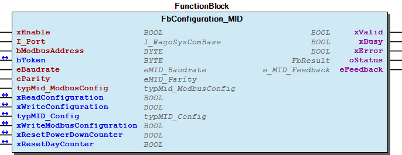

# WagoAppPowerMeasurement v1.7.4.11 (WAGO) - Complete Documentation

## 📋 Library Information

- **Company:** WAGO
- **Title:** WagoAppPowerMeasurement
- **Version:** 1.7.4.11
- **Categories:** WAGO FunctionalView|Device|IO; WAGO LayerView|App; Application
- **Author:** WAGO/u010663
- **Placeholder:** WagoAppPowerMeasurement

### Description ¶

This document is automatically generated.

Handling module 750-493,750-494, 750-495, 3PPT (2857-570/xxx), 879-3000 MID

The function blocks of this library are NOT thread safe and must be called from one CODESYS task only! Concurrent calls from different tasks may cause loss or corruption of data.

This document is automatically generated. Handling module 750-493,750-494, 750-495, 3PPT (2857-570/xxx), 879-3000 MID The function blocks of this library are NOT thread safe and must be called from one CODESYS task only! Concurrent calls from different tasks may cause loss or corruption of data.

### Contents: ¶

Contents: - Documentation Index 10 Documentation - WagoAppPowerMeasurement Library Documentation Project Information Library Information Function Blocks - FbAC_Base_MID (FB) - FbAC_Compact3WireWyeDelta_494 (FB) - FbAC_Compact3WireWyeDelta_495 (FB) - FbAC_Compact_3PPT (FB) - FbAC_Compact_3PPT_MultiQuery (FB) - FbAC_Compact_3WireWyeDelta_3PPT (FB) - FbAC_Compact_3WireWyeDelta_3PPT_MultiQuery (FB) - FbAC_Compact_494 (FB) - FbAC_Compact_495 (FB) - FbAC_Compact_495_040_010 (FB) - ... and 20 more Methods - FbAC_Compact_3PPT_MultiQuery.onError (METH) - FbAC_Compact_3PPT_MultiQuery.onResponse (METH) - FbAC_Compact_3WireWyeDelta_3PPT_MultiQuery.onError (METH) - FbAC_Compact_3WireWyeDelta_3PPT_MultiQuery.onResponse (METH) - FbAC_Compact_MID_MultiQuery.onError (METH) - FbAC_Compact_MID_MultiQuery.onResponse (METH) - FbAC_General_3PPT_MultiQuery.onError (METH) - FbAC_General_3PPT_MultiQuery.onResponse (METH) - FbConfigurationAndStatus_495.mSetMaxCompatibleParameter (METH) - FbConfigurationAndStatus_495.mSetVersionParts (METH) - ... and 5 more Program Organization Internal Components - 90 Internal - 90 Internal Global Variable Lists - Status (GVL) - VersionHistory (GVL) Other Components - 04 DataTypes - 04 DataTypes - 04 DataTypes - 04 DataTypes - 20 Functional Blocks - 29 DataTypes - 30 Visualizations - 3PPT - 3PPT(2857-570/xxx) - 3PPT_MultiQuery - ... and 66 more

### Indices and tables ¶

Based on WagoAppPowerMeasurement.library, last modified 29.05.2024, 20:11:39. LibDoc 3.5.16.10

© WAGO GmbH & Co. KG, Germany 2018 – All rights reserved. For the avoidance of doubt, this copyright notice does not only apply to the information above but also and primarily to the described library itself. Please note that third-party products are always mentioned without reference to intellectual property rights, including patents, utility models, designs and trademarks, accordingly the existence of such rights cannot be excluded. WAGO is a registered trademark of WAGO Verwaltungsgesellschaft mbH.

- File and Project Information - Library Reference Based on WagoAppPowerMeasurement.library, last modified 29.05.2024, 20:11:39. LibDoc 3.5.16.10 © WAGO GmbH & Co. KG, Germany 2018 – All rights reserved. For the avoidance of doubt, this copyright notice does not only apply to the information above but also and primarily to the described library itself. Please note that third-party products are always mentioned without reference to intellectual property rights, including patents, utility models, designs and trademarks, accordingly the existence of such rights cannot be excluded. WAGO is a registered trademark of WAGO Verwaltungsgesellschaft mbH.

### Documentation Index

## 10 Documentation ¶

- doc10_SystemProperties (FB)

## WagoAppPowerMeasurement Library Documentation

| Company: | WAGO |
| Title: | WagoAppPowerMeasurement |
| Version: | 1.7.4.11 |
| Categories: | WAGO FunctionalView\|Device\|IO; WAGO LayerView\|App; Application |
| Author: | WAGO/u010663 |
| Placeholder: | WagoAppPowerMeasurement |

### Description

This document is automatically generated.

Handling module 750-493,750-494, 750-495, 3PPT (2857-570/xxx), 879-3000 MID

The function blocks of this library are NOT thread safe and must be called from one CODESYS task only! Concurrent calls from different tasks may cause loss or corruption of data.

This document is automatically generated. Handling module 750-493,750-494, 750-495, 3PPT (2857-570/xxx), 879-3000 MID The function blocks of this library are NOT thread safe and must be called from one CODESYS task only! Concurrent calls from different tasks may cause loss or corruption of data.

### Contents:

- 10 Documentation doc10_SystemProperties (FB) 20 Program Organization Units - 3PPT(2857-570/xxx) - 75x_493 - 75x_494 - 75x_494/495 - 75x_495 - 879_3000_MID 30 Visualizations - 3PPT - 493 - 494 - 495 - 879_3000_MID 80 Status - Status (GVL) - eStatus (ENUM) 90 Internal - 879_3000_MID - GlobalTextList (Text List) - TextListMinMax (Text List) - TextList_EnergyCounter_1 (Text List) - TextList_EnergyCounter_2 (Text List) - TextList_Messtopology (Text List) - TextList_RogowskiType (Text List) ParameterList (PARAMS) VersionHistory (GVL)

### Indices and tables

Based on WagoAppPowerMeasurement.library, last modified 29.05.2024, 20:11:39. LibDoc 3.5.16.10

© WAGO GmbH & Co. KG, Germany 2018 – All rights reserved. For the avoidance of doubt, this copyright notice does not only apply to the information above but also and primarily to the described library itself. Please note that third-party products are always mentioned without reference to intellectual property rights, including patents, utility models, designs and trademarks, accordingly the existence of such rights cannot be excluded. WAGO is a registered trademark of WAGO Verwaltungsgesellschaft mbH.

- File and Project Information - Library Reference Based on WagoAppPowerMeasurement.library, last modified 29.05.2024, 20:11:39. LibDoc 3.5.16.10 © WAGO GmbH & Co. KG, Germany 2018 – All rights reserved. For the avoidance of doubt, this copyright notice does not only apply to the information above but also and primarily to the described library itself. Please note that third-party products are always mentioned without reference to intellectual property rights, including patents, utility models, designs and trademarks, accordingly the existence of such rights cannot be excluded. WAGO is a registered trademark of WAGO Verwaltungsgesellschaft mbH.

### Project Information

## File and Project Information

| Scope | Name | Type | Content |
| --- | --- | --- | --- |
| FileHeader | libraryFile | string | WagoAppPowerMeasurement.library |
| contentFile | doc.clean.json |
| productName | e!COCKPIT |
| creationDateTime | date | 29.05.2024, 20:12:00 |
| companyName | string | WAGO |
| ProjectInformation | LastModificationDateTime | date | 29.05.2024, 20:11:39 |
| Description | string | See: Description |
| Copyright | © WAGO Kontakttechnik GmbH & Co. KG, Germany 2018 – All rights reserved. |
| Author | WAGO/u010663 |
| AutoResolveUnbound | bool | True |
| Placeholder | string | WagoAppPowerMeasurement |
| Company | WAGO |
| DocFormat | reStructuredText |
| Project | WagoAppPowerMeasurement |
| DefaultNamespace |  |
| Version | version | 1.7.4.11 |
| ThreadSave | string | False |
| Version string |  |
| Title | WagoAppPowerMeasurement |
| LibraryCategories | library-category-list | WAGO FunctionalView\|Device\|IO; WAGO LayerView\|App; Application |
| CompiledLibraryCompatibilityVersion | string | CODESYS V3.5 SP16 Patch 3 |

### Library Information

## Library Reference

| LinkAllContent: False QualifiedOnly: False | SystemLibrary: False | Optional: False |

| LinkAllContent: False QualifiedOnly: False | SystemLibrary: False | Optional: False |

| LinkAllContent: False QualifiedOnly: False | SystemLibrary: False | Optional: False |

| LinkAllContent: False QualifiedOnly: False | SystemLibrary: True | Optional: False |

| LinkAllContent: False QualifiedOnly: False | SystemLibrary: True | Optional: False |

| LinkAllContent: False QualifiedOnly: False | SystemLibrary: True | Optional: False |

| LinkAllContent: False QualifiedOnly: False | SystemLibrary: True | Optional: False |

| LinkAllContent: False QualifiedOnly: False | SystemLibrary: True | Optional: False |

| LinkAllContent: False QualifiedOnly: False | SystemLibrary: True | Optional: False |

| LinkAllContent: False QualifiedOnly: False | SystemLibrary: True | Optional: False |

| LinkAllContent: False QualifiedOnly: False | SystemLibrary: True | Optional: False |

| LinkAllContent: False QualifiedOnly: False | SystemLibrary: True | Optional: False |

| LinkAllContent: False QualifiedOnly: False | SystemLibrary: True | Optional: False |

| LinkAllContent: False QualifiedOnly: False | SystemLibrary: True | Optional: False |

| LinkAllContent: False Optional: False | QualifiedOnly: False SystemLibrary: True | PublishSymbolsInContainer: True |

| LinkAllContent: False QualifiedOnly: False | SystemLibrary: True | Optional: False |

| LinkAllContent: False QualifiedOnly: True | SystemLibrary: False | Optional: False |

| LinkAllContent: False QualifiedOnly: False | SystemLibrary: False | Optional: False |

| LinkAllContent: False QualifiedOnly: False | SystemLibrary: False | Optional: False |

| LinkAllContent: False QualifiedOnly: False | SystemLibrary: False | Optional: False |

| LinkAllContent: False QualifiedOnly: False | SystemLibrary: False | Optional: False |

| LinkAllContent: False QualifiedOnly: False | SystemLibrary: False | Optional: False |

| LinkAllContent: False QualifiedOnly: True | SystemLibrary: False | Optional: False |

| LinkAllContent: False QualifiedOnly: True | SystemLibrary: False | Optional: False |

| LinkAllContent: False QualifiedOnly: True | SystemLibrary: False | Optional: False |

This is a dictionary of all referenced libraries and their name spaces.

This is a dictionary of all referenced libraries and their name spaces. Standard Library Identification : Placeholder: Standard Default Resolution: Standard, * (System) Namespace: Standard Library Properties : Util Library Identification : Placeholder: Util Default Resolution: Util, * (System) Namespace: Util Library Properties : Library Parameter : Parameter: IBLOCKSIZE = 22800 VisuDialogs Library Identification : Placeholder: VisuDialogs Default Resolution: VisuDialogs, * (System) Namespace: VisuDialogs Library Properties : VisuElem3DPath Library Identification : Placeholder: System_VisuElem3DPath Default Resolution: VisuElem3DPath, 3.5.10.0 (System) Namespace: VisuElem3DPath Library Properties : Library Parameter : Parameter: GC_POINTS_PER_POLYGON = 100 VisuElemCamDisplayer Library Identification : Placeholder: System_VisuElemCamDisplayer Default Resolution: VisuElemCamDisplayer, 3.5.10.0 (System) Namespace: VisuElemCamDisplayer Library Properties : Library Parameter : Parameter: GC_POINTS_PER_CAM = 100 VisuElemMeter Library Identification : Placeholder: System_VisuElemMeter Default Resolution: VisuElemMeter, 3.5.10.0 (System) Namespace: VisuElemMeter Library Properties : VisuElemTextEditor Library Identification : Placeholder: System_VisuElemTextEditor Default Resolution: VisuElemTextEditor, 3.5.10.0 (System) Namespace: VisuElemTextEditor Library Properties : VisuElemTrace Library Identification : Placeholder: System_VisuElemTrace Default Resolution: VisuElemTrace, 3.5.10.0 (System) Namespace: VisuElemTrace Library Properties : VisuElemXYChart Library Identification : Placeholder: System_VisuElemXYChart Default Resolution: VisuElemXYChart, 3.5.16.30 (System) Namespace: VisuElemXYChart Library Properties : VisuElems Library Identification : Placeholder: System_VisuElems Default Resolution: VisuElems, 3.5.10.0 (System) Namespace: VisuElems Library Properties : VisuElemsAlarm Library Identification : Placeholder: System_VisuElemsAlarm Default Resolution: VisuElemsAlarm, 3.5.10.0 (System) Namespace: VisuElemsAlarm Library Properties : VisuElemsDateTime Library Identification : Placeholder: System_VisuElemsDateTime Default Resolution: VisuElemsDateTime, 3.5.10.0 (System) Namespace: VisuElemsDateTime Library Properties : VisuElemsSpecialControls Library Identification : Placeholder: System_VisuElemsSpecialControls Default Resolution: VisuElemsSpecialControls, 3.5.10.0 (System) Namespace: VisuElemsSpecialControls Library Properties : VisuElemsWinControls Library Identification : Placeholder: System_VisuElemsWinControls Default Resolution: VisuElemsWinControls, 3.5.10.0 (System) Namespace: VisuElemsWinControls Library Properties : VisuInputs Library Identification : Placeholder: system_visuinputs Default Resolution: VisuInputs, 3.5.16.30 (System) Namespace: visuinputs Library Properties : VisuNativeControl Library Identification : Placeholder: System_VisuNativeControl Default Resolution: VisuNativeControl, 3.5.10.0 (System) Namespace: VisuNativeControl Library Properties : VisuSymbols Library Identification : Name: VisuSymbols Version: newest Company: System Namespace: VisuSymbols Library Properties : WagoAppCom Library Identification : Placeholder: WagoAppCom Default Resolution: WagoAppCom, * (WAGO) Namespace: WagoAppCom Library Properties : Library Parameter : Parameter: CUIDEFAULTSYSTEMBUFFERSIZE = 1028 WagoAppPlcModbus Library Identification : Placeholder: WagoAppPlcModbus Default Resolution: WagoAppPlcModbus, * (WAGO) Namespace: WagoAppPlcModbus Library Properties : WagoSysErrorBase Library Identification : Placeholder: WagoSysErrorBase Default Resolution: WagoSysErrorBase, * (WAGO) Namespace: WagoSysErrorBase Library Properties : WagoSysVersion Library Identification : Name: WagoSysVersion Version: 1.0.0.0 Company: WAGO Namespace: WagoSysVersion Library Properties : WagoTypesCom Library Identification : Placeholder: WagoTypesCom Default Resolution: WagoTypesCom, * (WAGO) Namespace: WagoTypesCom Library Properties : WagoTypesErrorBase Library Identification : Placeholder: WagoTypesErrorBase Default Resolution: WagoTypesErrorBase, * (WAGO) Namespace: WagoTypesErrorBase Library Properties : WagoTypesModuleBase Library Identification : Placeholder: WagoTypesModuleBase Default Resolution: WagoTypesModuleBase, * (WAGO) Namespace: WagoTypesModuleBase Library Properties : Library Parameter : Parameter: MAX_MBX_SIZE = 18 WagoTypesModule_75x_49x Library Identification : Placeholder: WagoTypesModule_75x_49x Default Resolution: WagoTypesModule_75x_49x, * (WAGO) Namespace: WagoTypesModule_75x_49x Library Properties :

### Function Blocks

## FbAC_Base_MID (FB)

| Scope | Name | Type | Comment |
| --- | --- | --- | --- |
| Input | xEnable | BOOL | Activates the function block |
| I_Port | WagoTypesCom.I_WagoSysComBase | Com port, either the onboard port or a serial terminal |
| bModbusAddress | BYTE | Modbus address of MID counter |
| Inout | bToken | BYTE | This variable must be the same for all function blocks on the same line |
| Output | xValid | BOOL | High, if awData is valid |
| xBusy | BOOL | Function block busy |
| xError | BOOL | Error occured, details in oStatus |
| oStatus | WagoSysErrorBase.FbResult | Status information |

{attribute ‘conditionalshow’ := ‘wagoapplication’}

Graphical Illustration

Graphical Interface of FbAC_Base_MID

Function description

Interface variables {attribute ‘conditionalshow’ := ‘wagoapplication’} Function Graphical Illustration  Graphical Interface of FbAC_Base_MID Function description

## FbAC_Compact3WireWyeDelta_494 (FB)

| Scope | Name | Type | Initial | Comment |
| --- | --- | --- | --- | --- |
| Input | xEnable | BOOL |  | Activates the function block |
| I_Port | WagoTypesModule_75x_49x.I_Module_75x_494 |  | Basic interface |
| tCycleTime | TIME | TIME#1s0ms | Intervall for reading values |
| rSelectedScalingFactor | REAL | 10 | Scalingfactor for the energy values |
| bPeakValuePhase | BYTE | 1 | Phase configured for to peak value measuring |
| Output | xValid | BOOL |  | High, if data is valid |
| xBusy | BOOL |  | Function block busy |
| xError | BOOL |  | Error occured, details in oStatus |
| oStatus | WagoSysErrorBase.FbResult |  | Status information |
| rTotalActivePower | REAL |  | Total Active Power [W] |
| rTotalReactivePower | REAL |  | Total Reactive Power [var] |
| rTotalActiveEnergy | REAL |  | Total Active Energy [Wh] |
| rTotalReactiveEnergy | REAL |  | Total Reactive Energy [varh] |
| xRotatingField | BOOL |  | Rotating Field |
| aVoltage_Lx_Ly | ARRAY [1..3] OF REAL |  | Voltage Lx-Ly [V] |
| aCurrent | ARRAY [1..3] OF REAL |  | Current [A] |
| aAverageCurrent | ARRAY [1..3] OF REAL |  | Average Current [A] |
| aMinCurrent | ARRAY [1..3] OF REAL |  | Minimum Current [A] |
| aMaxCurrent | ARRAY [1..3] OF REAL |  | Maximum Current [A] |
| aOvercurrent | ARRAY [1..3] OF BOOL |  | Overcurrent |
| aFrequency | ARRAY [1..3] OF REAL |  | Frequency [Hz] |
| aMinFrequency | ARRAY [1..3] OF REAL |  | Minimum Frequency [Hz] |
| aMaxFrequency | ARRAY [1..3] OF REAL |  | Maximum Frequency [Hz] |
| aPeakValues | ARRAY [1..2] OF REAL |  | Peak current, peak voltage |
| aNoZero | ARRAY [1..3] OF BOOL |  | NoZero |
| aVoltSag | ARRAY [1..3] OF BOOL |  | VoltSag |
| aFeedback | ARRAY [1..11] OF WagoSysErrorBase.FbResult |  | 0: -> no Error 1..240: -> bit coded errors, details see below |

This function block reads the most common AC values of the 3-Phase Power Measurement Module (750-494) in 3-wire Wye/Delta topology

Graphical Illustration

Function description

This function block can be used for cyclic reading of the most important measured values using collection 9. It can be used multiple times in one project.

For the correct unit of energy values, the setting for scaling factor rSelectedScalingFactor must be taken into account.

If this function block is used without the function block FbConfigurationAndStatus_494, it is then neccessary to set the parameter USE_FBAC_COMPACT_494_STANDALONE to TRUE.

Visualization

The input m_Input_Fb_750_494_AC_Compact3WireWyeDelta_01 is of type FbAC_Compact3WireWyeDelta_494

Using this template needs an instance of function block FbAC_Compact3WireWyeDelta_494 as input.

Interface variables Function This function block reads the most common AC values of the 3-Phase Power Measurement Module (750-494) in 3-wire Wye/Delta topology Graphical Illustration  Function description This function block can be used for cyclic reading of the most important measured values using collection 9. It can be used multiple times in one project. Note For the correct unit of energy values, the setting for scaling factor rSelectedScalingFactor must be taken into account. If this function block is used without the function block FbConfigurationAndStatus_494, it is then neccessary to set the parameter USE_FBAC_COMPACT_494_STANDALONE to TRUE. Visualization  Note The input m_Input_Fb_750_494_AC_Compact3WireWyeDelta_01 is of type FbAC_Compact3WireWyeDelta_494 Using this template needs an instance of function block FbAC_Compact3WireWyeDelta_494 as input.

## FbAC_Compact3WireWyeDelta_495 (FB)

| Scope | Name | Type | Initial | Comment |
| --- | --- | --- | --- | --- |
| Input | xEnable | BOOL |  | Activates the function block |
| I_Port | WagoTypesModule_75x_49x.I_Module_75x_495 |  | Basic interface |
| tCycleTime | TIME | TIME#1s0ms | Intervall for reading values |
| rSelectedScalingFactor | REAL | 10 | Scalingfactor for the energy values |
| bPeakValuePhase | BYTE | 1 | Phase configured for to peak value measuring |
| Output | xValid | BOOL |  | High, if data is valid |
| xBusy | BOOL |  | Function block busy |
| xError | BOOL |  | Error occured, details in oStatus |
| oStatus | WagoSysErrorBase.FbResult |  | Status information |
| rTotalActivePower | REAL |  | Total Active Power [W] |
| rTotalReactivePower | REAL |  | Total Reactive Power [var] |
| rTotalActiveEnergy | REAL |  | Total Active Energy [Wh] |
| rTotalReactiveEnergy | REAL |  | Total Reactive Energy [varh] |
| xRotatingField | BOOL |  | Rotating Field |
| aVoltage_Lx_Ly | ARRAY [1..3] OF REAL |  | Voltage Lx-Ly [V] |
| aCurrent | ARRAY [1..3] OF REAL |  | Current [A] |
| aAverageCurrent | ARRAY [1..3] OF REAL |  | Average Current [A] |
| aMinCurrent | ARRAY [1..3] OF REAL |  | Minimum Current [A] |
| aMaxCurrent | ARRAY [1..3] OF REAL |  | Maximum Current [A] |
| aOvercurrent | ARRAY [1..3] OF BOOL |  | Overcurrent |
| aFrequency | ARRAY [1..3] OF REAL |  | Frequency [Hz] |
| aMinFrequency | ARRAY [1..3] OF REAL |  | Minimum Frequency [Hz] |
| aMaxFrequency | ARRAY [1..3] OF REAL |  | Maximum Frequency [Hz] |
| aPeakValues | ARRAY [1..2] OF REAL |  | Peak current, peak voltage |
| aNoZero | ARRAY [1..3] OF BOOL |  | NoZero |
| aVoltSag | ARRAY [1..3] OF BOOL |  | VoltSag |
| aFeedback | ARRAY [1..11] OF WagoSysErrorBase.FbResult |  | 0: -> no Error 1..240: -> bit coded errors, details see below |

This function block reads the most common AC values of the 3-Phase Power Measurement Module (750-495) in 3-wire Wye/Delta topology.

Graphical Illustration

Function description

This function block can be used for cyclic reading of the most important measured values using collection 10. It can be used multiple times in one project.

For the correct unit of energy values, the setting for scaling factor rSelectedScalingFactor must be taken into account.

If this function block is used without the function block FbConfigurationAndStatus_495, then it is neccessary to set the parameter USE_FBAC_COMPACT_495_STANDALONE to TRUE.

Visualization

The input m_Input_Fb_750_495_AC_CompactAron_01 is of type FbAC_Compact3WireWyeDelta_495

Using this template needs an instance of function block FbAC_Compact3WireWyeDelta_495 as input.

Interface variables Function This function block reads the most common AC values of the 3-Phase Power Measurement Module (750-495) in 3-wire Wye/Delta topology. Graphical Illustration  Function description This function block can be used for cyclic reading of the most important measured values using collection 10. It can be used multiple times in one project. Note For the correct unit of energy values, the setting for scaling factor rSelectedScalingFactor must be taken into account. If this function block is used without the function block FbConfigurationAndStatus_495, then it is neccessary to set the parameter USE_FBAC_COMPACT_495_STANDALONE to TRUE. Visualization  Note The input m_Input_Fb_750_495_AC_CompactAron_01 is of type FbAC_Compact3WireWyeDelta_495 Using this template needs an instance of function block FbAC_Compact3WireWyeDelta_495 as input.

## FbAC_Compact_3PPT (FB)

| Scope | Name | Type | Initial | Comment | Inherited from |
| --- | --- | --- | --- | --- | --- |
| Input | xEnable | BOOL |  | Activates the function block | FbAC_Base_3PPT |
| I_Port | WagoTypesCom.I_WagoSysComBase |  | Com port, either the onboard port or a serial terminal | FbAC_Base_3PPT |
| bModbusAddress | BYTE |  | Modbus address of transducer | FbAC_Base_3PPT |
| Inout | bToken | BYTE |  | This variable must be the same for all function blocks on the same line | FbAC_Base_3PPT |
| Output | xValid | BOOL |  | High, if awData is valid | FbAC_Base_3PPT |
| xBusy | BOOL |  | Function block busy | FbAC_Base_3PPT |
| xError | BOOL |  | Error occured, details in oStatus | FbAC_Base_3PPT |
| oStatus | WagoSysErrorBase.FbResult |  | Status information | FbAC_Base_3PPT |
| Input | tCycleTime | TIME | TIME#1s0ms | Intervall for reading values |  |
| Output | rTotalActivePower | REAL |  | Total Active Power [W] |  |
| rTotalReactivePower | REAL |  | Total Reactive Power [var] |  |
| rTotalApparentPower | REAL |  | Total Apparent Power [VA] |  |
| rTotalPowerFactorPF | REAL |  | Total Power Factor PF |  |
| rTotalActiveEnergy | REAL |  | Total Active Energy [Wh] ->FW3 [kWh] |  |
| rTotalReactiveEnergy | REAL |  | Total Reactive Energy [varh] ->FW3 [kvarh] |  |
| rTotalApparentEnergy | REAL |  | Total Apparent Energy [VAh] ->FW3 [kVAh] |  |
| xRotatingField | BOOL |  | Rotating Field |  |
| aCurrent | ARRAY [1..3] OF REAL |  | Current [A] |  |
| rCurrentN | REAL |  | Current N [A] |  |
| xTamperDetect | BOOL |  | Tamper Detect |  |
| aOvercurrent | ARRAY [1..3] OF BOOL |  | Overcurrent |  |
| aVoltage_L_N | ARRAY [1..3] OF REAL |  | Voltage L-N [V] |  |
| aVoltage_Lx_Ly | ARRAY [1..3] OF REAL |  | Voltage Lx-Ly [V] |  |
| aUndervoltage | ARRAY [1..3] OF BOOL |  | Undervoltage |  |
| aOvervoltage | ARRAY [1..3] OF BOOL |  | Overvoltage |  |
| aActivePower | ARRAY [1..3] OF REAL |  | ActivePower [W] |  |
| aReactivePower | ARRAY [1..3] OF REAL |  | Reactive Power [var] |  |
| aApparentPower | ARRAY [1..3] OF REAL |  | Apparent Power [VA] |  |
| aCosPhi | ARRAY [1..3] OF REAL |  | CosPhi |  |
| aPowerFactorPF | ARRAY [1..3] OF REAL |  | Power Factor PF |  |
| aFrequency | ARRAY [1..3] OF REAL |  | Frequency [Hz] |  |
| aNoZero | ARRAY [1..3] OF BOOL |  | NoZero |  |
| aVoltSag | ARRAY [1..3] OF BOOL |  | VoltSag |  |
| a4Quadrant | ARRAY [1..3] OF INT |  | 4-quadrant display |  |

This function block reads the most common AC values of the 3-Phase Power Transducer Module

Graphical Illustration

Graphical Interface of FbAC_Compact_3PPT

Function description

Visualization

Since firmware 3 the output for the energy counter is in kilo as [kWh] or [kvarh] or [kVAh]

The input m_Input_Fb_3PPM_AC_Compact is of type FbAC_Compact_3PPT

Using this template needs an instance of function block FbAC_Compact_3PPT as input.

Interface variables Function This function block reads the most common AC values of the 3-Phase Power Transducer Module Graphical Illustration  Graphical Interface of FbAC_Compact_3PPT Function description Visualization Note Since firmware 3 the output for the energy counter is in kilo as [kWh] or [kvarh] or [kVAh] Note The input m_Input_Fb_3PPM_AC_Compact is of type FbAC_Compact_3PPT Using this template needs an instance of function block FbAC_Compact_3PPT as input.

## FbAC_Compact_3PPT_MultiQuery (FB)

| Scope | Name | Type | Initial | Comment | Inherited from |
| --- | --- | --- | --- | --- | --- |
| Input | IMbMasterMultiQuery | I_MbMasterMultiQuery |  |  | FbDigitalTwinMbSlaveDevice |
| xEnable | BOOL |  |  |  |
| bUnitId | BYTE | 1 | SlaveAddress |  |
| tCycleTime | TIME | TIME#3s0ms | Intervall for reading values |  |
| Output | xValid | BOOL |  |  |  |
| xBusy | BOOL |  |  |  |
| xError | BOOL |  |  |  |
| oStatus | WagoSysErrorBase.FbResult |  | status information |  |
| rTotalActivePower | REAL |  | Total Active Power [W] |  |
| rTotalReactivePower | REAL |  | Total Reactive Power [var] |  |
| rTotalApparentPower | REAL |  | Total Apparent Power [VA] |  |
| rTotalPowerFactorPF | REAL |  | Total Power Factor PF |  |
| rTotalActiveEnergy | REAL |  | Total Active Energy [Wh] |  |
| rTotalReactiveEnergy | REAL |  | Total Reactive Energy [varh] |  |
| rTotalApparentEnergy | REAL |  | Total Apparent Energy [VAh] |  |
| xRotatingField | BOOL |  | Rotating Field |  |
| aCurrent | ARRAY [1..3] OF REAL |  | Current [A] |  |
| rCurrentN | REAL |  | Current N [A] |  |
| xTamperDetect | BOOL |  | Tamper Detect |  |
| aOvercurrent | ARRAY [1..3] OF BOOL |  | Overcurrent |  |
| aVoltage_L_N | ARRAY [1..3] OF REAL |  | Voltage L-N [V] |  |
| aVoltage_Lx_Ly | ARRAY [1..3] OF REAL |  | Voltage Lx-Ly [V] |  |
| aUndervoltage | ARRAY [1..3] OF BOOL |  | Undervoltage |  |
| aOvervoltage | ARRAY [1..3] OF BOOL |  | Overvoltage |  |
| aActivePower | ARRAY [1..3] OF REAL |  | ActivePower [W] |  |
| aReactivePower | ARRAY [1..3] OF REAL |  | Reactive Power [var] |  |
| aApparentPower | ARRAY [1..3] OF REAL |  | Apparent Power [VA] |  |
| aCosPhi | ARRAY [1..3] OF REAL |  | CosPhi |  |
| aPowerFactorPF | ARRAY [1..3] OF REAL |  | Power Factor PF |  |
| aFrequency | ARRAY [1..3] OF REAL |  | Frequency [Hz] |  |
| aNoZero | ARRAY [1..3] OF BOOL |  | NoZero |  |
| aVoltSag | ARRAY [1..3] OF BOOL |  | VoltSag |  |
| a4Quadrant | ARRAY [1..3] OF INT |  | 4-quadrant display |  |

This function block reads the most common AC values of the 3-Phase Power Transducer Module

Graphical Illustration

Graphical Interface of FbAC_Compact_3PPT_MultiQuery

Function description

Visualization

Since firmware 3 the output for the energy counter is in kilo as [kWh] or [kvarh] or [kVAh]

The input m_Input_Fb_3PPM_AC_Compact is of type FbAC_Compact_3PPT_Proxy

Using this template needs an instance of function block FbAC_Compact_3PPT_Proxy as input.

Interface variables Function This function block reads the most common AC values of the 3-Phase Power Transducer Module Graphical Illustration  Graphical Interface of FbAC_Compact_3PPT_MultiQuery Function description Visualization Note Since firmware 3 the output for the energy counter is in kilo as [kWh] or [kvarh] or [kVAh] Note The input m_Input_Fb_3PPM_AC_Compact is of type FbAC_Compact_3PPT_Proxy Using this template needs an instance of function block FbAC_Compact_3PPT_Proxy as input. - FbAC_Compact_3PPT_MultiQuery.onError (METH) - FbAC_Compact_3PPT_MultiQuery.onResponse (METH)

## FbAC_Compact_3WireWyeDelta_3PPT (FB)

| Scope | Name | Type | Initial | Comment | Inherited from |
| --- | --- | --- | --- | --- | --- |
| Input | xEnable | BOOL |  | Activates the function block | FbAC_Base_3PPT |
| I_Port | WagoTypesCom.I_WagoSysComBase |  | Com port, either the onboard port or a serial terminal | FbAC_Base_3PPT |
| bModbusAddress | BYTE |  | Modbus address of transducer | FbAC_Base_3PPT |
| Inout | bToken | BYTE |  | This variable must be the same for all function blocks on the same line | FbAC_Base_3PPT |
| Output | xValid | BOOL |  | High, if awData is valid | FbAC_Base_3PPT |
| xBusy | BOOL |  | Function block busy | FbAC_Base_3PPT |
| xError | BOOL |  | Error occured, details in oStatus | FbAC_Base_3PPT |
| oStatus | WagoSysErrorBase.FbResult |  | Status information | FbAC_Base_3PPT |
| Input | tCycleTime | TIME | TIME#1s0ms | Intervall for reading values |  |
| Output | rTotalActivePower | REAL |  | Total Active Power [W] |  |
| rTotalReactivePower | REAL |  | Total Reactive Power [var] |  |
| rTotalActiveEnergy | REAL |  | Total Active Energy [Wh] ->FW3 [kWh] |  |
| rTotalReactiveEnergy | REAL |  | Total Reactive Energy [varh] ->FW3 [kvarh] |  |
| xRotatingField | BOOL |  | Rotating Field |  |
| aVoltage_Lx_Ly | ARRAY [1..3] OF REAL |  | Voltage Lx-Ly [V] |  |
| aCurrent | ARRAY [1..3] OF REAL |  | Current [A] |  |
| aAverageCurrent | ARRAY [1..3] OF REAL |  | Average Current [A] |  |
| aMinCurrent | ARRAY [1..3] OF REAL |  | Minimum Current [A] |  |
| aMaxCurrent | ARRAY [1..3] OF REAL |  | Maximum Current [A] |  |
| aOvercurrent | ARRAY [1..3] OF BOOL |  | Overcurrent |  |
| aFrequency | ARRAY [1..3] OF REAL |  | Frequency [Hz] |  |
| aMinFrequency | ARRAY [1..3] OF REAL |  | Minimum Frequency [Hz] |  |
| aMaxFrequency | ARRAY [1..3] OF REAL |  | Maximum Frequency [Hz] |  |
| aPeakValues | ARRAY [1..2] OF REAL |  | Peak current, peak voltage |  |

This function block reads the most common AC values of the 3-Phase Power Transducer module if used with 3-Wire Wye/Delta topology

Graphical Illustration

Graphical Interface of FbAC_Compact_3WireWyeDelta_3PPT

Function description

Visualization

Since firmware 3 the output for the energy counter is in kilo as [kWh] or [kvarh]

The input m_Input_Fb_3PPM_AC_CompactAron is of type FbAC_Compact_3WireWyeDelta_3PPT

Using this template needs an instance of function block FbAC_Compact_3WireWyeDelta_3PPT as input.

Interface variables Function This function block reads the most common AC values of the 3-Phase Power Transducer module if used with 3-Wire Wye/Delta topology Graphical Illustration  Graphical Interface of FbAC_Compact_3WireWyeDelta_3PPT Function description Visualization  Note Since firmware 3 the output for the energy counter is in kilo as [kWh] or [kvarh] Note The input m_Input_Fb_3PPM_AC_CompactAron is of type FbAC_Compact_3WireWyeDelta_3PPT Using this template needs an instance of function block FbAC_Compact_3WireWyeDelta_3PPT as input.

## FbAC_Compact_3WireWyeDelta_3PPT_MultiQuery (FB)

| Scope | Name | Type | Initial | Comment | Inherited from |
| --- | --- | --- | --- | --- | --- |
| Input | IMbMasterMultiQuery | I_MbMasterMultiQuery |  |  | FbDigitalTwinMbSlaveDevice |
| xEnable | BOOL |  |  |  |
| bUnitId | BYTE | 1 | SlaveAddress |  |
| tCycleTime | TIME | TIME#1s0ms | Intervall for reading values |  |
| Output | xValid | BOOL |  |  |  |
| xBusy | BOOL |  |  |  |
| xError | BOOL |  |  |  |
| oStatus | WagoSysErrorBase.FbResult |  | status information |  |
| rTotalActivePower | REAL |  | Total Active Power [W] |  |
| rTotalReactivePower | REAL |  | Total Reactive Power [var] |  |
| rTotalActiveEnergy | REAL |  | Total Active Energy [Wh] |  |
| rTotalReactiveEnergy | REAL |  | Total Reactive Energy [varh] |  |
| xRotatingField | BOOL |  | Rotating Field |  |
| aVoltage_Lx_Ly | ARRAY [1..3] OF REAL |  | Voltage Lx-Ly [V] |  |
| aCurrent | ARRAY [1..3] OF REAL |  | Current [A] |  |
| aAverageCurrent | ARRAY [1..3] OF REAL |  | Average Current [A] |  |
| aMinCurrent | ARRAY [1..3] OF REAL |  | Minimum Current [A] |  |
| aMaxCurrent | ARRAY [1..3] OF REAL |  | Maximum Current [A] |  |
| aOvercurrent | ARRAY [1..3] OF BOOL |  | Overcurrent |  |
| aFrequency | ARRAY [1..3] OF REAL |  | Frequency [Hz] |  |
| aMinFrequency | ARRAY [1..3] OF REAL |  | Minimum Frequency [Hz] |  |
| aMaxFrequency | ARRAY [1..3] OF REAL |  | Maximum Frequency [Hz] |  |
| aPeakValues | ARRAY [1..2] OF REAL |  | Peak current, peak voltage |  |

This function block reads the most common AC values of the 3-Phase Power Transducer module if used with 3-Wire Wye/Delta topology

Graphical Illustration

Graphical Interface of FbAC_Compact_3WireWyeDelta_3PPT_MultiQuery

Function description

Visualization

Since firmware 3 the output for the energy counter is in kilo as [kWh] or [kvarh]

The input m_Input_Fb_3PPM_AC_CompactAron is of type FbAC_Compact_3WireWyeDelta_3PPT

Using this template needs an instance of function block FbAC_Compact_3WireWyeDelta_3PPT as input.

Interface variables Function This function block reads the most common AC values of the 3-Phase Power Transducer module if used with 3-Wire Wye/Delta topology Graphical Illustration  Graphical Interface of FbAC_Compact_3WireWyeDelta_3PPT_MultiQuery Function description Visualization  Note Since firmware 3 the output for the energy counter is in kilo as [kWh] or [kvarh] Note The input m_Input_Fb_3PPM_AC_CompactAron is of type FbAC_Compact_3WireWyeDelta_3PPT Using this template needs an instance of function block FbAC_Compact_3WireWyeDelta_3PPT as input. - FbAC_Compact_3WireWyeDelta_3PPT_MultiQuery.onError (METH) - FbAC_Compact_3WireWyeDelta_3PPT_MultiQuery.onResponse (METH)

## FbAC_Compact_494 (FB)

| Scope | Name | Type | Initial | Comment |
| --- | --- | --- | --- | --- |
| Input | xEnable | BOOL |  | Activates the function block |
| I_Port | WagoTypesModule_75x_49x.I_Module_75x_494 |  | Basic interface |
| tCycleTime | TIME | TIME#1s0ms | Intervall for reading values |
| rSelectedScalingFactor | REAL | 10 | Scalingfactor for the energy values |
| Output | xValid | BOOL |  | High, if data is valid |
| xBusy | BOOL |  | Function block busy |
| xError | BOOL |  | Error occured, details in oStatus |
| oStatus | WagoSysErrorBase.FbResult |  | Status information |
| rTotalActivePower | REAL |  | Total Active Power [W] |
| rTotalReactivePower | REAL |  | Total Reactive Power [var] |
| rTotalApparentPower | REAL |  | Total Apparent Power [VA] |
| rTotalPowerFactorPF | REAL |  | Total Power Factor PF |
| rTotalActiveEnergy | REAL |  | Total Active Energy [Wh] |
| rTotalReactiveEnergy | REAL |  | Total Reactive Energy [varh] |
| rTotalApparentEnergy | REAL |  | Total Apparent Energy [VAh] |
| xRotatingField | BOOL |  | Rotating Field |
| aCurrent | ARRAY [1..3] OF REAL |  | Current [A] |
| aOvercurrent | ARRAY [1..3] OF BOOL |  | Overcurrent |
| aVoltage_L_N | ARRAY [1..3] OF REAL |  | Voltage L-N [V] |
| aUndervoltage | ARRAY [1..3] OF BOOL |  | Undervoltage |
| aOvervoltage | ARRAY [1..3] OF BOOL |  | Overvoltage |
| aActivePower | ARRAY [1..3] OF REAL |  | ActivePower [W] |
| aReactivePower | ARRAY [1..3] OF REAL |  | Reactive Power [var] |
| aApparentPower | ARRAY [1..3] OF REAL |  | Apparent Power [VA] |
| aCosPhi | ARRAY [1..3] OF REAL |  | CosPhi |
| aPowerFactorPF | ARRAY [1..3] OF REAL |  | Power Factor PF |
| aFrequency | ARRAY [1..3] OF REAL |  | Frequency [Hz] |
| aNoZero | ARRAY [1..3] OF BOOL |  | NoZero |
| aVoltSag | ARRAY [1..3] OF BOOL |  | VoltSag |
| a4Quadrant | ARRAY [1..3] OF INT |  | 4-quadrant display |
| aFeedback | ARRAY [1..8] OF WagoSysErrorBase.FbResult |  | 0: -> no Error 1..240: -> bit coded errors, details see below |

This function block reads the most common AC values of the 3-Phase Power Measurement module 750-494

Graphical Illustration

Function description

The function block can be used for cyclic reading of the most important measured values using collection 9. It can be used multiple times in one project.

For the correct unit of energy values, the setting for scaling factor rSelectedScalingFactor must be taken into account.

If this function block is used without the function block FbConfigurationAndStatus_494 then it is neccessary to set the parameter USE_FBAC_COMPACT_494_STANDALONE to TRUE.

Visualization

The input m_Input_Fb_750_494_AC_Compact_01 is of type FbAC_Compact_494

Using this template needs an instance of function block FbAC_Compact_494 as input.

Interface variables Function This function block reads the most common AC values of the 3-Phase Power Measurement module 750-494 Graphical Illustration  Function description The function block can be used for cyclic reading of the most important measured values using collection 9. It can be used multiple times in one project. Note For the correct unit of energy values, the setting for scaling factor rSelectedScalingFactor must be taken into account. If this function block is used without the function block FbConfigurationAndStatus_494 then it is neccessary to set the parameter USE_FBAC_COMPACT_494_STANDALONE to TRUE. Visualization  Note The input m_Input_Fb_750_494_AC_Compact_01 is of type FbAC_Compact_494 Using this template needs an instance of function block FbAC_Compact_494 as input.

## FbAC_Compact_495 (FB)

| Scope | Name | Type | Initial | Comment |
| --- | --- | --- | --- | --- |
| Input | xEnable | BOOL |  | Activates the function block |
| I_Port | WagoTypesModule_75x_49x.I_Module_75x_495 |  | Basic interface |
| tCycleTime | TIME | TIME#1s0ms | Intervall for reading values |
| rSelectedScalingFactor | REAL | 10 | Scalingfactor for the energy values |
| Output | xValid | BOOL |  | High, if data is valid |
| xBusy | BOOL |  | Function block busy |
| xError | BOOL |  | Error occured, details in oStatus |
| oStatus | WagoSysErrorBase.FbResult |  | Status information |
| rTotalActivePower | REAL |  | Total Active Power [W] |
| rTotalReactivePower | REAL |  | Total Reactive Power [var] |
| rTotalApparentPower | REAL |  | Total Apparent Power [VA] |
| rTotalPowerFactorPF | REAL |  | Total Power Factor PF |
| rTotalActiveEnergy | REAL |  | Total Active Energy [Wh] |
| rTotalReactiveEnergy | REAL |  | Total Reactive Energy [varh] |
| rTotalApparentEnergy | REAL |  | Total Apparent Energy [VAh] |
| rCurrentN | REAL |  | Current N [A] |
| xTamperDetect | BOOL |  | Tamper Detect |
| xRotatingField | BOOL |  | Rotating Field |
| aCurrent | ARRAY [1..3] OF REAL |  | Current [A] |
| aOvercurrent | ARRAY [1..3] OF BOOL |  | Overcurrent |
| aVoltage_L_N | ARRAY [1..3] OF REAL |  | Voltage L-N [V] |
| aUndervoltage | ARRAY [1..3] OF BOOL |  | Undervoltage |
| aOvervoltage | ARRAY [1..3] OF BOOL |  | Overvoltage |
| aActivePower | ARRAY [1..3] OF REAL |  | ActivePower [W] |
| aReactivePower | ARRAY [1..3] OF REAL |  | ReactivePower [var] |
| aApparentPower | ARRAY [1..3] OF REAL |  | ApparentPower [VA] |
| aCosPhi | ARRAY [1..3] OF REAL |  | CosPhi |
| aPowerFactorPF | ARRAY [1..3] OF REAL |  | PowerFactorPF |
| aFrequency | ARRAY [1..3] OF REAL |  | Frequency [Hz] |
| aNoZero | ARRAY [1..3] OF BOOL |  | NoZero |
| aVoltSag | ARRAY [1..3] OF BOOL |  | VoltSag |
| a4Quadrant | ARRAY [1..3] OF INT |  | 4-quadrant display |
| aFeedback | ARRAY [1..8] OF WagoSysErrorBase.FbResult |  | 0: -> no Error 1..240: -> bit coded errors, details see below |

This function block reads the most common AC values of the 3-Phase Power Measurement module 750-495

Graphical Illustration

Function description

The function block can be used for cyclic reading of the most important measured values using collection 10. It can be used multiple times in one project.

For the correct unit of energy values, the setting for scaling factor rSelectedScalingFactor must be taken into account.

If this function block is used without the function block FbConfigurationAndStatus_495, then it is neccessary to set the parameter USE_FBAC_COMPACT_495_STANDALONE to TRUE.

Visualization

The input m_Input_Fb_750_495_AC_Compact_01 is of type FbAC_Compact_495

Using this template needs an instance of function block FbAC_Compact_495 as input.

Interface variables Function This function block reads the most common AC values of the 3-Phase Power Measurement module 750-495 Graphical Illustration  Function description The function block can be used for cyclic reading of the most important measured values using collection 10. It can be used multiple times in one project. Note For the correct unit of energy values, the setting for scaling factor rSelectedScalingFactor must be taken into account. If this function block is used without the function block FbConfigurationAndStatus_495, then it is neccessary to set the parameter USE_FBAC_COMPACT_495_STANDALONE to TRUE. Visualization  Note The input m_Input_Fb_750_495_AC_Compact_01 is of type FbAC_Compact_495 Using this template needs an instance of function block FbAC_Compact_495 as input.

## FbAC_Compact_495_040_010 (FB)

| Scope | Name | Type | Initial | Comment |
| --- | --- | --- | --- | --- |
| Input | xEnable | BOOL |  | Activates the function block |
| I_Port | WagoTypesModule_75x_49x.I_Module_75x_495 |  | Basic interface |
| tCycleTime | TIME | TIME#1s0ms | Intervall for reading values |
| rSelectedScalingFactor | REAL | 10 | Scalingfactor for the energy values |
| Output | xValid | BOOL |  | High, if data is valid |
| xBusy | BOOL |  | Function block busy |
| xError | BOOL |  | Error occured, details in oStatus |
| oStatus | WagoSysErrorBase.FbResult |  | Status information |
| rTotalActivePower | REAL |  | Total Active Power [W] |
| rTotalReactivePower | REAL |  | Total Reactive Power [var] |
| rTotalApparentPower | REAL |  | Total Apparent Power [VA] |
| rTotalPowerFactorPF | REAL |  | Total Power Factor PF |
| rTotalActiveEnergy | REAL |  | Total Active Energy [Wh] |
| rTotalReactiveEnergy | REAL |  | Total Reactive Energy [varh] |
| rTotalApparentEnergy | REAL |  | Total Apparent Energy [VAh] |
| xRotatingField | BOOL |  | Rotating Field |
| aCurrent | ARRAY [1..3] OF REAL |  | Current [A] |
| aOvercurrent | ARRAY [1..3] OF BOOL |  | Overcurrent |
| aVoltage_L_N | ARRAY [1..3] OF REAL |  | Voltage L-N [V] |
| aUndervoltage | ARRAY [1..3] OF BOOL |  | Undervoltage |
| aOvervoltage | ARRAY [1..3] OF BOOL |  | Overvoltage |
| aActivePower | ARRAY [1..3] OF REAL |  | ActivePower [W] |
| aReactivePower | ARRAY [1..3] OF REAL |  | ReactivePower [var] |
| aApparentPower | ARRAY [1..3] OF REAL |  | ApparentPower [VA] |
| aCosPhi | ARRAY [1..3] OF REAL |  | CosPhi |
| aPowerFactorPF | ARRAY [1..3] OF REAL |  | PowerFactorPF |
| aFrequency | ARRAY [1..3] OF REAL |  | Frequency [Hz] |
| aNoZero | ARRAY [1..3] OF BOOL |  | NoZero |
| aVoltSag | ARRAY [1..3] OF BOOL |  | VoltSag |
| a4Quadrant | ARRAY [1..3] OF INT |  | 4-quadrant display |
| aFeedback | ARRAY [1..8] OF WagoSysErrorBase.FbResult |  | 0: -> no Error 1..240: -> bit coded errors, details see below |

This function block reads the most common AC values of the 3-Phase Power Measurement module 750-495/040-010

Graphical Illustration

Function description

The function block can be used for cyclic reading of the most important measured values using collection 10. It can be used multiple times in one project.

For the correct unit of energy values, the setting for scaling factor rSelectedScalingFactor must be taken into account.

If this function block is used without the function block FbConfigurationAndStatus_495_040_010, then it is neccessary to set the parameter USE_FBAC_COMPACT_495_STANDALONE to TRUE.

Visualization

The input m_Input_Fb_750_495_AC_Compact_01 is of type FbAC_Compact_495_040_010

Using this template needs an instance of function block FbAC_Compact_495_040_010 as input.

Interface variables Function This function block reads the most common AC values of the 3-Phase Power Measurement module 750-495/040-010 Graphical Illustration  Function description The function block can be used for cyclic reading of the most important measured values using collection 10. It can be used multiple times in one project. Note For the correct unit of energy values, the setting for scaling factor rSelectedScalingFactor must be taken into account. If this function block is used without the function block FbConfigurationAndStatus_495_040_010, then it is neccessary to set the parameter USE_FBAC_COMPACT_495_STANDALONE to TRUE. Visualization  Note The input m_Input_Fb_750_495_AC_Compact_01 is of type FbAC_Compact_495_040_010 Using this template needs an instance of function block FbAC_Compact_495_040_010 as input.

## FbAC_Compact_MID (FB)

| Scope | Name | Type | Initial | Comment | Inherited from |
| --- | --- | --- | --- | --- | --- |
| Input | xEnable | BOOL |  | Activates the function block | FbAC_Base_MID |
| I_Port | WagoTypesCom.I_WagoSysComBase |  | Com port, either the onboard port or a serial terminal | FbAC_Base_MID |
| bModbusAddress | BYTE |  | Modbus address of MID counter | FbAC_Base_MID |
| Inout | bToken | BYTE |  | This variable must be the same for all function blocks on the same line | FbAC_Base_MID |
| Output | xValid | BOOL |  | High, if awData is valid | FbAC_Base_MID |
| xBusy | BOOL |  | Function block busy | FbAC_Base_MID |
| xError | BOOL |  | Error occured, details in oStatus | FbAC_Base_MID |
| oStatus | WagoSysErrorBase.FbResult |  | Status information | FbAC_Base_MID |
| Input | eBaudrate | eMID_Baudrate | eMID_Baudrate.BAUD_9600 | Default setting of MID is 9600 bauc |  |
| eParity | eMID_Parity | eMID_Parity.PARITY_EVEN | Default setting of MID is even parity |  |
| tCycleTime | TIME | TIME#1s0ms | Intervall for reading values |  |
| Output | rVoltage | REAL |  | Voltage [V] |  |
| aVoltage | ARRAY [1..3] OF REAL |  | Voltage [V] |  |
| rGridFrenquency | REAL |  | Frequency [Hz] |  |
| rCurrent | REAL |  | Current [A] |  |
| aCurrent | ARRAY [1..3] OF REAL |  | Current [A] |  |
| rTotalActivePower | REAL |  | Total Active Power [kW] |  |
| aActivePower | ARRAY [1..3] OF REAL |  | ActivePower [kW] |  |
| rTotalReactivePower | REAL |  | Total Reactive Power [kvar] |  |
| aReactivePower | ARRAY [1..3] OF REAL |  | Reactive Power [kvar] |  |
| rTotalApparentPower | REAL |  | Total Apparent Power [kVA] |  |
| aApparentPower | ARRAY [1..3] OF REAL |  | Apparent Power [kVA] |  |
| rPowerFactorPF | REAL |  | Power Factor PF |  |
| aPowerFactorPF | ARRAY [1..3] OF REAL |  | Power Factor PF |  |
| rTotalActiveEnergy | REAL |  | Total Active Energy [kWh] |  |
| aTariffActiveEnergy | ARRAY [1..2] OF REAL |  | Tariff T1/T2 Active Energy [kWh] |  |
| aActiveEnergy | ARRAY [1..3] OF REAL |  | Active Energy [kWh] |  |
| rTotalForwardActiveEnergy | REAL |  | Total Forward Active Energy [kWh] |  |
| aTariffForwardActiveEnergy | ARRAY [1..2] OF REAL |  | Tariff T1/T2 Forward Active Energy [kWh] |  |
| aForwardActiveEnergy | ARRAY [1..3] OF REAL |  | Forward Active Energy [kWh] |  |
| rTotalReverseActiveEnergy | REAL |  | Total Reverse Active Energy [kWh] |  |
| aTariffReverseActiveEnergy | ARRAY [1..2] OF REAL |  | Tariff T1/T2 Reverse Active Energy [kWh] |  |
| aReverseActiveEnergy | ARRAY [1..3] OF REAL |  | Reverse Active Energy [kWh] |  |
| rTotalReactiveEnergy | REAL |  | Total Reactive Energy [kvarh] |  |
| aTariffReactiveEnergy | ARRAY [1..2] OF REAL |  | Tariff T1/T2 Reactive Energy [kvarh] |  |
| aReactiveEnergy | ARRAY [1..3] OF REAL |  | Reactive Energy [kvarh] |  |
| rTotalForwardReactiveEnergy | REAL |  | Total Forward Reactive Energy [kvarh] |  |
| aTariffForwardReactiveEnergy | ARRAY [1..2] OF REAL |  | Tariff T1/T2 Forward Reactive Energy [kvarh] |  |
| aForwardReactiveEnergy | ARRAY [1..3] OF REAL |  | Forward Reactive Energy [kvarh] |  |
| rTotalReverseReactiveEnergy | REAL |  | Total Reverse Reactive Energy [kvarh] |  |
| aTariffReverseReactiveEnergy | ARRAY [1..2] OF REAL |  | Tariff T1/T2 Reverse Reactive Energy [kvarh] |  |
| aReverseReactiveEnergy | ARRAY [1..3] OF REAL |  | Reverse Reactive Energy [kvarh] |  |
| rTotalApparentEnergy | REAL |  | Total Apparent Energy [kVAh] |  |
| iTariff | INT |  | T1/T2 |  |
| rResettableDayCounter | REAL |  | Resettable Day Counter [kWh] |  |
| a4Quadrant | ARRAY [1..3] OF INT |  | 4-quadrant display |  |
| stMID_Itent | typMID_Ident |  | Identity data |  |

This function block reads the most common AC values of the MID counter 879-3000

Graphical Illustration

Graphical Interface of FbAC_Compact_MID

Function description

A visualization template tplStatusAC_Compact_MID is available.

The input m_Input_FbAC_Compact is of type FbAC_Compact_MID

Using this template needs an instance of function block FbAC_Compact_MID as input.

Interface variables Function This function block reads the most common AC values of the MID counter 879-3000 Graphical Illustration  Graphical Interface of FbAC_Compact_MID Function description A visualization template tplStatusAC_Compact_MID is available. Note The input m_Input_FbAC_Compact is of type FbAC_Compact_MID Using this template needs an instance of function block FbAC_Compact_MID as input.

## FbAC_Compact_MID_MultiQuery (FB)

| Scope | Name | Type | Initial | Comment | Inherited from |
| --- | --- | --- | --- | --- | --- |
| Input | IMbMasterMultiQuery | I_MbMasterMultiQuery |  |  | FbDigitalTwinMbSlaveDevice |
| xEnable | BOOL |  |  |  |
| bUnitId | BYTE | 1 | SlaveAddress |  |
| tCycleTime | TIME | TIME#3s0ms | Intervall for reading values |  |
| Output | xValid | BOOL |  |  |  |
| xBusy | BOOL |  |  |  |
| xError | BOOL |  |  |  |
| oStatus | WagoSysErrorBase.FbResult |  | status information |  |
| rVoltage | REAL |  | Voltage [V] |  |
| aVoltage | ARRAY [1..3] OF REAL |  | Voltage [V] |  |
| rGridFrenquency | REAL |  | Frequency [Hz] |  |
| rCurrent | REAL |  | Current [A] |  |
| aCurrent | ARRAY [1..3] OF REAL |  | Current [A] |  |
| rTotalActivePower | REAL |  | Total Active Power [kW] |  |
| aActivePower | ARRAY [1..3] OF REAL |  | ActivePower [kW] |  |
| rTotalReactivePower | REAL |  | Total Reactive Power [kvar] |  |
| aReactivePower | ARRAY [1..3] OF REAL |  | Reactive Power [kvar] |  |
| rTotalApparentPower | REAL |  | Total Apparent Power [kVA] |  |
| aApparentPower | ARRAY [1..3] OF REAL |  | Apparent Power [kVA] |  |
| rPowerFactorPF | REAL |  | Power Factor PF |  |
| aPowerFactorPF | ARRAY [1..3] OF REAL |  | Power Factor PF |  |
| rTotalActiveEnergy | REAL |  | Total Active Energy [kWh] |  |
| aTariffActiveEnergy | ARRAY [1..2] OF REAL |  | Tariff T1/T2 Active Energy [kWh] |  |
| aActiveEnergy | ARRAY [1..3] OF REAL |  | Active Energy [kWh] |  |
| rTotalForwardActiveEnergy | REAL |  | Total Forward Active Energy [kWh] |  |
| aTariffForwardActiveEnergy | ARRAY [1..2] OF REAL |  | Tariff T1/T2 Forward Active Energy [kWh] |  |
| aForwardActiveEnergy | ARRAY [1..3] OF REAL |  | Forward Active Energy [kWh] |  |
| rTotalReverseActiveEnergy | REAL |  | Total Reverse Active Energy [kWh] |  |
| aTariffReverseActiveEnergy | ARRAY [1..2] OF REAL |  | Tariff T1/T2 Reverse Active Energy [kWh] |  |
| aReverseActiveEnergy | ARRAY [1..3] OF REAL |  | Reverse Active Energy [kWh] |  |
| rTotalReactiveEnergy | REAL |  | Total Reactive Energy [kvarh] |  |
| aTariffReactiveEnergy | ARRAY [1..2] OF REAL |  | Tariff T1/T2 Reactive Energy [kvarh] |  |
| aReactiveEnergy | ARRAY [1..3] OF REAL |  | Reactive Energy [kvarh] |  |
| rTotalForwardReactiveEnergy | REAL |  | Total Forward Reactive Energy [kvarh] |  |
| aTariffForwardReactiveEnergy | ARRAY [1..2] OF REAL |  | Tariff T1/T2 Forward Reactive Energy [kvarh] |  |
| aForwardReactiveEnergy | ARRAY [1..3] OF REAL |  | Forward Reactive Energy [kvarh] |  |
| rTotalReverseReactiveEnergy | REAL |  | Total Reverse Reactive Energy [kvarh] |  |
| aTariffReverseReactiveEnergy | ARRAY [1..2] OF REAL |  | Tariff T1/T2 Reverse Reactive Energy [kvarh] |  |
| aReverseReactiveEnergy | ARRAY [1..3] OF REAL |  | Reverse Reactive Energy [kvarh] |  |
| rTotalApparentEnergy | REAL |  | Total Apparent Energy [kVAh] |  |
| iTariff | INT |  | T1/T2 |  |
| rResettableDayCounter | REAL |  | Resettable Day Counter [kWh] |  |
| a4Quadrant | ARRAY [1..3] OF INT |  | 4-quadrant display |  |
| stMID_Itent | typMID_Ident |  | Identity data |  |

This function block reads the most common AC values of the MID counter 879-3000

Graphical Illustration

Graphical Interface of FbAC_Compact_MID_MultiQuery

Function description

A visualization template tplStatusAC_Compact_MID_MultiQuery is available.

The input m_Input_FbAC_Compact is of type FbAC_Compact_MID_MultiQuery

Using this template needs an instance of function block FbAC_Compact_MID_MultiQuery as input.

Interface variables Function This function block reads the most common AC values of the MID counter 879-3000 Graphical Illustration  Graphical Interface of FbAC_Compact_MID_MultiQuery Function description A visualization template tplStatusAC_Compact_MID_MultiQuery is available. Note The input m_Input_FbAC_Compact is of type FbAC_Compact_MID_MultiQuery Using this template needs an instance of function block FbAC_Compact_MID_MultiQuery as input. - FbAC_Compact_MID_MultiQuery.onError (METH) - FbAC_Compact_MID_MultiQuery.onResponse (METH)

## FbAC_General_3PPT (FB)

| Scope | Name | Type | Initial | Comment | Inherited from |
| --- | --- | --- | --- | --- | --- |
| Input | xEnable | BOOL |  | Activates the function block | FbAC_Base_3PPT |
| I_Port | WagoTypesCom.I_WagoSysComBase |  | Com port, either the onboard port or a serial terminal | FbAC_Base_3PPT |
| bModbusAddress | BYTE |  | Modbus address of transducer | FbAC_Base_3PPT |
| Inout | bToken | BYTE |  | This variable must be the same for all function blocks on the same line | FbAC_Base_3PPT |
| Output | xValid | BOOL |  | High, if awData is valid | FbAC_Base_3PPT |
| xBusy | BOOL |  | Function block busy | FbAC_Base_3PPT |
| xError | BOOL |  | Error occured, details in oStatus | FbAC_Base_3PPT |
| oStatus | WagoSysErrorBase.FbResult |  | Status information | FbAC_Base_3PPT |
| Input | tTimeOut | TIME | TIME#1s0ms | Timeout for modbus communication |  |
| bQuantity | BYTE |  | Modbus command quantity |  |
| wStartAddress | WORD |  | Modbus command address |  |
| bFunctionCode | BYTE | 4 | Modbus function code: 3->configuration values, 4->measurement values |  |
| Inout | xRead | BOOL |  | Start reading command, will be reset by the function block |  |
| Input | aData | POINTER TO WORD |  | Requested data |  |

This function block allows reading of configuration values as well as process values.

Graphical Illustration

Graphical Interface of FbAC_General_3PPT

Function description

This function block is used to read any value described in the manual.

Interface variables Function This function block allows reading of configuration values as well as process values. Graphical Illustration  Graphical Interface of FbAC_General_3PPT Function description This function block is used to read any value described in the manual.

## FbAC_General_3PPT_MultiQuery (FB)

| Scope | Name | Type | Initial | Comment | Inherited from |
| --- | --- | --- | --- | --- | --- |
| Input | IMbMasterMultiQuery | I_MbMasterMultiQuery |  |  | FbDigitalTwinMbSlaveDevice |
| bUnitId | BYTE | 1 | SlaveAddress |  |
| bQuantity | BYTE |  | tTimeOut : TIME:=T#1S; (* Cycletime for reading values II Zykluszeit für das Auslesen der Messwerte * ) |  |
| wStartAddress | WORD |  |  |  |
| bFunctionCode | BYTE | 4 | 3->configuration values, 4->measurement values |  |
| Inout | xRead | BOOL |  |  |  |
| Input | aData | POINTER TO WORD |  | xWrite : BOOL; |  |
| Output | xValid | BOOL |  |  |  |
| xBusy | BOOL |  |  |  |
| xError | BOOL |  |  |  |
| oStatus | WagoSysErrorBase.FbResult |  | status information |  |

This function block allows reading of configuration values as well as process values.

Graphical Illustration

Graphical Interface of FbAC_General_3PPT_MultiQuery

Function description

This function block is used to read any value described in the manual.

Interface variables Function This function block allows reading of configuration values as well as process values. Graphical Illustration  Graphical Interface of FbAC_General_3PPT_MultiQuery Function description This function block is used to read any value described in the manual. - FbAC_General_3PPT_MultiQuery.onError (METH) - FbAC_General_3PPT_MultiQuery.onResponse (METH)

## FbAC_Values_494 (FB)

| Scope | Name | Type | Comment |
| --- | --- | --- | --- |
| Input | xEnable | BOOL | Activates the function block |
| I_Port | WagoTypesModule_75x_49x.I_Module_75x_494 | Basic interface |
| eAC_Value1 | e494AC_Values | ID of first value to be read |
| eAC_Value2 | e494AC_Values | ID of second value to be read |
| eAC_Value3 | e494AC_Values | ID of third value to be read |
| eAC_Value4 | e494AC_Values | ID of fourth value to be read |
| Output | xValid | BOOL | High, if data is valid |
| xBusy | BOOL | Function block busy |
| xError | BOOL | Error occured, details in oStatus |
| oStatus | WagoSysErrorBase.FbResult | Status information |
| rMeasuredValue1 | REAL | Measured value for ID 1 |
| rMeasuredValue2 | REAL | Measured value for ID 2 |
| rMeasuredValue3 | REAL | Measured value for ID 3 |
| rMeasuredValue4 | REAL | Measured value for ID 4 |

This function block reads up to 4 AC values from the 3-Phase Power Measurement module 750-494

Graphical Illustration

Function description

The function block can be used for cyclic reading off up to 4 process values from collection 9. It can be used multiple times in one project.

Interface variables Function This function block reads up to 4 AC values from the 3-Phase Power Measurement module 750-494 Graphical Illustration  Function description The function block can be used for cyclic reading off up to 4 process values from collection 9. It can be used multiple times in one project.

## FbAC_Values_495 (FB)

| Scope | Name | Type | Comment |
| --- | --- | --- | --- |
| Input | xEnable | BOOL | Activates the function block |
| I_Port | WagoTypesModule_75x_49x.I_Module_75x_495 | Basic interface |
| eAC_Value1 | e495AC_Values | ID of first value to be read |
| eAC_Value2 | e495AC_Values | ID of second value to be read |
| eAC_Value3 | e495AC_Values | ID of third value to be read |
| eAC_Value4 | e495AC_Values | ID of fourth value to be read |
| Output | xValid | BOOL | High, if data is valid |
| xBusy | BOOL | Function block busy |
| xError | BOOL | Error occured, details in oStatus |
| oStatus | WagoSysErrorBase.FbResult | Status information |
| rMeasuredValue1 | REAL | Measured value for ID 1 |
| rMeasuredValue2 | REAL | Measured value for ID 2 |
| rMeasuredValue3 | REAL | Measured value for ID 3 |
| rMeasuredValue4 | REAL | Measured value for ID 4 |

This function block reads up to 4 AC values from the 3-Phase Power Measurement Module (750-495).

Graphical Illustration

Function description

This function block can be used for cyclic reading of up to 4 process values from collection 10. It can be used multiple times in one project.

Interface variables Function This function block reads up to 4 AC values from the 3-Phase Power Measurement Module (750-495). Graphical Illustration  Function description This function block can be used for cyclic reading of up to 4 process values from collection 10. It can be used multiple times in one project.

## FbConfigurationAndStatus_494 (FB)

| Scope | Name | Type | Initial | Comment |
| --- | --- | --- | --- | --- |
| Input | xEnable | BOOL | TRUE | Enable function block |
| I_Port | WagoTypesModule_75x_49x.I_Module_75x_494 |  | Basic interface |
| Inout | typConfiguration | typ494Config |  | Configuration data and command bits |
| Output | xValid | BOOL |  | Values in typModuleInfo are valid |
| xBusy | BOOL |  | Function block in work |
| xError | BOOL |  | Error occured during status update or while reading or writing the configuration |
| oStatus | WagoSysErrorBase.FbResult |  | Status: Reading configuration Writing configuration ReadingModuleStatus Executing command Error: Error reading configuration Error writing configuration Error executing command Preset value exceeds valid range Error access to module disabled Timeout, no answer from module Warning: |
| typModuleInfo | typ494State |  | Actual status |

This function block reads continously the general modul information shown at output typModuleInfo

Graphical Illustration

Function description

Additional commands like read or write configuration are possible.

Visualization

The input m_Input_typConfig_750_494 is of type typ494Config

The template needs the variable at the input typConfiguration from function block FbConfigurationAndStatus_494 as input.

Interface variables Function This function block reads continously the general modul information shown at output typModuleInfo Graphical Illustration  Function description Additional commands like read or write configuration are possible. Visualization  Note The input m_Input_typConfig_750_494 is of type typ494Config The template needs the variable at the input typConfiguration from function block FbConfigurationAndStatus_494 as input.

## FbConfigurationAndStatus_494_Shunt (FB)

| Scope | Name | Type | Initial | Comment |
| --- | --- | --- | --- | --- |
| Input | xEnable | BOOL | TRUE | Enable function block |
| I_Port | WagoTypesModule_75x_49x.I_Module_75x_494 |  | Basic interface |
| Inout | typConfiguration | typ494Config_Shunt |  | Configuration data and command bits |
| Output | xValid | BOOL |  | Values in typModuleInfo are valid |
| xBusy | BOOL |  | Function block in work |
| xError | BOOL |  | Error occured during status update or while reading or writing the configuration |
| oStatus | WagoSysErrorBase.FbResult |  | Status: Reading configuration Writing configuration ReadingModuleStatus Executing command Error: Error reading configuration Error writing configuration Error executing command Preset value exceeds valid range Error access to module disabled Timeout, no answer from module Warning: |
| typModuleInfo | typ494State |  | Actual status |

This function block reads continously the general modul information shown at output typModuleInfo

Graphical Illustration

Function description

Additional commands like read or write configuration are possible.

Visualization

The input m_Input_typConfig_750_494_shunt is of type typ494Config_shunt

The template needs the variable at the input typConfiguration from function block FbConfigurationAndStatus_494_shunt as input.

Interface variables Function This function block reads continously the general modul information shown at output typModuleInfo Graphical Illustration  Function description Additional commands like read or write configuration are possible. Visualization  Note The input m_Input_typConfig_750_494_shunt is of type typ494Config_shunt The template needs the variable at the input typConfiguration from function block FbConfigurationAndStatus_494_shunt as input.

## FbConfigurationAndStatus_495 (FB)

| Scope | Name | Type | Initial | Comment |
| --- | --- | --- | --- | --- |
| Input | xEnable | BOOL | TRUE | Enable function block |
| I_Port | WagoTypesModule_75x_49x.I_Module_75x_495 |  | Basic interface |
| Inout | typConfiguration | typ495Config |  | Configuration data and command bits |
| Output | xValid | BOOL |  | Values in typModuleInfo are valid |
| xBusy | BOOL |  | Function block in work |
| xError | BOOL |  | Error occured during status update or while reading or writing the configuration |
| oStatus | WagoSysErrorBase.FbResult |  |  |
| typModuleInfo | typ495State |  | Actual status |

This function block continously reads the general module information shown at output typModuleInfo .

Graphical Illustration

Function description

This function block must be used with each module and be called cyclically.

Additional commands like read or write configuration are possible.

Visualization

The input m_Input_typConfig_750_495 is of type typ495Config

The template needs the variable at the input typConfiguration from function block FbConfigurationAnsStatus_495 as input.

Interface variables Function* This function block continously reads the general module information shown at output typModuleInfo . Graphical Illustration  Function description Note This function block must be used with each module and be called cyclically. Additional commands like read or write configuration are possible. Visualization  Note The input m_Input_typConfig_750_495 is of type typ495Config The template needs the variable at the input typConfiguration from function block FbConfigurationAnsStatus_495 as input. - FbConfigurationAndStatus_495.mSetMaxCompatibleParameter (METH) - FbConfigurationAndStatus_495.mSetVersionParts (METH)

## FbConfigurationAndStatus_495_040_010 (FB)

| Scope | Name | Type | Initial | Comment |
| --- | --- | --- | --- | --- |
| Input | xEnable | BOOL | TRUE | Enable function block |
| I_Port | WagoTypesModule_75x_49x.I_Module_75x_495 |  | Basic interface |
| Inout | typConfiguration | typ495_040_010Config |  | Configuration data and command bits |
| Output | xValid | BOOL |  | Values in typModuleInfo are valid |
| xBusy | BOOL |  | Function block in work |
| xError | BOOL |  | Error occured during status update or while reading or writing the configuration |
| oStatus | WagoSysErrorBase.FbResult |  | Status: Reading configuration Writing configuration ReadingModuleStatus Executing command Error: Error reading configuration Error writing configuration Error executing command Preset value exceeds valid range Error access to module disabled Timeout, no answer from module Warning: |
| typModuleInfo | typ495State |  | Actual status |

This function block reads continously the general modul information shown at output typModuleInfo

Graphical Illustration

Function description

Additional commands like read or write configuration are possible.

Visualization

The input m_Input_typConfig_750_495_040_010 is of type typ495_040_010Config

The template needs the variable at the input typConfiguration from function block FbConfigurationAndStatus_495_040_010 as input.

Interface variables Function This function block reads continously the general modul information shown at output typModuleInfo Graphical Illustration  Function description Additional commands like read or write configuration are possible. Visualization  Note The input m_Input_typConfig_750_495_040_010 is of type typ495_040_010Config The template needs the variable at the input typConfiguration from function block FbConfigurationAndStatus_495_040_010 as input.

## FbConfiguration_3PPT (FB)

| Scope | Name | Type | Comment | Inherited from |
| --- | --- | --- | --- | --- |
| Input | xEnable | BOOL | Activates the function block | FbAC_Base_3PPT |
| I_Port | WagoTypesCom.I_WagoSysComBase | Com port, either the onboard port or a serial terminal | FbAC_Base_3PPT |
| bModbusAddress | BYTE | Modbus address of transducer | FbAC_Base_3PPT |
| Inout | bToken | BYTE | This variable must be the same for all function blocks on the same line | FbAC_Base_3PPT |
| Output | xValid | BOOL | High, if awData is valid | FbAC_Base_3PPT |
| xBusy | BOOL | Function block busy | FbAC_Base_3PPT |
| xError | BOOL | Error occured, details in oStatus | FbAC_Base_3PPT |
| oStatus | WagoSysErrorBase.FbResult | Status information | FbAC_Base_3PPT |
| Inout | xReadConfiguration | BOOL | Read configuration |  |
| xWriteConfiguration | BOOL | Write configuration |  |
| typ_3PPT_ExtendedCommands | typ_3PPT_ExtendedCommands | Commands like reset energy consumption |  |
| typ_3PPT_Configuration | typ_3PPT_Configuration | Configuration values |  |

This function block reads or writes configuration values

Graphical Illustration

Graphical Interface of FbConfiguration_3PPT

Function description

Additional energy consumption may be reset or set.

Visualization

The input m_Input_typConfig_3PPM is of type typConfig_3PPM

Using this template needs an instance of function block FbConfiguration_3PPT as input.

Interface variables Function This function block reads or writes configuration values Graphical Illustration  Graphical Interface of FbConfiguration_3PPT Function description Additional energy consumption may be reset or set. Visualization Note The input m_Input_typConfig_3PPM is of type typConfig_3PPM Using this template needs an instance of function block FbConfiguration_3PPT as input.

## FbConfiguration_3PPT_MultiQuery (FB)

| Scope | Name | Type | Initial | Comment | Inherited from |
| --- | --- | --- | --- | --- | --- |
| Input | IMbMasterMultiQuery | I_MbMasterMultiQuery |  |  | FbDigitalTwinMbSlaveDevice |
| xEnable | BOOL |  |  |  |
| bUnitId | BYTE | 1 | SlaveAddress |  |
| Inout | xReadConfiguration | BOOL |  | Read configuration |  |
| xWriteConfiguration | BOOL |  | Write configuration |  |
| typ_3PPT_ExtendedCommands | typ_3PPT_ExtendedCommands |  | Commands like reset energy consumption |  |
| typ_3PPT_Configuration | typ_3PPT_Configuration |  | Configuration values |  |
| Output | xValid | BOOL |  |  |  |
| xBusy | BOOL |  |  |  |
| xError | BOOL |  |  |  |
| oStatus | WagoSysErrorBase.FbResult |  | status information |  |

This function block reads or writes configuration values

Graphical Illustration

Graphical Interface of FbConfiguration_3PPT_MultiQuery

Function description

Additional energy consumption may be reset or set.

Visualization

The input m_Input_typConfig_3PPM is of type typConfig_3PPM

Using this template needs an instance of function block FbConfiguration_3PPT as input.

Interface variables Function This function block reads or writes configuration values Graphical Illustration  Graphical Interface of FbConfiguration_3PPT_MultiQuery Function description Additional energy consumption may be reset or set. Visualization Note The input m_Input_typConfig_3PPM is of type typConfig_3PPM Using this template needs an instance of function block FbConfiguration_3PPT as input. - FbConfiguration_3PPT_MultiQuery.onError (METH) - FbConfiguration_3PPT_MultiQuery.onResponse (METH)

## FbConfiguration_MID (FB)

| Scope | Name | Type | Initial | Comment | Inherited from |
| --- | --- | --- | --- | --- | --- |
| Input | xEnable | BOOL |  | Activates the function block | FbAC_Base_MID |
| I_Port | WagoTypesCom.I_WagoSysComBase |  | Com port, either the onboard port or a serial terminal | FbAC_Base_MID |
| bModbusAddress | BYTE |  | Modbus address of MID counter | FbAC_Base_MID |
| Inout | bToken | BYTE |  | This variable must be the same for all function blocks on the same line | FbAC_Base_MID |
| Output | xValid | BOOL |  | High, if awData is valid | FbAC_Base_MID |
| xBusy | BOOL |  | Function block busy | FbAC_Base_MID |
| xError | BOOL |  | Error occured, details in oStatus | FbAC_Base_MID |
| oStatus | WagoSysErrorBase.FbResult |  | Status information | FbAC_Base_MID |
| Input | eBaudrate | eMID_Baudrate | eMID_Baudrate.BAUD_9600 |  |  |
| eParity | eMID_Parity | eMID_Parity.PARITY_NONE |  |  |
| typMid_ModbusConfig | typMid_ModbusConfig |  |  |  |
| Inout | xReadConfiguration | BOOL |  | Read configuration |  |
| xWriteConfiguration | BOOL |  | Write configuration |  |
| typMID_Config | typMID_Config |  | Configuration values |  |
| xWriteModbusConfiguration | BOOL |  |  |  |
| xResetPowerDownCounter | BOOL |  |  |  |
| xResetDayCounter | BOOL |  |  |  |
| Output | eFeedback | e_MID_Feedback |  |  |  |

This function block reads or writes configuration values. It is differentiated between the counter configuration values and the modbus communication values.

In case of a 879-3040 the value for the current transformer will only be written if the value SCIP_WRITING_CT from the ParameterList is set to False .

It is not really very comfortable to change the modbus parameter by this function block, though it is possible

Changing the modbus communication parameter will interrupt the connection with the counter. The communication must be reset and enabled again, with the new parameter. Since the interruption happens immediately only one value at a time is changed, starting with the modbus id, than the baudrate and at last the parity.

Graphical Illustration

Graphical Interface of FbConfiguration_MID

Function description

A visualization template is available.

If you need to change even the modbus communication parameter it is necessary to adjust the variable SHOW_MODBUS_PARAMETER_IN_VISU from the ParameterList .

The input m_Input_typConfig_MID is of type typMID_Config

The input m_Input_Fb_Configuration is of type FbConfiguration_MID

Using this template needs an instance of function block FbConfiguration_MID as input.

Interface variables Function This function block reads or writes configuration values. It is differentiated between the counter configuration values and the modbus communication values. In case of a 879-3040 the value for the current transformer will only be written if the value SCIP_WRITING_CT from the ParameterList is set to False . Note It is not really very comfortable to change the modbus parameter by this function block, though it is possible Changing the modbus communication parameter will interrupt the connection with the counter. The communication must be reset and enabled again, with the new parameter. Since the interruption happens immediately only one value at a time is changed, starting with the modbus id, than the baudrate and at last the parity. Graphical Illustration  Graphical Interface of FbConfiguration_MID Function description A visualization template is available. If you need to change even the modbus communication parameter it is necessary to adjust the variable SHOW_MODBUS_PARAMETER_IN_VISU from the ParameterList . Note The input m_Input_typConfig_MID is of type typMID_Config Note The input m_Input_Fb_Configuration is of type FbConfiguration_MID Using this template needs an instance of function block FbConfiguration_MID as input.

## FbConfiguration_MID_MultiQuery (FB)

| Scope | Name | Type | Initial | Comment | Inherited from |
| --- | --- | --- | --- | --- | --- |
| Input | IMbMasterMultiQuery | I_MbMasterMultiQuery |  |  | FbDigitalTwinMbSlaveDevice |
| xEnable | BOOL |  | Enable function block |  |
| bUnitId | BYTE | 1 | SlaveAddress |  |
| Inout | xReadConfiguration | BOOL |  | Read configuration |  |
| xWriteConfiguration | BOOL |  | Write configuration |  |
| typMID_Config | typMID_Config |  | Configuration values |  |
| xResetPowerDownCounter | BOOL |  | Reset power down counter |  |
| xResetDayCounter | BOOL |  | Reset day counter |  |
| Output | xValid | BOOL |  | Job done |  |
| xBusy | BOOL |  | A job is active |  |
| xError | BOOL |  | Error occured |  |
| oStatus | WagoSysErrorBase.FbResult |  | status information |  |
| eFeedback | e_MID_Feedback |  |  |  |

This function block reads or writes configuration values.

In case of a 879-3040 the value for the current transformer will only be written if the value SCIP_WRITING_CT from the ParameterList is set to False .

Graphical Illustration

Graphical Interface of FbConfiguration_MID_MultiQuery

Function description

A visualization template is available.

The input m_Input_typConfig_MID is of type typMID_Config

The input m_Input_Fb_Configuration is of type FbConfiguration_MID_MultiQuery

Interface variables Function This function block reads or writes configuration values. In case of a 879-3040 the value for the current transformer will only be written if the value SCIP_WRITING_CT from the ParameterList is set to False . Graphical Illustration  Graphical Interface of FbConfiguration_MID_MultiQuery Function description A visualization template is available. Note The input m_Input_typConfig_MID is of type typMID_Config Note The input m_Input_Fb_Configuration is of type FbConfiguration_MID_MultiQuery - FbConfiguration_MID_MultiQuery.onError (METH) - FbConfiguration_MID_MultiQuery.onResponse (METH)

## FbDC_Values_494 (FB)

| Scope | Name | Type | Comment |
| --- | --- | --- | --- |
| Input | xEnable | BOOL | Activates the function block |
| I_Port | WagoTypesModule_75x_49x.I_Module_75x_494 | Basic interface |
| eDC_Value1 | e494DC_Values | ID of first value to be read |
| eDC_Value2 | e494DC_Values | ID of second value to be read |
| eDC_Value3 | e494DC_Values | ID of third value to be read |
| eDC_Value4 | e494DC_Values | ID of fourth value to be read |
| Output | xValid | BOOL | High, if data is valid |
| xBusy | BOOL | Function block busy |
| xError | BOOL | Error occured, details in oStatus |
| oStatus | WagoSysErrorBase.FbResult | Status information |
| rMeasuredValue1 | REAL | Measured value for ID 1 |
| rMeasuredValue2 | REAL | Measured value for ID 2 |
| rMeasuredValue3 | REAL | Measured value for ID 3 |
| rMeasuredValue4 | REAL | Measured value for ID 4 |

This function block reads the DC values of the 3-Phase Power Measurement module 750-494

Graphical Illustration

Function description

The function block can be used for cyclic reading of up to 4 process values from collection 7. It can be used multiple times in one project.

Interface variables Function This function block reads the DC values of the 3-Phase Power Measurement module 750-494 Graphical Illustration  Function description The function block can be used for cyclic reading of up to 4 process values from collection 7. It can be used multiple times in one project.

## FbHarmonicValues_494 (FB)

| Scope | Name | Type | Initial | Comment |
| --- | --- | --- | --- | --- |
| Input | xEnable | BOOL |  | Activates the function block |
| I_Port | WagoTypesModule_75x_49x.I_Module_75x_494 |  | Basic interface |
| bPhase | BYTE | 1 | [1..3] ->Reading data from this phase |
| eHarmonicMeasurandBase | eHarmonicMeasurand |  | Measurand for reading |
| eHarmonicValue1 | eHarmonicValues |  | ID of first value to be read |
| eHarmonicValue2 | eHarmonicValues |  | ID of second value to be read |
| eHarmonicValue3 | eHarmonicValues |  | ID of third value to be read |
| Output | xValid | BOOL |  | High, if data is valid |
| xBusy | BOOL |  | Function block busy |
| xError | BOOL |  | Error occured, details in oStatus |
| oStatus | WagoSysErrorBase.FbResult |  | Status information |
| rMeasuredHarmonic1 | REAL |  | Measured value for ID 1 |
| rMeasuredHarmonic2 | REAL |  | Measured value for ID 2 |
| rMeasuredHarmonic3 | REAL |  | Measured value for ID 3 |

This function block reads the selected harmonic values of the 3-Phase Power Measurement module 750-494

Graphical Illustration

Function description

The function block can be used for cyclic reading of up to 3 harmonics from collections 20 to 22. It can be used multiple times in one project.

Interface variables Function This function block reads the selected harmonic values of the 3-Phase Power Measurement module 750-494 Graphical Illustration  Function description The function block can be used for cyclic reading of up to 3 harmonics from collections 20 to 22. It can be used multiple times in one project.

## FbHarmonicValues_495 (FB)

| Scope | Name | Type | Initial | Comment |
| --- | --- | --- | --- | --- |
| Input | xEnable | BOOL |  | Activates the function block |
| I_Port | WagoTypesModule_75x_49x.I_Module_75x_495 |  | Basic interface |
| bPhase | BYTE | 1 | [1..3] ->Reading data from this phase |
| eHarmonicMeasurandBase | eHarmonicMeasurand |  | Measurand for reading |
| eHarmonicValue1 | eHarmonicValues |  | ID of first value to be read |
| eHarmonicValue2 | eHarmonicValues |  | ID of second value to be read |
| eHarmonicValue3 | eHarmonicValues |  | ID of third value to be read |
| Output | xValid | BOOL |  | High, if data is valid |
| xBusy | BOOL |  | Function block busy |
| xError | BOOL |  | Error occured, details in oStatus |
| oStatus | WagoSysErrorBase.FbResult |  | Status information |
| rMeasuredHarmonic1 | REAL |  | Measured value for ID 1 |
| rMeasuredHarmonic2 | REAL |  | Measured value for ID 2 |
| rMeasuredHarmonic3 | REAL |  | Measured value for ID 3 |

This function block reads the selected harmonic values of the 3-Phase Power Measurement Module (750-495).

Graphical Illustration

Function description

This function block can be used for cyclic reading of up to 3 harmonics from collections 20 to 22. It can be used multiple times in one project.

Interface variables Function This function block reads the selected harmonic values of the 3-Phase Power Measurement Module (750-495). Graphical Illustration  Function description This function block can be used for cyclic reading of up to 3 harmonics from collections 20 to 22. It can be used multiple times in one project.

## FbMaster1Phase (FB)

| Scope | Name | Type | Initial | Comment |
| --- | --- | --- | --- | --- |
| Input | xEnable | BOOL | TRUE | Release reading values from module |
| I_Port | WagoTypesModule_75x_49x.I_Module_75x_493 |  | Basic interface |
| tCycleTime | TIME | TIME#1s0ms | Update intervall |
| wCurrentTransformerRatio | WORD | 1 | Transformer ration (X : 1) |
| bPhase | BYTE | 1 | Selected phase |
| Inout | typRegister | typRegister_493 |  | Configuration values and control bits |
| Output | xValid | BOOL |  | High, if data is valid |
| xBusy | BOOL |  | Function block busy |
| xError | BOOL |  | Error occured, details in oStatus |
| oStatus | WagoSysErrorBase.FbResult |  | Status information |
| dwCurrent | DWORD |  | Rms-current: unit is 0,001A |
| dwMinCurrent | DWORD |  | Minimum current: unit is 0,001A |
| dwMaxCurrent | DWORD |  | Maximum current: unit is 0,001A |
| dwVoltage | DWORD |  | Voltage: unit is 0,1 V |
| dwMinVoltage | DWORD |  | Minimum voltage: unit is 0,1 V |
| dwMaxVoltage | DWORD |  | Maximum voltage: unit is 0,1 V |
| diPowerFactor | DINT |  | Power factor: unit is 0,001 |
| diEffectivePower | DINT |  | Effective power: unit is 0,1 W |
| dwApparentPower | DWORD |  | Apparent power: unit is 0,1 VA |
| dwEnergyConsumption | DWORD |  | Energy consumption: unit is Wh |
| dwEnergyConsumption_mWh | DWORD |  | mWh |

Configuring one phase from the 3-Phase Power Measurement Module (750-493) and reading process values

Graphical Illustration

Function description

This function block allows the process values of one phase to be cyclically read and the configuration of the module to be changed. Cyclic polling of the process values is performed if the xEnable input is TRUE. The tCycleTime input parameter determines the cycle time. If the timeout time is exceeded or the undervoltage threshold is undershot, bError output indicates an error. Using transformers for current measurement, the current transformer ratio can be entered via the wCurrentTransformerRatio input. The current transformer ratio is always 1 : X.

General notes

Visualization

The input m_Input_typRegister750_493 is of type typRegister_493

The template needs the variable at the input typRegister from function block FbMaster1Phase as input.

Interface variables Function Configuring one phase from the 3-Phase Power Measurement Module (750-493) and reading process values Graphical Illustration  Function description This function block allows the process values of one phase to be cyclically read and the configuration of the module to be changed. Cyclic polling of the process values is performed if the xEnable input is TRUE. The tCycleTime input parameter determines the cycle time. If the timeout time is exceeded or the undervoltage threshold is undershot, bError output indicates an error. Using transformers for current measurement, the current transformer ratio can be entered via the wCurrentTransformerRatio input. The current transformer ratio is always 1 : X. General notes - The 1-Phase Power Measurement Module (750-493) can record up to 4294 kWh * transmission ratio (energy consumption overrun at the earliest after 2.13 years). - The 1-Phase Power Measurement module (750-493/000-001) can record up to 21470 kWh * transmission ratio (energy consumption overrun at the earliest after 2.13 years). - Maximum current transformer ratio: 750-493 -> 1:1000 (transmission ratio 1000) - 750-493/000-001 -> 5:1000 (transmission ratio 200) - A positive edge at the xEnable input disables both user scaling (transformer ratio in the module) and scaling factor (scaling for energy consumption). - When the current transformer ratio is changed afterwards, it is absolutely necessary to delete the energy consumption. Visualization  Note The input m_Input_typRegister750_493 is of type typRegister_493 The template needs the variable at the input typRegister from function block FbMaster1Phase as input.

## FbMaster3Phase (FB)

| Scope | Name | Type | Initial | Comment |
| --- | --- | --- | --- | --- |
| Input | xEnable | BOOL | TRUE | Release reading values from module |
| I_Port | WagoTypesModule_75x_49x.I_Module_75x_493 |  | Basic interface |
| tCycleTime | TIME | TIME#1s0ms | Update intervall |
| wCurrentTransformerRatioL1 | WORD | 1 | Transformer ration L1 (X : 1) |
| wCurrentTransformerRatioL2 | WORD | 1 | Transformer ration L2 (X : 1) |
| wCurrentTransformerRatioL3 | WORD | 1 | Transformer ration L3 (X : 1) |
| Inout | typConfig3Phase | typConfig3Phase |  | Configuration values and control bits |
| Output | xValid | BOOL |  | High, if data is valid |
| xBusy | BOOL |  | Function block busy |
| xError | BOOL |  | Error occured, details in oStatus |
| oStatus | WagoSysErrorBase.FbResult |  | Status information |
| aError | ARRAY [1..3] OF BYTE |  | Error codes - see manual |
| aCurrent | ARRAY [1..3] OF DWORD |  | Rms-current in mA |
| aMinCurrent | ARRAY [1..3] OF DWORD |  | Minimum current: unit is 0,001A |
| aMaxCurrent | ARRAY [1..3] OF DWORD |  | Maximum current: unit is 0,001A |
| aVoltage | ARRAY [1..3] OF DWORD |  | Voltage: unit is 0,1 V |
| aMinVoltage | ARRAY [1..3] OF DWORD |  | Minimum voltage: unit is 0,1 V |
| aMaxVoltage | ARRAY [1..3] OF DWORD |  | Maximum voltage: unit is 0,1 V |
| aPowerFactor | ARRAY [1..3] OF DINT |  | Power factor: unit is 0,001 |
| aEffectivePower | ARRAY [1..3] OF DINT |  | Effective power: unit is 0,1 W |
| aApparentPower | ARRAY [1..3] OF DWORD |  | Apparent power: unit is 0,1 VA |
| aEnergyConsumption | ARRAY [1..3] OF DWORD |  | using a transformer ratio <= 1000/X it takes at least 2,13 years to become an overflow |
| rTotalEnergyConsumption | REAL |  | Total energy consumption: unit is kWh |
| aEnergyConsumption_mWh | ARRAY [1..3] OF DWORD |  | mWh |

Configuration from the 3-Phase Power Measurement Module (750-493) and reading process values

Graphical Illustration

Function description

This function block allows the process values of 3 phases to be cyclically read and the configuration of the module to be changed. Cyclic polling of the process values is performed if the xEnable input is TRUE. The tCycleTime input parameter determines the cycle time. If the timeout time is exceeded or the undervoltage threshold is undershot, bError output indicates an error. Using transformers for current measurement, the current transformer ratio can be entered via the wCurrentTransformerRatio input. The current transformer ratio is always 1 : X.

General notes

Visualization

The input m_Input_typConfig3Phase is of type typConfig3Phase

The template needs the variable at the input typConfig3Phase from function block FbMaster3Phase as input.

Interface variables Function Configuration from the 3-Phase Power Measurement Module (750-493) and reading process values Graphical Illustration  Function description This function block allows the process values of 3 phases to be cyclically read and the configuration of the module to be changed. Cyclic polling of the process values is performed if the xEnable input is TRUE. The tCycleTime input parameter determines the cycle time. If the timeout time is exceeded or the undervoltage threshold is undershot, bError output indicates an error. Using transformers for current measurement, the current transformer ratio can be entered via the wCurrentTransformerRatio input. The current transformer ratio is always 1 : X. General notes - The 1-Phase Power Measurement Module (750-493) can record up to 4294 kWh * transmission ratio (energy consumption overrun at the earliest after 2.13 years). - The 1-Phase Power Measurement Module (750-493/000-001) can record up to 21470 kWh * transmission ratio. (energy consumption overrun at the earliest after 2.13 years). - Maximum current transformer ratio: 750-493 -> 1:1000 (transmission ratio 1000) - 750-493/000-001 -> 5:1000 (transmission ratio 200) - A positive edge at the xEnable input disables both user scaling (transformer ratio in the module) and scaling factor (scaling for energy consumption). - When the current transformer ratio is changed afterwards, it is absolutely necessary to delete the energy consumption. Visualization  Note The input m_Input_typConfig3Phase is of type typConfig3Phase The template needs the variable at the input typConfig3Phase from function block FbMaster3Phase as input.

## doc10_SystemProperties (FB)

Module 750-494/000-005 (shunt version): This module needs for configuration purposes the function block FbConfigurationAndStatus_494_Shunt as well as the visualization template tplConfiguration_494_Shunt.

Module 750-494/000-005 (shunt version): This module needs for configuration purposes the function block FbConfigurationAndStatus_494_Shunt as well as the visualization template tplConfiguration_494_Shunt.

### Methods

## FbAC_Compact_3PPT_MultiQuery.onError (METH)

| Scope | Name | Type |
| --- | --- | --- |
| Return | onError | BOOL |
| Input | IQuery | WagoAppPlcModbus.I_Query |
| utResponse | WagoAppPlcModbus.typMbResponse |
| oStatus | WagoSysErrorBase.FbResult |

after each request with errors is method called

Interface variables after each request with errors is method called

## FbAC_Compact_3PPT_MultiQuery.onResponse (METH)

| Scope | Name | Type |
| --- | --- | --- |
| Return | onResponse | BOOL |
| Input | IQuery | WagoAppPlcModbus.I_Query |
| utResponse | WagoAppPlcModbus.typMbResponse |

## FbAC_Compact_3WireWyeDelta_3PPT_MultiQuery.onError (METH)

| Scope | Name | Type |
| --- | --- | --- |
| Return | onError | BOOL |
| Input | IQuery | WagoAppPlcModbus.I_Query |
| utResponse | WagoAppPlcModbus.typMbResponse |
| oStatus | WagoSysErrorBase.FbResult |

after each request with errors is method called

Interface variables after each request with errors is method called

## FbAC_Compact_3WireWyeDelta_3PPT_MultiQuery.onResponse (METH)

| Scope | Name | Type |
| --- | --- | --- |
| Return | onResponse | BOOL |
| Input | IQuery | WagoAppPlcModbus.I_Query |
| utResponse | WagoAppPlcModbus.typMbResponse |

## FbAC_Compact_MID_MultiQuery.onError (METH)

| Scope | Name | Type |
| --- | --- | --- |
| Return | onError | BOOL |
| Input | IQuery | WagoAppPlcModbus.I_Query |
| utResponse | WagoAppPlcModbus.typMbResponse |
| oStatus | WagoSysErrorBase.FbResult |

after each request with errors is method called

Interface variables after each request with errors is method called

## FbAC_Compact_MID_MultiQuery.onResponse (METH)

| Scope | Name | Type |
| --- | --- | --- |
| Return | onResponse | BOOL |
| Input | IQuery | WagoAppPlcModbus.I_Query |
| utResponse | WagoAppPlcModbus.typMbResponse |

## FbAC_General_3PPT_MultiQuery.onError (METH)

| Scope | Name | Type |
| --- | --- | --- |
| Return | onError | BOOL |
| Input | IQuery | WagoAppPlcModbus.I_Query |
| utResponse | WagoAppPlcModbus.typMbResponse |
| oStatus | WagoSysErrorBase.FbResult |

after each request with errors is method called

Interface variables after each request with errors is method called

## FbAC_General_3PPT_MultiQuery.onResponse (METH)

| Scope | Name | Type |
| --- | --- | --- |
| Return | onResponse | BOOL |
| Input | IQuery | WagoAppPlcModbus.I_Query |
| utResponse | WagoAppPlcModbus.typMbResponse |

## FbConfigurationAndStatus_495.mSetMaxCompatibleParameter (METH)

## FbConfigurationAndStatus_495.mSetVersionParts (METH)

## FbConfiguration_3PPT_MultiQuery.onError (METH)

| Scope | Name | Type |
| --- | --- | --- |
| Return | onError | BOOL |
| Input | IQuery | WagoAppPlcModbus.I_Query |
| utResponse | WagoAppPlcModbus.typMbResponse |
| oStatus | WagoSysErrorBase.FbResult |

after each request with errors is method called

Interface variables after each request with errors is method called

## FbConfiguration_3PPT_MultiQuery.onResponse (METH)

| Scope | Name | Type |
| --- | --- | --- |
| Return | onResponse | BOOL |
| Input | IQuery | WagoAppPlcModbus.I_Query |
| utResponse | WagoAppPlcModbus.typMbResponse |

## FbConfiguration_MID_MultiQuery.onError (METH)

| Scope | Name | Type |
| --- | --- | --- |
| Return | onError | BOOL |
| Input | IQuery | WagoAppPlcModbus.I_Query |
| utResponse | WagoAppPlcModbus.typMbResponse |
| oStatus | WagoSysErrorBase.FbResult |

after each request with errors is method called

Interface variables after each request with errors is method called

## FbConfiguration_MID_MultiQuery.onResponse (METH)

| Scope | Name | Type |
| --- | --- | --- |
| Return | onResponse | BOOL |
| Input | IQuery | WagoAppPlcModbus.I_Query |
| utResponse | WagoAppPlcModbus.typMbResponse |

## typModeSetting (STRUCT)

| Name | Type | Comment |
| --- | --- | --- |
| UserScalingActivated | BOOL | User scaling activated |
| Reserved | BOOL | Reserved |
| WatchdogTimerNotActive | BOOL | Watchdog timer not active |
| FlexibleProcessImage | BOOL | Flexible process image |
| DC_FilterIsBypassed | BOOL | DC filter is bypassed |
| CosPhiWithSign | BOOL | Cos phi with sign |
| EngergyConsumptionInverted | BOOL | Energy consumption inverted |
| AutomaticDeletingMinMaxValues | BOOL | Automaticaly deleting min max values |

Description: Configuration values module 750-493

InOut: Description: Configuration values module 750-493

### Program Organization

## 20 Program Organization Units

- 3PPT(2857-570/xxx) 3PPT_MultiQuery FbAC_Compact_3PPT_MultiQuery (FB) FbAC_Compact_3PPT_MultiQuery.onError (METH) - FbAC_Compact_3PPT_MultiQuery.onResponse (METH) FbAC_Compact_3WireWyeDelta_3PPT_MultiQuery (FB) - FbAC_Compact_3WireWyeDelta_3PPT_MultiQuery.onError (METH) - FbAC_Compact_3WireWyeDelta_3PPT_MultiQuery.onResponse (METH) FbAC_General_3PPT_MultiQuery (FB) - FbAC_General_3PPT_MultiQuery.onError (METH) - FbAC_General_3PPT_MultiQuery.onResponse (METH) FbConfiguration_3PPT_MultiQuery (FB) - FbConfiguration_3PPT_MultiQuery.onError (METH) - FbConfiguration_3PPT_MultiQuery.onResponse (METH) DataTypes - eEnergyConsumption (ENUM) - eMinMaxValue (ENUM) - e_3PPT_Feedback (ENUM) - typ_3PPT_ChannelConfig (STRUCT) - typ_3PPT_Configuration (STRUCT) - typ_3PPT_ExtendedCommands (STRUCT) FbAC_Compact_3PPT (FB) FbAC_Compact_3WireWyeDelta_3PPT (FB) FbAC_General_3PPT (FB) FbConfiguration_3PPT (FB) 75x_493 - FbMaster1Phase (FB) - FbMaster3Phase (FB) - typConfig3Phase (ALIAS) - typModeSetting (STRUCT) - typRegister_493 (STRUCT) 75x_494 - 04 DataTypes e494AC_Values (ENUM) - e494DC_Values (ENUM) - typ494ChannelConfig_Shunt (STRUCT) - typ494Config (STRUCT) - typ494Config_Shunt (STRUCT) - typ494State (STRUCT) FbAC_Compact3WireWyeDelta_494 (FB) FbAC_Compact_494 (FB) FbAC_Values_494 (FB) FbConfigurationAndStatus_494 (FB) FbConfigurationAndStatus_494_Shunt (FB) FbDC_Values_494 (FB) FbHarmonicValues_494 (FB) 75x_494/495 - eHarmonicMeasurand (ENUM) - eHarmonicValues (ENUM) - typChannelConfig (STRUCT) 75x_495 - 04 DataTypes e495AC_Values (ENUM) - typ495State (STRUCT) 495 - 04 DataTypes typ495Config (STRUCT) FbAC_Compact3WireWyeDelta_495 (FB) FbAC_Compact_495 (FB) FbConfigurationAndStatus_495 (FB) - FbConfigurationAndStatus_495.mSetMaxCompatibleParameter (METH) - FbConfigurationAndStatus_495.mSetVersionParts (METH) 75x_495/040_010 - 04 DataTypes typ495_040_010Config (STRUCT) FbAC_Compact_495_040_010 (FB) FbConfigurationAndStatus_495_040_010 (FB) FbAC_Values_495 (FB) FbHarmonicValues_495 (FB) 879_3000_MID - 20 Functional Blocks Classic FbAC_Compact_MID (FB) - FbConfiguration_MID (FB) FbAC_Compact_MID_MultiQuery (FB) - FbAC_Compact_MID_MultiQuery.onError (METH) - FbAC_Compact_MID_MultiQuery.onResponse (METH) FbConfiguration_MID_MultiQuery (FB) - FbConfiguration_MID_MultiQuery.onError (METH) - FbConfiguration_MID_MultiQuery.onResponse (METH) 29 DataTypes - eMID_Baudrate (ENUM) - eMID_Parity (ENUM) - e_MID_Feedback (ENUM) - typMID_Config (STRUCT) - typMID_Ident (STRUCT) - typMID_ModbusConfig (STRUCT) 90 Internal - FbAC_Base_MID (FB)

### Internal Components

## 90 Internal

- 879_3000_MID TextList_MID_Baudrate (Text List) - TextList_MID_Parity (Text List) - tl_MID_Feedback (Text List) - tl_MID_S0outputRate (Text List) GlobalTextList (Text List) TextListMinMax (Text List) TextList_EnergyCounter_1 (Text List) TextList_EnergyCounter_2 (Text List) TextList_Messtopology (Text List) TextList_RogowskiType (Text List)

## 90 Internal ¶

### Global Variable Lists

## Status (GVL)

| Scope | Name | Type |
| --- | --- | --- |
| Constant | StatusPowerMeasurement | ARRAY [0..52] OF WagoTypesErrorBase.typResultItem |

| Value | Level | Description |
| --- | --- | --- |
| eStatus.Idle | WagoTypesErrorBase.WagoTypes.eSeverity.info | ‘OK’ |
| eStatus.InvalidMeasuredID | WagoTypesErrorBase.WagoTypes.eSeverity.error | ‘InvalidMeasuredID’ |
| eStatus.Timeout | WagoTypesErrorBase.WagoTypes.eSeverity.error | ‘Timeout’ |
| eStatus.FunctionBlockNotEnabled | WagoTypesErrorBase.WagoTypes.eSeverity.info | ‘FunctionBlockNotEnabled’ |
| eStatus.ErrorReadingSettings | WagoTypesErrorBase.WagoTypes.eSeverity.error | ‘ErrorReadingSettings’ |
| eStatus.ErrorWritingSettings | WagoTypesErrorBase.WagoTypes.eSeverity.error | ‘ErrorWritingSettings’ |
| eStatus.ErrorExecutingCommand | WagoTypesErrorBase.WagoTypes.eSeverity.error | ‘ErrorExecutingCommand’ |
| eStatus.PresetValueInvalid | WagoTypesErrorBase.WagoTypes.eSeverity.error | ‘PresetValueInvalid’ |
| eStatus.WrongTerminal | WagoTypesErrorBase.WagoTypes.eSeverity.error | ‘WrongTerminal’ |
| eStatus.UndervoltageThreshold | WagoTypesErrorBase.WagoTypes.eSeverity.error | ‘UndervoltageThreshold’ |
| eStatus.SettingsActive | WagoTypesErrorBase.WagoTypes.eSeverity.info | ‘SettingsActive’ |
| eStatus.ReadingConfiguration | WagoTypesErrorBase.WagoTypes.eSeverity.info | ‘ReadingConfiguration’ |
| eStatus.WritingConfiguration | WagoTypesErrorBase.WagoTypes.eSeverity.info | ‘WritingConfiguration’ |
| eStatus.ReadingModuleStatus | WagoTypesErrorBase.WagoTypes.eSeverity.info | ‘ReadingModuleStatus’ |
| eStatus.ExecutingCommand | WagoTypesErrorBase.WagoTypes.eSeverity.info | ‘ExecutingCommand’ |
| eStatus.ReadingProcessValues | WagoTypesErrorBase.WagoTypes.eSeverity.info | ‘ReadingProcessValues’ |
| eStatus.OverflowValue_1 | WagoTypesErrorBase.WagoTypes.eSeverity.error | ‘OverflowValue_1’ |
| eStatus.OverflowValue_2 | WagoTypesErrorBase.WagoTypes.eSeverity.error | ‘OverflowValue_2’ |
| eStatus.OverflowValue_1_2 | WagoTypesErrorBase.WagoTypes.eSeverity.error | ‘OverflowValue_1_2’ |
| eStatus.OverflowValue_3 | WagoTypesErrorBase.WagoTypes.eSeverity.error | ‘OverflowValue_3’ |
| eStatus.OverflowValue_1_3 | WagoTypesErrorBase.WagoTypes.eSeverity.error | ‘OverflowValue_1_3’ |
| eStatus.OverflowValue_2_3 | WagoTypesErrorBase.WagoTypes.eSeverity.error | ‘OverflowValue_2_3’ |
| eStatus.OverflowValue_1_2_3 | WagoTypesErrorBase.WagoTypes.eSeverity.error | ‘OverflowValue_1_2_3’ |
| eStatus.OverflowValue_4 | WagoTypesErrorBase.WagoTypes.eSeverity.error | ‘OverflowValue_4’ |
| eStatus.OverflowValue_1_4 | WagoTypesErrorBase.WagoTypes.eSeverity.error | ‘OverflowValue_1_4’ |
| eStatus.OverflowValue_2_4 | WagoTypesErrorBase.WagoTypes.eSeverity.error | ‘OverflowValue_2_4’ |
| eStatus.OverflowValue_1_2_4 | WagoTypesErrorBase.WagoTypes.eSeverity.error | ‘OverflowValue_1_2_4’ |
| eStatus.OverflowValue_3_4 | WagoTypesErrorBase.WagoTypes.eSeverity.error | ‘OverflowValue_3_4’ |
| eStatus.OverflowValue_1_3_4 | WagoTypesErrorBase.WagoTypes.eSeverity.error | ‘OverflowValue_1_3_4’ |
| eStatus.OverflowValue_2_3_4 | WagoTypesErrorBase.WagoTypes.eSeverity.error | ‘OverflowValue_2_3_4’ |
| eStatus.OverflowValue_1_2_3_4 | WagoTypesErrorBase.WagoTypes.eSeverity.error | ‘OverflowValue_1_2_3_4’ |
| eStatus.UndefinedInterface | WagoTypesErrorBase.WagoTypes.eSeverity.error | ‘UndefinedInterface’ |
| eStatus.InvalidScalingFactor | WagoTypesErrorBase.WagoTypes.eSeverity.error | ‘InvalidScalingFactor’ |
| eStatus.InvalidCycleTime | WagoTypesErrorBase.WagoTypes.eSeverity.error | ‘InvalidCycleTime’ |
| eStatus.InvalidPhasePeakSelect | WagoTypesErrorBase.WagoTypes.eSeverity.error | ‘InvalidPhasePeakSelect’ |
| eStatus.InvalidIntervalEnergyStorage | WagoTypesErrorBase.WagoTypes.eSeverity.error | ‘InvalidIntervalEnergyStorage’ |
| eStatus.InvalidScalingFactor | WagoTypesErrorBase.WagoTypes.eSeverity.error | ‘InvalidScalingFactor’ |
| eStatus.InvalidNoLoadApparentPower | WagoTypesErrorBase.WagoTypes.eSeverity.error | ‘InvalidNoLoadApparentPower’ |
| eStatus.InvalidNoLoadEffectivePower | WagoTypesErrorBase.WagoTypes.eSeverity.error | ‘InvalidNoLoadEffectivePower’ |
| eStatus.InvalidNoLoadReactivePower | WagoTypesErrorBase.WagoTypes.eSeverity.error | ‘InvalidNoLoadReactivePower’ |
| eStatus.InvalidRogowskiType | WagoTypesErrorBase.WagoTypes.eSeverity.error | ‘InvalidRogowskiType’ |
| eStatus.InvalidTamperDetectionThreshold | WagoTypesErrorBase.WagoTypes.eSeverity.error | ‘InvalidTamperDetectionThreshold’ |
| eStatus.InvalidMinMaxValueIndex | WagoTypesErrorBase.WagoTypes.eSeverity.error | ‘InvalidMinMaxValueIndex’ |
| eStatus.InvalidIntervalMinMaxReset | WagoTypesErrorBase.WagoTypes.eSeverity.error | ‘InvalidIntervalMinMaxReset’ |
| eStatus.InvalidIntervalForAverageCalcIndex | WagoTypesErrorBase.WagoTypes.eSeverity.error | ‘InvalidIntervalForAverageCalcIndex’ |
| eStatus.InvalidIntervalForPeakValue | WagoTypesErrorBase.WagoTypes.eSeverity.error | ‘InvalidIntervalForPeakValue’ |
| eStatus.InvalidCurrentTransformerRatio | WagoTypesErrorBase.WagoTypes.eSeverity.error | ‘InvalidCurrentTransformerRatio’ |
| eStatus.InvalidCurrentTransformerRatioN | WagoTypesErrorBase.WagoTypes.eSeverity.error | ‘InvalidCurrentTransformerRatioN’ |
| eStatus.FaultyCurrentTransformerRatio | WagoTypesErrorBase.WagoTypes.eSeverity.warning | ‘CurrentTransformerRatio’ |
| eStatus.GeneralFeedback | WagoTypesErrorBase.WagoTypes.eSeverity.error | ‘Details output aFeedback’ |
| eStatus.NoVoltageForPhasePeakL2 | WagoTypesErrorBase.WagoTypes.eSeverity.warning | ‘Voltage not available with L2’ |
| eStatus.InvalidDeviceID | WagoTypesErrorBase.WagoTypes.eSeverity.error | ‘Invalid device ID’ |
| eStatus.ComPortNotOpen | WagoTypesErrorBase.WagoTypes.eSeverity.error | ‘Com port not open’ |

Description: Status information

Description: Status information

## VersionHistory (GVL)

| Name | Type |
| --- | --- |
| Info | ProjectInfo |

| date | version | author | change |
| 06.03.2024 | 1.7.4.11 | u010663 | Improvement tplConfiguration_MID and tplConfiguration_MID_MultiQuery |
| 20.02.2024 | 1.7.4.10 | u010663 | Compiled SP16.3 |
| 25.05.2023 | 1.7.4.9 | u010663 | Solve installation problems |
| 23.05.2023 | 1.7.4.8 | u010663 | Add french language for MID |
| 28.04.2023 | 1.7.4.7 | u010663 | Bugfix FbAC_Compact_MID |
| 30.03.2022 | 1.7.4.5 | u010663 | Improvement FbAC_Compact_3PPT_MultiQuery |
| 19.11.2021 | 1.7.4.4 | u010663 | Bugfix visu FbAC_Compact_MID |
| 25.10.2021 | 1.7.4.3 | u010663 | new FW 3 Modules 3PPT |
| 04.10.2021 | 1.7.4.2 | u010663 | Bugfix FbAC_Compact_3PPT_MultiQuery |
| 13.09.2021 | 1.7.4.1 | u010663 | Add FbConfiguration_MID |
| 19.01.2021 | 1.7.4.0 | u010663 | Add FbAC_Compact_MID |
| 02.12.2020 | 1.7.3.4 | u010663 | Bugfix FbConfigurationAndStatus_495_040_010 |
| 26.08.2020 | 1.7.3.3 | u010663 | Bugfix FbAC_General_3PPT, FbAC_General_3PPT_MultiQuery |
| 28.05.2020 | 1.7.3.2 | u010663 | Bugfix visu tplConfiguration_3PPT |
| 13.05.2020 | 1.7.3.1 | u010663 | Add 3PPT_MultiQuery function blocks, new Parameter TIMEOUT_3PPT_COM |
| 31.10.2019 | 1.7.2.2 | u010663 | Bugfix 750-493 |
| 29.10.2019 | 1.7.2.1 | u010663 | Textlist improved |
| 02.10.2019 | 1.7.2.0 | u010663 | New module 750-495/040-010 supported |
| 27.05.2019 | 1.7.1.3 | u010663 | Wording improved, improvement tplConfiguration_3PPT |
| 02.04.2019 | 1.7.1.2 | u010663 | Brasilian language added |
| 08.01.2019 | 1.7.1.1 | u010663 | 3-phase power transducer(3PPT) new function block |
| 08.01.2019 | 1.7.1.0 | u015842 | Properties: free placeholder added |
| 05.10.2018 | 1.7.0.1 | u010663 | New devices series 3-phase power transducer(3PPT) integrated |
| 25.09.2018 | 1.6.5.6 | u010663 | Bugfix Reset all power meter in case of fieldbus |
| 05.06.2018 | 1.6.5.5 | u010663 | Bugfix FbAC_Compact_49x |
| 30.05.2018 | 1.6.5.4 | u010663 | Improvements according to 3-Wire Wye/Delta |
| 28.02.2018 | 1.6.5.0 | u010663 | Support new FW 06.xx 750-494 and 750-495 additional nets |
| 04.12.2017 | 1.6.3.5 | u010663 | FbAC_Values_49x output xError improved |
| 17.10.2017 | 1.6.3.4 | u010663 | tplConfig_495 improved |
| 05.10.2017 | 1.6.3.3 | u010663 | Bugfix 750-493, 750-495, 750-494 FbAC_Compact_49x, language fr added |
| 21.09.2017 | 1.6.3.1 | u010663 | Bugfix 750-493 |
| 10.05.2017 | 1.6.3.0 | u010663 | Support for new module 750-494/000-005 shunt version |
| 03.02.2017 | 1.6.2.1 | u010663 | Docu issues |
| 14.12.2016 | 1.6.2.0 | u010663 | Support for new firmware module 750-495/000-002,new Rogowsky coils |
| 08.12.2016 | 1.6.1.5 | u010663 | Bugfix 750-495 configuration |
| 05.12.2016 | 1.6.1.4 | u010663 | Bugfix english visu templates |
| 17.08.2016 | 1.6.1.1 | u014791/u010663 | Update according to WagoSysModuleBase, Bugfix 750-495 configuration, 750-493 |
| 16.06.2015 | 1.5.0.0 | u010663 | Released |

WagoAppPowerMeasurement.library

Release notes

WagoAppPowerMeasurement.library Release notes

### Other Components

## 04 DataTypes ¶

- typ495Config (STRUCT)

## 04 DataTypes

- e494AC_Values (ENUM) - e494DC_Values (ENUM) - typ494ChannelConfig_Shunt (STRUCT) - typ494Config (STRUCT) - typ494Config_Shunt (STRUCT) - typ494State (STRUCT)

## 04 DataTypes

- e495AC_Values (ENUM) - typ495State (STRUCT)

## 04 DataTypes ¶

- typ495_040_010Config (STRUCT)

## 20 Functional Blocks

- Classic FbAC_Compact_MID (FB) - FbConfiguration_MID (FB) FbAC_Compact_MID_MultiQuery (FB) - FbAC_Compact_MID_MultiQuery.onError (METH) - FbAC_Compact_MID_MultiQuery.onResponse (METH) FbConfiguration_MID_MultiQuery (FB) - FbConfiguration_MID_MultiQuery.onError (METH) - FbConfiguration_MID_MultiQuery.onResponse (METH)

## 29 DataTypes

- eMID_Baudrate (ENUM) - eMID_Parity (ENUM) - e_MID_Feedback (ENUM) - typMID_Config (STRUCT) - typMID_Ident (STRUCT) - typMID_ModbusConfig (STRUCT)

## 30 Visualizations

- 3PPT 3PPT_MultiQuery 493 494 - Shunt (e.g. 494-000/005) FW01_03 - FW04_xx Standard(e.g. 494, 494-001) - FW01_05, FW04_xx - FW06_xx 495 - 495 FW01_04 - FW05_xx 495/040_010 879_3000_MID - Classic

## 3PPT ¶

## 3PPT(2857-570/xxx)

- 3PPT_MultiQuery FbAC_Compact_3PPT_MultiQuery (FB) FbAC_Compact_3PPT_MultiQuery.onError (METH) - FbAC_Compact_3PPT_MultiQuery.onResponse (METH) FbAC_Compact_3WireWyeDelta_3PPT_MultiQuery (FB) - FbAC_Compact_3WireWyeDelta_3PPT_MultiQuery.onError (METH) - FbAC_Compact_3WireWyeDelta_3PPT_MultiQuery.onResponse (METH) FbAC_General_3PPT_MultiQuery (FB) - FbAC_General_3PPT_MultiQuery.onError (METH) - FbAC_General_3PPT_MultiQuery.onResponse (METH) FbConfiguration_3PPT_MultiQuery (FB) - FbConfiguration_3PPT_MultiQuery.onError (METH) - FbConfiguration_3PPT_MultiQuery.onResponse (METH) DataTypes - eEnergyConsumption (ENUM) - eMinMaxValue (ENUM) - e_3PPT_Feedback (ENUM) - typ_3PPT_ChannelConfig (STRUCT) - typ_3PPT_Configuration (STRUCT) - typ_3PPT_ExtendedCommands (STRUCT) FbAC_Compact_3PPT (FB) FbAC_Compact_3WireWyeDelta_3PPT (FB) FbAC_General_3PPT (FB) FbConfiguration_3PPT (FB)

## 3PPT_MultiQuery ¶

## 3PPT_MultiQuery

- FbAC_Compact_3PPT_MultiQuery (FB) FbAC_Compact_3PPT_MultiQuery.onError (METH) - FbAC_Compact_3PPT_MultiQuery.onResponse (METH) FbAC_Compact_3WireWyeDelta_3PPT_MultiQuery (FB) - FbAC_Compact_3WireWyeDelta_3PPT_MultiQuery.onError (METH) - FbAC_Compact_3WireWyeDelta_3PPT_MultiQuery.onResponse (METH) FbAC_General_3PPT_MultiQuery (FB) - FbAC_General_3PPT_MultiQuery.onError (METH) - FbAC_General_3PPT_MultiQuery.onResponse (METH) FbConfiguration_3PPT_MultiQuery (FB) - FbConfiguration_3PPT_MultiQuery.onError (METH) - FbConfiguration_3PPT_MultiQuery.onResponse (METH)

## 493 ¶

## 494

- Shunt (e.g. 494-000/005) FW01_03 - FW04_xx Standard(e.g. 494, 494-001) - FW01_05, FW04_xx - FW06_xx

## 495

- 04 DataTypes typ495Config (STRUCT) FbAC_Compact3WireWyeDelta_495 (FB) FbAC_Compact_495 (FB) FbConfigurationAndStatus_495 (FB) - FbConfigurationAndStatus_495.mSetMaxCompatibleParameter (METH) - FbConfigurationAndStatus_495.mSetVersionParts (METH)

## 495 ¶

## 495 ¶

- 495 FW01_04 - FW05_xx 495/040_010

## 495/040_010 ¶

## 75x_493

- FbMaster1Phase (FB) - FbMaster3Phase (FB) - typConfig3Phase (ALIAS) - typModeSetting (STRUCT) - typRegister_493 (STRUCT)

## 75x_494

- 04 DataTypes e494AC_Values (ENUM) - e494DC_Values (ENUM) - typ494ChannelConfig_Shunt (STRUCT) - typ494Config (STRUCT) - typ494Config_Shunt (STRUCT) - typ494State (STRUCT) FbAC_Compact3WireWyeDelta_494 (FB) FbAC_Compact_494 (FB) FbAC_Values_494 (FB) FbConfigurationAndStatus_494 (FB) FbConfigurationAndStatus_494_Shunt (FB) FbDC_Values_494 (FB) FbHarmonicValues_494 (FB)

## 75x_494/495

- eHarmonicMeasurand (ENUM) - eHarmonicValues (ENUM) - typChannelConfig (STRUCT)

## 75x_495

- 04 DataTypes e495AC_Values (ENUM) - typ495State (STRUCT) 495 - 04 DataTypes typ495Config (STRUCT) FbAC_Compact3WireWyeDelta_495 (FB) FbAC_Compact_495 (FB) FbConfigurationAndStatus_495 (FB) - FbConfigurationAndStatus_495.mSetMaxCompatibleParameter (METH) - FbConfigurationAndStatus_495.mSetVersionParts (METH) 75x_495/040_010 - 04 DataTypes typ495_040_010Config (STRUCT) FbAC_Compact_495_040_010 (FB) FbConfigurationAndStatus_495_040_010 (FB) FbAC_Values_495 (FB) FbHarmonicValues_495 (FB)

## 75x_495/040_010

- 04 DataTypes typ495_040_010Config (STRUCT) FbAC_Compact_495_040_010 (FB) FbConfigurationAndStatus_495_040_010 (FB)

## 80 Status ¶

- Status (GVL) - eStatus (ENUM)

## 879_3000_MID

- TextList_MID_Baudrate (Text List) - TextList_MID_Parity (Text List) - tl_MID_Feedback (Text List) - tl_MID_S0outputRate (Text List)

## 879_3000_MID ¶

## 879_3000_MID

- 20 Functional Blocks Classic FbAC_Compact_MID (FB) - FbConfiguration_MID (FB) FbAC_Compact_MID_MultiQuery (FB) - FbAC_Compact_MID_MultiQuery.onError (METH) - FbAC_Compact_MID_MultiQuery.onResponse (METH) FbConfiguration_MID_MultiQuery (FB) - FbConfiguration_MID_MultiQuery.onError (METH) - FbConfiguration_MID_MultiQuery.onResponse (METH) 29 DataTypes - eMID_Baudrate (ENUM) - eMID_Parity (ENUM) - e_MID_Feedback (ENUM) - typMID_Config (STRUCT) - typMID_Ident (STRUCT) - typMID_ModbusConfig (STRUCT) 90 Internal - FbAC_Base_MID (FB)

## Classic

- FbAC_Compact_MID (FB) - FbConfiguration_MID (FB)

## Classic ¶

## DataTypes

- eEnergyConsumption (ENUM) - eMinMaxValue (ENUM) - e_3PPT_Feedback (ENUM) - typ_3PPT_ChannelConfig (STRUCT) - typ_3PPT_Configuration (STRUCT) - typ_3PPT_ExtendedCommands (STRUCT)

## FW01_03 ¶

## FW01_04 ¶

## FW01_05, FW04_xx ¶

## FW04_xx ¶

## FW05_xx ¶

## FW06_xx ¶

## GlobalTextList (Text List)

| ID | Default | de | en | pl | fr | br | tr |
| --- | --- | --- | --- | --- | --- | --- | --- |
| 483 | %.1f kVAh |  |  |  |  |  |  |
| 839 | %.1f kvarh |  |  |  |  |  |  |
| 2863 | `` %.1f kvarh `` |  |  |  |  |  |  |
| 94 | %.1f kWh |  |  |  |  |  |  |
| 3069 | `` %.1f kWh `` |  |  |  |  |  |  |
| 7160 | %.2f Hz |  |  |  |  |  |  |
| 1556 | %.3f kVA |  |  |  |  |  |  |
| 240 | `` %.3f kVA `` |  |  |  |  |  |  |
| 341 | %.3f kvar |  |  |  |  |  |  |
| 445 | `` %.3f kvar `` |  |  |  |  |  |  |
| 1579 | %.3f kvarh |  |  |  |  |  |  |
| 789 | %.3f kW |  |  |  |  |  |  |
| 286 | `` %.3f kW `` |  |  |  |  |  |  |
| 834 | %.3f kWh |  |  |  |  |  |  |
| 2862 | %3.3f |  |  |  |  |  |  |
| 1636 | 1: active & reactive 2: forward & reverse |  |  |  |  |  |  |
| 1679 | Address |  |  |  | Adresse |  |  |
| 1806 | Average value | Mittelwert |  |  | Valeur moyenne |  |  |
| 3068 | Baudrate |  |  |  | Vitesse de transmission |  |  |
| 227 | Configuration |  |  |  | Configuration |  |  |
| 307 | Configuration 0879-3xxx 3-Phase MID Energy Counter |  |  |  | Configuration du compteur d’énergie MID 3 phases 0879-3xxx |  |  |
| 1770 | Counter |  |  |  | Compteur |  |  |
| 2082 | CT primary |  |  |  | TI primaire |  |  |
| 1602 | CT secondary |  |  |  | TI secondaire |  |  |
| 1511 | Day counter [kWh] |  |  |  | Compteur journalier [kWh] |  |  |
| 1323 | Forward effective energy | Lieferung Wirkenergie |  |  | Energie efficace en aval |  |  |
| 992 | Forward reactive energy | Lieferung Blindenergie |  |  | Energie réactive en aval |  |  |
| 276 | Grid frequency | Netzfrequenz |  |  | Fréquence du réseau |  |  |
| 2140 | Maximum |  |  |  |  |  |  |
| 686 | Minimum |  |  |  |  |  |  |
| 772 | Modbus |  |  |  |  |  |  |
| 2701 | No, cancel |  |  |  | Annuler |  |  |
| 469 | Parity |  |  |  | Parité |  |  |
| 1184 | Power down counter | Netzausfall Zähler |  |  | Compteur de mise hors tension |  |  |
| 47 | Read Only |  |  |  |  |  |  |
| 69 | `` Read Only ->Parameterlist `` |  |  |  |  |  |  |
| 3055 | Read Only ->Parameterlist SKIP_WRITING_CT |  |  |  |  |  |  |
| 2904 | Reset |  |  |  |  |  |  |
| 1604 | Resolution 0.1 V (0.1 V bis 6553.5 V) | Auflösung 0.1 V (0.1 V .. 6553.5 V) | Resolution 0.1 V (0.1 V bis 6553.5 V) |  | Résolution 0.1 V (0.1 V ..6553.5 V) | Resolucao 0.1 V (0.1 V at‚ 6553.5 V) |  |
| 1612 | Resolution 1 V (1 V bis 65535 V) | Auflösung 1 V (1 V .. 65535 V) | Resolution 1 V (1 V bis 65535 V) |  | Résolution 1 V (1 V ..65535 V) | Resolucao 1 V (1 V at‚ 65535 V) |  |
| 1407 | Reverse effective energy | Bezug Wirkenergie |  |  | Energie efficace inversée |  |  |
| 1411 | Reverse reactive energy | Bezug Blindenergie |  |  | Energie réactive inversée |  |  |
| 17 | Rotation | Drehfeld | Rotation |  | Rotation | Rotacao |  |
| 1 | `` Phase L1`` | Phase L1 | Phase L1 |  | Phase L1 | Fase L1 |  |
| 0 | `` Phase L1-L3`` | Phase L1-L3 | Phase L1-L3 |  | Phase L1-L3 | Fase L1-L3 |  |
| 12 | `` Phase L2`` | Phase L2 | Phase L2 |  | Phase L2 | Fase L2 |  |
| 16 | `` Phase L3`` | Phase L3 | Phase L3 |  | Phase L3 | Fase L3 |  |
| 2651 | `` Average value`` | Mittelwert |  |  | Valeur moyenne |  |  |
| 1638 | `` Rotating Field`` | Drehfeld | Rotating Field |  | Champ tournant | Rotacao Fases |  |
| 2632 | `` Maximum`` |  |  |  |  |  |  |
| 2612 | `` Minimum`` |  |  |  |  |  |  |
| 1646 | `` Current L1`` | Strom L1 | Current L1 |  | Courant L1 | Corrente L1 |  |
| 2661 | `` Current L2`` | Strom L2 | Current L2 |  | Courant L2 | Corrente L2 |  |
| 914 | `` Current L3`` | Strom L3 | Current L3 |  | Courant L3 | Corrente L3 |  |
| 1957 | `` Frequency`` | Frequenz | Frequency |  | Fréquence | Frequencia |  |
| 132 | `` Mode of operation`` | Modus | Mode |  | Mode | Modo |  |
| 2622 | `` Overcurrent`` | Ueberstrom | Overcurrent |  | Surintensité | Sobrecorrente |  |
| 1614 | `` Peak values Lx`` | Spitzenwerte Lx | Peak values Lx |  | Valeurs maximales Lx | Valores de Pico Lx |  |
| 133 | `` Register values L1`` | Register Werte L1 | Register values L1 |  | Valeurs du registre L1 | Valores de Registro L1 |  |
| 134 | `` Register values L2`` | Register Werte L2 | Register values L2 |  | Valeurs du registre L2 | Valores de Registro L2 |  |
| 135 | `` Register values L3`` | Register Werte L3 | Register values L3 |  | Valeurs du registre L3 | Valores de Registro L3 |  |
| 2642 | `` RMS value`` | Mittelwert | RMS value |  | Valeur efficace | Valores RMS |  |
| 137 | `` Sampling time`` | Abtastrate | Sampling time |  | Temps d’échantillonnage | Amostra de Tempo |  |
| 138 | `` Status Configuration`` | Status Konfiguration | Status configuration |  | Statut de configuration | Status de configuracao |  |
| 2035 | `` Voltage`` | Spannung |  |  | Tension |  |  |
| 121 | ! |  |  |  |  |  |  |
| 139 | % |  |  |  |  |  |  |
| 2708 | %.1f |  |  |  |  |  |  |
| 152 | %.1f VAh |  |  |  |  |  |  |
| 151 | %.1f varh |  |  |  |  |  |  |
| 2079 | `` %.1f varh `` |  |  |  |  |  |  |
| 150 | %.1f Wh |  |  |  |  |  |  |
| 2052 | `` %.1f Wh `` |  |  |  |  |  |  |
| 146 | %.2f |  |  |  |  |  |  |
| 1620 | `` %.2f A `` |  |  |  |  |  |  |
| 142 | %.2f V |  |  |  |  |  |  |
| 1202 | `` %.2f V `` |  |  |  |  |  |  |
| 145 | %.2f VA |  |  |  |  |  |  |
| 13 | `` %.2f VA `` |  |  |  |  |  |  |
| 144 | %.2f var |  |  |  |  |  |  |
| 6 | `` %.2f var `` |  |  |  |  |  |  |
| 143 | %.2f W |  |  |  |  |  |  |
| 4 | `` %.2f W `` |  |  |  |  |  |  |
| 148 | %.3f |  |  |  |  |  |  |
| 57 | %.3f A |  |  |  |  |  |  |
| 376 | `` %.3f A `` |  |  |  |  |  |  |
| 147 | %.3f Hz |  |  |  |  |  |  |
| 1718 | `` %.3f HZ `` |  |  |  |  |  |  |
| 1732 | `` %.3f Hz `` |  |  |  |  |  |  |
| 1146 | %0.2f nH |  |  |  |  |  |  |
| 1136 | %0.2f Ohm |  |  |  |  |  |  |
| 1765 | %0.2f µH |  |  |  |  |  |  |
| 164 | %3.0f |  |  |  |  |  |  |
| 189 | %4.1f A |  |  |  |  |  |  |
| 158 | %4.4f Wh/LSB |  |  |  |  |  |  |
| 60 | %d |  |  |  |  |  |  |
| 173 | %d half waves | %d Halbwellen | %d half waves |  | %d demi-onde | %d meia-onda |  |
| 205 | `` %d `` |  |  |  |  |  |  |
| 49 | %d half waves | %d Halbwellen | %d half waves |  | %d demi-onde | %d meia-onda |  |
| 114 | %d * 0,1V |  |  |  |  |  |  |
| 116 | %d ms |  |  |  |  |  |  |
| 191 | %d mV |  |  |  |  |  |  |
| 149 | %d s |  |  |  |  |  |  |
| 96 | %s |  |  |  |  |  |  |
| 64 | %s Wh |  |  |  |  |  |  |
| 2413 | %s Wh/varh/VAh |  |  |  |  |  |  |
| 74 | %u |  |  |  |  |  |  |
| 1637 | * %s V |  |  |  |  |  |  |
| 1645 | / |  |  |  |  |  |  |
| 209 | 0 bis 24000 |  |  |  |  |  |  |
| 66 | 0..24000 |  |  |  |  |  |  |
| 153 | 0:RT500 1:RT2000 2:RC70 3:RC125 4:RC175 |  |  |  |  |  |  |
| 90 | 50 |  |  |  |  |  |  |
| 211 | 6 .. 254 |  |  |  |  |  |  |
| 210 | 6 bis 254 |  |  |  |  |  |  |
| 68 | 6..254 |  |  |  |  |  |  |
| 91 | 60 |  |  |  |  |  |  |
| 51 | 60..255 |  |  |  |  |  |  |
| 105 | Cancle | Abbrechen | Cancle |  | Annuler | Cancela |  |
| 472 | Active Energy | Wirkenergie | Active Energy |  | Energie active | Energia Ativa |  |
| 467 | Active Power | Wirkleistung | Active Power |  | Puissance active | Potencia Ativa |  |
| 104 | Activate | Aktivieren | Activate |  | Activer | Ativar |  |
| 122 | All configuration parameters will be set to factory default | Alles Konfigurationsparameter | All configuration parameter |  | Tous les paramètres seront remis en configuration usine | Todos os parametros de configuracao |  |
| 129 | All min. max. values | Alle Min/Max. Werte | All min/max values |  | Toutes les valeurs min/max | Todos valores min/max |  |
| 100 | Delete all min/max values | Alle Min/Max. Werte löschen | Delete all min/max values |  | Supprimer tous les min/max | Deleta todos valores min/max |  |
| 838 | Delete all | Alle löschen | Delete all |  | Tout supprimer | Deleta tudo |  |
| 581 | S0 output rate [imp/kWh] | S0 Ausgang [imp/kWh] |  |  | Ratio sortie impulsion S0 [imp/kWh] |  |  |
| 1877 | S0 pulse type |  |  |  | Type de pulsation de S0 |  |  |
| 882 | S0 pulse width [ms] |  |  |  | Largeur d’impulsion de S0 [ms] |  |  |
| 1205 | Save all | Alle speichern | Save all |  | Tout sauvegarder | Salva tudo |  |
| 78 | Customer scaling | Anwenderskalierung | Customer scaling |  | Echelle utilisateur | Escala do usuario |  |
| 177 | Apparent Power | Scheinleistung | Apparent power |  | Puissance apparente | Potencia aparente |  |
| 113 | Automatic deleting of min.- and max. values | Automatische Löschung der Min/Max-Werte | Automatic deleting of min/max values |  | Suppression Auto min/max | Deleta automatico valores min/max |  |
| 70 | Automatically reset | Automatisches Rücksetzen | Automatically reset |  | Reset auto | Reset Automatico |  |
| 208 | Average Calculation Interval | Mittelwertberechnung [s] | Calculation of average value [s] |  | Calcul de la valeur moyenne [s] | Calculo de valores medios [s] |  |
| 67 | Mode | Betriebsart | Mode |  | Mode | Modo |  |
| 10 | Reactive energy | Blindenergie | Reactive energy |  | Energie réactive | Energia reativa |  |
| 5 | Reactive power | Blindleistung | Reactive power |  | Puissance réactive | Potencia reativa |  |
| 2345 | Reactive power [*0.001%] | Blindleistung [ * 0.001%] |  |  | Puissance réactive [ * 0.001%] |  |  |
| 154 | Reactive power [var] | Blindleistung [var] | Reactive power [var] |  | Puissance réactive [var] | Potencia reativa [var] |  |
| 199 | Cancel | Abbruch | Cancel |  | Annuler | Cancela |  |
| 136 | Configuration 3-Phase Power Measurement Module 750-493 | Konfiguration 3-Phasen Leistungsmessklemme 750-493 | Configuration 3-Phase Power Measurement Module 750-494 |  | Configuration du module de mesure de puissance 750-493 | Configuracao Modulo 3-Fases Modulo Medicao de |  |
| 118 | Configuration 750-493 | Konfiguration 750-493 | Configuration 750-493 |  | Configuration 750-493 | Configuracao 750-493 |  |
| 155 | Configuration 750-494/000-005 - 3-Phase Power Measurement Module Shunt | Konfiguration 750-494/000-005 Shunt Modul | Configuration 750-494/000-005 Shunt Module |  | Configuration 750-494/000-005 (shunt) | Configuracao 750-494/000-005 Modulo Shunt |  |
| 25 | cos phi | cos phi | cos phi |  | Cos phi | Cos phi |  |
| 190 | Current | Strom | Current |  | Courant | Corrente |  |
| 1626 | Current L%s | Strom L%s | Current L%s |  | Courant L%s | Corrente L%s |  |
| 123 | DC filter is bypassed | DC Filter ist gebrückt | DC filter is pybassed |  | Filtre DC désactivé | Filtro DC inibido |  |
| 880 | Enable DC measurement | DC-Messung aktivieren | Enable DC measurement |  | Activer la mesure DC | Habilita medicao DC |  |
| 124 | Delete | Löschen | Delete |  | Supprimer | Deleta |  |
| 196 | Delete All | Alles löschen | Delete all |  | Tout supprimer | Deleta tudo |  |
| 187 | Delete All Min/Max Values | Alle Min/Max Werte löschen | Delete all Min/Max values |  | Supprimer toutes les valeurs | Deleta todos valores Min/Max |  |
| 165 | Delete Automatically | Automatisch löschen | Delete automatically |  | Supprimer auto. | Deleta automatico |  |
| 131 | Delete measured values | Messwerte löschen | Delete measured values |  | Supprimer les valeurs mesurées | Deleta valores medidos |  |
| 186 | Delete Min/Max Values | Min/Max Werte löschen | Delete Min/Max values |  | Supprimer les valeurs | Deleta valores Min/Max |  |
| 175 | Effective Power | Wirkleistung | Effective power |  | Puissance active | Potencia Ativa |  |
| 160 | Enable DC Measurement | DC Messung freigeben | Enable DC measurement |  | Activer la mesure DC | Habilita medicao DC |  |
| 182 | Enable Watchdog | Watchdog aktivieren | Enable watchdog |  | Activer surveillance | Habilita watchdog |  |
| 62 | Power meter | Energiezähler | Power meter |  | Puissance | Medidor potencia |  |
| 1281 | Set energy counter ? | Energiezähler setzen? | Set energy counter ? |  | Régler le compteur d’énergie ? | Grava contador energia ? |  |
| 108 | Reset energy counter ? | Energiezähler zurücksetzen? | Reset energy counter ? |  | Reset du compteur d’énergie ? | Reseta contador energia ? |  |
| 130 | Energy consumption | Energiezähler | Energy consumption |  | Consommation d’énergie | Consumo de energia |  |
| 188 | Energy Consumption | Energiezähler | Energy consumption |  | Consommation d’énergie | Consumo de energia |  |
| 112 | Energy consumption measurement inverted | Energieverbrauchsmessung invertiert | Energy consumption measurement inverted |  | Mesure de la consommation d’énergie inversée | Medicao do consumo de energia invertido |  |
| 157 | Energy Logging Interval | Intervall Datenerfassung | Energy logging interval |  | Sauvegarde | Intervalo gravacao energia |  |
| 156 | Energy Meter | Energiezähler | Energy meter |  | Puissance | Medicao energia |  |
| 876 | Additional settings | Erweiterte Einstellungen | Additional settings |  | Paramètres additionnels | Configuracoes adicionais |  |
| 174 | Factor No-Load Condition | Schwellwerte Energiemessung | Factor No-Load condition |  | Facteur sans charge | Fator de sem carga |  |
| 119 | Factory settings | Werkseinstellungen | Factory settings |  | Paramètres usine | Padrao de fabrica |  |
| 185 | Factory Settings | Werkseinstellung | Factory settings |  | Paramètres usine | Padrao de fabrica |  |
| 56 | Fault current detection | Fehlerstromerkennung | Fault current detection |  | Détection erreur courant | Deteccao de erro de corrente |  |
| 1965 | Frequency L1 | Frequenz L1 |  |  | Fréquence L1 |  |  |
| 1972 | Frequency L1 max | Frequenz L1 max |  |  | Fréquence max L1 |  |  |
| 1980 | Frequency L1 min | Frequenz L1 min |  |  | Fréquence min L1 |  |  |
| 1988 | Frequency L2 | Frequenz L2 |  |  | Fréquence L2 |  |  |
| 1996 | Frequency L2 max | Frequenz L2 max |  |  | Fréquence max L2 |  |  |
| 2003 | Frequency L2 min | Frequenz L2 min |  |  | Fréquence min L2 |  |  |
| 2019 | Frequency L3 | Frequenz L3 |  |  | Fréquence L3 |  |  |
| 2011 | Frequency L3 max | Frequenz L3 max |  |  | Fréquence max L3 |  |  |
| 2027 | Frequency L3 min | Frequenz L3 min |  |  | Fréquence min L3 |  |  |
| 26 | Frequency | Frequenz | Frequency |  | Fréquence | Frequencia |  |
| 688 | Function block not enabled | Baustein nicht freigegeben | Function block not enabled |  | Bloc fonctionnel non activé | Bloco de funcao nao habilitado |  |
| 1141 | Mutual inductance | Gegeninduktivität | Mutual inductance |  | Inductance mutuelle | Indutancia mutua |  |
| 194 | General | Allgemein | General |  | Général | Geral |  |
| 46 | Green ->OK Red ->Error | Grün->OK | Green ->OK |  | Vert -> OK Rouge->Erreur | Verde ->OK |  |
| 92 | Hz |  |  |  |  |  |  |
| 41 | I |  |  |  |  |  |  |
| 38 | II |  |  |  |  |  |  |
| 40 | III |  |  |  |  |  |  |
| 1131 | Internal resistance | Innenwiderstand | Internal resistance |  | Résistance interne | Resistencia interna |  |
| 1007 | Input in [0.001 %] e.g. 4400 ->4.4% | Eingang in [0.001 %] |  |  | Entrée en [0.001%] Ex : 4400 -> 4.4% |  |  |
| 39 | IV |  |  |  |  |  |  |
| 32 | None zero | Kein Null | None zero |  | Non nul | Nao zero |  |
| 140 | Configuration 2857-0570 3-Phase Power Transducer | Konfiguration 2857-0570 3-Phasen Power Transducer | Configuration 2857-0570 3-Phase Power Transducer |  | Configuration 2857-0570 3-Phase Power Transducer | Configuracao 2857-0570 3-Fases Transdutor de Energia |  |
| 61 | Configuration 750-494 - 3-Phase Power Measurement Module | Konfiguration 750-494 - 3 Phasen Leistungsmessklemme | Configuration 750-494 - 3-Phase Power Measurement Module |  | Configuration 750-494 - Module de mesure de puissance 3 phases | Configuracao 750-494 - 3-Fases Modulo Medicao de Energia |  |
| 557 | Configuration 750-494 - 3-Phase Power Measurement Module Shunt | Konfiguration 750-495 - 3 Phasen Leistungsmessklemme Shunt | Configuration 750-494 - 3-Phase Power Measurement Module Shunt |  | Configuration 750-494 - Module de mesure de puissance 3 phases shunt | Configuracao 750-494 - 3-Fases Modulo Medicao de Energia Shunt |  |
| 50 | Configuration 750-495 - 3-Phase Power Measurement Module | Konfiguration 750-495 - 3 Phasen Leistungsmessklemme | Configuration 750-495 - 3-Phase Power Measurement Module |  | Configuration 750-495 - Module de mesure de puissance 3 phases | Configuracao 750-495 - 3-Fases Modulo Medicao de Energia |  |
| 2316 | Configuration 750-495/040-010 - 3-Phase Power Measurement Module | Konfiguration 750-495/040-010 - 3-Phasen Leistungsmessklemme |  |  | Configuration 750-495/040-010 - Module de mesure de puissance 3 phases |  |  |
| 19 | L |  |  |  |  |  |  |
| 79 | L%d |  |  |  |  |  |  |
| 86 | L1 |  |  |  |  |  |  |
| 1207 | L1-L2 |  |  |  |  |  |  |
| 34 | L1: |  |  |  |  |  |  |
| 87 | L2 |  |  |  |  |  |  |
| 1213 | L2-L3 |  |  |  |  |  |  |
| 35 | L2: |  |  |  |  |  |  |
| 88 | L3 |  |  |  |  |  |  |
| 2284 | L3-L1 |  |  |  |  |  |  |
| 36 | L3: |  |  |  |  |  |  |
| 8 | Efficiency factor PF | Leistungsfaktor PF | Efficiency factor PF |  | Facteur d’efficacité | Fator de eficiencia PF |  |
| 125 | Maximum current | Maximaler Strom | Maximum current |  | Courant max | Corrente Maxima |  |
| 127 | Maximum voltage | Maximale Spannung | Maximum voltage |  | Tension max | Tensao Maxima |  |
| 117 | Measuring cycle period: | Messintervall: | Measuring cycle period: |  | Période de mesure de cycle | Periodo do ciclo de medicao: |  |
| 531 | Nettopology | Messtopologie | Nettopology |  | Topologie réseau | Topologia de rede |  |
| 198 | Min/Max Value | Min/Max Wert | Min/Max value |  | Valeur min/max | Valor Min/Max |  |
| 179 | Min/Max Values | Min/Max Werte | Min/Max values |  | Valeurs min/max | Valores Min/Max |  |
| 82 | Min/Max values | Min/Max Werte | Min/Max values |  | Valeurs min/max | Valores Min/Max |  |
| 98 | Delete min/max values | MIn/Max Werte löschen | Delete min/max values |  | Supprimer min/max | Deleta valores min/max |  |
| 126 | Minimum current | Minimaler Strom | Minimum current |  | Courant min | Corrente minima |  |
| 128 | Minimum voltage | Minimale Spannung | Minimum voltage |  | Tension min | Tensao minima |  |
| 75 | Calculation of average value [s] | Mittelwertberechnung [s] | Calculation of average value [s] |  | Calcul de la valeur moyenne [s] | Calculo do valor medio [s] |  |
| 59 | Mode of operation | Betriebsart | Mode of operation |  | Mode | Modo de operacao |  |
| 178 | Monitoring Intervals | Überwachungsintervall | Monitoring interval |  | Intervalle de suivi | Intervalo de monitoracao |  |
| 53 | N |  |  |  |  |  |  |
| 1661 | Nominal voltage | Nennspannung | Nominal voltage |  | Tension nominal | Tensao nominal |  |
| 1653 | Nominal current | Nennstrom | Nominal current |  | Courant nominal | Corrente nominal |  |
| 2920 | SkIP_WRITING_CT |  |  |  |  |  |  |
| 120 | Status |  |  |  | Etat |  |  |
| 1344 | Status code |  |  |  | Code d’état |  |  |
| 89 | Supply frequency | Netzfrequenz | Supply frequency |  | Fréquence réseau | Frequencia de rede |  |
| 1941 | NoZero |  |  |  | NonZéro |  |  |
| 106 | OK |  |  |  |  |  |  |
| 161 | Operation Mode | Betriebsart | Operation mode |  | Mode | Modo de operacao |  |
| 202 | Overcurrent [0.1 mA] | Überstrom [0.1 mA] | Overcurrent [0.1 mA] |  | Surintensité [0.1 mA] | Sobrecorrente [0.1 mA] |  |
| 203 | Overvoltage [0.1 V] | Überspannung [0.1 V] | Overvoltage [0.1 V] |  | Surtension [0.1 V] | Sobretensao [0.1 V] |  |
| 44 | P+ |  |  |  |  |  |  |
| 43 | P- |  |  |  |  |  |  |
| 172 | Peak Value Interval | Spitzenwertmessung | Peak value interval |  | Période de valeur de crête | Valor de intervalo de pico |  |
| 85 | Phase | Phase | Phase |  | Phase | Fase |  |
| 162 | Phase for Peak Value | Phase für Spitzenwertmessung | Phase for peak value |  | Phase pour la valeur de crête | Fase para valor de pico |  |
| 45 | Please enable function block | Funktionsblock freigeben | Please enable function block |  | Merci d’activer le bloc fonctionnel | Por favor habilite o bloco de funcao |  |
| 195 | Power Meter | Energiezähler | Power meter |  | Puissance | Medidor Potencia |  |
| 181 | Power Supply Frequency | Netzfrequenz | Power supply frequency |  | Fréquence réseau | Frequencia de rede |  |
| 1621 | primary | primär | primary |  | primaire | primario |  |
| 37 | Q+ |  |  |  |  |  |  |
| 42 | Q- |  |  |  |  |  |  |
| 18 | R |  |  |  |  |  |  |
| 474 | Reactive Energy | Blindenergie | Reactive energy |  | Energie réactive | Energia reativa |  |
| 176 | Reactive Power | Blindleistung | Reactive power |  | Puissance réactive | Potencia reativa |  |
| 110 | Read configuration | Konfiguration lesen | Read configuration |  | Lire la configuration | Le Configuracao |  |
| 183 | Read Configuration | Konfiguration lesen | Read configuration |  | Lire la configuration | Le Configuracao |  |
| 109 | Register values | Registerwerte | Register values |  | Valeurs registre | Grava valores |  |
| 200 | Reset all module parameters to factory defaults? | Alle Werte auf Werkseinstellung ? | Reset all module parameters to factory defaults? |  | Reset des paramètres ? | Reseta todos os parametros do modulo para padrao? |  |
| 206 | Reset Interval [200 ms] | Rücksetzintervall [200ms] | Reset interval [200 ms] |  | Période de reset [200 ms] | Intervalo de reset [200 ms] |  |
| 201 | Reset the energy meter? | Energiemessung zurücksetzen? | Reset the energy meter? |  | Reset du compteur d’énergie ? | Reseta medidor de energia? |  |
| 602 | Reset-Intervall [ * 200 ms] | Rücksetzintervall [200ms] | Reset interval [200 ms] |  | Période de reset [ * 200 ms] | Intervalo de reset [200 ms] |  |
| 1871 | Reset-Intervall [ s] |  |  |  | Période de reset [s] |  |  |
| 1120 | Rogowski coil type | Rogowski Spule Typ | Rogowski coil type |  | Type de boucle Rogowski | Tipo bobina de Rogowski |  |
| 197 | Save | Sichern | Save |  | Sauvegarder | Salva |  |
| 159 | Scaling Factor | Skalierungsfaktor | Scaling factor |  | Facteur de mise à l’échelle | Fator de escala |  |
| 11 | Apparent energy | Scheinenergie | Apparent energy |  | Energie apparente | Energia Aparente |  |
| 7 | Apparent power | Scheinleistung | Apparent power |  | Puissance apparente | Potencia aparente |  |
| 705 | Apparent power [*0.001%] | Scheinleistung [ * 0.001%] |  |  | Puissance apparente [ * 0.001%] |  |  |
| 163 | Apparent power [VA] | Scheinleistung [VA] | Apparent power [VA] |  | Puissance apparente [VA] | Potencia aparente [VA] |  |
| 1339 | Close | Schließen | Close |  | Fermer | Fecha |  |
| 2624 | Tarife |  |  |  | Tarif |  |  |
| 2760 | The connection will be lost afterwards. Write? |  |  |  | La connexion sera perdue par la suite. Ecrire ? |  |  |
| 83 | Threshold | Schwellenwerte | Threshold |  | Seuil | Limite |  |
| 654 | `` Threshold fault current detection `` | Schwellwert Fehlerstromerkennung | Threshold fault current detection |  | Seuil du courant de défaut | Deteccao de limite de falha de corrente |  |
| 1152 | Threshold fault current detection [ 0.1 mA] | Schwellwert Fehlerstromerkennung [ * 0.1 mA] | Threshold fault current detection [ 0.1 mA] |  | Seuil du courant de défaut [ 0.1 mA] | Deteccao de limite de falha de corrente [ 0.1 mA] |  |
| 80 | Threshold energy measurement | Schwellwert Energiemessung | Threshold energy measurement |  | Seuil mesure d’énergie | Limite de medicao de energia |  |
| 1629 | secondary | sekundär | secondary |  | secondaire | Secundario |  |
| 683 | Set | Setzen | Set |  | Régler | Grava |  |
| 193 | Shunt Resistor(s) | Shunt | Shunt resistor |  | Résistance de shunt | Resistencia Shunt |  |
| 1332 | Shunt resistor | Shunt Widerstand | Shunt resistor |  | Résistance de shunt | Resistencia Shunt |  |
| 65 | Scaling factor for energy measurement | Skalierungsfaktor für Energiemessung | Scaling factor for energy measurement |  | Ratio pour mesure d’énergie | Fator de escala para medidor de energia |  |
| 54 | Other | Sonstiges | Other |  | Autre | Outro |  |
| 722 | Total effective energy | Gesamt Wirkenergie |  |  | Energie efficace total |  |  |
| 1368 | Total reactive energy | Gesamt Blindenergie |  |  | Energie réactive total |  |  |
| 22 | Voltage L -N | Spannung L - N | Voltage L -N |  | Tension L-N | Tensao L -N |  |
| 1596 | Voltage transformer | Spannungswandler | Voltage transformer |  | Transformateur de tension | Transformador de Tensao |  |
| 63 | Saving interval [s] | Speicherintervall [s] | Saving interval [s] |  | Période de sauvegarde [s] | Intervalo de gravacao [s] |  |
| 33 | Voltage drop | SpgEinbr | Voltage drop |  | Chute de tension | Queda de tensao |  |
| 76 | Peak value measurement | Spitzenwertmessung | Peak value measurement |  | Valeur de crête | Medicao de valor de pico |  |
| 212 | Peak value measurement phase | Spitzenwertmessung | Peak value measurement phase |  | Valeur de crête phase | Medicao de valor de pico da fase |  |
| 1125 | Coil type | Spule Typ | Coil type |  | Type | Tipo bobina |  |
| 55 | Neutral conducter current | Strom Neutralleiter | Neutral conducter current |  | Courant dans le neutre | Condutor de corrente de neutro |  |
| 103 | Current transformer ratio | Stromwandlerverhältnis | Current transformer ratio |  | Ratio TI | Razao de transformacao |  |
| 180 | Thresholds | Schwellwerte | Thresholds |  | Seuils | Limites |  |
| 115 | `` Time for deleting min / max values: `` | Zeit bis zum Löschen der min / max Werte | Time for deleting min/max values |  | Temps pour suppr. les valeurs min/max : | Tempo para deletar valores min/max |  |
| 58 | Undervoltage threshold: | Unterspannungsschwellwert: | Undervoltage threshold |  | Seuil tension basse | Limite de Subtensao |  |
| 204 | Undervoltage [0.1 V] | Unterspannung [0.1 V] | Undervoltage [0.1 V] |  | Sous-tension [0.1V] | Subtensao [0.1 V] |  |
| 23 | Undervoltage | Unterspannung | Undervoltage |  | Sous-tension | Subtensao |  |
| 71 | Undervoltage [ * 0.1 V] | Unterspannung [0.1 V] | Undervoltage [ * 0.1 V] |  | Sous-tension [* 0,1 V] | Subtensao [ * 0.1 V] |  |
| 1446 | Undervoltage [V] | Unterspannung [V] |  |  | Sous-tension[V] |  |  |
| 192 | Voltage | Spannung | Voltage |  | Tension | Tensao |  |
| 1632 | Voltage %s | Spannung | Voltage |  | Tension %s | Tensao |  |
| 1949 | VoltSag |  |  |  | Tension |  |  |
| 93 | Activate watchdog | Watchdog aktivieren | Activate watchdog |  | Activer Surveillance | Ativar watchdog |  |
| 107 | Restore factory settings? | Werkseinstellung wiederherstellen? | Restore factory settings? |  | Restaurer les paramètres usine? | Restaurar padrao de fabrica? |  |
| 9 | Effective energy | Wirkenergie | Effective energy |  | Energie efficace | Energia Efetiva |  |
| 3 | `` Effective power `` | Wirkleistung | Effective power |  | Puissance efficace | Potencia Efetiva |  |
| 468 | Effective power [*0.001%] | Wirkleistung [ * 0.001%] |  |  | Puissance efficace [ * 0.001%] |  |  |
| 141 | Effective power [W] | Wirkleistung [W] | Effective power [W] |  | Puissance efficace [W] | Potencia Efetiva [W] |  |
| 111 | Write configuration | Konfiguration schreiben | Write configuration |  | Ecrire la configuration | Grava Configuracao |  |
| 184 | Write Configuration | Konfiguration schreiben | Write configuration |  | Ecrire la configuration | Grava Configuracao |  |
| 1982 | Write modbus configuration |  |  |  | Ecrire la configuration Modbus |  |  |
| 1560 | Yes |  |  |  | Oui |  |  |
| 1868 | [*0.1 mA] |  |  |  |  |  |  |
| 2853 | `` [1..254] `` |  |  |  |  |  |  |
| 778 | [1..4] |  |  |  |  |  |  |
| 1448 | [2..99] ms |  |  |  |  |  |  |
| 1784 | [A] |  |  |  |  |  |  |
| 24 | Overvoltage | Überspannung | Overvoltage |  | Surtension | Sobretensao |  |
| 72 | Overvoltage [ * 0.1 V] | Überspannung [* 0.1 V] | Overvoltage [ * 0.1 V] |  | Surtension [* 0,1 V] | Sobretensao [ * 0.1 V] |  |
| 377 | Overvoltage [V] | Überspannung [V] |  |  | Surtension [V] |  |  |
| 21 | Overcurrent | Überstrom | Overcurrent |  | Surintensité | Sobrecorrente |  |
| 73 | Overcurrent [ * 0.1 mA] | Überstrom [* 0.1 mA] | Overcurrent [ * 0.1 mA] |  | Surintensité [* 0,1 mA] | Sobrecorrente [ * 0.1 mA] |  |
| 2064 | Overcurrent [A] | Überstrom [A] |  |  | Surintensité [A] |  |  |
| 81 | Monitoring interval | Überwachungsintervall | Monitoring interval |  | Intervalle de suivi | Intervalo de monitoracao |  |

## ParameterList (PARAMS)

| Scope | Name | Type | Initial | Comment |
| --- | --- | --- | --- | --- |
| Constant | TIMEOUT_POWER_MEASUREMENT_493 | TIME | TIME#1s200ms | Module 75x_493 ->timeout reading or writing configuration values |
| CURRENT_THRESHOLD_493 | DWORD | 0 | Module 75x_493 ->Current values below this threshold will be set to zero |
| RESPONSE_TIMEOUT | TIME | TIME#3s0ms | Module 75x_494 and 75x_495 ->timeout reading or writing configuration values |
| USE_FBAC_COMPACT_494_STANDALONE | BOOL | FALSE | Must be set to True if FbConfigurationAndStatus_494 is not used |
| USE_FBAC_COMPACT_495_STANDALONE | BOOL | FALSE | Must be set to True if FbConfigurationAndStatus_495 is not used |
| TIMEOUT_3PPT_COM | TIME | TIME#200ms | Used by 3PPT function blocks, timeout for modbus request |
| TIMEOUT_MID_COM | TIME | TIME#5s0ms | Used by MID function blocks, timeout for modbus request |
| SHOW_MODBUS_PARAMETER_IN_VISU | BOOL | TRUE | Enables/disables modbus configuration by visualization |
| SCIP_WRITING_CT | BOOL | TRUE | The CT value will not be written since this value can only be changed up to 7 times |

## Shunt (e.g. 494-000/005) ¶

## Standard(e.g. 494, 494-001)

- FW01_05, FW04_xx - FW06_xx

## TextListMinMax (Text List)

| ID | Default | de | en | fr | br |
| --- | --- | --- | --- | --- | --- |
| 0 | Maximum Current | Maximaler Strom | Maximum Current | Courant max | M xima Corrente |
| 1 | Maximum Voltage | Maximale Spannung | Maximum Voltage | Tension max | M xima TensÆo |
| 2 | Maximum Power | Maximale Leistung | Maximum Power | Puissance max | M xima Potencia |
| 3 | Maximum Frequency | Maximale Frequenz | Maximum Frequency | Fréquence max | M xima Frequencia |
| 4 | Minimum Current | Minimaler Strom | Minimum Current | Courant min | M¡nima Corrente |
| 5 | Minimum Voltage | Minimale Spannung | Minimum Voltage | Tension min | M¡nima TensÆo |
| 6 | Minimum Power | Minimale Leistung | Minimum Power | Puissance min | M¡nima Potencia |
| 7 | Minimum Frequency | Minimale Frequenz | Minimum Frequency | Fréquence min | M¡nima Frequencia |

## TextList_EnergyCounter_1 (Text List)

| ID | Default | de | en | fr | br |
| --- | --- | --- | --- | --- | --- |
| 0 | Active Energy Incoming L1 | Wirkenergie Bezug L1 | Active Energy Incoming L1 | Energie active importée L1 | Energia Ativa consumida L1 |
| 1 | Active Energy Delivered L1 | Wirkenergie Lieferung L1 | Active Energy Delivered L1 | Energie active exportée L1 | Energia Ativa gerada L1 |
| 2 | Active Energy Incoming L2 | Wirkenergie Bezug L2 | Active Energy Incoming L2 | Energie active importée L2 | Energia Ativa consumida L2 |
| 3 | Active Energy Delivered L2 | Wirkenergie Lieferung L2 | Active Energy Delivered L2 | Energie active exportée L2 | Energia Ativa gerada L2 |
| 4 | Active Energy Incoming L3 | Wirkenergie Bezug L3 | Active Energy Incoming L3 | Energie active importée L3 | Energia Ativa consumida L3 |
| 5 | Active Energy Delivered L3 | Wirkenergie Lieferung L3 | Active Energy Delivered L3 | Energie active exportée L3 | Energia Ativa gerada L3 |
| 6 | Reactive Energy Inductive L1 | Blindenergie Induktiv L1 | Reactive Energy Inductive L1 | Energie réactive inductive L1 | Energia Reativa Indutiva L1 |
| 7 | Reactive Energy Capacitive L1 | Blindenergie Kapazitiv L1 | Reactive Energy Capacitive L1 | Energie réactive capacitive L1 | Energia Reativa Capacitiva L1 |
| 8 | Reactive Energy Inductive L2 | Blindenergie Induktiv L2 | Reactive Energy Inductive L2 | Energie réactive inductive L2 | Energia Reativa Indutiva L2 |
| 9 | Reactive Energy Capacitive L2 | Blindenergie Kapazitiv L2 | Reactive Energy Capacitive L2 | Energie réactive capacitive L2 | Energia Reativa Capacitiva L2 |
| 10 | Reactive Energy Inductive L3 | Blindenergie Induktiv L3 | Reactive Energy Inductive L3 | Energie réactive inductive L3 | Energia Reativa Indutiva L3 |
| 11 | Reactive Energy Capacitive L3 | Blindenergie Kapazitiv L3 | Reactive Energy Capacitive L3 | Energie réactive capacitive L3 | Energia Reativa Capacitiva L3 |
| 12 | Apparent Energy L1 | Scheinenergie L1 | Apparent Energy L1 | Energie apparente L1 | Energia Aparente L1 |
| 13 | Apparent Energy L2 | Scheinenergie L2 | Apparent Energy L2 | Energie apparente L2 | Energia Aparente L2 |
| 14 | Apparent Energy L3 | Scheinenergie L3 | Apparent Energy L3 | Energie apparente L3 | Energia Aparente L3 |

## TextList_EnergyCounter_2 (Text List)

| ID | Default | de | en | fr | br |
| --- | --- | --- | --- | --- | --- |
| 0 | Active Energy Total | Wirkenergie Gesamt | Active Energy Total | Energie active totale | Energia Ativa Total |
| 1 | Reactive Energy Total | Blindenergie Gesamt | Reactive Energy Total | Energie réactive totale | Energia Reativa Total |
| 2 | Apparent Energy Total | Scheinenergie Gesamt | Apparent Energy Total | Energie apparente totale | Energia Aparente Total |
| 13 | None | Reserve | None | None | None |
| 12 | None | Reserve | None | None | None |
| 11 | None | Reserve | None | None | None |
| 10 | None | Reserve | None | None | None |
| 9 | None | Reserve | None | None | None |
| 8 | None | Reserve | None | None | None |
| 7 | None | Reserve | None | None | None |
| 6 | None | Reserve | None | None | None |
| 5 | None | Reserve | None | None | None |
| 4 | None | Reserve | None | None | None |
| 3 | None | Reserve | None | None | None |
| 14 | None | Reserve | None | None | None |

## TextList_MID_Baudrate (Text List)

| ID | Default | en |
| --- | --- | --- |
| 1 | BAUD_300 | BAUD_300 |
| 2 | BAUD_600 | BAUD_600 |
| 3 | BAUD_1200 | BAUD_1200 |
| 5 | BAUD_4800 | BAUD_4800 |
| 6 | BAUD_9600 | BAUD_9600 |
| 7 | BAUD_19200 | BAUD_19200 |
| 4 | BAUD_2400 | BAUD_2400 |
| 8 | BAUD_38400 | BAUD_38400 |
| 9 | BAUD_57600 | BAUD_57600 |
| 10 | BAUD_115200 | BAUD_115200 |

## TextList_MID_Parity (Text List)

| ID | Default | en | de | fr |
| --- | --- | --- | --- | --- |
| 1 | Even | Even | Gerade | Paire |
| 0 | None | None | Keine | Aucune |
| 2 | Odd | Odd | Ungerade | Impaire |

## TextList_Messtopology (Text List)

| ID | Default | de | en | fr | br |
| --- | --- | --- | --- | --- | --- |
| 0 | 4-wire wye | 4-Leiter Stern | 4-wire wye | 4 fils en étoile | 4-fios estrela |
| 1 | 3-wire wye/delta | 3-Leiter Stern/Dreieck | 3-wire wye/delta | 3 fils étoile/triangle | 3-fios estrela/triangulo |
| 2 | 4-wire wye, 2-phase | 4-Leiter Stern, 2-Phasen | 4-wire wye, 2-phase | 4 fils en étoile, 2 phases | 4-fios estrela , 2-fase |
| 3 | Artificial star point | Künstlicher Sternpunkt | Artificial star point | Point de neutre artificiel | Ponto neutro da estrela artificial |

## TextList_RogowskiType (Text List)

| ID | Default | de | en | fr | br |
| --- | --- | --- | --- | --- | --- |
| 0 | RT 500 | RT 500 | RT 500 | RT 500 | RT 500 |
| 1 | RT 2000 | RT 2000 | RT 2000 | RT 2000 | RT 2000 |
| 2 | RC 70 | RC 70 | RC 70 | RC 70 | RC 70 |
| 3 | RC 125 | RC 125 | RC 125 | RC 125 | RC125 |
| 4 | RC 175 | RC 175 | RC 175 | RC 175 | RC 175 |
| 5 | user defined | Anwenderdefiniert | user defined | Défini par l’utilisateur | Definido pelo usuario |

## e494AC_Values (ENUM)

| Name | Initial | Comment |
| --- | --- | --- |
| RmsCurrentL1 | 1 | Rms current L1 |
| RmsCurrentL2 | 2 | Rms current L2 |
| RmsCurrentL3 | 3 | Rms current L3 |
| RmsVoltageL1_N | 4 | Rms voltage L1-N |
| RmsVoltageL2_N | 5 | Rms voltage L2-N |
| RmsVoltageL3_N | 6 | Rms voltage L3-N |
| EffectivePowerL1 | 7 | Effective power L1 |
| EffectivePowerL2 | 8 | Effective power L2 |
| EffectivePowerL3 | 9 | Effective power L3 |
| ReactivePowerL1 | 10 | Reactive power L1 |
| ReactivePowerL2 | 11 | Reactive power L2 |
| ReactivePowerL3 | 12 | Reactive power L3 |
| ApparentPowerL1 | 13 | Apparent power L1 |
| ApparentPowerL2 | 14 | Apparent power L2 |
| ApparentPowerL3 | 15 | Apparent power L3 |
| FrequencyL1 | 16 | Frequency L1 |
| FrequencyL2 | 17 | Frequency L2 |
| FrequencyL3 | 18 | Frequency L3 |
| PhaseAngle_U_I_L1 | 19 | Phase angle U-I L1 |
| PhaseAngle_U_I_L2 | 20 | Phase angle U-I L2 |
| PhaseAngle_U_I_L3 | 21 | Phase angle U-I L3 |
| PowerFactorCosPhiL1 | 22 | Power factor cos phi L1 |
| PowerFactorCosPhiL2 | 23 | Power factor cos phi L2 |
| PowerFactorCosPhiL3 | 24 | Power factor cos phi L3 |
| PowerFactorPF_L1 | 25 | Powerfactor pf L1 |
| PowerFactorPF_L2 | 26 | Powerfactor pf L2 |
| PowerFactorPF_L3 | 27 | Powerfactor pf L3 |
| PowerFactorLF_L1 | 28 | Powerfactor lf L1 |
| PowerFactorLF_L2 | 29 | Powerfactor lf L1 |
| PowerFactorLF_L3 | 30 | Powerfactor lf L1 |
| PhaseConductorVoltageL1_L2 | 31 | Phase conductor voltage L1-L2 |
| PhaseConductorVoltageL1_L3 | 32 | Phase conductor voltage L1-L3 |
| PhaseConductorVoltageL2_L3 | 33 | Phase conductor voltage L2-L3 |
| MaximumRmsCurrentL1 | 34 | Maximum rms Current L1 |
| MaximumRmsCurrentL2 | 35 | Maximum rms Current L2 |
| MaximumRmsCurrentL3 | 36 | Maximum rms Current L3 |
| MinimumRmsCurrentL1 | 37 | Minimum rms Current L1 |
| MinimumRmsCurrentL2 | 38 | Minimum rms Current L2 |
| MinimumRmsCurrentL3 | 39 | Minimum rms Current L3 |
| AverageRmsCurrentL1 | 40 | Average rms current L1 |
| AverageRmsCurrentL2 | 41 | Average rms current L2 |
| AverageRmsCurrentL3 | 42 | Average rms current L3 |
| MaximumRmsVoltageL1_N | 43 | Maximum rms voltage L1-N |
| MaximumRmsVoltageL2_N | 44 | Maximum rms voltage L2-N |
| MaximumRmsVoltageL3_N | 45 | Maximum rms voltage L3-N |
| MinimumRmsVoltageL1_N | 46 | Minimum rms voltage L1-N |
| MinimumRmsVoltageL2_N | 47 | Minimum rms voltage L2-N |
| MinimumRmsVoltageL3_N | 48 | Minimum rms voltage L3-N |
| AverageRmsVoltageL1_N | 49 | Average rms voltage L1-N |
| AverageRmsVoltageL2_N | 50 | Average rms voltage L2-N |
| AverageRmsVoltageL3_N | 51 | Average rms voltage L3-N |
| MaximumEffectivePowerL1 | 52 | Maximum effective power L1 |
| MaximumEffectivePowerL2 | 53 | Maximum effective power L2 |
| MaximumEffectivePowerL3 | 54 | Maximum effective power L3 |
| MinimumEffectivePowerL1 | 55 | Minimum effective power L1 |
| MinimumEffectivePowerL2 | 56 | Minimum effective power L1 |
| MinimumEffectivePowerL3 | 57 | Minimum effective power L1 |
| MaximumFrequencyL1 | 58 | Maximum frequency L1 |
| MaximumFrequencyL2 | 59 | Maximum frequency L2 |
| MaximumFrequencyL3 | 60 | Maximum frequency L3 |
| MinimumFrequencyL1 | 61 | Minimum frequency L1 |
| MinimumFrequencyL2 | 62 | Minimum frequency L2 |
| MinimumFrequencyL3 | 63 | Minimum frequency L3 |
| ActiveEnergyL1 | 64 | Active energy L1 |
| ActiveEnergyL2 | 65 | Active energy L2 |
| ActiveEnergyL3 | 66 | Active energy L3 |
| ActiveEnergyIncomingL1 | 67 | Active energy incoming L1 |
| ActiveEnergyIncomingL2 | 68 | Active energy incoming L2 |
| ActiveEnergyIncomingL3 | 69 | Active energy incoming L3 |
| ActiveEnergyDeliveredL1 | 70 | Active energy delivered L1 |
| ActiveEnergyDeliveredL2 | 71 | Active energy delivered L2 |
| ActiveEnergyDeliveredL3 | 72 | Active energy delivered L3 |
| ActiveEnergyTotal | 73 | Active energy total |
| ActiveEnergyIncomingTotal | 74 | Active energy incoming total |
| ActiveEnergyDeliveredTotal | 75 | Active energy delivered total |
| ReactiveEnergyL1 | 76 | Reactive energy L1 |
| ReactiveEnergyL2 | 77 | Reactive energy L2 |
| ReactiveEnergyL3 | 78 | Reactive energy L3 |
| ReactiveEnergyInductiveL1 | 79 | Reactive energy inductive L1 |
| CReactiveEnergyInductiveL2 | 80 | Reactive energy inductive L2 |
| ReactiveEnergyInductiveL3 | 81 | Reactive energy inductive L3 |
| ReactiveEnergyCapacitiveL1 | 82 | Reactive energy capacitive L1 |
| ReactiveEnergyCapacitiveL2 | 83 | Reactive energy capacitive L2 |
| ReactiveEnergyCapacitiveL3 | 84 | Reactive energy capacitive L3 |
| ReactiveEnergyTotal | 85 | Reactive energy total |
| ReactiveEnergyInductiveTotal | 86 | Reactive energy inductive total |
| ReactiveEnergyCapacitiveTotal | 87 | Reactive energy capacitive total |
| ApparentEnergyL1 | 88 | Apparent energy L1 |
| ApparentEnergyL2 | 89 | Apparent energy L2 |
| ApparentEnergyL3 | 90 | Apparent energy L3 |
| PeakVoltageL1_N | 91 | Peak voltage L1-N |
| PeakVoltageL2_N | 92 | Peak voltage L2-N |
| PeakVoltageL3_N | 93 | Peak voltage L3-N |
| PeakCurrentL1 | 94 | Peak current L1 |
| PeakCurrentL2 | 95 | Peak current L2 |
| PeakCurrentL3 | 96 | Peak current L3 |

Description: AC values measured by module 750-494 (collection 9)

InOut: Description: AC values measured by module 750-494 (collection 9)

## e494DC_Values (ENUM)

| Name | Initial | Comment |
| --- | --- | --- |
| DirectCurrentL1 | 1 | DC L1 |
| DirectCurrentL2 | 2 | DC L2 |
| DcVoltageL1_N | 4 | DC voltage L1-N |
| DcVoltageL2_N | 5 | DC voltage L2-N |
| DcPowerL1 | 7 | DC power L1 |
| DcPowerL2 | 8 | DC power L2 |

Description: DC values measured by module 750-494 (collection 7)

InOut: Description: DC values measured by module 750-494 (collection 7)

## e495AC_Values (ENUM)

| Name | Initial | Comment |
| --- | --- | --- |
| RmsCurrentL1 | 1 | Rms current L1 |
| RmsCurrentL2 | 2 | Rms current L2 |
| RmsCurrentL3 | 3 | Rms current L3 |
| RmsVoltageL1_N | 4 | Rms voltage L1-N |
| RmsVoltageL2_N | 5 | Rms voltage L2-N |
| RmsVoltageL3_N | 6 | Rms voltage L3-N |
| EffectivePowerL1 | 7 | Effective power L1 |
| EffectivePowerL2 | 8 | Effective power L2 |
| EffectivePowerL3 | 9 | Effective power L3 |
| ReactivePowerL1 | 10 | Reactive power L1 |
| ReactivePowerL2 | 11 | Reactive power L2 |
| ReactivePowerL3 | 12 | Reactive power L3 |
| ApparentPowerL1 | 13 | Apparent power L1 |
| ApparentPowerL2 | 14 | Apparent power L2 |
| ApparentPowerL3 | 15 | Apparent power L3 |
| FrequencyL1 | 16 | Frequency L1 |
| FrequencyL2 | 17 | Frequency L2 |
| FrequencyL3 | 18 | Frequency L3 |
| PhaseAngle_U_I_L1 | 19 | Phase angle U-I L1 |
| PhaseAngle_U_I_L2 | 20 | Phase angle U-I L2 |
| PhaseAngle_U_I_L3 | 21 | Phase angle U-I L3 |
| PowerFactorCosPhiL1 | 22 | Power factor cos phi L1 |
| PowerFactorCosPhiL2 | 23 | Power factor cos phi L2 |
| PowerFactorCosPhiL3 | 24 | Power factor cos phi L3 |
| PowerFactorPF_L1 | 25 | Powerfactor pf L1 |
| PowerFactorPF_L2 | 26 | Powerfactor pf L2 |
| PowerFactorPF_L3 | 27 | Powerfactor pf L3 |
| PowerFactorLF_L1 | 28 | Powerfactor lf L1 |
| PowerFactorLF_L2 | 29 | Powerfactor lf L1 |
| PowerFactorLF_L3 | 30 | Powerfactor lf L1 |
| PhaseConductorVoltageL1_L2 | 31 | Phase conductor voltage L1-L2 |
| PhaseConductorVoltageL1_L3 | 32 | Phase conductor voltage L1-L3 |
| PhaseConductorVoltageL2_L3 | 33 | Phase conductor voltage L2-L3 |
| MaximumRmsCurrentL1 | 34 | Maximum rms Current L1 |
| MaximumRmsCurrentL2 | 35 | Maximum rms Current L2 |
| MaximumRmsCurrentL3 | 36 | Maximum rms Current L3 |
| MinimumRmsCurrentL1 | 37 | Minimum rms Current L1 |
| MinimumRmsCurrentL2 | 38 | Minimum rms Current L2 |
| MinimumRmsCurrentL3 | 39 | Minimum rms Current L3 |
| AverageRmsCurrentL1 | 40 | Average rms current L1 |
| AverageRmsCurrentL2 | 41 | Average rms current L2 |
| AverageRmsCurrentL3 | 42 | Average rms current L3 |
| MaximumRmsVoltageL1_N | 43 | Maximum rms voltage L1-N |
| MaximumRmsVoltageL2_N | 44 | Maximum rms voltage L2-N |
| MaximumRmsVoltageL3_N | 45 | Maximum rms voltage L3-N |
| MinimumRmsVoltageL1_N | 46 | Minimum rms voltage L1-N |
| MinimumRmsVoltageL2_N | 47 | Minimum rms voltage L2-N |
| MinimumRmsVoltageL3_N | 48 | Minimum rms voltage L3-N |
| AverageRmsVoltageL1_N | 49 | Average rms voltage L1-N |
| AverageRmsVoltageL2_N | 50 | Average rms voltage L2-N |
| AverageRmsVoltageL3_N | 51 | Average rms voltage L3-N |
| MaximumEffectivePowerL1 | 52 | Maximum effective power L1 |
| MaximumEffectivePowerL2 | 53 | Maximum effective power L2 |
| MaximumEffectivePowerL3 | 54 | Maximum effective power L3 |
| MinimumEffectivePowerL1 | 55 | Minimum effective power L1 |
| MinimumEffectivePowerL2 | 56 | Minimum effective power L1 |
| MinimumEffectivePowerL3 | 57 | Minimum effective power L1 |
| MaximumFrequencyL1 | 58 | Maximum frequency L1 |
| MaximumFrequencyL2 | 59 | Maximum frequency L2 |
| MaximumFrequencyL3 | 60 | Maximum frequency L3 |
| MinimumFrequencyL1 | 61 | Minimum frequency L1 |
| MinimumFrequencyL2 | 62 | Minimum frequency L2 |
| MinimumFrequencyL3 | 63 | Minimum frequency L3 |
| ActiveEnergyL1 | 64 | Active energy L1 |
| ActiveEnergyL2 | 65 | Active energy L2 |
| ActiveEnergyL3 | 66 | Active energy L3 |
| ActiveEnergyIncomingL1 | 67 | Active energy incoming L1 |
| ActiveEnergyIncomingL2 | 68 | Active energy incoming L2 |
| ActiveEnergyIncomingL3 | 69 | Active energy incoming L3 |
| ActiveEnergyDeliveredL1 | 70 | Active energy delivered L1 |
| ActiveEnergyDeliveredL2 | 71 | Active energy delivered L2 |
| ActiveEnergyDeliveredL3 | 72 | Active energy delivered L3 |
| ActiveEnergyTotal | 73 | Active energy total |
| ActiveEnergyIncomingTotal | 74 | Active energy incoming total |
| ActiveEnergyDeliveredTotal | 75 | Active energy delivered total |
| ReactiveEnergyL1 | 76 | Reactive energy L1 |
| ReactiveEnergyL2 | 77 | Reactive energy L2 |
| ReactiveEnergyL3 | 78 | Reactive energy L3 |
| ReactiveEnergyInductiveL1 | 79 | Reactive energy inductive L1 |
| CReactiveEnergyInductiveL2 | 80 | Reactive energy inductive L2 |
| ReactiveEnergyInductiveL3 | 81 | Reactive energy inductive L3 |
| ReactiveEnergyCapacitiveL1 | 82 | Reactive energy capacitive L1 |
| ReactiveEnergyCapacitiveL2 | 83 | Reactive energy capacitive L2 |
| ReactiveEnergyCapacitiveL3 | 84 | Reactive energy capacitive L3 |
| ReactiveEnergyTotal | 85 | Reactive energy total |
| ReactiveEnergyInductiveTotal | 86 | Reactive energy inductive total |
| ReactiveEnergyCapacitiveTotal | 87 | Reactive energy capacitive total |
| ApparentEnergyL1 | 88 | Apparent energy L1 |
| ApparentEnergyL2 | 89 | Apparent energy L2 |
| ApparentEnergyL3 | 90 | Apparent energy L3 |
| PeakVoltageL1_N | 91 | Peak voltage L1-N |
| PeakVoltageL2_N | 92 | Peak voltage L2-N |
| PeakVoltageL3_N | 93 | Peak voltage L3-N |
| PeakCurrentL1 | 94 | Peak current L1 |
| PeakCurrentL2 | 95 | Peak current L2 |
| PeakCurrentL3 | 96 | Peak current L3 |
| RMSCurrentN | 97 | Rms current neutral conducter |

Description: Configuration values for the modul 495AC

InOut: Description: Configuration values for the modul 495AC

## eEnergyConsumption (ENUM)

| Name |
| --- |
| bActiveEnergySupplyL1 |
| bActiveEnergyDeliveryL1 |
| bReactiveEnergyInductiveL1 |
| bReactiveEnergyCapacitiveL1 |
| bApparentEneryL1 |
| bActiveEnergySupplyL2 |
| bActiveEnergyDeliveryL2 |
| bReactiveEnergyInductiveL2 |
| bReactiveEnergyCapacitiveL2 |
| bApparentEneryL2 |
| bActiveEnergySupplyL3 |
| bActiveEnergyDeliveryL3 |
| bReactiveEnergyInductiveL3 |
| bReactiveEnergyCapacitiveL3 |
| bApparentEneryL3 |

{attribute ‘qualified_only’} {attribute ‘strict’}

InOut: {attribute ‘qualified_only’} {attribute ‘strict’}

## eHarmonicMeasurand (ENUM)

| Name | Initial | Comment |
| --- | --- | --- |
| RmsCurrent | 1 | Rms current |
| RmsVoltage | 2 | Rms voltage |
| HarmonicDistortion_Current | 3 | Harmonic distortion current |
| HarmonicDistortion_Voltage | 4 | Harmonic distortion voltage |

Description: Values for typ configuration harmonic measurand 494/495

InOut: Description: Values for typ configuration harmonic measurand 494/495

## eHarmonicValues (ENUM)

| Name | Initial | Comment |
| --- | --- | --- |
| Fundamental | 100 | Fundamental |
| Harmonic_2 | 2 | Harmonic 2 |
| Harmonic_3 | 3 | Harmonic 3 |
| Harmonic_4 | 4 | Harmonic 4 |
| Harmonic_5 | 5 | Harmonic 5 |
| Harmonic_6 | 6 | Harmonic 6 |
| Harmonic_7 | 7 | Harmonic 7 |
| Harmonic_8 | 8 | Harmonic 8 |
| Harmonic_9 | 9 | Harmonic 9 |
| Harmonic_10 | 10 | Harmonic 10 |
| Harmonic_11 | 11 | Harmonic 11 |
| Harmonic_12 | 12 | Harmonic 12 |
| Harmonic_13 | 13 | Harmonic 13 |
| Harmonic_14 | 14 | Harmonic 14 |
| Harmonic_15 | 15 | Harmonic 15 |
| Harmonic_16 | 16 | Harmonic 16 |
| Harmonic_17 | 17 | Harmonic 17 |
| Harmonic_18 | 18 | Harmonic 18 |
| Harmonic_19 | 19 | Harmonic 19 |
| Harmonic_20 | 20 | Harmonic 20 |
| Harmonic_21 | 21 | Harmonic 21 |
| Harmonic_22 | 22 | Harmonic 22 |
| Harmonic_23 | 23 | Harmonic 23 |
| Harmonic_24 | 24 | Harmonic 24 |
| Harmonic_25 | 25 | Harmonic 25 |
| Harmonic_26 | 26 | Harmonic 26 |
| Harmonic_27 | 27 | Harmonic 27 |
| Harmonic_28 | 28 | Harmonic 28 |
| Harmonic_29 | 29 | Harmonic 29 |
| Harmonic_30 | 30 | Harmonic 30 |
| Harmonic_31 | 31 | Harmonic 31 |
| Harmonic_32 | 32 | Harmonic 32 |
| Harmonic_33 | 33 | Harmonic 33 |
| Harmonic_34 | 34 | Harmonic 34 |
| Harmonic_35 | 35 | Harmonic 35 |
| Harmonic_36 | 36 | Harmonic 36 |
| Harmonic_37 | 37 | Harmonic 37 |
| Harmonic_38 | 38 | Harmonic 38 |
| Harmonic_39 | 39 | Harmonic 39 |
| Harmonic_40 | 40 | Harmonic 40 |
| Harmonic_41 | 41 | Harmonic 41 |

Description: Configuration values for harmonic measurand 494/495

InOut: Description: Configuration values for harmonic measurand 494/495

## eMID_Baudrate (ENUM)

| Name | Initial |
| --- | --- |
| BAUD_300 | 300 |
| BAUD_600 | 600 |
| BAUD_1200 | 1200 |
| BAUD_2400 | 2400 |
| BAUD_4800 | 4800 |
| BAUD_9600 | 9600 |
| BAUD_19200 | 19200 |
| BAUD_38400 | 38400 |
| BAUD_56700 | 56700 |
| BAUD_115200 | 115200 |

## eMID_Parity (ENUM)

| Name | Initial |
| --- | --- |
| PARITY_NONE | 0 |
| PARITY_EVEN | 1 |
| PARITY_ODD | 2 |

Attributes: qualified_only InOut:

## eMinMaxValue (ENUM)

| Name | Initial |
| --- | --- |
| Min_Current | 0 |
| Max_Current | 1 |
| Min_Voltage | 2 |
| Max_Voltage | 3 |
| Min_ActivePower | 4 |
| Max_ActivePower | 5 |
| Min_Frequency | 6 |
| Max_Frequency | 7 |

{attribute ‘qualified_only’} {attribute ‘strict’}

InOut: {attribute ‘qualified_only’} {attribute ‘strict’}

## eStatus (ENUM)

| Name | Initial | Comment |
| --- | --- | --- |
| Idle | 0 | Idle |
| InvalidMeasuredID | 1 | Invalid measured ID |
| Timeout | 2 | Timeout |
| FunctionBlockNotEnabled | 3 | Function Block not enabled |
| ErrorReadingSettings | 4 | Error Reading Settings |
| ErrorWritingSettings | 5 | Error Writing Settings |
| ErrorExecutingCommand | 6 | Error executing command |
| PresetValueInvalid | 7 | Preset value invalid |
| SettingsActive | 8 | Settings active |
| WrongTerminal | 9 | Wrong terminal |
| UndervoltageThreshold | 10 | Undervoltage threshold |
| ReadingConfiguration | 11 | Reading configuration |
| WritingConfiguration | 12 | Writing configuration |
| ReadingModuleStatus | 13 | Reading module status |
| ExecutingCommand | 14 | Execute a special command |
| ReadingProcessValues | 15 | Reading process values |
| OverflowValue_1 | 16 | Overflow Value 1 |
| OverflowValue_2 | 32 | Overflow Value 2 |
| OverflowValue_1_2 | 48 | Overflow Value 1 and Overflow Value 2 |
| OverflowValue_3 | 64 | Overflow Value 3 |
| OverflowValue_1_3 | 80 | Overflow Value 1 + Overflow Value 3 |
| OverflowValue_2_3 | 96 | Overflow Value 2 + Overflow Value 3 |
| OverflowValue_1_2_3 | 112 | Overflow Value 1 + Overflow Value 2 + Overflow Value 3 |
| OverflowValue_4 | 128 | Overflow Value 4 |
| OverflowValue_1_4 | 144 | Overflow Value 1 + Overflow Value 4 |
| OverflowValue_2_4 | 160 | Overflow Value 2 + Overflow Value 4 |
| OverflowValue_1_2_4 | 176 | Overflow Value 1 + Overflow Value 2 + Overflow Value 4 |
| OverflowValue_3_4 | 192 | Overflow Value 3 + Overflow Value 4 |
| OverflowValue_1_3_4 | 208 | Overflow Value 1 + Overflow Value 3 + Overflow Value 4 |
| OverflowValue_2_3_4 | 224 | Overflow Value 2 + Overflow Value 3 + Overflow Value 4 |
| OverflowValue_1_2_3_4 | 240 | Overflow Value 1 + Overflow Value 2 + Overflow Value 3 + Overflow Value 4 |
| UndefinedInterface | 241 | Undefined Interface |
| InvalidScalingFactor | 242 | Invalid Scaling Factor |
| InvalidCycleTime | 243 | Invalid Cycle Time |
| InvalidPhasePeakSelect | 244 | Invalid Phase Peak Select |
| InvalidIntervalEnergyStorage | 245 | Invalid Interval Energy Storage |
| InvalidScalingFactorIndex | 246 | Invalid Scaling Factor Index |
| InvalidNoLoadApparentPower | 247 | Invalid No Load Apparent Power |
| InvalidNoLoadEffectivePower | 248 | Invalid No Load Effective Power |
| InvalidNoLoadReactivePower | 249 | Invalid No Load Reactive Power |
| InvalidRogowskiType | 250 | Invalid Rogowski Type |
| InvalidTamperDetectionThreshold | 251 | Invalid Tamper Detection Threshold |
| InvalidMinMaxValueIndex | 252 | Invalid Min Max Value Index |
| InvalidIntervalMinMaxReset | 253 | Invalid Interval Min Max Reset |
| InvalidIntervalForAverageCalcIndex | 254 | Invalid Interval for Average Calc Index |
| InvalidIntervalForPeakValue | 255 | Invalid Interval for Peak Value |
| InvalidCurrentTransformerRatio | 256 | Invalid Current Transformer Ratio |
| InvalidCurrentTransformerRatioN | 257 | Invalid Current Transformer Ratio N |
| InvalidEnergyMeterIndex | 258 | Invalid Energy Meter Index |
| FaultyCurrentTransformerRatio | 259 | Faulty Current Transformer Ratio |
| GeneralFeedback | 260 | Function block FbAC_Compact error details in output aFeedback available |
| NoVoltageForPhasePeakL2 | 261 | Voltage not available for L2 as peak phase |
| InvalidDeviceID | 262 | Invalid device ID |
| ComPortNotOpen | 263 | COM port not open |

Description: Status information

InOut: Description: Status information

## e_3PPT_Feedback (ENUM)

| Name | Initial |
| --- | --- |
| PT_Ready | 0 |
| PT_ReadingSettings | 1 |
| PT_WritingSettings | 2 |
| PT_ErrorReadingSettings | 3 |
| PT_ErrorWritingingSettings | 4 |
| PT_ExecutingCommand | 5 |
| PT_ErrorExecutingCommand | 6 |
| PT_ErrorCommandValue | 7 |
| PT_ErrorTimeout | 8 |
| PT_ErrorCommunicationBase | 9 |
| PT_SetUpCommunication | 10 |

{attribute ‘qualified_only’} {attribute ‘strict’}

InOut: {attribute ‘qualified_only’} {attribute ‘strict’}

## e_MID_Feedback (ENUM)

| Name | Initial |
| --- | --- |
| MID_Ready | 0 |
| MID_ReadingSettings | 1 |
| MID_WritingSettings | 2 |
| MID_ErrorReadingSettings | 3 |
| MID_ErrorWritingingSettings | 4 |
| MID_ExecutingCommand | 5 |
| MID_ErrorExecutingCommand | 6 |
| MID_ErrorCommandValue | 7 |
| MID_ErrorTimeout | 8 |
| MID_ErrorCommunicationBase | 9 |
| MID_SetUpCommunication | 10 |

{attribute ‘qualified_only’} {attribute ‘strict’}

InOut: {attribute ‘qualified_only’} {attribute ‘strict’}

## tl_MID_Feedback (Text List)

| ID | Default | fr |
| --- | --- | --- |
| 0 | Ready | Prêt |
| 1 | Reading settings | Lecture des paramètres |
| 2 | Writing settings | Ecriture des paramètres |
| 3 | Error while reading settings | Erreur lors de la lecture des paramètres |
| 4 | Error while writing settings | Erreur lors de l’écriture des paramètres |
| 5 | Executing command | Commande en cours d’exécution |
| 6 | Error while executing command | Erreur lors de l’exécution de la commande |
| 7 | Error command value | Code erreur de la commande |
| 8 | Error timeout | Erreur timeout |
| 9 | Error communication base | Erreur de communication de base |
| 10 | Setup communication | Configuration de la communication |

## tl_MID_S0outputRate (Text List) ¶

## typ494ChannelConfig_Shunt (STRUCT)

| Name | Type | Comment |
| --- | --- | --- |
| wUnderVoltageThreshold | WORD |  |
| wOverVoltageThreshold | WORD |  |
| dwOverCurrentThreshold | DWORD |  |
| wIntervalMinMaxReset | WORD |  |
| wIntervalForAverageCalcIndex | WORD |  |
| wIntervalForPeakValue | WORD |  |
| wIntervalForAverageCalcValue | WORD | this element is used only for display purpose |
| xAutoMinMaxReset | BOOL |  |
| bFillByte | ARRAY [0..2] OF BYTE | for DWORD-Alignment |

## typ494Config (STRUCT)

| Name | Type | Initial | Comment |
| --- | --- | --- | --- |
| wIntervalEnergyStorage | WORD |  | Interval energy storage in s (60..255) |
| wScalingFactorIndex | WORD |  | Scaling factor index (0: 1mA .. 6: 1kA) |
| wNoLoadEffectivePower | WORD |  | No load effective power (0..24000) |
| wNoLoadReactivePower | WORD |  | No load reactive power (0..24000) |
| wNoLoadApparentPower | WORD |  | No load apparent power (0..24000) |
| xEnableWatchdog | BOOL |  | Enable watchdog |
| xCancelGui | BOOL |  | This element is used only for display purpose |
| typChannelConfig | ARRAY [1..3] OF typChannelConfig |  | Channel config |
| rSelectedScalingFactor | REAL |  | This element is used only for display purpose |
| strReadWriteStatus | STRING(41) |  | This element is used only for display purpose |
| bStatus | BYTE | 0 | This element is used only for display purpose |
| bPhasePeakSelect | BYTE |  | Phase peak select (1..3) |
| xReadConfig | BOOL |  | Read config |
| xWriteConfig | BOOL |  | Write config |
| xEnableDCMeasurement | BOOL |  | Enable DC measurement |
| xPowerSupplyFrequency | BOOL |  | Power supply frequency |
| strEnergyMeterGui | STRING(31) |  | This element is used only for display purpose |
| strMinMaxValueGui | STRING(23) |  | This element is used only for display purpose |
| wLowWord1 | WORD |  | Correspond to container 1, register 48 |
| wHighWord1 | WORD |  | Correspond to container 2, register 49 |
| wLowWord2 | WORD |  | Correspond to container 3, register 50 |
| wHighWord2 | WORD |  | Correspond to container 4, register 51 |
| bEnergyMeterIndex | BYTE |  | Energy meter index (0..14) |
| bMinMaxValueIndex | BYTE |  | MinMax value index (0..7) |
| xFactorySettings | BOOL |  | FactorySettings |
| xFactorySettingsGui | BOOL |  | This element is used only for display purpose |
| xDeleteAllMinMaxValues | BOOL |  | Delete all MinMax values |
| xDeleteMinMaxValue | BOOL |  | Delete MinMax value |
| xSaveEnergyConsumption | BOOL |  | Save energy consumption |
| xDeleteAllPowerMeter | BOOL |  | Delete all power meter |
| xDeleteAllPowerMeterGui | BOOL |  | This element is used only for display purpose |
| xDeletePowerMeter | BOOL |  | Delete power meter |
| xDeletePowerMeterGui | BOOL |  | This element is used only for display purpose |
| xSetPowerMeter | BOOL |  | Set power meter |
| xHasExtended | BOOL |  | this element is used only for display purpose |
| xExtendedSettings | BOOL |  | this element is used only for display purpose |
| xVoltageTransformResolution | BOOL |  |  |
| strResolutionGui | STRING(4) |  |  |
| wVoltageTransformerPrimary | WORD |  |  |
| wVoltageTransformerSecondary | WORD |  |  |
| bTopologyIndex | WORD |  |  |
| strTopologyGui | STRING(29) |  | this element is used only for display purpose |
| strTopologyGui_de | STRING(31) |  | this element is used only for display purpose |

Description: Configuration values and control bits module 750-494

InOut: Description: Configuration values and control bits module 750-494

## typ494Config_Shunt (STRUCT)

| Name | Type | Initial | Comment |
| --- | --- | --- | --- |
| wIntervalEnergyStorage | WORD |  |  |
| wScalingFactorIndex | WORD |  |  |
| wNoLoadEffectivePower | WORD |  |  |
| wNoLoadReactivePower | WORD |  |  |
| wNoLoadApparentPower | WORD |  |  |
| xEnableWatchdog | BOOL |  |  |
| xCancelGui | BOOL |  | this element is used only for display purpose |
| typChannelConfig | ARRAY [1..3] OF typ494ChannelConfig_Shunt |  |  |
| rSelectedScalingFactor | REAL |  | this element is used only for display purpose |
| strReadWriteStatus | STRING(41) |  | this element is used only for display purpose |
| bStatus | BYTE | 0 | this element is used only for display purpose |
| bPhasePeakSelect | BYTE |  |  |
| xReadConfig | BOOL | FALSE |  |
| xWriteConfig | BOOL | FALSE |  |
| xEnableDCMeasurement | BOOL |  |  |
| xPowerSupplyFrequency | BOOL |  |  |
| strEnergyMeterGui | STRING(31) |  | this element is used only for display purpose |
| strMinMaxValueGui | STRING(23) |  | this element is used only for display purpose |
| wLowWord1 | WORD |  | correspond to container 1, register 48 |
| wHighWord1 | WORD |  | correspond to container 2, register 49 |
| wLowWord2 | WORD |  | correspond to container 3, register 50 |
| wHighWord2 | WORD |  | correspond to container 4, register 51 |
| bEnergyMeterIndex | BYTE |  |  |
| bMinMaxValueIndex | BYTE |  |  |
| xFactorySettings | BOOL |  |  |
| xFactorySettingsGui | BOOL |  | this element is used only for display purpose |
| xDeleteAllMinMaxValues | BOOL |  |  |
| xDeleteMinMaxValue | BOOL |  |  |
| xSaveEnergyConsumption | BOOL |  |  |
| xDeleteAllPowerMeter | BOOL |  |  |
| xDeleteAllPowerMeterGui | BOOL |  | this element is used only for display purpose |
| xDeletePowerMeter | BOOL |  |  |
| xDeletePowerMeterGui | BOOL |  | this element is used only for display purpose |
| xSetPowerMeter | BOOL |  |  |
| bNominalCurrent | BYTE | 1 |  |
| bNominalVoltage | BYTE | 1 |  |
| wNominalVoltageGui | WORD |  | this element is used only for display purpose |
| rNominalCurrentGui | REAL |  | this element is used only for display purpose |
| xHasExtended | BOOL |  | this element is used only for display purpose |
| xExtendedSettings | BOOL |  | this element is used only for display purpose |
| xVoltageTransformResolution | BOOL |  |  |
| strResolutionGui | STRING(4) |  |  |
| wVoltageTransformerPrimary | WORD |  |  |
| wVoltageTransformerSecondary | WORD |  |  |

## typ494State (STRUCT)

| Name | Type | Comment |
| --- | --- | --- |
| xParameterReadWrite | BOOL | Read/write parameter |
| xGeneralError | BOOL | Module status byte 0.6 ->see manual |
| xSettlingTimeCollectionActive | BOOL | Module status byte 1.7 ->see manual |
| xCalibrationActive | BOOL | Module status byte 1.6 ->see manual |
| xModuleError | BOOL | Module status byte 0.3 ->see manual |
| xPhase1Error | BOOL | Module status byte 0.0 ->see manual |
| xPhase2Error | BOOL | Module status byte 0.1 ->see manual |
| xPhase3Error | BOOL | Module status byte 0.2 ->see manual |
| xPhase1_UnderVoltageUser | BOOL | Module status byte 2.7 ->see manual |
| xPhase1_OverVoltageUser | BOOL | Module status byte 2.6 ->see manual |
| xPhase1_OverCurrentUser | BOOL | Module status byte 2.5 ->see manual |
| xPhase1_UnderVoltageSystem | BOOL | Module status byte 2.1 ->see manual |
| xPhase1_OverVoltageSystem | BOOL | Module status byte 2.3 ->see manual |
| xPhase1_OverCurrentSystem | BOOL | Module status byte 2.2 ->see manual |
| xPhase1_NoZeroCrossing | BOOL | Module status byte 2.4 ->see manual |
| xPhase2_UnderVoltageUser | BOOL | Module status byte 2.7 ->see manual |
| xPhase2_OverVoltageUser | BOOL | Module status byte 2.6 ->see manual |
| xPhase2_OverCurrentUser | BOOL | Module status byte 2.5 ->see manual |
| xPhase2_UnderVoltageSystem | BOOL | Module status byte 2.1 ->see manual |
| xPhase2_OverVoltageSystem | BOOL | Module status byte 2.3 ->see manual |
| xPhase2_OverCurrentSystem | BOOL | Module status byte 2.2 ->see manual |
| xPhase2_NoZeroCrossing | BOOL | Module status byte 2.4 ->see manual |
| xPhase3_UnderVoltageUser | BOOL | Module status byte 2.7 ->see manual |
| xPhase3_OverVoltageUser | BOOL | Module status byte 2.6 ->see manual |
| xPhase3_OverCurrentUser | BOOL | Module status byte 2.5 ->see manual |
| xPhase3_UnderVoltageSystem | BOOL | Module status byte 2.1 ->see manual |
| xPhase3_OverVoltageSystem | BOOL | Module status byte 2.3 ->see manual |
| xPhase3_OverCurrentSystem | BOOL | Module status byte 2.2 ->see manual |
| xPhase3_NoZeroCrossing | BOOL | Module status byte 2.4 ->see manual |
| xModule_RotatingField | BOOL | Module status byte 2.6 ->see manual |

Description: General status bits module 750-494

InOut: Description: General status bits module 750-494

## typ495Config (STRUCT)

| Name | Type | Initial | Comment |
| --- | --- | --- | --- |
| wIntervalEnergyStorage | WORD |  | Interval energy storage in s (60..255) |
| wScalingFactorIndex | WORD |  | Scaling factor index (0: 1mA .. 6: 1kA) |
| wNoLoadEffectivePower | WORD |  | No load effective power (0..24000) |
| wNoLoadReactivePower | WORD |  | No load reactive power (0..24000) |
| wNoLoadApparentPower | WORD |  | No load apparent power (0..24000) |
| xEnableWatchdog | BOOL |  | Enable watchdog |
| xCancelGui | BOOL |  | This element is used only for display purpose |
| typChannelConfig | ARRAY [1..3] OF typChannelConfig |  |  |
| rSelectedScalingFactor | REAL |  | This element is used only for display purpose |
| strReadWriteStatus | STRING(41) |  | This element is used only for display purpose |
| bStatus | BYTE | 0 | This element is used only for display purpose |
| bPhasePeakSelect | BYTE |  | Phase peak select (1..3) |
| xReadConfig | BOOL |  | Read config |
| xWriteConfig | BOOL |  | Write config |
| xEnableDCMeasurement | BOOL |  | Enable DC measurement |
| xPowerSupplyFrequency | BOOL |  | Power supply frequency |
| strEnergyMeterGui | STRING(31) |  | This element is used only for display purpose |
| strMinMaxValueGui | STRING(23) |  | This element is used only for display purpose |
| wLowWord1 | WORD |  | Correspond to container 1, register 48 |
| wHighWord1 | WORD |  | Correspond to container 2, register 49 |
| wLowWord2 | WORD |  | Correspond to container 3, register 50 |
| wHighWord2 | WORD |  | Correspond to container 4, register 51 |
| bEnergyMeterIndex | BYTE |  | Energy meter index (0..14) |
| bMinMaxValueIndex | BYTE |  | Min max value index (0..7) |
| xFactorySettings | BOOL |  | Factory Settings |
| xFactorySettingsGui | BOOL |  | This element is used only for display purpose |
| xDeleteAllMinMaxValues | BOOL |  | Delete all min max values |
| xDeleteMinMaxValue | BOOL |  | Delete min max value |
| xSaveEnergyConsumption | BOOL |  | Save energy consumption |
| xDeleteAllPowerMeter | BOOL |  | Delete all power meter |
| xDeleteAllPowerMeterGui | BOOL |  | This element is used only for display purpose |
| xDeletePowerMeter | BOOL |  | Delete power meter |
| xDeletePowerMeterGui | BOOL |  | This element is used only for display purpose |
| xSetPowerMeter | BOOL |  | Set power meter |
| xIsRogowski | BOOL |  | This element is used only for display purpose |
| bRogowskiType | BYTE |  | Rogowski type (0:RT500, 1:RT100) |
| wCurrentTransformerRatioN | WORD |  | Current transformer ratio (1..5000) |
| dwTamperDetectionThreshold | DWORD |  | Tamper detection threshold |
| xEnableUserScalingN | BOOL |  | Enable user scaling |
| xHasExtended | BOOL |  | this element is used only for display purpose |
| xExtendedSettings | BOOL |  | this element is used only for display purpose |
| xVoltageTransformResolution | BOOL |  |  |
| bTopologyIndex | BYTE |  |  |
| strResolutionGui | STRING(3) |  | this element is used only for display purpose |
| wVoltageTransformerPrimary | WORD |  |  |
| wVoltageTransformerSecondary | WORD |  |  |
| strRogowskiTypeGui | STRING(19) |  | this element is used only for display purpose |
| strRogowskiTypeGui_de | STRING(19) |  | this element is used only for display purpose |
| rRogowskiResistance | REAL |  |  |
| rRogowskiMutualInductance | REAL |  |  |
| strTopologyGui | STRING(31) |  | this element is used only for display purpose |
| strTopologyGui_de | STRING(31) |  | this element is used only for display purpose |

Description: Values for typ configuration module 495

InOut: Description: Values for typ configuration module 495

## typ495State (STRUCT)

| Name | Type | Comment |
| --- | --- | --- |
| xParameterReadWrite | BOOL | Read/write parameter |
| xGeneralError | BOOL | General error |
| xSettlingTimeCollectionActive | BOOL | Settling time collection active |
| xCalibrationActive | BOOL | Calibration active |
| xModuleError | BOOL | Module error |
| xPhase1Error | BOOL | Phase 1 error |
| xPhase2Error | BOOL | Phase 2 error |
| xPhase3Error | BOOL | Phase 3 error |
| xPhase1_UnderVoltageUser | BOOL | Phase 1 undervoltage user |
| xPhase1_OverVoltageUser | BOOL | Phase 1 overvoltage user |
| xPhase1_OverCurrentUser | BOOL | Phase 1 overcurrent user |
| xPhase1_UnderVoltageSystem | BOOL | Phase 1 undervoltage system |
| xPhase1_OverVoltageSystem | BOOL | Phase 1 overvoltage system |
| xPhase1_OverCurrentSystem | BOOL | Phase 1 overcurrent system |
| xPhase1_NoZeroCrossing | BOOL | Phase 1 no zero crossing |
| xPhase2_UnderVoltageUser | BOOL | Phase 2 undervoltage user |
| xPhase2_OverVoltageUser | BOOL | Phase 2 overvoltage user |
| xPhase2_OverCurrentUser | BOOL | Phase 2 overcurrent user |
| xPhase2_UnderVoltageSystem | BOOL | Phase 2 undervoltage system |
| xPhase2_OverVoltageSystem | BOOL | Phase 2 overvoltage system |
| xPhase2_OverCurrentSystem | BOOL | Phase 2 overcurrent system |
| xPhase2_NoZeroCrossing | BOOL | Phase 2 no zero crossing |
| xPhase3_UnderVoltageUser | BOOL | Phase 3 undervoltage user |
| xPhase3_OverVoltageUser | BOOL | Phase 3 overvoltage user |
| xPhase3_OverCurrentUser | BOOL | Phase 3 overcurrent user |
| xPhase3_UnderVoltageSystem | BOOL | Phase 3 undervoltage system |
| xPhase3_OverVoltageSystem | BOOL | Phase 3 overvoltage system |
| xPhase3_OverCurrentSystem | BOOL | Phase 3 overcurrent system |
| xPhase3_NoZeroCrossing | BOOL | Phase 3 no zero crossing |
| xModule_RotatingField | BOOL | Module rotating field |
| xModule_TamperDetect | BOOL | Module tamper detect |

Description: Values for state configuration module 495

InOut: Description: Values for state configuration module 495

## typ495_040_010Config (STRUCT)

| Name | Type | Initial | Comment |
| --- | --- | --- | --- |
| wIntervalEnergyStorage | WORD |  | Interval energy storage in s (60..255) |
| wScalingFactorIndex | WORD |  | Scaling factor index (0: 1mA .. 9: 1000kA) |
| wNoLoadEffectivePower | WORD |  | No load effective power (0..24000) |
| wNoLoadReactivePower | WORD |  | No load reactive power (0..24000) |
| wNoLoadApparentPower | WORD |  | No load apparent power (0..24000) |
| xEnableWatchdog | BOOL |  | Enable watchdog |
| xCancelGui | BOOL |  | This element is used only for display purpose |
| typChannelConfig | ARRAY [1..3] OF typChannelConfig |  |  |
| rSelectedScalingFactor | REAL |  | This element is used only for display purpose |
| strReadWriteStatus | STRING(41) |  | This element is used only for display purpose |
| bStatus | BYTE | 0 | This element is used only for display purpose |
| bPhasePeakSelect | BYTE |  | Phase peak select (1..3) |
| xReadConfig | BOOL |  | Read config |
| xWriteConfig | BOOL |  | Write config |
| xPowerSupplyFrequency | BOOL |  | Power supply frequency |
| strEnergyMeterGui | STRING(31) |  | This element is used only for display purpose |
| strMinMaxValueGui | STRING(23) |  | This element is used only for display purpose |
| wLowWord1 | WORD |  | Correspond to container 1, register 48 |
| wHighWord1 | WORD |  | Correspond to container 2, register 49 |
| wLowWord2 | WORD |  | Correspond to container 3, register 50 |
| wHighWord2 | WORD |  | Correspond to container 4, register 51 |
| bEnergyMeterIndex | BYTE |  | Energy meter index (0..14) |
| bMinMaxValueIndex | BYTE |  | Min max value index (0..7) |
| xFactorySettings | BOOL |  | Factory Settings |
| xFactorySettingsGui | BOOL |  | This element is used only for display purpose |
| xDeleteAllMinMaxValues | BOOL |  | Delete all min max values |
| xDeleteMinMaxValue | BOOL |  | Delete min max value |
| xSaveEnergyConsumption | BOOL |  | Save energy consumption |
| xDeleteAllPowerMeter | BOOL |  | Delete all power meter |
| xDeleteAllPowerMeterGui | BOOL |  | This element is used only for display purpose |
| xDeletePowerMeter | BOOL |  | Delete power meter |
| xDeletePowerMeterGui | BOOL |  | This element is used only for display purpose |
| xSetPowerMeter | BOOL |  | Set power meter |
| strResolutionGui | STRING(3) |  | this element is used only for display purpose |

Description: Values for typ configuration module 495

InOut: Description: Values for typ configuration module 495

## typChannelConfig (STRUCT)

| Name | Type | Comment |
| --- | --- | --- |
| wUnderVoltageThreshold | WORD | Undervoltage threshold in V (0..6553) |
| wOverVoltageThreshold | WORD | Overvoltage threshold in V (0..6553) |
| dwOverCurrentThreshold | DWORD | Overcurrent threshold in mA (0..429496A) |
| wIntervalMinMaxReset | WORD | Interval min max reset (0..255) |
| wIntervalForAverageCalcIndex | WORD | Interval for average calc index in s (0: 5s .. 8: 900s) |
| wIntervalForPeakValue | WORD | Interval for peak value (6..254) |
| wCurrentTransformerRatio | WORD | Current transformer ratio (1..5000) |
| wIntervalForAverageCalcValue | WORD | This element is used only for display purpose |
| xAutoMinMaxReset | BOOL | Auto min max reset |
| xEnableUserScaling | BOOL | Enable user scaling |

Description: Values for channel configuration harmonic measurand 494/495

InOut: Description: Values for channel configuration harmonic measurand 494/495

## typConfig3Phase (ALIAS)

Description: Configuration values for 750-493

Description: Configuration values for 750-493

## typMID_Config (STRUCT)

| Name | Type | Initial | Comment |
| --- | --- | --- | --- |
| rS0_PulseRate | REAL | 1.0 | 10000,2000,1000,100,10,1,0.1,0.01 [imp/kWh] FLOAT ABCD |
| bS0_PulseWidth | BYTE | 10 | 2..99ms |
| bS0_PulseType | BYTE |  |  |
| wCT_Prim | WORD | 9995 |  |
| wCT_Sec | WORD | 5 |  |
| eTariff | BYTE | 1 | 1..4 |

## typMID_Ident (STRUCT)

| Name | Type | Comment |
| --- | --- | --- |
| dwSerialNumber | DWORD | register 16#4000, HEX |
| sSerialNumber | STRING | register 16#4000, HEX |
| uiMeterCode | UINT | register 16#4002, HEX |
| sMeterCode | STRING | register 16#4002, HEX |
| uiMobusID | UINT | register 16#4003, SIGNED |
| uiBaudRate | UINT | register 16#4004, SIGNED |
| rProtocolVersion | REAL | register 16#4005, FLOAT ABCD |
| rSoftwareVersion | REAL | register 16#4007, FLOAT ABCD |
| rHardwareVersion | REAL | register 16#4009, FLOAT ABCD |
| iMeterAmps | INT | register 16#400B, SIGNED [A] |
| uiCTratio | UINT | register 16#400C, HEX [A] |
| rS0outputRate | REAL | register 16#400D, FLOAT ABCD [imp/kwh] |
| iCombinationCode | INT | register 16#400F, SIGNED |
| uiLCDcycleTime | UINT | register 16#4010, HEX [s] |
| iParitySetting | INT | register 16#4011, SIGNED |
| uiL1currentDirection | UINT | register 16#4012, ASCII |
| sL1currentDirection | STRING(2) |  |
| uiL2currentDirection | UINT | register 16#4013, ASCII |
| sL2currentDirection | STRING(2) |  |
| uiL3currentDirection | UINT | register 16#4014, ASCII |
| sL3currentDirection | STRING(2) |  |
| iErrorCode | INT | register 16#4015, SIGNED |
| iPowerDownCounter | INT | register 16#4016, SIGNED |
| iPresetQuadrant | INT | register 16#4017, SIGNED |
| iL1quadrant | INT | register 16#4018, SIGNED |
| iL2quadrant | INT | register 16#4019, SIGNED |
| iL3quadrant | INT | register 16#401A, SIGNED |
| udiChecksum | UDINT | register 16#401B, HEX |
| sChecksum | STRING | register 16#401B, HEX |
| udiActiveStatusWord | UDINT | register 16#401D, HEX |
| sActiveStatusWord | STRING | register 16#401D, HEX |
| iCTmode | INT | register 16#401F, SIGNED [A] |

## typMID_ModbusConfig (STRUCT)

| Name | Type | Initial |
| --- | --- | --- |
| uiModbusID | UINT | 1 |
| eBaudRate | eMID_Baudrate | eMID_Baudrate.BAUD_9600 |
| eParity | eMID_Parity | eMID_Parity.PARITY_EVEN |

## typRegister_493 (STRUCT)

| Name | Type | Comment |
| --- | --- | --- |
| ModeSetting | typModeSetting | Mode setting |
| ScalingFactorEnergyLevel | WORD | Scaling factor energy level |
| UndervoltageThreshold | WORD | Undervoltage threshold |
| DivisorForTransformerRatio | WORD | Divisor for transformer ratio |
| TimeForDeletingMinMaxValues | WORD | Time for deleting min max values |
| MeasuringCycleTime | WORD | Measuring cycle time |
| ReadConfig | BOOL | Read config |
| WriteConfig | BOOL | Write config |
| FactoryDefault | BOOL | Factory default |
| ErrorConfig | BOOL | Error config |
| xSaveEnergyConsumption | BOOL | Save energy consumption |
| xDeleteEnergyConsumption | BOOL | Delete energy consumption |
| xDeleteMinCurrent | BOOL | Delete min current |
| xDeleteMaxCurrent | BOOL | Delete max current |
| xDeleteMinVoltage | BOOL | Delete min voltage |
| xDeleteMaxVoltage | BOOL | Delete max voltage |
| xDeleteMinMaxValues | BOOL | Delete min max values |

Description: Configuration values for the modul 750-493

InOut: Description: Configuration values for the modul 750-493

## typ_3PPT_ChannelConfig (STRUCT)

| Name | Type | Initial |
| --- | --- | --- |
| rUnderVoltageThreshold | REAL |  |
| rOverVoltageThreshold | REAL |  |
| rOverCurrentThreshold | REAL |  |
| wCurrentTransformerRatio | WORD | 1 |
| xEnableUserScaling | BOOL |  |
| wIntervalMinMaxReset | WORD |  |
| wIntervalForAverageCalcIndex | WORD |  |
| wIntervalForPeakValue | WORD |  |
| xAutoMinMaxReset | BOOL |  |

## typ_3PPT_Configuration (STRUCT)

| Name | Type | Initial | Comment |
| --- | --- | --- | --- |
| rNoLoadEffectivePower | REAL |  |  |
| rNoLoadReactivePower | REAL |  |  |
| rNoLoadApparentPower | REAL |  |  |
| wCurrentTransformerRatioN | WORD | 1 |  |
| rTamperDetectionThreshold | REAL |  |  |
| typChannelConfig | ARRAY [1..3] OF typ_3PPT_ChannelConfig |  |  |
| wRogowskiType | WORD |  |  |
| bPhasePeakSelect | BYTE | 1 |  |
| xEnableUserScalingN | BOOL |  |  |
| xIsRogowski | BOOL |  | only internal use |
| wVoltageTransformerRatio | WORD | 1 |  |
| bTopologyIndex | BYTE |  |  |
| rRogowskiCoilFactor | REAL |  |  |

## typ_3PPT_ExtendedCommands (STRUCT)

| Name | Type |
| --- | --- |
| eEnergyConsumption | eEnergyConsumption |
| xDeleteAllMinMaxValue | BOOL |
| xDeleteMinMaxValue | BOOL |
| eMinMaxValue | eMinMaxValue |
| xFactorySettings | BOOL |
| xSaveEnergyConsumption | BOOL |
| xDeleteAllEnergyConsumption | BOOL |
| xSetEnergyConsumption | BOOL |
| dwEnergyConsumption | DWORD |