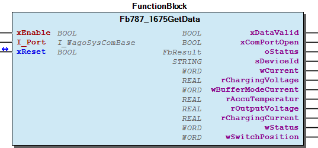
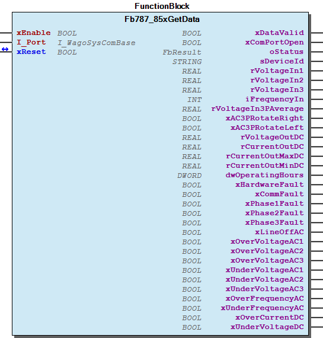
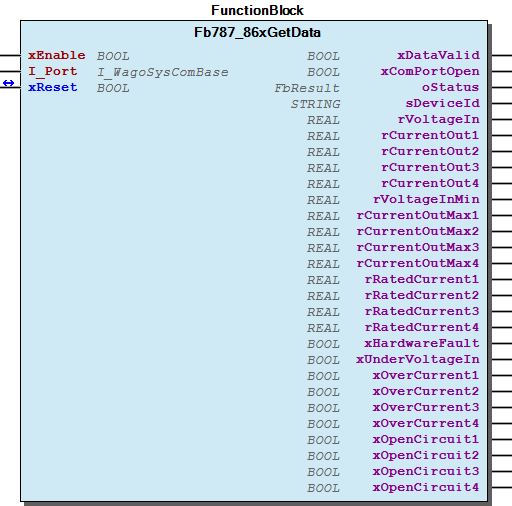
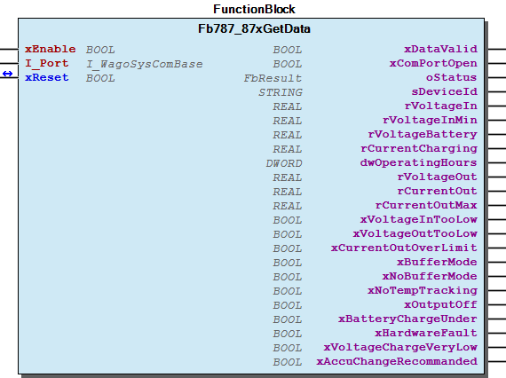
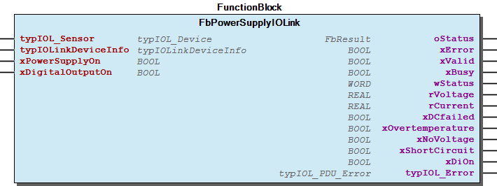
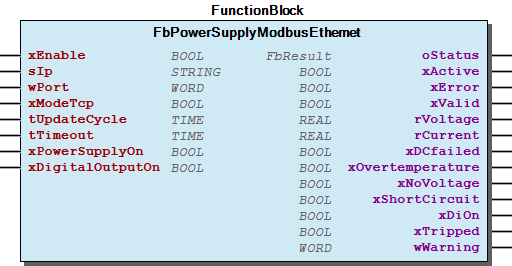
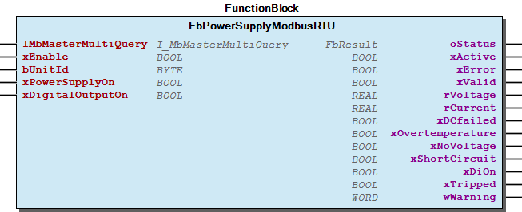
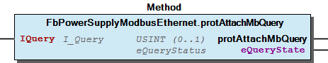
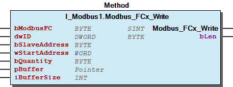

# WagoAppPowerSupply v1.9.0.10 (WAGO) - Complete Documentation

## 📋 Library Information

- **Company:** WAGO
- **Title:** WagoAppPowerSupply
- **Version:** 1.9.0.10
- **Categories:** WAGO LayerView|App; Application; WAGO FunctionalView|Device|Power Supply
- **Author:** WAGO/u010663
- **Placeholder:** WagoAppPowerSupply

### Description ¶

This document is automatically generated.

Function blocks for power supply series 787 and Pro 2

This document is automatically generated. Function blocks for power supply series 787 and Pro 2

### Contents: ¶

Contents: - Documentation Index - Project Information - Library Information - Function Blocks Fb787_1675GetData (FB) - Fb787_85xGetData (FB) - Fb787_86xGetData (FB) - Fb787_87xGetData (FB) - FbBinary (FB) - FbByte (FB) - FbPowerSupplyIOLink (FB) - FbPowerSupplyModbusEthernet (FB) - FbPowerSupplyModbusRTU (FB) - FbTest (FB) - ... and 8 more Methods - FbPowerSupplyIOLink.ReadAdditionalStatusInfo (METH) - FbPowerSupplyIOLink.ReadCustomerCurrentThreshold (METH) - FbPowerSupplyIOLink.ReadDigitalInputBehavior (METH) - FbPowerSupplyIOLink.ReadDigitalOutputSetting (METH) - FbPowerSupplyIOLink.ReadEventInfo (METH) - FbPowerSupplyIOLink.ReadFuseDelay (METH) - FbPowerSupplyIOLink.ReadFuseThreshold (METH) - FbPowerSupplyIOLink.ReadIOL_Index (METH) - FbPowerSupplyIOLink.ReadIOL_Index_DWORD (METH) - FbPowerSupplyIOLink.ReadIOL_String (METH) - ... and 154 more Interfaces - I_Byte (ITF) - I_Modbus1 (ITF) - I_Visu (ITF) - I_binary (ITF) - I_eModeDigitalInputBehavior (ITF) - I_eModeOutputBehavior (ITF) - I_eModeSystemPowerBehavior (ITF) - I_typDigitalInputBehavior (ITF) - I_typDigitalOutputSetting (ITF) - I_typOutputBehavior (ITF) - ... and 1 more Program Organization Internal Components - 90 Internal - 90 Internal - Pro2_Internal Global Variable Lists - Status (GVL) - VersionHistory (GVL) Other Components - 30 Visualizations - 80 Status - Classic - Data types - FbBinary.xValue (PROP) - FbByte.bValue (PROP) - FbTest.auxCommunicationMode (PROP) - FbTest.auxDeviceName (PROP) - FbTest.auxDiFunction (PROP) - FbTest.auxOverloadBehavior (PROP) - ... and 84 more

### Indices and tables ¶

Based on WagoAppPowerSupply.library, last modified 20.09.2024, 21:56:12. LibDoc 3.5.16.10

© WAGO GmbH & Co. KG, Germany 2018 – All rights reserved. For the avoidance of doubt, this copyright notice does not only apply to the information above but also and primarily to the described library itself. Please note that third-party products are always mentioned without reference to intellectual property rights, including patents, utility models, designs and trademarks, accordingly the existence of such rights cannot be excluded. WAGO is a registered trademark of WAGO Verwaltungsgesellschaft mbH.

- File and Project Information - Library Reference Based on WagoAppPowerSupply.library, last modified 20.09.2024, 21:56:12. LibDoc 3.5.16.10 © WAGO GmbH & Co. KG, Germany 2018 – All rights reserved. For the avoidance of doubt, this copyright notice does not only apply to the information above but also and primarily to the described library itself. Please note that third-party products are always mentioned without reference to intellectual property rights, including patents, utility models, designs and trademarks, accordingly the existence of such rights cannot be excluded. WAGO is a registered trademark of WAGO Verwaltungsgesellschaft mbH.

### Documentation Index

## WagoAppPowerSupply Library Documentation

| Company: | WAGO |
| Title: | WagoAppPowerSupply |
| Version: | 1.9.0.10 |
| Categories: | WAGO LayerView\|App; Application; WAGO FunctionalView\|Device\|Power Supply |
| Author: | WAGO/u010663 |
| Placeholder: | WagoAppPowerSupply |

### Description

This document is automatically generated.

Function blocks for power supply series 787 and Pro 2

This document is automatically generated. Function blocks for power supply series 787 and Pro 2

### Contents:

- 20 Program Organization Units Classic - Pro - Pro 2 30 Visualizations - Pro - Pro 2 80 Status - Status (GVL) - eStatus (ENUM) 90 Internal - GlobalTextList (Text List) - Pro2_Internal - VisuInterface ParameterList (PARAMS) VersionHistory (GVL)

### Indices and tables

Based on WagoAppPowerSupply.library, last modified 20.09.2024, 21:56:12. LibDoc 3.5.16.10

© WAGO GmbH & Co. KG, Germany 2018 – All rights reserved. For the avoidance of doubt, this copyright notice does not only apply to the information above but also and primarily to the described library itself. Please note that third-party products are always mentioned without reference to intellectual property rights, including patents, utility models, designs and trademarks, accordingly the existence of such rights cannot be excluded. WAGO is a registered trademark of WAGO Verwaltungsgesellschaft mbH.

- File and Project Information - Library Reference Based on WagoAppPowerSupply.library, last modified 20.09.2024, 21:56:12. LibDoc 3.5.16.10 © WAGO GmbH & Co. KG, Germany 2018 – All rights reserved. For the avoidance of doubt, this copyright notice does not only apply to the information above but also and primarily to the described library itself. Please note that third-party products are always mentioned without reference to intellectual property rights, including patents, utility models, designs and trademarks, accordingly the existence of such rights cannot be excluded. WAGO is a registered trademark of WAGO Verwaltungsgesellschaft mbH.

### Project Information

## File and Project Information

| Scope | Name | Type | Content |
| --- | --- | --- | --- |
| FileHeader | libraryFile | string | WagoAppPowerSupply.library |
| contentFile | doc.clean.json |
| productName | e!COCKPIT |
| creationDateTime | date | 20.09.2024, 21:56:22 |
| companyName | string | WAGO |
| ProjectInformation | LastModificationDateTime | date | 20.09.2024, 21:56:12 |
| Description | string | See: Description |
| Copyright | © WAGO Kontakttechnik GmbH & Co. KG, Germany 2018 – All rights reserved. |
| Author | WAGO/u010663 |
| AutoResolveUnbound | bool | True |
| Placeholder | string | WagoAppPowerSupply |
| Company | WAGO |
| DocFormat | reStructuredText |
| Project | WagoAppPowerSupply |
| Version | version | 1.9.0.10 |
| Version string | string |  |
| Title | WagoAppPowerSupply |
| LibraryCategories | library-category-list | WAGO LayerView\|App; Application; WAGO FunctionalView\|Device\|Power Supply |
| CompiledLibraryCompatibilityVersion | string | CODESYS V3.5 SP16 Patch 3 |

### Library Information

## Library Reference

| LinkAllContent: False QualifiedOnly: False | SystemLibrary: False | Optional: False |

| LinkAllContent: False QualifiedOnly: False | SystemLibrary: False | Optional: False |

| LinkAllContent: False QualifiedOnly: False | SystemLibrary: True | Optional: False |

| LinkAllContent: False QualifiedOnly: False | SystemLibrary: True | Optional: False |

| LinkAllContent: False QualifiedOnly: False | SystemLibrary: True | Optional: False |

| LinkAllContent: False QualifiedOnly: False | SystemLibrary: True | Optional: False |

| LinkAllContent: False QualifiedOnly: False | SystemLibrary: True | Optional: False |

| LinkAllContent: False QualifiedOnly: False | SystemLibrary: True | Optional: False |

| LinkAllContent: False QualifiedOnly: False | SystemLibrary: False | Optional: False |

| LinkAllContent: False QualifiedOnly: False | SystemLibrary: True | Optional: False |

| LinkAllContent: False QualifiedOnly: False | SystemLibrary: True | Optional: False |

| LinkAllContent: False QualifiedOnly: False | SystemLibrary: True | Optional: False |

| LinkAllContent: False QualifiedOnly: False | SystemLibrary: True | Optional: False |

| LinkAllContent: False Optional: False | QualifiedOnly: False SystemLibrary: True | PublishSymbolsInContainer: True |

| LinkAllContent: False QualifiedOnly: False | SystemLibrary: True | Optional: False |

| LinkAllContent: False QualifiedOnly: True | SystemLibrary: False | Optional: False |

| LinkAllContent: False QualifiedOnly: False | SystemLibrary: False | Optional: False |

| LinkAllContent: False QualifiedOnly: True | SystemLibrary: False PublishSymbolsInContainer: True | Optional: False |

| LinkAllContent: False QualifiedOnly: False | SystemLibrary: False | Optional: False |

| LinkAllContent: False QualifiedOnly: False | SystemLibrary: False | Optional: False |

| LinkAllContent: False QualifiedOnly: False | SystemLibrary: False | Optional: False |

| LinkAllContent: False QualifiedOnly: False | SystemLibrary: False | Optional: False |

| LinkAllContent: False Optional: False | QualifiedOnly: False SystemLibrary: False | PublishSymbolsInContainer: True |

| LinkAllContent: False QualifiedOnly: False | SystemLibrary: False | Optional: False |

| LinkAllContent: False QualifiedOnly: True | SystemLibrary: False | Optional: False |

| LinkAllContent: False QualifiedOnly: False | SystemLibrary: False | Optional: False |

This is a dictionary of all referenced libraries and their name spaces.

This is a dictionary of all referenced libraries and their name spaces. Standard Library Identification : Placeholder: Standard Default Resolution: Standard, * (System) Namespace: Standard Library Properties : Util Library Identification : Placeholder: Util Default Resolution: Util, * (System) Namespace: Util Library Properties : Library Parameter : Parameter: IBLOCKSIZE = 22800 VisuElem3DPath Library Identification : Placeholder: System_VisuElem3DPath Default Resolution: VisuElem3DPath, 3.5.7.0 (System) Namespace: VisuElem3DPath Library Properties : Library Parameter : Parameter: GC_POINTS_PER_POLYGON = 100 VisuElemCamDisplayer Library Identification : Placeholder: System_VisuElemCamDisplayer Default Resolution: VisuElemCamDisplayer, 3.5.7.0 (System) Namespace: VisuElemCamDisplayer Library Properties : Library Parameter : Parameter: GC_POINTS_PER_CAM = 100 VisuElemMeter Library Identification : Placeholder: System_VisuElemMeter Default Resolution: VisuElemMeter, 3.5.7.0 (System) Namespace: VisuElemMeter Library Properties : VisuElemTextEditor Library Identification : Placeholder: System_VisuElemTextEditor Default Resolution: VisuElemTextEditor, 3.5.7.0 (System) Namespace: VisuElemTextEditor Library Properties : VisuElemTrace Library Identification : Placeholder: System_VisuElemTrace Default Resolution: VisuElemTrace, 3.5.7.0 (System) Namespace: VisuElemTrace Library Properties : VisuElemXYChart Library Identification : Placeholder: System_VisuElemXYChart Default Resolution: VisuElemXYChart, 3.5.14.0 (System) Namespace: VisuElemXYChart Library Properties : VisuElems Library Identification : Placeholder: System_VisuElems Default Resolution: VisuElems, * (System) Namespace: VisuElems Library Properties : VisuElemsAlarm Library Identification : Placeholder: System_VisuElemsAlarm Default Resolution: VisuElemsAlarm, 3.5.7.0 (System) Namespace: VisuElemsAlarm Library Properties : VisuElemsDateTime Library Identification : Placeholder: System_VisuElemsDateTime Default Resolution: VisuElemsDateTime, 3.5.7.0 (System) Namespace: VisuElemsDateTime Library Properties : VisuElemsSpecialControls Library Identification : Placeholder: System_VisuElemsSpecialControls Default Resolution: VisuElemsSpecialControls, 3.5.7.0 (System) Namespace: VisuElemsSpecialControls Library Properties : VisuElemsWinControls Library Identification : Placeholder: System_VisuElemsWinControls Default Resolution: VisuElemsWinControls, 3.5.7.0 (System) Namespace: VisuElemsWinControls Library Properties : VisuInputs Library Identification : Placeholder: system_visuinputs Default Resolution: VisuInputs, 3.5.16.30 (System) Namespace: visuinputs Library Properties : VisuNativeControl Library Identification : Placeholder: System_VisuNativeControl Default Resolution: VisuNativeControl, 3.5.7.0 (System) Namespace: VisuNativeControl Library Properties : WagoAppCom Library Identification : Placeholder: WagoAppCom Default Resolution: WagoAppCom, * (WAGO) Namespace: WagoAppCom Library Properties : Library Parameter : Parameter: CUIDEFAULTSYSTEMBUFFERSIZE = 1028 WagoAppIOLink Library Identification : Placeholder: WagoAppIOLink Default Resolution: WagoAppIOLink, * (WAGO) Namespace: WagoAppIOLink Library Properties : Library Parameter : Parameter: ENABLE_DIAG_MBX = TRUE Parameter: MIN_TIMEOUT = TIME#500ms Parameter: STARTUP_WAIT_TIME = TIME#1s0ms Parameter: WATCHDOG_CALL = TIME#5s0ms Parameter: REPEAT_COUNTER = 3 Parameter: IOL_DIAG_BUFFER = 10 Parameter: SHOW_IO_CHANNEL_ERROR = TRUE Parameter: SKIP_KBUS_ERROR = TRUE WagoAppPlcModbus Library Identification : Placeholder: WagoAppPlcModbus Default Resolution: WagoAppPlcModbus, * (WAGO) Namespace: WagoAppPlcModbus Library Properties : Library Parameter : Parameter: MAX_IDENTIFICATION_MEMBER_QUANTITY = 40 Parameter: MAX_SERVER_BUFFERSIZE = 4096 Parameter: MB_BEHAVIOUR = eMbBehaviour.SUPPOPT_UNIT_ID_AS_SLAVEADDRESS Parameter: MAX_IDENTIFICATION_MEMBER_LENGTH = 50 WagoSysErrorBase Library Identification : Placeholder: WagoSysErrorBase Default Resolution: WagoSysErrorBase, * (WAGO) Namespace: WagoSysErrorBase Library Properties : Library Parameter : Parameter: RES_LOG_MAX_FILESIZE = 2000 Parameter: RES_LOG_MAX_FILES = 1 Parameter: RES_LOG_MAX_ENTRIES = 200 Parameter: RES_LOG_NAME = ‘WagoAppResultLogger’ WagoSysFieldbusModule Library Identification : Placeholder: WagoSysFieldbusModule Default Resolution: WagoSysFieldbusModule, * (WAGO) Namespace: WagoSysFieldbusModule Library Properties : WagoSysPlainMem Library Identification : Placeholder: WagoSysPlainMem Default Resolution: WagoSysPlainMem, * (WAGO) Namespace: WagoSysPlainMem Library Properties : WagoSysVersion Library Identification : Name: WagoSysVersion Version: 1.0.0.0 Company: WAGO Namespace: WagoSysVersion Library Properties : WagoTypesCom Library Identification : Placeholder: WagoTypesCom Default Resolution: WagoTypesCom, * (WAGO) Namespace: WagoTypesCom Library Properties : WagoTypesErrorBase Library Identification : Placeholder: WagoTypesErrorBase Default Resolution: WagoTypesErrorBase, * (WAGO) Namespace: WagoTypesErrorBase Library Properties : WagoTypesModbus Library Identification : Placeholder: WagoTypesModbus Default Resolution: WagoTypesModbus, * (WAGO) Namespace: WagoTypesModbus Library Properties : WagoVisuIcons Library Identification : Placeholder: WagoVisuIcons Default Resolution: WagoVisuIcons, * (WAGO) Namespace: WagoVisuIcons Library Properties :

### Function Blocks

## Fb787_1675GetData (FB)

| Scope | Name | Type | Comment |
| --- | --- | --- | --- |
| Input | xEnable | BOOL | Enable the function block |
| I_Port | WagoTypesCom.I_WagoSysComBase | COM Port |
| Inout | xReset | BOOL | Reset of the outputs |
| Output | xDataValid | BOOL | Valid data set received |
| xComPortOpen | BOOL | COM port opened |
| oStatus | WagoSysErrorBase.FbResult | Status information |
| sDeviceId | STRING(20) | Device Identification |
| wCurrent | WORD | Current [mA] |
| rChargingVoltage | REAL | Charging voltage [V] |
| wBufferModeCurrent | WORD | Current while device is in buffer mode |
| rAccuTemperatur | REAL | Temperature [°C] |
| rOutputVoltage | REAL | Output voltage [V] |
| rChargingCurrent | REAL | Charging current [mA] |
| wStatus | WORD | Bit 0:No battery operation possible Bit 1:Battery voltage very low Bit 2:Buffer mode Bit 3:spare Bit 4:Total discharge protection has ended buffer mode Bit 5:Battery replacement recommended Bit 6:spare Bit 7:No battery module with battery control recognized Bit 8:Batterie load less than 85% Bit 9:No buffer mode possible(remote access active) Bit 10:Signal to shutdown the PC Bit 11: spare Bit 12:Mains operation mode Bit 13:spare Bit1 4:spare Bit 15:spare |
| wSwitchPosition | WORD | 0:15 minutes buffer time 1:20 minutes buffer time 2:PC mode->details see manual 3:15 maximum buffer time 4:15 custom specific buffer time 5:1 minutes buffer time 6:2 minutes buffer time 7:3 minutes buffer time 8:5 minutes buffer time 9:10 minutes buffer time |

This function block reads the parameter from device 787-1675

Graphical Illustration

Function description

The module is activated via the input xEnable . The output xComPortOpen is set to True after the interface has been opened successfully. The output xDataValid is set to True if a valid data set has been received.

Interface variables Function This function block reads the parameter from device 787-1675 Graphical Illustration  Function description The module is activated via the input xEnable . The output xComPortOpen is set to True after the interface has been opened successfully. The output xDataValid is set to True if a valid data set has been received.

## Fb787_85xGetData (FB)

| Scope | Name | Type | Comment |
| --- | --- | --- | --- |
| Input | xEnable | BOOL | Enable the function block |
| I_Port | WagoTypesCom.I_WagoSysComBase | COM Port |
| Inout | xReset | BOOL | Reset of the outputs |
| Output | xDataValid | BOOL | valid data set received |
| xComPortOpen | BOOL | COM port opened |
| oStatus | WagoSysErrorBase.FbResult | Status information |
| sDeviceId | STRING(20) | Identification of the device, i.e.787-850, 787-852 or 787-854 |
| rVoltageIn1 | REAL | Input voltage in 1st phase |
| rVoltageIn2 | REAL | Input voltage in 2nd phase |
| rVoltageIn3 | REAL | Input voltage in 3rd phase |
| iFrequencyIn | INT | Input frequncy |
| rVoltageIn3PAverage | REAL | Average of the 3 phase input voltage |
| xAC3PRotateRight | BOOL | Right rotation of the field |
| xAC3PRotateLeft | BOOL | Left rotation of the field |
| rVoltageOutDC | REAL | Output voltage at DC side |
| rCurrentOutDC | REAL | Output current at DC side |
| rCurrentOutMaxDC | REAL | Maximal output current at DC side |
| rCurrentOutMinDC | REAL | Minimal output current at DC side |
| dwOperatingHours | DWORD | Operating time of the device [hours] |
| xHardwareFault | BOOL | Device hardware fault |
| xCommFault | BOOL | Device communication fault |
| xPhase1Fault | BOOL | Fault of the 1st phase |
| xPhase2Fault | BOOL | Fault of the 2nd phase |
| xPhase3Fault | BOOL | Fault of the 3rd phase |
| xLineOffAC | BOOL | Line is off at AC side |
| xOverVoltageAC1 | BOOL | The 1st phase over voltage at AC side |
| xOverVoltageAC2 | BOOL | The 2st phase over voltage at AC side |
| xOverVoltageAC3 | BOOL | The 3st phase over voltage at AC side |
| xUnderVoltageAC1 | BOOL | The 1st phase under voltage at AC side |
| xUnderVoltageAC2 | BOOL | The 2st phase under voltage at AC side |
| xUnderVoltageAC3 | BOOL | The 3st phase under voltage at AC side |
| xOverFrequencyAC | BOOL | Frequency at AC side is over 66Hz |
| xUnderFrequencyAC | BOOL | Frequency at AC side is under 44 Hz |
| xOverCurrentDC | BOOL | Over current of DC side |
| xUnderVoltageDC | BOOL | Under voltage of DC side |

This function block reads the parameter from device 787-85x

Graphical Illustration

Function description

The module is activated via the input xEnable . The output xComPortOpen is set to True after the interface has been opened successfully. The output xDataValid is set to True if a valid data set has been received. Writing is not supported by this block.

Visualization

The input m_Input_Device_787_8xx is of type FB787_85xGetData

The template needs an instance of function block FB787_85xGetData as input.

Interface variables Function This function block reads the parameter from device 787-85x Graphical Illustration  Function description The module is activated via the input xEnable . The output xComPortOpen is set to True after the interface has been opened successfully. The output xDataValid is set to True if a valid data set has been received. Writing is not supported by this block. Visualization Note The input m_Input_Device_787_8xx is of type FB787_85xGetData The template needs an instance of function block FB787_85xGetData as input.

## Fb787_86xGetData (FB)

| Scope | Name | Type | Comment |
| --- | --- | --- | --- |
| Input | xEnable | BOOL | Enable the function block |
| I_Port | WagoTypesCom.I_WagoSysComBase | COM Port |
| Inout | xReset | BOOL | Reset of the outputs |
| Output | xDataValid | BOOL | valid data set received |
| xComPortOpen | BOOL | COM port opened |
| oStatus | WagoSysErrorBase.FbResult | Status information |
| sDeviceId | STRING(20) | Identification of the device, i.e.787- 860, 787-861 or 787-862 |
| rVoltageIn | REAL | Input voltage |
| rCurrentOut1 | REAL | Channel 1 output current |
| rCurrentOut2 | REAL | Channel 2 output current |
| rCurrentOut3 | REAL | Channel 3 output current |
| rCurrentOut4 | REAL | Channel 4 output current |
| rVoltageInMin | REAL | Minimal input voltage |
| rCurrentOutMax1 | REAL | Maximal channel 1 output current |
| rCurrentOutMax2 | REAL | Maximal channel 2 output current |
| rCurrentOutMax3 | REAL | Maximal channel 3 output current |
| rCurrentOutMax4 | REAL | Maximal channel 4 output current |
| rRatedCurrent1 | REAL | Set rated current of the channel 1 |
| rRatedCurrent2 | REAL | Set rated current of the channel 2 |
| rRatedCurrent3 | REAL | Set rated current of the channel 3 |
| rRatedCurrent4 | REAL | Set rated current of the channel 4 |
| xHardwareFault | BOOL | Device hardware fault |
| xUnderVoltageIn | BOOL | Input voltage under limit |
| xOverCurrent1 | BOOL | Channel 1 current over limit |
| xOverCurrent2 | BOOL | Channel 2 current over limit |
| xOverCurrent3 | BOOL | Channel 3 current over limit |
| xOverCurrent4 | BOOL | Channel 4 current over limit |
| xOpenCircuit1 | BOOL | Channel 1 line off |
| xOpenCircuit2 | BOOL | Channel 2 line off |
| xOpenCircuit3 | BOOL | Channel 3 line off |
| xOpenCircuit4 | BOOL | Channel 4 line off |

This function block reads the parameter from device 787-86x

Graphical Illustration

Function description

The module is activated via the input xEnable . The output xComPortOpen is set to True after the interface has been opened successfully. The output xDataValid is set to True if a valid data set has been received. Writing is not supported by this block.

Visualization

The input m_Input_Device_787_8xx is of type FB787_86xGetData

The template needs an instance of function block FB787_86xGetData as input.

Interface variables Function This function block reads the parameter from device 787-86x Graphical Illustration  Function description The module is activated via the input xEnable . The output xComPortOpen is set to True after the interface has been opened successfully. The output xDataValid is set to True if a valid data set has been received. Writing is not supported by this block. Visualization Note The input m_Input_Device_787_8xx is of type FB787_86xGetData The template needs an instance of function block FB787_86xGetData as input.

## Fb787_87xGetData (FB)

| Scope | Name | Type | Initial | Comment |
| --- | --- | --- | --- | --- |
| Input | xEnable | BOOL |  | Enable the function block |
| I_Port | WagoTypesCom.I_WagoSysComBase |  | COM Port |
| Inout | xReset | BOOL |  | Reset of the outputs |
| Output | xDataValid | BOOL |  | valid data set received |
| xComPortOpen | BOOL |  | COM port opened |
| oStatus | WagoSysErrorBase.FbResult |  | Status information |
| sDeviceId | STRING(30) | ‘’ | Identification of the device, i.e.787-870 |
| rVoltageIn | REAL |  | Input voltage |
| rVoltageInMin | REAL |  | Minimal input voltage |
| rVoltageBattery | REAL |  | Battery voltage |
| rCurrentCharging | REAL |  | Charging current |
| dwOperatingHours | DWORD |  | Operating time of the device [hours] |
| rVoltageOut | REAL |  | Output voltage |
| rCurrentOut | REAL |  | Output current |
| rCurrentOutMax | REAL |  | Maximal output current |
| xVoltageInTooLow | BOOL |  | Input voltage under limit |
| xVoltageOutTooLow | BOOL |  | Output voltage under limit |
| xCurrentOutOverLimit | BOOL |  | Output current over limit |
| xBufferMode | BOOL |  | Charging in progress |
| xNoBufferMode | BOOL |  | Buffering is not possible |
| xNoTempTracking | BOOL |  | Temperature tracking is not possible |
| xOutputOff | BOOL |  | Output is deactivated |
| xBatteryChargeUnder | BOOL |  | Battery is charged under 85% |
| xHardwareFault | BOOL |  | Device hardware fault |
| xVoltageChargeVeryLow | BOOL |  | The charging voltage is too low |
| xAccuChangeRecommanded | BOOL |  | It is recommanded to change the accu |

This function block reads the parameter from device 787-87x

Graphical Illustration

Function description

The module is activated via the input xEnable . The output xComPortOpen is set to True after the interface has been opened successfully. The output xDataValid is set to True if a valid data set has been received. Writing is not supported by this block.

Visualization

The input m_Input_Device_787_8xx is of type FB787_87xGetData

The template needs an instance of function block FB787_87xGetData as input.

Interface variables Function This function block reads the parameter from device 787-87x Graphical Illustration  Function description The module is activated via the input xEnable . The output xComPortOpen is set to True after the interface has been opened successfully. The output xDataValid is set to True if a valid data set has been received. Writing is not supported by this block. Visualization Note The input m_Input_Device_787_8xx is of type FB787_87xGetData The template needs an instance of function block FB787_87xGetData as input.

## FbBinary (FB)

| Scope | Name | Type |
| --- | --- | --- |
| Input | xIn | REFERENCE TO BOOL |

Interface variables - FbBinary.xValue (PROP)

## FbByte (FB)

| Scope | Name | Type |
| --- | --- | --- |
| Input | bIn | REFERENCE TO BYTE |

Interface variables - FbByte.bValue (PROP)

## FbPowerSupplyIOLink (FB)

| Scope | Name | Type | Comment | Inherited from |
| --- | --- | --- | --- | --- |
| Input | typIOL_Sensor | typIOL_Device | Access to the module and appropriate IO Link port | FbIOL_Base |
| typIOLinkDeviceInfo | typIOLinkDeviceInfo | only necessary if port in Tx direction is fragmented | FbIOL_Base |
| Output | oStatus | WagoSysErrorBase.FbResult |  | FbIOL_Base |
| xError | BOOL |  | FbIOL_Base |
| Input | xPowerSupplyOn | BOOL | Switch on/off power supply |  |
| xDigitalOutputOn | BOOL | Switch on/off digital output |  |
| Output | xValid | BOOL |  |  |
| xBusy | BOOL |  |  |
| wStatus | WORD |  |  |
| rVoltage | REAL |  |  |
| rCurrent | REAL |  |  |
| xDCfailed | BOOL |  |  |
| xOvertemperature | BOOL |  |  |
| xNoVoltage | BOOL |  |  |
| xShortCircuit | BOOL |  |  |
| xDiOn | BOOL |  |  |
| typIOL_Error | WagoAppIOLink.typIOL_PDU_Error |  |  |

Handling power supplies generation Pro 2 with IO-Link interface

Graphical Illustration

Graphical Interface of FbPowerSupplyIOLink

Function Description

This function block supports several methods to read and write configuration parameter. Additional some status information will be continously updated and displayed at the function blocks outputs.

A vizualisation template tpl2787_PowerSupply_IOL is available.

The placeholder myFb is of type FbPowerSupplyIOLink

-ReadCustomerCurrentThreshold (IOL Index 16#189) -ReadDigitalInputBehavior (IOL Index 16#1A8) -ReadDigitalOutputSetting (IOL Index 16#1B0) -ReadFuseDelay (IOL Index 16#195) -ReadFuseThreshold (IOL Index 16#194) -ReadIOL_Index

-ReadOutputBevior (IOL Index 16#18A) -ReadSetOutputVoltage (IOL Index 16#188) -ReadSwitchOnDelay (IOL Index 16#18B) -ReadSystemParameter (IOL Index 16#1BD) -ReadIOL_String

-WriteCustomerCurrentThreshold (IOL Index 16#189) -WriteDigitalInputBehavior (IOL Index 16#1A8) -WriteDigitalOutputSetting (IOL Index 16#1B0) -WriteFuseDelay (IOL Index 16#195) -WriteFuseThreshold (IOL Index 16#194) -WriteIOL_Index

-WriteOutputBevior (IOL Index 16#18A) -WriteSetOutputVoltage (IOL Index 16#188) -WriteSwitchOnDelay (IOL Index 16#18B) -WriteSystemParameter (IOL Index 16#1BD) -WriteIOL_String

Interface variables Function Handling power supplies generation Pro 2 with IO-Link interface Graphical Illustration  Graphical Interface of FbPowerSupplyIOLink Function Description This function block supports several methods to read and write configuration parameter. Additional some status information will be continously updated and displayed at the function blocks outputs. A vizualisation template tpl2787_PowerSupply_IOL is available. Note The placeholder myFb is of type FbPowerSupplyIOLink Supported methods: -ReadCustomerCurrentThreshold (IOL Index 16#189) -ReadDigitalInputBehavior (IOL Index 16#1A8) -ReadDigitalOutputSetting (IOL Index 16#1B0) -ReadFuseDelay (IOL Index 16#195) -ReadFuseThreshold (IOL Index 16#194) -ReadIOL_Index Allow reading any IOL Index available by the device -ReadOutputBevior (IOL Index 16#18A) -ReadSetOutputVoltage (IOL Index 16#188) -ReadSwitchOnDelay (IOL Index 16#18B) -ReadSystemParameter (IOL Index 16#1BD) -ReadIOL_String Allow reading any IOL String available by the device -WriteCustomerCurrentThreshold (IOL Index 16#189) -WriteDigitalInputBehavior (IOL Index 16#1A8) -WriteDigitalOutputSetting (IOL Index 16#1B0) -WriteFuseDelay (IOL Index 16#195) -WriteFuseThreshold (IOL Index 16#194) -WriteIOL_Index Allow writing any IOL Index available by the device -WriteOutputBevior (IOL Index 16#18A) -WriteSetOutputVoltage (IOL Index 16#188) -WriteSwitchOnDelay (IOL Index 16#18B) -WriteSystemParameter (IOL Index 16#1BD) -WriteIOL_String Allow writing any IOL String available by the device If writing the configuration fails, output wStatus will show a number different than zero: 5: Error parameter FuseDelay 10: Error parameter CustomerCurrentThreshold 15: Error parameter DigitalInputBehavior 20: Error parameter DigitalOutputBehavior 25: Error parameter FuseThreshold 30: Error parameter OutputBehavior 35: Error parameter SetOutputVoltage 40: Error parameter SystemParameter 45: Error parameter OperatingHourLimit 50: Error parameter SwitchOnDelay - FbPowerSupplyIOLink.ReadAdditionalStatusInfo (METH) - FbPowerSupplyIOLink.ReadCustomerCurrentThreshold (METH) - FbPowerSupplyIOLink.ReadDigitalInputBehavior (METH) - FbPowerSupplyIOLink.ReadDigitalOutputSetting (METH) - FbPowerSupplyIOLink.ReadEventInfo (METH) - FbPowerSupplyIOLink.ReadFuseDelay (METH) - FbPowerSupplyIOLink.ReadFuseThreshold (METH) - FbPowerSupplyIOLink.ReadIOL_Index (METH) - FbPowerSupplyIOLink.ReadIOL_Index_DWORD (METH) - FbPowerSupplyIOLink.ReadIOL_String (METH) - FbPowerSupplyIOLink.ReadOperatingHourLimit (METH) - FbPowerSupplyIOLink.ReadOutputBehavior (METH) - FbPowerSupplyIOLink.ReadPassword (METH) - FbPowerSupplyIOLink.ReadPasswordLevel (METH) - FbPowerSupplyIOLink.ReadSetOutputVoltage (METH) - FbPowerSupplyIOLink.ReadSwitchOnDelay (METH) - FbPowerSupplyIOLink.ReadSystemParameter (METH) - FbPowerSupplyIOLink.WriteCustomerThresholdOverload (METH) - FbPowerSupplyIOLink.WriteDigitalInputBehavior (METH) - FbPowerSupplyIOLink.WriteDigitalOutputSetting (METH) - FbPowerSupplyIOLink.WriteFuseDelay (METH) - FbPowerSupplyIOLink.WriteFuseThreshold (METH) - FbPowerSupplyIOLink.WriteIOL_Index (METH) - FbPowerSupplyIOLink.WriteIOL_String (METH) - FbPowerSupplyIOLink.WriteOperatingHourLimit (METH) - FbPowerSupplyIOLink.WriteOutputBehavior (METH) - FbPowerSupplyIOLink.WritePassword (METH) - FbPowerSupplyIOLink.WritePasswordLevel (METH) - FbPowerSupplyIOLink.WriteSetOutputVoltage (METH) - FbPowerSupplyIOLink.WriteSwitchOnDelay (METH) - FbPowerSupplyIOLink.WriteSystemParameter (METH)

## FbPowerSupplyModbusEthernet (FB)

| Scope | Name | Type | Initial | Comment |
| --- | --- | --- | --- | --- |
| Input | xEnable | BOOL |  |  |
| sIp | STRING |  | IP address of the power supply |
| wPort | WORD | 502 |  |
| xModeTcp | BOOL | TRUE | UDP will follow in the future |
| tUpdateCycle | TIME | TIME#500ms | update time for outputs |
| tTimeout | TIME | TIME#500ms |  |
| xPowerSupplyOn | BOOL |  | Switch on/off power supply |
| xDigitalOutputOn | BOOL |  | Switch on/off digital output |
| Output | oStatus | WagoSysErrorBase.FbResult |  | status information |
| xActive | BOOL |  | modbus request in progress |
| xError | BOOL |  |  |
| xValid | BOOL |  |  |
| rVoltage | REAL |  |  |
| rCurrent | REAL |  |  |
| xDCfailed | BOOL |  |  |
| xOvertemperature | BOOL |  |  |
| xNoVoltage | BOOL |  |  |
| xShortCircuit | BOOL |  |  |
| xDiOn | BOOL |  |  |
| xTripped | BOOL |  |  |
| wWarning | WORD |  |  |

Handling power supply Pro 2 with “Modbus TCP” interface

Graphical Illustration

Graphical Interface of FbPowerSupplyModbusEthernet

Function Description

This function block supports several methods to read and write configuration parameter. Additional status information will be continously updated and displayed at the function blocks outputs. Inputs xPowerSupplyOn and xDigitalOutputOn will only be used, if they are enabled by WriteOutputBehavior.xCtrlByPdOut .

A vizualisation template tpl2787_PowerSupplyModbus is available.

Checkbox “visible” and checkbox “Property handling in all element properties aktive” must be activated. This is located in “Project settings/visualization.

Checkbox “Sichtbar” und Checkbox “Eigenschaften-Behandlung in allen Elementeigenschaften aktivieren” muss angehakt seien.

Diese Einstellungen werden unter den Projekteigenschaften/Visualisierung gefunden.

The placeholder myParameter is of type I_Visu therefore each instance of the function block FbPowerSupplyModbusEthernet may be applied

Modbus Udp will follow

Interface variables Function Handling power supply Pro 2 with “Modbus TCP” interface Graphical Illustration  Graphical Interface of FbPowerSupplyModbusEthernet Function Description This function block supports several methods to read and write configuration parameter. Additional status information will be continously updated and displayed at the function blocks outputs. Inputs xPowerSupplyOn and xDigitalOutputOn will only be used, if they are enabled by WriteOutputBehavior.xCtrlByPdOut . A vizualisation template tpl2787_PowerSupplyModbus is available. Note Checkbox “visible” and checkbox “Property handling in all element properties aktive” must be activated. This is located in “Project settings/visualization. Note Checkbox “Sichtbar” und Checkbox “Eigenschaften-Behandlung in allen Elementeigenschaften aktivieren” muss angehakt seien. Diese Einstellungen werden unter den Projekteigenschaften/Visualisierung gefunden. Note The placeholder myParameter is of type I_Visu therefore each instance of the function block FbPowerSupplyModbusEthernet may be applied Note Modbus Udp will follow - FbPowerSupplyModbusEthernet.ReadCustomerCurrentThreshold (METH) - FbPowerSupplyModbusEthernet.ReadDigitalInputBehavior (METH) - FbPowerSupplyModbusEthernet.ReadDigitalOutputSetting (METH) - FbPowerSupplyModbusEthernet.ReadFuseDelay (METH) - FbPowerSupplyModbusEthernet.ReadFuseThreshold (METH) - FbPowerSupplyModbusEthernet.ReadModbusRegister (METH) - FbPowerSupplyModbusEthernet.ReadOperatingHourLimit (METH) - FbPowerSupplyModbusEthernet.ReadOutputBehavior (METH) - FbPowerSupplyModbusEthernet.ReadPasswordLevel (METH) - FbPowerSupplyModbusEthernet.ReadSetOutputVoltage (METH) - FbPowerSupplyModbusEthernet.ReadString (METH) - FbPowerSupplyModbusEthernet.ReadSwitchOnDelay (METH) - FbPowerSupplyModbusEthernet.ReadSystemParameter (METH) - FbPowerSupplyModbusEthernet.WriteCustomerThresholdOverload (METH) - FbPowerSupplyModbusEthernet.WriteDigitalInputBehavior (METH) - FbPowerSupplyModbusEthernet.WriteDigitalOutputSetting (METH) - FbPowerSupplyModbusEthernet.WriteFuseDelay (METH) - FbPowerSupplyModbusEthernet.WriteFuseThreshold (METH) - FbPowerSupplyModbusEthernet.WriteModbus_Register (METH) - FbPowerSupplyModbusEthernet.WriteOperatingHourLimit (METH) - FbPowerSupplyModbusEthernet.WriteOutputBehavior (METH) - FbPowerSupplyModbusEthernet.WritePassword (METH) - FbPowerSupplyModbusEthernet.WritePasswordLevel (METH) - FbPowerSupplyModbusEthernet.WriteSetOutputVoltage (METH) - FbPowerSupplyModbusEthernet.WriteString (METH) - FbPowerSupplyModbusEthernet.WriteSwitchOnDelay (METH) - FbPowerSupplyModbusEthernet.WriteSystemParameter (METH) - FbPowerSupplyModbusEthernet.onError (METH) - FbPowerSupplyModbusEthernet.onResponse (METH) - FbPowerSupplyModbusEthernet.protAttachMbQuery (METH)

## FbPowerSupplyModbusRTU (FB)

| Scope | Name | Type | Initial | Comment | Inherited from |
| --- | --- | --- | --- | --- | --- |
| Input | IMbMasterMultiQuery | I_MbMasterMultiQuery |  |  | FbDigitalTwinMbSlaveDevice |
| xEnable | BOOL |  |  |  |
| bUnitId | BYTE | 1 | SlaveAddress |  |
| xPowerSupplyOn | BOOL |  | Switch on/off power supply |  |
| xDigitalOutputOn | BOOL |  | Switch on/off digital output |  |
| Output | oStatus | WagoSysErrorBase.FbResult |  | status information |  |
| xActive | BOOL |  | modbus request in progress |  |
| xError | BOOL |  |  |  |
| xValid | BOOL |  |  |  |
| rVoltage | REAL |  |  |  |
| rCurrent | REAL |  |  |  |
| xDCfailed | BOOL |  |  |  |
| xOvertemperature | BOOL |  |  |  |
| xNoVoltage | BOOL |  |  |  |
| xShortCircuit | BOOL |  |  |  |
| xDiOn | BOOL |  |  |  |
| xTripped | BOOL |  |  |  |
| wWarning | WORD |  |  |  |

Handling power supply Pro 2 with “Modbus RTU” interface

Graphical Illustration

Graphical Interface of FbPowerSupplyModbusRTU

Function Description

This function block supports several methods to read and write configuration parameter. Additional status information will be continously updated and displayed at the function blocks outputs. Inputs xPowerSupplyOn and xDigitalOutputOn will only be used, if they are enabled by WriteOutputBehavior.xCtrlByPdOut .

A vizualisation template tpl2787_PowerSupplyModbus is available.

The placeholder myParameter is of type I_Visu therefore each instance of the function block FbPowerSupplyModbusRTU may be applied

Interface variables Function Handling power supply Pro 2 with “Modbus RTU” interface Graphical Illustration  Graphical Interface of FbPowerSupplyModbusRTU Function Description This function block supports several methods to read and write configuration parameter. Additional status information will be continously updated and displayed at the function blocks outputs. Inputs xPowerSupplyOn and xDigitalOutputOn will only be used, if they are enabled by WriteOutputBehavior.xCtrlByPdOut . A vizualisation template tpl2787_PowerSupplyModbus is available. Note The placeholder myParameter is of type I_Visu therefore each instance of the function block FbPowerSupplyModbusRTU may be applied - FbPowerSupplyModbusRTU.ReadCustomerCurrentThreshold (METH) - FbPowerSupplyModbusRTU.ReadDigitalInputBehavior (METH) - FbPowerSupplyModbusRTU.ReadDigitalOutputSetting (METH) - FbPowerSupplyModbusRTU.ReadFuseDelay (METH) - FbPowerSupplyModbusRTU.ReadFuseThreshold (METH) - FbPowerSupplyModbusRTU.ReadModbusRegister (METH) - FbPowerSupplyModbusRTU.ReadOperatingHourLimit (METH) - FbPowerSupplyModbusRTU.ReadOutputBehavior (METH) - FbPowerSupplyModbusRTU.ReadPasswordLevel (METH) - FbPowerSupplyModbusRTU.ReadSetOutputVoltage (METH) - FbPowerSupplyModbusRTU.ReadString (METH) - FbPowerSupplyModbusRTU.ReadSwitchOnDelay (METH) - FbPowerSupplyModbusRTU.ReadSystemParameter (METH) - FbPowerSupplyModbusRTU.WriteCustomerThresholdOverload (METH) - FbPowerSupplyModbusRTU.WriteDigitalInputBehavior (METH) - FbPowerSupplyModbusRTU.WriteDigitalOutputSetting (METH) - FbPowerSupplyModbusRTU.WriteFuseDelay (METH) - FbPowerSupplyModbusRTU.WriteFuseThreshold (METH) - FbPowerSupplyModbusRTU.WriteModbus_Register (METH) - FbPowerSupplyModbusRTU.WriteOperatingHourLimit (METH) - FbPowerSupplyModbusRTU.WriteOutputBehavior (METH) - FbPowerSupplyModbusRTU.WritePassword (METH) - FbPowerSupplyModbusRTU.WritePasswordLevel (METH) - FbPowerSupplyModbusRTU.WriteSetOutputVoltage (METH) - FbPowerSupplyModbusRTU.WriteString (METH) - FbPowerSupplyModbusRTU.WriteSwitchOnDelay (METH) - FbPowerSupplyModbusRTU.WriteSystemParameter (METH) - FbPowerSupplyModbusRTU.onError (METH) - FbPowerSupplyModbusRTU.onResponse (METH)

## FbTest (FB)

- FbTest.MouseOverRead (PROP) - FbTest.MouseOverWrite (PROP) - FbTest.auxCommunicationMode (PROP) - FbTest.auxDeviceName (PROP) - FbTest.auxDiFunction (PROP) - FbTest.auxOverloadBehavior (PROP) - FbTest.auxPowerOnBehavior (PROP) - FbTest.auxReadCustomerCurrentThreshold (PROP) - FbTest.auxReadDigitalInputBehavior (PROP) - FbTest.auxReadDigitalOutputBehavior (PROP) - FbTest.auxReadEvent_DeviceTemperature (PROP) - FbTest.auxReadEvent_DiEvent (PROP) - FbTest.auxReadEvent_HighTemperature (PROP) - FbTest.auxReadEvent_NoOutput (PROP) - FbTest.auxReadEvent_OpHoursLimitReached (PROP) - FbTest.auxReadEvent_OverLoad (PROP) - FbTest.auxReadEvent_OverLoadCustom (PROP) - FbTest.auxReadEvent_Overvoltage (PROP) - FbTest.auxReadEvent_PowerBoostActive (PROP) - FbTest.auxReadEvent_ShortCircuit (PROP) - FbTest.auxReadEvent_TopBoostActive (PROP) - FbTest.auxReadEvent_Tripped (PROP) - FbTest.auxReadEvent_Undervoltage (PROP) - FbTest.auxReadFuseDelay (PROP) - FbTest.auxReadFuseThreshold (PROP) - FbTest.auxReadOperatingHourLimit (PROP) - FbTest.auxReadOutputBehavior (PROP) - FbTest.auxReadSetOutputVoltage (PROP) - FbTest.auxReadStatusPower (PROP) - FbTest.auxReadStatusTotalEnergy (PROP) - FbTest.auxReadSwitchOnDelay (PROP) - FbTest.auxReadSystemParameter (PROP) - FbTest.auxrCurrent (PROP) - FbTest.auxrVoltage (PROP) - FbTest.auxvisucurrent (PROP) - FbTest.auxvisuvoltage (PROP) - FbTest.auxxDCfailed (PROP) - FbTest.auxxError (PROP) - FbTest.auxxNoVoltage (PROP) - FbTest.auxxOvertemperature (PROP) - FbTest.auxxShortCircuit (PROP) - FbTest.sError (PROP) - FbTest.xFbEnabled (PROP) - FbTest.xLatchedError (PROP)

## FbeModeDigitalInputBehavior (FB)

| Scope | Name | Type |
| --- | --- | --- |
| Input | xIn | REFERENCE TO eModeDigitalInputBehavior |

Interface variables - FbeModeDigitalInputBehavior.eValue (PROP)

## FbeModeOutputBehavior (FB)

| Scope | Name | Type |
| --- | --- | --- |
| Input | xIn | REFERENCE TO eModeOutputBehavior |

Interface variables - FbeModeOutputBehavior.eValue (PROP)

## FbeModeSystemPowerBehavior (FB)

| Scope | Name | Type |
| --- | --- | --- |
| Input | xIn | REFERENCE TO eModeSystemPowerBehavior |

Interface variables - FbeModeSystemPowerBehavior.eValue (PROP)

## FbtypDigitalInputBehavior (FB)

| Scope | Name | Type |
| --- | --- | --- |
| Input | xIn | REFERENCE TO typDigitalInputBehavior |

Interface variables - FbtypDigitalInputBehavior.eModeDigitalInput (PROP) - FbtypDigitalInputBehavior.xOnOff (PROP) - FbtypDigitalInputBehavior.xTriggerEvent (PROP)

## FbtypDigitalOutputSetting (FB)

| Scope | Name | Type |
| --- | --- | --- |
| Input | xIn | REFERENCE TO typDigitalOutputSetting |

Interface variables - FbtypDigitalOutputSetting.xCustomerThresholdActive (PROP) - FbtypDigitalOutputSetting.xDC_OK (PROP) - FbtypDigitalOutputSetting.xEnableDoSettingByPou (PROP) - FbtypDigitalOutputSetting.xFuseTripped (PROP) - FbtypDigitalOutputSetting.xInvertingActive (PROP) - FbtypDigitalOutputSetting.xLatchModeActive (PROP) - FbtypDigitalOutputSetting.xSetDigitalOutput (PROP)

## FbtypOutputBehavior (FB)

| Scope | Name | Type |
| --- | --- | --- |
| Input | xIn | REFERENCE TO typOutputBehavior |

Interface variables - FbtypOutputBehavior.eMode (PROP) - FbtypOutputBehavior.xActiveDroop (PROP) - FbtypOutputBehavior.xCtrlByPdOut (PROP) - FbtypOutputBehavior.xCustomerThresholdActive (PROP) - FbtypOutputBehavior.xEnablePowerBoost (PROP) - FbtypOutputBehavior.xEnableTopBoost (PROP) - FbtypOutputBehavior.xLatchOverloadError (PROP) - FbtypOutputBehavior.xOutOn (PROP)

## FbtypSystemParameter (FB)

| Scope | Name | Type |
| --- | --- | --- |
| Input | xIn | REFERENCE TO typSystemParameter |

Interface variables - FbtypSystemParameter.eModePower (PROP) - FbtypSystemParameter.xFactorySettingsLocked (PROP) - FbtypSystemParameter.xKeylockActive (PROP) - FbtypSystemParameter.xOnDelayActive (PROP)

## Visu_Dumy (FB)

| Scope | Name | Type |
| --- | --- | --- |
| Input | in | i_visu |

### Methods

## FbPowerSupplyIOLink.ReadAdditionalStatusInfo (METH)

| Scope | Name | Type |
| --- | --- | --- |
| Return | ReadAdditionalStatusInfo | typAdditionalStatus |
| Inout | xExecute | BOOL |
| Output | xError | BOOL |
| typError | WagoAppIOLink.typIOL_PDU_error |

## FbPowerSupplyIOLink.ReadCustomerCurrentThreshold (METH)

| Scope | Name | Type |
| --- | --- | --- |
| Return | ReadCustomerCurrentThreshold | WORD |
| Inout | xExecute | BOOL |
| Output | xError | BOOL |
| typError | WagoAppIOLink.typIOL_PDU_error |

## FbPowerSupplyIOLink.ReadDigitalInputBehavior (METH)

| Scope | Name | Type |
| --- | --- | --- |
| Return | ReadDigitalInputBehavior | typDigitalInputBehavior |
| Inout | xExecute | BOOL |
| Output | xError | BOOL |
| typError | WagoAppIOLink.typIOL_PDU_error |

## FbPowerSupplyIOLink.ReadDigitalOutputSetting (METH)

| Scope | Name | Type |
| --- | --- | --- |
| Return | ReadDigitalOutputSetting | typDigitalOutputSetting |
| Inout | xExecute | BOOL |
| Output | xError | BOOL |
| typError | WagoAppIOLink.typIOL_PDU_error |

## FbPowerSupplyIOLink.ReadEventInfo (METH)

| Scope | Name | Type |
| --- | --- | --- |
| Return | ReadEventInfo | typEventStatusWord |
| Inout | xExecute | BOOL |
| Output | xError | BOOL |
| typError | WagoAppIOLink.typIOL_PDU_error |

## FbPowerSupplyIOLink.ReadFuseDelay (METH)

| Scope | Name | Type |
| --- | --- | --- |
| Return | ReadFuseDelay | WORD |
| Inout | xExecute | BOOL |
| Output | xError | BOOL |
| typError | WagoAppIOLink.typIOL_PDU_error |

## FbPowerSupplyIOLink.ReadFuseThreshold (METH)

| Scope | Name | Type |
| --- | --- | --- |
| Return | ReadFuseThreshold | WORD |
| Inout | xExecute | BOOL |
| Output | xError | BOOL |
| typError | WagoAppIOLink.typIOL_PDU_error |

## FbPowerSupplyIOLink.ReadIOL_Index (METH)

| Scope | Name | Type |
| --- | --- | --- |
| Return | ReadIOL_Index | WORD |
| Inout | xExecute | BOOL |
| Input | wIOL_Index | WORD |
| Output | xError | BOOL |
| typError | WagoAppIOLink.typIOL_PDU_error |

A method to read any IO-link index within the power supply

Graphical Illustration

Function Description

Input xExecute will be reset by the method, if the IOL Call has been performed. In case of an error, output xError will become TRUE exactely one cycle. Additional output typError will show detailed error information while output xError is TRUE. Method return value ReadIOL_Index is latched after reading and can therefore be read even if the method is no longer executed.

Interface variables Function A method to read any IO-link index within the power supply Graphical Illustration Function Description Input xExecute will be reset by the method, if the IOL Call has been performed. In case of an error, output xError will become TRUE exactely one cycle. Additional output typError will show detailed error information while output xError is TRUE. Method return value ReadIOL_Index is latched after reading and can therefore be read even if the method is no longer executed.

## FbPowerSupplyIOLink.ReadIOL_Index_DWORD (METH)

| Scope | Name | Type |
| --- | --- | --- |
| Return | ReadIOL_Index_DWORD | DWORD |
| Inout | xExecute | BOOL |
| Input | wIOL_Index | WORD |
| Output | xError | BOOL |
| typError | WagoAppIOLink.typIOL_PDU_error |

A method to read any IO-link index within the power supply

Graphical Illustration

Function Description

Input xExecute will be reset by the method, if the IOL Call has been performed. In case of an error, output xError will become TRUE exactely one cycle. Additional output typError will show detailed error information while output xError is TRUE. Method return value ReadIOL_Index is latched after reading and can therefore be read even if the method is no longer executed.

Interface variables Function A method to read any IO-link index within the power supply Graphical Illustration Function Description Input xExecute will be reset by the method, if the IOL Call has been performed. In case of an error, output xError will become TRUE exactely one cycle. Additional output typError will show detailed error information while output xError is TRUE. Method return value ReadIOL_Index is latched after reading and can therefore be read even if the method is no longer executed.

## FbPowerSupplyIOLink.ReadIOL_String (METH)

| Scope | Name | Type |
| --- | --- | --- |
| Return | ReadIOL_String | BYTE |
| Inout | xExecute | BOOL |
| Input | wIOL_Index | WORD |
| pBuffer | POINTER TO BYTE |
| iBufferSize | INT |
| Output | xError | BOOL |
| typError | WagoAppIOLink.typIOL_PDU_error |

A method to read any IO-link string within the power supply

Graphical Illustration

Function Description

Input xExecute will be reset by the method, if the IOL Call has been performed. In case of an error, output xError will become TRUE exactely one cycle. Additional output typError will show detailed error information while output xError is TRUE. Method return value ReadIOL_String is the length of the string. The value is latched after reading and can therefore be read even if the method is no longer executed.

Interface variables Function A method to read any IO-link string within the power supply Graphical Illustration Function Description Input xExecute will be reset by the method, if the IOL Call has been performed. In case of an error, output xError will become TRUE exactely one cycle. Additional output typError will show detailed error information while output xError is TRUE. Method return value ReadIOL_String is the length of the string. The value is latched after reading and can therefore be read even if the method is no longer executed.

## FbPowerSupplyIOLink.ReadOperatingHourLimit (METH)

| Scope | Name | Type |
| --- | --- | --- |
| Return | ReadOperatingHourLimit | WORD |
| Inout | xExecute | BOOL |
| Output | xError | BOOL |
| typError | WagoAppIOLink.typIOL_PDU_error |

## FbPowerSupplyIOLink.ReadOutputBehavior (METH)

| Scope | Name | Type |
| --- | --- | --- |
| Return | ReadOutputBehavior | typOutputBehavior |
| Inout | xExecute | BOOL |
| Output | xError | BOOL |
| typError | WagoAppIOLink.typIOL_PDU_error |

## FbPowerSupplyIOLink.ReadPassword (METH)

| Scope | Name | Type |
| --- | --- | --- |
| Return | ReadPassword | STRING(8) |
| Inout | xExecute | BOOL |
| Output | xError | BOOL |
| typError | WagoAppIOLink.typIOL_PDU_error |

## FbPowerSupplyIOLink.ReadPasswordLevel (METH)

| Scope | Name | Type |
| --- | --- | --- |
| Return | ReadPasswordLevel | WORD |
| Inout | xExecute | BOOL |
| Output | xError | BOOL |
| typError | WagoAppIOLink.typIOL_PDU_error |

## FbPowerSupplyIOLink.ReadSetOutputVoltage (METH)

| Scope | Name | Type |
| --- | --- | --- |
| Return | ReadSetOutputVoltage | WORD |
| Inout | xExecute | BOOL |
| Output | xError | BOOL |
| typError | WagoAppIOLink.typIOL_PDU_error |

## FbPowerSupplyIOLink.ReadSwitchOnDelay (METH)

| Scope | Name | Type |
| --- | --- | --- |
| Return | ReadSwitchOnDelay | WORD |
| Inout | xExecute | BOOL |
| Output | xError | BOOL |
| typError | WagoAppIOLink.typIOL_PDU_error |

## FbPowerSupplyIOLink.ReadSystemParameter (METH)

| Scope | Name | Type |
| --- | --- | --- |
| Return | ReadSystemParameter | typSystemParameter |
| Inout | xExecute | BOOL |
| Output | xError | BOOL |
| typError | WagoAppIOLink.typIOL_PDU_error |

## FbPowerSupplyIOLink.WriteCustomerThresholdOverload (METH)

| Scope | Name | Type |
| --- | --- | --- |
| Return | WriteCustomerThresholdOverload | BOOL |
| Inout | xExecute | BOOL |
| Input | wValue | WORD |
| Output | xError | BOOL |
| typError | WagoAppIOLink.typIOL_PDU_error |

## FbPowerSupplyIOLink.WriteDigitalInputBehavior (METH)

| Scope | Name | Type |
| --- | --- | --- |
| Return | WriteDigitalInputBehavior | BOOL |
| Inout | xExecute | BOOL |
| Input | wValue | typDigitalInputBehavior |
| Output | xError | BOOL |
| typError | WagoAppIOLink.typIOL_PDU_error |

## FbPowerSupplyIOLink.WriteDigitalOutputSetting (METH)

| Scope | Name | Type |
| --- | --- | --- |
| Return | WriteDigitalOutputSetting | BOOL |
| Inout | xExecute | BOOL |
| Input | wValue | typDigitalOutputSetting |
| Output | xError | BOOL |
| typError | WagoAppIOLink.typIOL_PDU_error |

## FbPowerSupplyIOLink.WriteFuseDelay (METH)

| Scope | Name | Type |
| --- | --- | --- |
| Return | WriteFuseDelay | BOOL |
| Inout | xExecute | BOOL |
| Input | wValue | WORD |
| Output | xError | BOOL |
| typError | WagoAppIOLink.typIOL_PDU_error |

## FbPowerSupplyIOLink.WriteFuseThreshold (METH)

| Scope | Name | Type |
| --- | --- | --- |
| Return | WriteFuseThreshold | BOOL |
| Inout | xExecute | BOOL |
| Input | wValue | WORD |
| Output | xError | BOOL |
| typError | WagoAppIOLink.typIOL_PDU_error |

## FbPowerSupplyIOLink.WriteIOL_Index (METH)

| Scope | Name | Type |
| --- | --- | --- |
| Return | WriteIOL_Index | BOOL |
| Inout | xExecute | BOOL |
| Input | wIOL_Index | WORD |
| wValue | WORD |
| Output | xError | BOOL |
| typError | WagoAppIOLink.typIOL_PDU_error |

## FbPowerSupplyIOLink.WriteIOL_String (METH)

| Scope | Name | Type |
| --- | --- | --- |
| Return | WriteIOL_String | BOOL |
| Inout | xExecute | BOOL |
| Input | wIOL_Index | WORD |
| sValue | STRING |
| Output | xError | BOOL |
| typError | WagoAppIOLink.typIOL_PDU_error |

## FbPowerSupplyIOLink.WriteOperatingHourLimit (METH)

| Scope | Name | Type |
| --- | --- | --- |
| Return | WriteOperatingHourLimit | BOOL |
| Inout | xExecute | BOOL |
| Input | wValue | WORD |
| Output | xError | BOOL |
| typError | WagoAppIOLink.typIOL_PDU_error |

## FbPowerSupplyIOLink.WriteOutputBehavior (METH)

| Scope | Name | Type |
| --- | --- | --- |
| Return | WriteOutputBehavior | BOOL |
| Inout | xExecute | BOOL |
| Input | wValue | typOutputBehavior |
| Output | xError | BOOL |
| typError | WagoAppIOLink.typIOL_PDU_error |

## FbPowerSupplyIOLink.WritePassword (METH)

| Scope | Name | Type |
| --- | --- | --- |
| Return | WritePassword | BOOL |
| Inout | xExecute | BOOL |
| Input | sValue | STRING(8) |
| Output | xError | BOOL |
| typError | WagoAppIOLink.typIOL_PDU_error |

## FbPowerSupplyIOLink.WritePasswordLevel (METH)

| Scope | Name | Type |
| --- | --- | --- |
| Return | WritePasswordLevel | BOOL |
| Inout | xExecute | BOOL |
| Input | wValue | WORD |
| Output | xError | BOOL |
| typError | WagoAppIOLink.typIOL_PDU_error |

## FbPowerSupplyIOLink.WriteSetOutputVoltage (METH)

| Scope | Name | Type |
| --- | --- | --- |
| Return | WriteSetOutputVoltage | BOOL |
| Inout | xExecute | BOOL |
| Input | wValue | WORD |
| Output | xError | BOOL |
| typError | WagoAppIOLink.typIOL_PDU_error |

## FbPowerSupplyIOLink.WriteSwitchOnDelay (METH)

| Scope | Name | Type |
| --- | --- | --- |
| Return | WriteSwitchOnDelay | BOOL |
| Inout | xExecute | BOOL |
| Input | wValue | WORD |
| Output | xError | BOOL |
| typError | WagoAppIOLink.typIOL_PDU_error |

## FbPowerSupplyIOLink.WriteSystemParameter (METH)

| Scope | Name | Type |
| --- | --- | --- |
| Return | WriteSystemParameter | BOOL |
| Inout | xExecute | BOOL |
| Input | wValue | typSystemParameter |
| Output | xError | BOOL |
| typError | WagoAppIOLink.typIOL_PDU_error |

## FbPowerSupplyModbusEthernet.ReadCustomerCurrentThreshold (METH)

| Scope | Name | Type |
| --- | --- | --- |
| Return | ReadCustomerCurrentThreshold | WORD |
| Inout | xExecute | BOOL |
| Output | xError | BOOL |
| wError | WORD |

## FbPowerSupplyModbusEthernet.ReadDigitalInputBehavior (METH)

| Scope | Name | Type |
| --- | --- | --- |
| Return | ReadDigitalInputBehavior | typDigitalInputBehavior |
| Inout | xExecute | BOOL |
| Output | xError | BOOL |
| wError | WORD |

## FbPowerSupplyModbusEthernet.ReadDigitalOutputSetting (METH)

| Scope | Name | Type |
| --- | --- | --- |
| Return | ReadDigitalOutputSetting | typDigitalOutputSetting |
| Inout | xExecute | BOOL |
| Output | xError | BOOL |
| wError | WORD |

## FbPowerSupplyModbusEthernet.ReadFuseDelay (METH)

| Scope | Name | Type |
| --- | --- | --- |
| Return | ReadFuseDelay | WORD |
| Inout | xExecute | BOOL |
| Output | xError | BOOL |
| wError | WORD |

## FbPowerSupplyModbusEthernet.ReadFuseThreshold (METH)

| Scope | Name | Type |
| --- | --- | --- |
| Return | ReadFuseThreshold | WORD |
| Inout | xExecute | BOOL |
| Output | xError | BOOL |
| wError | WORD |

## FbPowerSupplyModbusEthernet.ReadModbusRegister (METH)

| Scope | Name | Type |
| --- | --- | --- |
| Return | ReadModbusRegister | WORD |
| Inout | xExecute | BOOL |
| Input | wAddress | WORD |
| Output | xError | BOOL |
| wError | WORD |

## FbPowerSupplyModbusEthernet.ReadOperatingHourLimit (METH)

| Scope | Name | Type |
| --- | --- | --- |
| Return | ReadOperatingHourLimit | WORD |
| Inout | xExecute | BOOL |
| Output | xError | BOOL |
| wError | WORD |

## FbPowerSupplyModbusEthernet.ReadOutputBehavior (METH)

| Scope | Name | Type |
| --- | --- | --- |
| Return | ReadOutputBehavior | typOutputBehavior |
| Inout | xExecute | BOOL |
| Output | xError | BOOL |
| wError | WORD |

## FbPowerSupplyModbusEthernet.ReadPasswordLevel (METH)

| Scope | Name | Type |
| --- | --- | --- |
| Return | ReadPasswordLevel | WORD |
| Inout | xExecute | BOOL |
| Output | xError | BOOL |
| wError | WORD |

## FbPowerSupplyModbusEthernet.ReadSetOutputVoltage (METH)

| Scope | Name | Type |
| --- | --- | --- |
| Return | ReadSetOutputVoltage | WORD |
| Inout | xExecute | BOOL |
| Output | xError | BOOL |
| wError | WORD |

## FbPowerSupplyModbusEthernet.ReadString (METH)

| Scope | Name | Type |
| --- | --- | --- |
| Return | ReadString | STRING |
| Inout | xExecute | BOOL |
| Input | wAddress | WORD |
| bQuantity | WORD |
| Output | xError | BOOL |
| wError | WORD |

A method to read any string within the power supply

Graphical Illustration

Function Description

The maximum string length supported is 32 char

Interface variables Function A method to read any string within the power supply Graphical Illustration Function Description The maximum string length supported is 32 char

## FbPowerSupplyModbusEthernet.ReadSwitchOnDelay (METH)

| Scope | Name | Type |
| --- | --- | --- |
| Return | ReadSwitchOnDelay | WORD |
| Inout | xExecute | BOOL |
| Output | xError | BOOL |
| wError | WORD |

## FbPowerSupplyModbusEthernet.ReadSystemParameter (METH)

| Scope | Name | Type |
| --- | --- | --- |
| Return | ReadSystemParameter | typSystemParameter |
| Inout | xExecute | BOOL |
| Output | xError | BOOL |
| wError | WORD |

## FbPowerSupplyModbusEthernet.WriteCustomerThresholdOverload (METH)

| Scope | Name | Type |
| --- | --- | --- |
| Return | WriteCustomerThresholdOverload | WORD |
| Inout | xExecute | BOOL |
| Input | wValue | WORD |
| Output | xError | BOOL |

## FbPowerSupplyModbusEthernet.WriteDigitalInputBehavior (METH)

| Scope | Name | Type |
| --- | --- | --- |
| Return | WriteDigitalInputBehavior | WORD |
| Inout | xExecute | BOOL |
| Input | wValue | typDigitalInputBehavior |
| Output | xError | BOOL |

## FbPowerSupplyModbusEthernet.WriteDigitalOutputSetting (METH)

| Scope | Name | Type |
| --- | --- | --- |
| Return | WriteDigitalOutputSetting | WORD |
| Inout | xExecute | BOOL |
| Input | wValue | typDigitalOutputSetting |
| Output | xError | BOOL |

## FbPowerSupplyModbusEthernet.WriteFuseDelay (METH)

| Scope | Name | Type |
| --- | --- | --- |
| Return | WriteFuseDelay | WORD |
| Inout | xExecute | BOOL |
| Input | wValue | WORD |
| Output | xError | BOOL |

## FbPowerSupplyModbusEthernet.WriteFuseThreshold (METH)

| Scope | Name | Type |
| --- | --- | --- |
| Return | WriteFuseThreshold | WORD |
| Inout | xExecute | BOOL |
| Input | wValue | WORD |
| Output | xError | BOOL |

## FbPowerSupplyModbusEthernet.WriteModbus_Register (METH)

| Scope | Name | Type |
| --- | --- | --- |
| Return | WriteModbus_Register | WORD |
| Inout | xExecute | BOOL |
| Input | wAddress | WORD |
| wValue | WORD |
| Output | xError | BOOL |

## FbPowerSupplyModbusEthernet.WriteOperatingHourLimit (METH)

| Scope | Name | Type |
| --- | --- | --- |
| Return | WriteOperatingHourLimit | WORD |
| Inout | xExecute | BOOL |
| Input | wValue | WORD |
| Output | xError | BOOL |

## FbPowerSupplyModbusEthernet.WriteOutputBehavior (METH)

| Scope | Name | Type |
| --- | --- | --- |
| Return | WriteOutputBehavior | WORD |
| Inout | xExecute | BOOL |
| Input | wValue | typOutputBehavior |
| Output | xError | BOOL |

## FbPowerSupplyModbusEthernet.WritePassword (METH)

| Scope | Name | Type |
| --- | --- | --- |
| Return | WritePassword | WORD |
| Inout | xExecute | BOOL |
| Input | sValue | STRING(8) |
| Output | xError | BOOL |

## FbPowerSupplyModbusEthernet.WritePasswordLevel (METH)

| Scope | Name | Type |
| --- | --- | --- |
| Return | WritePasswordLevel | WORD |
| Inout | xExecute | BOOL |
| Input | wValue | WORD |
| Output | xError | BOOL |

## FbPowerSupplyModbusEthernet.WriteSetOutputVoltage (METH)

| Scope | Name | Type |
| --- | --- | --- |
| Return | WriteSetOutputVoltage | WORD |
| Inout | xExecute | BOOL |
| Input | wValue | WORD |
| Output | xError | BOOL |

## FbPowerSupplyModbusEthernet.WriteString (METH)

| Scope | Name | Type |
| --- | --- | --- |
| Return | WriteString | WORD |
| Inout | xExecute | BOOL |
| Input | wAddress | WORD |
| sValue | STRING |
| Output | xError | BOOL |

## FbPowerSupplyModbusEthernet.WriteSwitchOnDelay (METH)

| Scope | Name | Type |
| --- | --- | --- |
| Return | WriteSwitchOnDelay | WORD |
| Inout | xExecute | BOOL |
| Input | wValue | WORD |
| Output | xError | BOOL |

## FbPowerSupplyModbusEthernet.WriteSystemParameter (METH)

| Scope | Name | Type |
| --- | --- | --- |
| Return | WriteSystemParameter | WORD |
| Inout | xExecute | BOOL |
| Input | wValue | typSystemParameter |
| Output | xError | BOOL |

## FbPowerSupplyModbusEthernet.onError (METH)

| Scope | Name | Type |
| --- | --- | --- |
| Return | onError | BOOL |
| Input | IQuery | WagoAppPlcModbus.I_Query |
| utResponse | WagoAppPlcModbus.typMbResponse |
| oStatus | WagoSysErrorBase.FbResult |

only for internal use

Interface variables only for internal use

## FbPowerSupplyModbusEthernet.onResponse (METH)

| Scope | Name | Type |
| --- | --- | --- |
| Return | onResponse | BOOL |
| Input | IQuery | WagoAppPlcModbus.I_Query |
| utResponse | WagoAppPlcModbus.typMbResponse |

only for internal use

Interface variables only for internal use

## FbPowerSupplyModbusEthernet.protAttachMbQuery (METH)

| Scope | Name | Type |
| --- | --- | --- |
| Return | protAttachMbQuery | USINT (0..1) |
| Input | IQuery | WagoAppPlcModbus.I_Query |
| Output | eQueryState | WagoAppPlcModbus.eQueryStatus |

This method attach a Query to the link list of the master. For link the given IQuery there are some conditions.

Otherwise it is not linked.

In case of successful link the method returns 1 otherwise it returns 0

After the processing the query by the master the master automatical change the state of the query and remove it from link list.

Graphical Illustration:

Graphical Interface of FbPowerSupplyModbusEthernet.protAttachMbQuery

Interface variables Function This method attach a Query to the link list of the master. For link the given IQuery there are some conditions. 1. The object input parameter FbDigitalTwinMbSlaveDevice.IMbMasterMultiQuery may not be NULL 2. IQuery may not be NULL 3. IQuery.eQueryState may not stay in one of the follow states - WagoAppPlcModbus.eQueryStatus.LOCKED_WAITING - WagoAppPlcModbus.eQueryStatus.LOCKED_ACTIVE Otherwise it is not linked. In case of successful link the method returns 1 otherwise it returns 0 Note After the processing the query by the master the master automatical change the state of the query and remove it from link list. Graphical Illustration:  Graphical Interface of FbPowerSupplyModbusEthernet.protAttachMbQuery

## FbPowerSupplyModbusRTU.ReadCustomerCurrentThreshold (METH)

| Scope | Name | Type |
| --- | --- | --- |
| Return | ReadCustomerCurrentThreshold | WORD |
| Inout | xExecute | BOOL |
| Output | xError | BOOL |
| wError | WORD |

## FbPowerSupplyModbusRTU.ReadDigitalInputBehavior (METH)

| Scope | Name | Type |
| --- | --- | --- |
| Return | ReadDigitalInputBehavior | typDigitalInputBehavior |
| Inout | xExecute | BOOL |
| Output | xError | BOOL |
| wError | WORD |

## FbPowerSupplyModbusRTU.ReadDigitalOutputSetting (METH)

| Scope | Name | Type |
| --- | --- | --- |
| Return | ReadDigitalOutputSetting | typDigitalOutputSetting |
| Inout | xExecute | BOOL |
| Output | xError | BOOL |
| wError | WORD |

## FbPowerSupplyModbusRTU.ReadFuseDelay (METH)

| Scope | Name | Type |
| --- | --- | --- |
| Return | ReadFuseDelay | WORD |
| Inout | xExecute | BOOL |
| Output | xError | BOOL |
| wError | WORD |

## FbPowerSupplyModbusRTU.ReadFuseThreshold (METH)

| Scope | Name | Type |
| --- | --- | --- |
| Return | ReadFuseThreshold | WORD |
| Inout | xExecute | BOOL |
| Output | xError | BOOL |
| wError | WORD |

## FbPowerSupplyModbusRTU.ReadModbusRegister (METH)

| Scope | Name | Type |
| --- | --- | --- |
| Return | ReadModbusRegister | WORD |
| Inout | xExecute | BOOL |
| Input | wAddress | WORD |
| Output | xError | BOOL |
| wError | WORD |

## FbPowerSupplyModbusRTU.ReadOperatingHourLimit (METH)

| Scope | Name | Type |
| --- | --- | --- |
| Return | ReadOperatingHourLimit | WORD |
| Inout | xExecute | BOOL |
| Output | xError | BOOL |
| wError | WORD |

## FbPowerSupplyModbusRTU.ReadOutputBehavior (METH)

| Scope | Name | Type |
| --- | --- | --- |
| Return | ReadOutputBehavior | typOutputBehavior |
| Inout | xExecute | BOOL |
| Output | xError | BOOL |
| wError | WORD |

## FbPowerSupplyModbusRTU.ReadPasswordLevel (METH)

| Scope | Name | Type |
| --- | --- | --- |
| Return | ReadPasswordLevel | WORD |
| Inout | xExecute | BOOL |
| Output | xError | BOOL |
| wError | WORD |

## FbPowerSupplyModbusRTU.ReadSetOutputVoltage (METH)

| Scope | Name | Type |
| --- | --- | --- |
| Return | ReadSetOutputVoltage | WORD |
| Inout | xExecute | BOOL |
| Output | xError | BOOL |
| wError | WORD |

## FbPowerSupplyModbusRTU.ReadString (METH)

| Scope | Name | Type |
| --- | --- | --- |
| Return | ReadString | STRING |
| Inout | xExecute | BOOL |
| Input | wAddress | WORD |
| bQuantity | WORD |
| Output | xError | BOOL |
| wError | WORD |

A method to read any string within the power supply

Graphical Illustration

Function Description

The maximum string length supported is 32 char

Interface variables Function A method to read any string within the power supply Graphical Illustration Function Description The maximum string length supported is 32 char

## FbPowerSupplyModbusRTU.ReadSwitchOnDelay (METH)

| Scope | Name | Type |
| --- | --- | --- |
| Return | ReadSwitchOnDelay | WORD |
| Inout | xExecute | BOOL |
| Output | xError | BOOL |
| wError | WORD |

## FbPowerSupplyModbusRTU.ReadSystemParameter (METH)

| Scope | Name | Type |
| --- | --- | --- |
| Return | ReadSystemParameter | typSystemParameter |
| Inout | xExecute | BOOL |
| Output | xError | BOOL |
| wError | WORD |

## FbPowerSupplyModbusRTU.WriteCustomerThresholdOverload (METH)

| Scope | Name | Type |
| --- | --- | --- |
| Return | WriteCustomerThresholdOverload | WORD |
| Inout | xExecute | BOOL |
| Input | wValue | WORD |
| Output | xError | BOOL |

## FbPowerSupplyModbusRTU.WriteDigitalInputBehavior (METH)

| Scope | Name | Type |
| --- | --- | --- |
| Return | WriteDigitalInputBehavior | WORD |
| Inout | xExecute | BOOL |
| Input | wValue | typDigitalInputBehavior |
| Output | xError | BOOL |

## FbPowerSupplyModbusRTU.WriteDigitalOutputSetting (METH)

| Scope | Name | Type |
| --- | --- | --- |
| Return | WriteDigitalOutputSetting | WORD |
| Inout | xExecute | BOOL |
| Input | wValue | typDigitalOutputSetting |
| Output | xError | BOOL |

## FbPowerSupplyModbusRTU.WriteFuseDelay (METH)

| Scope | Name | Type |
| --- | --- | --- |
| Return | WriteFuseDelay | WORD |
| Inout | xExecute | BOOL |
| Input | wValue | WORD |
| Output | xError | BOOL |

## FbPowerSupplyModbusRTU.WriteFuseThreshold (METH)

| Scope | Name | Type |
| --- | --- | --- |
| Return | WriteFuseThreshold | WORD |
| Inout | xExecute | BOOL |
| Input | wValue | WORD |
| Output | xError | BOOL |

## FbPowerSupplyModbusRTU.WriteModbus_Register (METH)

| Scope | Name | Type |
| --- | --- | --- |
| Return | WriteModbus_Register | WORD |
| Inout | xExecute | BOOL |
| Input | wAddress | WORD |
| wValue | WORD |
| Output | xError | BOOL |

## FbPowerSupplyModbusRTU.WriteOperatingHourLimit (METH)

| Scope | Name | Type |
| --- | --- | --- |
| Return | WriteOperatingHourLimit | WORD |
| Inout | xExecute | BOOL |
| Input | wValue | WORD |
| Output | xError | BOOL |

## FbPowerSupplyModbusRTU.WriteOutputBehavior (METH)

| Scope | Name | Type |
| --- | --- | --- |
| Return | WriteOutputBehavior | WORD |
| Inout | xExecute | BOOL |
| Input | wValue | typOutputBehavior |
| Output | xError | BOOL |

## FbPowerSupplyModbusRTU.WritePassword (METH)

| Scope | Name | Type |
| --- | --- | --- |
| Return | WritePassword | WORD |
| Inout | xExecute | BOOL |
| Input | sValue | STRING(8) |
| Output | xError | BOOL |

## FbPowerSupplyModbusRTU.WritePasswordLevel (METH)

| Scope | Name | Type |
| --- | --- | --- |
| Return | WritePasswordLevel | WORD |
| Inout | xExecute | BOOL |
| Input | wValue | WORD |
| Output | xError | BOOL |

## FbPowerSupplyModbusRTU.WriteSetOutputVoltage (METH)

| Scope | Name | Type |
| --- | --- | --- |
| Return | WriteSetOutputVoltage | WORD |
| Inout | xExecute | BOOL |
| Input | wValue | WORD |
| Output | xError | BOOL |

## FbPowerSupplyModbusRTU.WriteString (METH)

| Scope | Name | Type |
| --- | --- | --- |
| Return | WriteString | WORD |
| Inout | xExecute | BOOL |
| Input | wAddress | WORD |
| sValue | STRING |
| Output | xError | BOOL |

## FbPowerSupplyModbusRTU.WriteSwitchOnDelay (METH)

| Scope | Name | Type |
| --- | --- | --- |
| Return | WriteSwitchOnDelay | WORD |
| Inout | xExecute | BOOL |
| Input | wValue | WORD |
| Output | xError | BOOL |

## FbPowerSupplyModbusRTU.WriteSystemParameter (METH)

| Scope | Name | Type |
| --- | --- | --- |
| Return | WriteSystemParameter | WORD |
| Inout | xExecute | BOOL |
| Input | wValue | typSystemParameter |
| Output | xError | BOOL |

## FbPowerSupplyModbusRTU.onError (METH)

| Scope | Name | Type |
| --- | --- | --- |
| Return | onError | BOOL |
| Input | IQuery | WagoAppPlcModbus.I_Query |
| utResponse | WagoAppPlcModbus.typMbResponse |
| oStatus | WagoSysErrorBase.FbResult |

only for internal use

Interface variables only for internal use

## FbPowerSupplyModbusRTU.onResponse (METH)

| Scope | Name | Type |
| --- | --- | --- |
| Return | onResponse | BOOL |
| Input | IQuery | WagoAppPlcModbus.I_Query |
| utResponse | WagoAppPlcModbus.typMbResponse |

only for internal use

Interface variables only for internal use

## FbTest.MouseOverRead (PROP) ¶

## FbTest.MouseOverWrite (PROP) ¶

## FbTest.auxReadCustomerCurrentThreshold (PROP) ¶

## FbTest.auxReadDigitalInputBehavior (PROP) ¶

## FbTest.auxReadDigitalOutputBehavior (PROP) ¶

## FbTest.auxReadEvent_DeviceTemperature (PROP) ¶

## FbTest.auxReadEvent_DiEvent (PROP) ¶

## FbTest.auxReadEvent_HighTemperature (PROP) ¶

## FbTest.auxReadEvent_NoOutput (PROP) ¶

## FbTest.auxReadEvent_OpHoursLimitReached (PROP) ¶

## FbTest.auxReadEvent_OverLoad (PROP) ¶

## FbTest.auxReadEvent_OverLoadCustom (PROP) ¶

## FbTest.auxReadEvent_Overvoltage (PROP) ¶

## FbTest.auxReadEvent_PowerBoostActive (PROP) ¶

## FbTest.auxReadEvent_ShortCircuit (PROP) ¶

## FbTest.auxReadEvent_TopBoostActive (PROP) ¶

## FbTest.auxReadEvent_Tripped (PROP) ¶

## FbTest.auxReadEvent_Undervoltage (PROP) ¶

## FbTest.auxReadFuseDelay (PROP) ¶

## FbTest.auxReadFuseThreshold (PROP) ¶

## FbTest.auxReadOperatingHourLimit (PROP) ¶

## FbTest.auxReadOutputBehavior (PROP) ¶

## FbTest.auxReadSetOutputVoltage (PROP) ¶

## FbTest.auxReadStatusPower (PROP) ¶

## FbTest.auxReadStatusTotalEnergy (PROP) ¶

## FbTest.auxReadSwitchOnDelay (PROP) ¶

## FbTest.auxReadSystemParameter (PROP) ¶

## FbtypDigitalOutputSetting.xCustomerThresholdActive (PROP)

## FbtypDigitalOutputSetting.xDC_OK (PROP) ¶

## FbtypDigitalOutputSetting.xEnableDoSettingByPou (PROP)

## FbtypDigitalOutputSetting.xFuseTripped (PROP) ¶

## FbtypDigitalOutputSetting.xInvertingActive (PROP) ¶

## FbtypDigitalOutputSetting.xLatchModeActive (PROP) ¶

## FbtypDigitalOutputSetting.xSetDigitalOutput (PROP) ¶

## FbtypSystemParameter.xFactorySettingsLocked (PROP) ¶

## I_Modbus1.Modbus_FCx_Read (METH)

| Scope | Name | Type | Initial | Comment |
| --- | --- | --- | --- | --- |
| Return | Modbus_FCx_Read | SINT |  |  |
| Input | bModbusFC | BYTE | 3 |  |
| dwID | DWORD |  |  |
| bSlaveAddress | BYTE |  |  |
| wStartAddress | WORD |  | Start address |
| bQuantity | BYTE |  | Amount of words |
| pBuffer | POINTER TO WORD |  | Buffer for received data, use ADR operator |
| iBufferSize | INT |  | Size of receive buffer |
| Output | bLen | BYTE |  | 0-> error; 1..255-> number of received words |

This method allows reading any Modbus value by performing a modbus FC3 request

Graphical Illustration

Graphical Interface of I_Modbus1.Modbus_FCx_Read

Interface variables Function This method allows reading any Modbus value by performing a modbus FC3 request Graphical Illustration  Graphical Interface of I_Modbus1.Modbus_FCx_Read

## I_Modbus1.Modbus_FCx_Write (METH)

| Scope | Name | Type | Initial | Comment |
| --- | --- | --- | --- | --- |
| Return | Modbus_FCx_Write | SINT |  |  |
| Input | bModbusFC | BYTE | 10 |  |
| dwID | DWORD |  |  |
| bSlaveAddress | BYTE |  |  |
| wStartAddress | WORD |  | Start address |
| bQuantity | BYTE |  | Amount of words |
| pBuffer | POINTER TO WORD |  | Buffer for received data, use ADR operator |
| iBufferSize | INT |  | Size of receive buffer |
| Output | bLen | BYTE |  | 0-> error; 1..255-> number of received words |

This method allows writing any Modbus value by performing a modbus FC10 request

Graphical Illustration

Graphical Interface of I_Modbus1.Modbus_FCx_Write

Interface variables Function This method allows writing any Modbus value by performing a modbus FC10 request Graphical Illustration  Graphical Interface of I_Modbus1.Modbus_FCx_Write

## I_Modbus1.Modbus_SetAddress (METH)

| Scope | Name | Type |
| --- | --- | --- |
| Return | Modbus_SetAddress | BOOL |
| Input | bAddress | BYTE |

## I_Modbus1.PropReady (PROP) ¶

## I_Visu.MouseOverRead (PROP) ¶

## I_Visu.MouseOverWrite (PROP) ¶

## I_Visu.auxReadCustomerCurrentThreshold (PROP) ¶

## I_Visu.auxReadDigitalInputBehavior (PROP) ¶

## I_Visu.auxReadDigitalOutputBehavior (PROP) ¶

## I_Visu.auxReadEvent_DeviceTemperature (PROP) ¶

## I_Visu.auxReadEvent_DiEvent (PROP) ¶

## I_Visu.auxReadEvent_HighTemperature (PROP) ¶

## I_Visu.auxReadEvent_NoOutput (PROP) ¶

## I_Visu.auxReadEvent_OpHoursLimitReached (PROP) ¶

## I_Visu.auxReadEvent_OverLoad (PROP) ¶

## I_Visu.auxReadEvent_OverLoadCustom (PROP) ¶

## I_Visu.auxReadEvent_Overvoltage (PROP) ¶

## I_Visu.auxReadEvent_PowerBoostActive (PROP) ¶

## I_Visu.auxReadEvent_ShortCircuit (PROP) ¶

## I_Visu.auxReadEvent_TopBoostActive (PROP) ¶

## I_Visu.auxReadEvent_Tripped (PROP) ¶

## I_Visu.auxReadEvent_Undervoltage (PROP) ¶

## I_Visu.auxReadFuseDelay (PROP) ¶

## I_Visu.auxReadFuseThreshold (PROP) ¶

## I_Visu.auxReadOperatingHourLimit (PROP) ¶

## I_Visu.auxReadOutputBehavior (PROP) ¶

## I_Visu.auxReadStatusPower (PROP) ¶

## I_Visu.auxReadStatusTotalEnergy (PROP) ¶

## I_Visu.auxReadSwitchOnDelay (PROP) ¶

## I_Visu.auxReadSystemParameter (PROP) ¶

## I_typDigitalOutputSetting.xCustomerThresholdActive (PROP)

## I_typDigitalOutputSetting.xDC_OK (PROP) ¶

## I_typDigitalOutputSetting.xEnableDoSettingByPou (PROP)

## I_typDigitalOutputSetting.xFuseTripped (PROP) ¶

## I_typDigitalOutputSetting.xInvertingActive (PROP) ¶

## I_typDigitalOutputSetting.xLatchModeActive (PROP) ¶

## I_typDigitalOutputSetting.xSetDigitalOutput (PROP) ¶

## I_typSystemParameter.xFactorySettingsLocked (PROP) ¶

## typDigitalOutputSetting (STRUCT)

| Name | Type | Comment |
| --- | --- | --- |
| xDC_OK | BOOL | Output voltage OK |
| xCustomerThresholdActive | BOOL | Customer threshold active |
| xFuseTripped | BOOL | Electronic fuse tripped |
| xLatchModeActive | BOOL | Latched error occured |
| xEnableDoSettingByPou | BOOL | Digital output is set |
| xSetDigitalOutput | BOOL |  |
| xInvertingActive | BOOL | Output converted |

### Interfaces

## I_Byte (ITF) ¶

- I_Byte.bValue (PROP)

## I_Modbus1 (ITF)

- I_Modbus1.Modbus_FCx_Read (METH) - I_Modbus1.Modbus_FCx_Write (METH) - I_Modbus1.Modbus_SetAddress (METH) - I_Modbus1.PropReady (PROP)

## I_Visu (ITF)

- I_Visu.MouseOverRead (PROP) - I_Visu.MouseOverWrite (PROP) - I_Visu.auxCommunicationMode (PROP) - I_Visu.auxDeviceName (PROP) - I_Visu.auxDiFunction (PROP) - I_Visu.auxOverloadBehavior (PROP) - I_Visu.auxPowerOnBehavior (PROP) - I_Visu.auxReadCustomerCurrentThreshold (PROP) - I_Visu.auxReadDigitalInputBehavior (PROP) - I_Visu.auxReadDigitalOutputBehavior (PROP) - I_Visu.auxReadEvent_DeviceTemperature (PROP) - I_Visu.auxReadEvent_DiEvent (PROP) - I_Visu.auxReadEvent_HighTemperature (PROP) - I_Visu.auxReadEvent_NoOutput (PROP) - I_Visu.auxReadEvent_OpHoursLimitReached (PROP) - I_Visu.auxReadEvent_OverLoad (PROP) - I_Visu.auxReadEvent_OverLoadCustom (PROP) - I_Visu.auxReadEvent_Overvoltage (PROP) - I_Visu.auxReadEvent_PowerBoostActive (PROP) - I_Visu.auxReadEvent_ShortCircuit (PROP) - I_Visu.auxReadEvent_TopBoostActive (PROP) - I_Visu.auxReadEvent_Tripped (PROP) - I_Visu.auxReadEvent_Undervoltage (PROP) - I_Visu.auxReadFuseDelay (PROP) - I_Visu.auxReadFuseThreshold (PROP) - I_Visu.auxReadOperatingHourLimit (PROP) - I_Visu.auxReadOutputBehavior (PROP) - I_Visu.auxReadStatusPower (PROP) - I_Visu.auxReadStatusTotalEnergy (PROP) - I_Visu.auxReadSwitchOnDelay (PROP) - I_Visu.auxReadSystemParameter (PROP) - I_Visu.auxrCurrent (PROP) - I_Visu.auxrVoltage (PROP) - I_Visu.auxvisucurrent (PROP) - I_Visu.auxvisuvoltage (PROP) - I_Visu.auxxDCfailed (PROP) - I_Visu.auxxError (PROP) - I_Visu.auxxNoVoltage (PROP) - I_Visu.auxxOvertemperature (PROP) - I_Visu.auxxShortCircuit (PROP) - I_Visu.sError (PROP) - I_Visu.xFbEnabled (PROP) - I_Visu.xLatchedError (PROP)

## I_binary (ITF) ¶

- I_binary.xValue (PROP)

## I_eModeDigitalInputBehavior (ITF)

- I_eModeDigitalInputBehavior.eValue (PROP)

## I_eModeOutputBehavior (ITF)

- I_eModeOutputBehavior.eValue (PROP)

## I_eModeSystemPowerBehavior (ITF)

- I_eModeSystemPowerBehavior.eValue (PROP)

## I_typDigitalInputBehavior (ITF)

- I_typDigitalInputBehavior.eModeDigitalInput (PROP) - I_typDigitalInputBehavior.xOnOff (PROP) - I_typDigitalInputBehavior.xTriggerEvent (PROP)

## I_typDigitalOutputSetting (ITF)

- I_typDigitalOutputSetting.xCustomerThresholdActive (PROP) - I_typDigitalOutputSetting.xDC_OK (PROP) - I_typDigitalOutputSetting.xEnableDoSettingByPou (PROP) - I_typDigitalOutputSetting.xFuseTripped (PROP) - I_typDigitalOutputSetting.xInvertingActive (PROP) - I_typDigitalOutputSetting.xLatchModeActive (PROP) - I_typDigitalOutputSetting.xSetDigitalOutput (PROP)

## I_typOutputBehavior (ITF)

- I_typOutputBehavior.eMode (PROP) - I_typOutputBehavior.xActiveDroop (PROP) - I_typOutputBehavior.xCtrlByPdOut (PROP) - I_typOutputBehavior.xCustomerThresholdActive (PROP) - I_typOutputBehavior.xEnablePowerBoost (PROP) - I_typOutputBehavior.xEnableTopBoost (PROP) - I_typOutputBehavior.xLatchOverloadError (PROP) - I_typOutputBehavior.xOutOn (PROP)

## I_typSystemParameter (ITF)

- I_typSystemParameter.eModePower (PROP) - I_typSystemParameter.xFactorySettingsLocked (PROP) - I_typSystemParameter.xKeylockActive (PROP) - I_typSystemParameter.xOnDelayActive (PROP)

### Program Organization

## 20 Program Organization Units

- Classic Fb787_1675GetData (FB) Pro - Fb787_85xGetData (FB) - Fb787_86xGetData (FB) - Fb787_87xGetData (FB) Pro 2 - Data types I_Modbus1 (ITF) I_Modbus1.Modbus_FCx_Read (METH) - I_Modbus1.Modbus_FCx_Write (METH) - I_Modbus1.Modbus_SetAddress (METH) - I_Modbus1.PropReady (PROP) I_Visu (ITF) - I_Visu.MouseOverRead (PROP) - I_Visu.MouseOverWrite (PROP) - I_Visu.auxCommunicationMode (PROP) - I_Visu.auxDeviceName (PROP) - I_Visu.auxDiFunction (PROP) - I_Visu.auxOverloadBehavior (PROP) - I_Visu.auxPowerOnBehavior (PROP) - I_Visu.auxReadCustomerCurrentThreshold (PROP) - I_Visu.auxReadDigitalInputBehavior (PROP) - I_Visu.auxReadDigitalOutputBehavior (PROP) - I_Visu.auxReadEvent_DeviceTemperature (PROP) - I_Visu.auxReadEvent_DiEvent (PROP) - I_Visu.auxReadEvent_HighTemperature (PROP) - I_Visu.auxReadEvent_NoOutput (PROP) - I_Visu.auxReadEvent_OpHoursLimitReached (PROP) - I_Visu.auxReadEvent_OverLoad (PROP) - I_Visu.auxReadEvent_OverLoadCustom (PROP) - I_Visu.auxReadEvent_Overvoltage (PROP) - I_Visu.auxReadEvent_PowerBoostActive (PROP) - I_Visu.auxReadEvent_ShortCircuit (PROP) - I_Visu.auxReadEvent_TopBoostActive (PROP) - I_Visu.auxReadEvent_Tripped (PROP) - I_Visu.auxReadEvent_Undervoltage (PROP) - I_Visu.auxReadFuseDelay (PROP) - I_Visu.auxReadFuseThreshold (PROP) - I_Visu.auxReadOperatingHourLimit (PROP) - I_Visu.auxReadOutputBehavior (PROP) - I_Visu.auxReadStatusPower (PROP) - I_Visu.auxReadStatusTotalEnergy (PROP) - I_Visu.auxReadSwitchOnDelay (PROP) - I_Visu.auxReadSystemParameter (PROP) - I_Visu.auxrCurrent (PROP) - I_Visu.auxrVoltage (PROP) - I_Visu.auxvisucurrent (PROP) - I_Visu.auxvisuvoltage (PROP) - I_Visu.auxxDCfailed (PROP) - I_Visu.auxxError (PROP) - I_Visu.auxxNoVoltage (PROP) - I_Visu.auxxOvertemperature (PROP) - I_Visu.auxxShortCircuit (PROP) - I_Visu.sError (PROP) - I_Visu.xFbEnabled (PROP) - I_Visu.xLatchedError (PROP) eModeDigitalInputBehavior (ENUM) eModeOutputBehavior (ENUM) eModeSystemPowerBehavior (ENUM) typAdditionalStatus (STRUCT) typDigitalInputBehavior (STRUCT) typDigitalOutputSetting (STRUCT) typEventStatusWord (STRUCT) typMbDiag (STRUCT) typOutputBehavior (STRUCT) typSystemParameter (STRUCT) FbPowerSupplyIOLink (FB) - FbPowerSupplyIOLink.ReadAdditionalStatusInfo (METH) - FbPowerSupplyIOLink.ReadCustomerCurrentThreshold (METH) - FbPowerSupplyIOLink.ReadDigitalInputBehavior (METH) - FbPowerSupplyIOLink.ReadDigitalOutputSetting (METH) - FbPowerSupplyIOLink.ReadEventInfo (METH) - FbPowerSupplyIOLink.ReadFuseDelay (METH) - FbPowerSupplyIOLink.ReadFuseThreshold (METH) - FbPowerSupplyIOLink.ReadIOL_Index (METH) - FbPowerSupplyIOLink.ReadIOL_Index_DWORD (METH) - FbPowerSupplyIOLink.ReadIOL_String (METH) - FbPowerSupplyIOLink.ReadOperatingHourLimit (METH) - FbPowerSupplyIOLink.ReadOutputBehavior (METH) - FbPowerSupplyIOLink.ReadPassword (METH) - FbPowerSupplyIOLink.ReadPasswordLevel (METH) - FbPowerSupplyIOLink.ReadSetOutputVoltage (METH) - FbPowerSupplyIOLink.ReadSwitchOnDelay (METH) - FbPowerSupplyIOLink.ReadSystemParameter (METH) - FbPowerSupplyIOLink.WriteCustomerThresholdOverload (METH) - FbPowerSupplyIOLink.WriteDigitalInputBehavior (METH) - FbPowerSupplyIOLink.WriteDigitalOutputSetting (METH) - FbPowerSupplyIOLink.WriteFuseDelay (METH) - FbPowerSupplyIOLink.WriteFuseThreshold (METH) - FbPowerSupplyIOLink.WriteIOL_Index (METH) - FbPowerSupplyIOLink.WriteIOL_String (METH) - FbPowerSupplyIOLink.WriteOperatingHourLimit (METH) - FbPowerSupplyIOLink.WriteOutputBehavior (METH) - FbPowerSupplyIOLink.WritePassword (METH) - FbPowerSupplyIOLink.WritePasswordLevel (METH) - FbPowerSupplyIOLink.WriteSetOutputVoltage (METH) - FbPowerSupplyIOLink.WriteSwitchOnDelay (METH) - FbPowerSupplyIOLink.WriteSystemParameter (METH) FbPowerSupplyModbusEthernet (FB) - FbPowerSupplyModbusEthernet.ReadCustomerCurrentThreshold (METH) - FbPowerSupplyModbusEthernet.ReadDigitalInputBehavior (METH) - FbPowerSupplyModbusEthernet.ReadDigitalOutputSetting (METH) - FbPowerSupplyModbusEthernet.ReadFuseDelay (METH) - FbPowerSupplyModbusEthernet.ReadFuseThreshold (METH) - FbPowerSupplyModbusEthernet.ReadModbusRegister (METH) - FbPowerSupplyModbusEthernet.ReadOperatingHourLimit (METH) - FbPowerSupplyModbusEthernet.ReadOutputBehavior (METH) - FbPowerSupplyModbusEthernet.ReadPasswordLevel (METH) - FbPowerSupplyModbusEthernet.ReadSetOutputVoltage (METH) - FbPowerSupplyModbusEthernet.ReadString (METH) - FbPowerSupplyModbusEthernet.ReadSwitchOnDelay (METH) - FbPowerSupplyModbusEthernet.ReadSystemParameter (METH) - FbPowerSupplyModbusEthernet.WriteCustomerThresholdOverload (METH) - FbPowerSupplyModbusEthernet.WriteDigitalInputBehavior (METH) - FbPowerSupplyModbusEthernet.WriteDigitalOutputSetting (METH) - FbPowerSupplyModbusEthernet.WriteFuseDelay (METH) - FbPowerSupplyModbusEthernet.WriteFuseThreshold (METH) - FbPowerSupplyModbusEthernet.WriteModbus_Register (METH) - FbPowerSupplyModbusEthernet.WriteOperatingHourLimit (METH) - FbPowerSupplyModbusEthernet.WriteOutputBehavior (METH) - FbPowerSupplyModbusEthernet.WritePassword (METH) - FbPowerSupplyModbusEthernet.WritePasswordLevel (METH) - FbPowerSupplyModbusEthernet.WriteSetOutputVoltage (METH) - FbPowerSupplyModbusEthernet.WriteString (METH) - FbPowerSupplyModbusEthernet.WriteSwitchOnDelay (METH) - FbPowerSupplyModbusEthernet.WriteSystemParameter (METH) - FbPowerSupplyModbusEthernet.onError (METH) - FbPowerSupplyModbusEthernet.onResponse (METH) - FbPowerSupplyModbusEthernet.protAttachMbQuery (METH) FbPowerSupplyModbusRTU (FB) - FbPowerSupplyModbusRTU.ReadCustomerCurrentThreshold (METH) - FbPowerSupplyModbusRTU.ReadDigitalInputBehavior (METH) - FbPowerSupplyModbusRTU.ReadDigitalOutputSetting (METH) - FbPowerSupplyModbusRTU.ReadFuseDelay (METH) - FbPowerSupplyModbusRTU.ReadFuseThreshold (METH) - FbPowerSupplyModbusRTU.ReadModbusRegister (METH) - FbPowerSupplyModbusRTU.ReadOperatingHourLimit (METH) - FbPowerSupplyModbusRTU.ReadOutputBehavior (METH) - FbPowerSupplyModbusRTU.ReadPasswordLevel (METH) - FbPowerSupplyModbusRTU.ReadSetOutputVoltage (METH) - FbPowerSupplyModbusRTU.ReadString (METH) - FbPowerSupplyModbusRTU.ReadSwitchOnDelay (METH) - FbPowerSupplyModbusRTU.ReadSystemParameter (METH) - FbPowerSupplyModbusRTU.WriteCustomerThresholdOverload (METH) - FbPowerSupplyModbusRTU.WriteDigitalInputBehavior (METH) - FbPowerSupplyModbusRTU.WriteDigitalOutputSetting (METH) - FbPowerSupplyModbusRTU.WriteFuseDelay (METH) - FbPowerSupplyModbusRTU.WriteFuseThreshold (METH) - FbPowerSupplyModbusRTU.WriteModbus_Register (METH) - FbPowerSupplyModbusRTU.WriteOperatingHourLimit (METH) - FbPowerSupplyModbusRTU.WriteOutputBehavior (METH) - FbPowerSupplyModbusRTU.WritePassword (METH) - FbPowerSupplyModbusRTU.WritePasswordLevel (METH) - FbPowerSupplyModbusRTU.WriteSetOutputVoltage (METH) - FbPowerSupplyModbusRTU.WriteString (METH) - FbPowerSupplyModbusRTU.WriteSwitchOnDelay (METH) - FbPowerSupplyModbusRTU.WriteSystemParameter (METH) - FbPowerSupplyModbusRTU.onError (METH) - FbPowerSupplyModbusRTU.onResponse (METH)

### Internal Components

## 90 Internal ¶

## 90 Internal

- GlobalTextList (Text List) - Pro2_Internal 90 Internal VisuInterface - FbBinary (FB) FbBinary.xValue (PROP) FbByte (FB) - FbByte.bValue (PROP) FbTest (FB) - FbTest.MouseOverRead (PROP) - FbTest.MouseOverWrite (PROP) - FbTest.auxCommunicationMode (PROP) - FbTest.auxDeviceName (PROP) - FbTest.auxDiFunction (PROP) - FbTest.auxOverloadBehavior (PROP) - FbTest.auxPowerOnBehavior (PROP) - FbTest.auxReadCustomerCurrentThreshold (PROP) - FbTest.auxReadDigitalInputBehavior (PROP) - FbTest.auxReadDigitalOutputBehavior (PROP) - FbTest.auxReadEvent_DeviceTemperature (PROP) - FbTest.auxReadEvent_DiEvent (PROP) - FbTest.auxReadEvent_HighTemperature (PROP) - FbTest.auxReadEvent_NoOutput (PROP) - FbTest.auxReadEvent_OpHoursLimitReached (PROP) - FbTest.auxReadEvent_OverLoad (PROP) - FbTest.auxReadEvent_OverLoadCustom (PROP) - FbTest.auxReadEvent_Overvoltage (PROP) - FbTest.auxReadEvent_PowerBoostActive (PROP) - FbTest.auxReadEvent_ShortCircuit (PROP) - FbTest.auxReadEvent_TopBoostActive (PROP) - FbTest.auxReadEvent_Tripped (PROP) - FbTest.auxReadEvent_Undervoltage (PROP) - FbTest.auxReadFuseDelay (PROP) - FbTest.auxReadFuseThreshold (PROP) - FbTest.auxReadOperatingHourLimit (PROP) - FbTest.auxReadOutputBehavior (PROP) - FbTest.auxReadSetOutputVoltage (PROP) - FbTest.auxReadStatusPower (PROP) - FbTest.auxReadStatusTotalEnergy (PROP) - FbTest.auxReadSwitchOnDelay (PROP) - FbTest.auxReadSystemParameter (PROP) - FbTest.auxrCurrent (PROP) - FbTest.auxrVoltage (PROP) - FbTest.auxvisucurrent (PROP) - FbTest.auxvisuvoltage (PROP) - FbTest.auxxDCfailed (PROP) - FbTest.auxxError (PROP) - FbTest.auxxNoVoltage (PROP) - FbTest.auxxOvertemperature (PROP) - FbTest.auxxShortCircuit (PROP) - FbTest.sError (PROP) - FbTest.xFbEnabled (PROP) - FbTest.xLatchedError (PROP) FbeModeDigitalInputBehavior (FB) - FbeModeDigitalInputBehavior.eValue (PROP) FbeModeOutputBehavior (FB) - FbeModeOutputBehavior.eValue (PROP) FbeModeSystemPowerBehavior (FB) - FbeModeSystemPowerBehavior.eValue (PROP) FbtypDigitalInputBehavior (FB) - FbtypDigitalInputBehavior.eModeDigitalInput (PROP) - FbtypDigitalInputBehavior.xOnOff (PROP) - FbtypDigitalInputBehavior.xTriggerEvent (PROP) FbtypDigitalOutputSetting (FB) - FbtypDigitalOutputSetting.xCustomerThresholdActive (PROP) - FbtypDigitalOutputSetting.xDC_OK (PROP) - FbtypDigitalOutputSetting.xEnableDoSettingByPou (PROP) - FbtypDigitalOutputSetting.xFuseTripped (PROP) - FbtypDigitalOutputSetting.xInvertingActive (PROP) - FbtypDigitalOutputSetting.xLatchModeActive (PROP) - FbtypDigitalOutputSetting.xSetDigitalOutput (PROP) FbtypOutputBehavior (FB) - FbtypOutputBehavior.eMode (PROP) - FbtypOutputBehavior.xActiveDroop (PROP) - FbtypOutputBehavior.xCtrlByPdOut (PROP) - FbtypOutputBehavior.xCustomerThresholdActive (PROP) - FbtypOutputBehavior.xEnablePowerBoost (PROP) - FbtypOutputBehavior.xEnableTopBoost (PROP) - FbtypOutputBehavior.xLatchOverloadError (PROP) - FbtypOutputBehavior.xOutOn (PROP) FbtypSystemParameter (FB) - FbtypSystemParameter.eModePower (PROP) - FbtypSystemParameter.xFactorySettingsLocked (PROP) - FbtypSystemParameter.xKeylockActive (PROP) - FbtypSystemParameter.xOnDelayActive (PROP) I_Byte (ITF) - I_Byte.bValue (PROP) I_binary (ITF) - I_binary.xValue (PROP) I_eModeDigitalInputBehavior (ITF) - I_eModeDigitalInputBehavior.eValue (PROP) I_eModeOutputBehavior (ITF) - I_eModeOutputBehavior.eValue (PROP) I_eModeSystemPowerBehavior (ITF) - I_eModeSystemPowerBehavior.eValue (PROP) I_typDigitalInputBehavior (ITF) - I_typDigitalInputBehavior.eModeDigitalInput (PROP) - I_typDigitalInputBehavior.xOnOff (PROP) - I_typDigitalInputBehavior.xTriggerEvent (PROP) I_typDigitalOutputSetting (ITF) - I_typDigitalOutputSetting.xCustomerThresholdActive (PROP) - I_typDigitalOutputSetting.xDC_OK (PROP) - I_typDigitalOutputSetting.xEnableDoSettingByPou (PROP) - I_typDigitalOutputSetting.xFuseTripped (PROP) - I_typDigitalOutputSetting.xInvertingActive (PROP) - I_typDigitalOutputSetting.xLatchModeActive (PROP) - I_typDigitalOutputSetting.xSetDigitalOutput (PROP) I_typOutputBehavior (ITF) - I_typOutputBehavior.eMode (PROP) - I_typOutputBehavior.xActiveDroop (PROP) - I_typOutputBehavior.xCtrlByPdOut (PROP) - I_typOutputBehavior.xCustomerThresholdActive (PROP) - I_typOutputBehavior.xEnablePowerBoost (PROP) - I_typOutputBehavior.xEnableTopBoost (PROP) - I_typOutputBehavior.xLatchOverloadError (PROP) - I_typOutputBehavior.xOutOn (PROP) I_typSystemParameter (ITF) - I_typSystemParameter.eModePower (PROP) - I_typSystemParameter.xFactorySettingsLocked (PROP) - I_typSystemParameter.xKeylockActive (PROP) - I_typSystemParameter.xOnDelayActive (PROP) Visu_Dumy (FB)

## Pro2_Internal ¶

### Global Variable Lists

## Status (GVL)

| Scope | Name | Type | Initial |
| --- | --- | --- | --- |
| Constant | StatusPowerSupply | ARRAY [0..6] OF WagoTypesErrorBase.typResultItem | [STRUCT(ID := eStatus.OK, Severity := WagoTypesErrorBase.WagoTypes.eSeverity.info, text := ‘OK’), STRUCT(ID := eStatus.InvalidDeviceID, Severity := WagoTypesErrorBase.WagoTypes.eSeverity.error, text := ‘InvalidDeviceID’), STRUCT(ID := eStatus.Timeout, Severity := WagoTypesErrorBase.WagoTypes.eSeverity.error, text := ‘Timeout’), STRUCT(ID := eStatus.ComPortNotOpen, Severity := WagoTypesErrorBase.WagoTypes.eSeverity.error, text := ‘ComPortNotOpen’), STRUCT(ID := eStatus.ReadingData, Severity := WagoTypesErrorBase.WagoTypes.eSeverity.info, text := ‘ReadingData’), STRUCT(ID := eStatus.InvalidData, Severity := WagoTypesErrorBase.WagoTypes.eSeverity.error, text := ‘InvalidData’), STRUCT(ID := eStatus.UndefinedInterface, Severity := WagoTypesErrorBase.WagoTypes.eSeverity.error, text := ‘Undefined Interface’)] |

Description: Status information

Description: Status information

## VersionHistory (GVL)

| Name | Type |
| --- | --- |
| Info | ProjectInfo |

| date | version | author | change |
| 11.07.2024 | 1.9.0.10 | u0103719 | update library version (context: build server,compile file) |
| 14.07.2023 | 1.9.0.9 | u0103719 | Bugfix VisuSymbole |
| 21.11.2022 | 1.9.0.8 | u010663 | Bugfix WagoVisuIcons |
| 27.01.2022 | 1.9.0.7 | u010663 | Improvement FbPowerSupplyModbusEthernet |
| 02.11.2021 | 1.9.0.6 | u010663 | New FbPowerSupplyModbusEthernet |
| 27.04.2021 | 1.9.0.5 | u010663 | Temporarily new folder Pro2-bugfix v1.8.x.x |
| 09.10.2020 | 1.9.0.4 | u010663 | Allow TopBoost and PowerBoost |
| 09.06.2020 | 1.9.0.2 | u010663 | Remove not neccessary libraries |
| 03.03.2020 | 1.9.0.1 | u010663 | Swap over to new Modbus master serial |
| 24.01.2020 | 1.9.0.0 | u010663 | Add FbPowerSupplyModbusRTU |
| 30.10.2019 | 1.8.0.11 | u010663 | Bugfix ReadEventInfo |
| 13.09.2019 | 1.8.0.10 | u010663 | Bugfix visu value actual power |
| 05.08.2019 | 1.8.0.9 | u010663 | Visu tpl2787_PowerSupply_IOL improved, new methods |
| 13.06.2019 | 1.8.0.5 | u010663 | Output oStatus improved |
| 27.05.2019 | 1.8.0.4 | u010663 | Documentation improved |
| 21.05.2019 | 1.8.0.3 | u010663 | Bugfix Write Trip delay |
| 07.05.2019 | 1.8.0.2 | u010663 | Visu tpl2787_PowerSupply_IOL improved, Parameterlist new |
| 03.05.2019 | 1.8.0.1 | u010663 | Visu tpl2787_PowerSupply_IOL improved |
| 26.04.2019 | 1.8.0.0 | u010663 | New device 2787 with IO link interface |
| 08.01.2019 | 1.7.1.0 | u015842 | Properties: free placeholder added |
| 13.02.2018 | 1.7.0.2 | u010663 | Documentation Fb787_1675GetData improved |
| 18.05.2017 | 1.7.0.1 | u010663 | Documentation Fb787_1675GetData improved |
| 03.05.2017 | 1.7.0.0 | u010663 | Library WagoTypesCom_internal eliminated |
| 04.04.2017 | 1.6.0.1 | u010663 | Documentation Fb787_1675GetData improved |
| 02.03.2016 | 1.6.0.0 | u010663 | WagoAppErrorBase eliminated |
| 19.10.2015 | 1.5.0.3 | u010663 | WagoTypesCom_Internal in new Version inserted |
| 29.09.2015 | 1.5.0.2 | u010663 | Libraries inserted by placeholder |
| 24.08.2015 | 1.5.0.1 | u010663 | Placeholder added |
| 16.06.2015 | 1.5.0.0 | u010663 | Released |

WagoAppPowerSupply.library

WagoAppPowerSupply.library Release Notes: Since Version 1.9.0.6 WagoAppPlcModbus is needed at least in Version 1.1.3.1 The variable Inverting within the method WriteDigitalOutputSetting will be subject to changes in the future.

### Other Components

## 30 Visualizations

Two visualisation templates

Two visualisation templates - Pro - Pro 2 Temporarily

## 80 Status ¶

- Status (GVL) - eStatus (ENUM)

## Classic ¶

- Fb787_1675GetData (FB)

## Data types

- I_Modbus1 (ITF) I_Modbus1.Modbus_FCx_Read (METH) - I_Modbus1.Modbus_FCx_Write (METH) - I_Modbus1.Modbus_SetAddress (METH) - I_Modbus1.PropReady (PROP) I_Visu (ITF) - I_Visu.MouseOverRead (PROP) - I_Visu.MouseOverWrite (PROP) - I_Visu.auxCommunicationMode (PROP) - I_Visu.auxDeviceName (PROP) - I_Visu.auxDiFunction (PROP) - I_Visu.auxOverloadBehavior (PROP) - I_Visu.auxPowerOnBehavior (PROP) - I_Visu.auxReadCustomerCurrentThreshold (PROP) - I_Visu.auxReadDigitalInputBehavior (PROP) - I_Visu.auxReadDigitalOutputBehavior (PROP) - I_Visu.auxReadEvent_DeviceTemperature (PROP) - I_Visu.auxReadEvent_DiEvent (PROP) - I_Visu.auxReadEvent_HighTemperature (PROP) - I_Visu.auxReadEvent_NoOutput (PROP) - I_Visu.auxReadEvent_OpHoursLimitReached (PROP) - I_Visu.auxReadEvent_OverLoad (PROP) - I_Visu.auxReadEvent_OverLoadCustom (PROP) - I_Visu.auxReadEvent_Overvoltage (PROP) - I_Visu.auxReadEvent_PowerBoostActive (PROP) - I_Visu.auxReadEvent_ShortCircuit (PROP) - I_Visu.auxReadEvent_TopBoostActive (PROP) - I_Visu.auxReadEvent_Tripped (PROP) - I_Visu.auxReadEvent_Undervoltage (PROP) - I_Visu.auxReadFuseDelay (PROP) - I_Visu.auxReadFuseThreshold (PROP) - I_Visu.auxReadOperatingHourLimit (PROP) - I_Visu.auxReadOutputBehavior (PROP) - I_Visu.auxReadStatusPower (PROP) - I_Visu.auxReadStatusTotalEnergy (PROP) - I_Visu.auxReadSwitchOnDelay (PROP) - I_Visu.auxReadSystemParameter (PROP) - I_Visu.auxrCurrent (PROP) - I_Visu.auxrVoltage (PROP) - I_Visu.auxvisucurrent (PROP) - I_Visu.auxvisuvoltage (PROP) - I_Visu.auxxDCfailed (PROP) - I_Visu.auxxError (PROP) - I_Visu.auxxNoVoltage (PROP) - I_Visu.auxxOvertemperature (PROP) - I_Visu.auxxShortCircuit (PROP) - I_Visu.sError (PROP) - I_Visu.xFbEnabled (PROP) - I_Visu.xLatchedError (PROP) eModeDigitalInputBehavior (ENUM) eModeOutputBehavior (ENUM) eModeSystemPowerBehavior (ENUM) typAdditionalStatus (STRUCT) typDigitalInputBehavior (STRUCT) typDigitalOutputSetting (STRUCT) typEventStatusWord (STRUCT) typMbDiag (STRUCT) typOutputBehavior (STRUCT) typSystemParameter (STRUCT)

## FbBinary.xValue (PROP) ¶

## FbByte.bValue (PROP) ¶

## FbTest.auxCommunicationMode (PROP) ¶

## FbTest.auxDeviceName (PROP) ¶

## FbTest.auxDiFunction (PROP) ¶

## FbTest.auxOverloadBehavior (PROP) ¶

## FbTest.auxPowerOnBehavior (PROP) ¶

## FbTest.auxrCurrent (PROP) ¶

## FbTest.auxrVoltage (PROP) ¶

## FbTest.auxvisucurrent (PROP) ¶

## FbTest.auxvisuvoltage (PROP) ¶

## FbTest.auxxDCfailed (PROP) ¶

## FbTest.auxxError (PROP) ¶

## FbTest.auxxNoVoltage (PROP) ¶

## FbTest.auxxOvertemperature (PROP) ¶

## FbTest.auxxShortCircuit (PROP) ¶

## FbTest.sError (PROP) ¶

## FbTest.xFbEnabled (PROP) ¶

## FbTest.xLatchedError (PROP) ¶

## FbeModeDigitalInputBehavior.eValue (PROP) ¶

## FbeModeOutputBehavior.eValue (PROP) ¶

## FbeModeSystemPowerBehavior.eValue (PROP) ¶

## FbtypDigitalInputBehavior.eModeDigitalInput (PROP) ¶

## FbtypDigitalInputBehavior.xOnOff (PROP) ¶

## FbtypDigitalInputBehavior.xTriggerEvent (PROP) ¶

## FbtypOutputBehavior.eMode (PROP) ¶

## FbtypOutputBehavior.xActiveDroop (PROP) ¶

## FbtypOutputBehavior.xCtrlByPdOut (PROP) ¶

## FbtypOutputBehavior.xCustomerThresholdActive (PROP)

## FbtypOutputBehavior.xEnablePowerBoost (PROP) ¶

## FbtypOutputBehavior.xEnableTopBoost (PROP) ¶

## FbtypOutputBehavior.xLatchOverloadError (PROP) ¶

## FbtypOutputBehavior.xOutOn (PROP) ¶

## FbtypSystemParameter.eModePower (PROP) ¶

## FbtypSystemParameter.xKeylockActive (PROP) ¶

## FbtypSystemParameter.xOnDelayActive (PROP) ¶

## GlobalTextList (Text List)

| ID | Default | de | en |
| --- | --- | --- | --- |
| 42 | `` Data not actual`` | Werte nicht aktuell |  |
| 5 | %2.0f V |  |  |
| 20 | %2.2f A |  |  |
| 19 | %2.2f V |  |  |
| 208 | %2.2f [A] |  |  |
| 1087 | %2.2f [V] |  |  |
| 25 | %2d Hz |  |  |
| 345 | %4.1f |  |  |
| 1083 | `` %4.1f `` |  |  |
| 78 | %d |  |  |
| 30 | `` %d `` |  |  |
| 0 | %s |  |  |
| 1025 | %s [kWh] |  |  |
| 314 | %s [W] |  |  |
| 1084 | 0..Imax mA |  |  |
| 38 | 3 Phase rotation | 3 Phasen Drehung |  |
| 13 | 3 Phase voltage | 3 Phasen Spannung |  |
| 823 | Actual output current | Aktueller Ausgangsstrom | Actual output current |
| 652 | Actual output power | Aktuelle Leistung |  |
| 747 | Actual output voltage | Aktuelle Ausgangsspannung | Actual output voltage |
| 342 | Additional Infos | Zusätzliche Infos |  |
| 1432 | Additional switch on delay | Verzögerung aktivieren |  |
| 1346 | Allow setting values to factory default | Rücksetzen auf Werkseinstellung sperren |  |
| 77 | Battery charge under | Batterie tiefenentladen |  |
| 63 | Battery voltage | Batteriespannung |  |
| 73 | Buffer mode | Puffermodus |  |
| 2 | Channel 1 | Kanal 1 |  |
| 54 | Channel 1 open circuit | Kanal 1 Stromkreis unterbrochen |  |
| 3 | Channel 2 | Kanal 2 |  |
| 55 | Channel 2 open circuit | Kanal 2 Stromkreis unterbrochen |  |
| 4 | Channel 3 | Kanal 3 |  |
| 56 | Channel 3 open circuit | Kanal 3 Stromkreis unterbrochen |  |
| 46 | Channel 4 | Kanal 4 |  |
| 57 | Channel 4 open circuit | Kanal 4 Stromkreis unterbrochen |  |
| 91 | Circuit breaker tripped | El. Schutzschalter ausgelöst | Circuit breaker tripped |
| 624 | Circuit breaker tripped | El. Schutzschalter ausgelöst |  |
| 29 | Communication fault | Kommunikationsfehler |  |
| 644 | Constant current | Konstantstrom | Constant current |
| 357 | Constant current (latching mode) | Konstantstrom speichernd |  |
| 68 | Current | Strom |  |
| 69 | Current charging | Ladestrom |  |
| 72 | Current out over limit | Strombereichsüberschreitung |  |
| 70 | Current output | Ausgangsstrom |  |
| 981 | DC failed | Ausgangsspannung fehlerhaft | DC failed |
| 14 | DC info | DC Info | DC info |
| 637 | DC OK | Ausgangsspannung OK | DC OK |
| 1088 | DC Output | DC Ausgang | DC Output |
| 1378 | DC output remains switched off | DC-Ausgang bleibt ausgeschaltet | DC output remains switched off |
| 627 | DC output to be switched on | DC-Ausgang wird eingeschaltet | DC output to be switched on |
| 851 | DC short circuit | Kurzschluss | DC short circuit |
| 87 | Delay | Verzögerung | Delay |
| 1538 | DI as process data | DI im Prozessabbild |  |
| 183 | Digital input | Digitaler Eingang |  |
| 905 | Digital input on | Digital Eingang ein | Digital input on |
| 159 | Digital output | Digitaler Ausgang |  |
| 1420 | Disable reset to factory setting | Rücksetzen auf Werkseinstellung sperren |  |
| 437 | DO via process data | DO über Prozessdaten |  |
| 653 | Electronic circuit breaker | El. Schutzschalter | Electronic circuit breaker |
| 1518 | Enable output On/Off by process data | Ausgang Ein/Aus über Prozessdaten erlauben | Enable output On/Off by process data |
| 302 | Error | Fehler |  |
| 1259 | Falling edge | Fallende Flanke | Falling edge |
| 60 | Fault | Fehler | Fault |
| 21 | Frequency | Frequenz | Frequency |
| 1047 | Function block not enabled |  |  |
| 28 | Hardware fault | Hardwarefehler |  |
| 333 | Hiccup mode | Hiccup Modus | Hiccup mode |
| 387 | High temperature | Hohe Temperatur |  |
| 26 | Information | Information |  |
| 49 | Infos | Infos |  |
| 22 | Input frequency | Eingangsfrequenz |  |
| 43 | Input voltage | Eingangsspannung |  |
| 1239 | Inverted | Invertierung | Inverted |
| 680 | IO Link communication failed | IO Link Kommunikation fehlerhaft | IO Link communication failed |
| 471 | Key lock | Tastensperre |  |
| 144 | Keylock | Tastensperre | Keylock |
| 1165 | Latching after thermal overload | Speichernde Abschaltung bei therm. Überlast |  |
| 551 | Lesen | Lesen | Read |
| 37 | Line off AC |  |  |
| 777 | Load current warning level exceeded | Warnung Überlastschwelle |  |
| 71 | Max. current output | Max. Ausgangsstrom |  |
| 17 | Max. output current | Max. Ausgangsstrom |  |
| 47 | Maximal output current | Max. Ausgangsstrom |  |
| 44 | Min. input voltage | Min. Eingangsspannung |  |
| 18 | Min. output current | Min. Ausgangsstrom |  |
| 62 | Min. voltage input | Min. Eingangsspannung |  |
| 427 | Minimum 100 ms;Maximum 5s |  |  |
| 661 | Modbus communication failed | Modbus Kommunikation fehlerhaft |  |
| 74 | No buffer mode | Ungepufferter Modus | No buffer mode |
| 75 | No temperature tracking | Keine Temperaturverfolgung |  |
| 27 | Operating hours | Betriebsstunden |  |
| 16 | Out current | Ausgangsstrom |  |
| 15 | Out voltage | Ausgangsspannung |  |
| 45 | Output current | Ausgangsstrom |  |
| 76 | Output off | Ausgang aus |  |
| 80 | Output On manual | Ausgang Ein händisch |  |
| 757 | Output voltage | Ausgangsspannung | Output voltage |
| 31 | Over current DC | Überstrom DC |  |
| 23 | Over frequency | Frequenzbereichsüberschreitung |  |
| 84 | Overcurrent channel 1 | Überstrom Kanal 1 |  |
| 83 | Overcurrent channel 2 | Überstrom Kanal 2 |  |
| 82 | Overcurrent channel 3 | Überstrom Kanal 3 |  |
| 81 | Overcurrent channel 4 | Überstrom Kanal 4 |  |
| 1280 | Overload | Überlast |  |
| 593 | Overload behavior | Überlast- verhalten | Overload behavior |
| 1137 | Overload limit | Überlastschwelle |  |
| 516 | Overtemperature | Übertemperatur | Overtemperature |
| 959 | Overvoltage | Überspannung |  |
| 7 | Overvoltage AC 1 | Überspannung AC 1 |  |
| 8 | Overvoltage AC 2 | Überspannung AC 2 |  |
| 9 | Overvoltage AC 3 | Überspannung AC 3 |  |
| 548 | Parallel mode "Active Droop" | Parallelschaltungsmodus “Active Droop” | Parallel mode “Active Droop” |
| 33 | Phase | Phase | Phase |
| 34 | Phase 1 fault | Fehler Phase 1 |  |
| 35 | Phase 2 fault | Fehler Phase 2 |  |
| 36 | Phase 3 fault | Fehler Phase 3 |  |
| 845 | Power On behavior | Verhalten bei Netzaufschaltung | Power On behavior |
| 95 | Power supply standby on / off | Stromversorgung Ein-Auschalten |  |
| 51 | Power supply switched off (latched) | Stromvers. ausgeschaltet(speichernd) |  |
| 654 | PowerBoost | PowerBoost | PowerBoost |
| 489 | PowerBoost active | PowerBoost aktiv |  |
| 1100 | Quittieren | Quittieren | Reset |
| 48 | Rated current | Bemessungsstrom |  |
| 2195 | Read | Lesen | Read |
| 1990 | Reset | Quittieren | Reset |
| 185 | Restore previous status | Letzten Wert wiederherstellen |  |
| 1249 | Rising edge | Steigende Flanke | Rising edge |
| 40 | Rotate left | linksdrehend |  |
| 39 | Rotate right | rechtsdrehend |  |
| 550 | Schreiben | Schreiben | Write |
| 913 | Settings lock | Default-Sperre | Settings lock |
| 563 | Signal | Signal | Signal |
| 1357 | Signalization | Signalisierung |  |
| 1229 | Standard | Standard | Standard |
| 698 | Status | Status |  |
| 1382 | System | System |  |
| 464 | TopBoost | TopBoost | TopBoost |
| 232 | TopBoost active | TopBoost aktiv | topBoost active |
| 1526 | Total Energy | Gesamt Energie | Total energy |
| 917 | Trip current | Auslösestrom | Trip current |
| 732 | Trip delay | Verzögerung | Trip delay |
| 2929 | True ->input xPowerSupplyOn and xDigitalOutputOnx are active | On ->Eingang xPowerSupply und xDigitalOutputOn sind aktive |  |
| 24 | Under frequency | Frequenzbereichsunterschreitung |  |
| 32 | Under voltage DC | Unterspannung DC |  |
| 508 | Undervoltage | Unterspannung |  |
| 10 | Undervoltage AC 1 | Unterspannung AC 1 |  |
| 11 | Undervoltage AC 2 | Unterspannung AC 2 |  |
| 12 | Undervoltage AC 3 | Unterspannung AC 3 |  |
| 58 | Undervoltage input | Unterspannung Eingang |  |
| 61 | Voltage | Spannung |  |
| 67 | Voltage charge very low | Ladespannung sehr gering |  |
| 6 | Voltage info | Spannungsinfo |  |
| 1 | Voltage input | Spannungseingang |  |
| 65 | Voltage input too low | Spannungseingang zu niedrig |  |
| 1136 | Voltage low | Ausgangsspannung zu niedrig | Output voltage too low |
| 64 | Voltage output | Spannungsausgang | Output voltage |
| 66 | Voltage output too low | Spannungsausgang zu niedrig | Voltage output too low |
| 41 | Wago 787-85x |  |  |
| 59 | Wago 787-86x |  |  |
| 79 | Wago 787-87x |  |  |
| 306 | Warning | Warnung |  |
| 1329 | Warning overload limit | Warnung Überlastschwelle |  |
| 1171 | Write | Schreiben | Write |
| 85 | [A] |  |  |
| 221 | [mA] |  |  |
| 855 | [ms] |  |  |
| 52 | [V] |  |  |

## I_Byte.bValue (PROP) ¶

## I_Visu.auxCommunicationMode (PROP) ¶

## I_Visu.auxDeviceName (PROP) ¶

## I_Visu.auxDiFunction (PROP) ¶

## I_Visu.auxOverloadBehavior (PROP) ¶

## I_Visu.auxPowerOnBehavior (PROP) ¶

## I_Visu.auxrCurrent (PROP) ¶

## I_Visu.auxrVoltage (PROP) ¶

## I_Visu.auxvisucurrent (PROP) ¶

## I_Visu.auxvisuvoltage (PROP) ¶

## I_Visu.auxxDCfailed (PROP) ¶

## I_Visu.auxxError (PROP) ¶

## I_Visu.auxxNoVoltage (PROP) ¶

## I_Visu.auxxOvertemperature (PROP) ¶

## I_Visu.auxxShortCircuit (PROP) ¶

## I_Visu.sError (PROP) ¶

## I_Visu.xFbEnabled (PROP) ¶

## I_Visu.xLatchedError (PROP) ¶

## I_binary.xValue (PROP) ¶

## I_eModeDigitalInputBehavior.eValue (PROP) ¶

## I_eModeOutputBehavior.eValue (PROP) ¶

## I_eModeSystemPowerBehavior.eValue (PROP) ¶

## I_typDigitalInputBehavior.eModeDigitalInput (PROP) ¶

## I_typDigitalInputBehavior.xOnOff (PROP) ¶

## I_typDigitalInputBehavior.xTriggerEvent (PROP) ¶

## I_typOutputBehavior.eMode (PROP) ¶

## I_typOutputBehavior.xActiveDroop (PROP) ¶

## I_typOutputBehavior.xCtrlByPdOut (PROP) ¶

## I_typOutputBehavior.xCustomerThresholdActive (PROP)

## I_typOutputBehavior.xEnablePowerBoost (PROP) ¶

## I_typOutputBehavior.xEnableTopBoost (PROP) ¶

## I_typOutputBehavior.xLatchOverloadError (PROP) ¶

## I_typOutputBehavior.xOutOn (PROP) ¶

## I_typSystemParameter.eModePower (PROP) ¶

## I_typSystemParameter.xKeylockActive (PROP) ¶

## I_typSystemParameter.xOnDelayActive (PROP) ¶

## ParameterList (PARAMS)

| Scope | Name | Type | Initial | Comment |
| --- | --- | --- | --- | --- |
| Constant | PHYSICAL_STOPBITS | WagoTypesCom.eTTYStopBits | WagoTypesCom.eTTYStopBits.One | Must be changed to default, if module 750-650 is used |
| PHYSICAL_HANDSHAKE | WagoTypesCom.eTTYHandshake | WagoTypesCom.eTTYHandshake.None | Must be changed to default, if module 750-650 is used |
| PHYSICAL_PARITY | WagoTypesCom.eTTYParity | WagoTypesCom.eTTYParity.None | Must be changed to default, if module 750-650 is used |
| PHYSICAL_MODE | WagoTypesCom.eTTYPhysicalLayer | WagoTypesCom.eTTYPhysicalLayer.RS232 | Must be changed to default, if module 750-650 is used |
| LIST_MAX_ENTRIES | UINT | 11 |  |

## Pro ¶

## Pro

- Fb787_85xGetData (FB) - Fb787_86xGetData (FB) - Fb787_87xGetData (FB)

## Pro 2 ¶

## Pro 2

- Data types I_Modbus1 (ITF) I_Modbus1.Modbus_FCx_Read (METH) - I_Modbus1.Modbus_FCx_Write (METH) - I_Modbus1.Modbus_SetAddress (METH) - I_Modbus1.PropReady (PROP) I_Visu (ITF) - I_Visu.MouseOverRead (PROP) - I_Visu.MouseOverWrite (PROP) - I_Visu.auxCommunicationMode (PROP) - I_Visu.auxDeviceName (PROP) - I_Visu.auxDiFunction (PROP) - I_Visu.auxOverloadBehavior (PROP) - I_Visu.auxPowerOnBehavior (PROP) - I_Visu.auxReadCustomerCurrentThreshold (PROP) - I_Visu.auxReadDigitalInputBehavior (PROP) - I_Visu.auxReadDigitalOutputBehavior (PROP) - I_Visu.auxReadEvent_DeviceTemperature (PROP) - I_Visu.auxReadEvent_DiEvent (PROP) - I_Visu.auxReadEvent_HighTemperature (PROP) - I_Visu.auxReadEvent_NoOutput (PROP) - I_Visu.auxReadEvent_OpHoursLimitReached (PROP) - I_Visu.auxReadEvent_OverLoad (PROP) - I_Visu.auxReadEvent_OverLoadCustom (PROP) - I_Visu.auxReadEvent_Overvoltage (PROP) - I_Visu.auxReadEvent_PowerBoostActive (PROP) - I_Visu.auxReadEvent_ShortCircuit (PROP) - I_Visu.auxReadEvent_TopBoostActive (PROP) - I_Visu.auxReadEvent_Tripped (PROP) - I_Visu.auxReadEvent_Undervoltage (PROP) - I_Visu.auxReadFuseDelay (PROP) - I_Visu.auxReadFuseThreshold (PROP) - I_Visu.auxReadOperatingHourLimit (PROP) - I_Visu.auxReadOutputBehavior (PROP) - I_Visu.auxReadStatusPower (PROP) - I_Visu.auxReadStatusTotalEnergy (PROP) - I_Visu.auxReadSwitchOnDelay (PROP) - I_Visu.auxReadSystemParameter (PROP) - I_Visu.auxrCurrent (PROP) - I_Visu.auxrVoltage (PROP) - I_Visu.auxvisucurrent (PROP) - I_Visu.auxvisuvoltage (PROP) - I_Visu.auxxDCfailed (PROP) - I_Visu.auxxError (PROP) - I_Visu.auxxNoVoltage (PROP) - I_Visu.auxxOvertemperature (PROP) - I_Visu.auxxShortCircuit (PROP) - I_Visu.sError (PROP) - I_Visu.xFbEnabled (PROP) - I_Visu.xLatchedError (PROP) eModeDigitalInputBehavior (ENUM) eModeOutputBehavior (ENUM) eModeSystemPowerBehavior (ENUM) typAdditionalStatus (STRUCT) typDigitalInputBehavior (STRUCT) typDigitalOutputSetting (STRUCT) typEventStatusWord (STRUCT) typMbDiag (STRUCT) typOutputBehavior (STRUCT) typSystemParameter (STRUCT) FbPowerSupplyIOLink (FB) - FbPowerSupplyIOLink.ReadAdditionalStatusInfo (METH) - FbPowerSupplyIOLink.ReadCustomerCurrentThreshold (METH) - FbPowerSupplyIOLink.ReadDigitalInputBehavior (METH) - FbPowerSupplyIOLink.ReadDigitalOutputSetting (METH) - FbPowerSupplyIOLink.ReadEventInfo (METH) - FbPowerSupplyIOLink.ReadFuseDelay (METH) - FbPowerSupplyIOLink.ReadFuseThreshold (METH) - FbPowerSupplyIOLink.ReadIOL_Index (METH) - FbPowerSupplyIOLink.ReadIOL_Index_DWORD (METH) - FbPowerSupplyIOLink.ReadIOL_String (METH) - FbPowerSupplyIOLink.ReadOperatingHourLimit (METH) - FbPowerSupplyIOLink.ReadOutputBehavior (METH) - FbPowerSupplyIOLink.ReadPassword (METH) - FbPowerSupplyIOLink.ReadPasswordLevel (METH) - FbPowerSupplyIOLink.ReadSetOutputVoltage (METH) - FbPowerSupplyIOLink.ReadSwitchOnDelay (METH) - FbPowerSupplyIOLink.ReadSystemParameter (METH) - FbPowerSupplyIOLink.WriteCustomerThresholdOverload (METH) - FbPowerSupplyIOLink.WriteDigitalInputBehavior (METH) - FbPowerSupplyIOLink.WriteDigitalOutputSetting (METH) - FbPowerSupplyIOLink.WriteFuseDelay (METH) - FbPowerSupplyIOLink.WriteFuseThreshold (METH) - FbPowerSupplyIOLink.WriteIOL_Index (METH) - FbPowerSupplyIOLink.WriteIOL_String (METH) - FbPowerSupplyIOLink.WriteOperatingHourLimit (METH) - FbPowerSupplyIOLink.WriteOutputBehavior (METH) - FbPowerSupplyIOLink.WritePassword (METH) - FbPowerSupplyIOLink.WritePasswordLevel (METH) - FbPowerSupplyIOLink.WriteSetOutputVoltage (METH) - FbPowerSupplyIOLink.WriteSwitchOnDelay (METH) - FbPowerSupplyIOLink.WriteSystemParameter (METH) FbPowerSupplyModbusEthernet (FB) - FbPowerSupplyModbusEthernet.ReadCustomerCurrentThreshold (METH) - FbPowerSupplyModbusEthernet.ReadDigitalInputBehavior (METH) - FbPowerSupplyModbusEthernet.ReadDigitalOutputSetting (METH) - FbPowerSupplyModbusEthernet.ReadFuseDelay (METH) - FbPowerSupplyModbusEthernet.ReadFuseThreshold (METH) - FbPowerSupplyModbusEthernet.ReadModbusRegister (METH) - FbPowerSupplyModbusEthernet.ReadOperatingHourLimit (METH) - FbPowerSupplyModbusEthernet.ReadOutputBehavior (METH) - FbPowerSupplyModbusEthernet.ReadPasswordLevel (METH) - FbPowerSupplyModbusEthernet.ReadSetOutputVoltage (METH) - FbPowerSupplyModbusEthernet.ReadString (METH) - FbPowerSupplyModbusEthernet.ReadSwitchOnDelay (METH) - FbPowerSupplyModbusEthernet.ReadSystemParameter (METH) - FbPowerSupplyModbusEthernet.WriteCustomerThresholdOverload (METH) - FbPowerSupplyModbusEthernet.WriteDigitalInputBehavior (METH) - FbPowerSupplyModbusEthernet.WriteDigitalOutputSetting (METH) - FbPowerSupplyModbusEthernet.WriteFuseDelay (METH) - FbPowerSupplyModbusEthernet.WriteFuseThreshold (METH) - FbPowerSupplyModbusEthernet.WriteModbus_Register (METH) - FbPowerSupplyModbusEthernet.WriteOperatingHourLimit (METH) - FbPowerSupplyModbusEthernet.WriteOutputBehavior (METH) - FbPowerSupplyModbusEthernet.WritePassword (METH) - FbPowerSupplyModbusEthernet.WritePasswordLevel (METH) - FbPowerSupplyModbusEthernet.WriteSetOutputVoltage (METH) - FbPowerSupplyModbusEthernet.WriteString (METH) - FbPowerSupplyModbusEthernet.WriteSwitchOnDelay (METH) - FbPowerSupplyModbusEthernet.WriteSystemParameter (METH) - FbPowerSupplyModbusEthernet.onError (METH) - FbPowerSupplyModbusEthernet.onResponse (METH) - FbPowerSupplyModbusEthernet.protAttachMbQuery (METH) FbPowerSupplyModbusRTU (FB) - FbPowerSupplyModbusRTU.ReadCustomerCurrentThreshold (METH) - FbPowerSupplyModbusRTU.ReadDigitalInputBehavior (METH) - FbPowerSupplyModbusRTU.ReadDigitalOutputSetting (METH) - FbPowerSupplyModbusRTU.ReadFuseDelay (METH) - FbPowerSupplyModbusRTU.ReadFuseThreshold (METH) - FbPowerSupplyModbusRTU.ReadModbusRegister (METH) - FbPowerSupplyModbusRTU.ReadOperatingHourLimit (METH) - FbPowerSupplyModbusRTU.ReadOutputBehavior (METH) - FbPowerSupplyModbusRTU.ReadPasswordLevel (METH) - FbPowerSupplyModbusRTU.ReadSetOutputVoltage (METH) - FbPowerSupplyModbusRTU.ReadString (METH) - FbPowerSupplyModbusRTU.ReadSwitchOnDelay (METH) - FbPowerSupplyModbusRTU.ReadSystemParameter (METH) - FbPowerSupplyModbusRTU.WriteCustomerThresholdOverload (METH) - FbPowerSupplyModbusRTU.WriteDigitalInputBehavior (METH) - FbPowerSupplyModbusRTU.WriteDigitalOutputSetting (METH) - FbPowerSupplyModbusRTU.WriteFuseDelay (METH) - FbPowerSupplyModbusRTU.WriteFuseThreshold (METH) - FbPowerSupplyModbusRTU.WriteModbus_Register (METH) - FbPowerSupplyModbusRTU.WriteOperatingHourLimit (METH) - FbPowerSupplyModbusRTU.WriteOutputBehavior (METH) - FbPowerSupplyModbusRTU.WritePassword (METH) - FbPowerSupplyModbusRTU.WritePasswordLevel (METH) - FbPowerSupplyModbusRTU.WriteSetOutputVoltage (METH) - FbPowerSupplyModbusRTU.WriteString (METH) - FbPowerSupplyModbusRTU.WriteSwitchOnDelay (METH) - FbPowerSupplyModbusRTU.WriteSystemParameter (METH) - FbPowerSupplyModbusRTU.onError (METH) - FbPowerSupplyModbusRTU.onResponse (METH)

## Temporarily ¶

## VisuInterface

- FbBinary (FB) FbBinary.xValue (PROP) FbByte (FB) - FbByte.bValue (PROP) FbTest (FB) - FbTest.MouseOverRead (PROP) - FbTest.MouseOverWrite (PROP) - FbTest.auxCommunicationMode (PROP) - FbTest.auxDeviceName (PROP) - FbTest.auxDiFunction (PROP) - FbTest.auxOverloadBehavior (PROP) - FbTest.auxPowerOnBehavior (PROP) - FbTest.auxReadCustomerCurrentThreshold (PROP) - FbTest.auxReadDigitalInputBehavior (PROP) - FbTest.auxReadDigitalOutputBehavior (PROP) - FbTest.auxReadEvent_DeviceTemperature (PROP) - FbTest.auxReadEvent_DiEvent (PROP) - FbTest.auxReadEvent_HighTemperature (PROP) - FbTest.auxReadEvent_NoOutput (PROP) - FbTest.auxReadEvent_OpHoursLimitReached (PROP) - FbTest.auxReadEvent_OverLoad (PROP) - FbTest.auxReadEvent_OverLoadCustom (PROP) - FbTest.auxReadEvent_Overvoltage (PROP) - FbTest.auxReadEvent_PowerBoostActive (PROP) - FbTest.auxReadEvent_ShortCircuit (PROP) - FbTest.auxReadEvent_TopBoostActive (PROP) - FbTest.auxReadEvent_Tripped (PROP) - FbTest.auxReadEvent_Undervoltage (PROP) - FbTest.auxReadFuseDelay (PROP) - FbTest.auxReadFuseThreshold (PROP) - FbTest.auxReadOperatingHourLimit (PROP) - FbTest.auxReadOutputBehavior (PROP) - FbTest.auxReadSetOutputVoltage (PROP) - FbTest.auxReadStatusPower (PROP) - FbTest.auxReadStatusTotalEnergy (PROP) - FbTest.auxReadSwitchOnDelay (PROP) - FbTest.auxReadSystemParameter (PROP) - FbTest.auxrCurrent (PROP) - FbTest.auxrVoltage (PROP) - FbTest.auxvisucurrent (PROP) - FbTest.auxvisuvoltage (PROP) - FbTest.auxxDCfailed (PROP) - FbTest.auxxError (PROP) - FbTest.auxxNoVoltage (PROP) - FbTest.auxxOvertemperature (PROP) - FbTest.auxxShortCircuit (PROP) - FbTest.sError (PROP) - FbTest.xFbEnabled (PROP) - FbTest.xLatchedError (PROP) FbeModeDigitalInputBehavior (FB) - FbeModeDigitalInputBehavior.eValue (PROP) FbeModeOutputBehavior (FB) - FbeModeOutputBehavior.eValue (PROP) FbeModeSystemPowerBehavior (FB) - FbeModeSystemPowerBehavior.eValue (PROP) FbtypDigitalInputBehavior (FB) - FbtypDigitalInputBehavior.eModeDigitalInput (PROP) - FbtypDigitalInputBehavior.xOnOff (PROP) - FbtypDigitalInputBehavior.xTriggerEvent (PROP) FbtypDigitalOutputSetting (FB) - FbtypDigitalOutputSetting.xCustomerThresholdActive (PROP) - FbtypDigitalOutputSetting.xDC_OK (PROP) - FbtypDigitalOutputSetting.xEnableDoSettingByPou (PROP) - FbtypDigitalOutputSetting.xFuseTripped (PROP) - FbtypDigitalOutputSetting.xInvertingActive (PROP) - FbtypDigitalOutputSetting.xLatchModeActive (PROP) - FbtypDigitalOutputSetting.xSetDigitalOutput (PROP) FbtypOutputBehavior (FB) - FbtypOutputBehavior.eMode (PROP) - FbtypOutputBehavior.xActiveDroop (PROP) - FbtypOutputBehavior.xCtrlByPdOut (PROP) - FbtypOutputBehavior.xCustomerThresholdActive (PROP) - FbtypOutputBehavior.xEnablePowerBoost (PROP) - FbtypOutputBehavior.xEnableTopBoost (PROP) - FbtypOutputBehavior.xLatchOverloadError (PROP) - FbtypOutputBehavior.xOutOn (PROP) FbtypSystemParameter (FB) - FbtypSystemParameter.eModePower (PROP) - FbtypSystemParameter.xFactorySettingsLocked (PROP) - FbtypSystemParameter.xKeylockActive (PROP) - FbtypSystemParameter.xOnDelayActive (PROP) I_Byte (ITF) - I_Byte.bValue (PROP) I_binary (ITF) - I_binary.xValue (PROP) I_eModeDigitalInputBehavior (ITF) - I_eModeDigitalInputBehavior.eValue (PROP) I_eModeOutputBehavior (ITF) - I_eModeOutputBehavior.eValue (PROP) I_eModeSystemPowerBehavior (ITF) - I_eModeSystemPowerBehavior.eValue (PROP) I_typDigitalInputBehavior (ITF) - I_typDigitalInputBehavior.eModeDigitalInput (PROP) - I_typDigitalInputBehavior.xOnOff (PROP) - I_typDigitalInputBehavior.xTriggerEvent (PROP) I_typDigitalOutputSetting (ITF) - I_typDigitalOutputSetting.xCustomerThresholdActive (PROP) - I_typDigitalOutputSetting.xDC_OK (PROP) - I_typDigitalOutputSetting.xEnableDoSettingByPou (PROP) - I_typDigitalOutputSetting.xFuseTripped (PROP) - I_typDigitalOutputSetting.xInvertingActive (PROP) - I_typDigitalOutputSetting.xLatchModeActive (PROP) - I_typDigitalOutputSetting.xSetDigitalOutput (PROP) I_typOutputBehavior (ITF) - I_typOutputBehavior.eMode (PROP) - I_typOutputBehavior.xActiveDroop (PROP) - I_typOutputBehavior.xCtrlByPdOut (PROP) - I_typOutputBehavior.xCustomerThresholdActive (PROP) - I_typOutputBehavior.xEnablePowerBoost (PROP) - I_typOutputBehavior.xEnableTopBoost (PROP) - I_typOutputBehavior.xLatchOverloadError (PROP) - I_typOutputBehavior.xOutOn (PROP) I_typSystemParameter (ITF) - I_typSystemParameter.eModePower (PROP) - I_typSystemParameter.xFactorySettingsLocked (PROP) - I_typSystemParameter.xKeylockActive (PROP) - I_typSystemParameter.xOnDelayActive (PROP) Visu_Dumy (FB)

## eModeDigitalInputBehavior (ENUM)

| Name | Initial |
| --- | --- |
| Standard | 0 |
| Inverted | 1 |
| RisingEdge | 2 |
| FallingEdge | 4 |

{attribute ‘strict’}

Attributes: qualified_only InOut: {attribute ‘strict’}

## eModeOutputBehavior (ENUM)

| Name | Initial |
| --- | --- |
| ConstantCurrent | 1 |
| ConstantCurrentLatching | 2 |
| Hiccup | 4 |
| ElectronicFuse | 8 |

{attribute ‘strict’}

Attributes: qualified_only InOut: {attribute ‘strict’}

## eModeSystemPowerBehavior (ENUM)

| Name | Initial |
| --- | --- |
| KeepValue | 1 |
| On | 2 |
| Off | 4 |

Attributes: qualified_only InOut:

## eStatus (ENUM)

| Name | Initial | Comment |
| --- | --- | --- |
| OK | 0 | OK |
| InvalidDeviceID | 1 | Invalid device ID |
| Timeout | 2 | Timeout |
| InvalidData | 3 | Invalid data |
| ComPortNotOpen | 4 | COM port not open |
| ReadingData | 10 | Reading data |
| UndefinedInterface | 11 | Undefined Interface |

Description: Status information

InOut: Description: Status information

## typAdditionalStatus (STRUCT)

| Name | Type |
| --- | --- |
| dwTotalEnergie | DWORD |
| dwPower | DWORD |

## typDigitalInputBehavior (STRUCT)

| Name | Type | Comment |
| --- | --- | --- |
| xOnOff | BOOL | On off |
| xTriggerEvent | BOOL | Digital input information is mapped in the process image |
| eModeDigitalInput | eModeDigitalInputBehavior |  |

## typEventStatusWord (STRUCT)

| Name | Type |
| --- | --- |
| wWarning | WORD |
| wError | WORD |

## typMbDiag (STRUCT)

| Name | Type |
| --- | --- |
| typMbQuery | WagoAppPLCModbus.typMbQuery |
| ID | UDINT |
| wError | WORD |

## typOutputBehavior (STRUCT)

| Name | Type | Comment |
| --- | --- | --- |
| xOutOn | BOOL | Output voltage on |
| xActiveDroop | BOOL | Active droop mode |
| xCtrlByPdOut | BOOL |  |
| xCustomerThresholdActive | BOOL | Customer current threshold enabled |
| eMode | eModeOutputBehavior |  |
| xLatchOverloadError | BOOL | Latch overload error |
| xEnablePowerBoost | BOOL | Enable Power Boost |
| xEnableTopBoost | BOOL | Enable Top Boost |

## typSystemParameter (STRUCT)

| Name | Type | Comment |
| --- | --- | --- |
| eModePower | eModeSystemPowerBehavior |  |
| xOnDelayActive | BOOL | Power on delay active |
| xKeylockActive | BOOL | Keylock enabled |
| xFactorySettingsLocked | BOOL | Setting to factory default is locked |