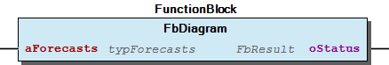
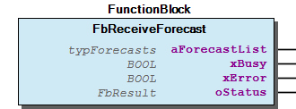
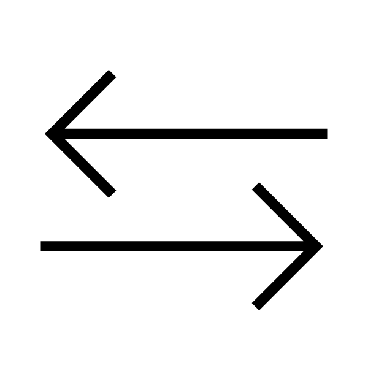
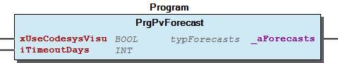

# WagoAppPvForecast v1.0.0.1 (WAGO) - Complete Documentation


## 📋 Library Information

- **Company:** WAGO
- **Title:** WagoAppPvForecast
- **Version:** 1.0.0.1
- **Categories:** Application; WAGO LayerView|App
- **Namespace:** WagoAppPvForecast
- **Author:** WAGO / u0103082
- **Placeholder:** WagoAppPvForecast

### Description ¶


This document is automatically generated.

This is a template for a WagoApp-Library

This document is automatically generated. This is a template for a WagoApp-Library

### Contents: ¶


Contents: - Documentation Index 10 Documentation - WagoAppPvForecast Library Documentation Project Information Library Information Function Blocks - FbDiagram (FB) - FbReceiveForecast (FB) - doc01_Foreword (FB) Program Organization Internal Components Global Variable Lists - Status (GVL) - VersionHistory (GVL) Other Components - 29 Types - 30 Visualizations - 80 Status - GlobalTextList (Text List) - ImagePool (Image Pool) - Images - ParameterList (PARAMS) - PrgPvForecast (PRG) - eStatus (ENUM) - typForecasts (ALIAS) - ... and 1 more

### Indices and tables ¶


Based on WagoAppPvForecast.library, last modified 29.05.2024, 20:49:24. LibDoc 3.5.16.10

© WAGO GmbH & Co. KG, Germany 2018 – All rights reserved. For the avoidance of doubt, this copyright notice does not only apply to the information above but also and primarily to the described library itself. Please note that third-party products are always mentioned without reference to intellectual property rights, including patents, utility models, designs and trademarks, accordingly the existence of such rights cannot be excluded. WAGO is a registered trademark of WAGO Verwaltungsgesellschaft mbH.

- File and Project Information - Library Reference Based on WagoAppPvForecast.library, last modified 29.05.2024, 20:49:24. LibDoc 3.5.16.10 © WAGO GmbH & Co. KG, Germany 2018 – All rights reserved. For the avoidance of doubt, this copyright notice does not only apply to the information above but also and primarily to the described library itself. Please note that third-party products are always mentioned without reference to intellectual property rights, including patents, utility models, designs and trademarks, accordingly the existence of such rights cannot be excluded. WAGO is a registered trademark of WAGO Verwaltungsgesellschaft mbH.

### Documentation Index


## 10 Documentation


To ensure fast installation and start-up of the units, we strongly recommend that the following information and explanations are carefully read and adhered to.

To ensure fast installation and start-up of the units, we strongly recommend that the following information and explanations are carefully read and adhered to. - doc01_Foreword (FB)

## WagoAppPvForecast Library Documentation


| Company: | WAGO |
| Title: | WagoAppPvForecast |
| Version: | 1.0.0.1 |
| Categories: | Application; WAGO LayerView\|App |
| Namespace: | WagoAppPvForecast |
| Author: | WAGO / u0103082 |
| Placeholder: | WagoAppPvForecast |

### Description


This document is automatically generated.

This is a template for a WagoApp-Library

This document is automatically generated. This is a template for a WagoApp-Library

### Contents:


- 10 Documentation doc01_Foreword (FB) 20 Program Organization Units - PrgPvForecast (PRG) 29 Types - typForecasts (ALIAS) - typSingleForecast (STRUCT) 30 Visualizations 80 Status - Status (GVL) - eStatus (ENUM) 90 Internal - FbDiagram (FB) - FbReceiveForecast (FB) GlobalTextList (Text List) Images - ImagePool (Image Pool) ParameterList (PARAMS) VersionHistory (GVL)

### Indices and tables


Based on WagoAppPvForecast.library, last modified 29.05.2024, 20:49:24. LibDoc 3.5.16.10

© WAGO GmbH & Co. KG, Germany 2018 – All rights reserved. For the avoidance of doubt, this copyright notice does not only apply to the information above but also and primarily to the described library itself. Please note that third-party products are always mentioned without reference to intellectual property rights, including patents, utility models, designs and trademarks, accordingly the existence of such rights cannot be excluded. WAGO is a registered trademark of WAGO Verwaltungsgesellschaft mbH.

- File and Project Information - Library Reference Based on WagoAppPvForecast.library, last modified 29.05.2024, 20:49:24. LibDoc 3.5.16.10 © WAGO GmbH & Co. KG, Germany 2018 – All rights reserved. For the avoidance of doubt, this copyright notice does not only apply to the information above but also and primarily to the described library itself. Please note that third-party products are always mentioned without reference to intellectual property rights, including patents, utility models, designs and trademarks, accordingly the existence of such rights cannot be excluded. WAGO is a registered trademark of WAGO Verwaltungsgesellschaft mbH.

### Project Information


## File and Project Information


| Scope | Name | Type | Content |
| --- | --- | --- | --- |
| FileHeader | libraryFile | string | WagoAppPvForecast.library |
| contentFile | doc.clean.json |
| productName | e!COCKPIT |
| creationDateTime | date | 29.05.2024, 20:49:29 |
| companyName | string | WAGO |
| ProjectInformation | LastModificationDateTime | date | 29.05.2024, 20:49:24 |
| Description | string | See: Description |
| DocFormat | reStructuredText |
| Author | WAGO / u0103082 |
| AutoResolveUnbound | bool | True |
| Placeholder | string | WagoAppPvForecast |
| Company | WAGO |
| Title | WagoAppPvForecast |
| Project | WagoAppPvForecast |
| DefaultNamespace | WagoAppPvForecast |
| Version | version | 1.0.0.1 |
| Released | bool | False |
| LibraryCategories | library-category-list | Application; WAGO LayerView\|App |
| CompiledLibraryCompatibilityVersion | string | CODESYS V3.5 SP16 Patch 3 |
| IsEndUserLibrary | bool | True |

### Library Information


## Library Reference


| LinkAllContent: False QualifiedOnly: False | SystemLibrary: False | Optional: False |

| LinkAllContent: False QualifiedOnly: False | SystemLibrary: True | Optional: False |

| LinkAllContent: False QualifiedOnly: False | SystemLibrary: True | Optional: False |

| LinkAllContent: False QualifiedOnly: False | SystemLibrary: True | Optional: False |

| LinkAllContent: False QualifiedOnly: False | SystemLibrary: True | Optional: False |

| LinkAllContent: False QualifiedOnly: False | SystemLibrary: True | Optional: False |

| LinkAllContent: False QualifiedOnly: False | SystemLibrary: True | Optional: False |

| LinkAllContent: False QualifiedOnly: False | SystemLibrary: True | Optional: False |

| LinkAllContent: False QualifiedOnly: False | SystemLibrary: True | Optional: False |

| LinkAllContent: False QualifiedOnly: False | SystemLibrary: True | Optional: False |

| LinkAllContent: False QualifiedOnly: False | SystemLibrary: True | Optional: False |

| LinkAllContent: False QualifiedOnly: False | SystemLibrary: True | Optional: False |

| LinkAllContent: False Optional: False | QualifiedOnly: False SystemLibrary: True | PublishSymbolsInContainer: True |

| LinkAllContent: False QualifiedOnly: False | SystemLibrary: True | Optional: False |

| LinkAllContent: False QualifiedOnly: True | SystemLibrary: False | Optional: False |

| LinkAllContent: False QualifiedOnly: False | SystemLibrary: False | Optional: False |

| LinkAllContent: False QualifiedOnly: False | SystemLibrary: False | Optional: False |

| LinkAllContent: False QualifiedOnly: False | SystemLibrary: False | Optional: False |

| LinkAllContent: False QualifiedOnly: False | SystemLibrary: False | Optional: False |

| LinkAllContent: False QualifiedOnly: False | SystemLibrary: False | Optional: False |

This is a dictionary of all referenced libraries and their name spaces.

This is a dictionary of all referenced libraries and their name spaces. CmpEventMgr Library Identification : Name: CmpEventMgr Version: newest Company: System Namespace: CmpEventMgr Library Properties : VisuElem3DPath Library Identification : Placeholder: System_VisuElem3DPath Default Resolution: VisuElem3DPath, 3.5.16.30 (System) Namespace: VisuElem3DPath Library Properties : Library Parameter : Parameter: GC_POINTS_PER_POLYGON = 100 VisuElemCamDisplayer Library Identification : Placeholder: System_VisuElemCamDisplayer Default Resolution: VisuElemCamDisplayer, 3.5.16.30 (System) Namespace: VisuElemCamDisplayer Library Properties : Library Parameter : Parameter: GC_POINTS_PER_CAM = 100 VisuElemMeter Library Identification : Placeholder: System_VisuElemMeter Default Resolution: VisuElemMeter, 3.5.16.30 (System) Namespace: VisuElemMeter Library Properties : VisuElemTextEditor Library Identification : Placeholder: System_VisuElemTextEditor Default Resolution: VisuElemTextEditor, 3.5.16.30 (System) Namespace: VisuElemTextEditor Library Properties : VisuElemTrace Library Identification : Placeholder: System_VisuElemTrace Default Resolution: VisuElemTrace, 3.5.16.30 (System) Namespace: VisuElemTrace Library Properties : VisuElemXYChart Library Identification : Placeholder: System_VisuElemXYChart Default Resolution: VisuElemXYChart, 3.5.16.30 (System) Namespace: VisuElemXYChart Library Properties : VisuElems Library Identification : Placeholder: System_VisuElems Default Resolution: VisuElems, 3.5.16.30 (System) Namespace: VisuElems Library Properties : VisuElemsAlarm Library Identification : Placeholder: System_VisuElemsAlarm Default Resolution: VisuElemsAlarm, 3.5.16.30 (System) Namespace: VisuElemsAlarm Library Properties : VisuElemsDateTime Library Identification : Placeholder: System_VisuElemsDateTime Default Resolution: VisuElemsDateTime, 3.5.16.30 (System) Namespace: VisuElemsDateTime Library Properties : VisuElemsSpecialControls Library Identification : Placeholder: System_VisuElemsSpecialControls Default Resolution: VisuElemsSpecialControls, 3.5.16.30 (System) Namespace: VisuElemsSpecialControls Library Properties : VisuElemsWinControls Library Identification : Placeholder: System_VisuElemsWinControls Default Resolution: VisuElemsWinControls, 3.5.16.30 (System) Namespace: VisuElemsWinControls Library Properties : VisuInputs Library Identification : Placeholder: system_visuinputs Default Resolution: VisuInputs, 3.5.16.30 (System) Namespace: visuinputs Library Properties : VisuNativeControl Library Identification : Placeholder: System_VisuNativeControl Default Resolution: VisuNativeControl, 3.5.16.0 (System) Namespace: VisuNativeControl Library Properties : VisuSymbols Library Identification : Name: VisuSymbols Version: newest Company: System Namespace: VisuSymbols Library Properties : WagoAppCloud Library Identification : Placeholder: WagoAppCloud Default Resolution: WagoAppCloud, * (WAGO) Namespace: WagoAppCloud Library Properties : Library Parameter : Parameter: GMAX_COLLECTIONS = 20 Parameter: GMAX_RESPONSE_PARAMETERS = 20 Parameter: GENABLE_BACKGROUNDTASK = TRUE Parameter: GMAX_PAYLOAD_SIZE_PUBLISH = 65237 Parameter: GCONNECTION_1_PORT2 = 14119 Parameter: GMAX_REQUEST_PARAMETERS = 20 Parameter: GBACKGROUND_CYCLETIME = 50000 Parameter: GMAX_PAYLOAD_SIZE_SUBSCRIBE = 65237 Parameter: GSUBSCRIPTIONS = 20 Parameter: GCONNECTION_1_PORT1 = 14118 Parameter: GCONNECTION_2_PORT1 = 14121 Parameter: GCONNECTION_1_PORT3 = 14120 Parameter: GCONNECTION_2_PORT3 = 14123 Parameter: GCONNECTION_2_PORT2 = 14122 WagoAppString Library Identification : Placeholder: WagoAppString Default Resolution: WagoAppString, * (WAGO) Namespace: WagoAppString Library Properties : Library Parameter : Parameter: MAX_STRING_LENGTH = 255 WagoAppTime Library Identification : Placeholder: WagoAppTime Default Resolution: WagoAppTime, * (WAGO) Namespace: WagoAppTime Library Properties : WagoSysPlainMem Library Identification : Placeholder: WagoSysPlainMem Default Resolution: WagoSysPlainMem, * (WAGO) Namespace: WagoSysPlainMem Library Properties : WagoSysVersion Library Identification : Name: WagoSysVersion Version: 1.0.0.0 Company: WAGO Namespace: WagoSysVersion Library Properties :

### Function Blocks


## FbDiagram (FB)


| Scope | Name | Type | Comment |
| --- | --- | --- | --- |
| Input | aForecasts | typForecasts | typForecasts as input for the visualization |
| Output | oStatus | WagoSysErrorBase.FbResult | Status information |

This function block converts the incoming forecast data and generates the output for the diagram in the visualization.

Graphical Illustration

Graphical Interface of FbDiagram

Function description

The received forecast data from FbReceiveForecast is taken as Input. The whole function block can then be passed to the visualization frame of the diagram. The visualization is only updated when there is a change in the incoming forecast data. Once a day the x-axis is updated with the correct date.

{attribute ‘hide_all_locals’}

Interface variables Function This function block converts the incoming forecast data and generates the output for the diagram in the visualization. Graphical Illustration  Graphical Interface of FbDiagram Function description The received forecast data from FbReceiveForecast is taken as Input. The whole function block can then be passed to the visualization frame of the diagram. The visualization is only updated when there is a change in the incoming forecast data. Once a day the x-axis is updated with the correct date. {attribute ‘hide_all_locals’}

## FbReceiveForecast (FB)


| Scope | Name | Type | Comment |
| --- | --- | --- | --- |
| Output | aForecastList | typForecasts | structure for Forecasts |
| xBusy | BOOL | TRUE if Fb is busy |
| xError | BOOL | TRUE when error occurs |
| oStatus | WagoSysErrorBase.FbResult | Status information |

```
//Declaration
PROGRAM PLC_PRG
VAR
    oDiagram        : WagoAppPvForecast.FbDiagram;                                      // generate chart data for visualization
    oReceiveForecast: WagoAppPvForecast.FbReceiveForecast;                              // receive PvForecast from Cloud
    aForecastList   : WagoAppPvForecast.typPvForecast;                                  // structure for PvForecasts
END_VAR
// Implementation
// Receiving forecast and generating data structures for diagra
oReceiveForecast(aForecastList=>aForecastList);
oDiagram(aForecasts:=aForecastList);
```

This function block receives the forecast data from the Wago Cloud for each PV system as an array element.

Graphical Illustration

Graphical Interface of FbReceiveForecast

Function description

The function block has no inputs and receives the forecast data as an array from the Wago Cloud. The maximum number of supported PV system is defined by the parameter MAX_PV_SYSTEMS. After a specific period of time, the forecast data expires and is deleted from the list. The number of days before expiration can be set in the parameter list with the variable EXPIRY_DAYS.

Example for a PLC_PRG:

{attribute ‘hide_all_locals’}

Interface variables Function This function block receives the forecast data from the Wago Cloud for each PV system as an array element. Graphical Illustration  Graphical Interface of FbReceiveForecast Function description The function block has no inputs and receives the forecast data as an array from the Wago Cloud. The maximum number of supported PV system is defined by the parameter MAX_PV_SYSTEMS. After a specific period of time, the forecast data expires and is deleted from the list. The number of days before expiration can be set in the parameter list with the variable EXPIRY_DAYS. Example Example for a PLC_PRG: 1. Instance of FbDiagram, FbReceiveForecast 2. List of Forecasts as Array[..] OF typPvForecast 3. Call of both Fbs {attribute ‘hide_all_locals’}

## doc01_Foreword (FB)


This library implements the basic function blocks for receiving PV forecast data from the wago cloud.

This library implements the basic function blocks for receiving PV forecast data from the wago cloud.

### Program Organization


## 20 Program Organization Units


- PrgPvForecast (PRG)

### Internal Components


## 90 Internal


Dieser Teil soll nicht in der Dokumentation auftauchen

Dieser Teil soll nicht in der Dokumentation auftauchen - FbDiagram (FB) - FbReceiveForecast (FB)

### Global Variable Lists


## Status (GVL)


| Scope | Name | Type | Initial |
| --- | --- | --- | --- |
| Constant | gc_Status | ARRAY [0..47] OF WagoSysErrorBase.WagoTypesErrorBase.typResultItem | [STRUCT(ID := eStatus.Ok, Severity := WagoSysErrorBase.WagoTypes.eSeverity.info, text := ‘OK’), STRUCT(ID := eStatus.Error, Severity := WagoSysErrorBase.WagoTypes.eSeverity.error, text := ‘ERROR’)] |

## VersionHistory (GVL)


| Name | Type |
| --- | --- |
| Info | WagoSysVersion.ProjectInfo |

| date | version | author | change |
| 26.02.2024 | 1.0.0.1 | WAGO / u010663 | Compiled SP16.3 |
| 05.04.2016 | 1.0.0.0 | WAGO / u010382 | Release Version |

WagoAppPvForecast.library

Release Notes:

Known Bugs:

WagoAppPvForecast.library Release Notes: Known Bugs:

### Other Components


## 29 Types


- typForecasts (ALIAS) - typSingleForecast (STRUCT)

## 30 Visualizations ¶


## 80 Status ¶


- Status (GVL) - eStatus (ENUM)

## GlobalTextList (Text List) ¶


## ImagePool (Image Pool)


| ID | File name | Image | Link type |
| --- | --- | --- | --- |
| DE | DE.png |  | Embedded |
| EN | EN.png |  | Embedded |
| Wago_Logo | WAGO Logo main_use_green_CMYK.jpg |  | Embedded |
| wago-analytics-logo | wago-analytics-logo.png |  | Embedded |
| web-navigation_burger-menu_outline-black_600x600 | web-navigation_burger-menu_filled-black_600x600.png |  | Embedded |
| web-navigation_circle-question_outline-black_600x600 | web-navigation_circle-question_outline-black_600x600.png |  | Embedded |
| web-navigation_language_filled-black_600x600 | web-navigation_language_filled-black_600x600.png |  | Embedded |
| web-navigation_settings_filled-black_600x600 | web-navigation_arrow-right-left_filled-black_600x600.png |  | Embedded |

## Images ¶


- ImagePool (Image Pool)

## ParameterList (PARAMS)


| Scope | Name | Type | Initial | Comment |
| --- | --- | --- | --- | --- |
| Constant | MAX_PV_SYSTEMS | BYTE | 10 | Maximum supported systems for receiving data from the cloud |

## PrgPvForecast (PRG)


| Scope | Name | Type | Initial | Comment |
| --- | --- | --- | --- | --- |
| Input | xUseCodesysVisu | BOOL | FALSE | Set to TRUE for generating a WebVisu |
| iTimeoutDays | INT | 1 | Days before Forecasts will expire, Default is 1 day |
| Output | _aForecasts | typForecasts |  | List of received forcasts with all data |

This Program receives the incoming forecast data and optionally generates the output for the diagram in the visualization.

Graphical Illustration

Graphical Interface of PrgPvForecast

Function description

The forecast data is received from the internal FbReceiveForecast. The progam can then generate the visualization datav for the diagram if xUseCodesysVisu is set to TRUE. The visualization is only updated when there is a change in the incoming forecast data. Once a day the x-axis is updated with the correct date.

Interface variables Function This Program receives the incoming forecast data and optionally generates the output for the diagram in the visualization. Graphical Illustration  Graphical Interface of PrgPvForecast Function description The forecast data is received from the internal FbReceiveForecast. The progam can then generate the visualization datav for the diagram if xUseCodesysVisu is set to TRUE. The visualization is only updated when there is a change in the incoming forecast data. Once a day the x-axis is updated with the correct date.

## eStatus (ENUM)


| Name | Initial | Comment |
| --- | --- | --- |
| Ok | 0 | (none) Ok, |
| Error | 100 |  |

## typForecasts (ALIAS) ¶


## typSingleForecast (STRUCT)


| Name | Type |
| --- | --- |
| aForecastValues | ARRAY [0..7] OF REAL |
| aClearskyValues | ARRAY [0..7] OF REAL |
| dwCommandId | DWORD |
| sPvSystem | STRING |
| datexpiryDate | DATE |