# WagoAppRFIDReader_phg v1.0.3.3 (WAGO) - Complete Documentation


## 📋 Library Information

- **Company:** WAGO
- **Title:** WagoAppRFIDReader_phg
- **Version:** 1.0.3.3
- **Categories:** WAGO LayerView|App; Application; WAGO FunctionalView|Connectivity|Serial
- **Namespace:** WagoAppRFIDReader_phg
- **Author:** WAGO / u010545
- **Placeholder:** WagoAppRFIDReader_phg

### Description ¶


This document is automatically generated.

Functionblocks for serial RFID reader from phg

This document is automatically generated. Functionblocks for serial RFID reader from phg

### Contents: ¶


Contents: - Project Information - Library Information - Function Blocks FbPhgCryptCom (FB) - FbPhgCryptComObject (FB) - FbPhgFastPoll (FB) - FbPhgGetTagData (FB) - FbPhgKeypadInput (FB) - FbPhgPoll (FB) - FbPhgReadHwInfo (FB) - FbPhgReset (FB) - FbPhgSetParameter (FB) - FbPhgSetRelais (FB) - ... and 2 more Methods - FbPhgCryptCom.run (METH) - FbSimpleReader.SetSignal (METH) - WagoAppRFIDReader_phg Library Documentation - ePollDataType (ENUM) - eReadSystem (ENUM) - typPollData (STRUCT) Interfaces Program Organization Internal Components Global Variable Lists - ErrorRfid_phg (GVL) - PHG_CRYPT_CONSTANT (GVL) - VersionHistory (GVL) Other Components - 01 DataTypes - 10 ErrorRfid_phg - 20 Communication - 25 Advanced Services - 80 Status - HW Info - I_PhgCryptComObject - Parameter (PARAMS) - eErrorRfid_phg (ENUM) - eHardwarePlatform (ENUM) - ... and 10 more

### Indices and tables ¶


Based on WagoAppRFIDReader_phg.library, last modified 29.05.2024, 20:47:32. LibDoc 3.5.16.10

© WAGO GmbH & Co. KG, Germany 2018 – All rights reserved. For the avoidance of doubt, this copyright notice does not only apply to the information above but also and primarily to the described library itself. Please note that third-party products are always mentioned without reference to intellectual property rights, including patents, utility models, designs and trademarks, accordingly the existence of such rights cannot be excluded. WAGO is a registered trademark of WAGO Verwaltungsgesellschaft mbH.

- File and Project Information - Library Reference Based on WagoAppRFIDReader_phg.library, last modified 29.05.2024, 20:47:32. LibDoc 3.5.16.10 © WAGO GmbH & Co. KG, Germany 2018 – All rights reserved. For the avoidance of doubt, this copyright notice does not only apply to the information above but also and primarily to the described library itself. Please note that third-party products are always mentioned without reference to intellectual property rights, including patents, utility models, designs and trademarks, accordingly the existence of such rights cannot be excluded. WAGO is a registered trademark of WAGO Verwaltungsgesellschaft mbH.

### Project Information


## File and Project Information


| Scope | Name | Type | Content |
| --- | --- | --- | --- |
| FileHeader | libraryFile | string | WagoAppRFIDReader_phg.library |
| contentFile | doc.clean.json |
| productName | e!COCKPIT |
| creationDateTime | date | 29.05.2024, 20:47:33 |
| companyName | string | WAGO |
| ProjectInformation | LastModificationDateTime | date | 29.05.2024, 20:47:32 |
| Description | string | See: Description |
| Copyright | © WAGO Kontakttechnik GmbH & Co. KG, Germany 2018 – All rights reserved. |
| Author | WAGO / u010545 |
| AutoResolveUnbound | bool | True |
| Placeholder | string | WagoAppRFIDReader_phg |
| Company | WAGO |
| DocFormat | reStructuredText |
| Project | WagoAppRFIDReader_phg |
| DefaultNamespace | WagoAppRFIDReader_phg |
| Version | version | 1.0.3.3 |
| Title | string | WagoAppRFIDReader_phg |
| LibraryCategories | library-category-list | WAGO LayerView\|App; Application; WAGO FunctionalView\|Connectivity\|Serial |
| CompiledLibraryCompatibilityVersion | string | CODESYS V3.5 SP16 Patch 3 |

### Library Information


## Library Reference


| LinkAllContent: False QualifiedOnly: False | SystemLibrary: False | Optional: False |

| LinkAllContent: False QualifiedOnly: False | SystemLibrary: False | Optional: False |

| LinkAllContent: False QualifiedOnly: False | SystemLibrary: False | Optional: False |

| LinkAllContent: False QualifiedOnly: False | SystemLibrary: False | Optional: False |

| LinkAllContent: False QualifiedOnly: False | SystemLibrary: False | Optional: False |

| LinkAllContent: False QualifiedOnly: False | SystemLibrary: False | Optional: False |

| LinkAllContent: False Optional: False | QualifiedOnly: True SystemLibrary: False | PublishSymbolsInContainer: True |

| LinkAllContent: False Optional: False | QualifiedOnly: False SystemLibrary: False | PublishSymbolsInContainer: True |

This is a dictionary of all referenced libraries and their name spaces.

This is a dictionary of all referenced libraries and their name spaces. Standard Library Identification : Placeholder: Standard Default Resolution: Standard, * (System) Namespace: Standard Library Properties : SysCpuHandling Library Identification : Placeholder: SysCpuHandling Default Resolution: SysCpuHandling, * (System) Namespace: SysCpuHandling Library Properties : SysMem Library Identification : Placeholder: SysMem Default Resolution: SysMem, * (System) Namespace: SysMem Library Properties : WagoSysErrorBase Library Identification : Placeholder: WagoSysErrorBase Default Resolution: WagoSysErrorBase, * (WAGO) Namespace: WagoSysErrorBase Library Properties : Library Parameter : Parameter: RES_LOG_MAX_FILESIZE = 2000 Parameter: RES_LOG_MAX_FILES = 1 Parameter: RES_LOG_MAX_ENTRIES = 200 Parameter: RES_LOG_NAME = ‘WagoAppResultLogger’ WagoSysSerial Library Identification : Placeholder: WagoSysSerial Default Resolution: WagoSysSerial, * (WAGO) Namespace: WagoSysSerial Library Properties : WagoSysVersion Library Identification : Name: WagoSysVersion Version: 1.0.0.0 Company: WAGO Namespace: WagoSysVersion Library Properties : WagoTypesCom Library Identification : Placeholder: WagoTypesCom Default Resolution: WagoTypesCom, * (WAGO) Namespace: WagoTypesCom Library Properties : WagoTypesErrorBase Library Identification : Placeholder: WagoTypesErrorBase Default Resolution: WagoTypesErrorBase, * (WAGO) Namespace: WagoTypesErrorBase Library Properties :

### Function Blocks


## FbPhgCryptCom (FB)


| Scope | Name | Type | Initial | Comment |
| --- | --- | --- | --- | --- |
| Input | xOpen | BOOL | TRUE | TRUE opens the com portt |
| I_Port | WagoTypesCom.I_WagoSysComBase |  | Name of the serial Interface (e.g. ‘COM1’ ) |
| udiBaudrate | UDINT | 9600 | Baudrate (9600 = 9k6) |
| usiDataBits | USINT | 8 | Number of Bits per frame (5..8) |
| eParity | WagoTypesCom.eTTYParity | WagoTypesCom.eTTYParity.None | Parity |
| eStopBits | WagoTypesCom.eTTYStopBits | WagoTypesCom.eTTYStopBits.One | Number of Stop-Bits, see note (1) |
| eHandshake | WagoTypesCom.eTTYHandshake | WagoTypesCom.eTTYHandshake.None | TYPE of handshake (XON/XOFF, etc) |
| ePhysical | WagoTypesCom.eTTYPhysicalLayer | WagoTypesCom.eTTYPhysicalLayer.RS485_HalfDuplex | RS232, RS422, RS485, etc |
| tTimeOut | TIME | TIME#200ms | time out for response after request |
| Output | I_PhgCryptCom | I_PhgCryptCom | THIS^ | delivers an inrterface to send and rceive phg packages |
| xIsOpen | BOOL |  |  |
| xError | BOOL |  |  |
| oStatus | WagoSysErrorBase.FbResult |  |  |

```
VAR
    //--- Create a communication object -----------------------------------------------------------------------------------
    myCryptCom  : FbPhgCryptCom :=  (   xOpen       := TRUE,
                                        udiBaudrate := 9600,
                                        usiDataBits := 8,
                                        eParity     := WagoTypesCom.eTTYParity.None,
                                        eStopBits   := WagoTypesCom.eTTYStopBits.One,
                                        eHandshake  := WagoTypesCom.eTTYHandshake.None,
                                        ePhysical   := WagoTypesCom.eTTYPhysicalLayer.RS232, // RS232, RS422, RS485, etc
                                        tTimeOut    := T#200ms
                                    );
    //---------------------------------------------------------------------------------------------------------------------
END_VAR

//----------------------------------------------------------------------
// call the communication object
// and take over the used serial interface
//----------------------------------------------------------------------
myCryptCom( I_Port  := COM1, // take over the serial port
            xIsOpen => ,      // is the serial port successful opened ?
            xError  => ,      // is there any error ?
            oStatus =>        // get here information about an error
          );
```

Communication object for serial base communication with a phg reader.

You should always call this FB cyclic.

Graphical Illustration

Graphical Interface of FbPhgCryptCom

Interface variables Function Communication object for serial base communication with a phg reader. Note You should always call this FB cyclic. Graphical Illustration 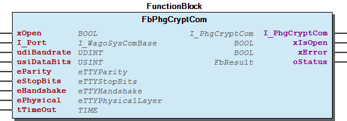 Graphical Interface of FbPhgCryptCom Example For create and call a communication object - I_PhgCryptComObject FbPhgCryptCom.run (METH)

## FbPhgCryptComObject (FB)


| Scope | Name | Type | Initial | Comment |
| --- | --- | --- | --- | --- |
| Input | xOpen | BOOL | TRUE | TRUE opens the com portt |
| I_Port | WagoTypesCom.I_WagoSysComBase |  | Name of the serial Interface (e.g. ‘COM1’ ) |
| udiBaudrate | UDINT | 9600 | Baudrate (9600 = 9k6) |
| eParity | WagoTypesCom.eTTYParity | WagoTypesCom.eTTYParity.None | Parity |
| ePhysical | WagoTypesCom.eTTYPhysicalLayer | WagoTypesCom.eTTYPhysicalLayer.RS485_HalfDuplex | RS232, RS422, RS485, etc |
| tTimeOut | TIME | TIME#200ms | time out for response after request |
| Output | I_PhgCryptCom | I_PhgCryptCom | THIS^ | delivers an inrterface to send and rceive phg packages |
| xError | BOOL |  |  |
| oStatus | WagoSysErrorBase.FbResult |  |  |

```
VAR
    //--- Create a communication object -----------------------------------------------------------------------------------
    myCryptCom  : FbPhgCryptComObject :=    (   xOpen       := TRUE,
                                                udiBaudrate := 9600,
                                                eParity     := WagoTypesCom.eTTYParity.None,
                                                ePhysical   := WagoTypesCom.eTTYPhysicalLayer.RS485_HalfDuplex, // RS232, RS422, RS485, etc
                                                tTimeOut    := T#200ms
                                            );
    //---------------------------------------------------------------------------------------------------------------------
END_VAR

//----------------------------------------------------------------------
// call the communication object
// and take over the used serial interface
myCryptCom( I_Port  := COM1); // take over the serial port
```

Graphical Illustration

Graphical Interface of FbPhgCryptComObject

Interface variables Function Communication object for serial base communication with a phg reader. You need this object once for each serial line for use at many FbSimpleReader . Graphical Illustration 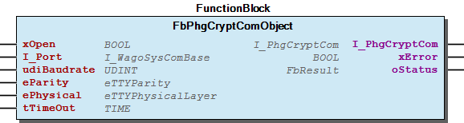 Graphical Interface of FbPhgCryptComObject Example For create a communication object to work with COM1.

## FbPhgFastPoll (FB)


| Scope | Name | Type | Initial | Comment |
| --- | --- | --- | --- | --- |
| Input | I_PhgCryptCom | I_PhgCryptCom |  |  |
| usiSlaveAddress | USINT | 0 | Address of the reader |
| tPollDelay | TIME | TIME#500ms | min. delay between two polls |
| Output | xDataPresent | BOOL |  | returns TRUE for a short pulse if the reader has data present |
| xNoDataPresent | BOOL |  | returns TRUE for a short pulse if the reader has no data present |
| xError | BOOL |  |  |
| oStatus | WagoSysErrorBase.FbResult |  |  |

Fast Poll is used for ask the reader whether data available. If data available the output xDataPresent will be TRUE until the start of the next poll. In this case call the FbPhgPoll for fetch the data from the reader.

You should always call this FB cyclic.

Graphical Illustration

Graphical Interface of FbPhgFastPoll

Interface variables Function Fast Poll is used for ask the reader whether data available. If data available the output xDataPresent will be TRUE until the start of the next poll. In this case call the FbPhgPoll for fetch the data from the reader. Note You should always call this FB cyclic. Graphical Illustration 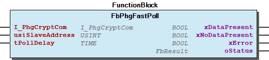 Graphical Interface of FbPhgFastPoll

## FbPhgGetTagData (FB)


| Scope | Name | Type |
| --- | --- | --- |
| Input | xExecute | BOOL |
| Inout | utPollData | typPollData |
| Output | xDone | BOOL |
| utTagData | typTagData |

| Component | Description |
| --- | --- |
| eTransponderType | ENUM | Value | Description |
| TAG_EM_4001 | 16#01 | EM 4001 Transponder |
| TAG_HITAG_1 | 16#02 | Hitag 1 Transponder |
| TAG_HITAG_2 | 16#03 | Hitag 2 Transponder |
| TAG_V4050 | 16#04 | V4050 Transponder |
| TAG_LEGIC | 16#05 | Legic Prime / Advant Transponder |
| TAG_MIFARE | 16#06 | mifare classic 1k / 4k or 14443-3 Transponder |
| TAG_DESFIRE | 16#07 | mifare DESFire or 14443-3 Transponder |
| FINGERPRINT | 16#08 | Fingerprint |
| TAG_LEGIC_15693 | 16#09 | Legic Advant 15693 |
| TAG_LEGIC_14443 | 16#0A | Legic Advant 14443 |
| TAG_UNKNOWN | 16#0B | unknown transponder type |
| SERIAL_PORT | 16#0C | serial port e.g. barcode scanner |
| MAGNET_DATA | 16#0D | Magnet data |
| TAG_LEGIC_14443B | 16#0E | Legic Advant 14443B |
| TAG_LEGIC_INSIDE | 16#0F | Legic Advant INSIDE |
| TAG_LEGIC_SONY_FELICA | 16#10 | Legic Advant Sony Felica |
| LEGIC_COMMAND_DATA | 16#D0 | Legic Command Data |
| TCL_DATA | 16#E0 | T=CL Data |
|  |
| udiNData | Data Type | Range | Description |
| UDINT | 0..PHG_CRYPT_MAX_TAG_DATA | Quantity of valid bytes |
| abData | ARRAY[] OF BYTE | 1..PHG_CRYPT_MAX_TAG_DATA | Tag Data |

This function block observes the utPollData and if it is possible, it converts it to utTagData . So you can use the output xDone from FbPhgPoll to connect the input xExecute . In this case the output xDone from this function block goes to TRUE when tag data available.

You should always call this FB cyclic.

Graphical Illustration

Graphical Interface of FbPhgGetTagData

Interface variables Function This function block observes the utPollData and if it is possible, it converts it to utTagData . So you can use the output xDone from FbPhgPoll to connect the input xExecute . In this case the output xDone from this function block goes to TRUE when tag data available. utTagData Note You should always call this FB cyclic. Graphical Illustration 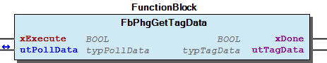 Graphical Interface of FbPhgGetTagData

## FbPhgKeypadInput (FB)


| Scope | Name | Type | Initial | Comment | Inherited from |
| --- | --- | --- | --- | --- | --- |
| Input | xExecute | BOOL |  |  | FbPhgBaseService |
| I_PhgCryptCom | I_PhgCryptCom |  |  | FbPhgBaseService |
| usiSlaveAddress | USINT | 0 | Address of the reader | FbPhgBaseService |
| Output | xDone | BOOL |  |  | FbPhgBaseService |
| xBusy | BOOL |  |  | FbPhgBaseService |
| xError | BOOL |  |  | FbPhgBaseService |
| oStatus | WagoSysErrorBase.FbResult |  |  | FbPhgBaseService |
| Input | utKeypadFunction | typKeypadFunction |  |  |  |

| Name | Value(s) | Description |
| --- | --- | --- |
| bCommand | 16#54 | command “TASTATUR_INPUT (0x54)” |
| bKeyCount | 1...7 | Number of keys to read |
| bTimeout | 16#00 | Timeout(Default) start with first key |
| 1..255 | Timeout in seconds after execution |
| bInputCtrl | bitcoded | Bit 8/7 | Always | 00 | fix |
| Bit 6/5 | Keypad-Layout | 00 | Telefon |
| 01 | PC |
| 10 | Scramble |
| Bit 4 | Scramble-Mode | 0 | Enable |
| 1 | Standby |
| Bit 3 | Always | 00 | fix |
| Bit 2 | Scramble-Mode | 0 | Imidiedly Enable |
| 1 | Standby |
| Bit 1 | Send keys | 0 | On key Count |
| 1 | After key “E” |
| bDisplayCtrl | bitcoded | Bit 8..5 | LedDisplay | 0000 | Toggle GREN/RED |
| 0001 | Toggle GREEN |
| Bit 4/3 | Backlight | 00 | OFF |
| 11 | Max. ON |
| Bit 2 | Display | 0 | OFF |
| 1 | On first key |
| Bit 1 | Optical signal | 0 | OFF |
| 1 | ON |
| bFeedbackKey | bitcoded | Bit 8..3 | Always | 0000000 | fix |
| Bit 2 | Optical signal | 0 | OFF |
| 1 | ON |
| Bit 1 | Akustic signal | 0 | OFF |
| 1 | ON |

This function block send command “TASTATUR_INPUT (0x54)” Mit diesem Kommando kann eine Tastatur Eingabe vom Slave angefordert werden. Falls die Eingabe nicht innerhalb des Timeout beendet wird, wird eine Tastaturtimeout Meldung an den Master gesendet. Nach dem Kommando wartet der Slave entsprechend auf die Tastatureingabe, die Daten, bzw. Statusmeldungen werden dann als Polling Antwort an den Master gesendet. Status falls keine Tastatur vorhanden ist : 0x3F Status falls die Parameter nicht korrekt sind : 0x47

For this the application have to fill the struct utKeypadFunction.

You should always call this FB cyclic.

Graphical Illustration

Graphical Interface of FbPhgKeypadInput

Interface variables Function This function block send command “TASTATUR_INPUT (0x54)” Mit diesem Kommando kann eine Tastatur Eingabe vom Slave angefordert werden. Falls die Eingabe nicht innerhalb des Timeout beendet wird, wird eine Tastaturtimeout Meldung an den Master gesendet. Nach dem Kommando wartet der Slave entsprechend auf die Tastatureingabe, die Daten, bzw. Statusmeldungen werden dann als Polling Antwort an den Master gesendet. Status falls keine Tastatur vorhanden ist : 0x3F Status falls die Parameter nicht korrekt sind : 0x47 For this the application have to fill the struct utKeypadFunction. Note You should always call this FB cyclic. Graphical Illustration 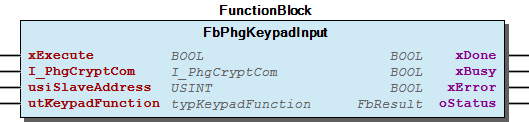 Graphical Interface of FbPhgKeypadInput

## FbPhgPoll (FB)


| Scope | Name | Type | Initial | Comment | Inherited from |
| --- | --- | --- | --- | --- | --- |
| Input | xExecute | BOOL |  |  | FbPhgBaseService |
| I_PhgCryptCom | I_PhgCryptCom |  |  | FbPhgBaseService |
| usiSlaveAddress | USINT | 0 | Address of the reader | FbPhgBaseService |
| Output | xDone | BOOL |  |  | FbPhgBaseService |
| xBusy | BOOL |  |  | FbPhgBaseService |
| xError | BOOL |  |  | FbPhgBaseService |
| oStatus | WagoSysErrorBase.FbResult |  |  | FbPhgBaseService |
| utPollData | typPollData |  | Struct with actual informations if xDone = TRUE |  |

| Data Type | Value | Description |
| --- | --- | --- |
| UNKNOWN | 16#00 | unknown data type |
| EXTENDED_DEVICE_DATA | 16#59 | response with device data |
| TRANSPONDER_DATA | 16#61 | response with Transponder data |
| EXTENDED_DEVICE_STATE | 16#65 | response with extended device state |
| KEYBOARD_INPUT | 16#69 | response with keyboard data |
| SINGLE_KEY | 16#6B | response with single key pressure |
| STATE | 16#73 | response with state |
| MONITOR_DATA | 16#6D | response with monitor data |

| Data Type | Transponder Type abData[0] | Value | Description |
| --- | --- | --- | --- |
| TRANSPONDER_DATA | TAG_EM_4001 | 16#01 | EM 4001 Transponder |
| TAG_HITAG_1 | 16#02 | Hitag 1 Transponder |
| TAG_HITAG_2 | 16#03 | Hitag 2 Transponder |
| TAG_V4050 | 16#04 | V4050 Transponder |
| TAG_LEGIC | 16#05 | Legic Prime / Advant Transponder |
| TAG_MIFARE | 16#06 | mifare classic 1k / 4k or 14443-3 Transponder |
| TAG_DESFIRE | 16#07 | mifare DESFire or 14443-3 Transponder |
| FINGERPRINT | 16#08 | Fingerprint |
| TAG_LEGIC_15693 | 16#09 | Legic Advant 15693 |
| TAG_LEGIC_14443 | 16#0A | Legic Advant 14443 |
| TAG_UNKNOWN | 16#0B | unknown transponder type |
| SERIAL_PORT | 16#0C | serial port e.g. barcode scanner |
| MAGNET_DATA | 16#0D | Magnet data |
| TAG_LEGIC_14443B | 16#0E | Legic Advant 14443B |
| TAG_LEGIC_INSIDE | 16#0F | Legic Advant INSIDE |
| TAG_LEGIC_SONY_FELICA | 16#10 | Legic Advant Sony Felica |
| LEGIC_COMMAND_DATA | 16#D0 | Legic Command Data |
| TCL_DATA | 16#E0 | T=CL Data |

| Data Type | State | Value | Description |
| --- | --- | --- | --- |
| STATE | NO_CHANGE | 16#30 | No change of state |
| RESET | 16#31 | Reset |
| TAG_OUT_OF_RANGE | 16#32 | Transponder out of range |
| INPUT_1_ACTIVE | 16#33 | Input 1 active |
| INPUT_1_INACTIVE | 16#34 | Input 1 inactive |
| INPUT_2_ACTIVE | 16#35 | Input 2 active |
| INPUT_2_INACTIVE | 16#36 | Input 2 inactive |
| INPUT_3_ACTIVE | 16#37 | Input 3 active |
| INPUT_3_INACTIVE | 16#38 | Input 3 inactive |
| INPUT_4_ACTIVE | 16#39 | Input 4 active |
| INPUT_4_INACTIVE | 16#3A | Input 4 inactive |
| SABOTAGE_ACTIVE | 16#3B | Sabotage active |
| SABOTAGE_INACTIVE | 16#3C | Sabotage inactive |
| OFFLINE_ONLINE_CHANGE | 16#3D | Change Offline / Online |
| COMMAND_SUCCESSFUL | 16#3E | Execution of the last command successful |
| COMMAND_ERROR | 16#3F | Execution of the last command not successful |
| LOGIN_ERROR | 16#40 | Login Error |
| LOGIN_OK | 16#41 | Login OK |
| TAG_WRITE_ERROR | 16#42 | Error while write data to transponder |
| TAG_DATA_WRITTEN | 16#43 | Data are successful written |
| KEYBOARD_TIMEOUT | 16#44 | Keyboard timeout |
| TRANSPONDER_IN_RANGE | 16#45 | Transponder in range |
| COMMAND_NOT_SUPPORTED | 16#46 | Command not supported |
| COMMAND_PARAMETER_ERROR | 16#47 | Invalid parameter |
| READ_ERROR | 16#48 | Error while read transponder |
| TAG_DATA_AVAILABLE | 16#49 | There are not acknowledged data available |
| IO_BOX_FOUND | 16#4A | IO Box found at bus |
| IO_BOX_NOT_ACCESSIBLE | 16#4B | IO Box not reachable |
| MOTOR_READER_CARD_INPOS | 16#4C | Motor reader card in position |
| MOTOR_READER_CARD_EJECTED | 16#4D | Motor reader card ejected |
| MOTOR_READER_CARD_DRAWN_IN | 16#4E | Motor reader card drawn in |
| MOTOR_READER_CARD_TRANSPORT_ERROR | 16#4F | Motor reader card transport error |
| NO_TRANSPONDER_IN_RANGE | 16#50 | No transponder in range |
| UPLOAD_LOCKED | 16#51 | Upload locked |
| CARD_INVALID_CSN | 16#52 | Transponder invalid Card Serial Number (CSN) |
| SLAVE_AFTER_SABOTAGE_LOCKED | 16#53 | Slave after sabotage locked |
| LEGIC_BAPTISM_OK | 16#54 | Legic baptism OK |
| ERROR_WHILE_BAPTISM | 16#55 | Error while baptism ceremony |
| NO_VALID_AES_SESSION | 16#56 | No valid Advanced Encryption Standard (AES) session |
| NO_AES_POLLING_RECEIVED | 16#57 | No Advanced Encryption Standard (AES) polling received |
| MOTOR_READER_CARD_SABOTAGE | 16#58 | Motor reader card sabotage |
| INPUT_STATE_NOT_AVAILABLE | 16#59 | State of the inputs still not detected |
| POWER_DOWN_MODE_FINISHED | 16#60 | Power Down Mode finished |
| INCOMPATIBLE_SOFTWARE | 16#61 | Incompatible software version at HF frontend |

This function block polls a reader and take data from the reader if there data availble. The data have to interpret by the application. The struct component utData.eDataType gives information about the type of data.

Possible Data Types

CASE OF DATA TYPE

TRANSPONDER_DATA :

utData.abData[0] is to interpret as Transponder Type. All follow bytes are readed transponder data.

utData.abData[0] is to interpret as state.

For more information see the manual of the used reader.

You should always call this FB cyclic.

Graphical Illustration

Graphical Interface of FbPhgPoll

Interface variables Function This function block polls a reader and take data from the reader if there data availble. The data have to interpret by the application. The struct component utData.eDataType gives information about the type of data. Possible Data Types CASE OF DATA TYPE TRANSPONDER_DATA : utData.abData[0] is to interpret as Transponder Type. All follow bytes are readed transponder data. STATE : utData.abData[0] is to interpret as state. For more information see the manual of the used reader. Note You should always call this FB cyclic. Graphical Illustration 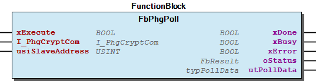 Graphical Interface of FbPhgPoll

## FbPhgReadHwInfo (FB)


| Scope | Name | Type | Initial | Comment | Inherited from |
| --- | --- | --- | --- | --- | --- |
| Input | xExecute | BOOL |  |  | FbPhgBaseService |
| I_PhgCryptCom | I_PhgCryptCom |  |  | FbPhgBaseService |
| usiSlaveAddress | USINT | 0 | Address of the reader | FbPhgBaseService |
| Output | xDone | BOOL |  |  | FbPhgBaseService |
| xBusy | BOOL |  |  | FbPhgBaseService |
| xError | BOOL |  |  | FbPhgBaseService |
| oStatus | WagoSysErrorBase.FbResult |  |  | FbPhgBaseService |
| utHardwareInfo | typHardwareInfo |  | Struct with actual informations about the hardware |  |

| Data Type | Value | Description |
| --- | --- | --- |
| UNKNOWN | 16#00 | unknown data type |
| EXTENDED_DEVICE_DATA | 16#59 | response with device data |
| TRANSPONDER_DATA | 16#61 | response with Transponder data |
| EXTENDED_DEVICE_STATE | 16#65 | response with extended device state |
| KEYBOARD_INPUT | 16#69 | response with keyboard data |
| SINGLE_KEY | 16#6B | response with single key pressure |
| STATE | 16#73 | response with state |
| MONITOR_DATA | 16#6D | response with monitor data |

This function block polls a reader and take data from the reader if there data availble. The data have to interpret by the application. The struct component utData.eDataType gives information about the type of data.

Possible Data Types

For more information see the manual of the used reader.

You should always call this FB cyclic.

Graphical Illustration

Graphical Interface of FbPhgReadHwInfo

Interface variables Function This function block polls a reader and take data from the reader if there data availble. The data have to interpret by the application. The struct component utData.eDataType gives information about the type of data. Possible Data Types For more information see the manual of the used reader. Note You should always call this FB cyclic. Graphical Illustration 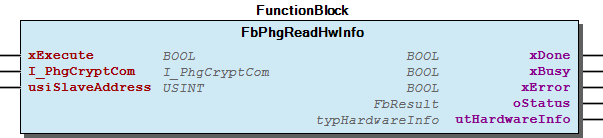 Graphical Interface of FbPhgReadHwInfo

## FbPhgReset (FB)


| Scope | Name | Type | Initial | Comment | Inherited from |
| --- | --- | --- | --- | --- | --- |
| Input | xExecute | BOOL |  |  | FbPhgBaseService |
| I_PhgCryptCom | I_PhgCryptCom |  |  | FbPhgBaseService |
| usiSlaveAddress | USINT | 0 | Address of the reader | FbPhgBaseService |
| Output | xDone | BOOL |  |  | FbPhgBaseService |
| xBusy | BOOL |  |  | FbPhgBaseService |
| xError | BOOL |  |  | FbPhgBaseService |
| oStatus | WagoSysErrorBase.FbResult |  |  | FbPhgBaseService |

Hardware Reset

You should always call this FB cyclic.

Graphical Illustration

Graphical Interface of FbPhgReset

Interface variables Function Hardware Reset Note You should always call this FB cyclic. Graphical Illustration 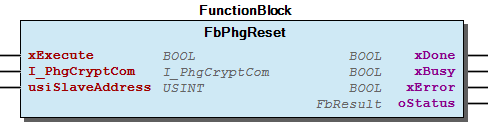 Graphical Interface of FbPhgReset

## FbPhgSetParameter (FB)


| Scope | Name | Type | Initial | Comment | Inherited from |
| --- | --- | --- | --- | --- | --- |
| Input | xExecute | BOOL |  |  | FbPhgBaseService |
| I_PhgCryptCom | I_PhgCryptCom |  |  | FbPhgBaseService |
| usiSlaveAddress | USINT | 0 | Address of the reader | FbPhgBaseService |
| Output | xDone | BOOL |  |  | FbPhgBaseService |
| xBusy | BOOL |  |  | FbPhgBaseService |
| xError | BOOL |  |  | FbPhgBaseService |
| oStatus | WagoSysErrorBase.FbResult |  |  | FbPhgBaseService |
| Input | sParameterCode | STRING(128) |  |  |  |

Write the parameter code to reader. You can generate the parameter code as string with the manufacturer tool phg_crypt_SE Tool (69925_18.exe). Please contact the manufacturer of the reader for this tool.

You should always call this FB cyclic.

Graphical Illustration

Graphical Interface of FbPhgSetParameter

Interface variables Function Write the parameter code to reader. You can generate the parameter code as string with the manufacturer tool phg_crypt_SE Tool (69925_18.exe). Please contact the manufacturer of the reader for this tool. Note You should always call this FB cyclic. Graphical Illustration 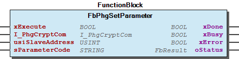 Graphical Interface of FbPhgSetParameter

## FbPhgSetRelais (FB)


| Scope | Name | Type | Initial | Comment | Inherited from |
| --- | --- | --- | --- | --- | --- |
| Input | xExecute | BOOL |  |  | FbPhgBaseService |
| I_PhgCryptCom | I_PhgCryptCom |  |  | FbPhgBaseService |
| usiSlaveAddress | USINT | 0 | Address of the reader | FbPhgBaseService |
| Output | xDone | BOOL |  |  | FbPhgBaseService |
| xBusy | BOOL |  |  | FbPhgBaseService |
| xError | BOOL |  |  | FbPhgBaseService |
| oStatus | WagoSysErrorBase.FbResult |  |  | FbPhgBaseService |
| Input | utRelaisFunction | typRelaisFunction |  |  |  |

| Member | Value | Description |
| --- | --- | --- |
| bCommand | 16#52 | Command set relais |
|  |  |  |
| Relais_1_ControlByte | Bit | Value | Description |
| 6/7 | 00 | off |
| 01 | on(timed) |
| 11 | no change |
| 4/5 | 00 | 100ms |
| 01 | 250ms |
| 10 | 500ms |
| 11 | 1s |
| 0..3 | 0000 | always fix |
|  |  |  |  |
| Relais_1_OnTime | Value | Description |
| 0 | always on |
| 1..255 | relais on time |
|  |  |  |
| Relais_2_ControlByte | Bit | Value | Description |
| 6/7 | 00 | off |
| 01 | on(timed) |
| 11 | no change |
| 4/5 | 00 | 100ms |
| 01 | 250ms |
| 10 | 500ms |
| 11 | 1s |
| 0..3 | 0000 | always fix |
|  |  |  |  |
| Relais_2_OnTime | Value | Description |
| 0 | always on |
| 1..255 | relais on time |

This function block controls the relais on “DI/DO-Box”

typRelaisFunction

You should always call this FB cyclic.

Graphical Illustration

Graphical Interface of FbPhgSetRelais

Interface variables Function This function block controls the relais on “DI/DO-Box” typRelaisFunction Note You should always call this FB cyclic. Graphical Illustration 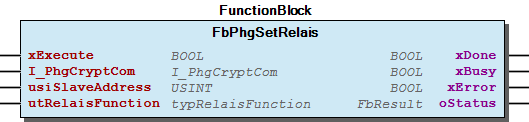 Graphical Interface of FbPhgSetRelais

## FbPhgUserInterface (FB)


| Scope | Name | Type | Initial | Comment | Inherited from |
| --- | --- | --- | --- | --- | --- |
| Input | xExecute | BOOL |  |  | FbPhgBaseService |
| I_PhgCryptCom | I_PhgCryptCom |  |  | FbPhgBaseService |
| usiSlaveAddress | USINT | 0 | Address of the reader | FbPhgBaseService |
| Output | xDone | BOOL |  |  | FbPhgBaseService |
| xBusy | BOOL |  |  | FbPhgBaseService |
| xError | BOOL |  |  | FbPhgBaseService |
| oStatus | WagoSysErrorBase.FbResult |  |  | FbPhgBaseService |
| Input | utLedFunction | typLedFunction |  |  |  |

| Struct | Component | Description |
| --- | --- | --- |
| utLedFunction | bCommand | for internal use only |
|  |
|  | —— G R E E N - L E D ————————- |
| GreenLED_Function | Bit | Value |
| Bit 8/7 | Function | 00 | off |
| 01 | on |
| 10 | flash |
| 11 | no change |
| Bit 6 | Interval | 0 | 100ms |
| 1 | 250ms |
| Bit 5 | Start Condition | 0 | LED on |
| 1 | LED off |
| Bit 4/3/2/1 | Quantity | 0000 | always |
| 0001..1111 | quantity |
| GreenLED_OnTime | Value | Description |
| 0 | always on |
| 1..255 | on time in flashing mode |
| GreenLED_OffTime | 1..255 | pause time at flashing mode |
|  |
|  | —— R E D - L E D —————————- |
| RedLED_Function | Bit | Value |
| Bit 8/7 | Function | 00 | off |
| 01 | on |
| 10 | flash |
| 11 | no change |
| Bit 6 | Interval | 0 | 100ms |
| 1 | 250ms |
| Bit 5 | Start Condition | 0 | LED on |
| 1 | LED off |
| Bit 4/3/2/1 | Quantity | 0000 | always |
| 0001..1111 | quantity |
| RedLED_OnTime | Value | Description |
| 0 | always on |
| 1..255 | on time in flashing mode |
| RedLED_OffTime | 1..255 | pause time at flashing mode |
|  |
|  | —— Y E L L O W - L E D ———————– |
| YellowLED_Function | Bit | Value |
| Bit 8/7 | Function | 00 | off |
| 01 | on |
| 10 | flash |
| 11 | no change |
| Bit 6 | Interval | 0 | 100ms |
| 1 | 250ms |
| Bit 5 | Start Condition | 0 | LED on |
| 1 | LED off |
| Bit 4/3/2/1 | Quantity | 0000 | always |
| 0001..1111 | quantity |
| YellowLED_OnTime | Value | Description |
| 0 | always on |
| 1..255 | on time in flashing mode |
| YellowLED_OffTime | 1..255 | pause time at flashing mode |
|  |
|  | —— B E E P E R ——————————- |
| Beeper_Function | Bit | Value |
| Bit 8/7 | Function | 00 | off |
| 01 | on |
| 10 | flash |
| 11 | no change |
| Bit 6 | Interval | 0 | 100ms |
| 1 | 250ms |
| Bit 5 | Start Condition | 0 | LED on |
| 1 | LED off |
| Bit 4/3/2/1 | Quantity | 0000 | always |
| 0001..1111 | quantity |
| Beeper_OnTime | Value | Description |
| 0 | always on |
| 1..255 | on time in flashing mode |
| Beeper_OffTime | 1..255 | pause time at flashing mode |
|  |  |  |

```
VAR
    //--- Create a communication object -----------------------------------------------------------------------------------
    myCryptCom  : FbPhgCryptCom :=  (   xOpen       := TRUE,
                                        udiBaudrate := 9600,
                                        usiDataBits := 8,
                                        eParity     := WagoTypesCom.eTTYParity.None,
                                        eStopBits   := WagoTypesCom.eTTYStopBits.One,
                                        eHandshake  := WagoTypesCom.eTTYHandshake.None,
                                        ePhysical   := WagoTypesCom.eTTYPhysicalLayer.RS232 // RS232, RS422, RS485, etc
                                    );
    //---------------------------------------------------------------------------------------------------------------------

    //-- Create a user interface to setting the green LED for 500ms and switch on the beeper for 100ms --------------------
    myR0Led     : FbPhgUserInterface :=( utLedFunction :=
                                            (   GreenLED_Function  := 16#40, GreenLED_OnTime  := 5, GreenLED_OffTime  := 0,
                                                RedLED_Function    := 0,     RedLED_OnTime    := 0, RedLED_OffTime    := 0,
                                                YellowLED_Function := 16#10, YellowLED_OnTime := 0, YellowLED_OffTime := 0,
                                                Beeper_Function    := 16#40, Beeper_OnTime    := 1, Beeper_OffTime    := 0
                                            )
                                      );
    //---------------------------------------------------------------------------------------------------------------------
END_VAR

//----------------------------------------------------------------------
// call the communication object
// and take over the used serial interface
//----------------------------------------------------------------------
myCryptCom( I_Port  := my652, // take over the serial port
            xIsOpen => ,      // is the serial port successful opened ?
            xError  => ,      // is there any error ?
            oStatus =>        // get here information about an error
          );
//----------------------------------------------------------------------

//----------------------------------------------------------------------
// call the fb to control the LED and the beeper
//----------------------------------------------------------------------
myR0Led(    xExecute        := ,            // set this variable for execute
            usiSlaveAddress := 1,           // Address of the reader
            I_PhgCryptCom   := myCryptCom,  // communication object
            xDone           => ,
            xError          => ,
            oStatus         =>
        );
//----------------------------------------------------------------------
```

This function block controls the beeper and the LEDs of the reader. For this the application have to fill the struct utLedFunction.

For more information see the manual of the used reader.

You should always call this FB cyclic.

Graphical Illustration

Graphical Interface of FbPhgUserInterface

Interface variables Function This function block controls the beeper and the LEDs of the reader. For this the application have to fill the struct utLedFunction. For more information see the manual of the used reader. Note You should always call this FB cyclic. Graphical Illustration 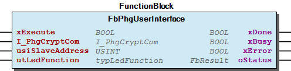 Graphical Interface of FbPhgUserInterface Example For control the LED and the beeper.

## FbSimpleReader (FB)


| Scope | Name | Type | Initial | Comment |
| --- | --- | --- | --- | --- |
| Input | usiSlaveAddress | USINT | 0 | Address of the reader |
| tPollDelay | TIME | TIME#100ms | min. delay between two polls |
| xOkSignal | BOOL |  | Set OK-Signal (LED / Beeper) |
| xErrorSignal | BOOL |  | Set Error Signal (LED Beeper) |
| Output | xDataPresent | BOOL |  | returns TRUE for a short pulse if the reader has transponder data present |
| utTagData | typTagData |  |  |
| xError | BOOL |  |  |
| oStatus | WagoSysErrorBase.FbResult |  |  |

```
VAR
    //--- Create a communication object -----------------------------------------------------------------------------------
    myCryptCom  : FbPhgCryptComObject :=    (       xOpen       := TRUE,
                                                    udiBaudrate := 9600,
                                                    eParity     := WagoTypesCom.eTTYParity.None,
                                                    ePhysical   := WagoTypesCom.eTTYPhysicalLayer.RS485_HalfDuplex // RS232, RS422, RS485, etc
                                                );
    //---------------------------------------------------------------------------------------------------------------------

    mySimpleReader_1    :   FbSimpleReader(myCryptCom) := ( usiSlaveAddress := 0,
                                                            tPollDelay      := T#30MS
                                                          );
END_VAR

myCryptCom(I_Port:=COM1);
//--- Reader 1 ---------------------------------------------
mySimpleReader_1(); // call the reader
IF mySimpleReader_1.xDataPresent THEN   // check Data

    CASE    mySimpleReader_1.utTagData.abData[11] OF // EXAMPLE CHECK !! ---> you have to check the conditions
        16#94 : mySimpleReader_1.SetSignal(eSignalType.ERROR); // Not OK

        ELSE // all others ok
            mySimpleReader_1.SetSignal(eSignalType.OK);
            // open the door

    END_CASE
END_IF
```

This function block provides a simple basic handling for a VOXIO-Reader.

You need one instance of this fb for each reader and you should call this instance cyclic.

Graphical Illustration

Graphical Interface of FbSimpleReader

Interface variables Function This function block provides a simple basic handling for a VOXIO-Reader. Note You need one instance of this fb for each reader and you should call this instance cyclic. Graphical Illustration 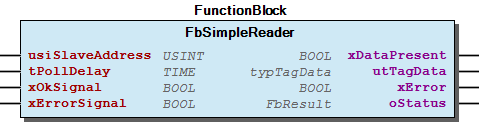 Graphical Interface of FbSimpleReader Example For one Reader with Slave address 0 connected at COM1 as RS485 device. - FbSimpleReader.SetSignal (METH)

### Methods


## FbPhgCryptCom.run (METH)


| Name | Type |
| --- | --- |
| inst_bStep | BYTE |
| inst_usiResponseCount | USINT |

## FbSimpleReader.SetSignal (METH)


| Scope | Name | Type |
| --- | --- | --- |
| Return | SetSignal | BOOL |
| Input | e_SignalType | eSignalType |

## WagoAppRFIDReader_phg Library Documentation


| Company: | WAGO |
| Title: | WagoAppRFIDReader_phg |
| Version: | 1.0.3.3 |
| Categories: | WAGO LayerView\|App; Application; WAGO FunctionalView\|Connectivity\|Serial |
| Namespace: | WagoAppRFIDReader_phg |
| Author: | WAGO / u010545 |
| Placeholder: | WagoAppRFIDReader_phg |

### Description


This document is automatically generated.

Functionblocks for serial RFID reader from phg

This document is automatically generated. Functionblocks for serial RFID reader from phg

### Contents:


- 20 Program Organization Units 01 DataTypes - 20 Communication - 25 Advanced Services - FbSimpleReader (FB) 80 Status - 10 ErrorRfid_phg 90 Internal - PHG_CRYPT_CONSTANT (GVL) Parameter (PARAMS) VersionHistory (GVL)

### Indices and tables


Based on WagoAppRFIDReader_phg.library, last modified 29.05.2024, 20:47:32. LibDoc 3.5.16.10

© WAGO GmbH & Co. KG, Germany 2018 – All rights reserved. For the avoidance of doubt, this copyright notice does not only apply to the information above but also and primarily to the described library itself. Please note that third-party products are always mentioned without reference to intellectual property rights, including patents, utility models, designs and trademarks, accordingly the existence of such rights cannot be excluded. WAGO is a registered trademark of WAGO Verwaltungsgesellschaft mbH.

- File and Project Information - Library Reference Based on WagoAppRFIDReader_phg.library, last modified 29.05.2024, 20:47:32. LibDoc 3.5.16.10 © WAGO GmbH & Co. KG, Germany 2018 – All rights reserved. For the avoidance of doubt, this copyright notice does not only apply to the information above but also and primarily to the described library itself. Please note that third-party products are always mentioned without reference to intellectual property rights, including patents, utility models, designs and trademarks, accordingly the existence of such rights cannot be excluded. WAGO is a registered trademark of WAGO Verwaltungsgesellschaft mbH.

## ePollDataType (ENUM)


| Name | Initial | Comment |
| --- | --- | --- |
| UNKNOWN | 16#0 | unknown data type |
| EXTENDED_DEVICE_DATA | 16#59 | response with device data |
| TRANSPONDER_DATA | 16#61 | response with Transponder data |
| EXTENDED_DEVICE_STATE | 16#65 | response with extended device state |
| KEYBOARD_INPUT | 16#69 | response with keyboard data |
| SINGLE_KEY | 16#6B | response with single key pressure |
| STATE | 16#73 | response with state |
| MONITOR_DATA | 16#6D | response with monitor data |

{attribute ‘strict’}

InOut: {attribute ‘strict’}

## eReadSystem (ENUM)


| Name | Initial | Comment |
| --- | --- | --- |
| NO_READSYSTEM | 0 | No read system |
| SYSTEM_125kHZ | 16#1 | 125 kHz |
| SYSTEM_MIFARE_CLASSIC_1K | 16#2 | mifare classic 1k |
| SYSTEM_LEGIC_PRIME | 16#3 | Legic prime |
| SYSTEM_LEGIC_ADVANT | 16#4 | Legic advant |
| SYSTEM_MIFARE_DESFIRE_EV1 | 16#5 | mifare DESFire EV1 |
| SYSTEM_LEGIC_ADVANT_4000 | 16#6 | Legic Advant4000 |

## typPollData (STRUCT)


| Name | Type |
| --- | --- |
| eDataType | ePollDataType |
| udiNData | UDINT |
| abData | ARRAY [1..PHG_CRYPT_MAX_PAYLOAD_DATA] OF BYTE |

### Interfaces


## I_PhgCryptCom (ITF) ¶


### Program Organization


## 20 Program Organization Units


Example for typical use in CFC

Example for typical use in CFC 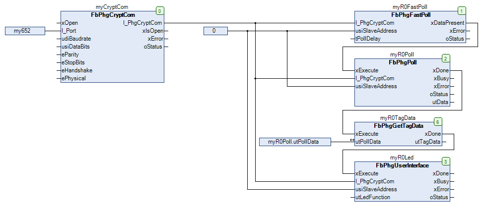 - 01 DataTypes HW Info eHardwarePlatform (ENUM) - eIOModule (ENUM) - eKeyboard (ENUM) - eReadSystem (ENUM) - typHardwareInfo (STRUCT) ePollDataType (ENUM) eSignalType (ENUM) eState (ENUM) eTransponderType (ENUM) typKeypadFunction (STRUCT) typLedFunction (STRUCT) typPollData (STRUCT) typRelaisFunction (STRUCT) typTagData (STRUCT) 20 Communication - FbPhgCryptCom (FB) I_PhgCryptComObject FbPhgCryptCom.run (METH) FbPhgCryptComObject (FB) I_PhgCryptCom (ITF) 25 Advanced Services - FbPhgFastPoll (FB) - FbPhgGetTagData (FB) - FbPhgKeypadInput (FB) - FbPhgPoll (FB) - FbPhgReadHwInfo (FB) - FbPhgReset (FB) - FbPhgSetParameter (FB) - FbPhgSetRelais (FB) - FbPhgUserInterface (FB) FbSimpleReader (FB) - FbSimpleReader.SetSignal (METH)

### Internal Components


## 90 Internal ¶


- PHG_CRYPT_CONSTANT (GVL)

### Global Variable Lists


## ErrorRfid_phg (GVL)


| Scope | Name | Type |
| --- | --- | --- |
| Constant | ERROR_PHGCRYPT | ARRAY [0..19] OF WagoTypesErrorBase.typResultItem |

| Value | Level | Description |
| --- | --- | --- |
| eErrorRfid_phg.OK | WagoSysErrorBase.eSeverity.none | ‘OK’ |
| eErrorRfid_phg.CHANNEL_OCCUPIED | WagoSysErrorBase.eSeverity.warning | ‘Warning -> Com Channel not free -> try it later again’ |
| eErrorRfid_phg.QUEUE_PRM_INVALID | WagoSysErrorBase.eSeverity.error | ‘Error invalid input parameter(s)’ |
| eErrorRfid_phg.QUEUE_FULL | WagoSysErrorBase.eSeverity.error | ‘Error buffer full’ |
| eErrorRfid_phg.QUEUE_RX_BUFFER_TO_SMALL | WagoSysErrorBase.eSeverity.error | ‘Error buffer to small’ |
| eErrorRfid_phg.QUEUE_NO_DATA | WagoSysErrorBase.eSeverity.info | ‘No data available’ |
| eErrorRfid_phg.QUEUE_FATAL_ERROR | WagoSysErrorBase.eSeverity.error | ‘Inconsistent data frame’ |
| eErrorRfid_phg.INVALID_INTERFACE | WagoSysErrorBase.eSeverity.error | ‘Error invalid interface’ |
| eErrorRfid_phg.PHG_CRYPT_ERROR_JOB_ABORTED | WagoSysErrorBase.eSeverity.error | ‘Error job aborted’ |
| eErrorRfid_phg.PHG_CRYPT_ERROR_PAYLOAD_COUNT | WagoSysErrorBase.eSeverity.error | ‘Error invalid payload count’ |
| eErrorRfid_phg.PHG_CRYPT_ERROR_COMBUF_SIZE | WagoSysErrorBase.eSeverity.error | ‘Error buffer size’ |
| eErrorRfid_phg.PHG_CRYPT_ERROR_TIME_OUT | WagoSysErrorBase.eSeverity.error | ‘Error time out’ |
| eErrorRfid_phg.PHG_CRYPT_ERROR_CRC | WagoSysErrorBase.eSeverity.error | ‘Error invalid crc’ |
| eErrorRfid_phg.PHG_CRYPT_ERROR_RESPONSE_ADDRESS | WagoSysErrorBase.eSeverity.error | ‘Error invalid response address’ |
| eErrorRfid_phg.PHG_CRYPT_ERROR_RESPONSE_TO_SHORT | WagoSysErrorBase.eSeverity.error | ‘Error response to short’ |
| eErrorRfid_phg.PHG_CRYPT_ERROR_REQUEST_ADDRESS | WagoSysErrorBase.eSeverity.error | ‘Error invalid request address’ |
| eErrorRfid_phg.PHG_CRYPT_ERROR_DONETIME_OUT | WagoSysErrorBase.eSeverity.error | ‘Error done time out’ |
| eErrorRfid_phg.PHG_CRYPT_ERROR_INVALID_RESPONSE | WagoSysErrorBase.eSeverity.error | ‘Error invalid response’ |
| eErrorRfid_phg.PHG_CRYPT_ERROR_RESPONSE_TO_LONG | WagoSysErrorBase.eSeverity.error | ‘Error invalid response length’ |
| eErrorRfid_phg.PHG_CRYPT_ERROR_NACK | WagoSysErrorBase.eSeverity.error | ‘Error negative acknowledge from device’ |

## PHG_CRYPT_CONSTANT (GVL)


| Scope | Name | Type | Initial | Comment |
| --- | --- | --- | --- | --- |
| Constant | PHG_CRYPT_BROADCAST_ADDRESS | BYTE | 16#2A |  |
| DLE | BYTE | 16#10 | — control characters —— |
| SOH | BYTE | 16#1 |  |
| STX | BYTE | 16#2 |  |
| ETB | BYTE | 16#17 |  |
| ETX | BYTE | 16#3 |  |
| ACK | BYTE | 16#6 |  |
| DC1 | BYTE | 16#11 |  |
| DC2 | BYTE | 16#12 |  |
| NACK | BYTE | 16#15 |  |
| ENQ | BYTE | 16#5 |  |
| RS | BYTE | 16#1E |  |

## VersionHistory (GVL)


| Name | Type |
| --- | --- |
| Info | ProjectInfo |

| date | version | author | change |
| 22.02.2024 | 1.0.3.3 | u010663 | Compiled SP16.3 |
| 21.08.2023 | 1.0.3.2 | u0103719 | move I_Port Communication Interface to Input (context:FbPhgCryptComObject) |
| 22.02.2023 | 1.0.3.1 | u015842 | bugfix FbPhgReadHwInfo -> WAT35380 |
| 11.08.2021 | 1.0.3.0 | u015842 | schedule jobs as queue in a linked list |
| 06.08.2021 | 1.0.2.4 | u015842 | schedule jobs modified |
| 10.12.2019 | 1.0.2.3 | u015842 | HW-Info optional SW-version added |
| 07.09.2019 | 1.0.2.2 | u015842 | FastPoll error modified |
| 24.09.2019 | 1.0.2.1 | u015842 | Bugfix FbPhgSetParameter |
| 08.01.2019 | 1.0.2.0 | u015842 | Properties: free placeholder added |
| 20.02.2018 | 1.0.1.0 | u010545 | new functions implemented (V2) |
| 08.11.2017 | 1.0.0.2 | u010545 | Placeholder at library manager modified |
| 24.08.2017 | 1.0.0.1 | u010545 | Doku update for generate PDF |
| 08.08.2017 | 1.0.0.0 | u010545 | first release |
| 19.06.2017 | 0.0.0.1 | u010545 | created |

WagoAppRFIDReader_phg

WagoAppRFIDReader_phg

### Other Components


## 01 DataTypes


- HW Info eHardwarePlatform (ENUM) - eIOModule (ENUM) - eKeyboard (ENUM) - eReadSystem (ENUM) - typHardwareInfo (STRUCT) ePollDataType (ENUM) eSignalType (ENUM) eState (ENUM) eTransponderType (ENUM) typKeypadFunction (STRUCT) typLedFunction (STRUCT) typPollData (STRUCT) typRelaisFunction (STRUCT) typTagData (STRUCT)

## 10 ErrorRfid_phg


- ErrorRfid_phg (GVL) - eErrorRfid_phg (ENUM)

## 20 Communication


- FbPhgCryptCom (FB) I_PhgCryptComObject FbPhgCryptCom.run (METH) FbPhgCryptComObject (FB) I_PhgCryptCom (ITF)

## 25 Advanced Services


- FbPhgFastPoll (FB) - FbPhgGetTagData (FB) - FbPhgKeypadInput (FB) - FbPhgPoll (FB) - FbPhgReadHwInfo (FB) - FbPhgReset (FB) - FbPhgSetParameter (FB) - FbPhgSetRelais (FB) - FbPhgUserInterface (FB)

## 80 Status


- 10 ErrorRfid_phg ErrorRfid_phg (GVL) - eErrorRfid_phg (ENUM)

## HW Info


- eHardwarePlatform (ENUM) - eIOModule (ENUM) - eKeyboard (ENUM) - eReadSystem (ENUM) - typHardwareInfo (STRUCT)

## I_PhgCryptComObject ¶


- FbPhgCryptCom.run (METH)

## Parameter (PARAMS)


| Scope | Name | Type | Initial | Comment |
| --- | --- | --- | --- | --- |
| Constant | PHG_CRYPT_DFLD_DEVICE_ADDRESS | BYTE | 16#1 | default device address |
| PHG_CRYPT_MAX_PAYLOAD_DATA | UINT | 255 | max. length of payload |
| PHG_CRYPT_COM_BUFFER | INT | 511 | size of communication buffer |
| PHG_CRYPT_MAX_TAG_DATA | INT | 128 | max. quantity of tag data |
| PHG_QUEUE_SIZE | UINT | 1024 | size of the queue |
| PHG_QUEUE_CALLBACK_SIZE | USINT | 255 | max. entrys for call back |

## eErrorRfid_phg (ENUM)


| Name | Initial | Comment |
| --- | --- | --- |
| OK | 0 |  |
| CHANNEL_OCCUPIED | 16#1 | com channel not free -> try it later again |
| QUEUE_PRM_INVALID | 16#10 | invalid input parameter(s) |
| QUEUE_FULL | 16#11 | buffer full |
| QUEUE_RX_BUFFER_TO_SMALL | 16#12 | buffer to small |
| QUEUE_NO_DATA | 16#13 | no data available |
| QUEUE_FATAL_ERROR | 16#14 | inconsistent data frame |
| INVALID_INTERFACE | 16#20 | service has no valid interface for communication |
| PHG_CRYPT_ERROR_JOB_ABORTED | 16#100 | Job aborted |
| PHG_CRYPT_ERROR_PAYLOAD_COUNT | 16#200 | Invalid payload count |
| PHG_CRYPT_ERROR_COMBUF_SIZE | 16#300 | Invalid com buffer size |
| PHG_CRYPT_ERROR_TIME_OUT | 16#400 |  |
| PHG_CRYPT_ERROR_CRC | 16#500 |  |
| PHG_CRYPT_ERROR_RESPONSE_ADDRESS | 16#600 |  |
| PHG_CRYPT_ERROR_RESPONSE_TO_SHORT | 16#700 |  |
| PHG_CRYPT_ERROR_REQUEST_ADDRESS | 16#800 |  |
| PHG_CRYPT_ERROR_DONETIME_OUT | 16#900 |  |
| PHG_CRYPT_ERROR_INVALID_RESPONSE | 16#B00 |  |
| PHG_CRYPT_ERROR_RESPONSE_TO_LONG | 16#C00 |  |
| PHG_CRYPT_ERROR_INVALID_CHARCTER | 16#D00 |  |
| PHG_CRYPT_ERROR_NACK | 16#1000 |  |

## eHardwarePlatform (ENUM)


| Name | Initial | Comment |
| --- | --- | --- |
| UNKNOWN | 0 |  |
| VOXIO | 16#1 | Busreader Voxio Platform |
| ORIS | 16#2 | ORIS Platform |
| ADMITTO | 16#3 | Admitto / device mounting module |
| RELINO | 16#4 | Busreader Relino Platform |
| MOTORREADER | 16#5 | Motor Reader |
| FINGERPRINT_SAGEM | 16#6 | Fingerprint with Sagem Sensor |
| BUSREADER_SIEDLE | 16#7 | Busreader Siedle Platform |
| MOUNTING_MODULE_VOXIO | 16#8 | Mounting module Voxio Platform |
| SCRAMBLE_READER | 16#9 | Scramble Reader |
| MOUNTING_MODULE_PRIMO340 | 16#A | DESFire Mounting module PRIMO 340 |
| MOUNTING_MODULE_PRIMO350 | 16#B | DESFire Mounting module PRIMO 350 |
| RS485_IO_BOX | 16#C | RS485 IO-Box |
| DISPLAY_READER | 16#D | Display Reader |
| DISPENSER | 16#E | Card Dispenser |
| FINGERMETRICA | 16#F | Fingerprint with MB-Fingermetrica Module |
| ARM7_CONTROLLER | 16#10 | ARM7 Controller |
| PRIMO1210_ADVANT4000 | 16#11 | PRIMO1210-Advant4000 MicroModul 5,0 Volt |
| PRIMO1211_ADVANT4000 | 16#12 | PRIMO1210-Advant4000 MicroModul 3,3 Volt |
| VOXIO_E_DESFIRE | 16#13 | Voxio-E DESFire |
| VOXIO_E_LEGIC_ADVANT4200 | 16#14 | Voxio-E Legic Advant 4200 |
| VOXIO_E_125kHz | 16#15 | Voxio-E 125 kHz |
| MOTORREADER_WITH_DISPLAY | 16#16 | Motor Reader with Display |
| FELLER_READER | 16#17 | Feller Reader |
| MICRO_MODULE_125kHz | 16#18 | 125kHz Micro Module |
| ZE_DISPLAY_READER | 16#19 | ZE Display Reader |
| RS485_IO_CONTROLLER | 16#1A | RS485 IO-Controller |
| VOXIO_TOUCH | 16#1B | Voxio-Touch |
| SUB_TERMINAL | 16#1C | Sub Terminal |

## eIOModule (ENUM)


| Name | Initial | Comment |
| --- | --- | --- |
| NO_IO_BOX | 0 | No IO box |
| IO_BOX_2DIDO | 16#1 | IO box with 2 DI/DO |
| IO_BOX_4DI_2DO | 16#2 | RS485 IO box with 4 DI / 2 DO |
| IO_CONTROLER_4DI4DO | 16#3 | RS485 IO Controler with 4 DI / 4 DO |
| IO_CONTROLER_2DI2DO | 16#4 | RS485 IO Controler with 2 DI / 2 DO |

## eKeyboard (ENUM)


| Name | Initial | Comment |
| --- | --- | --- |
| NO_KEYBOARD | 0 | No keyboard present |
| KEYBOARD_10 | 16#1 | decadal keyboard |
| KEYBOARD_SCRAMBLE | 16#2 | decadal scramble |

## eSignalType (ENUM)


| Name | Initial |
| --- | --- |
| RESET | 0 |
| OK | 1 |
| ERROR | 2 |

Attributes: qualified_only InOut:

## eState (ENUM)


| Name | Initial |
| --- | --- |
| NO_CHANGE | 16#30 |
| RESET | 16#31 |
| TAG_OUT_OF_RANGE | 16#32 |
| INPUT_1_ACTIVE | 16#33 |
| INPUT_1_INACTIVE | 16#34 |
| INPUT_2_ACTIVE | 16#35 |
| INPUT_2_INACTIVE | 16#36 |
| INPUT_3_ACTIVE | 16#37 |
| INPUT_3_INACTIVE | 16#38 |
| INPUT_4_ACTIVE | 16#39 |
| INPUT_4_INACTIVE | 16#3A |
| SABOTAGE_ACTIVE | 16#3B |
| SABOTAGE_INACTIVE | 16#3C |
| OFFLINE_ONLINE_CHANGE | 16#3D |
| COMMAND_SUCCESSFUL | 16#3E |
| COMMAND_ERROR | 16#3F |
| LOGIN_ERROR | 16#40 |
| LOGIN_OK | 16#41 |
| TAG_WRITE_ERROR | 16#42 |
| TAG_DATA_WRITTEN | 16#43 |
| KEYBOARD_TIMEOUT | 16#44 |
| TRANSPONDER_IN_RANGE | 16#45 |
| COMMAND_NOT_SUPPORTED | 16#46 |
| COMMAND_PARAMETER_ERROR | 16#47 |
| READ_ERROR | 16#48 |
| TAG_DATA_AVAILABLE | 16#49 |
| IO_BOX_FOUND | 16#4A |
| IO_BOX_NOT_ACCESSIBLE | 16#4B |
| MOTOR_READER_CARD_INPOS | 16#4C |
| MOTOR_READER_CARD_EJECTED | 16#4D |
| MOTOR_READER_CARD_DRAWN_IN | 16#4E |
| MOTOR_READER_CARD_TRANSPORT_ERROR | 16#4F |
| NO_TRANSPONDER_IN_RANGE | 16#50 |
| UPLOAD_LOCKED | 16#51 |
| CARD_INVALID_CSN | 16#52 |
| SLAVE_AFTER_SABOTAGE_LOCKED | 16#53 |
| LEGIC_BAPTISM_OK | 16#54 |
| ERROR_WHILE_BAPTISM | 16#55 |
| NO_VALID_AES_SESSION | 16#56 |
| NO_AES_POLLING_RECEIVED | 16#57 |
| MOTOR_READER_CARD_SABOTAGE | 16#58 |
| INPUT_STATE_NOT_AVAILABLE | 16#59 |
| POWER_DOWN_MODE_FINISHED | 16#60 |
| INCOMPATIBLE_SOFTWARE | 16#61 |

## eTransponderType (ENUM)


| Name | Initial | Comment |
| --- | --- | --- |
| TAG_EM_4001 | 16#1 | EM 4001 Transponder |
| TAG_HITAG_1 | 16#2 | Hitag 1 Transponder |
| TAG_HITAG_2 | 16#3 | Hitag 2 Transponder |
| TAG_V4050 | 16#4 | V4050 Transponder |
| TAG_LEGIC | 16#5 | Legic Prime / Advant Transponder |
| TAG_MIFARE | 16#6 | mifare classic 1k / 4k or 14443-3 Transponder |
| TAG_DESFIRE | 16#7 | mifare DESFire or 14443-3 Transponder |
| FINGERPRINT | 16#8 | Fingerprint |
| TAG_LEGIC_15693 | 16#9 | Legic Advant 15693 |
| TAG_LEGIC_14443 | 16#A | Legic Advant 14443 |
| TAG_UNKNOWN | 16#B | unknown transponder type |
| SERIAL_PORT | 16#C | serial port e.g. barcode scanner |
| MAGNET_DATA | 16#D | Magnet data |
| TAG_LEGIC_14443B | 16#E | Legic Advant 14443B |
| TAG_LEGIC_INSIDE | 16#F | Legic Advant INSIDE |
| TAG_LEGIC_SONY_FELICA | 16#10 | Legic Advant Sony Felica |
| LEGIC_COMMAND_DATA | 16#D0 | Legic Command Data |
| TCL_DATA | 16#E0 | T=CL Data |

## typHardwareInfo (STRUCT)


| Name | Type | Comment |
| --- | --- | --- |
| eHardwarePlatform | eHardwarePlatform |  |
| eReadSystem | eReadSystem |  |
| eKeyboard | eKeyboard |  |
| eIOModule | eIOModule |  |
| sSwVersion | STRING(9) |  |
| sSwVersion_2 | STRING(9) | optional |
| sSwVersion_3 | STRING(9) | optional |
| sSwVersion_4 | STRING(9) | optional |

## typKeypadFunction (STRUCT)


| Name | Type | Comment |
| --- | --- | --- |
| bCommand | BYTE | “TASTATUR_INPUT (0x54)” , for internal use |
| bKeyCount | BYTE | Length of pin, number of keys to press |
| bTimeout | BYTE | Max time for pressing the keys |
| bInputCtrl | BYTE | Layout and behaivior of keypad |
| bDisplayCtrl | BYTE | Feedback behaivior during read inputs |
| bFeedbackKey | BYTE | Feedback behaivior on pressed key |

| Name | Value(s) | Description |
| --- | --- | --- |
| bCommand | 16#54 | command “TASTATUR_INPUT (0x54)” |
| bKeyCount | 1...7 | Number of keys to read |
| bTimeout | 16#00 | Timeout(Default) start with first key |
| 1..255 | Timeout in seconds after execution |
| bInputCtrl | bitcoded | Bit 8/7 | Always | 00 | fix |
| Bit 6/5 | Keypad-Layout | 00 | Telefon |
| 01 | PC |
| 10 | Scramble |
| Bit 4 | Scramble-Mode | 0 | Enable |
| 1 | Standby |
| Bit 3 | Always | 00 | fix |
| Bit 2 | Scramble-Mode | 0 | Imidiedly Enable |
| 1 | Standby |
| Bit 1 | Send keys | 0 | On key Count |
| 1 | After key “E” |
| bDisplayCtrl | bitcoded | Bit 8..5 | LedDisplay | 0000 | Toggle GREN/RED |
| 0001 | Toggle GREEN |
| Bit 4/3 | Backlight | 00 | OFF |
| 11 | Max. ON |
| Bit 2 | Display | 0 | OFF |
| 1 | On first key |
| Bit 1 | Optical signal | 0 | OFF |
| 1 | ON |
| bFeedbackKey | bitcoded | Bit 8..3 | Always | 0000000 | fix |
| Bit 2 | Optical signal | 0 | OFF |
| 1 | ON |
| Bit 1 | Akustic signal | 0 | OFF |
| 1 | ON |

** typKeypadFunction **

InOut: ** typKeypadFunction **

## typLedFunction (STRUCT)


| Name | Type | Comment |
| --- | --- | --- |
| bCommand | BYTE | for internal use |
| GreenLED_Function | BYTE | — PARAMETERS FOR THE GREEN LED ———————————- |
| GreenLED_OnTime | BYTE |  |
| GreenLED_OffTime | BYTE | 1..255 pause time at flashing mode |
| RedLED_Function | BYTE | — PARAMETERS FOR THE RED LED ———————————— |
| RedLED_OnTime | BYTE |  |
| RedLED_OffTime | BYTE | 1..255 pause time at flashing mode |
| YellowLED_Function | BYTE | — PARAMETERS FOR THE YELLOW LED ——————————— |
| YellowLED_OnTime | BYTE |  |
| YellowLED_OffTime | BYTE | 1..255 pause time at flashing mode |
| Beeper_Function | BYTE | — PARAMETERS FOR THE BEEPER ————————————- |
| Beeper_OnTime | BYTE |  |
| Beeper_OffTime | BYTE | 1..255 pause time at flashing mode |

| Bit | Value |
| --- | --- |
| Bit 8/7 | Function | 00 | off |
| 01 | on |
| 10 | flash |
| 11 | no change |
| Bit 6 | Interval | 0 | 100ms |
| 1 | 250ms |
| Bit 5 | Start Condition | 0 | LED on |
| 1 | LED off |
| Bit 4/3/2/1 | Quantity | 0000 | always |
| 0001..1111 | quantity |

| Value | Description |
| --- | --- |
| 0 | always on |
| 1..255 | on time in flashing mode |

InOut: xxLED_Function / Beeper_Function xxLED_OnTime / Beeper_OnTime

## typRelaisFunction (STRUCT)


| Name | Type | Comment |
| --- | --- | --- |
| bCommand | BYTE | for internal use |
| Relais_1_ControlByte | BYTE | CONTROL BYTE for RELAIS_1 |
| Relais_1_OnTime | BYTE | ON_TIME for RELAIS_1 |
| Relais_2_ControlByte | BYTE | CONTROL BYTE for RELAIS_2 |
| Relais_2_OnTime | BYTE | ON_TIME for RELAIS_2 |

| Member | Value | Description |
| --- | --- | --- |
| bCommand | 16#52 | Command set relais |
|  |  |  |
| Relais_1_ControlByte | Bit | Value | Description |
| 6/7 | 00 | off |
| 01 | on(timed) |
| 11 | no change |
| 4/5 | 00 | 100ms |
| 01 | 250ms |
| 10 | 500ms |
| 11 | 1s |
| 0..3 | 0000 | always fix |
|  |  |  |  |
| Relais_1_OnTime | Value | Description |
| 0 | always on |
| 1..255 | relais on time |
|  |  |  |
| Relais_2_ControlByte | Bit | Value | Description |
| 6/7 | 00 | off |
| 01 | on(timed) |
| 11 | no change |
| 4/5 | 00 | 100ms |
| 01 | 250ms |
| 10 | 500ms |
| 11 | 1s |
| 0..3 | 0000 | always fix |
|  |  |  |  |
| Relais_2_OnTime | Value | Description |
| 0 | always on |
| 1..255 | relais on time |

typRelaisFunction

InOut: typRelaisFunction

## typTagData (STRUCT)


| Name | Type |
| --- | --- |
| eTransponderType | eTransponderType |
| udiNData | UDINT |
| abData | ARRAY [1..PHG_CRYPT_MAX_TAG_DATA] OF BYTE |