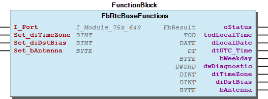

# WagoAppRTC v1.6.2.0 (WAGO) - Complete Documentation

## 📋 Library Information

- **Company:** WAGO
- **Title:** WagoAppRTC
- **Version:** 1.6.2.0
- **Categories:** WAGO LayerView|App; Application; WAGO FunctionalView|Device
- **Namespace:** WagoAppRTC
- **Author:** WAGO / u010545
- **Placeholder:** WagoAppRTC

### Description ¶

This document is automatically generated. Because of this, the chapter 30 Visualization is not shown in this document. If you are interested in getting to know more about visualization, we refer to the library manager of e!Cockpit.

This library provides functions to use the RTC module 750-640 [1]

This document is automatically generated. Because of this, the chapter 30 Visualization is not shown in this document. If you are interested in getting to know more about visualization, we refer to the library manager of e!Cockpit. This library provides functions to use the RTC module 750-640 [1]

### Contents: ¶

Contents: - Documentation Index - Project Information - Library Information - Function Blocks FbRtcBaseFunctions (FB) - FbRtcConverter (FB) Global Variable Lists - ErrorRtc (GVL) - VersionHistory (GVL) Other Components - 20 Program Organization Unit - 80 Status - GPS DCF Converter (2852-7901) - eErrorRtc (ENUM)

### Indices and tables ¶

| [1] | Based on WagoAppRTC.library, last modified 19.07.2022, 21:46:00. LibDoc 3.5.15.30 |

© WAGO Kontakttechnik GmbH & Co. KG, Germany 2018 – All rights reserved. For the avoidance of doubt, this copyright notice does not only apply to the information above but also and primarily to the described library itself. Please note that third-party products are always mentioned without reference to intellectual property rights, including patents, utility models, designs and trademarks, accordingly the existence of such rights cannot be excluded. WAGO is a registered trademark of WAGO Verwaltungsgesellschaft mbH.

- File and Project Information - Library Reference © WAGO Kontakttechnik GmbH & Co. KG, Germany 2018 – All rights reserved. For the avoidance of doubt, this copyright notice does not only apply to the information above but also and primarily to the described library itself. Please note that third-party products are always mentioned without reference to intellectual property rights, including patents, utility models, designs and trademarks, accordingly the existence of such rights cannot be excluded. WAGO is a registered trademark of WAGO Verwaltungsgesellschaft mbH.

### Documentation Index

## WagoAppRTC Library Documentation

| Company: | WAGO |
| Title: | WagoAppRTC |
| Version: | 1.6.2.0 |
| Categories: | WAGO LayerView\|App; Application; WAGO FunctionalView\|Device |
| Namespace: | WagoAppRTC |
| Author: | WAGO / u010545 |
| Placeholder: | WagoAppRTC |

### Description

This document is automatically generated. Because of this, the chapter 30 Visualization is not shown in this document. If you are interested in getting to know more about visualization, we refer to the library manager of e!Cockpit.

This library provides functions to use the RTC module 750-640 [1]

This document is automatically generated. Because of this, the chapter 30 Visualization is not shown in this document. If you are interested in getting to know more about visualization, we refer to the library manager of e!Cockpit. This library provides functions to use the RTC module 750-640 [1]

### Contents:

- 20 Program Organization Unit FbRtcBaseFunctions (FB) - GPS DCF Converter (2852-7901) 80 Status - ErrorRtc (GVL) - eErrorRtc (ENUM) VersionHistory (GVL)

### Indices and tables

| [1] | Based on WagoAppRTC.library, last modified 19.07.2022, 21:46:00. LibDoc 3.5.15.30 |

© WAGO Kontakttechnik GmbH & Co. KG, Germany 2018 – All rights reserved. For the avoidance of doubt, this copyright notice does not only apply to the information above but also and primarily to the described library itself. Please note that third-party products are always mentioned without reference to intellectual property rights, including patents, utility models, designs and trademarks, accordingly the existence of such rights cannot be excluded. WAGO is a registered trademark of WAGO Verwaltungsgesellschaft mbH.

- File and Project Information - Library Reference © WAGO Kontakttechnik GmbH & Co. KG, Germany 2018 – All rights reserved. For the avoidance of doubt, this copyright notice does not only apply to the information above but also and primarily to the described library itself. Please note that third-party products are always mentioned without reference to intellectual property rights, including patents, utility models, designs and trademarks, accordingly the existence of such rights cannot be excluded. WAGO is a registered trademark of WAGO Verwaltungsgesellschaft mbH.

### Project Information

## File and Project Information

| Scope | Name | Type | Content |
| --- | --- | --- | --- |
| FileHeader | libraryFile | string | WagoAppRTC.library |
| contentFile | WagoAppRTC_clr.json |
| productName | e!COCKPIT |
| creationDateTime | date | 19.07.2022, 21:46:04 |
| companyName | string | WAGO |
| ProjectInformation | LastModificationDateTime | date | 19.07.2022, 21:46:00 |
| Description | string | See: Description |
| Copyright | © WAGO GmbH & Co. KG, Germany 2021 – All rights reserved. |
| Author | WAGO / u010545 |
| AutoResolveUnbound | bool | True |
| Placeholder | string | WagoAppRTC |
| Company | WAGO |
| DocFormat | reStructuredText |
| Project | WagoAppRTC |
| DefaultNamespace | WagoAppRTC |
| Version | version | 1.6.2.0 |
| Title | string | WagoAppRTC |
| LibraryCategories | library-category-list | WAGO LayerView\|App; Application; WAGO FunctionalView\|Device |
| CompiledLibraryCompatibilityVersion | string | CODESYS V3.5 SP16 Patch 3 |

### Library Information

## Library Reference

This is a dictionary of all referenced libraries and their name spaces.

This is a dictionary of all referenced libraries and their name spaces.

### Standard

#### Library Identification

Placeholder: Standard Default Resolution: Standard, * (System) Namespace: Standard

#### Library Properties

| LinkAllContent: False QualifiedOnly: True | Key: Standard SystemLibrary: False | Optional: False |

### WagoSysErrorBase

#### Library Identification

Placeholder: WagoSysErrorBase Default Resolution: WagoSysErrorBase, * (WAGO) Namespace: WagoSysErrorBase

#### Library Properties

| LinkAllContent: False QualifiedOnly: False | Key: WagoSysErrorBase SystemLibrary: False | Optional: False |

#### Library Parameter

Parameter: RES_LOG_MAX_FILESIZE = 2000 Parameter: RES_LOG_MAX_FILES = 1 Parameter: RES_LOG_MAX_ENTRIES = 200 Parameter: RES_LOG_NAME = ‘WagoAppResultLogger’

### WagoSysVersion

#### Library Identification

Name: WagoSysVersion Version: 1.0.0.0 Company: WAGO Namespace: WagoSysVersion

#### Library Properties

| LinkAllContent: False QualifiedOnly: True | Key: WagoSysVersion, 1.0.0.0 (WAGO) SystemLibrary: False | Optional: False |

### WagoTypesErrorBase

#### Library Identification

Placeholder: WagoTypesErrorBase Default Resolution: WagoTypesErrorBase, * (WAGO) Namespace: WagoTypesErrorBase

#### Library Properties

| LinkAllContent: False QualifiedOnly: False | Key: WagoTypesErrorBase SystemLibrary: False | Optional: False |

### WagoTypesModule_75x_640

#### Library Identification

Placeholder: WagoTypesModule_75x_640 Default Resolution: WagoTypesModule_75x_640, * (WAGO) Namespace: WagoTypesModule_75x_640

#### Library Properties

| LinkAllContent: False Optional: False | QualifiedOnly: True Key: WagoTypesModule_75x_640 | SystemLibrary: False PublishSymbolsInContainer: True |

### Function Blocks

## FbRtcBaseFunctions (FB)

| Scope | Name | Type | Comment |
| --- | --- | --- | --- |
| Input | I_Port | WagoTypesModule_75x_640.I_Module_75x_640 |  |
| Set_diTimeZone | DINT | +/- [sec] |
| Set_diDstBias | DINT | +/- [sec] For the transition from winter time to summer time, the content of DstBias (Daylight Saving TIME) is added TO the TimeZone when the TIME is being evaluated. This way, the transition can be performed without having to change the time or time zone. |
| Set_bAntenna | BYTE | Set Type of antenna |
| Output | oStatus | WagoSysErrorBase.FbResult |  |
| todLocalTime | TOD |  |
| dLocalDate | DATE |  |
| dtUTC_Time | DT |  |
| bWeekday | BYTE | 0-> Monday, 1-> Tuesday, ... |
| dwDiagnostic | DWORD | Diagnostic |
| diTimeZone | DINT | +/- [sec] |
| diDstBias | DINT | +/- [sec] |
| bAntenna | BYTE | Actual type of antenna |

| Bit | Function |
| --- | --- |
| 0..1 | 0: No time signal reception 1: DCF77 Decoder activated 2: WWVB Decoder activated |
| 2 | DCF77 Polarity reversed 0 = Low-active 1 = High-active |

| Bit | Function |
| --- | --- |
| 0 | Antenna signal level |
| 1 | Buffer voltage too small or clock failed |
| 4 | Antenna signal not available or defect |
| 5 | Memoty not addressable |

Functionblock to support the base functions of RTC-Module 750-640.

For detailed use please read the manual of the module 750-640 .

You should always call this FB cyclic.

Graphical Illustration

Graphical Interface of FbRtcBaseFunctions

Interface variables Function Functionblock to support the base functions of RTC-Module 750-640. For detailed use please read the manual of the module 750-640 . Note You should always call this FB cyclic. Type of antenna -> bAntenna / Set_bAntenna Diagnostic -> dwDiagnostic Graphical Illustration  Graphical Interface of FbRtcBaseFunctions

## FbRtcConverter (FB)

| Scope | Name | Type | Comment | Inherited from |
| --- | --- | --- | --- | --- |
| Input | I_Port | WagoTypesModule_75x_640.I_Module_75x_640 |  | FbRtcBaseFunctions |
| Set_diTimeZone | DINT | +/- [sec] | FbRtcBaseFunctions |
| Set_diDstBias | DINT | +/- [sec] For the transition from winter time to summer time, the content of DstBias (Daylight Saving TIME) is added TO the TimeZone when the TIME is being evaluated. This way, the transition can be performed without having to change the time or time zone. | FbRtcBaseFunctions |
| Set_bAntenna | BYTE | Set Type of antenna | FbRtcBaseFunctions |
| Output | oStatus | WagoSysErrorBase.FbResult |  | FbRtcBaseFunctions |
| todLocalTime | TOD |  | FbRtcBaseFunctions |
| dLocalDate | DATE |  | FbRtcBaseFunctions |
| dtUTC_Time | DT |  | FbRtcBaseFunctions |
| bWeekday | BYTE | 0-> Monday, 1-> Tuesday, ... | FbRtcBaseFunctions |
| dwDiagnostic | DWORD | Diagnostic | FbRtcBaseFunctions |
| diTimeZone | DINT | +/- [sec] | FbRtcBaseFunctions |
| diDstBias | DINT | +/- [sec] | FbRtcBaseFunctions |
| bAntenna | BYTE | Actual type of antenna | FbRtcBaseFunctions |

| Bit | Function |
| --- | --- |
| 0..1 | 0: No time signal reception 1: DCF77 Decoder activated 2: WWVB Decoder activated |
| 2 | DCF77 Polarity reversed 0 = Low-active 1 = High-active |

| Bit | Function |
| --- | --- |
| 0 | Antenna signal level |
| 1 | Buffer voltage too small or clock failed |
| 4 | Antenna signal not available or defect |
| 5 | Memoty not addressable |

Functionblock to support the base functions of GPS-DCF-Konverter 2852-7901. .. _manual of the device 2852-7901: https://www.wago.com/de/d/11050 .. _manual of the module 750-640: https://www.wago.com/de/io-systeme/real-time-clock-modul/p/750-640#details

For detailed use please read the manual of the module 750-640 .

You should always call this FB cyclic.

Graphical Illustration

Graphical Interface of FbRtcBaseFunctions

Interface variables Function Functionblock to support the base functions of GPS-DCF-Konverter 2852-7901. .. _manual of the device 2852-7901: https://www.wago.com/de/d/11050 .. _manual of the module 750-640: https://www.wago.com/de/io-systeme/real-time-clock-modul/p/750-640#details For detailed use please read the manual of the module 750-640 . Note You should always call this FB cyclic. Type of antenna -> bAntenna / Set_bAntenna Diagnostic -> dwDiagnostic Graphical Illustration Graphical Interface of FbRtcBaseFunctions

### Global Variable Lists

## ErrorRtc (GVL)

| Value | Level | Description |
| --- | --- | --- |
| eErrorRtc.OK | eSeverity.info | ‘OK’ |
| eErrorRtc.BUSY | eSeverity.info | ‘Service is busy’ |
| eErrorRtc.INVALID_MODULE | eSeverity.error | ‘Invalid module’ |

## VersionHistory (GVL)

| date | version | author | change |
| 20.06.2022 | 1.6.2.0 | u0103719 | WAT33940: add FbRtcConverter |
| 28.10.2021 | 1.6.1.2 | u010545 | Set Timezone/DstBias/Antenna after PowerUp |
| 18.08.2019 | 1.6.1.1 | u010545 | Licensekey removed |
| 08.01.2019 | 1.6.1.0 | u015842 | Properties: free placeholder added |
| 24.09.2017 | 1.6.0.4 | u010545 | update documentation -> update for generate pdf |
| 13.06.2017 | 1.6.0.3 | WAGO / u013972 | remove WagoTypesCom_Internal |
| 26.09.2016 | 1.6.0.2 | u010545 | update documentation |
| 05.07.2016 | 1.6.0.1 | u010545 | createtable error table |
| 02.03.2016 | 1.6.0.0 | u010545 | WagoAppErrorBase changed to WagoSysErrorBase / WagoTypesErrorBase |
| 19.01.2016 | 1.5.0.3 | u010545 | VersionHistory -> always bind |
| 01.10.2015 | 0.0.0.3 | u010545 | categories modified |
| 30.09.2015 | 0.0.0.2 | u010545 | placeholder at librarymanger included |
| 16.09.2015 | 0.0.0.1 | u010545 | created |

### Other Components

## 20 Program Organization Unit

- FbRtcBaseFunctions (FB) - GPS DCF Converter (2852-7901) FbRtcConverter (FB)

## 80 Status ¶

- ErrorRtc (GVL) - eErrorRtc (ENUM)

## GPS DCF Converter (2852-7901)

- FbRtcConverter (FB)

## eErrorRtc (ENUM)

| Name | Initial |
| --- | --- |
| OK | 0 |
| BUSY | 1 |
| INVALID_MODULE | 2 |