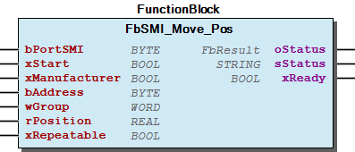
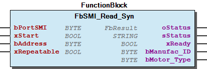

# WagoAppSMI v1.2.0.7 (WAGO) - Complete Documentation

## 📋 Library Information

- **Company:** WAGO
- **Title:** WagoAppSMI
- **Version:** 1.2.0.7
- **Categories:** Application; WAGO LayerView|App; WAGO BusinessView|Building Automation
- **Namespace:** WagoAppSMI
- **Author:** WAGO / u090996
- **Placeholder:** WagoAppSMI

### Description ¶

This document is automatically generated.

This library is for standard motor interface (SMI) drives.

The function blocks of this library are NOT thread safe and must be called from one CODESYS task only! Concurrent calls from different tasks may cause loss or corruption of data.

This document is automatically generated. This library is for standard motor interface (SMI) drives. The function blocks of this library are NOT thread safe and must be called from one CODESYS task only! Concurrent calls from different tasks may cause loss or corruption of data.

### Contents: ¶

Contents: - Documentation Index 10 Documentation - WagoAppSMI Library Documentation Project Information Library Information Function Blocks - FbSMI_Addressing (FB) - FbSMI_Diagnostic (FB) - FbSMI_Down (FB) - FbSMI_Master (FB) - FbSMI_Motor (FB) - FbSMI_Move_Pos (FB) - FbSMI_Move_Pos1 (FB) - FbSMI_Move_Pos2 (FB) - FbSMI_Move_Pos_Turn (FB) - FbSMI_Read_Par (FB) - ... and 16 more Program Organization Internal Components - 90 Internal - Internal Global Variable Lists - Status (GVL) - VersionHistory (GVL) Other Components - 01 Template - 10 Communication - 20 Basic Commands - 29 Types - 30 Adressing - 30 Visualizations - 40 Motor - 50 Parametrization - 60 Visualization - 70 Enumerations - ... and 17 more

### Indices and tables ¶

Based on WagoAppSMI.library, last modified 29.05.2024, 20:23:58. LibDoc 3.5.16.10

© WAGO GmbH & Co. KG, Germany 2018 – All rights reserved. For the avoidance of doubt, this copyright notice does not only apply to the information above but also and primarily to the described library itself. Please note that third-party products are always mentioned without reference to intellectual property rights, including patents, utility models, designs and trademarks, accordingly the existence of such rights cannot be excluded. WAGO is a registered trademark of WAGO Verwaltungsgesellschaft mbH.

- File and Project Information - Library Reference Based on WagoAppSMI.library, last modified 29.05.2024, 20:23:58. LibDoc 3.5.16.10 © WAGO GmbH & Co. KG, Germany 2018 – All rights reserved. For the avoidance of doubt, this copyright notice does not only apply to the information above but also and primarily to the described library itself. Please note that third-party products are always mentioned without reference to intellectual property rights, including patents, utility models, designs and trademarks, accordingly the existence of such rights cannot be excluded. WAGO is a registered trademark of WAGO Verwaltungsgesellschaft mbH.

### Documentation Index

## 10 Documentation

To ensure fast installation and start-up of the units, we strongly recommend that the following information and explanations are carefully read and adhered to.

To ensure fast installation and start-up of the units, we strongly recommend that the following information and explanations are carefully read and adhered to. - doc01_Foreword (FB)

## WagoAppSMI Library Documentation

| Company: | WAGO |
| Title: | WagoAppSMI |
| Version: | 1.2.0.7 |
| Categories: | Application; WAGO LayerView\|App; WAGO BusinessView\|Building Automation |
| Namespace: | WagoAppSMI |
| Author: | WAGO / u090996 |
| Placeholder: | WagoAppSMI |

### Description

This document is automatically generated.

This library is for standard motor interface (SMI) drives.

The function blocks of this library are NOT thread safe and must be called from one CODESYS task only! Concurrent calls from different tasks may cause loss or corruption of data.

This document is automatically generated. This library is for standard motor interface (SMI) drives. The function blocks of this library are NOT thread safe and must be called from one CODESYS task only! Concurrent calls from different tasks may cause loss or corruption of data.

### Contents:

- 10 Documentation doc01_Foreword (FB) 20 Program Organization Units - 10 Communication - 20 Basic Commands - 30 Adressing - 40 Motor - 50 Parametrization 29 Types - typSMI_Adressing (STRUCT) - typSMI_Config (STRUCT) - typSMI_SlaveID (STRUCT) - typSMI_SlaveIDList (ALIAS) 30 Visualizations 80 Status - Status (GVL) - eStatus (ENUM) 90 Internal - 60 Visualization - 70 Enumerations GlobalTextList (Text List) ParameterList (PARAMS) VersionHistory (GVL)

### Indices and tables

Based on WagoAppSMI.library, last modified 29.05.2024, 20:23:58. LibDoc 3.5.16.10

© WAGO GmbH & Co. KG, Germany 2018 – All rights reserved. For the avoidance of doubt, this copyright notice does not only apply to the information above but also and primarily to the described library itself. Please note that third-party products are always mentioned without reference to intellectual property rights, including patents, utility models, designs and trademarks, accordingly the existence of such rights cannot be excluded. WAGO is a registered trademark of WAGO Verwaltungsgesellschaft mbH.

- File and Project Information - Library Reference Based on WagoAppSMI.library, last modified 29.05.2024, 20:23:58. LibDoc 3.5.16.10 © WAGO GmbH & Co. KG, Germany 2018 – All rights reserved. For the avoidance of doubt, this copyright notice does not only apply to the information above but also and primarily to the described library itself. Please note that third-party products are always mentioned without reference to intellectual property rights, including patents, utility models, designs and trademarks, accordingly the existence of such rights cannot be excluded. WAGO is a registered trademark of WAGO Verwaltungsgesellschaft mbH.

### Project Information

## File and Project Information

| Scope | Name | Type | Content |
| --- | --- | --- | --- |
| FileHeader | libraryFile | string | WagoAppSMI.library |
| contentFile | doc.clean.json |
| productName | e!COCKPIT |
| creationDateTime | date | 29.05.2024, 20:24:10 |
| companyName | string | WAGO |
| ProjectInformation | LastModificationDateTime | date | 29.05.2024, 20:23:58 |
| Description | string | See: Description |
| Copyright | © WAGO Kontakttechnik GmbH & Co. KG, Germany 2018 – All rights reserved. |
| Author | WAGO / u090996 |
| AutoResolveUnbound | bool | True |
| Placeholder | string | WagoAppSMI |
| Company | WAGO |
| DocFormat | reStructuredText |
| Project | WagoAppSMI |
| DefaultNamespace | WagoAppSMI |
| Version | version | 1.2.0.7 |
| ThreadSave | bool | False |
| Title | string | WagoAppSMI |
| LibraryCategories | library-category-list | Application; WAGO LayerView\|App; WAGO BusinessView\|Building Automation |
| CompiledLibraryCompatibilityVersion | string | CODESYS V3.5 SP16 Patch 3 |

### Library Information

## Library Reference

| LinkAllContent: False QualifiedOnly: False | SystemLibrary: False | Optional: False |

| LinkAllContent: False QualifiedOnly: False | SystemLibrary: False | Optional: False |

| LinkAllContent: False QualifiedOnly: False | SystemLibrary: True | Optional: False |

| LinkAllContent: False QualifiedOnly: False | SystemLibrary: True | Optional: False |

| LinkAllContent: False QualifiedOnly: False | SystemLibrary: True | Optional: False |

| LinkAllContent: False QualifiedOnly: False | SystemLibrary: True | Optional: False |

| LinkAllContent: False QualifiedOnly: False | SystemLibrary: True | Optional: False |

| LinkAllContent: False QualifiedOnly: False | SystemLibrary: True | Optional: False |

| LinkAllContent: False QualifiedOnly: False | SystemLibrary: True | Optional: False |

| LinkAllContent: False QualifiedOnly: False | SystemLibrary: True | Optional: False |

| LinkAllContent: False QualifiedOnly: False | SystemLibrary: True | Optional: False |

| LinkAllContent: False QualifiedOnly: False | SystemLibrary: True | Optional: False |

| LinkAllContent: False QualifiedOnly: False | SystemLibrary: True | Optional: False |

| LinkAllContent: False Optional: False | QualifiedOnly: False SystemLibrary: True | PublishSymbolsInContainer: True |

| LinkAllContent: False QualifiedOnly: False | SystemLibrary: True | Optional: False |

| LinkAllContent: False QualifiedOnly: True | SystemLibrary: False | Optional: False |

| LinkAllContent: False QualifiedOnly: False | SystemLibrary: False | Optional: False |

| LinkAllContent: False QualifiedOnly: False | SystemLibrary: False | Optional: False |

| LinkAllContent: False QualifiedOnly: False | SystemLibrary: False PublishSymbolsInContainer: True | Optional: False |

| LinkAllContent: False QualifiedOnly: False | SystemLibrary: False | Optional: False |

| LinkAllContent: False QualifiedOnly: False | SystemLibrary: False | Optional: False |

| LinkAllContent: False QualifiedOnly: False | SystemLibrary: False | Optional: False |

| LinkAllContent: False Optional: False | QualifiedOnly: False SystemLibrary: False | PublishSymbolsInContainer: True |

| LinkAllContent: False Optional: False | QualifiedOnly: True SystemLibrary: False | PublishSymbolsInContainer: True |

| LinkAllContent: False QualifiedOnly: False | SystemLibrary: False | Optional: False |

| LinkAllContent: False QualifiedOnly: False | SystemLibrary: False | Optional: False |

This is a dictionary of all referenced libraries and their name spaces.

This is a dictionary of all referenced libraries and their name spaces. Standard Library Identification : Placeholder: Standard Default Resolution: Standard, * (System) Namespace: Standard Library Properties : VisuDialogs Library Identification : Placeholder: VisuDialogs Default Resolution: VisuDialogs, * (System) Namespace: VisuDialogs Library Properties : VisuElem3DPath Library Identification : Placeholder: System_VisuElem3DPath Default Resolution: VisuElem3DPath, 3.5.10.0 (System) Namespace: VisuElem3DPath Library Properties : Library Parameter : Parameter: GC_POINTS_PER_POLYGON = 100 VisuElemCamDisplayer Library Identification : Placeholder: System_VisuElemCamDisplayer Default Resolution: VisuElemCamDisplayer, 3.5.10.0 (System) Namespace: VisuElemCamDisplayer Library Properties : Library Parameter : Parameter: GC_POINTS_PER_CAM = 100 VisuElemMeter Library Identification : Placeholder: System_VisuElemMeter Default Resolution: VisuElemMeter, 3.5.10.0 (System) Namespace: VisuElemMeter Library Properties : VisuElemTextEditor Library Identification : Placeholder: System_VisuElemTextEditor Default Resolution: VisuElemTextEditor, 3.5.10.0 (System) Namespace: VisuElemTextEditor Library Properties : VisuElemTrace Library Identification : Placeholder: System_VisuElemTrace Default Resolution: VisuElemTrace, 3.5.10.0 (System) Namespace: VisuElemTrace Library Properties : VisuElemXYChart Library Identification : Placeholder: System_VisuElemXYChart Default Resolution: VisuElemXYChart, 3.5.16.30 (System) Namespace: VisuElemXYChart Library Properties : VisuElems Library Identification : Placeholder: System_VisuElems Default Resolution: VisuElems, 3.5.10.0 (System) Namespace: VisuElems Library Properties : VisuElemsAlarm Library Identification : Placeholder: System_VisuElemsAlarm Default Resolution: VisuElemsAlarm, 3.5.10.0 (System) Namespace: VisuElemsAlarm Library Properties : VisuElemsDateTime Library Identification : Placeholder: System_VisuElemsDateTime Default Resolution: VisuElemsDateTime, 3.5.10.0 (System) Namespace: VisuElemsDateTime Library Properties : VisuElemsSpecialControls Library Identification : Placeholder: System_VisuElemsSpecialControls Default Resolution: VisuElemsSpecialControls, 3.5.10.0 (System) Namespace: VisuElemsSpecialControls Library Properties : VisuElemsWinControls Library Identification : Placeholder: System_VisuElemsWinControls Default Resolution: VisuElemsWinControls, 3.5.10.0 (System) Namespace: VisuElemsWinControls Library Properties : VisuInputs Library Identification : Placeholder: system_visuinputs Default Resolution: VisuInputs, 3.5.16.30 (System) Namespace: visuinputs Library Properties : VisuNativeControl Library Identification : Placeholder: System_VisuNativeControl Default Resolution: VisuNativeControl, 3.5.10.0 (System) Namespace: VisuNativeControl Library Properties : VisuSymbols Library Identification : Placeholder: VisuSymbols Default Resolution: VisuSymbols, * (System) Namespace: VisuSymbols Library Properties : WagoAppSocket Library Identification : Name: WagoAppSocket Version: newest Company: WAGO Namespace: WagoAppSocket Library Properties : Library Parameter : Parameter: ASYNC_MODE = WagoTypes.eSchedulingMode.Background Parameter: UIMULTICONNECT_NINSTANCELISTSIZE = 20 Parameter: UIBACKLOGDEFAULT = 5 Parameter: TMULTICONNECT_TIMEOUT = TIME#0ms WagoAppString Library Identification : Placeholder: WagoAppString Default Resolution: WagoAppString, * (WAGO) Namespace: WagoAppString Library Properties : WagoSysErrorBase Library Identification : Placeholder: WagoSysErrorBase Default Resolution: WagoSysErrorBase, * (WAGO) Namespace: WagoSysErrorBase Library Properties : Library Parameter : Parameter: RES_LOG_MAX_FILESIZE = 2000 Parameter: RES_LOG_MAX_FILES = 1 Parameter: RES_LOG_MAX_ENTRIES = 200 Parameter: RES_LOG_NAME = ‘WagoAppResultLogger’ WagoSysModuleBase Library Identification : Placeholder: WagoSysModuleBase Default Resolution: WagoSysModuleBase, * (WAGO) Namespace: WagoSysModuleBase Library Properties : Library Parameter : Parameter: MAX_MBX_OUTPUT_SIZE = 47 Parameter: MAX_MODULE_QUANTITY = 250 Parameter: MAX_MODULE_INPUT_SIZE = 48 Parameter: MAX_RUNNABLES = MAX_MODULE_QUANTITY Parameter: MBX_PIPE_SIZE = 1024 Parameter: MAX_MODULE_OUTPUT_SIZE = 48 Parameter: MAX_MBX_INPUT_SIZE = 47 WagoSysPlainMem Library Identification : Placeholder: WagoSysPlainMem Default Resolution: WagoSysPlainMem, * (WAGO) Namespace: WagoSysPlainMem Library Properties : WagoSysVersion Library Identification : Name: WagoSysVersion Version: 1.0.0.0 Company: WAGO Namespace: WagoSysVersion Library Properties : WagoTypesCommon Library Identification : Placeholder: WagoTypesCommon Default Resolution: WagoTypesCommon, * (WAGO) Namespace: WagoTypes Library Properties : WagoTypesModuleBase Library Identification : Placeholder: WagoTypesModuleBase Default Resolution: WagoTypesModuleBase, * (WAGO) Namespace: WagoTypesModuleBase Library Properties : WagoTypesModule_753_163x Library Identification : Placeholder: WagoTypesModule_753_163x Default Resolution: WagoTypesModule_753_163x, * (WAGO) Namespace: WagoTypesModule_753_163x Library Properties : WagoVisuIcons Library Identification : Placeholder: WagoVisuIcons Default Resolution: WagoVisuIcons, * (WAGO) Namespace: WagoVisuIcons Library Properties :

### Function Blocks

## FbSMI_Addressing (FB)

| Scope | Name | Type | Initial | Comment |
| --- | --- | --- | --- | --- |
| Input | bPortSMI | BYTE | 1 | Relative number of the inserted SMI I/O module 753-163x in the node |
| xNewAddressing | BOOL |  | Start signal for new addressing of SMI slaves |
| xExtendedAddressing | BOOL |  | Start signal for addressing SMI slaves for system extension |
| xAbortAddressing | BOOL |  | Reset or stop the addressing |
| xSwap_Address | BOOL |  | Swap addresses |
| bSwapSlave_Adr_1 | BYTE |  | First address swap (Range of values: 0-15) |
| bSwapSlave_Adr_2 | BYTE |  | Second address swap (Range of values: 0-15) |
| Output | oStatus | WagoSysErrorBase.FbResult |  | Error object. (Listed in eStatus ) The content of the error object could be displayed via the FbShowResult from the WagoSysErrorBase library. |
| sStatus | STRING |  | Error description as string (Listed in eStatus ) |
| xReady | BOOL | TRUE | TRUE = communication deactivated, FALSE = communication activated |
| bNumber | BYTE |  | Number of connected SMI slaves |
| Inout | typSMI_SlaveID | typSMI_SlaveIDList |  | Structure of the connected SMI line see typSMI_SlaveIDList |

The FbSMI_Addressing module is used to assign drive addresses. Each drive has a unique SlaveID. It is normally unknown at commissioning and is automatically determined by the module. With the specified SlaveID, one of the 16 addresses (0-15) is assigned to each drive. The function block may only be used with the SMI master function block ( FbSMI_Master ).

Graphical Illustration

Graphical Interface of FbSMI_Addressing

Function description

The relative number of the inserted SMI I/O module 753-163x is selected via the bPortSMI input.

The following functions are carried out by the function block: - If a rising edge is identified at the xNewAddressing input, then all drives connected to the SMI interface are assigned an address (0-15). - When a rising edge is identified at input xExtendedAddressing , only the SMI drives newly added are addressed. - An ongoing addressing process can be interrupted from a rising edge at input xReset . - After automatic addressing is completed, the addresses can be manually swapped or moved to an open address. A rising edge at the input xSwap_Address means that the addresses specified at the inputs bSwapSlave_Adr_1 and bSwapSlave_Adr_2 are swapped.

The typSMI_SlaveID variable contains a list in which the reference between the slave addresses (0-15) and the 32-bit SlaveIDs is represented. In addition, the list contains the manufacture ID of the drives and a possibly assigned comment. This is illustrated in the following:

Communication with the SMI I/O module is activated when the xReady output is FALSE. An active running addressing operation is signaled in addition. During this time, the other SMI modules are disabled in the program call. After the communication is completed, the output switches to TRUE. Addressing errors are displayed at the output sStatus .

The output bNumber shows the number of drives found during the automatic addressing procedure.

Please note that the other SMI modules are blocked in the program call during automatic addressing. It is then impossible, for example, to stop an ongoing motion command of a drive.

An addressing operation can take several minutes. The time depends on the number of SMI slaves connected and the program cycle time. A signal change from FALSE to TRUE of the output “xReady” indicates that addressing is complete.

Interface variables Function: The FbSMI_Addressing module is used to assign drive addresses. Each drive has a unique SlaveID. It is normally unknown at commissioning and is automatically determined by the module. With the specified SlaveID, one of the 16 addresses (0-15) is assigned to each drive. The function block may only be used with the SMI master function block ( FbSMI_Master ). Graphical Illustration  Graphical Interface of FbSMI_Addressing Function description The relative number of the inserted SMI I/O module 753-163x is selected via the bPortSMI input. The following functions are carried out by the function block: - If a rising edge is identified at the xNewAddressing input, then all drives connected to the SMI interface are assigned an address (0-15). - When a rising edge is identified at input xExtendedAddressing , only the SMI drives newly added are addressed. - An ongoing addressing process can be interrupted from a rising edge at input xReset . - After automatic addressing is completed, the addresses can be manually swapped or moved to an open address. A rising edge at the input xSwap_Address means that the addresses specified at the inputs bSwapSlave_Adr_1 and bSwapSlave_Adr_2 are swapped. The typSMI_SlaveID variable contains a list in which the reference between the slave addresses (0-15) and the 32-bit SlaveIDs is represented. In addition, the list contains the manufacture ID of the drives and a possibly assigned comment. This is illustrated in the following: Example  Communication with the SMI I/O module is activated when the xReady output is FALSE. An active running addressing operation is signaled in addition. During this time, the other SMI modules are disabled in the program call. After the communication is completed, the output switches to TRUE. Addressing errors are displayed at the output sStatus . The output bNumber shows the number of drives found during the automatic addressing procedure. Note Please note that the other SMI modules are blocked in the program call during automatic addressing. It is then impossible, for example, to stop an ongoing motion command of a drive. Note An addressing operation can take several minutes. The time depends on the number of SMI slaves connected and the program cycle time. A signal change from FALSE to TRUE of the output “xReady” indicates that addressing is complete.

## FbSMI_Diagnostic (FB)

| Scope | Name | Type | Initial | Comment |
| --- | --- | --- | --- | --- |
| Input | bPortSMI | BYTE | 1 | Relative number of the inserted SMI I/O module 753-163x in the node |
| xStart | BOOL |  | A rising edge starts the command |
| xManufacturer | BOOL |  | Activation of manufacturer address |
| bAddress | BYTE |  | Slave address or manufacturer’s address |
| xRepeatable | BOOL | TRUE | In case of SMI transmission errors, the command will be repeated up to two times |
| Output | oStatus | WagoSysErrorBase.FbResult |  | Error object. (Listed in eStatus ) The content of the error object could be displayed via the FbShowResult from the WagoSysErrorBase library. |
| sStatus | STRING |  | Error description as string (Listed in eStatus ) |
| xReady | BOOL | TRUE | TRUE = communication deactivated, FALSE = communication activated |
| eSMI_Diagnostic | eSMI_Diagnostic |  | Response to diagnostic command: SMI_163x_IDLE SMI_163x_UP_DOWN_STOP SMI_163x_UP_DOWN SMI_163x_UP_STOP SMI_163x_ALL_UP SMI_163x_DOWN_STOP SMI_163x_ALL_DOWN SMI_163x_ALL_STOP SMI_163x_INVALID |
| xMotor_Failure | BOOL |  | Indication of motor failure |

Graphical Illustration

Graphical Interface of FbSMI_Diagnostic

Function description

The relative number of the inserted SMI I/O module 753-163x is selected via the bPortSMI input.

The request for a diagnostic response is initiated by a rising edge at the xStart input.

The inputs xManufacturer and bAddress define whether the function block communicates with one or several SMI slaves.

The following addressing types are possible:

Communication with the SMI interface is activated when the xReady output is FALSE. After the communication is completed, the output switches to the TRUE signal. An error can be identified by the current communication status as displayed at output sStatus .

The eSMI_Diagnostic output returns the diagnostic response. The response can be used to deduce which motion commands (if any) are to be executed. A readout is also made to detect a possible drive failure. The status of this request is displayed at the xMotor_Failure output.

The input xRepeatable set to false is only valid from SMI-master-module-FW-version 01.02.00.

Interface variables Function: The FbSMI_Diagnostic function block makes it possible to initiate the request for an SMI diagnostic response. The function block may only be used with the SMI master function block ( FbSMI_Master ). Graphical Illustration  Graphical Interface of FbSMI_Diagnostic Function description The relative number of the inserted SMI I/O module 753-163x is selected via the bPortSMI input. The request for a diagnostic response is initiated by a rising edge at the xStart input. The inputs xManufacturer and bAddress define whether the function block communicates with one or several SMI slaves. The following addressing types are possible: - Broadcast xManufacturer = TRUE bAddress = 0 - Manufacturer addressing xManufacturer = TRUE bAddress = manufacturer address 1-15 - Random addressing xManufacturer = FALSE bAddress = 0-15 Communication with the SMI interface is activated when the xReady output is FALSE. After the communication is completed, the output switches to the TRUE signal. An error can be identified by the current communication status as displayed at output sStatus . The eSMI_Diagnostic output returns the diagnostic response. The response can be used to deduce which motion commands (if any) are to be executed. A readout is also made to detect a possible drive failure. The status of this request is displayed at the xMotor_Failure output. Note The input xRepeatable set to false is only valid from SMI-master-module-FW-version 01.02.00.

## FbSMI_Down (FB)

| Scope | Name | Type | Initial | Comment |
| --- | --- | --- | --- | --- |
| Input | bPortSMI | BYTE | 1 | Relative number of the inserted SMI I/O module 753-163x in the node |
| xStart | BOOL |  | A rising edge starts the command |
| xManufacturer | BOOL |  | Activation of manufacturer address |
| bAddress | BYTE |  | Slave address or manufacturer’s address |
| wGroup | WORD |  | Group mask with binary-coded slave address: Bit_0 = slave address 0 Bit_1 = slave address 1 etc |
| xRepeatable | BOOL | TRUE | In case of SMI transmission errors, the command will be repeated up to two times |
| Output | oStatus | WagoSysErrorBase.FbResult |  | Error object. (Listed in eStatus ) The content of the error object could be displayed via the FbShowResult from the WagoSysErrorBase library. |
| sStatus | STRING |  | Error description as string (Listed in eStatus ) |
| xReady | BOOL | TRUE | TRUE = communication deactivated, FALSE = communication activated |

Graphical Illustration

Graphical Interface of FbSMI_Down

Function description

The relative number of the inserted SMI I/O module 753-163x is selected via the bPortSMI input.

The command is sent by a rising edge at the xStart input.

The three inputs xManufacturer , bAddress and wGroup define whether the function block communicates with one or several SMI slaves.

The following addressing types are possible:

Communication with the SMI interface is activated when the xReady output is FALSE. After the communication is completed, the output switches to the TRUE signal. An error can be identified by the current communication status as displayed at output sStatus .

The input xRepeatable set to false is only valid from SMI-master-module-FW-version 01.02.00.

Interface variables Function: The FbSMI_Down function block sends commands for the DOWN motion command. The function block may only be used with the SMI master function block ( FbSMI_Master ). Graphical Illustration  Graphical Interface of FbSMI_Down Function description The relative number of the inserted SMI I/O module 753-163x is selected via the bPortSMI input. The command is sent by a rising edge at the xStart input. The three inputs xManufacturer , bAddress and wGroup define whether the function block communicates with one or several SMI slaves. The following addressing types are possible: - Broadcast xManufacturer = TRUE bAddress = 0 - Manufacturer addressing xManufacturer = TRUE bAddress = manufacturer address 1-15 - Random addressing xManufacturer = FALSE bAddress = 0-15 - Group addressing xManufacturer = TRUE bAddress = 0-15 wGroup = eg., (2#0000 0000 0001 0001) for slave addresses 0 and 4 Communication with the SMI interface is activated when the xReady output is FALSE. After the communication is completed, the output switches to the TRUE signal. An error can be identified by the current communication status as displayed at output sStatus . Note The input xRepeatable set to false is only valid from SMI-master-module-FW-version 01.02.00.

## FbSMI_Master (FB)

| Scope | Name | Type | Comment |
| --- | --- | --- | --- |
| Input | bPortSMI | BYTE | Specifies which SMI module is to be addressed at the controller. Counting is from left to right. |
| I_Port | WagoTypesModule_753_163x.I_Module_753_163x | Interface to the 753-163x module |
| xEnableEnergySaverMode | BOOL | Set module in energy saver mode |
| Output | oStatus | WagoSysErrorBase.FbResult | Error object. (Listed in eStatus ) The content of the error object could be displayed via the FbShowResult from the WagoSysErrorBase library. |
| sStatus | STRING | Error description as string (Listed in eStatus ) |
| xEnergySaverMode | BOOL | Shows status of the energy saver mode (True := active, False := inactive) |
| xStateDigIn | BOOL | Shows status of the digitial input (True := high level, False := low level) |

The FbSMI_Master function block is required for connection of the SMI master module (753-1630) and the SMI master module LoVo (753-1631) to the WAGO-I/O-SYSTEM. All other function blocks communicate with the SMI Multi-Master module via this function block.

Graphical Illustration

Graphical Interface of FbSMI_Master

Function description

The FBSMI_Master function block enables access to the WAGO-SMI-configurator while the PLC is running. I_Port must be connected with the SMI interface for example: IoConfig_Globals.SMI_Master230_VAC bPortSMI must be connect to the other function blocks.

The SMI I/O module can be put into energy saving mode via the xEnableEnergySaverMode input. If this input is active, only SMI commands for motions are sent out. After a send out command the energy saving mode will be left by the module. To entry energy saving mode again a new rising edge via xEnableEnergySaverMode input is required. Via the xEnergySaverMode output, the current status of the energy saving mode of the SMI I/O module is displayed.

The SMI I/O module can be put into energy saving mode via the xEnableEnergySaverMode input. If the SMI I/O module is in energy saving mode, you can exit energy saving mode via the following travel commands:

Sending additional SMI commands is disabled. If a travel command is sent, there must be a rising edge at the “xEnableEnergySaverMode” input to change the SMI I/O module to energy saving mode.

An error can be identified by the current communication status as displayed at output sStatus . The xStateDigIn output signals the status of the digital input of the SMI I/O module.

All SMI function blocks should be called up in cycles within the same program task as the FbSMI_Master function block. The assignment of SMI I/O modules to the FbSMI_Master module must be performed with constants; otherwise run-time errors can occur.

Interface variables Function: The FbSMI_Master function block is required for connection of the SMI master module (753-1630) and the SMI master module LoVo (753-1631) to the WAGO-I/O-SYSTEM. All other function blocks communicate with the SMI Multi-Master module via this function block. Graphical Illustration  Graphical Interface of FbSMI_Master Function description The FBSMI_Master function block enables access to the WAGO-SMI-configurator while the PLC is running. I_Port must be connected with the SMI interface for example: IoConfig_Globals.SMI_Master230_VAC bPortSMI must be connect to the other function blocks. The SMI I/O module can be put into energy saving mode via the xEnableEnergySaverMode input. If this input is active, only SMI commands for motions are sent out. After a send out command the energy saving mode will be left by the module. To entry energy saving mode again a new rising edge via xEnableEnergySaverMode input is required. Via the xEnergySaverMode output, the current status of the energy saving mode of the SMI I/O module is displayed. The SMI I/O module can be put into energy saving mode via the xEnableEnergySaverMode input. If the SMI I/O module is in energy saving mode, you can exit energy saving mode via the following travel commands: - DOWN - UP - STOP - Step DOWN - Step UP - Move into position - Move into position 1 - Move into position 2 Sending additional SMI commands is disabled. If a travel command is sent, there must be a rising edge at the “xEnableEnergySaverMode” input to change the SMI I/O module to energy saving mode. An error can be identified by the current communication status as displayed at output sStatus . The xStateDigIn output signals the status of the digital input of the SMI I/O module. Note All SMI function blocks should be called up in cycles within the same program task as the FbSMI_Master function block. The assignment of SMI I/O modules to the FbSMI_Master module must be performed with constants; otherwise run-time errors can occur.

## FbSMI_Motor (FB)

| Scope | Name | Type | Initial | Comment |
| --- | --- | --- | --- | --- |
| Input | bPortSMI | BYTE | 1 | Relative number of the inserted SMI I/O module 753-163x in the node |
| bAddress | BYTE |  | Slave Addresss |
| wGroup | WORD |  | Group mask with binary-coded slave address: Bit_0 = slave address 0 Bit_1 = slave address 1 etc |
| xUp | BOOL |  | Switch command Blind/Lamella UPp |
| xDown | BOOL |  | Switch command Blind/Lamella DOWNn |
| xSafetyPosition | BOOL |  | Signal input: safety positionn |
| xLockBlind | BOOL |  | Blind lock, see warning below! |
| xSetPosition | BOOL |  | Move into position |
| rSetPosition_Blind | REAL |  | Height position of the Blind [%] 0% = Upper end position 100% = Lower end position |
| rSetPosition_Lamella | REAL |  | Lamella position of the Blind [%] 0% = Upper end position 100% = Lower end position |
| xMoveToShadowPosition | BOOL |  | Move to shadow position |
| rShadowPosition_Blind | REAL |  | Height position of the Blind [%] 0% = Upper end position 100% = Lower end position |
| rShadowPosition_Lamella | REAL |  | Lamella position of the Blind [%] 0% = Upper end position 100% = Lower end position |
| xSetOverride | BOOL |  | Set the manual override |
| xResetOverride | BOOL |  | Reset the manual override |
| typSMI_Config | typSMI_Config |  | SMI - Configuration data |
| Output | oStatus | WagoSysErrorBase.FbResult |  | Error object. (Listed in eStatus ) The content of the error object could be displayed via the FbShowResult from the WagoSysErrorBase library. |
| sStatus | STRING |  | Error description as string (Listed in eStatus ) |
| xReady | BOOL | TRUE | TRUE = communication deactivated, FALSE = communication activated |
| rPosition_Blind | REAL |  | Position of the Blind [%] |
| rPosition_Lamella | REAL | 255 | Position of the lamella [%] |
| xAutomaticOverride | BOOL |  | Manual override |

The FbSMI_Motor function block controls Blinds with an SMI interface. The module provides the following control functions:

Do not send movement commands in PLC mode when controller lock is active! The movement commands executed via the SMI Configurator have higher priority than any controller lock set in the PLC software. Therefore, it is possible to move the SMI drives even when the controller lock is active. This only applies if the SMI Configurator is connected to an SMI master module via PLC mode. Any time you send movement commands with the SMI Configurator via PLC mode, first check whether the controller lock is active. Do not send movement commands with the SMI Configurator as long as the controller lock is active.

The function block may only be used with the SMI master function block ( FbSMI_Master ).

Graphical Illustration

Graphical Interface of FbSMI_Motor

Function description

The relative number of the inserted SMI I/O module 753-163x is selected via the bPortSMI input.

The two inputs bAddress and wGroup define whether the function block communicates with one or several SMI slaves. Performing group addressing is prioritized.

The following addressing types are possible:

The SMI drive is controlled by two button inputs: xUP and xDOWN. An extended button press on one of these inputs (longer than the configured time, typSMI_Config.tShortPressTime ) causes the drive to move to the upper or lower end position (configured at the drive). If the input signal is shorter than the configured time, a STOP telegram or telegram indicating lamella shift is sent.

The configurable safety position (upper end position) of the Blind (e.g., for the wind alarm) can be controlled via the xSafetyPosition input. When the blind has been moved to the safety position, it cannot be manually controlled until the xSafetyPosition input has been reset. For safety reasons, the function block sends the UP motion command every 3 minutes if the safety position is activated.

The xLockBlind can lock the blind control. Current motion commands are not canceled. If the xLock input is TRUE, the blind can only be moved to the safety position (e.g., for the wind alarm).

Do not send movement commands in PLC mode when controller lock is active! The movement commands executed via the SMI Configurator have higher priority than any controller lock set in the PLC software. Therefore, it is possible to move the SMI drives even when the controller lock is active. This only applies if the SMI Configurator is connected to an SMI master module via PLC mode. Any time you send movement commands with the SMI Configurator via PLC mode, first check whether the controller lock is active. Do not send movement commands with the SMI Configurator as long as the controller lock is active.

A rising edge at the xSetPosition input means that a motion command to the positions specified at the rSetPosition_Blind and rSetPosition_Blind inputs is executed.

The xMoveToShadowPosition input is primarily used to bring the blind into a shadow position. If the signal at this input is TRUE, the drive moves to the configured height and lamella angle position ( rShadowPosition_Blind and rShadowPosition_Lamella ). The height position is always approached from below to ensure a unique lamella position. As long as the xMoveToShadowPosition input signal is TRUE, value changes in the rShadowPosition_Blind and rShadowPosition_Lamella inputs are tracked. A minimum value change of 5% is considered as the hysteresis.

The automatic sun protection can be overriden. In other words, new commands via the xMoveToShadowPosition , rShadowPosition_Blind and rShadowPosition_Lamella inputs are not evaluated. The automatic sun protection is overridden for the configured time typSMI_Config_163x.tDisableAutomatic if:

Configuration parameters:

The typSMI_Config input variable includes all necessary configuration parameters for drive control:

Communication with the SMI interface is activated when the xReady output is FALSE. After the communication is completed, the output switches to the TRUE signal. An error can be identified by the current communication status as displayed at output sStatus.

The rPosition_Blind output returns the current position of the blind as an acknowledgement. If the function block recognizes a current motion command, the current position is requested every two seconds. If no motion command can be found on the function block, the position request recurs in 30-second cycles. The lamella position is reported via the rPosition_Lamella output. The lamella position is not returned as a direct value from the drive, but is calculated interally by the function block. An undefined position (e.g., after resetting the controller) appears as the value 255.

Interface variables Function: The FbSMI_Motor function block controls Blinds with an SMI interface. The module provides the following control functions: - UP/DOWN motion command and lamella shift - Move to a defined shadow position - Move to a defined lamella position - Move to safety position with interlocking feature (e.g., wind alarm) - Blind lock - Selection possibility between manual/automatic mode - Acknowledgement of the Blind position Warning Do not send movement commands in PLC mode when controller lock is active! The movement commands executed via the SMI Configurator have higher priority than any controller lock set in the PLC software. Therefore, it is possible to move the SMI drives even when the controller lock is active. This only applies if the SMI Configurator is connected to an SMI master module via PLC mode. Any time you send movement commands with the SMI Configurator via PLC mode, first check whether the controller lock is active. Do not send movement commands with the SMI Configurator as long as the controller lock is active. The function block may only be used with the SMI master function block ( FbSMI_Master ). Graphical Illustration  Graphical Interface of FbSMI_Motor Function description The relative number of the inserted SMI I/O module 753-163x is selected via the bPortSMI input. The two inputs bAddress and wGroup define whether the function block communicates with one or several SMI slaves. Performing group addressing is prioritized. The following addressing types are possible: - Random addressing bAddress = SlaveAdr (0-15) wGroup = 0 - Group addressing bAddress = 0 wGroup = eg., (2#0000 0000 0001 0001) for slave addresses 0 and 4 The SMI drive is controlled by two button inputs: xUP and xDOWN. An extended button press on one of these inputs (longer than the configured time, typSMI_Config.tShortPressTime ) causes the drive to move to the upper or lower end position (configured at the drive). If the input signal is shorter than the configured time, a STOP telegram or telegram indicating lamella shift is sent. The configurable safety position (upper end position) of the Blind (e.g., for the wind alarm) can be controlled via the xSafetyPosition input. When the blind has been moved to the safety position, it cannot be manually controlled until the xSafetyPosition input has been reset. For safety reasons, the function block sends the UP motion command every 3 minutes if the safety position is activated. The xLockBlind can lock the blind control. Current motion commands are not canceled. If the xLock input is TRUE, the blind can only be moved to the safety position (e.g., for the wind alarm). Warning Do not send movement commands in PLC mode when controller lock is active! The movement commands executed via the SMI Configurator have higher priority than any controller lock set in the PLC software. Therefore, it is possible to move the SMI drives even when the controller lock is active. This only applies if the SMI Configurator is connected to an SMI master module via PLC mode. Any time you send movement commands with the SMI Configurator via PLC mode, first check whether the controller lock is active. Do not send movement commands with the SMI Configurator as long as the controller lock is active. A rising edge at the xSetPosition input means that a motion command to the positions specified at the rSetPosition_Blind and rSetPosition_Blind inputs is executed. The xMoveToShadowPosition input is primarily used to bring the blind into a shadow position. If the signal at this input is TRUE, the drive moves to the configured height and lamella angle position ( rShadowPosition_Blind and rShadowPosition_Lamella ). The height position is always approached from below to ensure a unique lamella position. As long as the xMoveToShadowPosition input signal is TRUE, value changes in the rShadowPosition_Blind and rShadowPosition_Lamella inputs are tracked. A minimum value change of 5% is considered as the hysteresis. The automatic sun protection can be overriden. In other words, new commands via the xMoveToShadowPosition , rShadowPosition_Blind and rShadowPosition_Lamella inputs are not evaluated. The automatic sun protection is overridden for the configured time typSMI_Config_163x.tDisableAutomatic if: - A motion command was initiated via one of the xUp or xDown inputs. - A position was approached via the xSetPosition input. - The xSetOverride input with signal TRUE is connected. It should be noted that the time only runs if the signal is switched to FALSE again. That means that the automatic sun protection can be overridden longer than the time set. Configuration parameters: The typSMI_Config input variable includes all necessary configuration parameters for drive control: - typSMI_Config.xAutoMoveUp defines if the UP command should be sent after completing the manual override (falling edge at the xAutomaticOverride output) or if the position of the drive should be maintained. - typSMI_Config.bRadMechanicReverse is the value in angular degree for compensation of the mechanical dead time. Due to tightening of the webbing, a dead time elapses until the lamella first responds. - typSMI_Config.bType defines the blind type and displays how the blind moves. The blind type is identified by the position of the lamella per direction of motion: Type 1: down closed / up open - typSMI_Config.tShortPressTime specifies the extended period allocated to push the button. - typSMI_Config.tDisableAutomatic specified the time for overridding the automatic function. - typSMI_Config.rAngle_of_Tilt is the parameter for the possible adjustable range of the lamella angle from completely open to completely closed. - typSMI_Config.bRad_MotorStep defines by how many angular degrees the lamellas should be shifted in the case of a brief button push. Communication with the SMI interface is activated when the xReady output is FALSE. After the communication is completed, the output switches to the TRUE signal. An error can be identified by the current communication status as displayed at output sStatus. The rPosition_Blind output returns the current position of the blind as an acknowledgement. If the function block recognizes a current motion command, the current position is requested every two seconds. If no motion command can be found on the function block, the position request recurs in 30-second cycles. The lamella position is reported via the rPosition_Lamella output. The lamella position is not returned as a direct value from the drive, but is calculated interally by the function block. An undefined position (e.g., after resetting the controller) appears as the value 255. Note - In group addressing, the position acknowledgement always occurs via the smallest individual address within the group, since the position request cannot be carried out using a group command. Thus, using this function block means it cannot be determined whether a group’s motors have different positions. Note - The positions are always approced from below. This means that the drive initially starts positioning from a lower position than the target position so that the target position can then be reached using an UP motion command. In this way, an exact lamella position is guaranteed. Note - The rShadowPosition_Blind and rShadowPosition_Lamella position parameters should always be written synchronously when the xMoveToShadowPosition input is set because a STOP command is triggered for each change in position on one of the intputs. Note - The typSMI_Config_163x structure should be declared RETAIN PERISISTENT, so that set parameters are retained after a controller reset or a program download. Note - The module currently supports blind type 1 only. - FbSMI_Motor.RemainingOverrideTime (PROP)

## FbSMI_Move_Pos (FB)

| Scope | Name | Type | Initial | Comment |
| --- | --- | --- | --- | --- |
| Input | bPortSMI | BYTE | 1 | Relative number of the inserted SMI I/O module 753-163x in the node |
| xStart | BOOL |  | A rising edge starts the command |
| xManufacturer | BOOL |  | Activation of manufacturer address |
| bAddress | BYTE |  | Slave address or manufacturer’s address |
| wGroup | WORD |  | Group mask with binary-coded slave address: Bit_0 = slave address 0 Bit_1 = slave address 1 etc |
| rPosition | REAL |  | Position 0 … 100 [%]: 0 % = upper end position 100 % = lower end position |
| xRepeatable | BOOL | TRUE | In case of SMI transmission errors, the command will be repeated up to two times |
| Output | oStatus | WagoSysErrorBase.FbResult |  | Error object. (Listed in eStatus ) The content of the error object could be displayed via the FbShowResult from the WagoSysErrorBase library. |
| sStatus | STRING |  | Error description as string (Listed in eStatus ) |
| xReady | BOOL | TRUE | TRUE = communication deactivated, FALSE = communication activated |

Graphical Illustration

Graphical Interface of FbSMI_Move_Pos

Function description

The relative number of the inserted SMI I/O module 753-163x is selected via the bPortSMI input.

The command is sent by a rising edge at the xStart input.

The three inputs xManufacturer , bAddress and wGroup define whether the function block communicates with one or several SMI slaves.

The following addressing types are possible:

Communication with the SMI interface is activated when the xReady output is FALSE. After the communication is completed, the output switches to the TRUE signal. An error can be identified by the current communication status as displayed at output sStatus .

The input xRepeatable set to false is only valid from SMI-master-module-FW-version 01.02.00.

Interface variables Function: The FbSMI_Move_Pos function block moves a blind’s position. The function block may only be used with the SMI master function block ( FbSMI_Master ). Graphical Illustration  Graphical Interface of FbSMI_Move_Pos Function description The relative number of the inserted SMI I/O module 753-163x is selected via the bPortSMI input. The command is sent by a rising edge at the xStart input. The three inputs xManufacturer , bAddress and wGroup define whether the function block communicates with one or several SMI slaves. The following addressing types are possible: - Broadcast xManufacturer = TRUE bAddress = 0 - Manufacturer addressing xManufacturer = TRUE bAddress = manufacturer address 1-15 - Random addressing xManufacturer = FALSE bAddress = 0-15 - Group addressing xManufacturer = TRUE bAddress = 0-15 wGroup = eg., (2#0000 0000 0001 0001) for slave addresses 0 and 4 Communication with the SMI interface is activated when the xReady output is FALSE. After the communication is completed, the output switches to the TRUE signal. An error can be identified by the current communication status as displayed at output sStatus . Note The input xRepeatable set to false is only valid from SMI-master-module-FW-version 01.02.00.

## FbSMI_Move_Pos1 (FB)

| Scope | Name | Type | Initial | Comment |
| --- | --- | --- | --- | --- |
| Input | bPortSMI | BYTE | 1 | Relative number of the inserted SMI I/O module 753-163x in the node |
| xStart | BOOL |  | A rising edge starts the command |
| xManufacturer | BOOL |  | Activation of manufacturer address |
| bAddress | BYTE |  | Slave address or manufacturer’s address |
| wGroup | WORD |  | Group mask with binary-coded slave address: Bit_0 = slave address 0 Bit_1 = slave address 1 etc |
| xRepeatable | BOOL | TRUE | In case of SMI transmission errors, the command will be repeated up to two times |
| Output | oStatus | WagoSysErrorBase.FbResult |  | Error object. (Listed in eStatus ) The content of the error object could be displayed via the FbShowResult from the WagoSysErrorBase library. |
| sStatus | STRING |  | Error description as string (Listed in eStatus ) |
| xReady | BOOL | TRUE | TRUE = communication deactivated, FALSE = communication activated |

Graphical Illustration

Graphical Interface of FbSMI_Move_Pos1

Function description

If the command is sent, the motor is shifted to the configured position. The function block may only be used with the SMI master function block ( FbSMI_Master ). The relative number of the inserted SMI I/O module 753-163x is selected via the bPortSMI input.

The command is sent by a rising edge at the xStart input.

The three inputs xManufacturer , bAddress and wGroup define whether the function block communicates with one or several SMI slaves.

The following addressing types are possible:

Communication with the SMI interface is activated when the xReady output is FALSE. After the communication is completed, the output switches to the TRUE signal. An error can be identified by the current communication status as displayed at output sStatus .

The input xRepeatable set to false is only valid from SMI-master-module-FW-version 01.02.00.

Interface variables Function: The function blocks FbSMI_Move_Pos1 or FbSMI_Move_Pos2 are used to move the blind to one of the two positions that were configured at the motor. Graphical Illustration  Graphical Interface of FbSMI_Move_Pos1 Function description If the command is sent, the motor is shifted to the configured position. The function block may only be used with the SMI master function block ( FbSMI_Master ). The relative number of the inserted SMI I/O module 753-163x is selected via the bPortSMI input. The command is sent by a rising edge at the xStart input. The three inputs xManufacturer , bAddress and wGroup define whether the function block communicates with one or several SMI slaves. The following addressing types are possible: - Broadcast xManufacturer = TRUE bAddress = 0 - Manufacturer addressing xManufacturer = TRUE bAddress = manufacturer address 1-15 - Random addressing xManufacturer = FALSE bAddress = 0-15 - Group addressing xManufacturer = TRUE bAddress = 0-15 wGroup = eg., (2#0000 0000 0001 0001) for slave addresses 0 and 4 Communication with the SMI interface is activated when the xReady output is FALSE. After the communication is completed, the output switches to the TRUE signal. An error can be identified by the current communication status as displayed at output sStatus . Note The input xRepeatable set to false is only valid from SMI-master-module-FW-version 01.02.00.

## FbSMI_Move_Pos2 (FB)

| Scope | Name | Type | Initial | Comment |
| --- | --- | --- | --- | --- |
| Input | bPortSMI | BYTE | 1 | Relative number of the inserted SMI I/O module 753-163x in the node |
| xStart | BOOL |  | A rising edge starts the command |
| xManufacturer | BOOL |  | Activation of manufacturer address |
| bAddress | BYTE |  | Slave address or manufacturer’s address |
| wGroup | WORD |  | Group mask with binary-coded slave address: Bit_0 = slave address 0 Bit_1 = slave address 1 etc |
| xRepeatable | BOOL | TRUE | In case of SMI transmission errors, the command will be repeated up to two times |
| Output | oStatus | WagoSysErrorBase.FbResult |  | Error object. (Listed in eStatus ) The content of the error object could be displayed via the FbShowResult from the WagoSysErrorBase library. |
| sStatus | STRING |  | Error description as string (Listed in eStatus ) |
| xReady | BOOL | TRUE | TRUE = communication deactivated, FALSE = communication activated |

Graphical Illustration

Graphical Interface of FbSMI_Move_Pos2

Function description

If the command is sent, the drive is shifted to the configured position. The function block may only be used with the SMI master function block ( FbSMI_Master ). The relative number of the inserted SMI I/O module 753-163x is selected via the bPortSMI input.

The command is sent by a rising edge at the xStart input.

The three inputs xManufacturer , bAddress and wGroup define whether the function block communicates with one or several SMI slaves.

The following addressing types are possible:

Communication with the SMI interface is activated when the xReady output is FALSE. After the communication is completed, the output switches to the TRUE signal. An error can be identified by the current communication status as displayed at output sStatus .

The input xRepeatable set to false is only valid from SMI-master-module-FW-version 01.02.00.

Interface variables Function: The function blocks FbSMI_Move_Pos1 or FbSMI_Move_Pos2 are used to move the blind to one of the two positions that were configured at the drive. Graphical Illustration  Graphical Interface of FbSMI_Move_Pos2 Function description If the command is sent, the drive is shifted to the configured position. The function block may only be used with the SMI master function block ( FbSMI_Master ). The relative number of the inserted SMI I/O module 753-163x is selected via the bPortSMI input. The command is sent by a rising edge at the xStart input. The three inputs xManufacturer , bAddress and wGroup define whether the function block communicates with one or several SMI slaves. The following addressing types are possible: - Broadcast xManufacturer = TRUE bAddress = 0 - Manufacturer addressing xManufacturer = TRUE bAddress = manufacturer address 1-15 - Random addressing xManufacturer = FALSE bAddress = 0-15 - Group addressing xManufacturer = TRUE bAddress = 0-15 wGroup = eg., (2#0000 0000 0001 0001) for slave addresses 0 and 4 Communication with the SMI interface is activated when the xReady output is FALSE. After the communication is completed, the output switches to the TRUE signal. An error can be identified by the current communication status as displayed at output sStatus . Note The input xRepeatable set to false is only valid from SMI-master-module-FW-version 01.02.00.

## FbSMI_Move_Pos_Turn (FB)

| Scope | Name | Type | Initial | Comment |
| --- | --- | --- | --- | --- |
| Input | bPortSMI | BYTE | 1 | Relative number of the inserted SMI I/O module 753-163x in the node |
| xStart | BOOL |  | A rising edge starts the command |
| xManufacturer | BOOL |  | Activation of manufacturer address |
| bAddress | BYTE |  | Slave address or manufacturer’s address |
| rPosition | REAL |  | Position 0 … 100 [%]: 0 % = upper end position 100 % = lower end position |
| bRad | BYTE |  | Drive shifts up by x angular degrees |
| xTurn_Up_Down | BOOL |  | Direction of adjustment of the lamella opening angle: TRUE = Angle adjustment down FALSE = Angle adjustment up etc. |
| xRepeatable | BOOL | TRUE | In case of SMI transmission errors, the command will be repeated up to two times |
| Output | oStatus | WagoSysErrorBase.FbResult |  | Error object. (Listed in eStatus ) The content of the error object could be displayed via the FbShowResult from the WagoSysErrorBase library. |
| sStatus | STRING |  | Error description as string (Listed in eStatus ) |
| xReady | BOOL | TRUE | TRUE = communication deactivated, FALSE = communication activated |

Graphical Illustration

Graphical Interface of FbSMI_Move_Pos_Turn

Function description

The relative number of the inserted SMI I/O module 753-163x is selected via the bPortSMI input.

A sequence command (two commands in one telegram) is sent to the SMI drive by a rising edge at the xStart input. The commands are executed by the drive one after the other. First, the motion command occurs on the height position indicated at the rPosition input. The lamella opening angle is then adjusted to the angle set at the rRad input. The direction of the lamella adjustment is defined by the value at the xTurn_Up_Down input.

The inputs xManufacturer and bAddress define whether the function block communicates with one or several SMI slaves.

The following addressing types are possible:

Communication with the SMI interface is activated when the xReady output is FALSE. After the communication is completed, the output switches to the TRUE signal. An error can be identified by the current communication status as displayed at output sStatus .

The input xRepeatable set to false is only valid from SMI-master-module-FW-version 01.02.00.

Interface variables Function: The FbSMI_Move_Pos_Turn function block is used to move the blind to the height position. After reaching the height position, the lamella opening angle can be adjusted. The function block may only be used with the SMI master function block ( FbSMI_Master ). Graphical Illustration  Graphical Interface of FbSMI_Move_Pos_Turn Function description The relative number of the inserted SMI I/O module 753-163x is selected via the bPortSMI input. A sequence command (two commands in one telegram) is sent to the SMI drive by a rising edge at the xStart input. The commands are executed by the drive one after the other. First, the motion command occurs on the height position indicated at the rPosition input. The lamella opening angle is then adjusted to the angle set at the rRad input. The direction of the lamella adjustment is defined by the value at the xTurn_Up_Down input. The inputs xManufacturer and bAddress define whether the function block communicates with one or several SMI slaves. The following addressing types are possible: - Broadcast xManufacturer = TRUE bAddress = 0 - Manufacturer addressing xManufacturer = TRUE bAddress = manufacturer address 1-15 - Random addressing xManufacturer = FALSE bAddress = 0-15 Communication with the SMI interface is activated when the xReady output is FALSE. After the communication is completed, the output switches to the TRUE signal. An error can be identified by the current communication status as displayed at output sStatus . Note The input xRepeatable set to false is only valid from SMI-master-module-FW-version 01.02.00.

## FbSMI_Read_Par (FB)

| Scope | Name | Type | Initial | Comment |
| --- | --- | --- | --- | --- |
| Input | bPortSMI | BYTE | 1 | Relative number of the inserted SMI I/O module 753-163x in the node |
| xStart | BOOL |  | A rising edge starts the command |
| bAddress | BYTE |  | Slave address |
| bLength | BYTE | 1 | Byte length of the parameter value that is to be read. Value range: 1, 2 or 4. Default setting = 1 |
| wPar_Addr | WORD |  | Parameter address. Value range: 16#00 - 16#FFF |
| xRepeatable | BOOL | TRUE | In case of SMI transmission errors, the command will be repeated up to two times |
| Output | oStatus | WagoSysErrorBase.FbResult |  | Error object. (Listed in eStatus ) The content of the error object could be displayed via the FbShowResult from the WagoSysErrorBase library. |
| sStatus | STRING |  | Error description as string (Listed in eStatus ) |
| xReady | BOOL | TRUE | TRUE = communication deactivated, FALSE = communication activated |
| dwParameter | DWORD |  | Parameter value |

The FbSMI_Read_Par function block reads manufacturer-specific parameters of the motors. The function block may only be used with the SMI master function block ( FbSMI_Master ).

Graphical Illustration

Graphical Interface of FbSMI_Read_Par

Function description

The relative number of the inserted SMI I/O module 753-163x is selected via the bPortSMI input.

The command for reading out a slave parameter is sent by a rising edge at the xStart input. This requires the designation of the parameter address ( wPar_Addr ) and the length ( bLength ) of the parameter value. Parameters are either 1 byte, 2 bytes or 4 bytes. Reading out the values is only possible in random addressing. The slave address (0-15) that is to be read out is indicated at the bAddress input.

The dwParameter output returns the read out parameter value of the SMI slave.

Communication with the SMI interface is activated when the xReady output is FALSE. After the communication is completed, the output switches to the TRUE signal.

An error can be identified by the current communication status as displayed at output sStatus .

The input xRepeatable set to false is only valid from SMI-master-module-FW-version 01.02.00.

Interface variables Function: The FbSMI_Read_Par function block reads manufacturer-specific parameters of the motors. The function block may only be used with the SMI master function block ( FbSMI_Master ). Graphical Illustration  Graphical Interface of FbSMI_Read_Par Function description The relative number of the inserted SMI I/O module 753-163x is selected via the bPortSMI input. The command for reading out a slave parameter is sent by a rising edge at the xStart input. This requires the designation of the parameter address ( wPar_Addr ) and the length ( bLength ) of the parameter value. Parameters are either 1 byte, 2 bytes or 4 bytes. Reading out the values is only possible in random addressing. The slave address (0-15) that is to be read out is indicated at the bAddress input. The dwParameter output returns the read out parameter value of the SMI slave. Communication with the SMI interface is activated when the xReady output is FALSE. After the communication is completed, the output switches to the TRUE signal. An error can be identified by the current communication status as displayed at output sStatus . Note The input xRepeatable set to false is only valid from SMI-master-module-FW-version 01.02.00.

## FbSMI_Read_Pos (FB)

| Scope | Name | Type | Initial | Comment |
| --- | --- | --- | --- | --- |
| Input | bPortSMI | BYTE | 1 | Relative number of the inserted SMI I/O module 753-163x in the node |
| xStart | BOOL |  | A rising edge starts the command |
| bAddress | BYTE |  | Slave address |
| xRepeatable | BOOL | TRUE | In case of SMI transmission errors, the command will be repeated up to two times |
| Output | oStatus | WagoSysErrorBase.FbResult |  | Error object. (Listed in eStatus ) The content of the error object could be displayed via the FbShowResult from the WagoSysErrorBase library. |
| sStatus | STRING |  | Error description as string (Listed in eStatus ) |
| xReady | BOOL | TRUE | TRUE = communication deactivated, FALSE = communication activated |
| rPosition | REAL |  | Position 0 … 100 [%]: 0 % = upper end position 100 % = lower end position |

The FbSMI_Read_Pos function block requests the current position of a blind. The function block may only be used with the SMI master function block ( FbSMI_Master ).

Graphical Illustration

Graphical Interface of FbSMI_Read_Pos

Function description

The relative number of the inserted SMI I/O module 753-163x is selected via the bPortSMI input. The command for reading out the current position is sent to the SMI slave by a rising edge at the xStart input. The position value is displayed at the rPosition output. Reading out the position is only possible in random addressing. The slave address (0-15) that is to be read out is indicated at the bAddress input.

Communication with the SMI interface is activated when the xReady output is FALSE. After the communication is completed, the output switches to the TRUE signal. An error can be identified by the current communication status as displayed at output sStatus .

The input xRepeatable set to false is only valid from SMI-master-module-FW-version 01.02.00.

Interface variables Function: The FbSMI_Read_Pos function block requests the current position of a blind. The function block may only be used with the SMI master function block ( FbSMI_Master ). Graphical Illustration  Graphical Interface of FbSMI_Read_Pos Function description The relative number of the inserted SMI I/O module 753-163x is selected via the bPortSMI input. The command for reading out the current position is sent to the SMI slave by a rising edge at the xStart input. The position value is displayed at the rPosition output. Reading out the position is only possible in random addressing. The slave address (0-15) that is to be read out is indicated at the bAddress input. Communication with the SMI interface is activated when the xReady output is FALSE. After the communication is completed, the output switches to the TRUE signal. An error can be identified by the current communication status as displayed at output sStatus . Note The input xRepeatable set to false is only valid from SMI-master-module-FW-version 01.02.00.

## FbSMI_Read_Pos1 (FB)

| Scope | Name | Type | Initial | Comment |
| --- | --- | --- | --- | --- |
| Input | bPortSMI | BYTE | 1 | Relative number of the inserted SMI I/O module 753-163x in the node |
| xStart | BOOL |  | A rising edge starts the command |
| bAddress | BYTE |  | Slave address |
| xRepeatable | BOOL | TRUE | In case of SMI transmission errors, the command will be repeated up to two times |
| Output | oStatus | WagoSysErrorBase.FbResult |  | Error object. (Listed in eStatus ) The content of the error object could be displayed via the FbShowResult from the WagoSysErrorBase library. |
| sStatus | STRING |  | Error description as string (Listed in eStatus ) |
| xReady | BOOL | TRUE | TRUE = communication deactivated, FALSE = communication activated |
| rPosition | REAL |  | Position 0 … 100 [%]: 0 % = upper end position 100 % = lower end position |

The function blocks FbSMI_Read_Pos1 and FbSMI_Read_Pos2 request the values from both fixed positions that were configured at the drive. The function block may only be used with the SMI master function block ( FbSMI_Master ).

Graphical Illustration

Graphical Interface of FbSMI_Read_Pos1

Function description

The relative number of the inserted SMI I/O module 753-163x is selected via the bPortSMI input. The command for reading out the fixed position is sent by a rising edge at the xStart input. The position value is displayed at the rPosition output. Reading out the position is only possible in random addressing. The slave address (0-15) that is to be read out is indicated at the bAddress input.

Communication with the SMI interface is activated when the xReady output is FALSE. After the communication is completed, the output switches to the TRUE signal. An error can be identified by the current communication status as displayed at output sStatus .

The input xRepeatable set to false is only valid from SMI-master-module-FW-version 01.02.00.

Interface variables Function: The function blocks FbSMI_Read_Pos1 and FbSMI_Read_Pos2 request the values from both fixed positions that were configured at the drive. The function block may only be used with the SMI master function block ( FbSMI_Master ). Graphical Illustration  Graphical Interface of FbSMI_Read_Pos1 Function description The relative number of the inserted SMI I/O module 753-163x is selected via the bPortSMI input. The command for reading out the fixed position is sent by a rising edge at the xStart input. The position value is displayed at the rPosition output. Reading out the position is only possible in random addressing. The slave address (0-15) that is to be read out is indicated at the bAddress input. Communication with the SMI interface is activated when the xReady output is FALSE. After the communication is completed, the output switches to the TRUE signal. An error can be identified by the current communication status as displayed at output sStatus . Note The input xRepeatable set to false is only valid from SMI-master-module-FW-version 01.02.00.

## FbSMI_Read_Pos2 (FB)

| Scope | Name | Type | Initial | Comment |
| --- | --- | --- | --- | --- |
| Input | bPortSMI | BYTE | 1 | Relative number of the inserted SMI I/O module 753-163x in the node |
| xStart | BOOL |  | A rising edge starts the command |
| bAddress | BYTE |  | Slave address |
| xRepeatable | BOOL | TRUE | In case of SMI transmission errors, the command will be repeated up to two times |
| Output | oStatus | WagoSysErrorBase.FbResult |  | Error object. (Listed in eStatus ) The content of the error object could be displayed via the FbShowResult from the WagoSysErrorBase library. |
| sStatus | STRING |  | Error description as string (Listed in eStatus ) |
| xReady | BOOL | TRUE | TRUE = communication deactivated, FALSE = communication activated |
| rPosition | REAL |  | Position 0 … 100 [%]: 0 % = upper end position 100 % = lower end position |

The function blocks FbSMI_Read_Pos1 and FbSMI_Read_Pos2 request the values from both fixed positions that were configured at the drive. The function block may only be used with the SMI master function block ( FbSMI_Master ).

Graphical Illustration

Graphical Interface of FbSMI_Read_Pos2

Function description

The relative number of the inserted SMI I/O module 753-163x is selected via the bPortSMI input. The command for reading out the fixed position is sent by a rising edge at the xStart input. The position value is displayed at the rPosition output. Reading out the position is only possible in random addressing. The slave address (0-15) that is to be read out is indicated at the bAddress input.

Communication with the SMI interface is activated when the xReady output is FALSE. After the communication is completed, the output switches to the TRUE signal. An error can be identified by the current communication status as displayed at output sStatus .

The input xRepeatable set to false is only valid from SMI-master-module-FW-version 01.02.00.

Interface variables Function: The function blocks FbSMI_Read_Pos1 and FbSMI_Read_Pos2 request the values from both fixed positions that were configured at the drive. The function block may only be used with the SMI master function block ( FbSMI_Master ). Graphical Illustration  Graphical Interface of FbSMI_Read_Pos2 Function description The relative number of the inserted SMI I/O module 753-163x is selected via the bPortSMI input. The command for reading out the fixed position is sent by a rising edge at the xStart input. The position value is displayed at the rPosition output. Reading out the position is only possible in random addressing. The slave address (0-15) that is to be read out is indicated at the bAddress input. Communication with the SMI interface is activated when the xReady output is FALSE. After the communication is completed, the output switches to the TRUE signal. An error can be identified by the current communication status as displayed at output sStatus . Note The input xRepeatable set to false is only valid from SMI-master-module-FW-version 01.02.00.

## FbSMI_Read_Syn (FB)

| Scope | Name | Type | Initial | Comment |
| --- | --- | --- | --- | --- |
| Input | bPortSMI | BYTE | 1 | Relative number of the inserted SMI I/O module 753-163x in the node |
| xStart | BOOL |  | A rising edge starts the command |
| bAddress | BYTE |  | Slave address |
| xRepeatable | BOOL | TRUE | In case of SMI transmission errors, the command will be repeated up to two times |
| Output | oStatus | WagoSysErrorBase.FbResult |  | Error object. (Listed in eStatus ) The content of the error object could be displayed via the FbShowResult from the WagoSysErrorBase library. |
| sStatus | STRING |  | Error description as string (Listed in eStatus ) |
| xReady | BOOL | TRUE | TRUE = communication deactivated, FALSE = communication activated |
| bManufac_ID | BYTE |  | Manufacturer ID |
| bMotor_Type | BYTE |  | Motor type (manufacturer specific) |

The FbSMI_Read_Syn function block reads out the manufacturer ID and the motor type of an SMI slave. The function block may only be used with the SMI master function block ( FbSMI_Master ).

Graphical Illustration

Graphical Interface of FbSMI_Read_Syn

Function description

The relative number of the inserted SMI I/O module 753-163x is selected via the bPortSMI input. The command for reading out the manufacturer ID and the motor type is sent by a rising edge at the xStart input. The manufacturer ID is displayed at the bManufac_ID output, and the motor type is displayed at the bMotor_Type output. Reading out these values is only possible in random addressing. The slave address (0-15) that is to be read out is indicated at the bAddress input.

Communication with the SMI interface is activated when the xReady output is FALSE. After the communication is completed, the output switches to the TRUE signal. An error can be identified by the current communication status as displayed at output sStatus .

The input xRepeatable set to false is only valid from SMI-master-module-FW-version 01.02.00.

Interface variables Function: The FbSMI_Read_Syn function block reads out the manufacturer ID and the motor type of an SMI slave. The function block may only be used with the SMI master function block ( FbSMI_Master ). Graphical Illustration  Graphical Interface of FbSMI_Read_Syn Function description The relative number of the inserted SMI I/O module 753-163x is selected via the bPortSMI input. The command for reading out the manufacturer ID and the motor type is sent by a rising edge at the xStart input. The manufacturer ID is displayed at the bManufac_ID output, and the motor type is displayed at the bMotor_Type output. Reading out these values is only possible in random addressing. The slave address (0-15) that is to be read out is indicated at the bAddress input. Communication with the SMI interface is activated when the xReady output is FALSE. After the communication is completed, the output switches to the TRUE signal. An error can be identified by the current communication status as displayed at output sStatus . Note The input xRepeatable set to false is only valid from SMI-master-module-FW-version 01.02.00.

## FbSMI_SlaveAdr_Write (FB)

| Scope | Name | Type | Initial | Comment |
| --- | --- | --- | --- | --- |
| Input | bPortSMI | BYTE | 1 | Relative number of the inserted SMI I/O module 753-163x in the node |
| xStart | BOOL |  | A rising edge starts the command |
| bManuf_Adr | BYTE |  | Manufacturer’s address |
| dwSlave_ID | DWORD |  | 32 bit SlaveID |
| bSlave_Adr | BYTE |  | New slave address (Range of values: 0-15) |
| Output | oStatus | WagoSysErrorBase.FbResult |  | Error object. (Listed in eStatus ) The content of the error object could be displayed via the FbShowResult from the WagoSysErrorBase library. |
| sStatus | STRING |  | Error description as string (Listed in eStatus ) |
| xReady | BOOL | TRUE | TRUE = communication deactivated, FALSE = communication activated |

The FbSMI_SlaveAdr_Write function block is used to write a new slave address when the 32-bit SlaveID of the motor is known. The function block may only be used with the SMI master function block ( FbSMI_Master ).

Graphical Illustration

Graphical Interface of FbSMI_SlaveAdr_Write

Function description

The relative number of the inserted SMI I/O module 753-163x is selected via the bPortSMI input.

The command for writing the slave address is sent by a rising edge at the xStart input. Manufacturer addressing must be used for this function block. The bManuf_Adr parameter defines the manufacturer’s address. The necessary and unique 32 bit SlaveID of the motor must be entered at the dwSlave_ID input, and the new slave address is entered at the bSlave_Adr input.

Communication with the SMI interface is activated when the xReady output is FALSE. After the communication is completed, the output switches to the TRUE signal.

An error can be identified by the current communication status as displayed at output sStatus .

Interface variables Function: The FbSMI_SlaveAdr_Write function block is used to write a new slave address when the 32-bit SlaveID of the motor is known. The function block may only be used with the SMI master function block ( FbSMI_Master ). Graphical Illustration  Graphical Interface of FbSMI_SlaveAdr_Write Function description The relative number of the inserted SMI I/O module 753-163x is selected via the bPortSMI input. The command for writing the slave address is sent by a rising edge at the xStart input. Manufacturer addressing must be used for this function block. The bManuf_Adr parameter defines the manufacturer’s address. The necessary and unique 32 bit SlaveID of the motor must be entered at the dwSlave_ID input, and the new slave address is entered at the bSlave_Adr input. Communication with the SMI interface is activated when the xReady output is FALSE. After the communication is completed, the output switches to the TRUE signal. An error can be identified by the current communication status as displayed at output sStatus .

## FbSMI_SlaveId_Read (FB)

| Scope | Name | Type | Initial | Comment |
| --- | --- | --- | --- | --- |
| Input | bPortSMI | BYTE | 1 | Relative number of the inserted SMI I/O module 753-163x in the node |
| xStart | BOOL |  | A rising edge starts the command |
| bAddress | BYTE |  | 32 bit SlaveID |
| Output | oStatus | WagoSysErrorBase.FbResult |  | Error object. (Listed in eStatus ) The content of the error object could be displayed via the FbShowResult from the WagoSysErrorBase library. |
| sStatus | STRING |  | Error description as string (Listed in eStatus ) |
| xReady | BOOL | TRUE | TRUE = communication deactivated, FALSE = communication activated |
| dwSlave_ID | DWORD |  | 32Bit motor slave-ID |

The FbSMI_SlaveAdr_Write function block is used to write a new slave address when the 32-bit SlaveID of the motor is known. The function block may only be used with the SMI master function block ( FbSMI_Master ).

Graphical Illustration

Graphical Interface of FbSMI_SlaveId_Read

Function description

The relative number of the inserted SMI I/O module 753-163x is selected via the bPortSMI input.

The command for writing the slave address is sent by a rising edge at the xStart input. Manufacturer addressing must be used for this function block. The bManuf_Adr parameter defines the manufacturer’s address. The necessary and unique 32 bit SlaveID of the motor must be entered at the dwSlave_ID input, and the new slave address is entered at the bSlave_Adr input.

Communication with the SMI interface is activated when the xReady output is FALSE. After the communication is completed, the output switches to the TRUE signal.

An error can be identified by the current communication status as displayed at output sStatus .

Interface variables Function: The FbSMI_SlaveAdr_Write function block is used to write a new slave address when the 32-bit SlaveID of the motor is known. The function block may only be used with the SMI master function block ( FbSMI_Master ). Graphical Illustration  Graphical Interface of FbSMI_SlaveId_Read Function description The relative number of the inserted SMI I/O module 753-163x is selected via the bPortSMI input. The command for writing the slave address is sent by a rising edge at the xStart input. Manufacturer addressing must be used for this function block. The bManuf_Adr parameter defines the manufacturer’s address. The necessary and unique 32 bit SlaveID of the motor must be entered at the dwSlave_ID input, and the new slave address is entered at the bSlave_Adr input. Communication with the SMI interface is activated when the xReady output is FALSE. After the communication is completed, the output switches to the TRUE signal. An error can be identified by the current communication status as displayed at output sStatus .

## FbSMI_SlaveId_Search (FB)

| Scope | Name | Type | Initial | Comment |
| --- | --- | --- | --- | --- |
| Input | bPortSMI | BYTE | 1 | Relative number of the inserted SMI I/O module 753-163x in the node |
| xStart | BOOL |  | A rising edge starts the command |
| bManuf_Adr | BYTE |  | Manufacturer’s address |
| dwSearch_ID | DWORD | 16#80000000 | Search specification for the 32 bit SlaveID. Default setting = 16#80000000 |
| Output | oStatus | WagoSysErrorBase.FbResult |  | Error object. (Listed in eStatus ) The content of the error object could be displayed via the FbShowResult from the WagoSysErrorBase library. |
| sStatus | STRING |  | Error description as string (Listed in eStatus ) |
| xReady | BOOL | TRUE | TRUE = communication deactivated, FALSE = communication activated |
| xLT | BOOL |  | There are shorter IDs |
| xGT | BOOL |  | There are longer IDs |
| xEQ | BOOL |  | The slave ID being searched for exists |
| xNO_Adr | BOOL |  | The slave address of the drive is 0 |

The FbSMI_SlaveId_Search function block can be used to identify the individual SlaveIDs that have been activated on the SMI interface. The function block may only be used with the SMI master function block ( FbSMI_Master ).

Graphical Illustration

Graphical Interface of FbSMI_SlaveId_Search

Function description

The relative number of the inserted SMI I/O module 753-163x is selected via the bPortSMI input

The command for searching for a SlaveID is sent by a rising edge at the xStart input. Manufacturer addressing must be used for this function block. The bManuf_Adr parameter defines the manufacturer’s address. The SlaveID being sought must be specified at the dwSearch_ID input.

The outputs xLT, ´´xGT`` and xEQ indicate whether there are motors in the SMI installation that have a shorter, longer or identical SlaveIDs as the number specified at the dwSearch_ID input. Relevant algorithms can therefore be used to identify all activated Slave_IDs of the SMI motors.

The TRUE signal at the xNO_Adr output signals that all motors in the SMI installation have a slave address of 0. The system thus has an initialization stage, since the default slave address of the SMI motors is always 0 in its initial state.

Communication with the SMI interface is activated when the xReady output is FALSE. After the communication is completed, the output switches to the TRUE signal.

An error can be identified by the current communication status as displayed at output sStatus .

Interface variables Function: The FbSMI_SlaveId_Search function block can be used to identify the individual SlaveIDs that have been activated on the SMI interface. The function block may only be used with the SMI master function block ( FbSMI_Master ). Graphical Illustration  Graphical Interface of FbSMI_SlaveId_Search Function description The relative number of the inserted SMI I/O module 753-163x is selected via the bPortSMI input The command for searching for a SlaveID is sent by a rising edge at the xStart input. Manufacturer addressing must be used for this function block. The bManuf_Adr parameter defines the manufacturer’s address. The SlaveID being sought must be specified at the dwSearch_ID input. The outputs xLT, ´´xGT`` and xEQ indicate whether there are motors in the SMI installation that have a shorter, longer or identical SlaveIDs as the number specified at the dwSearch_ID input. Relevant algorithms can therefore be used to identify all activated Slave_IDs of the SMI motors. The TRUE signal at the xNO_Adr output signals that all motors in the SMI installation have a slave address of 0. The system thus has an initialization stage, since the default slave address of the SMI motors is always 0 in its initial state. Communication with the SMI interface is activated when the xReady output is FALSE. After the communication is completed, the output switches to the TRUE signal. An error can be identified by the current communication status as displayed at output sStatus .

## FbSMI_Step_Down (FB)

| Scope | Name | Type | Initial | Comment |
| --- | --- | --- | --- | --- |
| Input | bPortSMI | BYTE | 1 | Relative number of the inserted SMI I/O module 753-163x in the node |
| xStart | BOOL |  | A rising edge starts the command |
| xManufacturer | BOOL |  | Activation of manufacturer address |
| bAddress | BYTE |  | Slave address or manufacturer’s address |
| wGroup | WORD |  | Group mask with binary-coded slave address: Bit_0 = slave address 0 Bit_1 = slave address 1 etc |
| bRad | BYTE |  | Motor shifts down by 2x angular degrees |
| xRepeatable | BOOL | TRUE | In case of SMI transmission errors, the command will be repeated up to two times |
| Output | oStatus | WagoSysErrorBase.FbResult |  | Error object. (Listed in eStatus ) The content of the error object could be displayed via the FbShowResult from the WagoSysErrorBase library. |
| sStatus | STRING |  | Error description as string (Listed in eStatus ) |
| xReady | BOOL | TRUE | TRUE = communication deactivated, FALSE = communication activated |

Graphical Illustration

Graphical Interface of FbSMI_Step_Down

Function description

The relative number of the inserted SMI I/O module 753-163x is selected via the bPortSMI input.

The command is sent by a rising edge at the xStart input.

The three inputs xManufacturer , bAddress and wGroup define whether the function block communicates with one or several SMI slaves.

The following addressing types are possible:

Communication with the SMI interface is activated when the xReady output is FALSE. After the communication is completed, the output switches to the TRUE signal. An error can be identified by the current communication status as displayed at output sStatus .

The input xRepeatable set to false is only valid from SMI-master-module-FW-version 01.02.00.

Interface variables Function: The FbSMI_Step_Down function block sends the command to shift the lamella. If the command is sent, the motor is shifted downward by the angular degree set at the bRad input. The function block may only be used with the SMI master function block ( FbSMI_Master ). Graphical Illustration  Graphical Interface of FbSMI_Step_Down Function description The relative number of the inserted SMI I/O module 753-163x is selected via the bPortSMI input. The command is sent by a rising edge at the xStart input. The three inputs xManufacturer , bAddress and wGroup define whether the function block communicates with one or several SMI slaves. The following addressing types are possible: - Broadcast xManufacturer = TRUE bAddress = 0 - Manufacturer addressing xManufacturer = TRUE bAddress = manufacturer address 1-15 - Random addressing xManufacturer = FALSE bAddress = 0-15 - Group addressing xManufacturer = TRUE bAddress = 0-15 wGroup = eg., (2#0000 0000 0001 0001) for slave addresses 0 and 4 Communication with the SMI interface is activated when the xReady output is FALSE. After the communication is completed, the output switches to the TRUE signal. An error can be identified by the current communication status as displayed at output sStatus . Note The input xRepeatable set to false is only valid from SMI-master-module-FW-version 01.02.00.

## FbSMI_Step_Up (FB)

| Scope | Name | Type | Initial | Comment |
| --- | --- | --- | --- | --- |
| Input | bPortSMI | BYTE | 1 | Relative number of the inserted SMI I/O module 753-163x in the node |
| xStart | BOOL |  | A rising edge starts the command |
| xManufacturer | BOOL |  | Activation of manufacturer address |
| bAddress | BYTE |  | Slave address or manufacturer’s address |
| wGroup | WORD |  | Group mask with binary-coded slave address: Bit_0 = slave address 0 Bit_1 = slave address 1 etc |
| bRad | BYTE |  | Drive shifts up by 2x angular degrees |
| xRepeatable | BOOL | TRUE | In case of SMI transmission errors, the command will be repeated up to two times |
| Output | oStatus | WagoSysErrorBase.FbResult |  | Error object. (Listed in eStatus ) The content of the error object could be displayed via the FbShowResult from the WagoSysErrorBase library. |
| sStatus | STRING |  | Error description as string (Listed in eStatus ) |
| xReady | BOOL | TRUE | TRUE = communication deactivated, FALSE = communication activated |

Graphical Illustration

Graphical Interface of FbSMI_Step_Up

Function description

The relative number of the inserted SMI I/O module 753-163x is selected via the bPortSMI input.

The command is sent by a rising edge at the xStart input.

The three inputs xManufacturer , bAddress and wGroup define whether the function block communicates with one or several SMI slaves.

The following addressing types are possible:

Communication with the SMI interface is activated when the xReady output is FALSE. After the communication is completed, the output switches to the TRUE signal. An error can be identified by the current communication status as displayed at output sStatus .

The input xRepeatable set to false is only valid from SMI-master-module-FW-version 01.02.00.

Interface variables Function: The FbSMI_Step_Up function block sends the command to shift the lamella. If the command is sent, the motor is shifted up by the angular degree set at the bRad input. The function block may only be used with the SMI master function block ( FbSMI_Master ). Graphical Illustration  Graphical Interface of FbSMI_Step_Up Function description The relative number of the inserted SMI I/O module 753-163x is selected via the bPortSMI input. The command is sent by a rising edge at the xStart input. The three inputs xManufacturer , bAddress and wGroup define whether the function block communicates with one or several SMI slaves. The following addressing types are possible: - Broadcast xManufacturer = TRUE bAddress = 0 - Manufacturer addressing xManufacturer = TRUE bAddress = manufacturer address 1-15 - Random addressing xManufacturer = FALSE bAddress = 0-15 - Group addressing xManufacturer = TRUE bAddress = 0-15 wGroup = eg., (2#0000 0000 0001 0001) for slave addresses 0 and 4 Communication with the SMI interface is activated when the xReady output is FALSE. After the communication is completed, the output switches to the TRUE signal. An error can be identified by the current communication status as displayed at output sStatus . Note The input xRepeatable set to false is only valid from SMI-master-module-FW-version 01.02.00.

## FbSMI_Stop (FB)

| Scope | Name | Type | Initial | Comment |
| --- | --- | --- | --- | --- |
| Input | bPortSMI | BYTE | 1 | Relative number of the inserted SMI I/O module 753-163x in the node |
| xStart | BOOL |  | A rising edge starts the command |
| xManufacturer | BOOL |  | Activation of manufacturer address |
| bAddress | BYTE |  | Slave address or manufacturer’s address |
| wGroup | WORD |  | Group mask with binary-coded slave address: Bit_0 = slave address 0 Bit_1 = slave address 1 etc |
| xRepeatable | BOOL | TRUE | In case of SMI transmission errors, the command will be repeated up to two times |
| Output | oStatus | WagoSysErrorBase.FbResult |  | Error object. (Listed in eStatus ) The content of the error object could be displayed via the FbShowResult from the WagoSysErrorBase library. |
| sStatus | STRING |  | Error description as string (Listed in eStatus ) |
| xReady | BOOL | TRUE | TRUE = communication deactivated, FALSE = communication activated |

Graphical Illustration

Graphical Interface of FbSMI_Stop

Function description

The relative number of the inserted SMI I/O module 753-163x is selected via the bPortSMI input.

The command is sent by a rising edge at the xStart input.

The three inputs xManufacturer , bAddress and wGroup define whether the function block communicates with one or several SMI slaves.

The following addressing types are possible:

Communication with the SMI interface is activated when the xReady output is FALSE. After the communication is completed, the output switches to the TRUE signal. An error can be identified by the current communication status as displayed at output sStatus .

The input xRepeatable set to false is only valid from SMI-master-module-FW-version 01.02.00.

Interface variables Function: The FbSMI_Stop function block can be used to stop the movement of a blind. The function block may only be used with the SMI master function block ( FbSMI_Master ). Graphical Illustration  Graphical Interface of FbSMI_Stop Function description The relative number of the inserted SMI I/O module 753-163x is selected via the bPortSMI input. The command is sent by a rising edge at the xStart input. The three inputs xManufacturer , bAddress and wGroup define whether the function block communicates with one or several SMI slaves. The following addressing types are possible: - Broadcast xManufacturer = TRUE bAddress = 0 - Manufacturer addressing xManufacturer = TRUE bAddress = manufacturer address 1-15 - Random addressing xManufacturer = FALSE bAddress = 0-15 - Group addressing xManufacturer = TRUE bAddress = 0-15 wGroup = eg., (2#0000 0000 0001 0001) for slave addresses 0 and 4 Communication with the SMI interface is activated when the xReady output is FALSE. After the communication is completed, the output switches to the TRUE signal. An error can be identified by the current communication status as displayed at output sStatus . Note The input xRepeatable set to false is only valid from SMI-master-module-FW-version 01.02.00.

## FbSMI_SystemImage (FB)

| Scope | Name | Type | Initial | Comment |
| --- | --- | --- | --- | --- |
| Input | bPortSMI | BYTE | 1 | Relative number of the inserted SMI I/O module 753-163x in the node. |
| xReadSystemImage | BOOL |  | A rising edge starts the command to read the system image. |
| xWriteComments | BOOL |  | A rising edge starts the command to write the comments. |
| bDeleteAddress | BYTE |  | Adress to be deleted from system image |
| xDeleteAddress | BOOL |  | A rising edge starts the command to delete a missing SMI drive. |
| Output | oStatus | WagoSysErrorBase.FbResult |  | Error object. (Listed in eStatus ) The content of the error object could be displayed via the FbShowResult from the WagoSysErrorBase library. |
| sStatus | STRING |  | Error description as string (Listed in eStatus ) |
| xReady | BOOL | TRUE | TRUE = communication deactivated, FALSE = communication activated |
| Inout | typSMI_SlaveID | typSMI_SlaveIDList |  | Structure of the connected SMI line see typSMI_SlaveIDList . |

The FbSMI_SystemImage function block is used to create or edit a current image of the SMI drives connected to the SMI I/O module 753-163x. This function block can only be used with the SMI Master module (FbSMI_Master).

Graphical Illustration

Graphical Interface of FbSMI_SystemImage

Function description

The relative number of the inserted SMI I/O module 753-163x is selected via the bPortSMI input.

The following functions are carried out by the function block in the order given below (if multiple queries are pending simultaneously):

Communication with the SMI I/O module is enabled when the xReady output is FALSE. After the communication is completed, the output switches to TRUE. An error can be identified by the current communication status as displayed at output sStatus .

Interface variables Function:* The FbSMI_SystemImage function block is used to create or edit a current image of the SMI drives connected to the SMI I/O module 753-163x. This function block can only be used with the SMI Master module (FbSMI_Master). Graphical Illustration  Graphical Interface of FbSMI_SystemImage Function description The relative number of the inserted SMI I/O module 753-163x is selected via the bPortSMI input. The following functions are carried out by the function block in the order given below (if multiple queries are pending simultaneously): - If a rising edge is detected on the xWriteComments input, the command to write the comments contained in the typSMI_SlaveID input/output is sent. - If a rising edge is detected on the xReadSystemImage input, the command to read the system image is sent. - If a rising edge is detected on the xDeleteAddress input, the SMI address on the bAddress input is deleted from the system image if it was identified as missing from the SMI I/O module 163x by a cyclic scan. Communication with the SMI I/O module is enabled when the xReady output is FALSE. After the communication is completed, the output switches to TRUE. An error can be identified by the current communication status as displayed at output sStatus .

## FbSMI_Up (FB)

| Scope | Name | Type | Initial | Comment |
| --- | --- | --- | --- | --- |
| Input | bPortSMI | BYTE | 1 | Relative number of the inserted SMI I/O module 753-163x in the node |
| xStart | BOOL |  | A rising edge starts the command |
| xManufacturer | BOOL |  | Activation of manufacturer address |
| bAddress | BYTE |  | Slave address or manufacturer’s address |
| wGroup | WORD |  | Group mask with binary-coded slave address: Bit_0 = slave address 0 Bit_1 = slave address 1 etc |
| xRepeatable | BOOL | TRUE | In case of SMI transmission errors, the command will be repeated up to two times |
| Output | oStatus | WagoSysErrorBase.FbResult |  | Error object. (Listed in eStatus ) The content of the error object could be displayed via the FbShowResult from the WagoSysErrorBase library. |
| sStatus | STRING |  | Error description as string (Listed in eStatus ) |
| xReady | BOOL | TRUE | TRUE = communication deactivated, FALSE = communication activated |

Graphical Illustration

Graphical Interface of FbSMI_Up

Function description

The relative number of the inserted SMI I/O module 753-163x is selected via the bPortSMI input.

The command is sent by a rising edge at the xStart input.

The three inputs xManufacturer , bAddress and wGroup define whether the function block communicates with one or several SMI slaves.

The following addressing types are possible:

Communication with the SMI interface is activated when the xReady output is FALSE. After the communication is completed, the output switches to the TRUE signal. An error can be identified by the current communication status as displayed at output sStatus .

The input xRepeatable set to false is only valid from SMI-master-module-FW-version 01.02.00.

Interface variables Function: The FbSMI_Up function block sends commands for the UP motion command. The function block may only be used with the SMI master function block ( FbSMI_Master ). Graphical Illustration  Graphical Interface of FbSMI_Up Function description The relative number of the inserted SMI I/O module 753-163x is selected via the bPortSMI input. The command is sent by a rising edge at the xStart input. The three inputs xManufacturer , bAddress and wGroup define whether the function block communicates with one or several SMI slaves. The following addressing types are possible: - Broadcast xManufacturer = TRUE bAddress = 0 - Manufacturer addressing xManufacturer = TRUE bAddress = manufacturer address 1-15 - Random addressing xManufacturer = FALSE bAddress = 0-15 - Group addressing xManufacturer = TRUE bAddress = 0-15 wGroup = eg., (2#0000 0000 0001 0001) for slave addresses 0 and 4 Communication with the SMI interface is activated when the xReady output is FALSE. After the communication is completed, the output switches to the TRUE signal. An error can be identified by the current communication status as displayed at output sStatus . Note The input xRepeatable set to false is only valid from SMI-master-module-FW-version 01.02.00.

## FbSMI_Write_Par (FB)

| Scope | Name | Type | Initial | Comment |
| --- | --- | --- | --- | --- |
| Input | bPortSMI | BYTE | 1 | Relative number of the inserted SMI I/O module 753-163x in the node |
| xStart | BOOL |  | A rising edge starts the command |
| xManufacturer | BOOL |  | Activation of manufacturer address |
| bAddress | BYTE |  | Slave address |
| wGroup | WORD |  | Group mask with binary-coded slave address: Bit_0 = slave address 0 Bit_1 = slave address 1 etc |
| bLength | BYTE | 1 | Byte length of the parameter value that is to be read. Value range: 1, 2 or 4. Default setting = 1 |
| bPar_Addr | BYTE |  | Parameter address. Value range: 16#00 - 16#FFF |
| dwParameter | DWORD |  | Parameter value |
| xRepeatable | BOOL | TRUE | In case of SMI transmission errors, the command will be repeated up to two times |
| Output | oStatus | WagoSysErrorBase.FbResult |  | Error object. (Listed in eStatus ) The content of the error object could be displayed via the FbShowResult from the WagoSysErrorBase library. |
| sStatus | STRING |  | Error description as string (Listed in eStatus ) |
| xReady | BOOL | TRUE | TRUE = communication deactivated, FALSE = communication activated |

Graphical Illustration

Graphical Interface of FbSMI_Write_Par

Function description

The relative number of the inserted SMI I/O module 753-163x is selected via the bPortSMI input.

The command for writing a dwParameter slave parameter is sent by a rising edge at the xStart input. This requires the designation of the parameter address wPar_Addr and the length bLength of the parameter value. Parameters are either 1 byte, 2 bytes or 4 bytes.

The three inputs xManufacturer , bAddress and wGroup define whether the function block communicates with one or several SMI slaves.

The following addressing types are possible:

Communication with the SMI interface is activated when the xReady output is FALSE. After the communication is completed, the output switches to the TRUE signal.

An error can be identified by the current communication status as displayed at output sStatus .

The input xRepeatable set to false is only valid from SMI-master-module-FW-version 01.02.00.

Interface variables Function: The FbSMI_Write_Par function block writes manufacturer-specific parameters into the motors. The function block may only be used with the SMI master function block ( FbSMI_Master ). Graphical Illustration  Graphical Interface of FbSMI_Write_Par Function description The relative number of the inserted SMI I/O module 753-163x is selected via the bPortSMI input. The command for writing a dwParameter slave parameter is sent by a rising edge at the xStart input. This requires the designation of the parameter address wPar_Addr and the length bLength of the parameter value. Parameters are either 1 byte, 2 bytes or 4 bytes. The three inputs xManufacturer , bAddress and wGroup define whether the function block communicates with one or several SMI slaves. The following addressing types are possible: - Broadcast xManufacturer = TRUE bAddress = 0 - Manufacturer addressing xManufacturer = TRUE bAddress = manufacturer address 1-15 - Random addressing xManufacturer = FALSE bAddress = 0-15 - Group addressing xManufacturer = TRUE bAddress = 0-15 wGroup = eg., (2#0000 0000 0001 0001) for slave addresses 0 and 4 Communication with the SMI interface is activated when the xReady output is FALSE. After the communication is completed, the output switches to the TRUE signal. An error can be identified by the current communication status as displayed at output sStatus . Note The input xRepeatable set to false is only valid from SMI-master-module-FW-version 01.02.00.

## FbSMI_Write_Pos1 (FB)

| Scope | Name | Type | Initial | Comment |
| --- | --- | --- | --- | --- |
| Input | bPortSMI | BYTE | 1 | Relative number of the inserted SMI I/O module 753-163x in the node |
| xStart | BOOL |  | A rising edge starts the command |
| xManufacturer | BOOL |  | Activation of manufacturer address |
| bAddress | BYTE |  | Slave address |
| wGroup | WORD |  | Group mask with binary-coded slave address: Bit_0 = slave address 0 Bit_1 = slave address 1 etc |
| rPosition | REAL |  | Position 0 - 100% |
| xRepeatable | BOOL | TRUE | In case of SMI transmission errors, the command will be repeated up to two times |
| Output | oStatus | WagoSysErrorBase.FbResult |  | Error object. (Listed in eStatus ) The content of the error object could be displayed via the FbShowResult from the WagoSysErrorBase library. |
| sStatus | STRING |  | Error description as string (Listed in eStatus ) |
| xReady | BOOL | TRUE | TRUE = communication deactivated, FALSE = communication activated |

Graphical Illustration

Graphical Interface of FbSMI_Write_Pos1

Function description

The relative number of the inserted SMI I/O module 753-163x is selected via the bPortSMI input.

The command is sent by a rising edge at the xStart input.

The three inputs xManufacturer , bAddress and wGroup define whether the function block communicates with one or several SMI slaves.

The following addressing types are possible:

Communication with the SMI interface is activated when the xReady output is FALSE. After the communication is completed, the output switches to the TRUE signal. An error can be identified by the current communication status as displayed at output sStatus .

The input xRepeatable set to false is only valid from SMI-master-module-FW-version 01.02.00.

Interface variables Function: The function blocks FbSMI_Write_Pos1 and FbSMI_Write_Pos2 write both fixed positions that were configured at the drive. The function block may only be used with the SMI master function block ( FbSMI_Master ). Graphical Illustration  Graphical Interface of FbSMI_Write_Pos1 Function description The relative number of the inserted SMI I/O module 753-163x is selected via the bPortSMI input. The command is sent by a rising edge at the xStart input. The three inputs xManufacturer , bAddress and wGroup define whether the function block communicates with one or several SMI slaves. The following addressing types are possible: - Broadcast xManufacturer = TRUE bAddress = 0 - Manufacturer addressing xManufacturer = TRUE bAddress = manufacturer address 1-15 - Random addressing xManufacturer = FALSE bAddress = 0-15 - Group addressing xManufacturer = TRUE bAddress = 0-15 wGroup = eg., (2#0000 0000 0001 0001) for slave addresses 0 and 4 Communication with the SMI interface is activated when the xReady output is FALSE. After the communication is completed, the output switches to the TRUE signal. An error can be identified by the current communication status as displayed at output sStatus . Note The input xRepeatable set to false is only valid from SMI-master-module-FW-version 01.02.00.

## FbSMI_Write_Pos2 (FB)

| Scope | Name | Type | Initial | Comment |
| --- | --- | --- | --- | --- |
| Input | bPortSMI | BYTE | 1 | Relative number of the inserted SMI I/O module 753-163x in the node |
| xStart | BOOL |  | A rising edge starts the command |
| xManufacturer | BOOL |  | Activation of manufacturer address |
| bAddress | BYTE |  | Slave address |
| wGroup | WORD |  | Group mask with binary-coded slave address: Bit_0 = slave address 0 Bit_1 = slave address 1 etc |
| rPosition | REAL |  | Position 0 - 100% |
| xRepeatable | BOOL | TRUE | In case of SMI transmission errors, the command will be repeated up to two times |
| Output | oStatus | WagoSysErrorBase.FbResult |  | Error object. (Listed in eStatus ) The content of the error object could be displayed via the FbShowResult from the WagoSysErrorBase library. |
| sStatus | STRING |  | Error description as string (Listed in eStatus ) |
| xReady | BOOL | TRUE | TRUE = communication deactivated, FALSE = communication activated |

Graphical Illustration

Graphical Interface of FbSMI_Write_Pos2

The relative number of the inserted SMI I/O module 753-163x is selected via the bPortSMI input.

The command is sent by a rising edge at the xStart input.

The three inputs xManufacturer , bAddress and wGroup define whether the function block communicates with one or several SMI slaves.

The following addressing types are possible:

Communication with the SMI interface is activated when the xReady output is FALSE. After the communication is completed, the output switches to the TRUE signal. An error can be identified by the current communication status as displayed at output sStatus .

The input xRepeatable set to false is only valid from SMI-master-module-FW-version 01.02.00.

Interface variables Function: The function blocks FbSMI_Write_Pos1 and FbSMI_Write_Pos2 write both fixed positions that were configured at the drive. The function block may only be used with the SMI master function block ( FbSMI_Master ). Graphical Illustration  Graphical Interface of FbSMI_Write_Pos2 The relative number of the inserted SMI I/O module 753-163x is selected via the bPortSMI input. The command is sent by a rising edge at the xStart input. The three inputs xManufacturer , bAddress and wGroup define whether the function block communicates with one or several SMI slaves. The following addressing types are possible: - Broadcast xManufacturer = TRUE bAddress = 0 - Manufacturer addressing xManufacturer = TRUE bAddress = manufacturer address 1-15 - Random addressing xManufacturer = FALSE bAddress = 0-15 - Group addressing xManufacturer = TRUE bAddress = 0-15 wGroup = eg., (2#0000 0000 0001 0001) for slave addresses 0 and 4 Communication with the SMI interface is activated when the xReady output is FALSE. After the communication is completed, the output switches to the TRUE signal. An error can be identified by the current communication status as displayed at output sStatus . Note The input xRepeatable set to false is only valid from SMI-master-module-FW-version 01.02.00.

## doc01_Foreword (FB)

This document, including all figures and illustrations contained therein, is subject to copyright. Any use of this document that infringes upon the copyright provisions stipulated herein is prohibited. Reproduction, translation, electronic and phototechnical filing/archiving (e.g., photocopying), as well as any amendments require the written consent of WAGO Kontakttechnik GmbH & Co. KG, Minden, Germany. Non-observance will entail the right of claims for damages.

WAGO Kontakttechnik GmbH & Co. KG reserves the right to make any alterations or modifications that serve to increase the efficiency of technical progress. WAGO Kontakttechnik GmbH & Co. KG owns all rights arising from granting patents or from the legal protection of utility patents. Third-party products are always mentioned without any reference to patent rights. Thus, the existence of such rights cannot be excluded.

Personnel Qualification

The use of the product described in this document is exclusively geared to specialists having qualifications in PLC programming, electrical specialists or persons instructed by electrical specialists who are also familiar with the appropriate current standards. WAGO Kontakttechnik GmbH & Co. KG assumes no liability resulting from improper action and damage to WAGO products and third-party products due to non-observance of the information contained in this document.

Intended Use

For each individual application, the components are supplied from the factory with a dedicated hardware and software configuration. Modifications are only admitted within the framework of the possibilities documented in this document. All other changes to the hardware and/or software and the non-conforming use of the components entail the exclusion of liability on part of WAGO Kontakttechnik GmbH & Co. KG.

Please direct any requirements pertaining to a modified and/or new hardware or software configuration directly to WAGO Kontakttechnik GmbH & Co. KG.

Do not send movement commands in PLC mode when controller lock is active! The movement commands executed via the SMI Configurator have higher priority than any controller lock set in the PLC software. Therefore, it is possible to move the SMI drives even when the controller lock is active. This only applies if the SMI Configurator is connected to an SMI master module via PLC mode. Any time you send movement commands with the SMI Configurator via PLC mode, first check whether the controller lock is active. Do not send movement commands with the SMI Configurator as long as the controller lock is active.

Scope of Applicability

This application note is based on the _stated hardware and software from the specific manufacturer, as well as the associated documentation. This application note is therefore only valid for the described installation. New hardware and software versions may need to be handled differently.

Please note the detailed description in the specific manuals.

Copyright This document, including all figures and illustrations contained therein, is subject to copyright. Any use of this document that infringes upon the copyright provisions stipulated herein is prohibited. Reproduction, translation, electronic and phototechnical filing/archiving (e.g., photocopying), as well as any amendments require the written consent of WAGO Kontakttechnik GmbH & Co. KG, Minden, Germany. Non-observance will entail the right of claims for damages. WAGO Kontakttechnik GmbH & Co. KG reserves the right to make any alterations or modifications that serve to increase the efficiency of technical progress. WAGO Kontakttechnik GmbH & Co. KG owns all rights arising from granting patents or from the legal protection of utility patents. Third-party products are always mentioned without any reference to patent rights. Thus, the existence of such rights cannot be excluded. Personnel Qualification The use of the product described in this document is exclusively geared to specialists having qualifications in PLC programming, electrical specialists or persons instructed by electrical specialists who are also familiar with the appropriate current standards. WAGO Kontakttechnik GmbH & Co. KG assumes no liability resulting from improper action and damage to WAGO products and third-party products due to non-observance of the information contained in this document. Intended Use For each individual application, the components are supplied from the factory with a dedicated hardware and software configuration. Modifications are only admitted within the framework of the possibilities documented in this document. All other changes to the hardware and/or software and the non-conforming use of the components entail the exclusion of liability on part of WAGO Kontakttechnik GmbH & Co. KG. Please direct any requirements pertaining to a modified and/or new hardware or software configuration directly to WAGO Kontakttechnik GmbH & Co. KG. Warning Do not send movement commands in PLC mode when controller lock is active! The movement commands executed via the SMI Configurator have higher priority than any controller lock set in the PLC software. Therefore, it is possible to move the SMI drives even when the controller lock is active. This only applies if the SMI Configurator is connected to an SMI master module via PLC mode. Any time you send movement commands with the SMI Configurator via PLC mode, first check whether the controller lock is active. Do not send movement commands with the SMI Configurator as long as the controller lock is active. Scope of Applicability This application note is based on the _stated hardware and software from the specific manufacturer, as well as the associated documentation. This application note is therefore only valid for the described installation. New hardware and software versions may need to be handled differently. Please note the detailed description in the specific manuals.

### Program Organization

## 20 Program Organization Units

- 10 Communication FbSMI_Master (FB) - PrgSMIConfigurator (PRG) 20 Basic Commands - FbSMI_Diagnostic (FB) - FbSMI_Down (FB) - FbSMI_Move_Pos (FB) - FbSMI_Move_Pos1 (FB) - FbSMI_Move_Pos2 (FB) - FbSMI_Move_Pos_Turn (FB) - FbSMI_Read_Pos (FB) - FbSMI_Read_Pos1 (FB) - FbSMI_Read_Pos2 (FB) - FbSMI_Read_Syn (FB) - FbSMI_Step_Down (FB) - FbSMI_Step_Up (FB) - FbSMI_Stop (FB) - FbSMI_Up (FB) - FbSMI_Write_Pos1 (FB) - FbSMI_Write_Pos2 (FB) 30 Adressing - FbSMI_Addressing (FB) - FbSMI_SlaveAdr_Write (FB) - FbSMI_SlaveId_Read (FB) - FbSMI_SlaveId_Search (FB) - FbSMI_SystemImage (FB) 40 Motor - FbSMI_Motor (FB) FbSMI_Motor.RemainingOverrideTime (PROP) 50 Parametrization - FbSMI_Read_Par (FB) - FbSMI_Write_Par (FB)

### Internal Components

## 90 Internal

Dieser Teil soll nicht in der Dokumentation auftauchen

Dieser Teil soll nicht in der Dokumentation auftauchen - 60 Visualization 01 Template Dialog - Internal TL_Diagnostic (Text List) - TL_DigitialInput (Text List) - TL_FixedPositions (Text List) - TL_Status (Text List) - TL_Statusmessagebar (Text List) 70 Enumerations - eStatusbarmessage (ENUM)

## Internal

- TL_Diagnostic (Text List) - TL_DigitialInput (Text List) - TL_FixedPositions (Text List) - TL_Status (Text List) - TL_Statusmessagebar (Text List)

### Global Variable Lists

## Status (GVL)

| Scope | Name | Type |
| --- | --- | --- |
| Constant | gc_Status | ARRAY [0..43] OF WagoSysErrorBase.WagoTypesErrorBase.typResultItem |

| Value | Level | Description |
| --- | --- | --- |
| eStatus.TelegrammOk | WagoSysErrorBase.WagoTypes.eSeverity.info | ‘Telegramm SMI ACK’ |
| eStatus.TelegrammNack | WagoSysErrorBase.WagoTypes.eSeverity.error | ‘Telegramm SMI NACK’ |
| eStatus.TelegrammInvalidResponseLength | WagoSysErrorBase.WagoTypes.eSeverity.error | ‘Telegramm SMI invalid response length’ |
| eStatus.TelegrammNoResponse | WagoSysErrorBase.WagoTypes.eSeverity.error | ‘Telegramm SMI no response’ |
| eStatus.TelegrammTransmissionError | WagoSysErrorBase.WagoTypes.eSeverity.error | ‘Telegramm SMI transmission error’ |
| eStatus.TelegrammCrcError | WagoSysErrorBase.WagoTypes.eSeverity.error | ‘Telegramm SMI CRC failure’ |
| eStatus.EnergySaverModeIsActive | WagoSysErrorBase.WagoTypes.eSeverity.error | ‘Energy mode is active’ |
| eStatus.LogFailure | WagoSysErrorBase.WagoTypes.eSeverity.error | ‘Logging failure’ |
| eStatus.LogEmpty | WagoSysErrorBase.WagoTypes.eSeverity.error | ‘Log is empty’ |
| eStatus.SystemImageError | WagoSysErrorBase.WagoTypes.eSeverity.error | ‘Failure in systemimage’ |
| eStatus.UnkownError | WagoSysErrorBase.WagoTypes.eSeverity.error | ‘Unkown error’ |
| eStatus.NewAdressingError | WagoSysErrorBase.WagoTypes.eSeverity.error | ‘Error during auto addressing’ |
| eStatus.MasterIsReady | WagoSysErrorBase.WagoTypes.eSeverity.info | ‘Master is ready to communicate with drives’ |
| eStatus.MasterInvalidAdress | WagoSysErrorBase.WagoTypes.eSeverity.info | ‘Adress is not valid’ |
| eStatus.MasterModuleAdressing | WagoSysErrorBase.WagoTypes.eSeverity.info | ‘Module adressing is active’ |
| eStatus.MasterRegisterCommunication | WagoSysErrorBase.WagoTypes.eSeverity.info | ‘Register communication is active’ |
| eStatus.ModuleSettingsOk | WagoSysErrorBase.WagoTypes.eSeverity.info | ‘Modulesettings are ok’ |
| eStatus.ModuleSettingsError | WagoSysErrorBase.WagoTypes.eSeverity.error | ‘Failure during reading modulesettings’ |
| eStatus.ModuleSettingsTimeout | WagoSysErrorBase.WagoTypes.eSeverity.error | ‘Timeout while reading modulesettings’ |
| eStatus.ModuleSettingsUnkownError | WagoSysErrorBase.WagoTypes.eSeverity.error | ‘Unkown error while reading modulesettings’ |
| eStatus.ModuleSettingsComError | WagoSysErrorBase.WagoTypes.eSeverity.error | ‘Error occured during communication with the module’ |
| eStatus.ModuleSettingsGeneralComError | WagoSysErrorBase.WagoTypes.eSeverity.error | ‘General communication error’ |
| eStatus.AutomaticAdressingError | WagoSysErrorBase.WagoTypes.eSeverity.error | ‘Error during automatic addressing’ |
| eStatus.ManualAdressingAbortion | WagoSysErrorBase.WagoTypes.eSeverity.info | ‘Aborting addressing’ |
| eStatus.ManualSwapFailed | WagoSysErrorBase.WagoTypes.eSeverity.error | ‘Swap of address failed’ |
| eStatus.AdressingOk | WagoSysErrorBase.WagoTypes.eSeverity.info | ‘Addressing is ok’ |
| eStatus.MismatchInterfaceModuleNumber | WagoSysErrorBase.WagoTypes.eSeverity.error | ‘Module and intferace number differs. Please ensure that they are equal.’ |
| eStatus.ExternalAccess | WagoSysErrorBase.WagoTypes.eSeverity.error | ‘External access to modul’ |
| eStatus.SystemExtensionError | WagoSysErrorBase.WagoTypes.eSeverity.error | ‘Error occured during system expansion’ |
| eStatus.SystemExtensionNoConflict | WagoSysErrorBase.WagoTypes.eSeverity.error | ‘No conflict in systemimage for system expansion’ |
| eStatus.SwapFailedAdressingError | WagoSysErrorBase.WagoTypes.eSeverity.error | ‘Swaping error because of a conflict or missing device’ |
| eStatus.UndefinedInterface | WagoSysErrorBase.WagoTypes.eSeverity.error | ‘No interface connected’ |
| eStatus.TelegrammTimeout | WagoSysErrorBase.WagoTypes.eSeverity.error | ‘Telegramm timeout’ |
| eStatus.TelegrammDelayedNack | WagoSysErrorBase.WagoTypes.eSeverity.error | ‘Telegramm SMI delayed NACK’ |
| eStatus.TelegrammInvalidAorBF | WagoSysErrorBase.WagoTypes.eSeverity.error | ‘Telegramm SMI invalid AOR_BF’ |
| eStatus.TelegrammInvalid_LcrBf14 | WagoSysErrorBase.WagoTypes.eSeverity.error | ‘Telegramm SMI invalid LCR_BF1_4’ |
| eStatus.TelegrammLcr_Bf14IsMissing | WagoSysErrorBase.WagoTypes.eSeverity.error | ‘Telegramm SMI missing LCR_BF1_4’ |
| eStatus.TelegrammStartWithoutStx | WagoSysErrorBase.WagoTypes.eSeverity.error | ‘Telegramm SMI start without STX’ |
| eStatus.TelegrammTooSmallResponse | WagoSysErrorBase.WagoTypes.eSeverity.error | ‘Telegramm SMI too small response’ |
| eStatus.TelegrammUnassociatedCmd | WagoSysErrorBase.WagoTypes.eSeverity.error | ‘Telegramm SMI unassociated command’ |
| eStatus.TelegrammInvalidResponseDataLen | WagoSysErrorBase.WagoTypes.eSeverity.error | ‘Telegramm SMI invalid response DATA_LEN’ |
| eStatus.TelegrammNoResponseButDelayedCommunication | WagoSysErrorBase.WagoTypes.eSeverity.error | ‘Telegramm SMI no response but delayed communication’ |
| eStatus.TelegrammInvalidFollowingBlockBit | WagoSysErrorBase.WagoTypes.eSeverity.error | ‘Telegramm SMI invalid following BLOCK_BIT’ |

## VersionHistory (GVL)

| Name | Type |
| --- | --- |
| Info | WagoSysVersion.ProjectInfo |

| date | version | author | change |
| 15.02.2024 | 1.2.0.7 | u010663 | Compiled SP16.3 |
| 10.08.2023 | 1.2.0.6 | u015842 | 32- and 64-Bit |
| 23.03.2023 | 1.2.0.5 | u0906287 | Removed licence term “WAGO” to enable library usage for third party controls. |
| 16.03.2023 | 1.2.0.4 | u0906287 | Fixed invalid array access of g_SMI_Interface for PrgSMIConfigurator. |
| 08.12.2022 | 1.2.0.3 | u0906287 | Fixed issue regarding FbSMI_Write_Par. Modified comments for step-up and step-down commands. |
| 21.11.2022 | 1.2.0.2 | u0906287 | Module-FW-version will be read during FbSMI_Master initialization for determining support of non-repeatable SMI-commands. |
| 16.11.2022 | 1.2.0.1 | u0906287 | Added Checkbox “Repeat on transmission error” for visualisation of configuration. |
| 10.10.2022 | 1.2.0.0 | u0906287 | Valid from SMI-master-module-FW-version 01.02.00: New input variable “xRepeatable” added for FbSMI. Added Status entries. These changes belongs to SMI3.0.0.BF. |
| 22.06.2020 | 1.1.0.2 | u010188 | Documentation enhancement |
| 04.06.2020 | 1.1.0.1 | u015842 | ParameterList now visible for better handling. |
| 11.02.2019 | 1.1.0.0 | u015652 | FbSMI_Motor: Replaced Up- and Down-commands with Position-commands: New variables in typSMI_Config added. bPortSMI in all Fbs changed to bPortSMI . Docu update. |
| 05.02.2019 | 1.0.1.3 | u015842 | Visu Dialogs called with Namespace |
| 01.02.2019 | 1.0.1.2 | u015652 | More precise drive of the lamella position (WAT 28697) |
| 21.01.2019 | 1.0.1.1 | u015652 | Position read in safety-position-mode after 4 sec. |
| 08.01.2019 | 1.0.1.0 | u015842 | Properties: free placeholder added |
| 19.11.2018 | 1.0.0.19 | U015842 | FbSMI_Motor new property RemainingOverrideTime |
| 08.08.2018 | 1.0.0.18 | WAGO / u015652 | Fixed WAT26957 |
| 23.05.2018 | 1.0.0.17 | WAGO / u0100408 | Fixed WAT26414 |
| 26.04.2018 | 1.0.0.16 | u010545 | Update documentation |
| 14.02.2018 | 1.0.0.15 | WAGO / u0100408 | Fixed WAT25623 |
| 18.08.2017 | 1.0.0.14 | WAGO / u090230 | changed datatype of gc_wSpsModePort_TCP from INT to WORD |
| 17.08.2017 | 1.0.0.13 | WAGO / u090230 | Added warnings in the comments for the documentation |
| 20.07.2017 | 1.0.0.12 | WAGO / u090996 | Fixed WAT23567 |
| 21.06.2017 | 1.0.0.11 | WAGO / u090996 | Edit user manual of PrgSMIConfigurator |
| 15.06.2017 | 1.0.0.10 | WAGO / u090996 | Edit user manual and fixed an issue appeared during development |
| 23.05.2017 | 1.0.0.7 | WAGO / u090996 | Fixed issues appeared during development |
| 23.05.2017 | 1.0.0.6 | WAGO / u090996 | Fixed issues appeared during development |
| 17.05.2017 | 1.0.0.3 | WAGO / u090996 | Fixed WAT23419 |
| 17.05.2017 | 1.0.0.2 | WAGO / u090996 | Add proof of null reference of I_PORT |
| 16.05.2017 | 1.0.0.1 | WAGO / u090996 | Add missing manual documentation |
| 27.04.2017 | 1.0.0.0 | WAGO / u090996 | Release |

WagoAppSMI.library

Release Notes:

No known issues

WagoAppSMI.library Release Notes: No known issues

### Other Components

## 01 Template

- Dialog - Internal TL_Diagnostic (Text List) - TL_DigitialInput (Text List) - TL_FixedPositions (Text List) - TL_Status (Text List) - TL_Statusmessagebar (Text List)

## 10 Communication

- FbSMI_Master (FB) - PrgSMIConfigurator (PRG)

## 20 Basic Commands

- FbSMI_Diagnostic (FB) - FbSMI_Down (FB) - FbSMI_Move_Pos (FB) - FbSMI_Move_Pos1 (FB) - FbSMI_Move_Pos2 (FB) - FbSMI_Move_Pos_Turn (FB) - FbSMI_Read_Pos (FB) - FbSMI_Read_Pos1 (FB) - FbSMI_Read_Pos2 (FB) - FbSMI_Read_Syn (FB) - FbSMI_Step_Down (FB) - FbSMI_Step_Up (FB) - FbSMI_Stop (FB) - FbSMI_Up (FB) - FbSMI_Write_Pos1 (FB) - FbSMI_Write_Pos2 (FB)

## 29 Types

- typSMI_Adressing (STRUCT) - typSMI_Config (STRUCT) - typSMI_SlaveID (STRUCT) - typSMI_SlaveIDList (ALIAS)

## 30 Adressing

- FbSMI_Addressing (FB) - FbSMI_SlaveAdr_Write (FB) - FbSMI_SlaveId_Read (FB) - FbSMI_SlaveId_Search (FB) - FbSMI_SystemImage (FB)

## 30 Visualizations ¶

## 40 Motor

- FbSMI_Motor (FB) FbSMI_Motor.RemainingOverrideTime (PROP)

## 50 Parametrization

- FbSMI_Read_Par (FB) - FbSMI_Write_Par (FB)

## 60 Visualization

- 01 Template Dialog - Internal TL_Diagnostic (Text List) - TL_DigitialInput (Text List) - TL_FixedPositions (Text List) - TL_Status (Text List) - TL_Statusmessagebar (Text List)

## 70 Enumerations ¶

- eStatusbarmessage (ENUM)

## 80 Status ¶

- Status (GVL) - eStatus (ENUM)

## Dialog ¶

## FbSMI_Motor.RemainingOverrideTime (PROP) ¶

## GlobalTextList (Text List)

| ID | Default | de |
| --- | --- | --- |
| 87 | %1.2f |  |
| 24 | %d | %d |
| 38 | %s | %s |
| 44 | (1) Dunkermotoren GmbH |  |
| 53 | (10) Griesser Electronic |  |
| 54 | (11) |  |
| 55 | (12) |  |
| 56 | (13) |  |
| 57 | (14) |  |
| 58 | (15) |  |
| 45 | (2) Becker Antriebe GmbH |  |
| 46 | (3) elero GmbH |  |
| 47 | (4) Selve GmbH Co. KG |  |
| 48 | (5) <Hersteller Nr. 5> |  |
| 49 | (6) Vestamatic GmbH |  |
| 50 | (7) WAREMA Renkhoff GmbH |  |
| 51 | (8) Groeninger Antriebst. |  |
| 28 | (9) Gerhard Geiger GmbH & Co. KG |  |
| 36 | Actions | Aktionen |
| 59 | Activate auto-replace function | Aktivieren der Auto-Replace-Funktion |
| 31 | Activate internal data bus watchdog | KBus-Watchdog aktivieren |
| 84 | Addresses | Adressen |
| 12 | `` Addressing `` | Adressierung |
| 42 | All Manufacturers | Alle Hersteller |
| 15 | Break contact | Öffner |
| 89 | Cancel | Abbrechen |
| 60 | Change | Tauschen |
| 82 | Commands | Kommandos |
| 40 | Comment | Kommentar |
| 173 | Comments |  |
| 32 | Configuration | Konfiguration |
| 41 | Delete | Löschen |
| 22 | Diagnostic | Diagnose |
| 4 | Do you want to reset the module to factory settings? | Wollen Sie das Modul auf Werkseinstellung zurücksetzen? |
| 3 | Do you want to select another module? Current configurations might be lost if they hadn't been written to the module. The configuration and system image of the new module must be read manually. | Wollen Sie eine andere SMI-Klemme selektieren? Konfigurationen, die noch nicht in die bisher selektierte SMI-Klemme geschrieben wurden, gehen verloren. Die Konfigurationen und das Systemabbild der neuen SMI-Klemme müssen aktiv aus der Klemme ausgelesen werden. |
| 25 | Down | Ab |
| 7 | Drive at DO=24 V (on or off) | Antrieb bei DO=24V (Ein oder Aus) |
| 33 | Expansion | Erweiterung |
| 35 | Factorysettings | Werkseinstellungen |
| 69 | Forced position: | Zwangsposition: |
| 18 | FW Version | FW Version |
| 0 | General | Allgemein |
| 26 | Globally activate diagnostics | Diagnose global aktivieren |
| 17 | HW Version | HW Version |
| 43 | In case of overrun, overwrite ring buffer data | Ringbuffer-Daten bei Überlauf überschreiben |
| 20 | Internal data bus timeout and control error monitoring | Zeitüberschreitung K-Bus- und Steuerungsausfallüberwachung |
| 37 | Logic of the input signal (break/make contact) | Logik des Eingangssignals (Öffner oder Schließer) |
| 83 | Manufacturer | Hersteller |
| 34 | Modulesettings | Moduleinstellungen |
| 19 | New | Neu |
| 2 | On | Ein |
| 64 | Pos 1 | Pos 1 |
| 66 | Pos 2 | Pos 2 |
| 65 | Position | Position |
| 1 | Read | Lesen |
| 576 | Repeat on transmission error | Wiederholen bei Übertragungsfehler |
| 68 | Selection of digital input: | Auswahl digitaler Eingang: |
| 699 | Step down | Schritt ab |
| 634 | Step up | Schritt auf |
| 61 | Stop | Stopp |
| 16 | System delay | Systemverzögerung |
| 52 | Systemimage | Systemabbild |
| 5 | Timeout energy saving mode | Zeitüberschreitung des Energiesparmodus |
| 63 | Timeout energy saving mode (timeout) |  |
| 23 | Up | Auf |
| 81 | Would you like to start addressing? | Möchten Sie die Adressierung starten? |
| 21 | Write | Schreiben |
| 8 | x 10 [s] |  |
| 79 | Yes | Ja |
| 86 | [%] |  |
| 90 | [min] |  |
| 9 | [ms] |  |
| 85 | [°] |  |

## ParameterList (PARAMS)

| Scope | Name | Type | Initial | Comment |
| --- | --- | --- | --- | --- |
| Constant | gc_MaxModules | BYTE | 25 | Max. number of SMI modules |
| gc_tTimeOut_ReleaseFbAdressing | TIME | TIME#5s0ms | Timeout to release FbSMI_Addressing after an system expansion |
| gc_tCycleTime_fast | TIME | TIME#2s0ms | Polling time for position when actuator is moving |
| gc_tCycleTime_slow | TIME | TIME#30s0ms | Polling time for position |
| gc_tCycleTime_UpSafetyPos | TIME | TIME#3m0s0ms | Cycle time for sending the UP-command during safety position |
| gc_tWaitTurnLamella | TIME | TIME#3s0ms | Delay for turning the lamella after position has been reached |
| gc_rHysteresis_SMI | REAL | 5 | Hysteresis for position blind |
| gc_rHysteresis_SMI_Lamella | REAL | 2 | Hysteresis for position lamella |
| gc_Aufy_Pos | WORD | 16#2000 |  |
| gc_Aufy_Percent | REAL | 12.5 |  |
| gc_iMaxRegReadIndex | INT | 6 | Register |
| gc_iMaxRegWriteIndex | INT | 3 |  |
| gc_tTimeOutConfigTool | TIME | TIME#30s0ms | SPS-Mode |
| gc_wSpsModePort_TCP | WORD | 49502 |  |
| gc_BufferSize | INT | 24 |  |
| gc_TCPServerTimeOut | TIME | TIME#20s0ms |  |
| gc_sMissingDevice | STRING(12) | ‘Missing’ |  |
| gc_sConflict | STRING(12) | ‘Conflict’ |  |
| gc_asModuleDescription | ARRAY [0..26] OF STRING | [‘No Modules’, ‘SMI Modul 1’, ‘SMI Modul 2’, ‘SMI Modul 3’, ‘SMI Modul 4’, ‘SMI Modul 5’, ‘SMI Modul 6’, ‘SMI Modul 7’, ‘SMI Modul 8’, ‘SMI Modul 9’, ‘SMI Modul 10’, ‘SMI Modul 11’, ‘SMI Modul 12’, ‘SMI Modul 13’, ‘SMI Modul 14’, ‘SMI Modul 15’, ‘SMI Modul 16’, ‘SMI Modul 17’, ‘SMI Modul 18’, ‘SMI Modul 19’, ‘SMI Modul 20’, ‘SMI Modul 21’, ‘SMI Modul 22’, ‘SMI Modul 23’, ‘SMI Modul 24’, ‘SMI Modul 25’] |  |

## PrgSMIConfigurator (PRG)

Visualization to adjust module settings and configure drives within a view. The programm may only be used with the SMI master function block ( FbSMI_Master ).

If bPortSMI and I_Port of a FbSMI_Master function block doesn’t match, an error message is shown in the status bar “No interface connected...”. Ensure that the relative number fit to the logical position of I_Port . Only a new configuration of the FbSMI_Master and a restart of the SPS application removes the error.

Graphical Illustration

Graphical Interface of PrgSMIConfigurator

Visualization:

Function: Visualization to adjust module settings and configure drives within a view. The programm may only be used with the SMI master function block ( FbSMI_Master ). Note If bPortSMI and I_Port of a FbSMI_Master function block doesn’t match, an error message is shown in the status bar “No interface connected...”. Ensure that the relative number fit to the logical position of I_Port . Only a new configuration of the FbSMI_Master and a restart of the SPS application removes the error. Graphical Illustration  Graphical Interface of PrgSMIConfigurator Visualization: - Configuration: The Configuration visualization supports the startup of a SMI line and its drives. PrgSMIConfigurator must be integrated in order to use the visualization. The relative number of the inserted SMI I/O module 753-1963x is selected via combox box. After this in input, the user’s attention is drawn to the change of bus with a security prompt, which can be acknowledged with [Yes] or [Cancel]. After the SMI I/O module is changed, the displayed list 10 is deleted, but not automatically updated. During a New addressing or Read system image operation, a change is not possible. If the selected SMI I/O module is accessed via an external tool, then all elements but 1, 17 and 18 are grayed out, and External access to the module is output. - The [ Read ] button updates all display fields in list . The displayed system image corresponds to the current status of the SMI line. - The [ Write ] button causes all comments in list 10 to be written to the system image. Individual selection of the comments is not possible. - For [ New ] addressing, the existing list 10 including comments is deleted, and all drives connected to the SMI I/O module receive a new address depending on their slave ID. The operation can take several minutes depending on the drives connected. - The [ Expansion ] is used when drives are to be added to an existing list or when removed drives are to be deleted. If the system expansion is started after replacing a drive, the new drive is written to the old address, and the comments are included. - The [ Change ] button is used to sort the drives. The button is only enabled if two drives are selected. - The [ Delete ] button is only active if at least one drive was marked as missing by Read system image (“Missing” is displayed in the comments) and one is selected via 9. - Buttons for manufacturer selection for controlling drives of only one manufacturer: If a drive is selected via 9, the manufacturer selection is deactivated. If multiple drives are selected, the manufacturer can again be selected within this group. - Button to select the drives: The button labeling corresponds to the slave address of the selected drive. Different functions can be used in the startup tool depending on the number of drives selected. - For New addressing and Read system image, the drives found appear in a list. It contains the assigned slave address, the slave ID and the manufacturer ID. To improve clarity, a comment on the installation location can be added (max. 12 characters) to each drive. The comments indicate drives that are not found (“Missing”) or address conflicts (“Conflict”). - Buttons for controlling one or more drives: The [ Up ] and [ Down ] motion commands are executed until the [ Stop ] button is pressed or the respective end position is reached. For the [ Step up ] and [ Step down ] motion commands, degree values can be specified for lamella adjustment in the adjacent input field. Values from 0 to 255 are valid and equals to 0° to 510° motor rotation. - The [ Position ] button can be used to move the drives to the position entered as a percentage in the neighboring field. The neighboring [ Read ] button can be used to display the current position of a drive. - The [ Diagnostics ] button can be used to query which motion commands are executed directly. Multiple namings are possible in the neighboring display field, e.g., “UP STOP” means at least one drive moves up and at least one drive stays. Only the “ALL xxx” messages affect all drives. - Pressing the [ Pos 1 ] or [ Pos 2 ] button moves the drives to the position saved in the drive. The [ Read ] buttons in the associated input fields cause the saved values to be displayed as percentages. The input fields and [ Write ] buttons can be used to save new values to a drive. The read and write functions are only enabled if an individual drive is selected. The buttons are otherwise disabled. - The number of drives found is shown in [ Slaves ]. - Indication of the status of the SMI communication or messages of the SMI I/O module: Besides the events (Listed in eStatusbarmessage ). - Tab to open visualization Configuration . - Tab to open visualization ModuleSettings . - Indication the status ( WagoSysErrorBase.WagoTypes.eSeverity.error ) of the IEC application: Besides the events (Listed in eStatus ). - Modulesetting: The Modulesetting visualization supports parameterization of an SMI I/O module.  This visualization offers the following control and display options: Tab to open visualization Configuration . - Tab to open visualization ModuleSettings . - The relative number of the inserted SMI I/O module 753-1963x is selected via combox box. After this in input, the user’s attention is drawn to the change of bus with a security prompt, which can be acknowledged with [Yes] or [Cancel]. After the SMI I/O module is changed, the displayed list 10 is deleted, but not automatically updated. During a New addressing or Read system image operation, a change is not possible. If the selected SMI I/O module is accessed via an external tool, then all elements but 1, 17 and 18 are grayed out, and External access to the module is output. - The [ Read ] button in Action causes the current settings to be read from the SMI I/O module. - The [ Write ] button in Action causes the current settings to be written to the SMI I/O module. - The [ Write ] button in Factorysettings causes the settings of the SMI I/O module to be reset to the state they were in at the time of delivery.. - The [ Globally activate diagnostics ] checkbox can be used to enable/disable the diagnostics of the SMI I/O module globally. - The [ Activate internal data bus watchdog ] checkbox is used to configure the behavior of the SMI I/O module in the event of an internal data bus error. - If the [ In case of overrun, overwrite ring buffer data ] box is checked, the oldest entry in the log buffer is written if the buffer is full and another entry needs to be stored in the log.If the [ In case of overrun, overwrite ring buffer data ] box is unchecked, no new entry is stored in the log when it is full. - If the [ Activate auto-replace function ] box is checked, the SMI I/O module automatically performs an auto replace operation when the conditions for this are met. Further information on auto replace can be found in the SMI I/O module manual. If the [ Activate Auto-Replace-Function ] box is unchecked, no automatic replacement is performed by the SMI I/O module. - The [ Internal data bus timeout and control error monitoring ] input field is used to specify the time span after which the SMI I/O module detects an internal data bus or controller failure. - The [ Timeout energy saving mode ] input field is used to configure the time span of the idle phase of the SMI line after which the SMI I/O module automatically goes into energy saving mode. Inputting “0 minutes” deactivates the automatic energy saving mode. - The [ System delay ] input field is used to specify the duration until readiness for operation of the start-up phase of the SMI drives. - Energy saving mode is linked to the digital output of the SMI Master Module. The digital output is controlled via the energy saving mode. The [ Drive at DO = 24 V (on or off) ] checkbox is used to configure the behavior of the digital output, so that either 0 V or 24 V is applied at the digital output when energy saving mode is activated. If the checkbox is selected, 0 V is applied at the digital output when energy saving mode is activated. - The [ Selection of digital input ] radio button configures the behavior in the event of a change of level specified by 15 on the CAGE CLAMP® of the SMI I/O module. - The [ Logic of the input signal (break/make contact) ] checkbox is used to configure 1-button operation. If the box is checked when the digital input is set to 1-button operation, the input signal is interpreted as a break contact. - The [ Forced position ] radio button is used to configure its behavior if it enters a forced position (e.g., wind alarm or internal data bus failure). - Display of the firmware version of the selected SMI I/O module. - Display of the hardware version of the selected SMI I/O module. - Indication of the status of the SMI communication or messages of the SMI I/O module: Besides the events (Listed in eStatusbarmessage ).

## TL_Diagnostic (Text List)

| ID | Default | de |
| --- | --- | --- |
| 0 | IDLE | Bereit |
| 1 | UP DOWN STOP | Auf Ab Stop |
| 2 | UP DOWN | Auf Ab |
| 3 | UP STOP | Auf Stop |
| 4 | ALL UP | Alle Auf |
| 5 | DOWN STOP | Ab Stop |
| 6 | ALL DOWN | Alle Ab |
| 7 | ALL STOP | Alle Stop |
| 8 | INVALID | Ungültig |

## TL_DigitialInput (Text List)

| ID | Default | de |
| --- | --- | --- |
| 0 | Construction site mode | Baustellenmodus |
| 1 | Trigger for forced position | Trigger für Zwangsposition |
| 2 | No function | Keine Funktion |

## TL_FixedPositions (Text List)

| ID | Default | de |
| --- | --- | --- |
| 0 | Open completely | komplett Auffahren |
| 1 | Close completely | komplett Abfahren |
| 2 | Freeze position | Position einfrieren |

## TL_Status (Text List)

| ID | Default | de |
| --- | --- | --- |
| 0 | Telegramm SMI ACK | Telegramm SMI ACK |
| 1 | Telegramm SMI NACK | Telegramm SMI NACK |
| 2 | Telegramm length | Fehler Telegrammlänge |
| 3 | Telegramm timeout | Zeitüberschreitung |
| 4 | Echo telegramm | Fehler Echo Telegramm |
| 5 | CRC failure | CRC Fehler |
| 6 | Energy mode is active | Energiesparmodus ist aktiv |
| 7 | Logging failure | Logging Fehler |
| 8 | Log is empty | Log ist leer |
| 9 | Failure in systemimage | Fehler des Systemabbildes |
| 10 | Unkown error | Unbekannter Fehler |
| 11 | Invalid mailbox telegramm | Ungültiges Mailbox Telegramm |
| 12 | Mailbox telegramm is ok | Mailbox Telegramm ist ok |
| 13 | Master is ready to communicate with drives | Master ist bereit |
| 14 | Adress is not valid | Ungültige Adresse |
| 15 | Module adressing is active | Moduladressierung ist aktiv |
| 16 | Register communication is active | Registerkommunikation ist aktiv |
| 17 | External access is active | Externer Zugriff ist aktiv |
| 18 | Modulesettings are ok | Moduleinstellungen sind ok |
| 19 | Failure during reading modulesettings | Fehler beim lesen der Moduleinstellungen |
| 20 | Timeout while reading modulesettings | Zeitüberschreitung beim lesen der Moduleinstellungen |
| 21 | Unkown error while reading modulesettings | Unbekannter Fehler beim der lesen der Moduleinstellungen |
| 22 | Error occured during communication with the module | Verbindungsfehler während der Kommunikation zum Modul |
| 23 | General communication error | Allgemeiner Verbindungsfehler |
| 24 | Swap of address failed | Fehler beim tauschen von Adressen |
| 25 | Error during automatic addressing | Fehler bei der Neuadressierung |
| 26 | Aborting addressing | Abbruch durch den Anwender |
| 27 | Addressing is ok | Neuadressierung ist ok |
| 28 | Error during auto addressing | Fehler bei der Neuadressierung |
| 29 | Error occured during system expansion | Fehler bei der Systemerweiterung |
| 30 | No conflict in systemimage for system expansion | Kein Konflikt bei der Systemerweiterung |
| 31 | Module and intferace number differs. Please ensure that they are equal. | Modulenummer und Interface sind nicht identisch. |
| 32 | Error during swaping adresses (Causes: Conflict, missing devices) | Fehler beim Tauschen (Gründe: Konflikt, fehlender Antrieb) |
| 33 | No interface connected! Ensure that the interface and relative number correctly assigned. | Kein Interface verbunden! Stellen Sie sicher dass das Interface und die relative Position übereinstimmen. |

## TL_Statusmessagebar (Text List)

| ID | Default | de |
| --- | --- | --- |
| 0 | Ready | Bereit |
| 30 | Slaves: %d | Antriebe: %d |
| 1 | Read register... | Lese Register... |
| 2 | Write registers... | Schreibe Register... |
| 3 | Done | Fertig |
| 4 | Read systemimage | Lese Systemabbild... |
| 5 | Addressing in process... | Neuadressierung wird durchgeführt... |
| 6 | Resetting log... | Zurücksetzen des Logs... |
| 7 | Reset to factory settings... | Werkseinstellungen wiederherstellen... |
| 8 | Delete drives from systemimage... | Lösche Antriebe aus dem Systemabbild... |
| 9 | Write comment... | Schreibe Kommentar... |
| 10 | Swaps the addresses of the selected drives... | Tausche Adressen der selektierten Antriebe... |
| 17 | External access to the module... | Externer Zugriff auf das Modul |
| 11 | System expansion is active... | Systemerweiterung ist aktiv... |
| 18 | No interface connected... | Kein Interface verbunden... |

## eStatus (ENUM)

| Name | Initial |
| --- | --- |
| TelegrammOk | 0 |
| TelegrammNack | 1 |
| TelegrammInvalidResponseLength | 2 |
| TelegrammNoResponse | 3 |
| TelegrammTransmissionError | 4 |
| TelegrammCrcError | 5 |
| EnergySaverModeIsActive | 6 |
| LogFailure | 7 |
| LogEmpty | 8 |
| SystemImageError | 9 |
| UnkownError | 10 |
| NewAdressingError | 28 |
| MasterIsReady | 13 |
| MasterInvalidAdress | 14 |
| MasterModuleAdressing | 15 |
| MasterRegisterCommunication | 16 |
| ExternalAccess | 17 |
| ModuleSettingsOk | 18 |
| ModuleSettingsError | 19 |
| ModuleSettingsTimeout | 20 |
| ModuleSettingsUnkownError | 21 |
| ModuleSettingsComError | 22 |
| ModuleSettingsGeneralComError | 23 |
| ManualSwapFailed | 24 |
| AutomaticAdressingError | 25 |
| ManualAdressingAbortion | 26 |
| AdressingOk | 27 |
| MismatchInterfaceModuleNumber | 31 |
| SystemExtensionError | 29 |
| SystemExtensionNoConflict | 30 |
| SwapFailedAdressingError | 32 |
| UndefinedInterface | 33 |
| TelegrammTimeout | 34 |
| TelegrammDelayedNack | 35 |
| TelegrammInvalidAorBF | 36 |
| TelegrammInvalid_LcrBf14 | 37 |
| TelegrammLcr_Bf14IsMissing | 38 |
| TelegrammStartWithoutStx | 39 |
| TelegrammTooSmallResponse | 40 |
| TelegrammUnassociatedCmd | 41 |
| TelegrammInvalidResponseDataLen | 42 |
| TelegrammNoResponseButDelayedCommunication | 43 |
| TelegrammInvalidFollowingBlockBit | 44 |

Attributes: qualified_only InOut:

## eStatusbarmessage (ENUM)

| Name | Initial |
| --- | --- |
| Ready | 0 |
| ReadRegister | 1 |
| WriteRegister | 2 |
| Done | 3 |
| ReadSystemImage | 4 |
| NewAdressing | 5 |
| ResetLog | 6 |
| ResetFactorySettings | 7 |
| DeleteDrives | 8 |
| WriteComment | 9 |
| SwapDrives | 10 |
| SlaveCount | 30 |
| ExternalAccess | 17 |
| SystemExpansion | 11 |
| UndefinedInterface | 18 |

Attributes: qualified_only InOut:

## typSMI_Adressing (STRUCT)

| Name | Type |
| --- | --- |
| uiSlaveId | UINT |
| bManufacturerId | BYTE |
| sComment | STRING |

## typSMI_Config (STRUCT)

| Name | Type | Initial | Comment |
| --- | --- | --- | --- |
| xAutoMoveUp | BOOL | FALSE | Automatic UP-Command after override state |
| bRadMechanicReverse | BYTE | 0 | Rad offset for mechanical reverse |
| bType | BYTE | 1 | Type of blind |
| tShortPressTime | TIME | TIME#500ms | t#500ms |
| tDisableAutomatic | TIME | TIME#60m0s0ms | Period of time where automatic is disabled due to manual control |
| rAngle_of_Tilt | REAL | 90 | Total angle of tilt for lamella |
| bRad_MotorStep | BYTE | 10 | 10 |
| rLowerEndPos_Blind | REAL | 100 | Blind endposition for Down |
| rLowerEndPos_Lamella | REAL | 100 | Lamella endposition for Down |

## typSMI_SlaveID (STRUCT)

| Name | Type | Comment |
| --- | --- | --- |
| bAdress | BYTE | Structure with the 32 bit SlaveIDs, manufacturer ID and comment. |
| dwSlaveID | DWORD | 32 bit SlaveID |
| bManuf_ID | BYTE | Manufacturer ID |
| sComment | STRING(12) | Comment input, max.12 characters |

Structure with the 32-bit slave IDs, manufacturer ID and comments

InOut: Structure with the 32-bit slave IDs, manufacturer ID and comments

## typSMI_SlaveIDList (ALIAS)

List of structures which contains 32-bit slave IDs, manufacturer ID and comments

List of structures which contains 32-bit slave IDs, manufacturer ID and comments