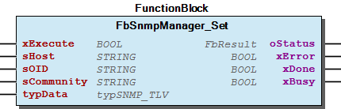
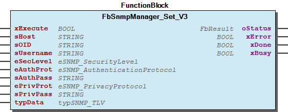
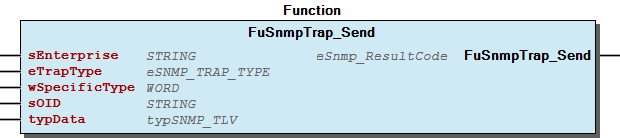

# WagoAppSNMP v1.2.2.0 (WAGO) - Complete Documentation


## 📋 Library Information

- **Company:** WAGO
- **Title:** WagoAppSNMP
- **Version:** 1.2.2.0
- **Categories:** Application; WAGO FunctionalView|Connectivity|Network; WAGO LayerView|App; WAGO Internal|Feature|Network|SNMP
- **Author:** WAGO / u013972
- **Placeholder:** WagoAppSNMP

### Description ¶


This document is automatically generated.

This library provide SNMP-Services

The function blocks of this library are NOT thread safe and must be called from one CODESYS task only! Concurrent calls from different tasks may cause loss or corruption of data.

This document is automatically generated. This library provide SNMP-Services The function blocks of this library are NOT thread safe and must be called from one CODESYS task only! Concurrent calls from different tasks may cause loss or corruption of data.

### Contents: ¶


Contents: - Documentation Index - Project Information - Library Information - Function Blocks FbSnmpManager_Get (FB) - FbSnmpManager_Get_Timed (FB) - FbSnmpManager_Get_V3 (FB) - FbSnmpManager_Get_V3_Timed (FB) - FbSnmpManager_Set (FB) - FbSnmpManager_Set_Timed (FB) - FbSnmpManager_Set_V3 (FB) - FbSnmpManager_Set_V3_Timed (FB) - FbSnmpTrap_SendInformToAdr (FB) - FbSnmpTrap_SendInformToAdr_V3 (FB) Functions - FuSnmpAgent_CustomOIDGet (FUN) - FuSnmpAgent_CustomOIDRegister (FUN) - FuSnmpAgent_CustomOIDSet (FUN) - FuSnmpTrap_Send (FUN) - FuSnmpTrap_SendEnt (FUN) - FuSnmpTrap_SendToAdr_V1 (FUN) - FuSnmpTrap_SendToAdr_V2C (FUN) - FuSnmpTrap_SendToAdr_V3 (FUN) - SNMP_DINT_TO_TLV (FUN) - SNMP_NULL_TO_TLV (FUN) - ... and 6 more Program Organization Global Variable Lists - LibraryResult (GVL) - ResultItems (GVL) - VersionHistory (GVL) Other Components - 29 Types - Agent - Manager - TLV - TLV_TO_X - Trap - X_TO_TLV - eSnmp_ResultCode (ENUM)

### Indices and tables ¶


Based on WagoAppSNMP.library, last modified 08.05.2024, 03:58:16. LibDoc 3.5.16.10

© WAGO GmbH & Co. KG, Germany 2018 – All rights reserved. For the avoidance of doubt, this copyright notice does not only apply to the information above but also and primarily to the described library itself. Please note that third-party products are always mentioned without reference to intellectual property rights, including patents, utility models, designs and trademarks, accordingly the existence of such rights cannot be excluded. WAGO is a registered trademark of WAGO Verwaltungsgesellschaft mbH.

- File and Project Information - Library Reference Based on WagoAppSNMP.library, last modified 08.05.2024, 03:58:16. LibDoc 3.5.16.10 © WAGO GmbH & Co. KG, Germany 2018 – All rights reserved. For the avoidance of doubt, this copyright notice does not only apply to the information above but also and primarily to the described library itself. Please note that third-party products are always mentioned without reference to intellectual property rights, including patents, utility models, designs and trademarks, accordingly the existence of such rights cannot be excluded. WAGO is a registered trademark of WAGO Verwaltungsgesellschaft mbH.

### Documentation Index


## WagoAppSNMP Library Documentation


| Company: | WAGO |
| Title: | WagoAppSNMP |
| Version: | 1.2.2.0 |
| Categories: | Application; WAGO FunctionalView\|Connectivity\|Network; WAGO LayerView\|App; WAGO Internal\|Feature\|Network\|SNMP |
| Author: | WAGO / u013972 |
| Placeholder: | WagoAppSNMP |

### Description


This document is automatically generated.

This library provide SNMP-Services

The function blocks of this library are NOT thread safe and must be called from one CODESYS task only! Concurrent calls from different tasks may cause loss or corruption of data.

This document is automatically generated. This library provide SNMP-Services The function blocks of this library are NOT thread safe and must be called from one CODESYS task only! Concurrent calls from different tasks may cause loss or corruption of data.

### Contents:


- 20 Program Organization Units Agent - Manager - TLV - Trap 29 Types - eSnmp_ResultCode (ENUM) LibraryResult (GVL) ResultItems (GVL) VersionHistory (GVL)

### Indices and tables


Based on WagoAppSNMP.library, last modified 08.05.2024, 03:58:16. LibDoc 3.5.16.10

© WAGO GmbH & Co. KG, Germany 2018 – All rights reserved. For the avoidance of doubt, this copyright notice does not only apply to the information above but also and primarily to the described library itself. Please note that third-party products are always mentioned without reference to intellectual property rights, including patents, utility models, designs and trademarks, accordingly the existence of such rights cannot be excluded. WAGO is a registered trademark of WAGO Verwaltungsgesellschaft mbH.

- File and Project Information - Library Reference Based on WagoAppSNMP.library, last modified 08.05.2024, 03:58:16. LibDoc 3.5.16.10 © WAGO GmbH & Co. KG, Germany 2018 – All rights reserved. For the avoidance of doubt, this copyright notice does not only apply to the information above but also and primarily to the described library itself. Please note that third-party products are always mentioned without reference to intellectual property rights, including patents, utility models, designs and trademarks, accordingly the existence of such rights cannot be excluded. WAGO is a registered trademark of WAGO Verwaltungsgesellschaft mbH.

### Project Information


## File and Project Information


| Scope | Name | Type | Content |
| --- | --- | --- | --- |
| FileHeader | libraryFile | string | WagoAppSNMP.library |
| contentFile | doc.clean.json |
| productName | e!COCKPIT |
| creationDateTime | date | 29.05.2024, 20:40:07 |
| companyName | string | WAGO |
| ProjectInformation | LastModificationDateTime | date | 08.05.2024, 03:58:16 |
| Description | string | See: Description |
| Copyright | © WAGO Kontakttechnik GmbH & Co. KG, Germany 2018 – All rights reserved. |
| Author | WAGO / u013972 |
| AutoResolveUnbound | bool | True |
| Placeholder | string | WagoAppSNMP |
| Company | WAGO |
| DocFormat | reStructuredText |
| Project | WagoAppSNMP |
| DefaultNamespace |  |
| Version | version | 1.2.2.0 |
| ThreadSave | string | False |
| Title | WagoAppSNMP |
| Released | bool | True |
| LibraryCategories | library-category-list | Application; WAGO FunctionalView\|Connectivity\|Network; WAGO LayerView\|App; WAGO Internal\|Feature\|Network\|SNMP |
| CompiledLibraryCompatibilityVersion | string | CODESYS V3.5 SP16 Patch 3 |

### Library Information


## Library Reference


| LinkAllContent: False QualifiedOnly: False | SystemLibrary: False | Optional: False |

| LinkAllContent: False QualifiedOnly: False | SystemLibrary: False | Optional: False |

| LinkAllContent: False QualifiedOnly: False | SystemLibrary: False | Optional: False |

| LinkAllContent: False QualifiedOnly: False | SystemLibrary: False | Optional: False |

| LinkAllContent: False QualifiedOnly: False | SystemLibrary: False | Optional: False |

| LinkAllContent: False Optional: False | QualifiedOnly: False SystemLibrary: False | PublishSymbolsInContainer: True |

| LinkAllContent: False QualifiedOnly: False | SystemLibrary: False | Optional: False |

| LinkAllContent: False Optional: False | QualifiedOnly: False SystemLibrary: False | PublishSymbolsInContainer: True |

This is a dictionary of all referenced libraries and their name spaces.

This is a dictionary of all referenced libraries and their name spaces. WagoSysBehaviourModels Library Identification : Placeholder: WagoSysBehaviourModels Default Resolution: WagoSysBehaviourModels, * (WAGO) Namespace: WagoSysBehaviourModels Library Properties : WagoSysErrorBase Library Identification : Placeholder: WagoSysErrorBase Default Resolution: WagoSysErrorBase, * (WAGO) Namespace: WagoSysErrorBase Library Properties : Library Parameter : Parameter: RES_LOG_MAX_FILESIZE = 2000 Parameter: RES_LOG_MAX_FILES = 1 Parameter: RES_LOG_MAX_ENTRIES = 200 Parameter: RES_LOG_NAME = ‘WagoAppResultLogger’ WagoSysSNMP_Internal_PFC Library Identification : Placeholder: WagoSysSNMPInternal Default Resolution: WagoSysSNMP_Internal_PFC, * (WAGO) Namespace: WagoSysSNMPInternal Library Properties : WagoSysStandard Library Identification : Placeholder: WagoSysStandard Default Resolution: WagoSysStandard, * (WAGO) Namespace: WagoSysStandard Library Properties : WagoSysVersion Library Identification : Name: WagoSysVersion Version: 1.0.0.0 Company: WAGO Namespace: WagoSysVersion Library Properties : WagoTypesCommon Library Identification : Placeholder: WagoTypesCommon Default Resolution: WagoTypesCommon, * (WAGO) Namespace: WagoTypes Library Properties : WagoTypesErrorBase Library Identification : Placeholder: WagoTypesErrorBase Default Resolution: WagoTypesErrorBase, * (WAGO) Namespace: WagoTypesErrorBase Library Properties : WagoTypesSNMP Library Identification : Placeholder: WagoTypesSNMP Default Resolution: WagoTypesSNMP, * (WAGO) Namespace: WagoTypesSNMP Library Properties :

### Function Blocks


## FbSnmpManager_Get (FB)


| Scope | Name | Type | Comment | Inherited from |
| --- | --- | --- | --- | --- |
| Output | oStatus | FbResult | Status object (see WagoSysErrorBase). | FbBehaviourModel_oStatus_Base |
| Input | xExecute | BOOL | Triggers the execution of the action. | FbBehaviourModel_WagoAppExecute |
| Output | xError | BOOL | Indicates that an error has occurred. | FbBehaviourModel_WagoAppExecute |
| xDone | BOOL | Successful completion of the action. | FbBehaviourModel_WagoAppExecute |
| xBusy | BOOL | Action is still in progress. | FbBehaviourModel_WagoAppExecute |
| Input | sHost | STRING(127) | Hostname or IP-address in “dotted decimal format” |  |
| sOID | STRING(127) | SNMP unique object identifier(OID) of requested data, e.g. ‘1.3.6.1.2.1.1.6.0’ for “sysLocation” |  |
| sCommunity | STRING(63) | Community string typical: “public” |  |
| Output | typData | typSNMP_TLV | Structured response data in Type-Length-Value(TLV) format |  |

| Result Codes |
| OK | Success |
| EAGAIN | A request is still pending, no feedback so far. |
| ETIMEDOUT | Connection timed out |
| ESNMP_INIT_SESSION_ERROR | Error while init the SNMP session |
| ESNMP_BAD_MSG_TYPE | Internal Error |
| ESNMP_PARSE_OID_ERROR | Error while Parsing the given OID |
| ESNMP_TRANSCEIVE_ERROR | Error while SNMP-transfer-process |
| ESNMP_PACKAGE_ERROR | Received SNMP-telegramm did not include valid data |
| ESNMP_FB_ERROR | FATAL ERROR function block was not correct initialized |
| ESNMP_AUTH_ERR | Problem with generating of authentication passphrase |
| ESNMP_PRIV_ERROR | Problem with generating of privacy passphrase |

Sends a SNMP-V1-GET telegram to the given Agent and process the response

Graphical Illustration

Function description

This function block sends a SNMP-V1-GET telegram to the given Agent and process the response. The response data provided as universal Type-Length-Value (TLV) and have to be converted into the requested datatype.

Interface variables Function Sends a SNMP-V1-GET telegram to the given Agent and process the response Graphical Illustration  Function description This function block sends a SNMP-V1-GET telegram to the given Agent and process the response. The response data provided as universal Type-Length-Value (TLV) and have to be converted into the requested datatype.

## FbSnmpManager_Get_Timed (FB)


| Scope | Name | Type | Comment | Inherited from |
| --- | --- | --- | --- | --- |
| Output | oStatus | FbResult | Status object (see WagoSysErrorBase). | FbBehaviourModel_oStatus_Base |
| Input | xExecute | BOOL | Triggers the execution of the action. | FbBehaviourModel_WagoAppExecute |
| Output | xError | BOOL | Indicates that an error has occurred. | FbBehaviourModel_WagoAppExecute |
| xDone | BOOL | Successful completion of the action. | FbBehaviourModel_WagoAppExecute |
| xBusy | BOOL | Action is still in progress. | FbBehaviourModel_WagoAppExecute |
| Input | sHost | STRING(127) | Hostname or IP-address in “dotted decimal format” |  |
| sOID | STRING(127) | SNMP unique object identifier(OID) of requested data, e.g. ‘1.3.6.1.2.1.1.6.0’ for “sysLocation” |  |
| sCommunity | STRING(63) | Community string typical: “public” |  |
| uiTimeout_ms | UDINT | Request timeout in milliseconds |  |
| uiRetries | UDINT | Number of retries until timeout is reported. Total timeout = uiTimeout_ms * (uiReties + 1) |  |
| Output | typData | typSNMP_TLV | Structured response data in Type-Length-Value(TLV) format |  |

| Result Codes |
| OK | Success |
| EAGAIN | A request is still pending, no feedback so far. |
| ETIMEDOUT | Connection timed out |
| ESNMP_INIT_SESSION_ERROR | Error while init the SNMP session |
| ESNMP_BAD_MSG_TYPE | Internal Error |
| ESNMP_PARSE_OID_ERROR | Error while Parsing the given OID |
| ESNMP_TRANSCEIVE_ERROR | Error while SNMP-transfer-process |
| ESNMP_PACKAGE_ERROR | Received SNMP-telegramm did not include valid data |
| ESNMP_FB_ERROR | FATAL ERROR function block was not correct initialized |
| ESNMP_AUTH_ERR | Problem with generating of authentication passphrase |
| ESNMP_PRIV_ERROR | Problem with generating of privacy passphrase |

Sends a SNMP-V1-GET telegram to the given Agent and process the response

Graphical Illustration

Function description

This function block sends a SNMP-V1-GET telegram to the given Agent and process the response. The response data provided as universal Type-Length-Value (TLV) and have to be converted into the requested datatype.

Interface variables Function Sends a SNMP-V1-GET telegram to the given Agent and process the response Graphical Illustration  Function description This function block sends a SNMP-V1-GET telegram to the given Agent and process the response. The response data provided as universal Type-Length-Value (TLV) and have to be converted into the requested datatype.

## FbSnmpManager_Get_V3 (FB)


| Scope | Name | Type | Comment | Inherited from |
| --- | --- | --- | --- | --- |
| Output | oStatus | FbResult | Status object (see WagoSysErrorBase). | FbBehaviourModel_oStatus_Base |
| Input | xExecute | BOOL | Triggers the execution of the action. | FbBehaviourModel_WagoAppExecute |
| Output | xError | BOOL | Indicates that an error has occurred. | FbBehaviourModel_WagoAppExecute |
| xDone | BOOL | Successful completion of the action. | FbBehaviourModel_WagoAppExecute |
| xBusy | BOOL | Action is still in progress. | FbBehaviourModel_WagoAppExecute |
| Input | sHost | STRING(127) | Hostname or IP-address in “dotted decimal format” |  |
| sOID | STRING(127) | SNMP unique object identifier(OID) of requested data, e.g. ‘1.3.6.1.2.1.1.6.0’ for “sysLocation” |  |
| sUsername | STRING(127) | SNMP-Username. |  |
| eSecLevel | eSNMP_SecurityLevel | Definition of SNMP-security-level |  |
| eAuthProt | eSNMP_AuthenticationProtocol | Definition of SNMP-authentication-protocol to be used for user-password hash |  |
| sAuthPass | STRING(127) | Password for the given username |  |
| ePrivProt | eSNMP_PrivacyProtocol | Definition of SNMP-privacy-protocol to be used for session encryption |  |
| sPrivPass | STRING(127) | Passphrase for the given encryption type and username |  |
| Output | typData | typSNMP_TLV | Structured response data in Type-Length-Value (TLV) format |  |

| Result Codes |
| OK | Success |
| EAGAIN | A request is still pending, no feedback so far. |
| ETIMEDOUT | Connection timed out |
| ESNMP_INIT_SESSION_ERROR | Error while init the SNMP session |
| ESNMP_BAD_MSG_TYPE | Internal Error |
| ESNMP_PARSE_OID_ERROR | Error while Parsing the given OID |
| ESNMP_TRANSCEIVE_ERROR | Error while SNMP-transfer-process |
| ESNMP_PACKAGE_ERROR | Received SNMP-telegramm did not include valid data |
| ESNMP_FB_ERROR | FATAL ERROR function block was not correct initialized |
| ESNMP_AUTH_ERR | Problem with generating of authentication passphrase |
| ESNMP_PRIV_ERROR | Problem with generating of privacy passphrase |

Sends a SNMP-V1-GET telegram to the given Agent and process the response

Graphical Illustration

Function description

This function block sends a SNMP-V3-GET telegram to the given Agent and process the response. The response data provided as universal Type-Length-Value (TLV) and have to be converted into the requested datatype.

Interface variables Function Sends a SNMP-V1-GET telegram to the given Agent and process the response Graphical Illustration  Function description This function block sends a SNMP-V3-GET telegram to the given Agent and process the response. The response data provided as universal Type-Length-Value (TLV) and have to be converted into the requested datatype.

## FbSnmpManager_Get_V3_Timed (FB)


| Scope | Name | Type | Comment | Inherited from |
| --- | --- | --- | --- | --- |
| Output | oStatus | FbResult | Status object (see WagoSysErrorBase). | FbBehaviourModel_oStatus_Base |
| Input | xExecute | BOOL | Triggers the execution of the action. | FbBehaviourModel_WagoAppExecute |
| Output | xError | BOOL | Indicates that an error has occurred. | FbBehaviourModel_WagoAppExecute |
| xDone | BOOL | Successful completion of the action. | FbBehaviourModel_WagoAppExecute |
| xBusy | BOOL | Action is still in progress. | FbBehaviourModel_WagoAppExecute |
| Input | sHost | STRING(127) | Hostname or IP-address in “dotted decimal format” |  |
| sOID | STRING(127) | SNMP unique object identifier(OID) of requested data, e.g. ‘1.3.6.1.2.1.1.6.0’ for “sysLocation” |  |
| sUsername | STRING(127) | SNMP-Username. |  |
| eSecLevel | eSNMP_SecurityLevel | Definition of SNMP-security-level |  |
| eAuthProt | eSNMP_AuthenticationProtocol | Definition of SNMP-authentication-protocol to be used for user-password hash |  |
| sAuthPass | STRING(127) | Password for the given username |  |
| ePrivProt | eSNMP_PrivacyProtocol | Definition of SNMP-privacy-protocol to be used for session encryption |  |
| sPrivPass | STRING(127) | Passphrase for the given encryption type and username |  |
| uiTimeout_ms | UDINT | Request timeout in milliseconds |  |
| uiRetries | UDINT | Number of retries until timeout is reported. Total timeout = uiTimeout_ms * (uiReties + 1) |  |
| Output | typData | typSNMP_TLV | Structured response data in Type-Length-Value (TLV) format |  |

| Result Codes |
| OK | Success |
| EAGAIN | A request is still pending, no feedback so far. |
| ETIMEDOUT | Connection timed out |
| ESNMP_INIT_SESSION_ERROR | Error while init the SNMP session |
| ESNMP_BAD_MSG_TYPE | Internal Error |
| ESNMP_PARSE_OID_ERROR | Error while Parsing the given OID |
| ESNMP_TRANSCEIVE_ERROR | Error while SNMP-transfer-process |
| ESNMP_PACKAGE_ERROR | Received SNMP-telegramm did not include valid data |
| ESNMP_FB_ERROR | FATAL ERROR function block was not correct initialized |
| ESNMP_AUTH_ERR | Problem with generating of authentication passphrase |
| ESNMP_PRIV_ERROR | Problem with generating of privacy passphrase |

Sends a SNMP-V1-GET telegram to the given Agent and process the response

Graphical Illustration

Function description

This function block sends a SNMP-V3-GET telegram to the given Agent and process the response. The response data provided as universal Type-Length-Value (TLV) and have to be converted into the requested datatype.

Interface variables Function Sends a SNMP-V1-GET telegram to the given Agent and process the response Graphical Illustration  Function description This function block sends a SNMP-V3-GET telegram to the given Agent and process the response. The response data provided as universal Type-Length-Value (TLV) and have to be converted into the requested datatype.

## FbSnmpManager_Set (FB)


| Scope | Name | Type | Comment | Inherited from |
| --- | --- | --- | --- | --- |
| Output | oStatus | FbResult | Status object (see WagoSysErrorBase). | FbBehaviourModel_oStatus_Base |
| Input | xExecute | BOOL | Triggers the execution of the action. | FbBehaviourModel_WagoAppExecute |
| Output | xError | BOOL | Indicates that an error has occurred. | FbBehaviourModel_WagoAppExecute |
| xDone | BOOL | Successful completion of the action. | FbBehaviourModel_WagoAppExecute |
| xBusy | BOOL | Action is still in progress. | FbBehaviourModel_WagoAppExecute |
| Input | sHost | STRING(127) | Hostname or IP-address in “dotted decimal format” |  |
| sOID | STRING(127) | SNMP unique object identifier(OID) of requested data, e.g. ‘1.3.6.1.2.1.1.6.0’ for “sysLocation” |  |
| sCommunity | STRING(63) | Community string typical: “public” |  |
| typData | typSNMP_TLV | Structured response data in Type-Length-Value(TLV) format |  |

| Result Codes |
| OK | Success |
| EAGAIN | A request is still pending, no feedback so far. |
| ETIMEDOUT | Connection timed out |
| ESNMP_INIT_SESSION_ERROR | Error while init the SNMP session |
| ESNMP_BAD_MSG_TYPE | Internal Error |
| ESNMP_PARSE_OID_ERROR | Error while Parsing the given OID |
| ESNMP_TRANSCEIVE_ERROR | Error while SNMP-transfer-process |
| ESNMP_PACKAGE_ERROR | Received SNMP-telegramm did not include valid data |
| ESNMP_FB_ERROR | FATAL ERROR function block was not correct initialized |
| ESNMP_AUTH_ERR | Problem with generating of authentication passphrase |
| ESNMP_PRIV_ERROR | Problem with generating of privacy passphrase |

Sends a SNMP-V1-SET telegram to the given Agent and process the response

Graphical Illustration

Function description

This function block sends a SNMP-V1-SET telegram to the given Agent and process the response. The transmitt data are expected as data type universal TypeLengthValue(TLV).

Interface variables Function Sends a SNMP-V1-SET telegram to the given Agent and process the response Graphical Illustration  Function description This function block sends a SNMP-V1-SET telegram to the given Agent and process the response. The transmitt data are expected as data type universal TypeLengthValue(TLV).

## FbSnmpManager_Set_Timed (FB)


| Scope | Name | Type | Comment | Inherited from |
| --- | --- | --- | --- | --- |
| Output | oStatus | FbResult | Status object (see WagoSysErrorBase). | FbBehaviourModel_oStatus_Base |
| Input | xExecute | BOOL | Triggers the execution of the action. | FbBehaviourModel_WagoAppExecute |
| Output | xError | BOOL | Indicates that an error has occurred. | FbBehaviourModel_WagoAppExecute |
| xDone | BOOL | Successful completion of the action. | FbBehaviourModel_WagoAppExecute |
| xBusy | BOOL | Action is still in progress. | FbBehaviourModel_WagoAppExecute |
| Input | sHost | STRING(127) | Hostname or IP-address in “dotted decimal format” |  |
| sOID | STRING(127) | SNMP unique object identifier(OID) of requested data, e.g. ‘1.3.6.1.2.1.1.6.0’ for “sysLocation” |  |
| sCommunity | STRING(63) | Community string typical: “public” |  |
| typData | typSNMP_TLV | Structured response data in Type-Length-Value(TLV) format |  |
| uiTimeout_ms | UDINT | Request timeout in milliseconds |  |
| uiRetries | UDINT | Number of retries until timeout is reported. Total timeout = uiTimeout_ms * (uiReties + 1) |  |

| Result Codes |
| OK | Success |
| EAGAIN | A request is still pending, no feedback so far. |
| ETIMEDOUT | Connection timed out |
| ESNMP_INIT_SESSION_ERROR | Error while init the SNMP session |
| ESNMP_BAD_MSG_TYPE | Internal Error |
| ESNMP_PARSE_OID_ERROR | Error while Parsing the given OID |
| ESNMP_TRANSCEIVE_ERROR | Error while SNMP-transfer-process |
| ESNMP_PACKAGE_ERROR | Received SNMP-telegramm did not include valid data |
| ESNMP_FB_ERROR | FATAL ERROR function block was not correct initialized |
| ESNMP_AUTH_ERR | Problem with generating of authentication passphrase |
| ESNMP_PRIV_ERROR | Problem with generating of privacy passphrase |

Sends a SNMP-V1-SET telegram to the given Agent and process the response

Graphical Illustration

Function description

This function block sends a SNMP-V1-SET telegram to the given Agent and process the response. The transmitt data are expected as data type universal TypeLengthValue(TLV).

Interface variables Function Sends a SNMP-V1-SET telegram to the given Agent and process the response Graphical Illustration  Function description This function block sends a SNMP-V1-SET telegram to the given Agent and process the response. The transmitt data are expected as data type universal TypeLengthValue(TLV).

## FbSnmpManager_Set_V3 (FB)


| Scope | Name | Type | Comment | Inherited from |
| --- | --- | --- | --- | --- |
| Output | oStatus | FbResult | Status object (see WagoSysErrorBase). | FbBehaviourModel_oStatus_Base |
| Input | xExecute | BOOL | Triggers the execution of the action. | FbBehaviourModel_WagoAppExecute |
| Output | xError | BOOL | Indicates that an error has occurred. | FbBehaviourModel_WagoAppExecute |
| xDone | BOOL | Successful completion of the action. | FbBehaviourModel_WagoAppExecute |
| xBusy | BOOL | Action is still in progress. | FbBehaviourModel_WagoAppExecute |
| Input | sHost | STRING(127) | Hostname or IP-address in “dotted decimal format” |  |
| sOID | STRING(127) | SNMP unique object identifier(OID) of requested data, e.g. ‘1.3.6.1.2.1.1.6.0’ for “sysLocation” |  |
| sUsername | STRING(127) | SNMP-username. |  |
| eSecLevel | eSNMP_SecurityLevel | Definition of SNMP-security-level |  |
| eAuthProt | eSNMP_AuthenticationProtocol | Definition of SNMP-authentication-protocol to be used for user-password hash |  |
| sAuthPass | STRING(127) | Password for the given username |  |
| ePrivProt | eSNMP_PrivacyProtocol | Definition of SNMP-privacy-protocol to be used for session encryption |  |
| sPrivPass | STRING(127) | Passphrase for the given encryption type and username |  |
| typData | typSNMP_TLV | Structured response data in Type-Length-Value(TLV) format |  |

| Result Codes |
| OK | Success |
| EAGAIN | A request is still pending, no feedback so far. |
| ETIMEDOUT | Connection timed out |
| ESNMP_INIT_SESSION_ERROR | Error while init the SNMP session |
| ESNMP_BAD_MSG_TYPE | Internal Error |
| ESNMP_PARSE_OID_ERROR | Error while Parsing the given OID |
| ESNMP_TRANSCEIVE_ERROR | Error while SNMP-transfer-process |
| ESNMP_PACKAGE_ERROR | Received SNMP-telegramm did not include valid data |
| ESNMP_FB_ERROR | FATAL ERROR function block was not correct initialized |
| ESNMP_AUTH_ERR | Problem with generating of authentication passphrase |
| ESNMP_PRIV_ERROR | Problem with generating of privacy passphrase |

Sends a SNMP-V1-SET telegram to the given Agent and process the response

Graphical Illustration

Function description

This function block sends a SNMP-V1-SET telegram to the given Agent and process the response. The transmitt data are expected as data type universal TypeLengthValue(TLV).

Interface variables Function Sends a SNMP-V1-SET telegram to the given Agent and process the response Graphical Illustration  Function description This function block sends a SNMP-V1-SET telegram to the given Agent and process the response. The transmitt data are expected as data type universal TypeLengthValue(TLV).

## FbSnmpManager_Set_V3_Timed (FB)


| Scope | Name | Type | Comment | Inherited from |
| --- | --- | --- | --- | --- |
| Output | oStatus | FbResult | Status object (see WagoSysErrorBase). | FbBehaviourModel_oStatus_Base |
| Input | xExecute | BOOL | Triggers the execution of the action. | FbBehaviourModel_WagoAppExecute |
| Output | xError | BOOL | Indicates that an error has occurred. | FbBehaviourModel_WagoAppExecute |
| xDone | BOOL | Successful completion of the action. | FbBehaviourModel_WagoAppExecute |
| xBusy | BOOL | Action is still in progress. | FbBehaviourModel_WagoAppExecute |
| Input | sHost | STRING(127) | Hostname or IP-address in “dotted decimal format” |  |
| sOID | STRING(127) | SNMP unique object identifier(OID) of requested data, e.g. ‘1.3.6.1.2.1.1.6.0’ for “sysLocation” |  |
| sUsername | STRING(127) | SNMP-username. |  |
| eSecLevel | eSNMP_SecurityLevel | Definition of SNMP-security-level |  |
| eAuthProt | eSNMP_AuthenticationProtocol | Definition of SNMP-authentication-protocol to be used for user-password hash |  |
| sAuthPass | STRING(127) | Password for the given username |  |
| ePrivProt | eSNMP_PrivacyProtocol | Definition of SNMP-privacy-protocol to be used for session encryption |  |
| sPrivPass | STRING(127) | Passphrase for the given encryption type and username |  |
| typData | typSNMP_TLV | Structured response data in Type-Length-Value(TLV) format |  |
| uiTimeout_ms | UDINT | Request timeout in milliseconds |  |
| uiRetries | UDINT | Number of retries until timeout is reported. Total timeout = uiTimeout_ms * (uiReties + 1) |  |

| Result Codes |
| OK | Success |
| EAGAIN | A request is still pending, no feedback so far. |
| ETIMEDOUT | Connection timed out |
| ESNMP_INIT_SESSION_ERROR | Error while init the SNMP session |
| ESNMP_BAD_MSG_TYPE | Internal Error |
| ESNMP_PARSE_OID_ERROR | Error while Parsing the given OID |
| ESNMP_TRANSCEIVE_ERROR | Error while SNMP-transfer-process |
| ESNMP_PACKAGE_ERROR | Received SNMP-telegramm did not include valid data |
| ESNMP_FB_ERROR | FATAL ERROR function block was not correct initialized |
| ESNMP_AUTH_ERR | Problem with generating of authentication passphrase |
| ESNMP_PRIV_ERROR | Problem with generating of privacy passphrase |

Sends a SNMP-V1-SET telegram to the given Agent and process the response

Graphical Illustration

Function description

This function block sends a SNMP-V1-SET telegram to the given Agent and process the response. The transmitt data are expected as data type universal TypeLengthValue(TLV).

Interface variables Function Sends a SNMP-V1-SET telegram to the given Agent and process the response Graphical Illustration  Function description This function block sends a SNMP-V1-SET telegram to the given Agent and process the response. The transmitt data are expected as data type universal TypeLengthValue(TLV).

## FbSnmpTrap_SendInformToAdr (FB)


| Scope | Name | Type | Initial | Comment | Inherited from |
| --- | --- | --- | --- | --- | --- |
| Output | oStatus | FbResult |  | Status object (see WagoSysErrorBase). | FbBehaviourModel_oStatus_Base |
| Input | xExecute | BOOL |  | Triggers the execution of the action. | FbBehaviourModel_WagoAppExecute |
| Output | xError | BOOL |  | Indicates that an error has occurred. | FbBehaviourModel_WagoAppExecute |
| xDone | BOOL |  | Successful completion of the action. | FbBehaviourModel_WagoAppExecute |
| xBusy | BOOL |  | Action is still in progress. | FbBehaviourModel_WagoAppExecute |
| Input | sHost | STRING(127) |  | Hostname or IP-address in “dotted decimal format” |  |
| sEnterprise | STRING(127) | ‘1.3.6.1.4.1.13576.1’ | SNMP unique object identifier(OID) of trap sender e.g.: 1.3.6.1.4.1.13576.1 |  |
| sCommunity | STRING(63) |  | Community string typical: “public” |  |
| sOID | STRING(127) |  | SNMP unique object identifier(OID) used for sending a additional value withe the trap. sy ‘’ for only sending the trap |  |
| typData | typSNMP_TLV |  | Send a specific variable with the trap. |  |

| Result Codes |
| OK | Success |
| ESNMP_EINVAL | Invalid arguments. |

Sends user defined inform to user defined address

Graphical Illustration

Function description

This function-block sends user defined inform to user defined address

If an additional OID+TLV is not necessary say ‘’ for sOID and create a NULL Value for stData!

Interface variables Function Sends user defined inform to user defined address Graphical Illustration  Function description This function-block sends user defined inform to user defined address If an additional OID+TLV is not necessary say ‘’ for sOID and create a NULL Value for stData!

## FbSnmpTrap_SendInformToAdr_V3 (FB)


| Scope | Name | Type | Initial | Comment | Inherited from |
| --- | --- | --- | --- | --- | --- |
| Output | oStatus | FbResult |  | Status object (see WagoSysErrorBase). | FbBehaviourModel_oStatus_Base |
| Input | xExecute | BOOL |  | Triggers the execution of the action. | FbBehaviourModel_WagoAppExecute |
| Output | xError | BOOL |  | Indicates that an error has occurred. | FbBehaviourModel_WagoAppExecute |
| xDone | BOOL |  | Successful completion of the action. | FbBehaviourModel_WagoAppExecute |
| xBusy | BOOL |  | Action is still in progress. | FbBehaviourModel_WagoAppExecute |
| Input | sHost | STRING(127) |  | Hostname or IP-address in “dotted decimal format” |  |
| sEnterprise | STRING(127) | ‘1.3.6.1.4.1.13576.1’ | SNMP unique object identifier(OID) of trap sender e.g. 1.3.6.1.4.1.13576.1 |  |
| sEngineID | STRING(127) | ‘’ | Is the engine that receives the trap |  |
| sUsername | STRING(127) |  | SNMP-Username. |  |
| eSecLevel | eSNMP_SecurityLevel |  | Definition of SNMP-security-level |  |
| eAuthProt | eSNMP_AuthenticationProtocol |  | Definition of SNMP-authentication-protocol to be used for user-password hash |  |
| sAuthPass | STRING(127) |  | Password for the given username |  |
| ePrivProt | eSNMP_PrivacyProtocol |  | Definition of SNMP-privacy-protocol to be used for session encryption |  |
| sPrivPass | STRING(127) |  | Passphrase for the given encryption type and username |  |
| sOID | STRING(127) |  | SNMP unique object identifier(OID) used for sending an additional value with the trap. Give an empty string ‘’ for only sending the trap |  |
| typData | typSNMP_TLV |  | Send a specific variable with the trap |  |

| Result Codes |
| OK | Success |
| ESNMP_EINVAL | Invalid arguments. |

Sends user defined inform to user defined address

Graphical Illustration

Function description

This function-block sends user defined inform to user defined address

If an additional OID+TLV is not necessary say ‘’ for sOID and create a NULL Value for stData!

Interface variables Function Sends user defined inform to user defined address Graphical Illustration  Function description This function-block sends user defined inform to user defined address If an additional OID+TLV is not necessary say ‘’ for sOID and create a NULL Value for stData!

### Functions


## FuSnmpAgent_CustomOIDGet (FUN)


| Scope | Name | Type | Initial |
| --- | --- | --- | --- |
| Return | FuSnmpAgent_CustomOIDGet | eSnmp_ResultCode |  |
| Input | sOID | STRING(128) | ‘’ |
| Inout | typData | typSNMP_TLV |  |

| Result Codes |
| OK | Success |
| ESNMP_INIT_SESSION_ERROR |  |
| ESNMP_PARSE_OID_ERROR |  |
| ESNMP_TRANSCEIVE_ERROR |  |

Get value of customer OID

Graphical Illustration

Function description

This function gets the value of customer OID, that is defined by the parameter ‘’sOID’‘.

Interface variables Function Get value of customer OID Graphical Illustration  Function description This function gets the value of customer OID, that is defined by the parameter ‘’sOID’‘.

## FuSnmpAgent_CustomOIDRegister (FUN)


| Scope | Name | Type | Initial |
| --- | --- | --- | --- |
| Return | FuSnmpAgent_CustomOIDRegister | eSnmp_ResultCode |  |
| Input | sOID | STRING(128) | ‘’ |
| typDefaultData | typSNMP_TLV |  |
| xReadOnly | BOOL | FALSE |

| Result Codes |
| OK | Success |
| ESNMP_INIT_SESSION_ERROR |  |
| ESNMP_BAD_MSG_TYPE |  |
| ESNMP_TRANSCEIVE_ERROR |  |
| ESNMP_BAD_DATATYPE |  |
| ESNMP_WARN_STR_VAL_TO_LONG | —————-ToDo: Passt der Resultcode??? |

Register a new customer OID

Graphical Illustration

Function description

This function registers a new customer OID, that is defined by the parameter ‘’sOID’‘. The value of the new OID is defined by the parameter ‘’typDefaultData’‘.

..note:: It is recommended to register less than 1024 OIDs, for more than 1024 registered OIDs the function is not guaranteed

Interface variables Function Register a new customer OID Graphical Illustration  Function description This function registers a new customer OID, that is defined by the parameter ‘’sOID’‘. The value of the new OID is defined by the parameter ‘’typDefaultData’‘. ..note:: It is recommended to register less than 1024 OIDs, for more than 1024 registered OIDs the function is not guaranteed

## FuSnmpAgent_CustomOIDSet (FUN)


| Scope | Name | Type | Initial |
| --- | --- | --- | --- |
| Return | FuSnmpAgent_CustomOIDSet | eSnmp_ResultCode |  |
| Input | sOID | STRING(128) | ‘’ |
| typData | typSNMP_TLV |  |

| Result Codes |
| OK | Success |
| ESNMP_INIT_SESSION_ERROR |  |
| ESNMP_PARSE_OID_ERROR |  |
| ESNMP_TRANSCEIVE_ERROR |  |

Set value of customer OID

Graphical Illustration

Function description

This function sets the value of customer OID, that is defined by the parameter ‘’sOID’‘.

Interface variables Function Set value of customer OID Graphical Illustration  Function description This function sets the value of customer OID, that is defined by the parameter ‘’sOID’‘.

## FuSnmpTrap_Send (FUN)


| Scope | Name | Type | Initial | Comment |
| --- | --- | --- | --- | --- |
| Return | FuSnmpTrap_Send | eSnmp_ResultCode |  |  |
| Input | sEnterprise | STRING(127) | ‘1.3.6.1.4.1.13576.1’ | SNMP unique object identifier(OID) of trap sender e.g. 1.3.6.1.4.1.13576.1 |
| eTrapType | eSNMP_TRAP_TYPE |  | Choose trap-type |
| wSpecificType | WORD |  | define specific trap-type |
| sOID | STRING(127) |  | SNMP unique object identifier(OID) used for sending an additional value with the trap. Give an empty string ‘’ for only sending the trap |
| typData | typSNMP_TLV |  | Send a specific variable with the trap |

| Result Codes |
| OK | Success |
| ESNMP_EINVAL | Invalid arguments. |

Sends user defined Trap/Notification

Graphical Illustration

Function description

This function sends user defined Trap/Notification.

If an additional OID+TLV is not necessary, set ‘’ for ‘’sOID’’ and create a NULL Value for ‘’typData’‘!

The function uses the list of destinations which are configured via the WBM/CBM. This function will not work if SNMP is deactivated on the WBM/CBM.

Interface variables Function Sends user defined Trap/Notification Graphical Illustration  Function description This function sends user defined Trap/Notification. If an additional OID+TLV is not necessary, set ‘’ for ‘’sOID’’ and create a NULL Value for ‘’typData’‘! The function uses the list of destinations which are configured via the WBM/CBM. This function will not work if SNMP is deactivated on the WBM/CBM.

## FuSnmpTrap_SendEnt (FUN)


| Scope | Name | Type | Comment |
| --- | --- | --- | --- |
| Return | FuSnmpTrap_SendEnt | eSnmp_ResultCode |  |
| Input | wTrap | WORD | Enterprise trap number |

| Result Codes |
| OK | Success |
| ESNMP_EINVAL | Invalid arguments. |

Sends an enterprise specific trap

Graphical Illustration

Function description

This function sends an enterprise specific trap. The function uses the list of destinations which are configured via the WBM/CBM. This function will not work if SNMP is deactivated on the WBM/CBM

Interface variables Function Sends an enterprise specific trap Graphical Illustration  Function description This function sends an enterprise specific trap. The function uses the list of destinations which are configured via the WBM/CBM. This function will not work if SNMP is deactivated on the WBM/CBM

## FuSnmpTrap_SendToAdr_V1 (FUN)


| Scope | Name | Type | Initial | Comment |
| --- | --- | --- | --- | --- |
| Return | FuSnmpTrap_SendToAdr_V1 | eSnmp_ResultCode |  |  |
| Input | sHost | STRING(127) |  | Hostname or IP-address in “dotted decimal format” |
| sEnterprise | STRING(127) | ‘1.3.6.1.4.1.13576.1’ | SNMP unique object identifier(OID) of trap sender e.g. 1.3.6.1.4.1.13576.1 |
| sCommunity | STRING(63) |  | Community string typical: “public” |
| eTrapType | eSNMP_TRAP_TYPE |  | Choose trap-type |
| wSpecificType | WORD |  | define specific trap-type |
| sOID | STRING(127) |  | SNMP unique object identifier(OID) used for sending an additional value with the trap. Give an empty string ‘’ for only sending the trap |
| typData | typSNMP_TLV |  | Send a specific variable with the trap |

| Result Codes |
| OK | Success |
| ESNMP_EINVAL | Invalid arguments. |

Sends user defined Trap to a user defined address

Graphical Illustration

Function description

This function sends user defined Trap to a user defined address.

If an additional OID+TLV is not necessary, set ‘’ for ‘’sOID’’ and create a NULL Value for ‘’typData’‘!

Interface variables Function Sends user defined Trap to a user defined address Graphical Illustration  Function description This function sends user defined Trap to a user defined address. If an additional OID+TLV is not necessary, set ‘’ for ‘’sOID’’ and create a NULL Value for ‘’typData’‘!

## FuSnmpTrap_SendToAdr_V2C (FUN)


| Scope | Name | Type | Initial | Comment |
| --- | --- | --- | --- | --- |
| Return | FuSnmpTrap_SendToAdr_V2C | eSnmp_ResultCode |  |  |
| Input | sHost | STRING(127) |  | Hostname or Ip-address in “dotted decimal format” |
| sEnterprise | STRING(127) | ‘1.3.6.1.4.1.13576.1’ | SNMP unique object identifier(OID) of trap sender e.g. 1.3.6.1.4.1.13576.1 |
| sCommunity | STRING(63) |  | Community string typical: “public” |
| sOID | STRING(127) |  | SNMP unique object identifier(OID) used for sending an additional value with the trap. Give an empty string ‘’ for only sending the trap |
| typData | typSNMP_TLV |  | Send a specific variable with the trap |

| Result Codes |
| OK | Success |

Sends user defined Trap to a user defined address

Graphical Illustration

Function description

This function sends user defined Trap to a user defined address.

If an additional OID+TLV is not necessary, set ‘’ for ‘’sOID’’ and create a NULL Value for ‘’typData’‘!

Interface variables Function Sends user defined Trap to a user defined address Graphical Illustration  Function description This function sends user defined Trap to a user defined address. If an additional OID+TLV is not necessary, set ‘’ for ‘’sOID’’ and create a NULL Value for ‘’typData’‘!

## FuSnmpTrap_SendToAdr_V3 (FUN)


| Scope | Name | Type | Initial | Comment |
| --- | --- | --- | --- | --- |
| Return | FuSnmpTrap_SendToAdr_V3 | eSnmp_ResultCode |  |  |
| Input | sHost | STRING(127) |  | Hostname or IP-address in “dotted decimal format” |
| sEnterprise | STRING(127) | ‘1.3.6.1.4.1.13576.1’ | SNMP unique object identifier(OID) of trap sender e.g. 1.3.6.1.4.1.13576.1 |
| sEngineID | STRING(127) | ‘’ | Is the engine that sends the trap |
| sUsername | STRING(127) |  | SNMP-Username. |
| eSecLevel | eSNMP_SecurityLevel |  | Definition of SNMP-security-level |
| eAuthProt | eSNMP_AuthenticationProtocol |  | Definition of SNMP-authentication-protocol to be used for user-password hash |
| sAuthPass | STRING(127) |  | Password for the given username |
| ePrivProt | eSNMP_PrivacyProtocol |  | Definition of SNMP-Privacy-Protocol to be used for session encryption |
| sPrivPass | STRING(127) |  | Passphrase for the given encryption type and username |
| sOID | STRING(127) |  | SNMP unique object identifier(OID) used for sending an additional value with the trap. Give an empty string ‘’ for only sending the trap |
| typData | typSNMP_TLV |  | Send a specific variable with the trap |

| Result Codes |
| OK | Success |

Sends user defined Trap to a user defined address

Graphical Illustration

Function description

This function sends user defined Trap to a user defined address.

If an additional OID+TLV is not necessary, set ‘’ for ‘’sOID’’ and create a NULL Value for ‘’typData’‘!

Interface variables Function Sends user defined Trap to a user defined address Graphical Illustration  Function description This function sends user defined Trap to a user defined address. If an additional OID+TLV is not necessary, set ‘’ for ‘’sOID’’ and create a NULL Value for ‘’typData’‘!

## SNMP_DINT_TO_TLV (FUN)


| Scope | Name | Type | Comment |
| --- | --- | --- | --- |
| Return | SNMP_DINT_TO_TLV | eSnmp_ResultCode |  |
| Input | diInput | DINT | Input-Value |
| eDatatype | eSNMP_TLV_DATATYPE | Choose the SNMP-Datatype |
| Inout | typData | typSNMP_TLV | Container for TLV |

| Result Codes |
| OK | Success |
| ENOMEM | Out of memory. Can not allocate memory |
| ESNMP_BAD_DATATYPE | Given datatype cannot be converted |

Converts a given DINT value into the TLV-structure

Graphical Illustration

Function description

This function converts a given DINT value into the TLV-structure.

Interface variables Function Converts a given DINT value into the TLV-structure Graphical Illustration  Function description This function converts a given DINT value into the TLV-structure.

## SNMP_NULL_TO_TLV (FUN)


| Scope | Name | Type | Comment |
| --- | --- | --- | --- |
| Return | SNMP_NULL_TO_TLV | eSnmp_ResultCode |  |
| Inout | typData | typSNMP_TLV | Container for TLV |

| Result Codes |
| OK | Success |
| ENOMEM | Out of memory. Can not allocate memory |

Creates a NULL variable for the TLV-structure

Graphical Illustration

Function description

This function creates a NULL variable for the TLV-structure.

Interface variables Function Creates a NULL variable for the TLV-structure Graphical Illustration  Function description This function creates a NULL variable for the TLV-structure.

## SNMP_STRING_TO_TLV (FUN)


| Scope | Name | Type | Comment |
| --- | --- | --- | --- |
| Return | SNMP_STRING_TO_TLV | eSnmp_ResultCode |  |
| Input | sInput | STRING(255) | Input-Value |
| eDatatype | eSNMP_TLV_DATATYPE | Choose the SNMP-Datatype |
| Inout | typData | typSNMP_TLV | Container for TLV |

| Result Codes |
| OK | Success |
| ENOMEM | Out of memory. Can not allocate memory |
| ESNMP_BAD_DATATYPE | Given datatype cannot be converted |
| ESNMP_BAD_STR_VALUE | Given string cannot be converted into wanted Datatype |

Converts a given STRING value into the TLV-structure

Graphical Illustration

Function description

This function converts a given STRING value into the TLV-structure.

Interface variables Function Converts a given STRING value into the TLV-structure Graphical Illustration  Function description This function converts a given STRING value into the TLV-structure.

## SNMP_TLV_GET_TYPE (FUN)


| Scope | Name | Type |
| --- | --- | --- |
| Return | SNMP_TLV_GET_TYPE | eSNMP_TLV_DATATYPE |
| Input | typData | typSNMP_TLV |

Gets the type of a TLV-structure

Graphical Illustration

Function description

This function gets the type of a TLV-structure.

Interface variables Function Gets the type of a TLV-structure Graphical Illustration  Function description This function gets the type of a TLV-structure.

## SNMP_TLV_TO_DINT (FUN)


| Scope | Name | Type | Comment |
| --- | --- | --- | --- |
| Return | SNMP_TLV_TO_DINT | eSnmp_ResultCode |  |
| Input | typData | typSNMP_TLV | Prefilled TLV-Container |
| Inout | diValue | DINT | container for Output value |

| Result Codes |
| OK | Success |
| ESNMP_BAD_DATATYPE | Given datatype cannot be converted |

Extracts the DINT value out of the TLV-structure

Graphical Illustration

Function description

This function extracts the DINT value out of the TLV-structure.

Interface variables Function Extracts the DINT value out of the TLV-structure Graphical Illustration  Function description This function extracts the DINT value out of the TLV-structure.

## SNMP_TLV_TO_STRING (FUN)


| Scope | Name | Type | Comment |
| --- | --- | --- | --- |
| Return | SNMP_TLV_TO_STRING | eSnmp_ResultCode |  |
| Input | typData | typSNMP_TLV | Prefilled TLV-Container |
| Inout | sValue | STRING(255) | container for Output value |

| Result Codes |
| OK | Success |
| ESNMP_BAD_DATATYPE | Given datatype cannot be converted |
| ESNMP_BAD_STR_VALUE | Given string cannot be converted into wanted Datatype |

Extracts the STRING value out of the TLV-structure

Graphical Illustration

Function description

This function extracts the STRING value out of the TLV-structure.

Interface variables Function Extracts the STRING value out of the TLV-structure Graphical Illustration  Function description This function extracts the STRING value out of the TLV-structure.

## SNMP_TLV_TO_UDINT (FUN)


| Scope | Name | Type | Comment |
| --- | --- | --- | --- |
| Return | SNMP_TLV_TO_UDINT | eSnmp_ResultCode |  |
| Input | typData | typSNMP_TLV | Prefilled TLV-Container |
| Inout | udiValue | UDINT | container for Output value |

| Result Codes |
| OK | Success |
| ESNMP_BAD_DATATYPE | Given datatype cannot be converted |

Extracts the UDINT value out of the TLV-structure

Graphical Illustration

Function description

This function extracts the UDINT value out of the TLV-structure.

Interface variables Function Extracts the UDINT value out of the TLV-structure Graphical Illustration  Function description This function extracts the UDINT value out of the TLV-structure.

## SNMP_UDINT_TO_TLV (FUN)


| Scope | Name | Type | Comment |
| --- | --- | --- | --- |
| Return | SNMP_UDINT_TO_TLV | eSnmp_ResultCode |  |
| Input | udiInput | UDINT | Input-Value |
| eDatatype | eSNMP_TLV_DATATYPE | Choose the SNMP-Datatype |
| Inout | typData | typSNMP_TLV | Container for TLV |

| Result Codes |
| OK | Success |
| ENOMEM | Out of memory. Can not allocate memory |
| ESNMP_BAD_DATATYPE | Given datatype cannot be converted |

Converts a given UDINT value into the TLV-structure

Graphical Illustration

Function description

This function converts a given UDINT value into the TLV-structure.

Interface variables Function Converts a given UDINT value into the TLV-structure Graphical Illustration  Function description This function converts a given UDINT value into the TLV-structure.

### Program Organization


## 20 Program Organization Units


- Agent FuSnmpAgent_CustomOIDGet (FUN) - FuSnmpAgent_CustomOIDRegister (FUN) - FuSnmpAgent_CustomOIDSet (FUN) Manager - FbSnmpManager_Get (FB) - FbSnmpManager_Get_Timed (FB) - FbSnmpManager_Get_V3 (FB) - FbSnmpManager_Get_V3_Timed (FB) - FbSnmpManager_Set (FB) - FbSnmpManager_Set_Timed (FB) - FbSnmpManager_Set_V3 (FB) - FbSnmpManager_Set_V3_Timed (FB) TLV - SNMP_TLV_GET_TYPE (FUN) - TLV_TO_X SNMP_TLV_TO_DINT (FUN) - SNMP_TLV_TO_STRING (FUN) - SNMP_TLV_TO_UDINT (FUN) X_TO_TLV - SNMP_DINT_TO_TLV (FUN) - SNMP_NULL_TO_TLV (FUN) - SNMP_STRING_TO_TLV (FUN) - SNMP_UDINT_TO_TLV (FUN) Trap - FbSnmpTrap_SendInformToAdr (FB) - FbSnmpTrap_SendInformToAdr_V3 (FB) - FuSnmpTrap_Send (FUN) - FuSnmpTrap_SendEnt (FUN) - FuSnmpTrap_SendToAdr_V1 (FUN) - FuSnmpTrap_SendToAdr_V2C (FUN) - FuSnmpTrap_SendToAdr_V3 (FUN)

### Global Variable Lists


## LibraryResult (GVL)


| Name | Type | Initial | Comment |
| --- | --- | --- | --- |
| _ProducerName | STRING | VersionHistory.Info.Name | Provides an address for the library name. |
| Factory | FbResultFactory |  | Produces FbResults from given eResultCodes. |

```
VAR
  eMyResult : eResultCode;  // result code which is to be investigated
  oError    : FbResult;     // result object for use in higher levels
END_VAR;

eMyResult := myFunction(...);
Namespace.LibraryResult.Factory.SetResult(eMyResult, oError);
```

Factory for standard result objects

Use this to translate result codes from this library into standard result objects.

(In this example Namespace denotes the namespace which is used for including the specific library and myFunction() is an example for a general function from this library.)

Factory for standard result objects Use this to translate result codes from this library into standard result objects. Usage: (In this example Namespace denotes the namespace which is used for including the specific library and myFunction() is an example for a general function from this library.)

## ResultItems (GVL)


| Scope | Name | Type | Initial |
| --- | --- | --- | --- |
| Constant | ERROR | ARRAY [0..24] OF typResultItem | [STRUCT(ID := ESNMP_OK, Severity := eSeverity.none, Text := ‘OK’), STRUCT(ID := ESNMP_EAGAIN, Severity := eSeverity.error, Text := ‘A request is still pending, no feedback so far.’), STRUCT(ID := ESNMP_ENOMEM, Severity := eSeverity.error, Text := ‘Out of memory. Can not allocate memory.’), STRUCT(ID := ESNMP_ETIMEDOUT, Severity := eSeverity.error, Text := ‘Connection timed out.’), STRUCT(ID := ESNMP_EUNSPECIFIC, Severity := eSeverity.error, Text := ‘Error whichs nature is not further specified.’), STRUCT(ID := ESNMP_EINVAL, Severity := eSeverity.error, Text := ‘Invalid arguments.’), STRUCT(ID := eSnmp_ResultCode.ESNMP_BAD_DATATYPE, Severity := eSeverity.error, Text := ‘Given datatype cannot be converted’), STRUCT(ID := eSnmp_ResultCode.ESNMP_BAD_ENGINE_ID, Severity := eSeverity.error, Text := ‘Bad Engine ID’), STRUCT(ID := eSnmp_ResultCode.ESNMP_BAD_MSG_TYPE, Severity := eSeverity.error, Text := ‘Internal Error’), STRUCT(ID := eSnmp_ResultCode.ESNMP_BAD_STR_VALUE, Severity := eSeverity.error, Text := ‘Given string cannot be converted into wanted Datatype’), STRUCT(ID := eSnmp_ResultCode.ESNMP_BUFFER_TO_SMALL, Severity := eSeverity.error, Text := ‘The Buffer Size is not large enough’), STRUCT(ID := eSnmp_ResultCode.ESNMP_CONVERT_ERROR, Severity := eSeverity.error, Text := ‘Convert Error’), STRUCT(ID := eSnmp_ResultCode.ESNMP_EXIST, Severity := eSeverity.error, Text := ‘MIB already exists’), STRUCT(ID := eSnmp_ResultCode.ESNMP_FB_ERROR, Severity := eSeverity.error, Text := ‘Internal Error in the Function Block’), STRUCT(ID := eSnmp_ResultCode.ESNMP_INIT_SESSION_ERROR, Severity := eSeverity.error, Text := ‘Error while init the SNMP session’), STRUCT(ID := eSnmp_ResultCode.ESNMP_NOT_FOUND, Severity := eSeverity.error, Text := ‘MIB not found’), STRUCT(ID := eSnmp_ResultCode.ESNMP_PACKAGE_ERROR, Severity := eSeverity.error, Text := ‘Received SNMP-telegramm did not include valid data’), STRUCT(ID := eSnmp_ResultCode.ESNMP_PARSE_OID_ERROR, Severity := eSeverity.error, Text := ‘Error while Parsing the given OID’), STRUCT(ID := eSnmp_ResultCode.ESNMP_AUTH_ERR, Severity := eSeverity.error, Text := ‘Problem with generating of authentication passphrase’), STRUCT(ID := eSnmp_ResultCode.ESNMP_PRIV_ERROR, Severity := eSeverity.error, Text := ‘Problem with generating of privacy passphrase’), STRUCT(ID := eSnmp_ResultCode.ESNMP_SHM_ERROR, Severity := eSeverity.error, Text := ‘SHM Error’), STRUCT(ID := eSnmp_ResultCode.ESNMP_TRANSCEIVE_ERROR, Severity := eSeverity.error, Text := ‘Error while SNMP-transfer-process’), STRUCT(ID := eSnmp_ResultCode.ESNMP_UNINIT_DATA, Severity := eSeverity.error, Text := ‘The Data is not initialized’), STRUCT(ID := eSnmp_ResultCode.ESNMP_WARN_STR_VAL_TO_LONG, Severity := eSeverity.error, Text := ‘The STRING-Variable is too long’), STRUCT(ID := eSnmp_ResultCode.ESNMP_INVALID_ENGINE_ID, Severity := eSeverity.error, Text := ‘Invalid Engine ID.’)] |

Standard result items specific for this library

Note: This is a general mapping of result codes to short standard texts which are appropriate to the usage of these codes in this library.

Typially, each unit (function, method, or function block) in this library uses only a subset of these codes. Please, refer to the documentation of the specific unit for the set of codes which is actualy used and for a detailed explanation of the meaning of a result code in the specifc context.

Standard result items specific for this library Note: This is a general mapping of result codes to short standard texts which are appropriate to the usage of these codes in this library. Typially, each unit (function, method, or function block) in this library uses only a subset of these codes. Please, refer to the documentation of the specific unit for the set of codes which is actualy used and for a detailed explanation of the meaning of a result code in the specifc context.

## VersionHistory (GVL)


| Name | Type |
| --- | --- |
| Info | ProjectInfo |

| Date | Version | Author | Change |
| 15.08.2024 | 1.2.2.0 | u013312 | calculate array size in dependency of 32/64 bit systems |
| 04.08.2024 | 1.2.1.0 | u013312 | support for 64Bit systems |
| 17.06.2019 | 1.2.0.0 | u014042 | Add timeout parameters |
| 08.01.2019 | 1.1.2.0 | u015842 | Properties: free placeholder added |
| 13.04.2018 | 1.1.1.1 | WAGO / u013972 | Resolve documentation errors |
| 10.03.2016 | 1.1.1.0 | WAGO / u013972 | Publish WagoSysErrorBase |
| 04.03.2016 | 1.1.0.0 | WAGO / u013972 | Replace WagoAppErrorBase with WagoSysErrorBase |
| 22.10.2015 | 1.0.3.0 | WAGO / u013972 | Release Version |

WagoAppSNMP

### Other Components


## 29 Types ¶


- eSnmp_ResultCode (ENUM)

## Agent


- FuSnmpAgent_CustomOIDGet (FUN) - FuSnmpAgent_CustomOIDRegister (FUN) - FuSnmpAgent_CustomOIDSet (FUN)

## Manager


- FbSnmpManager_Get (FB) - FbSnmpManager_Get_Timed (FB) - FbSnmpManager_Get_V3 (FB) - FbSnmpManager_Get_V3_Timed (FB) - FbSnmpManager_Set (FB) - FbSnmpManager_Set_Timed (FB) - FbSnmpManager_Set_V3 (FB) - FbSnmpManager_Set_V3_Timed (FB)

## TLV


- SNMP_TLV_GET_TYPE (FUN) - TLV_TO_X SNMP_TLV_TO_DINT (FUN) - SNMP_TLV_TO_STRING (FUN) - SNMP_TLV_TO_UDINT (FUN) X_TO_TLV - SNMP_DINT_TO_TLV (FUN) - SNMP_NULL_TO_TLV (FUN) - SNMP_STRING_TO_TLV (FUN) - SNMP_UDINT_TO_TLV (FUN)

## TLV_TO_X


- SNMP_TLV_TO_DINT (FUN) - SNMP_TLV_TO_STRING (FUN) - SNMP_TLV_TO_UDINT (FUN)

## Trap


- FbSnmpTrap_SendInformToAdr (FB) - FbSnmpTrap_SendInformToAdr_V3 (FB) - FuSnmpTrap_Send (FUN) - FuSnmpTrap_SendEnt (FUN) - FuSnmpTrap_SendToAdr_V1 (FUN) - FuSnmpTrap_SendToAdr_V2C (FUN) - FuSnmpTrap_SendToAdr_V3 (FUN)

## X_TO_TLV


- SNMP_DINT_TO_TLV (FUN) - SNMP_NULL_TO_TLV (FUN) - SNMP_STRING_TO_TLV (FUN) - SNMP_UDINT_TO_TLV (FUN)

## eSnmp_ResultCode (ENUM)


| Name | Initial | Comment |
| --- | --- | --- |
| ESNMP_OK | ANY_TO_UINT(eResultCode.OK) | Operation successfull finished, no error ///ToDo: Überschneidung mit eResultCode - kann zu problemen führen wenn beide eingebunden werden. |
| ESNMP_EAGAIN | ANY_TO_UINT(eResultCode.EAGAIN) |  |
| ESNMP_ETIMEDOUT | ANY_TO_UINT(eResultCode.ETIMEDOUT) | Connection timed out |
| ESNMP_ENOMEM | ANY_TO_UINT(eResultCode.ENOMEM) | Out of memory |
| ESNMP_EUNSPECIFIC | ANY_TO_UINT(eResultCode.EUNSPECIFIC) | Error whichs nature is not further specified |
| ESNMP_EINVAL | ANY_TO_UINT(eResultCode.EINVAL) | Invalid argument. |
| ESNMP_INIT_SESSION_ERROR | 201 | ESNMP_OK := 200, |
| ESNMP_BAD_MSG_TYPE | 202 |  |
| ESNMP_PARSE_OID_ERROR | 203 |  |
| ESNMP_TRANSCEIVE_ERROR | 204 |  |
| ESNMP_BAD_DATATYPE | 205 |  |
| ESNMP_WARN_STR_VAL_TO_LONG | 206 |  |
| ESNMP_BAD_STR_VALUE | 208 | ESNMP_MALLOC_ERROR := 207, |
| ESNMP_UNINIT_DATA | 209 |  |
| ESNMP_PACKAGE_ERROR | 211 | ESNMP_TIMEOUT := 210, |
| ESNMP_FB_ERROR | 212 |  |
| ESNMP_AUTH_ERR | 213 |  |
| ESNMP_PRIV_ERROR | 214 |  |
| ESNMP_BUFFER_TO_SMALL | 215 |  |
| ESNMP_CONVERT_ERROR | 216 |  |
| ESNMP_BAD_ENGINE_ID | 217 |  |
| ESNMP_INVALID_ENGINE_ID | 218 |  |
| ESNMP_EXIST | 219 |  |
| ESNMP_SHM_ERROR | 220 |  |
| ESNMP_NOT_FOUND | 221 |  |