# WagoAppSQL_MsSQL v1.6.2.2 (WAGO) - Complete Documentation

## 📋 Library Information

- **Company:** WAGO
- **Title:** WagoAppSQL_MsSQL
- **Version:** 1.6.2.2
- **Categories:** WAGO FunctionalView|Connectivity; WAGO LayerView|App; Application
- **Author:** WAGO/u010640
- **Placeholder:** WagoAppSQL_MsSQL

### Description ¶

This document is automatically generated.

Function blocks providing access to a MsSQL database.

This document is automatically generated. Function blocks providing access to a MsSQL database.

### Contents: ¶

Contents: - Documentation Index - Project Information - Library Information - Function Blocks FbMsSql_Execute (FB) - FbMsSql_Login (FB) - FbMsSql_Logout (FB) - FbMsSql_Query (FB) Functions - FuMsSql_GetBOOL (FUN) - FuMsSql_GetBYTEARRAY (FUN) - FuMsSql_GetDATETIME (FUN) - FuMsSql_GetDINT (FUN) - FuMsSql_GetLREAL (FUN) - FuMsSql_GetREAL (FUN) - FuMsSql_GetSTRING (FUN) Methods - ResultSetHelpers - typMsSql_ResultSet (STRUCT) Program Organization Global Variable Lists - Status (GVL) - VersionHistory (GVL) Other Components - 80 Status - Data types - ParameterList (PARAMS) - eStatus (ENUM) - typMsSql_Column (STRUCT)

### Indices and tables ¶

Based on WagoAppSQL_MsSQL.library, last modified 29.05.2024, 20:43:16. LibDoc 3.5.16.10

© WAGO GmbH & Co. KG, Germany 2018 – All rights reserved. For the avoidance of doubt, this copyright notice does not only apply to the information above but also and primarily to the described library itself. Please note that third-party products are always mentioned without reference to intellectual property rights, including patents, utility models, designs and trademarks, accordingly the existence of such rights cannot be excluded. WAGO is a registered trademark of WAGO Verwaltungsgesellschaft mbH.

- File and Project Information - Library Reference Based on WagoAppSQL_MsSQL.library, last modified 29.05.2024, 20:43:16. LibDoc 3.5.16.10 © WAGO GmbH & Co. KG, Germany 2018 – All rights reserved. For the avoidance of doubt, this copyright notice does not only apply to the information above but also and primarily to the described library itself. Please note that third-party products are always mentioned without reference to intellectual property rights, including patents, utility models, designs and trademarks, accordingly the existence of such rights cannot be excluded. WAGO is a registered trademark of WAGO Verwaltungsgesellschaft mbH.

### Documentation Index

## WagoAppSQL_MsSQL Library Documentation

| Company: | WAGO |
| Title: | WagoAppSQL_MsSQL |
| Version: | 1.6.2.2 |
| Categories: | WAGO FunctionalView\|Connectivity; WAGO LayerView\|App; Application |
| Author: | WAGO/u010640 |
| Placeholder: | WagoAppSQL_MsSQL |

### Description

This document is automatically generated.

Function blocks providing access to a MsSQL database.

This document is automatically generated. Function blocks providing access to a MsSQL database.

### Contents:

- 20 Program Organization Units Data types - FbMsSql_Execute (FB) - FbMsSql_Login (FB) - FbMsSql_Logout (FB) - FbMsSql_Query (FB) - ResultSetHelpers 80 Status - Status (GVL) - eStatus (ENUM) ParameterList (PARAMS) VersionHistory (GVL)

### Indices and tables

Based on WagoAppSQL_MsSQL.library, last modified 29.05.2024, 20:43:16. LibDoc 3.5.16.10

© WAGO GmbH & Co. KG, Germany 2018 – All rights reserved. For the avoidance of doubt, this copyright notice does not only apply to the information above but also and primarily to the described library itself. Please note that third-party products are always mentioned without reference to intellectual property rights, including patents, utility models, designs and trademarks, accordingly the existence of such rights cannot be excluded. WAGO is a registered trademark of WAGO Verwaltungsgesellschaft mbH.

- File and Project Information - Library Reference Based on WagoAppSQL_MsSQL.library, last modified 29.05.2024, 20:43:16. LibDoc 3.5.16.10 © WAGO GmbH & Co. KG, Germany 2018 – All rights reserved. For the avoidance of doubt, this copyright notice does not only apply to the information above but also and primarily to the described library itself. Please note that third-party products are always mentioned without reference to intellectual property rights, including patents, utility models, designs and trademarks, accordingly the existence of such rights cannot be excluded. WAGO is a registered trademark of WAGO Verwaltungsgesellschaft mbH.

### Project Information

## File and Project Information

| Scope | Name | Type | Content |
| --- | --- | --- | --- |
| FileHeader | libraryFile | string | WagoAppSQL_MsSQL.library |
| contentFile | doc.clean.json |
| productName | e!COCKPIT |
| creationDateTime | date | 29.05.2024, 20:43:17 |
| companyName | string | WAGO |
| ProjectInformation | LastModificationDateTime | date | 29.05.2024, 20:43:16 |
| Description | string | See: Description |
| Copyright | © WAGO Kontakttechnik GmbH & Co. KG, Germany 2018 – All rights reserved. |
| Author | WAGO/u010640 |
| AutoResolveUnbound | bool | True |
| Placeholder | string | WagoAppSQL_MsSQL |
| Company | WAGO |
| DocFormat | reStructuredText |
| Project | WagoAppSQL_MsSQL |
| Version | version | 1.6.2.2 |
| Version string | string |  |
| Title | WagoAppSQL_MsSQL |
| LibraryCategories | library-category-list | WAGO FunctionalView\|Connectivity; WAGO LayerView\|App; Application |
| CompiledLibraryCompatibilityVersion | string | CODESYS V3.5 SP16 Patch 3 |

### Library Information

## Library Reference

| LinkAllContent: False QualifiedOnly: False | SystemLibrary: False | Optional: False |

| LinkAllContent: False QualifiedOnly: False | SystemLibrary: False | Optional: False |

| LinkAllContent: False QualifiedOnly: False | SystemLibrary: False | Optional: False |

| LinkAllContent: False QualifiedOnly: False | SystemLibrary: False | Optional: False |

| LinkAllContent: False QualifiedOnly: False | SystemLibrary: False | Optional: False |

| LinkAllContent: False Optional: False | QualifiedOnly: False SystemLibrary: False | PublishSymbolsInContainer: True |

This is a dictionary of all referenced libraries and their name spaces.

This is a dictionary of all referenced libraries and their name spaces. CmpErrors2 Interfaces Library Identification : Name: CmpErrors2 Interfaces Version: newest Company: System Namespace: CmpErrors Library Properties : Standard Library Identification : Placeholder: Standard Default Resolution: Standard, * (System) Namespace: Standard Library Properties : WagoSysBSDSocket Library Identification : Placeholder: WagoSysBSDSocket Default Resolution: WagoSysBSDSocket, * (WAGO) Namespace: WagoSysBSDSocket Library Properties : WagoSysErrorBase Library Identification : Placeholder: WagoSysErrorBase Default Resolution: WagoSysErrorBase, * (WAGO) Namespace: WagoSysErrorBase Library Properties : Library Parameter : Parameter: RES_LOG_MAX_FILESIZE = 2000 Parameter: RES_LOG_MAX_FILES = 1 Parameter: RES_LOG_MAX_ENTRIES = 200 Parameter: RES_LOG_NAME = ‘WagoAppResultLogger’ WagoSysVersion Library Identification : Name: WagoSysVersion Version: 1.0.0.0 Company: WAGO Namespace: WagoSysVersion Library Properties : WagoTypesCommon Library Identification : Placeholder: WagoTypesCommon Default Resolution: WagoTypesCommon, * (WAGO) Namespace: WagoTypes Library Properties :

### Function Blocks

## FbMsSql_Execute (FB)

| Scope | Name | Type | Comment |
| --- | --- | --- | --- |
| Input | aSqlCommand | ARRAY [0..MSSQL_SQL_UPPER_BOUND] OF STRING(MSSQL_SQL_LENGTH) | SQL statement |
| Inout | xTrigger | BOOL | Start execution on a rising edge. Will be reset by the function block. |
| Output | xBusy | BOOL | Execution in progress |
| xError | BOOL | Error occured |
| oStatus | WagoSysErrorBase.FbResult | Detailed Status and error information |
| sStatus | STRING(200) | Textual description of current state or error |

This function block is used to send SQL statements, such as:

to a server which does not respond with a result set.

Graphical Illustration

Function description

Remarks for aSqlStatement : You can modify the “length” and number of elements in aSqlStatement by the global constants from the ParameterList: | - MSSQL_SQL_UPPER_BOUND: | Defines the UpperBound of aSqlStatement , to provide a SQL statement | as “ARRAY [0..MSSQL_SQL_UPPER_BOUND] OF STRING(MSSQL_SQL_LENGTH)” | - MSSQL_SQL_LENGTH: | Defines the Size in byte of an array element of aSqlStatement , | to provide a SQL statement as “ARRAY [0..MSSQL_SQL_UPPER_BOUND] OF STRING(MSSQL_SQL_LENGTH)”.

All non numeric SQL param values must be “quoted” with an apostroph(‘). Apostroph(‘) is also CoDesys-String-Start-End-Identifier. To use an apostroph(‘) inside a CoDeSys-String type $27 or $’.

This function block must be used in the same task as FbMsSql_Login

Interface variables Function This function block is used to send SQL statements, such as: INSERT, UPDATE, DELETE, ALTER, DROP, ... to a server which does not respond with a result set. Graphical Illustration 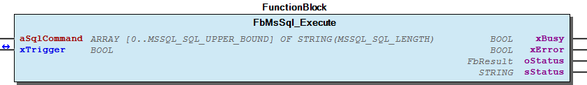 Function description Remarks for aSqlStatement : You can modify the “length” and number of elements in aSqlStatement by the global constants from the ParameterList: | - MSSQL_SQL_UPPER_BOUND: | Defines the UpperBound of aSqlStatement , to provide a SQL statement | as “ARRAY [0..MSSQL_SQL_UPPER_BOUND] OF STRING(MSSQL_SQL_LENGTH)” | - MSSQL_SQL_LENGTH: | Defines the Size in byte of an array element of aSqlStatement , | to provide a SQL statement as “ARRAY [0..MSSQL_SQL_UPPER_BOUND] OF STRING(MSSQL_SQL_LENGTH)”. All non numeric SQL param values must be “quoted” with an apostroph(‘). Apostroph(‘) is also CoDesys-String-Start-End-Identifier. To use an apostroph(‘) inside a CoDeSys-String type $27 or $’. Example Prepare SQL-Insert-Statement asSqlStatement1[0] := ‘INSERT INTO atable ‘; asSqlStatement1[1] := ‘( aBool, aByte, aWord, aDint, aReal, ‘; asSqlStatement1[2] := ‘ aString, aDT, aTime, aUdint ) ‘; asSqlStatement1[3] := ‘VALUES ‘; asSqlStatement1[4] := ‘( TRUE, 17, 32333, 1111111, 1.42, ‘; asSqlStatement1[5] := ‘ $’Hallo$’, $‘2010-08-13 11:56:42$’, ‘; asSqlStatement1[6] := ‘ $‘13:12:57$’, 62222 )’; asSqlStatement1[7] := ‘’; (* End of SQL-Statement ) (*The last element must be empty ) Note This function block must be used in the same task as FbMsSql_Login

## FbMsSql_Login (FB)

| Scope | Name | Type | Initial | Comment |
| --- | --- | --- | --- | --- |
| Input | sHost | STRING |  | DNS not yet supported |
| uiPort | UINT | 1433 | TCP-Port on which the MsSQL-server is listening, typ. 1433 |
| sUsername | STRING |  | Name of database account |
| sPassword | STRING |  | Password of database account |
| sAppName | STRING |  | Application name |
| sLibName | STRING |  | Library name |
| sDatabase | STRING |  | Name of schema to use initially - Optional param |
| Inout | xTrigger | BOOL |  | Start execution on a rising edge and reset internally when done or on timeout. |
| Output | xBusy | BOOL |  | Busy |
| xError | BOOL |  | Error occured |
| oStatus | WagoSysErrorBase.FbResult |  | Detailed Status and error information |
| sStatus | STRING(200) |  | Textual description of current state or error |
| xConnected | BOOL |  | TRUE: when database connection is established |

This function block is used to set up the connection to a MsSQL-Server

Graphical Illustration

Interface variables Function This function block is used to set up the connection to a MsSQL-Server Graphical Illustration 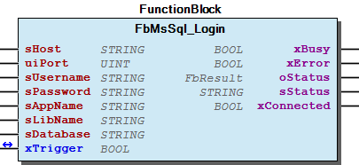

## FbMsSql_Logout (FB)

| Scope | Name | Type | Comment |
| --- | --- | --- | --- |
| Inout | xTrigger | BOOL | Start execution on a rising edge and reset internally when done or on timeout. |
| Output | xBusy | BOOL | Busy |
| xError | BOOL | Error occured |
| oStatus | WagoSysErrorBase.FbResult | Detailed Status and error information |
| sStatus | STRING(200) | Textual description of current state or error |

This function block is used to close the connection to a MsSQL-Server

Graphical Illustration

This function block must be used in the same task as FbMsSql_Login

Interface variables Function This function block is used to close the connection to a MsSQL-Server Graphical Illustration 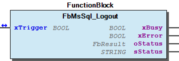 Note This function block must be used in the same task as FbMsSql_Login

## FbMsSql_Query (FB)

| Scope | Name | Type | Comment |
| --- | --- | --- | --- |
| Input | aSqlCommand | ARRAY [0..MSSQL_SQL_UPPER_BOUND] OF STRING(MSSQL_SQL_LENGTH) | SQL statement |
| Inout | xTrigger | BOOL | Start execution on a rising edge and reseted internally when done or on timeout. |
| typResultSet | typMsSql_ResultSet | Query response data |
| Output | xBusy | BOOL | Busy |
| xError | BOOL | Error occured |
| oStatus | WagoSysErrorBase.FbResult | Detailed Status and error information |
| sStatus | STRING(200) | Textual description of current state or error |

This function block is used to send SQL “SELECT” statements to a server which responds with result sets.

Graphical Illustration

Function description

Error code InvalidResponse indicates a mal formated packet. In this case the function block will close the connection.

Remarks for aSqlStatement : You can modify the “length” and number of elements in “aSqlStatement” by the global constants from the ParameterList: | - MSSQL_SQL_UPPER_BOUND: | Defines the UpperBound of aSqlStatement , to provide a SQL statement | as “ARRAY [0..UpperBound] OF STRING(Size)” | - MSSQL_SQL_LENGTH: | Defines the Size in byte of an array element of aSqlStatement , | to provide a SQL statement as “ARRAY [0..UpperBound] OF STRING(Size)”.

All non numeric SQL param values must be “quoted” with an apostroph(‘). Apostroph(‘) is also CoDesys-String-Start-End-Identifier. To use an apostroph(‘) inside a CoDeSys-String type $27 or $’.

This block must be used in the same task as FbMsSql_Login

Maximum length for identifiers MSSQL_MAX_IDENTIFIER_LENGTH is 250 bytes

Maximum length for field data is 500 bytes (TEXT, VARCHAR, ..)

Interface variables Function This function block is used to send SQL “SELECT” statements to a server which responds with result sets. Graphical Illustration 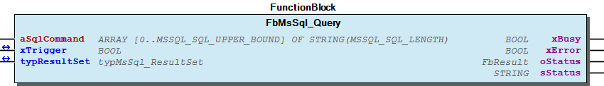 Function description Error code InvalidResponse indicates a mal formated packet. In this case the function block will close the connection. Remarks for aSqlStatement : You can modify the “length” and number of elements in “aSqlStatement” by the global constants from the ParameterList: | - MSSQL_SQL_UPPER_BOUND: | Defines the UpperBound of aSqlStatement , to provide a SQL statement | as “ARRAY [0..UpperBound] OF STRING(Size)” | - MSSQL_SQL_LENGTH: | Defines the Size in byte of an array element of aSqlStatement , | to provide a SQL statement as “ARRAY [0..UpperBound] OF STRING(Size)”. All non numeric SQL param values must be “quoted” with an apostroph(‘). Apostroph(‘) is also CoDesys-String-Start-End-Identifier. To use an apostroph(‘) inside a CoDeSys-String type $27 or $’. Note This block must be used in the same task as FbMsSql_Login Example (* Prepare SQL-SELECT-Statement * ) aSqlStatement1[0] := ‘SELECT * ‘; aSqlStatement1[1] := ‘FROM tablename ‘; aSqlStatement1[2] := ‘WHERE ‘; aSqlStatement1[3] := ‘ name = $27Meyer$27 ‘; aSqlStatement1[4] := ‘’; (* End of SQL-Statement * ) Note Maximum length for identifiers MSSQL_MAX_IDENTIFIER_LENGTH is 250 bytes Note Maximum length for field data is 500 bytes (TEXT, VARCHAR, ..)

### Functions

## FuMsSql_GetBOOL (FUN)

| Scope | Name | Type | Comment |
| --- | --- | --- | --- |
| Return | FuMSSQL_GetBOOL | DINT |  |
| Input | iCol | INT | First col start on index 1 |
| iRow | INT | First row start on index 1 |
| Inout | xValue | BOOL |  |
| typResultSet | typMSSQL_ResultSet |  |

This function converts the requested field data into a IEC61131 data type BOOL

Graphical Illustration

Function description

Interface variables Function This function converts the requested field data into a IEC61131 data type BOOL Graphical Illustration 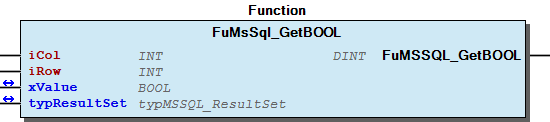 Function description Supported: TDS_DATA_BITN(16#68) TDS_DATA_BIT1(16#32) The following return values may be received 16#00000000 => ‘SUCCESS’ 16#80007001 => ‘PARAM-ERROR: Invalid param “row” - First row start on index 1 16#80007002 => ‘PARAM-ERROR: Invalid param “col” - First col start on index 1 16#80007003 => ‘PARAM-ERROR: Requested “row” do not exist in “stResultSet” 16#80007004 => ‘PARAM-ERROR: Requested “col” do not exist in “stResultSet” 16#80007005 => ‘CONVERT-ERROR: Requested “col.row” contains a NULL-VALUE’ 16#80007006 => ‘PARAM-ERROR: Requested “col” is not of type “BOOL” 16#80007008 => ‘PARAM-ERROR: Requested “col” is an unsupported fixed length type

## FuMsSql_GetBYTEARRAY (FUN)

| Scope | Name | Type | Comment |
| --- | --- | --- | --- |
| Return | FuMSSQL_GetBYTEARRAY | DINT |  |
| Input | iCol | INT | First col start on index 1 |
| iRow | INT | First row start on index 1 |
| pAddress | POINTER TO DWORD | Startaddress of byte array |
| diSize | DINT | Size of byte array |
| Inout | typResultSet | typMSSQL_ResultSet |  |

This function convert the requested field data into a IEC61131 data type “ARRAY [] OF BYTE”

Graphical Illustration

Function description

>= 0: SUCCESS, Number of bytes copied <0: ERROR, see below for Details

16#00000000 => ‘SUCCESS’ 16#80007001 => ‘PARAM-ERROR: Invalid param “row” - First row start on index 1 16#80007002 => ‘PARAM-ERROR: Invalid param “col” - First col start on index 1 16#80007003 => ‘PARAM-ERROR: Requested “row” do not exist in “stResultSet” 16#80007004 => ‘PARAM-ERROR: Requested “col” do not exist in “stResultSet” 16#80007005 => ‘CONVERT-ERROR: Requested “col.row” contains a NULL-VALUE’ 16#80007006 => ‘PARAM-ERROR: Requested “col” of unsupported type 16#8000701C => ‘PARAM-ERROR: Startaddress of byte array “dwAddress” not assigned 16#8000701D => ‘PARAM-ERROR: Size of byte array “diSize” not assigned’ 16#8000701E => ‘PARAM-ERROR: Size of byte array to small’

Interface variables Function This function convert the requested field data into a IEC61131 data type “ARRAY [] OF BYTE” Graphical Illustration 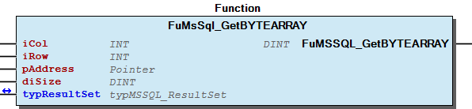 Function description Supported: TDS_DATA_BIGBINARY(16#AD) TDS_DATA_TEXT(16#23) The following return values may be received: >= 0: SUCCESS, Number of bytes copied <0: ERROR, see below for Details 16#00000000 => ‘SUCCESS’ 16#80007001 => ‘PARAM-ERROR: Invalid param “row” - First row start on index 1 16#80007002 => ‘PARAM-ERROR: Invalid param “col” - First col start on index 1 16#80007003 => ‘PARAM-ERROR: Requested “row” do not exist in “stResultSet” 16#80007004 => ‘PARAM-ERROR: Requested “col” do not exist in “stResultSet” 16#80007005 => ‘CONVERT-ERROR: Requested “col.row” contains a NULL-VALUE’ 16#80007006 => ‘PARAM-ERROR: Requested “col” of unsupported type 16#8000701C => ‘PARAM-ERROR: Startaddress of byte array “dwAddress” not assigned 16#8000701D => ‘PARAM-ERROR: Size of byte array “diSize” not assigned’ 16#8000701E => ‘PARAM-ERROR: Size of byte array to small’

## FuMsSql_GetDATETIME (FUN)

| Scope | Name | Type | Comment |
| --- | --- | --- | --- |
| Return | FuMSSQL_GetDATETIME | DINT |  |
| Input | iCol | INT | First col start on index 1 |
| iRow | INT | First row start on index 1 |
| Inout | dtValue | DT | Seconds since 01.01.1970 |
| typResultSet | typMSSQL_ResultSet |  |

This function convert the requested field data into a IEC61131 data type DATETIME

Graphical Illustration

Function description

Interface variables Function This function convert the requested field data into a IEC61131 data type DATETIME Graphical Illustration 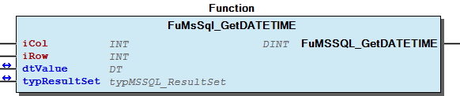 Function description Supported: TDS_DATA_DATETIMEN(16#6F) TDS_DATA_DATETIME8(16#3D) TDS_DATA_DATETIME4(16#3A) The following return values may be received 16#00000000 => ‘SUCCESS’ 16#80007001 => ‘PARAM-ERROR: Invalid param “row” - First row start on index 1 16#80007002 => ‘PARAM-ERROR: Invalid param “col” - First col start on index 1 16#80007003 => ‘PARAM-ERROR: Requested “row” do not exist in “stResultSet” 16#80007004 => ‘PARAM-ERROR: Requested “col” do not exist in “stResultSet” 16#80007005 => ‘CONVERT-ERROR: Requested “col.row” contains a NULL-VALUE’ 16#80007006 => ‘PARAM-ERROR: Requested “col” is not of type “DATETIME” 16#80007008 => ‘PARAM-ERROR: Requested “col” of unsupported type “DATETIME4” 16#80007015 => ‘CONVERT-ERROR: datetime value points to date before 1970 - Unable to convewrt to IEC-DT’

## FuMsSql_GetDINT (FUN)

| Scope | Name | Type | Comment |
| --- | --- | --- | --- |
| Return | FuMSSQL_GetDINT | DINT |  |
| Input | iCol | INT | First col start on index 1 |
| iRow | INT | First row start on index 1 |
| Inout | diValue | DINT |  |
| typResultSet | typMSSQL_ResultSet |  |

This function convert the requested field data into a IEC61131 data type DINT

Graphical Illustration

Function description

Supported: TDS_DATA_INTN(16#26)

The following return values may be received 16#00000000 => ‘SUCCESS’ 16#80007001 => ‘PARAM-ERROR: Invalid param “row” - First row start on index 1 16#80007002 => ‘PARAM-ERROR: Invalid param “col” - First col start on index 1 16#80007003 => ‘PARAM-ERROR: Requested “row” do not exist in “stResultSet” 16#80007004 => ‘PARAM-ERROR: Requested “col” do not exist in “stResultSet” 16#80007005 => ‘CONVERT-ERROR: Requested “col.row” contains a NULL-VALUE’ 16#80007006 => ‘PARAM-ERROR: Requested “col” is not of type “INT” 16#8000700A => ‘PARAM-ERROR: Requested “col” is an unsupported 8byte type

Interface variables Function This function convert the requested field data into a IEC61131 data type DINT Graphical Illustration 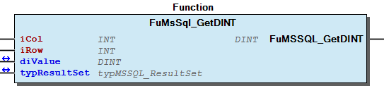 Function description Supported: TDS_DATA_INTN(16#26) The following return values may be received 16#00000000 => ‘SUCCESS’ 16#80007001 => ‘PARAM-ERROR: Invalid param “row” - First row start on index 1 16#80007002 => ‘PARAM-ERROR: Invalid param “col” - First col start on index 1 16#80007003 => ‘PARAM-ERROR: Requested “row” do not exist in “stResultSet” 16#80007004 => ‘PARAM-ERROR: Requested “col” do not exist in “stResultSet” 16#80007005 => ‘CONVERT-ERROR: Requested “col.row” contains a NULL-VALUE’ 16#80007006 => ‘PARAM-ERROR: Requested “col” is not of type “INT” 16#8000700A => ‘PARAM-ERROR: Requested “col” is an unsupported 8byte type

## FuMsSql_GetLREAL (FUN)

| Scope | Name | Type | Comment |
| --- | --- | --- | --- |
| Return | FuMsSql_GetLREAL | DINT |  |
| Input | iCol | INT | First col start on index 1 |
| iRow | INT | First row start on index 1 |
| Inout | lrValue | LREAL |  |
| typResultSet | typMSSQL_ResultSet |  |

This function convert the requested field data into a IEC61131 data type LREAL

Graphical Illustration

Function description

The following return values may be received 16#00000000 => ‘SUCCESS’ 16#80007001 => ‘PARAM-ERROR: Invalid param “row” - First row start on index 1 16#80007002 => ‘PARAM-ERROR: Invalid param “col” - First col start on index 1 16#80007003 => ‘PARAM-ERROR: Requested “row” do not exist in “stResultSet” 16#80007004 => ‘PARAM-ERROR: Requested “col” do not exist in “stResultSet” 16#80007005 => ‘CONVERT-ERROR: Requested “col.row” contains a NULL-VALUE’ 16#80007006 => ‘PARAM-ERROR: Requested “col” is not of type “FLOAT” or “REAL”

Interface variables Function This function convert the requested field data into a IEC61131 data type LREAL Graphical Illustration 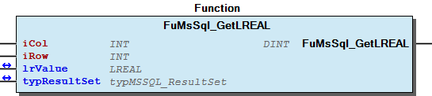 Function description Supported: TDS_DATA_FLOATN(16#6D), TDS_DATA_FLOAT4(16#3B), TDS_DATA_FLOAT8(16#3E) The following return values may be received 16#00000000 => ‘SUCCESS’ 16#80007001 => ‘PARAM-ERROR: Invalid param “row” - First row start on index 1 16#80007002 => ‘PARAM-ERROR: Invalid param “col” - First col start on index 1 16#80007003 => ‘PARAM-ERROR: Requested “row” do not exist in “stResultSet” 16#80007004 => ‘PARAM-ERROR: Requested “col” do not exist in “stResultSet” 16#80007005 => ‘CONVERT-ERROR: Requested “col.row” contains a NULL-VALUE’ 16#80007006 => ‘PARAM-ERROR: Requested “col” is not of type “FLOAT” or “REAL”

## FuMsSql_GetREAL (FUN)

| Scope | Name | Type | Comment |
| --- | --- | --- | --- |
| Return | FuMSSQL_GetREAL | DINT |  |
| Input | iCol | INT | First col start on index 1 |
| iRow | INT | First row start on index 1 |
| Inout | rValue | REAL |  |
| typResultSet | typMSSQL_ResultSet |  |

This function convert the requested field data into a IEC61131 data type REAL

Graphical Illustration

Function description

The following return values may be received 16#00000000 => ‘SUCCESS’ 16#80007001 => ‘PARAM-ERROR: Invalid param “row” - First row start on index 1 16#80007002 => ‘PARAM-ERROR: Invalid param “col” - First col start on index 1 16#80007003 => ‘PARAM-ERROR: Requested “row” do not exist in “stResultSet” 16#80007004 => ‘PARAM-ERROR: Requested “col” do not exist in “stResultSet” 16#80007005 => ‘CONVERT-ERROR: Requested “col.row” contains a NULL-VALUE’ 16#80007006 => ‘PARAM-ERROR: Requested “col” is not of type “FLOAT” or “REAL”

Interface variables Function This function convert the requested field data into a IEC61131 data type REAL Graphical Illustration 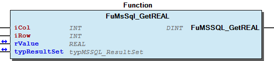 Function description Supported: TDS_DATA_FLOATN(16#6D), TDS_DATA_FLOAT4(16#3B), TDS_DATA_FLOAT8(16#3E) The following return values may be received 16#00000000 => ‘SUCCESS’ 16#80007001 => ‘PARAM-ERROR: Invalid param “row” - First row start on index 1 16#80007002 => ‘PARAM-ERROR: Invalid param “col” - First col start on index 1 16#80007003 => ‘PARAM-ERROR: Requested “row” do not exist in “stResultSet” 16#80007004 => ‘PARAM-ERROR: Requested “col” do not exist in “stResultSet” 16#80007005 => ‘CONVERT-ERROR: Requested “col.row” contains a NULL-VALUE’ 16#80007006 => ‘PARAM-ERROR: Requested “col” is not of type “FLOAT” or “REAL”

## FuMsSql_GetSTRING (FUN)

| Scope | Name | Type | Comment |
| --- | --- | --- | --- |
| Return | FuMsSql_GetSTRING | DINT |  |
| Input | iCol | INT | First col start on index 1 |
| iRow | INT | First row start on index 1 |
| Inout | sValue | STRING(500) |  |
| typResultSet | typMSSQL_ResultSet |  |

This function converts the requested field data into a IEC61131 data type and returns it as string

Graphical Illustration

Function description

The following return values may be received 16#00000000 => ‘SUCCESS’ 16#80007001 => ‘PARAM-ERROR: Invalid param “row” - First row start on index 1 16#80007002 => ‘PARAM-ERROR: Invalid param “col” - First col start on index 1 16#80007003 => ‘PARAM-ERROR: Requested “row” do not exist in “stResultSet” 16#80007004 => ‘PARAM-ERROR: Requested “col” do not exist in “stResultSet” 16#80007006 => ‘PARAM-ERROR: Requested “col” is not of type “STRING” 16#80007008 => ‘PARAM-ERROR: Requested “col” of currently unsupported type

Interface variables Function This function converts the requested field data into a IEC61131 data type and returns it as string Graphical Illustration 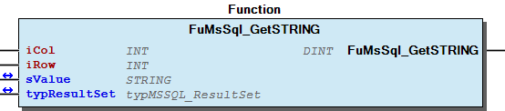 Function description Supported column types: TDS_DATA_NVARCHAR(16#E7) TDS_DATA_BIGVARCHAR(16#A7) TDS_DATA_NCHAR(16#EF) TDS_DATA_BIGCHAR(16#AF) TDS_DATA_GUID(16#24) The following return values may be received 16#00000000 => ‘SUCCESS’ 16#80007001 => ‘PARAM-ERROR: Invalid param “row” - First row start on index 1 16#80007002 => ‘PARAM-ERROR: Invalid param “col” - First col start on index 1 16#80007003 => ‘PARAM-ERROR: Requested “row” do not exist in “stResultSet” 16#80007004 => ‘PARAM-ERROR: Requested “col” do not exist in “stResultSet” 16#80007006 => ‘PARAM-ERROR: Requested “col” is not of type “STRING” 16#80007008 => ‘PARAM-ERROR: Requested “col” of currently unsupported type

### Methods

## ResultSetHelpers

- FuMsSql_GetBOOL (FUN) - FuMsSql_GetBYTEARRAY (FUN) - FuMsSql_GetDATETIME (FUN) - FuMsSql_GetDINT (FUN) - FuMsSql_GetLREAL (FUN) - FuMsSql_GetREAL (FUN) - FuMsSql_GetSTRING (FUN)

## typMsSql_ResultSet (STRUCT)

| Name | Type | Comment |
| --- | --- | --- |
| uiColumnCount | UINT | Number of columns in a dataset |
| astColumns | ARRAY [1..MSSQL_MAX_COLUMN_COUNT] OF typMsSql_Column | Column-Details |
| uiRowCount | UINT | Number of datasets in servers response |
| abRows | ARRAY [1..MSSQL_MAX_ROW_COUNT] OF ARRAY [0..MSSQL_MAX_ROW_SIZE] OF BYTE | Raw datasets |

This structure contains the response data of a succesful executed SELECT statement in a raw format. Use function “MsSql_GetStringValue()” to access and convert raw data into IEC-STRING. Afterwarts use IEC-Convert functions “STRING_TO_x” to map data to local PLC-Variables.

InOut: This structure contains the response data of a succesful executed SELECT statement in a raw format. Use function “MsSql_GetStringValue()” to access and convert raw data into IEC-STRING. Afterwarts use IEC-Convert functions “STRING_TO_x” to map data to local PLC-Variables.

### Program Organization

## 20 Program Organization Units

- Data types typMsSql_Column (STRUCT) - typMsSql_ResultSet (STRUCT) FbMsSql_Execute (FB) FbMsSql_Login (FB) FbMsSql_Logout (FB) FbMsSql_Query (FB) ResultSetHelpers - FuMsSql_GetBOOL (FUN) - FuMsSql_GetBYTEARRAY (FUN) - FuMsSql_GetDATETIME (FUN) - FuMsSql_GetDINT (FUN) - FuMsSql_GetLREAL (FUN) - FuMsSql_GetREAL (FUN) - FuMsSql_GetSTRING (FUN)

### Global Variable Lists

## Status (GVL)

| Scope | Name | Type | Initial |
| --- | --- | --- | --- |
| Constant | StatusMsSql | ARRAY [0..25] OF WagoTypesErrorBase.typResultItem | [STRUCT(ID := eStatus.OK, Severity := WagoTypesErrorBase.WagoTypes.eSeverity.info, text := ‘OK’), STRUCT(ID := eStatus.NotConnectedWithDataBase, Severity := WagoTypesErrorBase.WagoTypes.eSeverity.error, text := ‘Not connected with data base server’), STRUCT(ID := eStatus.InvalidResponse, Severity := WagoTypesErrorBase.WagoTypes.eSeverity.error, text := ‘Invalid or unexpected response’), STRUCT(ID := eStatus.Timeout, Severity := WagoTypesErrorBase.WagoTypes.eSeverity.error, text := ‘Timeout’), STRUCT(ID := eStatus.ErrorMessage, Severity := WagoTypesErrorBase.WagoTypes.eSeverity.error, text := ‘Error message from server’), STRUCT(ID := eStatus.ResultSetMoreColumn, Severity := WagoTypesErrorBase.WagoTypes.eSeverity.error, text := ‘Result set has more columns then defined ‘), STRUCT(ID := eStatus.NoLoginAckToken, Severity := WagoTypesErrorBase.WagoTypes.eSeverity.error, text := ‘Did not receive LOGINACK TOKEN’), STRUCT(ID := eStatus.UnknownToken, Severity := WagoTypesErrorBase.WagoTypes.eSeverity.error, text := ‘Receiving unknown TOKEN from server’), STRUCT(ID := eStatus.SqlQueryFault, Severity := WagoTypesErrorBase.WagoTypes.eSeverity.error, text := ‘Response from SQL query could not be evaluated’), STRUCT(ID := eStatus.IdentifierExceeds250, Severity := WagoTypesErrorBase.WagoTypes.eSeverity.error, text := ‘Length of identifier in column “x” exceed maximum of 250 bytes’), STRUCT(ID := eStatus.IdentifierToLarge, Severity := WagoTypesErrorBase.WagoTypes.eSeverity.error, text := ‘Identifier for “fieldname” in column “x” exceed maximum’), STRUCT(ID := eStatus.RowToLarge, Severity := WagoTypesErrorBase.WagoTypes.eSeverity.error, text := ‘Length of row data exceed maximum ‘), STRUCT(ID := eStatus.RowReceivedToLarge, Severity := WagoTypesErrorBase.WagoTypes.eSeverity.warning, text := ‘Number of received rows exceed maximum’), STRUCT(ID := eStatus.HostNotAssigned, Severity := WagoTypesErrorBase.WagoTypes.eSeverity.error, text := ‘Input sHost not assigned’), STRUCT(ID := eStatus.UserNotAssigned, Severity := WagoTypesErrorBase.WagoTypes.eSeverity.error, text := ‘Input sUser not assigned’), STRUCT(ID := eStatus.ProtocolMissMatch, Severity := WagoTypesErrorBase.WagoTypes.eSeverity.error, text := ‘Library requires protocol version 10 or above. Server supports only version x’), STRUCT(ID := eStatus.InternalFunctionError, Severity := WagoTypesErrorBase.WagoTypes.eSeverity.error, text := ‘Function “FuMsSql_Scramble()” returns with error’), STRUCT(ID := eStatus.ConvertToDottedFormatFailed, Severity := WagoTypesErrorBase.WagoTypes.eSeverity.error, text := ‘Could not convert servers IP address into dotted format’), STRUCT(ID := eStatus.ServerClosedConnection, Severity := WagoTypesErrorBase.WagoTypes.eSeverity.error, text := ‘Server closed connection’), STRUCT(ID := eStatus.CreateSocketFailed, Severity := WagoTypesErrorBase.WagoTypes.eSeverity.error, text := ‘Create socket failed’), STRUCT(ID := eStatus.DNSRequestFailed, Severity := WagoTypesErrorBase.WagoTypes.eSeverity.error, text := ‘DNS request failed’), STRUCT(ID := eStatus.NoneBlockingFailed, Severity := WagoTypesErrorBase.WagoTypes.eSeverity.error, text := ‘Switching the socket to none blocking failed’), STRUCT(ID := eStatus.RxBufferToSmall, Severity := WagoTypesErrorBase.WagoTypes.eSeverity.error, text := ‘MSSQL_RESPONSE_BUFFER_SIZE to small’), STRUCT(ID := eStatus.TxBufferToSmall, Severity := WagoTypesErrorBase.WagoTypes.eSeverity.error, text := ‘MSSQL_TX_BUFFER_SIZE to small’), STRUCT(ID := eStatus.ColumnTypUnsupported, Severity := WagoTypesErrorBase.WagoTypes.eSeverity.error, text := ‘Column type unspported’), STRUCT(ID := eStatus.ColumnNotString, Severity := WagoTypesErrorBase.WagoTypes.eSeverity.error, text := ‘Column type not String’)] |

Description: Status information

Description: Status information

## VersionHistory (GVL)

| Name | Type |
| --- | --- |
| Info | WagoSysVersion.ProjectInfo |

| date | version | author | change |
| 31.01.2023 | 1.6.2.1 | u0103719 | WAT34389: replace CDS3 Libs (Context:CmpErrors Interfaces -> CmpErrors2 Interfaces) |
| 17.01.2023 | 1.6.2.0 | u010663 | Allow for 64-Bit system |
| 24.09.2021 | 1.6.1.1 | u010663 | Allow strings greater than 255 ->internal improvement |
| 08.01.2019 | 1.6.1.0 | u015842 | Properties: free placeholder added |
| 10.09.2018 | 1.6.0.7 | u010640 | FuMsSql_GetString: Add support for TDS_DATA_BIGCHAR(16#AF) |
| 10.09.2018 | 1.6.0.6 | u010640 | FbMsSql_Query: Bugfix - FB stalls in ‘wState=62’ on empty strings in DB |
| 10.09.2018 | 1.6.0.5 | u010640 | FuMsSql_GetString: “sValue” now returns an empty string for “NULL-VALUES” in DB instead of “Error-Messages” |
| 03.01.2018 | 1.6.0.4 | u010640 | ResultsetHelpers: Add convert function to support 64bit float values |
| 20.11.2017 | 1.6.0.2 | u010640 | FbMsSql_Execute: Bugfix increase length of ‘sHelp’ |
| 16.11.2017 | 1.6.0.1 | u010640 | FbMsSql_Query: Bugfix Stored procedure - Ignore DONE_INPROC Token |
| 02.03.2016 | 1.6.0.0 | u010663 | Update to WagoSysErrorbase |
| 19.01.2016 | 1.0.1.0 | u010663 | interface changed |
| 12.01.2016 | 1.0.0.0 | u010663 | init |

WagoAppSQL_MsSQL.library

WagoAppSQL_MsSQL.library

### Other Components

## 80 Status ¶

- Status (GVL) - eStatus (ENUM)

## Data types

- typMsSql_Column (STRUCT) - typMsSql_ResultSet (STRUCT)

## ParameterList (PARAMS)

| Scope | Name | Type | Initial | Comment |
| --- | --- | --- | --- | --- |
| Constant | MSSQL_RESPONSE_BUFFER_SIZE | DWORD | 1000 | Defines the receive buffer size for any SQL response |
| MSSQL_MAX_COLUMN_COUNT | DWORD | 15 | Defines the maximum number of columns in a result set this library can process. |
| MSSQL_MAX_ROW_COUNT | DWORD | 40 | Defines the maximum number of rows in a result set this library can process. |
| MSSQL_MAX_ROW_SIZE | DWORD | 500 | Defines the maximum length (size in bytes) of one row in a result set this library can process. |
| MSSQL_CLEAR_RESULT_SET_BEFORE_USE | BOOL | FALSE | Clear the “stResultSet” before use(need approximatly 400ms), used by function block “MsSql_Query”. |
| MSSQL_MAX_IDENTIFIER_LENGTH | DWORD | 80 | Defines the maximum length (size in bytes) of a column name, used by structure “MsSql_FieldInfo”, this library can process. Must be less than 250. |
| MSSQL_SQL_UPPER_BOUND | INT | 10 | Defines the upper bound of “aSqlStatement”, used by function blocks “MsSql_ExecSql” and “MsSql_Query” to provide an SQL statement as “ARRAY [0..MSSQL_SQL_UPPER_BOUND] OF STRING(MSSQL_SQL_LENGTH)”. |
| MSSQL_SQL_LENGTH | INT | 200 | Defines the size in byte of an array element of “aSqlStatement”, used by function blocks “MsSql_ExecSql” and “MsSql_Query” to provide an SQL statement as “ARRAY [0..MSSQL_SQL_UPPER_BOUND] OF STRING(MSSQL_SQL_LENGTH)”. |
| MSSQL_TIMEOUT | TIME | TIME#10s0ms | WatchDog time - Defines the maximum time a function block is operating in the same stage without progress. |
| MSSQL_TX_BUFFER_SIZE | DWORD | 2000 | Defines the transmit buffer size. Value must be larger than 1000. |
| MSSQL_RX_BUFFER_SIZE | DWORD | 2000 | Defines the receive buffer size. |

## eStatus (ENUM)

| Name | Initial | Comment |
| --- | --- | --- |
| OK | 0 | OK |
| NotConnectedWithDataBase | 50 | Not connected with data base |
| InvalidResponse | 51 | Invalid response |
| Timeout | 52 | Timeout |
| ErrorMessage | 53 | Error message from server |
| ResultSetMoreColumn | 54 | Result set has more columns then defined in ´´MSSQL_MAX_COLUMN_COUNT´´ |
| NoLoginAckToken | 55 | Did not receive LOGINACK TOKEN |
| UnknownToken | 56 | Receiving unknown TOKEN from server |
| SqlQueryFault | 57 | Response from SQL query could not be evaluated |
| IdentifierExceeds250 | 58 | Length of identifier in column “x” exceed maximum of 250 bytes |
| IdentifierToLarge | 59 | Identifier for “fieldname” in column “x” exceed maximum of “MSSQL_MAX_IDENTIFIER_LENGTH”’; |
| RowToLarge | 60 | Length of row data exceed maximum of “MSSQL_MAX_ROW_SIZE” |
| RowReceivedToLarge | 61 | Number of received rows exceed maximum of “MSSQL_MAX_ROW_COUNT” - Some rows are ignored’ |
| HostNotAssigned | 62 | Input sHost not assigned |
| UserNotAssigned | 63 | Input sUser not assigned |
| ProtocolMissMatch | 64 | Library requires protocol version 10 or above. Server support only version x |
| InternalFunctionError | 65 | Function “MsSql_Scramble()” returns with error’ |
| ConvertToDottedFormatFailed | 66 | Could not convert servers IP address into dotted format’ |
| ServerClosedConnection | 67 | Socket gracefully closed ->connection closed by server |
| CreateSocketFailed | 68 | Create a socket failed |
| DNSRequestFailed | 69 | DNS request failed |
| NoneBlockingFailed | 70 | Switching the socket to none blocking failed |
| RxBufferToSmall | 71 | Receive buffer to small - increase “MSSQL_RESPONSE_BUFFER_SIZE” |
| TxBufferToSmall | 72 | Transmit buffer to small - increase MSSQL_TX_BUFFER_SIZE |
| ColumnTypUnsupported | 73 | PARAM-ERROR: Requested “col” of currently unsupported type |
| ColumnNotString | 74 | PARAM-ERROR: Requested “col” is not of type “STRING” |
| Dummy | 1000 |  |

Description: Status information

InOut: Description: Status information

## typMsSql_Column (STRUCT)

| Name | Type | Comment |
| --- | --- | --- |
| sName | STRING(MSSQL_MAX_IDENTIFIER_LENGTH) | Column name |
| bType | BYTE | MSSQL-Data-Type of column |
| bLenSize | UDINT | Number of bytes used for Length information of data |
| udiLength | UDINT | Length of data in bytes in a ROW_TOKEN |
| wFlags | WORD |  |
| wUDDT | WORD | User-Defined-Data-Type |

This structure contains detail informations about each “column” or “data field” in a result set

InOut: This structure contains detail informations about each “column” or “data field” in a result set