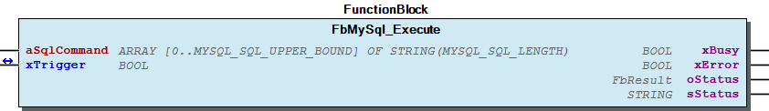
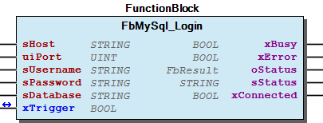
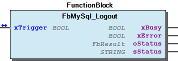
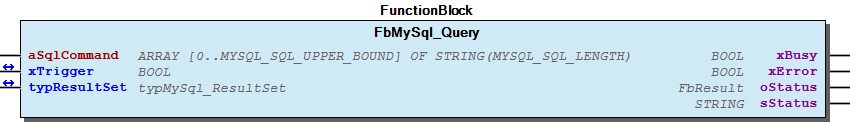
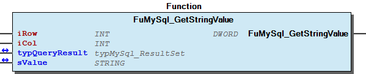

# WagoAppSQL_MySQL v1.6.2.6 (WAGO) - Complete Documentation

## 📋 Library Information

- **Company:** WAGO
- **Title:** WagoAppSQL_MySQL
- **Version:** 1.6.2.6
- **Categories:** WAGO FunctionalView|Connectivity; WAGO LayerView|App; Application
- **Author:** WAGO/u010663
- **Placeholder:** WagoAppSQL_MySQL

### Description ¶

This document is automatically generated.

Function blocks providing access to a MySQL database.

This document is automatically generated. Function blocks providing access to a MySQL database.

### Contents: ¶

Contents: - Documentation Index - Project Information - Library Information - Function Blocks FbMySql_Execute (FB) - FbMySql_Login (FB) - FbMySql_Logout (FB) - FbMySql_Query (FB) Functions Methods Program Organization Global Variable Lists - Status (GVL) - VersionHistory (GVL) Other Components - 80 Status - Data types - ParameterList (PARAMS) - eMySql_FieldTypes (ENUM) - eStatus (ENUM) - typMySql_FieldInfo (STRUCT) - typMySql_ServerInfo (STRUCT)

### Indices and tables ¶

Based on WagoAppSQL_MySQL.library, last modified 29.05.2024, 20:43:12. LibDoc 3.5.16.10

© WAGO GmbH & Co. KG, Germany 2018 – All rights reserved. For the avoidance of doubt, this copyright notice does not only apply to the information above but also and primarily to the described library itself. Please note that third-party products are always mentioned without reference to intellectual property rights, including patents, utility models, designs and trademarks, accordingly the existence of such rights cannot be excluded. WAGO is a registered trademark of WAGO Verwaltungsgesellschaft mbH.

- File and Project Information - Library Reference Based on WagoAppSQL_MySQL.library, last modified 29.05.2024, 20:43:12. LibDoc 3.5.16.10 © WAGO GmbH & Co. KG, Germany 2018 – All rights reserved. For the avoidance of doubt, this copyright notice does not only apply to the information above but also and primarily to the described library itself. Please note that third-party products are always mentioned without reference to intellectual property rights, including patents, utility models, designs and trademarks, accordingly the existence of such rights cannot be excluded. WAGO is a registered trademark of WAGO Verwaltungsgesellschaft mbH.

### Documentation Index

## WagoAppSQL_MySQL Library Documentation

| Company: | WAGO |
| Title: | WagoAppSQL_MySQL |
| Version: | 1.6.2.6 |
| Categories: | WAGO FunctionalView\|Connectivity; WAGO LayerView\|App; Application |
| Author: | WAGO/u010663 |
| Placeholder: | WagoAppSQL_MySQL |

### Description

This document is automatically generated.

Function blocks providing access to a MySQL database.

This document is automatically generated. Function blocks providing access to a MySQL database.

### Contents:

- 20 Program Organization Units Data types - FbMySql_Execute (FB) - FbMySql_Login (FB) - FbMySql_Logout (FB) - FbMySql_Query (FB) - FuMySql_GetStringValue (FUN) 80 Status - Status (GVL) - eStatus (ENUM) ParameterList (PARAMS) VersionHistory (GVL)

### Indices and tables

Based on WagoAppSQL_MySQL.library, last modified 29.05.2024, 20:43:12. LibDoc 3.5.16.10

© WAGO GmbH & Co. KG, Germany 2018 – All rights reserved. For the avoidance of doubt, this copyright notice does not only apply to the information above but also and primarily to the described library itself. Please note that third-party products are always mentioned without reference to intellectual property rights, including patents, utility models, designs and trademarks, accordingly the existence of such rights cannot be excluded. WAGO is a registered trademark of WAGO Verwaltungsgesellschaft mbH.

- File and Project Information - Library Reference Based on WagoAppSQL_MySQL.library, last modified 29.05.2024, 20:43:12. LibDoc 3.5.16.10 © WAGO GmbH & Co. KG, Germany 2018 – All rights reserved. For the avoidance of doubt, this copyright notice does not only apply to the information above but also and primarily to the described library itself. Please note that third-party products are always mentioned without reference to intellectual property rights, including patents, utility models, designs and trademarks, accordingly the existence of such rights cannot be excluded. WAGO is a registered trademark of WAGO Verwaltungsgesellschaft mbH.

### Project Information

## File and Project Information

| Scope | Name | Type | Content |
| --- | --- | --- | --- |
| FileHeader | libraryFile | string | WagoAppSQL_MySQL.library |
| contentFile | doc.clean.json |
| productName | e!COCKPIT |
| creationDateTime | date | 29.05.2024, 20:43:12 |
| companyName | string | WAGO |
| ProjectInformation | LastModificationDateTime | date | 29.05.2024, 20:43:12 |
| Description | string | See: Description |
| Copyright | © WAGO Kontakttechnik GmbH & Co. KG, Germany 2018 – All rights reserved. |
| Author | WAGO/u010663 |
| AutoResolveUnbound | bool | True |
| Placeholder | string | WagoAppSQL_MySQL |
| Company | WAGO |
| DocFormat | reStructuredText |
| Project | WagoAppSQL_MySQL |
| Version | version | 1.6.2.6 |
| Version string | string |  |
| Title | WagoAppSQL_MySQL |
| LibraryCategories | library-category-list | WAGO FunctionalView\|Connectivity; WAGO LayerView\|App; Application |
| CompiledLibraryCompatibilityVersion | string | CODESYS V3.5 SP16 Patch 3 |

### Library Information

## Library Reference

| LinkAllContent: False QualifiedOnly: False | SystemLibrary: False | Optional: False |

| LinkAllContent: False QualifiedOnly: False | SystemLibrary: False | Optional: False |

| LinkAllContent: False QualifiedOnly: False | SystemLibrary: False | Optional: False |

| LinkAllContent: False QualifiedOnly: True | SystemLibrary: False | Optional: False |

| LinkAllContent: False QualifiedOnly: False | SystemLibrary: False | Optional: False |

| LinkAllContent: False QualifiedOnly: True | SystemLibrary: False | Optional: False |

| LinkAllContent: False QualifiedOnly: False | SystemLibrary: False | Optional: False |

| LinkAllContent: False QualifiedOnly: False | SystemLibrary: False | Optional: False |

| LinkAllContent: False QualifiedOnly: False | SystemLibrary: False | Optional: False |

| LinkAllContent: False QualifiedOnly: True | SystemLibrary: False | Optional: False |

| LinkAllContent: False QualifiedOnly: False | SystemLibrary: False | Optional: False |

| LinkAllContent: False QualifiedOnly: True | SystemLibrary: False | Optional: False |

| LinkAllContent: False QualifiedOnly: False | SystemLibrary: False | Optional: False |

This is a dictionary of all referenced libraries and their name spaces.

This is a dictionary of all referenced libraries and their name spaces. CmpAsyncMgr Library Identification : Name: CmpAsyncMgr Version: newest Company: System Namespace: CmpAsyncMgr Library Properties : CmpErrors2 Interfaces Library Identification : Name: CmpErrors2 Interfaces Version: newest Company: System Namespace: CmpErrors Library Properties : Standard Library Identification : Placeholder: Standard Default Resolution: Standard, * (System) Namespace: Standard Library Properties : SysCpuHandling Library Identification : Placeholder: SysCpuHandling Default Resolution: SysCpuHandling, * (System) Namespace: SysCpuHandling Library Properties : SysSocketAsync Library Identification : Name: SysSocketAsync Version: newest Company: System Namespace: SysSocketAsync Library Properties : SysSocketAsync Library Identification : Placeholder: SysSocketAsync Default Resolution: SysSocketAsync, * (System) Namespace: SysSocketAsync Library Properties : SysTypes2 Interfaces Library Identification : Name: SysTypes2 Interfaces Version: newest Company: System Namespace: SysTypes Library Properties : WagoSysBSDSocket Library Identification : Placeholder: WagoSysBSDSocket Default Resolution: WagoSysBSDSocket, * (WAGO) Namespace: WagoSysBSDSocket Library Properties : WagoSysErrorBase Library Identification : Placeholder: WagoSysErrorBase Default Resolution: WagoSysErrorBase, * (WAGO) Namespace: WagoSysErrorBase Library Properties : Library Parameter : Parameter: RES_LOG_MAX_FILESIZE = 2000 Parameter: RES_LOG_MAX_FILES = 1 Parameter: RES_LOG_MAX_ENTRIES = 200 Parameter: RES_LOG_NAME = ‘WagoAppResultLogger’ WagoSysString Library Identification : Placeholder: WagoSysString Default Resolution: WagoSysString, * (WAGO) Namespace: WagoSysString Library Properties : WagoSysVersion Library Identification : Name: WagoSysVersion Version: 1.0.0.0 Company: WAGO Namespace: WagoSysVersion Library Properties : WagoTypesCommon Library Identification : Placeholder: WagoTypesCommon Default Resolution: WagoTypesCommon, * (WAGO) Namespace: WagoTypes Library Properties : WagoTypesErrorBase Library Identification : Placeholder: WagoTypesErrorBase Default Resolution: WagoTypesErrorBase, * (WAGO) Namespace: WagoTypesErrorBase Library Properties :

### Function Blocks

## FbMySql_Execute (FB)

| Scope | Name | Type | Comment |
| --- | --- | --- | --- |
| Input | aSqlCommand | ARRAY [0..MYSQL_SQL_UPPER_BOUND] OF STRING(MYSQL_SQL_LENGTH) | SQL statement |
| Inout | xTrigger | BOOL | Start execution on a rising edge and reseted internally when done or on timeout. |
| Output | xBusy | BOOL |  |
| xError | BOOL |  |
| oStatus | WagoSysErrorBase.FbResult |  |
| sStatus | STRING(200) | Textual description of current state or error |

This function block is used to send SQL statements, such as:

to a server which does not respond with a result set.

Graphical Illustration

Function description

Remarks for aSqlStatement : You can modify the “length” and number of elements in “aSqlStatement” by the global constants from the ParameterList: | - MYSQL_SQL_UPPER_BOUND: | Defines the UpperBound of aSqlStatement , to provide a SQL statement | as “ARRAY [0..MYSQL_SQL_UPPER_BOUND] OF STRING(MYSQL_SQL_LENGTH)” | - MYSQL_SQL_LENGTH: | Defines the Size in byte of an array element of aSqlStatement , | to provide a SQL statement as “ARRAY [0..MYSQL_SQL_UPPER_BOUND] OF STRING(MYSQL_SQL_LENGTH)”.

All non numeric SQL param values must be “quoted” with an apostroph(‘). Apostroph(‘) is also CoDesys-String-Start-End-Identifier. To use an apostroph(‘) inside a CoDeSys-String type $27 or $’.

Maximum length for identifiers is 250 bytes

Interface variables Function This function block is used to send SQL statements, such as: INSERT, UPDATE, DELETE, ALTER, DROP, ... to a server which does not respond with a result set. Graphical Illustration  Function description Remarks for aSqlStatement : You can modify the “length” and number of elements in “aSqlStatement” by the global constants from the ParameterList: | - MYSQL_SQL_UPPER_BOUND: | Defines the UpperBound of aSqlStatement , to provide a SQL statement | as “ARRAY [0..MYSQL_SQL_UPPER_BOUND] OF STRING(MYSQL_SQL_LENGTH)” | - MYSQL_SQL_LENGTH: | Defines the Size in byte of an array element of aSqlStatement , | to provide a SQL statement as “ARRAY [0..MYSQL_SQL_UPPER_BOUND] OF STRING(MYSQL_SQL_LENGTH)”. All non numeric SQL param values must be “quoted” with an apostroph(‘). Apostroph(‘) is also CoDesys-String-Start-End-Identifier. To use an apostroph(‘) inside a CoDeSys-String type $27 or $’. Example Prepare SQL-Insert-Statement asSqlStatement1[0] := ‘INSERT INTO atable ‘; asSqlStatement1[1] := ‘( aBool, aByte, aWord, aDint, aReal, ‘; asSqlStatement1[2] := ‘ aString, aDT, aTime, aUdint ) ‘; asSqlStatement1[3] := ‘VALUES ‘; asSqlStatement1[4] := ‘( TRUE, 17, 32333, 1111111, 1.42, ‘; asSqlStatement1[5] := ‘ $’Hallo$’, $‘2010-08-13 11:56:42$’, ‘; asSqlStatement1[6] := ‘ $‘13:12:57$’, 62222 )’; asSqlStatement1[7] := ‘’; (* End of SQL-Statement * ) Note Maximum length for identifiers is 250 bytes

## FbMySql_Login (FB)

| Scope | Name | Type | Initial | Comment |
| --- | --- | --- | --- | --- |
| Input | sHost | STRING |  | IP or hostname from MySQL-server |
| uiPort | UINT | 3306 | TCP-Port on which the MySQL-server is listening, typ. 3306 |
| sUsername | STRING |  | Name of database account |
| sPassword | STRING |  | Password of database account |
| sDatabase | STRING |  | Name of schema to use initially - Optional param |
| Inout | xTrigger | BOOL |  | Start execution on a rising edge and reset internally when done or on timeout. |
| Output | xBusy | BOOL |  | Busy |
| xError | BOOL |  | Error occured |
| oStatus | WagoSysErrorBase.FbResult |  | Detailed Status and error information |
| sStatus | STRING(200) |  | Textual description of current state or error |
| xConnected | BOOL |  | TRUE: when database connection is established |

This function block is used to set up and monitor the connection to a MySQL-Server. ATTENTION: This function block has to be called within every PLC cycle!!!

Graphical Illustration

Interface variables Function This function block is used to set up and monitor the connection to a MySQL-Server. ATTENTION: This function block has to be called within every PLC cycle!!! Graphical Illustration 

## FbMySql_Logout (FB)

| Scope | Name | Type | Comment |
| --- | --- | --- | --- |
| Inout | xTrigger | BOOL | Start execution on a rising edge and reset internally when done or on timeout. |
| Output | xBusy | BOOL | Busy |
| xError | BOOL | Error occured |
| oStatus | WagoSysErrorBase.FbResult | Detailed Status and error information |
| sStatus | STRING(200) | Textual description of current state or error |

This function block is used to close the connection to a MySQL-Server

Graphical Illustration

Interface variables Function This function block is used to close the connection to a MySQL-Server Graphical Illustration 

## FbMySql_Query (FB)

| Scope | Name | Type | Comment |
| --- | --- | --- | --- |
| Input | aSqlCommand | ARRAY [0..MYSQL_SQL_UPPER_BOUND] OF STRING(MYSQL_SQL_LENGTH) |  |
| Inout | xTrigger | BOOL | Start execution on a rising edge and reseted internally when done or on timeout. |
| typResultSet | typMySql_ResultSet | Query response data |
| Output | xBusy | BOOL | Busy |
| xError | BOOL | Error occured |
| oStatus | WagoSysErrorBase.FbResult | Detailed Status and error information |
| sStatus | STRING(200) | Textual description of current state or error |

This function block is used to send SQL “SELECT” statements to a server which responds with result sets.

Graphical Illustration

Function description

Remarks for aSqlStatement : You can modify the “length” and number of elements in “aSqlStatement” by the global constants from the ParameterList: | - MYSQL_SQL_UPPER_BOUND: | Defines the UpperBound of aSqlStatement , to provide a SQL statement | as “ARRAY [0..MYSQL_SQL_UPPER_BOUND] OF STRING(MYSQL_SQL_LENGTH)” | - MYSQL_SQL_LENGTH: | Defines the Size in byte of an array element of aSqlStatement , | to provide a SQL statement as “ARRAY [0..MYSQL_SQL_UPPER_BOUND] OF STRING(MYSQL_SQL_LENGTH)”.

All non numeric SQL param values must be “quoted” with an apostroph(‘). Apostroph(‘) is also CoDesys-String-Start-End-Identifier. To use an apostroph(‘) inside a CoDeSys-String type $27 or $’.

(* Prepare SQL-SELECT-Statement ) aSqlStatement1[0] := ‘SELECT * ‘; aSqlStatement1[1] := ‘FROM tablename ‘; aSqlStatement1[2] := ‘WHERE ‘; aSqlStatement1[3] := ‘ name = $27Meyer$27 ‘; aSqlStatement1[4] := ‘’; ( End of SQL-Statement * )

Maximum length for identifiers is 250 bytes

Maximum length for field data are 500 bytes (TEXT, VARCHAR, ..)

Interface variables Function This function block is used to send SQL “SELECT” statements to a server which responds with result sets. Graphical Illustration  Function description Remarks for aSqlStatement : You can modify the “length” and number of elements in “aSqlStatement” by the global constants from the ParameterList: | - MYSQL_SQL_UPPER_BOUND: | Defines the UpperBound of aSqlStatement , to provide a SQL statement | as “ARRAY [0..MYSQL_SQL_UPPER_BOUND] OF STRING(MYSQL_SQL_LENGTH)” | - MYSQL_SQL_LENGTH: | Defines the Size in byte of an array element of aSqlStatement , | to provide a SQL statement as “ARRAY [0..MYSQL_SQL_UPPER_BOUND] OF STRING(MYSQL_SQL_LENGTH)”. All non numeric SQL param values must be “quoted” with an apostroph(‘). Apostroph(‘) is also CoDesys-String-Start-End-Identifier. To use an apostroph(‘) inside a CoDeSys-String type $27 or $’. Example (* Prepare SQL-SELECT-Statement ) aSqlStatement1[0] := ‘SELECT * ‘; aSqlStatement1[1] := ‘FROM tablename ‘; aSqlStatement1[2] := ‘WHERE ‘; aSqlStatement1[3] := ‘ name = $27Meyer$27 ‘; aSqlStatement1[4] := ‘’; ( End of SQL-Statement * ) Note Maximum length for identifiers is 250 bytes Note Maximum length for field data are 500 bytes (TEXT, VARCHAR, ..)

### Functions

## FuMySql_GetStringValue (FUN)

| Scope | Name | Type | Comment |
| --- | --- | --- | --- |
| Return | FuMySql_GetStringValue | DWORD |  |
| Input | iRow | INT | Row to process, start with index 1 for the first row |
| iCol | INT | Column to process, start with index 1 for the first column |
| Inout | typQueryResult | typMySql_ResultSet |  |
| sValue | STRING(500) | Value as STRING(500) or error message |

This function converts the requested field data into a IEC61131 data type and returns it as string

Graphical Illustration

Function description

The following return values may be received 16#00000000 => ‘SUCCESS’ 16#80006001 => ‘PARAM-ERROR: Invalid param “row” - First row start on index 1. ; 16#80006002 => ‘PARAM-ERROR: Invalid param “col” - First col start on index 1. ; 16#80006003 => ‘PARAM-ERROR: Requested row do not exist in “stQueryResult”; 16#80006004 => ‘PARAM-ERROR: Requested col do not exist in “stQueryResult”; 16#80006005 => ‘CONVERT-ERROR: Length of col “x” exceed maximum of 500 bytes; 16#80006006 => ‘CONVERT-ERROR: Field “x” use unsupported 8byte style for length informations’; 16#80006007 => ‘CONVERT-ERROR: Unknown MySQL-Data-Type: “x”’; 16#80006008 => ‘CONVERT-ERROR: Unsupported MySQL-Data-Type: “x”’;

Interface variables Function This function converts the requested field data into a IEC61131 data type and returns it as string Graphical Illustration  Function description The following return values may be received 16#00000000 => ‘SUCCESS’ 16#80006001 => ‘PARAM-ERROR: Invalid param “row” - First row start on index 1. ; 16#80006002 => ‘PARAM-ERROR: Invalid param “col” - First col start on index 1. ; 16#80006003 => ‘PARAM-ERROR: Requested row do not exist in “stQueryResult”; 16#80006004 => ‘PARAM-ERROR: Requested col do not exist in “stQueryResult”; 16#80006005 => ‘CONVERT-ERROR: Length of col “x” exceed maximum of 500 bytes; 16#80006006 => ‘CONVERT-ERROR: Field “x” use unsupported 8byte style for length informations’; 16#80006007 => ‘CONVERT-ERROR: Unknown MySQL-Data-Type: “x”’; 16#80006008 => ‘CONVERT-ERROR: Unsupported MySQL-Data-Type: “x”’;

### Methods

## typMySql_ResultSet (STRUCT)

| Name | Type | Comment |
| --- | --- | --- |
| uiColumnCount | UINT | Number of columns in a dataset |
| astColumns | ARRAY [0..MYSQL_MAX_COLUMN_COUNT] OF typMySql_FieldInfo | Column-Details |
| uiRowCount | UINT | Number of datasets in servers response |
| abRows | ARRAY [0..MYSQL_MAX_ROW_COUNT] OF ARRAY [0..MYSQL_MAX_ROW_SIZE] OF BYTE | Raw datasets |

This structure contains the response data of a succesful executed SELECT statement in a raw format. Use function “MySql_GetStringValue()” to access and convert raw data into IEC-STRING. Afterwarts use IEC-Convert functions “STRING_TO_x” to map data to local PLC-Variables.

InOut: This structure contains the response data of a succesful executed SELECT statement in a raw format. Use function “MySql_GetStringValue()” to access and convert raw data into IEC-STRING. Afterwarts use IEC-Convert functions “STRING_TO_x” to map data to local PLC-Variables.

### Program Organization

## 20 Program Organization Units

- Data types eMySql_FieldTypes (ENUM) - typMySql_FieldInfo (STRUCT) - typMySql_ResultSet (STRUCT) - typMySql_ServerInfo (STRUCT) FbMySql_Execute (FB) FbMySql_Login (FB) FbMySql_Logout (FB) FbMySql_Query (FB) FuMySql_GetStringValue (FUN)

### Global Variable Lists

## Status (GVL)

| Scope | Name | Type |
| --- | --- | --- |
| Constant | StatusMySql | ARRAY [0..23] OF WagoTypesErrorBase.typResultItem |

| Value | Level | Description |
| --- | --- | --- |
| eStatus.OK | WagoTypesErrorBase.WagoTypes.eSeverity.info | ‘OK’ |
| eStatus.NotConnectedWithDataBase | WagoTypesErrorBase.WagoTypes.eSeverity.error | ‘Not connected with data base server’ |
| eStatus.InvalidResponse | WagoTypesErrorBase.WagoTypes.eSeverity.error | ‘Invalid or unexpected response’ |
| eStatus.Timeout | WagoTypesErrorBase.WagoTypes.eSeverity.error | ‘Timeout’ |
| eStatus.ErrorMessage | WagoTypesErrorBase.WagoTypes.eSeverity.error | ‘Error message from server’ |
| eStatus.ResultSetMoreColumn | WagoTypesErrorBase.WagoTypes.eSeverity.error | ‘Result set has more columns then defined ‘ |
| eStatus.ColumnCountWrong_64Bit | WagoTypesErrorBase.WagoTypes.eSeverity.error | ‘Unsupported value for “column count” |
| eStatus.ColumnCountWrong_24Bit | WagoTypesErrorBase.WagoTypes.eSeverity.error | ‘Unsupported value for “column count” |
| eStatus.ColumnCountWrong_16Bit | WagoTypesErrorBase.WagoTypes.eSeverity.error | ‘Unsupported value for “column count” |
| eStatus.IdentifierExceeds250 | WagoTypesErrorBase.WagoTypes.eSeverity.error | ‘Length of identifier in column “x” exceed maximum of 250 bytes’ |
| eStatus.IdentifierToLarge | WagoTypesErrorBase.WagoTypes.eSeverity.error | ‘Identifier for “fieldname” in column “x” exceed maximum’ |
| eStatus.RowToLarge | WagoTypesErrorBase.WagoTypes.eSeverity.error | ‘Length of row data exceed maximum ‘ |
| eStatus.RowReceivedToLarge | WagoTypesErrorBase.WagoTypes.eSeverity.warning | ‘Number of received rows exceed maximum’ |
| eStatus.HostNotAssigned | WagoTypesErrorBase.WagoTypes.eSeverity.error | ‘Input sHost not assigned’ |
| eStatus.UserNotAssigned | WagoTypesErrorBase.WagoTypes.eSeverity.error | ‘Input sUser not assigned’ |
| eStatus.ProtocolMissMatch | WagoTypesErrorBase.WagoTypes.eSeverity.error | ‘Library requires protocol version 10 or above. Server supports only version x’ |
| eStatus.InternalFunctionError | WagoTypesErrorBase.WagoTypes.eSeverity.error | ‘Function “FuMySql_Scramble()” returns with error’ |
| eStatus.ConvertToDottedFormatFailed | WagoTypesErrorBase.WagoTypes.eSeverity.error | ‘Could not convert servers IP address into dotted format’ |
| eStatus.ServerClosedConnection | WagoTypesErrorBase.WagoTypes.eSeverity.error | ‘Server closed connection’ |
| eStatus.CreateSocketFailed | WagoTypesErrorBase.WagoTypes.eSeverity.error | ‘Create socket failed’ |
| eStatus.DNSRequestFailed | WagoTypesErrorBase.WagoTypes.eSeverity.error | ‘DNS request failed’ |
| eStatus.NoneBlockingFailed | WagoTypesErrorBase.WagoTypes.eSeverity.error | ‘Switching the socket to none blocking failed’ |
| eStatus.RxBufferToSmall | WagoTypesErrorBase.WagoTypes.eSeverity.error | ‘Switching the socket to none blocking failed’ |

Description: Status information

Description: Status information

## VersionHistory (GVL)

| Name | Type |
| --- | --- |
| Info | WagoSysVersion.ProjectInfo |

| date | version | author | change |
| 02.05.2024 | 1.6.2.6 | u010663 | Improve Login |
| 17.01.2024 | 1.6.2.4 | u010663 | Adjustment 64-bit additional adjustment |
| 20.11.2023 | 1.6.2.3 | u010663 | Adjustment 64-bit |
| 16.11.2023 | 1.6.1.3 | u010663 | Improvement execution time FbMySql_Query |
| 24.08.2022 | 1.6.1.2 | u010663 | Improvement FbMySql_Login |
| 24.09.2021 | 1.6.1.1 | u010663 | String size greater than 255 allowed ->internal improvement |
| 08.01.2019 | 1.6.1.0 | u015842 | Properties: free placeholder added |
| 19.03.2018 | 1.6.0.5 | u010640 | FbMySql_Login.xError show pseudo error on normal logout |
| 06.10.2017 | 1.6.0.4 | u010663 | Doku issues |
| 12.06.2017 | 1.6.0.3 | u010663 | Bugfix FbMySql_Login |
| 31.01.2017 | 1.6.0.2 | u010640 | Allow use of function blocks in different tasks |
| 24.01.2017 | 1.6.0.1 | u010640 | FbMySQL_Query: Bugfix to support STORED-PROCEDURE’s |
| 02.03.2016 | 1.6.0.0 | u010663 | Release |

WagoAppSQL_MySQL.library

WagoAppSQL_MySQL.library

### Other Components

## 80 Status ¶

- Status (GVL) - eStatus (ENUM)

## Data types

- eMySql_FieldTypes (ENUM) - typMySql_FieldInfo (STRUCT) - typMySql_ResultSet (STRUCT) - typMySql_ServerInfo (STRUCT)

## ParameterList (PARAMS)

| Scope | Name | Type | Initial | Comment |
| --- | --- | --- | --- | --- |
| Constant | MYSQL_MAX_COLUMN_COUNT | INT | 15 | Defines the maximum number of columns in a result set this library can process. |
| MYSQL_MAX_ROW_COUNT | INT | 40 | Defines the maximum number of rows in a result set this library can process. |
| MYSQL_MAX_ROW_SIZE | INT | 500 | Defines the maximum length (size in bytes) of one row in a result set this library can process. |
| MYSQL_CLEAR_RESULT_SET_BEFORE_USE | BOOL | FALSE | Clear the “stResultSet” before use(need approximatly 400ms), used by function block “MySql_Query”. |
| MYSQL_MAX_IDENTIFIER_LENGTH | INT | 80 | Defines the maximum length (size in bytes) of a column name, used by structure “MySql_FieldInfo”, this library can process. |
| MYSQL_SQL_UPPER_BOUND | INT | 10 | Defines the upper bound of “aSqlStatement”, used by function blocks “MySql_ExecSql” and “MySql_Query” to provide a SQL statement as “ARRAY [0..MYSQL_SQL_UPPER_BOUND] OF STRING(MYSQL_SQL_LENGTH)”. |
| MYSQL_SQL_LENGTH | INT | 100 | Defines the size in byte of an array element of “aSqlStatement”, used by function blocks “MySql_ExecSql” and “MySql_Query” to provide a SQL statement as “ARRAY [0..MYSQL_SQL_UPPER_BOUND] OF STRING(MYSQL_SQL_LENGTH)”. |
| MYSQL_TIMEOUT | TIME | TIME#10s0ms | WatchDog time - Defines the maximum time a function block is operating in the same stage without progress. |
| MYSQL_TX_BUFFER_SIZE | INT | 2000 | Defines the transmit buffer size |
| MYSQL_RX_BUFFER_SIZE | INT | 2000 | Defines the receive buffer size. Value must be larger than 1500. |
| MYSQL_RX_TIMEOUT | TIME | TIME#500ms | Define the maximum time to receive the complied server response, If TIMEOUT elapsed, FB try to process received data |
| MYSQL_MAX_PACKET_SIZE | UDINT | 1024 | The maximum number of bytes in a packet for the client. |
| MYSQL_CHARSET_NUMBER | BYTE | 16#8 | 16#08 ->CHARACTER_SET_NAME: latin1 ; COLLATION_NAME:latin1_swedish_ci |

## eMySql_FieldTypes (ENUM)

| Name | Initial |
| --- | --- |
| MYSQL_TYPE_DECIMAL |  |
| MYSQL_TYPE_TINY |  |
| MYSQL_TYPE_SHORT |  |
| MYSQL_TYPE_LONG |  |
| MYSQL_TYPE_FLOAT |  |
| MYSQL_TYPE_DOUBLE |  |
| MYSQL_TYPE_NULL |  |
| MYSQL_TYPE_TIMESTAMP |  |
| MYSQL_TYPE_LONGLONG |  |
| MYSQL_TYPE_INT24 |  |
| MYSQL_TYPE_DATE |  |
| MYSQL_TYPE_TIME |  |
| MYSQL_TYPE_DATETIME |  |
| MYSQL_TYPE_YEAR |  |
| MYSQL_TYPE_NEWDATE |  |
| MYSQL_TYPE_VARCHAR |  |
| MYSQL_TYPE_BIT |  |
| MYSQL_TYPE_NEWDECIMAL | 246 |
| MYSQL_TYPE_ENUM | 247 |
| MYSQL_TYPE_SET | 248 |
| MYSQL_TYPE_TINY_BLOB | 249 |
| MYSQL_TYPE_MEDIUM_BLOB | 250 |
| MYSQL_TYPE_LONG_BLOB | 251 |
| MYSQL_TYPE_BLOB | 252 |
| MYSQL_TYPE_VAR_STRING | 253 |
| MYSQL_TYPE_STRING | 254 |
| MYSQL_TYPE_GEOMETRY | 255 |

## eStatus (ENUM)

| Name | Initial | Comment |
| --- | --- | --- |
| OK | 0 | OK |
| NotConnectedWithDataBase | 50 | Not connected with data base |
| InvalidResponse | 51 | Invalid response |
| Timeout | 52 | Timeout |
| ErrorMessage | 53 | Error message from server |
| ResultSetMoreColumn | 54 | Result set has more columns then defined in ´´MYSQL_MAX_COLUMN_COUNT´´ |
| ColumnCountWrong_64Bit | 55 | Unsupported value for “column count”, provided as 64-bit value(8 bytes) in “Result-Set-Header-Packet” ‘ |
| ColumnCountWrong_24Bit | 56 | Unsupported value for “column count”, provided as 24-bit value(3 bytes) in “Result-Set-Header-Packet” ‘ |
| ColumnCountWrong_16Bit | 57 | Unsupported value for “column count”, provided as 16-bit value(2 bytes) in “Result-Set-Header-Packet” ‘ |
| IdentifierExceeds250 | 58 | Length of identifier in column “x” exceed maximum of 250 bytes |
| IdentifierToLarge | 59 | Identifier for “fieldname” in column “x” exceed maximum of “MYSQL_MAX_IDENTIFIER_LENGTH”’; |
| RowToLarge | 60 | Length of row data exceed maximum of “MYSQL_MAX_ROW_SIZE” |
| RowReceivedToLarge | 61 | Number of received rows exceed maximum of “MYSQL_MAX_ROW_COUNT” - Some rows are ignored’ |
| HostNotAssigned | 62 | Input sHost not assigned |
| UserNotAssigned | 63 | Input sUser not assigned |
| ProtocolMissMatch | 64 | Library requires protocol version 10 or above. Server support only version x |
| InternalFunctionError | 65 | Function “MySql_Scramble()” returns with error’ |
| ConvertToDottedFormatFailed | 66 | Could not convert servers IP address into dotted format’ |
| ServerClosedConnection | 67 | Socket gracefully closed ->connection closed by server |
| CreateSocketFailed | 68 | Create a socket failed |
| DNSRequestFailed | 69 | DNS request failed |
| NoneBlockingFailed | 70 | Switching the socket to none blocking failed |
| RxBufferToSmall | 71 | Receive buffer to small - increase “MYSQL_RX_BUFFER_SIZE” |
| TxBufferToSmall | 72 | Transmit buffer to small - increase MYSQL_TX_BUFFER_SIZE |
| Dummy | 1000 |  |

Description: Status information

InOut: Description: Status information

## typMySql_FieldInfo (STRUCT)

| Name | Type |
| --- | --- |
| sName | STRING(MYSQL_MAX_IDENTIFIER_LENGTH) |
| udiLength | UDINT |
| eType | eMySql_FieldTypes |
| wFlags | WORD |
| bDecimals | BYTE |

This structure contains detail informations about each “column” or “data field” in a result set

InOut: This structure contains detail informations about each “column” or “data field” in a result set

## typMySql_ServerInfo (STRUCT)

| Name | Type |
| --- | --- |
| bProtocolVersion | BYTE |
| sServerVersion | STRING |
| dwThreadId | DWORD |
| abScrambleBuffer | ARRAY [0..20] OF BYTE |
| wServerCapabilities | WORD |
| bServerLanguageId | BYTE |
| wServerStatus | WORD |