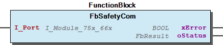
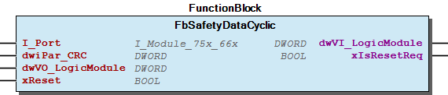
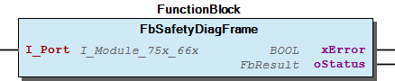
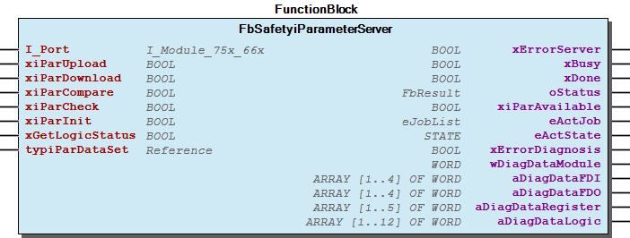

# WagoAppSafety v1.2.0.5 (WAGO) - Complete Documentation


## 📋 Library Information

- **Company:** WAGO
- **Title:** WagoAppSafety
- **Version:** 1.2.0.5
- **Categories:** WAGO LayerView|App; Application
- **Namespace:** WagoAppSafety
- **Author:** WAGO / u0103719
- **Placeholder:** WagoAppSafety

### Description ¶


This document is automatically generated.

Handling safety modules

This document is automatically generated. Handling safety modules

### Contents: ¶


Contents: - Documentation Index - Project Information - Library Information - Function Blocks FbSafetyCom (FB) - FbSafetyDataCyclic (FB) - FbSafetyDiagFrame (FB) - FbSafetyiParameterServer (FB) Methods - FbSafetyCom.FB_Init (METH) - typiParDataSet (STRUCT) Base Components Internal Components Global Variable Lists Other Components - 20 Programm Organization Units - 21 Advanced Services - 30 Visualization - 30 Visualization - 80 Status - Communication - Diagnostics - FbSafetyDiagFrame.bDiagFrame (PROP) - FbSafetyDiagFrame.eErrorSource (PROP) - FbSafetyDiagFrame.usiChannelNo (PROP) - ... and 9 more

### Indices and tables ¶


Based on WagoAppSafety.library, last modified 20.09.2024, 22:32:49. LibDoc 3.5.16.10

© WAGO GmbH & Co. KG, Germany 2018 – All rights reserved. For the avoidance of doubt, this copyright notice does not only apply to the information above but also and primarily to the described library itself. Please note that third-party products are always mentioned without reference to intellectual property rights, including patents, utility models, designs and trademarks, accordingly the existence of such rights cannot be excluded. WAGO is a registered trademark of WAGO Verwaltungsgesellschaft mbH.

- File and Project Information - Library Reference Based on WagoAppSafety.library, last modified 20.09.2024, 22:32:49. LibDoc 3.5.16.10 © WAGO GmbH & Co. KG, Germany 2018 – All rights reserved. For the avoidance of doubt, this copyright notice does not only apply to the information above but also and primarily to the described library itself. Please note that third-party products are always mentioned without reference to intellectual property rights, including patents, utility models, designs and trademarks, accordingly the existence of such rights cannot be excluded. WAGO is a registered trademark of WAGO Verwaltungsgesellschaft mbH.

### Documentation Index


## WagoAppSafety Library Documentation


| Company: | WAGO |
| Title: | WagoAppSafety |
| Version: | 1.2.0.5 |
| Categories: | WAGO LayerView\|App; Application |
| Namespace: | WagoAppSafety |
| Author: | WAGO / u0103719 |
| Placeholder: | WagoAppSafety |

### Description


This document is automatically generated.

Handling safety modules

This document is automatically generated. Handling safety modules

### Contents:


- 20 Programm Organization Units 20 Base Services - 21 Advanced Services 30 Visualization 80 Status - TL_eErrorSource (Text List) - TL_eErrorType (Text List) - typModuleData (STRUCT) - typiParDataSet (STRUCT) 90 Internal - 30 Visualization GlobalTextList (Text List) ParameterAppSafety (PARAMS) VersionHistory (GVL)

### Indices and tables


Based on WagoAppSafety.library, last modified 20.09.2024, 22:32:49. LibDoc 3.5.16.10

© WAGO GmbH & Co. KG, Germany 2018 – All rights reserved. For the avoidance of doubt, this copyright notice does not only apply to the information above but also and primarily to the described library itself. Please note that third-party products are always mentioned without reference to intellectual property rights, including patents, utility models, designs and trademarks, accordingly the existence of such rights cannot be excluded. WAGO is a registered trademark of WAGO Verwaltungsgesellschaft mbH.

- File and Project Information - Library Reference Based on WagoAppSafety.library, last modified 20.09.2024, 22:32:49. LibDoc 3.5.16.10 © WAGO GmbH & Co. KG, Germany 2018 – All rights reserved. For the avoidance of doubt, this copyright notice does not only apply to the information above but also and primarily to the described library itself. Please note that third-party products are always mentioned without reference to intellectual property rights, including patents, utility models, designs and trademarks, accordingly the existence of such rights cannot be excluded. WAGO is a registered trademark of WAGO Verwaltungsgesellschaft mbH.

### Project Information


## File and Project Information


| Scope | Name | Type | Content |
| --- | --- | --- | --- |
| FileHeader | libraryFile | string | WagoAppSafety.library |
| contentFile | doc.clean.json |
| productName | e!COCKPIT |
| creationDateTime | date | 20.09.2024, 22:32:55 |
| companyName | string | WAGO |
| ProjectInformation | LastModificationDateTime | date | 20.09.2024, 22:32:49 |
| Description | string | See: Description |
| Copyright | © WAGO Kontakttechnik GmbH & Co. KG, Germany 2018 – All rights reserved. |
| Author | WAGO / u0103719 |
| AutoResolveUnbound | bool | True |
| Placeholder | string | WagoAppSafety |
| Company | WAGO |
| DocFormat | reStructuredText |
| Project | WagoAppSafety |
| DefaultNamespace | WagoAppSafety |
| Version | version | 1.2.0.5 |
| Title | string | WagoAppSafety |
| LibraryCategories | library-category-list | WAGO LayerView\|App; Application |
| CompiledLibraryCompatibilityVersion | string | CODESYS V3.5 SP16 Patch 3 |

### Library Information


## Library Reference


| LinkAllContent: False QualifiedOnly: True | SystemLibrary: False | Optional: False |

| LinkAllContent: False QualifiedOnly: False | SystemLibrary: False | Optional: False |

| LinkAllContent: False Optional: False | QualifiedOnly: False SystemLibrary: False | PublishSymbolsInContainer: True |

| LinkAllContent: False QualifiedOnly: True | SystemLibrary: False | Optional: False |

| LinkAllContent: False QualifiedOnly: False | SystemLibrary: False | Optional: False |

| LinkAllContent: False QualifiedOnly: False | SystemLibrary: True | Optional: False |

| LinkAllContent: False QualifiedOnly: False | SystemLibrary: True | Optional: False |

| LinkAllContent: False QualifiedOnly: False | SystemLibrary: True | Optional: False |

| LinkAllContent: False QualifiedOnly: False | SystemLibrary: True | Optional: False |

| LinkAllContent: False QualifiedOnly: False | SystemLibrary: True | Optional: False |

| LinkAllContent: False QualifiedOnly: False | SystemLibrary: True | Optional: False |

| LinkAllContent: False QualifiedOnly: False | SystemLibrary: True | Optional: False |

| LinkAllContent: False QualifiedOnly: False | SystemLibrary: True | Optional: False |

| LinkAllContent: False QualifiedOnly: False | SystemLibrary: True | Optional: False |

| LinkAllContent: False QualifiedOnly: False | SystemLibrary: True | Optional: False |

| LinkAllContent: False QualifiedOnly: False | SystemLibrary: True | Optional: False |

| LinkAllContent: False Optional: False | QualifiedOnly: False SystemLibrary: True | PublishSymbolsInContainer: True |

| LinkAllContent: False QualifiedOnly: False | SystemLibrary: True | Optional: False |

| LinkAllContent: False QualifiedOnly: False | SystemLibrary: False | Optional: False |

| LinkAllContent: False QualifiedOnly: False | SystemLibrary: False PublishSymbolsInContainer: True | Optional: False |

| LinkAllContent: False QualifiedOnly: False | SystemLibrary: False | Optional: False |

| LinkAllContent: False Optional: False | QualifiedOnly: True SystemLibrary: False | PublishSymbolsInContainer: True |

| LinkAllContent: False QualifiedOnly: False | SystemLibrary: False | Optional: False |

| LinkAllContent: False QualifiedOnly: False | SystemLibrary: False | Optional: False |

| LinkAllContent: False QualifiedOnly: False | SystemLibrary: False | Optional: False |

| LinkAllContent: False QualifiedOnly: False | SystemLibrary: False | Optional: False |

This is a dictionary of all referenced libraries and their name spaces.

This is a dictionary of all referenced libraries and their name spaces. CAA Memory Library Identification : Placeholder: CAA Memory Default Resolution: CAA Memory, * (CAA Technical Workgroup) Namespace: MEM Library Properties : CmpApp Library Identification : Placeholder: CmpApp Default Resolution: CmpApp, * (System) Namespace: CmpApp Library Properties : CmpBitmapPool Library Identification : Placeholder: CmpBitmapPool Default Resolution: CmpBitmapPool, * (System) Namespace: CmpBitmapPool Library Properties : Common Behaviour Model Library Identification : Placeholder: CBML Default Resolution: Common Behaviour Model, * (3S - Smart Software Solutions GmbH) Namespace: CBML Library Properties : Util Library Identification : Placeholder: Util Default Resolution: Util, * (System) Namespace: Util Library Properties : Library Parameter : Parameter: IBLOCKSIZE = 22800 VisuElem3DPath Library Identification : Placeholder: System_VisuElem3DPath Default Resolution: VisuElem3DPath, 3.5.16.30 (System) Namespace: VisuElem3DPath Library Properties : Library Parameter : Parameter: GC_POINTS_PER_POLYGON = 100 VisuElemCamDisplayer Library Identification : Placeholder: System_VisuElemCamDisplayer Default Resolution: VisuElemCamDisplayer, 3.5.16.30 (System) Namespace: VisuElemCamDisplayer Library Properties : Library Parameter : Parameter: GC_POINTS_PER_CAM = 100 VisuElemMeter Library Identification : Placeholder: System_VisuElemMeter Default Resolution: VisuElemMeter, 3.5.16.30 (System) Namespace: VisuElemMeter Library Properties : VisuElemTextEditor Library Identification : Placeholder: System_VisuElemTextEditor Default Resolution: VisuElemTextEditor, 3.5.16.30 (System) Namespace: VisuElemTextEditor Library Properties : VisuElemTrace Library Identification : Placeholder: System_VisuElemTrace Default Resolution: VisuElemTrace, 3.5.16.30 (System) Namespace: VisuElemTrace Library Properties : VisuElemXYChart Library Identification : Placeholder: System_VisuElemXYChart Default Resolution: VisuElemXYChart, 3.5.16.30 (System) Namespace: VisuElemXYChart Library Properties : VisuElems Library Identification : Placeholder: System_VisuElems Default Resolution: VisuElems, 3.5.16.30 (System) Namespace: VisuElems Library Properties : VisuElemsAlarm Library Identification : Placeholder: System_VisuElemsAlarm Default Resolution: VisuElemsAlarm, 3.5.16.30 (System) Namespace: VisuElemsAlarm Library Properties : VisuElemsDateTime Library Identification : Placeholder: System_VisuElemsDateTime Default Resolution: VisuElemsDateTime, 3.5.16.30 (System) Namespace: VisuElemsDateTime Library Properties : VisuElemsSpecialControls Library Identification : Placeholder: System_VisuElemsSpecialControls Default Resolution: VisuElemsSpecialControls, 3.5.16.30 (System) Namespace: VisuElemsSpecialControls Library Properties : VisuElemsWinControls Library Identification : Placeholder: System_VisuElemsWinControls Default Resolution: VisuElemsWinControls, 3.5.16.30 (System) Namespace: VisuElemsWinControls Library Properties : VisuInputs Library Identification : Placeholder: system_visuinputs Default Resolution: VisuInputs, 3.5.16.30 (System) Namespace: visuinputs Library Properties : VisuNativeControl Library Identification : Placeholder: System_VisuNativeControl Default Resolution: VisuNativeControl, 3.5.16.0 (System) Namespace: VisuNativeControl Library Properties : WagoAppTime Library Identification : Placeholder: WagoAppTime Default Resolution: WagoAppTime, * (WAGO) Namespace: WagoAppTime Library Properties : WagoSysErrorBase Library Identification : Placeholder: WagoSysErrorBase Default Resolution: WagoSysErrorBase, * (WAGO) Namespace: WagoSysErrorBase Library Properties : Library Parameter : Parameter: RES_LOG_MAX_FILESIZE = 2000 Parameter: RES_LOG_MAX_FILES = 1 Parameter: RES_LOG_MAX_ENTRIES = 200 Parameter: RES_LOG_NAME = ‘WagoAppResultLogger’ WagoSysLog Library Identification : Placeholder: WagoSysLog Default Resolution: WagoSysLog, * (WAGO) Namespace: WagoSysLog Library Properties : WagoSysModuleBase Library Identification : Placeholder: WagoSysModuleBase Default Resolution: WagoSysModuleBase, * (WAGO) Namespace: WagoSysModuleBase Library Properties : WagoSysModule_75x_66x Library Identification : Placeholder: WagoSysModule_75x_66x Default Resolution: WagoSysModule_75x_66x, * (WAGO) Namespace: WagoSysModule_75x_66x Library Properties : WagoSysPlainMem Library Identification : Placeholder: WagoSysPlainMem Default Resolution: WagoSysPlainMem, * (WAGO) Namespace: WagoSysPlainMem Library Properties : WagoSysVersion Library Identification : Name: WagoSysVersion Version: 1.0.0.0 Company: WAGO Namespace: WagoSysVersion Library Properties : WagoTypesModule_75x_66x Library Identification : Placeholder: WagoTypesModule_75x_66x Default Resolution: WagoTypesModule_75x_66x, * (WAGO) Namespace: WagoTypesModule_75x_66x Library Properties :

### Function Blocks


## FbSafetyCom (FB)


| Scope | Name | Type |
| --- | --- | --- |
| Input | I_Port | WagoTypesModule_75x_66x.I_Module_75x_66x |
| Output | xError | BOOL |
| oStatus | WagoSysErrorBase.FbResult |

```
VAR
    mySafetyCom             : FbSafetyCom;          //create a communication object
END_VAR


mySafetyCom( I_Port     := my667, // call the communication object and take over the Safety Module interface
             xError     => ,
             oStatus    =>);
```

Graphical Illustration

Graphical Interface of FbSafetyCom

Interface variables Function This function text... Graphical Illustration  Graphical Interface of FbSafetyCom Example text... - FbSafetyCom.FB_Init (METH)

## FbSafetyDataCyclic (FB)


| Scope | Name | Type | Comment | Inherited from |
| --- | --- | --- | --- | --- |
| Input | I_Port | WagoTypesModule_75x_66x.I_Module_75x_66x | safety module | FbSafetyBase |
| dwiPar_CRC | DWORD | F_iPar_CRC of module |  |
| dwVO_LogicModule | DWORD | VO of logic module (virtual outputs) |  |
| xReset | BOOL | reset request to module |  |
| Output | dwVI_LogicModule | DWORD | VI of logic module (virtual inputs) |  |
| xIsResetReq | BOOL | reset request of module active |  |

```
VAR
    mySafetyDataCyclic          : WagoAppSafety.FbSafetyDataCyclic;   //create a DataCyclic object
    dwiPar_CRC                  : DWORD;
    dwVO_LogicModule            : DWORD;
    xResetDataCyclic            : BOOL;
END_VAR

dwiPar_CRC :=mySafetyiParameterServer.dwiParCrcInfoDataset;         //get valid CrcInfoDataset from FbSafetyiParameterServer object

mySafetyDataCyclic(
    I_Port              := my667,                                   //safety module
    dwiPar_CRC          := dwiPar_CRC,
    dwVO_LogicModule    := dwVO_LogicModule,
    xReset              := xResetDataCyclic,
    xError              => ,
    xBusy               => ,
    oStatus             => ,
    dwVI_LogicModule    => ,
    xIsResetReq         => );
```

Graphical Illustration

Graphical Interface of FbSafetyDataCyclic

Interface variables Function This function provide the handling via DataCyclic. Graphical Illustration  Graphical Interface of FbSafetyDataCyclic Example

## FbSafetyDiagFrame (FB)


| Scope | Name | Type |
| --- | --- | --- |
| Input | I_Port | WagoTypesModule_75x_66x.I_Module_75x_66x |
| Output | xError | BOOL |
| oStatus | WagoSysErrorBase.FbResult |

```
VAR
    myFbSafetyDiagFrame                     : WagoAppSafety.FbSafetyDiagFrame; //create a DiagFrame object
    myStatus                                : WagoSysErrorBase.FbResult;
END_VAR

myFbSafetyDiagFrame(I_Port  := my667,
                    xError  => ,
                    oStatus => myStatus);
```

Graphical Illustration

Graphical Interface of FbSafetyDiagFrame

Interface variables Function This function text... Graphical Illustration  Graphical Interface of FbSafetyDiagFrame Example Note text... - I_SafetyDiagFrame FbSafetyDiagFrame.bDiagFrame (PROP) - FbSafetyDiagFrame.eErrorSource (PROP) - FbSafetyDiagFrame.usiChannelNo (PROP) - FbSafetyDiagFrame.xIsDiagPresent (PROP)

## FbSafetyiParameterServer (FB)


| Scope | Name | Type | Initial | Comment | Inherited from |
| --- | --- | --- | --- | --- | --- |
| Input | I_Port | WagoTypesModule_75x_66x.I_Module_75x_66x |  | safety module | FbSafetyBase |
| xiParUpload | BOOL |  | upload request iParameter |  |
| xiParDownload | BOOL |  | download request iParameter |  |
| xiParCompare | BOOL |  | compare iParameter |  |
| xiParCheck | BOOL |  | check valid iParameterDataSet (offline) |  |
| xiParInit | BOOL |  | activation of the input leads to the data record being deleted. |  |
| xGetLogicStatus | BOOL |  | read status of logic blocks |  |
| typiParDataSet | REFERENCE TO typiParDataSet |  | iParameterDataSet of logic module |  |
| Output | xErrorServer | BOOL |  | error active context: server |  |
| xBusy | BOOL |  |  |  |
| xDone | BOOL |  |  |  |
| oStatus | WagoSysErrorBase.FbResult |  |  |  |
| xiParAvailable | BOOL |  | indication iParameter available |  |
| eActJob | eJobList | eJobList.NONE |  |  |
| eActState | CBML.STATE |  |  |  |
| xErrorDiagnosis | BOOL |  | error active context: diagnosis |  |
| wDiagDataModule | WORD |  | error value of module |  |
| aDiagDataFDI | ARRAY [1..4] OF WORD |  | error value per channel |  |
| aDiagDataFDO | ARRAY [1..4] OF WORD |  | error value per channel |  |
| aDiagDataRegister | ARRAY [1..5] OF WORD |  | error value of module [1]Reg. 32,[2]Reg. 35, [3..5] Reg.53..55 , |  |
| aDiagDataLogic | ARRAY [1..12] OF WORD |  | value of logic function |  |

```
VAR
    mySafetyiParameterServer    : WagoAppSafety.FbSafetyiParameterServer;   // create a iParameterServer object
    aiParValues                 : WagoAppSafety.typiParDataSet;             // iParameterDataSet of logic module
    xResetDataDiagnosis         : BOOL;
END_VAR

mySafetyiParameterServer(
    I_Port                  := my667,                                   //safety module
    xiParUpload             := ,                                        //upload request iParameter
    xiParDownload           := ,                                        //download request iParameter
    xiParCompare            := ,                                        //compare iParameter
    xiParCheck              := ,                                        //check valid iParameterDataSet (offline)
    xiParInit               := ,                                         //activation of the input leads to the data record being deleted.
    typiParDataSet          := typiParDataSet;                          // iParameterDataSet of logic module
    xError                  => ,
    xBusy                   => ,
    xDone                   => ,
    oStatus                 => ,
    xiParAvailable          => ,                                        // indication iParameter available
    dtUploadInfo            => ,                                        // upload information
    dtDownloadInfo          => ,                                        // download information
    dtCompareInfo           => ,                                        // compare information
    dwiParCrcInfoDataset    => ,                                        // iPar-CRC info of dataset
    eActJob                 => ,                                        // active Job
    eActState               => );                                       // common behaviour model state
```

This function provide the handling via iParameterServer.

default workflow (iParameterServer): - Step(1): xiParUpload “get iParValues from Module” - Step(2): aiParValues “write parameter at specified index (from 20 to 34)” - Step(3): xiParDownload “set iParValues to Module”

Graphical Illustration

Graphical Interface of FbSafetyiParameterServer

Interface variables Function* This function provide the handling via iParameterServer. Note default workflow (iParameterServer): - Step(1): xiParUpload “get iParValues from Module” - Step(2): aiParValues “write parameter at specified index (from 20 to 34)” - Step(3): xiParDownload “set iParValues to Module” Graphical Illustration  Graphical Interface of FbSafetyiParameterServer Example

### Methods


## FbSafetyCom.FB_Init (METH)


| Scope | Name | Type | Comment |
| --- | --- | --- | --- |
| Return | FB_Init | BOOL |  |
| Input | bInitRetains | BOOL | TRUE: Die Retain-Variablen werden initialisiert (Reset warm / Reset kalt) |
| bInCopyCode | BOOL | TRUE: Die Instanz wird danach in den Kopiercode kopiert (Online-Change) |

FB_Init ist immer implizit verfügbar und wird primär für die Initialisierung verwendet. Der Rückgabewert wird nicht ausgewertet. Für gezielte Einflussnahme können Sie die Methoden explizit deklarieren und darin mit dem Standard-Initialisierungscode zusätzlichen Code bereitstellen. Sie können den Rückgabewert auswerten.

Interface variables FB_Init ist immer implizit verfügbar und wird primär für die Initialisierung verwendet. Der Rückgabewert wird nicht ausgewertet. Für gezielte Einflussnahme können Sie die Methoden explizit deklarieren und darin mit dem Standard-Initialisierungscode zusätzlichen Code bereitstellen. Sie können den Rückgabewert auswerten.

## typiParDataSet (STRUCT)


| Name | Type | Initial | Comment |
| --- | --- | --- | --- |
| typModuleData | typModuleData |  | module data |
| dwiParCrcInfoDataset | DWORD | 16#0 | iPar-CRC info of dataset |
| aiParValues | WagoTypesBusServices.typPARAMETER_ARRAY |  | iParameter of logic module |
| xUploadProtection | BOOL |  | upload protection |
| dtUploadInfo | DT |  | upload information |
| dtDownloadInfo | DT |  | download information |
| dtCompareInfo | DT |  | compare information |

iParameter dataset of logic module at PFC

InOut: iParameter dataset of logic module at PFC

### Base Components


## 20 Base Services


- FbSafetyDataCyclic (FB) - FbSafetyiParameterServer (FB)

### Internal Components


## 90 Internal ¶


### Global Variable Lists


## VersionHistory (GVL)


| Name | Type |
| --- | --- |
| Info | WagoSysVersion.ProjectInfo |

| date | version | author | change |
| 29.08.2024 | 1.2.0.5 | u0103719 | Bugfix for testcase FL-24900 |
| 27.08.2024 | 1.2.0.4 | u0103719 | add Interface IServiceExchange (context: register handling of ComObjects) |
| 15.08.2024 | 1.2.0.3 | u0103719 | modified FbDownloadSequence (context: IO COM Protocol ) |
| 07.08.2024 | 1.2.0.2 | u0103719 | add missing alert (context: FbSafetyReadRegister/Visualization tpl_SafetyDataDiagnosis) |
| 02.08.2024 | 1.2.0.1 | u0103719 | modified FbDataDiagnosis (context: Error Invalid IParameter) |
| 18.07.2024 | 1.2.0.0 | u0103719 | move Functionblock FbSafetyDiagnosis to FbSafetyiParameterServer |

WagoAppSafety.library

Release Notes:

WagoAppSafety.library Release Notes:

### Other Components


## 20 Programm Organization Units


- 20 Base Services FbSafetyDataCyclic (FB) - FbSafetyiParameterServer (FB) 21 Advanced Services - Diagnostics Message Provider (PA) FbSafetyDiagFrame (FB) I_SafetyDiagFrame FbSafetyDiagFrame.bDiagFrame (PROP) - FbSafetyDiagFrame.eErrorSource (PROP) - FbSafetyDiagFrame.usiChannelNo (PROP) - FbSafetyDiagFrame.xIsDiagPresent (PROP) Message Provider (Register/Parameter) - Communication FbSafetyCom (FB) FbSafetyCom.FB_Init (METH)

## 21 Advanced Services


- Diagnostics Message Provider (PA) FbSafetyDiagFrame (FB) I_SafetyDiagFrame FbSafetyDiagFrame.bDiagFrame (PROP) - FbSafetyDiagFrame.eErrorSource (PROP) - FbSafetyDiagFrame.usiChannelNo (PROP) - FbSafetyDiagFrame.xIsDiagPresent (PROP) Message Provider (Register/Parameter) - Communication FbSafetyCom (FB) FbSafetyCom.FB_Init (METH)

## 30 Visualization ¶


## 30 Visualization ¶


## 80 Status


- TL_eErrorSource (Text List) - TL_eErrorType (Text List) - typModuleData (STRUCT) - typiParDataSet (STRUCT)

## Communication


- FbSafetyCom (FB) FbSafetyCom.FB_Init (METH)

## Diagnostics


- Message Provider (PA) FbSafetyDiagFrame (FB) I_SafetyDiagFrame FbSafetyDiagFrame.bDiagFrame (PROP) - FbSafetyDiagFrame.eErrorSource (PROP) - FbSafetyDiagFrame.usiChannelNo (PROP) - FbSafetyDiagFrame.xIsDiagPresent (PROP) Message Provider (Register/Parameter) - Communication FbSafetyCom (FB) FbSafetyCom.FB_Init (METH)

## FbSafetyDiagFrame.bDiagFrame (PROP) ¶


## FbSafetyDiagFrame.eErrorSource (PROP) ¶


## FbSafetyDiagFrame.usiChannelNo (PROP) ¶


## FbSafetyDiagFrame.xIsDiagPresent (PROP) ¶


## GlobalTextList (Text List) ¶


## I_SafetyDiagFrame


- FbSafetyDiagFrame.bDiagFrame (PROP) - FbSafetyDiagFrame.eErrorSource (PROP) - FbSafetyDiagFrame.usiChannelNo (PROP) - FbSafetyDiagFrame.xIsDiagPresent (PROP)

## Message Provider (PA)


- FbSafetyDiagFrame (FB) I_SafetyDiagFrame FbSafetyDiagFrame.bDiagFrame (PROP) - FbSafetyDiagFrame.eErrorSource (PROP) - FbSafetyDiagFrame.usiChannelNo (PROP) - FbSafetyDiagFrame.xIsDiagPresent (PROP)

## Message Provider (Register/Parameter)


- Communication FbSafetyCom (FB) FbSafetyCom.FB_Init (METH)

## ParameterAppSafety (PARAMS)


| Scope | Name | Type | Initial | Comment |
| --- | --- | --- | --- | --- |
| Constant | MAX_SAFETY_DIAG_BUFFER | USINT | 40 | Max. entrys in tpl_SafetyDataDiagnosis |

## TL_eErrorSource (Text List) ¶


## TL_eErrorType (Text List) ¶


## typModuleData (STRUCT)


| Name | Type | Initial | Comment |
| --- | --- | --- | --- |
| iVersion | INT | 750 | module version 750/753 |
| iType | INT | 0 | module type 666 - 667 |
| wVersionExt_1 | WORD | 16#0 | extended module version part 1 |
| wVersionExt_2 | WORD | 16#0 | extended module version part 2 |
| wFirmware | WORD | 16#0 | module firmware |
| wHardware | WORD | 16#0 | module hardware |
| iDipSwitch | INT | 0 | DIP switch of module |
| iSlotPfc | INT | 0 | module at slot of PFC |

module data of logic modules in combination with PFC

InOut: module data of logic modules in combination with PFC