# WagoAppScheduler v1.1.2.17 (WAGO) - Complete Documentation

## 📋 Library Information

- **Company:** WAGO
- **Title:** WagoAppScheduler
- **Version:** 1.1.2.17
- **Categories:** WAGO BusinessView|Building Automation; WAGO LayerView|App; Application
- **Namespace:** WagoAppScheduler
- **Author:** WAGO / u015842
- **Placeholder:** WagoAppScheduler

### Description ¶

This document is automatically generated.

Scheduler library using WAGO I/O system

This document is automatically generated. Scheduler library using WAGO I/O system

### Contents: ¶

Contents: - Documentation Index 10 Documentation - WagoAppScheduler Library Documentation Project Information Library Information Function Blocks - FbBaseHolidaySwitch (FB) - FbBasePriorityTimeSwitch (FB) - FbBaseTimeSwitch (FB) - FbMultipleScheduleWeekly (FB) - FbMultipleSpecialPeriod (FB) - FbPublicHoliday (FB) - FbScheduleWeekly (FB) - FbScheduler (FB) - FbSpecialPeriod (FB) - FbTemporalExpression (FB) - ... and 2 more Functions - FuAnyEasterHoliday (FUN) - FuDayOfPrayerAndRepentanceDate (FUN) - FuDecodeStatusByte (FUN) - FuEasterDate (FUN) - FuEasterOffset (FUN) - FuIsDayOfPrayerAndRepentance (FUN) - FuIsDaylightSavingTimeEU (FUN) - FuIsEaster (FUN) - FuShowStatusByte (FUN) Methods - 01 Setting - FbBaseHolidaySwitch.isShiftHoliday (METH) - FbTemporalExpression.CalculateTimeBeforeOperation (METH) - FbTemporalExpression.DayOffset (METH) - FbTemporalExpression.LastStartOccurence (PROP) - FbTemporalExpression.Overwrite (PROP) - FbTemporalExpression.StartOccurence (PROP) - FbTemporalExpression.getActualDate (METH) - FbTemporalExpression.getActualTime (METH) - FbTemporalExpression.getEndDate (METH) - ... and 71 more Interfaces - I_ByWeek (ITF) - I_CurrentSwitchValue (ITF) - I_DateElement (ITF) - I_DefaultValue (ITF) - I_Description (ITF) - I_Event (ITF) - I_EventElement (ITF) - I_HolidayMode (ITF) - I_HolidaySignal (ITF) - I_MultipleTableFunction (ITF) - ... and 13 more Program Organization Function Groups Base Components - 82 Base - 82 Base - FbBaseHolidaySwitch.ActivePeriod (PROP) - FbBaseHolidaySwitch.ActualDateTime (PROP) - FbBaseHolidaySwitch.Enable (PROP) - FbBaseHolidaySwitch.Holiday (PROP) - FbBaseHolidaySwitch.Today (PROP) - FbBaseTimeSwitch.ActivePeriod (PROP) - FbBaseTimeSwitch.ActualDateTime (PROP) - FbBaseTimeSwitch.CurrentSwitchValue (PROP) - ... and 4 more Internal Components - 90 Internal - 90 Internal Global Variable Lists - GVL_PickerVariables (GVL) - GlobalVariables (GVL) - Status (GVL) - VersionHistory (GVL) Other Components - 00 Form table - 00 Form table - 00 Methods - 00 Methods - 01 Add row - 01 Add row - 01 DST / Sommer- Winterzeit - 01 Date picker - 01 Event - 01 Parameters - ... and 106 more

### Indices and tables ¶

Based on WagoAppScheduler.library, last modified 29.05.2024, 20:42:20. LibDoc 3.5.16.10

© WAGO GmbH & Co. KG, Germany 2018 – All rights reserved. For the avoidance of doubt, this copyright notice does not only apply to the information above but also and primarily to the described library itself. Please note that third-party products are always mentioned without reference to intellectual property rights, including patents, utility models, designs and trademarks, accordingly the existence of such rights cannot be excluded. WAGO is a registered trademark of WAGO Verwaltungsgesellschaft mbH.

- File and Project Information - Library Reference Based on WagoAppScheduler.library, last modified 29.05.2024, 20:42:20. LibDoc 3.5.16.10 © WAGO GmbH & Co. KG, Germany 2018 – All rights reserved. For the avoidance of doubt, this copyright notice does not only apply to the information above but also and primarily to the described library itself. Please note that third-party products are always mentioned without reference to intellectual property rights, including patents, utility models, designs and trademarks, accordingly the existence of such rights cannot be excluded. WAGO is a registered trademark of WAGO Verwaltungsgesellschaft mbH.

### Documentation Index

## 10 Documentation

To ensure fast installation and start-up of the units, we strongly recommend that the following information and explanations are carefully read and adhered to.

To ensure fast installation and start-up of the units, we strongly recommend that the following information and explanations are carefully read and adhered to. - doc01_Foreword (FB)

## WagoAppScheduler Library Documentation

| Company: | WAGO |
| Title: | WagoAppScheduler |
| Version: | 1.1.2.17 |
| Categories: | WAGO BusinessView\|Building Automation; WAGO LayerView\|App; Application |
| Namespace: | WagoAppScheduler |
| Author: | WAGO / u015842 |
| Placeholder: | WagoAppScheduler |

### Description

This document is automatically generated.

Scheduler library using WAGO I/O system

This document is automatically generated. Scheduler library using WAGO I/O system

### Contents:

- 10 Documentation doc01_Foreword (FB) 20 Program Organization Units - 01 Scheduler / Kompakte Zeitschaltprogramme - 02 Schedule weekly / Wochenzeitschaltprogramm - 03 Special period / Jahreszeitschaltprogramm - 04 Public holidays / Feiertage - 05 Additional functions / Zusatzfunktionen - 70 Status byte - 80 Data types - 81 Interfaces 30 Visualizations - 01 TimeSwitches - 02 Date/ Time picker - 90 Internal 80 Status - Status (GVL) - eStatus (ENUM) 90 Internal - 05 Date / Time picker - 80 Data types - 81 Interfaces - 82 Base - 83 Textlists GlobalTextList (Text List) GlobalVariables (GVL) ParameterList (PARAMS) VersionHistory (GVL)

### Indices and tables

Based on WagoAppScheduler.library, last modified 29.05.2024, 20:42:20. LibDoc 3.5.16.10

© WAGO GmbH & Co. KG, Germany 2018 – All rights reserved. For the avoidance of doubt, this copyright notice does not only apply to the information above but also and primarily to the described library itself. Please note that third-party products are always mentioned without reference to intellectual property rights, including patents, utility models, designs and trademarks, accordingly the existence of such rights cannot be excluded. WAGO is a registered trademark of WAGO Verwaltungsgesellschaft mbH.

- File and Project Information - Library Reference Based on WagoAppScheduler.library, last modified 29.05.2024, 20:42:20. LibDoc 3.5.16.10 © WAGO GmbH & Co. KG, Germany 2018 – All rights reserved. For the avoidance of doubt, this copyright notice does not only apply to the information above but also and primarily to the described library itself. Please note that third-party products are always mentioned without reference to intellectual property rights, including patents, utility models, designs and trademarks, accordingly the existence of such rights cannot be excluded. WAGO is a registered trademark of WAGO Verwaltungsgesellschaft mbH.

### Project Information

## File and Project Information

| Scope | Name | Type | Content |
| --- | --- | --- | --- |
| FileHeader | libraryFile | string | WagoAppScheduler.library |
| contentFile | doc.clean.json |
| productName | e!COCKPIT |
| creationDateTime | date | 29.05.2024, 20:42:37 |
| companyName | string | WAGO |
| ProjectInformation | LastModificationDateTime | date | 29.05.2024, 20:42:20 |
| NoPlaceholder | string |  |
| Description | See: Description |
| Copyright | © WAGO Kontakttechnik GmbH & Co. KG, Germany 2018 – All rights reserved. |
| Author | WAGO / u015842 |
| AutoResolveUnbound | bool | True |
| Placeholder | string | WagoAppScheduler |
| Company | WAGO |
| DocFormat | reStructuredText |
| Project | WagoAppScheduler |
| DefaultNamespace | WagoAppScheduler |
| Version | version | 1.1.2.17 |
| Title | string | WagoAppScheduler |
| LibraryCategories | library-category-list | WAGO BusinessView\|Building Automation; WAGO LayerView\|App; Application |
| CompiledLibraryCompatibilityVersion | string | CODESYS V3.5 SP16 Patch 3 |

### Library Information

## Library Reference

| LinkAllContent: False QualifiedOnly: False | SystemLibrary: False | Optional: False |

| LinkAllContent: False QualifiedOnly: False | SystemLibrary: False | Optional: False |

| LinkAllContent: False QualifiedOnly: False | SystemLibrary: True | Optional: False |

| LinkAllContent: False QualifiedOnly: False | SystemLibrary: True | Optional: False |

| LinkAllContent: False QualifiedOnly: False | SystemLibrary: True | Optional: False |

| LinkAllContent: False QualifiedOnly: False | SystemLibrary: True | Optional: False |

| LinkAllContent: False QualifiedOnly: False | SystemLibrary: True | Optional: False |

| LinkAllContent: False QualifiedOnly: False | SystemLibrary: True | Optional: False |

| LinkAllContent: False QualifiedOnly: False | SystemLibrary: False | Optional: False |

| LinkAllContent: False QualifiedOnly: False | SystemLibrary: True | Optional: False |

| LinkAllContent: False QualifiedOnly: False | SystemLibrary: True | Optional: False |

| LinkAllContent: False QualifiedOnly: False | SystemLibrary: True | Optional: False |

| LinkAllContent: False QualifiedOnly: False | SystemLibrary: True | Optional: False |

| LinkAllContent: False Optional: False | QualifiedOnly: False SystemLibrary: True | PublishSymbolsInContainer: True |

| LinkAllContent: False QualifiedOnly: False | SystemLibrary: True | Optional: False |

| LinkAllContent: False QualifiedOnly: True | SystemLibrary: False | Optional: False |

| LinkAllContent: False QualifiedOnly: False | SystemLibrary: False | Optional: False |

| LinkAllContent: False QualifiedOnly: True | SystemLibrary: False | Optional: False |

| LinkAllContent: False QualifiedOnly: True | SystemLibrary: False | Optional: False |

| LinkAllContent: False QualifiedOnly: True | SystemLibrary: False PublishSymbolsInContainer: True | Optional: False |

| LinkAllContent: False QualifiedOnly: True | SystemLibrary: False | Optional: False |

| LinkAllContent: False QualifiedOnly: True | SystemLibrary: False | Optional: False |

| LinkAllContent: False QualifiedOnly: False | SystemLibrary: False | Optional: False |

This is a dictionary of all referenced libraries and their name spaces.

This is a dictionary of all referenced libraries and their name spaces. Standard Library Identification : Placeholder: Standard Default Resolution: Standard, * (System) Namespace: Standard Library Properties : VisuDialogs Library Identification : Placeholder: VisuDialogs Default Resolution: VisuDialogs, * (System) Namespace: VisuDialogs Library Properties : VisuElem3DPath Library Identification : Placeholder: System_VisuElem3DPath Default Resolution: VisuElem3DPath, 3.5.10.0 (System) Namespace: VisuElem3DPath Library Properties : Library Parameter : Parameter: GC_POINTS_PER_POLYGON = 100 VisuElemCamDisplayer Library Identification : Placeholder: System_VisuElemCamDisplayer Default Resolution: VisuElemCamDisplayer, 3.5.10.0 (System) Namespace: VisuElemCamDisplayer Library Properties : Library Parameter : Parameter: GC_POINTS_PER_CAM = 100 VisuElemMeter Library Identification : Placeholder: System_VisuElemMeter Default Resolution: VisuElemMeter, 3.5.10.0 (System) Namespace: VisuElemMeter Library Properties : VisuElemTextEditor Library Identification : Placeholder: System_VisuElemTextEditor Default Resolution: VisuElemTextEditor, 3.5.10.0 (System) Namespace: VisuElemTextEditor Library Properties : VisuElemTrace Library Identification : Placeholder: System_VisuElemTrace Default Resolution: VisuElemTrace, 3.5.10.0 (System) Namespace: VisuElemTrace Library Properties : VisuElemXYChart Library Identification : Placeholder: System_VisuElemXYChart Default Resolution: VisuElemXYChart, 3.5.16.30 (System) Namespace: VisuElemXYChart Library Properties : VisuElems Library Identification : Placeholder: System_VisuElems Default Resolution: VisuElems, * (System) Namespace: VisuElems Library Properties : VisuElemsAlarm Library Identification : Placeholder: System_VisuElemsAlarm Default Resolution: VisuElemsAlarm, 3.5.10.0 (System) Namespace: VisuElemsAlarm Library Properties : VisuElemsDateTime Library Identification : Placeholder: System_VisuElemsDateTime Default Resolution: VisuElemsDateTime, 3.5.10.0 (System) Namespace: VisuElemsDateTime Library Properties : VisuElemsSpecialControls Library Identification : Placeholder: System_VisuElemsSpecialControls Default Resolution: VisuElemsSpecialControls, 3.5.10.0 (System) Namespace: VisuElemsSpecialControls Library Properties : VisuElemsWinControls Library Identification : Placeholder: System_VisuElemsWinControls Default Resolution: VisuElemsWinControls, 3.5.10.0 (System) Namespace: VisuElemsWinControls Library Properties : VisuInputs Library Identification : Placeholder: system_visuinputs Default Resolution: VisuInputs, 3.5.16.30 (System) Namespace: visuinputs Library Properties : VisuNativeControl Library Identification : Placeholder: System_VisuNativeControl Default Resolution: VisuNativeControl, 3.5.10.0 (System) Namespace: VisuNativeControl Library Properties : VisuSymbols Library Identification : Placeholder: VisuSymbols Default Resolution: VisuSymbols, * (System) Namespace: VisuSymbols Library Properties : WagoAppMem Library Identification : Placeholder: WagoAppMem Default Resolution: WagoAppMem, * (WAGO) Namespace: WagoAppMem Library Properties : WagoAppString Library Identification : Placeholder: WagoAppString Default Resolution: WagoAppString, * (WAGO) Namespace: WagoAppString Library Properties : WagoAppTime Library Identification : Placeholder: WagoAppTime Default Resolution: WagoAppTime, * (WAGO) Namespace: WagoAppTime Library Properties : WagoSysErrorBase Library Identification : Placeholder: WagoSysErrorBase Default Resolution: WagoSysErrorBase, * (WAGO) Namespace: WagoSysErrorBase Library Properties : Library Parameter : Parameter: RES_LOG_MAX_FILESIZE = 2000 Parameter: RES_LOG_MAX_FILES = 1 Parameter: RES_LOG_MAX_ENTRIES = 200 Parameter: RES_LOG_NAME = ‘WagoAppResultLogger’ WagoSysVersion Library Identification : Name: WagoSysVersion Version: 1.0.0.0 Company: WAGO Namespace: WagoSysVersion Library Properties : WagoTypesErrorBase Library Identification : Placeholder: WagoTypesErrorBase Default Resolution: WagoTypesErrorBase, * (WAGO) Namespace: WagoTypesErrorBase Library Properties : WagoVisuIcons Library Identification : Placeholder: WagoVisuIcons Default Resolution: WagoVisuIcons, * (WAGO) Namespace: WagoVisuIcons Library Properties :

### Function Blocks

## FbBaseHolidaySwitch (FB)

| Scope | Name | Type | Initial | Comment |
| --- | --- | --- | --- | --- |
| Input | xEnable | BOOL | TRUE | Enable the function block |
| dtActualDateTime | DT |  | Actual date and time |
| Output | xHoliday | BOOL |  | holiday active |

Interface variables - FbBaseHolidaySwitch.ActivePeriod (PROP) - FbBaseHolidaySwitch.ActualDateTime (PROP) - FbBaseHolidaySwitch.Enable (PROP) - FbBaseHolidaySwitch.Holiday (PROP) - FbBaseHolidaySwitch.Today (PROP) - FbBaseHolidaySwitch.isShiftHoliday (METH)

## FbBasePriorityTimeSwitch (FB)

| Scope | Name | Type | Initial | Comment |
| --- | --- | --- | --- | --- |
| Input | xEnable | BOOL | TRUE | Enable the function block |
| dtActualDateTime | DT |  | Actual date and time |
| xManualOperation | BOOL |  | Enable manual operation mode.- Priority 1 |
| xManualSwitch | BOOL |  | Switch on and off in manual opreation mode.- Priority 1 |
| rManualValue | REAL |  | Value during manual mode.- Priority 1 |
| xPartySwitch | BOOL |  | Trigger party function- Priority 2 |
| oPublicHoliday | FbPublicHoliday |  | Function block FbPublicHoliday to enable and calculate public holiday. |
| Output | oStatus | WagoSysErrorBase.FbResult |  | Status object. (Listed in Status ) The content of the error object could be displayed via the FbShowResult from the WagoSysErrorBase library. |
| sStatus | STRING |  | Status description as string (Listed in Status ) |
| xSwitch | BOOL |  | Switching signal |
| rSwitchValue | REAL |  | Switch value |
| iTimeBeforeOperation | INT |  | Time before operation in minutes |
| bPriority | BYTE |  | Current priority |

Description:

base for scheduler

Graphical Illustration

Interface variables Description: base for scheduler Graphical Illustration 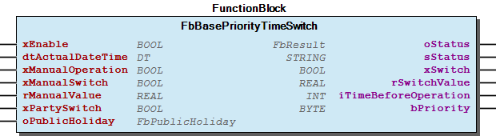

## FbBaseTimeSwitch (FB)

| Scope | Name | Type | Initial | Comment |
| --- | --- | --- | --- | --- |
| Input | xEnable | BOOL | TRUE | Enable the function block |
| dtActualDateTime | DT |  | Actual date and time |
| Output | xSwitch | BOOL |  | switching signal |
| rSwitchValue | REAL |  | switch value |
| iTimeBeforeOperation | INT |  | Time before operation in minutes. + Time before next occurrence, - Time till end of current occurrence |

Description:

base for time switch

Graphical Illustration

Interface variables Description: base for time switch Graphical Illustration 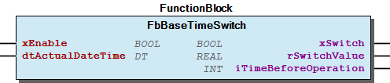 - FbBaseTimeSwitch.ActivePeriod (PROP) - FbBaseTimeSwitch.ActualDateTime (PROP) - FbBaseTimeSwitch.CurrentSwitchValue (PROP) - FbBaseTimeSwitch.Enable (PROP) - FbBaseTimeSwitch.Switch (PROP) - FbBaseTimeSwitch.TimeBeforeOperation (PROP) - FbBaseTimeSwitch.Today (PROP)

## FbMultipleScheduleWeekly (FB)

| Scope | Name | Type | Initial | Comment | Inherited from |
| --- | --- | --- | --- | --- | --- |
| Input | xEnable | BOOL | TRUE | Enable the function block | FbBaseTimeSwitch |
| dtActualDateTime | DT |  | Actual date and time | FbBaseTimeSwitch |
| Output | xSwitch | BOOL |  | switching signal | FbBaseTimeSwitch |
| rSwitchValue | REAL |  | switch value | FbBaseTimeSwitch |
| iTimeBeforeOperation | INT |  | Time before operation in minutes. + Time before next occurrence, - Time till end of current occurrence | FbBaseTimeSwitch |
| Inout | typConfigParameters | typMultipleScheduleWeekly |  | multiple events |  |

The function block includes the following time-switching functions:

Version of WagoAppTime >= 1.7.2.5 is nesseccary.

Graphical Illustration

Time referenced behavior

Interface variables Function The function block includes the following time-switching functions: 1. Multiple scheduling on weekly basis Note Version of WagoAppTime >= 1.7.2.5 is nesseccary. Graphical Illustration 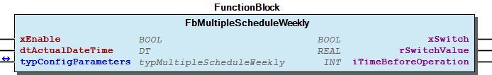 Time referenced behavior 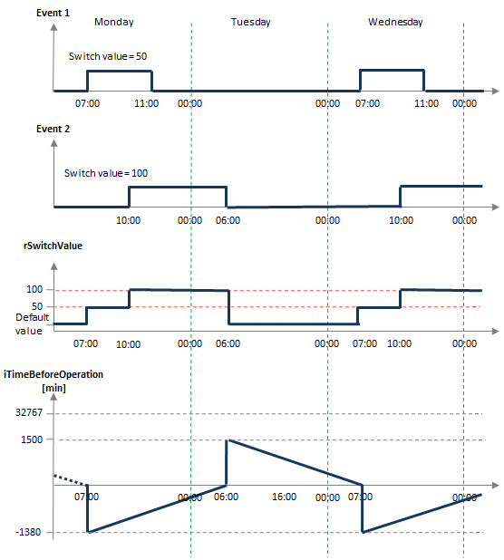

## FbMultipleSpecialPeriod (FB)

| Scope | Name | Type | Initial | Comment | Inherited from |
| --- | --- | --- | --- | --- | --- |
| Input | xEnable | BOOL | TRUE | Enable the function block | FbBaseTimeSwitch |
| dtActualDateTime | DT |  | Actual date and time | FbBaseTimeSwitch |
| Output | xSwitch | BOOL |  | switching signal | FbBaseTimeSwitch |
| rSwitchValue | REAL |  | switch value | FbBaseTimeSwitch |
| iTimeBeforeOperation | INT |  | Time before operation in minutes. + Time before next occurrence, - Time till end of current occurrence | FbBaseTimeSwitch |
| Inout | typConfigParameters | typMultipleSpecialPeriod |  | multiple event |  |

The function block includes the following time-switching functions:

Version of WagoAppTime >= 1.7.2.5 is nesseccary.

Graphical Illustration

Time referenced behavior

Interface variables Function The function block includes the following time-switching functions: 1. Multiple scheduling on weekly basis within specified special period. Note Version of WagoAppTime >= 1.7.2.5 is nesseccary. Graphical Illustration 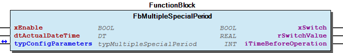 Time referenced behavior 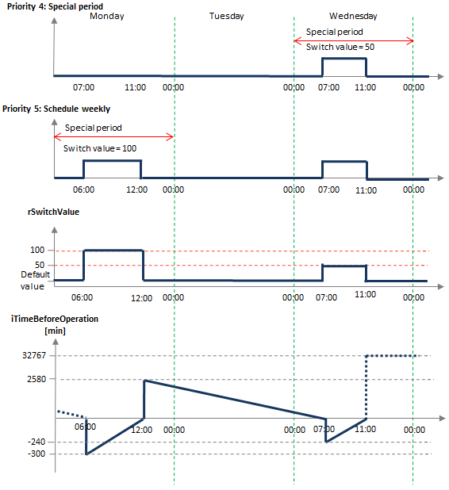

## FbPublicHoliday (FB)

| Scope | Name | Type | Initial | Comment | Inherited from |
| --- | --- | --- | --- | --- | --- |
| Input | xEnable | BOOL | TRUE | Enable the function block | FbBaseHolidaySwitch |
| dtActualDateTime | DT |  | Actual date and time | FbBaseHolidaySwitch |
| Output | xHoliday | BOOL |  | holiday active | FbBaseHolidaySwitch |
| Inout | typConfigParameters | typPublicHoliday |  | multiple holidays |  |
| Output | dNextHoliday | DATE |  | Next activated holiday date |  |
| sNextHoliday | STRING |  | Next activated holiday description |  |

The function block includes the following time-switching functions:

Version of WagoAppTime > 1.7.2.4 is nesseccary.

Graphical Illustration

Interface variables Function The function block includes the following time-switching functions: 1. Detection of public holiday Note Version of WagoAppTime > 1.7.2.4 is nesseccary. Graphical Illustration 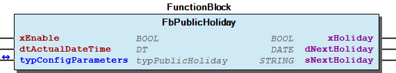

## FbScheduleWeekly (FB)

| Scope | Name | Type | Initial | Comment | Inherited from |
| --- | --- | --- | --- | --- | --- |
| Input | xEnable | BOOL | TRUE | Enable the function block | FbBaseTimeSwitch |
| dtActualDateTime | DT |  | Actual date and time | FbBaseTimeSwitch |
| Output | xSwitch | BOOL |  | switching signal | FbBaseTimeSwitch |
| rSwitchValue | REAL |  | switch value | FbBaseTimeSwitch |
| iTimeBeforeOperation | INT |  | Time before operation in minutes. + Time before next occurrence, - Time till end of current occurrence | FbBaseTimeSwitch |
| Inout | typConfigParameters | typSingleScheduleWeekly |  | single event |  |

The function block includes the following time-switching functions:

Version of WagoAppTime >= 1.7.2.5 is nesseccary.

Graphical Illustration

Time referenced behavior

Interface variables Function The function block includes the following time-switching functions: 1. Scheduling on weekly basis Note Version of WagoAppTime >= 1.7.2.5 is nesseccary. Graphical Illustration 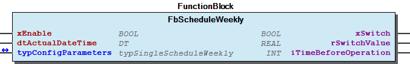 Time referenced behavior 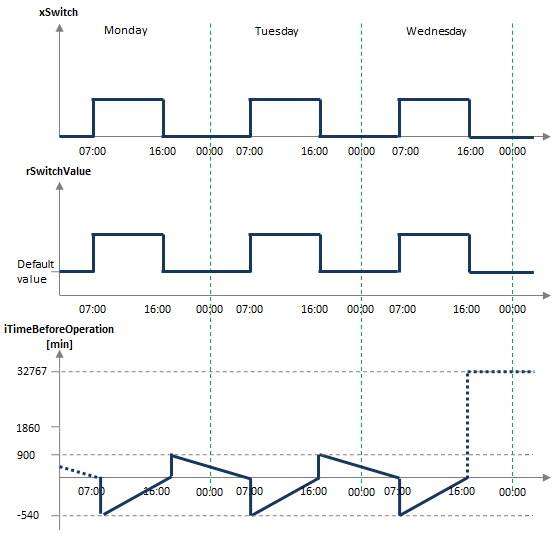 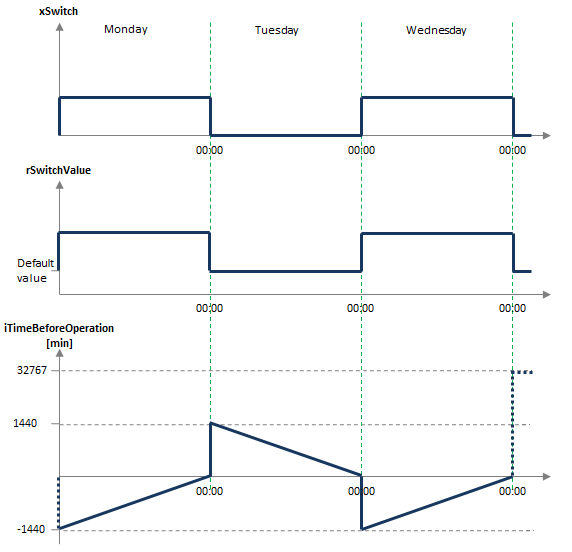 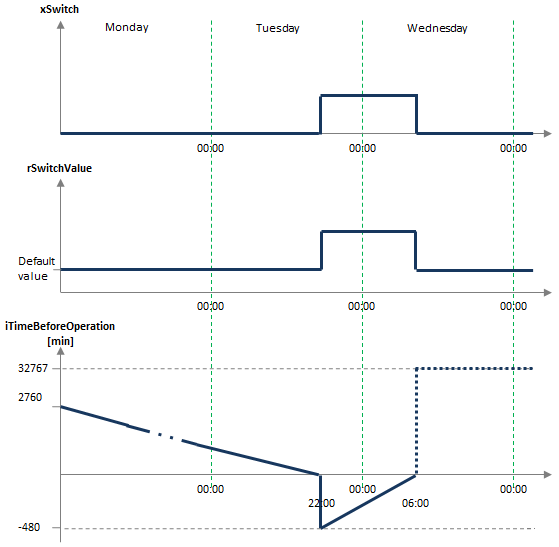

## FbScheduler (FB)

| Scope | Name | Type | Initial | Comment | Inherited from |
| --- | --- | --- | --- | --- | --- |
| Input | xEnable | BOOL | TRUE | Enable the function block | FbBasePriorityTimeSwitch |
| dtActualDateTime | DT |  | Actual date and time | FbBasePriorityTimeSwitch |
| xManualOperation | BOOL |  | Enable manual operation mode.- Priority 1 | FbBasePriorityTimeSwitch |
| xManualSwitch | BOOL |  | Switch on and off in manual opreation mode.- Priority 1 | FbBasePriorityTimeSwitch |
| rManualValue | REAL |  | Value during manual mode.- Priority 1 | FbBasePriorityTimeSwitch |
| xPartySwitch | BOOL |  | Trigger party function- Priority 2 | FbBasePriorityTimeSwitch |
| oPublicHoliday | FbPublicHoliday |  | Function block FbPublicHoliday to enable and calculate public holiday. | FbBasePriorityTimeSwitch |
| Output | oStatus | WagoSysErrorBase.FbResult |  | Status object. (Listed in Status ) The content of the error object could be displayed via the FbShowResult from the WagoSysErrorBase library. | FbBasePriorityTimeSwitch |
| sStatus | STRING |  | Status description as string (Listed in Status ) | FbBasePriorityTimeSwitch |
| xSwitch | BOOL |  | Switching signal | FbBasePriorityTimeSwitch |
| rSwitchValue | REAL |  | Switch value | FbBasePriorityTimeSwitch |
| iTimeBeforeOperation | INT |  | Time before operation in minutes | FbBasePriorityTimeSwitch |
| bPriority | BYTE |  | Current priority | FbBasePriorityTimeSwitch |
| Inout | typConfigParameters | typScheduler |  | Structure for scheduler |  |

The function block includes the following time-switching functions:

Graphical Illustration

Function description

The switching priorities are as follows:

The Party mode can be reset by using the method ResetPartySwitch.

Version of WagoAppTime >= 1.7.2.5 is nesseccary.

Time referenced behavior

Interface variables Function The function block includes the following time-switching functions: 1. Manual switching function 2. Party mode function 3. Public Holiday 4. weekly special periods 5. weekly time switches Graphical Illustration 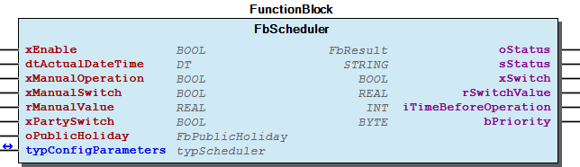 Function description The switching priorities are as follows: 1. Manual operation mode. As long as this mode actives, only manual signal will be fowarded to the switch channel. 2. Party mode. Active as long as the set duration. Retriggering the input prolongs the switch output signal. 3. Public holiday time switch. 4. Special periods. 5. Schedule weekly. Note The Party mode can be reset by using the method ResetPartySwitch. Note Version of WagoAppTime >= 1.7.2.5 is nesseccary. Time referenced behavior 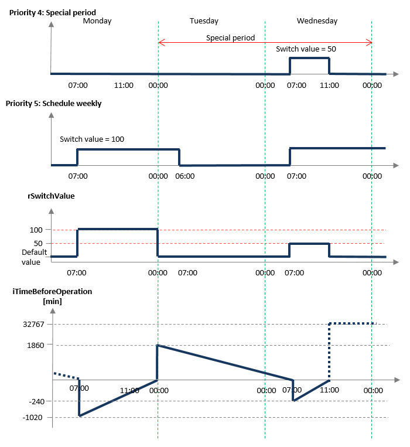

## FbSpecialPeriod (FB)

| Scope | Name | Type | Initial | Comment | Inherited from |
| --- | --- | --- | --- | --- | --- |
| Input | xEnable | BOOL | TRUE | Enable the function block | FbBaseTimeSwitch |
| dtActualDateTime | DT |  | Actual date and time | FbBaseTimeSwitch |
| Output | xSwitch | BOOL |  | switching signal | FbBaseTimeSwitch |
| rSwitchValue | REAL |  | switch value | FbBaseTimeSwitch |
| iTimeBeforeOperation | INT |  | Time before operation in minutes. + Time before next occurrence, - Time till end of current occurrence | FbBaseTimeSwitch |
| Inout | typConfigParameters | typSingleSpecialPeriod |  | single event |  |

The function block includes the following time-switching functions:

Version of WagoAppTime >= 1.7.2.5 is nesseccary.

Graphical Illustration

Time referenced behavior

Interface variables Function The function block includes the following time-switching functions: 1. Scheduling on weekly basis within specified special period. Note Version of WagoAppTime >= 1.7.2.5 is nesseccary. Graphical Illustration 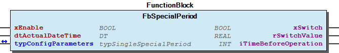 Time referenced behavior 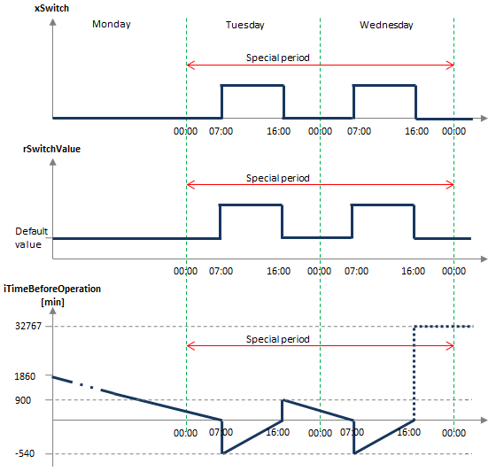 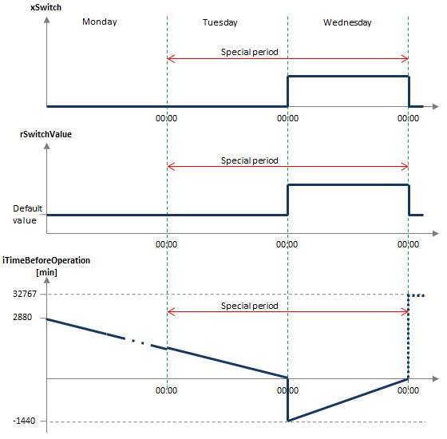 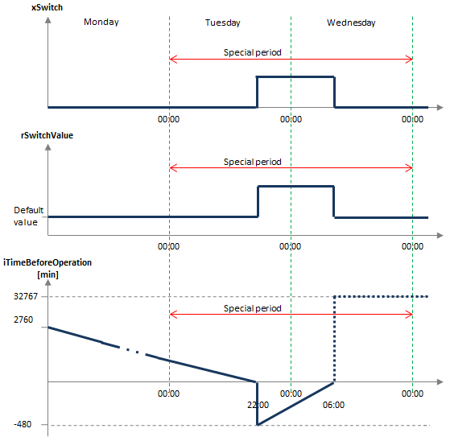

## FbTemporalExpression (FB)

- 00 Methods FbTemporalExpression.CalculateTimeBeforeOperation (METH) - FbTemporalExpression.DayOffset (METH) - FbTemporalExpression.getActualDate (METH) - FbTemporalExpression.getActualTime (METH) - FbTemporalExpression.getEndDate (METH) - FbTemporalExpression.getOffTime (METH) - FbTemporalExpression.getOnTime (METH) - FbTemporalExpression.getParamByte (METH) - FbTemporalExpression.getRecurrenceType (METH) - FbTemporalExpression.getStartDate (METH) - FbTemporalExpression.getStatusByte (METH) - FbTemporalExpression.isActive (METH) - FbTemporalExpression.isEndDateChange (METH) - FbTemporalExpression.isEventEnded (METH) - FbTemporalExpression.isNoEnd (METH) - FbTemporalExpression.isOccurenceDay (METH) - FbTemporalExpression.isOffTimeChange (METH) - FbTemporalExpression.isOnTimeChange (METH) - FbTemporalExpression.isStart (METH) - FbTemporalExpression.isStartDateChange (METH) - FbTemporalExpression.isToEndDate (METH) - FbTemporalExpression.isWithinActivePeriod (METH) - FbTemporalExpression.isWithinTimeFrame (METH) - FbTemporalExpression.setRecurrEndType (METH) 01 Parameters - FbTemporalExpression.ActualDateTime (PROP) - FbTemporalExpression.CurrentSwitchValue (PROP) - FbTemporalExpression.EndOccurence (PROP) - FbTemporalExpression.LastEndOccurence (PROP) - FbTemporalExpression.LastStartOccurence (PROP) - FbTemporalExpression.OffEvent (PROP) - FbTemporalExpression.Overwrite (PROP) - FbTemporalExpression.StartOccurence (PROP) - FbTemporalExpression.StatusByte (PROP) - FbTemporalExpression.Status_ID (PROP) - FbTemporalExpression.TimeBeforeOperation (PROP) FbTemporalExpression.setParameter (METH)

## FbWeekend (FB)

| Scope | Name | Type | Comment |
| --- | --- | --- | --- |
| Input | dtActualDateTime | DT | actual date and time |
| xHoliday | BOOL | Public holiday active |
| xShiftHoliday | BOOL | shift to monday when weekend |
| Output | xWeekend | BOOL | weekend signal. If shift holiday is TRUE, then weekend extends till monday. |

The function block check for weekend or any extended weekend due to public holiday.

Graphical Illustration

Interface variables Function The function block check for weekend or any extended weekend due to public holiday. Graphical Illustration 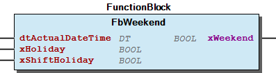

## doc01_Foreword (FB)

This document, including all figures and illustrations contained therein, is subject to copyright. Any use of this document that infringes upon the copyright provisions stipulated herein is prohibited. Reproduction, translation, electronic and phototechnical filing/archiving (e.g., photocopying), as well as any amendments require the written consent of WAGO Kontakttechnik GmbH & Co. KG, Minden, Germany. Non-observance will entail the right of claims for damages.

WAGO Kontakttechnik GmbH & Co. KG reserves the right to make any alterations or modifications that serve to increase the efficiency of technical progress. WAGO Kontakttechnik GmbH & Co. KG owns all rights arising from granting patents or from the legal protection of utility patents. Third-party products are always mentioned without any reference to patent rights. Thus, the existence of such rights cannot be excluded.

Personnel Qualification

The use of the product described in this document is exclusively geared to specialists having qualifications in PLC programming, electrical specialists or persons instructed by electrical specialists who are also familiar with the appropriate current standards. WAGO Kontakttechnik GmbH & Co. KG assumes no liability resulting from improper action and damage to WAGO products and third-party products due to non-observance of the information contained in this document.

Intended Use

For each individual application, the components are supplied from the factory with a dedicated hardware and software configuration. Modifications are only admitted within the framework of the possibilities documented in this document. All other changes to the hardware and/or software and the non-conforming use of the components entail the exclusion of liability on part of WAGO Kontakttechnik GmbH & Co. KG.

Please direct any requirements pertaining to a modified and/or new hardware or software configuration directly to WAGO Kontakttechnik GmbH & Co. KG.

Scope of Applicability

This application note is based on the _stated hardware and software from the specific manufacturer, as well as the associated documentation. This application note is therefore only valid for the described installation. New hardware and software versions may need to be handled differently.

Please note the detailed description in the specific manuals.

Copyright This document, including all figures and illustrations contained therein, is subject to copyright. Any use of this document that infringes upon the copyright provisions stipulated herein is prohibited. Reproduction, translation, electronic and phototechnical filing/archiving (e.g., photocopying), as well as any amendments require the written consent of WAGO Kontakttechnik GmbH & Co. KG, Minden, Germany. Non-observance will entail the right of claims for damages. WAGO Kontakttechnik GmbH & Co. KG reserves the right to make any alterations or modifications that serve to increase the efficiency of technical progress. WAGO Kontakttechnik GmbH & Co. KG owns all rights arising from granting patents or from the legal protection of utility patents. Third-party products are always mentioned without any reference to patent rights. Thus, the existence of such rights cannot be excluded. Personnel Qualification The use of the product described in this document is exclusively geared to specialists having qualifications in PLC programming, electrical specialists or persons instructed by electrical specialists who are also familiar with the appropriate current standards. WAGO Kontakttechnik GmbH & Co. KG assumes no liability resulting from improper action and damage to WAGO products and third-party products due to non-observance of the information contained in this document. Intended Use For each individual application, the components are supplied from the factory with a dedicated hardware and software configuration. Modifications are only admitted within the framework of the possibilities documented in this document. All other changes to the hardware and/or software and the non-conforming use of the components entail the exclusion of liability on part of WAGO Kontakttechnik GmbH & Co. KG. Please direct any requirements pertaining to a modified and/or new hardware or software configuration directly to WAGO Kontakttechnik GmbH & Co. KG. Scope of Applicability This application note is based on the _stated hardware and software from the specific manufacturer, as well as the associated documentation. This application note is therefore only valid for the described installation. New hardware and software versions may need to be handled differently. Please note the detailed description in the specific manuals.

### Functions

## FuAnyEasterHoliday (FUN)

| Scope | Name | Type | Comment |
| --- | --- | --- | --- |
| Return | FuAnyEasterHoliday | DATE |  |
| Input | datDate | DATE | current date |
| iOffset | INT | Offset to easter sunday, -ver: berfore easter, +ve after easter |

calculate any easter holiday base on given offset

Graphical Illustration

Interface variables Function calculate any easter holiday base on given offset Graphical Illustration 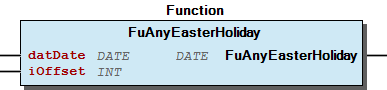

## FuDayOfPrayerAndRepentanceDate (FUN)

| Scope | Name | Type | Comment |
| --- | --- | --- | --- |
| Return | FuDayOfPrayerAndRepentanceDate | DATE |  |
| Input | iYear | INT | input year |

Function to retrieve Day Of Prayer And Repentance (Buss- und Bettag)

Graphical Illustration

Interface variables Function Function to retrieve Day Of Prayer And Repentance (Buss- und Bettag) Graphical Illustration 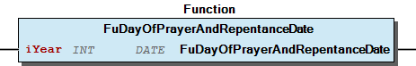

## FuDecodeStatusByte (FUN)

| Scope | Name | Type |
| --- | --- | --- |
| Return | FuDecodeStatusByte | typStatusByte |
| Input | bStatus | BYTE |

Function to decode status byte.

Graphical Illustration

Interface variables Function Function to decode status byte. Graphical Illustration 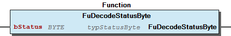

## FuEasterDate (FUN)

| Scope | Name | Type | Comment |
| --- | --- | --- | --- |
| Return | FuEasterDate | DATE |  |
| Input | iYear | INT | input year |

Calculate easter sunday of any given year

Graphical Illustration

Interface variables Function Calculate easter sunday of any given year Graphical Illustration 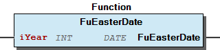

## FuEasterOffset (FUN)

| Scope | Name | Type | Comment |
| --- | --- | --- | --- |
| Return | FuEasterOffset | DINT |  |
| Input | datDate | DATE | input date |

Calculate offset in day(s) from actual date to easter sunday. Negative value indicates day before easter sunday.

Graphical Illustration

Interface variables Function Calculate offset in day(s) from actual date to easter sunday. Negative value indicates day before easter sunday. Graphical Illustration 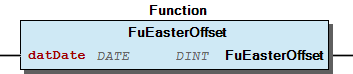

## FuIsDayOfPrayerAndRepentance (FUN)

| Scope | Name | Type | Comment |
| --- | --- | --- | --- |
| Return | FuIsDayOfPrayerAndRepentance | BOOL |  |
| Input | datDate | DATE | date |

Function to check for Day Of Prayer And Repentance (Buss- und Bettag)

Graphical Illustration

Interface variables Function Function to check for Day Of Prayer And Repentance (Buss- und Bettag) Graphical Illustration 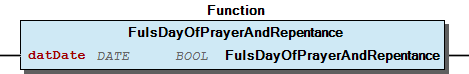

## FuIsDaylightSavingTimeEU (FUN)

| Scope | Name | Type | Comment |
| --- | --- | --- | --- |
| Return | FuIsDaylightSavingTimeEU | BOOL |  |
| Input | UTC | DT | UTC time |

The function calculates if the daylight saving time (EU) is active. The function will be TRUE on the last Sunday of March at 01:00 UTC (02:00 CET / MEZ) for summer time and turn FALSE on the last Sunday of October at 01:00 UTC (03:00 CET/ MEZ) for winter time.

Graphical Illustration

Interface variables Function The function calculates if the daylight saving time (EU) is active. The function will be TRUE on the last Sunday of March at 01:00 UTC (02:00 CET / MEZ) for summer time and turn FALSE on the last Sunday of October at 01:00 UTC (03:00 CET/ MEZ) for winter time. Graphical Illustration 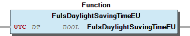

## FuIsEaster (FUN)

| Scope | Name | Type | Comment |
| --- | --- | --- | --- |
| Return | FuIsEaster | BOOL |  |
| Input | datDate | DATE | date |

Check if actual date for easter sunday

Graphical Illustration

Interface variables Function Check if actual date for easter sunday Graphical Illustration 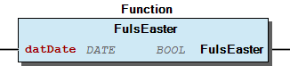

## FuShowStatusByte (FUN)

| Scope | Name | Type |
| --- | --- | --- |
| Return | FuShowStatusByte | eStatusByte |
| Input | bStatus | BYTE |

Function to show status bytes as enumeration values.

Graphical Illustration

Interface variables Function Function to show status bytes as enumeration values. Graphical Illustration 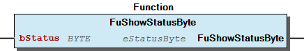

### Methods

## 01 Setting

- I_Event.includes (METH) - I_Event.set (METH)

## FbBaseHolidaySwitch.isShiftHoliday (METH)

| Scope | Name | Type | Comment |
| --- | --- | --- | --- |
| Return | isShiftHoliday | BOOL |  |
| Input | xHoliday | BOOL | holiday active |
| xShiftHoliday | BOOL | shift to monday when fall on weekend |

## FbTemporalExpression.CalculateTimeBeforeOperation (METH)

| Scope | Name | Type | Comment |
| --- | --- | --- | --- |
| Return | CalculateTimeBeforeOperation | INT |  |
| Input | dtOnDateTime | DT | Date and time for start |
| dtOffDateTime | DT | Date and time for end |

calculate time before operation

Interface variables calculate time before operation

## FbTemporalExpression.DayOffset (METH)

| Scope | Name | Type |
| --- | --- | --- |
| Return | DayOffset | INT |
| Input | iRecurrDuration | INT |

## FbTemporalExpression.LastStartOccurence (PROP) ¶

## FbTemporalExpression.Overwrite (PROP) ¶

## FbTemporalExpression.StartOccurence (PROP) ¶

## FbTemporalExpression.getActualDate (METH)

| Scope | Name | Type |
| --- | --- | --- |
| Return | getActualDate | DATE |

get actual date

Interface variables get actual date

## FbTemporalExpression.getActualTime (METH)

| Scope | Name | Type |
| --- | --- | --- |
| Return | getActualTime | TOD |

| Method | Return value | Description |
| GetActualTime | TOD | retrieves actual time |

Interface variables Method:

## FbTemporalExpression.getEndDate (METH)

| Scope | Name | Type |
| --- | --- | --- |
| Return | getEndDate | DATE |

## FbTemporalExpression.getOffTime (METH)

| Scope | Name | Type |
| --- | --- | --- |
| Return | getOffTime | TOD |

## FbTemporalExpression.getOnTime (METH)

| Scope | Name | Type |
| --- | --- | --- |
| Return | getOnTime | TOD |

## FbTemporalExpression.getParamByte (METH)

| Scope | Name | Type |
| --- | --- | --- |
| Return | getParamByte | BYTE |

## FbTemporalExpression.getRecurrenceType (METH)

| Scope | Name | Type |
| --- | --- | --- |
| Return | getRecurrenceType | INT |

## FbTemporalExpression.getStartDate (METH)

| Scope | Name | Type |
| --- | --- | --- |
| Return | getStartDate | DATE |

## FbTemporalExpression.getStatusByte (METH)

| Scope | Name | Type |
| --- | --- | --- |
| Return | getStatusByte | BYTE |

## FbTemporalExpression.isActive (METH)

| Scope | Name | Type |
| --- | --- | --- |
| Return | isActive | BOOL |

## FbTemporalExpression.isEndDateChange (METH)

| Scope | Name | Type |
| --- | --- | --- |
| Return | isEndDateChange | BOOL |

## FbTemporalExpression.isEventEnded (METH)

| Scope | Name | Type |
| --- | --- | --- |
| Return | isEventEnded | BOOL |

## FbTemporalExpression.isNoEnd (METH)

| Scope | Name | Type |
| --- | --- | --- |
| Return | isNoEnd | BOOL |

## FbTemporalExpression.isOccurenceDay (METH)

| Scope | Name | Type |
| --- | --- | --- |
| Return | isOccurenceDay | BOOL |

## FbTemporalExpression.isOffTimeChange (METH)

| Scope | Name | Type |
| --- | --- | --- |
| Return | isOffTimeChange | BOOL |

## FbTemporalExpression.isOnTimeChange (METH)

| Scope | Name | Type |
| --- | --- | --- |
| Return | isOnTimeChange | BOOL |

## FbTemporalExpression.isStart (METH)

| Scope | Name | Type |
| --- | --- | --- |
| Return | isStart | BOOL |

## FbTemporalExpression.isStartDateChange (METH)

| Scope | Name | Type |
| --- | --- | --- |
| Return | isStartDateChange | BOOL |

## FbTemporalExpression.isToEndDate (METH)

| Scope | Name | Type |
| --- | --- | --- |
| Return | isToEndDate | BOOL |

## FbTemporalExpression.isWithinActivePeriod (METH)

| Scope | Name | Type |
| --- | --- | --- |
| Return | isWithinActivePeriod | BOOL |

## FbTemporalExpression.isWithinTimeFrame (METH)

| Scope | Name | Type |
| --- | --- | --- |
| Return | isWithinTimeFrame | BOOL |

## FbTemporalExpression.setParameter (METH)

| Scope | Name | Type | Comment |
| --- | --- | --- | --- |
| Return | setParameter | BOOL |  |
| Input | I_EventElement | I_EventElement | event element |

## FbTemporalExpression.setRecurrEndType (METH)

| Scope | Name | Type |
| --- | --- | --- |
| Return | setRecurrEndType | INT |
| Input | xNoEnd | BOOL |

## I_ByWeek.getRecurringWeek (METH)

| Scope | Name | Type |
| --- | --- | --- |
| Return | getRecurringWeek | BYTE |

## I_ByWeek.getRecurringWeekday (METH)

| Scope | Name | Type |
| --- | --- | --- |
| Return | getRecurringWeekday | BYTE |

## I_DateElement.StartDate (PROP) ¶

## I_Event.includes (METH)

| Scope | Name | Type |
| --- | --- | --- |
| Return | includes | BOOL |
| Input | pEvent | POINTER TO BYTE |

## I_Event.isOccuring (METH)

| Scope | Name | Type |
| --- | --- | --- |
| Return | isOccuring | BOOL |

## I_Event.isToday (METH)

| Scope | Name | Type |
| --- | --- | --- |
| Return | isToday | BOOL |

## I_Event.isWithinActivePeriod (METH)

| Scope | Name | Type |
| --- | --- | --- |
| Return | isWithinActivePeriod | BOOL |

## I_Event.set (METH)

| Scope | Name | Type | Comment |
| --- | --- | --- | --- |
| Input | xEnable | BOOL | Enable the function block |
| dtActualDateTime | DT | Actual date and time |

## I_EventElement.setEventElement (METH)

| Scope | Name | Type |
| --- | --- | --- |
| Input | pEventElement | POINTER TO BYTE |

## I_HolidayMode.getHoliday (METH)

| Scope | Name | Type | Comment |
| --- | --- | --- | --- |
| Return | getHoliday | POINTER TO BYTE |  |
| Input | iIndex | INT | index |

## I_MultipleTableFunction.AddRowFirst (METH)

| Scope | Name | Type | Comment |
| --- | --- | --- | --- |
| Input | bTableIndex | BYTE | index for table factory |

Add data row above the first row.

Interface variables Add data row above the first row.

## I_MultipleTableFunction.AddRowLast (METH)

| Scope | Name | Type | Comment |
| --- | --- | --- | --- |
| Input | bTableIndex | BYTE | index for table factory |

Add data row below the last row.

Interface variables Add data row below the last row.

## I_MultipleTableFunction.DeleteRowLast (METH)

| Scope | Name | Type | Comment |
| --- | --- | --- | --- |
| Input | bTableIndex | BYTE | index for table factory |

Delete data row at the end of the table

Interface variables Delete data row at the end of the table

## I_MultipleTableFunction.DeleteRowSelected (METH)

| Scope | Name | Type | Comment |
| --- | --- | --- | --- |
| Input | iRow | INT | current row position |
| bTableIndex | BYTE | index for table factory |

Delete data row of the selected row

Interface variables Delete data row of the selected row

## I_MultipleTableFunction.FormTable (METH)

| Scope | Name | Type | Comment |
| --- | --- | --- | --- |
| Return | FormTable | BOOL |  |
| Input | pTableStructure | POINTER TO BYTE | Data array for the table |
| bTableIndex | BYTE | index for table factory |

Method to configure table for visualisation.

Interface variables Method to configure table for visualisation.

## I_MultipleTableFunction.InsertRow (METH)

| Scope | Name | Type | Comment |
| --- | --- | --- | --- |
| Input | iRow | INT | current row position |
| bTableIndex | BYTE | index for table factory |

Insert data row between the defined row position.

Interface variables Insert data row between the defined row position.

## I_MultipleTableFunction.ShiftRowOneDown (METH)

| Scope | Name | Type | Comment |
| --- | --- | --- | --- |
| Input | iRow | INT | current row position |
| bTableIndex | BYTE | index for table factory |

Shift data row to one row beneath.

Interface variables Shift data row to one row beneath.

## I_MultipleTableFunction.ShiftRowOneUp (METH)

| Scope | Name | Type | Comment |
| --- | --- | --- | --- |
| Input | iRow | INT | current row position |
| bTableIndex | BYTE | index for table factory |

Shift data row to one row above.

Interface variables Shift data row to one row above.

## I_MultipleTableFunction.ShiftRowToEnd (METH)

| Scope | Name | Type | Comment |
| --- | --- | --- | --- |
| Input | iRow | INT | current row position |
| bTableIndex | BYTE | index for table factory |

Shift data row to the last row.

Interface variables Shift data row to the last row.

## I_MultipleTableFunction.ShiftRowToStart (METH)

| Scope | Name | Type | Comment |
| --- | --- | --- | --- |
| Input | iRow | INT | current row position |
| bTableIndex | BYTE | index for table factory |

Shift data row to the beginning row.

Interface variables Shift data row to the beginning row.

## I_MultipleTableFunction.SortColumns (METH)

| Scope | Name | Type | Comment |
| --- | --- | --- | --- |
| Input | iColumnStartByte | INT | Location of first the Byte in the data types (STRUCT) –> First Column = 1 |
| uiByteSize | UINT | Size of the data type’s element in byte(s) –> e.g. INT = 2 Byte. String(20)=20+1 Byte (reichen 2 Zeichen zum Vergleich?!) |
| bTableIndex | BYTE | index for table factory |
| Inout | xSortColumn | BOOL | current column position |

Sorting the table column. Shakershort algorythmn is used here.

Interface variables Sorting the table column. Shakershort algorythmn is used here.

## I_MultipleTableFunction.getRowData (METH)

| Scope | Name | Type | Comment |
| --- | --- | --- | --- |
| Input | iRow | INT | current row position |
| bTableIndex | BYTE | index for table factory |

Retrieves data row value

Interface variables Retrieves data row value

## I_MultipleTableFunction.setRowData (METH)

| Scope | Name | Type | Comment |
| --- | --- | --- | --- |
| Input | iRow | INT | current row position |
| bTableIndex | BYTE | index for table factory |

Set data row with value

Interface variables Set data row with value

## I_MultipleTableFunction.setRowDataDefault (METH)

| Scope | Name | Type | Comment |
| --- | --- | --- | --- |
| Input | iRow | INT | current row position |
| bTableIndex | BYTE | index for table factory |

Set data row to default value

Interface variables Set data row to default value

## I_RecurrenceElement.getRecurrenceType (METH)

| Scope | Name | Type |
| --- | --- | --- |
| Return | getRecurrenceType | INT |

## I_ScheduleWeekly.getScheduleWeekly (METH)

| Scope | Name | Type | Comment |
| --- | --- | --- | --- |
| Return | getScheduleWeekly | POINTER TO BYTE |  |
| Input | iIndex | INT | index |

## I_SpecialPeriod.getSpecialPeriod (METH)

| Scope | Name | Type | Comment |
| --- | --- | --- | --- |
| Return | getSpecialPeriod | POINTER TO BYTE |  |
| Input | iIndex | INT | index |

## I_TableFunction.AddRowFirst (METH)

Add data row above the first row.

Add data row above the first row.

## I_TableFunction.AddRowLast (METH)

Add data row below the last row.

Add data row below the last row.

## I_TableFunction.DeleteRowLast (METH)

Delete data row at the end of the table

Delete data row at the end of the table

## I_TableFunction.DeleteRowSelected (METH)

| Scope | Name | Type | Comment |
| --- | --- | --- | --- |
| Input | iRow | INT | current row position |

Delete data row of the selected row

Interface variables Delete data row of the selected row

## I_TableFunction.FormTable (METH)

| Scope | Name | Type |
| --- | --- | --- |
| Return | FormTable | BOOL |
| Input | pTableStructure | POINTER TO BYTE |

## I_TableFunction.InsertRow (METH)

| Scope | Name | Type | Comment |
| --- | --- | --- | --- |
| Input | iRow | INT | current row position |

Insert data row between the defined row position.

Interface variables Insert data row between the defined row position.

## I_TableFunction.ShiftRowOneDown (METH)

| Scope | Name | Type | Comment |
| --- | --- | --- | --- |
| Input | iRow | INT | current row position |

Shift data row to one row beneath.

Interface variables Shift data row to one row beneath.

## I_TableFunction.ShiftRowOneUp (METH)

| Scope | Name | Type | Comment |
| --- | --- | --- | --- |
| Input | iRow | INT | current row position |

Shift data row to one row above.

Interface variables Shift data row to one row above.

## I_TableFunction.ShiftRowToEnd (METH)

| Scope | Name | Type | Comment |
| --- | --- | --- | --- |
| Input | iRow | INT | current row position |

Shift data row to the last row.

Interface variables Shift data row to the last row.

## I_TableFunction.ShiftRowToStart (METH)

| Scope | Name | Type | Comment |
| --- | --- | --- | --- |
| Input | iRow | INT | current row position |

Shift data row to the beginning row.

Interface variables Shift data row to the beginning row.

## I_TableFunction.SortColumns (METH)

| Scope | Name | Type | Comment |
| --- | --- | --- | --- |
| Input | iColumnStartByte | INT | Location of first the Byte in the data types (STRUCT) –> First Column = 1 |
| uiByteSize | UINT | Size of the data type’s element in byte(s) –> e.g. INT = 2 Byte. String(20)=20+1 Byte (reichen 2 Zeichen zum Vergleich?!) |
| Inout | xSortColumn | BOOL | current column position |

Sorting the table column. Shakershort algorythmn is used here.

Interface variables Sorting the table column. Shakershort algorythmn is used here.

## I_TableFunction.getRowData (METH)

| Scope | Name | Type | Comment |
| --- | --- | --- | --- |
| Input | iRow | INT | current row position |

Retrieves data row value

Interface variables Retrieves data row value

## I_TableFunction.setRowData (METH)

| Scope | Name | Type | Comment |
| --- | --- | --- | --- |
| Input | iRow | INT | current row position |

Set data row with value

Interface variables Set data row with value

## I_TableFunction.setRowDataDefault (METH)

| Scope | Name | Type | Comment |
| --- | --- | --- | --- |
| Input | iRow | INT | current row position |

Set data row to default value

Interface variables Set data row to default value

## I_TemporalExpression.LastStartOccurence (PROP) ¶

## I_TemporalExpression.Overwrite (PROP) ¶

## I_TemporalExpression.RecalcStartOccurence (METH)

| Scope | Name | Type | Comment |
| --- | --- | --- | --- |
| Return | RecalcStartOccurence | DT |  |
| Input | dtNewActualDateTime | DT | current date and time |

## I_TemporalExpression.StartOccurence (PROP) ¶

## I_TemporalExpression.getEndDate (METH)

| Scope | Name | Type |
| --- | --- | --- |
| Return | getEndDate | DATE |

## I_TemporalExpression.getStartDate (METH)

| Scope | Name | Type |
| --- | --- | --- |
| Return | getStartDate | DATE |

## I_TemporalExpression.getStatus_ID (METH)

| Scope | Name | Type |
| --- | --- | --- |
| Return | getStatus_ID | UINT |

## I_TemporalExpression.includes (METH)

| Scope | Name | Type |
| --- | --- | --- |
| Return | includes | BOOL |
| Input | I_EventElement | I_EventElement |
| dtActualDateTime | DT |

## I_TemporalExpression.isOccurenceDay (METH)

| Scope | Name | Type |
| --- | --- | --- |
| Return | isOccurenceDay | BOOL |

## I_TemporalExpression.isWithinActivePeriod (METH)

| Scope | Name | Type |
| --- | --- | --- |
| Return | isWithinActivePeriod | BOOL |

### Interfaces

## I_ByWeek (ITF)

- I_ByWeek.getRecurringWeek (METH) - I_ByWeek.getRecurringWeekday (METH)

## I_CurrentSwitchValue (ITF)

- I_CurrentSwitchValue.CurrentSwitchValue (PROP)

## I_DateElement (ITF)

- I_DateElement.EndDate (PROP) - I_DateElement.StartDate (PROP)

## I_DefaultValue (ITF)

- I_DefaultValue.DefaultValue (PROP)

## I_Description (ITF)

- I_Description.Description (PROP)

## I_Event (ITF)

- 01 Setting I_Event.includes (METH) - I_Event.set (METH) 02 Occurence - I_Event.isOccuring (METH) 03 Period - I_Event.isToday (METH) - I_Event.isWithinActivePeriod (METH)

## I_EventElement (ITF)

- I_EventElement.setEventElement (METH)

## I_HolidayMode (ITF)

- I_HolidayMode.getHoliday (METH)

## I_HolidaySignal (ITF)

- I_HolidaySignal.HolidaySignal (PROP)

## I_MultipleTableFunction (ITF)

- 00 Form table I_MultipleTableFunction.FormTable (METH) 01 Add row - I_MultipleTableFunction.AddRowFirst (METH) - I_MultipleTableFunction.AddRowLast (METH) 02 Insert row - I_MultipleTableFunction.InsertRow (METH) 03 Shift row - I_MultipleTableFunction.ShiftRowOneDown (METH) - I_MultipleTableFunction.ShiftRowOneUp (METH) - I_MultipleTableFunction.ShiftRowToEnd (METH) - I_MultipleTableFunction.ShiftRowToStart (METH) 04 Delete Row - I_MultipleTableFunction.DeleteRowLast (METH) - I_MultipleTableFunction.DeleteRowSelected (METH) 05 Row data - I_MultipleTableFunction.getRowData (METH) - I_MultipleTableFunction.setRowData (METH) - I_MultipleTableFunction.setRowDataDefault (METH) 06 Sort column - I_MultipleTableFunction.SortColumns (METH)

## I_NthDayInMonth (ITF)

- I_NthDayInMonth.Day (PROP) - I_NthDayInMonth.Month (PROP)

## I_NthWeekDayInMonth (ITF)

- I_NthWeekDayInMonth.Month (PROP) - I_NthWeekDayInMonth.WeekdayCount (PROP) - I_NthWeekDayInMonth.WeekdayValue (PROP)

## I_PartyMode (ITF)

- I_PartyMode.PartyModeDuration (PROP) - I_PartyMode.PartyModeValue (PROP)

## I_RecurrenceElement (ITF)

- I_RecurrenceElement.Activate (PROP) - I_RecurrenceElement.getRecurrenceType (METH)

## I_ScheduleWeekly (ITF)

- I_ScheduleWeekly.getScheduleWeekly (METH)

## I_SpecialPeriod (ITF)

- I_SpecialPeriod.getSpecialPeriod (METH)

## I_StatusByte (ITF) ¶

- I_StatusByte.Status (PROP)

## I_SwitchValue (ITF)

- I_SwitchValue.SwitchValue (PROP)

## I_TableFunction (ITF)

- 00 Form table I_TableFunction.FormTable (METH) 01 Add row - I_TableFunction.AddRowFirst (METH) - I_TableFunction.AddRowLast (METH) 02 Insert row - I_TableFunction.InsertRow (METH) 03 Shift row - I_TableFunction.ShiftRowOneDown (METH) - I_TableFunction.ShiftRowOneUp (METH) - I_TableFunction.ShiftRowToEnd (METH) - I_TableFunction.ShiftRowToStart (METH) 04 Delete Row - I_TableFunction.DeleteRowLast (METH) - I_TableFunction.DeleteRowSelected (METH) 05 Row data - I_TableFunction.getRowData (METH) - I_TableFunction.setRowData (METH) - I_TableFunction.setRowDataDefault (METH) 06 Sort column - I_TableFunction.SortColumns (METH)

## I_TemporalExpression (ITF)

- 00 Methods I_TemporalExpression.RecalcStartOccurence (METH) - I_TemporalExpression.getEndDate (METH) - I_TemporalExpression.getStartDate (METH) - I_TemporalExpression.getStatus_ID (METH) - I_TemporalExpression.includes (METH) - I_TemporalExpression.isOccurenceDay (METH) - I_TemporalExpression.isWithinActivePeriod (METH) 01 Properties - I_TemporalExpression.CurrentSwitchValue (PROP) - I_TemporalExpression.EndOccurence (PROP) - I_TemporalExpression.LastEndOccurence (PROP) - I_TemporalExpression.LastStartOccurence (PROP) - I_TemporalExpression.OffEvent (PROP) - I_TemporalExpression.Overwrite (PROP) - I_TemporalExpression.StartOccurence (PROP) - I_TemporalExpression.StatusByte (PROP) - I_TemporalExpression.TimeBeforeOperation (PROP)

## I_TimeBeforeOperation (ITF)

- I_TimeBeforeOperation.TimeBeforeOperation (PROP)

## I_TimeElement (ITF)

- I_TimeElement.OffTime (PROP) - I_TimeElement.OnTime (PROP)

## I_Yearly (ITF) ¶

- I_Yearly.Yearly (PROP)

### Program Organization

## 20 Program Organization Units

- 01 Scheduler / Kompakte Zeitschaltprogramme FbScheduler (FB) 02 Schedule weekly / Wochenzeitschaltprogramm - FbMultipleScheduleWeekly (FB) - FbScheduleWeekly (FB) 03 Special period / Jahreszeitschaltprogramm - FbMultipleSpecialPeriod (FB) - FbSpecialPeriod (FB) 04 Public holidays / Feiertage - FbPublicHoliday (FB) 05 Additional functions / Zusatzfunktionen - 01 DST / Sommer- Winterzeit FuIsDaylightSavingTimeEU (FUN) 02 Easter/ Ostern - FuAnyEasterHoliday (FUN) - FuEasterDate (FUN) - FuEasterOffset (FUN) - FuIsEaster (FUN) 03 Day of Prayer and Repentance / Buß- und Betttag - FuDayOfPrayerAndRepentanceDate (FUN) - FuIsDayOfPrayerAndRepentance (FUN) 04 Weekend/ Wochenende - FbWeekend (FB) 70 Status byte - FuDecodeStatusByte (FUN) - FuShowStatusByte (FUN) 80 Data types - 01 Scheduler/ Kompakte Zeitschaltprogramme typScheduler (STRUCT) 02 Schedule weekly / Wochenzeitschaltprogramm - typMultipleScheduleWeekly (STRUCT) - typSingleScheduleWeekly (STRUCT) 03 Special period / Jahreszeitschaltprogramm - typMultipleSpecialPeriod (STRUCT) - typSingleSpecialPeriod (STRUCT) 04 Public holidays/ Feiertage - typConfigPublicHoliday (STRUCT) - typPublicHoliday (STRUCT) 70 Status byte - eStatusByte (ENUM) - typStatusByte (STRUCT) 82 Base - typEvent (STRUCT) - typHolidaySwitch (STRUCT) - typScheduleWeekly (STRUCT) - typSpecialPeriod (STRUCT) 81 Interfaces - 01 Event I_Event (ITF) 01 Setting I_Event.includes (METH) - I_Event.set (METH) 02 Occurence - I_Event.isOccuring (METH) 03 Period - I_Event.isToday (METH) - I_Event.isWithinActivePeriod (METH) 02 Table - I_MultipleTableFunction (ITF) 00 Form table I_MultipleTableFunction.FormTable (METH) 01 Add row - I_MultipleTableFunction.AddRowFirst (METH) - I_MultipleTableFunction.AddRowLast (METH) 02 Insert row - I_MultipleTableFunction.InsertRow (METH) 03 Shift row - I_MultipleTableFunction.ShiftRowOneDown (METH) - I_MultipleTableFunction.ShiftRowOneUp (METH) - I_MultipleTableFunction.ShiftRowToEnd (METH) - I_MultipleTableFunction.ShiftRowToStart (METH) 04 Delete Row - I_MultipleTableFunction.DeleteRowLast (METH) - I_MultipleTableFunction.DeleteRowSelected (METH) 05 Row data - I_MultipleTableFunction.getRowData (METH) - I_MultipleTableFunction.setRowData (METH) - I_MultipleTableFunction.setRowDataDefault (METH) 06 Sort column - I_MultipleTableFunction.SortColumns (METH) I_TableFunction (ITF) - 00 Form table I_TableFunction.FormTable (METH) 01 Add row - I_TableFunction.AddRowFirst (METH) - I_TableFunction.AddRowLast (METH) 02 Insert row - I_TableFunction.InsertRow (METH) 03 Shift row - I_TableFunction.ShiftRowOneDown (METH) - I_TableFunction.ShiftRowOneUp (METH) - I_TableFunction.ShiftRowToEnd (METH) - I_TableFunction.ShiftRowToStart (METH) 04 Delete Row - I_TableFunction.DeleteRowLast (METH) - I_TableFunction.DeleteRowSelected (METH) 05 Row data - I_TableFunction.getRowData (METH) - I_TableFunction.setRowData (METH) - I_TableFunction.setRowDataDefault (METH) 06 Sort column - I_TableFunction.SortColumns (METH)

### Function Groups

## 05 Additional functions / Zusatzfunktionen

- 01 DST / Sommer- Winterzeit FuIsDaylightSavingTimeEU (FUN) 02 Easter/ Ostern - FuAnyEasterHoliday (FUN) - FuEasterDate (FUN) - FuEasterOffset (FUN) - FuIsEaster (FUN) 03 Day of Prayer and Repentance / Buß- und Betttag - FuDayOfPrayerAndRepentanceDate (FUN) - FuIsDayOfPrayerAndRepentance (FUN) 04 Weekend/ Wochenende - FbWeekend (FB)

### Base Components

## 82 Base

- typEvent (STRUCT) - typHolidaySwitch (STRUCT) - typScheduleWeekly (STRUCT) - typSpecialPeriod (STRUCT)

## 82 Base

- FbBaseHolidaySwitch (FB) FbBaseHolidaySwitch.ActivePeriod (PROP) - FbBaseHolidaySwitch.ActualDateTime (PROP) - FbBaseHolidaySwitch.Enable (PROP) - FbBaseHolidaySwitch.Holiday (PROP) - FbBaseHolidaySwitch.Today (PROP) - FbBaseHolidaySwitch.isShiftHoliday (METH) FbBasePriorityTimeSwitch (FB) FbBaseTimeSwitch (FB) - FbBaseTimeSwitch.ActivePeriod (PROP) - FbBaseTimeSwitch.ActualDateTime (PROP) - FbBaseTimeSwitch.CurrentSwitchValue (PROP) - FbBaseTimeSwitch.Enable (PROP) - FbBaseTimeSwitch.Switch (PROP) - FbBaseTimeSwitch.TimeBeforeOperation (PROP) - FbBaseTimeSwitch.Today (PROP) FbTemporalExpression (FB) - 00 Methods FbTemporalExpression.CalculateTimeBeforeOperation (METH) - FbTemporalExpression.DayOffset (METH) - FbTemporalExpression.getActualDate (METH) - FbTemporalExpression.getActualTime (METH) - FbTemporalExpression.getEndDate (METH) - FbTemporalExpression.getOffTime (METH) - FbTemporalExpression.getOnTime (METH) - FbTemporalExpression.getParamByte (METH) - FbTemporalExpression.getRecurrenceType (METH) - FbTemporalExpression.getStartDate (METH) - FbTemporalExpression.getStatusByte (METH) - FbTemporalExpression.isActive (METH) - FbTemporalExpression.isEndDateChange (METH) - FbTemporalExpression.isEventEnded (METH) - FbTemporalExpression.isNoEnd (METH) - FbTemporalExpression.isOccurenceDay (METH) - FbTemporalExpression.isOffTimeChange (METH) - FbTemporalExpression.isOnTimeChange (METH) - FbTemporalExpression.isStart (METH) - FbTemporalExpression.isStartDateChange (METH) - FbTemporalExpression.isToEndDate (METH) - FbTemporalExpression.isWithinActivePeriod (METH) - FbTemporalExpression.isWithinTimeFrame (METH) - FbTemporalExpression.setRecurrEndType (METH) 01 Parameters - FbTemporalExpression.ActualDateTime (PROP) - FbTemporalExpression.CurrentSwitchValue (PROP) - FbTemporalExpression.EndOccurence (PROP) - FbTemporalExpression.LastEndOccurence (PROP) - FbTemporalExpression.LastStartOccurence (PROP) - FbTemporalExpression.OffEvent (PROP) - FbTemporalExpression.Overwrite (PROP) - FbTemporalExpression.StartOccurence (PROP) - FbTemporalExpression.StatusByte (PROP) - FbTemporalExpression.Status_ID (PROP) - FbTemporalExpression.TimeBeforeOperation (PROP) FbTemporalExpression.setParameter (METH)

## FbBaseHolidaySwitch.ActivePeriod (PROP) ¶

## FbBaseHolidaySwitch.ActualDateTime (PROP) ¶

## FbBaseHolidaySwitch.Enable (PROP) ¶

## FbBaseHolidaySwitch.Holiday (PROP) ¶

## FbBaseHolidaySwitch.Today (PROP) ¶

## FbBaseTimeSwitch.ActivePeriod (PROP) ¶

## FbBaseTimeSwitch.ActualDateTime (PROP) ¶

## FbBaseTimeSwitch.CurrentSwitchValue (PROP) ¶

## FbBaseTimeSwitch.Enable (PROP) ¶

## FbBaseTimeSwitch.Switch (PROP) ¶

## FbBaseTimeSwitch.TimeBeforeOperation (PROP) ¶

## FbBaseTimeSwitch.Today (PROP) ¶

### Internal Components

## 90 Internal

- 05 Date / Time picker typCalenderObject (STRUCT) 80 Data types - ePriorityTimeSwitch (ENUM) - ePublicHolidays (ENUM) - eRecurrenceType (ENUM) - typCustomPublicHolidayList (STRUCT) - typPublicHolidayList (STRUCT) - typTableCustomHoliday (STRUCT) - typTablePublicHoliday (STRUCT) 81 Interfaces - 01 Time switches I_CurrentSwitchValue (ITF) I_CurrentSwitchValue.CurrentSwitchValue (PROP) I_HolidaySignal (ITF) - I_HolidaySignal.HolidaySignal (PROP) I_TimeBeforeOperation (ITF) - I_TimeBeforeOperation.TimeBeforeOperation (PROP) 02 Event element - I_ByWeek (ITF) I_ByWeek.getRecurringWeek (METH) - I_ByWeek.getRecurringWeekday (METH) I_DateElement (ITF) - I_DateElement.EndDate (PROP) - I_DateElement.StartDate (PROP) I_DefaultValue (ITF) - I_DefaultValue.DefaultValue (PROP) I_Description (ITF) - I_Description.Description (PROP) I_EventElement (ITF) - I_EventElement.setEventElement (METH) I_HolidayMode (ITF) - I_HolidayMode.getHoliday (METH) I_NthDayInMonth (ITF) - I_NthDayInMonth.Day (PROP) - I_NthDayInMonth.Month (PROP) I_NthWeekDayInMonth (ITF) - I_NthWeekDayInMonth.Month (PROP) - I_NthWeekDayInMonth.WeekdayCount (PROP) - I_NthWeekDayInMonth.WeekdayValue (PROP) I_PartyMode (ITF) - I_PartyMode.PartyModeDuration (PROP) - I_PartyMode.PartyModeValue (PROP) I_RecurrenceElement (ITF) - I_RecurrenceElement.Activate (PROP) - I_RecurrenceElement.getRecurrenceType (METH) I_ScheduleWeekly (ITF) - I_ScheduleWeekly.getScheduleWeekly (METH) I_SpecialPeriod (ITF) - I_SpecialPeriod.getSpecialPeriod (METH) I_StatusByte (ITF) - I_StatusByte.Status (PROP) I_SwitchValue (ITF) - I_SwitchValue.SwitchValue (PROP) I_TimeElement (ITF) - I_TimeElement.OffTime (PROP) - I_TimeElement.OnTime (PROP) I_Yearly (ITF) - I_Yearly.Yearly (PROP) 03 Temporal expression - I_TemporalExpression (ITF) 00 Methods I_TemporalExpression.RecalcStartOccurence (METH) - I_TemporalExpression.getEndDate (METH) - I_TemporalExpression.getStartDate (METH) - I_TemporalExpression.getStatus_ID (METH) - I_TemporalExpression.includes (METH) - I_TemporalExpression.isOccurenceDay (METH) - I_TemporalExpression.isWithinActivePeriod (METH) 01 Properties - I_TemporalExpression.CurrentSwitchValue (PROP) - I_TemporalExpression.EndOccurence (PROP) - I_TemporalExpression.LastEndOccurence (PROP) - I_TemporalExpression.LastStartOccurence (PROP) - I_TemporalExpression.OffEvent (PROP) - I_TemporalExpression.Overwrite (PROP) - I_TemporalExpression.StartOccurence (PROP) - I_TemporalExpression.StatusByte (PROP) - I_TemporalExpression.TimeBeforeOperation (PROP) 82 Base - FbBaseHolidaySwitch (FB) FbBaseHolidaySwitch.ActivePeriod (PROP) - FbBaseHolidaySwitch.ActualDateTime (PROP) - FbBaseHolidaySwitch.Enable (PROP) - FbBaseHolidaySwitch.Holiday (PROP) - FbBaseHolidaySwitch.Today (PROP) - FbBaseHolidaySwitch.isShiftHoliday (METH) FbBasePriorityTimeSwitch (FB) FbBaseTimeSwitch (FB) - FbBaseTimeSwitch.ActivePeriod (PROP) - FbBaseTimeSwitch.ActualDateTime (PROP) - FbBaseTimeSwitch.CurrentSwitchValue (PROP) - FbBaseTimeSwitch.Enable (PROP) - FbBaseTimeSwitch.Switch (PROP) - FbBaseTimeSwitch.TimeBeforeOperation (PROP) - FbBaseTimeSwitch.Today (PROP) FbTemporalExpression (FB) - 00 Methods FbTemporalExpression.CalculateTimeBeforeOperation (METH) - FbTemporalExpression.DayOffset (METH) - FbTemporalExpression.getActualDate (METH) - FbTemporalExpression.getActualTime (METH) - FbTemporalExpression.getEndDate (METH) - FbTemporalExpression.getOffTime (METH) - FbTemporalExpression.getOnTime (METH) - FbTemporalExpression.getParamByte (METH) - FbTemporalExpression.getRecurrenceType (METH) - FbTemporalExpression.getStartDate (METH) - FbTemporalExpression.getStatusByte (METH) - FbTemporalExpression.isActive (METH) - FbTemporalExpression.isEndDateChange (METH) - FbTemporalExpression.isEventEnded (METH) - FbTemporalExpression.isNoEnd (METH) - FbTemporalExpression.isOccurenceDay (METH) - FbTemporalExpression.isOffTimeChange (METH) - FbTemporalExpression.isOnTimeChange (METH) - FbTemporalExpression.isStart (METH) - FbTemporalExpression.isStartDateChange (METH) - FbTemporalExpression.isToEndDate (METH) - FbTemporalExpression.isWithinActivePeriod (METH) - FbTemporalExpression.isWithinTimeFrame (METH) - FbTemporalExpression.setRecurrEndType (METH) 01 Parameters - FbTemporalExpression.ActualDateTime (PROP) - FbTemporalExpression.CurrentSwitchValue (PROP) - FbTemporalExpression.EndOccurence (PROP) - FbTemporalExpression.LastEndOccurence (PROP) - FbTemporalExpression.LastStartOccurence (PROP) - FbTemporalExpression.OffEvent (PROP) - FbTemporalExpression.Overwrite (PROP) - FbTemporalExpression.StartOccurence (PROP) - FbTemporalExpression.StatusByte (PROP) - FbTemporalExpression.Status_ID (PROP) - FbTemporalExpression.TimeBeforeOperation (PROP) FbTemporalExpression.setParameter (METH) 83 Textlists - TL_DateFormat (Text List) - TL_DatePicker (Text List) - TL_Holiday (Text List) - TL_Month (Text List) - TL_Priority (Text List) - TL_TimePicker (Text List) - TL_Tooltip (Text List) - TL_Weekday (Text List)

## 90 Internal ¶

### Global Variable Lists

## GVL_PickerVariables (GVL)

| Name | Type | Comment |
| --- | --- | --- |
| g_bTitleDatePicker | BYTE | Title can be selected from Textlist TL_DatePicker. |
| g_sTitleDatePicker | STRING | If bTitle is set to 3, this string is displayed. |
| g_xNoYearDatePicker | BOOL | If TRUE the year selection is not displyed. |
| g_datDate | DATE | Date IN and OUT value for dialog DatePicker_new. |
| g_AcceptDate | BOOL | Update/write the date for dialog DatePicker_new. |
| g_bTitleTimePicker | BYTE | Title can be selected from Textlist TL_TimePicker. |
| g_sTitleTimePicker | STRING | If bTitle is set to 3, this string is displayed. |
| g_todTime | TOD | Time IN and OUT value for dialog TimePicker_new. |

## GlobalVariables (GVL)

| Scope | Name | Type | Initial | Comment |
| --- | --- | --- | --- | --- |
|  | g_bFormatDate | BYTE |  | Date format for String-convertions. |
| g_datDefaultStartDate | DATE | DEFAULT_DATE | Default Start date for new special period row. |
| g_datDefaultEndDate | DATE | DEFAULT_DATE | Default End date for new special period row. |
| g_datDefaultCustomHolidayDate | DATE | DEFAULT_DATE | Default End date for new custom holiday row. |
| Constant | gc_MaxPublicHolidays | INT | 40 | maximum public holidays |
| gc_MaxVisuTableRows | INT | 50 | maximum table rows for events in any time switch tables |
| gc_DefaultStatusByte | BYTE | 2#100010 | default status byte |
| gc_RowWidth | UINT | 60 |  |

## Status (GVL)

| Scope | Name | Type |
| --- | --- | --- |
| Constant | gc_Status | ARRAY [0..39] OF WagoTypesErrorBase.typResultItem |

| Value | Level | Description |
| --- | --- | --- |
| eStatus.Ok | WagoTypesErrorBase.WagoTypes.eSeverity.none | ‘OK’ |
| eStatus.NotEnabled | WagoTypesErrorBase.WagoTypes.eSeverity.info | ‘Not Enabled’ |
| eStatus.ManualOperationActive | WagoTypesErrorBase.WagoTypes.eSeverity.info | ‘Manual’ |
| eStatus.PartyModeActive | WagoTypesErrorBase.WagoTypes.eSeverity.info | ‘Party mode’ |
| eStatus.PublicHoliday | WagoTypesErrorBase.WagoTypes.eSeverity.info | ‘Public holiday’ |
| eStatus.CustomHoliday | WagoTypesErrorBase.WagoTypes.eSeverity.info | ‘Custom holiday’ |
| eStatus.SpecialPeriod | WagoTypesErrorBase.WagoTypes.eSeverity.info | ‘Special period’ |
| eStatus.ScheduleWeekly | WagoTypesErrorBase.WagoTypes.eSeverity.info | ‘Schedule Weekly’ |
| eStatus.NoPriority | WagoTypesErrorBase.WagoTypes.eSeverity.info | ‘No Priority’ |
| eStatus.Overlaps | WagoTypesErrorBase.WagoTypes.eSeverity.info | ‘event overlaps’ |
| eStatus.DateError | WagoTypesErrorBase.WagoTypes.eSeverity.error | ‘Date error’ |
| eStatus.NullPointer | WagoTypesErrorBase.WagoTypes.eSeverity.error | ‘null pointer’ |
| eStatus.InvalidParameter | WagoTypesErrorBase.WagoTypes.eSeverity.error | ‘invalid parameter’ |
| eStatus.EventEnded | WagoTypesErrorBase.WagoTypes.eSeverity.info | ‘Event ended’ |
| eStatus.NotActivated | WagoTypesErrorBase.WagoTypes.eSeverity.info | ‘Event not activated’ |

## VersionHistory (GVL)

| Name | Type |
| --- | --- |
| Info | ProjectInfo |

| date | version | author | change |
| 15.02.2024 | 1.1.2.17 | u010663 | Compiled SP16.3 |
| 08.01.2024 | 1.1.2.16 | u015842 | Bugfix FuDayOfPrayerAndRepentanceDate |
| 10.08.2023 | 1.1.2.15 | u015842 | 32- and 64-Bit |
| 04.08.2023 | 1.1.2.14 | u015842 | VisuSymbols with Placeholder |
| 05.06.2023 | 1.1.2.13 | u015842 | Bugfix: Recalculate start occurence after of weekly event after holiday. |
| 22.11.2022 | 1.1.2.12 | u015842 | Workaround FW22: DatePicker_new Month selection triggered OnDialogClose event. |
| 10.08.2022 | 1.1.2.11 | u015842 | Bugfix: translation da |
| 14.03.2022 | 1.1.2.10 | u015842 | Bugfix: use FbMultipleSpecialPeriod without visualization |
| 04.03.2022 | 1.1.2.9 | u015842 | Feature: Visu Scheduler: Holiday can now be disabled |
| 03.03.2022 | 1.1.2.8 | u015842 | Bugfix: Overnight events on following days ignored 2nd day. Feature: Configuration of Holiday events without connected oPublicHoliday now outputs correct TBO |
| 19.01.2022 | 1.1.2.7 | u015842 | Hide internal methods and properties |
| 27.09.2021 | 1.1.2.6 | u015842 | Decrease of MAX_PUBLIC_HOLIDAY is now possible. Not recommanded. |
| 04.07.2021 | 1.1.2.5 | u015842 | Bugfix: FbScheduler min TimeBeforeOperation with PublicHoliday whole-day-off-events and corresponding weekly-event recalculation |
| 11.05.2021 | 1.1.2.4 | u015842 | Bugfix: Visu Scheduler exception with e!Cockpit 1.8.0.2 when clicking on table header, PublicHoliday Date-Dialog call, Dialog TimePicker closes on OK. |
| 22.02.2021 | 1.1.2.3 | u015842 | Feature: g_datDefaultStartDate and g_datDefaultEndDate for customized default special period days added. Bugfix: Dialog DatePicker_new and TimePicker_new did not close. |
| 17.12.2020 | 1.1.2.2 | u015842 | Dialog: DatePicker_new and TimePicker_new without interface but GlobalVariables added. |
| 23.09.2020 | 1.1.2.1 | u015842 | Dialog: DatePicker can be used with semitransparent drawing. |
| 09.09.2020 | 1.1.2.0 | u015842 | Feature: positive edge on xEnable while in active event does now set output even when some events were missed by dissabling; note for known bug with TimeBeforeOperation deleted (fix were already done) |
| 14.07.2020 | 1.1.1.18 | u015842 | Bugfix: Images from (deleted) Image pool relinked to WagoVisuIcons. |
| 22.04.2020 | 1.1.1.17 | u015842 | FbScheduler: Bugfix overnight events with continious weekdays |
| 09.03.2020 | 1.1.1.16 | u015842 | Visu-changes for Danish language. |
| 03.03.2020 | 1.1.1.15 | u015842 | Danish language added. |
| 24.02.2020 | 1.1.1.14 | u015842 | Doku: FbScheduler time referenced behavior image optimized |
| 06.01.2020 | 1.1.1.13 | u015842 | Visu Bugfix: Shown Table Rows rised within overwrite priority. |
| 06.11.2019 | 1.1.1.12 | u015842 | FbScheduler Bugfix with no connected PublicHoliday; Visu DatePicker: Workaround scrolling of month to numbers. |
| 28.10.2019 | 1.1.1.10 | u015842 | Image pool deleted and linked with WagoVisuIcons. |
| 28.10.2019 | 1.1.1.9 | u015842 | Swedish language added. |
| 15.10.2019 | 1.1.1.8 | u015842 | FbScheduler: Bugfix TimeBeforeOperation of weekly and holiday events. |
| 18.09.2019 | 1.1.1.7 | u015842 | FbMultipleScheduleWeekly Properties with extended time informations added. |
| 22.07.2019 | 1.1.1.6 | u015842 | Internal Bugfix FbScheduler min TimeBeforeOperation with overnight event and no holiday. |
| 09.07.2019 | 1.1.1.5 | u015652 | Lithuanian language added. |
| 14.06.2019 | 1.1.1.4 | u015842 | Internal Bugfix FbPublicHoliday for connection with FbScheduler. |
| 17.05.2019 | 1.1.1.3 | u015842 | Visualizations lower scrollbar eleminated; Maximum ParameterList variables with visualizations documented |
| 03.04.2019 | 1.1.1.2 | u015842 | Bugfix FuIsDaylightSavingTimeEU calculated wrong |
| 05.02.2019 | 1.1.1.1 | u015842 | Visu added: SchedulerWeekly_small and SchedulerSpecialPeriod_small |
| 08.01.2019 | 1.1.1.0 | u015842 | Properties: free placeholder added |
| 06.09.2018 | 1.1.0.24 | U015842 | Bugfix: FbScheduler TimebeforeOperation calculation failed without Holiday configuration. |
| 30.08.2018 | 1.1.0.23 | U015842 | Note WagoAppTime changed to Version must be >= 1.7.2.5 (Bugfix FuNextWeek). |
| 27.07.2018 | 1.1.0.22 | U015842 | Bugfix: FuAnyEasterHoliday. |
| 04.07.2018 | 1.1.0.19 | U015842 | ParameterList: DEFAULT_DATE added. FbScheduler: Published Selected Row in Scheduler Visu. |
| 28.06.2018 | 1.1.0.18 | U015842 | Doku changed for note WagoAppTime. |
| 25.05.2018 | 1.1.0.17 | U015842 | Bugfix FuEasterDate, if easter is on 01.04. |
| 11.04.2018 | 1.1.0.16 | U015842 | FbScheduler: Prio Holiday without activated Holiday Event returns correct Priority and Values. Redesign TimeBeforeOperation, so that SpecialPeriod and Holiday without Events will be handled. |
| 03.04.2018 | 1.1.0.14 | U015842 | FbScheduler: rSwitchValue ignores lower Priority switches and uses rDefaultValue. |
| 05.01.2018 | 1.1.0.13 | U015842 | FbScheduler: Public Holiday can now be disabled with connected and enabled oPublicHoliday. |
| 02.01.2018 | 1.1.0.12 | U015842 | FbScheduler rSwitchValue Priority Bugfix, issue with typScheduler as RETAIN fixed, Visu Bugfixes. |
| 27.04.2017 | 1.1.0.7 | U015842 | e!Cockpit 1.3 Patch 1 |
| 02.03.2017 | 1.0.1.8 | U015842 | e!Cockpit 1.3 Fix PublicHoliday-Visu |
| 04.01.2017 | 1.0.1.7 | U015842 | e!Cockpit 1.3 |

WagoAppScheduler.library*

Description: Library for WAGO I/O- System

WagoAppScheduler.library* Description: Library for WAGO I/O- System Known Bugs - When a table visualisation is opened as a dialogue, the dialogue may render huge data (paint flashing). Caused in Compiler-Version.

### Other Components

## 00 Form table ¶

- I_TableFunction.FormTable (METH)

## 00 Form table

- I_MultipleTableFunction.FormTable (METH)

## 00 Methods

- I_TemporalExpression.RecalcStartOccurence (METH) - I_TemporalExpression.getEndDate (METH) - I_TemporalExpression.getStartDate (METH) - I_TemporalExpression.getStatus_ID (METH) - I_TemporalExpression.includes (METH) - I_TemporalExpression.isOccurenceDay (METH) - I_TemporalExpression.isWithinActivePeriod (METH)

## 00 Methods

- FbTemporalExpression.CalculateTimeBeforeOperation (METH) - FbTemporalExpression.DayOffset (METH) - FbTemporalExpression.getActualDate (METH) - FbTemporalExpression.getActualTime (METH) - FbTemporalExpression.getEndDate (METH) - FbTemporalExpression.getOffTime (METH) - FbTemporalExpression.getOnTime (METH) - FbTemporalExpression.getParamByte (METH) - FbTemporalExpression.getRecurrenceType (METH) - FbTemporalExpression.getStartDate (METH) - FbTemporalExpression.getStatusByte (METH) - FbTemporalExpression.isActive (METH) - FbTemporalExpression.isEndDateChange (METH) - FbTemporalExpression.isEventEnded (METH) - FbTemporalExpression.isNoEnd (METH) - FbTemporalExpression.isOccurenceDay (METH) - FbTemporalExpression.isOffTimeChange (METH) - FbTemporalExpression.isOnTimeChange (METH) - FbTemporalExpression.isStart (METH) - FbTemporalExpression.isStartDateChange (METH) - FbTemporalExpression.isToEndDate (METH) - FbTemporalExpression.isWithinActivePeriod (METH) - FbTemporalExpression.isWithinTimeFrame (METH) - FbTemporalExpression.setRecurrEndType (METH)

## 01 Add row

- I_TableFunction.AddRowFirst (METH) - I_TableFunction.AddRowLast (METH)

## 01 Add row

- I_MultipleTableFunction.AddRowFirst (METH) - I_MultipleTableFunction.AddRowLast (METH)

## 01 DST / Sommer- Winterzeit

- FuIsDaylightSavingTimeEU (FUN)

## 01 Date picker ¶

## 01 Event

- I_Event (ITF) 01 Setting I_Event.includes (METH) - I_Event.set (METH) 02 Occurence - I_Event.isOccuring (METH) 03 Period - I_Event.isToday (METH) - I_Event.isWithinActivePeriod (METH)

## 01 Parameters

- FbTemporalExpression.ActualDateTime (PROP) - FbTemporalExpression.CurrentSwitchValue (PROP) - FbTemporalExpression.EndOccurence (PROP) - FbTemporalExpression.LastEndOccurence (PROP) - FbTemporalExpression.LastStartOccurence (PROP) - FbTemporalExpression.OffEvent (PROP) - FbTemporalExpression.Overwrite (PROP) - FbTemporalExpression.StartOccurence (PROP) - FbTemporalExpression.StatusByte (PROP) - FbTemporalExpression.Status_ID (PROP) - FbTemporalExpression.TimeBeforeOperation (PROP)

## 01 Properties

- I_TemporalExpression.CurrentSwitchValue (PROP) - I_TemporalExpression.EndOccurence (PROP) - I_TemporalExpression.LastEndOccurence (PROP) - I_TemporalExpression.LastStartOccurence (PROP) - I_TemporalExpression.OffEvent (PROP) - I_TemporalExpression.Overwrite (PROP) - I_TemporalExpression.StartOccurence (PROP) - I_TemporalExpression.StatusByte (PROP) - I_TemporalExpression.TimeBeforeOperation (PROP)

## 01 Scheduler / Kompakte Zeitschaltprogramme

## 01 Scheduler/ Kompakte Zeitschaltprogramme

- typScheduler (STRUCT)

## 01 Time switches

- I_CurrentSwitchValue (ITF) I_CurrentSwitchValue.CurrentSwitchValue (PROP) I_HolidaySignal (ITF) - I_HolidaySignal.HolidaySignal (PROP) I_TimeBeforeOperation (ITF) - I_TimeBeforeOperation.TimeBeforeOperation (PROP)

## 01 TimeSwitches ¶

## 02 Date/ Time picker

- 01 Date picker - 02 Time picker - GVL_PickerVariables (GVL)

## 02 Easter/ Ostern

- FuAnyEasterHoliday (FUN) - FuEasterDate (FUN) - FuEasterOffset (FUN) - FuIsEaster (FUN)

## 02 Event element

- I_ByWeek (ITF) I_ByWeek.getRecurringWeek (METH) - I_ByWeek.getRecurringWeekday (METH) I_DateElement (ITF) - I_DateElement.EndDate (PROP) - I_DateElement.StartDate (PROP) I_DefaultValue (ITF) - I_DefaultValue.DefaultValue (PROP) I_Description (ITF) - I_Description.Description (PROP) I_EventElement (ITF) - I_EventElement.setEventElement (METH) I_HolidayMode (ITF) - I_HolidayMode.getHoliday (METH) I_NthDayInMonth (ITF) - I_NthDayInMonth.Day (PROP) - I_NthDayInMonth.Month (PROP) I_NthWeekDayInMonth (ITF) - I_NthWeekDayInMonth.Month (PROP) - I_NthWeekDayInMonth.WeekdayCount (PROP) - I_NthWeekDayInMonth.WeekdayValue (PROP) I_PartyMode (ITF) - I_PartyMode.PartyModeDuration (PROP) - I_PartyMode.PartyModeValue (PROP) I_RecurrenceElement (ITF) - I_RecurrenceElement.Activate (PROP) - I_RecurrenceElement.getRecurrenceType (METH) I_ScheduleWeekly (ITF) - I_ScheduleWeekly.getScheduleWeekly (METH) I_SpecialPeriod (ITF) - I_SpecialPeriod.getSpecialPeriod (METH) I_StatusByte (ITF) - I_StatusByte.Status (PROP) I_SwitchValue (ITF) - I_SwitchValue.SwitchValue (PROP) I_TimeElement (ITF) - I_TimeElement.OffTime (PROP) - I_TimeElement.OnTime (PROP) I_Yearly (ITF) - I_Yearly.Yearly (PROP)

## 02 Insert row ¶

- I_TableFunction.InsertRow (METH)

## 02 Insert row

- I_MultipleTableFunction.InsertRow (METH)

## 02 Occurence ¶

- I_Event.isOccuring (METH)

## 02 Schedule weekly / Wochenzeitschaltprogramm

- typMultipleScheduleWeekly (STRUCT) - typSingleScheduleWeekly (STRUCT)

## 02 Schedule weekly / Wochenzeitschaltprogramm

- FbMultipleScheduleWeekly (FB) - FbScheduleWeekly (FB)

## 02 Table

- I_MultipleTableFunction (ITF) 00 Form table I_MultipleTableFunction.FormTable (METH) 01 Add row - I_MultipleTableFunction.AddRowFirst (METH) - I_MultipleTableFunction.AddRowLast (METH) 02 Insert row - I_MultipleTableFunction.InsertRow (METH) 03 Shift row - I_MultipleTableFunction.ShiftRowOneDown (METH) - I_MultipleTableFunction.ShiftRowOneUp (METH) - I_MultipleTableFunction.ShiftRowToEnd (METH) - I_MultipleTableFunction.ShiftRowToStart (METH) 04 Delete Row - I_MultipleTableFunction.DeleteRowLast (METH) - I_MultipleTableFunction.DeleteRowSelected (METH) 05 Row data - I_MultipleTableFunction.getRowData (METH) - I_MultipleTableFunction.setRowData (METH) - I_MultipleTableFunction.setRowDataDefault (METH) 06 Sort column - I_MultipleTableFunction.SortColumns (METH) I_TableFunction (ITF) - 00 Form table I_TableFunction.FormTable (METH) 01 Add row - I_TableFunction.AddRowFirst (METH) - I_TableFunction.AddRowLast (METH) 02 Insert row - I_TableFunction.InsertRow (METH) 03 Shift row - I_TableFunction.ShiftRowOneDown (METH) - I_TableFunction.ShiftRowOneUp (METH) - I_TableFunction.ShiftRowToEnd (METH) - I_TableFunction.ShiftRowToStart (METH) 04 Delete Row - I_TableFunction.DeleteRowLast (METH) - I_TableFunction.DeleteRowSelected (METH) 05 Row data - I_TableFunction.getRowData (METH) - I_TableFunction.setRowData (METH) - I_TableFunction.setRowDataDefault (METH) 06 Sort column - I_TableFunction.SortColumns (METH)

## 02 Time picker ¶

## 03 Day of Prayer and Repentance / Buß- und Betttag

- FuDayOfPrayerAndRepentanceDate (FUN) - FuIsDayOfPrayerAndRepentance (FUN)

## 03 Period

- I_Event.isToday (METH) - I_Event.isWithinActivePeriod (METH)

## 03 Shift row

- I_TableFunction.ShiftRowOneDown (METH) - I_TableFunction.ShiftRowOneUp (METH) - I_TableFunction.ShiftRowToEnd (METH) - I_TableFunction.ShiftRowToStart (METH)

## 03 Shift row

- I_MultipleTableFunction.ShiftRowOneDown (METH) - I_MultipleTableFunction.ShiftRowOneUp (METH) - I_MultipleTableFunction.ShiftRowToEnd (METH) - I_MultipleTableFunction.ShiftRowToStart (METH)

## 03 Special period / Jahreszeitschaltprogramm

- typMultipleSpecialPeriod (STRUCT) - typSingleSpecialPeriod (STRUCT)

## 03 Special period / Jahreszeitschaltprogramm

- FbMultipleSpecialPeriod (FB) - FbSpecialPeriod (FB)

## 03 Temporal expression

- I_TemporalExpression (ITF) 00 Methods I_TemporalExpression.RecalcStartOccurence (METH) - I_TemporalExpression.getEndDate (METH) - I_TemporalExpression.getStartDate (METH) - I_TemporalExpression.getStatus_ID (METH) - I_TemporalExpression.includes (METH) - I_TemporalExpression.isOccurenceDay (METH) - I_TemporalExpression.isWithinActivePeriod (METH) 01 Properties - I_TemporalExpression.CurrentSwitchValue (PROP) - I_TemporalExpression.EndOccurence (PROP) - I_TemporalExpression.LastEndOccurence (PROP) - I_TemporalExpression.LastStartOccurence (PROP) - I_TemporalExpression.OffEvent (PROP) - I_TemporalExpression.Overwrite (PROP) - I_TemporalExpression.StartOccurence (PROP) - I_TemporalExpression.StatusByte (PROP) - I_TemporalExpression.TimeBeforeOperation (PROP)

## 04 Public holidays/ Feiertage

- typConfigPublicHoliday (STRUCT) - typPublicHoliday (STRUCT)

## 04 Delete Row

- I_TableFunction.DeleteRowLast (METH) - I_TableFunction.DeleteRowSelected (METH)

## 04 Delete Row

- I_MultipleTableFunction.DeleteRowLast (METH) - I_MultipleTableFunction.DeleteRowSelected (METH)

## 04 Public holidays / Feiertage

- FbPublicHoliday (FB)

## 04 Weekend/ Wochenende ¶

## 05 Date / Time picker ¶

- typCalenderObject (STRUCT)

## 05 Row data

- I_MultipleTableFunction.getRowData (METH) - I_MultipleTableFunction.setRowData (METH) - I_MultipleTableFunction.setRowDataDefault (METH)

## 05 Row data

- I_TableFunction.getRowData (METH) - I_TableFunction.setRowData (METH) - I_TableFunction.setRowDataDefault (METH)

## 06 Sort column

- I_MultipleTableFunction.SortColumns (METH)

## 06 Sort column

- I_TableFunction.SortColumns (METH)

## 30 Visualizations

- 01 TimeSwitches - 02 Date/ Time picker 01 Date picker - 02 Time picker - GVL_PickerVariables (GVL) 90 Internal

## 70 Status byte

- FuDecodeStatusByte (FUN) - FuShowStatusByte (FUN)

## 70 Status byte

- eStatusByte (ENUM) - typStatusByte (STRUCT)

## 80 Data types

- ePriorityTimeSwitch (ENUM) - ePublicHolidays (ENUM) - eRecurrenceType (ENUM) - typCustomPublicHolidayList (STRUCT) - typPublicHolidayList (STRUCT) - typTableCustomHoliday (STRUCT) - typTablePublicHoliday (STRUCT)

## 80 Data types

- 01 Scheduler/ Kompakte Zeitschaltprogramme typScheduler (STRUCT) 02 Schedule weekly / Wochenzeitschaltprogramm - typMultipleScheduleWeekly (STRUCT) - typSingleScheduleWeekly (STRUCT) 03 Special period / Jahreszeitschaltprogramm - typMultipleSpecialPeriod (STRUCT) - typSingleSpecialPeriod (STRUCT) 04 Public holidays/ Feiertage - typConfigPublicHoliday (STRUCT) - typPublicHoliday (STRUCT) 70 Status byte - eStatusByte (ENUM) - typStatusByte (STRUCT) 82 Base - typEvent (STRUCT) - typHolidaySwitch (STRUCT) - typScheduleWeekly (STRUCT) - typSpecialPeriod (STRUCT)

## 80 Status ¶

- Status (GVL) - eStatus (ENUM)

## 81 Interfaces

- 01 Event I_Event (ITF) 01 Setting I_Event.includes (METH) - I_Event.set (METH) 02 Occurence - I_Event.isOccuring (METH) 03 Period - I_Event.isToday (METH) - I_Event.isWithinActivePeriod (METH) 02 Table - I_MultipleTableFunction (ITF) 00 Form table I_MultipleTableFunction.FormTable (METH) 01 Add row - I_MultipleTableFunction.AddRowFirst (METH) - I_MultipleTableFunction.AddRowLast (METH) 02 Insert row - I_MultipleTableFunction.InsertRow (METH) 03 Shift row - I_MultipleTableFunction.ShiftRowOneDown (METH) - I_MultipleTableFunction.ShiftRowOneUp (METH) - I_MultipleTableFunction.ShiftRowToEnd (METH) - I_MultipleTableFunction.ShiftRowToStart (METH) 04 Delete Row - I_MultipleTableFunction.DeleteRowLast (METH) - I_MultipleTableFunction.DeleteRowSelected (METH) 05 Row data - I_MultipleTableFunction.getRowData (METH) - I_MultipleTableFunction.setRowData (METH) - I_MultipleTableFunction.setRowDataDefault (METH) 06 Sort column - I_MultipleTableFunction.SortColumns (METH) I_TableFunction (ITF) - 00 Form table I_TableFunction.FormTable (METH) 01 Add row - I_TableFunction.AddRowFirst (METH) - I_TableFunction.AddRowLast (METH) 02 Insert row - I_TableFunction.InsertRow (METH) 03 Shift row - I_TableFunction.ShiftRowOneDown (METH) - I_TableFunction.ShiftRowOneUp (METH) - I_TableFunction.ShiftRowToEnd (METH) - I_TableFunction.ShiftRowToStart (METH) 04 Delete Row - I_TableFunction.DeleteRowLast (METH) - I_TableFunction.DeleteRowSelected (METH) 05 Row data - I_TableFunction.getRowData (METH) - I_TableFunction.setRowData (METH) - I_TableFunction.setRowDataDefault (METH) 06 Sort column - I_TableFunction.SortColumns (METH)

## 81 Interfaces

- 01 Time switches I_CurrentSwitchValue (ITF) I_CurrentSwitchValue.CurrentSwitchValue (PROP) I_HolidaySignal (ITF) - I_HolidaySignal.HolidaySignal (PROP) I_TimeBeforeOperation (ITF) - I_TimeBeforeOperation.TimeBeforeOperation (PROP) 02 Event element - I_ByWeek (ITF) I_ByWeek.getRecurringWeek (METH) - I_ByWeek.getRecurringWeekday (METH) I_DateElement (ITF) - I_DateElement.EndDate (PROP) - I_DateElement.StartDate (PROP) I_DefaultValue (ITF) - I_DefaultValue.DefaultValue (PROP) I_Description (ITF) - I_Description.Description (PROP) I_EventElement (ITF) - I_EventElement.setEventElement (METH) I_HolidayMode (ITF) - I_HolidayMode.getHoliday (METH) I_NthDayInMonth (ITF) - I_NthDayInMonth.Day (PROP) - I_NthDayInMonth.Month (PROP) I_NthWeekDayInMonth (ITF) - I_NthWeekDayInMonth.Month (PROP) - I_NthWeekDayInMonth.WeekdayCount (PROP) - I_NthWeekDayInMonth.WeekdayValue (PROP) I_PartyMode (ITF) - I_PartyMode.PartyModeDuration (PROP) - I_PartyMode.PartyModeValue (PROP) I_RecurrenceElement (ITF) - I_RecurrenceElement.Activate (PROP) - I_RecurrenceElement.getRecurrenceType (METH) I_ScheduleWeekly (ITF) - I_ScheduleWeekly.getScheduleWeekly (METH) I_SpecialPeriod (ITF) - I_SpecialPeriod.getSpecialPeriod (METH) I_StatusByte (ITF) - I_StatusByte.Status (PROP) I_SwitchValue (ITF) - I_SwitchValue.SwitchValue (PROP) I_TimeElement (ITF) - I_TimeElement.OffTime (PROP) - I_TimeElement.OnTime (PROP) I_Yearly (ITF) - I_Yearly.Yearly (PROP) 03 Temporal expression - I_TemporalExpression (ITF) 00 Methods I_TemporalExpression.RecalcStartOccurence (METH) - I_TemporalExpression.getEndDate (METH) - I_TemporalExpression.getStartDate (METH) - I_TemporalExpression.getStatus_ID (METH) - I_TemporalExpression.includes (METH) - I_TemporalExpression.isOccurenceDay (METH) - I_TemporalExpression.isWithinActivePeriod (METH) 01 Properties - I_TemporalExpression.CurrentSwitchValue (PROP) - I_TemporalExpression.EndOccurence (PROP) - I_TemporalExpression.LastEndOccurence (PROP) - I_TemporalExpression.LastStartOccurence (PROP) - I_TemporalExpression.OffEvent (PROP) - I_TemporalExpression.Overwrite (PROP) - I_TemporalExpression.StartOccurence (PROP) - I_TemporalExpression.StatusByte (PROP) - I_TemporalExpression.TimeBeforeOperation (PROP)

## 83 Textlists

- TL_DateFormat (Text List) - TL_DatePicker (Text List) - TL_Holiday (Text List) - TL_Month (Text List) - TL_Priority (Text List) - TL_TimePicker (Text List) - TL_Tooltip (Text List) - TL_Weekday (Text List)

## FbTemporalExpression.ActualDateTime (PROP) ¶

## FbTemporalExpression.CurrentSwitchValue (PROP) ¶

## FbTemporalExpression.EndOccurence (PROP) ¶

## FbTemporalExpression.LastEndOccurence (PROP) ¶

## FbTemporalExpression.OffEvent (PROP) ¶

## FbTemporalExpression.StatusByte (PROP) ¶

## FbTemporalExpression.Status_ID (PROP) ¶

## FbTemporalExpression.TimeBeforeOperation (PROP) ¶

## GlobalTextList (Text List)

| ID | Default | de | en | jp | fr | pl | nl | lt | se | da |
| --- | --- | --- | --- | --- | --- | --- | --- | --- | --- | --- |
| 23 |  |  |  |  |  |  |  |  |  |  |
| 28 | %d |  |  |  |  |  |  | %d |  |  |
| 9 | %s |  |  |  |  |  |  | %s |  |  |
| 43 | %t[HH:mm] |  |  |  |  |  |  | %t[HH:mm] |  |  |
| 42 | %t[yyyy-MM-dd] |  |  |  |  |  |  | %t[yyyy-MM-dd] |  |  |
| 1 | : |  |  |  |  |  |  | : |  |  |
| 27 | <D> |  |  |  |  |  |  | <D> |  |  |
| 2 | Add | Hinzufügen |  | 追加 | Ajouter | Dodaj | Toevoegen | Pridėti | Lägg Till | Tilføj |
| 30 | Cancel | Abbrechen |  | キャンセル | Annuler | Anuluj | Annuleren | Atšaukti | Avbryt | Afbryd |
| 65 | Channel | Kanal |  |  | Plage | Kanał | Kanaal | Išėjimas | Kanal | Kanal |
| 38 | Custom Public Holiday | Eigene Feiertage |  | 祝日の編集 | Jours fériés personnalisés | Własne Publiczne Święto | Aangepaste publieke feestdag | Šalies šventės | Egna Helgdagar | Egne helligdage |
| 0 | cyclic setTableFactory |  |  |  |  |  |  | cyclic setTableFactory |  |  |
| 39 | Date | Datum |  | 日付 | Date | Data | Datum | Data | Datum | Dato |
| 56 | Date format | Datumsformat |  |  | Format Date | Format daty | Datumnotatie | Datos formatas | Datumformat | Datoformat |
| 21 | Default Value | Standardwert |  | デフォルト設定 | Valeur par défaut | Domyślana Wartość | Standaardwaarde | Įprastinė reikšmė | Standard Värde | Standard værdi |
| 4 | Delete | Löschen |  | 削除 | Supprimer | Skasuj | Wissen | Ištrinti | Radera | Slet |
| 59 | Duration | Dauer |  | 期間 | Durée | Czas trwania | Duur | Trukmė | Varaktighet | Varighed |
| 10 | Enable | Freigabe |  | 有効 | Activer | Aktywne | Activeer | Aktyvuoti | Aktivera | Aktiver |
| 203 | Enable Holiday | Freigabe Feiertage |  |  |  |  |  |  |  |  |
| 25 | End Date | Enddatum |  | 終了日 | Date OFF | Data końcowa | Einddatum | Pabaigos Data | Slutdatum | Slutdato |
| 17 | Fri | Fr |  | 金 | Ven | Pią | Vrij | Pn. | Fre | Fre |
| 732 | Holiday | Feiertag |  |  |  |  |  |  |  |  |
| 703 | Holiday Functionality | Feiertagsfunktion |  |  |  |  |  |  |  |  |
| 63 | Holiday Switching | Feiertagsschaltprogramm |  |  | Activation des vacances | Harmonogramy Świąteczne | Vakantieschakeling | Švenčių perjungimas | Helgdagschema | Helligdags koblingstidspunkter |
| 64 | Manual | Manuell |  |  | Manuel | Tryb Ręczny | Manueel | Rankinis | Manuell | Manuel |
| 35 | Manual Operation | Handübersteuerung |  | 手動操作 | Mode Manuel | Praca Ręczna | Manuele bediening | Rankinis Valdymas | Manuell Styrning | Manuel styring |
| 13 | Mon | Mo |  | 月 | Lun | Pon | Ma | Pirm | Mån | Man |
| 61 | Off | Aus |  |  | OFF | Wył. | Uit | Išjungti | Från | Sluk |
| 12 | Off Time | Zeit Aus |  | OFF 時間 | Heure OFF | Czas Wył. | Tijd uit | Išj. Laikas | Tid Från | Tid sluk |
| 40 | Offset |  |  | オフセット | Décalage | Przesunięcie | Offset | Nuokrypis | Offset | Offset |
| 29 | OK |  |  |  | OK | OK | OK | OK | OK | OK |
| 60 | On | Ein |  |  | ON | Zał. | Aan | Įjungti | Till | Tænd |
| 11 | On Time | Zeit Ein |  | ON 時間 | Heure ON | Czas Zał. | Tijd aan | Įj. Laikas | Tid Till | Tid tænd |
| 32 | Party Mode | Partymodus |  | パーティモード | Mode exceptionnel | Tryb Impreza | Party modus | Vakarėlio režimas | Tillfällig Överstyrning |  |
| 7 | Period Time-Switching | Jahreszeitschaltprogramm |  | シーズンプログラム | Plages horaires spécifiques | Harmonogramy Czasowe | Seizoensschakelprogramma | Periodinis laiko perjungimas | Periodiskt Schema | Special periode koblingstider |
| 41 | Public Holiday | Feiertage |  | 休日 | Jours fériés | Publiczne Święta | Publieke feestdag | Nacionalinės šventės | Helgdag | Helligdage |
| 18 | Sat | Sa |  | 土 | Sam | Sob | Zat | Šešt. | Lör | Lør |
| 3 | Start |  |  |  | ON | Początek | Start | Pradėti | Start | Start |
| 24 | Start Date | Startdatum |  | 開始日 | Date ON | Data początkowa | Start datum | Pradžios data | Startdatum | Startdato |
| 19 | Sun | So |  | 日 | Dim | Nie | Zon | Sek. | Sön | Søn |
| 5 | Switch Value | Schaltwert |  |  | Valeur du commutateur | Wartośc załączana | Schakelwaarde | Vertė | Ändra Värde | Skift værdi |
| 16 | Thu | Do |  | 木 | Jeu | Czw | Don | Ketv. | Tor | Tors |
| 14 | Tue | Di |  | 火 | Mar | Wto | Di | Antr. | Tis | Tirs |
| 20 | Value | Wert |  | 値 | Valeur | Wartość | Waarde | Vertė | Värde | Værdi |
| 15 | Wed | Mi |  | 水 | Mer | Śro | Woe | Treč. | Ons | Ons |
| 37 | Weekdays | Wochentage |  |  | Jours de la semaine | Dni tygodnia | Weekdagen | Savaitgaliai | Veckodagar | Ugedage |
| 6 | Weekly Time-Switching | Wochenzeitschaltprogramm |  | 週間タイムスイッチプログラム | Plages horaires hebdomadaires | Harmonogramy tygodniowe | Wekelijks schakelprogramma | Savaitinis laiko perjungimas | Veckoschema | Ugentlig koblingstider |
| 26 | Yearly | jährl. |  | 年次 | Annuel | Corocznie | Jaarlijks | Metais | Årlig | Årlig |
| 58 | [min] |  |  | [分] | [min] | [min] | [min] | [min] | [min] | [min] |

## I_CurrentSwitchValue.CurrentSwitchValue (PROP) ¶

## I_DateElement.EndDate (PROP) ¶

## I_DefaultValue.DefaultValue (PROP) ¶

## I_Description.Description (PROP) ¶

## I_HolidaySignal.HolidaySignal (PROP) ¶

## I_NthDayInMonth.Day (PROP) ¶

## I_NthDayInMonth.Month (PROP) ¶

## I_NthWeekDayInMonth.Month (PROP) ¶

## I_NthWeekDayInMonth.WeekdayCount (PROP) ¶

## I_NthWeekDayInMonth.WeekdayValue (PROP) ¶

## I_PartyMode.PartyModeDuration (PROP) ¶

## I_PartyMode.PartyModeValue (PROP) ¶

## I_RecurrenceElement.Activate (PROP) ¶

## I_StatusByte.Status (PROP) ¶

## I_SwitchValue.SwitchValue (PROP) ¶

## I_TemporalExpression.CurrentSwitchValue (PROP) ¶

## I_TemporalExpression.EndOccurence (PROP) ¶

## I_TemporalExpression.LastEndOccurence (PROP) ¶

## I_TemporalExpression.OffEvent (PROP) ¶

## I_TemporalExpression.StatusByte (PROP) ¶

## I_TemporalExpression.TimeBeforeOperation (PROP) ¶

## I_TimeBeforeOperation.TimeBeforeOperation (PROP) ¶

## I_TimeElement.OffTime (PROP) ¶

## I_TimeElement.OnTime (PROP) ¶

## I_Yearly.Yearly (PROP) ¶

## ParameterList (PARAMS)

| Scope | Name | Type | Initial | Comment |
| --- | --- | --- | --- | --- |
| Constant | MAX_MULTIPLE_SCHEDULE_WEEKLY | INT | 15 | maximum multiple scheduler weekly; limit to 50 if visualization elements are used |
| MAX_MULTIPLE_SPECIAL_PERIOD | INT | 15 | maximum multiple special period; limit to 50 if visualization elements are used |
| MAX_PUBLIC_HOLIDAY | INT | 40 | maximum public holiday; should not changed if predefined public holiday are used ; limit to 40 if visualization elements are used |
| MAX_CUSTOM_PUBLIC_HOLIDAY | INT | 5 | maximum custom public holiday; limit to 40 if visualization elements are used |
| MAX_SCHEDULER_WEEKLY | INT | 15 | maximum schedule weekly for scheduler; limit to 50 if visualization elements are used |
| MAX_SCHEDULER_SPECIAL_PERIOD | INT | 15 | maximum special period for scheduler; limit to 50 if visualization elements are used |
| MAX_SCHEDULER_HOLIDAY_TIME_SWITCH | INT | 5 | maximum holiday switch for scheduler; limit to 40 if visualization elements are used |
| DEFAULT_DATE | DATE | DATE#2018-1-1 | Defines the default date for different config structs like SpecialPeriod. |
| IMAGE_DELETE | BYTE | 9 |  |
| IMAGE_ENABLE_EVENT | BYTE | 100 |  |
| IMAGE_DISABLE_EVENT | BYTE | 101 |  |
| IMAGE_ENABLE_WEEKDAY | BYTE | 100 |  |
| IMAGE_DISABLE_WEEKDAY | BYTE | 101 |  |
| IMAGE_PARTY_MODE | WORD | 301 |  |

## TL_DateFormat (Text List)

| ID | Default | de | en | jp | fr | pl | nl | lt | se | da |
| --- | --- | --- | --- | --- | --- | --- | --- | --- | --- | --- |
| 0 | yyyy-mm-dd |  |  |  | aaaa-mm-jj | rrrr-mm-dd | jjjj-mm-dd | MMMM-mm-dd |  | åååå-mm-dd |
| 1 | dd/mm/yyyy |  |  |  | jj/mm/aaaa | dd/mm/rrrr | dd/mm/jjjj | dd/mm/MMMM |  | dd/mm/åååå |
| 2 | mm/dd/yyyy |  |  |  | mm/jj/aaaa | mm/dd/rrrr | mm/dd/jjjj | mm/dd/MMMM |  | mm/dd/åååå |
| 3 | dd.mm.yyyy |  |  |  | jj.mm.aaaa | dd.mm.rrrr | dd.mm.jjjj | dd.mm.MMMM |  | dd.mm.åååå |

## TL_DatePicker (Text List)

| ID | Default | de | en | jp | fr | pl | nl | lt | se | da |
| --- | --- | --- | --- | --- | --- | --- | --- | --- | --- | --- |
| 0 | Date | Datum |  | 日付 | Date | Data | Datum | Data | Datum | Dato |
| 1 | Start Date | Startdatum |  | 開始日 | Date ON | Data początkowa | Start Datum | Pradžios data | Startdatum | Startdato |
| 2 | End Date | Enddatum |  | 終了日 | Date OFF | Data końcowa | Eind Datum | Pabaigos data | Slutdatum | Slutdato |
| 3 | %s |  |  |  |  |  |  | %s |  |  |

## TL_Holiday (Text List)

| ID | Default | de | en | jp | fr | pl | nl | lt | se | da |
| --- | --- | --- | --- | --- | --- | --- | --- | --- | --- | --- |
| 0 | Non Holiday | kein Feiertag |  | 平日 | Non férié | Nie święto | Geen feestdag | Ne šventinė | Ingen Helgdag | Ingen helligdag |
| 1 | New Year | Neujahr |  | 新年 | Nouvel An | Nowy Rok | Nieuwjaar | Naujieji metai | Nyår | Nytårsdag |
| 2 | Epiphany | Heilige drei Koenige |  |  | Epiphanie | Święto Trzech Króli | Driekoningen | Trys karaliai | Trettondagen | Helligtrekonger |
| 3 | Triumph of Orthodoxy | Triumph der Orthodoxie |  |  | Dimanche de l’Orthodoxie | Niedziela Prawosławia | Orthodoxe feestdag | Provoslavų šventė |  | Ortodoksiens triumf |
| 4 | Triodion | Triodions |  |  | Triodion | Triodion | Triodion | Triodionas |  | Triodion |
| 5 | Septuagesima | Fastensonntag |  |  | Dimanche de la Septuagésime | Przedpoście | Septuagesima | Gavėnos sekmadienis |  | Septuagesima |
| 6 | Saturday of Souls | Samstag der Seelen |  |  | Samedi des défunts | Sobota Dusz | Zaterdag der zielen | Dvasių šeštadienis |  | Sjæle lørdag |
| 7 | Sexagesima |  |  |  | Dimanche de la Sexagésime | Sexagesima | Sexagesima | Sexagesima |  | Seksagesima |
| 8 | Quinquagesima |  |  |  | Dimanche de la Quinquagésime | Niedziela Zapustna | Quinquagesima | Quinquagesima | Fastlagssöndagen | Fastelavn |
| 9 | Shrove Monday | Rosenmontag |  |  | Lundi gras | Ostatki | Shrove maandag | Rožių pirmadienis | Blåmåndag | Fastelavnsmandag |
| 10 | Mardi Gras | Fastnacht |  |  | Mardi gras | Mardi Gras | Vastenavond | Užgavienės | Fettisdagen | Fastelavnstirsdag |
| 11 | Ash Wednesday | Aschermittwoch |  |  | Mercredi des cendres | Środa Popielcowa | Aswoensdag | Pelenų trečiadienis | Askonsdagen | Askeonsdag |
| 12 | Peoples Sunday | Völker Sonntag |  |  | Fermeture des banques | Peoples Sunday | Volkeren zondag | Tautš sekmadienis |  | Folke søndag |
| 13 | Passion Sunday | Passionssonntag |  |  | Dimanche de la passion | Piąta Niedziela Wielkiego Postu | Passiezondag | Penktasis gavėnios sekmadienis | Femte Söndagen i Fastan | Lidenskabs søndag |
| 14 | Mothering Sunday | Muttertag |  |  | Fête des Mères | Mothering Sunday | Moederdag | Motinos diena | Morsdag | Morsdag |
| 15 | Lazarus Saturday | Lazueus Samstag |  |  | Samedi de Lazare | Lazarus Saturday | Lazarus zaterdag | Lozoriaus šeštadienis | Lasaros Söndag | Lazarus lørdag |
| 16 | Palm Sunday | Palmsonntag |  |  | Dimanche des Rameaux | Niedziela Palmowa | Palm Zondag | Verbų sekmadienis | Palmsöndagen | Palmesøndag |
| 17 | Maundy Thursday | Gründonnerstag |  |  | Jeudi saint | Wielki Czwartek | Witte donderdag | Didysis ketvirtadienis | Skärtorsdagen | Skærtorsdag |
| 18 | Good Friday | Karfreitag |  |  | Vendredi saint | Wielki Piątek | Goede vrijdag | Didysis penktadienis | Långfredag | Langfredag |
| 19 | Holy Saturday | Karsamstag |  |  | Samedi saint | Wielka Sobota | Stille zaterdag | Šventasis šeštadienis | Påskafton | Hellig lørdag |
| 20 | Easter | Ostersonntag |  |  | Dimanche de Pâques | Wielkanoc | Pasen | Velykos | Påsk | Påskedag |
| 21 | Easter Monday | Ostermontag |  |  | Lundi de Pâques | Poniedziałek Wielkanocny | Paasmandag | Velykų pirmadienis | Annandag Påsk | Anden påskedag |
| 22 | Labour Day | Tag der Arbeit |  |  | Fête du travail | Święto Pracy | Dag van de Arbeid | Darbininkų diena | Första Maj | Første maj dag |
| 23 | Ascension Day | Christi Himmelfahrt |  |  | Jour de l’Ascension | Wniebowstąpienie Pańskie | Hemelvaartsdag | Kristaus žengimo į dangų diena | Kristi Himmelsfärdsdag | Kristi himmelfartsdag |
| 24 | Pentecost | Pfingstsonntag |  |  | Pentecôte | Zesłanie Ducha Świętego | Pinksteren | Sekminės | Pingstdagen | Pinsedag |
| 25 | Whit Monday | Pfingstmontag |  |  | Lundi de la Pentecôte | Zielone Świątki poniedziałek | Pinkstermaandag | Švenųjų pirmadienis | Annandag Pingst | Anden Pinsedag |
| 26 | Whit Tuesday | Pfingstdienstag |  |  | Mardi de la Pentecôte | Zielone Świątki wtorek | Pinksterdinsdag | Šventųjų antadienis |  | Pinse tirsdag |
| 27 | Trinity Sunday | Dreifaltigkeitsfest |  |  | Fête de la trinité | Święto Trójcy Świętej | Drievuldigheidszondag | Trejybės sekmadienis | Mors Dag | Trinitatis søndag |
| 28 | Corpus Christi | Fronleichnam |  |  | La Fête-Dieu | Boże Ciało | Sacramentsdag | Dievo kūno šventė | Kristi Kropps och Blods Högtid | Corpus Christi torsdag |
| 29 | Assumption of Mary | Mariae Himmelfahrt |  |  | L’Assomption | Wniebowzięcie Najświętrzej Marii Panny | Onze-Lieve-Vrouw Hemelvaart | Marijos ėjimo į dangų diena | Jungfru Marie Himmelsfärd | Jomfru Marias himmelfartsdag |
| 30 | German Unification Day | Tag der Deutschen Einheit |  |  | Journée de l’unité Allemande | Dzień Jedności Niemiec | Dag van de Duitse eenheid | Vokietijos susijungimo diena | Tyska Enhetens Dag | Tysklands genforeningsdag |
| 31 | Reformation Day | Reformationstag |  |  | Fête de la Réformation | Święto Reformacji | Hervormingsdag | Reformacijos diena | Reformationsdagen | Reformationsdag |
| 32 | AllSaints Day | Allerheilligen |  |  | Toussaint | Wszystkich Świętych | Allerheiligen | Visų šventųjų diena | Alla Helgons Dag | Allehelgen søndag |
| 33 | Day of Repentance | Buß- und Bettag |  |  | Repentance | Dzień Pokuty i Modlitwy | Boete- en Gebedsdag | Atgailos diena | Botfärdighetens Dag | Omvendelses onsdag |
| 34 | Christmas Eve | Heiligeabend |  | クリスマスイブ | Réveillon de Noël | Wigilia | Kerstavond | Kūčios | Julafton | Juleaftensdag |
| 35 | Christmas Day | Weihnachtsfeiertag |  | クリスマス | Noël | Boże Narodzenie dzień 1 | Kerstdag | Kalėdos | Juldagen | Juledag |
| 36 | Boxing Day | Weihnachtsfeiertag |  |  | Lendemain de Noël | Boże Narodzenie dzień 2 | Tweede kerstdag | Antra kalėdų diena | Annandag Jul | Anden juledag |
| 37 | New Year Eve | Silvester |  |  | Veille du Nouvel An | Sylwester | Oudejaarsavond | Naujųjų metų išvakarės | Nyårsafton | Nytårsaftensdag |

## TL_Month (Text List)

| ID | Default | de | en | jp | fr | pl | nl | lt | se | da |
| --- | --- | --- | --- | --- | --- | --- | --- | --- | --- | --- |
| 1 | Jan | Jan | Jan | 1月 | Jan | Sty | Jan | Sausis | Jan | Jan |
| 2 | Feb | Febr | Feb | 2月 | Fév | Lut | Feb | Vasaris | Feb | Feb |
| 3 | Mar | März | Mar | 3月 | Mar | Mar | Mrt | Kovas | Mars | Mar |
| 4 | Apr | April | Apr | 4月 | Avr | Kwi | Apr | Balandis | April | Apr |
| 5 | May | Mai | May | 5月 | Mai | Maj | Mei | Gegužė | Maj | Maj |
| 6 | June | Juni | June | 6月 | Jun | Cze | Jun | Burželis | Juni | Juni |
| 7 | July | Juli | July | 7月 | Jui | Lip | Jul | Liepa | July | Juli |
| 8 | Aug | Aug | Aug | 8月 | Aou | Sie | Aug | Rugpjūtis | Aug | Aug |
| 9 | Sept | Sept | Sept | 9月 | Sep | Wrz | Sept | Rugsėjis | Sept | Sept |
| 10 | Oct | Okt | Oct | 10月 | Oct | Paź | Okt | Spalis | Okt | Okt |
| 11 | Nov | Nov | Nov | 11月 | Nov | Lis | Nov | Lapkritis | Nov | Nov |
| 12 | Dec | Dez | Dec | 12月 | Déc | Gru | Dec | Gruodis | Dec | Dec |

## TL_Priority (Text List)

| ID | Default | de | en | jp | fr | pl | nl | lt | se | da |
| --- | --- | --- | --- | --- | --- | --- | --- | --- | --- | --- |
| 0 | No Priority | keine Priorität |  | プライオリティなし | Pas de priorité | Brak priorytetu | Geen prioriteit | Be prioriteto | Ingen Prioritet | Ingen prioritet |
| 1 | Manual Operation | Handübersteuerung |  | 手動 | Mode Manuel | Tryb ręczny | Manuele bediening | Rankinis valdymas | Manuell Styrning | Manuel styring |
| 2 | Party Mode | Party Modus |  | パーティモード | Mode exceptionnel | Tryb impreza | Party modus | Vakarėlio režimas | Tillfällig Överstyrning | Festtilstand |
| 3 | Holiday | Feiertag |  | 休日 | Vacances | Święta | Feestdag | Atostogos | Helgdag | Helligdag |
| 4 | Special Period | Jahreszeitschaltung |  | 特別な期間 | Plages horaires spécifiques | Okres specjalny | Seizoensschakeling | Specialus periodas | Special Period | Speciel periode |
| 5 | Schedule Weekly | Wochenzeitschaltung |  | 週間スケジュール | Plages horaires hebdomadaires | Harmonogram tygodniowy | Weekschakeling | Savaitinė laiko programa | Schemalägg Veckovis | Ugentlig tidsplan |
| 99 | Displays current active schedule priority. | Zeigt aktive Priorität des Scheduler. |  | 現在の有効なスケジュールを表示 | Affiche la priorité de la plage active | Prezentuje bieżący aktywny priorytet harmonogramu | Geeft huidige actieve prioriteit weer. | Rodyti esamos L.P. prioritetą | Visa aktuell aktiv schema prioritet | Viser aktuel aktive tidsplans prioritet |

## TL_TimePicker (Text List)

| ID | Default | de | en | jp | fr | pl | nl | lt | se | da |
| --- | --- | --- | --- | --- | --- | --- | --- | --- | --- | --- |
| 0 | Time | Zeit |  | 時間 | Heure | Czas | Tijd | Laikas | Tid | Tid |
| 1 | On Time | Einschaltzeit |  | ONにする時間 | Heure ON | Czas Zał. | Tijd aan | Įjungimo laikas | Tid På | Tid tænd |
| 2 | Off Time | Ausschaltzeit |  | OFFにする時間 | Heure OFF | Czas Wył. | Tijd uit | Išjungimo laikas | Tid Av | Tid sluk |
| 3 | %s |  |  |  |  |  |  | %s |  |  |

## TL_Tooltip (Text List)

| ID | Default | de | en | jp | fr | pl | nl | lt | se | da |
| --- | --- | --- | --- | --- | --- | --- | --- | --- | --- | --- |
| 1 | Add new event at selected row. If no row is selected, event get added append. | Fügt neues Event in Zeile ein. Wenn keine Zeile ausgewählt, wird Event am Ende eingefügt. |  | 行に新しいイベントを追加します。行が選択されていない場合は、イベントの最後の挿入されます。 | Ajout d’un événement sur la ligne sélectionnée. Si aucune ligne sélectionnée, l’événement est ajouté à la fin | Dodaje nowe wydarzenie w wybranym wierszu. Jeśli nie został wybrany żaden wiersz, wydarzenie zostanie dodane na końcu listy. | Voegt nieuw event in, in de geselecteerde rij. Indien geen rij geselecteerd, wordt het event achteraan toegevoegd. | Pridėti naują įvyki pasirinktoje eilutėje | Lägg till händelse på vald rad. Ifall rad ej är vald adderas händelsen sist. | Tilføj ny event for valgt række. Vælges der ikke en række tilføjes event til sidst. |
| 0 | Tooltip | Tooltip. |  | ツールチップ | Infobulle | Podpowiedź | Tooltip. | Tooltip | Tooltip | Værktøjstip |
| 2 | Delete selected event. After deleting the selection is reset. | Löscht ausgewähltes Event. Auswahl wird nach Löschen zurückgesetzt. |  | 選択したイベントを削除します。選択範囲を削除した後にリセットを行います。 | Supprimer l’événement sélectionné. Après suppression, la sélection est réinitialisée. | Usuwa wybrane wydarzenie. Wybór jest resetowany po usunięciu. | Wis het geselecteerde event. Na het wissen wordt de selectie gereset. |  | Ta bort vald händelse. | Slet valgte event. Efter slettelse vil valgte blive resettet. |
| 5 | Holiday got an offset to easter sunday. Before easter: negative Value. | Feiertagsversatz mit Bezug auf Ostersonntag. Vor Ostern: negavie Werte. |  |  | Les jours fériés ont un offset par rapport au dimanche de Pâques. Avant Pâques : valeurs négatives | Święta zostały przesunięte względem Niedzieli Wielkanocnej. Przed Wielkanocą: zanegowana “Wartość” | Feestdag heeft een offset tot Paaszondag. Voor Pasen: negatieve waarde. |  | Helgdag är förskjuten mot påskdagen. Innan påskdaskdagen: negativt värde. | Helligdage får en offset beregnet fra påske. Dage før påske får minusværdi. |
| 6 | Date of yearly custom holiday. | Tag des jährlichen Feiertags. |  | 年次休暇 | Jour férié annuel | Data corocznych niestandardowych świąt. | Datum van jaarlijkse aangepaste feestdag. |  | Datum för specialdag. | Dato for brugerdefineret årlig helligdag |
| 7 | Returns to default value when no event is active. | Fällt auf Standardwert zurück, wenn kein Event aktiv ist. |  | 設定されたイベントがない場合、デフォルト設定に戻ります。 | Retour à la valeur par défaut quand aucun événement actif | Zwracana jest domyślna wartość kiedy żadne wydarzenie nie jest aktywne. | Keert terug naar de standaardwaarde, wanneer geen event actief is. |  | Återställ till standardvärde när ingen händelse är aktivt. | Returnerer til standard værdi når ingen event er aktiv |
| 8 | Consider holiday. | Berücksichtige Feiertag. |  | 休日を設定してください。 | Vacances prévus | Uwzględnij święta. | Feestdag in acht nemen. |  | Klämdag | Overvej ferie |
| 3 | Displays selected row. | Zeigt ausgewählte Zeile an. |  | 選択行を表示します。 | Affiche la ligne sélectionnée | Wyświetla wybrany wiersz. | Geeft de geselecteerde rij weer. |  | Visa vald rad. | Viser valgt række |
| 9 | Run event. | Event ausführen. |  | イベントを実行します。 | Evénement en cours | Uruchom wydarzenie. | Event uitvoeren. |  | Kör händelse. | Kør event |
| 11 |  |  |  |  |  |  |  | 11 |  |  |
| 10 | Repeat event yearly. | Jährliche Wiederholung des Events. |  | 毎年イベントを実行します。 | Répétition annuelle des événements | Powtórz wydarzenie corocznie | Herhaal event jaarlijks. |  | Upprepa händelse årligen. | Gentag event hvert år |
| 4 |  |  |  |  |  |  |  | 4 |  |  |
| 12 |  |  |  |  |  |  |  | 12 |  |  |
| 13 |  |  |  |  |  |  |  | 13 |  |  |
| 14 |  |  |  |  |  |  |  | 14 |  |  |
| 15 |  |  |  |  |  |  |  | 15 |  |  |
| 16 |  |  |  |  |  |  |  | 16 |  |  |
| 17 |  |  |  |  |  |  |  | 17 |  |  |
| 18 |  |  |  |  |  |  |  | 18 |  |  |
| 19 |  |  |  |  |  |  |  | 19 |  |  |

## TL_Weekday (Text List)

| ID | Default | de | en | jp | fr | pl | nl | lt | se | da |
| --- | --- | --- | --- | --- | --- | --- | --- | --- | --- | --- |
| 1 | Mon | Mo | Mon | 月 | Lun | Pon | Ma | Pirm. | Mån | Man |
| 2 | Tue | Di | Tue | 火 | Mar | Wto | Di | Antr. | Tis | Tirs |
| 3 | Wed | Mi | Wed | 水 | Mer | Śro | Woe | Treč. | Ons | Ons |
| 4 | Thu | Do | Thu | 木 | Jeu | Czw | Don | Ketv. | Tor | Tors |
| 5 | Fri | Fr | Fri | 金 | Ven | Pią | Vrij | Penkt. | Fre | Fre |
| 6 | Sat | Sa | Sat | 土 | Sam | Sob | Zat | Šešt. | Lör | Lør |
| 7 | Sun | So | Sun | 日 | Dim | Nie | Zon | Sek. | Sön | Søn |

## ePriorityTimeSwitch (ENUM)

| Name | Initial |
| --- | --- |
| NoPriority | 0 |
| ManualOperation | 1 |
| PartyMode | 2 |
| Holiday | 3 |
| SpecialPeriod | 4 |
| ScheduleWeekly | 5 |

## ePublicHolidays (ENUM)

| Name | Initial | Comment |
| --- | --- | --- |
| NonHoliday | 0 | Non holiday enum zero |
| NewYear | 1 | New year 01. January (Neujahr) |
| Ephiphany | 2 | Epiphany (Heilige drei Könige) |
| TriumphOfOrthodoxy | 3 | Triumph of Orthodoxy – 42 days before Easter (Eastern and Oriental Orthodox, Greek-Catholic) |
| Triodion | 4 | Triodion – the period of 70 days before Easter (Eastern and Oriental Orthodox, Greek-Catholic) |
| Septuagesima | 5 | Septuagesima – 63 days (ninth Sunday) before Easter (Pre–Vatican II Calendar) |
| SaturdayOfSouls | 6 | Saturday of Souls – 57 days before Easter (Eastern and Oriental Orthodox, Greek-Catholic) |
| Sexagesima | 7 | Sexagesima – 56 days (eighth Sunday) before Easter (Pre–Vatican II Calendar) |
| Quinquagesima | 8 | Quinquagesima Sunday – 49 days (seventh Sunday) before Easter (Pre–Vatican II Calendar) |
| ShroveMonday | 9 | Shrove Monday – 48 days before Easter. (Western Christianity) Rosenmontag |
| MardiGras | 10 | Shrove Tuesday/Mardi Gras – 47 days before Easter. |
| AshWednesday | 11 | Ash Wednesday – 46 days before Easter. |
| PeoplesSunday | 12 | People’s Sunday – 41 days before Easter (in Malta) |
| PassionSunday | 13 | Passion Sunday – 14 days before Easter (Anglicanism) Passionssonntag |
| MotheringSunday | 14 | Mothering Sunday – 21 days before Easter (Anglicanism) |
| LazarusSaturday | 15 | Lazarus Saturday – 8 days before Easter (Eastern and Oriental Orthodox, Greek-Catholic) |
| PalmSunday | 16 | Palm Sunday – 7 days before Easter (Palmsonntag) |
| MaundyThursday | 17 | Maundy Thursday – 3 days before Easter (Gründonnerstag) |
| GoodFriday | 18 | Good Friday – 2 days before Easter (Karfreitag) |
| HolySaturday | 19 | Holy Saturday - 1 day before Easter (Karsamstag) |
| Easter | 20 | Easter – the date around which the others are placed (Ostern) |
| EasterMonday | 21 | Easter Monday – 1 day after Easter |
| LabourDay | 22 | labour day 01. May (Maifeiertag) |
| AscensionDay | 23 | Ascension Day – 39 days after Easter (Christi Himmelfahrt) |
| Pentecost | 24 | Pentecost – 49 days after Easter (50th day of Easter) Pfingsten / Pfingstsonntag |
| WhitMonday | 25 | Whit Monday or Pentecost Monday – the day after Pentecost Pfingsten / Pfingsmontag |
| WhitTuesday | 26 | Whit Tuesday - the next day Pfingsten / Pfingsdienstag |
| TrinitySunday | 27 | Trinity Sunday – 56 days after Easter (Dreifaltigkeitsfest) |
| CorpusChristi | 28 | Corpus Christi – 60 days after Easter (Fronleichnam) |
| AssumptionOfMary | 29 | assumption of mary 15. August (Mariae Himmelfahrt) |
| GermanUnificationDay | 30 | German unification day 03. October ( Tag der Deutschen Einheit) |
| ReformationDay | 31 | Reformation Day 31. October ( Reformationstag) |
| AllSaintsDay | 32 | All saints day 01. November ( Allerheilligen) |
| DayOfRepentance | 33 | DayOfRepentance – On wednesday before 23. November(Buß udn Bettag) |
| ChristmasEve | 34 | Christmas eve 24. December (Heiligeabend) |
| ChristmasDay | 35 | Christmas day 25. December (Weihnachtstag) |
| BoxingDay | 36 | Boxing day 26. December (2te Weihnachtstag) |
| NewYearEve | 37 | new year eve 31. December ( Sylvester) |

## eRecurrenceType (ENUM)

| Name | Initial |
| --- | --- |
| noEnd | 0 |
| toEndDate | 1 |

Recurrence Type

Enumeration for event ending

InOut: Recurrence Type Enumeration for event ending

## eStatus (ENUM)

| Name | Initial |
| --- | --- |
| Ok | 0 |
| NotEnabled | 1 |
| PublicHoliday | 2 |
| CustomHoliday | 3 |
| DateError | 4 |
| Overlaps | 5 |
| NullPointer | 6 |
| InvalidParameter | 7 |
| EventEnded | 8 |
| ManualOperationActive | 9 |
| PartyModeActive | 10 |
| SpecialPeriod | 11 |
| ScheduleWeekly | 12 |
| NoPriority | 13 |
| NotActivated | 14 |

## eStatusByte (ENUM)

| Name | Initial | Comment |
| --- | --- | --- |
| EventNotActivated | 0 | Event not activated/enabled. |
| WeekdayNotActivated | 1 | Today’s weekday not activated/enabled. |
| EventOutOfDate | 2 | Event date range not reached or gone. |
| Off | 3 | Event off. |
| Off_OvernightOn | 4 | Event off and overnight event. |
| On | 5 | Event on. |
| On_Overnight | 6 | Event on and overnight event. |
| On_WholeDay | 7 | Event on and whole day event. |
| Overwrite | 8 | Event overwrite by higher priority. |
| Overwrite_OutOfDate | 9 | Event overwrite by higher priority and event date range not reached or gone. |
| Overwrite_Overnight | 10 | Event overwrite by higher priority and overnight event. |
| Overwrite_Wholeday | 11 | Event overwrite by higher priority and whole day event. |

enumeration for status byte

InOut: enumeration for status byte

## typCalenderObject (STRUCT)

| Name | Type | Comment |
| --- | --- | --- |
| iCalenderDay | INT | Insert number of Weekday. |
| dwFontColor | DWORD | Displays font color for Day. |
| xSelect | BOOL | Set day to selected day. |

## typConfigPublicHoliday (STRUCT)

| Name | Type | Initial | Comment |
| --- | --- | --- | --- |
| sDescription | STRING(30) | ‘ ‘ | Holiday description |
| datDate | DATE | DEFAULT_DATE | Start date |
| iOffset | INT |  | Offset to easter sunday, -ver: berfore easter, +ve after easter |
| xActivate | BOOL |  | activate holiday |

## typCustomPublicHolidayList (STRUCT)

| Name | Type | Comment |
| --- | --- | --- |
| aConfigParameters | ARRAY [1..MAX_CUSTOM_PUBLIC_HOLIDAY] OF typConfigPublicHoliday | list of custom public holidays |

List of holidays to be activated

InOut: List of holidays to be activated

## typEvent (STRUCT)

| Name | Type | Initial | Comment |
| --- | --- | --- | --- |
| xActivate | BOOL |  | activate event |
| rSwitchValue | REAL |  | switch value |
| todOnTime | TOD |  | On time for the event |
| todOffTime | TOD |  | Off time for the event |
| bStatus | BYTE | 2#100010 | Status Bit 7: Event is activated, Bit 6: Invalid parameter, Bit 5: Whole day event, Bit 4: Event overwritten, Bit 3: Event still pending, Bit 2: Event ended, Bit 1: Overnight event, Bit 0: Event is switched on. The content of the status byte can be displayed using the function FbDecodeStatusByte or FbShowStatusByte |

base structure for event

InOut: base structure for event

## typHolidaySwitch (STRUCT)

| Name | Type | Initial | Comment | Inherited from |
| --- | --- | --- | --- | --- |
| xActivate | BOOL |  | activate event | typEvent |
| rSwitchValue | REAL |  | switch value | typEvent |
| todOnTime | TOD |  | On time for the event | typEvent |
| todOffTime | TOD |  | Off time for the event | typEvent |
| bStatus | BYTE | 2#100010 | Status Bit 7: Event is activated, Bit 6: Invalid parameter, Bit 5: Whole day event, Bit 4: Event overwritten, Bit 3: Event still pending, Bit 2: Event ended, Bit 1: Overnight event, Bit 0: Event is switched on. The content of the status byte can be displayed using the function FbDecodeStatusByte or FbShowStatusByte | typEvent |

List of holidays to be activated

InOut: List of holidays to be activated

## typMultipleScheduleWeekly (STRUCT)

| Name | Type | Comment |
| --- | --- | --- |
| aConfigParameters | ARRAY [1..MAX_MULTIPLE_SCHEDULE_WEEKLY] OF typScheduleWeekly | event list |
| rDefaultValue | REAL | default switch value |

configuration parameters

InOut: configuration parameters

## typMultipleSpecialPeriod (STRUCT)

| Name | Type | Comment |
| --- | --- | --- |
| aConfigParameters | ARRAY [1..MAX_MULTIPLE_SPECIAL_PERIOD] OF typSpecialPeriod | event list |
| rDefaultValue | REAL | default switch value |

configuration parameters

InOut: configuration parameters

## typPublicHoliday (STRUCT)

| Name | Type | Initial | Comment |
| --- | --- | --- | --- |
| aCustomPublicHoliday | ARRAY [1..MAX_CUSTOM_PUBLIC_HOLIDAY] OF typConfigPublicHoliday |  | list of custom public holidays |
| xTriodion | BOOL | FALSE | Triodion – the period of 70 days before Easter (Eastern and Oriental Orthodox, Greek-Catholic) |
| xSeptuagesima | BOOL | FALSE | Septuagesima – 63 days (ninth Sunday) before Easter (Pre–Vatican II Calendar) |
| xSaturdayofSouls | BOOL | FALSE | Saturday of Souls – 57 days before Easter (Eastern and Oriental Orthodox, Greek-Catholic) |
| xSexagesima | BOOL | FALSE | Sexagesima – 56 days (eighth Sunday) before Easter (Pre–Vatican II Calendar) |
| xQuinquagesima | BOOL | FALSE | Quinquagesima Sunday – 49 days (seventh Sunday) before Easter (Pre–Vatican II Calendar) |
| xShroveMonday | BOOL | FALSE | Shrove Monday – 48 days before Easter. (Western Christianity) Rosenmontag |
| xMardiGras | BOOL | FALSE | Shrove Tuesday/Mardi Gras – 47 days before Easter. |
| xAshWednesday | BOOL | FALSE | Ash Wednesday – 46 days before Easter. |
| xTriumphofOrthodoxy | BOOL | FALSE | Triumph of Orthodoxy – 42 days before Easter (Eastern and Oriental Orthodox, Greek-Catholic) |
| xPeoplesSunday | BOOL | FALSE | People’s Sunday – 41 days before Easter (in Malta) |
| xMotheringSunday | BOOL | FALSE | Mothering Sunday – 21 days before Easter (Anglicanism) |
| xPassionSunday | BOOL | FALSE | Passion Sunday – 14 days before Easter (Anglicanism) Passionssonntag |
| xLazarusSaturday | BOOL | FALSE | Lazarus Saturday – 8 days before Easter (Eastern and Oriental Orthodox, Greek-Catholic) |
| xPalmSunday | BOOL | FALSE | Palm Sunday – 7 days before Easter (Palmsonntag) |
| xMaundyThursday | BOOL | FALSE | Maundy Thursday – 3 days before Easter (Gründonnerstag) |
| xGoodFriday | BOOL | FALSE | Good Friday – 2 days before Easter (Karfreitag) |
| xHolySaturday | BOOL | FALSE | Holy Saturday - 1 day before Easter (Karsamstag) |
| xEaster | BOOL | FALSE | Easter – the date around which the others are placed (Ostern) |
| xEasterMonday | BOOL | FALSE | Easter monday – 1 day after Easter |
| xAscensionDay | BOOL | FALSE | Ascension Day – 39 days after Easter (Christi Himmelfahrt) |
| xPentecost | BOOL | FALSE | Pentecost – 49 days after Easter (50th day of Easter) Pfingsten / Pfingstsonntag |
| xWhitMonday | BOOL | FALSE | Whit Monday or Pentecost Monday – the day after Pentecost Pfingsten / Pfingsmontag |
| xWhitTuesday | BOOL | FALSE | Whit Tuesday - the next day Pfingsten / Pfingsdienstag |
| xTrinitySunday | BOOL | FALSE | Trinity Sunday – 56 days after Easter (Dreifaltigkeitsfest) |
| xCorpusChristi | BOOL | FALSE | Corpus Christi – 60 days after Easter (Fronleichnam) |
| xNewYear | BOOL | FALSE | new year 01. January (Neujahr) |
| xLabourDay | BOOL | FALSE | labour day 01. May (Maifeiertag) |
| xAssumptionOfMary | BOOL | FALSE | assumption of mary 15. August (Mariae Himmelfahrt) |
| xGermanUnificationDay | BOOL | FALSE | German unification day 03. October ( Tag der Deutschen Einheit) |
| xReformationDay | BOOL | FALSE | Reformation Day 31. October ( Reformationstag) |
| xAllSaintsDay | BOOL | FALSE | All saints day 01. November ( Allerheilligen) |
| xChristmasEve | BOOL | FALSE | Christmas eve 24. December (Heiligeabend) |
| xChristmasDay | BOOL | FALSE | Christmas day 25. December (Weihnachtstag) |
| xBoxingDay | BOOL | FALSE | Boxing day 26. December (2te Weihnachtstag) |
| xNewYearEve | BOOL | FALSE | new year eve 31. December ( Sylvester) |
| xDayOfRepentance | BOOL | FALSE | DayOfRepentance – On wednesday before 23. November(Buß udn Bettag) |
| xEpiphany | BOOL | FALSE | Epiphany, Three kings 6th january |

## typPublicHolidayList (STRUCT)

| Name | Type | Comment |
| --- | --- | --- |
| aConfigParameters | ARRAY [1..MAX_PUBLIC_HOLIDAY] OF typConfigPublicHoliday | event list |

configuration parameters

InOut: configuration parameters

## typScheduleWeekly (STRUCT)

| Name | Type | Initial | Comment | Inherited from |
| --- | --- | --- | --- | --- |
| xActivate | BOOL |  | activate event | typEvent |
| rSwitchValue | REAL |  | switch value | typEvent |
| todOnTime | TOD |  | On time for the event | typEvent |
| todOffTime | TOD |  | Off time for the event | typEvent |
| bStatus | BYTE | 2#100010 | Status Bit 7: Event is activated, Bit 6: Invalid parameter, Bit 5: Whole day event, Bit 4: Event overwritten, Bit 3: Event still pending, Bit 2: Event ended, Bit 1: Overnight event, Bit 0: Event is switched on. The content of the status byte can be displayed using the function FbDecodeStatusByte or FbShowStatusByte | typEvent |
| xMonday | BOOL |  | Monday |  |
| xTuesday | BOOL |  | Tuesday |  |
| xWednesday | BOOL |  | Wednesday |  |
| xThursday | BOOL |  | Thursday |  |
| xFriday | BOOL |  | Friday |  |
| xSaturday | BOOL |  | Saturday |  |
| xSunday | BOOL |  | Sunday |  |

configuration parameters

InOut: configuration parameters

## typScheduler (STRUCT)

| Name | Type | Comment |
| --- | --- | --- |
| rDefaultValue | REAL | Default switch value |
| wPartyModeDuration | WORD | Party duration in minutes |
| rPartyModeValue | REAL | Switch value during party mode |
| aHoliday | ARRAY [1..MAX_SCHEDULER_HOLIDAY_TIME_SWITCH] OF typHolidaySwitch | Holiday switches - Prioity 3 |
| aSpecialPeriod | ARRAY [1..MAX_SCHEDULER_SPECIAL_PERIOD] OF typSpecialPeriod | Special period - Prioity 4 |
| aScheduleWeekly | ARRAY [1..MAX_SCHEDULER_WEEKLY] OF typScheduleWeekly | Schedule weekly - Prioity 5 |

configuration parameters

InOut: configuration parameters

## typSingleScheduleWeekly (STRUCT)

| Name | Type | Initial | Comment | Inherited from |
| --- | --- | --- | --- | --- |
| xActivate | BOOL |  | activate event | typEvent |
| rSwitchValue | REAL |  | switch value | typEvent |
| todOnTime | TOD |  | On time for the event | typEvent |
| todOffTime | TOD |  | Off time for the event | typEvent |
| bStatus | BYTE | 2#100010 | Status Bit 7: Event is activated, Bit 6: Invalid parameter, Bit 5: Whole day event, Bit 4: Event overwritten, Bit 3: Event still pending, Bit 2: Event ended, Bit 1: Overnight event, Bit 0: Event is switched on. The content of the status byte can be displayed using the function FbDecodeStatusByte or FbShowStatusByte | typEvent |
| xMonday | BOOL |  | Monday | typScheduleWeekly |
| xTuesday | BOOL |  | Tuesday | typScheduleWeekly |
| xWednesday | BOOL |  | Wednesday | typScheduleWeekly |
| xThursday | BOOL |  | Thursday | typScheduleWeekly |
| xFriday | BOOL |  | Friday | typScheduleWeekly |
| xSaturday | BOOL |  | Saturday | typScheduleWeekly |
| xSunday | BOOL |  | Sunday | typScheduleWeekly |
| rDefaultValue | REAL |  | default switch value |  |

configuration parameters

InOut: configuration parameters

## typSingleSpecialPeriod (STRUCT)

| Name | Type | Initial | Comment | Inherited from |
| --- | --- | --- | --- | --- |
| xActivate | BOOL |  | activate event | typEvent |
| rSwitchValue | REAL |  | switch value | typEvent |
| todOnTime | TOD |  | On time for the event | typEvent |
| todOffTime | TOD |  | Off time for the event | typEvent |
| bStatus | BYTE | 2#100010 | Status Bit 7: Event is activated, Bit 6: Invalid parameter, Bit 5: Whole day event, Bit 4: Event overwritten, Bit 3: Event still pending, Bit 2: Event ended, Bit 1: Overnight event, Bit 0: Event is switched on. The content of the status byte can be displayed using the function FbDecodeStatusByte or FbShowStatusByte | typEvent |
| datStartDate | DATE | DEFAULT_DATE | Start date for an event | typSpecialPeriod |
| datEndDate | DATE | DEFAULT_DATE | End date for an event | typSpecialPeriod |
| xMonday | BOOL |  | Monday | typSpecialPeriod |
| xTuesday | BOOL |  | Tuesday | typSpecialPeriod |
| xWednesday | BOOL |  | Wednesday | typSpecialPeriod |
| xThursday | BOOL |  | Thursday | typSpecialPeriod |
| xFriday | BOOL |  | Friday | typSpecialPeriod |
| xSaturday | BOOL |  | Saturday | typSpecialPeriod |
| xSunday | BOOL |  | Sunday | typSpecialPeriod |
| xYearly | BOOL |  | activate yearly recurrence | typSpecialPeriod |
| rDefaultValue | REAL |  | default switch value |  |

configuration parameters

InOut: configuration parameters

## typSpecialPeriod (STRUCT)

| Name | Type | Initial | Comment | Inherited from |
| --- | --- | --- | --- | --- |
| xActivate | BOOL |  | activate event | typEvent |
| rSwitchValue | REAL |  | switch value | typEvent |
| todOnTime | TOD |  | On time for the event | typEvent |
| todOffTime | TOD |  | Off time for the event | typEvent |
| bStatus | BYTE | 2#100010 | Status Bit 7: Event is activated, Bit 6: Invalid parameter, Bit 5: Whole day event, Bit 4: Event overwritten, Bit 3: Event still pending, Bit 2: Event ended, Bit 1: Overnight event, Bit 0: Event is switched on. The content of the status byte can be displayed using the function FbDecodeStatusByte or FbShowStatusByte | typEvent |
| datStartDate | DATE | DEFAULT_DATE | Start date for an event |  |
| datEndDate | DATE | DEFAULT_DATE | End date for an event |  |
| xMonday | BOOL |  | Monday |  |
| xTuesday | BOOL |  | Tuesday |  |
| xWednesday | BOOL |  | Wednesday |  |
| xThursday | BOOL |  | Thursday |  |
| xFriday | BOOL |  | Friday |  |
| xSaturday | BOOL |  | Saturday |  |
| xSunday | BOOL |  | Sunday |  |
| xYearly | BOOL |  | activate yearly recurrence |  |

configuration parameters

InOut: configuration parameters

## typStatusByte (STRUCT)

| Name | Type | Comment |
| --- | --- | --- |
| xIsActivated | BOOL | event is activated |
| xIsPending | BOOL | event is still pending |
| xWholeDay | BOOL | wholeday event |
| xEventEnded | BOOL | event ended |
| xOvernight | BOOL | overnight event |
| xIsSwitchOn | BOOL | event is switched on |
| xInvalidParameter | BOOL | invalid parameter |
| xIsOverwrite | BOOL | event is overwritten |

status byte

InOut: Structure status byte

## typTableCustomHoliday (STRUCT)

| Name | Type | Initial | Comment | Inherited from |
| --- | --- | --- | --- | --- |
| sDescription | STRING(30) | ‘ ‘ | Holiday description | typConfigPublicHoliday |
| datDate | DATE | DEFAULT_DATE | Start date | typConfigPublicHoliday |
| iOffset | INT |  | Offset to easter sunday, -ver: berfore easter, +ve after easter | typConfigPublicHoliday |
| xActivate | BOOL |  | activate holiday | typConfigPublicHoliday |
| iRow | INT |  |  |  |

## typTablePublicHoliday (STRUCT)

| Name | Type |
| --- | --- |
| iRow | INT |
| bHoliday_TL_ID | BYTE |
| xActivate | BOOL |