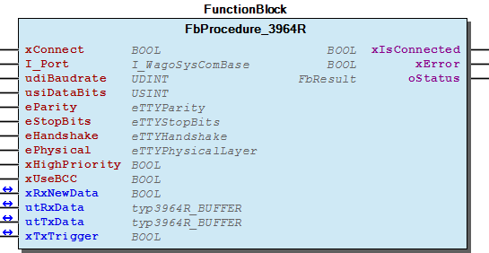
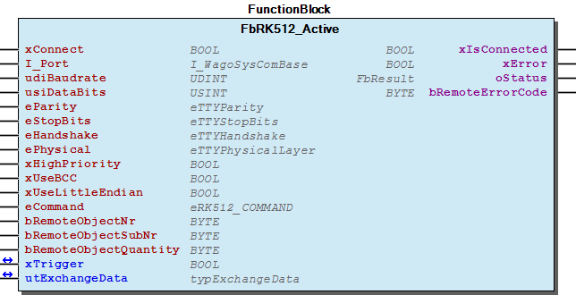
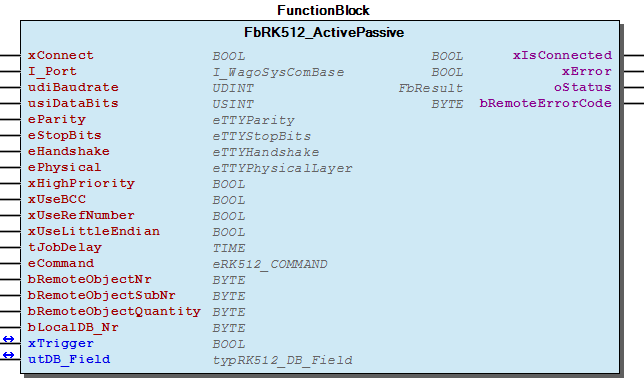
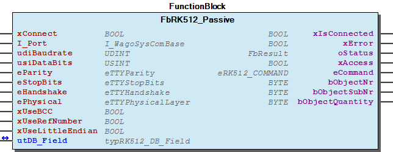

# WagoAppSerial_3964R_RK512 v1.6.1.0 (WAGO) - Complete Documentation


## 📋 Library Information

- **Company:** WAGO
- **Title:** WagoAppSerial_3964R_RK512
- **Version:** 1.6.1.0
- **Categories:** WAGO LayerView|App; WAGO FunctionalView|Connectivity|Serial; Application
- **Namespace:** WagoAppSerial_3964R_RK512
- **Author:** WAGO / u010545
- **Placeholder:** WagoAppSerial_3964R_RK512

### Description ¶


This document is automatically generated. Because of this, the chapter 30 Visualization is not shown in this document. If you are interested in getting to know more about visualization, we refer to the library manager of e!Cockpit.

Procedure 3964(R) for serial communication and Protcol RK512. [1]

This document is automatically generated. Because of this, the chapter 30 Visualization is not shown in this document. If you are interested in getting to know more about visualization, we refer to the library manager of e!Cockpit. Procedure 3964(R) for serial communication and Protcol RK512. [1]

### Contents: ¶


Contents: - Documentation Index - Project Information - Library Information - Function Blocks FbProcedure_3964R (FB) - FbRK512_Active (FB) - FbRK512_ActivePassive (FB) - FbRK512_Passive (FB) Program Organization Global Variable Lists - Error3964 (GVL) - ErrorRK512 (GVL) - VersionHistory (GVL) Other Components - 20 Procedure 3964 - 30 Protocol RK512 - 80 Status - Parameter (PARAMS) - eError3964 (ENUM) - eErrorRK512 (ENUM) - eRK512_COMMAND (ENUM) - typ3964R_BUFFER (STRUCT) - typDB (STRUCT) - typExchangeData (ALIAS) - ... and 1 more

### Indices and tables ¶


| [1] | Based on WagoAppSerial_3964R_RK512.library, last modified 14.01.2019, 19:04:21. The content of this file was automatically generated with None on 14.01.2019, 19:04:24 |

© WAGO Kontakttechnik GmbH & Co. KG, Germany 2018 – All rights reserved. For the avoidance of doubt, this copyright notice does not only apply to the information above but also and primarily to the described library itself. Please note that third-party products are always mentioned without reference to intellectual property rights, including patents, utility models, designs and trademarks, accordingly the existence of such rights cannot be excluded. WAGO is a registered trademark of WAGO Verwaltungsgesellschaft mbH.

- File and Project Information - Library Reference © WAGO Kontakttechnik GmbH & Co. KG, Germany 2018 – All rights reserved. For the avoidance of doubt, this copyright notice does not only apply to the information above but also and primarily to the described library itself. Please note that third-party products are always mentioned without reference to intellectual property rights, including patents, utility models, designs and trademarks, accordingly the existence of such rights cannot be excluded. WAGO is a registered trademark of WAGO Verwaltungsgesellschaft mbH.

### Documentation Index


## WagoAppSerial_3964R_RK512 Library Documentation


| Company: | WAGO |
| Title: | WagoAppSerial_3964R_RK512 |
| Version: | 1.6.1.0 |
| Categories: | WAGO LayerView\|App; WAGO FunctionalView\|Connectivity\|Serial; Application |
| Namespace: | WagoAppSerial_3964R_RK512 |
| Author: | WAGO / u010545 |
| Placeholder: | WagoAppSerial_3964R_RK512 |

### Description


This document is automatically generated. Because of this, the chapter 30 Visualization is not shown in this document. If you are interested in getting to know more about visualization, we refer to the library manager of e!Cockpit.

Procedure 3964(R) for serial communication and Protcol RK512. [1]

This document is automatically generated. Because of this, the chapter 30 Visualization is not shown in this document. If you are interested in getting to know more about visualization, we refer to the library manager of e!Cockpit. Procedure 3964(R) for serial communication and Protcol RK512. [1]

### Contents:


- 20 Program Organization Units 20 Procedure 3964 - 30 Protocol RK512 80 Status - Error3964 (GVL) - ErrorRK512 (GVL) - eError3964 (ENUM) - eErrorRK512 (ENUM) Parameter (PARAMS) VersionHistory (GVL)

### Indices and tables


| [1] | Based on WagoAppSerial_3964R_RK512.library, last modified 14.01.2019, 19:04:21. The content of this file was automatically generated with None on 14.01.2019, 19:04:24 |

© WAGO Kontakttechnik GmbH & Co. KG, Germany 2018 – All rights reserved. For the avoidance of doubt, this copyright notice does not only apply to the information above but also and primarily to the described library itself. Please note that third-party products are always mentioned without reference to intellectual property rights, including patents, utility models, designs and trademarks, accordingly the existence of such rights cannot be excluded. WAGO is a registered trademark of WAGO Verwaltungsgesellschaft mbH.

- File and Project Information - Library Reference © WAGO Kontakttechnik GmbH & Co. KG, Germany 2018 – All rights reserved. For the avoidance of doubt, this copyright notice does not only apply to the information above but also and primarily to the described library itself. Please note that third-party products are always mentioned without reference to intellectual property rights, including patents, utility models, designs and trademarks, accordingly the existence of such rights cannot be excluded. WAGO is a registered trademark of WAGO Verwaltungsgesellschaft mbH.

### Project Information


## File and Project Information


| Scope | Name | Type | Content |
| --- | --- | --- | --- |
| FileHeader | libraryFile | string | WagoAppSerial_3964R_RK512.library |
| contentFile | WagoAppSerial_3964R_RK512_clr.json |
| productName | e!COCKPIT |
| creationDateTime | date | 14.01.2019, 19:04:24 |
| companyName | string | WAGO |
| ProjectInformation | LastModificationDateTime | date | 14.01.2019, 19:04:21 |
| Description | string | See: Description |
| Copyright | © WAGO Kontakttechnik GmbH & Co. KG, Germany 2018 – All rights reserved. |
| Author | WAGO / u010545 |
| AutoResolveUnbound | bool | True |
| Placeholder | string | WagoAppSerial_3964R_RK512 |
| Company | WAGO |
| DocFormat | reStructuredText |
| Project | WagoAppSerial_3964R_RK512 |
| DefaultNamespace | WagoAppSerial_3964R_RK512 |
| Version | version | 1.6.1.0 |
| Title | string | WagoAppSerial_3964R_RK512 |
| LibraryCategories | library-category-list | WAGO LayerView\|App; WAGO FunctionalView\|Connectivity\|Serial; Application |

### Library Information


## Library Reference


| LinkAllContent: False QualifiedOnly: True | SystemLibrary: False | Optional: False |

| LinkAllContent: False QualifiedOnly: False | SystemLibrary: False | Optional: False |

| LinkAllContent: False QualifiedOnly: True | SystemLibrary: False | Optional: False |

| LinkAllContent: False QualifiedOnly: True | SystemLibrary: False | Optional: False |

| LinkAllContent: False Optional: False | QualifiedOnly: True SystemLibrary: False | PublishSymbolsInContainer: True |

| LinkAllContent: False Optional: False | QualifiedOnly: True SystemLibrary: False | PublishSymbolsInContainer: True |

This is a dictionary of all referenced libraries and their name spaces.

This is a dictionary of all referenced libraries and their name spaces. Standard Library Identification : Placeholder: Standard Default Resolution: Standard, * (System) Namespace: Standard Library Properties : WagoSysErrorBase Library Identification : Placeholder: WagoSysErrorBase Default Resolution: WagoSysErrorBase, * (WAGO) Namespace: WagoSysErrorBase Library Properties : Library Parameter : Parameter: RES_LOG_MAX_FILESIZE = 2000 Parameter: RES_LOG_MAX_FILES = 1 Parameter: RES_LOG_MAX_ENTRIES = 200 Parameter: RES_LOG_NAME = ‘WagoAppResultLogger’ WagoSysSerial Library Identification : Placeholder: WagoSysSerial Default Resolution: WagoSysSerial, * (WAGO) Namespace: WagoSysSerial Library Properties : WagoSysVersion Library Identification : Name: WagoSysVersion Version: 1.0.0.0 Company: WAGO Namespace: WagoSysVersion Library Properties : WagoTypesCom Library Identification : Placeholder: WagoTypesCom Default Resolution: WagoTypesCom, * (WAGO) Namespace: WagoTypesCom Library Properties : WagoTypesErrorBase Library Identification : Placeholder: WagoTypesErrorBase Default Resolution: WagoTypesErrorBase, * (WAGO) Namespace: WagoTypesErrorBase Library Properties :

### Function Blocks


## FbProcedure_3964R (FB)


| Scope | Name | Type | Initial | Comment | Inherited from |
| --- | --- | --- | --- | --- | --- |
| Input | xConnect | BOOL |  |  | FbBaseInterface |
| I_Port | WagoTypesCom.I_WagoSysComBase |  | Name of the Interface (e.g. ‘COM1’, ‘SER7.2’, ) | FbBaseInterface |
| udiBaudrate | UDINT |  | Baudrate (9600 = 9k6) | FbBaseInterface |
| usiDataBits | USINT |  | Number of Bits per frame (5..8) | FbBaseInterface |
| eParity | WagoTypesCom.eTTYParity |  | Parity | FbBaseInterface |
| eStopBits | WagoTypesCom.eTTYStopBits |  | Number of Stop-Bits, see note (1) | FbBaseInterface |
| eHandshake | WagoTypesCom.eTTYHandshake |  | TYPE of handshake (XON/XOFF, etc) | FbBaseInterface |
| ePhysical | WagoTypesCom.eTTYPhysicalLayer |  | RS232, RS422, RS485, etc | FbBaseInterface |
| Output | xIsConnected | BOOL |  |  | FbBaseInterface |
| xError | BOOL |  |  | FbBaseInterface |
| oStatus | WagoSysErrorBase.FbResult |  |  | FbBaseInterface |
| Input | xHighPriority | BOOL | FALSE | FALSE -> use low priority |  |
| xUseBCC | BOOL | TRUE | TRUE -> use BCC -> 3964R otherwise 3964 |  |
| Inout | xRxNewData | BOOL |  | This variable is set by the FB while new data valid. Your application may only process the data while this variable is set. After your application has processed the data you may reset this variable and then this variable will be set again by the FB when a new valid telegram was received |  |
| utRxData | typ3964R_BUFFER |  | Here you can find your received payload data and an information how many bytes are valid. |  |
| utTxData | typ3964R_BUFFER |  | Here you have to place your data to send and an information about the byte quantity |  |
| xTxTrigger | BOOL |  | TRUE => starts a send job -> when the job is done this parameter is set to FALSE automatical by this FB |  |

```
ACTION_WAIT_FOR_REQUEST :   BYTE := 16#00;
ACTION_RECEIVE_DATA     :   BYTE := 16#02;
ACTION_WAIT_FOR_CONNECT :   BYTE := 16#03;
ACTION_WAIT_FOR_CONFIRM :   BYTE := 16#04;
```

```
VAR
    myProcedure : FbProcedure_3964R;
    xMyNewData  : BOOL;
    RxData      : typ3964R_BUFFER;
    TxData      : typ3964R_BUFFER;
    xTxTrigger  : BOOL;
END_VAR

myProcedure(
    xConnect        := TRUE,  // TRUE opens the serial port
    I_Port          := COM1,  // place here the name of your serial port
    udiBaudrate     := 9600,
    usiDataBits     := 8,
    eParity         := WagoTypesCom.eTTYParity.None,
    eStopBits       := WagoTypesCom.eTTYStopBits.One,
    eHandshake      := WagoTypesCom.eTTYHandshake.None,
    ePhysical       := WagoTypesCom.eTTYPhysicalLayer.RS232,
    xIsConnected    => ,    // TRUE means the port is successful opened
    xError          => ,    // TRUE means an error occurs -> see oStatus
    oStatus         => ,    // detail information about status and errors
    xHighPriority   := FALSE,
    xUseBCC         := TRUE,// TRUE means use block check character
    xRxNewData      := xMyNewData,  // signals new data received -> the application have to
                                    // reset it after processed the new data
    utRxData        := RxData,      // buffer that holds the new received data
    utTxData        := TxData,      // buffer for the data to transmit
    xTxTrigger      := xTxTrigger   // set this variable once to TRUE for transmit data
                                    // this variable will be reset by this function block after transmit
);
```

Graphical Illustration

Graphical Interface of FbProcedure_3964R

If nothing to do this variable is set to <ACTION_WAIT_FOR_REQUEST> .

While a telegram is incomming the buffer of the caller will be changed. Before the caller use this data he have to wait for xNewDataReceived . This signaled new valid data.

For the last case you have the global parameter _3964_CHAR_DELAY_TIME to manipulate this time. The default setting is 220ms.

If you want to send active data while a receive job is active then the send job will internal start not before the state is again <ACTION_WAIT_FOR_REQUEST>

If a send job was triggered and no receive job is active then immediately a connection request STX is transmit and the state will be change to <ACTION_WAIT_FOR_CONNECT>

At this state all incomming bytes are checked and the character delay time is observed.

Ways to leave this state :

At this state wait for the acknowledge (DLE) of the transmited data.

Ways to leave this state :

Interface variables Function This function block provides 3964(R) communication. The 3964 protocol offers a serial point to point communication. Graphical Illustration  Graphical Interface of FbProcedure_3964R Function description After the serial port is successful opened (‘xIsConnected = TRUE’) the internal state machine will be processed. The active state of the machine can monitored at the internal variable <Instancename>.m_actionstep . This variable may have the follow conditions : If nothing to do this variable is set to <ACTION_WAIT_FOR_REQUEST> . ACTION_WAIT_FOR_REQUEST : In this state all incomming bytes at the internal buffer <Instancename>.m_RxInternalBuffer will be checked for STX . Any other bytes before a STX was found are removed from the buffer. So a new telegram starts always at the beginning of the buffer with STX . In the case that a STX was found (a new telegram starts) a DLE will be send and the state change to <ACTION_RECEIVE_DATA> . ACTION_RECEIVE_DATA : At this state the payload followed by DLE ETX BCC will be expected. While doing so the delay between two bytes (character delay time) was observed, the BCC is “On the Fly” calculated and the data are copied to the result buffer of the caller. Hint While a telegram is incomming the buffer of the caller will be changed. Before the caller use this data he have to wait for xNewDataReceived . This signaled new valid data. From this state the state machine always returns to <ACTION_WAIT_FOR_REQUEST> - either the telegram is complete and valid -> (xNewDataReceived = TRUE) - or an error occured - or the character delay time has triggered an error For the last case you have the global parameter _3964_CHAR_DELAY_TIME to manipulate this time. The default setting is 220ms. Hint If you want to send active data while a receive job is active then the send job will internal start not before the state is again <ACTION_WAIT_FOR_REQUEST> If a send job was triggered and no receive job is active then immediately a connection request STX is transmit and the state will be change to <ACTION_WAIT_FOR_CONNECT> ACTION_WAIT_FOR_CONNECT : At this state all incomming bytes are checked and the character delay time is observed. Ways to leave this state : 1.) While the time _3964_RECEIPT_DELAY_TIME ( global parameter -> default 2s ) no sign received - Error ==> ERR_3964R_RECEIPT_DELAY ==> Abort and return to 2.) STX received ==> initialization conflict - if paramter xHighPriority = FALSE ==> Abort and return to - if paramter xHighPriority = TRUE ==> wait for DLE 3.) DLE received - transmit data and change state to ACTION_WAIT_FOR_CONFIRM At this state wait for the acknowledge (DLE) of the transmited data. Ways to leave this state : 1.) While the time _3964_RECEIPT_DELAY_TIME ( global parameter -> default 2s ) no sign received - return to and try to start the send job again. After 6 fails abort the job. 2.) DLE received - return to if no more follow telegrams is need then ready without errors otherwise starts from the next block. 3.) Any not DLE byte received - return to and try to start the send job again. After 6 fails abort the job. Example

## FbRK512_Active (FB)


| Scope | Name | Type | Initial | Comment | Inherited from |
| --- | --- | --- | --- | --- | --- |
| Input | xConnect | BOOL |  |  | FbBaseInterface |
| I_Port | WagoTypesCom.I_WagoSysComBase |  | Name of the Interface (e.g. ‘COM1’, ‘SER7.2’, ) | FbBaseInterface |
| udiBaudrate | UDINT |  | Baudrate (9600 = 9k6) | FbBaseInterface |
| usiDataBits | USINT |  | Number of Bits per frame (5..8) | FbBaseInterface |
| eParity | WagoTypesCom.eTTYParity |  | Parity | FbBaseInterface |
| eStopBits | WagoTypesCom.eTTYStopBits |  | Number of Stop-Bits, see note (1) | FbBaseInterface |
| eHandshake | WagoTypesCom.eTTYHandshake |  | TYPE of handshake (XON/XOFF, etc) | FbBaseInterface |
| ePhysical | WagoTypesCom.eTTYPhysicalLayer |  | RS232, RS422, RS485, etc | FbBaseInterface |
| Output | xIsConnected | BOOL |  |  | FbBaseInterface |
| xError | BOOL |  |  | FbBaseInterface |
| oStatus | WagoSysErrorBase.FbResult |  |  | FbBaseInterface |
| Input | xHighPriority | BOOL | FALSE |  |  |
| xUseBCC | BOOL | TRUE | TRUE -> use BCC -> 3964R otherwise 3964 |  |
| xUseLittleEndian | BOOL | FALSE | TRUE -> (L-Byte/H-Byte); FALSE -> (H-Byte/L-Byte); |  |
| eCommand | eRK512_COMMAND | RK512_SEND_DB |  |  |
| bRemoteObjectNr | BYTE | 0 | remote object main number for access (e.g. DB-No) |  |
| bRemoteObjectSubNr | BYTE | 0 | sub number of the remote object (e.g. DW-No) |  |
| bRemoteObjectQuantity | BYTE | 0 | quantity of sub-objects |  |
| Inout | xTrigger | BOOL |  | TRUE -> starts an active job -> when the job is done this variable will be reseted by this fb |  |
| utExchangeData | typExchangeData |  | data block for data exchange |  |
| Output | bRemoteErrorCode | BYTE | 0 | error code generated by the remote station |  |

| Error codes at header of response telegram |
| --- |
|  |  |
| --- | --- |
| 16#00 | no error |
| 16#10 | subsequent telegrams not supported |
| 16#12 | object type not supported |
| 16#14 | object not found |
| 16#16 | unknown command |

```
VAR
    RK512_Active    :   FbRK512_Active;
    xTrigger        :   BOOL;
    ExchangeData    :   typExchangeData;
    bRemoteError    :   BYTE;
END_VAR

//-------------------------------------------------------
// Example to get (FETCH) data of the remote device
// start at remote address DB 5 DW 10
// and get 7 WORDS
//-------------------------------------------------------
RK512_Active(
    xConnect                := TRUE,    // TRUE opens the serial port
    I_Port                  := COM1,    // place here the name of your serial port
    udiBaudrate             := 9600,
    usiDataBits             := 8,
    eParity                 := WagoTypesCom.eTTYParity.None,
    eStopBits               := WagoTypesCom.eTTYStopBits.One,
    eHandshake              := WagoTypesCom.eTTYHandshake.None,
    ePhysical               := WagoTypesCom.eTTYPhysicalLayer.RS232,
    xIsConnected            => ,        // TRUE means the port is successful opened
    xError                  => ,        // TRUE means an error occurs -> see oStatus
    oStatus                 => ,        // detail information about status and errors
    xHighPriority           := FALSE,   // need to solve initialization conflicts
    xUseBCC                 := TRUE,    // TRUE means use block check character
    xUseLittleEndian        := FALSE,   // little endian / big endian
    eCommand                := WagoAppSerial_3964R_RK512.eRK512_COMMAND.RK512_FETCH_DB, // specify the job
    bRemoteObjectNr         := 5,       // for example get from remote DB5
    bRemoteObjectSubNr      := 10,      // start at DW10
    bRemoteObjectQuantity   := 7,       // and get from there 7 WORDS
    xTrigger                := xTrigger,// set this variable once to TRUE for activate the job
                                        // this variable will be reset by this function block after the job is done
    utExchangeData          := ExchangeData, // local buffer to place the data
    bRemoteErrorCode        => bRemoteError  // error code generated by the communication partner
);
```

Graphical Illustration

Graphical Interface of FbRK512_Active

This module does not support sequence telegrams. Hence, the user data must be <= 128 Byte

If the cycle time of the user program is too long, errors in communication may occur.

Interface variables Function The function module FbRK512_Active must be called cyclically in the main program. The module supports the active sending (SEND) and fetching (FETCH) of data to and from the communication partner. Graphical Illustration  Graphical Interface of FbRK512_Active Note This module does not support sequence telegrams. Hence, the user data must be <= 128 Byte If the cycle time of the user program is too long, errors in communication may occur. Example

## FbRK512_ActivePassive (FB)


| Scope | Name | Type | Initial | Comment | Inherited from |
| --- | --- | --- | --- | --- | --- |
| Input | xConnect | BOOL |  |  | FbBaseInterface |
| I_Port | WagoTypesCom.I_WagoSysComBase |  | Name of the Interface (e.g. ‘COM1’, ‘SER7.2’, ) | FbBaseInterface |
| udiBaudrate | UDINT |  | Baudrate (9600 = 9k6) | FbBaseInterface |
| usiDataBits | USINT |  | Number of Bits per frame (5..8) | FbBaseInterface |
| eParity | WagoTypesCom.eTTYParity |  | Parity | FbBaseInterface |
| eStopBits | WagoTypesCom.eTTYStopBits |  | Number of Stop-Bits, see note (1) | FbBaseInterface |
| eHandshake | WagoTypesCom.eTTYHandshake |  | TYPE of handshake (XON/XOFF, etc) | FbBaseInterface |
| ePhysical | WagoTypesCom.eTTYPhysicalLayer |  | RS232, RS422, RS485, etc | FbBaseInterface |
| Output | xIsConnected | BOOL |  |  | FbBaseInterface |
| xError | BOOL |  |  | FbBaseInterface |
| oStatus | WagoSysErrorBase.FbResult |  |  | FbBaseInterface |
| Input | xHighPriority | BOOL | FALSE |  |  |
| xUseBCC | BOOL | TRUE | TRUE -> use BCC -> 3964R otherwise 3964 |  |
| xUseRefNumber | BOOL | FALSE | FALSE -> use direct the index of utDB_Field to place the sended data from remote or to get the data for a remote fetch job TRUE -> use the RefNumber from utDB_Field to find the rigth place |  |
| xUseLittleEndian | BOOL | FALSE | TRUE -> (L-Byte/H-Byte); FALSE -> (H-Byte/L-Byte); |  |
| tJobDelay | TIME | TIME#150ms | min Delay between two send jobs for give the communication partner the chance to start an own job |  |
| eCommand | eRK512_COMMAND | RK512_SEND_DB |  |  |
| bRemoteObjectNr | BYTE | 0 | remote object main number for access (e.g. DB-No) |  |
| bRemoteObjectSubNr | BYTE | 0 | sub number of the remote object (e.g. DW-No) |  |
| bRemoteObjectQuantity | BYTE | 0 | quantity of sub-objects |  |
| bLocalDB_Nr | BYTE | 1 | Number of local object to find data for send or to place data from fetch |  |
| Inout | xTrigger | BOOL |  | TRUE -> starts an active job -> when the job is done this variable will be reseted by this fb |  |
| utDB_Field | typRK512_DB_Field |  | representation of data blocks for data exchange |  |
| Output | bRemoteErrorCode | BYTE | 0 | error code generated by the remote station |  |

| Error codes at header of response telegram |
| --- |
|  |  |
| --- | --- |
| 16#00 | no error |
| 16#10 | subsequent telegrams not supported |
| 16#12 | object type not supported |
| 16#14 | object not found |
| 16#16 | unknown command |

```
VAR
    RK512_ActivePassive : FbRK512_ActivePassive;
    xTrigger            : BOOL;
    DB_Field            : typRK512_DB_Field;
    bRemoteError        : BYTE;
END_VAR

RK512_ActivePassive(
    xConnect                := TRUE,    // TRUE opens the serial port
    I_Port                  := COM1,    // place here the name of your serial port
    udiBaudrate             := 9600,
    usiDataBits             := 8,
    eParity                 := WagoTypesCom.eTTYParity.None,
    eStopBits               := WagoTypesCom.eTTYStopBits.One,
    eHandshake              := WagoTypesCom.eTTYHandshake.None,
    ePhysical               := WagoTypesCom.eTTYPhysicalLayer.RS232,
    xIsConnected            => ,        // TRUE means the port is successful opened
    xError                  => ,        // TRUE means an error occurs -> see oStatus
    oStatus                 => ,        // detail information about status and errors
    xHighPriority           := FALSE,   // need to solve initialization conflicts
    xUseBCC                 := TRUE,    // TRUE means use block check character
    xUseRefNumber           := FALSE,   // special function normaly you do not need
    xUseLittleEndian        := FALSE,   // little endian / big endian
    tJobDelay               := T#100MS, // min. delay between two active jobs
    eCommand                := WagoAppSerial_3964R_RK512.eRK512_COMMAND.RK512_FETCH_DB, // specify the job
    bRemoteObjectNr         := 5,       // for example get from remote DB5
    bRemoteObjectSubNr      := 10,      // start at DW10
    bRemoteObjectQuantity   := 7,       // and get from there 7 WORDS
    bLocalDB_Nr             := 1,       // for active jobs this local DB holds the data for exchange
    xTrigger                := xTrigger,// set this variable once to TRUE for activate the job
                                        // this variable will be reset by this function block after the job is done
    utDB_Field              := DB_Field,// data to provide for the communication partner
    bRemoteErrorCode        => bRemoteError  // error code generated by the communication partner
);
```

Graphical Illustration

Graphical Interface of FbRK512_ActivePassive

This module does not support sequence telegrams. Hence, the user data must be <= 128 Byte

If the cycle time of the user program is too long, errors may occur in the communication.

Interface variables Function The function module FbRK512_ActivePassive must be called cyclically in the main program. The module supports the active sending (SEND) and fetching (FETCH) of data to and from the communication partner, as well as the response to send and fetch jobs by the communication partner. Graphical Illustration  Graphical Interface of FbRK512_ActivePassive Note This module does not support sequence telegrams. Hence, the user data must be <= 128 Byte If the cycle time of the user program is too long, errors may occur in the communication. Example

## FbRK512_Passive (FB)


| Scope | Name | Type | Initial | Comment | Inherited from |
| --- | --- | --- | --- | --- | --- |
| Input | xConnect | BOOL |  |  | FbBaseInterface |
| I_Port | WagoTypesCom.I_WagoSysComBase |  | Name of the Interface (e.g. ‘COM1’, ‘SER7.2’, ) | FbBaseInterface |
| udiBaudrate | UDINT |  | Baudrate (9600 = 9k6) | FbBaseInterface |
| usiDataBits | USINT |  | Number of Bits per frame (5..8) | FbBaseInterface |
| eParity | WagoTypesCom.eTTYParity |  | Parity | FbBaseInterface |
| eStopBits | WagoTypesCom.eTTYStopBits |  | Number of Stop-Bits, see note (1) | FbBaseInterface |
| eHandshake | WagoTypesCom.eTTYHandshake |  | TYPE of handshake (XON/XOFF, etc) | FbBaseInterface |
| ePhysical | WagoTypesCom.eTTYPhysicalLayer |  | RS232, RS422, RS485, etc | FbBaseInterface |
| Output | xIsConnected | BOOL |  |  | FbBaseInterface |
| xError | BOOL |  |  | FbBaseInterface |
| oStatus | WagoSysErrorBase.FbResult |  |  | FbBaseInterface |
| Input | xUseBCC | BOOL | TRUE | TRUE -> use BCC -> 3964R otherwise 3964 |  |
| xUseRefNumber | BOOL | FALSE | FALSE -> use direct the index of utDB_Field to place the sended data from remote or to get the data for a remote fetch job TRUE -> use the RefNumber from utDB_Field to find the rigth place |  |
| xUseLittleEndian | BOOL | FALSE | TRUE -> (L-Byte/H-Byte); FALSE -> (H-Byte/L-Byte); |  |
| Inout | utDB_Field | typRK512_DB_Field |  | representation of data blocks for data exchange |  |
| Output | xAccess | BOOL |  | Impuls for one call after a successful remote access to any data |  |
| eCommand | eRK512_COMMAND | RK512_SEND_DB |  |  |
| bObjectNr | BYTE | 0 | object main number for access (e.g. DB-No) |  |
| bObjectSubNr | BYTE | 0 | sub number of the object (e.g. DW-No) |  |
| bObjectQuantity | BYTE | 0 | quantity of sub-objects |  |

```
VAR
    RK512_Passive   : FbRK512_Passive;
    DB_Field        : typRK512_DB_Field;
END_VAR

RK512_Passive(
    xConnect        := TRUE,    // TRUE opens the serial port
    I_Port          := COM1,    // place here the name of your serial port
    udiBaudrate     := 9600,
    usiDataBits     := 8,
    eParity         := WagoTypesCom.eTTYParity.None,
    eStopBits       := WagoTypesCom.eTTYStopBits.One,
    eHandshake      := WagoTypesCom.eTTYHandshake.None,
    ePhysical       := WagoTypesCom.eTTYPhysicalLayer.RS232,
    xIsConnected    => ,        // TRUE means the port is successful opened
    xError          => ,        // TRUE means an error occurs -> see oStatus
    oStatus         => ,        // detail information about status and errors
    xUseBCC         := TRUE,    // TRUE means use block check character
    xUseRefNumber   := FALSE,
    xUseLittleEndian:= FALSE,   // little endian / big endian
    utDB_Field      := DB_Field,// data to provide for the communication partner
    xAccess         => ,        // signals that there was an access by the communication partner
    eCommand        => ,        // access job from the communication partner
    bObjectNr       => ,        // access to DB-No.
    bObjectSubNr    => ,        // access to DW-No.
    bObjectQuantity => );       // access quantity
```

Graphical Illustration

Graphical Interface of FbRK512_Passive

This module does not support sequence telegrams. Hence, the user data must be <= 62 words.

If the cycle time of the user program is too long, errors may occur in the communication:

Interface variables Function The function module FbRK512_Passive must be called cyclically in the main program. The module passively supports [receiving] (Receive) sending (SEND) and fetching (FETCH) of data by a communication partner. Graphical Illustration  Graphical Interface of FbRK512_Passive Note This module does not support sequence telegrams. Hence, the user data must be <= 62 words. If the cycle time of the user program is too long, errors may occur in the communication: Example

### Program Organization


## 20 Program Organization Units


- 20 Procedure 3964 FbProcedure_3964R (FB) - typ3964R_BUFFER (STRUCT) 30 Protocol RK512 - FbRK512_Active (FB) - FbRK512_ActivePassive (FB) - FbRK512_Passive (FB) - eRK512_COMMAND (ENUM) - typDB (STRUCT) - typExchangeData (ALIAS) - typRK512_DB_Field (ALIAS)

### Global Variable Lists


## Error3964 (GVL)


| Scope | Name | Type |
| --- | --- | --- |
| Constant | ERROR_3964 | ARRAY [0..9] OF WagoTypesErrorBase.typResultItem |

| Value | Level | Description |
| --- | --- | --- |
| eError3964.OK | WagoTypesErrorBase.eSeverity.none | ‘OK’ |
| eError3964.CHAR_DELAY | WagoTypesErrorBase.eSeverity.error | ‘Error char delay time’ |
| eError3964.FRAME_TO_LONG | WagoTypesErrorBase.eSeverity.error | ‘Error frame to long’ |
| eError3964.BCC_ERROR | WagoTypesErrorBase.eSeverity.error | ‘Error invalid block check character (BCC)’ |
| eError3964.BLOCK_DELAY | WagoTypesErrorBase.eSeverity.error | ‘Error block delay time’ |
| eError3964.RECEIPT_DELAY | WagoTypesErrorBase.eSeverity.error | ‘Error receipt delay’ |
| eError3964.UNEXPECTED_CHAR | WagoTypesErrorBase.eSeverity.error | ‘Error unexpected char’ |
| eError3964.CONNECT_ERROR | WagoTypesErrorBase.eSeverity.error | ‘Connect error’ |
| eError3964.CONFIRMATION_ERROR | WagoTypesErrorBase.eSeverity.error | ‘Confirmation error’ |
| eError3964.INT_BUFFER_TO_SMALL | WagoTypesErrorBase.eSeverity.error | ‘Error buffer to small’ |

## ErrorRK512 (GVL)


| Scope | Name | Type |
| --- | --- | --- |
| Constant | ERROR_RK512 | ARRAY [0..10] OF WagoTypesErrorBase.typResultItem |

| Value | Level | Description |
| --- | --- | --- |
| eErrorRK512.OK | WagoTypesErrorBase.eSeverity.info | ‘OK’ |
| eErrorRK512.OUT_OF_RANGE | WagoTypesErrorBase.eSeverity.error | ‘Used object to small’ |
| eErrorRK512.NOT_SUPPORTED | WagoTypesErrorBase.eSeverity.error | ‘sequences of telegrams not supported’ |
| eErrorRK512.UNKNOWN_TELE | WagoTypesErrorBase.eSeverity.error | ‘unknown identifier or uncomplete header’ |
| eErrorRK512.TELE_LENGTH | WagoTypesErrorBase.eSeverity.error | ‘response to short or to long (unexpected length)’ |
| eErrorRK512.UNKNOWN_COMMAND | WagoTypesErrorBase.eSeverity.error | ‘not implemented command’ |
| eErrorRK512.INVALID_QUANTITY | WagoTypesErrorBase.eSeverity.error | ‘number of words less than 1 or greater than 62 or User DB to short for this’ |
| eErrorRK512.TIME_OUT_RESPONSE | WagoTypesErrorBase.eSeverity.error | ‘no respone while timout running’ |
| eErrorRK512.UNKNOWN_OBJECT | WagoTypesErrorBase.eSeverity.error | ‘object type not supported or object does not exist’ |
| eErrorRK512.REMOTE_STATION | WagoTypesErrorBase.eSeverity.error | ‘error reported by the remote station -> see bRemoteErrorCode’ |
| eErrorRK512.INVALID_REF_NUMBER | WagoTypesErrorBase.eSeverity.error | ‘error reference number not found’ |

## VersionHistory (GVL)


| Name | Type |
| --- | --- |
| Info | WagoSysVersion.ProjectInfo |

WagoAppSerial_3964R_RK512

WagoAppSerial_3964R_RK512

### Other Components


## 20 Procedure 3964


- FbProcedure_3964R (FB) - typ3964R_BUFFER (STRUCT)

## 30 Protocol RK512


- FbRK512_Active (FB) - FbRK512_ActivePassive (FB) - FbRK512_Passive (FB) - eRK512_COMMAND (ENUM) - typDB (STRUCT) - typExchangeData (ALIAS) - typRK512_DB_Field (ALIAS)

## 80 Status


- Error3964 (GVL) - ErrorRK512 (GVL) - eError3964 (ENUM) - eErrorRK512 (ENUM)

## Parameter (PARAMS)


| Scope | Name | Type | Initial | Comment |
| --- | --- | --- | --- | --- |
| Constant | _3964_SEGMENT_WAIT_TIME | TIME | TIME#4s0ms | BVZ -> block delay time |
| _3964_CHAR_DELAY_TIME | TIME | TIME#220ms | ZVZ -> character delay time |
| _3964_RECEIPT_DELAY_TIME | TIME | TIME#2s0ms | QVZ -> acknowledgement delay time |
| _3964_SYNC_TIME | TIME | TIME#1s0ms |  |
| _3964_BUFFER_SIZE | UINT | 128 | max. Buffersize [byte] this parameter defines the MAX. size of payload data that a application may use |
| _3964_FRAGMENT_SIZE | UINT | 128 | max. fragment size this constant defines the max. payload block size for one 3964 fragment. This constant have to be smaller or equal _3964_BUFFER_SIZE |
| RK512_TIME_OUT | TIME | TIME#500ms | max. Wartezeit auf Reaktionstelegramm |
| RK512_DATA_EXCHANGE_SIZE | UINT | 255 | Size of the data exchange area [words] |
| RK_DB_LENGTH | UINT | 255 | RK512 PASSIVE DB-LENGTH |
| RK_DB_QUANTITY | UINT | 10 | RK512 QUANTITY OF DB’s |

## eError3964 (ENUM)


| Name | Initial | Comment |
| --- | --- | --- |
| OK | 16#0 | OK -> no error |
| CHAR_DELAY | 16#1 | delay between two characters to big |
| FRAME_TO_LONG | 16#2 | response frame longer than expected |
| BCC_ERROR | 16#3 | checksumm error detected |
| BLOCK_DELAY | 16#4 | delay between two blocks to big |
| RECEIPT_DELAY | 16#5 |  |
| UNEXPECTED_CHAR | 16#6 | not expected character received |
| CONNECT_ERROR | 16#7 |  |
| CONFIRMATION_ERROR | 16#8 |  |
| INT_BUFFER_TO_SMALL | 16#9 | internal buffer to small -> try to adjust parameter _3964_BUFFER_SIZE |

## eErrorRK512 (ENUM)


| Name | Initial | Comment |
| --- | --- | --- |
| OK | 16#0 | OK |
| OUT_OF_RANGE | 16#1 | used object to small |
| NOT_SUPPORTED | 16#2 | sequences of telegrams (Folgetelegramme) not supported |
| UNKNOWN_TELE | 16#3 | unknown identifier or uncomplete header |
| TELE_LENGTH | 16#4 | response to short or to long (unexpected length) |
| UNKNOWN_COMMAND | 16#5 | not implemented command |
| INVALID_QUANTITY | 16#6 | number of words less than 1 or greater than 62 or User DB to short for this |
| TIME_OUT_RESPONSE | 16#7 | no respone while timout running |
| UNKNOWN_OBJECT | 16#8 | object type not supported or object does not exist |
| REMOTE_STATION | 16#9 | error reported by the remote station -> see bRemoteErrorCode |
| INVALID_REF_NUMBER | 16#10 | Reference number not found |

## eRK512_COMMAND (ENUM)


| Name | Initial | Comment |
| --- | --- | --- |
| RK512_SEND_DB | 1 | send (DB) Data Block |
| RK512_SEND_DX | 2 | send (DX) extended Data Block |
| RK512_FETCH_DB | 3 | fetch (DB) Data Block |
| RK512_FETCH_DX | 4 | fetch (DX) extended Data Block |
| RK512_FETCH_E | 5 | fetch (EB) Input Bytes |
| RK512_FETCH_A | 6 | fetch (AB) Output Bytes |
| RK512_FETCH_M | 7 | fetch (MB) Flags |
| RK512_FETCH_T | 8 | fetch (T) Timer |
| RK512_FETCH_Z | 9 | fetch (Z) Counter |

## typ3964R_BUFFER (STRUCT)


| Name | Type | Comment |
| --- | --- | --- |
| Count | UINT |  |
| Data | ARRAY [0..(_3964_BUFFER_SIZE - 1)] OF BYTE | the size of this buffer can changed by the parameter _3964_BUFFER_SIZE |

## typDB (STRUCT)


| Name | Type | Comment |
| --- | --- | --- |
| RefNumber | BYTE | DB-Nr. for communication |
| DW | ARRAY [0..RK_DB_LENGTH] OF WORD |  |

## typExchangeData (ALIAS) ¶


## typRK512_DB_Field (ALIAS) ¶
