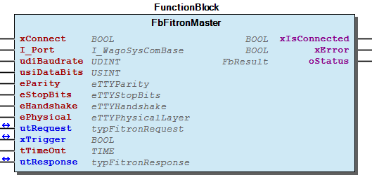

# WagoAppSerial_Fitron v1.0.1.1 (WAGO) - Complete Documentation


## 📋 Library Information

- **Company:** WAGO
- **Title:** WagoAppSerial_Fitron
- **Version:** 1.0.1.1
- **Categories:** WAGO LayerView|App; Application; WAGO FunctionalView|Connectivity|Serial
- **Author:** WAGO / u010545
- **Placeholder:** WagoAppSerial_Fitron

### Description ¶


This document is automatically generated. Because of this, the chapter 30 Visualization is not shown in this document. If you are interested in getting to know more about visualization, we refer to the library manager of e!Cockpit.

Function blocks for fitron communication [1]

This document is automatically generated. Because of this, the chapter 30 Visualization is not shown in this document. If you are interested in getting to know more about visualization, we refer to the library manager of e!Cockpit. Function blocks for fitron communication [1]

### Contents: ¶


Contents: - Documentation Index - Project Information - Library Information - Function Blocks - Program Organization - Global Variable Lists ErrorFitron (GVL) - VersionHistory (GVL) Other Components - 80 Status - Data types - GlobalTextList (Text List) - Parameter - Parameter (PARAMS) - ParameterList - eErrorFitron (ENUM) - eFitronCommand (ENUM) - typFitronParameter (STRUCT) - typFitronParameterList (STRUCT) - ... and 3 more

### Indices and tables ¶


| [1] | Based on WagoAppSerial_Fitron.library, last modified 25.05.2021, 15:49:26. LibDoc 3.5.15.30 |

© WAGO Kontakttechnik GmbH & Co. KG, Germany 2018 – All rights reserved. For the avoidance of doubt, this copyright notice does not only apply to the information above but also and primarily to the described library itself. Please note that third-party products are always mentioned without reference to intellectual property rights, including patents, utility models, designs and trademarks, accordingly the existence of such rights cannot be excluded. WAGO is a registered trademark of WAGO Verwaltungsgesellschaft mbH.

- File and Project Information - Library Reference © WAGO Kontakttechnik GmbH & Co. KG, Germany 2018 – All rights reserved. For the avoidance of doubt, this copyright notice does not only apply to the information above but also and primarily to the described library itself. Please note that third-party products are always mentioned without reference to intellectual property rights, including patents, utility models, designs and trademarks, accordingly the existence of such rights cannot be excluded. WAGO is a registered trademark of WAGO Verwaltungsgesellschaft mbH.

### Documentation Index


## WagoAppSerial_Fitron Library Documentation


| Company: | WAGO |
| Title: | WagoAppSerial_Fitron |
| Version: | 1.0.1.1 |
| Categories: | WAGO LayerView\|App; Application; WAGO FunctionalView\|Connectivity\|Serial |
| Author: | WAGO / u010545 |
| Placeholder: | WagoAppSerial_Fitron |

### Description


This document is automatically generated. Because of this, the chapter 30 Visualization is not shown in this document. If you are interested in getting to know more about visualization, we refer to the library manager of e!Cockpit.

Function blocks for fitron communication [1]

This document is automatically generated. Because of this, the chapter 30 Visualization is not shown in this document. If you are interested in getting to know more about visualization, we refer to the library manager of e!Cockpit. Function blocks for fitron communication [1]

### Contents:


- 20 Program Organization Units Data types - FbFitronMaster (FB) 80 Status - ErrorFitron (GVL) - eErrorFitron (ENUM) GlobalTextList (Text List) Parameter (PARAMS) VersionHistory (GVL)

### Indices and tables


| [1] | Based on WagoAppSerial_Fitron.library, last modified 25.05.2021, 15:49:26. LibDoc 3.5.15.30 |

© WAGO Kontakttechnik GmbH & Co. KG, Germany 2018 – All rights reserved. For the avoidance of doubt, this copyright notice does not only apply to the information above but also and primarily to the described library itself. Please note that third-party products are always mentioned without reference to intellectual property rights, including patents, utility models, designs and trademarks, accordingly the existence of such rights cannot be excluded. WAGO is a registered trademark of WAGO Verwaltungsgesellschaft mbH.

- File and Project Information - Library Reference © WAGO Kontakttechnik GmbH & Co. KG, Germany 2018 – All rights reserved. For the avoidance of doubt, this copyright notice does not only apply to the information above but also and primarily to the described library itself. Please note that third-party products are always mentioned without reference to intellectual property rights, including patents, utility models, designs and trademarks, accordingly the existence of such rights cannot be excluded. WAGO is a registered trademark of WAGO Verwaltungsgesellschaft mbH.

### Project Information


## File and Project Information


| Scope | Name | Type | Content |
| --- | --- | --- | --- |
| FileHeader | libraryFile | string | WagoAppSerial_Fitron.library |
| contentFile | WagoAppSerial_Fitron_clr.json |
| productName | e!COCKPIT |
| creationDateTime | date | 25.05.2021, 15:49:30 |
| companyName | string | WAGO |
| ProjectInformation | LastModificationDateTime | date | 25.05.2021, 15:49:26 |
| Description | string | See: Description |
| Copyright | © WAGO Kontakttechnik GmbH & Co. KG, Germany 2018 – All rights reserved. |
| Author | WAGO / u010545 |
| AutoResolveUnbound | bool | True |
| Placeholder | string | WagoAppSerial_Fitron |
| Company | WAGO |
| DocFormat | reStructuredText |
| Project | WagoAppSerial_Fitron |
| DefaultNamespace |  |
| Version | version | 1.0.1.1 |
| Title | string | WagoAppSerial_Fitron |
| LibraryCategories | library-category-list | WAGO LayerView\|App; Application; WAGO FunctionalView\|Connectivity\|Serial |
| CompiledLibraryCompatibilityVersion | string | CODESYS V3.5 SP16 Patch 3 |

### Library Information


## Library Reference


This is a dictionary of all referenced libraries and their name spaces.

This is a dictionary of all referenced libraries and their name spaces.

### Standard


#### Library Identification


Placeholder: Standard Default Resolution: Standard, * (System) Namespace: Standard

#### Library Properties


| LinkAllContent: False QualifiedOnly: True | Key: Standard SystemLibrary: False | Optional: False |

### VisuElem3DPath


#### Library Identification


Placeholder: System_VisuElem3DPath Default Resolution: VisuElem3DPath, 3.5.7.0 (System) Namespace: VisuElem3DPath

#### Library Properties


| LinkAllContent: False QualifiedOnly: False | Key: System_VisuElem3DPath SystemLibrary: True | Optional: False |

#### Library Parameter


Parameter: GC_POINTS_PER_POLYGON = 100

### VisuElemCamDisplayer


#### Library Identification


Placeholder: System_VisuElemCamDisplayer Default Resolution: VisuElemCamDisplayer, 3.5.7.0 (System) Namespace: VisuElemCamDisplayer

#### Library Properties


| LinkAllContent: False QualifiedOnly: False | Key: System_VisuElemCamDisplayer SystemLibrary: True | Optional: False |

#### Library Parameter


Parameter: GC_POINTS_PER_CAM = 100

### VisuElemMeter


#### Library Identification


Placeholder: System_VisuElemMeter Default Resolution: VisuElemMeter, 3.5.7.0 (System) Namespace: VisuElemMeter

#### Library Properties


| LinkAllContent: False QualifiedOnly: False | Key: System_VisuElemMeter SystemLibrary: True | Optional: False |

### VisuElemTextEditor


#### Library Identification


Placeholder: System_VisuElemTextEditor Default Resolution: VisuElemTextEditor, 3.5.7.0 (System) Namespace: VisuElemTextEditor

#### Library Properties


| LinkAllContent: False QualifiedOnly: False | Key: System_VisuElemTextEditor SystemLibrary: True | Optional: False |

### VisuElemTrace


#### Library Identification


Placeholder: System_VisuElemTrace Default Resolution: VisuElemTrace, 3.5.7.0 (System) Namespace: VisuElemTrace

#### Library Properties


| LinkAllContent: False QualifiedOnly: False | Key: System_VisuElemTrace SystemLibrary: True | Optional: False |

### VisuElems


#### Library Identification


Placeholder: System_VisuElems Default Resolution: VisuElems, 3.5.7.0 (System) Namespace: VisuElems

#### Library Properties


| LinkAllContent: False QualifiedOnly: False | Key: System_VisuElems SystemLibrary: True | Optional: False |

### VisuElemsAlarm


#### Library Identification


Placeholder: System_VisuElemsAlarm Default Resolution: VisuElemsAlarm, 3.5.7.0 (System) Namespace: VisuElemsAlarm

#### Library Properties


| LinkAllContent: False QualifiedOnly: False | Key: System_VisuElemsAlarm SystemLibrary: True | Optional: False |

### VisuElemsDateTime


#### Library Identification


Placeholder: System_VisuElemsDateTime Default Resolution: VisuElemsDateTime, 3.5.7.0 (System) Namespace: VisuElemsDateTime

#### Library Properties


| LinkAllContent: False QualifiedOnly: False | Key: System_VisuElemsDateTime SystemLibrary: True | Optional: False |

### VisuElemsSpecialControls


#### Library Identification


Placeholder: System_VisuElemsSpecialControls Default Resolution: VisuElemsSpecialControls, 3.5.7.0 (System) Namespace: VisuElemsSpecialControls

#### Library Properties


| LinkAllContent: False QualifiedOnly: False | Key: System_VisuElemsSpecialControls SystemLibrary: True | Optional: False |

### VisuElemsWinControls


#### Library Identification


Placeholder: System_VisuElemsWinControls Default Resolution: VisuElemsWinControls, 3.5.7.0 (System) Namespace: VisuElemsWinControls

#### Library Properties


| LinkAllContent: False QualifiedOnly: False | Key: System_VisuElemsWinControls SystemLibrary: True | Optional: False |

### VisuInputs


#### Library Identification


Placeholder: system_visuinputs Default Resolution: VisuInputs, 3.5.16.30 (System) Namespace: visuinputs

#### Library Properties


| LinkAllContent: False Optional: False | QualifiedOnly: False Key: system_visuinputs | SystemLibrary: True PublishSymbolsInContainer: True |

### VisuNativeControl


#### Library Identification


Placeholder: System_VisuNativeControl Default Resolution: VisuNativeControl, 3.5.7.0 (System) Namespace: VisuNativeControl

#### Library Properties


| LinkAllContent: False QualifiedOnly: False | Key: System_VisuNativeControl SystemLibrary: True | Optional: False |

### WagoSysErrorBase


#### Library Identification


Placeholder: WagoSysErrorBase Default Resolution: WagoSysErrorBase, * (WAGO) Namespace: WagoSysErrorBase

#### Library Properties


| LinkAllContent: False QualifiedOnly: False | Key: WagoSysErrorBase SystemLibrary: False | Optional: False |

#### Library Parameter


Parameter: RES_LOG_MAX_FILESIZE = 2000 Parameter: RES_LOG_MAX_FILES = 1 Parameter: RES_LOG_MAX_ENTRIES = 200 Parameter: RES_LOG_NAME = ‘WagoAppResultLogger’

### WagoSysSerial


#### Library Identification


Placeholder: WagoSysSerial Default Resolution: WagoSysSerial, * (WAGO) Namespace: WagoSysSerial

#### Library Properties


| LinkAllContent: False QualifiedOnly: False | Key: WagoSysSerial SystemLibrary: False | Optional: False |

### WagoSysVersion


#### Library Identification


Name: WagoSysVersion Version: 1.0.0.0 Company: WAGO Namespace: WagoSysVersion

#### Library Properties


| LinkAllContent: False QualifiedOnly: True | Key: WagoSysVersion, 1.0.0.0 (WAGO) SystemLibrary: False | Optional: False |

### WagoTypesCom


#### Library Identification


Placeholder: WagoTypesCom Default Resolution: WagoTypesCom, * (WAGO) Namespace: WagoTypesCom

#### Library Properties


| LinkAllContent: False Optional: False | QualifiedOnly: True Key: WagoTypesCom | SystemLibrary: False PublishSymbolsInContainer: True |

### Function Blocks


## FbFitronMaster (FB)


| Scope | Name | Type | Initial | Comment | Inherited from |
| --- | --- | --- | --- | --- | --- |
| Input | xConnect | BOOL |  |  | FbBaseInterface |
| I_Port | WagoTypesCom.I_WagoSysComBase |  | Name of the Interface (e.g. ‘COM1’, ‘SER7.2’, ) | FbBaseInterface |
| udiBaudrate | UDINT |  | Baudrate (9600 = 9k6) | FbBaseInterface |
| usiDataBits | USINT |  | Number of Bits per frame (5..8) | FbBaseInterface |
| eParity | WagoTypesCom.eTTYParity |  | Parity | FbBaseInterface |
| eStopBits | WagoTypesCom.eTTYStopBits |  | Number of Stop-Bits, see note (1) | FbBaseInterface |
| eHandshake | WagoTypesCom.eTTYHandshake |  | TYPE of handshake (XON/XOFF, etc) | FbBaseInterface |
| ePhysical | WagoTypesCom.eTTYPhysicalLayer |  | RS232, RS422, RS485, etc | FbBaseInterface |
| Output | xIsConnected | BOOL |  |  | FbBaseInterface |
| xError | BOOL |  |  | FbBaseInterface |
| oStatus | WagoSysErrorBase.FbResult |  |  | FbBaseInterface |
| Inout | utRequest | typFitronRequest |  |  |  |
| xTrigger | BOOL |  |  |  |
| Input | tTimeOut | TIME | TIME#500ms |  |  |
| Inout | utResponse | typFitronResponse |  |  |  |

| Component | Description |
| --- | --- |
| usiDeviceAddress | Data Type | Range | Description |
| USINT | 1..255 | Address of the fitron device |
| usiZoneAddress | USINT | 1..8 | Address of the heating zone at fitron device |
| bCode | BYTE | 0..255 | Parameter code / Group code |
|  |
| eFitronCommand | ENUM | Value | Description |
| GET_PARAMETER | 16#10 | Get parameter from fitron device |
| GET_PARAMETER_GROUP | 16#15 | Get parameter group from fitron device |
| ADOPT_PARAMETER | 16#20 | Write parameter to fitron device |
| ADOPT_PARAMETER_RETAIN | 16#21 | Write parameter to fitron device (EAROM) Note: 100000 write cycles for the EAROM |
|  |
| utParametervalue | Component | Data Type | Description |
| iMantisse | INT |  |
| siExponent | SINT |  |

| Group Code | Parameter Code | Access | Description |
| --- | --- | --- | --- |
| 16#00 | 16#01 | R | Device ID |
| 16#02 | R | Software Version |
| 16#03 | R | Clamp Temperature |
|  |  |  |  |
| 16#01 | 16#10 | R | Temperature Actual Value |
| 16#11 | R | Current Actual Value |
| 16#12 | R | Cutoff Current Actual Value |
| 16#18 | R/W | Temperature Actual Value Offset |
| 16#1A | R/W | Sensor Code |
| Value | Description |
| 0 | PT100 0..400 °C |
| 1 | PT100 0..752 °F |
| 2 | PT100 0..800 °C |
| 3 | Thermoelement Typ L 0..400 °C |
| 4 | Thermoelement Typ J 0..752 °F |
| 5 | Thermoelement Typ L 0..800 °C |
| 6 | Thermoelement Typ J 0..800 °C |
| 7 | Thermoelement Typ K 0..999 °C |
| 8 | Thermoelement Typ J 0..999 °F |
| 9 | Thermoelement Typ K 0..800 °C |
| 10 | Thermoelement Typ K 0..999 °F |
|  |  |  |  |
| 16#02 | 16#20 | R | Actual Nominal Value |
| 16#21 | R/W | Nominal Value 1 |
| 16#22 | R/W | Nominal Value 2 (reduction) |
| 16#23 | R/W | Nominal Value 3 (boost) |
| 16#2B | R/W | Nominal Value Min |
| 16#2C | R/W | Nominal Value Max |
|  |  |  |  |
| 16#03 | 16#38 | R/W | Current Limit Value |
| 16#39 | R/W | Alarm LCL |
| 16#3A | R/W | Alarm LCH |
|  |  |  |  |
| 16#04 | 16#40 | R/W | XP Heat |
| 16#41 | R/W | TV Heat |
| 16#41 | R/W | TN Heat |
|  |  |  |  |
| 16#06 | 16#60 | R | Actual Adjusting Degree |
| 16#61 | R/W | Manual Adjusting Degree |
| 16#62 | R/W | Startup Adjusting Degree |
| 16#64 | R/W | Adjusting Degree Limit |
| 16#6A | R/W | Temperature Limt Value for Manual Adjusting Degree |
| 16#6C | R/W | Startup Time |
| 16#6F | R/W | Startup Synchronisation |
|  |  |  |  |
| 16#07 | 16#70 | R | Statusword 1 |
| Bit | Description |
| 0 (ro) | System Error |
| 1 (ro) | Sensor break or short circuit |
| 2 (ro) | Sensor break |
| 3 (ro) | Reset Flag |
| 4 (ro) | Startup active |
| 5 (ro) | Alarm A1 |
| 6 (ro) | Alarm A2 |
| 7 (ro) |  |
| 16#78 | R/W | Statusword 2 |
| Bit | Description |
| 0 (rw) | Remote |
| 1 (ro) | Manual Mode |
| 2 (rw) | Optimization |
| 3 (ro) | Zone off |
| 4 |  |
| 5 (rw) | Nominal Value 1 |
| 6 (rw) | Nominal Value 2 (reduction) |
| 7 (rw) | Nominal Value 3 (boost) |
|  |  |  |  |
| 16#08 | 16#88 | R/W | Optimization 0=OFF / 1=ON |
| 16#8B | R/W | 0=Controller / 1=Regulator |
|  |  |  |  |
| 16#0A | 16#10 | R | Temperature Actual Value |
| 16#11 | R | Current Actual Value |
| 16#20 | R | Actual Nominal Value |
| 16#60 | R | Actual Adjusting Degree |
| 16#70 | R | Statusword 1 |
| Bit | Description |
| 0 (ro) | System Error |
| 1 (ro) | Sensor break or short circuit |
| 2 (ro) | Sensor break |
| 3 (ro) | Reset Flag |
| 4 (ro) | Startup active |
| 5 (ro) | Alarm A1 |
| 6 (ro) | Alarm A2 |
| 7 (ro) |  |
| 16#78 | R/W | Statusword 2 |
| Bit | Description |
| 0 (rw) | Remote |
| 1 (ro) | Manual Mode |
| 2 (rw) | Optimization |
| 3 (ro) | Zone off |
| 4 |  |
| 5 (rw) | Nominal Value 1 |
| 6 (rw) | Nominal Value 2 (reduction) |
| 7 (rw) | Nominal Value 3 (boost) |
|  |  |  |  |
|  | 16#92 |  | Boost Timer |

```
VAR
    myFbFitronMaster    :   FbFitronMaster := ( xConnect    := TRUE,
                                                udiBaudrate := 19200,
                                                usiDataBits := 7,
                                                eParity     := eTTYParity.Even,
                                                eStopBits   := eTTYStopBits.One,
                                                eHandshake  := eTTYHandshake.None,
                                                ePhysical   := eTTYPhysicalLayer.RS232,
                                                tTimeOut    := T#100MS
                                              );
    xTrigger            :   BOOL;
    utRequest           :   typFitronRequest := (   usiDeviceAddress := 16#01,                          // device address
                                                    usiZoneAddress   := 16#01,                          // zone address
                                                    eFitronCommand   := eFitronCommand.GET_PARAMETER,   // command
                                                    bCode            := 16#01,                          // parameter number
                                                    utParameterValue := (   iMantisse   := 0,           // not used for this command
                                                                            siExponent  := 0            // not used for this command
                                                                        )
                                                );
    utResponse          :   typFitronResponse;
END_VAR

//--- Call the Fitron Master -----------------------------------------------------------------------------
myFbFitronMaster(   I_Port      := my652,
                    utRequest   := utRequest,
                    xTrigger    := xTrigger, // set xTrigger once by your application to start this job
                                             // this variable will be automaticly reset by the Fitron Master
                                             // after the job is done
                    utResponse  := utResponse
                );
//--------------------------------------------------------------------------------------------------------

IF NOT xTrigger THEN // look for an error and process the result
    IF NOT  myFbFitronMaster.xError THEN

        ;// process here the result of your request -> find it at utResponse

    ELSE // error

        ;// process here your error handling
         // for more information aboutthe error see myFbFitronMaster.oStatus

    END_IF
END_IF
```

This module supports the communication with a fitron device.

Please take notice of the fitron manufacturer manual.

Group / Parameter Codes

Graphical Illustration

Graphical Interface of FbFitronMaster

Interface variables Function This module supports the communication with a fitron device. Note Please take notice of the fitron manufacturer manual. utRequest Group / Parameter Codes Graphical Illustration  Graphical Interface of FbFitronMaster Example This example gets form device 1 -> zone 1 the first parameter.

### Program Organization


## 20 Program Organization Units


This folder contains program organization units

This folder contains program organization units - Data types ParameterList Parameter typFitronParameter (STRUCT) - typFitronParameterValue (STRUCT) typFitronParameterList (STRUCT) eFitronCommand (ENUM) typFitronRequest (STRUCT) typFitronResponse (STRUCT) FbFitronMaster (FB)

### Global Variable Lists


## ErrorFitron (GVL)


| Value | Level | Description |
| --- | --- | --- |
| eErrorFitron.OK | eSeverity.none | ‘OK’ |
| eErrorFitron.REPORTED_BY_DEVICE | eSeverity.error | ‘For more details see response.bError and the manual of your fitron device.’ |
| eErrorFitron.SIO_PORT | eSeverity.error | ‘error by serial port see SioError’ |
| eErrorFitron.ILLEGAL_COMMAND | eSeverity.error | ‘not supported command’ |
| eErrorFitron.CRC | eSeverity.error | ‘response with invalid crc’ |
| eErrorFitron.FRAME_LENGTH | eSeverity.error | ‘response with invalid length’ |
| eErrorFitron.PARAMETERLIST_SIZE | eSeverity.error | ‘ray for parameters to small modify constant FITRON_MAXPARAMETER’ |
| eErrorFitron.TIMEOUT | eSeverity.error | ‘no valid response while time out time’ |

## VersionHistory (GVL)


| date | version | author | change |
| 19.02.2021 | 1.0.1.1 | u010545 | bugfix for negative Mantisse |
| 08.01.2019 | 1.0.1.0 | u015842 | Properties: free placeholder added |
| 26.09.2017 | 1.0.0.0 | u010545 | first release |
| 02.08.2017 | 0.0.0.1 | u010545 | created |

WagoAppSerial_Fitron

### Other Components


## 80 Status ¶


- ErrorFitron (GVL) - eErrorFitron (ENUM)

## Data types


- ParameterList Parameter typFitronParameter (STRUCT) - typFitronParameterValue (STRUCT) typFitronParameterList (STRUCT) eFitronCommand (ENUM) typFitronRequest (STRUCT) typFitronResponse (STRUCT)

## GlobalTextList (Text List) ¶


## Parameter


- typFitronParameter (STRUCT) - typFitronParameterValue (STRUCT)

## Parameter (PARAMS)


| Scope | Name | Type | Initial | Comment |
| --- | --- | --- | --- | --- |
| Constant | FITRON_MAXPARAMETER | UINT | 10 | Max. quantity of parameters for the command GET_PARAMETER_GROUP |

## ParameterList


- Parameter typFitronParameter (STRUCT) - typFitronParameterValue (STRUCT) typFitronParameterList (STRUCT)

## eErrorFitron (ENUM)


| Name | Initial | Comment |
| --- | --- | --- |
| OK | 16#0 | OK -> no error |
| REPORTED_BY_DEVICE | 16#100 | see response struct for more details |
| SIO_PORT | 16#200 | error by serial port see SioError |
| ILLEGAL_COMMAND | 16#300 | not supported command |
| CRC | 16#400 | response with invalid crc |
| FRAME_LENGTH | 16#500 | response with invalid length |
| PARAMETERLIST_SIZE | 16#600 | array for parameters to small modify constant FITRON_MAXPARAMETER |
| TIMEOUT | 16#9900 | no valid response while time out time |

## eFitronCommand (ENUM)


| Name | Initial | Comment |
| --- | --- | --- |
| GET_PARAMETER | 16#10 | get single parameter from device |
| GET_PARAMETER_GROUP | 16#15 | get parameter group from device |
| ADOPT_PARAMETER | 16#20 | send single parameter to device and take it over |
| ADOPT_PARAMETER_RETAIN | 16#21 | send single parameter to device and take it over at retain memory |

## typFitronParameter (STRUCT)


| Name | Type | Comment |
| --- | --- | --- |
| bParameterCode | BYTE | Parameter Code for this value |
| utParameterValue | typFitronParameterValue |  |

| Parameter Code | Access | Description |
| --- | --- | --- |
| 16#01 | R | Device ID |
| 16#02 | R | Software Version |
| 16#03 | R | Clamp Temperature |
|  |  |  |
| 16#10 | R | Temperature Actual Value |
| 16#11 | R | Current Actual Value |
| 16#12 | R | Cutoff Current Actual Value |
| 16#18 | R/W | Temperature Actual Value Offset |
| 16#1A | R/W | Sensor Code |
| Value | Description |
| 0 | PT100 0..400 °C |
| 1 | PT100 0..752 °F |
| 2 | PT100 0..800 °C |
| 3 | Thermoelement Typ L 0..400 °C |
| 4 | Thermoelement Typ J 0..752 °F |
| 5 | Thermoelement Typ L 0..800 °C |
| 6 | Thermoelement Typ J 0..800 °C |
| 7 | Thermoelement Typ K 0..999 °C |
| 8 | Thermoelement Typ J 0..999 °F |
| 9 | Thermoelement Typ K 0..800 °C |
| 10 | Thermoelement Typ K 0..999 °F |
|  |  |  |
| 16#20 | R | Actual Nominal Value |
| 16#21 | R/W | Nominal Value 1 |
| 16#22 | R/W | Nominal Value 2 (reduction) |
| 16#23 | R/W | Nominal Value 3 (boost) |
| 16#2B | R/W | Nominal Value Min |
| 16#2C | R/W | Nominal Value Max |
|  |  |  |
| 16#38 | R/W | Current Limit Value |
| 16#39 | R/W | Alarm LCL |
| 16#3A | R/W | Alarm LCH |
|  |  |  |
| 16#40 | R/W | XP Heat |
| 16#41 | R/W | TV Heat |
| 16#41 | R/W | TN Heat |
|  |  |  |
| 16#60 | R | Actual Adjusting Degree |
| 16#61 | R/W | Manual Adjusting Degree |
| 16#62 | R/W | Startup Adjusting Degree |
| 16#64 | R/W | Adjusting Degree Limit |
| 16#6A | R/W | Temperature Limt Value for Manual Adjusting Degree |
| 16#6C | R/W | Startup Time |
| 16#6F | R/W | Startup Synchronisation |
|  |  |  |
| 16#70 | R | Statusword 1 |
| Bit | Description |
| 0 (ro) | System Error |
| 1 (ro) | Sensor break or short circuit |
| 2 (ro) | Sensor break |
| 3 (ro) | Reset Flag |
| 4 (ro) | Startup active |
| 5 (ro) | Alarm A1 |
| 6 (ro) | Alarm A2 |
| 7 (ro) |  |
| 16#78 | R/W | Statusword 2 |
| Bit | Description |
| 0 (rw) | Remote |
| 1 (ro) | Manual Mode |
| 2 (rw) | Optimization |
| 3 (ro) | Zone off |
| 4 |  |
| 5 (rw) | Nominal Value 1 |
| 6 (rw) | Nominal Value 2 (reduction) |
| 7 (rw) | Nominal Value 3 (boost) |
|  |  |  |
| 16#88 | R/W | Optimization 0=OFF / 1=ON |
| 16#8B | R/W | 0=Controller / 1=Regulator |
|  |  |  |
| 16#92 |  | Boost Timer |

Parameter Codes ( bParameterCode )

InOut: Parameter Codes ( bParameterCode )

## typFitronParameterList (STRUCT)


| Name | Type | Comment |
| --- | --- | --- |
| uiCount | UINT | Quantity of valid parameter |
| aParameter | ARRAY [0..(FITRON_MAXPARAMETER - 1)] OF typFitronParameter |  |

## typFitronParameterValue (STRUCT)


| Name | Type |
| --- | --- |
| iMantisse | INT |
| siExponent | SINT |

| Value | iMantisse | siExponent |
| --- | --- | --- |
| 23,45 | 2345 | 2 |
| 0,123 | 123 | -3 |

## typFitronRequest (STRUCT)


| Name | Type | Initial | Comment |
| --- | --- | --- | --- |
| usiDeviceAddress | USINT |  |  |
| usiZoneAddress | USINT |  |  |
| eFitronCommand | eFitronCommand | GET_PARAMETER |  |
| bCode | BYTE |  | Group / Parameter Codes -> depends on eFitronCommand |
| utParameterValue | typFitronParameterValue |  |  |

| Group Code | Parameter Code | Access | Description |
| --- | --- | --- | --- |
| 16#00 | 16#01 | R | Device ID |
| 16#02 | R | Software Version |
| 16#03 | R | Clamp Temperature |
|  |  |  |  |
| 16#01 | 16#10 | R | Temperature Actual Value |
| 16#11 | R | Current Actual Value |
| 16#12 | R | Cutoff Current Actual Value |
| 16#18 | R/W | Temperature Actual Value Offset |
| 16#1A | R/W | Sensor Code |
| Value | Description |
| 0 | PT100 0..400 °C |
| 1 | PT100 0..752 °F |
| 2 | PT100 0..800 °C |
| 3 | Thermoelement Typ L 0..400 °C |
| 4 | Thermoelement Typ J 0..752 °F |
| 5 | Thermoelement Typ L 0..800 °C |
| 6 | Thermoelement Typ J 0..800 °C |
| 7 | Thermoelement Typ K 0..999 °C |
| 8 | Thermoelement Typ J 0..999 °F |
| 9 | Thermoelement Typ K 0..800 °C |
| 10 | Thermoelement Typ K 0..999 °F |
|  |  |  |  |
| 16#02 | 16#20 | R | Actual Nominal Value |
| 16#21 | R/W | Nominal Value 1 |
| 16#22 | R/W | Nominal Value 2 (reduction) |
| 16#23 | R/W | Nominal Value 3 (boost) |
| 16#2B | R/W | Nominal Value Min |
| 16#2C | R/W | Nominal Value Max |
|  |  |  |  |
| 16#03 | 16#38 | R/W | Current Limit Value |
| 16#39 | R/W | Alarm LCL |
| 16#3A | R/W | Alarm LCH |
|  |  |  |  |
| 16#04 | 16#40 | R/W | XP Heat |
| 16#41 | R/W | TV Heat |
| 16#41 | R/W | TN Heat |
|  |  |  |  |
| 16#06 | 16#60 | R | Actual Adjusting Degree |
| 16#61 | R/W | Manual Adjusting Degree |
| 16#62 | R/W | Startup Adjusting Degree |
| 16#64 | R/W | Adjusting Degree Limit |
| 16#6A | R/W | Temperature Limt Value for Manual Adjusting Degree |
| 16#6C | R/W | Startup Time |
| 16#6F | R/W | Startup Synchronisation |
|  |  |  |  |
| 16#07 | 16#70 | R | Statusword 1 |
| Bit | Description |
| 0 (ro) | System Error |
| 1 (ro) | Sensor break or short circuit |
| 2 (ro) | Sensor break |
| 3 (ro) | Reset Flag |
| 4 (ro) | Startup active |
| 5 (ro) | Alarm A1 |
| 6 (ro) | Alarm A2 |
| 7 (ro) |  |
| 16#78 | R/W | Statusword 2 |
| Bit | Description |
| 0 (rw) | Remote |
| 1 (ro) | Manual Mode |
| 2 (rw) | Optimization |
| 3 (ro) | Zone off |
| 4 |  |
| 5 (rw) | Nominal Value 1 |
| 6 (rw) | Nominal Value 2 (reduction) |
| 7 (rw) | Nominal Value 3 (boost) |
|  |  |  |  |
| 16#08 | 16#88 | R/W | Optimization 0=OFF / 1=ON |
| 16#8B | R/W | 0=Controller / 1=Regulator |
|  |  |  |  |
| 16#0A | 16#10 | R | Temperature Actual Value |
| 16#11 | R | Current Actual Value |
| 16#20 | R | Actual Nominal Value |
| 16#60 | R | Actual Adjusting Degree |
| 16#70 | R | Statusword 1 |
| Bit | Description |
| 0 (ro) | System Error |
| 1 (ro) | Sensor break or short circuit |
| 2 (ro) | Sensor break |
| 3 (ro) | Reset Flag |
| 4 (ro) | Startup active |
| 5 (ro) | Alarm A1 |
| 6 (ro) | Alarm A2 |
| 7 (ro) |  |
| 16#78 | R/W | Statusword 2 |
| Bit | Description |
| 0 (rw) | Remote |
| 1 (ro) | Manual Mode |
| 2 (rw) | Optimization |
| 3 (ro) | Zone off |
| 4 |  |
| 5 (rw) | Nominal Value 1 |
| 6 (rw) | Nominal Value 2 (reduction) |
| 7 (rw) | Nominal Value 3 (boost) |
|  |  |  |  |
|  | 16#92 |  | Boost Timer |

Group / Parameter Codes ( bCode ) -> depends on eFitronCommand

InOut: Group / Parameter Codes ( bCode ) -> depends on eFitronCommand For the command GET_PARAMETER_GROUP use the Group Code to get all parameters of the group. For all other commands use the Parameter Code to get or set a single parameter.

## typFitronResponse (STRUCT)


| Name | Type | Initial | Comment |
| --- | --- | --- | --- |
| usiDeviceAddress | USINT |  | Device Address |
| usiZoneAddress | USINT |  | Zone Address |
| eFitronCommand | eFitronCommand | GET_PARAMETER | Possible Values | Description |
| GET_PARAMETER | get single parameter from device |
| GET_PARAMETER_GROUP | get parameter group from device |
| ADOPT_PARAMETER | send single parameter to device and take it over |
| ADOPT_PARAMETER_RETAIN | send single parameter to device and take it over at retain memory |

| Code | Description |
| --- | --- |
| 16#00 | OK |
| 16#03 | Procedure error |
| 16#04 | Parameter out of range |
| 16#06 | Parameter is read only |

| typFitronResponse | Data Type | Comment |
|  | usiDeviceAddress | USINT | Device Address |
| usiZoneAddress | USINT | Zone Address |
| eFitronCommand | eFitronCommand | Command |
| bErrorCode | BYTE | Errorcode from fitron device |
| utParameterList | typFitronParameterList | List with the requested parameters |
|  | uiCount | UINT | Quantity of valid Parameter in the list |
| aParameter[] | [] |  |
|  | aParameter[0] | typFitronParameter | First Entry |
| bParameterCode | BYTE | Parameter Code (No) for this parameter |
| utParameterValue | typFitronParameterValue |  |
|  | iMantisse | INT | Mantisse |
| siExponent | SINT | Exponent |
| aParameter[1] | typFitronParameter | Second Entry |
| bParameterCode | BYTE | Parameter Code (No) for this parameter |
| utParameterValue | typFitronParameterValue |  |
|  | iMantisse | INT | Mantisse |
| siExponent | SINT | Exponent |

Struct of typFitronResponse

InOut: bErrorCode BYTE utParameterList typFitronParameterList Parameters Struct of typFitronResponse