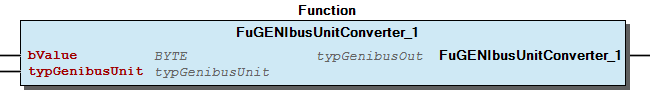

# WagoAppSerial_GENIbus v1.0.1.3 (WAGO) - Complete Documentation

## 📋 Library Information

- **Company:** WAGO
- **Title:** WagoAppSerial_GENIbus
- **Version:** 1.0.1.3
- **Categories:** WAGO BusinessView|Building Automation; WAGO LayerView|App; Application
- **Namespace:** WagoAppSerial_GENIbus
- **Author:** WAGO / u010188
- **Placeholder:** WagoAppSerial_GENIbus

### Description ¶

This document is automatically generated.

This library is used for communication via the RS-485 moduel 750-652 with the GENIbus protocol.

This document is automatically generated. This library is used for communication via the RS-485 moduel 750-652 with the GENIbus protocol.

### Contents: ¶

Contents: - Documentation Index 10 Documentation - WagoAppSerial_GENIbus Library Documentation Project Information Library Information Function Blocks - FbGENIbusDataRequest (FB) - FbGENIbusGet_ConfigValue (FB) - FbGENIbusGet_MeasuredData (FB) - FbGENIbusGet_MeasuredData_32Bit (FB) - FbGENIbusGet_ReferenceValue (FB) - FbGENIbusMagna3_DataRequest (FB) - FbGENIbusMagna3_HeatEnergy (FB) - FbGENIbusMagna3_Pump (FB) - FbGENIbusMagna3_UnitRequest (FB) - FbGENIbusMagna_Pump (FB) - ... and 8 more Functions - FuGENIbusCheckAddress (FUN) - FuGENIbusUnitConverter_1 (FUN) - FuGENIbusUnitConverter_2 (FUN) - FuGENIbusUnitConverter_3 (FUN) - FuGENIbus_CRC (FUN) Program Organization Function Groups Internal Components Global Variable Lists - Globale_Variablen (GVL) - ParameterList (GVL) - Status (GVL) - VersionHistory (GVL) Other Components - 01 Communication - 01 Measured Data (Class 2 and 14) - 02 Command (Class 3) - 02 Pump - 03 Configuration (Class 4) - 04 Conversion - 04 Reference value (Class 5) - 60 Unit Request - 80 Data types - 80 Status - ... and 14 more

### Indices and tables ¶

Based on WagoAppSerial_GENIbus.library, last modified 29.05.2024, 20:38:56. LibDoc 3.5.16.10

© WAGO GmbH & Co. KG, Germany 2018 – All rights reserved. For the avoidance of doubt, this copyright notice does not only apply to the information above but also and primarily to the described library itself. Please note that third-party products are always mentioned without reference to intellectual property rights, including patents, utility models, designs and trademarks, accordingly the existence of such rights cannot be excluded. WAGO is a registered trademark of WAGO Verwaltungsgesellschaft mbH.

- File and Project Information - Library Reference Based on WagoAppSerial_GENIbus.library, last modified 29.05.2024, 20:38:56. LibDoc 3.5.16.10 © WAGO GmbH & Co. KG, Germany 2018 – All rights reserved. For the avoidance of doubt, this copyright notice does not only apply to the information above but also and primarily to the described library itself. Please note that third-party products are always mentioned without reference to intellectual property rights, including patents, utility models, designs and trademarks, accordingly the existence of such rights cannot be excluded. WAGO is a registered trademark of WAGO Verwaltungsgesellschaft mbH.

### Documentation Index

## 10 Documentation ¶

- doc01_Foreword (FB)

## WagoAppSerial_GENIbus Library Documentation

| Company: | WAGO |
| Title: | WagoAppSerial_GENIbus |
| Version: | 1.0.1.3 |
| Categories: | WAGO BusinessView\|Building Automation; WAGO LayerView\|App; Application |
| Namespace: | WagoAppSerial_GENIbus |
| Author: | WAGO / u010188 |
| Placeholder: | WagoAppSerial_GENIbus |

### Description

This document is automatically generated.

This library is used for communication via the RS-485 moduel 750-652 with the GENIbus protocol.

This document is automatically generated. This library is used for communication via the RS-485 moduel 750-652 with the GENIbus protocol.

### Contents:

- 10 Documentation doc01_Foreword (FB) 20 Program Organization Units - 01 Communication - 02 Pump - 03 Basic functions - 04 Conversion - 80 Data types - Globale_Variablen (GVL) 80 Status - Status (GVL) - eStatus (ENUM) 90 Internal - Data types - POUs ParameterList (GVL) VersionHistory (GVL)

### Indices and tables

Based on WagoAppSerial_GENIbus.library, last modified 29.05.2024, 20:38:56. LibDoc 3.5.16.10

© WAGO GmbH & Co. KG, Germany 2018 – All rights reserved. For the avoidance of doubt, this copyright notice does not only apply to the information above but also and primarily to the described library itself. Please note that third-party products are always mentioned without reference to intellectual property rights, including patents, utility models, designs and trademarks, accordingly the existence of such rights cannot be excluded. WAGO is a registered trademark of WAGO Verwaltungsgesellschaft mbH.

- File and Project Information - Library Reference Based on WagoAppSerial_GENIbus.library, last modified 29.05.2024, 20:38:56. LibDoc 3.5.16.10 © WAGO GmbH & Co. KG, Germany 2018 – All rights reserved. For the avoidance of doubt, this copyright notice does not only apply to the information above but also and primarily to the described library itself. Please note that third-party products are always mentioned without reference to intellectual property rights, including patents, utility models, designs and trademarks, accordingly the existence of such rights cannot be excluded. WAGO is a registered trademark of WAGO Verwaltungsgesellschaft mbH.

### Project Information

## File and Project Information

| Scope | Name | Type | Content |
| --- | --- | --- | --- |
| FileHeader | libraryFile | string | WagoAppSerial_GENIbus.library |
| contentFile | doc.clean.json |
| productName | e!COCKPIT |
| creationDateTime | date | 29.05.2024, 20:38:57 |
| companyName | string | WAGO |
| ProjectInformation | LastModificationDateTime | date | 29.05.2024, 20:38:56 |
| Description | string | See: Description |
| Copyright | © WAGO Kontakttechnik GmbH & Co. KG, Germany 2018 – All rights reserved. |
| Author | WAGO / u010188 |
| AutoResolveUnbound | bool | True |
| Placeholder | string | WagoAppSerial_GENIbus |
| Company | WAGO |
| DocFormat | reStructuredText |
| Project | WagoAppSerial_GENIbus |
| DefaultNamespace | WagoAppSerial_GENIbus |
| Version | version | 1.0.1.3 |
| ThreadSave | string | FALSE |
| Version string |  |
| Title | WagoAppSerial_GENIbus |
| LibraryCategories | library-category-list | WAGO BusinessView\|Building Automation; WAGO LayerView\|App; Application |
| CompiledLibraryCompatibilityVersion | string | CODESYS V3.5 SP16 Patch 3 |

### Library Information

## Library Reference

| LinkAllContent: False QualifiedOnly: False | SystemLibrary: False | Optional: False |

| LinkAllContent: False QualifiedOnly: False | SystemLibrary: False | Optional: False |

| LinkAllContent: False QualifiedOnly: False | SystemLibrary: False | Optional: False |

| LinkAllContent: False QualifiedOnly: False | SystemLibrary: False | Optional: False |

| LinkAllContent: False QualifiedOnly: False | SystemLibrary: False | Optional: False |

This is a dictionary of all referenced libraries and their name spaces.

This is a dictionary of all referenced libraries and their name spaces. Standard Library Identification : Placeholder: Standard Default Resolution: Standard, * (System) Namespace: Standard Library Properties : WagoAppCom Library Identification : Placeholder: WagoAppCom Default Resolution: WagoAppCom, * (WAGO) Namespace: WagoAppCom Library Properties : Library Parameter : Parameter: CUIDEFAULTSYSTEMBUFFERSIZE = 1028 WagoSysErrorBase Library Identification : Placeholder: WagoSysErrorBase Default Resolution: WagoSysErrorBase, * (WAGO) Namespace: WagoSysErrorBase Library Properties : WagoSysVersion Library Identification : Name: WagoSysVersion Version: 1.0.0.0 Company: WAGO Namespace: WagoSysVersion Library Properties : WagoTypesCom Library Identification : Placeholder: WagoTypesCom Default Resolution: WagoTypesCom, * (WAGO) Namespace: WagoTypesCom Library Properties :

### Function Blocks

## FbGENIbusDataRequest (FB)

| Scope | Name | Type | Initial | Comment |
| --- | --- | --- | --- | --- |
| Input | xExecute | BOOL |  |  |
| bPortGENIbus | BYTE | 1 |  |
| bAddress | BYTE | 231 |  |
| Output | xDone | BOOL |  |  |
| xBusy | BOOL |  |  |
| xError | BOOL |  |  |
| oStatus | WagoSysErrorBase.FbResult |  | Status object. (Listed in Status ) The content of the error object could be displayed via the FbShowResult from the WagoSysErrorBase library. |
| arbData | ARRAY [0..22] OF BYTE |  |  |

## FbGENIbusGet_ConfigValue (FB)

| Scope | Name | Type | Initial | Comment |
| --- | --- | --- | --- | --- |
| Input | xExecute | BOOL |  | Starts the command on a rising edge |
| bPortGENIbus | BYTE | 1 | Specifies the GENIbus ID |
| bAddress | BYTE | 231 | Pump address / Value range: 1 - -32 (231 - 255) 255=Broadcast |
| bID_Code | BYTE |  | ID number of the data object to be read |
| Output | xDone | BOOL |  | Valid response received. The output will then switch to TRUE for one program cycle |
| xBusy | BOOL |  | Status of the communication FALSE = communication complete TRUE = active communication |
| xError | BOOL |  | No response or invalid response received. The output will then switch to TRUE for one program cycle |
| oStatus | WagoSysErrorBase.FbResult |  | Status object. (Listed in Status ) The content of the error object could be displayed via the FbShowResult from the WagoSysErrorBase library. |
| bValue | BYTE |  | Provides the fetched data object on error-free communication |

Graphical Illustration

Graphical Interface of FbGENIbusGet_ConfigValue

Interface variables Function The FbGENIbusGet_ConfigValue function block executes GENIbus GET operations of data class 4. This data class is used for reading configuration values. According to the assigned GENIbus ID `` bPortGENIbus``the control commands are connected to the FbGENIbusMaster with same GENIbus ID assignment. Graphical Illustration  Graphical Interface of FbGENIbusGet_ConfigValue

## FbGENIbusGet_MeasuredData (FB)

| Scope | Name | Type | Initial | Comment |
| --- | --- | --- | --- | --- |
| Input | xExecute | BOOL |  | Starts the command on a rising edge |
| bPortGENIbus | BYTE | 1 | Specifies the GENIbus ID |
| bAddress | BYTE | 231 | Pump address / Value range: 1 - -32 (231 - 255) 255=Broadcast |
| bID_Code | BYTE |  | ID number of the data object to be read |
| Output | xDone | BOOL |  | Valid response received. The output will then switch to TRUE for one program cycle |
| xBusy | BOOL |  | Status of the communication FALSE = communication complete TRUE = active communication |
| xError | BOOL |  | No response or invalid response received. The output will then switch to TRUE for one program cycle |
| oStatus | WagoSysErrorBase.FbResult |  | Status object. (Listed in Status ) The content of the error object could be displayed via the FbShowResult from the WagoSysErrorBase library. |
| bValue | BYTE |  | Provides the fetched data object on error-free communication |

Graphical Illustration

Graphical Interface of FbGENIbusGet_MeasuredData

Interface variables Function The FbGeni_Get_MeasuredData function block executes GENIbus GET operations for data class 2. This data class is used for reading measured data. According to the assigned GENIbus ID `` bPortGENIbus``the control commands are connected to the FbGENIbusMaster with same GENIbus ID assignment. Graphical Illustration  Graphical Interface of FbGENIbusGet_MeasuredData

## FbGENIbusGet_MeasuredData_32Bit (FB)

| Scope | Name | Type | Initial | Comment |
| --- | --- | --- | --- | --- |
| Input | xExecute | BOOL |  | Starts the command on a rising edge |
| bPortGENIbus | BYTE | 1 | Specifies the GENIbus ID |
| bAddress | BYTE | 231 | Pump address / Value range: 1 - -32 (231 - 255) 255=Broadcast |
| bID_Code | BYTE |  | ID number of the data object to be read |
| Output | xDone | BOOL |  | Valid response received. The output will then switch to TRUE for one program cycle |
| xBusy | BOOL |  | Status of the communication FALSE = communication complete TRUE = active communication |
| xError | BOOL |  | No response or invalid response received. The output will then switch to TRUE for one program cycle |
| oStatus | WagoSysErrorBase.FbResult |  | Status object. (Listed in Status ) The content of the error object could be displayed via the FbShowResult from the WagoSysErrorBase library. |
| rValue | REAL |  | Output data format REAL |
| bValue_hi | BYTE |  | Output data High-Byte |
| bValue_lo1 | BYTE |  | Output data Low-Byte1 |
| bValue_lo2 | BYTE |  | Output data Low-Byte2 |
| bValue_lo3 | BYTE |  | Output data Low-Byte3 |

Graphical Illustration

Graphical Interface of FbGENIbusGet_MeasuredData_32Bit

Interface variables Function The FbGENIbusGet_MeasuredData_32Bit function block executes GENIbus GET operations for data class 14. This data class is used for reading measured data 32Bit format. According to the assigned GENIbus ID `` bPortGENIbus``the control commands are connected to the FbGENIbusMaster with same GENIbus ID assignment. Graphical Illustration  Graphical Interface of FbGENIbusGet_MeasuredData_32Bit

## FbGENIbusGet_ReferenceValue (FB)

| Scope | Name | Type | Initial | Comment |
| --- | --- | --- | --- | --- |
| Input | xExecute | BOOL |  | Starts the command on a rising edge |
| bPortGENIbus | BYTE | 1 | Specifies the GENIbus ID |
| bAddress | BYTE | 231 | Pump address / Value range: 1 - -32 (231 - 255) 255=Broadcast |
| bID_Code | BYTE |  | ID number of the data object to be read |
| Output | xDone | BOOL |  | Valid response received. The output will then switch to TRUE for one program cycle |
| xBusy | BOOL |  | Status of the communication FALSE = communication complete TRUE = active communication |
| xError | BOOL |  | No response or invalid response received. The output will then switch to TRUE for one program cycle |
| oStatus | WagoSysErrorBase.FbResult |  | Status object. (Listed in Status ) The content of the error object could be displayed via the FbShowResult from the WagoSysErrorBase library. |
| bValue | BYTE |  | Provides the fetched data object on error-free communication |

Graphical Illustration

Graphical Interface of FbGENIbusGet_ReferenceValue

Interface variables Function The FbGENIbusGet_ReferenceValue function block executes GENIbus GET operations for data class 5. This data class is used for reading reference variables. According to the assigned GENIbus ID `` bPortGENIbus``the control commands are connected to the FbGENIbusMaster with same GENIbus ID assignment. Graphical Illustration  Graphical Interface of FbGENIbusGet_ReferenceValue

## FbGENIbusMagna3_DataRequest (FB)

| Scope | Name | Type | Initial | Comment |
| --- | --- | --- | --- | --- |
| Input | xExecute | BOOL |  |  |
| bPortGENIbus | BYTE | 1 |  |
| bAddress | BYTE | 231 |  |
| Output | xDone | BOOL |  |  |
| xBusy | BOOL |  |  |
| xError | BOOL |  |  |
| oStatus | WagoSysErrorBase.FbResult |  | Status object. (Listed in Status ) The content of the error object could be displayed via the FbShowResult from the WagoSysErrorBase library. |
| arbData | ARRAY [0..24] OF BYTE |  |  |

## FbGENIbusMagna3_HeatEnergy (FB)

| Scope | Name | Type | Initial | Comment |
| --- | --- | --- | --- | --- |
| Input | xExecute | BOOL |  | Starts the command on a rising edge |
| bPortGENIbus | BYTE | 1 | Specifies the GENIbus ID |
| bAddress | BYTE | 231 | Pump address / Value range: 1 - -32 (231 - 255) 255=Broadcast |
| Output | xDone | BOOL |  | Valid response received. The output will then switch to TRUE for one program cycle |
| xBusy | BOOL |  | Status of the communication FALSE = communication complete TRUE = active communication |
| xError | BOOL |  | No response or invalid response received. The output will then switch to TRUE for one program cycle |
| oStatus | WagoSysErrorBase.FbResult |  | Status object. (Listed in Status ) The content of the error object could be displayed via the FbShowResult from the WagoSysErrorBase library. |
| typHeat_power | typGenibusOut |  | Current heat power |
| typHeat_temp_diff | typGenibusOut |  | Numerical value of differential temperature between forward pipe temperature and return pipe temperature |
| typHeat_energy_year | typGenibusOut |  | Accumulated heat energy last year |
| typHeat_energy_total | typGenibusOut |  | Accumulated heat energy in total pump life time |

You should always call this FB cyclic.

Graphical Illustration

Graphical Interface of FbGENIbusMagna3_HeatEnergy

Interface variables Function The function block Fb_Magna3_HeatEnergy is used to read data provided by heat energy meter. According to the assigned GENIbus ID `` bPortGENIbus``the control commands and the responses are connected to the FbGENIbusMaster with same GENIbus ID assignment. Note You should always call this FB cyclic. Graphical Illustration  Graphical Interface of FbGENIbusMagna3_HeatEnergy

## FbGENIbusMagna3_Pump (FB)

| Scope | Name | Type | Initial | Comment |
| --- | --- | --- | --- | --- |
| Input | xEnable | BOOL | TRUE | Activates the function block |
| bPortGENIbus | BYTE | 1 | Specifies the GENIbus ID |
| bAddress | BYTE | 231 | Pump address / Value range: 1 - -32 (231 - 255) 255=Broadcast |
| tCycleTime | TIME | TIME#5s0ms | Time for cyclic polling of the pump |
| rSetpoint | REAL |  | Reference variable for the pump |
| xStart | BOOL |  | Rising edge starts the pump |
| xStop | BOOL |  | Rising edge stops the pump* |
| xMin | BOOL |  | Rising edge runs the pump at minimum curve |
| xMax | BOOL |  | Rising edge runs the pump at maximum curve*) |
| xEnableNightMode | BOOL |  | Activates the Night mode |
| xDisableNightMode | BOOL |  | Deactivates the Night mode |
| xReset | BOOL |  | Resets all stored alarms |
| typGeni_CTL_Mode | typGeni_CTL_Mode |  | Sets the control looop mode for the pump to “eGeni_CTL_Mode” on a rising edge at “typGeni_CTL_Mode.xSet” |
| xReadOnly | BOOL |  | Activates the “Geni_LOCAL” mode |
| Output | xBusy | BOOL |  | Status of the communication FALSE = communication complete TRUE = active communication |
| oStatus | WagoSysErrorBase.FbResult |  | Status object. (Listed in Status ) The content of the error object could be displayed via the FbShowResult from the WagoSysErrorBase library. |
| sStatus | STRING |  | Status description as string (Listed in Status ) |
| xAlarm | BOOL |  | Indicates that an alarm is present |
| bAlarm | BYTE |  | Indicates the alarm code for the pump |
| rPerformance | REAL |  | Indicates the output of the pump as a percentage |
| xNightReduction | BOOL |  | Night mode active on TRUE |
| eGeni_OP_Mode | eGeni_OP_Mode |  | Indicates the operating mode: Geni_START = Pump started, Geni_STOP = Pump stopped, Geni_MIN = Pump set to minimum curve, Geni_MAX = Pump set to maximum curve |
| eGeni_CTL_Mode | eGeni_CTL_Mode |  | Indicates the control loop mode: Geni_Constant_Pressure = Constant pressure, Geni_Proportional_Pressure = Pressure control with proportional pressure, Geni_Constant_Frequency = Constant speed, Geni_Automatic_Setpoint = Automatic mode |
| eGeni_SYS_Mode | eGeni_SYS_Mode |  | Indicates the error mode: Geni_NORMAL = Normal operation, Geni_SURVIVE = Survival mode, Geni_ALARM_STANDBY = Standby mode |
| eGeni_SRC_Mode | eGeni_SRC_Mode |  | Indicates the control mode: Geni_REMOTE = Pump accepting commands via the bus, Geni_LOCAL = Pump ignoring commands via the bus, except for “REMOTE” |
| typP_Consumption | typGenibusOut |  | Shows power consumption |
| typSetpointValue | typGenibusOut |  | Indicates the set reference variable |
| typPump_Head | typGenibusOut |  | Indicates possible delivery head |
| typPump_Flow | typGenibusOut |  | Indicates the flow rate |
| typSpeed | typGenibusOut |  | Indicates the speed |
| typEnergy | typGenibusOut |  | Indicates the total amount of energy used |
| typHour | typGenibusOut |  | Indicates the operating hours |
| typWaterTemperature | typGenibusOut |  | Indicates the water temperature |

You should always call this FB cyclic.

Graphical Illustration

Graphical Interface of FbGENIbusMagna3_Pump

Interface variables Function The FbGENIbusMagna3_Pump function block is used for controlling the GRUNDFOS MAGNA3 circulation pumps via the RS-485 interface (750-652) using the GENIbus protocol. According to the assigned GENIbus ID `` bPortGENIbus``the control commands and the responses are connected to the FbGENIbusMaster with same GENIbus ID assignment. Note You should always call this FB cyclic. Graphical Illustration  Graphical Interface of FbGENIbusMagna3_Pump

## FbGENIbusMagna3_UnitRequest (FB)

| Scope | Name | Type | Initial | Comment |
| --- | --- | --- | --- | --- |
| Input | xExecute | BOOL |  |  |
| bPortGENIbus | BYTE | 1 |  |
| bAddress | BYTE | 231 |  |
| Output | xDone | BOOL |  |  |
| xBusy | BOOL |  |  |
| xError | BOOL |  |  |
| oStatus | WagoSysErrorBase.FbResult |  | Status object. (Listed in Status ) The content of the error object could be displayed via the FbShowResult from the WagoSysErrorBase library. |
| artypGenibusUnit | ARRAY [0..6] OF typGenibusUnit |  | [0]=pump head, [1]=pump flow, [2]=power consumption, [3]=speed, [4]=energy , [5]=Hour, [6]= water temp. |

## FbGENIbusMagna_Pump (FB)

| Scope | Name | Type | Initial | Comment |
| --- | --- | --- | --- | --- |
| Input | xEnable | BOOL | TRUE | Activates the function block |
| bPortGENIbus | BYTE | 1 | Specifies the GENIbus ID |
| bAddress | BYTE | 231 | Pump address / Value range: 1 - -32 (231 - 255) 255=Broadcast |
| tCycleTime | TIME | TIME#5s0ms | Time for cyclic polling of the pump |
| rSetpoint | REAL |  | Reference variable for the pump |
| xStart | BOOL |  | Rising edge starts the pump |
| xStop | BOOL |  | Rising edge stops the pump* |
| xMin | BOOL |  | Rising edge runs the pump at minimum curve |
| xMax | BOOL |  | Rising edge runs the pump at maximum curve*) |
| xLockButtons | BOOL |  | Rising edge deactivates manual control of the pump |
| xUnlockButtons | BOOL |  | Rising edge activates manual control of the pump |
| xEnableNightMode | BOOL |  | Activates the Night mode |
| xDisableNightMode | BOOL |  | Deactivates the Night mode |
| xReset | BOOL |  | Resets all stored alarms |
| typGeni_CTL_Mode | typGeni_CTL_Mode |  | Sets the control looop mode for the pump to “eGeni_CTL_Mode” on a rising edge at “typGeni_CTL_Mode.xSet” |
| xReadOnly | BOOL |  | Activates the “Geni_LOCAL” mode |
| Output | xBusy | BOOL |  | Status of the communication FALSE = communication complete TRUE = active communication |
| oStatus | WagoSysErrorBase.FbResult |  | Status object. (Listed in Status ) The content of the error object could be displayed via the FbShowResult from the WagoSysErrorBase library. |
| sStatus | STRING |  | Status description as string (Listed in Status ) |
| xAlarm | BOOL |  | Indicates that an alarm is present |
| bAlarm | BYTE |  | Indicates the alarm code for the pump |
| bMinCurve | BYTE |  | Indicates the number for the set minimum curve |
| rPerformance | REAL |  | Indicates the output of the pump as a percentage |
| xNightReduction | BOOL |  | Night mode active on TRUE |
| xButtonsLocked | BOOL |  | Manual mode deactivated at the pump on TRUE |
| eGeni_OP_Mode | eGeni_OP_Mode |  | Indicates the operating mode: Geni_START = Pump started, Geni_STOP = Pump stopped, Geni_MIN = Pump set to minimum curve, Geni_MAX = Pump set to maximum curve |
| eGeni_CTL_Mode | eGeni_CTL_Mode |  | Indicates the control loop mode: Geni_Constant_Pressure = Constant pressure, Geni_Proportional_Pressure = Pressure control with proportional pressure, Geni_Constant_Frequency = Constant speed, Geni_Automatic_Setpoint = Automatic mode |
| eGeni_SYS_Mode | eGeni_SYS_Mode |  | Indicates the error mode: Geni_NORMAL = Normal operation, Geni_SURVIVE = Survival mode, Geni_ALARM_STANDBY = Standby mode |
| eGeni_SRC_Mode | eGeni_SRC_Mode |  | Indicates the control mode: Geni_REMOTE = Pump accepting commands via the bus, Geni_LOCAL = Pump ignoring commands via the bus, except for “REMOTE” |
| typP_Consumption | typGenibusOut |  | Shows power consumption |
| typSetpointValue | typGenibusOut |  | Indicates the set reference variable |
| typPump_Head | typGenibusOut |  | Indicates possible delivery head |
| typPump_Flow | typGenibusOut |  | Indicates the flow rate |
| typSpeed | typGenibusOut |  | Indicates the speed |
| typEnergy | typGenibusOut |  | Indicates the total amount of energy used |
| typHour | typGenibusOut |  | Indicates the operating hours |

You should always call this FB cyclic.

Graphical Illustration

Graphical Interface of FbGENIbusMagna_Pump

Interface variables Function The FbGENIbusMagna_Pump function block is used for controlling the GRUNDFOS MAGNA circulation pumps via the RS-485 interface (750-652) using the GENIbus protocol. According to the assigned GENIbus ID `` bPortGENIbus``the control commands and the responses are connected to the FbGENIbusMaster with same GENIbus ID assignment. Note You should always call this FB cyclic. Graphical Illustration  Graphical Interface of FbGENIbusMagna_Pump

## FbGENIbusSet_Command (FB)

| Scope | Name | Type | Initial | Comment |
| --- | --- | --- | --- | --- |
| Input | xExecute | BOOL |  | Starts the command on a rising edge |
| bPortGENIbus | BYTE | 1 | Specifies the GENIbus ID |
| bAddress | BYTE | 231 | Pump address / Value range: 1 - -32 (231 - 255) 255=Broadcast |
| bID_Code | BYTE |  | ID number of the data object to be set |
| Output | xDone | BOOL |  | Valid response received. The output will then switch to TRUE for one program cycle |
| xBusy | BOOL |  | Status of the communication FALSE = communication complete TRUE = active communication |
| xError | BOOL |  | No response or invalid response received. The output will then switch to TRUE for one program cycle |
| oStatus | WagoSysErrorBase.FbResult |  | Status object. (Listed in Status ) The content of the error object could be displayed via the FbShowResult from the WagoSysErrorBase library. |

Graphical Illustration

Graphical Interface of FbGENIbusSet_Command

Interface variables Function The FbGENIbusSet_Command function block executes GENIbus SET operations of data class 3. This data class is used for writing GENIbus commands. According to the assigned GENIbus ID `` bPortGENIbus``the control commands are connected to the FbGENIbusMaster with same GENIbus ID assignment. Graphical Illustration  Graphical Interface of FbGENIbusSet_Command

## FbGENIbusSet_ConfigValue (FB)

| Scope | Name | Type | Initial | Comment |
| --- | --- | --- | --- | --- |
| Input | xExecute | BOOL |  | Starts the command on a rising edge |
| bPortGENIbus | BYTE | 1 | Specifies the GENIbus ID |
| bAddress | BYTE | 231 | Pump address / Value range: 1 - -32 (231 - 255) 255=Broadcast |
| bID_Code | BYTE |  | ID number of the data object to be read |
| bValue | BYTE |  | Value of the data object to be set |
| Output | xDone | BOOL |  | Valid response received. The output will then switch to TRUE for one program cycle |
| xBusy | BOOL |  | Status of the communication FALSE = communication complete TRUE = active communication |
| xError | BOOL |  | No response or invalid response received. The output will then switch to TRUE for one program cycle |
| oStatus | WagoSysErrorBase.FbResult |  | Status object. (Listed in Status ) The content of the error object could be displayed via the FbShowResult from the WagoSysErrorBase library. |

Graphical Illustration

Graphical Interface of FbGENIbusSet_ConfigValue

Interface variables Function The FbGENIbusSet_ConfigValue function block executes GENIbus SET operations of data class 4. This data class is used for setting configuration values. According to the assigned GENIbus ID `` bPortGENIbus``the control commands are connected to the FbGENIbusMaster with same GENIbus ID assignment. Graphical Illustration  Graphical Interface of FbGENIbusSet_ConfigValue

## FbGENIbusSet_ReferenceValue (FB)

| Scope | Name | Type | Initial | Comment |
| --- | --- | --- | --- | --- |
| Input | xExecute | BOOL |  | Starts the command on a rising edge |
| bPortGENIbus | BYTE | 1 | Specifies the GENIbus ID |
| bAddress | BYTE | 231 | Pump address / Value range: 1 - -32 (231 - 255) 255=Broadcast |
| bID_Code | BYTE |  | ID number of the data object to be read |
| bValue | BYTE |  | Value of the data object to be set |
| Output | xDone | BOOL |  | Valid response received. The output will then switch to TRUE for one program cycle |
| xBusy | BOOL |  | Status of the communication FALSE = communication complete TRUE = active communication |
| xError | BOOL |  | No response or invalid response received. The output will then switch to TRUE for one program cycle |
| oStatus | WagoSysErrorBase.FbResult |  | Status object. (Listed in Status ) The content of the error object could be displayed via the FbShowResult from the WagoSysErrorBase library. |

Graphical Illustration

Graphical Interface of FbGENIbusSet_ReferenceValue

Interface variables Function The FbGENIbusSet_ReferenceValue function block executes GENIbus SET operations for data class 5. This data class is used for setting reference variables. According to the assigned GENIbus ID `` bPortGENIbus``the control commands are connected to the FbGENIbusMaster with same GENIbus ID assignment. Graphical Illustration  Graphical Interface of FbGENIbusSet_ReferenceValue

## FbGENIbusSingleUnitRequest_CL14 (FB)

| Scope | Name | Type | Initial | Comment |
| --- | --- | --- | --- | --- |
| Input | xExecute | BOOL |  | Starts the command on a rising edge |
| bPortGENIbus | BYTE | 1 | Specifies the GENIbus ID |
| bAddress | BYTE | 231 | Pump address / Value range: 1 - -32 (231 - 255) 255=Broadcast |
| bID_Code | BYTE |  | ID number of the data object to be read |
| Output | xDone | BOOL |  | Valid response received. The output will then switch to TRUE for one program cycle |
| xBusy | BOOL |  | Status of the communication FALSE = communication complete TRUE = active communication |
| xError | BOOL |  | No response or invalid response received. The output will then switch to TRUE for one program cycle |
| oStatus | WagoSysErrorBase.FbResult |  | Status object. (Listed in Status ) The content of the error object could be displayed via the FbShowResult from the WagoSysErrorBase library. |
| typGenibusUnit | typGenibusUnit |  | Unit and resolution [0]=pump head, [1]=pump flow, [2]=power consumption, [3]=speed, [4]=energy , [5]=Hour |

Graphical Illustration

Graphical Interface of FbGENIbusSingleUnitRequest_CL14

Interface variables Function Function: This function block can be used to read unit info from Class 14 data point via GENIbus According to the assigned GENIbus ID `` bPortGENIbus``the control commands are connected to the FbGENIbusMaster with same GENIbus ID assignment. Graphical Illustration  Graphical Interface of FbGENIbusSingleUnitRequest_CL14

## FbGENIbusSingleUnitRequest_CL2 (FB)

| Scope | Name | Type | Initial | Comment |
| --- | --- | --- | --- | --- |
| Input | xExecute | BOOL |  | Starts the command on a rising edge |
| bPortGENIbus | BYTE | 1 | Specifies the GENIbus ID |
| bAddress | BYTE | 231 | Pump address / Value range: 1 - -32 (231 - 255) 255=Broadcast |
| bID_Code | BYTE |  | ID number of the data object to be read |
| Output | xDone | BOOL |  | Valid response received. The output will then switch to TRUE for one program cycle |
| xBusy | BOOL |  | Status of the communication FALSE = communication complete TRUE = active communication |
| xError | BOOL |  | No response or invalid response received. The output will then switch to TRUE for one program cycle |
| oStatus | WagoSysErrorBase.FbResult |  | Status object. (Listed in Status ) The content of the error object could be displayed via the FbShowResult from the WagoSysErrorBase library. |
| typGenibusUnit | typGenibusUnit |  | Unit and resolution [0]=pump head, [1]=pump flow, [2]=power consumption, [3]=speed, [4]=energy , [5]=Hour |

Graphical Illustration

Graphical Interface of FbGENIbusSingleUnitRequest_CL2

Interface variables Function Function: This function block can be used to read unit info from Class 2 data point via GENIbus According to the assigned GENIbus ID `` bPortGENIbus``the control commands are connected to the FbGENIbusMaster with same GENIbus ID assignment. Graphical Illustration  Graphical Interface of FbGENIbusSingleUnitRequest_CL2

## FbGENIbusUnitRequest (FB)

| Scope | Name | Type | Initial | Comment |
| --- | --- | --- | --- | --- |
| Input | xExecute | BOOL |  |  |
| bPortGENIbus | BYTE | 1 |  |
| bAddress | BYTE | 231 |  |
| Output | xDone | BOOL |  |  |
| xBusy | BOOL |  |  |
| xError | BOOL |  |  |
| oStatus | WagoSysErrorBase.FbResult |  | Status object. (Listed in Status ) The content of the error object could be displayed via the FbShowResult from the WagoSysErrorBase library. |
| artypGenibusUnit | ARRAY [0..5] OF typGenibusUnit |  | [0]=pump head, [1]=pump flow, [2]=power consumption, [3]=speed, [4]=energy , [5]=Hour |

## FbGenibusMaster (FB)

| Scope | Name | Type | Initial | Comment |
| --- | --- | --- | --- | --- |
| Input | I_Port | WagoTypesCom.I_WagoSysComBase |  | Name of the serial Interface (e.g. ‘COM2’, ‘SER7.2’, ) |
| bPortGENIbus | BYTE | 1 | Specifies the GENIbus ID |
| Output | oStatus | WagoSysErrorBase.FbResult |  | Status object. (Listed in Status ) The content of the error object could be displayed via the FbShowResult from the WagoSysErrorBase library. |
| sStatus | STRING |  | Status description as string (Listed in Status ) |
| xCOM_PORT_IS_OPEN | BOOL |  | TRUE, when the serial interface is ready for operation |

You should always call this FB cyclic.

Graphical Illustration

Graphical Interface of FbGENIbusMaster

Interface variables Function The FbGenibusMaster function block is used for communication via the RS-485 moduel 750-652 with the GENIbus protocol. This function block detects all queued commands of the other function blocks which belogs to the same GENIbus port bPortGENIbus and initiates their execution. Note You should always call this FB cyclic. Graphical Illustration  Graphical Interface of FbGENIbusMaster

## doc01_Foreword (FB)

This document, including all figures and illustrations contained therein, is subject to copyright. Any use of this document that infringes upon the copyright provisions stipulated herein is prohibited. Reproduction, translation, electronic and phototechnical filing/archiving (e.g., photocopying), as well as any amendments require the written consent of WAGO Kontakttechnik GmbH & Co. KG, Minden, Germany. Non-observance will entail the right of claims for damages.

WAGO Kontakttechnik GmbH & Co. KG reserves the right to make any alterations or modifications that serve to increase the efficiency of technical progress. WAGO Kontakttechnik GmbH & Co. KG owns all rights arising from granting patents or from the legal protection of utility patents. Third-party products are always mentioned without any reference to patent rights. Thus, the existence of such rights cannot be excluded.

Personnel Qualification

The use of the product described in this document is exclusively geared to specialists having qualifications in PLC programming, electrical specialists or persons instructed by electrical specialists who are also familiar with the appropriate current standards. WAGO Kontakttechnik GmbH & Co. KG assumes no liability resulting from improper action and damage to WAGO products and third-party products due to non-observance of the information contained in this document.

Intended Use

For each individual application, the components are supplied from the factory with a dedicated hardware and software configuration. Modifications are only admitted within the framework of the possibilities documented in this document. All other changes to the hardware and/or software and the non-conforming use of the components entail the exclusion of liability on part of WAGO Kontakttechnik GmbH & Co. KG.

Please direct any requirements pertaining to a modified and/or new hardware or software configuration directly to WAGO Kontakttechnik GmbH & Co. KG.

Scope of Applicability

This application note is based on the _stated hardware and software from the specific manufacturer, as well as the associated documentation. This application note is therefore only valid for the described installation. New hardware and software versions may need to be handled differently.

Please note the detailed description in the specific manuals.

Copyright This document, including all figures and illustrations contained therein, is subject to copyright. Any use of this document that infringes upon the copyright provisions stipulated herein is prohibited. Reproduction, translation, electronic and phototechnical filing/archiving (e.g., photocopying), as well as any amendments require the written consent of WAGO Kontakttechnik GmbH & Co. KG, Minden, Germany. Non-observance will entail the right of claims for damages. WAGO Kontakttechnik GmbH & Co. KG reserves the right to make any alterations or modifications that serve to increase the efficiency of technical progress. WAGO Kontakttechnik GmbH & Co. KG owns all rights arising from granting patents or from the legal protection of utility patents. Third-party products are always mentioned without any reference to patent rights. Thus, the existence of such rights cannot be excluded. Personnel Qualification The use of the product described in this document is exclusively geared to specialists having qualifications in PLC programming, electrical specialists or persons instructed by electrical specialists who are also familiar with the appropriate current standards. WAGO Kontakttechnik GmbH & Co. KG assumes no liability resulting from improper action and damage to WAGO products and third-party products due to non-observance of the information contained in this document. Intended Use For each individual application, the components are supplied from the factory with a dedicated hardware and software configuration. Modifications are only admitted within the framework of the possibilities documented in this document. All other changes to the hardware and/or software and the non-conforming use of the components entail the exclusion of liability on part of WAGO Kontakttechnik GmbH & Co. KG. Please direct any requirements pertaining to a modified and/or new hardware or software configuration directly to WAGO Kontakttechnik GmbH & Co. KG. Scope of Applicability This application note is based on the _stated hardware and software from the specific manufacturer, as well as the associated documentation. This application note is therefore only valid for the described installation. New hardware and software versions may need to be handled differently. Please note the detailed description in the specific manuals.

### Functions

## FuGENIbusCheckAddress (FUN)

| Scope | Name | Type |
| --- | --- | --- |
| Return | FuGENIbusCheckAddress | BOOL |
| Inout | bAddress | BYTE |

## FuGENIbusUnitConverter_1 (FUN)

| Scope | Name | Type | Comment |
| --- | --- | --- | --- |
| Return | FuGENIbusUnitConverter_1 | typGenibusOut |  |
| Input | bValue | BYTE | Input raw data |
| typGenibusUnit | typGenibusUnit | Unit and resolution received by FbGENIbusSingleUnitRequest_CLx |

Graphical Illustration

Graphical Interface of FuGENIbusUnitConverter_1

Interface variables Function This function is used in order to convert 1-byte raw data to value with Unit and resolution Graphical Illustration  Graphical Interface of FuGENIbusUnitConverter_1

## FuGENIbusUnitConverter_2 (FUN)

| Scope | Name | Type | Comment |
| --- | --- | --- | --- |
| Return | FuGENIbusUnitConverter_2 | typGenibusOut |  |
| Input | bValue_hi | BYTE | Input raw data high byte |
| bValue_lo | BYTE | Input raw data low byte |
| typGenibusUnit | typGenibusUnit | Unit and resolution received by FbGENIbusSingleUnitRequest_CLx |

Graphical Illustration

Graphical Interface of FuGENIbusUnitConverter_2

Interface variables Function This function is used in order to convert 2-byte raw data to value with Unit and resolution Graphical Illustration  Graphical Interface of FuGENIbusUnitConverter_2

## FuGENIbusUnitConverter_3 (FUN)

| Scope | Name | Type | Comment |
| --- | --- | --- | --- |
| Return | FuGENIbusUnitConverter_3 | typGenibusOut |  |
| Input | bValue_hi | BYTE | Input raw data high byte |
| bValue_lo1 | BYTE | Input raw data low byte 1 |
| bValue_lo2 | BYTE | Input raw data low byte 2 |
| bValue_lo3 | BYTE | Input raw data low byte 3 |
| typGenibusUnit | typGenibusUnit | Unit and resolution received by FbGENIbusSingleUnitRequest_CLx |

Graphical Illustration

Graphical Interface of FuGENIbusUnitConverter_3

Interface variables Function This function is used in order to convert 4-byte raw data to value with Unit and resolution Graphical Illustration  Graphical Interface of FuGENIbusUnitConverter_3

## FuGENIbus_CRC (FUN)

| Scope | Name | Type |
| --- | --- | --- |
| Return | FuGENIbus_CRC | DWORD |
| Input | ptarBYTE | POINTER TO ARRAY [0..1000] OF BYTE |
| iLenght | INT |

### Program Organization

## 20 Program Organization Units

- 01 Communication FbGenibusMaster (FB) 02 Pump - Magna FbGENIbusMagna_Pump (FB) Magna 3 - FbGENIbusMagna3_HeatEnergy (FB) - FbGENIbusMagna3_Pump (FB) 03 Basic functions - 01 Measured Data (Class 2 and 14) FbGENIbusGet_MeasuredData (FB) - FbGENIbusGet_MeasuredData_32Bit (FB) 02 Command (Class 3) - FbGENIbusSet_Command (FB) 03 Configuration (Class 4) - FbGENIbusGet_ConfigValue (FB) - FbGENIbusSet_ConfigValue (FB) 04 Reference value (Class 5) - FbGENIbusGet_ReferenceValue (FB) - FbGENIbusSet_ReferenceValue (FB) 60 Unit Request - FbGENIbusSingleUnitRequest_CL14 (FB) - FbGENIbusSingleUnitRequest_CL2 (FB) 04 Conversion - FuGENIbusUnitConverter_1 (FUN) - FuGENIbusUnitConverter_2 (FUN) - FuGENIbusUnitConverter_3 (FUN) 80 Data types - eGeni_CTL_Mode (ENUM) - eGeni_OP_Mode (ENUM) - eGeni_SRC_Mode (ENUM) - eGeni_SYS_Mode (ENUM) - typGENIbus (STRUCT) - typGeni_CTL_Mode (STRUCT) - typGenibusOut (STRUCT) - typGenibusUnit (STRUCT) Globale_Variablen (GVL)

### Function Groups

## 03 Basic functions

- 01 Measured Data (Class 2 and 14) FbGENIbusGet_MeasuredData (FB) - FbGENIbusGet_MeasuredData_32Bit (FB) 02 Command (Class 3) - FbGENIbusSet_Command (FB) 03 Configuration (Class 4) - FbGENIbusGet_ConfigValue (FB) - FbGENIbusSet_ConfigValue (FB) 04 Reference value (Class 5) - FbGENIbusGet_ReferenceValue (FB) - FbGENIbusSet_ReferenceValue (FB) 60 Unit Request - FbGENIbusSingleUnitRequest_CL14 (FB) - FbGENIbusSingleUnitRequest_CL2 (FB)

### Internal Components

## 90 Internal

- Data types typRING_BUFFER_GENIbus (STRUCT) POUs - FbGENIbusDataRequest (FB) - FbGENIbusMagna3_DataRequest (FB) - FbGENIbusMagna3_UnitRequest (FB) - FbGENIbusUnitRequest (FB) - FuGENIbusCheckAddress (FUN) - FuGENIbus_CRC (FUN)

### Global Variable Lists

## Globale_Variablen (GVL)

| Name | Type | Comment |
| --- | --- | --- |
| g_atypGENIbus | ARRAY [1..gc_MAX_GENIbusPorts] OF typGENIbus | GENIbus transmit and receive data (internal) |

## ParameterList (GVL)

| Scope | Name | Type | Initial | Comment |
| --- | --- | --- | --- | --- |
| Constant | gc_tGenibusWatchdog | TIME | TIME#400ms |  |
| gc_MAX_GENIbusPorts | BYTE | 3 | max number of GENIbus communication lines |

## Status (GVL)

| Scope | Name | Type |
| --- | --- | --- |
| Constant | gc_Status | ARRAY [0..7] OF WagoTypesErrorBase.typResultItem |

| Value | Level | Description |
| --- | --- | --- |
| eStatus.GENIbus_OK | WagoTypesErrorBase.WagoTypes.eSeverity.info | ‘OK’ |
| eStatus.GENIbus_CRC_ERROR | WagoTypesErrorBase.WagoTypes.eSeverity.error | ‘CRC error’ |
| eStatus.GENIbus_TIMEOUT | WagoTypesErrorBase.WagoTypes.eSeverity.error | ‘Timeout’ |
| eStatus.GENIbus_DATA_CLASS_UNKNOWN | WagoTypesErrorBase.WagoTypes.eSeverity.error | ‘Data class unknown’ |
| eStatus.GENIbus_DATA_ID_UNKNOWN | WagoTypesErrorBase.WagoTypes.eSeverity.error | ‘Data ID unknown’ |
| eStatus.GENIbus_OPERATION_ILLEGAL | WagoTypesErrorBase.WagoTypes.eSeverity.error | ‘Operation illegal’ |
| eStatus.GENIbus_ADDRESS_INVALID | WagoTypesErrorBase.WagoTypes.eSeverity.error | ‘Address invalid’ |
| eStatus.GENIbus_UNDIFINED_INTERFACE | WagoTypesErrorBase.WagoTypes.eSeverity.error | ‘No interface connected’ |

## VersionHistory (GVL)

| Name | Type |
| --- | --- |
| Info | WagoSysVersion.ProjectInfo |

| date | version | author | change |
| 26.02.2024 | 1.0.1.3 | u010663 | Compiled SP16.3 |
| 09.08.2023 | 1.0.1.2 | u010188 | adaptation to 64 bit |
| 03.06.2019 | 1.0.1.1 | u010188 | Bugfix startup behaviour of FbGENIbusMagna_Pump after power failure |
| 08.01.2019 | 1.0.1.0 | u015842 | Properties: free placeholder added |
| 06.11.2017 | 1.0.0.2 | u010188 | Release |

WagoAppSerial_GENIbus.library

WagoAppSerial_GENIbus.library

### Other Components

## 01 Communication ¶

- FbGenibusMaster (FB)

## 01 Measured Data (Class 2 and 14)

- FbGENIbusGet_MeasuredData (FB) - FbGENIbusGet_MeasuredData_32Bit (FB)

## 02 Command (Class 3) ¶

- FbGENIbusSet_Command (FB)

## 02 Pump

- Magna FbGENIbusMagna_Pump (FB) Magna 3 - FbGENIbusMagna3_HeatEnergy (FB) - FbGENIbusMagna3_Pump (FB)

## 03 Configuration (Class 4)

- FbGENIbusGet_ConfigValue (FB) - FbGENIbusSet_ConfigValue (FB)

## 04 Conversion

- FuGENIbusUnitConverter_1 (FUN) - FuGENIbusUnitConverter_2 (FUN) - FuGENIbusUnitConverter_3 (FUN)

## 04 Reference value (Class 5)

- FbGENIbusGet_ReferenceValue (FB) - FbGENIbusSet_ReferenceValue (FB)

## 60 Unit Request

- FbGENIbusSingleUnitRequest_CL14 (FB) - FbGENIbusSingleUnitRequest_CL2 (FB)

## 80 Data types

- eGeni_CTL_Mode (ENUM) - eGeni_OP_Mode (ENUM) - eGeni_SRC_Mode (ENUM) - eGeni_SYS_Mode (ENUM) - typGENIbus (STRUCT) - typGeni_CTL_Mode (STRUCT) - typGenibusOut (STRUCT) - typGenibusUnit (STRUCT)

## 80 Status ¶

- Status (GVL) - eStatus (ENUM)

## Data types ¶

- typRING_BUFFER_GENIbus (STRUCT)

## Magna ¶

- FbGENIbusMagna_Pump (FB)

## Magna 3

- FbGENIbusMagna3_HeatEnergy (FB) - FbGENIbusMagna3_Pump (FB)

## POUs

- FbGENIbusDataRequest (FB) - FbGENIbusMagna3_DataRequest (FB) - FbGENIbusMagna3_UnitRequest (FB) - FbGENIbusUnitRequest (FB) - FuGENIbusCheckAddress (FUN) - FuGENIbus_CRC (FUN)

## eGeni_CTL_Mode (ENUM)

| Name |
| --- |
| Geni_Constant_Pressure |
| Geni_Proportional_Pressure |
| Geni_Constant_Frequency |
| Geni_Reserve_1 |
| Geni_Reserve_2 |
| Geni_Automatic_Setpoint |

## eGeni_OP_Mode (ENUM)

| Name |
| --- |
| Geni_START |
| Geni_STOP |
| Geni_MIN |
| Geni_MAX |

## eGeni_SRC_Mode (ENUM)

| Name |
| --- |
| Geni_REMOTE |
| Geni_LOCAL |

## eGeni_SYS_Mode (ENUM)

| Name |
| --- |
| Geni_NORMAL |
| Geni_Power_up |
| Geni_Reserve_4 |
| Geni_SURVIVE |
| Geni_ALARM_STANDBY |

## eStatus (ENUM)

| Name | Initial | Comment |
| --- | --- | --- |
| GENIbus_OK | 0 | OK |
| GENIbus_CRC_ERROR | 1 | (error) |
| GENIbus_TIMEOUT | 2 | (error) |
| GENIbus_DATA_CLASS_UNKNOWN | 3 | (error) |
| GENIbus_DATA_ID_UNKNOWN | 4 | (error) |
| GENIbus_OPERATION_ILLEGAL | 5 | (error) |
| GENIbus_ADDRESS_INVALID | 6 | (error) |
| GENIbus_UNDIFINED_INTERFACE | 7 | (error) No interface connected |

## typGENIbus (STRUCT)

| Name | Type |
| --- | --- |
| xStart | BOOL |
| xBusy | BOOL |
| bPrioCmd | BYTE |
| wNumber | WORD |
| wCurrent_Pos | WORD |
| xComIsOpen | BOOL |
| arSendData | ARRAY [0..50] OF BYTE |
| typReceiveBuffer | typRING_BUFFER_GENIbus |
| iBytesToSend | INT |

## typGeni_CTL_Mode (STRUCT)

| Name | Type |
| --- | --- |
| xSet | BOOL |
| eGeni_CTL_Mode | eGeni_CTL_Mode |

## typGenibusOut (STRUCT)

| Name | Type |
| --- | --- |
| rValue | REAL |
| stUnit | STRING(10) |

## typGenibusUnit (STRUCT)

| Name | Type |
| --- | --- |
| UNIT | BYTE |
| ZERO | BYTE |
| RANGE | BYTE |

## typRING_BUFFER_GENIbus (STRUCT)

| Name | Type |
| --- | --- |
| Index | UDINT |
| Data | ARRAY [0..255] OF BYTE |